# 第二部分

Azure AI 平台和实验工具

# 4. 微软 AI 平台

本章介绍了微软 AI 平台，这是一套用于构建由 AI 驱动的智能应用的服务、基础设施和工具。微软 AI 平台运行在微软 Azure 云计算环境中，该环境提供按使用付费的计算服务，而不是按拥有付费。有关更广泛的 Azure 平台的详细信息，请参阅《微软 Azure 开发者指南》（Crump & Luijbregts，2017）。微软 AI 平台使数据科学家和开发者能够以高效和成本效益的方式创建 AI 解决方案。

尽管微软提供了其他用于开发 AI 解决方案的产品，如可以在云以及本地部署的机器学习服务器，以及混合产品，但本章主要关注云计算平台，由于后面将描述的原因，该平台最适合开发深度学习解决方案。实际上，使用微软 AI 平台开发的模型可以部署在许多地方，例如在云上用于实时高度可扩展的应用，通过 Azure IOT 在边缘部署，或者在一个数据库中，例如在 SQL Server 中托管的存储过程。微软 AI 平台是一套灵活的、开放的、企业级的服务、工具和基础设施，允许开发者和数据科学家在开发 AI 解决方案时最大化其生产力。

开发深度学习解决方案需要大量的实验，大量的计算能力——通常使用高级硬件，如第三章中讨论的 GPU 和 FPGA，以及大量的训练数据。需要能够进行大规模的训练。云计算，能够轻松地根据各种级别的管理进行扩展和缩减——从原始基础设施到托管服务——使得进行数据科学，包括训练和评分深度学习模型，成为更加实际的现实。

事实上，开发深度学习解决方案需要仔细设置许多方面，例如数据存储、开发环境、训练和评分的调度、集群管理以及成本管理等方面。深度学习解决方案因其复杂的配置而闻名，例如确保驱动程序和软件的兼容性。重要的是将数据存储在可以随着数据量的增加而扩展的位置，并能够收集更多数据以随着时间的推移改进解决方案。这些数据还必须存储在安全且符合当地法规的位置。开发环境必须满足创建代码的开发者或数据科学家的需求，并允许如从笔记本电脑迁移到云端的流程。深度学习训练流程必须进行调度和监控。Azure 云计算环境可以实现成本控制的上调下调，提供各种产品服务级别，从已经配置好用于深度学习的虚拟机（VM）的原始基础设施到预训练模型可供消费的全面托管服务。

当然，并非所有这些服务对于单个解决方案都是必要的，而是共同提供了一个平台，任何类型的智能应用都可以利用开源技术的最佳实践以及微软在 AI 算法以及开发工具方面的数十年研究来构建。通过在 Azure 平台上构建，开发者和数据科学家可以利用几乎无限扩展的基础设施，具有企业级的安全性、可用性、合规性和可管理性。在接下来的章节中，概述了微软 AI 平台上的主要服务、基础设施和工具，如图 4-1 所示。要使用该平台，需要 Azure 订阅。免费试用，请访问[`http://bit.ly/TrialAzureFree`](http://bit.ly/TrialAzureFree)。

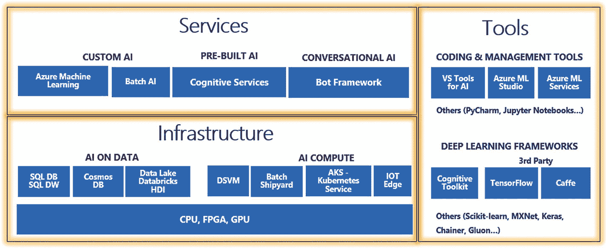

图 4-1

微软 AI 平台

在概述了微软 AI 平台之后，描述了设置深度学习虚拟机（DLVM）的步骤，这是运行后续章节以及第四部分提供的代码示例所必需的。

## 服务

微软 AI 平台由一系列服务组成，从全面管理的软件服务到构建定制 AI 应用的服务。根据场景和所需的灵活性，可能适用不同的解决方案。服务被分为三个主要领域：

1.  预构建的 AI。这些通过认知服务中已经构建好的算法，在应用中利用预构建的模型来实现看、听、说和理解。

1.  对话式 AI。这些通过 Bot 框架将自然交互集成到应用中，该框架连接到常见的渠道，如 Facebook Messenger、Slack、Skype 和 Bing。

1.  自定义 AI 服务。这些服务具有与 Azure Machine Learning 服务、Batch AI 服务或两者都有的灵活性适应场景。

### 预构建 AI：认知服务

认知服务是一套可供开发人员和数据科学家构建 AI 解决方案的服务，具有围绕视觉、语音、语言、知识和搜索的能力（见表 4-1）。认知服务主要有两种类型：

表 4-1

可在 Microsoft AI 平台上使用的示例认知服务

| 视觉 | 语言 | 语音 | 搜索 | 知识 |
| :-- | :-- | :-- | :-- | :-- |
| 计算机视觉 | 文本分析 | 说话人识别 | 网络搜索 | 学术知识 |
| 人脸 | 拼写检查 | 语音 | 图像搜索 | 实体链接服务 |
| 情感 | 网络语言模型 | 语音服务^a | 视频搜索 | 知识探索 |
| 内容审核员 | 语言学分析 |   | 新闻搜索 | 推荐 |
| 视频索引器 | 翻译器 |   | 自动建议 | QnA 制作器 |
| 视觉服务^a | 语言理解^a |   | 搜索^a | 决策服务^a |

^a 具有带来自定义数据功能的自定义认知服务。

1.  可作为 REST API 提供的预训练模型，无需任何定制即可在最终用户应用程序中消费。

1.  带来自定义数据的服务，例如自定义视觉服务，它允许开发者通过简单地上传不同类别的图像并点击一个按钮来训练模型，无需任何计算机视觉或深度学习背景，即可创建自定义图像分类模型。

以搜索能力为例，几乎每个应用程序都具备这一功能，但实现起来往往很困难，因为它需要自然语言处理和特定语言的语言学等方面。Azure Search 提供了底层搜索引擎——开发者需要创建索引以帮助搜索并填充数据，Azure Search 会处理所有底层工作，并提供丰富的功能，如智能过滤、搜索建议、词分解和地理搜索。

这些服务很受欢迎，因为它们很容易添加到应用程序中。只需几行代码就可以将一个模型，例如情感检测模型，集成到客户服务体验应用程序中。鉴于目前可用的认知服务和自定义认知服务的广泛性，这些服务在第五章 5 中进行了更详细的描述。

### 对话式 AI：Bot 框架

机器人框架包括工具和服务，使开发者能够构建与用户进行对话的机器人。例如，开发者可以轻松地开发一个与网站上的用户交互的机器人，引导他们购买产品或服务，而不是必须导航网页。通过这个框架，一次开发后，可以通过机器人框架中包含的多个渠道（如 Skype、Facebook 和 Web）公开机器人。机器人可以使用 Bot Builder 软件开发工具包（SDK）使用 C# 或 Node.js 构建，或者使用 Azure 机器人服务。

可以构建能够自然对话的机器人，特别是使用集成认知服务（如语言理解智能服务（LUIS）和其他认知服务）的高级功能。作为 Azure 上的托管服务，它是可扩展的，并且仅对使用的资源收费。

### 定制 AI：Azure 机器学习服务

Azure 机器学习服务于 2017 年晚些时候发布为公共预览版。这些服务对于构建定制 AI 解决方案和加速智能应用的端到端开发非常有用。

+   规模化开发、部署和管理模型。

+   使用开源社区中流行的工具和框架进行开发。

Azure 机器学习服务提供了一个框架来管理数据科学项目。使用这些服务，可以将最适合训练 AI 模型的计算环境带入项目中，例如：

1.  数据科学虚拟机。

1.  Databricks 或 HDInsight 上的 Spark。

1.  Azure 批量 AI。

这些计算环境将在本章后面进行描述。

实验服务有助于管理项目依赖关系，扩展训练作业，并使数据科学项目共享成为可能。模型管理服务使用基于 Docker 容器的部署来帮助数据科学家和开发者将解决方案部署到单个节点（在云或本地），以及扩展集群部署，如 Azure 容器服务，以及通过 Azure IoT Edge 的边缘部署。

到本文写作时，Azure 机器学习服务与 Python 兼容，并在多个 Azure 区域可用。此外，本章后面的“工具”部分讨论了 AI 扩展，这些扩展允许与 Azure 机器学习平台交互（[链接](http://bit.ly/aivisstdio)）。由于服务频繁更新，我们在这本书中专注于核心计算环境，并建议阅读可在[链接](http://bit.ly/AMLservices)找到的 Azure 机器学习服务当前文档。

### 定制 AI：批量 AI

Batch AI 是一种托管服务，使数据科学家和开发者能够轻松地使用 GPU 集群以规模训练深度学习和其他人工智能模型。使用 Batch AI，可以在需要时创建包括 GPU 在内的节点集群，并在作业完成后关闭集群，从而停止计费。它允许用户使用容器或 VM 构建框架特定的配置。这对于实验来说非常理想，例如进行参数扫描或实验，测试不同的网络架构，或在一般情况下进行超参数调整。它还支持在训练数据非常大时允许跨节点训练的框架的多 GPU 训练。第九章中包含了一个使用 Batch AI 训练深度学习模型的示例代码。Batch AI 还可以用于尴尬的并行批量评分场景。

批量人工智能（Batch AI）建立在 Azure Batch 之上，它是一个云规模的资源管理和任务执行工具。使用 Batch AI，你只需为使用的计算付费，标准优先级和低优先级虚拟机（VMs）均可使用。在一般情况下，没有额外的费用用于作业调度或集群管理。低优先级 VMs 为低优先级作业提供了一种成本效益的解决方案，例如学习和实验。

与 Batch AI 相关，Batch Shipyard 是一个开源工具，它是托管 Batch AI 服务的先驱，也运行在 Azure Batch 基础设施之上。Batch Shipyard 支持 Docker 和 Singularity 容器，以及开发深度学习解决方案时重要的场景，如超参数调整。Batch Shipyard 还可以用于深度学习模型的批量评分。关于 Batch AI 和 Batch Shipyard 的更多详细信息可以在本书的第四部分找到。

## 基础设施

在本节中，我们概述了可用于人工智能计算的设施，例如数据科学虚拟机（DSVM）、Spark 集群，以及用于管理容器部署的设施以及存储数据的设施，这些数据可用于构建人工智能，例如 SQL 数据库、SQL 数据仓库、Cosmos DB 和数据湖。

### 数据科学虚拟机

DSVM 是云中为数据科学和 AI 模型开发、部署预配置的环境。它提供 Windows Server 版本以及 Linux 版本，还有一个专门用于深度学习的版本，称为 DLVM，它运行在 GPU 上。如图 4-2 所示，数据科学开发中常用的流行语言，如 Python、R 和 Julia，可以立即使用，并且可以从许多数据存储中连接数据，如 SQL 数据仓库、Azure Data Lake、Azure 存储和 Azure Cosmos DB。许多 ML 和 AI 工具预先安装，例如许多流行的深度学习框架。数据科学家和开发人员可以根据需要自定义虚拟机。还有一个专门用于地理空间分析的变体，即 Geo AI DSVM：[`http://aka.ms/dsvm/geoai/docs`](http://aka.ms/dsvm/geoai/docs)。

DSVM 在数据科学家中非常受欢迎，以下是一些原因：

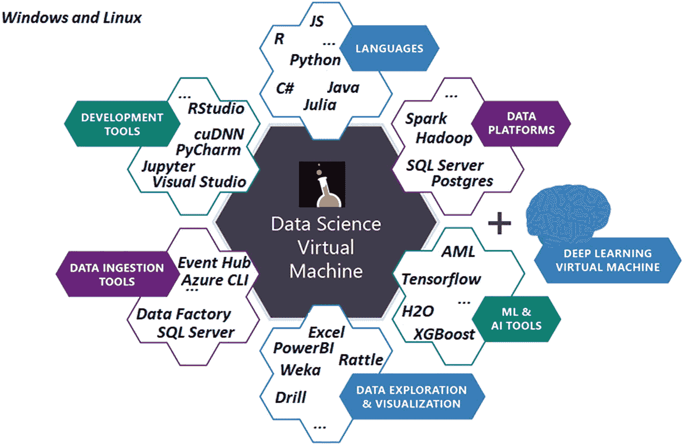

图 4-2

数据科学虚拟机的功能，如描述在[`http://bit.ly/DataScienceVM`](http://bit.ly/DataScienceVM)。

+   它们提供了一个易于设置的云分析桌面，并能够更容易地在同事之间转移项目。

+   它们具有按需弹性容量，能够开启和关闭（例如，如果夜间没有作业运行，则停止虚拟机）。

+   内置了示例和模板，以帮助开始数据科学和深度学习。

+   可以连接到其他服务，例如在通过 Azure Machine Learning 服务管理的项目中使用 DSVM 作为计算目标，或者作为 Batch AI 服务的计算资源。

+   由于设置简单且节省成本，与购买硬件和管理软件相比，它们易于用于数据科学培训和教育工作。

尤其对于深度学习来说，设置基于 GPU 的系统可能非常困难，需要所有必要的驱动程序和配置。DLVM 使得设置变得容易得多，并且可以在单个虚拟机上配置多达四张 GPU 卡。虚拟机没有软件成本，NC6 系列的定价从每小时 0.90 美元开始。

DSVM 可以用于实验和简单的部署场景，例如使用 Flask 运行简单的 Web 服务，并结合 Azure Automation、Azure Functions 和 Azure Data Factory 等功能来触发在 DSVM 上运行的作业。

### Spark

在 Azure 上运行 Spark 有几种选择，包括 Azure Databricks、Azure HDInsight 以及利用 Azure 分布式数据工程工具包（AZTK）作为核心示例。Databricks 是一个为 Spark 提供丰富体验的托管平台，对于数据科学家和开发者来说，它提供了团队合作体验和版本控制功能。该服务处理了集群的大部分调优工作，因此对于可能不知道或不想配置 Spark 的用户来说非常理想，但在配置集群方面并不那么灵活。HDInsight 是一个完全托管的云服务，除了 Spark 之外，还包括开源分析工具如 HBase、Hive、Storm 等。

AZTK 是一个开源的 Python 命令行界面（CLI）应用程序，用于在 Azure 上按需配置 Spark 集群。Spark 集群在 Docker 容器中运行，具有“自带”Docker 镜像的灵活性，平均在 5 分钟内配置完成，低优先级虚拟机可享受 80%的折扣。此工具包适用于按需运行分布式 Spark 工作负载，如批量工作负载，并且可以安排启动和关闭，例如通过使用 Azure Functions。它具有丰富的 Python SDK，用于对集群和作业进行编程控制。AZTK 在支持所有虚拟机类型（包括 GPU）方面是最灵活的选项，这对于深度学习场景特别有帮助。

对于所有这些 Spark 基础设施选项，Microsoft Machine Learning for Apache Spark (MMLSpark)为 Apache Spark 提供了一系列深度学习和数据科学工具，包括与深度学习框架 CVTK 的集成。Spark 也通过旨在改进对图像数据支持等方面支持的协作，最近在深度学习应用方面取得了改进，如[`bit.ly/SparkImage`](http://bit.ly/SparkImage)所述。

### 容器托管

Azure Kubernetes Service (AKS)是一个完全托管的 Kubernetes 容器编排服务。用户也可能通过原始版本，即 ACS，选择其他编排器。使用 AKS 的完全托管版本，唯一的花费是用于执行任务的虚拟机；换句话说，管理基础设施是完全免费的。AKS 是一个通用的计算平台，极其灵活。对于 AI 工作负载，此类服务通常用于托管可扩展的 AI 模型以进行实时评分，尽管 AKS 也可以用于可扩展的 AI 训练。Azure 机器学习服务包括一个模型管理服务，它简化了将 AI 模型作为 REST API 部署到 Azure 容器服务的过程，如图 4-3 所示。

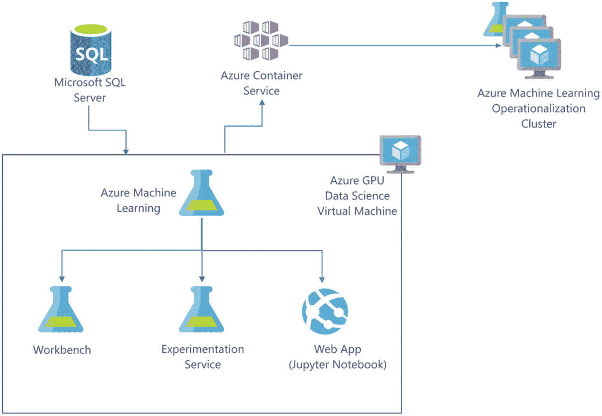

图 4-3

以下是一个示例深度学习解决方案架构，其中数据存储在 SQL Server 中，代码使用由 Azure Machine Learning 服务管理的深度学习虚拟机开发，并以 Rest API 的形式部署到 Azure 容器服务中，具体描述请见[`bit.ly/DLArch`](http://bit.ly/DLArch)。

Azure 容器服务为用户提供开源 Kubernetes 的好处，同时内置管理功能以简化复杂性和运营开销。AKS 带有自动升级、扩展能力和通过 Azure 上托管的控制平面实现的自我修复功能。对于那些需要更多灵活性的人来说，ACS Engine 是一个开源项目，允许开发者构建和使用自定义的 Docker 启用容器集群。

开发者还可以使用 Azure 容器实例托管容器，其中容器可以在没有容器编排器的情况下托管，这对于测试或托管不需要扩展的简单应用程序特别有用。Azure App Service 是一组由 Web App、Web App for Containers 和 Mobile App 组成的托管和编排服务。例如，Web App 允许开发者托管 Web 应用程序或 API，而 Web App for Containers 允许用户使用来自 Docker Hub 或私有 Azure 容器注册表的镜像部署和运行容器化的 Web 应用程序。

### 数据存储

Azure SQL 数据库是一种关系型云数据库服务，内置智能，专为具有独立更新、插入和删除操作（OLTP）的应用程序而设计。Azure SQL 数据仓库不是一个严格用于 OLTP 工作负载的数据仓库，因为它希望更易于使用于大型数据库，并具有额外的功能，如暂停以节省成本。SQL 数据库支持的活跃连接和并发查询比 SQL 数据仓库多，而 SQL 数据仓库支持 Polybase 技术，这是一种通过 T-SQL 语言访问数据库外数据的技術。通常这些服务与更大的数据架构一起使用。

Azure Cosmos DB 是一种全球分布式的多模型数据库服务，它能够实现极低的延迟和大规模可扩展的应用程序。它原生支持 NoSQL，并且可以在一个服务中支持键值、图、列和文档数据。包括 SQL、Apache Cassandra 和 MongoDB 在内的多个不同的 API 可以用来访问数据，并且提供了多种一致性选择，如强一致性、有界不新鲜性和最终一致性，以满足低延迟和高可用性的需求。这项服务对于不同类型的数据来说非常有用。

Azure Data Lake Store 是一个无限制的数据湖，存储非结构化、半结构化和结构化数据，这些数据针对大数据分析工作负载进行了优化。它是大规模可扩展的，并按照开放的 Hadoop 分布式文件系统（HDFS）标准构建，因此可以轻松集成到许多工具中，并允许将现有的 Hadoop 和 Spark 数据直接迁移到云端。Data Lake Store 可以存储数万亿个文件，单个文件的大小可以超过一拍字节。Azure Blob Storage 是一个独立的存储选项，它是一个更通用的对象存储，包括用于大数据分析工作负载，它们之间的比较可以在[`bit.ly/LakeVBlob`](http://bit.ly/LakeVBlob)找到。

## 工具

在前几节中，提到了一些用于开发和部署人工智能解决方案的工具和工具包，例如用于部署 Spark 基础设施的 AZTK 和用于执行批处理和高性能计算（HPC）容器工作负载的 Batch Shipyard。在本节中，我们将总结一些其他可在 Microsoft AI 平台上使用的工具，这些工具并不全面。

### Azure Machine Learning Studio

Azure Machine Learning Studio 是一个用于训练和部署机器学习模型的免服务器环境。Studio 提供了一个图形用户界面（GUI），用户可以轻松拖放配置好的模块进行数据准备、训练、评分和评估。它包含了用于常见场景（如回归和分类）的许多预构建算法，并通过 R 和 Python 脚本模块启用扩展性，其中可以插入自定义代码并将其连接到其他模块。尽管它在快速开发针对较小数据集大小的自定义机器学习解决方案方面非常有用，但我们不建议使用 Azure Machine Learning Studio 来开发深度学习解决方案，因为输入数据的大小有限，以及它运行的硬件。今天，使用 Azure Machine Learning Studio 无法带来自己的计算环境或管理跨节点的扩展计算。由于这些因素，我们建议使用 Azure Machine Learning 服务来开发深度学习解决方案。

### 集成开发环境

使用 Microsoft Azure，可以使用任何集成开发环境（IDE）或编辑器来创建人工智能应用程序。在几个流行的 IDE 中，有可用的插件或扩展，使操作更加简单，例如直接发布到 Azure。例如，Visual Studio Code Tools for AI 是 Visual Studio Code 的一个扩展，它是一个跨平台的开源 IDE。Visual Studio Tools for AI 是 Visual Studio 的一个扩展，用于开发具有设置远程计算上下文能力的 AI 应用程序。在撰写本文时，我们建议使用 Visual Studio Tools for AI，并在本章后面包含一个使用此工具的示例。

这些 IDE 具有加速开发的良好功能，但当然，其他流行的 IDE，如 PyCharm 和 RStudio，也可以用来开发将在 Microsoft AI 平台上运行的代码，并且随着时间的推移将提供更多扩展。此外，Jupyter notebooks 可以被利用，并且已经在 DSVM 上设置了开发环境。Azure Notebooks 是另一个使用托管 Jupyter notebooks 运行代码的选项；Azure Notebooks 完全免费，但这些不支持在 GPU 上运行，因此对于深度学习解决方案来说不太实用。

### 深度学习框架

Microsoft AI 平台是一个基于开源技术最佳实践的开源平台。许多已提到的工具、服务和基础设施都支持深度学习框架，如 Microsoft Cognitive Toolkit (CNTK)、Tensorflow、Caffe 和 PyTorch，这些都是开源项目。DLVM 预配置了许多流行的框架，这些框架可以用来开发 AI 解决方案，并部署在 Azure、Azure IOT Edge 或 Windows Machine Learning 上，例如。这些框架在第二章 2 中有更详细的讨论。

## 更广泛的 Azure 平台

实际上，Azure 还有许多其他组件经常被用来构建 AI 解决方案，以补充 AI 特定服务，满足其他需求，如处理流数据流的摄取和处理、身份验证和仪表板。例如，Azure IOT Hub 允许开发者安全地将 IOT 资产连接到云，Azure Stream Analytics 可以像 SQL 一样处理实时数据，而 Power BI 则基于许多不同的数据源，在仪表板上提供丰富的交互式可视化。

其他一些常用的服务包括 Azure Functions 和 Azure Logic Apps，如图 4-4 所示。Azure Functions 是一种无服务器服务，它允许开发者简单地编写他们想要执行的代码，无需担心代码运行的底层基础设施，只需代码运行时才付费。所编写的函数（如使用 C#、Node.js 和 Java 等语言）可以按计划运行或由事件（如 HTTP 请求或另一个 Azure 服务中的事件）触发。例如，每当有新图像上传到 Azure Blob Storage 时，函数就会被触发，对图像进行缩放，并通过其中一个示例调用托管的人工智能模型。Azure Logic Apps 也是无服务器服务，仅在运行时收费，并且可以自动化业务流程。作为一个简单的例子，当电子邮件到达 Office 365 时，Azure Logic Apps 可以被激活，然后触发一个过程来检查 SQL Server 中的数据，并在验证后向最终用户发送短信。除了来自 Microsoft 的服务外，还有基于 Azure 生态系统构建的服务和工具市场。

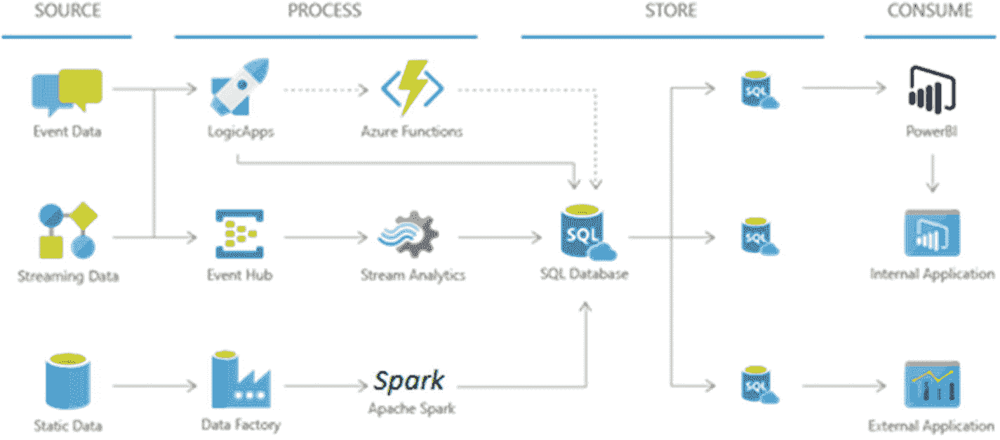

图 4-4

从 `http://bit.ly/AzureSQLArch` 下载的包含集成组件的示例架构，用于在 Azure 平台上管理数据流到最终应用程序。

## 开始使用深度学习虚拟机

在本书第三部分接下来的代码示例中，需要一个启用 GPU 的机器。如果您计划使用自己的启用 GPU 的机器来跟随代码示例，您可以跳过本节；如果不是，请继续阅读。正如我们之前提到的，Azure 提供了一个已经预配置了许多深度学习和机器学习库的虚拟机，称为 DSVM/DLVM。我们可以使用门户或 Azure CLI 创建 DLVM。有关配置虚拟机的说明，请参阅 `http://bit.ly/CreateDLVM`。您可以通过遵循 `http://bit.ly/AzureCLI` 上的说明在本地安装 Azure CLI。如果您不想安装任何东西，您可以直接访问 `https://shell.azure.com` 并从那里使用 CLI。有关如何使用 CLI 配置 DLVM/DSVM 的说明，请参阅 `http://bit.ly/DLVM-CLI`。

为了节省您的时间和精力，列表 4-1 是一组命令的片段，这些命令将在 NC6 虚拟机上为您创建一个 Linux DSVM。它还将驱动器大小增加到 150 GB，为 Jupyter 笔记本服务器打开适当的端口，并根据您为虚拟机提供的名称创建一个域名系统 (DNS) 名称。Azure CLI 以及扩展到 Azure 云壳都是非常强大且易于访问的工具，可以为您节省大量时间。

```py
BASH
location=eastus
resource_group=myvmrg
name=myvm
username=username
password=password
az group create --location $location --name $resource_group
az vm create \
--resource-group $resource_group \
--name $name \
--location $location \
--authentication-type password \
--admin-username $username \
--admin-password $password \
--public-ip-address-dns-name $name \
--image microsoft-ads:linux-data-science-vm-ubuntu:linuxdsvmubuntu:latest \
--size Standard_NC6 \
--os-disk-size-gb 150
az vm open-port -g $resource_group -n $name --port 9999 --priority 1010
Listing 4-1
Create VM
```

请确保您将列表 4-1 中的用户名和密码更改为合适的设置。列表 4-1 中的代码将在 EastUS 区域创建虚拟机 (VM)；如果您希望它在不同的区域，请随意更改。一旦虚拟机启动并运行，您应该能够使用分配给虚拟机的 DNS 名称以及您指定的用户名和密码通过 Secure shell (ssh) 登录到它。

### 运行笔记本服务器

我们假设您已经设置了一个 Linux DLVM/DSVM 并且能够通过 ssh 登录到它。一旦您已经通过 ssh 登录到机器，启动 Jupyter 笔记本服务器。您可以从 `http://bit.ly/Ch06Notebooks` 下载笔记本到虚拟机中。然后导航到您下载笔记本的文件夹，并在终端中运行列表 4-2 中显示的代码。

```py
BASH
source activate py35
jupyter notebook –ip=* --port=9999 –no-browser
Listing 4-2
Start Notebook Server
```

打开浏览器并输入您的虚拟机（VM）的 IP 地址或 DNS，例如 `mydlvm.southcentralus.cloudapp.azure.com:9999`。不要忘记最后的端口号。¹ 您将被要求输入一个授权令牌，该令牌可以在终端中看到。如果您想配置 Jupyter 笔记本使用用户名和密码，或者设置成不需要输入端口号或其他参数，请参考[`bit.ly/jupyternbook`](http://bit.ly/jupyternbook)上的指南。

## 摘要

本章概述了微软 AI 平台的一套服务、工具和基础设施，用于构建 AI 解决方案。构建 AI 解决方案需要大量的实验和专门用于深度学习的硬件，而利用云计算与服务和工具的结合可以加速智能应用程序的开发过程。

此外，AI 还被以其他方式融入微软的各个产品中，例如 AI 的本地解决方案，如 SQL Server 2017 和微软机器学习服务器。SQL Server 2017 可在 Windows Server、Linux 和 Docker 上运行，并支持基于 Python 和 R 的可扩展分析的高级数据库 ML。使用 SQL Server，模型可以在数据库内部进行训练，无需移动数据，并且可以通过数据库引擎中的存储过程和本地 ML 函数自然地进行预测。此功能也包括在 Azure SQL DB 中。

在下一章中，您可以找到有关可直接注入到应用程序中的预构建 AI 的更详细概述。

注释 1

在 VM 上必须打开适当的端口。有关如何操作的说明，请参阅本章前面关于 DSVM 的部分。

# 5. 认知服务和自定义视觉

第四章介绍了可用于构建下一代智能应用程序的工具、基础设施和服务。这些共同构成了一个平台，使数据科学家和开发者能够在智能云和智能边缘上构建、训练和部署 ML 和深度学习模型。

作为微软 AI 平台中的一个选项，刚开始接触 AI 的组织可以使用认知服务来使用预构建的 AI 功能，这为组织提供了灵活性，可以快速启动 AI 工作，并将认知服务作为开发智能、创新应用程序的基础。在本章中，我们描述了如何使用认知服务。我们还以自定义视觉服务作为可定制认知服务的一个示例，说明了如何定制深度神经网络模型以用于计算机视觉任务。

## 预构建 AI：为什么以及如何？

多年来，深度学习社区的研究人员在算法上取得了巨大的进步，并利用最先进的硬件，使用公开可用的大型数据集（例如 ImageNet、CIFAR-10、CIFAR-100、Places2、COCO、MegaFace、Switchboard 等）来训练深度学习模型。这些公共数据集通常用于竞赛，以及作为深度学习算法的基准测试方法。此外，许多商业和研究组织利用私有数据集来进一步提高其模型的质量。

训练一个高性能的深度学习模型通常需要大量的计算资源。第二章描述了在 ImageNet 上训练分类器所需的计算资源量（从 256 到 1,024 个 Nvidia P100 GPU）。尽管训练时间已经显著减少（从几天到几分钟），但并非每个组织都拥有大量的 GPU 资源，也没有能力随着时间的推移保持这些 GPU 资源与最新的硬件和软件同步更新。

研究人员花费大量时间来微调他们的模型。例如，ImageNet 数据集中对物体进行分类的准确率从 71.8%显著提高到 97.3%（Russakovsky 等人，2015 年）。另一个例子是研究人员在 Switchboard 数据集上对语音识别所做的重大改进。通过结合由神经网络驱动的声学模型和语言模型、CNN 以及双向长短期记忆模型，微软研究人员将语音识别的错误率降低到 5.1%（Xiong 等人，2016 年）。基于深度学习的语音识别模型超越了专业人工转录员的性能。

预训练的深度学习模型使组织能够利用研究人员多年来取得的重大创新，并立即使用这些模型来解决常见的 AI 问题。例如，我们可以利用由高质量的语音模型支持的语音转文本 API，或者在大规模的人脸、场景、名人等数据集上训练的计算机视觉 API。这些使得组织能够快速开发智能应用，而无需花费大量时间来训练模型。

在第二章，我们介绍了如何将迁移学习应用于计算机视觉任务，其中您可以使用预训练模型作为基础模型，并通过提供新的标记图像来适应新的领域。为了使组织更容易使用自定义深度学习模型，自定义视觉（认知服务之一）允许您通过按几个按钮快速上传图像并训练自定义图像分类器。同样，您可以通过上传特定领域的数据（`.wav` 文件、文本文件或两者）来定制声学模型，使用自定义语音（另一个认知服务）以提高在各种环境中的准确性。

更多信息

在[`bit.ly/CustomSpeech/`](https://azure.microsoft.com/en-us/services/cognitive-services/custom-speech-service/)了解更多关于使用自定义语音服务创建自定义声学和语言模型的信息。

在本章中，我们专注于计算机视觉服务。我们介绍了您可以直接使用的不同类型的预构建计算机视觉服务。然后，我们描述了如何使用自定义视觉服务来训练自定义图像分类器。

## 认知服务

认知服务通过利用预构建的 AI 模型，使开发者能够快速入门。要开发使用一个或多个认知服务的 AI 应用程序，开发者可以利用每个认知服务提供的 API。这使得开发者能够使用各种编程语言（例如，C#、Java、JavaScript、PHP、Python、Ruby 等）开发智能应用程序。

图 5-1 展示了应用程序如何与认知服务交互。应用程序向认知服务 URL 发送请求。例如，使用认知服务标记图像（识别图像中找到的对象的标签）的请求 URL 为 `https://[location].api.cognitive.microsoft.com/vision/v1.0/tag`，其中 location 指的是 API 创建的支持的地理区域之一（例如，西 US、西 US 2、东 US、东 US 2、西欧、东南亚等）。有关认知服务支持的区域列表，请参阅[`bit.ly/CogServices`](http://bit.ly/CogServices)。

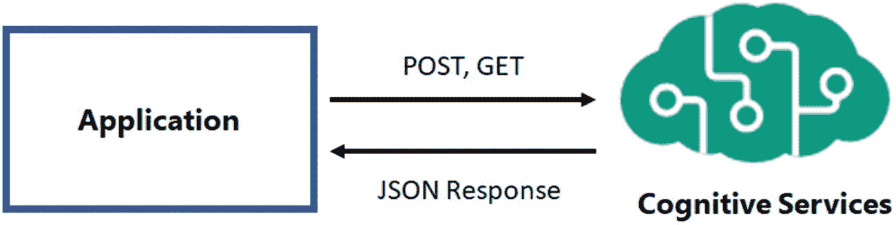

图 5-1

使用认知服务的应用程序

图 5-2 展示了计算机视觉 API 的 REST API 文档。当向认知服务发送请求时，您需要在请求头中提供内容类型和订阅密钥（称为 Ocp-Apim-Subscription-Key）。请求处理完毕后，结果将以 JSON 对象的形式返回。在图 5-3 中，您可以看到在应用程序提交图像进行标记后返回的标签（例如，草地、户外、天空等）。

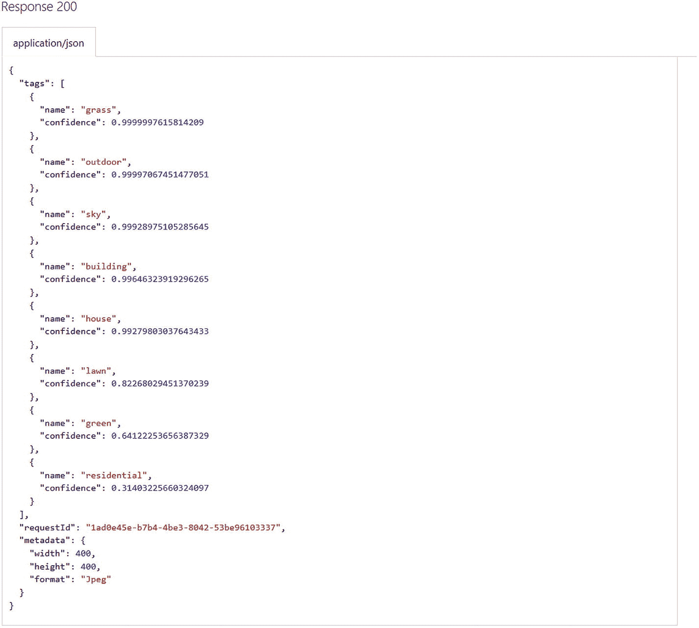

图 5-3

标记图像请求的 JSON 响应

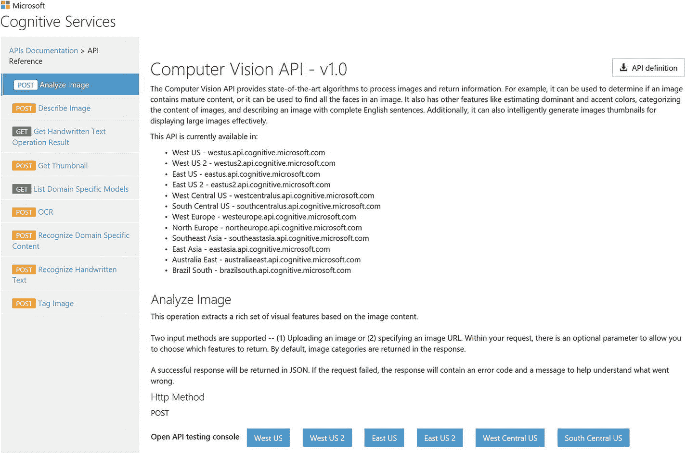

图 5-2

计算机视觉 API 的 REST API 文档。来源：[`http://bit.ly/ComVisionAPIv1`](http://bit.ly/ComVisionAPIv1) 。。

## 哪些认知服务类型可用？

认知服务提供了一套强大的预构建 AI 服务，如下所示。

+   视觉：提供最先进的图像处理算法，提供图像分类、标题、光学字符识别（OCR）和内容审核。

+   知识：提供 API，使您能够快速从用户提供的常见问题（FAQ）、文档和内容中提取问答对。其他知识 API 包括自定义决策服务、知识探索以及命名实体识别和消歧。

+   语言：语言理解（LUIS）使开发者能够将强大的自然语言理解能力集成到各种应用中。其他语言服务包括 Bing 拼写检查、文本分析、翻译等。

+   语音：提供 API，用于实时语音翻译、将语音转换为文本、说话人识别和定制语音模型。

+   搜索：提供 API，使开发者能够即时访问 Bing 的各种功能。这包括自动建议、新闻搜索、网页搜索、图片搜索、视频搜索和自定义搜索。

在本章中，我们描述了如何使用作为认知服务一部分的计算机视觉 API。我们建议感兴趣的读者通过访问[`http://bit.ly/MSFTCogServices`](http://bit.ly/MSFTCogServices)继续探索其他认知服务。所有认知服务都遵循类似的请求-响应模式，你将能够将使用计算机视觉 API 所学到的知识应用到其他认知服务中。

### 计算机视觉 API

计算机视觉 API 为您提供有关图像中找到的对象的信息。这些 API 基于多年将深度学习算法应用于理解图像内容的研究。在本书中，我们描述了一些执行图像分类等技术的方法。使用计算机视觉 API，这些强大的图像处理技术现在作为预构建的 AI 可用，您可以用作创建创新应用的基石。

在图像分析完成后，计算机视觉 API 返回与图像最相关的标签以及描述图像的标题。图 5-4 展示了如何使用计算机视觉 API 分析图像及其返回的结果。标题“一个人站在屏幕前”也返回，置信度为 0.74。

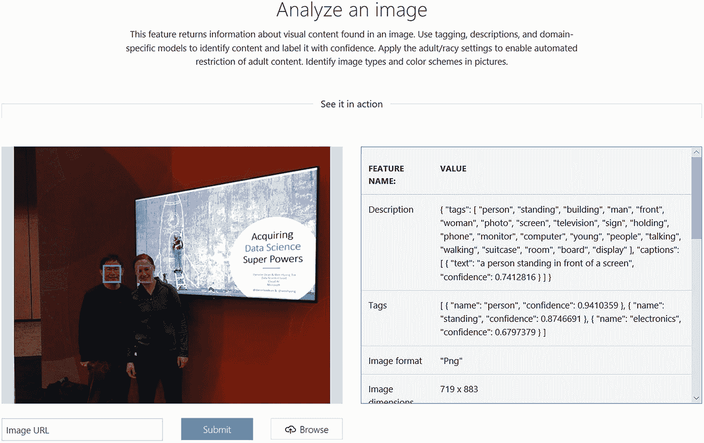

图 5-4

使用计算机视觉 API

此外，计算机视觉 API 识别了图像中的面部，并返回了关于每个面部的预测性别和年龄的信息。图 5-5 显示图像中发现了两个面部。其中一个面部是 34 岁的男性，另一个面部是 27 岁的女性。每个面部的边界框都会返回。预测的年龄取决于图像中的许多因素。

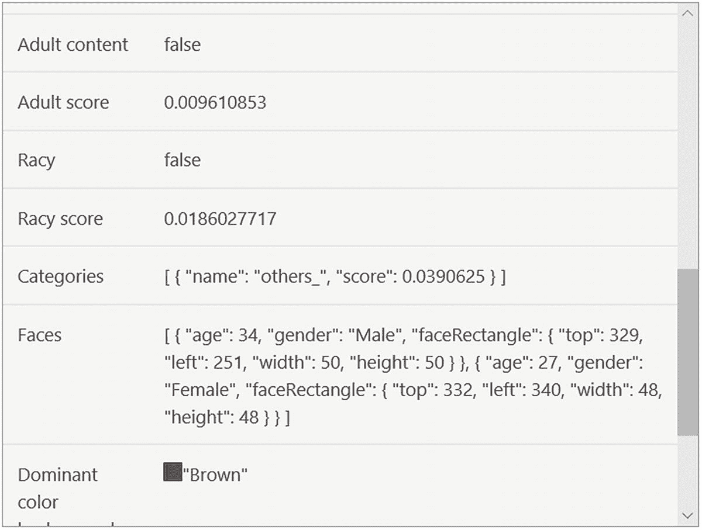

图 5-5

使用计算机视觉 API 分析图像

同时还会返回关于图像的其他信息。例如，图像会被分析以确定其是否包含成人或不当内容。这对于正在构建允许用户贡献内容的网站的开发商来说非常有用。这使开发商能够通过分析上传的图像中的令人反感的内容来审查上传的内容。

更多信息

要了解更多关于计算机视觉 API 的信息，请访问[`http://bit.ly/MSFTCompVision`](http://bit.ly/MSFTCompVision)。

使用计算机视觉 API，开发商可以构建创新的应用程序。例如，[How-Old.​net](http://how-old.net)网站（如图 5-6 所示）就是使用计算机视觉 API 构建的。您可以在图 5-7 中看到返回的结果。

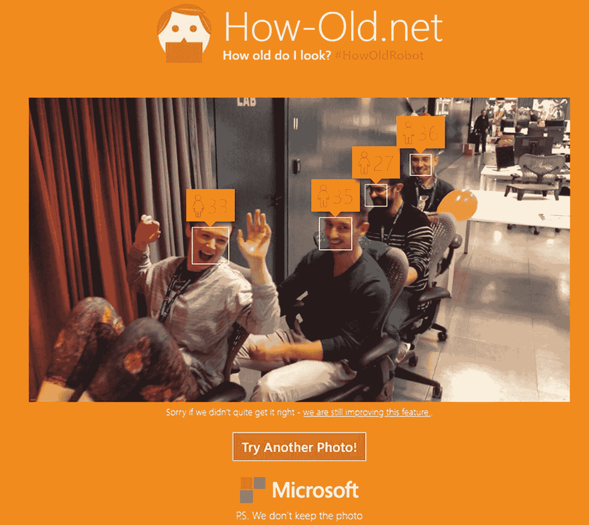

图 5-7

How-Old.Net 的结果

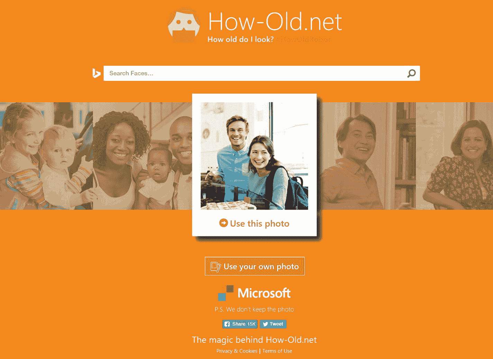

图 5-6

How-Old.net

使用计算机视觉 API 构建的创新应用程序的另一个例子是智能自助服务亭。智能自助服务亭由一系列智能体验组成，展示了如何使用认知服务。它使任何普通网络摄像头都能连接到 PC 并变成智能摄像头。

作为自助服务亭的一部分提供的智能体验之一是实时人群洞察力样本（如图 5-8 所示）。实时人群洞察力使用计算机视觉 API 作为捕捉自助服务亭互动人群实时信息的基础。这包括了解站在自助服务亭前面的人数、唯一面部的计数以及观察整体情绪。这个样本为开发在购物中心等地方部署的自助服务亭的交互式和智能体验提供了基础。

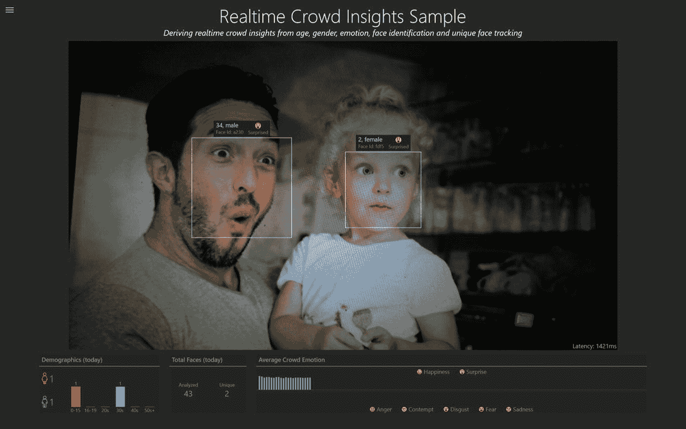

图 5-8

智能自助服务亭实时人群洞察力更多信息

智能自助服务亭的代码是开源的，可在[`http://bit.ly/IntelligentKiosk`](http://bit.ly/IntelligentKiosk)找到。

#### 如何使用光学字符识别–

计算机视觉 API 使您能够对打印和手写文本执行 OCR。为此，您可以上传图片或提供图片存储的 URL。API 将检测图片中的文本，并以 JSON 有效载荷的形式返回识别出的字符。支持多种语言，包括 UNK（自动检测语言）、英语、丹麦语、荷兰语、法语、德语以及更多。在图 5-9 中，我们上传了一张图片（如图左侧所示）。您将看到 OCR API 分析了图片，并返回了图片中找到的文本（如图右侧所示）。

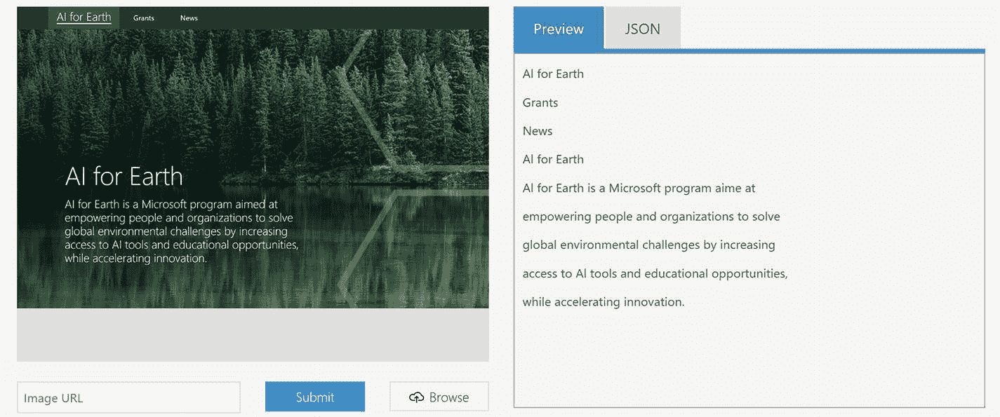

图 5-9

使用 OCR API 获取更多信息

想要了解更多关于使用认知服务的 OCR 功能的信息，请访问[`bit.ly/MSFTocr`](http://bit.ly/MSFTocr)。

#### 如何识别名人和地标

计算机视觉 API 使您能够识别名人和地标。认知服务将这些称为特定领域模型。要了解支持的不同领域（例如，名人、地标），您可以使用`/models GET`请求。图 5-10 展示了如何使用此方法从右侧提供的图片中识别“Donald E. Knuth”。认知服务可识别多达 200,000 位名人。

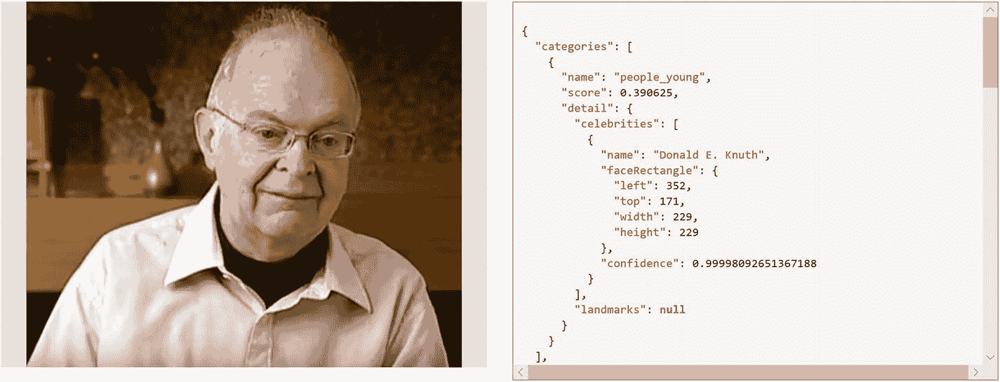

图 5-10

使用特定领域模型识别名人

此外，计算机视觉 API 还可以识别地标。图 5-11 展示了 API 如何识别新加坡的旅游胜地莱佛士酒店。认知服务可识别多达 9,000 个自然和人工地标。

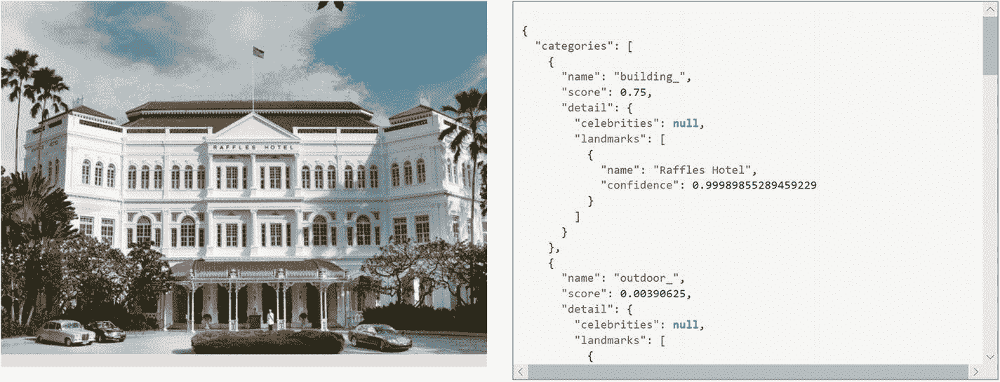

图 5-11

使用地标特定模型获取更多信息

想要了解更多关于使用认知服务识别名人和地标的信息，请访问[`bit.ly/CelebLand`](http://bit.ly/CelebLand)。

## 如何开始使用认知服务？

要开始使用认知服务，请登录 Azure 门户（portal.azure.com）。登录 Azure 门户后，您可以选择创建新的 Azure 资源。选择 AI + 认知服务。在图 5-12 中，您将看到窗口中列出的所有认知服务。

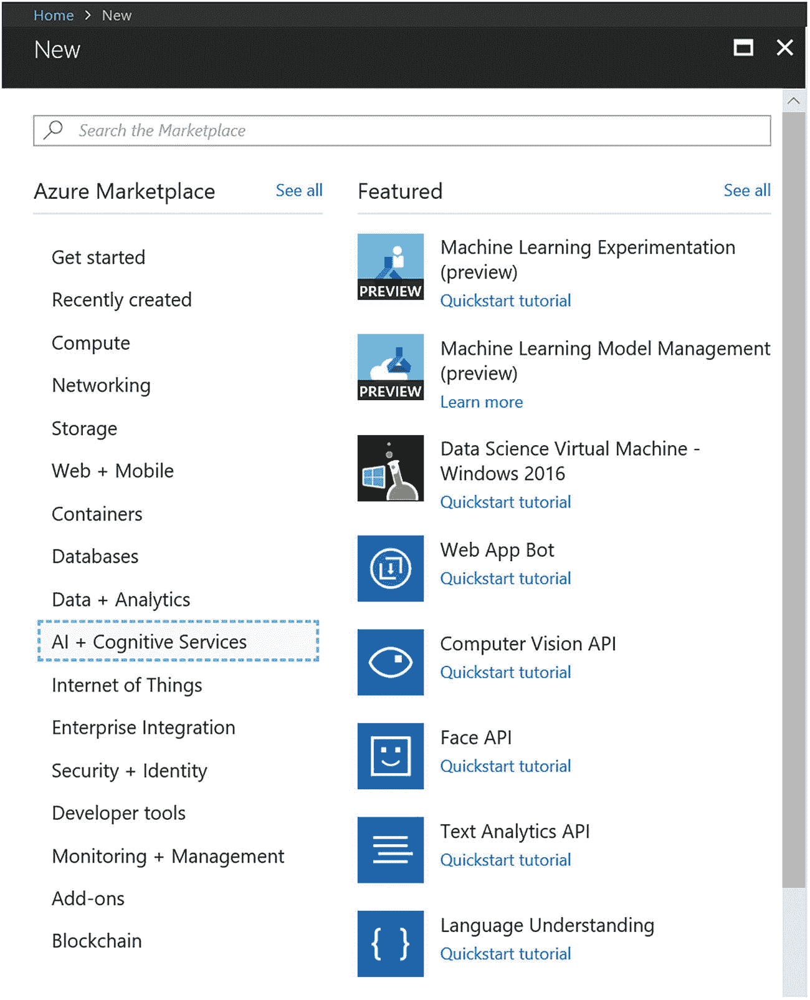

图 5-12

创建新的认知服务实例

为了说明，让我们选择计算机视觉 API。图 5-13 展示了创建新计算机视觉 API 的截图。点击创建后，您将被要求命名 API（如图 5-14 所示）并选择 API 的定价层。对于计算机视觉 API，有两个层级可供选择：FO 免费版和 S1 标准版。FO 免费版支持每分钟最多 20 次调用和每月 5,000 次调用。S1 标准版支持每分钟 600 次调用。两个层级都允许您使用计算机视觉 API 分析图像内容、识别最相关的标签、执行自动字幕、执行 OCR 和生成缩略图。

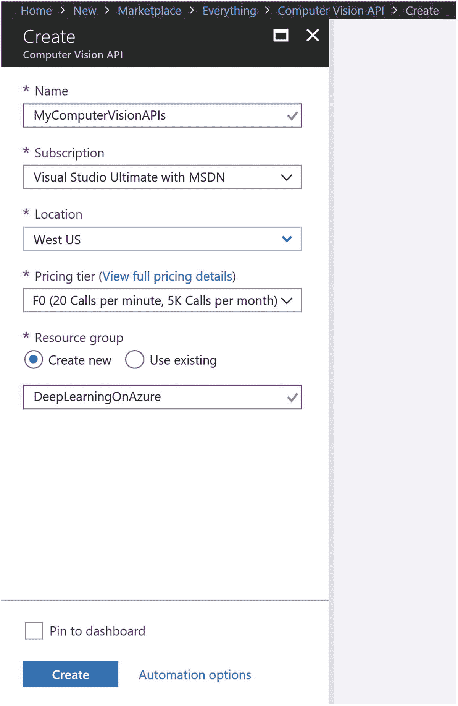

图 5-14

配置计算机视觉 API

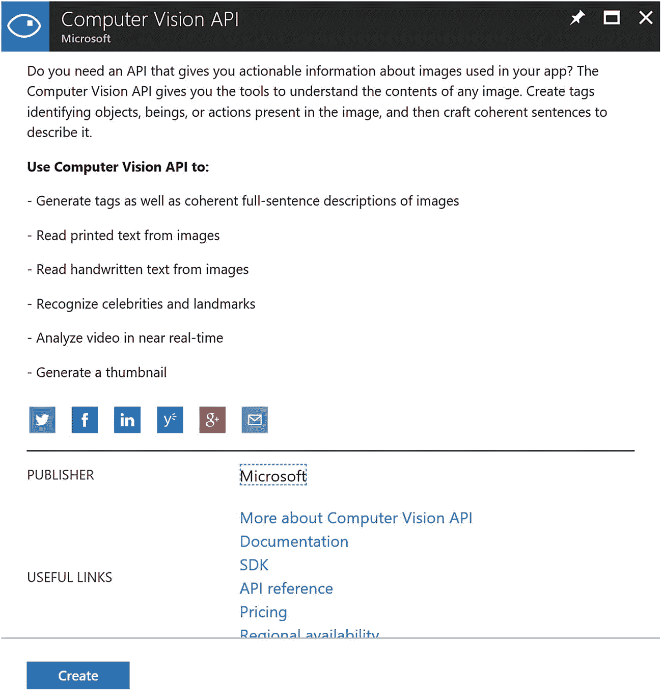

图 5-13

创建新的认知服务计算机视觉 API

创建计算机视觉 API 后，您可以使用 Azure Portal 来管理它。图 5-15 展示了如何管理新创建的计算机视觉 API。要在您的应用程序中使用该 API，您需要指定 API 密钥。您可以在管理窗口中点击“密钥”，这将显示可用的密钥。图 5-16 展示了可用的两个密钥。您可以在密钥轮换期间使用主密钥和辅助密钥。您可以在应用程序中使用任一密钥。这作为请求头的一部分进行指定。如果您正在开发用于使用认知服务的 .NET 应用程序，密钥作为 API 调用的一部分进行指定。列表 5-1 展示了访问计算机视觉 API 的示例代码。例如，您应将代码中的 `"{subscription key}"` 占位符替换为您从 Azure Portal 获得的订阅密钥。

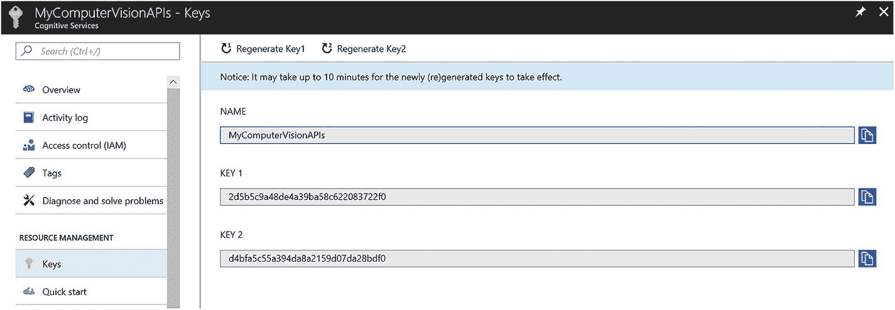

图 5-16

获取认知服务密钥

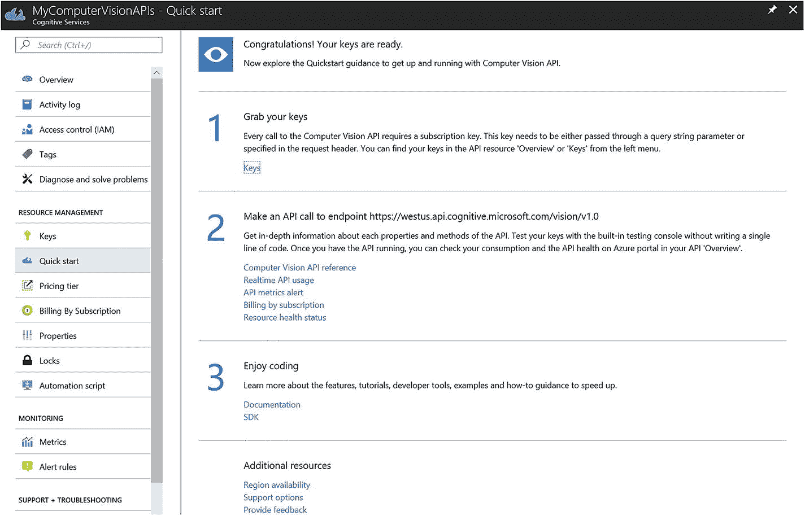

图 5-15

管理认知服务

```py
C#
using System;
using System.Net.Http.Headers;
using System.Text;
using System.Net.Http;
using System.Web;
namespace CSHttpClientSample {
static classProgram {
static voidMain() {
MakeRequest();
Console.WriteLine("Hit ENTER to exit...");
Console.ReadLine();
}
static async voidMakeRequest() {
var client = new HttpClient();
var queryString =
HttpUtility.ParseQueryString(string.Empty);
// Request headers
client.DefaultRequestHeaders.Add(
"Ocp-Apim-Subscription-Key",
"{subscription key}");
// Request parameters
queryString["visualFeatures"] = "Categories";
queryString["details"] = "{string}";
queryString["language"] = "en";
var uri =
"https://westcentralus.api.cognitive.microsoft.com/vision/v1.0/analyze?" + queryString;
HttpResponseMessage response;
// Request body
byte[] byteData =
Encoding.UTF8.GetBytes("{body}");
using (
var content =
new ByteArrayContent(byteData))
{
content.Headers.ContentType =
new MediaTypeHeaderValue("");
response =
await client.PostAsync(uri, content);
}
} // method MakeRequest
} // Program
} // namespace
Listing 5-1
Sample Code to use Cognitive Services (Computer Vision APIs)
```

## 自定义视觉

在第二章中，我们描述了数据科学家如何利用迁移学习来适应 CNN 的新领域。例如，在 ImageNet 数据上训练的 Resnet-50 CNN 可以适应其他领域的图像分类（例如，医疗保健、零售、制造业等）。

自定义视觉是认知服务家族的一部分。自定义视觉允许您使用少量标记图像快速定制最先进的计算机视觉模型以适应您的场景。在幕后，自定义视觉使用迁移学习和数据增强技术来为您的场景训练定制模型。图 5-17 展示了自定义视觉服务的主页。

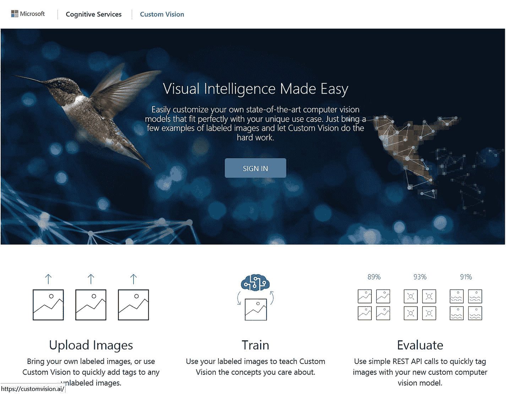

图 5-17

自定义视觉（customvision.ai）更多信息

您知道您可以使用 Custom Vision 进行编程吗？使用 C#或 Python，您可以编程创建 Custom Vision 项目，添加标签，上传图片，并训练项目。在自定义视觉模型训练完成后，您可以检索预测 URL 并测试自定义图像分类器。要了解更多信息，请访问[`http://bit.ly/CustomVisionProg`](http://bit.ly/CustomVisionProg)。

### Hello World! for Custom Vision

在本节中，我们将学习如何开始使用 Custom Vision。在`customvision.ai`页面上，点击登录。在首次登录 Custom Vision 时，您需要接受使用条款。您将被提示选择是否要使用 Azure 账户，这将使您能够处理更多的 Custom Vision 项目。如果您不登录 Azure，您将只能访问较少的配额。图 5-18 显示了登录后的初始页面。如果您没有 Azure 订阅，您可以点击稍后处理。

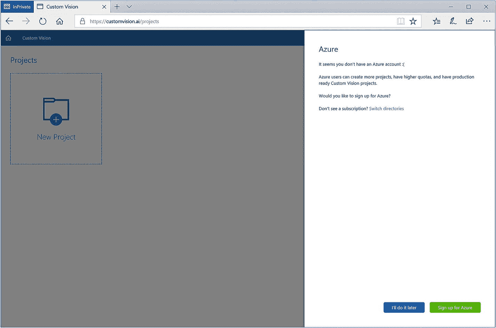

图 5-18

Custom Vision 首次登录

登录后，您可以通过点击新建项目来创建您的第一个 Custom Vision 项目。如图 5-19 所示，我们创建了第一个 Hello World Custom Vision 项目。提供了几个领域，这将使您能够定制与您的场景最相关的基模型。在这个例子中，我们选择了通用（紧凑）。紧凑领域使您能够导出训练好的模型，我们将在后面的章节中介绍。

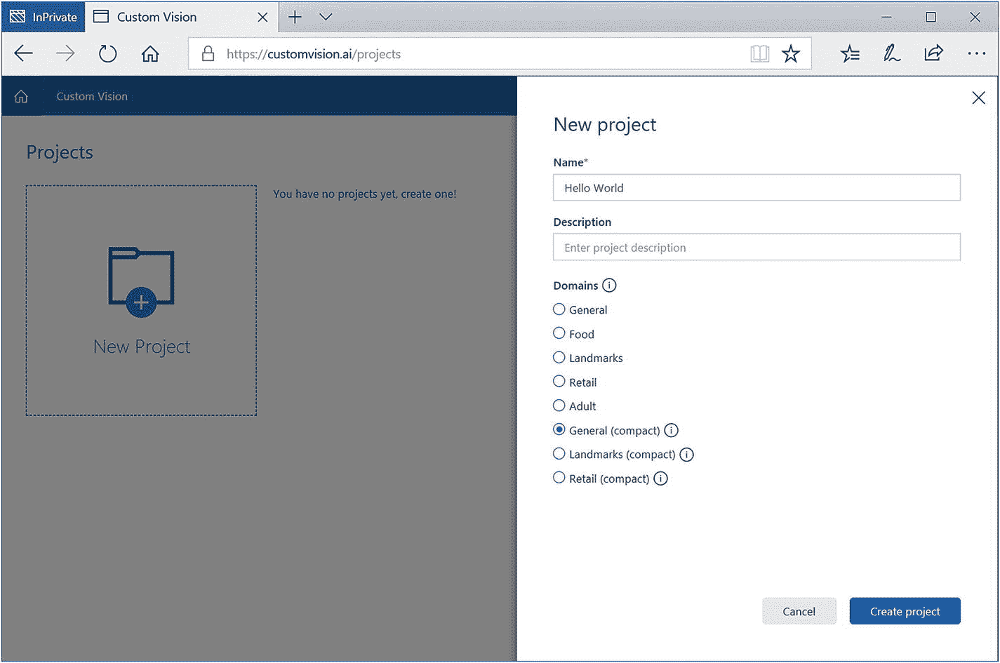

图 5-19

创建您的第一个 Custom Vision 项目

图 5-20 展示了我们想要开发的智能动物园应用的示例。在您点击创建项目后，我们就可以开始（如图 5-21 所示）。在这个场景中，我们想要开发一个应用程序，让参观动物园的孩子们能够拍下动物的照片并获取有关每种动物更多信息。

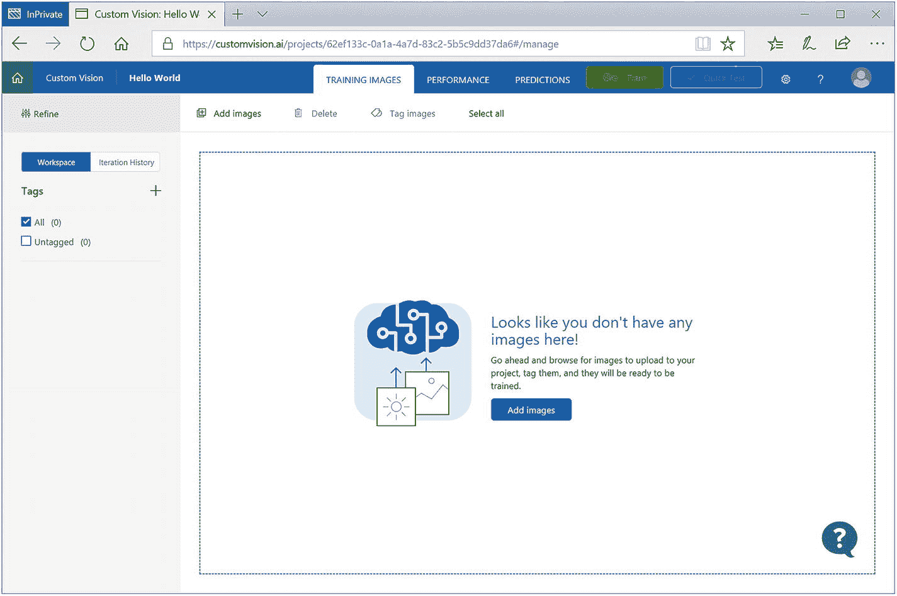

图 5-21

Hello World Custom Vision 项目

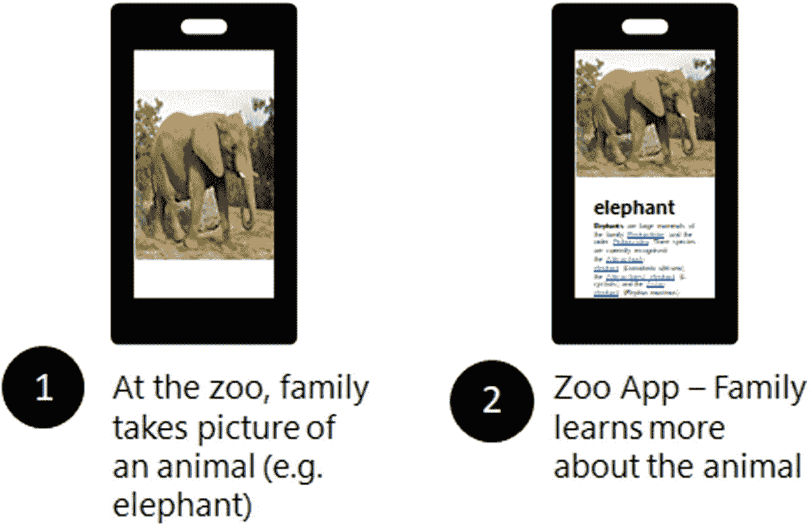

图 5-20

场景：智能动物园应用

我们需要构建一个用于动物的定制图像分类器。为此，我们将利用 Custom Vision 训练一个定制分类器，以区分不同类型的动物，长颈鹿和大象。为了训练分类器，我们将长颈鹿（如图 5-22 所示）和大象的训练图片上传到 Custom Vision。您可以使用搜索引擎（例如，必应）中的图片搜索找到长颈鹿和大象的图片。在所有图片上传完毕（如图 5-23 所示）后，我们就可以开始训练分类器了。点击训练。

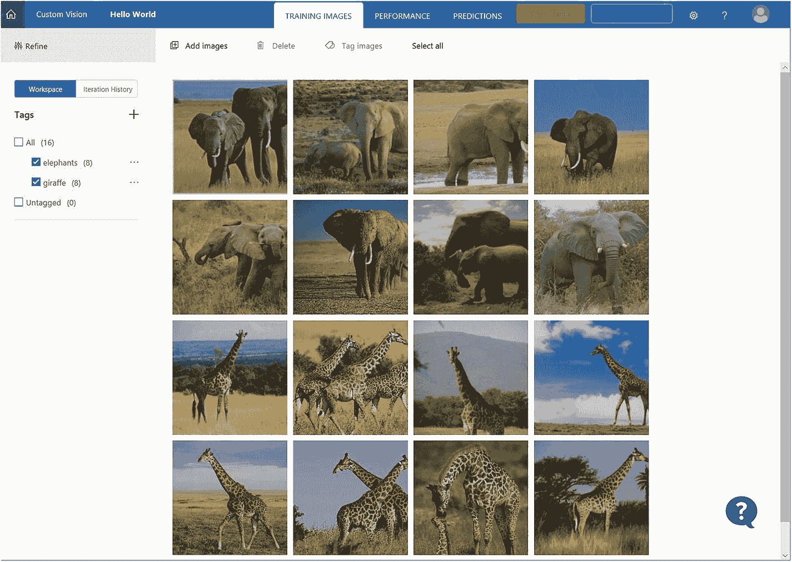

图 5-23

长颈鹿和大象的训练图片

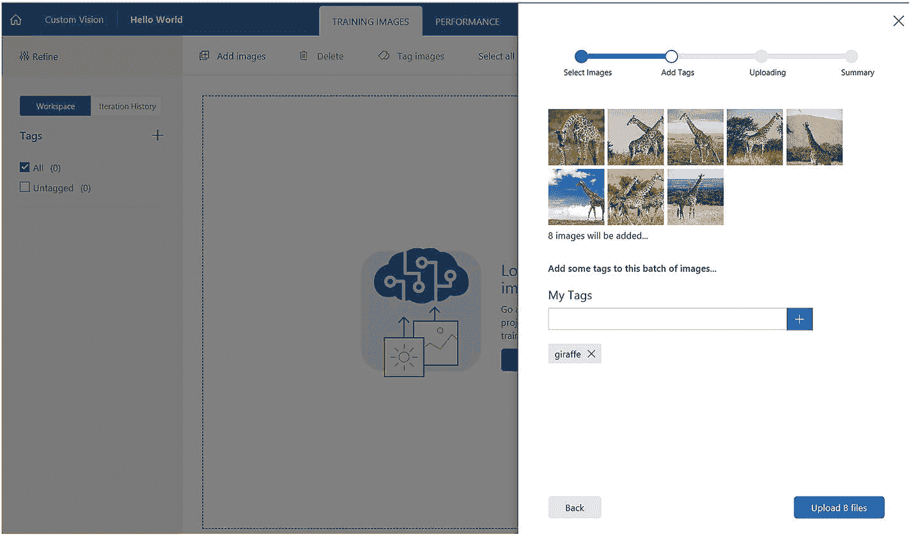

图 5-22

将长颈鹿的照片上传到 Custom Vision

训练完成后，您将看到图 5-24 中显示的评估结果。返回了整体精确率和召回率指标。此外，每个标签（即标签或类别）的性能也显示在下面。要使用 Custom Vision 模式，请点击“预测 URL”。这对应于任何应用程序都可以使用的 REST 端点。

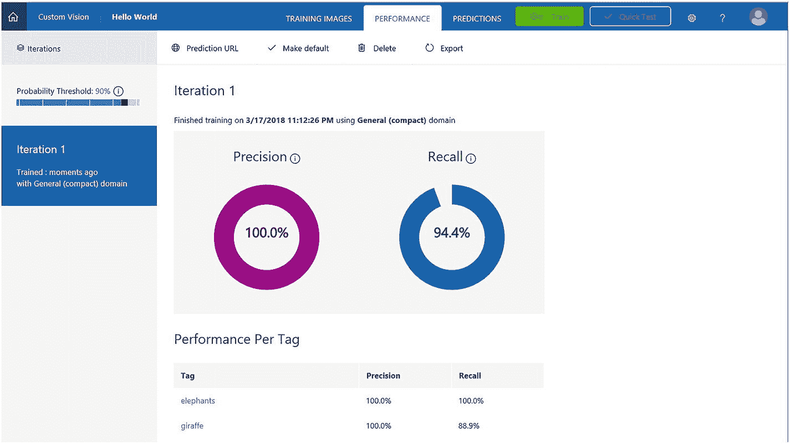

图 5-24

训练迭代 1 的评估结果

此外，我们可以通过点击“快速测试”来测试模型。我们可以提供一个图像的 URL 或上传一个图像来测试自定义计算机视觉模型。图 5-25 显示了上传测试图像和分类器返回的结果。

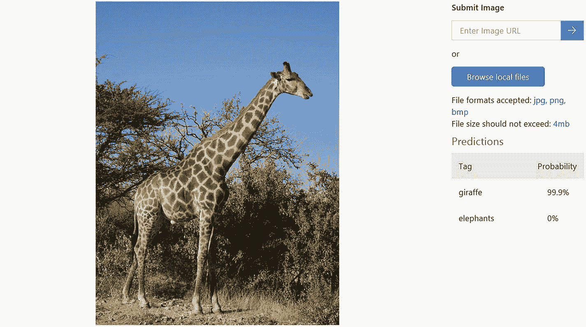

图 5-25

使用长颈鹿的测试图像进行快速测试

恭喜！我们刚刚使用训练图像完成了自定义深度学习模型的训练，这些图像对应于长颈鹿和大象。为了完全实现图 5-20 所示的场景，我们需要通过将动物园中其他动物的照片上传到 Custom Vision 来继续改进自定义图像分类器。使用每个动物有限数量的训练图像，我们可以快速构建一个针对动物的定制图像分类器。

### 导出 Custom Vision 模型

在我们训练好模型之后，我们可以开发一个使用提供的预测 URL 的应用程序。我们可能还希望模型能在设备上运行（例如，iPhone、iPad、Android 平板电脑）。是否使用预测 URL 或设备上运行的模型取决于您的使用场景。在您希望在互联网连接不可用的情况下执行推理，或者需要低延迟的情况下，将模型运行在设备上将会是一个好的设计选择。

要这样做，并开发可以离线消费模型的程序，Custom Vision 允许您导出模型。点击“导出”。此按钮仅在您使用紧凑型模型时才可用。您可以将模型导出为 CoreML、TensorFlow 或 ONNX 模型。此外，您还可以导出 Dockerfile，以便您构建一个能够提供模型服务的容器。

图 5-26 显示了导出模型时可用平台。一旦我们选择了要导出的相关平台，就可以下载相关文件（例如，`.mlmodel`用于 CoreML，`.zip`用于 TensorFlow，`.onnx`用于 ONNX 模型）。然后，这些模型可以轻松集成到 iOS、Android 或 Windows 应用程序中。

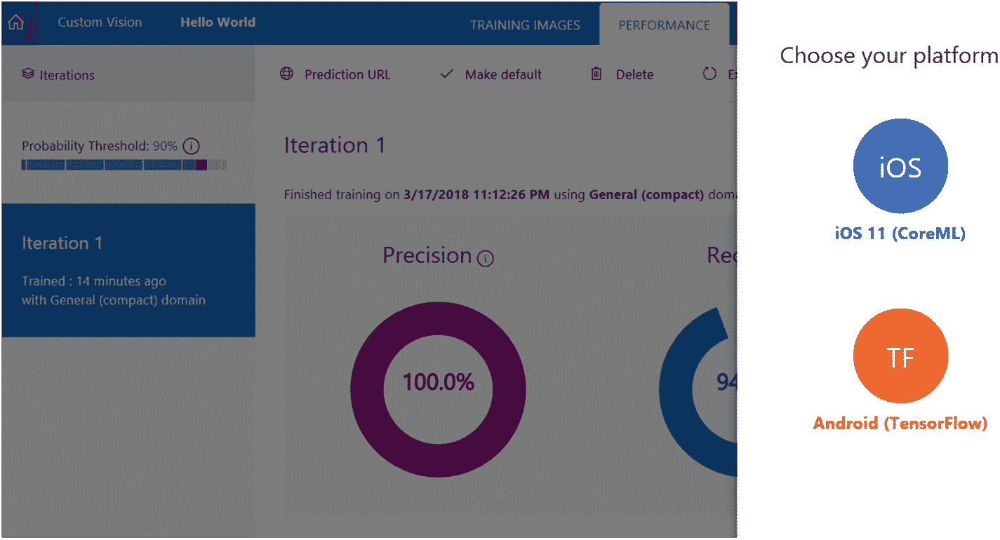

图 5-26

将 Custom Vision 模型导出为 CoreML 或 TensorFlow

## 摘要

本章讨论了作为微软 AI 平台一部分的不同类型的认知服务。这些预构建的 AI 能力使您的组织中的开发者能够立即开始实现 AI 的价值，以开发创新的应用程序。此外，我们还说明了如何使用 Custom Vision 将预训练的深度学习模型适应于计算机视觉的新数据。这使得您能够通过提供自己的数据来快速训练一个图像分类模型。为了使您能够在智能边缘（物联网边缘设备、iOS 和 Android 设备）上进行 AI 操作，Custom Vision 使您能够探索 CoreML 和 TensorFlow 模型。本章仅触及了微软 AI 平台上可用的不同认知服务的表面。我们鼓励您也深入探索其他服务，例如语言理解服务、Azure 搜索和自定义语音服务，具体取决于您的用例和需求。

在下一组章节中，我们不再关注使用此处讨论的预构建 AI 能力，而是专注于如何构建自定义深度学习模型的概述，下一章将从常见的模型，如 CNNs，的概述开始。
