# 第三部分

实践中的 AI 网络

# 6. 卷积神经网络

CNNs 是神经科学影响深度学习的典型例子（LeCun, Bottou, Bengio, & Haffner, 1998）。这些神经网络基于 Hubel 和 Wiesel（1962）所做的基础工作。他们发现视觉皮层中的单个神经元细胞只对某些方向边缘等视觉特征的呈现做出反应。从他们的实验中，他们推断出视觉皮层包含神经元细胞的分层排列。这些神经元对视觉场中的特定子区域敏感，这些子区域被拼接起来覆盖整个视觉场。实际上，它们在输入空间上充当局部过滤器，这使得它们非常适合利用自然图像中发现的强烈空间相关性。CNNs 在许多计算机视觉任务中取得了巨大成功，不仅因为从神经科学中汲取了灵感，还因为采用了巧妙的设计原则。尽管它们传统上用于计算机视觉领域的应用，如人脸识别和图像分类，但 CNNs 也被用于其他领域，如语音识别和自然语言处理中的某些任务。

本章简要介绍了卷积的概念及其与神经网络的关系。随后，它解释了构成 CNN 架构的各种元素及其作用，以及为什么 CNN 表现如此出色。最后，它涵盖了训练 CNN 的常规步骤，在深入探讨多个实际例子之前，使用 CIFAR10 数据集通过 Jupyter 笔记本训练 CNN。

CNNs 在 20 世纪 90 年代初期就取得了成功应用，当时 Yann LeCun 及其同事（LeCun, Boser, et al., 1989）利用 LeNet 架构读取邮编。然而，CNNs 在 2012 年随着 AlexNet（Krizhevsky, Sutskever, & Hinton, 2012）架构的流行而广泛传播，该架构在第一章 1 中提到的 ImageNet 大规模视觉识别竞赛（ILSVRC）中获胜，并导致了计算机视觉领域的突破。从那时起，研究人员如 VGGNet（Simonyan & Zisserman, 2014）和 ResNet（He, Zhang, Ren, & Sun, 2016）已经有许多有用的发展和推荐的架构。我们不推荐特定的神经网络架构，因为这是一个快速发展的领域，新的突破经常发生。相反，我们建议实践者选择已经由研究人员开发并测试过的架构，并在必要时对其进行调整。

## 卷积神经网络中的卷积

在讨论卷积时，为了保持简单，我们将讨论离散卷积。从数学上讲，卷积是两个函数逐点乘积的简单求和。求和可以发生在一个或多个维度上，因此对于灰度图像，求和将在两个维度上进行，而在彩色图像中将在三个维度上进行。

卷积类似于相关，在许多深度学习库中，其实际实现是相关，尽管它被称为卷积。在 CNN 的所有实际应用中，这只是一个实现细节，并不会真正影响模型的最终行为。为了直观地了解卷积的行为，图 6-1 中给出了一个简单的示例。

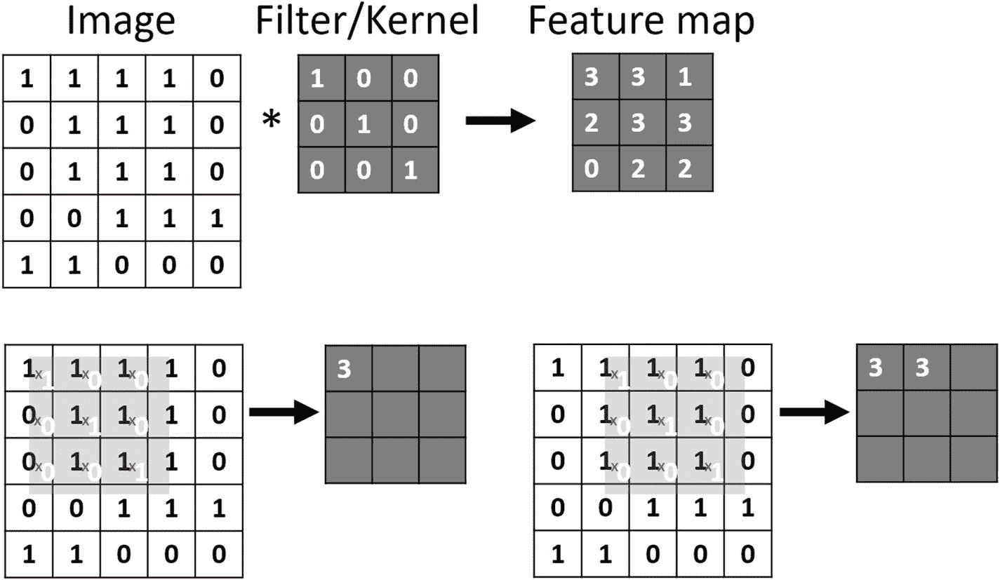

图 6-1

CNN 中的卷积

在这个例子中，图像由一个 5 `×` 5 的矩阵表示，每个像素只能取两个值，1 或 0。我们有一个检测对角线的卷积核。卷积核有时被称为过滤器或特征检测器。通过将我们的核与图像进行卷积，我们得到特征和激活图。特征图左上角的值是通过将重叠矩阵中的所有值相乘然后求和得到的。在图像的底部行中，我们可以看到将核应用于我们的图像得到值为 3。核应用于我们图像左上角区域的九个像素。如果我们按行展开这些值，我们会得到向量[1,1,1,0,1,1,0,1,1]。核对应于向量[1,0,0,0,1,0,0,0,1]。如果我们逐元素相乘这两个向量，如[1*1, 1*0, 1*0, 0*0 …]，我们最终会得到向量[1,0,0,0,1,0,0,0,1]，我们将它求和得到值 3。本质上，我们是在计算两个向量的点积，以得到一个标量值。

然后我们将核向右移动一个单位——这通常被称为步长——并再次执行相同操作。请注意，特征图比原始图像小。为了减轻这种情况，CNN 通常会对输入图像进行填充，以确保生成的特征图大小不变，因为这种恒定的减小会限制可以应用的成功卷积次数。这只是一个简单的例子，因为真实彩色图像有三个颜色通道——红色、绿色和蓝色，每个通道的像素值由 0 到 255 之间的整数表示。对于单个图像，我们的输入将是一个三维矩阵，包含宽度、高度和通道数。根据你使用的深度学习框架，有些期望通道顺序为 CHW，而有些期望通道顺序为 HWC。

### 卷积层

CNN 在所谓的卷积层中使用卷积，这些层只是由每个卷积层的权重表示的多个卷积核。卷积的维度和步长通常是预定义的，但权重是在网络训练过程中学习的。CNN 通常会有许多卷积层，每个卷积层将有自己的学习核或滤波器集。

图 6-2 是从预训练的卷积神经网络中选取的卷积滤波器。顶部行是第一层卷积层的六个滤波器。底部行是 CNN 中的最后一层卷积层。从上到下看，卷积层似乎在观察越来越复杂的模式。第一层是编码方向和颜色。第二层似乎对斑点和网格纹理更感兴趣。最后一层看起来是各种纹理的复杂组合。从这一点我们可以看出，随着我们通过网络，模式变得更加复杂，因此网络越深，卷积层将学会提取的复杂模式就越多。

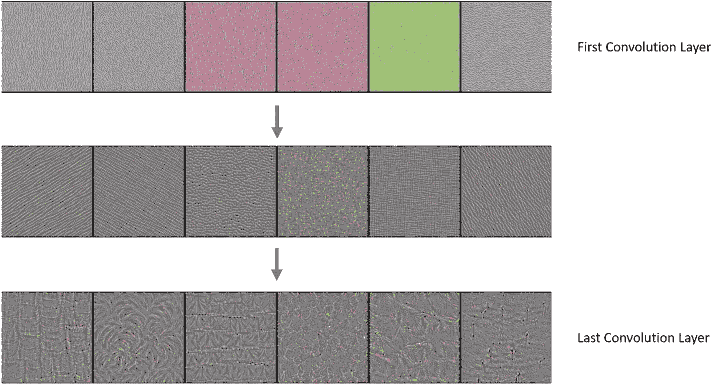

图 6-2

卷积层的可视化。对于更详细的可视化，请参阅 Zeiler 和 Fergus（2013）。

另一个值得注意的有趣现象是，如果我们看中间行的第一和最后一个滤波器，它们似乎可以是同一滤波器的轻微旋转变体。这突出了 CNN 的一个缺陷：它们不具有旋转不变性。这是 Hinton 试图通过卷积网络来克服的，如第三章所述。

### 池化层

卷积不具有等变性，这意味着它们本身并不能很好地处理输入的缩放和旋转（Sabour, Frosst, & Hinton, 2017）。现代卷积神经网络中常见的用于处理这一问题的层是池化层，其中最流行的池化层是最大池化层。最大池化层将空间相邻输出的输出替换为这些值的最大值。通常，池化层会将输出替换为基于这些输出的某种形式的汇总统计量。

通常，池化层的作用是使神经网络对输入的小幅平移局部不变，其本质是更关注是否检测到特征，而不是它在输入中的确切位置。这反过来又降低了模型的空间分辨率，被认为是 CNN 的局限性；然而，池化层已被证明极其有用。

### 激活函数

激活函数在 CNN 和一般的人工神经网络中非常重要。没有它们，CNN 将仅仅是一系列线性操作，而无法做到今天所做的那样惊人的事情。激活函数是层中神经元输出的非线性变换。它们被称为激活函数，因为它们从生物神经元的阈值和放电激活中汲取灵感。存在许多不同性质和专化的激活函数，但在这里我们只介绍最常见的类型。

#### Sigmoid

Sigmoid 或逻辑函数是一个非线性函数，它将输入压缩在 0 和 1 的值之间（见图 6-3）。

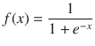

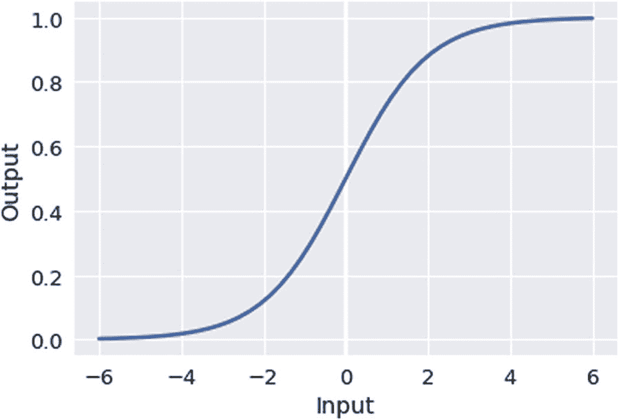

图 6-3

Sigmoid 函数

近年来，由于许多缺点，它已经不再受欢迎：

+   它存在梯度消失问题。在 1 和 0 的极端值附近，梯度是平的，这意味着当值接近这些极端值时，神经元会饱和，权重在反向传播期间不会更新。此外，连接到这个神经元的神经元会获得非常小的权重更新，本质上剥夺了它们所需的大量信息。

+   输出不是零中心。

#### Tanh

Tanh 或双曲正切函数与 sigmoid 函数非常相似；实际上，它们是 sigmoid 函数的简单缩放版本，因此它们围绕 0 中心。Tanh 将输出压缩在 -1 和 1 的值之间（见图 6-4）。在实践中，Tanh 通常比 sigmoid 更受欢迎，但它仍然存在梯度消失问题。

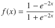

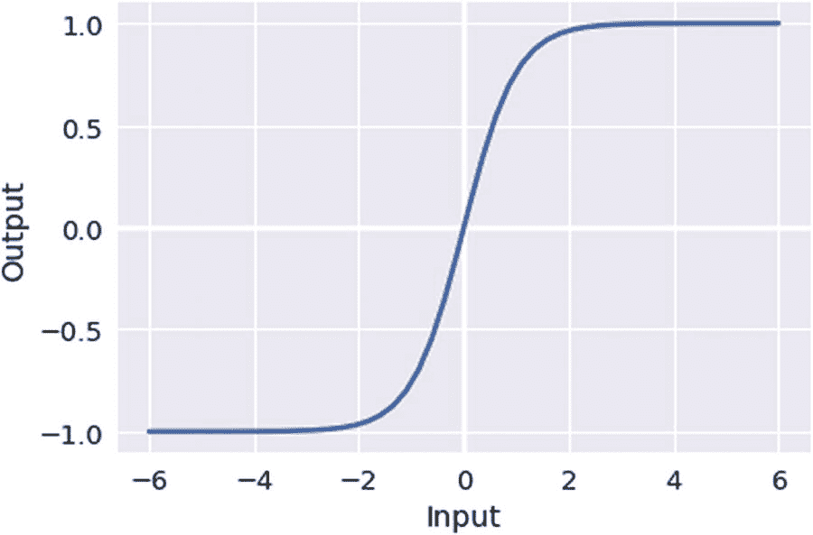

图 6-4

Tanh

#### 矩形线性单元

矩形线性单元（ReLU；见图 6-5）可能是目前最常用的激活函数（LeCun, Bengio, & Hinton, 2015）。

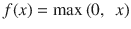

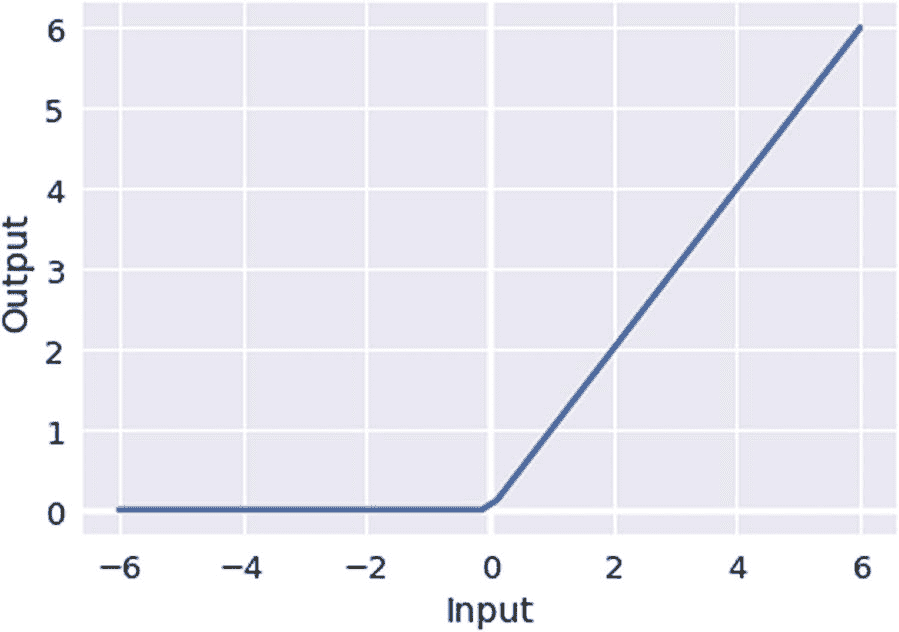

图 6-5

矩形线性单元（ReLU）

在 ReLU 激活函数中，当输入大于零时，输出与输入相同；当它小于零时，输出为零。它的流行主要归因于两个事实。首先，它在正区域不会饱和或遭受梯度消失问题。其次，它是一个计算效率高的函数，并且它还导致稀疏激活，这也带来了计算上的好处。尽管如此，它仍然存在一些缺点：

+   如果函数在正向传播过程中的输出小于零，则在反向传播过程中不会传播梯度。这意味着权重不会更新。如果 CNN 中的神经元持续表现出这种行为，则称这些神经元为“死亡”，这意味着它们不再对网络做出贡献，实际上是无用的。如果这种情况发生在 CNN 的很大一部分，它将停滞不前，无法学习。

+   对于分类任务，它不能用于输出层，因为其输出没有限制在明确的边界之间。

## CNN 架构

CNN 通常是通过在每一层之上堆叠多个层来构建的（图 6-6）。一个常见的配置如下：首先，有一个卷积层，其中多个核与输入进行卷积并产生多个特征图。然后，这些特征图通过一个非线性激活函数，如 ReLU，之后跟着一个池化层。这三个阶段通常以各种方式组合，以创建 CNN 的前几层。最终层的输出被展平，然后通过一个或多个全连接层。最终层的激活函数通常是 softmax 或 sigmoid，将输出压缩在 0 到 1 之间。

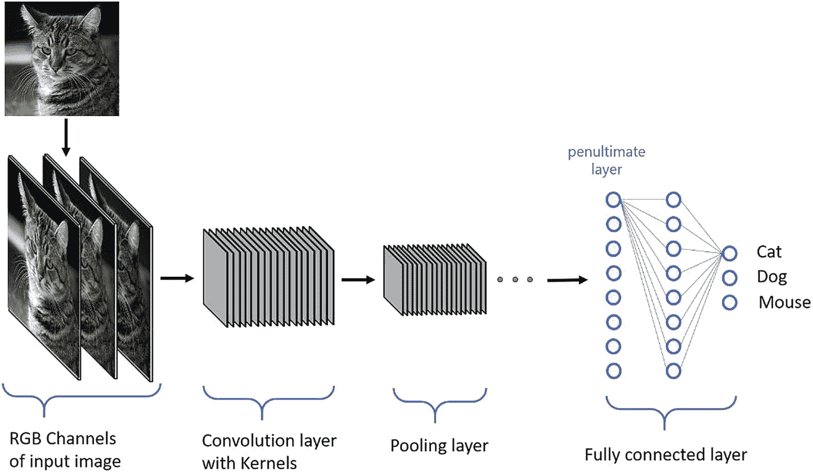

图 6-6

CNN 架构

## 训练分类 CNN

到目前为止，我们已经定义了 CNN 的外观以及信息是如何正向传播的，但我们还没有描述它是如何学习的。训练 CNN 的过程如下：

1.  我们有一个预定义的架构，包括多个卷积和池化层，以及我们的最终全连接层。CNN 的权重基于某些分布随机初始化。

1.  我们将训练图像作为一个 minibatch 呈现给 CNN，这是一个四维矩阵（批大小、宽度、高度和通道）。

1.  我们通过将图像通过卷积、池化层和激活函数进行正向传播来完成网络的正向传播，并最终得到 minibatch 中每个图像每个类别的输出概率。

1.  我们将概率与真实标签进行比较，并计算误差。

1.  我们使用反向传播来计算误差相对于 CNN 权重的梯度，并使用梯度下降来更新权重。

1.  此过程会重复进行，直到达到一定数量的 epoch¹或满足其他条件。

这是一个对发生过程的简化视图，但它捕捉了训练卷积神经网络（CNN）、目标函数、计算梯度的方法和优化方法的核心要素。

目标函数或损失函数决定了我们如何计算网络预期行为与实际行为之间的差异。本质上，它将计算我们模型的误差。常见的损失函数包括均方误差（MSE）和交叉熵。一旦我们有了误差，我们需要更新网络的权重，使其朝着正确的方向移动，以便我们的预测在下一次变得更好。这是通过一种称为反向传播的方法来实现的。

CNNs 最常用的优化方法是小批量梯度下降，通常称为随机梯度下降（SGD），尽管 SGD 与小批量梯度下降略有不同。小批量梯度下降通过迭代地根据每个小批次的梯度更新 CNN 的权重来优化目标函数。由于 CNN 中的非线性，解空间通常是非凸的，因此没有收敛的保证。对于从业者来说，这可能相当令人沮丧，但 CNN 在没有这种保证的情况下仍然表现得相当出色。所有梯度下降变体中的主要参数是学习率，它决定了应用于网络权重的更新幅度。SGD 的一个变体还包括一个动量项，该项试图通过保持参数空间中的移动方向来加速学习。它是通过将前一时间步的权重更新的一部分添加到当前更新中实现的。其他优化算法包括 Adam、RMSProp 等等。

## 为什么是 CNN

如前所述，卷积神经网络（CNNs）受到了神经科学的启发，但它们也利用了良好的工程原理，这也带来了优势。这些是稀疏连接和参数共享。当前的研究表明，神经元也具有这些特征。典型的人类神经元有 7,000 个连接（与大脑中的 10¹¹个神经元相比）。同样，每种神经元细胞类型都共享特定的功能参数。一个很好的例子是视网膜神经节细胞，它们都有效地实现了相同类型的卷积核（中心-周围对立）。这些核的权重是通过基因表达模式的进化“学习”的。

在传统的神经网络，如多层感知器（MLPs）中，每一层都与下一层的每个节点完全连接。随着层数和节点数的增加，参数的数量会急剧增加。在 CNN 中，连接通常比输入小得多，因为核是在输入上卷积的，输入由前一层的表示。因此，在一个由数千个像素组成的图像中，卷积核可能只有几十个像素。这种参数的减少提高了模型在内存和计算效率方面的效率，因为所需的计算量减少了。

第二个好处是参数共享。在标准神经网络中，下一层每个节点的输入权重仅用于该节点，而在 CNN 中，相同的核被多次使用。因此，我们不是为每个节点学习不同的参数，而是学习一组适用于所有节点的核。

## 在 CIFAR10 上训练 CNN

在下一节中，我们将逐步介绍在 CIFAR10 数据集上训练 CNN 的过程（Krizhevsky 2009；Krizhevsky, Nair, & Hinton, n.d.）。我们使用 TensorFlow 作为深度学习库来构建我们的 CNN。CIFAR10²数据集是一个常用的数据集，总共包含 60,000 张 32 `×` 32 彩色图像，分为 10 个类别（见图 6-7）。这些图像分为 50,000 个训练样本和 10,000 个测试样本。本节的代码也可以在笔记本`Chapter_06_01.ipynb`（[`http://bit.ly/Nbook_ch06_01`](http://bit.ly/Nbook_ch06_01)）中找到。

更多信息

我们建议为运行本章中的代码示例提供 Azure DLVM。请参阅第四章以获取更多信息。

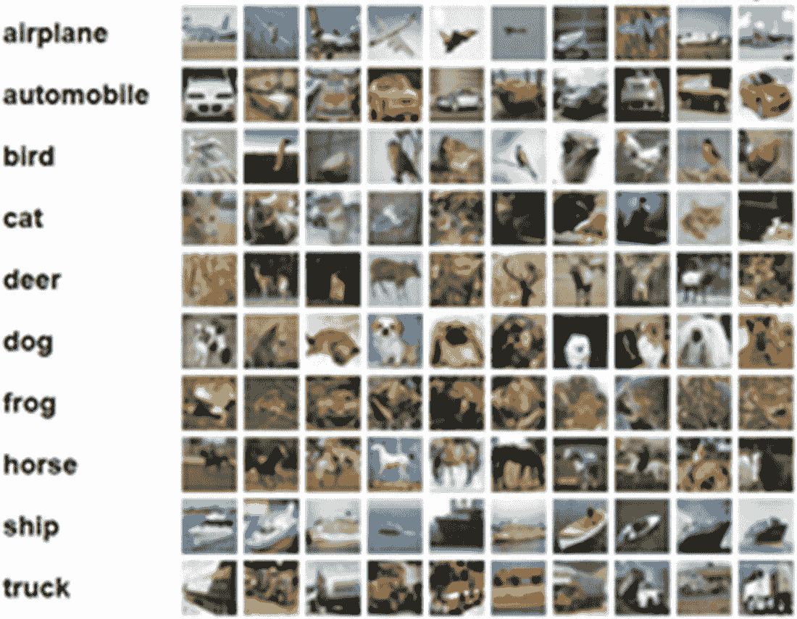

图 6-7

CIFAR10 数据集

我们将要做的第一件事是定义我们的 CNN（见列表 6-1）。它不是很深，只有两个卷积层。第一个卷积层有 50 个过滤器，第二个有 25 个，每个的尺寸为 3 `×` 3。第一个卷积层使用 ReLU 激活，第二个卷积层在执行最大池化之前也使用 ReLU 激活。之后，我们需要将我们的 Tensor 重塑为一个二维矩阵，第一个维度是批次的尺寸。之后，我们将其传递到一个具有 512 个节点的全连接层，该层使用 ReLU 激活。最后，我们引入最终的密集层，该层有 10 个输出，每个类别一个。

```py
PYTHON
def create_model(model_input,
n_classes=N_CLASSES,
data_format="channels_last"):
conv1 = tf.layers.conv2d(model_input,
filters=50,
kernel_size=(3, 3),
padding="same",
data_format=data_format,
activation=tf.nn.relu)
conv2 = tf.layers.conv2d(conv1,
filters=50,
kernel_size=(3, 3),
padding="same",
data_format=data_format,
activation=tf.nn.relu)
pool1 = tf.layers.max_pooling2d(conv2,
pool_size=(2, 2),
strides=(2, 2),
padding="valid",
data_format=data_format)
flatten = tf.reshape(pool1, shape=[-1, 50*16*16])
fc1 = tf.layers.dense(flatten, 512, activation=tf.nn.relu)
logits = tf.layers.dense(fc1, n_classes, name="output")
return logits
Listing 6-1
CNN with Two Convolution Layers
```

训练神经网络的一个重要元素是定义要使用的损失函数和优化方法（见列表 6-2）。在这里，我们使用交叉熵作为我们的损失函数，使用带有动量的 SGD 作为我们的优化函数。SGD 是深度学习的标准优化方法。我们必须定义的两个参数是学习率和动量。

```py
PYTHON
def init_model_training(m, labels, learning_rate=LR, momentum=MOMENTUM):
cross_entropy = tf.nn.sparse_softmax_cross_entropy_with_logits(
logits=m, labels=labels)
loss = tf.reduce_mean(cross_entropy)
optimizer = tf.train.MomentumOptimizer(learning_rate=learning_rate,
momentum=momentum)
return optimizer.minimize(loss)
Listing 6-2
Initialize Model with Optimization and Loss Method
```

现在我们有了创建和训练我们的 CNN 的函数，因此我们需要准备数据并将其分批喂给 CNN 的方法，如列表 6-3 所示。

```py
PYTHON
def prepare_cifar(x_train, y_train, x_test, y_test):
# Scale pixel intensity
x_train = x_train / 255.0
x_test = x_test / 255.0
# Reshape
x_train = x_train.reshape(-1, 3, 32, 32)
x_test = x_test.reshape(-1, 3, 32, 32)
x_train = np.swapaxes(x_train, 1, 3)
x_test = np.swapaxes(x_test, 1, 3)
return (x_train.astype(np.float32),
y_train.astype(np.int32),
x_test.astype(np.float32),
y_test.astype(np.int32))
Listing 6-3
Prepare the CIFAR 10 Data
```

`prepare_cifar`函数接受训练图像和测试图像作为数组以及标签作为向量。在我们能够使用 CNN 处理图像之前，我们需要进行一些预处理。首先，我们将像素值缩放到 0 到 1 之间，然后将其重塑，使得矩阵处于通道最后配置。这意味着图像数据将呈现为（示例，高度，宽度，通道）。通道指的是图像中的 RGB 通道。

接下来，我们定义一个 minibatch 函数，如果我们将数据定义为 channel last，它将返回形状为(`BATCHSIZE`, 32, 32, 3)的矩阵（参见列表 6-4）。我们还需要对数据进行洗牌，因为我们不希望以任何有意义的顺序向 CNN 提供训练样本，因为这可能会偏置优化算法。

```py
PYTHON
def minibatch_from(X, y, batchsize=BATCHSIZE, shuffle=False):
if len(X) != len(y):
raise Exception("The length of X {} and y {} don't \
match".format(len(X), len(y)))
if shuffle:
X, y = shuffle_data(X, y)
for i in range(0, len(X), batchsize):
yield X[i:i + batchsize], y[i:i + batchsize]
Listing 6-4
Minibatch Generator
```

接下来，我们加载数据，如列表 6-5 所示。

```py
PYTHON
x_train, y_train, x_test, y_test = prepare_cifar(*load_cifar())
Listing 6-5
Load Data
```

然后我们为数据和标签创建占位符，如列表 6-6 所示，并创建模型。

```py
PYTHON
X = tf.placeholder(tf.float32, shape=[None, 32, 32, 3])
y = tf.placeholder(tf.int32, shape=[None])
# Initialise model
model = create_model(X, training)
Listing 6-6
Placeholders for the Data and Labels
```

然后，我们初始化模型并开始 TensorFlow 会话。

```py
PYTHON
train_model = init_model_training(model, y)
init = tf.global_variables_initializer()
sess = tf.Session()
sess.run(init)
Listing 6-7
Initialize Model and Start the Session
```

接下来，我们训练模型所需的 epochs 数量。在这个过程中，我们执行正向传播，计算损失，然后反向传播错误并更新权重。这可能会花费相当长的时间，具体取决于你拥有的计算资源。Azure 笔记本在 CPU 上运行深度学习训练，并且计算资源有限。训练这些神经网络的一个首选环境是 DSVM 或 DLVM，它们有多种配置，包括带有 GPU 的配置。请参阅列表 6-8。

```py
PYTHON
for j in range(EPOCHS):
for data, label in minibatch_from(x_train, y_train, shuffle=True):
sess.run(train_model, feed_dict={X: data,
y: label})
# Log
acc_train = sess.run(accuracy, feed_dict={X: data,
y: label})
print("Epoch {} training accuracy: {:0.4f}".format(j,acc_train))
Listing 6-8
Loop over the Training Data for N Epochs and Train Model
```

现在我们有了训练好的模型，我们想在测试数据上评估它，如列表 6-9 所示。

```py
PYTHON
y_guess = list()
for data, label in minibatch_from(x_test, y_test):
pred=tf.argmax(model,1)
output=sess.run(pred,feed_dict={X:data})
y_guess.append(output)
Listing 6-9
Evaluate Model on Test Data
```

这段代码将 minibatch 输入到 CNN 中，并将它们追加到一个列表中。

最后，我们评估模型对真实标签的性能，如列表 6-10 所示。

```py
PYTHON
print("Accuracy: ", sum(np.concatenate(y_guess) ==
y_test)/float(len(y_test)))
Listing 6-10
Print out the Accuracy of Our Model
```

根据你训练网络的时间长短，你将得到不同的错误率。经过三个 epochs 后，网络在测试集上达到了 64%的准确率。

这只是一个简单的练习，用来说明你可以如何创建和训练自己的神经网络。你可以随意尝试不同的层，看看它如何影响性能。

创建自己的架构很有趣，但优化这些结构可能会很费力且令人沮丧。对于机器学习从业者来说，一个更有成效的策略是使用研究人员已经发表的顶尖架构，并省去尝试生成自己网络的费力过程。

## 在 GPU 上训练深度 CNN

在本节中，我们将基于上一节学到的内容，构建一个更深的 CNN。为此，你几乎肯定需要一个启用 GPU 的机器，无论是你自己的还是云上的。我们将使用 CIFAR10 数据集，但这次我们将基于 VGG 架构（Simonyan & Zisserman, 2014）构建我们的 CNN 架构。我们将使用 CNN 中使用的标准构建块逐步构建网络，并看看将这些添加到我们的网络中如何影响性能。所有步骤都可以在 notebook `Chapter_06_03.ipynb`（[`http://bit.ly/Nbook_ch06_03`](http://bit.ly/Nbook_ch06_03)）中找到。

如果你觉得这有点跳跃，这里还有一个我们在这里没有涵盖的 notebook，它介绍了每一层的输出如何受到该层设置的属性的影响（参见[`http://bit.ly/Nbook_ch06_02`](http://bit.ly/Nbook_ch06_02)）。

### 模型 1

如前所述，我们将使用 CIFAR10 数据集，因此我们的输入将是 32 `×` 32 的彩色图像，任务是将它们分类到十个类别之一。我们将基于 VGG 架构（Simonyan & Zisserman, 2014）构建我们的模型。考虑到这一点，我们的第一个网络在列表 6-11 中展示。

```py
PYTHON
conv1_1 = tf.layers.conv2d(X,
filters=64,
kernel_size=(3,3),
padding='same',
data_format=data_format,
activation=tf.nn.relu)
conv1_2 = tf.layers.conv2d(conv1_1,
filters=64,
kernel_size=(3,3),
padding='same',
data_format=data_format,
activation=tf.nn.relu)
pool1_1 = tf.layers.max_pooling2d(conv1_2,
pool_size=(2,2),
strides=(2,2),
padding='valid',
data_format=data_format)
relu2 = tf.nn.relu(pool1_1)
flatten = tf.reshape(relu2, shape=[-1, 64*16*16])
fc1 = tf.layers.dense(flatten, 4096, activation=tf.nn.relu)
fc2 = tf.layers.dense(fc1, 4096, activation=tf.nn.relu)
model = tf.layers.dense(fc2, N_CLASSES, name="output")
Listing 6-11
CNN with Two Convolution Layers
```

我们有两个卷积层，后面跟着一个最大池化层，这构成了我们 CNN 的特征提取部分。我们 CNN 的分类部分由两个全连接密集层组成，我们的最终输出大小与预期类别的数量相同。

在训练了 20 个 epoch 之后，我们的模型在测试集上的准确率为 72.1%。我们还可以看到，在我们停止训练之前几个 epoch，它在训练集上达到了 100%。通常，提前停止模型会更谨慎，通常可以在任何框架中使用回调来实现这一点。我们在这里只是简单地没有使用这些，以保持事情简单。通过运行笔记本，你应该得到类似的结果。

### 模型 2

在第二个模型中，我们添加了一个第二个卷积块。按照 VGG 架构，我们添加了两个具有 128 个滤波器的卷积层以及一个最大池化层（见列表 6-12）。这次我们将对其进行 10 个 epoch 的训练。

```py
PYTHON
# Block 1
conv1_1 = tf.layers.conv2d(X,
filters=64,
kernel_size=(3,3),
padding='same',
data_format=data_format,
activation=tf.nn.relu)
conv1_2 = tf.layers.conv2d(conv1_1,
filters=64,
kernel_size=(3,3),
padding='same',
data_format=data_format,
activation=tf.nn.relu)
pool1_1 = tf.layers.max_pooling2d(conv1_2,
pool_size=(2,2),
strides=(2,2),
padding='valid',
data_format=data_format)
# Block 2
conv2_1 = tf.layers.conv2d(pool1_1,
filters=128,
kernel_size=(3,3),
padding='same',
data_format=data_format,
activation=tf.nn.relu)
conv2_2 = tf.layers.conv2d(conv2_1,
filters=128,
kernel_size=(3,3),
padding='same',
data_format=data_format,
activation=tf.nn.relu)
pool2_1 = tf.layers.max_pooling2d(conv2_2,
pool_size=(2,2),
strides=(2,2),
padding='valid',
data_format=data_format)
relu2 = tf.nn.relu(pool2_1)
flatten = tf.reshape(relu2, shape=[-1, 128*8*8])
fc1 = tf.layers.dense(flatten, 4096, activation=tf.nn.relu)
fc2 = tf.layers.dense(fc1, 4096, activation=tf.nn.relu)
model = tf.layers.dense(fc2, N_CLASSES, name="output")
Listing 6-12
CNN with Four Convolution Layers
```

在训练了 10 个 epoch 之后，你应该会发现你模型的性能略有提高。

### 模型 3

让我们再添加一个卷积块。不过，这次我们将滤波器的数量增加到 256，再次遵循 VGG 架构。请参阅列表 6-13。

```py
PYTHON
# Block 1
conv1_1 = tf.layers.conv2d(X,
filters=64,
kernel_size=(3,3),
padding='same',
data_format=data_format,
activation=tf.nn.relu)
conv1_2 = tf.layers.conv2d(conv1_1,
filters=64,
kernel_size=(3,3),
padding='same',
data_format=data_format,
activation=tf.nn.relu)
pool1_1 = tf.layers.max_pooling2d(conv1_2,
pool_size=(2,2),
strides=(2,2),
padding='valid',
data_format=data_format)
# Block 2
conv2_1 = tf.layers.conv2d(pool1_1,
filters=128,
kernel_size=(3,3),
padding='same',
data_format=data_format,
activation=tf.nn.relu)
conv2_2 = tf.layers.conv2d(conv2_1,
filters=128,
kernel_size=(3,3),
padding='same',
data_format=data_format,
activation=tf.nn.relu)
pool2_1 = tf.layers.max_pooling2d(conv2_2,
pool_size=(2,2),
strides=(2,2),
padding='valid',
data_format=data_format)
# Block 3
conv3_1 = tf.layers.conv2d(pool2_1,
filters=256,
kernel_size=(3,3),
padding='same',
data_format=data_format,
activation=tf.nn.relu)
conv3_2 = tf.layers.conv2d(conv3_1,
filters=256,
kernel_size=(3,3),
padding='same',
data_format=data_format,
activation=tf.nn.relu)
conv3_3 = tf.layers.conv2d(conv3_2,
filters=256,
kernel_size=(3,3),
padding='same',
data_format=data_format,
activation=tf.nn.relu)
pool3_1 = tf.layers.max_pooling2d(conv3_3,
pool_size=(2,2),
strides=(2,2),
padding='valid',
data_format=data_format)
relu2 = tf.nn.relu(pool3_1)
flatten = tf.reshape(relu2, shape=[-1, 256*4*4])
fc1 = tf.layers.dense(flatten, 4096, activation=tf.nn.relu)
fc2 = tf.layers.dense(fc1, 4096, activation=tf.nn.relu)
model = tf.layers.dense(fc2, N_CLASSES, name="output")
Listing 6-13
CNN with Seven Convolution Layers
```

一旦你对模型训练了 10 个 epoch，你应该会发现性能再次提高，尽管提高的幅度较小。你应该注意到，随着每一层额外的添加，我们得到了更好的结果，但每个后续块的回报却在减少。

### 模型 4

由于 CNN 有大量的自由参数，因此可以从正则化中受益。一种正则化的方法是通过使用 dropout（见列表 6-14），我们在第二章节中讨论过。在正向传播过程中，dropout 层会随机地将其输出的某个比例置零。这意味着它不会参与正向计算，也不会接收任何权重更新（Srivastava, Hinton, Krizhevsky, Sutskever, & Salakhutdinov, 2014）。Dropout 可以减少 CNN 或任何深度学习对单个或少数几个神经元的依赖。这反过来可以使模型对信息缺失具有鲁棒性。

```py
PYTHON
# Block 1
conv1_1 = tf.layers.conv2d(X,
filters=64,
kernel_size=(3,3),
padding='same',
data_format=data_format,
activation=tf.nn.relu)
conv1_2 = tf.layers.conv2d(conv1_1,
filters=64,
kernel_size=(3,3),
padding='same',
data_format=data_format,
activation=tf.nn.relu)
pool1_1 = tf.layers.max_pooling2d(conv1_2,
pool_size=(2,2),
strides=(2,2),
padding='valid',
data_format=data_format)
# Block 2
conv2_1 = tf.layers.conv2d(pool1_1,
filters=128,
kernel_size=(3,3),
padding='same',
data_format=data_format,
activation=tf.nn.relu)
conv2_2 = tf.layers.conv2d(conv2_1,
filters=128,
kernel_size=(3,3),
padding='same',
data_format=data_format,
activation=tf.nn.relu)
pool2_1 = tf.layers.max_pooling2d(conv2_2,
pool_size=(2,2),
strides=(2,2),
padding='valid',
data_format=data_format)
# Block 3
conv3_1 = tf.layers.conv2d(pool2_1,
filters=256,
kernel_size=(3,3),
padding='same',
data_format=data_format,
activation=tf.nn.relu)
conv3_2 = tf.layers.conv2d(conv3_1,
filters=256,
kernel_size=(3,3),
padding='same',
data_format=data_format,
activation=tf.nn.relu)
conv3_3 = tf.layers.conv2d(conv3_2,
filters=256,
kernel_size=(3,3),
padding='same',
data_format=data_format,
activation=tf.nn.relu)
pool3_1 = tf.layers.max_pooling2d(conv3_3,
pool_size=(2,2),
strides=(2,2),
padding='valid',
data_format=data_format)
relu2 = tf.nn.relu(pool3_1)
flatten = tf.reshape(relu2, shape=[-1, 256*4*4])
fc1 = tf.layers.dense(flatten, 4096, activation=tf.nn.relu)
drop1 = tf.layers.dropout(fc1, 0.5, training=training)
fc2 = tf.layers.dense(drop1, 4096, activation=tf.nn.relu)
drop2 = tf.layers.dropout(fc2, 0.5, training=training)
model = tf.layers.dense(drop2, N_CLASSES, name="output")
Listing 6-14
CNN with Seven Convolution Layers and Dropout
```

当我们运行这个模型时，我们看到了准确率进一步提高到 80%。Dropout 是一种非常有效的正则化技术，几乎所有 CNN 架构都使用它，包括 VGG。

VGG 架构实际上比我们的最终模型有更多的层，但它是为了解决包含比 CIFAR10 数据集更多数据的 ImageNet 数据集而设计的。在有限的数据上添加更多层会很快变得不可行。我们不得不投入大量努力来尝试确保我们的模型不会过拟合数据。³

## 转移学习

从头开始训练 CNN 通常需要大量的数据。一种克服这种限制的策略是使用转移学习，如第二章所述。这意味着我们使用一个在更大但相似的数据集上训练过的预定义网络。然后我们使用这个网络来处理我们的问题；换句话说，将网络从其他数据中学习到的知识转移到我们的问题上。最简单的方法是简单地移除最顶层的层，并使用这些次顶层输出的特征作为我们自己的机器学习模型中的特征。这可以是另一个神经网络，如 MLP，或者是一个经典的机器学习模型，如支持向量机或随机森林。

另一种方法是替换最顶层的全连接层，然后冻结某些层并重新训练。冻结层意味着这些层的权重在训练期间不会被更新。冻结哪些层取决于许多因素，包括使用的数据集之间的相似性等。重新训练更多层可以提高模型的准确性，但也增加了过拟合的可能性。

几乎所有发布的网络拓扑都为 ImageNet 数据集预训练了权重，ImageNet 是最大的图像分类数据集，也是图像分类问题的标准之一。该数据集包含数百万张跨越多个类别的图片（ImageNet, n.d.）。使用在 ImageNet 上预训练的 CNN 是获取图像分类任务非常良好结果的一种简单方法。

## 摘要

本章简要介绍了构成卷积神经网络（CNN）的要素。我们解释了为什么卷积在计算机视觉任务中是有用的，以及 CNN 的不足之处。我们通过在 TensorFlow 中创建 CNN 的简单示例，然后通过一系列步骤对其进行扩展，并观察它对模型性能的影响。本章只是触及了 CNN 大量信息的一角，许多优秀的书籍都涵盖了其背后的理论。下一章将介绍另一种深度学习架构，循环神经网络（RNNs），它们非常适合序列建模任务，如语言翻译。

脚注 1

Epoch 指的是 CNN 已经看到了整个训练集。

2

CIFAR 代表加拿大高级研究研究所。他们在神经网络冬天期间资助了 Hinton 和 LeCun，这最终导致了神经网络作为深度学习的复兴。

3

我们还使用 Keras 实现了相同的笔记本，可以在[`http://bit.ly/Ch06Keras`](http://bit.ly/Ch06Keras)找到。

# 7. 循环神经网络

上一章展示了如何将深度学习模型——特别是卷积神经网络（CNN）——应用于图像。这个过程可以分解为一个特征提取器，它确定输入的最佳隐藏状态表示（在这种情况下是一个特征图向量），以及一个分类器（通常是全连接层）。本章重点介绍其他形式数据的隐藏状态表示，并探讨了循环神经网络（RNN）。RNN 在分析序列方面特别有用，这对于自然语言处理和时间序列分析非常有帮助。

甚至图像也可以被视为序列数据的一个子集；如果我们打乱行和列（或通道），那么图像就变得无法识别了。例如，对于电子表格数据就不是这样。然而，CNNs 有一个非常弱的顺序概念，通常卷积的核大小在个位数。随着这些卷积层层堆叠，感受野增加，但信号也会被削弱。这意味着 CNNs 通常只关注临时空间关系，例如鼻子或眼睛。在图 7-1 中，我们可以想象我们打乱了一个序列，只在局部组内保留了顺序，但大多数 CNNs 仍然会将其分类为相同，尽管从整体上看这毫无意义。


图 7-1

CNNs 有一个弱的概念顺序，这可以通过将训练在 ImageNet 上的 ResNet-121 应用于打乱后的图像来看到。

对于其他形式的数据，序列成员之间的关系变得更加重要。音乐、文本、时间序列数据等所有这些都严重依赖于对历史的清晰表示。例如，句子“我昨天没有看这部电影，但我真的很喜欢它”与“我昨天看了这部电影，但我并不真的喜欢它”，甚至“这是一个谎言——我昨天看的那部电影我真的很不喜欢”都不同。不出所料，词序是关键。对于一个卷积神经网络（CNN）来说，要捕捉这么多单词之间的关系，其核大小必须比用于捕捉相同关系的循环神经网络（RNN）所需的隐藏单元数量大得多（在某个点上，这将不再可能）。

为了理解为什么我们需要为这类序列设计新的深度学习结构，让我们首先考察一下如果我们尝试将一个基本的神经网络拼凑起来以预测序列的最后一个数字会发生什么。如果我们想象我们有一个数字序列（从 0 到 9），例如[0, 1, 2, 3, 4]和[9, 8, 7, 6, 5]，我们可以将每个数字表示为一个 10 维向量，该向量是一维热编码的。例如，数字 2 可以编码为[0, 0, 1, 0, 0, 0, 0, 0, 0, 0]，而 6 可以编码为[0, 0, 0, 0, 0, 0, 1, 0, 0, 0]。为了训练一个网络来预测序列的最后一个数字，我们可以尝试两种不同的方法。

首先，我们可以连接四个独热编码向量，从而创建一个存在于 40 维空间中的隐藏状态。然后神经网络调整一个大小为 40 `×` 10 的权重矩阵和一个大小为 10 `×` 1 的偏置矩阵，将这个映射到标签（最后一个数字），它存在于一个 10 维空间中。其次，我们可以将输入向量相加，创建一个存在于 10 维空间中的隐藏状态，并训练网络将其映射到标签。 

第二种方法的缺点是，通过求和 2 和 3 的独热编码向量，例如，我们得到 [0, 0, 1, 1, 0, 0, 0, 0, 0, 0]，并且使用这个隐藏状态，我们无法知道输入序列是 [2, 3] 还是 [3, 2]，因此下一个数字应该是 4 还是 1。第一种方法没有这个问题，因为我们可以清楚地看到 [0, 0, 1, 0, 0, 0, 0, 0, 0, 0, 0, 0, 0, 1, 0, 0, 0, 0, 0, 0] 对应于 [2, 3]。然而，当我们看到我们学习到的权重矩阵大小为 (40 `×` 10) 时，另一个问题出现了。我们的神经网络只能处理四个数字的输入。

因此，通过求和输入，我们可以处理可变长度的序列，但无法保留顺序。相比之下，通过连接输入，我们可以保留顺序，但我们必须处理固定大小的序列。RNNs 通过将历史表示为固定维度的向量来解决此问题，该向量可以处理可变长度的序列（正如我们将在序列到序列部分看到的那样，也可以处理可变长度的输出）。

RNN 的操作可以表示为前面示例中的第二个神经网络：求和输入向量，但有所不同的是，在每次求和之后，我们将隐藏状态乘以某个数。这个数对于所有时间步长都是相同的，因此 RNNs 利用权重共享，类似于 CNNs。如果我们想象这个数是 0.5，那么我们可以将 [2] 表示为 [0, 0, 1*0.5, 0, 0, 0, 0, 0, 0, 0]，将 [2, 3] 表示为 [0, 0, 1*0.5*0.5, 1*0.5, 0, 0, 0, 0, 0, 0]，现在这是一个固定大小的隐藏状态，与 [3, 2] 不同，[3, 2] 表示为 [0, 0, 1*0.5, 1*0.5*0.5, 0, 0, 0, 0, 0, 0]。在实践中，我们也会应用一个非线性函数（添加一个偏置项，并为输入 X 和隐藏状态使用不同的权重矩阵）；然而，如前所述，这些并不是理解 RNNs 基本概念所必需的。

我们可以看到，任何给定时间段的隐藏状态是所有先前隐藏状态的一个函数。这意味着如果我们有一个非常长的序列（可能是 100 个条目），那么我们将得到一个被权重矩阵乘以 100 次的条目。如果我们想象这个矩阵是标量（如之前所述），如果它小于 1，那么条目将趋向于 0，如果它大于 1，那么它将爆炸到无穷大。我们将在后面作为消失/爆炸梯度问题来讨论这个问题。

## RNN 架构

RNN 最令人兴奋的特性之一是它们能够在不同的设计模式中工作。与 CNNs 不同，CNNs 受限于操作具有固定输入和输出结构（如图像），RNNs 由于能够管理可变序列的输入和输出，因此提供了更多的灵活性。

图 7-2 展示了 RNN 的不同设计模式。图 7-2(a)展示了具有固定大小输入和输出序列的典型 vanilla 神经网络结构（无 RNN），一个例子是图像分类。图 7-2(b)展示了一对一模式，这是图像描述中常用的典型结构，其中输入是一个图像，输出是一系列描述图像的单词。图 7-2(c)展示了多对一模式。这种模式的一个应用是情感分析，其中输入是文本，输出是布尔值（正面或负面）。图 7-2(d)展示了同步多对多模式。一个例子可以是视频描述，其中我们希望为每个视频帧设置一个标签。最后，图 7-2(e)展示了异步多对多表示，这是机器翻译的典型情况，其中输入可能是英文文本，输出文本是西班牙语。

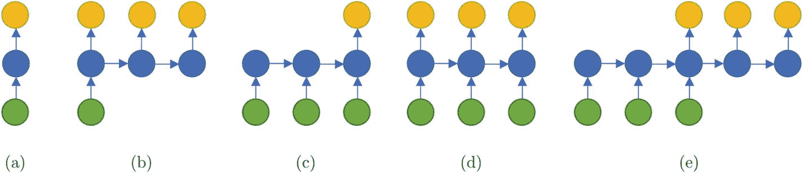

图 7-2

底层是输入，中间是隐藏状态，顶层是输出。(a) 单个输入、隐藏状态和单个输出的 vanilla 网络（无 RNN）。(b) 一对多模式。(c) 多对一模式。(d) 同步多对多模式。(e) 异步多对多模式，也称为编码器-解码器。

除了之前的设计模式，RNNs 的变体取决于不同层之间互连的执行方式。标准情况是 RNN 在隐藏单元之间具有循环连接，如图 7-3 所示。在这种情况下，RNN 是图灵完备的（Siegelmann, 1995），因此可以模拟任何任意程序。本质上，RNN 反复对一个隐藏状态应用一个非线性函数，并带有可训练的参数，这使得它们适合序列建模任务。

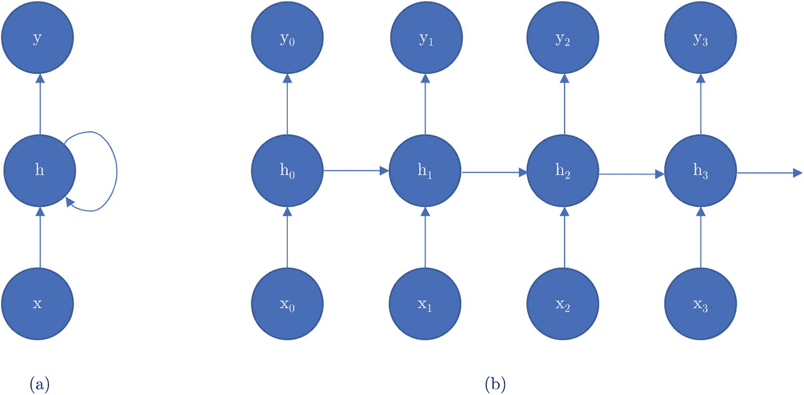

图 7-3

(a) 具有隐藏状态之间循环连接的 RNN。(b) 展示隐藏状态之间连接的展开 RNN。

然而，它们的循环结构使得每一步的计算都依赖于完成前一步，这使得网络难以并行化和扩展。类似于卷积神经网络（CNNs），训练循环神经网络（RNN）涉及计算损失函数相对于权重的梯度。这个操作涉及到正向传播，从图 7-3(b) 的左侧向右移动，然后是反向传播，从右侧向左移动，以更新权重。这个过程成本高昂，因为正向传播本质上是顺序的，因此不能并行化。在 RNN 中应用的反向传播算法称为时间反向传播（BPTT），将在本章后面详细讨论。

解决缓慢训练限制的解决方案可以在图 7-4 中所示的输出循环结构中找到。这个家族的 RNN 将每个输出与未来的隐藏状态连接起来，消除了隐藏到隐藏的连接。在这种情况下，任何比较特定时间步预测和目标的损失函数都可以解耦；因此，每一步的梯度可以独立计算并并行化。

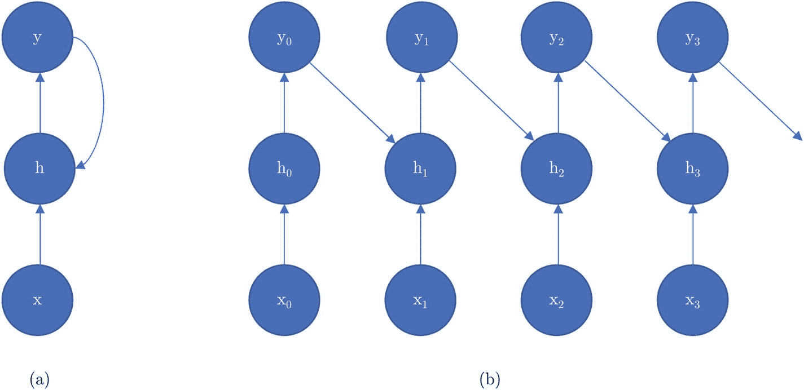

图 7-4

(a) 带有输出循环连接的 RNN。 (b) RNN 的展开结构，带有输出循环。

不幸的是，具有输出循环连接的 RNN 比包含隐藏到隐藏连接的 RNN 弱（Goodfellow et al., 2016）。例如，它们不能模拟通用图灵机。由于缺乏隐藏到隐藏的连接，传递到下一步的唯一信号是输出，除非它非常高维且丰富，否则可能会错过过去的重要信息。

到目前为止看到的结构都共享这样一个观点，即所有序列都是正向序列，这意味着网络根据过去的状态捕获当前状态的信息。然而，在某些情况下，反向方向的关系也同样有价值。例如，语音识别或文本理解。在一些语言中，不同单词之间的语言关系可能依赖于未来或过去。例如，在英语中，动词通常位于句子的中间，而在德语中，动词倾向于位于句子的末尾。为了解决这种现象，提出了双向循环神经网络（Schuster & Paliwal, 1997）。

双向循环神经网络（BiRNNs）有一个向前移动的隐藏连接层和一个向后移动的层（见图 7-5）。这种结构允许输出学习其近未来和过去状态的表现，但代价是使训练过程在计算上更加昂贵。

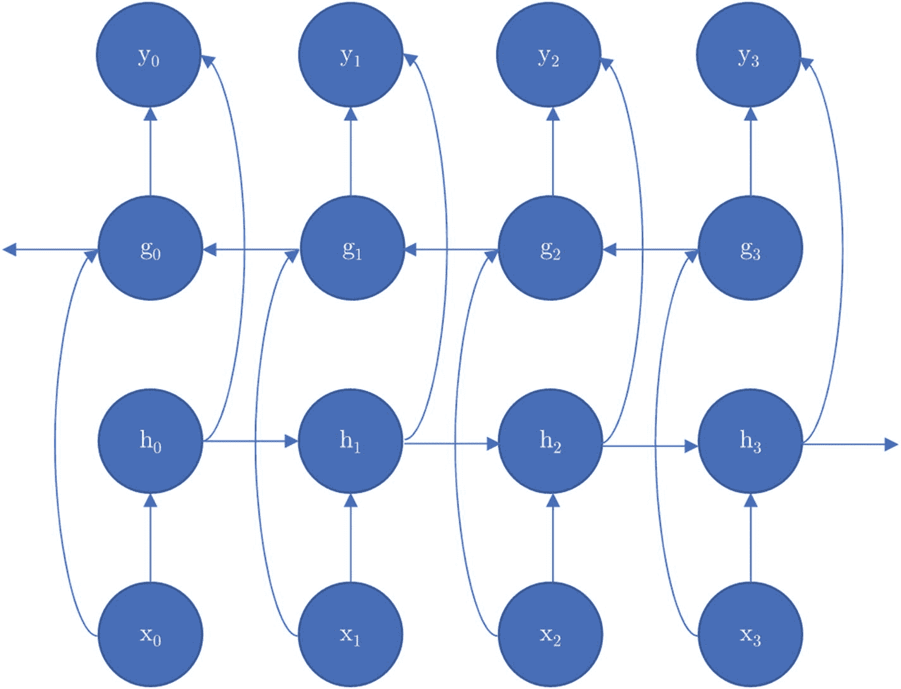

图 7-5

双向 RNN。BiRNN 包含一个前向连接层来编码未来依赖性 h，以及一个后向连接层来编码过去依赖性 g。在所展示的结构中，每个隐藏单元都连接到另一个隐藏单元和输出。

## 训练 RNN

RNN 训练与我们在上一章中看到的 CNN 训练方法有一些相似之处，但在 RNN 的情况下，使用的算法称为 BPTT（Werbos, 1990）。BPTT 背后的基本思想很简单，就是将相同的通用反向传播算法应用于展开的计算图。训练 RNN 的步骤如下：

1.  我们有一个类似于图 7-3、图 7-4 和图 7-5 所示的 RNN 架构。权重基于某些分布进行初始化。

1.  我们将序列作为(minibatch size, sequence size)输入到 RNN 中。序列长度可以是可变的，这取决于你使用的框架。

1.  我们通过展开图来计算前向传播，并在每个时间步获得预测输出。

1.  我们将预测输出与真实标签进行比较，并在每个时间步累积误差（或损失）。

1.  我们通过计算权重相对于损失的梯度来应用反向传播，并使用梯度下降来更新权重。

1.  这个过程会重复多次 epoch 或者直到满足某些退出条件。

对于长序列，更新权重的成本很高。例如，长度为 1,000 的 RNN 的梯度相当于一个具有 1,000 层的神经网络的正向和反向传递（Sutskever, 2013）。

因此，训练 RNN 的一个实用方法是计算展开图的滑动窗口中的 BPTT，这被称为截断 BPTT（Williams & Peng, 1990）。这个想法很简单：每个完整的序列被切割成多个较小的子序列，并对这些部分的每个子序列应用 BPTT。这种方法在实践中效果很好，尤其是在词建模问题中（Mikolov, Karafiát, Burget, Černocký, & Khudanpur, 2010），但算法对不同窗口之间的依赖关系是盲目的。

## 门控 RNN

由于 RNN 中传播误差的迭代性质，在某些情况下，损失梯度在反向传播过程中可能会消失。这被称为梯度消失（Bengio, Simard, & Frasconi, 1994）。实际上，梯度消失意味着损失梯度是一个很小的量，因此更新权重的过程可能会花费很长时间。更少的情况下，梯度可能会爆炸，产生指数级大的梯度，这被称为梯度爆炸。这也使得 RNN 在具有长时序依赖的序列上难以训练。

解决梯度消失和梯度爆炸问题的方法是 LSTM RNN（Gers, Schmidhuber, & Cummins, 2000; Hochreiter & Schmidhuber, 1997），这是一种专门设计来学习长期关系的网络类型。为此，他们用一种称为 LSTM 单元的新块替换了标准 RNN 的隐藏单元。这些单元背后的直觉是，它们允许控制传递到下一个状态的信息量，并使用遗忘机制来停止不再有用的信息。

LSTM 块（见图 7-6）由一个状态单元和三个门控单元组成：遗忘门、输入门和输出门。从高层次来看，状态单元处理输入和输出之间的信息传递，并包含一个自环。门控单元通过 sigmoid 函数简单地将它们的权重设置为 0 到 1 之间的值，控制从输入来的信息量、流向输出的信息量以及从状态单元中遗忘的信息量。

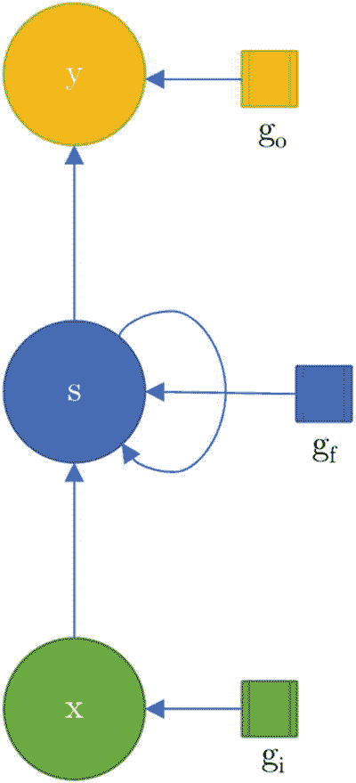

图 7-6

LSTM 的架构。它有三个单元：输入 x、状态 s 和输出 y，这些单元由三个门控制：输入门 g[i]、遗忘门 g[f] 和输出门 g[o]。状态单元包含一个自环。

实证研究表明，LSTM 的关键组件是遗忘门和输出激活函数，并且当将 LSTM 与其其他变体（Greff, Srivastava, Koutník, Steunebrink, & Schmidhuber, 2017）进行比较时，在准确性方面没有显著差异。

LSTM 的一个变体是门控循环单元（GRU；Cho et al., 2014），它通过使用稍有不同的门控单元组合来简化 LSTM 的结构。具体来说，它们缺少输出门，这使得全部隐藏内容暴露于输出。相比之下，LSTM 单元使用输出门来控制可见内存的数量。GRU 中缺少输出门使得它们在计算上更节省，但可能导致次优的内存表示，这可能是 LSTM 倾向于记住更长时间序列的原因。有关 LSTM 和 GRU 之间更详细的比较，请参阅 Chung, Gulcehre, Cho, & Bengio, 2014）。

## 序列到序列模型和注意力机制

序列到序列模型（Cho et al., 2014; Sutskever, Vinyals, & Le, 2014）是一种相对较新的架构，为机器翻译、语音识别和文本摘要创造了许多令人兴奋的可能性。其基本原理是将输入序列映射到输出序列，输出序列的长度可以不同，这是图 7-2(e)的一个变体。这是通过结合一个输入 RNN（或编码器），它将可变长度的序列映射到固定长度的向量，以及一个输出 RNN（或解码器），它将固定长度的向量映射到可变长度的序列来实现的。例如，请参阅 Erika Menezes 关于使用 Azure Machine Learning 生成音乐的文章和教程，该文章可在[`http://bit.ly/MusicGenAzure`](http://bit.ly/MusicGenAzure)找到。

在机器翻译领域（称为神经机器翻译[NMT]）中的序列到序列模型在很大程度上取代了基于短语的机器翻译，因为它们不需要为每个子组件（以及每种语言）进行大量的手动调整。NMT（如图 7-7 所示）模型可能具有不同结构的 RNN 用于编码器和解码器组件；RNN 的结构可以以多种方式变化：细胞类型（如 GRU 或 LSTM）、层数和方向性（单向或双向）。

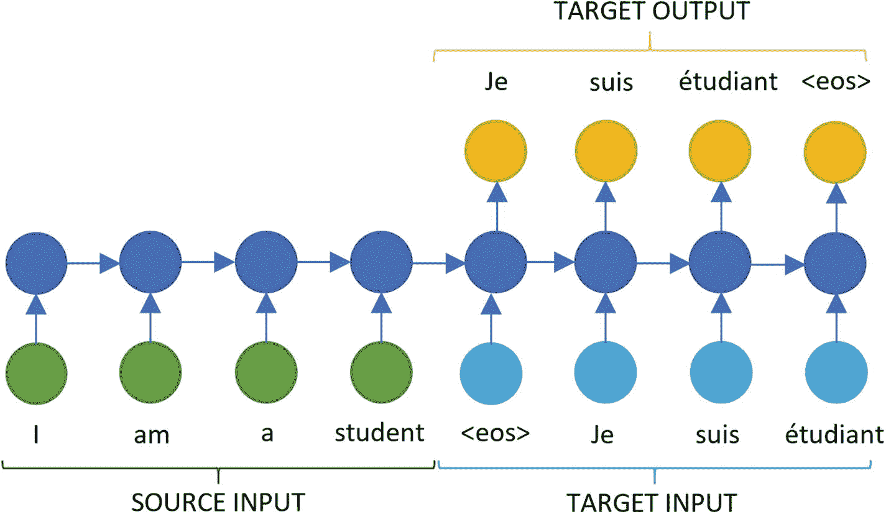

图 7-7

简单 NMT 架构的示例，用于英语到法语训练

实验观察（Cho et al., 2014）表明，NMT 模型在翻译长句时存在困难。这是因为网络必须将输入句子的所有信息压缩成一个单一的固定长度向量，无论句子的长度如何。

考虑这个句子：“我昨天去了公园打羽毛球，我的狗跳进了池塘。”我们可以看到有两个（至少）组成部分：“我昨天去了公园打羽毛球”和“我的狗跳进了池塘。”在尝试翻译第二个组成部分时（反之亦然），我们可能不会关心第一个组成部分。然而，一个 NMT 模型别无选择，只能使用包含这两个组成部分的隐藏向量来生成输入。理想情况下，我们会有一个模型为每个输出词分配输入词的重要性。在这种情况下，当翻译第二个组成部分的部分内容时，第一个组成部分中单词的相对重要性会非常低。并不是句子中的每一部分都是翻译某些词所必需的。

注意力机制（Bahdanau, Cho, & Bengio, 2014; Yang et al., 2016）试图做到这一点：它试图创建一个加权平均，使输出句子中的每个单词都与输入句子中的重要成分对齐。与标准 NMT 模型的主要区别在于，它不是将整个输入句子编码成一个单一固定长度的向量，而是将输入序列编码成一个固定长度的向量序列，一个“随机访问存储器”，并且为翻译中的每个单词对不同的向量进行不同的加权。这意味着模型现在可以自由地创建更长的隐藏向量序列来处理更长的句子，并在解码阶段学习关注哪些向量。

将这些组件组合起来，机制可能看起来像图 7-8。网络首先将输入句子的每个单元（通常是一个单词）编码成一个分布式特征向量。隐藏状态成为这些特征向量的集合。然后在解码阶段，模型使用所有先前生成的预测以及特征向量序列（它已经学会了为每个预测的目标单词对每个特征向量（输入单词）放置多少注意力）迭代地预测每个单词。

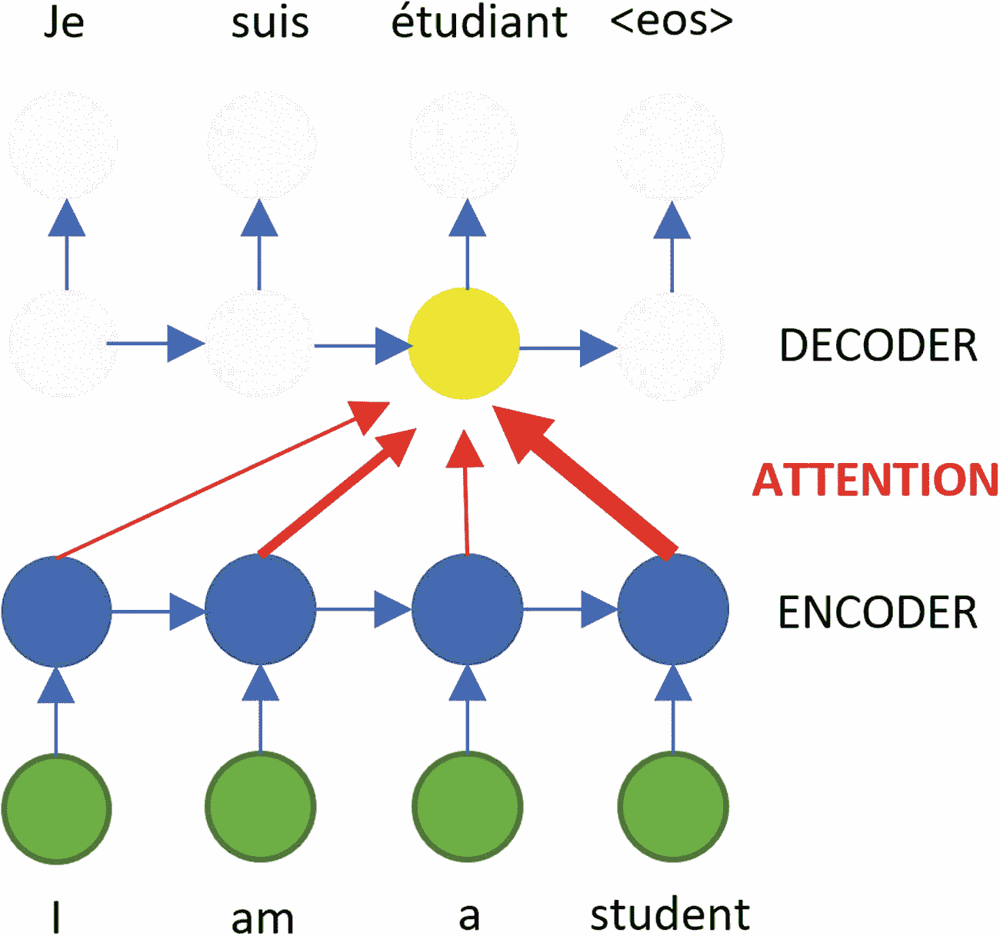

图 7-8

应用注意力的示例。注意，“学生”在预测“étudiant”时具有最高的权重（用线粗细表示）。

这种联合对齐单词（哪些输入单词需要用于预测输出）和翻译的方法，在经验上已经超过了手工制作的方法和基本的序列到序列模型，并且是大多数在线翻译服务背后的核心组件（Klein, Kim, Deng, Senellart, & Rush, 2017）。

## RNN 示例

在本节中，我们将研究两个在 TensorFlow 中实现的 RNN 示例。代码可在[`bit.ly/AzureRNNCode`](http://bit.ly/AzureRNNCode)找到。第一个示例在 TensorFlow 以及其他几个框架中运行情感分析。第二个示例基于第六章的示例，说明了 CNN 和 RNN 在图像分类上的差异。第三个示例使用 RNN 进行时间序列分析。

更多信息

我们建议为运行本章中的代码示例配置 Azure DLVM。请参阅第四章以获取更多信息。

### 示例 1：情感分析

我们首先强烈推荐在[`http://bit.ly/DLComparisons`](http://bit.ly/DLComparisons)上可用的示例，在撰写本文时，这些示例包括六个不同的 Python 深度学习框架实现，用于 RNN（GRU）预测 IMDB 电影评论数据集的情感，以及 R（Keras 与 TensorFlow 后端）和 Julia（Knet）的实现。这些示例包括 NC 系列 DLVM（NVIDIA Tesla K80 GPU）和 NC_v2 系列 DLVM（NVIDIA Tesla P100 GPU）的训练时间，以便人们可以跟随并比较时间来确保设置正确。

### 示例 2：图像分类

在第六章，我们看到了卷积神经网络（CNN）通常是如何用于图像分类的。在这里，我们考察了如何使用循环神经网络（RNN）来完成同样的任务。尽管这不是 RNN 的传统应用，但它说明了通常可以将神经网络架构与问题类型解耦，并展示 CNN 和 RNN 之间的某些差异。

CNN 的数据以[示例数量，高度，宽度，通道]的形式加载。对于 RNN，我们只需将其重塑为[示例数量，高度，宽度*通道]（参见列表 7-1）。¹ 这意味着对于 CIFAR 数据，我们将有 32 个时间步（像素行），其中每行包含 32*3（列数*通道数）个变量。例如，第一个时间步将包含[row1_column1_red_pixel, row1_column1_green_pixel, row1_column1_blue_pixel, row1_column2_red_pixel, … , row1_column32_blue_pixel]。

```py
PYTHON
# Original data for CNN
x_train, x_test, y_train, y_test = cifar_for_library(channel_first=False)
# RNN: Sequences of 32 time-steps, each containing 32*3 units
N_STEPS = 32 # Each step is a row
N_INPUTS = 32*3 # Each step contains 32 columns * 3 channels
x_train = x_train.reshape(x_train.shape[0], N_STEPS, N_INPUTS)
x_test = x_test.reshape(x_test.shape[0], N_STEPS, N_INPUTS)
Listing 7-1
Loading Data
```

然后，我们可以创建一个由 64 个基本 RNN 单元组成的网络架构，并将其应用于输入张量的每个时间步，如列表 7-2 所示。我们将收集最后一个时间步的输出，并应用一个具有 10 个神经元的全连接层。

```py
PYTHON
def create_symbol(X, n_steps=32, nhid=64, n_classes=10):
# Convert x to a list[steps] where element has shape=2 [batch_size, inputs]
# This is the format that rnn.static_rnn expects
x=tf.unstack(X,n_steps,axis=1)
cell=tf.nn.rnn_cell.BasicRNNCell(nhid)
outputs,states=tf.contrib.rnn.static_rnn(cell,x,dtype=tf.float32)
logits=tf.layers.dense(outputs[-1],n_classes,activation=None)
return logits
Listing 7-2
Create Network Architecture
```

要训练一个模型，我们需要创建一个训练算子，该算子是一个优化器（在这个例子中是 Adam），它作用于损失（损失是预测和真实标签的函数），如列表 7-3 所示。

```py
PYTHON
def init_model(m, y, lr=LR, b1=BETA_1, b2=BETA_2, eps=EPS):
xentropy=tf.nn.sparse_softmax_cross_entropy_with_logits(logits=m,labels=y)
training_op= (tf.train.AdamOptimizer(lr,b1,b2,eps)
.minimize(tf.reduce_mean(xentropy)))
return training_op
Listing 7-3
Define How Model Will Be Trained
```

要开始训练，我们需要在图中创建占位符并初始化变量，如列表 7-4 所示。

```py
PYTHON
# Placeholders
X = tf.placeholder(tf.float32, shape=[None, N_STEPS, N_INPUTS])
y=tf.placeholder(tf.int32,shape=[None])  # Sparse
# Initialize model
sym = create_symbol(X)
model = init_model(sym, y)
sess = tf.Session()
sess.run(tf.global_variables_initializer())
Listing 7-4
Placeholders and Initialization
```

然后，我们可以像列表 7-5 所示的那样训练我们的模型。

```py
PYTHON
for j in range(EPOCHS):
for data,label in yield_mb(x_train,y_train,BATCHSIZE,shuffle=True):
sess.run(model,feed_dict={X:data,y:label})
Listing 7-5
Training Model
```

供应我们数据的生成器创建如列表 7-6 所示。

```py
PYTHON
def shuffle_data(X, y):
s=np.arange(len(X))
np.random.shuffle(s)
X=X[s]
y=y[s]
return X,y
def yield_mb(X, y, batchsize=64, shuffle=False):
if shuffle:
X,y=shuffle_data(X,y)
# Only complete batches are submitted
for i in range(len(X) //batchsize):
yield X[i*batchsize:(i+1) *batchsize],y[i*batchsize:(i+1) *batchsize]
Listing 7-6
Generator to Supply Data to Model
```

要在我们的测试数据上获得预测，我们对模型的预测应用一个`argmax()`操作来选择最可能的类别（参见列表 7-7）。如果我们想要类别概率，我们首先应用 softmax 变换；然而，这仅适用于训练，并且与损失函数捆绑在一起以提高计算效率。

```py
PYTHON
for data, label in yield_mb(x_test, y_test, BATCHSIZE):
pred=tf.argmax(sym,1)
output=sess.run(pred,feed_dict={X:data})
Listing 7-7
Get Prediction
```

注意，创建生成器、创建占位符、初始化变量和使用`feed_dict`进行训练是一个相当低级的 API，并且仅用于帮助展示如何工作。在实践中，所有这些都可以通过使用 TensorFlow 的 Estimator API 来抽象化。

### 示例 3：时间序列

在下一个例子中，我们将使用 LSTM 预测微软的股票。我们首先将数据放入数据框中，如列表 7-8 所示。这些数据是从 2012 年到 2017 年的微软股票价值，来源于[`http://bit.ly/MSFThist`](http://bit.ly/MSFThist)。`.csv`文件包含一个日期列，四个股票价格列（开盘价、最高价、最低价和收盘价）以及一些我们不会使用的信息。从四个价格值中，我们将取平均值以简化。我们只预测未来一步，因为预测的时间越长，预测的准确性越低。你也可以尝试不同的超参数。

```py
PYTHON
EPOCHS = 5
TEST_SIZE = 0.3
TIME_AHEAD = 1 #prediction step
BATCH_SIZE = 1
UNITS = 25
df = pd.read_csv('https://ikpublictutorial.blob.core.windows.net/book/MSFT_2012_2017.csv')
df = df.drop(['Adj Close', 'Volume'], axis=1)
mean_price = df.mean(axis = 1)
Listing 7-8
Define Hyperparameters and Read in Historical Data
```

下一步是将数据进行归一化并生成训练集和测试集，如列表 7-9 所示。

```py
PYTHON
scaler = MinMaxScaler(feature_range=(0, 1))
mean_price = scaler.fit_transform(np.reshape(mean_price.values, (len(mean_price),1)))
train, test = train_test_split(mean_price, test_size=TEST_SIZE, shuffle=False)
print(train.shape) #(1056, 1)
print(test.shape) #(453, 1)
Listing 7-9
Normalize Data and Create Training and Test Sets
```

然后我们需要进行数据重塑，以便将数据添加到模型中，如列表 7-10 所示。我们还定义了将要预测的时间跨度；通常，这个值越小，预测的准确性越高。

```py
PYTHON
def to_1dimension(df, step_size):
X,y= [], []
for i in range(len(df)-step_size-1):
data=df[i:(i+step_size),0]
X.append(data)
y.append(df[i+step_size,0])
X,y=np.array(X),np.array(y)
X=np.reshape(X, (X.shape[0],1,X.shape[1]))
return X,y
X_train, y_train = to_1dimension(train, TIME_AHEAD)
X_test, y_test = to_1dimension(test, TIME_AHEAD)
Listing 7-10
Reshape Data for Model
```

下一步是定义和训练模型，如列表 7-11 所示。在这种情况下，我们使用了一个基本的 LSTM 单元，但你可以尝试使用 GRU 或 BiLSTM。

```py
PYTHON
def create_symbol(X, units=10, activation="linear", time_ahead=1):
cell=tf.contrib.rnn.LSTMCell(units)
outputs,states=tf.nn.dynamic_rnn(cell,X,dtype=tf.float32)
sym=tf.layers.dense(outputs[-1],1,activation=None,name='output')
return sym
X = tf.placeholder(tf.float32, shape=[None, 1, TIME_AHEAD])
y = tf.placeholder(tf.float32, shape=[None])
sym = create_symbol(X, units=UNITS, time_ahead=TIME_AHEAD)
loss = tf.reduce_mean(tf.squared_difference(sym, y)) #mse
optimizer = tf.train.AdamOptimizer()
model = optimizer.minimize(loss)
init = tf.global_variables_initializer()
sess = tf.Session()
sess.run(init)
for i in range(EPOCHS):
ii=0
while(ii+BATCH_SIZE) <=len(X_train):
X_batch=X_train[ii:ii+BATCH_SIZE,:,:]
y_batch=y_train[ii:ii+BATCH_SIZE]
sess.run(model,feed_dict={X:X_batch,y:y_batch})
ii+=BATCH_SIZE
loss_train=sess.run(loss,feed_dict={X:X_batch,y:y_batch})
print('Epoch {}/{}'.format(i+1,EPOCHS),' Current loss: {}'.format(loss_train))
Listing 7-11
Define and Train Model
```

最后，我们将计算测试集预测的均方根误差（RMSE），如列表 7-12 所示。

```py
PYTHON
y_guess = np.zeros(y_test.shape[0], dtype=np.float32)
ii = 0
while(ii + BATCH_SIZE) <= len(X_test):
X_batch=X_test[ii:ii+BATCH_SIZE,:,:]
output=sess.run(sym,feed_dict={X:X_batch})
y_guess[ii:ii+BATCH_SIZE] =output
ii+=BATCH_SIZE
y_test_inv = scaler.inverse_transform([y_test])
pred_test = scaler.inverse_transform([y_guess])
score = math.sqrt(mean_squared_error(y_test_inv, pred_test))
print('Test RMSE: %.2f' % (score)) #3.52
Listing 7-12
Calculate Test Set RMSE
```

观察图 7-9，似乎 LSTM 在预测股票方面做得很好。现在你可以尝试不同的时间范围或 LSTM 参数。这是一个使用 LSTM 进行时间序列分析以说明预测概念的简单示例。

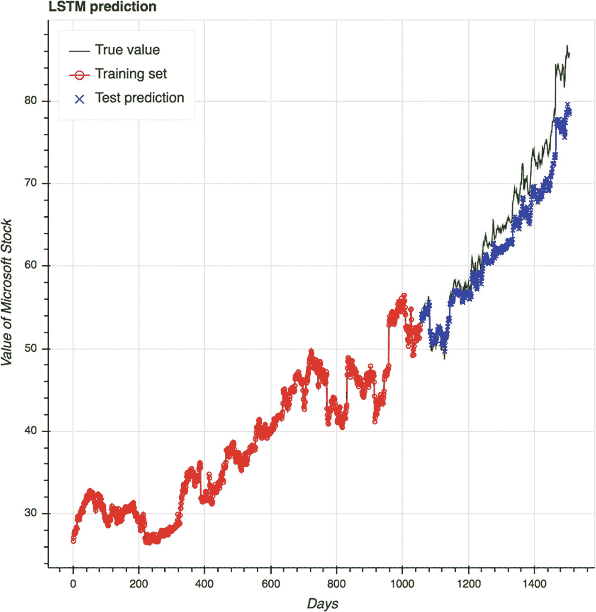

图 7-9

使用 LSTM 进行股票预测

对于使用 LSTM 进行时间序列分析的另一个示例，我们推荐在 Azure 机器学习服务中可用的预测性维护教程，链接为[`http://bit.ly/DLforPM`](http://bit.ly/DLforPM)。我们还推荐 Andrej Karpathy 关于循环神经网络不可思议有效性的博客文章，链接为[`http://bit.ly/RNNEffective`](http://bit.ly/RNNEffective)。

## 摘要

本章介绍了循环神经网络（RNN）及其不同变体，这些变体对于在序列数据上构建应用非常有用。这些模型特别适用于自然语言处理和时间序列分析，尽管 RNN 的应用范围相当广泛。本章以两个实用的“如何做”示例结束，并推荐了一个资源，用于尝试不同的深度学习框架进行 RNN（GRU）示例，用于 Azure DLVM 上的情感分析。在下一章中，我们将深入探讨一种完全不同类型的深度学习网络，这是一种较新的发展，在许多应用中显示出希望。

RNNs 在最近几年变得越来越流行，但最近我们看到了一种趋势，即回归到 CNN 架构来处理序列数据，这可能部分是因为 CNN 更容易训练（无论是从裸机还是参数调整的角度来看）。

将注意力编码向量堆叠成层次树可以保留序列中的顺序并捕获长期依赖关系。这类网络被称为层次神经网络注意力，类似于 WaveNet，它已被用于合成语音。

具有以下特点的时间卷积网络（1）没有未来到过去的信息泄露（即因果性），（2）可以像 RNNs 一样处理可变长度的序列，因此越来越受到纯序列任务的青睐，这些任务以前通常被认为是 RNN 的领域。

脚注 1

这可能在 CPU 和 GPU 之间有所不同。

# 8. 生成对抗网络

对于许多 AI 项目，深度学习技术正越来越多地被用作从图像分类到目标检测、图像分割、图像相似性和文本分析（例如，情感分析、关键词提取）等创新解决方案的构建块。GANs，由 Goodfellow 等人（2014 年）首次提出，正成为通过生成过程教会计算机如何执行复杂任务的一种强大新方法。正如 Yann LeCun（在[`http://bit.ly/LeCunGANs`](http://bit.ly/LeCunGANs)）所指出的，GANs 确实是“过去 20 年中最酷的机器学习想法。”

近年来，GANs 显示出巨大的潜力，并在各种场景中得到应用，从图像合成到提高图像质量（超分辨率）、图像到图像的翻译、文本到图像的生成等等。此外，GANs 是 AI 在艺术、音乐和创造力（例如，音乐生成、音乐伴奏、诗歌生成等）应用中的进步的基石。

本章描述了 GANs 背后的秘密。我们首先介绍 GANs 在各种 AI 应用和场景中的使用。然后，我们通过一个名为 CycleGAN 的全新 GAN 的代码示例来了解 GANs 的工作原理。为此，我们使用 Azure DLVM 作为计算环境。有关设置 DLVM 以运行代码示例的详细信息，请参阅第四章。

## 什么是生成对抗网络？

GANs 正在成为无监督学习和半监督学习中的强大技术。一个基本的 GAN 由以下部分组成：

+   生成模型（即生成器）生成一个对象。生成器对真实对象一无所知，并通过与判别器交互来学习。例如，生成器可以生成图像。

+   判别模型（即判别器）确定一个对象是真实的（通常表示为接近 1 的值）还是假的（表示为接近 0 的值）。

+   判别器向生成器提供一个对抗性损失（或错误信号），使得生成器能够生成尽可能接近真实对象的物体。

图 8-1 展示了生成器和判别器之间的交互。判别器是一个分类器，用于确定它接收到的图像是真实图像还是伪造图像。生成器使用噪声向量和来自判别器的反馈，尽力生成尽可能接近真实图像的图像。这个过程会持续到 GAN 算法收敛。在许多 GAN 中，生成器和判别器通常由基于 DenseNet、U-Net 和 ResNet 的常见网络架构组成。一些示例网络架构在第三章中进行了讨论。

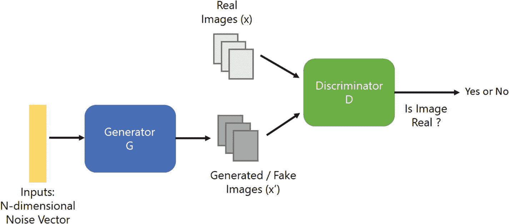

图 8-1

基本 GAN 展示生成器和判别器之间的交互

图 8-2（灵感来源于 Goodfellow 等人，2014 的研究）描述了 GAN 工作的理论基础。生成器（G）和判别器（D）分别由实线和虚线表示。数据生成分布由虚线表示。图 8-2 中的两条水平线表示从 z 中均匀采样的域（下线）和 x 的域（上线）。从下线到上线箭头表示映射 x = G(z)。从图 8-2 中，你会注意到随着时间的推移，GAN 收敛时，实线和虚线非常接近（或几乎相似）。在那个点上，判别器 D 无法再区分生成的真实和伪造对象。

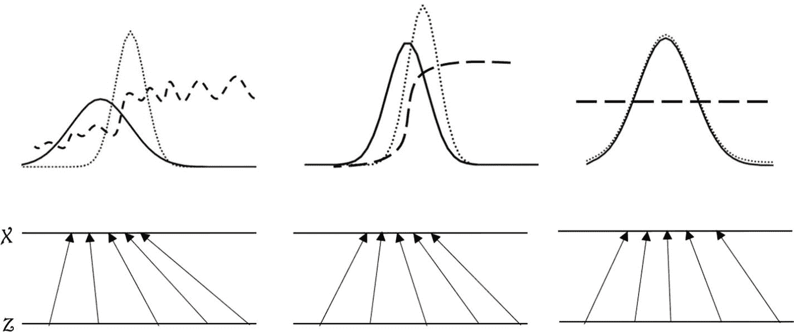

图 8-2

GAN 的工作原理：生成器生成的对象如此逼真，以至于判别器无法再区分真实和伪造。来源：Goodfellow 等人 (2014)。

在 GAN 的早期版本中，生成器和判别器被实现为全连接神经网络（Goodfellow 等人，2014）。这些 GAN 用于从深度学习中常用的各种数据集中生成图像：例如 CIFAR10、MNIST（手写数字）和多伦多人脸数据集。随着 GAN 架构的发展，CNN 越来越多地被使用。一个使用深度 CNN 的 GAN 示例是 DCGANs（Radford、Metz 和 Chintala，2016）。不同类型 GAN 的全面概述可以在 Creswell 等人 (2017) 的文章中找到。

自 2014 年以来，出现了许多使用 GAN 的创新方法。GAN 在用于人工智能的创造力方面显示出希望，例如艺术和音乐生成以及计算机辅助设计（CAD）。其中一种方法是通过文本描述自动化图像的生成。InfoGAN（Chen 等人，2016 年）是一种无监督方法，可以从几个知名数据集（例如，Digits [MNIST]、CelebA Faces 和 House Numbers [SVHN]）中提取语义和隐藏表示。InfoGAN 的秘密在于最大化潜在变量和观测之间的互信息。堆叠生成对抗网络（StackGAN；Zhang 等人，2016 年）被提出用于使用文本描述生成逼真的图像。例如，给定文本“这只鸟有黄色的腹部和跗跖，灰色的背部、翅膀和棕色的喉咙，颈背有黑色的面部，”StackGAN 将使用两个阶段生成鸟的图片。在第一阶段，计算一个低分辨率图像，它由基本形状和颜色组成。在第二阶段，第一阶段的结果和文本描述被用来创建逼真的高分辨率图像。

图 8-3 展示了 StackGAN 的两个阶段。

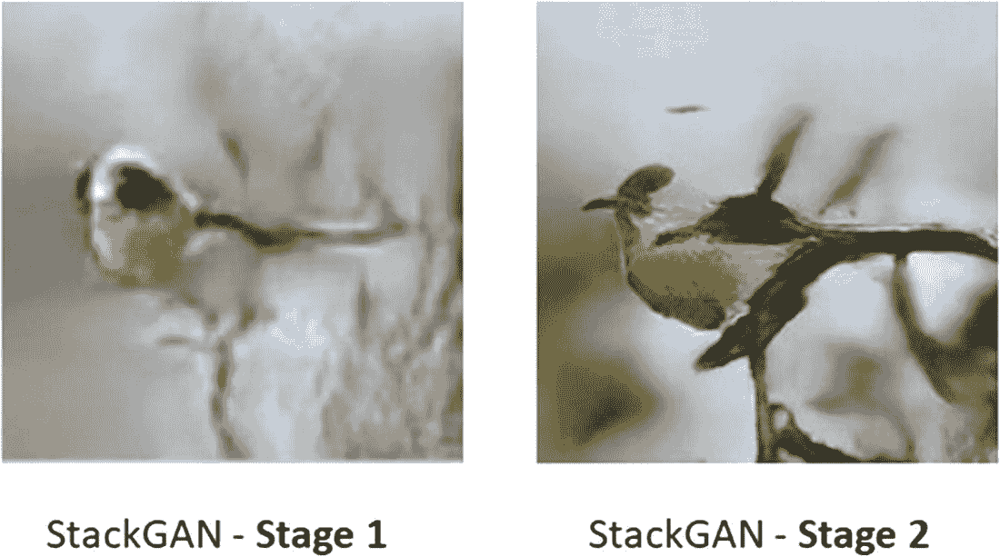

图 8-3

StackGAN：从文本生成图像。来源：Zhang 等人（2016 年）。

与 StackGAN 类似，注意力生成对抗网络（AttnGAN）使用多阶段方法。此外，AttnGAN 引入了一种新颖的注意力驱动方法，该方法关注（或注意）文本描述中的不同单词，并使用这些单词为图像的每个子区域合成细粒度细节。图 8-4 展示了 AttnGAN 的工作原理，以及它针对不同单词关注的图像的不同部分。第一行显示了不同生成器生成的图像，每个生成器产生不同维度的图像（从 64 `×` 64 到 128 `×` 128，再到 256 `×` 256）。第二行和第三行显示了前五个最关注的单词（即每个注意力模型定义的最高值的单词）。

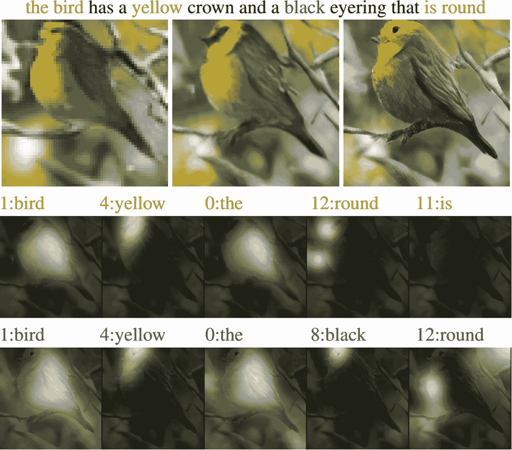

图 8-4

AttnGAN 如何使用文本描述的不同部分来为图像的每个区域生成细节

在我们深入探讨这些 GAN 的实现之前，重要的是要注意，许多今天的 GAN 实现是为了从实值连续数据分布中生成数据（例如，图像）而设计的。当试图将 GAN 应用于生成离散数据序列（例如，文本、诗歌、音乐）时，许多现有的 GAN 实现将无法很好地处理它。此外，GAN 的设计是为了仅在生成整个数据序列（例如，图像）之后确定损失（或对抗性损失）。

另一种有趣的 GAN 类型是 SeqGAN（Yu，Zhang，Wang，& Yu，n.d.）。SeqGAN 是一种将强化学习概念集成到 GANs 中的新方法，以克服现有 GANs 在生成离散数据序列时面临的挑战。在 SeqGAN 中，生成器被设计成强化学习中的代理，其当前状态是迄今为止生成的离散标记，而动作是下一个要生成的标记。判别器评估生成的标记，并提供反馈以帮助生成器学习。SeqGAN 在诗歌生成、音乐生成以及语言和语音任务中的应用中已被证明是有效的。

今天，GANs 在解决多种类型的问题时表现良好，但它们训练起来非常困难，因为它们不能保证收敛到最优解，甚至稳定的解。GANs 的另一个常见问题是模式崩溃，其中生成器创建的样本具有极低的多样性。它们需要非常仔细地选择超参数和参数初始化等因素才能正常工作。例如，在 2016 年 NIPS 对抗训练研讨会上，如何解释和解决 GANs 训练中的问题是一个主要话题（视频记录可以在[`http://bit.ly/NIPS2016`](http://bit.ly/NIPS2016) `)`上观看）。幸运的是，尽管如此，已经使用了许多技巧来稳定 GANs 的训练。其中一种技巧是在输入空间中包含额外的信息（例如，向判别器的输入添加连续噪声）或在输出空间中添加信息（例如，添加不同类别的真实示例）。其他技巧则关注在训练期间引入正则化方案。

注意

在[`http://bit.ly/GANsEvolve`](http://bit.ly/GANsEvolve) `.`了解 GANs 的演变。

本章将介绍一种名为循环一致性对抗网络（CycleGANs）的 GAN。我们将学习如何使用 CycleGANs 进行图像到图像的翻译。通过分析代码，我们将快速了解 GANs 以及 GANs 在 AI 项目中的创新应用。您可以使用 Microsoft AI 平台来训练和部署这些 GANs 到云端、移动设备和边缘设备。

## 循环一致性对抗网络

CycleGANs 是一种将图像从源域 X 转换为目标域 Y 的新方法。CycleGANs 的一个优点是，GANs 的训练不需要训练数据具有匹配的图像对。正如朱、帕克、伊索拉和埃弗罗斯（2017 年）所指出的，CycleGANs 已经在以下用例中成功应用：

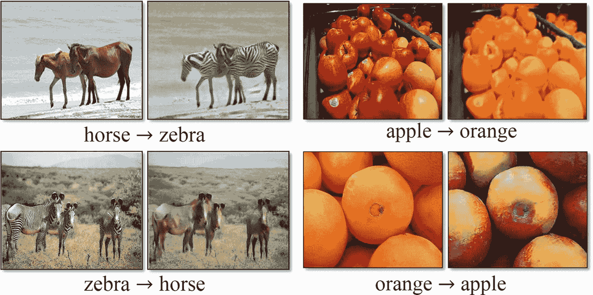

图 8-5

物体变形（马变斑马，苹果变橙子）。来源：朱、帕克、伊索拉和埃弗罗斯（2017 年）。

+   将莫奈画作转换为照片。

+   使用来自各种著名艺术家（莫奈、梵高、塞尚和浮世绘）的风格进行照片风格迁移。

+   物体变形，其中它用于改变照片中找到的对象类型。图 8-5 展示了 CycleGANs 在物体变形中的应用（马到斑马，斑马到马，苹果到橙子，橙子到苹果等）。

+   将照片从一个季节（例如，夏天）转换到另一个季节（例如，冬天）。

+   通过缩小景深来增强照片，以及更多。

CycleGANs 的目标是学习如何将图像从域 X 映射到域 Y。图 8-6 展示了两个映射函数 G 和 F 以及两个判别器 D[X] 和 D[Y] 的使用。判别器 D[X] 用于验证来自 X 和转换图像 F(y) 的图像。同样，判别器 D[Y] 用于验证来自 Y 和转换图像 G(x) 的图像。CycleGANs 用于图像转换的有效性的秘密在于使用循环一致性损失。直观地说，循环一致性损失用于确定域 X 的图像是否可以从转换图像中恢复。

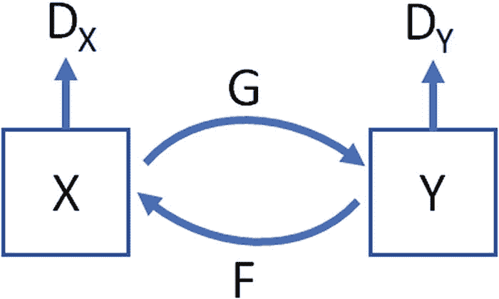

图 8-6

CycleGANs 模型包含两个映射函数 G 和 F，以及两个对抗性判别器 D[X] 和 D[Y]Note

CycleGANs 首次由 Zhu 等人于 2017 年介绍。CycleGANs 的原始实现（在 PyTorch 中）可在[`bit.ly/CycleGAN`](http://bit.ly/CycleGAN)找到。

### CycleGAN 代码

让我们先浏览一下用于训练 CycleGANs 并通过将图像从源域 A 转换为目标域 B 来测试它的整体 CycleGAN 代码。例如，训练好的 CycleGAN 将执行物体变形，将包含马的照片转换为斑马（反之亦然）。结果将以 HTML 文件的形式进行可视化。

让我们先导入我们将在此代码中使用的 Python 库。从列表 8-1 中，您将看到我们正在使用 TensorFlow，并从 `model.py` 文件中导入 CycleGAN 的定义。我们将在本节的后续部分深入了解 `model.py` 文件的细节。

Note

我们建议为运行本章中的代码示例配置 Azure DLVM。请参阅第四章，获取更多信息。

```py
PYTHON
import os
import tensorflow as tf
from model import cyclegan
Listing 8-1
Importing the Required Python Libraries
```

接下来，我们定义用于训练和测试 CycleGAN 的参数。从列表 8-2 中，您将看到我们指定了 0.0002 的学习率，用于 200 个周期（用 `lr` 和 `epoch_step` 表示）。此外，我们还指定了我们将使用来加载训练数据、输出测试图像和存储检查点文件的目录位置。为了使阶段（即训练或测试）的值可修改，我们还将其指定为名为 `phase` 的属性，并为其定义了相关的获取器或设置器。

```py
PYTHON
# Define the argument class
class args:
dataset_dir='horse2zebra'
epoch=1
lr=0.0002
epoch_step=200
batch_size=1
train_size=1e8
load_size=286
fine_size=256
ngf=64
ndf=64
input_nc=3
output_nc=3
beta1=0.5
which_direction='AtoB'
save_freq=1000
print_freq=100
continue_train=False,
checkpoint_dir='./checkpoint'
sample_dir='./sample'
test_dir='./test'
L1_lambda=10.0
use_resnet=True
use_lsgan=True
max_size=50
_phase='train'
@property
def phase(self):
return type(self)._phase
@phase.setter
def phase(self,val):
type(self)._phase=val
Listing 8-2
Specifying the Training and Testing Arguments
```

接下来，我们在本地文件系统中创建相关的目录，这些目录将用于加载训练数据、存储输出图像和检查点文件（如列表 8-3 所示）。

```py
PYTHON
os.makedirs(args.checkpoint_dir, exist_ok=True)
os.makedirs(args.sample_dir, exist_ok=True)
os.makedirs(args.test_dir, exist_ok=True)
Listing 8-3
Create the Directories for Output, Sample, and Checkpoint
```

我们现在已准备好训练 CycleGAN（如列表 8-4 所示）。由于一台机器可能有多台设备（CPU 或 GPU）可用于训练，我们指定`allow_soft_placement`为`True`。`allow_soft_placement`设置指定，如果某个操作没有 GPU 实现，它将在 CPU 上运行。

接下来，我们将`gpu_options.allow_growth`指定为`True`。TensorFlow 默认将所有可用的 GPU 内存映射到进程。这有助于减少 GPU 内存碎片。通过将`gpu_options.allow_growth`设置为`True`，进程将仅启动所需的内存，并在训练过程中根据需要增长分配的内存。

我们现在已准备好开始训练 CycleGAN。在创建 TensorFlow 会话后，我们调用 CycleGAN 对象的`train method`，并传递我们之前定义的参数，如列表 8-4 所示。

```py
PYTHON
tfconfig = tf.ConfigProto(allow_soft_placement=True)
tfconfig.gpu_options.allow_growth = True
with tf.Session(config=tfconfig) as sess:
model=cyclegan(sess,args)
model.train(args)
Listing 8-4
Training the CycleGAN
```

注意

使用单个 Tesla K80 GPU，CycleGAN 的 200 个 epoch 的训练将花费一些时间。如果你想测试代码，你应该减少 epoch 的数量。

在本章的后面部分，我们将描述 CycleGAN 的架构。在那之前，让我们首先看看训练代码。一旦 CycleGAN 的训练完成，你就可以测试 CycleGAN 了。列表 8-5 展示了如何调用 CycleGAN 对象的`test`方法。从列表 8-2 中显示的参数来看，我们正在执行从域 A 到域 B 的图像翻译。结果图像存储在`test`文件夹中。此外，还将在`test`文件夹中写入一个 HTML 文件，`AtoB_index.html`，以便你在 CycleGAN 执行翻译前后查看图像。

```py
PYTHON
tfconfig = tf.ConfigProto(allow_soft_placement=True)
tfconfig.gpu_options.allow_growth = True
tf.reset_default_graph()
args.phase='test'
with tf.Session(config=tfconfig) as sess:
model=cyclegan(sess,args)
model.test(args)
Listing 8-5
Testing the CycleGAN
```

### 生成器和判别器的网络架构

要构建任何类型的 GAN，首先定义判别器和生成器非常重要。让我们探索生成器和判别器的网络架构。在任何 GAN 中，生成器的作用是生成能够欺骗判别器的图像。CycleGAN 生成器的网络架构是从 Fast-Neural Style transfer 工作中借鉴的（Justin, Alexandre, & Li, 2016）。

生成器的代码如列表 8-6 所示。生成器由九个残差块组成，这些块将用于训练 256 `×` 256 的图像（从 g_r1 到 g_r9）。每个残差块包含两个 3 `×` 3 层，应用了卷积、实例归一化和 ReLU。

注意

Zhu 等人（2017 年）指出，在残差块中使用实例归一化可以提高图像质量。

```py
PYTHON
def generator_resnet(image, options, reuse=False,
name="generator"):
with tf.variable_scope(name):
# image is 256 x 256 x input_c_dim
if reuse:
tf.get_variable_scope().reuse_variables()
else:
assert tf.get_variable_scope().reuse is False
def residual_block(x,dim,ks=3,s=1,name='res'):
p=int((ks-1)/2)
y=tf.pad(x, [[0,0], [p,p], [p,p], [0,0]],
"REFLECT")
y=instance_norm(conv2d(y,dim,ks,s,
padding='VALID',name=name+'_c1'),name+'_bn1')
y=tf.pad(tf.nn.relu(y), [[0,0], [p,p], [p,p],
[0,0]],"REFLECT")
y=instance_norm(conv2d(y,dim,ks,s,
padding='VALID',name=name+'_c2'),name+'_bn2')
return y+x
# Justin Johnson's model from
# https://github.com/jcjohnson/fast-neural-style/
c0=tf.pad(image, [[0,0], [3,3], [3,3], [0,0]],
"REFLECT")
c1=tf.nn.relu(instance_norm(conv2d(c0,options.gf_dim,
7,1,padding='VALID',name='g_e1_c'),'g_e1_bn'))
c2=tf.nn.relu(instance_norm(conv2d(c1,options.gf_dim*2,
3,2,name='g_e2_c'),'g_e2_bn'))
c3=tf.nn.relu(instance_norm(conv2d(c2,options.gf_dim*4,
3,2,name='g_e3_c'),'g_e3_bn'))
# define G network with 9 resnet blocks
r1=residule_block(c3,options.gf_dim*4,name='g_r1')
r2=residule_block(r1,options.gf_dim*4,name='g_r2')
r3=residule_block(r2,options.gf_dim*4,name='g_r3')
r4=residule_block(r3,options.gf_dim*4,name='g_r4')
r5=residule_block(r4,options.gf_dim*4,name='g_r5')
r6=residule_block(r5,options.gf_dim*4,name='g_r6')
r7=residule_block(r6,options.gf_dim*4,name='g_r7')
r8=residule_block(r7,options.gf_dim*4,name='g_r8')
r9=residule_block(r8,options.gf_dim*4,name='g_r9')
d1=deconv2d(r9,options.gf_dim*2,3,2,name='g_d1_dc')
d1=tf.nn.relu(instance_norm(d1,'g_d1_bn'))
d2=deconv2d(d1,options.gf_dim,3,2,name='g_d2_dc')
d2=tf.nn.relu(instance_norm(d2,'g_d2_bn'))
d2=tf.pad(d2, [[0,0], [3,3], [3,3], [0,0]],
"REFLECT")
pred=tf.nn.tanh(conv2d(d2,options.output_c_dim,7,1,
padding='VALID',name='g_pred_c'))
return pred
Listing 8-6
CycleGAN generator
```

CycleGAN 的判别器（如列表 8-7 所示）接收一个输入图像，并预测它是否是原始图像或由生成器生成的图像。

```py
PYTHON
def discriminator(image, options, reuse=False, name="discriminator"):
with tf.variable_scope(name):
# image is 256 x 256 x input_c_dim
if reuse:
tf.get_variable_scope().reuse_variables()
else:
assert tf.get_variable_scope().reuse is False
h0=lrelu(conv2d(image,options.df_dim,
name='d_h0_conv'))
# h0 is (128 x 128 x self.df_dim)
h1=lrelu(instance_norm(conv2d(h0,options.df_dim*2,
name='d_h1_conv'),'d_bn1'))
# h1 is (64 x 64 x self.df_dim*2)
h2=lrelu(instance_norm(conv2d(h1,options.df_dim*4,
name='d_h2_conv'),'d_bn2'))
# h2 is (32x 32 x self.df_dim*4)
h3=lrelu(instance_norm(conv2d(h2,options.df_dim*8,s=1,
name='d_h3_conv'),'d_bn3'))
# h3 is (32 x 32 x self.df_dim*8)
h4=conv2d(h3,1,s=1,name='d_h3_pred')
# h4 is (32 x 32 x 1)
return h4
Listing 8-7
CycleGAN Discriminator
```

判别器由一个应用 LeakyRelu 和卷积到图像的第一层组成。对于随后的三层，应用了卷积、实例归一化和 ReLU。在最后一层（用 h4 表示）应用了最终的卷积，产生一个一维输出。

更多信息

本章的代码基于 Xiaowei Hu 的工作，可在 Github 上找到，网址为[`http://bit.ly/GANsCode1`](http://bit.ly/GANsCode1)。创建了一个 Jupyter 笔记本，以便您能够快速开始运行 CycleGAN 代码。该笔记本可在 Github 上找到，网址为[`http://bit.ly/GANsCode2`](http://bit.ly/GANsCode2)。我们在 Azure DLVM 上测试了代码，使用了一个 Tesla K80 GPU。

### 定义 CycleGAN 类

接下来，让我们看看 CycleGAN 类。在 `model.py` 文件中找到的 `Train` 方法中，我们使用批大小为 1 的 Adam 优化器。代码列表 8-8 显示了我们如何指定判别器和生成器将使用的优化器。

```py
PYTHON
self.d_optim = tf.train.AdamOptimizer(self.lr, beta1=args.beta1) \
.minimize(self.d_loss,var_list=self.d_vars)
self.g_optim = tf.train.AdamOptimizer(self.lr, beta1=args.beta1) \
.minimize(self.g_loss,var_list=self.g_vars)
Listing 8-8
CycleGAN (model.py): Defining the Optimizer Used for the Generator and Discriminator
```

CycleGAN 由两个生成器（XtoY 和 YtoX）和两个判别器（D[X] 和 D[Y]）组成，如图 8-6 所示。您将在 `model.py` 文件中的 `_build_model` 方法中看到这个定义。从代码列表 8-9 中，您将看到我们如何在 `generatorA2B` 和 `generatorB2A` 的初始定义中将 `reuse` 参数的值设置为 `False`，并分别使用变量 `real_A` 和 `fake_B`。这决定了变量是否被重用。在 `generatorB2A` 和 `generatorA2B` 的后续定义中，`reuse` 的值设置为 `True`，并使用变量 `real_B` 和 `fake_A`。两个判别器在 `model.py` 中定义，如代码列表 8-10 所示。感兴趣的读者应深入研究提供的代码，以了解生成器的细节。

```py
PYTHON
self.DB_fake = self.discriminator(self.fake_B, self.options,
reuse=False,name="discriminatorB")
self.DA_fake = self.discriminator(self.fake_A, self.options,
reuse=False,name="discriminatorA")
Listing 8-10
Defining the Two Discriminators: discriminatorB and discriminatorA
```

```py
PYTHON
self.real_data = tf.placeholder(tf.float32,
[None,self.image_size,self.image_size,
self.input_c_dim+self.output_c_dim],
name='real_A_and_B_images')
self.real_A = self.real_data[:, :, :, :self.input_c_dim]
self.real_B = self.real_data[:, :, :, self.input_c_dim:self.input_c_dim + self.output_c_dim]
self.fake_B = self.generator(self.real_A, self.options,
False,name="generatorA2B")
self.fake_A_ = self.generator(self.fake_B, self.options,
False,name="generatorB2A")
self.fake_A = self.generator(self.real_B, self.options,
True,name="generatorB2A")
self.fake_B_ = self.generator(self.fake_A, self.options,
True,name="generatorA2B")
Listing 8-9
Defining the two generators, generatorA2B and generatorB2A
```

### 对抗性和循环损失

在 GAN 的训练过程中，生成器 G 生成类似于在域 Y 中找到的图像 G(x)。同时，判别器 D[Y] 需要区分生成的图像 G(x) 和来自 y 的真实样本。因此，G 总是试图最小化其对抗性损失，而判别器 D 则试图最大化其损失。

如 Zhu 等人（2017）所述，如果网络的容量很大，映射 G 和 F 可以将源域 X 的输入图像映射到域 Y 中任何随机排列的图像。因此，减少可能的映射函数的空间非常重要。CycleGAN 的一个秘密是使用循环一致性损失。使用循环一致性损失的直觉是，学习到的映射函数应该能够将转换后的图像返回到其原始图像。

## 结果

在我们运行了 150 个 epoch 的 CycleGAN 训练后，我们运行了列表 8-5 中所示的测试代码。这将在`dataset`目录中找到的图像应用于 CycleGAN 模型，并将翻译后的图像输出到`test`目录。还生成了一个 HTML 文件。这允许您并排可视化原始图像和翻译后的图像。在提供的 Jupyter 笔记本中，列表 8-11 中所示的代码使 HTML 文件可以在笔记本单元中查看。

```py
PYTHON
from IPython.display import HTML
HTML(filename='test/AtoB_index.html')
Listing 8-11
Python Code to Visualize HTML File in the Cell
```

在图 8-7 中，我们展示了生成图像的一个子集。

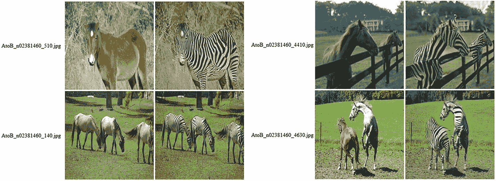

图 8-7

CycleGAN 测试输出（150 个 epoch 后）

## 摘要

GANs（生成对抗网络）在人工智能领域的创意、音乐和艺术应用方面具有巨大的潜力。自从 2014 年首次提出以来，GANs 的创新以惊人的速度发生。本章描述了 GANs 可以应用于各种用例。我们展示了 GAN 架构中生成器和判别器的使用，以及它们是如何被使用的。

接下来，我们讨论了 CycleGAN 的工作原理，并展示了它如何用于将一个领域的对象翻译到另一个领域。在本章给出的代码示例中，我们专注于如何训练和测试一种新型 GAN，称为 CycleGAN。

本章中的所有代码都是在 Azure 上可用的 Linux DLVM 上运行的。关于训练 AI 模型（例如 GANs）的选择的更多细节（例如计算环境和如何进行大规模训练）将在下一章中讨论。
