# 第四部分

AI 架构和最佳实践

# 9. 训练 AI 模型

训练 AI 模型通常比训练标准 ML 模型要求更高，因为它们处理密集且涉及的数据集通常更大。这就是为什么如果你对深度学习认真，你必须能够访问 GPU。在 Azure 中，有几种方法可以让你使用 GPU，无论是在单个虚拟机上还是在它们的编排集群中。在本章中，我们总结了最常见的一些方法以及每种方法的优缺点。然后我们扩展了在第六章中编写的代码，该代码使用类似 VGG 的 CNN 来处理 CIFAR10 数据集，并使用 DLVM 作为计算环境。在本章中，我们扩展到其他训练选项，如批处理 AI 和批处理船坞，这两种方法都可以用于扩展或扩展训练。最后，我们简要介绍了 Azure 上训练 AI 模型的其他一些方法，这些方法可能不如常见，但根据问题的不同可能很有用。

## 训练选项

Azure 提供了大量的选项用于训练 AI 模型。在这里，我们将仅限于介绍我们认为能满足大多数工作负载类型需求的少数几种。我们讨论的四种训练 AI 模型的方法分别是 DLVM、批处理 AI、批处理船坞和 DL 工作空间。没有一种训练 AI 模型的最佳方式；每种方法都有其优点和缺点，并且某些方法可能比其他方法更适合某些解决方案。深度学习模型的训练可以在单个 GPU 机器上进行，也可以分布到多个 GPU 机器上。最常见的情况是每个模型使用单个 GPU 机器，因为以分布式方式训练模型需要额外的考虑，这可能会相当棘手，但可能由模型太大而无法适应单个 GPU 机器或希望减少训练时间等因素所必需。

在本章中，我们没有提及在训练 AI 模型之前通常需要的数据处理。例如，原始数据通常需要经过处理才能被深度学习模型读取，ML 算法应该学习的标签可能存储在数据库中，或者原始数据可能来自许多来源。在 Microsoft AI 平台中提供了许多工具和选项来完成此类工作，例如 Azure SQL 数据仓库和 CosmosDB 用于存储不同类型的数据，以及 Azure 数据工厂用于数据移动，这些内容超出了本章的范围。我们假设在此目的下，数据是以 AI 模型可以训练的格式提供的。

### 分布式训练

分布式训练用于整个数据集无法存储在单个机器上或模型无法适应单个 GPU 的情况，但最常见的是用于实现更快的训练。分布式训练的两种主要类型是数据并行或模型并行。

在数据并行性中，相同的模型将在许多 GPU 之间复制，并将接收不同的训练数据批次。然后汇总梯度，并将更新分发给模型。在这种情况下，通信开销可能相当大，因此一个活跃的研究领域是如何通过探索异步更新（Calauzènes & Roux, 2017；Dean et al., 2012；Recht, Re, Wright, & Niu, 2011）或通过压缩或量化权重更新（Lin, Han, Mao, Wang, & Dally, 2017；Recht et al., 2011）来提高此过程的效率。

使用模型并行性，模型将在多个 GPU 之间分割。这种情况的一个例子可能是将不同的层放置在不同的 GPU 上，并且模型的前向和反向传播涉及节点间的网络通信。这是一个远比常见的情况，并且只有在模型无法适应单个 GPU 时才是必要的。

在这些场景中，假设每个虚拟机只有一个 GPU，通常称为多节点多 GPU，但实际上 Azure 有配置，单个虚拟机上可以有高达四个 GPU。除了数据太大无法适应单个虚拟机的场景外，所有已解释的场景都可以在单节点多 GPU 场景下执行。在这种情况下，通信开销通常不是一个大问题，因为它发生在单个节点上，如果深度学习框架使用 Nvidia 的 NCCL 多 GPU 库（[`http://bit.ly/nvidianccl`](http://bit.ly/nvidianccl)），则可以表现得更好。

### 深度学习虚拟机

DLVM 是一个具有多种配置的单个虚拟机，其中一些配置包含 GPU，并且是 DSVM 的特殊配置版本。目前具有 GPU 的虚拟机类型有 NC、NV、ND、NCv2 和 NCv3，其中最便宜的是 NC 系列。这些虚拟机安装了相应的 GPU，包括 NVIDIA Tesla K80、M60、P40、P100，最后是 V100。它们从最不强大到最强大依次排列，单个 K80 提供大约 4.4 万亿次浮点运算，单个 V100 提供大约 14 万亿次浮点运算。¹

注意

即使是最不强大的 GPU（K80）与在 CPU 上训练 AI 模型相比，也能显著减少训练时间。

每个虚拟机系列都可以提供三种配置：一个 GPU、两个 GPU 或四个 GPU。请参阅 Azure 上所有虚拟机的当前文档，了解有关 VM 的详细信息，请访问[`http://bit.ly/AzureVMs`](http://bit.ly/AzureVMs)，以及 DSVM 的详细信息，请访问[`http://bit.ly/AzureDSVM`](http://bit.ly/AzureDSVM)。

通过使用 DLVM，我们可以直接进入解决我们的数据科学问题，因为所有库都预安装在预先制作的 Anaconda 环境中，如图 9-1 所示。DLVM 是实验的绝佳选择，但如果您想进行大规模模型/数据并行训练或简单地并行探索各种超参数，后一种选项会更好。

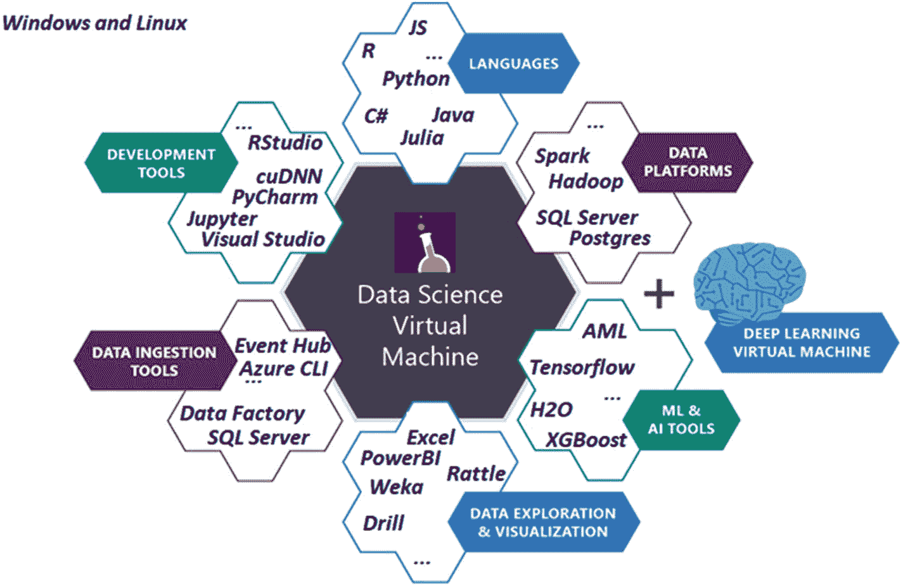

图 9-1

数据科学虚拟机是云中为数据科学和人工智能建模、开发和部署预配置的环境。深度学习虚拟机是针对深度学习工作负载的特殊配置

### Batch Shipyard

Batch Shipyard 是一个通用的工具，用于运行基于容器的批量处理和高性能计算（HPC）工作负载。通过在 Azure Batch 的基础上构建，Batch Shipyard 能够利用其功能，例如处理云中大规模并行和 HPC 应用程序周围的复杂性，管理诸如虚拟机部署和管理、作业调度以及自动扩展需求等方面。在 Azure 上运行作业时，使用 Azure Batch 没有额外成本；这是一个免费的价值增值服务，其中成本仅限于消耗的计算资源和相关的数据中心移动和存储成本。

Batch Shipyard 使用 Docker 容器，这使得它易于管理伴随人工智能工作负载而来的复杂依赖关系。Batch Shipyard 作为 CLI 可在本地或使用 Azure Cloud Shell 在云中运行。编排通过易于理解的配置文件进行管理，这使得重用脚本变得容易。它已经包含了一些最受欢迎的深度学习框架的大量示例（见[`bit.ly/shipyard24c3`](http://bit.ly/shipyard24c3)）。

以下是一些使用 Batch Shipyard 的优点：

+   它与 Azure Batch 基础设施相关联，因此得到了良好的支持。

+   它可以通过 CLI 使用，也适用于云壳。

+   它支持许多不同类型的虚拟机，包括 GPU。

+   它支持低优先级节点，这使得它非常高效。

+   它具有工厂方法来支持简单的超参数调整。

使用 Batch Shipyard 的缺点包括以下：

+   它与 Batch 基础设施相关联，因此没有对其自己的集群的支持。

+   没有 REST API 或 Web 前端，只有 CLI。

### Batch AI

Batch AI 与 Batch Shipyard 非常相似，因为它在 Azure Batch 上运行，并允许你运行各种人工智能工作负载。Batch Shipyard 和 Batch AI 之间的核心差异如下：

1.  它是一个托管服务。这意味着使用 Batch Shipyard 时，CLI 正在调用 Azure Batch 并设置一切。使用 Batch AI 时，有一个云中的服务，我们称之为使用 CLI、REST API 或 SDK，并编排一切。在实践中，这意味着有更丰富的与 Batch AI 交互的方式，并且作为管道的一部分更容易编排。

1.  Batch AI 可以在 DSVM 或 DLVM 上执行，这使得它能够在不处理容器复杂性的情况下运行。如果你不想处理容器的复杂性，这将非常容易上手。

1.  Batch AI 为在 PyTorch、TensorFlow 等众多深度学习框架上运行分布式训练提供了专门的支持。在实践中，这意味着一些复杂性，如设置消息传递接口（MPI），将由 Batch AI 自动配置。

这些是 Batch AI 的一些优点：

+   它是一个托管服务。

+   它有多种方式与 CLI、SDK 和 REST API 交互。

+   它绑定到 Azure Batch 基础设施，因此得到了很好的支持。

+   它支持许多不同类型的虚拟机，包括 GPU。

+   它支持低优先级的节点，这些节点非常经济高效。

+   它可以支持 DSVM 和 DLVM 作为计算目标。

以下是一些使用 Batch AI 的缺点：

+   它与 Batch Shipyard 没有功能对等性。Batch Shipyard 提供了一些用于超参数搜索的不错的方法，但这些方法尚未被引入 Batch AI。

+   它目前处于预览阶段，并非所有地区都可用。

### 深度学习工作区

深度学习工作区（Deep Learning Workspace，DLWorkspace）是微软的一个开源项目，允许 AI 科学家以即插即用的方式启动集群，无论是本地还是云中。DLWorkspace 使用 Kubernetes 来管理跨各个节点的作业。Kubernetes 是一个流行的开源容器编排器，我们将在第十章中详细介绍它。DLWorkspace 提供了一个 Web 用户界面（UI）和 REST API，用户可以通过这些接口提交、监控和管理作业。这与 Batch AI 和 Batch Shipyard 有很大不同，因为它不依赖于 Batch 基础设施来管理事物，也不绑定到 Azure 基础设施。这也意味着它比其他两种选项需要更多的用户管理，但它提供了最大的灵活性。它也比其他两种选项成熟度低。

以下是一些 DLWorkspace 的优势：

+   它不依赖于特定的基础设施，因此可以在本地集群和云中运行。

+   它使用知名的容器编排器 Kubernetes。

DLWorkspace 的一些缺点如下：

+   它需要比 Batch Shipyard 或 Batch AI 更多的设置。

+   它更难集成到管道中。

+   它仍在积极开发中。

## 沿用示例

在许多前面的章节中，我们已经展示了如何在具有 GPU 的 DLVM 上训练深度学习模型，因此在这里不再赘述。在接下来的章节中，我们将使用我们在第六章中编写的代码，该代码使用类似 VGG 的 CNN 来解决 CIFAR10 数据集，扩展到使用 Batch Shipyard 和 Batch AI。如果您不记得我们当时做了什么，最好回去复习一下。

### 在 Batch Shipyard 上训练 DNN

在本节中，我们将介绍如何在 Batch Shipyard 上训练 CNN 的一般步骤。我们执行 AI 脚本所遵循的步骤在笔记本`Chapter_09_01.ipynb`²中详细说明，并在图 9-2 中展示。

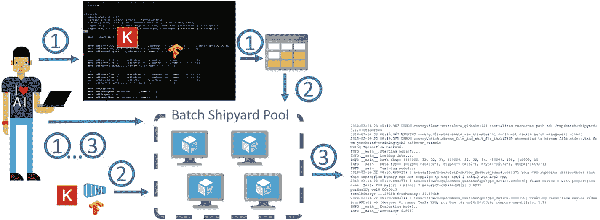

图 9-2

在 Batch Shipyard 上运行所需步骤。（1）创建必要的 Azure 资源、配置文件和脚本。（2）调用 pool create，这将启动创建我们集群的过程。同时，这将把我们所创建的脚本拉入文件共享中。它还将拉取 Docker 镜像，使其可供池中的节点使用。（3）告诉 Batch Shipyard 执行作业并详细说明输出。一旦所有操作完成，我们将删除作业、集群和 Azure 资源。

1.  如您从图 9-2 中的步骤中可以看到，在 Batch Shipyard 上训练您的模型需要满足一些先决条件。将训练您模型的脚本。

1.  包含脚本所需所有依赖项的 Docker 容器，例如深度学习框架等。

1.  Azure 存储账户和 Azure Batch 账户。

1.  Batch Shipyard 配置文件。这些可以是 YAML 或 JSON 文件，将包含定义我们想要 Batch Shipyard 为我们做什么的所有必要信息。

我们的模型脚本将与我们在 `Chapter_06_03.ipynb` 笔记本中写的非常相似，但它将是一个 Python 文件而不是 Jupyter 笔记本，并且我们将添加传递参数给它的能力。这样做的原因是为了简化执行过程，并且我们可以看到模型在不同超参数配置下的表现。这通常被称为超参数搜索，它是创建 AI 模型的重要步骤。该脚本将下载 CIFAR10 数据，创建和训练我们的模型，并在测试数据集上对其进行评估。

在脚本准备就绪后，我们需要创建自己的 Docker 镜像或引用预构建的一个。许多最受欢迎的深度学习框架要么提供 Docker 镜像，至少也提供 Dockerfile，您可以使用它来创建镜像。对于以前没有使用过 Docker 的人来说，这可能相当令人畏惧。幸运的是，网上有许多指南，Docker 文档也非常好（见[`bit.ly/dockerstarted`](http://bit.ly/dockerstarted)）。在这里，我们只是使用为这本书创建的 Docker 镜像。

我们假设您已经创建了 Azure 存储和 Batch 账户。创建这些账户的步骤在附带的笔记本的“创建 Azure 资源”部分中概述。对于 Batch Shipyard，有四个配置文件：

+   `credentials.yaml`：在这里，我们放置我们使用的所有资源的凭证。在我们的例子中，它只是存储账户和 Batch 账户。

+   `config.yaml`：指定 Batch Shipyard 的配置。在这里，我们将简单地指定要使用的存储账户以及我们想要使用的镜像的位置。

+   `pool.yaml`：此配置文件定义了我们的池属性，本质上是我们想要分配的虚拟机数量和我们希望分配的虚拟机类型。

+   `jobs.yaml`: 在此配置文件中，我们指定要执行的任务。我们可以指定一个或多个任务，每个任务可以有一个或多个任务。如何划分将取决于您要运行的任务以及它们有多少共同之处。在此文件中，我们通常指定要使用哪个 Docker 镜像，从哪里导入数据，以及要执行哪些命令。更多详情请参阅[`bit.ly/shipyardjobs`](http://bit.ly/shipyardjobs)。

从现在起，我们将假设您正在 Linux 终端或运行在 Linux 上的 Jupyter 笔记本中运行这些操作。现在我们已经定义了我们的配置文件和脚本，我们需要创建我们的集群，这将在列表 9-1 中完成。

```py
BASH
shipyard pool add --configdir config
Listing 9-1
Command to Create a Batch Cluster
```

此命令告诉 Batch Shipyard 根据我们位于`config`目录中的`pool.yaml`文件中指定的配置创建池。这将启动虚拟机并导入我们在配置文件中指定的任何文件，在我们的例子中只是我们的模型脚本。配置池可能需要 5 到 15 分钟，具体取决于指定的虚拟机数量。您能创建的虚拟机数量取决于您的批量账户配额。如果您需要为您的批量账户更多的虚拟机，您可以通过 Azure 门户简单请求配额增加（[`bit.ly/azbatchquota`](http://bit.ly/azbatchquota)）。

在创建好池之后，我们只需添加任务。在此列表 9-2 中，我们提交了任务，并且还交互式地跟踪了任务的输出。

```py
BASH
shipyard jobs add --configdir config --tail stdout.txt
Listing 9-2
Submit Job to Batch Shipyard and Tail Output
```

如果一切顺利，您应该开始看到输出被流式传输到您的笔记本或终端。脚本将首先下载 CIFAR 数据，训练模型，并评估它。您还可以通过访问 Azure 门户查看您的集群和作业的状态，在那里您应该看到类似于图 9-3 的内容。

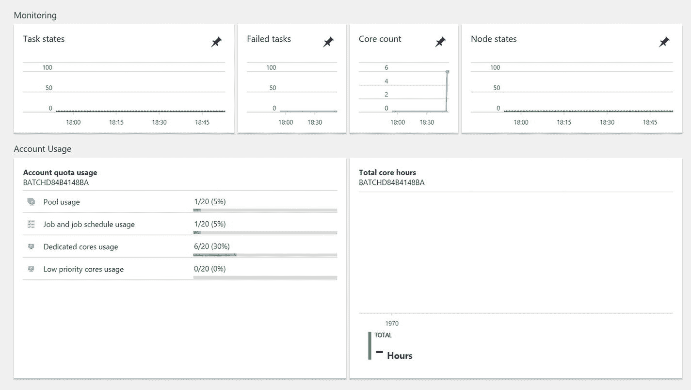

图 9-3

Azure 门户中的批量仪表板

通过运行列表 9-3，我们流式传输`stderr.txt`的输出。这可以用来审查错误和调试我们的脚本。

```py
BASH
shipyard data files stream -v --filespec my_job_id,my_task_id,stderr.txt
Listing 9-3
Stream Output to Help Review Errors and Debug Scripts
```

一旦您完成了您的任务，最好删除它，以免它计入您的活动作业配额，正如我们在列表 9-4 中所做的那样。

```py
BASH
shipyard jobs del --configdir config -y –wait
Listing 9-4
Delete Batch Shipyard Jobs
```

最后，使用列表 9-5 中显示的代码删除您的池，这样您在未使用时就不会产生虚拟机费用。

```py
BASH
shipyard pool del --configdir config -y
Listing 9-5
Delete Batch Shipyard Pool
```

这似乎为执行单个任务带来了很多开销，但当您需要执行大量任务时，初始开销与节省的时间相比微不足道。

#### 超参数调整

训练一个 AI 模型，甚至任何类型的机器学习模型，都需要调整各种超参数，这些超参数限制了我们的模型行为。按顺序进行这种调整既费时又费力。通过并行运行这些实验，我们可以节省大量时间，并更快地找到最佳配置。云服务和类似 Batch Shipyard 和 Batch AI 这样的服务的关键优势之一是能够根据需要扩展我们的计算能力。这意味着我们可以探索大量配置，并且只需为所需的计算付费，从而极大地加速数据科学过程。

如前所述，Batch Shipyard 提供了一种方便的方式来生成超参数任务，称为任务工厂。使用任务工厂，我们可以以多种方式生成任务参数，例如从随机分布、均匀分布、伽马分布、贝塔分布、指数分布、高斯分布等。

我们将在`jobs.yaml`文件中定义我们的任务工厂。让我们假设我们想要参数化我们的 VGG 架构并探索学习率对我们模型的影响。我们可以通过任务工厂规范（见列表 9-6）来实现这一点。

```py
YAML
task_factory:
random:
distribution:
uniform:
a:0.001
b:0.1
generate:10
command: /bin/bash -c "python -m model.py –lr {}"
Listing 9-6
Task Factory Specification to Generate Hyperparameter Tasks
```

这段 YAML 代码将指导 Batch Shipyard 从 0.001 到 0.1 的均匀分布中随机采样 10 个值，并运行`model.py`脚本。

任务工厂不仅限于从分布中生成值；它们还可以根据自定义生成器生成任务，以适应更复杂的超参数环境。有关任务工厂的更多详细信息，请参阅[`bit.ly/shipyardtfactory`](http://bit.ly/shipyardtfactory)。

#### 分布式训练

在多节点、多 GPU 训练场景中，Batch Shipyard 负责设置集群和分配工作，但不处理节点之间的通信。这必须由深度学习框架本身来处理。不同的框架使用不同的协议在它们之间传递信息，例如 MPI（CNTK、Horovod）或 gRPC（TensorFlow）。确保打开适当的端口并启动适当的进程非常重要，这在不同深度学习框架之间可能有所不同。在 Batch Shipyard 中，这类任务被称为多实例任务，需要在工作配置文件中指定为这样的任务。一个示例配置文件可以在列表 9-7 中看到。

```py
YAML
job_specifications:
- id: tensorflow
auto_complete:true
tasks:
-docker_image:alfpark/tensorflow:1.2.1-gpu
multi_instance:
num_instances:pool_current_dedicated
command: /bin/bash -c "/shipyard/launcher.sh /shipyard/mnist_replica.py"
Listing 9-7
Multi-Instance Tasks to Specify Multinode, Multi-GPU Tasks
```

要详细了解如何在 Batch Shipyard 中执行数据并行训练，请参阅[`bit.ly/shipyarddist`](http://bit.ly/shipyarddist)。

#### 在 Batch AI 上训练 CNN

在许多方面，Batch AI 与 Batch Shipyard 非常相似（见图[9-4]）。它提供 Python SDK 以及 CLI。在我们的示例中，我们概述了如何使用 CLI，因为它比 SDK 稍微容易一些。这里提到的所有步骤都在配套的笔记本中，您可以使用它来运行示例（`Chapter_09_02.ipynb`）。

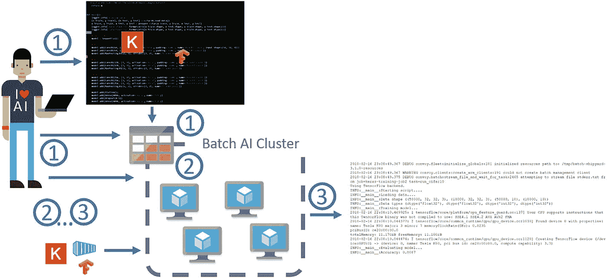

图 9-4

Batch AI 训练步骤：(1) 创建必要的 Zzure 资源、作业配置文件和脚本，并将脚本上传到文件共享。(2) 调用集群创建，这将启动创建我们集群的过程。它还将拉取 Docker 镜像并将其提供给池中的节点，并挂载文件共享。(3) 运行作业配置中指定的命令。调用作业流文件以跟踪作业的输出。一旦训练完成，删除作业、集群和 Azure 资源。

Batch AI 使用我们之前安装的 Azure CLI。要注册 Batch AI，请运行列表 9-8 中显示的代码。

```py
BASH
az provider register -n Microsoft.BatchAI
az provider register -n Microsoft.Batch
Listing 9-8
Register for Batch AI Service
```

在撰写本文时，Batch AI 仅在东 US 区域可用，因此我们将在那里创建所有资源。我们假设您已经创建了一个存储账户和一个文件共享，并将脚本上传到了文件共享。这些步骤在附带的笔记本（`Chapter_09_02.ipynb`）中的“创建 Azure 资源”和“定义我们的模型”部分。要创建我们的集群，我们运行列表 9-9 中的代码。

```py
BASH
az batchai cluster create -l eastus -w workspace --name my_cluster --vm- size STANDARD_NC6 --image UbuntuLTS --min 1 --max 1 --storage- account- name my_storage_account --storage-account-key my_ storage_account_key --afs-name my_fileshare --afs-mount-path azurefileshare --user-name my_username --password my_password
Listing 9-9
Create Batch AI Cluster
```

所有以`my`开头的前缀值都应该由您定义，并且它们应该与您已经创建的 Azure 资源相匹配。在前面的命令中，我们使用了`az batchai cluster create`([`az batchai cluster create`](https://docs.microsoft.com/en-us/cli/azure/batchai/cluster#az_batchai_cluster_create))命令来创建一个名为`my_cluster`的 Batch AI 集群，该集群由一个 GPU VM 节点组成。在这个例子中，虚拟机运行的是默认的 Ubuntu LTS 镜像。如果您希望使用 DSVM 作为执行目标，只需指定`image UbuntuDSVM`即可。指定的虚拟机是 NC6，它配备了一个 NVIDIA K80 GPU。我们还告诉它将文件共享挂载到一个名为`azurefileshare`的文件夹中。这个文件夹在 GPU 计算节点上的完整路径是`$AZ_BATCHAI_MOUNT_ROOT/azurefileshare`。`AZ_BATCHAI_MOUNT_ROOT`是一个由 Batch AI 设置的环境变量。请确保存储账户和文件共享信息与您创建的信息相匹配；否则，共享将无法挂载，您的节点将无法使用。

创建池需要的时间与批量船坞相似，大约需要 5 到 15 分钟。要检查集群的状态，只需运行列表 9-10 中显示的代码。

```py
BASH
az batchai cluster list -w workspace -o table
Listing 9-10
Check on the Status of the Batch AI Cluster
```

要提交作业，我们必须以与批量船坞类似的方式创建一个配置文件。对于我们来说，配置文件看起来像列表 9-11 中的代码。

```py
JSON
{
"$schema": "https://raw.githubusercontent.com/Azure/BatchAI/master/schemas/2017-09-01-preview/job.json",
"properties": {
"containerSettings": {
"imageSourceRegistry": {
"image": "masalvar/keras_bait"
}
},
"customToolkitSettings": {
"commandLine": "python $AZ_BATCHAI_INPUT_SCRIPT/cifar10_cnn.py"
},
"inputDirectories": [
{
"id": "SCRIPT",
"path": "$AZ_BATCHAI_MOUNT_ROOT/azurefileshare/cnn_example"
}
],
"nodeCount": 1,
"stdOutErrPathPrefix": "$AZ_BATCHAI_MOUNT_ROOT/azurefileshare"
}
}
Listing 9-11
Example Configuration File for Batch AI
```

更多示例，请查看[`bit.ly/baistart`](http://bit.ly/baistart)。在作业配置中，我们定义了 `inputDirectories`、我们想要使用的容器以及要执行的命令。在作业定义中，您会注意到在 `inputDirectories` 下，我们定义了一个带有 id 脚本的输入目录。此位置由 Batch AI 映射到环境变量 `AZ_BATCHAI_INPUT_SCRIPT`，我们在 `commandLine` 变量中引用它。一旦我们创建了作业 JSON 文件，我们通过运行列表 9-12 中的代码来执行作业。

```py
BASH
az batchai job create -w workspace -e experiment --name my_job --cluster-name my_cluster --config job.json
Listing 9-12
Execute the Batch AI Job
```

我们可以通过运行列表 9-13 中的代码来监控作业。

```py
BASH
az batchai job list -w workspace -e experiment -o table
Listing 9-13
Monitor the Batch AI Job
```

如果您转到 Azure 门户并点击集群，您应该会看到类似于图 9-5 中的图像。门户还提供了其他诊断信息，例如每个作业的状态和资源组中的作业数量（见图 9-6 和图 9-7）。这对于长时间运行的作业来说非常方便，当您只想从任何浏览器检查事物状态时。从门户中获取的 Batch AI 信息比从 Batch Shipyard 获取的更丰富。

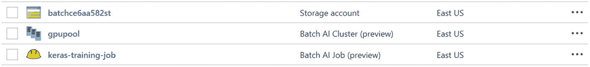

图 9-7

门户中显示的我们的资源组信息。请注意，我们的集群名为 `gpupool`，作业名为 `keras-training-job`；这些是在配套笔记本中的示例中使用的名称。

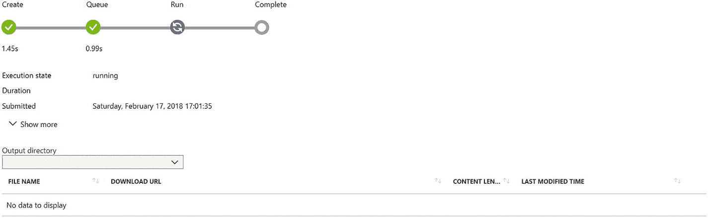

图 9-6

Batch AI 作业仪表板

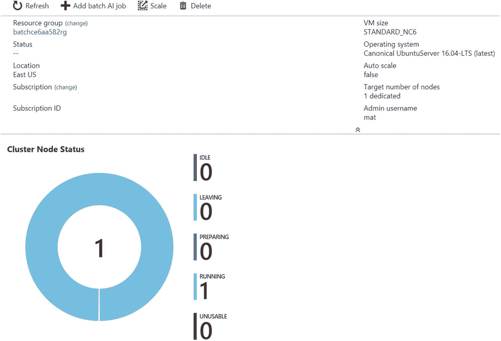

图 9-5

Azure 门户中的 Batch AI 集群仪表板

要以与我们在 Batch Shipyard 中相同的方式跟踪 `stdout` 的输出，我们只需运行列表 9-14 中的代码。

```py
BASH
az batchai job file stream -w workspace -e experiment --j my_job --output-directory-id stdouterr --f stdout.txt
Listing 9-14
Stream Output to Help Review Errors and Debug Scripts with Batch AI
```

作业完成后，要删除作业，我们运行列表 9-15 中的代码。

```py
BASH
az batchai job delete -w workspace -e experiment --name myjob
Listing 9-15
Delete Batch AI Job
```

现在，我们通过运行列表 9-16 中的代码来删除集群，这样我们就不会继续产生计算费用。

```py
BASH
az batchai cluster delete -w workspace -e experiment --name mycluster
Listing 9-16
Delete Batch AI Cluster
```

最后，如果我们不想保留我们创建的存储帐户和其他资源，我们可以通过执行列表 9-17 中的代码来清除所有内容。

```py
BASH
az group delete --name myResourceGroup
Listing 9-17
If No Longer Needed, Delete Storage Account and Other Resources
```

#### Hyperparameter Tuning and Distributed Training

在 Batch AI 中进行超参数调整不如在 Batch Shipyard 中简单。没有任务工厂的概念，因此我们需要创建多个作业，向我们的模型传递不同的参数。因此，在我们的作业示例中，JSON 文件在作业之间非常相似，唯一的区别是命令，特别是我们传递给脚本的参数。使用 Batch AI Python SDK 而不是 CLI 可以使超参数调整过程变得更简单。有关 Python SDK 的更多详细信息，请查看[`bit.ly/baitsdk`](http://bit.ly/baitsdk)。

对于批处理 AI 支持的框架来说，在批处理 AI 中进行分布式训练比在批处理船坞中要稍微容易一些，因为批处理 AI 负责配置必要的节点间通信层，如 MPI。在撰写本文时，支持的框架包括 Chainer、CNTK、TensorFlow、PyTorch 和 Caffe2。对于不受支持的框架，用户需要提供适当的配置，将与批处理船坞相同。有关如何操作的示例，请参阅[`http://bit.ly/bairecipes`](http://bit.ly/bairecipes)。

#### 使用 Python SDK 的批处理 AI 变体

在早期的例子中，我们展示了使用 Azure CLI 与批处理 AI 结合使用，这是开始使用批处理 AI 的最简单方法。批处理 AI 也可以通过 Python SDK 使用。本节中描述的演示示例可以按照在[`http://bit.ly/deepbait`](http://bit.ly/deepbait)给出的说明进行重现。在这个例子中，我们不是展示超参数调整或分布式训练的示例，而是使用九个不同的深度学习框架在 CIFAR10 数据集上训练一个简单的 CNN。在实际应用中，能够快速利用不同的框架可能非常有用，因为某些模型的最先进实现可能只存在于一个或少数几个框架中。然而，通常人们会选择一个单一的框架，并使用该框架进行本章所述的超参数调整或分布式训练。然而，这个例子也具有教学目的，展示了批处理 AI 服务的灵活性以及与该服务交互的不同方式。

在这个例子中，项目是在 Azure Ubuntu DLVM 上开发和测试的。在这种情况下使用 Anaconda 项目来创建环境、安装依赖项、下载数据，并允许用户以简单的方式与项目交互，以重现演示，例如通过命令行提示符请求 Azure 订阅标识符和应创建批处理 AI 集群的资源组名称。该项目还附带 makefiles，以帮助进行本地测试和调试，从而更容易修改项目。

这个例子也与早期的批处理 AI 示例在 Jupyter Notebooks 的使用上有所不同，如图 9-8 所示，Jupyter Notebooks 是直接发送到批处理 AI 集群，而不是 Python 脚本。直接使用 Jupyter Notebooks，代码可以在笔记本内直接处理和存储输出。这对于已经在 Jupyter Notebooks 中开发的数据科学家来说很有用，他们希望通过这些笔记本展示结果（例如，在处理过程中或之后创建的可视化）。在这种情况下，创建了九个不同的 Jupyter 笔记本（每个深度学习框架一个），以及相关的 Docker 容器，笔记本在这些容器中使用批处理 AI 运行。

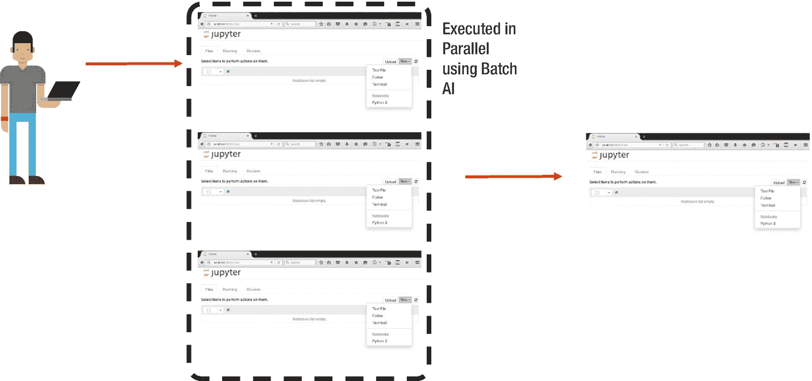

图 9-8

而不是必须按顺序运行 Jupyter Notebooks 来测试不同的选项，它们可以使用 Batch AI 并行执行。

每个笔记本都编写了可以在 Batch AI 集群上运行时修改的参数。在示例项目中，为了说明目的，运行时修改了原始文件中的 epoch 数量。具体来说，发送到集群的原始笔记本在笔记本顶部有如下参数作为示例，列于 9-18。

```py
PYTHON
# Parameters
EPOCHS = 10
N_CLASSES=10
BATCHSIZE = 64
LR = 0.01
MOMENTUM = 0.9
GPU = True
Listing 9-18
Example Parameters at Top of Script That Are Modified When Run by Batch AI
```

在作业提交中，Batch AI 集群被指示在这个例子中修改要运行的 epoch 数量（作为参数更改的一个示例），笔记本被修改并使用不同的 epoch 数量运行。运行结束后，笔记本包含一个包含所有运行参数的单元格，以及笔记本本身存储的每个单元格的输出。这使得查看结果变得容易：所有重要信息都存储在笔记本中。

使用九种不同的深度学习框架运行简单 CNN 所遵循的步骤如下，如图 9-9 所示。

1.  创建在 Batch AI 上运行的 Jupyter notebooks 并将其传输到文件存储。

1.  将数据写入文件存储。

1.  为每个深度学习框架创建 Docker 容器并将它们传输到容器注册库。

1.  创建一个 Batch AI 集群。

1.  每个作业都会拉取适当的容器和笔记本，并从文件共享加载数据。

1.  作业完成后，执行笔记本将被写入文件共享。

这些步骤与之前在 CLI 中使用 Batch AI 描述的步骤非常相似，只是这次是在 Jupyter Notebooks 中使用。除了通过 Batch AI 实现的并行处理能力，可以减少实验时间外，这个场景还展示了云计算的强大之处，即可以根据需求启动多台机器，用于所需的处理，然后关闭集群。这为数据科学家提供了更大的灵活性，同时大幅降低了成本，无需采购特殊硬件或管理系统。

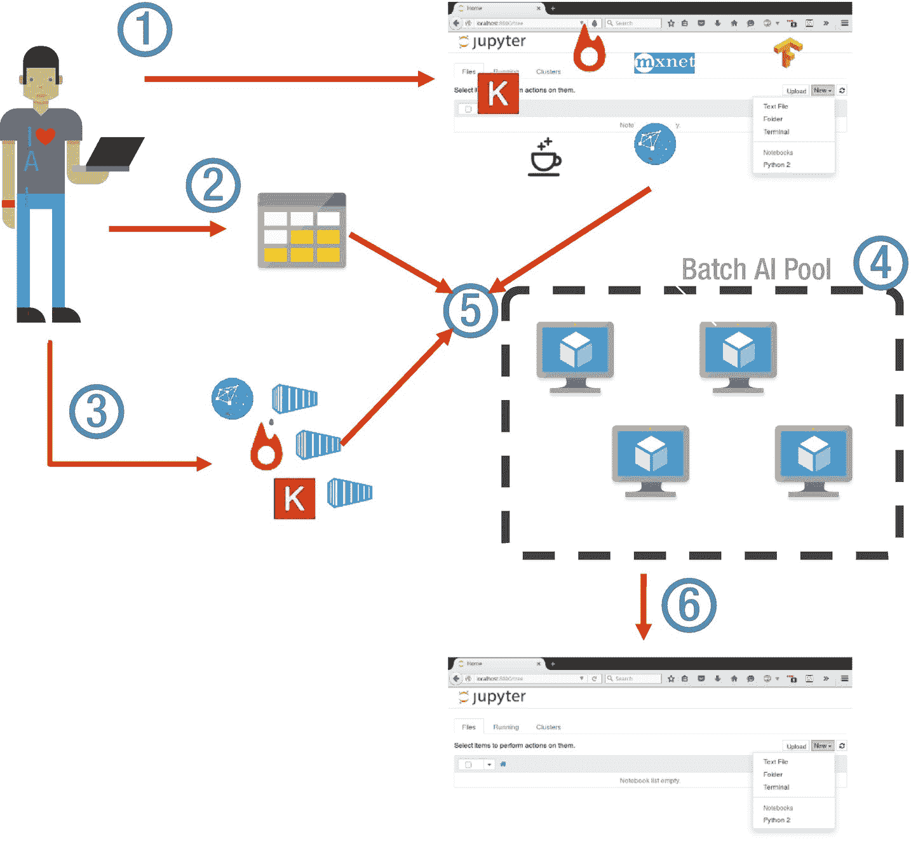

图 9-9

为了说明 Batch AI 的灵活性，使用九种不同的深度学习框架运行简单 CNN 所需的步骤，代码处理和输出存储在 Jupyter Notebooks 中。

包含了一些辅助函数，以便轻松与 Batch AI 集群交互，如图 9-10 中的 `setup_cluster( )` 函数和图 9-11 中的 `print_jobs_summary( )`。

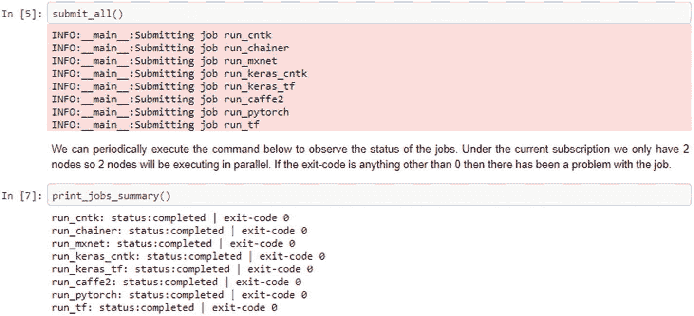

图 9-11

使用 `ExploringBatchAI.ipynb` 文件将作业提交到 Batch AI。

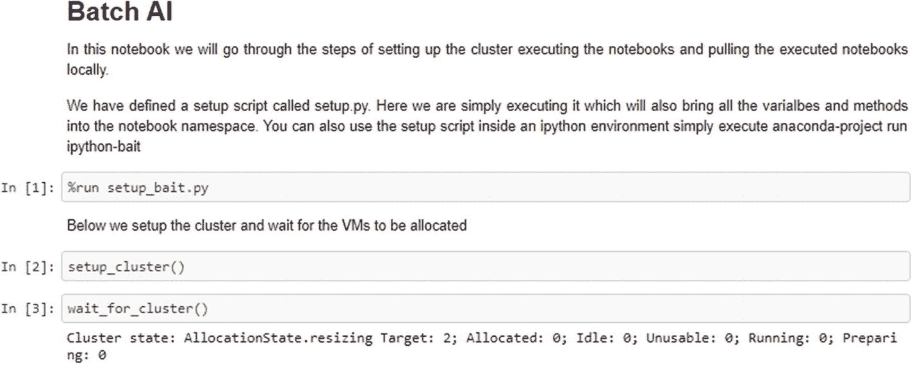

图 9-10

在 DLVM 上设置 Anaconda 项目后，示例通过包含与集群交互的辅助函数的 Jupyter 笔记本运行。

### Azure Machine Learning 服务

本章主要关注运行 AI 作业的计算环境和设置，这可以通过 DLVM、Batch Shipyard、Batch AI 和 DLWorkspace 作为四个主要示例来完成。在第四章中更深入介绍的 Azure Machine Learning 服务，是一组能够以端到端的方式构建、部署和管理 AI 模型的服务。Azure Machine Learning 管理数据科学生命周期，例如提供模型版本控制和运行历史记录的能力（见[`bit.ly/amllogging`](http://bit.ly/amllogging)），跟踪生产中的模型，并帮助 AI 开发者更快地开发。Azure Machine Learning 服务还旨在简化部署过程，例如在 Azure Kubernetes 服务（AKS）的 Kubernetes 集群中运行包含 AI 模型的 Docker 容器，以实现可扩展的实时预测，或者使用 Azure IoT 在边缘设备上运行（见图 9-12）。

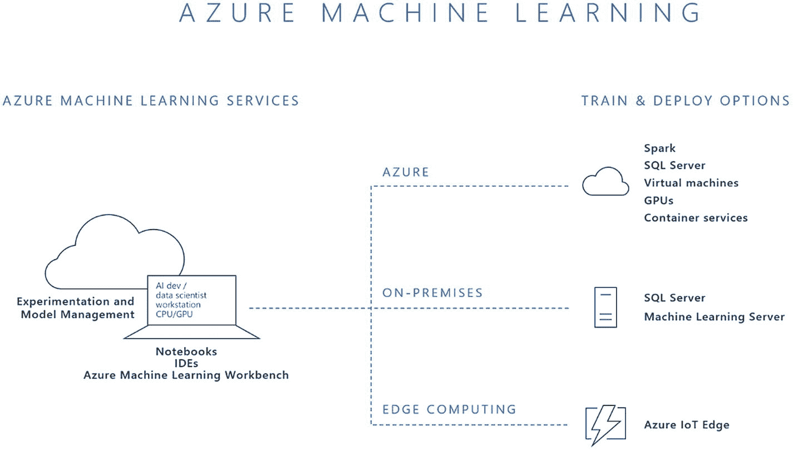

图 9-12

Azure Machine Learning 是一个开源兼容的端到端数据科学平台。来源：[`bit.ly/AMLservices`](http://bit.ly/AMLservices) 。 

本章中提到的某些服务，如 DLVM 和 Batch AI，可以作为 Azure Machine Learning 项目中的计算上下文进行设置。截至本文撰写时，Azure Machine Learning 服务与 Python 兼容，并在多个 Azure 区域可用。此外，还有 Visual Studio 和 Visual Studio Code 的 AI 扩展，允许与 Azure Machine Learning 平台交互（见[`bit.ly/aivisstdio`](http://bit.ly/aivisstdio)）。由于服务频繁更新，我们本章重点介绍了核心计算环境，并建议阅读可在[`bit.ly/AMLservices`](http://bit.ly/AMLservices)找到的当前 Azure Machine Learning 服务文档。

### Azure 上 AI 训练的其他选项

在 Azure 上还有许多其他 AI 训练选项，我们在此不进行深入描述，但在此简要提及一些。第一个例子是基于 Apache Spark，这是一个流行的通用大数据处理引擎。Azure 上有几个 Apache Spark 的版本，例如 Azure Databricks 和 Azure HDInsight。使用 Spark 训练 AI 模型的一个流行选项是通过使用微软的 MMLSpark 库，该库提供了一系列深度学习和数据科学工具，作为开源项目在 GitHub 上提供，网址为[`http://bit.ly/mmlSpark`](http://bit.ly/mmlspark)。MMLSpark 将 Spark ML 管道与深度学习框架 CNTK 以及 OpenCV 集成。如果 AI 解决方案的数据已经存在于 SPARK 中，这特别有用。MMLSpark 可以在 GPU 节点上训练深度学习模型，因此可以在描述在[`http://bit.ly/MMLSparkGPU`](http://bit.ly/MMLsparkGPU)的 DLVM 上使用。

将 GPU 虚拟机附加到 Spark 集群的另一种选择是利用迁移学习，在 Spark 集群上以并行方式使用 MMLSpark 应用预训练模型，然后使用 Spark 中的许多 ML 包之一训练分类器。这被用于雪豹保护，以预测包含雪豹的图像并协助保护工作，如汉密尔顿、森古普塔和阿斯塔拉（2017 年）在博客文章中所描述。

通过使用 Docker 容器集群，例如通过使用 Kubernetes，AI 训练也可以进行扩展。尽管到目前为止，我们主要看到 Kubernetes 集群被用于 AI 模型的部署和托管，但它们也可以用于大规模训练。张和布赫沃尔特（2017 年）描述了他们如何使用 Azure 容器服务引擎（ACS-engine），该引擎生成部署集群所需的 Azure 资源管理器模板。在他们的情况下，与初创公司 Litbit 合作，使用 Kubernetes 集群根据给定工作负载的需求上下调整不同类型的虚拟机池（CPU、GPU）。托克（2017 年）概述了通过 ACS-engine 使用 CNTK 与 Kubernetes，以及如何设置集群的详细说明，包括大规模训练和部署深度学习模型。

## 摘要

本章介绍了您可以使用来训练人工智能模型的多种选项。如果您只是想进行实验，那么深度学习虚拟机（DLVM）可能是最佳选择，因为它设置最快、最简单。如果您想运行超参数调整、分布式训练或将模型训练作为自动化流程的一部分，那么批量人工智能（Batch AI）或批量船坞（Batch Shipyard）将是完成这项工作的最佳工具。DLWorkspace 也是大规模实验的好选择，但今天我们主要推荐它仅在其他两个选项不适用的情况下使用。基于集群的训练方法一开始可能看起来令人畏惧，但它很快就会带来好处。批量人工智能（Batch AI）使用和设置最简单，批量船坞（Batch Shipyard）功能最丰富。我们只是触及了这些强大工具的表面。有关详细文档，请参阅[`http://bit.ly/azbai`](http://bit.ly/azbai) ，[`http://bit.ly/azshipyard`](http://bit.ly/azshipyard) ，和[`http://bit.ly/azdlwork`](http://bit.ly/azdlwork) 。在下一章中，我们将概述部署训练好的深度学习模型的不同选项，以便它们可以在人工智能应用程序中使用。

脚注 1

排序和数字基于单精度 FLOPS；具有两个芯片的卡被视为单个 GPU。

2

所有步骤都详细记录在笔记本 Chapter_09_01.ipynb 中，该笔记本位于 Chapter_09 文件夹中 [`bit.ly/CH09Notebooks`](http://bit.ly/CH09Notebooks)。

# 10. 运营人工智能模型

前一章介绍了构成人工智能模型的内容，我们可以创建的不同类型模型，以及如何训练和构建这些模型。人工智能模型只有在部署到某个地方并被最终用户使用时才会变得有用。本章描述了在 Azure 上部署您模型的各种选项。我们提供了关于何时使用什么的通用指南，但这绝不是 Azure 平台的详尽指南。在接下来的几节中，我们将讨论我们比较各种部署平台的指标。然后，我们将讨论我们发现适合部署机器学习模型的平台，并突出它们的优缺点。我们还为每个平台提供了简单的用例和架构，以便您了解它们如何融入更大的解决方案。我们还提供了一个逐步教程，用于将卷积神经网络（CNN）部署到 Azure Kubernetes 服务（AKS）的 GPU 节点上，作为构建实时请求-响应人工智能系统的推荐选项的实践指南。

## 运营平台

在查看模型运营化时，一个常见的二分法是评分请求将是批量还是实时。一个批量工作负载的例子是我们每隔 24 小时偶尔会收到大量记录，这些记录需要评分。这些记录可能是图像或其他类型的数据。实时工作负载是指服务必须始终在线，并且相对频繁地接收少量记录进行评分。一个例子可能是一个手机应用，它发送一张图片以确定图片中的动物类型。提供的例子非常适合它们各自的分类，但在现实中，事情往往远没有这么明确。例如，我们可能有一个需要大量计算或其他对我们解决方案的约束（这会破坏关键架构假设）的实时工作负载。这就是为什么通常更好地将这些解决方案视为一个连续体，其中每个解决方案都可以部分地扩展到它理想适合的范围之外。

在部署模型时，一个关键的考虑因素是依赖和环境管理。这不仅仅是一个特定于 AI 模型的问题：对于所有类型的部署应用来说，这是一个普遍存在的问题，但对于 AI 应用来说，由于它们通常具有复杂的依赖和硬件要求，这个问题变得更加突出。因此，使用 Docker 容器的服务通常更受欢迎，因为这使得保持开发和测试环境的一致性变得容易，同时也能确保所有依赖项都得到满足。如果您是 Docker 的新手，我们建议您查看基本概述，请访问[`http://bit.ly/DockerDS`](http://bit.ly/DockerDS)。

如我们之前提到的，AI 模型也有硬件要求；这些要求通常不如训练环境那么苛刻，但根据场景，可能仍然需要相当数量的计算资源。这就是为什么部署选项的另一个考虑因素是平台上的硬件，特别是 GPU 的可用性。如果没有 GPU，吞吐量可能会相当有限，这意味着服务将不得不处理缓慢的响应或必须扩展计算资源。

### DLVM

将某事物操作化的最简单方式是使用我们推荐的实验平台：虚拟机（VM），特别是数据科学或深度学习虚拟机（DLVM）。你将已经安装了所有依赖项，并且知道你的代码将在该平台上运行。除此之外，使用虚拟机，你可以在硬件配置方面获得最大的灵活性，甚至可以访问 GPU。这种操作化方式仅推荐用于概念验证和试点工作负载，因为没有管理基础设施，也没有扩展或分发负载的方法。使用虚拟机时，还可能使用 Docker 容器，这将是一种推荐的部署方式，因为这将使将容器移动到不同的虚拟机，以及移动到其他使用 Docker 容器的更合适的平台变得更加容易。

### Azure 容器实例

另一个用于操作化的简单平台是 Azure 容器实例（ACI）。ACI 是在 Azure 上运行容器的最简单和最快的方式；你不需要了解任何关于编排器（如 Kubernetes）或配置和管理虚拟机的内容。它非常适合托管简单应用程序和任务自动化。只需一条命令就可以部署你的预构建容器（见清单 10-1）。有关使用 ACI 部署的更多详细信息，请访问[`http://bit.ly/ACIstart`](http://bit.ly/ACIstart)。

```py
BASH
az container create --resource-group myResourceGroup --name mycontainer --image microsoft/aci-helloworld --dns-name-label aci-demo --ports 80
Listing 10-1
Deploy Container on ACI
```

尽管你可以指定应用程序的 CPU 和内存需求，但在撰写本文时，ACI 上没有可用的 GPU；因此，对于需要 GPU 的工作负载，ACI 不是一个选择。ACI 的建议用途是用于短期应用程序，这些应用程序要么被触发，要么在短时间内启动。使用 ACI 的典型模型部署场景可能是部署一个简单的 Flask 应用程序作为短期演示，例如一个简单的图像分类模型，其中没有任何延迟或带宽需求。在图 10-1 中，我们可以看到一个示例场景。在这个场景中，用户在 DSVM 上开发模型和 Flask 应用程序，然后将其打包成一个用户可以在 DSVM 上测试的容器，在上传到 Azure 容器注册库之前。然后，他们调用模型从我们的容器注册库中提取出来，最后将其部署到 ACI 上。有了部署的模型，他们可以简单地调用端点并传入图像，分类结果将返回给他们。

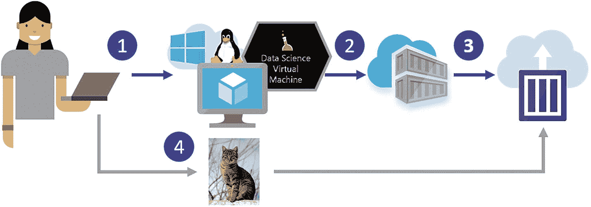

图 10-1

ACI 场景。（1）在 DSVM 上开发；（2）将容器推送到容器注册库；（3）部署到 ACI；（4）将图像发送到已部署的模型进行评分。

### Azure Web Apps

Azure Web Apps 是部署模型的一种快速简单的方法。它们可以是基于 Windows 的标准 Web Apps 或 Linux Web Apps。两者都支持多种编程语言，Linux Web Apps 支持 Docker 容器。Azure Web Apps 的使用案例与 ACI 相同。它们可能设置和配置起来稍微困难一些，但它们对于长时间运行的部署来说也更便宜。Web Apps 还提供了一些很好的功能，例如从 git 仓库部署以及 CLI 安装包。有关 Web Apps 的更多信息，请参阅[`http://bit.ly/AzureWebApps`](http://bit.ly/AzureWebApps)。

### Azure Kubernetes 服务

AKS 是一种托管的 Kubernetes 集群配置。它就像一个标准的 Kubernetes 集群，只不过主节点的管理由 Azure 处理。这意味着减少了开销和成本，因为您只需为代理节点的计算付费。它使用 Kubernetes，这是一个流行的开源 Docker 编排器，因此对于熟悉 Kubernetes 的人来说很容易导航。因为它是一个开源项目，所以有很多信息可以从中获取。

AKS 最近启用了对 GPU VM 的部署，这为在该平台上运行 GPU AI 模型打开了可能性。实际上，AKS 是我们推荐部署实时工作负载的方式。AKS 的一个典型场景是我们需要设置一个需要根据需求扩展且具有容错能力的实时服务。因为我们可以使用包括 GPU 在内的任何大小的虚拟机（SKU），所以这是对性能要求高的应用的理想解决方案。设置和管理比 ACI 中展示的要复杂得多。如何在编排的容器集群上部署内容的示例可以在[`http://bit.ly/ACSTutorial`](http://bit.ly/ACSTutorial)找到。这使用的是较旧的 Azure Container Services 服务，因此一些命令会有所不同。

该场景与为 ACI 部署所解释的场景非常相似，只不过我们还有一个负载均衡器，以便在请求发出时，负载可以在部署的 pods 之间适当分配（见图 10-2）。容器创建在图中省略了，但将与图 10-1 中展示的相同。使用 AKS，我们还可以设置自动缩放规则，以便我们的集群中的 pods 和节点数量可以根据需求进行更改。

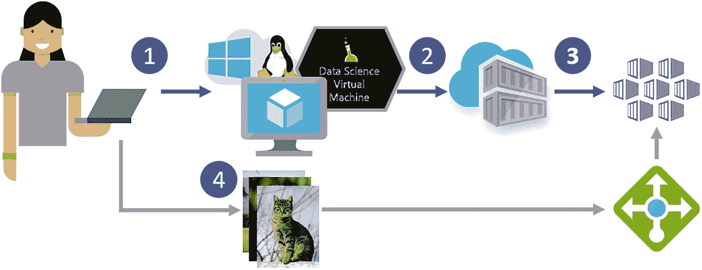

图 10-2

AKS 场景：(1) 在 DSVM 上开发，(2) 将容器推送到容器注册库，(3) 部署到 AKS，以及(4) 将镜像发送到服务，该服务通过负载均衡器在 pods 之间进行负载均衡。

要在 AKS 上部署 AI 模型，您需要以下内容：

1.  您的模型和调用它的 API。

1.  将处理请求的 Flask Web 应用程序。

1.  一个包含模型、Flask 应用程序和必要依赖项的 Docker 容器。

一旦拥有这些资源，就可以使用列表 10-2 中显示的命令创建集群。该命令将创建一个名为 `myGPUCluster` 的集群，包含一个节点，该节点是一个 NC6 VM。NC6 VM 配备了一个 K80 GPU，与 CPU 相比，这将显著加快我们深度学习模型的推理速度。例如，单个 NC6 可以使用 TensorFlow 实现的 ResNet-152 模型处理每秒 20 张图像的吞吐量。相比之下，单个配备 20 个 CPU 核心的 DS15 可以处理大约每秒 7 张图像的吞吐量。因此，基于 GPU 的配置在价格大约是后者一半的情况下提供了近三倍的吞吐量。

```py
BASH
az aks create --resource-group myResourceGroup --name myGPUCluster --node-count 1 --generate-ssh-keys -s Standard_NC6
Listing 10-2
Command to Create AKS Cluster
```

一旦集群启动并运行，我们需要创建一个清单文件，指定我们想要部署的内容以及如何部署。本例中使用的清单文件可以在[`http://bit.ly/AIManifest`](http://bit.ly/AIManifest)找到。在清单文件中，我们指定我们想要基于我们的容器创建一个服务，该服务需要一个 GPU，并且我们希望在端口 80 上有一个负载均衡器。我们使用列表 10-3 中显示的命令部署我们的 pod。

```py
BASH
kubectl create -f ai_manifest.json
Listing 10-3
Command to Deploy Service Based on Manifest
```

大约五分钟后，我们的 pod 应该就绪，我们可以使用列表 10-4 中显示的命令获取我们服务的 IP 地址，输出如列表 10-5 所示。

```py
BASH-OUTPUT
AME       TYPE          CLUSTER-IP   EXTERNAL-IP   PORT(S)       AGE
azure-dl  LoadBalancer  10.0.155.14  13.82.238.75  80:30532/TCP  11m
Listing 10-5
Results of Command Shown in Listing 10-4
```

```py
BASH
kubectl get service azure-dl
Listing 10-4
Command to Get Service IP
```

我们服务的 IP 地址位于 `EXTERNAL-IP` 下。然后我们可以向该服务发送请求并获取响应。我们创建了一个逐步教程，介绍如何使用 TensorFlow 或 Keras 的 TensorFlow 后端部署基于 ResNet-152 的 CNN，你可以在这里找到它：[`http://bit.ly/AKSAITutorial`](http://bit.ly/AKSAITutorial)。

### Azure Service Fabric

Azure Service Fabric (ASF) 是一个类似于 Kubernetes 的集群管理和编排服务。ASF 已被微软内部用于许多服务，包括 Azure SQL 数据库、Azure Cosmos DB 和许多核心的 Azure 服务。ASF 的吸引力在于它比 Kubernetes 更易于使用，因为只需了解 Docker 就可以部署应用程序，无需理解全新的编排服务。理论上应该在 GPU 上运行 ASF，但目前还没有具体的示例。服务 fabric 的用例与 AKS 的用例相同，唯一的缺点是 GPU 相关的工作负载已在 AKS 上得到证明，但在 ASF 上尚未得到证明（见图 10-3）。

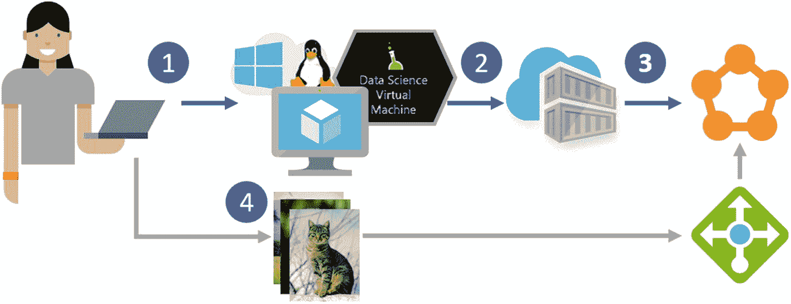

图 10-3

Service Fabric 场景：(1) 在 DSVM 上开发，(2) 将容器推送到容器注册库，(3) 将容器部署到 Service Fabric，(4) 将图像发送到服务进行评分。

### 批量 AI

在第九章中，我们讨论了批处理人工智能（Batch AI），以及我们之前提到的关于计算灵活性和可扩展性转移至实际操作的所有好处。批处理人工智能最适合大规模并行批处理场景，其中集群可以快速启动，并行执行作业，然后关闭。因为批处理人工智能本身不收取任何费用，你只需为使用的计算付费，这使得它成为一个极其高效的解决方案。使用批处理人工智能的场景如图 10-4 所示。我们假设你已经训练了模型，并将其封装在适当的 API 和 Docker 容器中，并将其全部推送到 ACR。用户上传一个或多个视频，由我们的深度学习模型进行处理。Azure 函数接收数据已上传到 blob 的通知，并启动批处理人工智能集群。同时，另一个 Azure 函数读取视频并将它们排队到 Azure Service Bus。当集群上线时，它会拉取适当的容器并启动。容器中的应用程序订阅了适当的主题，并查看可用的作业。现在每个虚拟机（VM）将独立从服务总线中拉取一条消息，并根据消息从 blob 存储中拉取适当的视频进行处理，并将其推回。一旦所有作业完成，Azure 函数将销毁集群。

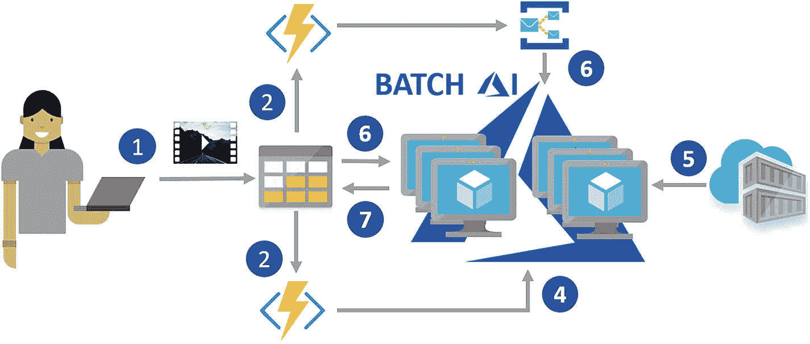

图 10-4

批处理人工智能场景： (1) 将视频推送到存储。 (2) 存储触发 Azure 函数创建集群。 (3) Azure 函数开始将存储中找到的视频排队到服务总线。 (4) 批处理人工智能集群启动。 (5) 集群从容器注册表中拉取适当的镜像。 (6) 运行在每个 VM 上的作业从服务总线中拉取一条消息，并根据镜像从存储中拉取适当的视频。 (7) 视频处理完成后，结果将写回存储。

Batch Shipyard 与批处理人工智能非常相似，可能提供尚未进入批处理人工智能的功能。在先前的场景中，Batch Shipyard 可以大致作为批处理人工智能的即插即用替代品。

### AZTK

Spark 是大规模数据并行和高性能计算（HPC）工作负载中最受欢迎的框架。Azure 分布式数据工程工具包（AZTK）是一个用于在 Azure 中按需配置 Spark 集群的 Python CLI 应用程序。这是一种方便且成本效益高的方法来启动 Spark 集群。AZTK 能够在 5 到 10 分钟内配置一个集群，并且能够利用专用和低优先级的虚拟机，使其非常经济高效。

AZTK 适用于许多组件依赖于 Spark 且需要短暂集群的场景。AZTK 使用 Docker 容器，这意味着管理依赖项和确保您的生产环境与部署环境相匹配相当容易。AZTK 还可以使用 GPU，这使得它非常适合需要 Spark 提供的数据并行化以及 GPU 的计算能力的解决方案。图 10-4 中所示场景的 AZTK 版本可以在图 10-5 中看到。在 AZTK 场景中，我们不需要 Azure 订阅服务，因为我们可以使用 Spark 内置的并行化来分发事物。对于 AZTK，我们也在使用 ACI 而不是从 Azure Function 中调用它，因为 AZTK 是用 Python 编写的，而 Azure Functions 上的 Python 支持在写作时是实验性的。

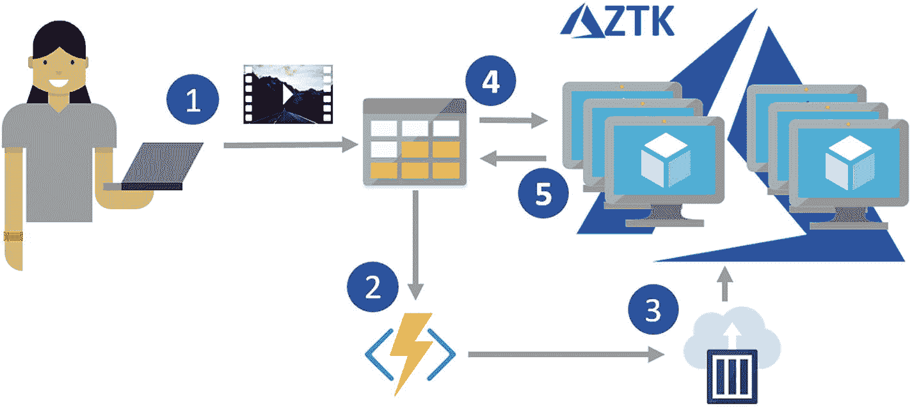

图 10-5

AZTK 场景： (1) 将视频推送到存储。 (2) 存储触发 Azure Function。 (3) Azure Function 调用已安装 AZTK 的 ACI 并启动 AZTK 集群。 (4) PySpark 作业开始，并从存储中拉取数据并进行处理。 (5) 每个视频的处理完成后，结果写回存储。

### HDInsight 和 Databricks

HDInsight (HDI) 是微软提供的 Spark 产品。它比 AZTK 的按需处理稍微贵一些，并且不能使用 GPU。Azure Databricks 是 Azure 上的另一个基于 Spark 的平台，是一个通用的“第一方”微软服务。它具有简单的单点启动，并集成了 Azure 服务，如 Azure Active Directory。Databricks 提供了交互式和协作式笔记本体验，以及优化 Spark 平台中的监控和安全工具。

按需 Spark 集群可以使用 Azure Functions 在 AZTK 和 Batch AI 场景中创建，但由于与 Azure 的紧密集成，Databricks 或 HDI 的按需集群可以使用 Azure Data Factory 创建（参见[`bit.ly/ADFCreateHDI`](http://bit.ly/ADFCreateHDI) 和 [`bit.ly/DBwithADF`](http://bit.ly/DBwithADF)）。不幸的是，HDI 和 Databricks 不使用 Docker 容器，因此依赖项管理稍微复杂一些。由于集成更加紧密，使用 HDI 和 Databricks 的管道将稍微简单一些，但由于 Azure Data Factory 的限制，灵活性会稍微降低（参见图 10-6）。

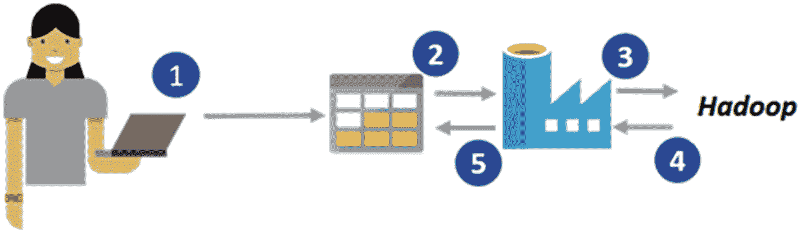

图 10-6

示例 Databricks 或 HDInsight 场景： (1) 将视频推送到存储。 (2) ADF 从存储中读取数据。 (3) 它调用 HDInsight 或 Databricks 处理数据。 (4-5) 然后将数据流回并存储。

请参阅 Azure Databricks 可用的示例深度学习笔记本，链接为 [`bit.ly/DB_DL`](http://bit.ly/DB_DL)。

### SQL Server

为了在数据存储的地方进行计算，当数据已经存储在 SQL 中时，SQL Server 是部署时的一个优秀选择。这种部署的理想场景是 SQL Server 已经被使用，或者该场景会从模型尽可能接近数据执行中受益。数据邻近性需求通常是两个因素的结果，即数据重力（data gravity）和数据敏感性（data sensitivity）。数据重力指的是大量数据由于移动数据的成本而引起计算上的“引力”。数据敏感性指的是当数据跨越不同的系统时，涉及隐私和安全问题，以及由于多次数据传输而导致数据被遗留或安全性减弱的可能性。SQL Server 非常灵活，可以安装在 Windows 和 Linux 上，并且可以在具有 GPU 的虚拟机上部署以加速深度学习场景（参见[`bit.ly/SQLServerDeepL`](http://bit.ly/SQLServerDeepL)）。SQL Server 提供了 Python 和 R 的集成，因此数据科学家可以使用他们最熟悉的任何语言。有关在 SQL Server 上部署模型的更多示例，可以在[`bit.ly/SQLML`](http://bit.ly/SQLML)找到。

## 运营概述

我们已经介绍了一些运营平台，选择它们可能很困难。正如我们之前提到的，将这些服务视为一个从严格批量到实时的连续体是有益的，其中 Batch AI 和 AZTK 等服务属于批处理的一端，而 AKS 和 ASF 等服务属于实时的一端。在图 10-7 中，你可以看到这个连续体的视觉表示：左侧是更类似批处理的平台，而右侧是更类似实时的平台。图 10-7 并不暗示左侧或右侧的选项分别是批量处理和实时处理的推荐方法，只是说明这些平台最适合那种处理类型。

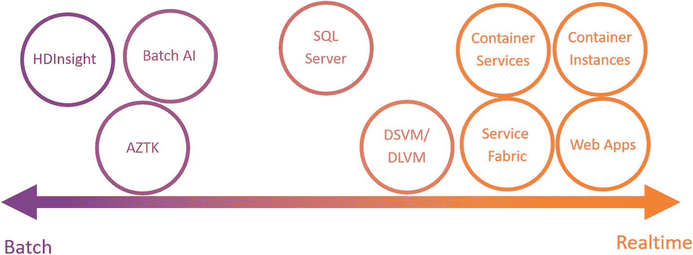

图 10-7

批处理到实时连续体

图 10-7 只是一个一般性指南，因为可以使用这些选项以多种方式。例如，尽管 Spark on HDI 或 Azure Databricks 通常与批量工作负载相关联，但仍有创建实时工作负载的选项，例如通过在[`bit.ly/MMLSparkStreaming`](http://bit.ly/MMLSparkStreaming)中描述的 MMLSpark Serving 来实现。

你还可以从每个服务的章节中了解到，每个服务都有其优势和劣势。在图 10-8 中，你可以看到每个服务的属性的可视表示。服务列在热力图的左侧，指标沿顶部排列。每个服务都根据热力图右侧的颜色条上的颜色得到一个评分。我们比较了五个指标的服务：速度、可扩展性、数据邻近性、调试环境和部署的便捷性。

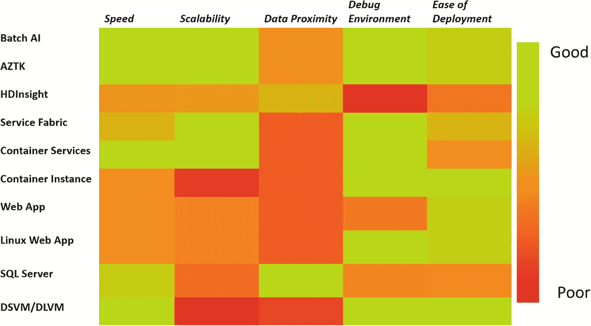

图 10-8

部署服务的热力图

速度指的是每个服务可用的硬件；对于 AI 模型来说，这主要取决于是否有可用的 GPU。可扩展性指的是服务是否可以轻松地进行扩展。数据邻近性指的是计算与数据之间的距离；这主要是在我们不希望因为数据量或安全原因移动数据时需要考虑的因素。调试环境指的是为平台开发有多容易；在这个轴上的主要考虑因素是服务是否使用 Docker 容器。最后，部署的便捷性指的是部署模型有多容易，以及是否有陡峭的学习曲线才能使一切工作正常。

尽管有许多细微差别和偏离此建议的原因，但对于深度学习模型的实时处理，我们建议使用带有 GPU 节点的 AKS。如前所述，我们已经创建了一个关于如何部署基于 TensorFlow 或 Keras（带有 TensorFlow 后端）的 ResNet-152 CNN 的分步教程，你可以在[`bit.ly/AKSAITutorial`](http://bit.ly/AKSAITutorial)找到它。对于深度学习模型的批量处理，在撰写本文时，我们建议使用 Batch AI。一个使用 TensorFlow 的示例可以在[`bit.ly/BatchAIEx`](http://bit.ly/BatchAIEx)找到。

我们主要关注的是在 Azure 上实现深度学习模型的操作。深度学习模型也可以在云上训练，然后在不同的环境中进行操作，如下一节中讨论的 IoT 边缘，以及通过 ONNX 在 Windows 设备上本地操作，如[`bit.ly/WindowsONNX`](http://bit.ly/WindowsONNX)所述。

## Azure 机器学习服务

部署 AI 模型到 AKS 的先前列举的例子可能有点令人望而生畏，尤其是对于那些不熟悉 Docker 的人来说。为此，AML 提供了使 AI 模型操作化更简单的选项：你只需提供模型文件，你的依赖项在一个 YAML 文件中，最后是模型驱动文件，它将创建适当的 Docker 容器并将其部署到 AKS（见[`bit.ly/amldeploy`](http://bit.ly/amldeploy)）。它提供了方便快捷的方式来测试你的本地部署，以及根据需要扩展服务。以 Zhu、Iordanescu 和 Karmanov（2018）的博客文章为例，展示了如何使用 Azure 机器学习部署用于检测胸部 X 光片疾病的深度学习模型。Azure 机器学习还协助将深度学习模型部署到物联网边缘设备，如[`bit.ly/DLtoIOT`](http://bit.ly/DLtoIOT)所述。

在前面的章节中，我们提到了迁移学习的有用性，在本章中我们也强调了使用 GPU 进行推理的好处。AML 服务现在提供了在 FPGA 上使用预训练的 ResNet 50 模型进行推理的能力。FPGA 在非常低的成本下提供了比 CPU 和 GPU 更高的速度。基准测试显示，单个 FPGA 每秒可以评分约 500 张图像，而评分 10,000 张图像的成本不到 0.2 美分。要使用此服务，只需遵循[`bit.ly/msfpga`](http://bit.ly/msfpga)上提供的说明。它有几个 Jupyter 笔记本，介绍了如何根据特征训练你的模型，以及如何部署和测试模型。

## 摘要

本章介绍了 Azure 上提供的多种操作化选项。它涵盖了使用简单托管服务如 ACI 和 Azure Web Apps 部署模型，到更复杂的具有 GPU 支持的设置如 AKS 和 Batch AI。我们还涵盖了请求-响应场景以及批量场景。我们给出了我们认为每个服务提供的优缺点比较概述。有了这个指导，你应该能够为你的场景选择最合适的选项，并将你的模型部署到生产 AI 解决方案中。
