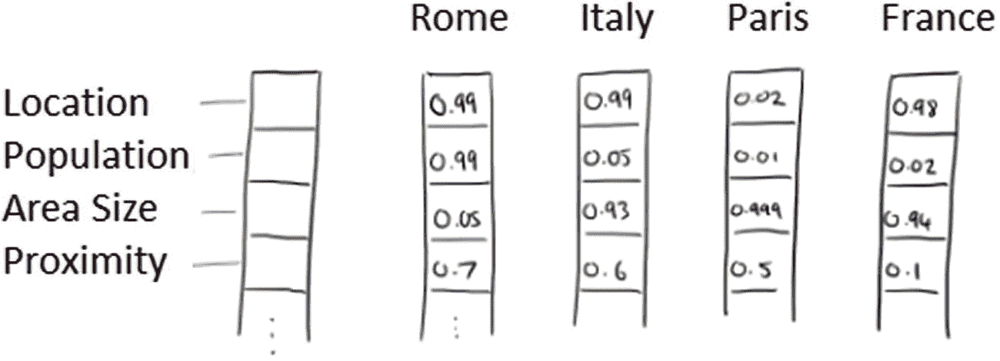
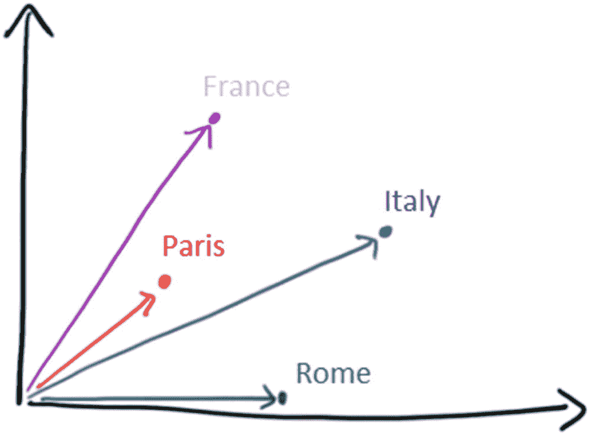
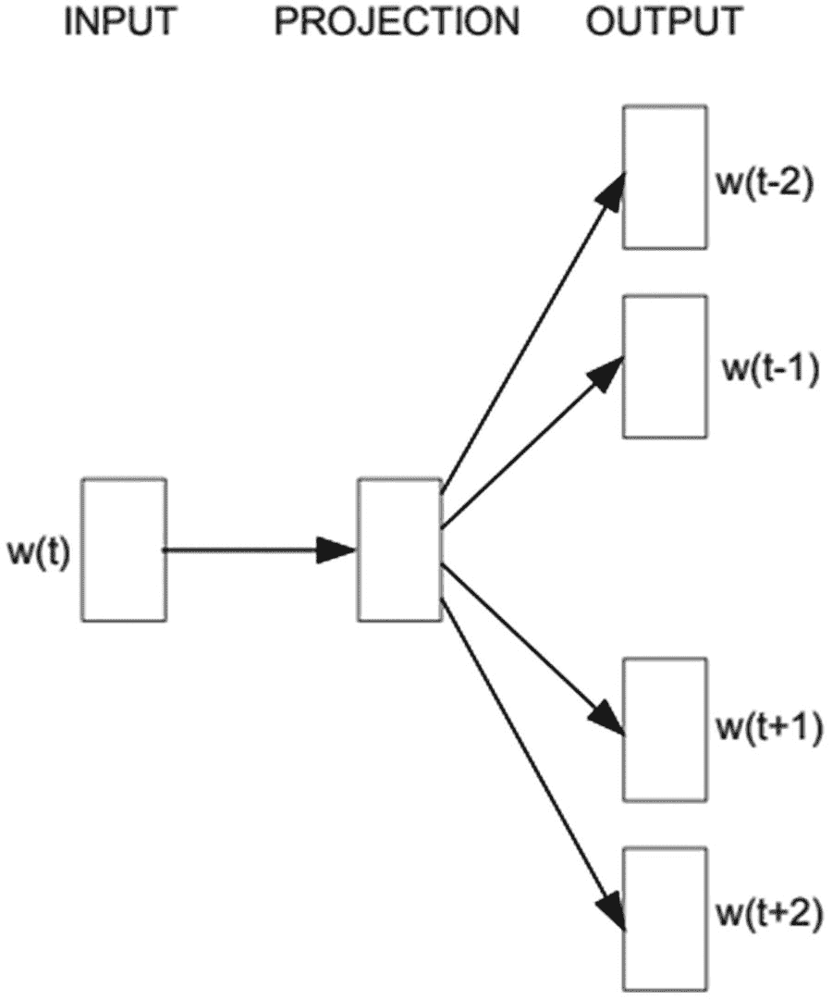
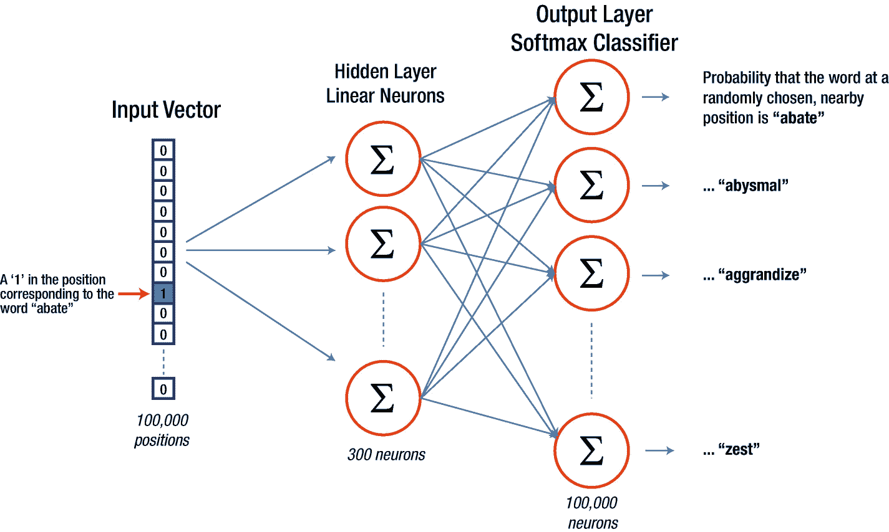
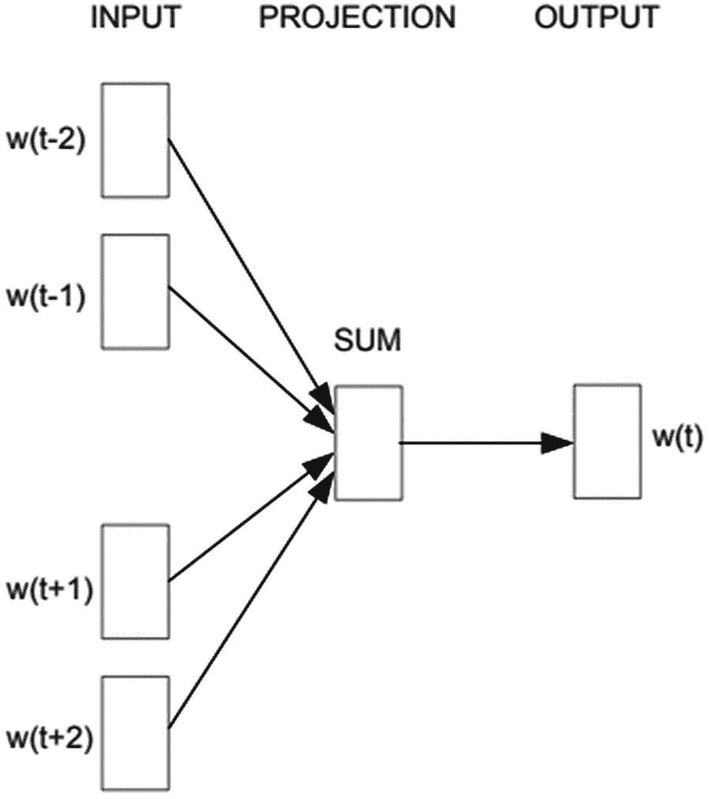
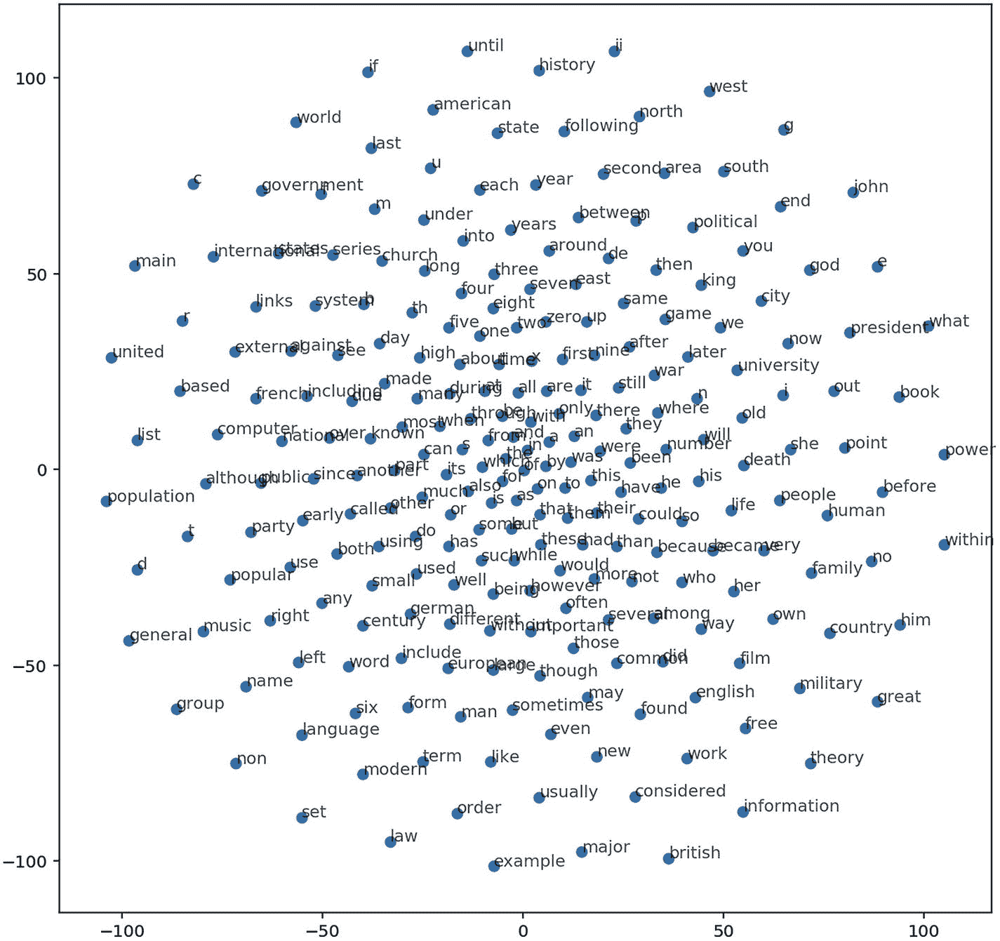

# 二、词向量表示法

当处理语言和单词时，我们可能会在数千个类别中对文本进行分类，以用于多种自然语言处理(NLP)任务。近年来，在这一领域进行了大量的研究，这导致了语言中的单词向可以在多组算法和过程中使用的向量格式的转换。本章深入解释了单词嵌入及其有效性。我们介绍了它们的起源，并比较了用于完成各种 NLP 任务的不同模型。

## 单词嵌入简介

语言项目之间语义相似性的分类和量化属于分布语义学的范畴，并且基于它们在语言使用中的分布。向量空间模型以向量的形式表示文本文档和查询，长期以来被用于分布式语义目的。由向量空间模型在 N 维向量空间中表示单词对于不同的 NLP 算法实现更好的结果是有用的，因为它导致在新的向量空间中相似文本的分组。

单词嵌入这个术语是 Yoshua Bengio 在他的论文《一种神经概率语言模型》( [`www.jmlr.org/papers/volume3/bengio03a/bengio03a.pdf`](http://www.jmlr.org/papers/volume3/bengio03a/bengio03a.pdf) )中提出的。随后罗南·科洛伯特(Ronan Collobert)和杰森·韦斯顿(Jason Weston)在他们的论文《自然语言处理的统一架构》( [`https://ronan.collobert.com/pub/matos/2008_nlp_icml.pdf`](https://ronan.collobert.com/pub/matos/2008_nlp_icml.pdf) )中，作者展示了多任务学习和半监督学习的使用如何提高共享任务的泛化能力。最后，Tomas Mikolov 等人创建了 word2vec，并将单词嵌入置于镜头之下，阐明了单词嵌入的训练以及预训练单词嵌入的使用。后来，Jeffrey Pennington 引入了 GloVe，这是另一组预训练的单词嵌入。

单词嵌入模型已被证明比最初使用的单词袋模型或一热编码方案更有效，该模型由大小与词汇表大小相等的稀疏向量组成。向量表示中存在的稀疏性是词汇表的巨大规模以及在索引位置标注其中的单词或文档的结果。单词嵌入通过使用所有单个单词的周围单词，使用来自给定文本的信息并将其传递给模型，取代了这个概念。这使得嵌入可以采用密集向量的形式，在连续的向量空间中，这种形式表示单个单词的投影。因此，嵌入指的是单词在新学习的向量空间中的坐标。

下面的例子给出了一个单词向量的创建过程，它对样本词汇表中的单词进行了一键编码，然后对单词向量进行了重组。它使用了一种分布式表示方法，并展示了如何使用最终的矢量组合来推断单词之间的关系。

假设我们的词汇表包含罗马、意大利、巴黎、法国和国家这几个词。我们可以利用这些单词中的每一个来创建一个表示，对所有的单词使用一键方案，如图 2-1 中的罗马所示。


图 2-1

A representation of Rome

使用前面的以向量形式呈现单词的方法，我们可以或多或少地通过比较单词的向量来测试单词之间的相等性。这种方法不会达到其他更高的目的。在一种更好的表示形式中，我们可以创建多个层次或分段，其中每个单词所显示的信息可以被分配不同的权重。我们可以选择这些片段或维度，并且每个单词将由这些片段上的权重分布来表示。因此，现在我们有了一种新的单词表示格式，对每个单词使用不同的标度(图 2-2 )。



图 2-2

Our representation

用于每个单词的前面的向量确实表示了该单词的实际意思，并且提供了更好的尺度来进行单词之间的比较。新形成的向量足以回答单词之间的这种关系。图 2-3 表示使用这种新方法形成的矢量。



图 2-3

Our vectors

不同单词的输出向量确实保留了语言规则和模式，并且这些模式的线性翻译证明了这一点。比如 vectors 和后面的单词 vector(法国)- vector(巴黎)+ vector(意大利)的差的结果，会接近 vector(罗马)，如图 2-4 。


图 2-4

Comparing vectors

随着时间的推移，单词嵌入已经成为无监督学习领域最重要的应用之一。词向量提供的语义关系在神经机器翻译、信息检索和问答应用的 NLP 方法中有所帮助。

### 神经语言模型

Bengio 提出的前馈神经网络语言模型(FNNLM)引入了一个前馈神经网络，它由一个单独的隐藏层组成，预测序列的未来单词，在我们的例子中，只有一个单词。

训练神经网络语言模型以找到θ，这最大化了训练语料惩罚对数似然:


这里，f 是由与词汇表中存在的每个单词的分布式特征向量相关的参数和前馈或循环神经网络的参数组成的复合函数。R(θ)指的是正则化项，其将权重衰减惩罚应用于神经网络和特征向量矩阵的权重。函数 f 返回 softmax 函数使用前面的 n 个单词为第 t 个位置的单词计算的概率得分。

Bengio 引入的模型是同类模型中的第一个，为未来的单词嵌入模型奠定了基础。这些原始模型的组件仍然在当前的单词嵌入模型中使用。其中一些组件包括以下内容:

1.  嵌入层:它记录了训练数据集中所有单词的表示。它用一组随机权重初始化。嵌入层由三部分组成，包括词汇表的大小、将嵌入所有单词的向量的输出大小以及模型的输入序列的长度。嵌入层的最终输出是一个二维向量，它对给定单词序列中存在的所有单词进行最终嵌入。
2.  中间层:隐藏层，从初始层到最终层，计数为 1 或更多，通过将神经网络中的非线性函数应用于先前`n`单词的单词嵌入来产生输入文本数据的表示。
3.  Softmax 层:这是神经网络架构的最后一层，返回输入词汇表中所有单词的概率分布。

Bengio 的论文提到了 softmax 标准化中涉及的计算成本，并且它与词汇量成比例。这给在全词汇量上对神经语言模型和单词嵌入模型的新算法的试验带来了挑战。

神经网络语言模型有助于获得当前词汇表中不存在的单词的泛化，因为如果单词的组合与已经包含在句子中的单词相似，则从未见过的单词序列被给予更高的概率。

## Word2vec

Word2vec 或单词到向量模型是由托马斯·米科洛夫等人( [`https://arxiv.org/pdf/1301.3781.pdf`](https://arxiv.org/pdf/1301.3781.pdf) )提出的，并且是最被采用的模型之一。它用于学习单词嵌入，或单词的矢量表示。通过检查单词组之间的相似性，将所提出的模型的性能与先前的模型进行比较。该论文中提出的技术产生了对于相似单词具有跨多个相似度的单词的向量表示。单词表示的相似性超出了简单的句法规则，简单的代数运算也在单词向量上执行。

Word2vec 模型在内部使用单一层的简单神经网络，并捕获隐藏层的权重。训练模型的目的是学习隐藏层的权重，它代表“单词嵌入”虽然 word2vec 使用神经网络架构，但该架构本身不够复杂，并且没有利用任何类型的非线性。暂时可以卸下深度学习的标签。

Word2vec 提供了一系列用于在 n 维空间中表示单词的模型，通过这种方式，相似的单词和表示更接近含义的单词被放置得彼此靠近。这证明了将单词放置在新的向量空间中的整个练习是正确的。我们将介绍两个最常用的模型，skip-gram 和 continuous bag-of-words (CBOW ),以及它们在 TensorFlow 中的实现。这两个模型在算法上是相似的，区别仅在于它们执行预测的方式。CBOW 模型利用上下文或周围的词来预测中心词，而 skip-gram 模型利用中心词来预测上下文词。

与 one-hot 编码相比，word2vec 有助于减少编码空间的大小，并将单词的表示压缩到向量所需的长度(图 2-5 )。Word2vec 根据单词出现的上下文来处理单词表示。例如，同义词、反义词、语义相似的概念和相似的词出现在整个文本的相似上下文中，因此以相似的方式嵌入，并且它们的最终嵌入彼此更接近。


图 2-5

Using the window size of 2 to pick the words from the sentence “Machines can now recognize objects and translate speech in real time” and training the model

### 跳格模型

跳格模型通过使用序列中的当前单词来预测周围的单词。周围单词的分类分数基于与中心单词的句法关系和出现次数。序列中出现的任何单词都被作为对数线性分类器的输入，对数线性分类器进而对出现在中心单词之前和之后的某个预先指定的单词范围内的单词进行预测。在单词范围的选择和结果单词向量的计算复杂度和质量之间有一个折衷。随着与相关单词的距离增加，与较近的单词相比，较远的单词与当前单词的相关程度较低。这是通过将权重分配为与中心单词的距离的函数，并从较高范围的单词中给予较小的权重或采样较少的单词来解决的(见图 2-6 )。



图 2-6

Skip-gram model architecture

跳格模型的训练不涉及密集矩阵乘法。再加上一点优化，它可以产生一个高效的模型训练过程。

### 模型构件:建筑

在本例中，网络用于训练模型，输入单词作为一个热码编码的向量，输出作为一个热码编码的向量，表示输出单词(图 2-7 )。



图 2-7

The model

### 模型构件:隐藏层

使用隐藏层来完成神经网络的训练，其中神经元的数量等于我们想要用来表示单词嵌入的特征或维度的数量。在下图中，我们用权重矩阵来表示隐藏层，该矩阵的列数为 300，等于神经元的数量(这将是单词嵌入的最终输出向量中的特征数)，行数为 100，000，等于用于训练模型的词汇的大小。

神经元的数量被认为是模型的超参数，可以根据需要改变。谷歌训练的模型利用了 300 维特征向量，并且已经公开。对于那些不想训练单词嵌入模型的人来说，这可能是一个好的开始。你可以使用以下链接下载训练好的向量集: [`https://code.google.com/archive/p/word2vec/`](https://code.google.com/archive/p/word2vec/) 。

由于作为词汇表中每个单词的输入而给出的输入向量是一次性编码的，所以在隐藏层阶段发生的计算将确保仅从权重矩阵中选择对应于相应单词的向量，并将其传递到输出层。如图 2-8 所示，在词汇量为 v 的情况下，对于任何一个单词，在输入向量中的期望索引处都会有“1”出现，将其乘以权重矩阵后，对于每一个单词，我们都会得到该单词对应的一行作为输出向量。因此，真正重要的不是输出，而是权重矩阵。图 2-8 清楚地表示了如何使用隐藏层的权重矩阵来计算单词向量查找表。


图 2-8

Weight matrix of the hidden layer and vector lookup table

即使独热编码向量完全由零组成，将 1 `×` 100，000 维向量乘以 100，000 `×` 300 权重矩阵仍将导致选择存在“1”的对应行。图 2-9 给出了这种计算的图示，隐含层的输出就是关注词的矢量表示。


图 2-9

The calculation

### 模型组件:输出层

我们计算单词的单词嵌入背后的主要意图是确保具有相似含义的单词在我们定义的向量空间中更接近。这个问题由模型自动处理，因为在大多数情况下，具有相似含义的单词被相似的上下文(即，围绕输入单词的单词)包围，这在训练过程中固有地以相似的方式进行权重调整(图 2-10 )。除了同义词和具有相似含义的单词之外，该模型还处理词干提取的情况，因为复数或单数单词(比如，car 和 cars)将具有相似的上下文。


图 2-10

The training process

### CBOW 模型

连续词袋模型在架构上与 FNNLM 相似，如图 2-11 所示。单词的顺序不会影响投影层，重要的是哪些单词当前落入袋中以进行输出单词预测。



图 2-11

Continuous bag-of-words model architecture

输入层和投影层以类似于 FNNLM 中共享的方式共享所有字位置的权重矩阵。CBOW 模型利用了上下文的连续分布表示，因此是一个连续的单词包。

Note

在较小的数据集上使用 CBOW 导致分布信息的平滑，因为模型将整个上下文视为单个观察。

## 二次抽样常用词

在大多数处理文本数据的情况下，词汇表的大小可以增加到大量的唯一单词，并且可以由所有单词的不同频率大小组成。为了选择出于建模目的而保留的单词，单词在语料库中出现的频率被用于决定单词的移除，也通过检查总单词的计数。子采样方法是由 Mikolov 等人在他们的论文“单词和短语的分布式表示及其组合性”中引入的。通过包括子采样，在训练过程中获得了显著的速度，并且以更有规律的方式学习单词表示。

生存函数用于计算单词级别的概率得分，该得分可在以后用于决定从词汇表中保留或删除该单词。该函数考虑了相关单词的频率和子采样率，可以进行调整:


其中，w <sub>i</sub> 是相关作品，z(w <sub>i</sub> 是该单词在训练数据集或语料库中的频率，s 是子采样率。Note

Mikolov 等人在他们的论文中提到的原始函数不同于 word2vec 代码的实际实现中使用的函数，并且已经在前面的文本中提到过。论文中为二次抽样选择的公式是启发式选择的，它包括一个阈值 t，通常表示为 10 <sup>-5</sup> ，作为语料库中单词的最小频率。论文中提到的用于子采样的公式为


其中，w <sub>i</sub> 为关注的词，f(w <sub>i</sub> 为该词在训练数据集或语料库中的出现频率，s 为使用的阈值。

子采样率对是否保留频繁词做出关键决定。较小的值意味着单词不太可能保留在语料库中用于模型训练。在大多数情况下，在生存函数的输出上设置一个首选阈值，以删除出现频率较低的单词。参数 s 的优选值是 0.001。所提到的二次采样方法有助于克服语料库中稀有词和频繁词之间的不平衡。


图 2-12

Distribution of the Survival function, P(x) = {(sqrt(x/0.001) + 1) * (0.001/x)} for a constant value of 0.001 for sampling rate (Credits : [`http://www.mccormickml.com`](http://www.mccormickml.com) )

该图显示了单词的频率与通过子采样方法生成的最终概率得分之间的图表。由于语料库中存在的单词都不能占据更高的百分比，所以我们将考虑图中单词百分比范围较低的部分，即沿 x 轴的部分。从上面的图表中，我们可以得出一些关于单词的百分比及其与生成的分数的关系的观察结果，从而得出二次抽样对单词的影响:

*   当 z(w <sub>i</sub> ) < = 0.0026 时，P(w <sub>i</sub> ) =1。这意味着频率百分比小于 0.26%的单词将不会被考虑进行二次采样。
*   当 z(w <sub>i</sub> ) = 0.00746 时，P(w <sub>i</sub> ) = 0.5。因此，一个词有 50%的机会被保留或删除所需的百分比是当它有 0.746%的频率。
*   P(w <sub>i</sub> ) = 0.033 出现在 z(w <sub>i</sub> ) =1 的情况下，即，即使整个语料库仅由单个单词组成，也有 96.7%的概率将其从语料库中移除，这在实践中没有任何意义。

### 负采样

负采样是噪声对比估计(NCE)方法的简化形式，因为它在选择噪声或负样本的计数及其分布时做出某些假设。它用作分级 softmax 函数的替代函数。虽然在训练模型时使用了负采样，但是在推断时，要计算完整的 softmax 值，以获得归一化的概率得分。

神经网络模型的隐藏层中的权重矩阵的大小取决于词汇的整体大小，词汇的整体大小是高阶的。这导致了大量的权重参数。所有权重参数在数百万和数十亿训练样本的多次迭代中被更新。对于每个训练样本，负采样会导致模型只更新很小百分比的权重。

给予模型的单词的输入表示是通过一个热编码向量。负采样随机选择给定数量的“负”词(比如 10 个)，用“正”词(或中心词)的权重来更新这些词的权重。总的来说，对于 11 个单词(10 + 1)，权重将被更新。参考前面给出的图，任何迭代都将导致更新权重矩阵中的 11 × 300 = 3，300 个值。然而，不管负采样的使用，在隐藏层中只更新“正”字的权重。

选择“阴性”样本的概率取决于该词在语料库中的频率。频率越高，“负面”单词被选中的概率就越高。正如在论文“单词和短语的分布式表示及其组成性”中提到的，对于小的训练数据集，负样本的计数在 5 到 20 之间，对于大的训练数据集，建议在 2 到 5 之间。

实际上，负样本是不应该确定输出的输入，只应该产生一个全为 0 的向量。

Note

子采样和负采样的组合在很大程度上减少了训练过程的负荷。

word2vec 模型通过在一系列句法和语义语言任务上使用模型的组合，帮助实现了更高质量的单词矢量表示。随着计算资源、更快的算法和文本数据可用性的进步，与早期提出的神经网络模型相比，有可能训练高质量的单词向量。

在下一节中，我们将研究如何使用 TensorFlow 实现 skip-gram 和 CBOW 模型。这些课程的结构归功于在线课程和写作时可用材料的结合。

## Word2vec Code

TensorFlow 库通过引入在 word2vec 算法实现中使用的多个预定义函数，使我们的生活变得更加轻松。本节包括 word2vec 算法、skip-gram 和 CBOW 模型的实现。

本节开头的第一部分代码对于 skip-gram 和 CBOW 模型都是通用的，后面是 skip-gram 和 CBOW 代码小节中的相应实现。

Note

我们的练习使用的数据是 2006 年 3 月 3 日制作的英语维基百科转储的压缩格式。可从以下链接获得: [`http://mattmahoney.net/dc/textdata.html`](http://mattmahoney.net/dc/textdata.html) 。

导入 word2vec 实现所需的包，如下所示:

```py
"""Importing the required packages"""
import random
import collections
import math
import os
import zipfile
import time
import re
import numpy as np
import tensorflow as tf

from matplotlib import pylab
%matplotlib inline

from six.moves import range
from six.moves.urllib.request import urlretrieve

"""Make sure the dataset link is copied correctly"""
dataset_link = 'http://mattmahoney.net/dc/'
zip_file = 'text8.zip'

```

函数`data_download()`下载 Matt Mahoney 收集的维基百科文章的清理数据集，并将其作为一个单独的文件存储在当前工作目录下。

```py
def data_download(zip_file):
    """Downloading the required file"""
    if not os.path.exists(zip_file):
        zip_file, _ = urlretrieve(dataset_link + zip_file, zip_file)
        print('File downloaded successfully!')
    return None
data_download(zip_file)

> File downloaded successfully!

```

压缩文本数据集在内部文件夹数据集中提取，稍后用于训练模型。

```py
"""Extracting the dataset in separate folder"""

extracted_folder = 'dataset'

if not os.path.isdir(extracted_folder):
    with zipfile.ZipFile(zip_file) as zf:
        zf.extractall(extracted_folder)
with open('dataset/text8') as ft_ :
    full_text = ft_.read()

```

由于输入数据在整个文本中具有多个标点和其他符号，因此相同的符号被替换为它们各自的标记，标记中具有标点和符号名称的类型。这有助于模型单独识别每个标点符号和其他符号，并生成一个向量。函数`text_processing()`执行该操作。它将维基百科的文本数据作为输入。

```py
def text_processing(ft8_text):
    """Replacing punctuation marks with tokens"""
    ft8_text = ft8_text.lower()
    ft8_text = ft8_text.replace('.', ' <period> ')
    ft8_text = ft8_text.replace(',', ' <comma> ')
    ft8_text = ft8_text.replace('"', ' <quotation> ')
    ft8_text = ft8_text.replace(';', ' <semicolon> ')
    ft8_text = ft8_text.replace('!', ' <exclamation> ')
    ft8_text = ft8_text.replace('?', ' <question> ')
    ft8_text = ft8_text.replace('(', ' <paren_l> ')
    ft8_text = ft8_text.replace(')', ' <paren_r> ')
    ft8_text = ft8_text.replace('  ', ' <hyphen> ')
    ft8_text = ft8_text.replace(':', ' <colon> ')
    ft8_text_tokens = ft8_text.split()
    return ft8_text_tokens

ft_tokens = text_processing(full_text)

```

为了提高所产生的矢量表示的质量，建议去除与单词相关的噪声，即在输入数据集中频率小于 7 的单词，因为这些单词将不具有足够的信息来提供它们所存在的上下文。

可以通过检查数据集中单词计数和的分布来改变这个阈值。为了方便起见，我们在这里把它当作 7。

```py
"""Shortlisting words with frequency more than 7"""
word_cnt = collections.Counter(ft_tokens)
shortlisted_words = [w for w in ft_tokens if word_cnt[w] > 7 ]

```

根据出现频率列出数据集中出现的前几个词，如下所示:

```py
print(shortlisted_words[:15])

> ['anarchism', 'originated', 'as', 'a', 'term', 'of', 'abuse', 'first', 'used', 'against', 'early', 'working', 'class', 'radicals', 'including']

```

检查数据集中出现的所有单词的统计信息。

```py
print("Total number of shortlisted words : ",len(shortlisted_words))
print("Unique number of shortlisted words : ",len(set(shortlisted_words)))
> Total number of shortlisted words :  16616688
> Unique number of shortlisted words :  53721

```

为了处理语料库中出现的独特单词，我们制作了一组单词，后跟它们在训练数据集中的频率。下面的函数创建一个字典，将单词转换成整数，反之，将整数转换成单词。最频繁出现的单词被赋予最小的值`0`，并且以类似的方式，数字被赋予其他单词。单词到整数的转换存储在一个单独的列表中。

```py
def dict_creation(shortlisted_words):
    """The function creates a dictionary of the words present in dataset along with their frequency order"""
    counts = collections.Counter(shortlisted_words)
    vocabulary = sorted(counts, key=counts.get, reverse=True)
    rev_dictionary_ = {ii: word for ii, word in enumerate(vocabulary)}
    dictionary_ = {word: ii for ii, word in rev_dictionary_.items()}
    return dictionary_, rev_dictionary_

dictionary_, rev_dictionary_ = dict_creation(shortlisted_words)
words_cnt = [dictionary_[word] for word in shortlisted_words]

```

到目前为止创建的变量都是常见的，可以在 word2vec 模型的实现中使用。接下来的小节包括这两种架构的实现。

## 跳格码

在 skip-gram 模型中加入了二次抽样方法来处理文本中的停用词。通过对它们的频率设置阈值，去除所有具有较高频率并且在中心单词周围没有任何重要上下文的单词。这导致更快的训练和更好的单词向量表示。

Note

我们在这里的实现中使用了关于 skip-gram 的论文中给出的概率得分函数。对于训练集中的每个单词 w <sub>i</sub> ，我们将按照


给出的概率将其丢弃，其中 t 是阈值参数，f(w <sub>i</sub> )是单词 w <sub>i</sub> 在总数据集中的出现频率。

```py
"""Creating the threshold and performing the subsampling"""
thresh = 0.00005
word_counts = collections.Counter(words_cnt)
total_count = len(words_cnt)
freqs = {word: count / total_count for word, count in word_counts.items()}
p_drop = {word: 1 - np.sqrt(thresh/freqs[word]) for word in word_counts}
train_words = [word for word in words_cnt if p_drop[word] < random.random()]

```

由于跳格模型采用中心单词并预测其周围的单词，`skipG_target_set_generation()`函数以期望的格式为跳格模型创建输入:

```py
def skipG_target_set_generation(batch_, batch_index, word_window):
    """The function combines the words of given word_window size next to the index, for the SkipGram model"""
    random_num = np.random.randint(1, word_window+1)
    words_start = batch_index - random_num if (batch_index - random_num) > 0 else 0
    words_stop = batch_index + random_num
    window_target = set(batch_[words_start:batch_index] + batch_[batch_index+1:words_stop+1])
    return list(window_target)

```

`skipG_batch_creation`()函数利用`skipG_target_set_generation()`函数，创建一个中心单词及其周围单词的组合格式作为目标文本，并返回批处理输出，如下所示:

```py
def skipG_batch_creation(short_words, batch_length, word_window):
    """The function internally makes use of the skipG_target_set_generation() function and combines each of the label
    words in the shortlisted_words with the words of word_window size around"""
    batch_cnt = len(short_words)//batch_length
    short_words = short_words[:batch_cnt*batch_length]  

    for word_index in range(0, len(short_words), batch_length):
        input_words, label_words = [], []
        word_batch = short_words[word_index:word_index+batch_length]
        for index_ in range(len(word_batch)):
            batch_input = word_batch[index_]
            batch_label = skipG_target_set_generation(word_batch, index_, word_window)
            # Appending the label and inputs to the initial list. Replicating input to the size of labels in the window
            label_words.extend(batch_label)
            input_words.extend([batch_input]*len(batch_label))
            yield input_words, label_words

```

以下代码注册了一个 TensorFlow 图以供 skip-gram 实现使用，声明了变量的`inputs`和`labels`占位符，这些占位符将用于根据中心词和周围词的组合，为输入词和不同大小的批次分配一个热编码向量:

```py
tf_graph = tf.Graph()
with tf_graph.as_default():
    input_ = tf.placeholder(tf.int32, [None], name="input_")
    label_ = tf.placeholder(tf.int32, [None, None], name="label_")

```

下面的代码声明了嵌入矩阵的变量，嵌入矩阵的维数等于词汇表的大小和单词嵌入向量的维数:

```py
with tf_graph.as_default():
    word_embed = tf.Variable(tf.random_uniform((len(rev_dictionary_), 300), -1, 1))
    embedding = tf.nn.embedding_lookup(word_embed, input_)

```

`tf.train.AdamOptimizer`使用 Diederik P. Kingma 和 Jimmy Ba 的 Adam 算法( [`http://arxiv.org/pdf/1412.6980v8.pdf`](http://arxiv.org/pdf/1412.6980v8.pdf) )来控制学习速率。关于进一步的信息，另外参考本吉奥的以下论文: [`http://arxiv.org/pdf/1206.5533.pdf`](http://arxiv.org/pdf/1206.5533.pdf) 。

```py
"""The code includes the following :
 # Initializing weights and bias to be used in the softmax layer
 # Loss function calculation using the Negative Sampling
 # Usage of Adam Optimizer
 # Negative sampling on 100 words, to be included in the loss function
 # 300 is the word embedding vector size
"""
vocabulary_size = len(rev_dictionary_)

with tf_graph.as_default():
    sf_weights = tf.Variable(tf.truncated_normal((vocabulary_size, 300), stddev=0.1) )
    sf_bias = tf.Variable(tf.zeros(vocabulary_size) )

    loss_fn = tf.nn.sampled_softmax_loss(weights=sf_weights, biases=sf_bias,
                                         labels=label_, inputs=embedding,
                                         num_sampled=100, num_classes=vocabulary_size)
    cost_fn = tf.reduce_mean(loss_fn)
    optim = tf.train.AdamOptimizer().minimize(cost_fn)

```

为了确保单词向量表示保持单词之间的语义相似性，在下面的代码部分中生成了一个验证集。这将在语料库中选择常见和不常见单词的组合，并基于单词向量之间的余弦相似性返回与它们最接近的单词。

```py
"""The below code performs the following operations :
 # Performing validation here by making use of a random selection of 16 words from the dictionary of desired size
 # Selecting 8 words randomly from range of 1000    
 # Using the cosine distance to calculate the similarity between the words
"""
with tf_graph.as_default():
    validation_cnt = 16
    validation_dict = 100

    validation_words = np.array(random.sample(range(validation_dict), validation_cnt//2))
    validation_words = np.append(validation_words, random.sample(range(1000,1000+validation_dict), validation_cnt//2))
    validation_data = tf.constant(validation_words, dtype=tf.int32)

    normalization_embed = word_embed / (tf.sqrt(tf.reduce_sum(tf.square(word_embed), 1, keep_dims=True)))
    validation_embed = tf.nn.embedding_lookup(normalization_embed, validation_data)
    word_similarity = tf.matmul(validation_embed, tf.transpose(normalization_embed))

```

在当前工作目录下创建一个文件夹`model_checkpoint`来存储模型检查点。

```py
"""Creating the model checkpoint directory"""
!mkdir model_checkpoint

epochs = 2            # Increase it as per computation resources. It has been kept low here for users to replicate the process, increase to 100 or more
batch_length = 1000
word_window = 10

with tf_graph.as_default():
    saver = tf.train.Saver()

with tf.Session(graph=tf_graph) as sess:
    iteration = 1
    loss = 0
    sess.run(tf.global_variables_initializer())

    for e in range(1, epochs+1):
        batches = skipG_batch_creation(train_words, batch_length, word_window)
        start = time.time()
        for x, y in batches:
            train_loss, _ = sess.run([cost_fn, optim],
                                     feed_dict={input_: x, label_: np.array(y)[:, None]})
            loss += train_loss

            if iteration % 100 == 0:
                end = time.time()
                print("Epoch {}/{}".format(e, epochs), ", Iteration: {}".format(iteration),
                      ", Avg. Training loss: {:.4f}".format(loss/100),", Processing : {:.4f} sec/batch".format((end-start)/100))
                loss = 0
                start = time.time()

            if iteration % 2000 == 0:
                similarity_ = word_similarity.eval()
                for i in range(validation_cnt):
                    validated_words = rev_dictionary_[validation_words[i]]
                    top_k = 8 # number of nearest neighbors
                    nearest = (-similarity_[i, :]).argsort()[1:top_k+1]
                    log = 'Nearest to %s:' % validated_words
                    for k in range(top_k):
                        close_word = rev_dictionary_[nearest[k]]
                        log = '%s %s,' % (log, close_word)
                    print(log)

            iteration += 1
    save_path = saver.save(sess, "model_checkpoint/skipGram_text8.ckpt")
    embed_mat = sess.run(normalization_embed)

> Epoch 1/2 , Iteration: 100 , Avg. Training loss: 6.1494 , Processing : 0.3485 sec/batch
> Epoch 1/2 , Iteration: 200 , Avg. Training loss: 6.1851 , Processing : 0.3507 sec/batch
> Epoch 1/2 , Iteration: 300 , Avg. Training loss: 6.0753 , Processing : 0.3502 sec/batch
> Epoch 1/2 , Iteration: 400 , Avg. Training loss: 6.0025 , Processing : 0.3535 sec/batch
> Epoch 1/2 , Iteration: 500 , Avg. Training loss: 5.9307 , Processing : 0.3547 sec/batch
> Epoch 1/2 , Iteration: 600 , Avg. Training loss: 5.9997 , Processing : 0.3509 sec/batch
> Epoch 1/2 , Iteration: 700 , Avg. Training loss: 5.8420 , Processing : 0.3537 sec/batch
> Epoch 1/2 , Iteration: 800 , Avg. Training loss: 5.7162 , Processing : 0.3542 sec/batch
> Epoch 1/2 , Iteration: 900 , Avg. Training loss: 5.6495 , Processing : 0.3511 sec/batch
> Epoch 1/2 , Iteration: 1000 , Avg. Training loss: 5.5558 , Processing : 0.3560 sec/batch
> ..................
> Nearest to during: stress, shipping, bishoprics, accept, produce, color, buckley, victor,
> Nearest to six: article, incorporated, raced, interval, layouts, confused, spitz, masculinity,
> Nearest to all: cm, unprotected, fit, tom, opold, render, perth, temptation,
> Nearest to th: ponder, orchids, shor, polluted, firefighting, hammering, bonn, suited,
> Nearest to many: trenches, parentheses, essential, error, chalmers, philo, win, mba,
> ..................

```

对于所有其他迭代，将打印类似的输出，并且已训练的网络将被恢复以供进一步使用。

```py
"""The Saver class adds ops to save and restore variables to and from checkpoints."""
with tf_graph.as_default():
    saver = tf.train.Saver()

with tf.Session(graph=tf_graph) as sess:
    """Restoring the trained network"""
    saver.restore(sess, tf.train.latest_checkpoint('model_checkpoint'))
    embed_mat = sess.run(word_embed)
> INFO:tensorflow:Restoring parameters from model_checkpoint/skipGram_text8.ckpt

```

为了可视化的目的，我们使用了 t 分布随机邻居嵌入(t-SNE)([`https://lvdmaaten.github.io/tsne/`](https://lvdmaaten.github.io/tsne/))。250 个随机单词的高维 300 向量表示已经在二维向量空间中使用。t-SNE 确保向量的初始结构保留在新的维度中，即使在转换之后。

```py
word_graph = 250
tsne = TSNE()
word_embedding_tsne = tsne.fit_transform(embed_mat[:word_graph, :])

```

正如我们在图 2-13 中所观察到的，在二维空间中，具有语义相似性的单词在它们的表示中被放置得彼此更接近，从而即使在维度被进一步降低之后，它们的相似性仍然保持。例如，像年、年和年龄这样的词被放置在彼此附近，而远离像国际和宗教这样的词。可以针对更高的迭代次数来训练该模型，以实现单词嵌入的更好表示，并且可以进一步改变阈值，以微调结果。



图 2-13

Two-dimensional representation of the word vectors obtained after training the Wikipedia corpus using a skip-gram model

## CBOW 代码

CBOW 模型考虑周围的单词并预测中心单词。因此，使用`cbow_batch_creation()`函数已经实现了批处理和标签生成，当期望的`word_window`大小被传递给该函数时，该函数在`label_`变量中分配目标单词，在`batch`变量中分配上下文中的周围单词。

```py
data_index = 0

def cbow_batch_creation(batch_length, word_window):
    """The function creates a batch with the list of the label words and list of their corresponding words in the context of
    the label word."""
    global data_index
    """Pulling out the centered label word, and its next word_window count of surrounding words
    word_window : window of words on either side of the center word
    relevant_words : length of the total words to be picked in a single batch, including the center word and the word_window words on both sides
    Format :  [ word_window ... target ... word_window ] """
    relevant_words = 2 * word_window + 1

    batch = np.ndarray(shape=(batch_length,relevant_words-1), dtype=np.int32)
    label_ = np.ndarray(shape=(batch_length, 1), dtype=np.int32)

    buffer = collections.deque(maxlen=relevant_words)   # Queue to add/pop

    #Selecting the words of length 'relevant_words' from the starting index
    for _ in range(relevant_words):
        buffer.append(words_cnt[data_index])
        data_index = (data_index + 1) % len(words_cnt)

    for i in range(batch_length):
        target = word_window  # Center word as the label
        target_to_avoid = [ word_window ] # Excluding the label, and selecting only the surrounding words

        # add selected target to avoid_list for next time
        col_idx = 0
        for j in range(relevant_words):
            if j==relevant_words//2:
                continue
            batch[i,col_idx] = buffer[j] # Iterating till the middle element for window_size length
            col_idx += 1
        label_[i, 0] = buffer[target]

        buffer.append(words_cnt[data_index])
        data_index = (data_index + 1) % len(words_cnt)

    assert batch.shape[0]==batch_length and batch.shape[1]== relevant_words-1
    return batch, label_

```

确保`cbow_batch_creation()`功能按照 CBOW 模型输入运行，已经对第一批标签及其周围窗口长度为 1 和 2 的单词进行了测试，并打印了结果。

```py
for num_skips, word_window in [(2, 1), (4, 2)]:
    data_index = 0
    batch, label_ = cbow_batch_creation(batch_length=8, word_window=word_window)
    print('\nwith num_skips = %d and word_window = %d:' % (num_skips, word_window))

    print('batch:', [[rev_dictionary_[bii] for bii in bi] for bi in batch])
    print('label_:', [rev_dictionary_[li] for li in label_.reshape(8)])
>>
> with num_skips = 2 and word_window = 1:
    batch: [['anarchism', 'as'], ['originated', 'a'], ['as', 'term'], ['a', 'of'], ['term', 'abuse'], ['of', 'first'], ['abuse', 'used'], ['first', 'against']]
    label_: ['originated', 'as', 'a', 'term', 'of', 'abuse', 'first', 'used']

> with num_skips = 4 and word_window = 2:
    batch: [['anarchism', 'originated', 'a', 'term'], ['originated', 'as', 'term', 'of'], ['as', 'a', 'of', 'abuse'], ['a', 'term', 'abuse', 'first'], ['term', 'of', 'first', 'used'], ['of', 'abuse', 'used', 'against'], ['abuse', 'first', 'against', 'early'], ['first', 'used', 'early', 'working']]
    label_: ['as', 'a', 'term', 'of', 'abuse', 'first', 'used', 'against']

```

以下代码声明了 CBOW 模型配置中使用的变量。单词嵌入向量的大小被指定为 128，并且在目标单词的任一侧，1 个单词被考虑用于预测，如下所示:

```py
num_steps = 100001
"""Initializing :
   # 128 is the length of the batch considered for CBOW
   # 128 is the word embedding vector size
   # Considering 1 word on both sides of the center label words
   # Consider the center label word 2 times to create the batches
"""
batch_length = 128
embedding_size = 128
skip_window = 1
num_skips = 2

```

要注册一个用于 CBOW 实现的 TensorFlow 图，并计算生成的向量之间的余弦相似性，请使用以下代码:

Note

这是一个与 skip-gram 代码中使用的图不同的图，所以这两个代码可以在一个脚本中使用。

```py
"""The below code performs the following operations :
 # Performing validation here by making use of a random selection of 16 words from the dictionary of desired size
 # Selecting 8 words randomly from range of 1000    
 # Using the cosine distance to calculate the similarity between the words
"""

tf_cbow_graph = tf.Graph()

with tf_cbow_graph.as_default():
    validation_cnt = 16
    validation_dict = 100

    validation_words = np.array(random.sample(range(validation_dict), validation_cnt//2))
    validation_words = np.append(validation_words,random.sample(range(1000,1000+validation_dict), validation_cnt//2))

    train_dataset = tf.placeholder(tf.int32, shape=[batch_length,2*skip_window])
    train_labels = tf.placeholder(tf.int32, shape=[batch_length, 1])
    validation_data = tf.constant(validation_words, dtype=tf.int32)

"""
Embeddings for all the words present in the vocabulary
"""
with tf_cbow_graph.as_default() :
    vocabulary_size = len(rev_dictionary_)

    word_embed = tf.Variable(tf.random_uniform([vocabulary_size, embedding_size], -1.0, 1.0))

    # Averaging embeddings accross the full context into a single embedding layer
    context_embeddings = []
    for i in range(2*skip_window):
        context_embeddings.append(tf.nn.embedding_lookup(word_embed, train_dataset[:,i]))

    embedding =  tf.reduce_mean(tf.stack(axis=0,values=context_embeddings),0,keep_dims=False)

```

以下代码部分使用 64 个单词的负采样计算 softmax loss，并进一步优化模型训练中产生的权重、偏差和单词嵌入。阿达格拉德优化器( [`www.jmlr.org/papers/volume12/duchi11a/duchi11a.pdf`](http://www.jmlr.org/papers/volume12/duchi11a/duchi11a.pdf) )已用于此目的。

```py
"""The code includes the following :
 # Initializing weights and bias to be used in the softmax layer
 # Loss function calculation using the Negative Sampling
 # Usage of AdaGrad Optimizer
 # Negative sampling on 64 words, to be included in the loss function
"""
with tf_cbow_graph.as_default() :
    sf_weights = tf.Variable(tf.truncated_normal([vocabulary_size, embedding_size],
                     stddev=1.0 / math.sqrt(embedding_size)))
    sf_bias = tf.Variable(tf.zeros([vocabulary_size]))

    loss_fn = tf.nn.sampled_softmax_loss(weights=sf_weights, biases=sf_bias, inputs=embedding,
                           labels=train_labels, num_sampled=64, num_classes=vocabulary_size)
    cost_fn = tf.reduce_mean(loss_fn)
    """Using AdaGrad as optimizer"""
    optim = tf.train.AdagradOptimizer(1.0).minimize(cost_fn)

```

此外，计算余弦相似度以确保语义相似单词的接近度。

```py
"""
Using the cosine distance to calculate the similarity between the batches and embeddings of other words
"""
with tf_cbow_graph.as_default() :
    normalization_embed = word_embed / tf.sqrt(tf.reduce_sum(tf.square(word_embed), 1, keep_dims=True))
    validation_embed = tf.nn.embedding_lookup(normalization_embed, validation_data)
    word_similarity = tf.matmul(validation_embed, tf.transpose(normalization_embed))

with tf.Session(graph=tf_cbow_graph) as sess:
    sess.run(tf.global_variables_initializer())

    avg_loss = 0
    for step in range(num_steps):
        batch_words, batch_label_ = cbow_batch_creation(batch_length, skip_window)
        _, l = sess.run([optim, loss_fn], feed_dict={train_dataset : batch_words, train_labels : batch_label_ })
        avg_loss += l
        if step % 2000 == 0 :
            if step > 0 :
                avg_loss = avg_loss / 2000
            print('Average loss at step %d: %f' % (step, np.mean(avg_loss) ))
            avg_loss = 0

        if step % 10000 == 0:
            sim = word_similarity.eval()
            for i in range(validation_cnt):
                valid_word = rev_dictionary_[validation_words[i]]
                top_k = 8 # number of nearest neighbors
                nearest = (-sim[i, :]).argsort()[1:top_k+1]
                log = 'Nearest to %s:' % valid_word
                for k in range(top_k):
                    close_word = rev_dictionary_[nearest[k]]
                    log = '%s %s,' % (log, close_word)
                print(log)
    final_embeddings = normalization_embed.eval()

> Average loss at step 0: 7.807584
> Nearest to can: ambients, darpa, herculaneum, chocolate, alloted, bards, coyote, analogy,
> Nearest to or: state, stopping, falls, markus, bellarmine, bitrates, snub, headless,
> Nearest to will: cosmologies, valdemar, feeding, synergies, fence, helps, zadok, neoplatonist,
> Nearest to known: rationale, fibres, nino, logging, motherboards, richelieu, invaded, fulfill,
> Nearest to no: rook, logitech, landscaping, melee, eisenman, ecuadorian, warrior, napoli,
> Nearest to these: swinging, zwicker, crusader, acuff, ivb, karakoram, mtu, egg,
> Nearest to not: battled, grieg, denominators, kyi, paragliding, loxodonta, ceases, expose,
> Nearest to one: inconsistencies, dada, ih, gallup, ayya, float, subsumed, aires,
> Nearest to woman: philibert, lug, breakthroughs, ric, raman, uzziah, cops, chalk,
> Nearest to alternative: kendo, tux, girls, filmmakers, cortes, akio, length, grayson,
> Nearest to versions: helvetii, moody, denning, latvijas, subscripts, unamended, anodes, unaccustomed,
> Nearest to road: bataan, widget, commune, culpa, pear, petrov, accrued, kennel,
> Nearest to behind: coahuila, writeup, exarchate, trinidad, temptation, fatimid, jurisdictional, dismissed,
> Nearest to universe: geocentric, achieving, amhr, hierarchy, beings, diabetics, providers, persistent,
> Nearest to institute: cafe, explainable, approached, punishable, optimisation, audacity, equinoxes, excelling,
> Nearest to san: viscount, neum, sociobiology, axes, barrington, tartarus, contraband, breslau,
> Average loss at step 2000: 3.899086
> Average loss at step 4000: 3.560563
> Average loss at step 6000: 3.362137
> Average loss at step 8000: 3.333601
> .. .. .. ..

```

为了可视化的目的，使用 t-SNE，250 个随机单词的高维、128 个矢量表示已经被用于显示整个二维空间的结果。

```py
num_points = 250
tsne = TSNE(perplexity=30, n_components=2, init="pca", n_iter=5000)
embeddings_2d = tsne.fit_transform(final_embeddings[1:num_points+1, :])

```

`cbow_plot()`函数绘制维度缩减的向量。

```py
def cbow_plot(embeddings, labels):
    assert embeddings.shape[0] >= len(labels), 'More labels than embeddings'
    pylab.figure(figsize=(12,12))
    for i, label in enumerate(labels):
        x, y = embeddings[i,:]
        pylab.scatter(x, y)
        pylab.annotate(label, xy=(x, y), xytext=(5, 2), textcoords='offset points', ha="right", va="bottom")
    pylab.show()

words = [rev_dictionary_[i] for i in range(1, num_points+1)]
cbow_plot(embeddings_2d, words)

```

图 2-14 还示出了具有语义相似性的单词在它们的二维空间表示中彼此放置得更近。例如，单词 right、left 和 end 被放在一起，远离单词 one、two、three 等。

在这里呈现的所有单词中，我们可以观察到，在图的左下方，那些与单个字母表相关的单词被放置得彼此更靠近。这有助于我们理解模型是如何工作的，以及如何将没有重要意义的单个字符分配给相似的单词嵌入。在该群集中不存在诸如 a 和 I 这样的单词表明与这两个单词相关的两个字母的单词嵌入与其他单个字母不相似，因为它们在英语中具有实际意义，并且比其他字母使用得更频繁，在其他字母中，它们仅仅是训练数据集中打字错误的标志。具有更高迭代的模型的进一步训练可以试图使这些字母表的向量更接近或更远离语言的实际有意义的单词。

Note

CBOW 和 skip-gram 方法都使用局部统计来学习单词向量嵌入。有时，通过探索单词对的全局统计可以学习更好的表示，GloVe 和 FastText 方法利用了这一点。关于有关算法的进一步细节，可以分别参考以下论文:GloVe ( [`https://nlp.stanford.edu/pubs/glove.pdf`](https://nlp.stanford.edu/pubs/glove.pdf) )和 FastText ( [`https://arxiv.org/pdf/1607.04606.pdf`](https://arxiv.org/pdf/1607.04606.pdf) )。


图 2-14

Two-dimensional representation of the word vectors obtained after training the Wikipedia corpus using the CBOW model

## 后续步骤

本章介绍了在研究和工业领域中使用的单词表示模型。除了 word2vec，还可以探索 GloVe 和 FastText 作为单词嵌入的其他选项。我们尝试使用 CBOW 和 skip-gram 给出一个单词嵌入的可用方法的例子。在下一章中，我们将强调不同类型的可用神经网络，如 RNNs、LSTMs、Seq2Seq，以及它们对文本数据的用例。来自所有章节的知识将帮助读者执行任何结合深度学习和自然语言处理的项目的整个流程。