# 第一部分 引言

# 1.  轻松入门

如果您曾经尝试阅读深度学习或甚至机器学习书籍，您会发现这些书籍将 **机器学习（ML）** 定义为教导机器如何自行执行任务的科学。如果您这样想，这是一个简单的想法，但复杂性在于这个神秘科学的细节；它在于这些机器如何像人类一样行动的黑魔法之中。

因为您现在正在阅读这本书，您可能属于以下之一：

1.  一个深度学习的初学者，希望通过简单直接的方式学习深度学习的艺术

1.  一个想要选择深度学习的一部分进行工作并希望获得知识以比较深度学习方法的开发者

1.  一个高级工程师，希望通过学习深度学习的最佳实践和如何在深度学习方法中构建有效的管道来提高自己的技能

在开始本书之前，我们必须确保您知道机器学习和深度学习的来源，这通过描述三个理论：信息论、概率论和决策论来实现。之后，我们将阐述什么是机器学习，什么是深度学习，以及从机器学习到深度学习的演变。

## 信息论、概率论和决策论

应该在你脑海中激发的第一个问题是 *深度学习从何而来？*

如果我们想要为这个问题写一个很好的答案，我们可以写另一本书，书名为 *深度学习的崛起*。相反，我们将向您展示使深度学习成为许多人都想学习和理解其工作原理的尖端方法背后的组合。

深度学习——或者我们可以将其推广到机器学习——是由三个理论构建的：

1.  信息论

1.  概率论

1.  决策论

这些理论中的每一个都为深度学习方法的兴起做出了贡献，并使其成为今天如此丰富的科学。

### 信息论

在本节中，我们首先回答一个非常好的问题：*深度学习方法的组成部分是什么？*

在任何项目中，您首先要做的是获取和准备您的数据集。在这里，我们通过介绍来自信息理论领域的一些额外概念来开始这些理论，这些概念也将证明在开发机器和深度学习方法中是有用的。我们将只关注关键概念，这些概念几乎触及了这些理论的表面，我们将把读者引向其他地方进行更详细的讨论。

我们首先考虑输入观察，并提出一个问题：*当模型试图学习数据的模式时，它接收了多少信息？*

答案取决于许多因素。例如，你应该知道模型从数据集中获得的信息与许多变量相关，所以如果模型学习到的比你想象的要多或要少，不要感到惊讶。这就是为什么这个信息量可以被视为学习数据集值时的“惊讶程度”。

因为你要确保一个期望的模型能够根据从数据集中学习到的内容做出准确的决策，你必须确保进入你模型的这些数据拥有模型所需的信息。此外，模型获得的信息可能来自另一个数据集的变体，而且数据集的类型也可能使得某些模型难以学习内部模式，例如图像和文本数据集。如果你没有为这些数据设置合适的模型，你将永远无法提取这些信息，你也永远不会找到模式，甚至无法学习它。

通过对数据进行整理和清理，使你的模型更容易从任何数据集中学习是很好的。这将使模型更容易看到信息，并区分数据中存在的任何噪声；这正是本书第二部分的内容。

本书第二部分是关于处理数据的，首先定义数据、隐藏信息和数据类型，然后是如何可视化和提取信息。通过可视化看到真相后，你现在知道应该走哪条路，你只需要走这条路，而这可以通过清理数据来实现。在本部分的最后，我们向你展示了一些高级技术，通过提取和工程数据特征来简化模型的学习过程，确保模型能够看到并学习模式。

### 概率论

深度学习关注从数据中学习，它必须学习这些数据背后的模式。随着你对这个科学领域的学习，你会发现你面临的关键概念是不确定性。当你构建一个深度学习算法，该算法应该从和关于一个给定的数据集中学习时，你会在深度学习和机器学习世界中找到最著名的事实，即以下：

+   *任何学习模型在给定数据集上的确定性与其测量噪声和数据集的有限大小之间存在着关系。*

让我们重新阐述一下，以便使其更清晰。假设你在某个项目中处理一个数据集，你试图构建一个深度学习算法，该算法应该根据你拥有的训练数据集进行预测。在模型训练了一段时间后，你试图测试其对训练数据集的理解，结果你惊讶地发现它什么都没学到。

所以你问自己*为什么在所有训练时间之后，模型仍然无法学习？* 答案可能是以下之一：

+   模型对于数据来说太小了，这意味着它无法捕捉到数据集中的所有知识或模式。

+   由于数据的模式被巨大的噪声变化所隐藏，模型无法捕捉数据集的模式，因此模型未能理解所有这些。

+   由于你的数据集样本量小，模型无法捕捉模式，这意味着模型无法使用少量观察结果进行学习和泛化。

因此，在了解你面临的使你的模型无法准确执行的问题之后，你还有另一个问题：*我如何克服这些障碍，使我的模型达到所需的准确度？*

答案在于统计学的艺术，因为在神经网络发明之前，统计学家通常基于数据集进行预测。

统计学家使用所谓的分布来模拟数据集的趋势并提取诸如数据的偏斜和诸如测量中心（均值、中位数和众数）以及测量分散（方差和标准差）等参数。所有这些都是在单维数据上，如果数据在多维空间中，他们使用协方差来查看每一对变量是如何一起工作的。他们检测每一对变量之间的相关性，以检测变量对之间的关系和关联。此外，他们使用所谓的假设检验来推断从数据集样本数据上执行假设的结果。

当我们使用深度学习根据给定的观察结果预测未来结果时，我们使用大量的线性代数和统计学作为黑盒来构建和优化模型。

我们不能说深度学习就是 100%的统计学。一个需要解决的主要观点是，深度学习不仅仅是统计学——那些老掉牙的东西，只是用更大的计算机和更花哨的名字。这种观念源于在机器/深度学习中普遍存在的统计概念和术语，例如*回归*、*权重*、*偏差*、*模型*等。此外，许多模型近似了通常可以被认为是统计函数的东西：分类模型的*softmax*输出由*logits*组成，使得训练图像分类器的过程成为*逻辑回归*。同样，*最小二乘算法*是线性回归中拟合线优化的统计方法。

尽管前一段在技术上正确，但将深度学习整体降低为统计学的附属品是非常错误的，认为深度学习只是由统计学组成是一个巨大的错误。事实上，这种比较并没有太多意义。统计学是处理数据理解和解释的数学领域。

深度学习不过是一类计算算法（因此它起源于计算机科学）。在许多情况下，这些算法在帮助理解数据方面完全无用，仅在某些类型的不可解释的预测建模中提供帮助。让我们举几个例子：

+   在*强化学习*（我们将在后面描述它是什么）中，算法可能根本不会使用现有的数据集。

+   在*图像处理*中，将图像作为具有像素作为特征的具有像素的数据集的实例，是开始的一个小线索。

在第三部分，我们处理模型构建步骤中的所有内容——如何选择、构建和训练你的模型——提供模型选择和创建的逐步指南以及工业界在构建和训练中使用的最佳实践技术。

### 决策理论

我们已经讨论了来自信息理论和概率论的各种概念，这些概念将构成本书后续讨论的基础。

在上一节中，我们讨论了概率论的重要性以及它是如何用于推断和训练模型的，但我们还说过，深度学习科学并不仅仅由统计学组成。在这里，我们将向你展示深度学习使用的另一个组件，我们将转向关于决策理论的讨论。

当我们将决策理论与概率理论结合起来时，它使我们能够在涉及不确定性的情况下做出最优决策，例如在机器学习和深度学习中遇到的情况。

让我们通过一个例子来证明决策理论是一个重要的元素，并描述它在构建深度学习模型过程中的位置。

假设我们有一个标记好的数据集，你想要得到一个给定输入预测标签的函数。这个问题被称为推理，这正是概率论所涉及的内容。让我们考虑标签由两个值之一（离散）组成，即真或假；你构建的模型中的统计术语将根据其输入推断标签的值，但你必须确保这个选择在某种适当的意义上是最佳的。这是决策步骤，它是决策理论将告诉我们的主要关键概念。这是如何在适当的概率下做出最优决策。我们将看到决策阶段通常非常简单，甚至可以说是微不足道的。

为了确保你理解了这个概念，模型将使用统计方法，并尝试对新给定的观测值猜测一个输出。模型将为标签的每个类别输出一个概率——如果输出为真，则输出一个概率，如果输出为假，则输出另一个概率。如果我们旨在最小化将输入观测值分配给错误输出标签的机会，那么直观上我们会选择具有更高概率（置信度）值的类别。我们现在将证明这个信息是正确的，并且我们还将讨论做出决策的更一般标准。

在第三部分，我们还将继续讨论错误测量，如何评估你模型的准确性，以及如何通过简单的清洁步骤评估你的模型。此外，由于存在不同类型的数据，我们将为每种类型展示一种变体类型的测量。

图 1-1 描述了三种理论之间的差异和相关性。我们可以这样说，这些理论中的每一个都是任何深度学习流程的必要步骤；换句话说，每个理论都参与了任何机器或深度学习模型的构建。

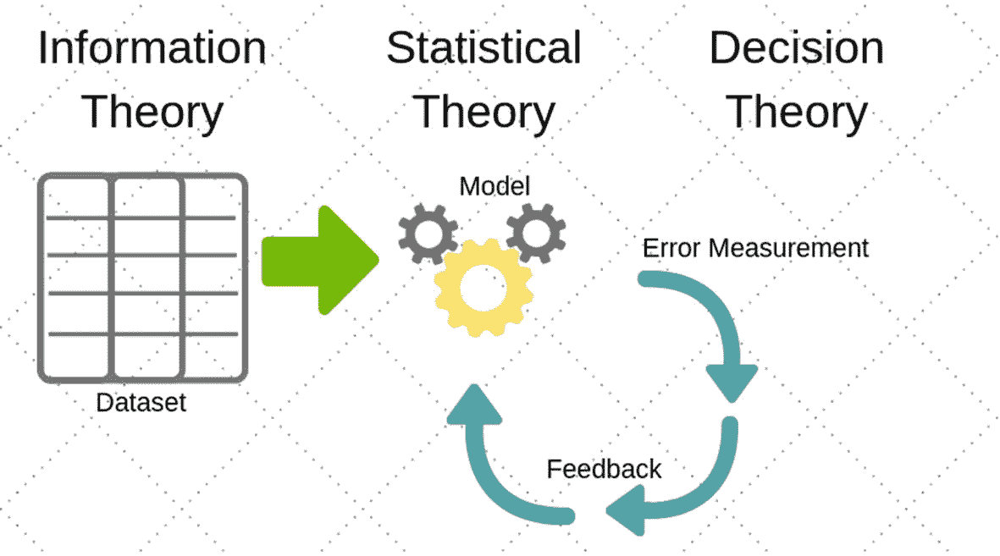

图 1-1

三种理论之间是如何相互关联的，以及它们是如何成为深度学习流程的必要组成部分的。这些理论描述了机器/深度学习过程的构建过程。

## 机器学习简介

“机器学习”这个术语是由 1959 年的亚瑟·塞缪尔（Arthur Samuel）提出的，他是计算机游戏和人工智能领域的美国先驱，并指出“它使计算机能够在没有明确编程的情况下学习。”

因此，让我们开始回答一些好的问题：*什么是机器学习？*以及*传统编程与机器学习之间的区别是什么？*它们之间的区别很容易理解如下：

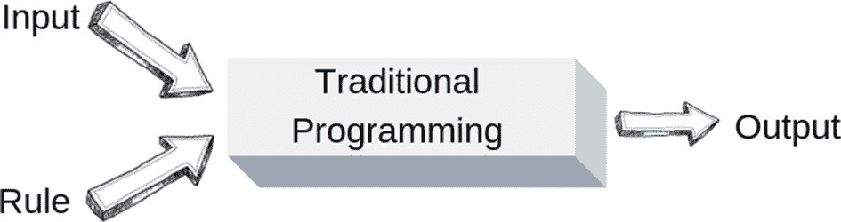

图 1-3

传统编程图

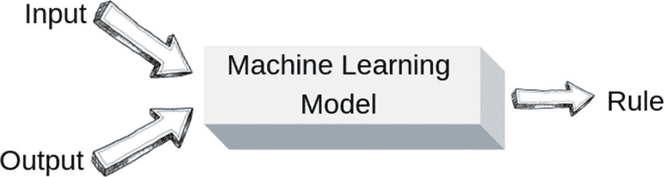

图 1-2

机器学习图

+   *传统编程*：在传统编程中，我们有一个包含两个输入（输入，规则）的盒子，传统模型根据我们添加的规则生成输出。图 1-2 展示了传统编程的示例图。

+   *机器学习*：在机器学习中，我们有一个包含两个输入（输入，输出）的盒子，机器学习模型通过训练来获取从输入生成输出的规则。图 1-3 展示了机器学习编程示例，这显示了它与传统编程的不同之处。

### 预测分析与机器学习的联系

为了简化这一点，我们将回答以下问题：*什么是预测分析？*

预测分析是机器学习的商业名称，用于设计适合预测的复杂模型和算法。因此，机器学习是分析的一个工具！也许吧，但我们可以这样说，它是研究人员、数据科学家、工程师和分析员用来通过学习数据集中的历史关系和趋势来产生可靠决策和结果，并揭示隐藏洞察力的一个模型。

让我们考虑一个例子。假设你决定查看那个度假的优惠；你浏览旅行社网站并搜索酒店。当你查看一家特定的酒店时，在酒店描述下方有一个标题为“你可能也会喜欢这些酒店”的部分。这是机器学习的一个常见用例，称为“推荐引擎”。在先前的例子中，他们认为你会喜欢这些特定的酒店，基于他们已经知道你很多信息（**历史数据集**）。这里我们给你留下一个问题：*机器学习是一种技术还是一种方法？*

### 机器学习方法

机器学习有三种主要方法：

1.  *监督学习*

1.  *无监督学习*

1.  *半监督学习*

那么，让我们详细讨论每种方法。

#### 监督学习

当一个算法从示例数据和相关的目标响应中学习，这些响应可以包括数值或字符串标签，如类别或标签，以便在后来面对新示例时预测正确的响应时，它属于监督学习的范畴。这种方法确实类似于在某人监督下的人类学习。

例如，老师为学生提供好的例子来记忆，然后学生从这些具体的例子中推导出一般规则。

让我们在可视化图表（图 1-4）中看看，这将为您提供一个清晰的监督学习的说明。数据被标记了（因为每个现实世界的观察/输入都有一个确定的输出值），如图 1-4 所示。在监督学习中，模型应该看到如图所示的数据，以便允许它对数据进行分类。模型应该使用标记的数据从左边的图 1 到右边的图 2，换句话说，我们将把每个数据观察/输入分类到某个响应/输出。

在先前的例子中，当我们探索数据时，我们看到一种称为分类的监督学习方法；实际上有两种类型，它们解决了描述监督学习的两个问题：

+   分类

+   回归

所以，一个可能出现在你脑海中的好问题是*分类和回归究竟是什么？*

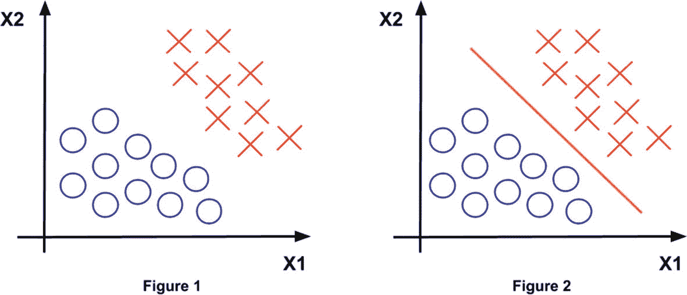

图 1-4

一个包含模型的数据库，该模型将不同的观察（x 和 o）分类到两个区域

我们将*分类问题*定义为当输出变量是一个类别或一组时，例如“黑色”和“白色”或“垃圾邮件”和“非垃圾邮件”或甚至 X 和 O。

另一方面，*回归问题*是当输出变量是一个实值时，例如“美元”或“身高”。

所以，如果你必须在两个或多个标签之间进行选择，你现在面临的是一个分类问题；如果你试图估计输出的浮点数，你现在面临的是一个回归问题（图 1-5）。

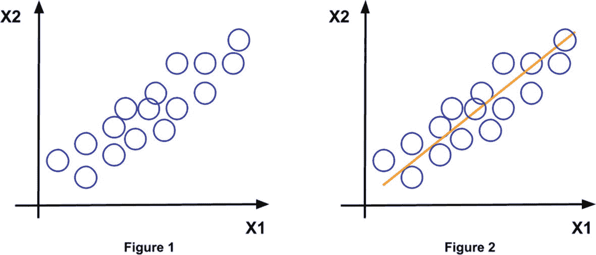

图 1-5

回归模型如何尝试拟合数据集

#### 无监督学习

无监督学习是一类机器学习技术，用于在数据中找到模式。无监督算法所接受的数据没有标签，这意味着只提供了输入变量，没有相应的输出变量。在无监督学习中，算法被留给自身去发现数据中的有趣结构。

在监督学习中，系统试图从给出的先前示例中学习。另一方面，在无监督学习中，系统试图直接从给出的示例中找到模式。因此，如果数据集被标记，它属于监督问题；如果数据集未标记，它是一个无监督问题。

在无监督学习中，算法被留给自身去发现数据中的有趣结构，其中你只有输入数据，没有相应的输出变量。对于我们这些机器学习工程师来说，简单的定义是在无监督学习中，我们希望学习数据的内在结构，而不使用明确提供的标签。

但*为什么我们称之为无监督学习？*我们称之为无监督学习，因为与监督学习不同，没有给出正确的答案，机器本身找到答案。

例如，假设我们有一门物理课程中的本科生，我们需要根据他们的人口统计/教育因素预测谁会通过考试，谁不会。模型应该探索数据，并试图捕捉模式，根据它所具有的特征得到正确答案；这是一个无监督案例。

让我们看看图 1-6，它说明了无监督学习。数据被标记如图所示。无监督学习中的模型应该看到如图所示的数据，以便它能够聚类数据。

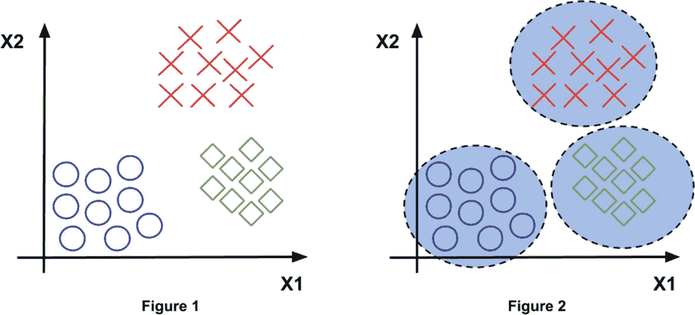

图 1-6

无监督学习算法如何将数据聚类成组或区域

在图 1-6 中，我们将数据分组到区域中。这种现象被称为**聚类**。实际上，我们有许多问题和解决问题的技术，但描述无监督学习的两个最常见问题是：

+   聚类

+   关联

那么，*这些类型是什么？*

**关联规则学习**问题是你想要发现描述你数据大部分的规则，例如*“购买 X 的人也倾向于购买 Y。”*

**聚类**问题是你想要发现数据中的固有分组，例如根据购买行为对客户进行分组。

#### 半监督学习

当你遇到一个问题，你有大量的输入数据，但只有其中一部分数据被标记时，这被称为*半监督学习问题*。这些问题介于监督学习和无监督学习之间。

考虑一个例子，一个照片存档，其中只有一些图像被标记（例如，狗、猫、人），而大多数图像未被标记。

*它是如何工作的？* 你可以使用无监督学习技术来发现和从输入变量中学习结构，然后使用监督学习技术对未标记的数据进行最佳猜测预测，将数据反馈到监督学习算法作为训练数据，并使用该模型对新未见数据做出预测。

#### 检查点

为了避免混淆，我们将创建一个检查点来总结机器学习方法的差异。表 1-1 总结了三种方法的差异，即监督学习、无监督学习和半监督学习（参见图 1-7）。

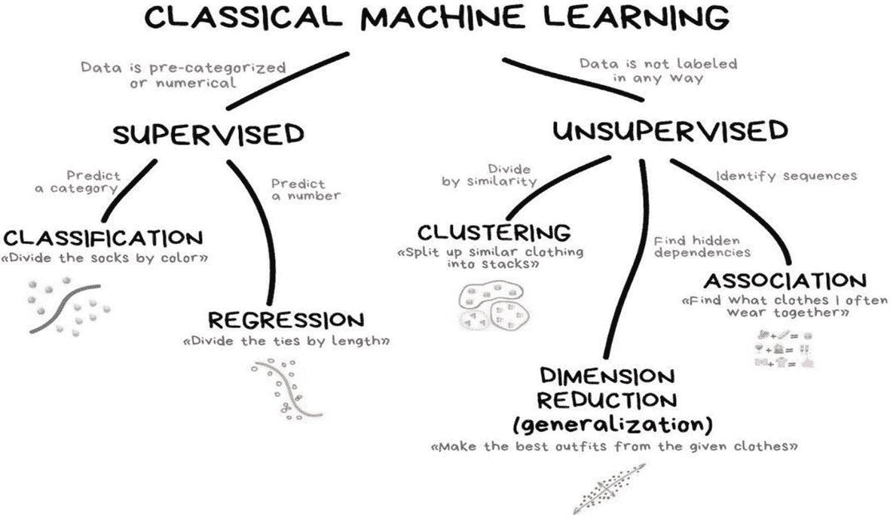

图 1-7

经典机器学习的树状结构

表 1-1

机器学习的三种方法——总结以创建检查点

| 监督学习 | 无监督学习 | 半监督学习 |
| --- | --- | --- |
| 所有数据都有标签，算法学习从输入数据预测输出。 | 所有数据都没有标签，算法学习从输入数据中学习内在结构。 | 部分数据有标签，但大部分数据没有标签，可以使用监督和无监督技术的混合。 |

#### 强化学习

强化学习是机器学习的一个领域。它全部关于采取合适的动作来最大化这种情况下的奖励。奖励是强化学习的主要方面之一。

例如，当你家里有一只狗并试图教它如何坐下、跳跃或转身时，你首先向狗展示如何做，然后让它自己尝试。当你说“坐下”而狗坐下时，你会奖励它。但如果它不理解，你不会奖励它。让我们解释一下强化。狗是一个 *代理*；当你说“坐下”时，它处于 *环境* 状态，代理的响应被称为 *动作*。当狗按照你说的做时，你会给它奖励，狗会通过理解你每次说的话来最大化这个奖励。这就是强化学习，但强化学习超出了范围，因为它需要更多的数学知识。

让我们通过图 1-8 来获得更多的理解，它显示了强化学习中的环境系统。

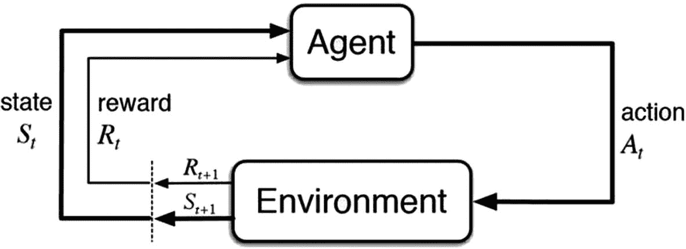

图 1-8

强化学习中的一个典型系统

如我们所见，代理从环境中接收一个状态，并执行一个动作。基于这个动作，环境将奖励代理或惩罚（不奖励）它。

代理试图尽可能多地最大化这些奖励（*强化学习*）。

但是，监督学习和强化学习之间存在一些共性，如表 1-2 所总结。

表 1-2

强化学习与监督学习之间的共性

| 强化学习 | 监督学习 |
| --- | --- |
| 在强化学习中，决策是相互依赖的，因此我们为一系列依赖决策赋予标签。 | 在监督学习中，决策之间相互独立，因此每个决策都赋予标签。 |

## 从机器学习到深度学习

我们现在知道并理解，机器学习是人工智能（AI）的一个子集，而深度学习是机器学习的一个子集。因此，每个机器学习程序都属于人工智能程序类别，但反之则不然。那么问题来了，*机器学习和人工智能的方法是否相同？* 答案是**是的**，因为每个机器学习问题都是一个人工智能问题，而深度学习是机器学习的一个子集。理解这种联系对我们这本书至关重要。你应该记住，深度学习不过是增强机器学习算法以使其更准确，并使某些阶段变得容易，比如特征提取等。

理解机器学习与深度学习之间区别的最简单方法就是记住深度学习是机器学习的一个子集。

## 让我们看看一些机器学习领域的英雄人物对此有何看法

百度首席科学家、谷歌大脑项目领导者之一*安德鲁·吴*在《Wired》杂志上分享了一个关于深度学习的精彩类比：“我认为人工智能就像建造一艘火箭。你需要一个巨大的发动机和大量的燃料，”他告诉《Wired》记者凯勒布·加林。 “如果你有一个大发动机但燃料很少，你无法进入轨道。如果你有一个小发动机但燃料很多，你甚至无法起飞。建造火箭需要一个大发动机和大量的燃料。”

与深度学习的类比是，火箭发动机是深度学习模型，而燃料是我们可以向这些算法提供的海量数据。

*Nvidia*：机器学习最基本的实践是使用算法解析数据，从中学习，然后对世界上的某事物做出判断或预测。

*斯坦福大学*：机器学习是让计算机在没有明确编程的情况下行动的科学。

*麦肯锡公司*：机器学习基于可以从不依赖基于规则的编程中学习的算法。

*华盛顿大学*：机器学习算法可以通过从例子中归纳来找出执行重要任务的方法。

*卡内基梅隆大学*：“机器学习领域试图回答‘我们如何构建能够随着经验自动改进的计算机系统，以及所有学习过程的基本* *法则是什么？’的问题。”

### 机器学习与深度学习之间的联系

机器学习和深度学习都使用一些来自内部的数据统计学习方法，但每种方法都有其自己的数据提取方法。以机器学习为例：在提取数据时，数据集中每个实例都由一组特征或属性来描述。另一方面，深度学习通过使用具有许多隐藏层的*神经网络*从原始数据中提取特征和属性。我们稍后会看到什么是神经网络及其组成部分，并将详细回答这些问题。

### 机器学习与深度学习的区别

为了简化并作为最佳实践，我们将通过一个例子来比较机器学习（ML）和深度学习（DL）。我们将从一个关于猫和狗的例子开始，如下所示。

首先，我们将解释和讨论这个数据集。猫和狗数据集是一组图像，其中每个图像（一个观察）要么被标记为狗（如果图像包含狗），要么被标记为猫（如果图像包含猫）。

第二，我们将通过在数据集上应用每种方法并总结每种方法的结果来展示机器学习方法与深度学习方法的区别。

#### 在机器学习中

根据数据集，图像要么属于两类之一：狗或猫。这里的问题是*算法是否知道哪一个是狗，哪一个是猫？*

答案很简单，模型将尝试将图片标记为两类之一。它有时会正确分类这些标签，而有时会错误地分类某些图像的另一个标签，因此最终结果会是一场灾难，准确度非常低。

这意味着你的模型未能学习猫和狗之间的差异。那是因为你的模型只是以定义两种动物从一般观点出发的特定特征的方式来标记狗和猫的图片。

让我们举一个例子，其中狗的图片总是在外面拍摄的，所以如果我们有一张外面的猫的图片，模型可能会将其识别为狗，因为它没有考虑到特定的狗的特征。它看到那些狗的图片中都有天空，所以任何包含动物和天空的图片都将被视为狗的图片。这只是一个简化的例子。

#### 在深度学习中

现在，你已经使用了深度学习方法，你可以看到结果有了巨大的差异。所以，你可能会想*是什么区别使得效果如此之好？*当然，通过一些数据预处理，你现在可以通过指向图像中的动物来让模型学习两种动物之间的差异。这个过程被称为数据标注。多亏了这一点，模型可以检测并正确分类新进入的图像中的动物。

现在模型对两种动物进行分类，深度学习方法使用所谓的*人工神经网络*（ANN），将输入（图像数据）通过网络的多个层次传递，每个层次都是按层次学习和定义每种动物的具体特征。

在神经网络内部通过层次处理数据后，系统找到了从它们的图像中分类两种动物的正确标识符。

#### 我们在这里学到了什么？

深度学习与机器学习之间可能的一个区别在于数据呈现给系统的方式。机器学习算法几乎总是需要结构化数据，而深度学习网络依赖于人工神经网络的层次。

机器学习算法被构建成通过理解标记数据来“学习”做事情，然后使用它来产生更多数据集的进一步输出。然而，当实际输出不是期望的输出时，它们需要通过人类干预进行重新训练。

深度学习网络不需要人类干预，因为神经网络中的嵌套层次将数据通过不同概念的不同层次传递，最终通过它们自己的错误进行学习。然而，如果数据的质量不够好，即使是这些也可能产生有缺陷的输出。

*数据是关键。数据的质量最终决定了结果的优劣* *.*

### 我们为什么要学习深度学习（深度学习的优势）？

深度学习如今之所以备受推崇，主要有四个原因：

1.  *数据*：到 2018 年，由于过去几年和几十年收集的大量数据，深度学习的普及率有所提高。这使得神经网络真正显示出它们的潜力，因为它们放入的数据越多，它们就越好。我们质疑了大量的数据是否对机器学习也有用，但不幸的是不是。传统的机器学习算法肯定会达到一个水平，更多的数据不会提高它们的性能。

1.  *力量*：现在的计算能力使我们能够处理更多的数据。

1.  *算法*：这些算法发展的最新突破主要归功于使它们运行得比以前快得多；优化和并行性也使梦想成真。

1.  *营销*：神经网络已经存在了几十年（1944 年首次提出）并且已经有一些炒作，但也面临过没有人愿意相信和投资它们的时期。“深度学习”给它起了一个新的时髦名字，这使得新的炒作成为可能。这意味着深度学习不是一个新创建的领域；你应该知道它已经在新的十年里被重新开发。

深度学习越来越受欢迎，因为机器学习算法需要标记数据，它们不适用于解决涉及大量数据的复杂查询。

### 深度学习的缺点（伟大的代价）

1.  应该知道的是，深度学习比传统的机器学习算法需要更多的数据。

1.  神经网络是黑盒，这意味着你不知道你的神经网络是如何以及为什么得出某个特定输出的。

1.  开发时长：开发一个神经网络需要花费很多时间。尽管有像 Keras 这样的库，使得神经网络的开发相对简单，但你有时需要更多控制算法的细节。例如，当你试图用机器学习解决一个以前没有人做过的问题时，你可能使用 TensorFlow（我们将在本书中详细介绍）。

1.  与传统算法相比，神经网络在计算上更昂贵。最先进的深度学习算法，实现无底神经网络的成功训练，可能需要几周时间从头开始完全训练（不用担心；这可以通过迁移学习技术解决）。

## 深度学习简介

那么，*什么是深度学习？* 通过说深度学习只是使用深度神经网络的机器学习来回答这个问题是公平的。深度学习是机器学习的一个子集，但使用人类大脑的表示；科学家们通过创建一些算法来尝试模拟人类大脑的工作。许多人说神经网络（NNs）和深度神经网络（DNNs）是一种新的方法。

让我们回顾一下神经网络的历史。深度学习的起源可以追溯到 1943 年，当时沃尔特·皮茨（Walter Pitts）和沃伦·麦克洛奇（Warren McCulloch）基于人脑神经网络创建了一个计算机模型。他们使用了一种他们称之为“阈值逻辑”的算法和数学组合来模拟思维过程。

然后，在 1965 年，亚历克谢·格里戈里耶维奇·伊瓦赫涅科（数据处理的组方法开发者）和瓦伦丁·格里戈里耶维奇·拉帕（*控制论与预测技术*的作者）使用了具有多项式激活函数的模型，这些模型随后被统计地分析。从每一层，最佳统计选择的特征随后被转发到下一层。

1985-1990 年代是人工智能和深度学习的第二个冬天。深度学习有自己的研究人员；他们更多地关注深度学习。

在 1995 年，达娜·科尔特斯（Dana Cortes）和弗拉基米尔·瓦普尼克（Vladimir Vapnik）开发了支持向量机（一种映射和识别相似数据的系统）。

LSTM（长短期记忆）用于循环神经网络（RNNs）是在 1997 年由塞普·霍克瑞特（Sepp Hochreiter）和尤尔根·施米德胡贝尔（Juergen Schmidhuber）开发的。

我们不需要把所有时间都花在深度学习的历史以及它是如何改变我们今天的世界上，但我们想表明深度学习并不是在我们这个时代发明的。我们给你提供了一些关于历史的参考资料。现在是深度学习的时候了。

深度学习基于人类大脑处理信息和学习的方式。它由一个由多个表示层组成的机器学习模型组成，其中每一层都使用前一层的信息来深入学习。深度学习由神经网络组成，神经网络由层组成，层由称为**感知器**的隐藏单元组成。

现在，让我们看看当我们将它们组合在一起时的先前结构。首先，我们应该了解神经网络的类型，这将使我们能够理解先前结构。我们有两种主要的神经网络类型（浅层和深层）。表 1-3 显示了它们之间的区别。

表 1-3

浅层与深层神经网络

| 浅层 | 深层 |
| --- | --- |
| “浅层”一词意味着“不深”；它只有一个隐藏层。 | “深层”一词意味着它有许多隐藏单元。 |

现在我们知道了浅层和深层的区别。但什么是单元？什么是层？比较的主要因素是什么？层的类型有哪些？这是深度学习的起点；我们应该从基本功能开始，逐步过渡到复杂模块。让我们从单元开始，这是深度学习中最简单的功能；它包含了机器学习的各种方法（监督学习、无监督学习、半监督学习和强化学习）。它可能包含一个激活函数（我们将在后面探讨），比如逻辑回归、回归函数或聚类函数等等。这表明深度学习是机器学习的一个子集；目前，这是对深度学习层单元的一个很好的解释。然后，当我们有多个单元组合在一起时，我们创建了一个称为层的东西：每个单元都与前一层的单元相连（这被称为全连接神经网络）。我们有三种类型的层（输入、隐藏（编码器）和输出），因此在我们创建输入层的单元并将其与输入数据连接，并为下一层创建新的单元并将其与输入和输出层连接后，这个网络被称为浅层神经网络。但如果我们把这个隐藏层与另一个隐藏层连接起来，我们就会得到一个深层神经网络。理解深层和浅层神经网络之间的区别似乎很简单。但让我们通过一张图片来更好地理解这种区别（图 1-9)。

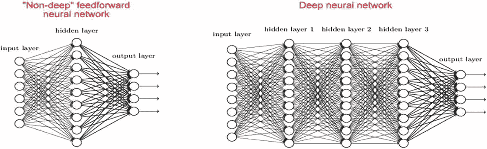

图 1-9

浅层与深层神经网络的区别

现在我们来看看深层神经网络的类型：

+   前馈神经网络

+   径向基函数神经网络

+   多层感知器

+   卷积神经网络

+   循环神经网络——长短期记忆

+   模块化神经网络

+   序列到序列模型

这些是深度学习中最常见的神经网络。我们将在本书的下一章中讨论其中的一些，但到目前为止，我们可以学习它们的名称，并激发我们深入了解它们的兴趣。

深度学习中最常见的应用：

+   计算机视觉和图像处理研究（例如，自动驾驶汽车）。

+   自然语言处理（语音识别、机器翻译和自然语言理解）

+   推荐引擎

+   自动着色

+   广告，例如社交媒体广告和用户定位广告

## 机器学习数学符号

在向您介绍深度学习领域之后，我们需要收集一些将用于证明或得出某些理论的数学符号。我们不使用这本书进行数学证明或严格的解释，而是更深入地探讨实际方面。我们将使用这些数学符号来写下一些方程，解释为什么我们以某种方式而不是另一种方式做某事。那么，现在就开始吧；在表 1-4 中，我们尝试收集了这本书中所需的所有符号。

*X*[*i*, *j*] 是一个表示常数的符号，矩阵中的最小元素；或者说，它是向量中的基本符号，我们用它来构建向量。那么什么是向量呢？但首先，让我们谈谈下标值（i,j）；它们是索引值。*i*^(*th*) 是行的索引，*j*^(*th*) 是列的索引，以便我们能从向量中获取特定值。让我们来看看向量。

当 *X*[*i*] 是一个表示一组常数组合成变量（向量）的符号时，在我们之前提到的关于索引的向量中，我们有 *i*^(*th*) 和 *j*^(*th*) 索引。但 *X*[*i*] 只有下标 *i*^(*th*)；这意味着我们在向量中只有一行，或者我们只有一列。例如，如果我们有一行和多列，我们会看到它像这样：*X*[1, *j*]。这里的 *j* 表示你遍历列。另一方面，如果我们有一列和多行，我们会看到它像这样：*X*[*i*, 1]。这里的 *i* 表示你遍历行。让我们让它更简单：在一个数组中，你有行和列。如果你只有一列和多行，那么 *X*[*i*][0]；如果你只有一行和多列，那么 *X* [0][ *j*]。

让我们再深入一点。如果我们把一些常数放在一起，我们得到一个向量，所以如果我们把一些向量放在一起，*我们会看到什么？* 是矩阵。***X*** 是矩阵的符号，用于在维度中表示数据。当我们说矩阵中的维度时，我们可能是指列和行（在二维矩阵的情况下），或者可能是像二维空间这样的空间。另一方面，当我们有两个列时，我们不能说这个矩阵是二维的，当我们有三个列时，我们也不能说它是三维的：这完全是不正确的。接下来，让我们看看一些特殊的矩阵类型：

*I* 表示一个单位矩阵。单位矩阵是一个其值为零的矩阵；只有主对角线上的值是 1。

*X* ^(*T*) 是一个转置矩阵。转置矩阵是矩阵乘法或矩阵求逆的好方法。我们不需要深入到这个复杂的代数过程，但你应该知道它是一个转置矩阵。

表 1-4

所有所需符号的总结

| 符号 | 描述 | 机器学习中的应用 |
| --- | --- | --- |
| **代数（数字与数组）** |
| x | 标量（整数或实数） | a = 3 |
| **x** | 向量 | a = [1, 2, 3] |
| **X** | 矩阵 | ![矩阵 A=\left[{a}_{ij}\right]={\left[\begin{array}{ccccc}{a}_{11}& {a}_{12}& {a}_{13}& \cdots & {a}_{1n}\\ {}{a}_{21}& {a}_{22}& {a}_{23}& \cdots & {a}_{2n}\\ {}{a}_{31}& {a}_{32}& {a}_{33}& \cdots & {a}_{3n}\\ {}\vdots & \vdots & \vdots & & \vdots \\ {}{a}_{m1}& {a}_{m2}& {a}_{m3}& \cdots & {a}_{mn}\end{array}\right]}_{m\kern0.5em \times \kern0.5em n} $$](Images/484548_1_En_1_Chapter_TeX_IEq1.png) |
| *I* | 单位矩阵 | ![单位矩阵 {\mathrm{I}}_1=\left[1\right],{\mathrm{I}}_2=\left[\begin{array}{cc}1& 0\\ {}0& 1\end{array}\right],\kern0.5em {\mathrm{I}}_3=\left[\begin{array}{ccc}1& 0& 0\\ {}0& 1& 0\\ {}0& 0& 1\end{array}\right],\kern5em {\mathrm{I}}_{\mathrm{n}}=\left[\begin{array}{cccccc}1& 0& 0& 0& 0& 0\\ {}0& 1& 0& 0& 0& 0\\ {}0& 0& 1& 0& 0& 0\\ {}..& ..& ..& ..& ..& ..\\ {}..& ..& ..& ..& ..& ..\\ {}0& 0& 0& 0& 0& 1\end{array}\right]\mid $$](Images/484548_1_En_1_Chapter_TeX_IEq2.png) |
| *X*^(*T*) | 转置矩阵 |   |
| **集合与图** |
| **A** | A 是一个集合 | A = {1,2,3,4} 这个集合意味着它只包含 1,2,3,4 以及其唯一值，这意味着在集合中找不到重复项，与向量不同，它可以包含许多重复字符。 |
| 𝕽 | 实数集 | 这意味着它包含所有实数。 |
| [a, b] | 包含 a 和 b 的实数区间 |   |
| (a, b] | 不包含 a 但包含 b 的实数区间 |   |
| **索引** |
| *X*[*i*] | 向量 x 的第 i 个元素，索引从 1 开始 |   |
| *X*[*i*, *j*] | 矩阵 X 的 (i, j) 元素 |   |
| *X*[*i*:] | 矩阵 X 的第 i 行 |   |
| *X*[:*j*] | 矩阵 X 的第 j 列 |   |
| *X*[*i*, *j*, *k*] | 3 维命名张量 X 的 (i, j, k) 元素 |   |
| *X*[:, : , *i*] | 3 维张量的 2 维切片 |   |
| *x*[*i*] | 向量 x 的第 i 个元素 |   |
| **函数** |
| f : A -> B | 定义域为 A，值域为 B 的函数 f |   |
| f(x;*θ*) 或 f(x) | 由 θ 参数化的 x 的函数（有时省略） |   |
| σ(x) | 逻辑 sigmoid，即 (1 + exp(x))1 |   |
| g[f; x] | 将 f 映射到 f(x) 的函数 |   |
| &#124;&#124;*X* &#124;&#124;[*p*] | x 的 lp 范数 | 我们将在正则化中使用它。 |
| &#124;&#124;X&#124;&#124; | x 的 L2 范数 | 我们将在正则化中使用它。 |
| **统计学** |
| 𝜇 | 总体均值 |   |
|  | 样本均值 |   |
| *σ*² | 总体方差 |   |
| *s* ² | 样本方差 |   |
| x 或 σ | 标准差 |   |
| s | 样本标准差 |   |
| 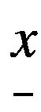 | 中位数 |   |
| **机器学习** |
| **X** | 用于训练示例的数据集 |  |
| Y 或在某些书中 y | 输出示例的集合 |  |
|  | 由函数 f 预测的标签，即 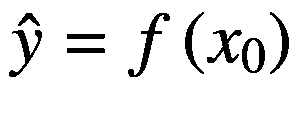（监督学习） |  |
| (*x*^(*i*), *y*^(*i*) ) | X 中的第 i 个示例对（监督学习） |  |
| (*x*^`, *y*^`) | 测试对 |  |
| D | 数据点 xi 的维度 |  |
| K | 标签 yi 的维度 |  |
| J(w,b) | 成本函数 | 用于计算你的模型如何拟合数据 |

## 摘要

在本章中，我们首先对机器学习进行了简要介绍，然后介绍了该领域的核心——三个理论：信息、概率和决策。之后，我们阐述了从机器学习到深度学习的演变过程，并为您介绍了本书中使用的数学符号。

# 2. 设置你的环境

现在历史和数学课程已经结束，我们必须公平地给你一份甜点，所以现在让我们通过设置我们的环境来为即将到来的脏活做好准备。

大多数深度学习工程师都安装了开发和研究环境，准备构建和维护深度学习模型。但如果你是这一领域的新手，你可能想知道最适合学习和有效使用以提升数据科学家职业生涯的最佳工具和编程语言。我们相信是 Python 和 TensorFlow，因此在本章中，我们将安装这两个工具。

## 背景

**Python** 是一种用于通用编程的解释型高级编程语言。由吉多·范罗苏姆（Guido van Rossum）创建，并于 1991 年首次发布，Python 的设计理念强调代码可读性，特别是使用重要的空白。它提供了能够在小规模和大规模上清晰编程的构造。Python 凭借其内部庞大的数据处理和分析包征服了科学界，并引领了潮流。此外，它还允许数据科学家快速进行实验，并轻松开发和部署科学应用。除了所有这些特性之外，Python 还允许我们将科学实验集成到桌面或 Web 应用中。

除了 Python 之外，还有其他工具，如 **R** 和 **MATLAB**，但使 Python 成为我的首选编程语言的原因是它是开源的，拥有庞大的社区。Python 完善了数据科学家的技能：它使得应用的开发和部署到生产环境更加容易。

### Python 2 与 Python 3

`wiki.python` `.org` 深入探讨了 Python 2.7 和 3.3 之间的差异，指出每个版本都有其优点。这完全取决于你想要实现的目标。但总的来说：

+   *“Python 2.x 是遗留版本，Python 3.x 是语言的现在和未来。”*

这两个工具之间有一些细微的差别。但最大的区别是打印语句，如 Stack Overflow 中的下一个短语所述。

*“最明显的（区别）可能是“print”语句的工作方式。它足够不同，以至于相同的脚本不能同时在两个版本上运行，但选择一个版本，你就可以顺利运行了。”*

## 安装 Python

Python 是一种开源的、面向对象和跨平台的编程语言。当 Python 与 C++或 Java 等竞争对手进行比较时，Python 由于以下几个原因赢得了比赛：

+   Python 允许你在非常短的时间内构建一个可工作的软件原型。

+   Python 非常灵活，因为有数百个包可以解决几乎所有问题并满足大多数需求。

由于这些原因，Python 成为了数据科学家工具箱中最常用的语言（至少在我们写这本书的时候是这样）。

因此，让我们继续介绍创建数据科学环境所需的全部设置，以便运行本书提供的示例和实验。

对于从未使用过 Python 的新手数据科学家（他们可能没有在他们的机器上安装该语言）来说，他们首先需要从项目的主网站下载安装程序（[`https://python.org/downloads/`](https://python.org/downloads/））然后在他们的本地机器上安装它。

记住，大多数 Linux 发行版的最新版本（例如 *CentOS*、*Fedora*、*Red Hat Enterprise*、*Ubuntu* 以及一些较小的版本）在仓库中包含了 Python 2。在这种情况下，如果你已经在你的计算机上安装了 Python 版本（因为我们的示例是在 Python 3 上运行的），你首先需要检查你正在运行的确切版本。要进行这样的检查，请遵循以下说明：

+   打开 Python shell，在终端中输入 python，或者点击你在系统上找到的任何 Python 图标。

+   然后，在启动 Python 之后，通过在 Python 交互式 shell 或 REPL 中运行以下代码来测试安装：

+   如果你看到你的 Python 版本有 major=2 属性，这意味着你正在运行一个 Python 2 实例。否则，如果属性是 major=3，或者打印语句回显给你类似 v3.x.x（例如 v3.5.1）的信息，那么你正在运行正确的 Python 版本，你可以继续前进。

```py
>>> import sys
>>> print (sys.version_info)
```

### 注意

*REPL* 代表 *read-eval-print loop*——一个简单的环境，它将用户的命令作为 shell 中的输入行，并通过打印结果来输出。

### Python 包

除非你选择特定的预装发行版，否则 Python 不会包含你所需的一切。因此，为了安装所需的包，你可以使用 `pip`（你可以通过遵循这里的说明来安装 pip）或 `easy_install`。这两个工具都在命令行中运行，使得 Python 包的安装、升级和删除过程变得非常简单。要检查你的本地机器上安装了哪些工具，请运行以下命令：

```py
$> pip
# or
$> easy_install
```

在本书的大多数情况下，你将看到使用 pip 安装的包。

### 注意

你可能会发现 *pip* 在你的系统中作为 `pip3`，而 `easy_install` 作为 `easy_install-3`，以强调两者都操作 Python 3 的包。为了保险起见，检查 pip 的版本 `$> pip --version` 或 `easy_install` 的版本 `$> easy_install --version`。

之后，你可以轻松地安装任何 Python 包，以及所有其依赖项都将被下载并安装。如果你不确定该包是否已安装在你的系统中，尝试通过导入它来使用它。如果 Python 解释器抛出 ImportError 信息，那么你可以确定该包尚未安装。

当 NumPy 库已安装时，会发生以下情况：

```py
>>>import numpy
```

如果未安装，则会发生以下情况：

```py
>>> import numpy
Traceback (most recent call last):
File "", line 1, in 
ImportError: No module named numpy
```

在这种情况下，你应该在终端中运行以下命令来安装 NumPy：

```py
$> pip install
# or
$> easy_install numpy
```

### IPython

IPython（交互式 Python）是一个命令壳——类似于 REPL 但具有更友好的界面——用于多种编程语言的交互式计算。最初是为 Python 编程语言开发的，它提供了内省、丰富的媒体、shell 语法、自动补全和历史记录。

IPython 提供以下功能：

+   交互式壳（终端和基于 Qt 的）

+   基于浏览器的笔记本界面，支持代码、文本、数学表达式、内联绘图和其他媒体

+   支持交互式数据可视化和使用 GUI 工具包

+   灵活、可嵌入的解释器，可加载到自己的项目中

+   并行计算工具

#### 安装 IPython

你可以使用以下命令行安装 IPython（图 2-1）：

```py
$> pip install ipython
```

安装完成后，你可以使用以下命令运行 IPython：

```py
$> ipython
```

### 注意

你可能会发现你必须运行 `ipython3` 而不是仅仅运行 `ipython`，因为 *ipython3* 是为 Python 3 制作的。

当你在 IPython 壳中运行代码行时，你会发现代码是写在以 `In[1]` 开头的一行。这意味着壳正在将你的输入写入第 1 行，输出以相同的语法写入，但以 `Out[1]` 开头，例如：

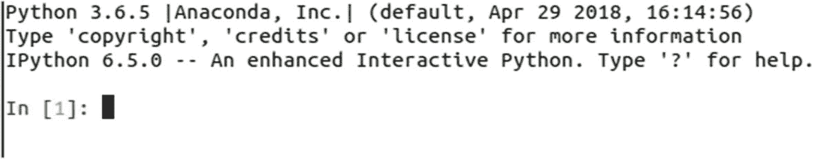

图 2-1

IPython 的外观

### Jupyter

作为数据科学家或机器学习工程师，实验是工作方法，因此需要快速实验。这就是为什么创建 **IPython** 的原因，但它仅限于 Python 编程语言，直到 2015 年由 Fernando Perez 创建 **Jupyter**，以解决需要为多种语言提供交互式命令壳的需求。这个新项目将原始 IPython 界面的潜在可用性扩展到广泛的编程语言，例如

+   Julia

+   Scala

+   R

要获取 Jupyter 可用内核的完整列表，请访问此处页面 [`https://github.com/jupyter/jupyter/wiki/Jupyter-kernels`](https://github.com/jupyter/jupyter/wiki/Jupyter-kernels)。

### 注意

你不能混合或运行不同内核的相同笔记本命令；每个笔记本只引用一个内核，即它最初创建时使用的内核。因此，在同一个笔记本中，你不能混合语言，甚至不能混合同一语言的版本，如 Python2 和 Python3。

Jupyter Notebook 建立在 IPython 之上，这是一种在终端中使用**REPL**模型（读取-评估-打印-循环）运行 Python 代码的交互式方式。IPython 内核执行计算并与 Jupyter Notebook 前端界面进行通信。

多亏了内核的伟大想法，这些内核通过基于 Web 的前端界面与用户代码进行通信，并将输入代码的输出提供给界面本身，无论你使用什么语言进行开发，你都可以使用相同的界面和交互式编程风格。

### 注意

没有 IPython 内核，即使你安装了另一个内核并将其链接，Jupyter 也无法运行。

在整本书中，我们首选 Jupyter，它被用来清晰地有效地说明脚本和数据操作及其结果。

常规的集成开发环境（IDE）是围绕以下周期构建的：

1.  编写脚本

1.  运行之后

1.  评估其结果

与常规 IDE 不同，Jupyter 允许你以块的形式编写代码，称为单元格；依次运行每个单元格；并单独评估每个单元格的结果，检查文本和图形输出——这是这种方法的优势。

+   你可以运行选定的单元格，并从中获取输出。

+   如果某个单元格出现错误或异常，其他单元格会保存它们的输出，而不是从头开始运行整个脚本。

这种方法对于涉及基于数据开发代码的任务尤其非常好——就像前面列表中的第 2 点——因为它自动完成了通常被忽视的记录和说明数据分析如何进行、其前提和假设以及中间和最终结果的职责。

如果你的工作的一部分也是向项目内部或外部的利益相关者展示你的工作，Jupyter 可以轻松地完成讲故事的工作。

用户可以轻松地将代码、注释、公式、图表、交互式图表以及图像和视频等媒体结合起来，使每个 Jupyter Notebook 成为一个科学速写本，用于记录所有实验及其结果。

Jupyter 在所有浏览器（例如，Internet Explorer、Firefox 或 Chrome 等）上运行，启动时显示一个等待编写代码的单元格。每个单元格中封装的代码块都可以运行，其结果在单元格之后的空间中报告。图表可以在笔记本中（内联图表）或单独的窗口中显示。在我们的例子中，我们决定内联显示我们的图表。

#### 安装 Jupyter

你可以在这里找到关于 Jupyter 安装的完整说明——涵盖所有操作系统——[`https://jupyter.readthedocs.io/en/latest/install.html`](https://jupyter.readthedocs.io/en/latest/install.html)。

如果你没有在你的系统上安装 Jupyter，你可以使用以下命令立即设置它：

```py
$> pip install jupyter
```

安装后，你可以通过在命令行中调用它来运行 Jupyter 内核。

```py
$> jupyter notebook
```

一旦在浏览器中打开了 Jupyter 实例，你将看到这个页面（图 2-2）。

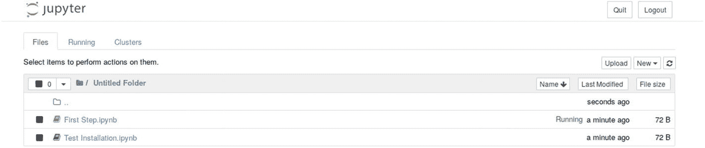

图 2-2

Jupyter Notebook 树文件

这是 Jupyter 的树状页面，你可以从这里构建和控制 Jupyter Notebook。你可以在图 2-2 中看到以下内容：

+   这个文件夹中有两个笔记本。

+   带有绿色图标的笔记本目前正在内核中运行。

+   带有黑色图标的本子已经关闭。

+   这里有一个上传按钮，允许你上传所有类型的文件（如果你在远程服务器上运行 Jupyter）。

+   使用新建按钮，你可以创建新的笔记本或空文件，甚至可以打开一个终端。

### 注意

Jupyter 的树页面只能看到执行命令的目录。

现在点击新建按钮；在笔记本部分，选择 Python 3（该部分可能还有其他内核，取决于你安装了什么）。

你也可以创建 *文本文件*、*文件夹* 或打开 *终端*（图 2-3）。


图 2-3

如何创建新文件、文件夹，甚至终端

在这一点上，你的新空笔记本将看起来像下一个截图（图 2-4），你可以在单元格中开始输入命令。例如，你可能从在单元格中输入开始。

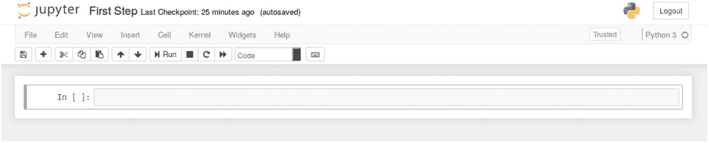

图 2-4

Jupyter Notebook 文件

创建 Jupyter Notebook（顺便说一句，这是一个成就）后，我们需要确保你理解一些关于你创建的文件的概念。

##### ipynb 文件是什么？

理解这个文件真正是什么会有所帮助。

每个 *.ipynb* 文件都是一个文本文件，它以 JSON 格式描述了笔记本的内容。每个单元格及其内容，包括已转换为文本字符串的图像附件，以及一些元数据都被列在其中。如果你知道自己在做什么，你可以通过从笔记本菜单栏中选择 **编辑 ➤ 编辑笔记本元数据**来自行编辑。

有两个术语你应该注意，这些可能对你来说是新的：**单元格**和**内核**对于理解 *Jupyter* 以及它为何不仅仅是一个文字处理器至关重要。

+   内核是一个“计算引擎”，它执行笔记本文件中包含的代码。

+   单元格是笔记本中用于显示文本或由笔记本内核执行代码块的容器。

单元格构成了笔记本的主体。在图 2-5 的截图中，那个带有绿色轮廓的框是一个空单元格。主要有两种单元格类型：


图 2-5

一个选中的绿色单元格

+   代码单元格包含要在内核中执行的代码块，并在其下方显示输出。

### 注意

默认情况下，新笔记本的第一个单元格始终是一个代码单元格。


图 2-6

编写简单的 Python 命令

+   一个**Markdown**单元格包含使用 Markdown 格式化的文本，并在运行时显示其输出（图 2-6）。

因此，点击工具栏中的“笔记本运行”按钮或按 Ctrl + Enter 键。

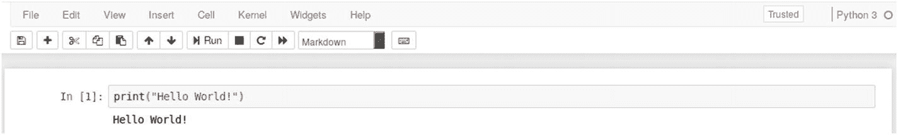

图 2-7

第一个 Python 命令的输出

结果应如图 2-7 所示。

此外，使用 Markdown 可以轻松地编写笔记，Markdown 是一种简单易学、快速掌握的标记语言（[`https://daringfireball.net/projects/markdown/`](https://daringfireball.net/projects/markdown/)）。可以使用 MathJax（[`www.mathjax.org/`](http://www.mathjax.org/））处理数学公式，以在 HTML/Markdown 中渲染任何 LaTeX 脚本。其语法与 HTML 标签一一对应，因此在这里有一些先验知识会有所帮助，但绝对不是先决条件。

在单元格中编写 LaTeX 代码有许多方法。最简单的方法是使用 Markdown 语法，将方程用单个$（美元符号）括起来以创建内联 LaTeX 公式，或者用双美元符号$$括起来以创建一行居中的方程。请记住，为了得到正确的输出，单元格应设置为 Markdown。这里有一个例子（图 2-8）。

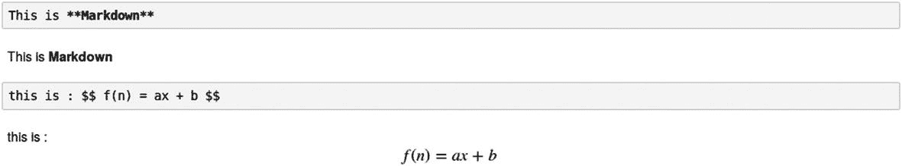

图 2-8

一个简单的 Markdown 命令

## 书中使用的包

我们将要介绍的所有包都具有强烈的分析性，并且在数据科学和机器学习项目中使用得很多。所有这些包都由经过广泛测试和高度优化的函数组成，这些函数针对内存使用和性能进行了优化，可以成功执行任何脚本操作。以下章节提供了如何安装它们的说明。

### NumPy

**NumPy**代表（数值 Python），这是 Travis Oliphant 的创造，是 Python 编程语言的解析骨干。它提供了多维数组，以及一大套函数来对这些数组执行多种数学运算。数组是沿着多个维度排列的数据块，实现了数学向量矩阵。以最优内存分配为特点，数组不仅用于存储数据，还用于快速矩阵运算（向量化）。

+   网站：[`www.numpy.org/`](http://www.numpy.org/)

+   安装命令：`pip install numpy`

+   导入的首选别名：`import numpy as np`

### SciPy

**SciPy**（发音为“Sigh Pie”）是用于数学、科学和工程的开源软件。SciPy 库依赖于 NumPy，这是 Travis Oliphant、Pearu Peterson 和 Eric Jones 的原始项目。SciPy 扩展了 NumPy 的功能，提供了更多种类的科学算法，包括线性代数、稀疏矩阵、信号和图像处理、优化、傅里叶变换等。

+   网站：[`www.scipy.org/`](http://www.scipy.org/)

+   安装命令：`pip install scipy`

+   导入的推荐别名：`import scipy as sp`

### Pandas

**Pandas**处理 NumPy 和 SciPy 无法处理的所有事情。多亏了其特定的数据结构，即*DataFrames*和*Series*，pandas 允许您处理不同类型的数据的复杂表格，以及时间序列。多亏了 Wes McKinney 的创造，您将能够轻松、平滑地从各种来源加载数据。然后您可以随意切片、切块、处理缺失元素、添加、重命名、聚合、重塑，并最终可视化您的数据。

+   网站：[`https://pandas.pydata.org/`](https://pandas.pydata.org/)

+   安装命令：`pip install pandas`

+   导入的推荐别名：`import pandas as pd`

### Matplotlib

**Matplotlib**是一个 Python 2-D 绘图库，可以在多种硬拷贝格式和跨平台的交互式环境中生成高质量的图形。最初由 John Hunter 开发，matplotlib 包含创建高质量图形和交互式可视化的所有必需组件。

对于简单的绘图，*pyplot*模块提供了一个类似 MATLAB 的界面，尤其是在与 IPython 结合使用时。对于高级用户，您可以通过面向对象的界面或通过一组 MATLAB 用户熟悉的函数，完全控制线条样式、字体属性、坐标轴属性等。

+   网站：[`https://matplotlib.org/`](https://matplotlib.org/)

+   安装命令：`pip install matplotlib`

+   导入的推荐别名：`import matplotlib.pyplot as plt`

### 注意

这种导入是为了可视化目的，因为 matplotlib 包含用于许多目的的组件，而不仅仅是数据可视化。

### NLTK

**NLTK**是构建 Python 程序以处理人类语言数据的领先平台。它提供了对超过 50 个语料库和词汇资源的易于使用的接口。NLTK 代表**自然语言工具包**，它提供了一套完整的函数，用于统计自然语言处理（NLP），从*分词器*到*词性标注器*，从*树模型*到*命名实体识别*。最初，Steven Bird 和 Edward Loper 创建了这个包，作为他们在宾夕法尼亚大学课程中的 NLP 教学基础设施。

+   网站：[`www.nltk.org/`](http://www.nltk.org/)

+   安装命令：`pip install nltk`

+   导入的推荐别名：`import nltk`

### Scikit-learn

**Scikit-learn** 项目最初是由 David Cournapeau 的 Google Summer of Code 项目 scikits.learn 启动的。其名称来源于它是一个“SciKit”（SciPy 工具包），是一个独立开发和分发的第三方扩展，用于 SciPy。

Scikit-learn 是 Python 机器学习和数据科学操作的核心。它提供了你所需要的一切，如数据预处理、监督学习和无监督学习、模型选择、验证和错误度量。

+   网站：[`http://scikit-learn.org/`](http://scikit-learn.org/)

+   安装命令：`pip install scikit-learn`

+   导入的首选别名：`import sklearn`

### Gensim

**Gensim** 由 *Radim* Řehůřek 创建，是一个健壮的开源向量空间建模和主题建模工具包，用 Python 实现。它使用 NumPy、SciPy，并且可选地使用 Cython 来提高性能。Gensim 特别设计用于处理大型文本集合，使用数据流和高效的增量算法，这使得它与大多数其他仅针对批处理和内存处理的科学软件包不同。它实现了潜在语义分析（LSA）、潜在狄利克雷分配（LDA）主题建模和谷歌的 word2vec，这是一种将文本转换为向量特征的有力算法。

+   网站：[`https://radimrehurek.com/gensim/`](https://radimrehurek.com/gensim/)

+   安装命令：`pip install gensim`

+   导入的首选别名：`import gensim`

### TensorFlow

**TensorFlow** 是一个用于跨各种任务的数据流编程的开源软件库。它是一个符号数学库，也用于机器学习应用，如神经网络。它被用于谷歌的研究和生产。TensorFlow 由谷歌大脑团队为谷歌内部使用而开发。它于 2015 年 11 月 9 日以 Apache 2.0 开源许可证发布。

+   网站：[`www.tensorflow.org/`](http://www.tensorflow.org/)

+   安装命令：`pip install tensorflow`

+   导入的首选别名：`import tensorflow as tf`

#### 在 Mac 或 Linux 发行版上安装

以下是在 Mac 和 Linux 系统上安装 TensorFlow 的步骤：

1.  首先，如果尚未安装，请安装 pip 和 virtualenv（可选）：

    1.  对于 Ubuntu/Linux 64 位：

        ```py
        $ sudo apt-get install python3-pip python3-dev
        $ sudo pip3 install -U virtualenv #system-wide install
        ```

    1.  对于 Mac OS X：

        ```py
        $ sudo easy_install pip
        $ sudo pip install --upgrade virtualenv
        ```

1.  然后，你可以创建一个虚拟环境 virtualenv。以下命令在 `~/tensorflow` 目录中创建一个名为 virtualenv 的虚拟环境：

    `$ virtualenv --system-site-packages ~/tensorflow`

    1.  下一步是按照以下方式激活 virtualenv：

        ```py
        $ source ~/tensorflow/bin/activate
        (tensorflow)$
        ```

1.  从此以后，我们工作的环境名称将位于命令行之前。一旦激活，pip 就会用于在其中安装 TensorFlow。

    1.  对于 Ubuntu/Linux 64 位，CPU：

        ```py
        (tensorflow)$ pip install --upgrade https://storage.googleapis.com/tensorflow/linux/cpu/tensorflow-0.5.0-cp27-none-linux_x86_64.whl
        ```

    1.  对于 Mac OS X，CPU：

        ```py
        (tensorflow)$ pip install --upgrade https://storage.googleapis.com/tensorflow/mac/tensorflow-0.5.0-py2-none-any.whl
        ```

    如果你想使用你的 GPU 卡与 TensorFlow 一起使用，那么请安装另一个包。我建议你访问官方文档，看看你的 GPU 是否满足支持 TensorFlow 所需的规格。

1.  最后，当您完成安装后，您必须禁用虚拟环境：

```py
(tensorflow)$ deactivate
```

#### 在 Windows 上安装

如果您无法获得基于 Linux 的系统，您可以在虚拟机上安装 Ubuntu；只需使用一个名为 VirtualBox 的免费应用程序，它允许您在 Windows 上创建虚拟 PC 并在其中安装 Ubuntu。因此，您可以在不创建分区或处理繁琐的程序的情况下尝试操作系统。

### Keras

**Keras** 是一个用 Python 编写的开源神经网络库。它能够在 TensorFlow、Microsoft Cognitive Toolkit 或 Theano 之上运行。它旨在使深度神经网络实验快速进行，它注重用户友好、模块化和可扩展性。

它是作为项目 ONEIROS（开放式神经电子智能机器人操作系统）研究工作的一部分开发的，其主要作者和维护者是谷歌工程师弗朗索瓦·肖莱特（François Chollet）。

+   网站：[`https://keras.io/`](https://keras.io/)

+   安装命令：`pip install keras`

+   导入的首选别名：`import keras`

## 摘要

在本章中，我们讨论了整个环境、Python 的安装和准备；我们还讨论了如何从 NumPy 到 TensorFlow 安装本书中将要使用的每个包。我们展示了您将用于开发和维护练习代码的 IDE，以及如何用它进行编码和文档编写。

在第三章中，我们将对深度学习管道进行一次愉快的游览，逐步介绍管道的步骤以及深度学习方法。我们将通过介绍 TensorFlow 来探讨一些实用性内容。

# 3. 深度学习管道之旅

在第一章中，我们看到了深度学习领域的介绍，以及该领域的基础理论。我们还讨论了深度学习的演变以及阅读本书时所需的数学符号，并展示了如何安装本书项目中需要的环境。

在本章中，我们将从深度学习的“风味”和其方法，以及不同类型的神经网络开始。接下来，我们将介绍深度学习管道的整体图景；我们还将详细讲解管道的步骤。一如既往地，我们将通过介绍 TensorFlow 来引入一些技术性内容，我们将涵盖基本配方，以便理解 TensorFlow 的工作原理以及如何访问本书和额外资源中的数据。

## 深度学习方法

这本深度学习入门考虑了该领域先驱者如何获得构建神经网络的本能，神经网络是深度学习的基础。当我们谈论某事时，我们想知道它的来源或它将如何工作。

这将引导我们学习一些生物学知识。从这一点开始，我们将进入神经网络以及它们如何获取数据；提取数据；并将数据推送到模型，该模型应该通过我们在第一章中讨论的三个学习方法（监督学习、无监督学习和半监督学习）来理解数据。

### 深度学习是什么

如同我们在第一章中提到的，当我们讨论深度学习是什么时，我们提到了深度学习的类型，使用浅层或深层神经网络。我们说深度学习基本上是神经的；我们是从我们大脑中的生物神经网络中得到这个想法的。那么，让我们看看我们的大脑是如何工作的。

### 生物深度学习

要了解神经网络是如何工作的以及它们的来源，我们需要提到神经元。你可能自己会问一些问题，比如*在人类大脑中，数据是如何从我们的眼睛进入，然后我们识别它，然后说出一些似乎有意义的词语的？* 神经元是我们大脑中的基本单位，它拥有所有这些信息（图 3-1）。神经元也是神经网络中的基本计算单位，通常称为*节点*或*单元*。

从数学的角度来说，一个神经元从一些其他节点或外部来源接收输入并计算输出。每个*输入*都有一个相关的*权重*（w）和*偏置*（b），这是根据其相对于其他输入的相对重要性来分配的。节点对其输入的加权和应用一个函数。这个想法是，突触强度（权重 w）是可学习的，并控制影响强度及其方向：一个神经元对另一个神经元的兴奋（正权重）或抑制（负权重）。在基本模型中，树突将信号传递到细胞体，在那里它们都被加总。如果最终的总和超过某个阈值，神经元就可以放电，沿着其轴突发送一个尖峰。在计算模型中，我们假设尖峰的确切时间不重要，只有放电频率传达信息。我们用激活函数（例如，*S 形函数*）来模拟神经元的放电率，它表示轴突上尖峰的频率。正如我们所见，我们大脑中中性的表示与我们自己的神经网络最为常见，我们将会谈到这一点，但让我们先看看图 3-1。

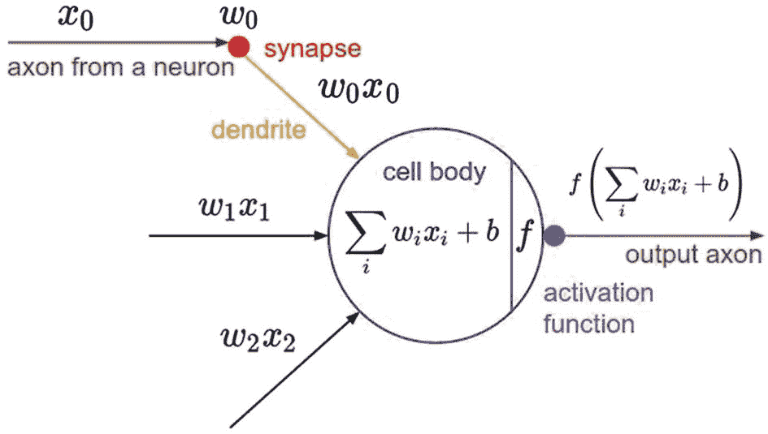

图 3-2

机器神经元

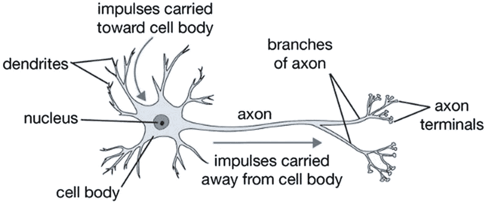

图 3-1

人类神经元

然而，问题是：*人工神经网络（ANN）是否与我们的大脑神经网络相似？* 我认为答案是“不”；ANNs 的工作方式与我们的大脑不同。ANN 是一个简单的粗略比较；生物网络之间的连接比 ANN 实现的要复杂得多。但让我们再次尝试定义神经网络。当我们再次定义它时，我们可以这样说：

*神经网络*由神经元组成（图*3-2**）。从生物学的角度来看，神经元通过突触连接，我们的神经网络通过类似突触或其表示（边）连接在一起，信息在其中流动（对于我们的计算模型，权重）。当我们训练神经网络时，我们希望神经元在从数据中学习特定模式时能够激活，我们使用激活函数来模拟激活率。

让我们通过这个定义来理解。我们说，神经元是神经网络中的基本计算单元。机器神经元是人的神经元的表示；它从其他节点或外部来源接收输入，并计算输出。每个输入都有一个相关的**权重**（w），它是根据其相对于其他输入的重要性分配的。节点将其输入的加权和应用于定义在以下函数**f**（如图 3-3 所示）。

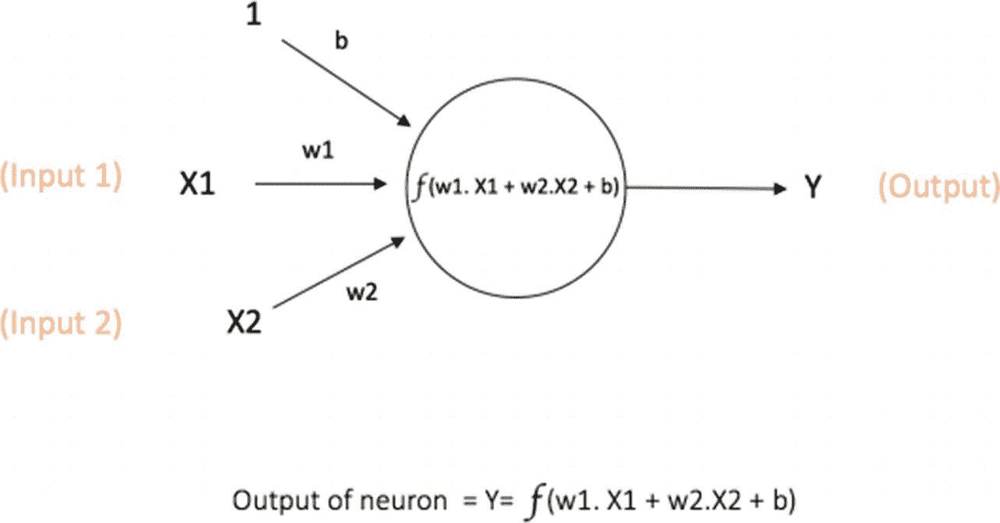

图 3-3

神经元的行为

因此，我们现在知道了人工神经网络（ANN）中神经元的工作原理及其架构。如果你对数学符号有任何问题，可以在第一章中回顾数学符号表。我们有一个新的问题：*神经元是感知器吗？* 让我们看看感知器是什么，并了解这两个概念之间的联系。感知器是一种线性分类器（二分类，我们这里所说的二分类是指单个感知器将输出 0 或 1 标签）。此外，它用于监督学习。它有助于对给定的输入数据进行分类。那么，让我们看看感知器的以下特性：

+   输入值或一个输入层

+   权重和偏置

+   网络总和

+   激活函数

这实际上就是一个神经元所具有的：它有*X*作为*输入*示例或观察或输入层，*W*作为*权重，b*作为*偏置*，总和，以及*激活函数*。

因此，我们可以得出结论，*感知器*是*神经元*，那么让我们继续深入到神经网络。神经网络不仅仅是感知器，它还包含许多概念，如层。什么是层？层是一组感知器或神经元。但是它是如何工作的，层的类型有哪些？层是通过概念或算法来改变的。这将在后面进一步讨论，你将看到这些概念，但层的基本定义是

+   *输入节点（输入层）*：在这个层内不进行任何计算；它们只是将信息传递到下一层（通常是隐藏层）。节点块也称为层。

+   *隐藏节点（隐藏层）*：在隐藏层中进行中间处理或计算；它们执行计算并将权重（信号或信息）从输入层传输到下一层（另一个隐藏层或输出层）。可能存在没有隐藏层的神经网络，我们稍后会解释这一点。

+   *输出节点（输出层）*：在这里，我们最终使用一个将映射到所需输出格式的激活函数（例如，用于分类的 Softmax）。

### 神经网络架构是什么？

我们看到神经网络中层的三个主要功能（输入层、隐藏层、输出层），但可以通过神经网络的原理或架构进行更改。似乎某些层可能只有一个感知器，或者许多感知器连接在一起，或者我们无法了解其工作方式的层。我们需要很多复杂的数学方程和组合，很难准确地了解这些隐藏层是如何工作的。让我们看看一些架构的例子：

*单层感知器*。这是最简单的前馈神经网络，不包含任何隐藏层，这意味着它只包含一个输出节点层。之所以称为单层，是因为当我们计算层数时，不包括输入层。原因是输入层不执行任何计算；输入通过一系列权重直接馈送到输出。让我们先讨论多层感知器，然后再讨论前馈神经网络。


图 3-4

神经元的输入、权重和输出

*多层感知器 (MLP)*。这一类网络由多个计算单元层（输入层、隐藏层或层）组成，通常以前馈方式相互连接。一个层的每个神经元都与下一层的神经元有直接连接。虽然单层感知器只能学习线性函数，但多层感知器也可以学习非线性函数。

1.  *输入层*：输入层有三个节点。偏置节点具有值为 1。其他两个节点接受 *X*[1] 和 *X*[2] 作为外部输入（这些是依赖于输入数据集的数值）。如前所述，输入层不执行任何计算，因此输入层节点的输出分别是 1、*X*[1] 和 *X*[2]，这些被馈送到隐藏层。

1.  *隐藏层*：隐藏层也有三个节点，其中偏置节点输出值为 1。隐藏层中其他两个节点的输出取决于输入层的输出（1, *X*[1]，和 *X*[2]）以及与连接（边）相关的权重。图 3-4 显示了其中一个隐藏节点的输出计算（突出显示）。同样，另一个隐藏节点的输出也可以计算。请记住，f 指的是激活函数。这些输出随后被输入到输出层的节点。那么，什么是前馈神经网络呢？

    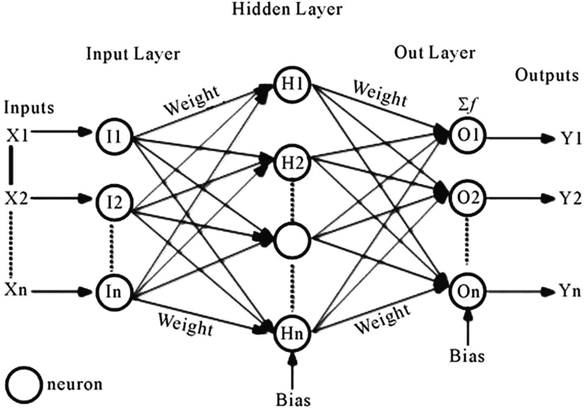

    图 3-5

    前馈神经网络

*前馈神经网络*（图 3-5）。让我们先从具体的区域开始，这是我们算法的基本构建块。前馈神经网络是第一个也是最简单的人工神经网络类型。它包含多个按层排列的神经元（节点）。相邻层的节点之间有连接或边。所有这些连接都与权重相关联。在前馈网络中，信息仅在一个方向上移动——从输入节点，通过隐藏节点（如果有），到输出节点。网络中没有循环或回路，它有两种类型（单层感知器，多层感知器）。让我们看看图 3-6，了解它是如何工作的，并对其进行良好解释。

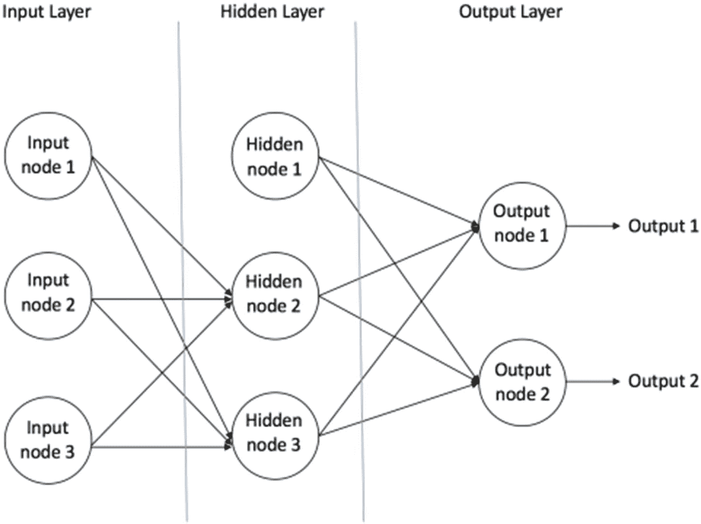

图 3-6

输入层、隐藏层和输出层之间的区别

前馈神经网络可以由三种类型的节点组成：

+   *输入节点*：输入节点从外部世界向网络提供信息，并统称为“输入层”。输入节点中不执行任何计算——它们只是将信息传递给隐藏节点。

+   *隐藏节点*：隐藏节点与外部世界没有直接连接（因此得名“隐藏”）。它们执行计算并将信息从输入节点传输到输出节点。一组隐藏节点构成一个“隐藏层”。虽然前馈网络可能只有一个输入层和一个输出层，但它可以有零个或多个隐藏层。

+   *输出节点*：输出节点统称为“输出层”，负责计算并将信息从网络传输到外部世界。

*前馈神经网络主要用于* *监督学习，在这些情况下，要学习的数据既不是序列的也不是时间相关的。*

因此，我们现在对单向神经网络，即前馈神经网络有了很多了解，但我们还有许多类型的神经网络架构要讨论。我们将在第四部分详细讨论它们。我们有**卷积神经网络**、**循环神经网络**和**自组织映射（SOM）**。这些是可以在深度学习（或机器学习，包括监督学习、无监督学习、半监督学习和强化学习）的任何方法中使用的神经网络类型。正如我们所说，深度学习是机器学习的一个子集。让我们看看这些层架构。

首先，我们将讨论卷积神经网络（CNNs）。CNNs（图 3-7）与普通神经网络非常相似；它们由具有可学习权重和偏差的神经元组成。在卷积神经网络（CNN，或 ConvNet，或位移不变或空间不变）中，单元连接模式受到视觉皮层组织的启发。单元对称为感受野的有限空间区域内的刺激做出反应。感受野部分重叠，覆盖整个视觉场。单元响应可以通过卷积运算进行数学近似。它们是多层感知器的变体，使用最少的预处理。它们在图像和视频识别、推荐系统和自然语言处理等领域有广泛的应用。CNNs 需要大量数据来训练。

第二，我们将讨论循环神经网络（RNNs）。在 RNN 中，单元之间的连接形成一个有向循环（它们从前向传播数据，同时也向后传播，从后续处理阶段到早期阶段）。这使得它能够表现出动态的时间行为。与前馈神经网络不同，RNNs 可以使用它们的内部记忆来处理任意序列的输入。这使得它们适用于诸如无分割、连续手写识别、语音识别和其他通用序列处理等任务。

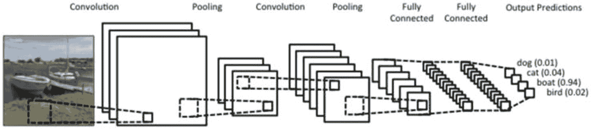

图 3-7

卷积神经网络的一个示例

第三是**自组织映射（SOM）**。它是一种使用无监督学习进行训练的 ANN，以产生训练样本输入空间的低维（通常是二维）离散表示，称为映射。因此，它是一种降维方法。SOMs 与其他 ANNs 不同，因为它们使用竞争学习而不是错误纠正学习（如梯度下降的逆传播），并且它们使用邻域函数来保留输入空间的整体拓扑属性。它几乎总是用于无监督学习案例。

在本章中，我们需要你学习的是深度学习架构及其形式。这是我们通往 TensorFlow 和深度学习层的阶梯的第一步，以及如何将这些层写入你的项目。到目前为止，我们以理论和学术的方式讨论了它们。我们将探索这些概念，了解它们的目的，以及如何判断架构是否适合你的数据。所有这些都在我们的深度学习流程中讨论。

## 深度学习流程

在上一章中，我们介绍了书籍、深度学习以及安装了我们的环境。然而，我们并没有介绍书名所代表的意义，那么*什么是深度学习流程*？

对这个问题的答案将伴随你直到书的结尾，但为了公平起见，你应得到对标题意义的概述。

在深入到第二部分：数据之前，让我们花一点时间来审视整个深度学习流程，以确保你正确理解了每个部分。此外，这将帮助你理解书的大局。为此，我们将从对基本概念，如数据和模型的一些思考开始。

任何预测建模，无论是任何深度学习项目，都可以分解为五个常见任务：

1.  定义和准备问题

1.  总结和理解数据

1.  处理和准备数据

1.  评估算法

1.  提高结果

这些任务可以组合在一起使用，也可以拆分单独使用，但这是一般结构。要在流程中处理深度学习建模问题，你需要将这些任务映射到这个过程中。有时你会看到这些任务被重命名或以不同的结构呈现，但总的来说，它们具有相同的目的。因此，我们将坚持使用这个流程，并在整本书中按照这些任务的精确顺序进行。

这些任务可能需要根据 Python 的方式稍作调整或重命名（例如，Pandas 用于数据加载，matplotlib 用于可视化，TensorFlow 用于建模）。

在接下来的章节中，我们将提供这些流程的映射。我们还将详细说明每个任务及其子任务的类型，并提供你可以用于这些类型的示例和库。

### 定义和准备问题

你为什么收集数据？你收集的数据可以帮助你回答一些问题：比如*我应该投资哪些股票？*或者*我如何理解我的客户*？

这些问题的答案不可能那么简单。从数据到答案的道路充满了错误的开端和死胡同，就像一个迷宫。一开始看起来很有希望的方法可能不会成功，或者给出想要的答案，正确的答案。最初只是一个直觉，最终可能导向最佳解决方案。深度学习流程是为了特定的原因而设计的；与数据相关的流程通常是多阶段、迭代的。

例如，股价在交易所被观察，由像路透社这样的中介机构汇总，存储在数据库中，由公司购买，转换成数据仓库或 Hadoop 集群，由脚本从存储中提取，子采样，由另一个脚本清理，倒入文件，并转换成你可以在 Python 或任何其他编程语言中尝试的格式。然后，预测被倒入一个*EXCEL*或*CSV*文件，并由评估器或文件读取器引擎解析。模型随后被迭代多次，由你的生产团队用 C++或 Java 重写，并在最终预测被泵送到另一个数据库之前在所有数据上运行。

因此，我们可以说这一步是关于理解问题和其领域，以及为了理解，收集和加载你需要开始工作的所有内容。这包括

+   你打算使用的 Python 模块、类和函数

+   从其来源加载数据集

这也是你可能需要进行的任何全局配置的家园。这里也可能是你需要对你的数据集进行缩减样本的地方，如果它太大而难以处理。

理想情况下，你的数据集应该足够小，以便在短时间内构建模型或创建可视化。你总是可以在之后将表现良好的模型扩展。

### 总结和理解数据

数据可以被定义为对现实世界现象的观察，以及已经被转换成便于移动或处理的形式的信息。

例如，股市数据涉及对每日股价的观察，个别公司收益的公告，甚至专家的意见文章；或个人生物识别数据可以包括我们每分钟的心率、血糖水平、血压等的测量。

由于你需要在这些观察的领域内工作，你必须理解这个领域和这些观察，有时你可能称之为分布。你需要总结和可视化这些观察，以便理解它们并能够看到趋势。每一份数据都为现实的一个有限方面提供了一个小的窗口。所有这些观察的集合为我们描绘了整个画面。

这一步是更好地理解你拥有的数据。这包括通过以下方式理解你的数据：

+   描述性统计，如摘要

+   使用数据可视化，如 Matplotlib 中的图表，理想情况下使用 Pandas 的便利函数

+   花时间并使用结果来引发大量问题、假设和假设，这些你可以稍后通过专门的模型进行调查

### 处理和准备数据

在理解了领域和数据之后，你需要为下一步做准备。因此，数据处理通常是指收集和操作数据项以产生有意义信息的过程。你可以认为你有一小块拼图，目标是解决它。但是图片很混乱，因为它由成千上万的小块组成，而在现实生活中的数据中，总是存在测量噪声和缺失的部分。因此，通过处理数据，你使模型更容易看到清晰的图片并很好地理解它。这是管道中的关键步骤，模型的准确性取决于它。

这一步是关于以最佳方式准备数据，以便最好地暴露问题结构和输入属性与输出变量之间的关系。这包括以下任务：

+   通过删除重复项、标记缺失值甚至填充缺失值来清理数据

+   特征选择，其中可以删除冗余特征并开发新特征

+   数据转换，其中属性被缩放或重新分配，以便最好地暴露问题结构，以便稍后供学习算法使用

从简单开始。经常回顾这一步，并与下一步循环，直到你收敛到一个算法子集和数据的展示，这些展示能够产生准确或足够准确的模型以继续进行。

### 评估算法

通过数据理解世界就像试图使用嘈杂、不完整且带有许多额外拼图的拼图来拼凑现实。这就是数学建模——特别是统计建模——发挥作用的地方。统计学的语言包含了许多数据常见特征的概念，如错误、冗余或缺失。错误数据是测量错误的结果。冗余数据包含多个方面，传达了完全相同的信息。

例如，星期几可能作为一个具有“*星期六*”、“*星期日*”……，“*星期五*”等值的分类变量，再次作为一个介于 0 和 6 之间的整数值包含在内。如果某些数据点的星期几信息不存在，那么你就有了缺失数据。

数据的数学模型描述了数据不同方面的关系。例如，一个预测股票价格的模型可能是一个将公司的盈利历史、过去的股票价格和行业映射到预测股票价格的公式。一个推荐音乐的模型可能会测量用户之间的相似性（基于他们的收听习惯），并向那些听过很多相同歌曲的用户推荐相同的艺术家。数学公式将数值量相互关联。但原始数据通常不是数值的。（“爱丽丝在周三购买了《指环王》三部曲”这个动作不是数值的，她随后对该书的评论也不是。）必须有一个部分将两者连接起来。这就是特征发挥作用的地方。

这一步是寻找一组擅长利用你的数据结构（例如，技能优于平均水平）的机器学习算法。这包括以下步骤

+   将验证数据集分离出来，用于以后确认你开发的模型技能。或者使用 scikit-learn 定义测试选项，例如交叉验证和要使用的评估指标。

+   对一系列线性和非线性机器学习算法进行抽查

+   比较算法的估计准确性

在给定的问题上，你可能会在这步和上一步上花费大部分时间，直到你收敛到三到五个表现良好的机器学习算法。

### 提高结果

特征和模型位于原始数据和所需洞察之间。在机器学习工作流程中，我们不仅选择模型，还选择特征。这是一个双关节杠杆，一个的选择会影响另一个。好的特征使后续建模步骤变得容易，并使结果模型更有能力完成所需的任务。坏的特征可能需要更复杂的模型才能达到相同的性能水平。在本书的其余部分，我们将介绍不同种类的特征，并讨论它们对不同类型的数据和模型的优缺点。现在，让我们不再拖延，直接进入正题。

一旦你有一份机器学习算法的候选列表，你需要充分利用它们。

提高模型准确性的两种不同方法：

+   使用 scikit-learn 为每个算法寻找一组参数，以获得最佳结果。

+   使用集成技术将多个模型的预测组合成一个集成预测。

当项目变得具体时，这一步和上一步之间的界限可能会变得模糊。上一步可能有一些算法调整。在集成的情况下，你可能将不止一个候选算法向前推进以组合它们的预测。

一旦你找到一个你认为可以在未见数据上做出准确预测的模型，你就可以准备最终确定它了。确定模型可能涉及以下子任务

+   使用 scikit-learn 调优的最优模型对未见数据进行预测

+   使用 scikit-learn 调优的参数创建独立模型

+   将最优模型保存到文件以供以后使用

一旦您走到这一步，您就可以向利益相关者展示结果，并将您的模型部署以开始对未见数据做出预测。

## TensorFlow 管道快速预览

正如我们之前提到的，TensorFlow (TF) 是一个开源软件库，用于使用数据流图进行数值计算。图中的节点表示数学运算，而图边表示在它们之间传递的多维数据数组（张量）。

TensorFlow 提供了 Python 和 C++ 支持，正如我们在第一章中约定的，我们将在这本书中使用 Python 3 进行学习，因为确实 Python API 的支持更好，而且更容易学习。在下一节中，我们将简要介绍 TensorFlow 包的主要特性，并附带一些编程示例。

TensorFlow 包含了各种丰富的函数和特性，任何深度学习工程师在工作中都需要；主要特性包括以下内容：

+   定义、优化和高效计算涉及多维数组（张量）的数学表达式

+   深度神经网络和机器学习技术的编程支持

+   透明使用 GPU 计算，自动化管理优化相同内存和数据。您可以编写相同的代码，并在 CPU 或 GPU 上运行。更具体地说，TensorFlow 将确定计算中哪些部分应该移动到 GPU。

+   计算在机器和大数据集上的高可扩展性

### 张量——主要数据结构

TensorFlow 基于张量进行数据管理。张量是数学领域的概念，它作为向量矩阵线性代数术语的推广而发展起来。

具体谈到 TensorFlow，张量只是一个有类型的多维数组，具有基于张量对象的额外操作。

在查看张量的属性之前，我们需要教您如何运行这些张量。TensorFlow 使用所谓的会话来运行张量，所以让我们去看看这些会话意味着什么。

### 第一次会话

如同第一章所述，我们安装了我们的环境，以便在整本书中逐步举例时工作更加方便。现在是时候从理论转向实践了。为了对如何使用 TensorFlow 有一个初步的了解，打开您最喜欢的 Python 编辑器——建议使用 Jupyter——并写下以下代码行：

```py
x = 1
y = x + 9
print(y)
import tensorflow as tf
x = tf.constant(1,name='x')
y = tf.Variable(x+9,name='y')
print(y)
```

如您在前三行中可以轻易理解的那样，常数 x，设置为 1，然后加到 9 上，以设置变量 y 的新值，然后变量 y 的最终结果被打印在屏幕上。

在最后四行中，我们根据 TensorFlow 库翻译了前三个变量。

如果我们运行程序，我们将得到以下输出：

```py
10

```

程序示例的前三条 TensorFlow 代码的翻译产生了不同的结果。让我们分析一下。

第一点。如果你想要使用 TensorFlow 库，以下语句绝不能错过。它告诉我们我们正在导入库并称之为 tf：

```py
import tensorflow as tf
```

第二点。我们创建一个名为 x 的常量值，其值等于一：

```py
x = tf.constant(1,name='x')
```

第三点。然后我们创建一个名为 y 的变量。这个变量通过简单的方程 y=x+9 定义：

```py
y = tf.Variable(x+9,name='y')
```

第四点。最后，打印出结果：

```py
print(y)
```

那么*我们如何解释不同的结果呢？* 差异在于变量定义。实际上，变量 y 并不代表 x + 9 的当前值，而是意味着当变量 y 被计算时，取常量 x 的值并加上 9。这就是为什么 y 的值从未被计算出来的原因。在下一节中，我将尝试修复它。因此，我们打开 Python IDE（图 3-8）并输入以下行：

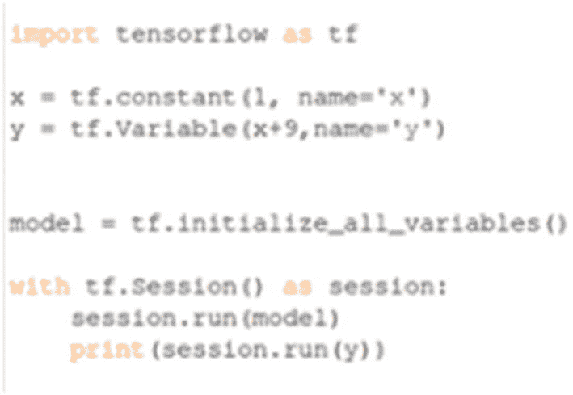

图 3-8

TensorFlow 代码片段

运行前面的代码，最终输出结果如下：

```py
10
```

我们已经移除了打印指令，但我们已经初始化了模型变量：

```py
model = tf.global_variables_initializer()
```

此外，我们主要创建了一个用于计算值的会话。在下一步中，我们运行之前创建的模型，最后，仅运行变量 y 并打印出其当前值。

```py
with tf.Session() as session:
session.run(model)
print(session.run(y))
```

这是允许得到正确结果的神奇技巧。在这个基本步骤中，在会话中创建了一个名为数据流图（TensorFlow 中的另一个重要特性）的执行图，其中包含了变量之间的所有依赖关系。变量 y 依赖于变量 x，并且该值通过加上 9 来转换。直到会话执行，值才被计算。

### 数据流图

如果你仔细想想，你会发现任何深度学习应用都是复杂数学表达式的重复计算的结果。在 TensorFlow 中，每个计算都可以使用数据流图来描述，其中图中的每个节点代表数学运算的实例（乘法、除法、加法、减法等），而每条边是在其上执行操作的多元数据集（张量）。

TensorFlow 支持这些构造和这些运算符。那么，让我们详细看看 TensorFlow 如何管理节点和边。

+   *普通边*：它们是数据结构（张量）的载体，其中某个操作的输出（来自一个节点）成为另一个操作的输入。例如，`tf.matmul()` 节点将对应于一个具有两个输入边（要相乘的矩阵）和一个输出边（乘法的结果）的单个节点。

+   *特殊边*：这些边不是节点（操作）输出和另一个节点输入之间的数据载体。特殊边表示两个节点之间的控制依赖关系。假设我们有两个节点 A 和 B，以及连接 A 到 B 的特殊边；这意味着 B 只有在 A 的操作结束后才会开始其操作。特殊边在数据流图中用于设置张量操作之间的 happens-before 关系。

+   *节点*：在 TensorFlow 中，每个节点可以表示单个操作的实例化。每个操作至少有一个输入，可能有一个输出或不输出。例如，TensorFlow 的`tf.add()`函数表示一个操作，即加法操作：它接受两个输入并只产生一个输出。

+   *边*：在 TensorFlow 中，边表示计算所消耗或产生的数据。有两种类型的边：

在学习数据流图的结构之后，现在让我们更深入地探讨一些特性。

+   `session.extend`：在计算中，用户可以扩展执行图，请求添加更多操作（节点）和边（数据）。

+   `session.run`：使用 TensorFlow，与某些图一起创建会话，并执行这些完整图以获取一些输出，或者有时在运行调用中执行子图数千/数百万次。基本上，该方法运行执行图以提供输出。

+   *操作*：这代表一个抽象的计算，例如矩阵的加法或乘法。操作管理张量。它可以具有多态性：相同的操作可以操作不同的张量元素类型。例如，两个`int32`张量的加法，两个`float64`张量的加法，等等。

+   *内核*：这代表该操作的具体实现。内核定义了在特定设备上操作的实施。例如，加法矩阵操作可以有 CPU 实现和 GPU 实现。在下一节中，我们将介绍会话的概念，以在 TensorFlow 中创建模型执行图。让我们解释这个主题。

+   *会话*：当客户端程序需要与 TensorFlow 运行时系统建立通信时，必须创建会话。一旦为客户端创建会话，就会创建一个初始图，并且它是空的。它有两个基本方法：

数据流有几个 TensorFlow 在执行程序时利用的优势：

+   *并行性*：通过使用显式边来表示操作之间的依赖关系，系统可以轻松地识别可以并行执行的操作。

+   *分布式执行*：通过使用显式边来表示操作之间流动的值，TensorFlow 可以在连接到不同机器的多个设备（CPU、GPU 和 TPU）上划分您的程序。TensorFlow 在设备之间插入必要的通信和协调。

+   *编译*: TensorFlow 的 XLA 编译器可以使用您的数据流图中的信息生成更快的代码，例如，通过融合相邻操作。

+   *便携性*: 数据流图是您模型中代码的语言无关表示。您可以在 Python 中构建数据流图，将其存储在 SavedModel 中，并在 C++程序中恢复以进行低延迟推理。

### 张量属性

如前所述，TensorFlow 使用张量数据结构来表示所有数据。任何张量都有一个静态类型和动态维度，因此您可以在实时中更改张量的内部组织。

张量的另一个特性是，只有张量类型的对象可以在计算图中的节点之间传递。

### 注意

从现在起，每次我们使用“张量”这个词时，我们都会指的是 TensorFlow 的张量对象。

#### 张量秩

张量秩代表张量的维度特性，但与矩阵秩不同。它代表张量存在的维度数，并不是张量在行/列或空间等效中的扩展的精确度量。

一秩张量相当于一个向量，一秩张量是一个矩阵。对于二秩张量，您可以使用类似于访问矩阵的语法 t[i, j]访问任何元素，因为这种秩将产生一个矩阵。对于三秩张量，您需要使用 t[i, j, k]来定位一个元素，依此类推。

在以下示例中，我们将创建一个张量，并访问其一个组件：

```py
import tensorflow as tf
sess = tf.Session()
tens1 = tf.constant([[[1,2],[2,3]],[[3,4],[5,6]]])
print(sess.run(tens1)[1,1,0])
# 5
```

这是一个三秩张量，因为在包含矩阵的每个元素中都有一个向量元素，这就是为什么我们需要指定三个坐标。

表 3-1 总结了所有变量的秩以及它们的数学实体以及示例代码定义。

表 3-1

张量秩与示例

| 秩/维度 | 数学实体 | 代码定义示例 |
| --- | --- | --- |
| 0 | 标量 | 标量 = 1000 |
| 1 | 向量 | 向量 = [2, 8, 3] |
| 2 | 矩阵 | 矩阵 = [[4, 2, 1], [5, 3, 2], [5, 5, 6]] |
| 3 | 3 维张量 | 张量 = [[[4], [3], [2]], [[6], [100], [4]], [[5], [1], [4]]] |

#### 张量形状

TensorFlow 文档使用三种记法约定来描述张量维度：秩、形状和维度数。表 3-2 展示了它们之间的关系。

表 3-2

张量形状与示例

| 秩 | 形状 | 维度数 | 示例 |
| --- | --- | --- | --- |
| 0 | [ ] | 0 | 标量 = 10 |
| 1 | [d0] | 1 | 向量 = [4] |
| 2 | [d0, d1] | 2 | 矩阵 = [2, 2] |
| 3 | [d0, d1, d2] | 3 | 张量 = [2, 2, 4] |
| n | [d0, ..., dn-1] | D |   |

## 摘要

现在，让我们简要回顾一下在本章中我们看到和学到的内容。首先，我们学习了深度学习是什么以及其方法，它是机器学习的一个子集。我们学习了构建层的基函数工具，这些层组合在一起构成了深度学习架构。最后，我们通过流程来给你一个关于本书将走向何方以及你将在详细定义它的章节中学到什么的看法。完成本章后，我们希望你觉得它很有价值。

# 4. 构建您的第一个玩具 TensorFlow 应用程序

在上一章中，我们回答了您在继续阅读本书之前必须知道的重要问题，例如：*什么是 TensorFlow？*，*是什么让它如此有价值？*，以及*TensorFlow 容易学习吗？* 当你看到 TensorFlow 这个词时，这些问题会出现在你的脑海中，许多开发者也会有同样的疑问，但是的，TensorFlow 是深度学习中的一个非常有价值的包。然而，还有许多与深度学习兼容的类似包。

在本章中，我们继续介绍您在 TensorFlow 中需要的重要概念。我们介绍了 TensorFlow 在深度学习领域的应用，以及这个库如何通过提供必要的组件和函数来帮助我们构建任何深度学习模型的构建块。此外，我们还提供了两个使用 TensorFlow 构建小型神经网络的示例。那么，让我们开始吧。

## TensorFlow 的基本开发

让我们考虑另一种方法，通过示例向您展示所有需要的 TensorFlow 功能。我们将从热身开始，然后逐步进入难点部分。

### 使用 TensorFlow 的 Hello World

为了公平起见，通过查看 TensorFlow 的工作示例来理解 TensorFlow 是很好的，因此我们将通过给出的小示例来介绍 TensorFlow 的高级部分。

因此，第一个示例是为了回顾我们在*第二章* 2 中给出的信息，我们将构建一个输出“Hello, TensorFlow！”的小应用程序。

正如你所见，我们首先从`__future__`模块中导入`print_function`，以便 Python 2 中的`print`可以像 Python 3 中的`print`函数一样调用。之后，我们当然必须导入`TensorFlow`作为`tf`，这是我们之前章节中提到的流行别名。然后我们初始化`hello`变量，它等于`tf.constant`，并将其设置为需要打印的单词。最后，我们创建一个会话，我们将使用它来运行整个程序，并在最后一行打印它。

```py
from __future__ import print_function
import tensorflow as tf
# The value returned by the constructor represents
# the output of the Constant op.
hello = tf.constant('Hello, TensorFlow!')
# Start tf session
sess = tf.Session()
# Run the op
print(sess.run(hello))
```

因此，当我第一次看到这段代码时，我可能会有一个疑问：*什么是* `tf.constant`*？* 这是一个好问题，`tf.constant`是许多张量类型变量之一。但这个有一个优势，正如其名称所示：它不能在程序运行时改变其值。一个常量有以下参数，可以根据需要调整以获得所需的功能。

+   `value`：输出类型的常量值（或列表）*dtype*

+   `dtype`：结果张量元素的类型

+   `shape`：结果张量的可选维度

+   `name`：张量的可选名称

### 简单迭代

现在我们已经通过前面的例子进行了预热；在这个例子中我们看到的内容，我们在第二章节中进行了讨论（常量、会话）。

因此，我们需要一些新的，并且稍微复杂一些的东西；我们需要看看 TensorFlow 还能做什么。我们现在有一个会话、常量和变量。

在下一个例子中，我们学习如何在 TensorFlow 中创建循环并更新某些变量。这些变量模拟模型权重，而循环模拟更新模型权重的轮次。

```py
# our first variable in the "global_variable" set
var = tf.Variable(0)
add_operation = tf.add(var, 1)
update_operation = tf.assign(var, add_operation)
with tf.Session() as sess:
# once define variables, you have to initialize
# them by doing this
sess.run(tf.global_variables_initializer())
for _ in range(3):
sess.run(update_operation)
print(sess.run(var))
```

### 注意

在这个代码示例中，我们没有导入 TensorFlow，因为我们假设你在前面的例子中已经导入了它，并且它们都在同一个 Python 会话中。

首先：我们创建了 `var` 变量，并使用 `tf.Variable` 和 0 值对其进行初始化，然后我们创建了 `add_operation` 变量，它是一个 TensorFlow 加法块或操作。之后，我们使用 `tf.assign(var, add_operation)` 初始化 `update_operation`，这简单地通过引用使用 `add_operation` 函数更新 `var` 变量，所有这些都是在调用 `update_operation` 变量时发生的。

现在是创建会话的时候了，但如果你注意到了，我们是在 `with` 块中创建会话的。我们为什么要这样做？原因是在初始化和运行每个会话之后，我们必须关闭它以释放程序或 TensorFlow 图保留的所有资源。之后，我们运行了 `sess.run(tf.global_variables_initializer())`，你可以看到奇怪的 `tf.global_variables_initializer()` 函数；这个函数的主要任务是初始化 TensorFlow 图中的所有变量。所以，如果你运行 `tf.Variable` 或 `tf.Placeholder`（我们稍后会看到它是什么）——你会看到一个错误，这是由于未初始化的变量引起的。最后，我们进行了一个简单的循环，通过运行 `update_operation` 来迭代并更新 `var` 变量。

那么，如何模拟一个真实的深度学习模型呢？当你训练一个模型时，你使用变量来保存和更新参数。变量是包含张量的内存缓冲区。我们从第二章节中了解了张量，所以问题是：*前一个例子中的张量是变量还是常量？* 它不能是常量类型张量，因此我们必须使用 `tf.Variable`，因为我们需要一个可以在 TensorFlow 图的运行时更新的张量形式。

### 准备输入数据

再进一步，我们需要为 TensorFlow 中的任何模型模拟输入数据。有人可能会质疑用户如何将任何数据输入到模型中。我们将使它更难；我们将向 TensorFlow 输入一张图片。使用 **matplotlib** 中的 `imread` 命令，我们导入标准格式的数字图像（JPG、PNG、BMP、TIF）：

```py
import matplotlib.image as mp_image
filename = "lena.jpeg"
input_image = mp_image.imread(filename)
```

然而，我们可以看到张量的秩和形状：

```py
print('input dim = {}'.format(input_image.ndim))
print('input shape = {}'.format(input_image.shape))
# input dim = 3
# input shape = (220, 220, 3)
```

您将看到输出，它是 `(220, 220, 3)`。这意味着图像高度为 220 像素，宽度为 220 像素，深度为 3 种颜色（红色、绿色、蓝色）。最后，使用 matplotlib，可以可视化导入的图像（图 4-1）：

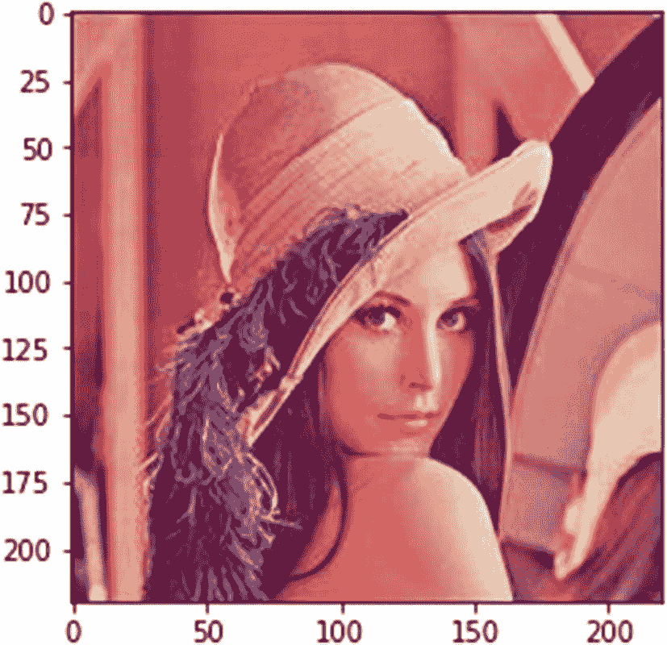

图 4-1

lena 图像的代码输出

```py
import matplotlib.pyplot as plt
plt.imshow(input_image)
plt.show()
```

在这个例子中，`slice` 是起始图像的二维段，其中每个像素都有 RGB 分量，因此我们需要一个占位符来存储切片的所有值：

```py
import tensorflow as tf
my_image = tf.placeholder("uint8",[None,None,3])
```

对于最后一个维度，我们只需要三个值。然后我们使用 TensorFlow 操作 slice 创建子图像：

```py
slice = tf.slice(my_image,[10,0,0],[16,-1,-1])
```

最后一步是构建一个 TensorFlow 工作会话，这比您之前看到的例子多了一步。当我们运行会话时，我们需要向它提供我们有的占位符（我们有的数据）；我们可以通过将所有数据发送到 `feed_dict` 来完成此操作，这将向会话（或您的模型）提供输入：

```py
with tf.Session() as session:
result = session.run(slice,feed_dict={my_image: input_image})
print(result.shape)
plt.imshow(result)
plt.show()
```

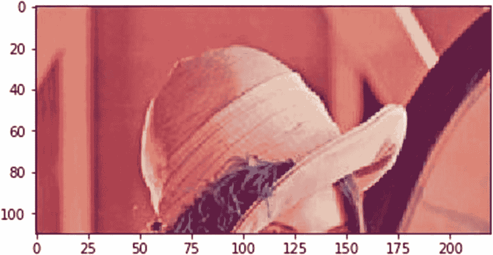

图 4-2

结果形状如图所示

总结一下，我们在表 4-1 中对 tf.Placeholder 和 tf.Variable 进行了总结。

表 4-1

tf.Placeholder 与 tf.Variable 的比较

| 占位符 | 变量 |
| --- | --- |
| 占位符是一个节点（与变量相同），其值可以在未来初始化。这些节点基本上在运行时输出分配给它们的值。占位符节点可以使用 tf.placeholder() 类进行分配，您可以为它提供诸如变量类型和/或其形状之类的参数。占位符在机器学习模型中表示训练数据集时被广泛使用，因为训练数据集不断变化。 | TensorFlow 变量是表示由您的程序操作的共享、持久状态的最佳方式。变量通过 tf.Variable 类进行操作。内部，tf.Variable 存储一个持久的张量。特定的操作允许您读取和修改此张量的值。这些修改在多个 tf.Sessions 中可见，因此多个工作者可以看到 tf.Variable 的相同值。变量在使用之前必须进行初始化。 |
| **示例** |
| A = tf.placeholder(tf.float32, shape=(None, 3))B = A + 5 | x = tf.Variable(3, name=“x”)y = tf.Variable(4, name=“y”) f = x*x*y + y + 2 |

### 进行梯度计算

TensorFlow 有用于解决其他更复杂任务的函数。例如，我们将使用一个数学运算符来计算 *y* 关于其表达式 *x* 参数的导数。为此，我们使用 `tf.gradients()` 函数。

让我们考虑数学函数 *y* = 2*x*³。我们想要计算关于 *x* = 1 的梯度 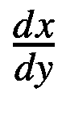。以下是对该梯度进行计算的代码：

```py
import tensorflow as tf
x = tf.placeholder(tf.float32)
y = 2*x*x*x
grad = tf.gradients(y, x)
with tf.Session() as session:
grad_val = session.run(grad,feed_dict={x:1})
print(grad_val)
# [6.0]
```

那么，前面的代码中发生了什么？让我们一步一步地说明。

1.  首先，导入 TensorFlow 库：`import TensorFlow as tf`

1.  x 变量是函数的独立变量：`x = tf.placeholder(tf.float32)`

1.  让我们构建函数：`y = 2*x*x`

1.  最后，我们使用`y`和`x`作为参数调用`tf.gradients()`函数：`grad = tf.gradients(y, x)`

1.  为了评估梯度，我们必须构建一个会话：`with tf.Session() as session:`

1.  梯度将在变量 x=1 上评估：`grad_val = session.run(var_grad,feed_dict={x:1})`

1.  `grad_val`值是输出结果，需要打印：`print(grad_val)`

这给出了以下结果：`6.0`

## 线性回归

在本节中，我们开始用线性回归算法探索机器学习技术。我们的目标是构建一个模型，能够根据一个或多个自变量的值预测因变量的值。

### 为什么是线性回归？

这是一个基本的机器学习算法。从那里开始是非常合理的。首先，它是一个非常简单的算法，因此读者可以掌握基本机器学习概念的理解，例如监督学习、损失函数和梯度下降。

此外，在学习线性回归之后，理解逻辑回归算法相当容易，而且信不信由你，它甚至可以被归类为一个小的神经网络。是的，可能；我们将在下一章中看到这一点。在第三部分，我们将看到神经网络是如何工作的。

### 什么是线性回归？

线性回归是一种非常常见的统计方法，它允许我们从给定的一组连续数据中学习一个函数或关系。

例如，我们被给出一些 x 和相应的 y 的数据点，我们需要学习它们之间的关系。这被称为假设。假设是一种统计方法，试图预测最适合输入数据 x 的最佳模型。在线性回归的情况下，假设是一条直线，如下所示：

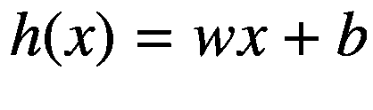

我们现在将进行一个项目，在这个项目中，我们将应用下一章中将要讨论的所有概念。在这个例子中，我们将创建一个大约线性分布的合成数据集；之后，我们将创建一个回归模型，尝试拟合一个最小化误差函数（由最小二乘法定义）的线性函数。这个模型将使我们能够预测给定一个新样本的输入值的输出。

但在我们开始之前，让我们了解一下数据集。

### 数据集描述

在这个例子中，我们将生成一个包含线性函数和附加噪声的合成数据集。

让我们从导入一些包开始：

```py
import matplotlib.pyplot as plt
import numpy as np
import tensorflow as tf
```

首先，我们看到 `matplotlib.pyplot as plt`。这些包用于可视化方法，我们将在后面讨论。第三个是 `tensorflow`，这是一个开源软件库，用于在一系列任务中进行数据流编程，如前几章所述。

第二个是 `numpy`，这是一个用于数学组合和乘法的包，但我们现在不需要详细讨论它。

首先，我们生成我们的数据集，即 *x* 和 *y*。你可以把 *x* 和 *y* 中的每个值看作是图上的点。我们希望 NumPy 生成 101 个值在 (-1 和 1) 之间的点，均匀分布。结果是存储在 `trX` 中的 NumPy 数组。同样，我们还想随机生成 y，使其具有 2 的梯度（W）和某种形式的随机性，使用 `np.random.randn()`。为了使事情更有趣，我们将 y 的截距 b 设置为 0.2。

```py
np.random.seed(seed=47)
# Linear space of 101 and [-1,1]
trX = np.linspace(-1, 1, 101)
#Create The y function based on the x axis
trY = 2 * trX + np.random.randn(*trX.shape) * 0.4 + 0.2
```

让我们开始看看数据是如何绘制的以及数据是如何分布的（图 4-3）。

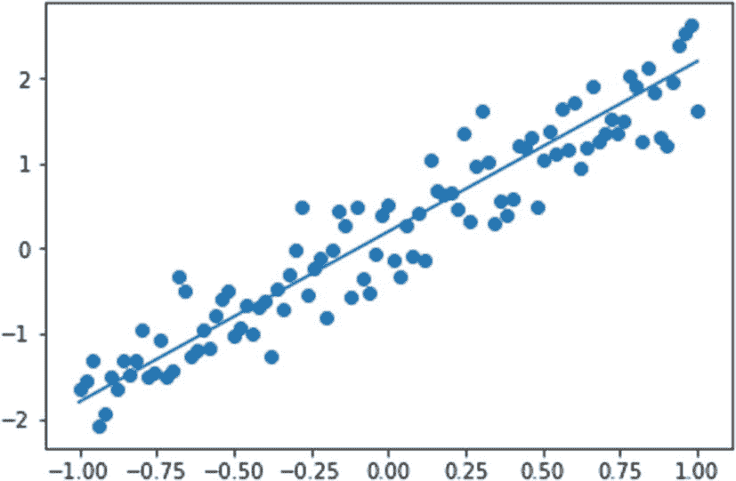

图 4-3

数据集的点

```py
# Create a new figure
plt.figure()
#Plot a scatter draw of the random data points
plt.scatter(trX,trY)
# Draw one line with the line function
plt.plot (trX, .2 + 2 * trX)
plt.show()
```

我们构建 TensorFlow 图，帮助我们计算 W 和 b。这是在 `linear_regression()` 函数中完成的。在我们的公式 *y* = *WX* + *b* 中，*x* 和 *y* 是作为 TensorFlow 占位符表示的节点。

```py
# create symbolic variables
X = tf.placeholder("float", name="X")
y = tf.placeholder("float", name = "y")
```

在 `tf.placeholder` 的第一个参数中，我们定义数据类型为 `float32`——这是占位符中的一种常见数据类型。第二个参数是占位符的 **shape**，设置为 **None**，因为我们希望在训练时确定它。第三个参数允许我们为占位符设置 **name**。

我们现在通过声明 `name_scope` 为 Model 来定义我们的模型。这个作用域将包含的所有变量分组，以形成一个具有同质实体的唯一实体。在这个作用域中，我们首先定义一个函数，该函数接收 x 轴坐标的变量、权重和偏差。然后我们创建一个新的变量，objects，来保存变化的参数，并用 `y_model` 变量实例化模型。

```py
with tf.name_scope("Model"):
def model(X, W, b):
# We just define the line as X*w + b0
return tf.add(tf.multiply(X,W), b)
# create a shared variable
w = tf.Variable(-1.0, name="b0")
# create a shared variable
b = tf.Variable(-2.0, name="b1")
y_model = model(X, W, b)
```

在 **成本函数** 中，我们创建一个新的作用域来包含这个组中的所有操作，并使用之前创建的 `y_model` 来计算我们用于计算损失的 y 轴值。

```py
with tf.name_scope("CostFunction"):
# use sqr error for cost
cost = (tf.pow(Y-y_model, 2))
```

为了定义选择的优化器，我们初始化 `GradientDescentOptimizer`，步长为 0.05，这似乎是收敛的合理起点。

```py
train_op = tf.train.GradientDescentOptimizer(0.05)
.minimize(cost)
```

让我们创建会话并初始化我们希望在 TensorBoard 中查看的变量。我们将为每个迭代保存一个标量变量，该变量包含最后一个样本的错误结果。我们还将保存图形结构到一个文件中以便查看。

```py
sess = tf.Session()
init = tf.global_variables_initializer()
# you can use you own path
tf.train.write_graph(sess.graph, '/home/ubuntu/linear','graph.pbtxt')
cost_op = tf.summary.scalar("loss", cost)
merged = tf.summary.merge_all()
sess.run(init)
writer = tf.summary.FileWriter('/home/ubuntu/linear', sess.graph)
```

对于模型训练，我们设置了 100 次迭代（epochs）的目标，其中我们将每个样本发送到梯度下降的训练操作。在每个迭代之后，我们绘制建模线并将最后一个错误的值添加到摘要中。

```py
for i in range(100):
for (x, y) in zip(trX, trY):
sess.run(train_op, feed_dict={X: x, Y: y})
summary_str = sess.run(cost_op, feed_dict={X: x, Y: y})
writer.add_summary(summary_str, i)
b0temp=b.eval(session=sess)
b1temp=w.eval(session=sess)
plt.plot (trX, b0temp + b1temp * trX )
plt.show()
```

让我们看看我们的模型是如何在可视化图表中训练的（图 4-4）。注意，X 数据被设置在 x 轴上，而每条线都是一个试图预测对应响应 y 的模型。

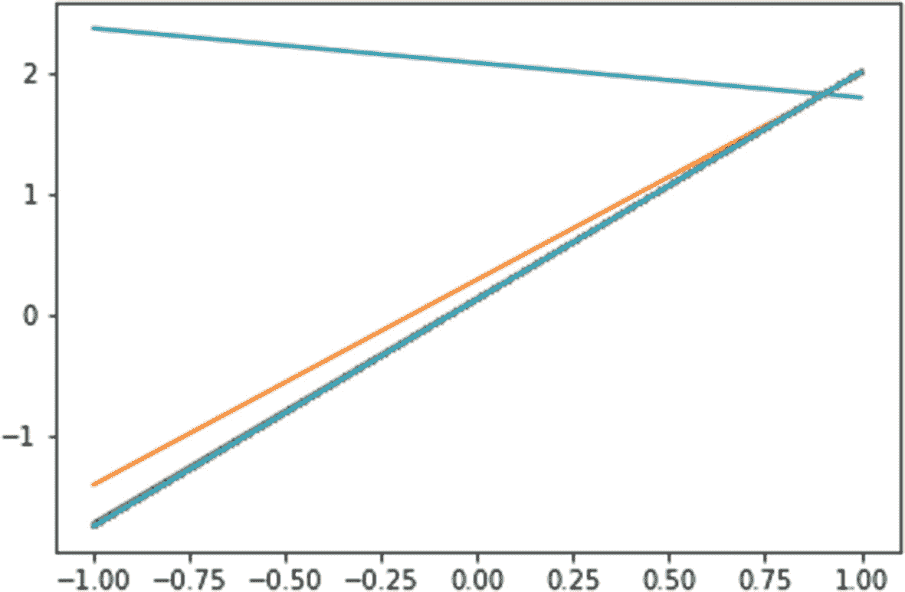

图 4-4

来自不同模型的不同的线

现在，让我们检查参数结果，打印 *w* 和 *b* 变量的运行输出。

```py
print ("w = {}".format(sess.run(w))) # Should be around 2
print ("b = {}".format(sess.run(b))) #Should be around 0.2
Output:
w = 1.8842864
b = 0.12578306
```

是时候再次图形化地回顾数据以及建议的最终线——最终的预测线（图 4-5）了。

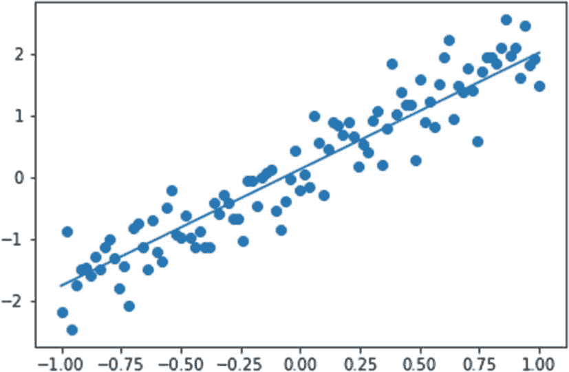

图 4-5

模型线如何拟合数据点。注意 x 轴是输入数据，而 y 轴是对应的响应；也请注意，蓝色点是数据观测值，而线是试图拟合它的模型

```py
plt.scatter(trX,trY)
plt.plot (trX, sess.run(b) + trX * sess.run(w))
plt.show()
```

### 完整源代码

```py
import matplotlib.pyplot as plt
import numpy as np
import tensorflow as tf
# Linear space of 101 and [-1,1]
trX = np.linspace(-1, 1, 101)
#Create The y function based on the x axis
trY = 2 * trX + np.random.randn(*trX.shape) * 0.4 + 0.2
trX = np.linspace(-1, 1, 101)
trY = 2 * trX + np.random.randn(*trX.shape) * 0.4 + 0.2
# create a y value which is approximately linear
#  but with some random noise
plt.figure() # Create a new figure
plt.scatter(trX,trY) #Plot a scatter draw of
# the random datapoints
# Draw one line with the line function
plt.plot (trX, .2 + 2 * trX)
plt.show()
# create symbolic variables
X = tf.placeholder("float", name="X")
Y = tf.placeholder("float", name = "Y")
with tf.name_scope("Model"):
def model(X, w, b):
# We just define the line as X*w + b0
return tf.add(tf.multiply(X,w), b)
# create a shared variable
w = tf.Variable(-1.0, name="b0")
# create a shared variable
b = tf.Variable(-2.0, name="b1")
y_model = model(X, w, b)
# use sqr error for cost
with tf.name_scope("CostFunction"):
cost = (tf.pow(Y-y_model, 2))
train_op = tf.train.GradientDescentOptimizer(0.05).minimize(cost)
sess = tf.Session()
init = tf.global_variables_initializer()
tf.train.write_graph(sess.graph, '/home/ubuntu/linear','graph.pbtxt')
cost_op = tf.summary.scalar("loss", cost)
merged = tf.summary.merge_all()
sess.run(init)
writer = tf.summary.FileWriter('/home/ubuntu/linear', sess.graph)
for i in range(100):
for (x, y) in zip(trX, trY):
sess.run(train_op, feed_dict={X: x, Y: y})
summary_str = sess.run(cost_op, feed_dict={X: x, Y: y})
writer.add_summary(summary_str, i)
b0temp=b.eval(session=sess)
b1temp=w.eval(session=sess)
plt.plot (trX, b0temp + b1temp * trX )
plt.show()
print (sess.run(w)) # Should be around 2
print (sess.run(b)) #Should be around 0.2
plt.scatter(trX,trY)
plt.plot (trX, sess.run(b) + trX * sess.run(w))
```

## 使用 TensorFlow 实现的 XOR

独异或（Exclusive or exclusive disjunction）是一种逻辑运算，仅在输入不同时输出为真（一个为 *true*，另一个为 *false*）。我们将了解一些关于它的内容，但如果你需要详细了解，可以阅读更多关于布尔函数的内容。在微积分中，XOR 是一个门问题解决方案：*A* ⊕ *B* = (*A U B*) ^ (~*A U*~*B*)。让我们看看它是如何工作的（表 4-2）。

表 4-2

XOR 门的输入和输出

| A | B | A XOR B |
| --- | --- | --- |
| 0 | 0 | 0 |
| 0 | 1 | 1 |
| 1 | 0 | 1 |
| 1 | 1 | 0 |

这是对 XOR 门的简短解释，但我们的目标不是讨论 XOR 门；我们的目标是使用 TensorFlow 来创建一个 XOR 模型。让我们开始写一些代码。

我们不需要再次解释这些代码行，因为我们已经在线性回归示例中解释过了。而且，一如既往，我们将从导入所需的包开始。

```py
import matplotlib.pyplot as plt
import numpy as np
import tensorflow as tf
```

让我们构建数据集作为表格。我们将使 A 和 B 都作为 `X_train` 中的列，A XOR B 函数的结果作为 `y_train`。

```py
# setting required X and Y values to
# perform XOR operation
X_train = [[0,0],[0,1],[1,0],[1,1]]
y_train = [[0],[1],[1],[0]]
```

然后，我们将创建在模型中输入数据的占位符。我们将创建一个名为 `X` 的占位符用于 `X_train`，其形状为 4×2——因为它有 4 行和 2 列，以及一个名为 `y` 的占位符用于 `y_train`，其形状为 4×1——因为它有 4 行且只有一列。这两个都将有相同的变量名。

```py
# create symbolic variables
X = tf.placeholder(tf.float64, shape=[4, 2],name="X")
y = tf.placeholder(tf.float64, shape=[4, 1],name="Y")
```

让我们构建一些变量，比如训练示例的数量（行数）和我们在数据集中拥有的特征（列数），以及一些超参数，比如学习率和模型隐藏层中的单元数。

```py
#number of training examples (Rows)
m = np.shape(X)[0]
#number of features (Columns)
n = np.shape(X)[1]
#number of nodes in the hidden layer
hidden_s = 2
#learning rate initialization
l_r = 1
```

要构建解决 XOR 问题的模型，我们需要添加新的东西，比如 *theta* 和 *hidden layers*，当然，我们之前也描述了 *激活函数*。所以，不要担心这段复杂的代码；我们将在后面解释这段代码。

神经网络主要由层组成，因此每一层都通过另一层连接。因此，我们可以将每一层定义为早期或前一层的输出乘以一些权重，并添加一些偏差。例如，第一层 *Z*[1] 等于前一层的输出，即 *A*[0] 或输入 *X* 乘以其权重 *W*[1] 并添加偏差 *b*[1]。然后，这一层的输出通过激活函数，在发送到下一层 *A*[1] = *Sigmoid*(*Z*[1]) 之前。这个过程在下一层重复。

因此，让我们最后快速回顾一下：在第一层 *Z*[1] = *W*[1] * *X* + *b*[1]，然后 *A*[1] = *Sigmoid*(*Z*[1])。在下一层，或者我们可以称之为隐藏层，*Z*[2] = *W*[2] * *A*[1] + *b*[2]，然后 *A*[2] = *Sigmoid*(*Z*[2])。所以请记住这个函数，我们将在后面的章节中讨论激活函数和权重以及超参数。但现在，我们想让您看到端到端的示例。

现在，让我们编写模型代码，它执行与前面方程中描述的相同操作。我们首先在一个名为 *Model* 的作用域中构建模型；使用 `tf.name_scope` 我们可以实现这一点，并在我们的系统中构建小的作用域。

```py
with tf.name_scope("Model"):
def model():
# cast tensor to new type
# and make new variable theta1, theta2
theta1 = tf.cast(tf.Variable(tf.random_normal([3,hidden_s]),name="theta1"),tf.float64)
theta2=tf.cast(tf.Variable(tf.random_normal([hidden_s+1,1]),name = "theta2"),tf.float64)
#conducting forward propagation
a1 = tf.concat([np.c_[np.ones(m)], X], 1)
# the weights of the first layer are multiplied
# by the input of the first layer
z1 = tf.matmul(a1,theta1)
# the input of the second layer is the output of
# the first layer passed through
# activation function and column of biases is added
a2 = tf.concat([np.c_[np.ones(m)],tf.sigmoid(z1)],1)
# the input of the second layer is
# multiplied by the weights
z3 = tf.matmul(a2,theta2)
# the output is passed through the activation
# function to obtain the final probability
h3 = tf.sigmoid(z3)
return h3
```

现在我们调用将为我们构建模型的函数，如下所示：

```py
y_model = model()
```

这个成本函数（图 4-6）被对数函数捕获，如下所示：

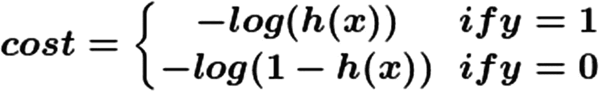

图 4-6

成本函数方程

```py
with tf.name_scope("CostFunction"):
cost=
-tf.reduce_sum(Y*tf.log(y_model)+(1-Y)*tf.log(1-y_model),axis=1)
```

为了定义所选的优化器，我们初始化 `GradientDescentOptimizer`，步长为 0.05，这是收敛的合理起点。但优化器现在与学习率超参数一起工作。

```py
train_op = tf.train.GradientDescentOptimizer(learning_rate=l_r)
.minimize(cost)
```

让我们创建会话并初始化我们想要在 TensorBoard 中查看的变量。我们将为每个迭代保存一个标量变量，该变量包含最后一个样本的错误结果。我们还将保存图形结构到一个文件中，如下所示：

```py
sess = tf.Session()
init = tf.global_variables_initializer()
tf.train.write_graph(sess.graph, '/home/ubuntu/xor','graph.pbtxt')
cost_op = tf.summary.scalar("loss", cost)
merged = tf.summary.merge_all()
sess.run(init)
writer = tf.summary.FileWriter('/home/ubuntu/xor', sess.graph)
```

对于模型训练，我们设定了 100 次迭代（周期），我们将每个样本发送到梯度下降的训练操作。每次迭代后，我们绘制建模线并将最后一次错误的值添加到摘要中。

```py
for i in range(100):
sess.run(train_op, feed_dict={X: X_train, Y: Y_train})
if i%100==0:
print("Epoch:",i)
print("Hyp:",sess.run(y_model,feed_dict ={X:X_train,Y:Y_train}))
Epoch: 0
Hyp: [[0.4708459 ]
[0.50110425]
[0.50382591]
[0.51823803]]
```

现在我们检查参数结果，打印 *w* 和 *b* 变量的运行输出。

```py
# Should be around 2
print ("w = {}".format(sess.run(w)))
#Should be around 0.2
print ("b = {}".format(sess.run(b)))
Output:
w = 1.7057617
b = 0.20965417
```

是时候再次图形化地查看数据以及建议的最终线——最终的预测线了。

```py
plt.scatter(trX,trY)
plt.plot (trX, sess.run(b) + trX * sess.run(w))
```

### 完整源代码

```py
import matplotlib.pyplot as plt
import numpy as np
import tensorflow as tf
#setting required X and Y values to perform XOR operation
X_train = [[0,0],[0,1],[1,0],[1,1]]
Y_train = [[0],[1],[1],[0]]
## ADD PLOT HERE
plt.figure() # Create a new figure
plt.scatter(X_train) #Plot a scatter draw of the random datapoints
# Draw one line with the line function
plt.show()
X = tf.placeholder(tf.float64, shape=[4, 2], name="X") # create symbolic variables
Y = tf.placeholder(tf.float64, shape=[4, 1], name = "Y")
m = np.shape(X)[0] #number of training examples
n = np.shape(X)[1] #number of features
hidden_s = 2       #number of nodes in the hidden layer
l_r = 1            #learning rate initialization
with tf.name_scope("Model"):
def model():
theta1 = tf.cast(tf.Variable(tf.random_normal([3,hidden_s]),name = "theta1"),tf.float64)
theta2 = tf.cast(tf.Variable(tf.random_normal([hidden_s+1,1]), name = "theta2"),tf.float64)
# conducting forward propagation
a1 = tf.concat([np.c_[np.ones(m)], X], 1)
# the weights of the first layer are multiplied by the input of the first layer
z1 = tf.matmul(a1,theta1)
# the input of the second layer is the output of the first layer, passed through the activation function and column of biases is added
a2 = tf.concat([np.c_[np.ones(m)],tf.sigmoid(z1)],1)
# the input of the second layer is multiplied by the weights
z3 = tf.matmul(a2,theta2)
# the output is passed through the activation function to obtain the final probability
h3 = tf.sigmoid(z3)
return h3
y_model = model()
with tf.name_scope("CostFunction"):
cost = -tf.reduce_sum(Y*tf.log(y_model)+(1-Y)*tf.log(1-y_model),axis = 1)
train_op = tf.train.GradientDescentOptimizer(learning_rate = l_r).minimize(cost)
sess = tf.Session()
init = tf.global_variables_initializer()
tf.train.write_graph(sess.graph, '/home/ubuntu/xor','graph.pbtxt')
cost_op = tf.summary.scalar("loss", cost)
merged = tf.summary.merge_all()
sess.run(init)
writer = tf.summary.FileWriter('/home/ubuntu/xor', sess.graph)
for i in range(100):
sess.run(train_op, feed_dict={X: X_train, Y: Y_train})
if i%100==0:
print("Epoch:",i)
print("Hyp:",sess.run(y_model,feed_dict = {X:X_train,Y:Y_train}))
print (sess.run(w)) # Should be around 2
print (sess.run(b)) #Should be around 0.2
plt.scatter(trX,trY)
plt.plot (trX, sess.run(b) + trX * sess.run(w))
```

## 摘要

在本章中，我们分解了理论，并使用 TensorFlow 的实际工作和硬编码来展示插图。我们向您展示了 TensorFlow 的基础知识，以便您更好地理解其组件，并更容易地跟随本书并开发产品。然后我们提供了逐步示例，这些示例引导您了解 TensorFlow 最需要的功能和 API。

本章是本书第一部分最后一章。在第二部分，乐趣从一次数据之旅开始，带你从数据新手成长为数据工程师，从数据定义到数据工程的全过程都有详细的指导。
