# 第二部分 数据

# 5. 定义数据

现在你已经对人工智能、机器学习的一般世界以及深度学习特别的世界有了基本的介绍，你应该明白这个领域非常重要。

在“引言部分”之后，我们必须定义一些成为数据科学家——或者更具体地说，成为深度学习工程师——所必需的概念。在第二部分，我们将带你从数据新手成长为数据分析师或数据工程师。本部分的所有章节都将关于数据。例如，`本章`定义了数据和它的基本概念；`它`将教你真实数据的样子以及它所采取的数据形状和形式，通过现实生活中的例子，等等。

在本章中，我们`定义数据`，这相当于回答*数据是什么？*之后，我们将在数据的形式之间进行小比较，如*结构化、半结构化和非结构化*，定义它们并使用小例子进行阐述。然后，我们讨论数据的理想形式以及为什么你应该使你的数据成为*整洁数据*。

此外，我们讨论了你在任何实际项目中可能遇到的所有类型的数据，例如**表格数据**及其子类型，它们是*定性*和*定量*的，以及表格数据的*水平*，如*名义、有序、区间*和*比率*。然后，我们查看**文本**和**图像**数据，使用例子确保你非常理解这一点。现在，让我们进入本章的核心。

## 定义数据

**数据**是未组织和未处理的事实：它可能是一个原始数字、图表、图像、文字或声音，来源于观察或测量。通常，数据在本质上来说是静态的，是一组关于事件的事实集合，其中没有固有的意义。

在数据科学的一般领域，理解不同类型的数据有几个原因很重要。不仅因为数据类型将有助于决定清洗和处理的办法——尽管选择最佳方法很重要——而且知道数据是否是非结构化的或可能是定量的，可以让你对所测量的现实世界现象有更多的了解。

因此，我们在本章中讨论的是数据集的*特征*，而不是*整个数据集*。我们将在任何给定时间非常清楚地说明我们指的是哪一个。

## 为什么你应该阅读本章？

在深入到有趣的材料，如深度学习中的模型构建和维护之前，停下来思考我们有什么类型的数据可能看似毫无价值，但这是你进行数据科学所需采取的最重要步骤之一。

考虑一个例子，我们正在查看一组患有某种疾病的人的数据集。在人的数据集中，如果我们考虑数据集中每位患者的年龄，我们不能说有一位年龄为零岁的患者；年龄不能为零或负数。另一个例子是表示性别的**性别**列，它通过一个识别号来表示以节省空间。例如，也许*男性*用 1 表示，而*女性*用 2 表示。如果我们不理解这些数字实际上并不是我们通常所认为的有序数字（其中 2 大于 1，因此女性大于男性），我们将在分析中犯下可怕的错误。

当你使用任何数据字段管道时，你应该应用相同的原理。当给定一个数据集时，直接跳入探索、应用统计模型和研究深度学习在应用中的研究以快速获得结果是很诱人的。然而，如果你不了解你正在处理的数据类型，那么你可能会浪费时间应用对那个数据集无效的模型。

当给定一个新的数据集时，始终建议花大约一个小时（可能更少）来区分以下章节中提到的区分。

## 结构化、半结构化和非结构化数据

你可能对即将到来的数据集的第一个问题就是数据是否结构化。让我们向你展示结构化、半结构化和非结构化数据之间的区别。

+   *结构化* *数据*：易于组织，通常存储在数据库或类似`CSV`和`EXCEL`的平面文件中。结构化数据通常由数值信息组成，是客观的。

一些结构化数据可以是机器生成的，例如来自医疗设备（心率、血压）、制造传感器（每分钟的旋转次数、温度）或网络服务器日志（页面访问次数）的数据。结构化数据也可以是人类生成的：如年龄、邮编和性别等数据。

+   *非结构化* *数据*：随着组织试图利用新的和新兴的数据源，在企业中继续增长其影响力。这些新的数据源主要是由来自社交媒体平台、移动应用程序、位置服务和物联网技术的流数据组成。

大多数以文本形式存在的数据，包括服务器日志、Facebook 帖子及其评论，都是*非结构化*的。此外，即使核苷酸的顺序很重要（例如，ACGTATTGCA），化学核苷酸的序列（例如，ACGTATTGCA）也是*非结构化*的，因为我们无法使用行/列格式来形成序列的描述符。

+   *半结构化* 数据：是一种结构化数据，它不符合与关系数据库或其他数据表形式相关的数据模型的形式结构，但仍然包含标签或其他标记来分离语义元素，并在数据内部强制执行记录和字段的层次结构。因此，它也被称为自描述结构。

半结构化数据可能存在于 JSON 和 XML 格式的文件类型中。

作为数据工程师或深度学习工程师，你将始终倾向于与结构化数据一起工作，尽管`有时也会是半结构化数据`。我们大多数人，作为数据科学家/机器学习工程师，在由列和行组成的数据集上构建统计和机器学习模型，这些列和行使得模型容易跟随其模式，但它们不能处理非结构化数据，因为非结构化数据没有特定的模式或解释。因此，我们无法期望我们的模型在没有适当清理的情况下与这些类型的数据一起工作。

但使`非结构化数据`如此重要的原因是它在互联网上非常普遍；几乎 80%-90%的世界数据是非结构化数据，这表明 80%-90%的世界知识隐藏在其中。这些数据存在于许多形式中，如`推文`、`电子邮件`、`文献`和`服务器日志`。这些通常是未结构化的数据形式。

我们将在后面看到如何从非结构化的自由形式数据集中提取知识，以及如何使用称为*预处理*的预分析技术，这些技术将非结构化数据转换为干净、有序的表格——换句话说，将其转换为结构化数据。

## 整洁数据

整洁数据是将数据集的意义映射到其结构的标准方式。数据集是混乱的还是整洁的，取决于行、列和表如何与观察、变量和类型匹配。在**整洁数据**中：

1.  每个变量形成一列。

1.  每个观察值形成一行。

1.  每种观察单位类型形成一张表。

这是 Codd 的第三范式，但以统计语言的形式提出约束，并将重点放在单一数据集上，而不是关系数据库中常见的许多相关数据集。**混乱数据**是任何其他的数据排列。

整洁数据使得分析师或计算机能够轻松提取所需变量，因为它提供了一种标准的方式来结构化数据集。例如，比较不同版本的怀孕数据：在混乱版本中，你需要使用不同的策略来提取不同的变量。这会减慢分析速度并引起错误。如果你考虑有多少数据分析操作涉及到变量的所有值（每个聚合函数），你就会看到以简单、标准的方式提取这些值是多么重要。整洁数据特别适合像 Python 这样的矢量化编程语言，因为布局确保了来自同一观察的不同变量的值始终成对出现。

虽然变量和观察值的顺序不会影响分析，但良好的排序可以使扫描原始值更容易。一种组织变量的方式是按照它们在分析中的作用：值是由数据收集的设计确定的，还是它们在实验过程中测量的？固定变量描述了实验设计，并且事先已知。计算机科学家通常将固定变量称为*维度*，而统计学家通常用随机变量的下标来表示它们。测量变量是我们实际上在研究中测量的变量。固定变量应该排在前面，然后是测量变量，每个变量都按相关变量连续排列。然后可以根据第一个变量对行进行排序，用第二个和随后的（固定）变量来解决冲突。这是本书中所有表格显示采用的惯例。

## 分而治之

随着我们进入本章的深入，我们可以将数据分为三个部分，如下所示：

+   表格数据

+   文本数据

+   图像数据

你可能会在现实问题中遇到每种类型，所以你必须准备好理解和准备这些数据类型。

## 表格数据

### 定量数据与定性数据

我们之前讨论了数据集的特定特征并对其进行了定义，我们知道结构化数据以表格或矩阵的形式出现，每个都由行和列组成。行代表现实世界的观察或案例研究，例如，某些患者的生物统计学特征。列代表数据字段，例如，患者的性别字段。

每个数据列都有其定义列的特性，例如，如果*没有缺失值*，患者性别可能是男性或女性。因此，这些患者性别的值遵循一些需要定义的表示。

### 注意

列可以命名为*特征*、*列*、*特性*，甚至*变量*。

所有字段遵循两种数据类型之一，定义如下：

+   *定量数据*：这些数据可以使用数字描述，并且可以在集合上进行基本数学运算，包括加法。

+   *定性数据*：这些数据不能使用数字和基本数学来描述。这些数据通常被认为是使用“`自然`”类别和语言来描述的。

### 示例——泰坦尼克号

RMS 泰坦尼克号的沉没是历史上最臭名昭著的船难之一。假设我们正在处理关于哪些人可能幸存的观察，使用以下描述符（特征）。并且每个特征都可以被分类为定量或定性；这种简单的区别可以改变一切。让我们看看每一个：

+   **乘客 ID** - *定量*：观察 ID；通常取数值

+   **是否幸存** - *定性*：生存（0 = 否；1 = 是）

+   **舱位等级** - *定性*：乘客舱位等级（1 = 一等；2 = 二等；3 = 三等）

+   **姓名** - *定性*：乘客姓名

+   **性别** - *定性*：乘客性别

+   **年龄** - *定量*: 乘客年龄

+   **SibSp** - *定量*: 船上兄弟姐妹/配偶的数量

+   **Parch** - *定量*: 船上父母/孩子的数量

+   **票号** - *定性*: 票号

+   **票价** - *定量*: 乘客票价

+   **船舱** - *定性*: 船舱编号

+   **登船港口** - *定性*: 登船港口（C = Cherbourg; Q = Queenstown; S = Southampton）

因此，在我们将每一列分类为定量或定性之后，你可能会想知道为什么这些列属于这个类别。让我再举一个快速例子来进一步说明。

让我们考虑“Name”这一列，它代表乘客姓名。这一列不是以数字的形式表达的，我们无法对乘客的姓名进行数学运算，因此它是*定性*的。现在考虑“Age”这一列，它以数字形式表示乘客年龄。我们可以进行基本的运算，例如将所有乘客的年龄加起来，然后除以乘客总数，以得到乘客的**平均**年龄，因此将“Age”列归入*定量*类别。

### 注意

尽管票号是用数字描述的，但它不是定量的。这是因为你不能谈论所有票号的*总和*或平均票号。这些描述是没有意义的。

几乎每当一个词被用来描述一个特征时，它都是一个*定性*因素。

### 分而治之

定量数据可以进一步分解为*离散*和*连续*量，定义如下：

+   *离散变量*: 是一个通过计数获得值的变量——例如，出勤的学生人数，因为你可以数出某个班级的学生人数。

+   *连续变量*: 是一个通过测量获得值的变量。一个例子是班级中学生的身高，因为一个学生的身高可能是 150 厘米或 150.5 厘米，甚至是 150.09 厘米。一个人的身高或建筑的身高是连续的数字，因为可能存在无限的小数位数。其他连续数据的例子包括时间和温度。

### 设置检查点

到目前为止，我们已经探讨了结构化、半结构化和非结构化数据之间的差异，以及定性和定量特征之间的差异。

这些是数据科学领域中的简单概念，但这些区别可能会对数据科学家对给定数据集的分析产生巨大影响。

### 简要总结

为了简单起见，数据整体上可以是*结构化*的或*非结构化*的，这意味着数据可以采取有组织的行/列——类似表格的视图——结构，具有描述数据集中每一行的独特特征，或者存在于自由形式的状态，通常必须预处理成易于消化的形式。

如果数据采用*结构化*格式，或者说数据是*表格化*的，我们可以将数据集的每一列（*特征*）视为是*定量*或*定性*的。基本上，这一列可以用数学和数字来描述吗？本章的下一部分将数据分解为四个非常具体和详细级别。在每个级别上，我们将应用更复杂的数学规则，从而我们可以获得更直观和可量化的数据理解。

### 数据的四个级别

观察结构化数据，我们理解每一列（*特征*）可以是以下四个级别之一：

+   名称

+   序数

+   间隔

+   比率

随着我们解释这个列表的每个元素，你会看到数据的结构和列的变化；这个列表的每个元素都附带其处理和使用的技术的实践指南。但在我们开始解释这些技术之前，我们将介绍一个小型的统计定义：*中心度量*。

#### 中心度量

中心趋势度量（*中心度量*）是一个值，它试图通过确定数据集的中心位置（作为集合中“典型”值的代表）来描述一组数据。这个*单一数值*描述了数据*倾向于*什么，并且对于每个数据级别，中心度量技术都会变化。因此，让我们开始解释这些级别。

### 备注

有时一个特征的*中心度量*被称为该特征的*平衡点*。

### 名称级别

让我们从最容易理解的一个开始，即名称级别，它由纯粹由**名称**或**类别**描述的数据组成。名称尺度可以简单地称为“*标签*”。基本例子包括*性别*、*国籍*或*物种*。它们不是用数字描述的，因此是**定性**的。以下是一些例子：

+   你的性别处于数据的名称级别。你是*男性*或*女性*。

+   “*你的头发颜色是什么？*”的答案也是名称类别，可能的答案包括“*棕色、黑色、金色、灰色*或*其他。”*

#### 允许的名称数学运算

我们不能在数据的名称级别执行数学运算，除了以下两个例子所示的基本*等式*和*集合成员*函数：

+   成为*数据科学家*等同于身处*科技行业*，但反之则不然。

+   被描述为*正方形*的图形属于*矩形*的描述，但反之则不然。

### 备注

只有两种类别（例如，男/女）的名称尺度子类型被称为*二分法*。

#### 名称的中心度量

为了找到名称数据的*平衡点*，我们通常转向*众数*。

**众数**定义为数据集中出现频率最高的数字。众数在涉及按名称级别测量的分类（定性）数据的情况下最有用。

作为这个例子，考虑我们收集了某所学校所有学生的信息，并列出了他们的性别，是**男**还是**女**，如下所示：

+   男，女，男，男，女，男，女，女，男，女，男

这里的**众数**是男，如果你数一下值，你会发现有六个男性和五个女性。

### 注意

如**均值**和**中位数**这样的中心度量在这个水平上没有意义，因为我们无法对观察值进行排序或甚至将它们相加。

#### 什么是名义水平类型？

名义水平的数据大多是分类性质的，就像我们在上一个例子中看到的男/女一样，因为我们通常只能用文字来描述数据。

虽然名义水平的数据确实可能很有用，但我们必须小心我们可能从中得出的见解。由于只有**众数**作为基本**中心**度量，我们无法得出关于平均观察值的结论。这个概念在这个水平上不存在。只有在下一个水平上，我们才可能开始对我们的观察进行真正的数学运算。

### 有序水平

名义水平并不那么灵活——由于我们无法以任何自然方式对其观察值进行排序，因此我们无法在其观察值上使用大多数数学运算。

因此，我们可以说，可以排序或具有等级的数据属于**有序水平**类别；然而，尽管有序水平为我们提供了等级顺序，或放置一个观察值在另一个观察值之前的能力，但它并不提供观察值之间的相对差异。这意味着虽然我们可以按顺序从第一到最后排列观察值，但我们无法执行如加法或减法等数学运算来获得任何实际意义。

#### 有序水平的例子

每个量表都是测量级别的增量，这意味着每个量表都履行了前一个量表的功能，以及所有调查问题量表，如**李克特量表、语义差异量表、二分量表**等。

例如，一个语义差异量表问题可能是“你对我们的服务满意吗？”答案可能是以下之一：

+   非常不满意 – 1

+   不满意 – 2

+   中立 – 3

+   满意 – 4

+   非常满意 – 5

如您所见，变量的顺序很重要，标签也很重要。非常不满意总是比不满意更差，满意总是比非常满意更差。

### 注意

在有序水平上，变量之间的距离无法计算。描述质量表明与名义量表类似的标记属性，此外，有序量表还具有变量的相对位置。这个量表的起源不存在；因此，没有固定的起点或“真实零点”。

#### 有序水平上的数据是什么样的

正如我们关于名义级别数据的讨论，这里也是一样。序数级别主要是分类性质的，就像我们在上一个例子中看到的 *满意*/*自然*/*不满意*，因为我们通常可以用文字来描述数据在过程中的顺序。

虽然序数级别的数据当然可能很有用，但我们必须小心从它们中得出的见解，正如你所知，顺序很重要。因此，选择错误的中心度量技术可能会影响你的结果，导致事情出错。这个概念在这个级别上不存在。只有在下一个级别，我们才可能开始对我们的观察进行真正的数学运算。

#### 序数允许的数学运算

在序数级别，我们可以对数据执行更多的数学运算，这些运算在名义级别数据中是无法执行的。我们从名义级别继承了所有数学（相等性和集合成员），我们还可以将以下内容添加到允许在序数级别执行的运算列表中：

+   排序

+   比较

*排序* 指的是数据为我们提供的天生顺序；然而，有时这可能很难确定。例如，如果你正在构建一个推荐引擎，你可以考虑使用每个项目的排名来排序项目，让排名更高的项目首先出现在用户面前，或者你可能认为按成本或材料等对这些项目进行排序。这可能会改变数据的顺序，但只要我们在定义顺序方面保持一致，那么它是什么并不重要。

*比较* 是在序数级别允许的另一种新操作。在序数级别，说 *男性* 比女性好或反之亦然是没有意义的。但在序数级别，我们可以进行某些比较。例如，回到之前提到的语义差异量表示例，我们可以说在调查中放置“不满意”比放置“中立”更糟糕。

#### 序数数据的中心度量

在这个级别上，**中位数**是定义数据中心的一种适当方式。然而，**平均数**在这个级别上是不可能的，因为在这个级别上不允许除法和加法。但我们可以使用**众数**，就像在名义级别上做的那样。

这里有一个小例子来阐述中位数的使用。想象一下，我们使用之前示例中的满意度问题进行了一次调查；你将看到以下结果：

```py
5, 2, 5, 2, 4, 1, 2, 3, 1, 5, 4, 3, 4, 5,
3, 2, 5, 3, 2, 1, 4, 5, 3, 4, 4, 4, 5, 4,
3, 2, 4, 5, 4, 2, 1, 4, 5, 4, 3, 2, 1
```

大多数人可能会争论说这些分数的平均数会很好。但平均数在数学上并不可行，因为如果我们把两个分数相加，比如说四分加一分，两个分数的总和实际上并没有什么意义，如果你把它们除以它们的数量，比如说两个，结果将超出这些量表表示的范围。如果分数之间的加法/减法没有意义，平均数也没有意义。

因此，让我们使用*Python*来计算平均值和中位数，以查看观察对这两个函数的影响（图 5-1）。我们还建议使用**NumPy**包。

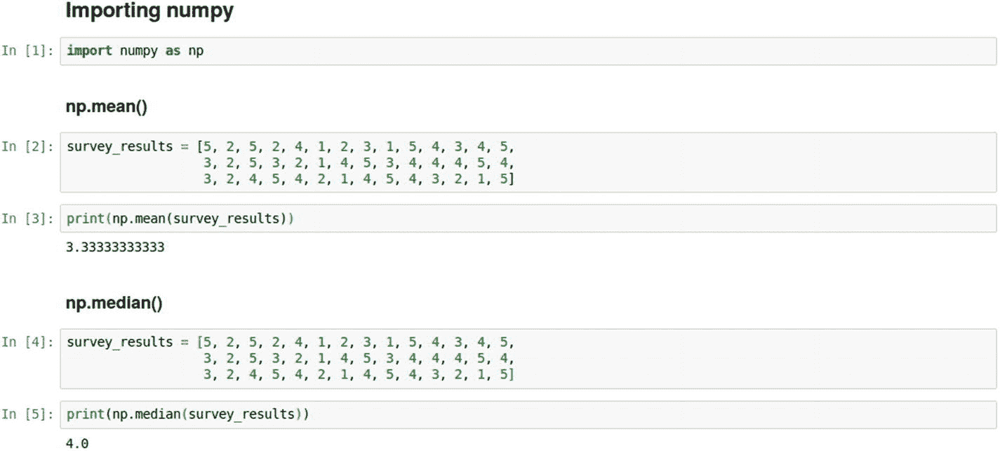

图 5-1

计算平均值和中位数的代码示例

如您在图例中看到的示例，使用中位数会产生 4 这个输出，这在观察中是存在的，因此我们可以将其作为这些观察的中心。然而，平均值输出为 3.33，这超出了数据观察范围——它不存在于观察中——这就是为什么我们不能在有序数据上使用平均值。

### 快速回顾和检查

到目前为止，我们已经向您介绍了四个水平中的两个：

+   名义水平

+   有序水平

在名义水平上，我们处理的数据通常使用词汇描述，或者可以说它只是命名（尽管有时带有数字），没有顺序，并且很少使用数学（相等性和集合成员）。在有序水平上，我们有可以用数字描述的数据，并且具有“`自然`”的顺序，允许我们将一个放在另一个前面，并且可以对它们进行比较和排序。

### 间隔水平

**间隔水平**被定义为一种数值尺度，其中变量的顺序是已知的，以及这些变量之间的差异。具有熟悉、恒定和可计算差异的变量使用间隔尺度进行分类。也容易记住这个尺度的基本作用。“*间隔*”表示两个实体之间的距离，这正是间隔尺度帮助实现的。

间隔尺度包含有序尺度的所有属性，除此之外，它还提供了变量之间差异的计算。这个尺度的主要特征是对象之间的等距差异。

### 间隔水平数据的例子

温度是间隔水平数据的绝佳例子。如果一个国家的温度是华氏 100 度，另一个国家的温度是华氏 80 度，那么第一个国家比第二个国家高出 20 度。这个简单的例子在这个水平上比之前的例子提供了更多的操作空间。

+   80 度总是高于 50 度，这两个温度之间的差值与 70 度和 40 度之间的差值相同。

+   此外，0 的值是任意的，因为温度的负值确实存在，这使得摄氏度/华氏度温度尺度成为间隔尺度的经典例子。

### 间隔水平数据的特征

如您所见，这个数据水平由数字表示，这看起来分析起来容易一些，但实际上您必须注意您的变量。这是因为在选择中心趋势测量技术，如**平均值**时，您有很多异常值可能会影响您从其中得出的结论。

### 区间允许的数学运算

我们可以使用在较低级别允许的所有运算（相等性、排序、比较等），以及另外两个显著的运算：

+   加法

+   减法

这两个新运算允许我们以有用的方式表达观察结果。

#### 区间中心的度量

在这个级别，我们可以使用**中位数**和**众数**来描述这些数据；然而，通常对数据中心的准确描述会是**算术均值**，更常见地被称为，“均值”。回想一下，均值的定义要求我们将所有测量值相加。在前一个级别，加法是没有意义的；因此，均值会失去其有用的价值。只有在区间级别及以上，算术均值才有意义。

假设我们观察一家制药公司新疫苗的冰箱温度。我们每小时测量一次温度，以下数据点（华氏度；图 5-2）：

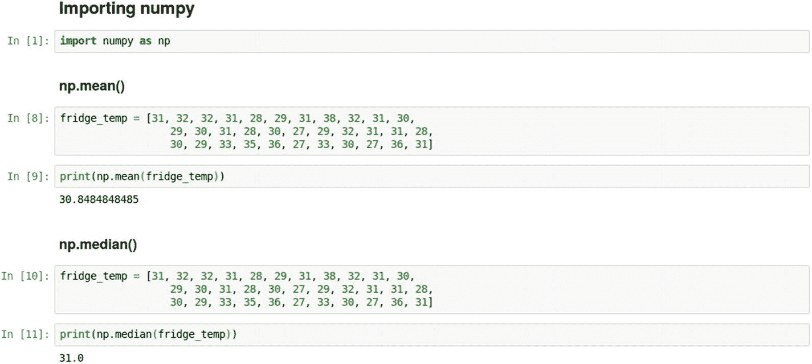

图 5-2

在其他数据上的均值和中位数比较

注意看**均值**和**中位数**非常接近，两者都大约在 31 度。问题是，**平均来说，冰箱有多冷？**大约是 31 度；然而，温度下降到了 29 度以下，但你最终认为这不足以造成损害。这就是变异度量可以帮助我们理解冰箱状况可能有多糟糕的地方，也是选择均值或中位数作为我们数据中心的表示方式的好处。

#### 区间变化的度量

这是一个我们尚未讨论的新度量。在数据科学中，你应该不仅考虑你数据的中心，还要考虑它的变异；提到数据的“分散程度”非常重要。描述这种现象的度量被称为变异度量，或方差。

你可能之前听说过**标准差**。这个概念非常重要，我们应该简要地讨论一下。变异度量——就像标准差——是一个试图描述数据分布程度的数字。与中心度量一起，变异度量几乎可以用两个数字完全描述一个数据集。

##### 标准差

标准差是区间级别及以上的数据最常用的变异度量。可以将标准差视为**数据点到均值的平均距离**。虽然这个描述在技术和数学上是错误的，但它是一个很好的思考方式。标准差的公式可以分解为以下步骤：

1.  计算数据的均值。

1.  对于数据集中的每个数字，从均值中减去它，然后平方它。

1.  计算每个平方差的平均值（方差）。

1.  取第三步得到数值的平方根。这就是标准差。

### 注意

我们想要每个点与平均值之间的“平方差”而不是“实际差”，是因为平方值实际上强调了异常值——那些异常远离的数据点。

例如，回顾一下温度数据集。让我们找到数据集的标准差（图 5-3）。

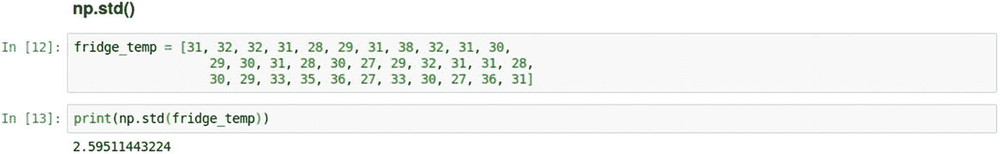

图 5-3

计算标准差

所有这些代码都导致我们发现数据集的标准差接近 2.6，这意味着平均而言，一个数据点与大约 31 度的平均温度相差 2.5 度。因此，温度可能很快会再次降至 29 度以下。

变化度量给我们提供了一个非常清晰的关于我们的数据如何分散或分散的图景。当我们关注数据的范围以及数据如何波动时（想想股票的百分比回报），这一点尤为重要。这个水平的数据与下一个水平的数据之间的主要区别在于一个不明显的东西。区间水平的数据没有自然起点或自然零点。然而，在零摄氏度并不意味着你没有温度。

### 比率水平

最后，我们将探讨比率水平。在经历了三个不同水平、允许的数学运算级别不同的过程之后，比率水平证明是四个水平中最强的。

我们不仅能够定义顺序和差异，比率水平还允许我们进行乘法和除法。这看起来可能并不值得大惊小怪，但它几乎改变了我们在这个水平上看待数据的方式。

#### 例子

虽然华氏度和摄氏度都停留在区间水平，但温度的绝对温标（开尔文）有一个自然的零点。零开尔文的测量实际上意味着没有热量。这是一个非任意的起始零点。我们实际上可以科学地说，200 开尔文的热量是 100 开尔文的两倍。银行里的钱处于比率水平。你可以有“银行里没有钱”；并且 $200,000 是 $100,000 的两倍是有意义的。

#### 比率水平的中心度量

在这个水平上，算术平均数仍然有意义，还有一种新的平均数类型，称为几何平均数。这种度量在比率水平上通常使用得不多，但值得一提。它是所有值的乘积的平方根。

例如，在我们的冰箱温度数据中，我们可以像图 5-4 所示那样计算几何平均数。

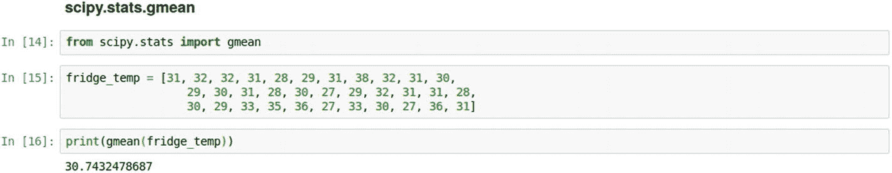

图 5-4

几何平均数

再次注意它如何接近之前计算出的算术平均数和中位数。

#### 比率水平的局限性

即使在这个级别添加了所有这些功能，我们仍然必须做出一个非常大的假设，这实际上使得比率级别有些限制。比率级别的数据通常是非负的。仅就这一点而言，许多数据科学家更喜欢间隔级别而不是比率级别。这种限制性属性的原因是，如果我们允许负值，比率可能并不总是有意义的。

### 总结所有级别表格 5-1

表 5-1

总结所有表格数据级别

| 支持度： | 名义 | 序数 | 间隔 | 比率 |
| --- | --- | --- | --- | --- |
| 变量的序列被建立 | - | 是 | 是 | 是 |
| 众数 | 是 | 是 | 是 | 是 |
| 中位数 | - | 是 | 是 | 是 |
| 平均值 | - | - | 是 | 是 |
| 变量之间的差异可以评估 | - | - | 是 | 是 |
| 变量的加法和减法 | - | - | 是 | 是 |
| 变量的乘法和除法 | - | - | - | 是 |
| 绝对零度 | - | - | - | 是 |

图 5-5 中的图表可能有助于您理解每个级别的属性以及每个级别如何从其下级别继承属性。

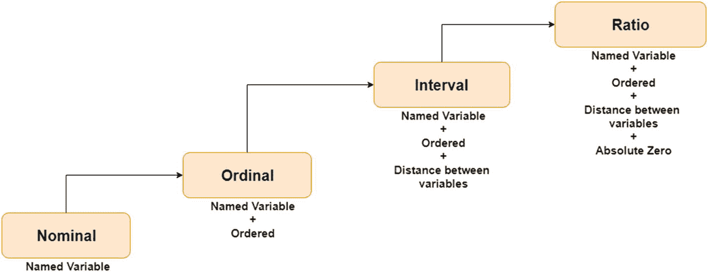

图 5-5

所有数据级别的总结

## 文本数据

文本是人类历史上存在了数千年的数据形式。包括影响所有宗教的所有神圣文本，诗人和作家的所有作品，他们时代最聪明的人的科学解释，定义我们历史和未来的所有政治文件，以及所有各种明确的人类交流，这些“所有”定义了我们称为文本形式的数据的重要性。

### 文本处理是什么？文本处理的重要性级别如何？

文本处理是许多机器学习应用中最常见的任务之一。为了证明这一点，我们将看到一些文本处理任务的例子：

+   *语言翻译*：将一句话从一种语言翻译成另一种语言

+   *情感分析*：从文本语料库中确定对任何主题或产品等的情感是积极、消极还是中性

+   *垃圾邮件过滤*：检测未请求和不受欢迎的电子邮件/消息

如我们所见，除了语音识别和生成之外，文本还有许多对机器学习应用非常重要的任务。到目前为止，我们可以说我们已经回答了这个问题，但我们应该对文本数据说些什么：它在机器学习中有一个名字，称为 NLP（自然语言处理）。但我们是来讨论文本的，所以让我们完成我们对文本类型的范围。我们将讨论结构化和非结构化数据，如何通过处理和清理这些数据来使用这些数据，并查看用于处理数据的最常见技术。所以让我们继续我们的数据之旅。

首先，为了简化文本数据，我们可以对其进行修改。文本数据基本上只是单词。很多时候，你对文本做的第一件事就是使用一些有趣的函数，如词袋模型，将其转换为数字。

第二，*文本处理中使用的工具有哪些*？自然语言处理（NLP）是机器学习工程师处理文本数据的主要工具。因此，让我们给出一个关于 NLP 的良好定义。

`自然语言处理`是机器学习中的一个领域，涉及计算机理解、分析、操纵和可能生成人类语言的能力。

我们有许多在 NLP 中使用的工具，如 NLTK（自然语言工具包），我们在第一部分中讨论过。当我们在第三部分讨论循环神经网络（RNN）时，我们将更详细地讨论文本数据，但让我们先对文本进行简单的概述。

### IMDB—示例

在这个例子中，我们处理文本中最常见的数据集，它在许多研究中被基准测试。它是大型电影评论数据集（通常称为 IMDB 数据集），包含 25,000 个高度两极化的电影评论（好或坏），用于训练和测试。问题是确定给定的电影评论是正面还是负面情感（图 5-6）。

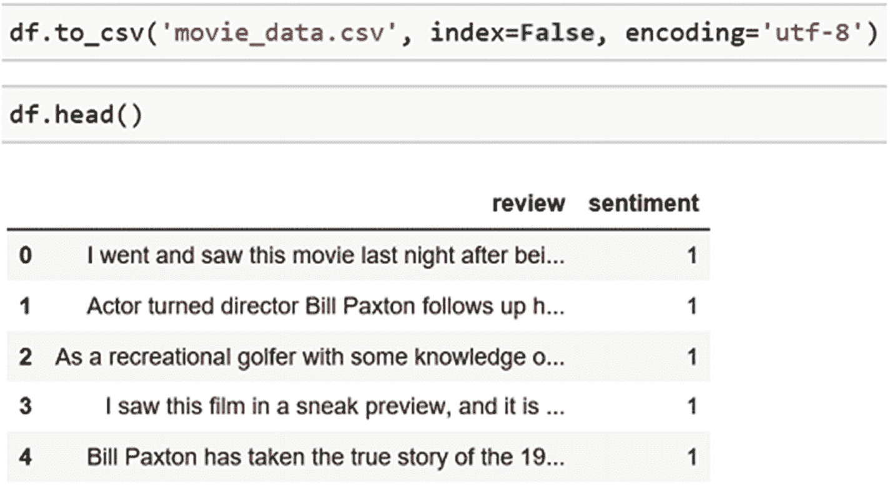

图 5-6

电影数据

正如我们在图 5-6 中看到的那样，这个 IMDB 数据只是用户关于电影的评论数据特征，具有情感特征或标记特征，使我们能够知道评论是正面还是负面。这允许模型训练表示负面评论或正面评论的单词组合。

这是一个简单的例子，让我们了解了文本数据。我们将在下一章中更多地讨论文本以及如何处理文本数据，以及使用许多算法对其进行训练，并使用适合数据架构。现在，我们在这个部分学到了一些关于文本数据是什么的知识。

### 图像数据

计算机视觉是人工智能中最热门的话题之一。它在自动驾驶汽车、机器人技术以及各种照片校正应用等多个领域取得了巨大的进步。物体检测的稳步进展每天都在进行。视觉正在向我们展示一般技术和特别是深度学习的未来，因此我们甚至无法想象其所有可能性。

计算机视觉基本上是操纵和处理图像以从中提取特定知识的科学。因此，这种方法处理从灰度到彩色，从二维到四维的各种类型的图像。

图像处理对图像执行一些操作以获得预期的操作。想想当我们开始新的数据分析时我们做了什么。我们进行一些数据预处理和特征工程。图像处理也是如此。我们进行图像处理以操纵图片，从中提取一些有用的信息。我们可以减少噪声，并控制亮度和颜色对比度。

#### 图像类型（2-D，3-D，4-D）

对于 2-D、3-D 和 4-D 数据，图像的流程可能仍然相同，但你必须知道你可能处理的不同类型的数据。你还应该了解并理解你可能必须处理的每个步骤，以应对未来可能遇到的任何图像数据。

##### 2-D 数据

当每个观测值由一个 2-D 矩阵组成时，我们说图像位于二维空间中，而构成整个数据的是三维空间。二维图像很可能是灰度图像；这是直观的，因为在二维空间中的每个像素只表示一个值，这个值可以在 0 到 255 之间。现在让我们将维度空间提升并增加一个维度，看看会发生什么。

##### 3-D 数据

如果你增加维度空间一个维度，那么图像就在三维空间中，这使得每个图像观测值由一个 3-D 张量组成，而整个数据在四维空间中，由一个 4-D 张量组成。由 3-D 组成的图像由三个通道组成，很可能是红、绿、蓝通道，使得这个数据集中的每个图像都是彩色的。图像中的每个像素由三个值组成，每个通道一个值，介于 0 到 225 之间，我们将在后面的第十一章节中看到如何处理这类数据。

##### 4-D 数据

再次，如果你增加维度空间一个维度，那么图像就在四维空间中，这使得每个图像观测值由一个 4-D 张量组成，而整个数据在五维空间中，由一个 4-D 张量组成。由 4-D 组成的图像由三个通道组成，很可能是红、绿、蓝通道，使得这个数据集中的每个图像都是彩色的，并将图像的时间变化作为另一个维度。

例如，生物医学图像通常是体积图像（3-D），有时还包含额外的时维（4-D）和/或多个通道（4-D–5-D）（例如，多序列磁共振图像）。生物医学图像（图 5-7）的变化与自然图像（例如，照片）的变化相当不同，因为临床方案旨在分层图像的获取方式（例如，患者躺在背部，头部不倾斜等）。在我们的分析中，我们旨在检测细微的差异（即，一些小区域表明异常发现）。

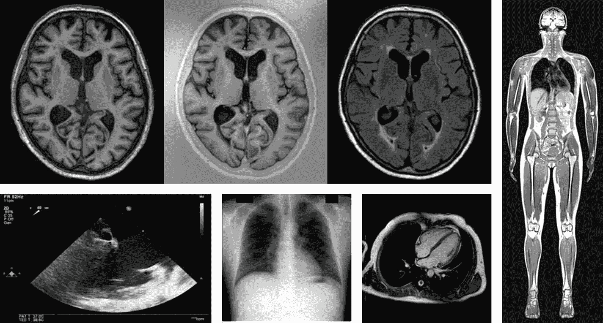

图 5-7

4-D 图像的示例

#### 示例——MNIST

MNIST 数据库（修改后的国家标准与技术研究院数据库）是一个包含手写数字的大型数据库，通常用于训练各种图像处理系统。该数据库在机器学习和深度学习领域的训练和测试中也得到了广泛的应用。

MNIST 数据库包含 60,000 个训练图像和 10,000 个测试图像。训练集和测试集的一半来自 NIST 的训练数据集，另一半来自 NIST 的测试数据集。

MNIST 数据集（图 5-8）是通过“重新混合”NIST 原始数据集的样本创建的。创建者认为，由于 NIST 的训练数据集是从美国人口普查局员工那里获得的，而测试数据集是从美国高中生那里获得的，因此它不适合进行统计学习实验。

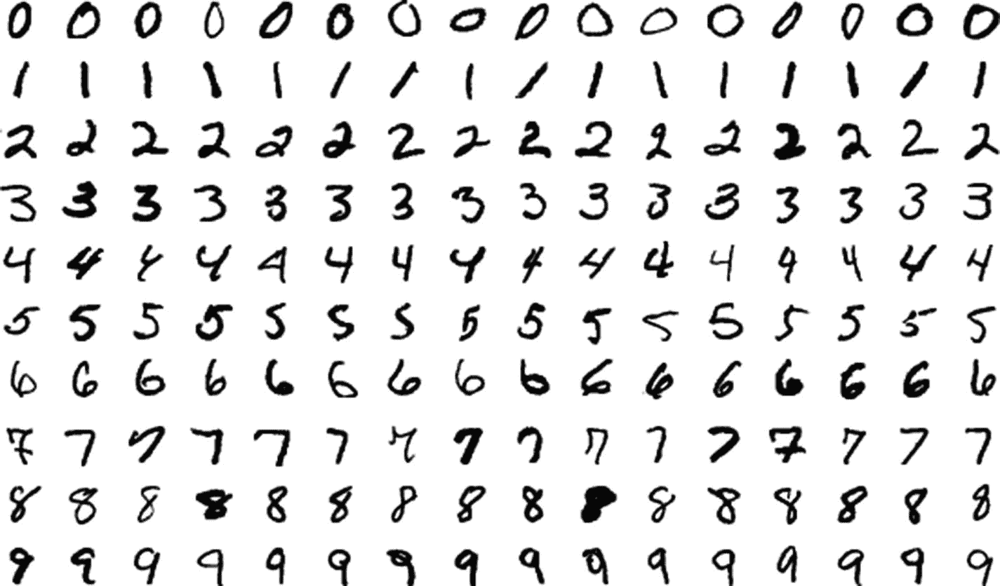

图 5-8

MNIST 数据集的样本

#### 示例——CIFAR-10

在这个例子中，我们将处理在图像理解中广泛使用的其中一个数据集，它被用作一个简单但通用的基准。在这个例子中，我们将构建一个简单的卷积神经网络（CNN）模型，以了解解决这类分类问题所需的一般计算结构。

该数据集包含 40,000 张 32×32 像素的图像，代表以下类别：*飞机*、*汽车*、*鸟*、*猫*、*鹿*、*狗*、*青蛙*、*马*、*船*和*卡车*。在这个例子中，我们将只处理 10,000 个图像包中的第一个（图 5-9）。

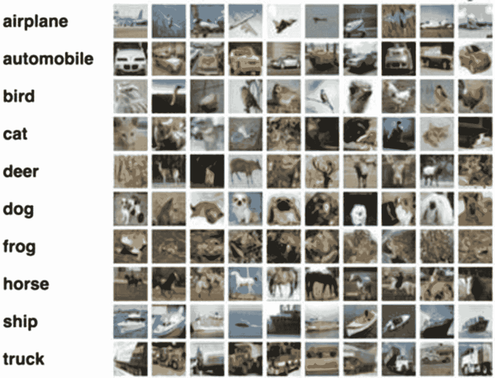

图 5-9

CIFAR-10 数据集的样本

## 摘要

你正在处理的数据类型是数据科学和机器学习的一个非常大的领域。它必须在你的大多数分析之前，因为你所拥有的数据类型会影响甚至可能进行的分析类型！每当面对一个新的数据集时，你应该首先问以下问题：

+   数据是有组织的还是无组织的？

例如，我们的数据是否存在于整洁的行/列结构中？

+   每一列是定量还是定性的？

例如，值是数字、字符串，还是代表数量？

+   每一列的数据处于什么数据级别？

例如，值处于名义、有序、区间还是比率级别？

+   如果是图像数据，我们需要使用什么数据增强方法？

+   如果是文本数据，我们将使用什么方法将文本转换为数字？

这些问题的答案不仅会影响您对数据的了解，还会决定您分析的下一步。它们将决定您能够使用的图表类型以及您如何在即将到来的数据模型中解释它们。有时我们不得不从一级转换到另一级，以获得更多的视角。

在接下来的章节中，我们将更深入地探讨如何处理和探索不同层次的数据。到本书结束时，我们不仅能够识别不同层次的数据，而且还将知道如何在这些层次上处理它们。

# 6. 数据整理和预处理

在上一章中，我们定义了数据意味着什么；我们还讨论了数据的类型和层次。因此，我们现在正在开始实际操作数据！在本章中，您将学习如何理解和清洗您的数据集。

在某些书籍或参考资料中，您会发现本章的主题有不同的名称；他们可能会将其称为数据整理。

整理意味着通过一系列明确且可逆的步骤，将原始数据转换为完全不同——并且希望更有用——的数据。您可能会看到一些数据科学家或深度学习工程师使用其他术语来描述这个管道中的过程。这些术语几乎是同义的：如数据整理或数据准备。无论叫什么名字，整理都是任何数据工程管道的重要组成部分。

在阅读这本书的过程中，你会发现我们提到了更多来自概率和统计学领域（如概率分布、描述性统计和假设检验）的术语和技术。我们将尝试为这些术语添加一个类似词典的附录，以确保我们处于同一页面上；然而，我们的主要目的是为您提供处理深度学习项目的基本概念，如果您已经熟悉其中的一些，那就更好了。但我们会添加一个附录，以防您可能需要刷新或对任何在本章或其他章节中处理的概念进行直接介绍。在这样的前提下，本章将涵盖以下主题：

+   数据字段管道（以便您了解正在发生什么以及接下来会发生什么）

+   从文件中加载数据

+   选择您需要的数据

+   处理任何缺失或错误的数据

+   增加和删除数据

+   将数据分组和转换以获取新的和有意义的信息

## 重新审视数据字段管道

### 给您一个理由

我们最近读到，《纽约时报》将数据清洗称为“清洁工工作”，并表示数据科学家 80%的时间将花费在这种清理工作上。如图 6-1 所示，尽管数据清洗很重要，但它并没有像大数据、数据挖掘或机器学习那样真正激发公众的想象力。

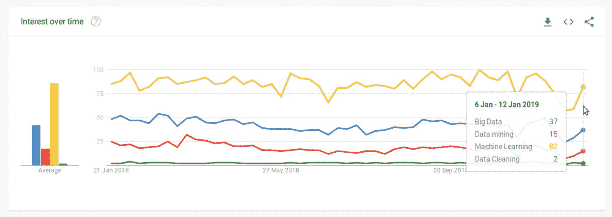

图 6-1

机器学习的当前趋势

嗯，不幸的是，如果我们只是完成工作而不是忽视它、抱怨它、给它各种贬低的名字，我们都会好很多。

### 数据清洗在过程中的位置在哪里？

数据科学过程被描述为六个步骤，如下所示列表所示。数据清洗位于中间，即第三步；但与其将这些步骤视为线性（如瀑布）的从开始到结束的框架，不如在项目过程中根据需要多次回顾这些步骤，以更迭式的方式进行。也值得指出的是，并非每个项目都需要所有步骤；例如，有时我们可能没有收集步骤或可视化步骤。这完全取决于项目的特定需求。

+   第一步是提出问题陈述。确定你试图解决的问题是什么。

+   下一步是数据收集和存储。帮助你回答这个问题的数据是从哪里来的？你将它存储在哪里，以什么格式？

+   然后是数据清洗。你是否改变了数据？你是否删除了什么？你是如何为分析和挖掘步骤准备数据的？

+   下一步是数据分析与机器学习。你对数据做了哪些处理？哪些转换？你使用了哪些算法？你应用了哪些公式？你使用了哪些深度学习算法？顺序是什么？

+   表示和可视化是第五步。你如何展示你工作的结果？这可能是一个或多个表格、绘图、图表、网络图、词云、地图等等。这是否是表示数据的最佳可视化方式？你考虑了哪些替代方案？

+   最后一步是问题解决。对于你在第一步中提出的问题或问题，答案是什么？你的结果有什么限制？是否有问题的某些部分你无法用这种方法回答？你本可以如何不同？下一步是什么？

## 数据加载和预处理

在你找到你项目所需的数据集后，你也知道如何导入所需的 Python 包以进行管道操作。在本节中，在准备好你的工具箱后，你将学习如何使用 pandas 和 NumPy 结构性地加载数据集、操作和处理数据；正如你在前面的章节中看到的，如何设置这些包。你现在可以继续到下一节了。

### 快速且简单数据加载

让我们从 pandas 库开始。pandas 库提供了最易于访问和最完整的函数，可以从文件（*CSV*，逗号分隔值；*TSV*，制表符分隔值；*JSON*）或*URL*中加载数据表。

默认情况下，它将数据存储在专门的 pandas 数据结构中，为每一行建立索引，通过自定义分隔符区分变量，为每一列推断正确的数据类型，必要时转换数据，以及解析日期、缺失值和错误值，并进行大量处理。令人惊叹的是，你只需一行 Python 代码就能完成所有这些操作；这就是为什么它既快又简单。

```py
import pandas as pd
iris_df = pd.read_csv('Iris.csv', sep=',', decimal='.', index_col=False)
iris_df.head()
```

```py
iris_df   = pd.read_csv(iris_data, sep=',',
decimal='.', header=None, index_col=False,
names=['sepal_length', 'sepal_width', 'petal_length', 'petal_width', 'target'])
import urllib
import pandas as pd
data_url  = "https://archive.ics.uci.edu/ml/machine-learning-databases/iris/iris.data"
request   = urllib.request.Request(data_url)
iris_data = urllib.request.urlopen(request)
iris_df   = pd.read_csv(iris_data, sep=',',
decimal='.', header=None,
index_col=False,
names=['sepal_length', 'sepal_width', 'petal_length', 'petal_width', 'target'])
iris_df.head()
```

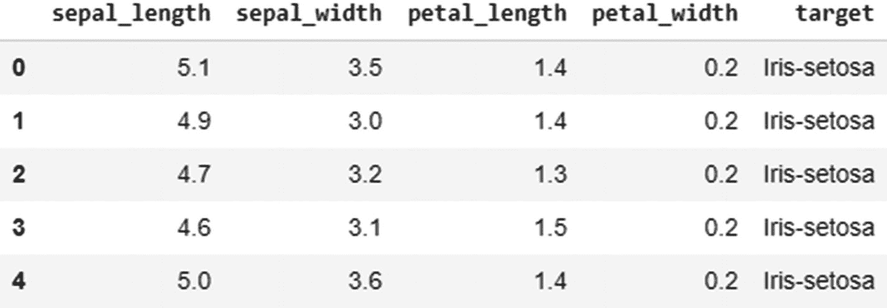

图 6-3

在线 DataFrame 的表格输出

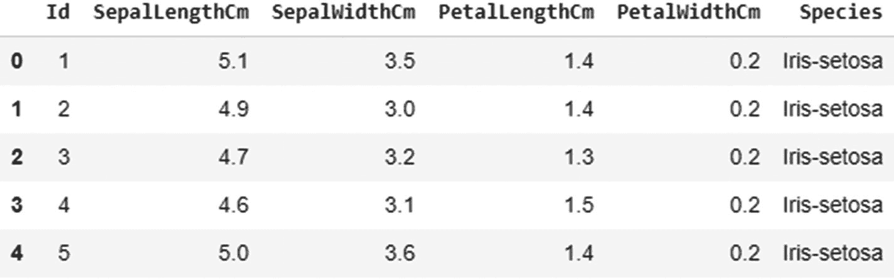

图 6-2

DataFrame 的表格输出

正如你在前两个代码单元格（图 6-2 和 6-3）中看到的那样，它们都执行相同的任务，即从文件（*CSV*，有时称为平面文件）或从 *URL*（例如，云端）加载数据。

在文件的情况下，你可以指定：文件的名称；用作分隔符的字符（`sep`），可能是逗号、制表符、井号等…；用作小数占位符的字符（`decimal`），在数据集中可能看起来像 10.01，也可能像 10,01；是否有标题（`header`）或没有；以及变量名称（使用名称和列表）。pandas 对一些参数有一些默认设置，例如 `sep=','`，还有 `decimal='.'`。

### 注意

请注意，不要为具有相同值的数字设置相同的 sep（分隔符）和小数点，以防止加载错误并确保数据加载安全。

生成的对象，命名为 `iris`，是一个 pandas `DataFrame`。它不仅仅是简单的 Python 列表或字典，在接下来的章节中，我们将探讨其一些特性和功能。要了解其内容（查看内部数据值），你可以使用以下命令打印第一行（或最后一行），如图 6-4 和 6-5 所示：

```py
iris_df.head()
```

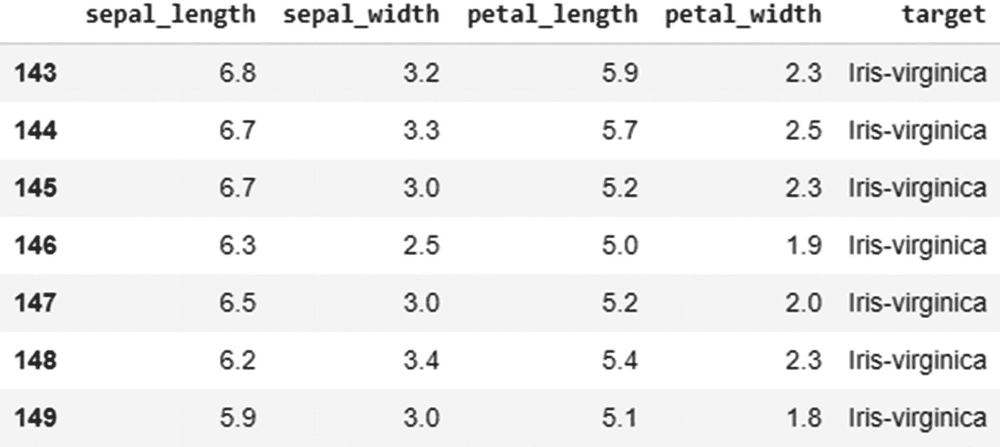

图 6-5

tail() 函数输出的表格


图 6-4

head() 函数输出的表格

```py
Iris_df.tail(7)
```

### 注意

head/tail 函数，如果没有提供参数，将只打印五行。如果你想获取不同数量的行，只需使用你想要看到的行数作为参数调用该函数，就像在前两个代码单元格中的第二个一样。

接下来，你可能只想看到列名（**提示**：当你使用 `iris.head()` 时可以看到它们）；要获取列名，你可以简单地使用以下方法：

```py
iris_df.columns
# Output:
# Index(['sepal_length', 'sepal_width', 'petal_length', # 'petal_width', 'target'], dtype="object")
iris_df.columns = ['s_length', 's_width', 'p_length', 'p_width', 'target']
```

代码单元格一中的结果对象非常有趣。它看起来像 *Python 列表*，但实际上是一个 *pandas 索引*。正如对象名称所暗示的，它索引列的名称。在代码单元格二中，你可以看到你可以随意更改列名，但请注意并明智地选择你用来表示列的名称。

例如，要提取 `target` 列（图 6-6），你可以简单地做以下操作：

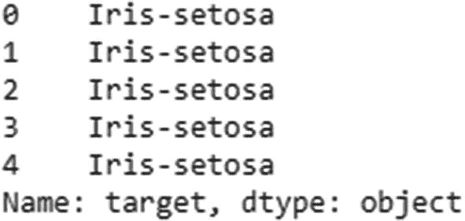

图 6-6

表示目标变量的输出序列

```py
y = iris_df['target']
y.head()
```

对象 y 的类型是 pandas Series。现在，将其视为一个一维数组或向量，就像我们将在后面深入探讨的那样，用轴标签在数学上表示。

### 注意

为了规范，我们使用小写字母表示向量/数组，大写字母表示矩阵。

```py
y = iris_df.target
```

### 注意

如你所见，我们可以获取作为 pandas DataFrame（矩阵）的列，但这不是首选。

现在，我们刚刚了解到一个 pandas 索引类就像表格列的字典索引。

注意，你也可以通过它们的索引来获取列的列表，如下所示（图 6-7）：

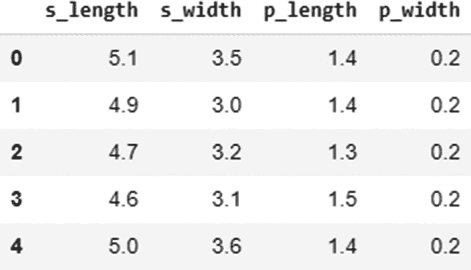

图 6-7

只输出选定的变量

```py
X = iris_df[['s_length', 's_width', 'p_length', 'p_width']]
X.head()
```

如你所见，pandas `DataFrame` 通过允许你以你喜欢的任何方式选择列来展示其灵活性。并且正如你所见，结果是 pandas `DataFrame`。

为什么使用相同的函数时结果会有如此大的差异？

+   在第一种情况下，我们请求了一列。因此，输出是一个一维向量（即 pandas Series）。

+   在第二种情况下，我们请求了多个列，并得到了一个类似矩阵的结果（我们知道矩阵被映射为 pandas DataFrame）。

### 注意

你可以通过查看输出标题简单地发现差异；如果列有标签，那么你正在处理一个 pandas `DataFrame`。另一方面，如果结果是向量且没有标题，那么它就是一个 pandas `Series`。

到目前为止，我们已经从数据加载过程中学习了一些常见步骤；在你加载数据集后，你通常将 *特征*（预测器）和 *目标*（响应）标签分开。

而且，正如你所知：

+   在分类问题中，目标标签是与每个特征集相关的离散/名义数字或文本字符串，表示该类。

+   在回归问题中，目标标签是连续/区间（或比率）数字，表示与每个特征集相关的值。

然后，以下步骤需要你了解问题的规模，因此你需要知道数据集的大小。通常，对于每个观测值，我们计算一行，对于每个特征，一个列。要获得数据集的维度，只需使用 pandas `DataFrame`或`Series`上的`shape`属性，如下例所示：

```py
iris_df.shape
# Outputs
# (150, 5)
```

结果对象是一个包含每个维度矩阵/数组大小的元组。

### 注意

pandas Series 遵循相同的格式（即只有一个元素的元组）——例如，data_series.shape 将输出`(10, 1)`。

然而，如果你想忽略数据加载过程，你始终可以使用`sklearn.datasets`模块中的预加载数据集。此模块包含所有类型的可以用于实践和实验的数据集（*分类*和*回归*）。此外，你还可以使用此模块中的某些功能来生成你自己的数据集，这也有助于你增强管道操作选择和实验过程。

```py
from sklearn.datasets import load_iris
iris = load_iris()
iris_df = pd.DataFrame(iris.data, columns=iris.feature_names)
iris_df.head()
```

## 缺失数据

正如我们所知，当有人将数据集从一个来源转换到另一个来源时，数据丢失是不可避免的。我们无法避免这种损失或阻止其发生，但我们可以修复它或让我们的模型学习这种损失或忽略它，正如我们将在接下来的章节中看到的。因此，现在我们将讨论零、空和空值的神秘组合。

你可能想知道这些之间的区别。我们将通过三个简单的场景来展示这些区别，并定义零、空和空值的含义。

**场景一**：想象一下，你有一个装满硬币的钱包，当我问你一些关于它的问题时，你应该回答它们。

如果我问你钱包里有多少枚硬币，你观察到钱包里没有硬币。问题“钱包里有多少枚硬币？”是无法回答的。没有钱包！答案既不是正值，也不是零值，甚至不是空的。这个值是空值。

**场景二**：几个小时后，你再次查看钱包，发现里面有十枚硬币。太棒了；你现在有了对这个问题的答案。在这种情况下，你可以用这块数据回答这个问题，其值是`10`。

过了一段时间，你再次查看钱包，发现里面已经没有硬币了。每一枚硬币都不见了。你查看、搜索，并发现“钱包里有多少枚硬币？”的答案是零值。所以，你仍然有一份数据，其值现在是`0`。

**场景三**：就在傍晚时分，你从口袋里掏出钱包。当你穿过街道时，你发现你的朋友并问他，“钱包里有什么？”目前，钱包是空的。钱包里什么都没有—*没有硬币，也没有其他东西*。请注意，答案不是零，因为他问的问题不是一个数字问题。答案也不是**空值**，因为我们确实有一个钱包，我们也确实查看了它，但就是没有答案。

### 空值

空值比零更难处理，但在某些情况下很有意义，例如，当处理字符串时。例如，假设我们有一个名为中间名的属性。嗯，我没有中间名，所以我总是留这个字段为空。对于一个真正为空的值填写一个空格或破折号（或编造一些东西）并没有太多意义。空格并不等同于空。在空字符串的情况下，正确的值实际上可能是“`empty`”。

### 使用零而不是空或空值填充缺失数据是否有时有用？

让我们陈述一个事实：总是填充缺失值比留下空或空值要好。你可以以一种巧妙的方式知道缺失值：如果这个变量在 0 和 1 之间有一个均匀分布，并且它在-1 处有一个小峰值，那么-1 实际上是一个缺失值。

根据数据来源，缺失数据的识别方式不同。pandas 总是将缺失值识别为*NaN*。然而，除非数据已经预处理到分析师会遇到缺失值作为*NaN*的程度，否则缺失值可能以问号（?）或零（0）或负一（-1）或空白的形式出现。因此，数据科学家在编写任何机器学习算法之前始终先进行探索性数据分析（EDA）是很重要的。EDA 只是理解并了解我们数据行为的试金石。

### 管理缺失特征

有时数据集可能包含缺失特征，因此可以考虑以下几种选项：

+   删除整个行

+   创建一个子模型来预测这些特征

+   使用自动策略根据其他已知值输入它们

+   第一个选项是最极端的，只有在数据集相当大、缺失特征数量高且任何预测都可能有风险时才应考虑。

+   第二个选项要困难得多，因为它需要确定一个监督策略来训练每个特征的模型，最后预测它们的值。

+   考虑所有利弊，第三个选项可能是最佳选择。

Scikit-learn 提供了`Imputer`类，该类负责使用基于`mean`（默认选择）、`median`或*frequency*-`mode`（最频繁的条目将被用于所有缺失项）的策略来填充空缺。以下代码片段展示了使用三种方法（缺失特征的默认值是*NaN*。然而，你可以通过`missing_values`参数使用不同的占位符）的示例：

```py
import pandas as pd
from sklearn.preprocessing import Imputer
titanic_df = pd.read_csv('train.csv')
titanic_df.head(2)
```

```py
titanic_df.Age.isna().sum()
# Outputs
# 177
titanic_imputer = Imputer(strategy='mean')
new_age = pd.DataFrame(titanic_imputer.fit_transform([titanic_df.Age])[0])
new_age.isna().sum()
# Outputs
# 0
```

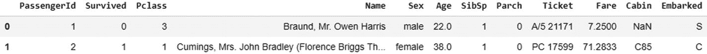

图 6-8

泰坦尼克号数据集的头部

## 处理大型数据集

如果你想要加载的数据集太大而无法放入内存，那么你必须将其分成几块（或称为`chunks`）。这种方法有时被称为抽样，我们将在未来的章节中看到一些关于它的内容。之后，你将创建一个批处理深度学习算法，该算法一次只处理数据的一部分/块。使用批处理方法也很有意义，如果你只需要数据的一个样本。多亏了 Python，你实际上可以分块加载数据。这种操作也称为数据流，因为数据集作为一个连续的流动进入`DataFrame`或其他数据结构。与所有之前的案例相反，数据集在独立步骤中已经完全加载到内存中。

使用 pandas，有两种方式来分块和加载文件：

+   第一种方法是通过加载相同大小的数据块；每个块是数据集的一部分，包含所有列和有限的行数，不超过在函数调用中设置的（即`chunksize`参数）。

+   你还可以使用 CSV 包，它提供了两个函数来迭代文件中的小数据块：`reader`和`DictReader`函数。

### 注意

在这种情况下，`read_csv`函数的输出不是一个 pandas DataFrame，而是一个类似迭代器的对象。实际上，要获取内存中的结果，你需要迭代该对象：

```py
iris_df = pd.read_csv('Iris.csv', sep=',', decimal='.',
header=None, index_col=False,
iterator=True,
names=['sepal_length', 'sepal_width',
'petal_length', 'petal_width', 'target'])
iris_df.get_chunk(10).shape
# Outputs
# 10
```

将会有`14`个这样的其他部分，每个部分的形状都是`（10，5）`。加载大型数据集的另一种方法是请求其迭代器。在这种情况下，你可以动态地决定每个`pandas DataFrame`部分的长度（即要获取的行数）：

```py
for chunk in iris_df:
print('SHAPE: ', chunk.shape)
print(chunk, '\n')
```

## 访问其他数据格式

到目前为止，我们只处理了 CSV 文件。pandas 包提供了类似的功能（和函数）来加载 MS Excel、HDFS、SQL、JSON、HTML 和 Stata 数据集。由于它们不是所有数据科学项目都使用，如何加载和处理每个数据集的理解留给你，你可以参考网站上的文档。代码中提供了一个如何加载 SQL 表的简单示例。

### 注意

`CSV`（逗号分隔）和`TSV`（制表符分隔）相似，因为它们都被认为是平面文件。

```py
titanic_df = pd.read_excel('Titanic.xlsx')
titanic_df.head(2)
```


图 6-9

Excel 文件的输出

## 数据预处理

现在，我们能够导入数据集，即使是大型且存在问题的数据集。现在，我们需要学习基本的数据预处理流程，以便使其适用于下一个数据科学步骤。

首先，如果你需要将一个函数应用于行的一小部分，你可以创建一个掩码（图 6-10）。掩码是一系列布尔值（即，True 或 False），它告诉是否选择了该行。

例如，假设我们想要选择所有花瓣长度大于 6 的鸢尾花数据集的行。我们可以简单地执行以下操作：

```py
threshold_mask = iris_df['sepal_length'] > 6.0
threshold_mask.head()
```

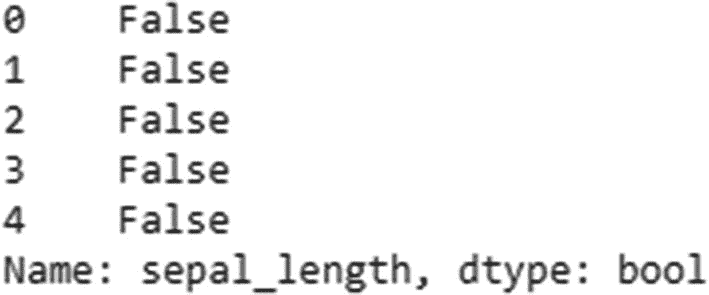

图 6-10

掩码数据的输出

在前面的简单示例中，我们可以立即看到哪些观测值是 True，哪些不是（`False`），以及哪些符合选择查询。

现在，让我们看看如何在一个示例中使用选择掩码。我们想要将 `Iris-virginica` 目标标签替换为 `Virginica` 标签。我们可以通过以下两行代码来完成：

```py
mask_target = iris_df['target'] == "Iris-virginica"
iris_df.loc[mask_target, 'target'] = "Virginica"
iris_df.target[100:105]
```

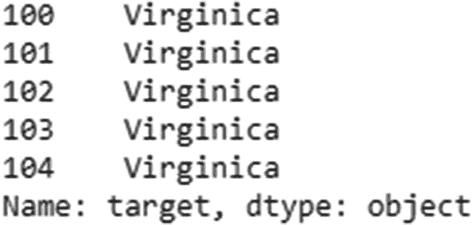

图 6-11

重命名后的数据

你会看到现在所有的 `Iris-virginica` 发生都已被替换为 `Virginica`（图 6-11）。`loc()` 方法是使用行-列索引访问矩阵数据的一种方式。

要查看目标列中新的标签列表，我们可以使用 `unique()` 方法。如果你最初想评估数据集，这个方法非常方便：

```py
iris_df.target.unique()
# Outputs
# array(['Iris-setosa', 'Iris-versicolor',
# 'Virginica'], dtype=object)
iris_df.target.nunique()
# Outputs
# 3
```

此方法允许我们查看 pandas DataFrame 或 Series 中的唯一值，并且在分析过程中非常有帮助。另一种方法是计算唯一值的数量，这可以通过使用 `nunique()` 来实现，它将返回输入 DataFrame/Series 中的唯一值数量。

如果你想查看每个特征（关于数据的统计信息，如均值、中位数等）的统计数据（统计数据可以让你对数据中发生的事情有一些直观的了解），你可以执行以下步骤：

+   你可以相应地分组每一列。

+   你也可以应用一个掩码。

pandas 的 `groupby` 方法会产生与 SQL 语句中的 GROUP BY 子句类似的结果。接下来应该应用的方法是对一个或多个列的聚合方法。

例如，`mean()` pandas 聚合方法是对应于 SQL 函数 `AVG()` 的计算组中值平均值的函数。pandas 聚合方法 `var()` 计算方差；`sum()` 是总和；`count()` 是组中的行数；等等。

### 注意

结果仍然是一个 pandas DataFrame；因此，可以链式执行多个操作。

作为下一步，我们可以尝试几个 `groupby()` 的实际例子。通过按目标（即标签）对观测值进行分组，我们可以检查每个组中特征的平均值和方差之间的差异（图 6-12 和图 6-13）。

```py
iris_df.groupby(['target']).mean()
```

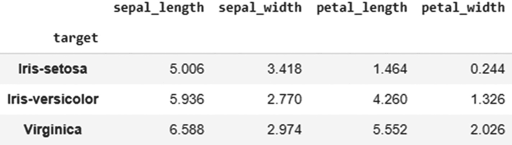

图 6-12

番茄花按组平均输出

```py
iris_df.groupby(['target']).var()
```

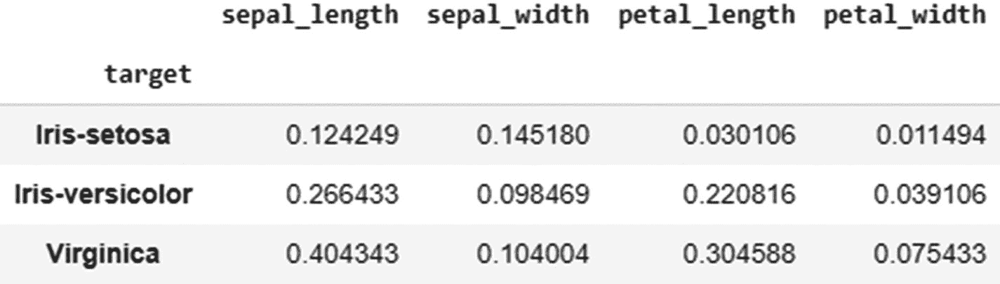

图 6-13

番茄花按组方差输出

最后，如果你的数据集包含时间序列（例如，在数值目标的情况下）并且你需要对其应用 `rolling` 操作（在噪声数据点的情况下），你可以简单地这样做：

```py
pd.rolling_mean(time_series, 5)
```

这可以用于值的滚动平均值。或者，你可以使用以下代码行：

```py
pd.rolling_median(time_series, 5)
```

相反，这可以执行以获得值的滚动中位数。在这两种情况下，窗口的样本大小为 5。

更普遍地，`apply()` pandas 方法能够以编程方式执行任何按行或按列的操作。`apply()` 应该直接在 *DataFrame* 上调用。

+   第一个参数是要按行或列应用的功能。

+   第二个是应用该轴。

### 注意

函数可以是内置的、库提供的、lambda 或任何其他用户定义的功能。

作为这个强大方法的例子，现在让我们尝试计算每行中有多少非零元素（图 6-14）。使用 apply 方法，这很简单：

```py
import numpy as np
iris_df.apply(np.count_nonzero, axis=1).head()
```

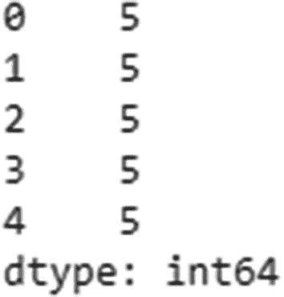

图 6-14

番茄花非零值计数输出

同样，为了按特征计算非零元素（即按列；图 6-15），你只需更改第二个参数并将其设置为 `axis=0`：

```py
iris_df.apply(np.count_nonzero, axis=0)
```

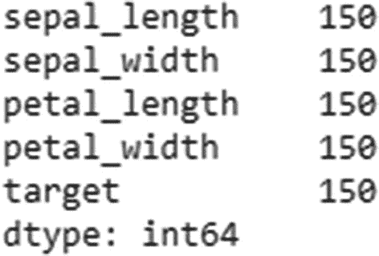

图 6-15

番茄花非零值计数（按列）输出

最后，为了进行逐元素操作，应该在 *DataFrame* 上使用 `applymap()` 方法。在这种情况下，只需提供一个参数：要应用的功能。

例如，假设你感兴趣的是每个单元格字符串表示的长度。为了获得该值，你应该首先将每个单元格转换为字符串值，然后计算长度。使用 `applymap`，这个操作非常简单（图 6-16）：

```py
iris_df.applymap(lambda el: len(str(el))).head()
```

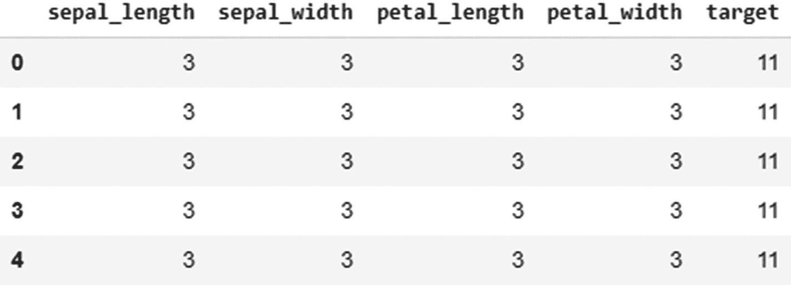

图 6-16

番茄花非零值计数输出

## 数据增强

正如我们所知，任何深度学习算法或任何神经网络的性能通常都会随着可用数据的数量而提高。因此，你的数据集越大，你就能找到越准确的结果——当然，这要考虑到其他因素，比如为你的问题选择正确的算法。

**数据增强**是一种从现有训练数据中人工创建新训练数据的技术。这是通过对训练数据中的示例应用特定领域的技巧来完成的，从而创建新的和不同的训练示例。

图像数据增强可能是最知名的数据增强类型，它涉及创建属于原始图像同一类别的训练数据集中的图像的变换版本。

变换包括来自图像处理领域的各种操作，如平移、翻转、缩放等等。

目的是通过添加新的、合理的示例来扩展训练数据集。这意味着，模型可能看到的训练集图像的变体。例如，一张猫的图片的水平翻转是有意义的，因为照片可能是从左边或右边拍摄的。而一张猫的图片的垂直翻转则没有意义，并且可能不适合模型，因为模型几乎不可能看到一张颠倒的猫的照片。

因此，很明显，必须仔细选择用于训练数据集的具体数据增强技术，并且要在训练数据集的上下文和问题域知识的基础上进行选择。此外，单独和联合实验数据增强方法可能是有用的，以查看它们是否会导致模型性能的可测量改进，也许可以通过一个小型的原型数据集、模型和训练运行来实现。

现代深度学习算法，如卷积神经网络（CNN），可以学习到对图像位置不变的特征。尽管如此，增强可以进一步帮助这种变换不变的学习方法，并有助于模型学习到对变换也具有不变性的特征，例如从左到右到从上到下的顺序、照片中的光照水平等等。

图像数据增强通常仅应用于**训练数据集**，**不**应用于**验证**或**测试数据集**。这与图像调整大小和像素缩放等数据准备不同；它们必须在与模型交互的所有数据集中一致执行。

因此，让我们开始吧，看看我们能从现有的图像中获得多少图像。首先，我们需要按照以下方式导入我们的包：

```py
import tensorflow as tf
import matplotlib.image as mpimg
import matplotlib.pyplot as plt
```

然后，我们需要加载我们将进行实验的图像，这样我们就可以改变其属性，使其对我们模型来说看起来像一张新图像。`tf.image`提供了图像增强函数，这样所有的计算都可以在 GPU 上完成。在本教程中，我们使用 TensorFlow 的`eager_execution`，这样我们就可以直接看到增强后的图像。

```py
tf.enable_eager_execution()
image_path = 'lena_forsen.png'
image_string=tf.read_file(image_path)
image=tf.image.decode_png(image_string,channels=3)
image=tf.image.convert_image_dtype(image,dtype=tf.float32)
```

此外，我们还需要实现一个函数来显示所有实验的结果，这样我们就不必一次又一次地编写相同的代码。

```py
def show_image(original_image,augmented_image,title):
fig=plt.figure()
fig.suptitle(title)
original_plt=fig.add_subplot(1,2,1)
original_plt.set_title('original image')
original_plt.imshow(original_image)
augmented_plt=fig.add_subplot(1,2,2)
augmented_plt.set_title('augmented image')
augmented_plt.imshow(augmented_image)
plt.show(block=True)
```

现在我们可以开始我们的图像增强了，因为我们的环境已经准备好进行这个过程；所以让我们开始吧。

### 图像裁剪

`tf.image` 提供了各种图像裁剪函数。`tf.image.central_crop` 移除图像的外围部分，但保留每个维度上的图像中央区域（见图 6-17）。如果我们指定 `central_fraction = 0.5`，此函数返回图像的中央 50%。此外，此函数适用于单个图像（图像是 3-D 张量），或图像批次（图像是 4-D 张量）。

```py
central_image = tf.image.central_crop(image, central_fraction=0.7)
show_image(image, central_image, "Central Image Crop")
```

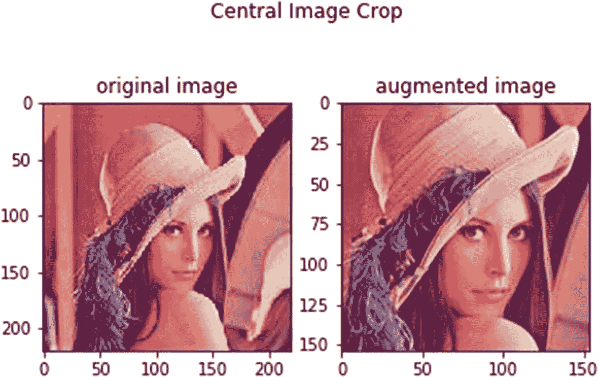

图 6-17

中央裁剪图像变换的结果

### 裁剪和调整大小

此函数从输入图像在 `boxes` 中定义的边界框位置提取裁剪，并调整到由 `crop_and_size` 指定的公共输出大小。

```py
im = tf.expand_dims(image, 0)
crop_and_resize = tf.image.crop_and_resize(im, boxes=[[0.0, 0.0, 0.5, 0.5]], crop_size=[256, 256], box_ind=[0])
show_image(image, tf.squeeze(crop_and_resize, 0), "Crop and Resize")
```

`crop_and_resize` 操作从输入图像张量中提取裁剪区域，并使用双线性采样或最近邻采样（可能改变长宽比）将其调整到由 `crop_size` 指定的公共输出大小。这比 `crop_to_bounding_box` 操作更通用，后者从输入图像中提取固定大小的切片，不允许调整大小或改变长宽比。另一个参数是 `box_ind`，它是每个框的索引；它需要指定或用作指向每个输出裁剪图像的指针，因此如果有多个框，输出将是多张图像。

它返回一个张量，包含在 `boxes` 中定义的边界框位置处的输入图像的裁剪。裁剪的框都调整到固定大小 `= [crop_height, crop_width]`（使用双线性或最近邻插值）。

最后，我们需要进行 tf.squeeze 操作，因为来自 `crop_and_resize` 的结果是 4-D 张量 `[num_boxes, crop_height, crop_width, depth]`。因此，我们需要将其转换为 3-D 张量。

您可以通过访问 [`stackoverflow.com/questions/51843509/about-use-tf-image-crop-and-resize`](https://stackoverflow.com/questions/51843509/about-use-tf-image-crop-and-resize) 来找到更多关于 `crop_and_resize`（见图 6-18）的答案。

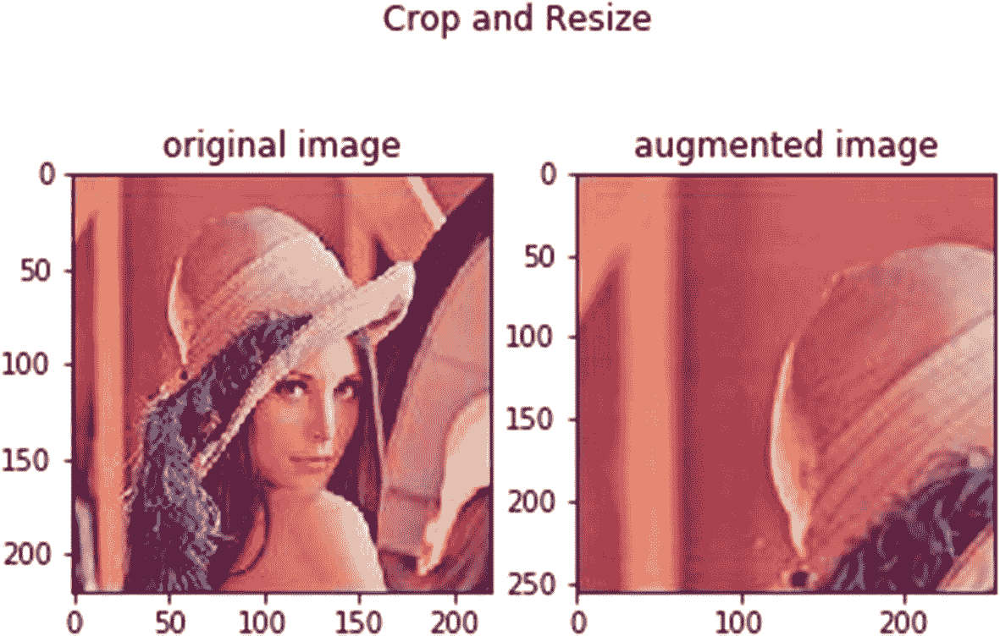

图 6-18

裁剪和调整大小图像变换的结果

### 裁剪到边界框

这是对 `crop_and_resize` 操作的基本版本，它根据边界从输入图像中提取固定大小的切片，不允许调整大小或改变长宽比（见图 6-19）。

```py
top_left = tf.image.crop_to_bounding_box(image, 10, 10, 90, 90)
show_image(image, top_left, "Crop to Bounding Box")
```

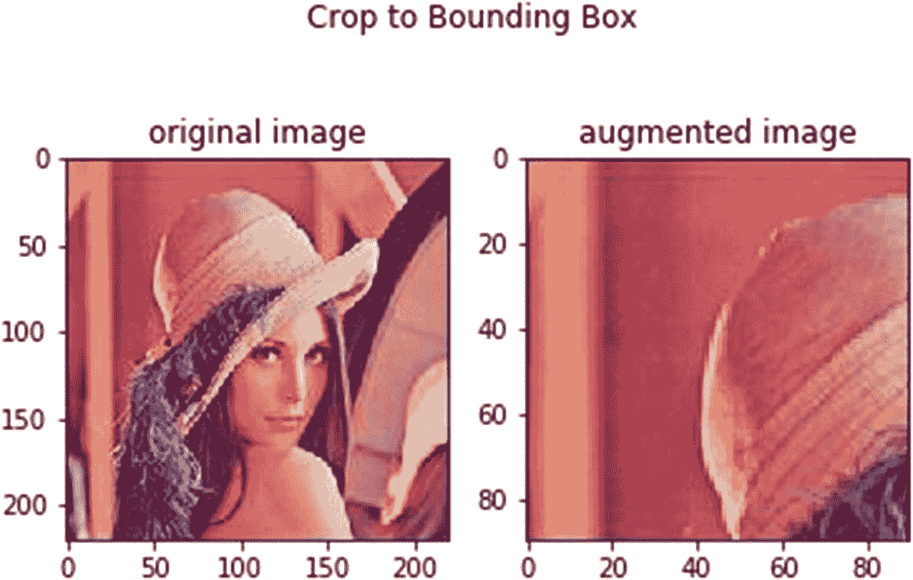

图 6-19

选择框裁剪图像变换的结果

### 翻转

翻转，这对于 CNN 去除物体的某些特征非常重要，但只能在特定的侧面进行。例如，你不想 CNN 模型学习到苹果叶只出现在观察到的基图右侧。翻转产生的图像集合与 90 度倍数的旋转不同（图 6-20 和 6-21）。

```py
flip_image = tf.image.flip_left_right(image)
show_image(image, flip_image, "Flip")
```

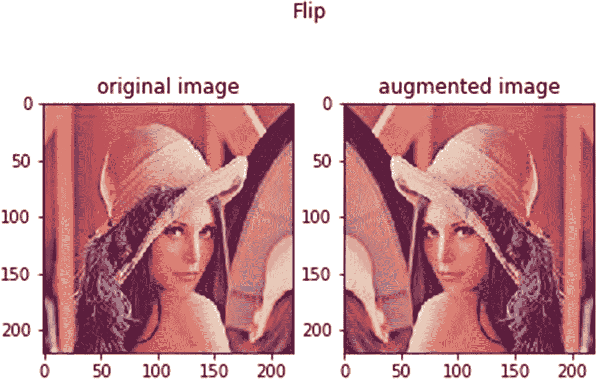

图 6-20

垂直翻转图像变换的结果

```py
flip_image = tf.image.flip_up_down(image)
show_image(image, flip_image, "Flip")
```

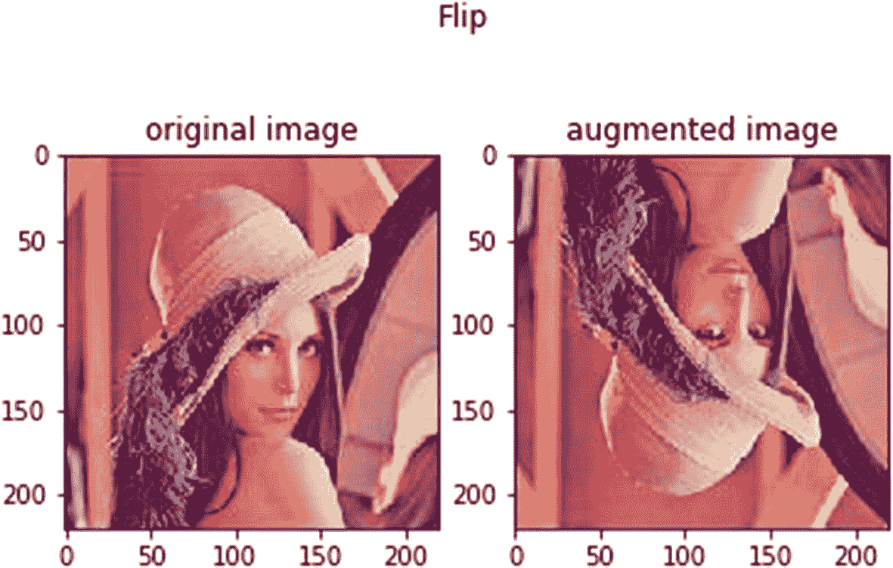

图 6-21

水平翻转图像变换的结果

1.  `random_flip_left_right()`用于随机水平翻转图像（从左到右）

1.  `random_flip_up_down()`用于随机垂直翻转图像（上下颠倒）

1.  `flip_up_down()`用于垂直翻转图像（上下颠倒）

### 旋转图像

简单来说，这个操作通过逆时针旋转图像，旋转角度由传入的弧度数决定（图 6-22）。我们可以通过`math.radians`传入弧度，它将根据角度参数计算弧度。

```py
import math
rotate_image = tf.contrib.image.rotate(image, math.radians(270))
show_image(image, rotate_image, "Rotate Image")
```

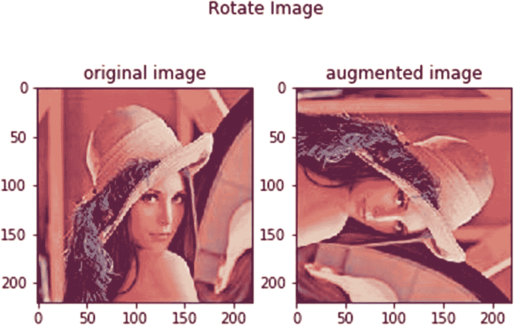

图 6-22

旋转图像变换的结果

### 平移

我们希望我们的模型能够识别图像中任何部分存在的物体。此外，物体可以部分存在于图像的角落或边缘。因此，我们将物体移到图像的各个部分（图 6-23）。

参数`translation`是一个表示`[dx, dy]`的向量，或者（如果图像的秩为 4）一个长度为`num_images`的矩阵，其中每个图像都有一个`[dx, dy]`向量。

```py
move_image = tf.contrib.image.translate(image, translations=[10, 10])
show_image(image, move_image, "Image Translation")
```

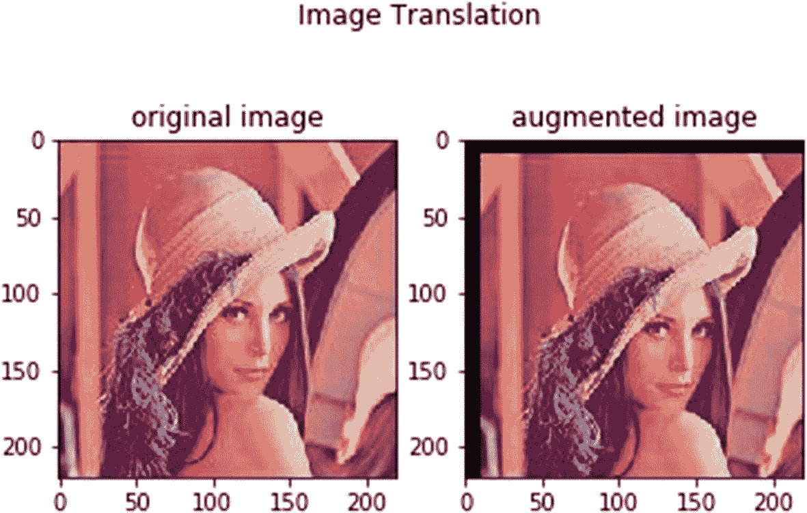

图 6-23

图像翻译的结果

### 变换

此操作可以将给定的变换矩阵应用于图像。变换矩阵是一个长度为 8 的向量，表示所需的变换（图 6-24）。

```py
theta = -0.2
transforms = [1, tf.sin(theta), 0, 0, tf.cos(theta), 0, 0, 0]
transform_image = tf.contrib.image.transform(image, transforms=transforms)
show_image(image, transform_image, "Transform Image")
```

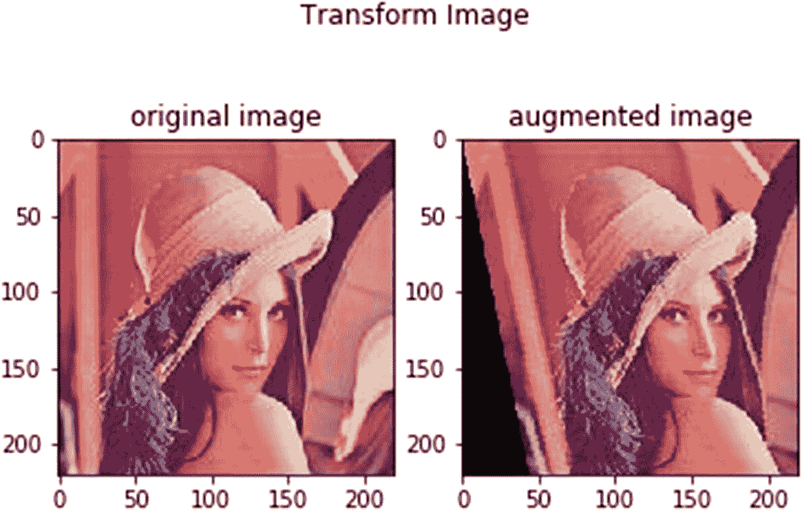

图 6-24

图像变换的结果

### 添加盐和胡椒噪声

当你的神经网络试图学习可能不实用的高频特征时，会发生过拟合。高斯噪声有效地扭曲了高频特征（图 6-25）。

```py
import numpy as np
from skimage.util import random_noise
image_array = np.asarray(image)
noise_image = random_noise(image_array, mode="gaussian", var=0.01)
show_image(image, noise_image, "Noise Image")
```

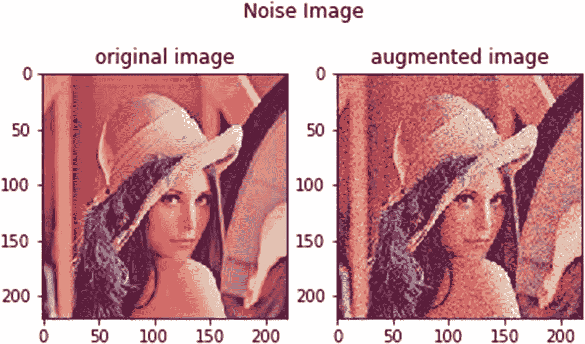

图 6-25

带有盐噪声的图像结果

这种现象的简化版本是盐和胡椒噪声，它表现为图像中随机分布的黑白像素。

### 将 RGB 转换为灰度

下面的函数可以将一个或多个图像从 RGB 转换为灰度（图 6-26）。

```py
gray_image = tf.image.rgb_to_grayscale(image)
show_image(image, tf.squeeze(gray_image), "Gray Image")
```

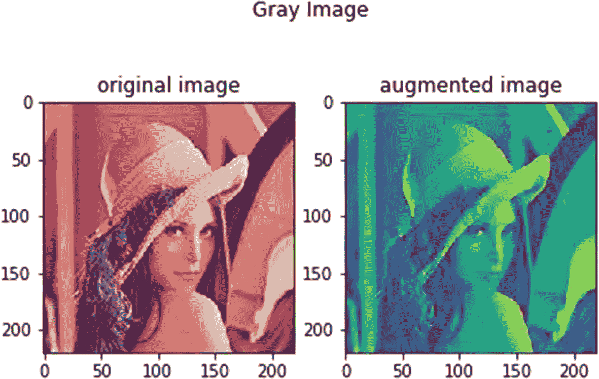

图 6-26

图像缩放转换的结果

### 改变亮度

以下函数调整 RGB 或灰度图像的亮度（图 6-27）。

```py
bright_image = tf.image.adjust_brightness(image, 0.2)
show_image(image, bright_image, "Bright Image")
```

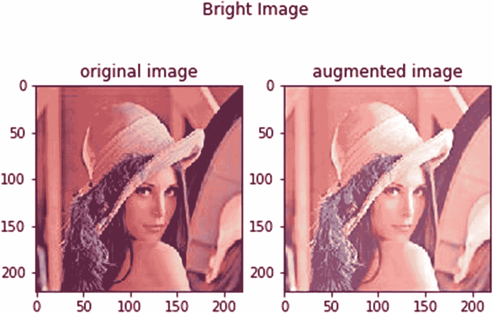

图 6-27

图像亮度变换的结果

### 调整对比度

以下函数调整 RGB 或灰度图像的对比度（图 6-28）。

```py
contrast_image = tf.image.adjust_contrast(image, contrast_factor=0.6)
show_image(image, contrast_image, "Contrast Image")
```

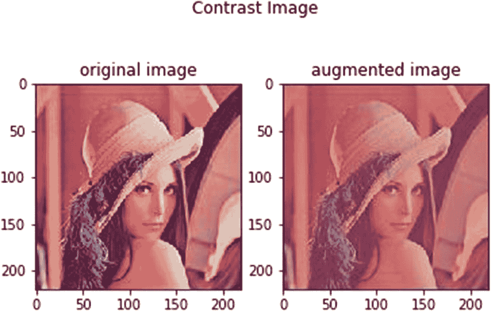

图 6-28

对比度变换的结果

### 调整色调

以下函数调整 RGB 图像的色调（图 6-29）。

```py
hue_image = tf.image.adjust_hue(image, delta=0.4)
show_image(image, hue_image, "Hue Image")
```

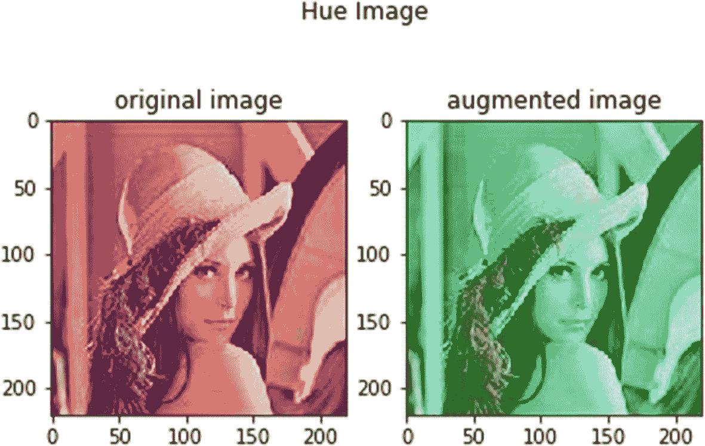

图 6-29

色调图像变换的结果

通过将图像转换为 HSV 并将色调通道（H）旋转 delta 来调整图像的色调。然后将图像转换回 RGB。delta 必须在[-1, 1]的区间内。

### 调整饱和度

通过将图像转换为 HSV 并将饱和度（S）通道乘以饱和度因子并裁剪来调整图像的饱和度。然后将图像转换回 RGB（图 6-30）。

```py
saturation_image = tf.image.adjust_saturation(image, 5)
show_image(image, saturation_image, "Saturation Image")
```

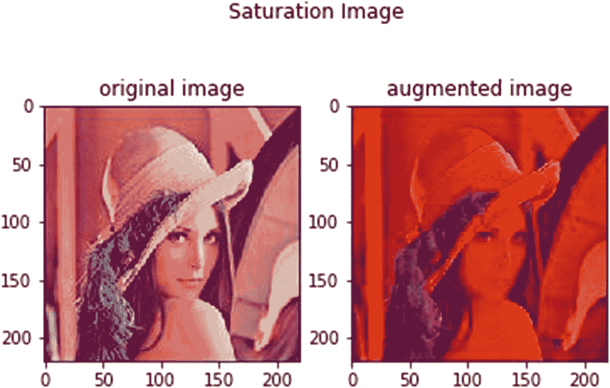

图 6-30

图像饱和度调整的结果

## 分类数据和文本数据

正如我们在前一章中讨论的那样；通常，你会发现自己在处理两种主要类型的数据：

+   数值

+   分类

数值数据，如温度、金额、使用天数或房屋号码，可以由浮点数（如 1.0、-2.3、99.99 等）或整数（如-3、9、0、1 等）组成。数据可以取的每个值与其他值有直接关系，因为它们是可比较的。换句话说，可以说值为 2.0 的特征比值为 1.0 的特征更大（实际上，是两倍）。这类数据定义明确，易于理解，具有等于、大于和小于等二元运算符。

分类数据也称为名义数据和有序数据。分类数据表示一个无法测量的属性，并在有限或无限的值集中取值，通常称为级别。

例如，天气是一个分类特征，因为它在离散集合（晴朗、多云、下雪、雨天和雾天）中取值。其他例子包括包含 URL、IP、你放入电子商务购物车中的项目、设备 ID 等特征。在这类数据上，你不能定义等于、大于和小于的二元运算符，因此，你不能对它们进行排序。

对于分类和数值值来说，布尔值是一个优点。实际上，它们可以被视为分类（特征的缺失/存在）或者，从另一方面来看，作为特征具有展示（已展示，未展示）的概率。由于许多深度学习算法不允许输入为分类数据，布尔特征通常被用来将分类特征编码为数值。

### 提示

你可以回顾第五章，它定义了数据类型。

### 数据编码

许多深度学习库要求将分类特征/列编码为整数值。尽管 Scikit-learn 中的大多数分类/回归估计量在内部将列转换为整数，但将所有数据特征/列作为整数数组提供被认为是良好的实践，以避免技术故障。

要编码分类变量，我们可以使用与之前讨论的有序特征映射类似的方法。我们需要记住，列不是有序的，并且我们分配给特定字符串标签的整数编号并不重要。因此，我们可以简单地从 `0` 开始枚举类标签：

```py
class_mapping = {label:idx for idx,label in
enumerate(np.unique(titanic_df.Sex))}
class_mapping
# Output
# {'female': 0, 'male': 1}
```

接下来，我们可以使用映射字典将分类特征或列（图 6-31）转换为整数：

```py
titanic_df['Sex'] = titanic_df['Sex'].map(class_mapping)
titanic_df['Sex'].head()
```

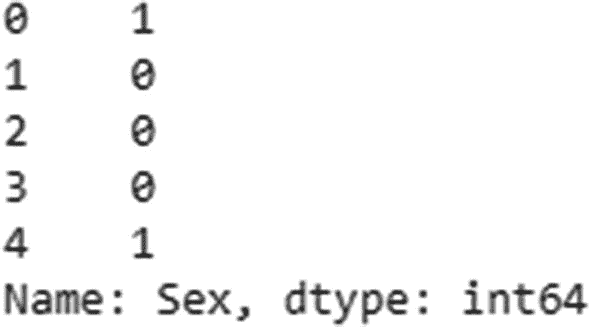

图 6-31

分类转换的结果

我们可以按照以下方式反转映射字典中的键值对，将转换后的类标签映射回原始字符串表示（图 6-32）：

```py
inv_class_mapping = {v: k for k, v in class_mapping.items()}
titanic_df['Sex'] = titanic_df['Sex'].map(inv_class_mapping)
titanic_df['Sex'].head()
```

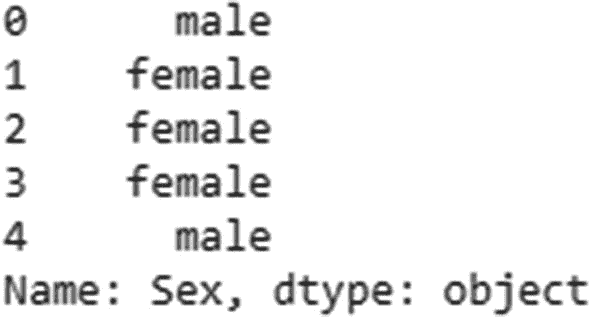

图 6-32

分类逆转换的结果

或者，Scikit-learn 中直接实现了一个方便的 `LabelEncoder` 类，以实现相同的功能：

```py
from sklearn.preprocessing import LabelEncoder
gender_le = LabelEncoder()
titanic_gender = gender_le.fit_transform(titanic_df.Sex)
titanic_gender[0:10]
# Outputs
# array([1, 0, 0, 0, 1, 1, 1, 1, 0, 0])
```

### 注意

`fit_transform` 方法只是调用 fit 和 transform 分别的一个快捷方式。

并且 `classes_` 属性显示了在编码之前实际分类列所属的类别：

```py
gender_le.classes_
# Outputs
# array(['female', 'male'], dtype=object)
```

### 对名义特征执行 One-Hot 编码

在上一节中，我们使用简单的字典映射方法将有序尺寸特征转换为整数。由于 Scikit-learn 估计量将无序的类标签视为类标签，我们使用了方便的 `LabelEncoder` 类将字符串标签编码为整数。看起来我们可以使用类似的方法来转换数据集的命名性别列，如下所示：

```py
from sklearn.preprocessing import LabelEncoder
gender_le = LabelEncoder()
titanic_gender = gender_le.fit_transform(titanic_df.Sex)
titanic_gender[0:10]
# Outputs
# array([1, 0, 0, 0, 1, 1, 1, 1, 0, 0])
```

执行前面的代码后，NumPy 数组 *X* 的第一列现在持有新的性别值，这些值已按代码单元格输出所示编码。

如果我们到此为止并将数组输入到我们的模型中，我们将犯处理分类数据中最常见的错误之一。

### 你能找到问题吗？

尽管性别值没有特定的顺序，但学习算法现在将假设男性大于女性。尽管这个假设是不正确的，但算法仍然可以产生有用的结果。然而，这些结果可能不是最优的。

对于这个问题的一个常见解决方案是使用一种称为 one-hot 编码的技术（图 6-33）。这种方法的背后思想是为名义特征列中的每个唯一值创建一个新的虚拟特征。在这里，我们将性别特征转换为两个新的特征：男性和女性。二元值可以用来表示样本的特定性别；例如，一个男性样本可以编码为 `male=1, female=0`。为了执行这种转换，我们可以使用 `sklearn.preprocessing` 模块中实现的 `OneHotEncoder`：

```py
from sklearn.preprocessing import OneHotEncoder
gender_ohe = OneHotEncoder()
titanic_gender_ohe = gender_ohe.fit_transform(pd.DataFrame(titanic_gender))
titanic_gender_ohe[0:10]
# Outputs
# ' with 10 stored elements in Compressed Sparse Row format>
```

当我们初始化 `OneHotEncoder` 时，我们通过 `categorical_features` 参数定义了我们想要转换的变量的列位置。默认情况下，当我们使用 transform 方法时，`OneHotEncoder` 返回一个稀疏矩阵，我们通过 `toarray` 方法将其稀疏矩阵表示转换为常规（*密集*）NumPy 数组，以便进行可视化。

### 注意

颜色是特征矩阵 X 的第一列。稀疏矩阵是存储大型数据集的一种更有效的方式，并且许多 Scikit-learn 函数都支持它，这对于其中包含大量零的情况尤其有用。为了省略 `toarray` 步骤，我们可以将编码器初始化为 `OneHotEncoder(...,sparse=False)` 以返回一个密集的 NumPy 数组。

通过使用 pandas 中实现的 `get_dummies` 方法，创建那些**虚拟**特征的一个更加方便的方式是对其进行 one-hot 编码。应用于 `DataFrame`，`get_dummies` 方法只会转换字符串列，并保留所有其他列不变：

```py
pd.get_dummies(titanic_df.Sex).head()
```

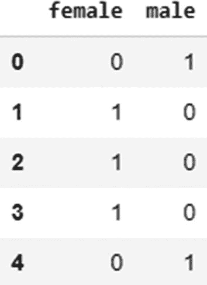

图 6-33

one-hot 编码转换的结果

### 一种特殊类型的数据：文本

让我们介绍另一种类型的数据。文本在网络上经常被使用；你几乎可以看到每个网站都有表单，社交媒体充满了像 *帖子* 和 *评论* 这样的文本数据。文本也被用作深度学习算法的输入，因为它包含了我们语言中数据的自然表示。它如此丰富，以至于它还包含了我们正在寻找的答案。

处理文本时最常用的算法是使用词袋模型。根据这个算法，每个单词都成为一个特征，文本成为一个包含所有特征（即单词）在主体中非零元素的向量。给定一个文本数据集，*特征的数量是多少？* 这很简单。只需提取其中的所有唯一单词并对它们进行编号。对于一个使用所有英语单词的丰富文本，这个数字大约是 600,000。如果你不打算进一步处理它（移除*第三人称*、*缩写*、*缩写词*和*首字母缩略词*），你可能会发现自己要处理比这更多的内容，但这是一种非常罕见的情况。在本书所针对的简单直接的方法中，我们只是让 Python 尽其所能。

本节中使用的数据集是文本数据；它是著名的 20newsgroup（更多关于这个的信息，请访问 20Newsgroups ([`http://qwone.com/~jason/20Newsgroups/`](http://qwone.com/~jason/20Newsgroups/))）。这是一个大约包含*20,000*篇文档的集合，这些文档属于 20 个新闻组的主题。它是处理文本分类和聚类时最常用（如果不是最常用）的数据集之一。为了导入它（图 6-34），我们将只使用它的受限子集，其中包含所有科学主题（医学和空间）：

```py
from sklearn.datasets import fetch_20newsgroups
categories = ['sci.med', 'sci.space']
twenty_sci_news = fetch_20newsgroups(categories=categories)
```

### 注意

第一次运行此命令时，它会自动下载数据集并将其放置在`$HOME/scikit_learn_data/20news_home/`默认目录中。

```py
print(twenty_sci_news.data[0])
```

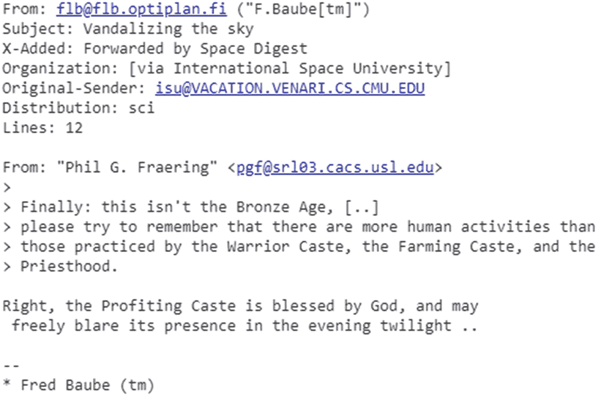

图 6-34

加载 20newsgroups 数据集的结果

处理文本的最简单方法是将数据集的主体转换为一系列单词。这意味着对于每个文档，将计算特定单词在主体中出现的次数。

例如，让我们创建一个小型、易于处理的数据集：

+   `doc_1`: 我们热爱机器学习。

+   `doc_2`: 机器学习很棒。

在整个数据集中，包含`doc_1`和`doc_2`，只有六个不同的单词：we、love、machine、learning、is 和 great。给定这个数组，我们可以将每个文档与一个特征向量关联起来：

```py
feature_doc_1 = [1 1 1 1 0 0]
feature_doc_2 = [0 0 1 1 1 1]
```

注意，我们正在丢弃单词的位置，只保留单词在文档中出现的次数。仅此而已。

在`20newsletter`数据集中，使用 Python，这可以简单地完成：

```py
print (twenty_sci_news.target[0])
# Outputs
# 1
print (twenty_sci_news.target_names[twenty_sci_news.target[0]])
# Outputs
# sci.space
```

首先，我们实例化一个`CountVectorizer`对象。然后，我们调用方法来计算每个文档中的术语数量并为每个文档生成一个特征向量，即`fit_transform`。然后我们可以查询矩阵的大小。

### 注意

输出矩阵是稀疏的，因为对于每个文档来说，只有有限的选择性单词是很常见的（因为每行的非零元素数量非常低，存储所有冗余的零没有意义）。

无论如何，输出形状是`(1187, 25638)`。第一个值是数据集中的观测数（文档数），而后者是特征数（数据集中唯一单词的数量）。在`CountVectorizer`转换后，每个文档都与它的特征向量相关联（图 6-35）。让我们看看第一个文档。

```py
from sklearn.feature_extraction.text import CountVectorizer
count_vect = CountVectorizer()
word_count = count_vect.fit_transform(twenty_sci_news.data)
word_count.shape
# Outputs
# (1187, 25638)
print (word_count[0])
```

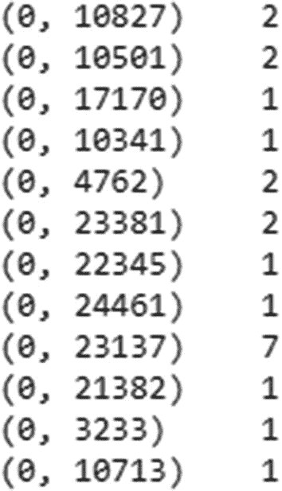

图 6-35

计数向量化数据集的结果

你可能会注意到输出是一个稀疏向量，其中只存储非零元素。为了检查与单词的直接对应关系（图 6-36），只需尝试以下代码：

```py
word_list = count_vect.get_feature_names()
for n in word_count[0].indices:
print ('Word "%s" appears %i times' % (word_list[n], word_count[0, n]))
```

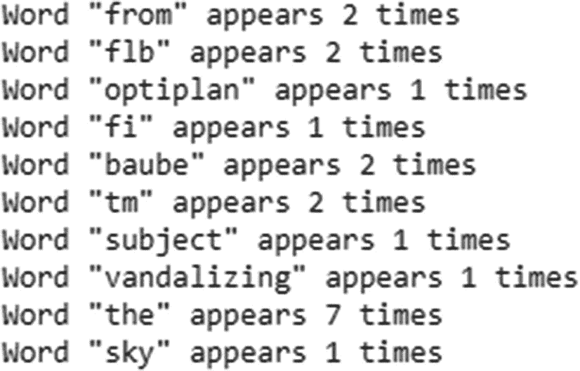

图 6-36

使用计数向量化转换的数据

### 到目前为止，一切都很顺利，不是吗？

让我们继续前进到另一个更具复杂性和有效性的任务。计数单词是好的，但我们可以通过更多的复杂性从数据中获得更多信息。让我们计算它们的频率。这是一个可以跨不同大小的数据集进行比较的度量。它给出了一个想法，即一个单词是否是停用词（即非常常见的单词，如 a、an、the 或 is）或罕见的、独特的单词。通常，这些单词是最重要的，因为它们能够表征一个实例以及基于这些单词的特征，这些特征在学习过程中非常具有判别性。为了检索每个文档中每个单词的频率，我们使用`TfidfVectorizer`来计算频率矩阵（图 6-37）；尝试以下代码：

```py
from sklearn.feature_extraction.text import TfidfVectorizer
tf_vect = TfidfVectorizer(use_idf=False, norm="l1")
word_freq = tf_vect.fit_transform(twenty_sci_news.data)
word_list = tf_vect.get_feature_names()
for n in word_freq[0].indices:
print ('Word "%s" has frequency %0.3f' % (word_list[n], word_freq[0, n]))
```

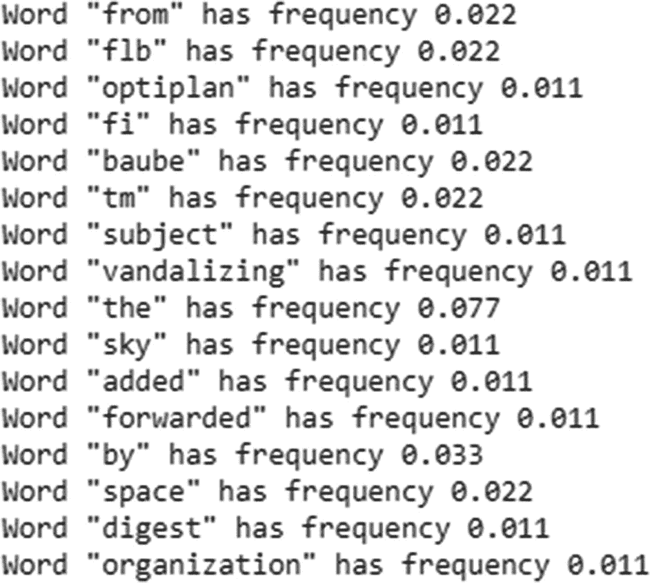

图 6-37

使用 Tfidf Vectorizer 转换的数据

频率的总和是 1（或由于近似而接近 1）。这是因为我们选择了 L1 范数。在这种情况下，单词频率是一个概率分布函数。有时，增加罕见词和常见词之间的差异是件好事。在这种情况下，你可以使用 L2 范数来归一化特征向量。

将文本数据向量化的一种更有效的方法是使用`Tfidf`。简而言之，你可以将构成文档的单词的词频乘以该单词自身的逆文档频率（即它在文档中出现的次数，或其对数缩放变换）。这对于突出描述每个文档且在数据集中具有强大判别元素的单词非常有用。

`Tfidf`自从计算机开始处理和挖掘文本数据以来获得了很大的流行。大多数搜索引擎和信息检索软件主要使用它来有效地衡量句子相似性和距离，使其成为从用户输入的文本搜索查询中检索文档的优选解决方案。

```py
from sklearn.feature_extraction.text import TfidfVectorizer
tfidf_vect = TfidfVectorizer()
word_tfidf = tfidf_vect.fit_transform(twenty_sci_news.data)
word_list = tfidf_vect.get_feature_names()
for n in word_tfidf[0].indices:
print ('Word "%s" has tf-idf %0.3f' % (word_list[n], word_tfidf[0, n]))
```

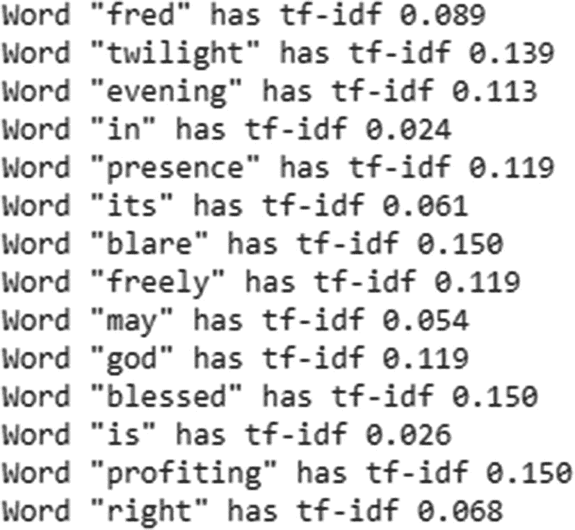

图 6-38

tfidf 变换后的数据

在这个例子中，第一篇文档中信息量最大的四个词是`caste, baube, flb`和`tm`（它们有最高的 tf-idf 分数）。这意味着它们在文档中的词频很高，而它们在其余文档中相对罕见。从信息理论的角度来看，它们在文档中的熵很高，而考虑到所有文档，它们的熵较低。

到目前为止，对于每个单词，我们已经生成了一个特征。**那么，将几个单词放在一起会怎样呢？**

这正是当你考虑二元组而不是单语素时发生的情况。使用二元组（或泛指 n-gram），一个词的存在或不存在——以及它的邻居——都很重要（也就是说，它附近的词及其排列）。当然，你可以混合单语素和 n-gram，并为每个文档创建一个丰富的特征向量。在一个简单的例子中，让我们测试一下 n-gram 是如何工作的：

```py
text_1 = 'we love data science'
text_2 = 'data science is hard'
documents = [text_1, text_2]
count_vect_1_grams = CountVectorizer(ngram_range=(1, 1), stop_words=[], min_df=1)
word_count = count_vect_1_grams.fit_transform(documents)
word_list = count_vect_1_grams.get_feature_names()
print ("Word list = ", word_list)
print ("text_1 is described with", [word_list[n] + "(" + str(word_count[0, n]) + ")" for n in word_count[0].indices])
# Outputs
# Word list =  ['data', 'hard', 'is', 'love', 'science', 'we']
# text_1 is described with ['we(1)', 'love(1)',
#            'data(1)', 'science(1)']
count_vect_1_grams = CountVectorizer(ngram_range=(2, 2))
word_count = count_vect_1_grams.fit_transform(documents)
word_list = count_vect_1_grams.get_feature_names()
print ("Word list = ", word_list)
print ("text_1 is described with", [word_list[n] + "(" + str(word_count[0, n]) + ")" for n in word_count[0].indices])
# Outputs
# Word list =  ['data science', 'is hard',
#                  'love data', 'science is', 'we love']
# text_1 is described with ['we love(1)',
#                  'love data(1)', 'data science(1)']
count_vect_1_grams = CountVectorizer(ngram_range=(1, 2))
word_count = count_vect_1_grams.fit_transform(documents)
word_list = count_vect_1_grams.get_feature_names()
print ("Word list = ", word_list)
print ("text_1 is described with", [word_list[n] + "(" + str(word_count[0, n]) + ")" for n in word_count[0].indices])
# Outputs
# Word list =  ['data', 'data science', 'hard',
#                   'is', 'is hard', 'love', 'love data',
#                   'science', 'science is', 'we',
#                   'we love']
# text_1 is described with ['we(1)', 'love(1)',
#                   'data(1)', 'science(1)', 'we love(1)',
#                   'love data(1)', 'data science(1)']
```

之前的例子非常直观，结合了我们之前讨论的前两个算法。在这个代码单元中，我们使用了`CountVectorizer`，但这个算法与`TfidfVectorizer`非常常见。

### 注意

当你使用 n-gram 时，特征的数量呈指数级增长。

如果你数据集中的特征太多（富文本数据）（字典可能太丰富，可能有太多的 n-gram，或者计算机可能有限），你可以使用一个降低问题复杂性的技巧（但你应该首先评估性能/复杂性的权衡）。

常见的是使用哈希技巧，其中许多单词（或 n-gram）被哈希，并且它们的哈希值发生冲突（这形成了一个词的桶）。桶是语义上不相关的词的集合，但它们的哈希值发生冲突。正如以下示例中所示，使用`HashingVectorizer()`，你可以决定你想要的单词桶的数量。当然，生成的矩阵反映了你的设置：

```py
from sklearn.feature_extraction.text import HashingVectorizer
hash_vect = HashingVectorizer(n_features=1000)
word_hashed = hash_vect.fit_transform(twenty_sci_news.data)
word_hashed.shape
# Outputs
# (1187, 1000)
```

### 注意

你不能逆转哈希过程（因为它是一个不可逆的摘要过程）。

在这个变换之后，你将不得不直接处理哈希特征。哈希提供了相当多的优势：

+   允许快速将词袋转换为特征向量

    +   哈希桶是我们在这个情况下的特征。

+   容易地容纳数据集中从未见过的单词

+   通过将无关的词组合在同一特征中避免过拟合

### 分词、词干提取和停用词

#### 分词和分词是什么？

**分词**意味着将你的文本分割成最小的有意义的单元。这是任何处理之前的必经步骤。它是将字符串序列分解成单词、关键词、短语、符号和其他称为*标记*的元素的行为。

**标记**可以是单个单词、短语，甚至是整个句子。这实际上就是分词的全部内容，

我们需要讨论这个问题，但我们应该从飞行的摄像机的角度来放大视野，看看会发生什么。这个摄像机将使我们能够看到什么是*词法分析、lexing*或*分词*；这是将字符序列（例如计算机程序或网页中的字符序列）转换为标记序列的过程。

执行词法分析的程序可能被称为 lexer、tokenizer 或 scanner，尽管 scanner 也是 lexer 的第一阶段的术语。

我们多次提到了单词*lexer*。所以，问题是，什么是 lexer？或者更严谨地说，什么是*lexeme*？Lexeme 是源程序中与标记模式匹配的字符序列，并被词法分析器识别为该标记的一个实例。但我们并没有真正以严谨的形式回答“*什么是标记？*”这个问题。标记是一个具有指定和因此被识别的意义的字符串；它由一个标记名称和一个可选的标记值组成的对结构。标记名称是词汇单元的类别，常见的标记名称有：

+   *标识符*：程序员选择的名称

+   *关键字*：编程语言中已经存在的名称

+   *分隔符*（也称为标点符号）：标点符号和成对的分隔符。

+   *运算符*：对参数进行操作并产生结果的符号

+   *字面量*：数字、逻辑、文本、引用字面量

+   *注释*：行，块

在本书的范围内，这些名称并不重要，但我们试图给你一些关于分词基础的信息。然而，我们并不手动完成所有这些；我们将看到一些 Python 包，它们可以帮助我们轻松地进行**分词**和**词干提取**。现在，让我们通过一个例子来更好地了解它。

*输入*：朋友们，罗马人，同胞们，借给我你的耳朵。

*输出*：（朋友们），（罗马人），（同胞们），（借给我），（你的），（耳朵）。

**XML 输出**：

```py
Friends
Romans
Countrymen
lend
me
your
ears

```

在我们看过这个例子之后，我认为我们对分词有了很好的理解。但在我们进入例子之前，我们将看到一个新术语，称为*词干提取*。所以，问题来了，什么是词干提取？

**词干提取**是指将单词缩减到其词根形式。在执行自然语言处理任务时，你将遇到各种场景，在这些场景中，你会发现具有相同词根的不同单词。

例如，“*compute, computer, computing, computed.*”你可能希望将单词缩减到其词根形式以保持一致性。这就是词干提取发挥作用的地方。现在我们可以看到词干提取是什么，但词干提取和词形还原（表 6-1）之间的区别是什么？

表 6-1

词干提取和词形还原的区别

| 词干提取 | 词形还原 |
| --- | --- |
| 词干提取是将单词的屈折形式还原为其词根形式的过程，例如将一组单词映射到相同的词干，即使词干本身在语言中不是一个有效的单词。 | 词形还原与词干提取不同，它正确地减少了屈折词，确保根词属于该语言。在词形还原中，根词是词元。词元（复数为 lemmas 或 lemmata）是一组单词的规范形式、词典形式或引用形式。 |
| **示例**`Word`               `Porter Stemmer``friend             friend``friendship         friendship``friends            friend``friendships        friendship` | **示例**`Word`                `Lemma``He                  He``was                 wa``running             running``and                 and``eating              eating``at                  at` |

NLTK 中的词干提取器示例有*Porter 词干提取器*和*Snowball 词干提取器*。它们都使用不同的算法实现。

让我们快速简单地看看这两个词干提取器。

Porter 词干提取算法是一个去除英语单词后缀的过程；例如，我们将取一个单词并尝试获取其词干值，

```py
E.g: Connected - > connect
Connecting - > connect
Connector - > connect
Connection - > connect
```

制作 Porter 词干提取器的规则：

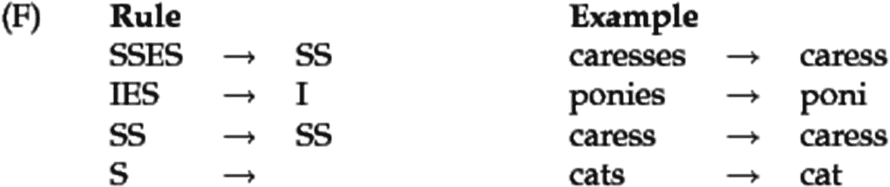

这是 NLTK 的基础，你可以在[`www.nltk.org/`](http://www.nltk.org/)了解更多信息。现在我们获取短语（标记）中的基本单词及其词根。让我们谈谈停用词。停用词是不包含重要意义的单词，不应用于搜索查询。通常，这些单词会从搜索查询中过滤掉，因为它们会返回大量不必要的信息。每种编程语言都会提供自己的停用词列表。它们大多是英语中常用的单词，如“as, the, be, are”等。

我们将在下一阶段开始介绍词袋算法和自然语言处理中的 IR 算法，如 tf-idf。

#### 词袋（BoW）模型

##### 什么是 BoW？

我们可能想要对文档进行分类，因此每个文档都是一个“输入”，而类标签则是我们预测算法的“输出”。算法以数字向量作为输入；因此，我们需要将文档转换为固定长度的数字向量。那么在机器学习算法中我们如何实现这一点是不可能的，因此我们需要一个模型，该模型在机器学习中考虑文本文档，丢弃单词中的所有顺序信息，并关注文档中单词的出现。这个 BoW 是我们执行此任务非常高效所需的内容。我们知道 BoW 的定义以及如何使用它。让我们看看它在技术层面上是如何工作的。

词袋模型可以通过为每个单词分配一个唯一的数字来实现。然后，我们看到的任何文档都可以编码为一个具有已知词汇表长度的固定长度向量。向量中每个位置上的值可以是编码文档中每个单词的计数或频率。我们只关心表示哪些单词在编码文档中存在或它们存在的程度的编码方案，而不涉及任何关于顺序的信息。

让我们通过一个例子来更好地理解词袋模型：

1.  约翰喜欢看电影。玛丽也喜欢看电影。

1.  约翰还喜欢看足球比赛。

基于这两篇文本文档，为每个文档构建以下列表：

```py
#1 "John", "likes", "to", "watch", "movies", "Mary", "likes", "movies", "too"
#2 "John", "also", "likes", "to", "watch", "football", "games"
```

将每个词袋表示为 JSON 对象：

```py
BoW1 = {"John":1,"likes":2,"to":1,"watch":1,"movies":2,"Mary":1,"too":1};
BoW2 = {"John":1,"also":1,"likes":1,"to":1,"watch":1,"football":1,"games":1};
```

现在看看当我们有一个新文档如下时会发生什么：

1.  约翰喜欢看电影。玛丽也喜欢看电影。约翰还喜欢看足球比赛。

因此，现在我们应该取 BoW3=BoW1 BoW2 的并集，这样我们就会看到输出：

```py
BoW3 = {"John":2,"likes":3,"to":2,"watch":2,"movies":2,"Mary":1,
"too":1,"also":1,"football":1,"games":1}
```

在我们完成本节之后，我们将尝试为您准备下一章 8，其中介绍了特征提取。在那里，您将学习如何准备您的数据并了解您拥有的数据信息。这一点将在下一章中变得更加明显。

## 摘要

我们在本章开头定义了什么是数据管道，并在之后详细说明了数据清洗在管道中的位置，然后给出了你需要清洗数据集的充分理由。

之后，我们研究了确保我们正确处理缺失数据的有用技术。在我们将数据馈送到深度学习算法之前，我们还需要确保正确编码分类变量，并且我们已经看到了如何将有序和名义特征值映射到整数表示。

最后，我们进行了一个案例研究，讨论了如何将本章从泰坦尼克号数据集中学到的知识应用于准备、清理和使其为管道下一步准备好的过程。

# 7. 数据重采样

在统计学中，重采样是从原始数据中重复抽取样本的方法。因此，我们可以说*重采样方法*是从现代统计学中借用的一种工具。这些方法涉及从训练集中重复抽取样本，并在每个样本上训练模型，以获取有关模型的其他信息。

例如，我们可以估计感兴趣模型学习的可变性。我们可以从训练数据中抽取不同的样本，然后每次在给定的样本上训练模型时，我们检查结果之间的差异。这种方法可能使我们能够获得如果我们只使用所有训练数据集一次训练模型时无法获得的信息。

使用重采样方法可能会因计算能力而变得昂贵和昂贵，特别是如果你考虑这些方法多次使用不同的训练数据集子集来训练相同的模型。但如今计算机能力已经增长，这些方法的要求并非不可能。

在本章中，我们将介绍数据重采样中最常用的两种方法：**交叉验证**和**自助法**。这两种方法都非常重要，在许多实际应用中广泛使用，并且是任何机器学习流程的必要部分。例如，**交叉验证**可以用来估计来自训练模型的误差，以检查和评估其性能，或者选择所谓的灵活性水平。**自助法**通常用于给出训练中使用的模型参数的准确性。

+   **注意**：评估模型性能的过程称为**模型评估**。

+   **注意**：选择最佳灵活性水平的过程称为**模型选择**。

## 创建训练集和测试集

当数据集足够大时，将其分为训练集和测试集是一个好习惯；前者用于训练模型，后者用于测试其性能。

你可能会想知道为什么从一开始就要这样做。将数据分为**训练**和**测试**集是评估数据挖掘模型的重要部分。通常，当你将数据集分为训练集和测试集时，大部分数据用于训练，而一小部分数据用于测试。

本章我们将讨论的方法的主要责任是随机采样数据，以确保测试集和训练集相似。通过使用相似的数据进行训练和测试，你可以最小化数据差异的影响，更好地理解模型的特性。

模型经过训练集处理后，通过在测试集上进行预测来测试模型。因为测试集中的数据已经包含了你想要预测的属性的已知值，所以很容易确定模型的猜测是否正确。

总结来说，执行此类操作有两个主要规则：

+   两个数据集都必须反映原始分布。

+   在分割阶段之前，原始数据集必须随机打乱，以避免后续元素之间的相关性。

## 交叉验证

在前一章中，我们说明了**测试错误率**和**训练错误率**之间的区别。使用某种模型预测新观察结果的输出而产生的错误称为**测试错误率**。

你可以看到：

+   **越低**的测试错误率，模型就越好。

+   **越高**的比率，模型就越差。

### 注意

不要忘记测试集**没有**用于训练模型。

训练错误率可以通过将模型应用于其训练中使用的数据集来轻松计算。但是，你会注意到这个错误率通常与测试错误率不同，并且更低，它不是模型的好度量，因为它可能会低估真正的准确性。

由于我们希望对测试错误率有一个良好的估计，我们需要一个大的测试集。但是，如果你无法获得大量的测试数据集怎么办？这里有一些方法可以用来估计测试错误率，使用训练数据集。在下一节中，我们将考虑一种方法，该方法通过保留训练数据的一个小部分来估计测试错误率，并且不在这个子集上训练模型；然后它使用模型来预测这些子集输出。

### 验证集技术

验证集技术是一种用于估计与在数据集上训练模型相关的测试错误率的非常简单的技术。它涉及将可用的训练集随机划分为两部分：一个*训练集*和一个*验证集*（有时称为*保留集*）。模型在*训练数据部分*上训练；训练完成后，模型用于预测验证集中观察值的响应/输出，从而提供了一个测试错误率的估计（图 7-1）。

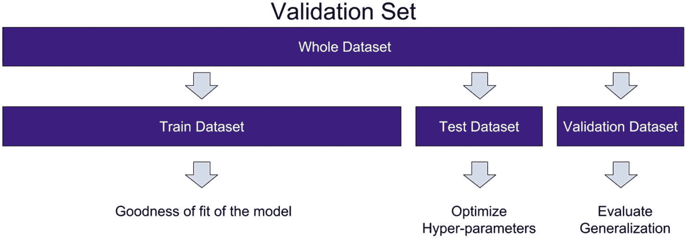

图 7-1

验证集如何工作的战略视角

我们可以开始的第一件事是加载本章中我们将要使用的数据集，即鸢尾花数据集，我们在前一章中介绍过。然后我们创建两个变量：一个用于输入特征，另一个用于目标/输出特征。

### 注意

鸢尾花数据集作为预加载的数据集包含在 sklearn 包的 datasets 模块中。

```py
from sklearn import datasets
iris = datasets.load_iris()
print('X shape: {}, y shape: {}'.format(iris.data.shape, iris.target.shape))
# Output
# X shape: (150, 4), y shape: (150, )
```

在将数据集加载到`X`和`y`变量之后，我们还打印了这两个变量的形状。现在是时候采样数据，选择将进入训练集和验证集/测试集的点。

因此，我们从`sklearn.model_selection`模块导入`train_test_split`函数，该函数将数据划分为训练和测试部分。

```py
from sklearn.model_selection import train_test_plit
```

然后，我们使用它将`X`和`y`都划分为训练`X, y`（将被称为`X_train, y_train`）和测试`X, y`集合（将被称为`X_test, y_test`）。

### 注意

训练集将等于整个数据集的 60%，测试集将等于整个数据集的 40%。

```py
X_train, X_test, y_train, y_test = train_test_split(iris.data, iris.target, test_size=0.4, random_state=47)
```

在完成划分操作并从采样操作中创建所有集合之后，让我们打印出所有集合的形状，以查看划分操作的百分比。正如我们配置的那样，训练数据有 90 个观察值，总共 150 个观察值，这意味着 60%的数据；测试集有 60 个观察值，这意味着它等于整个数据集的 40%。

```py
print('# Train => X shape: {}, y shape: {}'.format(X_train.shape, y_train.shape))
print('# Test  => X shape: {}, y shape: {}'.format(X_test.shape, y_test.shape))
# Output
# # Train => X shape: (90, 4), y shape: (90, )
# # Test  => X shape: (60, 4), y shape: (60, )
```

现在，我们需要创建验证集，因为我们没有任何可以在一步中创建所有训练、验证和测试集的函数。我们需要执行与测试集相同的数据划分步骤，但这次我们希望将 40%的数据划分为 20%用于测试和 20%用于验证，因此我们将测试集分成两半。在下面的代码中，我们将测试集划分为 50%的测试集和 50%的验证集。

```py
X_test, X_valid, y_test, y_valid = train_test_split(X_test, y_test, test_size=0.5, random_state=47)
```

在我们再次划分之后，我们打印出所有集合以确保我们处于正确的位置。正如您所看到的，我们没有触及训练集，训练集中的 90 个观测值保持未变，而测试集现在变成了 30 个观测值而不是 60 个，还有一个包含 30 个观测值的验证集。

```py
print('# Train => X shape: {}, y shape: {}'.format(X_train.shape, y_train.shape))
print('# Test  => X shape: {}, y shape: {}'.format(X_test.shape, y_test.shape))
print('# Valid => X shape: {}, y shape: {}'.format(X_valid.shape, y_ valid.shape))
# Output
# # Train => X shape: (90, 4), y shape: (90, )
# # Test  => X shape: (30, 4), y shape: (30, )
# # Valid => X shape: (30, 4), y shape: (30, )
```

模型应该在训练集上训练，学习过程（训练）完成后，模型用于预测验证集中观测值（输入行）的输出（响应）。得到的验证集错误率应该是测试错误率的估计。验证集方法在概念上简单且易于实现，但它有两个潜在的缺点：

+   验证集提供的测试错误率估计可能**高度可变**，这取决于选择哪些观测值进入训练集和测试集的过程。

+   验证集提供的测试错误率估计可能会高估测试错误率。这是因为我们取训练集和/或测试集的一个子集作为验证集，这使得集合规模减小，这意味着模型可能由于训练观测值的减少而表现得更差。

因此，在下一个方法中，我们将介绍验证集的升级版，称为**交叉验证**；这种方法特别旨在解决刚才提到的两个问题。

### 留一法交叉验证（LOOCV）

LOOCV 与验证集非常相似，执行相同的任务，但它被创建出来是为了解决验证集的缺点。

与验证集类似，LOOCV 将数据集分为两部分。然而，验证集只包含一个观测（数据集的一个点）。让我们考虑这个点/观测是 (*x*[1]，*y*[1])，并且这个点被用作验证集，而所有其他观测 {(*x*[2]，*y*[2])，…，(*x*[*n*]，*y*[*n*])} 都被用作训练模型（作为训练集）。现在模型从训练集中的 n-1 个观测中学习，并在仅一个观测上验证其学习过程。我们预测 y1 对 x1，因为 (*x*[1]，*y*[1]) 没有用于学习过程（训练模型），并且使用的度量包含了对我们描述为 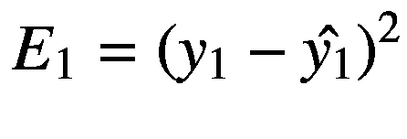 的第一个点 (*x*[1]，*y*[1]) 的误差，对于回归，以及 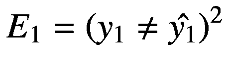 对于分类。

现在我们几乎提供了一个无偏的测试错误估计。尽管这个误差项是无偏的，但它仍然是一个较差的估计，因为它高度可变；你可以感觉到这一点，因为我们只使用一个观测（*x*[1]，*y*[1]）来验证我们的模型知识。

如果我们想解决这个问题，我们可以简单地通过选择 (*x*[2]，*y*[2]) 作为验证集，并将所有其他观测作为训练集来重复同样的过程。我们在 n-1 个其他观测上训练我们的模型，并计算验证点 *x*[2] 的 *E*[2]。我们再次对 (*x*[3]，*y*[3]) 进行操作，训练模型，验证，并产生 *E*[3]。我们再次对 (*x*[4]，*y*[4]) 进行操作，并产生 *E*[4]，并对其所有数据点/观测进行 N 次操作以产生 *N* 个误差，*E*[1]，…，*E*[*n*]。现在 LOOCV 对测试错误的估计是这些 *N* 个验证集错误率的平均值。

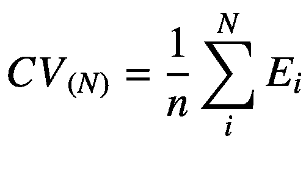

如我们所见，LOOCV 有一些优势，这些优势在验证集方法中是不存在的：

+   LOOCV（留一法）相较于验证集具有更少的偏差，因为我们反复在 *n* - 1 个数据观测上训练模型（这几乎涵盖了整个数据集）。在验证集方法中并不会发生这种情况；在验证集方法中，我们取整个数据集的一个子集作为验证集，并在其他数据子集上训练模型。因此，LOOCV 方法往往不会像验证集方法那样高估测试错误率。

+   每次运行 LOOCV 都会产生相同的结果；与验证集方法不同，训练-测试分割中没有随机性。LOOCV 重复地将每个数据点作为验证集一次，并在最后计算平均错误率。没有生成随机性，因为你没有选择验证集观测；你只是将每个观测作为一次验证，并迭代。

```py
from sklearn.model_selection import LeaveOneOut
```

我们知道，在执行机器学习管道时，sklearn 包含了我们需要的几乎所有函数，并且它适用于我们将要处理的大多数数据集。作为第一步，我们需要从 Scikit-learn 的`model_selection`模块中加载`LeaveOneOut`方法。

在加载方法之后，我们需要加载我们的数据；为了简单起见，我们将使用 sklearn 模块中的 iris 预加载数据集。

```py
X = iris.data
y = iris.target
```

到目前为止，我们已经加载了方法和数据。现在我们将开始工作，我们将通过初始化`LeaveOneOut`类并获取可能的分割数来实现这一点。正如你所见，有 150 个可能的分割。

```py
loo = LeaveOneOut()
loo.get_n_splits(iris.data)
```

现在我们可以使用 loo 实例为我们服务，我们可以通过获取训练和测试集的起始和结束索引来实现这一点。

```py
from train_index, test_index in loo.split(X):
X_train, X_test = X[train_index], X[test_index]
y_train, y_test = y[train_index], y[test_index]
```

对于每个迭代，类实例将给出一个测试数据点，其余的将作为训练数据。

LOOCV 可能有一个缺点，那就是关于计算能力。LOOCV 的实施可能很昂贵，因为模型需要训练 N 次。所以，如果数据集很大，这可能会非常耗时，你应该考虑模型学习所需的时间。

### K 折交叉验证

你可能会认为这种新的方法是对 LOOCV 的升级。K 折交叉验证涉及将数据集随机划分为 k 个相等的子集/组，它们被称为*折*。然后我们将第一个子集（折）作为验证集，并在其他*k* - 1 个折上训练模型。产生的验证误差（让我们称之为*E*[1]）是从验证集（保留的折）计算出来的。我们重复这个过程 k 次；每次，我们取一个不同的折作为验证集，其余*k* - 1 个作为训练集。这个过程产生了*k*个测试误差率的估计，即*E*[1]，…，*E*[*k*]，然后我们取平均值：

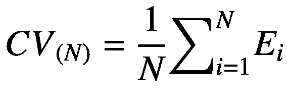

你可以看到，LOOCV 是 K 折交叉验证的一个特殊情况，其中 k 等于 N。在实践中，开发者使用 k=5 或 k=10 进行 K 折交叉验证，但大多数开发者由于计算能力的原因，不会使用 k=N，正如我们之前提到的。

```py
from sklearn.model_selection import KFold
kf = KFold(n_split=5)
kf.get_n_split(X)
# Output
# 5
for train_index, test_index in kf.split(X):
X_train, X_test = X[train_index], X[test_index]
Y_train, y_test = y[train_index], y[test_index]
Print('# Train => X shape: {} ## Test => X Shape: {}'.format(X_train.shape, X_test.shape))
# Output
# Train => X shape: (120, 4) ## Test => X Shape: (30, 4)
# Train => X shape: (120, 4) ## Test => X Shape: (30, 4)
# Train => X shape: (120, 4) ## Test => X Shape: (30, 4)
# Train => X shape: (120, 4) ## Test => X Shape: (30, 4)
# Train => X shape: (120, 4) ## Test => X Shape: (30, 4)
```

## 自举

自举是一种用于有放回抽样数据的统计技术。

目前，我们对自举技术有一个简要的介绍。我们将使用一个真实示例，让你更好地了解使用自举进行数据重采样的情况。还有其他重采样技术，如蒙特卡洛和随机化技术，但在这里我们只讨论自举技术。

自举方法可以用来估计总体中的数量。这是通过反复取小样本，计算统计量，并计算统计量的平均值来完成的。

### 统计学中的自举

自举表示为*x*^∗。让我们开始生成一个自举样本。我们有 N 个观测值，需要从中采样；我们可以从总体分布中获取这些样本。

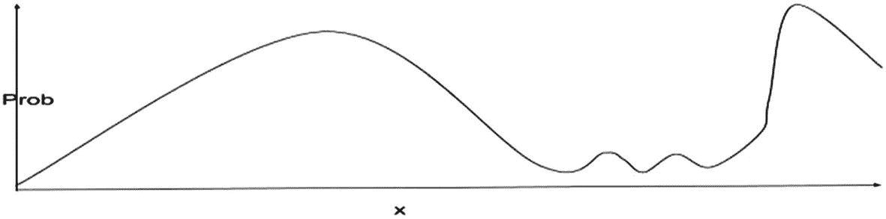

因此，N 个观测值可以表示为 *x*[1] = 2, *x*[2] = 1, *x*[3] = 7, …, *x*[*N*] = 5 等。

从 N 个观测值得到的样本我们可以表示为向量 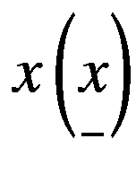，我们可以在该样本中进行任何操作，例如计算均值 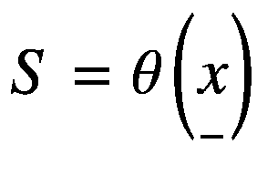。这个动作可以不替换进行，或者我们可以进行相同的操作但带替换。替换和不替换有什么区别？替换意味着我们可以在同一观测值中重复相同的值超过一次，而不替换则不能在观测值中重复值超过一次。注意观测值应该是*IID*（独立同分布）。独立同分布意味着没有整体趋势——分布不会波动，样本中的所有项目都来自相同的概率分布。独立意味着样本项目都是独立事件。所以让我们完成 bootstrap。

因此，*N*个观测值可以表示为 *x*[1] = 2, *x*[2] = 1, *x*[3] = 7, …, *x*[*N*] = 5。从 N 个观测值得到的样本可以表示为 Bootstrap *x* (*x*^∗)

我们可以在该样本中进行任何操作，例如计算均值 S = (*x*^∗)，但在这里是带替换的。让我们看看一个可能使事情更简单的图。

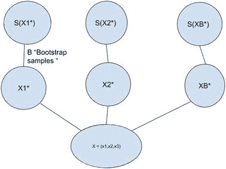

基本上，bootstrap 方法是一种统计技术，通过平均多个小数据样本的估计来估计关于总体的数量。

您可以在以下图像中看到这两个示例之间的区别。

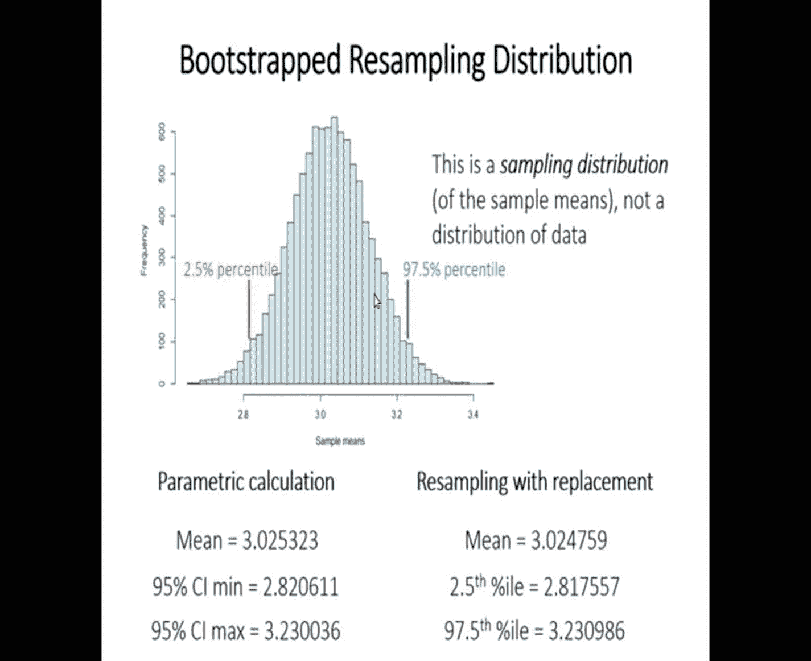

图 7-2

样本分布

### 使用 Bootstrap（带替换重采样）的技巧提示

为了给您提供最佳的 bootstrap 技术使用体验，我们将其总结为步骤，您可以使用这些步骤来创建您自己的数据选择管道。

1.  维护数据结构但重新排列值，外推到总体

1.  该过程可以多次采样每个值，或者根本不采样。

1.  适用于估计非正态数据中的统计参数

1.  具有未知的统计特性（例如，PCA——我们将在下一章讨论它）。

因此，让我们思考一下这种方法是如何工作的，更详细地了解它，并看看我们如何制作这些样本。构建一个样本的过程可以总结如下：

1.  选择样本的大小。

1.  如果样本的大小小于所选大小：

    1.  从数据集中随机选择一个观测值。

    1.  将其添加到样本中。

bootstrap 方法可以通过以下步骤计算总体数量：

1.  选择要执行的 bootstrap 样本数量。

1.  选择样本大小。

1.  对于每个 bootstrap 样本：

    1.  使用选择的大小进行带替换的抽样。

    1.  在样本上计算统计量。

1.  计算计算样本统计量的平均值。

在设置好理论工具箱之后，让我们用一个例子来演示这些统计方法是如何工作的。

假设我们有一个包含 6 个观测值的数据集：

```py
[0.1, 0.2, 0.3, 0.4, 0.5, 0.6]
```

第一步是选择样本的大小。在这里，我们将使用`4`。接下来，我们必须从数据集中随机选择第一个观测值。让我们选择`0.2`。

```py
sample = [0.2]
```

这个观测值被返回到数据集中，我们重复这个步骤三次。

```py
sample = [0.2, 0.1, 0.2, 0.6]
```

现在我们有了我们的数据样本。示例故意演示了相同的值可以在样本中出现零次、一次或多次。在这里，观测值 0.2 出现了两次。然后可以对抽取的样本进行估计计算。

```py
statistic = calculation([0.2, 0.1, 0.2, 0.6])
```

那些未被选为样本的观测值可能被用作袋外观测值。

```py
oob = [0.3, 0.4, 0.5]
```

在评估机器学习模型的情况下，模型是在抽取的样本上拟合的，并在袋外样本上评估的。

```py
train = [0.2, 0.1, 0.2, 0.6]
test = [0.3, 0.4, 0.5]
model = fit(train)
statistic = evaluate(model, test)
```

这就完成了一次重复的过程。它可以重复 30 次或更多次，以给出计算统计量的样本。

```py
statistics = [...]
```

然后，可以通过计算平均值、标准差或其他汇总值来总结这个统计样本，从而给出统计量的最终可用估计。

```py
estimate = mean([...])
```

在本节的结尾，我们应该了解什么是采样，如何使用带替换和不带替换的采样，以及在使用统计函数时它们之间的区别。

## 生成器

当你在开发机器/深度学习模型时，你可能会在将数据集输入模型时遇到内存不足的情况。当你尝试将训练数据加载到内存中时遇到内存错误，你就知道你必须切换你的数据输入策略。

即使是最先进的配置有时也可能因为处理整个数据而超出内存限制。这就是我们需要找到其他方法来高效完成这项任务的原因。唯一的方法是在实时加载数据；因此，我们将向您展示如何在多个核心上实时生成您的数据集，并将其立即提供给您的深度学习模型。

### 什么是 Keras 生成器？

生成器只是 Keras 中的一个模块，它在训练过程中实时获取输入和相应的输出批次。

例如，读取包含 100 个图像输入的集合，获取相应的 100 个标签向量，然后将此集合提供给 GPU 进行训练步骤。我们必须记住，在某些情况下，即使是最先进的配置也可能没有足够的内存空间以我们过去的方式处理数据。这就是我们需要找到其他方法来高效完成这项任务的原因。我们将向您展示如何在多个核心上实时生成您的数据集，并将其立即提供给您的深度学习模型。

让我们看看一个例子，以更好地了解*数据生成器*，我们还将讨论**即时训练**模块。让我们从 Keras 包开始；我们需要它来使用生成器，现在您也可以将其作为模块从 TensorFlow 导入。

```py
// could not understood the example here
```

我们要经历的例子是一个教学示例，用于学习如何使用这个包来增强将数据喂入模型。

在开始之前，让我们回顾一些组织技巧，这些技巧在处理大型数据集时特别有用。让**ID**代表标识数据集给定样本的字符串。跟踪样本及其标签的好方法是采用以下框架：

1.  创建一个名为`partition`的字典，其中收集

    +   在`partition['train']`中，一个训练 ID 列表

    +   在`partition['validation']`中，一个验证 ID 列表

创建一个名为`labels`的字典，其中对于数据集的每个**ID**，相关的标签由`labels[ID]`给出。

例如，假设我们的训练集包含`id-1`、`id-2`和`id-3`，相应的标签为 0、1 和 2，验证集包含`id-4`，标签为 1。在这种情况下，Python 变量 partition 和 labels 看起来像这样：

```py
Partition
{'train': ['id-1', 'id-2', 'id-3'], 'validation': ['id-4']}
Labels
{'id-1': 0, 'id-2': 1, 'id-3': 2, 'id-4': 1}
```

现在我们对数据是如何分区和标记的，以及如何将数据、`classes`和标记数据分开的文件夹有了基本的了解。`data/`文件夹用于在其中保存您的数据集。

```py
folder/
├── my_classes.py
├── keras_script.py
└── data/
```

### 数据生成器

现在，让我们详细了解如何设置 Python 类`DataGenerator`，它将被用于实时向您的 Keras 模型提供数据。

因此，现在让我们编写类的初始化函数如下：

```py
def __init__(self, list_IDs, labels, batch_size=32,
dim=(32,32,32),n_channels=1,n_classes=10, shuffle=True):
#'Initialization'
self.dim = dim
self.batch_size = batch_size
self.labels = labels
self.list_IDs = list_IDs
self.n_channels = n_channels
self.n_classes = n_classes
self.shuffle = shuffle
self.on_epoch_end()
```

现在我们初始化所需的变量。但让我们考虑每个变量，包括维度大小（例如，长度为 32 的体积将具有`dim=(32,32,32)`），通道数、类别数、批量大小或决定我们是否希望在生成数据时打乱数据。我们还存储重要信息，如标签和每次遍历希望生成的 ID 列表。

现在，我需要谈谈回调函数，其中`on_epoch_end`是其中之一。

但在讨论我们在这本书中习惯使用的函数之前，我们将尝试涵盖关于回调是什么的基本知识。

回调是一组在训练过程的特定阶段要应用的函数。您可以使用回调来查看模型在训练过程中的内部状态和统计数据。您可以将回调的列表（作为关键字参数 callbacks）传递给 Sequential 或 Model 类的`fit()`方法。然后，回调的相关方法将在训练的每个阶段被调用。

### 回调

我们可以大量使用的其中一个重要模块是`keras.callbacks.Callback()`模块。此 API 允许您指定要监控的指标，例如训练或验证数据集上的损失或准确度。您可以指定是否寻找最大化或最小化分数的改进。最后，您用于存储权重的文件名可以包含变量，如 epoch 编号或指标。Keras 文档定义了。

+   *params*：字典。训练参数（例如，冗余度、批次大小、epoch 数量...）

+   *model*：keras.models.Model 的实例。正在训练的模型的引用

回调方法作为参数接受的日志字典将包含与当前批次或 epoch 相关的数量键。

目前，Sequential 模型类的`fit(...)`方法将在其传递给回调的日志中包含以下数量：

+   `on_epoch_end`: 日志包括 acc 和 loss，以及可选的 val_loss（如果启用了 fit 中的验证），以及 val_acc（如果启用了验证和准确度监控）。

+   `on_batch_begin`: 日志包括大小，当前批次中的样本数量。

+   `on_batch_end`: 日志包括损失，以及可选的 acc（如果启用了准确度监控）。

更多关于回调的信息，您可以在[`faroit.com/keras-docs/1.1.0/callbacks/`](http://faroit.com/keras-docs/1.1.0/callbacks/)的文档中查看。

现在让我们谈谈`on_epoch_end()`函数；正如我们所见，您可以通过使用其参数来使用它。让我们看看一个例子。这个函数在训练中非常重要，而不仅仅是生成器示例中；例如，如果我们训练一个模型，并且这个模型达到了我们满意的准确度，但它仍然有大量的 epoch 会浪费我们的时间，我们就使用`on_epoch_end()`。让我们获取`on_epoch_end()`的定义。

```py
class myCallback(tf.keras.callbacks.Callback):
def on_epoch_end(self, epoch, logs={}):
if(logs.get('acc')>0.6):
print("\nReached 60% accuracy so cancelling training!")
self.model.stop_training = True
```

在这个例子中，模型将在我们获得 60%的准确度后停止训练，这是我们目前满意的结果，因此我们不需要初始化 epoch 数量。

由于我们正在讨论生成器，在完成初始化过程后，现在是时候继续这个流程到一个新的任务中。对提供给分类器的示例顺序进行洗牌是有帮助的，这样批次之间就不会看起来相似。这样做最终会使我们的模型更加鲁棒。

另一种对生成过程至关重要的方法是完成最关键的任务：生成数据批次。负责此任务的私有方法称为`__data_generation`，并接受目标批次 ID 列表作为参数。

```py
def __data_generation(self, list_IDs_temp):
'Generates data containing batch_size samples' # X : (n_samples, *dim, n_channels)
# Initialization
X = np.empty((self.batch_size, *self.dim, self.n_channels))
y = np.empty((self.batch_size), dtype=int)
# Generate data
for i, ID in enumerate(list_IDs_temp):
# Store sample
X[i, ] = np.load('data/' + ID + '.npy')
# Store class
y[i] = self.labels[ID]
return X, keras.utils.to_categorical(y, num_classes=self.n_classes)
```

在数据生成过程中，此代码从每个示例对应的文件`ID.npy`中读取 NumPy 数组。由于我们的代码是多核友好的，请注意，您可以进行更复杂的操作（例如，从源文件中进行计算）而不用担心数据生成成为训练过程中的瓶颈。

此外，请注意，我们使用了`keras.utils.to_categorical`方法将存储在`y`中的数值标签转换为二进制形式——具体来说，是独热向量形式——（例如，在 6 类问题中，第三个标签对应于`[0 0 1 0 0 0]`），这种形式适合分类。

接下来，我们将构建所有这些组件。每次调用都会请求一个介于 0 和总批次数之间的批次数索引，后者在`__len__`方法中指定。

```py
def __len__(self):
'Denotes the number of batches per epoch'
return int(np.floor(len(self.list_IDs) / self.batch_size))
```

常见的做法是将这个值设置为`$$ \frac{\# Samples}{Batch\ Size} $$`，这样模型在每个 epoch 中最多只能看到一次训练样本。现在我们已经有了一些关于数据生成器的基本理解，我们将通过一个真实数据集的例子来了解它。让我们选择一个简单的数据集：猫狗数据集，[`www.kaggle.com/c/dogs-vs-cats`](http://www.kaggle.com/c/dogs-vs-cats)。然后数据应该具有以下结构：

```py
data/
training/
class_Dog/
class_a01.jpg
class_a02.jpg
...
class_Cat/
class_b01.jpg
class_b02.jpg
...
validation/
class_Dog/
class_a01.jpg
class_a02.jpg
...
class_Cat/
class_b01.jpg
class_b02.jpg
...
```

让我们看看这个数据集的代码。你不需要详细了解它——它将在第三部分中详细解释——但我们希望你能看到在真实问题中使用的数据生成器。

```py
from keras.preprocessing.image import ImageDataGenerator
import numpy as np
# step 1: load data
img_width = 150
img_height = 150
train_data_dir = 'data/train'
valid_data_dir = 'data/validation'
datagen = ImageDataGenerator(rescale = 1./255)
train_generator = datagen.flow_from_directory(directory=train_data_dir,
target_size=(img_width,img_height),
classes=['dogs','cats'],
class_mode='binary',
batch_size=16)
validation_generator = datagen.flow_from_directory(directory=valid_data_dir,
target_size=(img_width,img_height),
classes=['dogs','cats'],
class_mode='binary',
batch_size=32)
# step-2: build model
...
# Step 3: Train the Model with the Generator
training = model.fit_generator(generator=train_generator,
steps_per_epoch=2048//16, epochs=20,
validation_data=validation_generator,
validation_steps=832//16)
```

现在我们已经完成了这个任务，你可以享受使用生成器和回调函数的乐趣了。现在你可以评估或部署你的模型；这取决于你。

## 摘要

在本章中，我们介绍了采样技术。采样是在构建模型之前的一个重要步骤，它确保模型从所选数据中学习最多，而不是使用训练数据产生偏差。你学习了如何创建一个好的训练集和测试集。我们讨论了几种技术，其中之一是自助法，这是一种非常强大的统计方法，用于采样数据。最后，我们给出了一个技术示例，说明 Keras 中的数据生成器方法是如何获取数据和将其提供给模型的。

# 8. 特征选择与特征工程

特征选择和工程是机器学习流程中的重要步骤，涉及所有用于降低其维度的技术。大多数情况下，这些步骤是在清理数据集之后进行的。

大多数算法对输入数据都有强烈的假设，当使用原始数据集时，它们的性能可能会受到负面影响。此外，数据很少是各向同性的；通常有一些特征决定了样本的一般行为，而其他相关的特征并不提供任何额外的信息。因此，对数据集有一个清晰的了解并知道用于减少特征数量或仅选择最佳特征的最常用算法是很重要的。

在本章中，你将学习三种基本技术，这些技术将帮助通过将其转换到比原始特征子空间更低维度的新的特征子空间来总结和压缩数据集的信息内容。数据压缩是机器学习中的一个重要主题，它帮助我们压缩、存储和分析大量数据。因此，我们将涵盖以下主题：

+   **主成分分析（PCA**）用于无监督数据压缩

+   **线性判别分析（LDA**）是一种监督降维技术，用于最大化类可分性

+   通过**核主成分分析**进行非线性降维

## 本章使用的数据集

Scikit-learn 提供了一些内置数据集，可用于测试目的。它们都在`sklearn.datasets`模块中，并且具有共同的结构：

+   `desc`实例变量包含有关你正在使用的数据集的描述。

+   `data`实例变量包含整个输入集 X。

+   当`target`包含*分类*的标签或*回归*的响应值时。

例如，考虑用于回归的波士顿房价数据集（），我们有：

```py
from sklearn.datasets import load_boston
boston = load_boston()
X = boston.data
y = boston.target
print('X shape: {}, and y shape: {}'.format(X.shape, y.shape))
# Output
# X shape: (506, 13), and y shape: (506,)
```

在波士顿数据集中，我们有

+   506 个样本或观察值

+   13 个特征或预测因子

+   单个目标或响应值

在本章中，我们将使用*波士顿房价*数据集作为*回归示例*，以及*MNIST 手写数字*数据集作为*分类任务*。对于本章中我们将描述的每个概念，我们将使用这些数据集通过示例来展示如何处理大量变量以及数据中的隐藏知识。

```py
from sklearn.datasets import load_digits
digits = load_digits()
X = digits.data
y = digits.target
print('X shape: {}, and y shape: {}'.format(X.shape, y.shape))
# Output
X shape: (1797, 64), and y shape: (1797,)
```

同样，你可以从`sklearn.datasets`模块导入*MNIST 手写数字*数据集；它非常简单，节省了学习和实验的时间。

Scikit-learn 提供的 MNIST 数据集由于许多原因而有限；第一个原因是使其更容易用于教育目的。如果你想实验原始数据集，请参考网站[`http://yann.lecun.com/exdb/mnist/`](http://yann.lecun.com/exdb/mnist/)。在这里，你可以下载一个包含多达 70,000 个手写数字的完整版本，分为训练集和测试集。

Scikit-learn 还提供了从零开始创建虚拟数据集的函数：

+   make_classification()

+   make_regression()

+   make_blobs()（特别适用于测试聚类算法）

它们非常容易使用，在许多情况下，如果没有数据集，或者不加载更复杂的数据集，或者出于教育目的，测试模型时，这是最佳选择。

你可以访问 sklearn 数据集网站[`https://scikit-learn.org/stable/da`](https://scikit-learn.org/stable/da)以获取有关 Scikit-learn 提供的数据集的更多信息。

## 降维——需要回答的问题

如果你正在从事一个新项目，并且已经提供了一个包含数十个变量的数据集，你是否曾想过如何处理所有这些变量？所以，真正的问题是以下这个：*当你的数据集有太多* *变量* *时会发生什么*？

你可能遇到过一些这些情况，或者至少你可能考虑过它们：

+   你发现大多数变量都是**相关的**。

+   你失去了耐心，决定在全部数据上运行模型。这返回了**较差的准确度**，你感到非常糟糕。

+   你开始犹豫不决该做什么。

+   你开始考虑一些战略性的方法来**找到**一些重要的变量。

因此，我们需要一种方法来选择重要的变量，换句话说，选择那些可以影响模型并产生良好输出估计的重要变量。

另一个原因是，特征选择和提取这个主题在统计学和数据科学领域非常重要。但是，当为学生们或任何想要学习的人准备课程时，我们发现网上的资源过于技术化，没有完全满足我们的需求，或者提供了相互矛盾的信息。

因此，我们想要整理这个主题的“*是什么*”，“*何时*”，“*如何*”，“*为什么*”，并具体回答这些问题。具体来说，我们想要展示这个主题的合理性，背后的数学原理，一些最佳实践，以及这个主题下每种方法的潜在缺点。

### 什么是降维？

如果你之前处理过很多变量，你知道这可能会给你和你要构建的模型带来一些问题。所以你可能决定选择一些重要的变量来帮助你充分利用数据集，并使模型达到最高的准确度。另一方面，你可能会想要移除所有那些不会为你做这些事情的变量。为了完成所有这些——选择/移除过程——你需要回答以下问题：

+   你是否理解每个变量之间的关系？

+   你是否有如此多的变量，以至于你处于将模型过度拟合到数据的风险中，或者你可能违反了你正在使用的建模策略的假设？

你可能会问这样的问题：*我如何将我收集的所有变量集中关注其中几个？* 从技术角度来说，你想要通过减少特征空间的维度来“降低你的特征空间维度”。这将减少你需要考虑的变量之间的关系，你不太可能过度拟合你的模型。

### 注意

这并不意味着过拟合等问题不再成为关注点——但我们正在朝着正确的方向前进！

有一点令人惊讶的是，降低特征空间的维度被称为*降维*。有许多方法可以实现降维，但这些技术大多分为两大类：

+   特征消除

+   特征提取

**特征消除**正如其名：通过消除特征来减少特征空间。我们可能不会考虑每一个变量，而是只保留我们认为最能预测美国国内生产总值（GDP）的三个变量。特征消除方法的优势包括简单性和保持变量的可解释性。

然而，作为缺点，你从那些你丢弃的变量中得不到任何信息。如果我们只使用去年的 GDP、根据最新的美国社区调查数据中制造业就业人口的比重以及失业率来预测今年的 GDP，我们就错过了那些被丢弃的变量可能对我们的模型做出的贡献。通过消除特征，我们也完全消除了那些被丢弃的变量可能带来的任何好处。

然而，**特征提取**不会遇到这个问题。比如说，我们有一十个独立变量。在特征提取中，我们创建了十个“新”的独立变量，其中每个新独立变量是十个“旧”独立变量中的每一个的组合。然而，我们以特定的方式和顺序创建这些新独立变量，按照它们预测因变量的好坏来排序这些新变量。

你可能会问*降维在哪里发挥作用？* 好吧，我们保留我们想要的尽可能多的新独立变量，但丢弃最不重要的那些。因为我们按照新变量预测因变量的好坏来排序，我们知道哪个变量是最重要的，哪个是最不重要的。但是——这里是关键——因为这些新独立变量是我们旧变量的组合，即使我们丢弃一个或多个这些“新”变量，我们仍然保留了我们旧变量中最有价值的部分！

### 我应该在什么时候使用降维？

1.  你是否想要**减少**变量的数量，但又无法确定哪些是重要的变量，哪些是你认为应该移除的变量？

1.  你是否想要确保你的变量之间是**独立**的，或者没有任何**相关性**存在于任何*预测/输入*变量之间？

1.  你是否关心数据集变量的**可解释性**？

如果你对所有三个问题都回答“是”，那么降维是一个很好的方法。如果你对问题 3 回答“否”，那么**不应该**使用降维。

最后，**如何**和**为什么**取决于每种方法的特性，因此它们将在描述和说明降维方法中的每种方法时得到解答。

## 无监督降维通过主成分分析（PCA）

正如我们解释的那样，我们可以使用特征提取来减少数据集中的特征数量。我们可以通过使用特征提取算法将数据转换或投影到新的特征空间来实现这一点。

在降维的背景下，特征提取可以理解为一种数据压缩方法，其目标是保持大部分相关信息。特征提取通常用于提高计算效率，但也可以帮助减少维度诅咒。

### 注意

如果我们使用非正则化模型工作，使用降维是非常好的，这是因为它减少了数据复杂性；因此，它们是两个不同的问题，它们在相似领域工作。

维度诅咒指的是在分析和组织高维空间中的数据时出现的现象。这些问题的共同主题是，当维度增加时，空间的体积增长速度如此之快，以至于可用的数据变得稀疏。

**PCA**是一种广泛用于不同领域的**无监督线性变换**技术，主要用于降维。PCA 的其他流行应用包括以下内容：

+   股票市场交易中的探索性数据分析和对信号的降噪

+   生物信息学领域中基因组数据和基因表达水平的分析

PCA 帮助我们根据特征之间的相关性在数据中识别模式。简而言之，PCA 旨在找到高维数据中最大方差的方向，并将其投影到一个新的子空间，其维度与原始空间相等或更少。新子空间的正交轴（主成分）可以解释为在约束新特征轴相互正交的条件下，最大方差的方向，如图 8-1 所示。在这里，x1 和 x2 是原始特征轴，而 PC1 和 PC2 是主成分。

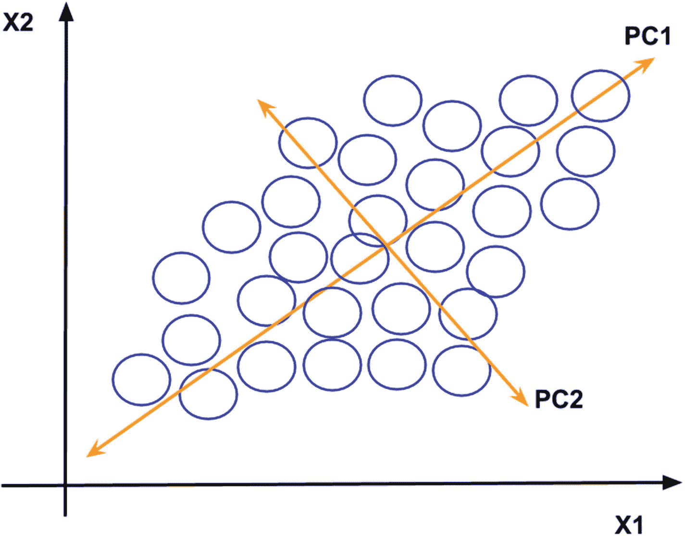

图 8-1

数据集的两个主要维度

如果我们使用主成分分析（PCA）进行降维，我们构建一个 dk 维度的变换矩阵 W。这使我们能够将样本向量 x 映射到一个新的 k 维特征子空间，其维度少于原始的 d 维特征空间：

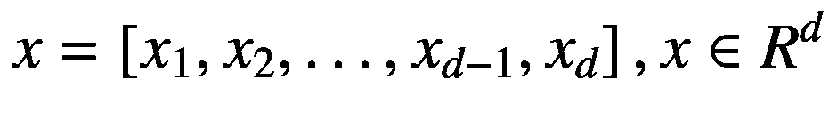

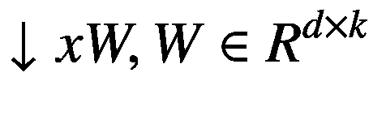

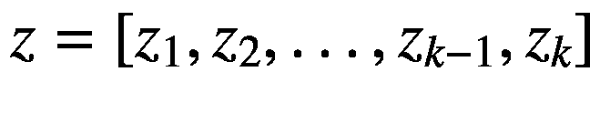

由于将原始 *d*-维数据转换到这个新的 *d*-维子空间（通常 *k* ≪ *d*），第一个主成分具有最大的可能方差，并且所有后续的主成分将具有最大的可能方差，前提是它们与其他主成分不相关（正交）。请注意，*PCA* 方向对数据缩放非常敏感，如果我们想要将特征赋予相同的重要性，并且特征是在不同的尺度上测量的，那么在 PCA 之前我们需要标准化特征。

在更详细地查看降维的 PCA 算法之前，让我们用几个简单的步骤总结一下这种方法：

1.  标准化 *d*-维数据集。

1.  构建协方差矩阵。

1.  将协方差矩阵分解为其特征向量和特征值。

1.  选择与 *k* 个最大特征值相对应的 *k* 个特征向量，其中 *k* 是新特征子空间的维度（*k* ≤ *d*）。

1.  从“顶部” *k* 个特征向量中构建投影矩阵 W。

1.  使用投影矩阵 *W* 将 *d*-维输入数据集 *X* 转换为新的 *k*-维特征子空间。

### 总方差和解释方差

在本小节中，我们将解决 PCA 的前四个步骤：

+   标准化数据

+   构建协方差矩阵

+   获取协方差矩阵的特征值和特征向量

+   按降序排列特征值以对特征向量进行排序

## 特征选择和过滤

正如我们之前解释的，具有许多特征的未归一化数据集包含的信息与所有特征及其方差的相关性成比例。让我们考虑一个包含三个特征的小数据集，这些特征是从许多高斯分布中随机生成的（图 8-2）。

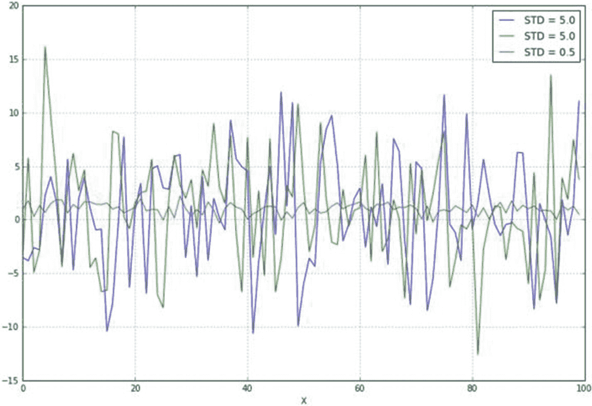

图 8-2

不同数据集的标准差

即使没有进一步的分析，很明显，中心线（**方差最低** `std=0.5`）几乎是恒定的，并且不提供任何有用的信息。另一方面，其他两个变量携带更多信息，因为它们的方差比中心线高，且它们的 `std=5.0`。

因此，方差阈值是一种有用的方法来移除所有那些贡献低于预定义水平的元素。Scikit-learn 提供了 `VarianceThreshold` 类，可以轻松解决这个问题。通过将其应用于前一个数据集，我们得到以下结果：

### 注意

方差阈值根据它们的可变性及其所携带的信息移除元素。

```py
X[0:3, :]
# Output:
array([[ 6.32000000e-03,   1.80000000e+01,   2.31000000e+00, 0.00000000e+00,   5.38000000e-01,   6.57500000e+00, 6.52000000e+01,   4.09000000e+00,   1.00000000e+00, 2.96000000e+02,   1.53000000e+01,   3.96900000e+02, 4.98000000e+00] ,
[ 2.73100000e-02,   0.00000000e+00,   7.07000000e+00, 0.00000000e+00,   4.69000000e-01,   6.42100000e+00, 7.89000000e+01,   4.96710000e+00,   2.00000000e+00, 2.42000000e+02,   1.78000000e+01,   3.96900000e+02, 9.14000000e+00],
[ 2.72900000e-02,   0.00000000e+00,   7.07000000e+00, 0.00000000e+00,   4.69000000e-01,   7.18500000e+00, 6.11000000e+01,   4.96710000e+00,   2.00000000e+00, 2.42000000e+02,   1.78000000e+01,   3.92830000e+02, 4.03000000e+00]])
from sklearn.feature_selection import VarianceThreshold
vt = VarianceThreshold(threshold=1.5)
X_t = vt.fit_transform(X)
X_t[0:3, :]
# Output
array([[ 6.32000000e-03,   1.80000000e+01,   2.31000000e+00, 6.52000000e+01,   4.09000000e+00,   1.00000000e+00, 2.96000000e+02,   1.53000000e+01,   3.96900000e+02, 4.98000000e+00],
[ 2.73100000e-02,   0.00000000e+00,   7.07000000e+00, 7.89000000e+01,   4.96710000e+00,   2.00000000e+00, 2.42000000e+02,   1.78000000e+01,   3.96900000e+02, 9.14000000e+00],
[ 2.72900000e-02,   0.00000000e+00,   7.07000000e+00, 6.11000000e+01,   4.96710000e+00,   2.00000000e+00, 2.42000000e+02,   1.78000000e+01,   3.92830000e+02, 4.03000000e+00]])
```

第三个特征已被完全移除，因为其方差低于选定的 `threshold=1.5`。还有许多可以用来根据基于 *F 检验和 p 值* 的特定标准选择最佳特征的单变量方法，例如 **卡方** 或 **方差分析**。然而，它们的讨论超出了本书的范围，读者可以在 David Freedman、Robert Pisani 和 Roger Purves 的《统计学》一书中找到更多信息（*Norton & Company, 2011）。下面展示了使用类 `SelectKBest`（选择 *最佳* K 分数特征）和 `SelectPercentile`（仅选择属于一定百分比的子集的特征）的两种特征选择示例。它们可以应用于回归和分类数据集，但要注意选择适当的分数函数：

```py
from sklearn.datasets import load_boston, load_iris
from sklearn.feature_selection import SelectKBest, SelectPercentile, chi2, f_regression
regr_data = load_boston()
regr_data.data.shape
# Output
(506, 13)
# Init the algorithm
# This algorithm as the name,
# selects the best k features
kb_regr = SelectKBest(f_regression)
X_b = kb_regr.fit_transform(regr_data.data, regr_data.target)
X_b.shape
# Output
(506, 10)
kb_regr.scores_
# Output
array([ 88.15124178, 75.2576423, 153.95488314,   15.97151242, 112.59148028, 471.84673988, 83.47745922,   33.57957033, 85.91427767, 141.76135658, 175.10554288,   63.05422911, 601.61787111])
```

关于所有 Scikit-learn 分数函数及其使用的更多详细信息，请访问 Scikit-learn 特征选择（[`https://scikit-learn.org/stable/modules/feature_selection.html#univariate-feature-selection`](https://scikit-learn.org/stable/modules/feature_selection.html#univariate-feature-selection)）。

## 主成分分析

在许多情况下，输入数据集 *X* 的维度很高，因此每个相关机器学习算法的复杂性也高。此外，信息均匀分布在所有特征上。一般来说，如果我们考虑欧几里得空间，我们有


因此，每个点都使用由 m 个线性无关向量组成的正交基来表示。现在，考虑数据集 *X*，一个自然的问题出现了：*是否可以在不造成信息急剧损失的情况下减少 m？* 让我们考虑图 8-3（没有任何特定的解释）。


图 8-3

重新审视主成分图像

生成 *X* = (*x*, *y*) 的分布类型无关紧要；然而，水平分量的方差明显大于垂直分量。如前所述，这意味着第一分量提供的信息量更高，例如，如果保持垂直分量不变而将 x 轴水平拉伸，分布就变成了一个深度越来越不重要的段。

为了评估每个分量带来的信息量以及它们之间的相关性，一个有用的工具是协方差矩阵（图 8-4；如果数据集的均值为零，我们可以使用相关矩阵）。

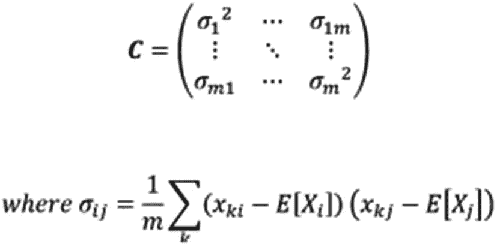

图 8-4

协方差方程

*C* 是对称和正半定的，所以所有特征值都是非负的，但 *每个值的含义是什么？* 之前示例中的协方差矩阵 *C* 是对称的；正如预期的那样，水平方差相当高，而垂直方差较低。此外，其他值接近于零。如果你记得定义，并且为了简单起见，移除均值项，它们代表了一对分量之间的交叉相关。很明显，在我们的例子中，*X* 和 *Y* 是不相关的（它们是正交的），但在现实生活中的例子中，可能会有特征表现出残留的交叉相关。从信息论的角度来看，这意味着知道 *Y* 给我们关于 *X*（我们已知）的一些信息，因此它们共享的信息实际上是成倍的。所以，我们的目标也是在尝试降低其维度的同时去相关 *X*。这可以通过考虑 *C* 的排序特征值并选择最佳的主成分值来实现：

因此，可以将原始特征向量投影到这个新的（子）空间中，其中每个分量都承载部分总方差，并且新的协方差矩阵去相关以减少不同特征之间的无用信息共享（从相关性的角度来说）。在 Scikit-learn 中，有一个 PCA 类，可以非常顺畅地完成所有这些操作：

```py
import numpy as np
import matplotlib.pyplot as plt
from sklearn.datasets import load_digits
from sklearn.decomposition import PCA
mnist = load_digits()
```

在图 8-5 中展示了包含几个随机 MNIST 手写数字的图像。

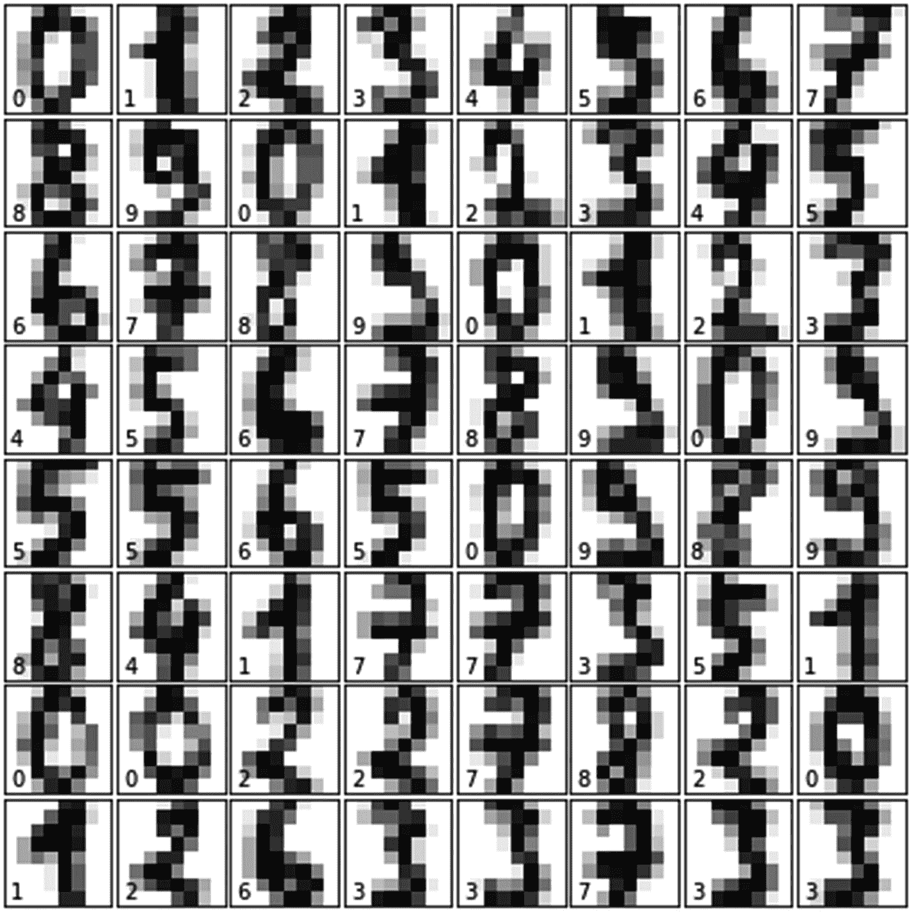

图 8-5

MNIST 数据集

每个图像都是一个包含 64 个 *无符号整数*（8 位）数字（0, 255）的向量，因此初始的分量数量确实是 64。然而，黑色像素的总数通常占主导地位，而书写 10 个数字所需的基本符号是相似的，因此可以合理地假设在几个分量上存在高交叉相关和低方差。尝试使用 36 个主成分，我们得到：

```py
pca = PCA(n_components=36)
proj = pca.fit_transform(digits.data)
plt.scatter(proj[:, 0], proj[:, 1], c=digits.target, cmap="Paired")
plt.colorbar()
```

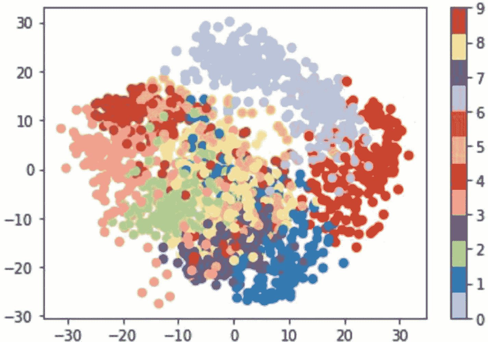

图 8-6

PCA 输出的散点图

为了提高性能，所有整数值都被归一化到范围 `[0, 1]`，并且通过参数 `whiten=True`，每个分量的方差被缩放到 1。正如官方 Scikit-learn 文档所说，这个过程在需要各向同性分布（任何分布在你看来形状简单，但算法看来非常复杂）的许多算法中特别有用。可以通过实例变量 `explained_variance_ratio_` 访问解释方差比，它显示了每个单个分量承载的总方差的部分：

```py
pca.explained_variance_ratio_
# Output:
array([ 0.14890594, 0.13618771, 0.11794594,  0.08409979, 0.05782415, 0.0491691,  0.04315987,  0.03661373, 0.03353248, 0.03078806, 0.02372341,  0.02272697, 0.01821863, 0.01773855, 0.01467101,  0.01409716, 0.01318589, 0.01248138, 0.01017718,  0.00905617, 0.00889538, 0.00797123, 0.00767493,  0.00722904, 0.00695889, 0.00596081, 0.00575615,  0.00515157, 0.00489539, 0.00428888, 0.00373606,  0.00353271, 0.00336678, 0.0032803,  0.0030832,   0.00293777])
```

下图展示了 MNIST 数字示例的图表（图 8-7）。底部图形表示方差比率，而顶部图形是累积方差。可以立即看出，第一个成分通常在信息方面是最重要的，而后续的成分则提供了分类器可能也会丢弃的细节。

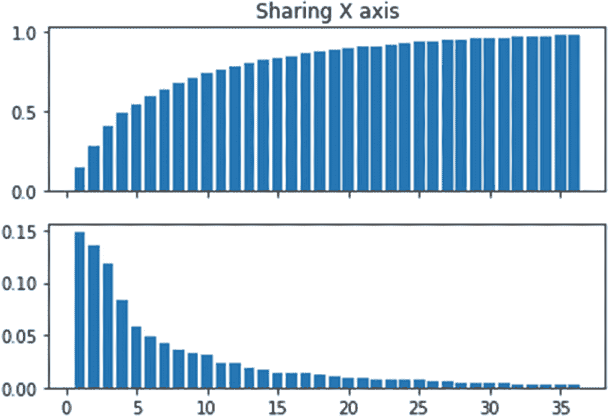

图 8-7

每个成分的方差直方图和 CDF 图

如预期的那样，从第五个成分开始，对总方差的贡献急剧下降，因此可以在不造成不可接受的信息损失的情况下减少原始维度，这可能导致算法学习错误的类别。在前面的图表中，有使用前 *36 个成分*、在 *0* 和 *1* 之间进行白化和平滑处理重建的手写数字。为了获得原始图像，我们需要对所有新向量进行逆变换并将它们投影到原始空间中：

```py
X_rebuilt = pca.inverse_transform(X_pca)
```

结果显示在图 8-8 和 8-9 中。

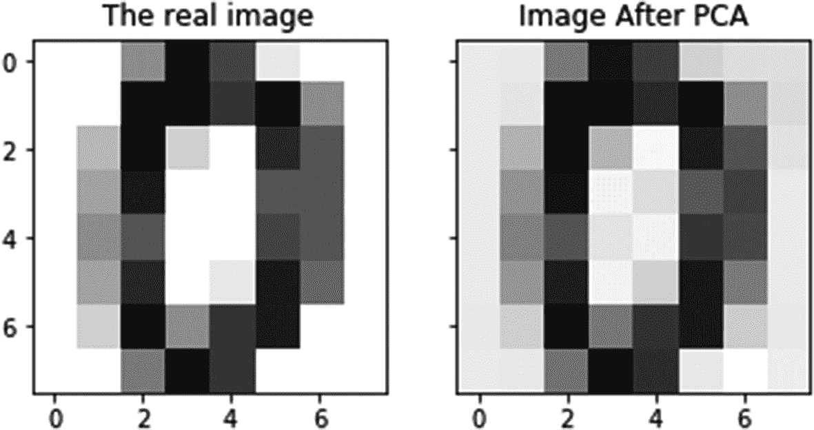

图 8-9

PCA 逆变换输出与真实图像的比较

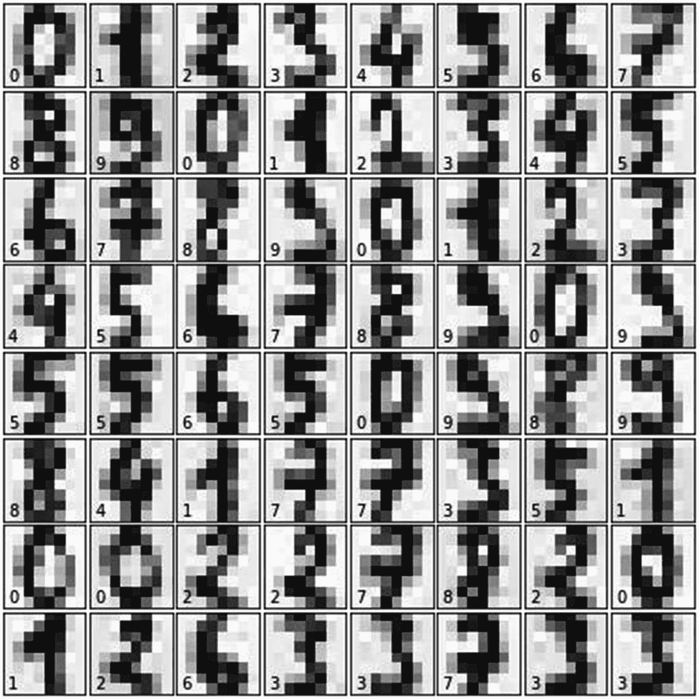

图 8-8

PCA 逆变换的输出

此过程还可以通过去除残留方差（通常与噪声或不需要的贡献相关）来部分去噪原始图像，这些残留方差几乎与每个书法作品都扭曲了一些用于识别的结构元素。

我建议读者尝试不同的成分数量（使用解释方差数据）以及 `n_components='mle'`，这实现了最佳维度的自动选择（参见 Thomas P. Minka 的“PCA 的自动维度选择”（NIPS, 2000: 598-604））。Scikit-learn 使用 **SVD**（奇异值分解）来解决 **PCA** 问题，这可以在 David Poole 的《线性代数》（Brooks Cole, 2015）一书中详细研究。可以通过参数 `svd_solver` 控制算法，其值有 `'auto'`、`'full'`、`'arpack'` 和 `'randomized'`。

### 非负矩阵分解

当数据集由非负数组成时，可以使用称为 *非负矩阵分解*（NNMF）的良好算法，而不是使用标准的 PCA。该算法基于 Frobenius 范数优化损失函数（在 *W* 和 *H* 上交替）：

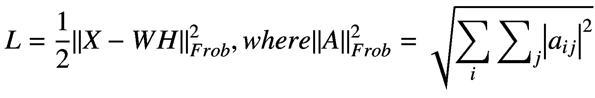

如果 *dim*(*X*) = *n* × *m*，那么 *dim*(*W*) = *n* × *p* 和 *dim*(*H*) = *p* × *m*，其中 *p* 等于请求的组件数量（即`n_components`参数），这通常 *小于* 原始维度 *n* 和 *m*。

最终的重构完全是加性的，并且已经证明它对于通常没有非负元素的图像或文本特别有效。在下面的代码片段中，有一个使用 Iris 数据集（它是非负的）的例子。`init`参数可以取不同的值（参见文档），这些值决定了数据矩阵最初是如何处理的。对于非负矩阵，一个随机选择是仅进行缩放（不执行 SVD）：

```py
from sklearn.datasets import load_iris
from sklearn.decomposition import NMF
iris = load_iris()
iris.data.shape
# Output
(150L, 4L)
nmf = NMF(n_components=3, init="random", l1_ratio=0.1)
Xt = nmf.fit_transform(iris.data)
nmf.reconstruction_err_
# Output
1.8819327624141866
iris.data[0]
# Output
array([ 5.1, 3.5, 1.4, 0.2])
Xt[0]
# Output
array([ 0.20668461, 1.09973772, 0.0098996 ])
nmf.inverse_transform(Xt[0])
# Output
array([5.10401653, 3.49666967, 1.3965409, 0.20610779])
```

NNMF，与其他分解方法一起，对于更高级的技术，如推荐系统和主题建模，将非常有用。NNMF 对其参数非常敏感（特别是初始化和正则化），因此我建议阅读原始文档以获取更多信息：[`http://scikit-learn.org/stable/modules/generated/sklearn.decomposition.NMF.html`](http://scikit-learn.org/stable/modules/generated/sklearn.decomposition.NMF.html)。

## 稀疏 PCA

Scikit-learn 提供了不同的 PCA 变体，可以解决特定问题。我确实建议阅读原始文档。然而，我想提到`SparsePCA`，它允许在提取主成分的同时利用数据的自然稀疏性。如果你考虑必须被分类的手写数字或其他图像，它们的初始维度可以相当高（一个 10x10 的图像有 100 个特征）。然而，应用标准 PCA 只选择平均最重要的特征，假设每个样本可以使用相同的组件重建。简化来说，这相当于：

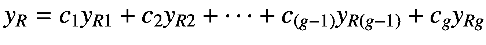

另一方面，我们可以始终使用有限数量的组件，但不需要由密集投影矩阵给出的限制。这可以通过使用稀疏矩阵（或向量）来实现，其中非零元素的数量相当低。这样，每个元素都可以使用其特定的组件重建（在大多数情况下，它们将是最重要的），这可以包括通常由密集 PCA 丢弃的元素。前面的表达式现在变为：

![公式：\( {y}_R=\left[{c}_1{y}_{R1}+{c}_2{y}_{R2}+\dots +{c}_{\left(g-1\right)}{y}_{R\left(g-1\right)}+{c}_g{y}_{Rg}\right]+ ZEROTERM \)](Images/484548_1_En_8_Chapter_TeX_Equg.png)

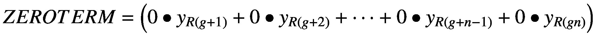

在这里，非零分量已经被放入了第一个块（它们的顺序与之前的表达式不同），而所有其他的零项已经被分开。从线性代数的角度来看，现在的向量空间具有原始维度。然而，利用稀疏矩阵的强大功能（由`scipy.sparse`提供），Scikit-learn 可以比传统的 PCA 更高效地解决这个问题。

下面的代码片段展示了具有 60 个分量的稀疏 PCA。在这种情况下，它们通常被称为原子，稀疏程度可以通过*L1 范数*正则化来控制（更高的 alpha 参数值会导致更稀疏的结果）。这种方法在分类算法中非常常见，将在下一章中讨论：

```py
from sklearn.decomposition import SparsePCA
spca = SparsePCA(n_components=60, alpha=0.1)
X_spca = spca.fit_transform(digits.data / 255)
spca.components_.shape
# Output
(60L, 64L)
```

想要了解更多关于 SciPy 稀疏矩阵的信息，请访问[`https://docs.scipy.org/doc/scipy-0.18.1/reference/sparse.html`](https://docs.scipy.org/doc/scipy-0.18.1/reference/sparse.html)。

## 核 PCA

提及类`KernelPCA`是有用的，它对非线性可分的数据集执行 PCA。为了理解这种方法（数学公式并不简单），考虑将每个样本投影到一个特定的空间是有用的，在该空间中数据集成为线性可分的。这个空间的部分对应于第一个、第二个、...主成分，因此核 PCA 算法计算我们的样本在每个部分上的投影。让我们考虑由一个圆圈和一个内部的 blob 组成的数据集：

```py
from sklearn.datasets import make_circles
Xb, Yb = make_circles(n_samples=500, factor=0.1, noise=0.05)
```

图形表示如图 8-10 所示。在这种情况下，经典 PCA 方法无法捕捉现有组件的非线性依赖关系（读者可以验证投影与原始数据集等效）。然而，通过观察样本并使用极坐标（因此，一个可以投影所有点的空间），很容易只考虑半径来分离这两个集合。

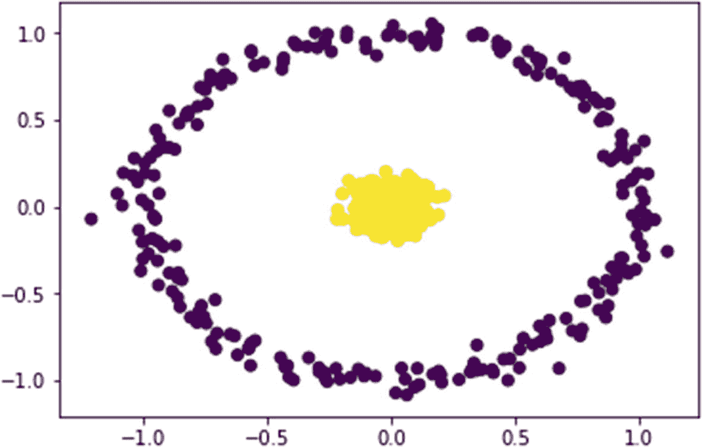

图 8-10

我们正在使用的圆形数据集

考虑到数据集的结构，我们可以研究具有径向基函数核的 PCA 的行为。由于 gamma 的默认值是*特征数量/1.0*（目前，将此参数视为与高斯方差成反比），我们需要将其增加以捕捉外部圆圈。1.0 的值就足够了：

```py
from sklearn.decomposition import KernelPCA
kpca = KernelPCA(n_components=2, kernel="rbf", fit_inverse_transform=True, gamma=1.0)
X_kpca = kpca.fit_transform(Xb)
```

实例变量`X_transformed_fit`将包含我们的数据集在新空间中的投影。绘制它，我们得到图 8-11。

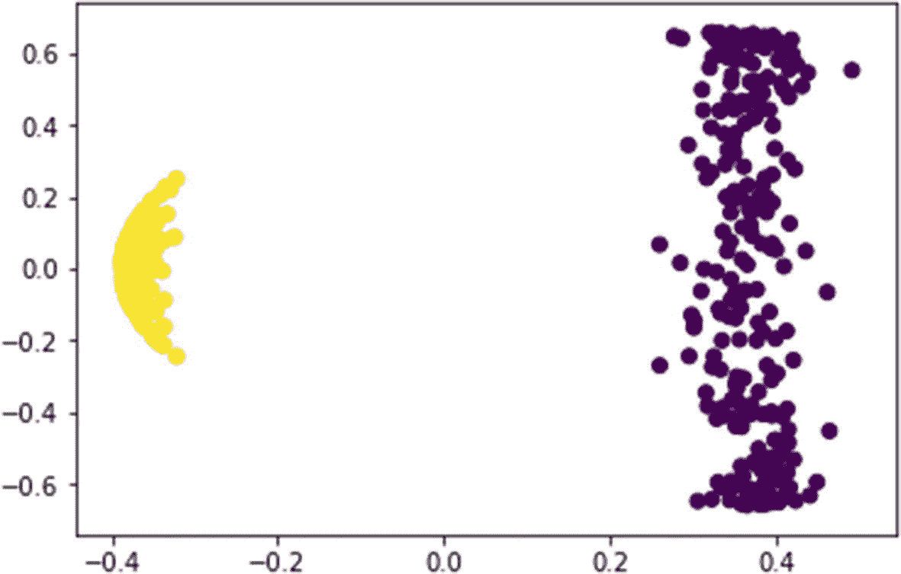

图 8-11

核 PCA 的输出变换

图表显示了预期的分离，还可以看到属于中心团块的点具有曲线分布，因为它们对中心距离更敏感。

当我们将数据集视为由可以表示为分量（特别是径向基或多项式）的函数组成的元素时，核 PCA 是一个强大的工具，但我们无法确定它们之间的线性关系。

想了解更多关于 Scikit-learn 支持的不同核的信息，请访问[`scikit-learn.org/stable/modules/metrics.html#linear-kernel`](http://scikit-learn.org/stable/modules/metrics.html#linear-kernel)。

## 原子提取和字典学习

字典学习是一种技术，它允许从稀疏原子字典（类似于主成分）开始重建样本。在 Julien Mairal、Francis Bach、Jean Ponce 和 Guillermo Sapiro 在*“*《2009 年第 29 届国际机器学习会议（ICML）》上的论文“在线字典学习用于稀疏编码”中，描述了 Scikit-learn 采用的相同在线策略，可以概括为一个双重优化问题，其中：

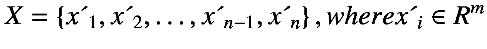

是一个输入数据集，目标是找到字典*D*和每个样本的一组权重。

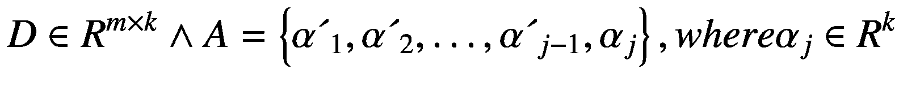

训练过程之后，一个输入向量可以计算如下：

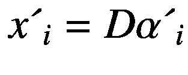

优化问题（涉及 D 和 alpha 向量）可以表示为以下损失函数的最小化：

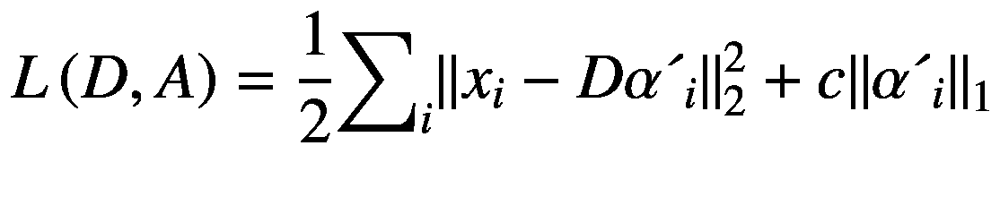

在这里，参数 c 控制着稀疏度（与*L1*归一化的强度成正比）。这个问题可以通过交替最小二乘变量直到达到稳定点来解决。

在 Scikit-learn 中，我们可以使用`DictionaryLearning`类（使用常用的 digits 数据集）来实现这样的算法，其中`n_components`通常确定原子的数量：

```py
from sklearn.decomposition import DictionaryLearning
dl = DictionaryLearning(n_components=36, fit_algorithm="lars", transform_algorithm="lasso_lars")
X_dict = dl.fit_transform(digits.data)
```

这段代码可能需要几分钟才能运行，比我们在本章中写的任何代码都要长。但不要慌张；这只是许多其他特征选择技术中的一种。所以如果它在你的本地机器上不起作用，尝试 Colaboratory([`https://colab.research.google.com/notebooks/welcome.ipynb#recent=true`](https://colab.research.google.com/notebooks/welcome.ipynb#recent=true))。这将为你完成这项工作，或者你可以将样本数量限制在 20 到 50 之间；由你决定。

## 潜在狄利克雷分配（LDA）

LDA 是两个描述的缩写：第一个描述与 NLP 相关，第二个描述与数据分析相关。因此，NLP 中的 LDA 被称为**潜在狄利克雷分配**，而在数据分析中被称为**线性判别分析**。但这可能有点奇怪。我们是在谈论 NLP 中的 LDA 还是数据分析中的 LDA？正如我们将看到的，我们需要谈论 NLP 中的 LDA。但为什么不说一个热门话题，比如线性判别分析以及它与 PCA 之间的区别？PCA 是**主成分分析**的缩写。在本节中，让我们从潜在狄利克雷分配开始。

### 潜在狄利克雷分配（LDA 在 NLP 中）

在我们进入 LDA 的定义之前，我们首先需要了解这种技术的根源——主题建模。目标是识别最能描述一组文档的主题。这些主题只会在主题建模过程中出现，这个过程被称为潜在或无监督学习技术。由于 LDA 是主题建模中流行的技术，让我们给它下一个定义。LDA 想象了一个固定的话题集合。每个话题代表一组单词。LDA 的目标是以一种方式将所有文档映射到话题，使得每个文档中的单词大部分被这些想象中的话题所捕获。

让我们用这个定义，并尝试更简单地重新解释它。你有一组话题；这些话题有一组单词，这些单词分布了话题；每个文档有一组话题。LDA 需要通过单词将集合 X 中的这些话题映射到集合 Y 中的文档。LDA 背后的主要思想是每个文档都可以由话题的分布来描述，每个话题都可以由单词的分布来描述。所以让我们举一个例子或创建一个图像来帮助定义 LDA。

正如我们所说，潜在狄利克雷分配是一种自动发现这些文档包含的主题的技术。假设你有一组以下句子：

+   我吃鱼和蔬菜。

+   鱼是宠物。

+   我的猫咪喜欢吃鱼。

给定前面的句子，LDA 可能会将红色单词归类到主题*F*，我们可能会将其标记为“食物”。同样，蓝色单词可能会被归类到另一个单独的主题*P*，我们可能会将其标记为“宠物”。LDA 将每个主题定义为单词袋，并且你必须根据你的判断来标记这些主题。

如我们所见，LDA 在按单词级别对数据进行分类时有两个好处：

1.  我们可以通过词频推断每个句子的内容分布，例如，如果我们看到一个句子中只有一个 F，那么它将是 100% 主题 F。让我们看看我们示例的统计数据。

    +   *句子 1*：100% 主题 F

    +   *句子 2*：100% 主题 P

    +   *句子 3*：33% 主题 P 和 67% 主题 F

1.  我们可以推导出每个词在给定主题中的比例。例如，主题 F 可能包含以下比例的词：

    +   40% 吃，40% 鱼，20% 蔬菜，…

        现在我们已经获得了一些理解，让我们通过一些关于 LDA 如何工作的步骤来亲自动手；它分为三个步骤。

        为了说明这些步骤，想象你现在正在发现文档中的主题而不是句子。想象你有两个包含以下单词的文档（图 8-12）。

        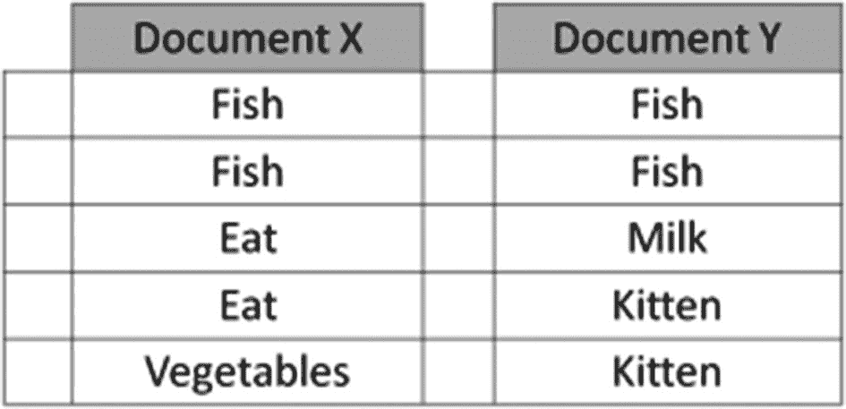

        图 8-12

        两份文档的表格：X 和 Y

1.  步骤 1：你告诉算法你认为有多少个主题。你可以使用有根据的估计（例如，以前分析的结果）或者简单地尝试错误。在尝试不同的估计时，你可能选择生成你希望的可解释性主题，或者产生最高统计确定性（即对数似然）的那个。在我们之前的例子中，主题的数量可能仅通过目测文档就能推断出来。

1.  步骤 2：算法将每个词分配到一个临时主题。主题分配是临时的，因为它们将在步骤 3 中更新。临时主题以半随机的方式分配给每个词（确切地说，是根据狄利克雷分布）。这也意味着如果一个词出现两次，每个词可能被分配到不同的主题。请注意，在分析实际文档时，功能词（例如，“the”，“and”，“my”）被移除并且不会被分配到任何主题。

1.  步骤 3：算法将检查并更新主题分配，遍历每份文档中的每个词。对于每个词，其主题分配将基于两个标准进行更新：

    +   该词在主题中的普遍程度如何？

    +   主题在文档中有多普遍？

那么，步骤三中的这两个标准是如何工作的？

首先，该词在主题中的普遍程度如何？由于“鱼”这个词在两份文档中占剩余主题 F 词的近一半，但在剩余主题 P 词中占 0%，随机选择的“鱼”更有可能关于主题 F（图 8-13）。

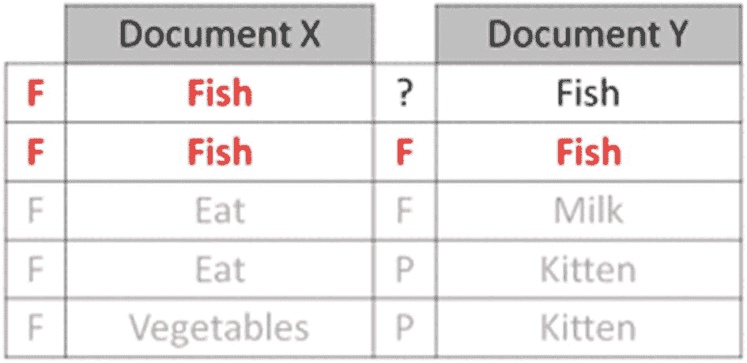

图 8-13

X 和 Y 文档中的常见词

其次，该词在主题中的普遍程度如何？由于文档 Y 中的词以 50-50 的比例分配给主题 F 和主题 P，剩余的“鱼”词似乎同样可能关于任一主题。

在这个例子之后，我们现在知道它是如何工作的。为了适应这个算法，我们仍然需要一些关于 LDA 的数学信息，但本书的目标只是对算法有一个良好的理解。如果我们需要提供一些数学知识，它将在最后一部分。因此，我们有一个 LDA 的代码示例，我们将继续讨论 PCA 与 LDA。

最后，你应该看到 LDA 只是 NLP 中使用的特征提取技术；它只是一个可以阅读文本文档并自动输出讨论主题的自动化算法。

### 使用 gensim 的代码示例

我们将使用 **20 Newsgroups** 数据集的实例，并使用 LDA 提取自然讨论的主题。

首先：我们需要导入 gensim。请注意，如果您没有下载它，请重新阅读第二章。

```py
import gensim
```

对于读取数据和训练 LDA 模型，我们将使用一个由产品评论组成的数据集。我们首先创建一个 `TextCorpus`，这是从文件中读取文档的组件。

```py
corpus = gensim.corpora.textcorpus.TextCorpus('amazon_reviews.txt')
```

现在我们可以训练 LDA 模型。有关详细信息，请参阅 `LdaModel` 类的 [gensim 文档](https://radimrehurek.com/gensim/models/ldamodel.html)（[`https://radimrehurek.com/gensim/models/ldamodel.html`](https://radimrehurek.com/gensim/models/ldamodel.html)）。

这个训练步骤将花费几分钟时间，具体取决于您机器的效率以及您设置的迭代次数值。

```py
model = gensim.models.LdaModel(corpus, id2word=corpus.dictionary, alpha="auto", num_topics=10, passes=5)
```

让我们讨论一下这个 `LdaModel` 的参数：

+   `num_topics`：我们希望使用的主题数量。在这里我们将其设置为 10，但如果您愿意，您可以尝试使用更多的主题数量。

+   `passes`：在训练算法中使用的迭代次数。使用更高的次数会导致更长的训练时间，但有时会产生更高质量的主题。

+   `alpha`：一个控制模型中使用的 Dirichlet 先验行为的参数。如果设置为接近零的值，模型将倾向于使用每个文档较少的主题；相反，如果它是一个更高的值，每个文档将有更多的主题。如果设置为 auto，此参数将自动调整。

**检查主题**：函数 `show_topic(t, n)` 将按单词概率排序显示主题 *t* 中的单词分布。然后显示最可能的单词。

```py
model.show_topic(5)
# Output
[ ('film', 0.029852536),
('movie', 0.010055234),
('films', 0.004800593),
('horror', 0.00475024),
('story', 0.0038416996),
('scene', 0.0034877707),
('action', 0.0033171456),
('like', 0.0032384025),
('dvd', 0.003099864),
('scenes', 0.0028694542)]
```

**预测文档的主题**：如果您有一个新的文档，您可以使用训练好的模型来估计该文档的主题比例。这分为两个步骤：

第一步是将文档转换为矩阵，第二步是进行推理。

```py
doc = 'this book describes windows software'.split()
doc_vector = model.id2word.doc2bow(doc)
doc_topics = model[doc_vector]
doc_topics
# Output
[(0, 0.011552104),
(1, 0.025947856),
(2, 0.01148627),
(3, 0.01466086),
(4, 0.42382663),
(5, 0.013418236),
(6, 0.019740112),
(7, 0.41398397),
(8, 0.042892892),
(9, 0.022491027)]
```

结果显示预测的主题分布。在大多数情况下，将有一个或多个主导主题，其余主题的概率较小。

例如，对于这本书所描述的文档，**Windows 软件**，我们通常会得到这样的结果：这份文档是**与书籍相关主题**和**与软件相关主题**的混合。 (与您上面得到的主题列表进行比较。) 再次强调，由于随机数生成相关的问题，这里的确切结果在每次执行之间可能会有所不同。

## LDA 与 PCA 的比较

如我们在上一节中关于 NLP 中的 LDA（**潜在狄利克雷分配**）所讨论的，现在是时候讨论 LDA（**线性判别分析**）了，但与 PCA（**主成分分析**）一起。LDA 与 PCA 的比较是机器学习中最为常见的比较之一。我们将以简单的方式定义它，以便那些没有强大数学背景的人也能理解。我们只需要您了解其背后的基本思想。

再次，什么是主成分分析或 PCA？PCA 是一种降维方法，通常用于通过将大量变量转换为一个包含大部分信息的较小集合来降低大型数据集的维度。

那么，线性判别分析是什么？LDA 是一种降维技术，用作机器学习和模式分类应用中的预处理步骤。

现在我们需要了解降维技术的含义。降维技术的主要目标是通过对特征进行转换，从高维空间到低维空间，通过去除冗余和依赖的特征来减少维度。

这个比较的关键是监督特征：PCA 使用相关性，旨在无监督学习；LDA 使用分类。

*PCA 做什么？*

+   它旨在找到解释数据中最大方差（包括误差和变量内的方差）的成分。与 LDA 不同，它不考虑类别成员（即无监督），当此类信息不可用时使用。重要的是，LDA 和 PCA 都不需要任何关于变量之间关系的先验概念，并且得到的成分不能根据潜在结构来解释。

*LDA 做什么？*

+   当有此类先验信息时（即监督），这种方法识别出成分（即观察变量的线性组合），这些成分最大化了类别分离（即类间方差）。例如，您有一个包含指定每个观察类别变量的训练集。

但当我们比较 PCA 和 LDA 时，我们需要通过图表来观察它们在数据中的表现——它们如何作用于数据。通过数据可视化，我们可以看到数据，我们的模型如何与之反应，或者我们的工具如何改变我们的数据，以及我们应该如何调整模型参数以获得最佳的数据模型。我们将在另一章中讨论数据可视化。让我们可视化数据，以获得更多关于 PCA 和 LDA 的直观理解（图 8-14 和 8-15）。

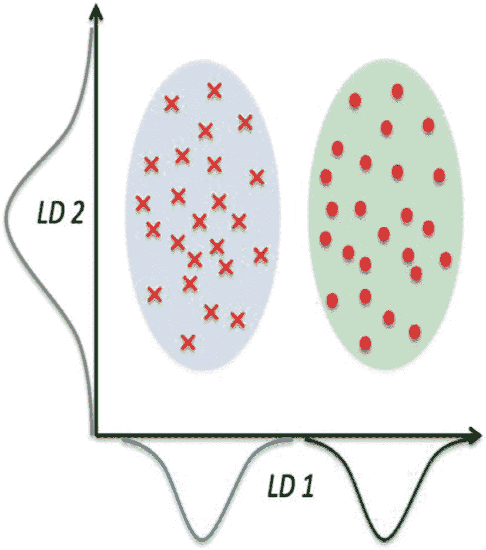

图 8-15

数据集上的 LDA 算法

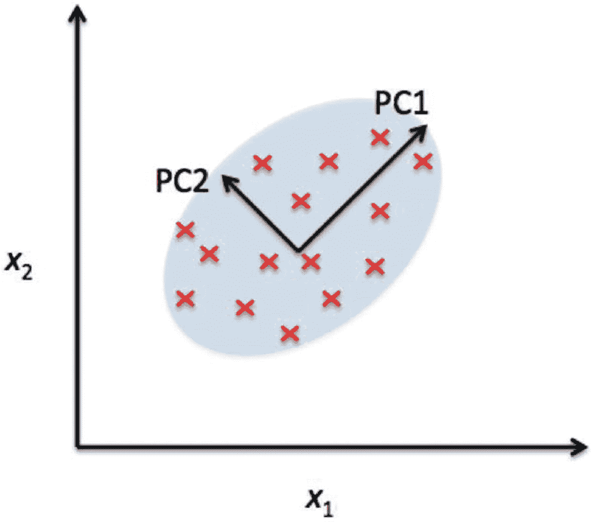

图 8-14

数据集上的 PCA 算法

LDA 和 PCA 都是线性变换技术。如图所示，LDA 只是分类，但 PCA 试图将最相关的点放在一起。请注意，LDA 是监督的，而 PCA 是无监督的。

## ZCA 白化

ZCA 白化是 PCA 的一部分。ZCA 代表**零相位成分分析**，这是一种用于去相关（白化）数据（图像）的白化变换。

那么，*什么是白化变换*？

**白化变换**或**球化变换**是一种线性变换，它将具有已知协方差矩阵的随机变量向量转换成一组新变量，其协方差是单位矩阵，这意味着它们是不相关的，并且每个都具有方差。这种变换被称为“白化”，因为它将输入向量转换为白噪声向量。

它用于数据增强，那么我们来看看我们如何使用它。正如我们所知，ZCA 是一种图像增强技术，让我们先谈谈数据增强。什么是数据增强？

深度学习神经网络的性能通常会随着可用数据的数量而提高。

数据增强是一种从现有训练数据中人工创建新训练数据的技术。这是通过对训练数据中的示例应用特定领域的技巧来完成的，从而创建新的和不同的训练示例。图像数据增强可能是最知名的数据增强类型，它涉及创建属于原始图像同一类别的训练数据集中的图像的变换版本。变换包括来自图像处理领域的各种操作，如平移、翻转、缩放等等。目的是通过新的、合理的示例来扩展训练数据集。这意味着训练集图像的变体，这些变体很可能是模型会看到的。

例如，一张猫的图片水平翻转可能是有意义的，因为照片可能是从左边或右边拍摄的。而一张猫的图片垂直翻转则没有意义，考虑到模型不太可能看到一张颠倒的猫的照片，这很可能是不合适的。

因此，很明显，必须仔细选择用于训练数据集的具体数据增强技术，并且要在训练数据集的上下文中以及了解问题领域的情况下进行选择。此外，单独和联合实验数据增强方法可能很有用，以查看它们是否会导致模型性能的可测量改进，可能使用一个小型的原型数据集、模型和训练运行。现代深度学习算法，如卷积神经网络（CNN），可以学习到对图像位置不变的特性。尽管如此，增强可以进一步帮助这种变换不变的学习方法，并有助于模型学习到对变换也具有不变性的特征，例如从左到右到从上到下的顺序、照片中的光照水平等。

但要理解图像数据增强通常仅应用于**训练数据集**，而不是验证或测试数据集。这与数据准备，如图像缩放和像素缩放不同；它们必须在所有与模型交互的数据集中一致执行。一些数据增强技术包括

+   水平和垂直平移增强

+   水平和垂直翻转增强

+   随机旋转增强

+   随机亮度增强

+   随机缩放增强

+   ZCA 白化

大多数这些算法都在第六章的“数据增强”部分进行了考虑和讨论。

因此，我们看到各种数据增强技术，但我们将专注于 ZCA 白化。图像的白化转换是一种线性代数操作，它减少了像素图像矩阵中的冗余。图像中的冗余减少旨在更好地突出图像中的结构和特征，以便学习算法能够更好地识别。

通常，图像白化使用 PCA 技术执行。最近，一种称为 ZCA 的替代方法显示出更好的结果，导致转换后的图像保留了所有原始维度，并且与 PCA 不同，结果图像仍然看起来像它们的原始图像。

你可以通过将`zca_whitening`参数设置为 True 来执行 ZCA 白化转换。

```py
# ZCA whitening
from keras.datasets import mnist
from keras.preprocessing.image import ImageDataGenerator
from matplotlib import pyplot
from keras import backend as K
K.set_image_dim_ordering('th')
# load data
(X_train, y_train), (X_test, y_test) = mnist.load_data()
# reshape to be [samples][pixels][width][height]
X_train = X_train.reshape(X_train.shape[0], 1, 28, 28)
X_test = X_test.reshape(X_test.shape[0], 1, 28, 28)
# convert from int to float
X_train = X_train.astype('float32')
X_test = X_test.astype('float32')
# define data preparation
datagen = ImageDataGenerator(zca_whitening=True)
# fit parameters from data
datagen.fit(X_train)
# configure batch size and retrieve one batch of images
for X_batch, y_batch in datagen.flow(X_train, y_train, batch_size=9):
# create a grid of 3x3 images
for i in range(0, 9):
pyplot.subplot(330 + 1 + i)
pyplot.imshow(X_batch[i].reshape(28, 28), cmap=pyplot.get_cmap('gray'))
# show the plot
pyplot.show()
break
```

## 摘要

在本章中，你学习了三种不同的、基本的特征提取降维技术：标准 PCA、LDA 和核 PCA。使用 PCA，我们将数据投影到低维子空间，以最大化正交特征轴上的方差，同时忽略类别标签。与 PCA 相反，LDA 是一种监督降维技术，这意味着它在训练数据集中考虑类别信息，试图在线性特征空间中最大化类别可分性。最后，你学习了 PCA 的核化版本，它允许你将非线性数据集映射到低维特征空间，其中类别变得线性可分。

配备了这些基本的预处理技术，你现在已经做好了学习构建和维护不同深度学习技术、算法和方法的最佳实践的准备。每种方法都因其处理的数据类型及其处理方式而有所不同。你将在下一章中评估不同模型的表现。
