# 第三部分 TensorFlow

# 9. 深度学习基础

在本章中，我们将描述深度学习基础中的一个非常重要的话题，即深度学习构建在基本函数之上。然后，我们将尝试从这些函数构建层并将这些层组合起来，以获得更复杂的模型，这将帮助我们解决更复杂的问题，所有这些都将通过 TensorFlow 示例进行描述。

首先，我们将描述几乎任何深度神经网络的最小组件，即神经元，有时也称为**感知器**。我们将对其进行详细讨论，并深入探讨，因为本章有很多内容需要涵盖。然后，我们将展示神经网络中可能的层类型，如**输入**、**隐藏**和**输出**层。在我们向您展示层的同时，我们将描述浅层和深层神经网络的区别。在描述神经元之后，我们将向您展示一些可用于构建更好神经网络的激活函数。然后，我们将探讨称为梯度下降的学习过程，这是一个帮助学习发生的算法。我们将描述不同类型，如全批量、随机和迷你批量梯度下降。在学习过程中，我们需要检查其效果如何。我们可以通过损失函数来完成这项工作，因此我们将向您展示可用于验证模型学习的不同损失函数。然后，我们需要传播模型犯的错误以获得更好的权重和良好的性能；为此，我们需要向您展示反向传播算法及其工作原理。在描述了神经网络的学习框架之后，我们认为展示一些在这个领域应避免的陷阱是公平的，这些陷阱被称为梯度消失和梯度爆炸。最后，我们将通过刷新一些 TensorFlow 基础知识，从理论转向实践。

## 感知器

深度神经网络的最基本单元被称为**人工神经元**，它接收输入，对其进行处理，通过一个激活函数（如**sigmoid**函数）传递，并返回激活后的输出。在本节中，我们只将讨论在“**激活**”部分出现之前提出的**感知器**模型。

**感知器**是神经网络中最小的层。它是一个线性分类器（二分类），用于监督学习。它有助于对给定的输入数据进行分类；输出值是计算为 f(x) = ⟨w, x⟩ + b

其中 w 是权重向量，⟨·, ·⟩ 表示点积。我们使用点积是因为我们正在计算加权总和。f(x) 的符号用于将 x 分类为正实例或负实例。

由于输入直接通过权重传递到输出，因此感知器可以被认为是前馈网络中最简单的一种。

在深入探讨推动此算法的数学之前，让我们看看他们是如何得到感知器概念的，正如我们在第一章中讨论的神经元一样。

我们今天使用的感知器的第一步是在 1943 年由神经科学家 Warren MuCulloch 和逻辑学家 Walter Pitts 采取的，他们通过模拟生物神经元的机能。图 9-1 描述了神经元符号。

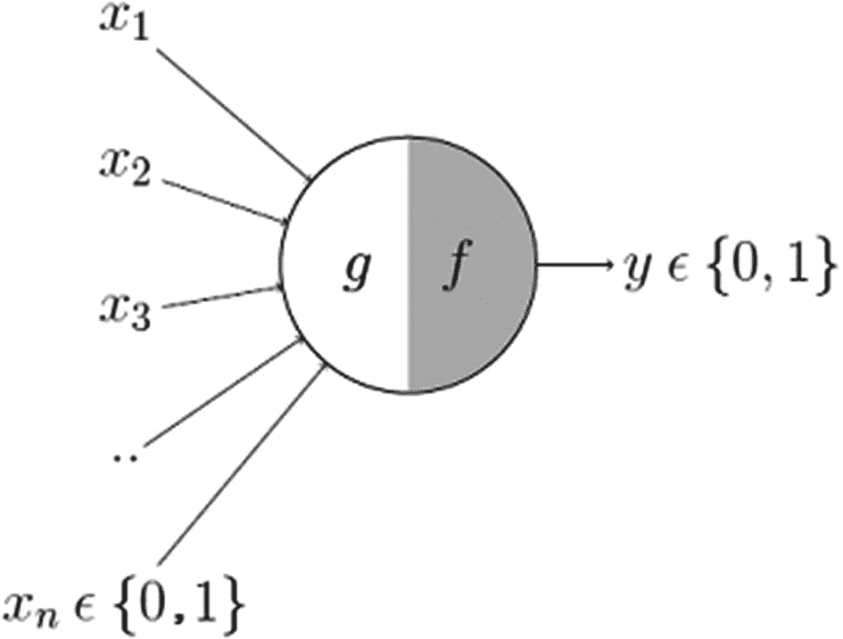

图 9-1

生物神经元的符号

正如我们在图 9-1 中看到的那样，这个节点有两个方面，*g*和*f*；其中之一接受输入。正如我们在图中看到的那样，*g*接受一个固定大小的数据向量*x*[1]，…，*x*[*n*]，并执行聚合操作。另一方面，*f*函数做出决定；这个决定是基于*f*中的聚合值。让我们更详细地阐述这个想法。

假设我们想要预测一个决定：是否在电视上看一场随机的足球比赛。所有输入都是布尔值（即，{0, 1}），我的输出变量也是布尔值 {0 : *Will watch it*, 1 : *Won*^’*t watch it*}。

因此，现在我们需要构建我们的数据变量。让我们假设*x*[1]可以是*isPremierLeagueOn*（我喜欢英超联赛），*x*[2]可以是*isItAFriendlyGame*（我对友谊赛不太关心），*x*[3]可以是*isNotHome*（我在跑腿时不能看它，可以吗？），而*x*[4]可以是*isManUnitedPlaying*（我是一个曼联的大粉丝。GGMU！）

我们只有关于我们拥有的数据的四个观察结果，就像*x*[3]。如果*x*[3]是 1（不在家），那么我的输出将始终是 0（我在跑腿时不能看它。），因此神经元永远不会放电，但在这个时候我们需要一个好的输出注释。正如我们在示例中看到的那样，这些输入可以是兴奋性的或抑制性的。那么它们之间有什么区别（表 9-1）？

表 9-1

兴奋性和抑制性的区别

| 兴奋性 | 抑制性 |
| --- | --- |
| 抑制性输入是指那些对决策有最大影响，而不管其他输入的输入。 | 输入不是那些会单独使神经元放电的输入，但它们可能在与其他输入结合时使其放电。 |

我们需要制定一个方程来推断我们如何使这个感知器放电，以及我们何时不能使其放电。这个公式只是所有输入的总和方程，并给输出一个关于我们如何使用现有输出的作用域（图 9-2）。

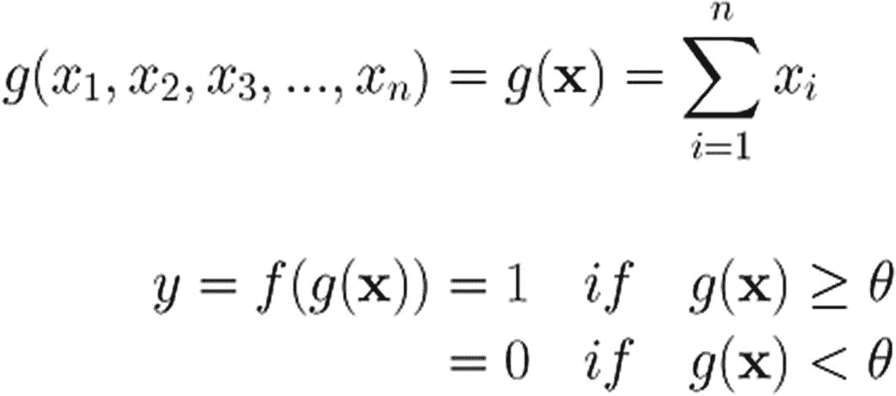

图 9-2

推动感知器工作的方程

我们可以看到，*g*(*x*)只是对输入进行求和——这是一种简单的聚合——这里的 theta 被称为阈值参数。例如，如果我在总和达到 2 或更多时总是观看比赛，这里的 theta 就是 2。这被称为阈值逻辑。

让我们看看它与*AND*布尔门（图 9-3）是如何工作的一个例子。

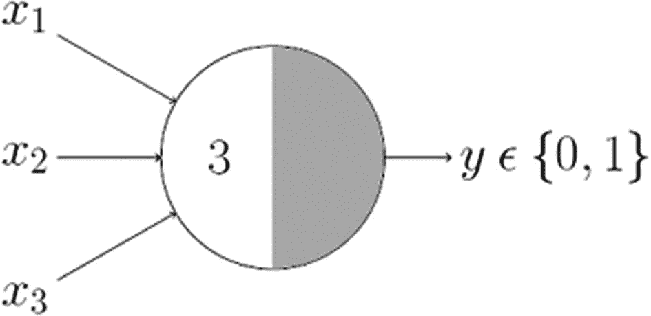

图 9-3

AND 布尔门操作——神经元风格

一个*AND*函数神经元只有在**所有**输入都开启时才会触发，比如当*g*(*x*) ≥ 3 时。研究人员应该知道，原始的 M-P（*MuCulloch, Pitts*）神经元并不擅长我们处理的所有事情。它有一些局限性，所以让我们看看这些局限性。我们将解释 M-P 神经元，但我们可能会看到一些 M-P 神经元无法处理的问题：

+   对于非布尔（例如，实数）输入怎么办？我们没有布尔输入；我们有像{1, 2, 4, 5}这样的范围和多种数字。

+   我们是否总是需要手动编码阈值？我们应该对阈值值进行一些动态处理。

+   所有的输入都相等吗？如果我们想要给某些输入分配更高的权重怎么办？

+   对于非线性可分函数怎么办，比如 XOR 函数？

我们可以看到这个模型的局限性。我希望现在很清楚为什么我们现在不使用 M-P 神经元。克服 M-P 神经元的局限性，美国心理学家 Frank Rosenblatt 在 1958 年提出了经典感知模型，强大的人工神经元。它比 McCulloch-Pitts 神经元是一个更通用的计算模型，其中权重和阈值可以在时间上学习。但 McCulloch-Pitts 和 Minsky-Papert 之间有什么区别。

由 Minsky-Papert 提出的感知器模型（图 9-4）比 McCulloch-Pitts 神经元是一个更通用的计算模型。它通过引入输入的数值权重（重要性的度量）和权重学习机制来克服 M-P 神经元的某些局限性。输入不再仅限于布尔值，就像 M-P 神经元那样；它还支持实数输入，这使得它更有用和更通用。这就是感知器，它是深度神经网络中最基本的单元，被称为人工神经元。

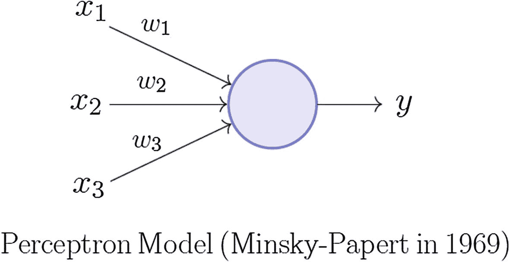

图 9-4

Minsky 感知器模型

让我们谈谈感知器模型以及它是如何以动态方式工作的。当我们看感知器的新版本时，我们看到一个区别：我们有一个新的变量叫做 *权重*。我们取输入的加权总和，并且只有当总和超过一个任意的阈值（theta）时，我们才将输出设置为 1。然而，根据惯例，我们不是手动编码阈值参数 theta，而是将其作为输入之一添加，如下所示，权重为 -theta，这使得它可学习。这被称为 PLA（感知器学习算法）；方程将这样改变：

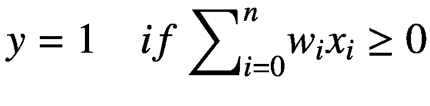

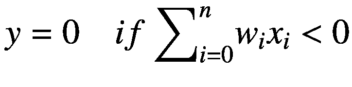

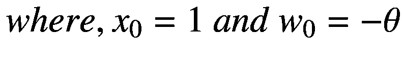

让我们回到我们的朋友使用可用的行为数据预测我是否会看电视上随机的一场比赛。并且假设我的决定仅依赖于三个二元输入（二元用于简化）。

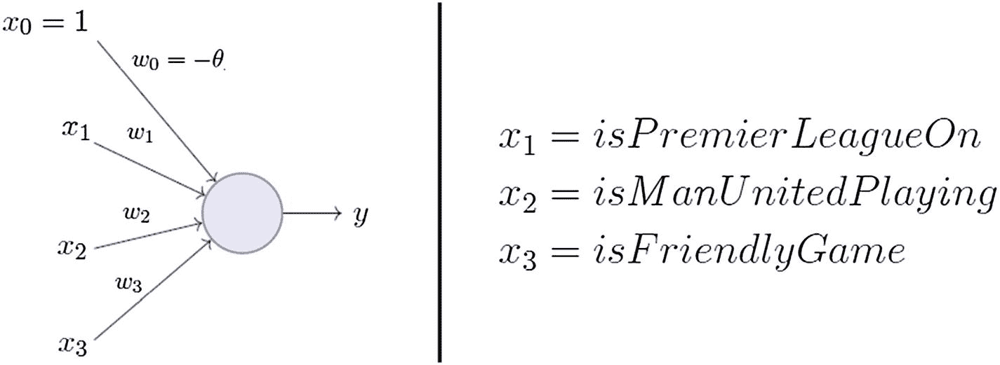

图 9-5

使用感知器实现的足球示例

关于前面照片的一点是，*w*[0] 是 *偏差* 值。现在，让我们继续这个例子。一个足球狂热者可能有一个非常低的阈值，可能不看联赛、俱乐部或比赛的重要性而看任何足球比赛 **[theta = 0]**。另一方面，一个选择性的观众可能只看英超联赛的比赛，包括曼联的比赛，而不是友谊赛 **[theta = 2]**。关键点是 **权重** 和 **偏差**，它们将取决于数据（在这种情况下是我的观看历史）。

*偏差*发生在算法在数据集中学习真实信号时灵活性有限。

让我们用一个感知器来举一个布尔函数的例子。我们将使用 OR 函数，这是所有布尔函数中最简单的一个（图 9-6）。我们将让你尝试使用 AND 布尔函数来解这个方程，但现在让我们使用 OR。

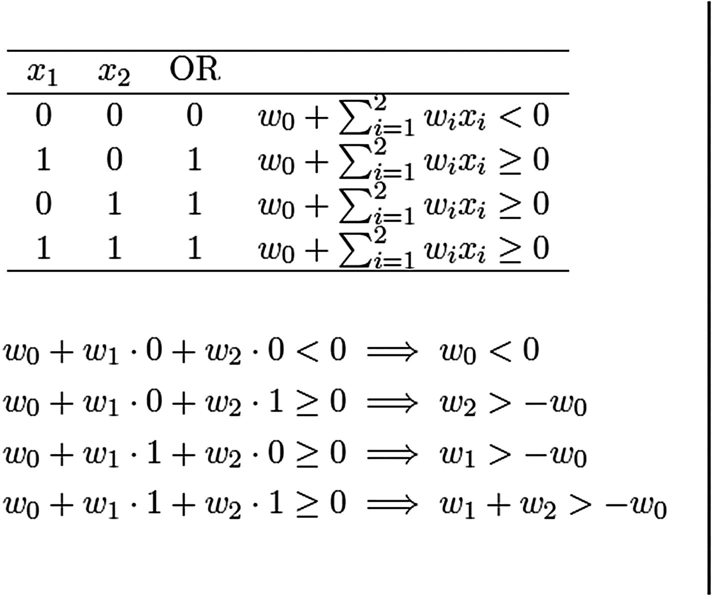

图 9-6

OR 门的方程

但是顺便问一下，XOR（异或）与感知器模型一起使用可靠吗？答案是**不**，因为我们不能将非线性函数分离为正负元组。XOR 的真值表如图 9-7 所示。

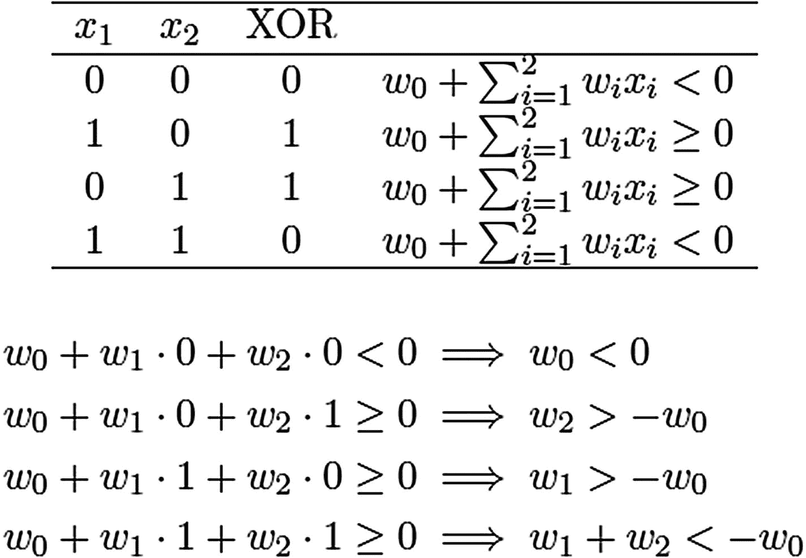

图 9-7

使用感知器实现的 XOR 门

如我们所见，输出值不是可分离的，在 OR 函数中它是可分离的；让我们在图表中看看（图 9-8）。

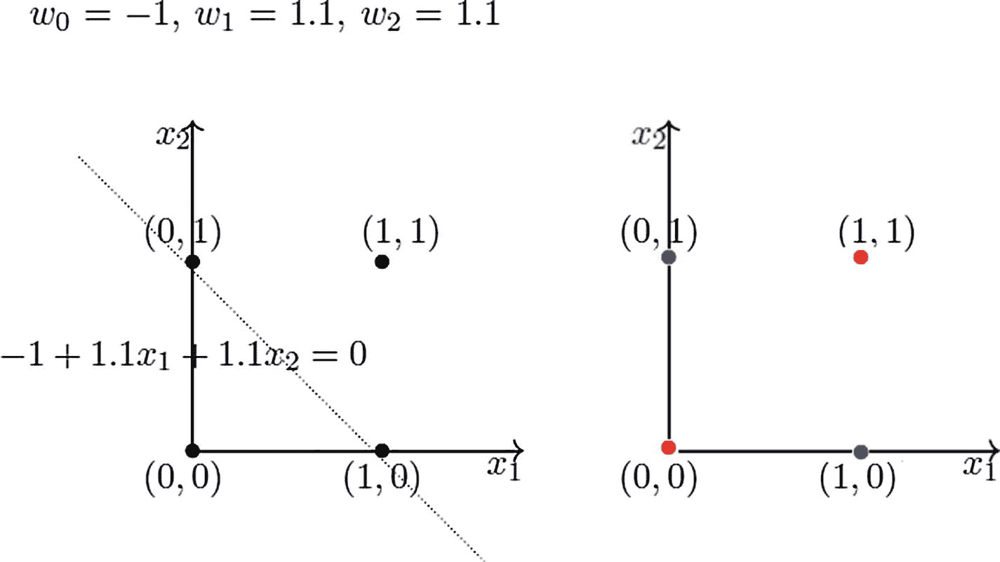

图 9-8

OR 门（左）；XOR 门（右）

但是，多层感知器又是怎样的呢？我们稍后再谈，但首先我们应该总结一下这两种感知器的方法（图 9-9）。

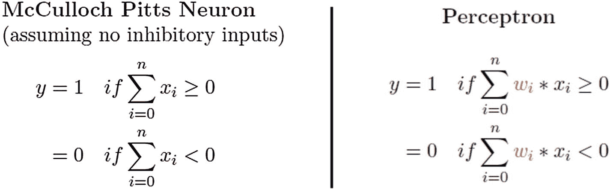

图 9-9

麦克洛奇神经元与感知器

我们不需要进行进一步的比较；前面的方程和解释就足以让你理解这个概念。从本节开始，我们旨在让你了解基于两种类型的感知器（单个感知器和多个感知器）的感知器学习算法。在我们讨论感知器的类型之前，我们需要列出感知器的主要组成部分：

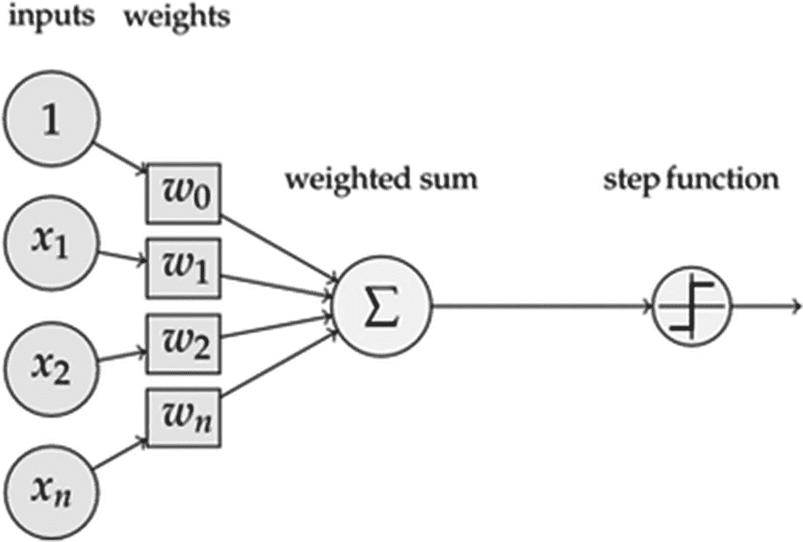

图 9-10

感知器的详细步骤

+   *输入*：所有特征都成为感知器的输入。我们用[*x*[1], …,  *x*[*n*]]表示感知器的输入，其中*x*代表特征值，n 代表特征的总数。我们还有一个特殊的输入，称为偏差。在图像（图 9-10）中，我们将偏差的值描述为*w*[0]。

+   *权重*：在训练模型的过程中计算出的值。最初，我们以某个初始值开始权重的值，并且这些值会随着每个训练错误的更新而更新。我们用[*w*[1], …,  *w*[*n*]]表示感知器的权重。

+   *偏差*：偏差神经元允许分类器将决策边界向左或向右移动。在代数术语中，偏差神经元允许分类器平移其决策边界。它的目的是“*将每个点沿指定方向移动一个常量距离*”。

+   *偏差有助于更快、更好地训练模型*。

+   *加权求和*：加权求和是每个与特征值*x*[*n*]相关的权重*w*[*n*]相乘后得到的值的总和。我们用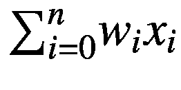表示加权求和。

+   *步/激活函数*：激活函数的作用是使神经网络非线性。例如，对于线性分类，需要尽可能使感知器线性化。我们将在下一节中讨论这个问题，但了解这一点是好的。

+   *输出*：加权求和传递到步/激活函数，计算后得到的任何值都是我们的预测输出。

### 单个感知器

单个感知器是神经网络中的基本基本函数，它仅与二元分类器一起工作。我们已经谈了很多关于它。但是，如果我们有超过两个类别，我们就会想要了解多层感知器。

### 多层感知器

多层感知器（MLP）包含一个或多个隐藏层（除了一个输入层和一个输出层）。虽然单层感知器只能学习线性函数，但多层感知器也可以学习非线性函数（图 9-11）。

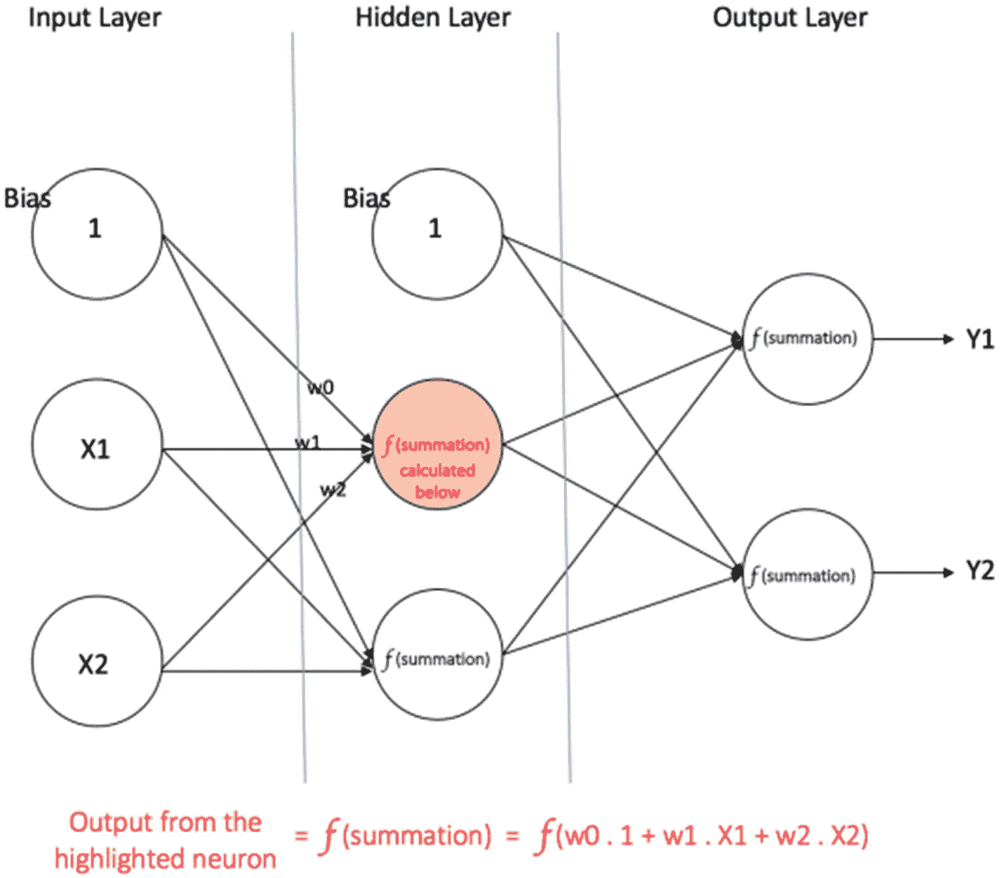

图 9-11

多层感知器架构

+   *输入层*：输入层有三个节点。偏置节点的值为 1。其他两个节点接收 *X*[1] 和 *X*[2] 作为外部输入（这些是依赖于输入数据集的数值）。如前所述，输入层不执行任何计算，因此输入层节点的输出分别是 1, *X*[1] 和 *X*[2]，这些被输入到隐藏层。

+   *隐藏层*：隐藏层也有三个节点，偏置节点输出为 1。隐藏层中其他两个节点的输出取决于输入层的输出（1, *X*[1], *X*[2]）以及与连接（**边**）相关的权重。然后这些边连接到输出层。

### 注意

*f* 代表激活函数。这些输出随后被输入到输出层的节点中。

+   *输出层*：输出层有两个节点，它们从隐藏层接收输入并执行与突出显示的隐藏节点类似的计算。这些计算的结果值（*Y*[1] 和 *Y*[2]）作为多层感知器的输出。

### 回顾

回顾，在本节中我们了解到感知器是神经网络的根本功能。当你只有一个感知器时，你有一个用于解决二元分类问题的单个感知器；但如果你有一个非线性分类问题，你需要使用多个感知器来解决这个问题，比如 OR 和 XOR。

## 不同的神经网络层

在我们开始处理神经网络中的层之前，我们应该确切地了解层是什么。*层*是一个通用术语，适用于节点（感知器）的集合，这些节点包含一个 *激活函数*（例如，Sigmoid）。模式通过 **输入层** 传递给网络，该层与一个或多个 **隐藏层** 通信，实际处理通过加权连接（边）系统完成。隐藏层随后连接到 **输出层**。

图 9-12 展示了每一层。

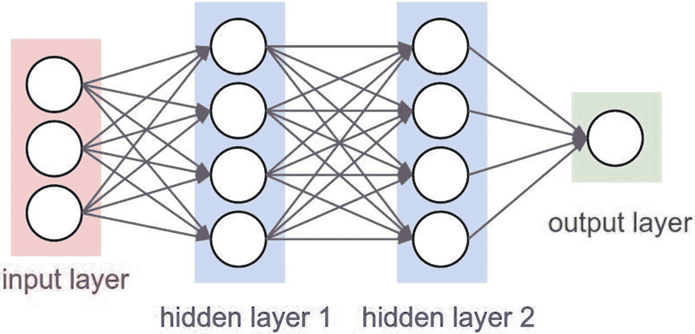

图 9-12

多层神经网络架构

神经网络由一个输入层、一个或多个隐藏层和一个输出层组成。每个层都有一个或多个感知器，它们组合在一起形成一个层。每个层都有一个名称，描述其位置。

### 输入层

图 9-12 中的第一层被称为*输入层*，它包含节点；输入层的节点是**被动**的。被动意味着它们不修改数据；它们在其输入上接收单个值并将其复制到多个输出。所有输入变量都表示为输入节点；输入层中的每个值都被复制并发送到所有隐藏节点，这些节点包含在**隐藏层**中。这引出了一个新的问题：*什么是隐藏层？*

### 隐藏层（s）

所有来自输入层的输入变量都通过隐藏层中的一个或多个节点（求和节点或激活节点）组合。这本质上创建了新的特征，这些特征是从提供的输入数据中派生出来的，然后通过这些特征进入新的隐藏层，依此类推，最终到达**输出层**。所有输入节点都与隐藏层中的所有节点相连。我们应该注意，浅层和深层神经网络之间的关键区别是隐藏层的数量。如果你有多个连接的隐藏层，那么它是一个深层神经网络，但如果我们只有一个隐藏层，那么它是一个浅层神经网络。正如我们所见，输入数据将带有偏差和权重参数进入隐藏层。但是，数据加权只有一种方式吗？答案是**不是**。

隐藏的神经网络层可以以许多不同的方式设置。在某些情况下，加权输入被随机分配。在其他情况下，它们通过称为反向传播的过程进行微调和校准。但是，我们有许多类型的神经网络（*序列、卷积、前馈*等），因此设置这些隐藏层以生成各种结果的方式也不同。卷积神经网络专注于图像处理；循环神经网络包含记忆元素；而简单的前馈神经网络在训练数据集上以直接的方式工作。

因此，隐藏层的完整描述是：人工神经元接收一组加权输入并通过激活函数产生输出。它是几乎所有神经网络的一个典型部分，其中工程师模拟人类大脑中发生的活动类型。

### 输出层

人工神经网络中的输出层是神经元的最外层，它为程序产生特定的输出。尽管它们在神经网络中与其他人工神经元非常相似，但输出层神经元可能以不同的方式构建或观察，因为它们是网络上的最后一个“演员”节点。

## 浅层与深层神经网络

在这里，我们不想深入比较。我们只考虑什么使浅层网络“浅”，以及深层神经网络也是如此。神经网络可以是循环的或前馈的；前馈网络在其图中没有任何循环，并且可以分层组织。如果有许多层，那么我们说该网络是深的。

但我们有一个关于什么使神经网络成为深度的问题。从实际的角度讲，*网络需要有多少层才能被认定为深度？*

通常情况下，如果我们有两个或更多隐藏层，我们称之为*深度*神经网络。相比之下，只有一个隐藏层的网络传统上被称为*浅层*（图 9-13）。

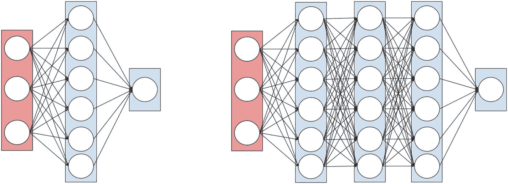

图 9-13

浅层与深度神经网络的区别

我们认为浅层网络*可能*表现得和深层网络一样好。但关于这个问题仍有疑问。我们没有一个准确的答案，但我们可以提出一些关于深度和浅层，以及哪个表现最好的考虑点：

1.  可能浅层网络用我们当前的算法训练起来更困难。

1.  可能浅层架构不适合我们通常试图解决的问题类型。

1.  可以认为浅层网络中的单元数量随着任务复杂性的增加呈指数增长。可能的情况是，如果你有一个更复杂的任务需要你的模型去拟合，你可能需要更多的神经元。因此，为了有用，浅层网络可能需要更多的神经元，可能比深度网络大得多。

这些答案可能有助于思考差异，但使用神经网络时，你永远不知道使用深度或浅层是否合适。但我们将通过试错过程来看到这一点。在过去十年中，深度学习取得的进步确实是惊人的，但大多数进步是通过试错实现的。我们仍然缺乏对深度网络为何工作得如此之好的基本理解。甚至人们认为对于设置一个有效的深度网络至关重要的因素似乎每隔几年就会改变。

结论是，我们有两种神经网络的设计：如果你只有一个隐藏层，我们现在讨论的是浅层神经网络；如果隐藏层超过一个，我们现在讨论的是深度神经网络。没有规定你*必须*使用深度神经网络，但我们假设它可能对许多类型的复杂数据是有益的。

## 激活函数

神经网络的激活函数是一个数学上的“门”。激活函数的主要概念是感知器，神经网络激活函数是深度学习的一个关键组成部分。

激活函数决定了深度学习模型的输出、准确性和训练模型的计算效率，这可能会使大规模神经网络成功或失败。激活函数是神经网络架构中非常重要的一个部分，因为激活函数对神经网络收敛能力和收敛速度有重大影响。在某些情况下，激活函数可能会阻止神经网络首先收敛。它们的主要目的是将人工神经网络中节点的输入信号转换为输出信号。

激活函数是数学方程，决定了神经网络的输出。在描述了激活函数之后，我们可能还想了解更多关于它所做的工作。该函数附加到网络中的每个神经元上，并决定它是否应该被激活；它是根据每个神经元的输入是否对模型的预测相关来决定这一点的。激活函数还有助于将每个神经元的输出标准化到 1 和 0 或-1 和 1 之间。

提问：*激活函数在模型中的作用是什么？* 如我们在上一节关于层的讨论中看到的，数据点从输入层传输到输出层，通过隐藏层传递。每个神经元都有一个权重，将输入数字与权重相乘得到神经元的输出，然后传递到下一层。

激活函数位于当前神经元输入和输出到下一层的中间位置（图 9-14）。它可以像步进函数一样简单，根据规则或阈值开启或关闭神经元输出。或者它也可以是一个变换，将输入信号映射到神经网络功能所需的输出信号。

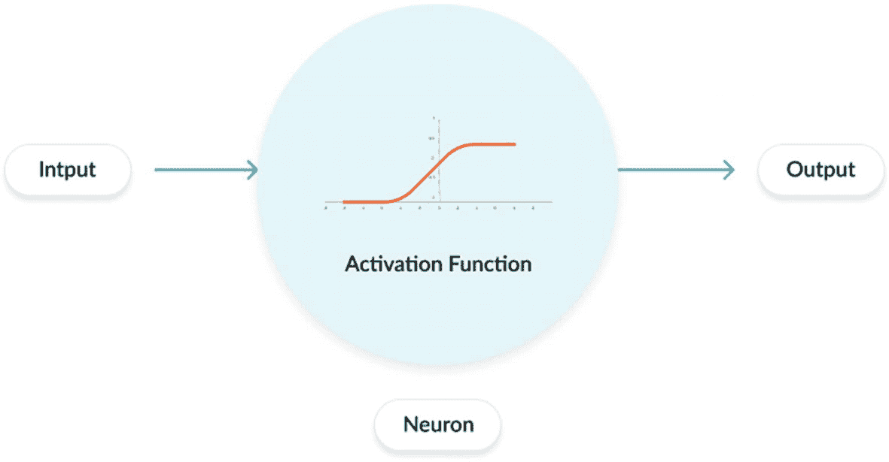

图 9-14

激活函数的位置

让我们可视化这个过程，它从输入开始：将输入数据与权重相乘，给它们加上偏差，通过激活函数，然后输入到下一层（图 9-15）。

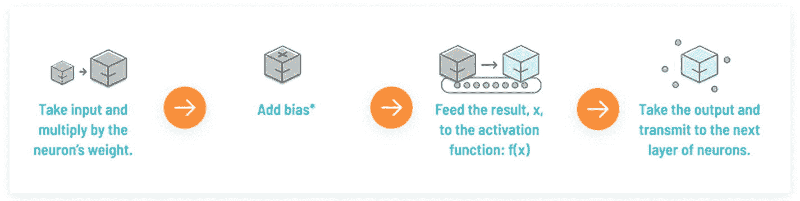

图 9-15

激活函数在神经元中工作的步骤

因此，在讨论了过程之后，我们需要了解激活函数的类型、如何使用它们、它们的工作原理以及哪一种是我们神经网络模型中可靠的。

### 激活函数的类型

激活函数有三种类型：二进制步进函数、线性激活函数和非线性激活函数。

首先，二元阶梯函数是一个基于阈值的激活函数（图 9-16）。这意味着什么？这意味着它取决于是否高于或低于某个阈值值。如果神经元输出高于阈值，激活神经元将向下一层发送完全相同的信号——反之亦然。

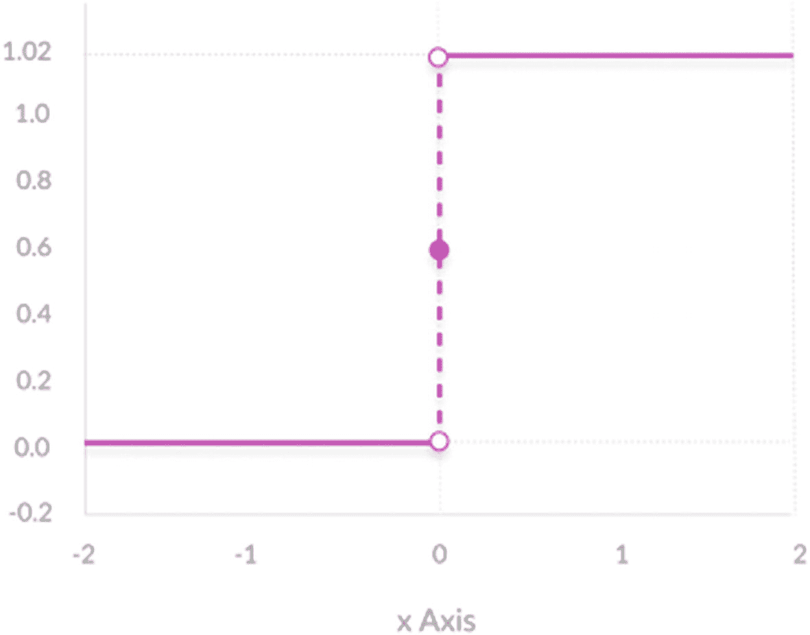

图 9-16

二元激活函数

但它仍然是二元的，所以我们不能将其用于多分类问题。它只是一个触发函数，不能改变来自前一层的任何数据，因此我们需要一个更复杂的激活函数。那么，让我们来谈谈下一类激活函数，即**线性激活函数**（图 9-17）。它使用函数 *A* = *w* *x*。它将输入乘以每个神经元的权重，并创建一个与输入成比例的输出信号。从某种意义上说，线性函数比阶梯函数更好，因为它允许多个输出，而不仅仅是是或否。

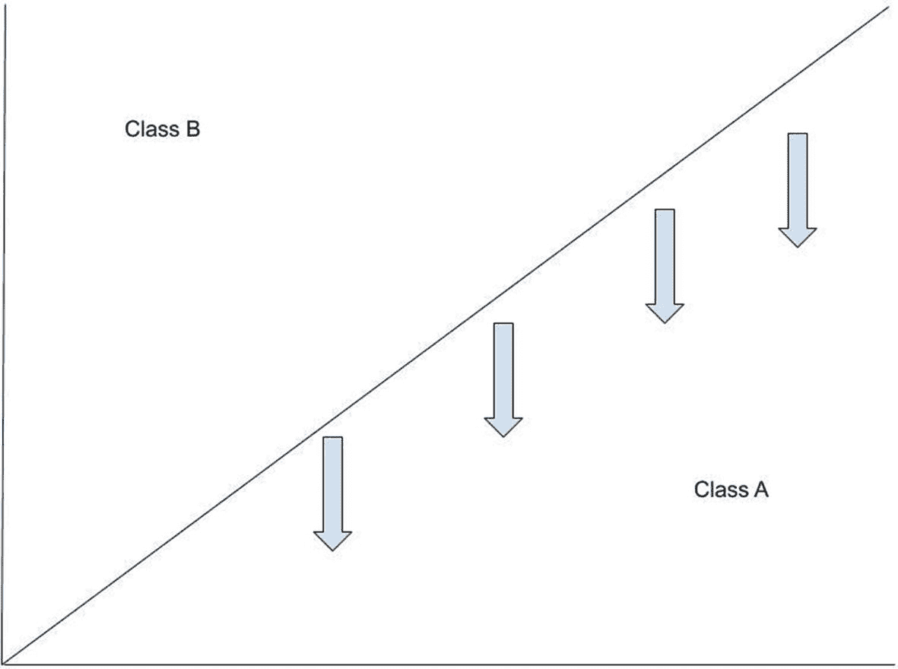

图 9-17

线性激活函数的工作原理

但线性激活函数没有问题吗？当然有。问题在于它是一个常数函数，所以我们不能使用反向传播技术（我们将在下一节中讨论），因为它依赖于导数。这是一个常数函数，所以它没有导数。第二件事是它依赖于其线性。无论我们有多少层，它仍然是一个线性函数；我们几乎可以说，具有线性激活函数的神经网络只是一个线性回归模型。它处理输入数据参数变化复杂性的能力和能力有限，这使得我们需要寻找新的激活函数：非线性激活函数。如今，许多神经网络模型使用非线性激活函数。它们允许模型在网络的输入和输出之间创建复杂的映射，这对于学习和建模复杂数据（如图像、视频、音频以及非线性或高维度的数据集）至关重要。它们解决了线性激活函数面临的问题。今天在神经网络模型中使用的非线性激活函数类型包括 *sigmoid/logistic*、*tanh/双曲正切*、*ReLU（修正线性单元）*、*漏 ReLU*、*softmax* 和 *swish*。让我们来浏览一下这些函数。

**Sigmoid 或逻辑激活函数**：当我们谈论 sigmoid 时，我们指的是介于 0 和 1 之间的概率函数。我们使用 sigmoid 函数的主要原因是因为它存在于 0 和 1 之间。

因此，它对于我们必须预测输出概率的模型特别有用。因为任何东西的概率只存在于*0 到 1 的范围之间*，所以 sigmoid 是正确的选择。从只有 0 和 1 开始，让我们使范围更广；我们可以使范围从*-1 到 1*。这带我们到一个新的函数：tanh 或双曲正切激活函数。这个函数几乎像 sigmoid，但范围在-1 到 1 之间（见图 9-18）。优点是，负输入将被映射到强烈的负值，零输入将被映射到接近零的 tanh 图中。并且当我们在两个类别之间进行分类时，它工作得非常好。但是有一个可能和 sigmoid 相同的函数；它被称为**Softmax**。这个函数将计算所有可能目标类别中每个目标类别的概率。

之后，计算出的概率将有助于确定给定输入的目标类别。这几乎就像 sigmoid 函数，但它被除以所有可能的目标类别。如果使用 Softmax 函数进行多分类模型，它将返回每个类别的概率，目标类别将有较高的概率。其方程式为：

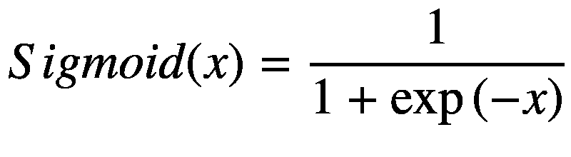

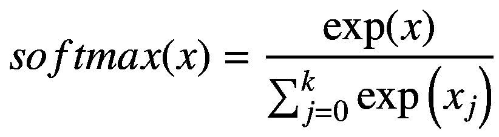


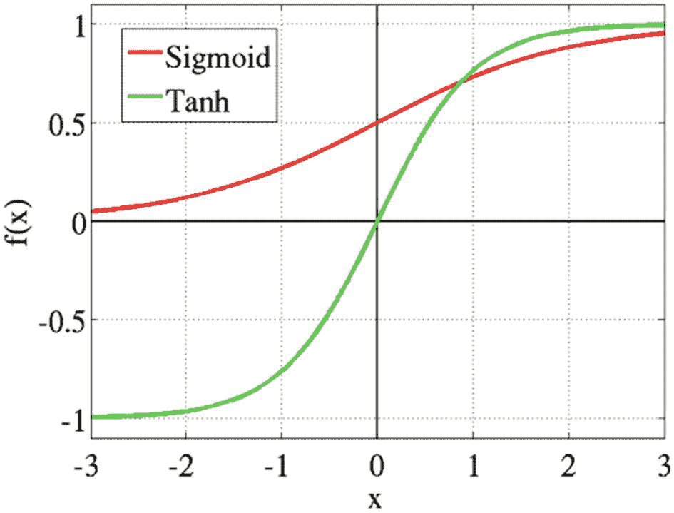

图 9-18

Sigmoid 和 tanh 之间的区别

### 注意

双曲正切和逻辑 Sigmoid 激活函数都用于前馈网络。

虽然我们在-1 和 1 之间的范围内有良好的函数，但我们需要 x 是连续的，所以我们现在需要处理 ReLU 函数。它从零延伸到无穷大。让我们看看它是如何工作的，以及为什么它被称为*修正的*。它被称为修正的，因为它在零以下进行了修正；如果值低于零，它将是零，但如果它等于 0 或高于零，它将是其本身的值。

*结论是，当 z 小于零时，f(z)为零，当 z 大于或等于零时，f(z)等于 z。*

在处理完无穷大之后，我们现在必须处理零。我们主要浪费了所有在零以下的数据，因此我们创建了一个新的激活函数，它获取一些零以下的数据。它被称为**漏斗 ReLU**。

此函数与 ReLU 函数的方向相同，但它有一些变化；它主要试图改进 ReLU 的范围。它的工作范围是-无穷大到无穷大。这是主要的变化（见图 9-19）；方程式为：

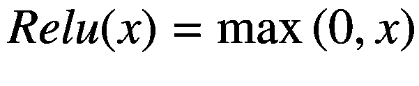

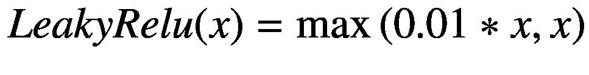

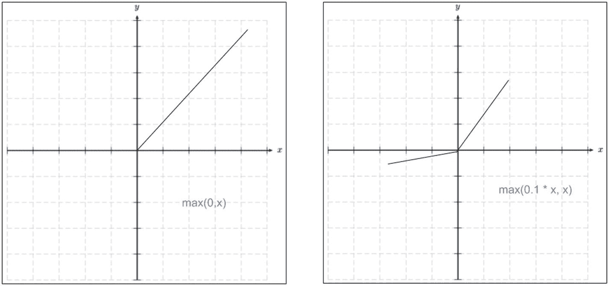

图 9-19

ReLU 函数（左侧）；漏斗 ReLU 函数（右侧）

正如我们在前面的方程中看到的，函数的变化在于 ReLU 的第一个参数等于 x 乘以 0，因为所有小于 0 的参数都将等于零。在漏斗 ReLU 中，x 乘以 0.01，因此对于所有小于零的参数，这个输入将有一个负的目标。谷歌创建了一个新的激活函数，称为**swish**；它在具有相似计算效率的水平上比*ReLU*表现更好（见图 9-20）。它的方程是：

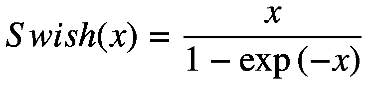

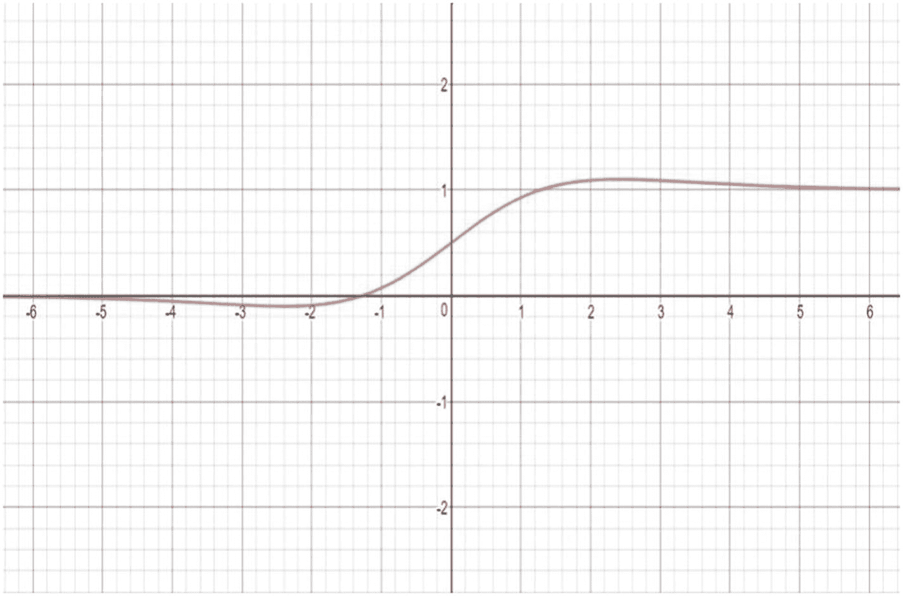

图 9-20

Swish 激活函数

### 回顾

总的来说，激活函数只是一个感知器。它的作用是允许神经网络进行学习：它应该位于输出层，它可能位于隐藏层，但它从未位于输入层。

## 梯度下降

这是机器学习的主要核心——我们用来减少损失函数的方法。让我们深入了解一下梯度下降；你可以有多种不同的描述，它们有不同的含义，但让我们看看梯度下降的抽象定义。梯度下降是一种优化算法，通过迭代地在最陡下降方向上移动，根据梯度的负值定义，来最小化某个函数。在机器学习中，梯度下降是一种优化算法，用于找到函数（f）的参数（系数）的值，这些值最小化成本函数（损失）。我们将在下一节中讨论成本函数。当参数无法通过解析方法（例如，使用线性代数）计算时，梯度下降是最好的选择，必须通过优化算法进行搜索。

我们不会手动编写梯度下降算法，因为它已经在像 Keras 这样的包中实现了。但我们需要理解如何优化成本函数的概念。成本函数简单等于*损失* = (*实际输出* − *预测输出*)。让我们看看梯度下降如何最小化成本函数。梯度下降是一种高效的优化算法，试图找到一个函数的局部或全局最小值。梯度下降使模型能够学习模型应该采取的梯度或方向，以减少误差（实际 y 与预测 y 之间的差异）。在简单的线性回归示例中，这个方向指的是模型参数**B**（偏差或截距）和**W**（斜率或系数）应该如何调整或纠正，以进一步减少成本函数。随着模型迭代，它逐渐收敛到一个最小值，在这个最小值处，参数的进一步调整对损失的影响很小或为零，这也被称为收敛，其中 *y* = *WX* + *B*。让我们看看图 9-20 来展示这个线性函数。

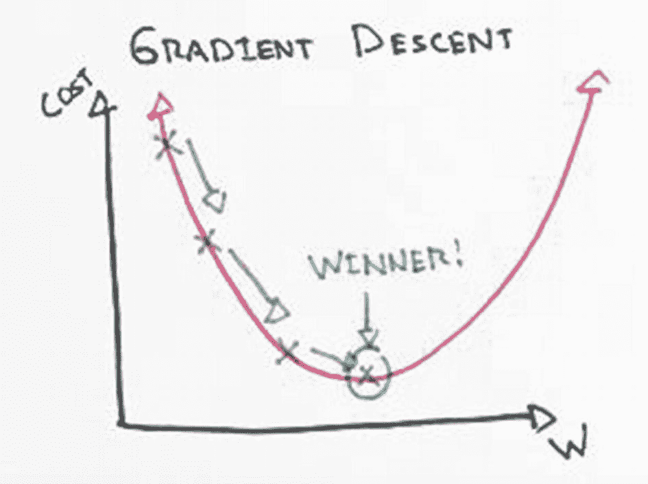

图 9-21

向最小点的一次梯度下降步骤

让我们解释一下这个图上发生了什么。图表面上的一个随机位置是当前系数值的成本（成本）。图的底部是最佳系数集的成本，即函数的最小值。现在你将迭代成本以到达目标，即继续尝试不同的系数值，评估它们的成本，并选择略微更好（更低）成本的新的系数。重复这个过程足够多次将导致图的底部，你将知道导致最小成本的系数值。

### 概述

梯度下降是一种通过尝试在成本函数中获取最小最优值来优化成本的方法。这个概念有许多应用，如小批量、全批量以及随机梯度下降，我们将在下一节中看到它们。梯度下降是机器学习和深度学习中非常流行的优化技术，它可以与大多数，如果不是所有，的学习算法一起使用。梯度基本上是一个函数的斜率：一个参数随着另一个参数的变化而变化的程度。从数学上讲，它可以描述为参数集相对于其输入的偏导数。梯度越大，斜率越陡。梯度下降是一个凸函数。

## 批量 vs. 随机 vs. 小批量梯度下降

现在，让我们进一步探讨这三种类型。但在我们开始之前，我们必须提醒你，所有监督机器学习算法的目标是最好地估计一个*目标函数（f）*，该函数将*输入数据（X）*映射到*输出变量（Y）*。这描述了所有分类和回归问题。

### 批量梯度下降

批量梯度下降背后的概念是在训练示例完成后更新神经网络参数一次。这个过程发生在所有训练示例都通过**网络**之后。

例如，如果训练数据集包含 100 个训练示例，那么一旦所有 100 个示例的训练完成，神经网络参数就会更新一次。表 9-2 列出了批量梯度下降的优点和缺点。

表 9-2

批量梯度下降的优缺点

| 优点 | 缺点 |
| --- | --- |
| 它比随机梯度下降产生更稳定的梯度下降收敛和稳定的误差梯度。 | 整个训练集可能太大，无法在内存中处理，因此可能需要额外的内存。 |
| 它在计算上效率高，因为所有计算机资源都不是用来处理单个样本，而是用来处理所有训练样本。 | 根据计算机资源，将所有训练样本作为一个批次处理可能需要太长时间。 |
| 它通过计算所有训练样本的平均值而不是单个样本的值来更新参数，从而增强了向损失函数最小值迈进的过程。 | |

我们可以看到，使用批量梯度下降，这完全取决于你拥有的资源。

### 随机梯度下降

在这种方法中，每次只有一个训练样本（示例）通过神经网络，并且每个层的参数（权重）都使用计算出的梯度进行更新。网络所有层的参数在每次训练样本之后都会更新。让我们举一个例子：你有 1,000 个训练样本，因此你现在有 1,000 个更新的参数，并且每个参数都是在每个单独样本之后更新的。表 9-3 列出了随机梯度下降的优点和缺点。以下为随机梯度下降的方程；它会在训练集中对“n”个训练样本进行“n”次迭代。

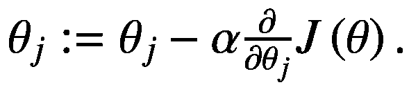

表 9-3

随机梯度下降的优缺点

| 优点 | 缺点 |
| --- | --- |
| 它在计算上非常快，因为一次只处理一个样本。 | 它可以将梯度下降引入其他方向，因为其频繁更新到局部最小值的噪声非常大。 |
| 在这种类型中，我们有很多更新。这意味着向损失函数最小值迈进步骤的频繁更新会产生振荡，这有助于跳出损失函数的局部最小值。 | 由于它一次只处理一个示例，因此它失去了向量运算的优势。 |
| 由于网络一次处理一个训练样本，因此更容易适应内存。 | 由于一次只使用所有资源处理一个训练样本，频繁更新在计算上很昂贵。 |

正如我们所见，每种优化都有其优点和缺点，在选择使用哪种梯度下降时必须考虑。现在让我们谈谈本节中提到的最后一种类型，即小批量梯度下降。

### 小批量梯度下降

小批量梯度下降是随机梯度下降和小批量梯度下降之间的混合系统。它是梯度下降算法的一种变体，将训练数据集分成小批量，用于计算模型误差和更新模型系数。小批量试图在随机梯度所做的事情和小批量梯度的效率之间找到平衡。表 9-4 列出了这种类型的优缺点。

最终，我们只需要知道所有这些都会帮助我们优化模型学习，并改变成本函数的方程，以便模型在降低错误率的同时获得最佳精度。

表 9-4

小批量梯度下降的优缺点

| 优点 | 缺点 |
| --- | --- |
| 模型更新频率高于批量梯度下降，这允许更稳健的收敛，避免局部最小值。批量更新比随机梯度下降在计算上更高效。 | 您需要为学习算法配置“小批量大小”超参数。错误信息必须像批量梯度下降一样跨训练示例的小批量累积。 |

### 注意

最常用的梯度是小批量梯度下降，尤其是在深度学习中。

### 回顾

在本节中，我们学习了梯度下降的类型。正如我们所见，每种类型都有其优点和缺点，因此我们需要在这两者之间做出选择，看看什么会更多地增强我们的模型。我们之前说过，小批量现在是深度学习中的最佳实践；这在未来可能会改变，但到目前为止，我们将在深度学习中使用它。我们希望您在本节关于梯度优化器的讨论中玩得开心。

## 损失函数和反向传播

为了简化神经网络算法，我们可以这样说，任何神经网络都可以表示为一个黑盒，具有两种方法，学习和预测，如图 9-22 所述。

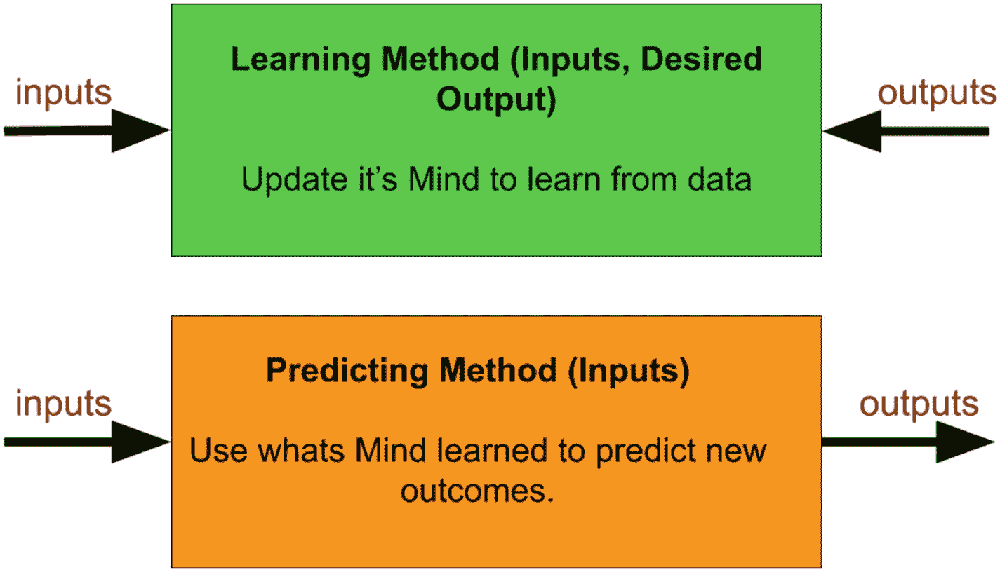

图 9-22

训练和预测方法的区别

本书这一部分的主要内容是学习过程，它接受输入和期望的输出，并相应地更新其内部状态，以便计算出的输出尽可能接近期望的输出。

为了实现这一点，我们将学习过程分解为其几个构建块或步骤，这些步骤可以按以下顺序陈述：

1.  模型初始化

1.  前向传播

1.  计算损失

1.  计算微分

1.  反向传播

1.  更新权重。

1.  从步骤 2 迭代到步骤 6，直到收敛。

在任何学习过程发生之前，第一步是 **模型初始化**。这一步是初始假设，或者说是一个随机猜测。在这一步中，你将要构建的模型将为给定的输入猜测一个随机输出。因此，对模型进行 *随机初始化* 是一种常见的做法。为了理解这个类比，以一个从未踢过足球的人为例。他第一次尝试射门时，只是随机地射门。

在用随机权重初始化模型之后，下一步是检查其性能。为了检查模型性能，我们首先需要让它处理我们传递给网络层的输入，并将模型输出与实际输出直接比较。这一步被称为 **前向传播**，因为计算流程是沿着自然的前向方向从输入通过神经网络到输出的。

在这个阶段，一方面我们有随机初始化的神经网络的模型输出。另一方面，我们有网络需要学习的实际输出，即我们输入到神经网络中的数据的真实输出。回到我们足球员第一次射门的例子，模型输出将是球的最终位置（大多数情况下是出界或错过目标），而实际输出将是球进入球门。一开始，我们的球员只是随机射门。假设球大多数时候都飞出了——或者飞到了球门的右侧。他能从中学到的是，他需要稍微向左射门，并在下一次训练时将注意力集中在球门区域。为了能够将这一概念推广到任何问题，我们定义了所谓的 **损失函数**。

基本上，这是一个性能指标，衡量神经网络达到其目标（生成尽可能接近期望值的输出）的好坏。最直观的损失函数就是 *损失* = (*实际输出* - *模型输出*)。

显然，我们可以使用任何修改神经网络内部权重的优化技术，以最小化我们之前定义的总损失函数。这些技术可以包括贪婪搜索甚至简单的暴力搜索，但最常用的技术是逐步找到最小化损失的优化权重，即使用 **微分**。

如果模型只有非常少的参数，并且我们不太关心精度，那么使用搜索技术甚至暴力搜索可能可行。然而，如果我们正在训练一个包含 600x600 输入的神经网络（如在图像处理中），我们很容易达到拥有数百万个权重需要优化的模型，而暴力搜索甚至无法想象，因为它纯粹是计算资源的浪费！

基本上，微分处理的是损失函数的导数。在数学中，函数在某个点的导数给出了这个函数在这个点值变化的速率或速度。为了看到导数的效果，我们可以问自己，如果我们改变神经网络内部权重的一个很小的值 *δW*，总误差会有多少变化。

您的模型可能只由神经网络中输入和输出之间的一个层组成。但在许多情况下，需要更多的层，以便达到神经网络功能变化的更多变体。当然，我们总是可以创建一个复杂的函数来表示网络所有层的组合。尽管在大多数情况下组合函数非常困难；此外，对于每个组合，都必须计算组合的专用导数（这根本不可扩展且非常容易出错）。为了解决这个问题，幸运的是，导数是可分解的，因此它可以**反向传播**。我们有误差的起点，即损失函数，我们知道如何导出它。所以如果我们知道如何从组合中导出每个函数，我们就可以从末端到起点传播误差。

如我们之前所述，导数仅仅是误差相对于权重变化的速率。

### 注意

在现实生活中的问题中，我们不应该**以如此大的步长更新权重**。由于存在许多非线性，任何权重的重大变化都可能导致混乱的行为。我们不应该忘记，导数仅在计算导数的点上才是局部的。

因此，权重更新的一个通用规则是 delta 规则：*新权重* = *旧权重* - *计算导数* × *学习率*。学习率被引入作为一个常数（通常非常小），目的是为了使权重更新非常平滑和缓慢（以避免大步和混乱的行为）。

由于我们每次只以一个小步长更新权重，因此需要多次迭代才能学习。这与遗传算法非常相似，在每一代之后，我们应用一个小突变率，最适应的个体生存下来。在神经网络中，每次迭代后，梯度下降力将权重更新到越来越小的全局损失函数。相似之处在于，delta 规则充当突变操作符，损失函数充当最小化的适应度函数。不同之处在于，在遗传算法中，突变是盲目的。一些突变是坏的，一些是好的，但好的突变有更高的生存机会。然而，神经网络中的权重更新更智能，因为它们是由误差的下降梯度力引导的。

### 损失函数

损失函数是帮助网络理解其是否在学习正确方向的度量标准。用简单的话来说，可以将损失函数视为你在考试中获得的分数。比如说，你参加了一个关于某个主题的考试，有几个问题：你会使用什么指标来理解你在这次考试中的表现？显然，是考试分数。假设你回答了所有问题，将你的答案与正确答案进行比较，将给出一个评估你在该主题上表现的分数指标。假设你在连续的五次语言测试中分别获得了 56、60、78、90 和 96 分（满分 100 分），你将清楚地看到提高的考试成绩是你表现良好的一个指标。如果考试成绩在下降，那么结论将是你的表现正在下降，你需要改变学习方法和材料来提高。

同样地，*网络如何理解它在每次迭代中是否在改进其学习过程？* 它使用损失函数，这与考试分数类似。损失函数本质上衡量的是与目标之间的损失。比如说，你正在开发一个模型来预测学生是否会通过或失败，通过或失败的概率被定义为概率。所以，1 表示他有 100%的把握通过，而 0 表示他肯定会失败。

模型从数据中学习并预测学生的通过分数为 0.87。因此，这里的实际损失将是 1.00 – 0.87 = 0.13。如果它通过更新一些参数来重复练习以改进，并且现在损失为 0.40，它将理解它所做的更改并没有帮助网络适当地学习。或者，新的损失为 0.05 将表明学习中的更新或更改方向是正确的。

根据数据结果的类型，我们在机器学习和深度学习中定义了几个标准的损失函数。对于回归用例（例如，最终预测将是一个连续数字，如学生获得的分数、商店销售的产品单位数量、客户在接触中心收到的电话数量等），以下是一些可用的流行损失函数：

**均方误差**是实际值和预测值之间的平均平方差。

平方差使得对模型进行更高差异的惩罚变得容易。因此，3 的差值会导致 9 的损失，但 9 的差值会返回 81 的损失。

数学等价式为

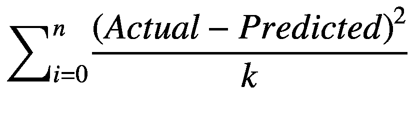

TensorFlow 等价形式

```py
tf.losses.mean_squared_error(labels, predictions)
```

**平均绝对误差**是实际值和预测值之间的平均绝对误差。

数学等价式为

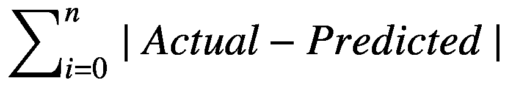

TensorFlow 等价形式为

```py
tf.metrics.mean_absolute_error(labels, predictions)
# OR
tf.losses.absolute_difference(labels, predictions)
```

类似地，还有一些其他变体

+   MAPE – 均方根百分比误差

+   MSLE – 均方对数误差

```py
tf.keras.losses.mean_absolute_percentage_error(labels, predictions)
```

```py
tf.keras.losses.mean_squared_logarithmic_error(labels, predictions)
```

对于分类结果，你的预测将是一个类别，例如学生是否会通过（1）或失败（0），客户是否会购买或不会购买，客户是否会拖欠付款或不会拖欠，等等。某些用例可能有多个类别作为结果，例如分类疾病类型（A 型、B 型或 C 型）；将图像分类为猫、狗、汽车、马、风景等等。

在这种情况下，由于明显的原因，不能使用前面定义的损失。我们需要将类别的结果量化为概率，并基于概率估计作为预测来定义损失。

在 Keras 中，对于分类结果的损失，一些流行的选择如下：

**二元交叉熵**定义了当分类结果是一个二元变量时的损失，即有两个可能的结果：（通过/失败）或（是/否）。

数学形式为 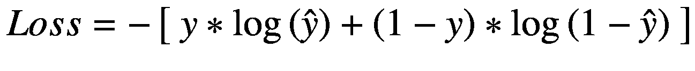

TensorFlow 等价形式为

```py
tf.backend. binary_crossentropy(y_actual, y_predicted)
```

**分类交叉熵**定义了当分类结果不是二元时（即，有两个以上的可能结果：（是/否/可能）或（类型 1/类型 2/…类型 n））的损失。

数学形式为 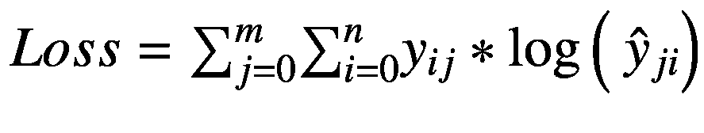

TensorFlow 等价形式为

```py
tf.keras.losses.categorical_crossentropy(y_actual, y_predicted)
# OR
tf.losses.softmax_cross_entropy(y_actual, y_predicted)
```

### 反向传播

理解反向传播算法可能需要一些时间。如果你正在寻找快速实现神经网络的方法，你可以跳过这一节，因为现代库具有自动微分和执行整个训练过程的能力。然而，理解这个算法将肯定让你对与深度学习相关的问题（学习问题、学习速度慢、梯度爆炸和梯度消失）有更深的洞察。

梯度下降是一个强大的算法，但当权重的数量增加时，它是一个缓慢的方法。在具有数千个参数的神经网络的情况下，相对于损失函数训练每个权重——或者更确切地说，将损失表示为所有权重的函数——变得非常缓慢且极其复杂，不适用于实际应用。

多亏了 1986 年 Geoffrey Hinton 及其同事开创性的论文，我们得到了一个极其快速且美丽的算法，帮助我们找到损失相对于每个权重的偏导数。这个算法是每个深度学习算法训练过程中的工作马。更详细的信息可以在这里找到：[`www.cs.toronto.edu/~hinton/backprop.html`](http://www.cs.toronto.edu/%257Ehinton/backprop.html)。

这是计算精确梯度的最有效可能的程序，其计算成本始终与计算损失本身的相同 *O*() 复杂度。反向传播的证明超出了本书的范围；然而，算法的直观解释可以给你一个对其复杂工作的极好洞察。

为了使反向传播工作，对误差函数做出了两个基本假设：

1.  总误差可以写成训练样本/小批次的单个误差之和，*E* = ∑[*k*]*E*[*k*]。

1.  错误可以写成网络输出的函数。

反向传播包括两个部分：

1.  前向传递，其中我们初始化权重并创建一个前馈网络来存储所有值

1.  反向传递，这是为了使存储的值更新权重。

偏导数、链式法则和线性代数是处理反向传播（图 9-23）所需的主要工具。

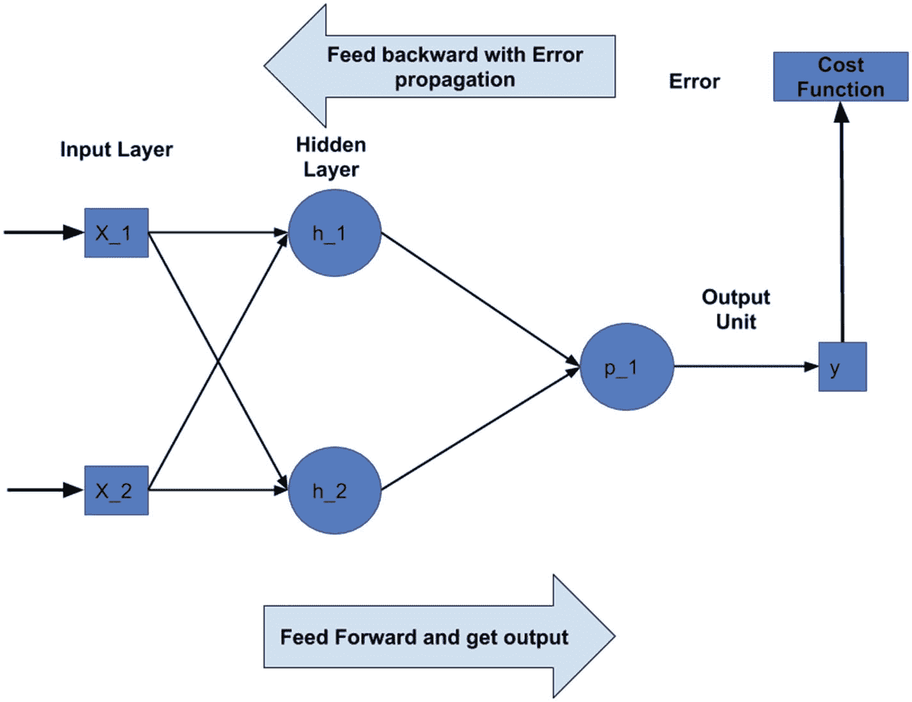

图 9-23

反向传播是如何工作的

初始时，所有边缘权重都是随机分配的。对于训练数据集中的每个输入，激活 ANN 并观察其输出。这个输出与我们已经知道的期望输出进行比较，错误被“传播”回前一层。这个错误被记录下来，并根据相应的权重进行调整。这个过程会重复进行，直到输出错误低于预先设定的阈值。

一旦前面的算法终止，我们就得到了一个“学习”好的人工神经网络（ANN），我们认为它已经准备好处理“新”的输入。这个神经网络被称为从几个示例（标记数据）和它的错误（误差传播）中学习。

好奇心强的读者应该调查关于反向传播的原始论文。我们提供了一系列资源和博客，以更深入地理解该算法。然而，当涉及到实现时，你几乎不会自己编写反向传播的代码，因为大多数库都支持自动微分，而且你也不太可能想要调整反向传播算法。

用通俗易懂的话来说，在反向传播中，我们试图按顺序更新权重，首先通过在网络中进行前向传递，然后首先使用标签和最后一层的输出更新最后一层的权重，随后递归地使用这些信息在紧邻的层上操作。

#### 反向传播背后的四个基本方程

反向传播是关于理解网络中权重和偏置的变化如何改变损失函数。最终，这意味着计算偏导数 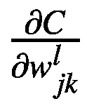 和 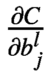。但为了计算这些，我们首先引入一个中间量，，我们称之为第 *l* 层第 *j* 个神经元的 *误差*。反向传播将给我们一个计算误差  的过程，然后会将  与  和  相关联。

要理解误差是如何定义的，想象在我们的神经网络中有一个红色方块（如图 9-24 中的红色方块）。

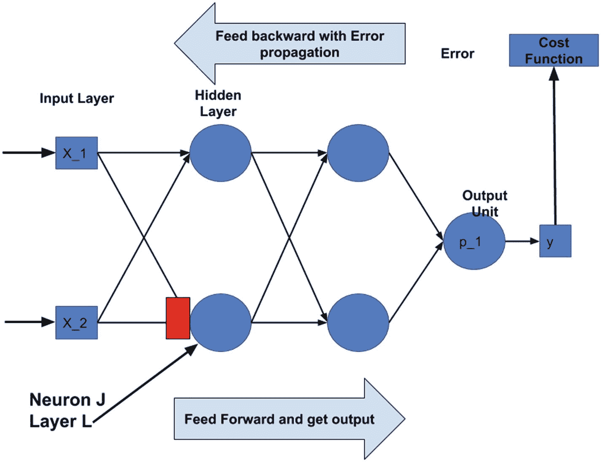

图 9-24

层 L 中的神经元 J 通过反向传播过程

红色方块位于层 l 的第*j*个神经元。当神经元的输入到来时，红色方块会干扰神经元的操作。它向神经元的加权输入中添加一个小的变化，使得神经元不是输出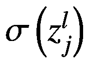，而是输出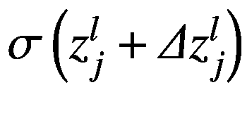。这种变化通过网络中的后续层传播，最终导致整体成本变化一个量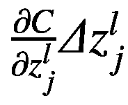。

现在，这个方块是一个很好的红色方块，并且试图帮助你改善成本，即试图找到一个使得成本更小。假设有一个很大的值（无论是正的还是负的）。然后红色方块可以通过选择具有与相反的符号来相当大地降低成本。相比之下，如果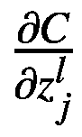接近于零，那么红色方块通过扰动加权输入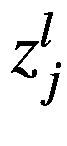几乎不能改善成本。所以，从红色方块的角度来看，神经元已经非常接近最优。

这只适用于微小的变化 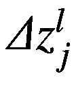，当然。我们将假设红色方块被限制进行这样的微小变化。因此，在某种启发式意义上，是神经元误差的一个度量。

受这个故事启发，我们定义层 l 中神经元*j*的误差为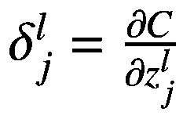。

为了继续，我们用*δ*^(*l*)来表示与层 l 相关的误差向量。反向传播将给我们一种计算每个层的*δ*^(*l*)的方法，然后把这些误差与真正感兴趣的量相关联，即和。

你可能会想知道为什么红色方块在改变加权输入 。当然，想象红色方块改变输出激活 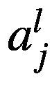 会更自然，结果是我们将使用 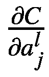 作为我们的错误度量。实际上，如果你这样做，这些事情的工作方式与下面的讨论非常相似。但结果证明，这会使反向传播的表示在代数上稍微复杂一些。因此，我们将坚持使用  作为我们的错误度量。

在像 *MNIST* 这样的分类问题中，“**错误**”一词有时用来表示分类失败率。例如，如果神经网络正确分类了 96.0% 的数字，那么错误率就是 4.0%。显然，这与我们的 *δ* 向量有相当不同的含义。在实践中，你通常不会在给定的用法中弄混哪种含义是意图。

我们的目标：反向传播基于四个基本方程。这些方程共同为我们提供了一种计算误差 *δ*^(*l*) 和损失函数梯度的方法。我将在后面陈述这四个方程。不过，警告一下：你不应该期望立即吸收这些方程。这样的期望会导致失望。事实上，反向传播方程非常丰富，要很好地理解它们需要相当的时间和耐心，随着你逐渐深入方程。好消息是，这种耐心会得到多倍的回报。因此，本节中的讨论只是一个开始，帮助你走向对方程的彻底理解。

这里是本章后面我们将更深入探讨方程的方法的预览：我将给出方程的简短证明，这有助于解释为什么它们是正确的；我们将以算法形式重述方程作为伪代码，并看看伪代码如何被实现为真实的、可运行的 Python 代码；在章节的最后部分，我们将发展一个直观的图像来理解反向传播方程的含义，以及某人如何从头开始发现它们。在这个过程中，我们将反复回到四个基本方程，随着你对这些方程理解的加深，这些方程将变得舒适，甚至可能美丽而自然。

这里是输出层误差 *δ*^(*L*) 的一个方程。*δ*^(*L*) 的组成部分如下所示

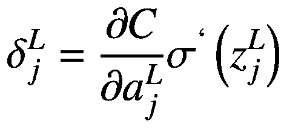

(方程 1)

这是一个非常自然的表达。右侧的第一个项，，仅仅衡量了成本函数作为输出激活的 *j*^(*th*) 激活的函数变化速度。例如，如果 *C* 对特定输出神经元 *j* 的依赖不大，那么 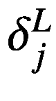 将会很小，这正是我们所期望的。右侧的第二个项，，衡量了激活函数 *σ* 在  处的变化速度。

注意到方程 1 中的所有内容都很容易计算。特别是，我们在计算网络的行为时同时计算 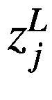，计算 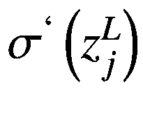 只会增加很小的额外开销。当然，\( \frac{\partial C}{\partial {a}_j^L} \) 的确切形式将取决于成本函数的形式。然而，如果已知成本函数，计算 \( \frac{\partial C}{\partial {a}_j^L} \) 应该不会有太多麻烦。例如，如果我们使用二次成本函数，那么 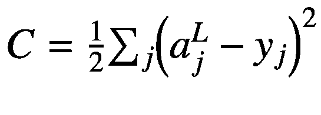，因此 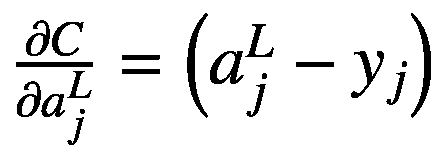，这显然是容易计算的。

方程 1 是 *δ*^(*L*) 的分项表达式。这是一个非常好的表达式，但不是我们想要用于反向传播的基于矩阵的形式。然而，很容易将方程重写为基于矩阵的形式，即 *δ*^(*L*) = ∇[*a*]*C* ⊙ *σ*^′(*z*^(*L*)) (方程 1 a)。

在这里，∇[*a*]*C* 被定义为具有部分导数 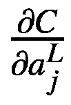 的分量向量。你可以将 ∇[*a*]*C* 视为表示 *C* 相对于输出激活的变化率。很容易看出，方程 1 a 和方程 1 是等价的，因此从现在起我们将交替使用方程 1 来指代这两个方程。例如，在二次成本的情况下，我们有 ∇[*a*]*C* = *a*^(*L*) − *y*，因此方程 1 的完全矩阵形式变为 *δ*^(*L*) = (*a*^(*L*) − *y*) ⊙ *σ*^′(*z*^(*L*))。正如你所看到的，这个表达式中的所有内容都有一个很好的向量形式，并且可以使用像 *NumPy* 这样的库轻松计算。

这里是一个关于下一层错误 *δ*^(*l*) 的方程，它涉及到下一层的错误 *δ*^(*l* + 1)。特别是，

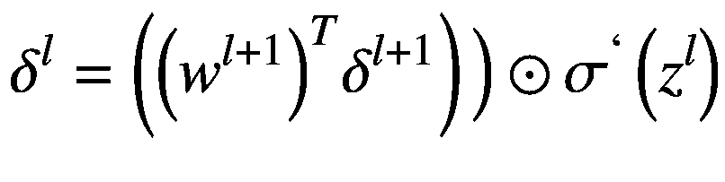

(方程式 2)

其中 (*w*^(*l* + 1))^(*T*) 是 (*l* + 1)^(*th*) 层的权重矩阵 *w*^(*l* + 1) 的转置。这个方程看起来很复杂，但每个元素都有很好的解释。假设我们已知 (*l* + 1)^(*th*) 层的误差 *δ*^(*l* + 1)。当我们应用转置权重矩阵 (*w*^(*l* + 1))^(*T*) 时，我们可以直观地认为这是将误差向后移动通过网络，给我们某种关于 *l*^(*th*) 层输出的误差度量。然后我们取 Hadamard 积 ⊙*σ*^`(*z*^(*l*))。这将在 *l* 层的激活函数中向后移动误差，给我们 *l* 层加权输入中的误差 *δ*^(*l*)。

通过将方程式 2 与方程式 1 结合，我们可以计算网络中任何层的误差 *δ*^(*l*)。我们首先使用方程式 1 来计算 *δ*^(*L*), 然后应用方程式 2 来计算 *δ*^(*L* − 1), 然后再用方程式 2 来计算 *δ*^(*L* − 2), 以此类推，一直回溯到网络中。

这里是网络中任何偏置相对于成本变化的方程。特别是，

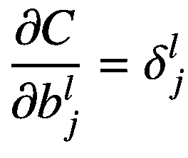

(方程式 3)

即，误差 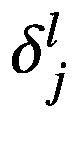 完全等于变化率 。这是一个好消息，因为方程式 1 和方程式 2 已经告诉我们如何计算 。我们可以将方程式 3 简写为 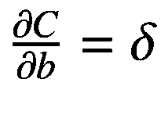，其中理解 *δ* 是在与偏置 *b* 相同的神经元处评估的。

这里是一个关于网络中任何权重相对于成本变化的方程：特别是，

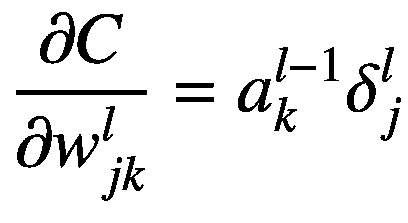

(方程式 4)

这告诉我们如何根据已知的 *δ*^(*l*) 和 *a*^(*l* − 1) 计算偏导数 。该方程可以用更少的索引符号重写为 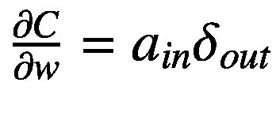，其中理解 *a*[*in*] 是输入到权重 *w* 的神经元的激活，而 *δ*[*out*] 是从权重 *w* 输出的神经元的误差。聚焦于仅查看权重 *w* 和通过该权重连接的两个神经元，我们可以将其表示如图 9-25 所示。

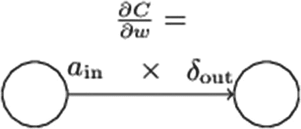

图 9-25

两个神经元之间的反向传播连接

方程  的一个良好后果是，当激活 a[in] 很小，*a*[*in*] ≈ 0 时，梯度项 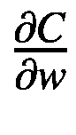 也会倾向于很小。在这种情况下，我们将说权重学习缓慢，这意味着它在梯度下降过程中变化不大。换句话说，方程 4 的一个后果是，来自低激活神经元的权重学习缓慢。

沿着这条思路，还有其他一些见解，可以从方程 1 到方程 4 中获得。让我们首先看看输出层。考虑方程 1 中的项 。回想一下上一章中 sigmoid 函数的图形，当  大约等于 0 或 1 时，σ函数变得非常平坦。当这种情况发生时，我们将有 。因此，教训是如果输出神经元是低激活（≈0）或高激活（≈1），则最终层的权重将学习缓慢。在这种情况下，通常会说输出神经元已经饱和，因此权重停止学习（或学习缓慢）。对于输出神经元的偏差也有类似的评论。

我们可以对早期层获得类似的见解。特别是注意方程 2 中的 *σ*^'(*z*^(*l*)) 项。这意味着如果神经元接近饱和， 很可能变得很小。这反过来又意味着任何输入到饱和神经元的权重都会学习缓慢。

如果 (*w*^(*l* + 1))^(*T*)*δ*^(*l* + 1)) 有足够大的项来补偿  的小值，这种推理就不成立了。但我是在谈论一般趋势。

总结一下，我们已经了解到，如果输入神经元是低激活的，或者输出神经元已经饱和（即高激活或低激活），则权重将学习缓慢。

这些观察结果并不令人特别惊讶。然而，它们有助于提高我们对神经网络学习过程中所发生事情的心理模型。此外，我们可以反过来思考这个问题。四个基本方程对于任何激活函数都成立，而不仅仅是标准的 sigmoid 函数（这是因为，正如我们一会儿将看到的，证明没有使用任何关于 *σ* 的特殊性质）。因此，我们可以使用这些方程来设计具有特定期望学习特性的激活函数。例如，假设我们选择一个（非 sigmoid）激活函数 σ，使得 σ′ 总是正的，并且永远不会接近零。这将防止普通 sigmoid 神经元饱和时发生的学习速度减慢。在本书的后面部分，我们将看到对激活函数进行此类修改的例子。记住这四个方程（方程 1 到 4）可以帮助解释为什么尝试这样的修改，以及它们可能产生的影响（图 9-26）。

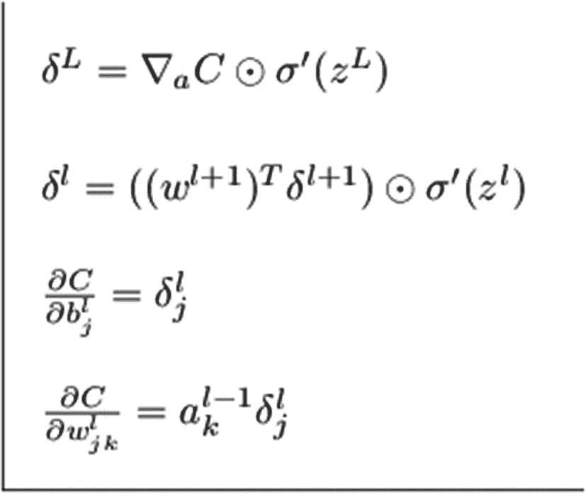

图 9-26

总结所有四个方程

## 梯度爆炸

什么是梯度爆炸？

错误梯度是在训练神经网络期间计算出的方向和幅度，用于以正确的方向和正确的量更新网络权重。

在深度网络或循环神经网络中，错误梯度在更新过程中可能会累积，导致非常大的梯度。这些梯度反过来又导致网络权重的较大更新，进而导致网络不稳定。在极端情况下，权重值可能变得非常大，以至于溢出并导致 NaN 值。

爆炸是通过重复乘以具有大于 1.0 值的网络层的梯度而通过指数增长发生的。

梯度爆炸的问题是什么？

在深度多层感知器网络中，梯度爆炸可能导致网络不稳定，最坏的情况下会导致无法更新的 NaN 权重值。梯度爆炸会使学习不稳定。在循环神经网络中，梯度爆炸可能导致网络不稳定，无法从训练数据中学习，并且在最佳情况下，网络无法从长输入序列数据中学习。

梯度爆炸问题指的是训练过程中梯度范数的显著增加。这些事件是由于长期成分的爆炸。

你如何知道你是否遇到了梯度爆炸？在训练你的网络时，你可能会有一些细微的迹象表明你正在遭受梯度爆炸，例如：

+   模型无法在你的训练数据上获得牵引力（例如，损失值不佳）。

+   模型不稳定，导致损失从更新到更新发生大幅变化。

+   模型损失在训练过程中变为 NaN。

如果你遇到这些问题，可以深入挖掘以查看是否存在梯度爆炸问题。有一些不那么微妙的迹象可以用来确认你是否存在梯度爆炸。

+   在训练过程中，模型权重会迅速变得非常大。

+   在训练过程中，模型权重会变成 NaN 值。

+   在训练过程中，每个节点和层的错误梯度值始终大于 1.0。

我们如何修复梯度爆炸？解决梯度爆炸有许多方法；本节列出了你可以使用的最佳实践方法。

### 重新设计网络模型

在深度神经网络中，可以通过重新设计网络以具有更少的层来解决梯度爆炸问题。

在训练网络时，使用较小的批量大小也可能带来一些好处。

在循环神经网络中，在训练期间更新较少的先前时间步，称为时间反向传播的截断，可以减少梯度爆炸问题。

### 使用长短期记忆网络

在循环神经网络中，由于这种网络训练的固有不稳定，梯度爆炸可能会发生，例如，通过时间反向传播将循环网络基本上转换为一个深度多层感知器神经网络。

通过使用 LSTM 记忆单元以及可能的相关门控型神经元结构，可以减少梯度爆炸。

采用 LSTM 记忆单元是循环神经网络进行序列预测的新最佳实践。

### 使用梯度裁剪

即使在具有大批量大小和非常长的输入序列长度的 LSTM 的非常深的多层感知器网络中，梯度爆炸仍然可能发生。

如果梯度爆炸仍然发生，你可以在训练你的网络时检查并限制梯度的尺寸。

这被称为梯度裁剪。处理梯度爆炸有一个简单但非常有效的解决方案：如果梯度的范数超过给定的阈值，则裁剪梯度。

具体来说，检查错误梯度的值是否超过阈值，如果超过阈值，则将其裁剪或设置为该阈值值。

在一定程度上，可以通过梯度裁剪（在执行梯度下降步骤之前对梯度的值进行阈值处理）来减轻梯度爆炸问题。

### 使用权重正则化

如果梯度爆炸仍然发生，另一种方法是检查网络权重的尺寸，并对大权重值应用网络损失函数的惩罚。

这被称为权重正则化，通常可以使用 L1（绝对权重）或 L2（平方权重）惩罚。

在循环权重上使用 L1 或 L2 惩罚可以帮助解决梯度爆炸。

## 梯度消失

梯度消失问题是你在训练深度神经网络时可能遇到的不稳定行为的一个例子。

它描述了深度多层前馈网络或循环神经网络无法从模型的输出端传播有用的梯度信息到模型输入端附近的层的情况。

结果是，具有许多层的模型在给定数据集上学习的能力普遍不足，或者它们可能会过早地收敛到一个较差的解决方案。

已经提出了许多修复方案和解决方案，例如交替权重初始化方案、无监督预训练、分层训练和梯度下降的变体。最常见的变化可能是使用修正线性激活函数，这已成为新的默认选项，而不是 1990 年代末和 2000 年代默认使用的双曲正切激活函数。

在本节中，你将了解如何在训练神经网络模型时诊断梯度消失问题，以及如何使用替代激活函数和权重初始化方案来修复它。

### 梯度消失问题

例如，使用随机梯度下降训练神经网络。这涉及首先计算模型做出的预测误差，并使用误差来估计用于更新网络中每个权重的梯度，以便在下一次减少误差。这个误差梯度从输出层传播到输入层。

训练具有许多层的神经网络是可取的，因为增加更多的层会增加网络的能力，使其能够学习大量的训练数据集，并有效地表示从输入到输出的更复杂的映射函数。

训练具有许多层（例如，深度神经网络）的网络的难题在于，梯度在通过网络反向传播时会急剧减小。当误差传播到接近模型输入的层时，误差可能非常小，以至于可能几乎没有影响。因此，这个问题被称为“梯度消失”问题。

梯度消失使得难以知道参数应该朝哪个方向移动以改善成本函数。

实际上，在深度神经网络中，误差梯度可能是不稳定的，不仅会消失，还可能爆炸，即梯度在通过网络反向传播时会呈指数增长。这被称为“梯度爆炸”问题。

“梯度消失”这个术语指的是在前馈网络（FFN）中，反向传播的误差信号通常随着距离最终层的距离呈指数（或增加）。

消失梯度是循环神经网络的一个特定问题，因为网络的更新涉及到对每个输入时间步进行网络展开，实际上创建了一个非常深的网络，需要权重更新。一个适度大小的循环神经网络可能有 200 到 400 个输入时间步，从概念上讲，这导致了一个非常深的网络。

消失梯度问题可能通过在训练过程中模型改进速度缓慢以及可能过早收敛（例如，继续训练不会导致任何进一步的改进）在多层感知器中表现出来。检查训练过程中权重的变化，我们会看到靠近输出层的层发生更多的变化（即，更多的学习），而在靠近输入层的层中变化较少。

有许多技术可以用来减少前馈神经网络中消失梯度问题的影响，最显著的是交替权重初始化方案和使用交替激活函数。

深度网络（前馈和循环）的不同训练方法已被研究和应用（以解决消失梯度问题），例如预训练、更好的随机初始缩放、更好的优化方法、特定架构、正交初始化等。

在本节中，我们将更详细地研究使用交替权重初始化方案和激活函数来允许训练更深的神经网络模型。

权重初始化：将具有 tanh 激活的深度 MLP 更新为使用 Xavier 均匀权重初始化并报告结果。

学习算法：将具有 tanh 激活的深度 MLP 更新为使用自适应学习算法（如 Adam）并报告结果。

权重变化：更新 tanh 和 ReLU 示例，以记录和绘制每个纪元的模型权重 L1 向量范数，作为每个层在训练期间变化的代理，并比较结果。

研究模型深度：创建一个使用具有 tanh 激活的 MLP 的实验，并报告当隐藏层数量从 1 增加到 10 时模型的性能。

扩展广度：将具有 tanh 激活的 MLP 的隐藏层节点数量从 5 增加到 25，并报告当层数从 1 增加到 10 时的性能。

## TensorFlow 基础知识

在第一部分，我们讨论了从安装到其基础知识的 TensorFlow；我们还展示了如何使用玩具数据集构建一个完全功能性的模型。我们在介绍部分做了所有这些，让你感觉学习深度学习和开始使用 TensorFlow 比你想象的要容易。但现在我们需要向你展示 TensorFlow 所需的基本知识，通过相同的标题但深入一些；例如，我们将重新说明不同类型张量的使用（即，占位符、变量和常量），为你提供构建任何 TensorFlow 深度学习模型的具体工具。

因此，在本节中，我们将讨论占位符、变量和常量张量类型之间的区别，并展示张量的属性。之后，我们将向您展示 TensorFlow 在几乎所有深度学习模型中使用的优化框架和方法，包括学习率以及理解小批量方法。最后，我们将向您展示 TensorFlow 中最重要的优化器。

### 占位符 vs. 变量 vs. 常量

正如我们在第一部分中描述的，占位符、变量和常量是使用 TensorFlow 中的计算图的关键工具。因此，我们必须了解它们之间的区别以及何时最好地利用它们来发挥优势。

在数据中区分的一个重要方面是它是否是占位符或变量。变量是算法的参数，TensorFlow 会跟踪如何改变这些参数以优化算法。占位符是允许您输入特定类型和形状数据的对象，并依赖于计算图的结果，例如计算的预期结果。另一方面，常量有一个简单的用途：当您构建一个庞大的模型时，您将使用一些为您做些事情的函数：矩阵乘法或任何计算操作。在这里，您可以使用常量进行这些操作，以帮助您在计算图中完成它们。

另一个重要的区别是，在 TensorFlow 中，常量和变量之间的区别在于，当你声明某些常量时，其值在将来不能改变（初始化也应该使用值，而不是操作）。尽管如此，当你声明一个变量时，你可以使用`tf.assign()`方法在将来改变它的值（初始化可以通过值或操作实现）。

创建变量的主要方式是使用`Variable()`函数，它接受一个张量作为输入并输出一个变量。这是声明，我们还需要初始化变量。初始化是将变量及其相应的方法放置在计算图上的过程。以下是一个创建和初始化变量的示例：

```py
my_var = tf.Variable(tf.zeros([2,3]))
sess = tf.Session()
initialize_op = tf.global_variables_initializer ()
sess.run(initialize_op)
```

占位符只是为要输入图中的数据保留位置。占位符从会话中的`feed_dict`参数获取数据。为了在图中放置占位符，我们必须在占位符上执行至少一个操作。我们初始化图，声明 x 为占位符，并将 y 定义为对 x 的恒等操作，它只是返回 x。然后我们创建数据以输入到 x 占位符中，并运行恒等操作。值得注意的是，TensorFlow 不会在 feed 字典中返回自引用的占位符。代码如下，结果图将在下一节中展示：

```py
sess = tf.Session()
x = tf.placeholder(tf.float32, shape=[2,2])
y = tf.identity(x)
x_vals = np.random.rand(2,2)
sess.run(y, feed_dict={x: x_vals})
# Note that sess.run(x, feed_dict={x: x_vals})
# will result in a self referencing error.
```

我们可以通过一个变量来详细查看代码，该变量初始化为全零。灰色阴影区域是涉及的操作和常数的非常详细视图。主要计算图细节较少，是灰色区域右上角较小的图形。有关创建和可视化图的更多详细信息。请注意，TensorFlow 不会在 feed 字典中返回自引用占位符。在技术术语中，在以下图中运行`sess.run(x, feed_dict={x: x_vals})`将返回错误。

### 从深度学习视角看梯度下降优化方法

我们认为，在深入研究 TensorFlow 优化器之前，这是一个非常重要的主题，了解关于全批量梯度下降和随机梯度下降的一些关键点也很重要，包括它们的缺点。这样，人们就可以了解和了解比较和选择这些优化器变体需求的原因。

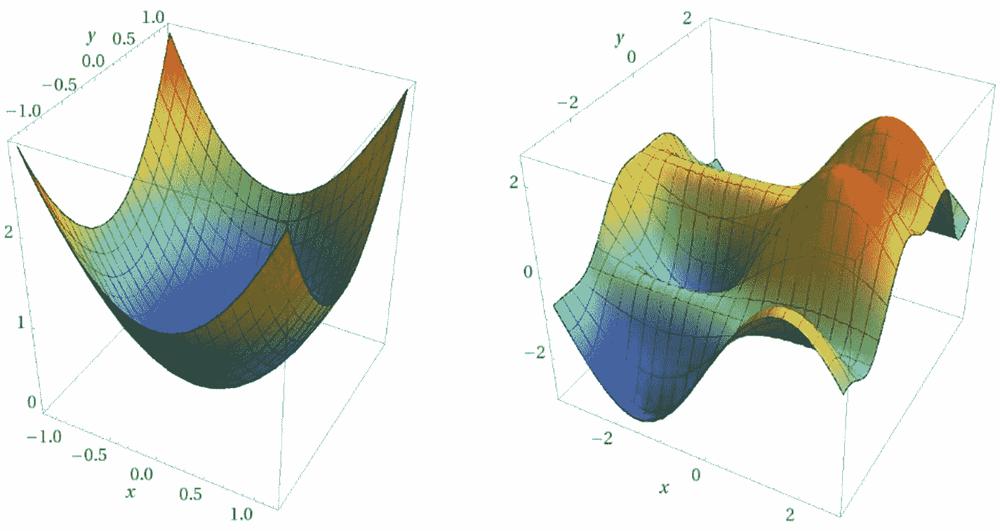

图 9-27

许多成本函数之间的差异

线性神经元的最小二乘误差成本函数是二次的（见图 9-27）。当成本函数是二次的时，全批量梯度下降法产生的梯度方向在线性意义上给出了成本减少的最佳方向，但除非成本函数的不同椭圆轮廓是圆形，否则它并不指向最小值。在长椭圆轮廓的情况下，梯度分量可能在需要较小变化的方向上很大，而在需要较大变化才能移动到最小点的方向上很小。

这个条件的问题在于，如果我们通过减小学习率来采取小步长，梯度下降将需要一段时间才能收敛，而如果我们使用大学习率，梯度会在成本函数曲率的方向上迅速改变方向，导致振荡。多层神经网络的成本函数不是二次的，而主要是平滑函数。局部上，这些非二次成本函数可以通过二次函数近似，因此梯度下降固有的椭圆轮廓问题仍然存在于非二次成本函数中。

解决这个问题的最佳方法是在梯度较小但一致的方向上采取更大的步长，在梯度大但方向不一致的方向上采取较小的步长。如果我们对每个维度都有一个单独的学习率，而不是对所有维度都有一个固定的学习率，就可以实现这一点。

神经网络另一个大问题是成本函数大多是非凸的，因此梯度下降法可能会陷入局部最小值点，导致次优解。

### 注意

神经网络的非凸性质是隐藏层单元具有非线性激活函数的结果，例如 sigmoid 函数。

全批量梯度下降法使用整个数据集进行梯度计算。虽然这对于凸成本表面来说很好，但在非凸成本函数的情况下，它有自己的问题。对于具有全批量梯度的非凸成本表面，模型最终会在其吸引域的极小值处结束。如果初始化的参数位于一个局部最小值的吸引域中，而这个局部最小值不能提供良好的泛化，那么全批量梯度将给出次优解。

使用随机梯度下降，计算出的噪声梯度可能会迫使模型脱离不良局部最小值的吸引域——那种不能提供良好泛化的最小值——并将其放置在一个更优的区域。使用单个数据点的随机梯度下降会产生非常随机和噪声的梯度。与单个数据点的梯度相比，使用小批量数据的梯度通常会产生更稳定的梯度估计，但它们仍然比全批量产生的梯度更噪声。

理想情况下，小批量的大小应该仔细选择，使得梯度足够噪声以避免或逃离不良局部最小值点，但同时又足够稳定以收敛到全局最小值或提供良好泛化的局部最小值。

在图 9-28 中，虚线箭头对应随机梯度下降（SGD）所走的路径，而实线箭头对应全批量梯度下降所走的路径。全批量梯度下降在一点计算实际梯度，如果它位于一个较差的局部最小值吸引域内，梯度下降几乎可以确保达到局部最小值 L。然而，在随机梯度下降的情况下，因为梯度仅基于数据的一部分而不是整个批量，所以梯度方向只是一个粗略的估计。由于这个粗略的估计并不总是指向点 C 的实际梯度，随机梯度下降可能会逃离局部最小值的吸引域，并且幸运地落在全局最小值的吸引域中。随机梯度下降也可能逃离全局最小值的吸引域，但通常如果吸引域很大，并且仔细选择小批量大小，使得它产生的梯度适度噪声，随机梯度下降最有可能达到全局最小值 G（如本例所示）或具有大吸引域的其他最优最小值。对于非凸优化，还有其他启发式方法，例如动量，当与随机梯度下降结合使用时，可以增加 SGD 避免浅局部最小值的机会。动量通常通过速度分量跟踪之前的梯度。因此，如果梯度持续指向一个具有大吸引域的良好局部最小值，则速度分量会在良好局部最小值的方向上很高。如果新的梯度是噪声的，并指向一个较差的局部最小值，则速度分量会提供动量以继续在同一方向上前进，并且不会过多地受到新梯度的影响。

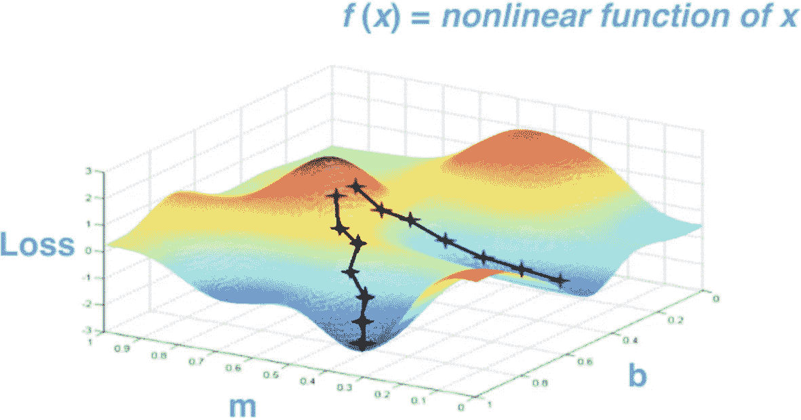

图 9-28

随机梯度下降（SGD）算法的步骤

另一个优化非凸成本函数的障碍是鞍点的存在。鞍点的数量随着成本函数参数空间维度的增加而指数增长。鞍点是驻点（即梯度为零的点），但既不是局部最小值也不是局部最大值点。由于鞍点与具有与鞍点相同成本的点的长平台相关联，平台区域的梯度要么为零，要么非常接近零。由于所有方向上几乎为零的梯度，基于梯度的优化器很难从这些鞍点中出来。从数学上讲，为了确定一个点是否是鞍点，必须在给定点计算成本函数的海森矩阵的特征值。如果有正负特征值，则它是一个鞍点。

### 在小批量随机梯度下降法中的学习率

当数据集中存在高度冗余时，对数据点的迷你批量计算出的梯度几乎与对整个数据集计算出的梯度相同，前提是迷你批量是整个数据集的良好表示。在这种情况下，可以避免对整个数据集计算梯度，而是可以使用数据点的迷你批量梯度作为整个数据集的近似梯度。这是梯度下降的迷你批量方法，也称为迷你批量随机梯度下降。当不使用迷你批量，而是用一个数据点来近似梯度时，它被称为在线学习或随机梯度下降。然而，与在线学习模式相比，总是最好使用随机梯度下降的迷你批量版本，因为与在线学习模式相比，迷你批量方法的梯度噪声更少。学习率在迷你批量随机梯度下降的收敛中起着至关重要的作用。以下方法往往能提供良好的收敛：

+   从一个初始学习率开始。

+   如果错误减少，则增加学习率。

+   如果错误增加，则降低学习率。

+   如果错误不再减少，则停止学习过程。

## 概述

正如我们将在下一节中看到的，不同的优化器在其实现中采用自适应学习率方法。

# 10. 改进深度神经网络

## TensorFlow 中的优化器

我们仍然在梯度下降的主题上。但现在让我们谈谈梯度优化，因为它对梯度下降的重要性。它是一种寻找函数最小值的优化方法，在深度学习中非常重要。它通过反向传播来更新神经网络的权重。

那么，我们之前讨论的梯度下降类型（批量、小批量、随机）的优化是什么？让我们先谈谈这些优化方法的好处：

1.  修改学习率组件，α

1.  修改梯度组件，∂L/∂w

1.  修改（α 和 ∂L/∂w）两者

我们将 ∂L/∂w 作为梯度的函数（wnew=w- α ∂L/∂w）来提及。这是优化器试图优化的方程。首先，我认为每个优化器都是优化器的优化器。这是一个非常奇怪的短语，但却是真的，例如，Adadelta 和 RMSprop 是 Adagrad 的优化器。让我们看一张可能有助于展示所有优化器之间联系的图片（图 10-1）。

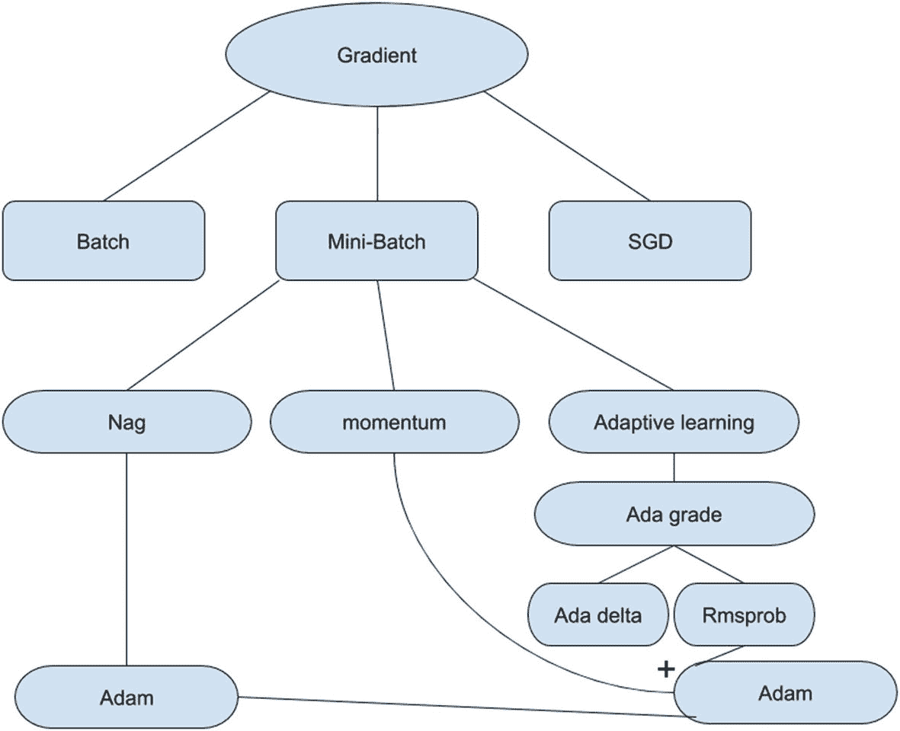

图 10-1

优化器树

在深度学习中，最常用的优化器类型是小批量。我们之前已经讨论过为什么它是最常用的，现在让我们深入了解自适应学习率算法，如 Nesterov 加速梯度（NAG）和动量，以及自适应学习方法。

用法：

```py
train_op = tf.train.GradientDescentOptimizer (learning_rate).minimize(cost)
```

### 应用的符号

*t -> 表示时间步*

*w -> 我们想要更新的权重/参数*

*α -> 学习率*

∂L/∂w -> L 的梯度，要最小化的损失函数

## 动量

这种梯度优化器有一个变量，它使梯度非常快地收敛，因为它不仅依赖于当前梯度来更新权重。具有动量的梯度下降用 *V*（代表速度）替换当前梯度，即当前和过去梯度的指数移动平均值。基于动量的方法引入了一个称为速度 *V* 的分量，当计算的梯度改变符号时，它会抑制参数更新，而当梯度与速度方向相同时，它会加速参数更新。这引入了更快的收敛速度以及围绕全局最小值或提供良好泛化的局部最小值的更少振荡。基于动量的优化器的更新规则如下：


默认值 β = 0.9，其中 α 是动量参数，η 是学习率。术语  和 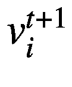 分别代表第 *i* 个参数在迭代 *t* 和 (*t* + 1) 时的速度。同样，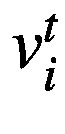 和  分别代表当损失函数达到局部最小值时，第 *i* 个参数在迭代 *t* 和 (*t* + 1) 时的权重。当我们使用梯度下降时，参数停止更新，并在这个局部最小值处，但当我们使用动量时，我们会看到参数不会停止更新。例如，速度仍在更新，因为它不能是零值。先前的速度会将算法驱出局部最小值，考虑到局部最小值有一个小的吸引域。梯度下降的速度或动量会朝那个方向，因为  由于先前梯度的非零速度而不为零。此外，如果先前的梯度始终指向全局最小值或具有良好泛化能力和合理大吸引域的局部最小值，梯度下降的速度或动量也会朝那个方向。因此，即使存在一个具有小吸引域的坏局部最小值，动量分量不仅会驱使算法跳出坏局部最小值，还会继续梯度下降以趋向全局最小值或好的局部最小值。

使用方法：

```py
train_op = tf.train.MomentumOptimizer.(learning_rate=0.001,momentum=0.9,use_nesterov=False)
```

### Nesterov 加速梯度

在动量变得流行之后，使用 Nesterov 加速梯度（NAG；Sutskever 等，2013）实现了类似的更新。这个更新利用了 V，即我称之为投影梯度的指数移动平均。

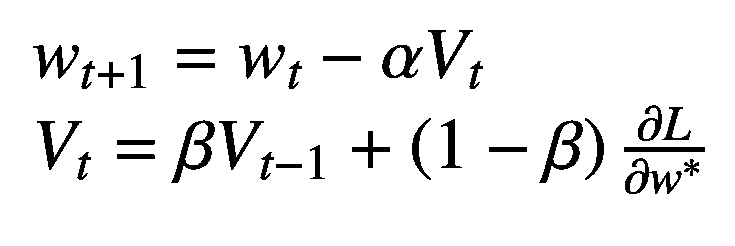

第二个方程的最后一个项是一个投影梯度。这个值可以通过使用前一个速度向前**一步**来获得。这意味着对于这个时间步 t，我们必须在最终执行反向传播之前执行另一个前向传播。以下是具体步骤：

1.  使用前一个速度将当前权重 w 更新为投影权重 w^∗。

    *w*^∗ = *w*[*t*] − *αV*[*t* − 1]

1.  执行前向传播，但使用这个投影权重。

1.  获得投影梯度 ∂L/∂w^∗。

1.  依次计算 V 和 w。

### 注意

原始的 Nesterov 加速梯度论文（Nesterov，1983）并不是关于随机梯度下降的，也没有明确使用梯度下降方程。因此，一个更合适的参考文献是 Sutskever 等人在 2013 年发表的上文，其中描述了 NAG 在随机梯度下降中的应用。

### Adagrad

自适应梯度（Adagrad）与梯度下降类似，但有一些修改。它不是使用全局学习率，而是对成本函数依赖的每个维度进行归一化。每个迭代的学习率是全球学习率除以当前迭代每个维度的先前梯度的 l2 范数。它通过将学习率除以 S 的平方根来作用于学习率组件，S 是当前和过去平方梯度的累积和。

有时，在数据中不太显现的稀疏特征对优化问题非常有用。然而，在基本的梯度下降或随机梯度下降中，学习率在每次迭代中对所有特征给予同等的重要性。由于学习率相同，非稀疏特征的整体贡献将远大于稀疏特征。因此，我们最终会丢失稀疏特征中的关键信息。在 Adagrad 中，每个参数都使用不同的学习率进行更新。

特征越稀疏，在迭代中其参数更新就越高。这是因为对于稀疏特征，这个量会更少，整体学习率会更高。由于数据稀疏性，这可能在 NLP 或图像处理中是一个非常好的应用。让我们看看使我们的说法有意义的方程：S 被初始化为 0。

![$$ {S}_t={S}_{t-1}+{\left[\frac{\partial L}{\partial wt}\right]}² $$](Images/484548_1_En_10_Chapter_TeX_IEq8.png)

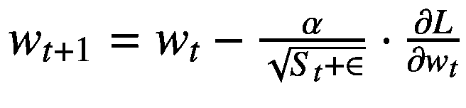

因此，在本节中，我们注意到我们试图调整学习率以获得成本函数的最小值，这是创建这些优化方法的主要原因之一。我们不想为所有参数使用一个共同的学习率，而是希望为每个参数设置一个单独的学习率。因此，Adagrad 通过保持参数梯度的平方和来修改个别学习率。结果，出现频率较高的参数具有较小的梯度。

### Adadelta

Adadelta 是 Adagrad 的扩展，它也试图减轻 Adagrad 的激进、单调降低学习率的特性，它还专注于学习率分量。Adadelta 可能代表“自适应 delta”，这里的 delta 指的是当前权重和更新后的新权重之间的差异。在 Adadelta 中，我们不需要设置默认的学习率，因为我们取前一时间步的运行平均与当前梯度的比率。

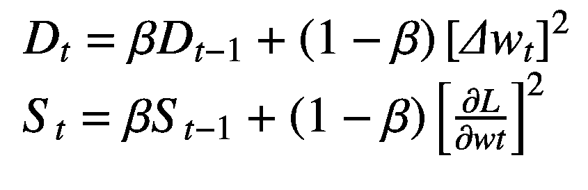

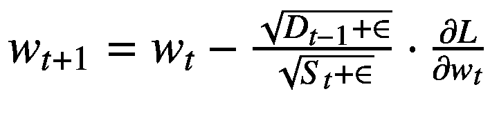

使用方法：

```py
train_op = tf.train.AdadeltaOptimizer(learning_rate=0.001, rho=0.95, epsilon=1e-08)
```

其中，衰减代表α，epsilon 代表ε，η代表学习率。

### RMSprop

根均方误差或 RMSprop（Hinton 等人，2012）是另一种自适应学习率，它是 Adagrad 的改进。与 Adagrad 中累积平方梯度的总和不同，我们取这些梯度的指数移动平均。

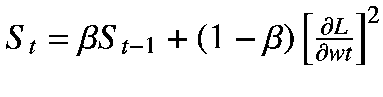


从整体来看，我们将看到 RMSprop 与 Adadelta 非常相似，但它有一个区别。Adadelta 和 RMSprop 之间的区别在于，Adadelta 通过用 D（平方 delta 的指数移动平均）替换学习率参数，完全取消了学习率参数的使用。

使用方法：

```py
train_op = tf.train.RMSPropOptimizer(learning_rate=0.001, decay =0.9, momentum=0.0, epsilon=1e-10)
```

### Adam

自适应矩估计，或 Adam（Kingma & Ba，2014），是动量和 RMSprop 的结合。它通过使用 V（梯度指数移动平均，类似于动量）和通过将学习率α除以平方梯度的指数移动平均 S（类似于 RMSprop）来作用于梯度分量和学习率分量。


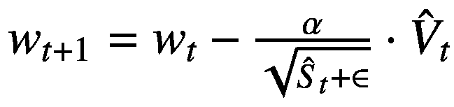

### 注意

^ 符号实际上是偏差校正的平均值，以确保值不会偏向 0。

作者提出的默认值：

𝛼 = 0.001

𝛽[1] = 0.9

𝛽[2] = 0.999

𝜀 = 10^(-8)

Adam 优化器计算效率高，内存需求非常小。Adam 优化器是最受欢迎的梯度下降优化算法之一。

用法：

```py
train_op=tf.train.AdamOptimizer(learning_rate=0.001,beta1=0.9,beta2=0.999,epsilon=1e-08)
```

### Nadam（Adam + NAG）

Nadam 用于噪声梯度或高曲率梯度。通过累加先前和当前梯度的指数衰减移动平均值来加速学习过程，Nadam 利用 Nesterov 通过将早期方程中的先前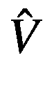替换为当前来提前更新梯度：

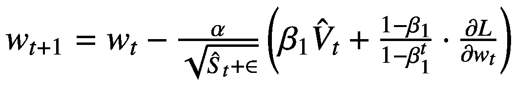

其中

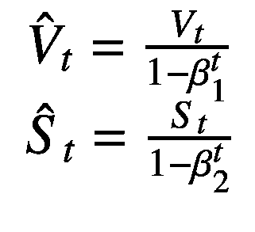

其中

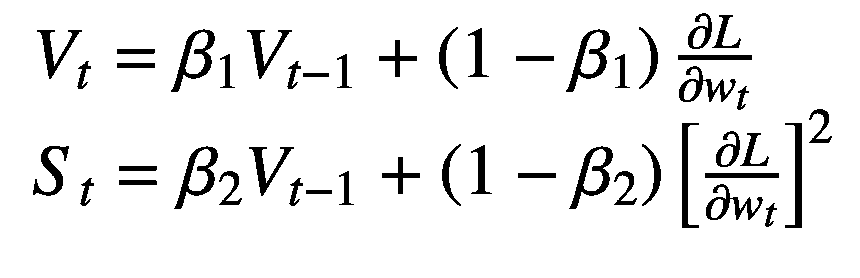

默认值（来自 Keras）:

α = 0.002

β[1] = 0.9

β[2] = 0.999

ε = 10^(-7)

用法：

```py
train_op = tf.train.MomentumOptimizer (learning_rate=0.001,momentum=0.9,use_nesterov=False)
```

## 选择学习率

选择超参数学习率是超参数之一。深度学习神经网络使用随机梯度下降和批量算法进行训练。因此，随机梯度下降是一种优化算法，它使用训练数据集中的示例来估计模型当前状态的误差梯度。然后，它使用误差反向传播算法（简称反向传播）来更新模型的权重。在训练期间更新权重的量称为步长或“学习率”。具体来说，学习率是神经网络训练中使用的可配置超参数，它具有小的正值，通常在 0.0 和 1.0 之间****。

既然我们已经知道了学习率是什么，我们就需要看看我们如何在训练阶段改变它。在这个阶段，误差反向传播估计了网络中一个节点的权重负责的错误量。不是用全部的错误量来更新权重，而是通过学习率进行缩放**。这意味着，一个 0.1 的学习率，一个传统上常见的默认值，意味着网络中的权重更新为 0.1 *（估计的权重错误）。所以问题是*我们能否配置学习率以获得我们模型的最佳可能学习率？*不幸的是，不能。但如果你有时间，学习率是你在模型中应该调整的最佳超参数。在我看来，这是最好的超参数，值得注意。不幸的是，我们无法对给定数据集上的给定模型进行解析地计算最佳学习率。相反，一个好的（或足够好的）学习率必须通过试错来发现。你可能认为你可以配置最佳学习率，但我说你应该听听更多人和书中的建议：

+   初始学习率。这通常是单个最重要的超参数，人们应该始终确保它已经被调整。如果只有时间优化一个超参数，并且使用随机梯度下降，那么这就是值得调整的超参数。参见《神经网络：技巧与贸易》中的“基于梯度的深度架构训练的实际建议”。“计算机科学讲义”，第 7700 卷（Springer，2012 年）。

+   通常情况下，无法事先计算出最佳学习率。参见 Russell D. Reed 和 Robert J. Marks II（麻省理工学院出版社，1998 年）所著的《神经制造：前馈人工神经网络中的监督学习》第 72 页。

你可以阅读更多的书籍，但有一些我们可以使用的东西，允许我们调整学习率参数。诊断图可以用来研究学习率如何影响模型的学习率和学习动态。一个例子是在训练期间创建损失随训练周期变化的线图。线图可以显示许多属性，例如训练周期中的学习率（例如，快或慢）。模型是否学得太快（急剧上升和平台期）或者学得太慢（变化很小或没有变化）？学习率是否太大，通过损失中的振荡来体现？

配置学习率具有挑战性和耗时性。或者你可以尝试**网格搜索**。这不仅可以突出可能存在良好学习率的数量级顺序，还可以描述学习率与性能之间的关系。通常在以对数尺度从 0.1 到 10^-5 或 10^-6 进行网格搜索学习率。当绘制这种敏感性分析的结果时，通常会显示一个“U”形，其中损失随着学习率的降低（性能提高）而降低，直到损失再次急剧增加，因为模型未能收敛。或者你可以使用学习率调度：学习率随时间（训练轮次）变化的方式被称为学习率调度或学习率衰减。可能最简单的学习率调度是将学习率从大的初始值线性降低到小的值。这允许在学习过程开始时进行大的权重变化，并在学习过程结束时进行小的变化或微调。另一种选择是使用自适应学习率，其中学习算法可以监控模型在训练数据集上的性能，并根据性能调整学习率。最简单的实现可能是当模型性能达到平台期时减小学习率，例如通过将学习率减少到原来的二分之一或一个数量级。尽管没有一种方法对所有问题都最佳，但有三种子自适应学习率方法在许多类型的神经网络架构和问题类型上已被证明是稳健的。它们是 Adagrad、RMSprop 和 Adam，并且所有这些方法都维护和调整模型中每个权重的学习率。最后，我们应该知道我们无法选择最佳的学习率，但我们可以尝试对其进行缩放以获得最佳结果。在我看来，深度学习社区可能会邀请一个分析工具来帮助我们选择最佳的学习率，但这是一个非常复杂的选择。

## Dropout 层和正则化

我们希望对神经网络的过拟合进行正则化。当我们谈论正则化时，我们指的是模型具有较大的方差和较小的偏差。也就是说，模型对训练数据集中的特定示例和统计噪声敏感。具有大权重的模型比具有小权重的模型更复杂。这是网络可能在训练数据上过度专业化的一个迹象。在实践中，我们更喜欢选择更简单的模型来解决问题。我们更喜欢具有较小权重的模型。但我们需要记住，在深度学习中，当我们拟合神经网络模型时，我们必须使用随机梯度下降和训练数据集来学习网络的权重（即模型参数）。我们训练网络的时间越长，权重就会变得越专业化，从而过度拟合训练数据。权重会增大以处理训练数据中看到的示例的具体情况。大权重会使网络不稳定。尽管权重将专门针对训练数据集，但预期输入上的微小变化或统计噪声将导致输出的大差异。

现在我们将讨论神经网络 dropout 层。这个层可以与大多数类型的层一起使用，例如密集的全连接层、卷积层以及长短期记忆网络层等循环层。它适用于所有隐藏层和输入层，但不适用于输出层。术语“dropout”指的是在神经网络中丢弃单元（隐藏和可见单元）（图 10-2）。它丢弃一些节点或神经元，以减少我们试图正则化的成本函数中权重的方差。引入了一个新的超参数，它指定了层输出被丢弃的概率，或者相反，层输出被保留的概率。这种解释是一个实现细节，可能因论文到代码库而异。一个常见的值是，在隐藏层中保留每个节点输出的概率为 0.5，对于保留可见层输入的值接近 1.0，例如 0.8（这被称为比率或`make_prop`）。一些注意事项有助于使用这个层：dropout 率让我们知道在这个层中将丢弃多少节点，因此 dropout 超参数的默认解释是训练层中给定节点的概率，其中 1.0 表示没有 dropout，0.0 表示层没有输出。

在隐藏层中，dropout 的合适值介于 0.5 和 0.8 之间。输入层使用更大的 dropout 率，例如 0.8。

与其他正则化方法一样，dropout 在训练数据有限且模型可能过度拟合训练数据的那些问题中更为有效。在训练数据量大的问题中，使用 dropout 可能带来的好处较少。

当使用 dropout 正则化时，可以使用更大的网络，同时降低过拟合的风险。实际上，可能需要一个大的网络（每层更多的节点），因为 dropout 会以概率降低网络的能力。我们可以看到 dropout 在我们的神经网络中产生了某种效果，因为它将节点数除以初始化的 dropout 概率，所以节点数等于（神经网络中的节点数/概率）。一个很好的经验法则是将 dropout 前层的节点数除以建议的 dropout 率，并使用这个值作为使用 dropout 的新网络的节点数。例如，一个有 100 个节点的网络，如果建议的 dropout 率为 0.5，那么在使用 dropout 时将需要 200 个节点（100 / 0.5）。

使用方法：**

```py
tf.layers.dropout(inputs, rate=0.5, noise_shape=None, seed=None, training=False, name=None)
```

Dropout 在训练过程中每次更新时随机将输入单元的一部分设置为 0，这有助于防止过拟合。保留的单元通过 1 / (1 - rate)进行缩放，以确保在训练时间和推理时间它们的和保持不变。

> — TensorFlow 官方文档

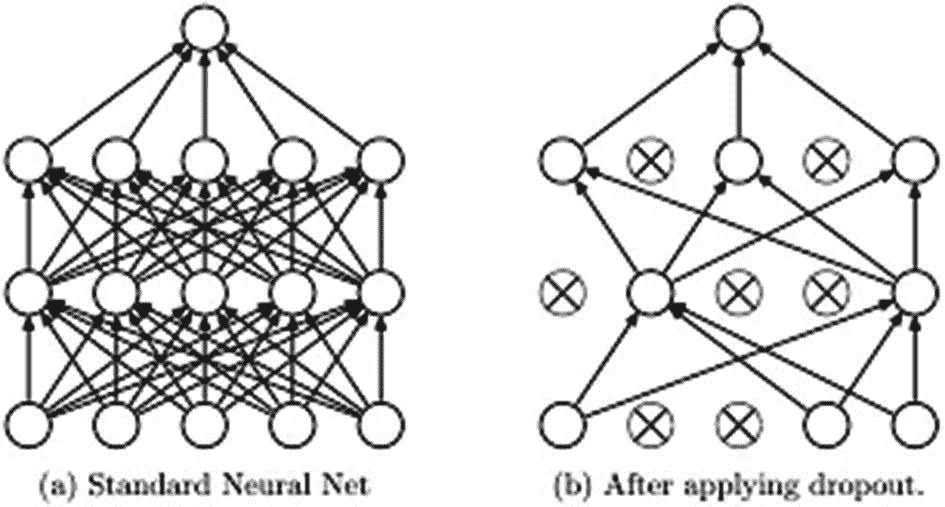

图 10-2

Dropout 的工作原理

## 归一化技术

归一化一直是深度学习中的一个活跃研究领域。归一化技术可以大幅减少模型的训练时间。让我们列举一些使用归一化的好处。它被称为“归一化”，因为它试图将所有数据归入相同的尺度：它将每个特征归一化，以便它们保持与每个特征相同的贡献，因为一些特征的数值高于其他特征。这样，我们的网络可以无偏（对数值较高的特征）。通过将数据缩放到相同的尺度，它使得优化更快，因为归一化不允许权重到处爆炸，并限制它们在一定范围内。

归一化有助于网络进行正则化（只是稍微，而不是显著）。这是为了使我们的模型能够有效训练，但这并不像听起来那么简单。因此，我们将问自己一些关于什么使得归一化不那么容易；我们应该使用哪种归一化技术；以及最常见的，哪种归一化技术对于我们的网络在计算和精度之间的权衡会是最好的。答案可能隐藏在众多归一化技术中。因此，让我们来看看它们。

### 批归一化

让我们探讨一下“批量”的含义以及为什么我们应该使用它。首先，我们应该知道，我们通过调整和缩放激活来归一化输入层。例如，当我们有从 0 到 1 的特征，以及一些从 1 到 1000 的特征时，我们应该将它们归一化以加快学习速度。如果输入层从中受益，为什么不对隐藏层中的值做同样的事情呢？隐藏层中的值是不断变化的，这样可以在训练速度上获得十倍或更多的提升。批量归一化允许网络的每一层都能在一定程度上独立于其他层进行学习。批量归一化有许多优点。其中之一是我们可以使用更高的学习率，因为批量归一化确保没有激活值过高或过低。这意味着之前无法进行训练的东西现在开始训练了。它减少了过拟合，因为它具有轻微的正则化效果。类似于**dropout**，它为每个隐藏层的激活添加了一些噪声。批量归一化是一种在网络的迷你批次中归一化激活的方法。对于每个特征，批量归一化计算该特征在迷你批次中的均值和方差。然后它从均值中减去，并将特征除以其迷你批次的标准差（图 10-3）。

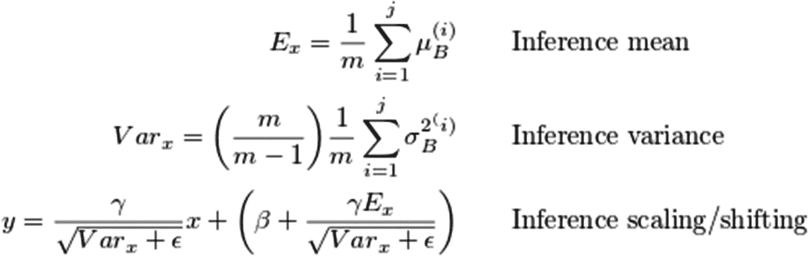

图 10-3

推理之间的差异

注意，γ和β是在训练过程中与网络的原始参数一起学习的。

但这种技术有没有问题？是的，有很多问题——不是普遍的问题，而是与某些具体事物有关。首先是与 RNN 有关，我们将在第十二章中讨论。在 RNN 中，每个时间步的循环激活将有一个不同的故事要讲（即，统计数据）。这意味着我们必须为每个时间步拟合一个单独的批量归一化层。这使得模型更加复杂，占用更多空间，因为它迫使我们必须在训练过程中存储每个时间步的统计数据。那么，我们如何使用 TensorFlow 来实现它呢？

```py
import tensorflow as tf
is_train = tf.placeholder(tf.bool, name="is_train");
x_norm = tf.layers.batch_normalization(x, training=is_train)
update_ops = tf.get_collection(tf.GraphKeys.UPDATE_OPS)
with tf.control_dependencies(update_ops):
train_op = optimizer.minimize(loss)
```

因此，这就是我们可以在深度神经网络中使用的批量归一化技术。在深度学习中还有许多其他的归一化技术。让我们来谈谈权重归一化。

### 权重归一化

在批量归一化中，我们归一化了激活函数，但现在我们将归一化权重。权重归一化是由 OpenAI 开发的一种方法，其中权重归一化以以下方式重新参数化神经网络中任何层的权重：

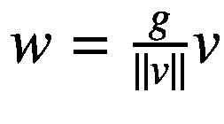

它将权重向量与其方向分开。这与批归一化中的方差有类似的效果。至于均值，这项权重归一化的开发者将仅均值批归一化和权重归一化结合起来，即使在小型微型批次中也能得到所需的结果。这意味着他们减去了微型批次的均值，但没有除以方差。

最后，我们需要知道的是，它们使用权重归一化而不是除以方差。

### 层归一化

层归一化是由杰弗里·辛顿（Geoffrey Hinton）开发的一种方法。与权重归一化相比，层归一化在直观上稍微难以理解。它对输入进行归一化，而不是在批归一化中对输入特征的批次维度进行归一化。因此，当我们谈论批归一化时，批归一化是对输入特征的批次维度进行归一化。因此，我们可以说批和层归一化可能在某些方面相似。让我们看看以下方程式来探索这一点（图 10-4）：

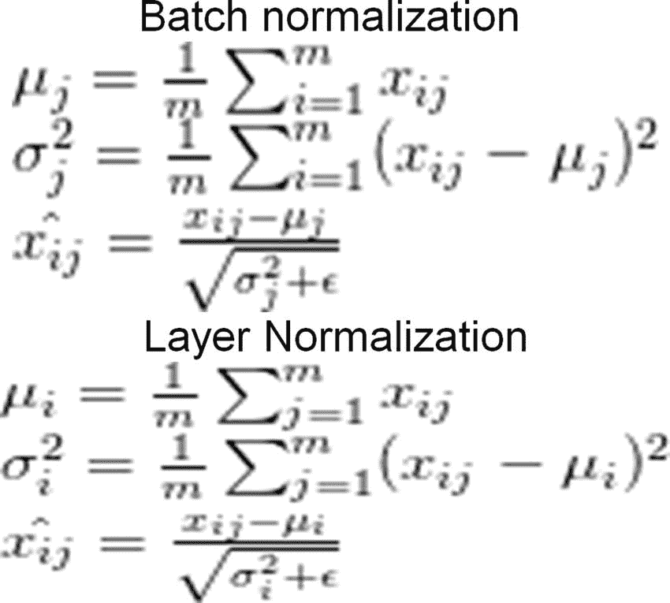

图 10-4

层和批归一化

方程式看起来几乎相同，那么区别在哪里？区别在于在批归一化中，统计量是在批次中计算的，并且对于批次中的每个示例都是相同的。相比之下，在层归一化中，统计量是在每个特征上计算的，并且与其他示例无关。

让我们看看一张图片（图 10-5）。

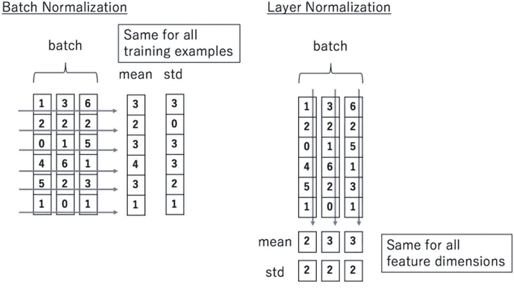

图 10-5

批和层归一化的例子

它解决了批归一化的问题，因为层归一化在 RNN 的情况下表现优于批归一化。但相似之处并不止于此；还有一个与层归一化相似的概念，称为 *实例归一化*。

### 实例归一化

层归一化和实例归一化彼此非常相似。然而，它们之间的区别在于实例归一化是在每个训练示例的每个通道上进行归一化，而不是在训练示例的输入特征上进行归一化。与批归一化不同，实例归一化层在测试时也会应用（由于微型批次的非依赖性）。这项技术最初是为风格迁移而设计的。实例归一化试图解决的问题是网络应该对原始图像的对比度无感知。实验结果表明，在替换批归一化时，实例归一化在风格迁移方面表现良好。最近，实例归一化也已被用作 GANs（生成对抗网络）中批归一化的替代品。

### 组归一化

如其名所示，组归一化是对每个训练示例中的多个通道进行归一化。我们可以说组归一化介于实例归一化和层归一化之间。这种超技术是如何工作的呢？当我们把所有通道放入一个单一组时，组归一化就变成了层归一化；当我们把每个通道放入不同的组时，它就变成了实例归一化。尽管层归一化和实例归一化在 RNN 和风格迁移任务上都很有效，但它们在图像识别任务上仍然不如批归一化。组归一化在 ImageNet 上以 32 个批大小实现了与批归一化非常接近的性能，并且在较小的批大小上超过了它。对于像目标检测和分割这样的任务，它们使用高分辨率图像（因此由于内存限制无法增加批大小），组归一化已被证明是一个非常有效的归一化方法。所以问题是，如果我们只能使用层归一化或实例归一化，是什么让我们使用介于它们之间的超技术？答案是很容易的：我们需要层归一化所增加的东西。层归一化所做的一个隐含假设是，在计算均值时，**所有通道都是**同等重要的。这个假设在卷积层中并不总是成立。因此，我们需要使用一个实例，使得图像边缘附近的神经元和图像中心附近的神经元具有非常不同的激活统计信息。这意味着为不同的通道计算不同的统计信息可以为模型提供所需的灵活性。然而，图像中的通道并不是完全独立的，因此能够利用邻近通道的统计信息是组归一化相对于实例归一化的一个优势（见图 10-6）。

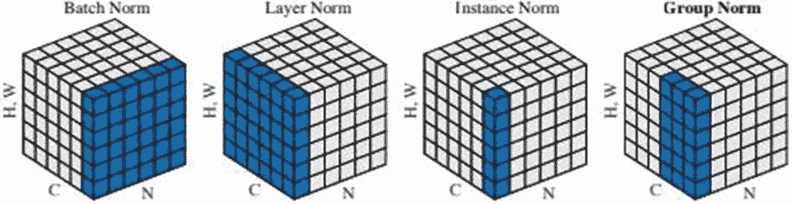

图 10-6

不同的归一化技术

既然我们已经讨论了一些深度学习中的归一化技术，我们需要说明还有更多技术用于归一化深度学习层，深度学习社区仍在研究提高性能和防止过拟合的方法。在接下来的章节中，我们将讨论深度学习卷积和序列模型的应用，并附上相关案例研究。我们正接近流程的尾声，你可以自己完成它。

## 摘要

在本章中，我们使用了优化技术来优化学习率，并使梯度达到最优局部最小值。我们讨论了 dropout——神经网络中的正则化技术，以及它为何非常有效，以及它与归一化的联系。我们了解到归一化是深度学习中的一个非常好的工具，它源自统计学，通过缩放数据使神经网络更能适应数据。我们看到了如何选择最重要的超参数学习率及其与自适应学习的联系。在接下来的几章中，我们将讨论模型，这是深度学习管道的最后一个阶段；我们将探讨一些深度学习应用，并讨论一些案例研究。因此，我们希望您在本章中有所收获。

# 11. 卷积神经网络

在前面的章节中，我们研究了全连接多层神经网络及其使用反向传播的训练。在一个典型的多层神经网络层中，有 n 个输入节点和 m 个神经元，我们需要学习 n×m 个参数或权重。虽然多层神经网络在某些情况下可能表现良好——特别是对于不同维度的特征相互独立的情况——但在连接架构中可能还有一些我们希望拥有的额外属性。例如，如果已知输入数据的维度高度相关，或者多层神经网络的大小（包括层数和每层的神经元数量）必须因计算考虑而受限，那么是否需要对标准多层神经网络进行任何架构上的调整，以适应关于数据或网络复杂性的额外约束？

近年来，深度学习在处理非结构化数据方面取得了繁荣发展，特别是图像、文本、音频和语音。考虑到卷积神经网络（CNNs），当数据是图像时，它就像魔法一样有效。每当数据与拓扑相关联时，卷积神经网络都能很好地从图像中提取重要特征。

从架构角度来看，卷积神经网络受到多层感知器的启发；通过在相邻层的神经元之间施加局部连接约束，卷积神经网络利用了局部空间相关性。卷积神经网络的核心元素是通过卷积操作处理数据。任何信号与另一个信号的卷积产生第三个信号，这个信号可能比原始信号本身揭示更多关于信号的信息。

## 什么是卷积神经网络

卷积神经网络（CNN）是一种深度学习算法，它可以接收输入图像，对图像中的各种方面/物体分配重要性（可学习的权重和偏差），并能够区分它们。与其它分类算法相比，CNN 所需的预处理要低得多。尽管在原始方法中滤波器是手工设计的，但随着训练的深入，CNN 具有学习这些滤波器/特征的能力。

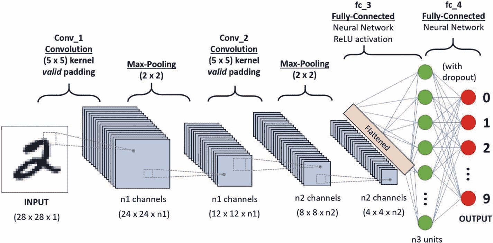

图 11-1

CNN 的示例

卷积神经网络（CNN）的架构（图 11-1）类似于人脑中神经元的连接模式，并受到了视觉皮层组织的启发。单个神经元只对视觉场中称为**感受野**的特定区域内的刺激做出反应。这些区域的集合相互重叠，覆盖整个视觉区域。

## 卷积运算

将时间或空间信号与另一个信号进行卷积会产生初始信号的修改版本。修改后的信号可能比原始信号有更好的特征表示，适合特定任务。例如，通过将灰度图像作为二维信号与另一个信号（通常称为滤波器或核）进行卷积，可以得到包含原始图像边缘的输出信号。图像中的边缘可以对应于物体边界、光照变化、材料属性变化、深度不连续性等，这些可能对多个应用有用。了解系统的线性时不变或移不变属性有助于更好地理解信号的卷积。我们将在讨论卷积本身之前先讨论这一点。

### 一维卷积

直观地说，卷积衡量了一个函数与另一个函数的翻转和平移版本的叠加程度。在离散情况下，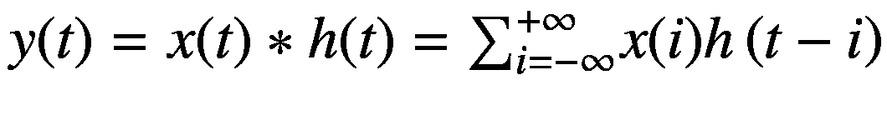

同样，在连续域中，两个函数的卷积可以表示为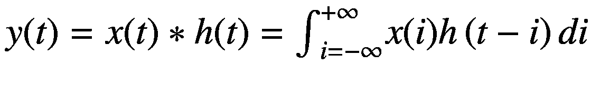

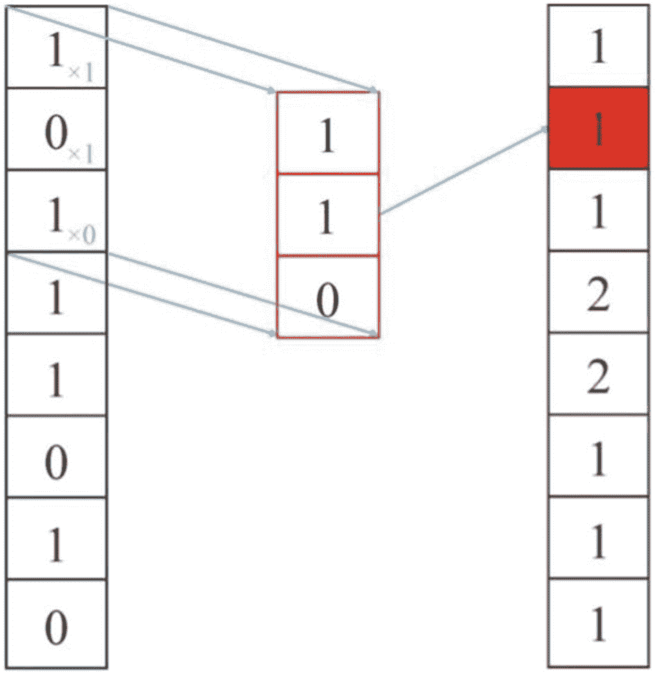

图 11-2

1-D 卷积掩码的示例

图 11-2 以简单的方式展示了 1 维卷积方程的工作原理。直观地说，它就像一个在数据输入上移动的掩码，即左边的向量。在每次移动步骤中，它取三个邻居，对这三个邻居应用掩码值，并将整个方程的输出分配给输出向量中的一个单个标量。

你可以看到，在其第一步中，掩码取输入向量中的前三个邻居/对，即 [1, 0, 1]，然后乘以掩码值 [1, 1, 0][1, 1, 0]。这是一个向量运算，它将第一个输入与其等价的掩码相乘，然后将第二个输入与掩码上的第二个值相乘，依此类推。经过三次乘法运算后，我们将这三个操作的输出相加，最终结果将是一个单独的标量，分配给输出向量的第二个元素。等等：你现在可能想知道为什么我们将输出分配给右侧输出向量的第二个元素，因为它不是第一步。第一步是取输入对并添加零填充，生成输入对 [0, 1, 0]。

以这种方式看待卷积比前面的方程更容易理解。现在你可能也理解了为什么卷积很重要，因为当你改变掩码值以从数据输入中提取某些知识时。但是，如果你到现在还不理解或看不到卷积如何提取知识/特征，你将在几分钟内看到。

### 二维卷积

正如我们所描述的，卷积涉及一维和二维操作；一维被称为 1-D 卷积或简称卷积。否则，如果卷积是在两个相互垂直的维度上跨越的两个维度之间进行的（即如果单个观察是二维的，或者从实际的角度来说，它是一张图像或矩阵），那么它将被称为 2-D 卷积。这个概念可以扩展到涉及多维矩阵，因此我们可以有多维卷积。

在图像/计算机视觉领域，卷积是通过乘积和累加对应于两个输入图像的瞬时值来执行的，其中一个图像是翻转的。1-D 卷积的定义适用于 2-D 卷积，只是在这种情况下，一个输入翻转了两次。

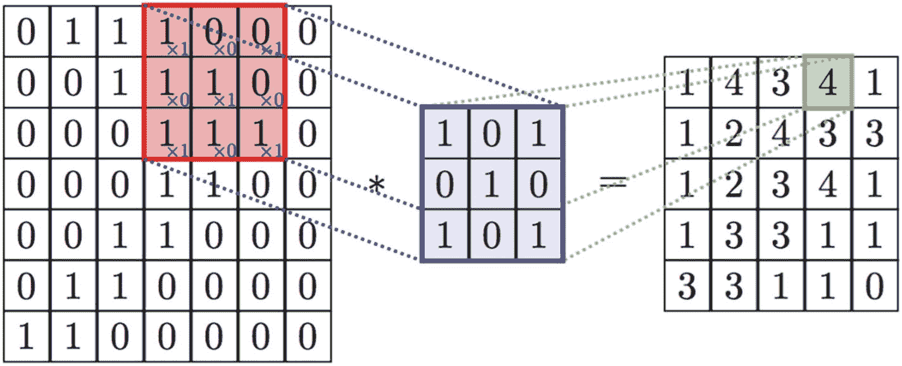

图 11-3

二维卷积掩码

图 11-3 展示了在数字图像处理领域中广泛使用的操作类型，其中代表图像的二维矩阵将与一个较小的矩阵（称为 2-D 卷积核）进行卷积。

### 填充和步长

在深入探讨卷积之前，你需要知道一个额外的事情；实际上有两个重要的概念你需要了解并完全掌握。填充和步长都可以改变你的模型看待输入观察的方式；同时，改变它们的参数也会影响输出特征图的形状。

尽管卷积层非常简单，但它能够实现复杂和令人印象深刻的成果。然而，理解滤波器的形状如何影响输出特征图的形状，以及如何配置相关的配置超参数，如填充和步长，可能具有挑战性。

在卷积操作中，我们有一个核，为了使操作的最终输出更有信息量，我们在图像矩阵或任何类型的输入数组中使用填充。向输入添加填充使得核开始向输入观察的边缘提供更多信息，从而使所有隐藏在输入边缘的信息和特征都出现在我们的输出中。

有三种类型的填充，如下所述：

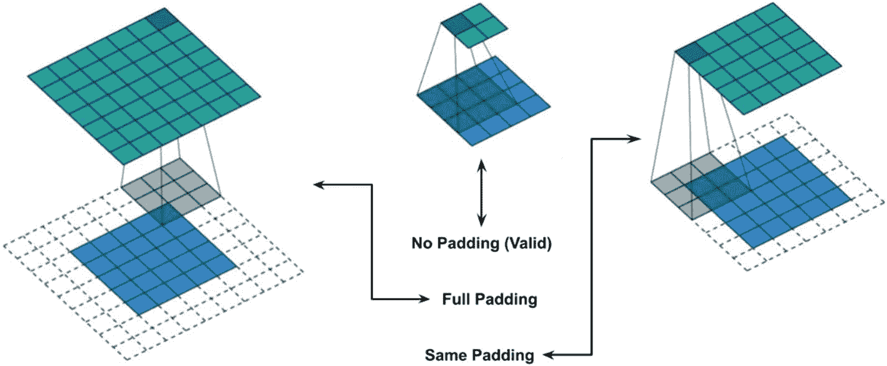

图 11-4

有效、完整和相同填充之间的区别

+   *全填充*: 这种类型显示了从输入边缘提取信息的重要性。当你对输入使用全填充时，它使得卷积操作中的核以相同的优先级处理每个像素，这意味着核以与中心像素相同的方式跨越边缘。

+   *填充相同*: 在这种填充方式中，我们需要使卷积操作的输出观察形状与输入观察形状相同。例如，如果我们有一个 32×32 的图像作为输入，输出也将具有相同的形状，32×32。

+   *有效填充*: 简单来说，有效卷积意味着完全没有填充，这可能对你作为一个输入观察（图像）的维度降低是有用的。例如，一个 32×32 输入的图像，使用 3×3 的核滤波器将生成一个 30×30 的输出图像。

在图 11-4 中，你可以看到在左侧，全填充到输入矩阵使得过滤器在矩阵的每个实际值（蓝色）上均匀地移动。因此，在图中，过滤器将在每个蓝色像素上移动/移动/滑动九次，无论像素位置如何，这会创建一个更大的输出矩阵大小，将包含所有表示和更多提取的特征。另一方面，使用无填充或有效填充将创建最小的输出，因为过滤器只是按照输入矩阵的形状移动；这意味着有些像素过滤器只会访问一次，而有些像素过滤器会多次访问。然而，如果你想输出与输入矩阵相同，你可以考虑使用相同填充，这将创建一个与输入矩阵形状相似的输出矩阵。

在另一方面，步长控制滤波器在输入体积周围的卷积方式。在我们之前的例子中，滤波器通过每次移动一个单位来围绕输入体积进行卷积。滤波器移动的量就是步长。在这种情况下，步长隐式设置为 1。步长通常设置为输出体积是整数而不是分数。让我们看一个例子。让我们想象一个 7×7 的输入体积，一个 3×3 的滤波器（为了简单起见，忽略第三维度），步长为 1。这是我们习惯的情况。如图 11-5 所示，滤波器通过输入移动，每次向右和向下移动两个像素，这将使输出矩阵变得很小，因为步骤之间的重叠减少了。

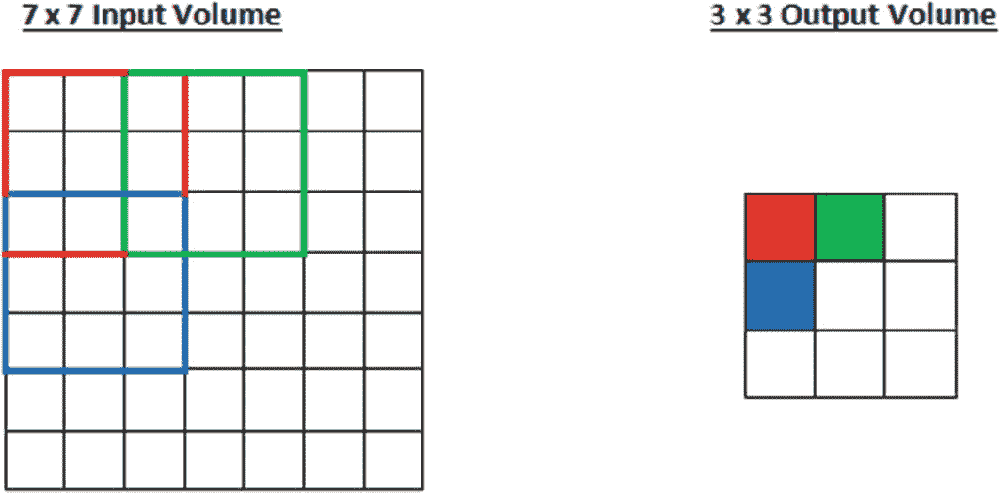

图 11-5

Valid、Full、Same 填充之间的区别

## 常见图像处理滤波器

让我们讨论在二维图像上常用的图像处理滤波器。确保使用符号清晰，因为自然索引图像的方式与定义 *x* 和 *y* 轴的偏好方式并不完全一致。当我们用坐标空间表示图像处理滤波器或图像时，*n*[1] 和 *n*[2] 是 *x* 和 *y* 方向的离散坐标。图像在 NumPy 矩阵形式中的列索引与 *x* 轴完美对应，而行索引则与 *y* 轴相反方向移动。此外，在进行卷积时，选择哪个像素位置作为图像信号的起点并不重要。根据是否使用零填充，可以相应地处理边缘。由于滤波器核较小，我们通常翻转滤波器核，然后在其上滑动图像，而不是反过来。

### 均值和中值滤波器

均值滤波器或平均滤波器是一种低通滤波器，它计算任何特定点的像素强度的局部平均值。图 11-6 展示了根据应用需求，均值滤波器在不同类型中的计算方式。

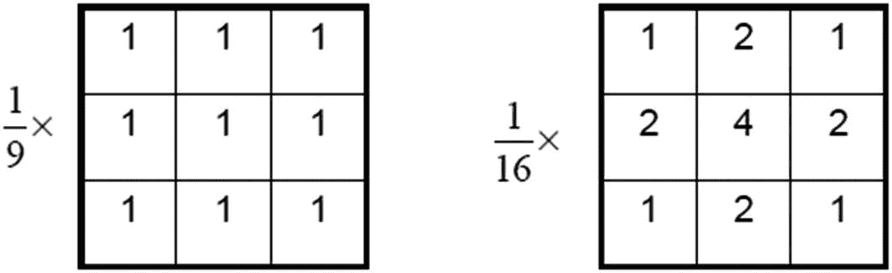

图 11-6

如何计算均值滤波器

在这里，矩阵中的 h22 项对应于原点处的项。因此，在任何给定点上，卷积将表示该点像素强度的平均值。以下代码说明了如何使用图像处理滤波器（如均值滤波器）对图像进行卷积。

请注意，在许多 Python 实现中，我们会使用 OpenCV 对图像执行基本操作，例如读取图像，将图像从 RGB 格式转换为灰度格式等。OpenCV 是一个开源的图像处理包，它拥有丰富的图像处理方法。建议读者探索 OpenCV 或任何其他图像处理工具箱，以便熟悉基本图像处理函数。

首先：我们需要导入所有需要的包和函数，以确保在操作过程中没有导入错误。我们将导入`cv2`用于 OpenCV 操作，`matplotlib`用于查看图像，`NumPy`用于创建过滤器以及任何矩阵操作，最后从`scipy.signal`导入 convolve2d 用于卷积操作。

```py
# IMPORTING PACKAGES
import cv2
import matplotlib.pyplot as plt
import numpy as np
from scipy.signal import convolve2d
```

在加载包之后，我们现在需要加载我们想要对其执行操作的图像。Lena Forsen 图像是图像处理领域中最为著名的图像之一。在下面的代码中，我们将加载它，然后为了简化将其转换为灰度图像。

```py
# LOADING AND TRANSFORMING IMAGE
img = cv2.imread('/content/lena_forsen.png')
gray = cv2.cvtColor(img, cv2.COLOR_BGR2GRAY)
plt.imshow(gray,cmap='gray')
```

图 11-7 显示了加载的灰度图像。

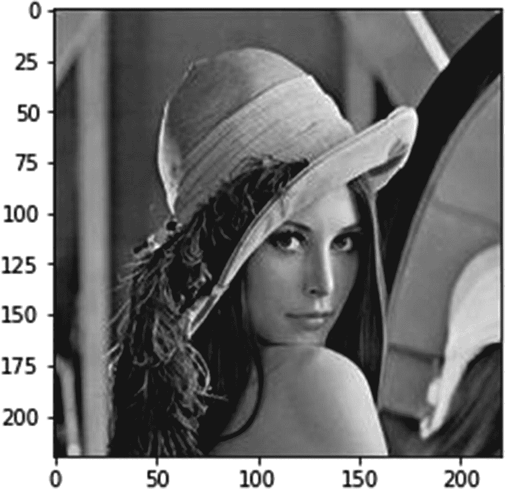

图 11-7

加载的灰度图像

在加载图像后，我们需要向其添加一些噪声，以查看过滤器如何以某种方式修复噪声。在下面的代码中，我们将添加一种称为高斯噪声的噪声类型。然后我们将尝试修复它。

```py
# PROCESSING IMAGE
mean = 0
var = 100
sigma = var**0.5
row,col = 220, 220
gauss = np.random.normal(mean,sigma,(row,col))
gauss = gauss.reshape(row,col)
gray_noisy = gray + gauss
plt.imshow(gray_noisy,cmap='gray')
```

现在，在我们添加噪声之后，我们需要知道噪声将如何影响图像质量。在图 11-8 中，你会看到遍布噪声的图像。

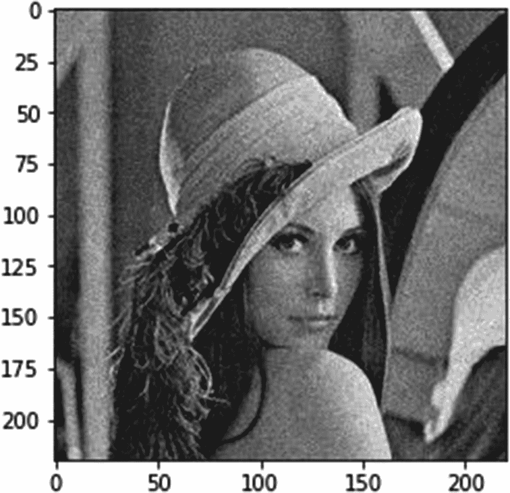

图 11-8

图像上的高斯噪声

```py
# CREATE AND APPLY MEAN FILTER
Hm = np.array([[1,1,1],[1,1,1],[1,1,1]])/float(9)
Gm = convolve2d(gray_noisy,Hm,mode='same')
plt.imshow(Gm,cmap='gray')
```

最后，我们将创建并应用均值滤波器到图像上；我们将使用 convolve2d 来实现这一点，将过滤器应用到图像上。在图 11-9 中，你可以看到前面代码操作的结果图像。

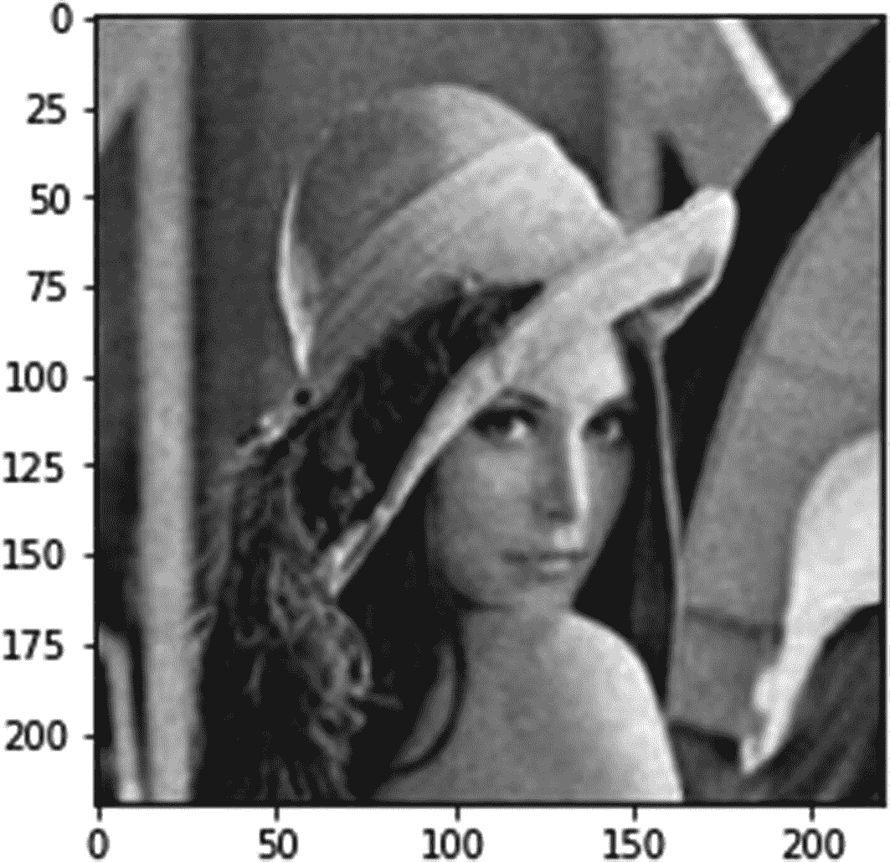

图 11-9

应用均值滤波器后的图像

均值滤波器主要用于减少图像中的噪声。如果图像中存在一些白色高斯噪声，均值滤波器将减少噪声，因为它在其邻域内进行平均，因此零均值的白色噪声将被抑制。从图 11-9 中我们可以看到，一旦图像与均值滤波器卷积，高斯白噪声就会减少。新图像具有较少的高频成分，因此相对于卷积前的图像来说相对不那么锐利，但过滤器已经很好地减少了白噪声。

另一方面，二维中值滤波器根据滤波器大小，将邻域中的每个像素替换为该邻域的中值像素强度。中值滤波器适用于移除盐和胡椒噪声。这种噪声以黑白像素的形式出现在图像中，通常是由于在捕获图像时突然的干扰造成的。以下代码说明了如何向图像中添加盐和胡椒噪声，以及如何使用中值滤波器抑制噪声。

首先，我们选择一些随机索引来执行操作（添加噪声）。

```py
np.random.seed(0)
gray_sp = gray*1
sp_indices = np.random.randint(0,21,[row,col])
```

然后，我们将遍历索引并在图像上设置值为 0 或 255，创建类似盐的噪声。以下代码描述了迭代过程，图 11-10 显示了噪声在图像上的结果。

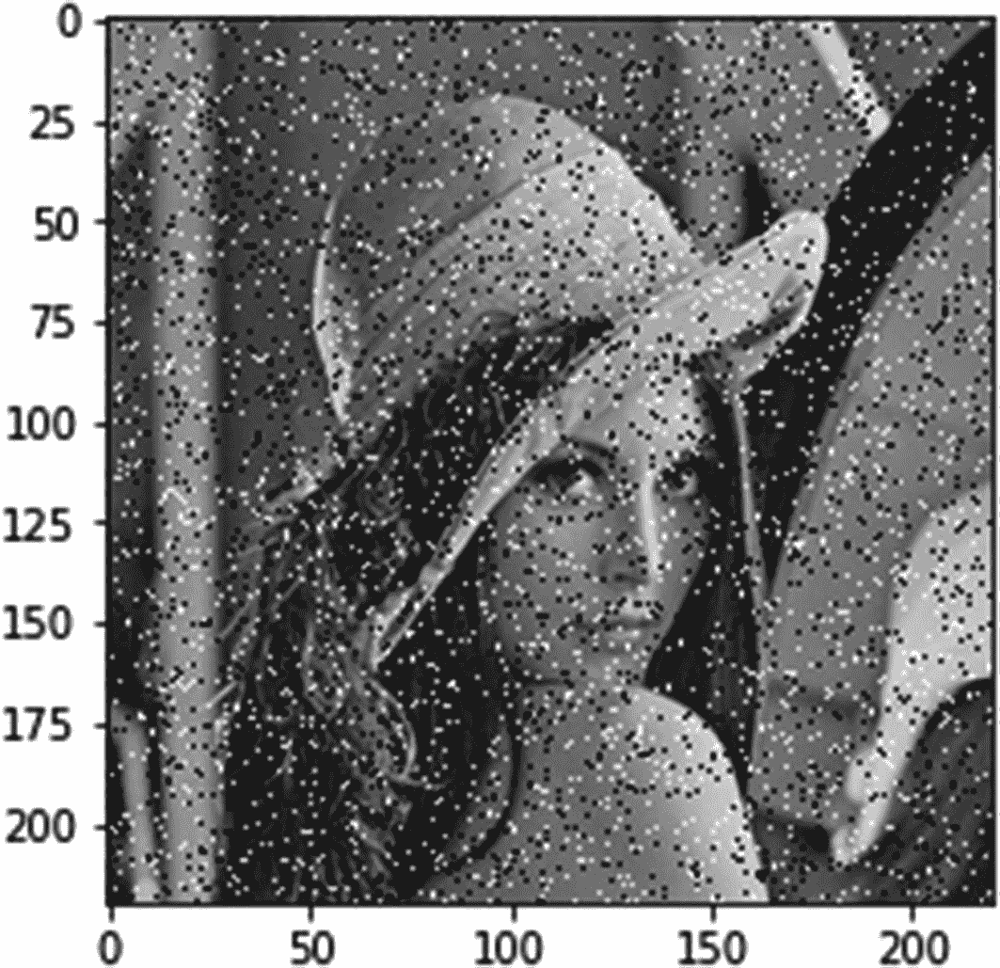

图 11-10

图像上的盐和胡椒噪声

```py
for i in range(row):
for j in range(col):
if sp_indices[i,j] == 0:
gray_sp[i,j] = 0
if sp_indices[i,j] == 20:
gray_sp[i,j] = 255
plt.imshow(gray_sp,cmap='gray')
```

现在我们需要从图像中移除盐分噪声。幸运的是，cv2 库已经实现了图像处理。以下代码描述了如何使用它。

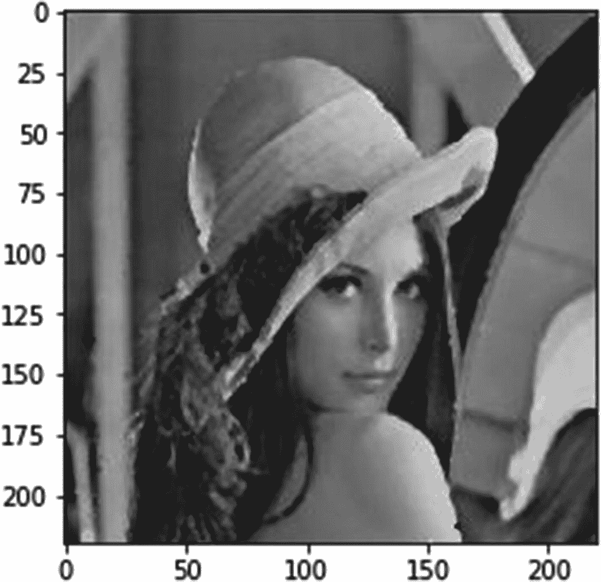

图 11-11

中值滤波器对图像中噪声的影响

```py
gray_sp_removed = cv2.medianBlur(gray_sp,3)
plt.imshow(gray_sp_removed,cmap='gray')
```

如我们所见，中值滤波器（图 11-11）已经移除了盐和胡椒噪声。

### 高斯滤波器

高斯滤波器是均值滤波器的一个修改版本，其中脉冲函数的权重在原点周围呈正态分布。权重在滤波器的中心最高，并从中心向周围正常衰减。可以使用以下代码创建高斯滤波器。正如我们所见，强度以高斯方式从原点衰减。当高斯滤波器以图像形式显示时，在原点处具有最高的强度，然后向远离中心的像素衰减。高斯滤波器用于通过抑制高频成分来减少噪声。然而，在追求抑制高频成分的过程中，它最终产生了一个模糊的图像，称为高斯模糊。

在图 11-12 中，原始图像与高斯滤波器卷积，生成具有高斯模糊的图像。然后我们从原始图像中减去模糊图像，以获取图像的高频成分。将高频图像的一小部分添加到原始图像中，以提高图像的清晰度。

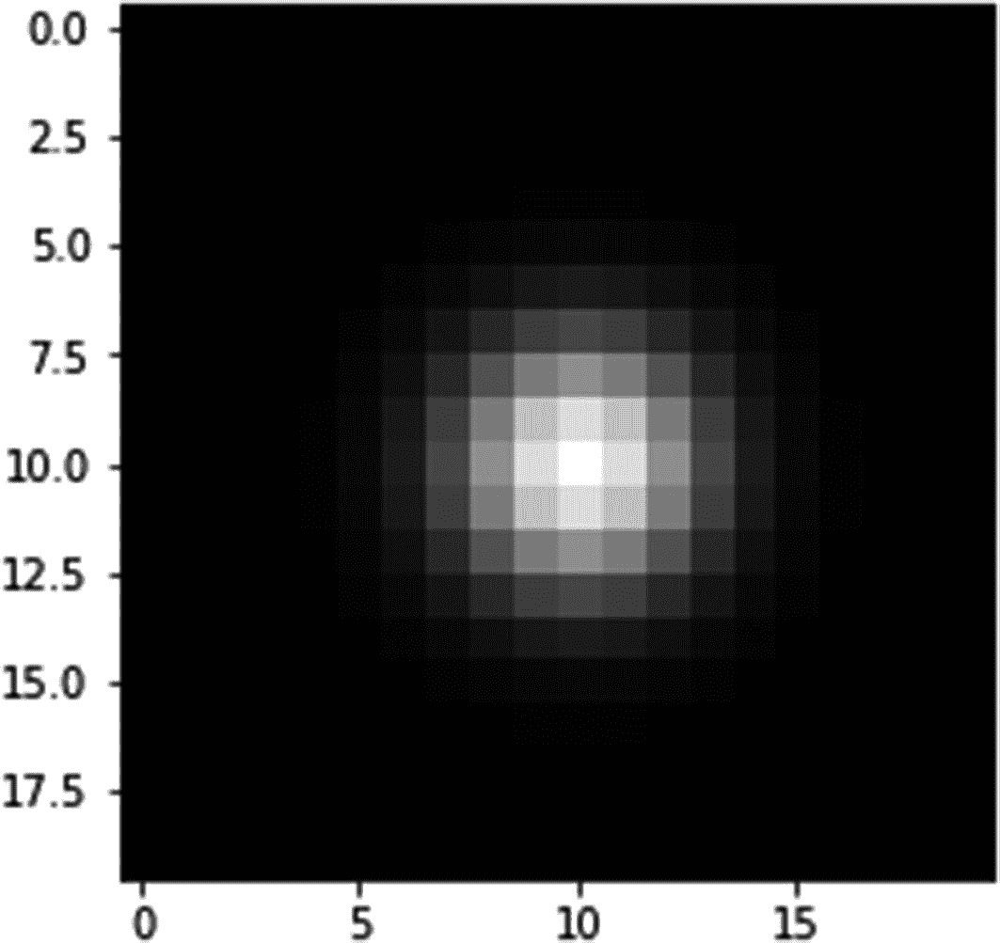

图 11-12

滤波器的样子

```py
f = np.zeros((20,20))
for i in range(20):
for j in range(20):
f[i,j] = np.exp(-((i-10)**2 + (j-10)**2)/10)
plt.imshow(f,cmap='gray')
```

如图 11-12 所示，您可以看到滤波器似乎专注于中间像素。在将此滤波器应用于图像后，您可以在图 11-13 中看到图像变模糊了。以下代码描述了如何在图像上应用此滤波器。


图 11-13

应用过滤器后的图像

```py
gray_blur = convolve2d(gray,f,mode='same')
plt.imshow(gray_blur,cmap='gray')
```

以下代码描述了如何退回一步，增强图像到其实际状态。图 11-14 显示了图像返回到其实际状态，没有模糊。

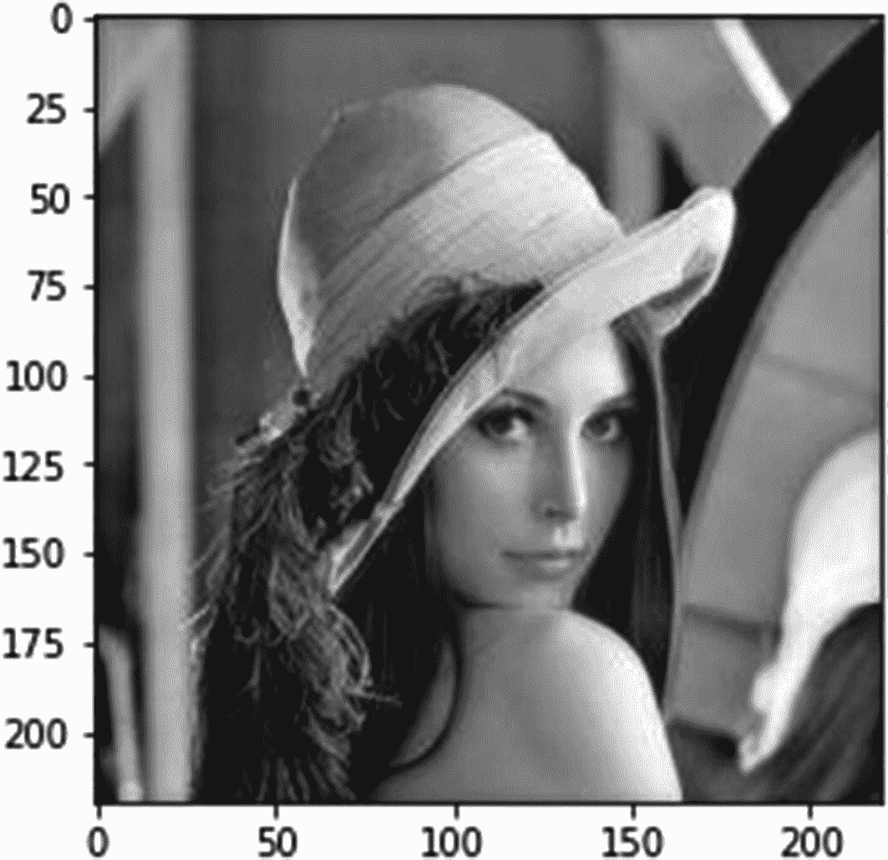

图 11-14

增强后的图像

```py
gray_enhanced = gray + 0.025*gray_blur
plt.imshow(gray_enhanced,cmap='gray')
```

### Sobel 边缘检测滤波器

Sobel 算子，有时也称为 Sobel-Feldman 算子或 Sobel 滤波器，在图像处理和计算机视觉中应用，尤其是在边缘检测算法中，它创建了一个强调边缘的图像。

Sobel 边缘卷积检测器在水平和垂直轴上的输出响应可以分别用以下 *Gx* 和 *Gy* 矩阵表示。Sobel 检测器是前面展示的水平方向和垂直方向梯度滤波器的扩展。它不仅取点的梯度，还取其两侧点的梯度之和。此外，它给感兴趣点的权重加倍。见图 11-15。

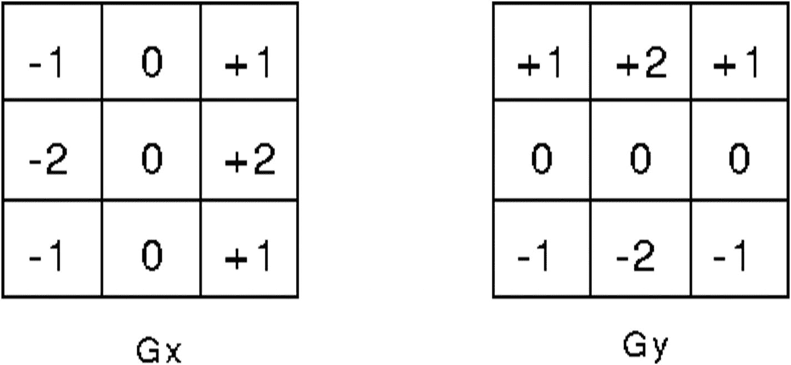

图 11-15

沿着两个轴的 Sobel 过滤器

以下代码展示了图像与 Sobel 滤波器的卷积：

```py
Hx = np.array([[ 1,0, -1],[2,0,-2],[1,0,-1]],dtype=np.float32)
Gx = convolve2d(gray,Hx,mode='same')
plt.imshow(Gx,cmap='gray')
```

图 11-16 展示了前面代码的结果。在图中你可以看到一些边缘显得非常明显，这是因为使用的过滤器可以被认为是一个半过滤器。如果你继续观察，你会看到最终的结果包含了图像中的所有边缘。

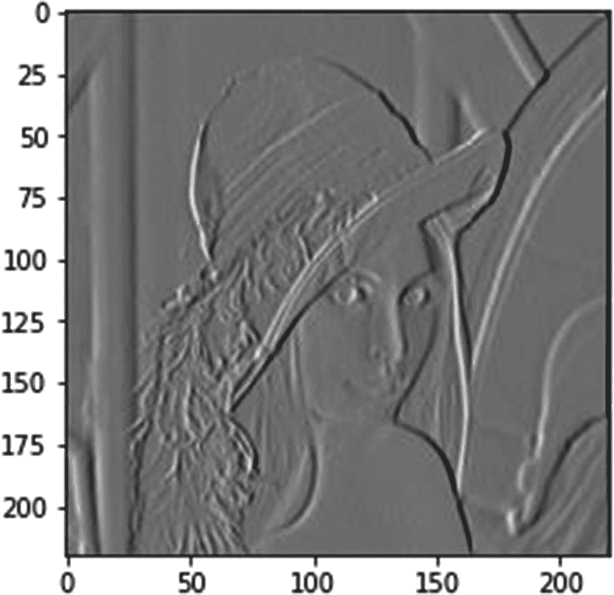

图 11-16

应用 X 轴过滤器后的图像

这里是另一个半过滤器，Y 轴过滤器。在这里你会发现结果可能与前面代码的结果相似，但通过仔细观察，你可以看到结果之间的一些差异（见图 11-17）。

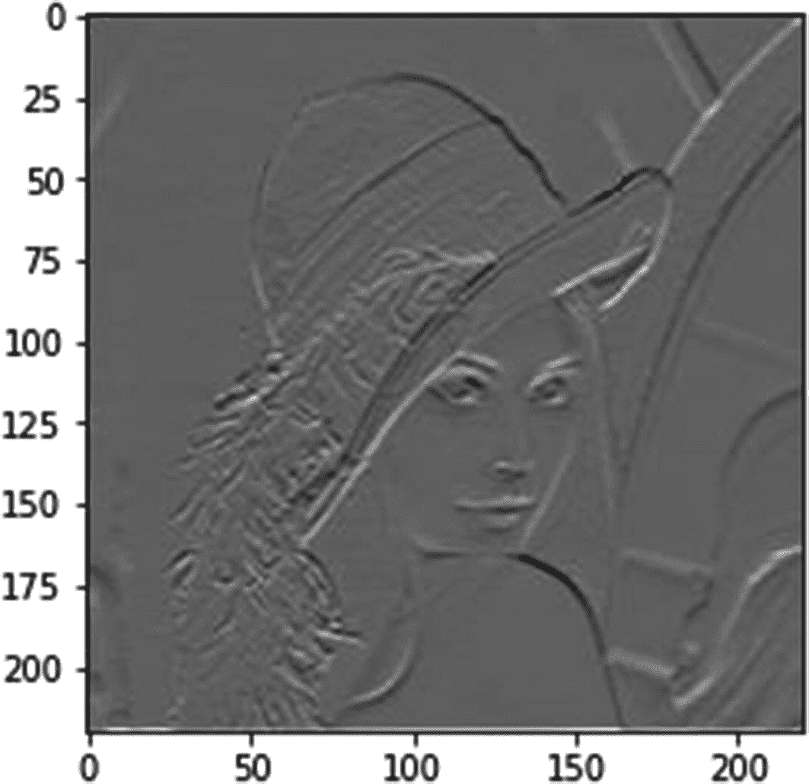

图 11-17

Y 轴过滤器

```py
Hy = np.array([[ -1,-2, -1],[0,0,0],[1,2,1]],dtype=np.float32)
Gy = convolve2d(gray,Hy,mode='same')
plt.imshow(Gy,cmap='gray')
```

现在，通过结合这两个过滤器（但平方），你会看到期望的结果。在图 11-18 中，你可以看到以下代码的输出；结果显示了图像边缘的形状。

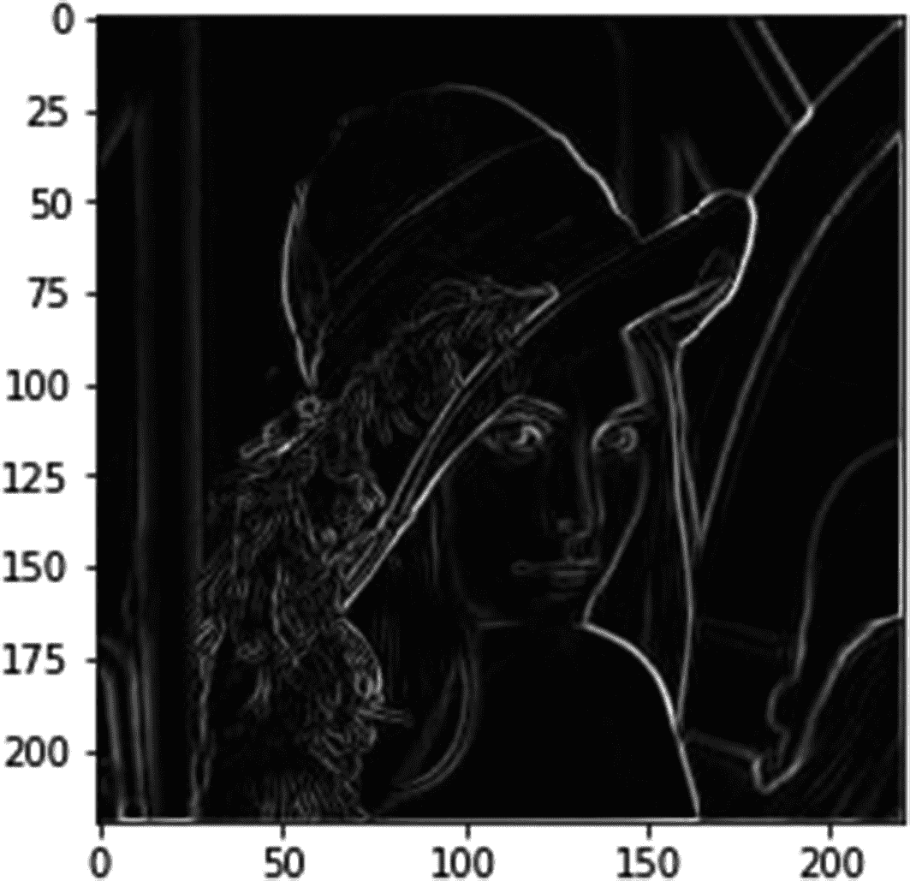

图 11-18

图像的边缘

```py
G = (Gx*Gx + Gy*Gy)**0.5
plt.imshow(G,cmap='gray')
```

上一段代码包含了使用 Sobel 滤波器对图像进行卷积所需的逻辑。*水平 Sobel*滤波器检测水平方向的边缘，而*垂直 Sobel*滤波器检测垂直方向的边缘。两者都是高通滤波器，因为它们衰减了信号中的低频成分，只捕获图像中的高频成分。边缘是图像的重要特征，有助于检测图像中的局部变化。边缘通常出现在图像中两个区域的边界上，并且通常是提取图像信息的第一步。我们在上一段代码的输出中看到了这一点。

连接滤波器两半部分的方程如下：

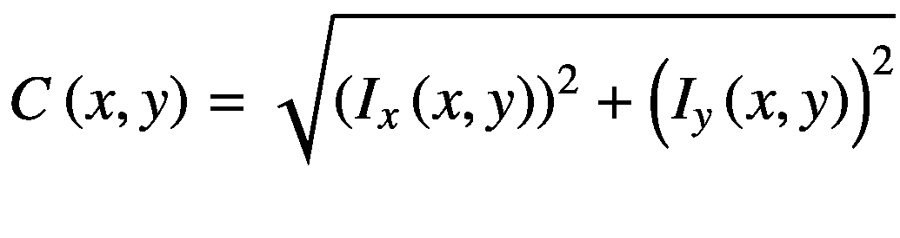

其中 *C*(*x*, *y*) 表示组合 Sobel 滤波器的像素强度函数，而 *I**y* 表示通过垂直 Sobel 滤波器获得的图像像素强度。

### 身份变换

通过卷积进行身份变换的滤波器如下。

图 11-19 展示了通过卷积实现的单位变换。实现方式类似于均值滤波器，但有一个简单的修改：在滤波器像素的每个值上，我们只将 1 放在中间像素，其余都是 0。

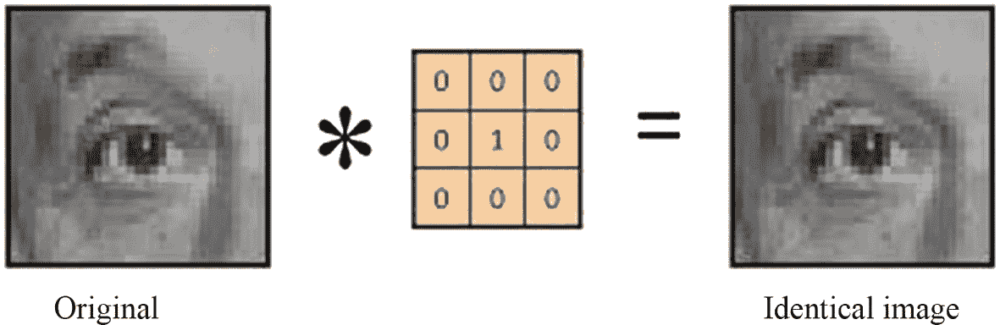

图 11-19

身份滤波器

## 卷积神经网络

**卷积神经网络** (CNNs) 基于图像的卷积，并通过 CNN 通过训练学习到的滤波器来检测特征。例如，我们不会应用任何已知的滤波器，例如用于检测边缘或去除高斯噪声的滤波器，而是通过卷积神经网络的训练，算法会自己学习图像处理滤波器，这些滤波器可能与常规图像处理滤波器非常不同。对于监督训练，滤波器是通过以下方式学习的，即尽可能减少整体成本函数。通常，第一层卷积学习检测边缘，而第二层可能学习检测由不同边缘组合而成的更复杂的形状，例如圆形和矩形等。第三层及以后的层基于前一层的特征学习更复杂的功能。

卷积神经网络的好处是权重共享导致的稀疏连接，这大大减少了需要学习的参数数量。相同的滤波器可以通过其等变性属性学习检测图像任何部分的相同边缘，这是卷积在特征检测中非常有用的一个属性。

## 卷积神经网络层

以下是一个卷积神经网络的典型层：


图 11-20

一个简单的 CNN

+   *输入层*：将持有图像的像素强度。例如，一个宽度为 64，高度为 64，深度为 3（红、绿、蓝颜色通道 RGB）的输入图像将具有 64*x*64*x*3 的输入维度。

+   *卷积层*：将从前一层接收图像，并使用指定的过滤器与它们进行卷积，以创建称为输出特征图的图像。输出特征图的数量等于指定的过滤器数量。到目前为止，TensorFlow 中的 CNN 主要使用 2-D 过滤器；然而，最近引入了 3-D 卷积过滤器。

+   *激活函数*：对于 CNN，它们通常是 ReLU，我们已在之前的章节中讨论过。ReLU 激活层后的输出维度与输入相同。ReLU 层在网络中添加非线性，同时为正净输入提供非饱和梯度。

+   *池化层*：将 2-D 激活图在高度和宽度维度上进行下采样。深度或激活图的数量不受影响，保持不变。

+   *全连接层*：包含传统的神经元，这些神经元从前一层的不同权重集中接收输入；与卷积操作中典型的权重共享不同，它们之间没有权重共享。这一层的每个神经元要么连接到前一层的所有神经元，要么通过单独的权重连接到输出图中的所有坐标输出。对于分类，类别输出神经元接收来自最终全连接层的输入。

图 11-20 展示了一个基本的 CNN，它使用一个卷积层，一个池化层，随后是一个全连接层，最后是输出分类层。该网络试图检测图像中的数字，即 2。输出单元可以采用 sigmoid 激活函数，因为对于图像来说，这是一个二分类问题。通常，对于大多数 CNN 架构，在全连接层之前，会堆叠几个卷积层-ReLU 层-池化层的组合。我们将在稍后的时间讨论不同的架构。现在，让我们更详细地看看不同的层。

### 输入层

此层的输入是图像。通常，图像以四维张量的形式批量输入，其中第一个维度是特定于图像索引的，第二和第三维度是特定于图像的高度和宽度，第四维度对应于不同的通道。对于彩色图像，通常我们有*红色*（R）、*绿色*（G）和*蓝色*（B）通道，而对于灰度图像，我们只有一个通道。批处理中的图像数量由为小批量随机梯度下降选择的小批量大小决定。对于随机梯度下降，批处理大小为 1。可以通过 TensorFlow 的`tf.placeholder`在运行时以小批量形式将输入馈送到输入层。

### 卷积层

卷积是任何卷积神经网络的核心。TensorFlow 支持 2 维和 3 维卷积。然而，由于 3 维卷积在计算上对内存的需求较高，2 维卷积更为常见。输入图像或中间图像以输出特征图的形式，与指定大小的 2 维滤波器进行 2 维卷积。2 维卷积沿着空间维度进行，而在图像体积的深度通道上没有卷积。对于每个深度通道，生成相同数量的特征图，然后在它们通过*ReLU*激活函数之前，沿着深度维度将它们相加。这些滤波器有助于检测图像中的特征。卷积层在网络的深度越深，它学习的特征就越复杂。例如，初始卷积层可能学会检测图像中的边缘，而第二个卷积层可能学会将边缘连接起来形成几何形状，如圆形和矩形。更深的卷积层可能学会检测更复杂的特征；例如，在猫与狗的分类中，它可能学会检测眼睛、鼻子或其他动物的身体部位。

在 CNN 中，只指定滤波器的大小；在训练开始之前，权重被初始化为任意值。滤波器的权重通过 CNN 的训练过程学习，因此它们可能不代表传统的图像处理滤波器，如*均值*、*中值*、*高斯*、*索贝尔*或其他类型的滤波器。相反，学习的滤波器将使得定义的整体损失函数最小化或基于验证实现良好的泛化。尽管它可能不会学习传统的边缘检测滤波器，但它会学习几个以某种形式检测边缘的滤波器，因为边缘是图像中良好的特征检测器。

在定义卷积层时，应该熟悉的一些术语如下：

+   *滤波器大小*：滤波器大小定义了滤波器内核的高度和宽度。一个 3×3 大小的滤波器内核将具有九个权重。通常，这些滤波器在初始化后会在输入图像上滑动进行卷积，而不翻转这些滤波器。技术上，当不翻转滤波器内核进行卷积时，这被称为交叉相关而不是卷积。然而，这并不重要，因为我们可以将学习到的滤波器视为图像处理滤波器的翻转版本。

+   *步长*：步长决定了在执行卷积时在每个空间方向上移动的像素数。在信号的正常卷积中，我们通常不会跳过任何像素，而是在每个像素位置计算卷积和，因此对于二维信号，我们在两个空间方向上都有步长 1。然而，一个人可以选择在卷积时跳过每个交替的像素位置，因此可以选择步长为 2。如果在图像的高度和宽度上选择步长为 2，那么在卷积后，输出图像的大小将大约是输入图像大小的 1/4。为什么它是*近似*1/4 而不是原始图像或特征图大小的精确 1/4 将在我们下一个讨论的主题中涵盖。

+   **填充**：当我们用一个特定大小的图像通过一个滤波器卷积时，得到的图像通常比原始图像小。例如，如果我们用一个 3×3 大小的滤波器卷积一个 5×5 的二维图像，得到的图像是 3×3。

**填充**：在将特定大小的图像通过一个滤波器卷积时，得到的图像通常比原始图像小。例如，如果我们用一个 3×3 大小的滤波器卷积一个 5×5 的二维图像，得到的图像是 3×3。

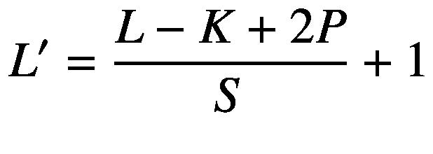

其中 *L* 表示输入图像在特定维度上的长度，*K* 是特定维度上内核/滤波器的长度，而 *P* 表示在维度的两端填充的零，*S* 表示卷积的步长。

通常，对于步长为 1，图像在每个维度上的大小会减少(*K* - 1)/2，其中 K 是该维度上滤波器内核的长度。因此，为了保持输出图像与输入图像相同，需要(*K* - 1)/2 的填充长度。

在 TensorFlow 中，填充可以选择为“**VALID**”或“**SAME**”。**SAME**确保在步长为 1 的情况下，图像的输出空间维度与输入空间维度相同。它使用零填充来实现这一点。它试图使零填充长度在维度的两侧保持一致，但如果该维度的总填充长度是奇数，则额外的长度将添加到水平维度的右侧和垂直维度的底部。

为了回顾，**VALID** 不使用零填充；因此，输出图像的维度将小于输入图像的维度，即使步长为 1 也是如此。

```py
def conv2d(x,W,b,strides=1):
x = tf.nn.conv2d(x,W,strides=[1,strides,strides,1],padding='SAME')
x = tf.nn.bias_add(x,b)
return tf.nn.relu(x)
```

### **池化层**

对图像进行池化操作通常总结图像的局部性，局部性由滤波器核的大小给出，也称为感受野。总结通常以最大池化或平均池化的形式发生。在最大池化中，局部性的最大像素强度被用作该局部性的代表。在平均池化中，局部周围像素强度的平均值被用作该局部性的代表。池化减少了图像的空间维度。确定局部性的核大小通常选择为 2 × 2，而步长选择为 2。这使图像大小减少到原始图像大小的约 1/4。

```py
def maxpool2d(x,stride=2):
return tf.nn.max_pool(x, ksize=[1,stride,stride,1], strides=[1,stride,stride,1], padding="SAME")
```

## 通过卷积层和池化层的反向传播

在前面的章节中，我们介绍了反向传播算法，并描述了感知器的反向路径。现在我们将尝试理解单个卷积层的反向传播是如何工作的，通过考虑一个简单的情况，其中所有计算中的通道数都是一。

通过卷积层的反向传播与多层感知器网络的反向传播类似。唯一的区别是权重连接是稀疏的，因为相同的权重被不同的输入邻域共享以创建输出特征图。每个输出特征图是图像或前一层特征图与滤波器核的卷积的结果，滤波器核的值是我们需要通过反向传播学习的权重。滤波器核中的权重对于特定的输入-输出特征图组合是共享的。

以下卷积操作使用一个大小为 2 × 2 的单个滤波器 *W* 对大小为 3 × 3 的输入 *X* 进行操作，没有填充，`步长 = 1`，生成一个大小为 2 × 2 的输出 *H*。同时请注意，在进行正向传播时，我们将缓存变量 *X* 和滤波器 *W*。这将在反向传播时帮助我们（图 11-21）。

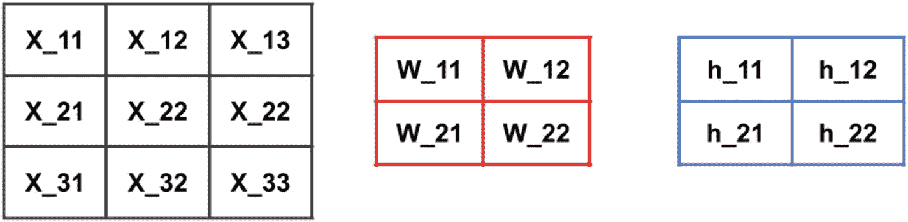

图 11-21

卷积层的输入、权重和输出

*h*[11] = *W*[11]*X*[11] + *W*[12]*X*[12] + *W*[21]*X*[21] + *W*[22]*X*[22]

*h*[12] = *W*[11]*X*[12] + *W*[12]*X*[13] + *W*[21]*X*[22] + *W*[22]*X*[23]

*h*[21] = *W*[11]*X*[21] + *W*[12]*X*[22] + *W*[21]*X*[31] + *W*[22]*X*[32]

*h*[22] = *W*[11]*X*[22] + *W*[12]*X*[23] + *W*[21]*X*[32] + *W*[22]*X*[33]

### 注意

在这里，我们执行卷积操作时没有翻转滤波器。这在文献中也被称作交叉相关操作。前面的图只是为了清晰起见。

在继续之前，请注意以下符号。

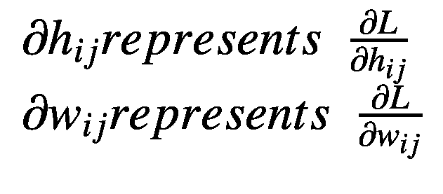

现在，为了实现当前层的反向传播步骤，我们可以假设我们得到了 𝜕h 作为输入（来自下一层的反向传播），我们的目标是计算 *∂w* 和 *∂x*。重要的是要理解 *∂x*（或前一层中的 *∂h*）将是前一层反向传播的输入。这是反向传播成功背后的核心原理。

*∂W*[11] = *X*[11]*∂h*[11] + *X*[12]*∂h*[12] + *X*[21]*∂h*[21] + *X*[22]*∂h*[22]

*∂W*[12] = *X*[12]*∂h*[11] + *X*[13]*∂h*[12] + *X*[22]*∂h*[21] + *X*[23]*∂h*[22]

*∂W*[21] = *X*[21]*X*[11] + *X*[22]*∂h*[12] + *X*[31]*∂h*[21] + *X*[32]*∂h*[22]

*∂W*[22] = *X*[22]*X*[11] + *X*[23]*∂h*[12] + *X*[32]*∂h*[21] + *X*[33]*∂h*[22]

滤波器中的每个权重都对输出图中的每个像素有贡献。因此，滤波器中权重的任何变化都会影响所有输出像素。因此，所有这些变化加起来都会对最终损失做出贡献。因此，我们可以很容易地计算出以下导数。

## 通过卷积进行权重共享及其优势

通过卷积进行权重共享大大减少了卷积神经网络中的参数数量。想象一下，如果我们用一个大小为 *k* × *k* 的特征图从大小为 *n* × *n* 的图像中创建一个全连接而不是卷积，那么仅此一个特征图就会有 *k*²*n*² 个权重，这需要学习很多权重。相反，由于在卷积中，相同的权重在由滤波器核大小定义的位置之间共享，因此需要学习的参数数量减少了巨大的因子。在这种情况下，例如，我们只需要学习特定滤波器核的权重。由于与图像相比，滤波器的大小相对较小，因此权重的数量显著减少。对于任何图像，我们都会生成几个与不同滤波器核相对应的特征图。每个滤波器核都学习检测不同类型的特征。创建的特征图再次与其他滤波器核卷积，以在后续层中学习更复杂的功能。

## 平移等变性和不变性

卷积操作提供平移等变性。也就是说，如果一个输入中的特征 *Z*[1] 产生输出中的特定特征 *Z*[2]，那么即使特征 *Z*[1] 在图像中进行了平移，特征 *Z*[2] 仍然会在输出中的不同位置继续生成（见图 11-22）。

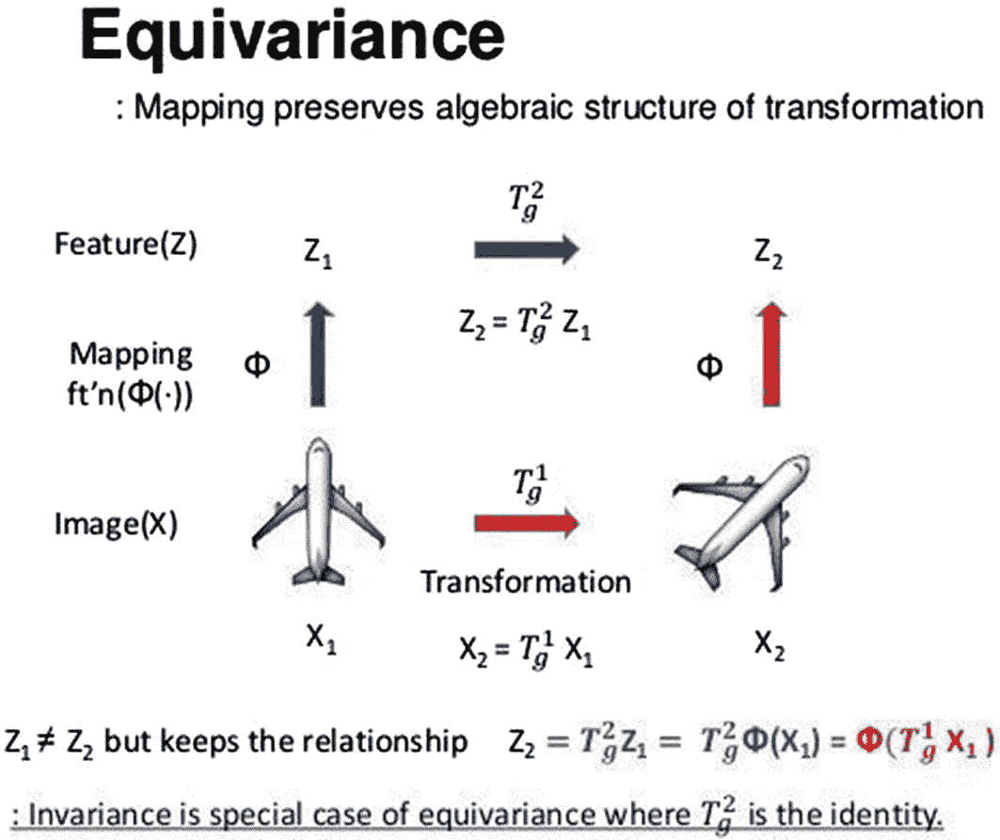

图 11-23

等变性

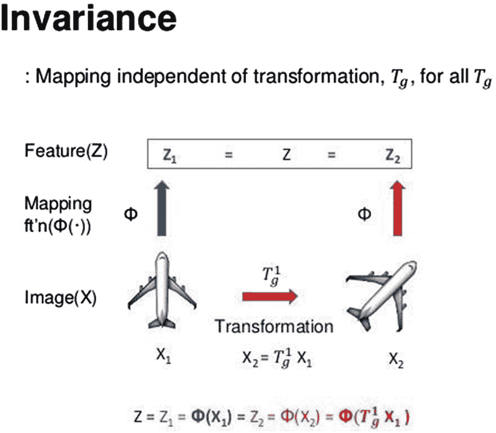

图 11-22

不变性

卷积仍然为数字产生相同的特征，无论平移如何。这种卷积的性质被称为平移等变性。实际上，如果数字由一组像素强度 *x* 表示，*f* 是对 *x* 的平移操作，而 *g* 是与滤波器核的卷积操作，那么对于卷积以下等式成立：*g*(*f*(*x*)) = *f*(*g*(*x*))。

在我们的案例中，*f*(*x*)生成了图 11-23 中的转换计划，并且转换计划通过 g 卷积生成了相同计划的激活特征，如其他图中所示。这个计划的激活特征（即，(*f*(*x*)))也可以通过将激活图像（即，*g*(*x*))通过相同的转换 *f* 进行转换来获得。

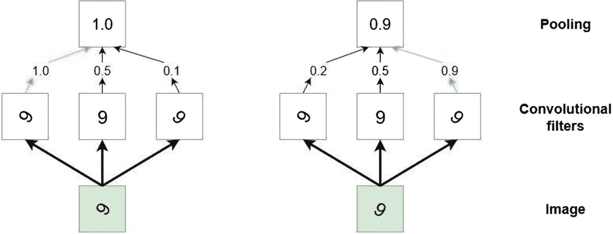

图 11-24

解决不变性的池化层的优势

池化基于池化感受野核的大小提供某种形式的平移不变性。让我们以最大池化为例。图 11-24 中特定位置的数字通过两边的卷积滤波器检测到，但并不相等，这就是卷积层的问题；但如果你仔细观察，你可以看到池化层提取了彼此相似的价值。以这种方式，最大池化在平移距离相对于感受野或最大池化核的大小不是很高的情况下，为特征检测提供了某种平移不变性。

类似地，平均池化基于感受野核的大小，对特征图局部区域的值进行平均。所以，如果某个特定特征在其特征图的一个局部区域（比如边缘区域）通过高值被检测到，那么即使图像略有平移，平均值也会继续很高。

## 案例研究——在 CIFAR-10 数据集上的数字识别

在任何项目或实验中要做的第一件事是导入所有需要的包。我们将导入 TensorFlow 和 NumPy 用于所有深度学习模型构建和矩阵操作；此外，我们还需要 matplotlib 来绘制分析和结果。我们将使用 TensorFlow 中的 `keras.dataset` 模块轻松简单地加载重建的 CIFAR-10 数据集。

```py
import tensorflow as tf
import numpy as np
import matplotlib.pyplot as plt
from tensorflow.keras.datasets import cifar10
import time
import math
%matplotlib inline
```

在导入所有包之后，我们现在需要加载数据集，如果你是第一次使用，它可能会在你的机器上下载数据集。

```py
(x_train, y_train), (x_test, y_test) = cifar10.load_data()
x_train.shape
```

完成所有这些后，你就可以构建模型了。我们将构建一个类，该类应该定义模型并运行它，以及提取分析和报告进度。`CifarNet` 类包含以下三个函数：

+   *初始化*：负责获取和设置卷积变量（权重）的函数

+   *前言*：负责创建模型架构的函数

+   *运行*：运行模型并返回运行报告的函数

```py
# define net
class CifarNet():
def __init__(self):
# conv layer
# H2 = (H1 - F + 2P)/S +1
# (32-5)/1 + 1 = 28
# 28x28x32 = 25088
# To ReLu (?x16x16x32) -> MaxPool (?x16x16x32) -> affine (8192)
self.Wconv1 = tf.get_variable("Wconv1", shape=[5, 5, 3, 32])
self.bconv1 = tf.get_variable("bconv1", shape=[32])
# (32-5)/1 + 1 = 28
# 28x28x64 = 50176
self.Wconv2 = tf.get_variable("Wconv2", shape=[5, 5, 32, 64])
self.bconv2 = tf.get_variable("bconv2", shape=[64])
# affine layer with 1024
self.W1 = tf.get_variable("W1", shape=[3136, 1024])
self.b1 = tf.get_variable("b1", shape=[1024])
# affine layer with 10
self.W2 = tf.get_variable("W2", shape=[1024, 10])
self.b2 = tf.get_variable("b2", shape=[10])
def forward(self, X, y, is_training):
# conv2d
# ReLu
# conv2d
# ReLu
# maxpool
# Batch Norm
# Affine
# Batch Norm
# ReLu
# Affine
# dropout
# Batch Norm
# conv layer
# H2 = (H1 - F + 2P)/S +1
# (32-5)/1 + 1 = 28
# 28x28x32 = 25088
# To ReLu (?x16x16x32) -> MaxPool (?x16x16x32) -> affine (8192)
# define our graph (e.g. two_layer_convnet) with stride 1
conv1 = tf.nn.conv2d(X, self.Wconv1, strides=[1, 1, 1, 1], padding="SAME") + self.bconv1
print(conv1.shape)
# ReLU Activation Layer
relu1 = tf.nn.relu(conv1)
print(relu1)
# Conv
conv2 = tf.nn.conv2d(relu1, self.Wconv2, strides=[1, 2, 2, 1], padding="VALID") + self.bconv2
print(conv2.shape)
# ReLU Activation Layer
relu2 = tf.nn.relu(conv2)
print(relu2)
# 2x2 Max Pooling layer with a stride of 2
maxpool = tf.layers.max_pooling2d(relu2, pool_size=(2,2), strides=2)
print(maxpool.shape)
maxpool_flat = tf.reshape(maxpool,[-1,3136])
# Spatial Batch Normalization Layer (trainable parameters, with scale and centering)
bn1 = tf.layers.batch_normalization(inputs=maxpool_flat, center=True, scale=True, training=is_training)
# Affine layer with 1024 output units
affine1 = tf.matmul(bn1, self.W1) + self.b1
print(affine1.shape)
# vanilla batch normalization
affine1_flat = tf.reshape(affine1,[-1,1024])
bn2 = tf.layers.batch_normalization(inputs=affine1, center=True, scale=True, training=is_training)
print(bn2.shape)
# ReLU Activation Layer
relu2 = tf.nn.relu(bn2)
print(relu2.shape)
# dropout
drop1 = tf.layers.dropout(inputs=relu2, training=is_training)
# Affine layer from 1024 input units to 10 outputs
affine2 = tf.matmul(drop1, self.W2) + self.b2
# vanilla batch normalization
affine2_flat = tf.reshape(affine2,[-1,3136])
self.predict = tf.layers.batch_normalization(inputs=affine2, center=True, scale=True, training=is_training)
print(self.predict.shape)
return self.predict
def run(self, session, loss_val, Xd, yd,
epochs=1, batch_size=64, print_every=100,
training=None, plot_losses=False, isSoftMax=False):
# have tensorflow compute accuracy
if isSoftMax:
correct_prediction = tf.nn.softmax(self.predict)
else:
correct_prediction = tf.equal(tf.argmax(self.predict,1), y)
accuracy = tf.reduce_mean(tf.cast(correct_prediction, tf.float32))
# shuffle indicies
train_indicies = np.arange(Xd.shape[0])
np.random.shuffle(train_indicies)
training_now = training is not None
# setting up variables we want to compute (and optimizing)
# if we have a training function, add that to things we compute
variables = [mean_loss, correct_prediction, accuracy]
if training_now:
variables[-1] = training
# counter
iter_cnt = 0
for e in range(epochs):
# keep track of losses and accuracy
correct = 0
losses = []
# make sure we iterate over the dataset once
for i in range(int(math.ceil(Xd.shape[0]/batch_size))):
# generate indicies for the batch
start_idx = (i*batch_size)%Xd.shape[0]
idx = train_indicies[start_idx:start_idx+batch_size]
# create a feed dictionary for this batch
feed_dict = {X: Xd[idx,:],
y: yd[idx],
is_training: training_now }
# get batch size
actual_batch_size = yd[idx].shape[0]
# have tensorflow compute loss and correct predictions
# and (if given) perform a training step
loss, corr, _ = session.run(variables,feed_dict=feed_dict)
# aggregate performance stats
losses.append(loss*actual_batch_size)
correct += np.sum(corr)
# print every now and then
if training_now and (iter_cnt % print_every) == 0:
print("Iteration {0}: with minibatch training loss = {1:.3g} and accuracy of {2:.2g}"\
.format(iter_cnt,loss,np.sum(corr)/actual_batch_size))
iter_cnt += 1
total_correct = correct/Xd.shape[0]
total_loss = np.sum(losses)/Xd.shape[0]
print("Epoch {2}, Overall loss = {0:.3g} and accuracy of {1:.3g}"\
.format(total_loss,total_correct,e+1))
if plot_losses:
plt.ylabel('minibatch loss')
plt.show()
return total_loss, total_correct
```

现在我们需要运行这个类。首先，我们将初始化类并创建用于数据集的 X 和 y 变量。

```py
tf.reset_default_graph()
X = tf.placeholder(tf.float32, [None, 32, 32, 3])
y = tf.placeholder(tf.int64, [None, 1])
is_training = tf.placeholder(tf.bool)
net = CifarNet()
```

然后，我们将调用`forward`函数来创建以下模型架构。

```py
net.forward(X,y,is_training)
```

然后，我们将创建模型使用的所有需要的超参数，例如学习率、优化器类型等。

```py
# Annealing the learning rate
global_step = tf.Variable(0, trainable=False)
starter_learning_rate = 1e-3
end_learning_rate = 5e-3
decay_steps = 10000
learning_rate = tf.train.polynomial_decay(starter_learning_rate, global_step, decay_steps, end_learning_
rate, power=0.5)
exp_learning_rate = tf.train.exponential_decay(starter_learning_rate, global_step, 100000, 0.96, staircase=True)
# Feel free to play with this cell
mean_loss = None
optimizer = None
# define our loss
cross_entr_loss = tf.nn.softmax_cross_entropy_with_logits(labels=tf.one_hot(y,10), logits=net.predict)
mean_loss = tf.reduce_mean(cross_entr_loss)
# define our optimizer
optimizer = tf.train.AdamOptimizer(exp_learning_rate)
# batch normalization in tensorflow requires this extra dependency
extra_update_ops = tf.get_collection(tf.GraphKeys.UPDATE_OPS)
with tf.control_dependencies(extra_update_ops):
train_step = optimizer.minimize(mean_loss, global_step=global_step)
```

现在，我们将以 10 个 epoch 作为起点来训练模型，以检查模型是否运行正确。如果你计算能力较低，我们建议你只运行 1 或 2 个 epoch 来测试其功能是否正确运行。

```py
# train with 10 epochs
sess = tf.Session()
try:
with tf.device("/gpu:0") as dev:
sess.run(tf.global_variables_initializer())
print('Training')
net.run(sess, mean_loss, x_train, y_train, 10, 64, 200, train_step, True)
print('Validation')
net.run(sess, mean_loss, x_test, y_test, 1, 64)
except tf.errors.InvalidArgumentError:
print("no gpu found, please use Google Cloud if you want GPU acceleration")
```

如果模型运行正确，你将看到每个 epoch 模型通过时的以下输出（图 11-25）。

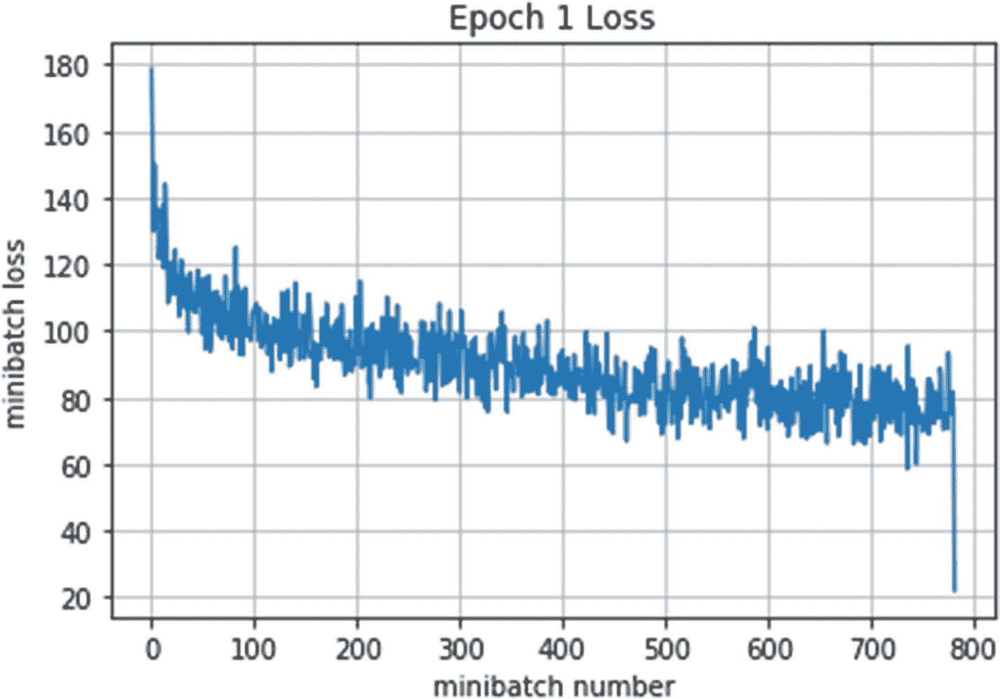

图 11-25

每个 epoch 的损失/mini-batch

```py
Iteration 0: with minibatch training loss = 2.79 and accuracy of 6.4
Iteration 200: with minibatch training loss = 1.46 and accuracy of 6.1
Iteration 400: with minibatch training loss = 1.47 and accuracy of 6.3
Iteration 600: with minibatch training loss = 1.49 and accuracy of 6.3
Epoch 1, Overall loss = 1.4 and accuracy of 6.55
```

使用前面提到的基本卷积神经网络，它包含两个卷积-最大池化-ReLU 对，并在最终的输出 softmax 单元之前有一个全连接层，我们可以在仅仅 20 到 30 个 epoch 内实现测试集的高准确率。如果你计算能力较低，你总是可以使用云来训练更多的 epoch。

另一点需要强调的是，使用正确的超参数集和先验信息调整模型的重要性。例如，学习率的选择可能非常棘手，因为神经网络的成本函数通常是非凸的。较大的学习率可以更快地收敛到局部最小值，但可能会引入振荡，而较低的学习率会导致非常缓慢的收敛。理想情况下，学习率应该足够低，以便网络参数可以收敛到一个有意义的局部最小值，同时它应该足够高，以便模型可以更快地达到最小值。通常，对于前面的神经网络，0.01 的学习率稍微有点高，但鉴于我们只训练了 20 个 epoch 的数据，它效果很好。较低的学习率不会在仅仅 10 个 epoch 内达到如此高的准确率。同样，为随机梯度下降的 mini-batch 版本选择的小批量大小会影响训练过程的收敛。较大的批量大小可能更好，因为梯度估计的噪声更少；然而，这也可能以增加计算为代价。还需要尝试不同的滤波器大小，以及在每个卷积层中实验不同的特征图数量。我们选择的那种模型架构作为网络的前置知识。

## 摘要

在本章中，我们介绍了神经网络如何处理图像的基本原理——通常是数据矩阵，并介绍了为此所需的修改。我们展示了从常规图像处理技术和滤波器到卷积神经网络的转换，并对其进行了详细讨论。

在下一章中，我们将探讨神经网络如何处理序列和文本数据。

# 12. 顺序模型

## 循环神经网络

那么为什么我们需要循环神经网络（RNN）呢？让我们通过一个例子或类比来尝试回答这个问题。当阅读一篇新文章时，人们有两个选择。首先，如果他们不理解它，他们可以阅读基于新文章的文章，以获取背景信息。否则，他们基于对主题的一些先验知识，不需要立即阅读类似的文章就能理解新文章。在两种情况下，他们理解新文章的能力都是由一些预先存在或预先获得的知识所赋予的。但他们不需要回到学习字母或数字的阶段；他们只需要知道这篇文章是关于什么的。这就是循环神经网络工作的方式。

RNN 为基本的神经网络增添了有趣的转折。神经网络以固定大小的向量作为输入，这限制了它在涉及无预定大小“序列”类型输入的情况下的使用。RNN 被设计成可以接受一系列输入，没有预定的大小限制。但有人可能会想，你能否只是重复传统的神经网络。是的，你可以，但你将错过序列的概念。序列意味着每个输入都是另一个输入的邻居。所以，如果你重复这个神经网络多次，你将错过序列。输入意味着许多输入到神经网络中，而不是序列输入，因此 RNN 是一个顺序模型网络。RNN 记得过去，它的决策受到它从过去学到的内容的影响。让我们假设基本的前馈网络“记得”事情；它们记得在训练期间学到的内容。例如，图像分类器在训练期间学习“1”看起来像什么，然后使用这些知识在生产中对事物进行分类。现在让我们来看看 RNN 及其类型。

RNN 可以接受一个或多个输入向量，并产生一个或多个输出向量，输出（s）受输入上应用的 **权重和表示基于先前输入（s）和输出（s）的上下文的“隐藏”状态向量** 的影响。因此，相同的输入可能会产生不同的输出，这取决于 **系列中的先前输入**。这是 RNN 的“系列”方面。现在，*我们如何创建 RNN 的层呢？* 首先，RNN 在外观上与传统神经网络非常相似，只是增加了一个记忆状态到神经元中。想象一个只有一个神经元、由一批数据馈入的简单模型。在一个传统神经网络中，模型通过将输入与权重相乘并添加激活函数来产生输出。在 **RNN** 中，这个输出被多次发送回自身。**时间步** 是输出成为下一个矩阵乘法输入的时间量。让我们可视化一下会发生什么。假设网络由一个神经元组成。网络计算输入和权重之间的矩阵乘法，并使用激活函数添加非线性。它成为 *t* − 1 的输出。这个输出是第二个矩阵乘法的输入。

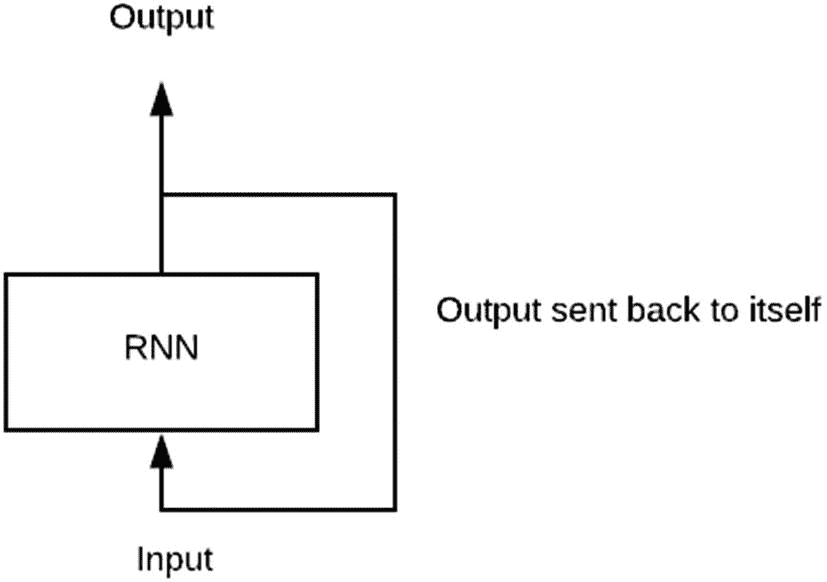

图 12-1

RNN 的抽象

图 12-1 展示了当有输入和输出时的抽象解释；输入意味着批量，但每个时间步的批量。图 12-2 更详细地展示了 RNN 细胞。

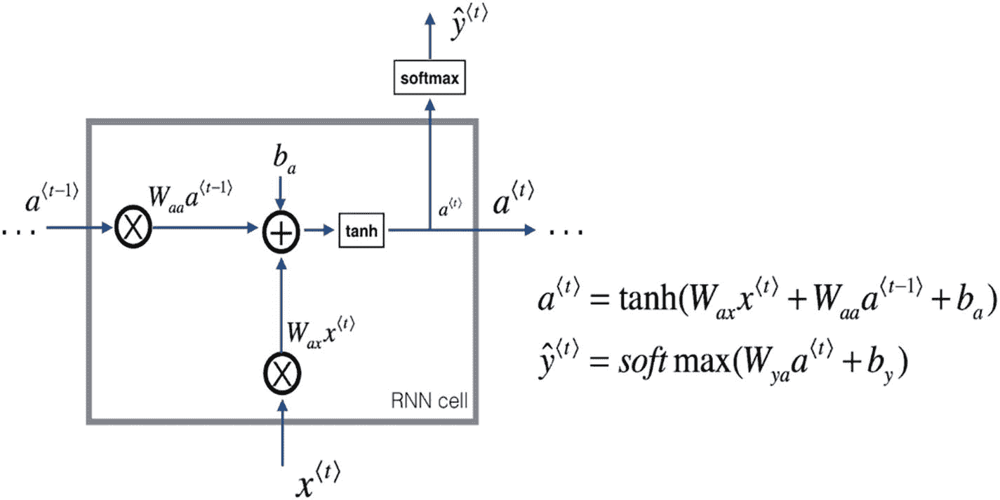

图 12-2

RNN 内部的细节

现在我们来详细解释一下，但我们将从后往前看。我们缓存了来自 *softmax* 和 *tanh* 的输出。你可以说是我们保存了$$ {\hat{y}}^t $$ 和 *a*^(*t*) 到缓存中，以便在下一个状态中使用。下一个状态将使用这两个参数作为输入，并将 (a) 参数（这将变为 *a*^(*t* − 1)）与这个状态的权重相乘。同时，我们将输入向量与这个状态的权重相乘，将这两个参数与偏置结合，并对它们应用 tanh 激活函数。这将生成下一个激活 (a)，并对其应用 *softmax* 以生成预测的 (y)，并将它们缓存到 RNN 的下一个状态，然后从这个循环的末尾开始再次返回。

因此，既然我们已经看到了一个细胞，并且对其功能进行了简要的观察，让我们将这个细胞与其他细胞连接起来，得到一个大的循环神经网络。你会发现，在现实生活中，数据序列从输入开始，并在每个时间步生成新的输出。这是一个 RNN，它依赖于时间和一系列数据。图 12-3 将使这个想法更加明显。

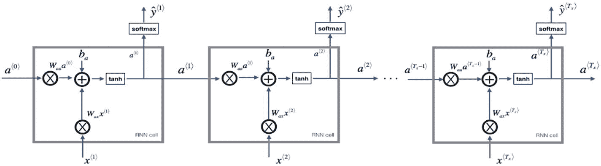

图 12-3

一系列 RNN 单元

此图解释了激活与状态之间的连接是如何生成的，经过下一个状态，并生成一个新的预测输出（y）。这形成了一个序列，正如我们之前所讨论的。现在你了解了 RNN 的结构，你应该知道 RNN 不止一种类型。你需要知道 RNN 需要的输入大小以及从 RNN 预测的输出大小。

我们有三种类型的 RNN。第一种类型是全递归网络。在这种类型中，多层感知器的分层拓扑结构被保留，但每个元素都与架构中的每个其他元素有加权连接，并且有一个反馈连接到自身。并非所有连接都会被训练，并且误差导数的极端非线性意味着传统的反向传播将不起作用，因此采用时间反向传播方法或随机梯度下降。

下一种类型是递归神经网络。首先，你应该知道递归神经网络在架构上是线性的；递归促进了层次特征空间中的分支，并且随着训练的进行，网络架构模仿了这一点。训练是通过梯度下降和子梯度方法实现的。

最后一种类型是神经网络历史压缩器。Jüergen *Schmidhuber* 报告了一个非常深的学习者，首次在 1991 年，它能够通过无监督预训练 RNN 的层次结构来进行数百个神经层的信用分配。每个 RNN 都是无监督训练以预测下一个输入。然后，只有产生错误的输入才会前馈，将新信息传递给层次结构中的下一个 RNN，然后以较慢、自组织的时标进行处理。

已经证明没有信息丢失，只是被压缩了。RNN 堆栈是数据的“深度生成模型”。数据可以从压缩形式重建。

在我们完成本节之前，我们需要讨论五种类型的 RNN 架构（图 12-4）。每种类型最适合某些用途，例如，作为编码器或解码器的多对多，以及用于 LSTM 的多对一。所以让我们讨论每种类型及其组成。一对一递归，但它只接受一个输入并产生一个输出。下一类型是一对多：它接受一个输入并产生多个输出。多对一有多个输入并生成一个输出。多对多实际上有两种类型，或两种架构：一种是称为多对多。其中一种是全连接，用于视频识别；第二种类型是部分连接，用于机器翻译。

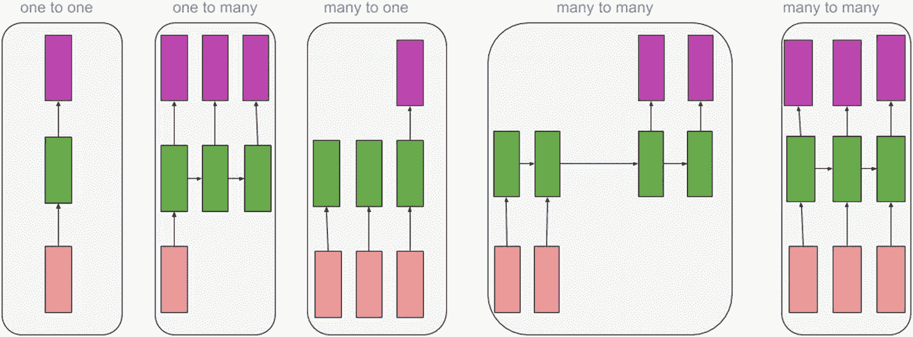

图 12-4

序列架构的不同类型

不幸的是，我们知道 RNN 应该携带信息到时间点。然而，当时间步长太长时，传播所有这些信息是非常具有挑战性的。当一个网络有太多的深层时，它就变得无法训练。这个问题被称为梯度消失问题。如果你记得，神经网络使用梯度下降算法更新权重。当网络向下进展到较低的层时，梯度会变得越来越小。这些都是关于 RNN 及其架构的有用信息。但简单来说，RNN 只是一个我们用于语言模型的序列模型，因为我们需要在语言模型中有序列，或者说系列。那么，让我们来谈谈语言模型以及 RNN 在其中的重要性。

## 语言模型

为了简化，语言模型是预测文档中下一个单词或字符的任务。语言模型是在给定序列中所有先前单词的身份的情况下，对第*i*个单词的标识符的条件分布。在语言模型中，通过事件的交集乘积规则计算单词序列的概率。长度为 n 的单词序列{*w*[1], *w*[2], *w*[3], …, *w*[*n*]}的概率如下所示：

![P(w1, w2, w3,..,wn)=P(w1)P(w2|w1)P(w3|w1²)…P(wn|w1^(n-1))] (Images/484548_1_En_12_Chapter_TeX_IEq2.png)

因此，语言模型为单词序列分配概率。但让我们看看语言模型的类型以及序列如何与每种类型一起工作。我们有三种类型。将这些概率分配给句子或单词序列的最简单模型是**N-Gram**。N-gram 是*N*个单词的序列；一个*bigram*（或**bigram**）是两个单词的序列，如“请转动”，“转动你的”，或“你的作业”；而一个 tri-gram（或 trigram）是三个单词的序列，如“请转动你的”，或“转动你的作业”。但它们与 RNN 或序列模型之间的关键联系是什么？让我们从最简单的一个开始：N-gram 的任务是计算*P*(*w*| *h*), 给定一些历史*h*^∗的单词*w*^∗的概率。假设历史*h*^∗是“它的水是如此透明以至于”，我们想知道下一个单词是“the”的概率，它可以表示为：

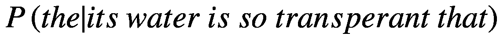

估计前述函数的一种方法是通过相对频率计数，我们会选取一个大量的语料库，计算“它的水是如此透明以至于”出现的次数，然后计算它后面跟着“the”的次数：

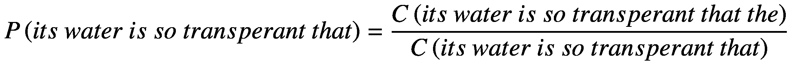

但是，执行这项任务并不实际；我们有很多组，我们需要为每个组单独执行这项任务！所以，你可以通过使用概率的链式法则来实现：

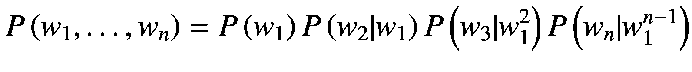

这就是 N-Gram 模型的基本过程，其中我们不是计算一个词在给定其整个历史背景下的概率，而是通过仅使用最后几个词来近似历史。二元模型通过仅使用前一个词的条件概率来近似一个词在所有前一个词条件下的概率。我们用概率 *P*(*w*[1] | *w*[*n* − 1]) 来近似它；就像“the”和“that”的例子，你可以在二元组 *P*(*the* | *that*) 中这样做。你可以通过使用条件概率来实现：

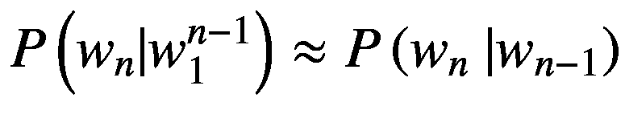

一个 *trigram 模型* 将语言建模为二阶马尔可夫过程，通过计算上方便的近似，即一个词只依赖于前两个词。你可以用这个方程来使用它：

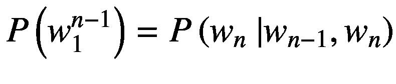

因此，这些是自然语言处理（NLP）中的语言模型。但我们没有讨论 *unigram*，因为我们不需要它来进行序列模型，所以最后，我们将看到 RNN 如何与语言模型一起工作以及 RNN 在语言模型中的重要性，语言模型的目标是预测下一个词，所以在 N-gram 中，我们根据前一个词来条件化我们需要预测的词。因此，使用 RNN 的主要原因就是它的顺序性。这与人类大脑不会为每个我们说的词从头开始思考的事实类似。我们的思维具有持续性。我们将通过使用 RNN 将这种持续性属性赋予神经网络。

一个很好的例子是“我在法国玩得很开心。我还学会了说一些 _____”。如果我们想预测空白处将填入什么单词，我们必须追溯到单词 France，然后得出最可能的单词将是 French 的结论。换句话说，我们必须记住我们之前的输出，并根据我们的过去输出计算新的输出。使用 RNN 进行语言建模的另一个优点是，由于内存限制，它们只能记住很少的步骤。这是理想的，因为单词的上下文可以在它之前的 8-10 个单词中捕捉到。我们不需要记住 50 个单词的上下文，尽管如果你有足够的内存，RNN 可以用于任意长度的序列。而且别忘了 RNN 的设计（图 12-5）。

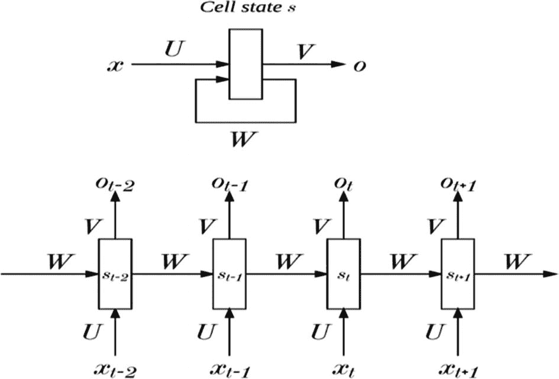

图 12-5

RNN 序列的展开

在 RNN 中，每一步的输出都是基于所有之前的单词；因此，RNN 在语言模型任务上做得比 n-gram 模型更好。为了理解这一点，让我们在考虑一个长度为 n 的序列（*X* = {*x*[1], *x*[2], …, *x*[*n*]）时，看看生成循环神经网络的工作原理。RNN 递归地更新其隐藏状态 ht，作为 ht=f(ht−1,xt)。隐藏状态*h*[*t* − 1]包含了单词序列{*x*[1], *x*[2], …, *x*[*t* − 1]}的信息积累，当序列中的新单词*x*[*t*]到达时，通过递归更新，更新的序列信息{*x*[1], *x*[2], …, *x*[*t*]}被编码在*h*[*t*]中。

现在我们必须根据到目前为止看到的单词序列预测下一个单词。

因此，既然我们知道循环神经网络对于语言模型任务很重要，并且对这种类型的 RNN 有很好的解释，我们将在本章中讨论 LSTM、GRU，这是 RNN 的更新。但到目前为止，让我们看看一个新的任务如何与 RNN 一起工作——时间反向传播（BPTT）。

## 时间反向传播

时间反向传播，或称 BPTT，是将反向传播训练算法应用于循环神经网络，该神经网络用于处理序列数据，如时间序列。循环神经网络每次只展示一个输入，并预测一个输出。循环神经网络的反向传播与前馈神经网络相同；唯一的区别是梯度是每一步相对于对数损失的梯度的总和。因此，在每一步输入和输出之后，错误就会被计算并累积。然后网络回滚，权重被更新。

由于问题的顺序依赖性，展开的循环神经网络中的每个时间步可以看作是一个额外的层，并且前一时间步的内部状态被用作后续时间步的输入。基于预测输出和实际输出标签，计算每个时间步的损失和相应的误差。每个时间步的误差被反向传播以更新权重。因此，任何权重更新都与所有 T 个时间步的误差贡献的梯度之和成比例。因此，让我们来计算一下 RNN 的损失函数。我们之前提到了 tanh 函数和 *softmax* 函数，现在让我们来讨论损失函数。我们还定义了我们的损失，或误差，为交叉熵损失，其表达式为：

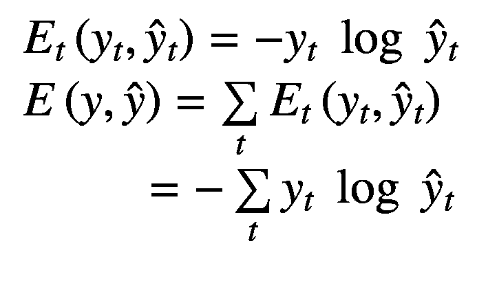

这里，*y*[*t*] 是时间步 *t* 的正确单词，而 *y*[*t*] 是我们的预测。我们通常将整个序列（句子）视为一个训练示例，因此总误差只是每个时间步（单词）误差的总和。让我们通过一个 RNN 的插图（图 12-6）来了解如何计算 BPTT——反向传播。

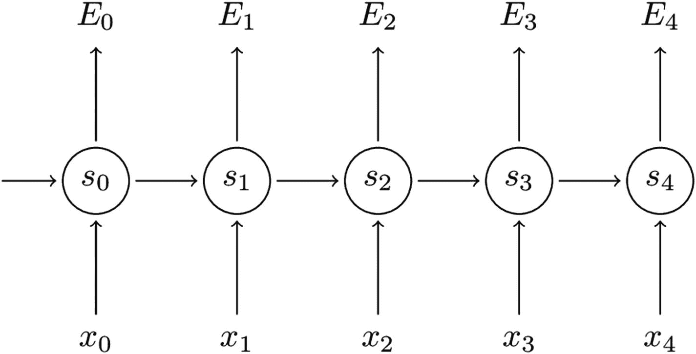

图 12-6

描述模型中反向传播的简单架构

这不是一个新想法，因为我们实际上在之前的章节中就学到了它。但让我们记住，我们需要计算误差相对于我们的参数 *U*、*V* 和 *W* 的梯度，然后使用随机梯度下降学习良好的参数。就像我们累加误差一样，我们也累加每个时间步的梯度，以一个训练示例为例：

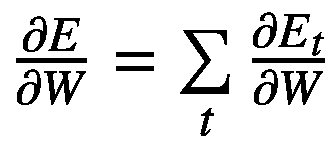

为了计算这些梯度，我们使用微分链式法则。这就是反向传播算法，从误差开始反向应用。我们将使用 E[3] 作为示例，以便有具体的数字来工作。


在前面，*z*[3] = *Vs*[3]，而*圆圈乘法*是两个向量的外积。这是直观的，但关键点是 *E*[3]*V* 只取决于当前时间步的值：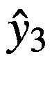, *y*[3], *s*[3]。如果你有这些值，计算 *V* 的梯度就是一个简单的矩阵乘法。但关键点是要首先有这个，就像上面的计算中 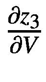 确实依赖于这三个变量，所以现在让我们通过计算来更深入地了解。*s*[3] =  *tanh* (*Ux*[*t*] + *Ws*[2]) 依赖于 *s*[2]，而 *s*[2] 依赖于 *W* 和 *s*[1]，依此类推。因此，如果我们对 *W* 求导，我们不能简单地将 *s*[3] 视为一个常数！我们需要再次应用链式法则，我们真正得到的是这个：

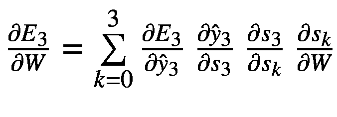

我们将每个时间步对梯度的贡献进行求和。换句话说，因为 *W* 在到达我们关心的输出之前的每个步骤都被使用，所以我们需要从 *t* = 3 通过网络反向传播梯度到 *t* = 0。让我们通过一个可视化（图 12-7）来更好地理解这一点。你已经知道了反向传播；唯一的关键区别是反向传播和 BPTT 之间的时间。

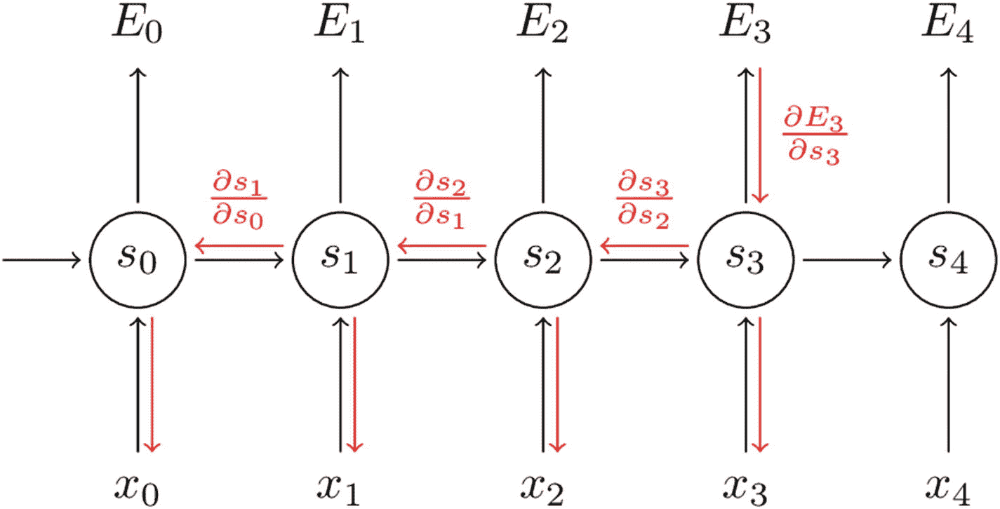

图 12-7

反向传播的反馈

### 注意

这与我们在深度前馈神经网络中使用的标准反向传播算法完全相同。关键的区别是我们对每个时间步的 W 的梯度进行求和。

在传统的神经网络中，我们不会在层之间共享参数，因此我们不需要求和。但在我看来，BPTT 只是对未展开 RNN 上的标准反向传播的一个花哨名称。但我们有一个问题：随着时间步数的增加，BPTT 可能计算成本很高。如果输入序列由数千个时间步组成，那么这将是一个单次更新权重更新所需的导数数量。这可能导致权重消失或爆炸（变为零或溢出），并使学习缓慢和模型技能噪声。这使我们到达了 BPTT 的新版本，试图消除或最小化 BPPT 所面临的挑战。因此，TBPTT（时间截断反向传播）被开发出来。TBPTT 是循环神经网络 BPTT 训练算法的修改版本，其中序列一次处理一个时间步，并在固定的时间步数（k2 时间步）后，定期（k1 时间步）执行 BPTT 更新。因此，我们看到它取决于两个变量：k1 和 k2。

+   **k1:** 更新之间的前向传递时间步数。通常，这会影响训练的快慢，取决于权重更新的频率。

+   **k2:** 应用 BPTT 的时间步数。通常，它应该足够大，以便网络能够学习问题中的时间结构。过大的值会导致梯度消失。

让我们来看看 TBPTT 是如何工作的，其中参数为 k1 和 k2。我们有四种标准方法；最后一种方法分为两种方法，如下所示：

+   **TBPTT(n,n):** 在序列的末尾对序列中的所有时间步进行更新（例如，古典 BPTT）。

+   **TBPTT(1,n):** 逐个处理时间步，然后进行一次更新，覆盖到目前为止看到的所有时间步（例如，威廉姆斯和彭的古典 TBPTT）。

+   **TBPTT(k1,1):** 网络可能没有足够的时间上下文来学习，严重依赖内部状态和输入。

+   **TBPTT(k1,k2),** 其中 k1<k2<n：每个序列执行多次更新，这可以加速训练。

+   **TBPTT(k1,k2),** 其中 k1=k2：一个常见的配置，即前向和反向传递时间步都使用固定数量的时间步（例如，10s 到 100s）。

在 TensorFlow 和 Keras 等库中，事情看起来很相似，h 定义了准备数据的时间步的向量化固定长度。在现实生活中，通过编码，你不会自己进行这个计算，但我们需要你理解这个方程背后的发生的事情。现在我们将有一个案例研究，使序列模型更加明显。自己试试看。

## RNN 中的梯度消失和爆炸问题

在上一节中，我们了解到 BPTT（反向传播时间步长）在处理时间序列时存在许多问题。如果你有一个大的时间序列，你可能会遇到许多属于“消失”和“爆炸”这一术语的问题。RNN（循环神经网络）与神经网络的关键区别在于时间。错误从输出层反向传播到输入层，传播输入误差梯度。随着神经网络深度的增加，反向传播可能会出现一些问题，如梯度消失和梯度爆炸。因此，让我们快速回顾一下**梯度消失**的定义。当我们回溯到较低的层时，梯度通常会变小，最终导致在较低层权重永远不会改变。**梯度爆炸**与梯度消失相反；梯度在回溯过程中爆炸。

让我们看看 RNN 的梯度是否会更多地受到消失或爆炸的影响。在我看来，它将是消失的，因为 RNN 具有大而复杂的结构。因此，让我们梳理一下这个问题，并为其找到解决方案。RNN 的目标是学习长依赖关系，以便捕捉到相隔较远的单词之间的关系。例如，一个句子试图传达的实际意义可能通过不在彼此附近出现的单词很好地捕捉到。假设网络的输入序列是一个九个单词的句子：“我在法国长大；我法语讲得很流利。”从例子中我们可以看出，为了预测序列末尾的单词“French”，RNN 需要从句子开头附近出现的单词“France”那里获取信息。这种序列数据之间的依赖性被称为长期依赖，因为相关信息“France”与需要做出预测的点“French”之间的距离非常远。不幸的是，在实践中，随着这个距离的增大，RNN 很难学习这些依赖关系，因为它们会遇到梯度消失或梯度爆炸的问题。

因此，RNN 应该能够学习这些依赖关系，但它们存在一个固有的问题：无法捕捉单词之间的长距离依赖关系。这是因为长序列实例中的梯度有很大可能性要么迅速变为零，要么迅速变为无穷大。当梯度迅速下降到零时，模型无法学习时间上相隔较远的事件之间的关联或相关性。关于成本函数梯度相对于隐藏记忆层权重的导数推导出的方程将帮助我们理解为什么梯度消失问题可能发生。这些问题出现在深度网络的训练过程中，当梯度被反向传播到初始层时。由于链式法则，来自深层层的梯度必须经过连续的矩阵乘法。当它们接近早期层时，如果它们的值很小（<1），它们将指数级缩小直至消失，使得模型无法学习；这就是梯度消失问题。另一方面，如果它们的值很大（>1），它们将变得更大，最终爆炸并崩溃模型；这就是梯度爆炸问题。因此，梯度消失和梯度爆炸的定义如下：

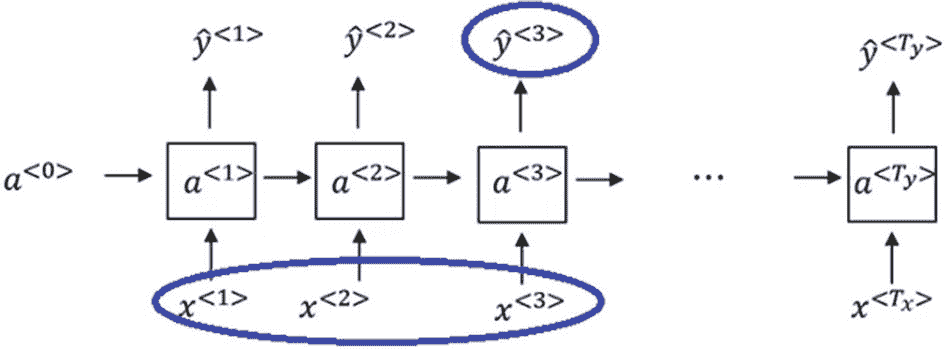

图 12-8

所有先前输入都参与生成当前输出

+   **梯度爆炸** **:** 当梯度爆炸时，由于数值溢出，梯度可能变为 NaN，或者在我们绘制学习曲线时，我们可能会看到训练成本的异常振荡。

+   **梯度消失** **:** 由于循环神经网络作为早期信息，基本 RNN 模型有许多局部影响。随着 RNN 权重随时间消失，信息丢失。

在图 12-8 中，输出  主要受 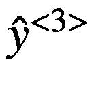 附近的一个值的影响。这种局部影响使得序列中较晚的输出受到早期输入的影响。

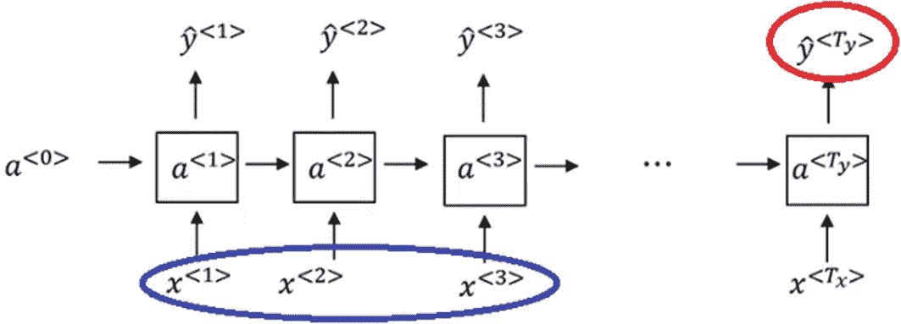

图 12-9

所有先前输入都参与生成当前输出

在图 12-9 中，输出 y<Ty> 不能受到序列中早期输入 (*x*^(<1>), *x*^(<2>), *x*^(<3>)) 的影响。错误难以反向传播到序列的开始。这是基本 RNN 的弱点。因此，现在我们知道了梯度消失和梯度爆炸的问题，我们需要解决它们。

## 解决 RNN 中梯度消失和梯度爆炸问题的方法

让我们从爆炸梯度开始。解决这个问题的一种方法是对梯度应用梯度裁剪，这为梯度设置一个预定义的阈值，以防止它们变得过大。通过这样做，它不会改变梯度的方向；它只改变其长度。我们可以在图 12-10 中看到这一点。

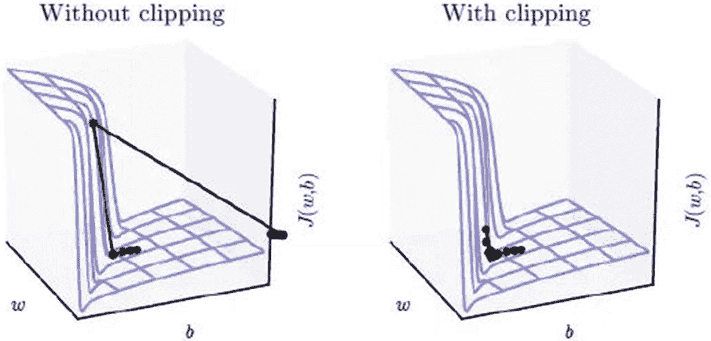

图 12-10

带和不带裁剪的梯度步骤

因此，我们应该达到一个点，我们试图增强梯度，使其尽可能快地达到局部最小值，而不产生任何错误，这意味着过度拟合、欠拟合、消失或爆炸。所以对于爆炸，解决方案看起来很简单，但对于消失则不那么简单。我们有两种解决消失的方法。首先，我们将讨论身份 RNN 架构，其中网络权重初始化为身份矩阵，激活函数全部设置为 ReLU。这最终鼓励网络计算保持接近身份函数。这很有效，因为当错误导数在时间上向后传播时，它们保持为 0 或 1 的常数；因此，它们不太可能遭受消失梯度。第二种，广泛使用的方法是 LSTM。长短期记忆架构是常规循环网络的一种变体，它被设计成易于在序列数据中捕获长期依赖关系。标准的 RNN 以一种方式运行，即隐藏状态激活受到它们附近的其他局部激活的影响，这对应于“短期记忆”。但网络权重受到在整个长序列中进行的计算的影响，这对应于“长期记忆”。因此，RNN 被重新设计，使其具有可以充当权重并跨长距离保留信息的激活状态，因此得名“长短期记忆”。

我们可能需要更多地了解 LSTM，因此在下节中我们将讨论它。但在结束本节之前，让我们回顾一下。消失意味着你的模型试图学习，但由于速度过慢而无法学习；但如果让它完成训练，它可能达到最优最小值，也可能不会。爆炸是模型远离最优最小值的方式：它会越来越远，并且无法达到其最优最小值，我们无法降低成本函数——这是我们试图做的核心。因此，让我们进入下一节，讨论 LSTM。

## 长短期记忆

LSTM 网络只是普通 RNN 的一个高级版本。这些网络能够记住长期依赖关系。它们被设计成能够在不处理梯度消失问题的前提下长时间记住信息。它们是由 Sepp Hochreiter 和 Jürgen Schmidhuber 在 1997 年发明的，并在他们后续的工作中被许多人改进和普及。它们在解决各种问题上表现出色，现在被广泛使用。我们知道与 LSTM 相比，RNN 非常简单，LSTM 用于解决梯度消失问题，所以让我们来谈谈其架构（图 12-11）。所有 RNN 都具有神经网络重复模块链的形式。在标准 RNN 中，这个重复模块将具有一个非常简单的结构，例如单个 tanh 层。

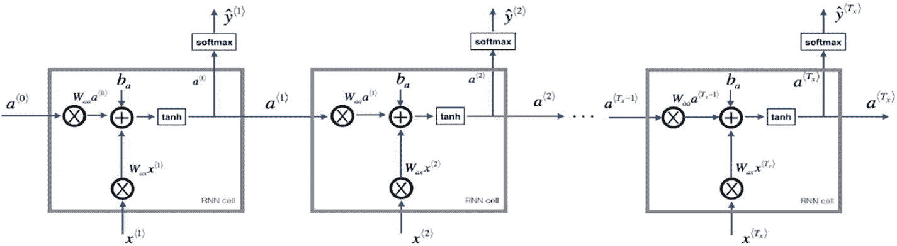

图 12-11

LSTM 的架构

LSTMs 也具有这种链式结构，但重复模块的结构不同。它不是只有一个神经网络层，而是有四个，以一种非常特殊的方式相互作用。

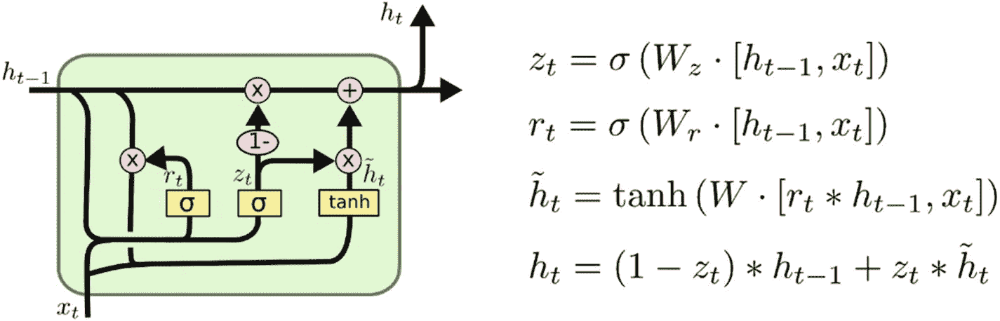

图 12-12

LSTM 单元的工作原理

让我们谈谈 LSTM 核心的内容以及从第一个状态到最后一个状态输入发生了什么。我们一开始不会去方程，我们只会谈论图（图 12-13）。让我们从上面的线开始。它沿着整个链直接向下运行，只有一些小的线性交互。信息很容易沿着它流动，保持不变，从上一个状态生成新的 *C*[*t*] 到下一个状态，如图 12-13 所示。


图 12-13

LSTM 中记忆步骤的工作原理

LSTM 可以通过使用门来添加、遗忘或更新。这些门可以在这个直线上改变。让我们一步一步地构建 LSTM 架构，并随着数据通过输入来进行分析。

我们 LSTM 的第一步是决定我们要从细胞状态中丢弃哪些信息。这个决定是由一个称为“遗忘门层”的 sigmoid 层做出的。它查看 *h*[*t* − 1] 和 *x*[*t*]，并为细胞状态 *C*[*t* − 1] 中的每个数字输出一个介于 0 和 1 之间的数字。

*A*[1] 当它为 1 时表示“完全保留这个”，而 0 表示“完全去除这个”。我们知道 sigmoid 函数，它为 0 或 1，是一个激活函数，所以输入会乘以它。如果它是零，这意味着这个输入被忽略；但如果它是 1，这意味着我们应该关注这个输入。你可以在图 12-14 中看到一个例子。

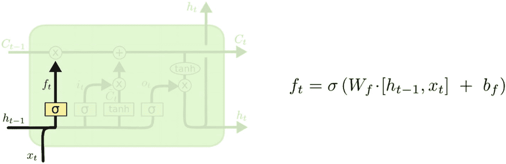

图 12-14

遗忘单元及其工作原理

下一步是决定我们将要存储在细胞状态中的新信息。这有两个部分。首先，一个名为“输入门层”的 sigmoid 层决定哪些值我们将要更新。接下来，一个*tanh*层创建了一个新的候选值向量，*C*[*t*]，它可以添加到状态中。在下一步中，我们将这两个结合起来创建状态更新（见图 12-15）。

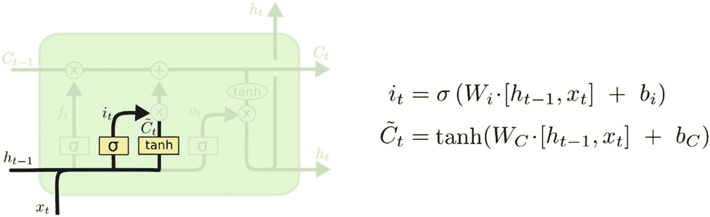

图 12-15

LSTM 如何更新其记忆

现在是时候将旧的细胞状态，*C*[*t* − 1]，更新为新的细胞状态，*C*[*t*]。我们通过乘以 *f*[*t*] 来更新旧状态，忘记之前决定忘记的事情。然后我们加上 *i*[*t*]∗*C*[*t*]。这代表了新的候选值，根据我们决定更新每个状态值的大小进行缩放（见图 12-16）。

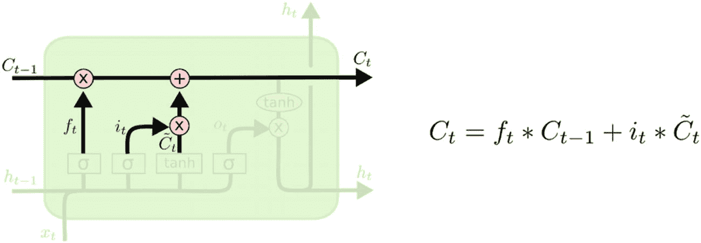

图 12-16

遗忘和更新 LSTM 记忆的组合

最后，我们需要决定我们将要输出的内容。这个输出将基于我们的细胞状态，但将是一个过滤版本。首先，我们运行一个 sigmoid 层，它决定我们将输出细胞状态的哪些部分。然后，我们将细胞状态通过 tanh（将值推到-1 和 1 之间）并乘以 sigmoid 门的输出，这样我们只输出我们决定的部分（见图 12-17）。

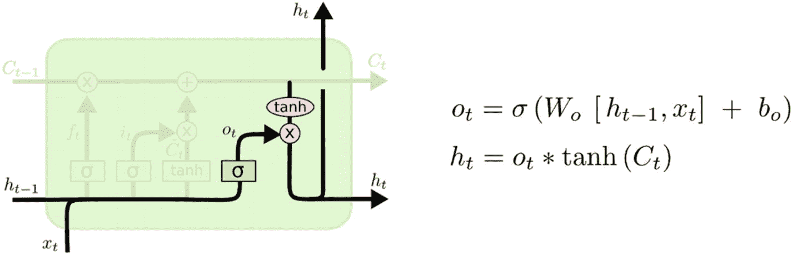

图 12-17

LSTM 如何计算输出

除了这个通用的 LSTM 层之外，许多论文都更新了这个版本：

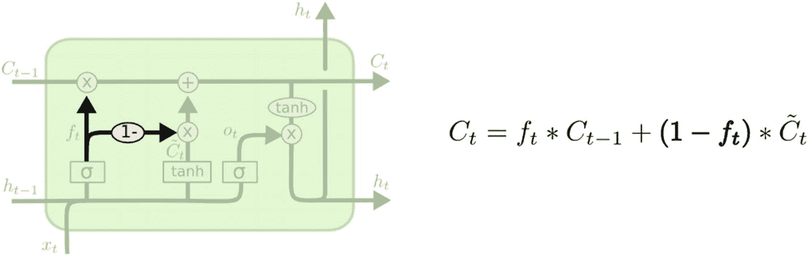

图 12-19

遗忘/更新记忆激活函数的输出

1.  一个流行的 LSTM 变体，由 F. A. Gers 和 Jürgen Schmidhuber（2000）提出，是添加“窥视孔连接”。这意味着我们让门控层查看细胞状态（见图 12-18）。

    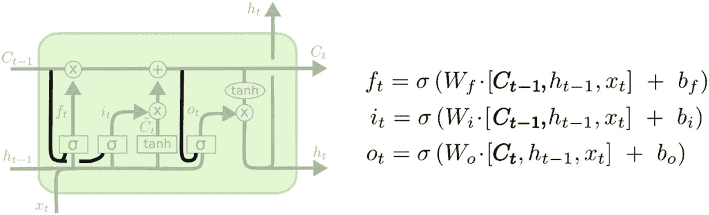

    图 12-18

    LSTM 如何处理记忆以及如何使用它

1.  使用耦合的遗忘和输入门。我们不是分别决定要忘记什么以及我们应该添加什么新信息，而是一起做出这些决定。只有当我们打算输入某个东西来代替它时，我们才会忘记。只有当我们忘记一些旧信息时，我们才会将新的值输入到状态中（见图 12-19）。

因此，你可以看到任何人都可以更新这个版本，并将 LSTM 适应于处理他们的案例。我们已经了解了 LSTM 及其四个功能；重点是 LSTM 可以解决梯度爆炸和消失的问题。

## 案例研究——MNIST 数据集上的数字识别

## 门控循环单元

在关于 LSTM 的章节中，我们提到它解决了梯度消失问题。现在有一个名为门控循环单元（GRU）的全新架构，由 Cho 等人在 2014 年提出。GRU 的目标是解决标准 RNN 带来的梯度消失问题。GRU 也可以被视为 LSTM 的一个变体，因为它们的设计相似，在某些情况下，可以产生同样出色的结果。GRU 使用所谓的更新门和重置门。基本上，这些是两个向量，决定应该传递给输出的信息。它们特别之处在于，它们可以被训练来保留很久以前的信息，而不会随着时间的推移而冲淡，也不会删除与预测无关的信息。所以，让我们通过可视化模型（图 12-20）来看 GRU 的单元。

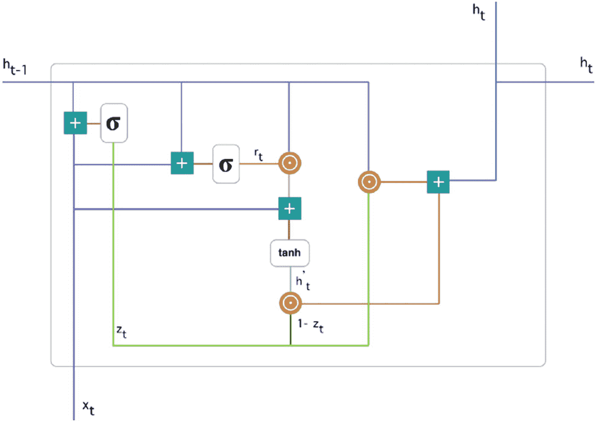

图 12-20

GRU 单元架构

让我们逐个查看每个门，

1.  **更新门**：我们从计算时间步 t 的更新门 *z*[*t*] 开始（图 12-21）。

    *z*[*t*] = *σ*(*W*^((*z*))*x*[*t*] + *U*^((*z*))*h*[*t* − 1])

    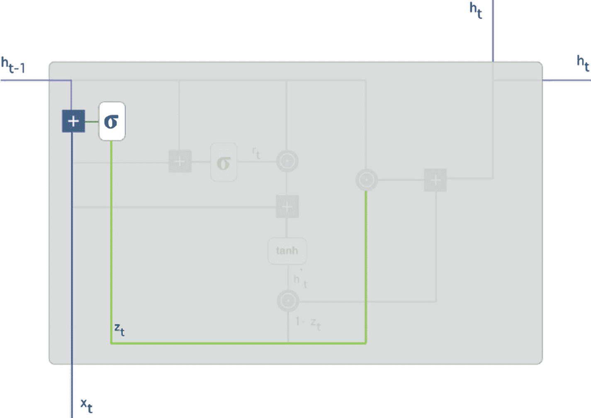

    图 12-21

    GRU 单元的第一个步骤，更新门

    当 *x*[*t*] 被插入到网络单元中时，它乘以自己的权重，*W*(*z*)。同样，ht-1 也乘以自己的权重，*U*(*z*)，它持有前 *t* − 1 个单元的信息。这两个结果相加，并应用 sigmoid 激活函数将结果压缩在 0 和 1 之间。更新门帮助模型确定需要传递多少过去的信息（来自先前的时间步）。这真的很强大，因为模型可以选择复制过去所有的信息，从而消除梯度消失问题的风险。我们将在稍后看到更新门的使用。现在，记住 *z*[*t*] 的公式。

1.  **重置门**：本质上，这个门被模型用来决定要忘记多少过去的信息。

    *r*[*t*] = *σ*(*W*^((*r*))*x*[*t*] + *U*^((*r*))*h*[*t* − 1])

    你可以看到这个公式几乎与更新门相同，但在变量值和架构中门的位置上有所不同。让我们看看图 12-22 中的门。

    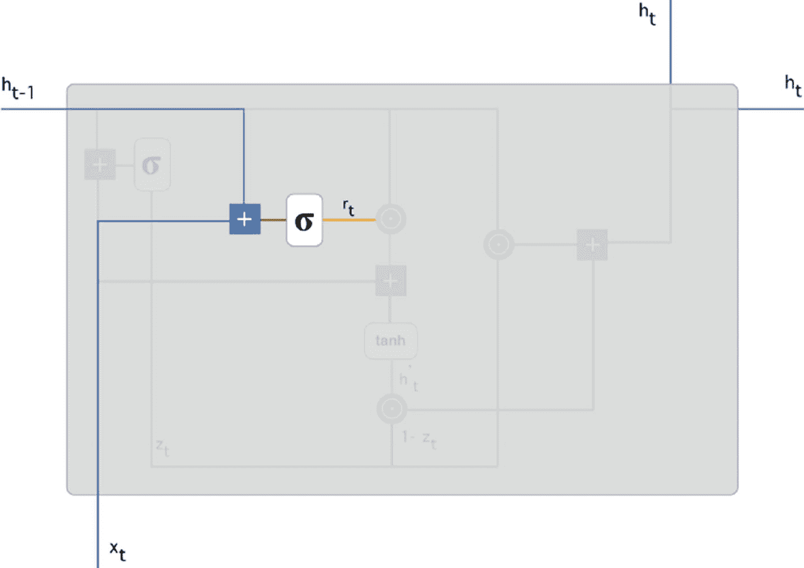

    图 12-22

    GRU 单元中的重置门

    如前所述，我们插入 *h*[*t* − 1] 和 *x*[*t*]，将它们与相应的权重相乘，求和结果，并应用 sigmoid 函数。

1.  **当前内存内容**：这是一个新的内存；我们引入一个新的内存内容，将使用重置门来存储过去的相关信息。

    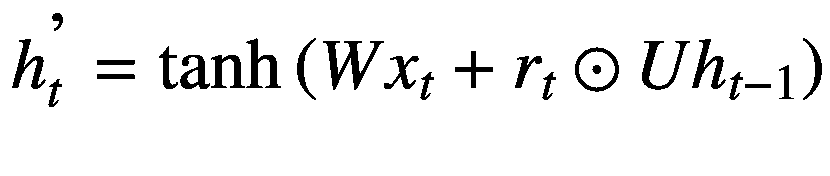

    这分为四个步骤（图 12-23）。

    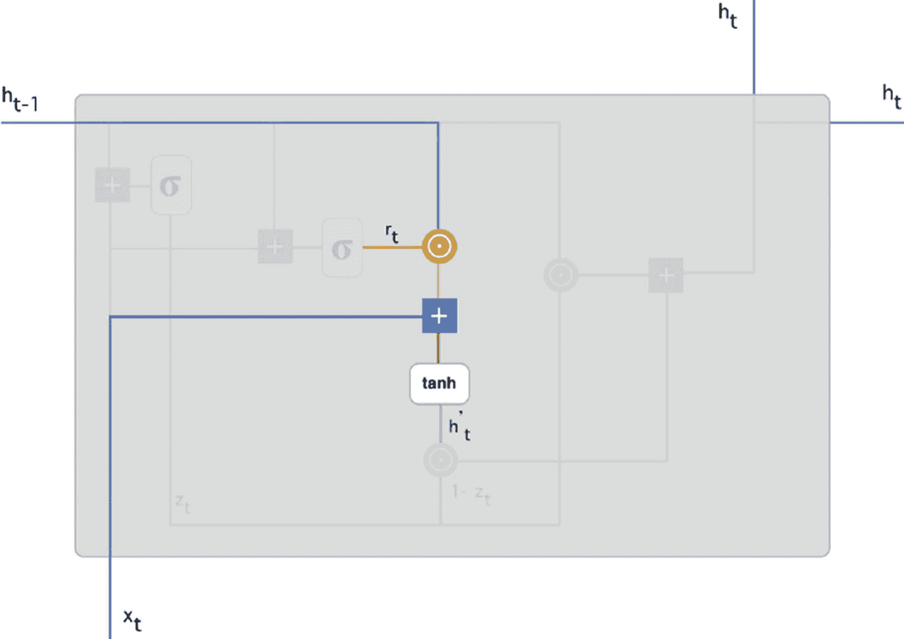

    图 12-23

    LSTM 如何使用记忆

    我们对*h*[*t* − 1]和*r*[*t*]进行逐元素乘法，然后将结果与输入*x*[*t*]相加。最后，使用*tanh*函数产生*h*[*t*]。因此，在描述了图像中的发生情况之后，我们需要详细说明。第一步是将输入*x*[*t*]与权重*W*相乘，将*h*[*t* − 1]与权重*U*相乘。第二步计算重置门*r*[*t*]和*Uh*[*t* − 1]之间的 Hadamard（逐元素）乘积。这将确定从先前的时间步中要移除什么。然后在第三步将它们相加，并在最后一步应用 tanh 激活函数。

1.  **当前时间步的最终记忆：** 这是 GRU 的最后一个步骤；网络需要计算*h*[*t*]向量，它包含当前单元的信息并将其传递到网络。为了做到这一点，需要更新门。它决定了从当前记忆内容*h*[*t*]和之前步骤*h*[*t* − 1]中收集什么。

    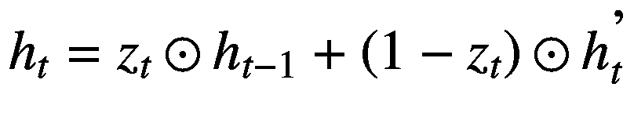

    现在让我们看看这个记忆是如何工作的。对更新门*z*[*t*]和*h*[*t* − 1]进行逐元素乘法，然后对(1 − *z*[*t*])和*h*[*t*]进行逐元素乘法（图 12-24）。到目前为止，我们可以将前两个步骤的结果相加。

    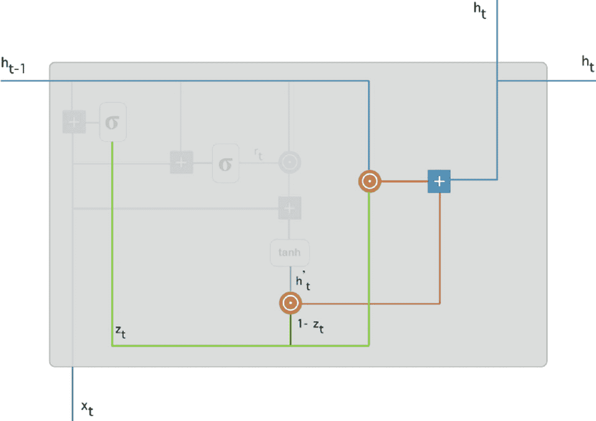

    图 12-24

    最终步骤中记忆状态会发生什么

    您可以看到*z*[*t*]是如何用来计算(1 − *z*[*t*])的，它与*h*[*t*]结合产生一条深红色线的结果。*z*[*t*]还与*h*[*t*-1]进行逐元素乘法。最后，*h*是亮红色线和暗红色线对应输出的总和。因此，在了解了 GRU 的工作过程以及它与 LSTM 几乎相同之后，我们现在需要做一些比较——不是实际的比较，但我们将尝试获取一些关键点，以便我们能够选择。在它们之间进行选择非常困难，但让我们记录一些需要考虑的点。

1.  GRU 和 LSTM 的性能相当，没有简单的方法可以推荐其中一个用于特定的任务。

1.  GRU 的训练速度更快，并且需要更少的数据来泛化。

1.  当有足够的数据时，LSTM 的更强的表达能力可能会导致更好的结果。

1.  与 LSTMs 类似，GRUs 可以作为简单的 RNN 单元的直接替换。

这些只是一些关键点；你可以进一步研究它们。因此，我们现在知道了基本 RNN 神经网络的升级版本：LSTM 和 GRU。它们在当今被广泛使用，所以请确保你使用它们。在下一节中，我们将看到 RNN 的新应用，双向 RNN（Bi-RNN）。

## 双向 RNN (Bi-RNN)

双向 RNN 是一种特殊的 RNN，它利用过去和未来的状态来预测当前状态下的输出标签。双向 RNN 结合了两个 RNN，其中一个从左到右向前运行，另一个从右到左向后运行。双向 RNN 的高级架构图如图 12-25 所示。

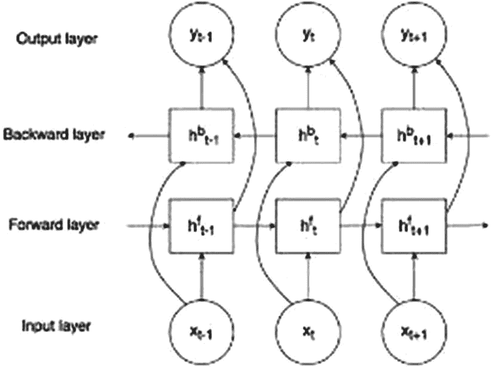

图 12-25

双向 RNN 架构

双向 RNN 实际上只是两个独立的 RNN 组合在一起。一个网络的输入序列以正常的时间顺序输入，另一个网络的输入序列以相反的时间顺序输入。两个网络的输出通常在每个时间步进行连接，尽管还有其他选项（例如，求和）。

这种结构允许网络在每一个时间步都拥有关于序列的向前和向后信息。这个概念看起来很简单。但当涉及到实际实现一个利用双向结构的神经网络时，就会出现困惑。

它存在一些问题：不是真正的问题，但有一些困惑。第一个困惑是关于如何将双向 RNN 的输出前向传递到密集神经网络。对于正常的 RNN，我们可以在最后一个时间步直接前向传递输出。第二个困惑是关于返回的隐藏状态。在 seq2seq 模型中，我们希望从编码器获取隐藏状态来初始化解码器的隐藏状态。

## 概述

在本章中，我们讨论了序列模型，以及它们如何成为如此优秀的语言模型。我们还讨论了 RNN 面临的问题，如梯度消失和梯度爆炸。然后我们探讨了 LSTM 和 GRU，它们通过处理语言模型中的长依赖关系来解决序列模型的梯度消失和梯度爆炸问题。然后我们讨论了序列模型中常见的应用，即双向 RNN，并看到了它的优势。
