# 第四部分 应用所学知识

# 13. 计算机视觉中的选讲主题

在完成《深度学习流程》第三部分后，您现在可以开始构建您的流程了。您现在看到了整个图景，但公平地说，您在每个方法中都有一些缺失的部分，我们将通过向您介绍自然语言处理和计算机视觉中的高级概念来填补这些空白。然后，我们将通过使用不同类型的数据集来给出一些示例，以确保您能够正确且容易地应用深度学习流程。

现在，在完成第三部分的第十一章节后，增加一些额外的知识，以便读者在操作时更加方便。我们将讨论和利用那些在预测中达到最先进准确度并在竞赛中产生极高准确率的预构建模型架构。我们还将讨论一个新概念——迁移学习。这个概念将帮助您节省时间和计算能力，并且我们将向您展示使用不同模型进行迁移学习的指南。

## 卷积神经网络中的不同架构

在实践中使用卷积神经网络（CNNs）具有挑战性的部分是如何设计模型架构，以最佳方式使用这些简单元素：层类型、损失函数、优化器和所有超参数。所有这些问题都是您在尝试构建一个好的模型时可能会遇到的挑战。

学习如何设计有效的 CNN 架构的一个有用方法是研究成功的应用。由于过去 10 到 20 年对 ImageNet 大规模视觉识别竞赛（ILSVRC）的密集研究和应用，这使得这一做法特别直接。这一挑战既导致了非常困难的计算机视觉任务在技术上的快速进步，也促进了 CNN 模型架构的一般创新。

在本节中，我们将介绍目前广泛使用的几个 CNN 架构。这些网络架构可用于许多任务，如分类，而且，经过轻微修改，还可以用于分割、定位和检测。此外，这些网络都有预训练版本，使社区能够进行迁移学习或微调模型。除了 LeNet 之外，几乎所有的 CNN 模型都赢得了 ImageNet 竞赛的千类分类。

我们将从 LeNet-5 开始，它通常被描述为在 ILSVRC 之前第一个成功且重要的卷积神经网络应用。然后我们将探讨为 ILSVRC 开发的三个其他获胜的 CNN 架构创新，即：AlexNet、VGG 和 ResNet。

通过从高层次理解这些里程碑模型及其架构或架构创新，你将既能够欣赏这些架构元素在现代计算机视觉中 CNN 应用的使用，又能够识别和选择可能对你的模型设计有用的架构元素。

### LeNet

第一个成功的 CNN 是由 Yann LeCunn 在 1990 年开发的，用于成功地对基于 OCR 的活动（如读取 ZIP 代码、支票等）进行手写数字分类。LeNet5 是 Yann LeCunn 及其同事的最新作品。它接受 32×32 大小的图像作为输入，并通过卷积层产生六个大小为 28×28 的特征图。然后这六个特征图被下采样以产生六个大小为 14×14 的输出图像。下采样可以被视为一个池化操作。第二个卷积层有 16 个大小为 10×10 的特征图，而第二个下采样层将特征图的大小减少到 5×5。随后是两个分别有 120 和 84 个单元的全连接层，然后是十个类别的输出层，对应于十个数字。

该模型是为用于手写字符识别问题而开发的，并在 MNIST 标准数据集上进行了演示，实现了大约 99.2%的分类准确率（或 0.8%的错误率）。该网络随后被描述为称为图变换网络的一个更广泛系统中的核心技术。

与现代应用相比，滤波器的数量也较少，但随着网络深度的增加，增加滤波器数量的趋势在现代技术的应用中仍然是一个常见的模式。

特征图的展平和通过全连接层对提取特征的解释和分类仍然是今天的一个常见模式。在现代术语中，架构的最后一部分通常被称为分类器，而模型中较早的卷积和池化层被称为特征提取器。

图 13-1 表示了 LeNet5 架构图。

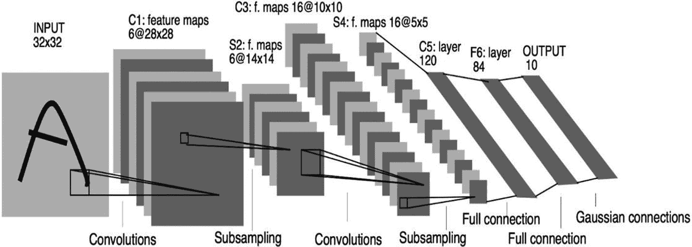

图 13-1

LeNet 的架构

使这种架构与先前工作不同的关键特性之一是，通过子采样进行池化时，采用 2×2 邻域补丁，并求和四个像素强度的值。这个和通过一个可训练的权重和偏置进行缩放，然后通过 sigmoid 激活函数。这与最大池化和平均池化所做的工作略有不同。

另一个关键特性是用于卷积的滤波器核大小为 5 × 5，输出单元是径向基函数（RBF）单元而不是 softmax 函数。全连接层的 84 个单元与每个类别有 84 个连接，因此有 84 个相应的权重。84 个/类权重代表每个类别的特征。如果那些 84 个单元的输入非常接近对应于一个类别的权重，那么输入更有可能属于该类。

在 softmax 中，我们查看每个类别的权重向量的输入的点积，而在 RBF 单元中，我们查看输入与输出类别代表性权重向量之间的欧几里得距离。欧几里得距离越大，输入属于该类的可能性越小。这可以通过对距离的负数进行指数化，然后在不同类别上进行归一化，转换为概率。

对于一个输入记录的所有类别的欧几里得距离将作为该输入的损失函数（图 13-2）。令 *x* = [*x*[1], *x*[2], …, *x*[83], *x*[84]]^(*T*) ∈ *R*^(84 × 1) 为全连接层的输出向量。对于每个类别，都会有 84 个权重连接。如果第 i 个类别的代表性权重向量为 *w*[*i*] ∈ *R*^(84 × 1)，那么第 i 个类别单元的输出可以由以下公式给出：

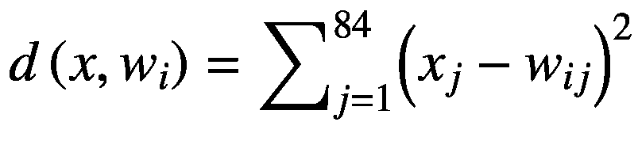

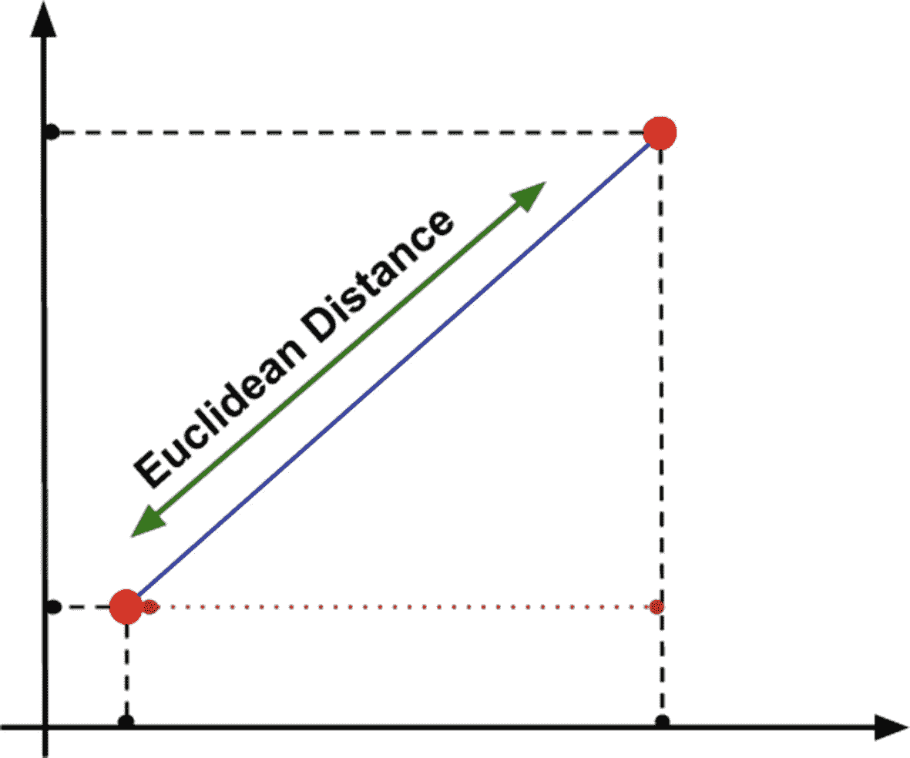

图 13-2

欧几里得距离是如何工作的

### AlexNet

可能可以归功于激发对神经网络重新产生兴趣的工作，以及深度学习在许多计算机视觉应用中占据主导地位的开始，是 Alex Krizhevsky 等人于 2012 年发表的论文，标题为“使用深度卷积神经网络的 ImageNet 分类”。它赢得了 2012 年 ImageNet ILSVRC。这是 CNN 架构首次以巨大优势击败其他方法的第一次。他们的网络在最高五项预测上的错误率为 15.4%，而第二好的参赛者的错误率为 26.2%。

在 AlexNet 的设计中，一套当时新颖或成功但尚未广泛采用的方法非常重要。现在，它们已成为使用 CNN 进行图像分类的标准。

AlexNet 使用了修正线性激活函数，或 ReLU，作为每个卷积层之后的非线性，而不是之前常见的 S 形函数，如 logistic 或 tanh。此外，输出层使用了 softmax 激活函数，现在它是神经网络进行多类分类的标准。

AlexNet 的架构图表示在图 13-3 中。AlexNet 由五个卷积层、最大池化层和 dropout 层组成，以及除了输入和输出层的一千个类单位之外，还有三个完全连接层。

LeNet-5 中使用的平均池化被替换为最大池化方法，尽管在这种情况下，重叠池化被发现优于今天常用的非重叠池化（例如，池化操作的步长与池化操作的大小相同，例如，2×2 像素）。为了解决过拟合问题，在模型分类器部分的完全连接层之间使用了新提出的 dropout 方法，以改善泛化误差。

网络的输入是大小为 224×224×3 的图像。第一个卷积层产生 96 个特征图，对应于 96 个大小为 11×11×3 的滤波器核，步长为四个像素单位。第二个卷积层产生 256 个特征图，对应于大小为 5×5×48 的滤波器核。前两个卷积层后面跟着最大池化层，而接下来的三个卷积层一个接一个地放置，没有中间的最大池化层。第五个卷积层后面跟着一个最大池化层，两个 4096 个单位的完全连接层，最后是一个 1000 个类别的 softmax 输出层。第三个卷积层有 384 个大小为 3×3×256 的滤波器核，而第四和第五个卷积层各有 384 和 256 个大小为 3×3×192 的滤波器核。

在最后两个完全连接层中使用了 0.5 的 dropout。你会注意到，除了第三个卷积层之外，所有卷积的滤波器核深度都是前一层特征图数量的二分之一。这是因为模型被分成两个管道，以训练当时的 GPU 硬件。

然而，如果你仔细观察，对于第三个卷积活动，存在卷积的交叉连接，因此滤波器核的维度是 3×3×256，而不是 3×3×128。相同类型的交叉连接也适用于完全连接层，因此它们表现为具有 4096 个单位的普通完全连接层。

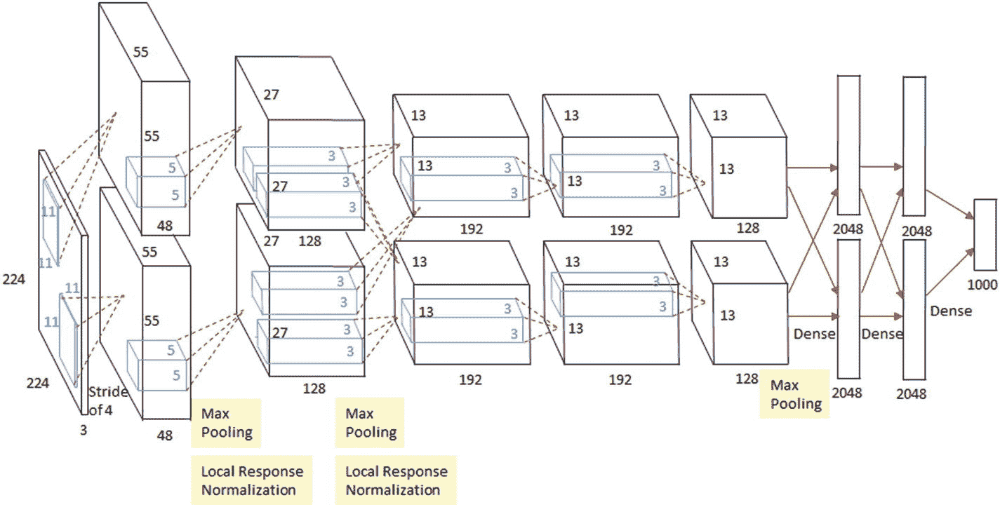

图 13-3

AlexNet 的架构

我们可以将现代模型中相关的架构关键方面总结如下：

+   在卷积层后使用 ReLU 激活函数，对于输出层使用 softmax

+   使用最大池化而非平均池化

+   在完全连接层之间使用 dropout 正则化

+   直接将卷积层模式馈送到另一个卷积层的模式

+   使用数据增强

### VGG

一项旨在标准化深度卷积网络架构设计的重要工作，并在过程中开发出更深、性能更好的模型，是 2014 年由 Karen Simonyan 和 Andrew Zisserman 发表的论文，题为“用于大规模图像识别的非常深的卷积网络”。

他们的架构通常被称为 VGG，以他们实验室的名字命名，即牛津大学的视觉几何组。他们的模型在同一个 ILSVRC 竞赛中开发和展示——在这种情况下，是 ILSVRC-2014 版本的挑战。

第一个重要的区别已经成为事实上的标准，那就是使用大量的小型滤波器。具体来说，使用大小为 3×3 和 1×1 的滤波器，步长为 1，这与 LeNet-5 中的大型滤波器以及 AlexNet 中较小但仍相对较大的滤波器和步长为四的滤波器不同。

在大多数但不是所有的卷积层之后使用最大池化层，这是从 AlexNet 中的例子中学到的。然而，所有的池化都是使用大小为 2×2 和相同的步长进行的；这也已经成为事实上的标准。具体来说，VGG 网络在最大池化层之前使用两个、三个甚至四个卷积层堆叠的例子。其理由是，具有较小滤波器的堆叠卷积层近似于具有较大滤波器的一个卷积层的效果，（例如，三个堆叠的 3×3 滤波器的卷积层近似于一个 7×7 滤波器的卷积层）。

另一个重要的区别是使用的滤波器数量非常多。滤波器的数量随着模型深度的增加而增加，尽管它从相对较大的 64 个开始，通过 128、256 和 512 个滤波器增加到模型特征提取部分的末尾。

开发了并评估了该架构的许多变体，尽管最常见的两种是 VGG-16 和 VGG-19，分别对应于 16 和 19 层学习层，鉴于它们的性能和深度。

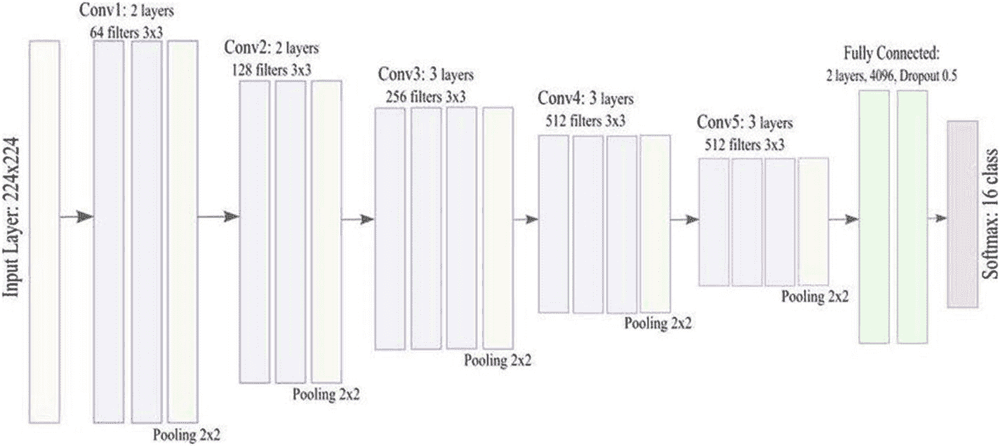

图 13-4

VGG 架构

图 13-4 表示 VGG16 的架构。网络的输入是 224×224×3 大小的图像。前两个卷积层产生 64 个特征图，每个后面跟着最大池化。卷积的过滤器空间大小为 3×3，步长为 1，填充为 1。最大池化大小为 2×2，整个网络的步长为 2。第三和第四个卷积层产生 128 个特征图，每个后面跟着一个最大池化层。网络的其余部分以类似的方式继续，如图 13-4 所示。网络末尾有三个 4096 个单位的完全连接层，每个后面跟着一个输出 softmax 层，有 1000 个类别。完全连接层的 Dropout 设置为 0.5。网络中的所有单元都有 ReLU 激活。

我们可以总结出与现代模型相关的架构的关键方面如下：

+   使用非常小的卷积过滤器（例如，3×3 和 1×1，步长为 1）

+   使用 2×2 大小和相同维度的步长进行最大池化

+   在使用池化层定义块之前堆叠卷积层的重要性

+   显著重复卷积-池化块模式

+   开发非常深的（16 和 19 层）模型

### ResNet

ResNet 是来自微软的 152 层深度 CNN，它在 2015 年 ILSVRC 竞赛中以仅 3.6%的错误率获胜，这被认为优于 5-10%的人类错误率。

我们将要回顾的 CNN 中的一项重要创新是由 Kaiming He 等人于 2016 年提出的，标题为“用于图像识别的深度残差学习”的论文。

他们的模型有令人印象深刻的 152 层。模型设计的关键是使用快捷连接的残差块的想法。这些是网络架构中的简单连接，其中输入保持原样（未加权）并传递给更深的一层（例如，跳过下一层）。

实现残差块的方式如下：在每个卷积-ReLU-卷积操作系列之后，将操作的输入反馈到操作的输出。在传统方法中，在进行卷积和其他变换时，我们试图将底层映射拟合到原始数据以解决分类任务。

再次，残差块是两个具有 ReLU 激活的卷积层的一个模式，其中块的输出与块的输入（例如，快捷连接）相结合。如果块的输入形状与块的输出不同，则使用 1×1 卷积来使用输入的投影版本，这被称为 1×1 卷积。这些被称为投影快捷连接，与未加权的或恒等快捷连接相比。

然而，随着 ResNet 的残差块概念，我们试图学习一个残差映射，而不是从输入到输出的直接映射。形式上，在每一个小的活动块中，我们将块的输入加到输出上。这如图 13-5 所示。这个概念基于假设，拟合残差映射比拟合从输入到输出的原始映射更容易。

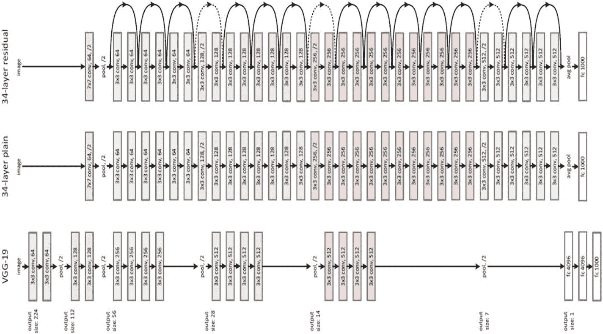

图 13-5

ResNet 的工作原理

我们可以总结与现代模型相关的架构的关键方面如下：

+   使用快捷连接

+   残差块的开发和重复

+   构建非常深的（152 层）模型

## 迁移学习

一个神经网络在数据上训练。这个网络从这些数据中获取知识，这些知识被编译为网络的“*权重*”。这些权重可以被提取出来，然后转移到任何其他神经网络。我们不是从头开始训练另一个神经网络，而是**“迁移”**学到的特征。

广义上的迁移学习指的是在解决一个问题时获得的知识，并在类似领域中的不同问题上使用这些知识。由于各种原因，迁移学习在深度学习领域取得了巨大的成功。由于隐藏层和不同单元之间的连接方案的性质，深度学习模型通常具有大量的参数。

要训练如此大的模型，需要大量的数据，否则模型将遭受过拟合问题。在许多问题中，训练模型所需的大量数据不可用，但问题的性质要求使用深度学习解决方案才能产生合理的影响。例如，在图像处理中的目标识别，深度学习模型已知可以提供最先进的解决方案。在这种情况下，可以使用迁移学习从预训练的深度学习模型中生成通用特征，然后使用这些特征构建一个简单的模型来解决问题。因此，这个问题的唯一参数是用于构建简单模型的那些参数。

### 什么是预训练模型，为什么使用它？

简而言之，预训练模型是由其他人创建来解决类似问题的模型。与其从头开始构建一个模型来解决类似问题，不如使用在其他问题上训练的模型作为起点。

因此，预训练模型通常是在大量数据集上训练的，因此具有可靠的参数。当我们通过几层卷积处理图像时，初始层学会检测非常通用的特征，如卷曲和边缘。随着网络的加深，深层中的卷积层学会检测与特定数据集相关的更复杂的特征。

例如，假设你想构建一个自学习的汽车。你可以花费数年从头开始构建一个不错的图像识别算法，或者你可以从 Google 那里获取一个基于 ImageNet 数据构建的预训练模型（如 Inception 模型）来识别那些图片中的图像。预训练模型可能在你应用中不是 100%准确，但它节省了重新发明轮子的巨大努力。

作为另一个例子，在分类任务中，深层网络会学习检测诸如眼睛、鼻子、面部等特征。假设我们有一个在 ImageNet 数据集的 1000 个类别上训练过的 VGG19 架构模型。现在，如果我们得到一个较小的数据集，其中包含与 VGG19 预训练模型数据集相似但类别更少的图像，我们可以使用相同的 VGG19 模型直到全连接层，然后替换输出层以适应新的类别。此外，我们保持网络直到全连接层的权重不变，只训练模型从全连接层到输出层学习权重。

这是因为数据集的本质与较小的数据集相同。因此，预训练模型通过不同参数学习到的特征对于新的分类问题已经足够好，我们只需要学习从全连接层到输出层的权重。这大大减少了需要学习的参数数量，并将减少过拟合。如果我们使用 VGG19 架构训练小数据集，它可能会因为在小数据集上学习大量参数而严重过拟合。当数据集的本质与预训练模型使用的数据集非常不同时，你该怎么办？

好吧，在这种情况下，我们可以使用相同的预训练模型，但只固定前几组卷积-ReLU-最大池化层的参数，然后添加几组卷积-ReLU-最大池化层，这些层将学习检测新数据集固有的特征。最后，我们需要一个全连接层，然后是输出层。由于我们使用了预训练的 VGG19 网络中初始卷积-ReLU-最大池化层的权重，因此那些层的参数不需要学习。如前所述，卷积的早期层学习非常通用的特征，如边缘和曲线，这些特征适用于所有类型的图像。网络的其余部分需要训练以学习特定问题数据集固有的特定特征。

### 如何使用预训练模型？

当我们训练神经网络时，我们的目标是什么？我们希望通过多次正向和反向迭代来识别网络的正确权重。通过使用在大型数据集上预先训练过的预训练模型，我们可以直接使用获得的权重和架构，并将学习应用于我们的问题陈述。这就是迁移学习的工作原理。我们将预训练模型的“学习”迁移到我们具体的问题陈述中。

在选择使用哪个预训练模型时，我们应该非常小心。如果我们手头的问题陈述与预训练模型训练的问题非常不同，我们得到的预测将非常不准确。例如，一个之前用于语音识别的模型，如果我们尝试用它来识别物体，效果会非常糟糕。

我们很幸运，许多预训练架构作为预加载的权重或直接在 Keras 库中直接可用。例如，**ImageNet** 数据集已被广泛用于构建各种架构，因为它足够大（1.2M 张图片），可以创建一个通用模型。

这些预训练网络通过迁移学习展示了将泛化能力应用于给定数据集之外的图像的强大能力。我们通过微调模型对现有模型进行修改。由于我们假设预训练网络已经训练得相当好了，我们不想过早或过多地修改权重。在修改时，我们通常使用比最初训练模型时更小的学习率。

### 微调模型的方法

1.  **特征提取：** 我们可以将预训练模型用作特征提取机制。我们可以移除输出层（给出属于每个 1,000 个类别的概率的那个层），然后使用整个网络作为新数据集的固定特征提取器。

1.  **使用预训练模型的架构：** 我们可以在初始化所有权重为随机值的同时使用模型的架构，并根据我们的数据集再次训练模型。

1.  **训练一些层同时冻结其他层：** 使用预训练模型的另一种方法是部分训练它。我们可以在重新训练仅较高层的同时保持模型初始层的权重冻结。我们可以尝试测试要冻结多少层以及要训练多少层。

### 预训练的 VGG19

在本节中，我们将演示如何使用预训练的 VGG19 模型。使用这样一个优秀的模型，以如此少的训练量，可以帮助你以更少的努力解决复杂问题。所以，让我们导入在这个例子中我们将使用的包。

```py
from urllib.request import urlretrieve
from os.path import isfile, isdir
from tqdm import tqdm
import tarfile
import pickle
import numpy as np
import matplotlib.pyplot as plt
import skimage
import skimage.io
import skimage.transform
import tensorflow as tf
import tensornets as nets
```

导入所有包之后，我们需要下载 CIFAR-10 数据集。这是我们在第十一章节中使用的数据集。你可以检查我们是如何构建模型的，以及我们为训练模型付出了多少时间和计算资源。

现在，在你导入了我们将要使用的包并加载了 CIFAR-10 数据集之后，现在是时候构建模型了。

我们首先需要创建输入/输出变量，以及我们在模型构建中将要使用的超参数。

```py
x = tf.placeholder(tf.float32, shape=(None, 224, 224, 3), name="input_x")
y = tf.placeholder(tf.float32, shape=(None, 10), name="output_y")
learning_rate = 0.00001
epochs = 7
batch_size = 32
```

我们将使用`VGG19`和`softmax_cross_entropoy`损失，当然，以及`AdamOptimizer`来优化模型。

```py
logits = nets.VGG19(x, is_training=True, classes=10)
model = tf.identity(logits, name="logits")
loss = tf.losses.softmax_cross_entropy(y, logits)
train = tf.train.AdamOptimizer(learning_rate=learning_rate).minimize(loss)
correct_pred = tf.equal(tf.argmax(model, 1), tf.argmax(y, 1))
accuracy = tf.reduce_mean(tf.cast(correct_pred, tf.float32), name="accuracy")
```

如果你调用了`print_outputs`的 logits，你会看到模型架构摘要。它与 Keras 的`model.summary`函数类似，显示了每个层的名称、类型、其输入和输出以及每层的参数数量。

```py
logits.print_outputs()
# Output
Scope: vgg19
conv1/1/conv/BiasAdd:0 (?, 224, 224, 64)
conv1/1/Relu:0 (?, 224, 224, 64)
conv1/2/conv/BiasAdd:0 (?, 224, 224, 64)
conv1/2/Relu:0 (?, 224, 224, 64)
conv1/pool/MaxPool:0 (?, 112, 112, 64)
conv2/1/conv/BiasAdd:0 (?, 112, 112, 128)
conv2/1/Relu:0 (?, 112, 112, 128)
conv2/2/conv/BiasAdd:0 (?, 112, 112, 128)
conv2/2/Relu:0 (?, 112, 112, 128)
conv2/pool/MaxPool:0 (?, 56, 56, 128)
conv3/1/conv/BiasAdd:0 (?, 56, 56, 256)
conv3/1/Relu:0 (?, 56, 56, 256)
conv3/2/conv/BiasAdd:0 (?, 56, 56, 256)
conv3/2/Relu:0 (?, 56, 56, 256)
conv3/3/conv/BiasAdd:0 (?, 56, 56, 256)
conv3/3/Relu:0 (?, 56, 56, 256)
conv3/4/conv/BiasAdd:0 (?, 56, 56, 256)
conv3/4/Relu:0 (?, 56, 56, 256)
conv3/pool/MaxPool:0 (?, 28, 28, 256)
conv4/1/conv/BiasAdd:0 (?, 28, 28, 512)
conv4/1/Relu:0 (?, 28, 28, 512)
conv4/2/conv/BiasAdd:0 (?, 28, 28, 512)
conv4/2/Relu:0 (?, 28, 28, 512)
conv4/3/conv/BiasAdd:0 (?, 28, 28, 512)
conv4/3/Relu:0 (?, 28, 28, 512)
conv4/4/conv/BiasAdd:0 (?, 28, 28, 512)
conv4/4/Relu:0 (?, 28, 28, 512)
```

现在，让我们使用`print_summary`打印模型摘要；我们将看到模型中的总层数、总权重和参数数量。

```py
logits.print_summary()
Scope: vgg19
Total layers: 19
Total weights: 114
Total parameters: 418,833,630
```

现在，在我们构建了模型架构，并检查了模型中的总参数和总层数之后，我们就可以开始训练它，看看会发生什么。

```py
save_model_path = './image_classification'
print('Training...')
with tf.Session() as sess:
# Initializing the variables
sess.run(tf.global_variables_initializer())
print('global_variables_initializer ... done ...')
sess.run(logits.pretrained())
print('model.pretrained ... done ... ')
# Training cycle
print('starting training ... ')
for epoch in range(epochs):
# Loop over all batches
n_batches = 5
for batch_i in range(1, n_batches + 1):
for batch_features, batch_labels in load_preprocess_training_batch(batch_i, batch_size):
sess.run(train, {x: batch_features, y: batch_labels})
print('Epoch {:>2}, CIFAR-10 Batch {}:  '.format(epoch + 1, batch_i), end=")
# calculate the mean accuracy over all validation dataset
valid_acc = 0
for batch_valid_features, batch_valid_labels in batch_features_labels(tmpValidFeatures, valid_labels, batch_size):
valid_acc += sess.run(accuracy, {x:batch_valid_features, y:batch_valid_labels})
tmp_num = tmpValidFeatures.shape[0]/batch_size
print('Validation Accuracy: {:.6f}'.format(valid_acc/tmp_num))
# Save Model
saver = tf.train.Saver()
save_path = saver.save(sess, save_model_path)
```

如果这个代码步骤对你运行正确，那么我们可以说“做得好。”现在模型正在按照下面的输出进行训练，训练完成后，你将在图 13-6 中看到结果。

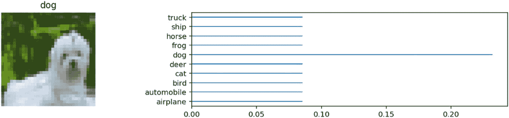

图 13-6

左侧图像的预测

```py
Training...
global_variables_initializer ... done ...
model.pretrained ... done ...
starting training ...
Epoch  1, CIFAR-10 Batch 1:  Validation Accuracy: 0.510000
Epoch  1, CIFAR-10 Batch 2:  Validation Accuracy: 0.719000
Epoch  1, CIFAR-10 Batch 3:  Validation Accuracy: 0.770200
Epoch  1, CIFAR-10 Batch 4:  Validation Accuracy: 0.814000
Epoch  1, CIFAR-10 Batch 5:  Validation Accuracy: 0.832000
Epoch  2, CIFAR-10 Batch 1:  Validation Accuracy: 0.841600
Epoch  2, CIFAR-10 Batch 2:  Validation Accuracy: 0.850000
Epoch  2, CIFAR-10 Batch 3:  Validation Accuracy: 0.868000
Epoch  2, CIFAR-10 Batch 4:  Validation Accuracy: 0.856600
Epoch  2, CIFAR-10 Batch 5:  Validation Accuracy: 0.857400
```

## 摘要

在本章中，我们学习了 CNN 中的高级操作，以及像 LeNet、AlexNet、VGG 和 ResNet 这样的最先进架构模型是如何工作的。

此外，我们讨论了迁移学习是什么，以及如何使用这些 CNN 的预训练版本进行迁移学习。在下一章中，我们将讨论自然语言处理中的某些选 topics，以及它们对你了解和理解的有用之处。

# 14. 自然语言处理中的选 topics

在上一章中，我们向您展示了计算机视觉中的某些高级概念，如最先进架构和迁移学习方法。当你准备构建一个模型来完成特定任务时，理解这些概念非常重要。

在本章中，我们将讨论一些自然语言处理（NLP）中的概念，这些概念对于完全理解序列方法至关重要，这些方法被认为是 NLP 的传统方法。它们依赖于词袋模型和词向量空间模型。

自然语言处理的关键领域之一是语言的句法和语义分析。句法分析指的是单词如何在句子中分组和连接。句法分析的主要任务包括词性标注、检测句法类别（如动词、名词和名词短语），以及通过构建句法树来组装句子。语义分析指的是寻找同义词或执行词-动词歧义消解等复杂任务。

## 向量空间模型

在 NLP 信息检索系统中，一个文档通常被简单地表示为包含其包含的单词计数的向量。为了检索与特定文档相似的文档，要么计算文档与其他文档之间的角度余弦或点积。两个向量之间的角度余弦给出了基于它们向量组成的相似度度量。为了说明这一点，让我们看看两个向量 *x* 和 *y* = *R*^(2 × 1)，分别表示为 *x* = [2 3]^(*T*) 和 *y* = [4 5]^(*T*)。

虽然向量 *x* 和 *y* 是不同的，但它们的余弦相似度是最大可能的值 1。这是因为这两个向量在分量组成上完全相同。两个向量的第一个分量与第二个分量的比例都是 2/3；因此，从内容组成上看，它们被视为相似。因此，具有高余弦相似度的文档通常被认为是本质上相似的。

假设我们有两个句子：*Doc*1 = [*The dog chased the cat*] 和 *Doc*2 = [*The cat was chased down by the dog*]。这两个句子中不同单词的数量就是该问题的向量空间维度。不同的单词有 *The*，*dog*，*chased*，*the*，*cat*，*down*，*by* 和 *was*。因此，我们可以将每个文档表示为一个包含单词计数的八维向量（表 14-1）。

表 14-1

每个文档的单词数示例

| 词/文档 | The | Dog | Chased | Cat | Down | By | Was |
| --- | --- | --- | --- | --- | --- | --- | --- |
| Doc 1 | 1 | 1 | 1 | 1 | 0 | 0 | 0 |
| Doc 2 | 1 | 1 | 1 | 1 | 1 | 1 | 1 |

如果我们用 *v*[1] 表示 *Doc*1，用 *v*[2] 表示 *Doc*2，那么余弦相似度可以表示为 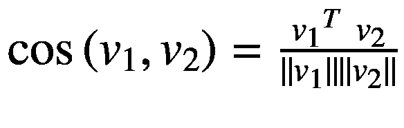（图 14-1）和欧几里得距离可以表示为 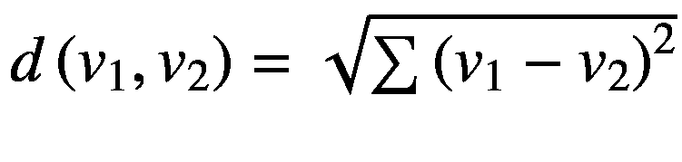（图 14-2），

其中，‖*v*[1]‖ 是向量 *v*[1] 的模或 *l*[2] 范数。如前所述，余弦相似度给出了基于每个向量的分量组成的相似度度量。如果文档向量的分量在某种程度上成比例相似，余弦距离就会很高。它不考虑向量的模。

在某些情况下，当文档长度高度不同时，我们使用文档向量之间的点积而不是余弦相似度。这是在比较文档内容的同时，也对比文档大小时进行的。例如，我们可能有一个推文，其中单词“global”和“economics”的词频分别为 1 和 2，而一篇报纸文章中相同的单词的词频可能分别为 50 和 100。假设其他单词在这两个文档中的词频都微不足道，推文和报纸文章之间的余弦相似度将接近 1。由于推文的大小显著较小，全球和经济学这两个单词的词频比例 1:2 并不真正等同于报纸文章中这些单词的 1:2 比例。

因此，对于许多应用来说，将这些文档赋予如此高的相似度测量并没有太多意义。在这种情况下，将点积作为相似度度量而不是余弦相似度是有帮助的，因为它通过两个文档的单词向量的大小来放大余弦相似度。

对于可比的余弦相似度，具有更高幅度的文档将具有更高的点积相似度，因为它们有足够的文本来证明其词组。小文本的词组可能只是偶然，并不能真正代表其意图的表达。对于大多数文档长度相当的应用，余弦相似度是一个足够好的度量。

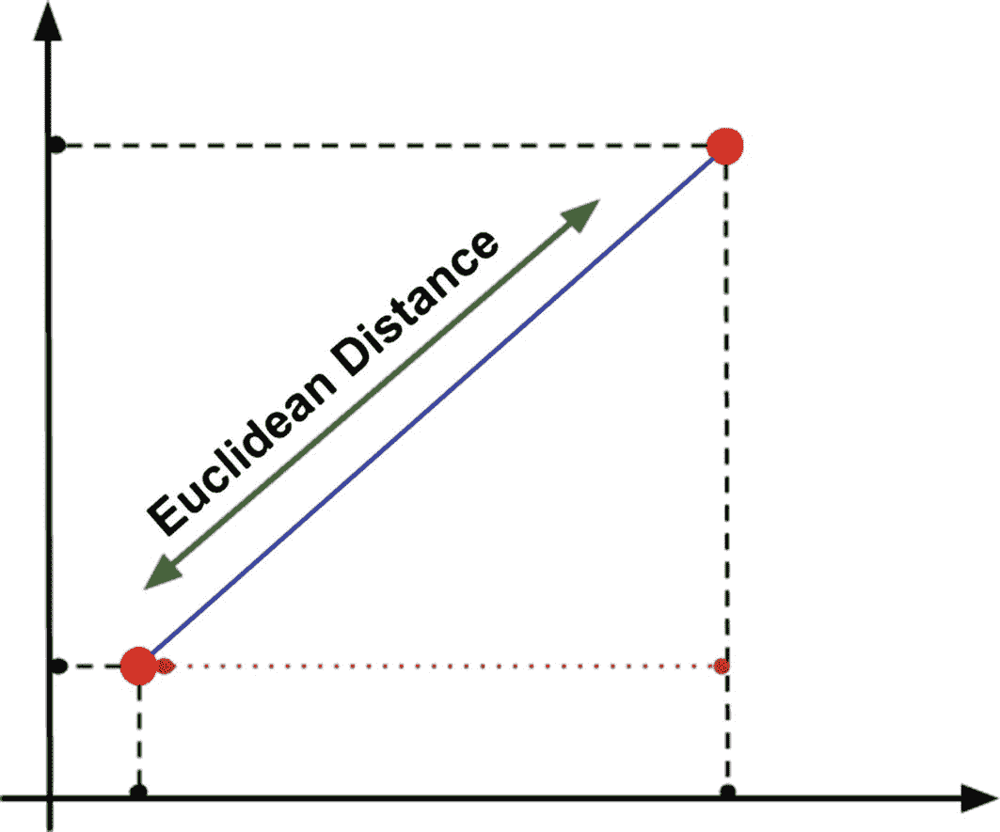

图 14-2

欧几里得距离是如何工作的

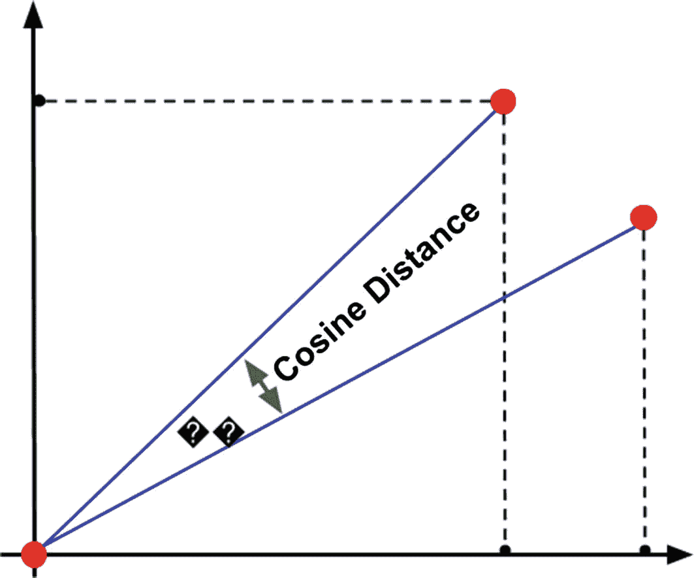

图 14-1

余弦距离是如何工作的

## 单词的向量表示

正如文档被表示为不同词频的向量一样，语料库中的一个单词也可以表示为一个向量，其分量是单词在每个文档中的词频。

将单词表示为向量的其他方法是将特定于文档集的分量设置为 1，如果单词存在于文档中，或者设置为 0，如果单词不存在于文档中。

重复使用相同的例子，一个单词可以在两个文档的语料库中表示为一个二维向量 [1 1]^(*T*)。在一个巨大的文档语料库中，单词向量的维度也会很大。像文档相似度一样，单词相似度可以通过余弦相似度或点积来计算。

在语料库中表示词的另一种方式是对它们进行 one-hot 编码。在这种情况下，每个词的维度将是语料库中唯一词的数量。每个词将对应一个索引，该索引将设置为 1，用于该词，而所有其他剩余条目将设置为 0。因此，每个词都会非常稀疏。即使相似的词也会在不同的索引上设置 1，所以任何类型的相似度度量都不会起作用。

为了更好地表示词向量，以便更有意义地捕捉词的相似性，并且为了减少词向量的维度，Word2Vec 被引入。

## Word2Vec

Word2Vec 是一种通过训练词与其邻域中的词来表达词作为向量的智能方式。与给定词在上下文中相似的词，当考虑它们的 Word2Vec 表示时，会产生高的余弦相似度或点积。

通常，语料库中的词是根据其邻域中的词进行训练的，以推导出 Word2Vec 表示的集合。提取 Word2Vec 表示的最流行的方法是 CBOW（连续词袋）方法和 Skip-Gram 方法。CBOW 背后的核心思想如图 14-3 所示。

### 连续词袋

Word2Vec 模型家族是无监督的。这意味着你只需给它一个语料库，无需额外的标签或信息，它就能从语料库中构建密集的词嵌入。但一旦你有了这个语料库，你仍然需要利用监督的分类方法来获取这些嵌入。但我们将从语料库本身内部进行，而不需要任何辅助信息。现在我们可以将这种 CBOW 架构建模为一个深度学习分类模型，这样我们就可以将**上下文词作为我们的输入，X**，并尝试预测**目标词，Y**。实际上，构建这个架构比尝试从源目标词预测一串上下文词的 Skip-gram 模型要简单。

CBOW 方法试图从特定窗口长度的邻域词的上下文中预测中心词。让我们看看以下句子，并考虑一个窗口长度为五的邻域。

*“猫跳过栅栏，穿过马路。”*

在第一种情况下，我们将尝试从其邻域*the cat over the*预测单词*jumped*。在第二种情况下，当我们滑动窗口一个位置时，我们将尝试从邻域词*cat jumped the fence*预测单词*over*。这个过程将在整个语料库中重复进行。

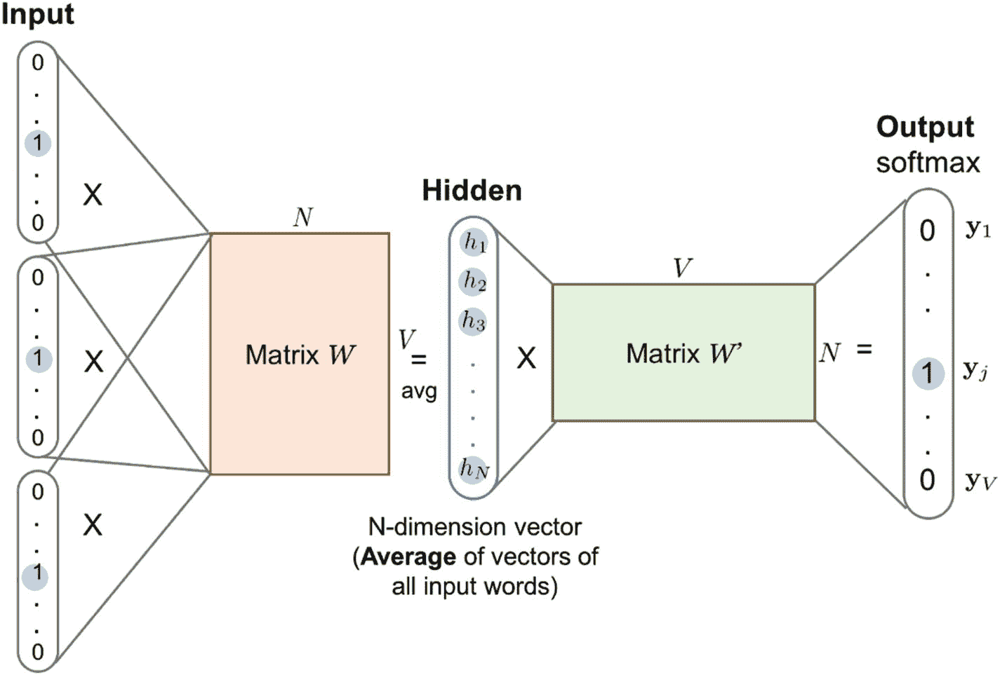

图 14-3

CBOW 模型

如图 14-3 所示，CBOW 模型以上下文单词作为输入，中心词作为输出进行训练。输入层的单词表示为 one-hot 编码向量，其中特定单词的分量设置为 1，所有其他分量设置为 0。语料库中独特的单词数量 *V* 决定了这些 one-hot 编码向量的维度，因此 *x*(*t*) ∈ *R*^(*V* × 1)。每个 one-hot 编码向量 *x*(*t*) 都与输入嵌入矩阵 *WI* ∈ *R*^(*N* × *V*) 相乘，以提取特定单词的词嵌入向量 *u*(*k*) ∈ *R*^(*N* × 1)。*u*(*k*) 中的索引 *k* 表示 *u*(*k*) 是词汇表中第 *k*^(*th*) 个单词的嵌入。隐藏层向量 *h* 是窗口中所有上下文单词的输入嵌入向量的平均值，因此 *h* ∈ *R*^(*N* × 1) 与词嵌入向量具有相同的维度。

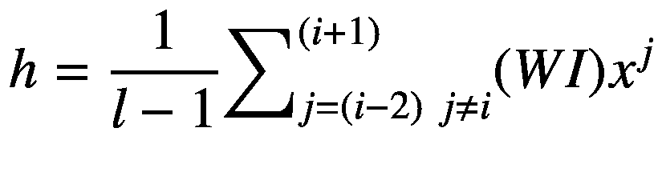

其中 *l* 是窗口大小的长度。

同样，提取所有输入单词的词嵌入向量，它们的平均值是隐藏层的输出。隐藏层输出 *h* 应该表示目标词的嵌入。词汇表中的所有单词在输出嵌入矩阵 *WO* ∈ *R*^(*V* × *N*) 中都有另一组词嵌入。设 *WO* 中的词嵌入为 *v*(*i*) ∈ *R*^(*N* × 1)，其中索引 *i* 表示词汇表中按顺序的 *j*th 个单词，正如在一维编码方案和输入嵌入矩阵中保持的那样。


隐藏层嵌入 *h* 与每个 *v*^(*i*) 或 *v*[*i*] 的点积（为了简便起见）通过将矩阵 *WO* 乘以 *h* 来计算。正如我们所知，点积将为每个输出单词嵌入 *v*^(*i*) 提供一个相似度度量，其中 *j* ∈ *R*^(*N*) 和隐藏层计算的嵌入 *h*。点积通过 softmax 归一化为概率，并根据目标词 *w*^(*t*)，计算并反向传播到梯度下降中，以更新输入和输出嵌入矩阵的权重。

在给定上下文单词的情况下，词汇表中的第 *j* 个单词 *w*[*(j)*] 的 softmax 输出概率如下：

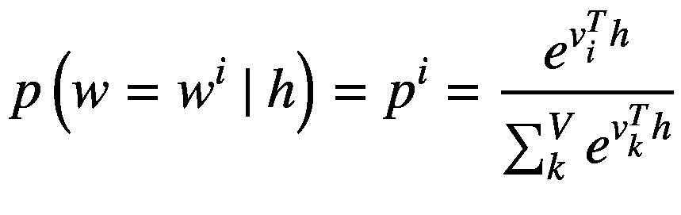

如果实际输出表示为一个 one-hot 编码向量 *y*，那么特定目标词及其上下文单词组合的损失函数可以表示如下：

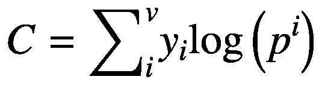

不同的*p*^(*i*)取决于输入和输出嵌入矩阵的组件，这些是成本函数*C*的参数。可以通过反向传播梯度下降技术最小化这些嵌入参数。为了使这一点更直观，让我们说我们的目标变量是*cat*。如果隐藏层向量*h*与*cat*的外部矩阵词嵌入向量具有最大的点积，而与其他外部词嵌入向量的点积较低，那么嵌入向量大致是正确的。因此，将非常小的错误或*log*损失反向传播以纠正嵌入矩阵。然而，假设*h*与*cat*的点积较小，而与其他外部嵌入向量的点积较大；softmax 的损失将显著增加，因此将反向传播更多的错误/损失以减少错误。

#### 实现连续词袋模型

本节已展示了 CBOW 的 TensorFlow 实现。在两侧距离为两的范围内，使用邻近的词来预测中间的词。输出层是对整个词汇表的大 softmax。词嵌入向量的大小被选为 128。详细的实现已在以下代码中概述。另请参阅图 14-4。

代码中的第一件事是我们需要导入所需的包，而且像往常一样，这些包包括 TensorFlow。

```py
import numpy as np
import tensorflow as tf
from sklearn.manifold import TSNE
import matplotlib.pyplot as plt
%matplotlib inline
```

然后我们需要添加实用函数；这些函数将极大地帮助我们处理文本数据，如文本向量化转换等。

```py
def one_hot(ind,vocab_size):
rec = np.zeros(vocab_size)
rec[ind] = 1
return rec
def create_training_data(corpus_raw,WINDOW_SIZE = 2):
words_list = []
for sent in corpus_raw.split('.'):
for w in sent.split():
if w != '.':
words_list.append(w.split('.')[0])
words_list = set(words_list)
word2ind = {}
ind2word = {}
vocab_size = len(words_list)
for i,w in enumerate(words_list): # Build the dictionaries
word2ind[w] = i
ind2word[i] = w
print(word2ind)
sentences_list = corpus_raw.split('.')
sentences = []
for sent in sentences_list:
sent_array = sent.split()
sent_array = [s.split('.')[0] for s in sent_array]
sentences.append(sent_array)
data_recs = []
for sent in sentences:
for ind,w in enumerate(sent):
rec = []
for nb_w in sent[max(ind - WINDOW_SIZE, 0) : min(ind + WINDOW_SIZE, len(sent)) + 1] :
if nb_w != w:
rec.append(nb_w)
data_recs.append([rec,w])
x_train,y_train = [],[]
for rec in data_recs:
input_ = np.zeros(vocab_size)
for i in range(WINDOW_SIZE-1):
input_ += one_hot(word2ind[ rec[0][i] ], vocab_size)
input_ = input_/len(rec[0])
x_train.append(input_)
y_train.append(one_hot(word2ind[ rec[1] ], vocab_size))
return x_train,y_train,word2ind,ind2word,vocab_size
```

然后我们加载数据。为了简化这个过程，我们为了方便起见放入了一个虚拟段落。如果你想的话，可以放入真实数据。

```py
corpus_raw = "Deep Learning has evolved from Artificial Neural Networks, which has been there since the 1940s. Neural Networks are interconnected networks of processing units called artificial neurons that loosely mimic axons in a biological brain. In a biological neuron, the dendrites receive input signals from various neighboring neurons, typically greater than 1000\. These modified signals are then passed on to the cell body or soma of the neuron, where these signals are summed together and then passed on to the axon of the neuron. If the received input signal is more than a specified threshold, the axon will release a signal which again will pass on to neighboring dendrites of other neurons. Figure 3-1 depicts the structure of a biological neuron for reference. The artificial neuron units are inspired by the biological neurons with some modifications as per convenience. Much like the dendrites, the input connections to the neuron carry the attenuated or amplified input signals from other neighboring neurons. The signals are passed on to the neuron, where the input signals are summed up and then a decision is taken what to output based on the total input received. For instance, for a binary threshold neuron an output value of 1 is provided when the total input exceeds a pre-defined threshold; otherwise, the output stays at 0\. Several other types of neurons are used in artificial neural networks, and their implementation only differs with respect to the activation function on the total input to produce the neuron output. In the different biological equivalents are tagged in the artificial neuron for easy analogy and interpretation."
```

然后我们将使用我们的函数来处理数据，将其转换为`x_train`和`y_train`，并提取一些信息，如`vocab_size`。

```py
corpus_raw = (corpus_raw).lower()
x_train,y_train,word2ind,ind2word,vocab_size= create_training_data(corpus_raw,2)
```

现在，在加载数据并处理后，我们需要实现 CBOW。但首先我们需要设置参数并创建变量。

```py
emb_dims = 128
learning_rate = 0.001
x = tf.placeholder(tf.float32,[None,vocab_size])
y = tf.placeholder(tf.float32,[None,vocab_size])
W = tf.Variable(tf.random_normal([vocab_size,emb_dims],mean=0.0,stddev=0.02,dtype=tf.float32))
b = tf.Variable(tf.random_normal([emb_dims],mean=0.0,stddev=0.02,dtype=tf.float32))
W_outer = tf.Variable(tf.random_normal([emb_dims,vocab_size],mean=0.0,stddev=0.02,dtype=tf.float32))
b_outer = tf.Variable(tf.random_normal([vocab_size],mean=0.0,stddev=0.02,dtype=tf.float32))
```

现在，让我们创建模型。

```py
hidden = tf.add(tf.matmul(x,W),b)
logits = tf.add(tf.matmul(hidden,W_outer),b_outer)
cost = tf.reduce_mean(tf.nn.softmax_cross_entropy_with_logits(logits=logits, labels=y))
optimizer = tf.train.AdamOptimizer(learning_rate=learning_rate).minimize(cost)
```

然后，在创建架构后，让我们创建图并运行模型。

```py
epochs,batch_size = 100,10
batch = len(x_train)//batch_size
# train for n_iter iterations
with tf.Session() as sess:
sess.run(tf.global_variables_initializer())
for epoch in range(epochs):
batch_index = 0
for batch_num in range(batch):
x_batch = x_train[batch_index: batch_index +batch_size]
y_batch = y_train[batch_index: batch_index +batch_size]
sess.run(optimizer,feed_dict={x: x_batch,y: y_batch})
print('epoch:',epoch,'loss :', sess.run(cost,feed_dict={x: x_batch,y: y_batch}))
W_embed_trained = sess.run(W)
```

如果模型运行正常，我们将看到以下输出。

```py
epoch: 0 loss : 4.867816
epoch: 1 loss : 1.1019261
epoch: 2 loss : 0.7556237
epoch: 3 loss : 0.5196438
epoch: 4 loss : 0.47611102
```

在运行模型并完成 epoch 后，我们可以使用以下代码来绘制模型。

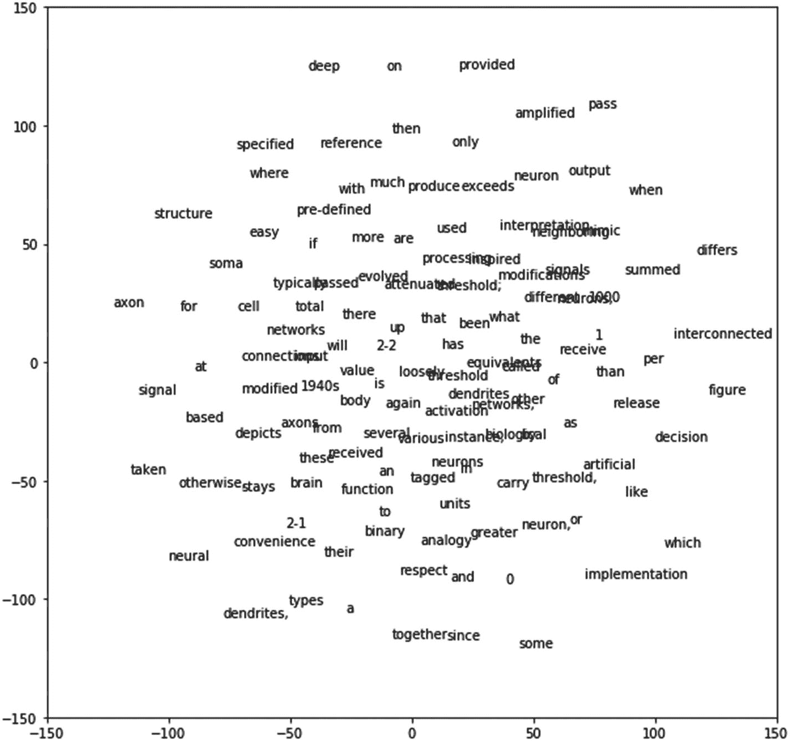

图 14-4

CBOW 的 TSNE

```py
W_embedded = TSNE(n_components=2).fit_transform(W_embed_trained)
plt.figure(figsize=(10,10))
for i in range(len(W_embedded)):
plt.text(W_embedded[i,0],W_embedded[i,1],ind2word[i])
plt.xlim(-150,150)
plt.ylim(-150,150)
```

通过 TSNE 图，学习到的词嵌入已经被投影到一个二维平面上。TSNE 图给出了给定词的邻域的大致概念。我们可以看到学习到的词嵌入向量是合理的。例如，单词*deep*和*learning*彼此非常接近。同样，单词*biological*和*references*也彼此非常接近。

### 词嵌入的 Skip-Gram 模型

Skip-gram 模型的工作方式相反。与 CBOW 中试图从上下文单词预测当前单词不同，在 Skip-gram 模型中，上下文单词是基于当前单词进行预测的。通常，给定一个当前单词，上下文单词在每个窗口中取其邻居。对于一个包含五个单词的给定窗口，将会有四个基于当前单词进行预测的上下文单词。图 14-5 展示了 Skip-gram 模型的高级设计。与 CBOW 类似，在 Skip-gram 模型中，需要学习两套词嵌入：一套用于输入单词，另一套用于输出上下文单词。Skip-gram 模型可以看作是 CBOW 模型的反转。

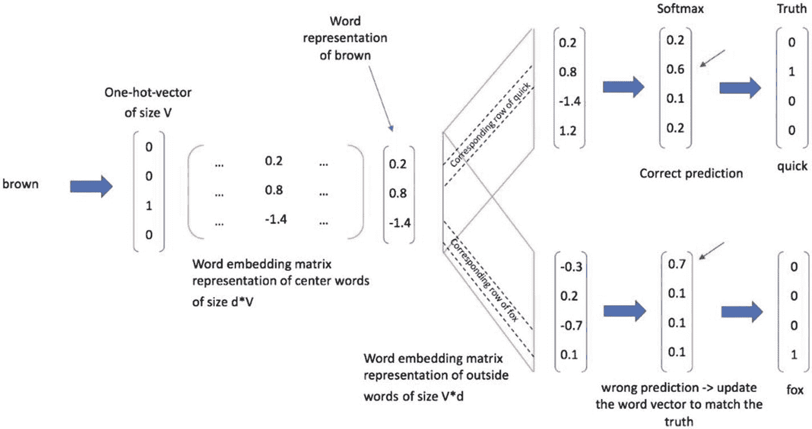

图 14-5

Skip-gram 的工作原理

在 CBOW 模型中，模型的输入是一个针对当前单词的 one-hot 编码向量 *x*^(*i*) ∈ R^(*V* × 1)，其中 *V* 是语料库词汇表的大小。然而，与 CBOW 不同，这里的输入是当前单词而不是上下文单词。当输入 *x*^(*i*) 与输入词嵌入矩阵 *WI* 相乘时，会产生词嵌入向量 *u*^(*k*) ∈ R^(*N* × 1)，前提是 *x*^(*t*) 代表词汇表列表中的第 *k* 个单词。*N*，如前所述，代表词嵌入的维度。隐藏层输出 *h* 实际上就是 *u*^(*k*)。

隐藏层输出 *h* 与外层嵌入矩阵 *WO* ∈ R^(*V* × *N*) 中每个单词向量 *v(j)* 的点积被计算，就像在 CBOW 中一样，通过计算 [*WO*][*h*]。然而，与一个 softmax 输出层不同，有多个 softmax 层，基于我们将要预测的上下文单词的数量。例如，在图 14-5 中有四个 softmax 输出层，对应于四个上下文单词。每个 softmax 层的输入是[*WO*][*h*]中的相同一组点积，表示输入单词与词汇表中每个单词的相似程度。

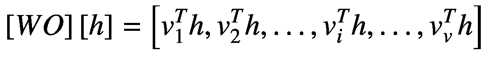

同样，所有 softmax 层都会接收到对应于所有词汇单词的相同概率集，其中给定当前或中心单词 *w*^(*k*) 的 *j*^(*th*) 单词 *w*^(*j*) 的概率由以下公式给出：

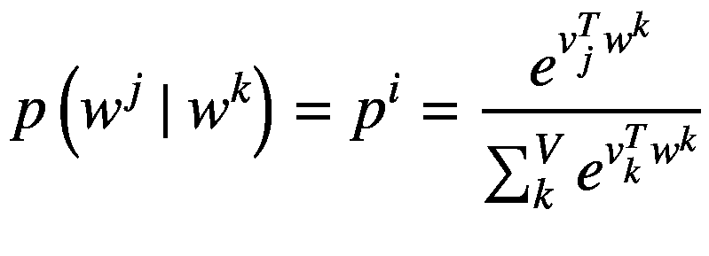

如果有四个目标单词，并且它们的 one-hot 编码向量分别表示为 *y*^(*j* - 2)，*y*^(*j* - 1)，*y*^(*j* + 1)，*y*^(*j* + 2) ∈ R^(*v* × 1)，那么单词组合的总损失函数 *C* 将是所有四个 softmax 损失的加和，如此处所示：

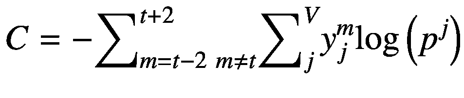

使用反向传播的梯度下降可以用来最小化损失函数，并推导出输入和输出嵌入矩阵的组件。

下面是关于 Skip-gram 和 CBOW 模型的几个显著特点：

+   对于 Skip-gram 模型，窗口大小通常不是固定的。给定最大窗口大小，每个当前单词的窗口大小是随机选择的，以便较小的窗口比较大的窗口更频繁地被选择。使用 Skip-gram，可以从有限数量的文本中生成大量的训练样本，并且不常见单词和短语也得到很好的表示。

+   CBOW 的训练速度比 Skip-gram 快得多，并且对于常见单词的准确性略高。

+   Skip-gram 和 CBOW 都查看局部窗口中的单词共现，然后尝试预测中心词的上下文单词（如 Skip-gram 所做的那样）或从上下文单词预测中心词（如 CBOW 所做的那样）。因此，基本上，我们在 Skip-gram 中观察到，在每个窗口的局部范围内，上下文单词 *w*[*C*] 和当前单词 *w*[*t*] 的共现概率 *P*(*w*[*c*]| *w*[*t*]) 被假定为与它们单词嵌入向量的点积的指数成正比。

+   其中 *u* 和 *v* 分别是当前和上下文单词的输入和输出单词嵌入向量。由于共现是局部测量的，因此这些模型未能利用一定窗口长度内单词对的全球共现统计信息。接下来，我们将探索一种基本方法来查看语料库上的全局共现统计信息，然后使用 SVD（奇异值分解）来生成单词向量。

#### 实现 Skip-Gram

在本节中，我们将通过 TensorFlow 的实现来展示 Skip-gram 模型，用于学习单词向量嵌入。该模型在一个小型数据集上训练，以便于表示。然而，该模型可以根据需要用于训练大型语料库。正如 Skip-gram 部分所示，该模型被训练为一个分类网络。然而，我们更感兴趣的是单词嵌入矩阵，而不是单词的实际分类。单词嵌入的大小已被选择为 128。详细的代码如下所示。一旦学习到单词嵌入向量，它们将通过 TSNE 投影到二维表面上，以便进行可视化解释。

和往常一样，我们必须导入所需的包，包括 TensorFlow。

```py
import numpy as np
import tensorflow as tf
from sklearn.manifold import TSNE
import matplotlib.pyplot as plt
%matplotlib inline
```

并且我们导入所有实用函数。

```py
def one_hot(ind,vocab_size):
rec = np.zeros(vocab_size)
rec[ind] = 1
return rec
def create_training_data(corpus_raw,WINDOW_SIZE = 2):
words_list = []
for sent in corpus_raw.split('.'):
for w in sent.split():
if w != '.':
words_list.append(w.split('.')[0])
words_list = set(words_list)
word2ind = {}
ind2word = {}
vocab_size = len(words_list)
for i,w in enumerate(words_list): # Build the dictionaries
word2ind[w] = i
ind2word[i] = w
print(word2ind)
sentences_list = corpus_raw.split('.')
sentences = []
for sent in sentences_list:
sent_array = sent.split()
sent_array = [s.split('.')[0] for s in sent_array]
sentences.append(sent_array)
data_recs = []
for sent in sentences:
for ind,w in enumerate(sent):
rec = []
for nb_w in sent[max(ind - WINDOW_SIZE, 0) : min(ind + WINDOW_SIZE, len(sent)) + 1] :
if nb_w != w:
rec.append(nb_w)
data_recs.append([rec,w])
x_train,y_train = [],[]
for rec in data_recs:
input_ = np.zeros(vocab_size)
for i in range(WINDOW_SIZE-1):
input_ += one_hot(word2ind[ rec[0][i] ], vocab_size)
input_ = input_/len(rec[0])
x_train.append(input_)
y_train.append(one_hot(word2ind[ rec[1] ], vocab_size))
return x_train,y_train,word2ind,ind2word,vocab_size
```

之后，我们需要加载数据。为了简单起见，我们将使用之前示例中使用的相同段落，因此您必须加载它或加载您自己的数据。并且不要忘记对其进行处理。

然后，我们需要设置参数并创建模型所需的变量，例如训练输入和输出、权重和偏差。

```py
emb_dims = 128
learning_rate = 0.0001
epochs,batch_size = 100,10
batch = len(x_train)//batch_size
x = tf.placeholder(tf.float32,[None,vocab_size])
y = tf.placeholder(tf.float32,[None,vocab_size])
W = tf.Variable(tf.random_normal([vocab_size,emb_dims],mean=0.0,stddev=0.02,dtype=tf.float32))
b = tf.Variable(tf.random_normal([emb_dims],mean=0.0,stddev=0.02,dtype=tf.float32))
W_outer = tf.Variable(tf.random_normal([emb_dims,vocab_size],mean=0.0,stddev=0.02,dtype=tf.float32))
b_outer = tf.Variable(tf.random_normal([vocab_size],mean=0.0,stddev=0.02,dtype=tf.float32))
```

现在我们已经准备好创建 Skip-gram 模型了。让我们来构建它。

```py
hidden = tf.add(tf.matmul(x,W),b)
logits = tf.add(tf.matmul(hidden,W_outer),b_outer)
cost = tf.reduce_mean(tf.nn.softmax_cross_entropy_with_logits(logits=logits, labels=y))
optimizer = tf.train.AdamOptimizer(learning_rate=learning_rate).minimize(cost)
```

现在，你可以运行模型，就像 CBOW 示例中的上一个模型一样，并使用 TSNE 图查看结果。我们将把这个任务留给你作为练习。

### GloVe

现在我们将讨论创建词义向量空间模型的一种较新的方法，更常被称为词嵌入。GloVe，源自全局向量，是一个分布式词表示的模型。该模型是一个无监督学习算法，用于获取单词的向量表示。这是通过将单词映射到一个有意义的空间中实现的，其中单词之间的距离与语义相似性相关。训练是在语料库中聚合的全局单词-单词共现统计上进行的，并且产生的表示展示了词向量空间中的有趣线性子结构。它是在斯坦福大学作为一个开源项目开发的。作为一个无监督学习词表示的对数双线性回归模型，它结合了两个模型家族的特征，即全局矩阵分解和局部上下文窗口方法。

GloVe 是来自斯坦福大学的一个预训练、现成的词嵌入向量库。GloVe 的训练方法与 CBOW 和 Skip-gram 的方法显著不同。GloVe 不是基于局部运行的窗口来预测单词，而是使用语料库中的全局单词-单词共现统计来训练模型并推导出 GloVe 向量。预训练的 GloVe 词嵌入可以在[`nlp.stanford.edu/projects/glove/`](https://nlp.stanford.edu/projects/glove/)找到。

在自然语言处理（NLP）中，全局矩阵分解是使用线性代数中的矩阵分解方法对大型词频矩阵进行秩降低的过程。这些矩阵通常表示术语-文档频率，其中行是单词，列是文档（或有时是段落），或者术语-术语频率，其中两个轴都有单词，并测量共现。应用于术语-文档频率矩阵的全局矩阵分解更常被称为潜在语义分析（LSA）。在潜在语义分析中，通过奇异值分解（SVD）降低高维矩阵。

与 SVD 方法类似，GloVe 查看全局共现统计，但单词和上下文向量与共现计数的关系略有不同。如果有两个单词 *wi* 和 *wj* 以及一个上下文单词 *w*[*k*]，那么概率比 *P*(*w*[*k*]| *w*[*i*]) 和 *P*(*w*[*k*]| *w*[*j*]) 提供的信息比概率本身更多。

1.  收集词共现统计信息，以词共现矩阵 *X* 的形式。这样一个矩阵的每个元素 *Xij* 代表词 *i* 在词 *j* 的上下文中出现的频率。通常我们以以下方式扫描我们的语料库：对于每个术语，我们在术语之前和之后定义的某个 *window_size* 范围内寻找上下文术语。此外，我们给予较远词语较少的权重，通常使用以下公式：

    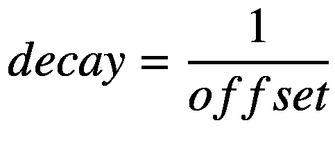

1.  为每一对词定义软约束：

    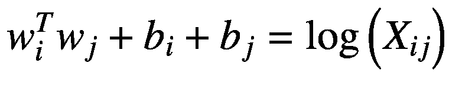

1.  在这里，*w*[*i*] = 主词的向量，*w*[*j*] = 上下文词的向量，*b*[*i*]，*b*[*j*] 是主词和上下文词的标量偏差。

1.  定义一个损失函数。

    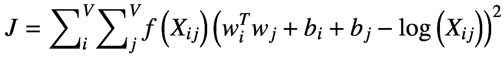

在这里，*f* 是一个加权函数，它帮助我们防止只从极其常见的词对中学习。GloVe 作者选择了以下函数：

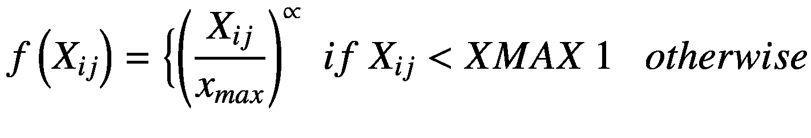

## 摘要

在本章中，我们讨论了自然语言处理的传统方法。

在下一章和最后一章中，我们将向您展示如何在三个不同的数据集上构建深度学习管道的示例：一个在表格数据集上；另一个在图像上；最后一个在文本数据上，从零开始展示 TensorFlow 模型，并逐步提供文档。

# 15. 应用

## 案例研究——表格数据集

### 理解数据集

在本节中，我们将了解数据集。通过了解，我们的意思是我们将从这个数据中提取任何我们可以得到的信息，并且我们将练习 Kaggle 上的“Titanic：灾难中的机器学习”（[`www.kaggle.com/c/titanic`](http://www.kaggle.com/c/titanic)）。我也受到了从其他我遇到的资源中进行数据集可视化分析的启发。因此，让我们开始编码。

如果您浏览 Kaggle 上的数据集页面，您会注意到该页面提供了关于泰坦尼克号上乘客详细信息的说明，以及关于乘客生存情况的列。幸存者表示为“`1`”，未幸存者表示为“`0`”。本练习的目标是确定，是否可以通过其他关于乘客的特征/信息，来预测那些可能幸存的人。

为了检查你心中的任何假设，你需要一个好的可视化，以查看数据中的信息。数据可视化使决策者能够看到多维度数据集之间的关系，并通过使用热图、温度图和其他丰富的图形表示，提供了理解数据的新方法。

让我们先导入所有需要的包。你可以自由使用其他包，但这些是完成任务所推荐的。

```py
import pandas as pd
import numpy as np
import matplotlib.pyplot as plt
import seaborn as sns
import tensorflow as tf
```

如果你记不起前面的包，这里是对其中三个包的小总结，但不要犹豫，回到介绍部分阅读这本书包含的所有包。

+   **pandas** 是一个处理 NumPy 和 SciPy 无法处理的任何事情的出色库。多亏了其特定的数据结构，即 DataFrame 和 Series，pandas 允许你处理不同类型和时序的复杂数据表。然后，你可以切片、切块、处理缺失元素、添加、重命名、聚合、重塑，最后还可以可视化你的数据。

+   **matplotlib** 是一个 Python 2-D 绘图库，能够在多种硬拷贝格式和跨平台的交互式环境中生成高质量的图形。此外，它包含创建高质量图表并交互式可视化的所有必需组件。对于简单的绘图，pyplot 模块提供了一个类似 MATLAB 的界面。

+   **Seaborn** 是一个基于 matplotlib 的 Python 数据可视化库。它提供了一个高级接口，用于绘制吸引人且信息丰富的统计图形。

#### 探索表面

在加载所有需要的包之后，我们需要加载数据集；当然，我们将使用 pandas 来加载，如下所示：

```py
titanic_df = pd.read_csv('./input/titanic/train.csv')
titanic_df.head()
```

`head()` 函数将打印包含数据集的 DataFrame 的前五行（见图 15-1）。

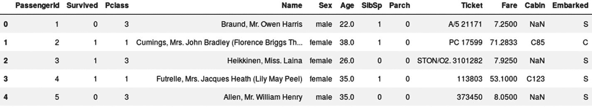

图 15-1

包含泰坦尼克号数据集的 pandas DataFrame

### 注意

如果你想知道为什么看不到类似的表格，那是因为我们使用了 **Jupyter** 作为 IDE。所以，尝试下载并安装它。

现在，在我们开始可视化数据集之前，我们需要了解每个数据集列的一些信息，我们可以通过调用 DataFrame 的 `info()` 函数来实现这一点。

```py
titanic_df.info()
```

此函数输出数据集的摘要。摘要包含列名、数据类型和非空条目数量，并输出 DataFrame 在内存中的大小，如下所示（见图 15-2）。

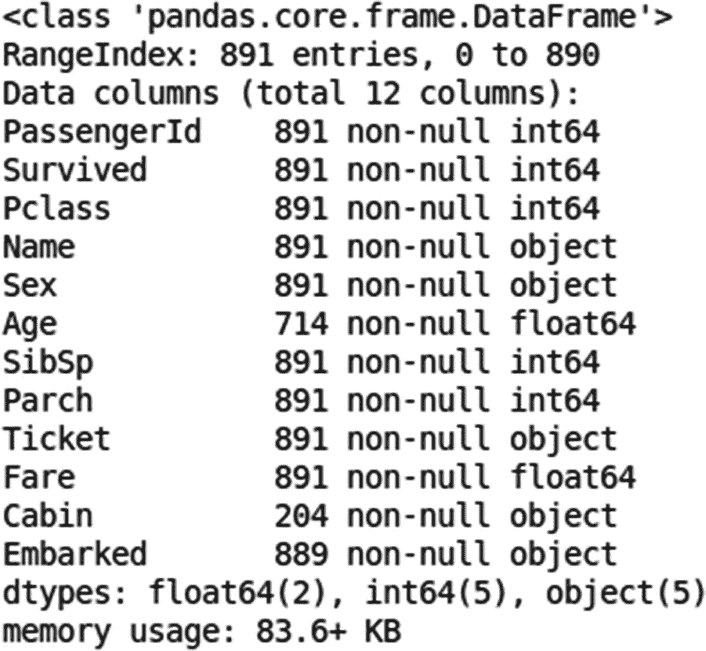

图 15-2

泰坦尼克号 DataFrame 列信息

现在，我们可以开始可视化每一列，看看我们是否能从中提取出任何知识。

让我们从看似简单的“性别”列开始热身，因为它只包含男/女条目。因此，让我们使用`factorplot()`函数来计数它们。这个函数接受大小写敏感的列名、DataFrame 和计数类型，因为我们只需要计数（见图 15-3）。

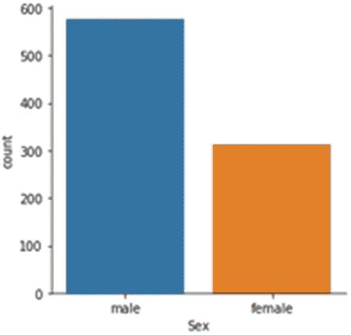

图 15-3

性别计数可视化

```py
sns.factorplot('Sex',data=titanic_df,kind='count')
```

我们可以看到男性的计数几乎是女性的两倍，但我们知道存活的女性的数量大于存活男性的数量。我们可以通过可视化存活者的计数来证明这一点，并查看存活/未存活的男性和女性的数量（见图 15-4）。

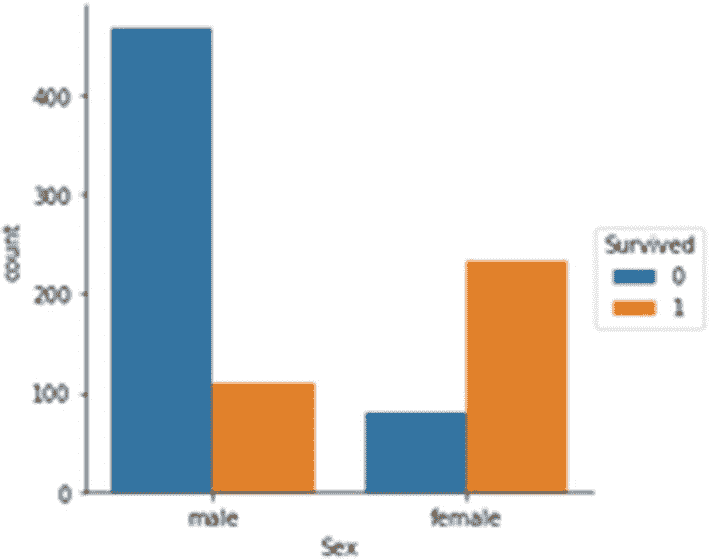

图 15-4

性别/存活计数

我们可以通过使用相同的`factorplot()`函数，并添加一个额外的参数——色调，来实现这一点：

```py
sns.factorplot('Sex',kind='count',data=titanic_df,hue='Survived')
```

我们现在可以通过查看两个可视化图表来证明男性和女性存活/未存活的百分比。

下一步是使事情更加复杂，通过添加 Pclass 列到等式中（见图 15-5）。

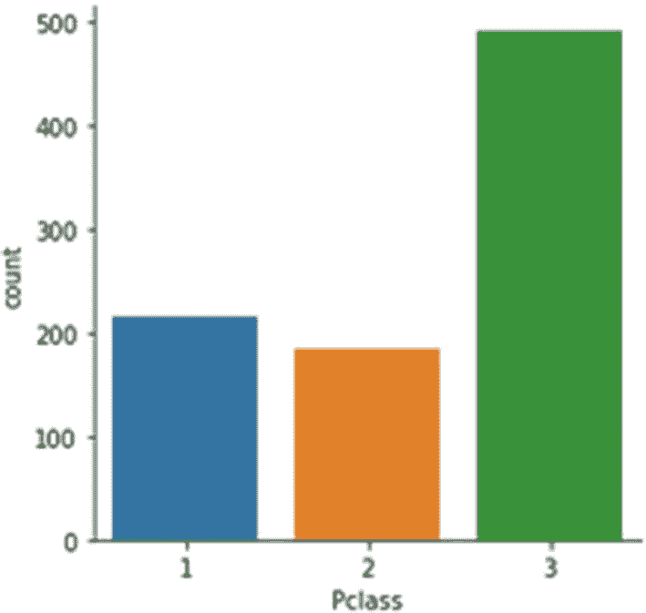

图 15-5

Pclass 计数

```py
sns.factorplot('Pclass',data=titanic_df,kind='count')
```

这列代表为每位乘客预留的舱位等级，即*1 = 一等，2 = 二等，或 3 = 三等*. 如果你查看图表，你会看到几乎一半的乘客都在三等舱。我认为在一种昂贵的交通工具上，大多数乘客都在三等舱是有道理的。

现在，让我们看看每个`Pclass`中每种性别的计数，我们将像之前一样做。我们可以看到这里发生了一些奇怪的事情。如果你仔细查看图表（见图 15-6），你可能会看到我看到的，如下所示：在头等和二等舱中，男性和女性的计数几乎相等，但在三等舱中，男性的数量几乎是女性的两倍。你可能从观看“泰坦尼克号”电影中直觉到这一点：当你看到*莱昂纳多·迪卡普里奥的角色*在三等舱旅行时，你会看到这个舱位的大部分都是由男性组成的。

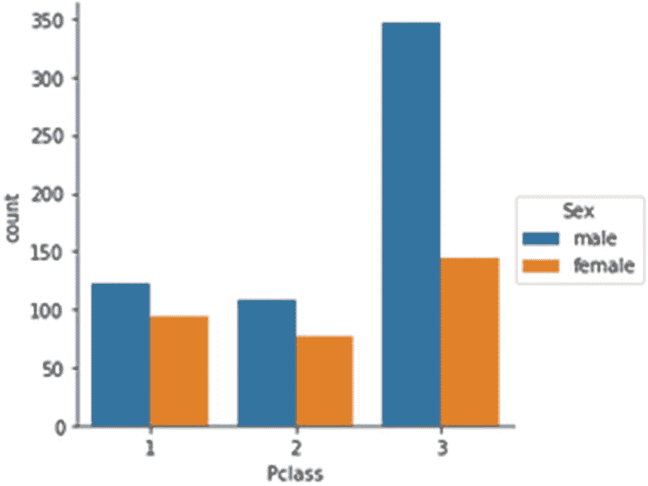

图 15-6

Pclass/性别计数

```py
sns.factorplot('Pclass',data=titanic_df,hue='Sex',kind='count')
```

#### 深入挖掘

目前，我们认为你已经有了很好的理解，但从现在开始我们将更深入地探讨。因此，我们不仅将依赖于列的信息，我们还将提取和构建列维度以获取更多信息。

我们需要提取更多特征。换句话说，我们将创建包含隐藏知识的新列。例如，我们需要计算船上孩子的数量。我们可以通过从性别列中提取一些关联并保存为人员列（图 15-7）来从年龄列中提取它，如下面的代码所示：

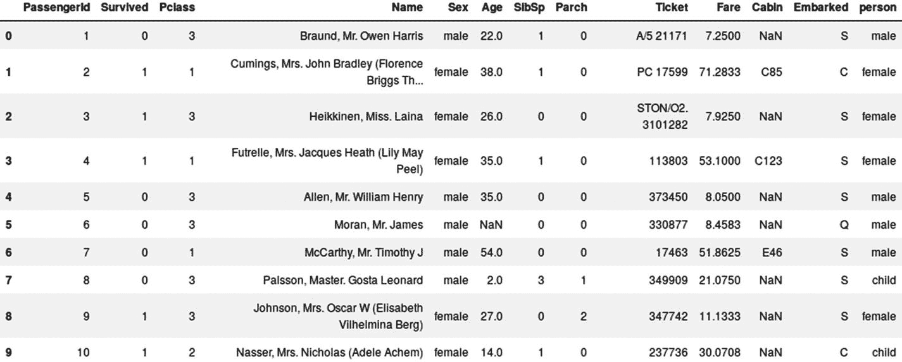

图 15-7

修改后的泰坦尼克号 DataFrame

```py
def titanic_children(passenger):
age , sex = passenger
if age < 16:
return 'child'
else:
return sex
titanic_df['person'] = titanic_df[['Age','Sex']].apply(titanic_children,axis=1)
```

现在，让我们看看这个新特征是否能帮助我们得出一个假设。

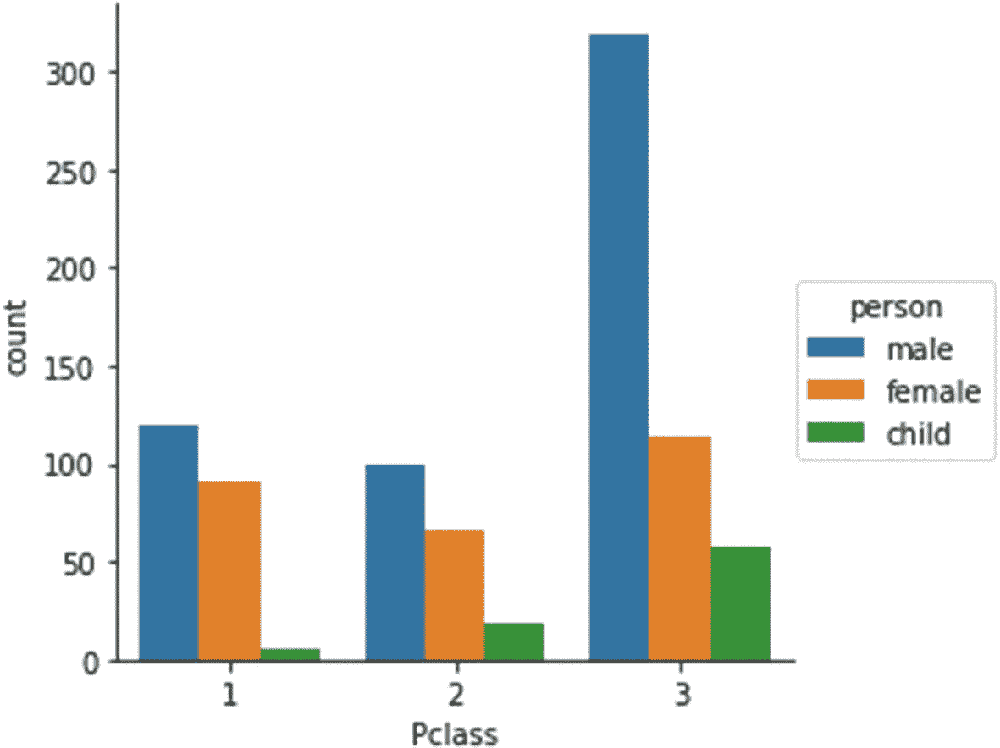

图 15-8

Pclass/人员计数

```py
sns.factorplot('Pclass',data=titanic_df,hue='person',kind='count')
```

和往常一样，我们将制作一个`factorplot`来查看是否获得了一些知识。如图 15-8 所示，第三班孩子的数量（child）与第一班和第二班相比非常庞大。但男性的数量仍然几乎相同，所以让我们找出每个年龄段的总人数。

我们可以使用`hist()`函数来完成这项工作，该函数计算年龄的直方图；简单来说，它计算变量在区间内的频率。

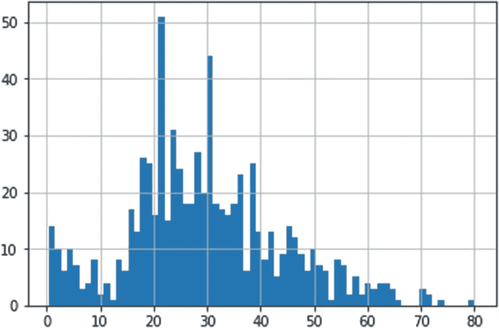

图 15-9

年龄直方图

```py
titanic_df['Age'].hist(bins=70)
```

如图 15-9 所示，16 至 35 岁之间船上的人的频率远高于该年龄以上的人或年龄较小的孩子。

让我们更进一步，按年龄计算男性和女性的频率。我们通过堆叠多个图形并创建所谓的`FacetGrid`来完成。这个`FacetGrid`由两个图表组成：每个图表都是一个表示男性或女性的 kdeplot 类型，每个`kdeplot`代表相应性别类型的年龄。

因此，为了简化过程，你可以在本书附带的代码中找到所有其他可视化。去看看，看看你是否能从这个数据集中提取更多信息和理解。

### 预处理数据集

如果你从左到右查看这个表的特性/列，你会看到以下内容：

+   **PassengerId:** 这一列包含每个观察值的 ID，对于任何机器学习模型来说，这是一个几乎无用的特征；我们无法从这个特征和目标/输出之间提取任何相关性。

+   **Survived:** 这一列是输出特征，有时也称为目标或响应；它包含每个观察值的数据——如果乘客幸存则为 1，如果不则为 0。

+   **Pclass:** 这一列包含船上每位乘客的等级；其值可以是 1、2 或 3。

+   **Age:** 这一列包含船上每位乘客的年龄，这是一个很好的特征。但通过一些调整，我们可以从中提取一个新的特征：乘客是否是孩子，当然这需要借助性别列。

但是，如果你仔细看看 Age 列，你会看到它包含一些空/空值。当然，从理论上讲，我们可以填充这些值。使用一些统计方法，我们可以假设这个列遵循某种未知的分布，并且大部分数据都重复出现，这种现象被称为分布均值。

因此，不深入研究统计学，我们可以确保用最重复的值填充缺失值将有效，而当我们说“最重复”时，我们指的是列的均值。

计算平均值并不难，幸运的是，pandas 库提供了许多功能，帮助我们节省大量时间。`mean()`函数可以轻松计算 Age 列的平均值。

```py
titanic_df['Age'].mean()
# 29.69911764705882
```

现在剩下的就是用这个值填充那个列中的空值，我们同样可以通过`fillna()`函数来完成：通过传递一个特定的值给它，我们可以填充那个列中的所有空值/空值。

```py
titanic_df['Age'] = titanic_df['Age'].fillna(titanic_df['Age'].mean())
```

在泰坦尼克号数据集中，Cabin 列并没有给我们提供任何有用的知识；此外，它大部分是空值。因此，我们不会使用它，因为它无用且会影响任何机器学习模型。对于这个列的处理步骤是将它从 DataFrame 中移除。

```py
titanic_df.drop('Cabin',axis=1, inplace=True)
```

作为可选步骤，你可能想清理并使用 Embarked 列，但我们不推荐这样做。它没有给我们提供任何有用的知识，我们建议移除它，但我们给你这个步骤是因为你可能想尝试一下。

```py
titanic_df['Embarked'] = titanic_df['Embarked'].fillna('S')
```

在填充空值之后，现在让我们去检查整个数据集中是否还存在任何空值。

```py
titanic_df.isnull().values.any()
# False
```

现在，在确保整个数据集中没有空值之后，让我们去创建一些可能有助于机器学习模型的新特征。

我们将从简单的一个开始，结合 Parch 和`SibSp`列，并构建一个新列，它是布尔类型。它包含 With Family 或 Without Family 值，这些值等于*True/False*值，因此我们将其视为布尔列。

```py
titanic_df['Alone'] = titanic_df.Parch + titanic_df.SibSp
titanic_df['Alone'].loc[titanic_df['Alone']>0] = 'With Family'
titanic_df['Alone'].loc[titanic_df['Alone'] == 0] = 'Without Family'
```

之后，我们将创建一个名为 person 的新列，它与 Sex 列类似，但不同之处在于它还告诉我们乘客是否是儿童（如果乘客年龄小于 16 岁）。

```py
def titanic_children(passenger):
age , sex = passenger
if age <16:
return 'child'
else:
return sex
titanic_df['person'] = titanic_df[['Age','Sex']].apply(titanic_children,axis=1)
```

现在，让我们看看，看看我们的数据到目前为止看起来是什么样子（图 15-10）。

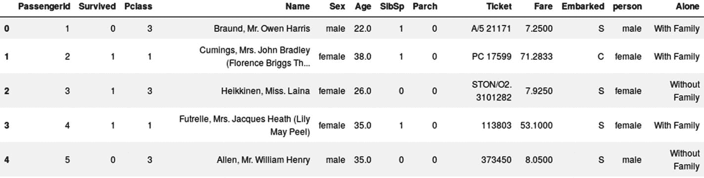

图 15-10

预处理后的数据的前几行

```py
titanic_df.head()
```

现在，让我们将 person、alone 和 embarked 转换成独热编码列。如果你不知道独热编码是什么，你可以搜索一下。它是一种转换类型，基本上将任何列转换成二进制格式。

```py
person_dummies = pd.get_dummies(titanic_df['person'])
alone_dummies = pd.get_dummies(titanic_df['Alone'])
embarked_dummies = pd.get_dummies(titanic_df['Embarked'])
embarked_dummies.drop('Q',axis=1,inplace=True)
```

此外，我们将`Pclass`转换为独热编码形式，并将其列重命名为`class_1`、`class_2`和`class_3`。

```py
pclass_dummies = pd.get_dummies(titanic_df['Pclass'])
pclass_dummies.columns=['class_1','class_2','class_3']
```

我们将对年龄应用的处理步骤非常简单；我们将移除其百分比，因为没有 20.2 岁的年龄。我们可以通过调用`ceil()`并将其应用于年龄来实现这一点。

我们将对票价列也进行相同的处理步骤。

```py
titanic_df['Age'] = titanic_df['Age'].apply(math.ceil)
titanic_df['Fare'] = titanic_df['Fare'].apply(math.ceil)
```

现在，我们将添加所有新的列到我们的数据集中。使用`concat()`函数，我们可以通过`axis=1`参数向 DataFrame 中添加列，通过`axis=0`参数添加行。

```py
titanic_df = pd.concat([titanic_df,pclass_dummies,person_dummies,alone_dummies,embarked_dummies],axis=1)
```

现在，让我们从 DataFrame 中删除所有无用的列，以及所有重复的/相关的（例如，`Pclass`及其类别）列。

```py
titanic_df.drop(['PassengerId','Name','Sex','SibSp','Parch','Ticket','Embarked'],axis=1,inplace=True)
titanic_df.drop(['Alone','person','Pclass','Without Family','male','class_3'],axis=1,inplace=True)
```

最后，在继续下一步之前，公平的做法是在查看它（图 15-11）之后，对数据进行最后一次检查。此外，建议在清理管道后保存数据，以便于您使用，同时也为了备份目的。

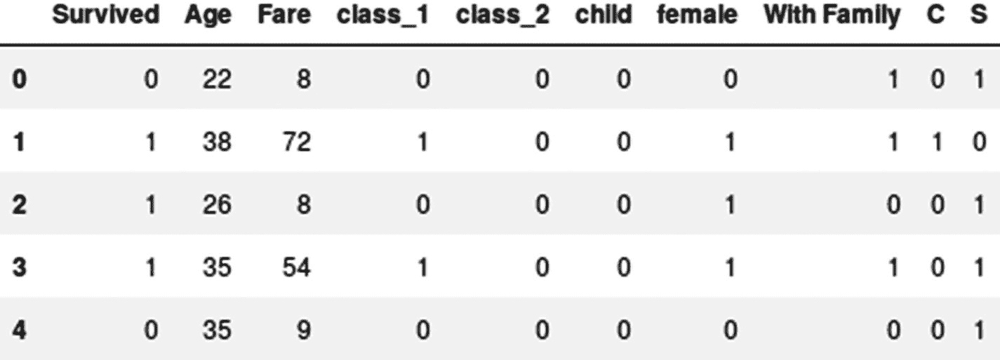

图 15-11

预处理步骤之后的泰坦尼克号数据框

```py
titanic_df.head()
```

在预处理的最后一步，我们将创建数据的检查点，以进行备份并确保没有数据丢失。

```py
titanic_df.to_csv('titanic.preprocessing.csv', index=False)
```

### 构建模型

现在，我们已经到达了应用程序的核心，使用 TensorFlow 构建模型。现在，我们将利用之前部分学到的所有知识来构建一个能够对泰坦尼克号乘客是否生还进行分类的神经网络。

我们将创建一个名为`build_neural_network`的函数，该函数将为我们构建整个网络并返回我们将要训练的图。网络应该接受一个形状与预处理后的泰坦尼克号数据集相等的输入，并返回一个 0 或 1 的输出。

```py
# Build Neural Network
from collections import namedtuple
def build_neural_network(hidden_units=10):
tf.reset_default_graph()
inputs = tf.placeholder(tf.float32, shape=[None, x_train.shape[1]])
labels = tf.placeholder(tf.float32, shape=[None, 1])
learning_rate = tf.placeholder(tf.float32)
is_training=tf.Variable(True,dtype=tf.bool)
initializer = tf.contrib.layers.xavier_initializer()
fc = tf.layers.dense(inputs, hidden_units, activation=None,kernel_initializer=initializer)
fc=tf.layers.batch_normalization(fc, training=is_training)
fc=tf.nn.relu(fc)
logits = tf.layers.dense(fc, 1, activation=None)
cross_entropy = tf.nn.sigmoid_cross_entropy_with_logits(labels=labels, logits=logits)
cost = tf.reduce_mean(cross_entropy)
with tf.control_dependencies(tf.get_collection(tf.GraphKeys.UPDATE_OPS)):
optimizer = tf.train.AdamOptimizer(learning_rate=learning_rate).minimize(cost)
predicted = tf.nn.sigmoid(logits)
correct_pred = tf.equal(tf.round(predicted), labels)
accuracy = tf.reduce_mean(tf.cast(correct_pred, tf.float32))
# Export the nodes
export_nodes = ['inputs', 'labels', 'learning_rate','is_training', 'logits',
'cost', 'optimizer', 'predicted', 'accuracy']
Graph = namedtuple('Graph', export_nodes)
local_dict = locals()
graph = Graph(*[local_dict[each] for each in export_nodes])
return graph
model = build_neural_network()
```

现在，在我们创建整个神经网络模型之后，我们需要确保数据集被划分为模型用于训练的观察值/批次。因此，我们将创建一个函数，该函数接受数据并产生大小为 32 或你设置的任何大小的批次。

```py
def get_batch(data_x,data_y,batch_size=32):
batch_n=len(data_x)//batch_size
for i in range(batch_n):
batch_x=data_x[i*batch_size:(i+1)*batch_size]
batch_y=data_y[i*batch_size:(i+1)*batch_size]
yield batch_x,batch_y
```

现在，我们需要为模型定义一些参数，例如 epoch 数量、学习率和批量大小。

```py
epochs = 200
train_collect = 50
train_print=train_collect*2
learning_rate_value = 0.001
batch_size=16
x_collect = []
train_loss_collect = []
train_acc_collect = []
valid_loss_collect = []
valid_acc_collect = []
```

现在，我们将创建一个会话，我们将运行整个网络图。我们将迭代 epoch 的数量，在每个 epoch 内部生成一些批次，我们将将其喂给模型，并生成一个损失，该损失将被反向传播以增强模型权重。

```py
saver = tf.train.Saver()
with tf.Session() as sess:
sess.run(tf.global_variables_initializer())
iteration=0
for e in range(epochs):
for batch_x,batch_y in get_batch(x_train,y_train,batch_size):
iteration+=1
feed = {model.inputs: x_train,
model.labels: y_train,
model.learning_rate: learning_rate_value,
model.is_training:True
}
train_loss, _, train_acc = sess.run([model.cost, model.optimizer, model.accuracy], feed_dict=feed)
if iteration % train_collect == 0:
x_collect.append(e)
train_loss_collect.append(train_loss)
train_acc_collect.append(train_acc)
if iteration % train_print==0:
print("Epoch: {}/{}".format(e + 1, epochs),
"Train Loss: {:.4f}".format(train_loss),
"Train Acc: {:.4f}".format(train_acc))
feed = {model.inputs: x_test,
model.labels: y_test,
model.is_training:False
}
val_loss, val_acc = sess.run([model.cost, model.accuracy], feed_dict=feed)
valid_loss_collect.append(val_loss)
valid_acc_collect.append(val_acc)
if iteration % train_print==0:
print("Epoch: {}/{}".format(e + 1, epochs),
"Validation Loss: {:.4f}".format(val_loss),
"Validation Acc: {:.4f}".format(val_acc))
saver.save(sess, "./titanic.ckpt")
```

如果这段代码在你的环境中运行正确，没有任何错误，你将在输出 shell 中看到这个进度日志：

```py
Epoch: 3/200 Train Loss: 0.6199 Train Acc: 0.6770
Epoch: 3/200 Validation Loss: 0.6276 Validation Acc: 0.6425
Epoch: 5/200 Train Loss: 0.6013 Train Acc: 0.6784
Epoch: 5/200 Validation Loss: 0.6085 Validation Acc: 0.6480
...
Epoch: 198/200 Train Loss: 0.3361 Train Acc: 0.8652
Epoch: 198/200 Validation Loss: 0.4740 Validation Acc: 0.8156
Epoch: 200/200 Train Loss: 0.3361 Train Acc: 0.8652
Epoch: 200/200 Validation Loss: 0.4780 Validation Acc: 0.8212
```

最后，当模型完成训练后，你可以看到它的分析结果，以决定是否需要增强模型（图 15-12）。

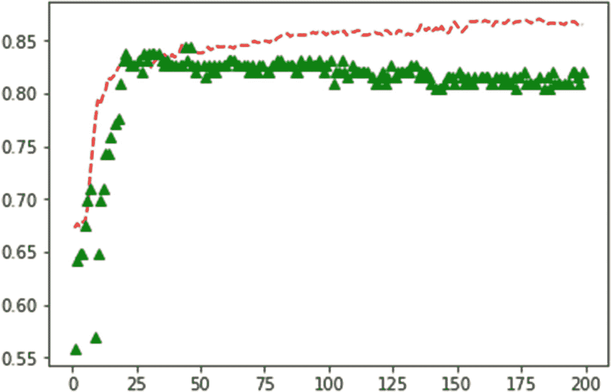

图 15-12

模型在数据集上逐步进行

## 案例研究——使用 Word2Vec 的 IMDB 电影评论数据

在本节中，我们将从 **IMDB** 数据开始，使用 **gensim** 包中最常见的处理算法 *Word2Vec*。我们已经在之前的章节中讨论了 Word2Vec，但在这个章节中，我们将尝试使用 IMDB 数据集；所以让我们快速浏览一下。在本节中，我们有几行/样本/观测值，每个样本要么是正面样本，要么是负面样本，我们将把这些样本分为训练集和测试集。但我们将要做的新的东西是将其转换为数字，就像我们之前讨论的词嵌入一样。然后，在转换之后，我们将将其传递到新的层中，以供学习层完成学习任务，或者将其保存为 pickle 格式。在这种情况下，我们希望您学习如何使用 gensim 嵌入，并理解 Word2Vec 的概念，然后您可以进一步学习 Word2Vec。这是一个非常常用的案例，用于学习构建好的模型。

```py
import numpy as np # linear algebra
import pandas as pd # data processing, CSV file I/O (e.g. pd.read_csv)
import html
import os
from nltk.corpus import stopwords
import nltk
nltk.download('stopwords')
import re
from tqdm import tqdm
```

我们需要加载文件：正面的、负面的和测试文件。

```py
path = "/content/aclImdb/"
positiveFiles = [x for x in os.listdir(path+"train/pos/")
if x.endswith(".txt")]
negativeFiles = [x for x in os.listdir(path+"train/neg/")
if x.endswith(".txt")]
testFiles = [x for x in os.listdir(path+"test/")
if x.endswith(".txt")]
```

`positiveFiles` 包含正面评论。

```py
positiveReviews, negativeReviews, testReviews = [], [], []
for pfile in positiveFiles:
with open(path+"train/pos/"+pfile, encoding="latin1") as f:
positiveReviews.append(f.read())
for nfile in negativeFiles:
with open(path+"train/neg/"+nfile, encoding="latin1") as f:
negativeReviews.append(f.read())
for tfile in testFiles:
with open(path+"test/"+tfile, encoding="latin1") as f:
testReviews.append(f.read())
```

我们现在需要知道正面评论和负面评论的大小。

```py
print(len(positiveReviews))
print(len(negativeReviews))
print(len(testReviews))
# Output
# 12500
# 12500
# 2
```

让我们把所有类型的评论放入同一个 DataFrame 中，这样我们就可以看到它们了。

```py
reviews = pd.concat([pd.DataFrame({"review":positiveReviews, "label":1,
"file":positiveFiles}),
pd.DataFrame({"review":negativeReviews, "label":0,
"file":negativeFiles}),
pd.DataFrame({"review":testReviews, "label":-1,
"file":testFiles})
], ignore_index=True).sample(frac=1, random_state=1)
```

获取数据形状；它应该是一个有三个维度的数字。

```py
reviews.shape
# Output
# (25002, 3)
```

让我们看看数据 DataFrame（图 15-13）。

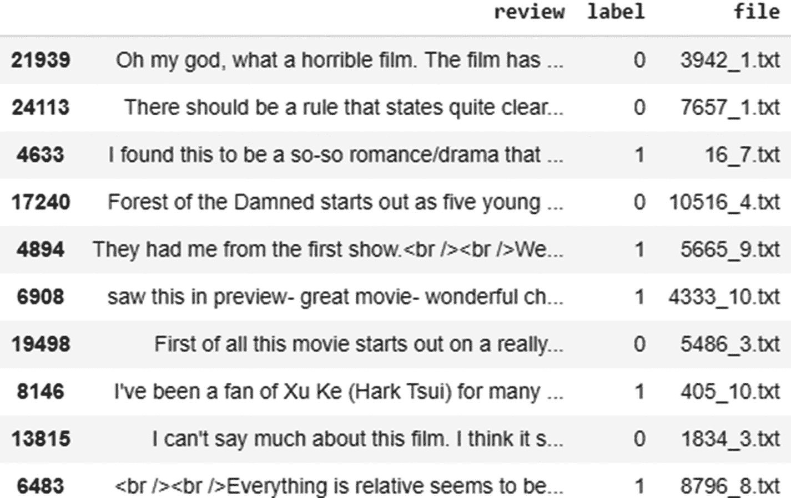

图 15-13

评论的前十行

```py
reviews[0:10]
```

英文中的停用词应该被忽略。

```py
stopWords = stopwords.words('english')
```

定义执行清理过程的函数。

```py
def CleanData(sentence):
processedList = ""
#convert to lowercase and ignore special charcter
sentence = re.sub(r'[^A-Za-z0-9\s.]', r", str(sentence).lower())
sentence = re.sub(r'\n', r' ', sentence)
sentence = " ".join([word for word in sentence.split() if word not in stopWords])
return sentence
reviews.info()
```

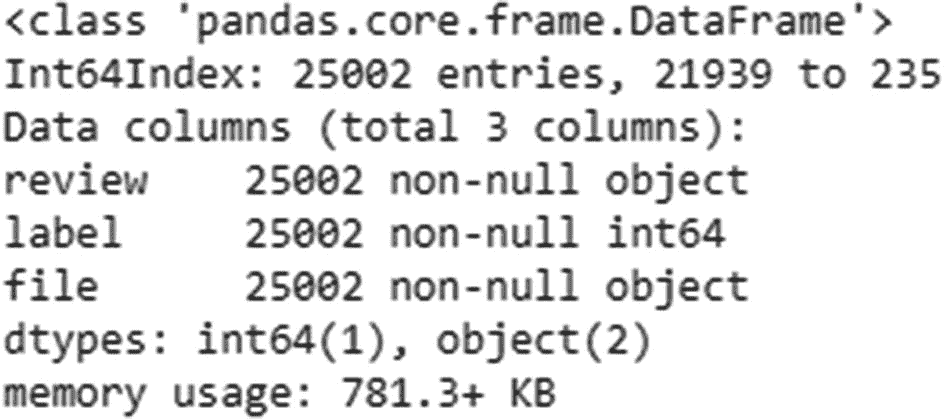

```py
reviews['review'][0] reviews['review'][0]
# Output
'Level One, Horror.When I saw this film for the first time at 10, I knew it would give me nightmares. It did. Surprisingly, as I recall, it was the sound as much as the sight of the monster that caused them.Level Two, Psychoanalytic Theory.
CleanData(reviews['review'][0])
# Output
'level one horror.br br saw film first time 10 knew would give nightmares. did. surprisingly recall sound much sight monster caused them.br br level two psychoanalytic theory.
reviews['review'] = reviews['review'].map(lambda x: CleanData(x))
reviews['review'].head()
# Output
21939    oh god horrible film. film right people involv...
24113    rule states quite clearly movies like resident...
4633     found soso romancedrama nice ending generally ...
17240    forest damned starts five young friends brothe...
4894     first show.br br welcome trinity county. sleep...
Name: review, dtype: object
tmp_corpus = reviews['review'].map(lambda x:x.split('.'))
#corpus [[w1, w2, w3,...],[...]]
corpus = []
for i in tqdm(range(len(reviews))):
for line in tmp_corpus[i]:
words = [x for x in line.split()]
corpus.append(words)
# Output
# 100%|██████████| 25002/25002 [00:02<00:00,
# 10673.63it/s]
len(corpus)
# Output
# 402194
#removing blank list
corpus_new = []
for i in range(len(corpus)):
if (len(corpus[i]) != 0):
corpus_new.append(corpus[i])
num_of_sentences = len(corpus_new)
num_of_words = 0
for line in corpus_new:
num_of_words += len(line)
print('Num of sentences - %s'%(num_of_sentences))
print('Num of words - %s'%(num_of_words))
# Output
# Num of sentences - 354417
# Num of words – 3265546
```

现在我们来看看 gensim 包以及如何使用 Word2Vec。

```py
from gensim.models import Word2Vec
```

让我们构建一个 Word2Vec 模型并初始化参数。

```py
# sg - skip gram |  window = size of the window | size = vector dimension
size = 100
window_size = 2 # sentences weren't too long, so
epochs = 100
min_count = 2
workers = 4
model = Word2Vec(corpus_new)
model.build_vocab(sentences= corpus_new, update=True)
for i in range(5):
model.train(sentences=corpus_new, epochs=50, total_examples=model.corpus_count)
```

模型训练完成后，让我们保存它。

```py
#save model
model.save('w2v_model')
```

将模型加载到 Word2Vec 中，这是 gensim 中的一个模块。

```py
model = Word2Vec.load('w2v_model')
```

让我们找到最相似的电影。

```py
model.wv.most_similar('movie')
# Output
[('film', 0.8756906986236572),
('flick', 0.6631126403808594),
('movies', 0.6589803695678711),
('it', 0.562816321849823),
('films', 0.5470719337463379),
('show', 0.5167748928070068),
('sequel', 0.5143758654594421),
('this', 0.5129573941230774),
('thing', 0.5066217184066772),
('really', 0.4848993122577667)]
```

下一步是使用其标签提取数据。

```py
reviews = reviews[["review", "label", "file"]].sample(frac=1,
random_state=1)
train = reviews[reviews.label!=-1].sample(frac=0.6, random_state=1)
valid = reviews[reviews.label!=-1].drop(train.index)
test = reviews[reviews.label==-1]
```

让我们看看训练/测试数据集的形状：

```py
print(train.shape)
print(valid.shape)
print(test.shape)
# Output
# (15000, 3)
# (10000, 3)
# (2, 3)
valid.head()
```

见图 12-14。

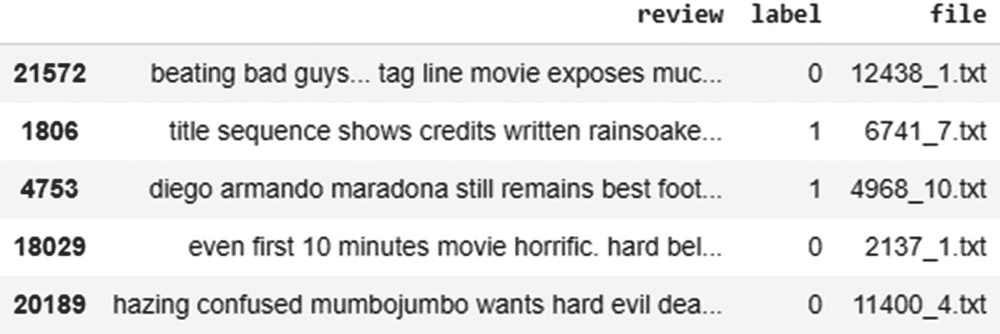

图 15-14

五行有效的 DataFrame

现在我们将进行一些数据预处理，这是在我们训练模型之前的最后一个迭代。

```py
num_features = 100
index2word_set = set(model.wv.index2word)
model = model
def featureVecorMethod(words):
featureVec = np.zeros(num_features, dtype="float32")
nwords = 0
for word in words:
if word in index2word_set:
nwords+= 1
featureVec = np.add(featureVec, model[word])
#average of feature vec
featureVec = np.divide(featureVec, nwords)
return featureVec
def getAvgFeatureVecs(reviews):
counter = 0
reviewFeatureVecs = np.zeros((len(reviews), num_features), dtype="float32")
for review in reviews:
if counter%1000 == 0:
print("Review %d of %d"%(counter, len(reviews)))
reviewFeatureVecs[counter] = featureVecorMethod(review)
counter = counter+1
return reviewFeatureVecs
clean_train_reviews = []
for review in train['review']:
clean_train_reviews.append(list(CleanData(review).split()))
# print(len(clean_train_reviews))\
trainDataVecs = getAvgFeatureVecs(clean_train_reviews)
# Output
Review 1000 of 15000
Review 2000 of 15000
Review 3000 of 15000
Review 4000 of 15000
Review 5000 of 15000
Review 6000 of 15000
Review 7000 of 15000
Review 8000 of 15000
Review 9000 of 15000
Review 10000 of 15000
Review 11000 of 15000
Review 12000 of 15000
Review 13000 of 15000
Review 14000 of 15000
len(valid['review'])
# Output
10000
clean_test_reviews = []
for review in valid['review']:
clean_test_reviews.append(list(CleanData(review).split()))
testDataVecs = getAvgFeatureVecs(clean_test_reviews)
# Output
Review 1000 of 10000
Review 2000 of 10000
Review 3000 of 10000
Review 4000 of 10000
Review 5000 of 10000
Review 6000 of 10000
Review 7000 of 10000
Review 8000 of 10000
Review 9000 of 10000
print(len(testDataVecs))
# Output
10000
```

## 案例研究——图像分割

你可能会想知道图像分割是什么。在计算机视觉中，图像分割是将数字图像分割成多个段的过程。分割的目标是简化图像的表示，或者将其转换为更具有意义且更容易分析的形式。让我们通过一个简单的例子来理解图像分割。考虑图 15-15。


图 15-15

我们将要分割的一个示例图像

我们可以将图像划分为不同的部分，称为段。同时处理整个图像不是一个好主意，因为图像中会有不包含任何信息的区域。通过将图像划分为段，我们可以利用重要的段来处理图像。简而言之，这就是图像分割的工作原理。

图像是一组或集合不同的像素。我们使用图像分割将具有相似属性的像素分组在一起。花点时间看看图 12-16（它将给您一个图像分割的实际概念）：

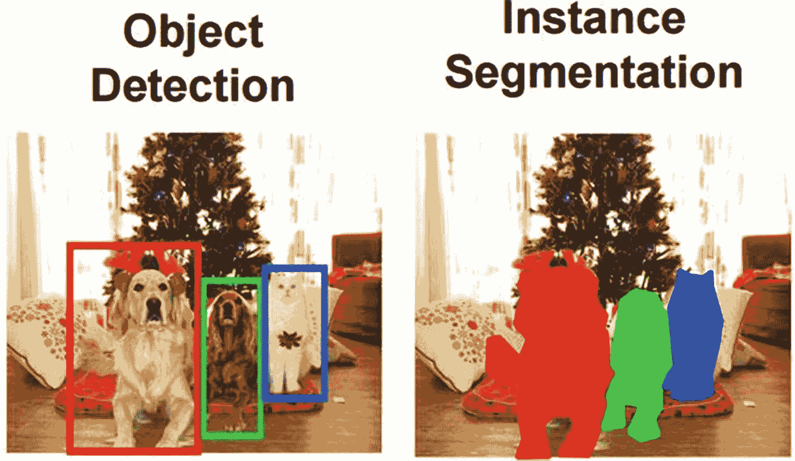

图 15-16

物体检测与实例分割之间的区别

因此，现在让我们构建一个能够分割任何图像并从中提取实例的应用程序。要开始这样做，我们需要导入我们将要使用的所有包。似乎有一个新的包，`skimage`；这个包包含许多帮助您处理图像数据的操作。

```py
import os
import sys
import random
import math
import numpy as np
import skimage.io
import matplotlib
import matplotlib.pyplot as plt
import warnings
warnings.filterwarnings("ignore")
```

现在，我们需要说明一个新的架构模型，称为 Mask R-CNN。Facebook AI Research（FAIR）的数据科学家和研究人员开创了一种深度学习架构，称为 Mask R-CNN，可以为图像中的每个对象创建像素级掩码。这是一个非常酷的概念，所以请密切关注！

Mask R-CNN 是流行的 Faster R-CNN 物体检测架构的扩展。Mask R-CNN 为现有的 Faster R-CNN 输出添加了一个分支。Faster R-CNN 方法为图像中的每个对象生成两样东西：

1.  它的类别

1.  边界框坐标

Mask R-CNN 为此添加了第三个分支，该分支输出对象掩码。请查看图 15-17 以了解 Mask R-CNN 的工作原理。

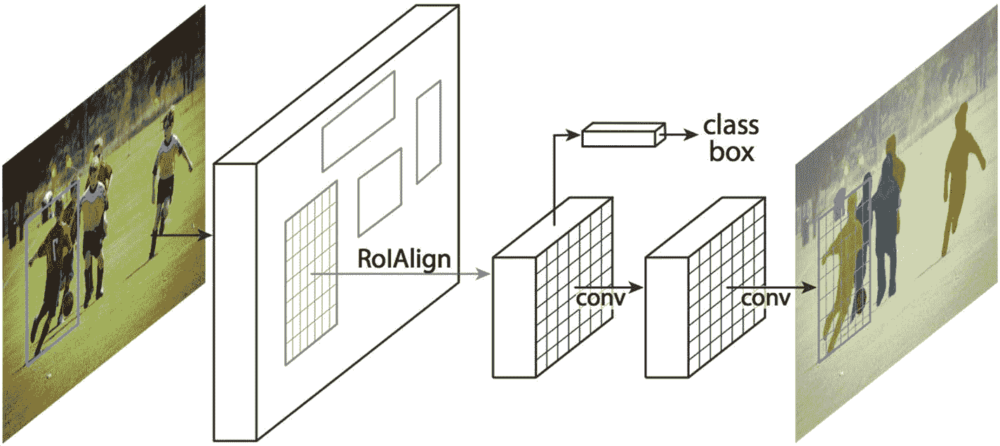

图 15-17

Mask R-CNN 的工作原理

1.  我们将图像作为输入传递给 ConvNet，它返回该图像的特征图

1.  在这些特征图上应用区域提议网络（RPN）。这返回了对象提议及其对象分数。

1.  在这些提议上应用 RoI 池化层，将所有提议降低到相同的大小。

1.  最后，提议被传递到一个全连接层，用于分类并输出对象的边界框。它还返回每个提议的掩码。

首先，我们将使用命令从 GitHub 下载我们将要使用的模型：

```py
git clone https://github.com/matterport/Mask_RCNN.git
```

然后，我们应该设置模型的路径，以确保我们的代码可以看到下载的模型。

```py
# Root directory of the project
ROOT_DIR = os.path.abspath("/content/Mask_RCNN")
```

然后，我们将导入模型及其可视化工具。

```py
# Import Mask RCNN
sys.path.append(ROOT_DIR)  # To find local version of the library
from Mask_RCNN.mrcnn import utils
import Mask_RCNN.mrcnn.model as modellib
from mrcnn import visualize
# Import COCO config
sys.path.append(os.path.join(ROOT_DIR, "samples/coco/"))  # To find local version
import coco
%matplotlib inline
```

在此之后，我们将为未来的分析和调试设置日志文件夹。我们还将从 `h5` 数据文件中加载权重。

```py
# Directory to save logs and trained model
MODEL_DIR = os.path.join(ROOT_DIR, "logs")
# Local path to trained weights file
COCO_MODEL_PATH = os.path.join(", "mask_rcnn_coco.h5")
# Download COCO trained weights from Releases if needed
if not os.path.exists(COCO_MODEL_PATH):
utils.download_trained_weights(COCO_MODEL_PATH)
```

现在我们需要设置图像目录，我们的模型将从该目录读取数据，并设置机器配置。此外，我们将实例化模型并加载其权重。

```py
# Directory of images to run detection on
IMAGE_DIR = os.path.join(ROOT_DIR, "images")
class InferenceConfig(coco.CocoConfig):
# Set batch size to 1 since we'll be running inference on
# one image at a time. Batch size = GPU_COUNT * IMAGES_PER_GPU
GPU_COUNT = 1
IMAGES_PER_GPU = 1
config = InferenceConfig()
config.display()
# Create model object in inference mode.
model = modellib.MaskRCNN(mode="inference", model_dir='mask_rcnn_coco.hy', config=config)
# Load weights trained on MS-COCO
model.load_weights('mask_rcnn_coco.h5', by_name=True)
```

现在我们将创建类名；这些名称来自模型训练所用的 COCO 数据集。

```py
# COCO Class names
class_names = ['BG', 'person', 'bicycle', 'car', 'motorcycle', 'airplane',
'bus', 'train', 'truck', 'boat', 'traffic light',
'fire hydrant', 'stop sign', 'parking meter', 'bench', 'bird',
'cat', 'dog', 'horse', 'sheep', 'cow', 'elephant', 'bear',
'zebra', 'giraffe', 'backpack', 'umbrella', 'handbag', 'tie',
'suitcase', 'frisbee', 'skis', 'snowboard', 'sports ball',
'kite', 'baseball bat', 'baseball glove', 'skateboard',
'surfboard', 'tennis racket', 'bottle', 'wine glass', 'cup',
'fork', 'knife', 'spoon', 'bowl', 'banana', 'apple',
'sandwich', 'orange', 'broccoli', 'carrot', 'hot dog', 'pizza',
'donut', 'cake', 'chair', 'couch', 'potted plant', 'bed',
'dining table', 'toilet', 'tv', 'laptop', 'mouse', 'remote',
'keyboard', 'cell phone', 'microwave', 'oven', 'toaster',
'sink', 'refrigerator', 'book', 'clock', 'vase', 'scissors',
'teddy bear', 'hair drier', 'toothbrush']
```

现在我们需要测试我们加载的模型是否工作正常，因此我们将加载一个测试图像并将其输入到模型中，以查看输出。


图 15-18

图像包含网络应该提取的一些行人

```py
# Load a random image from the images folder
image = skimage.io.imread('/content/Mask_RCNN/images/1045023827_4ec3e8ba5c_z.jpg')
# original image
plt.figure(figsize=(12,10))
skimage.io.imshow(image)
```

正如您在图 15-18 中所见，图像包含许多对象，网络应该提取这些对象并分类它们的标签。当 Mask R-CNN 提取每个对象时，它会生成对象的边界框以告知对象的位置及其标签。还有一个我们认为非常出色的输出：它为对象创建了一个类似遮罩的边界。为此，网络将每个像素分类为是否属于给定的对象。

现在我们来看看 Mask R-CNN 的输出；为此，我们编写了一行简单的代码，使网络预测工作。

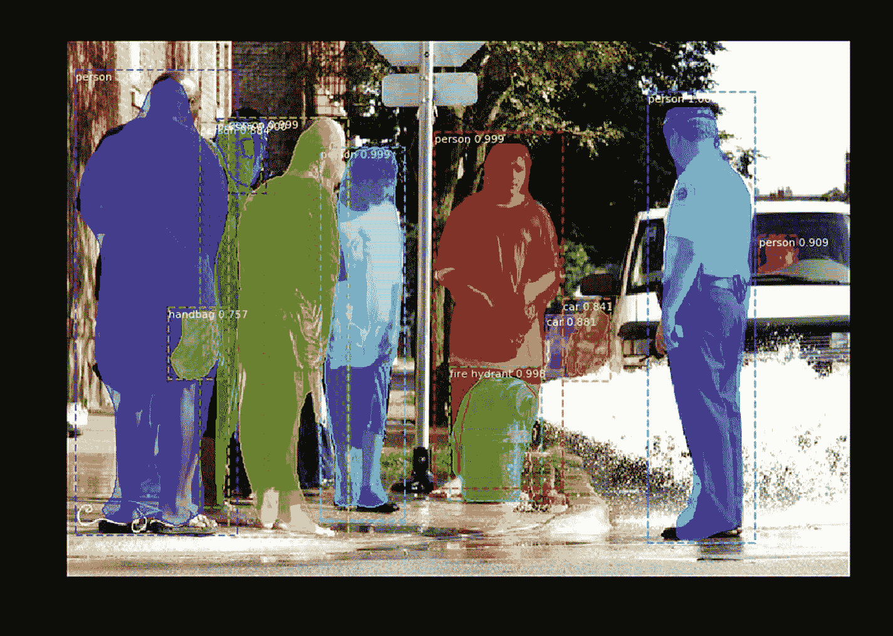

图 15-19

网络提取的输出结果

```py
# Run detection
results = model.detect([image], verbose=1)
# Visualize results
r = results[0]
visualize.display_instances(image, r['rois'], r['masks'], r['class_ids'], class_names, r['scores'])
```

正如您在图 15-19 中所见，网络输出精确地提取了行人。它甚至提取了右侧车内的人。这不是很棒的工作吗？但网络提取的不仅仅是行人/人；网络可以分类许多类别。您可以通过查看前面的代码中的类变量来了解 Mask R-CNN 可以提取多少类别以及哪些类别/对象。

要提取图像中的某个特定对象，您可以简单地遍历对象，直到找到所需的那个，然后做您想做的事情（图 15-20）。


图 15-20

网络分割出的每个对象

```py
mask = r['masks']
mask = mask.astype(int)
mask.shape
for i in range(mask.shape[2]):
temp = skimage.io.imread('/content/Mask_RCNN/images/1045023827_4ec3e8ba5c_z.jpg')
for j in range(temp.shape[2]):
temp[:,:,j] = temp[:,:,j] * mask[:,:,i]
plt.figure(figsize=(8,8))
plt.imshow(temp)
```

## 摘要

在本章中，我们向您展示了几个示例，以学习如何应用从本书中获得的知识。本书中的所有应用都旨在确保您从表格数据集到文本数据集再到图像数据集，都能学习到每个单一的概念，并以实际的方式应用这些概念。

我们希望您喜欢本章，因为没有理论，它包含了很多代码，也希望您喜欢整本书。

通过结束本章，您已经完成了学习深度学习流程及其在实际生活中应用的过程。
