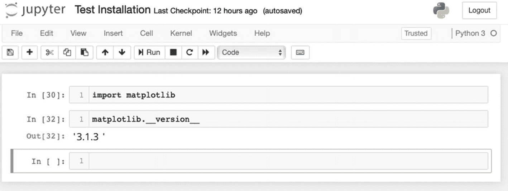

# 一、入门：安装和故障排除

为了充分利用这本书，你需要满足以下先决条件:

*   安装 Python 3，Python 的最新版本

*   安装 Jupyter 笔记本

*   安装 TensorFlow 2.0

*   硬安装

*   安装 NumPy

*   安装科学软件

*   安装 Matplotlib

*   安装熊猫

*   安装 Scikit-Learn

本章将帮助你安装所有必要的软件包。它还针对安装过程中可能出现的一些常见错误提供了故障排除提示。

Note

为这些项目创建单独的虚拟环境是一种很好的做法。在安装这里提到的包之前，创建一个虚拟环境并激活它。

## 安装 Python 3

Python 是一种通用解释型、命令式、面向对象的高级编程语言。它是最古老的编程语言之一。然而，随着机器学习的出现，Python 获得了新生。它已经成为机器学习和深度学习的流行工具。目前，Python 有两个不同的版本——Python 2 和 Python 3。

本书所有项目都使用 Python 3，所以最好确保安装了。

### 方法 1:从 Python 官方网站直接安装

这种方法适用于 Windows、Linux 和 macOS X 系统。这是标准的安装方法，你可以直接从官方网站下载 Python，然后安装到你的系统上。

1.  Go to [`https://www.python.org/`](https://www.python.org/) and select the Downloads tab. A drop-down menu will appear (see Figure [1-1](#Fig1)).

    

    图 1-1

    Python 官方网站

2.  在下拉菜单的右侧，您将看到适用于您的特定系统的最新 Python 版本。第一个按钮提供最新版本的 Python 3。一旦你点击它，下载将开始。

3.  下载完成后，双击下载栏中的包。这将启动安装过程。

4.  In the dialog box that pops up, select Continue (see Figure [1-2](#Fig2)).

    

    图 1-2

    Python 安装的介绍窗口

5.  In the new dialog box, you will be presented with important information regarding the changes made to Python (see Figure [1-3](#Fig3)). Once again, select Continue.

    

    图 1-3

    Python 安装的自述窗口

6.  Now you will be shown the license agreement for using Python. Select Continue (see Figure [1-4](#Fig4)).

    

    图 1-4

    Python 安装的许可窗口

7.  将出现一个迷你对话框，要求您同意列出的条款和条件。选择同意。

8.  选择新 Python 安装的文件路径。

9.  Select the type of installation. See Figure [1-5](#Fig5).

    

    图 1-5

    Python 安装的安装类型窗口

10.  Finally, you will be told how much memory will be used on your system. Select Install (see Figure [1-6](#Fig6)).

    

    图 1-6

    Python 安装的存储警告窗口

11.  该对话框将显示一个进度条，指示安装完成了多少。这应该只需要几分钟，取决于您系统的内存和速度。

12.  Once the installation is complete, you will be presented with a dialog box indicating that the installation was successful, as shown in Figure [1-7](#Fig7).

    

    图 1-7

    Python 安装的摘要窗口

13.  To test the installation, open the terminal (see Figure [1-8](#Fig8)), type `python 3`, and press Enter.

    

    图 1-8

    在终端中运行 Python

14.  现在输入命令`print ("Hello World!")`并按回车键。

15.  This will print the words `'Hello World!'` in the terminal, as shown in Figure [1-9](#Fig9).

    

    图 1-9

    测试 Python 安装

### 故障排除提示

在 Linux 系统上，你可能会得到一个错误信息，说`pip`需要`ssl`，如图 [1-10](#Fig10) 所示。


图 1-10

PIP 需要 SSL 警告

要安装`ssl`，请使用以下命令:

```py
sudo apt-get install libssl-dev openssl

```

完成后，使用以下命令:

```py
sudo make install

```

Python 现在应该已经成功安装在您的系统上了。

在 Windows 系统上，请按照下列步骤操作:

1.  打开终端测试安装。

2.  键入`python —version`并按回车键。

3.  Python 安装的版本应该会显示出来。

### 方法 2:使用 Anaconda

这种方法适用于 Windows 和 Linux 系统。Anaconda 是一个桌面图形用户界面(GUI ),允许您启动应用程序并轻松管理 conda 包、环境和通道，而无需使用命令行。

1.  Download and install Anaconda from [`https://www.anaconda.com/distribution/`](https://www.anaconda.com/distribution/). See Figure [1-11](#Fig11).

    

    图 1-11

    Anaconda 的官方网站

2.  选择 Python 3 的图形安装程序，因为它是最容易使用的。

3.  In the pop-up window, select Continue. See Figure [1-12](#Fig12).

    

    图 1-12

    Anaconda 安装的介绍窗口

4.  Read the important information and click Continue. See Figure [1-13](#Fig13).

    

    图 1-13

    Anaconda 安装的“自述”窗口

5.  Read the license and click Continue to accept it. See Figure [1-14](#Fig14).

    

    图 1-14

    Anaconda 安装的许可窗口

6.  选择“仅为我安装”(除非您是为所有用户安装)，然后单击“下一步”。

7.  Select a destination folder to install Anaconda and click the Next button. See Figure [1-15](#Fig15).

    

    图 1-15

    Anaconda 安装的“选择目标”窗口

8.  In the dialog box, select Add Anaconda to My PATH Environment Variable, as this will automatically create the path in the bash file. See Figure [1-16](#Fig16).

    

    图 1-16

    Anaconda 安装的高级选项窗口

9.  选择是否将 Anaconda 注册为默认 Python 版本。除非您计划安装和运行多个版本的 Anaconda，或者多个版本的 Python，否则请接受默认设置并选中此框。

10.  Click the Install button. The installation will begin, as shown in Figure [1-17](#Fig17).

    

    图 1-17

    Anaconda 安装的安装窗口

11.  单击下一步按钮。

12.  Once the installation is complete, click the Anaconda icon to run Anaconda.

    

    图 1-18

    蟒蛇图标

13.  Create a new environment by clicking Environments, as shown in Figure [1-19](#Fig19).

    

    图 1-19

    环境按钮

14.  Next, click the Create button, as shown in Figure [1-20](#Fig20).

    

    图 1-20

    “创建”按钮

15.  Enter the name of the new environment and select Python 3.7 as the default language. See Figure [1-21](#Fig21).

    

    图 1-21

    选择 Python 3.7(本书出版时 Python 的最新版本)

16.  To test the installation, type `source activate vin` in the terminal, where `vin` is the name of your environment. See Figure [1-22](#Fig22).

    

    图 1-22

    从终端激活新创建的环境

17.  To test the Python installation, type `python 3` and press Enter. See Figure [1-23](#Fig23).

    

    图 1-23

    运行 Python

18.  Now type `"Hello World!"` and press Enter. This will print the words `'Hello World!'` in the terminal, as shown in Figure [1-24](#Fig24).

    

    图 1-24

    在终端中测试 Python

### 故障排除提示

确保您选择了创建路径参数的选项，因为您必须将 Python 和 conda 添加到您的环境变量中。如果您在安装过程中错过了这一步，您可以通过在命令提示符下键入`setx`命令来手动完成，如下所示:

1.  类型`SETX PATH "%PATH%; C:\ Users\user_name\Anaconda\Scripts; C:\ Users\user_name\Anaconda`。

2.  用您系统上的用户名替换`user_name`。

3.  关闭当前的命令提示符并打开一个新的命令提示符。

4.  尝试在命令提示符下键入`python`和`conda`来查看路径是否被保存。

请注意，直接安装方法适用于所有系统。如果从官方 Python 网站直接安装给你带来麻烦，使用`brew`作为替代方法:

1.  Type `$ brew update`. See Figure [1-25](#Fig25).

    

    图 1-25

    在终端中更新 brew

2.  Then type `$ brew install python3`. See Figure [1-26](#Fig26).

    

    图 1-26

    在终端中打开 Python

安装 Python 之后，您就可以安装 Jupyter Notebook 了，您将使用它来记录本书中的项目。

## 安装 Jupyter 笔记本电脑

Jupyter 笔记本是开源软件。这是一个机器学习的便捷工具。你可以把它用于工作中的项目，或者自己修改机器学习概念，因为它提供了一种很好的方式来记录你的工作，以便其他人可以轻松地理解和复制你的项目。在本书中，我们将使用 Jupyter 笔记本。

### 属国

*   python3

### 方法 1:使用 PIP 安装包

PIP 是 Python 包或模块的包管理器。Python 版及更高版本默认包含 PIP。

1.  Open the terminal and type `pip install jupyter notebook`. See Figure [1-27](#Fig27).

    

    图 1-27

    使用终端安装 jupiter 笔记本

2.  安装将需要几秒钟时间。

3.  To test the installation, type `jupyter notebook` at the command prompt in the terminal. See Figure [1-28](#Fig28).

    

    图 1-28

    通过终端运行 Jupyter 笔记本

4.  Information about the notebook will be shown in the terminal. Then the Jupyter Notebook dashboard will open in the browser. See Figure [1-29](#Fig29).

    

    图 1-29

    Jupyter 笔记本界面

### 故障排除提示

有时您可能需要在命令提示符下键入`jupyter-notebook`来启动它。

### 方法 2:使用 Anaconda

如果你安装了 Anaconda，Jupyter 笔记本已经为你安装好了。您可以使用以下步骤打开 Anaconda 来启动 Jupyter Notebook:

1.  打开 Anaconda Navigator 仪表板。

2.  Click Jupyter Notebook. See Figure [1-30](#Fig30).

    

    图 1-30

    巨蟒之灾中的朱庇特笔记本

将打开一个新的 web 浏览器，其中包含 Jupyter 仪表板。

### 故障排除提示

确保 Anaconda 目录`PATH`已经正确地添加到环境变量部分。如果没有添加这个路径，您需要定位 Anaconda 目录/文件路径，并手动[将其添加到环境变量](http://www.itprotoday.com/management-mobility/how-can-i-add-new-folder-my-system-path%253Fsource%253Dpost_page%252D%252D%252D%252D%252D%252D%252D%252D%252D%252D%252D%252D%252D%252D%252D%252D%252D%252D%252D%252D%252D%252D%252D%252D%252D%252D-)。

现在你已经安装了 Jupyter 笔记本，你准备安装 TensorFlow 2.0。

## 安装 TensorFlow 2.0

TensorFlow 是一个面向研究和生产的开源机器学习库，由 Google 开发。它有一个陡峭的学习曲线，但随着目前处于测试阶段的 2.0 版本的推出，TensorFlow 变得更加用户友好。本书中的所有项目我们都将使用 TensorFlow 2.0。

### 属国

*   python3

### 方法 1:使用 PIP 安装包

PIP 提供了一种简单的方法，用一行代码就可以安装 TensorFlow。

1.  Open the terminal and type `pip install tensorflow==2.0.0`. See Figure [1-31](#Fig31).

    

    图 1-31

    通过终端安装 TensorFlow 2.0

2.  安装将需要几秒钟时间。

3.  在 Jupyter 中打开一个新笔记本。

4.  To test the installation, type `import tensorflow` in a new cell, as shown in Figure [1-32](#Fig32).

    

    图 1-32

    通过 Jupyter 笔记本测试 TensorFlow 2.0 安装

5.  现在输入`tensorflow.__version__`。

6.  运行手机。

7.  TensorFlow 安装的版本将显示在单元格下。

### 故障排除提示

建议为 TensorFlow 创建一个新的虚拟环境。我们可以使用 virtualenv 或 Anaconda 来创建一个新环境。

### 方法 2:使用 Anaconda

1.  Open the terminal and type `conda create -n tf_env tensorflow`. See Figure [1-33](#Fig33).

    

    图 1-33

    使用 Anaconda 安装 TensorFlow 2.0

2.  设置需要几秒钟。

3.  Now type `conda activate tf_env`. See Figure [1-34](#Fig34).

    

    图 1-34

    用 TensorFlow 2.0 激活新创建的环境

### 故障排除提示

使用 Anaconda 时，确保新的 conda 环境安装了 Python 和 TensorFlow 2.0。

现在，您已经安装了 TensorFlow 2.0，可以安装 Keras 了。

## 安装 Keras

Keras 是一个高级神经网络 API，用 Python 编写，能够运行在 TensorFlow 之上。TensorFlow 2.0 中的更新使其严重依赖 Keras。

### 属国

*   python3

*   TensorFlow 2.0

### 使用 PIP 安装包

我们使用 PIP 来安装 Keras，因为它可以在任何系统上工作，并且只需要一行代码。

1.  Open the terminal and type `pip install keras`. See Figure [1-35](#Fig35).

    

    图 1-35

    通过终端安装 Keras

2.  安装将需要几秒钟时间。

3.  在 Jupyter 中打开一个新笔记本。

4.  要测试安装，请在新的单元格中键入`import keras`。

5.  Now type `pip list | grep Keras` and run the cell. See Figure [1-36](#Fig36).

    

    图 1-36

    通过 Jupyter 笔记本测试 Keras 安装

6.  Keras 安装的版本将显示在单元格下。

### 故障排除提示

如果 TensorFlow 不是 Keras 安装的默认后端，您可以通过以下步骤手动更改它:

1.  在您的系统上找到`keras.backend.__init__.py`文件。

2.  注释环境变量`import`。

既然已经安装了 Keras，就可以安装基本的 Python 库了。

## 安装 Python 库

在本书中，我们将使用基本的 Python 库进行数据预处理。轻松安装所有 Python 库的最佳方式是使用 PIP。

### 安装 NumPy

NumPy 是 Python 编程语言的一个库。它增加了对大型多维数组和矩阵的支持，以及对这些数组进行操作的大量高级数学函数和工具。它是用 Python 和 C 写的，由 BSD 分发。

#### 属国

*   python3

#### 使用 PIP 安装包

1.  Open the terminal and type `pip install numpy`. See Figure [1-37](#Fig37).

    

    图 1-37

    通过终端安装 NumPy

2.  安装将需要几秒钟时间。

3.  在 Jupyter 中打开一个新笔记本。

4.  要测试安装，请在新的单元格中键入`import numpy`。

5.  Now type `numpy.version.version` and run the cell. See Figure [1-38](#Fig38).

    

    图 1-38

    通过 Jupyter 笔记本测试 NumPy

6.  您的 NumPy 安装版本将显示在单元格下。

#### 故障排除提示

*   如果出现错误信息，请尝试`sudo pip install -U numpy`命令。

*   使用 pip3。

既然已经安装了 NumPy，就可以安装 SciPy 了。

### 安装 SciPy

SciPy 是一个用于科学和技术计算的免费开源 Python 库。SciPy 包含用于优化、线性代数、积分、插值、特殊函数、FFT(快速傅立叶变换)、信号和图像处理、ODE 求解器以及科学和工程中常见的其他任务的模块。它是用 Python、Fortran、C 和 C++编写的，并在 BSD-new 许可下发布。

#### 属国

*   python3

*   NumPy

#### 使用 PIP 安装包

1.  Open the terminal and type `pip install scipy`. See Figure [1-39](#Fig39).

    

    图 1-39

    通过终端安装 SciPy

2.  安装将需要几秒钟时间。

3.  在 Jupyter 中打开一个新笔记本。

4.  要测试安装，请在新的单元格中键入`import scipy`。

5.  Now type `scipy.version.version` and run the cell. See Figure [1-40](#Fig40).

    

    图 1-40

    通过 Jupyter 笔记本测试 SciPy 安装

6.  SciPy 安装的版本将显示在单元格下。

#### 故障排除提示

*   如果出现错误信息，请尝试`sudo pip install -U scipy`命令。

*   使用 pip3。

既然已经安装了 SciPy，就可以安装 Matplotlib 了。

### 安装 Matplotlib

Matplotlib 是 Python 编程语言和 NumPy 数字数学扩展的绘图库。Matplotlib 提供了一个面向对象的 API，用于使用通用 GUI 工具包将绘图嵌入到应用程序中。

#### 属国

*   python3

*   NumPy

*   我的天啊

#### 使用 PIP 安装包

1.  Open the terminal and type `pip install matplotlib`. See Figure [1-41](#Fig41).

    

    图 1-41

    通过终端安装 Matplotlib

2.  安装将需要几秒钟时间。

3.  在 Jupyter 中打开一个新笔记本。

4.  要测试安装，请在新的单元格中键入`import matplotlib`。

5.  Now type `matplotlib.version.version` and run the cell. See Figure [1-42](#Fig42).

    

    图 1-42

    通过 Jupyter 笔记本测试 Matplotlib 安装

6.  Matplotlib 安装的版本将显示在单元格下。

#### 故障排除提示

*   如果出现错误信息，请尝试`sudo pip install -U matplotlib`命令。

*   使用 pip3。

现在您已经安装了 Matplotlib，您可以开始安装 Pandas 了。

### 安装熊猫

Pandas 是一个为 Python 编程语言编写的软件库，用于数据操作和分析。它提供数据结构和操作来操作数字表和时间序列。

它是在三条款 BSD 许可下发布的自由软件。它是用 Python 和 C 写的，原作者是 Wes McKinney。

#### 属国

*   python3

*   NumPy

*   我的天啊

*   Matplotlib

#### 使用 PIP 安装包

1.  Open the terminal and type `pip install pandas`. The installation will take a few seconds. See Figure [1-43](#Fig43).

    

    图 1-43

    通过终端的熊猫装置

2.  在 Jupyter 中打开一个新笔记本。

3.  要测试安装，请在新的单元格中键入`import pandas`。

4.  Now type `pandas.__version__` and run the cell. See Figure [1-44](#Fig44).

    

    图 1-44

    通过 Jupyter 笔记本测试熊猫

5.  Pandas 安装的版本将显示在单元格下。

#### 故障排除提示

*   如果出现错误信息，请尝试`sudo pip install -U pandas`命令。

*   使用 pip3。

现在您已经安装了 Pandas，您已经准备好安装 Scikit- Learn 了。

### 安装 Scikit-学习

Scikit-Learn 是 Python 编程语言的免费软件机器学习库。它具有各种分类、回归和聚类算法，包括支持向量机。

它适用于 Linux、macOS 和 Windows，并在 BSD 许可下发布。

#### 属国

*   python3

*   NumPy

*   我的天啊

*   Matplotlib

*   熊猫

#### 使用 PIP 安装包

1.  Open the terminal and type `pip install sklearn`. See Figure [1-45](#Fig45).

    

    图 1-45

    通过终端安装 Scikit-Learn

2.  安装将需要几秒钟时间。

3.  在 Jupyter 中打开一个新笔记本。

4.  要测试安装，请在新的单元格中键入`import sklearn`。

5.  Now type `sklearn.__version__` and run the cell. See Figure [1-46](#Fig46).

    

    图 1-46

    通过 Jupyter 笔记本测试 Scikit-Learn 安装

6.  该单元格下将显示`sklearn`安装的版本。

#### 故障排除提示

*   如果出现错误信息，请尝试`sudo pip install -U sklearn`命令。

*   使用 pip3。

安装 Scikit-Learn 后，您就可以使用 TensorFlow 2.0 学习深度学习的基础知识了。

## 摘要

在本章中，您学习了如何安装所有必要的软件包，以便在后面的章节中学习。