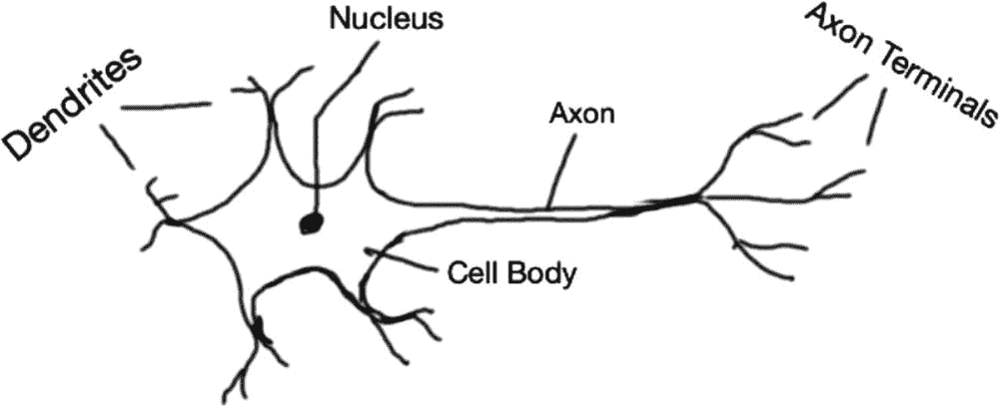
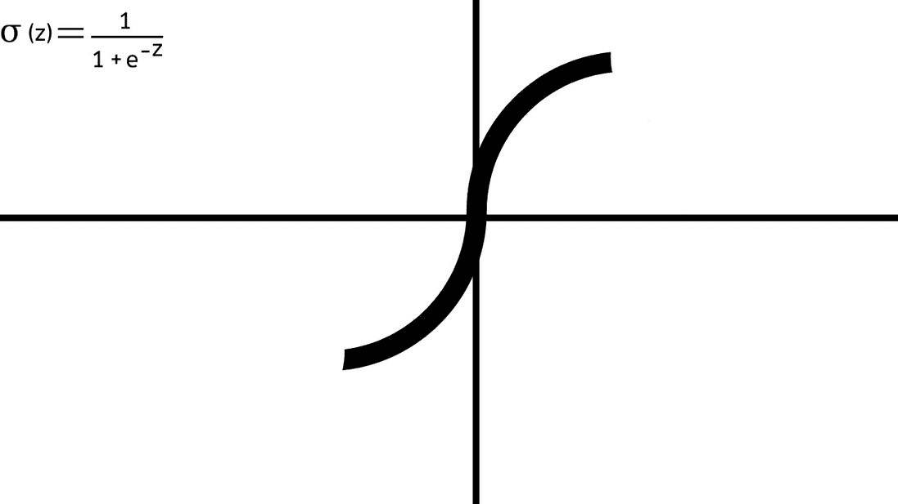
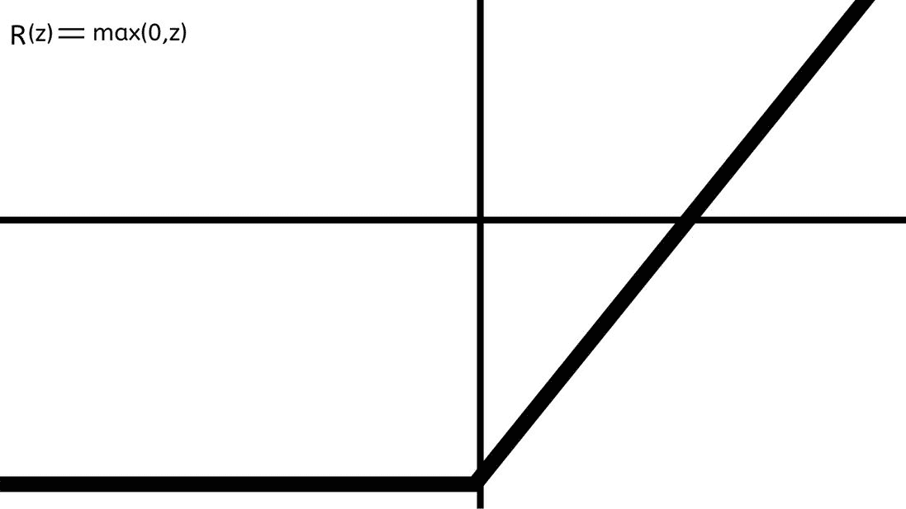
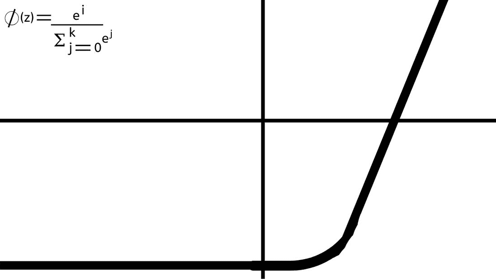
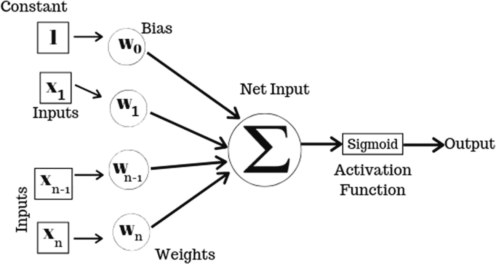
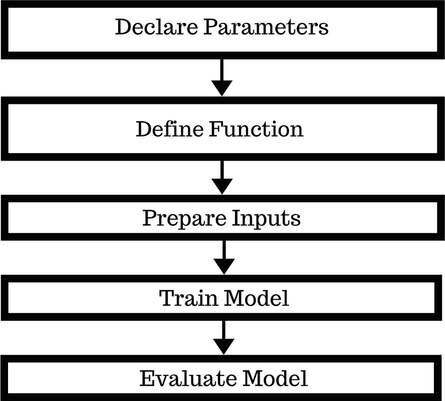
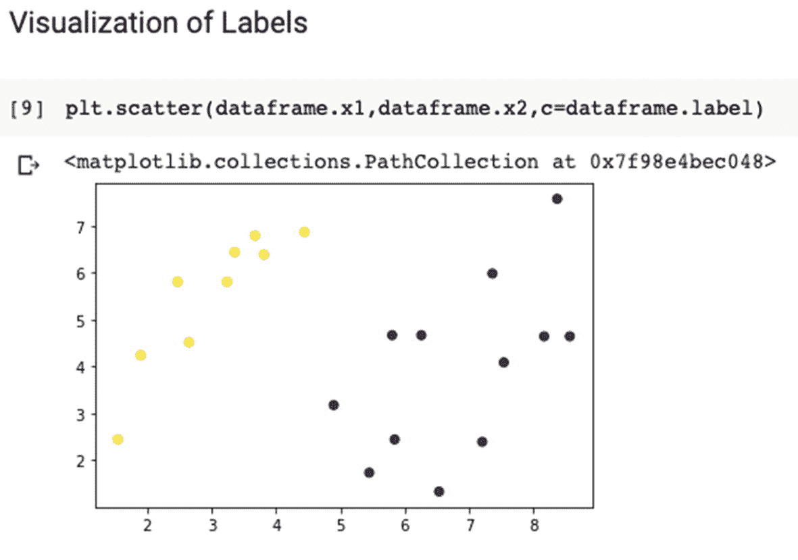

# 二、感知器

在我们开始深度学习并讨论如何使用神经网络之前，我们需要了解什么是神经网络。特别是，我们需要了解神经网络的最基本单元，感知器。一个*感知器*是神经网络的基本单元，其建模方式与人脑中的神经元非常相似。

## 生物神经元

生物神经元是人工神经元的灵感来源。通过模仿生物神经元的工作方式，人类已经使机器能够独立思考。生物神经元是人类神经系统的基本结构和功能单位(见图 [2-1](#Fig1) )。人脑中大约有 860 亿个神经元，约占所有脑细胞的 10%。它们相互连接形成一个网络，参与处理和传输化学和电子信号。细胞核处理从树突接收的信息。*轴突*是神经元用来发送信息的电缆。每个神经元都由以下部分组成:



图 2-1

基本神经元结构

*   细胞体(又称*细胞体*

*   树突

*   轴突

这让我们清楚地了解了生物神经元是如何工作的。现在，让我们比较一下生物神经元和人工神经元的工作方式。

## 人工神经元

一个*人工神经元*是一个数学函数，模仿生物神经元的工作。每个神经元接受输入，分别加权，求和，然后通过一个非线性函数产生输出。每个神经元都有一种叫做*激活信号的内部状态。*每个神经元通过连接链路连接到另一个神经元。

人工神经元的组件包括以下内容:

*   输入信号

*   砝码

*   偏见

*   净投入

*   激活功能

*   输出信号

最简单的人工神经元叫做感知器。我们来详细看看感知器。

## 感觉

感知器是一种算法，用于二进制分类器的监督学习。感知器算法学习输入信号的权重，以便绘制线性决策边界。

这是一种分类算法，它基于将一组权重与特征向量相结合的线性预测函数来进行所有预测。

有两种类型的感知器:

*   单层感知器，处理能力有限。

*   多层感知器或前馈神经网络具有更强的处理能力，因为它们包含两层或更多层。

为了更好地了解感知器是如何工作的，让我们来讨论一下*感知器学习规则。*

### 感知机学习规则

感知器学习规则规定，算法将自动学习最佳权重系数。感知器接收多个输入信号，如果输入信号的总和超过某个阈值，它要么发送信号，要么不返回输出。在监督学习和分类的情况下，这可以用于预测样本的类别。

在我们开始创建感知机之前，我们需要知道如何“激活”它，以帮助它正确处理数据并获得有用的输出。让我们来看看基本的激活功能。

### 激活功能的类型

为了简单起见，我们在本章中介绍了三个最常用的激活功能:

*   Sigmoid 函数

*   ReLU 函数

*   Softmax 函数

### Sigmoid 激活函数

Sigmoid 函数是具有 Sigmoid 曲线的数学函数，也称为“S”曲线(见图 [2-2](#Fig2) )。这是逻辑函数的一种特殊情况，导致值的概率在 0 和 1 之间。



图 2-2

S 形曲线

当我们希望关注概率映射而不是输入参数的精确值时，这是一个有用的激活函数。

Sigmoid 函数的优点如下:

*   它特别适用于我们必须预测概率作为输出的模型。既然任何事物的概率只存在于 0 到 1 的范围内，那么 Sigmoid 就是正确的选择。

*   我们可以在任意两点找到 s 形曲线的斜率。这意味着函数是可微的。

*   这个函数是单调的，但它的导数不是。这意味着函数以这样一种方式变化，它要么从不减少，要么从不增加，但 Sigmoid 函数的导数不是单调的。

Sigmoid 函数的限制如下:

*   对于高度负输入，Sigmoid 输出接近于零。

*   这可能是神经网络训练中的一个问题，并且可能导致学习缓慢以及模型在训练期间陷入局部最小值。

*   由于消失梯度问题，Sigmoid 函数不能用于多层网络。

### ReLU 函数

整流器或 ReLU(整流线性单元)允许我们消除人工神经网络中的负值，因为它是分段线性函数。如果为正，则直接输出输入；否则将给出`0`作为输出(见图 [2-3](#Fig3) )。



图 2-3

ReLU 激活功能

ReLU 函数的优点包括:

*   允许在大型和复杂数据集上更快和有效地训练深度神经架构。

*   神经网络中仅约 50%单元的稀疏激活(因为负值被消除)。

*   有效的梯度传播，这意味着没有消失或爆炸梯度问题。

*   只有比较、加法或乘法的高效计算。

*   伸缩性好。

ReLU 功能的限制包括:

*   在零点不可微。这意味着接近零的值可能会产生不一致或难以处理的结果。

*   非零居中。这造成了数据的不对称性(因为只处理正值)，导致数据处理不均衡。

*   输出值没有限制，并且在传递大值时会导致计算问题。

*   当学习率太高时，ReLU 神经元会变得不活跃并“死亡”

### Softmax 函数

Softmax 或归一化指数函数是逻辑函数的推广，它输出结果属于某个类集的概率。它将任意实值的 K 维向量转换为范围(0，1)内加起来等于 1 的 K 维实值向量(见图 [2-4](#Fig4) )。它类似于神经网络末端的分类逻辑。



图 2-4

Softmax 激活功能

Softmax 功能的优点包括:

*   突出显示最大值。

*   抑制明显低于最大值的值。

*   训练和预测都很快。

Softmax 功能的缺点包括:

*   它不支持空拒绝，所以如果需要的话，我们需要用一个特定的空类来训练算法。

现在你已经知道什么是感知器，并介绍了它所需的激活功能，让我们看看感知器是如何工作的。

## 行动中的感知

感知器过程由四个阶段组成(见图 [2-5](#Fig5) )。接下来的几节将逐一讨论。



图 2-5

感知器处理输入

### 阶段 1:输入的前向传播

感知器接受特征形式的输入，并对其进行处理以预测输出。将该输出与标签进行比较，以测量误差。这被称为*正向传播*。

图中感知器的输入由`[x1,x2......x (n)]`表示，其中`x`代表特征值，`n`代表特征总数。在图 [2-5](#Fig5) 中，我们取 1 为常数，这样它可以乘以偏差而不改变其值。

接下来，计算净输入。

### 第二阶段:净投入的计算

#### 砝码

*权重*是训练模型时随时间计算的值。我们用`[w1,w2,.....w(n)]`来表示感知器的权重。

感知器算法的权重是使用梯度下降从训练数据中估计的。

#### 偏见

在代数术语中，*偏差*允许分类器在指定的方向上将其决策边界向左或向右平移一个恒定的距离。这种偏差有助于更快、更好地训练模型。

在图 [2-5](#Fig5) 所示的例子中，偏置用**w**<sub>T5】0</sub>表示。

#### 净投入

净输入是连续发生的两次计算的结果:

*   首先是每个权重`[w(n)]`与其相关特征值`[x(n)]`的乘积。

*   然后将偏差`[w` <sub>**0**</sub> `]`添加到乘积中。

现在我们有了网络输入，是时候应用激活函数了。

### 第三阶段:激活功能

激活函数为感知器提供非线性。在当前示例中，我们使用 Sigmoid 函数作为激活函数。Sigmoid 函数是为实输入值定义的，并且在每个点上具有非负导数。输出介于 0 和 1 之间。

Sigmoid 函数表示为`f(x) = 1/1+e^-x`。

至此，前向传播完成，但感知器和人工神经元的美妙之处通常在于反向传播过程，在此过程中会发生重新计算。

### 阶段 4:反向传播

误差反向传播有时简称为 *back-propagation* 。它是一种用于使用[梯度下降](https://brilliant.org/wiki/gradient-descent/)的[人工神经网络](https://brilliant.org/wiki/artificial-neural-network/)的监督学习的机制。

梯度下降是一种优化算法，用于找到使成本函数最小化的函数参数值。该方法计算误差函数相对于神经网络权重的梯度。误差计算是通过比较输出和标签来完成的。

预测过程接受输入，并根据其过去的“训练经验”，使用内部状态生成最可能的输出在每次迭代期间计算损失函数，并使用优化函数将其最小化，直到实现收敛。损失函数是对模型计算中的误差的计算。最优化是最小化损失的方法。

梯度的计算通过网络反向进行。这意味着首先计算神经网络最后一层输出的梯度，最后计算第一层的梯度。

来自一个层的梯度的部分计算被重新用于计算前一层的梯度。这种反向信息流允许有效计算每层的梯度。

这种优化算法的工作方式是每次向模型显示一个训练实例。该模型对训练实例进行预测，计算误差，并且更新该模型以便减少下一次预测的误差。该过程可用于找到模型中的一组权重，该组权重导致模型在训练数据上的最小误差。偏差以类似的方式更新，只是没有输入，因为它与特定的输入值无关。

让我们通过使用 TensorFlow 2.0 创建我们自己的感知器来更好地理解感知器的工作原理。

### 项目描述

在本教程中，我们将使用感知器对结构化数据进行分类。这些是在我们的感知机中会发生的步骤:

*   特征和权重被视为矩阵并相乘。

*   然后将矩阵乘法的乘积加到偏差上。

*   使用损失函数计算误差，并进行优化。

图 [2-6](#Fig6) 提供了一个简单的例子来帮助显示个人感知机是如何工作的。



图 2-6

感知器流程图

### 重要术语

*   **目标/标签:**函数的预期输出。

*   **损失函数:**计算每次迭代的误差。误差计算为预期输出值和预测值之间的差值。

*   **优化器:**它最小化损失函数。

*   **迭代:**要进行训练的次数。

*   **混淆矩阵:**它将预测值与目标值进行比较，用一个矩阵表示正确和不正确观测值的个数。

### 必需的库

我们将与以下库合作:

*   TensorFlow 2.0

*   硬

*   NumPy

*   我的天啊

*   熊猫

*   Matplotlib

*   Scikit-Learn

### 程序

在本教程中，我们将通过使用 TensorFlow 分类结构化数据来实现感知器。

### 第一步。导入库

首先导入必要的库。

```py
import numpy as np
import pandas as pd
import tensorflow as tf

from tensorflow import feature_column #reformats structured data for ease in calculations
from tensorflow.keras import layers #to create the layer in the neural network.
from sklearn.model_selection import train_test_split #splits the data for us

from sklearn.metrics import confusion_matrix #calculates the confusion matrix
from sklearn.metrics import accuracy_score #calculates the accuracy score

import matplotlib.pyplot as plt
%matplotlib inline
#so that plots remain within the cell

```

### 第二步。声明参数

在本教程中，我们将两个特征作为输入。这里，`units`表示当前层中存在的神经元的数量。

```py
Number_of_features=2
Number_of_units=1 #indicates number of neurons

```

### 第三步。宣布权重和偏差

使用`tf.Variable()`初始化权重变量，并将其命名为`weights`。使用`tf.zeros()`将`weights`变量设置为`0`。接下来，使用`tf.Variable()`初始化偏差变量，并将其命名为`bias`。使用`tf.zeros()`将`bias`变量设置为`0`。

```py
weight=tf.Variable(tf.zeros([Number_of_features,Number_of_units])) #initializing to zero
bias=tf.Variable(tf.zeros([Number_of_units]))#Initializing to zero

```

### 第四步。定义感知器函数

使用`def perceptron(x)`定义感知器功能。在函数内部，`I`使用`tf.matmul(x,weight)`计算`x`和权重的矩阵乘积，然后使用`tf.add(bias)`将乘积加到偏差上。`tf.sigmoid(I)`使用 Sigmoid 激活函数计算输出。

```py
def perceptron(x):
   I=tf.add(tf.matmul(x,weight),bias)
   output=tf.sigmoid(I)
   return output

```

### 第五步。定义损失函数和优化器

个体损失函数被计算为标签`y`的 Sigmoid 交叉熵的缩减平均值，其中对数是`perceptron(x)`函数的输出。

Sigmoid 交叉熵用于量化两个概率分布之间的差异，在这种情况下，`0`和`1`。使用`tf.optimizers.Adam(.01)`初始化`optimizer`并使用 Adam 优化器:

```py
individual_loss=lambda: abs(tf.reduce_mean(tf.nn.sigmoid_cross_entropy_with_logits(labels=y,logits=perceptron(x))))

optimizer=tf.keras.optimizers.Adam(.01)

```

### 第六步。读入数据

使用`pd.read_csv('data.csv')`读入数据。然后使用`dataframe.head()`查看数据帧的前几行，检查数据是否被正确读取。

```py
dataframe = pd.read_csv('data.csv')
dataframe.head()

```

### 第七步。标签的可视化

为了熟悉这些数据，您可以使用`plt.scatter()`对标记的数据进行快速可视化。

```py
plt.scatter(dataframe.x1,dataframe.x2,c=dataframe.label)

```

输出如图 [2-7](#Fig7) 所示。



图 2-7

标签散点图

### 第八步。准备输入

使用`.as_matrix()`将输入数据`x_input`格式化为矩阵，使用`.as_matrix()`将标签`y_label`格式化为矩阵。这将从数据集中分离出输入和标注。

```py
x_input=dataframe[['x1','x2']].as_matrix()
y_label=dataframe[['label']].as_matrix()

#View the input matrix
x_input

```

### 第九步。初始化变量

使用`tf.Variable()`将`x`初始化为变量。和 dataframe 对象`x_input`。

```py
#Initialize the variable x
x=tf.Variable(x_input)

```

使用`x=tf.cast()`将`x`的`datatype`更改为`float32`。

```py
#Change the datatype of x to 'float32'
x=tf.cast(x,tf.float32)

```

使用`tf.Variable()`和 dataframe 对象`y_label`将`y`初始化为变量。

```py
#Create the variable y
y=tf.Variable(y_label)

```

使用`tf.cast()`将`y`的`datatype`更改为`float32`。

```py
#Change the datatype of y to 'float32'
y=tf.cast(y,tf.float32)

```

### 第十步。训练模型

使用`for`循环训练模型。使用`in range(1000):`将迭代次数设置为`1000`。使用`optimizer.minimize(individual_loss,[weight,bias])`将损耗降至最低。

```py
for i in range(1000):
   optimizer.minimize(individual_loss,[weight,bias])

```

### 第十一步。权重和偏差的新值

通过使用`tf.print(weight,bias)`打印它们的值，查看新的重量和偏差。

```py
tf.print(weight,bias)

```

以下是输出:

```py
 [[-2..42329407]
 [1.85045445]] [1.74988687]]

```

### 第十二步。查看最终损失

通过使用以下公式计算来查看最终损失:

```py
final_loss=tf.reduce_mean(tf.nn.sigmoid_cross_entropy_with_logits(labels=y,logits=perceptron(x)))

```

现在使用`tf.print(final_loss)`打印最终损失的值。

```py
final_loss=tf.reduce_mean(tf.nn.sigmoid_cross_entropy_with_logits(labels=y,logits=perceptron(x)))

tf.print(final_loss)

```

以下是输出:

```py
0.534005582

```

### 第十三步。使用训练好的模型进行预测

使用`ypred=perceptron(x)`和`ypred=tf.round(ypred)`四舍五入输出值，使其成为`1`或`0`。

```py
ypred=perceptron(x)
ypred=tf.round(ypred) #Round off the output value to 1 or 0, to make the comparison with the target easier.

```

### 第十四步。评估模型

使用`accuracy_score(y, ypred)`计算准确度分数。这表明在将预测输出与目标进行比较后，模型的准确性。

```py
accuracy_score(y, ypred)

```

以下是输出:

```py
1.0

```

使用`confusion_matrix(y, ypred)`生成混淆矩阵。如果所有的观察值都落在矩阵的对角线内，其余的值都是`0`，那么这个模型就是 100%准确的。

```py
confusion_matrix(y, ypred)

```

Note

在 TensorFlow 中初始化变量时，始终使用大写`V`。

现在你知道感知器是如何工作的了。在下一章，你将学习一组感知器如何以人工神经网络的形式一起工作。

## 摘要

以下是您在本章中学到的内容:

*   人工神经元是模仿生物神经元的数学函数。

*   感知器是神经网络的基本单元，某些计算使用它来检测输入数据中的功能或商业智能。它映射其输入`x`，该输入乘以学习的权重系数，并生成输出值`f(x)`。

*   感知器学习规则规定，算法将自动学习最佳权重系数。

*   多层感知器，或具有两层或更多层的前馈神经网络，具有更强的处理能力，也可以处理非线性模式。

*   感知器接受特征作为输入。

*   每个感知器都有权重和偏差。

*   当输入在输入层被馈送并被连续处理直到它们到达输出层时，发生正向传播。

*   当计算最后一层的梯度时，发生反向传播，并且每个部分计算被馈送到前一层，直到到达神经网络的第一层。

*   常用的激活函数有 Sigmoid、ReLU 和 Softmax。

*   加权求和是每个权重相乘后得到的值的总和。

*   Sigmoid 函数是具有 Sigmoid 曲线的数学函数。

*   整流器，或 ReLU(整流线性单元)，允许我们消除人工神经网络中的负值。

*   Softmax 或标准化指数函数是逻辑函数的推广。

*   在本章的项目中，您学习了如何对二元分类问题进行预测，如何优化一组权重，如何计算准确度得分，以及如何查看混淆矩阵。