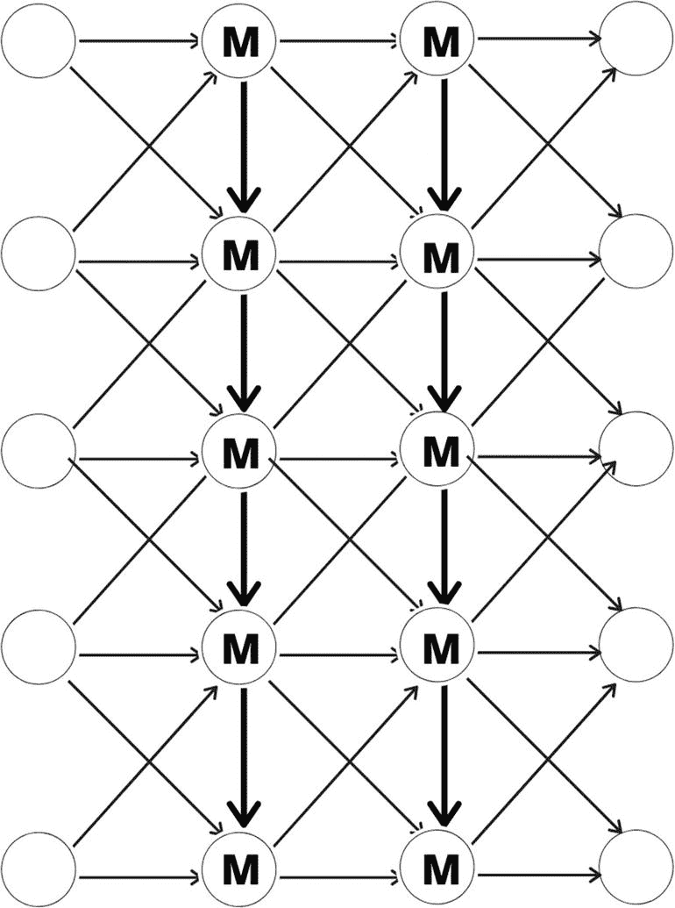
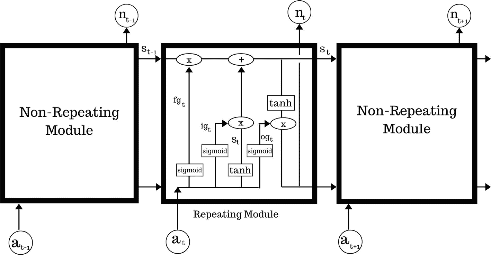
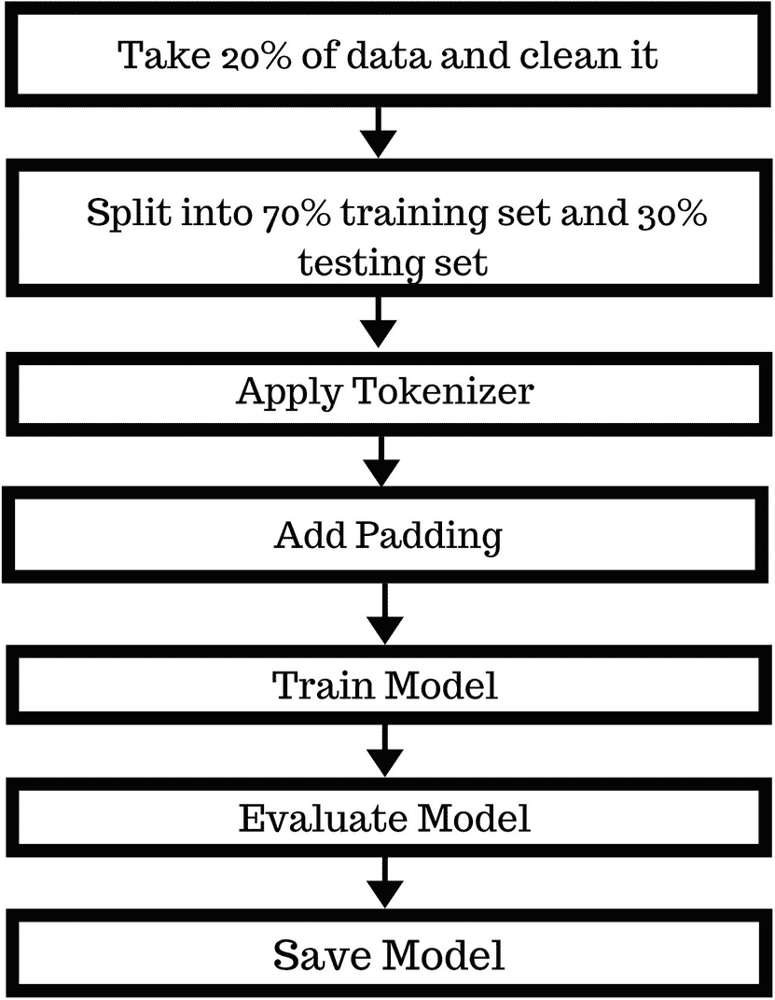
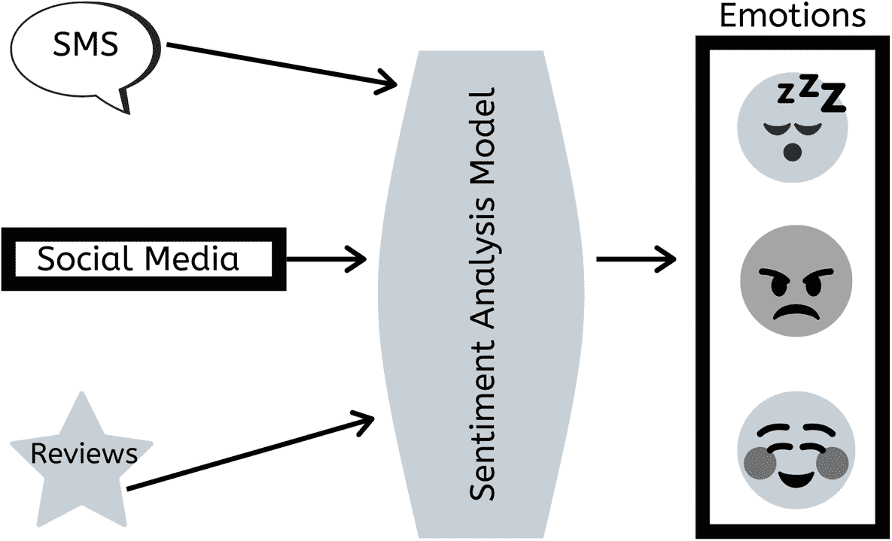
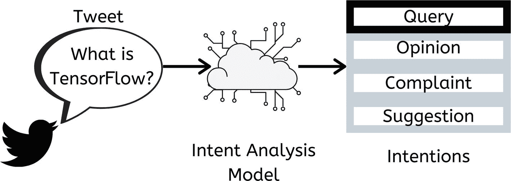
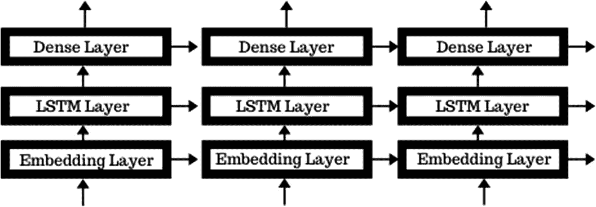

# 四、情感分析

在前一章中，我们学习了不同类型的神经网络。在这一章中，我们学习长短期记忆(LSTM)神经网络。本章中的项目旨在简化，以帮助我们适应 TensorFlow 2.0。我们将首先了解什么是 LSTM 以及我们为什么需要它。然后我们将看看 LSTM 是如何工作的。之后，我们将学习什么是情感分析及其各种类型。我们还将学习如何保存一个训练好的模型并重新加载它，这样我们就可以保存模型并在将来的项目中重用它们。请记住，我们只在这个项目中介绍保存和重新加载一个训练好的模型的过程；但是，您在本书或您自己的书中处理的任何项目都可以保存和重新加载。

## LSM 评论

让我们从理论上了解什么是 LSTM 开始。LSTM 能够学习长期依赖关系。它保持一个相对恒定的误差，允许递归网络通过多个步骤继续学习，以远程链接原因和结果。该误差通过时间和层反向传播。图 4-1 显示了一个基本的 LSTM，其中 M 表示存储单元。第一列神经元是输入层，最后一列神经元是输出层。



图 4-1

基本 LSTM 结构

LSTM 包含门控细胞中循环网络正常流动之外的信息。它本质上是一个存储单元，可以存储、写入或读取信息。

该单元通过模拟门决定存储什么以及何时允许读和写特权。这些门通过 Sigmoids 的逐元素乘法来实现，这些乘法都在 0-1 的范围内。模拟具有可微分的优点，这使得它适合于反向传播。

通过进行猜测、反向传播误差和通过梯度下降调整权重的迭代过程，单元学习何时允许数据进入、离开或删除。

这是“消失梯度”问题的完美解决方案。当我们尝试使用基于梯度的优化技术来训练神经网络模型时，会出现消失梯度问题。

在反向传播过程中，梯度随着通过神经网络向后移动而减小。这意味着初始层中的神经元与后面层中的神经元相比学习非常慢。网络中的初始层是训练最慢的。训练过程花费非常长的时间，并且模型的预测精度降低。

LSTM 通过在遗忘之门激活和梯度计算之间建立联系来解决这个问题。这种连接为信息流创建了一条通过遗忘门的路径，从而确保信息不会被遗忘。

LSTM 的应用包括:

*   手写识别

*   语音识别

*   疾病预测

*   音乐创作

现在您已经知道了什么是 LSTM，以及它在现实生活中的应用，让我们来看看 LSTM 中的过程。

## LSTM 是如何工作的

理解 LSTM 的最好方式是把它想象成一个链状结构，有两个非重复模块和一个重复模块。(参见图 4-2 )。在这种结构中，重复模块有三个门。它们是*输入门、*输出门、和*遗忘门。*细胞状态以最小的线性相互作用连接整个链。

LSTMs 使用一种称为门的结构来调节进出单元的数据流。它们的工作方式类似于条件门(`and`、`or`、`xor`等)。).基于一组条件，他们决定允许哪些信息通过大门。这些条件由 LSTM 决定，不需要明确编程。

*   **遗忘门:**遗忘门的输出通过将矩阵中的一个位置乘以零来告诉单元状态要遗忘哪些信息。如果遗忘门的输出为`1`，则信息保持在单元状态。

*   **输入门:**该门决定哪些信息应该进入单元格状态。这里重要的组件是激活函数。输入门有一个范围为`[0,1]`的 Sigmoid 函数。单元状态的等式是先前单元状态之间的求和，因此 Sigmoid 函数本身只会增加存储器，而不能移除存储器。如果您只能在`[0,1]`之间添加一个浮点数，则该数字永远不会为零。这使得它无法忘记。这就是输入调制门具有`tanh`激活功能的原因。`tanh`有一个`[-1, 1]`范围，允许细胞状态遗忘记忆。

*   **输出门:**该门考虑了所有可能的值，并利用一个 Sigmoid 激活函数来决定哪些信息应该进入下一个隐藏状态。

LSTM 的输入是三维数组的形式。其中第一维表示批量大小，第二维表示我们输入序列的时间步数，第三维表示一个输入序列中的单元数。



图 4-2

对 LSTM 运作的内部观察

*   `S` <sub>`(t-1)`</sub> 是细胞状态

*   `f` <sub>`(gt)`</sub> 是忘年门

*   `i` <sub>`(gt)`</sub> 是输入门

*   `o` <sub>`(gt)`</sub> 是输出门

阶段 1:LSTM 决定从小区状态中丢弃什么信息。这个决定是由使用 Sigmoid 激活函数的遗忘门层做出的。这意味着将分配一个在`0`和`1`之间的值。值`1`代表“存储”，值`0`代表“丢弃”

假设权重为`W` <sub>`fg`</sub> ，偏差为`b` <sub>`fg`</sub> 。现在根据图表，我们有两个输入— `n` <sub>`(t-1)`</sub> 和`a`。两个值都将乘以权重(`W` <sub>`fg`</sub> )，然后结果乘积将被添加到偏差(`b` <sub>`fg`</sub> )。最后，Sigmoid 激活函数将应用于结果。

它可以用数学方法推导如下:

*   f <sub>gt</sub> =乙状结肠(W <sub>fg</sub> 。[n <sub>(t-1)</sub> ，a] + b <sub>fg</sub>

阶段 2:根据剩余的信息，LSTM 决定在单元状态中存储什么新信息。这分两步完成:

1.  输入门图层使用 Sigmoid 函数来决定哪些值将被更新。假设权重为`W` <sub>`ig`</sub> ，偏差为`b` <sub>`ig`</sub> 。

    i <sub>gt</sub> =乙状结肠(W <sub>ig</sub> 。[n <sub>(t-1)</sub> ，a] + b <sub>ig</sub>

2.  一个`tanh`层创建了一个新值的矢量。假设权重为`W` <sub>`c`</sub> ，偏差为`b` <sub>`c`</sub> 。

    S <sub>t1</sub> = tanh( W <sub>c</sub> 。[n <sub>(t-1)</sub> ，a] + b <sub>c</sub>

阶段 3:我们现在结合这两个步骤的结果来创建单元状态的更新。旧的单元格状态`S` <sub>`(t-1)`</sub> 乘以`f` <sub>`gt`</sub> 。然后我们把结果加到`(i`<sub>`gt`</sub>`* S`<sub>`t1`</sub>`)`的乘积上。

*   S<sub>T2</sub>=(f<sub>gt</sub>* S<sub>t-1</sub>)+(I<sub>gt</sub>* S<sub>T1</sub>

阶段 4:最后，LSTM 决定输出。这分两步完成:

1.  输出层使用 Sigmoid 层来决定单元状态的哪些部分将作为输出。假设权重为`W` <sub>`c`</sub> ，偏差为`b` <sub>`c`</sub> :

    o <sub>gt</sub> = Sigmoid( W <sub>og</sub> 。[n <sub>(t-1)</sub> 、a] + b <sub>og</sub>

2.  结果通过一个`tanh`激活函数，得到`-1`和`1`之间的值。然后将结果乘以 Sigmoid 门的输出。

    n<sub>t</sub>= o<sub>gt</sub>S<sub>t</sub>

### LSTM 中的图层

为了设计有效的 LSTM，仅仅知道 LSTM 是如何工作的是不够的。我们还需要了解哪些图层可用于设计 LSTM。它可以有以下类型的层:

*   **嵌入层:**用于为进来的词创建词向量。它位于输入层和 LSTM 层之间。嵌入层的输出是 LSTM 层的输入。

*   **LSTM 层:**循环神经网络层，将序列作为输入，可以返回序列或矩阵。

*   **剔除层:**一种正则化技术，包括在训练期间的每次更新时将输入单元的一部分设置为`0`，以防止过拟合。

*   **密集层:**全连接层，其中每个输入节点连接到每个输出节点。

*   **激活层:**决定 LSTM 使用哪个激活函数来计算节点的输出。

既然您已经了解了 LSTM 的工作原理，您就可以在项目中将其付诸实践了。

## 项目描述

在这个项目中，我们将使用亚马逊评论上的 LSTM 来识别句子中的情感，并确定它们的极性。本质上，我们会发现一个评论是积极的还是消极的。深度学习模型需要数字数据作为输入。由于我们正在进行文本分类，我们需要将文本数据转换成数字向量。为此，我们将使用一种叫做*单词嵌入*的方法。这种方法将每个单词编码成一个 n 维稠密向量，其中相似的单词会有相似的编码。为此，我们将使用 Keras 嵌入层。

我们首先只取总评论的 20%,并创建我们将使用的主要数据框架。这是为了避免我们的系统过载，并可能导致系统崩溃。然后，我们通过删除标点符号和数字、将所有大写字母转换为小写字母以及删除单个字符来清理数据。为了准备模型的数据，我们将其分为 70%用于训练集，30%用于测试集。在此之后，我们将新清理的数据转换为数组，并使用标记器来帮助模型理解每个单词。为了避免数组大小的不兼容问题，我们使用填充。我们继续创建模型并训练它。最后，我们通过检查模型的准确性来评估模型的性能。该过程如图 4-3 所示。



图 4-3

LSTM 情绪分析项目工作流程

### 关于数据集

**名称:** `Amazon_Review_Polarity`

**内容:** 656MB (688，340，758 字节)亚马逊上负面、正面和中性评论的压缩档案

**来源** : [`https://drive.google.com/open?id=0Bz8a_Dbh9QhbaW12WVVZS2drcnM`](https://drive.google.com/open%253Fid%253D0Bz8a_Dbh9QhbaW12WVVZS2drcnM)

**创作人** : [张翔](https://drive.google.com/drive/folders/0Bz8a_Dbh9Qhbfll6bVpmNUtUcFdjYmF2SEpmZUZUcVNiMUw1TWN6RDV3a0JHT3kxLVhVR2M)

Note

建议您为所有项目创建一个粗略的流程图，甚至是您自己正在做的项目，以帮助您更好地组织项目。

### 理解情感分析

情感分析(见图 4-4 )是文本的上下文挖掘，识别和提取源材料中的主观信息。然而，社交媒体流的分析通常仅限于基本的情感分析和基于计数的指标。



图 4-4

情感分析是在各种在线资源上进行的

情感分析是分析文本数据并将观点分类为消极、积极或中立的自动化过程。情感分析是最常用的文本分类工具；其应用包括:

*   社交媒体监控

*   品牌监控

*   客户之声(VoC)

*   客户服务

*   市场调查

*   自动分析调查回复、产品评论和社交媒体评论

我们可以提取表达式的其他属性，例如:

*   极性:当说话者表达肯定或否定的意见时

*   话题:正在谈论的事情

*   **意见持有人:**表达意见的个人或实体

情感分析可以应用于不同层次的范围:

*   **文档级**情感分析获取完整文档或段落的情感。

*   **句子级**情感分析获取单个句子的情感。

*   **子句子级**情感分析获取句子内子表达的情感。

在我们开始我们的项目之前，我们需要理解一些概念，比如不同类型的情感分析以及它们在现实生活中的应用。然后，我们需要理解一次性编码，因为我们将把它应用到我们的数据集。一旦我们设计了我们的模型，我们还需要测试它以确保它表现良好。

#### 情感分析的类型

有许多类型的情绪分析和 SA 工具，从关注极性(积极、消极、中性)的系统到检测感觉和情绪(愤怒、快乐、悲伤等)的系统。)或者识别意图。

##### 细粒度情感分析

通过将情绪的基本类别(积极、中立或消极意见)扩展到以下类别，我们可以更精确地了解意见的极性水平:

*   非常积极

*   积极的

*   中立的

*   否定

*   非常消极

这通常被称为细粒度情感分析。

##### 情感检测

情绪检测旨在检测快乐、沮丧、愤怒、悲伤等情绪。许多情绪检测系统求助于词典(即单词列表和它们传达的情绪)或复杂的机器学习算法。求助于词汇的一个缺点是，人们表达情感的方式千差万别。一些通常表达愤怒的词也可能表达快乐。

##### 基于方面的情感分析

通常，当分析受试者的情绪时，我们可能不仅对人们谈论产品时是正面、中性还是负面感兴趣，还会对人们谈论产品的哪些特定方面或特征感兴趣。

##### 意图分析

意图分析主要检测人们想对文本做什么，而不是人们对文本说什么(见图 4-5 )。有时，可以从文本中推断出意图动作，但其他时候，推断意图需要上下文知识。



图 4-5

一个对 tweet 进行意图分析的简单例子

##### 多语言情感分析

多语言情感分析是一项艰巨的任务。它涉及大量的数据预处理。这些资源中的大部分可以在线获得(例如，情感词典)，但是许多其他资源必须被创建(例如，翻译的语料库或噪声检测算法)。可用资源的使用需要大量的编码经验，并且可能需要很长时间来实现。

另一种方法是自动检测语言，然后为我们选择的语言训练一个定制模型(如果文本不是用英语写的)，最后执行分析。

#### 情感分析算法

有许多方法和算法来实现情感分析系统，并且它们可以被分类如下:

*   **基于规则的**系统根据一组手工制作的规则执行情感分析。通常，基于规则的方法定义了一组识别主观性、极性或观点主题的规则。这些规则可以使用各种输入，例如:
    *   传统的自然语言处理技术，如词干提取、标记化、词性标注和语法分析。

    *   其他资源，如词典(即单词和短语列表)。这个系统非常幼稚，因为它没有考虑单词在序列中是如何组合的。

*   **自动**系统依靠机器学习技术从数据中学习。

*   混合系统结合了基于规则和自动化的方法。

#### 用于评估的情感分析指标

一旦我们设计了我们的模型，我们需要测试它，看看它对情感分析的效果如何。我们可以通过使用下面几节中描述的某些指标来做到这一点。

##### 交叉验证

这包括将训练数据分成一定数量的训练折叠(75%的训练数据)和相同数量的测试折叠(25%的训练数据)。然后，我们使用训练折叠来训练分类器，并对照测试折叠对其进行测试，以获得性能指标。该过程重复多次，并计算每个指标的平均值。

如果我们的测试集总是相同的，我们可能会过度适应该测试集，这意味着我们可能会根据给定的数据集调整我们的分析，以至于我们无法正确地分析不同的数据集。

##### 精确

这度量了在*被预测(正确和不正确)*属于给定类别的所有文本中，该文本被预测为属于该类别的程度。

##### 回忆

这测量文本如何在所有文本中被正确地预测为属于给定类别，其中*应该被预测为属于该类别的*。我们输入分类器的数据越多，召回率就越高。

##### 准确

这度量了从语料库中的文本中正确预测了多少文本(包括属于某个类别和不属于该类别)。

最常见的是，精确度和召回率被用来衡量性能，因为精确度本身并不能说明一个分类器的好坏。

##### 混合方法

当我们将各种情感分析方法和技术结合在一起时，我们得到了混合的情感分析方法和技术。

#### 影响模型性能的参数

影响我们模型性能的因素是参数，下面讨论最常见的参数。

##### 主观性和语气

主客观文本的检测与分析其语气同样重要。事实上，所谓的*客观*文本并不包含明确的情感。所有的*谓词*(形容词、动词和一些名词)在创造情感的方式上不应该被同等对待。

##### 背景和极性

所有的话语都是在语境中产生的。脱离上下文分析情感变得相当困难。然而，如果没有明确提到上下文，机器就无法学习上下文。如果我们要考虑文本产生的至少一部分上下文，就需要大量的预处理或后处理。

##### 讽刺和挖苦

字面意思和预期意思(即反语)之间的差异以及更具侮辱性或荒谬性的反语(即讽刺)通常会将积极情绪转变为消极情绪，而消极或中性情绪可能会转变为积极情绪。然而，发现讽刺和挖苦需要对文本产生的背景进行大量的分析，因此，很难自动完成。

##### 比较

情感分析仍然不够先进，不足以理解比较。这类陈述容易出错。

##### 定义中性情绪

定义我们的类别——在这种情况下，是中立的标签——是这个问题最重要的部分之一。由于标记数据要求标记标准一致，因此必须对问题进行良好的定义。

中性标签可能包含:

*   客观文本

*   无关信息

*   包含愿望的文本

##### Tokenizer

记号赋予器用于对文本语料库(我们正在处理的文本数据)进行矢量化，方法是将文本转换为整数序列(每个整数都是字典中记号的索引)或向量，其中每个记号的系数可以是二进制的或基于字数的。

Note

`0`是一个保留索引，不会分配给任何单词。

通过将`verbose`设置为`0`、`1`或`2`，您可以决定如何显示每个时期的训练进度。

*   `verbose=0`什么都不会给你看(沉默)。

*   `verbose=1`会显示一个动画进度条，如下所示:


*   `verbose=2`会提到这样的历元数:


##### H5 文件

为了保存我们的模型，我们需要将重量存储在 H5 文件中。它是以分层数据格式(HDF)保存的数据文件。它包含科学数据的多维数组。

##### JSON 文件

当保存我们的模型时，JSON 文件存储了关于层的信息和每个层使用的数量，以便可以很容易地重新加载。JSON 文件以 JavaScript Object Notation (JSON)格式存储简单的数据结构和对象，这是一种标准的数据交换格式。它主要用于在 web 应用程序和服务器之间传输数据。JSON 文件是轻量级的、基于文本的、可读的，并且可以使用文本编辑器进行编辑。

你现在应该对这个项目有一个清晰的了解，并且已经学习了一些新的术语。我们可以开始了。

## 必需的库

对于这个项目，您将使用在本书第一章中安装的基本库。此外，还有一些我们需要的其他库。以下是该项目所需的所有库的列表:

*   NumPy(安装说明见第一章)

*   TensorFlow(安装说明见第一章)

*   熊猫(安装说明见第一章)

*   Keras(安装说明见第一章)

*   Scikit-Learn(安装说明见第一章)

*   re(内置 Python 库)

看起来我们已经拥有了这个项目所需要的所有库。让我们把重点放在我们的项目中想要使用的层的类型和每种类型的层的数量上。

## LSM 体系结构

我们将在这个项目中使用的模型是一个简单的 LSTM。我们希望专注于识别基本情绪，包括积极的情绪(高兴、兴奋等)。)和消极(难过、担心等。).我们不会陷入被动攻击或类似的复杂情绪。图 4-6 是该 LSTM 结构的直观表示。



图 4-6

用于情感分析的 LSTM 架构

为了更好地理解我们的模型是如何工作的，让我们来看看 LSTM 的“蓝图”。我们只处理了 20%的数据集，所以我们的模型不需要太复杂。我们的模型将包括以下内容:

*   嵌入层- 1

*   LSM 层- 1

*   密集层- 1

我们将使用 Keras 嵌入层来训练我们自己的自定义单词嵌入模型。该层用随机权重初始化，并被定义为网络的第一个隐藏层。LSTM 层分别学习什么是积极情绪和消极情绪。然后，它存储这些信息，这样它就可以识别数据并将其分类为积极情绪或消极情绪。最后，密集层是一个完全连接的层，确保模型学习良好并提高其准确性。

*   **激活函数:**我们将使用 Softmax 函数，因为它可以识别情绪并进行分类。

*   **损失函数:**模型通过损失函数进行学习。这是一种评估特定算法对给定数据的处理效果的方法。如果预测与实际结果偏离太多，损失函数就会很大。如果偏差较小，损失函数将较小。我们将使用*二进制交叉熵，*也称为 *Sigmoid 交叉熵*损失。它是 Sigmoid 激活和交叉熵损失的组合。它独立于每个矢量分量(类)，这意味着为每个输出矢量分量计算的损耗不受其他分量值的影响。这使得它非常适合多标签分类，在这种分类中，属于某个类的元素不应该影响另一个类的决策。它被称为二元交叉熵损失，因为它为每个类建立了一个二元分类问题。

*   优化器:Adam 优化器是大多数项目的理想选择。本章中的项目相当简单，所以 Adam 优化器很好。

*   **度量:**为了检查我们的模型是如何工作的，我们现在只测量准确性。

我们已经规划好了我们的架构。剩下的就是实现模型了。

## 程序

让我们回顾一下我们将在这个项目中使用的代码。

### 第一步。导入库

首先为这个项目导入必要的库。

```py
import tensorflow as tf
import numpy as np
import pandas as pd
import re
import keras
from keras import Model
from tensorflow.keras.layers import Flatten,LSTM, Dense, Flatten, Embedding
from tensorflow.keras.preprocessing.sequence import pad_sequences
from tensorflow.keras.utils import to_categorical
from tensorflow.keras.models import Sequential
from keras_preprocessing.text import Tokenizer
from keras.initializers import glorot_uniform
from sklearn import model_selection

```

### 第二步。加载数据

加载数据，数据为`.csv`格式。然后使用`file.readlines()`阅读评论中的每一行。

```py
#Read in data
with open('train.csv', 'r') as file:
   text = file.readlines()

```

现在您使用 Pandas 创建一个名为`x_train`的空数据帧。这将用于仅存储分析所需的数据。

```py
#create empty dataframe
x_train = pd.DataFrame()

```

您需要初始化两个列表。列表将评论中的所有单词存储为字符串。使用一个`for`循环，你可以指出单词被一个空格分开。然后，循环检测评论中的单词，并将它们存储为字符串。最后，这些列表被转换成序列，准备存储在数据帧中。第一个系列命名为`consumer_review`，第二个系列命名为`polarity_label`。此时，数据已经加载到系统中。现在是为模型准备数据的时候了。

```py
# fill in dataframe
word=[]
label=[]
for n in text:
   n=n.split()
   label.append(1) if n[0] =="__label__2" else label.append(0)
   word.append(" ".join(n[1:]))
x_train['consumer_review'] = word
x_train['polarity_label'] = label
#view dataframe
x_train

```

### 第三步。准备数据

正如项目描述中提到的，我们现在只使用总数据的 20%。因此，您使用`sklearn`中的`model_selection.train_test_split`函数来表明，在整个数据集中，您只希望使用其中的 20%。

```py
#use only 20% of data to avoid overloading your system. You can reduce or increase this number according to your convenience.
_, x_set,_, y_set = \
   model_selection.train_test_split(x_train['consumer_review'],
                                    x_train['polarity_label'], test_size=0.02)

```

### 第四步。清理数据

计算机不能像人类那样阅读文本。因此，您需要重新格式化数据集中的评论，使它们更易于系统理解。这意味着您需要删除大写、标点和冠词(a、an 和 the)。为此，您将定义一个自定义函数。

```py
#data cleaning function
def data_prep(in_tex):
   # Remove punctuations and numbers
   out_tex = re.sub('[^a-zA-Z]', ' ', in_tex)
   # Convert upper case to lower case
   out_tex="".join(list(map(lambda x:x.lower(),out_tex)))
   # Remove single character
   out_tex= re.sub(r"\s+[a-zA-Z]\s+", ' ', out_tex)
   return out_tex

```

将这个新清理的数据集存储在名为`text_set`的新列表中:

```py
#create new list with clean data
text_set=[]
for reviews in list(x_set):
   text_set.append(data_prep(reviews))

```

现在，您创建一个新的数据帧来存储干净的数据。如果您使用与以前相同的数据帧，原始数据将被干净的数据覆盖。

```py
x_train= pd.DataFrame()
x_train['consumer_review'] = text_set
x_train['polarity_label'] = list(y_set)

```

这些数据是干净的，但是仍然需要更多的预处理。首先将其分为 70%用于训练数据集，30%用于测试数据集。您像以前一样使用来自`sklearn`的相同的`split`函数。

```py
#split data into 70% train and 30% test
x_train, x_test, y_train, y_test = \
   model_selection.train_test_split(x_train['consumer_review'],
                                    x_train['polarity_label'], test_size=0.30)

```

为了应用标记器，您需要将列表转换成数组。这样更容易处理。

```py
#convert to array
x_train=np.array(x_train.values.tolist())
x_test=np.array(x_test.values.tolist())
y_train=np.array(y_train.values.tolist())
y_test=np.array(y_test.values.tolist())

```

应用记号赋予器。

```py
#tokenizer
tokenizer = Tokenizer()
tokenizer.fit_on_texts(x_train)
word_index=tokenizer.word_index
total_size = len(word_index)+1

print(total_size)

```

输出:

```py
22259

```

将文本输入转换为序列。这是模型最容易处理的形式。

```py
#text to sequence
x_train = tokenizer.texts_to_sequences(x_train)
x_test = tokenizer.texts_to_sequences(x_test)

```

为了避免由于数组大小造成的不兼容性，您必须向数据添加填充。

```py
#add padding to ensure the same length
max_length = 100
x_train = pad_sequences(x_train, padding="post", maxlen=max_length)
x_test = pad_sequences(x_test, padding="post", maxlen=max_length)

```

### 第五步。构建模型

使用 Keras 嵌入层、LSTM 层和密集层构建模型。

```py
#Create Model
model = Sequential()
model.add(Embedding(total_size, 20, input_length=max_length))
model.add(LSTM(32,dropout=0.2, recurrent_dropout=0.2))
model.add(Dense(1, activation="sigmoid"))

```

### 第六步。编译模型

接下来，您指定要使用的优化器是 Adam，损失函数是二进制交叉熵，您想要关注的度量是准确性。

```py
#compile
model.compile(optimizer='adam', loss="binary_crossentropy", metrics=['acc'])
print(model.summary())

```

### 第七步。训练模型

现在，通过将批处理大小设置为 128，将时期设置为 5，将详细设置为 1 来训练模型。这些设置可以微调，以获得更好的效果。

```py
model.fit(x_train, y_train, batch_size=128, epochs=5, verbose=1, validation_data=(x_test, y_test))

```

### 第八步。保存模型(可选)

如果需要，可以保存模型的当前状态以备将来使用。

```py
model.save("model.h5")

```

### 第九步。导入预训练模型(可选)

此代码用于重新加载您训练的模型，以便您可以在相同或不同的数据集上使用它。

```py
model = keras.models.load_model("model.h5")

```

您已经成功完成了情感分析。精确度相当不错，但是如果你想把它投入使用，这个模型肯定需要更多的训练。

## 进一步测试

你在这个项目里做的情感分析真的很简单。它有很大的实验空间。以下是一些修改和通过这个项目学习更多的想法:

*   添加更多 LSTM 图层

*   添加更密集的层

*   尝试不同的优化功能

## 解决纷争

以下是一些可能会出现但很容易修复的常见错误:

*   `"Warning: No` [`read.me`](http://read.me) `file"`。这表明`package.json`文件丢失。`package.json`文件跟踪项目的依赖关系。在安装模块之前，首先使用`npm init`，因为它会为您创建`package.json`文件。

*   `"Error: Missing DLL"`。此错误消息可能意味着以下情况之一:`"Cannot execute binary file"`。有两种方法可以解决此错误:
    *   您的 Windows 版本没有更新。您必须确保您使用的是最新版本的 Windows。

    *   该项目没有对`C:\Users\\AppData\Local\Microsoft\Windows\ or C:\Users\\AppData\Local\Temp`文件夹的完全访问权限。最好使用`admin`帐户，它拥有对所有文件的完全访问权限，或者向管理员请求访问权限。

    *   通过将`-s`选项传递给`ln`命令，后跟目标文件和链接名称，创建一个符号链接。

    *   不要用`apt-get`安装，因为这不是一回事。

*   `"npm WARN package.json chat@4.5.0 No repository field"`。

```py
npm WARN package.json chat@4.5.0 No README data
npm ERR! Windows_NT 6.1.7600
node_modules\\npm\\bin\\npm-cli.js" "install"
npm ERR! node v4.5.0
npm ERR! npm v2.15.9
npm ERR! code ENOENT
npm ERR! errno ENOENT
npm ERR! syscall getaddrinfo
npm ERR! enoent getaddrinfo ENOENT registry.npmjs.org:443
npm ERR! enoent This is most likely not a problem with npm itself
npm ERR! enoent and is related to npm not being able to find a file.
npm ERR! enoent
npm ERR! Please include the following file with any support request:
npm ERR! C:\xampp\htdocs\chat\npm-debug.log. "

```

这些错误表明您已经安装了 NodeJS。如果 Keras Tokenizer 导致问题，请使用以下替代方法:

```py
from keras.preprocessing import text
tokenizer = text.Tokenizer(...)

```

Note

不导入也不暴露文本子模块。所以有时候可能会导致错误。但是，可以使用本节中讨论的修复方法来处理此错误。

## 摘要

以下是您在本章中学到的所有内容的快速回顾:

*   LSTM 能够学习长期依赖关系。LSTM 的应用包括手写识别、语音识别、疾病预测和音乐创作。

*   模拟具有可微分的优点，这使得它适合于反向传播。

*   LSTMs 是“消失梯度”问题的完美解决方案，当我们试图使用基于梯度的优化技术来训练神经网络模型时，就会出现这种问题。

*   LSTM 中的门是遗忘门、输入门和输出门。

*   LSTM 决定从单元状态中丢弃什么信息。这个决定是由“忘记门层”做出的，它使用了一个 Sigmoid 激活函数。

*   准确性是衡量我们的机器学习模型在预测给定观察的正确类别方面有多好的一个指标。不要在不平衡的问题上使用准确性。

*   该模型通过损失函数进行学习。这是一种评估特定算法对给定数据的处理效果的方法。如果预测与实际结果偏离太多，损失函数就很大。如果偏差小，损失函数也小。

*   情感分析是文本的上下文挖掘，从源材料中识别和提取主观信息。然而，社交媒体流的分析通常局限于基本的情感分析和基于计数的指标。情感分析是分析文本数据并将观点分类为消极、积极或中立的自动化过程。这是最常见的文本分类工具。

*   通过细粒度的情感分析，我们可以更精确地了解意见的极性水平，方法是将积极、中立和消极意见的基本类别扩展到以下类别:非常积极、积极、中立、消极和非常消极。

*   有许多方法和算法来实现情感分析系统，并且它们被分类为基于规则的、自动的和混合的。

*   交叉验证包括将训练数据分成一定数量的训练折叠(75%的训练数据)和相同数量的测试折叠(25%的训练数据)。然后，使用训练折叠来训练分类器，并根据测试折叠对其进行测试，以获得性能指标。该过程重复多次，并计算每个指标的平均值。如果测试集总是相同的，您将冒过度适应该测试集的风险，这意味着您可能会根据给定的数据集调整您的分析，以至于无法分析不同的数据集。

*   精度衡量*被预测(正确和不正确)*属于给定类别的所有文本中，该文本被正确预测为属于该类别的程度。

*   召回衡量在所有文本中*应该被预测*属于给定类别的文本被正确预测为属于该类别的程度。我们输入分类器的数据越多，召回率就越高。

## 参考

本章中使用的资源如下:

*   情绪分析: [`https://monkeylearn.com/sentiment-analysis/`](https://monkeylearn.com/sentiment-analysis/)

*   硬标记器： [`https://keras.io/preprocessing/text/`](https://keras.io/preprocessing/text/)

## 进一步阅读

你有兴趣了解本章中的一些主题吗？这里有一些很棒的链接可以查看:

*   关于 LSTM: [`https://colah.github.io/posts/2015-08-Understanding-LSTMs/`](https://colah.github.io/posts/2015-08-Understanding-LSTMs/)

*   用 Keras 嵌入单词: [`https://machinelearningmastery.com/use-word-embedding-layers-deep-learning-keras/`](https://machinelearningmastery.com/use-word-embedding-layers-deep-learning-keras/)

*   极性和基于主题的情感分析的区别: [`https://blog.bitext.com/polarity-topic-sentiment-analysis`](https://blog.bitext.com/polarity-topic-sentiment-analysis)

*   文字的极性和强度: [`www.aclweb.org/anthology/W18-3306/`](http://www.aclweb.org/anthology/W18-3306/)

*   情感分析极性: [`www.kdnuggets.com/2018/08/emotion-sentiment-analysis-practitioners-guide-nlp-5.html`](http://www.kdnuggets.com/2018/08/emotion-sentiment-analysis-practitioners-guide-nlp-5.html)

*   保存和加载预训练模型: [`www.tensorflow.org/tutorials/keras/save_and_load`](http://www.tensorflow.org/tutorials/keras/save_and_load)