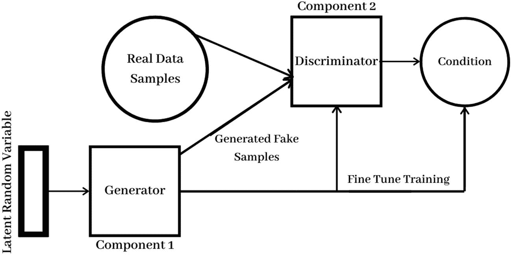
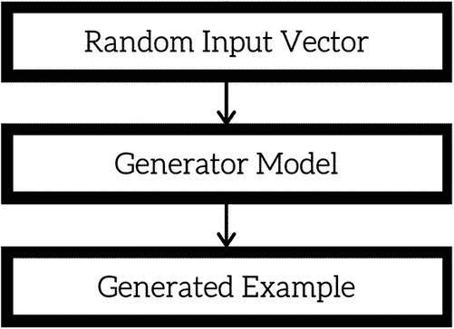
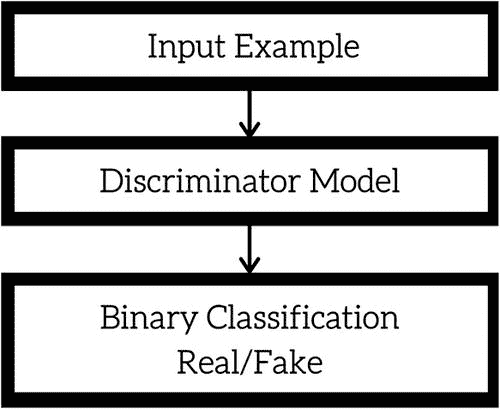
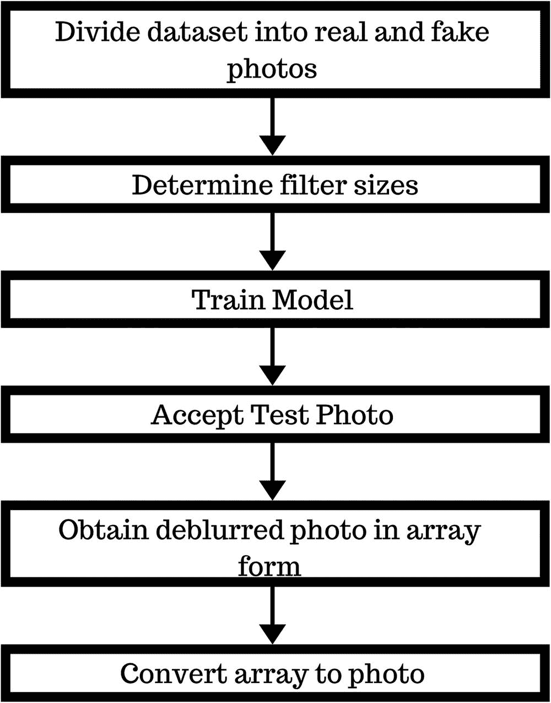
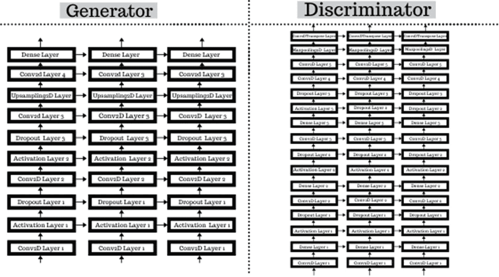
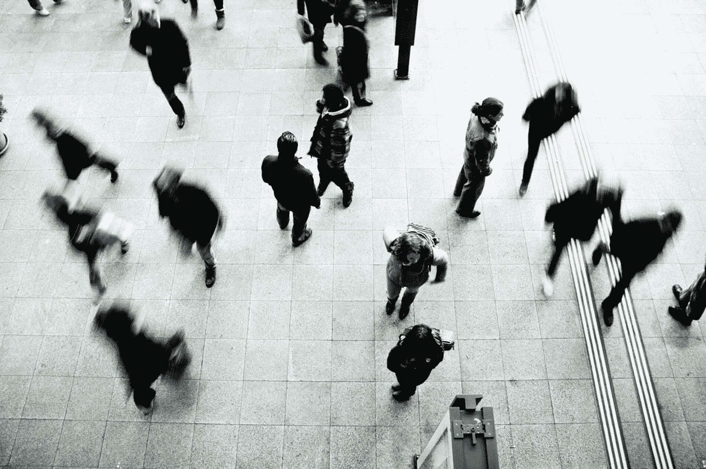

# 七、图像去模糊

在前一章中，我们讨论了图像着色，这是使用 Photoshop 等工具完成的。现在让我们来谈谈 Photoshop 通常用于的另一项任务，但我们可以使用神经网络来自动化这项任务。在这一章中，我们将讨论图像去模糊。我们将在这个项目中使用一个与 VGG-16 结合的生成性对抗网络(GAN)。首先，我们将了解什么是 GAN 以及它是如何工作的。然后，我们将仔细看看什么是图像去模糊。

## 什么是甘？

生成对抗网络(GANs)是一类强大的神经网络，与[无监督学习](https://www.geeksforgeeks.org/supervised-unsupervised-learning/)一起使用。gan 由两个相互竞争的神经网络模型组成，能够分析、捕获和复制数据集中的变化。

GANs 由两种成分组合而成。一个称为*生成器*，它生成新的数据实例，而另一个称为*鉴别器*，评估实例的真实性。换句话说，鉴别器决定它检查的每个数据实例是否属于实际的训练数据集。

即使在原始数据中引入少量噪声，主流神经网络也经常会对事物进行错误分类。这是因为大多数模型从有限的数据中学习，这使它们容易过拟合。此外，输入和输出之间的映射几乎是线性的。各种类别之间的分离边界似乎是线性的，但实际上，它们是由线性组成的，即使特征空间中某个点的微小变化也可能导致数据错误分类。

### gan 的类型

一些常用的方法如下:

*   **香草甘:**这是最简单的一种甘。这里，生成器和鉴别器是简单的多层感知器。算法真的很简单；它试图使用随机梯度下降来优化数学方程。

*   **条件 GAN(CGAN):**CGAN 可以描述为一种深度学习方法，其中一些条件参数被放置到位。将一个附加参数 y 添加到生成器中，以生成相应的数据。标签也被用作鉴别器的输入，以帮助区分真实数据和伪造生成的数据。

*   **深度卷积 GAN(DCGAN):**DCGAN 是 GAN 最成功的实现之一。它由神经网络代替多层感知器组成。ConvNets 的实现没有最大池。它们被卷积步幅所取代。此外，这些层没有完全连接。

*   **拉普拉斯金字塔 GAN (LAPGAN):** 拉普拉斯金字塔是一种线性可逆图像表示，由一组带通图像组成，间隔一个倍频程，加上一个低频残差。这种方法使用多个生成器和鉴别器网络以及不同级别的拉普拉斯金字塔。主要使用这种方法是因为它可以产生非常高质量的图像。在金字塔的每一层对图像进行下采样，然后在每一层反向放大，图像从条件 GAN 获取一些噪声，直到达到其原始大小。

*   **超分辨率 GAN(SRGAN):**SRGAN 是一种设计 GAN 的方法，其中深度神经网络与对抗网络一起使用，以产生更高分辨率的图像。它有助于优化放大原始低分辨率图像以增强其细节，同时最大限度地减少误差。

gan 的应用包括:

*   生成图像数据集的示例

*   生成人脸照片

*   生成逼真的照片

*   生成卡通人物

*   图像到图像的翻译

*   文本到图像的翻译

*   语义图像到照片的翻译

*   人脸正面视图生成

现在，您应该了解了什么是 GAN，以及它在现实生活中的应用。让我们看看 GAN 内部的过程。

## GAN 是如何工作的

gan 可分为两个主要部分，发生器(第一部分)和鉴别器(第二部分)(见图 7-1 )。



图 7-1

氮化镓的组成部分

### 生成模型

生成模型根据概率模型描述了数据是如何生成的。它捕捉数据的分布，并以这样一种方式进行训练，即它试图最大化鉴别器出错的概率。

生成器模型将固定长度的随机向量作为输入，并在域中生成样本。该向量从高斯分布中随机抽取，并且该向量用于生成过程的种子。在训练之后，这个多维向量空间中的点将对应于问题域中的点，形成数据分布的压缩表示。

这个向量空间被称为潜在空间，或者由潜在变量组成的向量空间。潜在变量，或隐藏变量，是那些对一个领域很重要但不能直接观察到的变量。

在 GANs 的情况下，生成器模型将意义应用于所选潜在空间中的点，使得从潜在空间中提取的新点可以被提供给生成器模型作为输入，并用于生成新的不同的输出示例。在训练之后，生成器模型被保留并用于生成新的样本。见图 7-2 。



图 7-2

发电机过程的流程图

### 发电机内的过程

鉴别器空闲时，发电机被训练。G(z)给出了与实际输入相同的形状。例如，如果 10*10 的图像是真实输入，那么 G(z)产生相同的形状，但是我们希望我们的生成器最大化伪数据，并使用最大化真实数据同时最小化伪数据的鉴别器。

*   **max v(di)= en ~ rdata(n)[logd(n)]+ey ~ gy(y)[log(1-d(g(z)]]**

    **迪**

    G <sub>损失</sub> = log (1-Di(G(y)))

**其中:**

G <sub>损耗</sub> =发电机损耗

Di =鉴别器

G(y) =发电机的输出

y =噪声矢量

**步骤 1:** 发电机 Ge 根据其噪声计算损耗，作为 Ge 损耗。

**第二步:**反向传播

*   **V (Di，Ge)= E**<sub>**n ~ Rdata(n)**</sub>**【logD(n)】+ E**<sub>**y ~ G(y)**</sub>**【log(1-Di(G(y)))】**

**其中:**

Ge =发电机

Di =鉴别器

n =来自 Rdata(n)的训练样本

D(n) =鉴频器的输出

G(y) =发电机的输出

y =噪声矢量

一旦我们得到这两个损耗，我们计算关于它们的参数的梯度，并通过它们的网络独立地反向传播，以从损耗中学习(调整关于损耗的参数)。)

这种方法重复几个时期，然后手动检查准确性。如果看起来可以接受，那么就停止训练；否则，它将被允许继续运行几个纪元。

### 鉴别器模型

鉴别器是一个正常的分类模型。鉴别器的目标是估计接收到的样本来自训练数据而不是来自生成器的概率。鉴别器模型从域中取一个例子作为输入(真实的或生成的)，并预测一个真实或虚假的二元类标签(生成的样本)。见图 7-3 。

真实的例子来自训练数据集。生成的示例由生成器模型输出。在训练过程之后，鉴别器模型被丢弃，因为我们对生成器感兴趣。



图 7-3

鉴别器过程的流程图

Note

发生器和鉴别器都经过各自的反馈回路。

鉴别者试图使其报酬 V(Di，Ge)最小化，而生产者试图使其损失最大化。

### 鉴别器内的过程

鉴别器在发电机空闲时进行训练。在此阶段，网络仅向前传播，不进行向后传播。在这个阶段，鉴别器在假生成的数据以及真实数据上被训练，以查看它是否能够正确地预测它们。

在鉴别器被生成器生成的假数据训练后，我们可以得到它的预测，并使用结果来训练生成器。这导致了一个比前一个状态更好的结果，所以我们可以尝试欺骗鉴别器。它以介于`0`(代表真实)和`1`(代表虚假)之间的数字的形式返回概率。正如我们在下面的公式中看到的，D(x)和 D(G(z))给出了一个介于 0 和 1 之间的分数:

*   **Min V Ge E**<sub>**y ~ py(y)**</sub>**【log(1-Di(Ge(y)))】**

*   **葛**

*   DL <sub>实</sub> =日志(di(n))<sub>假</sub> =日志(1-D(G)))

*   DL = DL <sub>实数</sub> + DL <sub>假</sub> = >日志(D(n)) +日志(1-D(G(y)))

**其中:**

Di =鉴别器

n =来自 Rdata(n)的训练样本

D(n) =鉴频器的输出

G(y) =发电机的输出

y =噪声矢量

DL <sub>真实</sub> =真实样本的损失

DL <sub>fake</sub> =丢失虚假/生成的数据

**步骤 1:** 我们从随机分布中取出一些噪声，并将其馈送给 Ge 生成器，以产生伪 n(标签 y=0) → (n，y)输入-标签对。

**第二步:**我们取这个假对和真对 n(标号 y =1)交替馈给 Di 鉴别器。

**第三步:**Di 鉴别器是一个二元分类神经网络，所以它运行两次*。*它计算假 n 和真 n 的损失，并将它们合并为最终损失，Di 损失。

训练 GAN 的技巧:

*   训练鉴别器时，保持发生器值不变。训练发生器时，保持鉴别器不变。每个人都应该针对静态的对手进行训练。这使得生成器能够更好地读取它必须学习的梯度。

*   GAN 的每一边都可以压倒另一边。如果鉴别器太好，它将返回非常接近`0`或`1`的值，发生器将难以读取梯度。如果生成器太好，它将持续利用鉴别器中的弱点，导致假阴性。这可以通过母语英语教师各自的学习速度来缓解。

## 项目描述

在这个项目中，我们将训练一个 GAN 接受模糊的照片作为输入，消除模糊，并返回清晰的，消除障碍的图像作为输出。甘需要很长时间来训练。因此，在这个项目中，我们将我们的定制 GAN 与预训练的 VGG-16 模型相结合。这将节省计算资源和时间，并给我们更好的结果。该过程如图 7-4 所示。



图 7-4

图像去模糊流程图

### 关于数据集

**名称:** CERTH 图像模糊数据集

**内容:**

训练集:

*   630 张无失真图像(原件)

*   220 张自然模糊的图像(在拍照时模糊)

*   150 张人工模糊图像(使用软件模糊)

由“自然模糊”集和“人工模糊”集组成的评估集。

自然模糊集:

*   589 个不失真的图像

*   411 自然模糊的图像

人造模糊集:

*   30 幅不失真的图像

*   450 张人工模糊的图像

**来源:** [`https://mklab.iti.gr/results/certh-image-blur-dataset/`](https://mklab.iti.gr/results/certh-image-blur-dataset/)

创建者: E. Mavridaki 和 V. Mezaris

### 重要术语和概念

#### 图像去模糊

*图像去模糊*是去除图像模糊的过程。模糊通常是由散焦像差、运动模糊和高斯模糊等引起的。

当一个像素的值受到相邻像素的影响时，就会出现图像模糊。

#### 散焦

*散焦*是一种模糊，因为主要元素不仅出现在活动的像素上，还出现在相邻像素上。这可能是由于焦距调整不当或缺少对焦元件造成的。

#### 运动模糊

*运动模糊*也是一种模糊，因为相同的信号与物体一样落在不同的接收器单元上，或者物体正在运动。

目标是从模糊的图像中恢复清晰的图像。

#### 盘旋

在数学上，这个过程表示如下:

*   BI = SI*BK

其中 BI 是模糊的输入图像。我们需要找到清晰的图像(SI)和模糊的内核(BK)。当我们把它们相乘时，叫做*卷积*。我们说 SI 与 BK 卷积生成模糊图像(BI ),其中 BK 是模糊。

模糊(BK)通常被建模为点扩展函数，并与假设的清晰图像(SI)卷积以获得模糊图像(BI)，其中清晰图像(SI)和点扩展函数(BK)都是未知的。

这是一个逆问题的例子。在几乎所有的情况下，模糊图像中没有足够的信息来唯一地确定似乎合理的原始图像，这使得它成为一个不适定的问题。此外，模糊图像包含额外的噪声，这使得确定原始图像的任务变得复杂。这通常通过使用正则化项来试图消除不合理的解决方案来解决。

#### 反褶积

图像去模糊问题可以分成两个不同的问题:

*   **盲解卷积:**这包括恢复点扩散函数(PSF)。在多图像 PSF 估计方法中，通过图像序列跟踪对象，或者通过使用多个模糊图像或一个模糊噪声图像对，问题在数学上被约束为变得越来越不病态。在单幅图像的点扩散函数估计中，物体的模糊边缘代表了局部运动信息的来源。在全局水平上，将整个图像的梯度与已知的一般估计进行比较可以帮助推断 PSF。

*   **非盲解卷积:**这包括使用已知的 PSF 恢复初始估计。非盲解卷积方法解决了最小化附加噪声在用已知 PSF 去模糊中的巨大影响、消除源自近似 PSF 估计的伪像以及截断改变的图像中的数据的问题。

    **注意**un bur 是不正确的技术术语。*去模糊*是正确的技术术语。

### GAN 架构

`cov1`层的输入是固定大小的 224x224 RGB 图像。图像通过一堆卷积( *conv* )层，在这里使用的过滤器具有 3×3 的非常小的感受野(这是捕捉左/右、上/下和中心概念所需的最小尺寸)。

在其中一种配置中，它还利用 1×1 卷积滤波器，可视为输入通道的线性变换(后跟非线性)。卷积步距固定为一个像素；conv 图层输入的空间填充使得空间分辨率在卷积后保持不变(即，3×3 conv 图层的填充为一个像素)。

空间池由五个最大池图层执行，这五个图层位于一些 conv 图层之后(并非所有 conv 图层都遵循最大池)。最大池化在 2×2 像素窗口上执行，步长为 2。

三个全连接(FC)层跟随一个卷积层堆栈(在不同的架构中具有不同的深度)。前两层各有 4096 个通道，第三层执行 1000 路 ILSVRC 分类，因此包含 1000 个通道(每个类别一个通道)。

最后一层是 Softmax 层。全连接层的配置在所有网络中都是相同的。所有隐藏层都配备了整流(ReLU)非线性。

### 必需的库

对于这个项目，我们将使用您在本书第一章中安装的基本库。以下是该项目所需的所有库的列表:

*   NumPy(安装说明见第一章)

*   操作系统(内置 Python 2 及更高版本)

*   熊猫(安装说明见第一章)

*   Matplotlib(安装说明见第一章)

*   Keras(安装说明见第一章)

*   TensorFlow(安装说明见第一章)

*   PIL(安装说明见第六章)

*   随机(内置 Python 2 及更高版本)

*   数学(内置 Python 2 及更高版本)

看起来我们已经拥有了这个项目所需要的所有库。让我们把重点放在我们想要在这个项目中使用的层的类型和每种类型的层的数量上。

## GAN 架构

让我们来看看 GAN 的“蓝图”。我们的模型将由以下部分组成，如图 7-5 所示。

### 发电机

*   卷积 2D 层:4

*   脱落层:2

*   上采样 2D : 1

*   致密层:1

*   激活层:2

*   激活功能:泄漏 ReLU

*   损失函数:二元交叉熵

### 鉴别器

*   卷积 2D 层:4

*   卷积 2D 转置:1

*   最大池 2D: 1

*   脱落层:3

*   致密层:4

*   激活层:3

*   激活功能:泄漏 ReLU

*   损失函数:二元交叉熵



图 7-5

GAN 模型

## 程序

本节概述了用于构建这个项目的步骤和代码。

### 第一步。导入库

通过导入必要的库来开始项目。

```py
import numpy as np
import os
import pandas as pd
import matplotlib.pyplot as plt
import keras
import tensorflow as tf
from tensorflow.keras.layers import Dense, Dropout, Input, InputLayer, Conv2D,UpSampling2D , Flatten,MaxPooling2D,Conv2DTranspose
from tensorflow.keras.models import Model,Sequential
from tensorflow.keras.optimizers import Adam
from tensorflow.keras import layers
from PIL import Image
import random
from math import ceil

```

设置文件路径，以便 Jupyter 笔记本可以访问数据集。使用`os.chdir`命令并输入文件路径。

```py
os.chdir('CERTH_ImageBlurDataset') #enter file path of dataset
os.curdir   #enter dataset directory

```

现在，我们将查看数据集的内容:

```py
os.listdir()    #list contents of current directory

```

以下是输出:

```py
 ['Artificially-Blurred', 'Naturally-Blurred', 'Undistorted']

```

从输出中，您可以看到数据集中有三个文件夹。

Note

为了简单起见，我们将人工模糊和自然模糊的图像称为“假的”，而未失真的图像称为“真实的”

### 第二步。数据集准备

使用`init_size=100`一次取 100 个文件。然后使用`folders=os.listdir()`开始浏览数据集的内容。

```py
init_size=100
folders=os.listdir()

```

然后声明将用于对数据集排序的变量

```py
filelist=[]#Keeps track of files.
fake_data=[]#stores the distorted images.
real_data=[]#stores the undistorted image.

```

创建`for`循环来挑选假图像。`im`变量一个接一个地打开每个图像。然后，为了方便和统一，图像被调整为 50x50。请记住，模型不能直接处理图像。因此，您需要将图像转换为数组。现在，使用缩小滤波器进一步简化阵列。然后将数组添加到`fake_data`，如下所示。

```py
for i in folders[0:3]:
   files=os.listdir(i)
   for j in files:
       im = Image.open(i+'\\'+j) # opening each image
       width = 50   #setting width of image
       height = 50 #setting height of image
       im5 = im.resize((width, height), Image.ANTIALIAS)   #resizing image
       x=np.asarray(im5)  #convert image to array
       x =(x-x.mean())/255.0# best down-sizing filter
       fake_data.append(x)

```

创建`for`循环来整理真实图像。这个过程类似于前面的代码块，除了这一次，您使用的是“真实的”图像。

```py
for i in folders[2:]:
   files1=os.listdir(i)
   for j in files1:
       im = Image.open(i+'\\'+j)
       width = 50
       height = 50
       im5 = im.resize((width, height), Image.LANCZOS)
       x=np.asarray(im5)
       x =(x-x.mean())/255.0# best down-sizing filter
       real_data.append(x)

```

### 第三步。探索性数据分析

让我们先来看看“假”图像。通过设置`interpolation='nearest'`，如果显示分辨率与图像分辨率不同(这是最常见的情况)，它只显示图像，而不尝试在像素之间进行插值。这将导致图像中的像素显示为多个像素的正方形。

```py
fake_data= np.asarray(fake_data)     #convert image to array
plt.imshow(fake_data[70], interpolation="nearest")

```

对于输出，您将得到第 70 个位置的图像，如图 7-6 所示。

Note

图 7-6 和 7-7 可能与您在运行项目时看到的不同。不要担心；这只是由于各种因素，如你正在工作的系统。



图 7-6

第 70 个位置的假图像

现在，您可以查看“真实”图像:

```py
real_data= np.asarray(real_data)   #convert image to array
plt.imshow(real_data[50], interpolation="nearest")

```

对于输出，您将获得“真实”图像，它位于第 50 个位置，如图 7-7 所示。


图 7-7

第 50 个位置的真实图像

### 第四步。构建模型

接下来，为 Adam 优化器定义一个带有参数的函数。学习率`(lr)`、`beta_1`和`beta_2`都设置为默认值。记住`beta_1`和`beta_2`必须在`0`和`1`之间。

Note

因为我们没有将`amsgrad`设置为`FALSE`，所以我们使用 Adam 优化器的 AMSGrad 变体。

```py
def adam_optimizer():
   return Adam(lr=0.001, beta_1=0.9, beta_2=0.999)

```

使用`create_generator()`功能构建 GAN 的发生器。

```py
def create_generator():
   generator=tf.keras.models.Sequential()
   generator.add(InputLayer(input_shape=(50,100,100)))

   generator.add(Conv2D(32, (2, 2), activation="tanh", padding="same", strides=2))
   generator.add(layers.LeakyReLU(0.6))
   generator.add(layers.Dropout(0.4))

   generator.add(Conv2D(32, (2, 2), activation="tanh", padding="same"))
   generator.add(layers.LeakyReLU(0.3))
   generator.add(layers.Dropout(0.2))

   generator.add(Conv2D(32, (3, 3), activation="tanh", padding="same"))
   generator.add(UpSampling2D((2, 1)))
   generator.add(Conv2D(3, (5, 5), activation="tanh", padding="same"))

   generator.add(layers.Dense(units=3, activation="tanh"))
   generator.compile(loss='binary_crossentropy', optimizer=adam_optimizer())
   return generator

```

创建生成器并查看摘要，以确保所有层都已定义。

```py
g=create_generator()
g.summary()

```

以下是输出结果:

```py
_______________________________________________________________
Layer (type)                 Output Shape              Param #
===============================================================
conv2d_8 (Conv2D)            (None, 25, 50, 32)        12832
_______________________________________________________________
leaky_re_lu_5 (LeakyReLU)    (None, 25, 50, 32)        0
_______________________________________________________________
dropout_5 (Dropout)          (None, 25, 50, 32)        0
_______________________________________________________________
conv2d_9 (Conv2D)            (None, 25, 50, 32)        4128
_______________________________________________________________
leaky_re_lu_6 (LeakyReLU)    (None, 25, 50, 32)        0
_______________________________________________________________
dropout_6 (Dropout)          (None, 25, 50, 32)        0
_______________________________________________________________
conv2d_10 (Conv2D)           (None, 25, 50, 32)        9248
_______________________________________________________________
up_sampling2d_1 (UpSampling2 (None, 50, 50, 32)        0
_______________________________________________________________
conv2d_11 (Conv2D)           (None, 50, 50, 3)         2403
_______________________________________________________________
dense_4 (Dense)              (None, 50, 50, 3)         12
===============================================================
Total params: 28,623
Trainable params: 28,623
Non-trainable params: 0
_______________________________________________________________

```

生成器的摘要应该是这样的。

接下来，使用`create_discriminator()`功能构建 GAN 的鉴频器。

```py
def create_discriminator():
   discriminator=tf.keras.models.Sequential()
   discriminator.add(InputLayer(input_shape=(50,50,3)))

   discriminator.add(Conv2D(10, (2, 2), activation="tanh", padding="same", strides=2))
   discriminator.add(layers.Dense(units=100))
   discriminator.add(layers.LeakyReLU(0.2))
   discriminator.add(layers.Dropout(0.3))

   discriminator.add(Conv2D(10, (3, 3), activation="tanh", padding="same", strides=2))
   discriminator.add(layers.Dense(units=50))
   discriminator.add(layers.LeakyReLU(0.2))
   discriminator.add(layers.Dropout(0.3))

   discriminator.add(Conv2D(10, (3, 3), activation="tanh", padding="same", strides=2))
   discriminator.add(layers.Dense(units=25))
   discriminator.add(layers.LeakyReLU(0.2))
   discriminator.add(layers.Dropout(0.3))

   discriminator.add(Conv2D(1, (4, 4), activation="sigmoid", padding="same", strides=3))
   #discriminator.add(Conv2D(1, (4, 4), activation="tanh", padding="same"))
   discriminator.add(MaxPooling2D(pool_size = (2, 3)))
   #discriminator.add(Conv2DTranspose(1, (2,2), strides=(2,2)))
   discriminator.add(Flatten())
   discriminator.compile(loss='binary_crossentropy', optimizer=adam_optimizer())
   return discriminator

```

创建鉴别器并查看摘要，以确保所有层都已定义。

```py
d =create_discriminator()
d.summary()

```

以下是输出结果:

```py
_______________________________________________________________
Layer (type)                 Output Shape              Param #
===============================================================
conv2d_12 (Conv2D)           (None, 25, 25, 10)        130
_______________________________________________________________
dense_5 (Dense)              (None, 25, 25, 100)       1100
_______________________________________________________________
leaky_re_lu_7 (LeakyReLU)    (None, 25, 25, 100)       0
_______________________________________________________________
dropout_7 (Dropout)          (None, 25, 25, 100)       0
_______________________________________________________________
conv2d_13 (Conv2D)           (None, 13, 13, 10)        9010
_______________________________________________________________
dense_6 (Dense)              (None, 13, 13, 50)        550
_______________________________________________________________
leaky_re_lu_8 (LeakyReLU)    (None, 13, 13, 50)        0
_______________________________________________________________
dropout_8 (Dropout)          (None, 13, 13, 50)        0
_______________________________________________________________
conv2d_14 (Conv2D)           (None, 7, 7, 10)          4510
_______________________________________________________________
dense_7 (Dense)              (None, 7, 7, 25)          275
_______________________________________________________________
leaky_re_lu_9 (LeakyReLU)    (None, 7, 7, 25)          0
_______________________________________________________________
dropout_9 (Dropout)          (None, 7, 7, 25)          0
_______________________________________________________________
conv2d_15 (Conv2D)           (None, 3, 3, 1)           401
_______________________________________________________________
max_pooling2d_1 (MaxPooling2 (None, 1, 1, 1)           0
_______________________________________________________________
flatten_1 (Flatten)          (None, 1)                 0
===============================================================
Total params: 15,976
Trainable params: 15,976
Non-trainable params: 0
_______________________________________________________________

```

鉴别器的摘要应该是这样的。

现在使用`create_gan(discriminator, generator)`功能组合 VGG-16。

```py
def create_gan(discriminator, generator):
   d.trainable=False     #This enables us to treat the model as a combination of our custom GAN and the VGG16
   gan_input = Input(shape=(None,100,100))   #set the input shape.
   x = g(gan_input)
   gan_output= d(x)
   gan= Model(inputs=gan_input, outputs=gan_output)
   gan.compile(loss='binary_crossentropy', optimizer="adam")
   return gan

```

使用`create_gan(d,g)`创建 GAN 并查看摘要，以确保所有参数均已定义。

```py
gan = create_gan(d,g)
gan.summary()  #view the structure to ensure it is correct.

```

以下是输出:

```py
_______________________________________________________________
Layer (type)                 Output Shape              Param #
===============================================================
input_7 (InputLayer)         (None, None, 100, 100)    0
_______________________________________________________________
sequential_2 (Sequential)    multiple                  28623
_______________________________________________________________
sequential_3 (Sequential)    multiple                  15976
===============================================================
Total params: 44,599
Trainable params: 28,623
Non-trainable params: 15,976
_______________________________________________________________
0
1

```

GAN 的摘要应该是这样的。

### 第五步。输入准备

这里需要将`i`计数器初始化为`0`，将名为`epoch_num`的纪元号初始化为`1`，将名为`batches`的批号初始化为`2`。

然后，在`for`循环中，您随机抽取数据样本，并使用`tf.cast()`将其转换为类型`float32`。

```py
i=0     #set counter
epoch_num=1   #set number of epochs
batches=2     #set number of batches
for epoch in range(epoch_num):
   i=i+1
   for index in range(batches):
       # [Batch Preparation]
       print(index)
       noise= np.random.normal(0,1, [batches,50,100,100])
       noise = tf.cast(noise, tf.float32)

```

现在，您需要使用生成器为模型生成假输入。例如，您可以使用`np.ones(gen_images.shape[0])`生成一个只包含一个数组的伪输出:

```py
# Generate fake inputs
gen_images = g.predict(x=noise,steps=10)
y_gen = np.ones(gen_images.shape[0])

```

使用`np.random.randint()`创建一组新的随机选择的伪造和真实图像:

```py
ran_real_image =real_data[np.random.randint(low=0,high=real_data.shape[0],size=batches)] #get random set of real images

```

使用以下选项选择随机实像:

```py
ran_fake_image =real_data[np.random.randint(low=0,high=real_data.shape[0],size=batches)]#get random set of fake images

```

构建不同批次的真假数据。使用`np.concatenate([ran_real_image, ran_fake_image])`将随机生成的假图像和真图像组合成一组新图像。

```py
#Construct different batches of  real and fake data
X= np.concatenate([ran_real_image, ran_fake_image])
y_combined=np.zeros(2*batches)
y_combined[:batches]=0.9

d.trainable=True   #Train only the custom GAN.
d.train_on_batch(X, y_combined)

noise= np.random.randint(0,1, [batches,50,100,100])
noise = tf.cast(noise, tf.float32)
y_gen = np.ones(batches)
d.trainable=False
gan.train_on_batch(noise, y_gen)
noise= np.random.randint(0,1, [batches,50,100,100])
noise = tf.cast(noise, tf.float32)
gen_images = g.predict(x=noise,steps=10)
gen_images = gen_images

```

### 第六步。查看图像

一旦模型训练完毕，您就可以查看图像了。我们将以 20x20 的尺寸查看它们，并将插值设置为`nearest`。由于我们不需要轴来查看图像，我们将使用`plt.axis('off')`将其设置为`off`。

```py
dim=(20,20)
figsize=(20,20)
plt.figure(figsize=figsize)
for i in range(gen_images.shape[0]):
    plt.subplot(dim[0], dim[1], i+1)
    plt.imshow(gen_images[i]*256, interpolation="nearest")
    plt.axis('off')
    plt.tight_layout()
    os.chdir('output')
    plt.savefig('actual'+str(i)+'.png')

```

### 第七步。保存结果

现在，首先使用`os.chdir('output')`设置文件路径，将结果直接保存到系统中。然后使用`result.save('actual.png')`命名图像文件。

```py
# Send Output to folder
result = Image.fromarray((gen_images[5]*256).astype(np.uint8))   #obtain array form of image.
os.chdir('output')    #specify the file path to save the image.
result.save('actual.png')      #save the image
a=(gen_images[5]*255.0).astype(np.uint8)   #Unsigned Integers of 8 bits. A uint8 data type contains all whole numbers from 0 to 255.

```

## 解决纷争

这里有一些快速解决你在这个项目中可能遇到的问题的方法。

*   确保在正确的时间将模型设置为`trainable`。

*   如果结果不令人满意，请在训练前尝试洗牌。

*   批量过大会降低模型的泛化能力。尝试使用小批量。

*   由于我们正在使用 VGG-16，这是一个相关的模型，请确保您在训练时使用与模型相同的规范化和预处理。

*   过多的调整会导致网络严重不足。减少正则化，例如丢失、批量范数、权重/偏差 L2 正则化等。

*   在开始做出有意义的预测之前，网络可能需要更多的时间来训练。如果损失在稳步减少，让它多训练一些。

## 进一步测试

这里有一些想法可以尝试，并从这个项目中学到更多:

*   试着移除预训练的 VGG-16 模型，看看仅使用定制 GAN 的结果如何。(警告:GANs 需要很长的训练时间，大约 24 小时以上。因此，只有当您的系统能够处理训练时间时，才测试这一点。)

*   在生成器中添加/移除层，并查看这如何影响结果。

*   在鉴别器中添加/移除层，并查看这会如何影响结果。

*   改变时代。

*   尝试只使用 VGG-16，看看结果如何比较 GAN。

## 摘要

下面是你在本章中学到的所有内容的快速回顾。

*   生成对抗网络(GANs)是一类强大的神经网络，用于[无监督学习](https://www.geeksforgeeks.org/supervised-unsupervised-learning/)。

*   GANs 由两部分组成——一个发生器和一个鉴别器。生成器生成新的数据实例(通常是图像)。鉴别器评估图像的真实性。

*   主流神经网络的输入和输出之间的映射几乎是线性的。

*   香草甘真的很简单；它试图使用随机梯度下降来优化数学方程。

*   条件 GAN 可以被描述为一种深度学习方法，其中一些条件参数，例如附加参数 y 和标签被放置到位。

*   深度卷积 GAN 是 GAN 最成功的实现之一。它由神经网络代替多层感知器组成。它不使用最大池，并且各层没有完全连接。

*   拉普拉斯金字塔 GAN 是一种线性图像表示，由一组相隔一个倍频程的带通图像和一个低频残差组成。

*   超分辨率 GAN 是一种深度神经网络，与对抗网络一起使用，以产生更高分辨率的图像。

*   GANs 用于生成图像数据集的示例、生成人脸的照片、生成逼真的照片、生成卡通人物、图像到图像的翻译、文本到图像的翻译、语义图像到照片的翻译以及面部正面视图的生成。

*   生成模型根据概率模型描述了数据是如何生成的。它捕捉数据的分布，并以这样一种方式进行训练，即它试图最大化鉴别器出错的概率。

*   鉴别器是一个正常的分类模型。鉴别器模型从域中取一个例子作为输入(真实的或生成的)，并预测真实或虚假的二进制类别标签(生成的样本)。

*   训练鉴别器时，保持发生器值不变；并且在训练生成器时，保持鉴别器不变。每个人都应该针对静态的对手进行训练。这使得生成器能够更好地读取它必须学习的梯度。

## 参考

本章中使用的参考资料如下:

*   [T2`https://machinelearningmastery.com/what-are-generative-adversarial-networks-gans/`](https://machinelearningmastery.com/what-are-generative-adversarial-networks-gans/)

*   [T2`https://towardsdatascience.com/step-by-step-vgg16-implementation-in-keras-for-beginners-a833c686ae6c`](https://towardsdatascience.com/step-by-step-vgg16-implementation-in-keras-for-beginners-a833c686ae6c)

*   [T2`https://pathmind.com/wiki/generative-adversarial-network-gan`](https://pathmind.com/wiki/generative-adversarial-network-gan)

*   [T2`https://neurohive.io/en/popular-networks/vgg16/`](https://neurohive.io/en/popular-networks/vgg16/)

## 进一步阅读

有兴趣了解本章中涉及的一些主题吗？这里有一些很棒的链接可以查看:

*   图像去模糊:

    [T2`www.mathcs.emory.edu/~nagy/courses/fall06/ID_lecture1.pdf`](http://www.mathcs.emory.edu/%257Enagy/courses/fall06/ID_lecture1.pdf)

*   鹅: [`https://developers.google.com/machine-learning/gan`](https://developers.google.com/machine-learning/gan)

*   VGG: [`www.robots.ox.ac.uk/~vgg/research/very_deep/`](http://www.robots.ox.ac.uk/%257Evgg/research/very_deep/)

*   VGG-16: [`www.researchgate.net/figure/A-schematic-of-the-VGG-16-Deep-Convolutional-Neural-Network-DCNN-architecture-trained_fig2_319952138`](http://www.researchgate.net/figure/A-schematic-of-the-VGG-16-Deep-Convolutional-Neural-Network-DCNN-architecture-trained_fig2_319952138)

*   AMSGrad 版亚当: [`https://openreview.net/forum?id=ryQu7f-RZ`](https://openreview.net/forum%253Fid%253DryQu7f-RZ)