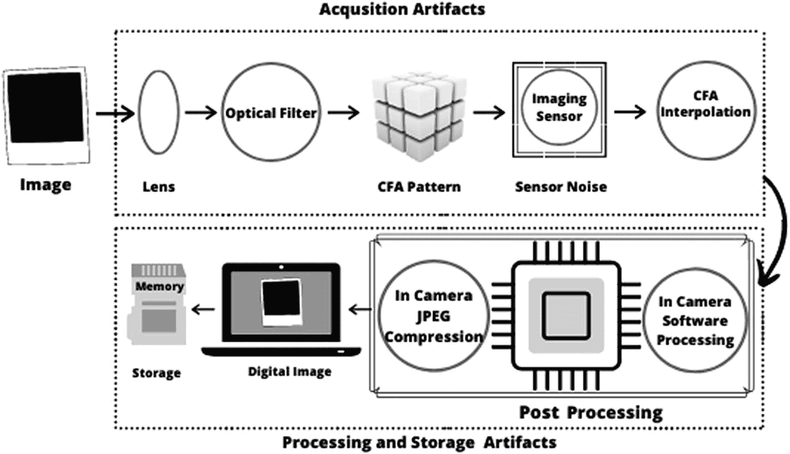
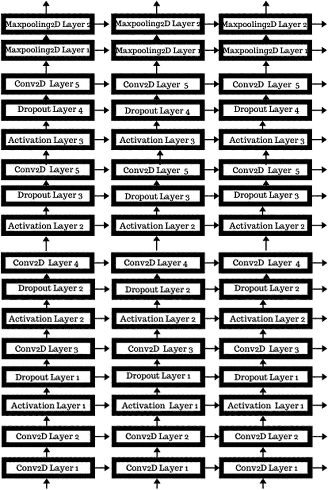

# 八、图像处理

你认为你有发现篡改图像的敏锐眼光吗？现在，如果图像被操纵得如此之好，以至于一般人很容易被愚弄呢？神经网络可以帮助找到图像的细微特征，并识别哪些是真实的，哪些是经过修改的。这叫做*图像取证* *。*

在这个项目中，我们将使用 CNN。由于我们已经在第 [6](6.html) 章中讨论了 CNN，我们将直接进入项目描述并从那里开始。

## 项目描述

在这个项目中，我们将使用 CNN 来寻找图像异常，如相同的像素补丁，以检测哪些图像被篡改。特别是，该数据集由使用*复制-移动技术* *伪造的图像组成。*模型在地面真实图像上训练。

我们使用来自数据集的“未修改 JPEG 压缩的原始图像”文件作为我们的原始图像，我们称之为`real_data`。我们使用来自数据集的“多次粘贴的副本”文件作为我们的操作数据，我们将称之为`tampered_data`。

### 重要术语和概念

相机会在拍摄图像的瞬间创建一个数字水印或数字签名。通过检查该数字水印的值，可以检测到随后进行的任何修改。图像编辑软件工具的易用性和普及性使得任何人都可以轻松地更改图像内容或创建新图像，而不会留下任何明显的篡改痕迹。现有软件允许个人创建逼真的计算机图形和混合生成的视觉内容，观众通常会发现这些内容与照片图像难以区分。

#### 多媒体取证

*多媒体取证*来源于经典的法医学，因为它使用科学方法从物理或数字证据中获取可证明的事实。多媒体取证工具的任务是通过利用数字成像和多媒体安全研究方面的现有知识，揭露多媒体内容在其生命的每一步中留下的痕迹。

它依赖于图像历史的每个阶段——从采集过程到以压缩格式存储，再到任何后处理操作——都会在数据上留下独特的痕迹，就像一种数字指纹。然后，可以识别数字图像的来源，并通过检测与数字内容内在相关的这些特征的存在、不存在或不一致来确定它是真实的还是被修改的。

通常，用于检测被操纵图像的方法可以分为以下几种:

*   **主动方法:**为了评估可信度，我们利用从源(即，在摄像机中)获得的数据。主动方法可以进一步分为两个部分:数据隐藏方法(例如水印)和数字签名方法。

*   **被动/盲目方法:**通过这种方法，我们尝试仅使用我们掌握的数字内容进行评估。它在没有任何保护技术和没有使用任何关于图像的先验信息的情况下工作。盲法使用图像函数和伪造品可以给图像添加特定的可检测变化的事实。

重建数字图像的历史是为了验证其原创性和评估其质量。当图像来源已知时，验证图像相对容易。然而，在实际情况中，几乎没有关于图像的信息。因此，调查者需要使用盲法来认证图像历史。

Note

数码相机配有水印芯片或数字签名芯片，可以使用相机本身内置的私钥轻松利用这些芯片。该芯片在将相机拍摄的每张照片存储到存储卡之前都会对其进行认证。

数字图像的历史可以由几个步骤组成，分为四个主要阶段:采集、编码、编辑和保存。这些步骤如图 [8-1](#Fig1) 所示。



图 8-1

数字图像的历史

##### 获得物ˌ获得

在*采集*期间，来自摄像机拍摄的真实场景的光线被摄像机传感器(CCD 或 CMOS)上的透镜聚焦。这是产生数字图像信号的地方。在到达传感器之前，光被 CFA(滤色器阵列)过滤，CFA 是传感器上的一层薄膜，它选择性地允许光的特定成分穿过它到达传感器。每个像素只有一种特定的主色(红色、绿色或蓝色)，这是聚集的。通过*去马赛克*过程，传感器输出被连续插值以获得每个像素的所有三种主要颜色，从而获得数字彩色图像。获得的信号经过额外的相机内处理，包括白平衡、色彩处理、图像锐化、对比度增强和伽马校正。

##### 编码

处理后的信号存储在照相机存储器中；为了节省存储，在大多数相机中，图像是有损压缩的，对于商业设备，JPEG 格式通常是首选格式。有损图像压缩是对数字图像执行的最常见操作之一。这是因为便于处理少量数据来存储和/或传输。事实上，大多数数码相机在拍摄后会直接压缩每张照片。

##### 编辑

可以对生成的图像进行后处理，例如，增强或修改其内容。任何图像编辑都可以在图像的生命周期内应用于图像:最常用的编辑方法是几何变换(旋转、缩放等。)、模糊、锐化、对比度调整、图像拼接(使用图像的一个或多个部分的部分来合成图像)以及克隆(或复制-移动，同一图像的一部分的复制)。

Note

拼接可能比复制-移动伪造更常见，因为它更灵活，允许创建内容与原始图像完全不同的图像。

##### 节约

编辑后，图像通常以 JPEG 格式保存，因此会发生再压缩。操作痕迹被称为指纹或脚印，分为以下几类:

*   **采集指纹:**由于特定的光学系统、图像传感器和相机软件，数字采集设备中的每个组件都会修改输入，并在最终的图像输出中留下固有的指纹。图像采集流水线对于大多数商业上可获得的设备是常见的；然而，由于每个步骤都是根据特定制造商的选择来执行的，所以轨迹可能取决于特定的相机品牌和/或型号。这意味着相机的每个阶段都会引入缺陷或内在的图像规律性，从而在最终图像中留下指示性的足迹，这些足迹代表了相机类型的签名，甚至是图像中的单个设备的签名。这些工件中不一致的存在可以作为篡改的证据。

*   **编码指纹:**有损压缩不可避免地会留下自己的特征足迹，这些特征足迹与具体的编码架构有关。图像编码伪像中不一致的存在可以作为篡改的证据。

*   **编辑指纹:**应用于数字图像的每一种处理，即使在视觉上无法察觉，也会修改其属性，从而根据所使用的处理留下特殊的痕迹。

*   **基于传感器的足迹:**传感器图案噪声主要是由于图像传感器的不完善，导致感测到的场景与摄像机获取的图像之间存在细微差异。传感器图案噪声的主要成分是光响应不均匀性(PRNU)噪声。这是一种高频乘性噪声，在正常工作条件下，通常在相机的整个寿命期间保持稳定。这些特性不仅使其成为设备识别的理想选择，也使其成为单个设备链接的理想选择，如果在某些区域发现图像中 PRNU 图案的不一致，还可用于伪造检测。

除了 PRNU，摄像机在采集过程中留下的另一个重要伪像是由于 CFA(滤色器阵列)的存在。除了专业的三 CCD/CMOS 相机，入射光在到达传感器(CCD 或 CMOS)之前由 CFA 过滤，因此对于每个像素，仅收集一种特定的颜色。

以下是图像篡改分析的类型:

*   **检测重采样痕迹:**两幅或多幅图像可以拼接在一起，生成高质量、一致的图像伪造品。

    在这种情况下，需要进行几何变换，如缩放、旋转或倾斜。

    几何变换通常需要重采样和插值步骤。因此，我们需要复杂的重采样/插值检测器。

*   **噪声不一致性分析:**隐藏篡改痕迹的常用工具是将局部随机噪声添加到被更改的图像区域，这导致图像噪声的不一致性。因此，图像中各种噪声水平的存在通常意味着篡改。

*   **循环平稳分析:**循环平稳信号呈现周期性。循环平稳检测器通过检测其频谱分量之间的特定相关性来寻找几何变换的痕迹。事实证明，这种方法能产生有希望的结果。

*   **增强检测:**这包括平滑、对比度增强、直方图均衡化和中值滤波等增强操作。相邻行和列中的像素共享相同的值。这些“拖尾伪影”可以通过考虑两个像素的组的一阶差，然后研究它们相应的直方图来分析。这种简单的方法产生极高的检测率，只要图像没有被压缩。

*   **接缝雕刻检测:**自动检测图像中是否有没有相关内容的像素路径(接缝)。如果被检测到，这些路径将被消除，并且图像大小将会减小。我们可以认为这种技术是一种依赖内容的裁剪。

*   **基于光照/阴影的拼接检测:**在试图创建可信的赝品时，最常见的障碍之一是考虑场景中的物体如何与光源交互。从一张照片上剪下一个物体并粘贴到另一张照片上，需要调整物体的光照，并在场景中引入一致的阴影。如果没有做到这一点，照明方向和阴影的不一致可能表明图像已被修改。

*   **基于几何/透视不一致的拼接检测:**这涉及识别图像中场景的几何和透视设置、运动模糊和透视不一致的存在。

### 复制移动伪造

本节详细讨论复制-移动伪造，因为这是我们在这个项目中的主要焦点。*复制-移动伪造*是一种特殊类型的图像篡改，将图像的一部分复制并粘贴到另一部分，通常是为了隐藏图像中不想要的部分。在图 [8-2](#Fig2) 中，树的倒影被圈了起来，因为它没有出现在原始图像中。这是数字添加的。


图 8-2

复制-移动伪造的例子

因此，检测复制-移动伪造的目标是找到相同或极其相似的图像区域。如果复制的部分来自同一图像，则一些成分(例如，噪声和颜色)将与图像的其余部分兼容。这意味着这种攻击是无法使用寻找统计数据不兼容的取证方法检测到的。因此，已经提出了适当设计的方法来处理这种操纵。

首先，这种技术将不得不处理计算复杂性的问题，因为直接应用克隆区域的穷举搜索将会过于昂贵。此外，必须考虑克隆的区域可能不相等，而只是相似，因为创建伪造的篡改者可能利用图像处理工具来隐藏篡改。因此，伪造物检测方法应该被设计为对于这组可能的修改是鲁棒的。

不是寻找整个重复区域，而是将图像分割成重叠的正方形块，然后我们寻找相似的连接图像块。通过假设克隆区域大于块大小，并且因此该区域由许多重叠的克隆块组成，每个克隆块将以相同的位移移动，并且因此每个复制块对之间的距离也将相同。因此，伪造检测将在相同距离内寻找最小数量的相似图像块，这些图像块彼此连接以形成呈现相同形状的两个图像区域。

所有分析的方法都遵循相同的基于块匹配的过程:首先将图像分割成大小重叠的正方形块，每个块从左上角到右下角移动一个像素。从每个块中提取一组特征，并对其进行适当的量化，以消除克隆块之间可能存在的细微差异。

假设相似的块由相似的特征表示，则基于字典排序的匹配过程被应用于块特征向量以找到重复的块。最后，通过检查在同一移位内是否有超过一定数量的彼此相连的块对来做出伪造决定。这考虑到了大多数自然图像将具有许多相似块的事实。

以下是为代表每个图像块而选择的特征类型:

*   离散余弦变换(DCT)系数

*   与颜色相关的特征

*   像素的主成分分析(PCA)

*   傅里叶-梅林变换(FMT)作为分组签名

*   对数极坐标傅立叶变换作为签名

*   尺度不变特征变换(SIFT)局部特征，用于在同一图像中寻找匹配区域

### 关于数据集

**名称:**图像处理数据集

**内容:**

*   未修改/原始图像

*   JPEG 压缩的未修改/原始图像

*   一对一拼接

*   添加高斯噪声的拼接

*   添加了 JPEG 伪像的拼接

*   旋转副本

*   缩放副本

*   综合效应

*   多次粘贴的副本

**来源:** [`www5.cs.fau.de/research/data/image-manipulation/`](https://www5.cs.fau.de/research/data/image-manipulation/)

**创建者:** V. Christlein，Ch 放大图片作者:John j .

**论文:**“对流行的复制-移动伪造检测方法的评估”，*《IEEE 信息取证与安全汇刊》，*第 7 卷第 6 期，第 1841-1854 页，2012 年。

### 必需的库

对于这个项目，我们将使用您在本书第一章中安装的基本库。以下是该项目所需的所有库的列表:

*   NumPy(安装说明见第 [1](1.html) 章)

*   操作系统(内置 Python 2 及更高版本)

*   熊猫(安装说明见第 [1](1.html) 章)

*   Matplotlib(安装说明见第 [1](1.html) 章)

*   Keras(安装说明见第 [1](1.html) 章)

*   TensorFlow(安装说明见第 [1](1.html) 章)

*   PIL(安装说明见第 [6](6.html) 章)

*   随机(内置 Python 2 及更高版本)

*   数学(内置 Python 2 及更高版本)

*   Imageio(安装说明在本章中)

*   cv2(安装说明见第 [6](6.html) 章)

*   撇油(安装说明见第 [6](6.html) 章)

除了 Imageio 之外，您应该拥有所有必需的库。让我们现在安装它。`Use this command to`使用 PIP 安装 Imageio:

```py
Pip3 install imageio

```

要检查安装，请使用以下命令:

```py
Pip3 show imageio

```

有了这些，您应该有了这个项目所需的所有库。

### 解决纷争

确保 Python 和 Pillow 已经正确安装，因为它们是 Imageio 的先决条件。

## CNN 架构

要检测 CNN 中的图像伪造，您需要一个具有正确顺序的正确层数的模型。图 [8-3](#Fig3) 显示了我们将在本项目中使用的模型。



图 8-3

该项目的 CNN 架构

让我们来看看 CNN 的“蓝图”。该模型将由以下几层组成:

*   卷积 2D 层:6

*   脱落层:4

*   最大池层:2

卷积 2D 层创建卷积核，该卷积核与层输入卷积以产生输出张量。dropout 层通过“丢弃”在训练期间获得的一些值来帮助避免过拟合。max-pooling 图层对空间数据进行操作，因此非常适合本项目。

我们使用泄漏 ReLU 激活函数，因为它避免了饱和(信号损失为零梯度或由数字舍入引起的混沌噪声的优势)。也解决了死 ReLU 问题。这确保了我们获得可能的最佳结果。

我们将使用二元交叉熵损失函数，因为它可以最小化两个概率分布(预测和实际)之间的距离。

## 程序

我们终于准备好实现 GRU 了。让我们打开一个新的 Jupyter 笔记本并开始工作。

### 第一步。导入库

首先加载必要的库。

```py
from tensorflow.keras.applications.vgg16  import VGG16
import numpy as np
import os
import pandas as pd
import matplotlib.pyplot as plt
import keras
import tensorflow as tf
from tensorflow.keras.layers import Dense, Dropout, Input, InputLayer, Conv2D,UpSampling2D , Flatten,MaxPooling2D,Conv2DTranspose
from tensorflow.keras.models import Model,Sequential
from keras.datasets import mnist
from tensorflow.keras.optimizers import Adam
from tensorflow.keras import layers
from PIL import Image
import random
from math import ceil
import imageio
import cv2
from skimage.data import astronaut
from skimage.filters import gaussian,sobel
from skimage import transform,io

```

使用`os.chdir('')`设置文件路径:

```py
os.chdir('D:\\Proj\\vinita\\Project 3- Image Manipulation\\manipulation_data\\Real_data\\')

```

### 第二步。准备数据集

该步骤包括几个子步骤，如下所述。

#### 步骤 2a。整理和收集真实数据

首先，创建`filelist=[]`列表来存储所有的图像文件。然后创建`tampered_data=[]`列表来存储已经处理过的图像。

最后，创建`real_data=[]`列表，它存储没有被处理过的原始图像。

现在初始化计数器`i=0`。在`for`循环中，`os.walk()`将为它访问的每个目录生成两个列表——将它们分成文件和目录。`os.sep()`分隔文件路径。

然后搜索图像文件并显示它们的文件路径，这样一旦执行了这个循环，就知道它正在工作。

Note

`gt`文件格式是一种简单的二进制格式，旨在以紧凑和快速的方式存储 graph-tool 图形实例，包括该库支持的所有类型的属性映射。

现在调整图像大小为 300x300 以保持一致性。最后，将图像添加到`real_data`列表中。

```py
rootdir = os.getcwd()
filelist=[]
tampered_data=[]
real_data=[]
i=0
for subdir, dirs, files in os.walk(rootdir):
   for file in files

:
       filepath = subdir + os.sep + file
       if (filepath.find('gt') >0):
           i=i+1
           print(filepath)
           width = 300
           height = 300
           image1 = cv2.imread(filepath,0)
           transformed_image = transform.resize(image1, (300,300), mode="symmetric", preserve_range=True)
           transformed_image=(transformed_image-transformed_image.mean())/255
           real_data.append(transformed_image)

```

#### 步骤 2b。分类并收集处理过的数据

这个收集操作数据的过程类似于前面的代码块。

```py
for subdir, dirs, files in os.walk(rootdir):
   for file in files:
       filepath = subdir + os.sep + file

       if (filepath.find('gt') > 0):
           i=i+1
           print(filepath)
           im = Image.open(filepath)
           width = 300
           height = 300
           image1 = cv2.imread(filepath,0)
           transformed_image = transform.resize(image1, (300,300), mode="symmetric", preserve_range=True)
           transformed_image=(transformed_image-transformed_image.mean())/255
           tampered_data.append(transformed_image)

```

#### 步骤 2c。将数据转换为数组

您可以使用`.mean()`功能查看平均值。

现在使用`.max()`函数查看最大值，该函数返回具有最大值的项目。

然后使用`.min()`函数查看最小值，该函数返回具有最低值的项目。

之后，您可以使用`np.asarray()`将数据转换成数组。

```py
transformed_image=(transformed_image-transformed_image.mean())/255

transformed_image.max()
transformed_image.min()

real_data=np.asarray(real_data)
tampered_data=np.asarray(tampered_data)

```

#### 步骤 2d。创建组合数据集

我们已经对数据进行了预处理，所以现在您可以通过使用`np.concatenate()`来组合两个数组以创建单个数据集。

现在使用`combined_input.reshape()`重塑数据。使用`ceil()`功能设置`trainsize`，返回大于 0.8 的最小整数值。

我们使用`ceil()`函数设置`testsize`，该函数返回大于 0.2 的最小整数值。

现在使用`np.random.randint()`选择一段随机的训练数据和测试数据:

```py
combined_input=np.concatenate([real_data, tampered_data])

y_combined=np.zeros(real_data.shape[0]+tampered_data.shape[0])
y_combined[:real_data.shape[0]]=1

combined_input=combined_input.reshape(624,300,300,1)

trainsize= ceil(0.8 * combined_input.shape[0])
testsize= ceil(0.2 * combined_input.shape[0])+1

trainsel=np.random.randint(low=0,high=combined_input.shape[0],size=trainsize)
testsel=np.random.randint(low=0,high=combined_input.shape[0],size=testsize)
train_inp=combined_input[trainsel,]
test_inp=combined_input[testsel,]

train_out=y_combined[trainsel,]
test_out=y_combined[testsel,]

```

#### 步骤 2e。定义优化器

定义优化器，我们在其中将 Adam 设置为其默认值。

```py
def adam_optimizer():
   return Adam(lr=0.001,beta_1=0.9)

```

### 第三步。构建模型

让我们使用以下代码为这个项目创建 CNN:

```py
model = Sequential()
model.add(InputLayer(input_shape=(300, 300, 1)))
model.add(Conv2D(32, (3, 3), activation="tanh", padding="same", strides=2))

model.add(Conv2D(32, (3, 3), activation="tanh", padding="same"))
model.add(layers.LeakyReLU(0.6))
model.add(layers.Dropout(0.4))

model.add(Conv2D(32, (3, 3), activation="tanh", padding="same", strides=2))
model.add(layers.LeakyReLU(0.3))
model.add(layers.Dropout(0.2))

model.add(Conv2D(32, (3, 3), activation="tanh", padding="same", strides=2))
model.add(layers.LeakyReLU(0.3))
model.add(layers.Dropout(0.2))

model.add(Conv2D(32, (3, 3), activation="tanh", padding="same", strides=2))
model.add(layers.LeakyReLU(0.3))
model.add(layers.Dropout(0.2))

model.add(Conv2D(1, (3, 3), activation="tanh", padding="same",strides=2))
model.add(MaxPooling2D(pool_size = (3, 3)))
model.add(MaxPooling2D(pool_size = (2, 2)))
model.add(Flatten())
print(model.summary())

```

### 第四步。训练模型

通过使用 Adam 作为优化器和使用`binary_crossentropy`作为损失函数来编译模型。

然后训练模型，将批量大小设置为 100，将时期数设置为 3。

```py
model.compile(loss='binary_crossentropy', optimizer=adam_optimizer())
model.fit(x=train_inp, y=train_out, batch_size=100,epochs=3)

```

### 第五步。测试模型

使用`model.predict()`获得训练和测试数据的预测:

```py
train_pred = model.predict(train_inp)
test_pred = model.predict(test_inp)

```

### 第六步。检查结果

使用`np.interp()`检查训练和测试数据的插值。

为了更好地理解结果，您可以使用`plt.hist()`生成插值直方图。

最后，结合训练和测试数据的结果，使用`np.concatenate()`来看看这个模型的整体性能。

```py
check=np.interp(train_pred, (train_pred.min(), train_pred.max()), (0,1))
check1=np.interp(test_pred, (test_pred.min(), test_pred.max()), (0,1))

plt.hist(check)
plt.hist(check1)

train_check = np.concatenate((train_out.reshape(-1,1),check.reshape(-1,1)),axis=1)
test_check = np.concatenate((test_out.reshape(-1,1),check1.reshape(-1,1)),axis=1)

```

您已经成功训练此模型来检测图像中的操纵。

## 进一步测试

这里有一些想法可以尝试，从这个项目中学到更多:

*   尝试增加和减少 CNN 中的最大池层数。

*   添加一个上采样层，查看结果有何不同。

*   尝试最小池而不是最大池。

*   尝试增加下降图层。

*   尝试增加和减少历元的数量，以查看其对模型结果的影响。

## 摘要

下面是你在本章中学到的所有内容的快速回顾。

*   相机会在拍摄图像的瞬间创建数字水印/数字签名。

*   现有的软件允许伪造者创建逼真的计算机图形或混合生成的视觉内容，观众可以发现这些内容与原始照片图像没有区别。

*   多媒体取证来自经典的法庭科学，因为它使用科学方法从物理或数字证据中获取可证明的事实。

*   多媒体取证工具的任务是通过利用有关数字成像和多媒体安全研究的现有知识，暴露多媒体内容在其生命的每一步中留下的痕迹。

*   检测篡改图像的方法可以分为主动和被动两种。
    *   **主动方法:**对于可信度的评估，这利用了从源(即，在摄像机中)获得的数据。主动方法可以进一步分为两个部分:数据隐藏方法(例如水印)和数字签名方法。

    *   **被动/盲目方法:**使用这种方法，我们尝试仅使用数字内容进行评估。它在没有任何保护技术和没有使用任何关于图像的先验信息的情况下工作。盲法使用图像函数和伪造品可以给图像添加特定的可检测变化的事实。

*   数码相机配备有水印芯片或数字签名芯片，可以使用相机本身中硬连线的私钥容易地利用这些芯片。该芯片在将相机拍摄的每张照片存储到存储卡之前都会对其进行认证。

*   数字图像的历史可以由几个步骤组成，分为四个主要阶段:采集、编码、编辑和保存。

*   图像采集流水线对于大多数商用设备来说是常见的；然而，由于每个步骤都是根据特定制造商的选择来执行的，所以轨迹可能取决于特定的相机品牌和/或型号。

*   传感器图案噪声主要来自图像传感器的缺陷，导致感测到的场景和相机获取的图像之间的微小差异。

*   拼接可能比复制-移动伪造更常见，因为它更灵活，允许伪造者创建内容与原件非常不同的图像。

*   图像篡改检测的类型包括:检测重采样的痕迹、噪声不一致性分析、循环平稳分析、增强检测、接缝雕刻检测、基于光照/阴影的拼接检测、基于几何/透视不一致性的拼接检测。

*   复制-移动伪造是一种特定类型的图像篡改，其中图像的一部分被复制并粘贴到另一部分，通常是为了隐藏图像中不想要的部分。

## 参考

以下是本章使用的资料来源。

*   [T2`https://pdfs.semanticscholar.org/12cf/2682ed6a24dcb3a5ac7dcf2c08b71f6a18d1.pdf`](https://pdfs.semanticscholar.org/12cf/2682ed6a24dcb3a5ac7dcf2c08b71f6a18d1.pdf)

*   [T2`www.yundle.com/terms-definitions/i/image-manipulation`](http://www.yundle.com/terms-definitions/i/image-manipulation)

## 进一步阅读

有兴趣了解本章中涉及的一些主题吗？这里有一些很棒的链接可以查看:

*   图像取证: [`https://link.springer.com/article/10.1007/s11042-010-0620-1`](https://link.springer.com/article/10.1007/s11042-010-0620-1)

*   复制-移动伪造: [`www.imedpub.com/articles/fusion-approaches-system-of-copymove-forgery-detection.php?aid=22116`](http://www.imedpub.com/articles/fusion-approaches-system-of-copymove-forgery-detection.php%253Faid%253D22116)

*   GT 文件: [`https://file.org/extension/gt`](https://file.org/extension/gt)

*   垂死的热路问题: [`https://machinelearning.wtf/terms/dying-relu/`](https://machinelearning.wtf/terms/dying-relu/)