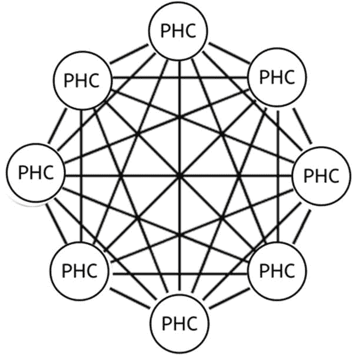
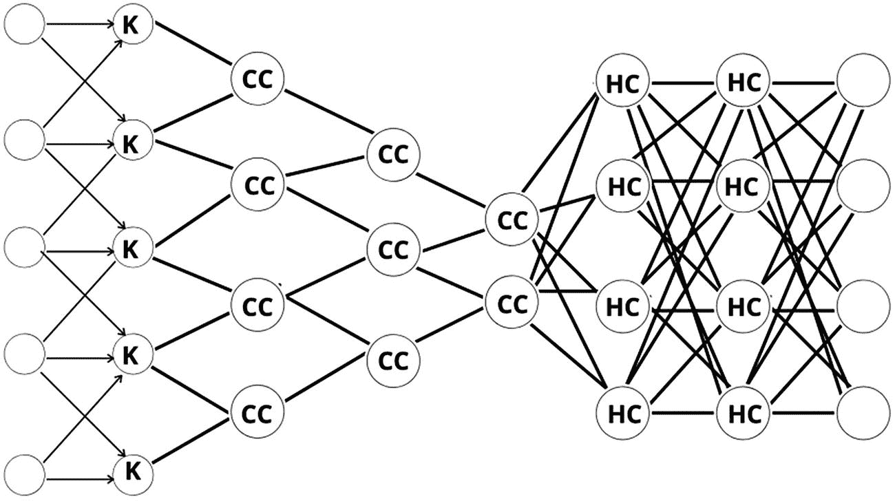
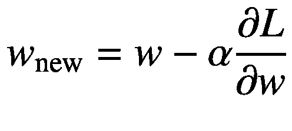

# 九、神经网络集合

第三章提到，目前有大量的神经网络正在使用，更多的正在定期开发。这一章将指导你哪些可以作为未来深度学习项目的参考。本章分为三个主要部分:神经网络、优化函数和损失函数。

第一部分提供了您可以在自己的项目中轻松使用的神经网络示例。每个神经网络都附有一个解释，帮助你理解它们，以便你可以为你的深度学习项目做出正确的选择。本章的第二部分介绍了一组优化器，最后一部分介绍了损失函数，以及如何为模型选择正确参数的技巧。

## 神经网络动物园初级读本

第一个人工神经网络是由心理学家弗兰克·罗森布拉特在 1958 年发明的。他设计了*感知机*(在第二章中讨论)，旨在复制人类大脑处理视觉数据和学习识别物体的方式。自从神经网络体系结构出现以来，就有新模型的冲击。由于新的模型被快速引入，有必要以某种方式组织和记录这些网络，使它们更容易跟踪和改进。

2016 年 9 月 14 日，来自阿西莫夫研究所的 Fjodor 范维恩和 Stefan Leijnen 决定为深度学习中使用的每个模型创建一个图表。他们把模型描绘成节点图。这是目前使用的最全面的模型图表。这张图表的标题是“神经网络动物园”本章引用了图表并对其进行了详细说明。

## 神经网络

这一主要部分回顾了为未来项目设计的一系列神经网络。每个神经网络部分以下列方式建立:

*   目前存在的主要神经网络的描述

*   每个神经网络的子类别列表和关联层列表

*   每个神经网络的应用列表

*   模型的示例实现

### 循环神经网络

rnn 用于深度学习和开发模拟人脑神经元活动的模型(见图 9-1 )。当预测结果至关重要时，它们尤其强大，并且与其他类型的人工神经网络不同，因为它们使用反馈循环来处理告知最终输出的数据序列，最终输出也可以是数据序列。这些反馈回路允许信息持续存在；这种效果通常被描述为*记忆*。RNN 背后的逻辑是考虑输入的顺序。


图 9-1

循环神经网络。RC 表示循环细胞

像前馈神经网络一样，RNNs 可以处理从初始输入到最终输出的数据。与前馈神经网络不同，RNNs 在整个计算过程中使用反馈回路，如时间反向传播(BPTT ),将信息反馈回网络。这将输入连接在一起，使 RNNs 能够处理顺序和时间数据。它们用于油藏计算。

#### 油藏计算

*储层计算*(见图 9-2 )是神经网络的扩展，其中输入信号连接到一个固定的(不可训练的)和随机的动态系统(储层)，从而创建一个更高维的表示(嵌入)。这种嵌入然后通过可训练单元连接到期望的输出。


图 9-2

油藏计算

rnn 的类型包括以下几种:

*   -什么

*   窥视孔连接

*   门控循环单位

*   LSM 乘法

*   LSTM 全神贯注

*   Hopfield 网络

*   马尔可夫链

*   双向联想存储器

RNN 中使用的图层如下:

*   把...嵌入

*   简单神经网络

*   简单电池

*   稠密的

*   拒绝传统社会的人

RNN 的应用如下:

*   语音识别

*   文本分类

*   图像识别

下面是 RNN 在 TensorFlow 2.0 中的实现:

```py
rrn = tf.keras.Sequential()
rnn.add(layers.Embedding(input_dim=1000, output_dim=64))
rnn.add(layers.SimpleRNN(128))
rnn.add(layers.Dense(10, activation="softmax"))
rnn.add(layers.SimpleRNN(90))
rnn.compile(loss='binary_crossentropy', optimizer="rmsprop"

```

### LSM 乘法

乘法 lstm(mlstm)是由 Benjamin Krause 在 2016 年提出的(见图 9-3 )。它们是一种用于序列建模的循环神经网络架构，结合了长短期记忆(LSTM)和乘法循环神经网络架构。mLSTM 的特征在于其对于每个可能的输入具有不同的递归转移函数的能力，这使得其对于自回归密度估计更具表达性。这是一种混合架构，将 mRNNs 的分解隐藏到隐藏转换与 LSTMs 的门控框架相结合。


图 9-3

LSTM 乘法(mlstm)

mLSTM 中的层如下:

*   把...嵌入

*   LSM 乘法

*   稠密的

*   拒绝传统社会的人

*   convtomm 2d

*   convlstm 2 dcell

*   LSTMCell

*   cudnnlstm(英国作家)

mLSTM 与离散互斥元素的序列一起使用，

下面是它在 TensorFlow 2.0 中的实现:

```py
mlstm = tf.keras.models.Sequential()
mlstm.add(Embedding(1000, 64, input_length=10))
mlstm.add(MultiplicativeLSTM(512, dropout_W=0.2, dropout_U=0.2)
mlstm.add(Dense(1024, activation="linear")
mlstm.add(MultiplicativeLSTM(50, dropout_W=0.1, dropout_U=0.1)
mlstm.add(Dropout(0.2)
mlstm.compile(loss='categorical_crossentropy', optimizer="rmsprop"

```

### 全神贯注的安妮

*机器学习中的注意力*是指模型对数据中特定元素的专注能力(见图 9-4 )。

我们构建了一个使用所有隐藏状态的架构，而不是使用最后一个隐藏状态作为代理。这就是“注意力”机制的作用。每个生成的输出不仅仅是最终隐藏状态的函数，而是所有隐藏状态的函数。这不是一个简单地组合所有隐藏状态的操作。


图 9-4

LSTM 全神贯注

关注的类型包括以下几种:

*   **全局注意力:**使用所有编码器隐藏状态来为每个解码器步骤定义基于注意力的上下文向量。

*   **局部注意:**仅使用落入较小窗口内的几个隐藏状态。该窗口以编码器的隐藏状态为中心。

*   **硬注意:**它不是对所有隐藏状态进行加权平均，而是使用注意分数来选择单个隐藏状态。

*   **软注意:**将上下文向量计算为编码器隐藏状态的加权和，如上图所示。

*   **潜在注意力:**在每个特征上学习一个权重，以确定其对于预测触发或动作的重要性。与标准注意方法不同，潜在注意分两步计算特征权重。这提高了触发动作的准确性。潜在权重决定了最终的注意力权重，我们称之为*主动权重。*

*   **主动关注:**根据每个标记在最终预测中的重要性计算其权重。

*   **区域注意力:**注意力被应用于整个“区域”，而不局限于单个项目。它被定义为内存中一组结构上相邻的项目。通过组合存储器中的相邻项目来形成“区域”。

注意人工神经网络的层次如下:

*   标度点积注意力

*   多头注意力层

注意力人工神经网络的一个应用是自然语言处理。

Note

其他层取决于所使用的网络类型，如 RNN、CNN 等。

下面是它在 TensorFlow 2.0 中的实现:

```py
#RNN with Attention
rrn = tf.keras.Sequential()
rnn.add(layers.Embedding(input_dim=1000, output_dim=64))
rnn.add(layers.SimpleRNN(128))
rnn.add(layers.Attention( [query_seq_encoding, value_seq_encoding]))
rnn.add(layers.Dense(10, activation="softmax"))
rnn.add(layers.SimpleRNN(90))
rnn.compile(loss='binary_crossentropy', optimizer="rmsprop"

```

### 变形金刚(电影名)

变形金刚有一个内存饥渴的架构风格(见图 9-5 )。它们是注意的前馈编码器/解码器。它们不需要单元状态存储器。他们一次从整个序列片段中挑选，将注意力集中在最重要的部分。


图 9-5

变形金刚(电影名)

变压器中的层如下:

*   输入层

*   隐藏层:通常是致密层

*   输出层

*   高斯噪声

*   高斯-安德鲁普特

变压器的一个应用是序列转换。

下面是 TensorFlow 2.0 中的实现:

```py
# Encoder

def create_encoder():

encoder = tf.keras.models.Sequential()
encoder.add(Dense(50, activation="relu", input_shape(1,1,None))
encoder.add(Dropout(rate=dropout))
encoder.add(Dense(units=10, activation="relu"))
encoder.add(Dense(units=20))
encoder.add(Dropout(rate=dropout))
encoder.add(Dropout(rate=dropout))
return encoder

e = create_encoder( )

#Decoder

def create_decoder( ):

decoder = tf.keras.models.Sequential()
decoder.add(Dense(50, activation="relu", input_shape(1,1,None))
decoder.add(Dropout(rate=dropout)
decoder.add(Dense(units=10, activation="relu")
decoder.add(Dense(units=20)
decoder.add(Dropout(rate=dropout)
decoder.add(Dropout(rate=dropout)
return decoder

d = create_decoder()

# Definition of transformer

def create_transformer(encoder, decoder):
    d.trainable=False
    transformer_input = Input(shape=(None,100,100))
    x = g(transformer_input)
    transformer_output= d(x)
    transformer= Model(inputs=transformer_input, outputs=transformer_output)
    transfomer.compile(loss='binary-crossentropy', optimizer="adam")
    return transformer

transformer = create_transfomer(e,d)

```

### 自编码器

一个*自编码器*是一个无监督的人工神经网络，它学习如何有效地压缩和编码数据(见图 9-6 )。然后，它学习如何从潜在空间表示中重建数据，以创建尽可能接近原始输入的表示。它忽略数据中的噪声以降低数据维数。


图 9-6

自编码器。I/O 表示匹配的输入/输出单元

自编码器由以下组件组成:

*   **编码器:**模型学习如何降低输入维度，将输入数据压缩成编码表示。

*   **瓶颈:**这一层包含输入数据的压缩表示。

*   **解码器:**该模型学习如何从编码表示中重建数据，以尽可能接近原始输入。

*   **重建损失:**使用反向传播测量解码器的性能，以最小化网络的重建损失。

网络的编码器部分用于编码，有时甚至用于数据压缩。它在每一层都有数量递减的隐藏单元。因此，这一部分被迫只选择最重要和最有代表性的数据特征。

网络的另一半执行解码功能。该部分在每层中具有越来越多的隐藏单元，以使其能够从编码数据中重建原始输入。

应用约束以从自编码器获得有用的特征。根据应用的约束或缺少约束，有两种类型的自编码器:

*   **欠完成:**在这种情况下，我们强制自编码器学习训练数据的最显著特征。如果潜在表示的维数与输入相同，则编码器可以学习执行复制任务，而无需提取任何关于数据分布的有用信息。

*   **过完备:**在这种情况下，潜在表征的维度大于输入。在这种情况下，即使线性编码器和线性解码器也可以学习将输入复制到输出，而无需学习任何关于数据分布的有用信息。

理想情况下，我们需要避免提到的这两种类型的自编码器。根据要建模的分布的复杂性，仔细选择编码维数以及编码器和解码器的容量。关键是实现正确的平衡。

自编码器中的层如下:

*   输入层

*   隐藏层:通常是致密层

*   输出层

*   高斯噪声

*   高斯-安德鲁普特

自编码器的应用包括:

*   异常检测

*   图像去噪

*   降维

下面是它在 TensorFlow 2.0 中的实现:

```py
lstm_autoencoder = Sequential()
# Encoder
lstm_autoencoder.add(LSTM(40, activation="relu", input_shape=(timesteps, n_features), return_sequences=True))
lstm_autoencoder.add(LSTM(18, activation="relu", return_sequences=False))
lstm_autoencoder.add(RepeatVector(timesteps))
# Decoder
lstm_autoencoder.add(LSTM(12, activation="relu", return_sequences=True))
lstm_autoencoder.add(LSTM(30, activation="relu", return_sequences=True))
lstm_autoencoder.add(TimeDistributed(Dense(n_features)))
lstm_autoencoder.compile(loss='rmse', optimizer=adam)

```

### 可变自编码器

可变自编码器(vae)是强大的*生成*模型(见图 9-7 )。它们处理顺序或非顺序数据、连续或离散数据以及有标签或完全无标签的数据。

可变自编码器可以基于 CNN。这意味着他们将有类似 CNN 的层次。


图 9-7

可变自编码器。H 表示隐藏的单元格

可变自编码器是生成任务的理想选择，因为它们具有连续的潜在空间，允许简单的随机采样和插值。他们通过生成两个矢量输出来实现这一点:

*   均值向量

*   标准差的向量

这种随机生成允许每一遍编码中的微小变化，即使对于相同的平均值和标准偏差。

它们要求编码尽可能相互接近，但仍有区别。这使得平滑插值和构造新的样本成为可能。

为了迫使这一点，我们将 kull back-lei bler 散度(KL 散度)引入损失函数。两个概率分布之间的 KL 偏差简单地衡量了它们彼此之间*偏差*的程度。

对于 VAEs，KL 损失等于所选点和标准偏差之间所有 KL 偏差的*和*。

现在，使用纯 KL 损失导致随机放置的编码中的潜在空间，靠近潜在空间的中心，很少考虑附近编码之间的相似性。

然而，一起优化这两者导致潜在空间的生成，该潜在空间通过聚类在*局部尺度*上保持附近编码的相似性，然而在*全局范围内，*这在潜在空间原点附近非常密集(将轴与原始轴进行比较)。

卷积变分自编码器中的层如下:

*   卷积的

*   联营

*   上采样

*   拒绝传统社会的人

*   稠密的

变分自编码器的应用如下:

*   图画

*   图象生成

*   面部表情编辑

*   从静态图像预测

*   合成音乐一代

下面是它在 TensorFlow 2.0 中的实现:

```py
#Encoder

def create_encoder():
input_img = Input(shape=(30, 30, 3))
vae_encoder = tf.keras.models.Sequential()
vae_encoder.add(Conv2D(32, (3, 3), activation="relu", padding="same", input_shape=input_img)))
vae_encoder.addConv2D(32, (3, 3), activation="relu", padding="same")
vae_encoder.addMaxPooling2D((2, 2), padding="same")
vae_encoder.addConv2D(64, (3, 3), activation="relu", padding="same")
vae_encoder.addConv2D(64, (3, 3), activation="relu", padding="same")
vae_encoder.addMaxPooling2D((2, 2), padding="same")
vae_encoder.addConv2D(128, (3, 3), activation="relu", padding="same")
vae_encoder.addConv2D(128, (3, 3), activation="relu", padding="same")
vae_encoder.addMaxPooling2D((2, 2), padding="same")
vae_encoder.compile(loss='categorical_crossentropy', optimizer="rmsprop")
return encoder

e =create_encoder()

#Decoder

def create_decoder():
vae_decoder = tf.keras.models.Sequential()
vae_decoder = Conv2D(32, (3, 3), activation="relu", padding="same")
vae_decoder = Conv2D(32, (3, 3), activation="relu", padding="same")
vae_decoder = UpSampling2D((2, 2), interpolation="bilinear")
vae_decoder = Conv2D(64, (3, 3), activation="relu", padding="same")
vae_decoder = Conv2D(64, (3, 3), activation="relu", padding="same")
vae_decoder = UpSampling2D((2, 2), interpolation="bilinear")
vae_decoder = Conv2D(128, (3, 3), activation="relu", padding="same")
vae_decoder = Conv2D(128, (3, 3), activation="relu", padding="same")
vae_decoder = UpSampling2D((2, 2), interpolation="bilinear")
vae_decoder = Conv2D(3, (3, 3), activation="sigmoid", padding="same")
vae_encoder.compile(loss='KL divergence', optimizer="rmsprop")
return decoder

d= create_decoder()

def create_vae(encoder, decoder):
    e.trainable=False
    vae_input = input_img
    vae= Model(inputs=vae_input, outputs=vae_output)
    vae.compile(loss='KL divergence', optimizer="rmsprop")
    return vae
vae = create_vae(e,d)

```

### 降噪自编码器

去噪自编码器(DAE)是自编码器的随机版本，被训练为从相同输入的损坏版本重建输入(见图 9-8 )。


图 9-8

降噪自编码器。I/O 表示匹配的输入/输出单元，NI 表示有噪声的输入单元

当隐藏层中的节点多于输入时，自编码器会学习“空函数”，这意味着输出等于输入。去噪自编码器通过随机将一些输入值归零来解决这个问题，这实质上破坏了数据。

计算损失函数时，重要的是将输出值与原始输入进行比较，而不是与被破坏的输入进行比较。这样，就消除了学习身份函数而不是提取特征的风险。

卷积去噪自编码器中的层如下:

*   卷积的

*   联营

*   上采样

*   拒绝传统社会的人

*   稠密的

去噪自编码器的应用包括:

*   水印去除

*   图像降维

*   图像灰度到颜色的转换

下面是它在 TensorFlow 2.0 中的实现:

```py
# Encoder

def create_encoder():

dae_encoder.add(Conv2D(32, (3, 3), activation="relu", padding="same", input_shape=(28, 28, 1)))

dae_encoder.add(MaxPooling2D((2, 2), padding="same")
dae_encoder.add(Conv2D(32, (3, 3), activation="relu", padding="same")
return encoder

e =create_encoder()

# Decoder

def decoder():

dae_decoder.add(Conv2D(32, (3, 3), activation="relu", padding="same")
dae_decoder.add(UpSampling2D((2, 2))
dae_decoder.add(Conv2D(32, (3, 3), activation="relu", padding="same")
dae_decoder.add(UpSampling2D((2, 2))

return decoder

d= create_decoder()

dae = Model(e, d)

dae.compile(optimizer='adadelta',loss='binary_crossentropy')

```

### 循环自编码器

递归自编码器模型通过编码器结构将序列数据汇总为固定长度的向量，然后通过解码器结构重建原始序列(参见图 9-9 )。概括向量可用于表示时间序列特征。


图 9-9

递归自编码器

递归自编码器中的层如下:

*   把...嵌入

*   简单神经网络

*   简单电池

*   稠密的

*   拒绝传统社会的人

递归自编码器的一个应用是用于传感器信号分析。

下面是它在 TensorFlow 2.0 中的实现:

```py
#encoder

def create_encoder():

rae.add(Dense(128, activation="tanh", input_shape=(timesteps, input_dim,))
rae.add(LSTM(64,return_sequences=True)
rae.add(LSTM(32,return_sequences=True)
return encoder

e = create_encoder()

#decoder

def create_decoder():
rae.add(Dense(input_dim, activation="tanh", inputs_shape =(timesteps, 32))
rae.add(LSTM(64, return_sequences=True,activation='tanh')
rae.add(LSTM(128, return_sequences=True,activation='tanh')

# model for rae

def create_rae(encoder, decoder):
    e.trainable=False
    rae_input = input_val
    rae= Model(inputs=rae_input, outputs=rae_output)
    rae.compile(loss='binary_crossentropy', optimizer="rmsprop")
    return rae
rae = create_rae(e,d)

```

### 稀疏自编码器

稀疏自编码器(SAE)提供了一种替代方法来引入瓶颈，而不会减少隐藏层中的节点数量(见图 9-10 )。相反，损失函数不利于层内的激活。


图 9-10

稀疏自编码器。I/O 表示匹配的输入/输出单元

稀疏自编码器中的层如下:

*   输入层

*   隐藏层:通常是致密层

*   输出层

*   高斯噪声

*   高斯-安德鲁普特

稀疏自编码器的一个应用是分类问题。

下面是它在 TensorFlow 2.0 中的实现:

```py
#encoder

def create_encoder():

sae.add(Dense(28, input_shape=(timesteps, input_dim,))
sae.add(LSTM(64,return_sequences=True)
sae.add(LSTM(32,return_sequences=True)
return encoder

e =create_encoder()

#decoder

def create_decoder():
sae.add(Dense(input_dim,inputs_shape =(timesteps, 32))
sae.add(LSTM(60, return_sequences=True,activation='tanh')
sae.add(LSTM(18, return_sequences=True,activation='tanh')
return decoder

d =create_decoder()

# model for sae

def create_sae(encoder, decoder):
    e.trainable=False
    sae_input = input_val
    sae= Model(inputs=sae_input, outputs=sae_output)
    sae.compile(loss='KL divergence', optimizer="rmsprop")
    return sae
sae = create_sae(e,d)

```

Note

潜在空间的维度应该大于输入空间的维度。

### 堆叠自编码器

堆叠式自编码器是具有多层稀疏自编码器的神经网络(见图 9-11 )。当我们向自编码器添加更多隐藏层时，它有助于将高维数据减少为代表重要特征的较小代码。每个隐藏层都比上一个隐藏层更紧凑。对于后面的层，我们使用来自前面层的未被破坏的输入。在训练了一堆编码器之后，我们可以将输出作为独立的监督机器学习模型的输入，就像支持向量机或多类逻辑回归一样。


图 9-11

堆叠式自编码器。I/O 表示匹配的输入/输出单元

堆叠式自编码器中的层如下:

*   输入层

*   隐藏层:通常是致密层

*   输出层

*   高斯噪声

*   高斯-安德鲁普特

堆叠式自编码器的一个应用是用于手写分析。

下面是它在 TensorFlow 2.0 中的实现:

```py
#encoder 1

def create_encoder1():
sae.add(Dense(28, input_shape=(timesteps, input_dim,))
sae.add(LSTM(64,return_sequences=True)
sae.add(LSTM(32,return_sequences=True)
return encoder

e1 = create_encoder1()

#decoder 1

def decoder1():
sae.add(Dense(input_dim,inputs_shape =(timesteps, 32))
sae.add(LSTM(60, return_sequences=True,activation='tanh')
sae.add(LSTM(18, return_sequences=True,activation='tanh')
return decoder

d1 =create_decoder1()

#encoder 2

def encoder2():
sae.add(Dense(28, input_shape=(timesteps, input_dim,))
sae.add(LSTM(64,return_sequences=True)
sae.add(LSTM(32,return_sequences=True)
return encoder

e2 =create_encoder1()

#decoder 2

def decoder2():
sae.add(Dense(input_dim,inputs_shape =(timesteps, 32))
sae.add(LSTM(60, return_sequences=True,activation='tanh')
sae.add(LSTM(18, return_sequences=True,activation='tanh')
return decoder

d2 =create_decoder2()

# model for sae

def create_sae(encoder, decoder):
    e.trainable=False
    sae_input = input_val
    sae= Model(inputs=sae_input, outputs=sae_output)
    sae.compile(loss='KL divergence', optimizer="rmsprop")
    return sae
sae = create_sae(e,d)

```

### 卷积自编码器

通常在切片和堆叠数据时会丢失大量信息。卷积自编码器不堆叠数据，而是保持输入图像数据的空间信息不变(见图 9-12 )。它在所谓的*卷积层中提取信息。*例如，一个平面的 2D 图像被提取为一个厚的正方形，然后继续变成一个长的立方体，再变成另一个更长的立方体。此过程旨在保留数据中的空间关系。这是自编码器中的编码过程。在中间，有一个完全连接的自编码器。接下来是解码过程，将立方体展平为 2D 平面图像。


图 9-12

卷积自编码器

卷积自编码器中的层如下:

*   卷积的

*   联营

*   上采样

*   拒绝传统社会的人

*   稠密的

卷积自编码器的应用包括:

*   笔迹分析

*   图像降噪

下面是它在 TensorFlow 2.0 中的实现:

```py
#Encoder

def create_encoder():
cae_encoder = tf.keras.Sequential()
cae_encoder.add(Conv2D(16, (3, 3), activation="relu", padding="same", input_shape=(28, 28, 1)))
cae_encoder.add(MaxPooling2D((2, 2), padding="same")
cae_encoder.add(Conv2D(8, (3, 3), activation="relu", padding="same")
cae_encoder.add(MaxPooling2D((2, 2), padding="same")
cae_encoder.add(Conv2D(8, (3, 3), activation="relu", padding="same")
cae_encoder.add(MaxPooling2D((2, 2), padding="same")
return encoder

e =create_encoder()

#Decoder

def create_decoder():

cae_decoder.add(Conv2D(8, (3, 3), activation="relu", padding="same")
cae_decoder.add(UpSampling2D((2, 2))(x)
cae_decoder.add(Conv2D(8, (3, 3), activation="relu", padding="same")
cae_decoder.add(UpSampling2D((2, 2))
cae_decoder.add(Conv2D(16, (3, 3), activation="relu")
cae_decoder.add(UpSampling2D((2, 2))
cae_decoder.add(Conv2D(1, (3, 3), activation="sigmoid", padding="same")

d =create_decoder()

autoencoder = Model(e, d)

autoencoder.compile(optimizer='adadelta', loss="binary_crossentropy")

```

### 堆叠去噪自编码器

在堆叠去噪自编码器中，输入损坏仅用于初始去噪(见图 9-13 )。这有助于了解数据中的重要特征。堆叠去噪自编码器就是许多去噪自编码器串在一起。


图 9-13

堆叠去噪自编码器。I/O 表示匹配的输入/输出单元

SDAs 的一个关键功能是无监督的预训练，当输入通过时，一层一层地进行。一旦对每一层进行预处理，以便对来自前一层的输入进行特征选择和提取，就可以进行第二阶段的监督微调。

#### SDAs 中的随机腐败

去噪自编码器将数据混洗，并通过尝试重建数据来了解数据。洗牌的行为就是噪音，而网络的工作就是识别噪音中的特征，以便对输入进行分类。当网络被训练时，它生成一个模型，并通过损失函数测量该模型和基准之间的距离。其最小化损失函数的尝试包括对混洗的输入进行重采样并重构数据，直到它找到使其模型最接近地面事实的那些输入。

堆叠卷积去噪自编码器中的层如下:

*   卷积的

*   联营

*   上采样

*   拒绝传统社会的人

*   稠密的

堆叠去噪自编码器的应用包括:

*   水印去除

*   图像降维

*   图像灰度到颜色的转换

下面是它在 TensorFlow 2.0 中的实现:

```py
# Encoder1

def create_encoder1():

dae_encoder.add(Conv2D(32, (3, 3), activation="relu", padding="same", input_shape=(28, 28, 1)))

dae_encoder.add(MaxPooling2D((2, 2), padding="same")
dae_encoder.add(Conv2D(32, (3, 3), activation="relu", padding="same")
return encoder1

E1 =create_encoder1()

# Decoder1

def create_decoder1():

dae_decoder.add(Conv2D(32, (3, 3), activation="relu", padding="same")
dae_decoder.add(UpSampling2D((2, 2))
dae_decoder.add(Conv2D(32, (3, 3), activation="relu", padding="same")
dae_decoder.add(UpSampling2D((2, 2))

return decoder1

d1= create_decoder1()

# Encoder2

def create_encoder2():

dae_encoder.add(Conv2D(32, (3, 3), activation="relu", padding="same", input_shape=(28, 28, 1)))

dae_encoder.add(MaxPooling2D((2, 2), padding="same")
dae_encoder.add(Conv2D(32, (3, 3), activation="relu", padding="same")
return encoder2

e2 =create_encoder2()

# Decoder2

def create_decoder2():

dae_decoder.add(Conv2D(32, (3, 3), activation="relu", padding="same")
dae_decoder.add(UpSampling2D((2, 2))
dae_decoder.add(Conv2D(32, (3, 3), activation="relu", padding="same")
dae_decoder.add(UpSampling2D((2, 2))

return decoder2

d2= create_decoder2()

# model for scae

def create_scae(e2, d2):
    e.trainable=False
    scae_input = input_val
    scae= Model(inputs=scae_input, outputs=scae_output)
    scae.compile(loss='KL divergence', optimizer="rmsprop")

    return scae
scae = create_scae(e2,d2)

```

### 收缩自编码器

收缩型自编码器是一种无监督的深度学习技术，可以帮助神经网络对未标记的训练数据进行编码(见图 9-14 )。这是通过构造损失项来实现的，该损失项惩罚隐藏层激活相对于输入训练示例的大导数，本质上惩罚输入中的小变化导致编码空间中的大变化的情况。


图 9-14

收缩自编码器。I/O 表示匹配的输入/输出单元

堆叠收缩自编码器中的层如下:

*   卷积的

*   联营

*   上采样

*   拒绝传统社会的人

*   稠密的

收缩自编码器的应用包括:

*   水印去除

*   图像降维

*   图像灰度到颜色的转换

*   信息检索

*   异常检测

下面是它在 TensorFlow 2.0 中的实现:

```py
#Encoder

def create_encoder():
input_img = Input(shape=(30, 30, 3))
vae_encoder = tf.keras.models.Sequential()
vae_encoder.add(Conv2D(32, (3, 3), activation="relu", padding="same", input_shape=input_img)))
vae_encoder.addConv2D(32, (3, 3), activation="relu", padding="same")
vae_encoder.addMaxPooling2D((2, 2), padding="same")
vae_encoder.addConv2D(64, (3, 3), activation="relu", padding="same")
vae_encoder.addConv2D(64, (3, 3), activation="relu", padding="same")
vae_encoder.addMaxPooling2D((2, 2), padding="same")
vae_encoder.addConv2D(128, (3, 3), activation="relu", padding="same")
vae_encoder.addConv2D(128, (3, 3), activation="relu", padding="same")
vae_encoder.addMaxPooling2D((2, 2), padding="same")
vae_encoder.compile(loss='categorical_crossentropy', optimizer="rmsprop")
return encoder

e =create_encoder()

#Decoder

def create_decoder():

vae_decoder = tf.keras.models.Sequential()
vae_decoder = Conv2D(32, (3, 3), activation="relu", padding="same")
vae_decoder = Conv2D(32, (3, 3), activation="relu", padding="same")
vae_decoder = UpSampling2D((2, 2), interpolation="bilinear")
vae_decoder = Conv2D(64, (3, 3), activation="relu", padding="same")
vae_decoder = Conv2D(64, (3, 3), activation="relu", padding="same")
vae_decoder = UpSampling2D((2, 2), interpolation="bilinear")
vae_decoder = Conv2D(128, (3, 3), activation="relu", padding="same")
vae_decoder = Conv2D(128, (3, 3), activation="relu", padding="same")
vae_decoder = UpSampling2D((2, 2), interpolation="bilinear")
vae_decoder = Conv2D(3, (3, 3), activation="sigmoid", padding="same")
vae_encoder.compile(loss='binary_crossentropy', optimizer="rmsprop")
return decoder

d= create_decoder()

def create_vae(encoder, decoder):
    e.trainable=False
    vae_input = input_img
    vae= Model(inputs=vae_input, outputs=vae_output)
    vae.compile(loss='binary_crossentropy', optimizer="rmsprop")
    return vae
vae = create_vae(e,d)

```

### 马尔可夫链

马尔可夫链是一种统计建模随机过程的方法(见图 9-15 )。马尔可夫链是基于“无记忆”原则的概率自动机换句话说，流程的下一个状态只取决于前一个状态，而不是状态序列。状态转移的概率分布通常表示为马尔可夫链的*转移矩阵*。如果马尔可夫链有`j`个可能的状态，那么矩阵将是一个`jxj`矩阵，使得条目`(n, m)`是从状态`n`转移到状态`m`的概率。此外，转移矩阵必须是一个随机矩阵**，*，它是一个每行中的元素相加必须正好为 1 的矩阵。马尔可夫链本质上由一组满足马尔可夫性质的转移组成，这些转移由某种概率分布决定。它是一套从一种“状态”(一种情况或一组值)跳到另一种“状态”的数学系统。*

 *在概率论和统计学中，术语“马尔可夫性质”是指随机过程的无记忆性质。



图 9-15

马尔可夫链。PHC 表示概率隐藏单元

马尔可夫链的层次如下:

*   哈密尔顿·蒙特卡洛

*   稠密的

马尔可夫链的应用包括:

*   文本生成

*   金融建模

*   视频建模

*   DNA 建模

下面是它在 TensorFlow 2.0 中的实现:

```py
mc = tf.keras.models.Sequential()
mc.add(HamiltonianMonteCarlo(target_log_prob_fn=get_unnormalized_log_probability(data),num_leapfrog_steps=3,step_size=step_size,step_size_update_fn=tfp.mcmc.make_simple_step_size_update_policy(),seed=1398)
mc.add(Dense(102, activation="linear")
mc.add(Dense(104, activation="linear")
mc.add(Dense(124, activation="linear")
mc.add(Dense(14, activation="linear")
mc.add(Dense(12, activation="linear")
mcr.compile(loss='binary_crossentropy', optimizer="rmsprop")

```

### Hopfield 网络

Hopfield 网络是一种联想神经网络模型(见图 9-16 )。Hopfield 网络与通过模式识别和存储来模拟人类记忆的概念相关联。它是一种循环神经网络。然而，Hopfield 网络返回相同大小的模式。


图 9-16

霍普菲尔德网络。BI 表示反馈输入单元

#### 人类的记忆是如何工作的

人类的记忆并不位于大脑中的一个单一位置，而是一个全脑范围的过程，其中大脑的几个不同区域相互协同工作(有时称为*分布式处理*)。一个简单的任务被大脑从许多不同的区域积极而无缝地重建:记忆的每个元素(视觉、声音、词汇和情感)都被编码在最初创建该片段的大脑的同一个部分(视觉皮层、运动皮层、语言区等)。)，并且记忆的回忆有效地重新激活了在原始编码期间产生的神经模式。把它想象成一个复杂的网络，其中的线象征着记忆的各种元素，这些元素在被称为节点的交叉点上连接起来，形成一个完整的圆形记忆(见图 9-17 )。


图 9-17

人类的记忆是如何工作的

Hopfield 网络中的层如下:

*   把...嵌入

*   稠密的

*   拒绝传统社会的人

Hopfield 网络的应用包括:

*   模式识别

*   图像检测和识别

*   X 射线图像的增强

*   医学图像恢复

下面是它在 TensorFlow 2.0 中的实现:

```py
hn = tf.keras.models.Sequential()
hn.add(HamiltonianMonteCarlo(target_log_prob_fn=get_unnormalized_log_probability(data),num_leapfrog_steps=3)
hn.add(Dense(12, activation="linear")
hn.add(Dense(14, activation="linear")
hn.add(Dense(24, activation="linear")
hn.add(Dense(14, activation="linear")
hn.add(Dense(12, activation="linear")
hn.compile(loss='binary_crossentropy', optimizer="rmsprop")

```

### 双向联想存储器

双向联想记忆(BAM)是由 Bart Kosko 于 1988 年提出的。它是一种循环神经网络(见图 9-18 )。

关联存储器的类型包括:

*   自动联想

*   异联想的


图 9-18

双向联想存储器

BAM 是异关联的，所以给定一个模式，它可以返回另一个可能大小不同的模式。它类似于 Hopfield 网络，因为它们都是联想记忆的形式。

双向联想记忆中的层如下:

*   把...嵌入

*   稠密的

*   拒绝传统社会的人

双向联想记忆的应用包括:

*   模式识别

*   图像检测和识别

*   X 射线图像的增强

*   医学图像恢复

下面是它在 TensorFlow 2.0 中的实现:

```py
bam = tf.keras.models.Sequential()
bam.add(visible_dim, hidden_dim, number_of_epochs=5, batch_size= 10)
bam.add(Dense(21, activation="linear")
bam.add(Dense(34, activation="linear")
bam.add(Dense(20, activation="linear")
bam.add(Dense(14, activation="linear")
bam.add(Dense(12, activation="linear")
bam.compile(loss='binary_crossentropy', optimizer="rmsprop")

```

### 玻尔兹曼机

受限玻尔兹曼机(RBM)是一个无向图形模型(见图 9-19 )。它最初是由保罗·斯摩棱斯基在 1986 年推出的“口琴”。受限玻尔兹曼机在协同过滤中实现了最先进的性能。玻尔兹曼机是一种随机(非确定性)或生成式深度学习模型，只有可见(输入)和隐藏节点。基于能量的模型(EBM)是一种 RBM，通过将标量能量与变量的每个配置相关联来捕捉变量之间的依赖性。[推理](https://en.wikipedia.org/wiki/Statistical_inference)包括钳制观察变量的值，并找到剩余变量的配置，使能量最小化。[学习](https://en.wikipedia.org/wiki/Statistical_learning_theory)包括寻找一个能量函数，其中观察到的变量配置被赋予比未观察到的更低的能量。EBMs 可以被视为预测、分类或决策任务的概率估计的替代方案，因为不需要适当的标准化。


图 9-19

玻尔兹曼机。BI 表示反馈输入单元，PHC 表示概率隐藏单元

波尔兹曼机的类型包括以下几种:

*   受限玻尔兹曼机

*   深度信念网络

*   深度玻尔兹曼机(DBMs)

玻尔兹曼机中的层如下:

*   把...嵌入

*   联营

*   稠密的

*   拒绝传统社会的人

玻尔兹曼机的应用包括:

*   降维

*   分类

*   回归

*   协同过滤

*   特征学习

*   主题建模

Note

完整的玻尔兹曼机实现极其困难并且会耗尽资源。建议您不要在您的个人系统上实现此结构。这就是为什么我们不看玻尔兹曼机的例子。相反，我们将看一个更有效模型的例子，受限玻尔兹曼机。

### 受限玻尔兹曼机

受限玻尔兹曼机(RBMs)由 Geoffrey Hinton 发明，是一种两层人工神经网络(一层是可见层，另一层是隐藏层)。这两层由一个具有生成能力的完全二分图连接(见图 9-20 )。他们有能力学习一组输入的概率分布。RBM 是一类特殊的玻尔兹曼机，它们受限于可见单元和隐藏单元之间的联系。与其他玻尔兹曼机相比，这使得实现它们变得容易。这意味着可见层中的每个节点都连接到隐藏层中的每个节点，但同一组中没有两个节点相互连接。这种限制允许比一般玻尔兹曼机可用的训练算法更有效的训练算法，特别是基于梯度的对比发散算法。

成果管理制的类型包括:

*   Relational restricted Boltzmann machines

    

    图 9-20

    受限玻尔兹曼机。BI 表示反馈输入单元，PHC 表示概率隐藏单元

受限玻尔兹曼机中的层如下:

*   把...嵌入

*   联营

*   稠密的

*   拒绝传统社会的人

受限玻尔兹曼机的应用包括以下内容:

*   降维

*   分类

*   回归

*   协同过滤

*   特征学习

*   主题建模

下面是它在 TensorFlow 2.0 中的实现:

```py
rbm_2 = BernoulliRBM(learning_rate=0.05, n_iter=50, n_components=150, random_state=0, verbose=True)

```

### 深度信念网络

深度信念网络(DBN)是一种复杂类型的生成神经网络，它使用无监督的机器学习模型来产生结果(见图 9-21 )。这种类型的网络说明了最近在使用相对无标签的数据来建立无监督模型方面所做的一些工作。


图 9-21

深度信念网络。BI 表示反馈输入单元；PHC 表示概率隐藏单元；I/O 表示匹配的输入/输出单元

深度信念网络可以定义为一堆受限的玻尔兹曼机，其中每个 RBM 层都与前一层和后一层进行通信。任何单个层的节点都不会彼此横向通信。

这一堆 RBM 可能以 Softmax 层结束，以创建一个分类器，或者它可能只是在无监督的学习场景中帮助聚类未标记的数据。

除了第一层和最后一层之外，深度信念网络中的每一层都有双重角色——它既是之前节点的隐藏层，又是之后节点的输入(或“可见”)层。

深度信念网络的类型:

*   贪婪分层训练

*   唤醒-睡眠算法

深度信念网络是由受限玻尔兹曼机(RBM)的几个中间层和作为分类器的最后一层组成的网络。

深度信念网络的应用包括以下内容:

*   自然语言处理

*   图象生成

*   图像识别

*   视频识别

下面是它在 TensorFlow 2.0 中的实现:

```py
rbm_2 = BernoulliRBM(learning_rate=0.05, n_iter=50, n_components=150, random_state=0, verbose=True)
rbm_2 = BernoulliRBM(learning_rate=0.05, n_iter=50, n_components=150, random_state=0, verbose=True)
rbm_2 = BernoulliRBM(learning_rate=0.05, n_iter=50, n_components=150, random_state=0, verbose=True)
rbm_2 = BernoulliRBM(learning_rate=0.05, n_iter=50, n_components=150, random_state=0, verbose=True)
rbm.compile(loss='binary_crossentropy', optimizer="rmsprop")

```

### 去进化网络

去进化网络，也称为去进化神经网络，本质上与 CNN 非常相似，但执行方向相反(见图 9-22 )。一个信号可能由于与其他信号卷积而丢失。卷积神经网络模拟生物大脑额叶功能在图像处理中的工作。额叶有助于对物体进行归类和分类，此外还有助于区分不同的物体。


图 9-22

反进化网络。C/P 表示卷积或池单元

反向函数可以被视为卷积神经网络的逆向工程。它构建了从机器视觉视野中作为整个图像的一部分而捕获的层，并分离出已经错综复杂的内容。

Note

反卷积层更准确地描述为*转置卷积层。*它执行互相关。

去卷积网络中的层如下:

*   卷积的

*   conv 2 dttrans

*   联营

*   向上采样 2D

*   拒绝传统社会的人

*   稠密的

解卷积网络的应用包括以下内容:

*   图像合成

*   映象分析

下面是它在 TensorFlow 2.0 中的实现:

```py
model = Sequential()

    model.add(Dense(25*15*20, input_shape=(56,)))
    model.add(Activation('relu'))

    model.add(Dense(25*15*20))
    model.add(Activation('relu'))

    model.add(Reshape((25,15,20)))

    model.add(Conv2DTranspose(20, kernel_size=(3,3), strides=(2,2), padding="same"))
    model.add(Activation('relu'))

    model.add(Conv2DTranspose(20, kernel_size=(3,3), strides=(2,2), padding="same"))
    model.add(Activation('relu'))

    model.add(Conv2DTranspose(20, kernel_size=(3,3), strides=(2,2), padding="same"))
    model.add(Activation('relu'))

    model.add(Conv2D(1, kernel_size=(3,3), strides=(1,1), padding="same"))
    model.add(Activation('relu'))

    model.add(Lambda(lambda t: t[:,2:-2,2:-3,0]))

    model.summary()

```

### 深度卷积逆图形网络

深度卷积逆图形网络(DCIGN)是 CNN 编码器和深度神经网络(DNN)解码器的组合(见图 9-23 )。它有一个很长的名字，适合它的长结构。然而，这个名字令人误解，因为它不是一个网络，而是一个*变型自编码器* (VAE)。


图 9-23

深度卷积逆图形网络。C/P 表示卷积或池单元，I/O 表示匹配的输入/输出单元

解卷积网络中的层包括:

*   卷积的

*   conv 2 dttrans

*   联营

*   向上采样 2D

*   拒绝传统社会的人

*   稠密的

解卷积网络的应用包括以下内容:

*   自动语义图像分割

*   放大图像

*   图像处理

下面是它在 TensorFlow 2.0 中的实现:

```py
#Encoder

def create_encoder():

model = Sequential()

model.add (Embedding(len(vocabulary_inv), embedding_dim, input_length=sequence_length, name="embedding")
model.add (Dropout(dropout_prob[0])
model.add (Convolution1D(filters=num_filters, kernel_size=sz, padding="valid", activation="relu",strides=1)
model.add (MaxPooling1D(pool_size=2)
model.add (Flatten()
model.add (Dropout(dropout_prob[1])
model.add (Dense(hidden_dims, activation="relu")
model.add (Dense(1, activation="sigmoid")

model.compile(loss="binary_crossentropy", optimizer="adam", metrics=["accuracy"])

return encoder

e =create_encoder()

#Decoder

def decoder():

model = Sequential()

model.add ( Dense(n_hidden_1, activation="relu")
model.add ( Dense(n_hidden_2, activation="relu")
model.add ( Dense(n_hidden_3, activation="relu")
model.add ( Dense(n_output, activation="sigmoid")
model = Model(input_bits, out_put)
model.compile(optimizer='adam', loss="mse", metrics=[bit_err])
model.summary()

return decoder

d =create_decoder()

def create_dcign(encoder, decoder):
    e.trainable=False
    vaedcign_input = input_img
    dcign= Model(inputs=dcign_input, outputs=dcign_output)
    dcign.compile(loss='binary_crossentropy', optimizer="rmsprop")
    return dcign
Dcign = create_dcign(e,d)

```

### 液态机器

液态状态机(LSM)是一种脉冲神经网络(见图 9-24 )。节点随机地相互连接，并从外部源以及其他节点接收时变输入。这些连接是循环的，它将输入转换成网络节点中激活的时空模式，该模式由线性判别单元读出。它的灵感来源于人类大脑中的尖峰信号。液态机器由泄漏积分和点火(LIF)神经元组成。他们没有受过明确的训练。


图 9-24

液态机器。SHC 指出一个隐藏的尖峰细胞

#### 人脑尖峰

棘波是非常快速的脑电波，因其在脑电图(EEG)上的形状而得名。每个波之后都可能有缓慢的三角波。棘波与脑电图上的其他大脑活动截然不同(见图 9-25 )。多棘波是一系列快速发生的尖峰。


图 9-25

人类大脑中的尖峰

LSM 中的图层如下:

*   卷积的

*   conv 2 dttrans

*   联营

*   向上采样 2D

*   拒绝传统社会的人

*   稠密的

LSM 的应用包括视频活动识别。

下面是它在 TensorFlow 2.0 中的实现:

```py
model = Sequential()

model.add (Embedding(len(vocabulary_inv), embedding_dim, input_length=sequence_length, name="embedding")
model.add (Dropout(dropout_prob[0])
model.add (Convolution1D(filters=num_filters, kernel_size=sz, padding="valid", activation="relu",strides=1)
model.add (MaxPooling1D(pool_size=2)
model.add (Flatten()
model.add (Dropout(dropout_prob[1])
model.add (Dense(hidden_dims, activation="relu")
model.add (Dense(1, activation="sigmoid")

model.compile(loss="binary_crossentropy", optimizer="adam", metrics=["accuracy"])

```

### 回声状态网络

回声状态网络是一种循环神经网络(见图 9-26 )。输入、隐藏层(储层) *Win、*和储层 *Wr* 之间的权重是随机分配的，不可训练。输出神经元(读出层)的权重是可以训练和学习的，因此网络可以再现特定的时间模式。隐藏层(或储层)连接非常稀疏(通常< 10%连接)。蓄水池结构创建输入的循环非线性嵌入，然后可以连接到期望的输出。这些最终重量将是可训练的。可以将嵌入连接到不同的预测模型(例如用于分类问题的可训练 NN 或岭回归/SVM)。


图 9-26

回声状态网络。RC 表示复发细胞

ESN 中的层包括以下内容:

*   把...嵌入

*   简单神经网络

*   简单电池

*   稠密的

*   拒绝传统社会的人

ESN 的应用包括股票价格预测。

下面是它在 TensorFlow 2.0 中的实现:

```py
#Use ESN library with tensor flow and Keras

from ESN import EchoStateRNNCell
Import tensorflow
Import Keras

rrn = tf.keras.Sequential()
rnn.add(layers.Embedding(input_dim=1000, output_dim=64))
rnn.add(layers. EchoStateRNNCell(128))
rnn.add(layers.Dense(10, activation="softmax"))
rnn.add(layers. EchoStateRNNCell(90))

rnn.compile(loss='binary_crossentropy', optimizer="rmsprop"

```

### 深层剩余网络

ResNet 的核心思想是引入一个跳过一层或多层的“身份快捷连接”(见图 9-27 )。[何](https://arxiv.org/search/cs%253Fsearchtype%253Dauthor%2526query%253DHe%25252C%252BK)、[、](https://arxiv.org/search/cs%253Fsearchtype%253Dauthor%2526query%253DZhang%25252C%252BX)、[任](https://arxiv.org/search/cs%253Fsearchtype%253Dauthor%2526query%253DRen%25252C%252BS)和[孙健](https://arxiv.org/search/cs%253Fsearchtype%253Dauthor%2526query%253DSun%25252C%252BJ)认为堆叠层不应该降低网络性能，因为我们可以简单地在当前网络上堆叠身份映射(不做任何事情的层)，最终的架构也会执行相同的功能。


图 9-27

深残网。HC 表示隐藏单元格

这表明较深的模型不应该比其较浅的模型产生更高的训练误差。他们假设让堆叠层拟合残差映射比让它们直接拟合所需的底层映射更容易。残差块明确地允许它这样做。

由于其相似的体系结构，ResNet 可以被认为是高速公路网的一个特例。然而，高速公路网本身的表现不如 ResNets。这告诉我们，保持这些“梯度公路”的畅通比去寻求更大的解决方案空间更重要。

根据这种直觉，作者改进了剩余块，并提出了剩余块的预激活变体，其中梯度可以通过捷径连接流动到任何其他更早的层，不受阻碍。

ResNet 是批处理规范化的早期采用者之一(由 Ioffe 和 Szegedy 撰写的批处理规范论文已于 2015 年提交给 ICML)。资源网的基本构造块是 conv 和标识块。

DRN 中唯一的图层是嵌入图层。DRN 的一个应用是图像识别。

下面是它在 TensorFlow 2.0 中的实现:

```py
#Use DRN library with tensorflow and Keras

import keras
Import tensorflow
import keras_resnet.models

Model = model.Sequential()
model.add(layers.Embedding(input_dim=1000, output_dim=64))
model.compile("adam", "categorical_crossentropy", ["accuracy"])

```

### ResNeXt

ResNeXt 遵循与 ResNet 相同的拆分-转换-合并范例，除了在这个变体中，不同路径的输出通过相加在一起而被合并(见图 9-28 )。作者，加州大学圣地亚哥分校和脸书人工智能研究所(FAIR)引入了一个名为基数的超参数——独立路径的数量——以提供一种调整模型容量的新方法。实验表明，通过增加基数比通过更深或更宽可以更有效地获得准确性。


图 9-28

ResNeXt

作者表示，与 Inception 相比，这种新颖的架构更容易适应新的数据集/任务，因为它具有简单的范式，只有一个超参数需要调整，而 Inception 有许多超参数(如每个路径的卷积层的内核大小)需要调整。

在实践中，“分裂-变换-合并”通常由逐点分组卷积层来完成，该卷积层将其输入分成特征映射组，并分别执行正常卷积。它们的输出被深度连接，然后馈入 1×1 卷积层。

ResNeXt 中的层如下:

*   卷积的

*   conv 2 dttrans

*   联营

*   向上采样 2D

*   拒绝传统社会的人

*   稠密的

ResNeXt 的一个应用是图像分类。

下面是它在 TensorFlow 2.0 中的实现:

```py
from keras import layers
from keras import models

def residual_network(x):

    #ResNeXt by default. For ResNet set `cardinality` = 1 above.

    def add_common_layers(y):
        y = layers.BatchNormalization()(y)
        y = layers.LeakyReLU()(y)

        return y

    def grouped_convolution(y, nb_channels, _strides):
        # when `cardinality` == 1 this is just a standard convolution
        if cardinality == 1:
            return layers.Conv2D(nb_channels, kernel_size=(3, 3), strides=_strides, padding="same")(y)

        assert not nb_channels % cardinality
        _d = nb_channels // cardinality

        # in a grouped convolution layer, input and output channels are divided into `cardinality` groups,
        # and convolutions are separately performed within each group
        groups = [ ]
        for j in range(cardinality):
            group = layers.Lambda(lambda z: z[:, :, :, j * _d:j * _d + _d])(y)
            groups.append(layers.Conv2D(_d, kernel_size=(3, 3), strides=_strides, padding="same")(group))

        # the grouped convolutional layer concatenates them as the outputs of the layer
        y = layers.concatenate(groups)

        return y

    def residual_block(y, nb_channels_in, nb_channels_out, _strides=(1, 1), _project_shortcut=False):

        #Our network consists of a stack of residual blocks. These blocks have the same topology,
        and are subject to two simple rules:

        #If producing spatial maps of the same size, the blocks share the same hyper-parameters (width and    filter sizes).
        #Each time the spatial map is down-sampled by a factor of 2, the width of the blocks is multiplied by a factor of 2.

        shortcut = y

        # we modify the residual building block as a bottleneck design to make the network more economical
        y = layers.Conv2D(nb_channels_in, kernel_size=(1, 1), strides=(1, 1), padding="same")(y)
        y = add_common_layers(y)

        # ResNeXt (identical to ResNet when `cardinality` == 1)
        y = grouped_convolution(y, nb_channels_in, _strides=_strides)
        y = add_common_layers(y)

        y = layers.Conv2D(nb_channels_out, kernel_size=(1, 1), strides=(1, 1), padding="same")(y)
        # batch normalization is employed after aggregating the transformations and before adding to the shortcut

        y = layers.BatchNormalization()(y)

        # identity shortcuts used directly when the input and output are of the same dimensions
        if _project_shortcut or _strides != (1, 1):
            # when the dimensions increase projection shortcut is used to match dimensions (done by 1×1 convolutions)
            # when the shortcuts go across feature maps of two sizes, they are performed with a stride of 2
            shortcut = layers.Conv2D(nb_channels_out, kernel_size=(1, 1), strides=_strides, padding="same")(shortcut)
            shortcut = layers.BatchNormalization()(shortcut)

        y = layers.add([shortcut, y])

        # relu is performed right after each batch normalization,
        # expect for the output of the block where relu is performed after the adding to the shortcut
        y = layers.LeakyReLU()(y)

        return y

    # conv1
    x = layers.Conv2D(64, kernel_size=(7, 7), strides=(2, 2), padding="same")(x)
    x = add_common_layers(x)

    # conv2
    x = layers.MaxPool2D(pool_size=(3, 3), strides=(2, 2), padding="same")(x)
    for i in range(3):
        project_shortcut = True if i == 0 else False
        x = residual_block(x, 128, 256, _project_shortcut=project_shortcut)

    # conv3
    for i in range(4):
        # down-sampling is performed by conv3_1, conv4_1, and conv5_1 with a stride of 2
        strides = (2, 2) if i == 0 else (1, 1)
        x = residual_block(x, 256, 512, _strides=strides)

    # conv4
    for i in range(6):
        strides = (2, 2) if i == 0 else (1, 1)
        x = residual_block(x, 512, 1024, _strides=strides)

    # conv5

    for i in range(3):
        strides = (2, 2) if i == 0 else (1, 1)
        x = residual_block(x, 1024, 2048, _strides=strides)

    x = layers.GlobalAveragePooling2D()(x)
    x = layers.Dense(1)(x)

    return x

image_tensor = layers.Input(shape=(img_height, img_width, img_channels))
network_output = residual_network(image_tensor)

model = models.Model(inputs=[image_tensor], outputs=[network_output])
print(model.summary())

```

**来源:** [`https://gist.github.com/mjdietzx/0cb95922aac14d446a6530f87b3a04ce`](https://gist.github.com/mjdietzx/0cb95922aac14d446a6530f87b3a04ce)

### 神经图灵机

作者 Alex Graves、Greg Wayne 和 Ivo Danihelka 设计了神经图灵机，它使用注意力过程与外部记忆资源进行交互(见图 9-29 )。我们以数组的形式创建一个内存结构，然后从中读取和写入。重要的是要注意，我们没有无限的记忆能力来容纳所有的信息，我们通过相似性或相关性来访问信息。


图 9-29

神经图灵机。HC 表示隐藏单元，MC 表示存储单元

例如**、**想象一个内存结构*m*<sub>T5】t</sub>，它包含 *x* 行，每一行都有 *y* 元素。每行代表一条信息(内存)。我们使用权重 *we 从记忆中检索信息，权重*包括我们当前的输入、之前的焦点以及可能的移动和模糊等因素。

#### 阅读

在常规编程中，通过索引*m*<sub>*t*</sub>*【I】*来访问内存。然后，我们推导出一种阅读机制，其中我们的结果是我们记忆的加权和，所有权重的和等于 1。在单词嵌入中，我们使用线性代数来处理关系。有时我们会根据积累的知识来合并信息。控制器从输入中提取特征( *c* <sub>*t*</sub> )，我们用它来计算权重。

为了计算权重，*我们*，测量 c <sub>t</sub> 和我们每个记忆条目之间的相似性。使用余弦相似度计算得分 *s* 。这里， *n* 是我们提取的特征 *c* <sub>*t*</sub> ， *m* 是我们内存中的每一个单独的行。对分数应用 Softmax 函数以计算权重。添加 *β* <sub>*t*</sub> 来放大或缩小分数的差异。例如，如果它大于 1，它会放大差异。我们基于相似性检索信息。这称为*内容寻址*(见图 9-30 )。


图 9-30

记忆写入的过程

存储器写入过程由先前的状态和新的输入组成。我们擦除先前状态的一部分，其中 *pt* 是擦除向量。然后，我们写下我们的新信息，其中 *adt* 是我们想要添加的。在这里，通过一个产生 *we* 的控制器，我们从内存中读取和写入。

神经图灵机的应用如下:

*   自然语言处理

*   元学习

下面是它在 TensorFlow 2.0 中的实现:

```py
import tensorflow as tf
from ntm_cell import NTMCell
from ntm import NTM

Model = model.Sequential()
model.add(NTMCell(input_dim=1000, output_dim=64))
model.compile("adam", "categorical_crossentropy", ["accuracy"])

```

### 胶囊网络

CAPSNet 由 Geoffrey Hinton 于 2017 年提出(见图 9-31 )。它旨在解决卷积神经网络(CNN)的问题。CNN 擅长对图像进行分类，但当图像旋转或倾斜时，或者当图像具有所需对象的特征，但顺序或位置不正确时，CNN 就会失败。CNN 难以对这些类型的图像进行分类的原因是，它执行多个卷积和汇集阶段。汇集步骤汇总并减少图像中发现的每个特征的信息。在此过程中，它会丢失重要信息，如要素的位置及其与其他要素的关系。



图 9-31

胶囊网络。HC 表示隐藏单元格；k 表示内核；CC 表示胶囊细胞

#### CAPSNet 架构

CAPSNet 基于神经“胶囊”的概念它从卷积步骤开始，就像普通的 CNN 一样。但是代替汇集步骤，当网络发现图像中的特征时，它将它们重塑成向量，使用特殊的激活功能“挤压”它们，并将每个特征输入到*胶囊*中。这是一个专门的神经结构，只处理这个功能。第一层中的每个胶囊开始处理，然后将其结果馈送到嵌套在第一胶囊内的一层或多层次级胶囊。这被称为*协议路由*。主胶囊检测学习到的特征，同时保留上下文信息，如位置和与其他元素的关系。

CAPSNet 的应用包括图像分类。

顶网的层数如下:

*   卷积的

*   conv 2 dttrans

*   联营

*   向上采样 2D

*   拒绝传统社会的人

*   稠密的

下面是 TensorFlow 2.0 中神经图灵机的实现:

```py
import keras
Import tensorflow
Import capsNet
from capsNet import CapsNet

Model = model.Sequential()
model.add(layers.Embedding(input_dim=1000, output_dim=64))
model.compile("adam", "categorical_crossentropy", ["accuracy"])

```

### 莱内-5

LeNet 是由 [Yann LeCun](http://yann.lecun.com/exdb/lenet/) 提出的最简单的架构之一(见图 9-32 )。它有两个卷积层和三个全连接层。我们现在知道的平均池层被称为*子采样层*，它具有可训练的权重(这不是当今设计 CNN 的当前实践)。

这种架构已经成为标准模板——堆叠回旋和汇集层，并以一个或多个全连接层结束网络。


图 9-32

莱内-5

LeNet-5 的一个应用是手写识别。LeNet-5 的层如下:

*   卷积的

*   conv 2 dttrans

*   联营

*   向上采样 2D

*   拒绝传统社会的人

*   稠密的

下面是它在 TensorFlow 2.0 中的实现:

```py
model = keras.Sequential()

model.add(layers.Conv2D(filters=6, kernel_size=(3, 3), activation="relu", input_shape=(32,32,1)))
model.add(layers.AveragePooling2D())

model.add(layers.Conv2D(filters=16, kernel_size=(3, 3), activation="relu"))
model.add(layers.AveragePooling2D())

model.add(layers.Flatten())

model.add(layers.Dense(units=120, activation="relu"))

model.add(layers.Dense(units=84, activation="relu"))

model.add(layers.Dense(units=10, activation = 'softmax'))

```

### 阿勒克斯网

2012 年，Alex Krizhevsky 提出了深度卷积神经网络。AlexNet 包含八个神经网络层，五个卷积层和三个全连接层(见图 9-33 )。这为传统的 CNN 奠定了基础，卷积层之后是激活函数，然后是最大池操作(有时池操作被省略以保留图像的空间分辨率)。AlexNet 刚刚在 LeNet-5 上又堆了几层。他是第一个实现校正线性单位(ReLUs)作为激活函数的人。


图 9-33

阿勒克斯网

AlexNet 的层次如下:

*   卷积的

*   conv 2 dttrans

*   联营

*   向上采样 2D

*   拒绝传统社会的人

*   稠密的

AlexNet 的一个应用是机器视觉。

下面是它在 TensorFlow 2.0 中的实现:

```py
model = Sequential()
model.add(Conv2D(filters=96, input_shape=(224,224,3), kernel_size=(11,11), strides=(4,4), padding="valid"))
model.add(Activation('relu'))
model.add(MaxPooling2D(pool_size=(2,2), strides=(2,2), padding="valid"))
model.add(Conv2D(filters=256, kernel_size=(11,11), strides=(1,1), padding="valid"))
model.add(Activation('relu'))
model.add(MaxPooling2D(pool_size=(2,2), strides=(2,2), padding="valid"))
model.add(Conv2D(filters=384, kernel_size=(3,3), strides=(1,1), padding="valid"))
model.add(Activation('relu'))
model.add(Conv2D(filters=384, kernel_size=(3,3), strides=(1,1), padding="valid"))
model.add(Activation('relu'))
model.add(Conv2D(filters=256, kernel_size=(3,3), strides=(1,1), padding="valid"))
model.add(Activation('relu'))
model.add(MaxPooling2D(pool_size=(2,2), strides=(2,2), padding="valid"))
model.add(Flatten())
model.add(Dense(4096, input_shape=(224*224*3,)))
model.add(Activation('relu'))
model.add(Dropout(0.4))
model.add(Dense(4096))
model.add(Activation('relu'))
model.add(Dropout(0.4))
model.add(Dense(1000))
model.add(Activation('relu'))
model.add(Dropout(0.4))

model.add(Dense(17))
model.add(Activation('softmax'))
model.compile(loss=keras.losses.categorical_crossentropy, optimizer="adam", metrics=["accuracy"])

```

### Google net(Google net)

GoogLeNet(见图 9-34 )是 Google 团队在 2014 年设计的 22 层深度网络，用于 2014 年“ImageNet 大规模视觉识别挑战赛”(ILSVRC2014)中的分类和检测。为了优化质量，架构的决定是基于 Hebbian 原则和多尺度处理的直觉。


图 9-34

Google net(Google net)

图片来源:[`arxiv . org/pdf/1409 . 4842 v1 . pdf`](https://arxiv.org/pdf/1409.4842v1.pdf)

希伯恩理论是一种神经科学理论，试图解释突触可塑性，即学习过程中大脑神经元的适应。它指出突触效能的增加源于突触前细胞对突触后细胞的重复和持续刺激。

GoogLeNet 的层次如下:

*   卷积的

*   conv 2 dttrans

*   联营

*   向上采样 2D

*   拒绝传统社会的人

*   稠密的

谷歌网络的应用包括以下方面:

*   目标检测

*   对象分类

下面是它在 TensorFlow 2.0 中的实现:

```py
model = Sequential()
model.add(Conv2D(10, (1,1), padding="same", activation="relu")(input_img)
model.add(Conv2D(10, (3,3), padding="same", activation="relu")(layer_1)
model.add(Conv2D(10, (1,1), padding="same", activation="relu")(input_img)
model.add(Conv2D(10, (5,5), padding="same", activation="relu")(layer_2)
model.add(MaxPooling2D((3,3), strides=(1,1), padding="same")(input_img)
model.add(Conv2D(10, (1,1), padding="same", activation="relu")(layer_3)

model.add(dense_1 = Dense(1200, activation="relu")(flat_1)
model.add(dense_2 = Dense(600, activation="relu")(dense_1)
model.add(dense_3 = Dense(150, activation="relu")(dense_2)
model.add(Dense(nClasses, activation="softmax")(dense_3)
model.compile(optimizer='adam', loss="categorical_crossentropy", metrics=['accuracy'])

```

### Xception

Xception 网络由 Franç ois Chollet 设计，是对 Inception 的改编，其中 Inception 模块已被深度方向可分离卷积所取代(见图 9-35 )。Xception 将盗梦空间假设发挥到了*的极致*(因此得名)。


图 9-35

Xception

**资料来源:** [` miro。介质(medium)。页:1。png〔T3〕`](https://miro.medium.com/max/1128/1*hOcAEj9QzqgBXcwUzmEvSg.png)

例外网络中的层如下:

*   卷积的

*   conv 2 dttrans

*   联营

*   向上采样 2D

*   拒绝传统社会的人

*   稠密的

异常的应用包括以下内容:

*   目标检测

*   对象分类

下面是它在 TensorFlow 2.0 中的实现:

```py
model = Sequential()
model.add(Conv2D(32, (3, 3), strides=(2, 2), use_bias=False, name="block1_conv1")
model.add(Conv2D(64, (3, 3), use_bias=False, name="block1_conv2")
model.add(Conv2D(128, (1, 1), strides=(2, 2), padding="same", use_bias=False)
model.add(SeparableConv2D(128, (3, 3), padding="same", use_bias=False, name="block2_sepconv1")
model.add(SeparableConv2D(128, (3, 3), padding="same", use_bias=False, name="block2_sepconv2")
model.add(MaxPooling2D((3, 3), strides=(2, 2), padding="same", name="block2_pool")
model.add(Conv2D(256, (1, 1), strides=(2, 2), padding="same", use_bias=False)
model.add(SeparableConv2D(256, (3, 3), padding="same", use_bias=False, name="block3_sepconv1")
model.add(SeparableConv2D(256, (3, 3), padding="same", use_bias=False, name="block3_sepconv2")
model.add(MaxPooling2D((3, 3), strides=(2, 2), padding="same", name="block3_pool")
model.add(Conv2D(728, (1, 1), strides=(2, 2), padding="same", use_bias=False)
model.add(SeparableConv2D(728, (3, 3), padding="same", use_bias=False, name="block4_sepconv1")
model.add(SeparableConv2D(728, (3, 3), padding="same", use_bias=False, name="block4_sepconv2")
model.add(MaxPooling2D((3, 3), strides=(2, 2), padding="same", name="block4_pool")
model.add(SeparableConv2D(728, (3, 3), padding="same", use_bias=False, name=prefix + '_sepconv1')
 model.add(SeparableConv2D(728, (3, 3), padding="same", use_bias=False, name=prefix + '_sepconv2')
model.add(SeparableConv2D(728, (3, 3), padding="same", use_bias=False, name=prefix + '_sepconv3')

 model.add(Conv2D(1024, (1, 1), strides=(2, 2),padding='same', use_bias=False)
 model.add(SeparableConv2D(728, (3, 3), padding="same", use_bias=False, name="block13_sepconv1")
model.add(SeparableConv2D(1024, (3, 3), padding="same", use_bias=False, name="block13_sepconv2")
model.add(MaxPooling2D((3, 3), strides=(2, 2), padding="same", name="block13_pool")
model.add(SeparableConv2D(1536, (3, 3), padding="same", use_bias=False, name="block14_sepconv1")
 model.add(SeparableConv2D(2048, (3, 3),padding='same', use_bias=False, name="block14_sepconv2")
 model.add(layers.GlobalMaxPooling2D()
 model.compile(optimizer='adam', loss="categorical_crossentropy", metrics=['accuracy'])

```

## 优化者

这一部分涵盖了你在深度学习项目中应该了解的优化器。

### 随机梯度下降

梯度是函数的斜率。给定一个参数的变化量，另一个参数的变化程度。在数学上，它可以被描述为一组参数相对于其输入的偏导数。坡度越大，坡度越陡(见图 9-36 )。


图 9-36

随机梯度下降

梯度下降是一个凸函数。这是一种迭代方法，用来寻找一个函数的参数值。它尽可能地最小化代价函数。参数最初被定义为特定值，并且从该值开始，在迭代过程中执行梯度下降以找到参数的最优值，使用微积分来找到给定成本函数的最小可能值。

在梯度下降中，“批次”表示用于计算每次迭代梯度的数据集中的样本总数。在典型的梯度下降优化中，例如批次梯度下降，批次被视为整个数据集。虽然使用整个数据集有助于以较少噪音或较少随机的方式达到最小值，但当我们的数据集变大时，问题就出现了。

假设你的数据集中有一百万个样本。如果使用典型的梯度下降优化技术，则在执行梯度下降时，必须使用所有一百万个样本来完成一次迭代，并且每次迭代都必须这样做，直到达到最小值。因此，执行起来在计算上变得非常昂贵。

*随机*一词指的是与随机概率相关联的系统或过程。

每次迭代随机选择几个样本，而不是整个数据集。在 SGD 中，它仅使用一个样本，即一个批次的样本，来执行每次迭代。样本被随机打乱并被选择用于执行迭代。

公式如下:



其中:

*   ∂L/∂w 是梯度分量

*   α是学习率

*   w <sub>new</sub> 是新的重量

*   w 是重量

SGD 的优势包括以下几点:

*   具有动量的随机梯度下降为优化提供了一些速度，并且也有助于更好地避开局部最小值。

*   将 SGD 和内斯特罗夫用于浅层网络。

SGD 的缺点包括以下几点:

*   当参数处于不同的尺度时，它不能很好地工作，因为低的学习速率将使学习变慢，而大的学习速率可能导致振荡。

*   它不能有效地处理鞍点。

*   所有参数都有一个共同的学习率。

下面是它在 Keras 中的实现:

```py
keras.optimizers.SGD(learning_rate=0.01, momentum=0.0, nesterov=False)

```

### RMSProp

RMSProp 优化器类似于带有动量的梯度下降算法。动量将过去的梯度考虑在内，以平滑梯度下降的步骤。它可以应用于批量梯度下降、小批量梯度下降或随机梯度下降。

RMSProp 是一个自适应学习率，它试图在 AdaGrad 的基础上进行改进。不是取梯度平方的累积和，而是取指数移动平均(再次！)的这些梯度。

RMSProp 优化器限制垂直方向的振荡。因此，我们可以提高我们的学习率，我们的算法可以在水平方向上采取更大的步骤，从而更快地收敛。

像神经网络这样非常复杂的函数的梯度在能量通过函数传播时有消失或爆炸的趋势。函数越复杂，这个问题就越严重。

RMSProp 使用梯度平方的移动平均值来标准化梯度本身。这具有平衡步长的效果。减小大梯度的步长可避免爆炸，增大小梯度的步长可避免消失。

公式如下:


![$$ {v}_t=\beta {v}_{t-1}+\left(1-\beta \right){\left[\frac{\partial L}{\partial {w}_t}\right]}² $$](img/488562_1_En_9_Chapter_TeX_Equc.png)

什么时候

其中:

*   a = 0.001

*   β = 0.9(论文作者推荐)

*   ε = 10 <sup>-6</sup>

RMSProp 的优势如下:

*   很好地处理鞍点

*   适用于深水网

*   伪曲率信息

*   非常适合小批量学习

RMSProp 的缺点如下:

*   如果学习率很大，重物会在峡谷中来回晃动。

*   如果学习率太大，这个振荡就会发散。

下面是它在 Keras 中的实现:

```py
keras.optimizers.RMSprop(learning_rate=0.001, rho=0.9)

```

### 阿达格拉德

对于频繁更新的参数，AdaGrad 对学习速率的惩罚过于严厉，而对于更新不频繁的稀疏参数，AdaGrad 给予更高的学习速率。它非常适用于数据稀疏的数据集，如 tf-idf 等。这是因为它对不频繁的参数进行大的更新，对频繁的参数进行小的更新。AdaGrad 算法只是预处理随机梯度下降的一种变体。

AdaGrad 的主要好处是我们不需要手动调整学习速率。大多数实现使用默认值 0.01。

公式如下:


![$$ {v}_t={v}_{t-1}+{\left[\frac{\partial L}{\partial {w}_t}\right]}² $$](img/488562_1_En_9_Chapter_TeX_Eque.png)

什么时候

其中:

*   a = 0.01

*   ε = 10 <sup>-7</sup>

AdaGrad 的一个优点是它能很好地处理鞍点。AdaGrad 的一个缺点是它的学习率总是在下降和衰减。

下面是它在 Keras 中的实现:

```py
keras.optimizers.Adagrad(learning_rate=0.01)

```

### 阿达德尔塔

AdaDelta 类似于 RMSProp。唯一的区别是 AdaDelta 不需要一个初始学习速率常数。AdaDelta 是 AdaGrad 的扩展，它单调地降低学习速率。它通过将过去累积梯度的窗口限制为 w 的固定大小来做到这一点。在时间 *t* 运行平均值，然后取决于先前平均值和当前梯度。在 AdaDelta 中，我们不需要设置默认的学习速率，因为我们采用先前时间步长的运行平均值与当前梯度的比值。

公式如下:


当:

![$$ {D}_t=\beta {D}_{t-1}+\left(1-\beta \right){\left[\varDelta {w}_t\right]}² $$](img/488562_1_En_9_Chapter_TeX_Equg.png)

![$$ {v}_t=\beta {v}_{t-1}+\left(1-\beta \right){\left[\frac{\partial L}{\partial {w}_t}\right]}² $$](img/488562_1_En_9_Chapter_TeX_Equh.png)


其中:

*   b = 0.95

*   ε = 10 <sup>-6</sup>

AdaDelta 的优势如下:

*   它能很好地处理鞍点。

*   它是 AdaGrad 的扩展，倾向于消除学习率衰减的问题。

*   我们不需要设定一个默认的学习率。

下面是它在 Keras 中的实现:

```py
keras.optimizers.Adadelta(learning_rate=1.0, rho=0.95)

```

### 圣经》和《古兰经》传统中）亚当（人类第一人的名字

Adam 结合了 AdaDelta 和 RMSProp 的优点，因此在大多数问题上表现得更好。

公式如下:


![$$ {v}_t={\beta}_2{v}_{t-1}+\left(1-{\beta}_2\right){\left[\frac{\partial L}{\partial {w}_t}\right]}² $$](img/488562_1_En_9_Chapter_TeX_Equn.png)

时

其中:

*   a = 0.001

*   b1 = 0.9

*   b2 = 0.999

*   ε = 10 <sup>-8</sup>

Adam 的优势如下:

*   很好地处理鞍点。

*   适合深网。

*   相对较低的内存需求(虽然高于梯度下降和带动量的梯度下降)。

*   即使很少调整超参数，通常也能很好地工作。

下面是它在 Keras 中的实现:

```py
keras.optimizers.Adam(learning_rate=0.001, beta_1=0.9, beta_2=0.999, amsgrad=False)

```

Note

当有疑问时，亚当是最好的选择。

### 阿达玛斯

当有稀疏参数更新时，Adamax 是有用的。这是 Adam 优化器的一个改编版本。

公式如下:


当:


其中:

*   a = 0.002

*   b1 = 0.9

*   b2 = 0.999

Adamax 的优势如下:

*   无穷阶范数使得算法稳定

*   适合稀疏更新的参数

下面是它在 Keras 中的实现:

```py
keras.optimizers.Adamax(learning_rate=0.002, beta_1=0.9, beta_2=0.999)

```

### 涅斯捷罗夫加速梯度(nag)

内斯特罗夫加速梯度是正常梯度下降的一个微小变化，它可以加速训练并显著改善收敛性。内斯特罗夫动量是正常动量的简单变化。这里，梯度项不是从当前位置计算的。这很有帮助，因为梯度项总是指向正确的方向，而动量项可能不是。如果动量项指向错误的方向或过冲，梯度仍然可以“返回”并在同一个更新步骤中纠正它。

公式如下:


什么时候

其中:

*   m 被初始化为 0

*   b = 0.9

### 那达慕

那达慕是具有内斯特罗夫势头的亚当·拉姆斯罗普。那达慕结合了纳格和亚当。Nadam 用于噪声梯度或具有高曲率的梯度。通过对先前和当前梯度的移动平均值的指数衰减求和来加速学习过程。

公式如下:


![$$ {v}_t={\beta}_2{v}_{t-1}+\left(1-{\beta}_2\right){\left[\frac{\partial L}{\partial {w}_t}\right]}² $$](img/488562_1_En_9_Chapter_TeX_Equy.png)

时

其中:

*   a = 0.002

*   b1 = 0.9

*   b2 = 0.999

*   ε = 10 <sup>-7</sup>

下面是它在 Keras 中的实现:

```py
keras.optimizers.Nadam(learning_rate=0.002, beta_1=0.9, beta_2=0.999)

```

## 损失函数

回想一下，在训练网络时，它会生成一个模型，并通过损失函数来测量该模型与基准之间的距离。其最小化损失函数的尝试包括对混洗的输入进行重采样并重构数据，直到它找到那些使其模型最接近地面事实的输入。以下部分讨论了你将会遇到的各种损失函数。

### 均方误差

均方差(MSE)是最常见的损失函数之一。MSE 损失函数在线性回归中广泛用于衡量模型的性能。要计算 MSE，计算预测值和实际值之间的差值的平方。然后计算整个数据集的平均值。

下面是它在 Keras 中的实现:

```py
keras.losses.mean_squared_error(y_true, y_pred)

```

### 平均绝对误差

这里我们找到了绝对误差的平均值，它是一个量的推断值和它的实际值之间的差。多个量的和或差的绝对误差小于或等于它们的绝对误差之和。公式如下:


其中:

*   n =错误的数量

*   σ=求和符号(这意味着“将它们全部相加”)

*   | Xi–x | =绝对误差

下面是它在 Keras 中的实现:

```py
keras.losses.mean_absolute_error(y_true, y_pred)

```

### 平均绝对百分比误差(MAPE)

当要预测的数量已知保持在零以上时，通常使用 MAPE。它是预测应用程序的理想选择，尤其是在有足够数据可用的情况下。

下面是它在 Keras 中的实现:

```py
keras.losses.mean_absolute_percentage_error(y_true, y_pred)

```

### 均方对数误差(MSLE)

均方对数误差(MSLE)是真实值与预测值之比的度量。顾名思义，均方对数误差是均方误差的一种变体。

下面是它在 Keras 中的实现:

```py
keras.losses.mean_squared_logarithmic_error(y_true, y_pred)

```

### 方形铰链

平方铰链损失用于“最大限度”二元分类。铰链损失保证了在训练期间，分类器将找到离每个不同类别的数据点尽可能远的分类边界。换句话说，它找到了保证不同类别的数据点之间的最大余量的分类边界。

下面是它在 Keras 中的实现:

```py
keras.losses.squared_hinge(y_true, y_pred)

```

### 关键

它用于支持向量机，因此也被称为 *SVM 损失* *。*铰链损耗简化了 SVM 所需的数学，从而在最大化误差的同时产生有效的结果。当您需要不太精确的实时决策时，它是理想的选择。铰链损失不仅不利于错误的预测，也不利于不自信的正确预测。

下面是它在 Keras 中的实现:

```py
keras.losses.hinge(y_true, y_pred)

```

### 分类铰链

分类铰链损失也可以被优化，并因此用于在多类机器学习问题中生成决策边界。

下面是它在 Keras 中的实现:

```py
keras.losses.categorical_hinge(y_true, y_pred)

```

### 对数余弦

Log cosh 是预测误差的双曲余弦的对数。这意味着它的工作方式很像均方差，但不会受到偶然的非常不正确的预测的强烈影响。

下面是它在 Keras 中的实现:

```py
keras.losses.logcosh(y_true, y_pred)

```

### 胡伯损失

Huber 损耗结合了 MSE 和 MAE 的最佳特性。对于较小的误差，它是二次的，否则是线性的。这同样适用于它的梯度。

下面是它在 Keras 中的实现:

```py
keras.losses.huber_loss(y_true, y_pred, delta=1.0)

```

### 范畴交叉熵

分类交叉熵是用于单标签分类的损失函数。这是指每个数据点仅适用一个类别。

下面是它在 Keras 中的实现:

```py
keras.losses.categorical_crossentropy(y_true, y_pred, from_logits=False, label_smoothing=0)

```

### 稀疏分类交叉熵

稀疏分类交叉熵是一种损失函数，用于测量观察到的类别标签的分布和类别成员的预测概率之间的不相似性。分类指的是拥有两个以上类的可能性(而不是二进制，指的是两个类)。稀疏是指使用从零到类数减一的单个整数(如{ 0；1;或者 2 }对于三类问题的类标签)，而不是类标签的密集的单热编码(例如{ 1，0，0；0,1,0;或者 0，0，1 }表示同一三类问题的类标签)。当类互斥时，使用稀疏分类交叉熵。

下面是它在 Keras 中的实现:

```py
keras.losses.sparse_categorical_crossentropy(y_true, y_pred, from_logits=False, axis=-1)

```

### 二元交叉熵

二元交叉熵是一种损失函数，用于涉及是/否(*二元*)决策的问题。例如，在多标签问题中，一个示例可以同时属于多个类，模型试图为每个类确定该示例是否属于该类。

下面是它在 Keras 中的实现:

```py
keras.losses.binary_crossentropy(y_true, y_pred, from_logits=False, label_smoothing=0)

```

### 库尔贝克-莱布勒散度

Kullback-Leibler 散度是两个概率向量之间差异的不对称度量。

下面是它在 Keras 中的实现:

```py
keras.losses.kullback_leibler_divergence(y_true, y_pred)

```

### 泊松

泊松损失是在对计数数据建模时用于回归的损失函数。最小化泊松损失相当于在假设目标来自泊松分布的情况下最大化数据的似然性，以输入为条件。损失的形式有:


其中，ŷ是预测的期望值。

下面是它在 Keras 中的实现:

```py
keras.losses.poisson(y_true, y_pred)

```

## 参考

本章中使用的参考资料如下:

*   [T2`www.asimovinstitute.org/neural-network-zoo/`](http://www.asimovinstitute.org/neural-network-zoo/)

*   [T2`www.computerworld.com/article/2591759/artificial-neural-networks.html`](https://www.computerworld.com/article/2591759/artificial-neural-networks.html)

*   [T2`www.countbayesie.com/blog/2017/5/9/kullback-leibler-divergence-explained`](https://www.countbayesie.com/blog/2017/5/9/kullback-leibler-divergence-explained)

*   [T2`https://openreview.net/pdf?id=Hk4kQHceg`](https://openreview.net/pdf%253Fid%253DHk4kQHceg)

*   [T2`https://searchenterpriseai.techtarget.com/definition/recurrent-neural-networks`](https://searchenterpriseai.techtarget.com/definition/recurrent-neural-networks)

*   [T2`https://towardsdatascience.com/attention-in-neural-networks-e66920838742`](https://towardsdatascience.com/attention-in-neural-networks-e66920838742)

*   [T2`https://arxiv.org/pdf/1508.04025.pdf`](https://arxiv.org/pdf/1508.04025.pdf)

*   `proceedings.mlr.press/v37/xuc15.pdf`

*   [T2`https://papers.nips.cc/paper/6284-latent-attention-for-if-then-program-synthesis.pdf`](https://papers.nips.cc/paper/6284-latent-attention-for-if-then-program-synthesis.pdf)

*   [T2`www.sciencedirect.com/topics/engineering/deep-belief-network`](http://www.sciencedirect.com/topics/engineering/deep-belief-network)

*   [T2`https://searchenterpriseai.techtarget.com/definition/deconvolutional-networks-deconvolutional-neural-networks`](https://searchenterpriseai.techtarget.com/definition/deconvolutional-networks-deconvolutional-neural-networks)

*   [T2`https://maelfabien.github.io/deeplearning/inception/#`](https://maelfabien.github.io/deeplearning/inception/)

*   [T2`https://peltarion.com/knowledge-center/documentation/modeling-view/build-an-ai-model/loss-functions/mean-squared-logarithmic-error`](https://peltarion.com/knowledge-center/documentation/modeling-view/build-an-ai-model/loss-functions/mean-squared-logarithmic-error)

*   [T2`https://peltarion.com/knowledge-center/documentation/modeling-view/build-an-ai-model/loss-functions/categorical-crossentropy`](https://peltarion.com/knowledge-center/documentation/modeling-view/build-an-ai-model/loss-functions/categorical-crossentropy)

*   [T2`https://towardsdatascience.com/10-gradient-descent-optimisation-algorithms-86989510b5e9`](https://towardsdatascience.com/10-gradient-descent-optimisation-algorithms-86989510b5e9)

## 进一步阅读

有兴趣了解本章中涉及的一些主题吗？这里有一些很棒的链接可以查看:

*   自编码器:

    [T2`http://ufldl.stanford.edu/tutorial/unsupervised/Autoencoders/`](http://ufldl.stanford.edu/tutorial/unsupervised/Autoencoders/)

*   VAEs： [`www.jeremyjordan.me/variational-autoencoders/`](http://www.jeremyjordan.me/variational-autoencoders/)

*   RAEs: [`https://arxiv.org/abs/1807.03710`](https://arxiv.org/abs/1807.03710)

*   榆树:

    [T2`www.ntu.edu.sg/home/egbhuang/pdf/ELM-Tutorial.pdf`](http://www.ntu.edu.sg/home/egbhuang/pdf/ELM-Tutorial.pdf)

*   RNNs:我的意思是，我的意思是，我的意思是，我的意思是，我的意思是，我的意思是，我的意思是，我的意思是，我的意思是，

    [T2`www.geeksforgeeks.org/introduction-to-recurrent-neural-network/`](http://www.geeksforgeeks.org/introduction-to-recurrent-neural-network/)

*   lstms 倍数:

    [T2`https://arxiv.org/abs/1609.07959`](https://arxiv.org/abs/1609.07959)

*   注意力集中的 ann:

    [T2`https://pathmind.com/wiki/attention-mechanism-memory-network`](https://pathmind.com/wiki/attention-mechanism-memory-network)

*   变压器:

    [T2`https://towardsdatascience.com/transformers-141e32e69591`](https://towardsdatascience.com/transformers-141e32e69591)

*   降噪自编码器:

    [T2`https://pathmind.com/wiki/denoising-autoencoder`](https://pathmind.com/wiki/denoising-autoencoder)

*   稀疏自编码器:

    [T2`https://web.stanford.edu/class/cs294a/sparseAutoencoder.pdf`](https://web.stanford.edu/class/cs294a/sparseAutoencoder.pdf)

*   堆叠式自编码器:

    [T2`https://medium.com/@venkatakrishna.jonnalagadda/sparse-stacked-and-variational-autoencoder-efe5bfe73b64`](https://medium.com/%2540venkatakrishna.jonnalagadda/sparse-stacked-and-variational-autoencoder-efe5bfe73b64)

*   卷积自编码器:

    [T2`https://towardsdatascience.com/convolutional-autoencoders-for-image-noise-reduction-32fce9fc1763`](https://towardsdatascience.com/convolutional-autoencoders-for-image-noise-reduction-32fce9fc1763)

*   堆叠去噪自编码器:

    [T2`http://deeplearning.net/tutorial/SdA.html`](http://deeplearning.net/tutorial/SdA.html)

*   收缩自编码器:

    [T2`https://deepai.org/machine-learning-glossary-and-terms/contractive-autoencoder`](https://deepai.org/machine-learning-glossary-and-terms/contractive-autoencoder)

*   马尔可夫链: [`http://setosa.io/ev/markov-chains/`](http://setosa.io/ev/markov-chains/)

*   Hopfield 网络:

    [T2`www.sciencedirect.com/topics/computer-science/hopfield-network`](http://www.sciencedirect.com/topics/computer-science/hopfield-network)

*   双向联想记忆:

    [T2`https://uomustansiriyah.edu.iq/media/lectures/5/5_2017_02_28!06_30_52_PM.pdf`](https://uomustansiriyah.edu.iq/media/lectures/5/5_2017_02_28%252106_30_52_PM.pdf)

*   玻尔兹曼机: [`http://artificialintelligence-notes.blogspot.com/2012/09/what-is-boltzmann-machine.html`](http://artificialintelligence-notes.blogspot.com/2012/09/what-is-boltzmann-machine.html)

*   受限玻尔兹曼机；

    [T2`https://medium.com/datadriveninvestor/deep-learning-restricted-boltzmann-machine-b76241af7a92`](https://medium.com/datadriveninvestor/deep-learning-restricted-boltzmann-machine-b76241af7a92)

*   深度信念网络:

    [T2`http://deeplearning.net/tutorial/DBN.html`](http://deeplearning.net/tutorial/DBN.html)

*   反进化网络:

    [T2`https://searchenterpriseai.techtarget.com/definition/deconvolutional-networks-deconvolutional-neural-networks`](https://searchenterpriseai.techtarget.com/definition/deconvolutional-networks-deconvolutional-neural-networks)

*   DCGIN: [`https://medium.com/@Medmain/two-sides-of-the-same-network-efd3a0f3b425?source=rss-------1`](https://medium.com/%2540Medmain/two-sides-of-the-same-network-efd3a0f3b425%253Fsource%253Drss%252D%252D%252D%252D%252D%252D-1)

*   液态机器:

    [T2`www.frontiersin.org/articles/10.3389/fnins.2019.00686/full`](http://www.frontiersin.org/articles/10.3389/fnins.2019.00686/full)

*   回声状态网络:

    [T2`https://towardsdatascience.com/gentle-introduction-to-echo-state-networks-af99e5373c68`](https://towardsdatascience.com/gentle-introduction-to-echo-state-networks-af99e5373c68)

*   深层剩余网络:

    [T2`https://towardsdatascience.com/introduction-to-resnets-c0a830a288a4`](https://towardsdatascience.com/introduction-to-resnets-c0a830a288a4)

*   神经图灵机；

    [T2`https://arxiv.org/abs/1410.5401`](https://arxiv.org/abs/1410.5401)

*   胶囊神经网络:

    [T2`https://towardsdatascience.com/capsule-networks-the-new-deep-learning-network-bd917e6818e8`](https://towardsdatascience.com/capsule-networks-the-new-deep-learning-network-bd917e6818e8)

*   LeNet-5: [`http://yann.lecun.com/exdb/lenet/`](http://yann.lecun.com/exdb/lenet/)

*   AlexNet: [`https://medium.com/analytics-vidhya/cnns-architectures-lenet-alexnet-vgg-googlenet-resnet-and-more-666091488df5`](https://medium.com/analytics-vidhya/cnns-architectures-lenet-alexnet-vgg-googlenet-resnet-and-more-666091488df5)

*   GoogLeNet:

    [T2`https://leonardoaraujosantos.gitbooks.io/artificial-inteligence/content/googlenet.html`](https://leonardoaraujosantos.gitbooks.io/artificial-inteligence/content/googlenet.html)

*   Xception：

    [T2`www.iitk.ac.in/esc101/05Aug/tutorial/essential/exceptions/definition.html`](http://www.iitk.ac.in/esc101/05Aug/tutorial/essential/exceptions/definition.html)*