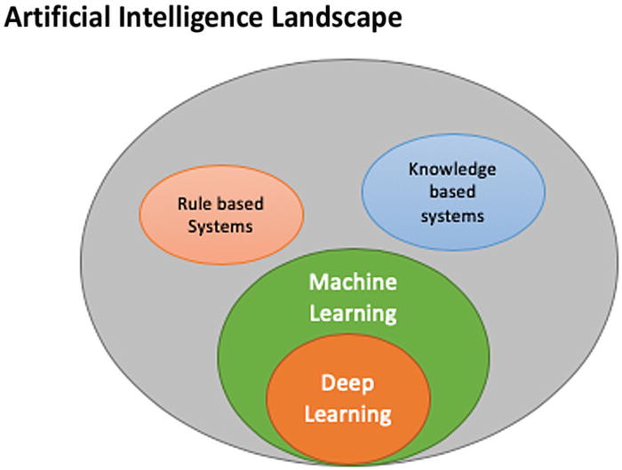
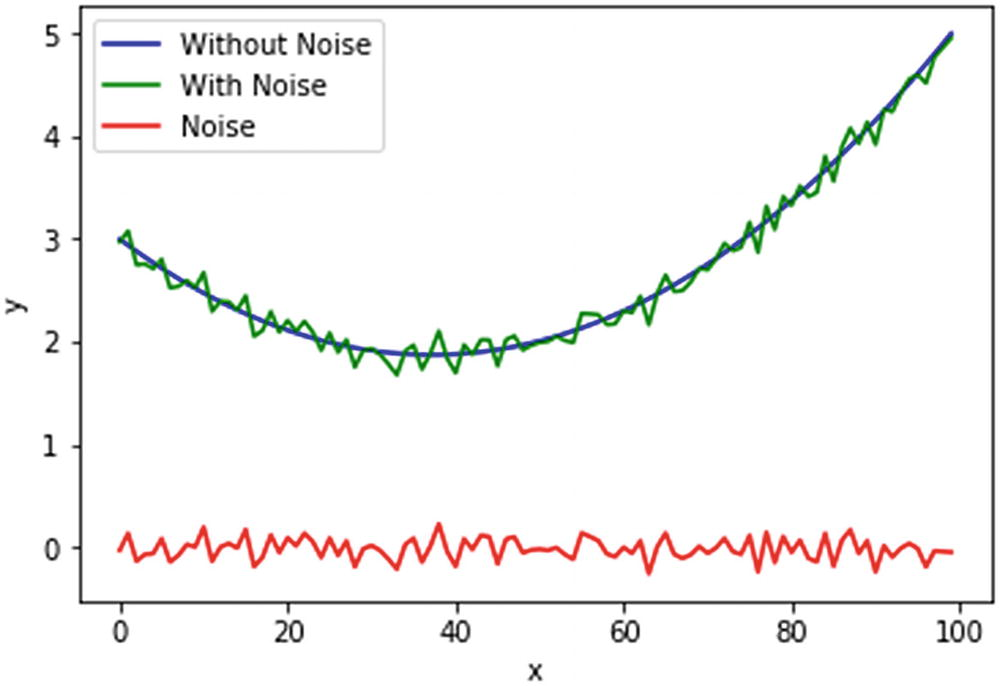
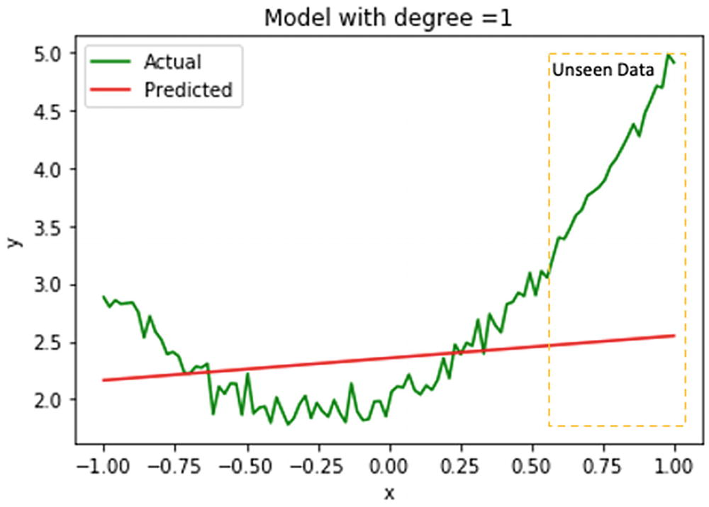
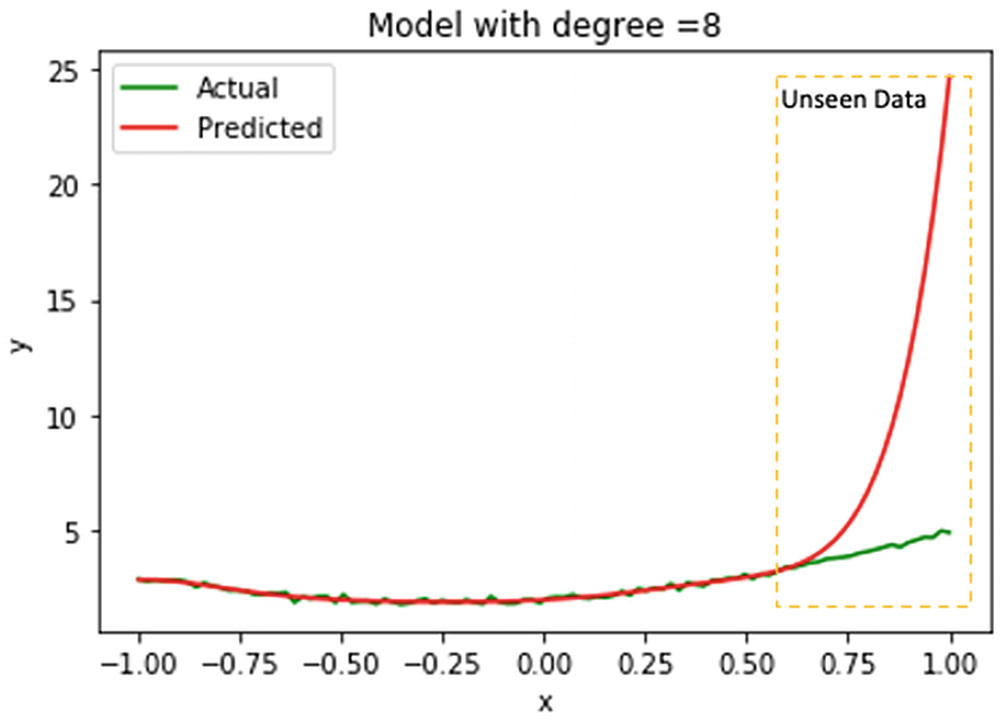
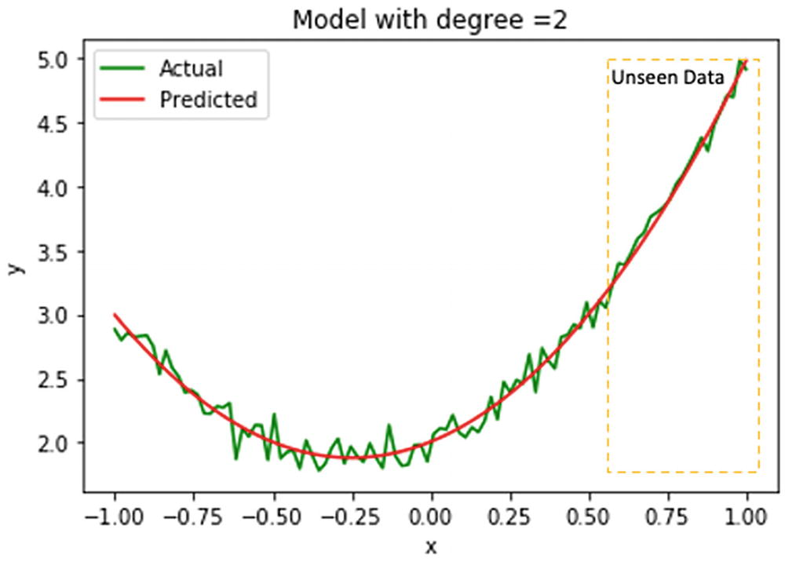
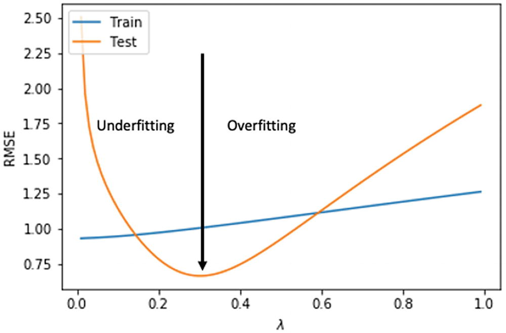

# 一、机器学习和深度学习简介

深度学习的主题最近非常受欢迎，在这个过程中，出现了几个术语，使区分它们变得相当复杂。人们可能会发现，由于主题之间大量的重叠，将每个领域整齐地分开是一项艰巨的任务。

本章通过讨论深度学习的历史背景以及该领域如何演变成今天的形式来介绍深度学习的主题。稍后，我们将通过简要介绍基础主题来介绍机器学习。从深度学习开始，我们将利用使用基本 Python 从机器学习中获得的构造。第二章开始使用 PyTorch 进行实际实现。

## 定义深度学习

*深度学习*是机器学习的一个子领域，它处理的算法非常类似于人脑的过度简化版本，解决了现代机器智能的一个巨大类别。在智能手机的应用生态系统(iOS 和 Android)中可以找到许多常见的例子:相机上的人脸检测，键盘上的自动纠正和预测文本，人工智能增强的美化应用，智能助手，如 Siri/Alexa/Google Assistant，Face-ID(iphone 上的人脸解锁)，YouTube 上的视频建议，脸书上的朋友建议，Snapchat 上的 cat filters，都是只为深度学习而制造的最先进的产品。本质上，深度学习在当今的数字生活中无处不在。

说实话，如果没有一些历史背景，定义深度学习可能会很复杂。

### 简史

人工智能(AI)发展到今天的历程可以大致分为四个部分:即基于规则的系统、基于知识的系统、机器和深度学习。虽然旅程中的粒度转换可以映射为几个重要的里程碑，但我们将覆盖一个更简单的概述。整个进化包含在“人工智能”这个更大的概念中。让我们采取一步一步的方法来解决这个宽泛的术语。



图 1-1

人工智能的前景

深度学习的旅程始于人工智能领域，人工智能是该领域的合法父母，其历史可以追溯到 20 世纪 50 年代。人工智能领域可以简单定义为机器思考和学习的能力。用更通俗的话来说，我们可以把它定义为以某种形式用智能帮助机器的过程，这样它们可以比以前更好地执行任务。上图 1-1 展示了一个简化的人工智能场景，上面提到的各个领域展示了一个子集。我们将在下一节更详细地探讨这些子集。

#### 基于规则的系统

我们诱导到机器中的智能不一定是复杂的过程或能力；像一套规则这样简单的东西可以被定义为智力。第一代人工智能产品只是基于规则的系统，其中一套全面的规则被引导到机器，以映射所有的可能性。一台根据既定规则执行任务的机器会比一台僵化的机器(没有智能的机器)产生更有吸引力的结果。

现代等价物的一个更外行的例子是提款机。一旦通过验证，用户输入他们想要的金额，机器就会根据店内现有的纸币组合，用最少的钞票分发正确的金额。机器解决问题的逻辑(智能)是显式编码(设计)的。机器的设计者仔细考虑了所有的可能性，设计了一个可以用有限的时间和资源有计划地解决任务的系统。

人工智能早期的大部分成功都相当简单。这样的任务可以很容易地形式化描述，就像跳棋或国际象棋。*能够容易地正式描述任务*的概念是计算机程序能够或不能够容易地完成什么的核心。例如，考虑国际象棋比赛。国际象棋游戏的正式描述将是棋盘的表示、每个棋子如何移动的描述、开始的配置以及游戏结束时的配置的描述。有了这些形式化的概念，将下棋的人工智能程序建模为搜索就相对容易了，而且，如果有足够的计算资源，就有可能产生相对较好的下棋人工智能。

人工智能的第一个时代专注于此类任务，并取得了相当大的成功。该方法的核心是领域的符号表示和基于给定规则的符号操作(使用越来越复杂的算法来搜索解决方案空间以获得解决方案)。

必须注意，这些规则的正式定义是手工完成的。然而，这种早期的人工智能系统是相当通用的任务/问题解决者，任何可以正式描述的问题都可以用通用的方法来解决。

这种系统的关键限制是，国际象棋比赛对人工智能来说是一个相对容易的问题，因为问题集相对简单，可以很容易地形式化。人类日常解决的许多问题却并非如此(自然智能)。例如，考虑诊断一种疾病或把人类的语言转录成文本。这些人类可以完成但很难正式描述的任务，在人工智能的早期是一个挑战。

#### 基于知识的系统

利用自然智能解决日常问题的挑战将人工智能的前景演变成了一种类似于人类的方法——即通过利用大量关于任务/问题领域的知识。鉴于这种观察，随后的人工智能系统依赖于大型知识库来获取关于问题/任务领域的知识。注意，这里使用的术语是*知识*，而不是*信息*或*数据*。就知识而言，我们只是指程序/算法可以推理的数据/信息。一个例子可以是一个地图的图形表示，它的边标有距离和交通流量(它是不断更新的)，允许程序推理两点之间的最短路径。

这种基于知识的系统代表了第二代人工智能，其中知识由专家汇编，并以允许算法/程序推理的方式表示。这种方法的核心是越来越复杂的知识表示和推理方法，以解决需要这种知识的任务/问题。这种复杂性的例子包括使用一阶逻辑对知识和概率表示进行编码，以捕捉和推理领域固有的不确定性。

这类系统面临并在一定程度上得到解决的主要挑战之一是许多领域固有的不确定性。人类相对擅长在未知和不确定的环境中进行推理。这里的一个关键观察是，即使我们对一个领域的知识也不是黑或白的，而是灰色的。在这个时代，对未知和不确定性的描述和推理取得了很大进展。在一些任务中取得了有限的成功，如在未知和不确定的情况下，依靠利用知识库进行杠杆作用和推理来诊断疾病。

这种系统的关键限制是需要手工编译来自专家的领域知识。收集、编译和维护这样的知识库使得这样的系统不切实际。在某些领域，收集和编辑这样的知识是极其困难的——例如，将语音转录成文本或者将文档从一种语言翻译成另一种语言。虽然人类可以很容易地学会做这样的任务，但手工编译和编码与任务相关的知识却极具挑战性——例如，英语语言和语法、口音和主题的知识。为了应对这些挑战，机器学习是前进的方向。

#### 机器学习

在正式术语中，我们将机器学习定义为人工智能中无需显式编程即可添加智能的领域。人类通过学习获得任何任务的知识。鉴于这一观察，人工智能后续工作的重点在 10 到 20 年间转移到了基于提供给它们的数据来提高它们性能的算法上。该子领域的焦点是开发算法，该算法获取给定数据的任务/问题领域的相关知识。值得注意的是，这种知识获取依赖于标记数据和人类定义的标记数据的适当表示。

例如，考虑诊断疾病的问题。对于这样一项任务，人类专家将收集大量患者患有和未患有相关疾病的病例。然后，人类专家将识别许多有助于做出预测的特征——例如，患者的年龄和性别，以及许多诊断测试的结果，如血压、血糖等。人类专家将汇编所有这些数据，并以适当的形式表示出来——例如，通过缩放/标准化数据等。一旦准备好这些数据，机器学习算法就可以学习如何通过从标记的数据中进行归纳来推断患者是否患有疾病。注意，标记的数据由患有和未患有该疾病的患者组成。因此，从本质上来说，底层机器语言算法本质上是在给定输入(年龄、性别、诊断测试数据等特征)的情况下，寻找能够产生正确结果(疾病或无疾病)的数学函数。寻找最简单的数学函数来预测具有所需精度水平的输出是机器学习领域的核心。例如，与学习一项任务所需的示例数量或算法的时间复杂度相关的问题是 ML 领域已经提供了理论证明的答案的特定领域。这个领域已经成熟到一定程度，给定足够的数据、计算资源和人力资源来设计特征，一大类问题是可以解决的。

主流机器语言算法的关键限制是，将它们应用到一个新的问题领域需要大量的特征工程。例如，考虑在图像中识别物体的问题。使用传统的机器语言技术，这样的问题将需要大量的特征工程工作，其中专家识别并生成将被机器语言算法使用的特征。从某种意义上说，真正的智慧在于对特征的识别；机器语言算法只是学习如何结合这些特征来得出正确的答案。在应用机器语言算法之前，领域专家进行的这种特征识别或数据表示是人工智能中概念和实践的瓶颈。

这是一个概念瓶颈，因为如果领域专家正在识别特征，而机器语言算法只是学习组合并从中得出结论，这真的是人工智能吗？这是一个实际的瓶颈，因为通过传统的机器语言建立模型的过程受到所需的大量特征工程的限制。解决这个问题的人力是有限的。

#### 深度学习

深度学习解决了机器学习系统的主要瓶颈。在这里，我们基本上把智能向前推进了一步，机器以自动化的方式为任务开发相关功能，而不是手工制作。人类从原始数据开始学习概念。例如，一个孩子看到一些特定动物(比如说猫)的例子，他很快就会学会辨认这种动物。学习过程不包括父母识别猫的特征，如它的胡须、皮毛或尾巴。人类学习从原始数据到结论，而没有明确的步骤，即识别特征并提供给学习者。从某种意义上说，人类从数据本身学习数据的适当表示。此外，他们将概念组织成一个层次结构，其中复杂的概念用基本的概念来表达。

深度学习领域的主要重点是学习数据的适当表示，以便这些数据可以用于得出结论。“深度学习”中的“深”字是指直接从原始数据中学习概念的层次结构的思想。深度学习在技术上更合适的术语是*表示学习*，更实用的术语是*自动化特征工程*。

## 相关领域的进展

值得注意的是其他领域的进步，如计算能力、存储成本等。在深度学习最近的兴趣和成功中发挥了关键作用。例如，考虑以下情况:

*   在过去十年中，收集、存储和处理大量数据的能力有了很大提高(例如，Apache Hadoop 生态系统)。

*   随着众包服务(如 Amazon Mechanical Turk)的出现，生成受监督的训练数据(带标签的数据——例如，用图片中的对象进行注释的图片)的能力有了很大提高。

*   图形处理单元(GPU)带来的计算能力的巨大提高使并行计算达到了新的高度。

*   自动微分的理论和软件实现(如 PyTorch 或 Theano)的进步加快了深度学习的开发和研究速度。

虽然这些进步对于深度学习来说是外围的，但它们在实现深度学习的进步方面发挥了很大的作用。

## 先决条件

阅读这本书的关键先决条件包括 Python 的工作知识以及线性代数、微积分和概率方面的一些课程。如果读者需要了解这些先决条件，他们应该参考以下内容。

*   Mark Pilgrim-a press Publications(2004 年)著*深入研究 Python*

*   *《线性代数导论》(第五版)*，吉尔伯特·斯特朗-韦尔斯利-剑桥出版社

*   吉尔伯特·斯特朗-韦尔斯利-剑桥出版社出版的《微积分》

*   拉里·乏色曼-施普林格(2010)的所有统计数据(第一节，章节 1 - 5 )

## 前方的路

这本书关注深度学习的关键概念及其使用 PyTorch 的实际实现。为了使用 PyTorch，您应该对 Python 编程有一个基本的了解。第二章介绍 PyTorch，后续章节讨论 PyTorch 中的其他重要结构。

在深入研究深度学习之前，我们需要讨论机器学习的基本构造。在本章的剩余部分，我们将通过一个虚拟的例子来探索机器学习的初级步骤。为了实现这些构造，我们将使用 Python，并再次使用 PyTorch 来实现。

## 安装所需的库

为了运行本书中示例的源代码，您需要安装许多库。我们建议安装 Anaconda Python 发行版( [`https://www.anaconda.com/products/individual`](https://www.anaconda.com/products/individual) )，它简化了安装所需包的过程(使用 conda 或 pip)。您需要的包列表包括 NumPy、matplotlib、scikit-learn 和 PyTorch。

PyTorch 不是作为 Anaconda 发行版的一部分安装的。您应该安装 PyTorch、torchtext 和 torchvision，以及 Anaconda 环境。

请注意，本书中的练习推荐使用 Python 3.6(及更高版本)。我们强烈建议在安装 Anaconda 发行版之后创建一个新的 Python 环境。

使用 Python 3.6 创建一个新环境(在 Linux/Mac 中使用终端或在 Windows 中使用命令提示符)，然后安装其他必要的软件包，如下所示:

```py
conda create -n testenvironment python=3.6

conda activate testenvironment
pip install pytorch torchvision torchtext

```

有关 PyTorch 的更多帮助，请参考 [`https://pytorch.org/get-started/locally/`](https://pytorch.org/get-started/locally/) 的入门指南。

## 机器学习的概念

作为人类，我们直观地意识到学习的概念。它只是意味着随着时间的推移，在一项任务上做得更好。这个任务可以是体力的，比如学习开车，也可以是智力的，比如学习一门新语言。机器学习的学科重点是开发能够像人类一样学习的算法；也就是说，随着时间的推移和经验的积累，他们在一项任务上变得更好——从而在没有显式编程的情况下诱导智力。

要问的第一个问题是，为什么我们会对随着时间的推移，随着经验的积累而提高性能的算法的开发感兴趣。毕竟，许多算法的开发和实现都是为了解决不随时间推移而改善的现实问题；它们只是由人类开发，用软件实现，并完成工作。从银行业到电子商务，从汽车导航系统到登月飞船，算法无处不在，而且大多数算法不会随着时间的推移而改进。这些算法只是执行它们想要执行的任务，并不时需要一些维护。我们为什么需要机器学习？

这个问题的答案是，对于某些任务，开发一个通过经验学习/提高其性能的算法比手动开发一个算法更容易。尽管在这一点上，这对于读者来说似乎是不直观的，但我们将在本章中对此建立直觉。

机器学习可以大致分为*监督学习*，为模型提供带标签的训练数据进行学习，以及*非监督学习*，训练数据缺少标签。我们也有*半监督学习*和*强化学习*，但是现在，我们将把范围限制在监督机器学习。监督学习又可以分为两个区域:*分类*，用于离散结果，以及*回归*，用于连续结果。

## 二元分类

为了进一步讨论手头的问题，我们需要精确地定义一些我们一直在直觉上使用的术语，比如任务、学习、经验和改进。我们将从二进制分类的任务开始。

考虑一个抽象的问题领域，其中我们有形式为


的数据

其中*x*∈ℝ<sup>nt5*y*= 1。</sup>

我们无法访问所有这些数据，只能访问一个子集 *S* ∈ *D* 。使用 *S* ，我们的任务是生成一个实现函数 *f* : *x* → *y* 的计算过程，这样我们就可以使用 *f* 对未知数据进行预测( *x* <sub>*i*</sub> ，*y*<sub>*I*</sub>)∉*s*让我们把 *U* ∈ *D* 表示为一组看不见的数据——即( *x* <sub>*i*</sub> ，*y*<sub>I</sub>*)∉*s*和( *x* <sub>*i*</sub>*

 *我们用未见过的数据

![$$ E\left(f,D,U\right)=\frac{\ \sum \limits_{\left({x}_i,{y}_i\right)\in U}\left[f\left({x}_i\right)\ne {y}_i\right]}{\mid U\mid }. $$](img/478491_2_En_1_Chapter_TeX_Equb.png)

的误差来衡量这个任务的性能

我们现在对这个任务有了一个精确的定义，那就是通过生成 *f* ，基于一些看到的数据 *S* ，将数据归类到两个类别中的一个( *y* = 1)。我们使用未知数据 *U* 上的误差 *E* ( *f* ， *D* ， *U* )来衡量性能(以及性能的提高)。所见数据的大小| *S* |在概念上等同于经验。在这种背景下，我们想要开发生成这样的函数 *f* (通常称为模型)的算法。一般来说，机器学习领域研究这种算法的发展，这种算法产生对这种和其他正式任务的看不见的数据进行预测的模型。(我们将在本章后面介绍多个这样的任务。)注意， *x* 通常被称为*输入/输入变量*，而 *y* 被称为*输出/输出变量*。

如同计算机科学中的任何其他学科一样，这种算法的计算特性是一个重要的方面；然而，除此之外，我们还希望有一个模型 *f* ，它可以实现更低的误差 *E* ( *f* ， *D* ， *U* )，并且∣ *S* ∣尽可能小。

现在让我们将这个抽象但精确的定义与现实世界的问题联系起来，这样我们的抽象就有了基础。假设一个电子商务网站想要为注册用户定制其登录页面，以显示他们可能有兴趣购买的产品。该网站有用户的历史数据，并希望实现这一功能，以增加销售。现在让我们看看这个现实世界的问题是如何映射到我们前面描述的二进制分类的抽象问题上的。

人们可能注意到的第一件事是，给定一个特定的用户和特定的产品，人们会希望预测该用户是否会购买该产品。由于这是要预测的值，它映射到 *y* = 1，这里我们将让 *y* = + 1 的值表示用户将购买该产品的预测，而*y*= 1 的值表示用户将不会购买该产品的预测。请注意，选择这些值没有特别的原因；我们可以交换这一点(让 *y* = + 1 表示不买的情况，让*y*= 1 表示买的情况)，不会有任何不同。我们只是使用 *y* = 1 来表示对数据进行分类的两个感兴趣的类别。接下来，我们假设我们可以将产品的属性和用户的购买和浏览历史表示为*x*∈ℝ<sup>*n*</sup>。这一步在机器学习中被称为*特征工程*，我们将在本章的后面介绍。现在，只要说我们能够生成这样的映射就足够了。这样，我们就有了用户浏览和购买了什么、产品的属性以及用户是否购买了该产品的历史数据映射到{( *x* <sub>1</sub> ， *y* <sub>1</sub> )，( *x* <sub>2</sub> ， *y* <sub>2</sub> )，…( *x* <sub>*n 现在，基于这些数据，我们想要生成一个函数或模型*f*:*x*→*y*，我们可以使用它来确定特定用户将购买哪些产品，并使用它来填充用户的登录页面。我们可以通过为用户填充登录页面，查看他们是否购买产品，并评估错误 *E* ( *f* ， *D* ， *U* )来衡量模型在看不见的数据上做得有多好。*</sub>

## 回归

本节介绍另一项任务:回归。这里，我们有格式为*d*= {(*x*1，*y*1)，(*x*2， *y* <sub>2</sub> )，…(*x*<sub>*n*</sub>，*y*<sub>的数据 我们的任务是生成一个计算程序，实现函数*f*:*x*→*y*。 注意，与二进制分类中的二进制分类标签 *y* = 1 不同，我们使用实值预测。我们用看不见的数据的均方根误差(RMSE)来衡量这个任务的性能</sub>


Note

RMSE 只是取预测值和实际值之间的差值，对其求平方以考虑正负差值，取平均值以聚合所有看不见的数据，最后，求平方根以平衡平方运算。

与回归的抽象任务相对应的一个现实世界的问题是基于个人的金融历史来预测他们的信用分数，信用卡公司可以使用该信用分数来扩展信用额度。

## 一般化

现在让我们来看看机器学习中最重要的直觉是什么，那就是我们想要开发/生成对看不见的数据具有良好性能的模型。为了做到这一点，首先我们将介绍一个玩具数据集的回归任务。稍后，我们将使用不同复杂程度的相同数据集开发三个不同的模型，并研究结果如何不同，以便直观地理解概化的概念。

在清单 1-1 中，我们通过生成 100 个在-1 和 1 之间等距的值作为输入变量( *x* )来生成玩具数据集。我们基于*y*= 2+*x*+2*x*2+*ϵ*生成输出变量( *y* ，其中是正态分布的噪声(随机变化)，0 是平均值，0.1 是标准差。清单 1-1 给出了这方面的代码，数据绘制在图 1-2 中。为了模拟可见和不可见的数据，我们使用前 80 个数据点作为可见数据，其余的作为不可见数据。也就是说，我们仅使用前 80 个数据点来构建模型，并使用剩余的数据点来评估模型。



图 1-2

玩具数据集

```py
#import packages
import matplotlib.pyplot as plt
import numpy as np

#Generate a toy dataset
x = np.linspace(-1,1,100)
signal = 2 + x + 2 * x * x
noise = numpy.random.normal(0, 0.1, 100)
y = signal + noise
plt.plot(signal,'b');
plt.plot(y,'g')
plt.plot(noise, 'r')
plt.xlabel("x")
plt.ylabel("y")
plt.legend(["Without Noise", "With Noise", "Noise"], loc = 2)
plt.show()

#Extract training from the toy dataset
x_train = x[0:80]
y_train = y[0:80]
print("Shape of x_train:",x_train.shape)
print("Shape of y_train:",y_train.shape)

Output[]
Shape of x_train: (80,)
Shape of y_train: (80,)

Listing 1-1Generalization vs. Rote Learning

```

接下来，我们用一个非常简单的算法来生成一个模型，通常称为*最小二乘*。给定一个格式为 *D* = {( *x* <sub>1</sub> ， *y* <sub>1</sub> )，( *x* <sub>2</sub> ， *y* <sub>2</sub> )，…(*x*<sub>*n*</sub>， *y* <sub>的数据集 最小二乘模型采用的形式是 *y* = *βx* ，其中 *β* 是一个向量，使得被最小化。 这里， *X* 是一个矩阵，其中每一行是一个 *x* (因此，*x*∈ℝ<sup>∈m×*n*</sup>，其中 *m* 是示例的数量，在我们的例子中是 80)。 *β* 的值可以用封闭形式*β*=(*X*<sup>*T*</sup>*X*)<sup>—1</sup>*X**T**y*导出。我们正在掩饰最小二乘法的许多重要细节，但这些都是当前讨论的次要问题。更相关的细节是我们如何将输入变量转换成合适的形式。在我们的第一个模型中，我们将把 *x* 转换成一个值的向量[ * x * <sup>0</sup> ， *x* <sup>1</sup> ， *x* <sup> 2 </sup> ]。也就是说，如果 *x* = 2，就转化为【1，2，4】。在此转换之后，我们可以使用之前描述的公式生成最小二乘模型 *β* 。实际情况是，我们用一个二阶多项式(次数= 2)方程来逼近给定的数据，最小二乘算法只是简单地曲线拟合或生成每个*x*0，*x*1，*x*2 的系数。</sub>

我们可以使用 RMSE 度量在看不见的数据上评估模型。我们还可以计算训练数据的 RMSE 度量。图 [1-3 绘制了实际值和预测值，清单 1-2 显示了生成模型的源代码。



图 1-3

阶数= 1 的模型的实际值和预测值

```py
#Create a function to build a regression model with parameterized degree of independent coefficients
def create_model(x_train,degree):
    degree+=1
    X_train = np.column_stack([np.power(x_train,i) for i in range(0,degree)])
    model = np.dot(np.dot(np.linalg.inv(np.dot(X_train.transpose(),X_train)),X_train.transpose()),y_train)
    plt.plot(x,y,'g')
    plt.xlabel("x")
    plt.ylabel("y")
    predicted = np.dot(model, [np.power(x,i) for i in range(0,degree)])
    plt.plot(x, predicted,'r')
    plt.legend(["Actual", "Predicted"], loc = 2)
    plt.title("Model with degree =3")
    train_rmse1 = np.sqrt(np.sum(np.dot(y[0:80] - predicted[0:80], y_train - predicted[0:80])))
    test_rmse1 = np.sqrt(np.sum(np.dot(y[80:] - predicted[80:], y[80:] - predicted[80:])))
    print("Train RMSE(Degree = "+str(degree)+"):", round(train_rmse1,2))
    print("Test RMSE (Degree = "+str(degree)+"):", round(test_rmse1,2))
    plt.show()

#Create a model with degree = 1 using the function
create_model(x_train,1)

Output[]
Train RMSE(Degree = 1): 3.55
Test RMSE (Degree = 1): 7.56

Listing 1-2.Function to build model with parameterized number of co-efficients

```

类似地，列表 1-3 和图 1-4 对度数=2 的模型重复该练习。



图 1-5

阶数= 8 的模型的实际值和预测值



图 1-4

阶数= 2 的模型的实际值和预测值

```py
#Create a model with degree=2
create_model(x_train,2)

Output[]
Train RMSE (Degree = 3) 1.01
Test RMSE (Degree = 3) 0.43

Listing 1-3.Creating a model with degree=2

```

接下来，如清单 1-4 所示，我们用最小二乘算法生成另一个模型，但是我们将把 *x* 转换为*x*0， *x* <sup>1</sup> ， *x* <sup>2</sup> ， *x* <sup>3</sup> ， *x* <sup>4</sup> ，<sup>也就是说，我们用次数= 8 的多项式来逼近给定的数据。</sup>

```py
#Create a model with degree=8
create_model(x_train,8)

Output[]
Train RMSE(Degree = 8): 0.84
Test RMSE (Degree = 8): 35.44

Listing 1-4Model with degree=8

```

实际值和预测值绘制在图 1-3 、图 1-4 和图 1-5 中。清单 1-2 中提供了创建模型的源代码(函数)。

我们现在已经有了讨论一般化核心概念的所有细节。要问的关键问题是哪个模型更好——度数= 2 的模型，度数= 8 的模型，还是度数= 1 的模型？让我们首先对这三个模型进行一些观察。与所有其他两个模型相比，度数= 1 的模型在可见和不可见数据上都表现不佳。与度数= 2 的模型相比，度数= 8 的模型在可见数据上表现得更好。对于看不见的数据，度数= 2 的模型比度数= 8 的模型执行得更好。表 1-1 应该有助于阐明模型的解释。

表 1-1

比较三种模型的性能

<colgroup><col class="tcol1 align-center"> <col class="tcol2 align-center"></colgroup> 
| -  |

我们现在考虑模型容量的重要概念，它对应于本例中多项式的次数。我们生成的数据使用带有一些噪声的二阶多项式(次数= 2)。然后，我们尝试使用三个模型(分别为 1 度、2 度和 8 度)来逼近数据。度数越高，模型的表达能力越强，也就是说，它可以容纳更多的变化。这种适应变化的能力对应于*模型容量*的概念。也就是说，我们说度= 8 的模型比度= 2 的模型具有更高的容量，而度= 2 的模型又比度= 1 的模型具有更高的容量。拥有更高的容量不总是一件好事吗？当我们考虑到所有真实世界的数据集都包含一些噪声，并且更高容量的模型除了拟合数据中的信号之外，还会拟合噪声时，事实证明并非如此。这就是为什么我们观察到，与度数= 8 的模型相比，度数= 2 的模型在看不见的数据上做得更好。在这个例子中，我们知道数据是如何产生的(用一个二阶多项式(次数= 2)和一些噪声)；因此，这个观察是相当琐碎的。然而，在现实世界中，我们不知道数据生成的底层机制。这让我们想到了机器学习中的一个基本挑战:模型真的一般化了吗？唯一真正的测试是对看不见的数据的性能。

在某种意义上，容量的概念对应于模型的简单性或简约性。具有高容量的模型可以近似更复杂的数据。这是模型有多少自由变量/系数。在我们的示例中，度= 1 的模型没有足够的能力来逼近数据。这通常被称为*欠拟合*。相应地，度数= 8 的模型具有额外的容量，并且*过拟合*数据。

作为一个思想实验，考虑如果我们有一个度数= 80 的模型会发生什么。假设我们有 80 个数据点作为训练数据，我们将有一个 80 次多项式来完美地逼近数据。这是根本没有学习的终极病理案例。该模型有 80 个系数，可以简单地记忆数据。这被称为*死记硬背*，过度适应的逻辑极端。这就是为什么模型的容量需要根据我们拥有的训练数据量进行调整。如果数据集很小，我们最好训练容量较低的模型。

## 正规化

基于模型容量、泛化、过拟合和欠拟合的思想，本节讨论*正则化*。这里的关键思想是*惩罚模型的复杂性*。最小二乘法的正则化版本采取的形式是 *y* = *βx* ，其中 *β* 是一个向量，使得被最小化，而 *λ* 是控制复杂度的用户定义参数。在这里，通过引入术语，我们正在惩罚复杂的模型。要了解为什么会出现这种情况，请考虑使用 10 次多项式拟合最小二乘模型，但向量 *β* 中的值有八个零和两个非零。与此相反，考虑向量 *β* 中的所有值都不为零的情况。出于所有实际目的，前一个模型是度数= 2 的模型，并且具有更低的值。 *λ* 项使我们能够平衡训练数据的准确性和模型的复杂性。较低的 *λ* 值意味着更简单的模型。调整 *λ* 的值，我们可以通过平衡过拟合和欠拟合来提高模型在未知数据上的性能。

清单 1-5 展示了在保持模型系数不变但增加 *λ* 值的情况下，模型在不可见数据上的性能如何变化。

```py
import matplotlib.pyplot as plt
import numpy as np

#Setting seed for reproducibility
np.random.seed(20)

#Create random data
x = np.linspace(-1,1,100)
signal = 2 + x + 2 * x * x
noise = np.random.normal(0, 0.1, 100)
y = signal + noise
x_train = x[0:80]
y_train = y[0:80]

train_rmse = []
test_rmse = []
degree = 80

#Define

a range of values for lambda
lambda_reg_values = np.linspace(0.01,0.99,100)

for lambda_reg in lambda_reg_values: #For each value of lambda, compute build model and compute performance for lambda_reg in lambda_reg_values:
    X_train = np.column_stack([np.power(x_train,i) for i in range(0,degree)])
    model = np.dot(np.dot(np.linalg.inv(np.dot(X_train.transpose(),X_train) + lambda_reg * np.identity(degree)),X_train.transpose()),y_train)
    predicted = np.dot(model, [np.power(x,i) for i in range(0,degree)])
    train_rmse.append(np.sqrt(np.sum(np.dot(y[0:80] - predicted[0:80], y_train - predicted[0:80]))))
    test_rmse.append(np.sqrt(np.sum(np.dot(y[80:] - predicted[80:], y[80:] - predicted[80:]))))

#Plot the performance over train and test dataset.
plt.plot(lambda_reg_values, train_rmse)
plt.plot(lambda_reg_values, test_rmse)
plt.xlabel(r"$\lambda$")
plt.ylabel("RMSE")
plt.legend(["Train", "Test"], loc = 2)
plt.show()

Listing 1-5Regularization

```

我们可以利用封闭形式*β*=(*X*<sup>*T*</sup>*X*—*λI*)<sup>—1</sup>*X*<sup>*T*</sup>*y*来计算 *β* 的值。在清单 1-5 中，我们展示了将度数固定为值 80 并改变 *λ* 的值。训练 RMSE(已知数据)和测试 RMSE(未知数据)绘制在图 1-6 中。



图 1-6

正规化

我们看到，随着模型容量的增加，测试 RMSE 逐渐降低到最小值，然后逐渐增加，导致过度拟合。

## 摘要

本章涵盖了深度学习的简史，并介绍了机器学习的基础，包括监督学习的例子(分类和回归)。本章的重点是对看不见的示例进行概化的概念、训练数据的过拟合和欠拟合、模型的容量以及正则化的概念。鼓励读者尝试源代码清单中的示例。在下一章，我们将探索 PyTorch 作为开发深度学习模型的基础框架*