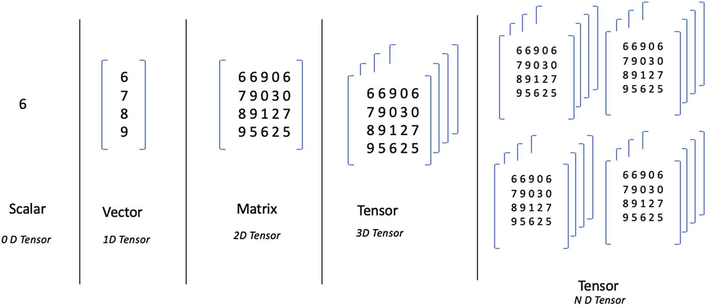

# 二、PyTorch 简介

最近几年见证了框架和工具的主要发布，以将深度学习大众化。今天，我们有太多的选择。本章旨在提供 PyTorch 的概述。我们将在整本书中广泛使用 PyTorch 来实现深度学习示例。注意，这一章不是 PyTorch 的全面指南，所以你应该参考这一章中建议的额外资料来更深入地理解这个框架。在本书后面的示例实现过程中，将提供一个基本概述和对该主题的必要补充。

事不宜迟，让我们先回顾一下您在考虑 PyTorch 时可能会遇到的一些更广泛的问题。

## 为什么我们需要深度学习框架？

开发一个深度神经网络并准备好它来解决今天的问题是一项非常艰巨的任务。在一个系统的流程中，有太多的部分需要连接和编排，以实现我们希望通过深度学习实现的目标。为了能够为研究和产品中的实验提供更简单、更快速、更高质量的解决方案，企业需要大量的抽象来完成繁重的基础任务。这将有助于研究人员和开发人员专注于重要的任务，而不是将大部分时间投入到基本操作上。深度学习框架和平台通过简单的功能提供了地面复杂任务的公平抽象，可以被研究人员和开发人员用作解决更大问题的工具。几个流行的选择是 Keras，PyTorch，TensorFlow，MXNet，Caffe，微软的 CNTK 等。

## PyTorch 是什么？

PyTorch 是由脸书公司开发的开源机器学习和深度学习库。顾名思义，它是基于 Python 的，旨在通过提供 GPU 的无缝使用和提供最大灵活性和速度的深度学习平台，为 NumPy(在本章的示例中使用)提供更快的替代/替换。

## 为什么选择 PyTorch？

推荐 PyTorch 很简单。它提供了一个非常容易使用、扩展、开发和调试的框架。因为它是 Pythonic 化的，所以很容易被软件工程社区接受。对于研究人员和开发人员来说，完成任务同样容易。PyTorch 还使得深度学习模型易于生产化。它配备了高性能的 C++运行时，开发人员可以在生产环境中使用，同时避免通过 Python 进行推理。对于大多数熟悉 Python 的 NumPy 包的用户来说，PyTorch 将更容易过渡到。总的来说，PyTorch 为研究人员和开发人员提供了一个优秀的框架和平台，让他们在专注于重要任务的同时解决前沿的深度学习问题，并能够轻松地进行调试、实验和部署。

由于上述原因，PyTorch 在企业中被广泛采用。如果你关注深度学习的媒体，你可能会读到一些文章，提到一个新的大型组织采用 PyTorch。Yann Lecun 是深度学习领域的资深研究员，NYU 大学教授，脸书大学首席科学家(撰写本文时)在 2019 年 11 月发了以下推文:

> *“neur IPS 的 19 篇提到使用深度学习框架的论文中，超过 69%提到 PyTorch。PyTorch 在深度学习研究(ML/CV/NLP 会议)中遥遥领先。*

有了足够的理由证明 PyTorch 是深度学习的一个值得选择，让我们开始吧。

## 这一切都始于张量

一般来说，深度学习中的任务将围绕处理图像、文本或表格数据(横截面以及时间序列)来生成结果，该结果是数字、标签、更多文本、另一个图像或这些的组合。简单的例子包括将图像分类为狗或猫，预测句子中的下一个单词，为图像生成标题，或者用新样式转换图像(比如 iOS/Android 上的 Prisma 应用程序)。这些任务中的每一项都需要将底层数据存储在特定的结构中。处理和开发这些解决方案将有几个中间阶段，这也需要特定的结构(例如，神经网络的权重)。一个通用于存储、表示和转换的结构是张量。

张量只不过是同一类型(通常是浮点数)对象的多维数组。虽然有点过于简化，但公平地说，在较低的抽象层次上，PyTorch 中的所有计算都是张量和张量上的运算。因此，为了让你能够流利地使用 PyTorch，你有必要对张量及其运算有一个直观的理解。还必须指出，这种对张量及其运算的介绍决不是完整的；您应该参考 PyTorch 文档来了解具体的用例。然而，指出这一章涵盖了张量及其运算的所有概念方面也是必要的。您应该在 Python 终端中尝试本节中的示例。(推荐 Jupyter 笔记本。)内化这种材料的最好方法是阅读概念，打出源代码，然后看着它执行。

张量是表示标量、矢量和矩阵的一种通用方式。张量可以定义为一个 n 维矩阵。一个 0 维张量(即单个数)叫做*标量*(图 2-1)；一维张量被称为*矢量*；二维张量被称为矩阵；三维张量也叫做*立方体*；等等。矩阵的维数也称为张量的秩。



图 2-1

0-n 维张量

PyTorch 是一个非常丰富的库，提供了许多功能，为深度学习提供了基础。本章简要介绍 PyTorch 为创建张量和执行数据管理操作、线性代数和数学运算提供的一些功能。

首先，让我们探索构造张量的多种方法。最基本的方法是使用 Python 中的列表来构造张量。下面的练习将演示一系列常用于构建深度学习应用程序的张量运算。为了帮助您更好地参与流程，代码和输出一直保持笔记本风格(交互流程:输入➤输出➤下一个输入➤下一个输出➤等等)。

## 创建张量

在清单 2-1 中，我们使用嵌套列表构建了一个二维张量。我们把这个张量存储为一个变量，然后看它的形状。

```py
In [1]: import torch
           torch.tensor([[0.1, 0.2],[0.3, 0.4]])
Out[1]:
tensor([[0.1000, 0.2000],
            [0.3000, 0.4000]])

Listing 2-1Creating a 2-Dimensional Tensor

```

形状表示张量的维数和用于推断张量秩的维数总数。在清单 2-2 中，dimension [2，2]将被推断为秩 2。

清单 2-2 探究了张量的形状。

```py
In [1]: a = torch.tensor([[0.1, 0.2],[0.3, 0.4]])
In [2]: a.shape

Out[2]: torch.Size([2, 2])

In [3]: a
Out[3]:
tensor([[0.1000, 0.2000],
              [0.3000, 0.4000]])

Listing 2-2The Shape of a Tensor

```

我们可以尝试更多不同形状的例子。清单 2-3 探究不同形状的张量。

```py
In [1]: b = torch.tensor([[0.1, 0.2],[0.3, 0.4],[0.5, 0.6]])

In [2]: b

Out[2]:
tensor([[0.1000, 0.2000],
        [0.3000, 0.4000],
        [0.5000, 0.6000]])

In [3]: b.shape
Out[3]: torch.Size([3, 2])

Listing 2-3The shape of a tensor (continued)

```

还要注意，我们可以有任意维数的张量，而不仅仅是两个(如前面的例子)。清单 2-4 展示了三维张量的创建。

```py
In [1]: c = torch.tensor([[[0.1],[0.2]],[[0.3],[0.4]]])

In [2]: c.shape
Out[2]: torch.Size([2, 2, 1])

In [3]: c
Out[3]:
tensor([[[0.1000],
         [0.2000]],
         [[0.3000],
         [0.4000]]])

Listing 2-4Creating Tensors with Arbitrary Dimensions

```

正如我们可以用 Python 列表构建张量一样，我们也可以用 NumPy 数组构建张量。在将 NumPy 代码与 PyTorch 进行交互时，这一功能非常方便。清单 2-5 演示了使用 NumPy 创建张量。

```py
In [1]: a = torch.tensor(numpy.array([[0.1, 0.2],[0.3, 0.4]]))

In [2]: a
Out[2]:
tensor([[0.1000, 0.2000],
        [0.3000, 0.4000]], dtype=torch.float64)

In [3]: a.shape
Out[3]: torch.Size([2, 2])

Listing 2-5Creating Tensors with NumPy

```

我们还可以使用`from_numpy`函数从现有的 NumPy n 维数组中创建一个张量。清单 2-6 演示了使用 PyTorch 的内置函数`from_numpy`从 NumPy 创建张量。

```py
import numpy as np
a = np.array([1, 2, 3, 4, 5])
tensor_a = torch.from_numpy(a)
tensor_a

Output[]
tensor([1, 2, 3, 4, 5])

Listing 2-6Creating Tensors from NumPy

```

正如我们在引言中提到的，张量是同类型的多维数组。我们可以在构造张量时指定类型。在下面的例子中，我们用 32 位浮点数、64 位浮点数和 16 位浮点数初始化张量。PyTorch 总共定义了八种类型。(有关更多详细信息，请参考 PyTorch 文档。)清单 2-7 演示了用 PyTorch 中可用的几种流行数据类型来构造张量。

```py
In [1]: a = torch.tensor([[0.1, 0.2],[0.3, 0.4]], dtype=torch.float32)

In [2]: a
Out[2]:
tensor([[0.1000, 0.2000],
        [0.3000, 0.4000]])

In [3]: a = torch.tensor([[0.1, 0.2],[0.3, 0.4]], dtype=torch.float64)

In [4]: a
Out[4]:
tensor([[0.1000, 0.2000],
        [0.3000, 0.4000]], dtype=torch.float64)

In [5]: a = torch.tensor([[0.1, 0.2],[0.3, 0.4]], dtype=torch.float16)

In [6]: a
Out[6]:
tensor([[0.1000, 0.2000],
        [0.3000, 0.3999]], dtype=torch.float16)

Listing 2-7Defining Tensor Datatypes

```

表 2-1 显示了不同的数据类型及其 PyTorch 等价物。

表 2-1

数据类型及其 PyTorch 等价物

<colgroup><col class="tcol1 align-left"> <col class="tcol2 align-left"></colgroup> 
| 

数据类型

 | 

PyTorch 当量

 |
| --- | --- |
| 32 位浮点 | torch.float32 或 torch.float |
| 64 位浮点 | torch.float64 或 torch.double |
| 16 位浮点 | 火炬.浮动 16 或火炬.半 |
| 8 位整数(无符号) | torch.uint8 |
| 8 位整数(有符号) | torch.int8 |
| 16 位整数(有符号) | torch.int16 或 torch.short |
| 32 位整数(有符号) | torch.int32 或 torch.int |
| 64 位整数(有符号) | torch.int64 或 torch.long |
| 布尔代数学体系的 | 火炬.布尔 |

现在让我们看看构造张量的其他方法。一个常见的需求是构造一个用随机值填充的张量。清单 2-8 演示了创建一个具有随机值的定义形状的张量。

```py
In [1]: r = torch.rand(2,2,2)

In [2]: r
Out[2]:
tensor([[[0.7993, 0.5940],
         [0.3994, 0.7134]],

         [[0.3102, 0.5175],
         [0.6510, 0.7272]]])

In [3]: r.shape
Out[3]: torch.Size([2, 2, 2])

Listing 2-8Creating a Tensor with Random Values

```

另一个常见的要求是构造一个零张量。清单 2-9 展示了一个定义了全零形状的张量的创建。

```py
In [1]: zeros = torch.zeros(2,2,3)

In [2]: zeros
Out[2]:
tensor([[[0., 0., 0.],
         [0., 0., 0.]],

         [[0., 0., 0.],
         [0., 0., 0.]]])

In [3]: zeros.shape
Out[3]: torch.Size([2, 2, 3])

Listing 2-9Creating

a Tensor Having All Zeros

```

同样，我们可以构造一个 1 的张量。清单 2-10 演示了创建一个定义了全 1 形状的张量。

```py
In [1]: ones = torch.ones(2,2,3)

In [2]: ones
Out[2]:
tensor([[[1., 1., 1.],
         [1., 1., 1.]],

         [[1., 1., 1.],
         [1., 1., 1.]]])

In [3]: ones.shape
Out[3]: torch.Size([2, 2, 3])

Listing 2-10Creating a Tensor Having All Ones

```

另一个常见的需求是构造单位矩阵(张量)。清单 2-11 展示了一个单位矩阵张量的创建(即所有对角元素为 1)。

```py
In [1] i = torch.eye(3)

In [2]: i
Out[2]:
tensor([[1., 0., 0.],
        [0., 1., 0.],
        [0., 0., 1.]])

In [3]: i.shape
Out[3]: torch.Size([3, 3])

Listing 2-11Creating an Identity Matix Tensor

```

我们也可以构造一个填充了任意值的任意形状的张量。清单 2-12 展示了一个任意值张量的创建。

```py
In [1]: f = torch.full((3,3), 0.42)

In [2]: f
Out[2]:
tensor([[0.4200, 0.4200, 0.4200],
        [0.4200, 0.4200, 0.4200],
        [0.4200, 0.4200, 0.4200]])

In [3]: f.shape
Out[3]: torch.Size([3, 3])

Listing 2-12Creating a Tensor Filled with an Arbitrary Value

```

一个常见的用例也是用线性间隔的浮点数构建张量。清单 2-13 展示了使用线性间隔浮点数创建张量。

```py
In [1]: lin = torch.linspace(0, 20, steps=5)

In [2]: lin
Out[2]: tensor([ 0.,  5., 10., 15., 20.])

Listing 2-13Creating a Tensor with Linearly Spaced Floating-Point Numbers

```

类似地，清单 2-14 展示了用对数间隔浮点数构建张量。

```py
In [1]: log = torch.logspace(-3, 3, steps=4)

In [2]: log
Out[2]: tensor([1.0000e-03, 1.0000e-01, 1.0000e+01, 1.0000e+03])

Listing 2-14Creating a Tensor with Logarithmically Spaced Floating-Point Numbers

```

有时我们需要创建维度与现有张量相似的张量。清单 2-15 中的例子说明了这一点。

```py
In [1]: a = torch.tensor([[0.5, 0.5],[0.5, 0.5]])

In [2]: b = torch.zeros_like(a)

In [3]: b
Out[3]:
tensor([[0., 0.],
        [0., 0.]])

In [4]: c = torch.ones_like(a)

In [5]: c
Out[5]:
tensor([[1., 1.],
        [1., 1.]])

Listing 2-15Creating a Tensor with Dimensions Similar to Another Tensor

```

到目前为止，我们只考虑了浮点数。然而，PyTorch 张量并不局限于浮点数。下面是几个用整数和长整数构造张量的例子。顺便提一下，注意到`dtype`函数可以用来找到张量包含的对象的类型。清单 2-16 演示了创建一个整数数据类型的张量。

```py
In [1]: i = torch.tensor([[1,2],[3,4]])

In [2]: i
Out[2]:
tensor([[1, 2],
        [3, 4]])

In [3]: i.dtype
Out[3]: torch.int64

In [4]: i = torch.tensor([[1,2],[3,4]], dtype=torch.int)

In [5]: i
Out[5]:
tensor([[1, 2],
        [3, 4]], dtype=torch.int32)

Listing 2-16Creating a Tensor with Integer Datatypes

```

类似地，清单 2-17 展示了具有整数范围的张量的构造。

```py
In [1]: a = torch.arange(1,10, step=2)

In [2]: a
Out[2]: tensor([1, 3, 5, 7, 9])

Listing 2-17Creating a Tensor with a Range of Integers

```

同样，我们可以构造整数的随机排列。在清单 2-18 中，我们创建了一个整数随机排列的张量。

```py
In [1]: r = torch.randperm(10)

In [2]: r
Out[2]: tensor([5, 3, 0, 2, 8, 1, 7, 4, 6, 9])

Listing 2-18Creating a Tensor with a Random Permutation of Integers

```

## 张量蒙格运算

看过张量和张量构造运算之后，现在让我们更深入地研究张量运算。我们将从访问张量的单个元素开始。下面的例子应该很熟悉，因为它与 Python 中的列表索引操作符相同。清单 2.19 演示了如何访问张量的单个成员。

```py
In [1]: a = torch.tensor([[1,2],[3,4]])

In [2]: a
Out[2]:
tensor([[1, 2],
        [3, 4]])

In [3]: a[0][0]
Out[3]: tensor(1)

In [4]: a[0][1]
Out[4]: tensor(2)

In [5]: a[1][0]
Out[5]: tensor(3)

In [6]: a[1][1]
Out[6]: tensor(4)

In [7]: a.shape
Out[7]: torch.Size([2, 2])

Listing 2-19Accessing Individual Members of a Tensor

```

要提取仅包含单个值的张量中的数据，应使用`item`方法。清单 2-20 演示了从张量中访问单个值。

```py
In [1]: a = torch.tensor([[[0.42]]])

In [2]: a
Out[2]: tensor([[[0.4200]]])

In [3]: a.shape
Out[3]: torch.Size([1, 1, 1])

In [4]: a.item()
Out[4]: 0.41999998688697815

Listing 2-20Accessing a Single Value from a Tensor

```

`view`方法提供了一种重塑张量的简单方法。本质上，张量中的值被分配在连续的内存块中。PyTorch 张量本质上只是这个连续块上的一个视图。多个索引可以引用同一个存储，并以不同的形状表示张量。清单 2-21 展示了一个重塑张量的简单例子。

```py
In [1]: a = torch.zeros(10)

In [2]: a
Out[2]: tensor([0., 0., 0., 0., 0., 0., 0., 0., 0., 0.])

In [3]: a.shape
Out[3]: torch.Size([10])

In [4]: b = a.view(2,5)

In [5]: b
Out[5]:
tensor([[0., 0., 0., 0., 0.],
            [0., 0., 0., 0., 0.]])

In [6]: b.shape
Out[6]: torch.Size([2, 5])

Listing 2-21Reshaping a Tensor

```

注意`view`方法如何重塑张量(元素放置的顺序)是很重要的。清单 2-22 演示了用“视图”方法重新整形后检验张量的大小。

```py
In [1]: a = torch.arange(1,10)

In [2]: a
Out[2]: tensor([1, 2, 3, 4, 5, 6, 7, 8, 9])

In [3]: a.shape
Out[3]: torch.Size([9])

In [4]: b = a.view(3,3)

In [5]: b
Out[5]:
tensor([[1, 2, 3],
        [4, 5, 6],
        [7, 8, 9]])

In [6]: b.shape
Out[6]: torch.Size([3, 3])

Listing 2-22Verifying the Size of a Tensor After Reshaping with view

```

`cat`操作允许你沿着一个给定的维度连接一个张量列表。注意，`cat`操作有两个参数:要连接的张量列表和执行该操作的维度。清单 2-23 探究了两个张量的连接。

```py
In [1]: a = torch.zeros(2,2)

In [2]: a
Out[2]:
tensor([[0., 0.],
        [0., 0.]])

In [3]: a.shape
Out[3]: torch.Size([2, 2])

In [4]: b = torch.cat([a,a,a],0)

In [5]: b
Out[5]:
tensor([[0., 0.],
        [0., 0.],
        [0., 0.],
        [0., 0.],
        [0., 0.],
        [0., 0.]])

In [6]: b.shape
Out[6]: torch.Size([6, 2])

In [7]: c = torch.cat([a,a,a],1)

In [8]: c
Out[8]:
tensor([[0., 0., 0., 0., 0., 0.],
        [0., 0., 0., 0., 0., 0.]])

In [9]: c.shape
Out[9]: torch.Size([2, 6])

Listing 2-23Concatenating Two Tensors

```

`stack`操作允许你通过沿着一个维度堆叠一系列张量来构造一个张量。合成张量的维数将增加一。清单 2-24 显示了堆叠操作如何沿着每个维度进行。注意，`stack`操作需要两个参数:张量列表和堆叠维度。维数的范围等于要叠加的张量的范围。

```py
In [1]: a = torch.zeros(2,1)

In [2]: a
Out[2]:
tensor([[0.],
        [0.]])

In [3]: a.shape
Out[3]: torch.Size([2, 1])

In [4]: b = torch.stack([a,a,a], 0)

In [5]: b
Out[5]:
tensor([[[0.],
         [0.]],

         [[0.],
         [0.]],

         [[0.],
         [0.]]])

In [6]: b.shape
Out[6]: torch.Size([3, 2, 1])

In [7]: c = torch.stack([a,a,a], 1)

In [8]: c
Out[8]:
tensor([[[0.],
         [0.],
         [0.]],

         [[0.],
         [0.],
         [0.]]])

In [9]: c.shape
Out[9]: torch.Size([2, 3, 1])

In [10]: d = torch.stack([a,a,a], 2)

In [11]: d
Out[11]:
tensor([[[0., 0., 0.]],

        [[0., 0., 0.]]])

In [12]: d.shape
Out[12]: torch.Size([2, 1, 3])

Listing 2-24Stacking Tensors

```

`chunk`操作将张量沿给定方向分割成给定数量的部分。注意，第一个参数是张量；第二个参数是零件的数量；第三个参数是分区的方向。清单 2-25 演示了分块张量。

```py
In [1]: a = torch.zeros(10, 1)

In [2]: a
Out[2]:
tensor([[0.],
        [0.],
        [0.],
        [0.],
        [0.],
        [0.],
        [0.],
        [0.],
        [0.],
        [0.]])

In [3]: a.shape
Out[3]: torch.Size([10, 1])

In [4]: b = torch.chunk(a, 5, 0)

In [5]: b
Out[5]:
(tensor([[0.], [0.]]),
 tensor([[0.], [0.]]),
 tensor([[0.], [0.]]),
 tensor([[0.], [0.]]),
 tensor([[0.], [0.]]))

Listing 2-25Chunking Tensors

```

注意，当张量沿执行划分的维度的长度不是部分大小的倍数时，最后一个部分的元素比部分大小少。清单 2-26 展示了张量分块/截断的其他例子。

```py
In [1]: d = torch.chunk(a, 3, 0)
In [2]: d

Out[2]:
(tensor([[0.],
         [0.],
         [0.],
         [0.]]),
 tensor([[0.],
         [0.],
         [0.],
         [0.]]),
 tensor([[0.],
         [0.]]))

Listing 2-26Chunking Tensors (continued)

```

正如`chunk`方法使你能够将一个张量分割成给定数量的部分一样，`split`方法做同样的操作，但是给定部分的大小。请注意不同之处。基本上，`chunk`方法获取零件的数量，而`split`方法获取零件的尺寸。清单 2-27 展示了分裂张量。

```py
In [1]: a = torch.zeros(10,1)

In [2]: a
Out[2]:
tensor([[0.],
        [0.],
        [0.],
        [0.],
        [0.],
        [0.],
        [0.],
        [0.],
        [0.],
        [0.]])

In [3]: a.shape
Out[3]: torch.Size([10, 1])

In [4]: b = torch.split(a,2,0)

In [5]: b
Out[5]:
(tensor([[0.],[0.]]),
 tensor([[0.],[0.]]),
 tensor([[0.],[0.]]),
 tensor([[0.],[0.]]),
 tensor([[0.],[0.]]))

Listing 2-27Splitting Tensors

```

`index_select`方法允许你沿着给定的维度提取部分张量。注意，该方法有三个参数:要操作的张量、提取数据的维度和包含索引的张量。在清单 2-28 中，我们构建了一个 3x3 张量，然后沿着两个维度中的每一个提取数据。

```py
In [1]: a = torch.FloatTensor([[1 ,2, 3],[4, 5, 6], [7, 8, 9]])

In [2]: a
Out[2]:
tensor([[1., 2., 3.],
        [4., 5., 6.],
        [7., 8., 9.]])

In [3]: a.shape
Out[3]: torch.Size([3, 3])

In [4]: index = torch.LongTensor([0, 1])

In [5]: b = torch.index_select(a, 0, index)

In [6]: b
Out[6]:
tensor([[1., 2., 3.],
        [4., 5., 6.]])

In [7]: b.shape
Out[7]: torch.Size([2, 3])

In [8]: c = torch.index_select(a, 1, index)

In [9]: c
Out[9]:
tensor([[1., 2.],
        [4., 5.],
        [7., 8.]])

In [10]: c.shape
Out[10]: torch.Size([3, 2])

Listing 2-28Extracting Parts of Tensors Using index_select

```

清单 2-29 中展示的`masked_select`方法允许你选择给定布尔掩码的元素。

```py
In [1]: a = torch.FloatTensor([[1 ,2, 3],[4, 5, 6], [7, 8, 9]])

In [2]: a
Out[2]:
tensor([[1., 2., 3.],
        [4., 5., 6.],
        [7., 8., 9.]])

In [3]: a.shape
Out[3]: torch.Size([3, 3])

In [4]: mask = torch.ByteTensor([[0, 1, 0],[1, 1, 1],[0, 1, 0]])

In [5]: mask
Out[5]:
tensor([[0, 1, 0],
[1, 1, 1],
[0, 1, 0]], dtype=torch.uint8)

In [6]: mask.shape
Out[6]: torch.Size([3, 3])

In [7]: b = torch.masked_select(a, mask)

In [8]: b
Out[8]: tensor([2., 4., 5., 6., 8.])

In [9]: b.shape
Out[9]: torch.Size([5])

Listing 2-29Selecting Elements from a Tensor Using masked_select

```

`squeeze`方法删除所有值为 1 的维度，如清单 2-30 所示。

```py
In [1]: a = torch.zeros(2,2,1)

In [2]: a
Out[2]:
tensor([[[0.],
         [0.]],

         [[0.],
          [0.]]])

In [3]: a.shape
Out[3]: torch.Size([2, 2, 1])

In [4]: b = a.squeeze()

In [5]: b
Out[5]:
tensor([[0., 0.],
        [0., 0.]])

In [6]: b.shape
Out[6]: torch.Size([2, 2])

Listing 2-30Reshaping a Tensor with the squeeze Method

```

类似地，`unsqueeze`方法添加一个值为 1 的新维度，如清单 2-31 所示。请注意如何在三个不同的位置添加额外的维度。

```py
In [1]: a = torch.zeros(2,2)

In [2]: a
Out[2]:
tensor([[0., 0.],
        [0., 0.]])

In [3]: a.shape
Out[3]: torch.Size([2, 2])

In [4]: b = torch.unsqueeze(a, 0)

In [5]: b
Out[5]:
tensor([[[0., 0.],
         [0., 0.]]])

In [6]: b.shape
Out[6]: torch.Size([1, 2, 2])

In [7]: c = torch.unsqueeze(a, 1)

In [8]: c
Out[8]:
tensor([[[0., 0.]],

        [[0., 0.]]])

In [9]: c.shape
Out[9]: torch.Size([2, 1, 2])

In [10]: d = torch.unsqueeze(a, 2)

In [11]: d
Out[11]:
tensor([[[0.],
         [0.]],

        [[0.],
        [0.]]])

In [12]: d.shape
Out[12]: torch.Size([2, 2, 1])

Listing 2-31Reshaping a Tensor with the unsqueeze Method

```

`unbind`函数将给定的张量分解成沿给定维度的独立张量。清单 2-32 展示了使用`unbind`提取张量的各个部分。一个 3×3 张量沿着第一和第二维分解。注意，结果张量作为元组返回。

```py
In [1]: a
Out[1]:
tensor([[1, 2, 3],
        [4, 5, 6],
        [7, 8, 9]])

In [2]: a.shape
Out[2]: torch.Size([3, 3])

In [3]: torch.unbind(a, 0)
Out[3]: (tensor([1, 2, 3]), tensor([4, 5, 6]), tensor([7, 8, 9]))

In [4]: torch.unbind(a, 1)
Out[4]: (tensor([1, 4, 7]), tensor([2, 5, 8]), tensor([3, 6, 9]))

Listing 2-32Extracting Parts of a Tensor using unbind

```

清单 2-33 展示了使用`where`方法从现有张量创建一个张量。

```py
In [1]: a = torch.zeros(3,3)

In [2]: a
Out[2]:
tensor([[0., 0., 0.],
        [0., 0., 0.],
        [0., 0., 0.]])

In [3]: a.shape
Out[3]: torch.Size([3, 3])

In [4]: b = torch.ones(3,3)

In [5]: b
Out[5]:
tensor([[1., 1., 1.],
        [1., 1., 1.],
        [1., 1., 1.]])

In [6]: b.shape
Out[6]: torch.Size([3, 3])

In [7]: c = torch.rand(3,3)

In [8]: c
Out[8]:
tensor([[0.8452, 0.8095, 0.5903],
        [0.7766, 0.6845, 0.4232],
        [0.1080, 0.1946, 0.7541]])

In [9]: c.shape
Out[9]: torch.Size([3, 3])

In [10]: d = torch.where(c > 0.5, a, b)

In [11]: d
Out[11]:
tensor([[0., 0., 0.],
        [0., 0., 1.],
        [1., 1., 0.]])

In [12]: d.shape
Out[12]: torch.Size([3, 3])

Listing 2-33Constructing a Tensor from an Existing Tensor Using the where Method

```

清单 2-34 中所示的`any`和`all`方法分别使您能够检查给定条件在任何或所有情况下是否为真。

```py
In [1]: a = torch.rand(3,3)

In [2]: a
Out[2]:
tensor([[0.3447, 0.4243, 0.6950],
        [0.8801, 0.8502, 0.7759],
        [0.6685, 0.9172, 0.4557]])

In [3]: a.shape
Out[3]: torch.Size([3, 3])

In [4]: torch.any(a > 0)
Out[4]: tensor(1, dtype=torch.uint8)

In [5]: torch.any(a > 1.0)
Out[5]: tensor(0, dtype=torch.uint8)

In [6]: torch.all(a > 0)
Out[6]: tensor(1, dtype=torch.uint8)

In [7]: torch.all(a > 1.0)
Out[7]: tensor(0, dtype=torch.uint8)

Listing 2-34Conducting Logical Operations on Tensors Using the any and all Methods

```

`view`方法允许你重塑张量。清单 2-35 展示了重塑张量。请注意，使用-1 作为某个维度的大小意味着这是根据其他大小推断出来的。

```py
In [1]: a = torch.arange(1,10)

In [2]: a
Out[2]: tensor([1, 2, 3, 4, 5, 6, 7, 8, 9])

In [3]: b = a.view(3,3)

In [4]: b
Out[4]:
tensor([[1, 2, 3],
        [4, 5, 6],
        [7, 8, 9]])

In [5]: b.shape
Out[5]: torch.Size([3, 3])

In [6]: c = a.view(3,-1)

In [7]: c
Out[7]:
tensor([[1, 2, 3],
        [4, 5, 6],
        [7, 8, 9]])

In [8]: c.shape
Out[8]: torch.Size([3, 3])

Listing 2-35Reshaping tensors

```

`flatten`方法可用于从特定维度开始折叠给定张量的维度。清单 2-36 演示了使用`flatten`折叠张量的维度。

```py
In [1]: a
Out[1]:
tensor([[[[1., 1.],
          [1., 1.]],

          [[1., 1.],
          [1., 1.]]],

           [[[1., 1.],
           [1., 1.]],

           [[1., 1.],
           [1., 1.]]]])

In [2]: a.shape
Out[2]: torch.Size([2, 2, 2, 2])

In [3]: b = torch.flatten(a)

In [4]: b
Out[4]: tensor([1., 1., 1., 1., 1., 1., 1., 1., 1., 1., 1., 1., 1., 1., 1., 1.])

In [5]: b.shape
Out[5]: torch.Size([16])

In [6]: c = torch.flatten(a, start_dim=0)

In [7]: c
Out[7]: tensor([1., 1., 1., 1., 1., 1., 1., 1., 1., 1., 1., 1., 1., 1., 1., 1.])

In [8]: c.shape
Out[8]: torch.Size([16])

In [9]: d = torch.flatten(a, start_dim=1)

In [10]: d
Out[10]:
tensor([[1., 1., 1., 1., 1., 1., 1., 1.],
[1., 1., 1., 1., 1., 1., 1., 1.]])

In [11]: d.shape
Out[11]: torch.Size([2, 8])

In [12]: e = torch.flatten(a, start_dim=2)

In [13]: e
Out[13]:
tensor([[[1., 1., 1., 1.],
         [1., 1., 1., 1.]],

         [[1., 1., 1., 1.],
          [1., 1., 1., 1.]]])

In [14]: e.shape
Out[14]: torch.Size([2, 2, 4])

In [15]: f = torch.flatten(a, start_dim=3)

In [16]: f
Out[16]:
tensor([[[[1., 1.],
          [1., 1.]],

          [[1., 1.],
           [1., 1.]]],

           [[[1., 1.],
            [1., 1.]],

           [[1., 1.],
           [1., 1.]]]])

In [17]: f.shape
Out[17]: torch.Size([2, 2, 2, 2])

Listing 2-36Collapsing the Dimensions of a Tensor Using the flatten Method

```

`gather`方法允许我们在给定的位置沿着给定的维度从张量中提取值。清单 2-37 展示了使用`gather`从张量中提取值。

```py
In [1]: a = torch.rand(4,4)

In [2]: a
Out[2]:
tensor([[0.6212, 0.7720, 0.8867, 0.4805],
        [0.0323, 0.7763, 0.2295, 0.8778],
        [0.5836, 0.3244, 0.3011, 0.5630],
        [0.6748, 0.4487, 0.7052, 0.7185]])

In [3]: a.shape
Out[3]: torch.Size([4, 4])

In [4]: b = torch.LongTensor([[0,1,2,3]])

In [5]: b
Out[5]: tensor([[0, 1, 2, 3]])

In [6]: b.shape
Out[6]: torch.Size([1, 4])

In [7]: c = a.gather(0,b)

In [8]: c
Out[8]: tensor([[0.6212, 0.7763, 0.3011, 0.7185]])

In [9]: c.shape
Out[9]: torch.Size([1, 4])

In [10]: d = torch.LongTensor([[0],[1],[2],[3]])

In [11]: d
Out[11]:
tensor([[0],
        [1],
        [2],
        [3]])

In [12]: d.shape
Out[12]: torch.Size([4, 1])

In [13]: e = a.gather(1,d)

In [14]: e
Out[14]:
tensor([[0.6212],
        [0.7763],
        [0.3011],
        [0.7185]])

In [15]: e.shape
Out[15]: torch.Size([4, 1])

Listing 2-37Extracting Values from a Tensor Using the gather Method

```

类似地，`scatter`方法可用于将值放入给定位置的给定维度的张量中。清单 2-38 展示了用`scatter`增加张量的值。

```py
In [1]: a = torch.rand(4,4)

In [2]: a
Out[2]:
tensor([[0.7159, 0.4922, 0.2732, 0.5839],
        [0.0961, 0.9103, 0.9450, 0.6140],
        [0.9439, 0.3156, 0.3493, 0.3125],
        [0.1578, 0.1555, 0.6266, 0.4961]])

In [3]: a.shape
Out[3]: torch.Size([4, 4])

In [4]: index = torch.LongTensor([[0,1,2,3]])

In [5]: index
Out[5]: tensor([[0, 1, 2, 3]])

In [6]: index.shape
Out[6]: torch.Size([1, 4])

In [7]: values = torch.zeros(1,4)

In [8]: values
Out[8]: tensor([[0., 0., 0., 0.]])

In [9]: values.shape
Out[9]: torch.Size([1, 4])

In [10]: result = a.scatter(0, index, values)

In [11]: result
Out[11]:
tensor([[0.0000, 0.4922, 0.2732, 0.5839],
       [0.0961, 0.0000, 0.9450, 0.6140],
       [0.9439, 0.3156, 0.0000, 0.3125],
       [0.1578, 0.1555, 0.6266, 0.0000]])

In [12]: result.shape
Out[12]: torch.Size([4, 4])

In [13]: a
Out[13]:
tensor([[0.7159, 0.4922, 0.2732, 0.5839],
        [0.0961, 0.9103, 0.9450, 0.6140],
        [0.9439, 0.3156, 0.3493, 0.3125],
        [0.1578, 0.1555, 0.6266, 0.4961]])

Listing 2-38Augmenting a Tensor’s Values Using the scatter Method

```

## 数学运算

`allclose`方法允许我们在给定绝对或相对容差水平的情况下，检查两个张量中的值是否相同。这种方法帮助我们根据误差范围比较两个张量，在编写单元测试时非常方便。清单 2-39 说明了在公差水平内验证张量。

```py
In [1]: a = torch.rand(3,3)

In [2]: a
Out[2]:
tensor([[0.9854, 0.2305, 0.1023],
        [0.2054, 0.7064, 0.6115],
        [0.6231, 0.0024, 0.8337]])

In [3]: b = a + a * 1e-3

In [4]: b
Out[4]:
tensor([[0.9864, 0.2307, 0.1024],
        [0.2056, 0.7071, 0.6121],
        [0.6237, 0.0024, 0.8345]])

In [5]: torch.allclose(a,b,rtol=1e-1)
Out[5]: True

In [6]: torch.allclose(a,b,rtol=1e-2)
Out[6]: True

In [7]: torch.allclose(a,b,rtol=1e-3)
Out[7]: True

In [8]: torch.allclose(a,b,rtol=1e-4)
Out[8]: False

In [9]: torch.allclose(a,b,atol=1e-1)
Out[9]: True

In [10]: torch.allclose(a,b,atol=1e-2)
Out[10]: True

In [11]: torch.allclose(a,b,atol=1e-3)
Out[11]: True

In [12]: torch.allclose(a,b,atol=1e-4)
Out[12]: False

Listing 2-39Validating Whether Given Tensors Are Within a Tolerance Level

```

`argmax`和`argmin`方法允许您获得给定维度上最大值和最小值的索引。清单 2-40 展示了提取张量中最小和最大值的维数。

```py
In [1]: a = torch.rand(3,3)

In [2]: a
Out[2]:
tensor([[0.6295, 0.0995, 0.9350],
        [0.7498, 0.7338, 0.2076],
        [0.2302, 0.7524, 0.1993]])

In [3]: a.shape
Out[3]: torch.Size([3, 3])

In [4]: torch.argmax(a, dim=0)
Out[4]: tensor([1, 2, 0])

In [5]: torch.argmax(a, dim=1)
Out[5]: tensor([2, 0, 1])

In [6]: torch.argmin(a, dim=0)
Out[6]: tensor([2, 0, 2])

In [7]: torch.argmin(a, dim=1)
Out[7]: tensor([1, 2, 2])

Listing 2-40Extracting Dimensions of Minimum and Maximum Values in a Given Tensor

```

类似地，清单 2-41 中所示的 **argsort** 函数给出了给定维度上排序值的索引。

```py
In [1]: a = torch.rand(3,3)

In [2]: a
Out[2]:
tensor([[0.8380, 0.0738, 0.1025],
        [0.7930, 0.5986, 0.9059],
        [0.2777, 0.9390, 0.0700]])

In [3]: a.shape
Out[3]: torch.Size([3, 3])

In [4]: torch.argsort(a, dim=0)
Out[4]:
tensor([[2, 0, 2],
        [1, 1, 0],
        [0, 2, 1]])

In [5]: torch.argsort(a, dim=1)
Out[5]:
tensor([[1, 2, 0],
        [1, 0, 2],
        [2, 0, 1]])

Listing 2-41Extracting the Indices of Sorted Values of a Tensor

```

清单 2-42 中展示的`cumsum`方法允许您计算给定维度上的累积和。

```py
In [1]: a = torch.rand(3,3)

In [2]: a
Out[2]:
tensor([[0.2221, 0.7963, 0.5464],
        [0.9116, 0.3773, 0.5860],
        [0.5363, 0.7378, 0.3079]])

In [3]: a.shape
Out[3]: torch.Size([3, 3])

In [4]: b = torch.cumsum(a, dim=0)

In [5]: b
Out[5]:
tensor([[0.2221, 0.7963, 0.5464],
        [1.1337, 1.1736, 1.1324],
        [1.6700, 1.9113, 1.4403]])

In [6]: b.shape
Out[6]: torch.Size([3, 3])

In [7]: c = torch.cumsum(a, dim=1)

In [8]: c
Out[8]:
tensor([[0.2221, 1.0183, 1.5647],
        [0.9116, 1.2889, 1.8749],
        [0.5363, 1.2741, 1.5820]])

In [9]: c.shape
Out[9]: torch.Size([3, 3])

Listing 2-42Computing the Cumulative Sum Along a Dimension of the Tensor

```

类似地，`cumprod`方法允许您计算给定维度上的累积积。清单 2-43 说明了累积积的计算。

```py
In [1]: a = torch.rand(3,3)

In [2]: a
Out[2]:
tensor([[0.6971, 0.0358, 0.4075],
        [0.2239, 0.2938, 0.3418],
        [0.2482, 0.2108, 0.0709]])

In [3]: a.shape
Out[3]: torch.Size([3, 3])

In [4]: b = torch.cumprod(a, dim=0)

In [5]: b
Out[5]:
tensor([[0.6971, 0.0358, 0.4075],
        [0.1561, 0.0105, 0.1393],
        [0.0388, 0.0022, 0.0099]])

In [6]: b.shape
Out[6]: torch.Size([3, 3])

In [7]: c = torch.cumprod(a, dim=1)

In [8]: c
Out[8]:
tensor([[0.6971, 0.0250, 0.0102],
        [0.2239, 0.0658, 0.0225],
        [0.2482, 0.0523, 0.0037]])

In [9]: c.shape
Out[9]: torch.Size([3, 3])

Listing 2-43Computing the Cumulative Product Along a Dimension of the Tensor

```

`abs`方法允许你计算给定张量元素的绝对值。清单 2-44 展示了张量元素绝对值的计算。

```py
In [1]: a = torch.tensor([[1,-1,1],[1,-1,1],[1,-1,1]])

In [2]: a
Out[2]:
tensor([[ 1, -1,  1],
        [ 1, -1,  1],
        [ 1, -1,  1]])

In [3]: b = torch.abs(a)

In [4]: b
Out[4]:
tensor([[1, 1, 1],
        [1, 1, 1],
        [1, 1, 1]])

Listing 2-44Computing the Absolute Value of the elements of a Tensor

```

`clamp`功能允许您将元素限制在给定的最小值和最大值之间。清单 2-45 显示了张量内的箝位值。

```py
In [1]: a = torch.rand(3,3)

In [2]: a
Out[2]:
tensor([[0.1181, 0.2922, 0.6639],
        [0.9170, 0.1552, 0.3636],
        [0.8511, 0.9194, 0.4650]])

In [3]: b = torch.clamp(a, min=0.25, max=0.50)

In [4]: b
Out[4]:
tensor([[0.2500, 0.2922, 0.5000],
        [0.5000, 0.2500, 0.3636],
        [0.5000, 0.5000, 0.4650]])

Listing 2-45Clamping Values Within a Tensor

```

`ceil`和`floor`函数允许你上舍入或下舍入给定张量的元素，如清单 2-46 所示。

```py
In [1]: a = torch.rand(3,3) * 100

In [2]: a
Out[2]:
tensor([[18.6809, 56.6616, 10.2362],
        [74.1378, 87.3797, 62.9137],
        [42.4275, 82.0347, 96.2187]])

In [3]: b = torch.floor(a)

In [4]: b
Out[4]:
tensor([[18., 56., 10.],
        [74., 87., 62.],
        [42., 82., 96.]])

In [5]: c = torch.ceil(a)

In [6]: c
Out[6]:
tensor([[19., 57., 11.],
        [75., 88., 63.],
        [43., 83., 97.]])

Listing 2-46Ceil and floor operations within a tensor

```

## 元素式数学运算

现在让我们来看看一些基于元素的数学运算。这些运算被称为*逐元素的*数学运算，因为对张量的每个元素执行相同的运算。

`mul`函数允许你执行元素乘法，如清单 2-47 所示。

```py
In [1]: a = torch.rand(3,3)

In [2]: a
Out[2]:
tensor([[0.6589, 0.9292, 0.0315],
        [0.6033, 0.1030, 0.1090],
        [0.4076, 0.7149, 0.8323]])

In [3]: b = torch.FloatTensor([[0, 1, 0],[1,1,1],[0,1,0]])

In [4]: b
Out[4]:
tensor([[0., 1., 0.],
        [1., 1., 1.],
        [0., 1., 0.]])

In [5]: c = torch.mul(a,b)

In [6]: c
Out[6]:
tensor([[0.0000, 0.9292, 0.0000],
        [0.6033, 0.1030, 0.1090],
        [0.0000, 0.7149, 0.0000]])

Listing 2-47Element-Wise Multiplication

```

类似地，我们有针对元素划分的`div`方法。清单 2-48 展示了张量的元素划分。

```py
In [1]: a = torch.rand(3,3)

In [2]: a
Out[2]:
tensor([[0.9209, 0.8241, 0.6200],
        [0.2758, 0.8846, 0.5146],
        [0.1822, 0.2511, 0.3807]])

In [3]: b = torch.FloatTensor([[1, 2, 1],[2,2,2],[1,2,1]])

In [4]: b
Out[4]:
tensor([[1., 2., 1.],
        [2., 2., 2.],
        [1., 2., 1.]])

In [5]: c = torch.div(a,b)

In [6]: c
Out[6]:
tensor([[0.9209, 0.4121, 0.6200],
        [0.1379, 0.4423, 0.2573],
        [0.1822, 0.1256, 0.3807]])

Listing 2-48Element-Wise Division

```

## 张量中的三角运算

在深度学习中，我们还会在训练张量的过程中对它们进行一些三角运算。在本节中，我们将简要介绍 PyTorch 中常用的几个重要函数。清单 2-49 说明了基本的三角运算。

```py
In [1]: a = torch.linspace(-1.0, 1.0, steps=10)

In [2]: a
Out[2]:
tensor([-1.0000, -0.7778, -0.5556, -0.3333, -0.1111, 0.1111, 0.3333,  0.5556,  0.7778,  1.0000])

In [3]: torch.sin(a)
Out[3]:
tensor([-0.8415, -0.7017, -0.5274, -0.3272, -0.1109, 0.1109, 0.3272,  0.5274,  0.7017,  0.8415])

In [4]: torch.cos(a)
Out[4]:
tensor([0.5403, 0.7125, 0.8496, 0.9450, 0.9938, 0.9938, 0.9450, 0.8496, 0.7125, 0.5403])

In [5]: torch.tan(a)
Out[5]:
tensor([-1.5574, -0.9849, -0.6208, -0.3463, -0.1116, 0.1116, 0.3463,  0.6208,  0.9849,  1.5574])

In [6]: torch.asin(a)
Out[6]:
tensor([-1.5708, -0.8911, -0.5890, -0.3398, -0.1113, 0.1113, 0.3398,  0.5890,  0.8911,  1.5708])

In [7]: torch.acos(a)
Out[7]:
tensor([3.1416, 2.4619, 2.1598, 1.9106, 1.6821, 1.4595, 1.2310, 0.9818, 0.6797, 0.0000])

In [8]: torch.atan(a)
Out[8]:
tensor([-0.7854, -0.6610, -0.5071, -0.3218, -0.1107, 0.1107, 0.3218,  0.5071,  0.6610,  0.7854])

Listing 2-49Basic Trigonometric Operations for Tensors

```

清单 2-50 举例说明了机器学习中经常使用的几个函数——即`sigmoid`、`tanh`、`log1p`(计算 y = log(1+x))、`erf`(高斯误差函数)和`erfinv`(逆高斯误差函数)。

```py
In [1]: a = torch.linspace(-1.0, 1.0, steps=10)

In [2]: a
Out[2]:
tensor([-1.0000, -0.7778, -0.5556, -0.3333, -0.1111, 0.1111, 0.3333,  0.5556,  0.7778,  1.0000])

In [3]: torch.sigmoid(a)
Out[3]:
tensor([0.2689, 0.3148, 0.3646, 0.4174, 0.4723, 0.5277, 0.5826, 0.6354, 0.6852, 0.7311])

In [4]: torch.tanh(a)
Out[4]:
tensor([-0.7616, -0.6514, -0.5047, -0.3215, -0.1107, 0.1107, 0.3215,  0.5047,  0.6514,  0.7616])

In [5]: torch.log1p(a)
Out[5]:
tensor([   -inf, -1.5041, -0.8109, -0.4055, -0.1178, 0.1054, 0.2877,  0.4418,  0.5754,  0.6931])

In [6]: torch.erf(a)
Out[6]:
tensor([-0.8427, -0.7286, -0.5679, -0.3626, -0.1249, 0.1249, 0.3626,  0.5679,  0.7286,  0.8427])

In [7]: torch.erfinv(a)
Out[7]:
tensor([   -inf, -0.8631, -0.5407, -0.3046, -0.0988, 0.0988, 0.3046,  0.5407, 0.8631,     inf])

Listing 2-50Additional Trigonometric Operations for Tensors

```

## 张量的比较运算

现在让我们考虑一些允许我们比较张量元素的运算——即，`ge`(大于或等于)、`le`(小于或等于)、`eq`(等于)和`ne`(不等于)。清单 2-51 说明了张量的比较运算。

```py
In [1]: a = torch.rand(3,3)

In [2]: a
Out[2]:
tensor([[0.3340, 0.6635, 0.9417],
        [0.2229, 0.6039, 0.9349],
                [0.1783, 0.6485, 0.0172]])

In [3]: b = torch.rand(3,3)

In [4]: b
Out[4]:
tensor([[0.3854, 0.0581, 0.2514],
[0.0510, 0.8652, 0.0233],
[0.0191, 0.8724, 0.0364]])

In [5]: torch.ge(a,b)
Out[5]:
tensor([[0, 1, 1],
        [1, 0, 1],
        [1, 0, 0]], dtype=torch.uint8)

In [6]: torch.le(a,b)
Out[6]:
tensor([[1, 0, 0],
        [0, 1, 0],
        [0, 1, 1]], dtype=torch.uint8)

In [7]: torch.eq(a,b)
Out[7]:
tensor([[0, 0, 0],
        [0, 0, 0],
        [0, 0, 0]], dtype=torch.uint8)

In [8]: torch.ne(a,b)
Out[8]:
tensor([[1, 1, 1],
        [1, 1, 1],
        [1, 1, 1]], dtype=torch.uint8)

Listing 2-51Comparison Operations for Tensors

```

## 线性代数运算

我们现在将使用 PyTorch 张量深入研究一些线性代数运算。

`matmul`函数允许你将两个张量相乘。清单 2-52 演示了张量的矩阵乘法。

```py
In [1]: a = torch.ones(2,3)

In [2]: a
Out[2]:
tensor([[1., 1., 1.],
        [1., 1., 1.]])

In [3]: a.shape
Out[3]: torch.Size([2, 3])

In [4]: b = torch.ones(3,2)

In [5]: b
Out[5]:
tensor([[1., 1.],
        [1., 1.],
        [1., 1.]])

In [6]: b.shape
Out[6]: torch.Size([3, 2])

In [7]: torch.matmul(a,b)
Out[7]:
tensor([[3., 3.],
        [3., 3.]])

In [8]: c.shape
Out[8]: torch.Size([3, 5])

Listing 2-52Matrix Multiplication Operations for Tensors

```

`addbmm`函数(其中`bmm`代表批量矩阵-矩阵乘积)允许您执行计算 p * m + q * [a1 * b1 + a2 * b2 +...]，其中 p 和 q 是标量，m、a1、b1、a2 和 b2 是张量。注意，`addbmm`函数采用默认值等于 1 的参数`p`和`q`，并且通过沿第一维堆叠张量来提供诸如`a1`和`a2`的张量。清单 2-53 展示了张量的批量矩阵-矩阵加法。

```py
In [1]: a = torch.ones(2, 2, 3)

In [2]: a
Out[2]:
tensor([[[1., 1., 1.],
         [1., 1., 1.]],

         [[1., 1., 1.],
          [1., 1., 1.]]])

In [3]: a.shape
Out[3]: torch.Size([2, 2, 3])

In [4]: b = torch.ones(2, 3, 2)

In [5]: b
Out[5]:
tensor([[[1., 1.],
         [1., 1.],
         [1., 1.]],

        [[1., 1.],
         [1., 1.],
         [1., 1.]]])

In [6]: b.shape
Out[6]: torch.Size([2, 3, 2])

In [7]: m = torch.ones(2,2)

In [8]: m
Out[8]:
tensor([[1., 1.],
        [1., 1.]])

In [9]: m.shape
Out[9]: torch.Size([2, 2])

In [10]: torch.addbmm(2, m, 3, a, b)
Out[10]:
tensor([[20., 20.],
        [20., 20.]])

In [11]: torch.addbmm(1, m, 1, a, b)
Out[11]:
tensor([[7., 7.],
        [7., 7.]])

In [12]: torch.addbmm(m, a, b)
Out[12]:
tensor([[7., 7.],
        [7., 7.]])

Listing 2-53Batch Matrix-Matrix Addition of Tensors

```

`addmm`函数是`addbmm`的非批处理版本，它允许您执行计算 p * m + q * a * b，其中 p 和 q 是标量，m、a 和 b 是张量。注意，`addmm`函数将参数`p`和`q`的默认值设为 1。清单 2-54 展示了非批量矩阵——张量的矩阵加法。

```py
In [1]: a = torch.ones(2, 3)

In [2]: a
Out[2]:
tensor([[1., 1., 1.],
        [1., 1., 1.]])

In [3]: a.shape
Out[3]: torch.Size([2, 3])

In [4]: b = torch.ones(3, 2)

In [5]: b
Out[5]:
tensor([[1., 1.],
        [1., 1.],
        [1., 1.]])

In [6]: b.shape
Out[6]: torch.Size([3, 2])

In [7]: m = torch.ones(2,2)

In [8]: m
Out[8]:
tensor([[1., 1.],
        [1., 1.]])

In [9]: m.shape
Out[9]: torch.Size([2, 2])

In [10]: torch.addmm(m, a, b)
Out[10]:
tensor([[4., 4.],
        [4., 4.]])

In [11]: torch.addmm(2, m, 3, a, b)
Out[11]:
tensor([[11., 11.],
        [11., 11.]])

In [12]: torch.addmm(1, m, 1, a, b)
Out[12]:
tensor([[4., 4.],
        [4., 4.]])

Listing 2-54Non Batch Matrix-Matrix Addition of Tensors

```

`addmv`函数(matrix-vector)允许你执行计算 p * m + q * a * b，其中 p 和 q 是标量，m 和 a 是矩阵，b 是向量。请注意，`addmv`采用默认值等于 1 的参数`p`和`q`。清单 2-55 展示了张量的矩阵向量加法。

```py
In [1]: a = torch.ones(2, 3)

In [2]: a
Out[2]:
tensor([[1., 1., 1.],
        [1., 1., 1.]])

In [3]: a.shape
Out[3]: torch.Size([2, 3])

In [4]: b = torch.ones(3)

In [5]: b
Out[5]: tensor([1., 1., 1.])

In [6]: b.shape
Out[6]: torch.Size([3])

In [7]: m = torch.ones(2)

In [8]: m
Out[8]: tensor([1., 1.])

In [9]: m.shape
Out[9]: torch.Size([2])

In [10]: torch.addmv(2,m,3,a,b)
Out[10]: tensor([11., 11.])

In [11]: torch.addmv(1,m,1,a,b)
Out[11]: tensor([4., 4.])

In [12]: torch.addmv(m,a,b)
Out[12]: tensor([4., 4.])

Listing 2-55Matrix Vector Addition of Tensors

```

`addr`函数允许您执行两个向量的外积，并将其添加到给定的矩阵中。线性代数中两个向量的外积是一个矩阵。比如你有一个 m 元素(1 维)的向量 V，另一个 n 元素(1 维)的向量 U，那么 V 和 U 的外积就是一个 m × n 形状的矩阵。

```py
V= [v1, v2, v3..., vm]
U = [u1, u2, ......un]
V ⊕ U = A
A = [   v1u1, v1u2, .... , v1um,
        v2u1, v2,u2,.......v2um,
        .....
        vnu1, vnu2, .......vnum]

```

在 PyTorch 中，函数期望第一个参数作为我们需要添加结果外积的矩阵，后面是需要计算外积的向量。在清单 2-56 中，我们创建了两个向量(a 和 b)，每个向量有三个元素，并执行外积来创建一个 3 × 3 的矩阵，然后将其添加到另一个矩阵(m)中。

```py
In [1]: a = torch.tensor([1.0, 2.0, 3.0])

In [2]: a
Out[2]: tensor([1., 2., 3.])

In [3]: a.shape
Out[3]: torch.Size([3])

In [4]: b = a

In [5]: m = torch.ones(3,3)

In [6]: m
Out[6]:
tensor([[1., 1., 1.],
        [1., 1., 1.],
        [1., 1., 1.]])

In [7]: m.shape
Out[7]: torch.Size([3, 3])

In [8]: torch.addr(m,a,b)
Out[8]:
tensor([[ 2.,  3.,  4.],
        [ 3.,  5.,  7.],
        [ 4.,  7., 10.]])

In [9]: m = torch.zeros(3,3)

In [10]: m
Out[10]:
tensor([[0., 0., 0.],
        [0., 0., 0.],
        [0., 0., 0.]])

In [11]: torch.addr(m,a,b)
Out[11]:
tensor([[1., 2., 3.],
        [2., 4., 6.],
        [3., 6., 9.]])

Listing 2-56Outer Product of Vectors

```

`baddbmm`函数允许您执行计算 p1 * m + q * [a1 * b1]，p2 * m + q * [a2 * b2]，...，其中 p 和 q 是标量，m、p1、a1、b1、p2、a2 和 b2 是张量。注意`baddbmm`取默认值等于 1 的参数`p`和`q`，p1、a1、a2 等张量通过沿第一维叠加提供。清单 2-27 说明了`baddbmm`功能的使用。

```py
In [1]: a = torch.ones(2,2,3)

In [2]: a
Out[2]:
tensor([[[1., 1., 1.],
         [1., 1., 1.]],

         [[1., 1., 1.],
          [1., 1., 1.]]])

In [3]: a.shape
Out[3]: torch.Size([2, 2, 3])

In [4]: b = torch.ones(2,3,2)

In [5]: b
Out[5]:
tensor([[[1., 1.],
         [1., 1.],
         [1., 1.]],

        [[1., 1.],
         [1., 1.],
         [1., 1.]]])

In [6]: b.shape
Out[6]: torch.Size([2, 3, 2])

In [7]: m = torch.ones(2, 2, 2)

In [8]: m
Out[8]:
tensor([[[1., 1.],
         [1., 1.]],

         [[1., 1.],
          [1., 1.]]])

In [9]: m.shape
Out[9]: torch.Size([2, 2, 2])

In [10]: torch.baddbmm(1,m,1,a,b)
Out[10]:
tensor([[[4., 4.],
         [4., 4.]],

         [[4., 4.],
          [4., 4.]]])

In [11]: torch.baddbmm(2,m,1,a,b)
Out[11]:
tensor([[[5., 5.],
         [5., 5.]],

         [[5., 5.],
          [5., 5.]]])

In [12]: torch.baddbmm(1,m,2,a,b)
Out[12]:
tensor([[[7., 7.],
         [7., 7.]],

         [[7., 7.],
          [7., 7.]]])

Listing 2-57The baddbmm Function

```

`bmm`函数允许你对张量执行批量矩阵乘法，如清单 2-58 所示。

```py
In [1]: a = torch.ones(2,2,3)

In [2]: a
Out[2]:
tensor([[[1., 1., 1.],
         [1., 1., 1.]],

         [[1., 1., 1.],
          [1., 1., 1.]]])

In [3]: a.shape
Out[3]: torch.Size([2, 2, 3])

In [4]: b = torch.ones(2,3,2)

In [5]: b
Out[5]:
tensor([[[1., 1.],
         [1., 1.],
         [1., 1.]],

        [[1., 1.],
         [1., 1.],
         [1., 1.]]])

In [6]: b.shape
Out[6]: torch.Size([2, 3, 2])

In [7]: torch.bmm(a,b)
Out[7]:
tensor([[[3., 3.],
         [3., 3.]],

        [[3., 3.],
         [3., 3.]]])

Listing 2-58Batch-Wise Matrix Multiplication

```

`dot`函数允许你计算张量的点积，如清单 2-59 所示。

```py
In [1]: a = torch.rand(3)
In [2]: a

Out[2]: tensor([0.3998, 0.6383, 0.1169])

In [3]: b = torch.rand(3)
In [4]: b

Out[4]: tensor([0.9743, 0.2473, 0.7826])

In [5]: torch.dot(a,b)

Out[5]: tensor(0.6389)

Listing 2-59Computing the Dot Product of Tensors

```

`eig`函数允许你计算给定矩阵的特征值和特征向量。清单 2-60 演示了计算张量的特征值。我们首先计算特征值，然后确认结果匹配。请注意`mm`函数的使用，它允许您将两个矩阵相乘。

```py
In [1]: a = torch.rand(3,3)

In [2]: a
Out[2]:
tensor([[0.1090, 0.2947, 0.5896],
        [0.6438, 0.2429, 0.7332],
        [0.5636, 0.9291, 0.3909]])

In [3]: values, vectors = torch.eig(a, eigenvectors=True)

In [4]: values
Out[4]:
tensor([[ 1.5308,  0.0000],
        [-0.3940,  0.1086],
        [-0.3940, -0.1086]])

In [5]: vectors
Out[5]:
tensor([[-0.4097, -0.6717,  0.0000],
        [-0.5973, -0.0767,  0.3048],
        [-0.6894,  0.6114, -0.2761]])

In [6]: values[0,0] * vectors[:,0].reshape(3,1)
Out[6]:
tensor([[-0.6272],
        [-0.9144],
        [-1.0554]])

In [7]: torch.mm(a, vectors[:,0].reshape(3,1))
Out[7]:
tensor([[-0.6272],
        [-0.9144],
        [-1.0554]])

Listing 2-60Computing Eigenvalues for a Tensor

```

清单 2-61 中展示的`cross`函数允许你计算两个张量的叉积。

```py
In [1]: a = torch.rand(3)
In [2]: b = torch.rand(3)

In [3]: a
Out[3]: tensor([0.3308, 0.2168, 0.0932])

In [4]: b
Out[4]: tensor([0.3471, 0.2871, 0.6141])

In [5]: torch.cross(a,b)
Out[5]: tensor([ 0.1064, -0.1708,  0.0197])

Listing 2-61Computing the Cross Product of Two Tensors

```

如清单 2-62 所示，`norm`函数允许你计算给定张量的范数。

```py
In [1]: a = torch.ones(4)

In [2]: a
Out[2]: tensor([1., 1., 1., 1.])

In [3]: torch.norm(a,1)
Out[3]: tensor(4.)

In [4]: torch.norm(a,2)
Out[4]: tensor(2.)

In [5]: torch.norm(a,3)
Out[5]: tensor(1.5874)

In [6]: torch.norm(a,4)
Out[6]: tensor(1.4142)

In [7]: torch.norm(a,5)
Out[7]: tensor(1.3195)

In [8]: torch.norm(a,float('inf'))
Out[8]: tensor(1.)

Listing 2-62Computing the Norm of a Tensor

```

`renorm`函数允许你通过除以范数来归一化一个向量。清单 2-63 演示了张量的规范化操作。

```py
In [1]: a = torch.FloatTensor([[1,2,3,4]])

In [2]: a
Out[2]: tensor([[1., 2., 3., 4.]])

In [3]: torch.renorm(a, dim=0, p=2, maxnorm=1)
Out[3]: tensor([[0.1826, 0.3651, 0.5477, 0.7303]])

Listing 2-63Normalizing a Tensor

```

## 摘要

本章简要介绍 PyTorch，重点介绍张量和张量运算。本章讨论的几个张量运算将在接下来的几章中派上用场。你应该花时间和张量一起提高你的 PyTorch 技能。这对于定制深度学习网络和在出现不明错误时容易地调试流程将是非常有价值的。

常见的张量操作有`view`(重塑张量)`size`(打印张量的形状/大小)`item`(从单值张量中提取数据)`squeeze`(重塑张量)`cat`(连接张量)。此外，PyTorch 有两个独立的包(torchvision 和 torchtext ),它们提供了一套全面的处理图像(计算机视觉)和文本(自然语言处理)数据集的功能。我们将在第六章“卷积神经网络”和第七章“循环神经网络”中探索这些包的基本实用程序

作为一个库，PyTorch 为研究人员和实践者提供了一种出色的方法来大规模开发和训练深度学习实验，同时为几个构建块提供了简洁的抽象，同时还可以灵活地进行深度定制。在接下来的几章中，在实际实现深度学习模型时，您将看到 PyTorch 如何在后台处理如此多的事情，从而为用户提供大规模加速实验所需的速度和敏捷性。

下一章将关注基本前馈网络的基础——走向深度学习的第一步。