# 三、前馈神经网络

前馈神经网络是深度学习中最早的实现。这些网络被称为前馈网络，因为网络中的信息只沿一个方向(向前)移动，即从输入节点(单元)向输出单元移动。在本章中，我们将涵盖一些围绕前馈神经网络的关键概念，这些神经网络是深度学习中各种主题的基础。我们将从研究神经网络的结构开始，然后研究它们是如何被训练和用于预测的。我们还将简要了解在不同设置中应该使用的损失函数、在神经元中使用的激活函数，以及可以用于训练的不同类型的优化器。最后，我们将使用 PyTorch 将这些较小的组件缝合到一个成熟的前馈神经网络中。

让我们开始吧。

## 什么是神经网络？

在抽象层次上，神经网络可以被认为是一个函数


它接受一个输入*x*∈*R*<sup>T5】n</sup>并产生一个输出*y*∈*R*<sup>*m*</sup>，其行为由*θ*∈*R*<sup>*p*</sup>参数化。因此，例如， *f* <sub>*θ*</sub> 可以简单地表示为*y*=*f*<sub>*θ*</sub>(*x*)=*θ**x*。

图 [3-1](#Fig1) 显示了一个神经元(或神经网络内的一个单元)的架构。


图 3-1

前馈网络中的一个单元

### 单位

一个*单元*(也称为*节点*或*神经元*)是神经网络的基本构建模块，参见图 [3-1](#Fig1) 和图 [3-2](#Fig2) 。

一个单元/节点/神经元是一个函数，它将一个向量*x*∈*R*<sup>T5】n</sup>作为输入，并产生一个标量。一个单元由权重向量*w*∈*R*<sup>*n*</sup>和由 *b* 表示的偏差项来参数化。

单位的输出可以描述为


其中 *f* : *R* → *R* 称为*激活函数*。

虽然可以使用各种各样的激活函数，但正如我们将在本章后面看到的，通常使用非线性函数。

图 [3-2](#Fig2) 显示了该装置的详细情况。

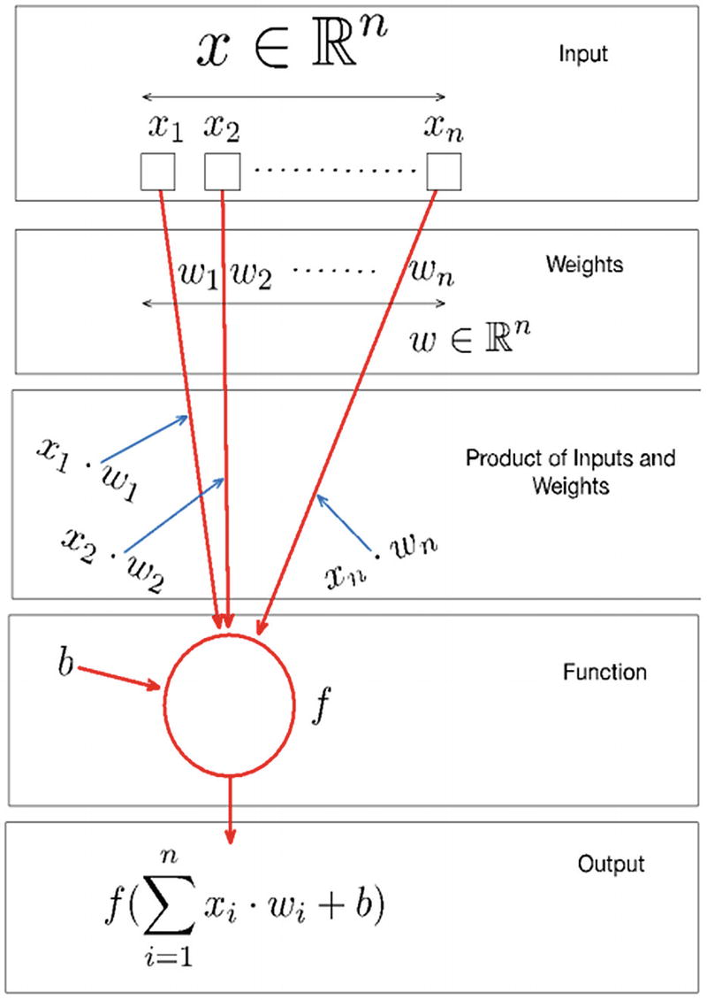

图 3-2

神经网络中的单元

### 神经网络的整体结构

使用该单元作为基本构建块来构建神经网络。这些单元被组织成层，每层包含一个或多个单元。最后一层被称为*输出层*。输出层之前的所有层被称为*隐藏层*。第一层，通常称为第 *0* <sup>*第*</sup> *层*，是输入层。每一层通过权重连接到下一个连续层，权重以迭代的方式被训练/更新。

一层中的单元数量被称为该层的*宽度*。每层的宽度不必相同，但是尺寸应该一致，我们将在本章后面看到。

层数被称为网络的*深度*。这就是“深度”(如“深度学习”)概念的来源。

每一层都将前一层产生的输出作为输入，除了第一层消耗输入。最后一层的输出是网络的输出，是基于输入生成的预测。

如前所述，神经网络可以看作是一个函数*f*<sub>*θ*</sub>:*x*→*y*，它以*x*∈*R*<sup>*n*</sup>作为输入，产生*y*∈*R*<sup>*m*我们现在可以更精确地了解 *θ* 。它只是网络中所有单元的所有权重的集合。</sup>

设计神经网络包括定义网络的整体结构，包括层数(深度)和这些层的宽度。图 [3-3](#Fig3) 显示了一个神经网络的整体结构。

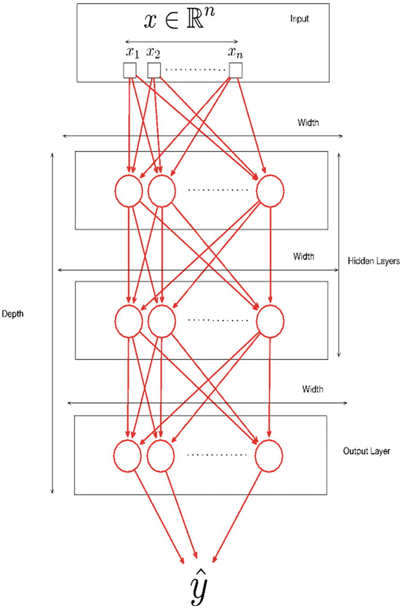

图 3-3

神经网络的结构

### 以向量形式表达神经网络

让我们更详细地看看神经网络的层及其维度(参见图 [3-3](#Fig3) )。如果我们假设输入的维度是*x*∈*R*<sup>*n*</sup>并且第一层有 *p* <sub>1</sub> 个单元，那么每个单元都有*w*∈*R*<sup>*n*</sup>个权重与之相关联。也就是说，与第一层相关联的权重是形式为的矩阵。虽然图 3-3 中没有显示，但是每个*p*T25】1 单元也有一个与之相关的偏置项。

第一层产生输出，其中。注意，索引 *k* 对应于每个输入/权重(从 1… *n* )，索引 *i* 对应于第一层中的单元(从 1。。*p*T10】1)。

现在让我们看看第一层的矢量化符号输出。通过*矢量化符号*，我们简单地表示线性代数运算，例如向量矩阵乘法和对产生向量的向量的激活函数的计算(而不是标量到标量)。第一层的输出可以表示为*f*(*x**w*<sub>1</sub>+*b*<sub>1</sub>)。

这里，我们将输入*x*∈*R*<sup>T5】n</sup>视为维数为 1 × *n* ，将权重矩阵 *w* <sub>1</sub> 视为维数为*n*×*p*<sub>1</sub>，将偏差项视为维数为 1×*p*<sub>的向量那么请注意，*x**w*<sub>1</sub>+*b*产生一个维数为 1 × *p* <sub>1</sub> 的向量，函数 *f* 简单变换向量的每个元素产生。</sub>

从到的第二层遵循类似的过程。这可以用矢量化的形式写成*f*(*o*<sub>1</sub>*w*<sub>2</sub>+*b*<sub>2</sub>)。我们也可以将整个计算以矢量化的形式写到第 2 层，如*f*(*f*(*x**w*<sub>1</sub>+*b*<sub>1</sub>)*w*<sub>2</sub>+*b*<sub>2</sub>。图 [3-4](#Fig4) 显示了一个矢量形式的神经网络。

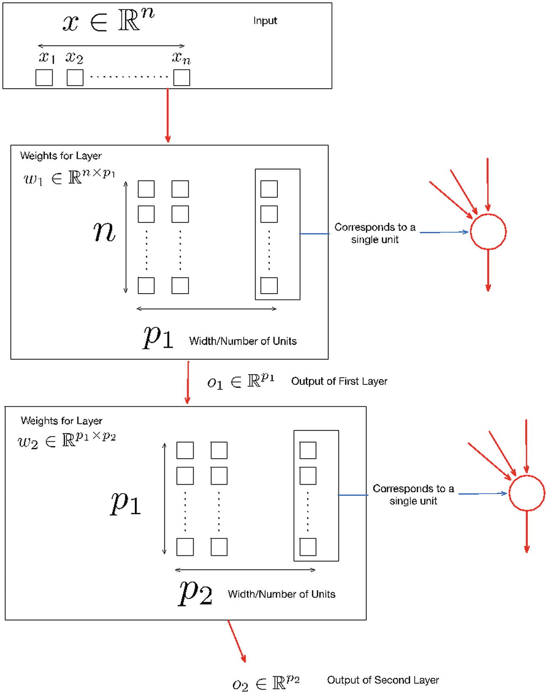

图 3-4

向量形式的神经网络

### 评估神经网络的输出

现在我们已经了解了神经网络的结构，让我们看看如何根据标记数据评估神经网络的输出。参见图 [3-5](#Fig5) 。

对于单个数据点，我们可以计算神经网络的输出，我们将其表示为。现在我们需要计算我们的神经网络的预测与 *y* 相比有多好。这里出现了损失函数的概念。

损失函数测量和 *y* 之间的差异，我们用 *l* 表示。许多损失函数适用于手头的任务，比如二元分类、多类分类或我们将在本章后面讨论的回归(通常使用最大似然法导出，这是一种概率框架，旨在增加找到最佳解释数据的概率分布的可能性)。

损失函数通常计算多个数据点而不是单个数据点上的和 *y* 之间的差异。图 [3-5](#Fig5) 展示了和 *y* 不一致的计算流程。

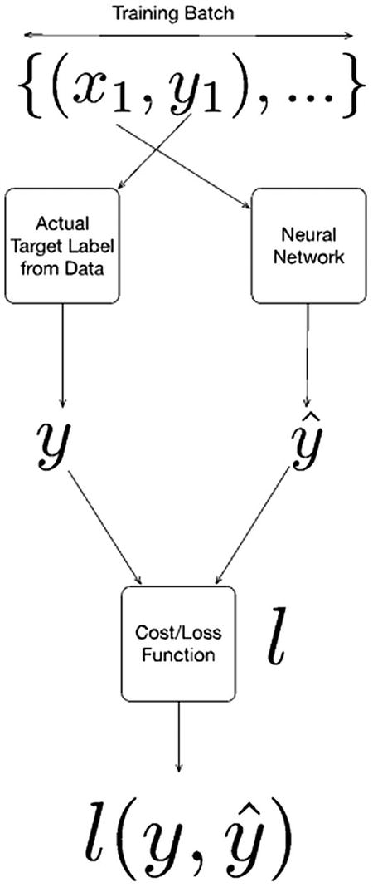

图 3-5

损失/成本函数和成本/损失的计算

### 训练神经网络

现在让我们看看神经网络是如何训练的。图 [3-6](#Fig6) 说明了训练一个神经网络。

假设与前面相同的符号，我们用 *θ* 表示网络所有层的所有权重和偏差项的集合。让我们假设 *θ* 已经用随机值初始化。我们用 *f* <sub>*NN*</sub> 表示代表神经网络的整体函数。

如前所述，我们可以取单个数据点，并将神经网络的输出计算为。我们还可以利用损失函数计算出与实际产量 *y* 的不一致，即*l*(*f*<sub>*NN*</sub>(*x*， *θ* ， *y* )。

现在让我们计算这个损失函数的梯度，并用𝛻*l*(*f*<sub>*nn*</sub>(*x*， *θ* ， *y* )来表示。

我们现在可以使用最速下降法更新 *θ* 为*θ*<sub>T5】s</sub>=*θ*<sub>T11】s1</sub>—*α*T16】l(*f*<sub>*NN*</sub>(*x*， *θ* )，【T28 请注意，我们可以对我们的训练集中的不同数据点反复采取许多这样的步骤，直到我们对*l*(*f*<sub>*NN*</sub>(*x*， *θ* )， *y* )有一个合理的好值。

Note

现在，我们将远离损失函数𝛻*l*(*f*<sub>*nn*</sub>(*x*， *θ* ， *y* )的梯度的计算。这些可以很容易地用自动微分法(在本书的其他地方讨论过)来生成(甚至对于任意复杂的损失函数)，而不需要手动推导。

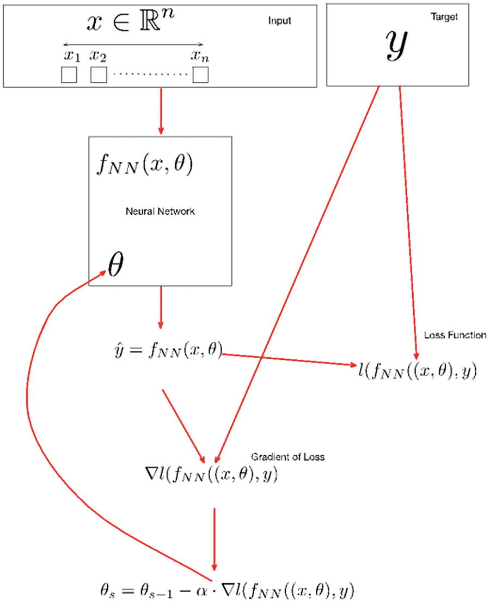

图 3-6

训练神经网络

## 使用最大似然法驱动成本函数

如前所述，成本函数(也称为损失函数)有助于用量化指标确定预测和实际目标之间的差异。基于特定的用例以及目标变量的性质，有几种方法来定义损失函数。损失函数是通过利用一个框架(比如，最大似然法)得出的，在这个框架中，我们最大化或最小化一组感兴趣的结果的参数。使用损失函数计算不一致的量化值。因此，它为模型的训练框架提供了一种估计不一致程度的切实可行的方法，从而更新权重参数，以便减少不一致，从而提高模型性能。

我们现在将研究如何使用最大似然法导出各种损失函数。具体来说，我们将看到深度学习中常用的损失函数——如二进制交叉熵、交叉熵(用于非二进制结果)和平方误差——如何使用最大似然原理推导出来。

### 二元交叉熵

*二进制交叉熵*或*对数损失*，衡量分类模型的性能，其中结果是二进制的，并以 0 到 1 之间的概率值的形式表示。随着模型性能降低，测井损失值增加，产生的预测值偏离期望值。理想模型的二进制交叉熵值为 0。

让我们考虑一个简单的例子来理解二元交叉熵的概念，并获得最大似然的基本直觉。我们有一些数据，由 *D* = {( *x* <sub>1</sub> ， *y* <sub>1</sub> )， *x* <sub>2</sub> ， *y* <sub>2</sub> )，…(*x*<sub>*n*</sub>， *y* <sub>*n*</sub>

让我们假设我们已经生成了一个模型，在给定 *x* 的情况下预测 *y* 的概率。我们用 *f* ( *x* ， *θ* 来表示这个模型，其中 *θ* 表示模型的参数。最大似然背后的思想是找到一个最大化*P*(*D*|*θ*)的 *θ* 。假设一个伯努利分布，并给定每个例子{( *x* <sub>1</sub> ， *y* <sub>1</sub> )，( *x* <sub>2</sub> ， *y* <sub>2</sub> )，…(*x*<sub>*n*</sub>， *y*

我们可以对两边进行对数运算得出如下:


从而简化为以下表达式:


我们不是最大化 RHS，而是最小化它的负值，如下:


这就引出了下面这个二元交叉熵函数:


因此，最大似然的思想使我们能够导出二元交叉熵函数，该函数可以在二元分类的上下文中用作损失函数。

### 交叉熵

基于二进制交叉熵的思想，现在让我们考虑导出交叉熵损失函数以用于多分类的上下文中。我们假设 *y* ∈ {0，1，.. *k* }，其中{0，1，.. *k* }是类。我们还将 *n* <sub>1</sub> ，*n*<sub>2</sub>⋯*n*<sub>*k*</sub>表示为每个 *k* 类的观察计数。观察。同样，在这种情况下，让我们假设我们已经以某种方式生成了一个模型，该模型在给定 *x* 的情况下预测了 *y* 的概率。我们用 *f* ( *x* ， *θ* 来表示这个模型，其中 *θ* 表示模型的参数。让我们再次使用最大似然背后的思想，即找到一个使*P*(*D*|*θ*最大化的 *θ* 。假设是多项式分布，并给定每个例子{( * x * <sub>1</sub> ， *y* <sub>1</sub> )，( *x* <sub>2</sub> ， *y* <sub>2</sub> )，…(*x*<sub>*n*</sub>，

 *我们可以对两边进行对数运算得出如下:


这可以简化为:


术语*日志 n* ！还有 *log n* <sub>1</sub> ！*n*T8】2！⋯*n*T12*k*t15】！不被 *θ* 参数化，并且可以被安全地忽略，因为我们试图找到最大化*P*(*D*|*θ*)的 *θ* 。由此，我们有了以下:


和以前一样，我们不是最大化 RHS，而是最小化它的负值，如下:


这就导致了下面的二元交叉熵函数:


因此，最大似然的思想使我们能够导出交叉熵函数，它可以在多分类的情况下用作损失函数。

### 平方误差

现在让我们讨论使用最大似然法推导回归中使用的平方误差。让我们假设 *y* ∈ *R* 。与前面的情况不同，我们假设我们有一个预测概率的模型，我们将假设我们有一个预测 *y* 值的模型。为了应用最大似然思想，我们假设实际的 *y* 和预测的之间的差具有零均值和方差为*σ*T11】2 的高斯分布。然后，可以显示最小化


导致 *P* ( *θ* )最小化。

### 损失函数概述

我们现在总结关于损失函数的三个要点，以及给定手头问题的特定损失函数的适当性。

1.  The binary cross-entropy given by the expression

    

是二元分类的推荐损失函数。当设计神经网络来预测结果的概率时，通常应该使用这种损失函数。在这种情况下，输出层具有单个单元，该单元具有合适的 sigmoid 作为激活函数。

1.  The cross-entropy function given by the expression

    

是多分类的推荐损失函数。这个损失函数通常应该与设计用来预测每一类结果的概率的神经网络一起使用。在这种情况下，输出图层具有 softmax 单位(每个类一个)。

1.  The squared loss function given by

    

应该用于回归问题。在这种情况下，输出图层只有一个单元。

几个其他损失函数可以用于分类和回归；涵盖详尽无遗的清单超出了本章的范围。一些值得注意的损失函数是 Huber 损失(回归)和铰链损失(分类)。

## 激活功能的类型

我们现在来看看一些常用于神经网络的激活函数。

让我们从列举激活函数的几个感兴趣的属性开始。

*   理论上，当激活函数是非线性的时，两层神经网络可以逼近任何函数(给定隐藏层中足够数量的单元)。因此，我们总是使用非线性激活函数来解决深度学习领域中的问题。

*   一个连续可微的函数允许计算梯度，并使用基于梯度的方法(优化器)来寻找使数据损失函数最小化的参数。如果一个函数不是连续可微的，基于梯度的方法在网络的训练中将不会取得进展。

*   使用基于梯度的方法，我们可以从值域有限的函数中获得稳定的性能(相对于无穷大)。

*   平滑函数是优选的(经验证据),单层的单片函数导致凸误差表面。(这通常不是关于深度学习的考虑因素。)

*   此外，我们更倾向于期望激活函数关于原点对称，并且在原点()附近表现得像恒等函数。

至此，让我们简单看看激活函数中值得注意的选项。

### 线性单位

线性单元是将输入转换为 *y* = *w* 的最简单单元。 *x* + *b* 。顾名思义，该单位没有非线性行为，通常用于生成条件高斯分布的平均值。

线性单元使基于梯度的学习成为一项相当简单的任务(图 [3-7](#Fig7) )。

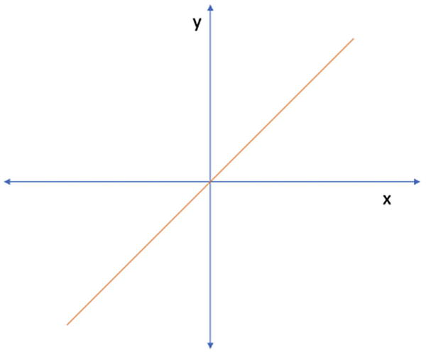

图 3-7

神经网络中的线性单元

### 乙状结肠激活

sigmoid 激活将输入转换如下:


底层激活函数(图 [3-8](#Fig8) )由


给出

Sigmoid 单元可在输出图层中与二进制交叉熵一起用于二进制分类问题。该单元的输出可以在以 *x* 为条件的输出 *y* 上模拟伯努利分布。


图 3-8

Sigmoid 函数

### Softmax 激活

softmax 图层通常仅在输出图层中与交叉熵损失函数一起用于多分类任务。参见图 [3-9](#Fig9) 。softmax 层对前一层的输出进行归一化，使其总和为 1。通常，前一层的单元对输入属于特定类别的可能性的非标准化分数进行建模。softmax 层对此进行了标准化，以便输出表示每个类的概率。

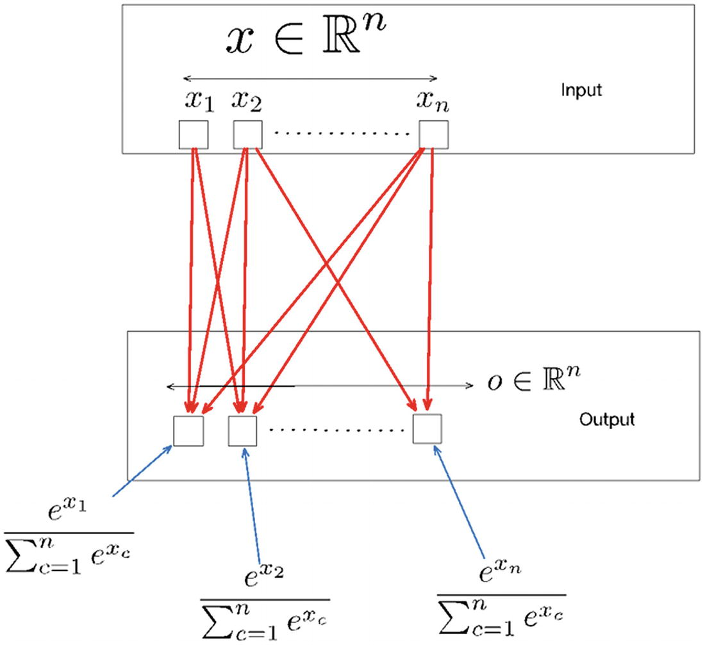

图 3-9

Softmax 层

### 整流器线性单元

与线性变换结合使用的整流线性单元(ReLU)将输入变换为


底层激活函数为*f*(*x*)=*max*(0， *x* )。最近，ReLU 更常用作隐藏单元。结果表明，ReLUs 导致较大且一致的梯度，这有助于基于梯度的学习(图 [3-10](#Fig10) )。虽然 ReLU 看起来像一个线性单元，但它有一个导数函数，因此可以计算损耗的梯度。最近，ReLU 已经成为隐藏网络激活的最流行的选择。在大多数情况下，一个 ReLU 可以是一个默认的选择，它会在一个合适的时间内产生想要的结果。

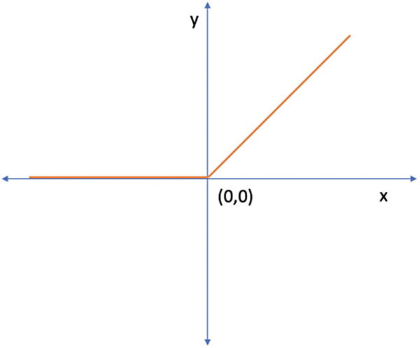

图 3-10

整流器线性单元

然而，ReLU 也有一些缺点。当输入接近零时，函数的梯度变为零，因此停留在训练步骤中，训练没有进展。这就是俗称的*将死的 ReLU 问题*。

### 双曲正切

双曲正切单元对输入(与线性变换结合使用)进行如下变换:


底层激活函数(图 [3-11](#Fig11) )由


给出

双曲正切单位也常用作隐藏单位。

图 [3-11](#Fig11) 仅涵盖了深度学习激活功能中的少数可用选项。

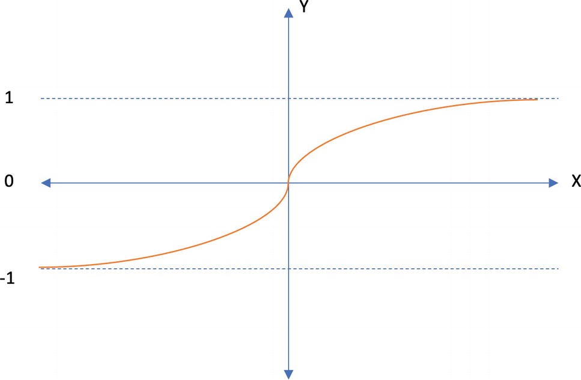

图 3-11

双曲正切激活函数

在特定的设置或使用案例中，还有更多的方法可用于定制收益。著名的例子包括泄漏 ReLU、参数 ReLU 和 Swish。探索附加激活功能的良好起点是 [`https://pytorch.org/docs/stable/nn.html#non-linear-activations-weighted-sum-nonlinearity`](https://pytorch.org/docs/stable/nn.html%2523non-linear-activations-weighted-sum-nonlinearity) 。

## 反向传播

深度学习最基本的构建模块是*反向传播*，是*误差反向传播*的缩写，是一种用于在监督学习中训练神经网络的算法。虽然反向传播是在 20 世纪 70 年代发明的，但它在几年后的 1989 年由 Rumelhart、Hinton 和 Williams 在他们的论文“通过反向传播误差学习表征”中得到推广

之前，我们研究了衡量预测产出和实际产出之间差异的损失函数。网络的权重首先被随机初始化。为了让网络学习(训练)，下一个逻辑步骤是调整权重，使得不一致最小(理想情况下为零)。这就是我们与反向传播接口的地方，反向传播是一种直观的算法，能够使用链式法则计算损失相对于权重的梯度。

在前向传递中，网络计算给定输入样本的预测，损失函数测量实际目标值和网络预测值之间的差异。反向传播计算相对于权重和偏差的损失梯度，从而为我们提供权重的微小变化如何影响总体损失的公平的总体情况。然后，我们需要迭代地更新权重，并以小的增量(在梯度的相反方向)达到局部最小值。这个过程叫做*梯度下降*——即将损失函数降低到最小。因此，网络学习(对权重的迭代和增量更新)能够以最小的不一致正确预测给定输入样本的模式。

对于神经网络，在梯度下降中有几个变量来更新权重。下一节将探讨其中的一些。在下一章中，我们将简要地看一下自动微分，它以编程的方式实现了反向传播的思想。

### 梯度下降变体

梯度下降技术主要有三种变体。每种方法的不同之处在于用于计算损失梯度的数据量。根据使用的数据量，我们在参数更新的准确性和执行更新所需的时间之间进行权衡。下面，我们讨论在训练深度学习网络中使用的三种不同的变体，稍后(在下面的部分中)我们研究几个流行的梯度下降优化算法。

#### 批量梯度下降

最初的梯度下降被称为*批量梯度下降* (BGD)技术。该名称源自用于计算梯度的数据量，在本例中为整个批次。BGD 技术本质上利用整个可用数据集来计算成本函数相对于参数(权重)的梯度。这导致了固有的缓慢，并且在大多数情况下，这是一个不可行的选择，因为我们可能会耗尽内存来加载整个批处理。在大多数常见的场景中，我们大多倾向于避免 BGD 方法，争论小数据集(这在深度学习中是一种罕见的现象)。

#### 随机梯度下降

为了克服来自 BGD 的问题，我们有随机梯度下降(SGD)。使用 SGD，我们计算梯度并更新数据集中每个样本的权重。这一过程大大减少了深度学习硬件中的内存使用，并更快地获得结果。但是，更新的频率远远高于预期。随着更频繁地更新权重，成本函数波动很大。

然而，当目标是将更新收敛到精确的最小值时，SGD 会导致更大的问题。考虑到更新的频繁程度，过早更新的可能性非常高。为了克服这些权衡，我们可能需要在一段时间内缓慢降低学习速率，以帮助网络收敛到局部或全局最小值。

#### 小批量梯度下降

*小批量梯度下降* (MBGD)结合了 SGD 和 BGD 的优点。MBGD 不是使用整个数据集(批次)或仅来自数据集的单个样本来计算成本函数相对于参数的梯度，而是利用更小的批次，该批次大于 1 但小于整个数据集。常见的批量有 16/32/64/…1024 等。建议使用 2 的幂范围内的一个数(但不是必需的)，因为从计算的角度来看它最合适。

使用 MBGD，更新频率比 SGD 低，但比 BGD 高，并且利用小批量而不是单个样本或整个数据集。这样，方差在更大程度上减小，并且我们在速度上实现了更好的折衷。

### 基于梯度的优化技术

在接下来的部分，我们将简要讨论深度学习中常用的几种流行的优化技术。每种技术中使用的数学细节超出了本书的范围。

#### 动量梯度下降

我们之前讨论的 SGD 和 BGD 之间的问题用 MBGD 解决了。但是，即使使用了 MBGD，更新的方向仍然会发生变化(虽然比使用 SGD 时要小，但比使用 MGD 时要大)。*具有动量的梯度下降*利用过去的梯度来计算梯度的指数加权平均值，以进一步平滑参数更新。

图 [3-12](#Fig12) 说明了更新过程。

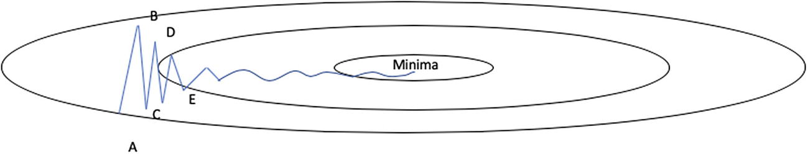

图 3-12

动量梯度下降

更新过程可以使用以下公式来简化。首先，我们计算过去梯度的指数加权平均值为 *ν* <sub>*t*</sub> ，其中*ν*<sub>*t*</sub>=*γν*<sub>*t*—1</sub>+*η*∇<sub>θ</sub>*j*(θ)和θ=θ-

 *这里的 *γ* 是一个取值在 0 到 1 之间的超参数。接下来，我们在权重更新中使用这个指数加权平均值，而不是直接使用梯度。

通过利用梯度的指数加权平均值，而不是直接使用梯度，增量步长更平滑和更快，从而克服了围绕最小值振荡的问题。

#### RMSprop

RMSprop 是 Geoffry Hinton 在 Coursera 的在线课程“机器学习的神经网络”的第 6 讲中提出的一种未公开的优化算法。在核心处，RMSprop 计算每个权重的平方梯度的移动平均值，并将梯度除以均方的平方根。这个复杂的过程应该有助于解码名字*均方根 prop* 。在这里利用指数平均有助于给予最近的更新比不太最近的更新更多的偏好。

RMSprop 可以表示如下:

对于θ中的每个权重 w，我们有


和

**g*T3*t*T6】


更新权重

其中*η*–是定义初始学习率的超参数，*g*<sub>T5】t</sub>是θ中参数/权重 w 在时间 t 的梯度。我们将∈加到分母上，以避免被零除的情况。

#### 圣经》和《古兰经》传统中）亚当（人类第一人的名字

Adam 是*自适应矩估计*的简化名称，是深度学习优化器最近最受欢迎的选择。简单地说，Adam 结合了 RMSprop 和带动量的随机梯度下降的优点。从 RMSprop 中，它借用了使用平方梯度来缩放学习速率的思想，并且当与具有动量的 SGD 相比时，它采用梯度的移动平均值的思想，而不是直接使用梯度。

这里，对于θ中的每个权重 w，我们有


还有


然后用来计算

**g*T3*t*T6】

最后，权重更新为


前面三种类型的优化算法只是深度学习中不同类型用例的可用选项中的一小部分。我们肯定没有涵盖这些主题中每一个的详细深度和数学，所以强烈建议读者更详细地探索前面的优化技术和其他技术。阿达格拉德和阿达德尔塔是热门和强烈推荐的选择。

## PyTorch 的实际实现

到目前为止，我们已经提供了前馈神经网络的基本主题的简要概述。我们现在将使用 PyTorch 实现一个简单的网络。引入第一个网络所需的所有构建模块的想法使得 PyTorch 中的懒惰学习(在必要时学习构造)过程更加有效。

清单 [3-1](#PC1) 为这个练习导入了必要的 Python 包。

```py
#Import required libraries
import torch as tch
import torch.nn as nn

import numpy as np

from sklearn.datasets import make_blobs
from matplotlib import pyplot

Listing 3-1Importing the Necessary Python Packages

```

我们将需要 Torch 及其神经网络模块，以及 NumPy、matplotlib(用于可视化)和 sklearn(用于创建虚拟数据集)。虽然有一百万种方法可以创建虚拟数据集，但我们将利用 sklearn 中提供的一个简单函数。

Note

在本书中，我们使用了几个与机器学习相关的流行 Python 包。这些包中的大多数都是随 Anaconda 发行版一起安装的。如果需要的话，将特别调用其他包。

接下来，让我们为神经网络创建一个虚拟数据集。清单 [3-2](#PC2) 展示了为练习创建一个玩具(假人)数据集。

```py
samples = 5000

#Let's divide the toy dataset into training (80%) and rest for validation.
train_split = int(samples*0.8)

#Create a dummy classification dataset
X, y = make_blobs(n_samples=samples, centers=2, n_features=64, cluster_std=10, random_state=2020)
y = y.reshape(-1,1)

#Convert the numpy datasets to Torch Tensors
X,y = tch.from_numpy(X),tch.from_numpy(y)
X,y =X.float(),y.float()

#Split the datasets inot train and test(validation)
X_train, x_test = X[:train_split], X[train_split:]
Y_train, y_test = y[:train_split], y[train_split:]

#Print shapes of each dataset
print("X_train.shape:",X_train.shape)
print("x_test.shape:",x_test.shape)
print("Y_train.shape:",Y_train.shape)
print("y_test.shape:",y_test.shape)
print("X.dtype",X.dtype)
print("y.dtype",y.dtype)

Output[]
X_train.shape: torch.Size([4000, 64])
x_test.shape: torch.Size([1000, 64])
Y_train.shape: torch.Size([4000, 1])
y_test.shape: torch.Size([1000, 1])
X.dtype torch.float32
y.dtype torch.float32

Listing 3-2Creating a Toy Dataset

```

玩具数据集有 5000 个样本，每个样本有 32 个特征，分为 80%训练和 20%测试。让我们创建一个使用 PyTorch 的 NN 模块定义神经网络的类。清单 [3-3](#PC3) 定义了用于本练习的神经网络的创建。

```py
#Define a neural network with 3 hidden layers and 1 output layer
#Hidden Layers will have 64,256 and 1024 neurons
#Output layers will have 1 neuron

class NeuralNetwork(nn.Module):

    def __init__(self):
        super().__init__()
        tch.manual_seed(2020)
        self.fc1 = nn.Linear(64, 256)
        self.relu1 = nn.ReLU()
        self.fc2 = nn.Linear(256, 1024)
        self.relu2 = nn.ReLU()
        self.out = nn.Linear(1024, 1)
        self.final = nn.Sigmoid()

    def forward(self, x):
        op = self.fc1(x)
        op = self.relu1(op)
        op = self.fc2(op)
        op = self.relu2(op)
        op = self.out(op)
        y = self.final(op)
        return y

Listing 3-3Defining a Feed Forward Neural Network

```

`torch.nn`模块提供了定义和训练神经网络的基本方法。它包含创建各种类型、大小和复杂性的神经网络的所有必要构件。我们将通过继承这个模块为我们的神经网络创建一个类，并创建一个初始化方法和一个向前传递方法。

`__init__`方法创建网络的不同部分，并在我们每次用这个类创建一个对象时为我们准备好。本质上，我们使用初始化方法来创建隐藏层、输出层和每个层的激活。`nn.Linear(64,256)`函数创建一个具有 64 个输入特征和 256 个输出特征的图层。下一层自然会有 256 个输入特征，依此类推。当连接到一个层时，`nn.ReLU()`和`nn.Sigmoid()`功能增加了激活功能。在初始化函数中创建的每个单独的组件都在`forward()`方法中连接。

在`forward`方法中，我们连接神经网络的各个组件。第一个隐藏层`fc1`接受输入数据，并为下一层产生 256 个输出。`fc1`层被传递给`relu1`激活层，然后激活层将激活的输出传递给下一层`fc2`，后者重复相同的过程，以创建最终的输出层，该层具有 sigmoid 激活函数(因为我们的玩具数据集是为二进制分类而制作的)。

在创建一个类为`NeuralNetwork`的对象并调用`forward`方法时，我们从网络中获得输出，这些输出是通过将输入矩阵与一个随机初始化的权重矩阵相乘来计算的，该权重矩阵通过一个激活函数传递，并对隐藏层的数量进行重复，直到最终的输出层。起初，网络显然会产生垃圾输出——即预测(这对我们的分类问题没有任何价值，至少现在没有)。

为了对我们给定的问题进行更准确的预测，我们需要训练网络，即反向传播损失并更新损失函数的权重。幸运的是，PyTorch 以一种非常容易使用和直观的方式提供了这些基本的构建模块。清单 [3-4](#PC4) 说明了定义神经网络的损失、优化器和训练循环。

```py
#Define function for training a network
def train_network(model,optimizer,loss_function \
                  ,num_epochs,batch_size,X_train,Y_train):
    #Explicitly start model training
    model.train()

    loss_across_epochs = []
    for epoch in range(num_epochs):
        train_loss= 0.0

        for i in range(0,X_train.shape[0],batch_size):

            #Extract train batch from X and Y
            input_data = X_train[i:min(X_train.shape[0],i+batch_size)]
            labels = Y_train[i:min(X_train.shape[0],i+batch_size)]

            #set the gradients to zero before starting to do backpropragation
            optimizer.zero_grad()

            #Forward pass
            output_data  = model(input_data)

            #Caculate loss
            loss = loss_function(output_data, labels)

            #Backpropogate
            loss.backward()

            #Update weights
            optimizer.step()

            train_loss += loss.item() * batch_size

        print("Epoch: {} - Loss:{:.4f}".format(epoch+1,train_loss ))
        loss_across_epochs.extend([train_loss])

    #Predict
    y_test_pred = model(x_test)
    a =np.where(y_test_pred>0.5,1,0)
    return(loss_across_epochs)
###------------END OF FUNCTION--------------

#Create an object of the Neural Network class
model = NeuralNetwork()

#Define loss function
loss_function = nn.BCELoss()  #Binary Crosss Entropy Loss

#Define Optimizer
adam_optimizer = tch.optim.Adam(model.parameters(),lr= 0.001)

#Define epochs and batch size
num_epochs = 10
batch_size=16

#Calling the function for training and pass model, optimizer, loss and related paramters
adam_loss = train_network(model,adam_optimizer \
                             ,loss_function,num_epochs,batch_size,X_train,Y_train)

Listing 3-4Defining the Loss, Optimizer, and Training Function for the Neural Network

```

在我们进入清单 [3-4](#PC4) 的细节之前，让我们看看我们利用 PyTorch 现成的构建模块定义的各个组件。我们需要定义一个损失函数来衡量我们的预测和实际标签之间的差异。PyTorch 提供了不同结果的损失函数的综合列表。这些损失函数在`torch.nn.*`下可用。例子有`MSELoss`(均方误差损失)`CrossEntropyLoss`(用于多类分类)`BCELoss`(二元交叉熵损失)，用于二元分类。对于我们的用例，我们将利用二元交叉熵损失。

这被定义为`loss_function = torch.nn.BCELoss()`。

接下来，我们为我们的网络定义一个优化器。在本章的前面，我们探讨了 SGD、Adam 和 RMSProp 优化器。Pytorch 提供了一个全面的优化器列表，可用于构建各种类型的神经网络。所有优化器都组织在`torch.optim.*`下(例如，`torch.optim.SGD`，用于 SGD 优化器)。对于我们的用例，我们使用 Adam 优化器(大多数用例最推荐的优化器)。在定义优化器时，我们还需要定义在反向传播过程中需要计算梯度的参数。对于神经网络，该列表将是前馈网络中的所有权重。通过在优化器的定义中使用`model.parameters()`,我们可以很容易地向优化器表示模型权重的完整列表。然后，我们可以为所选的优化器另外定义超参数。默认情况下，PyTorch 为所有必需的超参数提供了相当好的值。然而，我们可以进一步覆盖它们，为我们的用例定制优化器。

```py
adam_optimizer = tch.optim.Adam(model.parameters(),lr= 0.001)

```

最后，我们需要定义批量大小和训练模型所需的历元数。*批量*指小批量更新中一个批次内的样本数量。覆盖所有样本的所有批次的一次向前和向后通过被称为一个*时期*。最后，我们将所有这些构造传递给我们的函数来训练我们的模型。让我们详细看看函数中的构造。

在我们的训练函数中，我们定义了一个结构，用所提供的优化器、损失函数、模型对象和训练数据来训练我们的网络。首先，我们用`model.train()`初始化我们的训练模式模型。将模型对象明确设置为训练模式是必要的；在利用模型进行评估时，这也是必不可少的——即，使用`model.eval()`显式地将模型设置为评估模式。这确保了模型知道期望何时更新参数以及何时不更新参数。在前面的例子中，我们没有添加评估循环，因为它是一个很小的玩具数据集。然而，在后面的大型数据集示例中，我们将使用单独的函数进行评估。

我们将小批量训练网络。`for`循环按照我们定义的大小将训练数据分成几批。使用以下代码为一个批次提取训练数据以及相应的标签:

```py
input_data = X_train[i:min(X_train.shape[0],i+batch_size)]
labels = Y_train[i:min(X_train.shape[0],i+batch_size)]

```

然后，在使用`optimizer.zero_grad()`开始反向传播之前，我们需要将梯度设置为零。错过这个步骤将会在后续的反向过程中累积梯度，并导致不期望的效果。这种行为是 PyTorch 设计的。然后，我们使用`output_data = model(input_data)`计算向前传球。向前传递是在我们的类定义中执行`forward()`函数。它连接我们为网络定义的不同层，最终输出每个样本的预测。一旦我们有了预测，我们就可以使用损失函数计算它与实际标签的偏差，即`loss = loss_function(output_data, labels)`。

为了反向传播我们的损失，PyTorch 提供了一个内置的模块来计算损失相对于权重的梯度。我们简单地调用`loss.backward()`方法，整个反向传播就完成了。第 4 章“深度学习中的自动微分”更详细地探讨了 PyTorch 中负责反向传播的自动签名模块。一旦计算出梯度，就该更新我们的模型权重了。这在步骤`optimizer.step()`中完成。优化器步骤知道需要用梯度更新的参数，因为我们在定义优化器时提供了这些参数。调用`optimizer.step()`函数更新网络的权重，自动考虑优化器中定义的超参数——在我们的例子中是学习率。

我们对整个训练样本分批重复这个过程。训练过程针对多个时期重复进行，并且随着每次迭代，我们期望损失减少并且权重对齐，以便实现更好的预测准确性。

清单 [3-5](#PC7) 使用不同的优化器来说明前面的神经网络的训练过程。由于网络是为玩具数据集训练的，我们将在每个时期后为不同的优化器绘制总损失，而不是绘制验证准确性。我们可以研究图 [3-13](#Fig13) 中展示的每个优化变量的输出，即跨时段的损失。

```py
#Define loss function
loss_function = nn.BCELoss()  #Binary Crosss Entropy Loss
num_epochs = 10
batch_size=16

#Define a model object from the class defined earlier
model = NeuralNetwork()

#Train network using RMSProp optimizer
rmsprp_optimizer = tch.optim.RMSprop(model.parameters()
, lr=0.01, alpha=0.9
, eps=1e-08, weight_decay=0.1
, momentum=0.1, centered=True)
print("RMSProp...")
rmsprop_loss = train_network(model,rmsprp_optimizer,loss_function
,num_epochs,batch_size,X_train,Y_train)

#Train network using Adam optimizer

model = NeuralNetwork()
adam_optimizer = tch.optim.Adam(model.parameters(),lr= 0.001)
print("Adam...")
adam_loss = train_network(model,adam_optimizer,loss_function
,num_epochs,batch_size,X_train,Y_train)

#Train network using SGD optimizer

model = NeuralNetwork()
sgd_optimizer = tch.optim.SGD(model.parameters(), lr=0.01, momentum=0.9)
print("SGD...")
sgd_loss = train_network(model,sgd_optimizer,loss_function
,num_epochs,batch_size,X_train,Y_train)

#Plot the losses for each optimizer across epochs
import matplotlib.pyplot as plt
%matplotlib inline

epochs = range(0,10)

ax = plt.subplot(111)
ax.plot(adam_loss,label="ADAM")
ax.plot(sgd_loss,label="SGD")
ax.plot(rmsprop_loss,label="RMSProp")
ax.legend()
plt.xlabel("Epochs")
plt.ylabel("Overall Loss")
plt.title("Loss across epochs for different optimizers")
plt.show()

Output[]
RMSProp...
Epoch: 1 - Loss:5794.6734
Epoch: 2 - Loss:1680.3092
Epoch: 3 - Loss:1169.5457
Epoch: 4 - Loss:1518.7088
Epoch: 5 - Loss:1727.5753
Epoch: 6 - Loss:661.7122
Epoch: 7 - Loss:532.6023
Epoch: 8 - Loss:2613.1597
Epoch: 9 - Loss:283.5713
Epoch: 10 - Loss:1058.1581

Adam...

Epoch: 1 - Loss:106.7566
Epoch: 2 - Loss:11.5689
Epoch: 3 - Loss:7.8169
Epoch: 4 - Loss:0.2327
Epoch: 5 - Loss:0.0313
Epoch: 6 - Loss:0.0034
Epoch: 7 - Loss:0.0019
Epoch: 8 - Loss:0.0012
Epoch: 9 - Loss:0.0009
Epoch: 10 - Loss:0.0007

SGD...

Epoch: 1 - Loss:801.0526
Epoch: 2 - Loss:131.7263
Epoch: 3 - Loss:296.2784
Epoch: 4 - Loss:240.0572
Epoch: 5 - Loss:248.2811
Epoch: 6 - Loss:248.2784
Epoch: 7 - Loss:248.2759
Epoch: 8 - Loss:248.2733
Epoch: 9 - Loss:248.2708
Epoch: 10 - Loss:248.2684

Listing 3-5Training Model with Various Optimizers

```

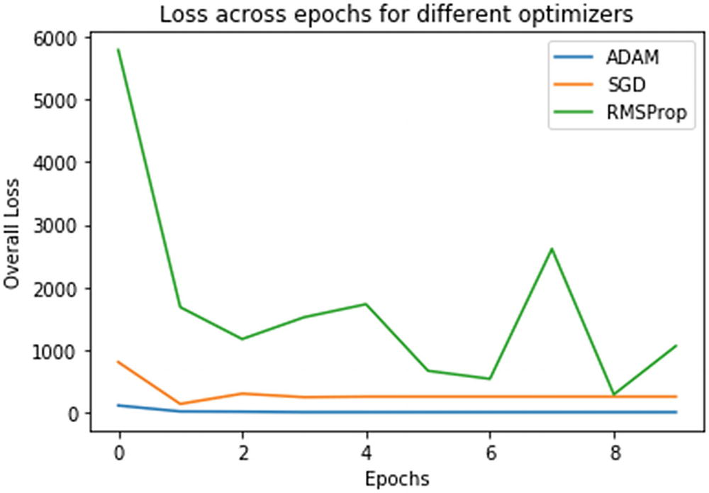

图 3-13

网络跨时段的分布损耗

## 摘要

本章关于前馈神经网络的内容将作为本书其余部分的概念基础。我们讨论的关键概念是神经网络的整体结构、输入、隐藏和输出层，以及成本函数及其基于最大似然原则的基础。我们还探索了 PyTorch 作为实际实现神经网络的方法。在最后一个练习中，我们在一个玩具数据集上用各种优化器对网络进行了训练，以研究损失是如何随着时代的推移而减少的。

下一章，我们将探讨深度学习中的自动微分。**