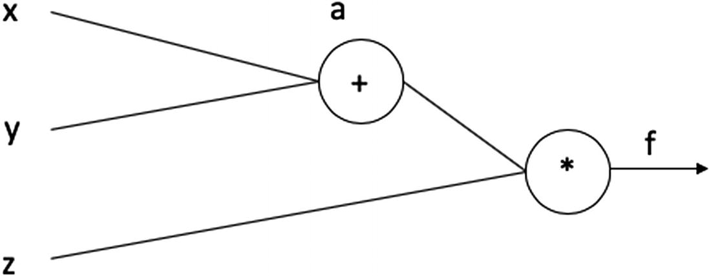
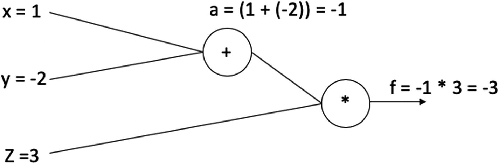
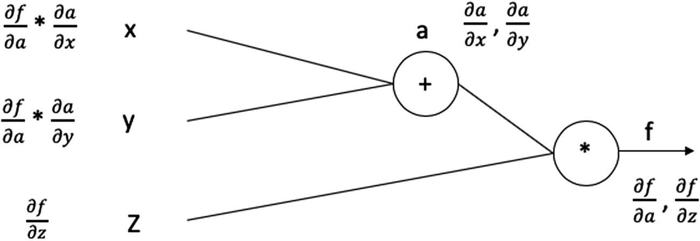

# 四、深度学习中的自动微分

在第三章中探讨随机梯度下降时，我们将损失函数𝛻<sub>*x*</sub>T6】l(*x*)的梯度计算视为黑箱。在这一章中，我们打开了黑盒，涵盖了自动微分的理论和实践，以及探索 PyTorch 的亲笔签名的模块，实现了同样的功能。自动微分是一种成熟的方法，它可以轻松有效地计算任意复杂损失函数的梯度。当涉及到最小化感兴趣的损失函数时，这是至关重要的；构建任何深度学习模型的核心都是一个优化问题，总是使用随机梯度下降来解决，这反过来需要计算梯度。

自动微分不同于数值微分和符号微分。我们首先对这两者进行足够的介绍，以便区分变得清晰。为了便于说明，假设我们感兴趣的函数是 *f* : *R* → *R* ，并且我们想要找到 *f* 的导数，表示为*f*<sup>′</sup>(*x*)。

## 数值微分

数值微分的基本形式来自导数/梯度的定义。它用于估计数学函数的导数。y 相对于 x 的导数更具体地定义了 y 相对于 x 的变化率。一个简单的方法是通过线 x，f(x)和 x+h，f(x+h)计算函数的斜率。

所以，鉴于


我们可以用向前差分法计算出 *f* 、<sup>’</sup>(*x*)为


为 *h* 设置一个适当小的值。同样，我们可以用向后差分法计算*f*<sup>’</sup>(*x*)为


同样，通过为 *h* 设置一个适当小的值。

一种更对称的形式是中心差分法，它将*f*<sup>’</sup>计算为


*外推法*是一种使用已知值来预测超出预期的现有已知范围的值的过程。 *Richardson 外推法*是一种技术，有助于实现仅使用几个数值系列来估计高阶积分。


前向和后向差分的逼近误差依次为 *h* ，即*O*(*h*)—而中心差分和 Richardson 外推的逼近误差分别为 *O* ( *h* <sup>2</sup> )和*O*(*h*<sup>4</sup>)。

数值微分的关键问题是计算成本，它随着损失函数中参数的数量、截断误差和舍入误差而增加。截断误差是我们在计算*f*<sup>’</sup>(*x*)时由于 *h* 不为零而产生的不准确性。舍入误差是使用浮点数和浮点运算所固有的(与使用无限精度数相反，后者的成本高得惊人)。

因此，在构建深度学习模型时，数值微分不是计算梯度的可行方法。数值微分派上用场的唯一地方是快速检查梯度计算是否正确。当您已经手动计算梯度或使用新的/未知的自动微分库时，强烈建议您这样做。理想情况下，这种检查应该在启动 SGD 之前作为自动检查/断言进行。

Note

数值微分在一个名为 *Scipy* 的 Python 包中实现。我们在这里不涉及它，因为它与深度学习没有直接关系。

## 符号微分法

符号微分的基本形式是应用于损失函数以得到导数/梯度的一组符号重写规则。考虑两个这样简单的规则


还有


给定一个函数，如*f*(*x*)= 2*x*<sup>3</sup>+*x*<sup>2</sup>，我们可以依次应用符号书写规则，首先到达


通过应用第一重写规则，和


运用第二条规则。

因此，当我们手动推导梯度时，符号微分是自动化的。当然，这种规则的数量可以很大，并且可以利用更复杂的算法来使这种符号重写更有效。然而，在本质上，符号微分只是一套符号重写规则的应用。符号微分的主要优点是它为导数/梯度生成一个清晰的数学表达式，可以被理解和分析。

符号微分的关键问题是，它仅限于已经定义的符号微分规则，这可能导致我们在试图最小化复杂的损失函数时遇到障碍。例如，当损失函数涉及 if-else 子句或 for/while 循环时。从某种意义上说，符号微分是在微分一个(封闭形式的)数学表达式；它不区分给定的计算过程。

符号微分的另一个问题是，在某些情况下，符号重写规则的天真应用会导致符号项的爆炸(*表达式膨胀*)，并使该过程在计算上不可行。通常，需要大量的计算工作来简化这样的表达式，并产生导数的封闭形式的表达式。

Note

符号微分是在一个名为 *SymPy* 的 Python 包中实现的。我们在这里不涉及它，因为它与深度学习没有直接关系。

## 自动微分基础

自动微分背后的第一个关键直觉是，所有感兴趣的函数(我们打算微分的)都可以表示为初等函数的组合，对于这些初等函数，相应的导函数是已知的。因此，复合函数可以用导数的链式法则来求导。这种直觉也是符号分化的基础。

自动微分背后的第二个关键直觉是，我们可以简单地评估它们(对于一组特定的输入值),从而解决表达式膨胀的问题，而不是存储和操纵原始函数的导数的中间符号形式。因为正在评估中间符号形式，所以我们没有简化表达式的负担。注意，这阻止了我们得到导数的封闭形式的数学表达式，就像符号微分给我们的那样；我们通过自动微分得到的是对一组给定值的导数的评估。

自动微分背后的第三个关键直觉是，因为我们正在计算原始形式的导数，我们可以处理任意的计算过程，而不仅仅是封闭形式的数学表达式。也就是说，我们的函数可以包含 if-else 语句、for 循环，甚至递归。自动微分处理任何计算过程的方式是将过程的单次评估(对于给定的一组输入)视为输入变量上初等函数评估的有限列表，以产生一个或多个输出变量。尽管可能有控制流语句(if-else 语句、for 循环等。)，最终，有一个特定的函数求值列表，它将给定的输入转换为输出。这种列表/评估轨迹被称为*文格特列表*。

为了理解自动微分对于深度学习用例是如何具体工作的，让我们以一个简单的函数为例，我们将使用链式规则手动计算它，并查看实现它的 PyTorch 等价物。

在深度学习网络中，使用计算图来表示整个流程，计算图是一种有向图，其中节点表示数学运算。这提供了一个容易评估数学表达式。计算图可以被翻译成数据结构，以便使用计算机编程语言有计划地解决问题，从而使得解决更大的问题更加直观。

我们将使用一个相对较小且易于计算的函数来完成我们的示例。

假设 f(x，y，z) = (x + y)*z，我们有三个变量的值，x=1，y =-2，z =3。

我们可以用计算图来表示这个函数，如图 4-1 所示。



图 4-1

计算图

除了输入变量(x、y 和 z)，我们还会看到变量 *a* ，它是存储(x + y)的计算值的中间变量，以及变量 *f* ，它存储(x + y)z 的最终值，即 a*z

在正向传递中，我们将替换这些值，并得出最终值，如下所示

x = 1，y =-2，z= 3

然后，

(x + y )z = (1 - 2)3 = -3

因此，

f = -3

我们可以使用图 4-2 中所示的计算图对此进行可视化。



图 4-2

带有计算值的计算图

现在，通过自动微分，我们想要找到相对于输入变量(x，y 和 z)的 *f* 的梯度，输入变量表示为、和。

在前馈网络中，本质上，我们找到损失函数相对于权重的梯度。为了解决这个问题，我们可以使用链式法则。

让我们找出上面方程的偏导数。

我们知道 a = (x + y)，z = a * x，因而 f = az。

因此，

=(x+y)=(1–2)=-1

还有


如果再进一步，我们可以求出 *a* 关于 x 和 y 的偏导数。

和

现在，到了我们的最终目标，找到 *f* 相对于 x、y 和 z 的梯度。我们已经计算了相对于 z 的所需梯度。对于 x 和 y，我们可以利用之前在链式法则中计算的值作为


我们现在已经计算了所有需要的值。

 = 3 和 = -1

本质上，网络会推断 x 和 y 对结果有正面影响，而 z 对结果有负面影响(图 4-3 )。该信息对于减少损失是有用的，并且递增地更新网络的权重以达到最小值。



图 4-3

含有偏导数的计算图

### 实现自动微分

现在让我们考虑在 PyTorch 中如何实现自动微分。前面的例子非常简单；当我们在纸上探索大型函数(即深度学习函数)的方法时，事情会变得非常复杂。在大多数常见网络中，涉及的参数数量非常多，使得手动编程梯度计算成为一项艰巨的任务。

PyTorch 提供了亲笔签名的包装，从本质上简化了我们的整个过程。回想一下我们在第三章中为玩具神经网络利用的`loss.backward()`函数。网络计算相对于权重的损失的所有必要梯度。让我们进一步探讨这个问题。

#### 什么是亲笔签名？

PyTorch 中的自动签名包为 tensors 上的所有操作提供了自动区分。它在反向传播过程中为我们的神经网络执行必要的计算。当调用`backward()`函数时，模块自动计算所有反向传播梯度。我们也可以通过变量的`grad`属性来访问单独的渐变。

自动签名模块为实现任意标量值函数的自动微分提供了现成的工具(函数/类)。为了能够计算变量的梯度，我们只需要将关键字`requires_grad`的值设置为`True`。

让我们复制我们用来手动实现自动微分的同一个例子，但是使用 PyTorch(清单 4-1 )。

```py
#Import required libraries
import torch

#Define ensors
x = torch.Tensor([1])
y = torch.Tensor([-2])
z= torch.Tensor([3])

print("Default value for requires_grad for x:",x.requires_grad)

#Set the keyword requires_grad as True (default is False)
x.requires_grad=True
y.requires_grad=True
z.requires_grad=True

print("Updated  value for requires_grad for x:",x.requires_grad)

#Compute a
a = x + y

#Finally define the function f
f = z * a

print("Final value for Function f = ",f)

#Compute gradients

f.backward()

#Print the gradient value
print("Gradient value for x:",x.grad)
print("Gradient value for y:",y.grad)
print("Gradient value for z:",z.grad)

Output[]
Default value for requires_grad for x: False

Updated value for requires_grad for x: True

Final value for Function f = tensor([-3.], grad_fn=<MulBackward0>)
Gradient value for x: tensor([3.])
Gradient value for y: tensor([3.])
Gradient value for z: tensor([-1.])

Listing 4-1Implementing Automatic Differentition (Autograd) in PyTorch

```

这里的梯度值与我们之前手动计算的值完全匹配。

在前面的例子中，我们首先创建了一个张量，然后将关键字`requires_grad`指定为`True`。我们也可以把这个和我们的定义结合起来。

```py
x = torch.autograd.Variable(torch.Tensor([1]),requires_grad=True)

```

当我们在 PyTorch 中定义一个网络时，很多细节都被考虑到了。当我们定义一个网络层时，用`nn.Linear(64, 256)`(参考章节 3 的例子)，PyTorch 用必要的值创建权重和偏差张量(设置`requires_grad`为`True`)。输入张量不需要梯度；因此，在我们的例子中，我们从不设置它们，而是使用默认值(例如，`False`)。

## 摘要

本章讲述了自动微分的基础知识。反向传播是用于训练深度神经网络的自动微分的特例。在现代深度学习文献中，自动微分类似于反向传播，因为它是一个更广义的术语。本章的关键要点是，自动微分能够计算任意复杂损失函数的梯度，是深度学习的关键使能技术之一。你应该理解自动微分的概念，以及它与符号微分和数值微分的区别。

在下一章中，我们将更详细地研究一些与深度学习相关的其他主题，包括性能指标和模型评估，分析过拟合和欠拟合，正则化和超参数调整。最后，我们将把我们迄今为止所涉及的关于深度学习的所有基础知识结合到一个实际例子中，该例子为真实世界的数据集实现了前馈神经网络。