# 五、训练深度学习模型

到目前为止，我们已经利用玩具数据集来提供深度学习模型的最早实现的概述。在这一章中，我们将围绕深度学习探索几个额外的重要主题，并在一个实际例子中实现它们。我们将深入研究模型性能的细节，并研究过拟合和欠拟合、超参数调整和正则化的细节。最后，我们将结合我们目前所讨论的内容和一个真实的数据集来展示一个使用 PyTorch 的实际例子。

## 性能指标

在第三章中，当我们设计我们的玩具神经网络时，我们定义了损失函数来衡量预测和实际标签之间的差异。让我们用更有意义的方式来探讨这个话题。基于目标变量的类型(连续或离散)，我们将需要不同类型的性能指标。接下来的部分将讨论每个类别中的指标。

### 分类指标

模型开发过程通常从制定清晰的问题定义开始。这基本上包括定义模型的输入和输出，以及这样一个模型能够交付的影响(有用性)。这种问题定义的一个例子是将产品图像分类成产品类别——这种模型的输入是产品图像，输出是产品类别。这种模型可能有助于在电子商务或在线市场环境中对产品进行自动分类。

定义了问题定义之后，下一个任务是定义性能指标。性能指标的主要目的是告诉我们我们的模型做得有多好。一个简单的性能度量可以是准确性(或者，等价地，误差)，它简单地度量了预期输出和模型产生的输出之间的不一致。然而，准确性可能是一个很差的性能指标。两个主要原因是阶级不平衡和不平等的错误分类成本。我们用一个例子来看一下阶层失衡问题。作为我们之前产品分类例子中问题的子问题，考虑区分手机及其配件的情况。移动电话类别的示例数量比移动电话配件的类别少得多。例如，如果 95%的例子是移动电话配件，5%是移动电话，则通过预测多数类可以简单地获得 95%的准确度。因此，在这个例子中，准确性是一个很差的度量选择。

现在让我们通过考虑一个与产品分类问题相关的例子来理解不相等的错误分类成本的问题。考虑将不含过敏原的食品(不含八大过敏原——即牛奶、鸡蛋、鱼、甲壳类贝类、坚果、花生、小麦和大豆)与其他食品(不含过敏原)进行分类的错误。从购买者的角度以及商业的角度来看，与将不含过敏原的产品归类为不含过敏原的产品相比，将不含过敏原的产品归类为不含过敏原的产品的错误明显更多。精度没有捕捉到这一点，因此在这种情况下将是一个糟糕的选择。

另一组度量标准是精度和召回率，它们分别测量预测类中正确恢复的预测的比例，以及报告的预测类的比例(见图 5-1 )。总的来说，精确度和召回率对于类别不平衡是鲁棒的。

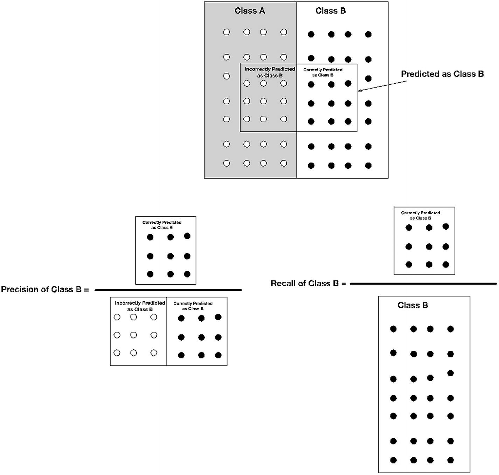

图 5-1

精确度和召回率

精确度和召回率通常使用 PR 曲线来可视化，该曲线在 Y 轴上绘制精确度，在 X 轴上绘制召回率(参见图 5-2 )。通过改变分数的决策阈值或模型产生的概率，可以获得不同的精度和召回值，例如，0 表示 A 类，1 表示 B 类，较高的值在一侧表示特定的类。该曲线可用于通过改变阈值来折衷召回的精确度。

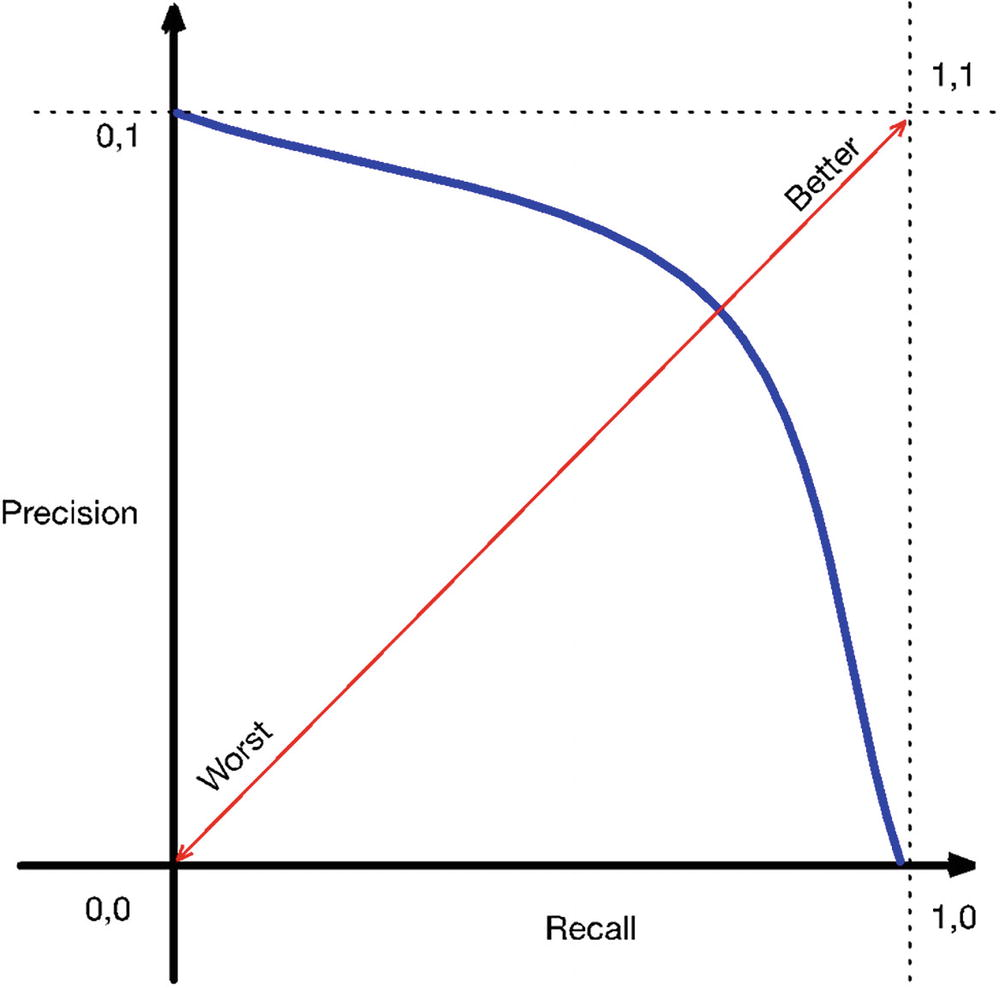

图 5-2

PR 曲线

定义为的 *F 值*，其中 *p* 表示精度 *r* 表示召回，可以用来概括 PR 曲线。

*接收器工作特性(ROC)* *曲线*在类别不平衡和错误分类成本不等的情况下是有用的。在这种背景下，例子被认为属于两类:积极和消极。

真阳性率测量真阳性相对于实际阳性的比例，真阴性率测量真阴性相对于实际阴性的比例(见图 5-3 )。ROC 曲线在 X 轴上绘制真阳性率，在 Y 轴上绘制假阳性率(见图 5-4 )。曲线下的*面积(AUC)用于概括 ROC 曲线。*

在许多情况下，标准的度量标准，如准确度、精确度、召回率等。不允许我们真实地捕捉手边业务用例的模型性能。在这种情况下，需要制定适合业务用例的度量标准，记住问题的性质、类别不平衡和错误分类的成本。例如，在我们运行的产品分类示例中，我们可以选择不使用低置信度的预测，而是手动对它们进行分类。手动分类的例子是有成本的，在电子商务网站上错误的类别中显示错误的产品也有不同的成本。对流行产品进行错误分类的成本也不同于(通常更高)对很少购买的产品进行错误分类的成本。在这种情况下，我们可以选择只使用模型中的高可信度预测。要使用的度量的一个可能的选择是错误分类的例子的数量(具有高置信度)和覆盖范围(被高置信度覆盖的例子的数量)。人们也可以通过对两者进行加权平均来考虑这种设置中的误分类成本。(可以基于错误分类成本来选择适当的权重。)

在行业环境中，指标定义是建模过程的关键步骤。从业者应该深入分析业务领域，理解错误分类成本和数据，理解类分布，并相应地设计性能度量。定义不当的度量标准会导致项目走向错误的道路。

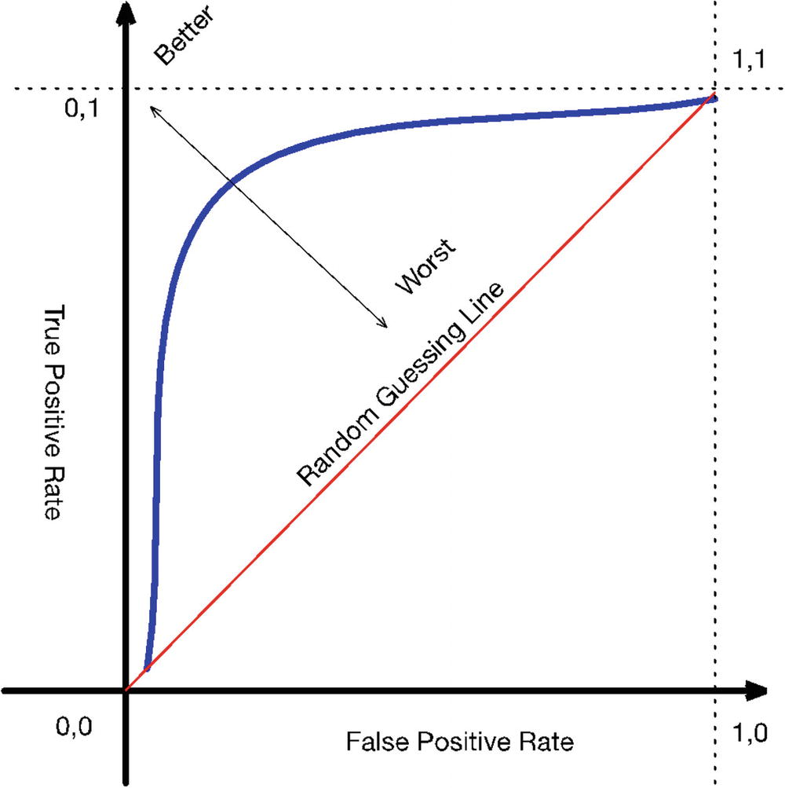

图 5-4

受试者工作特征曲线

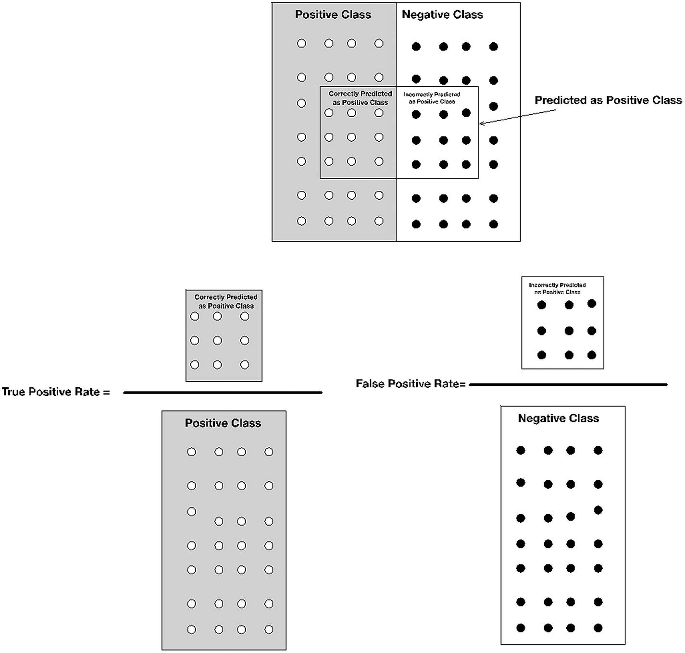

图 5-3

真阳性和假阳性率

### 回归度量

与分类指标相比，回归的性能指标相当简单。可以普遍应用于大多数用例的最常见指标是均方误差(MSE)。根据用例，可以使用一些其他指标来获得更有利的结果。考虑预测给定商店的月销售额的问题，其中商店几个月的销售额可能在$5，000 到$50，000 之间。

以下部分探讨了一些流行的选择。

#### 均方误差

我们已经在第三章“前馈神经网络”中探讨了均方误差(MSE)顾名思义，MSE 是实际值和预测值的平方差的平均值。最终结果是一个正数，因为我们取了分歧的平方。本质上，平方运算是有价值的，因为较大的差异会受到更多的惩罚。在您不希望模型更严重地惩罚较大差异的用例中，MSE 不是理想的选择。给定模型的 MSE 越低，该模型的性能越好。

数学上，我们可以将 MSE 定义为


#### 绝对平均误差

*平均绝对误差* (MAE)计算预测值和目标值之间的绝对差值的平均值。对于回归用例，结果总是积极的，是比 MSE 更容易解释的性能度量。模型的 MAE 越低，性能越好。

数学上，我们可以将 MAE 定义为


#### 平均绝对百分比误差

*平均绝对百分比误差* (MAPE)是 MAE 的百分比当量。鉴于它的相对性质，它是迄今为止最容易解释的回归性能指标。模型的 MAPE 越低，模型的性能越好。

数学上，我们可以把 MAPE 定义为


虽然具有高度的可解释性，但 MAPE 在处理小的差异时会感到痛苦。微小偏差的百分比差异通常会导致较大的 MAPE，从而导致误导性结果。例如，假设我们预测给定商店的销售天数，目标值的范围是 0 到 60。当实际值为 2 且预测值为 6 时，MAPE 为 400%，而当实际值为 10 且预测值为 12 时，MAPE 为 20%。

## 数据采购

*数据获取*是根据一个问题陈述，为建立模型而收集数据的过程。数据获取可能涉及从生产系统收集旧的(已经生成的)数据，从生产系统收集实时数据，并且在许多情况下，收集由人工操作员标记的数据(通过众包或内部运营团队)。在我们运行的产品分类示例中，产品标题、图片、描述等。将需要从公司目录中收集，标记的数据可以使用众包生成。我们可能还想收集点击数据和销售额来确定受欢迎的产品。(在这些情况下，错误分类的代价很高。)

数据获取通常与定义问题陈述和成功度量的过程一起发生。从业者必须在数据获取过程中扮演积极的角色。通常，在行业环境中，数据采集是一个相当耗时且痛苦的过程。数据采集中的细微错误可能会在后期破坏项目。

## 为培训、验证和测试拆分数据

一旦获得了用于构建模型的数据，就需要将它分成用于训练、参数调整和上线测试的数据。从概念上讲，现有数据将用于三个不同的目的。第一个目的是训练模型，也就是说，模型将尝试拟合这些数据。第二个目的是确定模型是否过度拟合数据；这个数据集被称为*验证集*。这些数据不会用于训练，但会推动超参数调整、正则化技术等方面的决策。(我们将在本章后面更详细地讨论这些主题。)数据的第三个目的是确定模型是否真的好到足以投入生产/上线(称为*测试集*)。

要内化的第一个关键概念是，数据不能为了这三个目的而共享；每个目的都需要数据的不同部分。如果数据的某一部分已用于训练模型，则不能用于调整模型的超参数或用作最终的性能关口(生产/上线)。同样，如果数据的某一部分已用于调整参数，则它不能作为生产/上线的测试数据。因此，从业者需要将数据分成三个部分:培训、参数调整和上线。虽然训练数据应该不同于用于参数调整的数据的想法是直观的，但拥有不同的上线设置背后的推理却不是。内化的关键点是，如果模型已经看到了数据，或者建模者已经看到了数据，那么这些数据已经从根本上驱动了围绕模型的一些决策，并且如果我们需要测试真正盲测，则这些数据不能用于最终的上线测试。真正的盲目意味着从不看数据(和标签)或从不使用它来做出任何建立模型的决定。不能通过查看上线测试集的结果来进一步调整模型。

要内在化的第二个关键点是，三个集合(训练、超参数调整和上线测试)中的每一个都必须是底层数据群体的真实代表。分割数据集时应考虑到这一点。例如，示例在各个类中的分布应该与基础总体相同。如果数据不是真实的表示(也就是说，如果数据在任何方面都有偏差)，那么一旦模型投入生产，模型的性能就无法实现。

要内化的第三个关键点是，对于这三个目的中的任何一个，更多的数据总是更好的。因为数据集不能重叠，并且整个数据集是有限的，所以从业者需要仔细选择用于每个目的的数据部分。培训、验证和测试之间 50/25/25 或 60/20/20 的分割是合理的选择。

## 建立差错率的可实现极限

定义了问题和性能指标，获取了数据并将其分为培训、参数调整和上线测试集，下一步是建立可实现的错误率限制。从概念上讲，这是在给定无限数据供应的情况下人们希望达到的错误率，被称为*贝叶斯错误*。在人工智能任务中建立错误率的限制通常是通过类似代理的人工标记或适合业务用例的主题变化来完成的。变化可以包括使用该主题的专家、一组人或一组专家来标记数据。建立这个限制是很有价值的，值得花费人力/专家的帮助。首先，它建立了可能达到的最佳结果，在某些情况下，可能不足以满足业务用例(在这种情况下，需要重新考虑问题的表述)。第二，它告诉我们当前的模型离可实现的最佳结果有多远。

## 用标准选择建立基线

开始建模过程的最佳位置是具有架构和算法的标准选择(基于文献或部分经验)的基线模型——例如，对图像使用卷积神经网络(CNN ),对序列使用长短期记忆(LSTM)网络。(这两个主题将在接下来的章节中讨论。)使用校正线性单元(ReLUs)作为激活单元和批量随机梯度下降(SGD)也是很好的选择。基本上，基线模型建立了一个稻草人，基于对缺点的分析进行改进。

## 构建自动化的端到端管道

确定基线模型后，建立端到端的全自动管道至关重要，这包括在训练集上训练模型，在参数调整集上进行预测，以及在两个集上计算指标。自动化是非常重要的，因为它使从业者能够通过调整模型架构和超参数来快速迭代新模型。

### 可视化流程编排

在构建端到端管道时，加入流程编排来可视化激活直方图、梯度、训练和验证集的指标等也是一个好主意。在调试意外行为时，模型训练、权重和性能的可见性非常有用。关键点是首先要为可见性构建自动化和流程编排。这样以后会节省很多时间和精力。

## 过拟合和欠拟合分析

模型改进的迭代周期的理想目标是开发一个模型，在该模型中，训练集和验证集的性能几乎等于已建立的性能限制(贝叶斯误差的代理)。图 5-5 说明了模型改进过程的最终目的。然而，在迭代开发新模型时，从业者将会遇到欠拟合和过拟合。*欠拟合*发生在模型在训练集和验证集上的性能几乎相等，但性能低于期望水平的时候。这是一个开发不良的模型的结果，其中的参数没有适当地捕获训练数据中的模式。另一方面，*过拟合*发生在模型在验证集上的性能显著低于其在训练集上的性能时。这是一个模型的直接结果，该模型已经学习了太多复杂的模式，这些模式在理想情况下应该被视为噪声。这种模型(将数据中的噪声作为有效模式)在训练(可见)数据上表现最佳，但在不可见数据上表现不佳。欠拟合和过拟合并不相互排斥。在模型拟合不足的情况下，我们更正式地将这种情况定义为具有*高偏差*的模型。类似地，当一个已经从噪声中学习了几个复杂模式的模型在看不见的数据上提供高度不一致的性能时，我们说该模型具有*高方差*。理想情况下，我们需要一个低偏差和低方差的模型。

检测模型是过拟合还是欠拟合是训练新模型后的第一步。在欠拟合的情况下，关键步骤是增加模型的有效容量，这通常通过修改架构(增加层、宽度等)来完成。在过度拟合的情况下，关键的步骤是正则化方法(本章后面会讲到)或增加数据集的大小。一个重要的可视化是学习曲线，它在 Y 轴上绘制性能指标，在 x 轴上绘制模型可用的训练数据。这对于确定投资获取更多标签数据是否有意义非常有用。

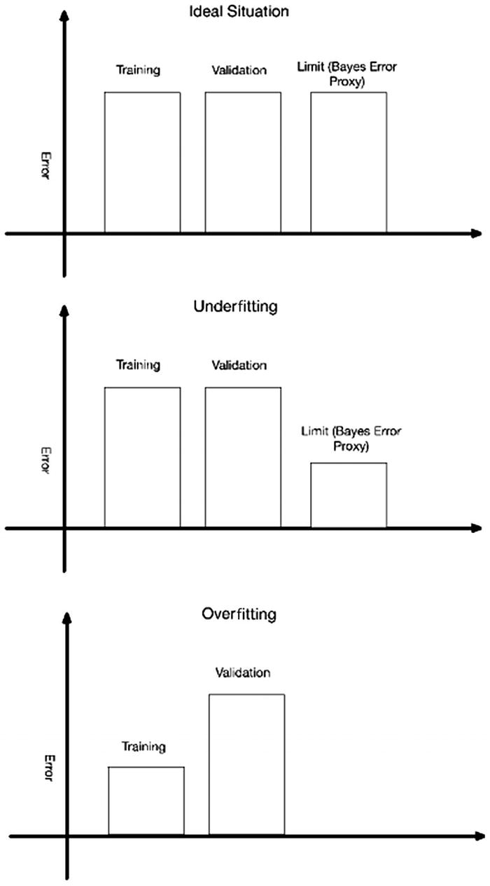

图 5-5

过度拟合和欠拟合

## 超参数调谐

调整模型的超参数(例如学习率或动量)可以通过网格搜索(其中网格是在一小组值上定义的)或通过随机搜索(其中超参数的值是从用户定义的分布中随机抽取的)手动完成。

在网格搜索中，从业者必须为网络中的每个超参数创建一个潜在值的小子集(因为计算资源是有限的)。训练过程基本上循环通过每个可能的组合，并且具有最佳性能的超参数组合是最终选择。使用网格搜索，有可能不具有超参数的最佳可能组合，因为如果大量选择被添加到网格中，排列被限制到所提供的网格或者在计算上非常昂贵。

随机搜索通常更适合超参数调整。通过随机搜索，模型获得超参数最佳组合的可能性较高，但组合数量相对较少(尽管不能保证)。

调整超参数通常是迭代的和实验性的。

## 模型容量

让我们简单回顾一下模型容量、过拟合和欠拟合的概念。我们将使用之前拟合回归模型的例子(参见第一章)。

我们有格式为 *D* = {( *x* <sub>1</sub> ， *y* <sub>1</sub> )，( *x* <sub>2</sub> ， *y* <sub>2</sub> )，…(*x*<sub>*n*</sub>， *y* <sub>*n 我们的任务是生成一个计算程序，实现函数*f*:*x*→*y*。 我们用看不见的数据的均方根误差(RMSE)来衡量这个任务的性能，如下:*</sub>

**

给定一个形式为 *D* = {( *x* <sub>1</sub> ， *y* <sub>1</sub> )，( *x* <sub>2</sub> ， *y* <sub>2</sub> )，…(*x*<sub>*n*</sub>， *y* <sub>*n 我们使用最小二乘模型，其形式为 *y* = *βx* ，其中 *β* 是使最小化的向量。 这里， *X* 是一个矩阵，其中每一行是一个 *x* 。 *β* 的值可以用封闭形式*β*=(*X*<sup>*T*</sup>*X*)<sup>—1</sup>*X*<sup>*T*</sup>*y*导出。*</sub>

我们可以把 *x* 变换成一个值的向量[ *x* <sup>0</sup> ， *x* <sup>1</sup> ， *x* <sup>2</sup> ]。也就是说，如果 *x* = 2，就转化为【1，2，4】。在这个变换之后，我们可以使用前面的公式生成最小二乘模型 *β* 。在引擎盖下，我们用一个二阶多项式(次数= 2)方程来逼近给定的数据，最小二乘算法只是简单地曲线拟合或生成每个*x*T20】0、*x*T24】1、*x*T28】2 的系数。

同样，我们可以用最小二乘算法生成另一个模型，但是我们将把 *x* 变换为[ *x* <sup>0</sup> ， *x* <sup>1</sup> ， *x* <sup>2</sup> ， *x* <sup>3</sup> ， *x* <sup>4</sup> ， *x* <sup>5</sup> 也就是说，我们用次数= 8 的多项式来逼近给定的数据。通过增加多项式的次数，我们可以拟合任意数据。很容易看出，如果我们有 *n* 个数据点，一个次数为 *n* 的多项式可以完美地拟合这些数据。也很容易看出，这样的模型只是简单地记忆数据。我们可以使用这个例子来开发模型容量、过度拟合和欠拟合的透视图。我们用来拟合数据的多项式的次数基本上代表了模型的能力。度数越大，模型的容量越高。

让我们假设数据是使用带有一些噪声的 5 次多项式生成的。另外，请注意，在拟合数据时，我们对生成数据的过程一无所知。我们必须制作一个最符合数据的模型。本质上，我们不知道有多少数据是*模式*，有多少数据是*噪声*。

在这样的数据集上，如果我们使用具有足够高容量的模型(多项式的次数大于 5，在最坏的情况下等于数据点的数量)，当在训练数据上评估时，我们可以获得完美的模型；然而，这个模型在看不见的数据上表现很差，因为它本质上符合噪声。这太合身了。如果我们使用低容量(小于 5)的模型，它将既不适合训练数据也不适合看不见的数据。这是不合适的。

## 正则化模型

从前面的例子中可以很容易地看出，在拟合模型时，一个中心问题是准确地获得模型的容量，以便既不过度拟合也不欠拟合数据。*规则化*可以简单地看作是对模型(或其训练过程)的任何修改，旨在通过系统地限制模型的能力来改善未知数据的误差(以训练数据的误差为代价)。这种系统地限制或调节模型能力的过程是由未用于训练的一部分标记数据来引导的。这些数据通常被称为*验证集*。

在我们运行的例子中，最小二乘法的正则化版本采用的形式是 *y* = *βx* ，其中 *β* 是使，我们惩罚了具有额外容量的模型。要了解为什么会出现这种情况，请考虑使用 10 次多项式拟合最小二乘模型，但向量 *β* 中的值有 8 个零和 2 个非零值。与此相反，考虑向量 *β* 中的所有值都不为零的情况。出于所有实际目的，前一个模型是一个 degree = 2 并且具有较低值的模型。 *λ* 项允许我们平衡训练数据的准确性和模型的复杂性。 *λ* 的较低值意味着型号容量较低。

一个自然的问题是，为什么我们不简单地使用验证集作为指导，并增加前面例子中多项式的次数。既然多项式的次数代表了模型的容量，为什么我们不能用它来调整模型的容量呢？为什么我们需要在模型中引入变化(而不是之前的)。答案是我们想要系统地限制模型的容量，我们需要一个细粒度的控制。通过改变模型的程度来改变模型容量是非常粗粒度的、离散的旋钮，而改变 *λ* 是非常细粒度的。

## 提前停止

深度学习中最简单的正则化技术之一就是*提前停止*。给定一个训练集和一个验证集以及一个有足够容量的网络，我们观察到随着训练步数的增加，首先训练集和验证集的误差都减小，然后训练集的误差继续减小，而验证的误差增加(见图 5-6 )。

早期停止的关键思想是跟踪在验证集上给出最佳性能的模型参数/权重，然后在这个*验证集上迄今的最佳性能*在预定义数量的训练步骤上没有改善之后停止训练。

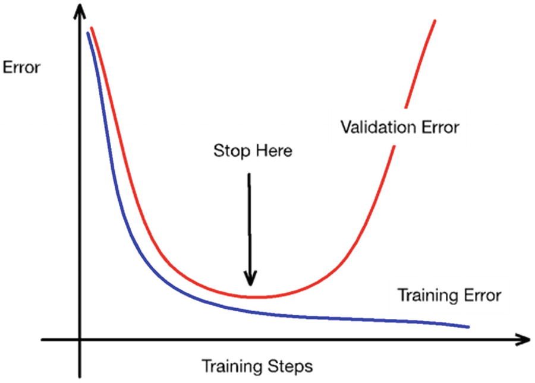

图 5-6

提前停止

通过限制模型的参数/权重值，早期停止起到了正则化的作用(见图 5-7 )。提前停止限制 *w* 到起始值附近的一个邻域内(在*w*T6】0 附近)。所以，如果我们停在 *w* <sub>*s*</sub> 处，*w*<sub>*s*+1</sub>的值是不可能的。这实质上限制了模型的容量。

早期停止是非侵入性的，因为它不需要对模型做任何改变。它也很便宜，因为它只需要存储模型的参数(这是迄今为止验证集上最好的)。它也可以很容易地与其他正则化技术相结合。

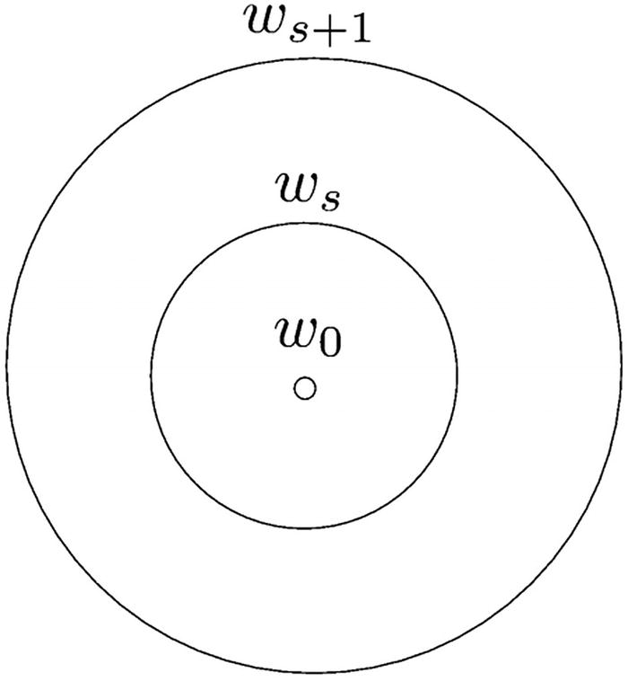

图 5-7

提前停止限制 *w*

## 标准惩罚

*范数惩罚*是深度学习(以及一般的机器学习)中一种常见的正则化形式。这个想法仅仅是在神经网络的损失函数中增加一项 *r* ( *θ* )(参见第三章)，其中 *r* 通常表示 *L* <sup>1</sup> 范数或者 *L* <sup>2</sup> 范数，而 *θ* 表示网络的参数/权重。这样，正则化的损失函数就变成了*l*(*f*<sub>*NN*</sub>(*x*， *θ* )，*y*+*α**r*(*θ*，而不仅仅是 *l* ( *f* <sub>)注意， *α* 项是正则化参数。</sub>

Note

一般来说，一个 *L* <sub>*p*</sub> 定额定义为‖*x*‖<sub>*p*</sub>=(σ<sub>*I*</sub>|*x*<sub>*I*|<sup>*p*</sup>)<sup>1/*p*据此， *L* <sub>1</sub> 定额定义为‖*x*‖<sub>1</sub>=(σ<sub>*I*</sub>|*x*<sub>*I*</sub>|<sup>1<sup>1/1</sup>=σ<sub>*I*同理， *L* <sub>2</sub> 定额定义为‖*x*‖<sub>2</sub>=(σ<sub>*I*</sub>|*|*<sub>I</sub>*|<sup>2</sup>)*</sub></sup>**</sup></sub>

让我们更深入地研究正则化损失函数*l*(*f*<sub>T5】NN</sub>(*x*， *θ* )，*y*)+*α**r*(*θ*)。应注意以下几点:

1.  由于我们试图最小化总损失函数*l*(*f*<sub>T5】NN</sub>(*x*， *θ* ，*y*)+*α**r*(*θ*)，我们试图减少*l*(*f*<sub>)</sub>

2.  接下来对于两组参数，*θ*<sub>T3】aT5】和*θ*<sub>T9】b</sub>，如果*l*(*f*<sub>*NN*</sub>(*x*， *θ* <sub>*a*</sub> ， *y* *θ* <sub>*b*</sub> )， *y* )，那么优化算法就会选择 *θ* <sub>*a*</sub> 如果*r*(*θ*<sub>*a*</sub><*r*(*θ*</sub>

3.  因此，正则项的作用是将优化导向降低 *r* ( *θ* )的 *θ* 方向。

4.  很容易看出，当 *r* 对应于*L*T8】1 正则化时，较低的 *r* ( *θ* )值将导致更稀疏的 *θ* ，从而降低有效容量。

5.  很容易看出，当 *r* 对应于*L*T8】2 正则化时， *r* ( *θ* )的较低值将导致 *θ* 更接近于 0，从而降低有效容量(见图 5-8 )。

6.  *α* 项用来控制我们对*l*(*f*<sub>*NN*</sub>(*x*， *θ* )， *y* )对 *r* ( *θ* )的重视程度。较高的值 *α* 意味着更加重视正则化。

必须注意，范数惩罚应用于权重向量，而不是偏差项。背后的原因是，任何正则化都是过度拟合和欠拟合之间的权衡，正则化偏差项会由于太多的欠拟合而导致糟糕的权衡。在训练深度学习网络时，不同的层可以使用不同的值 *α* ，并且通过使用验证集作为指导的实验来确定合适的值 *α* 。

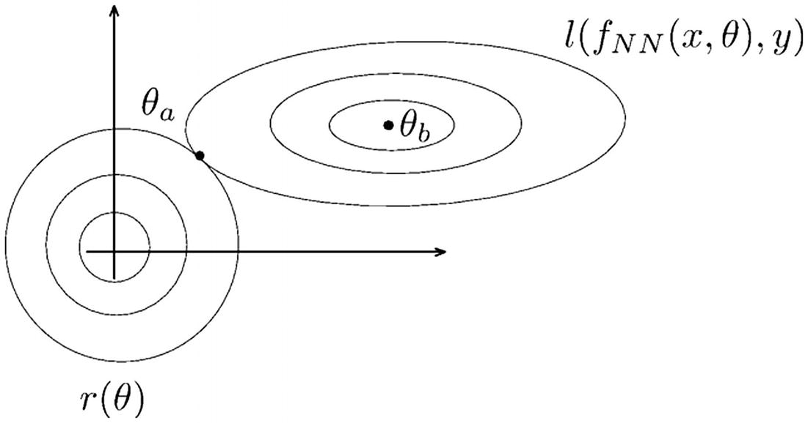

图 5-8

L <sup>2</sup> 范数导致θ更接近于零。θ <sub>a</sub> 由于正则化而被优化算法选取；没有它，θ <sub>b</sub> 将被选取

## 拒绝传统社会的人

*Dropout* 本质上是模型集合/平均的计算廉价替代方案。让我们首先考虑模型集合/平均的关键概念。虽然具有足够容量的单个模型可能会过度拟合，但如果我们对多个模型(根据数据子集、不同权重初始化或不同超参数进行训练)的预测进行平均或多数投票，我们就可以解决过度拟合问题。模型集成/平均是一种非常有用的正则化形式，可以帮助我们处理过拟合问题。然而，考虑到我们必须训练多个模型并对多个模型进行预测(然后通过投票或平均将它们组合起来)，这在计算上是相当昂贵的。对于具有多层的深度学习模型，这种计算开销特别高。辍学提供了一个廉价的选择。

dropout 的关键思想是在以概率 *p* 训练网络时随机丢弃单元及其连接，然后在预测时将学习到的权重乘以 *p* (见图 5-9 )。让我们用数学表达式的形式来精确地表达这个想法。一个标准的神经网络层可以表示为*y*=*f*(*w**x*+*b*，其中 *y* 为输出， *x* 为输入， *f* 为激活函数， *w* 和 *b* 分别为权向量和偏置项。训练时的一个漏层可以表示为*y*=*f*(*w*(*x*⨀*r*)+*b*，其中 *r* ~ *伯努利* ( *p* )，符号⨀表示两个向量的逐点相乘(如果*a*= 在预测时，漏层可以表示为*y*=*f*(*p**w**x*)+*b*)。

很容易看出，dropout 层在训练的同时，实际上训练了多个网络，至于每一个不同的 *r* ，我们都有一个不同的网络。很容易看出，在预测时间，我们对多个网络进行平均，如*y*=*f*(*p*T8】w*x*)+*b*)。

在使用批量随机梯度进行辍学训练时，在整个批次中使用单一值 *r* 。在相关文献中， *p* 的推荐值对于输入单元为 0.8，对于隐藏单元为 0.5。发现对丢失有用的范数正则化是*最大范数正则化*，其中 *w* 被约束为‖*w*<sub>2</sub><T12】c，其中 *c* 是用户定义的参数。

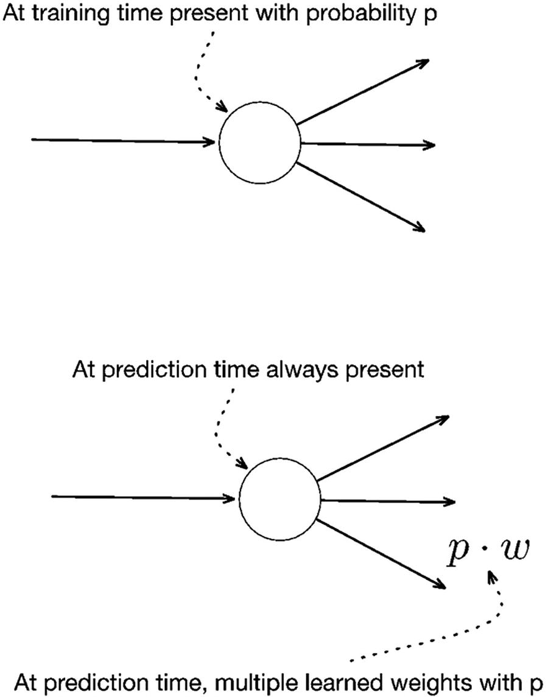

图 5-9

拒绝传统社会的人

## PyTorch 中的实际实现

现在，我们将通过一个实际的例子来探讨我们到目前为止已经讨论过的主题。出于本练习的目的，我们将使用托管在 [`https://www.kaggle.com/janiobachmann/bank-marketing-dataset`](https://www.kaggle.com/janiobachmann/bank-marketing-dataset) 的银行电话营销数据集。原始数据集来自 UCI 机器学习知识库，由[Moro et al .，2014]提供。与原始数据集相比，Kaggle 上托管的子集是一个平衡的数据集(正样本和负样本的数量相似),并且使练习的目的更加容易。

到目前为止，我们已经探索了使用 Python 制作的玩具数据集，因此我们几乎没有探索在建立深度学习模型之前必不可少的数据处理和数据工程的想法。这适用于所有形式的数据可视化——表格、图像、文本、音频/视频/语音等。在本练习中，我们将了解一些基本的数据处理步骤。尽管大量的数据处理超出了本书的范围，但本文的目的是让您了解现实生活用例可能需要的处理类型。

让我们开始吧。在下载前述数据集之前，您首先需要在 [`www.kaggle.com`](http://www.kaggle.com) 注册并创建一个帐户。在清单 5-1 中，我们为我们的练习导入了基本的 Python 包。

```py
#Import required libraries
import torch.nn as nn
import torch as tch
import numpy as np, pandas as pd
from sklearn.metrics import confusion_matrix, accuracy_score
from sklearn.metrics import precision_score, recall_score,roc_curve, auc, roc_auc_score
from sklearn.model_selection import train_test_split
from sklearn.utils import shuffle
import matplotlib.pyplot as plt

Listing 5-1Importing the Required Libraries

```

Sklearn 是 Python 中的一个机器学习库，它提供了一个全面的算法、度量、数据处理工具和其他实用函数的列表。我们使用 sklearn 中的指标模块来获得方便的函数，这些函数有助于计算模型性能——精度、召回率、准确度等指标。类似地，Pandas 是一个很棒的 Python 包，它提供了处理、操作和探索表格数据帧的综合方法。在我们的练习中，我们将使用 Pandas 来读取和探索数据集，并利用 Pandas 中的一些功能来定制数据集以满足我们在 PyTorch 中的需求。清单 5-2 展示了使用 Pandas 将数据加载到内存中。

```py
#Load data into memory using pandas
df = pd.read_csv("/Users/Downloads/dataset.csv")
print("DF Shape:",df.shape)
df.head()

Out[]
DF Shape: (11162, 17)

Listing 5-2Loading Data into Memory

```

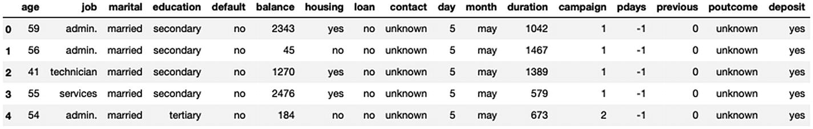

在 Jupyter 笔记本上使用 Pandas 提供了一种迭代探索数据的优雅方式。前面的输出是`df.head()`命令的结果，它打印数据集的前五行；`df.shape`命令将数据集的形状表示为[rows x columns]。

在这个数据集中，我们获得了银行电话营销活动的详细信息。该数据集捕获目标客户的详细信息、关于之前和当前营销电话的一些详细信息，以及成功结果*存款*。客户属性包括*年龄*、*工作*、婚姻状况(*婚姻*)、*学历*、是否有拖欠付款(*违约*)、当前银行余额(*余额*)、住房贷款*和个人贷款*指标*。活动属性包括联系类型(*联系*)、联系时间(*日/月*)和持续时间(*持续时间*)、代理执行的联系次数(*活动*)、前一次联系的天数(*p 天*)、前一次联系次数(*前一次*)和前一次结果( *poutcome* )。*

有关数据集中属性的详细说明，请访问 [`https://archive.ics.uci.edu/ml/datasets/Bank+Marketin` g](https://archive.ics.uci.edu/ml/datasets/Bank%252BMarketing) 。

我们的目标是建立一个深度学习模型，对给定客户和活动组合的结果(存款)进行正确分类。让我们首先看看目标列在数据集中的分布。清单 5-3 展示了探索目标值的分布。

```py
print("Distribution of Target Values in Dataset -")
df.deposit.value_counts()

Out[]:
Distribution of Target Values in Dataset -
no     5873
yes    5289
Name: deposit, dtype: int64

Listing 5-3Distributing the Target Values

```

我们可以看到，在我们的数据集中，`yes`和`no`之间有大致相似的分布。清单 5-4 探究了数据集中空值的分布。

```py
#Check if we have 'na' values within the dataset
df.isna().sum()

Out[]:
age          0
job          0
marital      0
education    0
default      0
balance      0
housing      0
loan         0
contact      0
day          0
month        0
duration     0
campaign     0
pdays        0
previous     0
poutcome     0
deposit      0
dtype: int64

Listing 5-4Distributing the NA (Null) Values in the Dataset

```

数据集没有任何 NA 值或缺失值。在大多数现实生活的数据集中，这可能不成立。研究人员和数据工程师花费大量时间处理缺失值或异常值。以下是您应该独立试验的附加检查:

*   检查异常值。
    *   确定处理数据中异常值的策略。
        *   平均输入。

        *   用模式输入。

        *   用中位数输入。

        *   使用其他先进技术(基于聚类的回归插补技术来处理值)。

*   检查缺少的值。
    *   确定处理缺失价值的策略。

    *   删除记录(如果缺失记录的数量< = 3%)。

    *   用类似于离群值的方法估算记录。

接下来，让我们探索数据集中不同的数据类型。深度学习模型只理解数字。更具体地说，PyTorch 只处理 32 位浮点数。我们需要将数据集转换成适合 PyTorch 使用的形式。清单 5-5 探究了不同数据类型的分布。

```py
#Check the distinct datatypes within the dataset
df.dtypes.value_counts()
Out[]:

int64     11
object     6
dtype: int64

Listing 5-5Distributing the Distinct Datatypes

```

我们有六个基于 object (string)数据类型的列，我们需要在构建模型之前将它们转换成数字标志。我们将把分类列转换成独热编码形式，其中每个类别值都表示为一个二进制标志。但是，在此之前，让我们手动将具有 yes/no 二进制类别的列转换为一个列，并利用一个基于 Pandas 的函数来自动转换剩余的分类列集。清单 5-6 演示了从数据集中提取分类列。

```py
#Extract categorical columns from dataset
categorical_columns = df.select_dtypes(include="object").columns
print("Categorical cols:",list(categorical_columns))

#For each categorical column if values in (Yes/No) convert into a 1/0 Flag
for col in categorical_columns:
    if df[col].nunique() == 2:
        df[col] = np.where(df[col]=="yes",1,0)

df.head()

Listing 5-6Extracting Categorical Columns from the Dataset

```

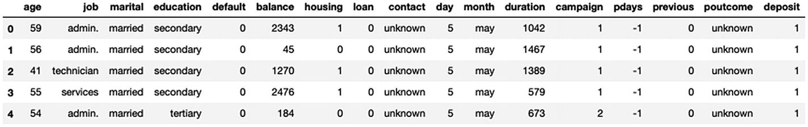

我们可以看到，我们的目标列*存款*和少数其他列，包括*装载*、*默认*和*住房*，已经被转换为二进制标志(手动)。对于具有非二进制分类值的剩余列集，我们可以利用 Pandas `get_dummies`函数来自动处理它们。清单 5-7 对数据集中的分类变量进行一次性编码。

```py
#For the remaining cateogrical variables;
#create one-hot encoded version of the dataset
new_df = pd.get_dummies(df)

#Define target and predictors for the model
target = "deposit"
predictors = set(new_df.columns) - set([target])
print("new_df.shape:",new_df.shape)
new_df[predictors].head()

Out[]:

new_df.shape: (11162, 49)

Listing 5-7One-Hot Encoding for the Remaining Non-Binary Categorical Variables

```

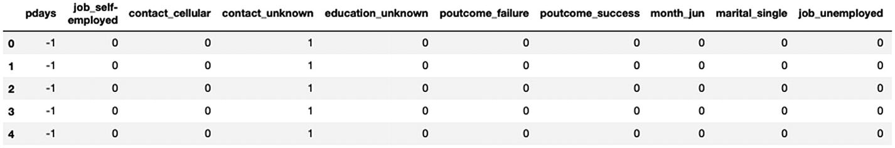

我们现在已经定义了一个包含所有独立预测值列名的预测值列表，以及一个包含我们的 y(即存款列名)的目标。

Pandas 中的`get_dummies`函数将`new_df`数据帧中的所有分类列作为一个热编码形式进行处理。清单 5-7 的上述输出将列的视图限制为前几个；我们可以看到联系人现在转化为*联系人 _ 未知*、*联系人 _ 蜂窝*等。数据集现在只有数字列。

最后，在设计我们的神经网络之前，我们需要将所有列转换为 float32 数据类型，并拆分为训练和验证数据集，然后转换为 PyTorch 张量。清单 5-8 为训练和验证准备数据集。

```py
#Convert all datatypes within pandas dataframe to Float32
#(Compatibility with PyTorch tensors)
new_df = new_df.astype(np.float32)

#Split dataset into Train/Test [80:20]
X_train,x_test, Y_train,y_test = train_test_split(new_df[predictors],new_df[target],test_size= 0.2)

#Convert Pandas dataframe, first to numpy and then to Torch Tensors
X_train = tch.from_numpy(X_train.values)
x_test  = tch.from_numpy(x_test.values)
Y_train = tch.from_numpy(Y_train.values).reshape(-1,1)
y_test  = tch.from_numpy(y_test.values).reshape(-1,1)

#Print the dataset size to verify
print("X_train.shape:",X_train.shape)
print("x_test.shape:",x_test.shape)
print("Y_train.shape:",Y_train.shape)
print("y_test.shape:",y_test.shape)

Out[]:
X_train.shape: torch.Size([8929, 48])
x_test.shape: torch.Size([2233, 48])
Y_train.shape: torch.Size([8929, 1])
y_test.shape: torch.Size([2233, 1])

Listing 5-8Preparing the Dataset for Training and Validation

```

我们现在已经为我们的深度学习实验准备好了数据集。在设计我们的网络之前，让我们先准备一些可以在实验中重复使用的基本构件。清单 5-9 展示了在 PyTorch 中训练模型的样板代码。

Note

在本书的练习中，我们总是将数据集分为 80%的训练和 20%的验证(与前面讨论的将其分为训练、验证和测试相反)。在真实的生产实验中，我们建议读者拥有一个单独的测试数据集，可以在投入生产系统之前完成所需的检查。

```py
#Define function to train the network
def train_network(model,optimizer,loss_function,num_epochs,batch_size,X_train,Y_train,lambda_L1=0.0):
    loss_across_epochs = []

    for epoch in range(num_epochs):
        train_loss= 0.0

        #Explicitly start model training
        model.train()

        for i in range(0,X_train.shape[0],batch_size):

            #Extract train batch from X and Y
            input_data = X_train[i:min(X_train.shape[0],i+batch_size)]
            labels = Y_train[i:min(X_train.shape[0],i+batch_size)]

            #set the gradients to zero before starting to do backpropragation
            optimizer.zero_grad()

            #Forward pass
            output_data  = model(input_data)

            #Caculate loss
            loss = loss_function(output_data, labels)
            L1_loss = 0

            #Compute L1 penalty to be added with loss
            for p in model.parameters():
                L1_loss = L1_loss + p.abs().sum()

            #Add L1 penalty to loss
            loss = loss + lambda_L1 * L1_loss

            #Backpropogate
            loss.backward()

            #Update weights
            optimizer.step()

            train_loss += loss.item() * input_data.size(0)

        loss_across_epochs.append(train_loss/X_train.size(0))
        if epoch%500 == 0:
            print("Epoch: {} - Loss:{:.4f}".format(epoch,train_loss/X_train.size(0) ))

    return(loss_across_epochs)

Listing 5-9Defining the Function to Train the Model

```

前面的函数在定义数量的时期内分批循环，并训练我们的神经网络。你已经熟悉这个功能了(参见第三章)；当我们使用 L1 正则化时，该函数唯一新增加的是 L1 罚函数的计算。`lambda_L1`变量是一个超参数，我们可以调整它来控制 L1 正则化的效果。

现在，让我们定义一个函数，该函数可用于绘制各时期的损失、训练和验证数据集的 ROC 曲线，以及评估模型的重要指标。因为这是一个分类用例，我们将使用之前从 sklearn 导入的函数来计算准确度、精确度和召回率。清单 5-10 展示了评估模型的样板代码。

```py
#Define function for evaluating NN
def evaluate_model(model,x_test,y_test,X_train,Y_train,loss_list):

    model.eval() #Explicitly set to evaluate mode

    #Predict on Train and Validation Datasets
    y_test_prob = model(x_test)
    y_test_pred =np.where(y_test_prob>0.5,1,0)
    Y_train_prob = model(X_train)
    Y_train_pred =np.where(Y_train_prob>0.5,1,0)

    #Compute Training and Validation Metrics
    print("\n Model Performance -")
    print("Training Accuracy-",round(accuracy_score(Y_train,Y_train_pred),3))
    print("Training Precision-",round(precision_score(Y_train,Y_train_pred),3))
    print("Training Recall-",round(recall_score(Y_train,Y_train_pred),3))
    print("Training ROCAUC", round(roc_auc_score(Y_train
                                   ,Y_train_prob.detach().numpy()),3))

    print("Validation Accuracy-",round(accuracy_score(y_test,y_test_pred),3))
    print("Validation Precision-",round(precision_score(y_test,y_test_pred),3))
    print("Validation Recall-",round(recall_score(y_test,y_test_pred),3))
    print("Validation ROCAUC", round(roc_auc_score(y_test
                                     ,y_test_prob.detach().numpy()),3))
    print("\n")

    #Plot the Loss curve and ROC Curve

    plt.figure(figsize=(20,5))
    plt.subplot(1, 2, 1)
    plt.plot(loss_list)
    plt.title('Loss across epochs')
    plt.ylabel('Loss')
    plt.xlabel('Epochs')

    plt.subplot(1, 2, 2)

    #Validation
    fpr_v, tpr_v, _ = roc_curve(y_test, y_test_prob.detach().numpy())
    roc_auc_v = auc(fpr_v, tpr_v)

    #Training
    fpr_t, tpr_t, _ = roc_curve(Y_train, Y_train_prob.detach().numpy())
    roc_auc_t = auc(fpr_t, tpr_t)

    plt.title('Receiver Operating Characteristic:Validation')
    plt.plot(fpr_v, tpr_v, 'b', label = 'Validation AUC = %0.2f' % roc_auc_v)
    plt.plot(fpr_t, tpr_t, 'r', label = 'Training AUC = %0.2f' % roc_auc_t)
    plt.legend(loc = 'lower right')
    plt.plot([0, 1], [0, 1],'r--')
    plt.xlim([0, 1])
    plt.ylim([0, 1])
    plt.ylabel('True Positive Rate')
    plt.xlabel('False Positive Rate')

    plt.show()

Listing 5-10Defining the Function to Evaluate the Model Performance

```

最后，在所有必要的构建模块就绪后，是时候定义我们的神经网络并利用前面的帮助器功能来训练和评估深度学习模型了。我们将从没有正则化器的普通神经网络开始；稍后，我们将通过添加 L1、L2 和辍学生来研究效果，并选择最佳者进行预测。清单 5-11 定义了我们神经网络的结构。

```py
#Define Neural Network

class NeuralNetwork(nn.Module):

    def __init__(self):
        super().__init__()
        tch.manual_seed(2020)
        self.fc1 = nn.Linear(48, 96)
        self.fc2 = nn.Linear(96, 192)
        self.fc3 = nn.Linear(192, 384)
        self.out = nn.Linear(384, 1)
        self.relu = nn.ReLU()
        self.final = nn.Sigmoid()

    def forward(self, x):
        op = self.fc1(x)
        op = self.relu(op)
        op = self.fc2(op)
        op = self.relu(op)
        op = self.fc3(op)
        op = self.relu(op)
        op = self.out(op)
        y = self.final(op)
        return y

#Define training variables

num_epochs = 500
batch_size= 128
loss_function = nn.BCELoss()  #Binary Crosss Entropy Loss

#Hyperparameters
weight_decay=0.0 #set to 0; no L2 Regularizer; passed into the Optimizer
lambda_L1=0.0    #Set to 0; no L1 reg; manually added in loss (train_network)

#Create a model instance
model = NeuralNetwork()

#Define optimizer
adam_optimizer = tch.optim.Adam(model.parameters(), lr= 0.001,weight_decay=weight_decay)

#Train model
adam_loss = train_network(model,adam_optimizer,loss_function
                                    ,num_epochs,batch_size,X_train,Y_train,lambda_
                                         L1=0.0)

#Evaluate model
evaluate_model(model,x_test,y_test,X_train,Y_train,adam_loss)

Out[]:

Epoch: 0 - Loss:1.7305
Epoch: 100 - Loss:0.3219
Epoch: 200 - Loss:0.2470
Epoch: 300 - Loss:0.1910
Epoch: 400 - Loss:0.1431

Model Performance -
Training Accuracy- 0.922
Training Precision- 0.89
Training Recall- 0.957
Training ROCAUC 0.981

Validation Accuracy- 0.801
Validation Precision- 0.757
Validation Recall- 0.827
Validation ROCAUC 0.869

Listing 5-11Defining the Structure of the Neural Network

```

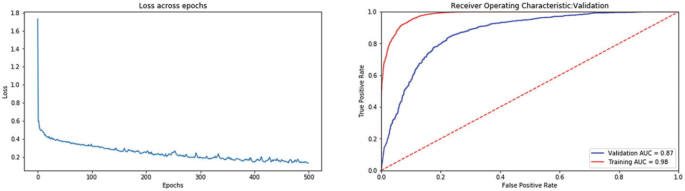

我们将历元数定义为 500，批量大小定义为 128，同时保留`weight_decay=0`和`lambda_L1=0.0`(这基本上消除了 L1 和 L2 正则化子的影响；我们将很快试验这些值)。正如在第三章中，我们为我们的网络使用了带有`BCELoss()`的 Adam 优化器。我们的网络有三个隐藏层，分别有 96、192 和 384 个神经元。我们可以在神经网络架构中使用不同大小的单元。

如果我们仔细看看训练和验证数据集之间的结果，我们可以看到一个巨大的差距。有助于捕捉这种差异的单一指标是 ROC AUC(曲线下面积)；我们的 AUC 为 98%,而培训和验证的 AUC 为 87%。这个差距是巨大的。本质上，我们面临着过度拟合的问题。为了克服过度拟合，我们需要添加正则化子，这将增加模型损失的惩罚，提示模型学习更简单的模式。理想情况下，我们希望在培训和验证之间看到相似的结果。

先说 L1 正则化。我们在`train_network()`函数中添加了一小段代码，用于计算参数绝对值的总和，并添加到乘以 Lambda(超参数)后计算的损失中。为了启用 L1 正则化，我们需要向`lambda_L1`变量传递一个非零值。清单 5-12 展示了网络的 L1 正则化。

```py
#L1 Regularization
num_epochs = 500
batch_size= 128

weight_decay=0.0   #Set to 0; no L2 reg
lambda_L1 = 0.0001 #Enables L1 Regularization

model = NeuralNetwork()
loss_function = nn.BCELoss()  #Binary Crosss Entropy Loss

adam_optimizer = tch.optim.Adam(model.parameters(),lr= 0.001 ,weight_decay=weight_decay)

#Define hyperparater for L1 Regularization

#Train network
adam_loss = train_network(model,adam_optimizer,loss_function,num_epochs,batch_size,X_train,Y_train,lambda_L1=lambda_L1)

#Evaluate model
evaluate_model(model,x_test,y_test,X_train,Y_train,adam_loss)

Out[]:

Epoch: 0   - Loss:2.0634
Epoch: 100 – Loss:0.4042
Epoch: 200 – Loss:0.3852
Epoch: 300 – Loss:0.3668
Epoch: 400 – Loss:0.3616

Model Performance –
Training Accuracy- 0.84
Training Precision- 0.77
Training Recall- 0.949
Training ROCAUC 0.93

Validation Accuracy- 0.813
Validation Precision- 0.732
Validation Recall- 0.928
Validation ROCAUC 0.894

Listing 5-12L1 Regularization

```

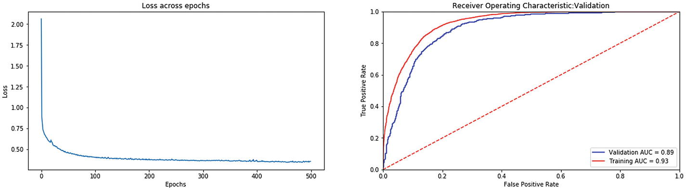

同样，让我们试试 L2 正则化。默认情况下，PyTorch 提供了一种直接通过优化器中的参数启用 L2 正则化的方法。在 Adam 优化中，我们可以使用`weight_decay`变量来添加它。

清单 5-13 展示了网络的 L2 正则化。

```py
#L2 Regularization
num_epochs = 500
batch_size= 128
weight_decay=0.001 #Enables L2 Regularization
lambda_L1 = 0.00    #Set to 0; no L1 reg

model = NeuralNetwork()
loss_function = nn.BCELoss()  #Binary Crosss Entropy Loss

adam_optimizer = tch.optim.Adam(model.parameters(),lr= 0.001,weight_decay=weight_decay)

#Train Network
adam_loss = train_network(model,adam_optimizer,loss_function,num_epochs,batch_size,X_train,Y_train,lambda_L1=lambda_L1)

#Evaluate model
evaluate_model(model,x_test,y_test,X_train,Y_train,adam_loss)

Out[]:

Epoch: 0 – Loss:1.8140
Epoch: 100 – Loss:0.3927
Epoch: 200 – Loss:0.3658
Epoch: 300 – Loss:0.3604
Epoch: 400 – Loss:0.3414

Model Performance –
Training Accuracy- 0.862
Training Precision- 0.822
Training Recall- 0.909
Training ROCAUC 0.935

Validation Accuracy- 0.82
Validation Precision- 0.77
Validation Recall- 0.861
Validation ROCAUC 0.9

Listing 5-13L2 Regularization

```

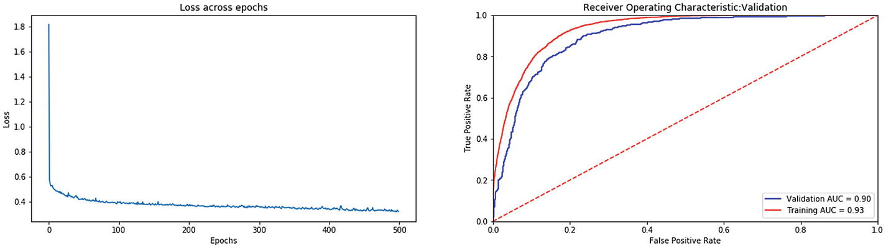

与 L1 类似，我们看到 L2 的结果比没有正规化要好一些。差距缩小，验证 AUC 增加了一小部分。

随着 L1 和 L2 正则化(分别)，我们看到训练和验证性能之间的差距减少，以及减少过度拟合。我们现在对我们的用例有了有利的结果。在最终确定结果之前，让我们添加辍学层。清单 5-14 增加了一个丢弃层，在学习过程中随机丢弃 10%的输入神经元。我们将下降层添加到输入层和隐藏层。

```py
#Define Network with Dropout Layers
class NeuralNetwork(nn.Module):
    #Adding dropout layers within Neural Network to reduce overfitting
    def __init__(self):
        super().__init__()
        tch.manual_seed(2020)
        self.fc1 = nn.Linear(48, 96)
        self.fc2 = nn.Linear(96, 192)
        self.fc3 = nn.Linear(192, 384)
        self.relu = nn.ReLU()
        self.out = nn.Linear(384, 1)
        self.final = nn.Sigmoid()
        self.drop = nn.Dropout(0.1)  #Dropout Layer

    def forward(self, x):
        op = self.drop(x)  #Dropout for input layer
        op = self.fc1(op)
        op = self.relu(op)
        op = self.drop(op) #Dropout for hidden layer 1
        op = self.fc2(op)
        op = self.relu(op)
        op = self.drop(op) #Dropout for hidden layer 2
        op = self.fc3(op)
        op = self.relu(op)
        op = self.drop(op) #Dropout for hidden layer 3
        op = self.out(op)
        y = self.final(op)
        return y

num_epochs = 500
batch_size= 128

weight_decay=0.0 #Set to 0; no L2 reg
lambda_L1 = 0.0  #Set to 0; no L1 reg

model = NeuralNetwork()
loss_function = nn.BCELoss()  #Binary Crosss Entropy Loss

adam_optimizer = tch.optim.Adam(model.parameters(),lr= 0.001
,weight_decay=weight_decay)
#Train model

adam_loss = train_network(model,adam_optimizer,loss_function,num_epochs
,batch_size,X_train,Y_train
,lambda_L1= lambda_L1)

#Evaluate model
evaluate_model(model,x_test,y_test,X_train,Y_train,adam_loss)

Out[]:

Epoch: 0 - Loss:1.9511
Epoch: 100 - Loss:0.4087
Epoch: 200 - Loss:0.3961
Epoch: 300 - Loss:0.3798
Epoch: 400 - Loss:0.3789

Model Performance -
Training Accuracy  - 0.816
Training Precision - 0.766
Training Recall    - 0.885
Training ROCAUC    - 0.899

Validation Accuracy  - 0.802
Validation Precision - 0.74
Validation Recall    - 0.867
Validation ROCAUC    - 0.882

Listing 5-14Dropout Regularization

```

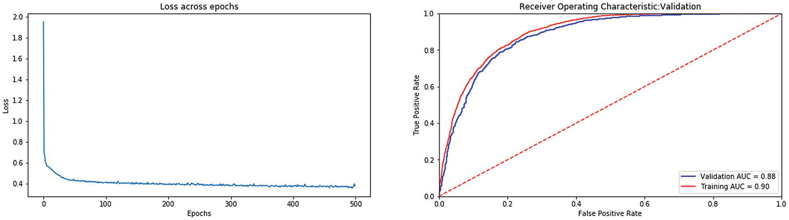

培训和验证绩效之间的差距已经缩小；我们可以在两个数据集上看到相似的性能。

最后，让我们结合所有三种类型的正则化，并研究对模型性能的影响。清单 5-15 展示了 L1、L2 和辍学正规化。

```py
#Create a network with Dropout layer
class NeuralNetwork(nn.Module):
    def __init__(self):
        super().__init__()
        tch.manual_seed(2020)
        self.fc1 = nn.Linear(48, 96)
        self.fc2 = nn.Linear(96, 192)
        self.fc3 = nn.Linear(192, 384)
        self.relu = nn.ReLU()
        self.out = nn.Linear(384, 1)
        self.final = nn.Sigmoid()
        self.drop = nn.Dropout(0.1)  #Dropout Layer

    def forward(self, x):
        op = self.drop(x)  #Dropout for input layer
        op = self.fc1(op)
        op = self.relu(op)
        op = self.drop(op) #Dropout for hidden layer 1
        op = self.fc2(op)
        op = self.relu(op)
        op = self.drop(op) #Dropout for hidden layer 2
        op = self.fc3(op)
        op = self.relu(op)
        op = self.drop(op) #Dropout for hidden layer 3
        op = self.out(op)
        y = self.final(op)
        return y

num_epochs = 500

batch_size= 128

lambda_L1    = 0.0001  #Enabled L1
weight_decay =0.001    #Enabled L2

model = NeuralNetwork()
loss_function = nn.BCELoss()

adam_optimizer = tch.optim.Adam(model.parameters(),lr= 0.001 ,weight_decay=weight_decay)

adam_loss = train_network(model,adam_optimizer,loss_function ,num_epochs,batch_size,X_train,Y_train,lambda_L1=lambda_L1)

evaluate_model(model,x_test,y_test,X_train,Y_train,adam_loss)

Epoch: 0 - Loss:2.2951
Epoch: 100 - Loss:0.4887
Epoch: 200 - Loss:0.4865
Epoch: 300 - Loss:0.4617
Epoch: 400 - Loss:0.4647

Model Performance -
Training Accuracy- 0.794
Training Precision- 0.764
Training Recall- 0.826
Training ROCAUC 0.873

Validation Accuracy- 0.807
Validation Precision- 0.758
Validation Recall- 0.843
Validation ROCAUC 0.884

Listing 5-15L1, L2, and Dropout Regularization

```

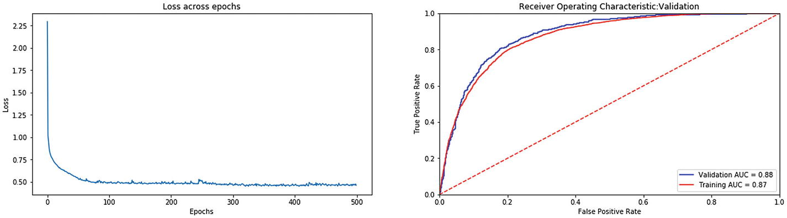

总的来说，我们在上述三个场景中看到了相似的性能。在一个理想的实验中，没有定义的基准，我们可以使用它来选择哪种正则化类型会更好。我们需要试验不同类型的正则化以及超参数的不同值:lambda 正则化和超参数值(0.0001，0.001，0.005，0.01)，dropout layer 值(0.05，0.1，0.2，0.3 等)。).有了所有实验的结果，我们将更加了解哪种类型的正则化最适合数据。

### 解读深度学习的业务成果

结果还算不错。我们看到培训和验证性能之间的差距很小。(参考 ROC 图中红色和蓝色线之间的间隙。)

总的来说，我们在验证数据集上有 80%的准确率，精确度为 76%，召回率为 84%。这些结果非常令人鼓舞。在对营销活动结果做出的 10 个“是”的预测中，我们的正确率为 7.6 倍，同时涵盖了 84%会积极响应该活动的所有客户。

让我们花点时间来更好地理解这些结果。我们从一个大约有 50-50%正面和负面结果的数据集开始。考虑到业务问题，这将转化为(考虑到营销团队的努力)在锁定 50%的客户方面的巨大努力损失，并产生负面结果。假设我们总共有 100 个客户(因此，50 个正面结果和 50 个负面结果)。针对每个客户，我们有 100 个工作单位(针对 100 次呼叫),最后我们有 50 次成功存款。

然而，凭借大约 76%的准确率和 84%的召回率，我们有了一个经过筛选的客户列表，可以轻松地锁定这些客户。

因此，我们现在的目标不是所有的 100 个客户，而是我们预测正确的客户，这也包括误报。如果我们总共有 50 个正面结果，那么前面的模型具有 84%的召回率和 76%的精确度，我们将预测(x * 0.84)/0.76(x = 50)。因此，我们总共有约 55 个阳性预测，其中 12 个为假阳性，43 个为真阳性(每 100 个预测)。

与前面的场景相比，对于 100 次尝试，我们有 50 次成功存款。在深度学习模型中，对于 55 次尝试(结果预测为 1)，我们有 43 次成功存款。

尽管在活动中损失了七笔正存款，但我们已经大大减少了达到几乎相同的成功标准所需的工作量。这些指标可以根据业务需求进一步调整，以适应更有利的结果。

Note

我们还没有涵盖类似的(详细的)回归用例。鼓励读者独立试验回归用例，其中目标变量是连续的。尽管损失函数的选择、输出层的激活和性能度量需要基于用例，但是问题的方法和公式保持不变。我们推荐尝试的一个样本回归数据集是桑坦德集团的价值预测挑战( [`https://www.kaggle.com/c/santander-value-prediction-challenge/`](https://www.kaggle.com/c/santander-value-prediction-challenge/) )。损失函数的一个好选择是 RMSE；输出层的激活将是线性的；性能度量选择可以是 RMSE 或 MSE。

## 摘要

本章讲述了模型训练的过程。我们还描述了一些关键步骤和分析，为了改进模型，应该系统地执行这些步骤和分析。我们还讨论了深度学习中常用的正则化技术，即规范惩罚和辍学。在文献中还发现了其他一些必须提及的高级/特定领域技术。到目前为止，我们已经使用一个玩具数据集和一个实际数据集，以及两者的结合和一个业务用例，介绍了前馈神经网络和深度学习的所有基本内容。您现在应该对制定用例、定义基准模型的相关度量、评估模型性能以及评估业务可行性有了更加直观的理解。在下一章中，我们将探索深度学习中最重要的主题之一——卷积神经网络——并拥抱计算机视觉领域。