# 六、卷积神经网络

卷积神经网络(CNN)本质上是一种采用卷积运算(而不是全连接层)作为其一层的神经网络。CNN 是一项令人难以置信的成功技术，它已经被应用于这样的问题，即在要进行预测的输入数据中具有已知的网格状拓扑，如时间序列(一维网格)或图像(二维网格)。CNN 将深度学习引入现代，解决了计算机视觉数字时代最关键的计算问题之一。随着 CNN 的普及，深度学习的研究热潮一直持续到今天。

本章简要介绍了 CNN 的核心概念，并探索了 PyTorch 中的一个简单示例来研究它们的实际实现。我们还将探索迁移学习，其中我们将利用之前训练过的网络作为我们的用例。

让我们从基础开始。

## 卷积运算

我们先来看看一维的卷积运算。给定一个输入 *I* ( *t* )和一个内核 *K* ( *a* )，卷积运算由


给出

给定卷积运算的交换性，该运算的等价形式如下:


此外，可以替换负号(翻转)来获得互相关，如下:

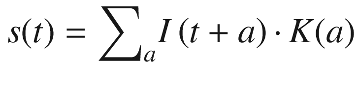

深度学习文献和软件实现互换使用术语*卷积*和*互相关*。运算的本质是，与输入相比，核是一组更短的数据点，当输入与核相似时，卷积运算的输出更高。图 [6-1](#Fig1) 和图 [6-2](#Fig2) 说明了这一关键思想。我们采用任意输入和任意核，并执行卷积运算。当内核与输入的特定部分相似时，获得最高值。

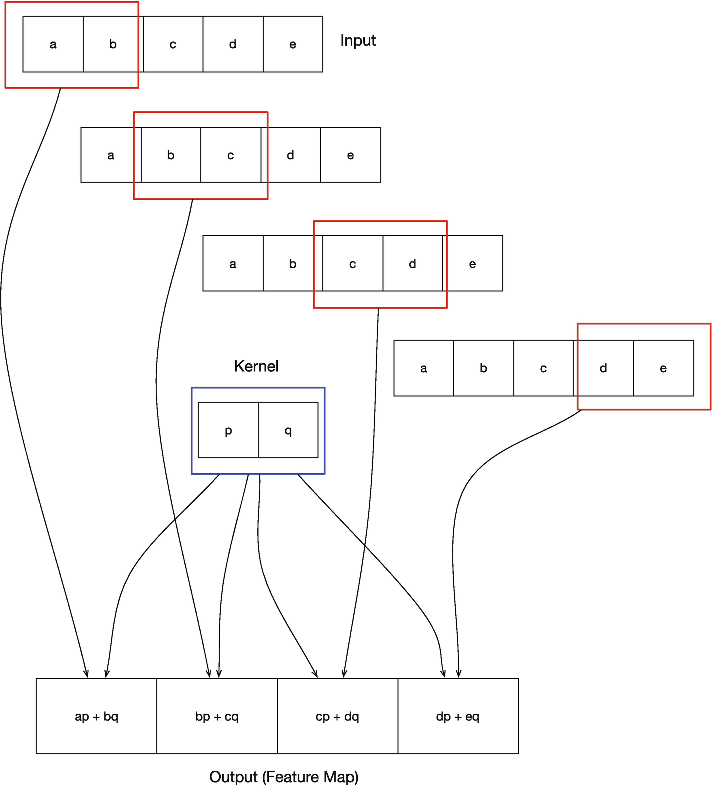

图 6-2

卷积运算—一维

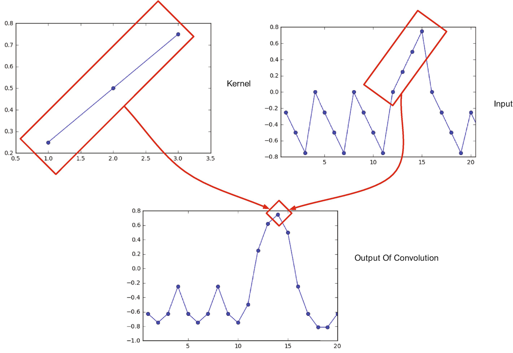

图 6-1

卷积运算的简单概述

应注意以下几点:

1.  输入是任意的大量数据点。

2.  内核是一组在数量上小于输入的数据点。

3.  从某种意义上说，卷积运算将内核滑过输入，并计算内核与输入部分的相似程度。

4.  卷积运算在核与输入的一部分最相似的地方产生最高值。

卷积运算可以扩展到二维。给定一个输入 *I* ( *m* ， *n* )和一个内核 *K* ( *a* ， *b* )，卷积运算由

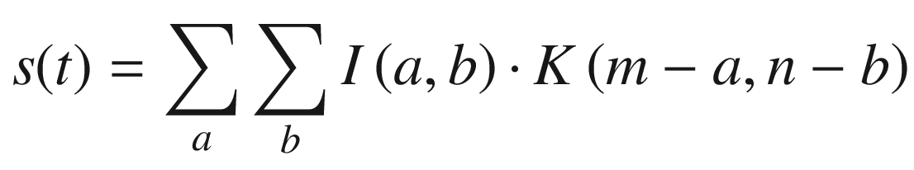

给出

给定卷积运算的交换性，该运算的等价形式如下:

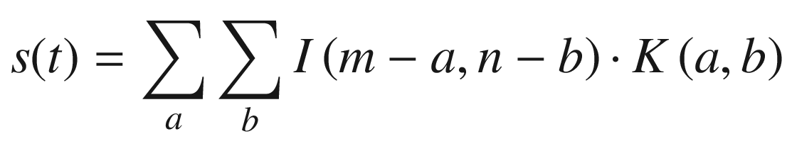

此外，可以替换负号(翻转)来获得互相关，给出如下:


图 [6-3](#Fig3) 以二维图示了卷积运算。请注意，这只是将卷积的思想扩展到二维。

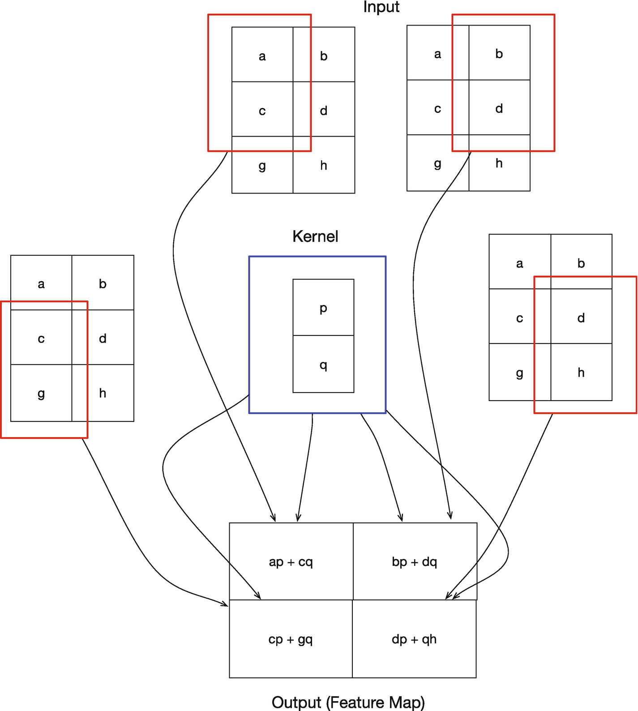

图 6-3

卷积运算—二维

在介绍了卷积运算之后，我们现在可以更深入地研究 CNN 的关键组成部分，其中使用了卷积层而不是全连接层，这涉及到矩阵乘法。

一个全连通层可以描述为*y*=*f*(*x**w*)，其中 *x* 为输入向量， *y* 为输出向量， *w* 为一组权重， *f* 为激活函数。相应地，一个卷积层可以描述为*y*=*f*(*s*(*x*T24】w)，其中 *s* 表示输入和权值之间的卷积运算。

现在让我们对比一下全连接层和卷积层。图 [6-4](#Fig4) 示意性地示出了全连接层，图 [6-5](#Fig5) 示意性地示出了卷积层。图 [6-6](#Fig6) 说明了卷积层中的参数共享以及全连接层中的参数共享缺失。应注意以下几点:

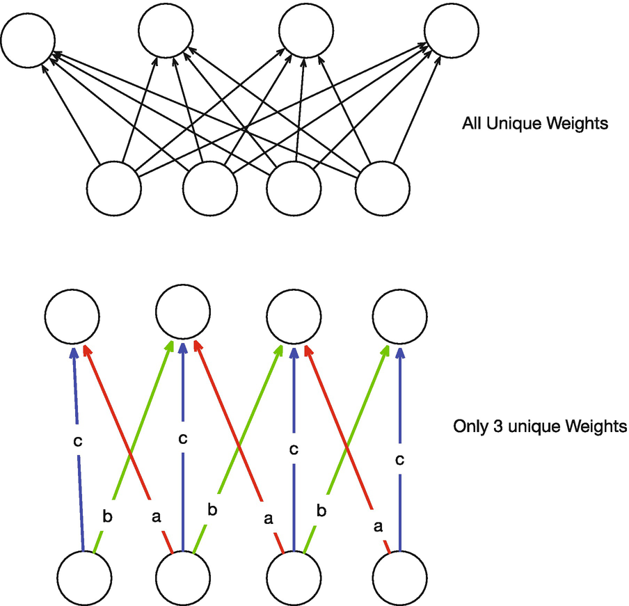

图 6-6

参数共享权重

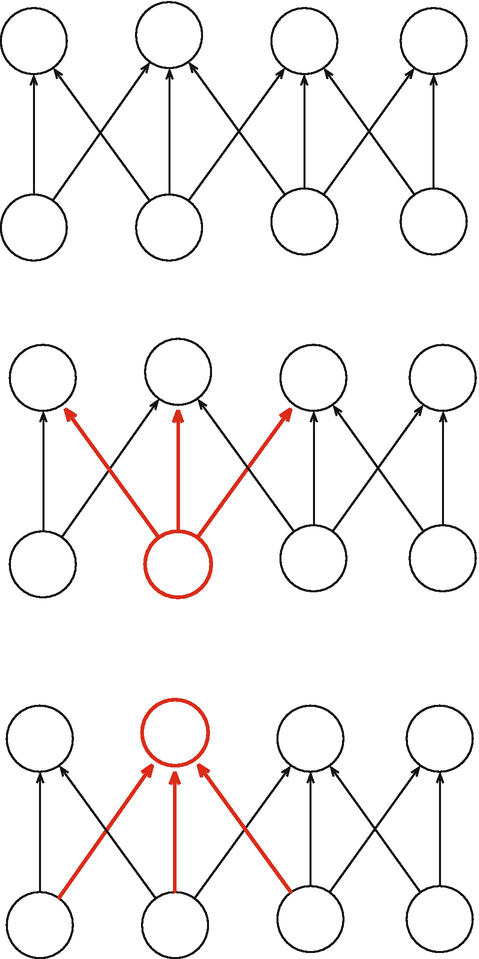

图 6-5

卷积层中的稀疏相互作用

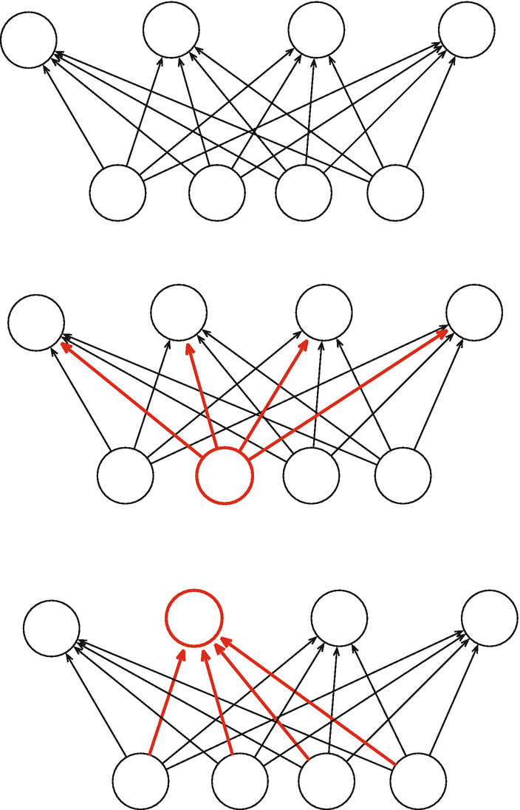

图 6-4

全连接层中的密集相互作用

*   对于相同数量的输入和输出，全连接层比卷积层有更多的连接和相应的权重。

*   与全连接层相比，卷积层中产生输出的输入之间的交互较少。这被称为*稀疏相互作用*。

*   假设内核比输入小得多，并且内核在输入上滑动，则参数/权重在卷积层上共享。因此，卷积层中的唯一参数/权重要少得多。

## 联营业务

现在让我们来看看合并运算，它几乎总是与卷积一起用于 CNN。池化操作背后的思想是，如果事实上已经发现了特征的确切位置，那么它就不是问题。它只是提供了平移不变性。例如，假设任务是学习识别照片中的人脸。还假设照片中的人脸是倾斜的(通常如此)，我们有一个卷积层来检测眼睛。我们想从照片中眼睛的方向提取出它们的位置。汇集操作实现了这一点，并且是 CNN 的重要组成部分。

图 [6-7](#Fig7) 说明了二维输入的汇集操作。应注意以下几点:

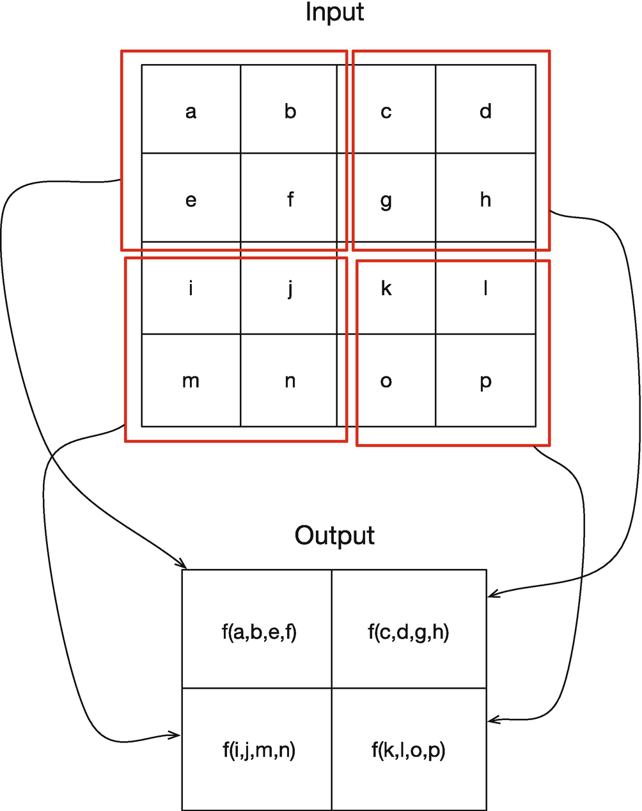

图 6-7

汇集或二次抽样

*   函数 *f* 通常是*最大值*运算(导致最大池化)，但是也可以使用其他变型，例如平均值或*L*T6】2 范数。

*   对于二维输入，这是一个矩形部分。

*   与输入相比，汇集产生的输出在维度上要小得多。

## 卷积检测器池构建模块

现在让我们来看看卷积检测器池模块，它可以被看作是 CNN 的一个构建模块，并看看我们前面介绍的所有操作是如何协同工作的。参见图 [6-8](#Fig8) 和图 [6-9](#Fig9) 。需要注意以下几点。

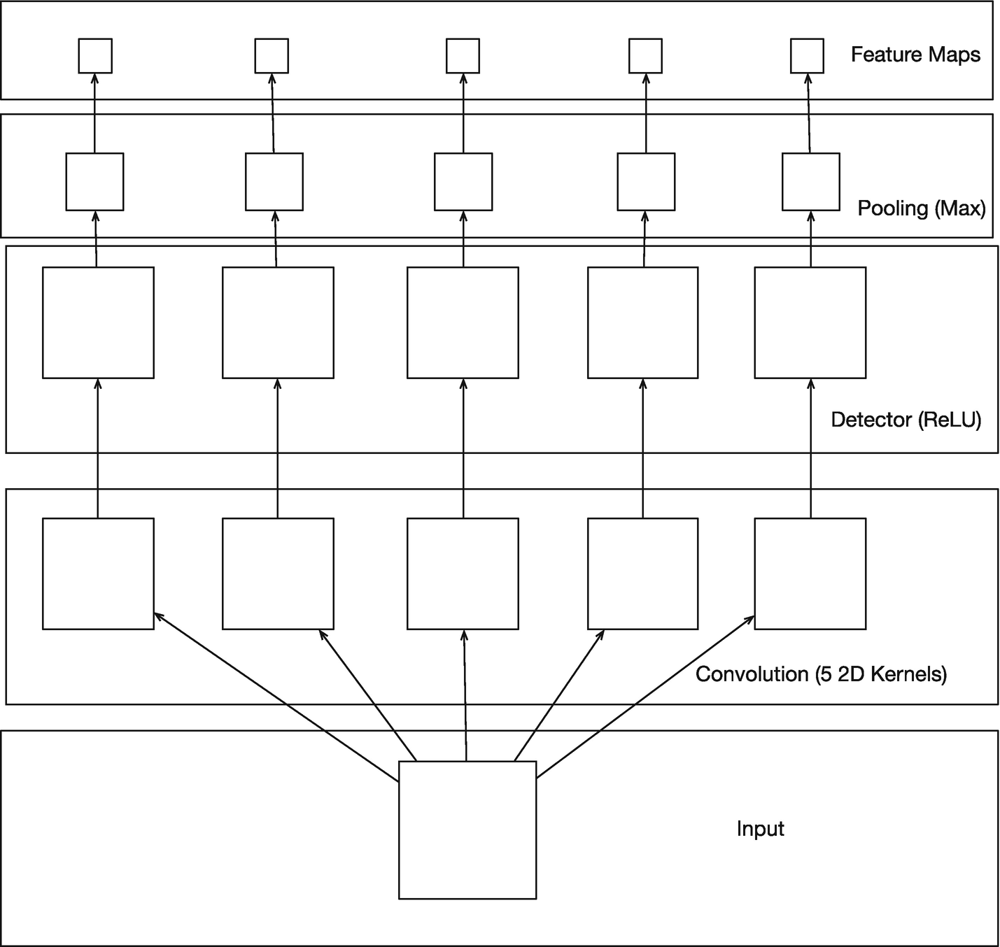

图 6-9

给出多个特征图的多个过滤器/内核

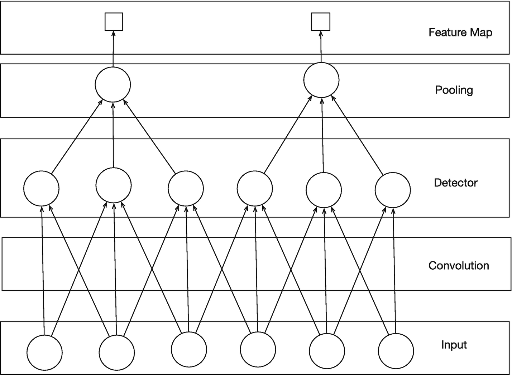

图 6-8

卷积，然后是检测器阶段和合并

*   检测器级只是一个非线性激活函数。

*   卷积、检测器和池操作按顺序应用，以将输入转换为输出。输出被称为*特征图*。

*   输出通常会传递到其他层(卷积层或全连接层)。

*   多个卷积检测器池模块可以并行应用，消耗相同的输入并产生多个输出或特征图。

如果图像输入由三个通道组成，则对每个通道进行单独的卷积运算，然后在卷积后将输出相加(参见图 [6-10](#Fig10) )。

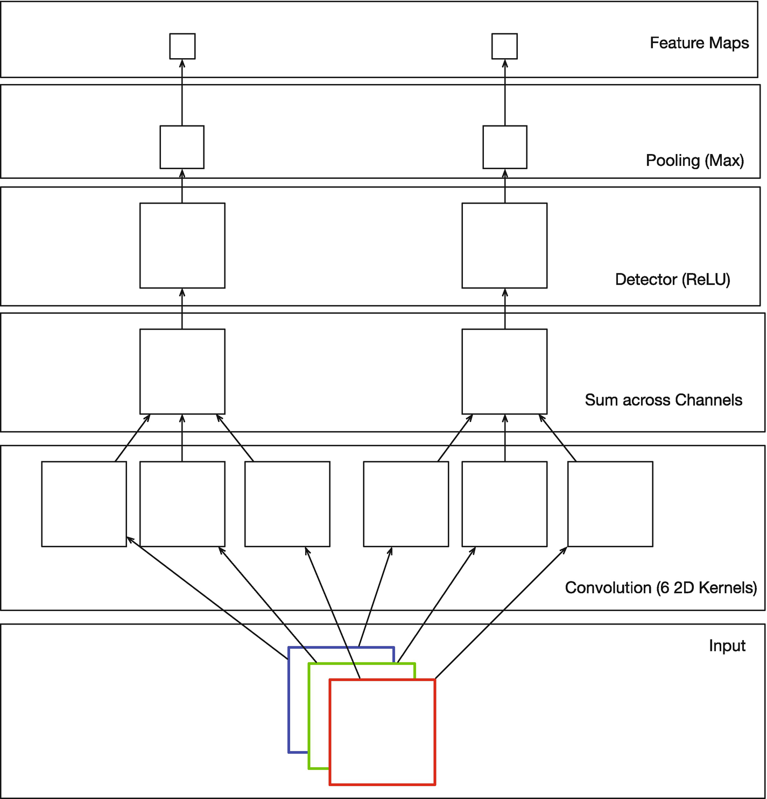

图 6-10

多通道卷积

在介绍了 CNN 的所有组成元素之后，我们现在可以完整地看一个 CNN 的例子(见图 [6-11](#Fig11) )。CNN 由两级卷积检测器池模块组成，每级都有多个滤波器/内核产生多个特征图。在这两个阶段之后，我们有一个产生输出的完全连接的层。一般而言，CNN 可能具有多级卷积检测器池模块(采用多个滤波器)，通常后跟一个全连接层。

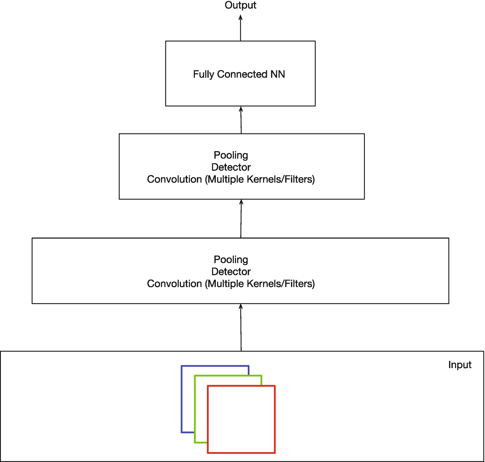

图 6-11

完整的 CNN 架构

除了这些基本结构，我们还将探讨一些与卷积层相关的其他主题。

### 进展

*步幅*可以定义为过滤器/内核移动的量。当讨论滤波器在输入图像上的滑动时，我们假设该移动只是在预期方向上的一个单位。然而，我们可以用我们选择的一些数字来控制滑动(尽管通常使用一个)。基于用例，我们可以选择一个更合适的数字。更大的步幅通常有助于减少计算、概括特征学习等。

### 填料

我们还看到，与输入图像的大小相比，应用卷积减小了特征图的大小。在应用大于 1x1 的过滤器并避免边界处的信息丢失之后，零填充是控制维度收缩的通用方法。

### 批量标准化

*批量标准化*是一种技术，通过标准化每个小批量的层输入来帮助训练非常深的神经网络。标准化输入有助于稳定学习过程，从而大大减少训练深度网络所需的训练次数。批量标准化层被添加在卷积层之后，并且通常是卷积运算的标准块的一部分。也就是说，卷积层、批量标准化层、激活和最大池操作在同一序列中的组合被定义为一个卷积单元。我们通常在 CNN 中添加几个这样的单元。

### 过滤器

过滤器类似于内核。在最近的实现(包括 PyTorch)和学术界，术语*过滤器*比*内核*更常见。一般来说，对于卷积运算，我们使用大小为 3×3 和 5×5 的滤波器。早期的实现也支持 7×7 滤波器。

### 过滤深度

*滤镜深度*通常指输入图像中颜色通道数对应的深度。对于后面层中的过滤器，深度对应于前面层中过滤器的数量。对于具有三个颜色通道(即 R、G 和 B)的常规图像，我们使用深度为 3 的滤镜。

### 过滤器数量

过滤器充当特征提取器；因此，在网络的每个卷积块中有几个滤波器是很常见的。一个示例排列是一个卷积块，具有 32 个大小为 3×3(深度为 3)的滤波器，接着是激活/批量归一化和池化块，接着是另一个具有 64 个滤波器的块(现在深度为 32)，依此类推。

## 总结 CNN 的主要经验

到目前为止，我们已经讨论了 CNN 背后的关键组成概念:卷积运算和池运算，以及它们如何结合使用。现在让我们后退一步，用这些构件来内化 CNN 背后的思想。

*   首先要考虑的是 CNN 的容量。用卷积运算代替神经网络的至少一个完全连接的层的 CNN 比完全连接的网络具有更小的容量。也就是说，存在全连接网络能够模拟 CNN 不能模拟的数据集。因此，要注意的第一点是，CNN 通过限制容量并因此使训练有效来实现更多。

*   要考虑的第二个想法是，学习驱动卷积运算的滤波器在某种意义上是表示学习。例如，已学习的过滤器可以学习检测边缘、形状等。这里要考虑的要点是，我们不是手动描述要从输入数据中提取的特征；相反，我们描述的是一个学会设计特性/表现的架构。

*   要考虑的第三个想法是池操作引入的位置不变性。池操作将特征的位置与其被检测到的事实分开。检测直线的过滤器可能会在图像的任何部分检测到该特征，但池操作会选择检测到该特征的事实(最大池)。

*   第四个想法是等级。一个 CNN 可以有多个卷积层和汇集层堆叠在一起，然后是一个完全连接的网络。这允许 CNN 建立一个概念层次，其中更抽象的概念基于更简单的概念(参见第 [1](1.html) 章)。

*   最后一个想法是在一系列卷积层和汇集层的末端存在一个全连接层。一系列卷积层和汇集层生成特征，标准神经网络学习最终的分类/回归函数。将 CNN 的这一方面与传统的机器学习区分开来是很重要的。在传统的机器学习中，专家会手工设计特征，并将其输入神经网络。在 CNN 中，这些特征/表示是从数据中学习的。

### 使用 PyTorch 实现基本的 CNN

现代深度学习框架负责我们开发 CNN 所需的大量操作和构造。让我们用一个简单的例子来说明 PyTorch 如何用于定义、训练和评估 CNN。

我们将从 MNIST 的一个例子开始，那里有一组手写数字图像。我们的任务是将给定的图像分类为 0 到 9 之间的数字。

#Note

计算机视觉任务是非常计算密集型的，通常需要高端硬件来训练和评估大型鲁棒网络。我们探索的 MNIST 例子是一个微型数据集，读者应该很容易在商用硬件上重现。对于本章中更深入的例子，我们推荐一个免费的、基于网络的、支持 GPU 的计算实例，比如 Kaggle 或 Google Colab。这两个版本都提供了一个标准计算实例，具有大约 16GB RAM 和 16GB GPU 内存，每月配额。出于实验目的，这些都是很好的资源。对于更深入的实验，读者需要探索云(AWS/GCP/Azure)或定制硬件上的深度学习实例。

首先，从 [`https://www.kaggle.com/c/digit-recognizer/data`](https://www.kaggle.com/c/digit-recognizer/data) 下载数据集。

我们将只使用提供了标签的训练数据集。训练数据集将进一步分为训练和验证。现在我们已经准备好了数据，让我们通过导入所需的包来开始实现(清单 [6-1](#PC1) )。

```py
#pytorch utility imports
import torch
from torch.utils.data import DataLoader, TensorDataset

#neural net imports
import torch.nn as nn, torch.nn.functional as F, torch.optim as optim
from torch.autograd import Variable

#import external libraries
import pandas as pd,numpy as np,matplotlib.pyplot as plt, os
from sklearn.model_selection import train_test_split
from sklearn.metrics import confusion_matrix, accuracy_score
%matplotlib inline

#Set device to GPU or CPU based on availability

if torch.cuda.is_available():
    device = torch.device('cuda')
else:
    device = torch.device('cpu')

Listing 6-1Importing the Required Packages

```

我们现在将使用 Pandas 加载数据集(类似于第 [5](5.html) 章)并分离标签和像素值。请注意，大多数图像数据集都是以简单的图像格式存储的。jpeg 或者。png)放在一个适合 PyTorch 的简单文件夹结构中。然而，为了简化这个例子，我们使用一个数据集，其中像素值作为横截面数据存储在一个. csv 文件中。然后，我们将数据集分为训练和测试，并绘制几个样本。在下一个示例中，我们将使用存储在传统文件夹结构中的数据集。

在本例中，我们将使用由 PyTorch 提供的包装器 TensorDataset 将标签和张量组合成一个统一的数据集。清单 [6-2](#PC2) 演示了将数据集加载到内存中。

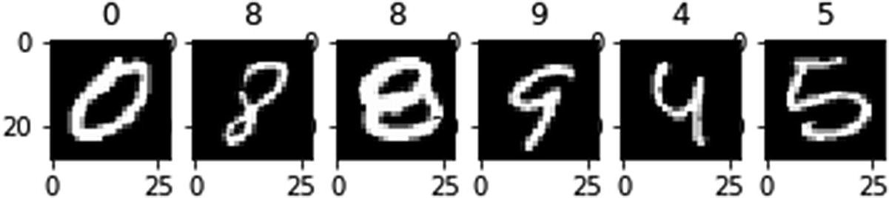

```py
input_folder_path = "/input/data/MNIST/"

#The CSV contains a flat file of images,
#i.e. each 28*28 image is flattened into a row of 784 colums
#(1 column represents a pixel value)
#For CNN, we would need to reshape this to our desired shape

train_df = pd.read_csv(input_folder_path+"train.csv")

#First column is the target/label
train_labels = train_df['label'].values

#Pixels values start from the 2nd column
train_images = (train_df.iloc[:,1:].values).astype('float32')

#Training and Validation Split
train_images, val_images, train_labels, val_labels =
                                         train_test_split(
                                             train_images
                                             ,train_labels
                                             ,random_state=2020
                                             ,test_size=0.2)
#Here we reshape the flat row into [#images,#Channels,#Width,#Height]
#Given this a simple grayscale image, we will have just 1 channel
train_images = train_images.reshape(train_images.shape[0],1,28, 28)
val_images = val_images.reshape(val_images.shape[0],1,28, 28)

#Also, let's plot few samples
for i in range(0, 6):
    plt.subplot(160 + (i+1))
    plt.imshow(train_images[i].reshape(28,28), cmap=plt.get_cmap('gray'))
    plt.title(train_labels[i])

Listing 6-2Loading the Dataset into Memory

```

接下来，我们将归一化像素值，并将数据集转换为 PyTorch 张量用于训练(清单 [6-3](#PC3) )。

```py
#Covert Train Images from pandas/numpy to tensor and normalize the values
train_images_tensor = torch.tensor(train_images)/255.0
train_images_tensor = train_images_tensor.view(-1,1,28,28)
train_labels_tensor = torch.tensor(train_labels)

#Create a train TensorDataset
train_tensor = TensorDataset(train_images_tensor, train_labels_tensor)

#Covert Validation Images from pandas/numpy to tensor and normalize the values
val_images_tensor = torch.tensor(val_images)/255.0
val_images_tensor = val_images_tensor.view(-1,1,28,28)
val_labels_tensor = torch.tensor(val_labels)

#Create a Validation TensorDataset
val_tensor = TensorDataset(val_images_tensor, val_labels_tensor)

print("Train Labels Shape:",train_labels_tensor.shape)
print("Train Images Shape:",train_images_tensor.shape)
print("Validation Labels Shape:",val_labels_tensor.shape)
print("Validation Images Shape:",val_images_tensor.shape)

#Load Train and Validation TensorDatasets into the data generator for Training
train_loader = DataLoader(train_tensor, batch_size=64
                          , num_workers=2, shuffle=True)
val_loader = DataLoader(val_tensor, batch_size=64, num_workers=2, shuffle=True)

Output[]
Train Labels Shape: torch.Size([33600])
Train Images Shape: torch.Size([33600, 1, 28, 28])
Validation Labels Shape: torch.Size([8400])
Validation Images Shape: torch.Size([8400, 1, 28, 28])

Listing 6-3Normalizing the Data and Preparing the Training/Validation Datasets

```

准备好训练和验证数据集后，让我们定义网络的下一个重要方面。这包括 CNN 本身、用于训练的功能以及评估和做出预测。这些结构中的大多数都是从我们之前在第 [5](5.html) 章中的例子中借来的。我们将在这里处理一些新的代码结构。

在我们的 CNN 中，我们需要定义一个卷积单元，如前所述。每个单元组合了一个卷积层，随后是批量标准化(可选)、激活和最大池层。要考虑的一个重要方面是每个卷积单元后的结果图像的大小。

在本例中，我们的原始图像大小为 28×28。当我们通过第一个卷积单元时，图像大小会根据我们定义的内核大小缩小。假设我们已经使用“padding=1”向输入添加了一个填充单元，卷积后原始大小保持不变。然而，使用最大池操作，大小减少了一半(正如我们所希望的)。因此，最初为 28×28 的合成图像将被转换为大小为 14×14×16 的张量(其中 16 是我们定义的过滤器数量)。对于每一个额外的卷积单元，我们将看到数量减少了一半(作为最大池操作的结果)。

因此，在三个连续的卷积单元之后，最终大小将是 7(即，28 -> 14 -> 7)。

全连接层 fc1 的输入节点为 7×7×32(其中 32 是前一个卷积单元中的内核数)。转发功能将这些卷积单元与完全连接的层顺序连接。最后一层将有 10 个输出节点，因为我们在这里有多类分类问题:即将一个数字分类为 0，1，2，3，… 9。最后一层中的 softmax 函数为我们的多类用例将输出裁剪成一组简洁的概率分数。

在清单 [6-4](#PC4) 中，我们定义了 CNN 的结构和助手函数来评估模型的性能并生成预测。

```py
#Define conv-net
class ConvNet(nn.Module):
    def __init__(self, num_classes=10):
        super(ConvNet, self).__init__()
        #First unit of convolution
        self.conv_unit_1 = nn.Sequential(
            nn.Conv2d(1, 16, kernel_size=3, stride=1, padding=1),
            nn.BatchNorm2d(16),
            nn.ReLU(),
            nn.MaxPool2d(kernel_size=2, stride=2))

        #Second unit of convolution

        self.conv_unit_2 = nn.Sequential(
            nn.Conv2d(16, 32, kernel_size=3, stride=1, padding=1),
            nn.BatchNorm2d(32),
            nn.ReLU(),
            nn.MaxPool2d(kernel_size=2, stride=2))

        #Fully connected layers
        self.fc1 = nn.Linear(7*7*32, 128)
        self.fc2 = nn.Linear(128, 10)

    #Connect the units
    def forward(self, x):
        out = self.conv_unit_1(x)
        out = self.conv_unit_2(out)
        out = out.view(out.size(0), -1)
        out = self.fc1(out)
        out = self.fc2(out)
        out = F.log_softmax(out,dim=1)
        return out

#Define Functions for Model Evaluation and generating Predictions
def make_predictions(data_loader):
    #Explcitly set the model to eval mode
    model.eval()
    test_preds = torch.LongTensor()
    actual = torch.LongTensor()

    for data, target in data_loader:

        if torch.cuda.is_available():
            data = data.cuda()
        output = model(data)

        #Predict output/Take the index of the output with max value
        preds = output.cpu().data.max(1, keepdim=True)[1]

        #Combine tensors from each batch
        test_preds = torch.cat((test_preds, preds), dim=0)
        actual  = torch.cat((actual,target),dim=0)

    return actual,test_preds

#Evalute model

def evaluate(data_loader):
    model.eval()
    loss = 0
    correct = 0

    for data, target in data_loader:
        if torch.cuda.is_available():
            data = data.cuda()
            target = target.cuda()
        output = model(data)
        loss += F.cross_entropy(output, target, size_average=False).data.item()
        predicted = output.data.max(1, keepdim=True)[1]
        correct += (target.reshape(-1,1) == predicted.reshape(-1,1)).float().sum()

    loss /= len(data_loader.dataset)

    print('\nAverage Val Loss: {:.4f}, Val Accuracy: {}/{} ({:.3f}%)\n'.format(
        loss, correct, len(data_loader.dataset),
        100\. * correct / len(data_loader.dataset)))

Listing 6-4Defining the CNN and the Helper Functions

```

有了重要的构造，我们现在可以创建模型的实例，并定义我们的标准函数和优化器，如清单 [6-5](#PC5) 所示。

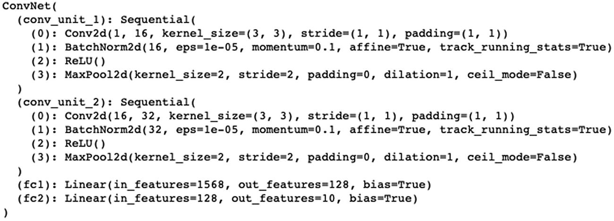

```py
#Create Model  instance
model = ConvNet(10).to(device)

#Define Loss and optimizer
criterion = nn.CrossEntropyLoss()
optimizer = torch.optim.Adam(model.parameters(), lr=0.001)
print(model)
Output[]

Listing 6-5Creating a Model Instance and Defining the Loss Function and Optimizer

```

清单 [6-6](#PC6) 展示了为定义数量的时期训练 CNN 模型——在本例中是五个时期。

```py
num_epochs = 5

# Train the model
total_step = len(train_loader)
for epoch in range(num_epochs):
    for i, (images, labels) in enumerate(train_loader):
        images = images.to(device)
        labels = labels.to(device)

        # Forward pass
        outputs = model(images)
        loss = criterion(outputs, labels)

        # Backward and optimize
        optimizer.zero_grad()
        loss.backward()
        optimizer.step()

    #After each epoch print Train loss and validation loss + accuracy
    print ('Epoch [{}/{}], Loss: {:.4f}' .format(epoch+1, num_epochs, loss.item()))
    evaluate(val_loader)

Output[]
Epoch [1/5], Loss: 0.0564
Average Val Loss: 0.0700, Val Accuracy: 8196.0/8400 (97.571%)

Epoch [2/5], Loss: 0.0096
Average Val Loss: 0.0481, Val Accuracy: 8279.0/8400 (98.560%)

Epoch [3/5], Loss: 0.0088
Average Val Loss: 0.0474, Val Accuracy: 8273.0/8400 (98.488%)

Epoch [4/5], Loss: 0.0362

Average Val Loss: 0.0520, Val Accuracy: 8243.0/8400 (98.131%)

Epoch [5/5], Loss: 0.0013
Average Val Loss: 0.0458, Val Accuracy: 8277.0/8400 (98.536%)

Listing 6-6Training a CNN Model

```

我们可以看到，该模型在验证数据集上取得了相当积极的结果。以 98.5%的准确度(在五个时期内)，我们可以断定我们的模型具有良好的性能。

让我们对验证数据集进行预测，并可视化混淆矩阵(参见清单 [6-7](#PC7) )。


```py
#Make Predictions on Validation Dataset

actual, predicted = make_predictions(val_loader)
actual,predicted = np.array(actual).reshape(-1,1)
                            ,np.array(predicted).reshape(-1,1)

print("Validation Accuracy-",round(accuracy_score(actual,predicted),4)*100)
print("\n Confusion Matrix\n",confusion_matrix(actual,predicted))

Output[]

Listing 6-7Making Predictions

```

### 在 PyTorch 中实现更大的 CNN

这是我们 CNN 的第一个样本。给定小数据集，我们可以在我们的个人计算机(商用硬件)上轻松地训练我们的网络，并且仍然可以获得令人满意的结果。让我们探索一个类似的例子，但是有更复杂的图像。一个很好的例子就是猫和狗的数据集。这里，我们的目标是根据给定的图像将数据集分类为猫或狗。

该数据集最初由微软研究院发布，后来在 [`https://www.kaggle.com/c/dogs-vs-cats/data`](https://www.kaggle.com/c/dogs-vs-cats/data) 通过 Kaggle 提供。

数据集被托管为一个简单的文件夹，文件名代表标签，因此我们可能必须在使用它之前重新组织数据集。

PyTorch 通过 ImageFolder 和 DataLoader 为图像提供了简洁的抽象。PyTorch 希望数据存储在以下文件夹结构中:

```py
Root/label_1/*
Root/label_2/*
Root/label_N/*

```

对于我们的用例，这将是以下内容:

```py
/input/train/cats/*
/input/train/dogs/*
/input/test/cats/*
/input/test/dogs/*

```

为了简化过程，我们在 [`https://www.kaggle.com/jojomoolayil/catsvsdogs`](https://www.kaggle.com/jojomoolayil/catsvsdogs) 提供了一个有组织的结构，带有适合 PyTorch 实验的图像。

我们建议在这个实验中使用带 GPU 加速器的 Kaggle 笔记本。右侧栏上的设置显示了训练数据文件夹结构，以及加速器(参见图 [6-12](#Fig12) )。我们已经打开了互联网选项，并将加速器设置为 GPU。

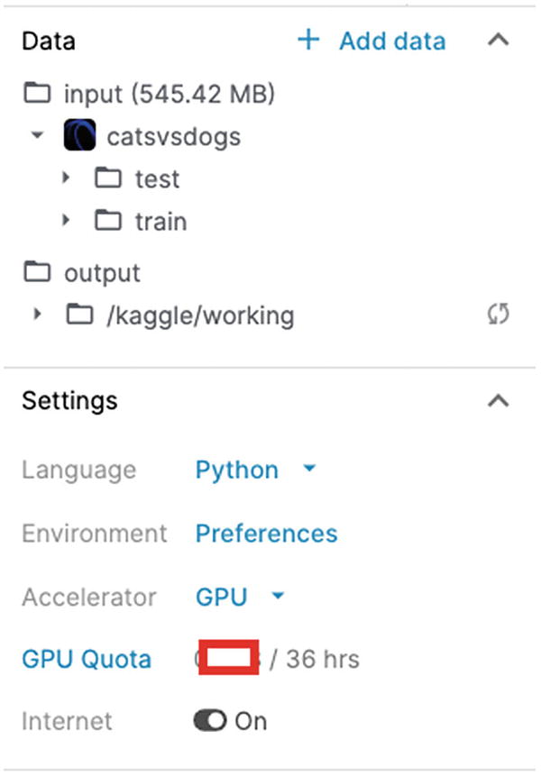

图 6-12

Kaggle 笔记本中的环境设置

让我们从所需包的新导入开始。清单 [6-8](#PC10) 展示了如何为这个练习导入包。

```py
# Import required libraries
import torch
import torchvision.transforms as transforms
import torchvision.datasets as datasets
import torchvision.models as models
import torch.nn as nn
import torch.nn.functional as F
import torch.optim as optim
from PIL import Image
import matplotlib.pyplot as plt
import glob,os
import matplotlib.image as mpimg

new_path = "/kaggle/input/catsvsdogs/"

Listing 6-8Importing the Packages for This Exercise

```

确保您已经打开了互联网选项，并选择了加速器作为 GPU。我们使用清单 [6-9](#PC11) 中的命令确认 GPU 可用。

```py
#Check if GPU is available
if torch.cuda.is_available():
    device = torch.device('cuda')
else:
    device = torch.device('cpu')
print("Device:",device)

Output[]
Device: cuda

Listing 6-9Enabling the GPU (If Available) in the Kernel

```

请注意，建议只使用 GPU，而不是命令。然而，对于计算机视觉实验来说，使用 CPU 会慢得多。

我们现在可以探索一组随机的猫和狗的图像。清单 [6-10](#PC12) 从训练数据集中随机绘制样本图像。

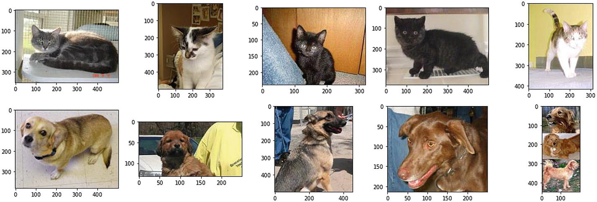

```py
%matplotlib inline
images = []
#Collect Cat images
for img_path in glob.glob(os.path.join(new_path,"train","cat","*.jpg"))[:5]:
    images.append(mpimg.imread(img_path))

#Collect Dog images
for img_path in glob.glob(os.path.join(new_path,"train","dog","*.jpg"))[:5]:
    images.append(mpimg.imread(img_path))

#Plot a grid of cats and Dogs

plt.figure(figsize=(20,10))
columns = 5
for i, image in enumerate(images):
    plt.subplot(len(images) / columns + 1, columns, i + 1)
    plt.imshow(image)

Listing 6-10Plotting Sample Images from the Training Dataset

```

对于计算机视觉实验，我们总是会对原始数据集应用许多变换。这样做的一个核心原因是，实验中使用的大多数图像大小不同。此外，有时我们可能需要通过扩充现有样本来添加更多的训练样本。一些例子包括用随机旋转增加更多的训练样本、从中心裁剪图像、跨轴翻转、标准化像素值等。PyTorch 提供了一个方便的功能来组合几个这样的转换，并在训练和验证样本上编排它们。在清单 [6-11](#PC13) 中，我们编写了一个`transformations`对象，它将顺序地将所有图像调整为 255×255，从中心向 224×224 裁剪它们，将它们转换为张量，并归一化它们的像素值。

```py
#Compose sequence of transformations for image
transformations = transforms.Compose([
    transforms.Resize(255),
    transforms.CenterCrop(224),
    transforms.ToTensor(),
    transforms.Normalize(mean=[0.485, 0.456, 0.406], std=[0.229, 0.224, 0.225])
])

# Load in each dataset and apply transformations using
# the torchvision.datasets as datasets library
train_set = datasets.ImageFolder(os.path.join(new_path,"train")
                                 , transform = transformations)
val_set = datasets.ImageFolder(os.path.join(new_path,"test")
                               , transform = transformations)

# Put into a Dataloader using torch library
train_loader = torch.utils.data.DataLoader(train_set
                                 , batch_size=32, shuffle=True)
val_loader = torch.utils.data.DataLoader(val_set, batch_size =32, shuffle=True)

Listing 6-11Transforming the Data and Creating the Training and Validation Sets

```

请注意，`train_loader`和`val_loader`是为我们的训练循环处理和创建带有标签的小批量图像的对象。在创建小批量图像之前，`transformations`对象会确保所有图像都得到适当的放大。

接下来，清单 [6-12](#PC14) 定义了我们的 CNN。

```py
#Define Convolutional network
class ConvNet(nn.Module):
    def __init__(self, num_classes=2):
        super(ConvNet, self).__init__()
        #First unit of convolution
        self.conv_unit_1 = nn.Sequential(
            nn.Conv2d(3, 16, kernel_size=3, stride=1, padding=1),
            nn.ReLU(),
            nn.MaxPool2d(kernel_size=2, stride=2)) #112

        #Second unit of convolution
        self.conv_unit_2 = nn.Sequential(
            nn.Conv2d(16, 32, kernel_size=3, stride=1, padding=1),
            nn.ReLU(),
            nn.MaxPool2d(kernel_size=2, stride=2)) #56

        #Third unit of convolution
        self.conv_unit_3 = nn.Sequential(
            nn.Conv2d(32, 64, kernel_size=3, stride=1, padding=1),
            nn.ReLU(),
            nn.MaxPool2d(kernel_size=2, stride=2)) #28

        #Fourth unit of convolution
        self.conv_unit_4 = nn.Sequential(
            nn.Conv2d(64, 128, kernel_size=3, stride=1, padding=1),
            nn.ReLU(),
            nn.MaxPool2d(kernel_size=2, stride=2)) #14

        #Fully connected layers
        self.fc1 = nn.Linear(14*14*128, 128)
        self.fc2 = nn.Linear(128, 1)
        self.final = nn.Sigmoid()

    def forward(self, x):
        out = self.conv_unit_1(x)
        out = self.conv_unit_2(out)
        out = self.conv_unit_3(out)
        out = self.conv_unit_4(out)

        #Reshape the output
        out = out.view(out.size(0),-1)
        out = self.fc1(out)
        out = self.fc2(out)
        out  = self.final(out)

        return(out)

Listing 6-12Defining the CNN

```

类似于 MNIST 的例子，全连接层需要输入维度的数量，这将基于卷积单元而不同。因为我们在原始样本中应用了四个卷积单元，所以图像的大小会缩小，为([原始]224->[第一]112->[第二]56->[第三]28->[第四] 14。因此，全连接层将具有 14×14×128 个输入维度，其中 128 是前一单元中的内核数。

清单 [6-13](#PC15) 定义了一个评估我们新网络的函数。

```py
def evaluate(model,data_loader):
    loss = []
    correct = 0
    with torch.no_grad():
            for images, labels in data_loader:
                images = images.to(device)
                labels = labels.to(device)

                model.eval()

                output = model(images)

                predicted = output > 0.5
                correct += (labels.reshape(-1,1) == predicted.reshape(-1,1)).float().sum()

                #Clear memory
                del([images,labels])
                if device == "cuda":
                    torch.cuda.empty_cache()

    print('\nVal Accuracy: {}/{} ({:.3f}%)\n'.format(
        correct, len(data_loader.dataset),
        100\. * correct / len(data_loader.dataset)))

Listing 6-13Defining the Evaluation Function

```

有了这些，让我们定义并创建一个模型实例，并为 10 个时期训练我们的网络。清单 [6-14](#PC16) 演示了定义损失函数和优化器，创建模型实例，以及为定义数量的时期进行训练。

```py
num_epochs = 10
loss_function = nn.BCELoss()  #Binary Crosss Entropy Loss
model = ConvNet()
model.cuda()
adam_optimizer = torch.optim.Adam(model.parameters(), lr= 0.001)

# Train the model
total_step = len(train_loader)
print("Total Batches:",total_step)

for epoch in range(num_epochs):
    model.train()
    train_loss = 0
    for i, (images, labels) in enumerate(train_loader):
        images = images.to(device)
        labels = labels.to(device)

        # Forward pass

        outputs = model(images)
        loss = loss_function(outputs.float(), labels.float().view(-1,1))

        # Backward and optimize
        adam_optimizer.zero_grad()
        loss.backward()
        adam_optimizer.step()
        train_loss += loss.item()* labels.size(0)

        #After each epoch print Train loss and validation loss + accuracy
    print ('Epoch [{}/{}], Loss: {:.4f}' .format(epoch+1, num_epochs, loss.item()))
    #Evaluate model after each training epoch
    evaluate(model,val_loader)

Output[]
Total Batches: 625

Epoch [1/10], Loss: 0.6990
Val Accuracy: 3768.0/5000 (75.360%)

Epoch [2/10], Loss: 0.4914
Val Accuracy: 3885.0/5000 (77.700%)

Epoch [3/10], Loss: 0.2088
Val Accuracy: 4141.0/5000 (82.820%)

Epoch [4/10], Loss: 0.2832
Val Accuracy: 4219.0/5000 (84.380%)

Epoch [5/10], Loss: 0.1797

Val Accuracy: 4271.0/5000 (85.420%)

Epoch [6/10], Loss: 0.3226
Val Accuracy: 4248.0/5000 (84.960%)

Epoch [7/10], Loss: 0.2027
Val Accuracy: 4250.0/5000 (85.000%)

Epoch [8/10], Loss: 0.2660
Val Accuracy: 4137.0/5000 (82.740%)

Epoch [9/10], Loss: 0.1867
Val Accuracy: 4286.0/5000 (85.720%)

Epoch [10/10], Loss: 0.1286
Val Accuracy: 4271.0/5000 (85.420%)

Listing 6-14Defining the Loss Function and Optimizer, Creating the Model Instance, and Training for a Defined Number of Epochs

```

10 个纪元后，性能大致为 85%。几个时代之后，性能肯定会提高；然而，训练这样一个网络所需的时间是昂贵的。我们可能想知道的一个问题是，是否有更快、更容易的替代方法来加速这一过程。事实证明，*迁移学习*对我们的资源是可用的。关于 CNN 的惊人消息是，一旦一个层被训练，它基本上可以被重新用于另一个任务。对于大多数计算机视觉任务来说，较低级别的特征(例如曲线、边和圆)和几个较高级别的特征总是共同的或相似的。然而，我们可能需要重新训练最后几层，以便专门为我们的用例定制网络。尽管如此，在训练大型网络时，这还是带来了巨大的缓解。

今天，我们有大量经过预训练的网络，这些网络在一个大的数据集语料库上训练了几个小时，几乎代表了我们遇到的最常见的对象。在 PyTorch 下，这些网络中有许多都是现成的。我们可以直接利用它们，而不是从头开始训练我们自己的网络。

欲了解更多关于预训练模型列表的信息，请访问 [`https://pytorch.org/docs/stable/torchvision/models.html`](https://pytorch.org/docs/stable/torchvision/models.html) 。

对于我们的用例，让我们使用 VGGNet。清单 [6-15](#PC17) 展示了下载和利用 VGGNet 进行迁移学习。

```py
#Download the model (pretrained)
from torchvision import models
new_model = models.vgg16(pretrained=True)

# Freeze model weights
for param in new_model.parameters():
    param.requires_grad = False

print(new_model.classifier)
Output[]

Sequential(
  (0): Linear(in_features=25088, out_features=4096, bias=True)
  (1): ReLU(inplace=True)
  (2): Dropout(p=0.5, inplace=False)
  (3): Linear(in_features=4096, out_features=4096, bias=True)
  (4): ReLU(inplace=True)
  (5): Dropout(p=0.5, inplace=False)
  (6): Linear(in_features=4096, out_features=1000, bias=True)
)

Listing 6-15Downloading and Initializing the Pretrained Model

```

预训练网络有六层。最初的网络用于对 1000 个不同的物体进行分类；因此，最后一层有 1000 个输出连接。然而，我们的用例是一个简单的二元分类练习；因此，我们需要替换最后一层来适应我们的用例。清单 [6-16](#PC18) 用一个定制层替换预训练网络中的最后一层，该定制层输出一个带有 sigmoid 激活的单个单元。

```py
#Define our custom model last layer
new_model.classifier[6] = nn.Sequential(
                      nn.Linear(new_model.classifier[6].in_features, 256),
                      nn.ReLU(),
                      nn.Dropout(0.4),
                      nn.Linear(256, 1),
                      nn.Sigmoid())

# Find total parameters and trainable parameters
total_params = sum(p.numel() for p in new_model.parameters())
print(f'{total_params:,} total parameters.')
total_trainable_params = sum(
    p.numel() for p in new_model.parameters() if p.requires_grad)
print(f'{total_trainable_params:,} training parameters.')

Output[]
135,309,633 total parameters.
1,049,089 training parameters.

Listing 6-16Replacing the Last Layer with Our Custom Layer

```

在这里，我们利用了 VGG 预训练模型的现有层，并在最后添加了一个新的全连接层，以针对我们的二进制用例定制网络结构。除了我们添加的层之外，所有层的权重都被冻结，也就是说，除了最后一个完全连接的层之外，模型权重在训练过程中不会更新。

现在让我们为数据集训练 10 个时期的新模型。所有组件都与前面的示例相似。清单 [6-17](#PC19) 展示了为我们的用例训练预训练网络。

```py
#Define epochs, optimizer and loss function
num_epochs = 10
loss_function = nn.BCELoss()  #Binary Crosss Entropy Loss
new_model.cuda()
adam_optimizer = torch.optim.Adam(new_model.parameters(), lr= 0.001)

# Train the model
total_step = len(train_loader)
print("Total Batches:",total_step)

for epoch in range(num_epochs):
    new_model.train()
    train_loss = 0
    for i, (images, labels) in enumerate(train_loader):
        images = images.to(device)
        labels = labels.to(device)

        # Forward pass
        outputs = new_model(images)
        loss = loss_function(outputs.float(), labels.float().view(-1,1))

        # Backward and optimize
        adam_optimizer.zero_grad()
        loss.backward()
        adam_optimizer.step()
        train_loss += loss.item()* labels.size(0)

    #After each epoch print Train loss and validation loss + accuracy
    print ('Epoch [{}/{}], Loss: {:.4f}' .format(epoch+1, num_epochs, loss.item()))

    #After each epoch evaluate model
    evaluate(new_model,val_loader)

Output[]
Total Batches: 625

Epoch [1/10], Loss: 0.0140
Val Accuracy: 4933.0/5000 (98.660%)

Epoch [2/10], Loss: 0.0411
Val Accuracy: 4931.0/5000 (98.620%)

Epoch [3/10], Loss: 0.0054
Val Accuracy: 4933.0/5000 (98.660%)

Epoch [4/10], Loss: 0.0017
Val Accuracy: 4937.0/5000 (98.740%)

Epoch [5/10], Loss: 0.0285
Val Accuracy: 4935.0/5000 (98.700%)

Epoch [6/10], Loss: 0.0070
Val Accuracy: 4935.0/5000 (98.700%)

Epoch [7/10], Loss: 0.0310
Val Accuracy: 4940.0/5000 (98.800%)

Epoch [8/10], Loss: 0.0091
Val Accuracy: 4922.0/5000 (98.440%)

Epoch [9/10], Loss: 0.0116

Val Accuracy: 4937.0/5000 (98.740%)

Epoch [10/10], Loss: 0.0442
Val Accuracy: 4930.0/5000 (98.600%)

Listing 6-17Training the Pretrained Model for the Defined Use Case

```

通过仅仅 10 个时期，我们可以看到我们的预训练模型在验证数据集上给出了大约 98%的准确度。与我们的原始模型(从头开始训练)相比，性能改进是显著的。

### CNN 经验法则

对于计算机视觉任务，我们可以描绘一些规则，这些规则可以作为大多数实验的良好起点。

*   任何给定的计算机视觉任务的起点都应该利用预先训练的网络。从头开始训练网络总是可能的，但是当结果已经可用时，巨大的计算努力将是徒劳的任务。

*   在模型性能达不到您的基准的情况下，尝试使用其他几个预训练的网络，而不是一个。PyTorch 提供了几种现成的预训练模型。

*   当您的图像分类任务包括一组非常多样化的图像时，预训练的网络可能不会为您提供最佳性能。在这种情况下，建议逐步解冻更多顶层。这个想法是试验什么级别的特性表示对您的用例有意义。在最坏的情况下，您可能需要从头开始训练整个网络。然而，在大多数情况下，通过预训练网络中的几层或更多层，您很可能能够节省计算工作量。

*   使用辍学总是一个好主意。

*   对于大多数用例，ReLUs 可以被盲目地用作事实上的激活函数。

*   要获得相当可接受的性能，请确保每个类有 6，000 个或更多的训练样本。越多越好。

*   批量大小应该是 GPU 或 CPU 能够处理的最大值。优化批量大小有助于加快训练过程。

*   总是推荐使用 GPU。对于大多数常见用例，GPU 性能几乎是 50 倍或更高。获得基于 GPU 的实例的成本已经显著下降。所有主要的云参与者都提供现成的深度学习映像或虚拟机，可以通过合适的计算和 GPU 按需供应。整个繁重的任务(即安装所需的依赖项、包和驱动程序，以及配置深度学习、Python 框架、工作区等。)一点就抽象出来了。成本也下降了，以提供一个负担得起的手段来训练一些实验。今天，你可以以每小时 1 美元的价格为大多数研究项目配备功能强大的 GPU。

*   许多资源都是免费的。Google Colab 和 Kaggle 提供了开始尝试深度学习的绝佳场所。

## 摘要

本章讲述了 CNN 的基础知识。关键的要点是卷积运算、汇集运算、它们是如何结合使用的，以及特性是如何通过学习而不是手工设计的。CNN 是深度学习最成功的应用，体现了学习特征/表示而不是手工设计它们的思想。本章中的练习使用一个相当简单的数据集和一个中等大小的数据集从零开始训练来探索 CNN。我们还利用了预训练的网络，并看到了由此带来的性能提升。

在下一章中，我们将探讨循环神经网络，它广泛应用于自然语言处理和语音识别领域。