# 1.机器学习基础

> 毫无疑问，我们从事的是铸造神灵的工作。 [1](#Fn1)
> 
> ——*帕梅拉·麦科达克*

如今，除了量子计算(Preskill，2018)和区块链(Nakamoto，2008)，人工智能(AI)是计算机科学最迷人的领域之一。自 2000 年代中期以来，工业界的大肆宣传导致了对人工智能初创公司的大量投资。全球领先的科技公司，如苹果、谷歌、亚马逊、脸书和微软，仅举几例，正在迅速收购世界各地有才华的人工智能初创公司，以加速人工智能研究，并反过来改进自己的产品。

考虑像 Apple Watch 这样的便携式设备。它使用机器智能来分析你的实时运动感觉数据，以跟踪你的脚步、站立时间、游泳次数、睡眠时间等。它还可以根据手腕皮肤下暂时的血液颜色变化计算您的心率，提醒您心跳不规则，执行心电图(ECG)，测量运动期间血液中的耗氧量(VO max)等等。另一方面，iPhone 和 iPad 等设备使用来自相机传感器的激光雷达信息来即时创建周围的深度图。这些信息然后与机器智能相结合，以提供计算摄影功能，如强度可调的散景效果，沉浸式增强现实(AR)功能，如 AR 对象上周围的反射和照明，人类进入场景时的对象遮挡，等等。像 Siri 这样的个人语音助理可以理解你的语音，让你完成各种任务，例如控制你的家庭配件，在 HomePod 上播放音乐，给别人打电话和发短信，等等。机器智能技术因快速图形处理单元(GPU)而成为可能。如今，便携式设备上的 GPU 足够快，可以处理用户的数据，而不必将其发送到云服务器。这种方法有助于保持用户数据的私密性，从而防止不良暴露和使用(Sharma 和 Bhalley，2016 年)。事实上，上面提到的所有功能都可以通过设备上的机器智能来实现。

你可能会惊讶，人工智能并不是一项新技术。它实际上可以追溯到 20 世纪 40 年代，人们根本不认为它有用和酷。它有许多起伏。人工智能技术的普及主要有三次。它在这些时代有不同的名字，现在我们普遍认为它是深度学习。20 世纪 40-60 年代间，艾被称为“控制论”；大约在 20 世纪 80-90 年代，它被称为“连接主义”；从 2006 年开始，我们将人工智能称为“深度学习”。

在过去的某个时候，也有一种误解，许多研究人员认为，如果宇宙中所有事物工作方式的所有规则都被编程到计算机中，那么它就会自动变得智能。但这一想法受到了人工智能现状的强烈挑战，因为我们现在知道有更简单的方法来让机器模仿类似人类的智能。

在人工智能研究的早期，数据很少。计算机器也很慢。这些是淹没人工智能系统流行的主要因素之一。但现在我们有了互联网，地球上很大一部分人相互交流，迅速产生海量数据，这些数据存储在各自公司的服务器上。(刘冰等人，2009 年)找到了一种以更快速度运行深度学习算法的方法。大数据集和高性能计算(HPC)的结合使研究人员快速推进了最先进的深度学习算法。这本书的重点是从简单的概念开始向你介绍这些先进的算法。

在这一章中，我们将介绍机器学习的基本概念，这些概念对其继任者深度学习领域仍然有效。第[章 2](2.html) 重点讲述清楚理解深度学习算法所需的数学。因为深度学习是一门经验学科，如果我们自己不能编程，那么只理解深度学习算法的数学方程是没有用的。此外，计算机是通过执行数值计算来测试数学定理的(图灵，1936)。第 [3](3.html) 章介绍了一种强大的、经过编译的、快速的深度学习编程语言，称为 Swift for TensorFlow，它扩展了苹果的 Swift 语言(已经能够进行差异化编程)，以包括深度学习特有的 TensorFlow 库功能。TensorFlow 是一个深度学习专用的库，值得整个章节 [4](4.html) 专门介绍它。然后我们在第 5 章[中深入研究神经网络的基础知识。最后我们会在第](5.html) [6](6.html) 章编程一些高级的计算机视觉算法。

但让我们首先区分人工智能、机器学习和深度学习这三个术语，因为它们有时会互换使用。人工智能，也称为机器智能，代表了一套可用于使机器智能化的算法。人工智能系统通常包含硬编码的规则，程序遵循这些规则来从数据中获取一些意义(Russell & Norvig，2002)，例如，使用硬编码的英语语法规则在句子中找到名词，使用 if 和 else 条件防止机器人掉入陷阱，等等。如今这些系统被认为是弱智能的。另一个术语是机器学习(ML)，与人工智能算法不同的是，它使用数据来从中获得洞察力(Bishop，2006)，例如，使用 k-最近邻等非参数算法对图像进行分类，使用决策树方法对文本进行分类，等等。ML 使用数据来学习，并且也已知表现弱于深度学习。最后，目前最先进的 AI 是深度学习。深度学习(DL)也使用数据进行学习，但采用分层方式(LeCun 等人，2015 年)，从大脑中获取灵感。DL 算法可以很容易地学习非常复杂的数据集的映射，而不会损害准确性，但它们的表现反而比机器学习算法更好。如果你画一个维恩图，如图 [1-1](#Fig1) 所示，你会看到深度学习是机器学习的一个子集，而人工智能领域是这两个领域的超集。

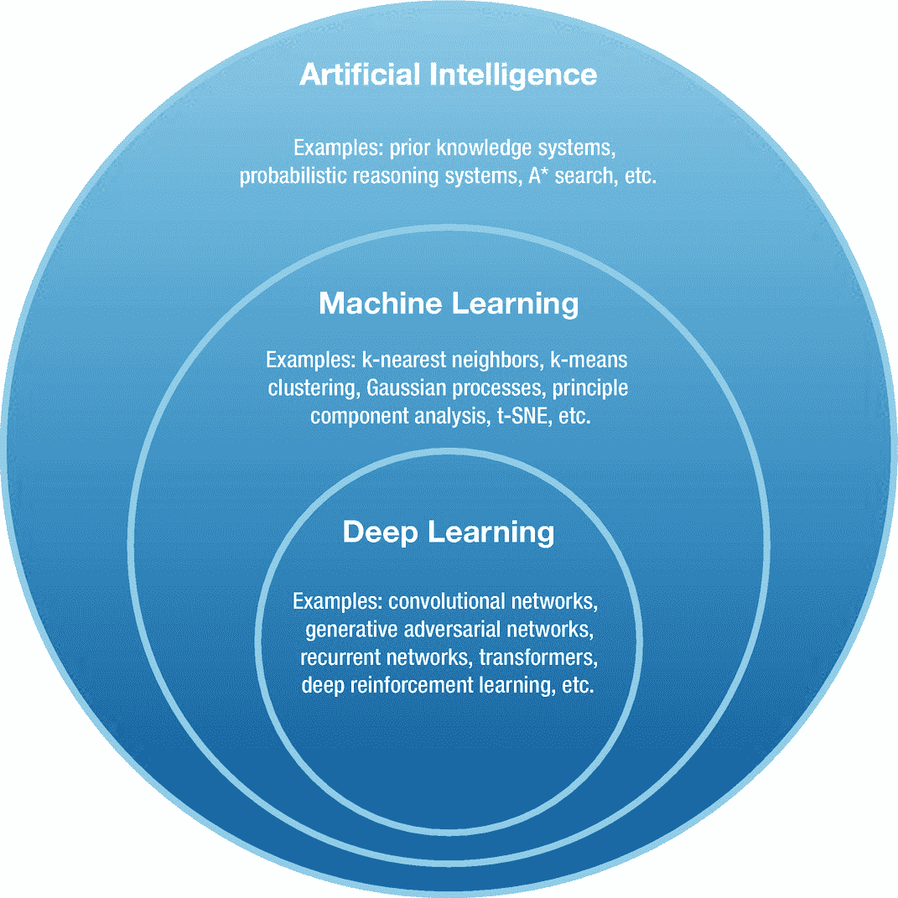

图 1-1

代表人工智能、机器学习和深度学习算法之间重叠(未精确缩放)的维恩图。每套给出了属于那个领域的算法的几个例子。

现在，我们可以从简单的机器学习概念开始深度学习之旅。

## 1.1 机器学习

机器学习算法通过从数据中学习自身来学习执行某些任务，同时提高其性能。机器学习的广泛接受的定义(Mitchell 等人，1997)如下:“如果计算机程序在任务 T 的性能(由 P 测量)随着经验 E 而提高，则称该计算机程序从关于某类任务 T 和性能测量 P 的经验 E 中学习。”其思想是编写一个计算机程序，该计算机程序可以通过一些性能测量来更新其状态，以通过体验可用数据以良好的性能执行期望的任务。让这个程序学习不需要人工干预。

基于这个定义，有三个基本概念可以帮助我们让机器学习，即经验、任务和性能测量。本节将讨论这些想法。在 1.4 节中，我们将看到这些思想是如何用数学方法表达的，这样就可以编写一个学习型计算机程序。在 1.4 节之后，你会意识到这个简单的定义形成了机器如何学习的基础，并且书中讨论的每个机器学习范例都可以用这个定义来隐含地表达。

在我们进一步进行之前，澄清机器学习算法由各种基本组件组成是很重要的。它的学习部分被称为模型，它只是一个数学函数。现在让我们继续理解这些基本思想。

### 1.1.1 经验

*经验*是模型为了学习执行任务而进行的多次观察。这些观察结果是来自可用数据集的样本。在学习过程中，总是需要一个模型来观察数据。

数据可以是各种形式，例如图像、视频、音频、文本、触觉等。每个*样本*，也被称为*样本*，从数据上可以用其*特征*来表示。例如，图像样本的特征是其像素，其中每个像素由红色、绿色和蓝色值组成。所有这些颜色的不同亮度值一起代表电磁辐射光谱的可见范围(我们的眼睛可以感知)中的单一颜色。

除了特征，每个样本有时还可能包含一个对应的*标签*向量，也称为*目标*向量，代表样本所属的类别。例如，鱼图像样本可能具有代表鱼的相应标签向量。标签通常用 *one-hot 编码*(也称为 - *k 编码*的 1- *，其中 *k* 是类的数量)来表示，这是一种表示，其中整个向量中只有单个索引的值为 1，其他所有索引都设置为 0。假设每个指数代表某一类，值为 1 的指数假设代表样本所属的类。例如，假设[1 0 0]向量代表一只狗，而[0 1 0]和[0 0 1]向量分别代表一条鱼和一只鸟。这意味着鸟类的所有图像样本都具有相应的标签向量[0 0 1],同样，狗和鱼的图像样本也将具有它们自己的标签。*

我们之前列出的样本特征是原始特征，也就是说，这些特征不是由人类精心挑选的。有时，在机器学习中，特征选择对模型的性能起着重要的作用。例如，对于像人脸识别这样的任务，高分辨率图像比低分辨率图像处理起来要慢。因为深度学习可以直接在原始数据上工作，性能非常好，所以我们不会特别讨论特征选择。但是，当代码清单中需要以正确的格式获取数据时，我们将介绍一些预处理技术。我们建议感兴趣的读者参考(泽奥多里德斯和库特鲁姆巴斯，2009 年)教科书来了解特征选择。

在深度学习中，我们可能需要对数据进行预处理。*预处理*是应用于原始样本的一系列函数，将它们转换成所需的特定形式。这种期望的形式通常是基于模型的设计和手头的任务来决定的。例如，以 16 KHz 采样的原始音频波形每秒有 16，384 个样本被表示为向量。即使对于一个短的音频记录，比如说 5 秒，这个向量的维数也会变得非常大，也就是说，一个 81，920 元素长的向量！我们的模型需要更长的时间来处理。这就是预处理变得有用的地方。然后，我们可以使用快速傅立叶变换(Heideman 等人，1985)函数对每个原始音频波形样本进行预处理，以将其转换为频谱图表示。现在，该图像的处理速度比之前冗长的原始音频波形快得多。有不同的方法来预处理数据，选择取决于模型设计和手头的任务。我们将在本书中介绍不同类型数据的一些预处理步骤，并不详尽，只要有需要。

### 1.1.2 任务

*任务*是模型处理样本特征以返回样本的正确标签的动作。设计机器学习模型主要有两个任务，即回归和分类。还有更多有趣的任务，我们将在后面的章节中介绍和编程，它们只是这两个基本任务的扩展。

例如，对于一幅鱼的图像，模型应该返回[0 1 0]向量。因为这里图像被映射到它的标签，这个任务通常被称为图像分类。这是分类任务的一个简单示例。

回归任务的一个很好的例子是对象检测。我们可能想要在图像中检测一个物体的位置，比如球。这里，特征是图像像素，标签是图像中对象的坐标。这些坐标表示对象的边界框，即对象在给定图像中出现的位置。这里，我们的目标是训练一个模型，该模型将图像特征作为输入，并预测对象的正确结合框坐标。因为预测输出是实值的，所以对象检测被认为是回归任务。

### 绩效衡量

一旦我们设计了一个执行任务的模型，下一步就是让它学习并评估它在给定任务上的表现。为了评估，使用某种形式的性能测量(或度量)。性能度量可以采用各种形式，如准确性、F1 分数、精确度和召回率等，来描述模型执行任务的好坏。请注意，在训练和测试阶段，应该使用相同的性能指标来评估模型。

根据经验，只要有可能，就必须尝试选择一个单一数字的性能指标。在我们之前的图像分类示例中，可以很容易地使用准确度作为性能度量。*精度*定义为被模型正确分类的图像(或其他样本)总数的一部分。如下所示，也可以使用多数字性能指标，但这使得从一组训练模型中确定哪个模型表现最佳变得更加困难。

让我们考虑两个图像分类器 C 1 和 C 2 ，它们的任务是预测图像中是否包含汽车。如表 [1-1](#Tab1) 所示，如果分类器 C 1 的精度为 0.92，分类器 C 2 的精度为 0.99，那么很明显 C 2 的性能优于 C 1 。

表 1-1

分类器 C 1 和 C 2 在图像识别任务中的准确度。

<colgroup><col class="tcol1 align-left"> <col class="tcol2 align-left"></colgroup> 
| 

分类者

 | 

准确

 |
| --- | --- |
| C 1 | 92% |
| C 2 | 99% |

现在让我们考虑这两个分类器的精确度和召回率，这是一个两个数字的评估度量。*精度*和*召回*被定义为分类器分别正确标记为汽车的测试或验证集中所有和*汽车*图像的*的分数。对于我们的任意分类器，这些度量值如表 [1-2](#Tab2) 所示。*

表 1-2

分类器 C 1 和 C 2 在图像识别任务中的精度和召回率。

<colgroup><col class="tcol1 align-left"> <col class="tcol2 align-left"> <col class="tcol3 align-left"></colgroup> 
| 

分类者

 | 

精确

 | 

回忆

 |
| --- | --- | --- |
| C 1 | 98% | 95% |
| C 2 | 95% | 90% |

现在似乎还不清楚哪种型号的性能更优越。相反，我们可以将精确度和召回率转化为一个单一的数字指标。有多种方法可以实现这一点，如均值或 F 1 得分。在这里，我们将找到它的 F 1 分数。 *F*

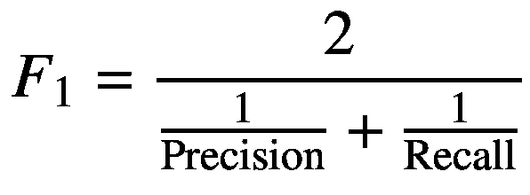

(1.1)

表 [1-3](#Tab3) 通过将每个分类器的精度和召回值放入等式 [1.1](#Equ1) 来显示每个分类器的 F 1 分数。

从表 [1-3](#Tab3) 中，简单看一下 F 1 的分数，我们很容易得出分类器 C 2 比 C 1 表现更好的结论。在实践中，使用一个单一的评估指标对于确定训练模型的优越性非常有帮助，并且可以加速您的研究或部署过程。

表 1-3

分类器 C 1 和 C 2 在一个图像识别任务上的精度、召回率和 F 1 得分。

<colgroup><col class="tcol1 align-left"> <col class="tcol2 align-left"> <col class="tcol3 align-left"> <col class="tcol4 align-left"></colgroup> 
| 

分类者

 | 

精确

 | 

回忆

 | 

F1 分数

 |
| --- | --- | --- | --- |
| C 1 | 98% | 85% | 91% |
| C 2 | 95% | 90% | 92.4% |

已经讨论了机器学习的基本思想，我们现在将把我们的焦点转向不同的机器学习范例。

## 1.2 机器学习范例

机器学习通常根据数据集经验的种类分为四类，允许的模型如下:监督学习(SL)、非监督学习(UL)、半监督学习(SSL)和强化学习(RL)。我们简要讨论这些机器学习范例中的每一个。

### 监督学习

在训练期间，当一个模型利用带标签的数据样本来学习执行任务时，这种类型的机器学习被称为*监督学习*。它被称为“有监督的”,因为属于数据集的每个样本都有相应的标签。在监督学习中，在训练期间，机器学习模型的目标是从样本映射到它们相应的目标。在推断过程中，监督模型必须预测任何给定样本的正确标签，包括训练过程中未看到的样本。

我们之前已经讨论了图像分类任务的概念，这是 SL 的一个例子。例如，你可以通过在苹果的照片应用程序中输入照片中出现的对象的类别来搜索照片。另一个有趣的 SL 任务是自动语音识别(ASR ),其中一系列音频波形被模型转录成表示音频记录中所说单词的文本序列。例如，Siri、Google Assistant、Cortana 和其他便携式设备上的个人语音助手都使用语音识别来将你所说的话转换成文本。在撰写本文时，SL 是生产中最成功和最广泛使用的机器学习。

### 1.2.2 无监督学习

*无监督学习*是一种机器学习，模型只允许观察样本特征，不允许观察标签。UL 通常旨在学习模型隐藏特征中数据集的一些有用表示。这个学习到的表示可以在以后使用这个模型执行任何期望的任务。在撰写本文时，深度学习社区对 UL 非常感兴趣。

例如，UL 可用于降低高维数据样本的维度，正如我们之前所讨论的，这有助于通过模型更快地处理数据样本。另一个例子是密度估计，目标是估计数据集的概率密度。在密度估计之后，模型可以产生与属于它被训练的数据集的样本相似的样本。正如我们将在后面看到的，UL 算法可以用来完成各种有趣的任务。

值得注意的是，UL 被称为“无监督的”,因为数据集中不存在标注，但我们仍然需要将标注与预测一起输入损失函数(这是第 1.3 节中讨论的最大似然估计的基本要求)以训练模型。在这种情况下，我们自己为样本假定一些适当的标签。例如，在生成式对抗性网络中(Goodfellow 等人，2014 年)，从生成器生成的数据点的标签被赋予假标签(或 0)，而从数据集采样的数据点被赋予真实标签(或 1)。另一个例子是自动编码器(Vincent 等人，2008)，其中标签是相应的样本图像本身。

### 1.2.3 半监督学习

*半监督学习*关注的是在训练期间，从一小组标记样本中训练一个模型，并预测(使用当前半训练模型)未标记样本为*伪目标*(也称为*软目标*)。从训练过程中经历的数据类型的角度来看，SSL 介于监督和非监督学习之间，因为它同时观察标记和未标记的样本。当我们有一个大的数据集，只包含少量的标记样本(因为它们很费力，因此获取起来很昂贵)和大量的未标记样本时，SSL 特别有用。有趣的是，用于训练该模型的 SSL 技术可以大大提高其性能。

我们在书中没有涉及半监督学习。对于半监督学习的严格理解，我们请感兴趣的读者参考(Chapelle 等人，2006)教科书。

### 强化学习

*强化学习*是基于代理人与环境交互所获得的奖励，通过多次试验(称为情节)使其累积奖励(加权平均奖励序列，也称为回报)最大化，以实现其目标。RL 是一种机器学习的范式，涉及一系列决策过程。

代理通过采取一些行动来作用于世界，比如说它向前移动。在此之后，环境的状态得到更新，并且环境将奖励返回(或给予)给代理。根据行为科学的观点，奖励或者是积极的或者是消极的，并且可以分别被认为是世界对主体的好的或者坏的反应。我们更感兴趣的是回报，而不是当前的阶梯奖励，因为代理的目标是在每集的过程中最大化回报。在这里，一个情节是一个主体和它的环境之间从开始到结束的一系列相互作用。一集的例子如下:代理人的游戏，其中当满足某个条件时游戏结束，代理人试图在恶劣的环境条件下生存，直到由于某种事故而死亡。参见图 [1-2](#Fig2) 了解代理与其环境之间相互作用的示意图。

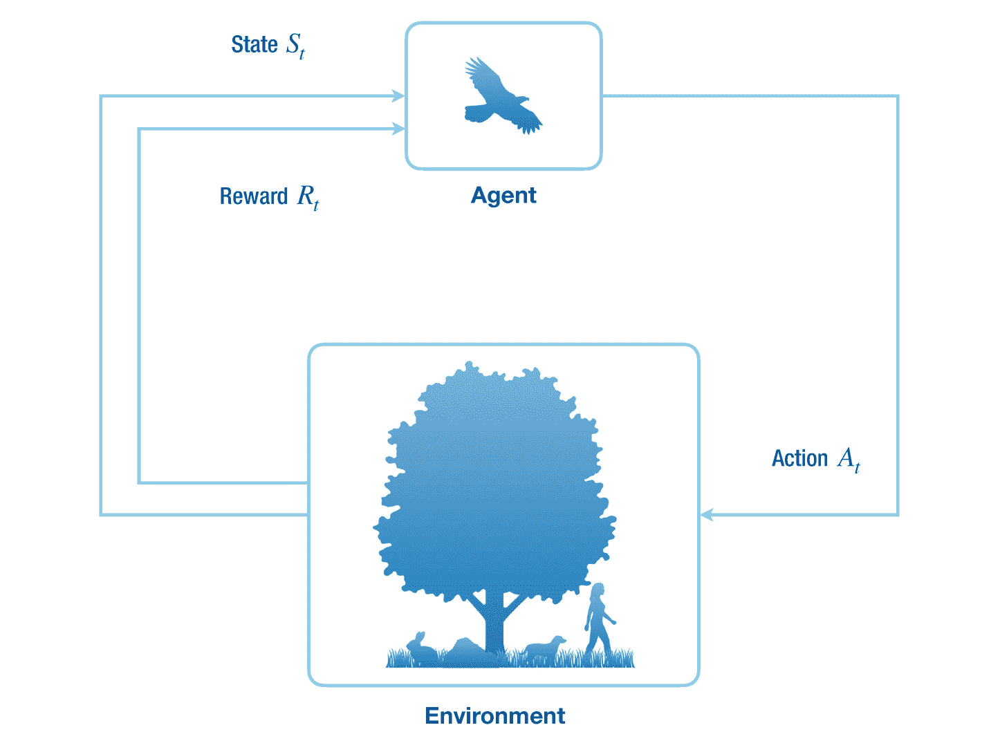

图 1-2

强化学习代理和环境之间的相互作用。

代理感知环境 *S* *t* -1 的先前状态，并对其状态 *S* *t* 改变的环境采取动作 *A* *t* ，并将其返回给代理。代理还从描述代理的当前状态有多好的环境接收标量奖励 *R* *t* 。虽然当代理动作时环境的状态改变，但它也可能自己改变。在多智能体强化学习中，也可能有其他智能体使自己的收益最大化。

强化学习是一个非常有趣的机器学习领域，在撰写本文时正在积极研究。它也被认为更接近于人类(或其他哺乳动物)通过进行行为修正来学习的方式，即在奖励的基础上强化一个动作。最近的一项工作(Minh et al .，2015)表明，一种称为*深度强化学习*的深度学习和强化学习的组合甚至可以超越人类级别的游戏能力。

不幸的是，我们在书中没有讨论强化学习。感兴趣的读者可以参考(萨顿和巴尔托，2018)教科书，了解该领域的基本知识。对于深度强化学习的进展，我们建议的作品(Mnih 等人，2015；舒尔曼等人，2017)。

现在让我们看看最大似然估计的基本思想，它有助于构建机器学习算法。

## 1.3 最大似然估计

这里描述的设置在整个机器学习文献中都是假设的。在此设置的约束下，模型的参数被估计。解决参数估计问题有两种基本方法，即*最大似然估计*和*贝叶斯推断*。我们将关注最大似然估计，因为这是我们在整本书中用来训练神经网络的。建议对贝叶斯推理感兴趣的读者阅读(Bishop，1995)教材的第 [2](2.html) 章。关于最大似然函数起源的详细注释，请参考(Akaike，1973)。

为了解决一个机器学习问题，我们需要一个包含一组 *N* 个数据点(或样本)的数据集ⅅ，也就是ⅅ 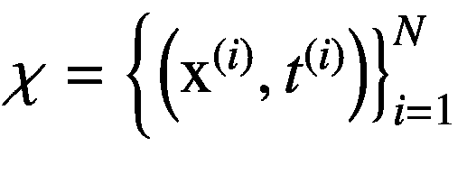。假设每个数据点都是相同的，并且独立于联合数据生成分布*P**d*(**x**， *t* )进行采样，这是一个概率密度函数(PDF)，意味着数据样本 **x** 和相应的目标 *t* 是连续的随机变量。注意，目标随机变量 *t* 的分布实际上取决于模型执行的任务，即目标的分布对于回归和分类任务分别是连续的和离散的。我们也将*P**d*(**x**， *t* )称为*数据概率密度函数*(或数据 PDF)。我们只能访问从数据 PDF 中采样的数据集ⅅ，而不能访问分布本身。因此，我们不能访问比我们可用的更多的数据点。

因为数据集ⅅ是从数据 PDF 中采样的，所以它以统计方式描述了数据 PDF 本身。我们在参数化机器学习中的目标是通过估计我们自己选择的参数化概率密度函数*P**m*(**x**， *y* | *θ* )(或者简单地说*P**m*(**x**， *y* )的参数来近似数据 PDF 的映射这里， *θ* 代表参数，随机变量 **x** 和 **y** 是数据样本和相应的预测值给定 **x** 作为输入。我们实际上将通过使用最大似然函数更新参数值来最小化预测变量 **y** 和目标变量 **t** 之间的距离，也称为损失或误差。

模型和数据 pdf 是完全不同的分布，因此它们的样本在统计上也是不同的。但是我们希望来自模型 PDF 的预测 **y** 类似于来自给定数据样本 **x** 的数据 PDF 的相应目标 **t** 。如前所述，我们无法访问数据 PDF 的参数，因此我们不能简单地将其参数值复制到模型函数的参数值中。但是我们确实有数据集 *𝒳* 供我们使用，我们可以利用它来逼近数据 PDF，因为这是它的统计描述。

现在我们将描述*最大似然估计*来用我们的参数化模型 PDF 近似数据 PDF。因为 *𝒳* 中的数据点是独立且同分布的，它们的联合概率由下式给出

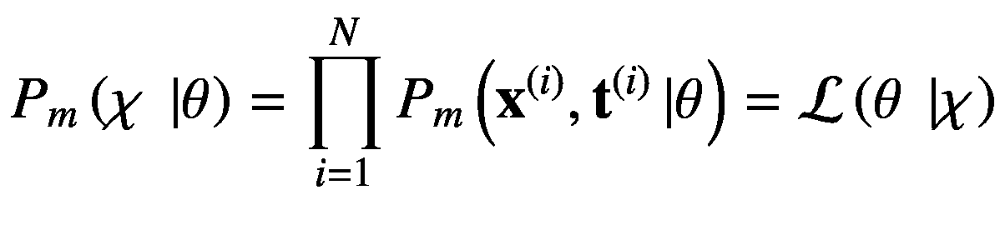

(1.2)

这里，*p**m*(ⅅ|*θ*)是条件模型 PDF，读作“给定参数的数据集的联合概率”函数ℒ( *θ* |ⅅ)是给定固定和有限数据集ⅅ.的参数 *θ* 的*似然函数您也可以将此函数解释为“可能是对数据集ⅅ进行采样的数据 PDF 的良好近似”为了减少混乱，我们将隐含地假设模型和对数似然函数中的参数条件。我们将使用贝叶斯定理将联合数据概率分布转换为我们关心的条件分布。*

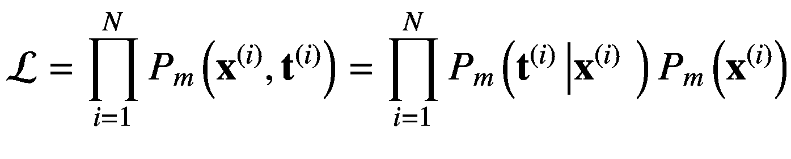

(1.3)

通过最大化似然函数来近似数据 PDF，这需要更新模型 PDF 的参数值。更具体地说，如 1.4 节中简要描述的和 5.1 节中详细描述的，参数是用迭代法更新的。在数值上，先取似然的负对数，然后最小化，这样更方便。这相当于最大化似然函数。

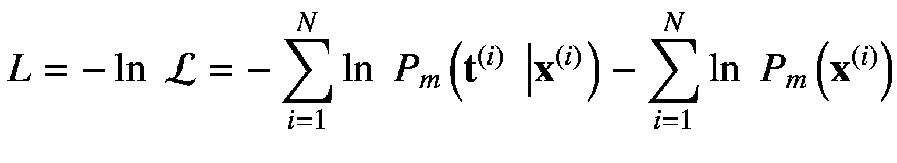

(1.4)

对数函数在这里起着非常重要的作用。它将乘积转化为总和，这有助于稳定数值计算。这是因为接近零的值的乘积是小得多的值，由于计算设备的有限精度表示能力，这些值可能被舍入。这也是机器学习频繁使用对数函数的原因。

负对数似然函数可被视为由 *L* 表示的*损失*或*误差函数*。).我们的目标是通过更新其参数值来最小化损失函数，使得我们的参数化模型 PDF 使用来自数据 PDF 的可用固定和有限数据样本来近似数据 PDF。请注意，该等式中的第二项对模型 PDF 的参数估计没有贡献，因为它不依赖于模型的参数，并且只是一个负的附加项，可以忽略该附加项以最大化似然函数。损失函数现在可以简单地用下面的等式来描述:

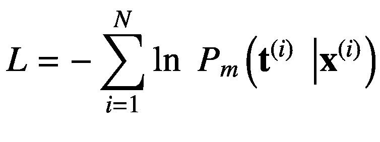

(1.5)

最小化损失函数相当于最小化负对数似然函数，负对数似然函数可以进一步被认为是最大化对数似然函数，因此术语*最大似然估计*。这里，我们的模型 PDF 表示给定数据样本的目标的条件分布*P*T5】m(**t**|**x**)。我们将在后面看到，神经网络是模拟这种条件分布的框架。并且也基于目标随机变量的分布，使用该方程产生不同的损失函数。

作为旁注，假设来说，如果似然函数完美地逼近数据 PDF，那么可用的数据集 *𝒳* 和其他相同的数据集可以从中采样。但是在实践中，不可能完美地逼近数据 PDF，但是我们可以近似地逼近它。这就是我们在机器学习中所做的一切。

现在让我们看看机器学习算法的元素，并使(Mitchell et al .，1997)给出的机器学习的模糊定义在数学上具体化。

## 1.4 机器学习算法的要素

在本节中，我们描述了适用于 1.2 节中简要讨论的所有机器学习范例的机器学习算法的基本元素。机器学习算法有四个关键组成部分，即数据、模型、损失函数和优化。或者，也可以使用正则化技术来提高模型的泛化能力，并平衡偏差和方差的权衡(见 1.5 节)。

请记住，在机器学习中，我们的主要目标是训练一个应该在看不见的数据上表现良好的模型，因为我们的训练数据集将不会包含用户未来生成的数据。

### 1.4.1 数据

数据集中存在的数据充当机器学习模型的经验。当模型首次用随机参数值初始化时，它不知道如何很好地执行某项任务。这种知识是通过迭代地将模型暴露给数据而获得的(通常是小样本计数，也称为*小批量*)。随着模型经历更多的样本，它逐渐学会更准确地执行任务。

一个*数据集*仅仅是一个结构化的，通常是表格(或矩阵)形式的数据点排列。表 [1-4](#Tab4) 显示了一个数据集的任意例子。该数据集包含人的一些特征(或特性),其中每一行包含单个人的特性。每行包含某个人的身高(厘米)、年龄(岁)和体重(千克)值。注意，特征及其对应的目标可以是任意维的张量值(这里是 0 维，即标量变量)。

表 1-4

分别用 x 1 ，x 2 和 t 标量表示身高、年龄和体重的人的数据集。

<colgroup><col class="tcol1 align-left"> <col class="tcol2 align-left"> <col class="tcol3 align-left"></colgroup> 
| 

身高( ***x*** 1 )

 | 

年龄( ***x*** 2 )

 | 

重量( ***t*** )

 |
| --- | --- | --- |
| One hundred and fifty-one point seven | Twenty-five | Forty-seven point eight |
| One hundred and thirty-nine point seven | Twenty | Thirty-six point four |
| One hundred and thirty-six point five | Eighteen | Thirty-one point eight |
| One hundred and fifty-six point eight | Twenty-eight | Fifty-three |

给定数据集，我们必须决定任务的特征和目标。换句话说，为一项任务选择正确的特征完全取决于我们的决定。例如，我们可以使用这个数据集来执行一个回归任务，根据一个人的身高和年龄来预测体重。在这个设置中，我们的*特征向量* **x** 包含身高 *x* 1 和年龄 *x* 2 ，即**x**=【*x*1*x*2，对于每个人(称为样本)，而目标 *t* 是 a 的权重例如，**x**=【136.5 18】和 *t* = 31.8 是给定数据集中第三人的特征向量和目标标量。

在机器学习文献中，模型的数据点输入也被称为*示例*或*样本*，其特征也被称为*属性*。例如，汽车的特征可以是颜色、轮胎尺寸、最高速度等等。另一个例子可以是药物，其特征可以包括化学式、每种化学元素的比例等等。目标，也称为*标签*或*硬目标*(当区别于软目标时)，是对应于给定样本的期望输出。例如，给定图像的特征(像素值)，目标可以是椅子、桌子等等，用向量表示。还要注意，对于数据集中的给定样本，所有目标始终保持不变。在极少数情况下，我们在半监督学习中为未标记的样本生成*软目标*，而在监督学习中目标*总是*被假定为不可变的。

#### 1.4.1.1 设计矩阵

表示数据集最流行的方式是设计矩阵，如表 [1-4](#Tab4) 所述。*设计矩阵*是样本和目标的集合，每行包含一个样本(每列包含一个描述样本的特征)和相应的目标。目标值用于监督学习任务。只有*样本包含特征而不是目标。目标是我们期望我们的模型预测给定样本特征的期望输出。*

#### 1.4.1.2 独立和相同的样本

一个好的数据集应该在统计上代表样本在数据生成概率密度函数中的总体分布。请记住，我们只能访问数据集，而不能访问 PDF。由于数据集在统计上代表一种概率分布，因此样本的分布方式总有一些模式。机器学习算法旨在发现数据集中的这种模式，以执行所需的任务。我们只能通过盯着一组样本，在低维(最多三维)上很容易地直观判断模式，但机器学习算法可以理解更高维(甚至数十亿)上的模式。例如，我们可以说“如果一个人的身高在[110，160]范围内，那么他的体重将在[30，80]范围内”，等等。但如果我们添加锻炼时间、营养摄入等特征，那么样本就会有更复杂的详细模式，这对我们来说可能很难集体处理，但机器学习算法可以为我们分析它，甚至更准确。

为了让任何机器学习算法在任务中表现良好，我们需要数据集上的两个约束来发现样本之间的模式。首先，每个样本的值应该独立于另一个样本，也就是说，样本不应该相关，尽管每个样本中的单个特征应该相关。第二，样本应该是相同的，也就是说，它们相应的特征应该是相似的，并且在分布上表现出一些模式。

也就是说，符合这种约束的自然照片的假想数据集可能包含河流、车辆、天空、水下生物、植物、人类、动物等的图像，其中每个样本都是一张照片，其特征是红、绿、蓝颜色组合的像素值。这满足了相同的要求，因为，例如，风景图像将总是包含天空和地面。此外，该自然数据集也符合独立约束，因为没有图像影响其他图像的特征(像素)值。这种数据集的一个很好的例子是 ImageNet (Russakovsky 等人，2015 年)。

#### 1.4.1.3 数据集分割

现在我们知道了什么是数据集以及它是如何表示的，下一步是使用它来学习它在模型中的层次表示。但是在模型训练之前，数据集必须被分成多个子集。在训练机器学习模型之前，这是一个非常重要的步骤，原因将在下面讨论。

实际上，该模型通常有大量参数，很容易使整个数据集过拟合。通过*过度拟合*，我们的意思是该模型在数据集上表现很好，但在现实世界中肯定会遇到的看不见的例子上表现很差。另一个术语是*欠拟合*，这意味着模型在它被训练的数据集或看不见的数据集上都表现不佳。欠拟合和过拟合之间的平衡是一个困扰整个机器学习领域的问题，也被称为*偏差和方差权衡*(参见 1.5 节)。

我们将整个数据集主要分成三个子集，即训练集、测试集和验证集。如果整个数据集包含具有相同 id 的示例，那么每个子集也将包含具有相同 id 的示例。这些子集在建立良好的机器学习模型中发挥着至关重要的作用，解释如下。

*训练集*包含用于调整模型可学习参数的示例和目标。该模型被训练以迭代地最小化给定输入特征样本的预测输出和期望目标值之间的误差。作为模型在看不见的例子上表现良好的先决条件，它最初应该在训练过程中被允许经历的训练集上表现良好。

*测试集*包含模型在训练过程中不允许经历的例子。这是*唯一用于测试模型性能的*。在现实世界中，测试集被精心设计为包含来自数据集的示例，这些示例通常很难很好地执行。这样做是为了选择更好的机器学习模型。测试集还可能包含机器学习模型在现实中可能经历的示例。我们通常更关心我们可能从用户那里期待的真实世界的数据，例如，智能手机拍摄的照片，而不是卡通人物的图像。所以我们的测试集应该包含智能手机点击的照片。我们想要的最终结果是，我们的模型能够在看不见的例子上产生更接近真实目标的良好预测。如果一个给定的模型在看不见的例子上表现很好，就说它有一个好的*泛化*特性——否则就是坏的。

*验证集*，也称为*开发集*，用于为机器学习算法选择一组可能的超参数配置、模型架构等。与测试集不同，验证集在训练过程中用于评估模型的性能。但是重用同一个验证集会导致机器学习算法过拟合。为了克服这个问题，研究人员有时会使用多个交叉验证集。然后在多个验证集上逐一评估机器学习算法，以评估其在未知示例上的准确性。

根据经验，数据集应该分为 70%的训练集和 30%的测试和验证集。但是如果数据集有大量的样本，那么您可能不需要遵循这个标准。方法应该是分割数据集，使其在准确性方面代表对错误分类示例的良好估计。有关更多细节，我们请读者参考(Ng，2018)中关于设计机器学习工作流的指南，主要用于工业应用的监督学习任务，而在本书中，我们的目标是向您介绍高级深度学习算法并对它们进行编程。

### 1.4.2 型号

我们在上一节中讨论了数据集。目标是在机器学习算法中利用数据集，该算法学习对未知样本进行预测。为了实现这一点，我们需要一个机器学习模型。

在机器学习中，*模型*是一个具有可学习系数的数学函数。在本文中，函数的系数被称为*参数*。在训练之前，用小的随机参数值初始化机器学习模型。这些参数在*优化阶段*，也称为*训练阶段*期间缓慢变化。目的是有一个机器学习模型，在看不见的例子上表现良好。在*推理阶段*，机器学习模型被用于现实世界的应用中，在现实世界中，它会遇到在训练阶段没有看到的例子。

有两种广泛用于近似数据概率密度函数的模型，即参数模型和非参数模型。我们将在下文中简要讨论这些模型。

#### 1.4.2.1 非参数模型

*非参数模型*使用整个数据集来预测给定测试样本特征的标签。他们使用一个核函数来衡量样本之间的相似性。对于所有训练示例和一个测试示例，该函数被迭代调用。核函数的选择在不同的核方法之间是不同的。例如，径向基核方法使用径向基函数；k-最近邻回归和分类方法使用诸如曼哈顿、欧几里德距离等函数。核函数也可以很容易地扩展，以产生一个神经网络。

对非参数模型的深入解释超出了本书的范围。我们建议您参考该文献中的(Bishop，2006)和(Murphy，2012)教科书。

#### 1.4.2.2 参数模型

*参数模型*是包含可调系数(也称为参数)的函数。参数模型通过更新其参数值来执行任务。与总是使用整个数据集进行预测的非参数模型不同，参数模型只学习一次数据集的表示，并使用其参数中存在的知识进行预测。很难解释参数模型中存在的知识，这是一个活跃的研究领域。请参考(卡特等，2019；Olah et al .，2017，2018)对神经网络的特征进行深度可视化。非参数模型融合了训练和测试概念。参数模型有时训练很慢，但推理很快，也就是说，对于设备上或云上服务的用户来说，它们是实时部署的良好候选。

本书的主要焦点是在第 [5](5.html) 章中介绍的参数模型。在 1.1 节中，我们没有讨论模型如何学习。在下文中，我们将解释学习(或训练)过程。

### 损失函数

*损失函数*计算预测值和目标值之间的距离。它通过找出预测值和目标值之间的距离来衡量模型在预测给定输入的正确输出方面有多好，其中距离的概念由基于预测分布的各种损失函数(见第 5.5 节)定义。注意，损失函数在其他教材中也被称为*误差函数*、*代价函数*、*目标函数*。在本书中，我们更喜欢损失函数这个术语。

在训练期间，损失函数将模型的可学习参数导向这些值，使得模型预测相应输入的期望输出。请注意，损失函数不能用作评估模型的性能指标。

对于回归任务，损失函数的最常见选择是由以下等式定义的误差平方和:

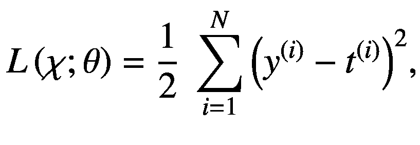

(1.6)

其中*l*(*𝒳*； *θ* 为损失函数， *y* *(i)* 为输入样本的预测值*x**【I】*，*t**(I)*为其对应的目标值， *θ* 为可学习参数。数据集中总共有 *N* 个样本。该损失函数中的平方确保总损失保持非负。损失函数中的分数项有其自身的重要性，因为它将损失函数的导数简化如下:

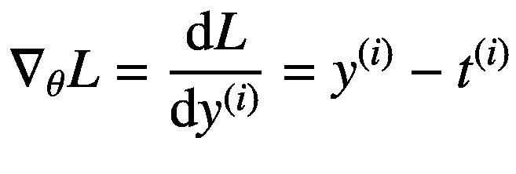

(1.7)

注意，一旦我们的模型被训练，我们将可学习参数表示为 *θ** ，损失函数表示为*l*(*𝒳*； *θ** )或简单的 *L* ( *θ** )保持抽象，对于数据集的哪个子集使用损失函数。

现在我们有了经验数据集和学习任务的模型，机器学习算法的最后一个组件是优化器(和可选的正则化器)，它用于使模型从数据中学习，这将在接下来讨论。

### 优化器

*优化*，也称为*训练*，是使用损失函数更新模型的可学习参数，以最小化目标和预测之间的误差的过程。在训练期间，我们优化我们的机器学习模型，这是一个两步过程，即计算关于模型的每个可学习参数的误差梯度，并更新参数值。

在第一步中，我们计算损失函数相对于机器学习模型的每个可学习参数的梯度。为了完成这项任务，我们使用了一种称为*误差反向传播* (Rumelhart 等人，1986 年)(也称为*反向传播*，或简称为*反向传播*)的高效算法。该算法只是微积分链式法则(见 2.3 节)计算梯度的连续应用。计算梯度的一个更通用的算法是自动微分(见 3.3 节)，误差反向传播是它的一个特例。

在第二步中，我们使用在优化的第一步中获得的梯度信息来更新模型的参数。由于损失函数的梯度给出了其输出增加最多的方向，我们在梯度的负方向上以小步长迭代更新参数，因为我们的目标是最小化损失函数。用于优化的该参数更新步骤的学习算法被称为*梯度下降*，如以下等式所述:

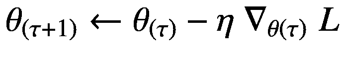

(1.8)

这里， *τ* 表示优化过程的时间步长， *θ* ( *τ* ) 表示时间步长 *τ* 的参数值，同样 *θ* (τ+1) 表示时间步长τ+1 的参数值。术语∇*θ*(*τ*)*l*表示在时间步长 *τ* 上用算法微分计算的关于权重参数 *θ* (τ) 的梯度。由于梯度值通常很大，我们必须采用超参数的小步长，用术语 *η* 表示，称为*步长*(或*学习速率*)，以最小化损失函数，其中 *η* ∈ (0，1)。为了采取小的步骤，学习速率被乘以关于模型的每个参数的损失函数的负梯度。优化是一个连续的迭代过程，在每一步迭代中，参数 *θ* (τ) 被加上一个小步长更新—*η*∇*θ*(τ)*l*以降低预测与目标之间的误差。

简而言之，*单个训练步骤*包括交替地向前传播输入特征信号，然后向后传播由损失函数计算和发出的误差信号。反向传播计算梯度，然后用于更新模型的参数。这种普通的梯度下降技术可能并不总是给出最好的结果。但是，正如在 5.6 节中详细描述的那样，对它还有各种各样的修改，以便进行更鲁棒的优化。

请注意，模型可能会遇到 1.5 节中讨论的过拟合和欠拟合问题。对于任何数据集的分割，如果达到这些状态之一，模型就不再有用。为了克服这些问题，通常在同一数据集上训练具有不同能力的不同机器学习模型。另一个解决方案是在训练模型时使用正则化技术，这将在接下来的第 5.7 节中详细讨论。

### 正则化子

尽管正则化可能被认为是机器学习算法的可选元素，但它在训练更一般化的模型中起着重要作用。*正则化*是对数据、模型、损失函数或优化器进行的任何修改，以减少模型的泛化误差(即，模型应该具有低偏差和方差)。

这里，我们描述了损失函数的广泛使用的正则化项，称为 *L* 2 *范数罚*，或*岭回归* (Hoerl & Kennard，1970)，其将损失函数修改如下:

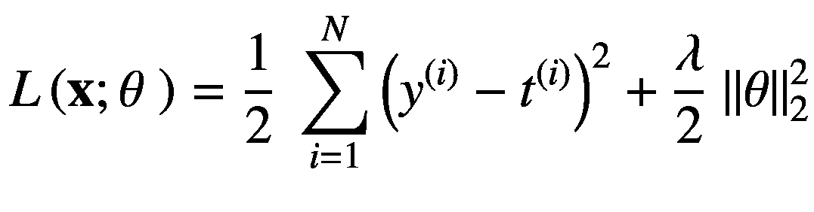

(1.9)

其中∩*θ*∩2计算参数的 *L* 2 范数， *λ* 表示正则项的权重，通常设置为 1。用这个新的损失函数训练模型有助于减少我们关心的泛化误差，也就是说，该模型将在看不见的样本上表现得更好。

在 5.7 节，我们将讨论各种其他的正则化技术。现在，让我们把注意力从训练模型转移到偏差和方差的概念上。

## 1.5 偏差和方差的权衡

偏差和方差是不同数据集上模型性能的特征。*偏差*与训练集上的模型性能有关，而*方差*与验证集上的模型性能有关。我们希望找到一个低偏差和方差的模型。但是，实际上，我们通常用一种交换另一种。此外，偏差和方差权衡不仅影响传统的机器学习方法，而且困扰着整个机器学习领域。

在讨论偏差和方差的权衡之前，让我们先介绍一下泛化这个术语。如果该模型在看不见的数据点上表现得非常好，则称其具有良好的*泛化*特性。我们的目标是在机器学习中找到这样的模型。

主要有三种情况与模型的偏差和方差有关。虽然第四种情况(没有提到，但可以从其他三种情况推断出来)可能是可取的，但从统计上来看*而不是*是可能的，即使在理论上也是如此；否则，我们可能永远不会要求训练模型。

在第一种情况下，当模型在训练集上表现良好，但在多个验证集上表现不佳时，分别被称为具有*低偏差和高方差*。这意味着模型有足够数量的参数来很好地执行训练集，但它过拟合训练集(因为参数的数量超过了发现底层数据 PDF 的要求)或*记住了*训练集的映射，并且没有逼近底层数据生成 PDF。这是因为如果它已经近似了数据分布，它也应该能够在验证集上表现良好，因为像训练集一样，验证集也在统计上表示数据 PDF。

在第二种情况下，当模型在训练集和多个验证集上都表现良好时，据说分别具有*低* *偏差* *和低* *方差*。在这里，模型已经近似了基础数据 PDF，所有数据集都是出于训练和测试目的从该 PDF 中采样的。在实践中，我们努力寻找这种模式。

在第三种情况下，当模型在训练集和多个验证集上都表现不佳时，分别被称为具有*高偏差和高方差*。这里，模型没有足够数量的参数来逼近训练集，因此，在多个验证集上也表现不佳。因为模型容量低，即使在训练集上表现也不好，所以据说*欠适应*。

## 1.6 为什么要深度学习？

我们讨论传统机器学习方法的各种问题，这些问题可以通过深度学习方法轻松解决。这激励我们研究和探索深度学习方法，正如我们将在下面看到的。

### 维度的诅咒

在实践中，我们通常会有几千甚至几百万个维度的样本。用传统的机器学习方法，如 k-最近邻回归器或分类器、决策树和其他方法处理这样的样本变得非常低效，有时甚至难以处理。

考虑设计机器学习算法的问题，该算法旨在近似可用数据集的映射。现在假设可用数据样本 *x* 的维数为 1，并且是标量变量，即 *x* ∈ ℝ.我们可以从用定积分区间划分输入的一维向量空间开始。而这样做，我们实际上是把输入向量空间分成了 *M* 这样的一维单元格(见图 [1-3](#Fig3) (a))。我们可以在这条线上绘制训练集中的每个数据样本。我们需要在每个单元中至少有一个训练点，以便做出正确的预测。由于我们有每个样本的标签信息，当我们需要预测一个新的未知样本的标签时，我们可以简单地在这条线上绘制它，并将其分配给在该单元中具有最大计数的标签，用于分类任务。在回归的情况下，我们可以取训练点的所有实值标签的平均值，并将该值赋给这个测试样本。

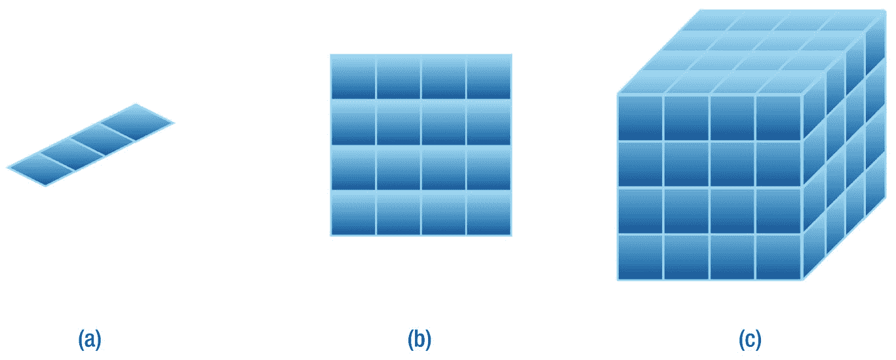

图 1-3

(a)一维、(b)二维和(c)三维数据点的维数灾难。存在对样本的指数要求 *M* d 用于预测新样本的标签，其中 *M* = 4 是沿着每个维度的部分的数量，而 *d* 是维度的数量。

在一维输入空间中工作似乎非常容易。但是当我们跳到更高维度的空间，我们开始看到问题迅速出现。现在假设变量 **x** ∈ ℝ 2 的二维输入向量空间由分别代表 x 轴和 y 轴的变量 *x* 1 和 *x* 2 组成。现在可以将每个训练点绘制为矩阵中的一个点。我们可以再次将 x*x*T14】1 和 x*x*2 变量的 x 轴和 y 轴划分为 *M* 段，这样我们就得到了*M*T24】2 单元格(参见图 [1-3](#Fig3) (b))。我们可以使用前面描述的过程再次简单地预测这个测试样本的标签。当我们移动到三维向量空间 **x** ∈ ℝ 3 时，其中 x、y 和 z 轴分别由 *x* 1 、*x*t38】2 和 *x* 3 变量表示，然后我们得到 *M* 3 截面(见图随着维数增加的趋势，我们可以看到训练集中所需的标记样本的数量随着维数的线性增加而呈指数增加。我们至少需要总共*M*T56】d 个样本来近似数据集映射，其中 *d* 是样本特征空间的维度。维度和所需样本数量之间的这种指数关系被称为*维度诅咒* (Bellman，2015)。

幸运的是，我们可以用深度神经网络模型解决维数灾难，我们将在本书后面看到。现在我们讨论传统机器学习算法的另一个问题，称为平滑度假设。

### 1.6.2 无效平滑度假设

传统的机器学习算法假设输入变量值的微小变化不会导致预测输出变量值的突然变化。这被称为*平滑度假设*。这意味着对于任何两个相似的输入值(例如，看起来相似的图像)，预测标签应该总是与真实标签相同。直观地说，这也适用于我们的视觉系统，因为当两幅图像相似或不相似时，我们可以区分它们。当我们的稀疏训练数据没有填满所有单元时，这种假设是有帮助的；然后，我们可以简单地将输入值插值到更接近可用训练样本的位置，并将相同的标签分配给我们的测试样本。

在(Szegedy 等人，2013 年)的工作之前，这种观点在很大程度上被认为对非线性方法有效。作者表明，我们可以有意构建看起来相似但被深度神经网络错误分类的输入图像。从几何学上来说，我们可以说这个假设是有效的，但只对线性模型有效，而对于非线性模型，这个假设不成立。但是，由于我们对处理高维数据感兴趣，因为它携带重要的信息，并且由于传统机器学习方法的弱表示能力，我们无法实现良好的准确性。这促使我们采用深度学习方法。

接下来，我们看看深度学习相对于传统机器学习方法所提供的一些优势。

### 1.6.3 深度学习优势

正如我们之前讨论的，传统的机器学习方法存在各种问题。这阻碍了我们对高维数据的分析。如这里所讨论的，深度学习方法相对于传统的机器学习方法有各种优势。

与传统的机器学习方法不同，深度学习已知可以给出高度准确的结果，有时甚至在某些任务上超过人类水平的表现。深度学习的想法大致是受大脑神经系统处理直接从我们的世界获得的原始数据的方式的启发。类似于我们的眼睛和耳朵等感觉器官在发送到大脑之前对数据进行预处理的事实，我们有时也会在将数据用于深度学习模型之前对数据进行预处理，但这种预处理使用了完全不同的功能序列。但是请注意，关于大脑本身，我们还有许多事情不知道。深度学习方法使用原始数据作为输入样本，并对其进行处理，以学习内部分层高维空间中的抽象信息。我们不需要为模型选择重要的特征。因为选择过程在人类中是固执己见的，一些人会发现某一组特征对任务很重要，而另一些人会更喜欢其他一些特征。深度学习通过简单地处理原始数据本身来解决这个*特征手工制作问题*。深度学习中的模型具有多层类似神经元的功能，其中每层通常具有不同的维度。高维输入进入模型，并在不同的层中转换成不同的维度，直到生成预测输出的最后一层。承担图像分类的任务。在这里，初始图层(更接近输入)可能会从影像数据集中学习精细比例的细节，如边缘、颜色梯度等，而中间层(称为隐藏图层)可能会学习更粗糙比例的细节，如圆形、矩形等形状；靠近最后一层的层(称为预测层)可以学习眼球、身体形状等特征；然后最终预测层将预测给定图像样本的标签。深度学习中的这些模型有许多名称，如深度学习模型、人工神经网络、深度神经网络或简单的神经网络，名称的列表还在继续。第 5 章[致力于介绍神经网络和训练它们的各种成功技术。](5.html)

我们还注意到，从随机存取存储器(RAM)和计算速度的角度来看，当我们有大量样本并且每个样本都可以在大维度上表示时，传统方法有时是难以处理的。深度学习模型利用了并行处理比顺序处理快得多的事实。这些模型并行处理样本的特征。虽然机器学习在 2006 年复兴(Bengio et al .，2007；Hinton 等人，2006 年；Ranzato 等人，2007 年)，大约在 2009 年，很明显图形处理单元(GPU)可以加速深度学习模型(刘冰等人，2009 年)，甚至比中央处理单元(CPU)设备快 10 或 20 倍，用于训练和推理过程。从那以后，像 Nvidia 这样的公司已经投入了极大的努力 [2](#Fn2) 来构建更快的 GPU，并不断改进架构设计。谷歌也在努力建造更快的并行处理设备，他们称之为张量处理单元(TPUs)。云甚至边缘设备上都有 TPU。在撰写本文时，著名的平台即服务(PaaS)如 Google Colaboratory 和 Kaggle 提供了对云上 GPU 和 TPU 设备的免费访问，用于深度学习。这有助于极大地加速深度学习研究。这本书里写的所有代码都可以在 Google Colaboratory 平台上执行。

深度学习方法可以被认为是传统机器学习方法的继承者，因为它们具有各种有趣的优点。几乎本章中针对传统方法(除了非参数方法)讨论的每个想法和概念都可以移植，而几乎不需要对深度学习框架进行任何修改。从根本上说，深度学习的定义保持不变:最大似然估计的思想非常适合，因为深度学习模型本质上是参数模型，深度学习也需要 1.4 节中讨论的学习算法的所有元素，并且每种类型的机器学习都可以用深度学习方法来执行(并且更好)。我们将从第 [5](5.html) 章开始，用简单的神经网络深入研究深度学习。

## 1.7 摘要

本章介绍了与机器学习相关的基本概念。我们讨论了机器学习的各种范例，并介绍了帮助训练机器学习模型的最大似然估计的概念。然后，我们深入研究了机器学习算法的各种基本元素。我们还引入了偏差和方差的概念来理解模型的泛化特性。最后，我们揭示了深度学习方法相对于传统机器学习方法的优势。

我们将在以下章节中从基本概念开始研究深度学习。但在深入之前，在下一章，我们将研究不同数学分支的各种主题，这些主题对于理解深度学习是必不可少的。

<aside aria-label="Footnotes" class="FootnoteSection" epub:type="footnotes">Footnotes [1](#Fn1_source)

引自(麦科达克，2004 年)。

  [2](#Fn2_source)

英伟达特斯拉 V100 性能指南，2018。 [`www.nvidia.com/content/dam/en-zz/Solutions/Data-Center/tesla-product-literature/v100-application-performance-guide.pdf`](http://www.nvidia.com/content/dam/en-zz/Solutions/Data-Center/tesla-product-literature/v100-application-performance-guide.pdf) 可用

 </aside>