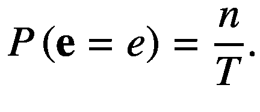
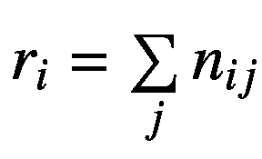
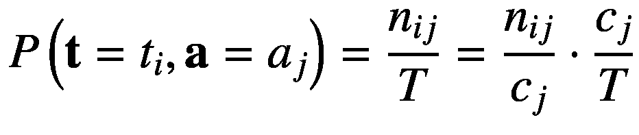

# 二、基础数学

> *世界上发生的任何事情，其意义都不是某种最大值或最小值。*
> 
> *—莱昂哈德·欧拉*

本章介绍了理解神经网络基础所必需的数学知识。我们强调，如果你的数学概念生疏了，不要跳过这一章。学习后面的章节时，你可以参考这一章。

在第 2.1 节中，我们介绍了线性代数，它用于利用神经网络进行预测，并计算损失函数相对于神经网络的梯度，这使得学习成为可能。线性代数运算的有效实现，如基本线性代数子程序(BLAS)，也允许在现代硬件加速器如 GPU 上使用并行处理进行快速计算。线性代数在设计神经网络的结构中也起着重要的作用。神经网络可被视为一个概率框架，用于近似可用数据集的概率分布(第 1.3 节)，这需要理解第 2.2 节中讨论的概率论。与确定性编程不同，神经网络的概率方法使其在处理值可能在连续空间中变化的输入数据时具有鲁棒性。在第 2.3 节中，我们引入了微分学来计算神经网络损失函数的梯度，这有助于确定如何训练神经网络。

## 2.1 线性代数

本节介绍不同的矩阵和向量，重要的一元和二元矩阵运算，以及规范。这些数据结构概括在张量的概念下，在 4.1 节中讨论。

### 矩阵和向量

有各种类型的矩阵和向量，但我们将自己限制在深度学习领域中重要的那些。我们首先介绍不同的矩阵，然后讨论一些重要的向量。

当一个*方阵*(具有相同的行数和列数)沿主对角线的所有属性都为 1 时，该矩阵称为*单位矩阵*，用 **I** *n* 表示，其中**I***n*∈ℝ*n*×*n*表示例如，5 阶的单位矩阵被写成如下:

![$$ \left[\begin{array}{l}1\kern0.5em 0\kern0.5em 0\kern0.5em 0\kern0.5em 0\\ {}\begin{array}{cccc}0&amp; 1&amp; 0&amp; \begin{array}{cc}0&amp; 0\end{array}\end{array}\\ {}\begin{array}{cccc}0&amp; 0&amp; 1&amp; \begin{array}{cc}0&amp; 0\end{array}\end{array}\\ {}\begin{array}{cccc}0&amp; 0&amp; 0&amp; \begin{array}{cc}1&amp; 0\end{array}\end{array}\\ {}\begin{array}{cccc}0&amp; 0&amp; 0&amp; \begin{array}{cc}0&amp; 1\end{array}\end{array}\end{array}\right] $$](img/484421_1_En_2_Chapter_TeX_Equ1.png)

(2.1)

我们还可以找到一个给定矩阵的逆矩阵，用**A**T2 1 表示，其中 **A** 是可逆矩阵。逆矩阵由下面的等式定义:

(2.2)

其中**I**T2*n*T5】是一个 *n* 阶单位矩阵。注意，矩阵 **A** 必须是可逆的，以产生其逆矩阵**A**T12】1。

对角矩阵 **D** 定义为除了 *i* = *j* 之外所有元素为零的矩阵。例如，下面是一个对角矩阵:

![$$ \left[\begin{array}{l}2.5\kern0.5em 0\kern0.86em 0\kern0.5em \begin{array}{cc}0&amp; 0\end{array}\\ {}\begin{array}{cccc}\kern0.48em 0&amp; 8&amp; \kern0.36em 0&amp; \begin{array}{cc}0&amp; 0\end{array}\end{array}\\ {}\begin{array}{cccc}\kern0.48em 0&amp; 0&amp; -3&amp; \begin{array}{cc}0&amp; 0\end{array}\end{array}\\ {}\begin{array}{cccc}\kern0.48em 0&amp; 0&amp; \kern0.36em 0&amp; \begin{array}{cc}4&amp; 0\end{array}\end{array}\\ {}\begin{array}{cccc}\kern0.48em 0&amp; 0&amp; \kern0.36em 0&amp; \begin{array}{cc}0&amp; 5\end{array}\end{array}\end{array}\right] $$](img/484421_1_En_2_Chapter_TeX_Equ3.png)

(2.3)

我们可以通过使用 diag(.)运算符。如果我们的矩阵是 **D，**那么 diag( **D** )返回一个向量 **x** ，包含沿着 **D** 主对角线的元素，如下:

![$$ \mathbf{x}=\left[\begin{array}{l}2.5\\ {}\kern0.36em 8\\ {}-3\\ {}\kern0.36em 4\\ {}\kern0.36em 5\end{array}\right] $$](img/484421_1_En_2_Chapter_TeX_Equ4.png)

(2.4)

当我们转置一个矩阵 **S** 并得到相同的矩阵时，那么这种矩阵称为*对称矩阵*。从形式上来说，对称矩阵是其转置返回相同矩阵的矩阵，即**S***T*=**S**:

![$$ \mathbf{S}=\left[\begin{array}{l}0\kern0.5em 8\kern0.5em 5\kern0.5em \begin{array}{cc}6&amp; 2\end{array}\\ {}\begin{array}{cccc}8&amp; 4&amp; 3&amp; \begin{array}{cc}7&amp; 9\end{array}\end{array}\\ {}\begin{array}{cccc}5&amp; 3&amp; 7&amp; \begin{array}{cc}1&amp; 1\end{array}\end{array}\\ {}\begin{array}{cccc}6&amp; 7&amp; 1&amp; \begin{array}{cc}3&amp; 6\end{array}\end{array}\\ {}\begin{array}{cccc}2&amp; 9&amp; 1&amp; \begin{array}{cc}6&amp; 5\end{array}\end{array}\end{array}\right]={\mathbf{S}}^T $$](img/484421_1_En_2_Chapter_TeX_Equ5.png)

(2.5)

在前面的等式中，矩阵 **S** 是对称的，因为它等于它自己的转置。

我们现在介绍一些在深度学习中有意义的向量。假设两个向量 **u** 、**v**∈**R***n*使得**u***T***v**= 0，假设这两个向量都是非零向量，则称为*正交向量*。当一个向量的欧氏范数为 1 时，则称为*单位向量*，即∨**u**∨2= 1。现在我们假设两个向量 **u** 和 **v** 也是单位向量；那么这两个向量被称为*正交向量*。形式上，当两个单位向量在性质上正交时，那么它们被简单地称为*正交向量*。

### 2.1.2 一元矩阵运算

我们介绍一些适用于矩阵的一元算子。转置是神经网络中对矩阵常用的一元运算之一。矩阵 **B** 的*转置*给出一个新的矩阵 **A** ，其行元素被其自己的列元素交换，使用以下规则:

(2.6)

例如，假设对以下具有不同行数和列数的非对称矩阵进行转置:

![$$ \mathbf{S}=\left[\begin{array}{l}-2\kern0.5em 0\kern0.5em 5\\ {}\begin{array}{ccc}\kern0.36em 4&amp; 2&amp; 9\end{array}\end{array}\right] $$](img/484421_1_En_2_Chapter_TeX_Equ7.png)

(2.7)

![$$ {\mathbf{S}}^T=\left[\begin{array}{c}-2\kern0.5em 4\\ {}\begin{array}{cc}\kern0.24em 0&amp; 2\end{array}\\ {}\begin{array}{cc}\kern0.24em 5&amp; 9\end{array}\end{array}\right] $$](img/484421_1_En_2_Chapter_TeX_Equ8.png)

(2.8)

可以清楚地看到，行与它们对应的列进行了互换，即矩阵 **S** ∈ ℝ 2×3 ，而其转置**s***t*∈ℝ3×2。另一种算子称为对角线算子，用 diag(.)，前面讨论的也是一元运算符的例子。如果需要计算所有主对角线条目的总和，那么我们使用 Tr(.).数学上用以下等式描述:

(2.9)

在我们之前考虑过的对角矩阵 **D** 上应用追踪算子给出如下:

![$$ \mathbf{D}=\left[\begin{array}{l}2.5\kern0.5em 0\kern0.86em 0\kern0.5em \begin{array}{cc}0&amp; 0\end{array}\\ {}\begin{array}{cccc}\kern0.48em 0&amp; 8&amp; \kern0.36em 0&amp; \begin{array}{cc}0&amp; 0\end{array}\end{array}\\ {}\begin{array}{cccc}\kern0.48em 0&amp; 0&amp; -3&amp; \begin{array}{cc}0&amp; 0\end{array}\end{array}\\ {}\begin{array}{cccc}\kern0.48em 0&amp; 0&amp; \kern0.36em 0&amp; \begin{array}{cc}4&amp; 0\end{array}\end{array}\\ {}\begin{array}{cccc}\kern0.48em 0&amp; 0&amp; \kern0.36em 0&amp; \begin{array}{cc}0&amp; 5\end{array}\end{array}\end{array}\right],\mathbf{x}=\left[\begin{array}{l}2.5\\ {}\kern0.36em 8\\ {}-3\\ {}\kern0.36em 4\\ {}\kern0.36em 5\end{array}\right],s=\sum \limits_i{x}_i=16.5 $$](img/484421_1_En_2_Chapter_TeX_Equ10.png)

(2.10)

通过对沿着矩阵 **D** 的主对角线的元素求和，我们得到总和等于 16.5。

### 二进制矩阵运算

我们针对两种特殊情况介绍了一些重要的矩阵二元运算:一个操作数是矩阵，另一个是标量，两个操作数都是矩阵。这种分类简化了对矩阵上二元运算的理解。

一些最简单的矩阵运算是矩阵和标量之间的运算。假设一个标量 *s* 和矩阵 **A** ∈ ℝ *m×n* 产生另一个相同形状的矩阵**b**∈ℝ*m*×*n*，当某个运算符作用于操作数 *s* 和 **A** 之间时。这里，运算符可以是任何基本运算符，如加、减、乘或除。当在 *s* 和 **A** 之间应用这些操作符中的任何一个时，则 *s* 和 **A** 的每个元素之间会单独发生一次操作。例如，加法运算可以写成:

(2.11)

假设矩阵 **A** ∈ ℝ 2×2 和标量*s*= 3:

![$$ \mathbf{A}=\left[\begin{array}{cc}1&amp; 5\\ {}4&amp; 9\end{array}\right] $$](img/484421_1_En_2_Chapter_TeX_Equ12.png)

(2.12)

![$$ s\mathbf{A}=3\;\left[\begin{array}{cc}1&amp; 5\\ {}4&amp; 9\end{array}\right]=\left[\begin{array}{cc}3.1&amp; 3.5\\ {}3.4&amp; 3.9\end{array}\right]=\left[\begin{array}{cc}3&amp; 15\\ {}12&amp; 27\end{array}\right] $$](img/484421_1_En_2_Chapter_TeX_Equ13.png)

(2.13)

这里，为了简单起见，我们用点来表示标量之间的乘法。注意标量 *s* 乘以矩阵 **A** 的每个元素。

讨论了标量和矩阵之间的运算后，我们现在介绍两个矩阵之间最重要的运算之一，称为*矩阵乘法*。这是允许神经网络在现代并行处理硬件加速器上有效工作的基本操作。

让我们假设两个矩阵**x**∈ℝ*m*×*n*和**y**∈ℝ*n*×*o*相乘在一起产生一个新的矩阵**z**∈ℝ*m*×*o*。 **X** 和 **Y** 的矩阵乘法简单写成 **Z = XY** 。这些矩阵必须满足某些条件，它们之间的乘法运算才有效。我们要求 **X** 的列数必须等于 **Y** 的行数，这在相乘后导致矩阵 **Z** 的行数和列数分别等于 **X** 和 **Y** 的行数和列数。形式上，两个矩阵之间的乘积定义如下:

(2.14)

这里， *i* 、 *j* 和 *k* 是从 1 开始直到它们的维度大小的索引——分别定义变量 *m* 、 *n* 和 *o* 。对于矩阵 **X** 和 **Y** ，我们假设 *m* = 2， *n* = 3， *o* = 2。通过在它们之间应用矩阵乘法，我们得到 **Z** ∈ ℝ 2×2 如下:

![$$ \mathbf{X}=\left[\begin{array}{cc}1&amp; 6\kern0.5em 2\\ {}3&amp; \begin{array}{cc}1&amp; 4\end{array}\end{array}\right],\mathbf{Y}=\left[\begin{array}{c}\begin{array}{cc}5&amp; 1\end{array}\\ {}\begin{array}{cc}2&amp; 2\end{array}\\ {}\begin{array}{cc}3&amp; 2\end{array}\end{array}\right] $$](img/484421_1_En_2_Chapter_TeX_Equ15.png)

(2.15)

![$$ \mathbf{Z}=\left[\begin{array}{cc}1.5+6.2+2.3&amp; 1.1+6.2+2.2\\ {}3.5+1.2+4.3&amp; 3.1+1.2+4.2\end{array}\right]=\left[\begin{array}{cc}23&amp; 17\\ {}29&amp; 13\end{array}\right] $$](img/484421_1_En_2_Chapter_TeX_Equ16.png)

(2.16)

前面的例子显示了 **X** ∈ ℝ 2×3 和 **Y** ∈ ℝ 3×2 之间的矩阵乘法返回 **Z** ∈ ℝ 2×2 。还要注意，矩阵乘法 **YX** 是不可能的，因为它不满足矩阵乘法的维数要求。因此，矩阵乘法不是交换运算。

请注意，矩阵乘法只是左侧矩阵的行和右侧矩阵的列之间的点积的重复应用。这也是为什么在一些像 NumPy 这样的库中找到一个名为`dot`的函数是非常常见的，而另一些像 Swift for TensorFlow 将其命名为`matMul`。

矩阵之间还存在另一种乘积，称为按元素的*乘积*或 *Hadamard* 乘积，由 **P** = **Q** ⊙ **R** 表示，但是在用于 TensorFlow 的 Swift 中，我们使用*运算符来表示相同的乘积。这里，我们要求 **Q** 和 **R** 必须具有相同的形状，并且 Hadamard 运算产生一个与 **Q** 或 **R** 形状相同的 **P** 矩阵。它由下列等式给出:

(2.17)

下面给出了一个基于元素的产品的实例:

![$$ \mathbf{Q}=\left[\begin{array}{cc}1&amp; 3\\ {}2&amp; 4\end{array}\right],\mathbf{R}=\left[\begin{array}{cc}6&amp; 9\\ {}4&amp; 1\end{array}\right] $$](img/484421_1_En_2_Chapter_TeX_Equ18.png)

(2.18)

![$$ \mathbf{P}=\mathbf{Q}\odot \mathbf{R}=\left[\begin{array}{cc}1.6&amp; 3.9\\ {}2.4&amp; 4.1\end{array}\right]=\left[\begin{array}{cc}6&amp; 27\\ {}8&amp; 4\end{array}\right] $$](img/484421_1_En_2_Chapter_TeX_Equ19.png)

(2.19)

哈达玛乘积生成与 **Q** 和 **R** 形状相同的矩阵 **P** 。

### 2.1.4 规范

在深度学习中，有时可能需要测量向量的大小。为了完成这个任务，使用了一个叫做 norm 的函数。*范数*在 *p* 维向量空间中测量向量离原点的距离。向量的范数由 *L* *p* 或∨*x*∨*p*表示，并使用以下公式计算:

(2.20)

其中 *p* 必须满足条件 *p* ≥ 1。

有些规范在深度学习中是如此的司空见惯，以至于有了自己的名字。*欧几里德范数*或*L*T4】2T6】范数就是这样一个例子，其中 *p* = 2，它测量一个向量离原点的欧几里德距离。另一种感兴趣的定额是*L*T12】1T14】定额其中 *p* = 1。它还测量到原点的距离，但在零值和非常小的非零值之间的差异很重要的情况下，它更有帮助。如果我们向向量的每个元素添加一个小的非负值 *e* ，那么 *L* 2 范数与它自身的平方成比例地增加，但是当非常小的变化具有高显著性时， *L* 1 范数优于 *L* 2 。

在下一节继续讨论概率论之前，我们再讨论两个范数:max 范数和 Frobenius 范数。 *max 范数*表示为 *L* ∞ 简单来说就是向量中一个元素的最大幅度的绝对值，其写法如下:

(2.21)

最后，我们还可以使用 *Frobenius 范数*来度量矩阵到原点的距离。它类似于向量的 *L* 2 范数。但很少使用，写如下:

(2.22)

现在让我们熟悉一下与神经网络有关的另一个重要的数学分支——概率论。

## 2.2 概率论

深度学习就是对看不见的数据点做出决策，因为现实世界是高度不确定的。例如，一些不确定性在于确定事件的发生，例如“你将在明天早上 5 点醒来”或“这场音乐会将会很好”这些都是不确定的事件，因为它们可能会发生，也可能不会发生；因此，它们出现的概率在[0，1]范围内。相比之下，有些事件是完全肯定会发生的，例如，“太阳明天会升起”或“水是由氢和氧组成的”，所以它们的概率是 1。从未发生的事件，例如，“蓖麻油比水更粘”或“植物不在土壤中生长”，其概率等于 0。概率论在构建深度学习问题中起着至关重要的作用。

概率是一个数学框架，用于使用位于[0，1]范围内的实数来量化不确定事件。如果一个事件 *e* 有很高的发生概率，那么它的概率用一个更接近于 1 的实数来量化，而一个最不可能的事件有更接近于 0 的概率。形式上，一个事件 *e* 的*概率*，用 *P* ( *e* )表示，定义为无限次实验时，事件 *e* 发生的次数与总试验次数 *T* 的比值， *T* → ∞。概率中的另一个重要术语是*随机变量*，它被定义为可以从一组定义的有效值中取一个特定值的变量，其中每个值都有可能从给定的概率分布中被采样。这里， **e** 是随机变量；并且，从数学上讲，一个事件发生的概率 *e* 写成如下:

(2.23)

这里， *e* 是随机变量 **e** 发生的事件或值， *n* 是实验进行 *T* → ∞次时发生事件 *e* 的次数。注意，有时我们简单地把 *P* ( *e* )写成相当于把*P*(**e**=*e*)。也不要混淆概率论中的粗体小写字母符号和线性代数中的向量符号。这里使用这种符号是为了方便。

我们现在将使用一个简单的例子，以通俗易懂的方式解释概率论的基础知识。下面这个例子，如图 [2-1](#Fig1) 所示，改编自(Bishop，2006)教材的课本。让我们假设一个随机变量，我们称之为一天中的时间段，用 **t** = { *m，a，e，b* 表示，读作“ **t** 是一组值 *m，a，e，*和 *b* ，其中 *m，a，e，*和 *b* 分别代表早晨、下午、晚上和就寝时间。基于从 **t** 采样的值，我们可以决定采取由集合 **a** = { *s，p，r，w* 表示的动作，其中 *s，p，r，*和 *w* 分别简单地表示学习、玩耍、休息和锻炼。图 [2-1](#Fig1) 为随机变量 **t** 和 **a** 的示意图。

图 2-1

描述集合 **t** = {m，a，e，b}和 **a** = {s，p，r，w}中事件联合和有条件发生的概率的网格

在图 [2-1](#Fig1) 中，每行代表从 **t** 可以取的事件集{ *m，a，e，b* 中采样的第 *i* 个指标值，每列代表从 **a** 可以取的事件集{ *s，p，r，w* 中采样的第 *j* 个指标值。术语 *r* *i* 和 *c* *j* 分别表示事件实例的数量 *t* *i* 和 *a* *j* 。这里， *i* = 1、…、 *M* 和 *j* = 1、…、 *N* 分别是沿行和列的索引， *M* = *N* = 4。我们用*P*(**t**=*t**I*)来表示一个事件发生的概率*t*I*，它简单地由下面的等式给出:*

**

*(2.24)*

这里， *T* 是执行的实验总数。同样，事件发生的概率*a*T5】j由

给出(2.25)

### 2.2.1 联合概率

随机变量 **t** 采样值*t*T5】I和 **a** 采样值 *a* *j* 时的概率，用*P*(**a**=*a**j*，**t**=**事件 *t***

注意，任意数量的随机变量的联合概率是对称的；因此，*P*(**a**=*a**j*，**t**=*t*t*I*)与写作*P*(**t**=*t*t*I*，**a**

 **### 条件概率

在给定另一个事件已经发生并且这两个事件相关的情况下，当我们必须找到一个事件的概率时，那么这种概率被称为*条件概率*。按照我们的例子，让我们假设 **t** 已经发生并取值*t**I*；而给定这个，我们就要求 **a** 取值 *a* *j* 的概率。这用*P*(**a**=*a**j*|**t**=*t**I*)来表示， 读作“事件发生的概率 *a* *j* 假定事件 *t* *i* 已经发生”，并由单元格中实例数在第( *i* ， *j* 个索引处的比率给出，用*n**ij*表示 形式上，这由下面的等式给出:

(2.27)

类似地，假定*a*T8】T9】jT11】已经发生，事件*t*T3】IT5】发生的条件概率由*n**ij*与由 *c* *j* 给出的 *j* 列中事件总数的比值给出。形式上，*P*(**t**=*t**I*|**a**=*a**j*)由以下等式描述:

(2.28)

### 基本规则

现在我们已经充分掌握了各种概率的知识，利用这些知识，我们将推导出概率论的两个基本规则，即和与积规则。首先，参见图 [2-1](#Fig1) 中的，因为 *r* * i * 中的事件总数仅仅是该行每个单元格中所有事件的总和。使用等式 [2.24](#Equ24) 和 [2.26](#Equ26) ，我们得到

(2.29)

这被称为概率的*和。它也被称为*边际概率*，因为它是通过将所有变量边缘化或求和得到的，除了这里期望的一个变量，即 **t** 。同样，我们可以把*P*(**a**=*a**j*)写成*

**

*(2.30)*

通过边缘化随机变量 **t** 。接下来，我们将使用已经讨论过的条件概率来推导概率的乘积规则。利用等式 [2.26](#Equ26) 、 [2.28](#Equ28) 和 [2.30](#Equ30) ，我们得到

(2.31)

(2.32)

这叫做概率的*乘积法则*。请注意，它只是将两个随机变量的联合概率分解为它们的边际概率和条件概率的乘积。

到目前为止，我们已经对符号非常精确了，但是它使更大的方程变得复杂，并且降低了它们的适用性。我们现在选择一种更简单的符号来表示这样的概率方程。让我们将随机变量 **t** 和 **a** 的概率分布分别表示为 *P* ( **t** )和 *P* ( **a** )，而*P*(*t**I*)和*P*(*a**j】现在我们可以更简洁地重写等式 [2.30](#Equ30) 和 [2.32](#Equ32) 如下:*

**

*(2.33)

(2.34)*

这里，方程 [2.33](#Equ33) 和 [2.34](#Equ34) 分别代表概率的和与积法则。我们现在将在下文中介绍概率链规则的概念。

### 链式法则

现在我们知道，两个随机变量的联合概率可以分解为它们的条件概率和边际概率的乘积。但是“如果我们想要分解两个以上随机变量的概率呢？”这就是概率链式法则的作用。概率的*链规则被简单地定义为在尽可能多的随机变量上重复应用联合概率的乘积规则。因此，联合概率被分解为所有随机变量的边际概率和条件概率的乘积。*

我们假设四个随机变量，分别是， **x** 1 、 **x** 2 、 **x** 3 、 **x** 4 。我们可以将它们的联合概率写成*P*(**x**1， **x** 2 ， **x** 3 ， **x** 4 )可以使用如下等式描述的乘积法则进一步分解:

(2.35)

【T38)

使用等式 [2.36](#Equ36) 和 [2.37](#Equ37) ，等式 [2.35](#Equ35) 可以以其分解形式重写如下:

(2.38)

概率的链式法则的一般公式可以写成:

(2.39)

切记*P*(**x**|**x**)=*P*(**x**)。前面演示链式法则的例子可能看起来有点复杂；因此，让我们假设一个更简单的版本，它通过选择随机变量的名称来简化，即 **a** 、 **b** 、 **c** 和 **d** 。

我们现在将在这些随机变量上分解这个概率分布，这些随机变量由 *P* ( **a** ， **b** ， **c** ， **d** )表示，在下面的等式中一步一步地分解:

(2.40)

(2.41)

(2.42)

将方程 [2.42](#Equ42) 代入 [2.41](#Equ41) 中，然后将 [2.41](#Equ41) 代入 [2.40](#Equ40) 中，得到

(2.43)

注意，分解后的方程 [2.38](#Equ38) 和 [2.43](#Equ43) 是对称的。简而言之，概率链规则帮助我们将任意数量的随机变量的联合概率描述为它们的条件概率和边际概率的乘积，并且更一般地通过等式 [2.39](#Equ39) 获得。

### 贝叶斯规则

我们还可以利用联合概率是对称的这一事实来推导两个随机变量的条件概率之间的关系。我们可以将随机变量 **x** 和 **y** 的联合概率重写为

(2.44)

利用乘积法则，我们得到

(2.45)

这里，等式 [2.45](#Equ45) 被称为贝叶斯规则，其通过联合概率的对称性质来关联条件概率。

## 2.3 微积分

微积分分支分为两个子分支，即微积分。因为神经网络训练需要计算偏导数，所以学习微分学是很重要的，也是本节的主题。我们不关心积分。我们先介绍函数的概念，然后解释微分学。本节受(Deisenroth 等人，2020 年)教科书第 [5](5.html) 章的启发。

### 功能

微积分的核心是函数的概念。数学*函数*，表示为 *f* : 𝔸 → 𝔹，是从集合𝔸到集合𝔹的映射，将𝔸的每个元素关联到𝔹.的唯一元素假设变量 *x* ∈ 𝔸和*y*∈𝔹；那么*y*=*f*(*x*)就是将单个元素 *x* ∈ 𝔸映射到唯一元素 *y* ∈ 𝔹.的函数 *f 换句话说，函数 *f* (。)转换输入 *x* 并返回输出 *y* 。*

#### 2.3.1.1 一元函数

当输入变量 *x* 到函数 *f* (。)是一个标量，并且函数返回一个标量输出 *y* ，那么这个函数被称为*单变量*(或者*标量* ) *函数*，如图 [2-2](#Fig2) 所示。换句话说，一元函数只是一个从标量实数到标量实数的映射， *f* : ℝ → ℝ.

图 2-2

标量函数 f(。)从 x ∈ ℝ到 y ∈ ℝ的映射

考虑一个标量函数 *g* :从集合𝔹到集合ℂ的𝔹 → ℂ映射，并取函数 *f* 的输出。)作为其输入，即*z*=*g*(*y*)=*g*(*f*(*x*))。这可以被视为多个函数的顺序链接，其中的 *g* 也被称为*复合函数*，如图 [2-3](#Fig3) 所示。我们也可以把复合函数写成*g*∘*f*(*x*)其中∘算子表示 *g* (。)和 *f* (。)功能。注意，函数的链接可以存在任意多的函数。我们将在后面看到，神经网络只是简单的复合向量函数。

图 2-3

复合标量函数 g ∘ f(x)映射

#### 2.3.1.2 多元函数

前面描述的一元函数是函数的最简单形式。但是在深度学习中，我们会要求处理高维输入变量的函数。我们可以把这个定义扩展到一个输入包含多个变量的函数，这个函数叫做*多元函数*(如图 [2-4](#Fig4) 定义为 *f* : ℝ *m* → ℝ其中输入变量**x**∈ℝ*m*(行向量)。一个真实世界的例子是速度 *s* ( *d* ， *t* )，它是两个变量的函数，即距离 *d* ∈ ℝ和时间 *t* ∈ ℝ，定义为 *s* ( *d* ，*t【t32)=*d*/*t*我们可以将这两个输入变量表示为一个二维行向量 **x** = [ *d t* 变量。另一个例子是求和运算符σ*I*`x`*I*，它返回一个向量 **x** 的所有标量元素之和。***

图 2-4

一个多元函数 f(。)从 x ∈ ℝ m 到 y ∈ ℝ的映射在(a)中明确示出，在(b)中简洁示出

#### 2.3.1.3 矢量函数

*向量函数***f**:ℝ*m*→ℝ→T9】n只是多元函数*f*:ℝ*m*→ℝ.的扩展版在 vector 函数中，我们有一个集合了 *n* 多元函数**f**=[*f*1…*f**n*的一行 vector，其中*y**I*=*f**I*(当 **f** 行向量中的每个多元函数应用于输入向量变量 **x** 时，返回一个标量*y**I*=*f**I*(**x**)。然后我们将这些输出沿着 *n* 列堆叠起来，创建一个向量**y**=**f**(**x**)∈ℝ*n*。换句话说，对输入向量变量**x**∈ℝ*m*应用向量函数 **f** 产生一个输出向量变量**y**∈ℝ*n*(见图 [2-5](#Fig5) ，从而映射 *m-* 到*n*注意，向量被认为是列向量更合适，但是我们认为所有的向量(另外提到的)都是行向量。这种考虑是为了方便数据集如何排列(见 1.4.1 小节)，如何处理，以及我们如何执行我们的神经网络功能的微分，我们将在后面看到。**

图 2-5

一个向量函数 f(。)从 x ∈ ℝ m 到 y ∈ ℝ n 的映射在(a)中明确示出，在(b)中紧凑示出

#### 2.3.1.4 矩阵函数

我们还可以定义更高维的函数，比如一个*矩阵函数*，定义为从向量到矩阵的映射**f**:ℝt5】mT7】→ℝT9】n×*o*或从矩阵到矩阵的映射**f**:ℝ×t17】m×*n*→ℝ*o 我们来看看矩阵函数中的向量到矩阵的映射，它只是一个列向量中的向量函数的集合，其中列向量中有*n*f=[**f**1…**f***n*f*j*:ℝ*m*当 **f** 列 vector 中的每个向量函数应用于输入向量变量**x**∈ℝ*m*时，它返回一个向量**y***j*=**f***j*(**然后我们将这些输出沿着 *q* 行堆叠起来，创建一个矩阵**y**=**f**(**x**)∈ℝ*n*×*o*。***

图 2-6

矩阵函数 F(。)从 x ∈ ℝ m 到 Y ∈ ℝ n×o 的映射

下面的文本解释了我们在前面的文本中描述的函数的区别。我们不会讨论张量函数，因为神经网络中的所有微分都可以用向量函数本身来描述。但我们将对矩阵函数进行微分，以展示 Swift 语言(3.4 节)的算法微分(AD)(3.3 节)中使用的一个巧妙技巧，使导数计算变得容易。

### 2.3.2 一元函数的微分

在从函数的导数开始之前，我们引入差商的概念。*差商*被定义为当输入改变一个小值时输出函数值的变化量。这种求导方法被称为*数值求导* :

(2.46)

这里， *δ* 是一个希腊字母*δ*用来表示一个小值。在上式中，*δy*=*f*(*x*+*δx*)—*f*(*x*)是输入 *δx* 有微小变化时输出函数值的变化。当 *δx* = 0 时，则 *δy* = 0。该比率代表割线(将图形分成两部分或更多部分的线)的斜率，如图 [2-7](#Fig7) 所示。

图 2-7

一元函数从(x，f(x))到(x + δx，f(x + δx))的割线

当输入值的这种明显的小变化变得可以忽略不计时，也就是说，它接近 0，表示为 *δx* → 0，我们得到在 *x* 处切线的*斜率*。切线是在点 *x* 处平行于曲线的线，代表曲线在 *f* ( *x* )处的斜率。如果函数 *f* (,则导数存在。)是可微的。对于一个要*可微*的函数，它必须在输入空间的每一点都是连续的，一个极限必须存在于微分点，并且该极限也必须存在于接近它的给定点的左边和右边。如果一个函数满足这三个要求，它就被认为是可微的。请记住，我们在神经网络文献中处理的所有函数都是可微的。函数 *f* 的导数(。)定义为

(2.47)

这里，*h*T20】0，是一个非常非常小的正数。一个函数的正切 *f* (。)在点 *x* 是 f′(*x*)的*导数，指向输出函数值*最陡上升*的方向。我们用 *f* 的导数来表示。)在 *x* 处为*f*'(*x*)。如果函数的输入是一个常数，那么导数就是 0，因为常数不能变化。*

一些可微函数，如 sigmoid、softmax、ReLU 等，在神经网络中是如此常见，以至于我们通常宁愿记住它们的导数函数，而不是再次找到它们。这些列出的功能称为激活功能，在第 5.4 节中详细讨论。

#### 2.3.2.1 微分法则

有时我们需要用初等算术运算来计算复合函数或多函数的导数。这里，我们遵循下面描述的四个微分规则。以下一般规则适用于单变量函数:

1.  **求和规则**:(*f*(*x*)+*g*(*x*)′=*f*′(*x*)+*g*【T20′(*x*)

2.  **产品规则**:(*f*(*x*)*g*(*x*)′=*f*′(*x*)*g*(*x【T21)+*f*(*x*)【T26*

3.  **链式法则**:(*f*(*g*(*x*))′=*f*′(*g*(*x*)*g*′(*x*)

4.  **商法则** : 

### 2.3.3 多元函数的微分

我们前面讨论过一元函数的微分。但是当我们必须处理一个多输入变量的函数，称为多元函数时，偏导数的概念就被利用了。在偏导数中，函数的导数是针对每个变量单独计算的，同时将其他变量视为常数，每个常数输入变量的偏导数为零。多元函数的偏导数 *f* (。)关于某输入变量 *x* 1 的写法如下:

(2.48)

这里∂*f*(**x**)/∂*x*T6】1 是 *f* (。)相对于*x*T12】1 意味着在这个偏导数的计算过程中其他变量保持不变。这个计算函数 *f* 的偏导数的过程。)对行向量**x**∈ℝmt21】中的每个输入变量重复。然后我们将这些偏导数累加到一个行向量中，称之为多元函数 *f* 的*梯度*(。)定义如下:

![$$ {\nabla}_{\mathbf{x}}f=\frac{\mathrm{d}f\left(\mathbf{x}\right)}{\mathrm{d}{x}_1}=\left[\begin{array}{c}{\lim}_{h\to 0}\;\frac{f\left({x}_1+h,\dots, {x}_m\right)-f\left({x}_1\right)}{h}\\ {}\vdots \\ {}{\lim}_{h\to 0}\;\frac{f\left({x}_1,\dots, {x}_m+h\right)-f\left({x}_m\right)}{h}\end{array}\right] $$](img/484421_1_En_2_Chapter_TeX_Equ49.png)

(2.49)

因为梯度是多元函数的导数，我们可以写成 d*f*(**x**)/d**x**，而*∂f*(**x**)/∂*x**I*表示 *f* (。)相对于单个输入变量 *x* *i* 。有时候我们也会用 grad *f* (。)而不是 nabla 符号∇**x***f*来表示梯度。我们可以用更简洁的方式重写前面的等式，如下所示:

![$$ {\nabla}_{\mathbf{x}}f=\left[\begin{array}{c}\frac{\partial f}{\partial {x}_1}\\ {}\vdots \\ {}\frac{\partial f}{\partial {x}_m}\end{array}\right] $$](img/484421_1_En_2_Chapter_TeX_Equ50.png)

(2.50)

后面为了方便，我们将假设梯度∇**x***f*∈ℝ1×*m*为矩阵而不是向量。正如我们将在后面看到的，对于向量函数(例如，密集连接的神经网络)，这个梯度的行维度大小将增加，从而它将成为一个包含向量函数偏导数的矩阵。

#### 偏导数的 2.3.3.1 规则

通过将之前讨论的单变量函数的规则扩展如下，可以容易地获得用于计算更高维函数的偏导数的规则:

1.  **求和规则** : 

2.  **产品规则** : 

3.  **链式法则** : 

我们已经取消了偏导数的商规则，因为在神经网络中，我们将主要处理这三个规则。请注意，这些规则类似于衍生产品的规则。请记住，函数在偏微分过程中的顺序非常重要，因为现在涉及到了矩阵和向量，并且与标量函数相比，这些数据结构上的一些操作(例如乘法)是不可交换的。

接下来，我们介绍向量函数的微分，这是训练神经网络的关键。

### 2.3.4 向量函数微分

我们以前已经讨论过向量函数。让我们考虑一个向量函数**f**:ℝ*m*→ℝ*n*从 *m* 到 *n* 维向量空间的映射。如前所述，我们有一个包含多元函数映射的行向量**f**=[*f*1…*f**n*】f*I*:ℝ*m*→ℝ.向量函数的导数可以用极限定义写成如下:

![$$ {\nabla}_{\mathbf{x}}\mathbf{f}==\left[\begin{array}{ccc}{\lim}_{h\to 0}\;\frac{f_1\left({x}_1+h,\dots, {x}_n\right)-{f}_1\left({x}_1\right)}{h}&amp; \dots &amp; {\lim}_{h\to 0}\;\frac{f_{\mathrm{n}}\left({x}_1+h,\dots, {x}_n\right)-{f}_{\mathrm{n}}\left({x}_1\right)}{h}\\ {}\dots &amp; \ddots &amp; \dots \\ {}{\lim}_{h\to 0}\;\frac{f_1\left({x}_1,\dots, {x}_n+h\right)-{f}_1\left({x}_n\right)}{h}&amp; \dots &amp; {\lim}_{h\to 0}\;\frac{f_n\left({x}_1,\dots, {x}_n+h\right)-{f}_n\left({x}_n\right)}{h}\end{array}\right] $$](img/484421_1_En_2_Chapter_TeX_Equ51.png)

(2.51)

这里将∇**x****f**∈ℝ*n*×*m*矩阵与向量函数 **f** ( **x** )的一阶偏导数累加，称为*雅可比矩阵*。注意，包含矩阵的导数或其他高维函数的高维张量也称为雅可比矩阵；类似于张量，雅可比也是存储偏导数的张量的广义名称。我们可以将雅可比矩阵∇**x****f**改写如下:

![$$ {\mathbf{J}}_{\mathbf{f}}={\nabla}_{\mathbf{x}}\mathbf{f}=\left[\begin{array}{ccc}\frac{\partial {f}_1\left(\mathbf{x}\right)}{\partial {x}_1}&amp; \dots &amp; \frac{\partial {f}_n\left(\mathbf{x}\right)}{\partial {x}_1}\\ {}\dots &amp; \ddots &amp; \dots \\ {}\frac{\partial {f}_1\left(\mathbf{x}\right)}{\partial {x}_m}&amp; \dots &amp; \frac{\partial {f}_n\left(\mathbf{x}\right)}{\partial {x}_m}\end{array}\right] $$](img/484421_1_En_2_Chapter_TeX_Equ52.png)

(2.52)

这里， **J** **f** 是函数 **f** ( **x** )的雅可比∇ **x** **f** 的另一种表示方式。注意每一行都是多元函数*f**I*(**x**)的梯度。正如我们前面所讨论的，雅可比矩阵可以被认为是多个多元函数梯度的累加，每个函数都堆积在不同的行中，从而得到一个偏导数矩阵。换句话说，多元函数的导数是一个函数行向量中只有一个函数时雅可比的特例。

接下来，我们介绍矩阵函数的微分和一个便于计算的简单技巧。

### 2.3.5 矩阵函数微分

这里，我们考虑一个简单的情况，我们计算输出矩阵变量**y**∈ℝ*n*×*o*相对于输入向量变量 **x** ∈ ℝ *m* 其中**f**:ℝ*m*→ℝ*n*×*这里我们设置 *n* = 3， *o* = 4， *m* = 2。这描述了一个从 *m* 维向量空间到 *n* × *o* 维矩阵空间的函数映射，即**f**:ℝ2→ℝ3×4。我们知道，存储输出矩阵相对于输入向量的偏导数的雅可比矩阵将是一个张量**j****f**∈ℝ(3×4)×2。我们演示了两种方法来计算这个雅可比。*

第一种方法，如图 [2-8](#Fig8) 所示，雅可比矩阵很简单。这里我们简单计算一下 **Y** 相对于向量 **x** 的每个标量输入变量的偏导数。这些偏导数分别是∂**y**/∂*x*T10】1 和∂**y**/∂*x*t16】2。现在我们把所有这些偏导数整理成一个形状为(3 × 4) × 2 的雅可比张量。

图 2-8

计算矩阵 Y ∈ ℝ 3×4 相对于向量 x ∈ ℝ 2 的梯度的简单方法

第二种方法如图 [2-9](#Fig9) 所示，雅可比矩阵的计算也很简单，但需要对之前的过程稍加修改。第一步，我们将输出矩阵展平成一个*号* -或 12 维向量，即。在第二步中，我们计算这个新的输出向量 **y** 相对于输入向量 **x** 的偏导数，这导致两个偏导数∂**y**/∂*x*t13】1 和∂**y**/∂*x*t19】2，每个都属于ℝ 12 向量空间。我们将这些收集在一个形状为 *no* × *m* 或 12 × 2 的雅可比矩阵中。最后，在第三步中，我们将其重塑回 a(*n*×*o*)×*m—*或(3 × 4) × 2 维雅可比张量，该张量现在包含输出矩阵 **Y** 相对于输入向量 **x** 的偏导数。

图 2-9

计算矩阵 Y ∈ ℝ 3×4 相对于向量 x ∈ ℝ 2 的梯度的另一种向量整形方法

在第 [4](4.html) 章中介绍的 Swift for TensorFlow 中的 TensorFlow 库采用了第二种方法来计算雅可比张量，这是因为第二种方法简单高效。这也使得在算法微分(第 3.3 节)中使用链式法则通过雅可比向量乘积(JVP)和向量雅可比乘积(VJP)分别在正向模式和反向模式算法微分中计算链式复合函数的偏导数变得容易。我们将在下一章描述这些术语。

请注意，第二种方法可能容易出错，因为张量的重新排序可能会破坏计算预期最终正确输出的路径，即这里的雅可比矩阵，但幸运的是它不会。为了理解这一点，我们回到线性代数来寻求一点帮助。这种方法之所以成为可能，是因为张量空间本质上是*同构的*，也就是说，任何空间都可以通过矩阵乘法等线性代数运算转换到另一个空间。这个变换可以再次被还原，把我们带到原始的张量空间。所以矩阵可以被改造成向量，反之亦然，同样的方法也适用于更高维的数据结构。

## 2.4 总结

数学对于理解深度神经网络至关重要。在这一章中，我们讨论了三个数学分支的各种主题，即线性代数、概率论和微分学。这些都有助于设计和训练机器学习模型，我们将在后面的章节中看到。如果你在试图理解神经网络或对它们编程时迷失在更高层次的抽象中，我们建议你使用这一章作为参考。

下一章是关于用 Swift 编程语言进行微分编程。我们将广泛使用微分概念来描述算法微分，并描述 Swift 的 API 来轻松计算函数和数据类型的导数。**