# 三、可微分编程

> Swift 是 LLVM 编译器的语法糖。
> 
> *—克里斯·拉特纳*

在本章中，我们首先通过比较(第 3.1 节)Swift 语言与 Python 语言的强大功能，启发您采用 Swift 语言进行深度学习。我们还引入了一种称为“TensorFlow 的 Swift”的扩展语言(3.2 节)，用于通用编程以及学习和研究深度学习领域。对自动计算复合函数的导数至关重要的算法(通过从用户那里抽象出复杂性)称为算法微分，将在 3.3 节中详细介绍和讨论。然后介绍 Swift 语言的各种基本和先进的强大功能(3.4 节)。由于当前 Python 语言大量用于数值计算，我们展示了 Swift for TensorFlow 如何轻松访问(第 3.5 节)Python 的内置和库。最后，我们以总结结束本章(第 3.6 节)。

本章从“差异化编程宣言”(Wei et al .，2018)中得到很大启发，该宣言为 Swift 提供一流的差异化功能支持奠定了基础，使其成为一种更加通用的编程语言。

## 3.1 Swift 无处不在

同时，数据科学研究团体使用的重要数字处理库(Buitinck 等人，2013；哈里斯等人，2020)，机器学习(阿巴迪等人，2016；Chollet 等人，2015；Paszke et al .，2017，2019)，量子计算(Aleksandrowicz et al .，2019)，量子机器学习(Bergholm et al .，2018)，计算神经科学(Taylor et al .，2018)，其他都是用 Python 写的。虽然 Python 现在非常重要，但它不是一种好的通用编程语言(即，可用于软件开发栈的各个部分)，它有许多严重的缺点，如性能慢、内存管理差、因为 GIL 而没有多线程支持、因为它是一种解释型语言而没有严肃的调试工具、高度动态的类型系统、没有对移动开发的真正支持等等。为了探索 Python 语言的替代方案，特别是机器学习，社区在不同的差异化编程研究领域对 Julia 语言进行了一些努力(Bezanson 等人，2012 年，2017 年)。但是 Julia 也有一些严重的缺点，例如不直观(如果你已经是 C++或 Python 程序员)、复杂且混乱的语法、膨胀的特性列表、怪异的变量范围、不安全且高度动态的类型系统(如 Python，允许同名变量的重新声明)、不支持移动开发等等。由于这些和其他缺点，Python 和 Julia 仍然不适合与数值计算有关的各种研究领域。

机器学习库通常用扩展的 C++语言编程，例如 CUDA (Zeller，2011)，以允许在硬件加速器上执行。Python 只是与 C++代码库进行接口，使底层代码抽象，从而允许您使用简单的 Python 语法编写深度学习应用程序。因此，经过训练的机器学习模型必须加载到 C++中，以便在生产中进行低延迟部署。您的程序和低级 C++代码之间的这种差距是巨大的，它阻碍了您轻松地对特定于程序的优化代码库进行更改。Swift for TensorFlow 的目标是成为轻松编写低级优化程序所需的唯一语言，同时为您提供对高级 API 的访问，从而消除您的代码和实际机器学习代码库之间的差距。

我们知道 Swift 是一种静态类型的语言，但它也允许动态类型。例如，尽管协议(见第 3.4.6 小节)不是类型，而是一致性类型必须遵循的规则，但您仍然可以将协议用作实体的类型，该实体的实际自定义类型在运行时确定。但是 Python 没有类型的概念，除了完全动态的`object`类。这给机器学习应用程序带来了一个问题，因为知道实例的类型反而允许编译器报告编译时错误，这使得研究人员、从业人员和学习者同样高效。这就是 Swift for TensorFlow 大放异彩的地方！但是 Python 不会检查任何错误，直到在执行过程中遇到错误。由于机器学习训练是耗时的，并且在某一语句中遇到错误(该语句直到通过某些条件才被执行)会使程序崩溃，并且训练可能需要重新开始，这使得机器学习编程非常低效。

与 Python 不同，Swift 是一种基于 LLVM 编译器的通用、快速的编译语言，并且具有通过 LLDB 调试器进行调试的本机支持。Swift 还支持自动引用计数，您几乎永远不需要担心内存管理。Python 的 GIL 有效地阻止了设备多核的使用，因此不支持多线程。但是你可以用 Swift 轻松编写多线程程序。正如已经提到的，Python 不允许应用程序开发，而现在所有运行在苹果设备上的应用程序都是用 Swift 语言编写的。

Swift 是一种开源语言，不仅能在 macOS 上完美运行，还能在 Linux 和 Windows 操作系统上运行。Swift 用于为苹果设备构建应用。Swift 在前端和服务器后端也工作得很好，分别用 SwiftUI <sup>[2](#Fn3)</sup> 构建用户界面(UI)和用 Vapor、 <sup>[3](#Fn4)</sup> 等库处理数据库。Swift 还可以用于处理亚马逊网络服务(AWS) Lambda 运行时。 <sup>[4](#Fn5)</sup> 现在 Swift 的编译器也支持一级可微编程，这使得编写参数优化算法变得很容易。*可微分编程*是一种编程范例，其中使用算法微分来计算类型和函数的导数。

几乎软件堆栈的任何部分都可以在 Swift 中轻松开发。在不到十年的时间里，Swift 已经迅速成为一种通用编程语言。现在我们将看看用于 TensorFlow 语言的 Swift，它扩展了原始的 Swift 语言，以便于编写深度学习算法。基本上，Swift for TensorFlow 引入了 TensorFlow 库和 Swift 中没有的各种深度学习特定功能。

## 3.2 Swift for TensorFlow

Swift for TensorFlow (S4TF)使机器学习项目的原型化变得很容易。虽然也有可能部署 S4TF 模型，但我们不会触及这个领域。由于 S4TF 具有新手和有经验的程序员友好的语法，学习曲线可以很短。S4TF 也可以作为第一语言学习编程，甚至机器学习。而且 S4TF 有很多 Python 用户会觉得有趣的强大特性。

除了在 CPU 上运行深度学习程序，S4TF 还可以在 GPU 或 TPUs 等硬件加速器上执行。在撰写本文时，S4TF 在自己的 X10 库中为 TensorFlow 使用了 XLA 编译器。这允许你在硬件加速器上执行你的算法，如 GPU 或 TPU，只需对你的代码做很小的修改，我们将在后面的章节中训练我们的机器学习算法时看到。但在未来，TensorFlow 将与 MLIR 一起构建(Lattner and Pienaar，2019；Lattner 等人，2020)编译器，其中 MLIR 代表“机器学习中间表示”MLIR 将成为机器学习库的标准。MLIR 将允许机器学习代码的设备无关的执行，也就是说，任何新的硬件加速器都将很容易得到支持。

S4TF 不仅在 Xcode 集成开发环境(IDE)中运行良好，而且在 macOS、Linux 和 Windows 操作系统的浏览器中的 Google Colaboratory 和本地 Jupyter Notebook 上也运行良好。但在 Xcode 中构建应用程序是有益的，因为它允许智能的上下文感知代码完成、高度受控的调试、断点、创建和执行测试、甚至在源代码编译之前修复程序警告和错误等等。它甚至允许您实时查看磁盘读写数据传输统计数据、发送或接收的网络数据，以及最重要的内存消耗。每年在苹果全球开发者大会(WWDC)期间，Xcode 都会不断增加新功能，以提高开发者的工作效率。这些用于开发惊人的苹果平台应用程序的 Xcode 功能也有助于开发更好的机器学习应用程序。

我原本计划用 Xcode 编写本书中呈现的所有深度学习程序，但已经在深度学习领域的许多用户在 Linux 上使用 Python，所以他们可能不会使用 macOS。为了方便他们，我使用了谷歌合作平台来构建和训练书中介绍的所有深度学习模型。因此，您可以简单地启动您最喜欢的浏览器，并立即开始尝试代码示例。你们中拥有 MAC 的人可能会在 Xcode 中执行相同的代码。

在 S4TF 中，您可以简单地导入预构建甚至安装的 Python 库，并像在 Python 程序中一样使用它们。这被称为 *Python 互操作性*(详细讨论见 3.5 节)。由于 Swift 的语法非常类似于 Python，调用这些函数是无缝的，感觉就像你在用 Python 编写一样。一个有趣的事实:你可以导入 Python 的任何深度学习库(例如 PyTorch)并在 S4TF 中定义和训练机器学习模型！您还可以导入 Python 的可视化库用于绘图目的。Python 互操作性有助于使用研究人员和从业者非常喜爱的 Python 库，同时仍然使用 S4TF 的其他强大功能。

在未来，iOS、iPadOS、macOS、watchOS 和 tvOS 开发人员将能够完全使用 S4TF 在纯 Swift 中编写机器学习应用程序，而不需要苹果提供的任何高级库，如 Core ML、自然语言等等。这样，你将能够灵活地编程(通过使用新的优化器、损失函数等来定义和训练新的神经层。)并在设备上分发部署了最近研究的机器学习算法的应用程序。这些设备上高度定制的模型还将维护您用户的数据隐私。希望有一天，你也能够在神经引擎上运行你的模型，以便在设备上快速处理数据。有趣的是，您已经可以使用当前的 S4TF 工具链在 Xcode 中构建 macOS 应用程序。书上写的程序都用的是 S4TF 0.11 版。

下一节将详细描述计算神经网络导数的技术。本节并非理解 Swift(3.4 节)的依赖项，但我们强调您至少要阅读一次，以便您可以在机器学习之外的其他领域高效地使用这项技术。

## 3.3 算法差异

这里我们讨论*算法微分* (AD)，也叫*自动微分*，自动计算一个函数的导数。首先，我们讨论计算导数的各种编程方法(3.3.1 小节)。然后我们描述 AD 的两种模式(3.3.2 小节)。最后，我们展示 AD 是如何实现的(3.3.3 小节)。

注意，AD 不是专门用于机器学习，而是已经应用于各种领域，例如计算流体动力学(比朔夫等人，2007；穆勒和库斯丁，2005；托马斯等人，2010)、最优控制(瓦尔特，2007)、工程设计优化(卡萨诺瓦等人，2000；福斯和埃文斯，2002 年)。(Baydin 等人，2017 年)用更长的篇幅回顾广告。

### 方案编制方法

确定函数的导数主要有四种方法，即手动求导、数值求导、符号求导和算法求导。我们简单看一下前三种区分技术。由于 Swift 使用算法区分技术实现了区分功能，我们对此进行了更深入的技术探讨。理解算法差异并不是使用差异 API 的先决条件，但是了解它可能会帮助你编写更好的差异程序。

#### 3.3.1.1 手动、数字和符号微分

*手动区分*是一种非常简单但耗时的程序区分方法。过去，机器学习研究人员使用它来寻找损失函数的导数，并将其插入到优化算法中，如 L-BFGS(朱等，1994 年)或随机梯度下降(SGD)(博图，1998 年)。在这里，人们在纸笔上写下一个函数的导数表达式，然后在计算机上编写该导数函数的程序。

*数值微分*与导数的有限差分近似有关，在第 2.3 节详细讨论。虽然它很容易实现，但其简单性带来了一些缺点，如不准确的近似，因为值可能会由于机器精度限制(Jerrell，1997 年)而被四舍五入，并采用 *O* ( *m* )计算多元函数 *f* 的梯度![$$ {\nabla}_{\mathbf{x}}f={\left[\frac{\partial f}{\partial {x}_1}\dots \frac{\partial f}{\partial {x}_m}\right]}^T $$](img/484421_1_En_3_Chapter_TeX_IEq1.png):ℝ<sup>*m*</sup>→ℝ其中 x ∈ ℝ <sup>* m *</sup> 是输入向量。梯度、雅可比和海森的评估时间很重要，因为深度学习算法广泛使用向量和矩阵微分。

符号微分是计算导数的另一种方法。在*符号微分*中，程序操纵函数表达式以获得其导数表达式(Grabmeier 和 Kaltofen，2003)。然后，我们可以简单地用新导出的导数表达式来计算函数在某一点的导数。函数表达式到其导数表达式的转换是通过使用 2.3.2 和 2.3.3 小节中讨论的微分规则来实现的。

虽然符号微分消除了手动微分和数字微分的局限性和弱点，但导数表达式存在“表达式膨胀”的问题(Corliss，1988)，这使得它们阅读和理解起来复杂而晦涩。此外，手动和符号微分阻碍了可微分程序的表达能力，因为它们不允许可微分函数包含控制流语句。为了克服这些障碍，我们求助于算法微分技术。

#### 3.3.1.2 算法微分

算法微分是基于这样一个事实，即任何数值计算都是由一组导数已知的有限基本运算组成的(维尔马，2000；Griewank 和 Walther，2008 年)。通过应用微分的链式法则，可以计算这些函数的导数，从而获得整个表达式的导数。这些基本运算包括二元和一元算术运算以及超越函数，如对数、指数和三角函数。

AD 甚至可以区分控制流，如条件分支、循环、控制转移语句和递归。这是可能的，因为最终，任何数值程序(甚至包括控制转移语句)在执行时，将总是产生具有输入、中间和输出值的数值执行轨迹，这是使用微分链规则计算导数所需的唯一东西。

### 3.3.2 累积模式

AD 可以通过两种方式实现，即正向模式和反向模式。您编写原始程序，该程序在执行时会产生一个执行跟踪(也称为*正向原始/执行跟踪*)。然后 AD 的正向和反向模式分别使用它生成一个相应的*正向切线*和一个*反向伴随轨迹*，这代表了数值程序的导数对应部分。生成的轨迹接受输入值并返回导数函数的输出。请注意，您使用 AD 的任何一种模式来计算数值程序的导数，而不是同时使用两种模式。

我们考虑一个多元复合函数 *f* ( *x* <sub>1</sub> ，*x*<sub>2</sub>)= sin(*x*<sub>1</sub>)+log<sub>2</sub>(*x*<sub>2</sub>)，其计算图形如图 [3-1](#Fig1) 所示，我们的目标是计算下文解释了这两种方法。

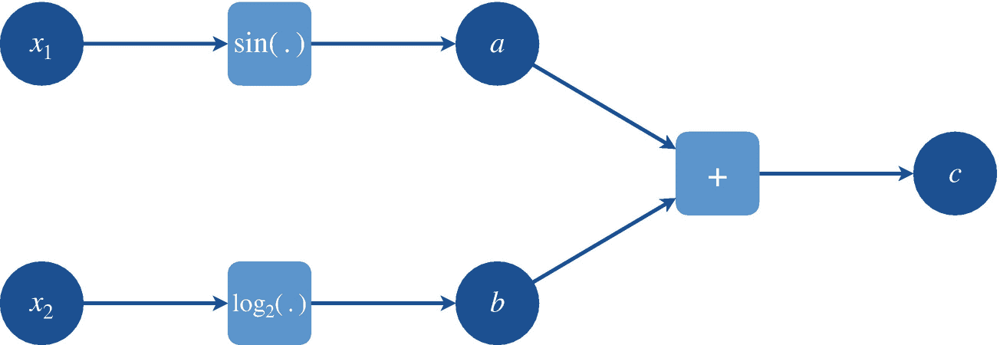

图 3-1

多元函数 f(x <sub>1</sub> ，x<sub>2</sub>)= sin(x<sub>1</sub>)+log<sub>2</sub>(x<sub>2</sub>)的计算图

由于 AD 要求初等函数应该是可微的，因此有导数，我们从图 [3-1](#Fig1) 所示的计算图中列出所有函数开始:

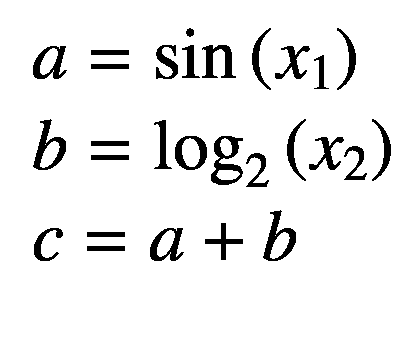

现在我们列出它们的导数如下:


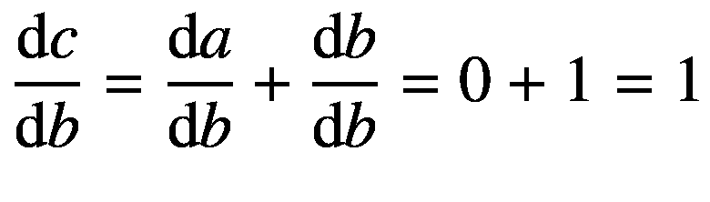


图 3-2

任意向量复合函数 g ∘ f(x)的计算图。

现在，我们将使用链式法则中的这些导数来寻找复合函数*f*(*x*T4】1，*x*T8】2)相对于前向和反向模式 ADs 中的每个输入变量的偏导数，如下所述。我们演示寻找偏导数∂*c*/∂*x*t14】2 的正向模式以及∂*c*/∂*x*t20】1 和∂*c*/∂*x*t26】2 的反向模式。对于正向模式，我们用撇号表示每个变量的偏导数，例如*a*′=∂*a*/∂*x*t34】2(也叫*正切*)。对于反向模式，我们用一个横杠表示每个输出变量 *c* 的偏导数，例如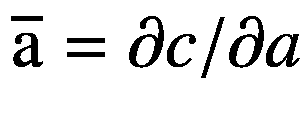(也叫*伴随*)。

#### 3.3.2.1 前进模式

在正向模式中，我们执行正向原始(数值程序)和正向切线追踪(数值程序的衍生物)。我们将输入值( *x* <sub>1</sub> 、 *x* <sub>2</sub> )传递给函数 *f* ( *x* <sub>1</sub> 、 *x* <sub>2</sub> )并开始跟踪正向原始程序，存储中间值 *a* 、 *b* 和 *c* 。通过相应的原始追踪步骤，我们也追踪相应变量的正切值。在开始追踪之前，我们将特定输入变量相对于自身的导数设置为 1，将其他变量相对于该变量的导数设置为 0。

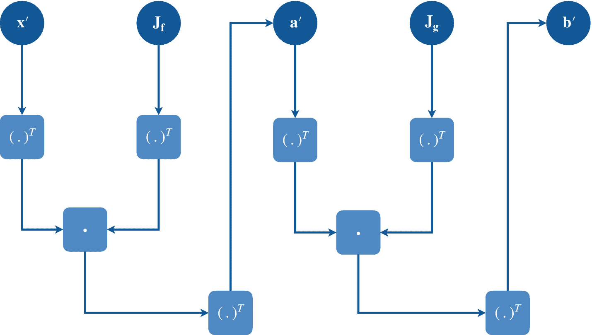

图 3-3

任意向量复合函数 g ∘ f (x)的前向模式算法微分计算图。

表 3-1

前向模式算法微分的计算轨迹。

<colgroup><col class="tcol1 align-left"> <col class="tcol2 align-left"></colgroup> 
| 

正向原始迹线

 | 

正向切线迹线

 |
| --- | --- |
| 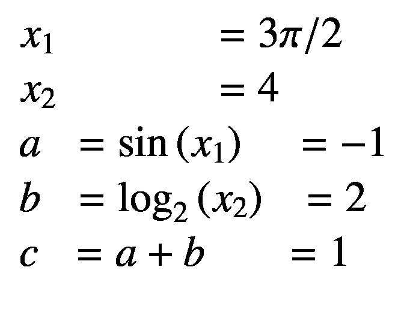 |  |

请注意，链规则中使用了初等函数的现有导数，从输入变量开始，计算输出变量相对于输入变量的偏导数。这里，我们得到∂*c*/∂*x*T4】2=*c*′= 0.25。

前向模式广告中的“前向”一词来源于这样一个事实，即我们依次计算输入变量、中间变量、然后输出变量相对于输入变量的切线。前向模式 AD 也称为*前推 AD* ，因为我们使用链式法则将输入变量的导数推向输出变量。

现在考虑两个任意向量函数**f**:ℝ<sup>*m*</sup>→ℝ<sup>*n*</sup>和**g**:ℝ<sup>*n*</sup>→ℝ<sup>*o*</sup>和输入向量变量**x**∈ℝ<sup>1×*m*</sup>(我们将其表示为 a 这里我们感兴趣的是复合函数 **g** ∘ **f** ，如图 [3-2](#Fig2) 所示。因为这些函数由初等函数组成，类似于前面的多元函数的例子，我们已经将它们的偏导数存储在它们各自的雅可比矩阵中，即**j**<sub>**f**</sub>∈ℝ<sup>*m×n*</sup>和**j**<sub>**g**</sub>∈ℝ<sup>*n×o*</sup>现在，我们执行正向原始追踪，如下所示:

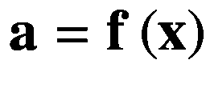

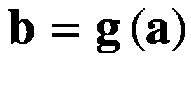

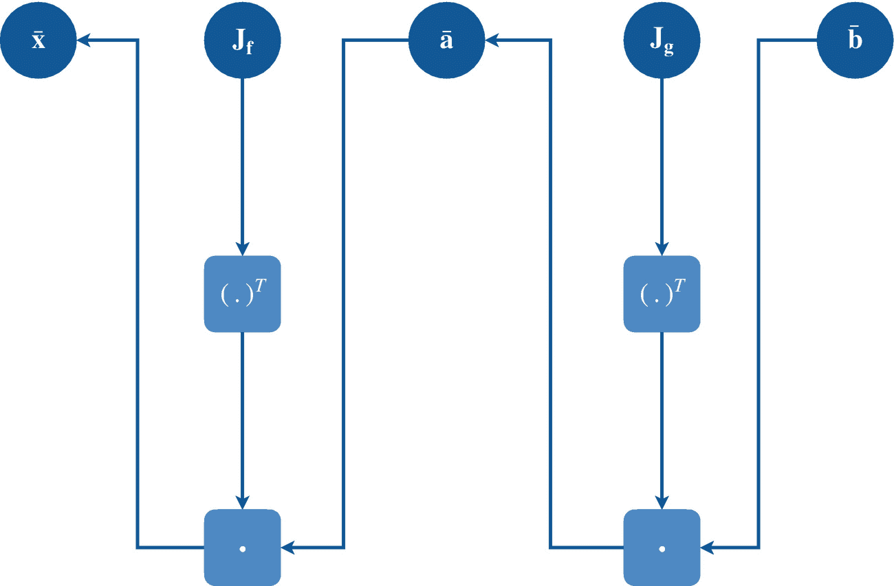

图 3-4

任意向量复合函数 g ∘ f (x)的逆向算法微分计算图。

这里我们有中间变量 **a** ∈ ℝ <sup>*1×n*</sup> 和输出变量 **b** ∈ ℝ <sup>1 *×o*</sup> 。我们将设置 d **x** /d **x** ，这是一个 1 × *m* 矩阵，表示为**x**’,只有一个元素设置为等于 1。我们现在可以执行正向切线追踪(如图 [3-3](#Fig3) 所示)如下:


这里，我们有中间变量的导数**a**′∈ℝ<sup>1×*n*t5】和输出变量的导数**b**′∈ℝ<sup>1×*o*</sup>，它们与它们的前向原始追踪变量对应项具有相同的维数。因为 we 矩阵相乘，用算子、雅可比和向量(表示为矩阵)表示，前向模式 AD 可以表示为*雅可比向量乘积* (JVP)的链式应用。</sup>

当我们在点**a**′，即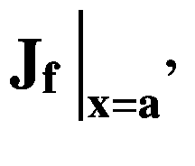处对**J**<sub>T3】fT5】求值时，其中**a**′中只有一个变量等于 1，而其余的都是零，这需要 *n* 个计算步骤来使用前向模式方法找到所有输出变量相对于单个输入变量的偏导数；因此，其复杂程度的顺序是 *𝒪* ( *n* )。在特殊情况下，当我们有 *m* = 1 并且 *n* ≥ 1 时，雅可比矩阵可以一步计算出来。但是当*n*T25】T23】m 时，我们使用另一种技术进行快速计算，如下所述。</sub>

#### 3.3.2.2 反向模式

在反向模式中，我们执行正向原始(数值程序)和反向伴随追踪(数值程序的衍生物)。与正向模式不同，在正向模式中，我们并排计算原始和切线跟踪，反向模式 AD 是一个两步过程。这里，我们首先执行正向原始追踪，然后在第二步中执行反向伴随追踪。第一步，也称为*正向传递*，我们将输入值( *x* <sub>1</sub> ， *x* <sub>2</sub> )传递给函数*f*(*x*<sub>1</sub>， *x* <sub>2</sub> )并开始跟踪正向原始程序，存储中间值 *a* ，*第二步，也称为*向后传递*，我们从输出变量开始向输入变量追踪变量的伴随值。在开始跟踪之前，我们将标量输出变量相对于自身的导数设置为 1。*

表 3-2

反向模式算法微分的计算轨迹

<colgroup><col class="tcol1 align-left"> <col class="tcol2 align-left"></colgroup> 
| 

正向原始迹线

 | 

反向伴随迹

 |
| --- | --- |
| 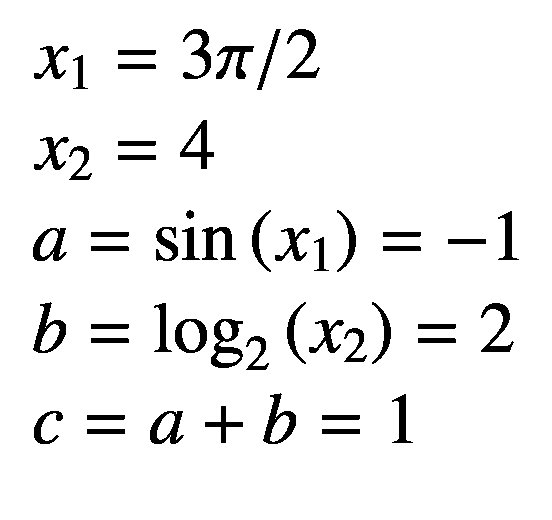 | 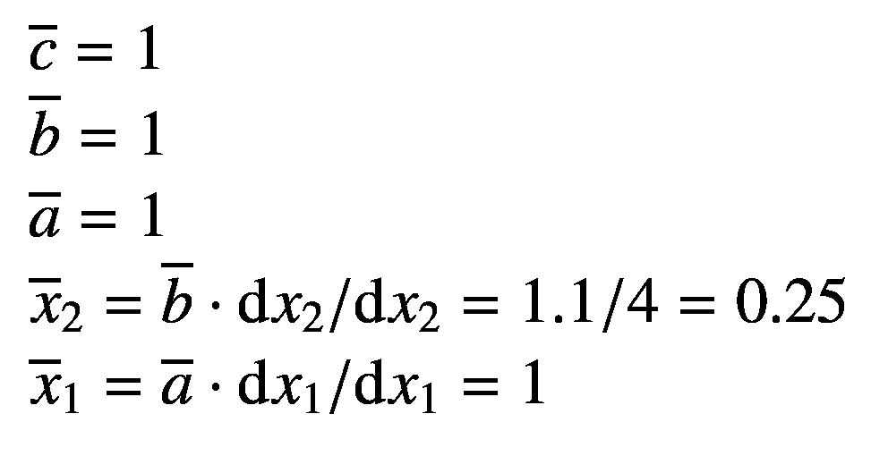 |

在这里，我们得到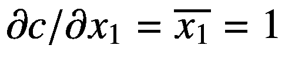和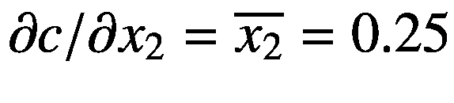。

反向模式 AD 中的“反向”一词来源于我们依次计算输出变量相对于输出变量、中间变量、然后是输入变量的偏导数。反向模式 AD 也称为*拉回 AD* ，因为我们使用链式法则将输出变量的导数拉向输入变量。

从前面的前向模式 AD 讨论中，我们考虑关于向量函数 **f** 和 **g** 及其雅可比矩阵 **J** <sub>**f**</sub> 和 **J** <sub>**g**</sub> 的相同假设。然后我们执行正向原始追踪(如图 [3-4](#Fig4) 所示),如下所示:


这里，我们又有了中间变量 **a** ∈ ℝ <sup>1× *n*</sup> 和输出变量 **b** ∈ ℝ <sup>1× *o*</sup> 。我们将设置 d **b** /d **b** ，它是一个 1 × *o* 矩阵，表示为，只有一个元素设置为等于 1。我们现在可以如下执行反向伴随追踪:

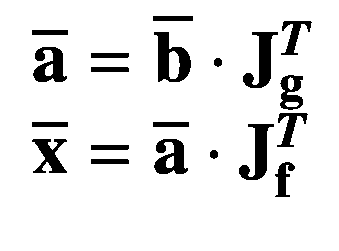

这里，我们有关于中间变量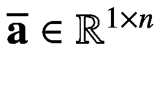和输入变量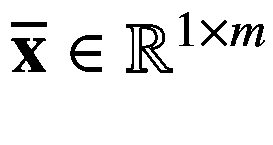的输出导数，它们与它们的前向原始追踪变量对应变量具有相同的维数。因为我们将向量和雅可比矩阵相乘，所以反向模式 AD 可以表示为*向量-雅可比乘积* (VJP)的链式应用。

当我们在点评估 **J** <sub>** g **</sub> 时，即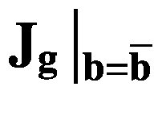处，其中中只有一个变量等于 1，其余的都是零，这需要 *m* 个计算步骤，以使用逆向模式方法找到所有输出变量相对于所有中间和输入变量的偏导数；所以它的复杂程度顺序是 *𝒪* ( *m* )。在特殊情况下，当我们有 *m* = 1 并且 *n* ≥ 1 时，雅可比矩阵可以一步计算出来。

当我们在下一章研究神经网络时，我们将看到神经网络的梯度计算总是这种特殊情况，因为损失函数发出标量值。这就是为什么今天的深度学习库只实现反向模式 AD 的主要原因(尽管 Swift 实现了正向和反向模式，这使它成为一种更通用的语言，可以应用于除深度学习之外的其他各种领域)，因为输出标量相对于所有中间和输入变量的梯度可以在一次反向传递中计算出来。在本书中，我们还关注使用 Swift 的反向模式 AD 功能(第 3.4.9 小节)。

### 3.3.3 实施方法

这里我们讨论两种实现 AD 的方法，即操作符重载(OO)和源代码转换(SCT)。

#### 3.3.3.1 运算符重载

通过为数字自定义类型定义高级操作符(参见 3.4.8 小节)，也称为操作符重载(OO)，可以很容易地实现算法差异。一些 Python 库如 autograded(Maclaurin 等人，2015；Maclaurin，2016)、<sup>[5](#Fn6)</sup>py torch(Paszke et Al .，2017，2019)、<sup>[6](#Fn7)</sup>python IC tensor flow(Abadi et Al .，2016)、<sup>[7](#Fn8)</sup>Keras(Chollet et Al .，2015)、<sup>[8](#Fn9)</sup>Theano(Al-Rfou et Al .，2016)、这些被称为嵌入式(他们的宿主语言是 Python) *特定领域语言*(DSL)，因为它们解决了特定领域的问题(这里是深度学习)，并且作为库分发。

清单 [3-1](#PC1) 中的代码给出了一个简单的例子(改编自(Wei et al .，2018))使用双数实现 Swift 前向模式算法微分的运算符重载，用于计算给定表达式的导数。

```py
struct DualNumber<T: FloatingPoint> {
  var value: T
  var derivative: T
}

extension DualNumber {
  /// Applies sum rule
  static func + (left: Self, right: Self) -> Self {
    DualNumber(
      value: left.value + right.value,
      derivative: left.derivative + right.derivative)
  }
  /// Applies sum rule
  static func - (left: Self, right: Self) -> Self {
    DualNumber(
      value: left.value - right.value,
      derivative: left.derivative - right.derivative)
  }
  /// Applies product rule
  static func * (left: Self, right: Self) -> Self {
    DualNumber(
      value: left.value * right.value,
      derivative: left.derivative * right.value +
                  left.value * right.derivative)
  }
  /// Applies quotient rule
  static func / (left: Self, right: Self) -> Self {
    DualNumber(
      value: left.value / right.value,
      derivative: (left.derivative * right.value -
                   left.value * right.derivative) /
                   (right.value * right.value))
  }
}

let x = DualNumber(value: 3, derivative: 1)
let expression = x*x*x + x
print("expression value: \(expression.value)")
print("expression derivative: \(expression.derivative)")

Listing 3-1Demonstrate operator-overloaded forward-mode algorithmic differentiation using dual numbers

```

**输出**

```py
expression value: 30.0
expression derivative: 28.0

```

我们声明了一个包含两个存储属性的`DualNumber`结构，这两个属性是符合`FloatingPoint`协议的`T`类型的`value`和`derivative,`。然后`DualNumber`扩展到包括各种高级运算符，如加、减、乘、除。每个函数都返回一个包含`value`和`derivative`的`DualNumber`实例。这里，加法和减法、乘法和除法分别使用和、积和商的微分规则来初始化要返回的`DualNumber`实例的`derivative`属性。

然后我们用 3 的`value`和 1 的`derivative`初始化`DualNumber`文字`x`。这里设置`derivative`等于 1 意味着`x`相对于自身的导数等于 1。我们声明了计算*x*<sup>3</sup>+*x*的`expression`文字，其相对于`x`的导数为 3 *x* <sup>2</sup> + 1。当我们访问`derivative`属性时，我们得到了`value` 3 * 3 <sup>2</sup> + 1 = 28。

注意，任何 DSL 的局限性在于，它受限于只能实现 AD 的一种模式，即正向或反向模式。但是编译器级别的代码转换，如 Swift 语言，让我们实现这两者。

#### 3.3.3.2 源代码转换

实现 AD 的一个更好的方法是执行程序的编译器级源代码转换(SCT ),这允许在语言本身中实现*正向和反向模式！程序员可以简单地调用 API 来区分使用正向或反向模式的函数。SCT 在编译过程中为在编译器级别执行优化提供了更多的控制，以实现快速区分。*

一个 SCT 优化示例如下。在数值执行跟踪期间，考虑一个条件语句(在每个条件传递中包含不同的数值计算)。在正向正切或反向伴随跟踪期间，DSL 将需要跟踪这些条件中的每一个，以形成计算图来优化程序执行性能。如果有 *c* 条条件语句，那么就需要运行跟踪 *c* 次；现在，如果您还考虑控制转移语句，那么将需要更多的跟踪。相比之下，编译器级 SCT 可以考虑 Swift 的每个特性，并在编译过程中优化所有可能的情况。这将只需要跟踪一次来累积变量值，并且偏导数将被快速计算。

SCT 正是 Swift 解决上述技术缺点的方法。尽管讨论 SCT 超出了本书的范围，但我们确实讨论了 Swift 中可用的各种差异化 API(第 3.4.9 小节)。但在此之前，让我们在接下来的章节中熟悉一下 Swift 语言本身。

## 3.4 Swift 语言

在本节中，我们将通过 Swift 语言的足够多的功能来理解书中的机器学习程序。熟悉 Python 或 C++的有经验的程序员会发现 Swift 语法很容易掌握。对于初级程序员来说，Swift 代码感觉像是在读英文句子，因此代码语句背后的意图变得直观易懂。除了简单的语法之外，Swift 还是一种快速、跨平台、编译和类型安全的语言，具有诸如泛型、回溯建模、协议、可选等现代特性。涵盖 Swift 的所有特性超出了本书的范围。苹果在线提供的神奇 Swift 图书 <sup>[10](#Fn11)</sup> 将对对 Swift 其他功能感兴趣的读者很有帮助。

我们从简单的值开始(第 3.4.1 小节)，然后看看如何在 Swift 中使用各种集合类型(第 3.4.2 小节)。3.4.3 小节介绍了控制流语句。第 3.4.4 节讨论了 Swift 中的三种功能形式。然后我们引入自定义类型(3.4.5 小节)。第 3.4.6 小节讨论了 Swift 的一些强大而现代的功能。第 3.4.7 小节展示了如何轻松处理 Swift 中的错误。3.4.8 小节介绍了类型的自定义运算符。最后，我们在第 3.4.9 小节中介绍了 Swift 的算法差异化功能，以此结束本节。

### 价值观

在 Swift 中，您分别使用关键字`var`或`let`将实例声明为变量或常量。您可以在程序执行期间更改变量实例的值，而常量实例的值不能更改。

遵循 Swift 约定，您应该用小写字母 camel 声明一个实例。

```py
var firstNumber = 10
let pi = 3.14159
var secondNumber: Float = 123.456

Listing 3-2Declare instances containing simple values

```

这里，`firstNumber`被推断为类型`Int`。前面代码中声明的常量`pi`被推断为`Double`类型，因为它包含十进制值。在某些情况下，您可能需要声明一个浮点数。在这种情况下，只需提供`Float`作为变量的类型信息。您还可以使用`type(of:)`功能验证每个实例的类型。

```py
print("firstNumber: \(type(of: firstNumber))")
print("pi: \(type(of: pi))")
print("secondNumber: \(type(of: secondNumber))")

Listing 3-3Check the type of instance

```

**输出**

```py
firstNumber: Int
pi: Double
secondNumber: Float

```

类型信息是从分配给实例的值中自动推断出来的。在其他情况下，您可以通过编写类型名称，后跟由冒号分隔的实例来提供类型信息。

这是一个很好的例子，表明在 Swift 中阅读代码语句就像阅读英语句子一样。Swift 简单的语法让新手学习编程变得很容易。

在某些情况下，实例可能不包含值。为了表示实例的这种状态，Swift 提供了可选值，这些值要么包含一个值，要么不包含任何由`nil`表示的值。若要定义可选的，请在声明期间提供类型信息，后跟一个问号(？)不带任何空格。

```py
var optionalInt: Int? = 5
if let value = optionalInt {
  print("optionalInt has value: \(value)")
}

Listing 3-4Declare an optional-type instance

```

**输出**

```py
optionalInt has value: 5

```

这里，`optionalInt`是值为 5 的类型`Int?`。它本来可以包含`nil`，因为它是可选的。然后，`if let`语句提取并绑定`value`常量中的值，供`if`语句的代码块使用。这叫做*可选绑定*。

您还可以定义 computed 属性，该属性计算值而不是存储值。计算的属性必须始终声明为变量实例。参见清单 [3-24](#PC43) 中的示例。

### 3.4.2 集合

您可以在 Swift 中声明三种集合，即数组、集合和字典。集合是一种通用结构，在无法推断类型信息的情况下，您必须为其提供类型信息。每个集合类型都符合`Sequence`协议，该协议允许您迭代它的元素。

#### 3.4.2.1 阵列

数组是元素的有序集合。你访问一个元素，它的下标代表它在数组中的位置。在 Swift 中，数组是零索引的，也就是说，数组的第一个元素的位置是零，第二个元素的位置是一，依此类推。

```py
let deepLearningPioneers = ["Geoffrey Hinton", "Yoshua Bengio",
"Yann LeCun", "Jürgen Schmidhuber"]
for name in deepLearningPioneers {
  print(name)
}

Listing 3-5Iterate over an array instance

```

**输出**

```py
Geoffrey Hinton
Yoshua Bengio
Yann LeCun
Jürgen Schmidhuber

```

还可以用`enumerated()`实例方法访问每个元素的索引位置。清单 [3-6](#PC10) 中的代码对数组进行排序和枚举。

```py
for (index, name) in deepLearningPioneers.sorted().enumerated() {
  print("\(index). \(name)")
}

Listing 3-6Access each element with its index in a sorted array

```

**输出**

```py
0\. Geoffrey Hinton
1\. Jürgen Schmidhuber
2\. Yann LeCun
3\. Yoshua Bengio

```

#### 3.4.2.2 集

集合是唯一元素的无序集合。在声明中，指定实例属于`Set`类型。您可以执行数学集合运算。集合也有一些类似于标准库中数组的方法。

```py
let oddNumbers: Set<Int> = [1, 3, 5, 7, 9]
let evenNumbers: Set = [0, 2, 4, 6, 8]
let wholeNumbers = oddNumbers.union(evenNumbers).sorted()
print("wholeNumbers: \(wholeNumbers)")
print("Even and odd numbers are subset of whole numbers: \(evenNumbers.union(oddNumbers).isSubset(of: wholeNumbers) ? "✓" : "⨯")")

Listing 3-7Set operations on even, odd, and whole numbers

```

**输出**

偶数和奇数是整数的子集

您可以定义一个集合，该集合的`Set`类型后跟一个尖括号中的类型信息，例如`Set<Int>`，因为`Set`是一个通用结构类型。但是如果信息可用，您可以省略类型信息。尽管集合是无序的，但是您可以使用`sorted()`实例方法对它们进行排序。注意这里三元运算符的用法写为`condition ? result1 : result2`。如果条件为真，则返回`result1`，否则返回`result2`。在这里，偶数和奇数的并集是整数的子集，这是一个 true 语句，因此返回`"``"`。

#### 3.4.2.3 词典

字典是无序元素的集合，其中每个元素都是一个键和值对。通过在实例中使用键作为下标来访问值。

```py
let wheelsCount = ["unicycle": 1, "bicycle": 2, "rickshaw": 3, "car": 4]
print("A rickshaw has \(wheelsCount["rickshaw"]!) wheel(s).")

Listing 3-8Define a dictionary and access its value

```

**输出**

```py
A rickshaw has 3 wheel(s).

```

注意，我们在访问人力车的轮数时使用感叹号。返回一个可选值，因为字典中可能不存在某个键。使用感叹号来访问可选值被称为*强制展开*。请注意，这可能会失败，所以在您不确定字典中是否存在键的情况下，请尝试使用可选绑定，如下所示。

```py
if let unicycle = wheelsCount["unicycle"] {
  print("A unicycle has \(unicycle) wheel(s).")
}

Listing 3-9Safely access a dictionary value with optional binding

```

**输出**

```py
A unicycle has 1 wheel(s).

```

前面代码中使用的`if`条件语句是下面讨论的许多其他控制流的一部分。

### 控制流程

Swift 提供各种控制流语句。您可以使用三种循环来遍历一系列语句。条件语句允许您根据条件的真实性执行特定的语句。还可以使用控制转移语句将执行控制转移给某些语句。

#### 3.4.3.1 环线

Swift 有三种循环，分别是`for-in`循环、`while`循环、`repeat-while`循环。每一个都有其重要性，如下所述。

`for-in`循环允许您迭代地访问集合实例中的每个元素。您还可以在迭代期间通过调用集合上的`enumerated()`实例方法来访问每个元素的索引。

```py
for value in 1...5 {
  print("5 x \(value) = \(5 * value)")
}

Listing 3-10Declare a for-in loop to iterate over a range of values

```

**输出**

```py
5 x 1 = 5
5 x 2 = 10
5 x 3 = 15
5 x 4 = 20
5 x 5 = 25

```

这个例子简单地在从 1 到 5 的范围内迭代。您可以使用`1..<5`语法排除范围中的最后一个数字(5)。

```py
let fruits = ["Apple", "Banana", "Orange", "Watermelon"]
let colors = ["red", "yellow", "orange", "green"]
for (fruit, color) in zip(fruits, colors) {
  print("\(fruit) has \(color) color.")
}

Listing 3-11Access corresponding elements of two arrays simultaneously

```

**输出**

```py
Apple has red color.
Banana has yellow color.
Orange has orange color.
Watermelon has green color.

```

将`zip(_:_:)`函数与符合`Sequence`的两个实例一起使用，可以在相应的索引位置访问每个实例中的元素。这里，`"Apple"`和`"red"`分别处于`fruits`和`colors`的零位。运行`for-in`循环在第一次迭代中访问这两个文件，并打印“苹果有红色。”类似地，为每个对应的元素对打印其他句子。

`for-in`循环适用于在一个范围或`Sequence`的一致性实例上迭代的情况。但是当迭代次数未知时，while 循环会很有帮助。While 循环只是在条件为真时运行一段代码，否则终止。while 循环有两种，即`while`循环和`repeat-while`循环。

`while`循环在开始时检查条件，并重复一组语句，直到条件变为假。相反，除了不需要条件检查的第一遍以外，当所有遍的条件都为真时，`repeat-while`循环执行一组语句。

```py
var a = 5
while a > 0 {
  print(a, terminator: " ")
  a -= 1
}

Listing 3-12Demonstrate the while loop

```

**输出**

```py
5 4 3 2 1

```

这里，`while`循环在开始时检查`a`的值是否大于零。如果该条件为真，则执行花括号中的语句。但是当`a`的值变得等于或小于零时，循环终止，将控制返回到右花括号后的代码，如果有的话。

```py
var b = 0
repeat {
  print(b, terminator: " ")
  b += 1
  if b > 6 { break }
} while b > 0

Listing 3-13Demonstrate the repeat-while loop

```

**输出**

```py
1 2 3 4 5

```

在前面的`repeat-while`循环中，花括号之间的一组语句在第一次循环中执行。它首先用终止字符`" "`而不是`"\n"`(回车符，将光标移动到换行符)打印出`b`的值，然后通过给`b`加 1 来更新它的值。最后，如果`b`的值超过 6，它就中断循环。这是循环终止条件。运行这些语句一次后，检查条件`b`是否大于零，以再次执行循环。注意`while`循环可能无限执行一系列语句，您必须提供一个终止条件，就像我们在前面的代码中提供的那样(循环内部)。

#### 3.4.3.2 条件语句

Swift 支持两种条件语句，即`if`和`switch`。

在`if`语句中，如果条件为真，则执行一段代码。此外，如果您的`if`条件为假，您可以定义一个要执行的`else`代码块。如果您想检查一个以上的成功条件，您还可以在`if`和`else`代码块之间提供一个`else if`语句，因为它不能在一个`if`语句中用逗号分隔。

```py
let marks = 75
if marks < 60 {
  print("Poor")
} else if marks >= 60 && marks <= 80 {
  print("Average")
} else {
  print("Excellent")
}

Listing 3-14Demonstrate an if-else statement

```

**输出**

```py
Average

```

这个例子展示了如何将`if`条件语句与`else`和`else if`语句结合起来，对代码执行进行细粒度控制。因为`marks`在 60 和 80 的范围内，所以这段代码打印“平均值”

另一个有用的条件语句是`switch`。`switch`语句用于比较单个实例和多个可能的值。

```py
switch marks {
case let x where x < 60:
  print("Poor")
case 60...80:
  print("Average")
  fallthrough
default:
  print("Excellent")
}

Listing 3-15Demonstrate the switch statement

```

**输出**

```py
Average
Excellent

```

这里，`switch`语句将单个变量与许多可能的情况进行比较。注意如何使用`let`或`var`关键字定义一个局部变量或常量，并在那里比较它的值。您还可以检查位于特定区间的值。在`switch`语句中，`default`充当`if`语句中的`else`块。如果你的`switch`陈述不够详尽，就必须包括在内。当任何第一次遇到的情况被匹配并且其代码被执行时，程序的控制被转移到`switch`语句的右花括号之后的代码行。但是如果您想执行后续的 case 代码，而不管它是否与值匹配，您可以使用`fallthrough`控制转移语句。如果这个例子中没有包含`fallthrough`，那么它将只打印“Average”`fallthrough`语句模仿 C 和 C++语言中`switch`条件语句的行为。

#### 3.4.3.3 控制转移报表

Swift 提供了五种控制转移语句，即`continue`、`break`、`return`、`fallthrough`和`throw`。下面的错误处理中讨论了`throw`语句。和`fallthrough`已经在前面的文本中讨论过。`return`语句与`guard`语句一样用于函数中。您也已经看到了清单 [3-13](#PC23) 中的`break`语句的例子。

这里，我们重点关注循环中使用的`continue`控制转移语句。

```py
let totalSteps = 50
let range = stride(from: 0, to: totalSteps, by: 10)
print("range: \(Array(range))")
for step in range {
  if step == 30 { continue }
  print("step: \(step)")
}

Listing 3-16Use a continue control transfer statement in a for-in loop

```

**输出**

```py
range: [0, 10, 20, 30, 40]
step: 0
step: 10
step: 20
step: 40

```

在这段代码中，`stride(from:to:by:)`函数产生一系列值，从 0 到 40，间隔 10，不包括最后一个值，即 50。通过转换为数组来打印范围，显示它所描述的值。要包含最后一个值，在这个函数中用`through`替换`to`参数。然后`for` `-` `in`循环遍历所有的值，打印每个值，但不是 30。这是通过使用一个`continue`语句完成的，该语句将执行控制转移到下一次迭代的`for` `-` `in`循环的第一条语句，跳过所有后续语句。

#### 3.4.3.4 提前退出

在`guard`语句中，`guard`关键字后面的代码如果是条件就必须为真，或者如果是可选的就必须包含一个值，以便执行`guard`语句后面的代码。在可选绑定的情况下，实例在出现`guard`语句的代码中是可用的，以供进一步使用。但是如果失败，那么执行`else`代码块中的代码。这个`else`块还必须包含一些控制转移语句，将控制转移到编写`guard`语句的代码块之外。

```py
func welcome(language: [String: String]) {
  guard let name = language["name"] else {
    print("Welcome!")
    return
  }
  print("Welcome \(name)!")
}
welcome(language: [:])
welcome(language: ["name": "Swift"])

Listing 3-17Demonstrate the usage of the guard statement

```

**输出**

```py
Welcome!
Welcome Swift!

```

这里，`welcome(language:)`函数以一个字典作为参数。然后，`guard`语句试图从字典中提取`"name"`键的值。如果字典中没有`"name"`键，可选绑定可能会失败。在这种情况下，`else`代码块被执行，它简单地向控制台打印一条`"Welcome!"`消息。但是当该值存在时，它被存储在一个名称常量中，该常量用于打印更精细的消息。这个例子使用了一个函数特性，这将在下面详细讨论。

### 3.4.4 关闭和功能

在 Swift 中，闭包是功能的代码块，可以在程序的不同部分重用。说得更清楚一点，Swift 提供了三种闭包，function 是其中之一:

1.  *全局函数*是命名闭包，可以通过用它们的名字显式引用它们来调用。

2.  *嵌套函数*是在另一个函数中声明的命名闭包。

3.  *闭包表达式*是一个未命名的功能块，无论在哪里声明，它都会被隐式执行。

调用一个函数意味着通过引用该函数的名称来执行写在该函数内部的代码语句。

#### 3.4.4.1 全球职能

定义一个全局函数，用关键字`func`后跟名字，圆括号中的参数列表，花括号中的函数体包含函数的功能。

```py
enum Vehicle {
  case car, train
}
func drive(vehicle: Vehicle) -> String {
  switch vehicle {
    case .car:
      return "Vroom vroom!"
    case .train:
      return "Choo choo!"
  }
}
let sound = drive(vehicle: .car)
print(sound)
print(type(of: drive))

Listing 3-18Declare a global function

```

**输出**

```py
Vroom vroom!
(Vehicle) -> String

```

前面的函数`drive(vehicle:)`接受一个`Vehicle`枚举类型的车辆参数(稍后讨论),表示两辆车辆。基于`vehicle`值，它返回一个字符串，代表它在驾驶时发出的声音。最后，我们打印出`sound`。

在 Swift 中，每个函数都是一个引用类型。Swift 中只有类和函数是引用类型。这里，`drive(vehicle:)`是类型`(Vehicle) -> String`的函数。你可以理解为“名为`drive`的函数接受一个`Vehicle`类型的参数值并返回一个`String`值。”使用`type(of:)`功能打印该功能的类型，确认该功能的类型。

#### 3.4.4.2 嵌套函数

嵌套函数是在另一个函数内部声明的函数。

```py
func outerFunction() -> () -> Int {
  func innerFunction() -> Int {
    print("Running inner function.")
    return 0
  }
  print("Running outer function.")
  return innerFunction
}
let someInnerFunction = outerFunction()
print("someInnerFunction type: \(type(of: someInnerFunction))")
let someInt = someInnerFunction()
print("someInt: \(someInt)")

Listing 3-19Declare a nested function

```

**输出**

```py
Running outer function.
someInnerFunction type: () -> Int
Running inner function.
someInt: 0

```

`outerFunction()`的类型是`() -> () -> Int`，它不接受任何参数，返回一个`() -> Int`类型的函数。嵌套函数`innerFunction()`的类型为`() -> Int`，返回 0。在返回前面的`innerFunction()`之前，调用`outerFunction()`只会在外部函数中打印一条语句。`someInnerFunction()`中的变量是`innerFunction()`，当被调用时，在其中打印一条语句并返回 0，然后存储在`someInt`中。

#### 3.4.4.3 闭包表达式

闭包表达式是简单但功能强大的无名函数代码块。闭包写在一组左花括号和右花括号内。Closure 就像一个命名函数一样接受圆括号中的参数，并表示右箭头后面的返回类型。闭包的主体写在关键字`in`之后。稍后，我们将经常使用闭包表达式来计算损失函数相对于神经网络的梯度。

```py
let isPositive = { (_ x: Float) -> Bool in
  return x > 0
}
print(isPositive(-5))

Listing 3-20Declare a closure to return Bool representing an integer’s positivity

```

**输出**

```py
false

```

这里，闭包有类型`(Float) -> Bool`，也就是说，它接受一个`Int`并返回一个`Bool`。跟在`in`关键字后面的主体计算操作并返回结果。这个闭包向`isPositive(_:)`实例返回一个函数，稍后调用这个函数来检查-5 是否为正数，并正确地打印出它不是正数。

```py
func isEven(_ x: Int, also hasProperty: (Int) -> Bool) -> Bool {
  x % 2 == 0 && hasProperty(x)
}
let number = 2
let isEvenAndPositive = isEven(number, also: isPositive)
print(isEvenAndPositive)
let isEvenAndFibonacciNumber = isEven(number) { number in
  fibonacciNumbers.contains(number)
}
print(isEvenAndFibonacciNumber)

Listing 3-21Demonstrate trailing closures

```

**输出**

```py
true
true

```

函数`isEven(_:also:)`接受一个数字和一个表示该数字第二个属性的闭包`also`。将数字 2 和`isPositive`函数传递给`isEven(_:also:)`会返回 true，表示 2 是一个正整数。数组`fibonacciNumbers`在清单 [3-31](#PC56) 中声明。

当闭包是函数的最后一个参数时，为了简单起见，可以去掉它的参数标签和函数调用的圆括号，只在开始和结束的花括号中写闭包。这被称为*尾随闭包*。为了给`isEven(_:also:)`提供一个自定义闭包，我们只需编写一个闭包，它返回一个布尔值，表明斐波那契数列中存在一个数字。在我们的例子中，2 是偶数，也包含在斐波那契数列中，所以它返回 true。

闭包要强大得多，解释它们的所有特性超出了本书的范围。例如，Swift 还有*多个尾随闭包*，允许你写多个闭包作为函数参数的尾随闭包。我们建议您参考在线提供的 Swift 官方书籍，以深入了解 closures 和许多其他功能。

### 自定义类型

您还可以在 Swift 中声明称为*自定义类型*的新类型。它可以是任何枚举、结构和类类型。枚举和结构是值类型(复制实例)，类是引用类型(只引用实例，不复制实例)。每种类型在不同的情况下都很有用。

遵循命名惯例，您应使用大写字母 camel 来声明类型，以便与 Swift 标准库中已定义的其他类型保持一致。

#### 3.4.5.1 枚举

枚举允许您定义一组彼此具有相似关系的类型。例如，您可以定义一个包含一组颜色案例的`Rainbow`枚举。请注意，这些颜色是它们右边的类型。使用`enum`关键字来定义您的枚举。

***清单 3-22*** *声明一个枚举并根据一个实例打印一条语句*

`enum` `Rainbow {`

`case` `violet, indigo, blue, green, yellow, orange, red`

`}`

`// `Rainbow.violet` is similar to the following approach.`

`let` `favoriteColor: Rainbow = .indigo`

`switch` `favoriteColor {`

`case` `.violet:`

`print("\(favoriteColor) has low wavelength and high frequency.")`

`case` `.red:`

`print("\(favoriteColor) has high wavelength and low frequency.")`

`default` `:`

`print("\(favoriteColor) has wavelength and frequency within the range of visible`T1】

`}`

**输出**

`indigo has wavelength and frequency within the range of visible`T1】

我们已经声明了一个名为`Rainbow`的枚举，它包含了彩虹中自然出现的所有主色。`Rainbow`的值是用`case`关键字声明的，它们本身就是独立的值。

通过将实例的值设置为类型为`Rainbow`的`indigo`来声明`favoriteColor`实例。然后，通过对照不同的颜色检查`favoriteColor`的值，打印出合适的语句。注意这里是如何使用点语法的。编译器自动理解在每个`switch`案例中被比较的值是`Rainbow`类型的，所以使用点语法就足够了。

#### 3.4.5.2 结构

结构是程序的基本构造块，它可以包含属性、方法和下标，以便为类型添加功能。结构也可以符合协议并扩展更多的特性。我们将在整本书中广泛使用结构。

清单 [3-23](#PC42) 中的结构代码片段声明了一个`Mammal`结构和一个名为`LivingZone`的嵌套枚举类型。`Mammal`有两个属性，分别是`livingZone`和`legsCount`。这里，`legsCount`是一个可选的整数实例，因为一些哺乳动物可能没有腿，而另一些可能在它们的一生中失去了腿。`livingZone`是`LivingZone`描述哺乳动物生存环境的实例。

```py
struct Mammal {
  enum LivingZone {
    case land, water
  }
  var livingZone: LivingZone
  var legsCount: Int?
}
let human = Mammal(livingZone: .land, legsCount: 2)
let injuredHuman = Mammal(livingZone: .land, legsCount: 0)
let fish = Mammal(livingZone: .water, legsCount: nil)

Listing 3-23Declare a nested structure and initialize its instances

```

我们已经声明了三个名为`human`、`injuredHuman`和`fish`的`Mammal`实例，每个实例都用不同的实例属性值初始化。你可以把`human`的例子理解为“人类生活在陆地上，有两条腿。”同样，`injuredHuman`可以描述为“受伤的人也生活在陆地上，但失去了双腿。”最后，您可以将`fish`实例理解为“鱼生活在水下，生存不需要腿。”

```py
extension Mammal {
  var description: String {
    var text = "Lives \(livingZone == .land ? "on" ? "in") \(livingZone)"
    if let legsCount = legsCount {
      if legsCount == 0 {
        text += " and cannot walk because it has \(legsCount) legs."
      } else if legsCount > 0 {
          text += " and can walk with its \(legsCount) legs."
      }
    } else {
      text += " and swims."
    }
    return text
  }
}
print(human.description)
print(injuredHuman.description)
print(fish.description)

Listing 3-24Extend Mammal to include a curated description

```

**输出**

```py
Lives on land and can walk with its 2 legs.
Lives on land and cannot walk because it has 0 legs.
Lives in water and swims.

```

前面的代码扩展了`Mammal`结构，以包含一个哺乳动物实例的精选描述。看看如何在`description`计算实例属性中修改`text`实例属性，以包含基于`Mammal`实例属性的细化信息。最终打印出来的句子对每个实例进行了有意义的描述。注意如何扩展`Mammal`结构，即使在声明实例之后，仍然允许那些实例使用扩展的功能；这适用于 Swift 中的所有自定义类型。

也可以将类型实例作为函数调用。在我们的例子中，这种*函数编程*方法使得在神经网络中执行前向传递变得很方便。您可以通过在自定义类型中声明一个带有任意数量参数的`callAsFunction()`来实现。我们将在后面章节描述神经网络模型的结构中声明这个函数。

但是有时您可能需要做的不仅仅是创建带有属性、下标和方法的实例。您可能需要从其他类型继承功能，重写某些功能，等等。类在您的类型中提供这样的功能，如下所述。

#### 3.4.5.3 班级

就像结构一样，类也是程序的基本构建块，它可以包含属性、方法和下标，以便为类型添加功能。与结构类似，类也可以符合协议，并可以扩展更多的特性。

除了与结构共享功能之外，类还允许您从其他类继承属性、方法和下标，重写它们，进行类型转换以检查实例的类，取消实例的初始化，以及允许对类实例的多个引用。但是本书并没有讨论所有的特性。我们只浏览对理解书中的深度学习程序很重要的功能。

```py
class Rocket {
  var name: String? = nil
  var vacuumThrust: Int = 0
  var description: String {
    return "\(name ?? "Rocket") has \(vacuumThrust) kN
thrust in vacuum."
  }
  init(name: String? = nil, vacuumThrust: Int = 0) {
    self.name = name
    self.vacuumThrust = vacuumThrust
  }
}
var rocketA = Rocket()
var rocketB = Rocket(name: "ABCRocket")
print(rocketA.description)
print(rocketB.description)

Listing 3-25Declare the Rocket class with stored and computed properties and an initializer

```

**输出**

```py
Rocket has 0 kN thrust in vacuum.
ABCRocket has 0 kN thrust in vacuum.

```

前面的代码声明了一个包含两个存储属性和一个计算属性的基类`Rocket`。基于名称和火箭在太空中施加的推力，生成描述。我们声明两个`Rocket`实例并打印它们的描述。

注意，如果存储的属性不包含初始值，类不会自动获得初始化器(以`init`关键字开始的代码块)的实现，初始化器必须由您提供。

```py
final class CargoRocket: Rocket {
  var payload: Int
  override var description: String {
    return "\(name!) carries \(payload) kg and has \(vacuumThrust) kN thrust in vacuum."
  }
  init(name: String?, vacuumThrust: Int, payload: Int) {
    self.payload = payload
    super.init(name: name, vacuumThrust: vacuumThrust)
  }
}
var falcon9 = CargoRocket(name: "Falcon 9",
vacuumThrust: 8_227, payload: 22_800)
var falconHeavy = CargoRocket(name:
"Falcon Heavy", vacuumThrust: 24_681, payload: 63_800)
print(falcon9.description)
print(falconHeavy.description)

Listing 3-26Inherit features of Rocket and refine to carry payload

```

**输出**

```py
Falcon 9 carries 22800 kg and has 8227 kN thrust in vacuum.
Falcon Heavy carries 63800 kg and has 24681 kN thrust in vacuum.

```

一些火箭比另一些更强大，可以携带更大的有效载荷。这些火箭除了普通火箭的特点之外，还有一个有效载荷的特点。使用这个想法，前面的代码继承了来自`Rocket`的特性，并提供了一个额外的存储属性`payload`。我们还修改了`description`来更详细地描述`CargoRocket`。你必须在这里用`override`关键字标记描述。注意到那个`final`关键词了吗？这意味着这个`CargoRocket`类不允许被任何其他类进一步继承。

我们创建了`CargoRocket`的两个实例，即`falcon9`和`falconHeavy`。每一个都有不同的能力，我们在初始化器中提供了细节。然后通过访问`description` computed 属性将详细信息正确地输出到控制台。

### 3.4.6 现代特征

Swift 还具有现代编程能力，即扩展、协议、泛型和差异化。有了扩展，您可以提供甚至无法访问源代码的类型的实现。协议允许您为一个类型定义一组标准(需求)。实现一个协议的所有需求的类型被称为符合该协议。Swift 提供泛型，使您的代码可用于多种可能的场景。在编译器中构建的对微分的一流支持，让您可以构建可微分的程序，从计算流体动力学(Kutz，2017 年)到机器人手运动(Akkaya 等人，2019 年)，以及深度强化学习。区别特征在第 3.4.9 小节中讨论。

#### 3.4.6.1 扩展公司

扩展允许您通过提供新功能的实现来扩展类型的功能。也可以在 Swift 中做*追溯建模*。换句话说，您可以扩展甚至无法访问源代码的任何类型，例如，Swift 的标准库类型，如 Array 和 Tensor(在 TensorFlow 库中可用),甚至可以扩展其他库中声明的类型，如 Foundation、Vision 等。

```py
extension Int {
  mutating func raised(to power: Self) {
    assert(power > 0, "`power` must be a non-negative integer.")
    if power == 0 {
      self = 1
      return
    }
    var result = 1
    for _ in 1...power {
      result = result * self
    }
    self = result
  }
}
var number = 5
number.raised(to: 3)
print("Now `number` is \(number).")

Listing 3-27Extend Int to mutate its value when raised to some power

```

**输出**

```py
Now `number` is 125.

```

前面的例子扩展了`Int`以包含一个实例方法`raised(to:)`，该方法通过将自身提升到方法调用期间给定的某个`power`值来改变实例的值。该方法被标记为`mutating`，因为`Int`在标准库中被声明为一个结构，而结构是值类型，与引用类型的类不同，它们不能修改自身。我们首先写一个断言，确保`power`不是负数。然后，如果`power`为零，则`if`条件将实例的值设置为等于 1。稍后，一个`for` `-` `in`循环迭代地计算实例提升到`power`的值。最后，一旦计算完成，实例被设置为等于`result`。

扩展能够提供计算属性、方法、下标、初始化器、嵌套类型的实现，甚至使类型符合协议等等。

在第 [6 章](6.html)中，我们将看到如何扩展 TensorFlow 的`Layer`协议，通过与 Python 语言的互操作来定义自定义的检查点写入和读取实例方法。这将展示我们可以利用这些现代而强大的功能侵入 Swift。

#### 3.4.6.2 议定书

大多数程序员通常都熟悉面向对象编程。相比之下，Swift 从诞生之日起就被设计成一种面向协议的语言。因为 Swift 也是面向对象的，我们首先从协议声明开始，然后在合适的场景下使其他类型如枚举、结构和类符合它们。

```py
protocol ProfileProtocol {
  let name: String { get }
  var age: Int { get set }
  var email: Int { get set }
}
struct Person: ProfileProtocol {
  let name: String
  var age: Int
  var email: String
}
var rahulbhalley = Person(name: "Rahul Bhalley", age: 24,
email: "rahulbhalley@icloud.com")

Listing 3-28Declare and use ProfileProtocol

```

这里，`ProfileProtocol`有三个要求，分别是`String`类型的可获取`name`、`Int`类型的可获取可设置`age`和`String`类型的可获取可设置`email`。它要求一致性类型提供它们的实现。`Person`结构通过提供需求的实现来采用`ProfileProtocol`。

您还可以扩展协议来提供实现，而不仅仅是需求信息。这样，符合该协议的类型会自动获得那些实现。

```py
extension ProfileProtocol {
  var details: String { "Name: \(name), age: \(age), email: \(email)" }
}
print(rahulbhalley.details)

Listing 3-29Extend ProfileProtocol to provide common implementation

```

**输出**

```py
Name: Rahul Bhalley, age: 24, email: rahulbhalley@icloud.com

```

现在，符合`ProfileProtocol`的任何类型，包括以前的实现，都可以访问`details`属性。注意，如果函数体、闭包、计算属性或返回某个值的下标中只有一个语句，我们可以去掉 **return** 关键字。

#### 3.4.6.3 仿制药

泛型允许您编写单个代码块，并使用许多不同的可能数据类型执行它。这是被称为*多态性*的面向对象编程的基本原则之一。Swift 语法使得实现和使用通用代码块变得非常容易。在 Swift 中，您可以定义属性、下标、函数、方法甚至枚举、结构和类的泛型。

```py
func swapValues<T>(_ x: inout T, _ y: inout T) {
  let temporaryX = x
  x = y
  y = temporaryX
}
// Swapping String values
var x = "x"
var y = "y"
swapValues(&x, &y)
print("x: \(x) y: \(y)")
// Swapping custom type instance values
swapValues(&falcon9, &falconHeavy)
print(falcon9.description)
print(falconHeavy.description)

Listing 3-30Swap values of two variables of the same type

```

**输出**

```py
x: y, y: x
Falcon Heavy carries 63800 kg and has 24681 kN thrust in vacuum.
Falcon 9 carries 22800 kg and has 8227 kN thrust in vacuum.

```

Swift 已经提供了`swap(_:_:)`函数来交换任意两个相同类型实例的值。但是为了熟悉泛型编程，我们在前面的代码中实现了自己的版本，名为`swapValues(_:_:)`。

这里，`T`是一个*类型占位符*，其类型在使用该函数之前是未知的。当您在函数调用中提供变量时，编译器会推断出该类型。`inout`关键字允许您修改函数体中的参数值，并将这些修改写回外部变量。函数调用中变量前的&符号(`&`)清楚地告诉你，它们的值在函数体内是可变的。请注意，您应该始终用关键字`var`声明这些实例，否则它们将不会变异。您可以将函数声明理解为“声明一个名为`swapValues`的通用函数，带有类型占位符`T`，并带有两个`inout`变量`x`和`y.`

我们已经成功地交换了两个字符串的值，甚至我们自己的结构实例！您可以交换任意两个变量实例的值，只要它们属于同一类型。接下来，我们使用两个泛型类型来描述泛型的更复杂的用法。

```py
func allCommonAndUniqueElements<T: Sequence, U: Sequence>
(_ left: T, _ right: U) -> [T.Element]
where T.Element: Equatable, T.Element == U.Element {
  var result = [T.Element]()
  for leftItem in left {
    for rightItem in right {
      if leftItem == rightItem && !result.contains(leftItem) {
        result.append(leftItem)
      }
    }
  }
  return result
}
let fibonacciNumbers = [0, 1, 1, 2, 3, 5, 8, 13, 21]
let oddNumbers = [1, 3, 5, 7, 9, 11, 13, 15, 17, 19, 21]
let commonNumbers =
allCommonAndUniqueElements(fibonacciNumbers, oddNumbers)
print(commonNumbers)

Listing 3-31Find common and unique elements from two Array<Int> instances

```

**输出**

```py
[1, 3, 5, 13, 21]

```

前面的`allCommonAndUniqueElements(_:_:)`有两个通用类型`T`和`U`，它们都符合`Sequence`协议。`where`子句后的语句声明`T`序列的每个元素必须符合`Equatable`(必须相等)，并且`T`和`U`应该具有相同类型的元素。该函数将分别符合`T`和`U`的`left`和`right`作为参数，返回类型为`T`的元素数组。最后，调用该函数只是查找并返回一组唯一的和常见的元素。

```py
let machineLearning = "machine learning"
let deepLearning = "deep learning"
let commonCharacters =
allCommonAndUniqueElements(machineLearning, deepLearning)
print(commonCharacters)

Listing 3-32Find common and unique elements from two Array<Character> or String instances

```

**输出**

```py
["a", "i", "n", "e", " ", "l", "r", "g"]

```

这个通用函数适用于任何序列实例，并且其元素可以相等。对于`String`实例也是如此，因为它是一个由`Character`组成的数组。

```py
struct Pair<T, U> {
  var x: T
  var y: U
  var description: String { "x: \(x) and y: \(y)" }
}
let pair = Pair(x: "x", y: 5)
print(pair.description)
let anotherPair = Pair<Vehicle,
CargoRocket>(x: .car, y: falconHeavy)
print(type(of: pair))
print(type(of: anotherPair))

Listing 3-33Demonstrate the generic type

```

**输出**

```py
x: x and y: 5
Pair<String, Int>
Pair<Vehicle, CargoRocket>

```

就像泛型函数一样，我们也可以在 Swift 中声明泛型类型，使该类型在各种不同的场景中可重用。这里，`Pair`结构被声明为一个泛型类型，有两个泛型类型`T`和`U`。这两个存储的属性属于不同的泛型类型。两个实例`pair`和`anotherPair`分别用泛型类型`Pair<String, Int>`和`Pair<Vehicle, CargoRocket>`声明。这可以通过打印它们的类型信息来确认。

泛型不仅仅限于结构，还适用于枚举和类。它们可以被视为在 Swift 中实施多态性的一种非常强大的方式。

Swift 的另一个现代而强大的功能是差异化，这将在第 3.4.9 小节中详细讨论。

### 错误处理

错误处理是在容易出错的情况下使程序更加健壮的一种方式。有了错误处理，您可以将程序从崩溃中拯救出来，并通过将错误信息打印到控制台来更清楚地了解错误。Swift 的简单语法有助于使错误处理代码更易于阅读和理解。

在 Swift 中处理错误的一种便捷方法是使用`do-catch`代码块。

```py
enum RequestError: Error {
  case noInternet
  case notFound
  case timeOut
}
func ping(website link: String) throws -> String {
  if link == "Wrong address" {
    throw RequestError.notFound
  } else if link == "No connection" {
    throw RequestError.noInternet
  } else if link == "Request timeout" {
    throw RequestError.timeOut
  }
  return #"Website: "\#(link)" is live."#
}
do {
  let pingResponse = try ping(website: "Wrong address")
  print(pingResponse)
} catch RequestError.noInternet {
  print("Could not connect to the Internet.")
} catch let pingError as RequestError {
  print("Error: \(pingError)")
}

Listing 3-34Respond to possible errors when requesting a web page

```

**输出**

```py
Error: notFound

```

要表示错误，只需让您的自定义类型(这里是`RequestError`)符合`Error`协议。它是一个空协议，仅用于表示错误。枚举类型非常适合 Swift 中的错误表示。

只有函数会抛出错误。在参数列表后面写`throws`关键字，告诉编译器这个函数可以抛出错误。并在可能抛出错误的函数调用前编写`try`关键字。最后，当错误发生时，使用`throw`关键字抛出一个错误，后跟错误，例如`throw` `RequestError.noInternet`。

前面的代码显示了如何在 ping 某个网站失败时抛出错误。可能的错误在`RequestError`枚举中被写成案例。对`do`块中的`ping(website:)`函数的调用需要一个用于 ping 的链接。如果在查验时出现错误，则在`catch`块中抛出一个适当的错误。您应该考虑操作`website`参数标签值，看看为每个值打印了什么错误消息。

这里需要注意的一件有趣的事情是在字符串中使用双引号时使用的散列符号(#)。在字符串双引号之前和之后使用 hash 可以让您在字符串本身内部写双引号。插值的一个附加变化是在反斜杠(\)和左圆括号之间使用了散列符号。

### 高级操作员

Swift 支持在有意义的语法中使用函数轻松实现类型上的自定义运算符。清单 [3-35](#PC64) 是添加两个结构实例的简单例子。

```py
struct Point3D {
  var (x, y, z) = (0.0, 0.0, 0.0)
  var description: String {
    "Coordinates: (\(x), \(y), \(z))"
  }
}
extension Point3D {
  static func + (left: Self, right: Self) -> Self {
    Point3D(x: left.x + right.x, y: left.y + right.y, z: left.z + right.z)
  }
}
var pointA = Point3D(x: 1, y: 2, z: 3)
var pointB = Point3D(x: 4, y: 5, z: 6)
print((pointA + pointB).description)

Listing 3-35Declare a structure and implement an advanced operator

```

**输出**

```py
Coordinates: (5.0, 7.0, 9.0)

```

当你定义自己的结构时，编译器不知道任何数学运算对它意味着什么。在这里，您可以为特定的运算符定义自己的运算，例如，为加号运算符定义加法，如前面的代码所示。这个加号(+)实例方法在添加两个参数的每个元素后返回`Point3D`实例。该操作只是添加了两个`Point3D`实例，这可以通过前面的描述来验证。

通常深度学习中的领域特定语言(DSL)像 python NIC tensor flow(Abadi 等人，2016)，PyTorch (Paszke 等人，2017，2019)，autograd (Maclaurin 等人，2015；Maclaurin，2016)，以及许多其他人在 C++代码库中使用该功能来实现张量运算和自动微分(通常是反向模式)。相比之下，Swift 采取了一种激进的方法来解决这个问题，即在编译器中实施自动微分，以获得最佳性能，并允许静态编译的语言功能和 Swift 的优势。

### 区别

Swift 为算法差异化功能提供一流的支持。区分已经在编译器内部被烘焙，使得 Swift 的类型系统是可区分的。令人惊奇的是，你不必限制你的程序的表达能力，你可以自由地编写控制流语句、循环和递归，程序仍然是可微分的！您用清单 [3-36](#PC66) 中的语句导入 _ Differentiation 库。

```py
import _Differentiation

Listing 3-36Import the _Differentiation library

```

注意库名前面的下划线吗？这意味着该库尚未准备好用于生产(但很快就会准备好)，因此不能用于在 Xcode 中构建应用程序以供分发。但是您可以在 Swift 中使用这个特性来学习、练习和研究差异化编程(甚至深度学习，我们将在后面看到)!如果你是一名应用程序开发人员，那么，在未来，你将能够开发并向你的用户分发不同编程的应用程序。

一旦导入了`_Differentiation`库，您就可以访问所有可用的差异化 API。下面的代码清单期望这个 import 语句在顶部。不可能在一本书中涵盖编程的每个细节。我们建议您参考(魏等，2018)。

#### 3.4.9.1 可微类型

严格地说，只有函数可以微分，因此可以有导数或偏导数。更具体地说，如果一个函数的参数和结果值都是可微的，那么这个函数就是可微的。从程序上来说，这意味着参数和结果类型必须是可微的，因为函数体内部的计算也是可微的。并且这些类型不仅限于 Swift 的类型系统中由`Float`或`Double`类型表示的标量实数。但是它们也可以扩展到任何维度的向量、矩阵或张量数据结构。Swift 使得区分这种定制类型和功能成为可能。

在撰写本文时，Swift 提供了用`Differentiable`协议声明可区分定制类型的语法上最有意义、数学上最合理的方式。

关于 Swift 的类型系统，一个有趣的事实是，诸如`Float`、`Int`、`Double`、`String`、`Dictionary`、`Array`等类型是在 Swift 的标准库中定义的，而不是在 Swift 的编译器中定义的。这允许增加数值计算的类型，并将它们作为语言的一等公民对待。

有不同的数学分支允许对各种类型的参数和结果进行函数微分:

1.  初等微积分:数学的一个分支，我们简单地计算函数标量结果相对于输入标量的导数。

2.  **向量微积分**:数学的一个分支，涉及向量场作为参数/结果的微分。这个分支进一步延伸到矩阵和张量领域。

3.  **微分几何**:数学的一个分支，其中函数在流形上微分。*流形*是高维空间中的连通区域，其中彼此靠近的点似乎在欧几里得空间中。

接下来，我们介绍允许自定义类型执行区分的通用协议。该协议也共同满足了上述数学子领域的要求。

#### 3.4.9.2 可区分协议

遵循 Swift 的面向协议的编程范式，为了符合不同分支中区分的数学理论，Swift 在`Differentiable`协议中引入了可区分类型的概念。从数学上来说，能够表示实数的类型(如`Float`或`Double`)是可微的，而其他的则不是(如`String`或`Int`)。当您尝试区分一个不可区分的类型时，Swift 编译器会发出一条人类可读的错误消息。例如，清单 [3-37](#PC67) 中的代码无法区分。

```py
@differentiable
func failedDifferentiation(_ input: Float) -> Float {
  Float(Int(x))
}

Listing 3-37Show that differentiation of an Int instance is not possible

```

这段代码没有编译并报告一个错误:“函数不可微。”尽管输入和返回类型都是可微分的，但函数内部的计算却不是。这是因为该值被转换成`Int`，然后再转换回`Float`，这使得计算不可微，并且`Int`不能表示实数。每当您的代码中出现此类错误时，Swift 将通过警告或错误信息(在这种情况下)引导您对代码进行修改，尤其是在 Xcode 中。这样 Swift 对于机器学习的初学者理解微分和机器学习本身是非常有帮助的。

任何符合`Differentiable`协议的类型都可以作为参数传递给一个可微分函数，并从该函数返回。这意味着我们可以在纯 Swift 中计算函数结果相对于其参数的导数或偏导数(即，不像许多 Python 库那样使用 C 或 C++代码)。注意，对于一个可微的函数来说，函数体内部的计算也必须是可微的(参见清单 [3-37](#PC67) )。

Swift 已经为其基本类型(如`Float`、`Double`、`Array`、`Dictionary`等)提供了一致性。)到其标准库中的`Differentiable`协议。但是这种一致性不仅限于基本类型，还扩展到用户定义的自定义类型(例如，TensorFlow 库中的`Tensor`自定义类型),它可以包含实例和类型属性(存储的和计算的)、下标和方法。(避免声明枚举类型，因为它们不能有存储属性。)如果有某种类型目前不符合`Differentiable`协议，您可以简单地扩展它，编译器将通过代码生成自动综合所有差异化的特定需求，这将在下面讨论。

让我们编码一个名为`Point3D`(改编自清单 [3-35](#PC64) )的三维向量，并使其可微。

```
struct Point3D: Differentiable, AdditiveArithmetic {
  var (x, y, z) = (0.0, 0.0, 0.0)
  @noDerivative
  var description: String {
    "Coordinates: (\(x), \(y), \(z))"
  }
}
var pointA = Point3D(x: 5, y: 2, z: 3)
var pointB = Point3D(x: 5, y: 2, z: 3)
let result = valueWithGradient(at: pointA) { pointA in
  (pointA + pointB).y
}
print("sum: \(result.value)")
print("𝛁sum:  \(result.gradient.description)")

Listing 3-38Make the Point3D structure differentiable

```py

**输出**

```
sum: 4.0
𝛁sum: Point3D(x: 0.0, y: 1.0, z: 0.0)

```

这里，`Point3D`符合`Differentiable`和`AdditiveArithmetic`协议。从`AdditiveArithmetic`开始采用增加高级操作符的实现。`Differentiable`协议的采用使得`Point3D`具有可区分性。由于`Differentiable`协议要求属性符合`Differentiable`本身，我们标记了描述`@noDerivative`，因为`String`是不可微的。`Point3D`成功符合`Differentiable`，因为所有属性现在都是可微的，包括被推断为`Double`的`x`、`y`和`z`。

`valueWithGradient(at:in:)`函数返回`(pointA + pointB).y`函数的结果及其相对于`pointA`的导数，作为命名元组。这允许您使用点语法(.)，便于理解返回的是什么值。注意，输出必须始终是一个可微分标量(这里，`Double`)，仅用于计算其相对于变化参数的梯度(这里，`pointA`)。这是因为`gradient(at:in:)`及其变体实现了反向模式 AD。这里，我们得到`(pointA + pointB).y`输出在`pointA`的偏导数。这就是为什么𝛁 `result`中的`x`和`z`的值都为零。

当您将任何自定义类型(例如，前面的`Point3D`)符合`Differentiable`协议时，Swift 的编译器会自动合成各种要求的实施，如下所示。请参考(魏等，2018)了解更多详情:

1.  **结构类型**:编译器自动提供`TangentVector`结构的实现。`TangentVector`结构包含每个可微分存储属性的导数。那些标有`@noDerivative`属性的属性不会被引入到合成的`TangentVector`中。

2.  **属性**:访问`zeroTangentVector`属性返回一个实例，其中所有可微分的存储属性都用零值初始化(在我们的例子中是`Point3D(x: 0.0, y: 0.0, z: 0.0)`)。

3.  **实例方法**:文档中描述的`move(along:)`变异方法是“沿给定方向移动`self`。在黎曼几何中，这相当于指数地图，在测地曲面上沿着给定的切向量移动`self`。”在内部，`move(along:)`通过添加`along`参数的相应属性来变异`self`的所有可微分属性。这里，`along`需要一个调用该方法的相同类型的实例。

在清单 [3-38](#PC68) 中，我们简单地将`Point3D`与`AdditiveArithmetic`进行了整合，并且自动提供了高级运算符`+`用于可微加法运算。现在我们将看看如何构造我们自己的可微函数。

#### 3.4.9.3 @可微属性

Swift 允许两种属性，即声明属性和类型属性。属性为修改行为的声明提供了更多信息。*声明属性*应用于类似函数的声明(包括方法、属性和初始化器)，而*类型属性*应用于声明的类型。举个简单的例子，如果函数返回的结果没有被使用或存储在另一个变量中，那么应用于函数的`@discardableResult`声明属性不会发出警告。

Swift 提供了`@differentiable`属性，可用于注释声明和声明类型。让我们看看如何使用`@differentiable`声明属性来声明一个可微函数。

```py
extension Double {
  @differentiable
  var cubed: Self { self * self * self }
}
let x: Double = 5
print("\(x)^3 = \(x.cubed)")
let grad = gradient(at: x) { x in x.cubed }
print("Gradient of x^3 at \(x) is \(grad)")

Listing 3-39Declare and demonstrate the usage of the @differentiable declaration attribute on a computed property

```

**输出**

```py
5.0^3 = 125.0
Gradient of x^3 at 5.0 is 75.0

```

使用回溯建模，我们首先声明名为`cubed`的可微分计算属性。对`@differentiable`声明属性的简单使用使得计算出的属性是可区分的。然后我们简单地将`cubed`的梯度设为 5，并将其结果存储在`grad`常量中。数学上，d*x*<sup>3</sup>/d*x*= 3*x*x<sup>2</sup>在 *x* = 5 处计算得出 75，因此我们的代码也给出了预期的结果。

这就是 Swift 的基本特征。接下来，我们继续讨论 S4TF 特有的特性，这些特性使它成为机器学习的强大语言。第 [4](4.html) 章专门介绍 TensorFlow 和相关库中的机器学习特定功能。下一节将展示 S4TF 如何与 Python 语言进行互操作，以及如何轻松访问它的内置和自定义函数。

#### 3.4.9.4 差异化原料药

差异化 API 遵循一种命名模式。让我们通过考虑一些例子来解释如何阅读这些闭包。首先，参数标签`at`、`in`、`of`分别以变量、闭包、闭包为输入。在这里，`gradient(at:in:)`可以读作“计算闭合在一点的梯度，并返回梯度值。”函数`gradient(of:)`读起来也很简单，“计算闭包的梯度并返回它”，可以在一个期望值上求值。前缀`valueWith`返回包含`value`和`gradient`、`pullback`或其他闭包的命名元组。

下面列出了 Swift 中的各种正向模式差异闭包。但我们不讨论这些，因为它们仍处于开发和实验阶段:

1.  `differential(at:in:)`和`valueWithDifferential(at:in:)`

2.  `derivative(of:), derivative(at:in:), valueWithDerivative(of:)`和`valueWithDerivative(at:in:)`

我们主要关注书中的反模式算法微分函数，讨论如下:

1.  `pullback(at:in:)`和`valueWithPullback(at:in:)`:它们计算闭包的标量输出相对于输入标量变量(即单变量或多变量)的偏导数，并返回一个`pullback`闭包。这个闭包以输出相对于自身的导数作为自变量，即 d *y* /d *y* 其中 *y* 是输出变量。我们通常设置 d *y* /d *y* = 1。在回调评估期间，该值在链式规则中被乘以 d*y*/d*x*= d*y*/d*y*⋅d*y*/d*x*，其中 *x* 是返回的`pullback`闭包的输入变量。

2.  `gradient(at:in:)`和`valueWithGradient(at:in:)`:基于`pullback(at:in:)`和`valueWithPullback(at:in:)`；因此，它们的工作方式与它们相同，但总是设置 d *y* /d *y* = 1，并简单地返回评估的梯度，而不是`pullback`闭包。

3.  `gradient(of:)`和`valueWithGradient(of:)`:这些也是基于`pullback(at:in:)`和`valueWithPullback(at:in:)`；因此，它们的工作方式和它们一样，但是返回一个渐变闭包，当在某个点求值时，它返回一个闭包求值的元组`value`和`gradient`值。

我们已经在清单 [3-37](#PC67) 、 [3-38](#PC68) 和 [3-39](#PC70) 中展示了我们后来感兴趣的一些差异闭包。现在我们演示如何定义函数的自定义导数。

#### 3.4.9.5 定制衍生品

我们知道立方函数*f*(*x*)=*x*<sup>3</sup>的导数是*f*'(*x*)= 3*x*<sup>2</sup>。但是如果我们想定制这个函数的导数呢？Swift 允许我们使用`@derivative(of:)`函数声明属性在反向模式微分中定义函数的自定义导数，而`@transpose(of:)`用于正向模式微分，但它仍在开发中。让我们定义所需的自定义导数。

```py
func cube(_ x: Float) -> Float {
  x * x * x
}
let anotherX: Float = 4
print("Before customization, df/dx =", gradient(at: anotherX, in: { x in
  cube(x)
}))

@derivative(of: cube)
func vjpCube(_ x: Float) -> (value: Float, pullback: (Float) -> Float) {
  (value: cube(x), pullback: { chain in chain * 2 * x })
}
print("After customization, df/dx =", gradient(at: anotherX, in: { x in cube(x) }))

Listing 3-40Demonstrate the declaration of custom derivatives in reverse-mode differentiation

```

**输出**

```py
Before customization, df/dx = 48.0
After customization, df/dx = 8.0

```

我们声明了一个返回参数`x`的立方的`cube(_:)`函数，并初始化了一个等于 4 的`Float`常数`anotherX`。然后使用`gradient(at:in:)`函数，我们计算`cube(_:)`闭包在`anotherX`点的导数。

接下来，我们声明了一个`vjpCube(_:)`函数，并对其应用了`@derivative(of: cube)`属性，这告诉编译器根据该函数返回的`pullback`闭包声明来计算`cube(_:)`闭包的导数。该函数返回一个命名的元组，其中分别包含类型为`Float`和`(Float) -> Float`的`value`和`pullback`。在`vjpCube(_:)`的函数体内，我们将`cube(x)`返回为`value`，将`chain * 2 * x`返回为`pullback`闭包。这里，`chain`代表 d *y* /d *y* ，如果传递给`gradient(at:in:)` variants，其值为 1，但如果传递给`pullback(at:in:)` variants，其值实际上取决于你。现在，当我们在`anotherX`计算`cube(_:)`闭包的梯度时，我们成功地获得了 8 作为输出。

我们还可以用`@transpose(of:)`函数声明属性定义前向模式微分的自定义导数；但是，不幸的是，在撰写本文时，它还处于试验和开发阶段。

#### 3.4.9.6 停止导数传播

你也可以阻止导数通过整个计算图的子图传播。Swift 提供了两个闭包，即`withoutDerivative(at:)`和`withoutDerivative(at:in:)`，用于停止计算导数。在这里，`at`参数接受一个在某个点上计算的数学表达式，它不会参与整个表达式的导数计算，而只是返回它本身的值。`in`参数接受一个不需要计算其导数的闭包，它通过在给定点计算闭包内部的数学表达式来返回值。

```py
let yetAnotherX: Float = 5
let result1 = valueWithGradient(at: yetAnotherX) { x in
    x * x * withoutDerivative(at: x)
}
print("result1: \(result1)")
let result2 = valueWithGradient(at: yetAnotherX) { x in
    x * x * withoutDerivative(at: x) { y in
        y + 10
    }
}
print("result2: \(result2)")

Listing 3-41Demonstrate the stopping of gradient computation through a graph

```

**输出**

```py
result1: (value: 125.0, gradient: 50.0)
result2: (value: 375.0, gradient: 150.0)

```

此示例中的所有表达式的值都是 5。在这里，`result1`的闭包表达式计算*x*T4】3，计算后返回 125。但是它的导数是 3*x*t8】2 应该返回 75，但是因为`withoutDerivative(at: x)`不涉及导数，所以我们得到(*x*T12)<sup>'</sup>⋅(*x*+10)= 2*x*⋅(*x*+10)，计算后得到 50。

`result2`的闭包表达式演示了一个更复杂的计算*x*T3】2⋅(*x*+10)，计算后返回 375。当它的导数 3*x*T9】2+20*x*求值为 5 时，我们应该得到 175，但我们没有。这是因为子表达式 *x* + 10 从不参与导数计算，实际的导数在这里是 2 *x* ⋅ ( *x* + 10)，当值为 5 时返回 150。

停止梯度计算在训练各种神经网络中起着重要作用。例如，生成对手网络包含两个不同的连接的神经网络，也就是说，它们作为单个神经网络，但是它们应该被单独训练，尽管它们一起作为整个单个计算图。为了停止计算网络参数的导数，我们可以将执行计算的闭包传递给`withoutDerivative(at:in:)`函数的`in`参数。一些著名的重要深度学习任务，如图像风格化、对立示例生成和其他任务，也需要停止通过子计算图的梯度传播。

这就是 Swift 的基本特征。下一节将展示 Swift 如何轻松地与 Python 语言进行互操作，并轻松访问其内置和自定义功能以及任何已安装的库。

## 3.5 Python 互操作性

我们知道 Python 是目前机器学习非常重要的语言。如果您已经是一名 Python 程序员，您可能知道有许多重要而有用的库是用 Python 编写的。我们可能仍然希望使用这些库来保持我们的生产力。因此，无需在 Swift 中重写所有这些库，您可以直接在 Swift 中轻松地与 Python 的内置函数和安装在您系统上的所有 Python 库进行互操作。

在内部，当 S4TF 访问 Python 实体时，就会调用 Python 解释器来执行这个过程并将数据返回给 S4TF。所以 Python 操作的执行时间取决于 Python 的解释器而不是 S4TF 的编译器。为了使与 Python 动态特性的交互成为可能，S4TF 引入了`PythonObject`结构，它可以存储 Python 解释器返回的任何数据。S4TF 中任何从 Python 导入的 Python 库、类、实例或任何其他实体都用`PythonObject`表示。这样你也可以在 S4TF 中对`PythonObject`执行操作，我们将在下面看到。请注意，S4TF 中可用的 Python 库可以通过包含一个带有代码的包而在 Swift 中可用。包(网址:“ [`https://github.com/pvieito/PythonKit.git`](https://github.com/pvieito/PythonKit.git) ”，。Xcode 中 Package.swift 文件中的 branch("master "))。

本节假设清单 [3-42](#PC76) 中的 import 语句被写在本节中每个代码清单的顶部。

```py
import PythonKit

Listing 3-42Import the PythonKit library

```

清单 [3-43](#PC77) 中的代码展示了一个简单的例子，演示如何在 S4TF 中使用 Python 的 NumPy 库。

```py
let np: PythonObject = Python.import("numpy")
let x = np.array([1, 4, 2, 5], dtype: np.float32)
let y = np.array([5, 2, 4, 1], dtype: np.float32)
print(x * y)

Listing 3-43Add two NumPy arrays

```

**输出**

```py
[5\. 8\. 8\. 5.]

```

我们首先导入 Python 的 NumPy 库。然后我们声明并初始化两个 NumPy 数组`x`和`y`。最后，我们印刷他们的产品。注意在 S4TF 中使用简单的乘法运算符(星号)直接将 Python 对象相乘是多么容易。这是因为`PythonObject`实现了这样的高级运算符。

注意，Swift 和 Python 中都存在一些全局函数和关键字，如`type`、`import`等。由于我们将要编写的程序是在 S4TF 中，这使得编译器很难理解我们希望编译器调用哪个全局函数。因此，为了防止这种不必要的情况在实践中出现，S4TF 为 Python 实体添加了一个名称空间，在 Python 和 S4TF 的全局函数之间添加了一个分离层，从而使 S4TF 编译器完全清楚应该调用哪种语言的全局函数。参见清单 [3-44](#PC79) 中 Python 名称空间如何有效分离这两种语言的全局函数的例子。

```py
import Python
let myNamePy: PythonObject = "Rahul Bhalley"
print("myNamePy Swift type: \(type(of: myNamePy))") print("myNamePy Python type: \(Python.type(myNamePy))")

Listing 3-44Demonstrate the Python namespace

```

**输出**

```py
myNamePy Swift type: PythonObject
myNamePy Python type: str

```

在前面的代码中，我们将`myNamePy`文字初始化为`PythonObject`。然后我们可以在 Python 名称空间中使用 Swift 的`type(of:)`函数和 Python 的`type()`方法。值得注意的是，尽管 Swift 没有任何名称空间的概念，但这种行为可以通过使用类型方法和枚举来实现。

如前所述，Python 是一种动态类型语言，其中每种类型都继承自基类`object`。在某个时候，你声明的变量可能包含一个`str`值，而在另一个瞬间，它可以存储一个`int`值，甚至任何其他用户定义的类。Python 中也没有类型安全检查。但是 S4TF 是一种可以静态和动态执行的强类型语言。S4TF 的动态操作能力让我们能够以动态的方式与 Python 进行互操作，而不会损害 Python 的动态特性。即使在 S4TF 中，这也是用户期望的最基本的 Pythonic 需求。S4TF 没有直接提供 Python 的基本类型，而是提供了对`PythonObject`类型的访问，该类型充当 S4TF 和 Python 的基本类型之间的隔离。你可以简单地在 S4TF 中声明一个`PythonObject`类型的变量，它的行为和 Python 变量一样，也就是说，它的值可以在不同的类型之间进行操作(比如`Python.str`、`Python.float`等)。).除了在这样的实例上调用方法，我们还可以直接在这些 Python 实例上执行算术运算。

注意，这些操作实际上是由 Python 解释器执行的，但是`PythonObject`的操作符是在 S4TF 中声明的。参见清单 [3-45](#PC81) 中关于`PythonObject` s 的操作示例

```py
var firstNumber: PythonObject = 30
var secondNumber: PythonObject = 6
let result = secondNumber / firstNumber
print("The result is \(result).")
print("Swift type is \(type(of: result)).")
print("Python type is \(Python.type(result)).")

Listing 3-45Demonstrate operations on PythonObjects

```

**输出**

```py
The result is 5.
Swift type is PythonObject.
Python type is int.

```

我们声明并初始化两个`PythonObject`变量`firstNumber`和`secondNumber`，分别有 30 和 6 个值。虽然这些是`PythonObject` s，但是我们可以对它们进行加、乘、减、除等各种运算。这里，我们将`secondNumber`除以`firstNumber`。

因为互操作性让我们可以直接从 S4TF 与 Python 对象进行交互，所以我们还可以在这些语言之间执行类型转换！要将 S4TF 类型转换为 Python 的对应类型，只需用`PythonObject`类型对 S4TF 实例进行类型转换。如果您需要执行 Python 到 S4TF 类型的转换，您将使用您想要的 S4TF 类型对`PythonObject`进行类型转换。但是这个类型转换在 S4TF 中返回一个可选类型，也就是`PythonObject?`，因为这个转换可能会失败。例如，当您将 Python 的`str`对象类型转换为 Swift 的`Int`类型时，这种转换是不可能的，并且会返回一个`nil`。

毫无疑问，这个特性在某些情况下非常有用，特别是机器学习，当我们必须用 NumPy 的`ndarray`对象的值初始化 S4TF 的`Tensor`实例时，因为我们可能需要通过某个硬件加速器上的神经网络实例传递这些值，这几乎总是这样。清单 [3-46](#PC83) 描述了这些语言之间的简单类型转换。

```py
// Conversion from Swift to Python type
let swiftFive: Int = 5 // Swift Int value
let pyFive = PythonObject(swiftFive) // Python int value
print("Python type of pyFive is \(Python.type(pyFive)).")
print("Swift type of pyFive is \(type(of: pyFive)).")
// Conversion from Python to Swift type
let pyDescription: PythonObject = "Python interoperability
feature is beautiful!" // Python str type
if let swiftDescription = "Swift’s \(String(pyDescription))" {
  print("swiftDescription (conversion accomplished!): \
(swiftDescription)")
}

Listing 3-46Type conversions between Swift types and PythonObject

```

**输出**

```py
Python type of pyFive is int.
Swift type of pyFive is PythonObject.
swiftDescription (conversion accomplished!): Swift’s Python interoperability feature is beautiful!

```

数据科学家工具箱中最重要的工具之一是可视化，即使是机器学习研究人员和实践者也需要它。借助 Python 的互操作性，我们可以很容易地在 S4TF 中进行数据可视化。简单的例子见清单 [3-47](#PC85) 。确保您已经通过 Pip 包管理器安装了 Matplotlib 库；否则，只需在终端中运行以下命令:`pip install --upgrade matplotlib`。

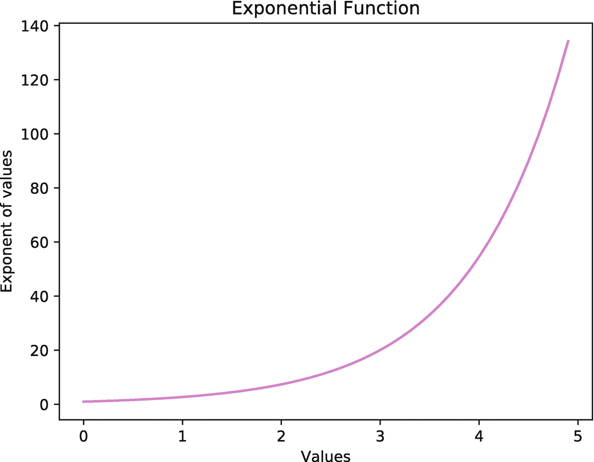

图 3-5

通过与 S4TF 的互操作，使用 Python 的 Matplotlib 库绘制的指数函数图

```py
// Import Python libraries
let np = Python.import("numpy")
let plt = Python.import("matplotlib.pyplot")

// Declare variables
let x = np.linspace(0, 5, 50)
let y = np.exp(x)

// Plot the values
plt.xlabel("Values")
plt.ylabel("Exponent of values")
plt.title("Exponential Function")
plt.plot(x, y, color: "violet")
plt.show()

Listing 3-47Plot an exponential function

```

运行前面的代码会显示一个图像(见图 [3-5](#Fig5) )显示范围为[0，5]的指数函数的曲线图。这里，Matplotlib 库的`plt`模块执行`x`和`y`变量的绘制。

Python 互操作性帮助我们在 S4TF 中使用 Python 众所周知的强大库。这为深度学习的当前 Python 用户轻松过渡到 S4TF 消除了障碍。

## 3.6 摘要

本章重点介绍了 Swift 语言的编程。Swift 引入了具有编译器级实施的差异化编程，而 Swift for TensorFlow 语言是 Swift 实施深度学习特定功能的扩展。本章从激励当前的深度学习社区(使用 Python)采用 Swift 语言开始。接下来，我们介绍了在 Swift 中实现的算法差异特性的具体细节。然后提供了 Swift 语言的快速浏览，使您能够轻松理解 Swift 的各种基本功能和强大功能。最后，我们介绍了 Python 互操作性特性，该特性使 Swift for TensorFlow 的用户可以直接从 Swift for TensorFlow 使用他们喜爱的 Python 库。

现在我们已经准备好理解 TensorFlow 的基础知识(将在下一章介绍)，这将允许我们对深度学习进行编程。

<aside aria-label="Footnotes" class="FootnoteSection" epub:type="footnotes">Footnotes [1](#Fn2_source)

GIL 代表“全球翻译锁”

  [2](#Fn3_source)

[https:// developer。苹果公司。com/ xcode/ swiftui/](https://developer.apple.com/xcode/swiftui/)

  [3](#Fn4_source)

[https://蒸汽。代码〔t1〕](https://vapor.codes)

  [4](#Fn5_source)

[https://swift . org/blog/AWS-lambda-runtime/](https://swift.org/blog/aws-lambda-runtime/)

  [5](#Fn6_source)

[https:// github。com/hips/autorad](https://github.com/HIPS/autograd)

  [6](#Fn7_source)

[https://pytorch。组织/](https://pytorch.org/)

  [7](#Fn8_source)

[https://tensorlow。org/](https://tensorflow.org/)

  [8](#Fn9_source)

[https://keras。io](https://keras.io)

  [9](#Fn10_source)

[www . deep learning . net/software/the ano/](http://www.deeplearning.net/software/theano/)

  [10](#Fn11_source)

[https://docs . swift . org/swift-book/](https://docs.swift.org/swift-book/)

 </aside>