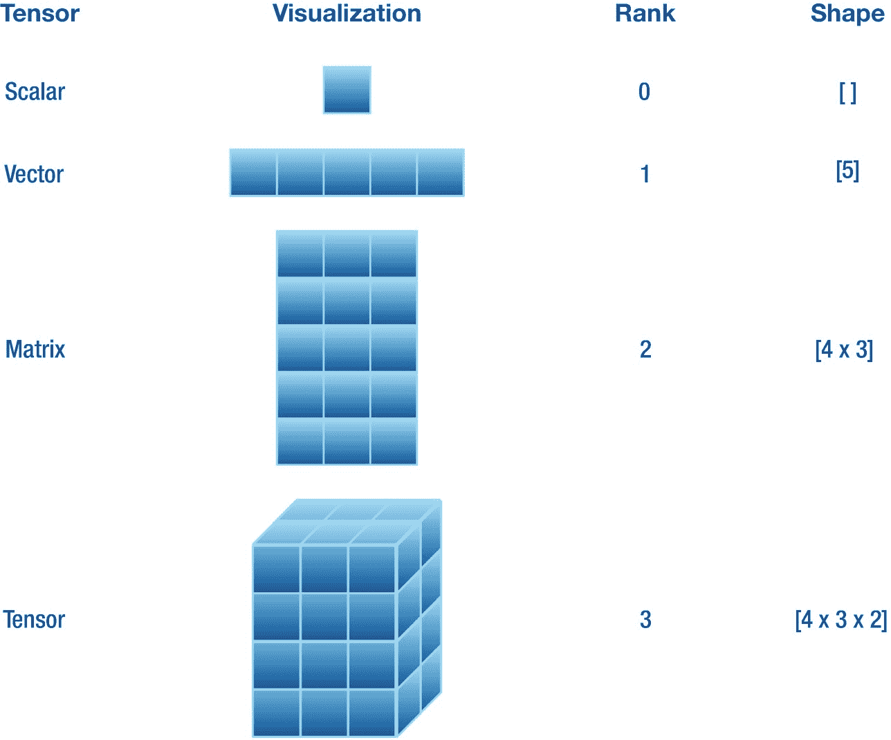
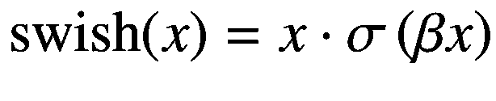
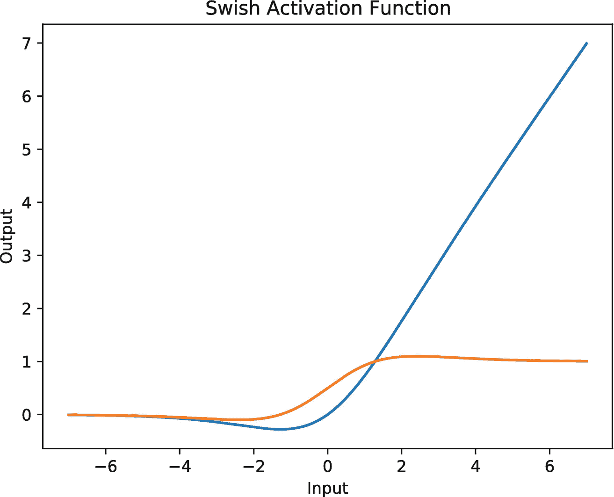
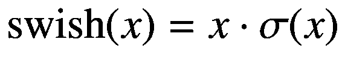
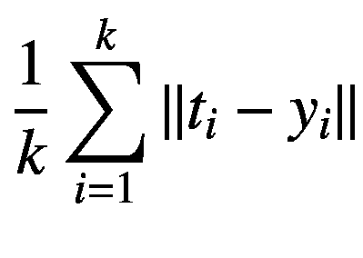

# 四、TensorFlow 基础知识

> 现在最重要的事情不再是争论 Swift 是否应该存在差异化编程(因为 Swift + ML 太重要了！)，而是搞清楚应该在语言中落地的最佳形式！
> 
> *—理查德·魏在推特上*

这一简短的实用章节旨在介绍 Swift for TensorFlow 的一些深度学习特定功能。第 4.1 节介绍了张量数据结构的概念，它实质上是神经网络进行预测的基础。阅读本章后，你将能够加载数据集(第 4.2 节)，编写自己的神经网络(第 4.3 节)，训练你的模型并测试其准确性(第 4.4 节)。除了所有这些，在 4.5 节，你还将学习如何实现你自己的新层，激活函数，损失函数，和优化器。这将有助于原型化您的研究代码或实现深度学习算法的高级构建模块。本章要求对机器学习有所了解。我们建议您通过阅读第一章来更新您的概念。

## 4.1 张量

在第二章中，我们已经学习了标量、向量和矩阵的概念以及一些重要的运算。这里，我们将它们形象化以帮助我们理解，并引入张量的概念来概括它们。理解张量很重要，因为构成本书主题的神经网络本质上是操纵张量值来进行预测的。

*张量*是一种可以在 *n* 维空间中存储数值的数据结构，其中 *n* ≥ 0。有一些常见的张量如标量、向量和矩阵，它们的维数(称为*秩*)分别是零、一和二。当我们需要存储秩大于 2 的高维值时，我们使用术语张量。换句话说，张量概括了前面提到的所有低维数据结构。

TensorFlow 提供了用于初始化任意维度张量的`Tensor`类型。它提供了两个重要的实例计算属性，即`rank`和`shape`。`rank`属性返回一个代表`Tensor`实例维数的`Int`值。例如，vector 实例的`rank`为 1。`shape`属性返回一个代表每个维度中元素数量的`Array`值。比如一个包含三行两列的矩阵，有[4，3]的`shape`(程序化)，数学上我们写成[4 × 3]。清单 4-1 展示了一些`Tensor`的例子，这些例子在图 4-1 中可以看到。



图 4-1

各种张量及其相应的秩和形状属性的可视化。在这里，每个方块包含一些数值

```py
import TensorFlow

let scalar = Tensor<Float>(10)
let vector = Tensor<Float>(ones: [5])
let matrix = Tensor<Float>(zeros: [4, 3])
let tensor = Tensor<Float>(repeating: 2, shape: [4, 3, 2])

// Print `Tensor`s
print("scalar: \(scalar)")
print("vector: \(vector)")
print("matrix:\n\(matrix)")
print("tensor:\n\(tensor)")
print()

// Ranks
print("scalar rank: \(scalar.rank)")
print("vector rank: \(vector.rank)")
print("matrix rank: \(matrix.rank)")
print("tensor rank: \(tensor.rank)")
print()

// Shapes
print("scalar shape: \(scalar.shape)")
print("vector shape: \(vector.shape)")
print("matrix shape: \(matrix.shape)")
print("tensor shape: \(tensor.shape)")
print()

Listing 4-1Declare Tensor
instances of various dimensions

```

**输出**

```py
scalar: 10.0
vector: [1.0, 1.0, 1.0, 1.0, 1.0]
matrix:
[[0.0, 0.0, 0.0],
 [0.0, 0.0, 0.0],
 [0.0, 0.0, 0.0],
 [0.0, 0.0, 0.0]]
tensor:
[[[2.0, 2.0],
  [2.0, 2.0],
  [2.0, 2.0]],

 [[2.0, 2.0],
  [2.0, 2.0],
  [2.0, 2.0]],

 [[2.0, 2.0],
  [2.0, 2.0],
  [2.0, 2.0]],

 [[2.0, 2.0],
  [2.0, 2.0],
  [2.0, 2.0]]]

scalar rank: 0
vector rank: 1
matrix rank: 2
tensor rank: 3

scalar shape: []
vector shape: [5]
matrix shape: [4, 3]
tensor shape: [4, 3, 2]

```

请注意，`Tensor`是一个泛型类型，需要我们为占位符类型`Scalar`传递类型。占位符类型`Scalar`的类型是在初始化期间在尖括号中提供的，尖括号允许我们在那个`Tensor`实例中存储指定`Scalar`类型的元素。例如，清单 4-1 中声明的所有张量对于`Scalar`都有一个`Float`类型。注意`Scalar`是符合`TensorFlowScalar`协议的`Tensor`的类型占位符，因为`Float`符合那个协议，我们可以将`Scalar`设置为`Float`类型。

在清单 4-1 中，我们声明了不同等级和形状的各种张量，然后打印出来用于演示。注意,`Tensor`类型有各种各样的初始化器可以灵活初始化。我们声明`scalar`、`vector`、`matrix`和`tensor`为`Tensor`的实例。`scalar`实例的`rank`为 0，而`shape`为[ ]。`vector`实例的`rank`为 1，而`shape`为[5]。`matrix`实例有 2 的`rank`和【4，3】的`shape`，即四行三列。`tensor`实例有 3 的`rank`和[4，3，2]的`shape`。所有这些情况都可以在图 4-1 中看到。

接下来，我们讨论 TensorFlow 中的数据集加载。

## 4.2 数据集加载

在撰写本文时，TensorFlow 允许加载图像和文本域中的各种数据集。但是我们会关注图像数据集。在加载这些数据集之前，您需要在 Xcode Swift 包的 Package.swift 文件中添加 swift-models 包，如下所示，或者您可以在 Xcode 项目设置中添加包 URL:

```py
.package(name: "TensorFlowModels",
    url:
    "https://github.com/tensorflow/swift-models.git", .branch("master"))

```

如果你正在使用谷歌实验室，那么在你的 Jupyter 笔记本的顶部写下以下声明:

```py
%install '.package(url: "https://github.com/tensorflow/swift-models", .branch("master"))' Datasets

```

这将加载 tensorflow/swift-models 存储库，并仅构建数据集库。但是如果你想建立其他的库，比如 TrainingLoop 和 Checkpoints，那么就把它们写在 Datasets 被写的地方，但是用一个空格分开。现在，我们可以导入数据集库，如下所示:

```py
import Datasets

```

在整本书中，我们隐含地假设这个 import 语句是在我们加载任何数据集的地方编写的。现在让我们看一下与数据加载相关的一些概念。

### 4.2.1 时期和批次

有两个与数据集采样相关的主要概念，即时期和小批量(或简称为批量)。

*批次*是一组单独的数据样本，其中批次大小定义了该批次中样本的数量。例如，批量大小为 64 的一批图像(每个图像的形状为[256 × 128 × 3]，其中 256 是高度(或行数)，128 是宽度(或列数)，3 是颜色通道数)的形状为[64 × 256 × 128 × 3]。在训练期间，一批数据样本与相应的目标标签一起通过模型进行预测(如果我们正在进行监督学习)。

*epoch* 是模型批量体验整个数据集的次数。单个历元包含一系列不同的多个批次(形成整个数据集),我们在训练样本批次的过程中对其进行迭代。对于随机学习，我们通常在每个历元迭代期间洗牌。

```py
let dataset = MNIST(batchSize: 64)
let epochCount = 2

epochLoop: for (epochStep, epoch) in dataset.training.prefix(epochCount).shuffled().enumerated() {
  batchLoop: for (batchStep, batch) in epoch.enumerated() {
    let data = batch.data
    let label = batch.label
    print("epochStep: \(epochStep) | batchStep: \(batchStep) | data shape: \(data.shape) | label shape: \(label.shape)")
    break epochLoop
  }
}

Listing 4-2Demonstrate epochs

and batches

```

**输出**

```py
epochStep: 0 | batchStep: 0 | data shape: [64, 28, 28, 1] | label shape: [64]

```

让我们来分解清单 4-2 中发生的这么多事情。首先，我们在`dataset`常量中加载批量为 64 个样本的`MNIST`数据集。然后我们宣布`epochCount`中的纪元数量为 2。

首先，我们有一个标记为`epochLoop`的纪元循环。我们使用`prefix(_:)`实例方法遍历`dataset`的`training`实例计算属性，该方法接受历元数(这里是`epochCount`，并在每个迭代步骤中依次返回一个`batch`数据点。在每一步，我们还用随机抽样的`shuffled()`实例方法打乱批次顺序。

然后我们有一个标记为`batchLoop`的批处理循环。我们遍历一个`epoch`实例中的每个`batch`。在`batchLoop`的主体中，我们从`batch`实例中提取`data`和`label`实例存储的属性。然后我们打印出这两者的`shape`以及`epochLoop`和`batchLoop`的迭代步骤。

我们在两个循环中都使用了`enumerated()`方法来获取序列中迭代元素的索引。我们为`for-in`循环定义了`epochLoop`和`batchLoop`标签，作为控制流语句的参考。你可以把`epochLoop`和`batchLoop`看作是循环的名字。如果我们简单地编写了`break`语句，后面没有任何带标签的循环语句，那么 epoch 循环将执行两次，batch 循环将执行一次，也就是说，这将只停止 batch 循环执行多次。通过编写`break` `epochLoop`，我们告诉编译器简单地停止 epoch 循环本身的迭代，并执行其右花括号后的代码。

这里，我们加载 MNIST 数据集(LeCun，1998)，它是从 0 到 9 的手写数字(每个图像一个)及其相应标签的灰度图像的集合。它们是由不同的人写的。正如我们在前面的清单中从`shape`看到的，每张图像的高度和宽度都是 28 像素，只有一个颜色通道使其成为灰度。这个数据集中的每个样本都是一个表示图像像素值(如`Tensor<Float>`)的`data`和其对应的`label`值(如`Tensor<Int32>`)的元组。

机器学习算法的另一个重要部分是接下来讨论的模型定义。

## 4.3 定义模型

我们可以很容易地定义模型架构，其属性可以在训练过程中进行区分。TensorFlow 中定义模型的方式主要有两种，一种是使结构符合特殊协议，另一种是使用受 Keras 启发的`Sequential`结构。

### 神经网络协议

TensorFlow 提供了两种协议，即`Layer`和`Module`，用于定义神经网络。可区分的模型定义结构必须符合这些协议中的任何一个。这些协议要求我们提供模型的`Input`和`Output`类型的实现为`typealias`，定义`callAsFunction(_:)`方法，并声明至少一个`Layer` -或`Module`-符合或`Sequential`实例属性，其参数将在训练期间更新。

例如，让我们定义一个称为 LeNet 的卷积神经网络(LeCun 等人，1998)。

```py
struct LeNet: Layer {
  typealias Input = Tensor<Float>
  typealias Output = Tensor<Float>

  var convBlock = Sequential {
    Conv2D<Float>(filterShape: (5, 5, 3, 6), activation: relu)
    MaxPool2D<Float>(poolSize: (2, 2), strides: (2, 2))
    Conv2D<Float>(filterShape: (5, 5, 6, 16), activation: relu)
    MaxPool2D<Float>(poolSize: (2, 2), strides: (2, 2))
  }
  var flatten = Flatten<Float>()
  var denseBlock = Sequential {
    Dense<Float>(inputSize: 16 * 5 * 5, outputSize: 120, activation: relu)
    Dense<Float>(inputSize: 120, outputSize: 84, activation: relu)
    Dense<Float>(inputSize: 84, outputSize: 10, activation: identity)
  }

  @differentiable
  func callAsFunction(_ input: Input) -> Output {
    input.sequenced(through: convBlock, flatten, denseBlock)
  }
}

Listing 4-3Define the LeNet model by conforming to the Layer protocol

```

我们使用 Swift 的关键字`typealias`定义了两个类型别名。这让我们可以在任何可以使用现有类型的地方使用现有类型的新名称。我们为`Tensor<Float>`类型定义了`Input`和`Output`类型名称。然后我们定义多个符合`Layer`协议的神经层，例如`Flatten`、`Dense`和`Conv2D`。这里，`Dense`是一个密集连接层(在 5.3.1 小节中解释过)，`Conv2D`是一个卷积层(在 6.1 节中解释过)，`Flatten`层只是对`Conv2D`层(这里)的输出张量进行整形，使其成为秩为 2 的批量向量。然后我们定义可微分的`callAsFunction(_:)`方法，它接受类型`Input`的输入并返回一个`Output`类型的值。在主体内部，我们在实例`input`上使用`sequenced(through:)`实例方法。`sequenced(through:)`是在`Differentiable`协议上定义的协议方法，因此可以被任何符合它的类型访问。它接受逗号分隔的符合`Differentiable`的实例，并通过它们顺序处理`input`。也就是说，在这里，`input`首先由`convBlock`实例处理，其输出然后由`flatten`处理，然后其输出最终由`denseBlock`处理，后者再次返回类型为`Tensor<Float>`的新输出。这个输出然后由这个函数返回。注意，如果函数体、闭包、计算属性或返回某个值的下标中只有一个语句，我们可以去掉`return`关键字。

接下来，我们解释这里使用的`Sequential`结构。

### 层的顺序

我们可以用 TensorFlow 中定义为结构的`Sequential`轻松定义一个多层神经网络。你可能会从 Keras 的设计中发现它的相似之处。

我们已经使用`Sequential`定义了清单 4-3 中的`convBlock`和`denseBlock`。这样，我们可以简单地将多个神经层传递到 Sequential，每个神经层在不同的行中，后跟左花括号。我们甚至不需要像在协议一致性中那样定义`callAsFunction(_:)`实例方法。对`Sequential`实例的输入从第一层(最靠近左花括号)到最后一层(最靠近右花括号)依次处理。如 5.3.1 小节所述，神经网络中的小序列层被称为*神经块*，例如，`convBlock`和`denseBlock`就是我们所说的神经块的典型例子。

加载数据集并定义模型后，现在让我们看看如何在数据集上训练模型。

## 4.4 培训和测试

在本节中，我们首先介绍 TensorFlow 中模型可微分参数的检查点。我们还使用定制的训练循环在 CIFAR-10 数据集上训练我们的 LeNet 模型。然后，我们再次用 Keras 风格的训练方法训练我们的模型。

### 4.4.1 检查点

训练神经网络是一项耗费精力和时间的任务。根据数据集和神经网络的大小，模型训练可以从几分钟到甚至几个月不等！训练找到模型的一组新参数值，对于该组新参数值，数据集具有非常低的损失值和高精度(在分类的情况下)。我们不希望我们花在训练模型上的时间被浪费。所以我们可以把最优的参数值写在磁盘上保存训练进度。这被称为*检查点*。当我们需要使用训练好的模型进行推理(例如，图像分类)时，我们可以简单地将参数从磁盘读入模型，并通过训练好的模型传递要分类的图像。

TensorFlow 允许我们创建模型的检查点。我们只需要使我们的模型结构符合`Checkpointable`协议。我们不需要写任何东西，只需要在`Checkpointable`后面加上左花括号和右花括号(见清单 4-4 )，所有在模型实例上可调用的方法都可以用于检查点目的。这之所以成为可能，是因为在`Checkpointable`协议中实现了检查点方法。

```py
extension LeNet: Checkpointable {}

Listing 4-4Conform LeNet to the Checkpointable protocol

```

我们只是用扩展使`LeNet`符合`Checkpointable`！让我们声明一个目录的路径，我们希望在这个目录中读写检查点。这是通过从基础模块中定义`URL`实例来完成的，如清单 4-5 所示。

```py
import Foundation
let checkpointDirectory = URL(
  fileURLWithPath: "/Users/rahulbhalley/Desktop/Checkpoints",
  isDirectory: true)

Listing 4-5Declare directory location for checkpointing the model

```

我们将`isDirectory`设置为`true`,以确保这个位置指向目录而不是任何文件。`writeCheckpoint(to:name:)`和`readCheckpoint(from:name:)`都可能抛出错误，所以我们将使用一个`do` `-` `catch`块进行错误处理，并用`try`关键字调用这些方法。我们将在下面训练模型时直接演示这一点，而不是在这里演示。

### 4.4.2 模型优化

让我们用随机梯度下降来训练我们的 LeNet 并节省检查点。清单 4-6 演示了培训。

```py
// Define the default device
let device = Device.defaultXLA

// Load CIFAR 10 dataset
let dataset = CIFAR10(batchSize: 128, on: device)

// Initialize the LeNet model
var model = LeNet()
model = .init(copying: model, to: device)

// Initialize the optimizer
var optimizer = SGD(for: model, learningRate: 0.01, momentum: 0.9)
optimizer = .init(copying: optimizer, to: device)

Listing 4-6Train the LeNet model and save checkpoints

```

首先，我们声明一个默认的 XLA 设备，所有的处理都将在这个设备上进行。我们将 CIFAR-10 数据集加载到`dataset`常量中，并将其放在`device`上。然后我们在`model`变量中初始化我们的`LeNet`，并将其复制到`device`。最后，我们为`model to`初始化 SGD 优化器(也复制到`device`)，使`0.01`的`learningRate`和`0.9`的`momentum`(在 5.6.2 小节中解释)。

```
func trainingStep(samples: Tensor<Float>, labels: Tensor<Int32>) {
    // Compute gradients
    let 𝛁θmodel = gradient(at: model) { model -> Tensor<Float> in
    let logits = model(samples)
    let loss = softmaxCrossEntropy(logits: logits, labels: labels)
    return loss
  }
  optimizer.update(&model, along: 𝛁θmodel)
}

Listing 4-7Define one training step for the model

```

在清单 4-7 中，我们定义了一个函数`trainingStep(samples:labels:)`，它接受`samples`和它们的`labels`作为参数。它为传递给`model`的`samples`计算`logits`，然后与`labels`一起用于计算 softmax 交叉熵损失。`gradient(at:in:)`函数将`model`作为`at`参数标签的一个参数，并接受一个闭包，该闭包计算并返回`logits`和`labels`之间的损失，这个过程在前一行中描述过。然后计算相对于`model`所有参数的标量损耗梯度。最后，`optimizer`沿着其梯度𝛁θ `model`的方向更新`model`的可微参数。这结束了一个训练步骤。

```py
func trainingLoop(epochCount: Int = 5) {
  epochLoop: for (epochStep, epoch) in dataset.training.prefix(epochCount).enumerated() {
    batchLoop: for (batchStep, batch) in epoch.enumerated() {
      // Get data
      let samples = Tensor<Float>(copying: batch.data, to: device)
      let labels = Tensor<Int32>(copying: batch.label, to: device)

      // Training step
      trainingStep(samples: samples, labels: labels)
    }

    // Print statistics
    print("epoch: \(epochStep + 1)/\(epochCount)\ttest accuracy: \(testAccuracy)")

    // Write checkpoint
    do {
      try model.writeCheckpoint(to: checkpointDirectory, name: "\(type(of: model))")
    } catch {
      print(error)
    }
  }
}
// Train the model
trainingLoop()

Listing 4-8Define a training loop executable for multiple epochs

```

**输出**

```py
epoch: 1/5       test accuracy: 0.5064
epoch: 2/5       test accuracy: 0.5618
epoch: 3/5       test accuracy: 0.5933
epoch: 4/5       test accuracy: 0.6088
epoch: 5/5       test accuracy: 0.6187

```

在清单 4-8 中，我们定义了一个名为`trainingLoop(epochCount:)`的训练循环函数，它将历元数作为参数(默认`epochCount`为 5)。我们已经解释了数据采样(见 4.2 节)。对于每个`batch`，我们通过将采样的`samples`和`labels`传递给`trainingStep(samples:labels:)`函数来执行单个训练步骤。在每个`epoch`之后，我们在验证数据集上打印与模型准确性相关的统计数据，并且我们还将训练好的模型的参数写入到`checkpointDirectory`目录中，其中`name`是模型的类型，即 LeNet。因为检查点写入和读取方法都可能抛出错误，所以我们在一个`do` `-` `catch`块中使用了`try`语句。

```py
var testAccuracy: Float {
  let totalSamples = 10000
  var correct = 0
  for batch in dataset.validation {
    let (data, label) = (batch.data, batch.label)
    let prediction = softmax(model(data)).argmax(squeezingAxis: 1)
    for index in 0..<data.shape[0] {
      if prediction[index] == label[index] { correct += 1 }
    }
  }
  return Float(correct) / Float(totalSamples)
}

Listing 4-9Define a computed property to calculate accuracy of the model on a validation set

```

在清单 4-9 中，我们声明了一个唯一可获取的计算属性`testAccuracy`，它计算`validation`集合上`model`的精度。我们将验证集中的样本总数设置为 10000，并从零个`correct`分类开始。遍历`validation`集合中的所有批次，我们生成`prediction`，并将其与每个对应的`label`进行比较，如果`prediction`与`label`匹配，则有条件地将`correct`变量加 1。请注意，我们在 softmax 激活的 logits 上使用`argmax(squeezingAxis:)`方法来获取包含具有最高值的元素的向量的索引(请记住第一章中的内容，一个独热编码向量中的每个索引都属于某个类)。最后，我们返回正确分类的分数。

对模型进行训练后，我们得到 LeNet 在 CIFAR-10 上的训练精度等于 0.6187。

### 4.4.3 训练循环

您可能已经注意到，定义训练步骤和循环、准确性属性以及其他内容会使程序变得稍微复杂一些。我们可以使用 swift-models 包中的 TrainingLoop 库来使我们的程序变得更小。它的灵感也来自 Keras 训练设计。训练循环目前集中在分类任务上。

让我们从头开始复制前面的程序，看看 TrainingLoop 是如何运行的。

```py
import Datasets
import TensorFlow
import TrainingLoop

// Configurations
let epochs = 5
let device = Device.defaultXLA

// Load CIFAR 10 dataset
let dataset = CIFAR10(batchSize: 128, on: device)

// Initialize the LeNet model
var model = LeNet()

// Initialize the optimizer
var optimizer = SGD(for: model, learningRate: 0.01, momentum: 0.9)

// Train and test the model
let trainingProgress = TrainingProgress()
var trainingLoop = TrainingLoop(
  training: dataset.training,
  validation: dataset.validation,
  optimizer: optimizer,
  lossFunction: softmaxCrossEntropy,
  callbacks: [trainingProgress.update])

try! trainingLoop.fit(&model, epochs: epochs, on: device)

Listing 4-10Training LeNet on MNIST with the TrainingLoop library

```

在清单 4-10 中，我们导入了数据集、TensorFlow 和 TrainingLoop。然后我们声明一些配置，比如将`epochs`设置为`5`，将`device`设置为`Device.defaultXLA`。数据集、模型(使用清单 4-9 中的`LeNet`结构)和`optimizer`被初始化，如清单 4-9 所示。

然后我们声明`TrainingProgress`类的`trainingProgress`实例，它跟踪与训练和测试相关的统计数据，比如损失和准确性。我们定义的下一个变量是`trainingLoop`，它将训练集和验证集、优化器、损失函数(这里是`softmaxCrossEntropy`)和回调作为参数。然后我们调用`trainingLoop`上的`fit(_:epochs:on:)`方法，将模型作为`inout`参数、`epochs`和`device`进行传递，我们希望对其进行训练。这将执行训练过程并实时打印统计数据，而无需编写复杂的函数。训练完成后，该模型在训练集和验证集上的精度分别为 0.5607 和 0.5625。

注意，当使用 TrainingLoop 进行训练时，我们不需要将`model`和`optimizer`复制到`device`；`fit(_:epochs:on:)`方法为我们处理这一切。另一个需要注意的重要事情是,`callbacks`参数在循环的各种事件的训练过程中执行一系列函数。这里，我们只传递了统计跟踪函数，但是我们将看到如何通过定义我们自己的回调函数来保存检查点！

## 4.5 从零开始进行研究

在本节中，我们实现了密集层、swish 激活函数、 *L* 、 1 损失函数和随机梯度下降优化器。这些例子演示了当某些东西还不能开箱即用时，如何实现自己的层、激活函数、损失函数和优化器，以用于研究或生产目的。这些例子也鼓励使用各种协议。我们鼓励您阅读 TensorFlow 的 API 文档 <sup>1</sup> 和代码库 <sup>2</sup> 、 <sup>3</sup> 、 <sup>4</sup> ，以更深入地理解这些和许多其他协议。

### 4.5.1 层

定义新的神经层类似于我们定义自己的神经网络。我们不使用`Sequential`，而是让结构符合`Layer`或`Module`协议。尽管`Differentiable`协议可以实现与我们在 5.2 节构建线性模型时看到的相同的行为。现在，让我们通过使我们的结构符合`Layer`协议来定义密集层(见 5.3.1 小节)。

```py
struct DenseLayer<Scalar: TensorFlowFloatingPoint>: Layer {
  typealias Input = Tensor<Scalar>
  typealias Output = Tensor<Scalar>

  var weight: Tensor<Scalar>
  var bias: Tensor<Scalar>

  init(inputSize: Int, outputSize: Int) {
    weight = Tensor<Scalar>(randomNormal: [inputSize, outputSize])
    bias = Tensor(zeros: [outputSize])
  }

  @differentiable
  func callAsFunction(_ input: Input) -> Output {
    matmul(input, weight) + bias
  }
}

Listing 4-11Define the 

dense layer

```

`DenseLayer`是一个泛型，其`Scalar`类型占位符符合`TensorFlowFloatingPoint`，`DenseLayer`本身符合`Layer`。然后我们定义了`Tensor<Scalar> type`的两个类型别名，即`Input`和`Output`，在可微分的`callAsFunction(_:)`实例方法中我们用它们作为我们稠密层的输入和输出类型。`DenseLayer`还有两个`Tensor<Scalar>`类型的存储属性，即`weight`和`bias`，是该层的参数。`DenseLayer`的初始化程序接受层的输入和输出特征的数量。该信息随后用于初始化`weight`和`bias`参数属性。最后，在正向传递期间，`callAsFunction(_:)`接受输入，对其执行仿射变换(即，`input`和`weight`与`matmul(_:_:)`函数矩阵相乘，并加上`bias`)，并返回输出。

### 激活功能

在对输入进行仿射变换之后，我们应用激活函数。许多激活函数分别变换张量的每个元素。图 4-2 所示的 swish 函数(Ramachandran 等人，2017)是激活函数的一个很好的例子。它由以下等式给出:





图 4-2

β = 1 及其导数(橙色)的 swish 激活函数图(蓝色)

这里， *β* 是一个可学习的或常数项。这一项通常设置为等于 1。因此 swish 函数变成如下:



清单 4-12 演示了如何声明自己的激活函数(这里是 swish 激活函数)。

```py
@differentiable
func swishActivation<Scalar: TensorFlowFloatingPoint>(_ input: Tensor<Scalar>) -> Tensor<Scalar> {
  input * sigmoid(input)
}

Listing 4-12Define the swish activation function

```

因为我们希望激活函数`swishActivation(_:)`是可微分的，所以我们用属性`@differentiable`来标记它。我们声明一个符合`TensorFlowFloatingPoint`的泛型类型`Scalar`。这个函数接受`input`参数并返回`Tensor<Scalar>`类型的输出。在`swishActivation(_:)`的主体中，我们将`input`与经过 sigmoid 函数转换的`input`按元素相乘，并返回输出。我们可以在任何神经层的输出之后使用这个激活函数。

### 损失函数

模型参数的值更新的方向由神经网络的预测(也称为 logits)和关于每个参数的相应目标(也称为标签)之间的损失梯度来引导。

在这里，我们描述如何在 TensorFlow 中实现自己的损失函数。我们展示了由以下等式给出的 *L* <sup>1</sup> 损耗的简单实现。*L*1loss 计算逻辑和标签的每个元素之间的平均绝对误差(MAE ):



这里， *y* <sub>*i*</sub> 和 *t* <sub>*i*</sub> 分别是第 *i* 个索引逻辑和目标， *k* 是这些向量中每一个的元素个数。运算符∨。∑计算绝对值，即将向量的任何值的负号转换为正号。清单 4-13 展示了*L*1 损失的实现。

```py
@differentiable(wrt: logits)
func l1Loss<Scalar: TensorFlowFloatingPoint>(
  logits: Tensor<Scalar>,
  labels: Tensor<Scalar>
) -> Tensor<Scalar> {
  abs(labels - logits).mean()
}

Listing 4-13Define the L2 loss function

```

这里，`l1Loss(logits:labels:)`函数将`logits`和`labels`作为输入参数，并返回一个类型为`Tensor<Scalar>`的值，其中`Scalar`是一个符合`TensorFlowFloatingPoint`的类型占位符。这个闭包的主体计算`logits`和`labels`的对应元素之间的差，然后取其绝对值，并找到它们的平均值。

在训练期间，我们计算关于模型的每个参数的损失梯度，这给了我们最陡上升的方向。我们的目标是最小化损失函数，损失函数简单地由模型的预测和目标组成，因此我们在梯度的负方向上在参数空间中采取小的步骤。这被称为基于梯度的优化，在 5.1 节中讨论。接下来，我们看看如何在 TensorFlow 中定义我们自己的优化器。

### 优化器

我们可以通过使新的优化器`class`符合`Optimizer`协议来定义新的优化器。清单 4-14 通过重新定义随机梯度下降(SGD)优化器证明了这一点。

```py
class SGDOptimizer<Model: Differentiable>: Optimizer
where Model.TangentVector: VectorProtocol & ElementaryFunctions & KeyPathIterable, Model.TangentVector.VectorSpaceScalar == Float
{
  // The learning rate
  var learningRate: Float

  init(for model: Model, learningRate: Float) {
    self.learningRate = learningRate
  }

  func update(_ model: inout Model, along direction: Model.TangentVector) {
    model.move(along: direction.scaled(by: -learningRate))
  }

  required init(copying other: SGDOptimizer<Model>, to device: Device) {
    learningRate = other.learningRate
  }
}

Listing 4-14Define the stochastic gradient descent optimizer

```

优化器必须始终被定义为一个类。我们定义了符合`Optimizer`协议的`SGDOptimizer`类。我们还定义了一个符合`Differentiable`协议的通用类型`Model`。然后我们为`Model`定义一些条件符合。我们说`Model`的`TangentVector`必须符合`VectorProtocol`和`ElementaryFunctions`，必须是`KeyPathIterable`。每个协议之间的&符号(`&`)将所有这些协议组成一个协议。虽然这实际上并没有创建任何新的协议，但是这个*协议组合*表现为一个单一的协议。通过这种方式，`Model`符合`VectorProtocol`(用于向量运算等等)、`ElementaryFunctions`(用于算术)和`KeyPathIterable`(用于能够通过`Model`实例上的`KeyPath`迭代其属性)。然后我们还要求`Model`的`TangentVector`的`VectorSpaceScalar`(顾名思义，基本上是向量空间中的标量值)是`Float`类型。

我们为这个名为`learningRate`的类声明一个实例属性，它是优化的学习率。我们声明一个初始化器，它将`Model`类型的`model`和`Float`类型的`learningRate`作为参数。这里，传递`model`只是为了找到`Model`的类型，而不是为了在优化器中使用它。这是预期的行为。讨论请参考 GitHub 问题。 <sup>5</sup> 然后，更新实例方法简单地在相对于模型参数的损失函数的梯度的负方向上更新`model`。它以`Model.TangentVector`的`inout` `Model`和`along`为自变量。`TangentVector`存储`Model`的梯度。`inout`参数反映传递给函数的实例的变化。模型上的`move(along:)`实例方法在用`learningRate`将其缩放至较小值后，在梯度的负方向更新其参数。我们总是将实例传递给前缀为&符号的`inout`参数。

## 4.6 总结

本章重点介绍了深度学习编程，并介绍了 S4TF 的 TensorFlow 库。我们从解释如何创建张量实例开始。接下来，我们看到了如何在 TensorFlow 中加载数据集。我们还学习了如何创建深度学习模型，并对其进行训练和测试。我们还创建了模型的检查点。最后，我们学习了如何在 TensorFlow 中出于研究目的从头开始创建层、激活和损失函数以及优化器。在下一章，我们将了解神经网络的基础知识。

<aside aria-label="Footnotes" class="FootnoteSection" epub:type="footnotes">Footnotes 1

[www . tensorflow . org/swift/API _ docs](http://www.tensorflow.org/swift/api_docs)

  2

[` github。com/tensorlow/swift API`](https://github.com/tensorflow/swift-apis)

  3

[` github。com/tensorlow/swift-models`](https://github.com/tensorflow/swift-models)

  4

[` github。com/tensorlow/swift`](https://github.com/tensorflow/swift)

  5

[` github。com/tensorlow/swift-API/issues/656`](https://github.com/tensorflow/swift-apis/issues/656)

 </aside>