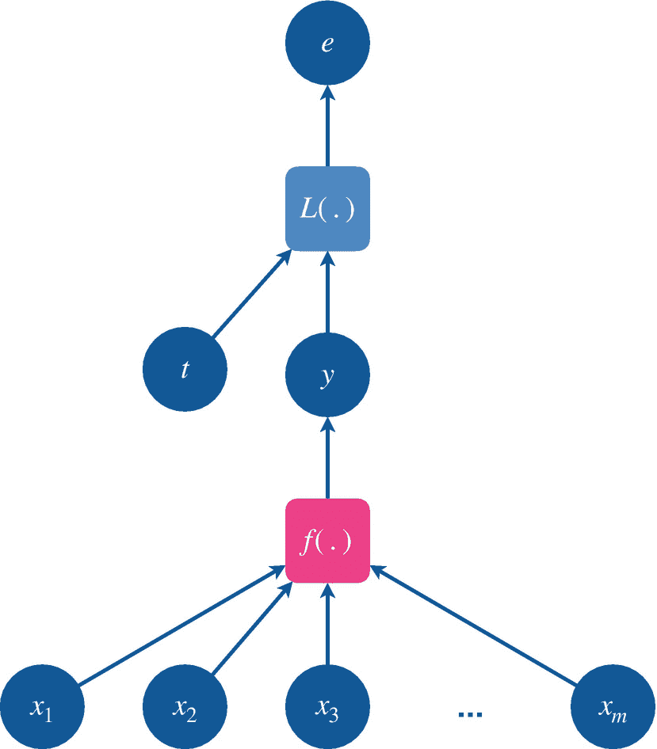
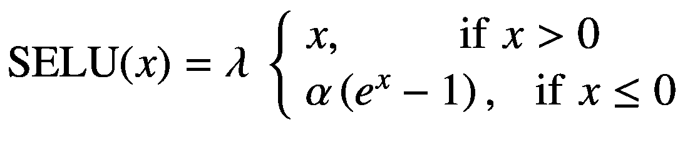

# 五、神经网络

> *我喜欢胡说八道；它唤醒了我的脑细胞。*
> 
> *—苏斯博士*

本章涵盖了神经网络的基础知识，也就是深度学习。我们讨论如下各种基础主题:基于梯度的输入和函数参数优化(5.1 节)、线性模型(5.2 节)、深度和密集神经网络(5.3 节)、激活函数(5.4 节)、损失函数(5.5 节)、优化(5.6 节)和正则化(5.7 节)技术。最后，我们在第 5.8 节总结了这一章。

## 5.1 基于梯度的优化

在这一节中，我们介绍最大值、最小值和鞍点的概念。接下来，我们介绍输入和参数优化。输入优化将用于寻找函数的最大值和最小值。另一方面，参数优化将用于使用可用的函数映射数据集来查找函数本身。这两种优化在深度学习中都扮演着重要的角色，并将贯穿全书。在这里，我们主要关注在线的基于梯度的学习策略。在第 5.6 节中介绍了用于大型深度学习模型的更有效的梯度下降方法。

我们限制自己研究无约束最优化方法，因为它简单，并且满足我们演示书中提出的深度学习方法的要求。对约束优化感兴趣的读者可以参考(Deisenroth et al .，2020)教材的第 [7](https://doi.org/10.1007/978-1-4842-6330-3_7) 章。

### 最大值、最小值和鞍点

这里，我们考虑一个标量函数 *f* : ℝ → ℝ.函数在某一点的导数有三种可能的值:正、负或零。在第一种情况下，当导数在某一点为正时，则函数随着输入的增加而增加。在第二种情况下，当导数在某一点为负时，函数的输出随着输入的增加而减少。换句话说，当输入少量增加时，导数的符号给出了函数增加的方向，可以是负的，也可以是正的。在第三种情况下，当输出不随输入的变化而变化时，那么导数在该点为零。


图 5-1

方程*f*(*x*)= 5*x*3+2*x*23*x*描述的函数有一个最大值和一个最小值。函数上一点的正切给出了梯度的斜率

图 5-1 为蓝色函数*f*(*x*)= 5*x*<sup>3</sup>+2*x*23*x*及其衍生函数*f*<sup>'</sup>(*x*)= 15*x*<sup>2 *f* 上的绿点( *a* ，*f*(*a*)=(3/5，1.44)和( *b* ，*f*(*b*)=(1/3，0.59)。)(蓝线)分别是函数的最大值和最小值。在这些点上，导数为零，即*f*<sup>'</sup>(*a*)= 0，*f*<sup>'</sup>(*b*)= 0。在水平轴上，从*x*= 1 开始，函数增加但缓慢减少，直到达到 *x* = *a* 。如前所述，这可以通过相同输入范围 *x* 中的相应红色导数线来验证；导数首先很大，但慢慢减小，直到在点 *x* = *a* 处变为零。这是函数 *f* ()变成零。函数上一点的正切给出了梯度的斜率。</sup>


图 5-2

任意标量函数的最大值、最小值和鞍点的可视化

同理，从 *x* = *a* 到 *x* = *b* 开始，函数递减半个距离；然后对于另一半，它的变化率增加(但仍然是负的),使得它的斜率开始接近零，导数值也是如此。

函数 *f* (。)在 *f* ( *a* 处具有最大值，因为该函数在 *x* = *a* 前后的输出小于点 *a* 处的输出。形式上， *f* ( *a* ϵ)小于*f*(*x*=*a*)其中 *ϵ* 是一个小正数。另一方面，函数的最小值位于 *x* = *b* ，即 *f* ( *b* )的值最小。因为 *f* ( *b* ϵ)的值大于 *f* ( *b* )，所以函数 *f* (。)在 *b* 处有最小值。在最后一种情况下，当在一定的输入范围内时，输出 *f* ( *x* )保持不变，然后在这些输入值处的导数保持为零，满足条件*f*'(*x*ϵ)= 0。该范围内的所有点称为*鞍点*。简单来说，在最大值，最小值，鞍点 *x* ，函数 *f* 的导数(。)始终为零，即*f*'(*x*)= 0。

最大值、最小值和鞍点的概念(见图 5-2 )不仅仅限于一元函数，也同样适用于高维函数，尽管很难在平面上可视化(如一张纸)。

### 输入优化

在高中，通常遇到的数学问题如下:找出给定固定函数输出最小值和最大值的输入值。这些值分别被称为函数的*最小值*和*最大值*，如前所述。我们还知道，函数输出对输入的导数描述了输入增加时输出的变化率。

我们可以利用导数的方向信息，在数值上找到固定函数的最大值或最小值。例如，可以通过在输出相对于输入的导数的负方向上以小步长迭代地更新(或优化)输入值来找到函数的最小值(因为导数给出了函数增加最多的方向)。我们可以把*基于梯度的最优化*(柯西，1847)方程写成:


(5.1)

我们已经在方程 1.8 中遇到了一个更新函数参数的类似方程。这里，我们在多个步骤中迭代更新函数 *f* 的输入变量 *x* 的值。在这个等式中， *η* 是一个在范围(0，1)内的小正数，称为*步长*(或*学习速率*，在深度学习文献中， *τ* 表示时间步长，使得*x*<sub>(*τ*+1)</sub>是 *x* 在时间步长( *τ* + 1)的值

另一方面，有时我们可能需要找到一个函数的最大值。在这种情况下，我们可以简单地以小的步长在与导数相同的方向上移动输入，由下面的等式描述:


(5.2)

在基于梯度的优化中， *η* 项起着非常重要的作用。我们希望找到遵循输入更新的平滑轨迹的最佳输入值。因为导数在某一点上通常有一个大值，所以更新可能遵循一个不规则的轨迹，在最佳值附近表现出有弹性的行为。为了缓解这个问题，我们用 *η* 项缩小了导数值，这有助于按照平滑的更新轨迹更新值。

在清单 5-1 中，我们将最大化函数*f*(*x*)= 5*x*3+2*x*23*x*。

```py
var x: Float = 0
let η: Float = 0.01
let maxIterations = 100

@differentiable
func f(_ x: Float) -> Float {
  return 4 * pow(x, 3) + 2 * pow(x, 2) - 3 * x
}

print("Before optimization, ", terminator: "")
print("x: \(x) and f(x): \(f(x))")

Listing 5-1Declare configuration variables and function f(x) = 5x3 + 2x2 − 3x to demonstrate maxima and minima optimization

```

**输出**

```py
Before optimization, x: 0.0 and f(x): 0.0

```

我们先定义前面的函数*f*(*x*)= 5*x*3+2*x*2—3*x*。我们通过用`@differentiable`属性标记它来使它可区分。然后`Float`类型的输入变量`x`的初始值被设置为 0，步长`η`被定义为设置为 0.01 的`Float`常数。我们可以看到优化前函数的输入输出值为零。

```
// Optimization loop
for iteration in 1...maxIterations {
  /// Derivative of `f` w.r.t. `x`.

  let 𝛁xF = gradient(at: x, in: { x -> Float in
    return f(x)
  })
  // Optimization step: update `x` to maximize `f`.
  x += η * 𝛁xF
}
print("After gradient ascent, ", terminator: "")
print("input: \(x) and output: \(f(x))")

Listing 5-2Find the maxima of the function f(x) = 5x3 + 2x2 − 3x

```py

**输出**

```
After gradient ascent, input: -0.5999994 and output: 1.4399999

```

清单 5-2 展示了寻找最大值的优化过程。我们迭代`maxIterations`，逐渐优化输入`x`。在每个迭代步骤中，我们计算函数`f`相对于输入`x`的导数，并将其存储在常数𝛁 `xF`中。使用`gradient(at:in:)`功能计算导数。参数标签`at`和`in`将输入`x`和一个返回标量的闭包作为参数。闭包以`x`为参数，返回`Float`计算`f(x)`。Swift 自动为我们计算出`f`相对于`x`的导数。输入`x`的优化更新步骤简单地将`η`缩放的导数加到自身上。我们可以很容易地验证优化的输入值`x`非常接近函数`f(x)`的最大值，如图 5-1 所示。

初始化可优化变量的值时必须谨慎。如果我们将`x`初始化为 1，那么就不可能找到函数 *f* ( *x* )的局部最大值，因为它的全局最大值在无穷远处。需要注意的是，在最小化的情况下，在深度学习的背景下，我们实际上希望找到函数的全局最小值(或给定数据集的最小值函数)，但实际上我们只能找到与其更接近的局部最小值。所以这个函数不是一个很好的例子，但仍然展示了，在简单的标量实值空间中，当我们训练大型深度学习模型时，数百万或数十亿个变量可能会发生什么。

尽管在步长`η`前加一个负号来计算最小值很简单，但在清单 5-3 中，我们来看看 Swift 中微分闭包的优秀设计。这也可以被认为是采用 Swift 进行深度学习的动机之一。

```
// Optimization loop
for _ in 1...maxIterations {
  /// Derivative of `f` w.r.t. `input`.
  let 𝛁xF = gradient(at: x) { x in f(x) }
  // Optimization step: update `x` to minimize `f`.
  x.move(along: 𝛁xF.scaled(by: -η))
}
print("After gradient descent, ", terminator: "")
print("input: \(x) and output: \(f(x))")

Listing 5-3Find the minima of the function f(x) = 5x3 + 2x2 − 3x

```py

**输出**

```
After gradient descent, input: 0.33333316 and output: -0.5925926

```

我们首先通过再次执行清单 5-1 将所有变量重置为初始值。注意，清单 5-3 中的大部分代码与清单 5-2 中的相似。但是我们在`gradient(at:in:)`函数中为`in`参数标签使用了尾随闭包。我们还省略了返回类型信息，因为编译器可以从上下文中推断出来，也就是说，当我们在闭包体内的`in`关键字后调用`f(x)`时，使用返回值的类型。同样，当函数只有一条语句并且返回某个值时，我们可以省略`return`关键字，使代码可读性更好。此外，闭包的主体只有一行，所以我们把它压缩成一行代码。有关函数和闭包的更多信息，请参见第 3.4 节。

最后，我们在`Float`类型上使用`move(along:)`方法。Swift 对`move(along:)`的文档描述说，“沿着给定的方向移动`self`。在黎曼几何中，这相当于指数地图，在测地曲面上沿着给定的切向量移动`self`。”Swift 类型系统中的每一个可微分类型都自动获得了`move(along:)`方法的实现。该方法将与可微分变量相关联的值`TangentVector`作为参数，并更新变量本身。这里，`f`相对于`x`的导数是𝛁 `xF`，并且具有类型`Float.TangentVector`。我们将它传递给`move(along:)`，在这里𝛁 `xF`首先被负步长`-η`缩放，以找到函数`f`的最小值。经过输入的迭代优化，我们最终近似函数的极小值接近真实极小值。

接下来，我们介绍参数优化，并解释它与输入优化有何不同和相似之处。

### 参数优化

通常，在深度学习中，我们的目的是优化可微函数。这是通过优化函数的系数(也称为*参数*)而不是输入来实现的。我们还得到一组固定的包含输入和目标对的训练数据点。这些对是从一些未知的数据生成概率分布中采样的。我们的目标是使用可用的数据集来近似这个数据生成分布。我们通过最大化函数和数据集参数的对数似然性(见 1.3 节)来做到这一点，因为数据集在统计上代表了数据生成分布。换句话说，我们在由一组可变参数和方程结构限制的函数空间中搜索一个函数，该函数是数据生成函数的良好近似，因此对于给定的一组输入，它预测的输出更接近其对应的目标值。

#### 5.1.3.1 推论

以苹果设备上的照片应用为例。Photos 应用程序使用深度学习模型来处理设备上的图像和视频，以预测对象、场景、人脸、动物等，并允许搜索带文本的媒体内容。这就叫推断。形式上，对于给定的输入样本(例如图像)，预测输出(例如图像的类别)的过程被称为*推理*(或*正向传递*)。一个稍微复杂一点的推理例子是语音处理。当你对 Siri、Google Assistant 或其他语音助手说话时，你的语音会被发送到各自公司的服务器(有时在设备上)上进行处理，通过一系列部署的经过训练的自然语言处理(NLP)模型进行预测，这些模型包括但不限于语音识别、语法分析和词性标注。不同模型做出的预测代表不同的东西。例如，语音识别模型预测说出的单词序列；词性标注模型将不同的单词标记、分类或归类为名词、副词等。有趣的是，我们已经在前面的文章中看到了推理的作用。当我们在清单 5-1 、 5-2 和 5-3 中预测最优输入值的标量输出时，我们推断出了我们的模型。描述推理过程的图形见图 5-3 。


图 5-3

一种推理过程，其中输入 x 被提供给模型函数 f(.)来预测输出 y

但是在我们的模型准备好做出正确的预测之前，它必须通过接下来讨论的基于梯度的参数优化过程来训练。

#### 5.1.3.2 优化

我们首先考虑参数优化的问题陈述。正如前面已经讨论过的，我们在一个数据集中有一组输入和输出对，这些输入和输出对是从一些未知的数据分布中抽取的。设计任何机器学习算法的基本目标都是用我们选择的一些参数化密度函数(也称为*模型*)来近似真正的数据生成函数。换句话说，我们希望学习从输入到它们相应的目标值的映射。

让我们首先澄清输入和参数优化问题之间的区别。为了更清楚地区分这些问题，我们使用同一个函数 *f* (。)作为运行实例。在输入优化中，我们有一个具有固定参数集的函数，我们更新输入值，直到找到给定函数返回零输出的那个值，从而给出函数的最小值或最大值。相比之下，在参数优化中，我们在数据集中获得了一组固定的输入和目标对，以及一个我们自己选择的参数化函数，其系数可以更新。这里，我们的目标是找到一个最能代表输入和目标的映射的函数，换句话说，就是最接近数据生成函数的函数。


图 5-4

损失函数映射 L(y，t)其中 y = f(x)和 t 分别是预测和目标变量。最终的输出变量 e 称为误差或损失，我们希望将其最小化

乍一看，与输入优化类似，人们可能会考虑通过优化参数来解决这个问题，以便为给定数据集找到最小值函数。在最小化的情况下，可以通过迭代地进行以下更新来找到该函数，直到我们搜索的函数发出的输出值对于给定的数据集接近于零:


(5.3)

这里我们表示函数 *f* 的参数(。)加上一个希腊字母 *θ* (称为θ)。如果我们假设函数形式为*f*(*x*)=*ax*<sup>3</sup>+*bx*<sup>2</sup>+*CX*由系数 *a* 、 *b* 和 *c* 参数化，那么 *θ* = { *a* 前面的等式单独更新每个参数值。

请注意，等式 5.3 仅考虑输入，而不考虑其对应的目标。这仅仅意味着找到从输入到零的函数映射， *f* : *x* → 0，而我们希望近似映射 *f* : *x* → *t* ，其中 *x* 和 *t* 分别是输入和目标变量。映射*f*:*x*→*0*并不是真正想要的解决方案，因为它不代表数据集映射。

那么，我们如何找到所需的数据集映射呢？为了找到映射，我们改为在我们的方程中引入损失函数 *L* ( *f* ( *x* )， *t* )来近似未知的数据生成函数映射(见图 5-4 )。损失函数有助于学习我们的模型 *f* 的映射。)，间接的。它告诉我们的模型的预测 *y* 距离给定输入 *x* 的目标 *t* 有多远。它将模型的预测值和目标值作为参数，并为变量 *e* 返回一个标量值，表示预测值和目标值之间的距离(或误差)。我们努力使用关于损失函数的每个参数的梯度信息来最小化误差项 e。如果我们通过梯度下降技术优化我们的损失函数以最小化这个误差，我们的预测将逐渐开始接近期望的目标。作为这个优化过程的结果，我们将能够自动找到数据集所表示的函数映射。换句话说，我们将能够在由模型方程描述的有限函数空间中，近似表示数据生成 PDF 的函数，从该函数中对给定数据集进行采样。

我们只需要计算损失函数相对于模型参数的偏导数，然后通过梯度下降过程迭代更新这些参数，如方程 5.4 所述。这样做，直到损失函数发出模型预测和期望目标之间的误差，对于数据集中给定的相应输入样本更接近于零:


(5.4)

因为我们正在处理一个回归问题，使用一个被称为误差平方和的流行损失函数是合适的，它由方程 5.5 :


(5.5)描述

这个损失函数总是返回一个非负输出。仅当预测等于目标值时，它返回的最小值为零，这意味着预测函数完全复制了数据生成函数的映射。清单 5-4 显示了如何计算标量目标 *t* 和预测 *y* 之间的误差平方和。

```py
@differentiable
func sumOfSquaresError(_ t: Float, _ y: Float) -> Float {
  0.5 * pow(t - y, 2)
}

Listing 5-4Sum of squared errors function

```

我们用属性`@differentiable`标记`sumOfSquaresError(_:_:)`。类似于等式 5.5 ，我们将目标`t`和预测`y`之间的差提高到 2 的幂，然后减半。

让我们在清单 5-5 中定义我们的数据生成函数。

```py
/// Data generating function
func g(_ x: Float) -> Float {
  4 * powf(x, 3) + 2 * powf(x, 2) - 3 * x
}

Listing 5-5Data-generating function g(x) = 5x3 + 2x2 − 3x

```

我们将模型函数声明为一个存储了可微分属性的结构，如清单 5-6 所示。

```py
struct Function: Differentiable {
  var a, b, c: Float
  init() {
    (a, b, c) = (1, 1, 1)
  }
  func callAsFunction(_ x: Float) -> Float {
    a * pow(x, 3) + b * pow(x, 2) - c * x
  }
}

Listing 5-6Declare a model as a Function structure

```

当我们对这个损失函数的输出 *e* (称为误差)对预测输出进行偏导数时，我们得到一个简单的偏导数如下:


(5.6)

如果我们的模型是一个深度神经网络，那么这个误差通过关于先前变量的微分链规则进一步反向传播，然后在链的更深处传播，等等。在 Swift 中，这是通过使用一种称为算法微分的更通用的偏导数计算技术来完成的(参见第 3.3 节)。

在通过损失函数进行参数优化的更有意义的问题公式化之后，参数更新方程 5.3 现在变成如下:


(5.7)

这里， *L* 是损失函数；并且类似于方程 5.3 ，我们更新方程 5.7 中的参数 *θ* 。让我们看看清单 5-7 中的参数优化。

```
var x: Float = 0
let η: Float = 0.01
let epochCount = 174

// Model
var f = Function()

// Dataset
let inputs = Float)
let outputs = inputs.map{ g($0) }

print("Before optimization")
dump(f)

// Optimization loop
for _ in 1...epochCount {
  for (x, t) in zip(inputs, outputs) {
    /// Derivative of `E` w.r.t. every differentiable parameter of `f`.
    let 𝛁θE = gradient(at: f) { f -> Float in
      let y = f(x)
      let error = sumOfSquaresError(t, y)
      return error
  }
  // Optimization step: update θ to minimize `error`.
  f.move(along: 𝛁θE.scaled(by: -η))
}
print("After optimization")
dump(f)

Listing 5-7Find the minima function having free parameters equation f(x) = ax3 + bx2 − cx for a dataset sampled from function g(x) = 5x3 + 2x2 − 3x

```py

**输出**

```
Before optimization
▽ ParametersOptimization.Function
  - a: 1.0
  - b: 1.0
  - c: 1.0
After optimization
▽ ParametersOptimization.Function
  - a: 4.9880642
  - b: 2.0008333
  - c: -2.9924128

```

我们首先定义函数 *g* (。)然后对与范围[1.0，1.0]内的`inputs`相对应的`outputs`数组进行采样，其中每个连续值的差值为 0.01，构成我们的数据集。这里，`map(_:)`是一个在`Collection`协议上声明的实例方法，并采用一个闭包来应用于`Collection`实例的每个元素。

我们的目标是近似数据生成函数的映射。为了实现这一点，我们首先定义一个名为`Function`的可微分结构，它包含三个存储的属性`a`、`b`和`c,`，每个属性代表`Function`实例的一个特定系数。用于近似的函数的设计由等式*f*(*x*)=*ax*<sup>3</sup>+*bx*<sup>2</sup>-CX 描述，并已写入`callAsFunction(_:)`方法中。在这里，可以从`callAsFunction(_:)`方法中删除`@differentiable`属性的使用，因为结构本身符合`Differentiable`协议，该协议自动使该函数可区分。我们还声明了一个名为`f`的`Function`实例。

为了计算预测和目标之间的误差平方和，由方程 5.5 描述，我们将使用来自清单 5-4 的标有`@differentiable`属性的函数`sumOfSquaresError(_:_:)`。

我们将`epochCount`常量设置为 174。为了通过访问相应的输入和输出数据点进行迭代，我们在`for-in`循环中使用了`zip(_:_:)`函数。

在这个循环中，类似于前面的例子，我们计算梯度，但是这次是相对于`Function`的实例`f`的。这里，将`f`作为参数传递给`gradient(at:in:)`意味着计算误差函数相对于`f`实例的所有可微属性的偏导数。我们首先预测输出，并将其存储在不可变实例`y`中，然后传递给目标实例`t`旁边的`sumOfSquaresError(_:_:)`函数。这将返回我们的函数`f`所做预测的误差。在`gradient(at:in:)`函数的右括号之后，我们得到 e 相对于所有系数`a`、`b`和`c`的梯度，这些系数存储在类型`Function.TangentVector`的𝛁 `θE`实例中。回想一下第三章中的内容，即`TangentVector`是可微分数据类型的关联类型；这适用于所有可区分的基本类型和自定义类型。最后，我们利用存储在𝛁 `θE`中的梯度信息来更新`f`实例中的可微分属性。如前所述，这样做 174 次，最终非常接近数据生成函数 g(x)。

通过转储`f`实例的值，我们可以看到其系数的值非常接近函数 *g* ( *x* )。因此，我们在误差函数的帮助下，通过参数优化成功地近似了数据生成函数。


图 5-5

线性回归模型 y = wx + b 的计算图，其中我们还计算了损失 e = L(y，t)。(a)显式图(示出仿射变换)和(b)隐式图(假设来自(a)的操作)。在后面的图中，采用(b)，我们隐含地考虑仿射变换。此后，我们将对图形中的操作进行颜色编码

接下来，我们讨论一些处理回归和分类问题的基本线性模型。

## 5.2 线性模型

线性模型是最简单的神经网络形式，可以执行回归和分类任务。尽管它们无法学习高度复杂的数据集映射，但它们确实适用于较简单的情况；由于体积小，它们处理输入的速度很快。

神经网络模型本质上是在给定输入随机变量 *x* 的情况下，对输出随机变量 *y* 的概率分布进行建模的框架，即 *P* ( *y* | *x* )，其中在给定相同样本 *x* 的情况下， *y* 必须更接近目标 *t* 。这种说法是有效的，适用于 1.2 节简要讨论的各种机器学习。

### 5.2.1 回归

回归任务与预测给定输入实值变量的输出实值变量有关。这里，输入和输出都是张量，可以有任何想要的维数。有趣的是，我们已经在前一节研究了回归。在本节中，我们将讨论各种不同容量的简单回归模型，这将进一步向我们介绍机器学习中偏差和方差的重要概念。我们将主要讨论线性和多项式模型。偏差和方差的权衡有助于我们选择模型可能的正确容量来解决给定的问题。在这里，我们介绍非常简单的回归模型，旨在预测标量输出。

#### 5.2.1.1 线性回归

我们从回归任务的最简单模型开始，称为*线性模型*(如图 5-5 所示)。它表示输入和输出实值标量之间的一元函数映射 *f* : ℝ → ℝ。顾名思义，这个模型学习了输入 *x* 和输出 *f* ( *x* )标量之间的一个线性关系，这个关系在几何上表示一个平面上的一条直线。线性模型由下面的等式给出:


(5.8)

这里，方程 5.8 描述的是二维空间(或平面)中的直线。在机器学习的上下文中，术语 *w* 和 *b* 分别称为*权重*(或*斜率*)和*偏差*(或*截距*)，统称为*参数*。这个偏倚术语不应与 1.5 节中讨论的统计偏倚相混淆。

我们将线性模型拟合到方程 5.8 。参见清单 5-8 。

```py
struct LinearModel: Differentiable {
  var w, b: Float
  init() {
    (w, b) = (1, 1)
  }
  func callAsFunction(_ x: Float) -> Float {
    w * x + b
  }
}

Listing 5-8Declare a linear model

```

我们已经声明了一个由权重项`w`和偏差项`b`组成的线性模型结构。接下来，我们将模型与来自数据生成函数 *g* 的样本进行拟合。).

```
import Foundation

let η: Float = 0.01
let epochCount = 174

// Model
var model = LinearModel()

// Dataset
let inputs = Float)
let outputs = inputs.map{ g($0) }

print("Before optimization")
dump(f)

// Optimization loop
for _ in 1...epochCount {
  for (x, t) in zip(inputs, outputs) {
    /// Derivative of `E` w.r.t. every differentiable parameter of `model`.
    let 𝛁θE = gradient(at: f) { f -> Float in
      let y = model(x)
      let error = sumOfSquaresError(t, y)
      return error
    }
    // Optimization step: update θ to minimize `error`.
    model.move(along: 𝛁θE.scaled(by: -η))
  }
  print("After optimization")
  dump(f)

Listing 5-9Train to fit the LinearModel to samples from function g(x)

```py

**输出**

```
Before optimization
▽ LinearRegression.LinearModel
  - w: 1.0
  - b: 1.0
After optimization
▽ LinearRegression.LinearModel
  - w: 4.9880642
  - b: 2.0008333

```py

不幸的是，我们的线性模型无法近似函数 *g* (。)因为它只有两个参数，因此容量较小。现在，我们求助于更高容量的模型来学习映射。

#### 5.2.1.2 多项式回归

我们已经看到，线性模型不能很好地学习映射，因为输入和目标之间的关系不是线性的。因为函数 *g* (。)是 3 阶多项式，我们必须使用多项式函数来实验学习映射。多项式回归模型(如图 5-6 所示)也学习标量值之间的一种映射，即 *f* : ℝ → ℝ，由下式给出:


(5.9)

对于 *m* = 3，我们得到与数据函数 *g* 同阶的多项式(。)即给出如下:


(5.10)

这里， *w* <sub>0</sub> 是一个偏置项，通常写成 *b* 。偏置为 *b* 的输入始终为*x*0= 1，因此我们忽略等式中的显示。我们将它从模型定义中删除，因为它是一个冗余项，并且相对于 *b* 的偏导数始终为零。


图 5-6

多项式回归模型的计算图，其中我们还计算了损失 e = L(y，t)

还要注意，线性模型是多项式模型的特例，当其阶数为 1:


多项式模型比线性模型具有优势，因为它可以具有更多的自适应参数，这给予它更多的学习能力。这意味着该模型可以更精确地近似数据生成函数。

让我们宣布我们的多项式回归模型具有选择任意顺序的灵活性。

```
struct PolynomialModel: Differentiable {
  var weights: [Float]
  var bias: Float = 1
  @noDerivative var order: Int

  init(order: Int) {
    weights = Array(repeating: 1, count: order)
    self.order = order
  }

  @differentiable
  func callAsFunction(input: Float) -> Float {
    var output = bias
    for index in 0..<order {
      output += weights[index] * pow(x, Float(index))
    }
    return output
  }
}

Listing 5-10Declare a polynomial model

```

我们定义一个包含作为可微存储属性的`weights`数组和`bias`以及不可微存储属性的`order`的`PolynomialModel`结构。可微分的`callAsFunction(_:)`实例方法从`Float`映射到`Float`类型值。在该方法中，初始设置为等于`bias`的`output`局部变量被迭代地添加了一个加权的`input`，其中对应于来自`weights`数组的每个`weight`的`input`被赋给`weight`的`index`，因此给出了多项式方程的`result`。最后，我们从这个方法返回`output`。

我们简单地将`model`初始化为清单 5-6 中`PolynomialModel`的实例，顺序设置为 3。我们在相同的数据集上为相同的时期训练模型。通过这样做，我们能够近似数据生成函数 *g* 的系数。).这表明多项式模型比线性模型具有更大的容量，因此，它能够近似更复杂的数据生成分布。

在这里，我们可以很容易地做出原则性的猜测来尝试多项式模型，因为我们可以访问数据生成函数 *g* (。).但是在现实世界的问题中，我们实际上无法事先知道首先尝试哪种模型。我们唯一的选择是训练不同容量的多个模型，并选择一个在测试集上给出最低泛化误差的模型。一个更有原则的方法是研究解决与你相同问题的研究论文，在你的数据集上尝试这些模型，并对算法进行微小的修改，直到你得到好的结果。



图 5-7

多重回归模型的计算图，其中我们还计算了损失 e = L(y，t)

#### 5.2.1.3 多元回归

之前，我们访问了回归模型，在那里我们学习了标量输入和目标值之间的映射。但有时数据集中的输入样本可能包含多个特征，我们将其表示为向量 **x** ∈ ℝ <sup>*m*</sup> ，目标具有标量值 *t* ∈ ℝ.多元函数*f*:ℝ<sup>*m*</sup>→ℝ描述的模型称为*多元回归模型*，任务称为*多元回归*(见图 5-7 )。我们把这个模型的方程写成:


(5.12)

这里， *w* <sub>*i*</sub> 被称为权重，表示输入变量 *x* <sub>*i*</sub> 在预测正确输出中的重要性， *b* 是偏差项，其中每个变量都是标量。通过将所有输入变量及其对应的权重表示为*m*-维向量**x**=*x*<sub>1</sub>…*x*<sub>*m*</sub>和**w**=[*w*<sub>1</sub>…*w*<sub>*m*这叫做输入 **x** :</sub>

![$$ f\left(\mathbf{x}\right)=\mathbf{wx}+b $$的*仿射变换*(5.13)方程 5.13 中的仿射变换也可以被认为是一个稠密层，我们将在后面看到。现在，我们将研究分类任务的线性模型。### 分类将类别标签分配给输入样本的任务被称为*分类*。我们讨论两种类型的分类任务，即二元和多类分类。#### 5.2.2.1 二元分类法在二元分类中，我们将样本标记为属于两个可能类别中的一个，即 *K* = 2。输出是一个标量值，其中任一类都表示为 1 或 0。为了将预测输出限制在范围(0，1)内，我们应用*s 形函数* n *σ* (。)，也叫 *logistic sigmoid 函数*或 *sigmoid 函数*(韩和 Moraga，1995)，写法如下:

(5.14)

其中 *e* (。)是一个指数函数(见图 3-5 )。sigmoid 函数的图形呈“S”形(见图 5-8 )，很好地限定了范围(0，1)内的输出。


图 5-8

逻辑 sigmoid 激活函数(蓝色)及其导数(橙色)的图表

这个二元分类模型是一个多元函数 *f* : ℝ <sup>*m*</sup> → {0，1}，写为:


(5.15)

这里，仿射变换的输入 **x** 产生标量预测 logit *y* (网络输出层中激活函数的输入)，其中 *y* = **wx** + *b* 。然后，我们对这些 logit 单位应用 sigmoid 函数元素，以归一化范围(0，1)中的预测标量值。因为我们在这个模型的 logit 上应用了 sigmoid 函数，所以我们也称这个模型为*sigmoid 分类*或*逻辑回归*(一个误称，但在文献中常用)模型。处理样本以产生预测值的过程被称为*正向传播*，因为数据正通过从输入层开始到输出层的一些内部计算(仿射变换后是激活函数)被转换成有用的信息。

这些元素式函数用于限制输出逻辑单元和隐藏单元的范围(如在深度神经网络中)，并被称为*激活函数*。它们有助于深度网络从输出层到输入层更好的梯度流动，使学习有效，并形成 5.4 节讨论的主题。

#### 5.2.2.2 多类分类法

在多类分类中，类似于二元分类，我们将样本标记为属于*多个*可能类别中的一个。在这里，班级不止两个。输出是一个向量，其大小与可能的标签(或目标)的数量相同。这里，标签通常用一个热点编码(也称为 1-of- *K* 编码，其中 *K* 是类的数量)来表示，这是一种表示，其中整个向量中只有单个索引的值为 1，而所有其他索引都被设置为零。假设每个指数代表某个类，值为 1 的指数就是样本所属的类。因为我们只希望标签向量的一个索引等于 1，所以我们使用 sigmoid 函数的多类推广，称为 softmax 函数，如下所示:


(5.16)

这里，为向量 **x** 的第 *i* 个索引元素计算 softmax。分子计算第 *i* 个索引值的指数，分母计算向量所有元素的指数之和。假设*y*<sub>*I*</sub>= soft max(**x**)<sub>*I*</sub>然后所有元素之和 *y* <sub>*i*</sub> ，其中 *i* = {1、…， *K* }和**y**=*y 换句话说，softmax 将向量 **x** 规格化，使得其结果向量 **y** 的所有元素之和等于 1。*

我们通过考虑从 *m-* 到 *n* 维向量的向量到向量函数**f**:ℝ<sup>*m*</sup>→ℝ<sup>*n*</sup>映射来构造多类分类器，其中 *m* 和 *n* 分别是样本特征和目标类的数量。对于一个输入样本向量**x**∈ℝ<sup>1×*m*</sup>，我们得到为对数，**w**∈ℝ<sup>m×*n*</sup>为权重，**b**∈ℝ<sup>1×*n*</sup>为然后，我们将 softmax 应用于 logits 以产生用于类预测的归一化值的向量。


图 5-9

描述前向传播的三层神经网络的计算图。灰色的圆角方形框表示任意参数化函数，也就是说，它可以是任何神经层

因为我们在该模型的逻辑上应用了 softmax 函数，所以我们也将该模型称为 *softmax 分类模型*、*多类分类器*，或者简称为 *softmax 分类器*。我们将在后面看到，类似于 softmax 分类器，密集神经网络是使用输入向量(或包含多个向量或样本的矩阵)和权重的矩阵乘法来构建的，随后添加偏置向量并应用激活函数(不仅限于 sigmoid 和 softmax ),但是对于多个层，其中前一层的输出被输入到下一层。这里，仿射变换 **xW** + **b** 是密集或全连接的层操作。

## 5.3 深度神经网络

在上一节中，我们参观了各种线性模型。这些模型的局限性在于它们只能近似样本和目标之间的线性关系。但是在现实世界中，就样本特征之间的相关性以及样本特征与目标之间的关系而言，数据集更加复杂。虽然 softmax 模型在像 MNIST 这样的小而简单的数据集上获得了很好的准确性，但我们可以做得更好。所以我们求助于非线性模型，比如深度神经网络。深度神经网络能够解决分类以及回归问题。

*深度神经网络*是一类可学习的模型，其中样本与其目标之间的映射通过称为*神经层*的一系列连锁的多个高维函数来学习。“深度”一词来自于非线性神经网络中有多个层的事实。出于同样的原因，我们将研究这种机器学习模型的领域称为“深度学习”，而不是“机器学习”。有各种各样的神经层，如密集层(接下来讨论)，循环和注意层，卷积层(在第六章讨论)，等等。请注意，该定义存在一个小例外，即神经网络的所有隐藏层并不总是从输入层到输出层完全链接在一起，而是链接一系列称为*神经块*的几个隐藏神经层，而其他层可能与其他更远的层有跳跃连接(见第 6.3 节)。

让我们考虑一个三层深度神经网络，可以写成**y**=**f**<sup>(3)</sup>(**f**<sup>(2)</sup>(**f**<sup>(1)</sup>(**x**))或**y**=**f**<sup>(3)</sup>∘**f**这里， **x** 是样本特征向量， **y** 是预测向量。我们将神经层表示为一个向量函数 **f** (。)其中上标的自然数是层在序列链中的位置。在这里，**f**<sup>①</sup>(。)、 **f** <sup>(2)</sup> (。)，以及 **f** <sup>(3)</sup> (。)分别是*输入*、*隐藏*、*最终*(或*输出* ) *神经层*。第一层的输出**f**<sup>【1】</sup>(。)返回新的特征向量**f**<sup>(1)</sup>(**x**)，该向量成为第二层 **f** <sup>(2)</sup> (。).第二层**f**(2)∘**f**<sup>(1)</sup>(**x**)的输出成为第三层 **f** <sup>(3)</sup> (。).那么最后第三层**f**<sup>(3)</sup>∘**f**<sup>(2)</sup>∘**f**<sup>(1)</sup>(**x**)的输出就是预测向量 **y** 。****

任何一层的输出都可以认为是其输入特征到一个新的维数向量所表示的不同特征的变换，例如第一层的输出特征向量 **f** <sup>(1)</sup> ( **x** )就是第二层神经网络的输入特征向量 **f** <sup>(2)</sup> (。).这里，为了清楚起见，我们省略了激活函数，但是每一层的输出都遵循激活函数的元素式应用。输入特征向量到期望输出预测向量的变换被称为*正向传播*或*正向传递*。除了跳过连接之外，所有深度神经网络都可以用这种方法来描述。

接下来，我们介绍一种最简单的深度神经网络，称为密集神经网络。

### 密集神经网络

一个*密集神经网络*，也称为*密集连接*或*全连接神经网络*，由一个以上顺序连接的密集层组成。前面讨论的 softmax 模型是只有一层的密集神经网络的特例。深度密集神经网络具有输入层、多个隐藏层和最终层，每个都是密集层类型。*密集层*是简单的矢量到矢量函数，映射到每个层的不同维度，限制是任何给定层的输出维度必须与其后续层的输入维度相匹配。密集层的输出(如图 5-10 所示)通过其输入特征向量的仿射变换进行计算，然后应用激活函数。一层的输出特征用作密集神经层的序列链中的下一层的输入特征。这个过程一直持续到我们计算出最终层的输出，预测出我们关心的结果。


图 5-10

(a)显式和(b)隐式形式的稠密层(粉红色)的计算图。这里，**y**=**f**(**x**)=**xw**+**b**其中 **x** ∈ ℝ <sup>m</sup> ， **y** ∈ ℝ <sup>n</sup> ， **W** ∈ ℝ <sup>m×n</sup> ， **b**

让我们考虑一个***【L】***-层深度密集神经网络，其中它的每一层在前向传递期间的特征计算可以由以下等式描述:


(5.17)


(5.18)

这里， *l* = 1，…， *L* 是层索引。项 **W** <sup>( *l* )</sup> 和**b**<sup>(*l*)</sup>分别是第 *l* 层的权重矩阵和偏置向量。乘法符号(×)表示矩阵乘法。术语**x**<sup>(*l*)</sup>、**z**<sup>(*l*)</sup>和**a**<sup>(*l*)</sup>分别是 *l* 层的特征、激活和激活功能。作为特例，当 *l* = 1 时，我们得到 **x** <sup>(0)</sup> ，这是模型的输入样本特征向量。我们假设所有向量为行矩阵，以使矩阵乘法成为可能，这使得在后面的章节中使用小批量样本进行并行计算成为可能。

我们已经知道，通过密集神经网络顺序地正向传播样本特征 **x** <sup>( *l* )</sup> 来产生预测 **y** 是很简单的。该预测然后通过损失函数 *L* ( **y** ， **t** )以及目标 **t** 来计算标量误差 *e* 。

接下来是计算相对于每层参数的误差梯度∂*e*/∂**w**(*l*)。这是通过执行微分的链式法则来完成的。用于 TensorFlow 的 Swift 使用反向模式算法微分来寻找损失相对于神经网络的每个参数的偏导数。还记得第 2.3.5 小节，关于任何神经层的高维参数的导数可以很容易地用雅可比矩阵表示，方法是在应用链式法则之前对它们进行整形。这为计算神经网络中的偏导数提供了一种有效且通用的方法。

接下来，我们看看一些流行的激活函数。

## 5.4 激活功能

神经网络学习映射具有小实数值的特征和目标张量，因为它们有意义地表示手边的任务。激活函数有助于维持小范围的值，使值不会不受控制地收缩或增长，否则会破坏我们预测标签分布范围内的值的目的。激活函数还有助于模型更好的泛化和更快的收敛。

激活函数用于网络的隐藏层和输出层。当应用于层中时，它们强制执行期望的概率分布。输出单元激活函数的选择基于模型的任务，而隐藏单元激活函数的选择影响神经网络的训练(或收敛)速度和性能。

为了找到更好的激活函数，已经有了很长的研究历史。我们为神经网络的输出和隐藏单元提供了各种重要的激活函数，并讨论了它们的优缺点。激活函数可以是线性的、非线性的，或者甚至是线性和非线性函数的组合。我们主要关注非线性激活函数，因为具有线性激活的神经网络可以由单层网络来描述，这使得表示能力无用。这也破坏了深度神经网络的目标，因为深度的概念是为了帮助网络学习数据集的分层和更丰富的表示。这个目的是通过使用非线性激活函数来实现的，这使得网络能够表示更大范围的函数，并且因此能够学习更复杂的非线性映射。

现在我们更深入地看看各种激活函数及其导数。

### 乙状结肠

图 5-8 中所示的 sigmoid 函数在 5.2.2 小节中引入，并由方程 5.14 给出。sigmoid 是一个标量函数，并应用于张量的元素方面，分别转换其每个元素。它只是将输入的值重新缩放到范围(0，1)。

当逻辑 sigmoid 函数应用于标量 logit 时，它学习伯努利分布，因此有助于学习执行二元分类任务。在这种情况下，输出是标量值，并且两个类 *K* = 2 中的任何一个都可以用 1 或 0 来表示，因为其概率是可能的输入类。在另一种情况下，当我们希望学习多类分类时(当一个样本属于多个类时)，我们对预测向量应用 sigmoid。在这种情况下，输出是一个向量值，类用 index 表示(没有一键编码)，多个元素可以是 1。

sigmoid 功能也可用于激活隐藏单元。但它不应用于隐藏图层，因为对于大值(正或负)而言，它相对于输入值(来自仿射变换的要素)的导数几乎为零。让我们仔细看看这个问题。

我们知道，在神经网络中重复应用微分链规则意味着将两个连续复合函数的偏导数相乘。现在考虑用 sigmoid 作为激活函数的多个复合神经层函数(例如，密集的)。sigmoid 激活值相对于仿射变换值∂**x**(*l*)/∂**z**<sup>(*l*)</sup>(它们是 sigmoid 的输入)的梯度将需要乘以仿射变换值相对于其权重参数矩阵∂**z**<sup>(*l*)</sup>/∂**w 的雅可比利用链式法则，我们得到下面的等式:**

****

**(5.19)**

我们知道，任意密集层的仿射变换 **z** <sup>( *l* )</sup> 是前一层的激活**x**<sup>(*l*—1)</sup>与当前层的权重矩阵**W**<sup>(*l*)</sup>的矩阵相乘，并加上一个偏置向量 **b** <sup>( *然后激活该变换，以产生激活的特征向量**x**(*l*)*</sup>。这简直就是密层操作。

让我们仔细看看前面等式中的中间项，它是激活向量 **x** <sup>( *l* )</sup> 相对于仿射变换向量**z**<sup>(*l*)</sup>:


(5.20)的梯度

这里，*σ*′(。)是由下式给出的 sigmoid 函数的导数，如图 5-8 :


(5.21)

记住:我们使用激活将输入值绑定在一个小范围内。这是因为仿射变换可以使值变大。在误差反向传播期间，我们必须通过导数激活函数来传递这些变换的特征。当我们通过 sigmoid 导数函数*’(*l*)+**b**<sup>(*l*)</sup>在方程 5.20 中输入一个大的(正的或负的)值(例如，**x**<sup>(*l*—1)</sup>×**W**<sup>【l)】)，输出可以非常接近零(见图 5-8 )。也就是说，链式法则中关于仿射变换的∂**x**(*l*)</sup>/∂**z**<sup>(*l*)</sup>的激活值在乘以其他导数时给出了损失标量相对于权重矩阵的几乎为零的导数，如下所示:*

 *

(5.22)


图 5-11

ReLU 激活函数(蓝色)及其导数(橙色)的图表

在训练过程中，我们使用雅可比∂*l*/∂**w**(*l*)和∂*l*/∂**b**<sup>(*l*)</sup>损失相对于每层的 *l* 参数 **W** 和 **b** 的梯度，通过基于梯度的优化来更新它们的值当激活函数相对于变换特征的梯度较小时，损失相对于参数的偏导数也较小。这意味着我们几乎没有对参数进行任何更新，因此，神经网络几乎没有学习任何东西！这被称为*消失梯度问题*。而当网络越深入，这个问题就变得严重得多。这是因为许多小值将沿深度相乘。相对于更接近损失函数的层的参数的偏导数将具有小的值，而那些远离损失函数(更接近输入层)的层可能具有零偏导数！这就是为什么使用激活函数是重要的，该激活函数允许更高的偏导数值，并且仍然将变换的特征限制在期望的小范围内。接下来，我们将看看一些更好的激活函数。

### 5.4.2 Softmax

另一个重要的激活函数是 softmax 函数，具体针对逻辑函数，由方程 5.16 给出，在第 5.2 节中介绍。

这个激活函数作用于一个向量并产生另一个向量，该向量的所有元素之和等于 1。它把每个元素(代表一个类)变成一个概率。换句话说，softmax 函数对向量进行归一化。该功能用于学习多类分类任务。

### 5.4.3 ReLU

在神经网络研究的早期，sigmoid 函数被大量用作隐藏单元的激活函数，但现在趋势已经改变。让我们来看看一个著名的激活函数叫做*整流线性单元* (ReLU) (Jarrett et al .，2009；奈尔和辛顿，2010 年；Glorot et al .，2011)由下式给出，如图 5-11 :


(5.23)

ReLU 激活作为输入特征 *x* 在范围 0，∞)内的线性函数(其输出等于其输入值),但将负值箝位为零。这个激活功能是隐藏单元的首选。还要注意，ReLU 在零输入时是不可微的。这是因为它的极限从左边接近(较低值通过加一个很小的数 *h* → 0)到零，在零，从右边接近(较高值通过减去一个很小的数 *h* → 0)到零)是不存在的；因此，ReLU 函数不是连续的。(记住一个函数必须是连续的才是可微的。)

简单来说，从左右接近的导数，以及在零点的导数，是不相等的。这使得 ReLU 在零处不连续。但是在软件实现中，为了允许梯度计算，ReLU 的导数被有意设置为等于零，以便网络可以学习。

但是梯度消失问题的解决方案呢？我们再来看 ReLU 的导函数:

![$$ {\mathrm{ReLU}}^{\hbox{'}}(x)=\left\{\begin{array}{l}1,\kern0.96em \mathrm{if}\;x&gt;0\;\\ {}0,\kern0.96em \mathrm{if}\;x\le 0\;\end{array}\right. $$(5.24)我们可以看到，对于大的变换特征，我们不会得到非常小的导数值，而是 1。所以 ReLU 减轻了梯度消失的问题。但是 ReLU 的导数有一个问题。如果变换后的特征值为零或负，则 ReLU 相对于该特征值的梯度将为零。这是有问题的，因为如果许多变换的特征值是零或负的，那么所得到的零偏导数将不会为在用于参数更新的链规则应用中受影响的参数提供任何方向。这就是所谓的*将死再路*或*将死再路*问题。最近对 ReLU 进行了许多改进，接下来将讨论这些改进。### ELUReLU 的一个改进是由(Clevert et al .，2015)研究的*指数线性单元* (ELU)，如图 5-12 所示，该单元已被证明在图像识别任务中表现良好。ELU 的方程式如下:

(5.25)

就像 ReLU 一样，如果输入 *x* 大于零，它会发出相同的值。当输入小于零时，输出值略小于零。这样，ELU 在一定程度上缓解了死亡率上升的问题。常数项 *α* 一般设置在 0.1-0.3 之间，即α ∈ [0.1，0.3]。

ELU 函数的导数(如图 5-12 所示)如下:


图 5-12

ELU 激活函数图(蓝色)及其α = 0.2 的导数图(橙色)


(5.26)

我们可以看到，对于大于零的输入 *x* ，导数为 1。对于小于或等于零的输入，导数是输入的 ELU 加上 *α* 值。通过这种行为，我们避免了死 ReLU 问题。但是 ELU 的一个缺点是，由于指数函数 *e* <sup>*x*</sup> 的引入，ELU 在计算上比 ReLU 要昂贵一些。

### 5 . 4 . 5 leaky 注意到

*漏整流线性单元*(简称 LeakyReLU)激活函数(Maas 等人，2013)避免了 eLU 的指数项问题，由以下等式给出:


(5.27)

你可以这样写:


(5.28)

如果输入大于零，LeakyReLU 将输出设置为等于输入 *x* 。在另一种情况下，我们用小的 *α* 项(称为*负斜率*)缩放负输入，通常设置为等于 0.01:


(5.29)

查看 LeakyReLU 的导数，我们可以看到，如果输入 *x* 小于或等于零，则输出为 1，否则为 *α* 。LeakyReLU 的导数是线性的，对于零值和负值，它简单地等于 *α* (或 0.01，在我们的选择中)，因此，避免了死 ReLU 问题。

请注意，与 ReLU 类似，LeakyReLU 在零处也是不可微的，但被有意设为可微的。此外，LeakyReLU 不涉及像 eLU 那样的任何指数函数计算，因此它的计算成本更低。

### 5.4.6 村庄

到目前为止讨论的所有激活都有梯度爆炸问题。最近引入的激活函数称为*比例指数线性单元* (Klambauer 等人，2017)(或简称为 SELU，如图 5-13 )，消失和爆炸梯度问题根本不可能(参见(Klambauer 等人，2017)研究的附录中的定理 2 和 3！在某些情况下，当网络的参数用 LeCun 初始化技术初始化并且网络使用 alpha dropout 时，然后在每个隐藏层中使用 SELU 激活，网络自动地自正常化。并且网络可以被认为是高斯分布。


图 5-13

SELU 激活函数(蓝色)及其导数(橙色)的图形

有趣的是，SELU 的方程式很容易理解:



(5.30)

如果输入大于 0，则输出为输入 *x* 本身。另一方面，如果输入小于或等于 0，则输出是输入的指数乘以α*α*并减去α*α*。

alpha *α* 和 lambda λ的值呢？(Klambauer 等人，2017)的作者精确计算了它们的值如下，它们是常数:


(5.31)


(5.32)

SELU 的导数也很容易理解 1


(5.33)

对于大于 0 的输入 *x* ，导数输出为 1。对于小于或等于 0 的输入，输出是输入的指数乘以α*α*。

SELU 函数在前文讨论的条件下对神经网络进行自归一化。它还能快速收敛网络。而且根本没有渐变消失或者爆炸。

## 5.5 损失函数

在本节中，我们将探讨一些著名的损失函数，即平方和损失、sigmoid 交叉熵损失和 softmax 交叉熵损失。我们还研究了这些损失函数的导数的有趣性质。

### 平方和

观察以样本分布为条件的目标分布的概率由以下等式给出:


(5.34)

对于回归任务，我们假设目标分布是样本 **x** 的确定性函数，并添加了小的高斯噪声。我们将不进行这个损失函数的推导，但是根据这个假设，我们得到平方和损失函数如下:


(5.35)

而现在如果只有一个目标变量，那么输出也是标量，平方和损失函数变成如下:


(5.36)

这里，我们假设应用在 logit *z* 、??(*n*)上的恒等(或线性)激活函数。所以误差对 logit 的偏导数简单地变成如下:


(5.37)

尽管在给定样本分布的情况下，平方和损失函数可以学习目标分布的条件映射，但是它假设目标属于高斯分布，而表示目标的类本质上是不能用该损失函数建模的二元变量。因此，对于接下来讨论的分类任务，我们求助于交叉熵损失函数。

### 5 . 5 . 2s 形交叉熵

当我们执行二元分类任务时，通过应用 sigmoid 激活函数，神经网络的输出分布被表示为伯努利分布。观察以样本为条件的类的概率由下面的等式给出:


(5.38)

观察具有模型分布 *P* ( *t* | **x** )的数据生成分布的可能性由以下等式给出:


(5.39)

当我们取这个似然函数的负对数时(5.39)，我们得到由以下等式给出的两类的交叉熵损失:


(5.40)

如 1.3 节所述，我们将负对数似然性最小化，这相当于将数据分布的似然性最大化。注意，总误差只是每个预测和目标对的单个误差的总和。第 *n* 个模式(或样本)的误差相对于 logit*z*<sup>(*n*)</sup>的导数结果如下:


(5.41)

接下来，我们看看 softmax 交叉熵，它允许我们为多类分类任务的输出的多项式分布建模。

### 5.5.3 软件最大交叉熵

当我们执行多类分类任务时，通过应用 softmax 激活函数，神经网络的输出分布被表示为 Multinoulli 分布(见等式 5.16)。观察以样本为条件的类的概率由下面的等式给出:


(5.42)

观察具有模型分布的数据生成分布*P*(**t**<sup>(*n*)</sup>|**x**<sup>(*n*)</sup>)的可能性由以下等式给出:


(5.43)

当我们取似然函数的负对数时，我们得到由以下等式给出的多个类别的交叉熵损失:


(5.44)

如 1.3 节所述，我们将负对数似然性最小化，这相当于将数据分布的似然性最大化。注意，这里的总误差仅仅是预测向量和目标向量对中每个类别的单个误差之和。对于第 *n* 个模式(或样本)和第 *k* 个类，误差相对于 logit*z*??(*n*)的导数为:


【5.45】

请注意，激活和损失函数的选择非常匹配，平方和、sigmoid 和 softmax 交叉熵损失相对于其各自逻辑的偏导数具有相同的形式。

现在我们更深入地看看最常用的优化技术来训练神经网络。

## 5.6 优化

有两种类型的优化，即无约束的(基于梯度的；我们关注这个)和约束(凸优化)。我们的目标是找到函数的全局最小值，以便更好地推广到看不见的数据点，但是对于非凸函数，很难找到全局最小值。所以，在深度学习中，我们试图找到尽可能接近全局最小值(其确切值未知)的局部最小值。在凸函数的情况下，只存在一个极小值，即局部极小值等于期望的全局极小值，但这些函数的表达性较差。

### 梯度下降

通过最大化似然函数来执行参数化模型的训练。这要求我们修改模型的参数，以便模拟产生数据的分布。我们通过使用关于这些参数的损失的梯度信息更新参数值并执行梯度下降来做到这一点，如下所述。

#### 5.6.1.1 批量梯度下降

当我们考虑整个数据集来计算关于模型的损失梯度，并进一步使用它来更新参数时，这种方法被称为*批量梯度下降*。它近似于预测值和目标值之间相对于待降模型的最真实的误差梯度。

对于数据集ⅅ= {(**x**<sup>(*I*)</sup>，**t**<sup>(*I*)</sup>)}，关于参数向量 *θ* 的损失由 *L* 给出。标量损失 *L* 在时间步长*相对于参数 *θ* 的梯度为。然后，该梯度可用于计算下一时间步*θ*(*τ*+1)的参数更新，其梯度下降方程如下:*

**

*(5.46)*

这将在参数更新的每个时间步计算数据集中所有数据点相对于所有参数的导数。这在计算上非常昂贵，因为实际上数据集的大小可以从千兆字节到甚至千兆字节。由于物理设备(深度学习环境中的 CPU、GPU 和 TPU)的内存限制，所有数据都无法加载到内存中。为了解决这个问题，有两种方法来计算近似整个数据集的梯度，即在线梯度下降和随机梯度下降，接下来描述。

#### 5.6.1.2 在线梯度下降

实际上，真实世界的数据集非常大。并且在每个训练步骤计算整个数据集的损失梯度可能对计算要求很高。但是可以选择仅使用单个数据点的误差信息来计算梯度，该梯度可以用于更新模型的参数。对数据集中的每个数据点重复这样做可以提高模型的整体性能。这种方法称为*在线梯度下降*，在第 5.1 节中介绍。

在线梯度下降对于真实世界的应用是有用的，其中来自流的数据点可以用于改进学习系统(Bishop，2006)。这种技术可以用于生成建模，但是对于监督学习，它的标签必须提前知道。在半监督学习的情况下，模型的预测可以用作看不见的输入数据点的目标，这有望改善模型的性能。

表示第 *i* 个数据点 **x** <sup>( *i* )</sup> 为***L***<sup>(*I*)</sup>给出在时间步长 *τ* 为时损失相对于参数 *θ* 的梯度。然后，该梯度可用于计算下一时间步*θ*<sub>(*τ*+1)</sub>的参数更新，其梯度下降方程如下:


(5.47)

这里， *η* ∈ (0，1)是一个小的非零正*步长*也就是著名的*学习率*。由于梯度值可能很大，学习率用于控制所采取的更新步骤的大小。此外，损失函数的梯度给出了损失函数的标量输出值增加最多的方向。相反，负梯度给出了 *L* 下降最多的方向。因为我们希望预测值和目标值之间的误差接近于零，所以我们通过在梯度的负方向上采取小步骤来实现这一点。这就是方程 5.47 给出的梯度下降算法。

#### 5.6.1.3 随机梯度下降

*随机梯度下降* (SGD)，也称为*小批量梯度下降*，采用一种激进的方法来计算梯度，结合了两者的优点。它计算一小组样本的梯度。因为数据点的小样本在统计上描述了数据集本身，所以它的梯度也大致类似于近似整个数据集的梯度。

对于一组 *m* 小批量样本(数量通常在 10 到 256 之间)，随机梯度下降法计算 *m* 样本𝔻 <sup>( *i:i+m* )</sup> 的偏导数。这给出了下面的小批量随机梯度下降更新步骤:


(5.48)

这里，相对于模型的参数，为来自数据集𝔻的 *m* 个样本计算梯度，然后使用该梯度来更新其参数。尽管我们在一个序列中采样了样本的一个子集，但在实践中，我们更喜欢随机采样，以在训练时调用随机性。这也导致模型中的正则化效果。

随机梯度下降技术也比分批梯度下降技术更快地收敛模型，并且表现接近分批梯度下降技术。接下来描述的技术遵循相同的梯度下降思想，但是为了更快更好地收敛，引入了一些修改。

### 势头

用 SGD 学习可能会很慢。将学习速率设置得太低会减慢学习过程，或者甚至会使损失函数陷入局部最小值。另一方面，高学习率虽然使我们更快地降低损失，但它可能使低损失值在最优值附近振荡，甚至可能使训练发散。

动量通过考虑过去梯度的平均值来加速学习。这种方式也抑制了振荡:


(5.49)

更新如下:


(5.50)

动量项γ的值通常选自一组值{0.5，0.9，0.999}。

接下来，我们看一些正则化技术来推广深度神经网络。

## 5.7 正规化

深度神经网络在各种情况下容易过拟合模型，例如训练样本数量少、参数数量大等。这阻止了模型很好地推广到看不见的样本。但我们可以将正则化应用于机器学习算法的不同组件，如数据集、架构、损失函数和优化方法。*正则化*是对数据、模型、损失函数或优化器进行的任何修改，以减少模型的泛化误差。我们将讨论通过改变算法的不同部分来调整模型的各种策略。

### 数据集

我们知道数据集为学习模型提供了经验。因此，数据集应该展示出我们想要很好地执行的数据的良好统计描述，也就是看不见的数据点。在这里，我们讨论两种技术来实现这一点。

#### 5.7.1.1 数据增加

由于深度神经网络具有大量可学习的参数，该模型可以很容易地根据训练集(如果它的规模很小)进行微调，因此会过拟合。概括模型的最简单方法是在非常大的数据集上对其进行训练。但是，在实践中，很难获得大的标记数据集。我们可以通过将可用样本的修改版本附加到相同的数据集来扩充数据集，而不是寻找更多的数据样本。在图像数据集的情况下，我们可以对每个样本应用以下变换(甚至随机多次)，以随机大小裁剪，以一定概率水平和垂直翻转，并改变图像数据点的对比度、亮度和其他配置。(Krizhevsky 等人，2017 年)表明，数据增强有助于正则化深度神经网络(在他们的情况下，用于图像分类任务)。

#### 5.7.1.2 对抗训练

众所周知，最先进的神经网络表现得和人类一样好，在某些情况下甚至更好，例如，在图像中识别物体。虽然这些神经网络功能强大，能够很好地推广到未知样本，但它们仍然容易受到高度工程化的数据点(Szegedy 等人，2013 年)的影响，这些数据点被称为对立的例子。我们已经在 1.6.2 小节中简要理解了对立例子的概念。为了使神经网络对未知样本更加稳健，我们可以生成对立样本并将其添加到训练集中。在对立的例子上训练模型，称为*对立训练*，有助于调整神经网络，从而提高模型在测试集上的性能。

我们简单地提到一个对立样本的正反两面。在撰写本文时，谷歌搜索使用图像验证码接触敌对样本，并要求人类对图像进行分类。这样做是为了防止自动程序反复访问网站，这可能会使服务器过载。对抗性例子的一个负面用例是创建路标的对抗性样本，这些样本在人类看来很好，但却骗过了卷积网络(卷积网络处理来自自动驾驶汽车前置摄像头的图像流)。在这种情况下，对立的例子可能是致命的，例如，如果由于道路正在施工，标志牌意味着向司机发出减速信号，但汽车认为限速为 60 英里/小时，因此很可能会发生事故。

### 架构

机器学习算法的学习组件是模型。该模型非常容易过拟合数据集。为了防止这个问题，我们提出了两种技术来正则化模型。

#### 5.7.2.1 辍学单位

在任何测试集上实现良好准确性的最简单方法是通过对模型集合进行训练，并用每个模型评估每个测试样本，对每个模型的预测进行平均(分别针对每个测试样本)。(Szegedy 等人，2015 年)以六个模型的合奏赢得了 ILSVRC 竞赛。但是训练和推断许多神经网络模型对于现实世界的应用变得不切实际。

一种更简单的技术是 dropout，只需训练一个模型就可以学习指数数量的模型。 *dropout* (Srivastava 等人，2014 年)技术简单地关闭一个层的多个激活单元，在训练之前定义一些概率。这通常通过将二进制掩码(其值是从伯努利分布中随机采样的)与概率 *p* 相乘来实现，其中*p*∈【0，1】。在实践中，我们通常对隐藏层应用 dropout，并将 *p* 的值设置为 0.5 或 0.8。辍学可以被认为是以一种记忆和计算有效的方式学习一个只有一个模型的模型集合。

#### 5.7.2.2·知识蒸馏

另一种避免使用模型集合进行高精度预测的方法是使用知识提取技术。*知识* *蒸馏*的思想是将一个笨重模型(庞大的或一群模型)的知识转移到一个单一的小模型中。(Hinton 等人，2015 年)表明，如果繁琐的模型表现出良好的泛化能力，则在小模型中有可能获得良好的分类精度增益。

当小模型在与笨重模型相同的数据集上独立训练时，它具有体面的性能(小于笨重模型)。但当它使用相同的训练技术(优化器和其他超参数)使用笨重模型的预测作为软目标进行训练时，它的表现优于以前的小模型。这表明，与通过使用一般化的繁琐模型的知识来学习映射相比，小模型通过其自身从零开始准确学习数据集映射的能力更差。在小模型的知识转移中使用的损失函数包括最小化(a)由繁琐模型预测的软目标和小模型预测之间的误差，以及(b)对于给定样本，真实目标和小模型预测之间的误差。

知识提炼有利于生产中的实际应用，因为它有助于快速训练模型，该模型具有更少的推理时间，因此生产中的延迟更低，并且是轻量级的、性能更好的模型。

### 损失函数

损失函数在训练模型中起着重要的作用。它定义了学习算法要达到的目标。但是我们可以对损失函数施加一些约束，以对模型产生正则化效果。

#### 5.7.3.1 标准处罚

我们通常用大量参数训练模型。在实践中，模型的参数可能会根据训练数据集进行微调(即过拟合)以获得正确的预测。如果仔细观察单个参数，您会注意到值在正负方向变得非常大，这通常是过拟合的原因。这个问题可以通过在损失函数中对模型参数的大小施加一些约束来正则化模型来防止。深度学习使用的范数惩罚主要有两种，分别是 *L* <sup>1</sup> 和*L*2 范数惩罚。

损失函数增加的 *L* <sup>1</sup> 定额罚项写为:


(5.51)

这里，∩**w**∩<sub>1</sub>是在原损失函数 *L* ( **x** )上增加的权重参数的 *L* <sup>1</sup> 范数； *θ* 以产生修改的损失函数。术语是单个权重绝对值的总和。机构群体非常感兴趣的另一个定额罚款是我们已经在第 1.4.5 小节中讨论过的*1*2 定额罚款。有关详细信息，请参考该指南，有关这些规范重要性的详细信息，请参见第 2.1.4 小节。

### 优化

需要注意的是，如果模型训练时间较长，优化也可能导致模型过拟合。我们可以对优化技术进行修改，以减轻模型中的过拟合问题。

#### 5.7.4.1 提前停车

具有大量参数的神经网络能够过度适应训练数据集。当我们训练模型时，验证误差也随着训练误差的减小而减小。但是在迭代了多个时期之后，验证错误可能会开始增加，从而降低我们模型的性能。防止此问题的最著名、最可靠且最容易的方法是在每次验证误差减小后存储一组参数，并在满足训练终止条件时返回具有最低验证误差的模型的参数。这种技术被称为*提前停止*。当验证误差在预定数量的迭代步骤中没有进一步减小时，也可以终止训练过程。

#### 5.7.4.2 渐变剪辑

我们知道，当梯度消失或爆炸时，模型无法学习，因此无法在看不见的样本上很好地执行，并且不太通用。在第 5.4 节，我们看了一些激活函数，可以帮助减轻梯度消失和爆炸问题。在这里，我们看一个更简单的技术来缓解这个问题，而不需要对模型的架构做任何修改。我们可以通过在进行优化步骤之前对梯度向量进行一些修改来调整优化过程。

同时，深度学习社区使用的最著名的剪切梯度技术是由(Mikolov 等人，2012 年)和(Pascanu 等人，2013 年)引入的。请注意，已知这两种技术会产生类似的结果。

第一种方法(Mikolov 等人，2012 年)是在一个小批量中对所有参数的梯度进行*剪裁(或夹紧、限制),然后执行优化步骤。第二种方法(Pascanu et al .，2013)是*剪切梯度的范数*(见方程 5.52)，然后执行优化步骤:*

**

*(5.52)*

这里， *v* 称为范数阈值，∇<sub>θ</sub>l 为损耗相对于模型参数的梯度。范数通常被选择为欧几里德范数，并且如果它大于阈值，我们执行梯度范数剪裁，而普通梯度剪裁被无条件地应用。在第二种方法中，您可以考虑通过以下方式更新梯度:首先对其进行归一化(即，通过欧几里德范数将其除以梯度向量距原点的长度)，然后用梯度阈值项 *v* 对其进行缩放。

#### 5.7.4.3 辍学率

众所周知，基于自适应学习率的优化器能够将损失函数快速收敛到局部最小值，但它们通常会陷入鞍点，从而使优化变得困难。众所周知，具有动量的标准随机梯度下降能够找到好的局部最小值，并且不容易卡在鞍点，但是收敛损失函数非常慢。但是我们希望快速收敛到一个好的局部极小值，而不牺牲任何一个。这可以通过在基于自适应学习率的优化器上使用学习率下降(，Lin et al .，2019)来实现。

*学习率下降*的想法类似于前文讨论的单位下降。我们简单地从每层的参数样本中以概率 *p* 丢弃一组学习率。这是通过在二进制掩码(从伯努利分布采样)和该层中每个参数的学习率之间应用哈达玛乘积来实现的。

学习率下降有助于找到损失函数下降的新的随机路径，使得收敛对鞍点和不良局部最小值更鲁棒。

## 5.8 摘要

在这一章中，我们学习了与神经网络相关的各种概念，从基础开始，到高级主题结束。我们首先理解了输入和参数优化之间的区别。我们研究了与回归任务(即线性、多项式和多元回归模型)和分类任务(即二元和多类分类模型)相关的各种线性模型。然后我们理解了深度神经网络，或者更确切地说是密集神经网络。然后我们访问了各种激活函数，并对其进行了分析。我们还研究了三种常用的损失函数。然后重点介绍了不同的基于梯度的优化技术和正则化技术。

我们现在将在下一章研究卷积神经网络，它是专门为解决深度学习的计算机视觉问题而设计的。*