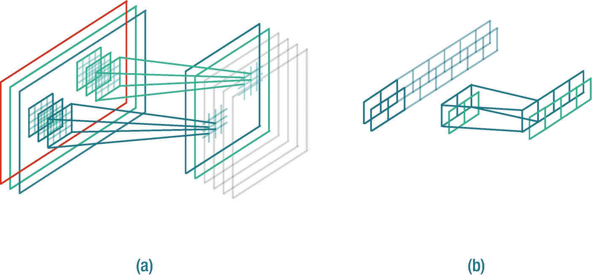
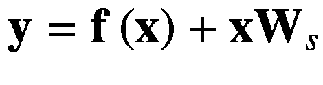

# 六、计算机视觉

> 所有的模型都是错的，但有些是有用的。 <sup>[1](#Fn1)</sup>
> 
> *——乔治盒*

在本章中，我们将了解深度学习在计算机视觉任务中的作用。在第 6.1 节，我们讨论一种特殊的神经网络，称为卷积神经网络，旨在解决计算机视觉问题。与第 [5](5.html) 章讨论的密集神经网络相比，它有一些主要优势(第 6.2 节)。我们介绍一种减轻梯度消失问题的技术(6.3 节)。在 6.4 节中，我们实现了一个深度卷积神经网络来执行图像分类任务。最后，我们在第 6.5 节对本章和本书进行了总结。

## 6.1 卷积神经网络

在本节中，我们将讨论一类重要的神经网络，称为卷积神经网络(LeCun 等人，1989)。卷积神经网络，也称为卷积网络或简称为 ConvNet，被发明来处理具有一些空间局部信息特征的网格状数据。例如，在 2D 图像中，不同位置的小块可能包含球、脸和其他东西。诸如语音的 1D 时间序列数据可能包含不同时间帧片段中的语音。卷积网络学习许多称为过滤器的小参数张量，这些张量有助于提取基本特征。在图像环境中，特征包括边缘、曲线、对象形状、颜色渐变等，而在音频波形环境中，语音的基本特征可能包括音素、语调、音色等。



图 6-1

(a)RGB 图像和(b)双声道立体声音频张量卷积运算的摘要示意图

在第 [5](5.html) 章中，通过引入密集神经网络，我们进入了深度神经网络领域。基于密集网络的图像分类器适用于维数较小的图像数据，例如来自 MNIST 数据集的 784 维。但是当输入图像尺寸增加时，密集网络中的参数数量增长非常快。我们已经看到，密集层中的参数是从前一层中的每个单元( *m* 个单元)到当前层中的每个单元( *n* 个单元)的连接。这里，从前一层到当前层的连接总数是 *m* × *n* 。如果我们通过增加层的任何一个单元来增加层的容量，那么参数的数量会增加得非常快。例如，考虑尺寸为 32 `×` 32 `×` 3 的图像，其总共具有 3072 个特征(像素值)。现在，如果第一层有 1024 个特征单元，那么参数的总数是(3072`×`1024)+1024(额外的 1024 是偏差)= 3146752。目前，从内存的角度来看，这似乎是一个可管理的参数数量。但是，如果我们考虑一个合理大小的图像，那么参数的数量很快就达到大约 1.54 亿，确切地说是 154，141，696，这只是第一层！这是密集层的固有性质，其不允许密集神经网络随着大的输入维度大小和隐藏激活中的大量特征而缩放。在现实世界的计算机视觉应用中使用密集网络变得很困难，因为在实践中，图像数据点通常很大。卷积层通过其固有的设计(6.2 节)避开了这些问题，这促使我们在密集网络上使用卷积网络来处理大维度的数据。

与密集层中的矩阵乘法不同，卷积层使用一种称为卷积的数学运算，这使这些网络被命名为卷积神经网络。这个简单的操作是卷积网络与深度学习文献中的其他神经网络如此不同的原因。一般来说，如果网络中至少有一层使用卷积运算，则神经网络称为卷积网络(Goodfellow 等人，2016)。基于深度学习的当前研究趋势，这个定义可能并不总是有助于对网络进行分类，因为整个网络可能由不同种类的神经层组成。例如，LSTNet (Lai et al .，2018)和 Tacotron 2 (Shen et al .，2018)等网络包含卷积层和递归层，这混淆了这些网络按照此定义分类为递归网络或卷积网络。另一方面，注意机制用于密集网络(Vaswani 等人，2017)甚至卷积网络(Parmar 等人，2018；李等，2019)。我们强调，对网络的更好描述是，它由某些块组成(包含少数同构或异构类型的神经层实例)，而不是基于单层操作来命名神经网络。如果一个神经网络在每一层中使用相同的操作，我们可以将该神经网络命名为以该操作为前缀的神经网络，例如卷积神经网络、循环神经网络等等。

特征和核张量具有相同的深度维度大小，但是不同的空间维度大小，其中核在空间上更小。每个内核生成一个深度维度大小为 1 的单一特征图(对于(a)以绿色阴影显示，其中灰色阴影由其他过滤器创建，对于(b)以浅绿色显示)。在(b)中，蓝色特征重叠以产生绿色输出标量特征，而在(a)中，棋盘核应用于输入特征以产生标量特征，当完全卷积时形成矩形形状。

在下文中，我们将解释卷积网络中使用的各种层，以及对数据点维度进行下采样和上采样的方法。

### 卷积层

称为*卷积层*的层的基本要求是应用卷积运算。我们首先用简单的语言(没有数学复杂性)解释卷积运算以及相关的超参数，然后给出计算输出维度大小的公式。

卷积运算是具有不同空间但相同深度维度大小的两个张量的函数。卷积操作通过将*特征*张量的空间小部分与*滤波器*张量(也称为*内核*或*参数*)重叠开始。因为两个张量的深度是相同的，所以过滤器沿着特征张量的整个深度重叠其空间维度内的所有特征值(见图 [6-1](#Fig1) )。然后，我们在这些重叠值之间应用 Hadamard 乘积，以产生一个新的临时张量，其维数与滤波器的维数相同。现在，我们对这个临时张量中的所有值求和，以输出一个标量值。这相当于滤波器和输入特征张量重叠之间的点积运算。然后，我们在特征张量上空间地跨越(或移动)相同的滤波器，以重叠另一组值。(在图像的上下文中，stride，2)将使过滤器在 x 轴上移动 1 个像素值，在 y 轴上移动 2 个像素值，一次一个方向。但实际上，滤波器通常在所有轴上步进相同的量)。现在，我们再次取滤波张量和特征张量的重叠值的点积来生成另一个标量数。重复这个过程，直到滤波器一次跨过整个特征张量。这产生深度维度大小为 1 的特征图。我们将很快学会如何计算它的空间维度大小。这被称为*卷积运算*。换句话说，卷积是通过跨越滤波器直到整个特征张量被遍历一次，在被滤波器张量重叠的特征张量之间的点积的迭代应用。音频和图像数据点卷积运算的具体例子分别见图 [6-2](#Fig2) 和 [6-3](#Fig3) 。


图 6-2

输入 **x** 和滤波器 **f** 矢量之间的卷积运算的例子，其产生矢量 **y**

这里，滤波器首先对输入的第 0 和第 1 个索引处的值执行点积，并在输出向量的第 0 个索引处产生 0。然后，滤波器向右跨两步，再次对重叠的输入值执行点积，并在输出的第一个索引处产生 4。并且对输入的剩余值重复相同的过程。


图 6-3

输入矩阵 **X** 和滤波器矩阵 **F** 之间的卷积运算示例，其产生矩阵 **Y**

这里，filter 首先点乘左上角的 2x2 方阵，并在结果矩阵中产生标量(在(0，0)索引处)。然后，滤波器在 x 轴或 y 轴上跨两步，再次执行点积。重复这个过程，直到它卷积整个输入矩阵。

由于深度学习的想法是学习数据中复杂模式的有用表示，所以我们在卷积中不仅仅使用一个滤波器，而是使用多个滤波器。如果每个滤波器产生单个特征图，那么 *n* 个滤波器，每个滤波器对特征张量应用一个卷积运算，产生对应于每个滤波器的 *n* 个特征图。这些特征图沿着深度维度堆叠，以创建输出特征张量。输出特征张量的深度维度大小等于卷积层中的过滤器数量。

注意，从数学上讲，卷积运算只涉及一个滤波器和一个输入张量。但是在深度学习的上下文中，卷积层具有一个特征张量，并且可以具有多个滤波器，其中在特征张量和每个滤波器之间分别应用卷积运算，以产生深度维度大小与滤波器数量相同的新特征张量。

### 尺寸计算

现在我们知道了卷积运算是如何工作的。这里，我们将讨论当滤波器在给定的特征张量上卷积时，新的特征张量的输出维数的计算。

让我们从假设任意输入特征张量 t∈ℝ<sup>*a*×*b*×*c*×*d*</sup>开始，其中 *a* 、 *b* 、 *c* 和 *d* 是维度大小。对输入张量 t 的卷积运算的应用产生了另一个特征张量 t’∈ℝ<sup>*a*’×*b*’×*c*’×*d*’</sup>其中*a*’*b*’*c*’和*d*’是对应的输出维数

因为特征张量的选择是任意的，所以可以选择用 2D 音频张量、3D 图像张量或具有特定维度大小的其他张量来替换它。为了避免混淆，我们将假设图像张量 I∈ℝ<sup>*h*×*w*×*c*</sup>和音频矩阵**a**∈ℝ<sup>*t*×*c*</sup>代替任意张量 t，以更具体地理解输出张量维数的计算。这里， *h、w、c* 和 *t* 分别是高度、宽度、通道(或深度)和时间维度尺寸。

假设有两个滤波器和分别用于图像 I 和音频 A 张量，其中 F <sub>I</sub> 是 3 阶张量，**F**T6】A 是 2 阶张量(或矩阵)，并且通道 *c* 具有用于图像和音频的单独值。这里， *f* <sub>* h *</sub> 和 *f* <sub>* w *</sub> 是对应于图像张量 I 的高度 *h* 和宽度 *w* 维度尺寸的滤波器尺寸，对于音频张量 A， *f* <sub>* t *</sub> 是沿时间维度的滤波器尺寸*t 让我们也考虑卷积运算的其他超参数，例如步长大小 *s* ，零填充大小 *p* ，以及膨胀因子 *d* 。(不用担心；这些稍后解释。)因此，在定义了所有必需的术语后，使用以下公式计算输出特征张量维度大小:*


(6.1)


图 6-4

图 [6-2](#Fig2) 和 [6-3](#Fig3) 中输入周围的零填充示例。这里，(a)的零填充为 2，而(b)的零填充为 1

这里， *i* 是张量期望轴的输入维数大小， *o* 是其对应的输出维数大小。它可以是输入张量的任何维度，例如，在我们的例子中， *h* 、 *w* 或 *t* 。我们还用 *f* 指定滤波器大小，在我们的例子中，它可以是 *f* <sub>*h*</sub> ， *f* <sub>*w*</sub> ，或者 *f* <sub>*t*</sub> 。影响输出尺寸大小的其他变量(或超参数)是步幅 *s* ，填充尺寸 *p* 和膨胀 *d* 。在理解输出尺寸大小的计算之前，让我们先熟悉一下这些超参数。

#### 6.1.2.1·斯特雷德

步幅 *s* 是滤波器在输入特征张量上允许的(空间或时间)方向上的移动步长(一次一个)。在图像的上下文中，如果跨距为 2，则过滤器在允许的方向(x 和 y 轴)上移动 2 个像素值，然后点乘重叠。类似地，在诸如音频的时间数据中，步长为 16 的滤波器将在时间上(在 x 轴上)移动 16 个样本，并在重叠之间取点积。所以*步幅*就是滤波器在张量上的移动步长。

#### 6.1.2.2 衬垫

另一个被称为*填充*(或*零填充*)的超参数是沿着所有深度通道的特征张量的空间或时间维度周围的零值的边界。填充 *p* 为正整数值，如图 [6-4](#Fig4) 所示。

#### 6.1.2.3 扩张

在 2015 年，(Yu 和 Koltun，2015)为卷积层引入了一个新的超参数，称为*膨胀*(也称为 *à trous 卷积*或【带孔卷积】)。没有膨胀的卷积产生的特征张量具有前一层的小感受野。*感受域*是任何先前层中负责特定特征单元预测的特征数量(见图 [6-5](#Fig5) )。为了增加感受野，我们需要增加滤波器的大小(或滤波器中参数值的数量)。但是引入卷积层的目标之一是减少内存占用。这就是扩张卷积缓解过量内存分配问题的地方。通过在滤波器中使用*膨胀，我们可以在不增加滤波器中参数数量的情况下增加特征张量的感受域。为了在保持相同数量的参数值的同时增加感受野，我们简单地通过 *d* ∈ ℤ <sup>+</sup> 扩张来隔开参数值。通常，一个过滤器有一个膨胀；当我们增加扩张时，感受野(沿着网络深度在相应层和远处层之间)增加。扩张卷积的示例见图 [6-6](#Fig6) 。还请注意，除了内存足迹之外，膨胀在过去几年中在各种任务上取得了许多成功，例如图像分割(Yu 和 Koltun，2015 年)、原始音频波形建模(Oord 等人，2016 年 a)、记忆效率以及循环神经网络中消失和爆炸梯度问题的抑制(Chang 等人，2017 年)和关键字定位(Coucke 等人，2019 年)，仅举几例。*


图 6-5

三层 1D 卷积网络中的感受野

所有的滤波器都是 2D 向量，并以步长 1 应用于数据。这里，阴影最后一层的 **x** <sup>(4)</sup> 特征单元的感受野对于 **x** <sup>(3)</sup> 为 2，对于**x**<sup>【2】</sup>为 4，对于 **x** <sup>(1)</sup> 为 8。


图 6-6

三层 1D 扩张卷积网络中的感受野

这里，**f**<sup>(1)</sup>**f**<sup>(2)</sup>**f**<sup>【3】</sup>的膨胀分别为 1、2、4，是 2D 向量。(过滤器中的浅色区域显示膨胀，并且只是一个空白空间，其中输入的重叠区域没有点积。)所有的过滤器对数据应用步长 1。我们在**x**<sup>【2】</sup>中用 1 个单位补零，以防止**x**<sup>【3】</sup>中分辨率大幅降低。这里，阴影化的最后一层的**x**<sup>【4】</sup>特征单元的感受野对于**x**<sup>【3】</sup>为 4，对于**x**<sup>【2】</sup>为 6，对于 **x** <sup>(1)</sup> 为 12。请注意，在非扩张卷积网络的相应层中，感受野呈指数增长。核的膨胀有效地增加了感受野，而不增加内存需求。

#### 6.1.2.4 的例子

让我们看一个音频张量的简单例子，其形状是ℝ <sup>16384×2</sup> ，其中声道 *c* 是 2，时间长度 *t* 是 16384。这是一个具有 16，384 个样本的双声道音频(或立体声音频)(一个数据点包含 16，384 个标量幅度值)。如果我们将其与形状为ℝ <sup>16×2</sup> 的滤波器矩阵 **F** 进行卷积，步长 *s* 为 4，零填充 *p* 输入张量的边界厚度为 6，膨胀 *d* 为 1，则我们得到形状为ℝ <sup>4096×1</sup> 的输出张量，计算如下:


卷积后特征张量的新形状是ℝ <sup>4096×1</sup> 。因为我们只使用了一个滤波器，所以输出通道尺寸 *c* 等于 1。

类似地，也可以计算卷积输入图像张量的输出张量形状。让我们假设形状ℝ <sup>28×28×1</sup> 的灰度图像，其中通道 *c* 是 1，宽度 *w* 和高度 *h* 都是 28 像素。filter(*f*<sub>*h*</sub>、 *f* <sub>*w*</sub> )、stride *s* 、zero-padding *p* 和 exploation*d*的值分别为(5，5)、1、0 和 1。按照这种配置，卷积运算产生输出宽度 *w* 和高度 *h* 尺寸等于 24:


在这两个示例中，将膨胀设置为 1 与普通卷积运算相同(默认情况下，将膨胀设置为 1)。

请注意，您应该只使用那些影响特定特征尺寸的过滤器尺寸。例如，在这个公式中，一起使用 *f* <sub>*w*</sub> 和 *w* 来计算 *w* 是合适的，因为 *f* <sub>*w*</sub> 的值影响张量的宽度尺寸 *w* 而不是 *h* 。当 *f* <sub>*w*</sub> 和 *h* 是这个公式的自变量时，这个公式的一个无意义的用法就是试图计算*h*’。

在最近的深度学习模型中，自编码器中的编码器网络和生成对手网络中的鉴别器网络通常使用滤波器大小ℝ <sup>4×4</sup> 、步距(2，2)和填充 1 的卷积。这将尺寸减小了 2 倍。例如，具有指定配置的尺寸为ℝ<sup>1024×1024×*c*t5】的图像被下采样到ℝ<sup>512×512×*c*′</sup>大小。有趣的是，当自编码器中的解码器网络和生成对抗网络中的生成器网络使用这些相同的超参数进行转置卷积运算时，我们得到了一个双维度大小的输出特征张量。也就是说，如果一幅图像的维数为ℝ <sup>512×512× *c*</sup> ，那么在应用这个转置卷积后，我们得到一个ℝ<sup>1024×1024×*c*′</sup>大小的特征张量。</sup>

实际上，大小为ℝ <sup>2×2</sup> 的滤波器也非常常用。特别是在视觉模型中，通常使用较大的过滤器尺寸和跨度会导致性能下降。值得注意的是，最近的一些研究(林等，2013；Szegedy 等人，2014 年；伊恩多拉等人，2016；Oord 等人，2016a，b，c；Springenberg 等人，2014)也使用ℝ <sup>1×1</sup> 滤波器尺寸。这乍一看似乎很奇怪，但它让网络在不改变空间维度大小的情况下学习更深层次的表示。并且还具有多个ℝ <sup>1×1</sup> 滤波器产生多个输出特征图，因此是特征张量。

还要注意，作为经验法则，当构建用于分类任务的卷积网络时，一个简单的想法是增加深度维度大小，并相应地减少空间维度大小。在到达具有少量特征单元的层之后，将卷积的特征张量整形为平坦张量，然后通过小型密集网络。这种趋势已经在深度学习文献中普遍存在(Krizhevsky 等人，2017；Simonyan 和 Zisserman，2014 年；Szegedy 等人，2015，2016；伊恩多拉等人，2016；谭和乐，2019)。

### 6.1.3 汇集层

卷积网络中常用的另一个重要层是池层。*池层*的作用是减少特征张量除深度维度尺寸外的所有维度尺寸。池进一步减少了下一层中卷积运算的计算需求，因为它的输入现在是更小的特征张量。我们已经在清单 4-3 的微型图像分类器中使用了池操作。

任何池函数都将池大小(也称为池窗口)、跨度和零填充作为其参数。使用这些参数，池化函数用单个标量值对特征张量的小边界(由池化窗口定义)中的所有标量值进行汇总。汇集函数在特征张量的每个深度索引上单独操作，这减少了时间、空间或时空维度大小，而保持深度维度大小不变。这里，池大小仅用于确定标量值在特征张量上的位置。

在深度学习文献中，我们会遇到各种各样的池操作。但这里我们讨论的是最常用的池化操作，即最大池化和平均池化。

我们知道，池函数将特征张量上的位置(由池窗口描述)中的标量值在每个深度维度中单独总结为单个标量数。在*最大池函数*的情况下，池数的值就是池窗口中的最大值。*平均池函数*通过取池窗口中所有数字的平均值来计算标量值。正如过滤器在特征张量上卷积一样，池窗口在特征张量上移动给定的步幅值，以确定要池化的值的位置。

对输入要素张量应用池函数时，以下公式计算输出要素张量的维度大小:


(6.2)

这里， *i* 和 *o* 为输入和输出尺寸大小。在图像特征张量 I∈ℝ<sup>*h*×*w*×*c*</sup>， *i* 可以是宽度 *w* 或高度 *h* ，而对于音频特征矩阵**a**∈ℝ<sup>*t*×*c*</sup>，*其他参数 *f* 、 *s* 和 *p* 表示池窗口大小、池窗口的步幅以及特征张量周围的零填充。请注意，该公式类似于公式 [6.1](#Equ1) ，但是在应用卷积运算时，没有计算输出维度大小的膨胀参数。*

汇集是一个常数函数，因此不能区分，因为没有与之相关联的可调参数，关于这些参数可以获得损失梯度。(泽勒和弗格斯，2012 年)提出了一个可区分的池函数，以受益于池操作的学习。但是它并没有变得太受欢迎，在实践中也很少使用。有趣的是，(Springenberg 等人，2014 年)发现，在卷积网络中，用大步长卷积运算代替汇集运算可以实现类似的精度。这种方法使网络完全卷积，结构简单。全卷积网络比使用池操作更好的一个可能原因是，当使用池操作对特征张量进行下采样(空间)时，会发生一些信息丢失，而卷积层可以在对特征张量进行下采样时学习保留对任务重要的信息。

### 6.1.4 上采样

我们已经看到，卷积层对特征张量的空间大小进行下采样。当希望网络的输出大小小于输入大小时，这很有用。最常见的例子是图像分类(Krizhevsky 等人，2017 年)，对象检测(Redmon 等人，2016 年；雷德蒙和法尔哈迪，2017，2018；Girshick 等人，2014 年；Girshick，2015)，以及音频分类(Hershey 等人，2017)。但是，在某些情况下，我们需要输出大小大于输入特征张量。这些任务包括生成模型(文森特等人，2008 年；拉德福德等人，2015 年)和激活特征图可视化(泽勒和弗格斯，2014 年)。

数据点的上采样可以通过应用各种上采样层来实现，例如双三次、最近邻和其他插值，然后是卷积(Dong 等人，2014；金等人，2016 年)或转置卷积(泽勒等人，2010 年)。

#### 6.1.4.1 转置卷积层

*转置卷积*，也被称为*分数步长卷积*或*反卷积*(一个误称)，在对特征张量进行上采样的同时学习自己的一组参数。它在空间上放大了特征张量，其中，就像卷积一样，输出深度维度的大小取决于所使用的滤波器的数量。转置卷积运算可以被认为是使用相同自变量(滤波器、步幅、填充和膨胀)的卷积运算的反向应用，其在空间上对特征张量进行上采样，而不是下采样。转置卷积也具有与卷积层相同的属性，即稀疏连通性、参数共享和平移等方差，这将在 6.2 节中讨论。

给定图像张量 I∈ℝ<sup>*h*×*w*×*c*</sup>的形状、滤波器和超参数，即步幅 *s* 和填充 *p* ，我们可以计算转置卷积运算的输出特征张量维数，公式如下:


(6.3)

这里， *i* 和 *o* 表示输入和输出特征张量的维数。考虑形状ℝ <sup>128×128×3</sup> 的图像张量和转置卷积运算，其中超参数滤波器大小ℝ <sup>6×6×3</sup> ，步长为(2，2)，零填充为 1。当该滤波器应用于转置卷积运算时，我们得到形状ℝ <sup>256×256×1</sup> 的输出张量。类似于方程 [6.2](#Equ2) 中的公式，当适当使用该公式时，可以正确计算输入张量的任何输出维数。

#### 6.1.4.2 棋盘伪影去除

转置卷积已成功用于图像超分辨率(施等，2016a)和图像生成(等，2015)。但如果转置卷积的超参数设置不正确，可能会在生成的数据如音频(Donahue et al .，2018)或图像(Odena et al .，2016)中产生棋盘状伪影。图像中的棋盘格伪像被视为不规则的亮色像素，而在原始音频中，它可以被解释为噪声。

(Odena 等人，2016 年)的发现表明，在卷积运算之后使用简单的上采样运算完全减轻了棋盘伪影问题。虽然转置卷积比卷积方法之后的上采样操作具有更大的表示能力(Shi 等人，2016b)，但是后者获得了更好的性能。结果令人震惊，因为在生成的数据点中完全消除了棋盘伪影。根据这项工作，研究人员可以专注于改进生成模型，生成实值数据点。

## 6.2 突出特点

有趣的是，卷积网络可以处理任意维数的张量。卷积网络还有许多其他重要特性。在本节中，我们将讨论这样的功能，并了解对于各种深度学习任务(主要与计算机视觉相关)，卷积网络为何是比密集网络更好的选择。

### 本地连接

在第 [5](5.html) 章中讨论的密集连接层在包含参数的矩阵和输入特征向量(可视为矩阵)之间应用矩阵乘法，以产生输出特征向量。在这种情况下，输出特征向量中的每个神经元都连接到输入特征向量中的每个神经元。这使得该层非常密集，但也无法扩展到更大的输入张量和模型容量(从记忆的角度来看),如 6.1 节所述。

卷积层采用激进的方法来计算输出张量。它考虑输入特征张量和参数张量(称为核或滤波器),与输入张量相比，它们具有非常小的尺寸。当在滤波器和输入张量之间应用点积时，产生输出张量的单个神经元。换句话说，输出张量的某个单个神经元只与输入张量的一小部分相连。这被称为输出张量神经元的*感受野*。相反，在致密层的情况下，每个输出张量神经元连接到输入张量中的每个神经元。卷积的方法使得卷积层中的连通性是稀疏的(或局部的)。这也加快了计算速度。

还要注意，感受野在更近的层之间通常很小。但是当网络变得更深时，远离输入层的层中的神经元的感受野变得更大。

### 参数共享

在卷积层，在输入张量的不同位置重复使用相同的核来计算输出张量。也就是说，同一组参数在不同的输入位置之间共享。这些参数也被称为*绑定参数*，因为输入的任何位置的参数值都取决于不同位置的相同参数值。相比之下，致密层中的一组参数将输出单元连接到每个输入神经元。并且每个输出神经元都有其自己的独立参数集连接到相同的输入神经元。这反过来增加了内存需求。此外，如此密集的连接也使得计算输出的效率很低。另一方面，卷积层中的所有输出神经元具有连接到相邻输入神经元的相同的一小组参数。这些参数在输入张量的不同位置重复使用，以计算每个输出标量值(滤波器和输入张量重叠之间的点积)。参数的小尺寸和跨不同输入张量位置的共享使得计算更快并且存储更有效。

尽管与过滤器相比，真实世界的图像在空间维度尺寸上较大，但过滤器可以自动学习检测(或激活输出张量中的某些神经元)输入中的基本特征，如边缘、对比度、颜色梯度等。当在原始音频波形中使用卷积时，它可以学习诸如音色、语调、语音等特征的表示。由于约束参数，这成为可能，因为基本模式在数据的整个空间维度中是相似的，并且可以使用相同的参数在不同的位置检测。

### 翻译等值

由于参数共享，作为副作用，卷积层也是平移等变的。如果输入被 x 轴或 y 轴上的一些像素值平移并遵循卷积运算，则得到的张量将与卷积遵循相同平移运算的情况相同。例如，假设一个函数 *f* (。)将输入张量沿 y 轴平移 5 个像素，以及另一个函数 *g* (。)应用卷积。现在，由于平移等方差性质，当这些函数中的一个跟随另一个时，得到的张量将是相同的*f*(*g*(*x*)=*g*(*f*(*x*))。

考虑用卷积神经网络 *f* ()在原始音频波形 *x* 中识别一个口语单词。).让我们假设一个单词“hello”出现 2 到 3 秒。所以这个词会在这个时间段被转录为 *f* ( *x* )。然后我们用翻译函数 *g* ()将*g*(*f*(*x*))转录输出翻译成 5-6 秒。).这个翻译说这个单词在 5 到 6 秒之间被识别。在另一种情况下，假设我们将“hello”声音翻译成 5-6 秒音频波形的时间帧片段 *g* ( *x* )，然后应用卷积*f*(*g*(*x*))。现在，单词将在 5-6 秒的时间段内被转录。这意味着*f*(*g*(*x*)=*g*(*f*(*x*))并且卷积运算是平移等变的。

类似地，在图像的情况下，将图像沿着期望的轴平移一些像素并应用卷积的结果将与我们在平移函数之后应用卷积的结果相同。这表明卷积展现的平移等方差对于不同的输入特征维度大小(对于像音频或图像这样的数据)及其相应的滤波器大小仍然有效。

请注意，卷积并不等同于所有类型的平移，如缩放、旋转、扭曲等。一些研究(贾德伯格等人，2015；Sabour 等人，2017；Zhang，2019)为消除卷积网络中的这一问题做出了贡献。

## 6.3 快捷连接

我们已经讨论了具有非线性激活的深度神经网络能够学习高度复杂的数据集映射。接下来，您可能会猜测向网络中添加更多的层将有助于提高其性能(比如说，准确性)。但是，理论上是这样，但实际操作起来，这并没有看起来那么容易，就是把多层叠加起来。正如 5.4 节所讨论的，较深的网络会遇到梯度消失的问题。令人惊讶的是，它非常严重，网络越深，其性能下降越多，而越接近逻辑层的层梯度越大，学习速度越快。相比之下，越靠近输入层的层具有越小(消失)的梯度，因此学习速度越慢；有些人甚至会完全停止学习。


图 6-7

双层神经块的剩余连接

层操作的选择是任意的。第一层处理输入 **x** 并用 **a** 激活它。)，而第二层首先预测输出并将其添加到该神经块的输入中，即形成快捷连接，然后应用激活以生成输出 **y** 。

但是我们希望使用更深的网络来获得更好的性能。那么如何才能规避这个问题呢？一种解决方案是使用剩余学习框架(He et al .，2016)。让我们从描述这个框架的等式来理解它:


(6.4)

在方程 [6.4](#Equ4) 中， **x** 和 **y** 为输入和输出变量。这里， **f** (。)是包含一个以上神经层(通常是两个)的神经块(或复合函数)。*快捷连接*，也叫*剩余连接*，是由神经块 **f** 的输入 **x** (这里也叫*剩余*)相加而成。)至其输出 **y** 。

根据等式 [6.4](#Equ4) ，中间输出 **f** ( **x** )的尺寸必须等于其输入 **x** 的尺寸，以便逐元素加法成为有效运算。当不是这种情况时，我们简单地将输入 **x** 投影到与 **f** ( **x** )相同的尺寸，投影参数 **W** <sub>s</sub> 如下，其中下标 *s* 代表快捷投影:



(6.5)

在神经块 **f** ()有两层，那么方程 [6.4](#Equ4) 可以写成如下，并在图 [6-7](#Fig7) 中可视化:


(6.6)

用于剩余连接的神经块中的神经层的类型是任意选择的，并且基于要执行的任务。现在，如果我们选择所有神经层作为密集层操作，那么我们可以将方程 [6.4](#Equ6) 重写如下:


(6.7)

这里，术语 **x** 、 **W** 、 **a** (。)分别是输入向量、权重矩阵和激活函数。圆括号中的上标索引表示这些元素所属的层。为了简单起见，我们省略了偏差项。注意，在任何快捷连接中，神经块的输入被添加到该块的最后(未激活的)层的输出，然后跟随该最后层的激活功能。

接下来，我们将构建自己的残差卷积网络，并训练它执行图像识别任务。

## 6.4 图像识别

在本节中，我们将构建一个深度卷积神经网络，称为残差网络(或 ResNet) (He et al .，2016)，在玩具数据集上执行图像识别任务。ResNet 提出了上一节中讨论的剩余连接的概念。基于层数(例如 18、34、50、101 和 152 层)，有各种 ResNet 架构。我们构建了一个 18 层深度残差网络，并在 CIFAR-10 数据集上对其进行训练，看看我们的 ResNet 是否比我们之前在第 [4](4.html) 章中训练的 LeNet 表现得更好。事实上，研究人员通常还会在 ImageNet 数据集上训练大型卷积网络，因为学习其底层映射很困难，因为有近 120 万张图像属于 1000 个类别。

旁注:虽然高速公路连接(Srivastava 等人，2015 年)被发明得更早，但它们并没有取得太大的成功，因为后来残差连接在速度、有效的更深模型训练(高达 1000 层的实验验证)以及简单的无参数操作方面胜过了它们。

现在我们来看看`ResNet18`模型的架构，它基本上有 18 个卷积层。残差块由两个卷积和批量归一化层序列组成，为简单起见，我们将其表示为`ConvBN`。残差块的输入通过第一个`ConvBN`块传递，后面是激活函数(在我们的例子中是 ReLU)。接下来，该中间输出通过另一个`ConvBN`模块，其输出与剩余模块的输入相加，并遵循激活操作。为了使剩余相加成为可能，第二个`ConvBN`模块的输出尺寸必须与剩余输入尺寸相同。换句话说，第一卷积层的输入滤波器必须等于第二卷积层的输出滤波器。如果不是这种情况，我们通过因子 2 对残差输入进行下采样，并通过名为`projection`的独立卷积层将其滤波器数量(通常是输入滤波器的两倍)与第二`ConvBN`模块的输出进行匹配。

在编程剩余块之前，让我们导入一些库。

```py
import Dispatch
import Foundation

import Datasets
import TensorFlow
import TrainingLoop

import PythonKit
let np = Python.import("numpy")

Listing 6-1Import libraries

```

接下来要做的事情是声明一些配置常数，例如网络的图像样本通道、CIFAR-10 数据集中的类的数量、训练模型的时期数量、样本的小批量大小，以及一些类型别名，以便于初始化将在其上执行每个训练相关操作的设备。

```py
let inChannels: Int = 3
let classCount = 10
let epochCount = 25
let batchSize = 128

let device = Device.defaultXLA

typealias TFloat = Tensor<Float>
typealias Input = Tensor<Float>
typealias Output = Tensor<Float>

let imagenetteDataset = Imagenette(batchSize: batchSize, inputSize: .resized320, outputSize: imageSize, on: device)

Listing 6-2Initialize configuration properties, device, and type aliases for the ResNet18 model and load the CIFAR-10 dataset

```

网络接受的输入通道有三个，CIFAR-10 数据集的图像大小为ℝ <sup>32×32×3</sup> 维，网络可以预测的类别数设置为 10，网络将经历数据集 50 次，每个样本为一批 128 幅图像，批维数为ℝ <sup>128×32×32×3</sup> 。我们将`device`设置为 XLA 后端，默认设备将被自动选择，也就是说，如果选择了一个硬件加速器(如下所述),则为 CPU。

如果你在 Google Colaboratory 上编程，你可以选择硬件加速器为 GPU 或 TPU，方法是在菜单栏中点击*运行时➤更改运行时类型*，然后从弹出菜单中的*硬件加速器*下拉列表中选择任一设备，并点击*保存*按钮。现在`device`将自动设置为 GPU 或 TPU 加速器与 XLA 后端，`ResNet18`将在选定的加速器上训练。在我的实验中，我选择了 GPU。


图 6-8

残差卷积块的详细架构

输入经过卷积和批量标准化层、ReLU 激活以及另一系列卷积和批量标准化层。该输出与剩余输入相加，然后用 ReLU 激活剩余输入，给出剩余模块的最终输出。残差输入首先被投影(或下采样)到与第二批归一化层的输出相同的维度(即，输入的一半)和通道(即，输入的两倍)，但是如果通道和维度相同，则它被原样传递到残差连接。

现在我们将对清单 [6-3](#PC3) 中的`ConvBN`块进行编程。

```py
struct ConvBN: Layer {
  var conv: Conv2D<Float>
  var norm: BatchNorm<Float>

  init(
    filterShape: (Int, Int, Int, Int),
    strides: (Int, Int) = (1, 1),
    padding: Padding = .same
  ) {
    conv = Conv2D(filterShape: filterShape, strides: strides, padding: padding, useBias: false)
    norm = BatchNorm(featureCount: filterShape.3, momentum: 0.1, epsilon: 1e-5)
  }

  @differentiable
  func callAsFunction(_ input: Input) -> Output {
    input.sequenced(through: conv, norm)
  }
}

Listing 6-3Program a convolutional and batch normalization layers block

```

让我们从名为`conv`的`Conv2D`实例的初始化开始，它以`filterShape`、`strides`和`padding`作为参数。第一个自变量`filterShape`是四个`Int`值的元组，其中第一、第二、第三和第四值分别代表内核的高度、内核的宽度、内核的深度(即，输入特征图的过滤器)和内核的数量(即，输出特征图的过滤器的期望数量或深度维度大小)。第二个自变量`strides`是两个`Int`值的元组，其在第一和第二索引处分别表示在应用卷积运算之前在高度(即，垂直)和宽度(即，水平)方向上采取的步骤。第三个参数是我们已经讨论过的`Padding`枚举类型的`padding`。在 TensorFlow 中，我们不需要计算零填充并将其放在卷积或池化等层中。我们可以将`padding`设置为`.valid`或`.same`。两者的区别在于`.same`在输入周围应用零填充(如果需要)以产生与输入相同的空间或时间维度的输出，而`.valid`在输入周围不应用任何零填充，并且输出的空间或时间维度可能与输入的空间或时间维度相同，也可能不同。但是在我们的代码示例中，我们将主要使用`Padding`枚举的`.same`用例。最后，我们没有在我们的`conv`实例中使用偏差项，并将`useBias`参数设置为等于`false`。

接下来，注意批量标准化层`norm`采用的`featureCount`参数等于卷积层`conv`的输出滤波器数量。我们还将`norm`的`momentum`和`epsilon`分别设为等于`0.1`和`0.00001`。


图 6-9

18 层剩余卷积网络的详细结构

输入*x*∈ℝ<sup>T3】b×224×224×3</sup>经过卷积和批量归一化层和 ReLU 激活，随后是最大池操作。这里， *b* 是最小批量。然后，输出经过一系列八个残差块，其输出经过全局平均池操作、展平层(将多维张量转换为批量向量)和密集层，后者产生罗吉斯向量 *y* ∈ ℝ <sup>b×10</sup> 。

现在我们将对清单 [6-4](#PC4) 中的剩余程序块进行编程，如图 [6-8](#Fig8) 所示。

```py
struct ResidualBlock: Layer {
  var convBN1: ConvBN
  var convBN2: ConvBN
  var projection: ConvBN

  init(
    inFilters: Int,
    outFilters: Int
  ) {
    if inFilters == outFilters {
      convBN1 = ConvBN(filterShape: (3, 3, inFilters, outFilters))
      convBN2 = ConvBN(filterShape: (3, 3, outFilters, outFilters))
      // In this case, we don't use `projection`.
      projection = ConvBN(filterShape: (1, 1, 1, 1))
    } else {
      convBN1 = ConvBN(filterShape: (3, 3, inFilters, outFilters), strides: (2, 2))
      convBN2 = ConvBN(filterShape: (3, 3, outFilters, outFilters), strides: (1, 1))
      projection = ConvBN(filterShape: (1, 1, inFilters, outFilters), strides: (2, 2))
    }
  }

  @differentiable
  func callAsFunction(_ input: Input) -> Output {
    let residual = convBN1.conv.filter.shape[2] != convBN2.conv.filter.shape[3] ? projection(input) : input
    let convBN1Output = relu(convBN1(input))
    let convBN2Output = relu(convBN2(convBN1Output) + residual)
    return convBN2Output
  }
}

Listing 6-4Program a convolutional residual block and consider the downsampling for different input and output filters to it

```

残差块是 ResNet 模型的基本构造块。残余块的可视化和解释见图 [6-8](#Fig8) 。在清单 [6-4](#PC4) 中，名为`ResidualBlock`的残差块结构有三个存储属性，即`projection`、`convBN1`和`ConvBN`类型的`convBN2`。在其初始化器中，它接受前两个`Int`参数，即`inFilters`和`outFilters`。初始化层时，我们检查`inFilters`和`outFilters`是否相等。如果这是真的，那么我们为`convBN1`和`convBN2`设置内核的高度和宽度等于 3 个单位。`convBN1`和`convBN2`的输入通道设置为等于`inFilters`和`outFilters`，两者的输出通道设置为等于`outFilters`。

两层的`strides`也默认为`(1, 1)`。在这种情况下，由于默认情况下`padding`为`.same`而`strides`为`(1, 1)`，输入输出特征尺寸将相同；因此，我们不需要投影输入，我们将`projection`实例初始化为默认值。

当`ResidualBlock`的`inFilters`和`outFilters`不同时，我们将`convBN1`的`strides`设置为等于`(2, 2)`，而对于`convBN1`和`convBN2`的其他参数与前一种情况相同。使用此`strides`值`convBN1`，输入要素的空间维度将减半。因此，我们将`projection`实例的所有参数设置为与`convBN1`相同，以将输入投射到与`convBN1`和`convBN2`序列将投射的维度相同的维度。

在`callAsFunction(_:)`方法的正向传递过程中，如果两个`ConvBN`序列的输入和输出滤波器不相同，但在其他情况下等于输入本身，我们首先将剩余输入设置为等于投影输入。然后我们应用`convBN1`并用`relu`激活它，运行通过`convBN2`，加上剩余输入，用`relu`激活它返回剩余块的输出。

清单 [6-5](#PC5) 显示了 ResNet18 模型结构。ResNet18 模型如图 [6-9](#Fig9) 所示。

```py
struct ResNet18: Layer {
  var initialConvBNBlock = Sequential {
    ConvBN(filterShape: (7, 7, inChannels, 64), strides: (2, 2))
    MaxPool2D<Float>(poolSize: (3, 3), strides: (2, 2), padding: .same)
  }
  var block1 = Sequential {
    ResidualBlock(inFilters: 64, outFilters: 64)
    ResidualBlock(inFilters: 64, outFilters: 64)
  }
  var block2 = Sequential {
    ResidualBlock(inFilters: 64,  outFilters: 128)
    ResidualBlock(inFilters: 128, outFilters: 128)
  }
  var block3 = Sequential {
    ResidualBlock(inFilters: 128, outFilters: 256)
    ResidualBlock(inFilters: 256, outFilters: 256)
  }
  var block4 = Sequential {
    ResidualBlock(inFilters: 256, outFilters: 512)
    ResidualBlock(inFilters: 512, outFilters: 512)
  }
  var globalAvgPool = GlobalAvgPool2D<Float>()
  var flatten = Flatten<Float>()
  var classifier: Dense<Float>

  init(classCount: Int) {
    classifier = Dense(inputSize: 512, outputSize: classCount)
  }

  @differentiable
  func callAsFunction(_ input: Input) -> Output {
    let initialConvBNOutput = maxPool(relu(initialConvBN(input)))
    let convFeatures = initialConvBNOutput.sequenced(through: block1, block2, block3, block4)
    let logits = convFeatures.sequenced(through: globalAvgPool, flatten, classifier)
    return logits
  }
}

Listing 6-5Define the residual convolutional network with 18 layers

```

如图 [6-9](#Fig9) 所示，该结构有四个块，每个块包含两个`ResidualBlock`，还有`initialConvBN`和`maxPool`属性，执行卷积和批量归一化以及一个最大池操作。有一个名为`globalAvgPool`的平均池属性和一个类型为`Flatten`的`flatten`属性。最后，我们有一个`Dense`类型的`classifier`属性用于预测`logits`。在正向传递中，输入张量通过`initialConvBN`、`relu`、`maxPool`、`block1`、`block2`、`block3`和`block4`传递。输出是输入图像的卷积特征，然后汇集、展平(即整形为批量矢量)，并通过`classifier`层进行预测。

接下来，我们侵入`Layer`协议，用 NumPy 数组实现读和写检查点方法。

```py
extension Layer {
  public func writeCheckpoint(to file: String) throws {
    var parameters = Array<PythonObject>()
    for keyPath in self.recursivelyAllWritableKeyPaths(to: TFloat.self) {
      parameters.append(self[keyPath: keyPath].makeNumpyArray())
    }
    np.save(file, np.array(parameters))
  }

  public mutating func readCheckpoint(from file: String) throws {
    let parameters = np.load(file)
    for (index, keyPath) in self.recursivelyAllWritableKeyPaths(to: TFloat.self).enumerated() {
      self[keyPath: keyPath] = TFloat(numpy: parameters[index])!
    }
  }
}

Listing 6-6Implement custom checkpoint reading and writing methods on the Layer protocol using the NumPy library with Python interoperability

```

我们在`Layer`协议上声明了两个实例方法，所有符合它的类型都可以自动使用它们，即`writeCheckpoint(to:)`和`readCheckpoint(from:)`。检查点写方法声明了一个`PythonObject`类型的参数数组。然后我们通过可以写入的`KeyPath`遍历`Tensor<Float>`类型的所有属性。在通过调用`makeNumpyArray()`方法将`TFloat`实例转换为 NumPy 数组之后，我们将每个属性添加到`parameters`数组中。在循环之后，我们将 NumPy 数组类型转换参数保存到文件位置。

在检查点读取方法中，我们加载检查点文件。然后，我们递归地迭代指向`TFloat`类型的所有可写的`KeyPath`，并通过强制展开将`keyPath keyPath`处的符合层的实例的属性设置为等于从索引处的`file`加载的 NumPy 个参数。这样，我们将参数加载到我们的`Layer-`一致性实例中。

接下来，我们定义一个函数`writeCheckpoint(_:event:)`来保存训练期间每个时期结束后的检查点。我们将把它传递给数组中的参数`callbacks`。在训练过程中，`callbacks`接受一组基于特定事件调用的函数。

```py
func writeCheckpoint<L: TrainingLoopProtocol>(_ loop: inout L, event: TrainingLoopEvent) throws {
  DispatchQueue.global(qos: .userInitiated).async {
    switch event {
    case .epochEnd:
      do {
        try preTrainingModel.writeCheckpoint(to: "ResNet18.npy")
      } catch {
        print(error)
      }
      default: break
    }
  }
}

Listing 6-7Define a function to automatically write checkpoint during training

```

在清单 [6-7](#PC7) 中，我们定义了一个占位符类型`L`符合`TrainingLoopProtocol`的函数`writeCheckpoint(_:event:)`，它带有两个参数:`inout`类型的`loop`和`TrainingLoopEvent`类型的`event`。这个函数会抛出一个错误。如果您想在训练期间通过传递给`callbacks`为其他定制任务定义您的函数，您应该使用相同的参数，并在函数体内定义定制功能。

在主体内部，我们有一个包含在`DispatchQueue`中的`switch`语句，用于使用另一个线程来执行这个任务(您可能不需要编写这个语句，但是我在代码执行方面遇到了一些问题)。`switch`语句将事件参数与各种情况进行比较。因为我们想在每个时期结束时保存检查点，所以我们试图在`event`等于`.epochEnd`的时候写检查点。还有许多其他的`event`案例，你可以利用它们来定制训练循环。

```py
// Initialize the model and optimizer
var model = ResNet18(classCount: classCount)
var optimizer = SGD(for: model, learningRate: 0.1, momentum: 0.9)

// Training setup
let trainingProgress = TrainingProgress()
var trainingLoop = TrainingLoop(
  training: dataset.training,
  validation: dataset.validation,
  optimizer: optimizer,
  lossFunction: softmaxCrossEntropy,
  callbacks: [trainingProgress.update, writeCheckpoint])

// Train the model
try! trainingLoop.fit(&model, epochs: epochs, on: device)

Listing 6-8Initialize the model and optimizer, and train the model

```

在清单 [6-8](#PC8) 中，我们已经用具有`classCount`类的`ResNet18`初始化了`model`用于预测。优化器`optimizer`用随机梯度下降优化器初始化，该优化器具有学习速率`0.1`和等于`0.9`的动量设置。然后分别初始化`TrainingProgress`和`TrainingLoop`实例`trainingProgress`和`trainingLoop`。对于`training`和`validation`，用`datasets`初始化`trainingLoop`，优化器被设置为等于`optimizer`，损失函数被设置为`softmaxCrossEntropy`，`callbacks`是包含更新方法`trainingProgress.update`和`writeCheckpoint`函数的数组。

最后，我们对`model`进行训练，在训练集和验证集上分别达到 0.9960 和 0.7305 的图像分类精度。我们的 ResNet18 模型的性能优于在相同数据集上训练的小 LeNet(参见第 [4 章](4.html))，后者在训练集和验证集上的精度分别仅为 0.5607 和 0.5625。

## 6.5 结论

在这一章中，我们研究了卷积神经网络对于处理计算机视觉问题非常有用，并且比密集网络有许多优势。我们还研究了一种减轻梯度消失问题的技术。最后，我们训练了一个深度卷积网络来对图像进行分类，其性能优于一个较小的卷积网络，表明深度非线性模型优于浅层模型。

这本书用 Swift 为 TensorFlow 介绍了深度学习学科。但我们只是触及了深度学习领域的皮毛，还有很多东西需要了解！我希望你喜欢用 Swift 语言理解和编程深度学习。直到下一次…

<aside aria-label="Footnotes" class="FootnoteSection" epub:type="footnotes">Footnotes [1](#Fn1_source)

引自(Box，1976)。

 </aside>