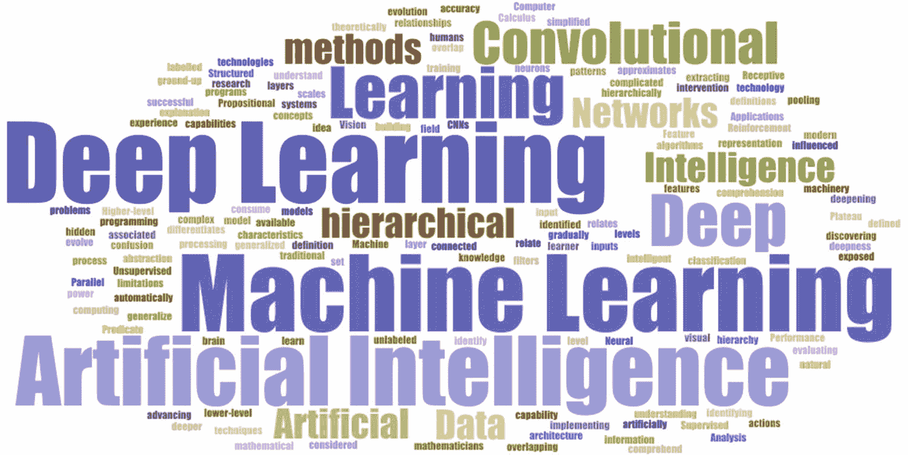
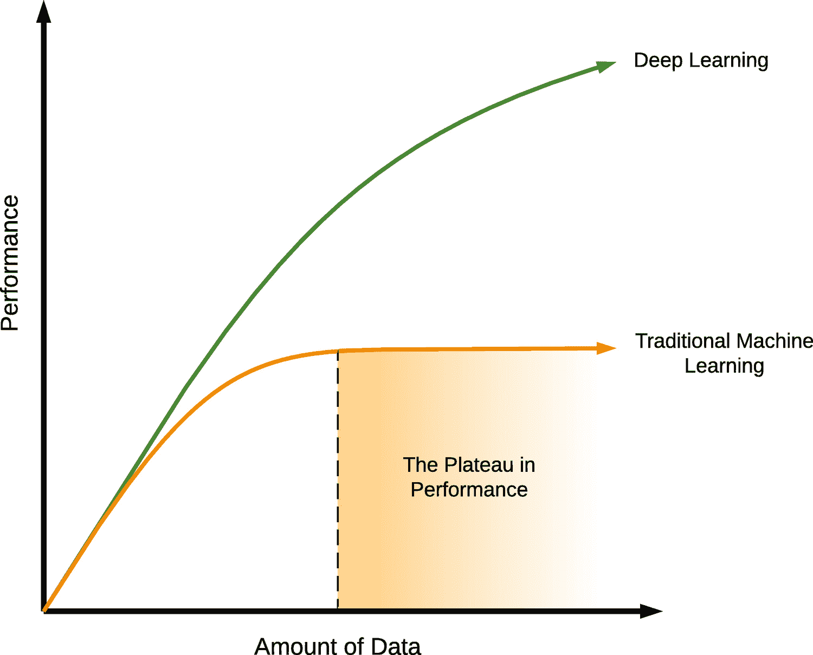
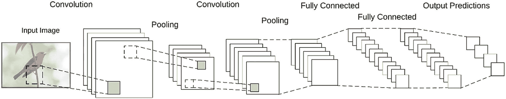
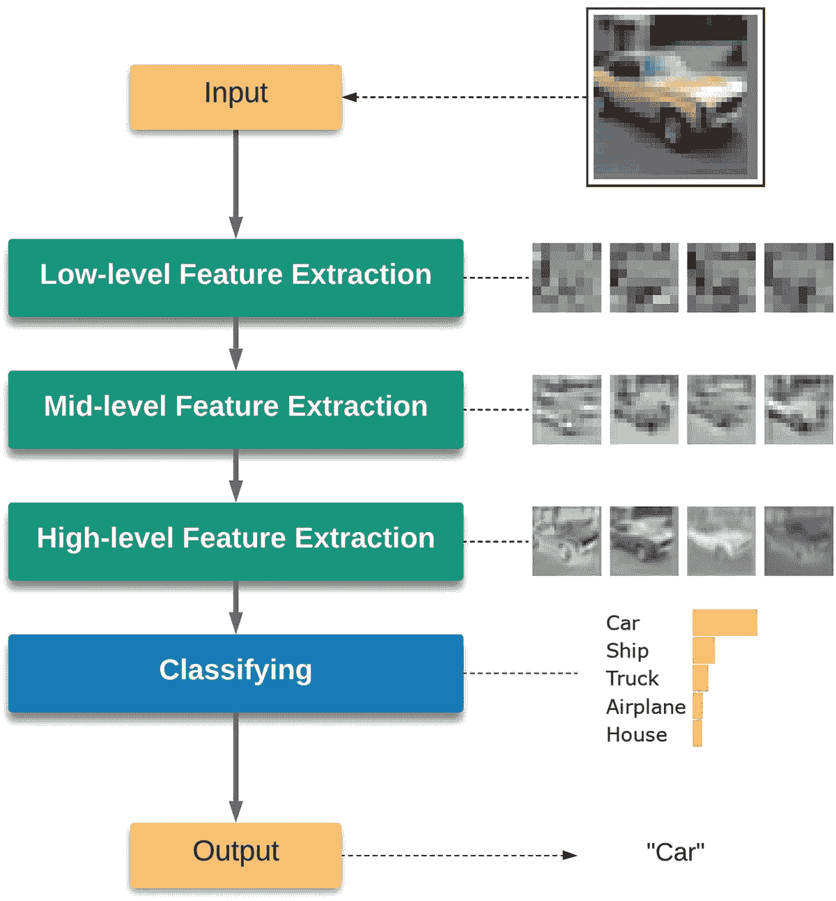
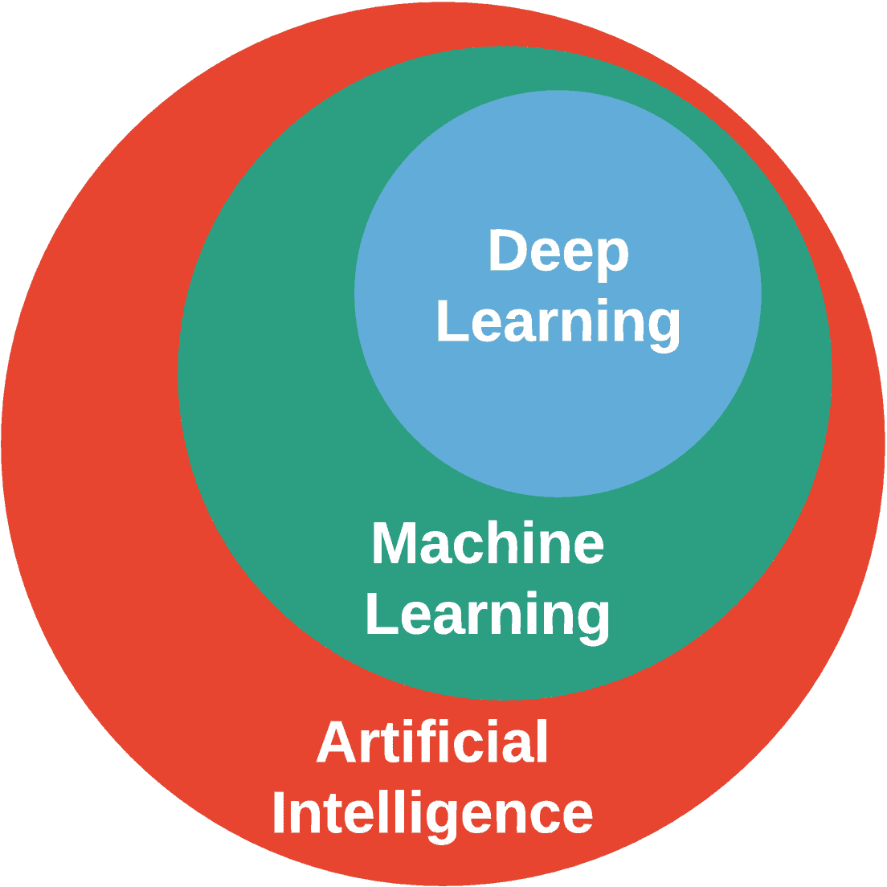
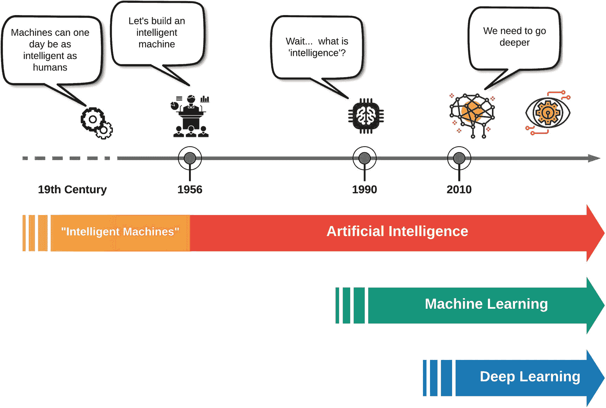
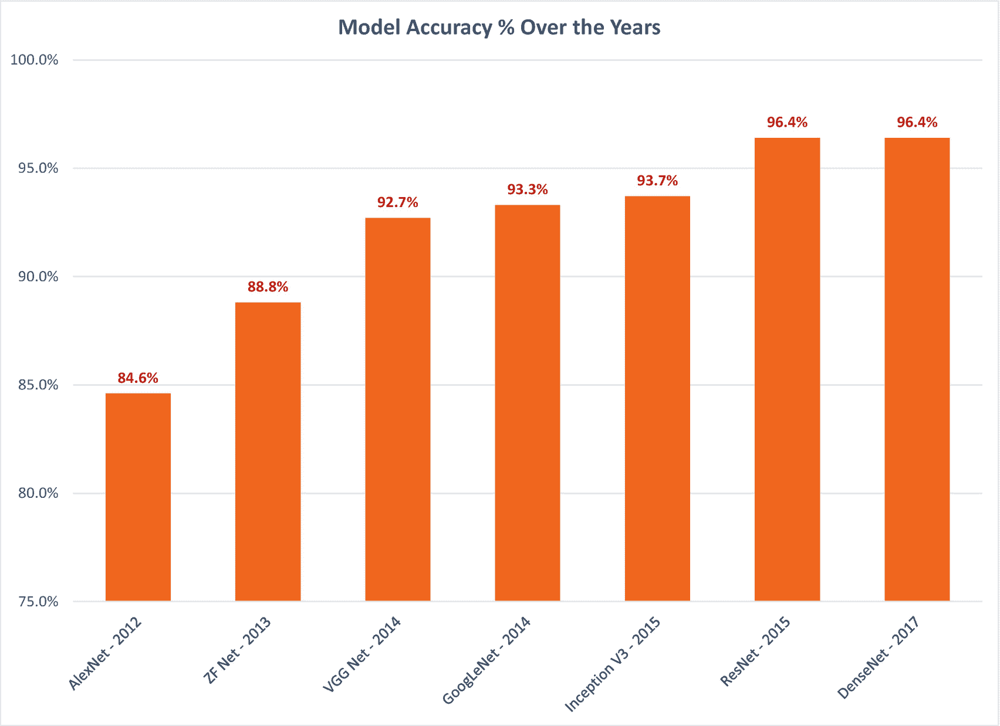

# 1. 什么是深度学习？

我们生活在人工智能（AI）的时代。

我们可能出生得有点晚，无法探索地球，又太早了，无法探索宇宙。然而，我们可能正好赶上了人工智能的兴起。

我们可以帮助构建那个未来。

人工智能领域的创新每天都在发生，从智能消费设备到人工智能个人助理再到自动驾驶汽车。技术巨头——谷歌、Facebook、亚马逊、微软、苹果、IBM，以及像 DeepMind 和 OpenAI 这样的专注于人工智能的组织——都在努力在各个领域构建人工智能技术，以解决问题并提高生活质量。

深度学习是人工智能的最新迭代。尽管这个概念本身已经存在很多年了，但由于它不断取得的显著突破，深度学习在过去几年中变得流行起来。十年前还是科幻的东西，现在正成为现实。

多亏了深度学习，人工智能技术正日益成为我们家庭生活的一部分。如今，我们的大多数消费设备和服务都内置了某种人工智能。也许现在是时候加入这场革命了。你也可以开始为这场人工智能的驱动贡献力量。

但首先，我们需要确保我们理解深度学习是什么。

## 定义深度学习

无论你是来自传统的人工智能背景，还是刚开始进入人工智能领域，你可能会想知道“人工智能”、“机器学习”、“深度学习”等术语的含义，以及与之相关的其他术语（见图 1-1）。

图 1-1

深度学习的困惑

随着“深度学习”一词成为热门词汇，并成为一些消费技术的一部分，可能很难弄清楚这些术语各自意味着什么，以及它们是如何相互关联的。你可能正在试图弄清楚这三个术语是否可以互换使用，以及它们各自的来源。

当我们开始深度学习之旅时，这些问题是我们所有人都会遇到的常见问题。让我们看看我们如何回答这些问题。

*深度学习* 是机器学习的一个子集，它处理层次特征学习。

*机器学习* 是一种人工智能方法，旨在使机器能够在没有明确编程的情况下学习。

对于人工智能来说，我们可能需要从最基本的概念开始。一切始于*智能机器*的想法。

## 智能机器

智能机器的概念是指可以构建出与人类平行（或更高）的智能的机器，赋予它们执行需要人类智能的任务的能力。

人类自古以来就着迷于这个想法，其书面记录可以追溯到 13 世纪（来自拉蒙·卢尔的作品，1232-1315 年）。到 17 世纪，戈特弗里德·莱布尼茨通过他的**演算术**——一个理论上的通用逻辑计算框架——扩展了这个想法。到 19 世纪，随着乔治·布尔提出的**命题逻辑**和戈特洛布·弗雷格提出的**谓词演算**等概念的引入，**形式推理**的概念已经开始。

然而，直到 1956 年的达特茅斯会议，人工智能还没有一个正式的研究概念。

## 人工智能

1956 年 6 月，许多领域的专家——科学家和数学家——聚集在纽约州汉普郡的达特茅斯学院。这次会议，名为“达特茅斯夏季人工智能研究项目”，是人工智能正式研究领域的起点。艾伦·纽厄尔、赫伯特·A·西蒙和克利夫·肖开发的逻辑理论家，现在被认为是第一个人工智能程序，也在达特茅斯会议上展出。逻辑理论家的目的是模仿人类的逻辑问题解决能力，并能证明《数学原理》中前 52 个定理中的 38 个（由阿尔弗雷德·诺思·怀特海德和伯特兰·罗素撰写的关于数学原理的书籍）。

到了 20 世纪 60 年代，人工智能研究已经全面展开。它得到了美国国防部的资助，越来越多的 AI 研究实验室被建立，研究人员们充满乐观。Herbert A. Simon 在 1965 年预测，“机器将在二十年内能够完成任何人类能够完成的工作。”^(1)

但人工智能的发展并没有那么快。

在 20 世纪 90 年代末和 21 世纪初，研究人员在他们对人工智能的方法中识别出一个问题：为了人工创造一个具有智能的机器，**首先需要理解智能是如何工作的**。

即使在今天，我们也没有一个完整的定义来描述我们所说的“智能”。

为了解决这个问题，研究人员决定从基础做起：与其试图构建智能，他们决定研究如何构建一个能够自主增长智能的系统。

这个想法催生了人工智能领域的新分支，即**机器学习**。

## 机器学习

机器学习是人工智能的一个子集，旨在为机器提供无需明确编程就能学习的能力。其理念是，这样的机器（或计算机程序），一旦构建完成，将能够在接触到新数据时进化并适应。

机器学习背后的主要思想是学习者从经验中归纳的能力。一旦给定了训练样本集，学习者（或程序）必须能够基于这些样本构建一个泛化模型，这将允许它以足够的准确性对新案例做出决定。

基于这种方法，机器学习系统有三种学习方式：

+   **监督学习**：系统被给予一组标记的案例（一个训练集），基于这些案例，它被要求创建一个可以作用于未见案例的通用模型。

+   **无监督学习**：系统被给予一组未标记的案例，并要求在其中找到模式。这对于发现隐藏模式是理想的。

+   **强化学习**：系统被要求采取任何行动，并根据该行动对给定情况的适宜性给予奖励或惩罚。系统必须学习在给定情况下哪些行动能带来最多的奖励。

这些技术使得机器学习领域蓬勃发展。它们在计算机视觉和文本分析等领域特别成功。多年来，许多模型被引入作为实现机器学习技术的手段，例如人工神经网络（受大脑神经元工作方式启发的模型）、决策树（使用树状结构来模拟决策和结果的模型）、回归模型（使用统计方法来映射输入和输出变量的模型）等等。

大约在 2010 年，发生了一些影响机器学习研究的事件：

+   计算能力变得更加可用，评估更复杂的模型变得更加容易。

+   数据处理和存储变得更加便宜。更多的数据可供消费。

+   我们对自然大脑如何工作的理解增加了，这使我们能够围绕它们建模新的机器学习算法。

这些突破推动我们进入了一个新的机器学习领域，称为*深度学习*。

## 深度学习

深度学习是机器学习的一个子集，它专注于一个受我们对大脑工作方式理解启发的算法领域，以获取知识。

它也被称为*深度结构学习*或*层次学习*。

深度学习建立在人工神经网络的理念之上，并通过以特定方式加深网络来扩展其规模，以便能够通过深度学习处理大量数据。通过更深的网络，深度学习模型能够从原始数据中提取特征，并在每一层逐渐“学习”这些特征，最终建立起对数据的高级理解。这种技术被称为*层次化* *特征* *学习*，它允许系统通过多层次的抽象自动学习复杂特征，而人类干预最小化。

以下是一些关于深度学习的定义，这些定义来自该领域的开创性工作：

*机器学习的一个子领域，它基于学习多级表示的算法来模拟数据之间的复杂关系。因此，高级特征和概念是以低级特征来定义的，这样的特征层次结构被称为深度架构*。

—*深度学习：方法和应用*^(2)

*概念层次结构允许计算机通过构建更简单的概念来学习复杂的概念。如果我们绘制一个图来展示这些概念是如何相互构建的，那么这个图是深层次的，有多个层次。因此，我们将这种方法称为深度学习。*

—*深度学习*^(3)

深度学习最显著的特点之一，也是使其非常受欢迎和实用的原因之一，是它具有良好的可扩展性；也就是说，给予它的数据越多，它的表现就越好。与许多旧的机器学习算法不同，这些算法对它们可以摄入的数据量有一个上限——通常称为*性能平台期*（图 1-2）——深度学习模型没有这样的限制（理论上），并且它们可能能够超越人类所能理解的范围。这一点在现代基于深度学习的图像处理系统中表现得尤为明显，这些系统能够超越人类。

图 1-2

深度学习中性能缺乏平台期

## 卷积神经网络

卷积神经网络（CNNs）是深度学习的一个主要例子。它们受到视觉皮层（大脑处理视觉输入的区域）中神经元排列方式的启发。在这里，并非所有神经元都与视觉场的所有输入相连。相反，视觉场被“铺砌”成由神经元群（称为感受野）组成的区域，这些区域部分重叠。

CNNs 以类似的方式工作。它们使用数学卷积算子处理输入的重叠块，这近似了感受野的工作方式（图 1-3）。

图 1-3

一个卷积神经网络

第一层卷积使用一组卷积滤波器从输入图像中识别一组低级特征。这些识别出的低级特征随后被池化（来自池化层）并作为输入提供给下一层卷积，该层使用另一组卷积滤波器从先前识别的低级特征中识别一组更高级的特征。这个过程持续进行几层，每一层卷积都使用前一层输入来识别比前一层更高级的特征。最后，最后一层卷积的输出传递到一组全连接层进行最终分类。

## 多深？

一旦你掌握了深度学习的功能，通常会出现一个问题：如果我们说更深、更复杂的模型赋予了深度学习模型超越人类能力的能力，那么*一个机器学习模型应该有多深才能被认为是深度学习模型*？

结果表明，对于这个问题并没有明确的回答。我们真正需要做的是从不同的角度来审视深度学习，以便更好地理解它。让我们退一步，看看深度学习模型是如何工作的——例如，使用卷积神经网络（CNNs）。

如前所述，CNN 的卷积滤波器试图首先识别低级特征，并使用这些识别出的特征通过多个步骤逐步识别高级特征。

这就是我们之前提到的层次化特征学习，它是理解深度学习的关键，也是它与传统机器学习算法区别开来的地方（图 1-4）。

图 1-4

层次化特征学习

一个深度学习模型（如 CNN）不会试图一次性理解整个问题；也就是说，它不会试图一次性把握所有输入的特征，就像传统算法试图做的那样。它所关注的是逐步地、逐个地查看输入，以便从中推导出其低级模式/特征。然后，它使用这些低级特征通过许多层，层次化地逐步识别高级特征。这使得深度学习模型能够通过逐步构建更简单的模式来学习复杂的模式。这也使得深度学习模型能够更好地理解世界，它们不仅看到特征，还能看到这些特征是如何在每一层上构建的层次结构。

当然，必须层次化地学习特征意味着模型必须包含许多层。这意味着这样的模型将会是“深”的。

这又把我们带回了我们最初的问题：深度模型之所以是深度学习，并不是因为它们深度，而是因为要实现层次化学习，模型必须是深层的。深度是实施层次化特征学习的副产品。

那么，我们如何确定一个模型是否是深度学习模型呢？

简而言之，如果一个模型使用层次化特征学习——首先识别低级特征，然后在此基础上构建以识别高级特征（例如，通过使用卷积滤波器）——那么它就是一个深度学习模型。如果不是这样，那么无论你的模型有多少层，它都不被视为深度学习模型。这意味着一个有 100 个全连接层的神经网络（并且只有全连接层）不会是一个深度学习模型，但一个只有少量卷积层的网络则会。

## 深度学习仅仅是 CNNs 吗？

当我们谈论深度学习时，我们经常提到 CNNs。你可能想知道深度学习是否仅仅是 CNNs。

答案是否定的。

在以下模型中，以及其他模型，被认为是深度学习：

+   卷积神经网络

+   深度玻尔兹曼机

+   深度信念网络

+   堆叠自编码器

+   生成对抗网络（GANs）

+   转换器

我们更经常以 CNN（卷积神经网络）为例来讲解深度学习，因为它们更容易理解。由于它们基于生物视觉的工作原理，因此更容易可视化和应用它们如何基于视觉的认知工作流程。

但我们应该记住，CNN 并不是深度学习的全部。

## 为什么是计算机视觉？

回顾深度学习的历史和一些最近取得的成就，^(4)你会注意到，它所应用的大多数项目都涉及计算机视觉。即使是 ImageNet 竞赛也专注于视觉识别。

为什么会这样？深度学习是否只适用于计算机视觉？

并非如此。

视觉——理解和赋予视觉输入意义——是人类特别擅长的。理解周围环境的能力被认为是智能的标志。因此，当谈到构建智能机器时，视觉是我们希望智能机器拥有的核心能力之一。它也易于验证，因为我们可以轻松地将其与人类的能力进行比较。

因此，探索视觉能力已成为深度学习研究的一个核心领域。

深度学习在视觉领域取得的成就也可能影响我们如何进入其他领域。多亏了迁移学习的能力（我们将在下一章讨论），深度学习可以将一个领域获得的知识应用到另一个领域。虽然通常这种能力用于将一个视觉模型的知识应用到另一个模型，但有人推测（并且有许多正在进行的研究），在视觉输入上训练的模型的知识可能在非视觉环境中得到应用。

## 所有这一切是如何结合在一起的？

回到我们最初的问题：*人工智能、机器学习和深度学习领域之间是如何相互关联的？*

简而言之，机器学习是人工智能的一个子集（一种方法），而深度学习是机器学习的一个子集，所有这些都在朝着创造一个智能机器的共同目标努力（见图 1-5）。

图 1-5

人工智能、机器学习和深度学习之间的关系

见图 1-6 快速回顾深度学习、机器学习和人工智能是如何随着时间演变的。

图 1-6

深度学习的演变

深度学习在 2010 年代初起步，持续取得突破性成果，其准确率在之前被认为不可能应用于仅由人类完成的任务中，如图像识别、语言处理和语音识别。图 1-7 展示了过去十年中图像识别领域的一些值得注意的深度学习里程碑。

图 1-7

深度学习模型准确率逐年变化

你可以在附录 1 中了解更多关于这些特定模型及其对深度学习重要性的信息。

通过深度学习展现的能力和取得的成就，我们可能已经迈出了接近人工智能最终目标的一步：构建具有人类（或更高）水平智能的机器。

## 人工智能是否可能？

尽管人工智能已经取得了如此多的成就，但关于真正的人工智能（也称为通用人工智能）是否可能，仍然存在一些怀疑。

这些怀疑的原因之一是对“人工智能”这一术语的误解。这导致了人们对人工智能实现目标的方法产生了怀疑。

“人工智能”这一术语是一个不幸的误称，它导致了众多误解。当 1956 年的达特茅斯会议将这一新的研究领域命名为人工智能时，他们对此名称有着良好的意图。但正如往常一样，意图并未得到保留，也不明显。

人们普遍的误解——字面理解这一名称——是人工智能的目标是人为地构建“智能”。然而，实际上，“人工智能”这一术语原本和始终意味着“人工”+“智能”，意味着它的目的是*连接*人工和智能。人工智能的目标是观察和理解自然构造（人类或其他）中固有的“智能”行为，并尝试将其构建到人工构造中。这些人工构造可以是计算机程序、机器/机器人、算法或理论框架。

正是这个概念带给我们诸如神经网络和遗传算法等模型。如果你仔细观察这些模型，就会很明显，它们都是在人工构造上应用了自然智能概念的修改版本。

人工智能的最终目标——现在仍然是——构建一个具有人类或更高水平的智能的机器。（请注意，这里的“机器”是一个主观的术语，可以指任何人工构造。）我们并不想重新发明“智能”。我们只需要将自然智能的特征和概念适应到我们构建的人工构造中。

我们并不是人为地构建智能。我们构建的是受自然界启发的机器。
