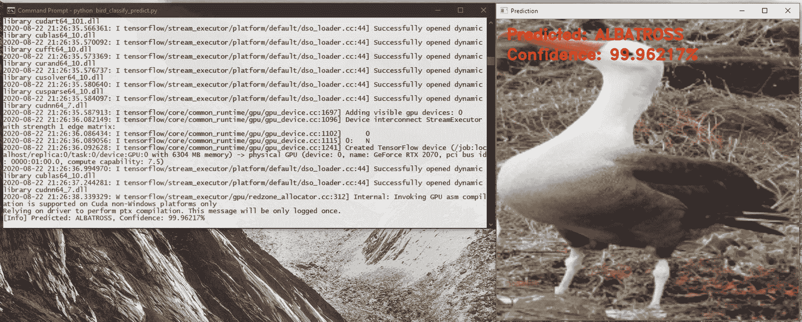
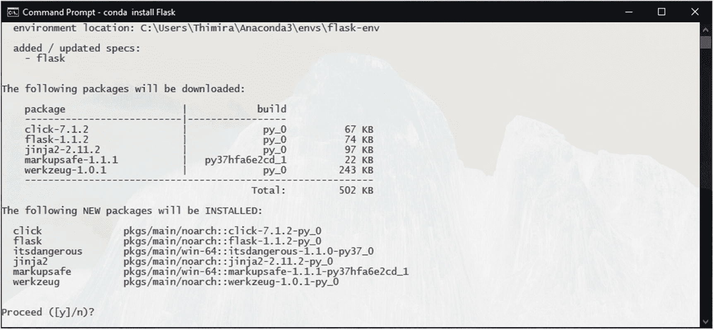
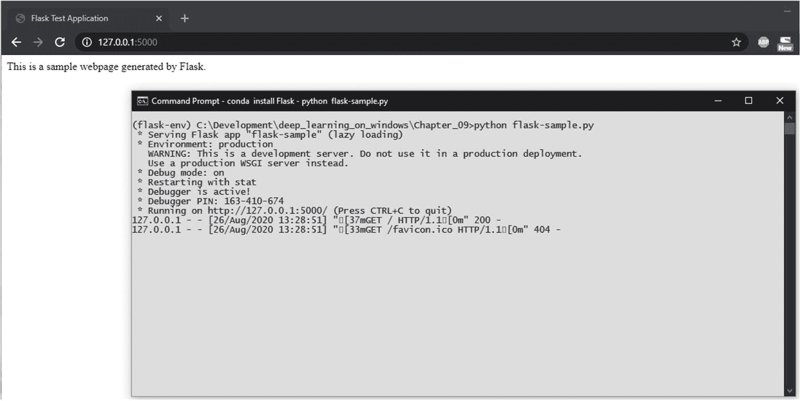
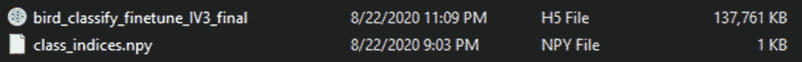
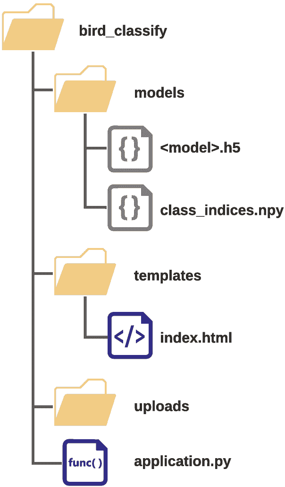
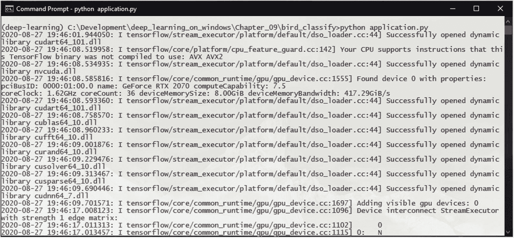
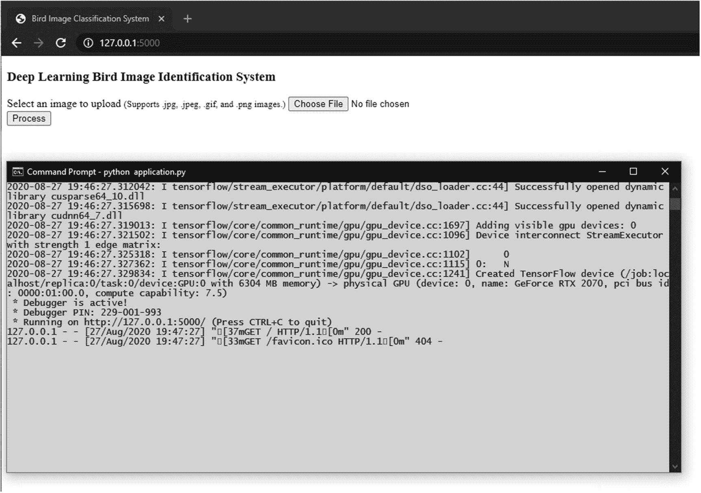
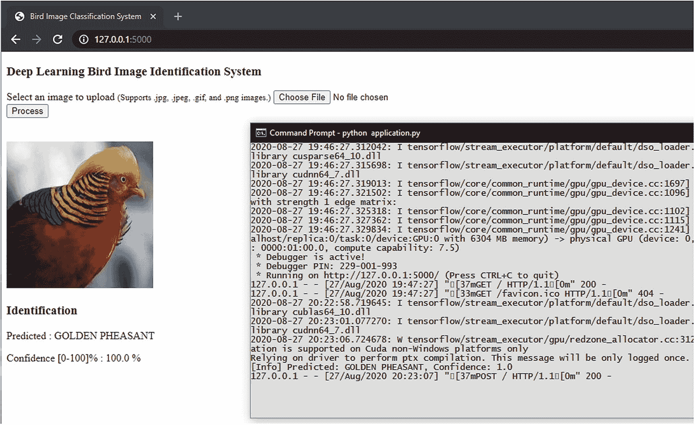
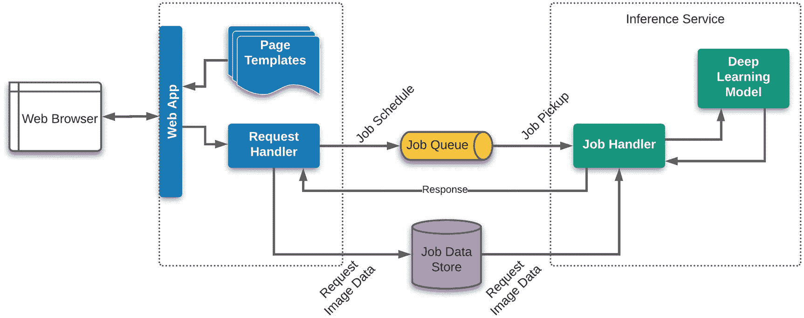

# 9. 将你的模型部署为网络应用

在过去的几章中，我们讨论了一些优化模型训练的技术。我们通过从小数据集开始，得到可以在实际场景中应用的结果。

你现在知道了训练实际模型所需的步骤。现在是时候讨论如何将你的训练模型变成一个应用了。

在第七章中，我们简要介绍了如何构建一个脚本，使用训练好的模型进行预测（图 9-1）。



图 9-1

使用脚本运行模型的预测

但使用这样的脚本并不是一个用户友好的将模型变为应用的方式。更好的方法是将你的模型转变为网络应用。这将提供更好的可用性，同时允许你将你的新深度学习应用提供给多个用户。

我们可以使用 Flask 框架将我们的模型转变为网络应用。

## 设置 Flask

Flask 是一个轻量级的 Python 微型网络框架，允许你构建网站、网络应用、API 和微服务。只需几个基本依赖项，你就可以使用简单的结构开始构建你的应用，并使用大量可用的扩展库来添加更多功能和可扩展性。

当我们在第三章中使用 Anaconda 元包设置深度学习环境时，我们安装了 Flask 包以及一些其他有助于我们构建应用的依赖包。

如果你想要单独安装 Flask，你可以简单地运行：

```py
conda install Flask
```

这将安装 Flask，以及 Werkzeug、Jinja2、MarkupSafe 和 ItsDangerous 包（图 9-2）。



图 9-2

使用 Conda 安装 Flask 和依赖项

安装完成后，我们可以通过创建一个简单的应用来测试 Flask。我们将把这个文件命名为 `flask-sample.py`：

```py
01: from flask import Flask
02:
03: header_text = '''
04:     \n Flask Test Application \n'''
05: page_content = '''
06:     This is a sample webpage generated by Flask.\n'''
07: footer_text = '''\n'''
08:
09: # request handler function for the home/index page
10: def index():
11:   return header_text + page_content + footer_text
12:
13: # setting up the application context
14: application = Flask(__name__)
15:
16: # add a rule for the index page.
17: application.add_url_rule('/', 'index', index, methods=['GET', 'POST'])
18:
19: # run the app.
20: if __name__ == "__main__":
21:     # Setting debug to True enables debug output. This line should be
22:     # removed before deploying a production app.
23:     application.debug = True
24:     application.run()
```

在这里，我们导入 Flask 包，定义应用上下文，并运行生成的 Flask 应用。我们定义了一个函数——index()——并将其绑定到处理应用索引路由的请求的 `add_url_rule()` 函数。在 index() 函数中，我们目前只是返回一些硬编码的 HTML 字符串。

我们可以通过运行以下命令来运行此应用：

```py
python flask-sample.py
```

Flask 将启动一个开发网络服务器进程来服务你的应用。默认情况下，它将在本地主机的 5000 端口上运行。你可以通过 http://127.0.0.1:5000/ 访问应用页面（图 9-3）。



图 9-3

Flask 示例 Web 应用运行

当 Flask 运行起来后，我们现在就可以使用 Flask 设计我们的深度学习 Web 应用程序了。

## 设计您的 Web 应用程序

正如我们在第七章中所做的那样，我们可以使用使用 model.save() 函数保存的模型文件（例如，在我们的鸟类图像分类系统微调示例中的 `bird_classify_finetune_IV3_final.h5` 文件）。通过使用完整的模型文件，我们可以在不重新定义模型结构代码的情况下，加载模型到其训练状态。除了模型文件外，我们还将使用从同一脚本保存的 `class_indices.npy` 文件。class_indices 文件包含类文本标签到其 ID 的字典/映射。我们需要标签映射来显示预测类的文本标签（图 9-4）。



图 9-4

构建 Web 应用程序所需的模型文件

在手头有了我们的模型文件后，我们可以开始设计应用程序。我们需要考虑以下因素：

+   作为我们系统的输入，我们需要一个带有网页表单的 HTML 页面，允许上传/提交文件。

+   上传的文件需要放置在一个 Python 代码可以读取的位置。

+   需要一个函数来处理请求，该函数加载上传的图像文件，通过模型运行它，并返回模型的结果/预测。

+   前端网页需要能够显示结果。

+   从文件加载模型需要时间。对于每个请求都加载模型并不实用。因此，我们需要一种方法来只加载一次模型（最好是在应用程序启动时）。

+   在代码中使用 HTML 字符串并不实用。我们应该使用模板引擎，这样我们可以在前端有更多的灵活性。幸运的是，Flask 的默认安装就包含了 Jinja2 模板引擎。

根据这些考虑，我们将为我们的 Flask 应用程序定义以下结构（图 9-5）：



图 9-5

我们应用程序的结构

我们的应用程序将包含 3 个目录：models、templates 和 uploads，以及一个主应用程序文件 application.py。models 目录将包含我们的保存模型文件以及该模型的类标签字典文件。templates 目录将包含 Jinja2 模板文件（Jinja2 引擎期望这个目录命名为 templates）。uploads 目录用于保存应用程序的上传文件。application.py 将包含 Flask 应用程序定义以及使用我们训练的模型处理图像和预测的功能。

遵循这个简单的应用程序结构，将使我们能够在以后扩展我们应用程序的功能，同时允许我们在允许 Flask 应用程序的各种服务中上传和托管我们的应用程序。

## 构建您的深度学习网络应用程序

要构建我们的网络应用程序，让我们从主页的模板文件开始。在我们的应用程序结构中的模板目录中，创建一个 `index.html` 文件。

在此文件中，首先添加页面的基本 HTML 结构。我们将使用 Jinja2 模板进行此操作：

```py
1: 
2: 
3:     
4:         Bird Image Classification System
5:     
6:     
7:         Deep Learning Bird Image Identification System
```

在页面顶部，我们将添加一个用于显示来自后端的任何错误消息的部分。我们将使用 Flask 框架的 Flash 消息机制：

```py
08:         
09:         
10:             
11:                 
12:                 
13:                     {{ message }}
14:                 
15:                 
16:             
17:         
```

接下来，我们将添加允许我们上传图像的主要 HTML 表单：

```py
18:         
19:             
20:                 Select an image to upload (Supports .jpg, .jpeg, .gif, and .png images.)
21:                 
22:             
23:             
24:                 
25:             
26:         
```

最后，我们将添加一个用于显示结果的章节：

```py
27:         
28:         
29:         
30:         
31:             
32:             
33:             
34:             Identification
35:             Predicted : {{label}}
36:             Confidence [0-100]% : {{prob}} %
37:         
38:         
39:     
40: 
```

这里需要注意的一点是，我们正在使用 Base64 图像数据在 `` 标签中，而不是图像文件的路径。这允许我们在不将其保存为文件的情况下，对图像应用任何图像处理并显示它。

注意

为了简单起见，我们不会在此处添加任何样式/css。

现在，我们可以开始我们的 Flask 应用程序的主要代码。

在我们应用程序结构的根目录中启动一个 `application.py` 文件，并导入包：

```py
01: from flask import Flask, request, render_template, url_for, make_response, send_from_directory, flash, redirect, jsonify
02: from werkzeug.utils import secure_filename
03:
04: import numpy as np
05: import tensorflow as tf
06: from tensorflow.keras.preprocessing.image import img_to_array, load_img
07: from tensorflow.keras.models import Model, load_model
08: from tensorflow.keras.utils import to_categorical
09: from PIL import Image
10: from io import BytesIO
11: import os
12: import os.path
13: import sys
14: import base64
15: import uuid
16: import time
```

在 TensorFlow 的某些版本中，cuDNN 和 Flask 存在一些不兼容性。因此，我们添加以下代码以避免不兼容性：

```py
18: # avoiding some compatibility problems in TensorFlow, cuDNN, and Flask
19: from tensorflow.compat.v1 import ConfigProto
20: from tensorflow.compat.v1 import InteractiveSession
21: config = ConfigProto()
22: config.gpu_options.allow_growth = True
23: session = InteractiveSession(config=config)
```

注意

如果您在没有这些兼容性修复的情况下尝试运行应用程序，可能会遇到“BaseCollectiveExecutor::StartAbort Unknown: Failed to get convolution algorithm”之类的错误。这可能在未来的版本中得到修复。

接下来，我们设置应用程序参数，并从文件中加载模型：

```py
25: # dimensions of our images.
26: img_width, img_height = 224, 224
27: # limiting the allowed filetypes
28: ALLOWED_FILETYPES = set(['.jpg', '.jpeg', '.gif', '.png'])
29:
30: model_path = 'models/bird_classify_finetune_IV3_final.h5'
31:
32: # loading the class dictionary and the model
33: class_dictionary = np.load('models/class_indices.npy', allow_pickle=True).item()
34:
35: model = load_model(model_path)
```

然后我们将添加一个函数——`classify_image()`——它将接受图像，对图像进行预处理，运行模型，并返回结果：

```py
37: # function for classifying the image using the model
38: def classify_image(image):
39:     image = img_to_array(image)
40:
41:     # important! otherwise the predictions will be '0'
42:     image = image / 255.0
43:
44:     # add a new axis to make the image array confirm with
45:     # the (samples, height, width, depth) structure
46:     image = np.expand_dims(image, axis=0)
47:
48:     # get the probabilities for the prediction
49:     # with graph.as_default():
50:     probabilities = model.predict(image)
51:
52:     prediction_probability = probabilities[0, probabilities.argmax(axis=1)][0]
53:
54:     class_predicted = np.argmax(probabilities, axis=1)
55:
56:     inID = class_predicted[0]
57:
58:     # invert the class dictionary in order to get the label for the id
59:     inv_map = {v: k for k, v in class_dictionary.items()}
60:     label = inv_map[inID]
61:
62:     print("[Info] Predicted: {}, Confidence: {}".format(label, prediction_probability))
63:
64:     return label, prediction_probability
```

当显示上传的图像的结果时，最好在页面上也显示该图像。因此，我们将添加一个实用函数，以 Base64 编码格式返回上传图像的缩略图版本。Base64 图像数据可以直接由 HTML `` 标签渲染，而无需提供文件位置。回想一下，在我们的模板中，我们指定了 `` 标签使用 `data:image/jpeg;base64`：

```py
66: # get a thumbnail version of the uploaded image
67: def get_iamge_thumbnail(image):
68:     image.thumbnail((400, 400), resample=Image.LANCZOS)
69:     image = image.convert("RGB")
70:     with BytesIO() as buffer:
71:         image.save(buffer, 'jpeg')
72:         return base64.b64encode(buffer.getvalue()).decode()
```

然后我们来到我们的主要请求处理器，即 `index()` 函数：

```py
074: # request handler function for the home/index page
075: def index():
076:     # handling the POST method of the submit
077:     if request.method == 'POST':
078:         # check if the post request has the submitted file
079:         if 'bird_image' not in request.files:
080:             print("[Error] No file uploaded.")
081:             flash('No file uploaded.')
082:             return redirect(url_for('index'))
083:
084:         f = request.files['bird_image']
085:
086:         # if user does not select a file, some browsers may
087:         # submit an empty field without the filename
088:         if f.filename == '':
089:             print("[Error] No file selected to upload.")
090:             flash('No file selected to upload.')
091:             return redirect(url_for('index'))
092:
093:         sec_filename = secure_filename(f.filename)
094:         file_extension = os.path.splitext(sec_filename)[1]
095:
096:         if f and file_extension.lower() in ALLOWED_FILETYPES:
097:             file_tempname = uuid.uuid4().hex
098:             image_path = './uploads/' + file_tempname + file_extension
099:             f.save(image_path)
100:
101:             image = load_img(image_path, target_size=(img_width, img_height), interpolation="lanczos")
102:
103:             label, prediction_probability = classify_image(image=image)
104:             prediction_probability = np.around(prediction_probability * 100, decimals=4)
105:
106:             orig_image = Image.open(image_path)
107:             image_data = get_iamge_thumbnail(image=orig_image)
108:
109:             with application.app_context():
110:                 return render_template('index.html',
111:                                         label=label,
112:                                         prob=prediction_probability,
113:                                         image=image_data
114:                                         )
115:         else:
116:             print("[Error] Unauthorized file extension: {}".format(file_extension))
117:             flash("The file type you selected: '{}' is not supported. Please select a '.jpg', '.jpeg', '.gif', or a '.png' file.".format(file_extension))
118:             return redirect(url_for('index'))
119:     else:
120:         # handling the GET, HEAD, and any other methods
121:
122:         with application.app_context():
123:             return render_template('index.html')
```

此 `index()` 函数处理 GET 请求以渲染初始页面，以及来自表单提交的 POST 请求。当处理 GET 请求时，`index()` 函数渲染我们之前定义的 `index.html` 模板。索引页面中的网络表单设置为向自身（带有提交的文件）发出 POST 请求，这再次被 `index()` 函数捕获。

在处理 POST 请求时，我们进行几个检查，例如是否上传了文件，文件扩展名是否被允许。Flask 框架的闪存消息机制用于向用户报告任何错误。如果所有检查都通过，上传的图片将被放置在我们的应用程序结构中的上传目录中，使用 Keras 的`load_img()`函数加载，并传递给之前定义的`classify_image()`函数。一旦结果准备好，我们再次渲染 index.html 模板，这次带有结果信息。

接下来添加了一个实用函数来处理 HTTP 413 错误，这些错误是在上传的文件大小超过应用程序的 MAX_CONTENT_LENGTH 时发出的：

```py
125: # handle 'filesize too large' errors
126: def http_413(e):
127:     print("[Error] Uploaded file too large.")
128:     flash('Uploaded file too large.')
129:     return redirect(url_for('index'))
```

注意

当在本地运行我们的应用程序时，您可能会在浏览器中收到“连接重置”或“连接已中断”的错误，而不是使用前面函数上传文件超过我们设置的限制时设置的错误消息。这是 Flask 开发服务器的已知限制。您可以在 Flask 文档页面上阅读更多关于处理文件上传的信息。1

最后，定义了 Flask 应用程序上下文、参数和 URL 规则：

```py
131: # setting up the application context
132: application = Flask(__name__)
133: # set the application secret key. Used with sessions.
134: application.secret_key = '@#$%^&*@#$%^&*'
135:
136: # add a rule for the index page.
137: application.add_url_rule('/', 'index', index, methods=['GET', 'POST'])
138:
139: # limit the size of the uploads
140: application.register_error_handler(413, http_413)
141: application.config['MAX_CONTENT_LENGTH'] = 10 * 1024 * 1024
142:
143: # run the app.
144: if __name__ == "__main__":
145:     # Setting debug to True enables debug output. This line should be
146:     # removed before deploying a production app.
147:     application.debug = True
148:     application.run()
```

如同我们的 Flask 示例应用程序，我们这样运行：

```py
python application.py
```

应用程序启动时，它将首先从文件中加载模型，然后再启动 web 服务器（图 9-6）。



图 9-6

Flask 应用程序加载模型

一旦启动了 web 服务器，在浏览器中查看网页，默认情况下它将运行在 http://127.0.0.1:5000（图 9-7）。



图 9-7

我们运行的鸟类分类 Flask 应用程序

您现在可以上传一张图片，看看我们的应用程序识别得有多好（图 9-8）。应用程序将返回预测标签及其预测的置信度。



图 9-8

上传图片的结果

如果您想知道如何托管此应用程序，我们构建的应用程序结构将与 Flask 应用程序托管服务（如 AWS Elastic Beanstalk）无缝配合。2

## 扩展您的 Web 应用程序

我们构建的应用程序虽然功能齐全，但远非最佳设计。有几个方面我们可以改进，例如：

+   主要应用处理网页功能，例如模板渲染、请求处理，以及深度学习推理任务。这将导致一些功能出现瓶颈，因为相同的应用程序线程需要处理这两组任务。

+   运行推理是计算密集型的。同样，图像预处理也是如此。而网络功能相对较为简单。

+   如果将应用程序的网络和深度学习组件放在一起，我们就不必要地分配处理/机器资源。

+   在实现计算密集型函数时，最好限制（或节流）此类函数的并行调用次数，以减少资源使用。考虑多用户场景。

+   计算密集型函数应尽可能异步执行。

考虑到所有这些事实，最好将应用程序拆分，以便网络组件和深度学习部分由两个独立的微服务处理。

在两个服务之间实现一个作业队列机制作为节流机制也是更好的选择。

考虑到这些因素，这里展示了一种可能的应用程序设计（图 9-9）。



图 9-9

扩展应用程序

在设计时考虑这些因素，你可以构建能够一次处理数千到数百万个请求的应用程序。
