# 10. 与计算机视觉一起玩乐

我们已经讨论了深度学习和计算机视觉结合的方式。在过去的几章中，我们已经构建了一些计算机视觉模型：从手写数字分类到鸟类识别的深度学习图像分类模型。在第三章中，当我们设置深度学习开发环境时，我们安装了几个辅助库，这些库有助于计算机视觉和图像处理任务。

但除了使用 OpenCV 来加载和显示我们深度学习模型的输出结果外，我们还没有探索这些库中许多可用的功能。

因此，在本章中，让我们看看一些这些函数和概念，以便你开始学习。虽然本章不是完整的计算机视觉教程，但希望它能指导你开始自己进行实验，并学习如何将其与我们已学到的深度学习知识相结合。

## 我们需要什么

在第三章“设置你的工具”中，我们已经安装了进行计算机视觉和图像处理任务所需的所有内容，包括 OpenCV、Dlib、Pillow 和 Scikit-Image。

+   OpenCV 可以说是最好的计算机视觉库。它可以执行简单的功能，如加载和操作图像，到构建复杂模型，如基于深度学习的图像识别，全部都是它自己完成的。

+   Dlib 是一个机器学习库，其中内置了一些优化且易于使用的计算机视觉功能。

+   Pillow 和 Scikit-Image 允许你加载和处理不同格式的图像，并允许进行基本操作，如处理颜色通道。

除了软件库之外，最好在你的机器上连接一个摄像头，因为我们还将探讨一些实时视频处理。

如果你正在使用笔记本电脑，那么你可能已经有一个内置的摄像头，这已经足够了。如果没有，你可以使用 USB 摄像头。对于大多数 USB 摄像头，Windows 默认安装的驱动程序将足够。

注意

你可以使用 Windows 10 上的相机应用来检查摄像头是否工作并且已加载正确的驱动程序。你也不需要高端的 HD 摄像头，因为我们将会处理较低分辨率的视频（640x480）。

## 图像处理基础

任何图像处理任务最基本的功能是加载和显示图像。我们已经使用这个功能来显示我们模型的输出结果。

当处理图像文件时，OpenCV 提供了方便的函数来加载和显示图像。以下代码将使用 OpenCV 的`imread`函数来加载图像：

```py
01: import numpy as np
02: import cv2
03:
04: # Read the image...
05: # cv2.IMREAD_COLOR - load a color image, without transparency
06: # cv2.IMREAD_GRAYSCALE - load image in grayscale mode
07: # cv2.IMREAD_UNCHANGED - load image as-is, including transparency if it is there
08: img = cv2.imread('.//images//Bird.jpg', cv2.IMREAD_COLOR)
09:
10: # Display the image
11: cv2.imshow('Image', img)
12:
13: # Wait for a keypress
14: cv2.waitKey(0)
15:
16: # Close all OpenCV windows
17: cv2.destroyAllWindows()
```

图像将通过 OpenCV 在新窗口中显示（图 10-1）。

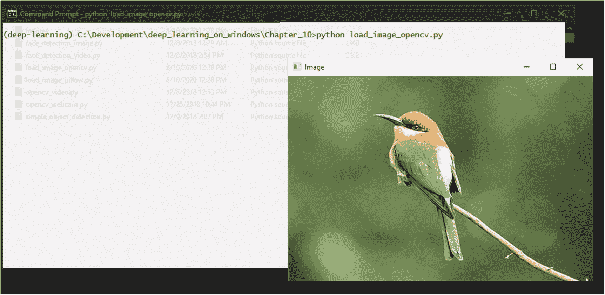

图 10-1

OpenCV 加载和显示图像

OpenCV 可以加载大多数图像文件格式，但它支持的确切格式将取决于你安装的版本和构建。

如果你遇到 OpenCV 无法打开的图像文件，你始终可以使用 Pillow 来打开它。Pillow 支持比 OpenCV 更多的格式：

```py
01: import numpy as np
02: import cv2
03: from PIL import Image
04:
05: # Read the image...
06: pil_image = Image.open('.//images//Bird.jpg')
07:
08: # Convert image from RGB to BGR
09: opencv_image = cv2.cvtColor(np.array(pil_image), cv2.COLOR_RGB2BGR)
10:
11: # Display the image
12: cv2.imshow('Image', opencv_image)
13:
14: # Wait for a keypress
15: cv2.waitKey(0)
16:
17: # Close all OpenCV windows
18: cv2.destroyAllWindows()
```

在这里，我们使用 Pillow 加载了图像，将其颜色格式转换为与 OpenCV 兼容，并使用 OpenCV 显示了图像（图 10-2）。

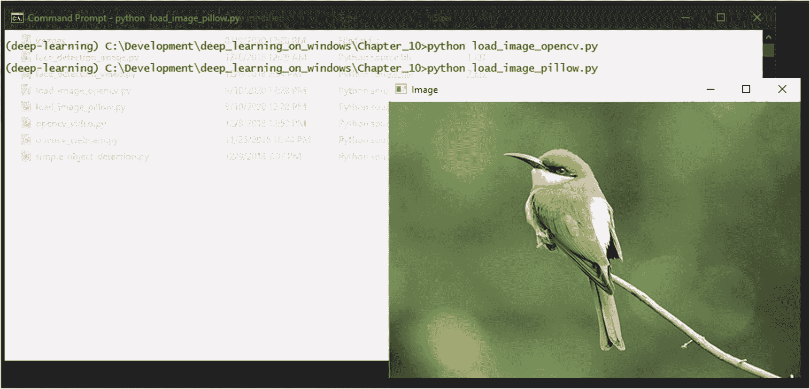

图 10-2

使用 Pillow 加载图像并用 OpenCV 显示

当使用 Pillow 和 OpenCV 时，我们必须转换颜色格式，因为 OpenCV 使用 BGR 格式，而 Pillow 使用更常见的 RGB 格式。如果你忘记转换这些颜色通道，图像将显示不正确的颜色（图 10-3）。

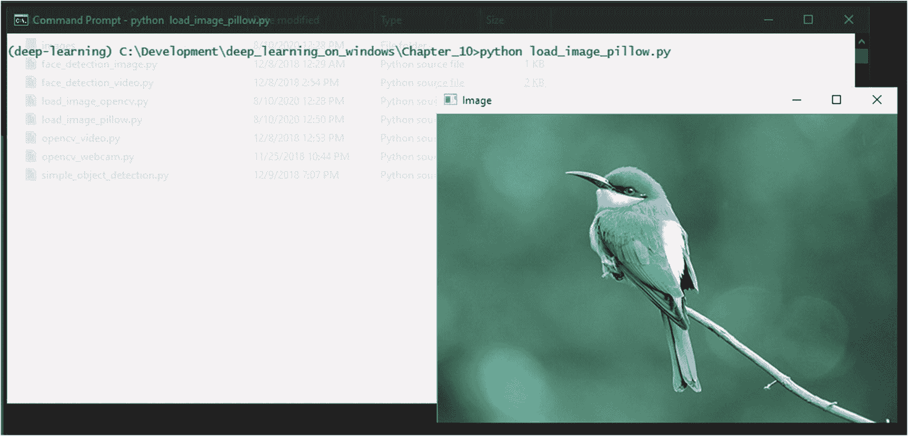

图 10-3

如果不执行 RGB 到 BGR 的颜色转换，将出现颜色错误

一旦加载了图像，OpenCV 和 Pillow 允许你对图像进行许多变换，例如调整大小、旋转、颜色转换和阈值。以下代码展示了如何使用 OpenCV 在图像中心点周围进行旋转：

```py
01: import numpy as np
02: import cv2
03:
04: # Read the image...
05: img = cv2.imread('.//images//Bird.jpg', cv2.IMREAD_COLOR)
06:
07: # Perform the rotation around the center point
08: rows,cols,channels = img.shape
09: M = cv2.getRotationMatrix2D((cols/2,rows/2),45,1)
10: dst = cv2.warpAffine(img,M,(cols,rows))
11:
12: # Display the image
13: cv2.imshow('Image', dst)
14:
15: # Wait for a keypress
16: cv2.waitKey(0)
17:
18: # Close all OpenCV windows
19: cv2.destroyAllWindows()
```

这将导致图像旋转 45 度（图 10-4）。

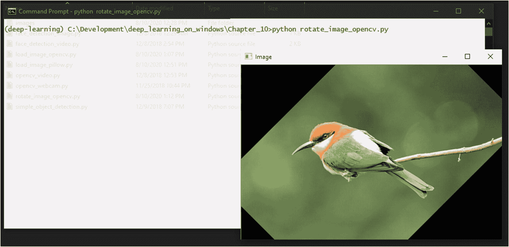

图 10-4

使用 OpenCV 进行图像旋转

你可以从 OpenCV 文档^(1) 和 Pillow 文档.^(2) 中了解完整的可用图像变换函数集。

你需要学习的下一个最重要的功能是从图像中提取感兴趣区域。以下代码演示了如何从图像中提取区域：

```py
01: import numpy as np
02: import cv2
03:
04: # Read the image...
05: img = cv2.imread('.//images//Bird.jpg', cv2.IMREAD_COLOR)
06:
07: # Extract the region-of-interest from the image
08: img_roi = img[50:250, 150:300]
09:
10: # Display the extracted region-of-interest
11: cv2.imshow('Image ROI', img_roi)
12:
13: # Wait for a keypress
14: cv2.waitKey(0)
15:
16: # Close all OpenCV windows
17: cv2.destroyAllWindows()
```

这将提取并显示图像中的一个区域（图 10-5）。

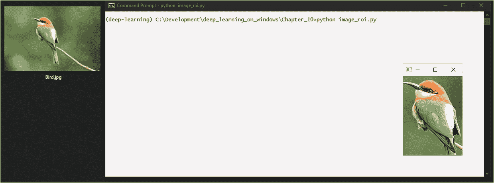

图 10-5

从图像中提取感兴趣区域

你也可以使用 `imwrite` 函数保存提取的图像区域。

```py
07: # Extract the region-of-interest from the image
08: img_roi = img[50:250, 150:300]
09:
10: # Save the region-of-interest as an image
11: cv2.imwrite('.//images//Bird_ROI.jpg', img_roi)
```

当你在进行目标检测和识别工作时，提取感兴趣区域的能力非常有用。

## 处理视频：使用网络摄像头

通常，当与硬件设备一起工作时，例如当你尝试从代码中读取连接的摄像头时，你可能会需要调整一些摄像头驱动程序的问题。

但在这个例子中，OpenCV 为我们解决了这个问题。

OpenCV 可以从系统中的任何内置或 USB 连接的摄像头读取。摄像头的视频流只是按顺序排列的一系列图像，OpenCV 是逐帧读取的。因此，每一帧都像加载单个图像一样：

```py
01: import numpy as np
02: import cv2
03:
04: # Create the video capture object for camera id '0'
05: video_capture = cv2.VideoCapture(0)
06:
07: while True:
08:     # Capture frame-by-frame
09:     ret, frame = video_capture.read()
10:
11:     if (ret):
12:         # Display the resulting frame
13:         cv2.imshow('Video Feed', frame)
14:
15:     ch = 0xFF & cv2.waitKey(1)
16:
17:     # Press "q" to quit the program
18:     if ch == ord('q'):
19:         break
20:
21: # When everything is done, release the capture
22: video_capture.release()
23: cv2.destroyAllWindows()
```

使用此代码，OpenCV 将打开一个窗口——在这里命名为视频流——并在读取摄像头时逐帧加载（图 10-6）。

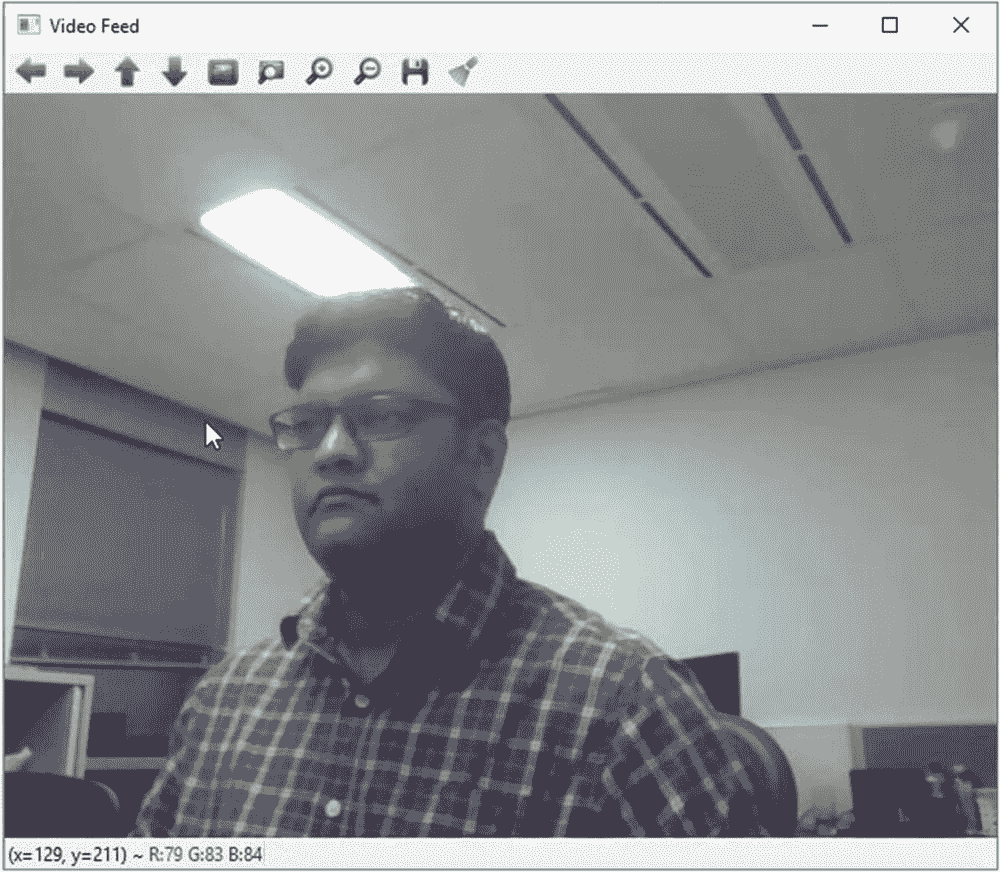

图 10-6

OpenCV 从网络摄像头加载视频

代码将无限循环，或者直到你在键盘上按下 q 键。

OpenCV 使用其 HighGUI 模块（高级图形用户界面）来访问摄像头以及显示帧。HighGUI 模块具有三组功能：硬件、文件系统和 GUI。硬件部分负责访问硬件设备，如摄像头。文件系统部分处理图像以及视频文件的加载和保存。GUI 部分生成显示图像或帧的窗口，并允许你在这些窗口中处理键盘和鼠标事件。我们之前打开的窗口的工具栏和状态栏也是 HighGUI 的组件。3 HighGUI 模块在用 conda 安装 OpenCV 时默认安装。

摄像头 ID 0 是默认摄像头。通常，如果你在笔记本电脑上，这是内置摄像头，或者如果你有多个摄像头，这是你设置为默认的摄像头。如果你有多个摄像头，它们将具有 ID，如 0、1、2 等。只需检查并设置 ID 为你想要的摄像头。你可以使用多个视频捕获对象从多个摄像头读取（图 10-7）。

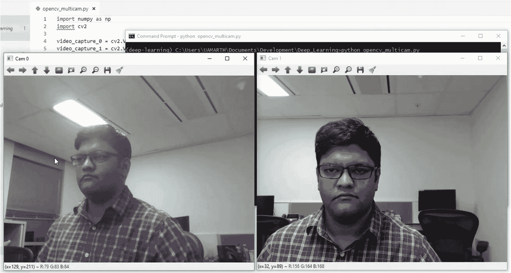

图 10-7

在 OpenCV 中从多个摄像头读取

一旦从摄像头读取帧，它就相当于一个图像。现在你可以对该帧执行任何图像变换操作。

## 处理视频：使用视频文件

这几乎与从网络摄像头读取相同。你只需在视频捕获对象中传递视频文件的路径，而不是摄像头 ID：

```py
01: import numpy as np
02: import cv2
03:
04: # Create the video capture object for a video file
05: cap = cv2.VideoCapture("F:\\GoPro\\Hero7\\GH010038.mp4")
06:
07: while(cap.isOpened()):
08:     # Read frame-by-frame
09:     ret, frame = cap.read()
10:
11:     if (ret):
12:         # Resize the frame
13:         res = cv2.resize(frame, (960, 540), interpolation = cv2.INTER_CUBIC)
14:
15:         # Display the resulting frame
16:         cv2.imshow('Video', res)
17:
18:     # Press "q" to quit the program
19:     if cv2.waitKey(1) & 0xFF == ord('q'):
20:         break
21:
22: cap.release()
23: cv2.destroyAllWindows()
```

就像网络摄像头代码一样，OpenCV 将打开一个窗口，并在读取视频文件时逐帧加载（图 10-8）。

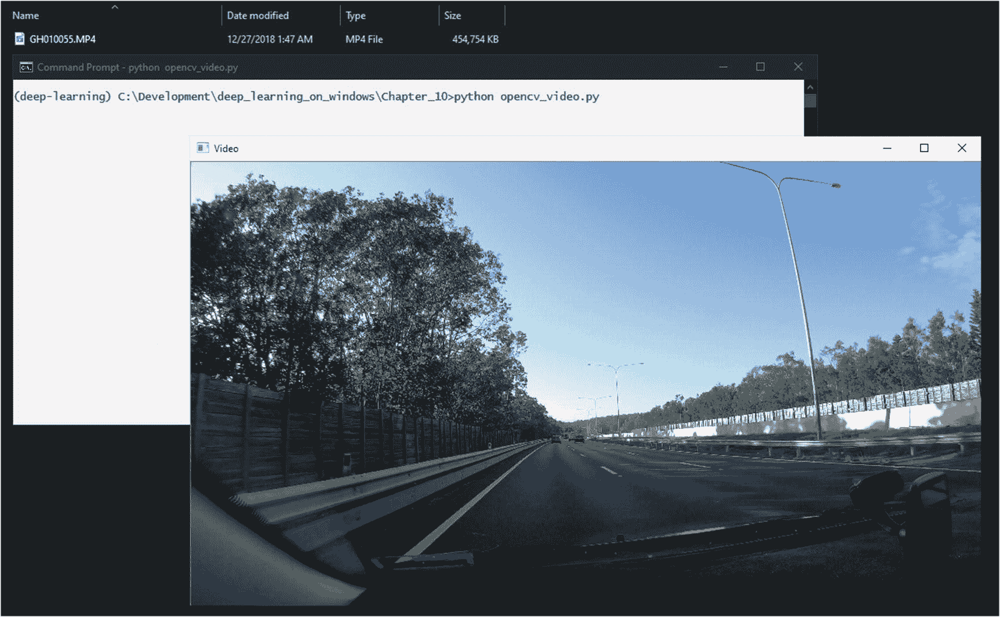

图 10-8

OpenCV 加载视频文件

与图像一样，支持的视频文件格式可能因你安装的 OpenCV 的确切版本/构建而异。OpenCV 依赖于 FFmpeg 和 GStreamer 库来处理视频文件，而在 Windows 上使用 DirectShow 库来处理来自网络摄像头的视频。当你使用 conda 安装 OpenCV 时，这些库会被安装。因此，打开标准的 AVI 和 MP4 文件应该不会有问题。

你可能会注意到视频的播放速度比预期的快或慢。这是因为我们使用的函数并不是为了以自然速度播放视频。我们正在做的事情是抓取视频的每一帧——就像我们对网络摄像头所做的那样——并在获取下一帧之间添加延迟来显示它。这个延迟是通过`cv2.waitkey()`函数添加的。在这里，我们将其设置为每帧 1 毫秒的延迟。你可以通过调整这个延迟来增加或减少视频的速度。

## 图像中的人脸检测

在这里，我们正在进入计算机视觉的一些有趣的部分。

从头编写代码来检测人脸是一项相当复杂的任务，因为从图像中可靠地识别人脸的过程涉及许多步骤。但是，像 OpenCV 和 Dlib 这样的库已经将那些算法的复杂部分内置其中。

要在图像中检测任何物体（如人脸），你需要有一个训练好的物体检测器。幸运的是，Dlib 库中已经内置了一个预训练的人脸检测器。你可以使用`dlib.get_frontal_face_detector()`函数来加载它。

```py
01: import numpy as np
02: import cv2
03: import dlib
04:
05: # Load the built-in face dedector of Dlib
06: detector = dlib.get_frontal_face_detector()
07:
08: # Load the image
09: img = cv2.imread('.//images//Face.jpg', cv2.IMREAD_COLOR)
10: # Create a grayscale copy of the image
11: img_gray = cv2.cvtColor(img, cv2.COLOR_BGR2GRAY)
12:
13: # Get the detected face bounding boxes, using the grayscale image
14: rects = detector(img_gray, 0)
15:
16: # Loop over the bounding boxes, if there are more than one face
17: for rect in rects:
18:     # Get the OpenCV coordinates from the Dlib rectangle objects
19:     x = rect.left()
20:     y = rect.top()
21:     x1 = rect.right()
22:     y1 = rect.bottom()
23:
24:     # Draw a rectangle around the face bounding box in OpenCV
25:     cv2.rectangle(img, (x, y), (x1, y1), (0, 0, 255), 2)
26:
27: # Display the resulting image
28: cv2.imshow('Detected Faces', img)
29:
30: # Wait for a keypress
31: cv2.waitKey(0)
32:
33: # Close all OpenCV windows
34: cv2.destroyAllWindows()
```

在这里，我们使用 OpenCV 来加载图像，然后创建它的灰度副本。我们将这个图像的灰度副本传递给 Dlib 人脸检测器对象。

使用灰度图像是因为它可以提高人脸检测的速度。Dlib 人脸检测器也可以与彩色图像一起工作，但会慢一些。

检测器会返回一个 Dlib 矩形对象数组，表示所有检测到的人脸的边界框。我们遍历这些边界框中的每一个，提取它们的坐标，并使用 OpenCV 根据这些坐标在检测到的人脸周围绘制一个矩形。最后，我们显示结果图像，其中包含检测到的人脸（图 10-9）。

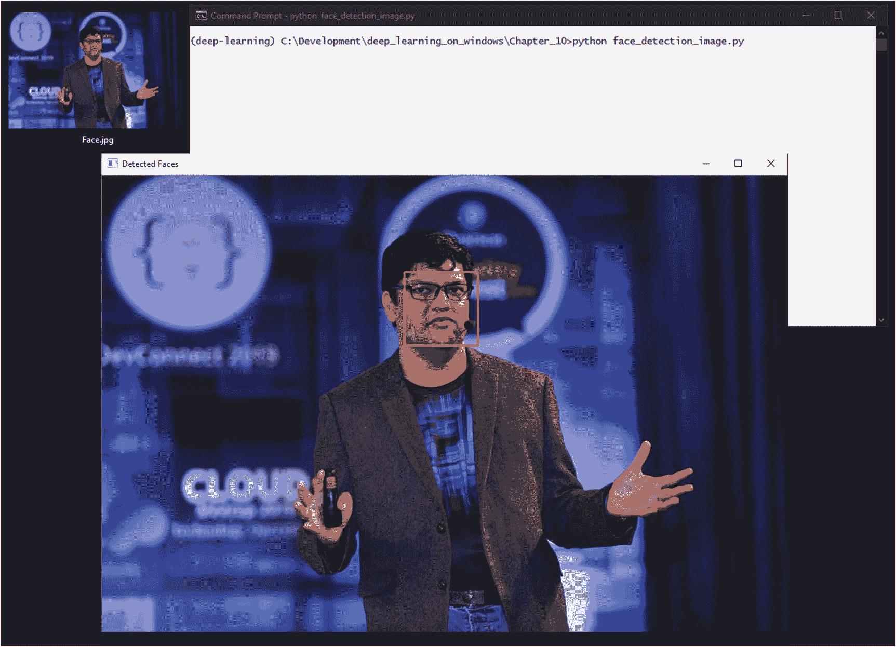

图 10-9

Dlib 人脸检测的实际应用

## 视频中的人脸检测

一旦我们使人脸检测在图像上工作，让它在一个视频或网络摄像头流上工作就相当简单。我们只需要逐帧捕获视频，并将每一帧传递给人脸检测器：

```py
01: import numpy as np
02: import cv2
03: import dlib
04:
05: # Create the video capture object for camera id '0'
06: video_capture = cv2.VideoCapture(0)
07: # Load the buil-in face dedector of Dlib
08: detector = dlib.get_frontal_face_detector()
09:
10: while True:
11:     # Capture frame-by-frame
12:     ret, frame = video_capture.read()
13:
14:     if (ret):
15:         # Create a grayscale copy of the captured frame
16:         gray = cv2.cvtColor(frame, cv2.COLOR_BGR2GRAY)
17:
18:         # Get the detected face bounding boxes, using the grayscale image
19:         rects = detector(gray, 0)
20:
21:         # Loop over the bounding boxes, if there are more than one face
22:         for rect in rects:
23:             # Get the OpenCV coordinates from the Dlib rectangle objects
24:             x = rect.left()
25:             y = rect.top()
26:             x1 = rect.right()
27:             y1 = rect.bottom()
28:
29:             # Draw a rectangle around the face bounding box in OpenCV
30:             cv2.rectangle(frame, (x, y), (x1, y1), (0, 0, 255), 2)
31:
32:         # Display the resulting frame
33:         cv2.imshow('Video Feed', frame)
34:
35:     ch = 0xFF & cv2.waitKey(1)
36:
37:     # press "q" to quit the program.
38:     if ch == ord('q'):
39:         break
40:
41: # When everything is done, release the capture
42: video_capture.release()
43: cv2.destroyAllWindows()
```

在这里，我们在视频的每一帧上运行人脸检测步骤（就像我们对图像所做的那样）。在典型的机器上，Dlib 的人脸检测器足够快，可以实时检测人脸，允许我们对每一帧运行它。你将看到检测框在每一帧中实时更新（图 10-10）。

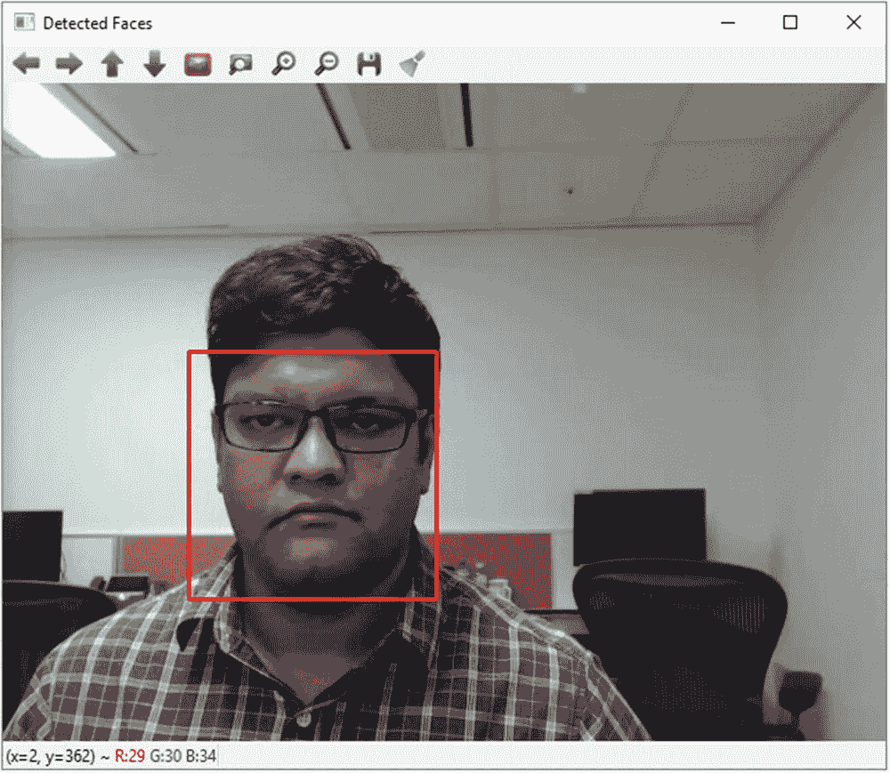

图 10-10

在视频中运行人脸检测

## 简单的实时深度学习物体识别

接下来，我们将结合我们关于深度学习模型的知识与 OpenCV 的计算机视觉能力，构建一个基本的物体识别系统。

我们将使用 OpenCV 从网络摄像头捕获视频流，并使用 TensorFlow/Keras 应用中的 ResNet50 深度学习模型来识别视频每一帧中的物体。你可以在附录 1 中了解更多关于 ResNet50 模型的信息。

我们将首先导入必要的包：

```py
1: import numpy as np
2: import cv2
3: import tensorflow as tf
4: from tensorflow.keras.applications.resnet50 import ResNet50
5: from tensorflow.keras.preprocessing import image
6: from tensorflow.keras.applications.resnet50 import preprocess_input, decode_predictions
```

除了 OpenCV、numpy 和 ResNet50 模型之外，我们还从 Keras 导入了一些图像预处理函数。

接下来，我们加载带有 ImageNet 权重的 ResNet50 模型并创建视频捕获对象：

```py
08: # Load the ResNet50 model with the ImageNet weights
09: model = ResNet50(weights='imagenet')
10: # Create the video capture object
11: video_capture = cv2.VideoCapture(0)
```

在代码的主循环中，我们将捕获的帧转换为 RGB（因为 OpenCV 在 BGR 下工作）并调整大小为 224x224 像素，这是 ResNet50 模型所需的输入大小：

```py
13: while True:
14:     # Capture frame-by-frame
15:     ret, frame = video_capture.read()
16:
17:     if (ret):
18:         # Convert image from BGR to RGB
19:         rgb_im = cv2.cvtColor(frame,cv2.COLOR_BGR2RGB)
20:         # Resize the image to 224x224, the size required by ResNet50 model
21:         res_im = cv2.resize(rgb_im, (224, 224), interpolation = cv2.INTER_CUBIC)
```

然后，我们通过一系列预处理步骤运行图像，以准备它被模型摄取：

```py
23:         # Preprocess image
24:         prep_im = image.img_to_array(res_im)
25:         prep_im = np.expand_dims(prep_im, axis=0)
26:         prep_im = preprocess_input(prep_im)
```

接下来，我们将处理后的图像传递给模型并做出预测。我们还需要使用 TensorFlow/Keras 中的便捷函数解码预测，以获取预测的类别标签：

```py
28:         # Make the prediction
29:         preds = model.predict(prep_im)
30:
31:         # Decode the prediction
32:         (class_name, class_description, score) = decode_predictions(preds, top=1)[0][0]
```

最后，我们在图像本身上叠加预测标签和预测的置信度分数，并在控制台上打印出来，并使用 OpenCV 显示图像：

```py
34:         # Display the predicted class and confidence
35:         print("Predicted: {0}, Confidence: {1:.2f}".format(class_description, score))
36:         cv2.putText(frame, "Predicted: {}".format(class_description), (10, 50),
37:                 cv2.FONT_HERSHEY_PLAIN, 2, (255, 255, 255), 2, cv2.LINE_AA)
38:         cv2.putText(frame, "Confidence: {0:.2f}".format(score), (10, 80),
39:                 cv2.FONT_HERSHEY_PLAIN, 2, (255, 255, 255), 2, cv2.LINE_AA)
40:
41:         # Display the resulting frame
42:         cv2.imshow('Video Feed', frame)
43:
44:     ch = 0xFF & cv2.waitKey(1)
45:
46:     # press "q" to quit the program.
47:     if ch == ord('q'):
48:         break
49:
50: # When everything is done, release the capture
51: video_capture.release()
52: cv2.destroyAllWindows()
```

当你运行代码时，它将每个视频帧传递给 ResNet50 模型，该模型将尝试识别帧中最突出的物体。然后，代码将显示并打印出来自 ResNet50 模型的预测以及预测的置信度（图 10-11）。

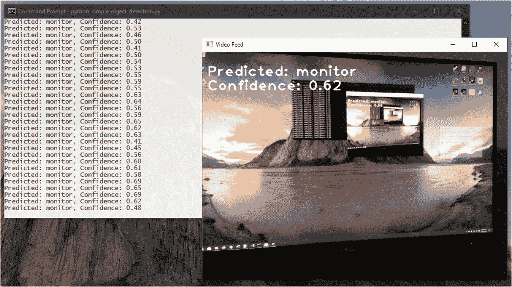

图 10-11

实时物体检测运行中

我们在这里构建的是一个非常基础的物体识别系统，它存在一些限制。它一次只能识别一个物体，因为它以整个帧作为输入。它也无法识别它所识别的物体的边界框。一个真正的物体检测系统应该能够在帧内识别多个物体，并识别它们的边界。

但根据我们迄今为止学到的概念，你可以调查扩展系统功能的方法。

我们的面部检测系统也是如此。

你会如何扩展它以在检测到的面部上执行面部识别？

想想我们从图像中提取感兴趣区域学到的知识。你能想到一种方法来应用这个概念提取检测到的面部图像并通过深度学习模型进行处理吗？你能用同样的概念来构建模型的训练数据集吗？
