# 11. 生成对抗网络简介

人工智能能具有创造力吗——它能学会创作艺术，例如？传统的答案是不了。但最近我们并不这么确定了。最近，多亏了深度学习，创造力的定义已经变得模糊不清。

## 艺术家和艺术评论家的故事

让我们来看一个故事。

曾经有一个新手艺术家，他通过从现有的艺术作品中获得灵感来学习创作艺术品。

艺术家创作了一幅艺术品，并展示给艺术评论家看。

评论家分析了艺术品，并宣布它不够好。但是，由于评论家尽职尽责，他也向艺术家提供了反馈，说明了为什么它被认为不够好。

艺术家吸收了这些反馈，并尝试根据反馈再次创作另一件艺术品，并将其展示给评论家。

这是在几个周期中发生的。

每次评论家批评艺术品时，艺术家都会获得关于如何改进它的经验。

同样，每次艺术家创作了一幅新的艺术品，评论家都会在如何评估它方面获得经验。

经过许多这样的迭代后，艺术家创作了一幅可以被认为是杰作的艺术品。

由于评论家的存在，艺术家成为了大师。

如果我们能对人工智能做同样的事情会怎样？

这就是生成对抗网络背后的想法。

## 生成对抗网络

生成对抗网络（GAN）是一种机器学习模型，其中两个神经网络相互竞争，以生成具有给定训练集相同特征的新数据。

+   **生成性:** 该模型生成新的数据，而不是从给定集合中挑选输出。

+   **对抗性:** 两个网络是彼此的对手。

+   **网络:** 该模型基于神经网络。

就像我们的故事一样，生成对抗网络也由两个元素组成：一个 *生成器*（艺术家）和一个 *判别器*（艺术评论家）。生成器试图学会创建看起来“真实”的物品，而判别器试图区分生成的物品和真实的物品（图 11-1）。

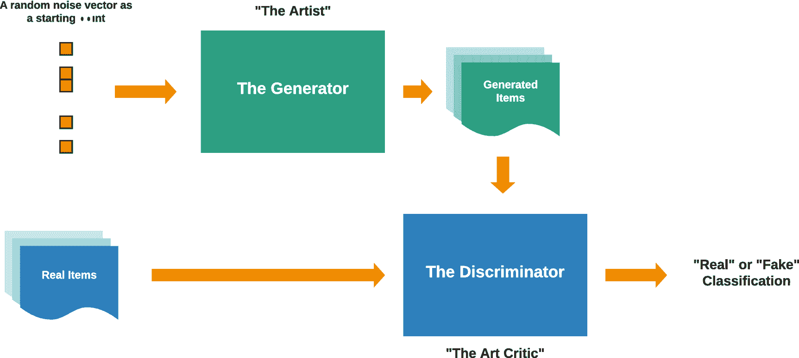

图 11-1

GAN 的典型工作流程

生成的物品可以是图像、文本、视频、声音或任何东西。

在这样的系统中，生成器和判别器需要一起训练，就像我们故事中的艺术家和艺术评论家一样，他们一起获得了经验。当我们训练这样的系统时，生成器将逐渐变得擅长生成看起来真实的物品，而判别器将变得擅长将它们与真实的物品区分开来。经过许多这样的训练迭代后，将出现一个点，此时判别器可能再也无法将生成的物品与真实的物品区分开来（图 11-2）。

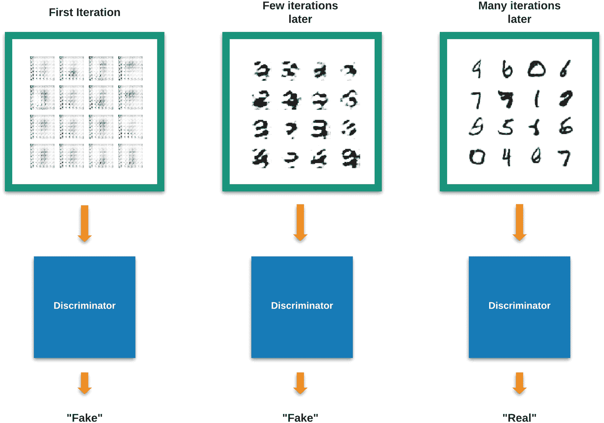

图 11-2

GAN 的训练

为了简化解释，让我们考虑一个生成图像的 GAN。生成器接受一个随机噪声向量作为输入，而判别器接受属于我们想要生成的图像类别的真实图像训练集。

## 使用 DCGAN 生成手写数字

DCGAN（深度卷积生成对抗网络）是 GAN 实现中最简单的一种。在其中，我们在生成器和判别器中使用卷积层，这使得 DCGAN 模型非常适合图像处理。

我们将使用 MNIST 数据集作为输入。我们的目标将是生成与人类手写数字无法区分的图像。

我们的工作流程将如下所示（图 11-3）。

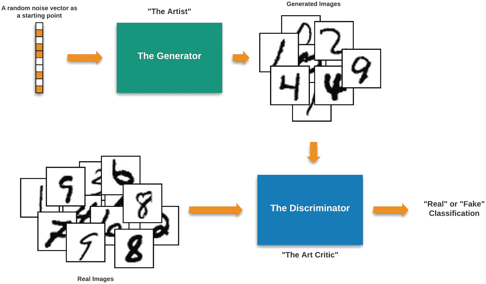

图 11-3

用于手写数字生成的 DCGAN

我们将从一个新的代码文件开始，我们将将其命名为 DCGAN_Digits.py。

我们首先通过导入必要的包来开始我们的代码：

```py
01: import tensorflow as tf
02:
03: from tensorflow.keras import layers
04: import glob
05: import imageio
06: import matplotlib.pyplot as plt
07: import numpy as np
08: import os
09: import PIL
10: import time
11: import cv2
```

然后我们加载我们的数据集并将其归一化：

```py
13: (train_images, train_labels), (_, _) = tf.keras.datasets.mnist.load_data()
14:
15: train_images = train_images.reshape(train_images.shape[0], 28, 28, 1).astype('float32')
16: train_images = (train_images - 127.5) / 127.5 # Normalize the images to [-1, 1]
```

MNIST 像素值在 0–255 范围内。在这里，我们将它归一化到-1–1 范围。

然后我们定义批处理大小，然后对数据集进行洗牌和分块以进行训练：

```py
18: BUFFER_SIZE = 60000
19: BATCH_SIZE = 256
20:
21: # Batch and shuffle the data
22: train_dataset = tf.data.Dataset.from_tensor_slices(train_images).shuffle(BUFFER_SIZE).batch(BATCH_SIZE)
```

接下来，我们需要定义生成器和判别器模型。

### 生成器

我们的生成器模型接受一个随机噪声种子，并输出一个 28x28x1 的图像。模型看起来是这样的（图 11-4）：

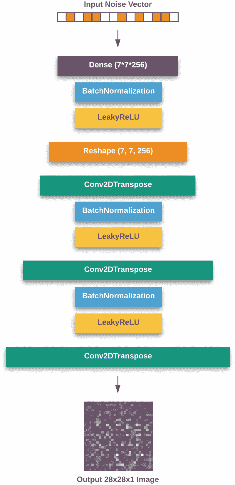

图 11-4

生成器模型

模型使用`Conv2DTranspose`层在每个层上上采样输入。`LeakyReLU`用作正则化，因为它允许少量的负值通过，而 ReLU 则移除所有负值。

我们将为生成器模型定义一个新的函数`make_generator_model()`：

```py
24: def make_generator_model():
25:     model = tf.keras.Sequential()
26:     model.add(layers.Dense(7*7*256, use_bias=False, input_shape=(100,)))
27:     model.add(layers.BatchNormalization())
28:     model.add(layers.LeakyReLU())
29:
30:     model.add(layers.Reshape((7, 7, 256)))
31:     assert model.output_shape == (None, 7, 7, 256) # Note: None is the batch size
32:
33:     model.add(layers.Conv2DTranspose(128, (5, 5), strides=(1, 1), padding="same", use_bias=False))
34:     assert model.output_shape == (None, 7, 7, 128)
35:     model.add(layers.BatchNormalization())
36:     model.add(layers.LeakyReLU())
37:
38:     model.add(layers.Conv2DTranspose(64, (5, 5), strides=(2, 2), padding="same", use_bias=False))
39:     assert model.output_shape == (None, 14, 14, 64)
40:     model.add(layers.BatchNormalization())
41:     model.add(layers.LeakyReLU())
42:
43:     model.add(layers.Conv2DTranspose(1, (5, 5), strides=(2, 2), padding="same", use_bias=False, activation="tanh"))
44:     assert model.output_shape == (None, 28, 28, 1)
45:
46:     return model
```

我们现在可以使用这个函数来创建一个模型实例并生成一个初始图像：

```py
48: generator = make_generator_model()
49:
50: noise = tf.random.normal([1, 100])
51: generated_image = generator(noise, training=False)
52:
53: plt.imshow(generated_image[0, :, :, 0], cmap="gray")
54: plt.show()
55: plt.close()
```

由于生成器模型尚未训练，输出将看起来像噪声（图 11-5）。

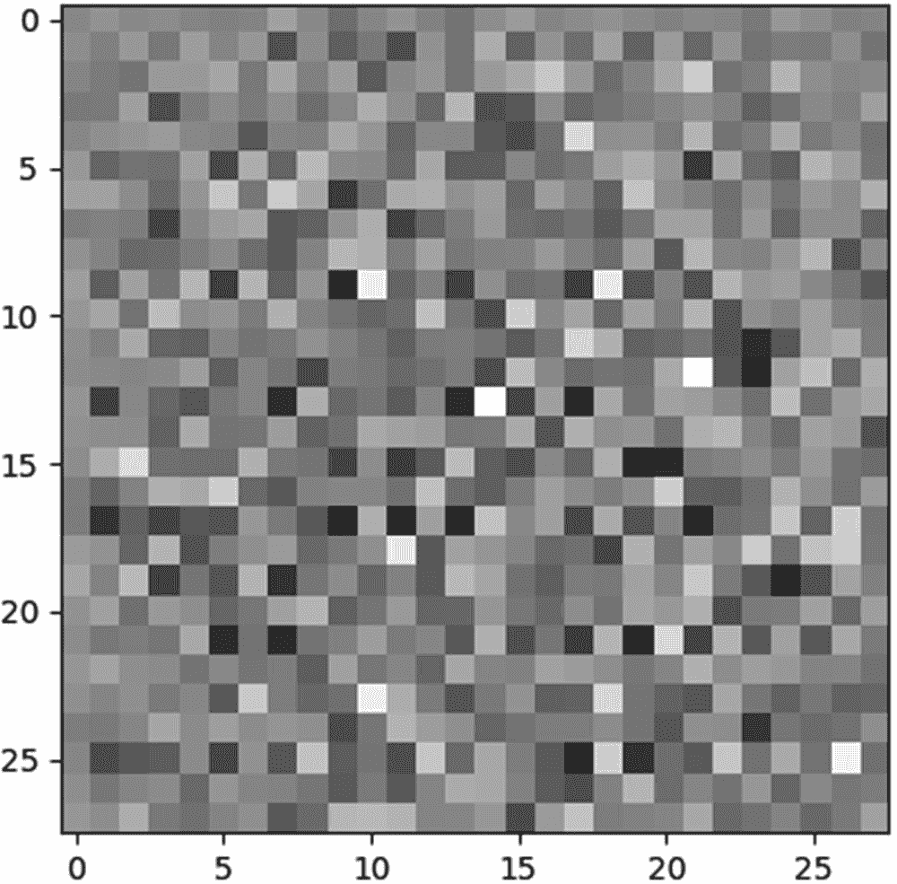

图 11-5

未训练生成器的输出

### 判别器

判别器是一个简单的深度学习图像分类器（基于熟悉的卷积神经网络）。它将接受一个 28x28x1 的图像作为输入，并将它们分类为真实或伪造。判别器模型看起来是这样的（图 11-6）：

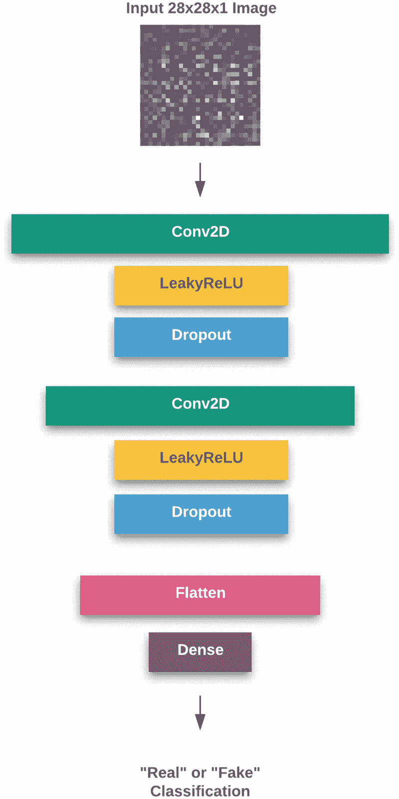

图 11-6

判别器模型

我们将为判别器模型定义一个名为 make_discriminator_model()的函数。它使用我们熟悉的 Conv2D 层：

```py
57: def make_discriminator_model():
58:     model = tf.keras.Sequential()
59:     model.add(layers.Conv2D(64, (5, 5), strides=(2, 2), padding="same",
60:                                      input_shape=[28, 28, 1]))
61:     model.add(layers.LeakyReLU())
62:     model.add(layers.Dropout(0.3))
63:
64:     model.add(layers.Conv2D(128, (5, 5), strides=(2, 2), padding="same"))
65:     model.add(layers.LeakyReLU())
66:     model.add(layers.Dropout(0.3))
67:
68:     model.add(layers.Flatten())
69:     model.add(layers.Dense(1))
70:
71:     return model
```

然后，我们可以使用这个函数创建一个判别器实例，并将我们之前生成的图像传递给它：

```py
73: discriminator = make_discriminator_model()
74: decision = discriminator(generated_image)
75: print (decision)
```

由于判别器模型尚未训练，这将输出如下：

```py
tf.Tensor([[0.00122253]], shape=(1, 1), dtype=float32)
```

一旦训练完成，判别器将对真实图像输出 1，对伪造图像输出 0。

### 反馈

就像我们的艺术家和艺术评论家的故事一样，为了提高，我们的生成器和判别器需要反馈。在这里，我们定义生成器和判别器的损失值，我们将在以后使用这些值来计算梯度，这些梯度将在训练时更新每个模型：

```py
77: # This method returns a helper function to compute cross entropy loss
78: cross_entropy = tf.keras.losses.BinaryCrossentropy(from_logits=True)
79:
80: def discriminator_loss(real_output, fake_output):
81:     real_loss = cross_entropy(tf.ones_like(real_output), real_output)
82:     fake_loss = cross_entropy(tf.zeros_like(fake_output), fake_output)
83:     total_loss = real_loss + fake_loss
84:     return total_loss
85:
86: def generator_loss(fake_output):
87:     return cross_entropy(tf.ones_like(fake_output), fake_output)
88:
89: generator_optimizer = tf.keras.optimizers.Adam(1e-4)
90: discriminator_optimizer = tf.keras.optimizers.Adam(1e-4)
```

判别器的损失由其区分真实图像和生成图像的能力定义。因此，我们接收判别器对真实图像（`real_output`数组）和伪造图像（`fake_output`数组）的预测，并将它们与预期的输出进行比较。一旦适当训练，判别器应该对真实图像输出 1，而对生成或伪造图像输出 0。因此，我们得到真实图像输出与 1 数组的差异，以及伪造图像输出与 0 数组的差异。

同样地，我们期望一旦生成器经过适当训练，就能生成从判别器得到 1 的图像。就像之前一样，我们将生成的或伪造的图像的输出与 1 的数组进行比较，以确定生成器的损失。

我们还为生成器和判别器定义了两个独立的 Adam 优化器，因为这两个模型需要分别同时训练。

由于 GAN 的训练可能需要很长时间，我们配置模型检查点定期保存，这样如果训练中断，就可以恢复。请确保在包含你的代码文件的目录中创建一个名为 training_checkpoints 的目录：

```py
92: checkpoint_dir = './training_checkpoints'
93: checkpoint_prefix = os.path.join(checkpoint_dir, "ckpt")
94: checkpoint = tf.train.Checkpoint(generator_optimizer=generator_optimizer,
95:                                  discriminator_optimizer=discriminator_optimizer,
96:                                  generator=generator,
97:                                  discriminator=discriminator)
```

### 训练

然后，我们定义训练参数和训练的随机种子：

```py
100: EPOCHS = 1000
101: noise_dim = 100
102: num_examples_to_generate = 16
103:
104: # We will reuse this seed overtime (so it's easier)
105: # to visualize progress in the animated GIF)
106: seed = tf.random.normal([num_examples_to_generate, noise_dim])
```

我们将在整个训练周期中重复使用相同的种子，以便更好地可视化每个生成的样本如何在周期中改进（因为相同的种子会导致生成相同的数字）。

然后，我们定义训练步骤的函数：

```py
108: # Notice the use of `tf.function`
109: # This annotation causes the function to be "compiled".
110: @tf.function
111: def train_step(images):
112:     noise = tf.random.normal([BATCH_SIZE, noise_dim])
113:
114:     with tf.GradientTape() as gen_tape, tf.GradientTape() as disc_tape:
115:         generated_images = generator(noise, training=True)
116:
117:         real_output = discriminator(images, training=True)
118:         fake_output = discriminator(generated_images, training=True)
119:
120:         gen_loss = generator_loss(fake_output)
121:         disc_loss = discriminator_loss(real_output, fake_output)
122:
123:     gradients_of_generator = gen_tape.gradient(gen_loss, generator.trainable_variables)
124:     gradients_of_discriminator = disc_tape.gradient(disc_loss, discriminator.trainable_variables)
125:
126:     generator_optimizer.apply_gradients(zip(gradients_of_generator, generator.trainable_variables))
127:     discriminator_optimizer.apply_gradients(zip(gradients_of_discriminator, discriminator.trainable_variables))
```

在每个训练步骤中，我们向生成器传递一个随机噪声向量，它使用这个向量作为输入生成一系列图像。然后，这些生成的图像以及一组真实图像被传递给判别器以获取它们的输出。这些输出是判别器的预测/分类，即它认为它们是真实还是伪造。使用我们之前定义的损失函数，计算生成器和判别器的损失值，并使用损失值的梯度来更新它们。把它想象成推动它们朝正确方向训练的“反馈”。

接下来是主训练循环的函数：

```py
129: def train(dataset, epochs):
130:     train_start = time.time()
131:     for epoch in range(epochs):
132:         start = time.time()
133:
134:         for image_batch in dataset:
135:             train_step(image_batch)
136:
137:         # Produce images for the GIF as we go
138:         generate_and_save_images(generator,
139:                                 epoch + 1,
140:                                 seed,
141:                                 display = True)
142:
143:         # Save the model every 15 epochs
144:         if (epoch + 1) % 15 == 0:
145:             checkpoint.save(file_prefix = checkpoint_prefix)
146:
147:         print ('Time for epoch {} is {} sec'.format(epoch + 1, time.time()-start))
148:
149:     print ('Time for total training is {} sec'.format(time.time()-train_start))
```

在这里，我们基本上是按照定义的 epoch 数量运行每个训练批次。在每个训练 epoch 结束时，我们使用之前定义的种子生成一组样本，并保存这些图像文件。

函数定义如下，这主要是生成图像的后处理。请确保在您的代码文件所在的目录中创建一个名为 output 的目录：

```py
151: def generate_and_save_images(model, epoch, test_input, display = False):
152:     # Notice `training` is set to False.
153:     # This is so all layers run in inference mode.
154:     predictions = model(test_input, training=False)
155:
156:     fig = plt.figure(figsize=(4,4), facecolor="black")
157:
158:     for i in range(predictions.shape[0]):
159:         plt.subplot(4, 4, i+1)
160:         image = predictions[i, :, :, 0] * 127.5 + 127.5
161:         plt.imshow(image, cmap="gray")
162:         plt.axis('off')
163:
164:     plt.savefig('output/image_at_epoch_{:04d}.png'.format(epoch), facecolor=fig.get_facecolor())
165:     plt.close()
166:     disp_image = cv2.imread('output/image_at_epoch_{:04d}.png'.format(epoch))
167:     disp_image = cv2.bitwise_not(disp_image)
168:     cv2.imwrite('output/image_at_epoch_{:04d}.png'.format(epoch), disp_image)
169:     if (display):
170:         cv2.imshow("Results", disp_image)
171:         cv2.waitKey(100)
```

一旦定义了所有的训练实用函数，我们调用主训练函数：

```py
173: train(train_dataset, EPOCHS)
```

在训练结束时，我们进行一些清理步骤，然后将所有生成的输出图像合并成一个动画 GIF 文件：

```py
175: checkpoint.restore(tf.train.latest_checkpoint(checkpoint_dir))
176: cv2.destroyAllWindows()
177:
178: anim_file = 'dcgan.gif'
179:
180: with imageio.get_writer(anim_file, mode="I") as writer:
181:     filenames = glob.glob('output/image*.png')
182:     filenames = sorted(filenames)
183:     last = -1
184:     for i,filename in enumerate(filenames):
185:         frame = 2*(i**0.5)
186:         if round(frame) > round(last):
187:             last = frame
188:         else:
189:             continue
190:         image = imageio.imread(filename)
191:         writer.append_data(image)
192:         cv2.imshow("Results", image)
193:         cv2.waitKey(100)
194:     image = imageio.imread(filename)
195:     writer.append_data(image)
```

### 运行训练

我们的 DCGAN 模型准备就绪后，我们可以通过运行以下命令开始训练：

```py
Python DCGAN_Digits.py
```

脚本将在控制台显示每个 epoch 所需的时间，以及在 OpenCV 窗口中显示每个 epoch 的结果（图 11-7）。

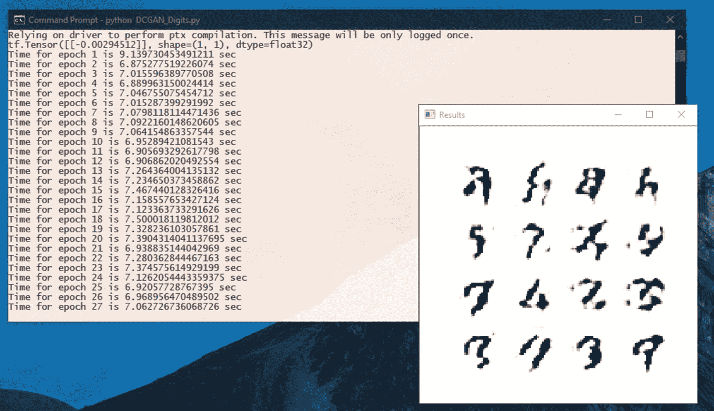

图 11-7

运行 DCGAN 数字生成的训练

在 RTX2070 的 GPU 上运行时，训练 1000 个 epoch 大约需要 2 小时（图 11-8）。

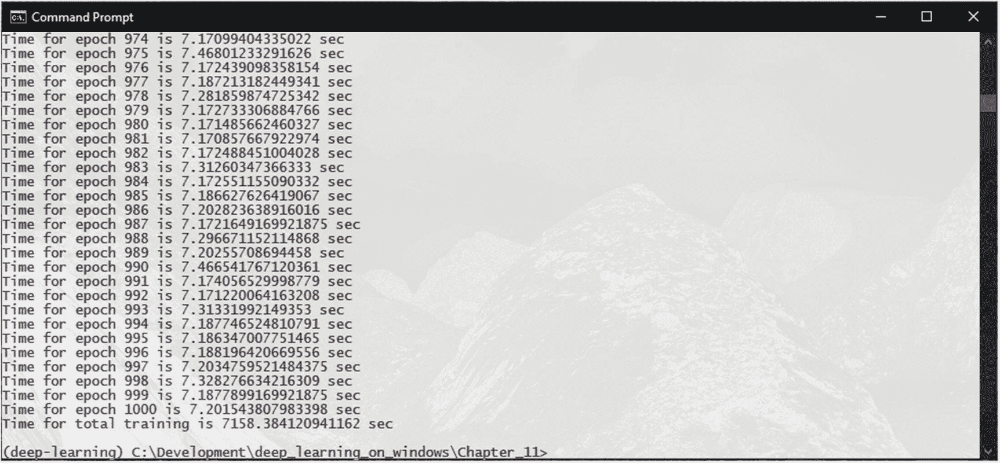

图 11-8

DCGAN 训练完成

注意

GAN 的训练可能需要很长时间。我们的 DCGAN 模型可能需要根据运行机器的处理能力以及您是在 CPU 还是 GPU 上运行模型而花费数小时来训练。通常，在 GPU 上运行每个 epoch 可能需要 7 到 10 秒。在 CPU 上运行 GAN 训练可能不切实际，因为完成训练可能需要很长时间。

如果您不确定，先运行较少的 epoch 数量以了解可能需要多长时间。

小贴士

如果在显示初始噪声图像后训练似乎陷入停滞，您可以尝试注释掉第 53 到 55 行。这种情况可能发生，因为我们的 GAN 训练可能需要大量的系统资源，并且在尝试可视化结果时可能会偶尔耗尽机器的资源。同样，您可以将第 141 行的显示参数设置为 False。

如果您在本地机器上运行时遇到问题，可以使用 Kaggle 笔记本^(1)来运行您的代码。Kaggle 在其笔记本/kernels 中提供免费访问 NVIDIA TESLA P100 GPU，^(2)这可以大大加速训练复杂模型，如 GAN。

在训练开始时，结果看起来像随机噪声（图 11-9）。

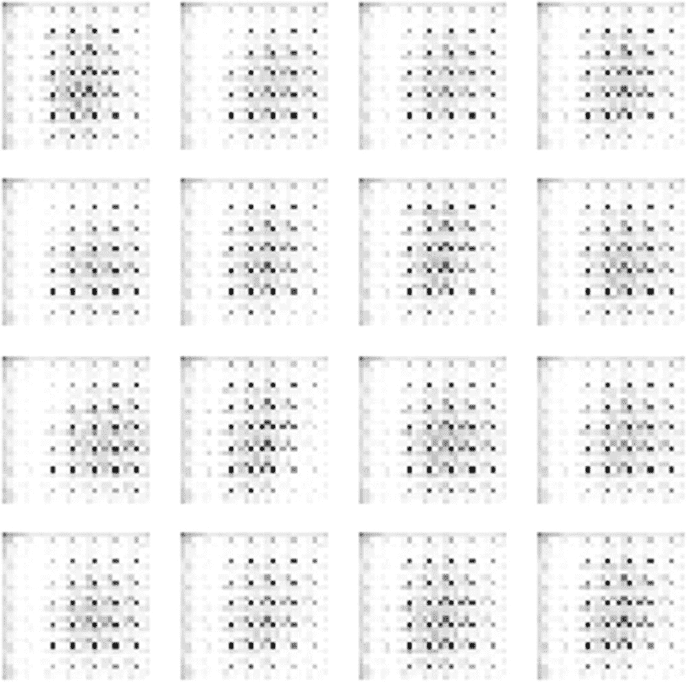

图 11-9

第 1 个 epoch 生成的图像

经过 100 个 epoch 后，数字的独特形状开始显现（图 11-10）。

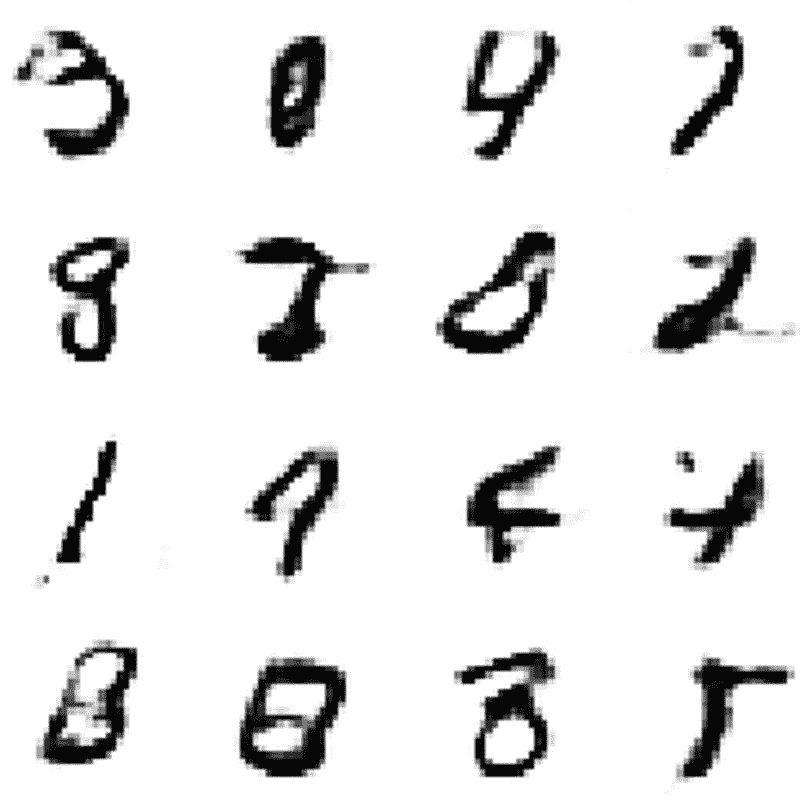

图 11-10

在第 100 个时期生成的图像

经过 200 个时期后，形状更加精细（图 11-11）。

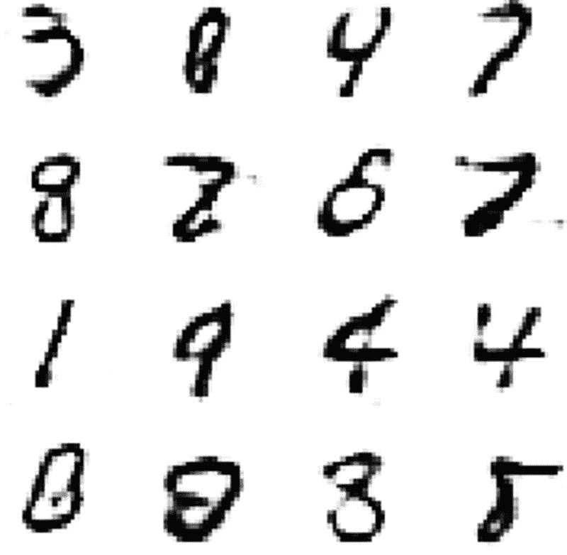

图 11-11

在第 200 个时期生成的图像

经过 1,000 个时期后，图像几乎与人类手写数字无法区分（图 11-12）。

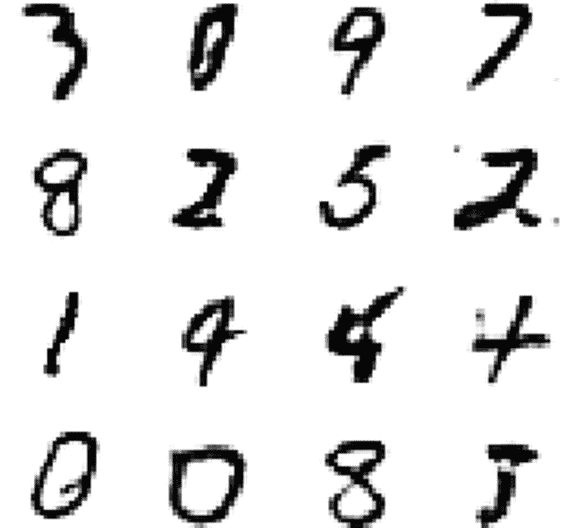

图 11-12

在第 1,000 个时期生成的图像

您还可以查看生成的 dcgan.gif 文件，以了解生成结果在训练过程中的改进。

## 我们能否生成更复杂的东西？

我们已经看到我们的 DCGAN 模型可以生成几乎与人类手写数字无法区分的手写数字。但 GAN 能否生成更复杂的东西？

为了找出答案，让我们尝试将我们从 DCGAN_Digits 模型中学到的知识应用到更复杂的事情上：生成人类面部图像。

为了做到这一点，我们需要一个包含人类面部图像的大数据集来训练我们的判别器模型。我们将使用 Kaggle 上的 CelebFaces Attributes (CelebA)数据集来完成此目的（图 11-13）。

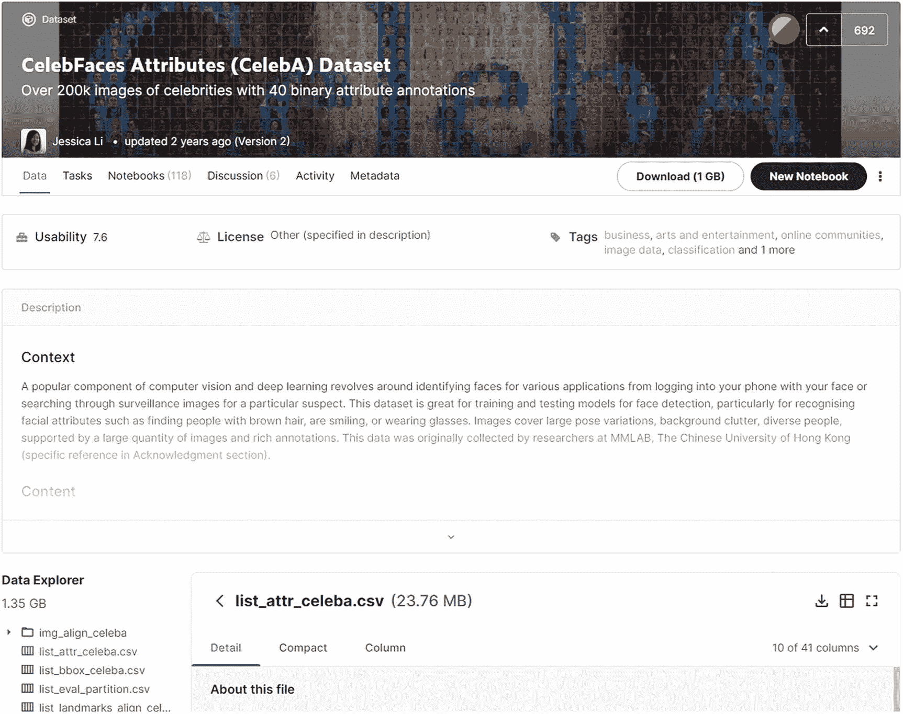

图 11-13

Kaggle 上的 CelebFaces 属性（CelebA）数据集

CelebA 数据集大约有 1.4GB 的大小。3 下载后，解压缩 zip 文件，并将顶级目录重命名为 celeba-dataset。您应该得到以下文件夹结构（图 11-14）：

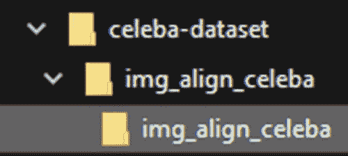

图 11-14

解压缩后的 CelebA 数据集文件夹结构

数据集准备就绪后，让我们开始一个新的代码文件，用于我们的面部生成器，我们将将其命名为 DCGAN_Faces.py。像以前一样，请记住在您的代码文件所在的位置创建训练检查点和输出目录。

我们将首先导入必要的包：

```py
01: import tensorflow as tf
02:
03: from tensorflow.keras import layers
04: import glob
05: import imageio
06: import matplotlib.pyplot as plt
07: import numpy as np
08: import os
09: import PIL
10: import time
11: import cv2
```

然后，我们将定义一个辅助函数来加载每个面部图像，并仅裁剪其面部部分。由于 CelebA 数据集中的图像已经对齐，我们可以使用硬编码的值来裁剪面部：

```py
13: # Load the image, crop just the face, and return image data as a numpy array
14: def load_image(image_file_path):
15:     img = PIL.Image.open(image_file_path)
16:     img = img.crop([25,65,153,193])
17:     img = img.resize((64,64))
18:     data = np.asarray( img, dtype="int32" )
19:     return data
```

然后，我们加载我们的数据集图像路径，并定义批处理参数：

```py
21: dataset_path = "celeba-dataset/img_align_celeba/img_align_celeba/"
22:
23: # load the list of training images
24: train_images = np.array(os.listdir(dataset_path))
25:
26: BUFFER_SIZE = 2000
27: BATCH_SIZE = 8
28:
29: # shuffle and list
30: np.random.shuffle(train_images)
31: # chunk the training images list in to batches
32: train_images = np.split(train_images[:BUFFER_SIZE],BATCH_SIZE)
```

然后，我们定义我们的生成器模型：

```py
34: def make_generator_model():
35:     model = tf.keras.Sequential()
36:
37:     model.add(layers.Dense(4*4*1024, use_bias = False, input_shape = (100,)))
38:     model.add(layers.BatchNormalization())
39:     model.add(layers.LeakyReLU())
40:
41:     model.add(layers.Reshape((4,4,1024)))
42:     assert model.output_shape == (None, 4, 4, 1024) # Note: None is the batch size
43:
44:     model.add(layers.Conv2DTranspose(512, (5, 5), strides = (2,2), padding = "same", use_bias = False))
45:     assert model.output_shape == (None, 8, 8, 512)
46:     model.add(layers.BatchNormalization())
47:     model.add(layers.LeakyReLU())
48:
49:     model.add(layers.Conv2DTranspose(256, (5,5), strides = (2,2), padding = "same", use_bias = False))
50:     assert model.output_shape == (None, 16, 16, 256)
51:     model.add(layers.BatchNormalization())
52:     model.add(layers.LeakyReLU())
53:
54:     model.add(layers.Conv2DTranspose(128, (5,5), strides = (2,2), padding = "same", use_bias = False))
55:     assert model.output_shape == (None, 32, 32, 128)
56:     model.add(layers.BatchNormalization())
57:     model.add(layers.LeakyReLU())
58:
59:     model.add(layers.Conv2DTranspose(3, (5,5), strides = (2,2), padding = "same", use_bias = False, activation = "tanh"))
60:     assert model.output_shape == (None, 64, 64, 3)
61:
62:     return model
63:
64: generator = make_generator_model()
65:
66: noise = tf.random.normal([1,100])
67: generated_image = generator(noise, training = False)
68: plt.imshow(generated_image[0], interpolation="nearest")
69: plt.show()
70: plt.close()
```

这使用了与我们的 DCGAN_Digits 模型中生成器相同的概念。但在这里我们使用了一个更深层的模型，因为我们的数据更复杂。

从未训练的生成器生成的图像将看起来像这样（图 11-15）：

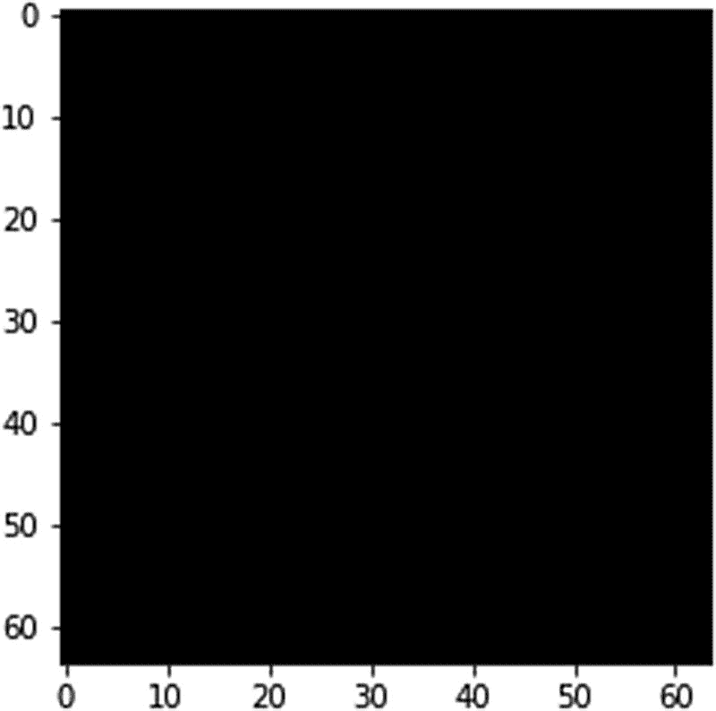

图 11-15

未训练生成器的输出

然后，我们定义我们的判别器模型，比我们的 DCGAN_Digits 模型稍深一些：

```py
72: def make_discriminator_model():
73:     model = tf.keras.Sequential()
74:     model.add(layers.Conv2D(64, (5, 5), strides=(2, 2), padding="same", input_shape=[64, 64, 3]))
75:     model.add(layers.LeakyReLU())
76:     model.add(layers.Dropout(0.3))
77:
78:     model.add(layers.Conv2D(512, (5, 5), strides=(2, 2), padding="same"))
79:     model.add(layers.LeakyReLU())
80:     model.add(layers.Dropout(0.3))
81:
82:     model.add(layers.Conv2D(128, (5, 5), strides=(2, 2), padding="same"))
83:     model.add(layers.LeakyReLU())
84:     model.add(layers.Dropout(0.3))
85:
86:     model.add(layers.Flatten())
87:     model.add(layers.Dense(1))
88:
89:     return model
90:
91: discriminator = make_discriminator_model()
92: decision = discriminator(generated_image)
93: print (decision)
94: # output will be something like tf.Tensor([[-6.442342e-05]], shape=(1, 1), dtype=float32)
```

损失函数、检查点和训练参数与我们之前使用的是完全相同的：

```py
096: # This method returns a helper function to compute cross entropy loss
097: cross_entropy = tf.keras.losses.BinaryCrossentropy(from_logits=True)
098:
099: def discriminator_loss(real_output, fake_output):
100:     real_loss = cross_entropy(tf.ones_like(real_output), real_output)
101:     fake_loss = cross_entropy(tf.zeros_like(fake_output), fake_output)
102:     total_loss = real_loss + fake_loss
103:     return total_loss
104:
105: def generator_loss(fake_output):
106:     return cross_entropy(tf.ones_like(fake_output), fake_output)
107:
108: generator_optimizer = tf.keras.optimizers.Adam(1e-4)
109: discriminator_optimizer = tf.keras.optimizers.Adam(1e-4)
110:
111: checkpoint_dir = './training_checkpoints'
112: checkpoint_prefix = os.path.join(checkpoint_dir, "ckpt")
113: checkpoint = tf.train.Checkpoint(generator_optimizer=generator_optimizer,
114:                                  discriminator_optimizer=discriminator_optimizer,
115:                                  generator=generator,
116:                                  discriminator=discriminator)
117:
118:
119: EPOCHS = 1000
120: noise_dim = 100
121: num_examples_to_generate = 16
122:
123: # setting the seed for the randomization, so that we can reproduce the results
124: tf.random.set_seed(1234)
125: # We will reuse this seed overtime (so it's easier)
126: # to visualize progress in the animated GIF)
127: seed = tf.random.normal([num_examples_to_generate, noise_dim])
```

在训练步骤函数中，我们使用辅助函数 load_image 来预处理我们的图像。其余步骤与之前相同：

```py
129: # Notice the use of `tf.function`
130: # This annotation causes the function to be "compiled".
131: @tf.function
132: def train_step(images):
133:     noise = tf.random.normal([BATCH_SIZE, noise_dim])
134:
135:     # pre-process the images
136:     new_images = []
137:     for file_name in images:
138:         new_pic = load_image(dataset_path + file_name)
139:         new_images.append(new_pic)
140:
141:     images = np.array(new_images)
142:     images = images.reshape(images.shape[0], 64, 64, 3).astype('float32')
143:     images = (images - 127.5) / 127.5 # Normalize the images to [-1, 1]
144:
145:     with tf.GradientTape() as gen_tape, tf.GradientTape() as disc_tape:
146:         generated_images = generator(noise, training=True)
147:
148:         real_output = discriminator(images, training=True)
149:         fake_output = discriminator(generated_images, training=True)
150:
151:         gen_loss = generator_loss(fake_output)
152:         disc_loss = discriminator_loss(real_output, fake_output)
153:
154:     gradients_of_generator = gen_tape.gradient(gen_loss, generator.trainable_variables)
155:     gradients_of_discriminator = disc_tape.gradient(disc_loss, discriminator.trainable_variables)
156:
157:     generator_optimizer.apply_gradients(zip(gradients_of_generator, generator.trainable_variables))
158:     discriminator_optimizer.apply_gradients(zip(gradients_of_discriminator, discriminator.trainable_variables))
159:
160:     images = None
```

最后，主训练循环、保存生成的图像和生成动画所使用的函数步骤与我们之前在 DCGAN_Digits 模型中使用的是相同的：

```py
162: def train(dataset, epochs):
163:     tf.print("Starting Training")
164:     train_start = time.time()
165:
166:     for epoch in range(epochs):
167:         start = time.time()
168:         tf.print("Starting Epoch:", epoch)
169:
170:         batch_count = 1
171:         for image_batch in dataset:
172:             train_step(image_batch)
173:             batch_count += 1
174:
175:         # Produce images for the GIF as we go
176:         generate_and_save_images(generator,
177:                                  epoch + 1,
178:                                  seed)
179:
180:         tf.print("Epoch:", epoch, "finished")
181:         tf.print()
182:         tf.print('Time for epoch {} is {} sec'.format(epoch + 1, time.time()-start))
183:         tf.print()
184:
185:     # Save the model every epoch
186:     checkpoint.save(file_prefix = checkpoint_prefix)
187:
188:     print ('Time for total training is {} sec'.format(time.time()-train_start))
189:
190:
191: def generate_and_save_images(model, epoch, test_input):
192:     # Notice `training` is set to False.
193:     # This is so all layers run in inference mode.
194:     predictions = model(test_input, training=False).numpy()
195:
196:     fig = plt.figure(figsize=(4,4))
197:
198:     for i in range(predictions.shape[0]):
199:         plt.subplot(4, 4, i+1)
200:         image = predictions[i]
201:         plt.imshow(image)
202:         plt.axis('off')
203:
204:     plt.savefig('output/image_at_epoch_{:04d}.png'.format(epoch))
205:     plt.show()
206:
207: train(train_images, EPOCHS)
208:
209: checkpoint.restore(tf.train.latest_checkpoint(checkpoint_dir))
210: cv2.destroyAllWindows()
211:
212: anim_file = 'dcgan_faces.gif'
213:
214: with imageio.get_writer(anim_file, mode="I") as writer:
215:     filenames = glob.glob('output/image*.png')
216:     filenames = sorted(filenames)
217:     last = -1
218:     for i,filename in enumerate(filenames):
219:         frame = 2*(i**0.5)
220:         if round(frame) > round(last):
221:             last = frame
222:         else:
223:             continue
224:         image = imageio.imread(filename)
225:         writer.append_data(image)
226:         cv2.imshow("Results", image)
227:         cv2.waitKey(100)
228:     image = imageio.imread(filename)
229:     writer.append_data(image)
```

那么，我们的面部生成器表现如何？

训练开始时，生成器产生纯黑色图像（图 11-16）。

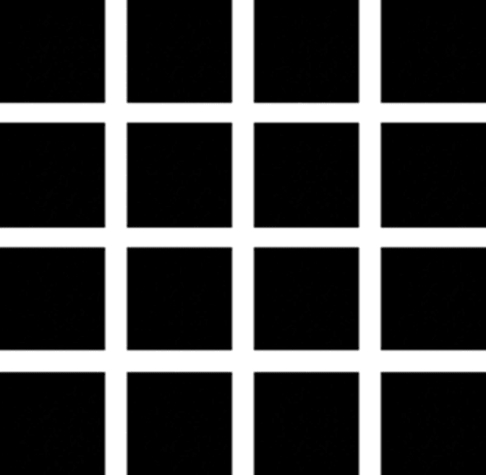

图 11-16

第 1 个 epoch 生成的图像

经过 100 个 epoch 后，输出中开始出现一些形状（图 11-17）。

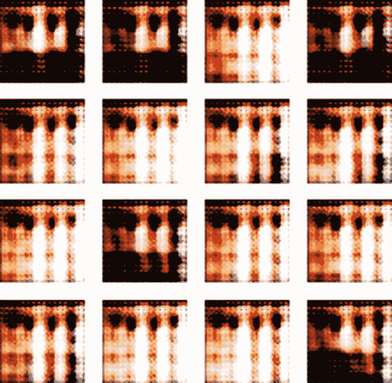

图 11-17

第 100 个 epoch 生成的图像

经过 1,000 个 epoch 后，一些类似面部特征的形状正在生成（图 11-18）。

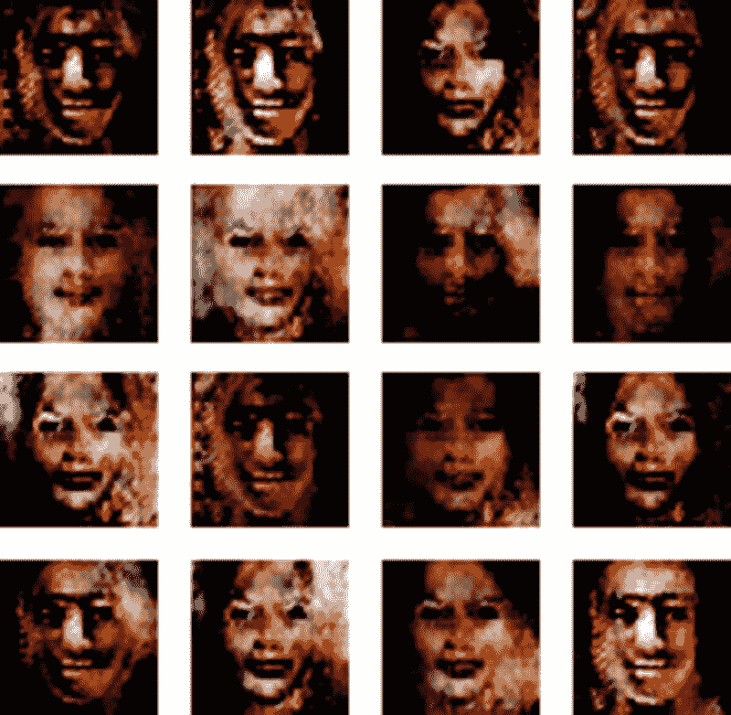

图 11-18

第 1,000 个 epoch 生成的图像

虽然不够逼真，但我们的生成器能够学习生成我们可以与人类面部相关联的特征，这相当令人印象深刻。

为了进一步提高我们的模型，你可以尝试进行更长时间的训练。或者尝试为生成器和判别器组合更深的模型。

然而，请记住，在 GPU 上训练这个模型需要超过 7 个小时才能完成 1,000 个 epoch。在尝试进一步推进时，你应该提前做好计划。

## GANs 还能做什么？

如我们之前讨论的，DCGAN 是 GANs 最简单的实现之一。而在这里，我们只是触及了 GANs 能做什么的表面。

生成对抗网络是深度学习和人工智能领域最新的研究课题之一。它也是过去几年中最活跃发展的领域之一。最近提出了许多创新的 GAN 架构，并且该领域的创新每天都在增加。以下是一些值得注意的 GAN 架构：

+   **CycleGAN（循环一致性 GANs）**：能够学习在不同风格图像之间进行转换，而无需为训练提供配对图像数据。

+   **StyleGAN（基于风格的 GANs）**：能够生成高分辨率图像，通过具有堆叠模型，其中较低层的模型生成较低分辨率的图像，这些图像通过模型的较高层逐步增强。

+   **cGAN（条件 GANs）**：能够利用额外的可用信息（例如，图像的标签）来学习，而不是仅仅依赖于原始图像数据。

+   **lsGAN（最小二乘 GANs）**：使用最小二乘损失函数作为判别器的损失函数，而不是传统的交叉熵损失函数，从而生成更高质量的图像。

+   **DiscoGAN (使用 GAN 发现跨域关系):** 能够以无监督的方式学习相关图像集合之间的跨域关系。

通过这些以及许多新颖的架构，GANs 已经能够产生一些开创性的成果。

NVIDIA 的一个名为 “This Person Does Not Exist” 的项目^(4) 能够使用 StyleGAN 生成逼真的人脸照片（图 11-19）。

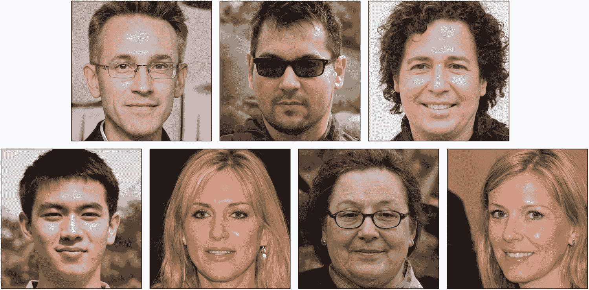

图 11-19

来自 NVIDIA 的 “This Person Does Not Exist” 的部分样本

GauGAN 项目，^(5) 同样由 NVIDIA 开发，可以将粗糙的草图转换为逼真的图像（图 11-20）。


图 11-20

NVIDIA 的 GauGAN 在行动中

GANs 不仅用于图像生成。OpenAI 的 Jukebox 项目^(6) 也可以使用 GAN 模型生成音乐和唱歌（图 11-21）。


图 11-21

OpenAI 的 Jukebox 项目

随着 GANs 的快速发展，可能会有那么一天，人类的创造力将受到挑战。
