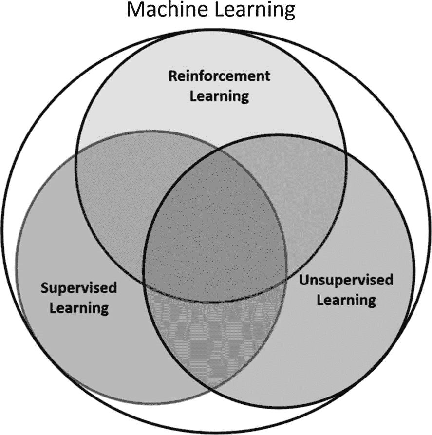

# 一、强化学习简介

强化学习是发展最快的学科之一，正在帮助人工智能成为现实。将深度学习与强化学习相结合已经导致了许多重大进步，这些进步越来越多地让机器接近人类的行为方式。在本书中，我们将从基础开始，以掌握该领域的一些最新发展结束。使用 PyTorch 和 TensorFlow 将会很好地混合理论(用最少的数学)和代码实现。

在这一章中，我们将设置背景，并为你在本书的其余部分做好一切准备。

## 强化学习

所有有智慧的生物都是从一些知识开始的。然而，随着他们与世界的互动和经验的积累，他们学会了适应环境，变得更擅长做事。引用 1994 年《华尔街日报》*、<sup>、 [1](#Fn1) 、</sup>专栏中的一句话，智力可以定义如下:*

> *一种非常普遍的心智能力，包括推理、计划、解决问题、抽象思考、理解复杂想法、快速学习和从经验中学习的能力。这不仅仅是书本知识、狭隘的学术技能或应试技巧。相反，它反映了理解我们周围环境的更广泛和更深入的能力——对事物的“理解”、“理解”或“弄清楚”该做什么。*

 *机器背景下的智能叫做*人工智能*。牛津语言对人工智能(AI)的定义如下:

> 能够执行通常需要人类智能的任务的计算机系统的理论和发展，例如视觉感知、语音识别、决策和语言之间的翻译。

这就是我们将在本书中研究的内容:通过与环境互动并不断从成功、失败和回报中学习，帮助机器(代理)获得执行任务能力的算法的理论和设计。最初，人工智能围绕着设计解决方案，作为一系列可以用逻辑和数学符号表达的正式规则。这些规则由一系列编入知识库的信息组成。这些人工智能系统的设计还包括一个推理引擎，使用户能够查询知识库，并结合规则/知识的各个部分进行推理。这些系统也被称为*专家系统*、*决策支持系统*等。然而，很快人们意识到这些系统太脆弱了。随着问题越来越复杂，编纂知识或建立有效的推理系统变得越来越困难。

强化学习的现代概念是两种不同的思路通过各自的发展结合起来的。首先是最优控制的概念。在许多解决最优控制问题的方法中，理查德·贝尔曼在 1950 年提出了动态规划的原则，我们将在本书中广泛使用。然而，动态编程不涉及学习。这是所有关于规划通过空间的各种选择使用贝尔曼递归方程。在第二章[和第三章](02.html)[中，我们会有很多关于这些方程的内容。](03.html)

第二条线索是通过尝试和错误来学习，它起源于动物训练心理学。爱德华·桑戴克是第一个明确表达试错概念的人。用他的话说:

> 在对同一情况做出的几种反应中，那些伴随着或紧随其后的对动物的满足的反应，在其他条件相同的情况下，将与该情况更紧密地联系在一起，因此，当它重现时，它们将更有可能重现；那些伴随着或紧随其后的动物的不适，在其他条件相同的情况下，它们与这种情况的联系被削弱，这样，当它复发时，它们就不太可能发生。满足感或不适感越大，这种纽带的加强或削弱就越大。

我们将在关于政策梯度的第 [7](07.html) 章中看到增加好结果发生率和减少坏结果发生率的概念。

在 20 世纪 80 年代，这两个领域合并起来，形成了现代强化学习领域。在过去的十年里，随着强大的深度学习方法的出现，强化学习与深度学习相结合，正在产生非常强大的算法，这些算法可以在未来的时代实现人工智能。今天的强化系统与世界互动，以获取经验，并通过概括世界的经验，学习根据与世界互动的结果优化自己的行动。专家知识没有明确的编码。

## 机器学习分支

机器学习涉及从呈现给系统的数据中学习，以便系统可以执行指定的任务。系统没有被明确告知如何完成任务。更确切地说，它与数据一起呈现，并且系统学习基于定义的目标执行一些任务。我们不会多说，因为我们假设你熟悉机器学习的概念。

机器学习方法传统上分为三大类，如图 [1-1](#Fig1) 所示。



图 1-1

机器学习的分支

机器学习的三个分支在学习系统可用的“反馈”的意义上有所不同。下面几节将对它们进行讨论。

### 监督学习

在监督学习中，向系统呈现已标记的数据，目标是概括知识，以便可以标记新的未标记数据。考虑将猫和狗的图像连同哪个图像显示猫或狗的标签一起呈现给系统。输入数据表示为一组数据 *D* = ( *x* <sub>1</sub> ， *y* <sub>1</sub> )， *x* <sub>2</sub> ， *y* <sub>2</sub> )，…(*x*<sub>*n*</sub>，*y* <sub><sub>*x* <sub>*n*</sub> 是各个图像的像素值， *y* <sub>1</sub> ， *y* <sub>2</sub> ，…， *y* <sub>*n*</sub> 是各个图像的标签，比如说，猫的图像的值为 0，狗的图像的值为 1。 系统/模型接受该输入并学习从图像 *x* <sub>*i*</sub> 到标签 *y* <sub>*i*</sub> 的映射。一旦训练完毕，系统将呈现一幅新图像 *x* <sup>'</sup> ，以根据图像是猫还是狗来预测标签 *y* <sup>'</sup> = 0 或 1。</sub></sub>

这是一个分类问题，系统学习将输入分类到正确的类别。另一个问题类型是回归问题，我们希望根据房子的特征来预测房子的价格。训练数据再次表示为 *D* = ( *x* <sub>1</sub> ， *y* <sub>1</sub> )，( *x* <sub>2</sub> ， *y* <sub>2</sub> )，…(*x*<sub>*n*</sub>， *y* <sub>*n 输入是 *x* <sub>1</sub> ， *x* <sub>2</sub> ，…， *x* <sub>*n*</sub> 其中每个输入 *x* <sub>*i*</sub> 是一个具有某些属性的向量，例如，一所房子的房间数量、其面积和前草坪的大小等。系统给出的标签为 *y* <sub>*i*</sub> ，房子的市场价值。系统使用来自许多房屋的输入数据来学习输入特征 *x* <sub>*i*</sub> 到房屋价值 *y* <sub>*i*</sub> 的映射。然后给训练好的模型呈现一个向量 *x* <sup>'</sup> ，这个向量由新房子的特征组成，模型预测这个新房子的市场价值 *y* <sup>'</sup> 。*</sub>

### 无监督学习

无监督学习没有标签。它只有输入 *D* = *x* <sub>1</sub> ， *x* <sub>2</sub> ，…， *x* <sub>*n*</sub> ，没有标签。系统使用这些数据来学习数据的隐藏结构，从而可以将数据聚类/分类到一些大的类别中。后学习，当系统呈现新的数据点 *x* <sup>'</sup> 时，它可以将新的数据点匹配到已学习的聚类之一。与监督学习不同，每个类别没有明确定义的含义。一旦数据被聚类到一个类别中，基于一个聚类中最常见的属性，我们可以赋予它一些意义。无监督学习的另一个用途是利用基础输入数据来学习数据分布，以便随后可以查询系统来产生新的合成数据点。

很多时候，无监督学习被用于特征提取，然后被馈送到监督学习系统。通过聚类数据，我们可以首先识别隐藏的结构，并将数据重新映射到一个更低的维度形式。有了这个更低维度的数据，监督学习就能够学习得更快。这里我们使用无监督学习作为特征提取器。

还有另一种方法来利用无监督学习方法。考虑这种情况，当你有少量的标记数据和大量的未标记数据。标记数据和未标记数据首先被聚集在一起。接下来，在每个这样的聚类中，基于该聚类中已标记数据的强度，给未标记数据分配标签。我们基本上是利用有标签的数据给无标签的数据分配标签。完全标记的数据接下来被馈送到监督学习算法中，以训练分类系统。这种将监督和非监督学习结合在一起的方法被称为*半监督学习*。

### 强化学习

我们先来看一个例子。我们正试图设计一种可以自己驾驶的自动驾驶汽车。我们有一辆汽车，我们将称之为*代理*，即一个正在学习自己驾驶的系统或算法。它正在学习一种*行为*来驾驶。当它的当前坐标、速度和运动方向组合成一个数字向量时，就被称为它的*当前状态*。代理使用其当前状态来决定是应用刹车还是踩油门。它还利用这些信息来转动方向盘，以改变汽车的运动方向。“刹车/加速”和“驾驶汽车”的组合决定被称为*动作*。特定当前状态到特定动作的映射被称为*策略*。代理人的行为在好的时候会产生一个快乐的结果，而在坏的时候，会导致一个不快乐的结果。代理使用结果的反馈来评估其动作的有效性。作为反馈的结果被称为*奖励*，代理人在特定的状态下以特定的方式行动得到奖励。基于当前状态及其动作，汽车达到一组新的坐标、速度和方向。这是*新状态*，代理根据其在上一步中的行为发现自己所处的状态。谁提供这个结果并决定新的状态？是车的周围环境，是车/代理无法控制的东西。代理不控制的其他一切都被称为*环境*。在整本书中，我们会对这些术语进行更多的讨论。

在这种设置中，系统以状态向量、采取的行动和获得的奖励的形式提供的数据是连续的和相关的。基于代理人采取的行动，从环境中获得的下一个状态和奖励可能会发生剧烈变化。在前面的自动驾驶汽车的例子中，想象有一个行人正在汽车前面过马路。在这种情况下，加速和刹车会有非常不同的结果。使汽车加速可能会导致行人受伤以及汽车和乘员受损。制动汽车可以避免任何损坏，并且在道路畅通后汽车可以继续前进。

在强化学习中，主体没有系统的先验知识。它收集反馈，并使用反馈来计划/学习行动，以最大限度地实现特定目标。由于它最初没有足够的关于环境的信息，它必须探索以收集洞察力。一旦它收集了“足够”的知识，它需要利用这些知识来开始调整它的行为，以最大化它所追求的目标。难的是没有办法知道什么时候探索是“足够的”。如果代理即使在获得了完美的知识后还继续探索，那么它试图收集没有剩余的新信息就是在浪费资源。另一方面，如果代理过早地认为它已经收集了足够的知识，它可能会基于不完整的信息进行优化，并且可能表现不佳。这种何时探索、何时利用的困境是强化学习算法反复出现的核心主题。当我们在本书中讨论不同的行为优化算法时，我们会看到这个问题一次又一次地发生。

### 核心要素

强化学习系统可以分为四个关键部分:政策、奖励、价值函数和环境模型。

*策略*是形成代理智能的东西。代理开始与环境交互以感知环境的当前状态，例如，机器人从系统获得视觉和其他感官输入，也称为环境的*当前状态*或机器人感知的当前观察数据。像智能实体一样，机器人使用当前信息和可能的过去历史来决定下一步做什么，即执行什么*动作*。该策略将状态映射到代理采取的操作。策略可以是*确定性的*。换句话说，对于给定的环境状态，代理采取固定的动作。有时政策可以是随机的。换句话说，对于给定的状态，代理可以采取多种可能的动作。

*奖励*是指代理人试图达到的目标/目的。假设一个机器人试图从 A 点到 b 点，它感应到当前位置并采取行动。如果这个行动使它更接近目标 B，我们期望回报是正的。如果它把机器人从 B 点带走，这是一个不利的结果，我们会期望回报是负的。换句话说，奖励是一个数字值，表示代理人基于其试图实现的目的/目标而采取的行动的好坏。奖励是代理评估行为是好是坏的主要方式，并使用此信息来调整其行为，即优化其正在学习的策略。

奖励是环境的内在属性。所获得的回报是代理人当前所处状态以及在该状态下所采取的行动的函数。代理遵循的奖励和政策定义了*价值函数*。

*   *状态中的值*是基于代理所处的状态及其遵循的政策，代理期望获得的总累积奖励。

*   *奖励*是基于状态和在该状态下采取的行动的来自环境的即时反馈。与价值不同，奖励不会因代理人的行为而改变。在特定的状态下采取特定的行动总是会产生相同的回报。

价值函数就像长期回报一样，不仅受环境的影响，还受代理人遵循的政策的影响。价值因为回报而存在。代理在遵循策略时累积奖励，并使用这些累积的奖励来评估状态中的值。然后，它改变其政策，以增加国家的价值。

我们可以将这个想法与我们之前谈到的*勘探开发困境*联系起来。在某些情况下，最佳行动可能会带来直接的负面回报。然而，这样的动作可能仍然是最佳的，因为它可以将代理置于一个新的状态，从该状态它可以更快地到达它的目标。一个例子是穿过一个驼峰或绕道走一条更短的路到达目标。

除非代理进行了足够的探索，否则它可能无法发现这些较短的路径，并可能最终满足于一个次优路径。然而，在发现了更短的路径之后，它无法知道它是否仍然需要更多的探索来找到另一条更快的路径，或者它是否更好地利用其先前的知识来奔向目标。

这本书的前五章着重于使用前面描述的价值函数来寻找最优行为/政策的算法。

最后一个部分是环境模型。在一些寻找最佳行为的方法中，代理使用与环境的交互来形成环境的内部模型。这种内部模型有助于代理人进行规划，即考虑一个或多个动作链来评估最佳动作序列。这种方法叫做*基于模型的*学习。同时，还有其他完全基于试错的方法。这种方法不形成任何环境模型。因此，这些被称为*无模型*方法。大多数代理使用基于模型和无模型方法的组合来寻找最优策略。

## 具有强化学习的深度学习

近年来，涉及基于神经网络的模型的机器学习的子分支出现了爆炸式增长。随着功能强大的计算机、大量数据和新算法的出现，现在可以训练模型根据图像、文本和语音等原始输入进行归纳，类似于人类的操作方式。在深度学习的子分支下，对特定领域手工制作的特征来训练模型的需求正在被强大的基于神经网络的模型所取代。

2014 年，DeepMind 成功地将深度学习技术与强化学习相结合，从一个没有对原始输入进行任何特定领域处理的环境中收集的原始数据中进行学习。它的第一个成功是将强化学习下的传统 Q 学习算法转换为深度 Q 学习方法，该方法被命名为深度 Q 网络(DQN)。Q-learning 涉及一个智能体，它遵循某种策略，以当前状态、它采取的行动、它得到的回报以及它发现自己所处的下一个状态的元组的形式来收集它的行动经验。然后，代理在迭代循环中使用这些经验和贝尔曼方程来寻找最优策略，使得每个状态的价值函数(如前所述)增加。

早期将深度学习与强化学习相结合的尝试并不成功，因为这种结合方法的性能不稳定。DeepMind 做了一些有趣而聪明的改变来克服不稳定问题。它首先将传统的强化学习和深度学习相结合的方法应用于开发 Atari 游戏的游戏代理*。*代理将获得游戏的快照，并且事先不知道游戏的规则。代理将使用这些原始视觉数据来学习玩游戏，例如 Atari 视频游戏。在许多情况下，它达到了人类水平的性能。该公司随后扩展了这一方法，以开发能够在围棋等游戏中击败冠军人类选手的代理人。将深度学习与强化学习结合使用，已经使机器人变得更加智能，而不需要手工制作特定领域的知识。这是一个令人兴奋的快速发展的领域。我们将在第五章[中访问这个。我们从第](05.html) [6 章](06.html)开始学习的大多数算法都将涉及深度学习和强化学习的结合。

## 示例和案例研究

为了激励你，我们将看看强化学习的各种用途，以及它如何帮助解决一些现实世界的问题。

### 自动驾驶汽车

首先，我们看看自动驾驶汽车(AVs)领域。AVs 有像激光雷达、雷达、摄像机等传感器。感知附近的环境。这些传感器然后被用于执行对象检测、车道检测等。原始感觉数据和对象检测被组合以获得用于规划到目的地的路径的统一场景表示。接下来，计划的路径用于将输入馈送到控制，以使系统/代理遵循该路径。运动规划是规划轨迹的部分。

像逆向强化学习这样的概念可以用来优化成本函数，以得出平滑的轨迹，在逆向强化学习中，我们观察专家，并根据专家的交互来学习隐含的目标/回报。超车、变道和自动泊车等行为也利用强化学习的各个部分来将智能构建到行为中。另一种选择是手工制定各种各样的规则，这永远不可能是详尽的或灵活的。

### 机器人

使用计算机视觉和自然语言处理或使用深度学习技术的语音识别，为自主机器人增加了类似人类的感知能力。此外，结合深度学习和强化学习的方法已经导致教会机器人学习像人类一样走路、拿起和操纵物体，或者通过相机观察人类行为并学习像人类一样表演。

### 推荐系统

今天，我们随处可见推荐系统。视频共享/托管应用 YouTube、抖音和脸书根据我们的观看历史向我们推荐我们想要观看的视频。当我们访问任何电子商务网站时，根据我们当前查看的产品和我们过去的购买模式，或者根据其他用户的行为方式，我们会看到其他类似的产品推荐。

所有这些推荐引擎越来越多地由基于强化学习的系统驱动。这些系统不断地从用户对引擎给出的建议的反应中学习。根据建议采取行动的用户在给定的上下文中将这些行动强化为好的行动。

### 金融和贸易

由于其顺序动作优化的焦点，其中过去的状态和动作影响未来的结果，强化学习在时间序列分析中发现了重要的用途，特别是在金融和股票交易领域。许多自动化交易策略使用强化学习方法，根据过去行动的反馈不断改进和微调交易算法。银行和金融机构使用聊天机器人与用户互动，以提供有效、低成本的用户支持和参与。这些机器人再次使用强化学习来微调其行为。投资组合风险优化和信用评分系统也受益于基于 RL 的方法。

### 卫生保健

强化学习在医疗保健中有着重要的用途，无论是生成预测信号和实现早期医疗干预，还是机器人辅助手术或管理医疗和患者数据。它还用于改进成像数据的解释，成像数据本质上是动态的。基于 RL 的系统提供从其经验中学习到的建议，并不断发展。

### 博弈

最后，我们不能过分强调基于 RL 的代理能够在许多棋盘游戏中击败人类玩家。虽然设计能玩游戏的代理看起来有些浪费，但这是有原因的。游戏提供了一个更简单的理想化世界，使设计、训练和比较方法变得更容易。在这种理想化的环境/设置下学习的方法可以随后被增强，以使代理在真实世界的情况下表现良好。游戏提供了一个控制良好的环境来更深入地研究这个领域。

正如我们之前所说，深度强化学习是一个令人着迷且快速发展的领域，我们希望为您提供一个坚实的基础，以便在您掌握该领域的旅程中入门。

## 库和环境设置

本书中的所有代码示例都是用 Python 和 PyTorch、TensorFlow、OpenAI Gym 库编写的。虽然有许多方法可以设置环境，但我们将使用`conda`环境。以下是获得完整环境的步骤:

1.  访问 [`https://docs.conda.io/en/latest/miniconda.html`](https://docs.conda.io/en/latest/miniconda.html) 并为您的平台选择 Miniconda install 来安装 Miniconda。请选择最新的 Python3.x 版本。如果您已经安装了 Anaconda 或 Miniconda，可以跳过这一步。

2.  我们将创建一个新的环境来运行本书附带的代码。打开命令终端，键入以下内容:

    ```py
    conda create -n apress python=3.8

    ```

    其中`apress`是环境的名称，我们使用的是 Python 3.8.x。对所有提示回答“是”。

3.  使用以下命令切换到您创建的新环境:

    ```py
    conda activate apress

    ```

    确保我们在接下来的步骤中要求您运行的所有命令都在您激活新的`conda`环境的同一终端中执行。

4.  安装 TensorFlow 2.x，可以参考 [`https://www.tensorflow.org/install`](https://www.tensorflow.org/install) 了解更多细节，也可以在`conda` shell 中运行以下命令:

    ```py
    pip install tensorflow

    ```

    按照提示，适当回答(大部分是)。

5.  我们现在将安装 PyTorch。访问 [`https://pytorch.org/get-started/locally/`](https://pytorch.org/get-started/locally/) 并选择您拥有的环境设置。你不需要一台支持 GPU 的机器。本书中的大多数例子都可以在 CPU 上运行良好，除了第 [6 章](06.html)中的一个例子，在那里我们训练一个代理玩 Atari 游戏。即使有了 GPU，训练一个雅达利游戏代理也可能需要很长时间。

    在写这本书的时候，我们在前一页选择了以下组合:

    `PyTorch build: Stable (1.7.0)`

    `Your OS: Windows or Mac`

    `Package: Conda`

    `Language: Python`

    `CUDA: None`

    有了这些选择，生成的命令如下:

    ```py
    conda install pytorch torchvision torchaudio cpuonly -c pytorch

    ```

    将生成的命令从网页复制并粘贴到您的`conda`终端中，在这里您将`apress`作为当前活动的`conda`环境(步骤 3)。

    确保使用链接 [`https://pytorch.org/get-started/locally/`](https://pytorch.org/get-started/locally/) 为本地机器生成命令，并做出适当的选择。

6.  接下来，我们将安装一个 Jupyter 笔记本。在之前的终端中，在终端中运行以下命令:

    ```py
    conda install -c conda-forge jupyter notebook

    ```

    请注意，我们使用的是经典的 Jupyter 笔记本。然而，如果你喜欢你可以安装一个 JupyterLab 界面，你可以在 [`https://jupyter.org/install`](https://jupyter.org/install) 找到更多的细节。

7.  我们现在将安装 OpenAI Gym 库，其中包含各种强化学习环境，我们将使用这些环境来培训代理。请在命令行中键入以下内容:

    ```py
    pip install gym

    ```

    详情可以参考 [`https://gym.openai.com/docs/#installation`](https://gym.openai.com/docs/%2523installation) 。

8.  下一行是`matplotlib,`，它有绘制图形的例程。请在前一个终端中运行以下命令。请注意，所有命令都必须在命令 shell 中运行，其中`apress`是当前活动的`conda`环境。

    ```py
    conda install -c conda-forge matplotlib

    ```

    你可以在 [`https://matplotlib.org/`](https://matplotlib.org/) 了解更多`matplotlib`。

9.  让我们也安装另一个名为`seaborn.`的绘图库，它建立在`matplotlib`之上，帮助安装格式良好的图形例程。在终端中运行以下命令:

    ```py
    conda install -c anaconda seaborn

    ```

你可以在 [`https://seaborn.pydata.org/index.html`](https://seaborn.pydata.org/index.html) 了解更多关于 Seaborn 的信息。

1.  我们将安装一个小图书馆，为培训提供进度条。在终端运行以下命令:

1.  让我们为 OpenAI Gym 安装一些额外的依赖项。我们将安装 Atari 相关的依赖项，以便 Atari 游戏可以通过 OpenAI Gym 接口进行训练。我们还将安装 Box2D，以允许我们将在第 [8](08.html) 章中使用的连续控制依赖。最后，我们将安装`pygame`，它允许我们玩 Atari 游戏，并使用键盘与之交互。请在终端中使用以下命令:

```py
conda install -c conda-forge tqdm

```

```py
pip install gym[atari]

```

在 Mac 上，您可能需要运行`pip install 'gym[atari]'`。请注意单引号。

接下来，在终端运行以下两个命令:

```py
conda install -c conda-forge pybox2d

pip install pygame

```

如果您使用的是 Windows，您可能需要重新安装 Atari 模拟器。从`pip install gym[atari]`直接安装似乎不能与 Windows 一起工作，并给出一个`dll not found`错误。但是，请不要跳过跑`pip install gym[atari]`。运行 Atari 模拟器需要安装一些其他的依赖项。运行以下两个命令来解决这个问题，并在您执行了`pip install gym[atari]`之后仅运行*:*

 *1.  最后，我们安装`stable-baselines3`，它已经交付了许多流行的 RL 算法的实现。要安装它，请在终端中运行以下命令:

```py
pip unistall atari-py

pip install -f https://github.com/Kojoley/atari-py/releases atari_py

```

```py
pip install stable-baselines3

```

你可以在 [`https://github.com/DLR-RM/stable-baselines3`](https://github.com/DLR-RM/stable-baselines3) 了解更多关于这个图书馆的信息。

1.  现在您下载并解压缩本书附带的代码文件。打开终端，在解压后文件夹中导航。使用以下命令切换到先前安装的`conda`环境:

```py
conda activate apress

```

接下来，在终端使用以下命令启动 Jupyter 笔记本:

```py
jypyter notebook

```

此时，您将看到您的默认浏览器打开，并且您已经准备好导航到相应的章节(图 [1-2](#Fig2) )。


图 1-2

您可以打开笔记本来运行和研究代码。

图 [1-3](#Fig3) 显示了打开的第 [2](02.html) 章中的一个笔记本。


图 1-3

打开示例笔记本

### 安装本地环境的替代方法

解压代码文件夹后，您会看到一个名为`environments`的文件夹。它包含两个 YML 环境文件。一个是 Windows 版，名为`environment_win.yml`，另一个是 macOS 版，名为`environment_mac.yml`。您可以使用这些文件在本地机器上复制环境。导航到该文件夹并运行以下程序。

在 Windows 上:

```py
conda env create -f environment_win.yml

```

在 macOS 上:

```py
conda env create -f environment_mac.yml

```

使用这种方法将处理前面的步骤 2 到 12。

## 摘要

在这一章中，我们首先介绍了强化学习领域，以及它是如何从一个严格的基于规则的决策系统演变为一个灵活的最佳行为学习系统的历史，它可以根据以前的经验自行学习。

我们讨论了机器学习的三个子分支，即监督学习、非监督学习和强化学习。我们比较了这三种方法，以阐述每种方法适用的问题背景。我们还讨论了组成强化设置的子组件和术语。它们是主体、行为、状态、行动、政策、奖励和环境。我们用一辆汽车和一个机器人的例子来说明这些子组件是如何相互作用的，以及这些术语的含义。

我们讨论了奖励和价值函数的概念。我们讨论了奖励是短期反馈，价值函数是代理行为的长期反馈。最后，我们介绍了基于模型和无模型的学习方法。接下来，我们谈到了深度学习在强化学习领域的影响，以及 DQN 是如何开启深度学习与强化学习相结合的趋势的。我们还讨论了组合方法如何产生可扩展的学习，包括来自图像、文本和语音等非结构化输入的学习。

我们接着讨论了强化学习的各种用例，引用了自动驾驶汽车、智能机器人、推荐系统、金融和贸易、医疗保健以及视频/棋盘游戏等领域的例子。最后，我们介绍了设置 Python 环境并能够运行本书附带的代码示例所需的步骤。

<aside aria-label="Footnotes" class="FootnoteSection" epub:type="footnotes">Footnotes [1](#Fn1_source)

[T2`https://en.wikipedia.org/wiki/Mainstream_Science_on_Intelligence`](https://en.wikipedia.org/wiki/Mainstream_Science_on_Intelligence)

 </aside>**