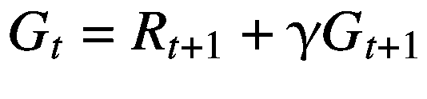

# 二、马尔可夫决策过程

正如在第 [1](01.html) 章中所讨论的，强化学习包括顺序决策。在这一章中，我们将在模拟连续决策行为的概率分支下形式化使用随机过程的概念。虽然我们在强化学习中研究的大多数问题都被建模为*马尔可夫决策过程* (MDP)，但我们首先介绍马尔可夫链(MC)，然后介绍马尔可夫奖励过程(MRP)。我们最后深入讨论了 MDP，同时涵盖了 MDP 背后的模型设置和假设。

然后我们讨论了相关的概念，如状态的价值函数和状态-动作对的动作价值函数。最后，我们在本章结尾详细讨论了各种形式的贝尔曼方程，如贝尔曼期望方程和贝尔曼最优性方程，并简要介绍了各种类型的学习算法。

虽然本章的重点将是强化学习的理论基础，我们将有例子和练习来帮助巩固概念。没有比自己编码更好的学习方法了，这是本书反复出现的主题。

## 强化学习的定义

在前一章中，我们讨论了一个主体通过基于其当前状态采取行动、获得数字奖励以及发现自己处于新状态而与环境互动的循环。

图 [2-1](#Fig1) 说明了这个概念。


图 2-1

代理环境交互的循环

代理在时间 t 处于状态 S <sub>t</sub> 。从代理在这种状态下可以采取的一组动作中，它采取了一个特定的动作 A <sub>t</sub> 。此时，系统过渡到下一个时间段(t+1)。环境用数字奖励 R <sub>t+1</sub> 来响应代理，并且将代理置于 S <sub>t+1</sub> 的新状态。“状态到行动到奖励和下一个状态”的循环一直持续到时间代理达到某个最终目标状态，如游戏结束、任务完成或特定数量的时间步结束。

代理行为环境反应

S<sub>t</sub>->A<sub>t</sub>->R<sub>t+1</sub>，S <sub>t+1</sub>

当前状态采取的行动奖励和新状态

S <sub>0</sub> ，A <sub>0</sub> ，R <sub>1</sub> ，S <sub>1</sub> ，A <sub>1</sub> ，R <sub>2</sub> ，S <sub>2</sub> ，A <sub>2</sub> ，R <sub>3</sub> ，S <sub>3</sub> ，A <sub>3</sub> ，R <sub>4</sub> ，S<sub>..</sub>

有一个状态、行动、回报和状态(S，A，R，S)的循环。

代理根据它发现自己所处的状态采取行动；即，代理通过采取动作来“行动”。环境对代理的行为作出“反应”,给代理一些数字奖励，并把代理转换到一个新的状态。代理人的目标是采取一系列行动，使其从环境中获得的总回报最大化。

强化学习的目的是让代理学习它可能发现自己所处的每个状态的最佳可能动作，牢记累积报酬最大化的目标。

作为一个例子，考虑国际象棋比赛。棋子在棋盘上的位置可以形成当前状态**(S**<sub>**t**</sub>**)**。代理人(玩家)通过移动棋子采取动作**(A**<sub>**t**</sub>**)**。代理人获得奖励**(R**<sub>**t+1**</sub>**)**，假设 0 代表安全移动，1 代表导致将死的移动。游戏也移动到新的状态，**(S**<sub>**t+1**</sub>**)**。

有时，在文献中，状态也被称为*观察值*，以区分在某些情况下代理可能只能看到实际状态的部分细节。这种部分可观测的状态被称为*观测*。代理必须使用全部或部分状态信息来做出关于它应该采取的动作的决定。在现实生活的实现中，理解代理将观察到什么以及它将有多详细是一个重要的方面。学习算法的选择和理论保证会受到部分可观测性水平的显著影响。我们将首先关注状态和观察值相同的情况；换句话说，代理知道当前状态的每一个可能的细节。但是从第 5 章[开始，我们将开始关注状态不是完全已知，或者即使完全已知也需要使用某种近似来总结的情况。](05.html)

现在让我们通过几个例子来深入理解状态/观察到行动再到下一个状态的循环。在整本书中，我们将使用 OpenAI 的 Python 库 Gym，它实现了一些常见的简单环境。我们来看第一个环境:`MountainCar`。启动 Jupyter 笔记本并导航至`listing_2_1.ipynb`。

在`MountainCar`环境中，有一个汽车试图攀爬的小山，最终目标是到达小山右上角的旗帜。车子动力不够，需要向左摆动，然后向右加速才能到达目标。这种来回摆动需要发生多次，这样汽车才能获得足够的动力，到达右谷顶部的旗帜。见图 [2-2](#Fig2) 。


图 2-2

登山车-v0 环境。这个环境有一个二维状态和一组三个离散的动作

清单 [2-1](#PC1) 显示了测试`MountainCar`环境的代码。

```py
import gym
env = gym.make('MountainCar-v0')

# reset environment and get initial observation/state
# Observation/state is a tuple of (position, velocity)
obs = env.reset()
print("initial observation:", obs)

# possible 3 actions
# {0: "accelerate to left", "1": "do nothing", "2": "accelerate to right"}
print("possible actions:", env.action_space.n)

# reinforcement learning is all
# about learing to take good actions
# from a given state/observation
# right now taking a random action
def policy(observation):
    return env.action_space.sample()

# take 5 random actions/steps
for _ in range(5):

    # to render environment for visual inspection
    # when you train, you can skip rendering to speed up
    env.render()

    # based on curret policy, use the current observation
    # to find the best action to take.
    action = policy(obs)
    print("\ntaking action:", action)

    # pass the action to env which will return back
    # with new state/"observation" and "reward"
    # there is a "done" flag which is true when game ends
    # "info" provides some diagnostic information
    obs, reward, done, info = env.step(action)
    print("got reward: {0}. New state/observation is: {1}".format(reward, obs))

# close the enviroment
env.close()

Listing 2-1MountainCar Environment

```

让我们一行一行地浏览代码。我们先用`import gym`导入 OpenAI 健身房库。OpenAI Gym 为强化学习实现了多种环境。在我们阅读本书的章节时，我们将会用到其中的一些环境。

继续，我们用`env = gym.make('MountainCar-v0').`实例化`MountainCar`环境，然后通过`obs = env.reset()`初始化环境，返回初始观察值。在`MountainCar,`的情况下，观察值是两个值的元组:`(x-position, x-velocity)`。代理通过观察找到最佳行动:`action = policy(obs)`。

在清单 [2-1](#PC1) 中，代理采取随机行动。然而，随着我们在本书中的进展，我们将学习不同的算法，这些算法将被用来寻找报酬最大化的政策。对于`MountainCar`环境，有三种可能的动作:向左加速，什么都不做，向右加速。代理将动作传递给环境。在这一点上，系统在概念上采用从时间 t 移动到时间 t+1 的时间步长。

环境执行这个动作并返回一个由四个值组成的元组:时间(t+1)的新观察值、奖励(r <sub>t+1</sub> )、完成标志和一些调试信息。这些值用`obs`、`reward`、`done`、`info = env.step(action)`存储在本地。

接下来，代理使用新的观察再次采取下一步骤，取回新的四个值的元组，即下一状态、奖励、完成标志和调试信息。这种“状态到行动再到奖励到新状态”的循环一直持续到游戏结束或者在代码中终止。在这个设置中，代理在每个时间步长获得-1 的奖励，当游戏结束时奖励为 0。因此，代理的目标是在尽可能短的步数内到达标志。

让我们看看另一个环境。用`env = gym.make('CartPole-v1')`替换`env = gym.make('MountainCar-v0')`行，再次运行清单 [2-1](#PC1) 中的代码。见图 [2-3](#Fig3) 。


图 2-3

CartPole-v1 环境。这样做的目的是尽可能长时间保持立杆的平衡

`CartPole`环境有一个由四个值组成的观察空间。购物车在 x 轴上的位置和沿 x 轴的速度是前两个值。杆的倾斜角是观察元组中的第三个值，必须在-24 <sup>o</sup> 到 24 <sup>o</sup> 之间。观测元组中的第四个值是极点的角速度。

可能的动作是 0 和 1，分别向左或向右推购物车。代理人在每个时间步长不断获得 1 的奖励，从而激励代理人在尽可能长的时间内平衡极点并获得尽可能多的点。如果杆子在任一侧倾斜超过 12 度 <sup>o</sup> ,或者推车在任一侧移动超过 2.4 度，即推车到达任一端，或者已经走了 200 步，游戏结束。

您可能已经注意到，这两种情况下的代码设置是相同的。我们只是更改了一行代码来实例化不同的环境。遍历环境并接收反馈的其余代码保持不变。OpenAI Gym 库提供的抽象使我们更容易在许多环境中测试特定的算法。此外，我们还可以根据手头的问题创建自己的定制环境。

本节涵盖了强化学习的简要定义和我们将使用的 OpenAI 健身房环境的基础知识。在接下来的章节中，我们将详细介绍强化学习(RL)设置的不同组件。

## 代理和环境

代理和环境的设置非常灵活。代理是一个从系统外部获取状态/观察细节的封闭系统。它使用一个给定的策略或学习一个策略来最大化提供给它的一些目标。它还根据当前的观察/状态和代理采取的行动从环境中获得奖励。代理无法控制这些奖励将会是什么。代理也不控制从一种状态到另一种状态的转换。这种转变取决于环境，主体只能通过决定在特定状态下采取何种行动来间接影响结果。

另一方面，环境是代理之外的一切。换句话说，它可能是整个世界的其余部分。然而，环境的定义通常非常狭窄:包括可能影响奖励的信息。环境接收代理想要采取的动作。它以奖励的形式向代理提供反馈，并根据代理采取的行动转换到新的状态。接下来，环境向代理提供部分修改后的状态信息，该信息成为代理的新观察/状态。

代理和环境之间的边界是抽象的。它是根据手头的任务和我们在特定情况下试图实现的目标来定义的。让我们看一些例子。

考虑一下自动驾驶汽车的情况。代理状态可以是来自多个相机、光探测和测距(LiDAR)的视觉图像、其他传感器读数以及地理坐标。虽然“环境”是代理之外的一切，即整个世界，但是代理的相关状态/观察仅是与代理采取行动相关的世界的那些部分。两个街区外的行人的位置和动作可能与自动驾驶汽车做出决策无关，因此不需要成为代理的观察/状态的一部分。自动驾驶汽车的行动空间可以根据油门踏板值、刹车和转向控制来定义。车辆采取的行动导致汽车转换到新的观察状态。如此循环下去。期望代理(即，自动驾驶汽车)基于特定目标(例如，从 A 点到 b 点)采取最大化回报的行动

让我们考虑另一个机器人试图解魔方的例子。这种情况下的观察/状态是魔方六个面的配置，而动作是可以在魔方上执行的操作。对于每个时间步长，奖励可以是-1，而在成功求解结束时，即在终止时，奖励可以是 0。这样的奖励设置将激励代理找到最少数量的操作来解决难题。

在我们的设置中，我们将使用 OpenAI 健身房环境，观察将始终是一个各种值的元组，其确切组成取决于特定的健身房环境。行动将取决于具体的环境。奖励将由环境提供，具体的实数数值取决于具体的健身房环境。在这种情况下，代理将是我们编写的软件程序。代理(软件程序)的主要工作将是接收来自 OpenAI 健身房环境的观察，采取行动，并等待环境在奖励和下一状态方面提供反馈。

虽然我们谈论的是离散的步骤，即处于状态(S <sub>t</sub> )的代理采取行动(A <sub>t</sub> )以及在下一个时间步骤中接收奖励(R <sub>t+1</sub> )和下一个状态(St+1)，但实际问题的本质往往是连续的。在这种情况下，我们可以在概念上将时间划分为小的离散时间步长，从而将问题建模回离散时间步长环境，并使用前面所示的熟悉设置进行求解。

在最一般的层面上，当代理发现自己处于状态 S 时，它可以采取许多可能的动作中的一个，这些动作在动作空间上具有某种概率分布。这种政策被称为随机政策。此外，在某些情况下，每当代理发现自己处于给定状态时，代理可能只对该状态采取一个特定动作。这种策略被称为*确定性策略*。策略的定义如下:


(2.1)

即当代理处于状态 s 时采取动作 a 的概率

类似地，在最一般的水平上，所接收的奖励和代理的下一个状态将是奖励和下一个状态的可能值的概率分布。这被称为*跃迁动力学*。


(2.2)

其中 S <sub>t</sub> 和 S <sub>t-1</sub> 属于所有可能的状态。A <sub>t</sub> 属于所有可能的行动，奖励 r 是一个数值。前面的等式定义了下一个状态是 s '的概率，当上一个状态是 s，代理采取行动 a 时，奖励是 r。

## 奖励

在强化学习中，奖励是环境给代理人的一个信号，让代理人知道行动的好坏。代理使用这个反馈来微调它的知识，并学习采取好的行动来最大化回报。这引发了一些重要的问题，比如你最大化了什么，对最后一次行动的直接回报还是对整个生命历程的回报？当代理对环境不够了解时会发生什么？它应该在多大程度上通过在开始之前采取一些随机步骤来探索环境？这种困境被称为*勘探与开发的困境*。在我们讨论各种算法时，我们会不断回到这一点。代理人最大化累计总报酬的目标被称为*报酬假设*。

重申一下，奖励是一个信号，或者是一个单一的数值，由环境发回给代理，告知代理行动的质量。请注意，观察可以是多维的，比如对`MountainCar`是二维的，对`CartPole`是四维的。类似地，动作可以是多维的，例如，自动驾驶汽车场景的加速度值和转向角。然而，在每种情况下，奖励总是一个标量实数。只有一个值似乎有局限性，但事实并非如此。最后，为了达到目标，代理人接受训练，而奖励则记录了这一过程。

让我们来看一个迷宫的例子，在这个例子中，代理试图找到它的出路。我们可以把奖励表述为代理在每个时间点获得-1 的奖励，在一集结束时获得 0 的奖励。这样的奖励设置激励代理人以最少的可能步数走出迷宫，并最小化负一的总和(-1)。另一个奖励设置可以是代理在所有时间步骤中获得奖励 0，在每集结束时代理走出迷宫时获得奖励 1。你认为在后期设定中，代理的行为会发生什么变化？代理人有理由走出迷宫去收集+1 的奖励，但它并不着急。不管是 5 步后出来还是 500 步后出来都会得到相同的+1。我们如何改变这种情况，促使代理不仅仅关注奖励的收取，而是在尽可能短的时间内这样做？

这个问题自然引出了*贴现*的概念。什么更有用？五个时间步后奖励“x”还是 500 个时间步后奖励“x”？当然，越早越好，因此 5 步后+1 的奖励比 500 步后+1 的奖励更有价值。我们通过贴现未来到现在的回报来诱导这种行为。来自下一个时间步的奖励“R”通过折扣因子“γ”(γ)折扣到当前时间。折扣系数是一个介于 0 和 1 之间的值。在迷宫示例中，在五个步骤中完成迷宫的奖励意味着奖励γ <sup>5</sup> 。(+1)对奖励γ <sup>500</sup> 。(+1)为 500 步完成。时间“t”处的“返回”定义如下:

g<sub>= r<sub>+r<sub><sub>+2<sup>+2</sup>【r】<sub>+</sub>+</sub></sub></sub></sub>

贴现因子类似于我们在金融界看到的。这和现在的钱比将来的钱更有价值是一个概念。

贴现因子还有一个重要的数学目的，即确保总收益 G <sub>t</sub> 对于连续任务是有界的。考虑一个持续任务的场景，其中每个状态给出一些积极的奖励。由于这是一项没有逻辑终点的持续任务，总回报将不断增加，并爆炸到无穷大。然而，有了折扣因素，总的累积奖励将得到上限。因此，折扣总是在连续任务中引入，在间断任务中是可选的。

有趣的是要注意贴现因子对代理人试图最大化累积报酬的影响。考虑折扣系数为 0。如果你在( [2.3](#Par45) 中使用这个折扣值，你会看到累积奖励正好等于下一个即时奖励的奖励。这反过来会导致代理人变得短视和贪婪，只考虑下一个时间步骤的奖励。接下来，考虑贴现因子接近 1 的另一个极端。在这种情况下，代理人将变得越来越有远见，因为使用贴现因子 1，我们可以看到在( [2.3](#Par45) )中定义的累积报酬将给予所有未来报酬同等的重要性。从当前时间步到结束的整个行动序列变得重要，而不仅仅是紧接的下一个时间步奖励。

前面的讨论应该强调根据代理需要优化的行为来设计适当的奖励的重要性。奖励是代理用来决定好的或坏的状态和/或行动的信号。例如，在一场国际象棋比赛中，如果你将奖励设计为捕获的对手棋子的数量，那么代理人可能会学习进行危险的移动，以最大化立即行动的奖励，而不是牺牲自己的一个棋子来获得优势地位和未来移动的可能胜利。奖励设计领域是一个开放的研究领域。话虽如此，书中的例子还是会使用相当简单直观的奖励定义。

奖励设计不是一件容易的事情，尤其是在连续控制和机器人领域。考虑一个人形机器人的任务，比如说，训练的目标是让代理尽可能长时间地学习奔跑。代理将如何知道手臂和腿需要协调移动的方式来学习跑步的任务？代理人的重心离地面的距离、做出动作所花费的能量、躯干与地面的角度等具体措施，结合试错法，使代理人学会一个好的策略。如果没有一个好的奖励信号来塑造我们希望代理人学习的行为，代理人将需要很长时间来学习。更糟糕的是，代理有时可能会学习到违反直觉的行为。一个很好的例子是 OpenAI 的代理玩视频游戏 CoastRunners，其目标是快速完成划船比赛，并领先于其他玩家。游戏提供了击中目标的分数，没有明确的完成游戏的分数。这位代理人学会了一种滑稽和破坏性的行为，即重复击中一组目标，但在比赛中没有进步，但得分比人类选手高 20%。你可以在 OpenAI 博客 <sup>[1](#Fn1)</sup> 中了解更多信息，并观看一段视频。奖励需要精心设计，以确保自主 RL 代理不会学习到潜在的危险行为。

在其他情况下，根本不清楚如何对奖励函数进行建模。假设一个机器人试图学习类似人类的行为，或者说，从水壶向玻璃杯倒水，而不会因为过度的抓握力而溢出水或打碎玻璃杯。在这种情况下，被称为*逆强化学习*的强化学习的扩展被用于基于观看人类专家执行任务的观察来学习隐式奖励函数。我们将在第 10 章[中简要谈论它。然而，对奖励形成和发现的详细研究可以单独成书。](10.html)

因此，简而言之，就像数据质量对监督学习很重要一样，一个合适的奖励函数对于让算法训练代理人达到预期行为也很重要。

## 马尔可夫过程

强化学习领域是基于马尔可夫过程的形式主义。在我们深入学习(行为优化)算法之前，我们需要很好地掌握这个基本的理论结构。在这一节中，我们将讨论马尔可夫链，然后是马尔可夫回报过程，最后是马尔可夫决策过程。

### 马尔可夫链

先说什么是马尔可夫性质。考虑图 [2-4](#Fig4) 中的图表。我们正试图模拟一个城市每天的降雨状况。它有两种状态；也就是说，在任何一天，要么下雨，要么不下雨。从一个状态到另一个状态的箭头表示基于当前状态第二天处于两个状态之一的概率。比如今天下雨，第二天下雨的几率是 0.3，第二天不下雨的几率是 0.7。同样，如果今天没有下雨，明天继续干燥的可能性是 0.8，而明天下雨的可能性是 0.2。


图 2-4

简单的双态马尔可夫链。一种状态是“下雨”，第二种状态是“不下雨”

在这个模型中，我们假设某一天的降雨取决于前一天的状态；即，如果今天也下雨，明天下雨的可能性是 0.3，如果今天不下雨，明天下雨的可能性是 0.2。昨天下雨还是之前下雨对明天下雨的概率没有影响。这是一个重要的概念。被称为*独立*；即知道现在(t 时刻的现在状态)使得未来(t+1 时刻的未来状态)独立于过去(0，1，…，t-1 时刻的所有过去状态)。数学上，我们可以这样表达:


(2.4)

它仅仅意味着处于时间 t+1 的状态的概率仅取决于时间 t 的状态。时间(t+1)的状态不依赖于时间(t)之前的状态，即不依赖于状态 S <sub>0</sub> 至 S <sub>t-1</sub> 。

如果环境向代理提供足够详细的观察，那么代理可以从它的当前状态知道什么是已知的，并且不需要记住它在过去到达现在必须经历的状态/事件链。这个*马尔可夫独立性*是一个重要的假设，需要它来证明强化学习算法的理论合理性。在实践中，很多时候我们对于非马尔可夫系统仍然得到相当好的结果。然而，重要的是要记住，在没有马尔可夫属性的情况下，结果不能被评估为理论上的最坏情况界限。

回到图 [2-3](#Fig3) 中的马尔可夫链图，我们可以将转移概率定义为在前一时间步中从状态 S <sub>t</sub> 移动到状态 S <sub>t+1</sub> 的概率。如果一个系统有 m 个状态，转移概率将是一个 m 行 m 列的方阵。图 [2-3](#Fig3) 的转移概率矩阵如下所示:

![$$ P=\left[\begin{array}{cc}0.3&amp; 0.7\\ {}0.2&amp; 0.8\end{array}\right] $$](img/502835_1_En_2_Chapter_TeX_Equa.png)

每一行中的值之和将为 1。行值表示从一个给定状态到系统中所有状态的概率。例如，第 1 行表示从 s <sub>1</sub> 到 s <sub>1</sub> 的概率是 0.3，从 s <sub>1</sub> 到 s <sub>2</sub> 的概率是 0.7。

前面的马尔可夫链将有一个稳定状态，其中在给定的一天有一个确定的概率处于两个状态之一。假设处于状态 s <sub>1</sub> 和 s <sub>2</sub> 的概率由一个向量 S =【S<sub>1</sub>S<sub>2</sub><sup>T</sup>给出。从图 [2-4](#Fig4) 中我们可以看出

s<sub>1</sub>= 0.3 x s<sub>1</sub>+0.2 x s<sub>2</sub>(a)

s<sub>2</sub>= 0.7 x s<sub>1</sub>+0.8 x s<sub>2</sub>(b)

我们也知道

s <sub>1</sub> + s <sub>2</sub> = 1 (c)

因为系统在任何时间点都必须处于两种状态之一。

(a)、(b)和(c)中的方程构成了一个一致的、可解的方程组。

从(a)中，0.7 x s <sub>1</sub> = 0.2 x s <sub>2</sub> 。或者，s <sub>1</sub> = (0.2/0.7) s <sub>2</sub> 。

将之前(c)中的 s <sub>1</sub> 的值代入，我们得到:

0.2/0.7 秒 <sub>2</sub> +秒 <sub>2</sub> = 1

由此得出 s <sub>2</sub> = 0.7/0.9 = 0.78，进而得出 s <sub>1</sub> = 0.2/0.9 = 0.22。

在向量代数符号中，我们可以将稳定状态下的关系指定如下:

S <sup>T</sup> = S <sup>T</sup> 。P ……(c)

该关系可用于迭代求解稳态概率。清单 [2-2](#PC2) 给出了一个代码片段。

```py
# import numpy library to do vector algebra
import numpy as np

# define transition matrix
P = np.array([[0.3, 0.7], [0.2, 0.8]])
print("Transition Matrix:\n", P)

# define any starting solution to state probabilities
# Here we assume equal probabilities for all the states
S = np.array([0.5, 0.5])

# run through 10 iterations to calculate steady state
# transition probabilities
for i in range(10):
    S = np.dot(S, P)
    print("\nIter {0}. Probability vector S = {1}".format(i, S))

print("\nFinal Vector S={0}".format(S))

Listing 2-2Markov Chain Example and Its Solution by Iterative Method

```

当我们运行清单 _2_2.ipynb 中的程序时，产生的输出如下所示，它与我们一起求解等式(a)、(b)和(c)得到的值相匹配:

`Final Vector S=[0.22222222 0.77777778]`

图 [2-3](#Fig3) 中的公式没有开始和结束状态。这是一个*继续任务*的例子。还有另一类公式有一个或多个最终状态。让我们看看图 [2-4](#Fig4) 。这就是所谓的*阶段性任务*，其中代理从某个状态开始，经过许多转换，最终到达结束状态。可能有一个或多个具有不同结果的结束状态。在图 [2-5](#Fig5) 中，结束状态是成功完成考试并获得证书。一盘棋可能有三种结局:赢、输或平。


图 2-5

具有一个通过方形框描述的结束状态的情节马尔可夫链的例子

像连续公式一样，有一个转移概率矩阵的概念。对于图 [2-4](#Fig4) ,它看起来像这样:

s <sub>1</sub> =“学习”；s <sub>2</sub> =“走神”；s <sub>3</sub> =“参加考试”；s <sub>4</sub> = "证书"

![$$ P=\left[\begin{array}{cccc}0.3&amp; 0.5&amp; 0.2&amp; 0\\ {}0.1&amp; 0.9&amp; 0&amp; 0\\ {}0.4&amp; 0&amp; 0&amp; 0.6\\ {}0&amp; 0&amp; 0&amp; 1\end{array}\right] $$](img/502835_1_En_2_Chapter_TeX_Equb.png)

在前面显示的情节任务的情况下，我们可以查看多次运行，每次运行称为一个*情节*。让开始状态总是 s <sub>1</sub> 。多集的例子可能是这样的。在前面的例子中，我们只有一个结束状态，因此剧集将总是在 s <sub>4</sub> 结束，如下所示:

s <sub>1</sub> ，s <sub>2</sub> ，s <sub>2</sub> ，s <sub>1</sub> ，s <sub>3</sub> ，s <sub>4</sub>

s <sub>1</sub> ，s <sub>2</sub> ，s <sub>2</sub> ，s <sub>1</sub> ，s <sub>3</sub> ，s <sub>1</sub> ，s <sub>2</sub> ，s <sub>3，</sub> s <sub>4</sub>

s <sub>1</sub> ，s <sub>2</sub> ，s <sub>2</sub> ，s <sub>2</sub> ，s <sub>2</sub> ，s <sub>2</sub> ，s <sub>2</sub> ，s <sub>2</sub> ，s <sub>2</sub> ，s <sub>2</sub> ，s <sub>2</sub> ，s <sub>2</sub> ，s

在阶段性任务中，我们没有稳定状态的概念。最终，系统将转换到最终状态之一，而不管转换的顺序如何。

### 马尔可夫奖励过程

转到马尔可夫奖励过程，我们现在引入奖励的概念。查看图 [2-6](#Fig6) 和图 [2-7](#Fig7) 中修改后的状态图。它们与上一节中的问题相同(分别为图 [2-4](#Fig4) 和图 [2-5](#Fig5) )，只是在每个过渡阶段增加了奖励。


图 2-7

类似于图 [2-5](#Fig5) 的阶段性马尔可夫奖励过程，每次转换都有额外的奖励 R


图 2-6

持续马尔可夫奖励过程。这类似于图 [2-4](#Fig4) 中的马尔可夫链，只是为每个转移箭头增加了奖励 R

在前面的两个 MRP 设置中，我们可以计算类似于前面 MC 中的转移概率。此外，我们可以计算一个状态 v(s)的值，这是代理人在 t 时刻处于状态 S=s 时得到的累积报酬，它遵循系统的动力学。

![$$ v(s)=E\left[{G}_t\ \right|\ {S}_t=s\Big] $$](img/502835_1_En_2_Chapter_TeX_Equ4.png)

(2.5)

其中 *G* <sub>*t*</sub> 在 [2.3](#Par45) 中定义。


符号*E*[*G*<sub>T5】t</sub>|*S*<sub>*t*</sub>=*S*读作期望返回 *G* <sub>*t*</sub> 当 t 时刻的起始状态为*S*<sub>*t*</sub>=**期望值*一词是指进行大量模拟时 *G* <sub>*t*</sub> 的平均值。期望算子(*E*[])用于推导公式和证明理论结果。然而，在实践中，它被许多样本模拟的平均值所代替，也被称为*蒙特卡罗模拟*。*

我们还注意到使用了 *γ* 作为折扣因子。如前所述， *γ* 抓住了今天的回报比明天的回报更好的概念。在数学上避免连续任务的无限回报也很重要。除了提到这个事实之外，我们将不在这里深入研究数学细节。

值 *γ* = 1 意味着代理人是有远见的，它对未来的回报和对眼前的回报一样关心。值 *γ* = 0 意味着代理人目光短浅，只关心下一时间步的即时回报。你可以通过在方程*G*<sub>*t*</sub>=*R*<sub>*t*+1</sub>+*γR*<sub>+2</sub>+*γ*<sup>2</sup>*R*<sub>*中放入 *γ* 的不同值来检验这个概念*</sub>

综上所述，到目前为止我们已经介绍了转移概率 P 的概念，返回*G*<sub>T3】tT5】，以及状态值*v*(*S*)=*E**G*<sub>*t*</sub>|*S*<sub>*t*</sub>=*S*。</sub>

### 马尔可夫决策过程

马尔可夫决策过程通过引入“行动”的额外概念来扩展奖励过程在 MRP 中，代理人无法控制结果。一切都受环境支配。然而，在 MDP 体制下，代理可以基于当前状态/观察来选择动作。代理人可以学习采取使累积报酬最大化的行动，即总回报 G <sub>t</sub> 。

让我们看看图 [2-7](#Fig7) 中的阶段性 MRP 的扩展。查看图 [2-8](#Fig8) ，可以看到在状态学习中，代理可以采取两种行动中的一种，要么继续学习，要么参加考试。代理以 0.5 的相等概率选择这两个动作。该动作影响下一个状态的概率和奖励值。如果代理人决定学习更多，则有 0.7%的可能性代理人会分心并忙于社交媒体，有 0.3%的可能性代理人会继续专注于学习。但是，“考”的决定导致两种结果。要么代理以 0.4 的概率失败回去学习奖励-2，要么代理以 0.6 的概率成功完成考试，“领证”，奖励 10。


图 2-8

图 [2-7](#Fig7) 中给出的作为马尔可夫回报过程的扩展的情景马尔可夫决策过程。黑色实心圆圈是代理可以做出的决定

转换函数现在是从当前状态和动作到下一个状态和奖励的映射。它定义了每当代理人在状态 **s** 采取行动 **a** 时，获得奖励 **r** 并转移到下一个状态**s’**的概率。


(2.6)

我们可以用( [2.6](#Equ5) )推导出很多有用的关系。转移概率可以从先前的转移函数中导出。转移概率定义了当代理在状态 **s** 中采取动作 **a** 时，它发现自己处于状态**s’**的概率。其定义如下:


(2.7)

( [2.7](#Equ6) )已经通过平均代理人在从 **(s，a)** 过渡到**s’**时可能获得的所有奖励而获得。

让我们看看 MDP 的另一个例子，这是一项持续的任务。想象一下机场里的电动货车将乘客从一个航站楼运送到另一个航站楼。货车有两种状态，“高电荷”和“低电荷”在每个州，面包车可以“保持闲置”，“通过连接到充电站充电”，或“运送乘客”如果面包车运送乘客，它得到奖励“b”，但在“低电量”状态下，运送乘客有可能会完全耗尽电池，面包车需要救援，导致奖励-10。图 [2-9](#Fig9) 显示了 MDP。


图 2-9

电动货车:具有两种状态的连续马尔可夫决策过程。每个状态有三个动作:空闲、摆渡或充电

在“低”状态下，货车可以从一组可能的动作{再充电、空闲、摆渡}中采取一个动作。在“High”状态下，面包车可以从{idle，ferry}采取一个动作。所有其他跃迁为零。有了前面给出的 p(s '，r | s，a ),就可以计算 p(s' | s，a)。在这种情况下，它与 p(s '，r | s，a)相同。这是因为从(s，a)到(s’)的每一次转变只有一个固定的回报。换句话说，奖励没有不确定性或概率分布。每当处于状态 **s** 的代理采取行动 **a** 并发现自己处于下一个状态**s’**时，奖励是相同的固定值。前面的设置是实际问题中最常见的设置之一。然而，从理论上讲，在大多数情况下，奖励可能是一种概率分布，如“摆渡”行动奖励与货车运送的乘客数量相关联。

我们将在本章的以下部分继续使用这个例子。

## 政策和价值函数

如前所述，MDP 有状态，代理可以采取措施将代理从当前状态转换到下一个状态。此外，代理人以“奖励”的形式从环境中获得反馈 MDP 的动力学定义为*p*(*S*<sub>T5】t</sub>=*S*<sup>'</sup>，*R*<sub>*t*</sub>=*R*|*S*<sub>*t*—1</sub>=*S*， *A 我们也看到了“累计回报” *G* <sub>*t*</sub> ，是从时间 t 开始收到的所有奖励的总和，代理人对过渡动态没有控制。这超出了代理的控制范围。然而，代理可以控制决策，即在哪个状态下采取什么动作。*

这正是代理试图基于系统的转换动态来学习的内容。代理这样做的目的是最大化每个状态 *S* <sub>*t*</sub> 的 *G* <sub>*t*</sub> ，这可以在多次运行中平均预期。状态到动作的映射被称为*策略*。其正式定义如下:


(2.8)

策略被定义为当代理在时间 t 处于状态 s 时，在时间 t 采取行动 a 的概率。代理试图学习从状态到行动的映射函数，以最大化总回报。

策略有两种类型。参见图 [2-10](#Fig10) 。第一类策略是随机策略，其中π( *a* | *s* )是概率函数。对于一个给定的状态，代理可以采取多种行动，采取每种行动的概率由 *π* ( *a* | *s* 定义。第二种类型是*确定性策略*，其中对于给定的状态只有一个唯一的动作。换句话说，概率函数*π*(*A*<sub>*t*</sub>=*A*|*S*<sub>*t*</sub>=*S*)就变成了一个简单的映射函数，对于某个动作*A*<sub>*t*</sub>=【1】


图 2-10

政策类型。(a)随机政策，其中代理可以根据概率分布采取多种行动中的一种。(b)确定性策略，其中代理学习只采取一个最优的行动

代理人在状态 S <sub>t</sub> 时在时间 t 所能获得的累积奖励*G*<sub>T3】tT5】(即回报)依赖于状态 S <sub>t</sub> ，策略代理人如下。它被称为*状态*值函数*。 *G* <sub>*t*</sub> 的值取决于代理在时间 t 之后将看到的状态的轨迹，这又取决于代理将遵循的策略。因此，值函数总是在代理遵循的策略的上下文中定义。它也被称为代理人的*行为*。其正式定义如下:*</sub>

![$$ {v}_{\pi }(s)={E}_{\pi}\left[\ {G}_t\ \right|\ {S}_t=s\ \Big] $$](img/502835_1_En_2_Chapter_TeX_Equ8.png)

(2.9)

让我们试着稍微分解一下。*v*<sub>*π*</sub>(*s*)指定代理在遵循策略π时状态 s 的“状态值”。 *E* <sub>*π*</sub> 【】表示方括号内的值是多个样本的平均值。虽然它在数学上被称为策略π下方括号内表达式的*期望值*，但实际上我们通常使用模拟来计算这些值。我们通过多次迭代进行计算，然后取平均值。根据统计学的一个基本定律，在一般情况下，平均值收敛于期望值。这个概念在计算中被广泛使用，并被命名为蒙特卡罗模拟。到了最后一部分，方括号内的表达式是*g*<sub>*t*</sub>∣*s*<sub>*t*</sub>=*s*，即代理人在 t 时刻处于状态 s 的行为下，在 t 时刻可以得到的多次运行的平均收益 *G* <sub>*t*</sub>

至此，我们来介绍一下术语*备份图*。它示出了从代理处于状态 S <sub>t</sub> 的时间 t 到代理在时间 t+1 可以发现自己处于其后继状态的路径。这取决于代理人在 t 时刻采取的动作，即*π*(*A*<sub>*t*</sub>=*A*|*S*<sub>*t*</sub>=*S*)。再进一步，还要看环境/车型过渡函数 Pr {*S*<sub>*t*+1</sub>=*S*<sup>′</sup>，*R*<sub>*t*+1</sub>=*R*|*S*<sub>*t*</sub>=*S* 它将代理带到状态 S <sub>t+1</sub> ，基于状态 S <sub>t</sub> 和它采取的动作 A <sub>t</sub> 奖励 R <sub>t+1</sub> 。 形象地说，从当前状态到可能的后续状态的一步转换称为*备份图*，看起来如图 [2-11](#Fig11) 所示。


图 2-11

备份图表从状态开始，采取行动。空心圆圈表示状态，黑圆圈表示动作

我们将广泛使用备用图，尤其是在下一节讨论贝尔曼方程时。备份图有助于对等式进行概念化和推理，以及为各种学习算法提供证明。它们也有助于推理培训代理所需的数据收集。

另一个与价值函数相关的概念是行动价值函数的概念。价值函数是代理人根据策略 *π* 采取行动时获得的预期累积报酬。然而，假设代理可以在这个第一时间步 t 自由地采取任何行动，条件是它必须在所有随后的时间步 t+1 上遵循策略 *π* 。代理人在 t 时刻得到的期望收益现在称为行动价值函数*q*<sub>*π*</sub>(*s*， *a* )。正式定义如下:

![$$ {q}_{\pi}\left(s,a\right)={E}_{\pi }\ \left[\ {G}_t\ \right|\ {S}_t=s,{A}_t=a\ \Big] $$](img/502835_1_En_2_Chapter_TeX_Equ9.png)

(2.10)

v(状态值)和 q 值(状态动作值)之间有一个简单而微妙的关系，这将在下一节中详细探讨。

这基本上完成了 MDP 各种组件的定义。在下一节中，我们将探讨 t 时刻状态/状态动作的 v 和 q 值与 t+1 时刻后续值之间的递归关系。几乎所有的学习算法都利用了这种递归关系。

## 贝尔曼方程

我们再来看看( [2.9](#Equ8) )，它定义了价值函数。再来看( [2.3](#Par45) )中定义的*G*<sub>T5】t</sub>的定义；两者均转载于此:


(2.11)

![$$ {v}_{\pi }(s)={E}_{\pi}\left[\ {G}_t\ \right|\ {S}_t=s\ \Big] $$](img/502835_1_En_2_Chapter_TeX_Equ11.png)

(2.12)

换句话说，一个状态的值是在该状态下的代理人 *s* 遵循一个策略 *π* 时累积回报的期望值/平均值。主体发现自己所处的状态和它从环境中获得的回报取决于它遵循的策略，即它在给定状态下采取的行动。有一个递归关系，其中用于 *G* <sub>*t*</sub> 的表达式可以用*G*<sub>*t*+1</sub>来表示。

![$$ {G}_t={R}_{t+1}+\upgamma \left[{R}_{t+2}+\upgamma {R}_{t+3}+{\upgamma}^2{R}_{t+4}+\dots .+{\upgamma}^{T-t+1-1}{R}_T\right] $$](img/502835_1_En_2_Chapter_TeX_Equ12.png)

(2.13)

让我们专注于方括号内的表达式。


接下来，我们将变量从 *t* 更改为 *t* <sup>'</sup> ，其中*t*<sup>'</sup>=*t*+1。前面的表达式可以重写如下:


(2.14)

比较( [2.14](#Equ13) )与( [2.11](#Equ10) )中给出的*G*<sub>T5】t</sub>的表达式，我们看到


(2.15)

接下来，我们将( [2.15](#Equ14) )代入( [2.13](#Equ12) )，得到这个:



(2.16)

我们现在可以将表达式中的 *G* <sub>*t*</sub> 的递归定义替换为( [2.12](#Equ11) )中的*v*<sub>*π*</sub>(*s*)以得到:

![$$ {v}_{\pi }(s)={E}_{\pi}\left[\ {R}_{t+1}+\gamma\ {G}_{t+1}\ \right|\ {S}_t=s\ \Big] $$](img/502835_1_En_2_Chapter_TeX_Equ16.png)

(2.17)

期望 *E* <sub>*π*</sub> 是在状态*S*<sub>*t*</sub>=*S*以及环境将代理转换到由转换函数*p*(*S*<sup>’</sup>， *r* 定义的所有新状态下，代理可以采取的所有可能动作 *a* 期望的扩展形式导致*v*<sub>*π*</sub>(*s*)的修正表达式如下:

![$$ {v}_{\pi }(s)=\sum \limits_a\pi \left(a|s\right)\ \sum \limits_{s^{\prime },r}p\left({s}^{\prime },r\ \right|s,a\Big)\ \left[r+\gamma\ {v}_{\pi}\left({s}^{\prime}\right)\right] $$](img/502835_1_En_2_Chapter_TeX_Equ17.png)

(2.18)

解释这个等式的方式是， **s** 的状态值是后续状态**s’**的所有回报和状态值的平均值。平均是基于在状态 **s** 中采取动作 **a** 的策略 *π* ( *a* | *s* )，接着是代理转移的环境转移概率*p*(*s*<sup>′</sup>， *r* | *s* ， *a* )( [2.18](#Equ17) )中的等式显示了将当前状态的状态值与后续状态的状态值相链接的递归性质。

动作值函数也存在类似的关系。让我们从( [2.10](#Equ9) )开始，走一遍 q 值之间递归关系的推导。

![$$ {q}_{\pi}\left(s,a\right)={E}_{\pi }\ \left[\ {G}_t\ \right|\ {S}_t=s,{A}_t=a\ \Big] $$](img/502835_1_En_2_Chapter_TeX_Eque.png)

![$$ =\kern0.5em {E}_{\pi }\ \left[\ {R}_t+\gamma\ {G}_{t+1}\ \right|\ {S}_t=s,{A}_t=a\ \Big] $$](img/502835_1_En_2_Chapter_TeX_Equf.png)

通过对所有可能性求和来扩展期望值，我们得到这个:

![$$ {q}_{\pi}\left(s,a\right)=\sum \limits_{s^{\prime },r}p\left({s}^{\prime },r\ \right|s,a\Big)\ \left[r+\gamma\ {v}_{\pi}\left({s}^{\prime}\right)\right] $$](img/502835_1_En_2_Chapter_TeX_Equ18.png)

(2.19)

我们现在来看看*v*<sub>*π*</sub>(*s*)和*q*<sub>*π*</sub>(*s*， *a* )的关系。它们通过代理所遵循的策略π( *s* | *a* )相关联。q 值是元组(s，a)的值，状态值是状态(s)的值。该策略通过概率分布将状态与一组可能的动作联系起来。结合关系中的这些结果，我们得到这样的结果:


(2.20)

前面的关系也可以从方程( [2.18](#Equ17) )和( [2.19](#Equ18) )合起来推导出来，其中我们根据方程( [2.19](#Equ18) )用*q*<sub>*π*</sub>(*s*， *a* )替换( [2.18](#Equ17) 中的部分右边表达式。

就像等式( [2.18](#Equ17) )给出了一个关于下一个状态的状态值的递归关系*v*<sub>T5】π</sub>(*s*)v<sub>*π*</sub>(*s*<sup>′</sup>)，我们也可以表示为 *q* <sub>*π* *a*in([2.19](#Equ18))就对子而言*q*<sub>*π*</sub>(*s*<sup>’</sup>，*a*<sup>’</sup>)。 这是通过将( [2.1](#Equ1) )中的*v*<sub>*π*</sub>(*s*<sup>’</sup>)替换为( [2.20](#Equ19) )中的表达式来实现的。这种操作为我们提供了 q 值之间的递归关系。</sub>

![$$ {q}_{\pi}\left(s,a\right)=\sum \limits_{s^{\prime },r}p\left({s}^{\prime },r\ \right|s,a\Big)\ \left[r+\gamma\ \sum \limits_{a^{\prime }}\pi \left({a}^{\prime }|{s}^{\prime}\right)\ {q}_{\pi}\left({s}^{\prime },{a}^{\prime}\right)\right] $$](img/502835_1_En_2_Chapter_TeX_Equ20.png)

(2.21)

将当前状态值或 q 值与连续值联系起来的方程( [2.18](#Equ17) )和( [2.21](#Equ20) )可以通过备份图来表示。我们现在扩展图 [2-12](#Fig12) 中的后图，以涵盖前两种情况。该图遵循标准惯例:状态 **s** 显示为空心圆圈，表示 **a** 的动作节点显示为实心黑色圆圈。


图 2-12

状态值和动作值的备份图。空心圆表示状态，实心圆表示动作

方程( [2.18](#Equ17) 为*v*<sub>T5】πT7(*s*)的贝尔曼方程，方程( [2.21](#Equ20) 为*q*<sub>*π*</sub>(*s*， *a* )的贝尔曼方程。这些方程在类似强化学习的顺序决策设置中形式化了递归关系。强化学习中的所有算法都基于这两个方程的变体，目的是在不同的假设和近似下最大化价值函数。当我们讨论这些算法时，我们将继续强调方程中在某些假设下被近似的部分，以及各种方法的优缺点。</sub>

作为强化学习的实践者，你的大部分专业知识将首先围绕将现实生活中的问题公式化为 RL 设置，其次基于约束和假设选择正确的算法集。因此，本书的重点将放在使一种技术发挥最佳作用所需的条件和假设上，选择使用一种特定的技术是有意义的，以及对于一个给定的问题可用的竞争选择的利弊。我们将给出数学方程来形式化这种关系，但核心焦点将是帮助你对正在发生的事情以及给定的方法/算法何时有意义有一个直观的感觉。

### 最优性贝尔曼方程

解决强化学习问题意味着找到(学习)最大化状态值函数的策略。假设你有一套政策。目标是选择最大化状态值 v <sub>π</sub> (s)的策略。状态的最佳值函数被定义为 v <sub>ӿ</sub> (s)。最佳状态值的关系可以表述如下:


(2.22)

前面的等式表明，最佳状态值是在所有可能的策略π上可以获得的最大状态值。假设这个最优策略用策略的上标(*)表示，即π<sup>∫</sup>。如果一个代理遵循最优策略，那么处于(s)状态的代理将采取行动 a，这使得在最优策略下获得的 q(s，a)最大化。换句话说，等式( [2.20](#Equ19) )从期望值修改为最大值，如下所示:


(2.23)

此外，类似于方程( [2.18](#Equ17) )和( [2.22](#Equ21) )，最佳状态和动作值函数的递归形式给出如下:

![$$ {v}_{\ast }(s)={\mathit{\max}}_a\ \sum \limits_{s^{\prime },r}p\left({s}^{\prime },r\ \right|s,a\Big)\ \left[r+\gamma\ {v}_{\ast}\left({s}^{\prime}\right)\right] $$](img/502835_1_En_2_Chapter_TeX_Equ23.png)

(2.24)

![$$ {q}_{\ast}\left(s,a\right)=\sum \limits_{s^{\prime },r}p\left({s}^{\prime },r\ \right|s,a\Big)\ \left[r+\gamma\ {\mathit{\max}}_{a\prime }\ {q}_{\ast}\left({s}^{\prime },{a}^{\prime}\right)\right] $$](img/502835_1_En_2_Chapter_TeX_Equ24.png)

(2.25)

这些最佳等式可以用图 [2-13](#Fig13) 所示的备份图来表示，突出显示当前值和后续值之间的递归关系。


图 2-13

最佳状态值和动作值的备份图。策略π被“最大”操作所取代

如果你有所有的 **v*** 值，那么就很容易找到最优策略。我们使用如图 [2-12](#Fig12) 所示的一步备份图来寻找产生最优值 **v*** 的 **a*** 。可以看作是一步到位的搜索。如果给我们一个最优 q*(s，a)，找到最优策略就更容易了。在状态 **s** 下，我们只要选择动作 **a** ，它的 **q** 值最高。这从等式( [2.23](#Equ22) )可以明显看出。让我们将这些概念应用于图 [2-9](#Fig9) 中介绍的电动厢式车的问题，该问题在图 [2-14](#Fig14) 中重现。


图 2-14

电动货车:具有两种状态的连续马尔可夫决策过程。每个状态有三个动作:空闲、摆渡或充电。图 [2-9](#Fig9) 的再现

让我们画出描述各种值的表格，如表 [2-1](#Tab1) 所示。在这个表中我们列出了 ( *s* ， *a* ， *s* ， <sup>'</sup> ， *r* )的所有*可能的组合以及概率*p*(*s*<sup>'</sup>， *r* | *s* ， *a* )。*

表 2-1

图 [2-14](#Fig14) 中 MDP 的系统动力学

<colgroup><col class="tcol1 align-left"> <col class="tcol2 align-left"> <col class="tcol3 align-left"> <col class="tcol4 align-left"> <col class="tcol5 align-left"></colgroup> 
| 

国家

 | 

行动(a)

 | 

新状态

 | 

奖励(r)

 | 

P(s '，r &#124; s，a)

 |
| --- | --- | --- | --- | --- |
| 低电量 | 闲置的 | 低电量 | a | One |
| 低电量 | 费用 | 高电量电池 | Zero | One |
| 低电量 | 渡船 | 低电量 | b | 一个 |
| 低电量 | 渡船 | 高电量电池 | -10 | 1- a |
| 高电量电池 | 闲置的 | 高电量电池 | a | One |
| 高电量电池 | 渡船 | 高电量电池 | b | B |
| 高电量电池 | 渡船 | 低电量 | b | 1-b |

让我们使用表 [2-1](#Tab1) 使用等式( [2.24](#Equ23) )计算最佳状态值。

![$$ {v}_{\ast}\left(\mathrm{low}\right)=\mathit{\max}\ \left\{\begin{array}{c}a+\gamma\ {v}_{\ast }(low)\\ {}\gamma\ {v}_{\ast }(high)\\ {}\alpha \left[b+\gamma {v}_{\ast }(low)\right]+\left(1-\alpha \right).\left[-10+\gamma\ {v}_{\ast }(high)\right]\end{array}\right. $$](img/502835_1_En_2_Chapter_TeX_Equg.png)

![$$ {v}_{\ast }(high)=\max \left\{\begin{array}{c}a+\gamma\ {v}_{\ast }(high)\\ {}\beta\ \left[b+\gamma\ {v}_{\ast }(high)\right]+\left(1-\beta \right).\left[b+\gamma\ {v}_{\ast }(low)\right]\end{array}\right. $$](img/502835_1_En_2_Chapter_TeX_Equh.png)

对于给定的 a、b、α、β、γ值，将有一组唯一的值*v*<sub>】∫</sub>(*高*)和*v*<sub>∫</sub>(*低*)满足前面的等式。然而，方程的显式求解只适用于简单的玩具问题。现实生活中更大的问题需要使用其他可扩展的方法。这正是我们在本书的其余部分将要研究的内容:求解贝尔曼方程的各种方法和途径，以得到一个最优策略，在给定的环境中，代理人应该遵循这个策略。

### 使用思维导图的解决方法的类型

在强化学习设置和贝尔曼方程的背景下，是时候看看强化学习世界中算法的前景了。来自 OpenAI 的图 [2-15](#Fig15) 显示了 RL 空间中各种类型的学习算法的高级景观。


图 2-15

强化学习算法的思维导图。这是一个仅显示宽泛分类的高级图(参见 [https:// spinningup)。openai。com/en/latest/spinning up/rl _ intro 2。html](https://spinningup.openai.com/en/latest/spinningup/rl_intro2.html)

如在贝尔曼方程中所见，系统跃迁动力学*p*(*s*<sup>’</sup>， *r* | *s* ， *a* )形成中心部分。转变动力学描述了环境的模型。然而，跃迁动力学并不总是已知的。因此，学习算法的第一个广泛分类可以基于模型的知识(或缺乏模型的知识)来完成，即基于模型和无模型算法的分类。

基于模型的算法可以进一步分为两类:一类是给我们模型，例如围棋或象棋，第二类是代理需要探索和学习模型。“学习模型”下的一些流行方法是世界模型、想象力增强代理(I2A)、基于模型的 RL 和无模型微调(MBMF)以及基于模型的价值探索(MBVE)。

回到无模型设置，我们注意到贝尔曼方程为我们提供了一种找到状态/动作值并使用它们找到最优策略的方法。这些算法大多采用迭代改进的方法。最终，我们希望代理有一个最优的策略，算法使用贝尔曼方程来评估策略的好坏，并引导向正确的方向改进。然而，还有另一种方法。为什么不直接改善政策，而不是通过价值观间接影响政策？这种直接策略改进的方法被称为*策略优化*。

回到无模型世界的范畴，Q 学习形成了无模型贝尔曼驱动的状态/动作值优化的主要部分。这种方法下的流行变体是深度 Q 网络(DQN)以及 DQN 的各种次要变体，如分类 51 原子 DQN (C51)、分位数回归 DQN (QR-DQN)和后见之明经验重放(HER)。

直接遵循策略优化路径的算法是策略梯度、行动者批评及其变体(A2C/A3C)、邻近策略优化(PPO)和信赖域策略优化(TRPO)。

最后，有一组算法介于 Q 学习和策略优化之间。这一类别中最受欢迎的是深度确定性政策梯度(DDPG)、孪生延迟 DDPG (TD3)和软行动者-批评家(SAC)。

这些分类只是为了帮助你理解不同的方法和流行的算法。然而，清单和分类并不详尽。强化学习领域正在迅速发展，新的方法也在不断增加。请仅将之前的思维导图用作高级指导。

## 摘要

本章介绍了什么是强化学习、设置和各种定义。然后讨论了贝尔曼方程和最优化方程，以及状态/动作值函数和备份图。本章最后对算法的前景进行了展望。

接下来的章节将从下一章的动态编程开始，更深入地研究这些算法。

<aside aria-label="Footnotes" class="FootnoteSection" epub:type="footnotes">Footnotes [1](#Fn1_source)

[T2`https://openai.com/blog/faulty-reward-functions/`](https://openai.com/blog/faulty-reward-functions/)

 </aside>