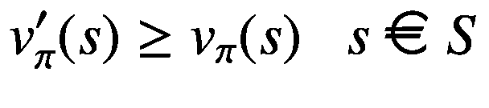
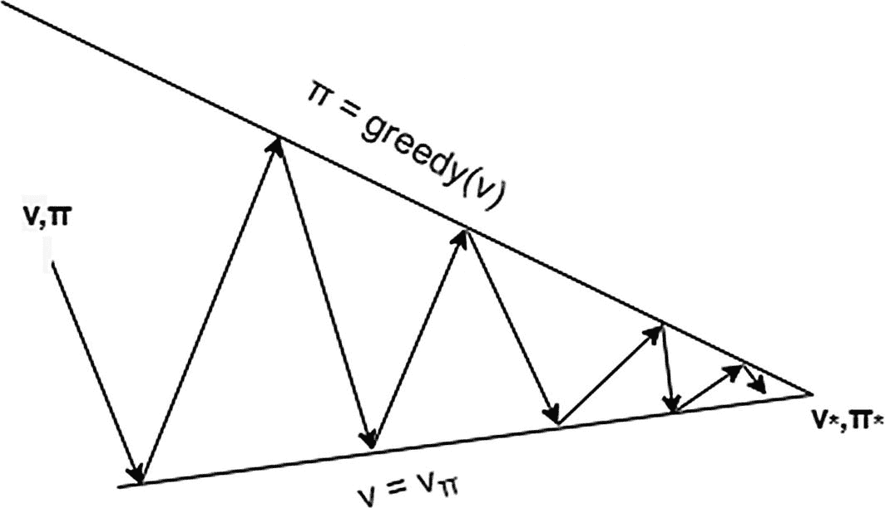
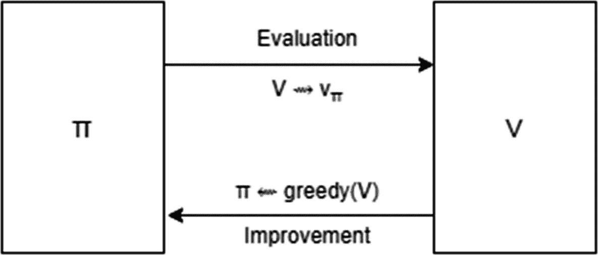

# 3.基于模型的算法

在第 [2](02.html) 章中，我们讨论了构成代理的设置部分和构成环境的部分。代理获得状态*S*<sub>T5】t</sub>=*S*，并学习将状态映射到动作的策略π( *s* | *a* )。当处于状态*S*<sub>*t*</sub>=*S*时，代理使用该策略采取动作*A<sub>*t*</sub>=*A*。系统转换到下一个时刻 *t* + 1。环境通过将代理置于新的状态*S*<sub>t*+1*</sub>*=*S*<sup>'</sup>并以奖励的形式向代理提供反馈 *R* <sub>*t* +来响应动作(*A*<sub>*t*)代理人无法控制新状态*S*<sub>*t*+1</sub>和奖励*R*<sub>*t*+1</sub>会是什么样。这个过渡从(*S*<sub>*t*</sub>=*S*，*A*<sub>*t*</sub>=*A*)→(*R*<sub>t</sub>*+1*</sub>=*R*，</sub>*这被称为*跃迁动力学*。对于给定的一对( *s* ， *a* )，可能有一对或多对( *r* ， *s* <sup>'</sup> )。在一个确定性的世界里，我们会有一对( *r* ， *s* ， <sup>'</sup> )的固定组合( *s* ， *a* )。然而，在随机环境中，即具有不确定结果的环境中，对于给定的( *s* ， *a* )，我们可能有许多对( *r* ， *s* ， <sup>'</sup> )。*

在这一章中，我们将重点介绍跃迁动力学 Pr {*S*<sub>T3】t+1</sub>=*S*<sup>′</sup>，*R*<sub>*t*+1</sub>=*R*|*S*<sub>*t*</sub>=*S*，代理将使用这些知识来“规划”一个策略，使状态值 v <sub>π</sub> (s)的累积回报最大化。所有这些算法都将基于动态规划，它允许我们将问题分解成更小的子问题，并使用第 [2](02.html) 章中解释的贝尔曼方程的递归关系。在此过程中，您将了解如何在一般意义上改进政策的其他概念。

然而，在我们深入研究算法之前，我们将绕一小段路来研究本章将要用到的 RL 环境。一旦我们解决了这个问题，我们将把重点放在基于模型的算法上。

## 开放 AI 健身房

编码练习基于上一章简单介绍的 OpenAI Gym 环境。Gym 是 OpenAI 开发的一个库，用于比较强化学习(RL)算法。它提供了一套标准化的环境，可用于开发和比较各种 RL 算法。所有这些环境都有一个共享的接口，允许我们编写通用算法。

Gym 的安装很简单，在第 [1](01.html) 章的设置部分已经解释过了。在第 [2](02.html) 章中，我们介绍了学习强化学习时使用的两种流行环境:`MountainCar-v0`和`CartPole-v1`。在这一章中，我们将使用一个更简单的环境来讨论动态编程。它是一个 4x4 的网格，如图 [3-1](#Fig1) 所示。左上和右下位置是终端状态，如图中阴影单元所示。在给定的单元中，代理可以向四个方向移动:`UP`、`RIGHT`、`DOWN`和`LEFT`。除非有一堵墙，否则这些动作确定性地在动作的方向上移动代理。在碰壁的情况下，代理停留在当前位置。代理在每个时间步长获得-1 的奖励，直到它到达终止状态。


图 3-1

网格世界环境。它是一个 4×4 的网格，终端状态位于左上角和右下角。网格中的数字代表状态 S

健身房图书馆不提供这种环境。我们将在 OpenAI 健身房创建一个自定义环境。虽然如果我们想要向外界发布环境，需要遵循一个文档化的( [`https://github.com/openai/gym/blob/master/docs/creating-environments.md`](https://github.com/openai/gym/blob/master/docs/creating-environments.md) )文件结构，但是我们将遵循一个更简单的单文件结构来定义网格世界环境，因为它仅供我们个人使用。一个环境必须实现以下功能:`step(action)`、`reset()`和`render()`。

我们将采用扩展 Gym 中提供的模板环境之一的方法:`DiscreteEnv`。它已经实现了`step`和`reset`功能。我们只需要提供`nA`(每个状态中的动作数)`nS`(状态总数)，以及一个字典`P`，其中`P[s][a]`给出了一个带有值`(probability, next_state, reward, done)`的元组列表。换句话说，它提供了过渡动力。换句话说，对于给定的状态 s 和动作 a，它给出了由可能的下一个状态 s '、奖励 r 和概率*p*(*s*<sup>'</sup>、 *r* | *s* 、 *a* )组成的元组列表。元组中的第四个值是布尔标志`done`，指示下一个状态 s’是终止状态还是非终止状态。

在基于模型的学习的当前设置下，过渡动态`P`是已知的，这是本章的重点。然而，`P`不应该直接用于无模型算法，即在没有模型知识的情况下学习的算法(过渡动态)。我们将在后续章节中研究无模型算法。清单 [3-1](#PC1) 显示了脚本文件`gridworld.py`。

```py
import numpy as np
import sys
from gym.envs.toy_text import discrete
from contextlib import closing
from io import StringIO

# define the actions
UP = 0
RIGHT = 1
DOWN = 2
LEFT = 3

class GridworldEnv(discrete.DiscreteEnv):
    """
    A 4x4 Grid World environment from Sutton's Reinforcement
    Learning book chapter 4\. Termial states are top left and
    the bottom right corner.

    Actions are (UP=0, RIGHT=1, DOWN=2, LEFT=3).
    Actions going off the edge leave agent in current state.
    Reward of -1 at each step until agent reachs a terminal state.
    """

    metadata = {'render.modes': ['human', 'ansi']}

    def __init__(self):
        self.shape = (4, 4)
        self.nS = np.prod(self.shape)
        self.nA = 4

        P = {}
        for s in range(self.nS):
            position = np.unravel_index(s, self.shape)
            P[s] = {a: [] for a in range(self.nA)}
            P[s][UP] = self._transition_prob(position, [-1, 0])
            P[s][RIGHT] = self._transition_prob(position, [0, 1])
            P[s][DOWN] = self._transition_prob(position, [1, 0])
            P[s][LEFT] = self._transition_prob(position, [0, -1])

        # Initial state distribution is uniform

        isd = np.ones(self.nS) / self.nS

        # We expose the model of the environment for dynamic programming
        # This should not be used in any model-free learning algorithm
        self.P = P

        super(GridworldEnv, self).__init__(self.nS, self.nA, P, isd)

    def _limit_coordinates(self, coord):
        """
        Prevent the agent from falling out of the grid world
        :param coord:
        :return:
        """
        coord[0] = min(coord[0], self.shape[0] - 1)
        coord[0] = max(coord[0], 0)
        coord[1] = min(coord[1], self.shape[1] - 1)
        coord[1] = max(coord[1], 0)
        return coord

    def _transition_prob(self, current, delta):
        """
        Model Transitions. Prob is always 1.0.
        :param current: Current position on the grid as (row, col)
        :param delta: Change in position for transition
        :return: [(1.0, new_state, reward, done)]
        """

        # if stuck in terminal state
        current_state = np.ravel_multi_index(tuple(current), self.shape)
        if current_state == 0 or current_state == self.nS - 1:
            return [(1.0, current_state, 0, True)]

        new_position = np.array(current) + np.array(delta)
        new_position = self._limit_coordinates(new_position).astype(int)
        new_state = np.ravel_multi_index(tuple(new_position), self.shape)

        is_done = new_state == 0 or new_state == self.nS - 1

        return [(1.0, new_state, -1, is_done)]

    def render(self, mode="human"):
        outfile = StringIO() if mode == 'ansi' else sys.stdout

        for s in range(self.nS):
            position = np.unravel_index(s, self.shape)
            if self.s == s:
                output = " x "
            # Print terminal state
            elif s == 0 or s == self.nS - 1:
                output = " T "
            else:
                output = " o "

            if position[1] == 0:
                output = output.lstrip()
            if position[1] == self.shape[1] - 1:
                output = output.rstrip()
                output += '\n'

            outfile.write(output)
        outfile.write('\n')

        # No need to return anything for human
        if mode != 'human':
            with closing(outfile):
                return outfile.getvalue()

Listing 3-1Grid World Environment

```

`GridworldEnv`是通过扩展健身房库中提供的模板环境`discrete.DiscreteEnv`创建的。在`__init__(self)`中，我们根据图 [3-1](#Fig1) 中描述的动态定义`nA, nS`和过渡函数`P`。清单 [3-1](#PC1) 完整地描述了将在本章剩余部分使用的定制健身房环境。

现在让我们把重点放在无模型算法上，这也是我们打算在本章“动态编程”一节中学习的内容。

## 动态规划

动态规划是 20 世纪 50 年代由理查德·贝尔曼提出的一种优化技术。它是指将一个复杂的问题分解成更简单的子问题，寻找子问题的最优解，然后将子问题最优解组合起来，得到原问题的最优解。我们来看看贝尔曼方程( [2。18](https://doi.org/10.1007/978-1-4842-6809-4_2%25Equ17) )表示一个状态的值*v*<sub>T5】π</sub>(*s*)就政策而言( *a* | *s* )，系统动力学*p*(*s*<sup>’</sup>， *r* | *s* ， *a*

T37

我们是用其他状态值*v*<sub>*π*</sub>(*s*<sup>’</sup>)来表示值*v*<sub>*π*</sub>(*s*)，这些都是未知的。如果我们能够以某种方式获得当前状态的所有后续状态值，我们将能够计算出*v*<sub>*π*</sub>(*s*)。这显示了方程的递归性质。

我们还注意到，当 s’是某个状态 s 的后继状态时，将会多次需要特定的值*v*<sub>*π*</sub>(*s*<sup>’</sup>)。由于这一性质，我们可以缓存(即存储)值*v*<sub>*π*</sub>(*s*<sup>’</sup>)并多次使用它来避免

动态规划是一种广泛用于各类问题的优化技术，它允许将复杂的问题分解成较小的问题。一些常见的应用是调度算法、最短路径之类的图形算法、维特比算法之类的图形模型以及生物信息学中的网格模型。因为这本书是关于强化学习的，我们将限制动态规划在求解贝尔曼期望和贝尔曼最优方程中的应用，包括价值函数和行动-价值函数。这些方程在( [2 中给出。18](https://doi.org/10.1007/978-1-4842-6809-4_2%25Equ17) )，( [2。21](https://doi.org/10.1007/978-1-4842-6809-4_2%25Equ20) )，( [2。24](https://doi.org/10.1007/978-1-4842-6809-4_2%25Equ23) )，以及( [2。25](https://doi.org/10.1007/978-1-4842-6809-4_2%25Equ24) )，并将其复制以备参考。

下面是价值函数的贝尔曼期望方程:

![$$ {v}_{\pi }(s)=\sum \limits_a\pi \left(a|s\right)\ \sum \limits_{s^{\prime },r}p\left({s}^{\prime },r\ \right|s,a\Big)\ \left[r+\gamma\ {v}_{\pi}\left({s}^{\prime}\right)\right] $$](img/502835_1_En_3_Chapter_TeX_Equ1.png)

(3.1)

下面是行为-价值函数的贝尔曼期望方程:

![$$ {q}_{\pi}\left(s,a\right)=\sum \limits_{s^{\prime },r}p\left({s}^{\prime },r\ \right|s,a\Big)\ \left[r+\gamma\ \sum \limits_{a^{\prime }}\pi \left({a}^{\prime }|{s}^{\prime}\right)\ q\left({s}^{\prime },{a}^{\prime}\right)\right] $$](img/502835_1_En_3_Chapter_TeX_Equ2.png)

(3.2)

下面是价值函数的贝尔曼最优性方程:

![$$ {v}_{\ast }(s)={\mathit{\max}}_a\ \sum \limits_{s^{\prime },r}p\left({s}^{\prime },r\ \right|s,a\Big)\ \left[r+\gamma\ {v}_{\ast}\left({s}^{\prime}\right)\right] $$](img/502835_1_En_3_Chapter_TeX_Equ3.png)

(3.3)

下面是作用值函数的贝尔曼最优方程:

![$$ {q}_{\ast}\left(s,a\right)=\sum \limits_{s^{\prime },r}p\left({s}^{\prime },r\ \right|s,a\Big)\ \left[r+\gamma\ {\mathit{\max}}_{a^{\prime }}\ {q}_{\ast}\left({s}^{\prime },{a}^{\prime}\right)\right] $$](img/502835_1_En_3_Chapter_TeX_Equ4.png)

(3.4)

这四个方程中的每一个都根据满足动态编程的递归性质的后继状态或状态动作的值来表示状态或状态动作对的 v 或 q 值。在下面的章节中，我们将首先使用期望方程来评估一项政策，这被称为*评估*或*预测*。然后，我们将利用最优性方程来寻找最大化状态值和状态动作值的最优策略。接下来是一个关于通用设置的部分，这是一个广泛用于政策改进的通用框架。我们将通过谈论大规模问题设置中的实际挑战和在这种情况下优化动态规划的各种方法来结束这一章。

这一章将主要集中在这样一类问题上，在这类问题中，我们有一个有限的状态集，代理可以发现自己所处的状态，以及在每个状态中的有限的动作集。具有连续状态和连续动作的问题在技术上可以通过首先离散化状态和动作使用动态编程来解决。你可以在第 4 章的末尾看到这种方法的例子。它也将构成第五章[的主要部分。](05.html)

## 政策评估/预测

我们现在将利用方程( [3.1](#Equ1) )利用其迭代性质和动态编程的概念来导出状态值。等式( [3.1](#Equ1) )表示根据其后继状态的状态*T5 sT7 的状态值。状态的值还取决于代理遵循的策略，该策略被定义为策略*π*(*a*|*s*)。由于值对策略的这种依赖性，所有状态值都标有π，以表示( [3.1](#Equ1) )中的状态值是通过遵循特定策略*π*(*a*|*s*获得的值。请注意，改变策略π会产生一组不同的值*v*<sub>π</sub>(*s*)和*q*<sub>π</sub>(*s*， *a* )。*

( [3.1](#Equ1) 中的关系可以用备份图图形化表示，如图 [3-2](#Fig2) 。


图 3-2

状态值函数的贝尔曼期望方程的备份图。空心圆圈表示状态，黑圆圈表示动作

代理开始于状态 ***s*** 。它根据其当前策略*π*(*a*|*s*)将 **a** 作为动作。环境根据系统动力学*p*(*s*<sup>'</sup>， *r* | *s* ， *a* )将智能体转换到一个新的状态 ***s*** <sup>'</sup> 连同奖励 *r* 。如你所见，方程( [3.1](#Equ1) )是一个方程组，每个状态一个方程。如果有∣ *S* ∣国家，我们就会有∣ *S* ∣这样的方程。等式的数量等于∣ *S* ∣，并且与未知 v(s)的数量相同，每个 v*s*=*s*一个。因此，( [3.1](#Equ1) )代表具有|S|个未知数的∣ *S* ∣方程组。我们可以用任何线性规划技术来解这个方程组。然而，它将涉及矩阵的求逆，因此对于现实生活中的大多数 RL 问题来说不是很实用。

相反，我们将求助于迭代解的使用。这是通过在第一次迭代 *k* = 0 时从一些随机状态值 *v* <sub>0</sub> ( *s* )开始，并在( [3.1](#Equ1) )的右侧使用它们来获得下一次迭代步骤的状态值来实现的。

![$$ {v}_{k+1}(s)\leftarrow \sum \limits_a\pi \left(a|s\right)\ \sum \limits_{s^{\prime },r}p\left({s}^{\prime },r\ \right|s,a\Big)\ \left[r+\gamma\ {v}_k\left({s}^{\prime}\right)\right] $$](img/502835_1_En_3_Chapter_TeX_Equ5.png)

(3.6)

注意下标从π到( *k* )和( *k* + 1)的变化。还要注意等号(=)到赋值(←)的变化。我们现在根据先前迭代 *k* 中的状态值来表示迭代( *k* + 1)中的状态值，并且在每次迭代中将有∣ *S* ∣(状态总数)这样的更新。可以看出，随着 *k* 增大并趋于无穷大(∞)， *V* <sub>*k*</sub> 会收敛到 *V* <sub>π</sub> 。先前为给定策略寻找所有状态值的方法被称为*策略评估*。我们从在 *k* = 0 时任意选择的值 *V* <sub>0</sub> 开始，并使用等式( [3.6](#Equ5) )迭代状态值，直到状态值 *V* <sub>*k*</sub> 停止变化。策略评估的另一个名称是*预测*，即预测给定策略的状态值。

通常，在每次迭代中，我们创建一个现有状态值 v 的新副本，并根据前一个数组中所有状态的值更新新数组中的所有值。我们为状态值维护两组数组， *V* <sub>*k*</sub> 和 *V* <sub>*k* + 1</sub> 。这被称为*同步*更新，即基于来自先前迭代的状态值更新所有状态值。但是，还有一种替代方法。人们可以只维护一个状态值数组，并在适当的位置进行更新*,其中每个新值立即覆盖旧值。如果每个状态都更新了足够的次数，就地更新有助于加快收敛。这种就地更新被称为*异步*更新。在本章的后面，我们有一节专门介绍各种类型的就地更新。*

图 [3-3](#Fig3) 给出了迭代策略评估的伪代码。

ITERATIVE POLICY EVALUATION


图 3-3

策略评估算法

现在让我们将前面的算法应用到图 [3-1](#Fig1) 中给出的网格世界。我们将假设一个随机策略π( *a* | *s* )，其中四个动作(`UP`、`RIGHT`、`DOWN`、`LEFT`)的每一个都有 0.25 的相等概率。清单 [3-2](#PC2) 显示了应用于网格世界的策略评估代码。这是来自`listing3_2.ipynb`的文件。

Note

本书中的代码清单将只显示讨论上下文中的相关代码。请查看 Python 脚本文件和/或 Python 笔记本以了解完整的实现。

```py
def policy_eval(policy, env, discount_factor=1.0, theta=0.00001):
    """
    Evaluate a policy given an environment and
    a full description of the environment's dynamics.

    Args:
        policy: [S, A] shaped matrix representing the policy. Random in our case
        env: OpenAI env. env.P -> transition dynamics of the environment.
            env.P[s][a] [(prob, next_state, reward, done)].
            env.nS is number of states in the environment.
            env.nA is number of actions in the environment.
        theta: Stop evaluation once value function change is
            less than theta for all states.
        discount_factor: Gamma discount factor.

    Returns:
        Vector of length env.nS representing the value function.
    """
    # Start with a (all 0) value function
    V = np.zeros(env.nS)
    V_new = np.copy(V)
    while True:
        delta = 0
        # For each state, perform a "backup"
        for s in range(env.nS):
            v = 0
            # Look at the possible next actions
            for a, pi_a in enumerate(policy[s]):
                # For each action, look at the possible next states...
                for prob, next_state, reward, done in env.P[s][a]:
                    # Calculate the expected value as per backup diagram

                    v += pi_a * prob * \
                        (reward + discount_factor * V[next_state])
            # How much our value function changed (across any states)
            V_new[s] = v
            delta = max(delta, np.abs(V_new[s] - V[s]))
        V = np.copy(V_new)
        # Stop if change is below a threshold
        if delta < theta:
            break
    return np.array(V)

Listing 3-2Policy Evaluation/Policy Planning: listing3_2.ipynb

```

当我们用遵循随机策略的代理运行网格世界的代码时，我们看到图 [3-4](#Fig4) 中给出的每个网格单元的状态值*v*<sub>【π</sub>(*s*)。


图 3-4

策略评估*v*<sub>*π*</sub>(*s*)对于图 [3-1](#Fig1) 中的网格世界，代理遵循随机策略。四个动作`UP`、`DOWN`、`LEFT`和`RIGHT`中的每一个都有 0.25 的相等概率

我们可以看到价值观已经趋同。我们来看看最后一列的第三行，状态值为*v*T10】π(*s*)= 14。在这种状态下，动作`UP`将代理带到状态值为-20 的单元，动作`LEFT`将代理带到状态值为-18 的单元，动作`DOWN`将代理带到值为 0 的终止状态，动作`RIGHT`碰壁，使代理处于相同的状态。让我们应用方程式( [3.1](#Equ1) )。我们将展开等式的右侧( [3.1](#Equ1) )，按顺序应用动作— `TOP`、`RIGHT`、`DOWN`、`LEFT`:

-14 = 0.25*(-1+(-20)) + 0.25*(-1+(-14)) + 0.25*(-1+0) + 0.25*(-1+(-18))

-14 = -14

两边的值是匹配的，这证实了收敛。因此，图 [3-4](#Fig4) 所示的值是代理遵循随机策略时的状态值。请注意，我们已经考虑了γ = 1.0 的贴现因子。

了解了策略评估之后，在下一节中，我们将讨论如何针对给定的环境改进策略。

## 政策改进和迭代

上一节展示了如何迭代获取给定策略的状态值 *v* <sub>π</sub> ( *s* )。我们可以利用这些信息来改进政策。在我们的网格世界中，我们可以从任何状态采取四种行动。现在，我们不再遵循随机的策略π( *a* | *s* )，而是着眼于分别采取所有四个行动，然后在这一步之后遵循策略π的价值。这样就会给我们四个值 *q* ( *s* ， *a* )动作值，分别是在网格世界中采取四种可能动作中的每一种的动作值。

![$$ q\left(s,a\right)=\sum \limits_{s^{\prime },r}p\left({s}^{\prime },r\ \right|s,a\Big)\ \left[r+\gamma\ {v}_{\pi}\left({s}^{\prime}\right)\right] $$](img/502835_1_En_3_Chapter_TeX_Equd.png)

注意 *q* ( *s* ， *a* )没有π的下标。我们正在评估 *q* ( *s* ， *a* )在状态 *S* = *s* 时所有可能的动作。如果任一个 *q* ( *s* ， *a* )大于当前状态值*v*<sub>π</sub>(*S*)，则意味着当前策略π( *a* | *s* )没有采取最优行动，我们可以在当前状态下对策略*S*=采取 q 值最大化动作 *A* = *a* 并将其定义为状态 *S* = *s* 中的策略，将给出比当前策略π( *a* | *s* )更高的状态值。换句话说，我们定义如下:


(3.7)

由于一个叫做*策略改进定理*的一般结果(我们在这里不详细讨论)，在新策略π <sup>'</sup> 下所有状态的值将等于或大于策略π下的状态值。换句话说，在特定状态下选择一个最大化动作 *S* = *s* 虽然提高了那个状态的状态值，但不能降低其他状态的值。它既可以保持它们不变，也可以改善那些依赖于 *S* = *s* 的其他状态。数学上，我们可以这样表达:



最大化的先前最大化步骤(贪婪步骤)可以基于它们当前的 q 值应用于所有状态。这种跨所有状态的最大化动作的扩展被称为*贪婪策略*，递归状态值关系由贝尔曼最优方程( [3.4](#Equ4) 给出)。

我们现在有了一个改进政策的框架。对于给定的 MDP，我们首先迭代地进行策略评估，以获得状态值 *v* ( *s* )，然后我们根据( [3.7](#Equ6) )应用最大化 *q* 值的动作的贪婪选择。这导致状态值与贝尔曼方程不同步，因为最大化步骤被应用于每个单独的状态，而没有流过所有的后续状态。因此，我们再次在新策略π <sup>'</sup> 下进行策略迭代，以找到改进策略下的状态/动作值。一旦获得状态值，可以再次应用最大化动作来进一步将策略改进为π<sup>“</sup>”。如此循环下去，直到观察不到进一步的改善。这个动作顺序可以描述如下:


从政策改进定理我们知道，贪婪改进和政策评估的每一次刷卡，都给了我们一个优于上一个带的政策。对于一个具有有限数量的离散状态和每个状态中有限数量的动作的 MDP，每次滑动都会导致一个改进，一旦我们停止观察状态值的任何进一步改进，就会找到一个最优策略。这在有限数量的改善周期内必然会发生。

这种寻找最优策略的方法被称为*策略迭代*。图 [3-5](#Fig5) 显示了策略迭代的伪代码。

POLICY ITERATION


图 3-5

有限 MDP 的策略迭代算法

让我们将前面的算法应用到图 [3-1](#Fig1) 中的网格世界。清单 [3-3](#PC3) 显示了应用于网格世界的策略迭代的代码。完整代码见`listing3_3.ipynb`。功能`policy_evaluation`保持与清单 [3-2](#PC2) 相同。有一个新函数`policy_improvement`，它应用贪婪最大化来返回一个对现有策略进行改进的策略。`policy_iteration`是一个循环运行`policy_evaluation`和`policy_improvement`的函数，直到状态值停止增加并收敛到一个固定点。

```py
# Policy Improvement

def policy_improvement(policy, V, env, discount_factor=1.0):
    """
    Improve a policy given an environment and a full description
    of the environment's dynamics and the state-values V.

    Args:
        policy: [S, A] shaped matrix representing the policy.
        V: current state-value for the given policy
        env: OpenAI env. env.P -> transition dynamics of the environment.
            env.P[s][a] [(prob, next_state, reward, done)].
            env.nS is number of states in the environment.
            env.nA is number of actions in the environment.
        discount_factor: Gamma discount factor.

    Returns:
        policy: [S, A] shaped matrix representing improved policy.
        policy_changed: boolean which has value of `True` if there
                        was a change in policy
    """

    def argmax_a(arr):
        """
        Return idxs of all max values in an array.
        """
        max_idx = []
        max_val = float('-inf')
        for idx, elem in enumerate(arr):
            if elem == max_val:
                max_idx.append(idx)
            elif elem > max_val:
                max_idx = [idx]
                max_val = elem
        return max_idx

    policy_changed = False

    Q = np.zeros([env.nS, env.nA])
    new_policy = np.zeros([env.nS, env.nA])

    # For each state, perform a "greedy improvement"
    for s in range(env.nS):
        old_action = np.array(policy[s])
        for a in range(env.nA):
            for prob, next_state, reward, done in env.P[s][a]:
                # Calculate the expected value as per backup diagram
                Q[s,a] += prob * (reward + discount_factor * V[next_state])

        # get maximizing actions and set new policy for state s
        best_actions = argmax_a(Q[s])
        new_policy[s, best_actions] = 1.0 / len(best_actions)

    if not np.allclose(new_policy[s], policy[s]):
        policy_changed = True

    return new_policy, policy_changed

# Policy Iteration
def policy_iteration(env, discount_factor=1.0, theta=0.00001):

    # initialize a random policy
    policy = np.ones([env.nS, env.nA]) / env.nA
    while True:
        V = policy_evaluation(policy, env, discount_factor, theta)
        policy, changed = policy_improvement(policy, V, env, discount_factor)
        if not changed: #terminate iteration once no improvement is observed
            V_optimal = policy_evaluation(policy, env, discount_factor, theta)
            print("Optimal Policy\n", policy)
            return np.array(V_optimal)

Listing 3-3Policy Iteration: listing3_3.ipynb

```

图 [3-6](#Fig6) 显示了在网格世界中运行`policy_iteration`后每个网格单元的状态值。


图 3-6

图 [3-1](#Fig1) 中网格世界的策略迭代*v*<sub>∫</sub>(*s*)。代理遵循通过应用清单 [3-3](#PC3) 中的 policy_iteration 找到的最优策略

我们看到，最佳状态值是达到最接近的终端状态所需的步数的负数。由于在代理到达终端状态之前，每个时间步长的回报都是-1，所以最优策略会以最少的可能步长将代理带到终端状态。对于某些状态，一个以上的动作可能导致相同数量的步骤到达最终状态。例如，查看状态值= -3 的右上角状态，需要三个步骤才能到达左上角的终止状态或右下角的终止状态。换句话说，状态值是状态和最近的终端状态之间的曼哈顿距离的负值。

我们还可以提取最优策略，如图 [3-7](#Fig7) 所示。图的左边显示了从清单 [3-3](#PC3) 的代码中提取的策略，图的右边显示了以图形方式叠加在网格上的相同策略。


图 3-7

从图 [3-1](#Fig1) 到图 [3-6](#Fig6) 所示网格世界的策略迭代*v*<sub>∫</sub>(*s*)。左图:网格中每个单元都有行动概率的最优策略。右图:叠加了最优策略的网格

策略评估也被称为*预测*，因为我们试图找到与代理正在遵循的当前策略一致的状态值。同样，利用策略迭代寻找最优策略也被称为***c****control*:控制 agent，寻找最优策略。

## 价值迭代

让我们看看策略迭代，并尝试评估我们需要多少遍才能找到最优策略。策略迭代有两个循环步骤。第一个是策略评估，它针对当前策略运行，并需要多次通过状态空间，以便状态值收敛并变得与当前策略一致。循环的第二部分是策略改进，这需要在状态空间上一遍，以找到每个状态的最佳动作，即，相对于当前状态动作值的贪婪改进。由此可见，很大一部分时间花在了政策评估和让价值观趋同上。

另一种方法是截断策略评估中的循环。当我们将策略评估中的循环截短为只有一个循环时，我们有一种称为*值迭代*的方法。类似于方程( [3.6](#Equ5) )的方法，我们采用贝尔曼最优方程( [3.3](#Equ3) )作为状态值，并通过迭代将其转化为分配。修正后的方程式如下:

![$$ {v}_{k+1}(s)\leftarrow {\mathit{\max}}_a\ \sum \limits_{s^{\prime },r}p\left({s}^{\prime },r\ \right|s,a\Big)\ \left[r+\gamma\ {v}_k\left({s}^{\prime}\right)\right] $$](img/502835_1_En_3_Chapter_TeX_Equ7.png)

(3.8)

随着我们的迭代，状态值将不断提高，并将收敛到 v*，这是最优值。

T2】

一旦值收敛到最佳状态值，我们可以使用一步备份图来找到最佳策略。

![$$ {\pi}_{\ast}\left(a\ |\ s\right)\underset{a}{= argmax}\ \sum \limits_{s^{\prime },r}p\left({s}^{\prime },r\ \right|s,a\Big)\ \left[r+\gamma\ {v}_{\ast}\left({s}^{\prime}\right)\right] $$](img/502835_1_En_3_Chapter_TeX_Equ8.png)

(3.9)

之前迭代每一步取最大值的过程称为*值迭代*。图 [3-8](#Fig8) 显示了伪代码。

VALUE ITERATION


图 3-8

有限 MDP 的值迭代算法

让我们将前值迭代算法应用于图 [3-1](#Fig1) 中给出的网格世界。清单 [3-4](#PC4) 包含应用于网格世界的值迭代代码。您可以查看文件`listing3_4.ipynb`了解详细的实现。函数`value_iteration`是图 [3-8](#Fig8) 中伪代码的直接实现。

```py
# Value Iteration
def value_iteration(env, discount_factor=1.0, theta=0.00001):
    """
    Varry out Value iteration given an environment and a full description
    of the environment's dynamics

.

    Args:
        env: OpenAI env. env.P -> transition dynamics of the environment.
            env.P[s][a] [(prob, next_state, reward, done)].
            env.nS is number of states in the environment.
            env.nA is number of actions in the environment.
        discount_factor: Gamma discount factor.
        theta: tolernace level to stop the iterations

    Returns:
        policy: [S, A] shaped matrix representing optimal policy.
        value : [S] length vector representing optimal value
    """

    def argmax_a(arr):
        """
        Return idx of max element in an array.
        """
        max_idx = []
        max_val = float('-inf')
        for idx, elem in enumerate(arr):
            if elem == max_val:
                max_idx.append(idx)
            elif elem > max_val:
                max_idx = [idx]
                max_val = elem
        return max_idx

    optimal_policy = np.zeros([env.nS, env.nA])
    V = np.zeros(env.nS)
    V_new = np.copy(V)

    while True:
        delta = 0
        # For each state, perform a "greedy backup"
        for s in range(env.nS):
            q = np.zeros(env.nA)
            # Look at the possible next actions
            for a in range(env.nA):
                # For each action, look at the possible next states
                # to calculate q[s,a]
                for prob, next_state, reward, done in env.P[s][a]:

                    # Calculate the value for each action as per backup diagram
                    if not done:
                        q[a] += prob * (reward + discount_factor * V[next_state])
                    else:
                        q[a] += prob * reward

            # find the maximum value over all possible actions
            # and store updated state value
            V_new[s] = q.max()
            # How much our value function changed (across any states)
            delta = max(delta, np.abs(V_new[s] - V[s]))

        V = np.copy(V_new)

        # Stop if change is below a threshold
        if delta < theta

:
            break

    # V(s) has optimal values. Use these values and one step backup
    # to calculate optimal policy
    for s in range(env.nS):
        q = np.zeros(env.nA)
        # Look at the possible next actions
        for a in range(env.nA):
            # For each action, look at the possible next states
            # and calculate q[s,a]
            for prob, next_state, reward, done in env.P[s][a]:

                # Calculate the value for each action as per backup diagram
                if not done:
                    q[a] += prob * (reward + discount_factor * V[next_state])
                else:
                    q[a] += prob * reward

        # find the optimal actions
        # We are returning stochastic policy which will assign equal
        # probability to all those actions which are equal to maximum value
        best_actions = argmax_a(q)
        optimal_policy[s, best_actions] = 1.0 / len(best_actions)

    return optimal_policy, V

Listing 3-4Value Iteration: listing3_4.ipynb

```

对网格世界运行价值算法的输出将产生价值和策略完全相似的最优状态值*v*∫(*s*)和最优策略，如图 [3-7](#Fig7) 和 [3-8](#Fig8) 所示。

在继续之前，我们先总结一下。我们到目前为止所看到的被归类为*同步动态编程算法*，如表 [3-1](#Tab1) 中所总结的。

表 3-1

同步动态规划算法

<colgroup><col class="tcol1 align-left"> <col class="tcol2 align-left"> <col class="tcol3 align-left"></colgroup> 
| 

算法

 | 

贝尔曼方程

 | 

问题类型

 |
| --- | --- | --- |
| 迭代策略评估 | 期望方程 | 预报 |
| 策略迭代 | 期望方程和贪婪改进 | 控制 |
| 价值迭代 | 最优性方程 | 控制 |

## 广义策略迭代

前面描述的策略迭代有两个步骤:策略评估，它使状态值与代理正在遵循的策略保持同步，需要多次遍历所有状态以使值收敛到 *v* <sub>π</sub> ，以及贪婪动作选择以改进策略。正如所解释的，改进的第二步导致值的当前状态与新策略不同步。因此，我们需要执行另一轮策略评估，以使状态值重新与新策略同步。当状态值没有进一步变化时，评估和改进的循环停止。当代理达到最佳策略且状态值也是最佳的并且与最佳策略同步时，就会发生这种情况。收敛到最优策略(不动点)v <sub>π</sub> 可以直观的描绘出来，如图 [3-9](#Fig9) 所示。



图 3-9

两步之间的迭代。第一步是评估，使状态值与遵循的策略同步。第二步是政策改进，对行动进行贪婪的最大化

我们已经看到在策略评估步骤中迭代的循环数有两种极端情况。此外，每次迭代，无论是策略评估还是策略改进，都覆盖了模型中的所有状态。然而，即使在一次迭代中，我们也只能通过贪婪选择访问部分状态集来评估和/或改进状态操作。*策略改进定理*保证了即使所有状态的部分覆盖也会导致改进，除非代理已经在遵循最优策略。换句话说，状态值同步不需要完成。可能会中途终止，导致图 [3-9](#Fig9) 中的箭头未触及*v*=*v*T8】π的底线而停止。同样，策略改进步骤可能不会对所有状态进行改进，这再次导致图 [3-9](#Fig9) 中的箭头在π = *贪婪* ( *v* )的上线处停止。

总之，只要每个状态在评估和改进中被访问足够的次数，策略评估和策略改进的这两个步骤以及它们在评估步骤中扫描多少个状态或在多少次迭代之后停止的所有变化都会导致收敛。这被称为*广义策略迭代* (GPI)。我们将要研究的大多数算法都可以归类为某种形式的 GPI。当我们通过各种算法时，请记住图 [3-10](#Fig10) 中给出的图片。



图 3-10

两步之间的迭代。第一步是评估，使状态值与遵循的策略同步。第二步是政策改进，对行动进行贪婪的最大化

## 异步备份

基于动态编程的算法存在可扩展性问题。动态规划方法比直接求解方法(如线性规划，涉及求解矩阵方程)好得多，并且可扩展。然而，动态编程仍然不能很好地适应现实生活中的问题。考虑策略迭代下的单次扫描。它需要访问每个州，在每个州下，你需要考虑所有可能的行动。此外，每个动作涉及一个计算，该计算理论上可能再次涉及所有状态，这取决于状态转移函数*p*(*s*<sup>’</sup>， *r* | *s* ， *a* )。换句话说，每次迭代的复杂度为*O*(|*A*|∫|*s*|<sup>2</sup>)。我们从策略迭代开始，在策略迭代下，我们执行多次迭代，作为状态值收敛的评估步骤的一部分。我们研究的第二种控制方法是值迭代。通过利用贝尔曼最优方程，我们将评估迭代减少到只有一步。所有这些都是同步动态规划算法，在这些算法下，使用贝尔曼备份方程( [3.1](#Equ1) )到( [3.4](#Equ4) )来更新所有状态。

然而，不需要在每次迭代中更新每个状态。我们可以以任何顺序更新和/或优化，仅覆盖系统中全部状态的一部分。只要每个状态被足够频繁地访问，所有这些扫描状态的方法都会产生最优的状态值和最优的策略。清扫有多种方法。

第一种是*原地动态编程*。到目前为止，我们一直维护着状态的两个副本。第一个副本保存现有的状态值，第二个副本保存正在更新的新状态值。一个*就地*策略只使用状态值数组的一个副本。同一数组用于读取旧的状态值和更新新的状态值。作为一个例子，让我们看看来自( [3.8](#Equ7) )的值迭代方程。请注意原始值迭代等式左右两侧状态值的子指标与就地版本相比的细微差异。原版本使用数组 *V* <sub>*k*</sub> 更新一个新数组*V*<sub>*k*+1</sub>，而原地编辑更新的是同一个数组。

以下是原文:

![$$ {v}_{k+1}(s)\leftarrow {\mathit{\max}}_a\ \sum \limits_{s^{\prime },r}p\left({s}^{\prime },r\ \right|s,a\Big)\ \left[r+\gamma\ {v}_k\left({s}^{\prime}\right)\right] $$](img/502835_1_En_3_Chapter_TeX_Equn.png)

这是就地更新:箭头两边都是相同的 v(s)数组。

![$$ v(s)\leftarrow {\mathit{\max}}_a\ \sum \limits_{s^{\prime },r}p\left({s}^{\prime },r\ \right|s,a\Big)\ \left[r+\gamma\ v\left({s}^{\prime}\right)\right] $$](img/502835_1_En_3_Chapter_TeX_Equo.png)T2】

实验表明，即使在迭代中途，当值向上移动时，就地编辑也能提供更快的收敛。

第二个想法围绕着状态更新的顺序。在同步编程中，我们在一次迭代中更新所有的状态。然而，如果我们使用*优先扫描*，值可能收敛得更快。优先扫描需要了解状态的前任。假设我们刚刚更新了状态 *S* = *s* ，并且值改变了δ。状态 *S* = *s* 的所有前趋状态被添加到优先级为δ的优先级队列中。如果一个前趋状态已经在优先级队列中，其优先级大于δ，则它保持不变。在下一次迭代中，一个具有最高优先级的新状态被从队列中取出并更新，将我们带回循环的开始。优先级扫描*的策略需要反向动态*的知识，即给定状态的前身。

第三个思路是*实时动态编程*。使用这种方法，我们只更新代理当前看到的状态的值，即与代理相关的状态，并使用其当前的探索路径来区分更新的优先级。这种方法避免了对不在代理当前路径范围内的状态进行无用的更新，因此这些状态大多是不相关的。

动态编程，无论是同步还是异步，都使用全宽度备份，如图 [3-2](#Fig2) 所示。对于一个给定的状态，我们需要知道每个可能的动作和每个后继状态 *S* = *s* <sup>'</sup> 。我们还需要了解环境动态 *p* ( *s* <sup>'</sup> ， *r* | *s* ， *a* )。然而，使用异步方法并不能完全解决可伸缩性问题。它只是稍微扩展了可伸缩性。换句话说，即使是异步更新，动态编程也只适用于中型问题。

从下一章开始，我们将考虑使用基于样本的方法来解决强化学习问题的更具可扩展性的方法。在基于样本的方法中，我们不了解环境动态，也不进行全宽度扫描。

## 摘要

在这一章中，我们介绍了动态规划的概念以及它是如何应用于强化学习领域的。我们着眼于预测的策略评估，然后是控制的策略迭代。然后我们看了价值迭代。这些讨论导致了广义的政策迭代。本章最后快速回顾了异步变体，以获得更有效的状态更新方法。