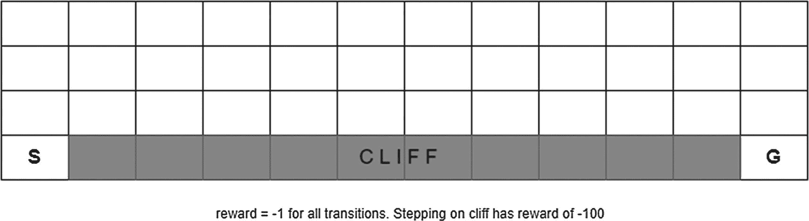
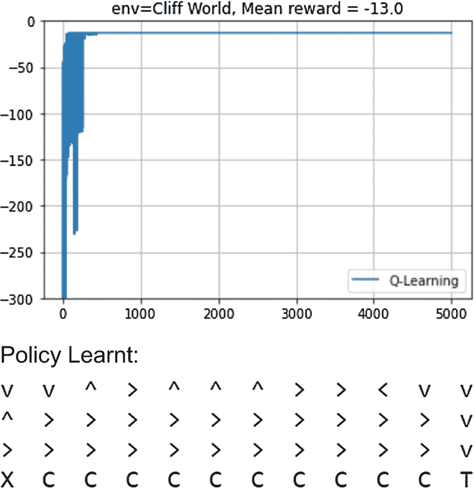

# 4.无模型方法

在前一章中，我们看了动态编程，其中我们知道模型动态*p*(*s*<sup>’</sup>， *r* | *s* ， *a* )，并且这些知识被用于“计划”最优动作。这也被称为*计划问题*。在这一章中，我们将转移我们的焦点，看看*学习问题*，即模型动态未知的设置。我们将通过抽样来学习价值和行动-价值函数，即通过遵循现实世界中的一些策略或通过模拟中的策略运行代理来收集经验。在另一类问题中，我们发现无模型方法更适用。在一些问题中，采样比计算转移动态更容易，例如，考虑解决寻找玩像 21 点这样的游戏的最佳策略的问题。有许多组合来达到一个分数，这取决于到目前为止看到的卡和仍然在甲板上的卡。几乎不可能计算从一个状态到另一个状态的精确转移概率，但是很容易从环境中采样状态。总之，当我们不知道模型动态或我们知道模型时，我们使用无模型方法，但是采样比计算转变动态更实际。

在这一章中，我们将研究两大类无模型学习:蒙特卡罗(MC)方法和时间差分(TD)方法。我们将首先理解策略评估在无模型设置中如何工作，然后扩展我们的理解来看控制，即找到最优策略。我们也将触及自举的重要概念和探索与开发的困境，以及政策外与政策内的学习。最初，重点将是分别研究 MC 和 TD 方法，之后我们将研究其他概念，如 n 步回报、重要性抽样和合格跟踪，以将 MC 和 TD 方法结合成一个通用的、更通用的方法，称为 TD(λ)。

## 蒙特卡罗估计/预测

当我们不知道模型动力学时，我们做什么？回想一下你对某个问题一无所知的情况。在那种情况下你做了什么？你尝试，采取一些步骤，并找出情况如何反应。例如，假设你想找出一个骰子或硬币是否有偏差。你多次投掷硬币或骰子，观察结果，并以此来形成你的观点。换句话说，你取样。统计学中的大数定律告诉我们，样本的平均值可以很好地替代平均值。此外，随着样本数量的增加，这些平均值会变得更好。如果你回顾上一章的贝尔曼方程，你会注意到在那些方程中我们有期望算子 E[]；例如一个状态的值为*v*(*S*)=*E*[*G*<sub>*t*</sub>|*S*<sub>*t*</sub>=*S*。此外，为了计算 *v* ( *s* )，我们使用了需要转换动态*p*(*s*<sup>'</sup>， *r* | *s* ， *a* )的动态编程。在缺乏模型动力学知识的情况下，我们该怎么办？我们只是从模型中取样，观察从状态 *S* = *s* 开始直到剧集结束的返回。然后，我们对所有剧集运行的回报进行平均，并使用该平均值作为代理遵循的策略π的估计值*v*<sub>*π*</sub>(*s*)。简而言之，这就是*蒙特卡罗方法*的方法:用样本回报的平均值代替预期回报。

有几点需要注意。MC 方法不需要模型知识。唯一需要的是，我们应该能够从中取样。我们需要知道从一个状态开始直到终止的回报，因此我们只能在每一次运行最终终止的间断 MDP 上使用 MC 方法。它不能在非终止环境中工作。第二点是，对于一个大的 MDP，我们可以把重点放在只对 MDP 的相关部分进行采样，而避免探索 MDP 的不相关部分。这种方法使得 MC 方法对于非常大的问题具有高度的可扩展性。一种叫做*蒙特卡罗树搜索* (MCTS)的 MC 方法的变体被 OpenAI 用于训练一个围棋游戏代理。

第三点是关于马尔可夫假设；即过去完全编码在当前状态中。换句话说，了解现在使未来独立于过去。我们在第 [2](02.html) 章讨论了这个属性。马尔可夫独立性的这一特性形成了贝尔曼方程的递归性质的基础，其中一个状态仅仅依赖于后继状态值。然而，在 MC 方法下，我们观察从状态 *S* 开始直到终止的全部回报。我们不依赖于后续状态的值来计算当前状态值。这里没有马尔可夫性质的假设。MC 方法中缺少马尔可夫假设，这使得它们对于被称为 POMDPs(对于“部分可观测 MDP”)的 MDPs 类更加可行。在 POMDP 环境中，我们只获得部分状态信息，这被称为*观察*。

接下来，让我们看看一种估计给定策略的状态值的正式方法。我们让代理开始新的一集，并观察从时间代理的返回在该集中第一次处于状态 *S* = *s* ，直到该集结束。进行许多集运行，并取跨集返回的平均值作为对*v*<sub>*π*</sub>(*S*=*S*)的估计。这就是所谓的*首诊 MC 法*。请注意，根据动态，代理可能会在终止前的同一情节中的某个后续步骤中访问同一状态 *S* = *s* 。然而，在首次访问 MC 方法中，我们仅从一集的首次访问到该集的结束获取总回报。还有另一个变体，我们取每次访问该州的平均回报，直到该集结束。这就是所谓的*每次拜访司仪法*。

图 [4-1](#Fig1) 显示了 MC 方法的备份图。在 DP 中，我们进行了一次完整的滑动，以涵盖从一个状态到一个新状态的所有可能的动作，以及从状态-动作对( *S* = *s* ， *A* = *a* )到一个新状态的所有可能的转换。我们只从状态 *S* = *s* 到 *A* = *a* 再到下一个状态*S*=*S*<sup>'</sup>再深入一层。与此相比，在 MC 方法中，备份覆盖了从当前状态 *S* = *s* 到终止状态的完整样本轨迹。它没有涵盖所有的分支可能性；相反，它只覆盖了从起始状态 *S* = *s* 到终止状态的一条采样路径。


图 4-1

与基于贝尔曼方程的 DP 备份相比，MC 方法的备份图

现在让我们看看初诊版本的伪代码，如图 [4-2](#Fig2) 所示。我们输入代理当前遵循的策略 *π* 。我们初始化两个数组:一个保存当前对 *V* ( *s* )的估计，第二个保存对状态 *S* = *s* 的访问次数 *N* ( *s* )。执行多集，每集更新 *V* ( *s* )和 *N* ( *s* )的国家特工访问，在“首次访问版本”中只更新首次访问，在“每次访问版本”中更新每次访问伪代码仅涵盖了“首次访问变体”“每次访问”变体很容易实现，只需删除条件“除非 S<sub>*t*</sub>*出现在 S* <sub>0</sub> *，S* <sub>1</sub> *，…* ”根据大数定律，蒙特卡洛模拟所基于的统计定律，当对每个状态的访问次数趋于无穷大时， *V* ( *s* )将收敛为真*V*<sub>*π*</sub>(*s*)。

First Visit MC Prediction


图 4-2

初访 MC 预测估算*v*<sub>*π*</sub>(*s*)。伪代码使用在线版本在收到样本时更新值

我们存储累计总数和第一次访问一个州的次数。平均值的计算方法是将总数除以计数。每次访问一个状态，进行如下更新:


稍作改动，我们可以从另一个角度来看这个更新，而不需要累计总数 *S* ( *s* )。在这个替代公式中，我们将有一个数组 *V* ( *s* )，它直接为每次访问更新，而不需要将总数除以计数。这个更新规则的推导如下:


![$$ V{(s)}_{n+1}=\left[S{(s)}_n+G\right]/N{(s)}_{n+1} $$](img/502835_1_En_4_Chapter_TeX_Equh.png)

![$$ =\left[V{(s)}_n\ast N{(s)}_n+G\right]/N{(s)}_{n+1} $$](img/502835_1_En_4_Chapter_TeX_Equi.png)

![$$ =V{(s)}_n+1/N{(s)}_{n+1}\ast \left[G\hbox{--} V{(s)}_n\right] $$](img/502835_1_En_4_Chapter_TeX_Equ1.png)

(4.1)

差值[*G*–*V*(*s*)<sub>*n*</sub>]可视为最新采样值 *G* 与当前估计值*V*(*s*)<sub>*n*</sub>之间的误差。然后，通过将 1/*N*∑*误差*加到当前估计值，该差值/误差被用于更新当前估计值。随着访问次数的增加，新样本对修正 *V* ( *s* )估计值的影响越来越小。这是因为随着 *N* 变得非常大，乘法因子 1/ *N* 减小到零。

有时候，我们可以不用一个递减因子 1/ *N* ，而是在差值前面用一个常数α作为倍增因子[*G*–*V*(*s*)<sub>*N*</sub>]。


(4.2)

常数乘数法更适合于非平稳的问题，或者当我们希望给所有误差一个常数权重时。当旧的估计值 *V* <sub>*n*</sub> 可能不太准确时，可能会发生这种情况。

现在让我们看看 MC 值预测的实现。清单 [4-1](#PC1) 显示了代码，完整的代码在文件`listing4_1.ipynb`中。

```py
def mc_policy_eval(policy, env, discount_factor=1.0, episode_count=100):

    # Start with (all 0) state value array and a visit count of zero
    V = np.zeros(env.nS)
    N = np.zeros(env.nS)
    i = 0

    # run multiple episodes
    while i < episode_count:

        #collect samples for one episode
        episode_states = []
        episode_returns = []
        state = env.reset()
        episode_states.append(state)
        while True:
            action = np.random.choice(env.nA, p=policy[state])
            (state, reward, done, _) = env.step(action)
            episode_returns.append(reward)
            if not done:
                episode_states.append(state)
            else:
                break

        #update state values
        G = 0
        count = len(episode_states)
        for t in range(count-1, -1, -1):
            s, r = episode_states[t], episode_returns[t]
            G = discount_factor * G + r
            if s not in episode_states[:t]:
                N[s] += 1
                V[s] = V[s] + 1/N[s] * (G-V[s])

        i = i+1

    return np.array(V)

Listing 4-1MC Value Prediction Algorithm for Estimation

```

清单 [4-1](#PC1) 中的代码是图 [4-2](#Fig2) 中伪代码的直接实现。代码实现在线版本的更新，如等式( [4.1](#Equ1) 所解释的，即 N[s]+= 1；V[s]=V[s]+1/N[s]*(G-V[s])。该代码还实现了“第一次访问”版本，但可以通过一个非常小的调整转换为“每次访问”。我们只需要去掉“如果”检查，即“如果不在集状态[:t]”来执行每一步的更新。

为了确保收敛到真实的状态值，我们需要确保每个状态被访问足够的次数，在极限中是无限的。如 Python 笔记本末尾的结果所示，状态值在 100 集内没有很好地收敛。然而，对于 10，000 集，这些值已经很好地收敛，并且与列表 [3-2](03.html#PC2) 中给出的 DP 方法产生的值相匹配。

### mc 预测方法的偏差和方差

现在让我们来看看“首次就诊”与“每次就诊”的利弊两者是否都收敛到真正的底层 *V* ( *s* )？他们收敛的时候波动大吗？一个人是否更快地收敛到真正的价值？在我们回答这个问题之前，让我们先回顾一下在所有统计模型估计中看到的偏差-方差权衡的基本概念，例如，在监督学习中。

*偏差*是指模型收敛到我们试图估计的真实潜在价值的性质，在我们的例子中是*v*<sub>T5】π</sub>(*s*)。一些估计值是有偏差的，这意味着由于其固有的缺乏灵活性，即对于给定的真实模型来说过于简单或受限制，它们不能收敛到真实值。同时，在其他一些情况下，随着样本数量的增加，模型的偏差会下降到零。

*方差*指的是对所使用的特定样本数据敏感的模型估计。这意味着估计值可能波动很大，因此可能需要大量的数据集或试验来使估计平均值收敛到一个稳定的值。

这些模型非常灵活，具有较低的偏差，因为它们能够使模型适应数据集的任何配置。同时，由于灵活性，他们可以过度适应数据，使得估计随着训练数据的变化而变化很大。另一方面，模型越简单，偏差越大。由于固有的简单性和局限性，这样的模型可能无法代表真正的底层模型。但是它们也将具有低方差，因为它们不会过度拟合。这就是所谓的*偏差-方差权衡*，可以用图 [4-3](#Fig3) 来表示。


图 4-3

偏差方差权衡。模型复杂度在 x 轴上向右增加。当模型受到限制时，偏差从高开始，随着模型变得灵活，偏差下降。方差显示了与模型复杂性相反的趋势

将“首次就诊”与“每次就诊”进行比较，*首次就诊*是无偏的，但具有较高的方差。*每次访问*都有偏差，随着试验次数的增加，偏差下降到零。此外，*每次访问*都具有低方差，并且通常比*第一次访问*更快地收敛到真实值估计。

## 蒙特卡罗控制

现在让我们来谈谈无模型设置中的控制。我们需要在不知道模型动态的情况下找到这个设置中的最优策略。作为复习，让我们看看在第 [3](03.html) 章中介绍的通用策略迭代(GPI)。在 GPI 中，我们在两个步骤之间迭代。第一步是找到给定策略的状态值，第二步是使用贪婪优化来改进策略。对于 MC 下的控制，我们将遵循相同的 GPI 方法。不过，我们会做一些调整，以考虑到我们处于无模型世界中，无法访问/了解转换动态的事实。

在第 [3](03.html) 章中，我们看了状态值， *v(s)* 。然而，在没有过渡动态的情况下，仅有状态值是不够的。对于贪婪改进步骤，我们需要访问动作值， *q* ( *s* ， *a* )。我们需要知道所有可能动作的 q 值，即在状态 *S* = *s* 下所有可能动作 *a* 的所有*q*(*S*=*S*， *a* )。只有有了这些信息，我们才能应用贪婪最大化来选择最佳行动，即 arg max<sub>a</sub>T26】q(s， *a* ) *。*

当与 DP 相比时，我们还有另一个复杂因素*。代理在生成样本的*时间*遵循一个策略。然而，这样的策略可能导致许多状态-动作对从不被访问，如果该策略是确定性的，则更是如此。如果*代理*不访问状态-动作对，它不知道给定状态*、*的所有 *q* ( *s* 、 *a* )，因此它不能找到产生*和*动作的最大 q 值。解决该问题的一种方法是通过探索开始*、*即*、*来确保足够的探索，从而确保*代理从随机的状态-动作对开始一集，并且在许多集的过程中覆盖每个状态-动作对足够的时间 *s，事实上，无限长的时间*。**

*图* [*4-4*](#Fig4) *显示了* GPI 图随着*v*-值到*q*-值的变化。现在的评估步骤是 MC *p* 预测步骤，该步骤在前面的部分*中介绍。一旦*q-*值稳定下来，就可以应用贪婪最大化来获得新的策略。政策与 T21 改进定理确保新政策会更好，或者至少和旧政策一样好。GPI 之前的*方法将*成为*一个反复出现的主题。根据设置，*评估步骤将会改变，而*改进步骤将始终保持贪婪最大化。****

 *

图 4-4

两步之间的迭代。第一步是评估，以使状态-动作值与所遵循的策略同步。第二步是政策改进，对行动进行贪婪的最大化

“探索开始”的假设不太实际，效率也不高。在许多场景中，这是不实际的，因为*代理不能选择开始条件，例如，在训练自动驾驶汽车时。这是没有效率的，因为它可能是不可行的，并且对于*代理*来说，无限(有限)次访问每个状态-动作对也是浪费。我们仍然需要继续探索，让*代理访问当前策略所访问的州中的所有动作。这是通过使用*ε-贪婪策略实现的。***

 **在ε-贪婪策略中，代理以*最大 q 值*和*概率 1-ε采取行动，并以概率ε/|A|随机采取任何行动。换句话说，ε的剩余概率在所有动作中平均分配，以确保*智能体*继续探索非最大化动作。换句话说，*的*智能体*以概率 1-ε利用*的知识，它*以概率ε探索*。*

**

*(4.3)*

作为随机探索的一部分，从 greedy max 和ε/|A|中以概率 1-ε挑选具有最大 q 值的动作。所有其他动作以概率ε/|A|被拾取。当代理在多个情节中学习时，ε的*值*可以慢慢减小到零，以达到最优贪婪策略。

让我们对迭代的估计/预测步骤再做一次改进。在上一节中，我们看到，即使对于一个简单的 4×4 网格 MDP，我们也需要 10，000 集的数量级才能使值收敛。参见图 [3-9](#Fig9) ，该图显示了 GPI 的收敛:MC 预测步骤将*v*-值或 *q-* 值与当前策略同步。然而，在前一章中，我们也看到了代理人没有必要一路走到价值观的趋同。类似地，我们可以运行 MC 预测，然后逐集进行政策改进。这种方法将消除在估计/预测步骤中大量迭代的需要，从而使该方法可扩展用于大的 MDP。与图 [3-9](#Fig9) 中的收敛图相比，这种方法将产生如图 [4-5](#Fig5) 所示的收敛。


图 4-5

两步之间的迭代。第一步是针对单个步骤的 MC 预测/评估，以在当前策略的方向上移动 q 值。第二步是政策改进，对行动进行ε-贪婪最大化

结合所有先前的调整，我们有了一个基于蒙特卡罗的最优策略学习控制的实用算法。这在《极限与无限探索》(GLIE)中被称为*贪婪*。我们将在 q 值预测步骤中使用每次访问版本。但是它需要一个小的调整，就像图 [4-6](#Fig6) 中 MC 预测中的那个一样，使它成为第一次访问的变体。

GLIE For Policy Optimization


图 4-6

用于策略优化的每次访问(GLIE) MC 控制

现在让我们看看`listing4_2.ipynb`中给出的实际实现。清单 [4-2](#PC2) 转载了代码的相关部分。实现遵循伪代码。我们有一些像`argmax_a()`这样的额外函数，帮助我们找到给定状态下`max Q(s,a)`的动作。另一个函数`get_action(state)`返回当前策略的ε-贪婪操作。我们鼓励您进行调整，并将其转换为“首次访问”版本。您可能还想比较“首次就诊”与“每次就诊”MC 对照的结果。

```py
def GLIE(env, discount_factor=1.0, episode_count=100):
    """
    Find optimal policy given an environment.
    Returns:
        Vector of length env.nS representing the value function.
        policy: [S, A] shaped matrix representing the policy. Random in our case

    """
    # Start with (all 0) state value array and state-action matrix.
    # also initialize visit count to zero for the state-action visit count.
    V = np.zeros(env.nS)
    N = np.zeros((env.nS, env.nA))
    Q = np.zeros((env.nS, env.nA))
    #random policy
    policy = [np.random.randint(env.nA) for _ in range(env.nS)]
    k = 1
    eps = 1

    def argmax_a(arr):
        """
        Return idx of max element in an array.
        Break ties uniformly.
        """
        max_idx = []
        max_val = float('-inf')
        for idx, elem in enumerate(arr):
            if elem == max_val:
                max_idx.append(idx)
            elif elem > max_val:
                max_idx = [idx]
                max_val = elem
        return np.random.choice(max_idx)

    def get_action(state):
        if np.random.random() < eps:
            return np.random.choice(env.nA)
        else:
            return argmax_a(Q[state])

    # run multiple episodes
    while k <= episode_count:

        #collect samples for one episode
        episode_states = []
        episode_actions = []
        episode_returns = []
        state = env.reset()
        episode_states.append(state)
        while True:
            action = get_action(state)
            episode_actions.append(action)
            (state, reward, done, _) = env.step(action)
            episode_returns.append(reward)
            if not done:
                episode_states.append(state)
            else:
                break

        #update state-action values
        G = 0
        count = len(episode_states)
        for t in range(count-1, -1, -1):
            s, a, r = episode_states[t], episode_actions[t], episode_returns[t]
            G = discount_factor * G + r
            N[s, a] += 1
            Q[s, a] = Q[s, a] + 1/N[s, a] * (G-Q[s, a])

        #Update policy and optimal value
        k = k+1
        eps = 1/k
        #uncomment this to have higher exploration initially
        #and then let epsilon decay after 5000 episodes
        #if k <=100:
        #    eps = 0.02

        for s in range(env.nS):
            best_action = argmax_a(Q[s])
            policy[s] = best_action
            V[s] = Q[s,best_action]

    return np.array(V), np.array(policy)

Listing 4-2GLIE MC Control Algorithm

```

到目前为止，本章我们已经研究了预测和控制的策略算法。换句话说，相同的策略用于生成样本以及策略改进。策略改进是针对相同ε-贪婪策略的 q 值进行的。我们需要探索为所有的状态-行为对找到 *Q* ( *s* ， *a* )，这是通过使用ε-贪婪策略来实现的。然而，随着我们的进展，带有限制的ε-贪婪策略是次优的。随着我们对环境的了解越来越多，我们需要开发更多。我们还看到，虽然理论上策略会收敛到最优策略，但有时需要仔细控制ε值。MC 方法的另一个大缺点是，我们需要在更新 q 值和执行策略优化之前完成剧集。因此，MC 方法只能应用于情节性的和情节结束的环境。从下一节开始，我们将开始研究一种不同的算法，称为*时间差分*方法，它结合了 DP(单时间步长更新)和 MC(即不需要了解系统动态)的优点。然而，在我们深入研究 TD 方法之前，让我们先来看一小段介绍，然后比较策略上学习和策略外学习。

## 不符合政策的 MC 控制

在 GLIE 中，我们看到，为了进行足够的探索，我们需要使用ε-贪婪策略，以便在有限的范围内足够频繁地访问所有状态动作。在循环结束时学习的策略被用于为循环的下一次迭代生成情节。我们正在使用与被最大化的策略相同的策略进行探索。这种方法被称为 *on-policy* ，从正在优化的同一策略中生成样本。

还有另一种方法，其中使用具有较高ε的更具探索性的策略来生成样本，而被优化的策略可能具有较低的ε，甚至可能是完全确定性的策略。这种使用与优化策略不同的策略进行学习的方法被称为*偏离策略*学习。用于生成样本的策略被称为*行为策略*，被学习(最大化)的策略被称为*目标策略*。让我们看看图 [4-7](#Fig7) 中的非策略 MC 控制算法的伪代码。

Off Policy MC Control Optimization


图 4-7

用于策略优化的非策略 MC 控制

## 时间差异学习方法

参考图 [4-1](#Fig1) 研究 DP 和 MC 方法的备份图。在 DP 中，我们使用来自后继状态的值来估计当前状态值，仅备份一步的值。我们还根据所遵循的政策，从( *s* ， *a* )对到所有可能的奖励和后继状态，对行动概率进行了预期。

![$$ {v}_{\pi }(s)={\sum}_a\pi \left(a|s\right){\sum}_{s^{\prime },r}p\left({s}^{\prime },r\right|s,a\left[r+\gamma {v}_{\pi}\left({s}^{\prime}\right)\right] $$](img/502835_1_En_4_Chapter_TeX_Equq.png)

一个状态的值*v*<sub>T3】πT5】(*s*)是根据后继状态的当前估计值*v*<sub>*π*</sub>(*s*<sup>’</sup>)来估计的。这被称为*自举*。该估计基于另一组估计。这两个总和就是图 [4-1](#Fig1) 中 DP 备份图中表示为分支节点的总和。与 DP 相比，MC 基于从一个状态开始，并基于代理遵循的当前策略对结果进行采样。估计值是多次运行的平均值*。换句话说，模型转移概率的总和被平均值代替，因此 MC 的备份图是从一个状态到最终状态的单一长路径。MC 方法允许我们建立一个可扩展的学习方法，同时不需要知道确切的模型动态。然而，它产生了两个问题:MC 方法仅适用于情节环境，并且更新仅在情节结束时发生。DP 的优势在于使用对后续状态的估计来更新当前状态值，而无需等待情节结束。*</sub>

 *时间差异学习是一种结合了动态规划和蒙特卡罗的优点的方法，使用了动态规划的自举和蒙特卡罗的基于样本的方法。TD 的更新方程式如下:

![$$ V(s)=V(s)+\alpha \left[R+\gamma \ast V\left({s}^{\prime}\right)-V(s)\right] $$](img/502835_1_En_4_Chapter_TeX_Equ4.png)

(4.4)

状态 *S* = *s* ，即 *G* <sub>*t*</sub> 的总回报的当前估计，现在是通过从样本运行中所示的后继状态的当前估计(*S*<sup>’</sup>)中引导给出的。换句话说，方程( [4.2](#Equ2) )中的 *G* <sub>*t*</sub> 换成*R*+*γ*∑*V*(*s*<sup>′</sup>)，一个估计。与此相比，在 MC 方法中， *G* <sub>*t*</sub> 是样本运行的贴现总回报。

所描述的 TD 方法被称为 TD(0)，并且它是一步估计。当我们在本章末尾讨论 TD(λ)时，称之为 TD(0)的原因将变得更加清楚。为了清楚起见，让我们看看图 [4-8](#Fig8) 中给出的使用 TD(0)进行值估计的伪代码。

TD(0) For Estimation


图 4-8

TD(0)策略估计

已经看到了所有三种方法，DP、MC 和 TD，让我们把所有三种方法的备份图放在一起，如图 [4-9](#Fig9) 所示。TD(0)类似于 DP，因为它使用自举，自举是对下一个状态值的估计，以估计当前状态值。TD(0)类似于 MC，因为它对情节进行采样，并使用观察到的回报和下一个状态来更新估计。


图 4-9

比较 DP、MC 和 TD(0)的备用图

现在我们来介绍另一个你很可能在强化学习文献中反复看到的量。在等式( [4.4](#Equ4) )中，量[*R*+*γ*∫*V*(*S*<sup>′</sup>)]是从状态 *S* = *s* 的总回报的修正估计，并且它基于从后继状态的一步备份。此外，在等式( [4.4](#Equ4) )中，赋值右侧的 *V* ( *s* )是当前估计值。更新是将估计值从 *V* ( *s* )移动到*V*(*s*)+*α*(*差*)，其中差 *δ* <sub>*t*</sub> 由以下表达式给出:


(4.5)

差值*δ*<sub>T3】tT5】称为*TD*T8】误差。它代表基于奖励*R*<sub>*t*+1</sub>加上贴现的下一时间步状态值*V*(*S*<sub>*t*+1</sub>)的估计值 *V* ( *s* )和当前估计值*V*(*S*</sub>的误差(差)该状态的值被移动该误差 *δ* <sub>*t*</sub> 的一个比例(学习率、步进率 *α* )。

TD 比 DP 有优势，因为它不需要模型知识(转移函数)。TD 方法优于 MC，因为 TD 方法可以在每一步更新状态值；也就是说，它们可以用于在线设置，通过在线设置，我们可以随着情况的发展而学习，而不必等到一集结束。

## 时间差异控制

本节将开始带你进入 RL 世界中使用的真实算法的领域。在这一章的剩余部分，我们将看看在 TD 学习中使用的各种方法。我们将从一个简单的一步到位的策略学习方法开始，称为 *SARSA* 。接下来是一种叫做 *Q-learning* 的强大的策略外技术。在本章中，我们将研究 Q 学习的一些基础方面，在下一章中，我们将把深度学习与 Q 学习相结合，给我们提供一种称为深度 Q 网络(DQN)的强大方法。使用 DQN，你将能够在雅达利模拟器上训练游戏代理。在这一章中，我们还将讨论 Q-learning 的一个变种，叫做*预期 SARSA* ，另一种非策略学习算法。然后，我们将讨论 Q 学习中最大化偏差的问题，带我们到*双 Q 学习*。当与深度学习结合来表示状态空间时，Q 学习的所有变体都变得非常强大，这将构成下一章的主要内容。在本章的末尾，我们将介绍其他概念，如*经验回放*，它使非学习算法在学习最优策略所需的样本数量方面更有效。然后我们将讨论一个强大的、有点复杂的方法，叫做 TD( *λ* )，它试图在一个连续体上结合 MC 和 TD 方法。最后，我们将看看一个具有连续状态空间的环境，以及如何将状态值二进制化并应用前面提到的 TD 方法。这个练习将展示我们将在下一章讨论的方法的必要性，包括状态表示的函数逼近和深度学习。在关于深度学习和 DQN 的第 [5](05.html) 和 [6](06.html) 章之后，我们将展示另一种称为*策略优化*的方法，该方法围绕直接学习策略，而不需要找到最佳状态/动作值。

到目前为止，我们一直使用 4×4 网格世界。现在，我们将在本章的剩余部分看看更多的环境。我们将以封装的方式编写代理，这样相同的代理/算法无需任何更改就可以应用于各种环境。

我们将使用的第一个环境是网格世界的变体；这是健身房图书馆的一部分，叫做悬崖漫步环境。在这个环境中，我们有一个 4×12 的网格世界，左下角的单元格是起始状态 *S* ，右下角的状态是目标状态 *G* 。底排的其余部分形成悬崖；踩上去会获得-100 的奖励，代理人再次回到开始状态。每走一步获得-1 的奖励，直到代理达到目标状态。类似于 4×4 网格世界，代理可以向任何方向(上、右、下、左)走一步。当代理达到目标状态时，情节终止。图 [4-10](#Fig10) 描述了该设置。



图 4-10

4×10 悬崖世界。踩悬崖有-100 的奖励，其他转场有-1 的奖励。目标是从 *S* 开始，到达 *G* 并获得尽可能多的奖励

我们要看的下一个环境是“出租车问题”有四个标记为 R、G、Y 和 b 的位置。当一集开始时，一名乘客随机站在这四个位置中的一个。随机选择四个方块中的一个作为目的地。出租车有 25 个可能的位置。乘客有五个位置:起始位置或内部出租车。有四个目的地。所有这些组合将状态空间的可能值作为 500 种不同的组合。状态值被表示为一个元组`(taxi_row, taxi_col, passenger_location, destination)`。有六种行动可以果断地采取。出租车可以移动*北、南、西、东*，然后有*接*或*落*客两个动作。奖励为每个时间步长-1，成功取货/卸货+20，从错误地点取货/卸货-10。当乘客被成功接送时，这一集就结束了。图 [4-11](#Fig11) 所示为环境示意图。


图 4-11

5×5 出租车问题。所有转换都有-1 的奖励。当乘客在目的地下车时，一集结束

我们现在来看看被称为`CartPole`的第三种环境。我们在第二章[中讨论了这个环境。在这种状态下，空间是一个连续的空间，包括四个观察:`[Cart position, Car velocity, Pole angle, pole angular velocity]`。代理有两个动作:*向左推车*或*向右推车*，即两个离散动作。每个时间步长的回报都是+1，代理希望通过在最长的时间间隔内保持极点平衡来最大化回报。一旦杆角度在任一方向上超过 12 度，或者推车位置偏离中心超过 2.4 度，即< -2.4 度或> 2.4 度，或者如果代理能够平衡杆 200 个时间步，该情节终止。图](02.html) [4-12](#Fig12) 显示了实际环境的快照。


图 4-12

推车杆子问题。目标是在最大数量的时间步长内垂直平衡极点，每个时间步长奖励+1

解释了各种环境之后，现在让我们开始用 TD 算法解决这些问题，首先从 SARSA 开始，这是一种基于策略的方法。

## 保单 SARSA

像 MC 控制方法一样，我们将再次利用 GPI。我们将使用 TD 驱动的方法进行政策价值评估/预测步骤，并将继续使用贪婪最大化方法进行政策改进。就像 MC 一样，我们需要探索足够多的地方，并访问所有的州无数次，以找到一个最佳策略。类似于 MC 方法，我们可以使用ε-贪婪策略，并慢慢地将ε值降低到零，即，对于将探索降低到零的限制。

TD 设置是无模型的；也就是说，我们事先没有关于转变的全面知识。同时，为了能够通过选择正确的行动来最大化回报，我们需要知道状态行动值 *Q* ( *S* ， *A* )。我们可以将等式( [4.4](#Equ4) )中的 TD 估计重新表述为( [4.6](#Equ6) )中的 TD 估计，本质上是用 *Q* ( *s* ， *a* )替换 *V* ( *s* )。这两种设置都是马尔可夫过程，方程( [4.4](#Equ4) )关注状态到状态的转换，现在关注的焦点是状态-动作到状态-动作。

![$$ Q\left({S}_t,{A}_t\right)=Q\left({S}_t,{A}_t\right)+\alpha \ast \left[{R}_{t+1}+\gamma \ast Q\left({S}_{t+1},{A}_{t+1}\right)-Q\left({S}_t,{A}_t\right)\right] $$](img/502835_1_En_4_Chapter_TeX_Equ6.png)

(4.6)

与等式( [4.5](#Equ5) )类似，TD 误差现在以 q 值的形式给出。


(4.7)

为了根据等式( [4.6](#Equ6) )进行更新，我们需要所有五个值*S*<sub>T5】t</sub>， *A* <sub>*t*</sub> ，*R*<sub>*t*+1</sub>，*S*<sub>*t*+1</sub>和 *A 这就是这种方法被称为 SARSA(状态、行动、奖励、状态、行动)的原因。我们将遵循ε-greedy 策略生成样本，使用( [4.6](#Equ6) )更新 q 值，然后基于更新的 q 值创建新的ε-greedy。政策改进定理保证新政策将优于旧政策，除非旧政策已经是最优的。当然，为了保证成立，我们需要将极限中的探索概率ε降低到零。*

还请注意，对于所有的阶段性策略，终端状态有 *Q* ( *S* ， *A* )等于零；即，一旦处于终止状态，此人不能转移到任何地方，并将继续获得零奖励。这是情节结束的另一种说法，并且对于所有终端状态， *Q* ( *S* ， *A* )为零。因此，当*S*<sub>*t*+1</sub>为终态时，方程( [4.6](#Equ6) )会有*Q*(*S*<sub>*t*+1</sub>，*A*<sub>*t*+1</sub>)= 0，更新方程会是这样的:【1

现在让我们看看 SARSA 算法的伪代码；参见图 [4-13](#Fig13) 。

SARSA On-Policy TD Control


图 4-13

SARSA，保单 TD 控制

现在让我们浏览一下来自`listing4_3.ipynb`的代码，它实现了 SARSA。代码中有一个名为`SARSAAgent`的类，它实现了 SARSA 学习代理。它有两个关键函数:`update()`，取值为`state`、`action`、`reward`、`next_state`、`next_action`以及`done`标志。它使用 TD 更新公式( [4.6](#Equ6) 和( [4.8](#Equ8) )更新 q 值。另一个函数是`get_action(state)`，以概率ε返回一个随机动作，以概率 1-ε返回`argmax Q(S,A)`。在类之外有一个通用函数`train_agent()`，它在给定的环境中训练代理。有两个辅助函数:`plot_rewards()`随着训练的进行绘制每集的奖励，以及`print_policy()`打印学习到的最佳策略。该清单仅显示了`SARSAAgent.`的代码，其余代码请参考`listing4_3.ipynb`(清单 [4-3](#PC4) )。

```py
# SARSA Learning agent class
from collections import defaultdict

class SARSAAgent:
    def __init__(self, alpha, epsilon, gamma, get_possible_actions):
        self.get_possible_actions = get_possible_actions
        self.alpha = alpha
        self.epsilon = epsilon
        self.gamma = gamma
        self._Q = defaultdict(lambda: defaultdict(lambda: 0))

    def get_Q(self, state, action):
        return self._Q[state][action]

    def set_Q(self, state, action, value):
        self._Q[state][action] = value

    # carryout SARSA updated based on the sample (S, A, R, S', A')
    def update(self, state, action, reward, next_state, next_action, done):
        if not done:
            td_error = reward + self.gamma * self.get_Q(next_state, next_action) /
- self.get_Q(state,action)
        else:
            td_error = reward - self.get_Q(state,action)

        new_value = self.get_Q(state,action) + self.alpha * td_error
        self.set_Q(state, action, new_value)

    # get argmax for q(s,a)
    def max_action(self, state):
        actions = self.get_possible_actions(state)
        best_action = []
        best_q_value = float("-inf")

        for action in actions:
            q_s_a = self.get_Q(state, action)
            if q_s_a > best_q_value:
                best_action = [action]
                best_q_value = q_s_a
            elif  q_s_a == best_q_value:
                best_action.append(action)
        return np.random.choice(np.array(best_action))

    # choose action as per ε-greedy policy
    def get_action(self, state):
        actions = self.get_possible_actions(state)

        if len(actions) == 0:
            return None

        if np.random.random() < self.epsilon:
            a = np.random.choice(actions)
            return a
        else:
            a = self.max_action(state)
            return a

Listing 4-3SARA On-Policy TD Control

```

图 [4-14](#Fig14) 显示了随着学习的进展和学习到的最佳策略，每集奖励的图表。我们可以看到回报很快接近最优值。我们学到的策略是通过首先一路向上，然后右转走向目标来避免悬崖。这是令人惊讶的，因为我们本来期望代理学习策略以跳过悬崖并到达目标，与代理学习的策略相比，这将是最短的四步路径。


图 4-14

在 SARSA 和代理学习的策略下学习期间的报酬图

但是，随着我们的策略继续使用ε-greedy 进行探索，总有很小的几率，在某个状态下，当智能体在悬崖细胞旁边时，它随机采取一个动作，掉下悬崖。它表明了即使对环境已经有了足够的了解，也要继续探索的问题，也就是说，当同样的ε-贪婪策略被用于采样和改进时。我们将看到如何在 Q-learning 中避免这个问题，在 Q-learning 中，使用探索性行为策略来执行非策略学习以生成训练样本，并且将确定性策略学习为最佳目标策略。

接下来，我们将研究我们的第一个非策略 TD 算法，称为 *Q-learning* 。

## Q-Learning:一种非策略 TD 控制

在 SARSA 中，我们使用值为 *S* 、 *A* 、 *R* 、 *S* 、 <sup>'</sup> 和 *A* 、 <sup>'</sup> 的样本，这些样本由以下策略生成。动作*来自状态*S*<sup>’</sup>的一个*<sup>’</sup>是使用ε-greedy 策略产生的，该策略随后在 GPI 的“改进”步骤中得到改进。然而，与其从策略中生成 *A* <sup>'</sup> ，不如我们查看所有的*Q*(*S*<sup>'</sup>， *A* <sup>'</sup> )并选择动作 *A* <sup>'</sup> ，这使得跨动作 *A* <sup>的 Q(S '，A ')的值最大化我们可以继续生成样本( *S* ， *A* ， *R* ， *S* <sup>'</sup> )(注意编号 *A* <sup>'</sup> 为该元组中的第五个值)，使用类似ε-greedy 的探索性策略。但是我们通过选择 *A* <sup>'</sup> 为*arg max*<sub>*A*'</sub>*Q*(*S*<sup>'</sup>， *A* <sup>'</sup> )来改进策略。这种方法上的小变化创造了一种学习最优策略的新方法，称为 *Q-learning* 。这不再是一种策略上的学习，而是一种策略外的控制方法，其中样本( *S* ， *A* ， *R* ， *S* <sup>'</sup> )是由探索性策略生成的，同时我们最大化*Q*(*S*<sup>'</sup>， *A 【T101*</sup>

我们使用带有ε-贪婪策略的探索来生成样本( *S* ， *A* ， *R* ， *S* <sup>'</sup> )。同时，我们通过寻找状态 *S* <sup>'</sup> 中的 Q 最大化动作*arg max*<sub>*A*'</sub>*Q*(*S*<sup>'</sup>， *A* <sup>'</sup> )来利用已有的知识。我们将在第 9 章讲述更多关于勘探和开采之间的权衡。

q 值的更新规则现在定义如下:

![$$ Q\left({S}_t,{A}_t\right)\leftarrow Q\left({S}_t,{A}_t\right)+\alpha \ast \left[{R}_{t+1}+\gamma \ast {\mathit{\max}}_{A_{t+1}}Q\left({S}_{t+1},{A}_{t+1}\right)-Q\left({S}_t,{A}_t\right)\right] $$](img/502835_1_En_4_Chapter_TeX_Equ9.png)

(4.10)

将前面的等式与等式( [4.8](#Equ8) )进行比较，你会注意到这两种方法之间的微妙差异，以及这是如何使 Q-learning 成为一种非策略方法的。Q-learning 的非策略行为很方便，它使样本很有效。我们将在稍后讨论*体验回放*或*回放缓冲*时触及这一点。图 [4-15](#Fig15) 给出了 Q 学习的伪代码。

Q-learning Off-Policy TD Control


图 4-15

q-学习，非策略 TD 控制

`listing4_4.ipynb`中的代码实现了 Q-learning。像 SARSA 一样，它有一个 Q-learning 代理，类似于清单 [4-3](#PC4) 中的 SARSA 代理，除了更新规则的变化，它遵循( [4.10](#Equ9) )用于 Q-learning。学习功能与 SARSA 相比也有微小的变化。在 SARSA 中我们不再需要第五个值，即来自*<sup>'</sup>的`next_action` *A* <sup>'</sup> 。我们现在选择最佳行动*A*<sup>’</sup>同时处于状态*S*<sup>’</sup>来改进类似于贝尔曼最优方程的策略。来自 SARSA 的其余实现被带到 Q-learning 中。清单 [4-4](#PC5) 展示了`QLearningAgent`的实现。请仔细注意与 SARSA 代理相比，更新规则中的更改。*

```py
# Q- Learning agent class
from collections import defaultdict

class QLearningAgent:
    def __init__(self, alpha, epsilon, gamma, get_possible_actions):
        self.get_possible_actions = get_possible_actions
        self.alpha = alpha
        self.epsilon = epsilon
        self.gamma = gamma
        self._Q = defaultdict(lambda: defaultdict(lambda: 0))

    def get_Q(self, state, action):
        return self._Q[state][action]

    def set_Q(self, state, action, value):
        self._Q[state][action] = value

    # Q learning update step
    def update(self, state, action, reward, next_state, done):
        if not done:
            best_next_action = self.max_action(next_state)
            td_error = reward + self.gamma * self.get_Q(next_state, best_next_action) - self.get_Q(state,action)
        else:
            td_error = reward - self.get_Q(state,action)

        new_value = self.get_Q(state,action) + self.alpha * td_error
        self.set_Q(state, action, new_value)

    # get best A for Q(S,A) which maximizes the Q(S,a) for actions in state S
    def max_action(self, state):
        actions = self.get_possible_actions(state)
        best_action = []
        best_q_value = float("-inf")

        for action in actions:
            q_s_a = self.get_Q(state, action)
            if q_s_a > best_q_value:
                best_action = [action]
                best_q_value = q_s_a
            elif  q_s_a == best_q_value:
                best_action.append(action)
        return np.random.choice(np.array(best_action))

    # choose action as per ε-greedy policy for exploration
    def get_action(self, state):
        actions = self.get_possible_actions(state)

        if len(actions) == 0:
            return None

        if np.random.random() < self.epsilon:
            a = np.random.choice(actions)
            return a
        else:
            a = self.max_action(state)
            return a

Listing 4-4Q Learning Off-Policy TD Control

```

让我们看看 Q-learning 在悬崖世界环境中的应用。每集的奖励随着训练而提高，并达到最佳值-13，而在 SARSA 下为-17。如图 [4-16](#Fig16) 所示，Q-learning 下更好的政策是显而易见的。在 Q-learning 下，代理学习通过悬崖上方第二行的单元格导航到目标。在 Q-learning 下，agent 在学习一个确定性的策略，我们的环境也是确定性的。换句话说，如果代理人采取向右移动的行动，它肯定会向右移动，并且没有机会在任何其他方向上采取任何随机步骤。因此，代理人学习通过越过悬崖向目标前进的最优策略。



图 4-16

Q 学习和 agent 学习策略下学习过程中的报酬图

文件`listing4_4.ipynb`还显示了 Q-agent 应用于出租车世界环境时的学习曲线。我们将在下一章的状态值近似的深度学习方法中重新讨论 Q-learning。在这种情况下，Q-learning 被称为 DQN。DQN 及其变体将被用于在一些雅达利游戏上训练游戏代理。

为了结束对 Q-learning 的讨论，让我们看看 Q-learning 可能引入的一个特殊问题，即最大化偏差。

### 最大化偏差和双重学习

如果你回头看看方程( [4.10](#Equ9) ，你会注意到我们正在对*A*<sup>’</sup>进行最大化，以获得最大值*Q*(*S*<sup>’</sup>，*A*<sup>’</sup>)。类似地，在 SARSA 中，我们发现了一个新的ε-贪婪策略，它也是在 *Q* 上最大化，以获得具有最高 Q 值的动作。此外，这些 q 值是真实状态-动作值的估计值。总之，我们使用 q 估计的最大值作为最大值的“估计”。这种将“最大估计值”作为“最大估计值”的方法引入了+ve 偏差。

为了看到这一点，考虑一个场景，其中在某些转换中奖励取三个值:5、0、+5，每个值的概率为 1/3。预期回报是零，但当我们看到+5 的时候，我们把它作为最大化的一部分，然后它永远不会下降。因此，+5 成为真实回报的估计值，否则预期值为 0。这是由于最大化步骤而引入的正偏差。

消除+ve 偏差的方法之一是使用一组两个 *q* 值。一个*q*-值用于寻找使 q 值最大化的动作，然后另一组 q 值用于寻找该最大动作的 q 值。在数学上，它可以表示如下:

替换*t1【最大】*<sub>***【a】***</sub>**【q12】(**

 *我们使用 *Q* <sub>2</sub> 来寻找最大化动作 *A* ，然后使用 *Q* <sub>1</sub> 来寻找最大 Q 值。可以看出，这种方法消除了+ve 或最大化偏差。当我们谈到 DQN 时，我们将再次讨论这个概念。

## 预期的 SARSA 控制

让我们看看另一种方法，它是 Q-learning 和 SARSA 的混合体；叫做*预期萨萨*。它与 Q-learning 类似，只是( [4.10](#Equ9) )中的“max”被替换为一个期望，如下所示:

![$$ Q\left({S}_t,{A}_t\right)\leftarrow Q\left({S}_t,{A}_t\right)+\alpha \ast \left[{R}_{t+1}+\gamma \ast {\sum}_a\pi \left(a|{S}_{t+1}\right).Q\left({S}_{t+1},a\right)-Q\left({S}_t,{A}_t\right)\right] $$](img/502835_1_En_4_Chapter_TeX_Equ10.png)

(4.11)

由于随机选择了 *A* <sub>*t* + 1</sub> ，预期的 SARSA 与在 SARSA 中看到的方差相比具有较低的方差。在预期 SARSA 中，我们对所有可能的行为都采用预期，而不是抽样。

在悬崖世界问题中，我们有确定性动作，因此我们可以设置学习速率 *α* = 1，而不会对学习质量产生任何重大影响。我们给出了算法的伪代码。除了采用*期望*而不是*最大化*的更新逻辑之外，它反映了 Q-learning。我们可以将 expected SARSA 作为 on-policy 运行，这是我们在 cliff 和 taxi 环境中测试它时要做的事情。它也可以脱离策略运行，其中行为策略更具探索性，而目标策略 *π* 遵循确定性贪婪策略。参见图 [4-17](#Fig17) 。

Expected SARSA TD Control


图 4-17

预期 SARA TD 控制

文件`listing4_5.ipynb`显示了预期的 SARSA 代理的代码。它类似于 Q-agent，只是用期望代替了最大化。这种变化增加了算法的计算复杂度，但比 SARSA 和 Q-learning 收敛得更快。清单 [4-5](#PC6) 重现了预期的 SARSA 代理类的代码。

```py
# Expected SARSA Learning agent class

class ExpectedSARSAAgent:
    def __init__(self, alpha, epsilon, gamma, get_possible_actions):
        self.get_possible_actions = get_possible_actions
        self.alpha = alpha
        self.epsilon = epsilon
        self.gamma = gamma
        self._Q = defaultdict(lambda: defaultdict(lambda: 0))

    def get_Q(self, state, action):
        return self._Q[state][action]

    def set_Q(self, state, action, value):
        self._Q[state][action] = value

    # Expected SARSA Update
    def update(self, state, action, reward, next_state, done):
        if not done:
            best_next_action = self.max_action(next_state)
            actions = self.get_possible_actions(next_state)
            next_q = 0
            for next_action in actions:
                if next_action == best_next_action:
                    next_q += (1-self.epsilon+self.epsilon/len(actions))* self.get_Q(next_state, next_action)
                else:
                    next_q += (self.epsilon/len(actions))* self.get_Q(next_state, next_action)

            td_error = reward + self.gamma * next_q - self.get_Q(state,action)
        else:
            td_error = reward - self.get_Q(state,action)

        new_value = self.get_Q(state,action) + self.alpha * td_error
        self.set_Q(state, action, new_value)

    # get best A for Q(S,A) which maximizes the Q(S,a) for actions in state S
    def max_action(self, state):
        actions = self.get_possible_actions(state)
        best_action = []
        best_q_value = float("-inf")

        for action in actions:
            q_s_a = self.get_Q(state, action)
            if q_s_a > best_q_value:
                best_action = [action]
                best_q_value = q_s_a
            elif  q_s_a == best_q_value:
                best_action.append(action)
        return np.random.choice(np.array(best_action))

    # choose action as per ε-greedy policy for exploration
    def get_action(self, state):
        actions = self.get_possible_actions(state)

        if len(actions) == 0:
            return None

        if np.random.random() < self.epsilon:
            a = np.random.choice(actions)
            return a
        else:
            a = self.max_action(state)
            return a

Listing 4-5Expected SARSA TD Control

```

图 [4-18](#Fig18) 显示了为悬崖世界训练预期的 SARSA 代理的结果。与 SARSA 和 Q-learning 相比，它能最快地收敛到最优值。你可以实验，看看变化的学习率 *α* 在极限内对收敛没有大的影响。有趣的是，预期 SARA 学习的策略介于 Q-learning 和 SARSA 之间。在这种策略下的代理人通过迷宫的中间一排到达目标。在我们的例子中，我们使用预期的 SARSA 作为 on-policy，即使用相同的ε-greedy 策略进行探索和改进。但可能由于这种期望，它从常规的 SARSA 中学习改进，并发现通过中间一排足够安全。在 Python 笔记本中，你还可以看到对出租车世界运行这个算法的结果。


图 4-18

带有悬崖世界中预期 SARSA 和代理学习的策略的报酬图

## 重放缓冲和偏离策略学习

离策学习涉及两个独立的策略:行为策略 *b* ( *a* | *s* )探索并生成范例；以及 *π* ( *a* | *s* )，代理正在努力学习的目标策略为最优策略。因此，我们可以反复使用行为策略产生的样本来训练代理。该方法使得过程样本高效，因为由代理观察到的单个转换可以被多次使用。

这叫做*体验回放*。作为学习过程的一部分，代理从环境中收集经验，并多次重复这些经验。在体验回放中，我们将样本`(s, a, r, s', done)`存储在缓冲区中。样本是使用探索性行为策略生成的，而我们使用 q 值来改进确定性目标策略。因此，我们总是可以使用行为策略中的旧样本，并一次又一次地应用它们。我们将缓冲区大小固定为某个预先确定的大小，并在收集新样本时不断删除旧样本。该过程通过多次重用样本来提高学习样本的效率。该方法的其余部分与非策略代理相同。

让我们将这种方法应用于 Q-learning agent。这次我们将跳过给出伪代码，因为除了在每次转换中多次使用重放缓冲区中的样本之外，几乎没有任何变化。我们在缓冲器中存储一个新的过渡，然后从缓冲器中采样`batch_size`个样本。这些样本用于以通常的方式训练 Q-agent。然后，代理在环境中采取另一个步骤，循环再次开始。`Listing4_6.ipynb`给出了重放缓冲区的实现以及如何在学习算法中使用它。参见清单 [4-6](#PC7) 。

```py
class ReplayBuffer:
    def __init__(self, size):
        self.size = size #max number of items in buffer
        self.buffer =[] #array to hold buffer

    def __len__(self):
        return len(self.buffer)

    def add(self, state, action, reward, next_state, done):
        item = (state, action, reward, next_state, done)
        self.buffer = self.buffer[-self.size:] + [item]

    def sample(self, batch_size):
        idxs = np.random.choice(len(self.buffer), batch_size)
        samples = [self.buffer[i] for i in idxs]
        states, actions, rewards, next_states, done_flags = list(zip(*samples))
        return states, actions, rewards, next_states, done_flags

# training algorithm with reply buffer
def train_agent(env, agent, episode_cnt=10000, tmax=10000,
anneal_eps=True, replay_buffer = None, batch_size=16):

    episode_rewards = []
    for i in range(episode_cnt):
        G = 0
        state = env.reset()
        for t in range(tmax):
            action = agent.get_action(state)
            next_state, reward, done, _ = env.step(action)
            if replay_buffer:
                replay_buffer.add(state, action, reward, next_state, done)
                states, actions, rewards, next_states, done_flags = replay_buffer(batch_size)
                for i in range(batch_size):
                    agent.update(states[i], actions[i], rewards[i], next_states[i], done_flags[i])
            else:
                agent.update(state, action, reward, next_state, done)

            G += reward
            if done:
                episode_rewards.append(G)
                # to reduce the exploration probability epsilon over the
                # training period.
                if anneal_eps:
                    agent.epsilon = agent.epsilon * 0.99
                break
            state = next_state
    return np.array(episode_rewards)

Listing 4-6Q-Learning with Replay Buffer

```

具有重放缓冲器的 Q-agent 应该通过从缓冲器中重复采样来改善初始收敛。当我们看 DQN 时，抽样效率将变得更加明显。从长远来看，在有或没有重放缓冲区的情况下，学习到的最佳值之间不会有任何显著差异。它的另一个优点是打破了样本之间的相关性。当我们用 Q-learning(即 DQN)来看深度学习时，这一点也会变得很明显。

## 连续状态空间的 q 学习

到目前为止，我们看到的所有例子都有离散的状态空间。迄今为止所研究的所有方法都可以归类为列表法。状态动作空间被表示为一个矩阵，其中状态沿一维，动作沿横轴。

我们将很快过渡到连续状态空间，并大量使用深度学习来通过神经网络表示状态。然而，我们仍然可以用一些简单的方法解决许多连续状态问题。在为下一章做准备时，让我们看看将连续值转换为离散值的最简单的方法。我们将采用的方法是以一定的精度对连续浮点数进行舍入，例如，将-1 到 1 之间的连续状态空间值转换为-1，-0.9，-0.8，… 0，0.1，0.2，… 1.0。

`listing4_7.ipynb`展示了这种方法的实际应用。我们将继续使用来自`listing4_6`的 Q 学习代理、经验回复和学习算法。然而，这一次我们将在一个连续的环境中应用这些知识，这个环境就是在本章开始时详细描述的`CartPole`。我们需要的关键变化是从环境中接收状态值，离散化这些值，然后将其作为观察结果传递给代理。代理只能看到离散值，并使用这些离散值通过 QAgent 学习最佳策略。我们在清单 [4-7](#PC8) 中重现了用于将连续状态值转换成离散值的方法。见图 [4-19](#Fig19) 。

```py
# We will use ObservationWrapper class from gym to wrap our environment.
# We need to implement observation() method which will receive the
# original state values from underlying environment
# In observation() we will discretize the state values
# which then will be passed to outside world by env
# the agent will use these discrete state values
# to learn an effective policy using q-learning
from gym.core import ObservationWrapper

class Discretizer(ObservationWrapper):
    def observation(self, state):
        discrete_x_pos = round(state[0], 1)
        discrete_x_vel = round(state[1], 1)
        discrete_pole_angle = round(state[2], 1)
        discrete_pole_ang_vel = round(state[3], 1)

        return (discrete_x_pos, discrete_x_vel,
                discrete_pole_angle, discrete_pole_ang_vel)

Listing 4-7Q-Learning (Off-Policy) on Continuous State Environment

```


图 4-19

CartPole 连续状态空间环境下 Q 学习的报酬图

与 200 的最大奖励相比，状态离散化的 Q-agent 能够获得大约 50 的奖励。在后续章节中，我们将研究其他更强大的方法来获得更多奖励。

## n 步返回

在本节中，我们将统一 MC 和 TD 方法。MC 方法从一个状态采样返回，直到情节结束，并且它们不引导。因此，MC 方法不能用于连续的任务。另一方面，TD 使用一步回报来估计剩余奖励的价值。TD 方法在一个步骤之后立即对轨迹和自举进行短暂观察。

这两种方法都是两个极端，在很多情况下，中庸之道会产生更好的结果。 *n 步*的思路是用后面 n 步的奖励，然后从 n+1 步 bootstrap 来估算剩余奖励的价值。图 [4-20](#Fig20) 显示了 n 的不同值的备份图。一个极端是一步法，这是我们刚刚在 SARSA、Q-learning 和其他相关方法的上下文中看到的 TD(0)方法。另一个极端是∞-步 TD，它只不过是一种 MC 方法。广义的观点是，TD 和 MC 方法是同一连续体的两个极端。


图 4-20

TD(0)和 MC 处于两个极端的 n 步方法的备份图，n=1 和 n=∞(本集结束)

n-step 方法可用于 on-policy 设置。我们可以有 n 步 SARSA 和 n 步预期 SARSA，这些都是我们目前所学内容的自然延伸。然而，在非策略学习中使用 n 步方法需要我们再考虑一个概念，即在行为策略和目标策略下观察特定 n 步状态转换的相对差异。为了使用来自行为策略 *b* ( *a* | *s* )的数据来优化目标策略 *π* ( *a* | *s* )，我们需要将在行为策略下观察到的 n 步回报乘以一个比率，称为*重要性抽样比率*。

考虑一个起始状态 *S* <sub>*t*</sub> 以及动作的轨迹和状态序列直到剧集结束， *A* <sub>*t*</sub> ，*S*<sub>*t*+1</sub>，*A*<sub>*t*+1</sub>，…。， *S* <sub>*T*</sub> 。在策略 *π* 下观察序列的概率由下面给出:


重要抽样比是目标策略下轨迹的概率 *π* 与行为策略下轨迹的概率 *b* 之比。


(4.12)

重要性采样比率确保基于在目标策略下观察轨迹的相对机会与在行为策略下观察相同轨迹的机会，向上或向下调整在行为策略下观察到的轨迹的返回。

没有免费的东西，重要性抽样就是这种情况。重要抽样比率会导致很大的差异。另外，这些计算效率不高。有许多先进的技术，如*折扣感知重要性采样*和*每决策重要性采样*，它们以各种不同的方式查看重要性采样和奖励，以减少方差，并使这些算法有效。

在本书中，我们不会深入讨论实现这些算法的细节。我们的重点是在概念层面上介绍这些，并让您了解先进的技术。

### 资格跟踪和 TD(λ)

资格追踪以算法有效的方式统一了 MC 和 TD 方法。当 TD 方法与合格跟踪结合时，产生 TD(λ),其中 *λ* = 0，使其相当于我们到目前为止所研究的一步 TD。这就是一步 TD 也被称为 TD(0)的原因。 *λ* = 1 的值使其类似于常规的∞-步长 TD，或者换句话说，类似于 MC 方法。资格追踪使得在非周期性任务中应用 MC 方法成为可能。我们将只涵盖资格追踪和 TD( *λ* )的高级概念。

在上一节中，我们讨论了 n 步回报，其中 n=1 表示常规 TD 方法，n=∞表示 MC 方法。我们也提到了两个极端都不好的事实。一种算法在 n 的某个中间值时表现最佳，n-step 提供了如何统一 TD 和 MC 的观点。资格所做的是提供一种有效的方法来组合它们，而不需要跟踪每一步的 n 步转换。到目前为止，我们已经研究了一种基于未来的下一个 *n* 转换来更新状态值的方法。这叫做*前视*。然而，你也可以向后看，即，在每个时间步 *t* ，并且看到在时间步 *t* 的奖励在过去对前面的 *n* 状态的影响。这就是所谓的*后视*，构成了 TD 的核心( *λ* )。该方法允许在 TD 学习中集成 n 步返回的有效实现。

回头看图 [4-20](#Fig20) 。如果不是选择不同的 *n* 值，而是将所有的 n 步收益与某个权重相结合，会怎么样？这就是所谓的*λ*-返回，等式如下:


(4.13)

这里，*G*<sub>*t*:*t*+*n*</sub>是在第 *n* <sup>*第*</sup> 步结束时使用剩余步骤的引导值的 n 步返回。其定义如下:


(4.14)

如果我们把 *λ* = 0 放入( [4.13](#Equ12) ，我们得到如下:


前面的表达式类似于( [4.7](#Equ7) )中 TD(0)状态动作更新的目标值。

另一方面，将 *λ* = 1 放入( [4.13](#Equ12) )使模仿 MC 并返回 *G* <sub>* t *</sub> 如下:


TD(λ)算法使用先前的λ-return 和被称为*合格跟踪*的跟踪向量，以使用“后向”视图获得有效的在线 TD 方法。资格跟踪记录了一个州在过去多长时间内被观察到，以及该州的估计值将在多大程度上受到当前观察到的回报的影响。

我们将在这里停止对λ回报、合格跟踪和 TD(λ)的基本介绍。关于数学推导以及基于它们的各种算法的详细回顾，请参考《强化学习:巴尔托和萨顿的介绍》一书，第二版。

## DP、MC 和 TD 之间的关系

在本章的开始，我们讨论了 DP、MC 和 TD 方法的比较。我们先介绍 MC 方法，然后介绍 TD 方法，然后我们使用 n 步和 TD(λ)将 MC 和 TD 结合起来，作为基于样本的无模型学习的两个极端。

作为本章的总结，表 [4-1](#Tab1) 总结了 DP 和 TD 方法的比较。

表 4-1

贝尔曼方程背景下 DP 和 TD 方法的比较

<colgroup><col class="tcol1 align-left"> <col class="tcol2 align-left"> <col class="tcol3 align-left"></colgroup> 
|   | 

完整备份(DP)

 | 

示例备份(TD)

 |
| --- | --- | --- |
| 贝尔曼期望方程为*v*T2】π(*s* | 迭代策略评估 | TD 预测 |
| 贝尔曼期望方程为 *q* <sub>π</sub> ( *s* ， *a* | q-策略迭代 | 撒尔沙 |
| 贝尔曼最优方程为*q*<sub>T3】πT5】(*s*， *a* )</sub> | q 值迭代 | q 学习 |

## 摘要

在这一章中，我们看了强化学习的无模型方法。我们从使用蒙特卡罗方法估计状态值开始。我们研究了“首次就诊”和“每次就诊”的方法。然后，我们从总体上，特别是在 MC 方法的背景下，研究了偏差和方差的权衡。在 MC 估算的基础上，我们将 MC 控制方法与第 [3](03.html) 章中介绍的政策改进 GPI 框架联系起来。我们看到了如何通过将基于 DP 的方法的估计步骤换成基于 MC 的方法来应用 GPI。我们详细研究了需要平衡的勘探开发困境，尤其是在转换概率未知的无模型世界中。然后，我们简要地讨论了 MC 方法上下文中的非策略方法。

TD 是我们研究的关于无模型学习的下一个方法。我们从建立 TD 学习的基础开始，从基于 TD 的价值评估开始。接下来是对 SARSA 的深入研究，这是一种政策性 TD 控制方法。然后我们研究了 Q-learning，一种强大的非策略 TD 学习方法，以及它的一些变体，如 expected SARSA。

在 TD 学习的背景下，我们还引入了状态近似的概念，将连续状态空间转换为近似的离散状态值。状态近似的概念将构成下一章的主要内容，并将允许我们将深度学习与强化学习结合起来。

在结束这一章之前，我们最后看了 n 步回报、合格轨迹和 TD(λ)作为将 TD 和 MC 结合到一个单一框架中的方法。******