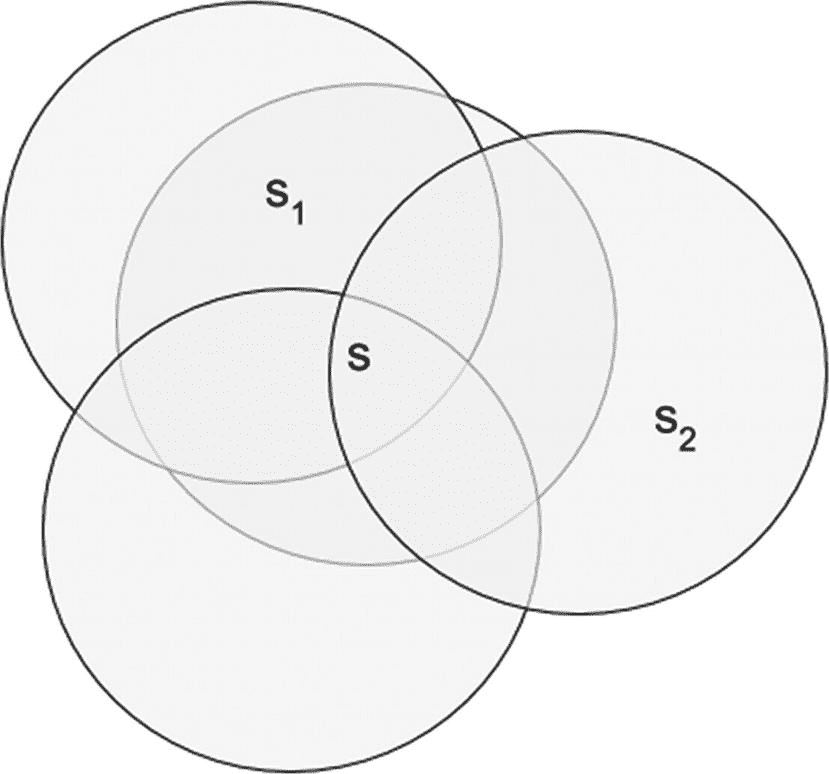
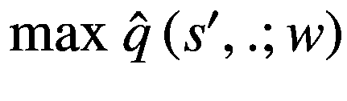

# 五、函数近似

在前三章中，我们研究了规划和控制的各种方法，首先使用动态规划(DP)，然后使用蒙特卡罗方法(MC)，最后使用时间差分(TD)方法。在所有这些方法中，我们总是着眼于状态空间和动作都是离散的问题。只有在前一章快结束时，我们才谈到连续状态空间中的 Q 学习。我们使用任意方法离散化状态值，并训练一个学习模型。在这一章中，我们将通过讨论近似的理论基础以及它如何影响强化学习的设置来扩展这种方法。然后，我们将研究近似数值的各种方法，首先是具有良好理论基础的线性方法，然后是专门针对神经网络的非线性方法。深度学习与强化学习相结合的这一方面是最令人兴奋的发展，它将强化学习算法推向了规模。

通常，该方法将在*预测/估计*设置的上下文中查看一切，其中代理试图遵循给定的策略来学习状态值和/或动作值。接下来将讨论*控制*，即寻找最优策略。我们将继续处于一个没有模型的世界，在那里我们不知道转变的动力。然后我们将讨论函数近似世界中的收敛性和稳定性问题。到目前为止，在精确和离散的状态空间中，收敛性还不是一个大问题。然而，函数近似带来了新的问题，需要考虑的理论保证和实际的最佳做法。我们还将触及批处理方法，并将它们与本章第一部分讨论的增量学习方法进行比较。

我们将以深度学习、基础理论和使用 PyTorch 和 TensorFlow 构建/训练模型的基础的快速概述来结束这一章。

## 介绍

强化学习可用于解决具有许多离散状态配置的非常大的问题或具有连续状态空间的问题。考虑双陆棋游戏，它有接近 10 个 <sup>20 个</sup>离散状态，或者考虑围棋游戏，它有接近 10 个 <sup>170 个</sup>离散状态。也考虑像自动驾驶汽车、无人机或机器人这样的环境:这些都有一个连续的状态空间。

到目前为止，我们已经看到了状态空间离散且规模较小的问题，例如大约有 100 个状态的网格世界或有 500 个状态的出租车世界。我们如何将目前所学的算法扩展到更大的环境或具有连续状态空间的环境？一直以来，我们都是用一个表格来表示状态值 *V* ( *s* )或动作值 *Q* ( *s* ， *a* )，每个状态值 *s* 或状态值 *s* 和动作值 *a* 的组合都有一个条目。随着数量的增加，表的大小将变得巨大，使得在表中存储状态或动作值变得不可行。此外，会有太多的组合，这会减慢策略的学习。该算法可能花费太多时间处于在环境的实际运行中概率非常低的状态。

我们现在将采取不同的方法。让我们用下面的函数来表示状态值(或状态-动作值):


(5.1)

它们现在由函数表示，而不是在表中表示值，其中参数 *w* 取决于代理遵循的策略，其中 *s* 或( *s* ， *a* )是状态或状态值函数的输入。我们选择参数∣ * w * ∣的数量比状态∣ * s * ∣的数量或者状态-动作对的数量(∣*s*∣*x*∣*a*∣).)小得多这种方法的结果是存在状态-动作值的状态表示的一般化。当我们基于给定状态 *s* 的某个更新等式来更新权重向量 *w* 时，它不仅更新该特定状态 *s* 或( *s* ， *a* )的值，而且还更新与更新所针对的原始状态或( *s* ， *a* )接近的许多其他状态或状态动作的值这取决于函数的几何形状。如前所示， *s* 附近的其他状态值也将受到这种更新的影响。我们用一个比状态数更受限制的函数来近似这些值。具体来说，我们现在不是直接更新 *v* ( *s* )或 *q* ( *s* ， *a* )，而是更新函数的参数集 *w* ，这反过来会影响估计值。当然，像以前一样，我们使用 MC 或 TD 方法执行 *w* 更新。函数近似有多种方法。我们可以提供状态向量(表示状态的所有变量的值，例如位置、速度、地点等。)并得到，或者我们可以输入状态和动作向量并得到作为输出。在动作是离散的并且来自一个小集合的情况下，另一种非常占优势的方法是馈送状态向量 *s* 并且得到∣ * A * ∣数，一个对应一个可能的动作(∣ * A * ∣表示可能动作的数量)。图 5-1 为示意图。


图 5-1

使用函数近似法表示或的方法。第一个和最后一个是我们在本章中最常用的

有各种方法来构建这样的函数近似器，但我们将探索两种常见的方法:使用平铺的线性近似器和使用神经网络的非线性近似器。

然而，在我们这样做之前，我们需要重温理论基础，看看需要什么操作来使 *w* 移动，以便我们连续减少目标值和状态或状态动作值的当前估计值之间的误差， *v* ( *s* 或 *q* ( *s* ， *a* )。

## 近似理论

函数近似是监督学习领域中广泛研究的主题，其中基于训练数据，我们构建底层模型的一般化。监督学习的大部分理论可以应用于函数近似的强化学习。然而，函数近似的 RL 也带来了新的问题，如如何引导以及它对非平稳性的影响。在监督学习中，当算法正在学习时，生成训练数据的问题/模型不会改变。然而，当涉及到函数近似的 RL 时，目标(在监督学习中标记为*输出*)的形成方式，会诱发非平稳性，我们需要想出新的方法来处理它。我们所说的*非平稳*是指我们不知道 *v* ( *s* )或 *q* ( *s* ， *a* )的实际目标值。我们使用 MC 或 TD 方法来形成评估，然后使用这些评估作为“目标”当我们改进我们对目标值的估计时，我们使用修改后的估计作为新的目标。在监督学习中，情况就不同了；目标在培训期间给出并固定。学习算法对目标没有影响。在强化学习中，我们没有实际的目标，我们使用目标值的估计值。随着这些估计值的改变，学习算法中使用的目标也会改变；即，它们在学习期间不是固定的或静止的。

让我们重温一下 MC(方程 4.2)和 TD(方程 4.4)的更新方程，复制在这里。我们修改了等式，使 MC 和 TD 对当前时间使用相同的下标 *t* ，对下一时刻使用相同的下标 *t* + 1。两个等式执行相同的更新以将*V*<sub>*t*</sub>(*s*)移动到更接近其目标，在 MC 更新的情况下是*G*<sub>*t*</sub>(*s*),而*R*<sub>*t*+1</sub>+*γ*∫

![$$ {V}_{t+1}(s)={V}_t(s)+\alpha\ \left[{G}_t(s)-{V}_t(s)\right] $$](img/502835_1_En_5_Chapter_TeX_Equ2.png)

(5.2)

![$$ {V}_{t+1}(s)={V}_t(s)+\alpha\ \left[{R}_{t+1}+\gamma \ast {V}_t\left({s}^{\prime}\right)-{V}_t(s)\right] $$](img/502835_1_En_5_Chapter_TeX_Equ3.png)

(5.3)

这和我们在监督学习，尤其是线性最小二乘回归中所做的事情类似。我们有输出值/目标值 *y* ( *t* )，我们有输入特征 *x* ( *t* )，统称为*训练数据*。我们可以选择一个模型*模型*<sub>*w*</sub>[*x*(*t*)】像多项式线性模型，决策树，或者支持向量，甚至像神经网络这样的其他非线性模型。训练数据用于最小化模型预测值和训练集中实际输出值之间的误差。称为*最小化损失函数*，表示如下:

![$$ J(w)={\left[y(t)-\hat{y}\left(t;w\right)\right]}²; where\ \hat{y}\left(t;w\right)={Model}_w\left[x(t)\right] $$](img/502835_1_En_5_Chapter_TeX_Equ4.png)

(5.4)

当 *J* ( *w* )是一个可微函数时，这将是本书中的情况，我们可以使用梯度下降来调整模型的权重/参数 *w* ，以最小化误差/损失函数 *J* ( *w* )。通常，使用相同的训练数据分批多次进行更新，直到损失停止进一步减少。权重为 *w* 的模型现在已经学习了从输入 *x* ( *t* )到输出 *y* ( *t* )的底层映射。执行增量更新的方式在以下等式中给出:

*j*(*w*)wrt*w*∴=∇<sub>*w*</sub>*j*(*w*)

对于给定的损失函数:![$$ {\Delta }_w\ J(w)=-2\ast \left[y(t)-\hat{y}\left(t;w\right)\right]\ast {\nabla}_w\hat{y}\left(t;w\right) $$](img/502835_1_En_5_Chapter_TeX_IEq8.png)。

调整 *w* ，我们在∈<sub>*w*</sub>*J*(*w*)的负方向迈一小步，这样会减少误差。


(5.5)

权重沿着使损失最小化的方向移动，即，实际输出值和预测输出值之间的差异。接下来，让我们花点时间讨论函数近似的各种方法。最常见的方法如下:

*   特征的线性组合。我们结合特征(如速度、速率、位置等。)通过向量 *w* 加权，并将计算值用作状态值。常见的方法如下:
    *   多项式

    *   傅立叶基函数

    *   径向基函数

    *   粗略编码

    *   瓦片编码

*   非线性但可区分的方法，其中神经网络是最受欢迎和当前趋势的方法。

*   非参数的，基于记忆的方法。

在本书中，我们将主要讨论基于深度学习的神经网络方法，这些方法适合非结构化输入，如代理的视觉系统捕获的图像或使用自然语言处理(NLP)的自由文本。本章的后面部分和下一章将致力于使用基于深度学习的函数近似，我们将看到许多使用 PyTorch 和 TensorFlow 的完整代码示例的变体。但是我们太超前了。让我们首先检查几种常见的线性近似方法，如粗编码和瓦片编码。由于本书的重点是深度学习在强化学习中的应用，我们不会花太多时间讨论其他各种线性近似方法。同样，仅仅因为我们没有把时间花在所有的线性方法上，并不意味着它们缺乏有效性。根据手头的问题，线性近似方法可能是正确的方法；它有效、快速，并且有收敛保证。

### 粗略编码

我们来看看图 2-2 中讨论过的山地车问题。汽车有一个二维状态，一个位置，和一个速度。假设我们将二维状态空间分成重叠的圆，每个圆代表一个特征。如果状态 *S* 位于圆内，则该特定特征存在且值为 1；否则，该特征不存在，其值为 0。特征的数量是圆的数量。假设我们有 *p* 圈；然后，我们将二维连续状态空间转换为 p 维状态空间，其中每个维度可以是 0 或 1。换句话说，每个维度可以属于{0，1}。

Note

{0，1}表示一组可能的值，即 0 或 1。带有常规括号的(0，1)表示值的范围，即从 0 到 1 的任何值，不包括 0 和 1。[0，1]表示 0 到 1 之间的值的范围以及左边的值；即 0 包括在该范围内。

状态 *S* 所在的圆圈所代表的所有特征将为“开”或等于 1。图 5-2 给出了一个例子。图中显示了两种状态，根据这些点所在的圆圈，相应的功能将被打开，而其他功能将被关闭。概化将取决于圆圈的大小以及圆圈的密集程度。如果用一个椭圆来代替圆，则推广将更多地在伸长的方向上进行。我们也可以选择圆形以外的形状来控制泛化的数量。



图 5-2

使用圆的二维粗编码。概括取决于圆的大小以及圆放在一起的密度

现在考虑大而密集的圆圈的情况。在两个遥远的州连接在一起的地方，一个大圆使最初的概化变宽，因为它们至少落入一个公共圆内。然而，密度(即圆的数量)允许我们控制细粒度的概括。通过使用多个圆，我们可以确保相邻的州之间至少有一个不同的特征。即使每个单独的圆圈都很大，也是如此。借助于具有不同圆形尺寸和圆形数量的实验，可以微调圆形的尺寸和数量，以控制适合于所讨论的问题/领域的一般化。

### 平铺编码

图块编码是一种可以通过编程进行规划的粗略编码形式。它适用于多维空间，比一般的粗编码有用得多。

让我们考虑一个二维空间，就像我们刚刚谈到的山地车。我们把空间分成覆盖整个空间的不重叠的网格。每一个这样的划分都称为*平铺*，如图 5-3 左图所示。这里的*瓦片*是正方形的，并且根据状态 *S* 在这个 2D 空间上的位置，只有一个瓦片是 1，而所有其他瓦片都是 0。

然后我们有许多这样的*平铺*相互偏移。假设我们使用 n 个 tilings 那么对于一个状态，每个瓷砖中只有一个瓷砖是开的。换句话说，如果有 n 个镶嵌，那么正好 n 个特征将是 1，n 个镶嵌中的每一个的单个特征。图 5-3 给出了一个例子。


图 5-3

瓷砖编码。如左图所示，我们在一个单幅图块中有 4×4=16 个图块。我们有四个相互重叠的镶嵌，如右图中四种不同的颜色所示。一个状态(绿色圆点)照亮每个瓷砖中的一个瓷砖。泛化由单个分块中的分块数量以及分块总数控制

注意，如果步长的学习率是等式( 5.1 和( 5.2 )中的*α*(α)，我们现在将它替换为，其中 *n* 是分块的数量。这是为了使算法不受镶嵌数量的限制。由于粗编码和平铺编码都使用二进制特征，数字计算机可以加快计算速度。

概括的性质现在取决于以下因素:

*   单个瓷砖中的瓷砖数量(图 5-3 中的左图)

*   镶嵌的数量(图 5-4 中的右图显示了四种不同颜色的四个镶嵌)

*   偏移的性质，无论是均匀的、对称的还是不对称的

有一些通用的策略来决定前面的数字。考虑这样一种情况，单个瓷砖中的每个瓷砖都是宽度为 *w* 的正方形。对于一个 *k* 维的连续空间，它将是一个 *k* 维的正方形，每边宽 *w* 。假设我们有 *n* 个镶嵌，因此这些镶嵌需要在所有维度上相互偏移的距离。这被称为*位移矢量*。第一个启发式是选择 *n* 使得*n*= 2<sup>*I*</sup>≥4*k*。每个方向的位移都是(1，3，5，7，…)的奇数倍。，2*k*1)的位移矢量。在我们即将到来的例子中，我们将使用一个库来帮助我们将二维山地汽车状态空间划分成适当的分块。我们将提供 2D 状态向量，库将返回给我们活动的瓦片向量。

### 近似值的挑战

虽然我们利用了基于监督学习的方法的知识，如前面解释的梯度下降，但我们必须记住两件事，与监督学习相比，基于梯度的方法在强化学习中更难工作。

首先，在监督学习中，训练数据保持不变。数据是从模型中生成的，当我们这样做时，模型不会改变。这是一个给我们的基本事实，我们试图通过使用数据来了解输入到输出的映射方式。提供给训练算法的数据是算法外部的，并且它不以任何方式依赖于算法。它被给定为常数，与学习算法无关。不幸的是，在 RL 中，尤其是在无模型设置中，情况并非如此。用于生成训练样本的数据基于代理所遵循的策略，它并不是底层模型的完整图像。随着我们对环境的探索，我们了解了更多，并生成了一组新的训练数据。我们或者使用基于 MC 的方法观察实际轨迹，或者使用 TD 下的 bootstrap 来形成目标值的估计值 *y(t)* 。随着我们探索和学习得越来越多，目标 *y(t)* 会发生变化，这与监督学习的情况不同。这就是所谓的*非稳定目标*问题。

第二，监督学习基于样本彼此不相关的理论前提，数学上称为 i.i.d .(独立同分布)数据。然而，在 RL 中，我们看到的数据取决于代理生成数据所遵循的策略。在给定的事件中，我们看到的状态取决于代理在该时刻遵循的策略。稍后时间步骤中出现的状态取决于代理先前采取的操作(决策)。换句话说，数据是*相关的*。我们看到的下一个状态*s*<sub>t+1</sub>取决于当前状态 *s* <sub>*t*</sub> 和动作*a*<sub>*t*</sub>agent 在该状态下采取的动作。

这两个问题使得 RL 设置中的函数近似更加困难。在此过程中，我们将看到为应对这些挑战而采取的各种方法。

对该方法有了大致的了解后，现在是时候开始我们通常的课程了，首先查看值*预测/估计*以学习可以表示值函数的函数。然后我们将看看*控制*方面，即代理试图优化策略的过程。它将遵循使用通用策略迭代(GPI)的通常模式，就像前一章中的方法一样。

## 增量预测:MC，TD，TD(λ)

在本节中，我们将研究预测问题，即如何使用函数近似来估计状态值。

接下来，让我们尝试使用( 5.4 中的损失函数和( 5.5 中的权重更新)将使用由输入和目标组成的训练数据找到模型的监督训练过程扩展到 RL 下的函数近似。如果您比较( 5.4 中的损失函数和( 5.2 和( 5.3 )中的 MC/TD 更新，您可以通过将 MC 和 TD 更新视为操作来进行比较，这些操作试图最小化实际目标*v*<sub>*π*</sub>(*s*)和当前估计值*v*( 我们可以将损失函数表示如下:

![$$ J(w)={E}_{\pi }{\left[{V}_{\pi }(s)-{V}_t(s)\right]}² $$](img/502835_1_En_5_Chapter_TeX_Equ6.png)

(5.6)

遵循与( 5.5 )中相同的推导，并使用随机梯度下降(即，在每个样本用更新替换期望值)，我们可以将权重向量**的更新方程写成如下:**

****

 **![$$ {w}_{t+1}={w}_t+\alpha .\left[{V}_{\pi }(s)-{V}_t\left(s;w\right)\right].{\nabla}_w\ {V}_t\left(s;w\right) $$](img/502835_1_En_5_Chapter_TeX_Equ7.png)

(5.7)

但是，与监督学习不同，我们没有实际/目标输出值*V*<sub>*π*</sub>(*s*)；相反，我们使用这些目标的估计值。对于 MC，*V*<sub>*π*</sub>(*s*)的估计/目标是*G*<sub>*t*</sub>(*s*)， *w* ，而 TD(0)下的估计/目标是*R*<sub>*t*+1</sub>因此，在 MC 和 TD(0)下用函数近似的更新可以写成如下。

下面是 MC 更新:

![$$ {w}_{t+1}={w}_t+\alpha .\left[{G}_t(s)-{V}_t\left(s;w\right)\right].{\nabla}_w\ {V}_t\left(s;w\right) $$](img/502835_1_En_5_Chapter_TeX_Equ8.png)

(5.8)

下面是 TD(0)更新:

![$$ {w}_{t+1}={w}_t+\alpha .\left[{R}_{t+1}+\gamma \ast {V}_t\left({s}^{\prime };w\right)-{V}_t\left(s;w\right)\right].{\nabla}_w\ {V}_t\left(s;w\right) $$](img/502835_1_En_5_Chapter_TeX_Equ9.png)

(5.9)

对于 q 值，可以写出一组类似的等式。我们将在下一节看到这一点。这与我们在前一章中对 MC 和 TD 控制部分所做的是一样的。

让我们首先考虑线性近似的设置，其中状态值可以表示为状态向量 *x(s)* 和权重向量 *w* :


(5.10)的点积

相对于 *w* 的导数现在将只是状态向量 *x* ( *s* )。


(5.11)

将( 5.11 )与方程式( 5.7 )结合起来，我们得到如下:

![$$ {w}_{t+1}={w}_t+\alpha .\left[{V}_{\pi }(s)-{V}_t\left(s;w\right)\right].x(s) $$](img/502835_1_En_5_Chapter_TeX_Equ12.png)

(5.12)

如前所述，我们不知道真实的状态值*V*<sub>π(*s*)，因此我们在 MC 方法中使用估计值*G*<sub>*t*</sub>(*s*)和估计值*R*<sub>*t*+1</sub>+*γ*∫*这给出了线性近似情况下 MC 和 TD 的权重更新规则如下。*</sub>

下面是 MC 更新:

![$$ {w}_{t+1}={w}_t+\alpha .\left[{G}_t(s)-{V}_t\left(s;w\right)\right].x(s) $$](img/502835_1_En_5_Chapter_TeX_Equ13.png)

(5.13)

下面是 TD(0)更新:

![$$ {w}_{t+1}={w}_t+\alpha .\left[{R}_{t+1}+\gamma \ast {V}_t\left({s}^{\prime };w\right)-{V}_t\left(s;w\right)\right].x(s) $$](img/502835_1_En_5_Chapter_TeX_Equ14.png)

(5.14)

简单来说，权重的更新，即( 5.14 )右侧的第二项，可以表示如下:

*更新=学习率 x 预测误差 x 特征值*

让我们把它与上一章看到的离散状态的基于表格的方法联系起来。我们将说明查表是线性方法的一个特例。考虑 x(s)的每个分量或者是 1 或者是 0，并且它们中只有一个可以具有值 1，而所有其余的特征都是 0。 *x* <sup>*表*</sup> ( *s* )是一个大小为 *p* 的列向量，其中在任何一点只有一个元素的值为 1，其余的元素都等于 0。根据代理所处的状态，相应的元素将是 1。


权重向量包括每个 s = s <sub>1</sub> ，s <sub>2</sub> ，… s <sub>p</sub> 的状态 v(s)的值。


使用( 5.10 )中的这些表达式，我们得到如下:


我们在线性更新方程( 5.13 )和( 5.14 )中使用该表达式，以从第四章中获得熟悉的更新规则:

下面是 MC 更新:

![$$ {v}_{t+1}(s)={v}_t(s)+\alpha .\left[{G}_t(s)-{V}_t(s)\right],\kern0.5em s\ \epsilon\ {s}_1,{s}_1,\dots, {s}_p $$](img/502835_1_En_5_Chapter_TeX_Equ15.png)

(5.15)

下面是 TD(0)更新:

![$$ {v}_{t+1}(s)={v}_t(s)+\alpha .\left[{R}_{t+1}+\gamma \ast {V}_t\left({s}^{\prime}\right)-{V}_t(s)\right],\kern0.5em s\ \epsilon\ {s}_1,{s}_1,\dots, {s}_p $$](img/502835_1_En_5_Chapter_TeX_Equ16.png)

(5.16)

前面的推导是将表查找作为更一般的线性函数近似的特例。

还有一点需要注意，我们在推导更新方程时忽略了，MC 中的目标估计点*G*<sub>*t*</sub>(*s*)和*R*<sub>*t*+1</sub>+*γ*∫*V*<sub>*t*</sub>(*s*<sup>’举个例子，我们再重温一下( 5.6 )用 TD 目标替换*V*<sub>*π*</sub>(*s*)然后取梯度。</sup>

![$$ loss:\kern1.5em J(w)={\left[{V}_{\pi }(s)-{V}_t(s)\right]}² $$](img/502835_1_En_5_Chapter_TeX_Equf.png)

![$$ or,\kern0.5em J(w)={\left[{R}_{t+1}+\gamma \ast {V}_t\left({s}^{\prime };w\right)-{V}_t\left(s;w\right)\right]}² $$](img/502835_1_En_5_Chapter_TeX_Equg.png)

如果我们对 *J* ( *w* )对 *w* 求导，我们实际上会得到两项，一项是由于*V*<sub>*t*</sub>(*s*<sup>’</sup>)的求导； *w* )，下一个状态，又一个因*V*<sub>*t*</sub>(*s*)而衍生的项； *w* )。这样一种取两者梯度贡献的方法∇*v*<sub>*t*</sub>(*s*<sup>’</sup>； *w* )和∇*v*<sub>*t*</sub>(*s*； *w* )恶化学习速度。首先，原因是我们希望目标保持不变，因此我们需要忽略∇*v*<sub>*t*</sub>(*s*<sup>’</sup>)的贡献； *w* )。第二，概念上用梯度下降我们试图拉当前状态的值*V*<sub>*t*</sub>(*s*<sup>’</sup>； *w* )向着它的目标前进。取第二贡献项∇*v*<sub>*t*</sub>(*s*<sup>’</sup>； *w* )意味着我们正试图将下一个状态*S = S*<sup>’</sup>的值移向当前状态 *S=s* 的值。

综上，我们只取当前状态值的导数*V*<sub>*t*</sub>(*s*； *w* )并忽略下一个状态值的导数*V*<sub>*t*</sub>(*s*<sup>’</sup>； *w* 。该方法使得值估计看起来类似于利用固定目标的监督学习所使用的方法。这也是为什么有时( 5.8 )和( 5.9 )中使用的梯度下降法也被称为*半梯度*法的原因。

正如我们前面提到的，算法的收敛性不再得到保证，不像我们在表格设置中由于收缩定理而得到的保证。然而，大多数经过仔细考虑的算法在实践中确实是收敛的。表 5-1 显示了各种预测/估计算法的收敛性。我们将不详细解释这些收敛特性。这样的讨论更适合一本侧重于学习的理论方面的书。我们的是一个实用的，有足够的理论来理解背景和欣赏算法的细微差别，核心焦点是在 PyTorch 或 TensorFlow 中编码这些算法。

表 5-1

预测/估计算法的收敛性

<colgroup><col class="tcol1 align-left"> <col class="tcol2 align-left"> <col class="tcol3 align-left"> <col class="tcol4 align-left"> <col class="tcol5 align-left"></colgroup> 
| 

保单类型

 | 

算法

 | 

表格查找

 | 

线性的

 | 

非线性的

 |
| --- | --- | --- | --- | --- |
| 政策上的 | 主持人 TD(0)TD(λ) | YYY | YYY | Y 普通普通 |
| 不符合政策 | 主持人 TD(0)TD(λ) | YYY | Y 普通普通 | Y 普通普通 |

在后面的章节中，我们将看到自举(例如 TD)、函数近似和偏离策略的组合在一起会对稳定性产生不利影响，除非仔细考虑学习过程。

现在让我们看看控制问题，即如何用函数近似来优化策略。

## 增量控制

就像上一章一样，我们将遵循类似的方法。我们从函数近似开始来估计 q 值。


(5.17)

像以前一样，我们在目标值和当前值之间形成一个损失函数。

![$$ J(w)={E}_{\pi}\left[{\left({q}_{\pi}\left(s,a\right)-\hat{q}\left(s,a;w\right)\right)}²\right] $$](img/502835_1_En_5_Chapter_TeX_Equ18.png)

(5.18)

相对于 *w* 损失最小，进行随机梯度下降:


在哪里，

。 (5.19)

像之前一样，我们可以在与使用线性近似时简化方程。在前面所示的线性情况下，导数将变成。

接下来，由于我们不知道真实的 q 值*q*<sub>*【π】*</sub>(*s*， *a* )，我们用使用 MC 或 TD 的估计来替换它，给我们一组等式。

下面是 MC 更新:

![$$ {w}_{t+1}={w}_t+\alpha .\left[{G}_t(s)-{q}_t\left(s,a;w\right)\right].{\nabla}_w\ {q}_t\left(s,a\right) $$](img/502835_1_En_5_Chapter_TeX_Equ19.png)

(5.20)

下面是 TD(0)更新:

![$$ {w}_{t+1}={w}_t+\alpha .\left[{R}_{t+1}+\gamma \ast {q}_t\left({s}^{\prime },{a}^{\prime };w\right)-{q}_t\left(s,a;w\right)\right].{\nabla}_w\ {q}_t\left(s,a;w\right) $$](img/502835_1_En_5_Chapter_TeX_Equ20.png)

(5.21)

这些等式允许我们进行 q 值估计/预测。这是广义策略迭代的*评估*步骤，我们执行多轮梯度下降来改进给定策略的 q 值估计，并使其接近实际目标值。

*评估*之后是贪婪的政策最大化来改进政策。图 5-4 显示了函数近似 GPI 下的迭代过程。


图 5-4

具有函数近似的广义策略迭代

### 半梯度 N 步 SARSA 控制

让我们将等式( 5.9 )用于 SARSA 政策控制制度中的 TD 目标。代理使用当前策略对环境进行采样，并观察状态、动作、奖励、下一个状态、下一个动作( *s* <sub>*t*</sub> ， *a* <sub>*t*</sub> ，*r*<sub>*t*+1</sub>，*s*<sub>*t*+1</sub>，*a*图 5-5 显示了完整的算法。**

Semi-Gradient N-Step SARSA Control (Episodic)


图 5-5

用于事件控制的 n 步半梯度 SARSA

*w* 更新是等式( 5.20 ，目标是 *G* ，n 步返回。在我们对山地汽车的 n 步 SARSA 的例子中，我们将使用 tile 编码，一种二进制特征近似器。在我们的设置中:

；其中 *x* ( *S* ， *A* )是瓦片编码的特征向量

据此，

在清单 5-1 中，我们有一个类`QEstimator`来保存权重并执行平铺。函数`get_active_features`以 *S* 的连续二维值和离散输入动作 *A* 作为输入，返回平铺编码的`active_feature` *x* ( *S* ， *A* )，即对于给定( *S* ， *A* )有效的二进制平铺特征。函数`q_predict`也将 *S* ， *A* 作为输入，并返回估计值 = * x * ( *S* ，*A*)<sup>*T*</sup>。 *w* 。它在内部调用`get_active_features`来首先获得特征，并与权重向量进行点积。图 5-5 中算法末尾所示的权重更新方程是函数`q_update`所执行的。函数`get_eps_greedy_action`使用ε贪婪进行动作选择。

另一个函数`sarsa_n`实现图 5-5 给出的算法，根据需要调用`QEstimator`中的函数。类似于前一章中的许多例子，我们也有一个助手函数`plot_rewards`来随着训练的进行绘制每集的奖励。清单 5-1 给出了代码(`listing5_1.ipynb`)。

```py
class QEstimator:

    def __init__(self, step_size, num_of_tilings=8, tiles_per_dim=8, max_size=2048, epsilon=0.0):
        self.max_size = max_size
        self.num_of_tilings = num_of_tilings
        self.tiles_per_dim = tiles_per_dim
        self.epsilon = epsilon
        self.step_size = step_size / num_of_tilings

        self.table = IHT(max_size)

        self.w = np.zeros(max_size)

        self.pos_scale = self.tiles_per_dim / (env.observation_space.high[0] \
                                               - env.observation_space.low[0])
        self.vel_scale = self.tiles_per_dim / (env.observation_space.high[1] \
                                               - env.observation_space.low[1])

    def get_active_features(self, state, action):
        pos, vel = state
        active_features = tiles(self.table, self.num_of_tilings,
                     [self.pos_scale * (pos - env.observation_space.low[0]),
                     self.vel_scale * (vel- env.observation_space.low[1])],
                     [action])
        return active_features

    def q_predict(self, state, action):
        pos, vel = state
        if pos == env.observation_space.high[0]:  # reached goal
            return 0.0
        else:
            active_features = self.get_active_features(state, action)
            return np.sum(self.w[active_features])

    # learn with given state, action and target
    def q_update(self, state, action, target):
        active_features = self.get_active_features(state, action)
        q_s_a = np.sum(self.w[active_features])
        delta = (target - q_s_a)
        self.w[active_features] += self.step_size * delta

    def get_eps_greedy_action(self, state):
        pos, vel = state
        if np.random.rand() < self.epsilon:
            return np.random.choice(env.action_space.n)
        else:
            qvals = np.array([self.q_predict(state, action) for action in range(env.action_space.n)])
            return np.argmax(qvals)

########################
def sarsa_n(qhat, step_size=0.5, epsilon=0.0, n=1, gamma=1.0, episode_cnt = 10000):
    episode_rewards = []
    for _ in range(episode_cnt):
        state = env.reset()
        action = qhat.get_eps_greedy_action(state)
        T = float('inf')
        t = 0
        states = [state]
        actions = [action]
        rewards = [0.0]
        while True:
            if t < T:
                next_state, reward, done, _ = env.step(action)
                states.append(next_state)
                rewards.append(reward)

                if done:
                    T = t+1
                else:
                    next_action = qhat.get_eps_greedy_action(next_state)
                    actions.append(next_action)

            tau = t - n + 1

            if tau >= 0:
                G = 0

                for i in range(tau+1, min(tau+n, T)+1):
                    G += gamma ** (i-tau-1) * rewards[i]
                if tau+n < T:
                    G += gamma**n * qhat.q_predict(states[tau+n], actions[tau+n])
                qhat.q_update(states[tau], actions[tau], G)

            if tau == T - 1:
                episode_rewards.append(np.sum(rewards))
                break
            else:
                t += 1
                state = next_state
                action = next_action

    return np.array(episode_rewards)

Listing 5-1N-Step SARA Control: Mountain Car

```

图 5-6 显示了运行此算法训练山地车的结果。我们可以看到，在 50 集内，代理达到一个稳定状态，它能够在大约 110 个时间步长内达到击中山谷右侧旗帜的目标。


图 5-6

带登山车的 n 步半梯度 SARSA

### 半梯度 SARSA(λ)控制

接下来，我们将研究具有合格轨迹的半梯度 SARSA(λ)算法。SARSA(λ)进一步推广了 n 步 SARSA。当状态或状态-动作值由线性函数近似的二进制特征表示时，就像 tile 编码的山地车一样，我们得到如图 5-7 所示的算法。该算法引入了合格轨迹的概念，该合格轨迹具有与权重向量相同数量的分量。*权重向量*是对许多情节的长期记忆，从所示的所有例子中进行归纳。*合格痕迹*是持续时间小于情节长度的短时记忆。它通过影响体重来帮助学习过程。我们将不深入讨论更新规则的详细推导。概念和数学推导的详细解释可以参考 [`http://incompleteideas.net/book/the-book.html`](http://incompleteideas.net/book/the-book.html) 。

Semi-Gradient SARSA(Λ) Control (Episodic)


图 5-7

半梯度 SARSA(λ)用于当特征是二元的并且值函数是特征向量和权重向量的线性组合时的情节控制

让我们看看在山地车上运行前面的算法。`Listing5_2.ipynb`有完整的代码。在清单 5-2 中，我们强调了代码的重要部分。像`listing5_1.ipynb`一样，我们有一个名为`QEstimator`的类，做了一些小的修改来存储跟踪值，并在权重更新函数`q_update`中使用跟踪。我们还有两个辅助函数:`accumulating_trace`和`replacing trace`来实现对两个轨迹变量的跟踪。函数`sarsa_lambda`实现图 5-7 中给出的整体学习算法。我们也有一个功能来运行训练有素的代理通过一些插曲，并记录行为。一旦您训练了代理并生成了动画，您就可以运行 MP4 文件并查看代理为达到目标所遵循的策略。

```py
def accumulating_trace(trace, active_features, gamma, lambd):
    trace *= gamma * lambd
    trace[active_features] += 1
    return trace

def replacing_trace(trace, active_features, gamma, lambd):
    trace *= gamma * lambd
    trace[active_features] = 1
    return trace

# code omitted as it largely similar to listing 5-1
# except for adding trace vector to init fn and to q_update fn
class QEstimator:

def sarsa_lambda(qhat, episode_cnt = 10000, max_size=2048, gamma=1.0):
    episode_rewards = []
    for i in range(episode_cnt):
        state = env.reset()
        action = qhat.get_eps_greedy_action(state)
        qhat.trace = np.zeros(max_size)
        episode_reward = 0

        while True:
            next_state, reward, done, _ = env.step(action)
            next_action = qhat.get_eps_greedy_action(next_state)
            episode_reward += reward
            qhat.q_update(state, action, reward, next_state, next_action)
            if done:
                episode_rewards.append(episode_reward)
                break
            state = next_state
            action = next_action
    return np.array(episode_rewards)

Listing 5-2SARSA (λ) Control: Mountain Car

```

图 5-8 显示了运行 SARSA(λ)算法训练山地车的结果。我们可以看到结果类似于图 5-6 中的结果。这是一个太小的问题，但对于更大的问题，资格追踪驱动的算法将显示更好和更快的收敛。


图 5-8

半坡 SARSA(λ)带山地车

## 函数近似的收敛性

让我们通过看一个例子来开始探索收敛。如图 5-9 所示，让我们考虑一个双态转换作为一些 MDP 的一部分。假设我们将使用函数近似，第一个状态的值为 *w* ，第二个状态的值为 2 *w* 。这里， *w* 是一个单一的数字，而不是一个向量。


图 5-9

泛函近似下的两步跃迁

假设 *w* = 10，代理从第一状态转换到第二状态，即从值为 10 的状态转换到值为 20 的状态。我们还假设从第一个状态到第二个状态的转变是第一个状态中唯一可能的转变，而这个转变的回报每次都是零。设学习率为 *α* = 0.1。

现在让我们将方程式( 5.14 )应用于前一个。

??

??![$$ {w}_{t+1}={w}_t+0.1\ast \left[0+\gamma \ast 2\ {w}_t-{w}_t\right].1 $$](img/502835_1_En_5_Chapter_TeX_Equk.png)

i . e*w*<sub>*+1*</sub>*=**+0.1】*w****

 *我们假设 *λ* 接近 1，当前权重为 10。更新后的权重会是这样的:*w*<sub>t+1</sub>= 10+0.1∫10∫(2 1)= 11。

只要(2*γ*—1)>为 0，每次更新都会导致权重发散。这表明函数近似会导致发散。这是因为值的泛化，即更新给定州的值也会更新附近或相关州的值。列出了不稳定问题的三个角度。

*   *函数近似*:一种使用权重对非常大的状态空间进行概括的方法，与状态总数相比，权重是一个较小的向量

*   *自举*:使用状态值的估计值形成目标值，例如在 TD(0)中，目标是估计值*R*<sub>t+1</sub>+*γ*∫*V*<sub>*t*</sub>(*s*<sup>)； *w*</sup>

*   *非策略学习*:使用行为策略训练代理，但学习不同的最优策略

即使在简单的预测/估计场景中，这三个部分的共同存在也显著增加了发散的机会。控制和优化问题分析起来更加复杂。也已经表明，只要这三者不同时存在，就可以避免不稳定性。这就给我们带来了一个问题，我们能放弃这三者中的任何一个，并评估这种放弃的影响吗？

函数近似，尤其是使用神经网络的函数近似，使得 RL 对于大型现实世界的问题是可行的。其他替代方案不实用。自举使流程样本变得高效。通过观看完整集来形成目标的替代方案虽然可行，但不太实用。策略外学习可以用策略内学习来代替，但是为了让 RL 更接近人类的学习方式，我们需要策略外学习，通过探索另一个类似的问题来了解一些问题/情况。因此，对此没有简单的答案。我们不能放弃这三项要求中影响较小的任何一项。那是理论上的一面。在实践中，大多数时候，算法通过一些仔细的监控和调整而收敛。

## 梯度时间差异学习

用方程( 5.9 )所示的更新方程进行的半梯度 TD 学习不遵循真实梯度。在取损失函数的梯度时，我们保留了对目标的估计，即*R*<sub>t+1</sub>+*γ*∫*V*<sub>*t*</sub>(*s*<sup>’</sup>； *w* )，常数。它没有出现在关于重量 *w* 的导数中。真正的更夫误差是*R*<sub>*t*+1</sub>+*γ*∑*V*<sub>*t*</sub>(*s*<sup>’</sup>；*w*—*V*<sub>*t*</sub>(*s*； *w* )，它的导数理想情况下应该对两个*V*<sub>*t*</sub>(*s*)都有梯度项； *w* )和*V*<sub>*t*</sub>(*s*<sup>’</sup>； *w* )。

有一种称为*梯度时间差异学习*的变体，它遵循真实梯度，并在所有查表、线性和非线性函数近似以及符合策略和不符合策略方法的情况下提供收敛。将此添加到算法组合中，可以修改表 5-1 ，如表 5-2 所示。我们不会在这本书里深入讨论它的数学证明，因为这本书的重点是算法的实际实现。

表 5-2

预测/估计算法的收敛性

<colgroup><col class="tcol1 align-left"> <col class="tcol2 align-left"> <col class="tcol3 align-left"> <col class="tcol4 align-left"> <col class="tcol5 align-left"></colgroup> 
| 

保单类型

 | 

算法

 | 

表格查找

 | 

线性的

 | 

非线性的

 |
| --- | --- | --- | --- | --- |
| 政策上的 | 主持人 TD(0)TD(λ)梯度 TD | YYYY | YYYY | Y 普通普通 Y |
| 不符合政策 | 主持人 TD(0)TD(λ)梯度 TD | YYYY | Y 普通普通 Y | Y 普通普通 Y |

接着，我们在表 5-3 中给出了控制算法的收敛性。

表 5-3

控制算法的收敛性

<colgroup><col class="tcol1 align-left"> <col class="tcol2 align-left"> <col class="tcol3 align-left"> <col class="tcol4 align-left"></colgroup> 
| 

算法

 | 

表格查找

 | 

线性的

 | 

非线性的

 |
| --- | --- | --- | --- |
| MC 控制 | Y | (Y) | 普通 |
| 保单 TD (SARSA) | Y | (Y) | 普通 |
| 政策外 Q-learning | Y | 普通 | 普通 |
| 梯度 Q 学习 | Y | Y | 普通 |

(Y):在接近最优值函数附近波动。在所有非线性情况下，收敛保证都是无效的。

## 批量方法(DQN)

到目前为止，我们一直专注于增量算法；也就是说，我们对转换进行采样，然后使用这些值，在随机梯度下降的帮助下更新权重向量 *w* 。但是这种方法不具有样本效率。我们只使用一次样本就丢弃它。然而，对于非线性函数近似，特别是对于神经网络，我们需要多次通过网络才能使网络权重收敛到真实值。此外，在许多现实生活场景中，如机器人，我们需要两个方面的样本效率:神经网络收敛缓慢，因此需要多次通过，以及在现实生活中生成样本非常慢。在关于批量强化方法的这一节中，我们将带您了解批量方法在深度 Q 网络中的具体使用，深度 Q 网络是非策略 Q 学习的深度网络版本。

像之前一样，我们使用函数近似来估计状态值，如等式( 5.1 ): 所示。

考虑我们以某种方式知道实际状态值*v*<sub>*【π】*</sub>(*s*)，并且我们正试图学习权重向量 *w* 以达到良好的估计值。我们收集了一批经验。


我们将最小平方损失作为真实值和估计值之间的差的平均值，然后执行梯度下降以最小化误差。我们使用小批量梯度下降来获取过去经验的样本，并使用学习率 *α* 来移动权重向量。![$$ LS(w)={E}_D\left[{\left({v}_{\pi }(s)-\hat{v}\left(s;w\right)\right)}²\right]. $$](img/502835_1_En_5_Chapter_TeX_Equm.png)

我们用样本来近似它。


(5.22)

取 *LS* ( *w* )相对于 *w* 的梯度，用负梯度调整 *w* ，得到方程( 5.23 ，类似于方程( 5.7 )。

![$$ {w}_{t+1}={w}_t+\alpha .\kern0.5em \frac{1}{N}{\sum}_{i=1}^N\left[{v}_{\pi}\left({s}_i\right)-\hat{v}\left({s}_i;w\right)\right].{\nabla}_w\ \hat{v}\left({s}_i;w\right) $$](img/502835_1_En_5_Chapter_TeX_Equ22.png)

(5.23)

像以前一样，我们可以用 q 值进行类似的更新。

![$$ {w}_{t+1}={w}_t+\alpha .\kern0.5em \frac{1}{N}{\sum}_{i=1}^N\left[{q}_{\pi}\left({s}_i,{a}_i\right)-\hat{q}\left({s}_i,{a}_i;w\right)\right].{\nabla}_w\ \hat{q}\left({s}_i,{a}_i;w\right) $$](img/502835_1_En_5_Chapter_TeX_Equ23.png)

(5.24)

但是，我们并不知道真正的值函数，*v*<sub>*π*</sub>(*s*<sub>*I*</sub>或*q*<sub>*π*</sub>(*s*<sub>*I*</sub>， *a* <sub>*i*</sub> )。像以前一样，我们使用 MC 或 TD 方法将真实值替换为估计值。现在让我们来看一个叫做 DQN 的版本，Q-learning 的深度学习版本，如第四章所示。在 DQN，一种非策略算法，我们对当前状态**进行采样，根据当前行为策略采取步骤**，一种使用当前 q 值的ε贪婪策略。我们观察奖励 ***r*** 和下一个状态***s***<sup>’</sup>。我们用来表示状态**<sup>’</sup>中可能出现的所有动作**<sup>’</sup>来形成目标。********

************

 ******这里我们使用了不同的权重向量***w***<sub>***t***</sub>**来计算目标的估计值。本质上，我们有两个网络，一个称为在线*网络*，其权重为 *w* ，根据等式 5.24 进行更新，第二个类似的网络称为*目标网络*，但其权重副本称为*w*<sup>—</sup>。权重向量*w*?? 更新频率较低，比如在线网络权重 *w* 每更新 100 次。这种方法保持目标网络不变，并允许我们使用监督学习的机制。还请注意，我们使用下标 *i* 表示小批量中的样品，使用 *t* 表示权重更新的指数。将所有这些放在一起，最终的更新方程可以写成如下形式:**

**![$$ {w}_{t+1}={w}_t+\alpha .\kern0.5em \frac{1}{N}{\sum}_{i=1}^N\left[{r}_i+\gamma\ {\mathit{\max}}_{a_i^{\prime }}\overset{\sim }{q}\left({s}_i^{\prime },{a}_i^{\prime };{w_t}^{-}\right)-\hat{q}\left({s}_i,{a}_i;w\right)\right].{\nabla}_w\ \hat{q}\left({s}_i,{a}_i;w\right) $$](img/502835_1_En_5_Chapter_TeX_Equ24.png)**

**(5.25)

简而言之，我们使用ε-greedy 策略在环境中运行代理，并在名为 replay buffer *D* 的缓冲区中收集经验。我们使用( 5.25 )对在线网络进行权重更新。我们也偶尔更新目标网络权重(比如在每 100 次批量更新 *w* 之后)。我们使用带有ε-探索的更新的 q 值来将更多的体验添加到重放缓冲器中，并再次执行整个循环。这实质上是 DQN 的方法。在下一章，我们还有很多要说的，这一章完全是关于 DQN 及其变体的。现在，我们把话题留在这里，继续前进。

## 线性最小二乘法

在批处理方法中使用的经验重放找到最小平方解，最小化使用 TD 或 MC 估计的目标和当前值函数估计之间的误差。但是，需要多次迭代才能收敛。但如果我们对预测用的值函数和控制用的用线性函数近似，就可以直接求出最小二乘解。先来看预测。

我们从方程( 5.22 ，代入得到这个:


取 *LS* ( *w* )相对于 *w* 的梯度并设为零，我们得到如下:


求解 *w* 给出如下:


(5.26)

前面的解决方案涉及一个 *N* *N* 矩阵的求逆，这需要 *O* ( *N* <sub>3</sub> )的计算。但是，使用 Shermann-Morrison，我们可以在*O*(*N*<sub>2</sub>)时间内解决这个问题。和以前一样，我们不知道真实值*v*<sub>*π*</sub>(*s*<sub>*I*</sub>)。我们使用 MC、TD(0)或 TD(λ)估计值将真实值替换为其估计值，从而为我们提供线性最小二乘 MC (LSMC)、LSTD 或 LSTD(λ)预测算法。


LSD(λ):*v**(**【我】*)**

 ***所有这些预测算法对于非策略或策略都具有良好的收敛性。

接下来，我们将分析扩展到使用 q 值线性函数近似和 GPI 的控制，其中前面的方法用于 q 值预测，随后是策略改进步骤中的贪婪 q 值最大化。这被称为*线性最小二乘策略迭代* (LSPI)。我们通过这些循环迭代预测，然后改进，直到策略收敛，即，直到权重收敛。我们在这里给出线性最小二乘 Q 学习(LSPI)的最终结果，而不经过推导。

下面是预测步骤:


其中( *i* )是第 *i* <sup>th</sup> 样( *s* <sub>*i*</sub> ， *a* <sub>*i*</sub> ， *r* <sub>*i*</sub> ，*s*′<sub>*I*</sub>)来自经验回放

这是控制步骤:

对于每个状态 ***s*** ，我们改变在先前预测步骤中执行的权重更新 *w* 之后最大化 q 值的策略。


前面，我们讨论了使用函数近似的策略迭代的大多数变体:增量、批处理和线性方法。让我们绕一小段路来介绍 PyTorch 和 TensorFlow 库。

## 深度学习图书馆

本章的前几节向我们展示了通过使用函数近似方法，我们需要一种有效的方法来计算状态值函数或动作值函数的导数。如果我们使用神经网络，我们需要使用反向传播来计算网络每一层的导数。这就是 PyTorch 和 TensorFlow 这样的库出现的原因。类似于 NumPy 库，它们也以有效的方式执行向量/矩阵计算。此外，它们在处理张量(二维以上的数组)方面进行了高度优化。

在神经网络中，我们需要能够反向传播误差，以计算相对于各级层权重的误差梯度。这两个库都是高度抽象和优化的，可以在幕后为我们处理这些问题。我们只需要构建正向计算，通过所有的计算获取输入，从而得到最终的输出。这些库跟踪计算图形，并允许我们只通过一次函数调用来对权重进行梯度更新。

为了更新您对这两个库的了解，我们提供了两个 Python 笔记本，带您使用 MNIST 数据集训练一个简单的数字分类模型。`listing5_3_pytorch_intro.ipynb`是使用 PyTorch 的代码，`listing5_4_tensorflow.ipynb`使用 TensorFlow 遍历同样的东西。我们在这里不复制文本中的代码，因为这些笔记本只是为了让你更新关于 PyTorch 和 TensorFlow 的知识。

## 摘要

在这一章中，我们主要关注的是函数近似在非常大或连续的状态空间中的应用，这些空间不能用我们在前面章节中看到的基于表格的学习方法来处理。

我们讨论过用函数近似进行优化意味着什么。我们还展示了监督学习中的训练概念，即训练模型以产生接近目标的值，如何应用于强化学习，对移动目标和 RL 中所示的样本相互依赖进行适当处理。

然后，我们研究了函数近似的各种策略，包括线性和非线性策略。我们还看到了基于表格的方法只是线性近似的特例。随后详细讨论了预测和控制的增量方法。我们看到这些被应用在山地车上，使用 n 步 SARSA 和 SARSA(λ)构建训练代理。

接下来，我们讨论了批处理方法，并探索了 DQN 更新规则的完整推导过程，这是批处理方法家族中的一个流行算法。然后我们研究了预测和控制的线性最小二乘法。在此过程中，我们不断强调一般的融合问题以及正在讨论的特定方法中的融合。

我们最后以 PyTorch 和 TensorFlow 等深度学习框架的简要介绍结束了这一章。**************