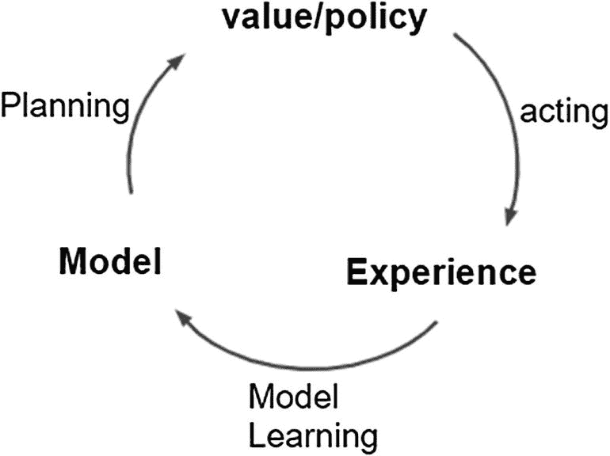
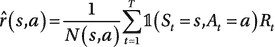

# 九、综合规划和学习

本书中反复出现的一个主题是，分别研究不同的主题，然后一起学习。我们首先在第三章看了基于模型的算法。使用这种设置，我们知道代理在其中操作的世界的模型动态。代理使用模型动力学知识和贝尔曼方程首先执行评估/预测任务，以学习状态或状态-动作值。然后，它通过改进策略来获得最佳行为，这被称为*策略改进/策略迭代*。一旦我们知道了模型，我们就可以提前计划执行评估/改进步骤。这被称为*计划阶段*。

在第四章中，我们从探索无模型机制开始。*无模型*意味着我们不知道模型。我们通过与模型互动来学习模型。我们称之为*学习*。在无模型设置中，我们分别研究了蒙特卡罗(MC)和时间差分(TD)方法。我们比较了使用这两种方法的优缺点。接下来，我们使用 *n 步*和*资格追踪*将 MC 和 TD 合并成一个统一的方法。

在第六章中，我们使用函数近似和深度学习将第四章的方法扩展到非表格连续空间大规模问题。第 3 至 6 章中涵盖的所有方法被称为*基于值的方法*，其中状态或状态动作值被学习，然后使用这些学习的状态/状态动作值进行策略改进。

第七章关注的是另一种方法，即*基于政策的方法*。这种方法意味着直接学习最优策略，而不经过学习状态/动作值的中间步骤。最初，它给人一种基于价值和基于政策的方法截然不同的印象。然而，就像在资格追踪下将 MC 和 TD 结合成一个一样，在第八章中，我们结合了基于价值的 Q 学习和政策学习，以在行动者-批评家(AC)方法下获得两个世界的最佳效果，如 DDPG、TD3 和 SAC。

在这一章中，我们将结合基于模型的方法和无模型的方法，通过利用两者的优点，使我们的算法更强大，样本效率更高。这是本章的重点。

我们还将更详细地研究探索-开发的困境，而不仅仅是盲目地遵循贪婪的政策。我们将着眼于更简单的设置，以更好地理解探索-开发的困境。接下来将深入探讨一种“引导式前瞻树搜索方法”，称为*蒙特卡罗树搜索* (MCTS)。

## 基于模型的强化学习

什么是无模型 RL？在无模型 RL 中，我们不知道模型。相反，我们通过让代理与环境交互来学习价值函数和/或策略，即*通过经验学习*。这就是我们在本书第 4 到 8 章中看到的。相比之下，我们现在谈论的基于模型的 RL 是通过让代理与环境交互来学习模型的 RL，即，再次通过经验学习。学习到的模型被用来计划价值函数和政策——类似于我们在第三章中看到的内容。在第三章中，我们假设了模型的先验知识，我们也假设它是完美的。然而，在基于模型的 RL 中，我们学习模型，然后使用该知识。但是，知识可能是不完整的；换句话说，我们可能不知道确切的转移概率或奖励的完全分布。当代理人与环境互动时，我们学习我们所经历的系统动力学的一部分。我们的知识是基于有限的相互作用，因此没有涵盖所有可能性的详尽的相互作用，我们对模型的知识是不完整的。

我们这里的模型是什么意思？这意味着要有转移概率的估计*P*(*s*<sub>t</sub>， *a* <sub>*t*</sub> )和报酬*R*(*s*<sub>*t*</sub>， *a* <sub>*t*</sub> )。主体与世界/环境相互作用，形成对世界的印象。形象地说，可如图 9-1 所示。



图 9-1

基于模型的强化学习。代理根据其与环境的交互来学习模型，然后将该模型用于规划

优点是学习变得高效。与无模型方法相比，我们可以使用学习到的模型来有效地进行计划。此外，模型交互就是在状态 *s* <sub>*t*</sub> 时采取一个动作 *a* <sub>*t*</sub> ，并观察下一个状态*s*<sub>*t*+1</sub>的结果和奖励*r*<sub>*t*+1</sub>。我们可以使用监督学习机器从与现实世界的交互中学习，其中给定( *s* <sub>*t*</sub> ， *a* <sub>*t*</sub> )是样本输入，*s*<sub>*t*+1</sub>和/或*r*<sub>*t*+1</sub>


: : :


像任何其他常规的监督机器学习设置一样，我们可以从代理从其与环境的交互中收集的先前样本中学习。

*   学习 *s* <sub>*t*</sub> ，*a*<sub>*t*</sub>→*r*<sub>*t*+1</sub>是一个损失类似均方损失的回归问题。

*   学习跃迁动力学*s*<sub>t，*a*<sub>*t*</sub>→*s*<sub>*t*+1</sub>是一个密度估计问题。我们可以学习离散的分类分布、高斯分布或高斯模型参数的混合。该损失可能是 KL-divergence 损失。</sub>

如果我们将学习扩展到贝叶斯学习，那么我们也可以对模型不确定性进行推理，即，我们对所学习的模型转换和奖励函数有多确定或不确定。贝叶斯学习方法产生的不仅仅是点估计，而是估计的整体分布，这使我们有能力对估计的强度进行推理。估计值的窄概率分布意味着大部分概率以峰值为中心；也就是说，我们对估计有很强的信心。相反，估计值的广泛分布反映了估计值的较高不确定性。

然而，生活中没有免费的东西。首先学习模型的不完美表示，然后使用该不完美表示来计划或寻找最优策略的这种两步方法引入了两个误差源。首先，我们对模型动力学的了解可能是不准确的。第二，从不完善的模型中学习一个价值函数可能有其自身的不准确性。

学习到的模型可以表示为“查表”(类似于我们在第 2 和 3 章中看到的)、线性期望模型或线性高斯模型。甚至可以有更复杂的模型表示，如高斯过程模型或深度信任网络模型。这取决于问题的性质、数据收集的难易程度等。决定正确的表示需要领域专业知识。让我们看一个学习表查找模型的简单例子。

首先，我们看一下我们将用来学习奖励和转换动态的表达式。这是一个简单的平均方法，我们将在这里使用。为了估计转移概率，我们取转移次数的平均值( *s* <sub>*t*</sub> ，*a*<sub>*t*</sub>)→*s*<sub>*t*+1</sub>)并除以代理人在( *s* <sub>*t*</sub> ，*中看到自己的总次数*

 9.1

这里，是一个指标函数。当括号内的条件为真时，指示符函数取值 1，否则取值 0。总之，该指示器功能是计数( *s* ， *a* )导致转换到下一个状态的次数，*S*<sub>*t*+1</sub>=*S*<sup>’</sup>。

同样，我们也可以将奖励学习定义为平均值。

 (9.2)

让我们看一个简单的环境，其中只有两种状态，我们观察一组(八个)代理与环境的交互。我们假设不贴现，即 *γ* = 1。

假设我们看到( *A* ，0， *B* ，0)。这意味着代理从状态 A 开始，观察到奖励为零，并看到自己处于状态 B，然后奖励再次为 0，最后转换到终止状态。

假设代理收集的八个转换/交互如下:

a，0，B，0

b，1

b，1

b，1

b，1

b，1

b，1

b，0

我们应用方程( 9.1 )和( 9.2 )构建模型如下:

*   我们只看到一个从 A 到 B 的转变，我们得到的回报是 0。于是，我们得出结论: *P* ( *B* | *A* )为 1， *R* ( *状态* = *A* ) = 0。请注意，在前面的例子中，为了简单起见，我们没有明确显示动作。你可以认为这是在每个州采取随机行动，也可以认为这是马尔可夫奖励过程(MRP ),而不是全面的 MDP。

*   我们看到了从 B 开始的八个转变，它们都通向终态。在两种情况下，奖励是零，而在其余六种情况下，奖励是 1。这可以建模为说 *P* ( *终端* | *B* ) = 1。奖励 *R* ( *B* ) = 1 有 0.75 (6/8)的概率 *R* ( *B* ) = 0 有 0.25 的概率。

图 9-2 显示了我们从这八个交互中学习到的模型。


图 9-2

从环境交互中学习的表查找模型

这是许多参数化模型表示中的一个，在这里我们明确地学习了模型动态，然后丢弃了与真实世界的示例交互。然而，在 DQN 还有另外一种方法:非参数化模型。在非参数化模型中，我们将交互存储在缓冲区中，然后从缓冲区中进行采样。前面八个交互的一个例子是在一个列表中存储`(state, reward, next_state)`的元组(记住在这个例子中我们没有动作，因为它是一个 MRP)。

D = [(A，0，B)，(B，0，T)，(B，1，T)，(B，1，T)，(B，1，T)，(B，1，T)，(B，1，T)，(B，1，T)，(B，1，T)，(B，1，T)，(B，0，T)]

缓冲器 D 中的前两个值来自一个转换，即 *A* ，0， *B* ，0。缓冲区中剩余的七个条目是前一个示例中剩余的七个转换。

模型学习的大致分类如下:

*   *参数化*:
    *   表格查找模型

    *   线性期望模型

    *   线性高斯模型

    *   高斯过程模型

    *   深度信念网络模型

*   *非参数化*:将所有交互( *s* ， *a* ， *r* ， *s* <sup>'</sup> )存储在一个缓冲区中，然后从这个缓冲区中进行采样，以生成示例转换。

### 使用已学习的模型进行规划

一旦我们知道了模型，我们就可以用它来执行计划，使用我们在第三章中看到的价值或策略迭代。在这些方法中，我们使用贝尔曼方程进行一步部署。

然而，有另一种方法可以使用学习的模型。我们可以从中抽取样本，并在 MC 或 TD 学习方法下使用这些样本。在这种情况下，当执行 MC 或 TD 学习风格时，代理不与真实环境交互。更确切地说，它与环境的*模型相互作用，而环境*是它从过去的经验中近似得到的。在某种程度上，它仍然被称为*计划*。我们使用从与现实世界的直接互动中学到的模型来计划，而不是计划。

请记住，我们学习的模型是一个近似值。它是基于我们的代理人与环境的部分相互作用。它通常不完整或详尽。我们在前一节中讨论了这一点。学习模型中的不准确性会限制学习的质量。算法优化了关于我们已经形成的模型而不是真实世界模型的学习。这可能会限制学习质量。如果我们对学习模型的信心不是太高，我们可以回到之前看到的无模型 RL 方法。或者我们可以使用贝叶斯方法来推理模型的不确定性。贝叶斯方法不是我们将在本书中进一步探讨的东西。感兴趣的读者可以查看各种高级 RL 文本和论文来进一步探索这一点。

到目前为止，我们已经看到，基于模型的 RL 提供了学习模型的优势，从而使学习更加有效。然而，这是以模型估计不准确为代价的，这反过来限制了学习的质量。有没有一种方法可以将基于模型的学习和无模型学习结合到一个统一的框架中，并利用这两种方法的优点*？*这就是我们现在要探讨的。

### 整合学习和计划(Dyna)

我们看到了两种类型的体验:一种是代理人与真实环境交互以获得下一个状态和奖励的真实体验， *s* <sub>*t* + 1</sub> ，*r*<sub>*t*+1</sub>；以及模拟体验，其中代理使用所学习的模型来生成额外的模拟体验。

模拟体验更便宜，也更容易产生，尤其是在机器人领域。我们有快速机器人模拟器来生成样本，这些样本在现实世界中可能不是 100%准确，但与机器人的现实世界交互相比，它们可以帮助我们以更快的速度生成和模拟代理行为。然而，模拟可能不准确，这正是从真实世界的经验中学习会有所帮助的地方。我们可以修改图 9-1 的图来引入这一步，如图 9-3 所示。


图 9-3

Dyna 架构

在 Dyna 中，主体与环境交互(表演)以产生真实的体验。这些真实的经验被用来学习世界的模型，并像无模型 RL 设置一样直接改进价值/策略。这和我们在第 4 到 8 章看到的是一样的。从真实世界交互中学习到的模型用于生成模拟转换。这些模拟转换用于进一步改进价值/策略。我们称这一步为*计划*，因为我们使用世界模型来产生体验。我们可以通过对“表演”的每一步多次使用模拟体验来执行规划步骤，以从现实世界中生成新的样本。

让我们来看看 Dyna 的具体实现，即表格式 Dyna Q。在这种情况下，我们假设状态和动作是离散的，并形成一个小集合，以便我们可以使用表格式表示 *Q* ( *s* ， *a* )，即 Q 值。我们使用 TD 下的 q-learning 方法来学习和改进政策。这类似于我们在 Q-learning 的图 4-14 中看到的方法，即偏离策略的 TD 控制。我们还将从模拟体验中学习一些额外的步骤。在图 4-14 中，我们仅使用真实体验来学习 q 值，但我们现在将学习模型，并使用该模型来生成额外的模拟体验以供学习。图 9-4 给出了完整的算法。

TABULAR DYNA Q


图 9-4

表格动态 Q

从图 9-4 中的伪代码可以看出，表格式 Dyna Q 类似于图 4-14 中的表格式 Q-learning，除了在 Dyna Q 中，对于真实环境中的每一步，我们还使用模拟体验执行额外的 ***n*** 步骤，也就是说，在这种情况下，从真实世界中看到的先前过渡中采样。随着我们增加 *n* ，收敛和学习一个最佳值所需的片段数将会减少。

考虑这样一种情况，除了奖励值为 1 的最后一个终端/目标状态转换之外，迷宫对每个转换的奖励为零。这种迷宫的一个例子是图 9-5 左侧的迷宫。我们还假设每个( *s* ， *a* )对的初始 q 值为零。在常规 Q-learning 中，我们会学习第一集终止时的目标值 1。则值 1 将缓慢传播——每集一个单元/级别，最终从开始状态到达。在此之后，q 值和最优策略将在其他事件中开始收敛。然而，在 Dyna Q 的情况下，我们将为环境中的每个真实步骤生成 ***n*** 个附加示例。这将加速收敛。在普通 q-learning 方法之前，我们将会看到政策趋同。有关这种更快收敛的更多理论和详细解释，请参考《强化学习:简介》一书的第八章。


图 9-5

在代理人学会通过右侧的开口后，带网格的 Dyna Q 在中途变得更加困难。代理学习通过砖墙左侧的新开口来导航网格

让我们将前面的表格 Dyna Q 伪代码应用到我们在第四章中看到的相同环境中。我们将修改清单 4-4 来合并模型学习和 *n* 个计划步骤(*从模拟经验中学习*)，用于从实际经验中直接学习基于 RL 的每一步。完整代码见`listing9_1_dynaQ.ipynb`。在演练中，我们将强调第四章中 Dyna Q 代码和 Q-learning 代码之间的主要区别。

首先，我们将代理从`QLearningAgent`重命名为`DynaQAgent`。这只是一个名称的变化，代码保持不变，只是增加了一个字典来存储所看到的真实世界的转换。我们将下面两行代码添加到`__init__`函数中:

```py
self.buffer = {}
self.n = n # the number of planning steps to be taken from simulated exp

```

其次，我们添加逻辑以遵循图 9-4 中伪代码的规划部分，如下所示:

循环重复 *n* 次:

*S* ←一个随机的先前看到的状态

*一个* ←先前在 *S* 采取的随机行动

*R* ， *S* ，，*型号* ( *S* ， *A* )

![$$ Q\left(S,A\right)\leftarrow Q\left(S,A\right)+\alpha \ast \left[R+\gamma \ast ma{x}_{a^{'}}Q\left({S}^{'},{a}^{'}\right)\hbox{--} Q\left(S,A\right)\right] $$](img/502835_1_En_9_Chapter_TeX_Equd.png)

这被添加到我们训练代理的函数`train_agent`中。清单 9-1 显示了修改后的函数实现。

```py
#training algorithm
def train_agent(env, agent, episode_cnt = 10000, tmax=10000, anneal_eps=True):
    episode_rewards = []
    for i in range(episode_cnt):
        G = 0
        state = env.reset()
        for t in range(tmax):
            action = agent.get_action(state)
            next_state, reward, done, _ = env.step(action)
            agent.update(state, action, reward, next_state, done)
            G += reward
            if done:
                episode_rewards.append(G)
                # to reduce the exploration probability epsilon over the
                # training period.
                if anneal_eps:
                    agent.epsilon = agent.epsilon * 0.99
                break

           # add the experience to agent's buffer (i.e. agent's model estimate)
            agent.buffer[(state,action)] = (next_state, reward, done)
            state = next_state
           # plan n steps through simulated experience
            for j in range(agent.n):
                state_v, action_v = random.choice(list(agent.buffer))
                next_state_v, reward_v, done_v = agent.buffer[(state_v,action_v)]
                agent.update(state_v, action_v, reward_v, next_state_v, done_v)

    return np.array(episode_rewards)

Listing 9-1Train_agent Using Dyna Q

```

接下来，我们在迷宫和 OpenAI Gym 的出租车世界环境中运行 Dyna Q。查看 Python 笔记本中的训练曲线，我们注意到，与普通 Q-learning 相比，Dyna Q 下收敛花费的时间更少。这证明了 Dyna Q(或任何 Dyna 架构)是样本高效的。

### Dyna Q 和不断变化的环境

现在让我们考虑这样一种情况，我们首先使用 Dyna Q 学习迷宫的最优策略。经过一些步骤后，我们改变环境并使其变得更难，如图 9-5 所示。左图是原始网格，代理学习通过灰色砖墙右侧的开口从起点 S 导航到目标 G。在代理学习了最佳行为之后，网格被改变。右侧的开口被关闭，左侧开了一个新的开口。当代理试图通过先前学习的路径导航到目标时，现在看到原始路径被阻塞，即在原始迷宫的右侧打开。这是因为我们刚刚做的改变。

萨顿和巴尔托在他们的书*强化学习:介绍*中指出，Dyna Q 需要一段时间来学习变化的环境。一旦环境中途改变，在许多场景中，代理继续向右走，但发现路径被阻塞，因此在ε-贪婪策略下，它需要许多额外的步骤来学习从左侧的开口到达目标的替代路径。

让我们考虑他们在书中展示的第二种情况。第二种情况，中途改变环境，变得更简单；即，新的开口被引入到右侧，而不关闭左侧的原始开口。图 9-6 显示了变化前后的迷宫。


图 9-6

代理学习了左侧网格的最佳策略后，Dyna Q 的网格变得更加简单。Dyna Q 代理未能发现通过新右侧缺口的较短路径

通过在该设置上运行 Dyna Q 学习算法，我们可以显示 Dyna Q 没有学习砖墙右侧的新开口。如果遵循通过砖墙右侧的新路径，将提供到达目标状态的更短路径。Dyna Q 已经学会了最优策略，它没有动力去探索变化的环境。新开放的随机/偶然探索取决于探索政策，而探索政策又取决于 *ε* 探索。

有一个名为 Dyna Q+的修正算法可以解决这个问题，如下一节所述。

### Dyna Q+

Dyna Q+是探索/利用困境的典型例子，需要在所有强化学习设置中仔细考虑。我们之前谈过了。如果我们过早地开始利用知识(即模型或策略)，我们就有可能不知道更好的途径。代理贪婪地变得对它设法学到的任何东西感到高兴。另一方面，如果代理探索得太多，即使它已经得到了最优解，也是在浪费时间寻找次优路径/选项。不幸的是，代理没有直接的方法知道它已经达到了最优策略，因此它需要使用其他试探法/方法来平衡探索-开发困境。

在 Dyna Q+中，我们通过在我们观察到的状态之外增加奖励来鼓励探索未知的状态。这个额外的奖励条款鼓励探索现实世界中有一段时间没有被访问过的州。

在模拟规划部分，我们在奖励中加入；即，奖励 *r* 变成，其中 *κ* 是一个小常数，而 *τ* 是自从在现实世界探索中看到所讨论的转变以来的时间。它鼓励代理尝试这些转换，从而有效地捕捉环境中的变化，并有一些由 *κ* 控制的滞后。在图 9-6 中，代理最初学习通过左侧开口。它按照修改后的术语进行探索，但发现到达目标的唯一途径是通过左侧开口。然而，在通过在右侧制造一个新的开口来改变环境之后，代理人在随后对迷宫的这一部分的探索中将发现新的开口，并最终发现这是一条通向目标的更短路径的事实。代理将修改其最佳行为，以遵循右侧的开口。随着最后一次访问网格部分的时间增加，奖励中的项会增加，在某个阶段可能会增加太多，以至于盖过了当前最佳行为的奖励，迫使代理再次探索未访问的部分。

### 预期更新与示例更新

我们已经看到了将学习和计划结合起来的各种方法。我们可以看到，学习和规划都是关于价值函数更新的方式。第一维是关于更新什么，是状态值( *v* )还是动作值( *q* )。另一个维度是更新的宽度。换句话说，更新是基于看到的单个样本发生的(样本更新)，还是基于使用给定当前状态和动作的下一个状态的转移概率的所有可能的转移(预期更新)，即，*p*(*s*<sub>*t*</sub>， *a* <sub>*t*</sub> )？第三个也是最后一个维度是是否对任意策略 *v* <sub>*π*</sub> ， *q* <sub>*π*</sub> 或最优策略*v*<sub>∫</sub>，*q*<sub>∫</sub>进行更新。让我们看看各种组合，并把它们映射回我们在书中迄今为止所看到的内容。

*   *v*<sub>*π*</sub>(*s*)使用预期更新进行更新。更新是针对值函数的。它是使用转移概率分布 *p* ( *s* <sup>'</sup> ， *r* | *s* ， *a* )覆盖来自给定状态的所有可能转移的预期更新。该操作是使用当前策略代理执行的。

    This is policy evaluation using dynamic programming, as shown in equation (3.​6).

    ![$$ {v}_{k+1}(s)\leftarrow \sum \limits_a\pi \left(a|s\right)\ \sum \limits_{s^{\prime },r}p\left({s}^{\prime },r\ \right|s,a\Big)\ \left[r+\gamma\ {v}_k\left({s}^{\prime}\right)\right] $$](img/502835_1_En_9_Chapter_TeX_Eque.png)

*   *v*<sub>*π*</sub>(*s*)使用样本更新进行更新。更新是针对值函数的，并且基于代理看到的遵循策略 *π* 的样本。

    This is policy evaluation under TD(0), as shown in equation (4.​4). The value of state (*s*) is updated based on the action taken by the agent as per policy *π*, the subsequent reward (*r*), and the next state (*s*<sup>’</sup>) seen by the agent.

    ![$$ {v}_{k+1}(s)\leftarrow {v}_k(s)+\alpha \left[r+\gamma {v}_k\left({s}^{'}\right)\hbox{--} {v}_k(s)\right] $$](img/502835_1_En_9_Chapter_TeX_Equf.png)

*   *v*<sub>∫</sub>(*s*)在所有可能的动作上使用 max 更新。state ( *s* )的值基于所有可能的下一个状态和奖励的期望来更新。通过在所有可能的动作中取最大值来完成更新，即在给定时间点的最优动作，而不是基于代理正在遵循的当前策略。

这是根据方程式( 3)使用动态编程的值迭代。8 。

![$$ {v}_{k+1}(s)\leftarrow {\mathit{\max}}_a\ \sum \limits_{s^{\prime },r}p\left({s}^{\prime },r\ \right|s,a\Big)\ \left[r+\gamma\ {v}_k\left({s}^{\prime}\right)\right] $$](img/502835_1_En_9_Chapter_TeX_Equg.png)

*   *q*<sub>*π*</sub>(*s*， *a* )使用预期更新进行更新。被更新的值是 q 值，并且在基于来自给定状态-动作对的所有可能的下一个状态和回报的期望中被更新。该更新基于代理遵循的当前策略。

    This is q-policy evaluation using dynamic programming, i.e., equation (3.​2) expressed in iterative form.

    ![$$ {q}_{k+1}\left(s,a\right)\leftarrow \sum \limits_{s^{\prime },r}p\left({s}^{\prime },r\ \right|s,a\Big)\ \left[r+\gamma\ \sum \limits_{a^{\prime }}\pi \left({a}^{\prime }|{s}^{\prime}\right){q}_k\left({s}^{\prime },{a}^{\prime}\right)\right] $$](img/502835_1_En_9_Chapter_TeX_Equh.png)

*   *q*<sub>*π*</sub>(*s*， *a* )使用样本更新。q 值的更新基于样本和代理遵循的当前策略，即基于策略的更新。

    This is q-value iteration using dynamic programming. Here is the iterative version of equation (3.​4):

    ![$$ {q}_{k+1}\left(s,a\right)\leftarrow {\sum}_{s',r}p\left({s}^{'},r|s,a\right)\left[r+\gamma\ ma{x}_{a'}{q}_k\left({s}^{'},{a}^{'}\right)\right] $$](img/502835_1_En_9_Chapter_TeX_Equi.png)

*   *q*<sub>∫</sub>(*s*， *a* )使用所有可能的状态进行更新，并在下一个状态下对所有可能的动作进行 max。这是对 q 值的更新，并且基于所有可能的后续状态和动作对的期望。它通过采取最大限度的动作进行更新，从而更新最佳策略，而不是代理当前遵循的策略。

    This is SARSA using a model-free setup, as shown in equation (4.​6). It has been rewritten to match the notations in this section.

    ![$$ {q}_{k+1}\left(s,a\right)\leftarrow {q}_k\left(s,a\right)+\alpha \left[r+\gamma {q}_k\left({s}^{'},{a}^{'}\right)-{q}_k\left(s,a\right)\right] $$](img/502835_1_En_9_Chapter_TeX_Equj.png)

*   *q*<sub>∫</sub>(*s*， *a* )使用样本动作更新，然后从下一个状态取所有可能动作的最大值。这是使用样本更新 q 值。该更新基于所有可能操作的最大值*,即不符合策略的更新，而不是代理遵循的当前策略的更新。*

    *This is the Q-learning that we studied in Chapter 4 and then extended to deep networks under DQN. This is equation (4.​10) rewritten to match the notations in this chapter.

    ![$$ {q}_{k+1}\left(s,a\right)\leftarrow {q}_k\left(s,a\right)+\alpha \left[r+\gamma ma{x}_{a'}\ {q}_k\left({s}^{'},{a}^{'}\right)-{q}_k\left(s,a\right)\right] $$](img/502835_1_En_9_Chapter_TeX_Equk.png)* 

 *前面的解释说明了动态规划和无模型世界是如何联系在一起的。在 DP 中，既然我们知道了模型动力学，我们就对所有可能的跃迁*p*(*s*<sub>t</sub>， *a* <sub>*t*</sub> )进行大范围的扫描。在无模型的世界中，我们不知道模型，因此我们进行基于样本的 MC 或 TD 更新。动态规划和无模型之间的区别在于更新是基于期望值还是基于样本。

它还表明，一旦我们开始学习模型动力学，我们可以在 Dyna 设置下混合和匹配任何以前的方法。就像前面一样，我们将无模型和基于模型的方法结合在一个统一的设置中。这类似于我们通过将基于价值的 DQN 和政策梯度结合到 actor critic 下的统一方法中所做的，以及我们使用资格跟踪将一步样本(TD)和多步样本(MC)结合到单个框架中所做的。

组织 RL 算法的另一种方式是查看二维世界，其中纵轴是更新的长度/深度，TD(0)在一端，MC 在另一端。第二个/水平维度可以看作是更新的宽度，在一端是动态编程预期更新，在另一端是基于样本的 MC/TD 更新。图 9-7 显示了这种区别。


图 9-7

简而言之，强化学习方法

我们可以通过添加更多的维度来进一步完善这种统一。与更新的宽度和深度正交的第三个可能的维度是不符合策略的更新与符合策略的更新。我们还可以增加第四个维度，即纯粹基于价值的方法或纯粹的政策学习方法或两者的混合，即行为者批评。

到目前为止，我们已经在所谓的*后向视角*中看到了学习和计划的结合。我们使用规划(例如 Dyna Q)来更新值函数，但是在现实世界中选择动作时不涉及规划。这是一种被动的计划方法，其中计划用于生成额外的步骤/合成示例来训练和改进模型/策略/价值功能。在接下来的部分中，我们将看一下*提前计划*，其中我们在决策时间执行计划。换句话说，我们使用模型知识(学习到的或给定的)来预测未来，然后根据我们认为的最佳行动采取行动。我们将在蒙特卡罗树搜索算法(MCTS)的背景下研究这种方法。然而，在此之前，让我们在下一节回顾一下探索与利用的问题。

## 探索与开发

在强化学习中，我们总是需要在使用现有知识和探索更多知识以获得新知识之间进行平衡。最初，我们对世界(环境)一无所知或知之甚少。我们可以探索更多，并开始改善我们对世界的信念。随着我们的信念得到改善和加强，代理人开始利用这个信念，同时逐渐减少对它的探索。

到目前为止，我们已经研究了不同形式的探索。

*   ε-贪婪策略是代理基于其当前信念以概率(1-ε)采取最佳行动，并以概率ε随机探索。随着步骤的进行，ε逐渐减小。我们在所有的 DQN 方法中都看到了这一点。如果您查看第六章的笔记本，您会看到以下功能:

*   我们总是从ε= 1.0 开始，经过一段时间后降至 0.05。前一个函数实现了 epsilon 缩减计划。

*   我们还看到了在策略梯度方法中以学习随机策略的形式进行的探索，其中我们总是学习策略分布π <sub>θ</sub> ( *a* | *s* )。我们没有采取任何超过最大值的行动来学习单一的最优行动，这是在 DQN 的情况。这确保了我们不是在学习确定性动作。所有行为的不同非零概率确保了探索。

*   我们还看到了熵正则化在策略梯度和行动者批评方法中的使用，这些方法强制进行足够的探索，以确保代理不会在没有对策略/行动空间的未知部分进行足够探索的情况下过早地承诺利用。请参考第七章的列表 7-1 获取该方法的快速示例。

```py
def epsilon_schedule(start_eps, end_eps, step, final_step):
    return start_eps + (end_eps-start_eps)*min(step, final_step)/ final_step

```

在本节中，我们将通过一个简单的设置来更正式地研究勘探与开发之间的权衡，以及有效勘探的各种策略。

### 多臂强盗

我们将基于多个赌场老虎机堆叠在一起的概念，考虑一个被称为*多臂土匪*的环境。代理不知道每个老虎机的成功率的单独奖励金额。代理人的工作是选择一台机器，拉动吃角子老虎机控制杆，以获得奖励。只要我们愿意，这个循环就会一直重复下去。代理需要探索尝试所有机器，并形成对每台机器的个人奖励分配的信念。随着它的信念越来越强，它必须开始更多地利用它的知识/信念来拉动最佳机器的杠杆，减少探索。图 9-8 显示了设置。


图 9-8

非文本多臂强盗

我们研究多臂 bandit 的原因是它是一个简单的设置。此外，它可以扩展到上下文多臂强盗，其中每个老虎机的奖励分配是不固定的。相反，它取决于给定时间点的上下文，例如代理的“当前状态”。上下文多臂 bandit 有许多实际的用例。我们将在这里考虑一个这样的例子。

假设您有 10 个广告，并且您想要基于页面的上下文(例如，内容)在浏览器窗口中向用户显示一个广告。当前页面是上下文，显示 10 个广告中的一个是动作。当用户点击广告时，用户获得 1 的奖励；否则，奖励为 0。代理具有用户在相同的上下文中点击显示的广告的次数的历史，即，点击具有相似内容的网页上的显示的广告。代理想要采取一系列行动，目的是增加/最大化用户点击所显示广告的机会。这是一个上下文多臂土匪的例子。

另一个例子是一个在线商店，根据用户当前查看的内容显示其他产品推荐。在线商店希望用户会发现一些有趣的推荐并点击它们。另一个例子是从 K 个可能的选项中选择一种药物，给病人服用该药物以选择最好的一个，并在最多 T 次尝试后得出结论。

我们可以进一步扩展 bandit 框架来考虑全面的 MDP。但是每一次扩展都使得形式分析变得更加费力和麻烦。因此，我们将在这里研究非文本 bandit 的最简单的设置，以帮助您理解基础知识。感兴趣的读者可以利用网上的许多好资源进一步研究这个问题。

### 遗憾:探索质量的衡量标准

接下来，我们定义探索的质量。考虑系统处于状态 *S* 。在非上下文 bandit 中，它是一个冻结的初始状态，不变，每次都保持不变。对于上下文相关的 bandit，状态 *S* 可能会随着时间而改变。进一步，假设我们遵循一个策略*π*<sub>*t*</sub>(*s*)在时间 *t* 选择一个动作。同样，考虑你知道最优策略*π*∫(*s*)。

在时间 *t* 的后悔，即从非最优策略中选择一个动作的后悔，定义如下:

![$$ regret={E}_{a\sim {\pi}^{\ast }(s)}\left[r\left(s,a\right)\right]-{E}_{a\sim {\pi}_t(s)}\left[r\left(s,a\right)\right] $$](img/502835_1_En_9_Chapter_TeX_Equ3.png)

(9.3)

它是遵循最优政策的预期回报减去遵循特定政策的回报。

我们可以对所有时间步进行求和，以获得 *T* 步的总遗憾，如下所示:

![$$ \eta ={\sum}_{t=1}^T\left({E}_{a\sim {\pi}^{\ast }(s)}\left[r\left(s,a\right)\right]-{E}_{a\sim {\pi}_t(s)}\left[r\left(s,a\right)\right]\right) $$](img/502835_1_En_9_Chapter_TeX_IEq4.png) (9，4)

因为我们在看非上下文 bandit，其中状态( *s* )在每个时间步保持不变，即保持固定为初始状态。我们可以简化( 9.4 )如下所示:

![$$ \eta =T.\kern0.5em {E}_{a\sim {\pi}^{\ast }(s)}\left[r\left(s,a\right)\right]-{\sum}_{t=1}^T\left({E}_{a\sim {\pi}_t(s)}\left[r\left(s,a\right)\right]\right) $$](img/502835_1_En_9_Chapter_TeX_Equ4.png)

(9.5)

我们将使用( 9.5 )来比较各种采样策略。在接下来的几节中，我们将研究三种常用的探索策略。我们将在代码示例的帮助下这样做。你可以在`listing9_2_exploration_exploitation.ipynb`中找到完整的代码。

让我们首先描述一下我们将使用的设置。考虑多臂土匪有`K`动作。每个行动都有一个固定的概率*θ*<sub>k</sub>产生奖励 1，以及一个(1-??)θ<sub>*k*</sub>产生奖励 0 的概率。最优动作是`k`(小写 *k* )的值，成功概率最大。


清单 9-2 显示了强盗的代码。我们将`k`存储为`self.n_actions`，将所有 *θ* <sub>*k*</sub> 存储为`self._probs.`函数`pull`将动作`k`作为输入，根据动作的概率分布返回奖励 1 或 0，即θ <sub>*k*</sub> 。函数`optimal_reward`返回`self._probs.`的`max`

```py
class Bandit:
    def __init__(self, n_actions=5):
        self._probs = np.random.random(n_actions)
        self.n_actions = n_actions

    def pull(self, action):
        if np.random.random() > self._probs[action]:
            return 0.0
        return 1.0

    def optimal_reward(self):
        return np.max(self._probs)

Listing 9-2Bandit Environment

```

接下来，我们将从ε-贪婪探索策略开始来看三种探索策略。

#### ε贪婪探索

这类似于我们在前几章看到的*ϵ*-贪婪策略。代理人尝试不同的行动，并针对土匪环境的不同行动形成未知实际成功概率 *θ* <sub>*k*</sub> 的估计。它以(1-??)ϵ的概率采取动作 *k* 和。换句话说，它利用到目前为止获得的知识，根据估计采取它认为最好的行动。此外，它以概率 *ϵ* 采取随机行动进行探索。

我们将保持 *ϵ* = 0.01 作为探索概率，并在整个实验中保持不变。清单 9-3 显示了实现这个策略的代码。首先，我们将`RandomAgent`定义为基类。我们有两个数组来存储每个操作的成功和失败结果的累积计数。我们将这些计数存储在数组中:`self.success_cnt`和`self.failure_cnt`。

函数`update(self, action, reward)`根据采取的行动和结果更新这些计数。功能`reset(self)`重置这些计数。我们这样做是为了多次运行相同的实验，并绘制平均值以消除随机性。职能`get_action(self)`是实施勘探战略的地方。它将根据策略类型使用不同的方法来平衡探索和利用。对于`RandomAgent`，动作总是从一组可能的动作中随机选择。

接下来，我们在类`EGreedyAgent`中实现ε-探索代理。这是通过扩展`RandomAgent`和覆盖函数`get_action(self)`来实现的。如上所述，以概率(1*ϵ*)选择概率最高的动作，以概率 *ϵ* 选择随机动作。

```py
class RandomAgent:
    def __init__(self, n_actions=5):
        self.success_cnt = np.zeros(n_actions)
        self.failure_cnt = np.zeros(n_actions)
        self.total_pulls = 0
        self.n_actions = n_actions

    def reset(self):
        self.success_cnt = np.zeros(n_actions)
        self.failure_cnt = np.zeros(n_actions)
        self.total_pulls = 0

    def get_action(self):
        return np.random.randint(0, self.n_actions)

    def update(self, action, reward):
        self.total_pulls += 1
        self.success_cnt[action] += reward
        self.failure_cnt[action] += 1 – reward

class EGreedyAgent(RandomAgent):
    def __init__(self, n_actions=5, epsilon=0.01):
        super().__init__(n_actions)
        self.epsilon = epsilon

    def get_action(self):
        estimates = self.success_cnt / (self.success_cnt+self.failure_cnt+1e-12)
        if np.random.random() < self.epsilon:
            return np.random.randint(0, self.n_actions)
        else:
            return np.argmax(estimates)

Listing 9-3Epsilon Greedy Exploration Agent

```

在我们的设置中，我们没有改变ε值，因此代理永远不会学习执行一个完美的最优策略。它永远以ε概率继续探索。因此，遗憾永远不会降到零，我们期望由( 9.5 )给出的累积遗憾随着由ε的值定义的增长斜率线性增长。ε值越大，增长的斜率越陡。

#### 置信上限探索

我们现在来看看称为*置信上限* (UCB)的策略。在这种方法中，代理尝试不同的动作并记录成功的次数( *α* <sub>*k*</sub> )或失败的次数( *β* <sub>*k*</sub> )。

它计算成功概率的估计值，这些值将用于查看哪个操作具有最高的成功估计值。


它还会计算偏好最少访问操作的浏览需求，如下所示:


其中 *t* 是到目前为止采取的步骤总数。

然后，代理选择得分最高(浏览+利用)的操作，如下所示:


(9.6)

其中 *λ* 控制探索与利用的相对重要性。我们将在代码中使用 *λ* = 1。

UCB 的方法是计算置信上限(置信区间上限)，以确保我们有 0.95(或任何其他置信水平)的概率，即实际估计值在 UCB 值之内。随着试验次数的增加，随着我们一次又一次地采取特定的行动，我们估计中的不确定性会减少。( 9.6 中的分数将接近预估值。那些根本没有被访问过的动作，会因为方程(*α*<sub>*k*</sub>+*β*<sub>*k*</sub>)= 0 而得分=∞(9.6)。UCB 显示出接近最佳增长界限。我们不会深入研究这一点的数学证明。可以参考土匪问题的进阶课文。

让我们看一下 UCB 代理的实现。清单 9-4 给出了代码。如前所述，我们再次扩展了清单 9-3 中所示的`RandomAgent`类，并覆盖了`get_action`函数，以根据 UCB 方程( 9.6 )选择动作。请注意，为了避免被零除，我们在出现`self.success_cnt+self.failure_cnt`的分母中添加了一个小常数`1e-12`。

```py
class UCBAgent(RandomAgent):
    def get_action(self):
        exploit = self.success_cnt / (self.success_cnt+self.failure_cnt+1e-12)
        explore = np.sqrt(2*np.log(np.maximum(self.total_pulls,1))/(self.success_cnt+self.failure_cnt+1e-12))
        estimates =  exploit + explore

        return np.argmax(estimates)

Listing 9-4UCB Exploration Agent

```

#### 汤普森取样勘探

接下来，我们看看我们的最终策略，即汤普森抽样。这是基于这样一种想法，即选择一个行动的基础是它是最大化预期回报的行动的概率。虽然 UCB 是基于概率的频率概念，汤普森抽样是基于贝叶斯思想。

最初，我们不知道哪一个动作更好，即哪一个动作具有最高的成功概率 *θ* <sub>*k*</sub> 。相应地，我们形成一个初始信念，所有的 *θ* <sub>*k*</sub> 值都均匀分布在范围(0，1)内。这在贝叶斯术语中称为*先验*。我们用的一个贝塔分布 <sup> 2 </sup> 来表示。代理为每个动作采样一个值 *k* 并选择采样值最大的动作

接下来，它播放该动作(即调用函数`pull`来执行所选择的动作)并观察结果。基于结果，它更新的后验分布。随着每一步中成功和失败计数的更新，代理更新其对的信念。


(9.7)

循环往复。随着我们经历多个步骤， *α* <sub>*k*</sub> 和 *β* <sub>*k*</sub> 增加。*β*分布变窄，峰值在的平均值附近。

让我们看看代码中 Thompson 采样的实现，如清单 9-5 所示。像以前一样，我们扩展了`RandomAgent`类并覆盖了`get_action`方法来实现等式( 9.7 )。

```py
class ThompsonAgent(RandomAgent):
    def get_action(self):
        estimates = np.random.beta(self.success_cnt+1, self.failure_cnt+1)
        return np.argmax(estimates)

Listing 9-5Thompson Sampling Exploration

```

#### 比较不同的勘探策略

我们实现了一个函数`get_regret`来使用 bandit 环境和一个选择的探索策略采取`n_steps=10000`步骤。我们进行了`n_trials=10`次实验，并将平均累积遗憾存储为步数的函数。清单 9-6 给出了实现`get_regret`的代码。

*清单 9-6。* *获取 _ 后悔功能*

```py
def get_regret(env, agent, n_steps=10000, n_trials=10):
    score = np.zeros(n_steps)
    optimal_r = env.optimal_reward()

    for trial in range(n_trials):
        agent.reset()
        for t in range(n_steps):
            action = agent.get_action()
            reward = env.pull(action)
            agent.update(action, reward)
            score[t] += optimal_r - reward
    score = score / n_trials
    score = np.cumsum(score)
    return score

```

我们对三个代理人进行了实验:ε-贪婪、UCB 和汤姆森探索。我们绘制了累积奖励，如图 9-9 所示。


图 9-9

不同探索策略的后悔曲线

我们可以看到，UCB 和汤普森有次线性增长，而ε-贪婪后悔继续以更快的速度增长(实际上是线性增长，增长率由ε的值决定)。

现在让我们回到蒙特卡罗树搜索的讨论，我们将使用 UCB 作为一种方式来执行探索与利用决策。选择 MCTS 的 UCB 是基于流行的 MCTS 实现中显示的当前趋势。

## 决策时的计划和蒙特卡罗树搜索

Dyna 使用规划的方式叫做*后台规划*。学习到的模型用于生成模拟样本，然后将模拟样本馈送给算法，就像真实样本一样。这些额外的模拟样本有助于在使用真实世界交互所做的估计之上进一步改进价值估计。当一个动作必须在比如说州*S*<sub>t</sub>中被选择时，在这个决策时间没有计划。

计划的另一种方式是在状态 *S* <sub>*t*</sub> 时开始和结束计划，以展望未来，有点像使用迄今为止学习的模型在你的头脑中播放各种场景，并使用该计划来决定在时间 t 要采取的动作 *A* <sub>*t*</sub> 。一旦采取了动作 *A* <sub>*t*</sub> ，代理发现自己处于新的状态代理人再次向前看，计划，并采取步骤。如此循环下去。这被称为*决策时间规划*。根据可用的时间，代理从当前状态计划的越远/越深入，该计划在决定在时间 *t* 采取什么行动时就越有力和有帮助。因此，在不需要快速响应的情况下，决策时间规划最有帮助。在像国际象棋和围棋这样的棋盘游戏中，决策时间计划可以在决定采取什么行动之前预测十几步棋。但是，如果需要快速响应，那么后台规划是最合适的。

这些向前搜索算法通过向前看来选择最佳的可能动作。他们从代理所处的当前状态 *S* <sub>*t*</sub> 开始构建可能选项的搜索树。给定状态-动作对中的可能选项可能取决于代理从先前的交互中学习到的 MDP 模型，或者它可能基于开始时给代理的 MDP 模型。例如，在像国际象棋和围棋这样的棋盘游戏中，我们已经清楚地定义了游戏规则，因此我们对环境了如指掌。图 9-10 显示了一个搜索树的例子。


图 9-10

从当前状态 S <sub>t</sub> 开始搜索树

然而，如果分支因子很高，我们就不能构建一个穷举搜索树。在围棋比赛中，平均分支因子在 250 左右。即使构建三级深度穷举树，第三级也会有 250 个<sup>3</sup>= 1562.5 万个节点，即 1500 万个节点。为了尽可能利用向前看的优势，我们想比两三个层次更深入。这就是形成基于*模拟的搜索树*而不是穷举搜索树的原因。我们使用一种叫做*展示策略*的策略来模拟多个轨迹，并形成行动值的 MC 估计。这些估计用于选择根状态 S <sub>t</sub> 的最佳动作。这有助于改进政策。在采取最佳行动后，代理发现自己处于一个新的状态，并从头开始从新的状态展开模拟树。如此循环下去。尝试的卷展轨迹的数量取决于代理需要决定动作的时间限制。

MCTS 是决策时间规划的一个例子。MCTS 与前面描述的完全一样，只是增加了一些额外的增强，以累积价值评估，并将搜索导向树中最有回报的部分。MCTS 的基本版本由四个步骤组成。

1.  *选择/树遍历*:从根节点开始，用一个树策略遍历树，到达一个叶节点。

2.  *展开*:给叶子节点添加子节点(动作)，选择其中一个。

3.  *模拟/展示*:从先前选择的子节点开始，玩游戏直到终止。我们使用固定的展示策略来完成这一过程，也可以使用随机的展示策略。

4.  *反向传播*:使用播放的结果，通过跟随(回溯)所遍历的路径，更新从终点到根节点的所有节点。

这个循环重复多次，总是从当前根节点开始，直到我们用完分配给搜索的时间，或者我们运行它一个固定的迭代次数。此时，基于累积的统计数据，选择具有最高值的动作。图 9-11 显示了 MCTS 的示意图。


图 9-11

由四个步骤组成的一次 MCTS 迭代

接下来，代理在真实环境中执行选择的动作。这将代理移动到新的状态，并且先前的 MCTS 循环再次开始，这一次新的状态是根状态，从该根状态构建模拟的基于树。

让我们看一个简单的虚构的例子。我们将使用以下 UCB 衡量标准:


*UCB* 1 将用于决定在扩展阶段选择哪个节点。我们从根节点 *S* <sub>0</sub> 开始，对于每个节点，我们保留两个统计数据，总分和对该节点的访问次数。初始设置如下:


我们通过添加从 *S* <sub>0</sub> 开始的所有可用动作，比如说 *a* <sub>1</sub> 和 *a* <sub>2</sub> 来扩展根节点处的树。这些动作将我们带到两个新的状态，分别是*S*1 和*S*2。我们初始化这两个节点的分数和计数统计。此时的树看起来像这样:


这是初始树。我们现在开始执行 MCTS 的步骤。第一步是使用 *UCB* 1 值遍历树。我们在 *S* <sub>0，</sub>并且我们需要选择具有最高 *UCB* 1 值的子节点。让我们为*S*1 计算 *UCB* 1。当 *n* = 0 时， *UCB* 1，即中的探索项是无限的。*S*?? 2 就是这种情况。作为我们的树策略的一部分，让我们在 ties 的情况下选择具有较小子索引的节点，这导致选择*S*1。由于 *S* <sub>1</sub> 之前从未被访问过，即对于 *S* <sub>1</sub> 来说 *n* = 0，我们不展开，而是转到展示的步骤 3。我们使用展示策略来模拟从*S*S<sub>1</sub>直到终止的随机动作。假设我们观察到终止时的值为 20，如下所示:


下一步是第四步，即将值从终端状态一直反向传播到根节点。我们更新从终端状态到根节点的路径中所有节点的访问计数和总分。然后我们从 *S* <sub>1</sub> 中擦除了卷展栏部分。此时，树看起来就像图中所示的那样。请注意节点*S*1 和*S*0 的更新统计。


这使我们结束了 MCTS 步骤的第一次迭代。我们现在将再运行一次 MCTS 步骤的迭代，再次从 *S* <sub>0</sub> 开始。第一步是从*S*0 开始的树遍历。我们需要选择两个节点中的一个，即 *S* <sub>1</sub> 或 *S* <sub>2</sub> ，基于哪个具有更高的 *UCB* 1 值。对于*S*1， *UCB* 1 的值由下式给出:


*ln* 1 中的 1 来自根节点的 *n* 的值，它告诉我们到目前为止的总尝试次数。而平方根里面的分母中的 1 来自于节点*S*1 的 *n* 的值。*UCB*(*S*S<sub>2</sub>)继续为∞，因为*S*2 的 *n* 仍然为 0。所以，我们选择节点*S*2。这结束了树遍历步骤，因为*S*2 是叶节点。我们从*S*2 开始进行首次展示。让我们假设从*S*2 的卷展产生的终端值为 10。这就完成了推广阶段。此时的树看起来像这样:


下一步是将终端值 10 一路反向传播回根状态，并且在该过程中更新路径中所有节点的统计，即，在这种情况下的 *S* <sub>2</sub> 和 *S* <sub>0</sub> 。然后我们删除卷展栏部分。在反向传播步骤结束时，更新后的树如下所示:


让我们对 MCTS 再进行一次迭代，这将是最后一次迭代。我们再次从 *S* <sub>0</sub> 开始，重新计算子节点的 *UCB* 1 值。


由于 *S* <sub>1</sub> 的 UCB 值较高，我们选择该值。我们已经到达了一个叶节点，这结束了 MCTS 的树遍历部分步骤。我们在 *S* <sub>1</sub> 处，它之前已经被访问过，所以我们现在通过模拟 *S* <sub>1</sub> 的所有可能动作以及我们最终所处的结果状态来扩展 *S* <sub>1</sub> 。此时的树看起来像这样:


我们需要在 *S* <sub>3</sub> 和 *S* <sub>4</sub> 之间选择一个叶节点，然后从选择的节点开始展示。和前面一样，对于两个*S*3 和*S*4 的 *UCB* 1 为∞。按照我们的树策略，在出现平局的情况下，我们选择子索引较低的节点。这意味着我们选择*S*3 并从*S*3 中进行一次展示。假设卷展栏结束时的终端状态产生的终端值为 0。这就完成了 MCTS 的推广步骤。这棵树看起来像这样:


最后一步是将零值一路反向传播回根节点。我们更新路径中节点的统计，即节点 *S* <sub>3</sub> 、 *S* <sub>1</sub> 、 *S* <sub>0</sub> 。这棵树看起来像这样:


此时，假设我们已经没有时间了。该算法现在需要选择在 *S* <sub>0</sub> 的最佳行动，并在现实世界中采取这一步。此时，我们将只比较平均值，对于*S*1 和*S*2 这两个平均值都是 10。这是一条领带。我们可以有额外的规则来打破平局。然而，假设我们总是选择一个随机的行动来打破平局，同时做出最佳行动的最终选择。假设我们随机选择了*S*1。代理采取行动 *a* <sub>1</sub> 并在*S*1 着陆，假设确定性设置。我们现在使 *S* <sub>1</sub> 成为新的根节点，并从 *S* <sub>1</sub> 开始执行 MCTS 的多次迭代，最终选择在 *S* <sub>1</sub> 采取最佳行动。通过这种方式，我们步入了真实的世界。

这是 MCTS 的精髓。MCTS 有许多变体，我们就不一一赘述了。主要目的是帮助您熟悉简单和基本的 MCTS 设置，并引导您完成计算以巩固您的理解。

在结束本章之前，我们将简要谈谈 MCTS 最近的一个著名用例，即 AlphaGo 和 AlphaGo Zero，它们帮助设计了一种算法，让计算机在围棋比赛中击败人类专家。

## AlphaGo 演练

AlphaGo 由 Deep Mind 在 2016 年设计的 <sup>3</sup> 在围棋比赛中击败人类专家。一个标准的搜索树将从一个给定的位置测试所有可能的东西。但是分支因子高的游戏不能用这种方式。如果一个游戏的分支因子为 *b* (即任意位置的合法移动次数为 *b* )，游戏总长度(即深度或直到结束的连续移动次数)为 *d* ，那么就有 *b* <sup>*d*</sup> 种可能的移动顺序。评估所有选项对于任何一款中等的棋盘游戏来说都是不可行的。考虑到和( *b* ≈ 35， *d* ≈ 50)下棋或者和( *b* ≈ 250， *d* ≈ 150)下围棋，穷举搜索是不可能的。但是有效的搜索空间可以用两种通用的方法来减少。

*   您可以通过位置评估来减少深度。在将搜索树扩展到一定深度后，用一个近似的评价函数*v*(*s*)≈*v*<sup>∫</sup>(*s*)替换一个叶节点处的状态。这种方法适用于棋盘游戏，如国际象棋、跳棋和奥赛罗，但不适用于围棋，因为围棋很复杂。

*   第二种方法是通过来自策略 *p* ( *s* )的采样动作，从节点处的完全扩展减小树的宽度。蒙特卡洛展开根本不分支；他们从一个叶节点播放一集，然后使用平均回报作为对 *v* ( *s* )的估计。我们在 MCTS 看到了这种方法，其中部署值用于估计叶节点的 v(s)，并且通过使用修订的估计值 *v* ( *s* )来进一步改进策略。

在之前的学术论文中，作者将 MCTS 与深度神经网络相结合，实现了超人的表现。他们将棋盘图像作为 19×19 像素的图像传递给卷积神经网络(CNN)，并使用它来构建棋盘位置的表示，即*状态*。

他们使用专家人类移动进行监督学习，学习两个策略，即 *p* ( *s* )。

*   *SL 策略网络*(*p*<sub>σ</sub>):作者使用了监督策略学习网络 *p* <sub>*σ*</sub> 。这是使用 CNN 风格的网络进行训练的，该网络以 19×19 个棋盘位置作为输入状态( *s* ),棋盘位置基于专业人员的移动。

*   *Rollout policy*(*p*<sub>πT7):同样的数据也被用于训练另一个名为*fast policy p*<sub>*π*</sub>的网络，该网络在 MCTS 的“Rollout”阶段充当了 Rollout policy。</sub>

接下来，作者训练了一个强化学习(RL)网络 *p* <sub>*ρ*</sub> ，其从 SL 策略网络初始化，试图改进 SL 策略网络以具有更多获胜，即，使用策略优化来改进以具有更多获胜的目标。它类似于我们在第七章中看到的。

最后，另一个网络 *v* <sub>*θ*</sub> 被训练来预测 RL 策略网络 *p* <sub>*ρ*</sub> 用于自演的状态 *v* ( *s* )的值。图 9-12 显示了神经网络训练的高级图。


图 9-12

神经网络训练流水线。转载自 AlphaGo 论文图 1<sup>4</sup>

最后，将政策网络和价值网络结合起来实现 MCTS，并进行向前搜索。作者使用了一种类似 UCB 的方法来遍历树的扩展部分。一旦到达叶节点( *S* <sub>*L*</sub> )，他们使用来自 SL 策略网络 *p* <sub>*σ*</sub> 的一个样本来扩展叶节点(MCTS 的步骤 2)。以两种方式评估叶节点:一种是通过使用值网络*v*<sub>*θ*</sub>(*S*<sub>*L*</sub>)另一种是通过快速卷展直到终止使用卷展网络 *p* <sub>*π*</sub> 获得结果 *z* <sub>*L*</sub> 。使用混合参数 *λ* 组合这两个值。


MCTS 的第四步是更新每个节点的得分和访问次数，正如我们在上一节的示例中看到的那样。

一旦搜索完成，算法从根节点选择最佳动作，然后 MCTS 循环从新的状态继续。

随后，一年后，在 2017 年，作者们又推出了一项名为“在没有人类知识的情况下掌握围棋游戏”的进一步改进， <sup>5</sup> 训练在没有任何人类专家棋盘位置的情况下进行游戏，从随机游戏开始，并在此基础上进行改进。更多细节请参考论文。

这就把我们带到了本章的结尾。这是本书的最后一章，我们深入探讨了强化学习的某些特定方面。Alpha Go 的解释是在概念层面上的。感兴趣的读者不妨参考原文。

## 摘要

在这一章中，我们进行了最后的统一，即将基于模型的规划与无模型学习相结合。首先，我们研究了基于模型的 RL，我们学习模型并使用它来进行规划。接下来，我们研究了在 Dyna 下将规划和学习集成到一个架构中。然后，我们查看了 Dyna Q 中带 Q-learning 的 Dyna 的特定版本。我们还简要介绍了 Dyna Q+对长期未访问的州的工程探索。这有助于我们在不断变化的环境中管理学习。接下来，我们详细探讨了状态或动作值在期望中或通过基于样本的更新进行更新的各种方式。

然后，我们讨论了在一个简化的多臂强盗环境中探索与开发的两难境地。我们研究了各种探索策略，如*ϵ*-贪婪探索、置信上限探索和汤姆森抽样探索。在实验的帮助下，我们看到了他们在累积后悔上的相对表现。

在本章的最后一部分，我们学习了前瞻性和基于树的搜索。我们深入研究了蒙特卡罗树搜索，并演示了它在解决围棋游戏中的应用。

下一章，也是最后一章，将对本书中没有涉及的话题进行广泛的探讨。

<aside aria-label="Footnotes" class="FootnoteSection" epub:type="footnotes">Footnotes 1

[`http://incompleteideas.net/book/the-book.html`](http://incompleteideas.net/book/the-book.html)

  2

[`https://en.wikipedia.org/wiki/Beta_distribution`](https://en.wikipedia.org/wiki/Beta_distribution)

  3

[`https://deepmind.com/research/case-studies/alphago-the-story-so-far`](https://deepmind.com/research/case-studies/alphago-the-story-so-far)

  4

[`https://deepmind.com/research/case-studies/alphago-the-story-so-far`](https://deepmind.com/research/case-studies/alphago-the-story-so-far)

  5

[`https://deepmind.com/research/case-studies/alphago-the-story-so-far`](https://deepmind.com/research/case-studies/alphago-the-story-so-far)

 </aside>*