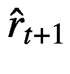
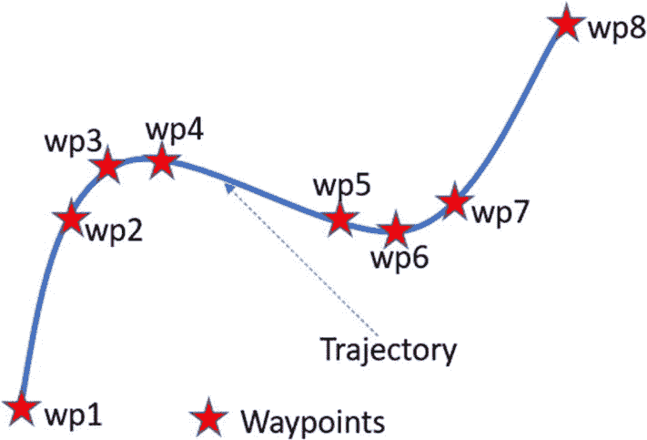
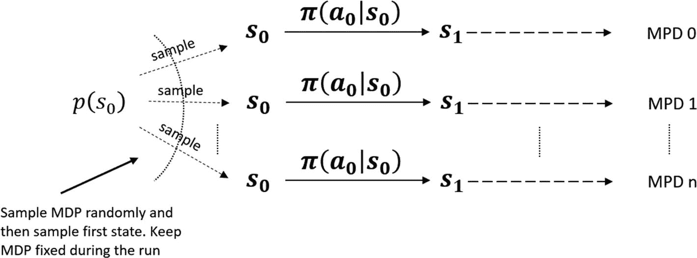

# 10.进一步探索和后续步骤

这是这本书的最后一章。在整本书中，我们深入探讨了强化学习(RL)的许多基础方面。我们用动态规划法研究了 MDP 和 MDP 的规划。我们研究了无模型价值方法。我们讨论了使用函数逼近的放大解决方案技术，特别是通过使用基于深度学习的方法，如 DQN。我们研究了基于政策的方法，如强化、TRPO、PPO 等。我们在行动者-批评家(AC)方法中统一了价值和政策优化方法。最后，我们在前一章看了如何结合基于模型和无模型的方法。

这些方法中的大多数都是掌握强化学习的基础。然而，强化学习是一个快速扩展的领域，在自动驾驶汽车、机器人和类似的其他领域有许多专门的用例。这些超越了我们在本书中用来解释概念的问题设置。作为核心主题的一部分，我们不可能涵盖所有新出现的方面。那会使这本书变得非常笨重；此外，许多地区几乎每天都有新的方法出现。

在最后一章中，我们将介绍一些我们认为您应该高度关注的话题。我们将把讨论保持在一个概念性的水平，并在适当的地方提供一些流行的研究/学术论文的链接。你可以根据你在 RL 领域的个人兴趣，使用这些参考资料来扩展你的知识范围。与前几章不同，你不会总能找到详细的伪代码或实际的代码实现。这样做是为了提供一些新兴领域和新进展的旋风之旅。你应该利用这一章对不同的主题有一个 30，000 英尺的了解。基于您的特定兴趣，您应该使用这里给出的参考资料作为起点，深入研究特定的主题。

我们还会谈到一些流行的图书馆和继续学习的方法。

## 基于模型的 RL:其他方法

在前一章中，我们看了基于模型的 RL，其中我们通过让代理与环境交互来学习模型。然后，所学习的模型被用于生成额外的转换，即，通过与真实世界的实际交互来增加由代理收集的数据。这是 Dyna 算法采用的方法。

虽然 Dyna 有助于加快学习过程，并解决无模型 RL 中出现的一些样本低效问题，但它主要用于简单函数逼近器的问题。在需要大量样本来训练的深度学习函数逼近器中，它还没有成功；由于模拟器精确模拟世界的能力不完善，来自模拟器的太多训练样本会降低学习质量。在这一节中，我们将看看最近在深度学习的背景下将学习模型与无模型方法相结合的一些方法。

### 世界模特

在 2018 年题为“世界模型”的论文中， [1](#Fn1) 作者提出了一种建立生成神经网络模型的方法，这是环境的空间和时间方面的压缩表示，并使用它来训练代理。

我们人类发展了一种对周围世界的心理模型。我们不会存储环境中所有最小的细节。相反，我们存储世界的抽象高级表示，它压缩了世界的空间方面和时间方面以及世界的不同实体之间的关系。我们只存储我们接触过的或与我们相关的世界的一部分。

我们着眼于当前的状态或手头任务的背景，思考我们想要采取的行动，并预测行动将把我们带入的状态。基于这种预测思维，我们选择最佳行动。想想棒球击球手。他有几毫秒的时间来行动，在正确的时间和正确的方向挥动球棒来接球。你认为他是怎么做到的？经过多年的练习，击球手已经开发了一个强大的内部模型，在这个模型中，他可以预测球的未来轨迹，并可以从现在开始挥动球棒，几毫秒后到达轨迹中的准确点。一个好的玩家和一个坏的玩家之间的区别很大程度上归结于玩家基于其内部模型的预测能力。多年的实践使整个事情变得直观，而无需在头脑中进行大量有意识的规划。

在论文中，作者展示了他们如何使用一个大型/强大的循环神经网络(RNN)模型(他们称之为*世界模型*)和一个小型控制器模型来实现这种预测内部模型。小控制器模型的原因是将信用分配问题保持在界限内，并且在训练期间使策略迭代得更快。同时，大的“世界模型”允许它保留拥有环境的良好模型所需的所有空间和时间表达性，并拥有小的控制器模型以在训练期间将策略搜索集中在快速迭代上。

作者探索了在生成的世界模型上训练代理的能力，完全取代了与真实世界的交互。一旦代理在内部模型表示上训练有素，学习到的策略就被转移到现实世界。他们还展示了在内部世界模型中添加一个小的随机噪声的好处，以确保代理不会过度利用学习模型的缺陷。

接下来让我们来看一下所用模型的细分。图 [10-1](#Fig1) 给出了流水线的高级概述。在每一个瞬间，代理接收到来自环境的观察。

图 10-1

“世界观”中使用的代理模型概述转载自 Ha 和 Schmidhuber《循环世界模型促进政策演进》2018 [2](#Fn2)

世界模型由两个模块组成。

*   视觉模型(V)使用来自深度学习的变分自编码器(VAE)将高维图像(观察向量)编码成低维潜在向量。潜向量 *z* ，模块 V 的输出，将观测的空间信息压缩成更小的向量。

*   潜在向量 *z* 被馈送到记忆 RNN (M)模块中，以捕捉环境的时间方面。作为一个 RNN 网络，M 模型压缩了一段时间内发生的事情，并作为一个预测模型。因为许多复杂的环境是随机的，也因为我们学习中的不完善，M 模型被训练来预测下一个状态*P*(*Z**t*+1)的分布，而不是预测确定性的值*Z**t*+1。它通过基于当前和过去(RNN 部分)预测下一个潜在向量*Z**t*+1的分布，作为高斯分布*P*(*Z**t*+1|*a**t*， *z* 的混合这就是为什么它被称为基于循环神经网络 (MDM-RNN)的*混合密度模型。*

控制器模型负责获取空间信息( *z* *t* )和时间信息( *h* *t* )，将它们连接在一起，并馈入单层线性模型。信息的总体流程如下:

1.  代理在时间 *t* 得到一个观察值。观察结果被输入到 V 模型中，V 模型将其编码成一个更小的潜在向量*z*T5】t。

2.  接下来，潜在向量被馈入预测 *z* *t* + 1 ，即 *h* *t* 的 M 模型。

3.  V 和 M 模型的输出被连接并馈入 C 控制器，C 控制器产生动作 *a* *t* 。换句话说，用 *z* *t* 和*z**t*+1，预测 *a* *t* 。

4.  该动作被反馈到现实世界中，并且被 M 模型用来更新其隐藏状态。

5.  现实世界中的动作产生下一个状态/观察，下一个循环开始。

关于伪代码、所用网络的实现细节以及训练中使用的损耗等其他细节，请参考前面引用的论文。在论文中，作者还谈到了他们如何使用预测能力，通过反馈预测 *z* *t* + 1 作为下一个真实世界的观察，来提出假设场景。他们进一步展示了他们如何能够在“梦幻世界”中训练一个智能体，然后将所学知识转移到现实世界中。

### 想象力增强代理(I2A)

如前所述，Dyna 提出了一种结合*无模型*和*基于模型*方法的方法。无模型方法在复杂环境中具有更高的可扩展性，并且已经被认为在深度学习中工作良好。然而，这些不是样本有效的，因为深度学习需要大量的训练样本才能有效。即使是一个简单的雅达利游戏策略培训也可能需要数百万个例子才能得到培训。另一方面，基于模型的是样本高效的。Dyna 提供了一种结合两种优势的方法。除了使用真实世界的过渡来训练代理之外，真实世界的过渡还用于学习用于生成/模拟附加训练示例的模型。然而，问题是*模型学习可能并不完美*，除非考虑到这一事实，否则在复杂的深度学习结合强化学习中直接使用 Dyna 并不能给出好的结果。缺乏模型知识会导致过度乐观和代理人表现不佳。

与之前使用世界模型的方法一样，*想象力增强代理* (I2A)方法结合了基于模型和无模型的方法，使这种结合的方法能够很好地适用于复杂的环境。I2A 形成一个近似的环境模型，并通过“学习解释”学习到的模型缺陷来利用它。它提供了一种端到端的学习方法来提取从模型模拟中收集的有用信息，而不仅仅依赖于模拟的回报。代理人使用内部模型，也称为*想象，*寻求积极的结果，同时避免不利的结果。来自 DeepMind 的作者在其 2018 年题为*想象力增强的深度强化学习代理*[3](#Fn3)的论文中表明，这种方法可以在更少的数据和不完善的模型下更好地学习。**

 **图 [10-2](#Fig2) 详细描述了参考文件中解释的 I2A 架构。

*   图 [10-2(a)](#Fig2) 中的环境模型，在给定当前信息的情况下，对未来做出预测。想象核心(IC)有一个策略网络，它将当前观察(真实的或想象的)作为输入，并产生一个展示动作。观察和首次展示行动被输入到环境模型，一个基于 RNN 的网络，以预测下一次观察和奖励。

*   许多这样的集成电路串在一起，将前一个集成电路的输出馈送到下一个集成电路，并产生一个长度为 *τ* 的*图像展示轨迹*，如图 [10-2(b)](#Fig2) 所示。 *n* 产生这样的轨迹。由于学习模型不能被认为是完美的，仅仅依赖于预测的回报可能不是一个好主意。此外，轨迹可以包含奖励序列之外的信息。因此，每个卷展栏通过顺序处理输出进行编码，以在每个轨迹上获得嵌入，如图 [10-2(b)](#Fig2) 右侧所示。

*   最后，图 [10-2(c)](#Fig2) 中的聚合器将这些单独的 n 个展开组合起来，并作为一个额外的上下文提供给策略网络，以及直接提供观察的无模型路径。

图 10-2

I2A 架构。它描述了(a)中的 IC、(b)中的单个想象力展示以及(c)中的完整 I2A 架构。转载自论文《深度强化学习的想象力-增强代理》，2018 [4](#Fn4)

该论文的作者表明，在步骤(b)中学习卷展编码器在能够很好地处理不完美模型学习中起着重要作用。

### 具有无模型微调的基于模型的 RL(MBMF)

在 2017 年题为*基于模型的深度强化学习的神经网络动力学与无模型微调*的论文中，作者展示了另一种结合无模型和基于模型的 RL 的方法。他们研究了运动任务的领域。训练机器人运动的无模型方法具有高样本复杂性，这是我们在所有基于深度学习的模型中看到的。作者将无模型和基于模型的方法结合起来，提出了样本高效模型，以使用中等复杂性的神经网络来学习具有不同任务目标的运动动力学。**

 **问题假设奖励函数*r*T3】tT5】=*r*(*s**t*， *a* *t* )给定。本文给出了*前进*和*轨迹跟随*的奖励函数的例子。轨迹由稀疏的*路点*显示，这些路点定义了机器人需要遵循的路径。航路点是给定轨迹上的点，当用线连接时，接近给定轨迹，如图 [10-3](#Fig3) 所示。有关如何将航路点用于轨迹规划的更多详细信息，请参考任何关于自动驾驶汽车和机器人的文本。

图 10-3

轨迹和航路点

在任何一点上，机器人计划的行动顺序都要考虑。对于每个动作，连接当前状态和估计的下一状态的线段被投影到连接轨迹的两个连续航路点的最近线段上。如果机器人沿着航路点线段移动，奖励为正，垂直于航路点线段移动，奖励为负。类似地，他们对*前进*的目标有另一套奖励函数。

神经网络正在学习动力学。但是，网络不是预测 s * t * + 1 ，而是取( *s* * t * ， *a* * t * )并预测差值*s**t*+1-*s**t*。预测差异而不是整个新状态会放大变化，并允许捕捉微小的变化。

奖励函数和动态模型被馈送到*模型预测控制器* (MPC)。MPC 接受奖励和下一个状态，使用预测的 *s* *t* + 1 作为预测*s**t*+2的新输入，提前计划 *H* 步骤，以此类推。 *K 个*随机生成的动作序列，每个长度为 *H* 步，进行评估，根据 *K 个*序列中最高的累积奖励，找到初始时间步 ***t*** 的最佳动作。然后机器人采取动作*a*T28】T29】tT31】。此时，样本序列被丢弃，并且在时间 *t* + 1 完成下一个 *K* 序列的完全重新计划，每个序列的长度为 *H* 。使用该模型的预测控制器(而不是开环方法)确保误差不会向前传播。每一步都有重新计划。图 [10-4](#Fig4) 给出了完整算法。

MODEL-BASED REINFORCEMENT LEARNING

图 10-4

MBMF 算法

一旦模型被训练，为了进一步改进模型，作者通过初始化一个无模型代理来微调它，该代理具有如前面所示训练的基于模型的学习者。无模型训练可以用我们以前学过的任何一种方法来完成。这就是将其命名为*基于模型，无模型微调* (MBMF)的原因。

### 基于模型的价值扩展(MBVE)

在 2018 年题为“基于模型的价值扩展，用于高效的无模型强化学习”的论文中， [5](#Fn5) 作者采用了将基于模型和无模型的方法与已知的奖励函数相结合的方法，以获得更有纪律的价值估计方法。

该算法通过学习系统动力学来模拟轨迹的短期视界，通过 Q 学习来估计长期值。这通过为训练提供更高质量的目标值来改进 Q 学习。

作者显示了将 MBVE 与 DDPG 组合与普通 DDPG 相比的性能，并证明了通过将 MBVE 与 DDPG 组合的显著改善。

## 模仿学习和逆向强化学习

还有一个学习分支叫做*模仿学习*。通过它，我们可以记录专家的互动，然后使用监督设置来学习可以模仿专家的行为。

如图 [10-5](#Fig5) 所示，我们有一个专家查看状态*s*T5】t并产生动作 *a* *t* 。我们在监督设置中使用该数据，其中状态 *s* *t* 作为模型的输入，动作 *a* *t* 作为学习策略πθ(*a**t*|*s**t*的目标这是学习一种行为最简单的方法，叫做*行为克隆*。它甚至比强化学习的整个学科还要简单。系统/学习者不分析或推理任何事情；它只是盲目地学习模仿专家的行为。

图 10-5

专家论证

然而，学习并不完美。假设你学习了一个近乎完美的政策，但有一些小错误，假设你从状态 *s* 1 开始。你遵循学到的策略采取行动*a*T6】1，这与专家会采取的行动有一点小偏差。你不断地按顺序采取这些行动，有些与专家的行动一致，有些则与专家的行动稍有偏差。这些多次动作的偏差会累积起来，将您的车辆(图 [10-5](#Fig5) )带到道路边缘。现在，最有可能的是，这位专家不会把车开得那么糟糕，开到路的边缘。专家训练数据从未看到专家在这种情况下会做什么。这项政策没有受过这种情况的训练。学习到的策略将最有可能采取随机的行动，并且绝对不是为了纠正错误以将车辆带回到道路中心而设计的。

这是一个*开环问题*。每一个动作的误差都在增加，使得实际轨迹偏离专家轨迹，如图 [10-6](#Fig6) 所示。

图 10-6

轨迹随时间漂移

这也被称为*分布转移*。换句话说，策略训练中的状态分布不同于代理在没有纠正反馈的开放循环中执行策略时看到的状态分布。

在这种情况下，有附加误差，有一种替代算法称为 *DAgger* (用于“数据集聚合”)，其中通过首先根据专家演示的数据训练代理来迭代训练代理。经过训练的策略用于生成附加状态。然后，专家为这些生成的状态提供正确的操作。增加的数据与原始数据一起再次用于微调策略。如此循环下去，代理人在跟随行为方面越来越接近专家。这可以归类为*直接政策学习*。图 [10-7](#Fig7) 给出了匕首的伪代码。

DAGGER

图 10-7

行为克隆匕首

DAgger 有一个人类专家标记看不见的状态，因为 Figure [10-7](#Fig7) 策略被执行，它训练代理从错误/漂移中恢复。匕首简单高效。然而，它只是行为克隆而不是强化学习。除了试图学习一种行为来跟随专家的动作之外，它不考虑任何事情。如果专家覆盖了代理可能看到的状态空间的很大一部分，这个算法可以帮助代理学习一个好的行为。然而，任何需要长期规划的事情都不适合 DAgger。

如果不是强化学习，为什么在这里说？事实证明，在许多情况下，让专家进行演示是理解代理试图实现的目标的好方法。当与其他增强相结合时，模仿学习是一种有用的方法。我们将讨论这样一个问题。

到目前为止，在本书中我们已经研究了各种算法来训练代理。对于一些算法，我们知道动态和转换，如基于模型的设置，在其他算法中，我们在无模型设置中学习，而没有显式学习模型，最后在其他算法中，我们从与世界的交互中学习模型，以增强无模型学习。然而，在所有这些情况下，我们认为奖励是简单的，直观的，众所周知的。在其他一些情况下，我们可以手工制作一个简单的奖励函数，例如，学习使用 MBMF 跟踪一个轨迹。但所有现实世界的案例都没有这么简单。奖励有时是不明确的和/或稀疏的。在没有明确奖励的情况下，以前的算法都不起作用。

考虑这样一种情况，你正试图训练一个机器人拿起一壶水，把水倒在一个玻璃杯里。整个序列中每个动作的回报是什么？当机器人能够将水倒入玻璃杯，而不会将水洒在桌子上或打碎/掉落水壶/玻璃杯时，它会是 1 吗？还是会根据洒了多少水来定义一个奖励范围？你将如何诱导一种行为让机器人像人类一样学习流畅的动作？你能想出一种奖励，能够给机器人提供正确的反馈，告诉它什么是好的一步，什么是坏的一步吗？

现在看看另一种情况。机器人可以看到人类完成倒水的任务。它不是学习一种行为，而是首先学习一种奖励功能，将所有与人类行为匹配的行为记录为好，其他行为为坏，好的程度取决于与它看到的人类行为的偏离程度。然后，作为下一步，它可以使用所学习的奖励函数来学习执行类似动作的策略/动作序列。这是*逆强化学习* *再加上模仿学习*的领域。

表 [10-1](#Tab1) 比较了行为克隆、直接策略学习和反向 RL。

表 10-1

模仿学习的类型

<colgroup><col class="tcol1 align-left"> <col class="tcol2 align-left"> <col class="tcol3 align-left"> <col class="tcol4 align-left"> <col class="tcol5 align-left"> <col class="tcol6 align-left"></colgroup> 
|   | 

直接政策学习

 | 

奖励学习

 | 

接触环境

 | 

交互式演示者/专家

 | 

预先收集的演示

 |
| --- | --- | --- | --- | --- | --- |
| 行为克隆 | 是 | 不 | 不 | 不 | 是 |
| 直接政策学习 | 是 | 不 | 是 | 是 | 可选择的 |
| 逆向强化学习 | 不 | 是 | 是 | 不 | 是 |

反向强化学习是 MDP 设置，其中我们知道模型动态，但我们不知道奖励函数。数学上，我们可以表达如下:

![$$ {\uppi}^{\ast }= argma{x}_{\uppi}{E}_{\uppi}\left[{r}^{\ast}\left(s,a\right)\right] $$](img/502835_1_En_10_Chapter_TeX_Equc.png)

图 [10-8](#Fig8) 显示了逆 RL 的高级伪代码。我们从专家那里收集样本轨迹，并用它们来学习奖励函数。接下来，使用学习到的奖励函数，我们学习一个使奖励最大化的策略。将学习到的策略与专家进行比较，并使用差异来调整学习到的奖励。如此循环下去。

INVERSE RL

图 10-8

逆向强化学习

请注意，内部 *do 循环*有一个迭代学习策略的步骤(步骤 2，“学习策略给定奖励函数”)。它实际上是一个抽象成单行伪代码的循环。当状态空间是连续的和高维的，以及当系统动力学未知时，我们需要调整以使之前的方法工作。在 2016 年题为“引导成本学习:通过政策优化进行深度逆最优控制”的论文中， [6](#Fn6) 作者使用了最大熵逆 RL [7](#Fn7) 的基于样本的近似。您可以查看之前引用的论文以了解更多详细信息。图 [10-9](#Fig9) 显示了该方法的高级示意图。

图 10-9

引导成本学习:通过政策优化的深度逆最优控制

该架构可以比作来自深度学习的*生成对抗网络* (GANs)。在 GAN 中，*发生器网络*试图产生合成样本，*鉴别器网络*试图给实际样本打高分，而给合成样本打低分。生成器试图更好地生成越来越难以从“真实世界的例子”中区分的例子，而鉴别器在区分合成和真实世界的例子方面变得越来越好。

同样，图 [10-9](#Fig9) 中给出的引导成本学习可以被认为是一个 GAN 设置，其中鉴别器在给予人类观察高回报的同时给予政策网络生成的行动/轨迹低回报。政策网络在产生类似人类专家的行动方面变得越来越好。

结合模仿学习的逆向学习有很多用途。

*   *制作动画电影中的角色*:可以随着角色说的话同步移动面部和嘴唇。人类专家的面部/嘴唇运动首先被记录下来(除了演示)，一个策略被训练成使角色的面部/嘴唇像人类一样运动。

*   *词性标注*:这是基于一些专家/人工标注。

*   *平滑模仿学习*:让一个自主摄像机跟随篮球这样的比赛，类似于人类操作会做的事情，跟随球穿过球场，根据某些事件缩放和平移。

*   *协调的多智能体模仿学习*:观看足球比赛(人类专家示范)的录像，然后学习一个策略，根据序列预测球员的下一个位置。

模仿学习是一个迅速扩展的领域。我们只是简单地介绍了一下这个话题。有很多好地方可以开始探索这些主题。关于模仿学习的 ICML2018 教程是一个很好的起点。这是一个两小时的视频教程，由加州理工学院的两位专家提供幻灯片。

## 无导数方法

让我们回到我们在本书主要部分看到的常规无模型 RL。在这一节中，我们将简要地谈一谈允许我们改进政策的方法，而不用对政策参数θ求导π θ ( *a* | *s* )。

我们将看看进化的方法。它们为什么会进化？因为它们像自然进化一样运作。更好/更适合的东西生存下来，更弱的东西逐渐消失。

我们看到的第一种方法叫做*交叉熵方法*。这简单得令人尴尬。

1.  选择一个随机政策。

2.  展开几个会话。

3.  选择一定比例的奖励较高的会议。

4.  改进策略以增加选择这些操作的概率。

图 [10-10](#Fig10) 给出了训练一个连续动作策略的交叉熵方法的伪代码，假设该策略是一个具有 d 维动作空间的正态分布。也可以使用任何其他分布，但是对于许多领域，已经表明正态分布在平衡分布的可表达性和分布的参数数量方面是最好的。

CROSS-ENTROPY METHOD

图 10-10

交叉熵方法

一种叫做*协方差矩阵自适应进化策略* (CMA-ES)的类似方法在图形世界中很流行，用于优化角色的步态。在交叉熵方法中，我们将对角线高斯拟合到前 k%的展开。然而，在 CMA-ES 中，我们优化了协方差矩阵，与通常的导数方法中的一阶模型学习相比，它相当于二阶模型学习。

交叉熵方法的一个主要缺点是，它们对于相对低维的动作空间，如`CartPole`、`LunarLander`等，工作得很好。进化策略可以为具有高维行动空间的深度网络策略服务吗？在 2017 年题为“进化策略作为强化学习的可扩展替代方案”的论文中， [9](#Fn9) 作者表明，es 可以可靠地训练神经网络策略，这种方式非常适合于扩大到现代分布式计算机系统，用于在 MuJoCo 物理模拟器中控制机器人。

让我们从概念上介绍一下本文中采用的方法。考虑一个政策参数的概率分布:θ∽*P*μ(θ)。这里θ表示策略的参数，这些参数遵循μ参数化的某种概率分布*P**μ*(*θ*)。

我们的目标是找到政策参数 *θ* ，使其生成最大化累积回报的轨迹。这类似于我们对政策梯度方法的目标。

![$$ Goal:\mathit{\operatorname{maximize}}{E}_{\uptheta \sim {P}_{\upmu}\left(\uptheta \right),\uptau \sim {\uppi}_{\uptheta}}\left[R\left(\uptau \right)\right] $$](img/502835_1_En_10_Chapter_TeX_Equd.png)

与政策梯度一样，我们做随机梯度上升，但与政策梯度不同，我们不在θ中这样做，而是在μ空间中这样做。

![$$ {\nabla}_{\upmu}{E}_{\uptheta \sim {P}_{\upmu}\left(\uptheta \right),\uptau \sim {\uppi}_{\uptheta}}\left[R\left(\uptau \right)\right]={E}_{\uptheta \sim {P}_{\upmu}\left(\uptheta \right),\uptau \sim {\uppi}_{\uptheta}}\left[{\nabla}_{\upmu}\mathit{\log}{P}_{\upmu}\left(\uptheta \right)R\left(\uptau \right)\right] $$](img/502835_1_En_10_Chapter_TeX_Equ1.png)

(10.1)

前面的表达式类似于我们在政策梯度中看到的。然而，有一个微妙的区别。我们不是在θ上做梯度步长。因此，我们不用担心π θ ( *a* | *s* )。我们忽略了关于轨迹的大部分信息，即状态、动作和奖励。我们只担心政策参数θ和总轨迹报酬 *R* (τ)。这反过来支持非常可扩展的分布式培训，类似于运行多个工作人员的 A3C 方法，如图 [7-10](#Fig10) 所示。

我们来举一个具体的例子。假设*θ*∾*P*T5】μ(*θ*)是均值为μ的高斯分布，协方差矩阵为σ 2 。*我*。那么( [10.1](#Equ1) )中“期望”内部给出的*logP**μ*(*θ*)可以表示如下:

取上一表达式相对于μ的梯度，我们得到:

假设我们绘制两个参数样本θ 1 和θ 2 ，得到两个轨迹:τ 1 和τ 2 。

![$$ {E}_{\uptheta \sim {P}_{\upmu}\left(\uptheta \right),\uptau \sim {\uppi}_{\uptheta}}\left[{\nabla}_{\upmu}\mathit{\log}{P}_{\upmu}\left(\uptheta \right)R\left(\uptau \right)\right]\approx \frac{1}{2}\left[R\left({\uptau}_1\right)\frac{\uptheta_1-\mu }{\upsigma^1}+R\left({\uptau}_2\right)\frac{\uptheta_2-\mu }{\upsigma^2}\right] $$](img/502835_1_En_10_Chapter_TeX_Equ2.png)

(10.2)

这仅仅是将( [10.1](#Equ1) 中的期望值转换为基于两个样本的估计值。你能解释方程式( [10.2](#Equ2) )吗？这个分析类似于我们在第七章[中所做的。如果轨迹的回报是+ve，我们调整均值μ以接近θ。如果轨迹回报是-ve，我们将μ从采样的θ移开。换句话说，就像政策梯度一样，我们调整μ来增加好轨迹的概率，减少坏轨迹的概率。然而，我们这样做是通过直接调整参数来源的分布，而不是调整政策所依赖的θ。这允许我们忽略状态和动作等的细节。](07.html)

之前引用的论文使用了*对立采样*。换句话说，它采样一对带有镜像噪声的策略(*θ*+=*μ*+*σϵ*，*θ*-=*μ*-*σϵ*)，然后采样两个轨迹τ + 和τ-以评估([10.2【t22 将这些代入(](#Equ2) [10.2](#Equ2) ，表达式可简化如下:

![$$ {\nabla}_{\upmu}E\left[R\left(\uptau \right)\right]\approx \frac{\upepsilon}{2\upsigma}\left[R\left({\uptau}_{+}\right)+R\left({\uptau}_{-}\right)\right] $$](img/502835_1_En_10_Chapter_TeX_Equg.png)

前面的操作允许在工人和参数服务器之间有效地传递参数。开始的时候，μ是已知的，只需要沟通ϵ，减少了需要来回传递的参数数量。它在使方法并行化方面带来了显著的可伸缩性。

图 [10-11](#Fig11) 显示了并行化的进化策略伪代码。

PARALLELIZED EVOLUTION STRATEGIES

图 10-11

并行化进化策略算法 2 [10](#Fn10)

论文作者报告了以下内容:

*   他们发现，使用虚拟批量标准化和神经网络策略的其他重新参数化大大提高了进化策略的可靠性。

*   他们发现进化策略方法是高度并行的(如前所述)。特别是，使用 1，440 名工人，它能够在不到 10 分钟的时间内解决 MuJoCo 3D 人形任务。

*   进化策略的数据效率出奇的好。一个小时的 ES 结果需要的计算量与公布的异步优势因素评论家(A3C)一天的结果大致相同。在 MuJoCo 任务上，我们能够匹配 TRPO 学习到的政策表现。

*   ES 表现出比 TRPO 等策略梯度方法更好的探索行为。在 MuJoCo 人形任务上，ES 已经能够学习各种各样的步态(比如侧着走或者倒着走)。TRPO 从未观察到这些不寻常的步态，这表明了一种性质不同的探索行为。

*   他们发现进化策略方法是稳健的。

如果你有兴趣，你应该通读参考文件，深入了解细节，看看它与其他方法相比如何。

## 迁移学习和多任务学习

在前几章中，我们研究了如何使用 DQN 和策略梯度算法来训练代理人玩 Atari 游戏。如果你查阅展示这些实验的论文，你会注意到一些 Atari 游戏更容易训练，而一些则更难训练。如果你看看 Atari 游戏《突围》与《蒙特祖马的复仇》，如图 [10-12](#Fig12) 所示，你会注意到，与训练蒙特祖马相比,《突围》更容易训练。这是为什么呢？

图 10-12

雅达利游戏简单易学

突围有简单的规则。但是，图 [10-12](#Fig12) 右侧蒙特祖马的复仇有一些复杂的规则。它们不容易学。作为一个人，即使我们是第一次玩这个游戏，并且事先不知道确切的规则，我们知道“钥匙”是我们通常用来打开新东西和/或获得大奖励的东西。我们知道“梯子”可以用来爬上爬下，而“头骨”是要避免的。换句话说，我们过去玩过其他游戏或读过寻宝游戏或看过一些电影的经验给了我们背景，或以前的学习，让我们快速执行我们可能从未见过的新任务。

事先了解问题结构可以帮助我们快速解决新的复杂任务。当代理解决先前的任务时，它获得有用的知识，可以帮助代理解决新的任务。但是这些知识储存在哪里呢？以下是一些可能的选项:

*   Q 函数:它们告诉我们什么是好的状态和行为。

*   政策:它们告诉我们哪些行为是有用的，哪些是无用的。

*   模型:它们编纂了关于世界如何运转的知识，比如牛顿定律、摩擦、重力、动量等物理定律。

*   *特征/隐藏状态*:神经网络的隐藏层抽象出更高层次的结构和知识，这些结构和知识可以在不同的领域/任务中推广。我们在监督学习的计算机视觉中看到了这一点。

利用从一组任务中获得的经验来更快、更有效地完成新任务的能力称为*迁移学习*，即将从过去经验中获得的知识转移到新任务中。我们看到这在监督学习中有着重要的应用，特别是在计算机视觉领域，在 ImageNet 数据集上训练的 ResNet 等流行的卷积网络架构被用作预训练网络来训练新的视觉任务。我们将简要地看一下这项技术如何应用于强化学习领域。让我们定义一些迁移学习文献中常见的术语。

*   任务:在 RL 中，我们试图训练代理解决的 MDP 问题。

*   *源域*:首先训练代理的问题。

*   *目标领域*:我们希望通过利用来自“源领域”的知识来更快解决的 MDP

*   *Shot* :目标域的尝试次数。

*   *0-shot* :直接在目标域上运行在源域上训练的策略。

*   *1-shot* :在目标域上只重新培训一次经过源域培训的代理。

*   *少量*:在目标域上对源域的训练有素的代理进行几次再培训。

接下来，让我们看看如何在强化学习的背景下将从源领域获得的知识转移到目标领域。在这一点上，已经尝试了三大类方法。

*   *前转*:训练一个任务，转到新任务。

*   *多任务转移*:多任务训练，转移到新任务。

*   *传送型号和值* *功能*。

我们将简要讨论每一种方法。*正向迁移*是监督学习中，尤其是计算机视觉中最常见的知识迁移方式之一。一个模型，如流行的架构 ResNet，被训练来对 ImageNet 数据集上的图像进行分类。这叫做*预训练*。然后通过替换最后一层或最后几层来改变训练的模型。该网络接受了一项名为*微调*的新任务的再培训。然而，强化学习中的正向迁移会面临一些领域转换的问题。换句话说，在源域中学习的表征在目标域中可能不太适用。此外，MDP 也有所不同。换句话说，某些事情在源域中是可能的，而在目标域中是不可能的。还有微调的问题。例如，在源域上训练的策略可能在概率分布上具有尖锐的峰值，几乎接近确定性。这种 pekad 分布可能会妨碍对目标域进行微调时的探索。

监督学习中的迁移学习似乎工作得很好，这可能是因为 ImageNet 数据集中的大量不同图像有助于网络学习非常好的通用表示，然后可以针对特定任务进行微调。然而，在强化学习中，任务通常很少多样化，这使得代理更难学习高级概括。此外，还存在策略过于确定的问题，这阻碍了在微调期间探索更好的收敛。这个问题可以通过使策略在具有熵正则项的目标的源域上学习来处理，这是我们在前面章节的几个示例中看到的，例如第 [8](08.html) 章中的软行为者批评(SAC)。熵正则化确保在源系统上学习的策略保留足够的随机性，以允许在微调期间进行探索。

还有另一种方法可以使源领域的学习更加通用。我们可以给源域添加一些随机化。比方说，我们正在训练一个机器人去完成某项任务；我们可以用机器人每个手臂的不同质量或摩擦系数来实例化源域的许多版本。这将诱导代理学习底层物理，而不是记忆在特定配置中做得好。在另一个涉及图像的真实世界设置中，我们可以再次借鉴计算机视觉的“图像增强”实践，其中我们用一些随机旋转、缩放等来增强训练图像。

接下来，我们来看看多任务迁移，这是迁移学习的第二种方法。这里有两个关键的想法:加速一起执行的所有任务的学习，并解决多个任务，以便为目标领域提供更好的预训练。

一种在多任务上训练代理的简单方法是用表示特定任务的代码/指示符来扩充状态，例如，将状态 *S* 扩展为( *S* + *指示符*)。当一集开始时，系统随机选择一个 MDP(任务)，然后根据初始状态分布选择初始状态。然后像其他 MDP 一样进行训练。图 [10-13](#Fig13) 显示了这种方法的示意图。这种方法有时会很困难。想象一下，一项政策在解决特定的 MDP 方面变得越来越好；优化将开始以牺牲他人为代价优先学习那个 MDP。

图 10-13

一起解决多项任务

我们也可以训练代理分别解决不同的任务，然后结合这些学习来解决一个新的任务。我们需要以某种方式将从不同任务中学到的策略组合/提炼成一个单一的策略。有多种方法可以实现这一点，我们在这里就不赘述了。

让我们看看多任务转移的另一种变化:*单个代理在同一环境中学习两个不同的任务*。一个例子是一个机器人学习洗衣服以及清洗餐具。在这种方法中，我们增加状态来添加任务的上下文并训练代理。这就是所谓的*背景政策*。使用这种方法，状态表示如下:

![$$ \overset{\sim }{s}=\left[\begin{array}{c}s\\ {}\omega \end{array}\right] $$](img/502835_1_En_10_Chapter_TeX_Equh.png)

我们学习的政策如下:

这里，ω是上下文，即任务。

最后，还有第三种迁移学习方法，即迁移模型或价值函数。在这个设置中，我们假设源域和目标域中的动态*p*(*s*T5】t+1|*s**t*， *a* *t* )是相同的。但是，奖励函数是不同的；例如，自动驾驶汽车学习驾驶到一小组地方(源域)。然后，它必须导航到新的目的地(目标域)。我们可以转移三者中的任何一个:模型、价值函数或策略。模型是一个合乎逻辑的选择并且简单的转移，因为模型*p*(*s**t*+1|*s*|*t*， *a* *t* )原则上是独立于奖励函数的。转移策略通常是通过上下文策略来完成的，但是由于策略πθ(*a*|*s*)包含的关于动态函数的信息最少，因此转移策略并不容易。价值函数传递也不是那么简单。价值函数耦合了动力、回报和政策。

我们可以使用后继特征和表征进行价值转移，其细节可以在详述迁移学习的文本中找到。

## 元学习

我们已经研究了让代理从经验中学习的各种方法。但这是人类学习的方式吗？当前的人工智能系统擅长掌握一项技能。我们有像 AlphaGo 这样的代理人，他们打败了最好的人类围棋选手。IBM Watson 击败了最佳人类危险游戏选手。但是 AlphaGo 会玩桥牌这种卡牌游戏吗？危险代理可以进行智能聊天吗？特技飞行的专家直升机操控员可以用来执行救援任务吗？相比之下，人类学会在许多新的情况下聪明地行动，利用他们过去的经验或当前的专业知识。

如果我们希望代理能够获得跨不同领域的许多技能，我们不能以数据低效的方式为每个特定任务训练代理——当前 RL 代理的方式。为了获得真正的人工智能，我们需要代理能够通过利用他们过去的经验来快速学习新任务。这种*学习*的方法被称为*元学习*。这是使 RL 智能体像人一样，根据经验不断学习和提高，有效地完成各种任务的关键一步。

元学习系统在许多不同的任务(元训练集)上被训练，然后在新的任务上被测试。术语*元学习*和*迁移学习*可能会混淆。这些是不断发展的学科，术语的使用并不一致。然而，区分它们的一个简单方法是将元学习视为学习优化模型的超参数(例如，节点数量、架构),将迁移学习视为微调已经调好的网络。

在元学习期间，有两种优化在起作用:学习者，它学习(优化)任务；以及元学习者，它训练(优化)代理。元学习方法有三大类。

*   循环模型(Recurrent models):这种方法通过元训练集中的任务片段来训练一种循环模型，如长短期记忆(LSTM)。

*   *度量学习*:在这种方法中，代理学习一个新的度量空间，在这个空间中学习是有效的。

*   学习优化者:在这种方法中，有两个网络:元学习和学习者。元学习者学习更新学习者网络。元学习者可以被认为是学习优化模型的超参数，而学习者网络可以被认为是用于预测动作的规则网络。

这是一个很有潜力的有趣的研究领域。感兴趣的读者可以参考机器学习国际会议(ICML-2019)的一篇精彩教程。 [11](#Fn11)

## 流行的 RL 图书馆

我们将简要地看一下用于强化学习的流行库。有典型的三类:实现一些流行环境的库，负责深度学习的库，以及实现我们在本书中看到的许多流行 RL 算法的库。

就增强现实环境而言，开放体育馆 [12](#Fn12) 是迄今为止最受欢迎的图书馆。有不同类型的环境，从简单的经典控制到雅达利游戏到机器人。如果你想使用雅达利游戏，你将需要额外的安装。有一个流行的库，使用一个叫做 MuJoCo 的物理模拟器来执行连续控制任务。MuJoCo [13](#Fn13) 需要付费许可。然而，它提供了一个免费的试用许可证以及一个免费的学生许可证。雅达利的游戏也需要额外安装，但都是免费的。

我们已经尝试了健身房的一些环境。作为下一步的一部分，你应该看看许多其他环境，尝试各种学习算法，无论是手工制作的还是流行的 RL 库中的实现。

接下来是深度学习库。有很多，但最受欢迎的是谷歌的 TensorFlow 和脸书的 PyTorch。另一个库，来自深层思想的十四行诗， [14](#Fn14) 建立在 TensorFlow 之上，抽象常见模式。Apache MXNet 是另一个流行的库。还有一些，但提到的是目前最受欢迎的。我们建议您掌握其中一个流行的库，然后分支学习其他流行的深度学习库。目前，PyTorch 正在获得超过 TensorFlow 的巨大牵引力。你可以选择这两个中的任何一个作为你的第一个深度学习库，并在扩展到其他库之前先掌握它。

最后一类是实现通用 RL 算法的流行库。我们在这里列出了受欢迎的几个:

*   *open ai Spinning Up*[15](#Fn15):这是进一步扩展您的知识并深入了解实现基础的理想选择。本书中的一些代码演练是 Spinning Up 实现的修改版本。

*   *OpenAI 基线* [16](#Fn16) : OpenAI 基线是一套强化学习算法的高质量实现。这些算法使研究界更容易复制、提炼和识别新想法，然后创建良好的基线来进行研究。

*   *稳定基线* [17](#Fn17) :稳定基线是基于 OpenAI 基线的 RL 算法的一组改进实现。

*   *Garage*[18](#Fn18):Garage 是一个开发和评估强化学习算法的工具包。它附带了一个使用该工具包构建的最新实现库。

*   *Keras RL*[19](#Fn19):Keras RL 用 Python 实现了一些最先进的深度强化学习算法，并与深度学习库 Keras 无缝集成。此外，Keras RL 与 OpenAI 健身房合作。这意味着评估和试验不同的算法很容易。

*   *tensor force*[20](#Fn20):tensor force 是一个开源的深度强化学习框架，强调模块化的灵活库设计和在研究和实践中应用的简单易用性。TensorForce 建立在 Google 的 TensorFlow 框架之上，需要 Python 3。

可能还有很多，新的总是会出现。然而，前面的列表已经很大了。正如我们所说，您应该选择一个深度学习库、一个环境框架和一个 RL 实现。首先，我们推荐 TensorFlow 的 PyTorch 和 Gym and Spinning Up。

## 如何继续学习

深度强化学习有了很大的发展，这是今天让代理从经验中学习智能行为的最受欢迎的方法。我们希望这本书只是你的一个开始。我们希望你能继续了解这个令人兴奋的领域。您可以使用以下资源继续学习:

*   寻找课程和在线视频来扩展知识。麻省理工学院、斯坦福大学和加州大学伯克利分校有许多在线课程，这些课程是深入研究这一学科的合理选择。有一些来自 Deep Mind 和该领域其他专家的 YouTube 视频。

*   养成定期访问 OpenAI 和 Deep Mind 网站的习惯。他们有大量补充研究论文的材料，并且是我们在本书中看到的许多算法的基础。

*   为强化学习领域的新论文设置一个谷歌提醒，并尝试跟踪这些论文。阅读研究论文是一门艺术，斯坦福大学的吴恩达教授就如何掌握一门学科给出了一些有用的建议；参见 [`https://www.youtube.com/watch?v=733m6qBH-jI`](https://www.youtube.com/watch%253Fv%253D733m6qBH-jI) `.`

最后，不言而喻:请跟随我们在本书中谈到的算法。深入研究构成这些算法基础的论文。尝试自己重新实现代码，或者按照本书附带的笔记本中给出的代码，或者查看实现，特别是在开放的人工智能旋转库中。

## 摘要

这一章是围绕强化学习的各种新兴主题的旋风之旅，我们无法在本书的核心章节中深入探讨。

我们在前面的章节里讲了很多。然而，还有同样多的主题是我们在前面的章节中无法涵盖的。这一章的目的是通过谈论这些被忽略的话题，让读者对强化学习有一个快速的 360 度的了解。因为我们有很多内容要介绍，所以重点是提供一个高层次的概述，并提供进一步深入研究的指针。

<aside aria-label="Footnotes" class="FootnoteSection" epub:type="footnotes">Footnotes [1](#Fn1_source)

[`https://worldmodels.github.io/`](https://worldmodels.github.io/%3B)；[`https://arxiv.org/pdf/1803.10122.pdf`T5】](https://arxiv.org/pdf/1803.10122.pdf)

  [2](#Fn2_source)

[T2`https://worldmodels.github.io/`](https://worldmodels.github.io/)

  [3](#Fn3_source)

[T2`https://arxiv.org/pdf/1707.06203.pdf`](https://arxiv.org/pdf/1707.06203.pdf)

  [4](#Fn4_source)

[T2`https://arxiv.org/pdf/1707.06203.pdf`](https://arxiv.org/pdf/1707.06203.pdf)

  [5](#Fn5_source)

[T2`https://arxiv.org/pdf/1803.00101.pdf`](https://arxiv.org/pdf/1803.00101.pdf)

  [6](#Fn6_source)

[T2`https://arxiv.org/pdf/1603.00448.pdf`](https://arxiv.org/pdf/1603.00448.pdf)

  [7](#Fn7_source)

[T2`https://www.aaai.org/Papers/AAAI/2008/AAAI08-227.pdf`](https://www.aaai.org/Papers/AAAI/2008/AAAI08-227.pdf)

  [8](#Fn8_source)

[T2`https://sites.google.com/view/icml2018-imitation-learning/`](https://sites.google.com/view/icml2018-imitation-learning/)

  [9](#Fn9_source)

[T2`https://arxiv.org/pdf/1703.03864.pdf`](https://arxiv.org/pdf/1703.03864.pdf)

  [10](#Fn10_source)

[T2`https://arxiv.org/pdf/1703.03864.pdf`](https://arxiv.org/pdf/1703.03864.pdf)

  [11](#Fn11_source)

[T2`https://sites.google.com/view/icml19metalearning`](https://sites.google.com/view/icml19metalearning)

  [12](#Fn12_source)

[T2`https://gym.openai.com/`](https://gym.openai.com/)

  [13](#Fn13_source)

[T2`http://www.mujoco.org/index.html`](http://www.mujoco.org/index.html)

  [14](#Fn14_source)

[T2`https://github.com/deepmind/sonnet`](https://github.com/deepmind/sonnet)

  [15](#Fn15_source)

[T2`https://spinningup.openai.com/en/latest/`](https://spinningup.openai.com/en/latest/)

  [16](#Fn16_source)

[T2`https://github.com/openai/baselines`](https://github.com/openai/baselines)

  [17](#Fn17_source)

[T2`https://stable-baselines.readthedocs.io/en/master/`](https://stable-baselines.readthedocs.io/en/master/)

  [18](#Fn18_source)

[T2`https://github.com/rlworkgroup/garage`](https://github.com/rlworkgroup/garage)

  [19](#Fn19_source)

[T2`https://github.com/keras-rl/keras-rl`](https://github.com/keras-rl/keras-rl)

  [20](#Fn20_source)

[T2`https://github.com/tensorforce/tensorforce`](https://github.com/tensorforce/tensorforce)

 </aside>****