# 1. 强化学习简介

强化学习（RL）是一种基于奖励和行动的学习算法范式。基于状态的学习范式与通用的监督学习和无监督学习不同，因为它通常不试图在未标记或标记的数据集合中找到结构性的推断。通用强化学习依赖于有限状态自动机和决策过程，这些过程有助于找到基于奖励的优化学习轨迹。强化学习领域高度依赖于目标寻求、随机过程和决策理论算法，这是一个活跃的研究领域。随着高级深度学习算法的发展，该领域取得了巨大的进步，以创建能够通过梯度收敛技术和复杂的基于记忆的神经网络实现目标的自我学习智能体。本章将重点介绍马尔可夫决策过程（MDP）、隐藏马尔可夫模型（HMMs）和状态枚举的动态规划、贝尔曼迭代算法，以及价值算法和策略算法的详细说明。在这些所有部分中，都会有相关的 Python 笔记本，以更好地理解概念，以及使用 Unity（版本 2018.x）制作的模拟游戏。

强化学习（RL）学院的基本方面包括智能体和环境的交互。智能体指的是使用学习算法尝试探索奖励的对象。智能体试图通过步骤优化一条合适的路径，以实现奖励的最大化，在这个过程中，它试图避免惩罚状态。环境是智能体周围的一切，包括状态、障碍和奖励。环境可以是静态的，也可以是动态的。在静态环境中，如果智能体有足够的缓冲内存来保留探索不同状态时指向目标的正确轨迹，路径收敛会更快。动态环境对智能体提出了更大的挑战，因为没有确定的轨迹。第二个用例需要足够的深度记忆网络模型，如双向长短期记忆（LSTM），以保留在动态环境中保持静态的关键观察。图示上，通用强化学习可以如图 1-1 所示。

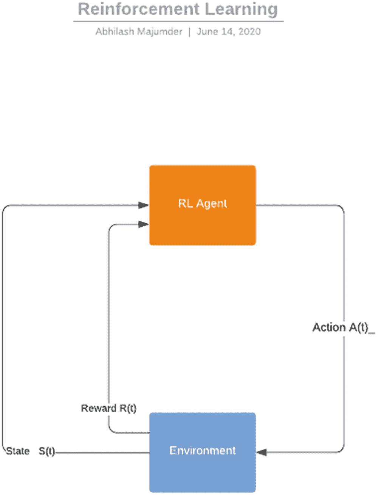

图 1-1

强化学习中智能体与环境的交互

控制和规范智能体与环境之间交互的变量集包括 {状态(S), 奖励(R), 行动(A)}。

+   状态是环境提供的可能枚举状态集合：{s[0], s[1], s[2], … s[n]}。

+   奖励是环境中特定状态下存在的可能奖励集合：{r[0], r[1], r[2], …, r[n]}。

+   行动是智能体可以采取以最大化其奖励的可能行动集合：{A[0], A[1], A[2], … A[n]}。

## OpenAI Gym 环境：CartPole

为了理解这些在强化学习环境中的角色，让我们尝试研究 OpenAI gym 中的 CartPole 环境。OpenAI gym 包含了许多用于研究经典强化学习算法、机器人和深度强化学习算法的环境，并且这些环境在 Unity 机器学习（ML）代理工具包中被用作包装器。

CartPole 环境可以描述为一个经典的物理仿真系统，其中一根杆连接到一个“非驱动”关节到小车上。小车可以自由地在无摩擦的轨道上移动。系统上的约束包括对小车的 +1 和 -1 力的应用。摆锤开始时是竖直的，目标是防止它倒下。每当杆保持竖直时，都会提供 +1 的奖励。当倾斜角度大于 15 度时，游戏结束（惩罚）。如果小车从中心线向任一方向移动超过 2.4 个单位，游戏结束。图 1-2 描述了该环境。

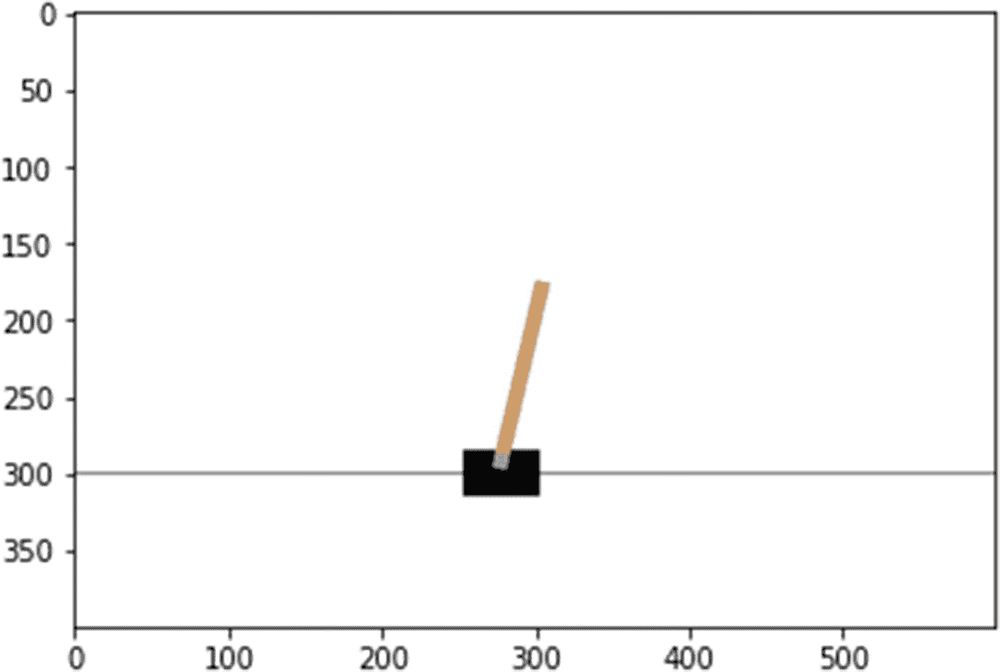

图 1-2

OpenAI gym 中的 CartPole 环境

该环境可能的状态、奖励和动作集合包括：

+   状态：长度为 4 的数组：[小车位置，小车速度，杆角度，杆尖端速度]，例如 [`4.8000002e+00,3.4028235e+38 ,4.1887903e-01,3.4028235e+38`]

+   奖励：每当杆保持竖直时，奖励 +1

+   行动：大小为 2 的整数数组：[左方向，右方向]，控制小车运动的方向，例如 [-1,+1]

+   终止条件：如果小车偏离中心超过 2.4 个单位或摆锤倾斜超过 15 度

+   目标：保持摆锤或杆竖直 250 个时间步，并获得超过 100 分的奖励

## Python for ML Agents 和深度学习的安装和设置

为了可视化此环境，需要安装 Jupyter notebook，可以从 Anaconda 环境中安装。下载 Anaconda（推荐最新版本的 Python），Jupyter notebooks 也会一并安装。

下载 Anaconda 也会安装如 numpy、matplotlib 和 sklearn 等库，这些库用于通用机器学习。Anaconda 还会安装控制台和编辑器，如 IPython 控制台、Spyder、Anaconda Prompt。Anaconda Prompt 应该设置为环境 PATH 变量。终端的预览如图 1-3 所示。

注意

Anaconda Navigator 与 Anaconda 一起安装。这是一个交互式仪表板应用程序，其中提供了下载 Jupyter notebook、Spyder、IPython 和 JupyterLab 的选项。也可以通过点击它们来启动应用程序。


图 1-3

Anaconda 导航器终端

可以使用 pip 命令安装 Jupyter notebook：

```py
pip3 install –upgrade pip
pip3 install jupyter notebook
```

要运行 Jupyter 笔记本，请打开 Anaconda Prompt 或 Command Prompt 并运行以下命令：

```py
jupyter notebook
```

或者，Google Colaboratory（Google Colab）在云端运行 Jupyter 笔记本，并保存在本地 Google Drive 中。这也可以用于笔记本共享和协作。Google Colaboratory 在图 1-4 中展示。

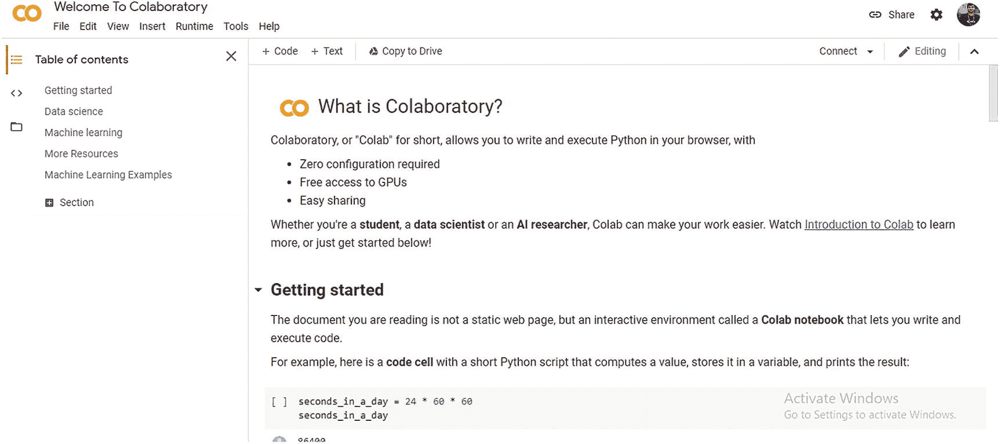

图 1-4

Google Colaboratory 笔记本

首先，创建一个新的 Python3 内核笔记本，并将其命名为 CartPole 环境。为了模拟和运行环境，需要安装某些库和框架。

+   安装 Gym：Gym 是由 OpenAI 创建的环境集合，其中包含用于开发强化学习算法的不同环境。

在 Anaconda Prompt 或 Command Prompt 中运行以下命令：

```py
pip install gym
```

或者从 Jupyter 笔记本或 Google Colab 笔记本运行此命令

+   安装 Tensorflow 和 Keras：Tensorflow 是由 Google 开发的开源深度学习框架，它将被用于创建深度强化学习中的神经网络层。Keras 是 Tensorflow 之上的抽象（API），它包含了 Tensorflow 的所有内置功能，并且易于使用。命令如下：

```py
!pip install gym
```

```py
pip install tensorflow>=1.7
pip install keras
```

这些命令是通过 Anaconda Prompt 或 Command Prompt 进行安装的。本书后面用于 Unity ML 代理的 Tensorflow 版本是 1.7。然而，对于与 Unity ML 代理的集成，也可以使用 Tensorflow 版本 2.0。如果由于版本不匹配出现问题时，可以通过查阅 Unity ML 代理版本和 Tensorflow 兼容性文档来解决，然后可以通过使用 pip 命令重新安装后者。

对于 Jupyter 笔记本或 Colab 的 Tensorflow 和 Keras 安装，需要以下命令：

```py
!pip install tensorflow>=1.7
!pip install keras
```

注意

Tensorflow 每天都会发布带有版本号的夜间构建版本，这可以在 Tensorflow 的 Python 包索引（Pypi）页面中查看。这些构建通常被称为 tf-nightly，可能与 Unity ML 代理存在不稳定的兼容性问题。然而，建议使用官方发布版与 ML 代理集成，而夜间构建也可以用于深度学习。

+   安装 gym pyvirtualdisplay 和 python opengl：这些库和框架（为 OpenGL API 构建而成）将用于在 Colab 笔记本中渲染 Gym 环境。在 Windows 上本地安装 xvfb 存在问题，因此可以使用 Colab 笔记本来显示 Gym 环境的训练。在 Colab 笔记本中的安装命令如下：

```py
!apt-get install –y xvfb python-opengl > /dev/null 2>&1
!pip install gym pyvirtualdisplay > /dev/null 2>&1
```

一旦安装完成，我们就可以深入 CartPole 环境，并尝试获取更多关于环境、奖励、状态和动作的信息。

## 在 CartPole 环境中玩耍用于深度强化学习

打开“Cartpole-Rendering.ipynb”笔记本。它包含设置环境的起始代码。第一部分包含导入语句，用于在笔记本中导入库。

```py
import gym
import numpy as np
import matplotlib.pyplot as plt
from IPython import display as ipythondisplay
```

下一步涉及设置显示窗口的维度，以便在 Colab 笔记本中可视化环境。这使用了 pyvirtualdisplay 库。

```py
from pyvirtualdisplay import Display
display = Display(visible=0, size=(400, 300))
display.start()
```

现在，让我们使用 gym.make 命令从 Gym 加载环境，并查看状态和动作。观察状态是指包含关键因素（如小车速度和杆速度）的环境变量，是一个大小为 4 的数组。动作空间是一个大小为 2 的数组，表示二进制动作（向左或向右移动）。观察空间还包含高值和低值作为问题的边界值。

```py
env = gym.make("CartPole-v0")
#Action space->Agent
print(env.action_space)
#Observation Space->State and Rewards
print(env.observation_space)
print(env.observation_space.high)
print(env.observation_space.low)
```

这在图 1-5 中显示。

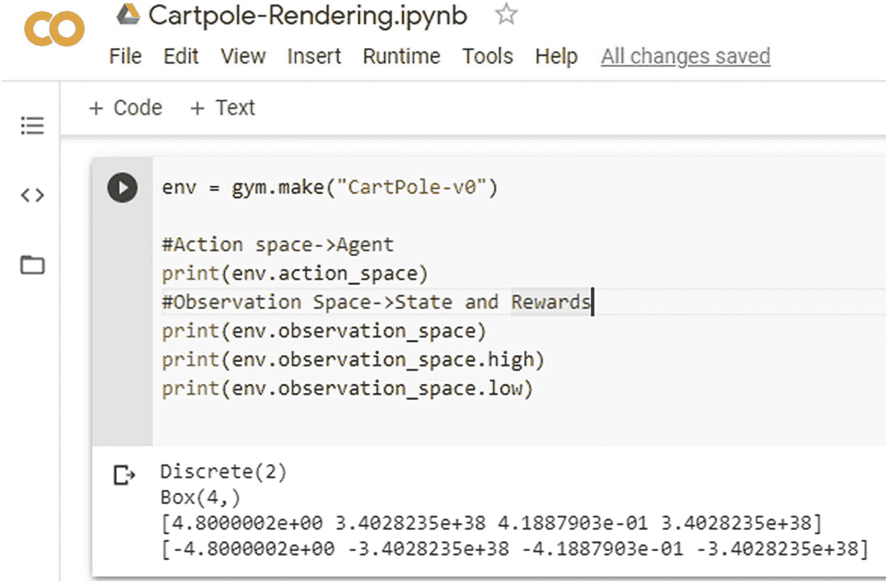

图 1-5

CartPole 环境中的观察和动作空间

运行后，详细信息将出现在控制台中。这些详细信息包括不同的动作空间以及观察步骤。

让我们尝试运行环境 50 次迭代，并检查累积的奖励值。这将模拟环境 50 次迭代，并揭示智能体如何与基准 OpenAI 模型保持平衡。

```py
env = gym.make("CartPole-v0")
env.reset()
prev_screen = env.render(mode='rgb_array')
plt.imshow(prev_screen)
for i in range(50):
action = env.action_space.sample()
#Get Rewards and Next States
obs, reward, done, info = env.step(action)
screen = env.render(mode='rgb_array')
print(reward)
plt.imshow(screen)
ipythondisplay.clear_output(wait=True)
ipythondisplay.display(plt.gcf())
if done:
break
ipythondisplay.clear_output(wait=True)
env.close()
```

环境最初使用 env.reset() 方法重置。对于每次 50 次迭代的每个迭代，env.action_space.sample() 方法尝试采样最有利的状态或奖励状态。采样方法可以使用表格式离散 RL 算法，如 Q 学习，或连续深度 RL 算法，如深度-Q 网络（DQN）。在每个迭代的开始时，有一个折扣因子用于折现上一个时间戳的奖励，智能体将根据这些新奖励寻找。env.step(action) 从“记忆”或先前动作中选择，并试图通过尽可能长时间保持直立来最大化其奖励。在每个动作步骤结束时，显示会改变以渲染杆的新状态。如果迭代完成，循环最终会中断。env.close() 方法关闭与 Gym 环境的连接。

这有助于我们理解状态和奖励如何影响智能体。我们将深入研究建模深度 Q 学习算法的细节，以提供针对 CartPole 问题的更快和更优的基于奖励的解决方案。环境具有离散的观察状态，可以使用表格式 RL 算法，如基于马尔可夫的 Q 学习或 SARSA 解决。

深度学习通过将离散状态转换为连续分布来提供更多优化，然后尝试应用高维神经网络将损失函数收敛到全局最小值。这通过使用 DQN、双深度 Q 网络（DDQN）、对抗 DQN、演员-评论家（AC）、近端策略操作（PPO）、深度确定性策略梯度（DDPG）、信任域策略优化（TRPO）、软演员-评论家（SAC）等算法来实现。笔记本的后半部分包含了一个 CartPole 问题的深度 Q-learning 实现，这将在后续章节中解释。为了突出代码中的一些重要方面，使用 Keras 创建了一个深度学习层，并且对于每个迭代，状态、动作和奖励的收集都存储在重放内存缓冲区中。基于缓冲区内存的先前状态和先前步骤的奖励，杆代理试图在 Keras 深度学习层上优化 Q-learning 函数。

## 使用 TensorBoard 的可视化

训练过程中每个迭代的损失可视化表示了深度 Q-learning 尝试以直立的方式优化杆的位置并平衡动作数组以获得更多奖励的程度。这个可视化是在 TensorBoard 中完成的，可以通过在 Anaconda Prompt 中输入该行来安装。

```py
pip install tensorboard
```

要在 Colab 或 Jupyter Notebook 中启动 TensorBoard 可视化，以下代码行将有所帮助。虽然控制台提示使用最新版本的 Tensorflow (tf>=2.2)，但这并不是强制要求，因为它与所有版本的 Tensorflow 都兼容。使用 Keras 的 Tensorboard 设置也可以使用较旧版本（如 1.12 或更低版本）实现。启动 TensorBoard 的代码段在各个版本中都是相同的。建议在 Colab 中导入这些库，因为在那种情况下，我们可以在运行时灵活升级/降级我们的库（Tensorflow、Keras 或其他）的不同版本。这也帮助解决了本地安装时不同版本之间的兼容性问题。我们也可以在本地为 Tensorflow 1.7 版本安装 Keras 2.1.6。

```py
from keras.callbacks import TensorBoard
% load_ext tensorboard
% tensorboard –-logdir log
```

TensorBoard 在端口 6006 上启动。要将训练数据的各个阶段包含在日志中，将在运行时创建一个单独的日志文件，如下所示：

```py
tensorboard_callback = TensorBoard(
log_dir='./log', histogram_freq=1,
write_graph=True,
write_grads=True,
batch_size=agent.batch_size,
write_images=True)
```

要引用用于存储数据的 tensorboard_callbacks，可以在 model.fit() 方法的参数中添加 callbacks=[tensorboard_callback]，如下所示：

```py
self.model.fit(np.array(x_batch),np.array(y_batch),batch_size=len(x_batch),verbose=1,callbacks=[tensorboard_callback])
```

最终结果显示了一个 Tensorboard 图，如图 1-6 所示：

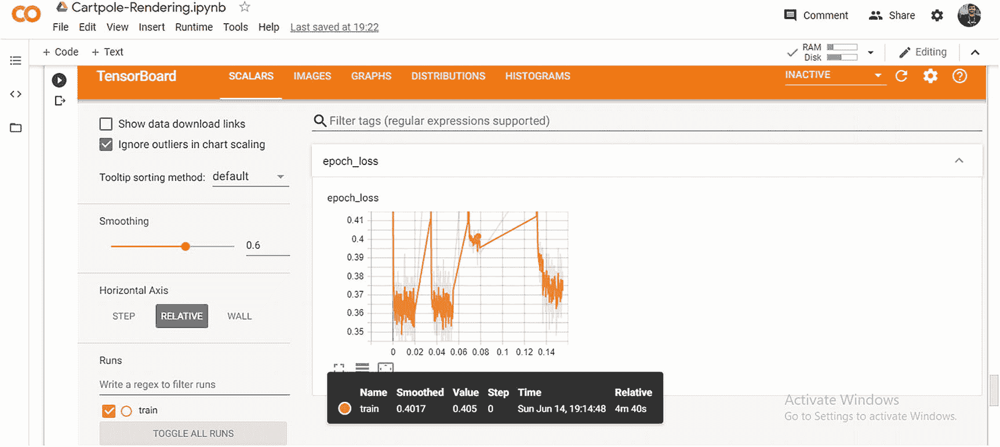

图 1-6

使用深度 Q-learning 的 CartPole 问题 TensorBoard 可视化

总结来说，我们对强化学习（RL）有了初步的了解，以及它是如何由状态、动作和奖励所控制的。我们看到了代理在环境中的作用以及它采取的不同路径以最大化奖励。我们学习了如何设置 Jupyter Notebooks 和 Anaconda 环境，并安装了一些将在过程中广泛使用的关键库和框架。我们以一个经典强化学习问题为例，系统地理解了 OpenAI Gym 的 CartPole 环境，以及环境中的状态和奖励。最后，我们开发了一个 CartPole 环境的微型模拟，该模拟将使杆在 50 次迭代中保持直立，并使用深度 Q 学习模型进行了可视化。详细内容和实现将在后续章节中与 Unity ML agents 一起深入讨论。下一节将涉及使用 Unity 引擎理解 MDP 和决策理论，并将为同一内容创建模拟。

## Unity 游戏引擎

Unity 引擎是一个跨平台引擎，不仅用于创建游戏，还用于模拟、视觉效果、电影摄影、建筑设计、扩展现实应用，尤其是在机器学习领域的研究。我们将集中精力理解 Unity Technologies 开发的开源机器学习框架——即 Unity ML Toolkit。本书撰写时，最新发布的 1.0 版本有几个新功能和扩展、代码修改以及将在后续章节中深入讨论的模拟。该工具包基于 OpenAI Gym 环境作为包装器，并在 Python API 和 Unity C#引擎之间进行通信，以构建深度学习模型。尽管在最新版本中工具包的工作方式发生了根本性的变化，但 ML 工具包的核心功能保持不变。我们将广泛使用 Tensorflow 库与 Unity ML agents 进行深度推理和模型训练，通过自定义 C#代码，并尝试通过使用基线模型来理解 Gym 环境中的学习，以实现最佳性能指标。ML Agents Toolkit 中的环境预览如图 1-7 所示。

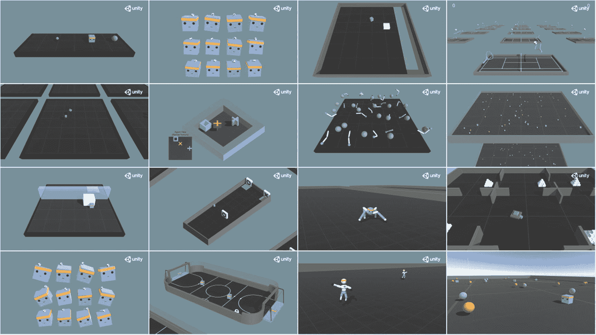

图 1-7

Unity 机器学习工具包

注意

我们将使用 Unity 版本 2018.4x 和 2019，配合 Tensorflow 版本 1.7 和 ML agents Python API 版本 0.16.0 以及 Unity ML agents C#版本(1.0.0)。然而，对于任何高于 2018.4.x 版本的 Unity，功能保持不变。安装 Unity 引擎和 ML agents 的详细步骤将在后续章节中介绍。

## 马尔可夫模型和基于状态的学习

在开始使用 Unity ML Toolkit 之前，让我们了解基于状态的动作学习基础。马尔可夫决策过程（MDP）是一个随机过程，它试图根据当前状态的概率来枚举未来状态。一个有限的马尔可夫模型依赖于表示为 *q*(s, a)* 的当前状态信息，它包括状态-动作对。在本节中，我们将关注如何在 Unity 引擎中生成不同决策之间的转移状态，以及基于这些转移创建模拟。我们将介绍状态枚举和隐马尔可夫模型（HMM）如何帮助智能体在环境中找到适当的轨迹以在 Unity 中获得奖励。

有限 MDP 可以被视为集合：{S, A, R}，其中奖励 R 类似于状态空间 S 中奖励的任何概率分布。对于状态 *s*[*i*] € *S* 和 *r*[*i*] *€ R* 的特定值，在给定先前状态和动作的特定值的情况下，在时间 *t* 发生这些值的概率，其中 | 表示条件概率：

p (s[i], r[i] | s, a) = P[r] {S[t] = s[i], R[t] = r[i] | S[t-1] = s, A[t-1] = a}

决策过程通常涉及一个转移概率矩阵，它提供了特定状态向前移动到另一个状态或返回其先前状态的概率。马尔可夫模型的图示视图可以如图 1-8 所示：

注意

安德烈·安德烈耶维奇·马尔可夫在 1906 年将马尔可夫链的概念引入到随机过程中。

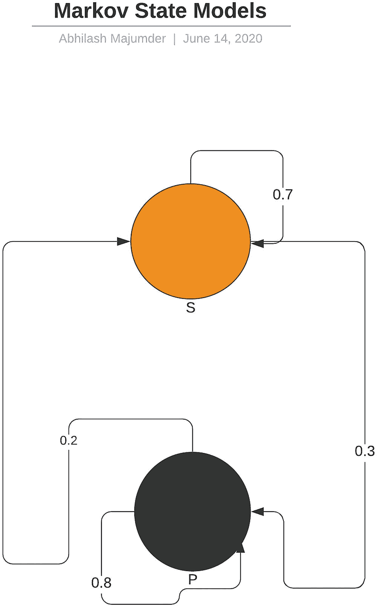

图 1-8

马尔可夫模型的状态转移图

### 马尔可夫模型中的状态概念

状态转移图提供了一个具有状态 S 和 P 的二进制链模型。状态 S 保持在其自身状态的概率为 0.7，而转移到状态 P 的概率为 0.3。同样，状态 P 转移到 S 的概率为 0.2，而 P 的自转移状态概率为 0.8。根据概率定律，相互和自转移概率的总和将为 1。这使我们能够生成一个 2 X 2 阶的转移矩阵，如图 1-9 所示。

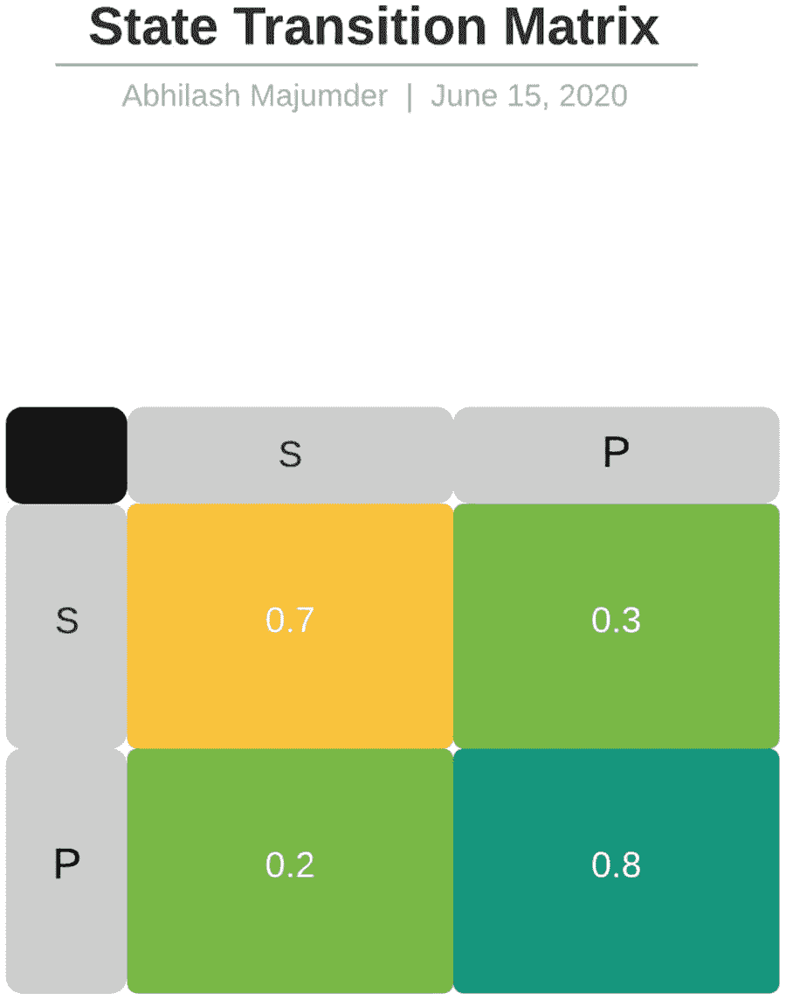

图 1-9

状态转移矩阵

每次操作结束时产生的转移矩阵，对于不同状态的自转移和交叉转移有不同的值。这可以通过计算转移矩阵的幂来数学上可视化，其中幂是我们需要的迭代次数，如以下所述：

T(t+k) = T(t)^k k€ R

公式表明，转移矩阵在 k 次迭代后的状态由初始状态下的转移矩阵的幂给出，假设 k 属于实数。

让我们尝试通过初始化状态 S 和 P 的初始概率来扩展这个想法。如果我们考虑 V 是包含两个状态初始概率的数组，那么在 k 次模拟迭代后，最终状态数组 F 可以通过以下方式获得：

F(t+k)=V(t)*T(t)^k

### Python 中的马尔可夫模型

这是一个迭代马尔可夫过程，状态根据转换和初始概率进行枚举。打开“MarkovModels.ipynb” Jupyter Notebook，让我们尝试理解转换模型的实现。

```py
import numpy as np
import pandas as pd
transition_mat=np.array([[0.7,0.3],
[0.2,0.8]])
intial_values= np.array([1.0,0.5])
#Transitioning for 3 turns
transition_mat_3= np.linalg.matrix_power(transition_mat,3)
#Transitioning for 10 turns
transition_mat_10= np.linalg.matrix_power(transition_mat,10)
#Transitioning for 35 turns
transition_mat_35= np.linalg.matrix_power(transition_mat,35)
#output estimation of the values
output_values= np.dot(intial_values,transition_mat)
print(output_values)
#output values after 3 iterations
output_values_3= np.dot(intial_values,transition_mat_3)
print(output_values_3)
#output values after 10 iterations
output_values_10= np.dot(intial_values,transition_mat_10)
print(output_values_10)
#output values after 35 iterations
output_values_35= np.dot(intial_values,transition_mat_35)
print(output_values_35)
```

我们导入 numpy 和 pandas 库，这将帮助我们进行矩阵乘法。集合的初始状态分别设置为 1.0 和 0.5。转换矩阵初始化如前所述。然后我们分别计算 3、10 和 35 次迭代的转换矩阵值，并使用每个阶段的输出乘以初始概率数组。这为我们提供了每个状态的最终值。您可以更改概率的值以获得更多结果，了解特定状态在其自身中保持多长时间或转换到另一个状态的程度。

在第二个例子中，我们提供了一个基于初始和转换概率的如何将三元转换系统迁移到不同状态的可视化。可视化如图 1-10 所示。

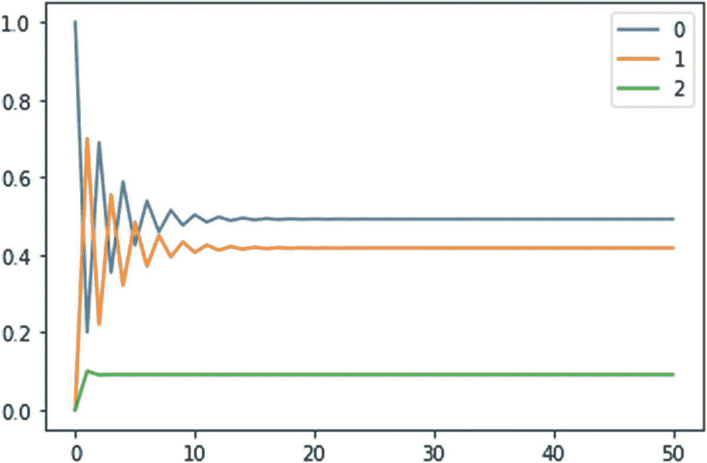

图 1-10

马尔可夫状态的转换可视化

### 下载和安装 Unity

现在，让我们尝试在 Unity 中模拟一个基于马尔可夫状态原理的游戏。我们将使用 Unity 版本 2018.4，它也将与 2019 和 2020 版本兼容。第一步是安装 Unity。从官方 Unity 网站下载 Unity Hub。Unity Hub 是一个仪表板，包含所有版本的 Unity，包括测试版发布以及教程和入门包。下载并安装 Unity Hub 后，我们可以在 2018.4 以上的版本中选择我们想要的版本。接下来，我们继续下载并安装版本，这可能需要一些时间。在 Windows 的 C: 驱动器上应有足够的空间来完成下载，即使我们在单独的驱动器上下载也是如此。安装完成后，我们可以打开 Unity 并开始创建我们的模拟和场景。Unity Hub 如图 1-11 所示。

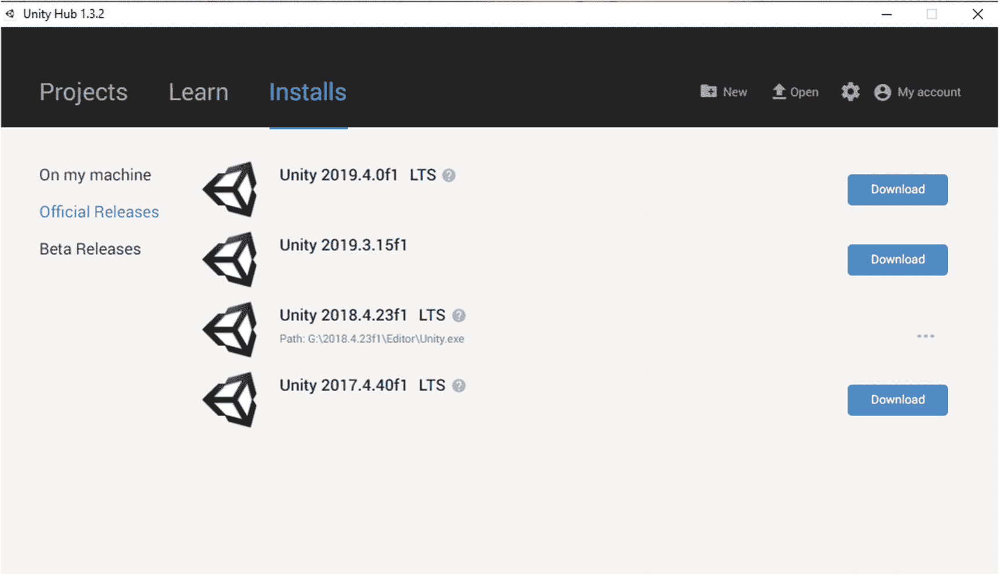

图 1-11

Unity Hub 和安装 Unity

下载名为 DeepLearning 的样本项目文件，其中包含本书所有课程的相关代码。由于文件夹中的其他项目依赖于它们，需要下载和安装 Unity ML Toolkit 的预览包。下载后，如果在控制台接收到与 Barracuda 引擎或 ML agents 相关的错误消息（大多与无效方法有关），则前往：

```py
Windows > Package Manager
```

在搜索栏中输入 ML agents，ML agents 预览包（1.0）选项将出现。点击安装以在本地下载 Unity 中与 ML agents 相关的预览包。为了交叉验证，打开 Packages 文件夹并导航到“manifest.Json”源文件。在 Visual Studio Code 或任何编辑器中打开此文件，并检查以下行：

```py
"com.unity.ml-agents":"1.0.2-preview"
```

如果错误仍然存在，我们可以通过手动从 Anaconda Prompt 使用以下命令下载 Unity ML agents 来解决这个问题：

```py
pip install mlagents
```

或者也可以从 Unity ML Github 仓库下载。然而，安装指南将在第三章节中介绍。

### Unity 中的马尔可夫模型与 Puppo

打开 environments 文件夹并导航到 MarkovPuppo.exe Unity 场景文件。

双击运行，你将能够看到类似图 1-12 的内容。


图 1-12

MarkovPuppo Unity 场景应用

游戏是一个模拟，其中 Puppo（来自 Unity Berlin 的 Puppo The Corgi）试图在马尔可夫过程中模拟棒子后尽快找到它们。棒子以预定义的概率状态初始化，并提供了转移矩阵。对于模拟的每一次迭代，具有最高自转移概率的棒子被选中，其余的则被销毁。Puppo 的任务是定位这些棒子，每次他正确到达时，他将获得 6 秒的休息时间。由于转移概率计算得非常快，Puppo 的步伐几乎是瞬间的。这是一个纯随机的马尔可夫状态分布，状态转移概率在运行时计算。让我们尝试深入挖掘 C# 代码以更好地理解它。

在 Unity 中打开 DeepLearning 项目并导航到 Assets 文件夹。在文件夹内，尝试找到 MarkovAgent 文件夹。该文件夹包含名为 Scripts、Prefabs 和 Scenes 的子文件夹。在 Unity 中打开 MarkovPuppo Scene 并按下播放。我们将能够看到 Puppo 正在尝试定位随机抽取的马尔可夫棒。让我们首先尝试理解这个场景。

场景由左侧的场景层次结构和右侧的检查器细节组成，底部是项目、控制台选项卡，中心是场景、游戏视图。在层次结构中，定位到 “Platform” GameObject 并点击下拉菜单。在 GameObject 内部，有一个名为 “CORGI” 的 GameObject。点击它以在场景视图中定位，并在右侧的检查器窗口中打开详细信息。这是 Puppo 预制件，它附有一个名为 “Markov Agent” 的脚本。可以通过点击下拉菜单进一步探索预制件，并将有几个关节和 Rigidbody 组件附加到其中，这将使 Puppo 能够进行物理模拟。场景视图在图 1-13 中显示。

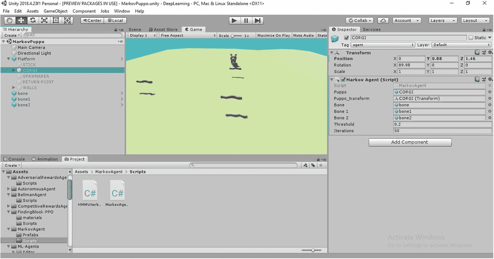

图 1-13

Markov Puppo 场景的视图，包括层次结构和检查器

检查器窗口在图 1-14 中显示。

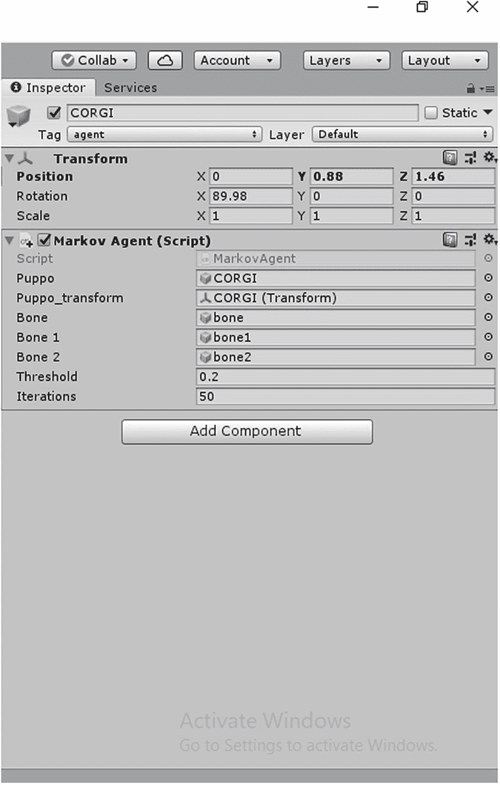

图 1-14

检查器选项卡和脚本

在 Visual Studio Code 或 MonoDevelop（您选择的任何 C# 编辑器）中打开 Markov Agent 脚本，让我们尝试理解代码库。在代码的开始部分，我们必须导入某些库和框架，例如 UnityEngine、System 等。

```py
using System.Collections;
using System.Collections.Generic;
using UnityEngine;
using System;
using Random=UnityEngine.Random;
public class MarkovAgent : MonoBehaviour
{
public GameObject Puppo;
public Transform puppo_transform;
public GameObject bone;
public GameObject bone1;
public GameObject bone2;
Transform bone_trans;
Transform bone1_trans;
Transform bone2_trans;
float[][] transition_mat;
float[] initial_val=new float[3];
float[] result_values=new float[3];
public float threshold;
public int iterations;
GameObject active_obj;
Vector3 pos= new Vector3(-0.53f,1.11f,6.229f);
```

脚本源自 MonoBehaviour 基类。在内部，我们声明了在代码中想要使用的 GameObjects、Transforms 和其他变量。GameObject “Puppo” 引用了 Puppo Corgi 代理，并在检查器窗口的图 1-14 中以此方式引用。GameObject “Bone”、“Bone1” 和 “Bone2” 是场景中的三个随机化的棍子目标。接下来是一个转换矩阵（命名为 “transition_mat”，一个浮点值矩阵），三个棍子的初始概率数组（命名为 “initial_val”，一个大小为 3 的浮点数组），以及一个结果概率数组来包含每次迭代后的概率（命名为 “result_val”，一个大小为 3 的浮点数组）。变量 “iterations” 表示模拟的迭代次数。GameObject “active_obj” 是另一个变量，用于包含每个迭代中保持活动的最可能的自我转换棍子。最后一个变量是一个名为 “pos” 的 Vector3，它包含每次迭代后 Puppo 的出生位置。接下来，我们转向创建转换矩阵、初始值数组的细节，并尝试理解迭代是如何形成的。

```py
void Start()
{
puppo_transform=GameObject.FindWithTag("agent").
GetComponent();
bone=GameObject.FindWithTag("bone");
bone1=GameObject.FindWithTag("bone1");
bone2=GameObject.FindWithTag("bone2");
bone_trans=bone.GetComponent();
bone1_trans=bone1.GetComponent();
bone2_trans=bone2.GetComponent();
transition_mat=create_mat(3);
initial_val[0]=1.0f;
initial_val[1]=0.2f;
initial_val[2]=0.5f;
transition_mat[0][0]=Random.Range(0f,1f);
transition_mat[0][1]=Random.Range(0f,1f);
transition_mat[0][2]=Random.Range(0f,1f);
transition_mat[1][0]=Random.Range(0f,1f);
transition_mat[1][1]=Random.Range(0f,1f);
transition_mat[1][2]=Random.Range(0f,1f);
transition_mat[2][0]=Random.Range(0f,1f);
transition_mat[2][1]=Random.Range(0f,1f);
transition_mat[2][2]=Random.Range(0f,1f);
Agentreset();
StartCoroutine(execute_markov(iterations));
}
```

在 Unity C#脚本中，在 MonoBehaviour 下，有两个默认存在的方法。这些是无参方法，名为 Start 和 Update。Start 方法通常用于初始化场景变量和为不同对象分配标签；这是在游戏开始时创建场景的预处理步骤。Update 方法每帧运行一次，所有的决策函数和控制逻辑都在这里执行。由于这是每帧更新的，如果我们执行大型复杂操作，它将非常计算密集。其他方法包括 Awake 和 FixedUpdate。Awake 方法在 Start 线程执行之前被调用，而 FixedUpdate 与 Update 方法相比具有规则的均匀帧率。在 Start 方法的第一个部分，我们将 GameObject 分配到相应的标签。标签可以在检查器窗口中创建，在每个选定的 GameObject 下，如图 1-15 所示。

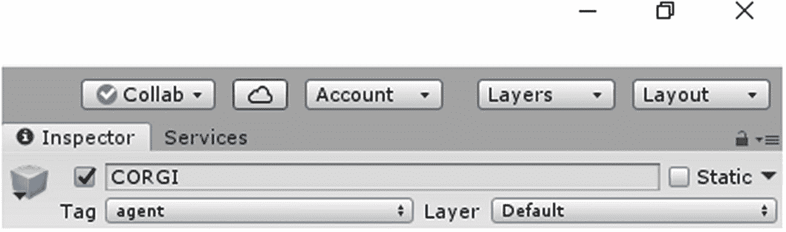

图 1-15

为 GameObject 分配和创建标签

标签通过“GameObject.FindWithTag()”方法分配。下一步是创建转移矩阵，这是一个 3 X 3 的泛型浮点矩阵的 C#实现。这显示在“create_mat”函数中。

```py
public float[][] create_mat(int size)
{
float[][] result= new float[size][];
for(int i=0;i<size;i++)
{
result[i]=new float[size];
}
return result;
}
```

在创建空矩阵后，我们向其赋值。这些值来自 Unity 引擎的 Random 库，它为矩阵分配随机的浮点值。

初始值数组也在本节中初始化。

“StartCoroutine”方法在 C# Unity 中调用“IEnumerator”接口。我们不是使用 Update 方法每帧更新游戏，而是将游戏逻辑传递到 Coroutine 中。Coroutine 运行初始化中提供的迭代次数，并控制模拟。这可以通过以下代码解释。

```py
private IEnumerator execute_markov(int iter)
{
yield return new WaitForSeconds(0.1f);
for(int i=0;i<iter;i++)
{
transition_mat[0][0]=Random.Range(0f,1f);
transition_mat[0][1]=Random.Range(0f,1f);
transition_mat[0][2]=Random.Range(0f,1f);
transition_mat[1][0]=Random.Range(0f,1f);
transition_mat[1][1]=Random.Range(0f,1f);
transition_mat[1][2]=Random.Range(0f,1f);
transition_mat[2][0]=Random.Range(0f,1f);
transition_mat[2][1]=Random.Range(0f,1f);
transition_mat[2][2]=Random.Range(0f,1f);
mult(transition_mat,initial_val,result_values);
tanh(result_values);
initial_val=result_values;
Debug.Log("Values");
```

这段代码有一个 yield return 语句，它将 Coroutine 线程的控制权释放给 Start 线程 0.1 秒（短暂的暂停）。然后，对于模拟的每次迭代，通过“mult()”函数计算初始值和转移矩阵的乘积，转移矩阵是随机化的。Tanh 函数是一个非线性激活函数，用于使结果值数组中的分布非线性。

接下来，我们有一系列的条件语句，用于从结果值数组中选择最大概率状态。

```py
int bone_number=maximum(result_values,threshold);
if(bone_number==0)
{
bone.SetActive(true);
bone1.SetActive(false);
bone2.SetActive(false);
active_obj=bone;
}
if(bone_number==1)
{
bone.SetActive(false);
bone1.SetActive(true);
bone2.SetActive(false);
active_obj=bone1;
}
if(bone_number==2)
{
bone.SetActive(false);
bone1.SetActive(false);
bone2.SetActive(true);
active_obj=bone2;
}
Debug.Log(bone_number);
```

下一步是让普普根据之前的转换来确定哪个棒子被激活了。这可以通过在 Unity 引擎的物理系统中使用 RayCast 来实现。RayCast 会根据用户指定的方向发射一条射线，并且有控制射线深度和时间限制的参数。RayCast 起作用的要求是三个棒子上应该有一个 Collider 对象。Collider 有助于理解基于物理的 GameObject 何时发生碰撞。在这种情况下，我们使用一个简单的 BoxCollider 来检测 RayCast 击中它。根据普普击中的哪个棒子，我们看到普普会自动将自己传输到那个目标位置，通过分配目标棒子的变换值。

```py
RaycastHit hit;
var up = puppo_transform.TransformDirection(Vector3.up);
Debug.DrawRay(puppo_transform.position,up*5,Color.red);
if(Physics.Raycast(puppo_transform.position,up,out hit))
{
if(hit.collider.gameObject.name=="bone")
{
Debug.Log("hit");
puppo_transform.position= bone_trans.position;
}
if(hit.collider.gameObject.name=="bone1")
{
puppo_transform.position= bone1_trans.position;
}
if(hit.collider.gameObject.name=="bone2")
{
puppo_transform.position= bone2_trans.position;
}
}
Debug.Log(puppo_transform.position);
Debug.Log("Rest");
Debug.Log(active_obj.GetComponent().position);
puppo_transform.position=active_obj.GetComponent().position;
Debug.Log(puppo_transform.position);
yield return new WaitForSeconds(6f);
Agentreset();
```

在普普达到棒子进行一次迭代后，我们通过调用“yield”方法让他休息一会儿，持续 6 秒。一旦我们理解了代码库的完整功能，我们就可以在编辑器中点击播放。我们可以根据我们的选择更改迭代的值以及脚本中初始值数组的值，以查看分布如何变化。控制台标签中的 Debug.Log 语句提供了有关每次迭代结果数组值的详细信息，以及哪个棒子被激活。游戏预览如图 1-16 所示。

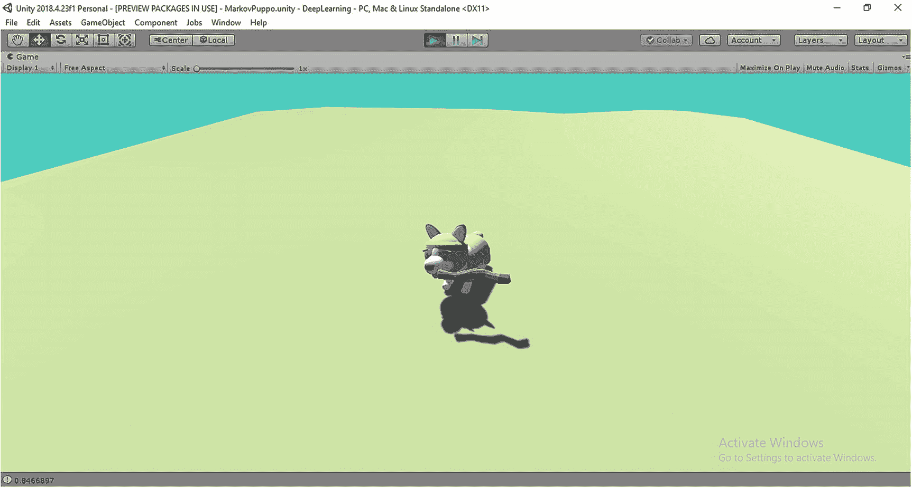

图 1-16

马尔可夫普普的最终游戏模拟

这是一个我们使用 Unity 引擎创建的简单模拟，以随机方式模拟马尔可夫状态。在下一节中，我们将尝试使用 Python 和 Unity 来理解 HMMs 和路径创建的决策过程。

### 隐藏马尔可夫模型

HMMs 是马尔可夫状态的扩展，其中一些状态是不可观察的或“隐藏”的。HMM 假设如果状态 P 依赖于状态 S，那么 HMM 模型应该通过观察状态 P 来了解 S。HMM 是一个时间离散的随机过程，可以在两个状态{S[n]，P[n]}之间简单地用数学公式解释，即：

+   S[n]是马尔可夫过程状态，它是“隐藏”的或不可直接观察的。

+   p (P[n] € P | S[1]= s[1]，…，S[n] = s[n]) = p (P[n] € P | S[n] = s[n])

    对于所有 n>0，s[1]，…，s[n]，其中 P 和 S 是状态的超集，p()是条件概率。

### 隐藏马尔可夫模型的概念

让我们通过一个示例情况来理解这一点。我们考虑一个有朋友 Alice 和 Bob 的环境。Bob 只能执行三种活动：散步、购物和打扫。Bob 活动的选择取决于环境中的天气。Alice 知道 Bob 在特定一天将执行的活动，但不知道影响 Bob 活动的天气。这可以表述为一个离散的马尔可夫链模型，其中天气条件类似于状态。天气条件的集合包括雨天和晴天条件。因此，天气条件是影响 Bob 活动的隐藏状态。该图进一步解释了这种情况。该图还显示了状态转移概率值以及自转移值。HMM 的 Python 模拟有以下细节：

```py
states = ('Rainy', 'Sunny')
observations = ('walk', 'shop', 'clean')
start_probability = {'Rainy': 0.7, 'Sunny': 0.3}
transition_probability = {
'Rainy' : {'Rainy': 0.8, 'Sunny': 0.2},
'Sunny' : {'Rainy': 0.1, 'Sunny': 0.9},
}
emission_probability = {
'Rainy' : {'walk': 0.1, 'shop': 0.4, 'clean': 0.5},
'Sunny' : {'walk': 0.6, 'shop': 0.3, 'clean': 0.1},
}
```

图 1-17 展示了 HMM。

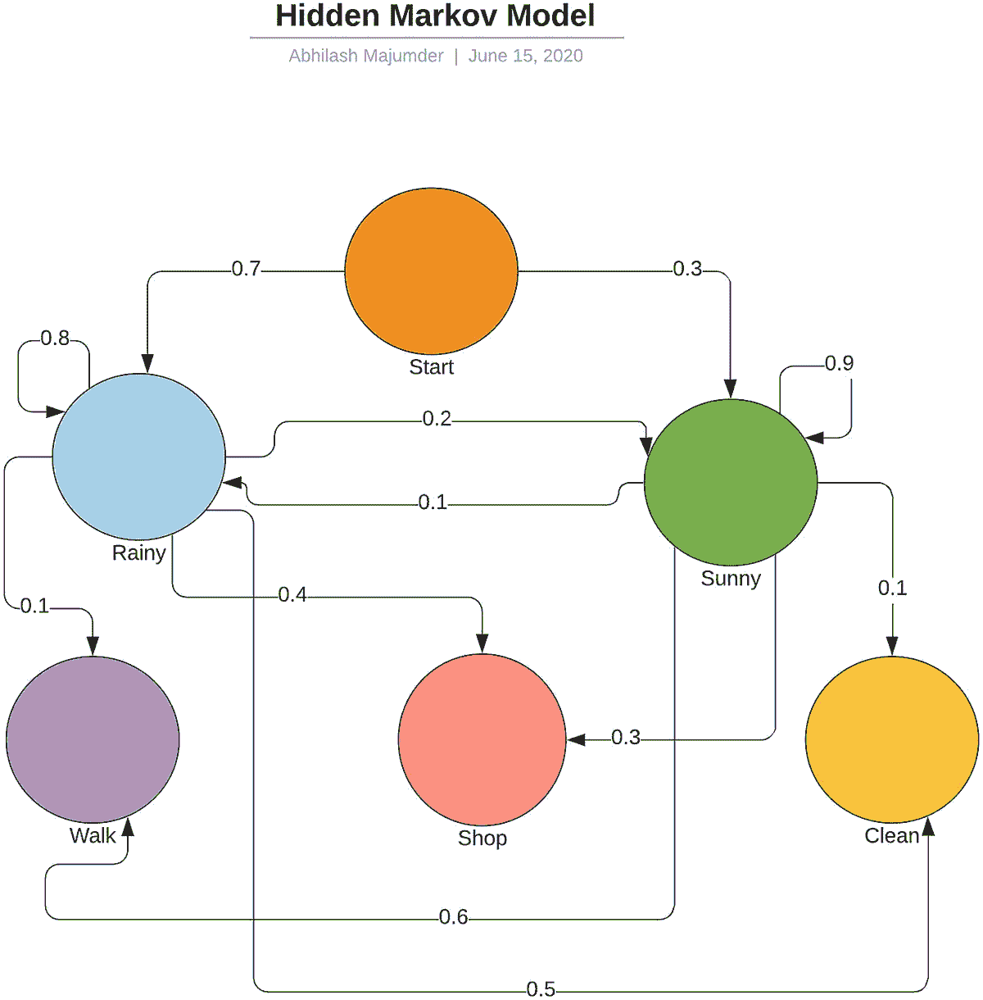

图 1-17

隐藏马尔可夫模型环境

### 基于 Tensorflow 的隐藏马尔可夫模型

打开 MarkovModel.ipynb 笔记本，在第三部分有一个基于初始概率和转移矩阵的 Tensorflow 实现 HMM。

```py
import tensorflow as tf
import tensorflow_probability as tfp
tf_distributions=tfp.distributions
#Generate Hidden Markov Model With Tensorflow
#Transition Probability of states
transition_mat=tf_distributions.Categorical(probs=[[0.7,0.3],
[0.2,0.8]])
#Initial Probability of states
intial_values= tf_distributions.Categorical(probs=[1.0,0.5])
#Creating a Distribution Pattern for State Observation: Mean and STD of 1st state is 2.5 and 10, respectively, and that of 2nd state is 6.5 and 7, respectively.
observation_mat= tf_distributions.Normal(loc=[2.5,10],scale=[6.5,7])
#HMM
model=tf_distributions.HiddenMarkovModel(initial_distribution=         intial_values,
transition_distribution=transition_mat,
observation_distribution=observation_mat,
num_steps=10,
allow_nan_stats=True,
name="HiddenMarkovModel")
#Mean of the Distribution of States
print(model.mean())
#Log probability of 0 enumerated states i.e 1st State
print(model.log_prob(tf.zeros(shape=[10])))
#Log probability of 1 enumerated states i.e 2nd State
print(model.log_prob(tf.zeros(shape=[10])))
```

HMM 位于 Tensorflow Probability 库（命名为“tensorflow_probability”）中，是 tf_distributions 类的一个方法。我们初始化值，并为两个初始状态（具有均值和标准差）分配正态分布。tf_distributions 下的 HMM 将初始概率、转移矩阵、包含正态分布的观测数组、模拟的迭代次数以及可选参数（如模型名称和 allow_nan_stats）作为参数。在笔记本中运行此代码，了解在 10 次迭代后模拟值的变化。我们还可以修改参数和概率的值以产生新的模拟。

### Unity 中的隐藏马尔可夫模型代理

让我们尝试使用这个原理，在 Unity 中生成一个使用 HMM 的随机路径算法。目标是训练一个智能体来检测奖励或对象生成的路径。在每个纪元的开始，智能体试图确定一个基于特定时间状态下特定对象/奖励的最高概率值的生产性路径。在 Unity 中打开“HMMAgent”场景并点击播放。控制台会显示立方体智能体在各个时间点达到最高价值奖励或对象的遍历顺序。对于每个学习纪元或周期，立方体智能体会捡起场景中存在的任何奖励。奖励是基于对象在特定时间戳的最高概率。比如说，在时间戳 t[0]时，对象 o[1]具有最高概率，而在 t[1]时，对象 o[2]具有最高概率，那么智能体会捡起 o[1]、o[2]，依此类推。在每个纪元内部，有三个时间戳，并且对于每个纪元可以观察到不同的序列。某些序列可以是 o[2]、o[1]、o[3]，甚至重复的状态，如 o[2]、o[1]、o[1]等。这些序列或路径是由 HMM 的动态规划实现——维特比算法生成的。模拟的预览如图 1-18 所示。

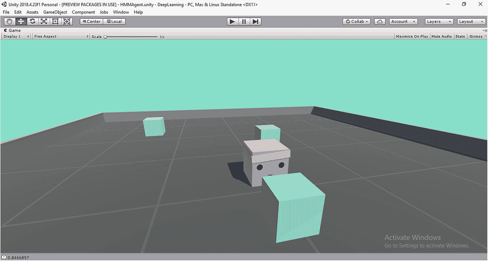

图 1-18

HMMAgent Unity 场景

让我们打开位于 Assets 文件夹中的相关脚本，名为“HMMViterbiAgent.cs”的 C#脚本。脚本的大部分内容与之前的马尔可夫模型脚本相似，具有常见的转移矩阵和初始及结果值数组的初始化。我们还包括了发射矩阵（命名为“emission_mat”）和观察状态（命名为“observation_states”），分别包含发射概率值和观察状态。

```py
float[][] emission_mat;
int[] observation_states=new int[3];
```

它们的初始化如下。

```py
emission_mat[0][0]=Random.Range(0f,1f);
emission_mat[0][1]=Random.Range(0f,1f);
emission_mat[0][2]=Random.Range(0f,1f);
emission_mat[1][0]=Random.Range(0f,1f);
emission_mat[1][1]=Random.Range(0f,1f);
emission_mat[1][2]=Random.Range(0f,1f);
emission_mat[2][0]=Random.Range(0f,1f);
emission_mat[2][1]=Random.Range(0f,1f);
emission_mat[2][2]=Random.Range(0f,1f);
for(int i=0;i<3;i++)
{
observation_states[i]=i;
}
```

一旦我们完成了初始化代码，并将标签附加到不同的目标和智能体上，我们就可以检查使用概率生成路径的维特比算法。函数声明接受矩阵和数组作为参数，并用目标对象的索引填充路径数组。

```py
public void HMMViterbi(float[][] transition_mat,float[][]
emission_mat, int[] observation_states, float[]
hidden_states, float[] initial_val,int[] path)
```

我们创建了一个最小权重算法，试图减少状态或对象的可能性，然后尝试在特定时间找到最高可能的对象或目标（在对象中）。

```py
{
int  mini_state=0;
float mini_weight=0f;
float weight=0f;
float[][]  a= create_mat(3);
int[][] s= create_mat_int(3);
``
int i,j;
for(i=0;i<3;i++)
{
a[i][0]=(float)(-1*Math.Log(initial_val[i])
*(Math.Log(emission_mat[i][observation_states[0]])));
}
```

对于接下来的步骤，使用“a”矩阵的初始值，我们对每个观察状态执行循环操作，并相应地计算最小权重值。

```py
for(i=1;i<3;i++)
{
for(j=0;j<3;j++)
{
mini_state=0;
mini_weight=a[0][i-1]-(float)
(Math.Log(transition_mat[0][j]));
for(int k=1;k<3;k++)
{
weight=a[k][i-1] - (float)
(Math.Log(transition_mat[k][j]));
if(weight<mini_weight)
{
mini_weight=weight;
mini_state=i;
}
}
```

在此之后，我们将“a”矩阵更新为暂时存储最小权重。同时，我们也在状态矩阵“s”中存储具有最小值的那个状态。

```py
a[j][i]= mini_weight-(float)
(Math.Log(emission_mat[j][observation_states[i]]);
s[j][i]=mini_state;
}
}
```

一旦我们填写了“a”和“s”矩阵的值，我们就得到具有最高概率和最小权重的目标对象的索引。然后我们进行回溯以生成涉及其他两个目标对象的可能的最小加权路径。

```py
mini_state=0;
mini_weight=a[0][i-1];
for(int k=1;k=0;k--)
{
path[k]=s[path[k]][k+1];
}
float distribution_prob=(float)Math.Exp(-mini_weight);
}
```

维特比算法是一种动态规划算法，它利用马尔可夫状态和转移发射概率来选择一个最小加权路径，代理可以遵循该路径在每个时间戳收集具有最高概率的目标。

要运行该函数，我们像之前一样启动 Coroutine，通过乘以初始值数组和转移矩阵来计算结果值数组，并调用 HMMViterbi 函数。

```py
mult(transition_mat,initial_val,result_values);
tanh(result_values);
initial_val=result_values;
Debug.Log("Start Path");
HMMViterbi(transition_mat,emission_mat,observation_states,
hidden_states,initial_val,path);
```

其余的代码与之前的马尔可夫模型模板类似，其中立方体代理使用 RayCast 检测目标对象的碰撞体，并更新立方体的变换以跟随路径。一个有趣的观察是 Viterbi 函数调用后的路径更新：

```py
for(int l=0;l<path.Length;l++)
{
target_number=path[l];
/../
}
```

在我们理解了代码之后，我们可以通过将脚本分配给立方体代理（命名为“AgentCube_Purple”）来在播放模式下测试代码。环境的 Unity 场景视图如图 1-19 所示。

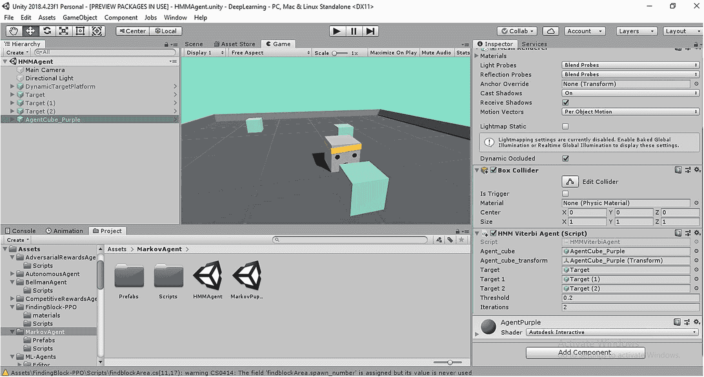

图 1-19

分配给 AgentCube_Purple 脚本的 Unity 场景

如果我们紧跟，在检查器窗口中，我们可以根据我们的选择更改迭代的次数或时代/剧集。控制台以目标立方体的索引的形式显示所遵循步骤的详细信息。检查器窗口的预览如图 1-20 所示。

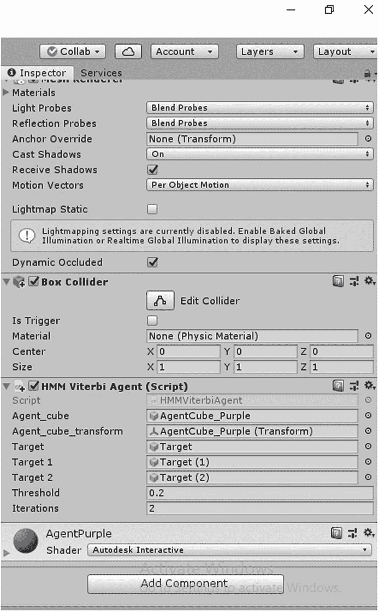

图 1-20

场景的检查器视图

在本节中，我们概述了马尔可夫状态、MDP 和 HMM。本节是理解强化学习基础的重要方面，因为离散强化学习中的所有学习算法都基于状态。在本节中，我们理解和实现了 Python 中的马尔可夫模型，并模拟了游戏，还了解了基于动态规划的 HMM 的简要概述及其在 Unity 中的模拟。下一节将专注于将这些奖励纳入这些状态，使代理学习如何获得这些奖励。我们将理解贝尔曼方程的核心基础，并探索多臂老虎机的迭代贝尔曼方程的一些变化。

### 贝尔曼方程

现在我们已经理解了马尔可夫决策过程（MDP），让我们沿着这个思路扩展，引入基于迭代奖励的学习概念。MDP 和 HMM 为我们提供了如何保留状态过去信息的见解，正如我们在路径跟踪模型中看到的那样。当我们涉及马尔可夫模型中的奖励时，一个通用的学习算法方程就会演变。从数学上讲，我们假设奖励在集合 R 中，并试图计算在剧集结束时奖励的期望，表示为 E[R]。这可以表示为：

G[t] = R[t+1] + R[t+2] + …+ R[t]

其中 G[t]是基于接收到的奖励序列对时间步 t 的奖励的期望。这可以被视为基于动态规划的马氏模型上的一个加法，其中每个状态都有一个期望奖励。一般来说，贝尔曼方程有一个相关的折扣因子 y（伽马），它对先前状态中收到的奖励进行折扣。因此，一个正式的迭代贝尔曼奖励折扣方程可以表述为：

G[t] = R[t+1] + yR[t+2] + …+ ∑ y^kR[t+k]

这是带有折扣因子伽马的前一个奖励的马尔可夫状态上的贝尔曼期望奖励函数。这使得智能体能够选择最近的期望奖励值以及相应地导致更多奖励的最近状态。这可以被视为一个自顶向下的树，因为这是一个迭代动态规划方法。

迭代贝尔曼方程使用两种基本的算法方法进行表述：

+   **策略函数**：策略迭代函数π(a|s)是状态和动作集之间的映射，以产生一个最优策略π*(a|s)，该策略获得最高的期望奖励。策略函数通过在每个步骤最大化策略的值来验证。

+   **值函数**：值函数 vπ(s)表示从状态 s 开始并遵循策略π所获得的价值或期望回报。

现在我们对贝尔曼方程以及值函数和策略函数有了初步的了解，让我们尝试将它们以自顶向下的树形结构在图 1-21 中可视化。

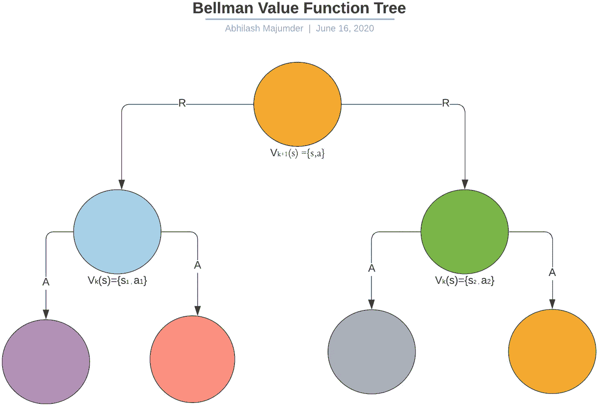

图 1-21

贝尔曼值迭代树

贝尔曼树展示了策略π如何通过动作控制值 vπ(s)从 k+1 状态到 k 状态，并从 k+1、k+2 状态等枚举期望奖励。

注意

美国应用数学家理查德·E·贝尔曼创立了贝尔曼方程，作为一种动态规划方法，用于最优控制理论，后来用于强化学习（RL）。

### 贝尔曼智能体在 Unity 中的实现

我们将在本章的后续部分讨论值迭代和政策迭代方面的更多内容，现在让我们基于奖励和贝尔曼迭代算法创建另一个模拟。打开资产文件夹，导航到“BellmanAgent”文件夹。这里包含一个模拟游戏，其中代理在赛车卡丁车上，有奖励（绿色的大方块）需要代理到达并收集，然后到达对面的终点杆。打开场景时，将如图 1-22 所示：

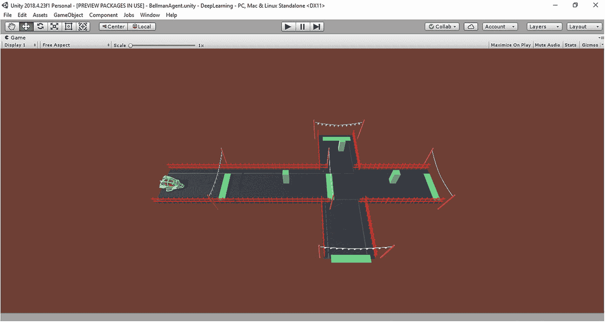

图 1-22

贝尔曼代理 Unity 场景

让我们了解模拟工作原理的代码。Kart 代理有一个目标函数，通过使用贝尔曼方程的迭代值函数，在每个学习周期或纪元中最大化其奖励。一旦代理到达第二个绿色目标（绿色方块）或终点杆（终点线），游戏结束。目前，模拟是沿着 Kart 代理的 z 轴的单向前进-后退，这也可以扩展到多方向遍历。

打开“BellmanAgent.cs”C# 脚本。初始化和变量设置根据之前马尔可夫模型和 HMM 的模板进行，但需要添加一些独特的新特性和变量。

```py
float max_reward=30.0f;
public float gamma;
public float epsilon;
public GameObject TinyAgent;
public Transform tiny_transform;
public GameObject target;
public GameObject target1;
public int iter;
public GameObject target2;
public Transform target_transform;
public Transform target1_transform;
public Transform target2_transform;
float[][] states;
float[] reward=new float[9];
float[] values=new float[9];
Dictionary state_reward= new Dictionary();
```

变量“max_reward”是代理在一场游戏中需要累积的总奖励值。变量“gamma”是折扣因子。接下来，我们初始化 GameObject 变量，用于 Kart 代理和目标。我们创建了一个浮点值矩阵，称为状态，在这种情况下是转换矩阵。每个状态都有一个奖励的浮点数组，一个用于将状态映射到奖励的字典。浮点值数组用于通过迭代贝尔曼方程更新值函数。

在表格离散方式中创建状态以进行贝尔曼更新的基本概念是使用赛道（即道路）的 transform.z 位置值。赛道可能包含绿色目标或终点线，也可能不包含。根据赛道特定部分是否有目标或处于终端位置，我们为每个赛道部分分配奖励。这把赛道转换成了一个类似虚拟 Gym 的环境，包含不同的状态和奖励，尤其是类似于 GridWorld（Gym 中的环境）。

我们使用 Random.Range() 函数初始化奖励，如下所示：

```py
reward[0]=Random.Range(-0.05f,0.05f);
reward[1]=Random.Range(-0.05f,0.05f);
reward[2]=Random.Range(-0.05f,0.05f);
reward[3]=Random.Range(0.05f,0.20f);
reward[4]=Random.Range(-0.05f,0.05f);
reward[5]=Random.Range(-0.05f,0.05f);
reward[6]=Random.Range(-0.05f,0.05f);
reward[7]=Random.Range(0.05f,0.2f);
reward[8]=Random.Range(-0.05f,0.05f);
```

横向赛道被分为九个部分，每个部分都有一个相关的奖励。我们也可以手动设置奖励。我们还用键值对填充字典，作为：位置值（Transform.position.z）和奖励（float）。

```py
public void populate_state_rewards(Dictionary state_reward,float[] reward)
{
state_reward.Add(-32.5f,reward[0]);
state_reward.Add(-13.8f,reward[1]);
state_reward.Add(-4.2f,reward[2]);
state_reward.Add(4.9f,reward[3]);
state_reward.Add(14.57f,reward[4]);
state_reward.Add(23.93f,reward[5]);
state_reward.Add(33.7f,reward[6]);
state_reward.Add(41.7f,reward[7]);
state_reward.Add(50.8f,reward[8]);
}
```

然后我们创建值数组，并使用 Random.Range 函数设置它。过渡矩阵也被创建，其中对角线元素具有相同的概率 0.04，其余的元素使用“Random.Range”函数创建。开始方法与之前相似，包含所有状态、GameObject 的初始化和标签的链接。

初始化完成后，让我们深入理解贝尔曼方程的代码。

```py
public int calculate_Bellman(float gamma,float[][] states,float[] reward,Dictionary state_reward,float[] values)
{
float[] new_values=new float[9];
new_values=values;
values=mult(states,values,new_values);
for(int i=0;i<9;i++)
{
values[i]= reward[i]+ values[i]*gamma;
}
float max_values= maxi(values);
int max_index=maxi_index(values,max_values);
return max_index;
}
```

该函数接受过渡矩阵、奖励、字典和值数组作为参数。它计算过渡矩阵或状态与值数组的乘积。然后应用伽马折扣因子。最后，将当前状态的奖励添加到生成新值。操作完成后，我们取最有价值的元素或具有最高值的州，并从值数组中检索其索引。这个索引将帮助我们映射哪个奖励值被触发。从那个奖励值，我们可以通过查找字典来导航到特定的轨道部分（位置）。

```py
public  float take_action(Dictionary state_reward,int max_index)
{   float action=0f;
float max_reward=collect_rewards(max_index);
foreach(KeyValuePair i in state_reward)
{
if(i.Value==max_reward)
{
action=i.Key;
break;
}
}
Debug.Log(action);
return action;
}
```

此函数有助于查找游戏迭代过程中获得的具体奖励，并自动返回触发轨道部分的当前位置。

让我们把所有这些放在一起，形成一个 Coroutine 函数，这是智能体的控制逻辑。在 IEnumerator 函数内部，我们设置一个 for 循环，该循环运行我们想要的 epoch 数。

```py
Debug.Log("Start Epoch");
float reward_now=0f;
while(reward_now<max_reward)
{
Debug.Log("Start Episode");
int max_index=calculate_Bellman(gamma,
states,reward,state_reward,values);
Debug.Log(max_index);
reward_now+=collect_rewards(max_index);
Debug.Log("Rewards");
Debug.Log(reward_now);
float action_step=take_action(state_reward,
max_index);
Debug.Log(action_step);
```

这段代码会一直运行，直到收集到的奖励少于初始化步骤中指定的总预期奖励。在这段代码中，我们执行了贝尔曼迭代值操作，获得了特定实例触发的特定奖励值，并检索了相应轨道部分的变换位置值。相应的奖励被相应地添加。

```py
if(action_step==target_transform.position.z )
{
Debug.Log("Reached first target");
tiny_transform.position=new Vector3(0f,0f,
target_transform.position.z);
target.SetActive(false);
yield return new WaitForSeconds(1f);
}
if(action_step==target1_transform.position.z )
{
Debug.Log("Reached Second target");
tiny_transform.position=new Vector3(0f,0f,
target1_transform.position.z);
target1.SetActive(false);
yield return new WaitForSeconds(1f);
}
tiny_transform.position=new Vector3(0f,0f,action_step);
yield return new WaitForSeconds(1f);
```

if-else 语句指定并检查 Kart 智能体采取的行动是否将其带到绿色目标或终点线。如果智能体到达终点线或目标，则在下一次迭代开始之前，我们给他提供 1 秒钟的短暂休息。这个迭代会一直持续，直到奖励少于预期的总奖励。

```py
if(reward_now==max_reward)
{
break;
}
reset();
yield return new WaitForSeconds(2f);
}
Debug.Log("End Episode");
reset();
}
Debug.Log("End Epoch")
}
```

如果满足条件且累积的奖励等于总奖励，我们将终止实例，并在移动到下一个训练剧集之前让智能体休息 2 秒钟。

当我们熟悉代码库后，我们可以对奖励函数进行修改，并为不同情况添加更多离散奖励。此外，环境也可以沿着垂直轨道扩展，这也会在转移矩阵和价值数组中添加更多状态。代理的运动将由 x 轴和 z 轴共同控制。我们可以通过在字典中取垂直放置的轨道部分 x 值来修改脚本以适应更多状态。一旦环境设置如图 1-23 所示，我们可以在编辑器中点击播放按钮。注意代理如何快速导航到每个迭代的最高奖励状态，并继续这样做，因为价值数组中的更新。价值数组保留了包含最高奖励的状态或轨道部分的信息，并帮助代理在后续时间戳中遵循该路径。这可以被视为一个缓冲内存，保留了具有最高值的状态。

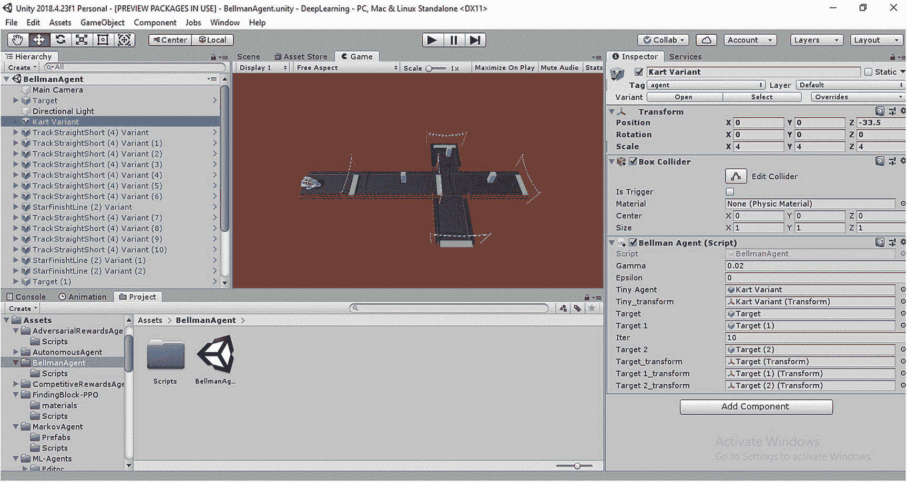

图 1-23

Bellman 代理 Unity 场景与检查器窗口

在本节中，我们学习了贝尔曼方程，这是一个迭代动态规划方程。我们借助贝尔曼方程，探讨了将奖励与马尔可夫状态以及决策过程相关联的一些重要概念。本节还简要介绍了通过遵循特定策略进行奖励最大化或价值最大化的价值和策略迭代技术。我们创建并模拟了一个 Unity 游戏，其中 Kart 代理必须应用贝尔曼价值函数来导航到最高奖励的轨道部分。到目前为止，我们已经了解了离散表格环境以及如贝尔曼方程之类的价值/策略优化算法在强化学习中的有用性。在下一节中，我们将讨论基于多臂老虎机的另一个模拟游戏的创建。

### 在 Unity 中创建多臂老虎机强化学习代理

多臂老虎机（MAB）是强化学习算法模拟的最简单形式。这种技术不涉及学习选择最大奖励状态，而是依赖于反馈机制。k 臂老虎机问题可以这样描述：老虎机代理处于一个环境中，有 k 个不同的房屋可以被抢劫（动作空间）。根据在每个步骤上选择的房屋的决定，老虎机获得奖励。奖励通常是一个平稳的概率分布，可以是负的（当警察在房屋中时）或正的（当房屋中没有警察时）。老虎机代理的目标是在 n 个时间步内最大化正奖励。

这种基本的强化学习环境没有马尔可夫状态和贝尔曼优化技术，因为从数学上讲，它仅是奖励和动作的函数。重新表述，这可以理解为：

Q(a) = E [ R[t] | A[t] = a ],

其中 Q(a) 表示执行动作 a 后的期望奖励。

由于老虎机的动作主要依赖于奖励的结果，已经实施了几种策略。图 1-24 显示了多臂老虎机环境的预览。

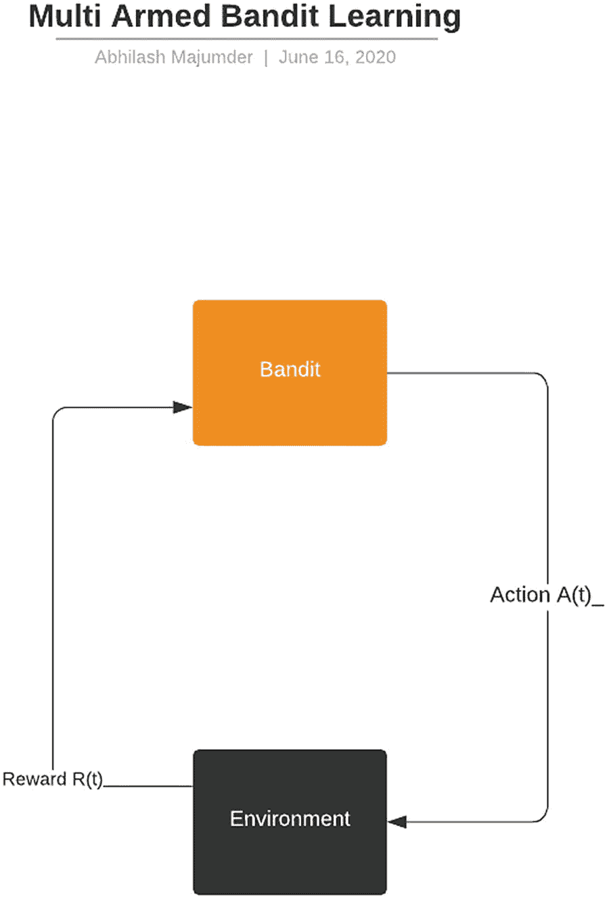

图 1-24

多臂老虎机和环境

### 多臂老虎机涉及到的策略

有几种 Bandit 算法的变体，旨在最大化每一步收集的奖励。这些通常被称为“动作-值”函数。

+   **贪婪算法**：蛮力应用涉及使用贪婪利用算法。这包括存储每个迭代的动作 Q 值（值函数）并选择具有最大 Q 值的动作。这是一个非探索策略，因为在许多情况下，奖励可能不是同一臂/位置的最高值。从数学上讲，这可以表示为：

Qt = ∑ 1[(at=a)]. (R[i]) / ∑ 1[(at=a)] ,

选择最大 Q 值：

Argmax[a] Qt

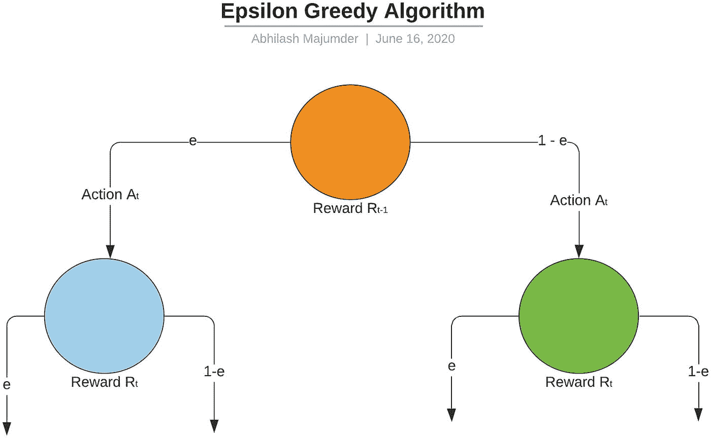

图 1-25

ε-Greedy 算法

+   **ε-Greedy 算法**：在这种算法中，老虎机根据某些概率值 e 利用和探索新的状态。老虎机以概率 e 探索新状态，以概率 1-e 利用当前最佳奖励状态，如图 1-25 所示。

+   **衰减 ε-Greedy 算法**：这是先前利用-探索算法的一种变体。在这里，可能将一个对数衰减因子与先前状态的利用相关联。

+   **非平稳加权算法**：如果老虎机的奖励随时间变化，则这是一个非平稳问题。在这种情况下，我们对先前的 Q 值和当前奖励应用加权平均。这可以表示为：

Q[n+1] = Q[n] + α [R[n] - Q[n]],

其中 α 是平均加权因子。

+   **上置信界 (UCB) 算法**：这是不同奖励的探索-利用的统计分布。该算法通过测量先前动作奖励的期望方差来进行探索。这是一种乐观值方法，旨在减少特定动作获得高奖励的方差。从数学上讲，它可以描述为以下方程：

A[t] = argmax Q[t + c√(ln(t)/Nt)],

其中 Nt(a) 表示在时间 t 之前选择动作 a 的次数，ln(t) 是 t 的自然对数。

+   **梯度老虎机算法**：这是一个考虑特定状态 a 相对于其他状态的偏好的数值偏好算法。记录一个动作相对于另一个动作的相对偏好，并通过包括 softmax 函数将其采样到概率分布中。这在一般的深度学习中是一个非常重要的函数，我们将在我们的深度强化学习算法中使用它。

Softmax(z) = e^z / (∑ e^z)

+   **Thompson 抽样**：这是一种比 Epsilon-Greedy 算法更复杂的贝叶斯抽样技术，它基于动作和奖励的后验概率分布。

### 使用 UCB 算法的 Unity 中的多臂老虎机模拟

在本节中，我们将尝试将 Epsilon-Greedy、带有 softmax 梯度优化的 UCB 结合起来。我们将尝试探索 Unity 模拟中的不同算法方法，然后我们可以尝试基于 Python 创建一个环境。

打开场景“MAB-Unity”。场景由三个立方体组成，每个立方体有不同的奖励概率。在编辑器中选择播放时，我们看到老虎机选择不同的奖励（即立方体），并总是试图优化其奖励。这是一个纯粹基于动作-奖励的非上下文老虎机，带有反馈，因此我们可以通过 Epsilon-Greedy 算法来控制探索-利用。默认情况下，模拟在 Epsilon-Greedy 模式下运行，还有一个选项可以激活 UCB 算法。在控制台标签中，我们可以看到期望的奖励。环境的预览如图 1-26 所示。

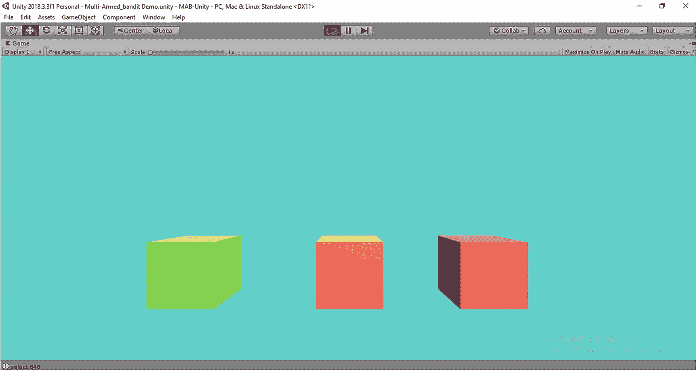

图 1-26

Unity 中的多臂老虎机场景

由于到目前为止，我们已经积累了一些在 Unity 的 C# MonoBehaviour 中编写代码的经验，让我们打开“Agent”脚本。第一个包含变量设置；这里需要注意的是，如果我们想让私有变量在 Inspector 窗口中显示，我们必须在每个私有变量上提及[SerializeField]属性。

```py
[SerializeField]
private int k = 3;
[SerializeField]
private float lr = 0.1f;
[SerializeField]
private float exp_rate = 0.3f;
[SerializeField]
private bool ucb = true;
[SerializeField]
private float c = 2f;
[SerializeField]
private float time_lag = 0.1f;
List actions = new List();
public float total_reward = 0;
List avg_reward = new List();
List true_val = new List();
System.Random rnd = new System.Random();
private float time = 0.0f;
List values = new List();
List action_times = new List();
List confidence_int = new List();
// Start is called before the first frame update
[SerializeField]
private GameObject g0, g1, g2;
```

初始化涉及 epsilon（Epsilon-Greedy 算法的 epsilon）、UCB 的布尔触发器以及奖励、值（Q 值）和动作时间（表示动作“a”重复的程度）的浮点数组。置信区间是帮助 UCB 算法的浮点列表。动作列表包含在应用程序运行期间的相关立方体的索引。start 方法包含所有变量的初始化和列表，它调用协程以进行游戏控制逻辑。

让我们探索 chooseaction 方法，它包含了 Epsilon-Greedy UCB 算法的实现。

```py
int action = 0;
if ((float)Random.Range(0.0f, 1.0f) <= exp_rate)
{
int idx = rnd.Next(actions.Count);
action = idx;
}
```

这部分代码段随机选择浮点值并检查它们是否小于利用率。然后它尝试使用“rnd.Next()”方法探索新的立方体。这是一种基于样本随机分布的探索策略。

如果不选择此选项，则控制传递到 else 语句。如果我们想使用 UCB 算法，我们必须检查布尔变量是否为 true。UCB 代码如下：

```py
if (ucb)
{
if (time == 0f)
{
action = rnd.Next(actions.Count);
}
else
{
for (int i = 0; i  max)
{
max = confidence_int[j];
action = j;
}
}
}
}
```

UCB 代码分为两个语句。如果没有为 UCB 提供时间周期，则它是一个随机探索算法。如果考虑过去动作的时间周期，则控制转到“else”语句。然后 UCB 使用 UCB 公式计算所有可能动作的 Q 值。在获得每个 Q 值后，它们被填充到置信区间列表中。代码段的后续部分然后从置信区间列表中选择最大的 Q 值并返回该特定的立方体。

我们接下来进入“执行行动”函数，并尝试通过添加学习率来更新 Q 值和奖励值，以辅助 UCB 算法。该算法还会在每一步计算相对奖励以及平均奖励。

```py
time++;
action_times[action] += 1;
float reward = Random.Range(0f, 1.0f) + true_val[action];
values[action] += lr * (reward - values[action]);
total_reward += reward;
avg_reward.Add(total_reward / time);
```

“播放”方法将上述两个函数链接起来，并在检查窗口提供的迭代次数中运行它们。具有最高置信区间值的特定动作的 Q 值被选中并传递给“执行行动”方法。

```py
public void play(int n)
{
for (int y = 0; y < n; y++)
{
int act = chooseaction(exp_rate,
c, values, action_times,
actions, time, ucb);
takeaction(total_reward,
avg_reward, action_times,
time, act, true_val);
}
}
```

让我们进入 IEnumerator 代码段，在那里调用所有函数并选择适当的立方体。对于 900 次迭代，“播放”命令被调用，并且对于每次迭代，我们可以在控制窗口中获得平均奖励和总奖励的详细信息。然后根据立方体的选择，每轮的最高价值立方体被设置为活动状态，其余的则被停用。这表示哪个立方体在哪个迭代中被触发，并提供了最大的 Q 值。

```py
yield return new WaitForSeconds(time_lag);
play(900);
//Debug.Log("Total REward " + total_reward);
/*for (int t = 0; t  thresh)
{
Debug.Log("select " + y + y % 3);
if (y % 3 == 0)
{
g0.SetActive(true);
g1.SetActive(false);
g2.SetActive(false);
}
else if (y % 3 == 1)
{
g0.SetActive(false);
g1.SetActive(true);
g0.SetActive(false);
}
else if (y % 3 == 2)
{
g0.SetActive(false);
g1.SetActive(false);
g2.SetActive(true);
}
}
yield return new WaitForSeconds(time_lag);
}
```

因此，我们实现了一个基于 Epsilon-Greedy-UCB 的多臂老虎机模拟。我们可以在游戏过程中通过在 Epsilon-Greedy 和 UCB 算法之间切换来调整设置，以查看探索-利用细节如何受到影响。一旦我们理解了代码，我们就可以在 Unity 编辑器中点击“播放”来查看模拟运行。经过多次迭代后，我们会观察到一些立方体被反复选中——这是老虎机利用的经典例子。然后我们可以更改 epsilon 和学习率值，或者切换到 UCB 算法以进行更多探索。图 1-27 是模拟的预览。

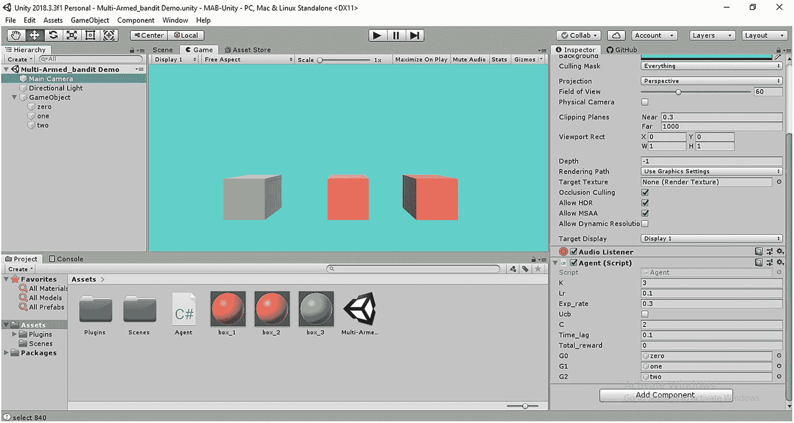

图 1-27

多臂老虎机检查窗口

### 使用 Epsilon-Greedy 和梯度老虎机算法构建多臂老虎机

一旦我们验证了我们的算法，我们就可以尝试在 Python 中使用 Jupyter Notebook 或 Colab Notebook 实现 Epsilon-Greedy 环境的简化版本。在 Colab 或 Notebook 中打开“Multi-Armed Bandit.ipynb”笔记本。代码相当直接。我们实现了一个经典的 10 臂投币机，其中我们有一个每个臂（在我们的例子中是房子）的概率的初始真实分布。我们还初始化了臂的概率和代理的概率。代码的其余部分代表一个 for 循环，它运行“num_epochs”变量中提供的 epoch 数。如果 epsilon 的值大于随机值，则我们在 10 个不同的臂之间进行探索；否则，我们进行利用。一旦获得特定剧集的奖励，我们通过使用通用的增量方法来更新 Q 函数：

Q[n+1] = ∑R[i] / n,

其中 n+1 次迭代的 Q 值是过去 n 个剧集收集的奖励 R[i]的平均值。

程序基本上是自我解释的，并在注释中包含所有生成可能分布和臂采样的细节。

注意

代码和场景使用 Unity 版本 2018.3 构建，但与所有版本的 Unity 兼容，包括 2020 测试版。

```py
import numpy as np
np.set_printoptions(2)
initial_values = np.random.rand(10)
number_of_arms = np.zeros(10)
agents_prob = np.zeros(10)
reward_count = np.zeros(10)
num_epochs = 4000
e = 0.33
```

初始化后，我们进入以下 for 循环：

```py
for _ in range(num_epochs):
# Either choose a greedy action or explore
if e > np.random.uniform():
which_arm_to_pull = np.random.randint(0,10)
else:
which_arm_to_pull = np.argmax(agents_prob)
# now pull the rewarding arm
if initial_values[which_arm_to_pull]
>  np.random.uniform():
reward = 1
else:
reward = 0
```

Epsilon-Greedy 采样技术会相应地产生奖励。然后我们更新投币机需要拉动的臂的编号，并按以下方式更新奖励计数：

```py
# now update the lever count and expected value
number_of_arms[which_arm_to_pull] += 1
reward_count[which_arm_to_pull] =reward_count[which_arm_to_pull] + reward
```

然后应用增量方法来生成 n+1 次迭代的 Q 值，如下所示：

```py
#Incremental Approach to Update value of Q
#Q(t+1)=Q(t) + (1/n(R(n)-q(n)))
agents_prob[which_arm_to_pull] =agents_prob[which_arm_to_pull] + (1/number_of_arms[which_arm_to_pull]) *
(reward -agents_prob[which_arm_to_pull])
```

最后，我们按最佳奖励、Q 值和选择的臂打印每个 epoch 的结果。运行后，输出应类似于图 1-28。

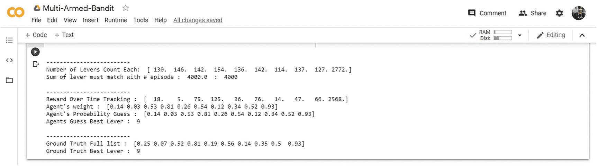

图 1-28

Python 中的多臂投币机 Epsilon-Greedy

在本节中，我们了解了 RL 算法中最简单的形式，即多臂投币机。我们学习了 MAB 中探索和利用的不同优化技术，以在每个动作步骤中获得更大的 Q 值或奖励。与复杂的马尔可夫模型、HMM 和 Bellman 方程不同，这里没有状态的概念，这就是为什么它是一个轻量级的 RL 模型。然后我们使用 Epsilon-Greedy 和 UCB 算法技术，在 Unity 中创建了一个 MAB 模拟环境，并在过程的每个阶段可视化奖励。在下一节中，我们将考虑 RL 入门的最终步骤：价值和策略迭代。本节从 Bellman 方程初始化并继续进行。

### 价值和策略迭代

自从在本章前面介绍了贝尔曼方程之后，我们简要介绍了价值和策略迭代函数。策略迭代可以被视为从基本策略π(s | a)优化策略π*(s | a)，这将导致与该策略相关联的价值函数增加。一个简单的价值更新函数可以数学上简化为：

V(s[t]) = V(s[t]) + α [G[t] - V(s[t])],

其中 alpha 是学习过程中使用的常数步长，V(s[t])是状态 t 获得的价值，G[t]是贝尔曼方程部分中引入的奖励 R[t]的期望。如果我们用贝尔曼方程中引入的迭代折现因子 y（gamma）替换 G[t]的值，我们可以将价值方程重新表述如下：

V(s[t]) = V(s[t]) + α [R[t+1] + yV(s[t+1]) - V(s[t])]

在特定策略上的价值优化方法被称为时序差分学习。特别是，这个方程表示了 TD(0)算法，因为我们只关注当前状态之前的一个状态（即步骤 t+1）。

价值迭代机制也有一个明确的方式来定义学习过程中的每个连续步骤之后产生的误差项∂，通过评估 t+1 和 t 状态的价值。这可以通过简化的方程数学上表示：

∂[t] = R[t+1] + yV(s[t+1]) - V(s[t]),

其中∂是时间戳 t 的误差。

现在我们已经有了价值迭代技术的数学概念，我们可以更好地理解在“BellmanAgent, cs”脚本中发生了什么。价值函数的结果由策略函数控制，策略函数也会更新。基于策略函数，智能体必须最大化价值函数，如果策略未能做到这一点，那么策略也会更新。这可以通过以下方程简单地解释：

π*(s, a) = argmax Vπ,

其中符号具有其原始含义。让我们尝试通过图 1-29 可视化策略迭代如何帮助获得最大价值函数。

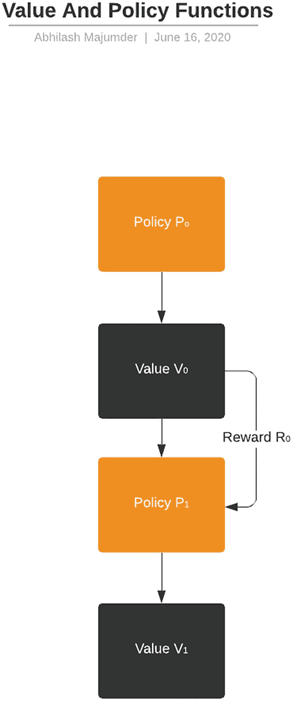

图 1-29

价值策略迭代函数

现在我们来理解一个涉及价值和策略迭代的基本概念，称为 Q–学习。Q–学习算法是一种离线策略时序差分学习算法，它使用 Q 函数作为价值函数并试图最大化价值。它可以按照广义价值迭代方程简单地写成，用 Q(s,a)替换 V(s)如下：

Q(s[t], a[t]) = Q(s[t,] a[t]) + α [R[t+1] + y maxQ(s[t+1], a[t+1]) - Q(s[t], a[t])]

Q–学习算法是一种表格离散算法，它使用价值和策略迭代方程，并在一般强化学习中形成基线模型。让我们首先通过理解表格式 Gym 环境来尝试理解 Q 学习和策略更新的工作原理。

注意

Q-learning 是由 Chris Watkins 在 1989 年提出的。

### 使用出租车 Gym 环境实现 Q-Learning 策略

打开“策略迭代函数和 Q 学习.ipynb”笔记本，让我们尝试理解环境。在这个笔记本中，我们使用了来自 OpenAI Gym 环境集的出租车环境（2D），出租车通过黄色方框显示。环境可以按照以下方式在笔记本中安装：

```py
#Policy Iteration by using Q-Learning
import numpy as np
import random
from IPython.display import clear_output
import gym
#Initialize the Taxi Gym Environment
enviroment = gym.make("Taxi-v3").env
enviroment.render()
#collect the details of observation and action space
print('Number of states: {}'.format(enviroment.observation_space.n))
print('Number of actions: {}'.format(enviroment.action_space.n))
```

运行笔记本或 Colab 后，我们将看到观察空间和动作空间的详细信息，就像在 CartPole 环境中一样，如图 1-30 所示。

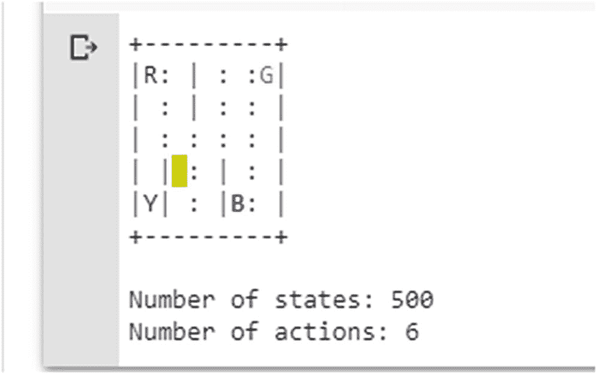

图 1-30

Taxi-v3 Gym 环境

笔记本的下一段包含基于观察状态和奖励的 Q-learning 训练的逐步代码。我们初始化变量如下：

```py
alpha = 0.1
gamma = 0.6
epsilon = 0.1
q_table = np.zeros([enviroment.observation_space.n, enviroment.action_space.n])
num_of_epochs = 100000,
```

其中，“alpha”是学习率，“gamma”是折扣因子，“epsilon”用于探索-利用策略（在 MAB 算法中使用），而“q_table”是包含观察和动作空间的矩阵。

然后，我们运行一个循环，循环次数是我们想要用 Q-learning 训练的 epoch 数：

```py
for episode in range(0, num_of_epochs):
# Reset the enviroment
state = enviroment.reset()
# Initialize variables
reward = 0
terminated = False
```

在每个 epoch 开始之前，我们重置环境。下一段包含 Q-learning 的不同利用-探索策略和通过应用 Q-learning 方程更新“q_table”的代码。在学习的每个阶段，状态、奖励和动作空间都来自 Gym 环境。

```py
while not terminated:
# Similar to epsilon-greedy algorithm for exploration-#exploitaion tradeoff
if random.uniform(0, 1) < epsilon:
action = enviroment.action_space.sample()
else:
action = np.argmax(q_table[state])
# Return the current state, reward and action
next_state, reward,
terminated, info = enviroment.step(action)
#Compute the q value of the state
from the tabular   environment
q_value = q_table[state, action]
#Get the maximum Q value
max_value = np.max(q_table[next_state])
#update the Q-value based on the Q-learning Equation
new_q_value = (1 - alpha) * q_value + alpha *
(reward    + gamma * max_value)
# Update Q-table
q_table[state, action] = new_q_value
state = next_state
```

每行注释描述了后续步骤中执行的操作。训练完成后，Q 表包含最有利状态的值。这可以通过更新的出租车环境表示，如图 1-31 所示。

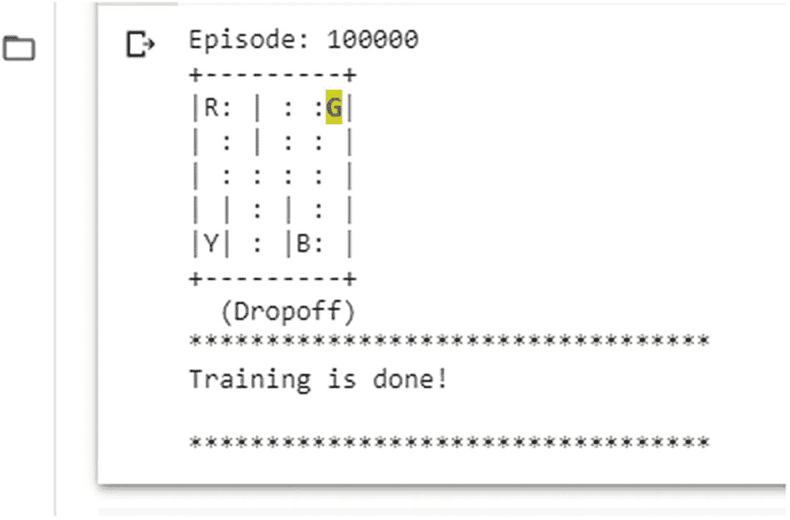

图 1-31

Q-learning 中的出租车 Gym 环境训练

下一段包含评估模型的代码。对于 Q-learning 代理的每个 epoch，出租车根据 Q 表获得奖励。如果奖励为负，则我们添加惩罚值，这意味着出租车在环境中与另一个对象相撞。

```py
state = enviroment.reset()
epochs = 0
penalties = 0
reward = 0
terminated = False
#Run epochs
while not terminated:
action = np.argmax(q_table[state])
state, reward, terminated, info = enviroment.step(action)
#If reward is negative,penalty
if reward == -10:
penalties += 1
epochs += 1
total_penalties += penalties
total_epochs += epochs
```

运行该段代码后，我们得到惩罚值和每个 epoch 的轮次，如图 1-32 所示。

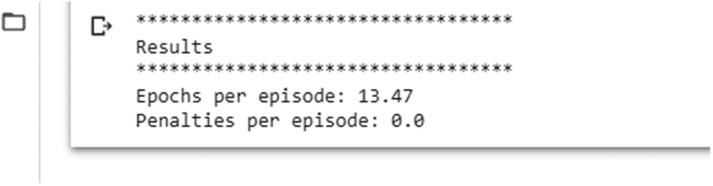

图 1-32

出租车 Gym 环境评估

### Unity 中的 Q-Learning

现在我们来创建一个类似的 Q-learning 模板。打开名为“Q-Learning”的场景并点击播放。圆柱形物体是智能体，它试图通过避开红色平面并仅使用绿色平面从顶部移动到底部。这些平面是状态样本，或观察空间，就像 Gym 环境。绿色平面与奖励相关联，而红色平面则与负奖励相关。智能体使用迭代 Q-learning 算法作为策略来更新价值函数并最大化其奖励。场景应该看起来像图 1-33 所示。

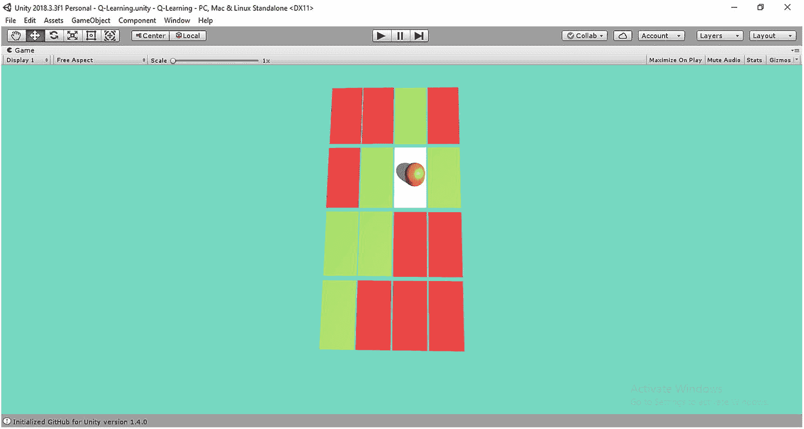

图 1-33

Unity 中的 Q-learning 场景

打开提到的附件脚本“QLearning.cs”，让我们简要地浏览一下重要的函数。由于大多数状态初始化、标签分配和变量初始化与以前的项目相似，我们将在此部分跳过。在此上下文中最重要的函数是“train”函数，它包含 Q-learning 算法的核心功能，并通过选择每个时间戳中价值最高的状态（平面）来更新 Q 表。

```py
for (int k = 0; k  possiblenextsteps = GetPossibleStates(next_state,
transition_mat);
Debug.Log("Current" + current_state);
Debug.Log("Next" + next_state);
//choose among the best probable
state which gives the max reward
float maxq = float.MinValue;
```

在循环内部，我们从给定的状态中随机选择一个初始状态，并使用“GetProbNextState”方法查询下一个状态。这个函数实际上返回了在该特定纪元或回合中状态列表中的最大值状态。

对于下一步，我们使用这些信息并使用 Q-learning 方程更新 Q 表，如下所示：

```py
for (int j = 0; j  maxq)
{
maxq = qs;
}
}
// update q matrix with
//Q-learning algorithmic formula
quality_mat[current_state][next_state] =
((1 - learning_rate) *   quality_mat[current_state][next_state])
+ ((learning_rate) * (reward[current_state][next_state] + gamma * maxq));
current_state = next_state;
if (current_state == goal)
{
//Agent.transform.position
//= green_33.transform.position;
//StartCoroutine(move_33());
Debug.Log("Reached");
break;
```

注意

代码和场景使用 Unity 版本 2018.3 构建，但与所有版本的 Unity 兼容，包括 2020 测试版。

根据 Q 策略抽象状态后，代码选择被触发的平面的位置或变换。智能体会自动移动到该变换位置。其余的代码段是环境和 Coroutine “train” 方法的样板代码，它控制整个工作流程逻辑。一旦我们对代码库有了足够的理解，我们就可以运行场景并模拟它。这个模拟的主要思想是理解在奖励、状态和动作的离散环境中 Q-learning 的重要性。

## 摘要

我们已经完成了第一章，以下是到目前为止我们所学的总结：

+   我们已经尝试理解强化学习（RL）的基本原理以及状态、动作和奖励的包含。RL 是一种不同的范式，涉及智能体与环境交互以最大化其目标。

+   为了理解状态、奖励和动作的概念，我们安装了一个 Gym 环境。Gym 是 OpenAI 开发的一个强化学习环境，用于深度 RL 和机器人研究。

+   我们学习了如何设置 Anaconda 和 Jupyter Notebooks，以及如何在 Colab 和 Jupyter 中初始化 Python 内核以进行强化学习。

+   我们试图理解 CartPole 的逻辑问题，并尝试将其建模为 Python 中的强化学习环境。我们观察了环境的观察空间和动作空间，并深入了解了 Tensorflow、Tensorboard 和其他深度学习库和框架。

+   我们了解了马尔可夫过程、有限决策理论、隐藏马尔可夫模型（HMMs）以及状态的概率分布如何帮助学习。

+   我们学习了如何从 Unity Hub 中安装 Unity 引擎。

+   我们使用 Puppo（Unity Berlin）基于马尔可夫模型开发了模拟，使用转移矩阵概率，并使用一个立方体代理开发了另一个用于 HMMs 的模拟。

+   我们学习了如何创建 Unity C#脚本，并了解了 Unity 中的协程和内部方法，如 Start 和 Update。

+   我们通过引入贝尔曼方程，将我们对马尔可夫模型的知识扩展到基于奖励的学习。我们开发了一个卡丁车赛车模拟，其中卡丁车代理必须根据奖励和价值最大化来决定选择哪个赛道部分。我们学习了价值和策略迭代算法。

+   我们设计和学习了多臂老虎机问题，以及不同的策略如 Epsilon-Greedy、上置信界和梯度老虎机如何影响老虎机的决策。我们了解到 bandit 问题是 RL 算法的最简单形式，没有状态的概念，并在 Unity 中创建了一个 Bandit 模拟。

+   最后一节主要讨论了基于特定策略如何最大化特定价值函数的价值和策略迭代算法，以及如何通过密集讨论来迭代算法。我们学习了时间差分和 Q-learning，这是经典强化学习中最著名的基线学习算法。我们创建了一个 Gym 出租车环境，以在 Python 中理解 Q-learning 算法，然后基于奖励最大化和 Q-learning 策略创建了一个寻路代理的模拟。

+   在所有这些部分中，我们尝试并行使用 Python 和 C#开发算法，以便在核心层面上更好地理解这些算法是如何表示的。

+   我们使用了 Tensorflow 库，并在 Jupyter Notebooks 或 Colab 中创建了 bandit 问题，以更好地理解这些概念。

这本书的第一章到此结束。这一章是强化学习概念的基础，我们试图深入了解 RLc 的发展过程，从最初的马尔可夫模型到贝尔曼方程，再到价值和策略迭代以最大化奖励。

所有这些概念都属于离散经典强化学习，当我们尝试使用 Unity ML Agents Toolkit 探索深度强化学习时，它将离散动作空间转换为多离散或连续空间以适应深度学习算法，这些概念将被广泛使用。在下一章中，我们将探讨导航网格、路径查找 AI 以及 Unity 中自动和启发式路径查找的许多其他算法。
