# 3. 设置 ML 智能体工具包

在前面的章节中，我们已经看到状态、动作和奖励在驱动智能体在强化学习（RL）环境中达到目标中起着至关重要的作用。现在，我们已经熟悉了基于通用状态的 RL 基础，我们将继续进行所有相关库、框架和扩展的安装，这些扩展与 Unity ML 智能体的使用以及后续模块中的深度学习进展有关。在我们深入安装之前，让我们先了解一下 Unity 制作的 ML 智能体包。自 2017 年成立以来，Unity ML Agents Toolkit 为研究人员、开发人员和游戏程序员提供了大量关于深度强化学习（deep RL）领域的资源。ML 智能体工具包最初是为了帮助研究人员和开发者将使用 Unity 编辑器创建的游戏和模拟转换为深度学习环境，在这些环境中，智能体可以使用最先进的（SOTA）深度强化学习算法、进化遗传策略以及其他深度学习方法（涉及计算机视觉、合成数据生成）通过简化的 Python API 进行训练。随着本书记载时的最新版本 1.0（包）的发布，在简化 C# SDK、Python API 链接、与 Tensorflow 库的稳健兼容性以及课程学习、自我和对抗游戏、生成对抗模仿学习和现有深度学习算法（近端策略优化-PPO、软演员评论-SAC）等领域取得了巨大进步。核心库的核心库进行了重大修改，使用开放 AI Gym 环境作为包装器。Unity ML Agents Toolkit 版本 1.0 具有稳定的通信器，将 Unity（C#）和 Python API（深度学习）连接起来，并为游戏开发者提供了编写深度学习智能体和模拟他们游戏中自己的人工智能（AI）的灵活性。对修改核心算法以适应其用例感兴趣的研究人员也提供了一种灵活的 Gym 包装器环境，该环境为编写他们自己的深度学习算法提供了一个模板。所有这些都可以通过简单的 Unity 引擎、Unity ML 工具包、Jupyter 笔记本和 Tensorflow 框架的使用来完成。现在，我们已经了解了 Unity ML 智能体的范围和可能性，我们将在本章中讨论安装所有必要库和框架的整个过程。Unity ML Agents Toolkit 中的不同智能体在图 3-1 中展示。


图 3-1

Unity ML Agents Toolkit 版本 1.0.0

## Unity ML Agents Toolkit 概述

到目前为止，我们已经在系统中安装了 Unity（任何大于 2018.3 的版本）并概述了 MonoBehaviour C# 环境。在我们深入安装指南之前，让我们了解 ML Agents Toolkit 的组件。ML Agents Toolkit 是一个软件开发工具包（SDK），它将使用 Unity 引擎制作的 C# 脚本与 Gym 包装器链接起来，以便我们可以在深度学习算法中训练我们的代理。因此，SDK 有两个基本方面：

+   **Unity 引擎 C# 脚本**：这是我们一直在使用的 Unity 的基础部分。稍后我们将看到如何仅使用 C# 脚本将 Tensorflow 神经网络包含进来，并使用我们的游戏来训练模型。

+   **OpenAI Gym 包装器 Python API**：这部分是 Unity 引擎和 OpenAI 环境之间的通信者和接口。此模块帮助我们将 Unity 游戏场景转换为深度强化学习环境，在那里我们可以使用我们自己的算法实现或使用 OpenAI 提供的基线来训练场景中的代理。

这些是 Unity ML Agents Toolkit 的主要部分，它使我们能够使用 Unity 创建游戏，并在 Gym 包装器的帮助下将它们转换为深度学习环境，在那里我们可以应用我们的强化学习算法。图 3-2 展示了 ML Agents Toolkit 的组件。

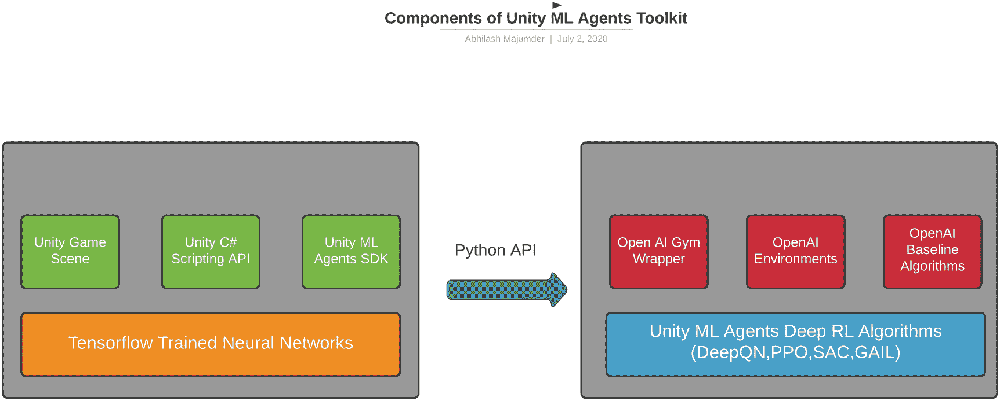

图 3-2

Unity ML Agents Toolkit 的组件

现在我们已经对 Unity ML Agents Toolkit 有了一个概述，我们可以意识到我们在第一章中使用的 Gym 环境的重要性，并分析了 CartPole 环境。在本节中，我们将安装 ML 代理与我们的游戏无缝工作所需的先决条件。由于不同版本的 ML 代理和 Tensorflow 框架之间存在几个不稳定性问题，我们将坚持使用这两个的标准稳定版本。我们之前已经使用 Anaconda 环境安装了 Jupyter Notebook、Spyder IDE 和 Python 控制台等，这将在我们稍后创建模型和将场景与 Gym 环境链接时提供很大帮助。我们之前在 Anaconda 提示符中使用以下代码安装了 Tensorflow 版本 1.7：

```py
pip install tensorflow==1.7
```

我们还使用以下命令安装了 TensorBoard，用于可视化模型训练：

```py
pip install tensorboard
```

## 安装 Baselines 和训练深度 Q 网络

下一步是构建我们的 Gym 环境，我们将在后续章节中广泛使用它。如果我们想在 Colab 或 Jupyter Notebook 中模拟我们的 Gym，我们必须安装 Gym 环境，可以使用以下方法完成：

```py
!pip install gym
```

现在，让我们尝试构建我们之前创建的 CartPole 环境（在第一章中），但现在我们将使用 OpenAI Baselines 库来训练我们的模型。OpenAI Baselines 库是由 OpenAI 创建的开源库，其中包含应用于 Atari 游戏、机器人和甚至 Unity 游戏中的 SOTA 深度强化学习算法。由于我们熟悉 Q-learning 算法（在第一章中），我们只需以清晰的方式使用 Baselines 提供的 Deep Q-Learning 算法在 CartPole 环境中即可。深度 Q 学习是 Q-Learning 算法在离散/连续空间上的离策略深度学习实现，而不是仅限于离散状态。建议在 Google Colab Notebook 中尝试此操作，因为我们将使用与 Baselines 兼容的 Tensorflow 的不同版本。首先，让我们使用以下命令在 Colab 中安装从 GitHub 上的 baselines：

```py
!pip install git+git://github.com/openai/baselines
```

现在，我们将使用这个库来编写一个非常简单的深度 Q 学习模型用于 CartPole。这只是为了测试我们的安装是否正确完成，以及所有其他库，如 Tensorflow，都是兼容的。我们目前不需要深入了解模型细节，因为我们将在后续章节中进一步探讨，因此这个实现将仅使用 OpenAI 实现的 SOTA 深度 Q 算法，并仅使用超参数。

如前所述，我们将导入 Baselines、Gym 和 Tensorflow 以实现我们的功能：

```py
import gym
from baselines import deepq, logger
import tensorflow as tf
```

deepq 是 OpenAI 的深度 Q 学习实现。如果由于“tf.contrib.layers”不兼容而出现问题，我们必须将我们的 Tensorflow 版本升级到 1.14 的稳定版本。然而，这个 Baselines 库与 Tensorflow 2.0 版本不兼容，因为那个版本中没有“tf.contrib.layers”。现在我们有了完整的稳定库，我们可以使用以下行来模拟 CartPole 环境：

```py
env=gym.make("CartPole-v0")
```

这是设置我们的 RL 环境（包括动作、空间和奖励）的第一步（第一章）。接下来的几行包含由 OpenAI 创建的 SOTA 深度 Q 网络。虽然在这个阶段不需要理解模型的含义和内部功能，但我们将回顾创建模型所涉及的超参数。

```py
act=deepq.learn(
env,
network='mlp',
lr=1e-4,
total_timesteps=1000,
buffer_size=50,
exploration_fraction=0.05,
exploration_final_eps=0.001,
print_freq=10,
)
```

我们使用 Baselines 库中的“deepq.learn”命令。以下是与该模型相关的超参数。

+   “env”：这是我们之前步骤中创建的 CartPole 环境。

+   “network”：这是模型将使用的神经网络架构类型。根据不同的方面，网络可以是“mlp”，表示多层感知模型；也可以是“lstm”，表示长短期记忆模型；或者是“cnn”，表示卷积神经网络模型。还有其他神经网络架构存在，我们将在深度强化学习章节中介绍所有这些。

+   “lr”：这表示学习率，在通用的机器学习中用于优化函数的适当全局收敛。

+   “total_timesteps”：我们想要模拟环境的迭代次数

+   “buffer_size”：记录先前状态、动作和奖励的内存缓冲区的大小限制

+   “exploration_fraction”：时间步长的比例；模型将尝试探索新的状态

+   “exploration_final_eps”：最终剧集的探索比例

+   “print_freq”：在屏幕上打印模型日志的频率

这是 OpenAI 设计的深度 Q 模型的概述，我们正在使用它来训练 CartPole。我们将在我们的 Unity 游戏中使用这个模型的变体。这基本上就是模拟环境和训练 CartPole 所需要的一切。一旦完成，我们可以确信 Baselines 库已经正确导入到我们的系统中。或者，我们也可以通过简单地使用 Python 终端或 Anaconda 提示符并输入以下命令来测试安装：

```py
python -m baselines.run --alg=deepq --env=CartPole-v0 --save_path=./cartpole_model.pkl --num_timesteps=1e5
```

一旦运行，我们将在 Anaconda 提示符环境中看到模型正在运行，日志被捕获在用户数据（Windows 中的 AppData）中，如图 3-3 所示。

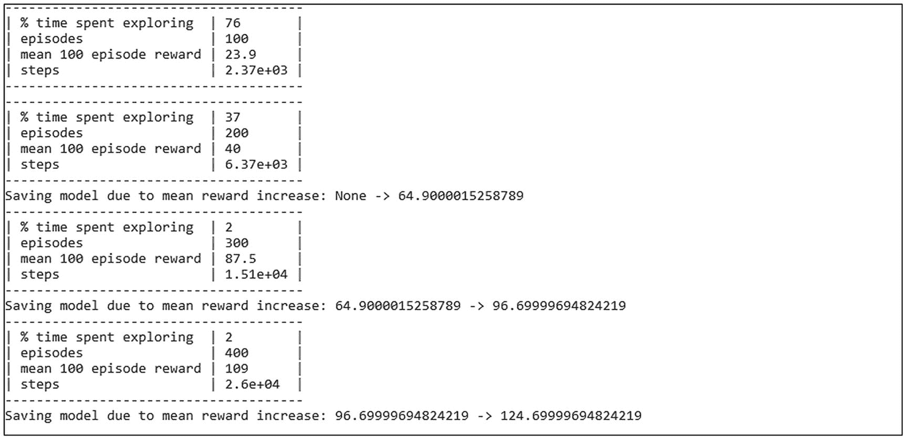

图 3-3

从 Baseline 为 CartPole 训练深度 Q 算法

我们已经完全安装了所有相关的深度强化学习库和框架，包括 Tensorflow、TensorBoard、Anaconda 环境、Gym、Baselines、Keras 和 Unity 引擎。在下一节中，我们将深入探讨 Unity 中 ML Agents 工具包的安装，并解决库的主要错误和不稳定问题，包括与 Python 深度学习框架的兼容性。在这个会话中，我们将使用 Unity 的 2018.4 版本，尽管它也适用于 Unity 的后续版本（2019 和 2020）。

## 安装 Unity ML Agents 工具包

Unity ML Agents 工具包是 Unity 中深度学习的官方工具包。在我们的系统上安装库需要几个步骤。Unity ML Agents 的开源存储库的官方 GitHub 页面可以在[`github.com/Unity-Technologies/ml-agents`](https://github.com/Unity-Technologies/ml-agents)找到。

这是 Unity ML Agents 的官方仓库；让我们看看 Github 页面上存在的详细信息。在滚动到“Readme”部分时，提到了有关 ML 代理版本、仓库内内置的不同训练 Unity 环境（数量超过 15 个）、内置对近端策略操作（PPO）和软演员评论（SAC）算法的支持以及 SDK 的跨功能灵活性的一些细节。如果我们点击到发布页面，由链接[`https://github.com/Unity-Technologies/ml-agents/releases`](https://github.com/Unity-Technologies/ml-agents/releases)提供，我们将看到 Unity ML Agents 工具包的所有发布版本。每个发布版本都有包版本详情、主要和次要更改、错误修复以及底部附加的源文件。由于我们正在使用版本 1.0，以下列出了 Python API、Gym 包装器、Unity C# SDK 和其他版本详情。图 3-4 显示了 Unity ML Agents 版本 1 的 Github 页面。

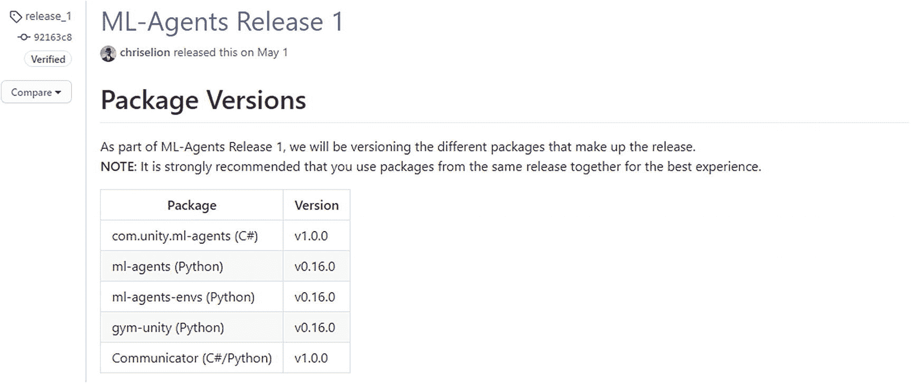

图 3-4

Unity ML Agents 版本 1

在 assets 文件夹内有两个“zip”和“tar.gz”格式的源文件，如图 3-5 所示。这包含了 Unity ML Agents 版本 1 的预编译二进制文件。将 ML Agents 工具包安装到本地机器的最简单方法就是下载该特定版本的 Unity ML Agents 工具包。下载后，我们可以将其解压到目录中的合适位置。还有其他几种下载方式，我们可以使用 Windows 命令行或 Anaconda 提示符中的 git 命令来下载相关的 ML 代理分支。

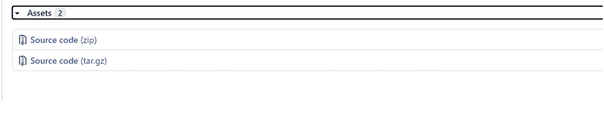

图 3-5

Unity ML Agents 版本 1.0 的 zip 格式源代码

```py
git clone --branch release_1 https://github.com/Unity-Technologies/ml-agents.git
```

### 克隆 Github Unity ML Agents 仓库

现在我们已经从 Github 下载了官方的 Unity ML Agents 仓库，无论是通过使用“git clone”还是手动下载源 zip 文件，在使用它之前，我们都需要进行进一步的修改。建议不要克隆 ML Agents 仓库的“master”分支；相反，我们可以克隆如图 3-6 所示的“release_1”分支。

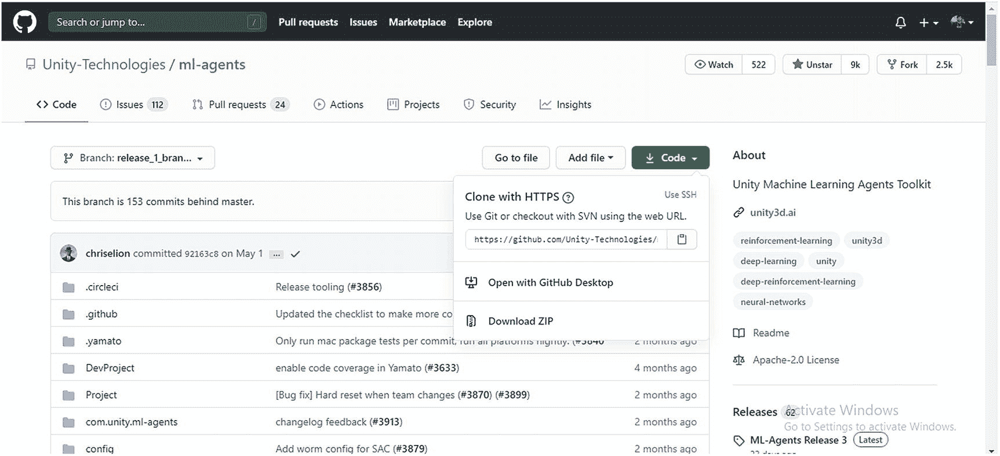

图 3-6

在 Github 上克隆“Unity ML Agents Release_1”分支

在我们下载并解压 Unity ML 代理后，我们可以使用 3D 模板创建一个新的 Unity 项目。要在此项目中使用 Unity ML 代理，只需将提取的 Unity ML 代理存储库拖放到 Unity 项目的资产面板中。这将使 Unity 引擎安装所有依赖项、库和框架，例如 ML 代理包提供的 barracuda（Unity 的神经网络链接框架）。

### 探索 Unity ML 代理示例

当我们导航到

**项目 ➤ 资产 ➤ ML-Agents ➤ 示例**

在这个文件夹中，我们拥有所有使用 Unity ML 代理制作的 AI 训练游戏环境和预训练的深度强化学习算法，如 PPO 和 SAC。在 ML 代理的旧版本中，代替“项目”文件夹，可能有“unity ml-agents”或“unity”等文件夹。到目前为止，我们将关注“示例”文件夹的内容。让我们打开使用 Unity ML 代理制作的 3D 球环境游戏。环境如图 3-7 所示。

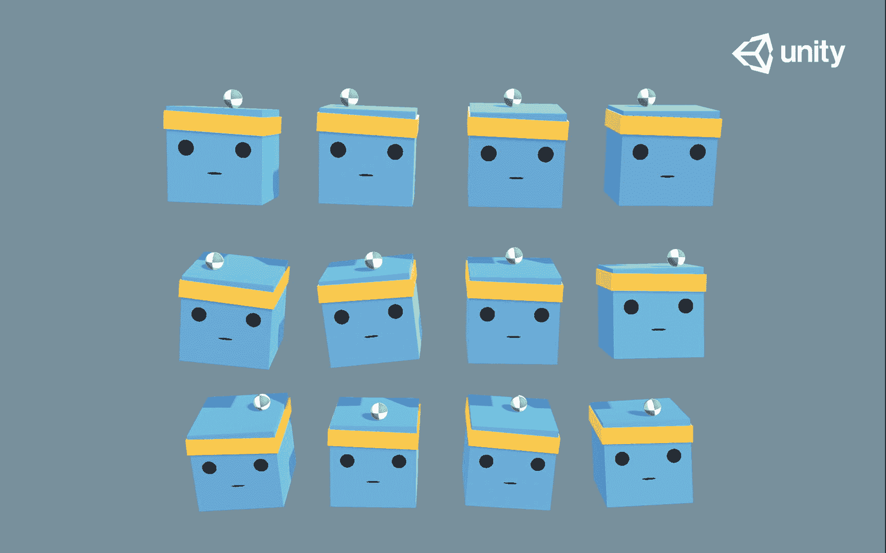

图 3-7

3D 球环境 Unity ML 代理

在这个环境中，我们看到 12 个蓝色立方体在它们的顶部平衡着小球。这些蓝色立方体是场景中的代理，如果球从代理的“头部”掉落，代理将获得负奖励。因此，代理必须尽可能长时间地在其头部平衡球以收集奖励并最大化其目标。这是使用 PPO（一种深度强化学习算法）辅助训练的 Unity ML 代理工具包的第一个示例，我们将在后面讨论。从我们之前章节的概念中可以看出，代理是蓝色立方体，奖励是平衡头上的球（球体）。

+   **状态**：此环境的观察空间可以分为两部分：稳定和不稳定。当代理平衡球时，它处于稳定空间，而当代理失去球的平衡时，它变为不稳定空间。要么球在头上，要么不在。

+   **动作**：每个蓝色代理立方体可以自由沿 x 和 z 轴旋转以平衡球体。每个球体沿 x、y 和 z 轴有六个运动度。所有这些都属于环境的动作空间。立方体固定在其位置，不能进行平移运动。

+   **奖励**：代理在每次平衡球时都会获得奖励。当球从代理的“头部”掉落时，奖励为负。

当我们尝试使用此环境构建和训练自己的模型时，我们将深入探讨。但到目前为止，我们可以尝试使用 Unity ML Agents 制作的其它环境，并尝试识别每个环境的状况、动作和奖励。这里还有一个名为“basic”的示例，如图 3-8 所示，其中代理可以选择前往更大的奖励（由大“绿色”球表示）或较小的奖励（小“绿色”球）。这是一个使用深度强化学习和 Unity 引擎的非常简单的游戏模拟，其中代理将尝试通过向更大的球体移动来最大化其奖励。虽然最初代理可能前往任何一个，但随着训练的进行，它会发现较大的球体有更高的奖励，它将朝着最大化奖励的方向前进。作为练习，我们可以尝试识别这个代理和环境的状况、动作和奖励空间。一旦我们玩腻了内置的 Unity 游戏和 ML 代理，让我们尝试理解通过 Unity 编辑器安装 Unity ML Agents 的其他可能替代方案。

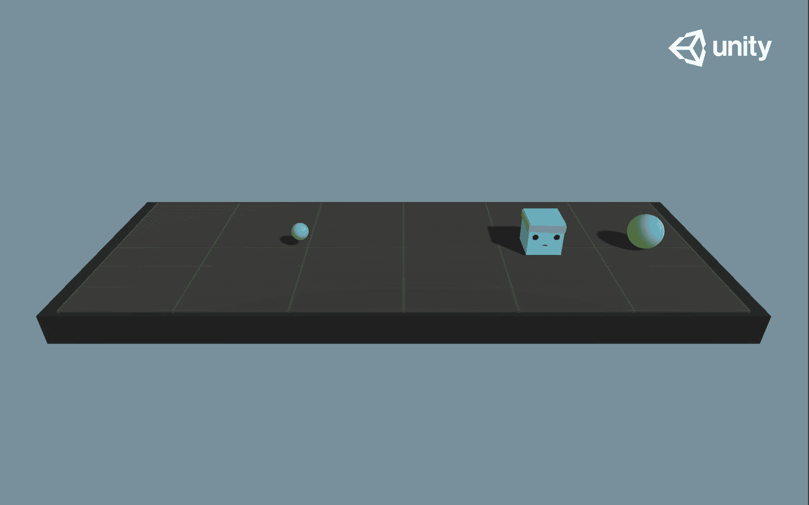

图 3-8

Unity ML Agents 中的基本环境

让我们打开 Unity，正如之前提到的，我们必须拖入之前下载的 ML Agents 包。然后我们将导航到“Assets”文件夹，在该文件夹中，ML Agents 文件夹包含我们刚刚查看的所有环境以及脚本和神经网络模型。让我们尝试看看在 Unity 引擎中安装 ML 代理的另一种方法。

### Unity ML Agents 的本地安装

现在我们将在本地安装 Unity ML Agents。当你不需要源仓库的所有内容，只包括必要的部分，如行为脚本（大脑）、学院和带有示例场景的深度学习算法时，这很有帮助。导航到“Windows”标签页并选择“Packages”选项。该“Packages”窗口包含在该特定 Unity 项目中当前存在的所有包。这些是包含不同包的“JSON”文件，如 Unity Ads、Physics、HRDP 等。图 3-9 展示了预览。

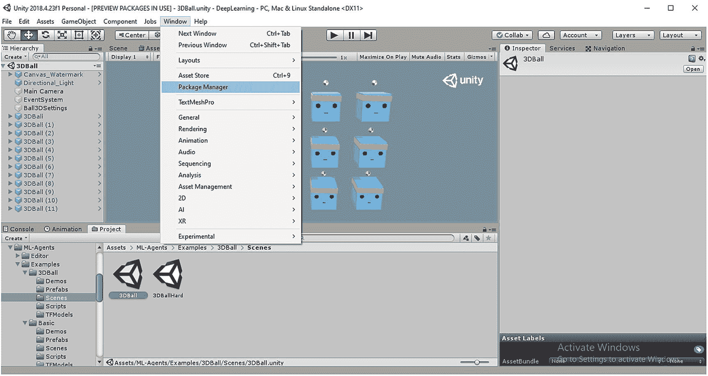

图 3-9

Unity 编辑器窗口标签页中的“Package”选项

下一步是添加我们下载的（或克隆的）ML Agents 包。这将安装所有包详情，包括 Barracuda、Python API 和某些 C# 脚本（即行为脚本或大脑），没有这些脚本 ML Agents 将无法工作。由于我们必须从我们的 ML Agents 安装目录添加包，所以我们选择下面的“+”图标来添加它。我们得到一个选项“从磁盘添加包”，我们必须点击这个选项来打开一个 Windows 弹出窗口。下一步是导航并选择我们想要包含在项目中的包。在我的情况下，我使用的是 Unity 2018.4 版本，因此对于其他较新版本，UI 可能会有所不同，但步骤仍然是相同的。图 3-10 显示了包管理器窗口。

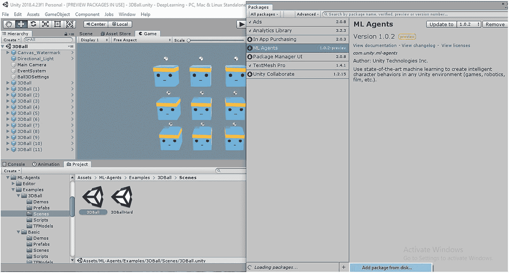

图 3-10

从磁盘添加 ML Agents 包的选项

接下来，我们必须导航到我们下载的 ML Agents 文件夹，并进入“com.unity.ml-agents”文件夹。此文件夹包含一个名为“package.json”的 JSON 文件，其内容如下：

```py
{
"name": "com.unity.ml-agents",
"displayName": "ML Agents",
"version": "1.0.2-preview",
"unity": "2018.4",
"description": "Use state-of-the-art machine learning to create intelligent character behaviors in any Unity environment (games, robotics, film, etc.).",
"dependencies": {
"com.unity.barracuda": "0.7.1-preview"
}
}
```

包文件包含 ML Agents 的版本详情以及我们正在使用的 Unity 当前版本，以及 Barracuda 包版本。Barracuda 包非常重要，因为它是一个 Unity 中神经网络的轻量级包，使我们能够在 Unity 游戏中运行预训练的 Tensorflow 网络。一旦我们选择此 JSON 包导入 Unity，我们就需要等待一段时间，直到 Unity 完成构建依赖项并添加 ML Agents 运作所需的必要脚本。

### 从 Python 包索引安装 ML Agents

我们还可以从 Python 包索引（PyPI）网站安装 ML Agents。这也允许下载和安装可能之前未安装的任何依赖项。如果在下载或安装 ML Agents 时持续出现错误和问题，这将有助于解决这些错误。此安装指南还旨在解决我们可能下载的不同版本的先前下载的附加库（如 Tensorflow 或 Pytorch，或 Gym/Baselines）的问题。安装命令相当简单，可以从命令提示符或 Anaconda 提示符中编写：

```py
pip install mlagents
```

此操作将下载所有相关库，并提供日志以显示正在下载哪些版本。这不会从 Github 仓库下载或克隆，而是从链接中提到的 ML Agents PyPI 页面下载，即[`https://pypi.org/project/mlagents/`](https://pypi.org/project/mlagents/).

在 Anaconda 提示符中完成安装后，我们可以通过运行以下命令来检查：

```py
mlagents-learn –help
```

运行此命令后，屏幕上会显示所有与已安装的 ML Agents 相关的命令和信息。之前曾经显示过 Unity 标志；然而，新版本已经废弃了“--help”命令中的标志。在本书稍后通过 Anaconda 提示符训练 ML Agents 时，我们将看到该标志。此安装还会安装“setup.py”文件中提到的所有详细信息。随着时间的推移，PyPI 页面可能会更新为 ML Agents 的新版本，运行上述命令确保安装最新版本。图 3-11 显示了提到的步骤。

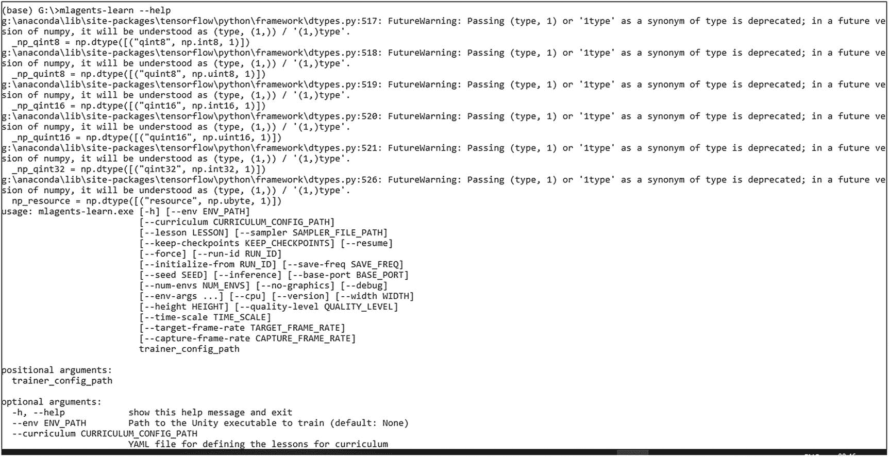

图 3-11

在 Anaconda 提示符中运行“mlagents-learn --help”命令

现在我们已经成功完成了 ML Agents 及其所有外围设备的安装。现在让我们尝试了解如何在容器化环境中，例如虚拟机环境中，进行安装。

### 在虚拟环境中安装

虚拟环境是一个包含根目录的独立环境，其中包含一组自己的库和框架，不会影响本地系统的其他部分。它是一个容器化环境，拥有自己的 Python 版本，可能与基本版本或本地安装的 Python 不同。在虚拟环境中工作非常有帮助，因为当虚拟环境中发生任何错误或崩溃时，其他环境和本地设置或库不会受到影响。在专注于使用 ML Agents 进行游戏开发的生产环境中，虚拟环境有两个重要的方面，使其对开发团队有帮助。

+   **易于依赖管理**:** 可以轻松管理与 Python 的各个模块相关的依赖项，无需担心整个产品崩溃或进行不希望的改变。

+   **健壮的 CI/CD 管道** **:** CI/CD 代表持续集成/持续开发，通常指的是从开发、构建、测试和分析的生产管道。在容器化环境中，可以实施敏捷方法（基于开发冲刺），这无疑将有助于产品增长。

对于这个特定案例，我们必须从安装 pip 模块开始，因为它可能不在虚拟环境中。这可以通过以下命令下载和安装：

```py
curl https://bootstrap.pypa.io/get-pip.py -o get-pip.py
```

下一步是运行“get-pip.py”模块，使用以下命令：

```py
python3 get-pip.py
```

接下来，我们检查已安装 pip 的版本：

```py
pip3 -V
```

下一步是使用以下命令在 Anaconda 提示符中创建我们自己的虚拟环境：

```py
python -m venv python-envs\new-env
```

激活环境时，使用以下命令：

```py
python-envs\new-env\Scripts\activate
```

这就是我们需要在 Anaconda 命令提示符中设置自己的虚拟环境所需做的全部工作。安装 ML Agents 的下一步与上一节使用 pip 命令类似。这里唯一的区别是，在这种情况下，我们是在容器化环境中运行 ML Agents 的安装，而不是本地运行，并且对于模型训练的所有步骤，我们只能使用这个虚拟环境中的 ML Agents 的功能。如果 ML Agents 没有安装在其他任何地方，那么除非它在相关的虚拟环境中，否则这些命令或 ML Agents 的功能将不会运行。我们还可以停用我们的虚拟环境，然后重新激活，这与使用 activate 命令类似。

### 用于修改 ML Agents 环境的高级本地安装

当我们想要修改我们的训练环境时，“mlagents_envs”包的安装还有一个方面是必需的。尽管这一步不是强制性的，但我们应该能够单独安装这些模块。安装 ML Agents 的环境有两种方法。

+   **从 PyPI 安装：**PyPI 包含“mlagents_envs”包的发布版本，可以在以下链接中找到：[`https://pypi.org/project/mlagents-envs/`](https://pypi.org/project/mlagents-envs/)。

    安装是通过 pip 命令完成的：

+   **从 ML Agents 包安装：**要从我们克隆的 ML Agents 仓库安装环境，我们必须在 Anaconda 命令提示符中导航到克隆仓库的根目录，然后输入：

```py
pip install mlagents-envs
```

```py
pip install  -e ./ml-agents-envs
pip install  -e ./ml-agents
```

从 ML Agents 克隆包安装有一些先决条件。“-e”会更改 ML Agents 的所有依赖项。如果我们不是使用 pip 命令安装环境，那么在安装“mlagents”之前，我们首先必须安装“mlagents-envs”。这是因为 mlagents 依赖于“mlagents-envs”来实现其功能。如果我们以相反的顺序执行，那么当我们安装“mlagents”时，默认的 mlagents-envs 将会从 PyPI 安装。

这完成了整个安装过程，也提供了安装 ML Agents 的不同方法。在下一节中，我们将查看 ML Agents 包的各个组件，以及如何将其与 Python 和 Jupyter 笔记本链接。

## 配置 ML Agents 的组件：大脑和学院

在本节中，我们将概述 ML Agents 包的不同组件，并尝试理解从上一个版本到当前版本 ML Agents 中所做的更改。ML Agents 包有三个主要部分，我们将使用它们进行深度学习：

+   **mlagents**：这部分包含用于在 Unity 环境中训练我们的代理的深度强化学习的主要源算法。

+   **mlagents_envs**：这实际上是连接 mlagents 和环境的 Python API。因此，重要的是要记住，Unity ML Agents 依赖于 ML Agents 环境。

+   **gym_unity**：OpenAI 的 Gym 环境的包装器，用于将我们的 Unity 游戏场景转换为可训练的深度学习环境

我们可以深入了解上述文件夹结构的细节，了解每个单独的组件，但为了不失一般性，mlagents 文件夹对于我们理解 Unity 所做的核心 PPO 和 SAC 算法实现以及如何修改它将极为重要。如果我们进入**mlagents ➤ trainers**文件夹，我们可以看到存在几个算法。不用说，这是最重要的方面，我们将在本书后面的章节中进行探讨。在**mlagents-envs**文件夹中，最重要的 Python API 链接是通过**communicator_objects**文件夹完成的。这个文件夹特别包含了与训练 ML Agents 时连接本地服务器到端口 5004 相关的所有信息，并且形成了 Tensorflow、Tensorboard 和 C# Unity 之间的桥梁。同样，**gym_unity**文件夹包含了所有在训练 RL Unity 环境时转换为 Gym 环境的 Unity 环境和测试文件夹。

现在我们已经安装并设置了 ML Agents，并对三个主要部分有了简要的了解，我们将深入探讨 ML Agents 的基本架构。这种架构模式最初作为 ML Agents 工作原理的可视化发布，近年来已经发生了相当大的变化。然而，从根本上讲，尽管架构已经改造成了一个更稳健的版本，但核心功能仍然运行在基线架构：大脑-学院架构。

### 大脑-学院架构

关于 ML Agents 初始构建的基本概念是拥有由神经网络控制的智能体，这些神经网络通常被称为智能体的“大脑”。学院相当于环境，控制大脑的训练并在运行智能体或模拟时与在线模型进行通信。从根本上讲，大脑架构可以广泛地分为以下几种。

+   **内部大脑** **:** 这种类型的大脑架构包含使用各种深度学习算法训练的预训练模型。内部大脑在训练过程中不需要与 Python API 进行运行时通信，因为它已经在现有的观察-动作空间上进行了训练。在 Unity ML Agents 下的所有示例项目都关联有内部大脑（预训练网络）。

+   **启发式大脑** **:** 这种类型的大脑通常不包含任何神经网络模型；相反，它包含一个启发式模型。我们在第二章中讨论了涉及 A*的启发式路径查找算法。这些算法包含在这个大脑中。启发式大脑不像基于梯度下降的深度学习那样，更侧重于动态规划和基于状态的学习，而不是使用梯度下降的深度学习。

+   **外部大脑:** 外部大脑是另一个使用深度学习算法的大脑；然而，这用于在 Unity 场景中训练智能体。通信对象在通过端口 5004 与我们使用 Tensorflow 训练的模型进行通信时发挥着重要作用。外部大脑通过通信器和 Python API 用于在运行时通过通信器训练智能体。这些训练好的模型随后作为内部大脑使用，当作为生产化和预训练模型传递给智能体时。

图 3-12 显示了大脑-学院架构。

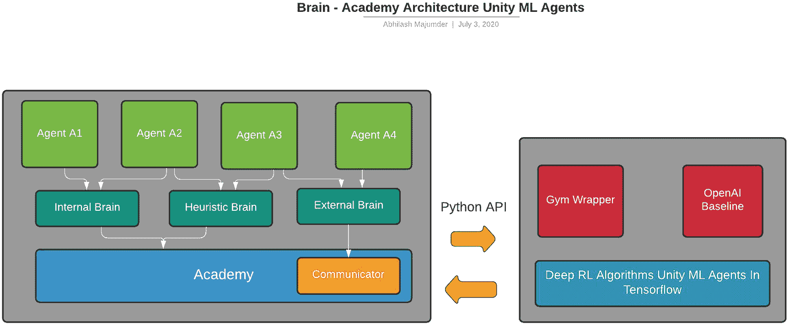

图 3-12

Unity ML 智能体的脑-学院架构

**学院:** 学院控制环境中的大脑集合，并有权访问运行时环境。学院控制的环境范围包括：

+   **Unity 引擎配置:** 这包括与特定游戏相关的速度、每秒帧数和渲染管线，该游戏正在接受训练或在推理模式下运行。

+   **剧集长度:** 这控制了 Unity GamePlay 环境中 RL 智能体的剧集长度。

+   **帧跳过:** 在每个智能体之间跳过的 Unity 引擎站点数，以做出新的决策。这实际上排除了在智能体的训练阶段更新策略时未渲染的帧数。

这是 ML Agents 在版本 1.0 发布之前存在的中央架构模型。在新版本中，大脑组件（C# 脚本）已被弃用，并已被某些控制大脑和智能体决策过程的脚本所取代。

### Unity ML Agents 版本 1.0 中的行为和决策脚本

控制大脑和决策过程的最重要的脚本包括：

+   **行为参数 C# 脚本**

+   **决策请求器 C# 脚本**

+   **模型覆盖器 C# 脚本**

重要的是要理解，在 Unity ML Agents 中，存在用于记录环境中任何观察-动作空间的传感器。借助传感器，智能体将了解 RL 环境的不同部分。这些传感器本质上是我们之前章节中使用的射线（物理射线），用来表示智能体在环境中的位置，并检查智能体与奖励之间的距离。

为了理解这些变化，让我们在 Unity 中打开 3D 球环境，并在 3D 球预制件内部，我们将看到两个模型：“球”和“智能体”。“球”预制件是“智能体”预制件必须在其“头部”上平衡的小球。

如果我们在检查器窗口中打开“Agent”预制件，我们将看到与该预制件关联的不同组件和脚本。其中一些细节是通用的，如变换和盒子碰撞体；其他细节需要我们注意。我们可以看到与该智能体关联的“行为参数”、“决策请求者”和“模型覆盖者”C# 脚本。还有一个“球体 3D 智能体”C# 脚本附加在此，我们将在本章后面的部分中看到。正如之前提到的，让我们简要了解这三个不同的 C# 脚本。

+   **行为参数脚本**：此脚本中存在之前大脑架构的不同类型，例如：内部、外部和启发式。此脚本的主要目的是确定智能体是否将在推理模式（内部大脑）中运行，在启发式模式（启发式大脑）中运行，还是在外部模式（外部大脑）中运行。这如图 3-13 所示。

    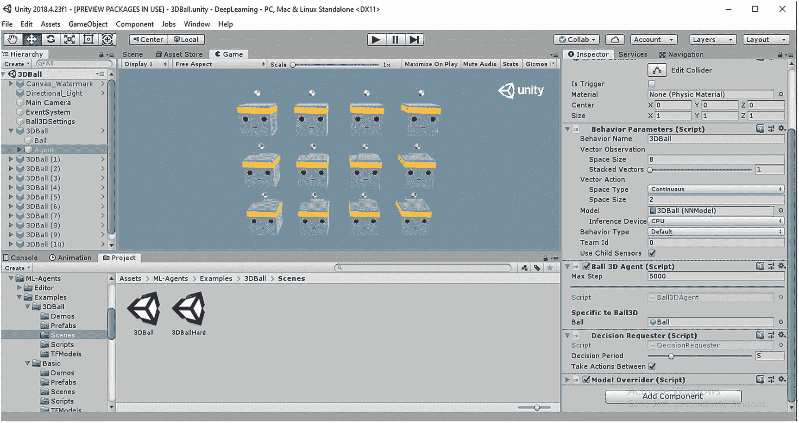

    图 3-13

    Unity 中“Agent”预制件的检查器窗口中的行为参数、决策请求者和模型覆盖者脚本

    它还控制传感器的使用，确定是否使用子传感器，并在特定时间步确定在多智能体训练环境中搜索哪个智能体。我们将在下一章中更深入地探讨这个脚本，那时我们将考虑大脑架构。目前，我们可以看到检查器窗口中的这个标签页有两个重要方面。

    +   **模型**：这包含在推理模式或实际游戏过程中所需的神经网络模型。这是放置在内部大脑中的训练好的 Tensorflow 模型。我们还可以选择场景中存在的不同预训练模型。这还包括推理设备——即我们是否想在 CPU 或 GPU 上运行模型，如图 3-14 所示。

        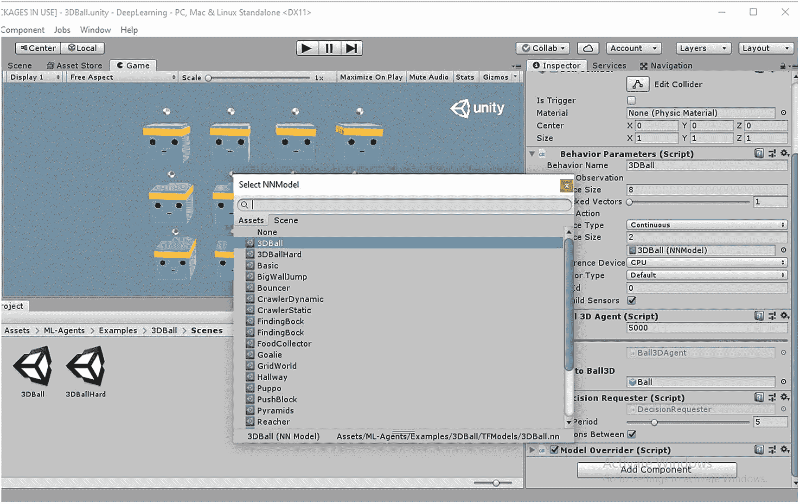

        图 3-14

        为行为参数脚本选择神经网络模型

    +   **行为类型**：这控制我们想要使用的“大脑”类型——内部、启发式或外部。根据行为类型，智能体将尝试遵循特定策略以实现奖励最大化。从根本上讲，这可以被视为“大脑”架构。需要注意的是，如果没有为内部大脑训练的预训练模型，在模型训练阶段，我们将使用外部大脑。稍后，这个训练好的外部大脑可以存储在 Unity 中，并稍后用作内部大脑。如果我们不想为智能体使用深度强化学习算法，则应存在启发式大脑。图 3-15 表示行为。

        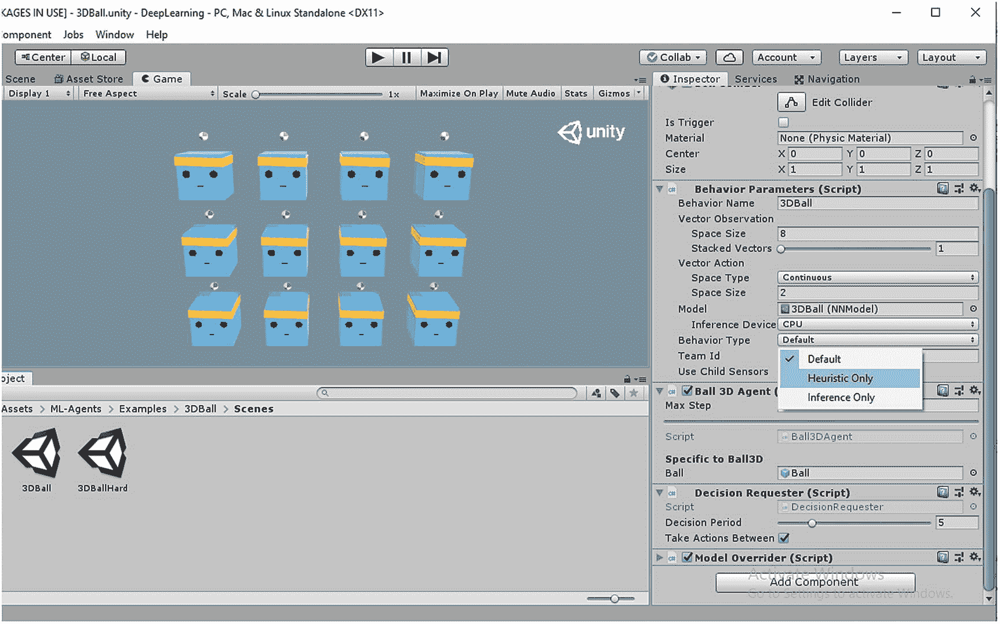

        图 3-15

        控制大脑的检查器窗口中的行为类型

        还有其他几个属性，我们将在下一章深入讨论这些内容。现在，理解行为参数作为机器学习智能体基本大脑的重要性是很重要的。

+   **决策请求脚本** **:** 该脚本与智能体在其动作空间中的决策过程相关联。该脚本还包含智能体根据特定策略采取决策的频率，并调节智能体是否可以在决策之间采取行动。这与大脑-学院架构模型相关，因为它控制学院步骤中的决策过程。我们将在下一章进一步探讨这一点。它还包含诸如“决策周期”之类的变量，默认值为 5，表示采取决策的频率，以及“决策之间采取行动”（布尔）变量，如果选中，允许智能体在决策之间采取行动。

+   **模型覆盖脚本** **:** 该脚本用于在推理阶段覆盖现有的神经网络模型。它还包含有关剧集运行时长的详细信息，通常建议每个智能体有一个行为参数（1:1 比率）。它还有助于运行神经网络，以“maxSteps”表示的时间步长来检查模型中的失败。这也可以被视为大脑学院架构的一部分。

我们现在已经简要概述了大脑-学院架构的最基本和最重要的概念以及新版本中的变化，包括行为参数、决策请求脚本和模型覆盖脚本的引入。还有其他脚本也处理基于射线的传感器，这对于大脑做出决策非常重要，我们将在使用 Unity ML Agents 创建游戏的全过程中逐步介绍这些内容。从图 3-16 可以直观地展示新版本与大脑-学院之间的架构关系。

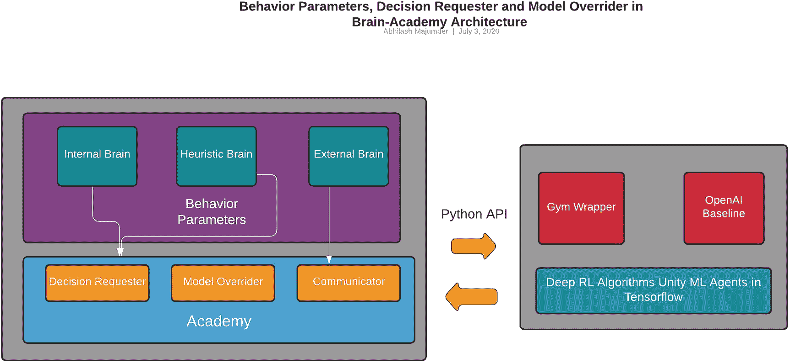

图 3-16

新旧架构之间的关系

## 将 Unity ML Agents 与 Tensorflow 链接

本节主要依赖于将 ML Agents 神经网络模型与 Tensorflow 链接，这是我们将在整个过程中使用的深度学习框架。Unity C# ML Agents SDK 代码与 Python 中的深度学习算法之间的链接是通过我们在本章开头简要研究过的通信对象实现的。然而，值得注意的是，在训练过程中，我们可以通过 Anaconda 提示环境以非常简化的方式使用 Unity 提供的 PPO 和 SAC 算法的实现。在“mlagents”中的“trainers”文件夹（之前讨论过）中，我们看到了算法的不同实现。然而，目前我们只需要了解如何使用预构建的 Unity ML Agents 环境来引用这些 ML 模型。为此，我们需要 ML Agents 克隆仓库中的“config”文件夹。它包含几个扩展名为“yaml”的文件。本质上，这些文件包含我们在 Tensorflow 中训练神经网络模型时所需的超参数。但在训练之前，让我们了解一下 Barracuda，Unity 推理引擎。

### Barracuda: Unity 推理引擎

Unity ML Agents Toolkit 用于使用推理模式（内部大脑）运行预训练的神经网络模型，如前所述。这是通过 Unity 推理引擎或 Barracuda 实现的。这是一个轻量级的库，它帮助将神经网络模型（从 Tensorflow）转换为扩展名为“.nn”的序列化文件。推理引擎与 C# Mono 以及中间语言到 C++（ILCPP2）兼容。ILCPP2 是一个在 C++上运行的脚本后端，对于减少游戏大小非常有帮助；它通过从 C#的.NET DLL 文件中执行字节码剥离来工作，并生成一个轻量级且快速的本地二进制文件。当我们选择构建设置来构建我们的游戏时，这个选择也是可用的。推理引擎支持两种不同的格式，如这里所述。

+   **Barracuda**: 包含训练好的神经网络模型的“.nn”文件格式。这是通过“tensorflow_to_barracuda.py”Python 脚本完成的。我们将在下一章中再次探讨这一点，当我们尝试理解神经网络模型的序列化时。

+   **ONNX**: 这是一种“onnx”文件格式，它是由“tf2onnx package”生产的跨功能神经网络模型支持的行业标准开放格式。

推理引擎可以在行为参数脚本中看到。我们注意到在“模型”部分有一个推理设备属性，我们可以选择 CPU 或 GPU。这使得推理引擎能够在设备上运行。除非我们使用 Resnet 或 VGG16（计算机视觉模型），否则我们应该可以使用 CPU 作为我们的推理引擎设备。图 3-17 展示了推理设备。

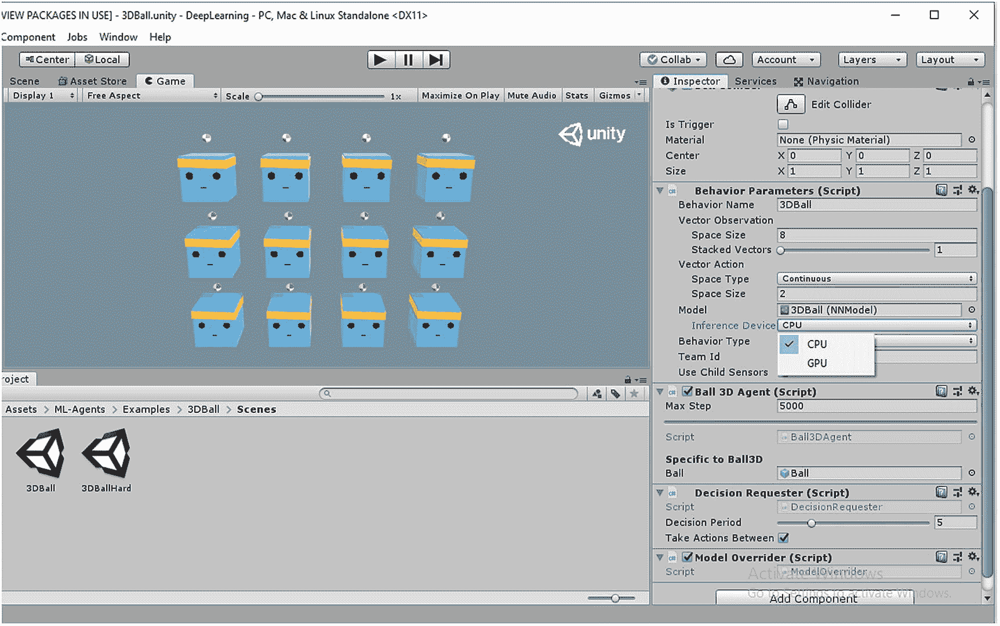

图 3-17

推理引擎的推理设备（CPU/GPU）

现在我们已经了解了如何通过 Barracuda 在 Unity 中存储 TensorFlow 训练的网络，我们可以使用 3D 球示例来训练预构建的模型。

### 使用 Unity ML Agents 训练 3D 球环境

让我们导航到存储库中的“config”文件夹，查看其内容。我们将使用“trainer_config.yaml”文件通过 Anaconda 提示符来训练我们的模型。还有其他几个 yaml 文件，如“gail_config.yaml”和“sac_trainer_config.yaml”。然而，对我们来说，我们将使用“trainer_config.yaml”默认文件，它依赖于 PPO 算法进行训练。让我们看一下“yaml”文件的内容。

打开时，我们看到一系列用于训练我们的神经网络的参数（超参数）。目前让我们将这些超参数视为某些属性，这些属性将有助于训练过程。我们有一组默认的超参数，如下所示：

```py
default:
trainer: ppo
batch_size: 1024
beta: 5.0e-3
buffer_size: 10240
epsilon: 0.2
hidden_units: 128
lambd: 0.95
learning_rate: 3.0e-4
learning_rate_schedule: linear
max_steps: 5.0e5
memory_size: 128
normalize: false
num_epoch: 3
num_layers: 2
time_horizon: 64
sequence_length: 64
summary_freq: 100
use_recurrent: false
vis_encode_type: simple
reward_signals:
extrinsic:
strength: 1.0
gamma: 0.99
```

如我们所见，有几个参数，如“trainer: ppo”，这表示在这个环境中使用了 PPO 模型。我们还有几个属性，如内存大小、最大步数、epoch 数、批处理大小等。所有这些都有其自身的意义，我们将在“深度学习”章节中深入探讨。可以安全地假设，训练环境是通过这些超参数来管理的，这些超参数指定了使用哪种算法、状态和奖励、存储观察空间信息的内存大小、训练将持续多长时间，以及代理选择动作之间的时间间隔。这个“默认”模块用于训练任何未指定基于哪些超参数进行训练的环境。但在我们的情况下，我们将使用 3D 球超参数集，如下所示：

```py
3DBall:
normalize: true
batch_size: 64
buffer_size: 12000
summary_freq: 12000
time_horizon: 1000
lambd: 0.99
beta: 0.001
```

在这个例子中，我们相比这个例子有更少的一组超参数。我们有批处理大小，它控制训练批次的尺寸，以及缓冲区大小，它包含重放缓冲区或内存的大小。“lambd”和“beta”是控制学习率的超参数。此外，我们还有一组用于 3D 球困难环境的超参数，如下所示：

```py
3DBallHard:
normalize: true
batch_size: 1200
buffer_size: 12000
summary_freq: 12000
time_horizon: 1000
max_steps: 5.0e6
beta: 0.001
reward_signals:
extrinsic:
strength: 1.0
gamma: 0.995
```

因此，目前我们简要地了解到了“trainer_config.yaml”文件中包含的超参数。现在让我们打开 Anaconda 提示符环境，然后在提示符中，我们需要导航到包含“trainer_config.yaml”文件的目录。之后，我们必须输入以下命令：

```py
mlagents-learn trainer_config.yaml –-run-id=new3DBall –train
```

“trainer_config.yaml”是我们之前提到的 yaml 文件。这使 ML Agents 知道我们想要使用“trainer_config.yaml”文件中的“3D Ball”模块。run-ID 表示我们正在训练的新模型的名称。通常，训练的语法可以写成如下：

```py
mlagents-learn  –-run-id= --train
```

在新版本中，`-train` 命令是可选的，也可以省略。现在我们正在使用“trainer_config.yaml”中提到的超参数，但我们知道还有其他 yaml 文件，它们包含不同的训练算法和不同的超参数集。例如，如果我们使用“sac_trainer_config.yaml”文件来训练它，那么语法将是：

```py
mlagents-learn  –-run-id= --train
```

如果我们在“config”文件夹中运行我们的命令，那么它可以简化为：

```py
mlagents-learn sac_trainer_config.yaml –-run-id=sac3DBall --train
```

一旦完成，我们将看到 Unity ML Agents 开始通过端口 5004 连接到 Python API，然后使用 Tensorflow 库开始训练过程。

经过一段时间，Anaconda Prompt 窗口中将出现一个选项，指出必须使用 Unity Editor 播放 3D Ball 环境才能进行外部训练。如果 Unity Editor 环境不在播放模式，则 API 会超时，训练不会完成。因此，我们需要转到编辑器 ➤ 项目设置 ➤ 玩家。在玩家部分中，我们必须转到“分辨率和显示”部分并勾选“在后台运行”选项。这将使 Unity 引擎编辑器在我们通过 Anaconda Prompt 窗口训练模型时运行，如图 3-18 所示。

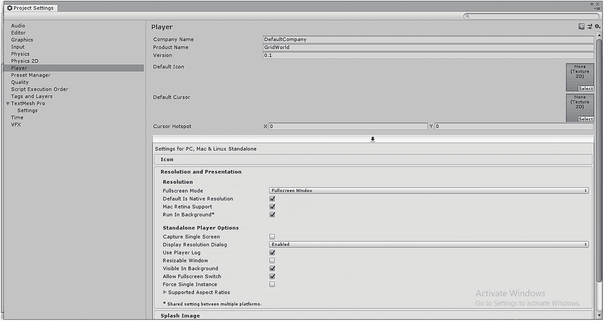

图 3-18

在项目设置中配置玩家（在后台运行）

如果我们开始训练过程，它应该看起来像图 3-19，这次还有一个 Unity 标志要显示，如图 3-19 所示。

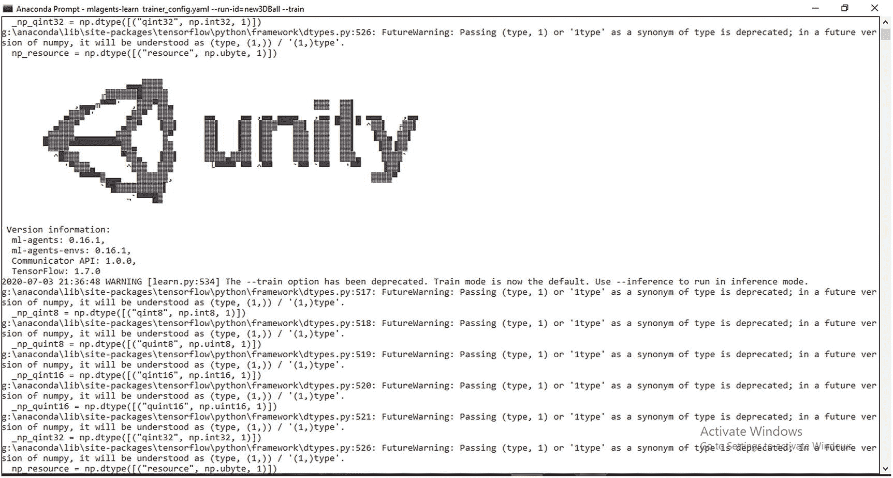

图 3-19

使用“mlagents-learn”命令训练 3D Ball Unity 代理

一旦开始训练，我们将看到“mlagents”、“mlagents-envs”、Python Communicator API 和 Tensorflow 的版本。在 Unity 编辑器场景中，我们将被提示点击“播放”以启动外部大脑的训练过程。这看起来就像图 3-20 中所示。

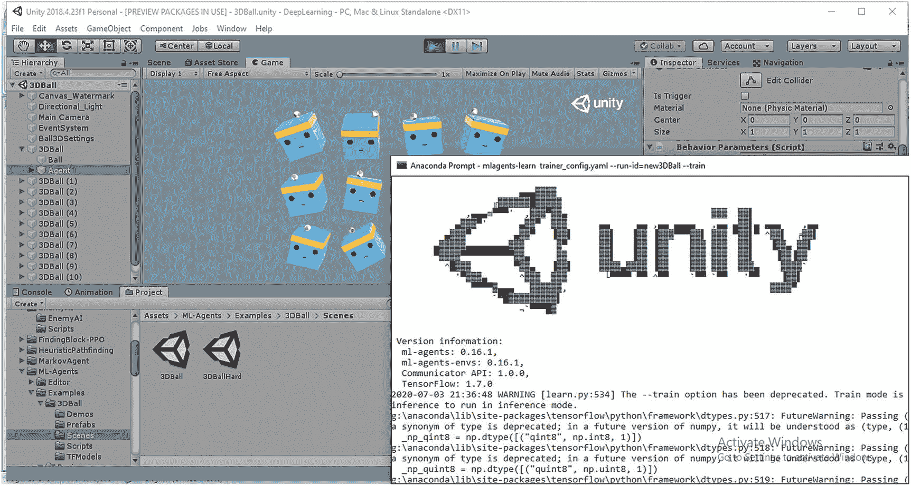

图 3-20

在 Unity ML Agents 和 Tensorflow 中使用 PPO 深度学习算法对 3D Ball 环境进行训练

我们会看到代理试图在头上平衡球或球体，在训练的初始阶段，球体在许多情况下会从头上掉下来。这会给代理一个负奖励，随着学习的进展，我们将逐渐看到代理学会平衡球。此外，我们在屏幕上显示了从“trainer_config.yaml”文件接收到的超参数。训练过程的预览如图 3-21 所示。

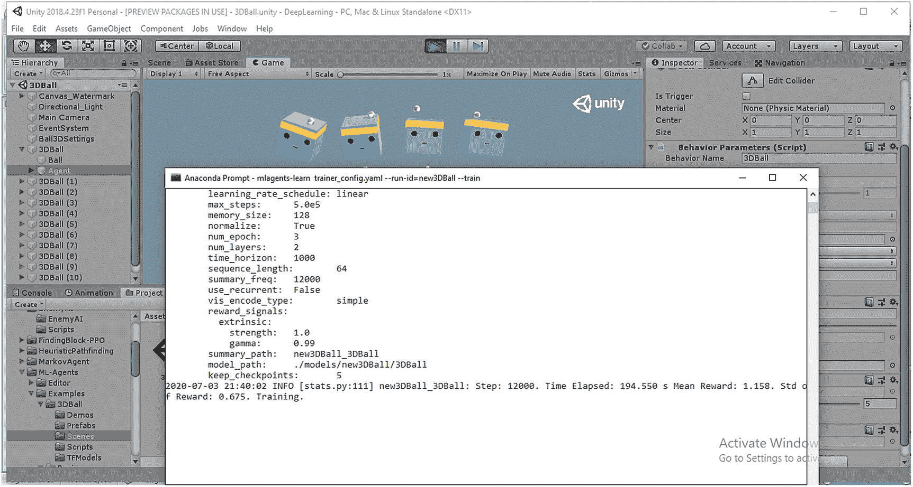

图 3-21

训练过程中的超参数、奖励和步数

我们现在可以看到代理逐渐学习，Anaconda 提示符中的日志也揭示了每 12,000 步的平均奖励和标准差，这被提及为一个超参数。如果我们让这个训练长时间进行（比如说平均一个小时），我们会看到奖励随着代理越来越擅长平衡球而逐渐增加。现在让我们在 TensorBoard 中可视化这个学习过程。

### 使用 TensorBoard 进行可视化

我们知道 TensorBoard 是一个可视化工具，并在第一章中安装了它，当时我们在 CartPole 环境中尝试深度 Q-learning。现在在这一节中，我们将使用 TensorBoard 将 Anaconda 提示符中的训练与 Unity ML Agents 连接起来，以便正确地可视化奖励和其他细节。为此，我们必须打开另一个 Anaconda 提示符终端，并像之前在 ML Agents 仓库中一样导航到“config”文件夹。在文件夹内部，有一个“summaries”文件夹，它包含了正在训练的特定模型的 TensorBoard 可视化统计数据。启动并连接到 TensorBoard 的命令是：

```py
tensorboard --logdir=summaries
```

完成这些后，Anaconda 提示符将显示端口号 6006 以及用于可视化的 http 详细信息。默认情况下，TensorBoard 从端口 6006 运行，链接类型为 http://<device-name>:6006，其中 device-name 是我们正在工作的计算机系统的名称。这就像图 3-22 中所示的那样。

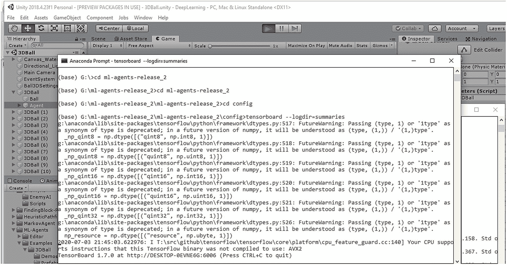

图 3-22

启动 Unity ML Agents 的 TensorBoard

TensorBoard 可视化显示了特定周期内完成的奖励和步骤，以及深度学习算法（PPO）的损失。这是一个交互式可视化工具，随着时间的推移，我们会看到奖励值的增加。我们将分别探索 TensorBoard 的每个模块，但简而言之，这个仪表板提供了损失率、准确率、收集到的奖励、平均奖励、奖励的标准差以及步骤的交互式视图。这将在我们未来章节中构建自己的代理并在 Unity 中使用 ML Agents 进行训练时对我们有益。仪表板如图 3-23 所示。

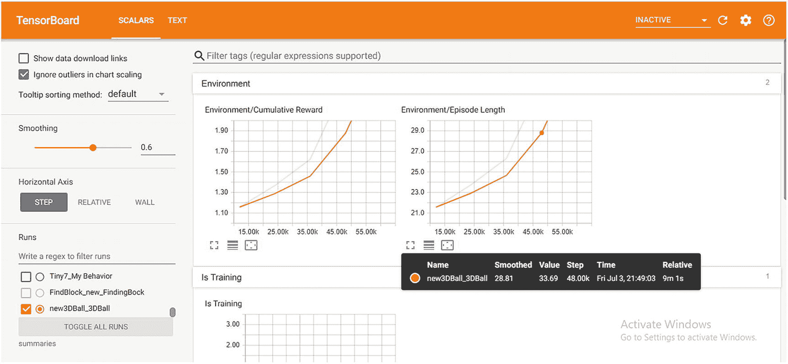

图 3-23

在 3D 球环境训练过程中的 TensorBoard 仪表板

因此，我们现在已经看到了如何将 Tensorflow 链接到 Unity 中训练我们的机器学习代理，以及如何将 TensorBoard 链接到训练过程中的交互式可视化。我们可以随时通过在 Unity 中停止播放模式来关闭训练。

#### 编辑器

现在如果我们想在场景中可视化训练好的新模型（命名为“new3DBall”），我们可以导航到“Agent”预制件中的行为参数脚本，在“模型”的位置，我们可以选择（“new3DBall”）模型。然后，在编辑器中播放时，我们可以看到 Unity 引擎现在正在使用 Unity Inference Engine，并给代理提供新的训练模型（推理模式）。这就是如何将训练的外部大脑转换为可以在 Unity 编辑器内部使用的内部大脑。这个大脑是在 Unity 环境中使用 OpenAI Gym 包装器在 PPO 上训练的，以提供一个能够平衡球体的实际 AI 代理。我们可以继续创建一个使用这个训练好的神经网络模型的 Unity 可执行模拟游戏，通过在配置完构建设置后点击菜单中的构建选项。将新训练的模型放置在“行为参数”脚本的“模型”部分中，我们应该会看到如图 3-24 所示的内容。

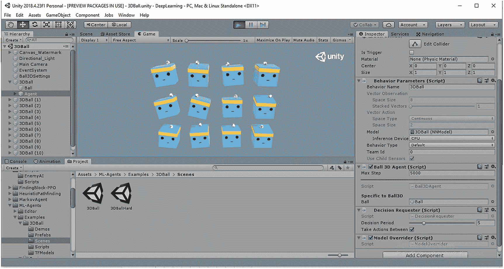

图 3-24

将训练好的神经网络作为 3D 球代理的内部大脑

到目前为止，我们已经了解了 Unity ML Agents 的范围，并借助 ML Agents 和 Tensorflow 训练了一个新的神经网络模型，并基于深度强化学习的 PPO 算法发布了一款新的模拟游戏。在接下来的章节中，我们将深入探讨这些深度学习算法的各个独立模块，并使用 Unity ML Agents 创建模拟和游戏。我们还将了解如何利用 OpenAI 的 Baselines 模型，在 Unity 中借助 ML Agents 和 Python API 训练我们的新游戏。在下一节中，我们将尝试一些 Unity 场景的示例，并了解环境的多样性。

### 尝试 Unity ML Agents 示例

我们已经看到了“3D 球”环境和“基本”环境。现在让我们简要概述一下 ML Agents 示例文件夹中存在的其他环境。对于每个环境，我们将概述代理、奖励、目标和对手，以及使用的脑和传感器类型。需要注意的是，在这些环境中的每一个，我们都会注意到向量动作空间，以及它是离散的还是连续的。这将帮助我们理解环境的多样性以及训练每个代理的复杂性。我们将讨论 15 个额外的环境，因此现在我们可以通过使用上一节学到的知识来训练它们。

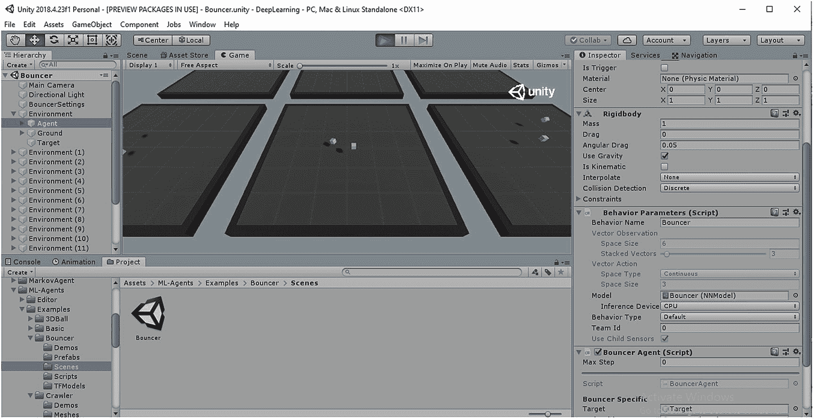

图 3-25

Unity ML Agents 中的 Bouncer 环境

+   **Bouncer 环境** **：** 在这个 Unity 环境中，如图 3-25 所示，蓝色代理必须“跳跃”或“弹跳”以到达位于地面以上位置的绿色目标。每次正确跳跃，代理都会获得奖励。这里我们有行为参数脚本，其中包含预训练的 bouncer 神经网络模型。在这种情况下，向量观察-动作空间是连续的，这适合深度学习算法。使用 PPO 或 SAC（或 ghost/GAIL）在此环境中进行训练的过程非常相似，我们必须在 Anaconda 提示符中运行“mlagents-learn”命令，并传递训练“yaml”文件的路径。

```py
mlagents-learn trainer_config.yaml –-run-id=newBounce –train
```

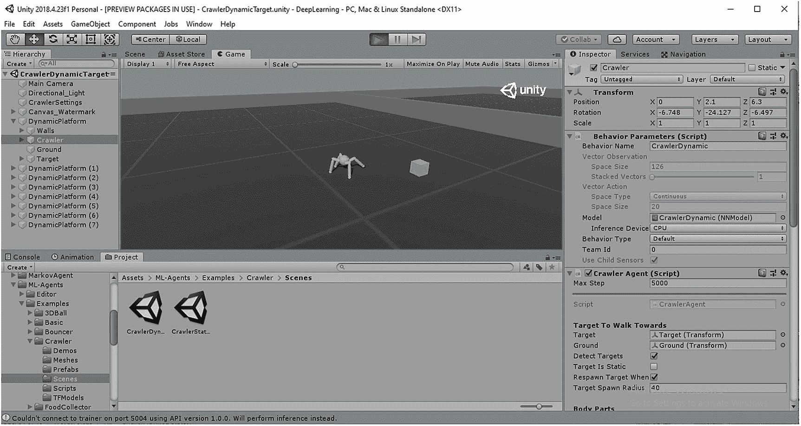

图 3-26

Unity ML Agents 中的 Crawler 环境

+   **爬虫环境** **:** 在这个环境中，如图 3-26 所示，爬虫是由一系列关节组成的集合。它类似于一只试图找到绿色目标（食物）的昆虫。爬虫每次找到正确的目标都会得到奖励；此外，还有两种变体：静态和动态平台。爬虫是一个非常复杂的预制件，因为这里的奖励是由爬虫系统的关节的运动和向量方向驱动的。虽然一开始理解起来可能有些令人畏惧，但我们将使用这个环境来训练我们的 Puppo，它也是一个基于关节的系统。向量空间是连续的，行为参数的详细信息也显示了出来。关节系统由代理腿部的关节组成，这有助于它移动。向量的方向和关节的旋转在决定奖励方面起着重要作用，因为爬虫离食物越近，获得奖励的机会就越大。然而，我们也可以使用我们对“mlagents-learn”命令的了解来训练这个代理，并观察爬虫向其目标移动的方式。

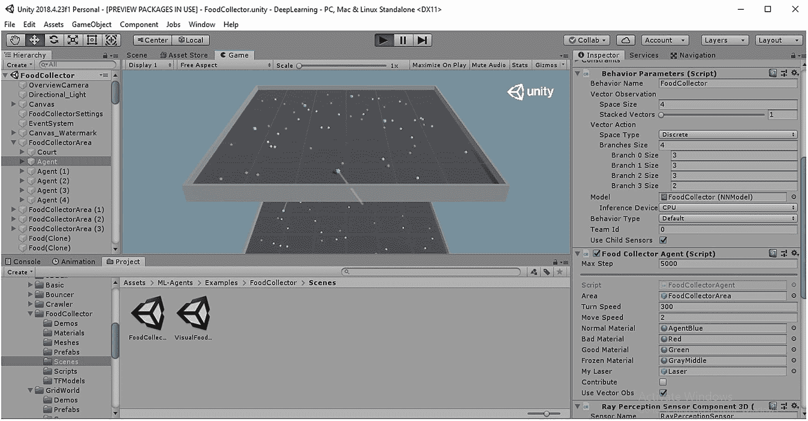

图 3-27

Unity ML Agents 的 GridWorld 环境

+   **食物收集环境** **:** 这是一个不同类型的搜索环境，其中代理必须在布满不同预制件和物体的雷区中收集食物（绿色目标立方体）。如图 3-27 所示。在这里，我们可以看到一个粉红色的线，它实际上是一个扩展的传感器射线，代理通过它进行观察。需要注意的是，在这种情况下，向量观察空间是离散的，为了将其转换为深度学习模型，这需要转换为一个多离散向量空间。此外，这也可以使用 Unity ML Agents 中的“mlagents-learn”命令进行训练。

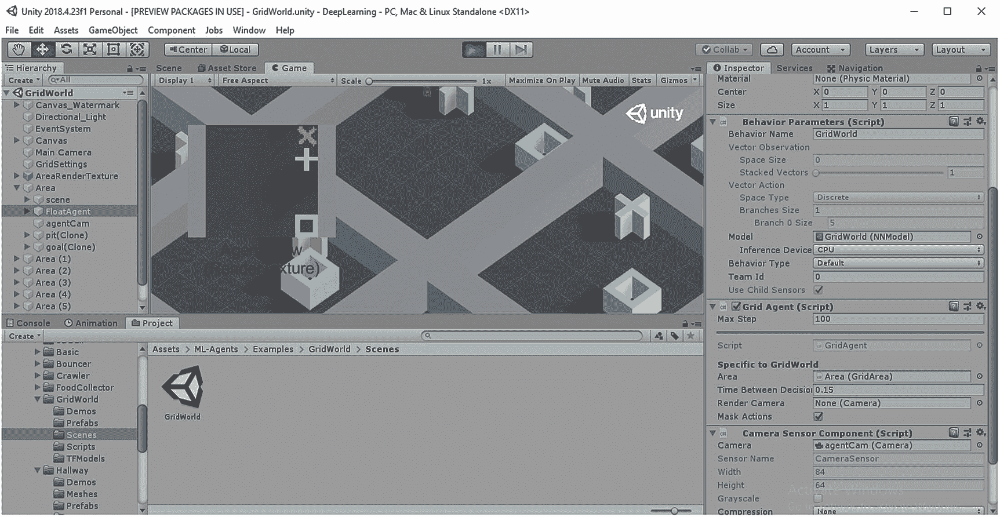

图 3-28

Unity ML Agents 的 GridWorld 环境

+   **GridWorld 环境** **:** 这是一个高级环境，因为它包含了计算机视觉和深度强化学习，如图 3-28 所示。在这里，智能体是“0”标志（蓝色），其目标是朝向“+”标志（绿色）。在这种情况下，我们将使用 Resnet，这是一个由不同的卷积神经网络构建的 SOTA 计算机视觉模型。除了行为参数脚本外，我们还附加了一个摄像头传感器组件脚本到智能体上。它使用像素形式的压缩视觉信息来训练 Resnet 深度网络。然后，计算机视觉模型的结果被传递给行为脚本，用于导航智能体（“0”）朝向“+”绿色标志。在这里，向量空间也是离散的，可以使用“mlagents-learn”命令来训练模型。这是一个有趣的环境，当我们试图理解深度强化学习中的计算机视觉模型时，我们将使用这个环境。

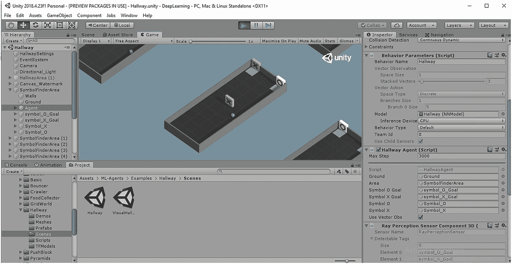

图 3-29

走廊环境 Unity ML 智能体

+   **走廊环境** **:** 走廊环境是另一个独特的环境，其中蓝色智能体必须导航自己朝向“X”或“0”柱子。在中心有一个方块，在每个回合中，都会显示一个独特的符号（“X”或“0”）。智能体必须记住中心方块显示的符号，并自动导航到具有相似符号的柱子。如果中心方块显示“X”，智能体将前往“X”柱子，反之亦然。可以在这里说，在这种情况下，智能体应该严重依赖基于记忆的网络来存储关于中心方块上显示的符号的视觉信息。在这里，有两种变体，其中之一需要计算机视觉模型，如 Resnet。然而，还有一些其他网络，如 LSTM 和循环神经网络（RNNs），可以用来给智能体添加更多记忆。我们将在深度强化学习章节中更详细地讨论这个问题。在这种情况下，行为参数中有一个离散的向量观察空间，可以使用“mlagents-train”命令进行训练，并指定算法的性质和“yaml”文件。图 3-29 显示了环境的预览。

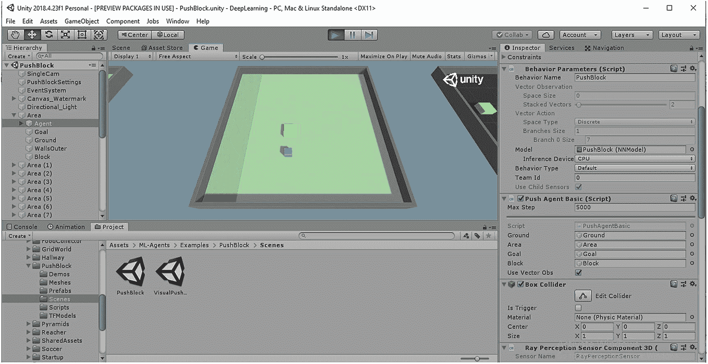

图 3-30

PushBlock 环境 Unity ML Agents

+   **PushBlock 环境** **:** 这是一个简单的环境，其中蓝色智能体必须将较大的方块推向绿色的检查站。这是通过使用传感器射线与碰撞体碰撞并检查视线中的物体是否是更大的立方体来完成的，然后将其推向目标。在这里，向量空间也是离散的，我们可以像图 3-30 所示那样训练模型。

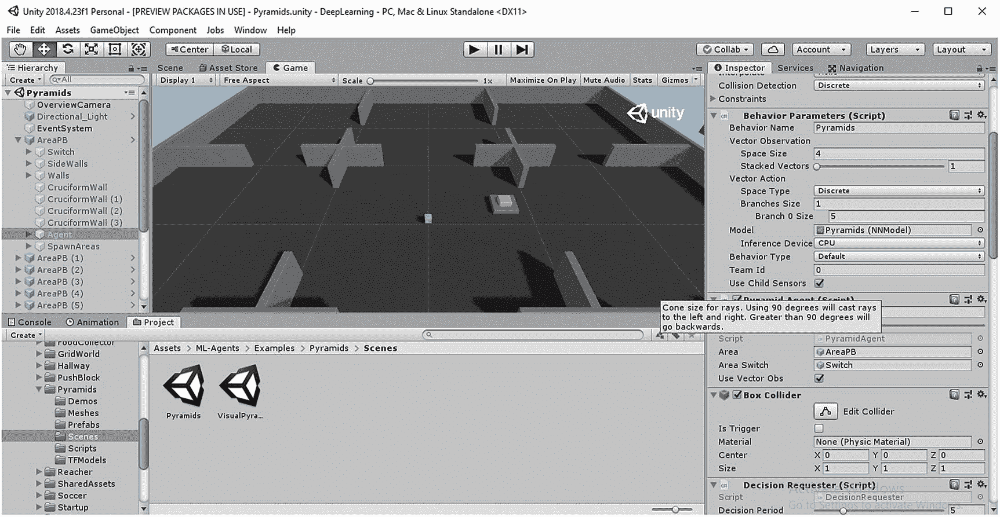

图 3-31

金字塔环境 Unity ML Agents

+   **金字塔环境** **:** 这是一个基于奖励的两步环境，其中代理首先需要在充满障碍物的环境中定位一个“开关”。一旦代理到达开关，就会出现一个新的目标，即金字塔形状。然后代理必须寻找金字塔。这是一个简单的双层奖励验证环境，我们将在后面的章节中进一步探讨。在这里，向量空间也是离散的。这如图 3-31 所示。

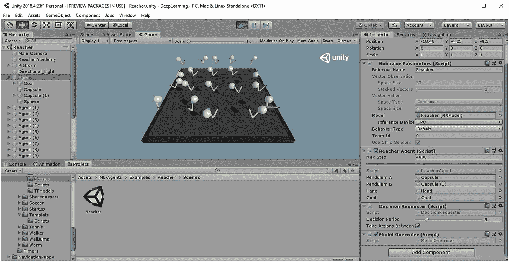

图 3-32

接近者环境 Unity ML Agents

+   **接近者环境** **:** 这是一个相当具有挑战性的环境，其中代理必须控制机械臂，目标是保持机械臂的末端在绿色球体内部，如图 3-32 所示。这是一个深度强化学习问题，需要高级学习算法来控制机械臂的运动方向。环境中的 20 个机械臂由一个代理控制，具有连续的动作向量空间。稍后我们将专门使用这个特定的环境来学习关于离策略深度确定性策略梯度（DDPGs）和其他高级算法。然而，目前我们可以使用 Unity ML Agents PPO 算法和“trainer_config.yaml”文件中的超参数来训练这个接近者代理。

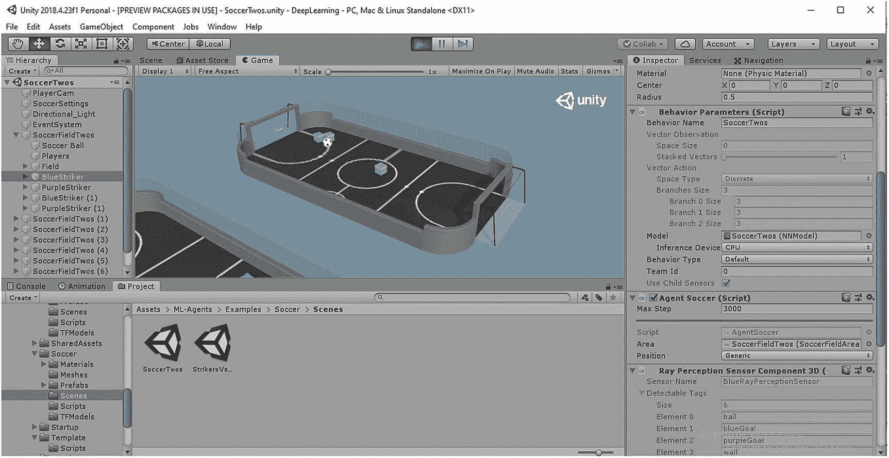

图 3-33

足球环境 Unity ML Agents

+   **足球环境** **:** 这是一个非常流行且有趣的环境，在大多数游戏如 FIFA（艺电）和 Google Dopamine 足球游乐场中被广泛使用。这如图 3-33 所示。这实际上是一个零和游戏，其中对抗性团队必须相互对抗以得分。这可以被建模成一个足球游戏，其中一队的得分将负面地影响另一队。奖励提供给获胜的队伍，而负奖励提供给无法得分的队伍——即紫色和蓝色代理。这将在我们学习关于 RL 中的对抗性自我博弈算法时使用，这些算法在策略上类似于最小-最大（两人，零和）和 alpha-beta 剪枝算法。这里的空间是离散的，而且在这里，我们也有用于确定足球（足球）和球门位置的传感器射线。

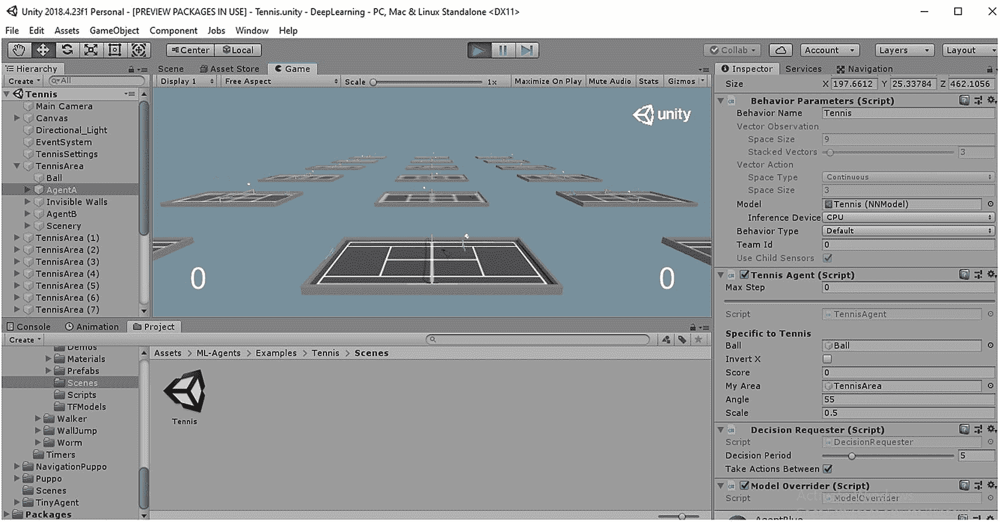

图 3-34

网球环境 Unity ML Agents

+   **网球环境** **:** 这是一个经典的智能体游戏环境，其中两个智能体进行网球比赛，这与足球游戏类似，如图 3-34 所示。在这里，我们将看到如果任何智能体未能击中网球，将获得负奖励。这里可以使用两种不同的算法范式。具有对抗网络的模仿学习可以帮助智能体通过稳健的行为克隆策略进行学习。再次，我们可以使用课程学习，这意味着逐步增加特定智能体的挑战（连续向量空间）。

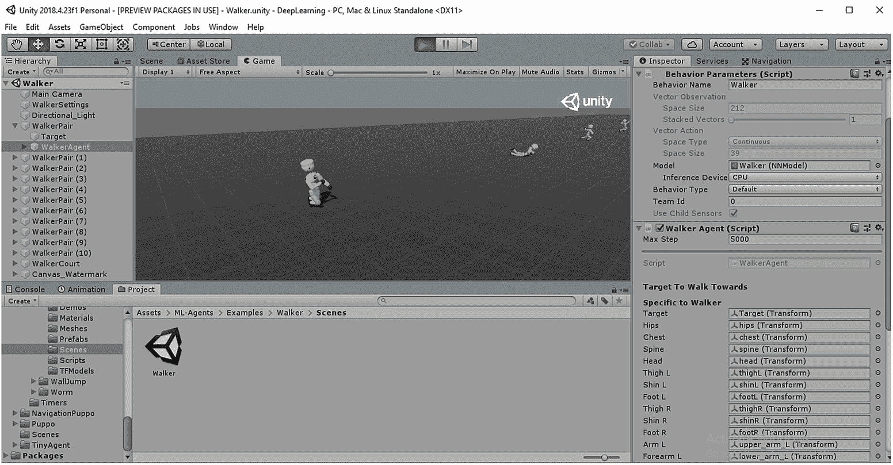

图 3-35

行走环境 Unity ML Agents

+   **行走环境** **:** 这与爬行动物环境类似，智能体是由关节系统组成的人形机器人。然而，与寻找目标不同，这里的主要目标是人形智能体在关节的帮助下行走。这也是一个复杂的挑战，依赖于基于关节的系统。不失一般性，智能体使用其关节的方向向量前进并保持平衡，每次成功做到这一点都会获得奖励。由于所有基于关节的系统都严重依赖于高级深度强化学习技术，因此向量空间是连续的。环境如图 3-35 所示。

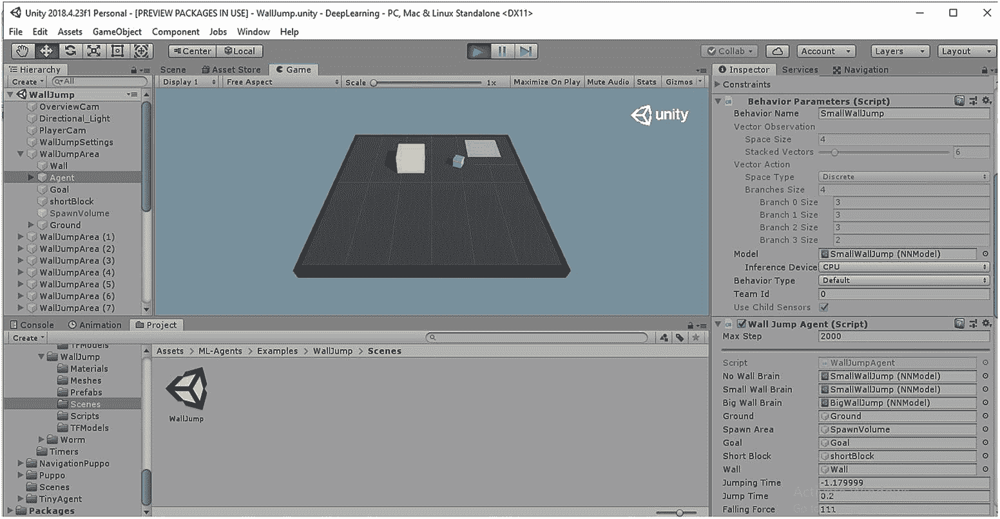

图 3-36

墙跳环境 Unity ML Agents

+   **墙跳环境** **:** 与 PushBlock 和金字塔环境类似，这里的智能体必须跳过墙壁才能到达目标（绿色位置），如图 3-36 所示。这是一个使用传感器射线和连续向量空间观察的简单环境。智能体每次成功跳过更大的立方体（“墙壁”）都会获得奖励。

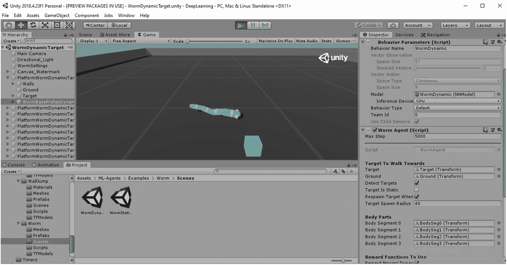

图 3-37

蠕虫环境 Unity ML Agents

+   **蠕虫环境** **:** 与爬行动物类似，这个基于关节的智能体类似于蠕虫，需要找到绿色的目标立方体（食物）。它使用类似的联合旋转和方向策略来计算奖励，并需要深度学习算法进行训练。图 3-37 展示了环境的预览。

这些是 ML Agents 示例文件夹内存在的各种环境。不用说，这些环境在观察-动作空间、奖励、环境和对手方面都非常独特且多样化。以下是一些需要注意的关键点：

+   根据我们对训练 ML Agents 的理解，我们可以通过使用“mlagents-learn”命令并指定我们希望用作训练超参数的“yaml”文件来训练所有环境。我们还可以在 TensorBoard 中可视化每个训练智能体。

+   某些环境，如 crawler、walker 和 worm，依赖于基于关节的物理系统，在这些情况下，可以使用 DDPG、TRPO、PPO 和 AC 等深度强化学习算法在连续向量观察空间中进行。这些内容将在高级深度强化学习的后续章节中分别介绍。这里的训练依赖于关节动力学和向量方向。

+   竞争环境，如足球和网球，高度依赖于最小化策略或深度强化学习中的零和游戏。因此，在网球的情况下，我们还将研究对抗性模仿学习如何帮助智能体，并解释课程学习的基本概念。

+   标准环境，例如 Bounce、PushBlock、WallJump、金字塔和食物收集者，依赖于基于射线的传感器数据作为向量观察空间的信息，然后使用外部大脑和强化学习算法进行训练。这将成为在 Unity ML Agents 中创建深度强化学习游戏的一个起点。

+   计算机视觉和基于记忆的环境，如 GridWorld 和 hallway，非常有趣，因为这些环境使用 Resnet 模型和深度卷积层通过 Unity 相机检索像素信息。然后这些信息作为连续向量空间观察传递给大脑或行为脚本以做出决策。我们还看到了基于 LSTM 的记忆网络在 hallway 环境中的重要作用，并在后续章节中会看到这一点。

## 摘要

由此，我们来到了这一章的结尾，本章主要围绕安装 Unity ML Agents 和其他库，以及简要概述 ML Agents 的架构、模型训练和与 Tensorflow 框架的连接。总结如下：

+   我们从 GitHub 仓库以及通过命令行安装了 Unity ML Agents，并且也瞥了一眼 Unity ML Agents 上的“发布”链接。通过 Unity 包管理器完成了安装，并了解了“package.json”文件的重要性。

+   然后，我们从 PyPI 本地安装了 Unity ML Agents，并创建了用于健壮 CI/CD 管道的虚拟环境。还通过 pip 命令对“mlagents-envs”进行了高级安装。

+   我们理解了 ML Agents 的基本组件的整个架构以及 Unity C# SDK 如何与深度学习模型的 Python API 相连接。我们还安装了来自 OpenAI 的 Baselines 并训练了一个深度 Q 网络。这将在我们将 Baseline 模型纳入深度强化学习章节时有所帮助。

+   我们深入可视化了大脑-学院架构，其中包含了关于内部、启发式和外部大脑的信息。大脑和其他超参数的组合放置在学院内部，学院还包含通信对象。通信对象负责将 ML Agents 与外部训练的 Python API 连接起来。

+   我们看到了 ML Agents 1.0 版本的新架构设计，包括行为参数、决策请求器和模型覆盖脚本。我们将行为参数理解为代理的大脑，而其他两个脚本则是学院的一部分。

+   接下来，我们将 Tensorflow（端口：5004）和 TensorBoard（端口：6006）与 Unity ML Agents 连接起来，并使用 PPO 算法训练了 3D 球环境。我们使用了“mlagents-learn”命令，并指定了“trainer_config.yaml”文件，其中包含了训练的超参数。我们还查看了“yaml”文件的内容。然后，我们将 TensorBoard 与 ML Agents 连接起来，以便可视化训练过程中的奖励、损失、平均奖励和时间步。

+   训练完成后，我们将训练好的模型作为推理模型（内部大脑）用于 3D 球代理，并在 Unity 编辑器中播放场景。我们使用构建选项使用训练好的模型创建了一个模拟游戏。

+   在最后一节中，我们看到了除了“基本”和“3D 球”环境之外的 15 个不同环境。每个环境都是独特的，都有自己的行为参数和大脑。我们了解了课程学习、计算机视觉模型以及基于记忆的模型在深度强化学习中的应用。我们将根据这些主题在下一章中逐一探讨这些内容。

有了这些，我们就结束了这一章。在下一章中，我们将更详细地学习大脑架构，并使用相同的架构创建一个模拟游戏。
