# 5. 深度强化学习

在上一章中，我们研究了 ML Agents Toolkit 的脑学院架构的各个方面，并理解了对于代理根据策略做出决策非常重要的某些脚本。在本章中，我们将通过 Python 和其与脑学院架构的 C# 脚本的交互来探讨深度强化学习（RL）的核心概念。当我们简要讨论使用 OpenAI Gym 环境（CartPole）的深度 Q-learning 算法和讨论 OpenAI 的 Baselines 库时，我们已经对深度 RL 有了一个大致的了解。通过通过外部脑训练 Tensorflow 中的 ML 代理，我们也使用了 trainer_config.yaml 文件中默认的超参数的近端策略优化（PPO）算法。我们将深入讨论这些算法，以及来自演员评论范式的其他几个算法。然而，要完全理解本章，我们必须了解如何使用 Tensorflow 和 Keras 模块构建深度学习网络，以及深度学习的基礎概念及其在当前环境下的必要性。通过本章，我们还将创建用于计算机视觉方法的神经网络模型，这在研究 GridWorld 环境时将极为重要。由于我们主要拥有提供观察空间的射线和摄像头传感器，在大多数模型中，我们将有两种策略的变体：多层感知器（基于 MLP 的网络）和卷积神经网络（基于 CNN-2D 的网络）。我们还将探讨使用 ML Agents Toolkit 创建的其他模拟和游戏，并尝试根据 OpenAI 的基线实现来训练我们的模型。然而，让我们首先了解深度学习中通用神经网络模型的基本原理。

## 神经网络基础

由于我们已经训练了我们的智能体并应用了某些深度学习算法，我们应该了解神经网络的表现。神经网络最简单的形式是感知器模型，它由输入层、某些“隐藏”层和输出层组成。深度学习或基于神经网络的模型的一般要求是迭代优化一个成本函数，通常称为基于某些约束的“损失”函数。在许多情况下，当我们应用神经网络时，我们假设相关的函数必须是一个连续可微的函数，具有非线性。这也意味着函数的曲线将包含某些轨迹，称为“极大值”和“极小值”。前者指的是函数的最高值，而后者指的是最低值。在通用机器学习（ML）中，我们感兴趣的是找到曲线的全局最小值，假设函数的相应权重或系数将是最佳的并且一致地产生最小误差。然而，在强化学习（RL）中，我们将看到全局最小值以及全局最大值在策略梯度中起着重要作用。

### 感知器神经网络

为了简单起见，让我们考虑一个函数，其中 y 的值取决于二维平面上的一个值 x。我们将与 x 关联权重或系数，并添加偏差。在感知器模型的背景下，权重是最重要的方面，我们将通过简单的 MLP 网络迭代优化这些权重。如果我们用 w 表示我们的模型中的权重集合，用 b 表示偏差集合，我们可以写出：

y= σ (w.x + b),

其中 σ 是一个依赖于自然对数 e 的非线性函数，最常见的是称为 S 形函数。这个非线性 S 形函数表示为：

σ(x)= 1/(1+e^((-x)))

现在，这个特定非线性函数的重要性在于它有助于损失函数向全局最小值的收敛。这些非线性函数通常被称为激活函数。S 形函数通常表示为 S 形曲线。在接下来的章节中，我们将探索其他几个函数，如 Softmax、Relu 等。重要的是要理解，这些非线性变换到加权函数有助于全局收敛。我们可以通过 Jupyter Notebooks 创建简化的 S 形曲线公式。我们将导入 math 和 matplotlib 库以创建缩放的 S 形图。让我们打开 Sigmoid-Curve.ipynb 笔记本。我们将看到 sigmoid 函数通过使用数组实现了 sigmoid 曲线的指数方程。

```py
def sigmoid(x):
a = []
for item in x:
a.append(1/(1+math.exp(-item)))
return a
```

在此之后，我们使用 matplotlib 绘制曲线，并指定沿 x 轴从 -10 到 +10 的均匀分布的点，任意两点之间的差值为 0.2。

```py
x = np.arange(-10., 10., 0.2)
sig = sigmoid(x)
plt.plot(x, sig)
plt.show()
```

运行此代码后，我们将在 Jupyter Notebook 中得到一个缩放的正弦曲线，如图 5-1 所示，我们已创建了一个激活函数。这在通用机器学习中的二分类中是一个非常重要的函数，我们将简要探讨。

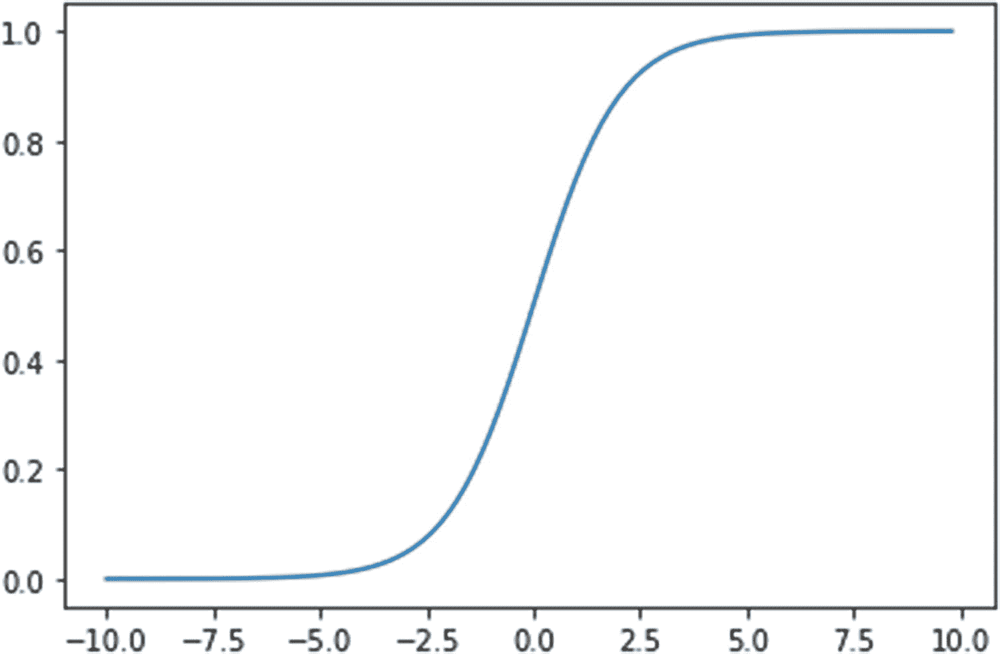

图 5-1

Sigmoid 曲线在 Jupyter Notebook 中

在一般的基于梯度的迭代学习中，有三个基本步骤：

+   正向传播

+   错误计算

+   反向传播

**正向传播** **:** 这是第一阶段，其中计算 y 的值，通过将输入向量（输入）与权重向量（权重）相乘，并添加偏置向量（偏置），如果需要的话。需要注意的是，在机器学习中，我们将处理张量，对于所有输入和输出来说，张量实际上就是矩阵。因此，字母 y、w 和 x 代表向量或矩阵，而不是单值函数。我们在展示以下方程式的章节中看到了这一点：

y= σ (w.x + b)

**错误计算** **:** 由于我们将运行我们的感知器神经网络，针对某个“真实”数据集进行验证，以确定网络根据输入张量、权重矩阵和偏置预测正确输出的程度。这里有一个重要的错误计算概念，存在于每个迭代学习阶段之间。实际上，每个周期的误差被认为是预测输出张量与实际输出张量之间的绝对差。

∆= |y^’-y|,

其中 ∆ 是误差项。现在我们将考虑一个重要的指标，被称为均方误差，其公式如下：

∆[mse]= 0.5 ( y^’-y)²

这个方程，被称为损失函数或二次成本函数，在通用学习中非常重要，因为我们将使用它在下一步中计算梯度。

**反向传播** **:** 这是一个非常重要的步骤，涉及以下更新。

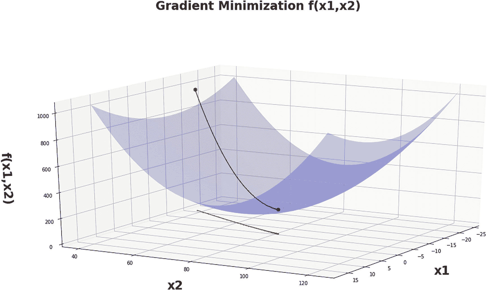

图 5-2

反向传播中的梯度下降算法

+   **计算梯度**：前一个方程式中计算出的均方误差需要部分微分以更新下一个周期的权重，并找到算法的正确收敛。这意味着我们必须对前一步中的误差相对于权重矩阵进行微分。从数学上讲，这可以表示为：

    J= ∂ ∆[mse] /∂w,

    这实际上意味着我们必须使用微分链式法则对误差项相对于权重矩阵进行部分微分。链式法则可以表述为：

    d(xy) = [y(dx) + x(dy)] (dx),

    其中 xy 是 f(x, y) 的连续可微函数。

    我们必须对函数 y 关于 w 进行偏导数。在通用的偏导数技术中，我们必须计算可以计算的项的导数，并将其余的项视为常数。例如，如果一个方程的形式是 f(x, y)=xy，那么如果我们需要关于 x 对 f 进行偏导数，我们会有：

    ∂(f(x, y)) =[y (d(x)/dx) + x(d(y)/dx)]∂x,

    其中 d(f(x))/dx 表示函数的正常微分。根据微积分规则，这会产生：

    ∂(f(x, y)) = [y]∂x,

    因为常数的微分被计算为 0；因此，第二项消失。现在，因为我们使用了 sigmoid 曲线作为我们的激活函数，所以我们有损失函数的偏导数如下：

    ∂(y) =[ [d(σ(y))/d(y)][d(y)/dw]]∂w,

    根据微分链式法则。现在 sigmoid 曲线的导数简单地给出：

    d(σ(θ)) = θ(1-θ) d(θ),

    其中 θ 是任何多项式函数，在这种情况下是 y。第二部分的导数可以通过链式法则计算：

    d(y)/dw = w(d(x)/dw) + x(d(w)/dw) + (db/dw)

    现在既然这是偏导数，我们将移除常数的导数（d(x)/dw 和 d(b)/dw），这实际上减少了我们的最终方程，它可能看起来像这样：

    ∂(y) = [[y(1-y)] (x)(d(w)/dw)]∂w

    现在我们已经使用了 ∆[mse] 作为误差函数，如果我们必须计算 ∆[mse] 的偏导数，那么我们可以写成：

    ∂(∆[mse]) = [0.5* 2(d|y^’-y|/dw)]∂w

    现在 y^’ 是验证的实际值，而 y 是预测值；因此，实际上我们需要对 y 进行偏导数，这个偏导数已经计算过了。整个过程用于在学习的每个步骤中找到损失函数的梯度。

+   **反向传播** **:** 在通用机器学习中的权重更新规则中最重要的一部分。在计算梯度之后，我们将这些梯度沿着从输出张量到输入张量的路径传播。由于在我们的情况下，我们使用了一个简单的 sigmoid Perceptron 模型而没有任何隐藏层，在许多复杂的神经网络中，我们将有许多隐藏层。这意味着每个隐藏层都将包含我们使用的单个感知器单元。在我们的情况下，由于没有隐藏层，我们只需使用以下规则更新权重张量：

    w= w – α( J),

    其中 J= ∂ ∆[mse] /∂[w]，α 是学习率。在此背景下，这个权重更新规则与梯度下降算法相关联。如前所述，监督机器学习的主要骨架是通过更新权重并收敛到全局最小值来优化损失函数。考虑到这一点，在梯度下降中，认为权重更新策略的轨迹应沿着收敛的最陡斜率。然而，在许多情况下，梯度下降可能没有用，因为它可能过度拟合数据集。这意味着策略可能会在全局最小值附近振荡而无法收敛，或者它可能陷入局部最小值。这就是符号α出现的地方。α被称为学习率，它调节策略采取的步长以到达全局最小值。但是，已经观察到这并不能解决收敛算法局部振荡的问题；因此，已经通过使用某些动量对梯度下降算法进行了优化。在整个深度学习模块中，我们将使用优化器来编写不同深度强化学习算法的神经网络。一些最突出的优化器包括 Adam、Adagrad 和 Adadelta，而较老的变体包括 RMSProp 和 SGD。这些优化器使用动量结合随机梯度收敛算法来调节步长。我们可以使用随机梯度下降（SGD）算法可视化简单的梯度下降收敛，如图 5-2 所示。

这可以通过运行 Plotting Gradient Descent.ipynb 笔记本进行可视化。

实际上，我们通过一个简单的感知器模型研究了反向传播，这完成了基本神经网络入门部分，其中包括使用梯度下降算法和反向传播到输入层的 Sigmoid 激活、误差计算和权重更新策略。该模型可以如图 5-3 所示进行说明。

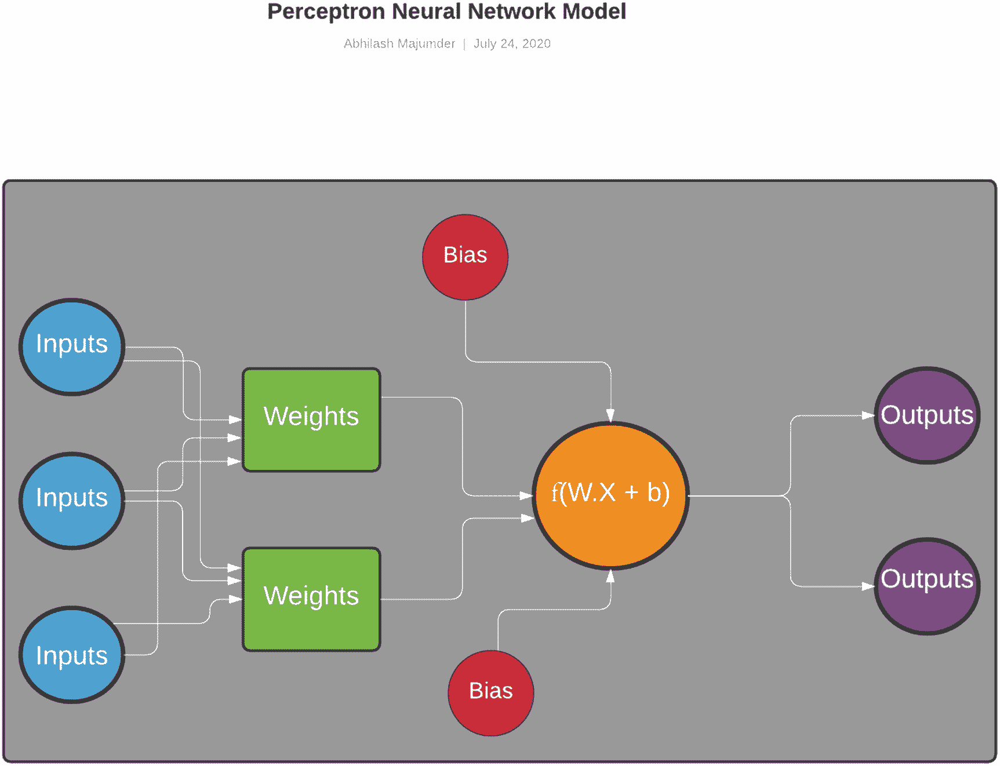

图 5-3

前馈感知器神经网络模型

在下一节中，我们将研究一个相对密集的网络，并理解该模型的反向传播概念。不失一般性，特定神经网络中涉及的所有层都是基于某些矩阵/张量进行计算的，在大多数情况下，乘法被称为两个或多个张量之间的“点”积运算。由于所有这些偏导数规则都将适用于这些层，或者更确切地说，这些张量，我们可以认为将需要几个矩阵/张量计算。然而，对于大多数神经网络模型，前向传递、误差计算和反向传递的三个阶段是相同的。我们将探讨 MLP 密集网络和卷积网络。

### 密集神经网络

现在，让我们了解具有感知器单元的隐藏层的密集网络的基本原理。这是我们将会使用最普遍的神经网络模型，可以如图 5-4 所示进行可视化。

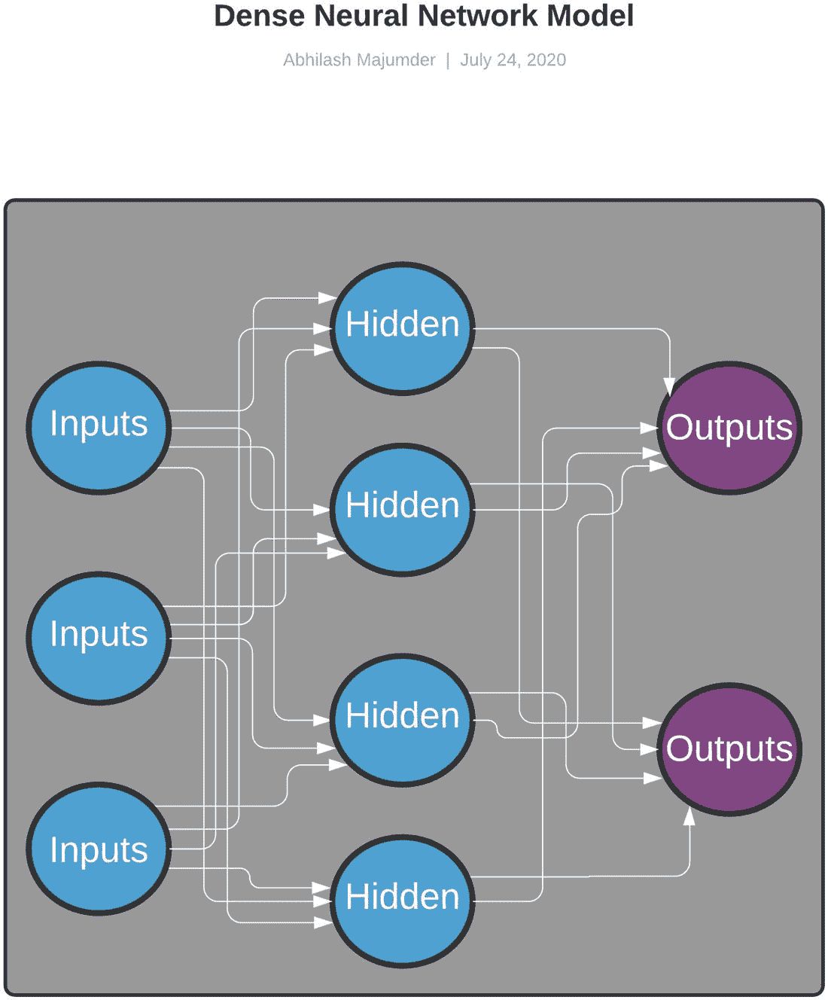

图 5-4

带有隐藏层的密集神经网络

有趣的是，隐藏层由具有不同激活函数的感知器模块组成。这些隐藏层的感知器单元随后叠加以生成累积损失函数。在这种情况下，我们将考虑之前提到的三个阶段——前向传播、误差计算和反向传播。

**前向传播** **:** 在这个情况下，假设隐藏层中的感知器只有 sigmoid 激活。同时，权重和输入是张量或矩阵。假设 l 代表隐藏层，(l-1) 代表输入层。k^(th) 个神经元在 (l-1)^(th) 层和 l^(th) 层的 j^(th) 个神经元之间的连接的相应权重用 w^l[jk] 表示。现在，如果我们假设 l^(th) 层有一个偏差张量 b^l，以及来自前一个 (l-1)^(th) 层 k^(th) 个神经元的输入张量 x^(l-1)[k]，那么前向传播方程或加权神经元函数可以表示为：

y^l[j] =σ (∑w^l[jk] x^(l-1)[k] + b^l[j])

通常，如果每个感知器模型的激活不同，那么方程可以修改为：

y^l[j] =f (∑w^l[jk] x^(l-1)[k] + b^l[j]),

其中 f 是任何激活函数，例如 tanh、softmax 等。一旦我们得到了损失函数，我们必须确定误差，这也就是所谓的代价函数。

**误差计算** **:** 我们将考虑均方误差指标，这也被称为二次代价或损失函数。相应地，这可以用以下方程表示：

∆[mse]= 0.5 ( y^(**’**)-y)²

现在在这个密集网络的情况下，我们将有 n 个训练样本的采样代价函数。同时，y 应该被我们探索的新损失函数所取代。改变这些细节会导致类似的方程：

∆[mse]= (1/2n) ∑(y^(**’**)-y ^l[j])²

对于一个特定的训练样本，这个方程可以简化为：

∆[mse]=C= (1/2) ∑(y^’-y ^l[j])²,

我们用符号 C 来表示它，以简化表示。

**反向传播** **:** 在这个情况下，正如之前提到的，最重要的方面是梯度计算和误差反向传播。在这种情况下，我们将使用偏导数来找出梯度，就像之前一样，只是这次有一个隐藏层。

+   反向传播：这意味着，与简单感知器中计算关于权重的单层导数不同，我们必须计算隐藏层中所有感知器的这些梯度，然后我们必须将这些梯度反向传播到输入层。首先，我们将计算外层和隐藏层之间的梯度流。

    **输出-隐藏层梯度流**

    我们将对权重 w^l[jk] 以及偏差 b^l[j] 进行偏导数运算。这可以表示为 ∂C/∂ w^l[jk] 和 ∂C/∂ b^l[j]，分别。为了简化，我们将把偏差视为常数。然而，我们还需要计算隐藏层的梯度。为了计算这个，我们必须对这里所示的成本函数进行偏导数运算：

    ∂C/∂ w^l [j] =[∂C/∂y^l[j] ] [∂ y^l[j]/ ∂ w^l],

    其中权重 w^l [j] 代表第 l 层第 j 个神经元的权重，y^l[j] 是该层的输出张量。这意味着我们必须对基于 sigmoid 激活的输出进行 ∂ y^l[j]/ ∂ w^l 的微分。为了简化，让我们考虑这个层的微分公式：

    ∂ y^l[j]=[d(σ(z))/d w^l [j]] ∂ w^l,

    其中 z 被定义为 z = σ (∑w^l[jk] x^(l-1)[k] + b^l[j])，对于隐藏层中特定的神经元。如果我们简化这个方程，我们可以用简化的形式表示：

    ∆^l[j] = ∂C/∂ w^l [j]=[∂C/∂y^l[j] ] [d(σ(z))/d w^l [j]]

    这也可以表示为：

    ∆ ^l[j] = [∂C/∂y^l[j] ]σ^(**’**)(z),

    其中 σ^(**’**)(z) = [d(σ(z))/d w^l [j]]

    下一步是将这些梯度通过隐藏层传播到输入层。这也意味着，如果我们在这当前输入层和隐藏层之间还有一个隐藏层，那么梯度也会通过这个层。这意味着随着层数的增加，我们必须反复使用链式法则来计算偏导数。

    **从隐藏层到输入层或从隐藏层到内部隐藏层**：

    因为，在我们的情况下，隐藏层直接从输入层接收数据，梯度传播步骤非常简单：

    ∂C/∂ w^l [j] =∑ (w^l[jk] x^(l-1)[k]) σ^(**’**)(z)

    这是因为我们已经在通过单隐藏层计算了关于权重的梯度。现在剩下的唯一步骤是通过减去/增加梯度来更新权重以获得更好的最优性：

    w^l[jk] = w^l[jk] – α[∂C/∂ w^l [j]],

    其中 α 是学习率。对于我们的由单个隐藏层组成的密集网络，这基本上就结束了反向传播步骤和梯度更新。必须记住，这些计算是在张量上进行的，并且通常用于计算，使用的是 Hadamard 积。两个张量或两个矩阵的 Hadamard 积是矩阵中相同位置内矩阵元素的逐对乘积。换句话说，它形成了两个张量（向量）的逐元素乘积。例如：

    [1 2] 

    [4 5] =[1*4 2*5 ]

    = [4 10]

    现在，我们将探讨隐藏层从另一个隐藏层获取数据的情况，这是多层密集网络中最常见的架构。在这种情况下，如果我们假设存在另一个隐藏层，我们必须对该层进行部分微分。让我们考虑 w^(l-1)[ki]，它代表第 (l-1) 层的第 i 个神经元和第 l 层的第 k 个神经元之间的连接权重。现在，加权神经元函数将类似于以下内容：

    y^l[j] =σ (∑w^l[jk] (σ (∑w^(l-1)[ki] x^(l-2)[i] + b^l[k]))+ b^l[j])

    在这种情况下，我们将输出层的 x^(l-1)[k] 部分替换为前一个隐藏层的加权神经元函数。在这种情况下，我们正在查看一个基于两个隐藏层的模型，其中输入层 i 将数据导向第一个隐藏层 k，然后 k 层将数据导向第二个隐藏层 j。每一层都有它们对应的偏差，为了简单起见，我们将它们视为非功能常数。这就是为什么第二个隐藏层（第 j 层）实际上接受的是由 σ (∑w^(l-1)[ki] x^(l-2)[i] + b^l[k]) 给出的第一个加权神经元隐藏层作为输入，而第一个隐藏层只是一个从输入层接收输入的 sigmoid 激活的加权隐藏层。在这种情况下，如果我们反向传播梯度，它将是一个链式偏导数规则，如下所示。

    对于最外层隐藏层，梯度可以表示为：

    ∂C/∂ w^l [j] =[∂C/∂y^l[j] ] [∂ y^l[j]/ ∂ w^l]

    对于这一层，权重更新规则可以像之前讨论的那样写出：

    w^l[jk] = w^l[jk] – α[∂C/∂ w^l [j]]

    对于最后一层到倒数第二层（或我们情况下的第一层）：

    ∂C/∂ w^(l -1)[k] = [∂C/∂y^l[j] ] [∂ y^l[j]/ ∂ w^l] [∂w^l/∂y^(l-1)[k] ] [∂ y^(l-1)[k]/ ∂ w^(l-1)]

    现在对于这个第一隐藏层的权重更新，我们只需要计算：

    w^(l-1)[ki] = w^(l-1)[kl] – α[∂C/∂ w^(l-1) [k]]

    现在，让我们将这种方法推广到基于 n 个隐藏层的密集网络。梯度流可以推广为：

    ∂C/∂ w^(net)= [∂C/∂y^(net) ] [∂ y^(net)/ ∂ w^(net)] [∂C/∂y^(net-1) ] [∂ y^(net-1)/ ∂ w^(net-1)]…

    ….[∂C/∂y^(net) ] [∂ y¹/ ∂ w¹]

    这是梯度流通过密集网络的通用形式，其中优化函数有助于全局收敛。这形成了反向传播算法，它是深度学习和收敛的核心。这很重要，因为我们设计网络用于我们的机器学习智能体时，使用不同的强化学习算法，如深度 Q 网络（DQN）、演员-评论家网络、策略梯度以及其他离策略算法，我们将使用 Keras（Tensorflow）的密集 MLP 神经网络库。总结反向传播模块，外层神经元（外层隐藏层）的权重更新为 ∂C/∂ w^(net)= [∂C/∂y^(net) ] [∂ y^(net)/ ∂ w^(net)]，而对于其他神经元（隐藏层-前一个隐藏层或隐藏层-输入层），更新规则变为单个加权函数（带有激活）相对于权重的链式偏导数。

我们已经理解了密集神经网络架构，并发现了偏导数在确定错误更新和网络中的梯度流方面的重要作用。这在监督学习形式中很重要，它通过最小化每一步的错误来学习。我们在第一章中创建的 CartPole 上的 DQN 是基于通过多层感知器神经网络（密集网络）最小化价值函数上的错误。随着我们进一步学习，我们将看到价值和策略函数是如何相互作用的，以及为什么策略梯度在深度强化学习中非常重要。但在我们深入研究算法之前，我们应该熟悉使用 Keras 编写自己的密集网络。在进入代码段-CNN 之前，让我们也探索另一个神经网络模型。

### 卷积神经网络

这是一种神经网络变体，通常用于图像分析。卷积神经网络（CNN）包括对图像中像素的空间分析应用某些非线性函数。这些被称为特征，是从图像中提取出来的。然后，这些特征作为输入通过密集神经网络模型传递。这非常重要，因为在 GridWorld 中，PPO 算法使用卷积层（2D）进行图像分析，然后指导智能体据此做出决策。在大多数 Atari 2D 游戏中，这些 CNN 模型对于理解特定帧中存在的图像（像素）至关重要；例如，通过分析特定帧的游戏画面图像，然后通过 CNN 模型来指导智能体玩乒乓球游戏（在 Gym 环境中称为“Pong”）。

现在让我们考虑一个示例卷积模型的架构。它由卷积层、池化层和密集网络层组成。尽管还应用了几个其他层，如填充层/展平层，但基本部分保持不变。在这种情况下，图像被作为输入传递到网络，然后进行分析，并传递给密集网络。根据输入的深度（RGB 或灰度），通道可以是 3 或 1。为了说明，卷积模型看起来像图 5-5 中所示的那样。

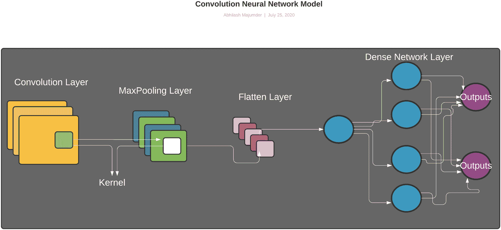

图 5-5

卷积神经网络模型

根据输入参数的不同，CNN 可以具有不同的维度。

+   **一维卷积:** 当输入是一维概率数据序列时应用。这种数据通常以 1D 向量（如数组）的形式存在。这种模型用于时间序列预测，其中输入数据是一系列概率值。

+   **二维卷积:** 这是我们用例中最重要的维度。输入层由图像数据组成——像素（3 或 1 个通道）。在这种情况下，CNN 模型应用于没有时间属性的静态图像。空间属性或特征是基于图像的高度和宽度提取的。因此，二维卷积的输入大小可以是五个单位（高度、宽度和 RGB 的三个通道）或三个单位（高度、宽度和灰度的一个通道）分别对应于 RGB 或灰度数据。在我们的用例中，我们将研究这个模型，因为它将分析 ML Agents 环境（网格世界）每个帧的图像（RGB 格式，五个通道），并将其传递给密集网络。

+   **三维卷积** **:** 这用于分析视频信息。因此，除了空间数据外，每个像素数据还关联一个时间组件。时间组件定义了视频每一帧像素的变化。随着时间通道的添加，卷积 3D 模型的有效输入大小（通道）变为六个单位（高度、宽度和 RGB 的三个通道；一个时间通道）和四个单位（高度、宽度和灰度的一个通道；一个时间通道）分别对应于 RGB 和灰度像素。

现在，让我们从其组件的角度研究卷积网络。

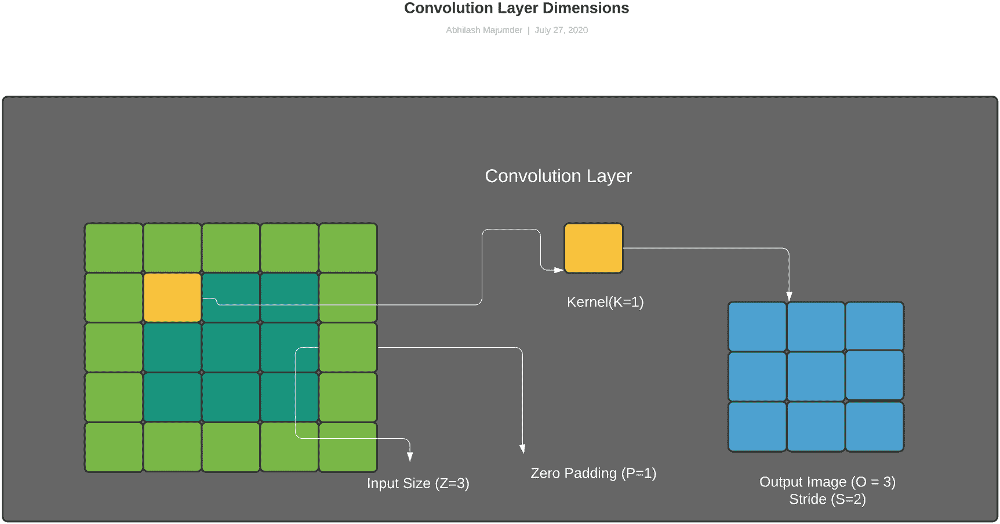

图 5-6

CNN 中的卷积层和卷积图像维度

+   卷积层：这一层与从图像中的像素提取空间特征相关。它由某些过滤器或核组成，通过卷积尝试提取这些特征。卷积是一种数学运算，其中图像 I 通过一个维度为 k[1] x k[2] 的过滤器（核）K，可以表示为：

    I*K = ∑^(k1 -1)[m]∑^(k2 -1)[n] I(i-m, j-n)K(m, n) = ∑^(k1 -1)[m]∑^(k2 -1)[n] I(i+m, j+n)K(-m,-n)

    这个操作类似于具有可变符号的核的交叉相关操作，即 K(m, n)=k(-m,-n)。现在如果我们考虑输入为 RGB 形式，那么通道数将是 5（宽度、高度和 RGB 的三个通道）。因此，图像 I 的维度将是 H x W x C 的阶，其中 H、W 和 C 分别代表高度、宽度和颜色通道。对于 D 个尺寸的核，我们可以有总核维度为 k[1] x k[2] x C x D。如果我们假设 D 个过滤器的偏差为 b，那么我们可以将卷积加权神经元方程表示为：

    (I*K)= ∑^(k1 -1)[m]∑^(k2 -1)[n]∑^C[c=1] K(m, n, c).I(i+m, j+n) + b

    这是一个通用的卷积方程，用于提取特征。与卷积相关的一些度量被称为超参数。

    +   **深度**：这表示核或过滤器的深度，也用于计算从输入图像中提取的不同特征。在 CNN 模型的最后一层密集网络中，深度也代表密集模型中的隐藏层数量。

    +   **步长**：这控制了空间维度（高度和宽度）周围的深度列。如果我们指定步长值为 1，那么核将每次移动一个像素，这可能导致提取字段的重叠。如果分配一个值为 2，那么它将每次跳过两个像素。通常，当步长增加到超过 3 的值时，输出空间维度会减小。我们用符号 S 表示步长。

    +   **填充**：填充层或零填充层用于在空间维度（沿高度和宽度）上填充输入图像的维度。这个特性使我们能够控制输出体积的空间大小。

    提到卷积层的输入和输出维度之间的关系是很重要的。输入特征图维度为 H X W 与权重核维度为 k[1] X k[2] 的卷积会产生一个输出特征图，其维度为：

    dim(O) = (H - k1 + 1) x (W - k2 + 1).

    基于步长 S 和零填充 P，存在输出体积的另一种表示形式，给出如下：

    dim(O) = ([(H x W) – (k1 x k2) + 2P]/S) + 1 = ([Z-K+2P]/S + 1,

    其中 Z 代表输入体积，K 代表核维度。

    这个值应该是一个整数，以便神经元能够完美地提取特征。例如，如果我们取一个维度为[11,11,4]的输入图像(Z = 11)，我们取一个核大小为 5 的值(K = 5)，我们使用没有零填充(P = 0)，然后跟一个步长值为 2(S = 2)，我们可以得到输出层的维度：

    dim(O) = ([11-5 + 2*0]/2)+1 =4

    这意味着输出维度的大小为 4 X 4。对于这种情况，我们得到一个整数值 4，但在许多情况下，我们会看到这些值的某些无效组合可能导致输出维度出现分数结果。例如，如果 Z = 10 且没有零填充(P = 0)和核维度为 3(K = 3)，那么不可能有 2 的步长，因为([Z-K+2P]/S + 1 = ([10-3+0]/2)+1 = 4.5，这是一个分数值。因此，对步长应用了约束，在许多情况下，如果这些值的组合无效，则会抛出自动异常。图 5-6 展示了输入维度 Z = 3，1 个零填充(P = 1)，核大小为 1(K = 1)，步长为 2 的情况，这给出了输出维度([Z-K+2P]/S + 1 = ([3-1+2*1]/2)+1 = 3)。

该层还有一个有趣的事实，称为参数共享。这有助于减少输入维度以降低计算量。这是基于这样的假设：如果一个特征在某个空间位置(x, y)是有用的，那么它应该在不同的位置(x[2], y[2])也是有用的。让我们假设我们有一个卷积层的输出，其维度为[55*55*96]，深度通道为 96，然后我们可以应用相同的权重和偏差来约束每个深度切片中的神经元，而不是为所有 96 个不同的深度切片使用不同的偏差和权重。这有助于反向传播步骤，因为梯度（通过层流动）将跨每个单个深度切片相加，并更新单一组权重，而不是 96 个不同的权重。

+   **池化层** **:** 该层用于通过减少参数和网络的计算量逐步降低空间维度。它被用于卷积层之间以及卷积层的末端。该层通过最大值操作对单个深度切片或深度通道进行操作，因此被称为最大池化。最大池化的最通用形式是使用 2 X 2 大小的过滤器，步长为 2，将每个深度通道的宽度和高度都下采样 2 倍。该层的输出可以计算如下：

    dim(O) = ([Z-K]/S) + 1,

    其中 Z 代表图像的高度或宽度，K 是核的维度，S 是步长（如之前所述）。除了最大池化之外，还有其他池化度量被应用，其中最重要的之一是 L2-Norm 池化。L2–Norm 是一个欧几里得正则化度量，它使用平方误差函数作为正则化方程。这也被称为平均池化方法。

+   **展平层** **:** 这个层用于压缩或展平池化层或卷积层的输出，以产生一系列值，这些值实际上是密集神经网络的输入。因为我们已经研究了密集网络架构，这种压缩是必需的，以产生可以用于密集网络输入层的输入序列。例如，在输入图像维度为[32,32,3]的 64 层深度卷积 2D 层上应用[3,3]的核大小，步长为 2，零填充值为 1 后，我们得到的输出形状为：

    ([Z-K+2P]/S + 1= ([32-3 + 1]/2)+1= 16,

    这意味着输出维度为[16,16,64]。现在如果我们在这个输出序列上应用展平层，有效维度将是 16*16*64 = [16384]。因此，这个层产生了一个一维输入序列，可以被喂入密集网络。这个层不会影响批大小。

+   **密集网络** **:** 这构成了传统 CNN 模型的最后一部分。这里最有趣的部分是卷积、最大池化、加权神经元模型的反向传播。在我们进入这个层之前，让我们了解一下我们提到的卷积层中的反向传播。

    **卷积层中的反向传播** **:** 在卷积层的反向传播中，我们也遵循偏导数的链式法则来更新梯度，类似于密集网络。对于单个权重的梯度分量可以通过以下方式获得：

    ∂C/∂w^l[m, n] = ∑^(H-k1)[i]∑^(W-k2)[j] [∂C/∂y^l[m, n]] [∂y^l[m, n] /∂w^l[m, n]],

    其中 H X W 是输入维度，C 是损失函数或二次损失函数。w^l[m, n]指的是第 l 层第 m 个神经元的权重。y^l[m, n]代表 sigmoid 激活的加权神经元方程：

    y^l[m, n] = σ( ∑[m]∑ [n] w^l[m, n] x^(l-1)[i+m, j+n] + b^l)

    由于在这种情况下，我们有一个图像作为输入而不是一维数组，卷积网络的反向传播模型将输入的不同通道的维度以及核权重和偏差作为输入。其余的导数与通用的链式法则类似，可以重新表述为：

    ∂C/∂w^l[m, n] =∂/∂w^l[m, n] [σ( ∑[m]∑ [n] w^l[m, n] x^(l-1)[i+m, j+n] + b^l)]

    我们可以根据卷积层的深度进一步扩展这个方程，只要深度通道没有耗尽，就可以执行偏导数的链式法则。在这种情况下，我们使用了 sigmoid 激活；然而，在一般的二维卷积网络中，我们使用“Relu”或正则化线性单元作为激活函数。Relu 可以表示为：

    ReLu(x)= max(0, x)

    因此，对于 x 大于 0 的情况，这种激活是一个直线，而对于 x 小于 0 的情况，它在负 x 轴上。这意味着它取最大正值。

    **密集网络中的反向传播** **:** 这与我们在密集网络中研究的反向传播和梯度流类似。在展平层之后，我们得到一个由权重、输入和偏差组成的压缩层。根据问题的类型，我们可以关联不同的激活函数。例如，在二分类问题的案例中，我们将使用之前章节中提到的 sigmoid 函数。对于多类分类，我们必须使用“softmax”激活函数，这在第一章的多臂老虎机部分有所表示。

这完成了卷积二维神经网络架构的构建，我们将在下一节中使用 Keras 库来创建。

## 使用 Keras 和 TensorFlow 进行深度学习

我们现在将使用 Keras/Tensorflow 框架创建密集和卷积神经网络。Keras 是一个高级 API，它使用 Tensorflow 作为其后端来创建神经网络，并且非常易于使用。在本节中，我们首先将创建一个密集的多层感知器（MLP）神经网络，然后我们将创建标准的卷积神经网络模型，这些模型是当前最先进的，并且在计算机视觉中得到广泛应用。

### 密集神经网络

我们将使用 Keras 框架来创建这些网络，为此我们需要某些库。我们已经在之前的章节中安装了 Tensorflow 和 Keras，我们将在我们的笔记本中导入这些库。打开“Intro-To-Keras-Sequential.ipynb” Jupyter Notebook，在第一部分我们将看到以下命令：

```py
import tensorflow as tf
import numpy as np
import pandas as pd
from keras.models import Sequential
from keras.layers import Dense, Flatten
from datetime import datetime
from tensorflow import keras
```

在我们的情况下，我们将为二元分类问题创建密集网络。二元分类问题只有两个结果，在这种情况下，sigmoid 函数被用作激活函数。Keras API 有一个名为“models”的模块，其中包含该框架内不同模型的架构。顺序模型指定深度学习模型的不同层将按顺序依次放置，这意味着一个层的输出将是下一个层的输入，就像密集 MLP 的情况一样。Keras 中的 layers 模块指定了我们希望在模型中包含的不同类型的层；例如，dense 指定了一个具有隐藏层的密集 MLP 网络，“flatten”指定了我们之前在卷积神经网络中看到的展平层，Convolution2D 用于卷积层，还有更多。随着章节的进展，我们将探索这些层。创建深度学习网络有不同写代码的方式，但有一些限制。在最常见的案例中，我们将使用 Keras API，并调用如 Dense()之类的函数来创建密集 MLP 层；然而，还有使用 Tensorflow 的 Keras 功能 API 的替代写法。为了使用第二种形式创建相同的密集层，我们将写作 keras.layers.Dense()。我们将使用这些符号来表示章节中的模型。

在下一节中，我们有一个“inp_data”方法，用于为运行我们的深度学习模型创建合成数据。我们初始化一个大小为[512,512]的张量，其中包含随机值，称为数据，并创建一个[512,1]维度的张量作为标签集，其中包含二进制输出，1 或 0。所有这些只是为了简单起见而随机分配。在通用的监督学习中，我们有一个与数据关联的初始标签集，这是我们验证数据集。根据每个 epoch 深度学习模型的输出结果，误差是根据这些结果与验证数据集的差异来计算的。

```py
def inp_data():
data=np.random.random((512,512))
labels=np.random.randint(2, size=(512,1))
return data, labels
```

下一个部分包含模型构建函数——“build_model”方法。该方法包含 Keras.models 中提到的顺序模块。然后我们有通过“Dense()”方法表示的密集网络。这个密集网络内部有几个参数，包括：

+   **units:** 这表示输出空间的维度性，在我们的情况下是二进制；因此，我们需要一个一维容器（向量、数组）作为输出。

+   **input_dim:** 这表示密集网络的输入维度。

+   **activation:** 这表示激活函数，例如 sigmoid、softmax、relu、elu 等。

+   **use_bias:** 这指定了我们是否希望在密集网络中使用偏置。

+   **bias_initializer:** 这表示网络中初始化的偏置张量。有几个初始化器，如 zeros、ones 等。

+   **kernel_initializer:** 这初始化权重张量，可以有不同的初始化器。我们将使用最常见的一种，即 glorot_uniform，它是一个 Xavier 初始化器。还有其他变体，如均匀或正态初始化器。

+   **bias_regularizer:** 这表示偏差张量的正则化。当我们要防止深度学习中过度拟合时使用，通过修改步长大小来辅助梯度下降。

+   **kernel_regularizer:** 这与偏差正则化器类似，但用于核权重张量。存在使用 L1 和 L2 正则化范数来惩罚学习率，以辅助梯度下降的变体。

+   **bias_constraints:** 应用到偏差张量上的约束

+   **kernel_constraints:** 应用在核权重张量上的约束

现在我们已经概述了 Dense 方法的参数，我们可以使用 Keras 编写一个单一的密集神经网络模型。使用“model.compile”方法来编译模型并关联神经网络的输入和输出。这部分包含：

+   **optimizers:** 这包括不同的梯度下降优化器，有助于找到全局最小值，例如 SGD、RMSProp、Adam、Adagrad、Adadelta 等。

+   **loss:** 这表示熵损失，可以是二进制或基于我们的需求的分类。二进制损失是逻辑（sigmoid）熵损失，而分类是 softmax 熵损失。

+   **metrics:** 这些指定了用于基准测试模型的指标，例如准确率、均方误差(mse)、平均绝对误差(mae)等。

我们现在可以创建以下函数：

```py
def build_model():
model=Sequential()
model.add(Dense(1, input_dim=512, activation="softmax",
use_bias=True,
bias_initializer='zeros',
kernel_initializer='glorot_uniform',
kernel_regularizer=None, bias_regularizer=None,
kernel_constraint=None, bias_constraint=None))
model.compile(optimizer='rmsprop',
loss='binary_crossentropy',
metrics=['accuracy'])
return model
```

下一个部分包含“train”方法，该方法调用模型并拟合输入数据进行训练。使用“model.fit”方法在不同的批次中拟合输入数据以进行训练，每个批次包含输入的一定部分，在我们的案例中是通过使用批大小来指定的。这里使用的参数包括：

+   **inputs:** 训练模型的输入数据

+   **labels:** 数据中用于预测和分类的标签

+   **epochs:** 我们想要训练模型的时代数

+   **batch_size:** 要传递给输入层的单个输入批次的尺寸。在我们的案例中，我们使用 64 的值。

+   **verbose:** 这表示每个时代训练日志的显示模式。

这可以通过以下行来完成：

```py
def train(model, data, labels):
model.fit(data, labels, epochs=20, batch_size=64)
```

该段落的最后部分包含“main()”方法，该方法调用“inp_data”方法生成随机的张量作为输入和标签，然后调用“build_model”方法创建序列模型，并最终使用“train”方法训练模型。“model.summary”方法提供了序列模型架构的视图。

```py
if __name__=='__main__':
data, labels=inp_data()
model=build_model()
model.summary()
train(model, data, labels)
```

现在如果我们训练这个模型，我们会看到训练的各个阶段、每个步骤的准确率、损失以及相关的详细信息。为了总结模型，它将类似于图 5-7。

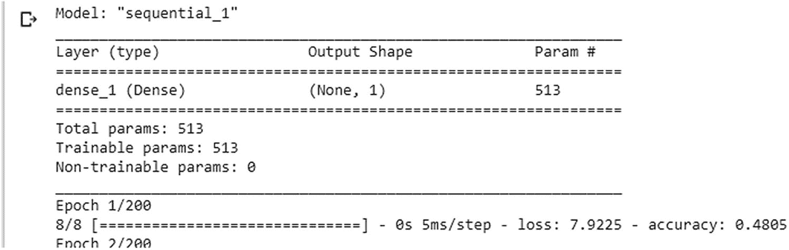

图 5-7

包含单个密集神经网络的顺序模型

现在让我们借助 Tensorboard 可视化这次训练。为此，我们将使用相同的模型，但采用不同的编码格式。在本节中，我们将看到我们将“dense()”方法替换为“keras.layers.Dense()”，将顺序方法替换为“keras.models.Sequential()”方法。我们还使用“keras.optimizers.RMSProp()”方法，该方法包含梯度下降的学习率。在这种情况下，我们使用 TensorFlow 框架的 Keras API，并且“build_model”方法如下所示：

```py
def build_model():
model=keras.models.Sequential()
model.add(keras.layers.Dense(1, input_dim=512,
activation="softmax", use_bias=True, bias_initializer="zeros",
kernel_initializer='glorot_uniform',
kernel_regularizer=None, bias_regularizer=None,
kernel_constraint=None, bias_constraint=None))
model.compile(keras.optimizers.RMSprop(learning_rate
=1e-4), loss="binary_crossentropy", metrics=['accuracy'])
return model
```

现在为了集成 TensorBoard，我们必须指定日志文件，该文件以日期时间格式保存训练数据的日志。在可视化过程中，它会获取这些日志以表示训练的指标：损失、准确率等。

```py
logdir= "logs/scalars/" + datetime.now().strftime("%Y%m%d-%H%M%S")
tensorboard_callback=keras.callbacks.TensorBoard
(log_dir=logdir)
```

下一步是更新训练函数中的“model.fit”方法。就像我们在前面的章节中看到的那样，我们必须添加“callbacks”并指定 TensorBoard 日志文件作为回调资源以实现实时可视化。

```py
def train(model, data, labels):
model.fit(data, labels, epochs=200, batch_size=64,
callbacks=[tensorboard_callback])
```

如果我们现在运行主函数，我们将在 TensorBoard 中看到训练和相应的日志。预览如图 5-8 所示。

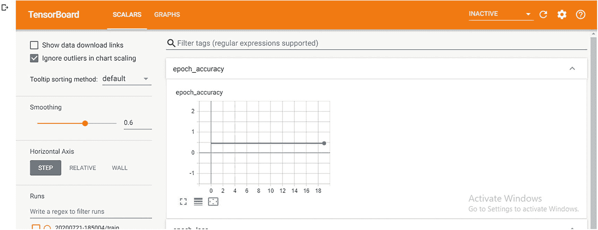

图 5-8

在 TensorBoard 中可视化密集顺序模型

我们已经使用 Keras 创建了一个深度学习模型，这是创建更多样化和复杂模型的第一步，特别是深度强化学习。让我们尝试创建一个简单的多层密集序列模型用于多类分类。在下一节中的“build_model”方法中，我们使用“keras.models.Sequential”方法初始化一个序列模型。然后我们创建一个包含 256 个输出维度的密集网络，输入维度为 20 个单位，并使用“Relu”激活单元。然后我们重复创建一个新的密集层，该层以先前密集网络的输出作为输入。dropout 层以一定的频率随机将输入单元设置为 0，以防止训练过程中的过拟合。因此，这个层仅在训练模式下适用，因为 dropout 在训练过程中不会冻结权重。然后我们有 64 个单位的密集层和“Relu”激活方法。最后一层是另一个密集层，有 10 个单位，用于多类分类的 softmax 激活。在“model.compile”中包含来自“keras.optimizers.Adam()”方法的 Adam 优化器，学习率为 0.0001。在这个上下文中，损失是一个“categorical_crossentropy”，表示 softmax 损失，度量标准为准确率。以下方法表示如下：

```py
def build_model():
model= keras.models.Sequential(name="Multi-Class Dense
MLP Network")
model.add(keras.layers.Dense(256, input_dim=20,
activation="relu"))
model.add(keras.layers.Dense(256, activation="relu"))
model.add(keras.layers.Dropout(0.2))
model.add(keras.layers.Dense(64, activation="relu"))
model.add(keras.layers.Dense(10, activation="softmax"))
model.compile(keras.optimizers.Adam(lr=1e-3,
name="AdamOptimizer"),
loss="categorical_crossentropy", metrics=['accuracy'])
return model
```

当我们调用“model.summary”方法时，我们可以看到如图 5-9 所示的序列网络。

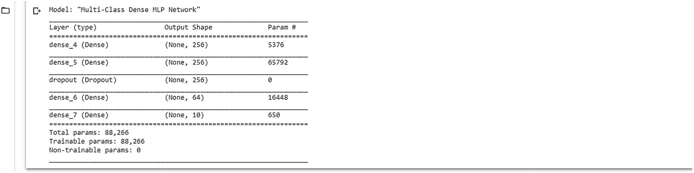

图 5-9

具有密集网络的样本多类分类模型

现在我们已经熟悉了密集神经网络，让我们探索 Keras 中的卷积神经网络。

### 卷积神经网络

CNN（卷积神经网络）是专门用于计算机视觉的标准网络模型，适用于图像分类、图像生成、动作捕捉以及许多其他任务。在我们深入探讨这个网络在 Keras 中的实现之前，我们将回顾我们在前几章中提到的预训练的顶级模型，例如 Resnet50、VGG16 及其变体。我们将首先探讨的模型是 VGG-16 模型，这里的 16 指的是神经网络内部的层数数量。

**VGG-16 模型**：这是一个具有顺序架构的经典模型。以下是该模型的各个部分：

+   2 个具有 64 个深度通道和 3 x 3 核（过滤器）大小的 2D 卷积层，填充保持为 Same。“Same”填充是通过将图像宽度或高度除以步长得到的上取整值——即，dim(O)=ceil(Z/S)

+   1 个 2 x 2 池大小和步长值为 2 的最大池化层

+   2 个具有 128 个深度通道和 3 x 3 核（过滤器）大小的 2D 卷积层，填充保持为 Same

+   1 个 2 x 2 池大小和步长值为 2 的最大池化层

+   3 个具有 256 个深度通道和 3 x 3 核（过滤器）大小的 2D 卷积层，填充保持为 Same

+   1 个 2 x 2 池大小和步长值为 2 的最大池化层

+   3 个卷积-2D 层，深度通道数为 512，内核（滤波器）大小为 3 x 3，填充保持为 Same

+   1 个最大池化层，池化大小为 2 x 2，步长值为 2

+   3 个卷积-2D 层，深度通道数为 512，内核（滤波器）大小为 3 x 3，填充保持为 Same

+   1 个最大池化层，池化大小为 2 x 2，步长值为 2

所有层的激活函数都保持为“Relu”。这个卷积网络在图像分类中被广泛使用，在数据展平后提供以下属性输出：

1 个密集神经网络层，包含 4096 个单元

这可以随后作为输入传递给具有相应激活函数的密集 MLP 网络——对于二分类使用 sigmoid，对于多分类使用 softmax。现在让我们可视化这个模型，它已经在 Keras 框架内预训练和构建。为此，我们需要在 keras.applications 模块中导入 Keras 框架内已构建的 VGG-16 模型。

from keras.applications.vgg16 import VGG16

“build_auto_VGG16_model()”方法阐述了如何构建此模型。我们只需加载 VGG-16 模型并按以下方式返回：

```py
def build_auto_VGG16_model():
model=VGG16()
return model
```

通过运行此模型的“model.summary”方法，我们可以看到此模型的架构。由于可训练参数很多，因此展示了模型的样本视图，如图 5-10 所示。

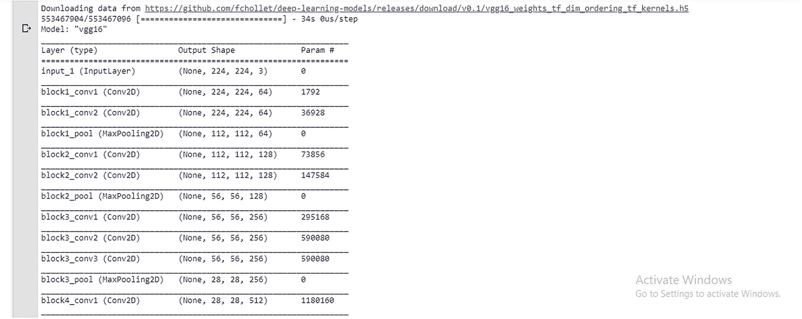

图 5-10

Keras 框架中的 VGG-16 预构建模型

如果我们想要构建自己版本的此模型，我们必须从 Keras 导入某些层。我们将导入卷积-2D 层、展平层、密集层、最大池化层和零填充层，这些都是传统 CNN 的基本组件。我们还将从 Keras.optimizers 模块导入 Adam 优化器，并使用顺序模型。

```py
from tensorflow import keras
from keras.models import Sequential
from keras.layers import Dense, Convolution2D, MaxPooling2D, Dropout, Flatten, Activation, ZeroPadding2D
from keras.optimizers import Adam
```

我们首先在“build_sample_VGG_model()”中初始化顺序模型，然后最初添加一个零填充 2D 层，向输入图像张量添加 0 行和 0 列。零填充层的参数如下。

+   **填充（padding）**：提供一个整数或两个整数的元组。如果提供一个单独的整数，则表示对高度和宽度应用相同的填充；如果提供一个两个整数的元组，则表示对称高度填充和对称宽度填充。

+   **数据格式（data_format）**：输入图像张量的维度，包括高度、宽度和通道数。

零填充 2D 及其相关细节的代码如下：

```py
model.add(ZeroPadding2D((1,1), input_shape=(3,224,224)))
```

然后我们在 Keras 中有卷积-2D 模型，其参数如下。

+   **滤波器（filters）**：输出张量的维度，卷积中的输出滤波器数量

+   **内核大小（kernel_size）**：卷积发生的内核大小；通常由两个整数的列表指定，分别表示内核的高度和宽度

+   **填充（padding）**：指的是输入张量的填充；Valid 表示没有填充，而 Same 指定在高度和宽度上等量填充，以保持与输入相同的输出维度

+   **数据格式（data_format）**：指的是数据格式，取决于通道的位置。如果选择 channels_first 类型，则此格式为（batch_size, channels, height, width），如果选择 channels_last，则输入数据格式为（batch_size, height, width, channels）。默认情况下，它是 Keras 的“image_data_format”，但如果未指定，则默认为 channels_last。

+   **膨胀率（dilation_rate）**：这用于指定膨胀卷积的速率（在我们的当前场景中不是必需的）。

+   **分组（groups）**：一个整数，指定了沿着通道轴输入被分割的组数。每个组分别与过滤器进行卷积。输出是所有过滤器沿通道的连接。

+   **激活函数（activation）**：要使用的激活函数，在我们的案例中将使用“Relu”。

+   **使用偏置（use_bias）**：指定我们是否想要使用偏置。

+   **偏置初始化器（bias_initializer）**：这指定了偏置的初始化，类似于 dense 网络。

+   **内核初始化器（kernel_initializer）**：这控制内核的初始化，例如在我们的案例中是 glorot_uniform。

+   **偏置正则化器（bias_regularizer）**：偏置的正则化器

+   **内核正则化器（kernel_regularizer）**：内核权重张量的正则化器

+   **激活正则化器（activity_regularizer）**：这是控制卷积层输出的激活函数的正则化器。

+   **内核约束（kernel_constraint）**：应用于内核的约束。

+   **偏置约束（bias_constraint）**：应用于偏置的约束。

在这种情况下，使用具有过滤器、kernel_size、激活和 input data_format 的 convolution-2D 层：

```py
model.add(Convolution2D(64, 3, 3, activation="relu", input_shape=(3,224,224)))
```

然后在这个代码中，我们有一个 MaxPooling-2D 层，它通过在池化大小上提取最大值来下采样数据。以下是其参数。

+   **池大小（pool_size）**：这表示计算最大值时的窗口大小。如果指定了一个单个值，则对高度和宽度应用相同的维度。如果指定了一个两个整数的元组，则这些对应于池化窗口的高度和宽度。

+   **步长（stride）**：这可以是一个整数或两个整数的元组，用于指定池化的步长。当未指定时，默认为 pool_size。

+   **填充（padding）**：这与之前类似，其中 Valid 表示没有填充，而 Same 表示等量填充。

+   **数据格式（data_format）**：这决定了数据的格式，可以是 channels_first 或 channels_last 格式。

MaxPooling 2D 层有以下代码：

```py
model.add(MaxPooling2D((2,2), strides=(2,2)))
```

模型的其余部分使用 flatten、dropout 和 dense 网络层，如前所述。要构建模型，我们首先需要堆叠两个通道深度为 64 的 2D 卷积层，然后应用步长为 2 x 2 的 MaxPooling 2D 层，如下所示：

```py
model.add(Convolution2D(64, 3, 3, activation="relu", input_shape=(3,224,224)))
model.add(Convolution2D(64, 3, 3, activation="relu"))
model.add(MaxPooling2D((2,2), strides=(2,2)))
The same pattern is repeated with 2 Convolution 2D layers of depth channels 128 and a MaxPooling 2D layer.
model.add(Convolution2D(128, 3, 3, activation="relu"))
model.add(Convolution2D(128, 3, 3, activation="relu"))
model.add(MaxPooling2D((2,2), strides=(2,2)))
```

接下来的部分由三个深度为 256 和 512 的卷积层组成，数据之间有一个 MaxPooling 层。深度为 512 的卷积 2D 层与 MaxPooling 层一起重复，如图所示：

```py
model.add(Convolution2D(256, 3, 3, activation="relu"))
model.add(Convolution2D(256, 3, 3, activation="relu"))
model.add(Convolution2D(256, 3, 3, activation="relu"))
model.add(MaxPooling2D((2,2), strides=(2,2)))
model.add(Convolution2D(512, 3, 3, activation="relu"))
model.add(Convolution2D(512, 3, 3, activation="relu"))
model.add(Convolution2D(512, 3, 3, activation="relu"))
model.add(MaxPooling2D((2,2), strides=(2,2)))
model.add(Convolution2D(512, 3, 3, activation="relu"))
model.add(Convolution2D(512, 3, 3, activation="relu"))
model.add(Convolution2D(512, 3, 3, activation="relu"))
model.add(MaxPooling2D((2,2), strides=(2,2)))
```

最后的部分包含一个展平层，以便使卷积输入张量的输出适合作为密集网络的输入。密集网络有 4096 个单元，使用“Relu”和“softmax”激活函数。中间的 dropout 层用于在训练阶段将一半的输入单元设置为 0。VGG 模型的最后一层是：

```py
model.add(Flatten())
model.add(Dense(4096, activation="relu"))
model.add(Dropout(0.5))
model.add(Dense(4096, activation="relu"))
model.add(Dropout(0.5))
model.add(Dense(1000, activation="softmax"))
```

然后，我们使用 Adam 优化器和交叉熵损失以及准确率作为指标来编译模型。

**Resnet-50**：这是另一个用于图像处理的基准模型，是残差网络的缩写。通常在复杂的序列卷积模型中，准确性会逐渐下降，并趋于饱和。为了避免这种饱和的准确性，引入了残差块。我们考虑一个堆叠层在通过函数 F(X)将输入张量 X 传递后产生输出张量 Y。这是一个传统的序列 CNN 模型结构。然而，如果我们添加一个残差网络，而不是得到输出 F(X)，我们将输入张量加到它上面，使得 Y = F(X) + X。现在，在通用的 CNN 模型中，由于退化，很难随着网络深度的增加而保持准确性。这就是残差方程 Y = F(X) + X 出现的地方。本质上，这表示输入张量到输出张量的恒等变换。为了理解这一点，我们可以做一个类比，如果 F(X) = 0，那么通过非线性激活单元后，我们得到一个相同的张量输出(Y)，它与 X 相同。图 5-11 说明了这个残差块。

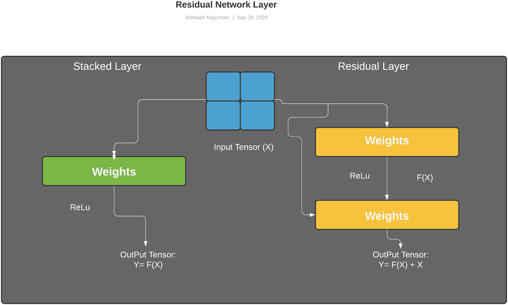

图 5-11

ResNet 中的残差块图

因此，残差网络在模型中应用了成千上万的卷积-2D/MaxPooling 层后，仍然保留了准确性。在最坏的情况下，如果输入和输出张量的维度不匹配，则添加一个填充层，其方程如下：

Y = F(X,{W[i]}) + W[i] X

Resnet-50 模型包含五个阶段，每个阶段都有残差和卷积块。残差块也被称为恒等块。每个卷积块包含三个卷积 2D 层，每个恒等/残差块也包含三个卷积 2D 层。在这个模型中，有超过 2300 万个可训练参数。

我们将使用 keras.applications 模块中已经构建的 Resnet-50 模型。然后，我们将在 build_model 函数中加载 Resnet-50 模型，如下所示：

```py
from keras.applications.resnet50 import ResNet50
def build_model():
model=ResNet50()
return model
resnet_model= build_model()
resnet_model.summary()
```

当我们总结模型时，我们会看到模型正在下载，然后可训练参数以及层将一起展示，如图 5-12 所示。

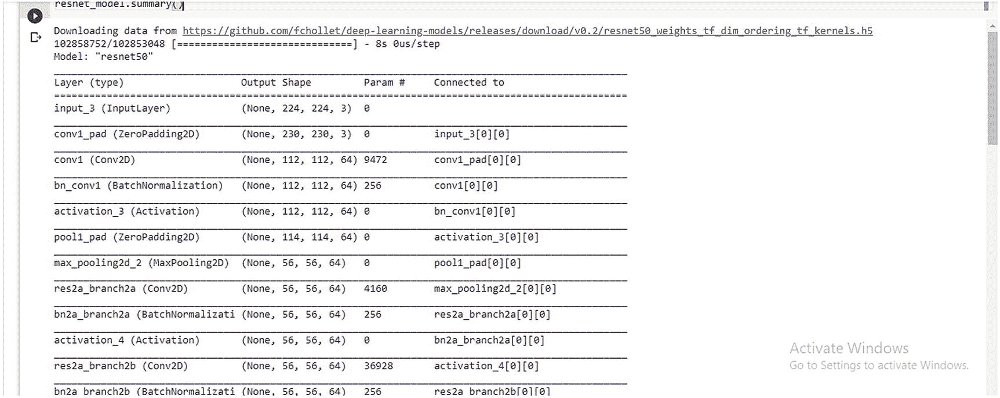

图 5-12

Keras 中的 Resnet-50 模型

VGG 和 Resnet 模型有几种变体，它们具有不同数量的隐藏层和卷积层，还有其他最先进的模型，如 AlexNet 和 GoogleNet。

### 使用 Resnet-50 构建图像分类器模型

既然我们已经理解了神经网络和 Keras 中构建模型的基础，让我们用 Keras 框架和 ResNet-50 模型，用几行代码构建一个图像分类器模型。打开 Resnet50 Convolution Networks.ipynb 笔记本，在这种情况下，我们将使用这个模型让机器判断给定的图像是猫还是狗。首先，为了构建这个二元分类模型，我们需要从 Keras 导入库——即从 keras.applications 导入 Resnet-50 模型，以及从 keras.preprocessing 模块导入 img 和 img_to_array 模块。这些层帮助我们解码和预处理输入图像，使其可用于 Resnet 模型。我们还需要 numpy 来重塑图像张量，以及“matplotlib”来在屏幕上展示图像。

```py
from keras.applications.resnet50 import ResNet50, decode_predictions, preprocess_input
from keras.preprocessing.image import image, img_to_array
import numpy as np
import matplotlib.pyplot as plt
```

在下一个阶段，我们导入数据集并解压它。这包含了一个包含大量正确标记的猫和狗图像的大数据库，我们可以使用我们的监督 Resnet 模型。

```py
!wget -qq http://sds-datacrunch.aau.dk/public/dataset.zip
!unzip -qq dataset.zip
```

现在我们通过 matplotlib 在[244,244]的维度中绘制数据集的第一张图像来查看它。

```py
img = image.load_img
("dataset/single_prediction/cat_or_dog_1.jpg", target_size = (224, 224))
plt.imshow(img)
```

运行此代码后，屏幕上会显示如图 5-13 所示的拉布拉多狗的图像。

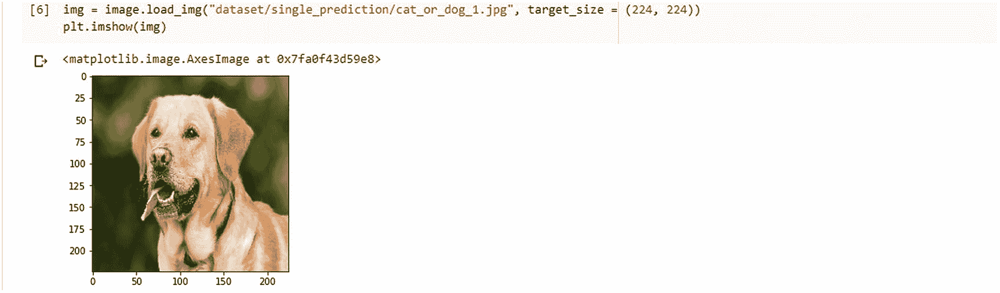

图 5-13

数据集中的狗的图像

我们将使用这张图像来验证模型是否能够正确将其分类为狗。在下一个阶段，我们必须将这张图像转换为张量。这是通过将图像转换为 numpy 数组，然后沿着一个轴扩展它来完成的，使其成为一个输入张量：

```py
img=image.img_to_array(img)
img=np.expand_dims(img, axis=0)
img=preprocess_input(img)
```

在下一步中，我们使用 Resnet-50 模型训练该图像，并将从模型中获得预测结果。现在，我们希望预测给定图像最可能的分类，在我们的例子中是狗。这是通过使用“decode_predictions”方法完成的，该方法声明了模型预测的预测值，指出它是狗还是猫。

```py
model=ResNet50(weights='imagenet')
model.summary()
#predict image
predictions= model.predict(img)
print("Accuracy of predictions")
print(decode_predictions(predictions, top=1)[0])
```

现在如果我们运行这个模型，我们会立即看到 Resnet 模型预测图像为拉布拉多寻回犬，准确率为 56.7%。我们使用 Resnet-50 构建了一个二分类模型，我们也可以创建一个多分类模型。Convolution Network-Classification.ipynb 笔记本包含了一个使用自定义卷积 2D 神经网络（实现 VGG-16 的变体）的多分类模型，用于分类 CIFAR 数据集。CIFAR 是一个基准图像分类数据集，存在于 keras.datasets 模块中，被广泛用于图像分析和分类。然而，模型规范和实现被保留供感兴趣的读者参考，他们希望深入了解图像分析、处理、分类模型以及其他计算机视觉模型。

这些神经网络模型，无论是 MLP（密集型）还是卷积型，都将在我们的深度强化学习算法中得到广泛的应用。既然我们已经对这些网络有了相当的了解，我们将深入研究它们。

## 深度强化学习算法

在第一章中，我们学习了强化学习中的对比以及值函数和策略函数之间的关系。我们使用了贝尔曼函数来更新值，并改变策略以获得更好的值估计。所有这些都是基于离散数据的。在我们深入主要算法之前，我们应该对深度强化学习中不同的算法范式有所了解。

### 关于策略算法

这些算法依赖于策略性能和优化。这个算法家族试图优化策略并提供良好的性能。在本节中，我们将通过比较 Q 学习（离策略）和 SARSA（状态、动作、奖励、状态、动作；在策略）算法来分析传统的强化学习空间。

#### 传统强化学习：Q-Learning 和 SARSA

在这种情况下，策略函数被更新以获得最优的 Q 值。在离散强化学习场景中，我们讨论了贝尔曼方程和 Q 学习算法，我们也提到了策略函数。另一种离散强化学习的变体是 SARSA 算法，它更新策略函数而不是值。在通用的 Q 学习中，我们有以下 Q 值更新的方程：

Q(S, A) = Q(S, A) + α [R + ymax[a]Q(S^(**`**), a) – Q(S, A) ]

S=S^(**`,**)

其中α是学习率，y 是折扣因子，S、A 和 R 分别代表状态、动作和奖励空间。Q(S, A)代表从状态 S 采取动作 A 所检索到的值。在这种学习形式中，代理使用 Q 值策略（贪婪策略）从 S 中选择动作 A。然后它接收 R（奖励）并观察到下一个状态 S**`**。因此，对旧状态有依赖性，这对离策略算法是有用的。与 Q 学习相比，我们有 SARSA 算法。SARSA 的更新方程如下：

Q(S, A)= Q(S, A) + α [R + yQ(S^(**`**), A**`**) – Q(S, A) ]

A=A^`

S=S^(**`**)

虽然这两个方程都来自贝尔曼方程，但根本区别在于 SARSA 根据基于 Q 策略从状态 S 选择动作 A，然后观察到 R（奖励）和新状态（S^(**`**))，然后使用从 Q 导出的策略在状态 S^(**`**) 中选择另一个动作 A^(**`**)。策略的更新使 SARSA 成为离散强化学习空间中的在线策略算法。在 SARSA 中，智能体学习最优策略并使用相同的策略进行行为，例如 Epsilon-Greedy 策略。在 SARSA 的情况下，更新策略与行为策略相同。

要看到这个比较，我们可以打开 Q-Learning|SARSA-FrozenLake.ipynb 笔记本来查看在离散空间的传统学习算法中在线策略技术与离线策略技术的对比。大部分代码段是相同的，除了 Q 和 SARSA 函数。在“Q_learning”方法中，我们看到 Q 策略试图应用贪婪最大化策略，并根据前面提到的计算出的 Q 值进行下一步。这是通过以下代码行实现的：

```py
best_value, info = best_action_value(table, obs1)
Q_target = reward + GAMMA * best_value
Q_error = Q_target - table[(obs0, action)]
table[(obs0, action)] += LEARNING_RATE * Q_error
```

可以观察到 Q 学习的准确度（奖励）步骤图，如图 5-14 所示。

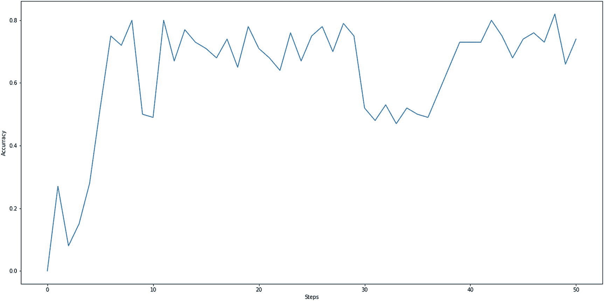

图 5-14

Q 学习的准确度步骤图

现在在 SARSA 算法的情况下，“SARSA”方法实现了在线策略更新方法，该方法更新策略：

```py
target=reward + GAMMA*table[(state1, action)]
predict=table[(state0, action)]
table[(state0, action)]+= LEARNING_RATE*(target- predict)
```

在运行此段代码后，我们可以可视化奖励-步骤图，并比较离散空间中在线策略与离线策略之间的差异，如图 5-15 所示。

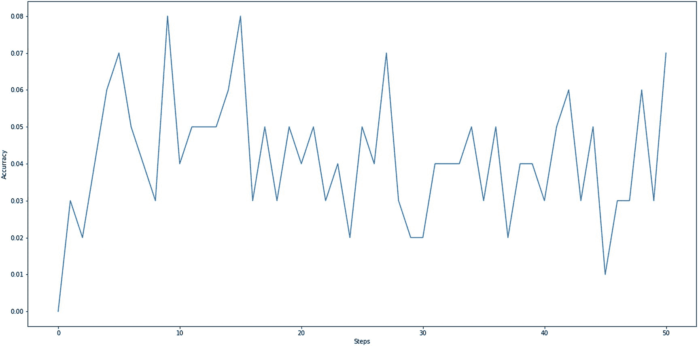

图 5-15

SARSA 的准确度步骤图

#### 深度强化学习：连续空间深度在线策略算法

现在在许多复杂环境中，与特定策略相关的值可以有一个连续分布。尽管这套算法可以扩展到离散空间，但我们将考虑连续分布。对于连续空间，我们必须使用深度强化学习算法。在优化策略的在线策略算法中，最重要的算法类别被称为策略梯度。策略梯度方法直接对策略进行建模和优化。通常我们关联一个参数化函数 πθ，它表示策略，策略梯度试图优化 θ 以获得更好的奖励。在策略梯度中，奖励函数通常表示为：

J(θ) = ∑[S] d^π(s)V^π(s) = ∑[S] d^π(s)∑[A] πθQ^π(s, a),

其中 d^π(s) 表示 π[θ] 策略的马尔可夫链的平稳分布，这是一个在线策略分布。这可以推广为，如果智能体沿着马尔可夫链无限期地移动，智能体最终处于某个状态的概率保持不变，这被称为平稳概率。在这种情况下，我们将探讨大多数在线策略算法，如标准策略梯度（VPG）、优势演员评论家（A2C）、PPO，以及异步演员评论家（A3C）及其变体，包括 ACER（离线 A3C）和 ACKTR。然而，最重要的是，我们将理解 PPO 策略，因为机器学习智能体广泛使用它。

##### 策略梯度 – REINFORCE

可以预期，基于策略的深度强化学习在连续空间中比基于价值的学习方法更有用。这是因为有无限多的动作可以估计价值；因此，基于价值的方案计算量过于庞大。在基于策略的训练策略梯度方法中，有一个梯度上升的概念。这意味着策略改进是根据以下方程进行的：

Q^π(s^(**`**) |a^(**`**) ) = argmax [A] Q^π(s |a )

为了最大化策略更新，我们通常需要计算策略的梯度 J(θ)，以便我们可以将 θ 移向该策略 π[θ.] 返回最高的方向。这是通过使用策略梯度定理来实现的，这是大多数连续空间中存在的深度强化算法的基石。

###### 策略梯度定理

计算梯度是一个难题，因为它依赖于动作选择空间以及状态的平稳分布，尤其是策略行为 π[θ]。后一部分难以计算，因为在动态环境中无法知道状态的平稳分布。我们用 ∆ [θ] J(θ) 表示策略的梯度，其中 ∆ [θ] 表示参数空间 θ 上的梯度算子。策略梯度定理提供了一个不涉及状态分布导数的目标函数偏导数的重新表述。策略梯度可以简化如下：

∆θ J(θ) = ∆θ ∑S dπ(s)Vπ(s) =∆θ ∑S dπ(s) ∑A πθ(a|s)Qπ(s, a)

α ∑[S] d^π(s)∑[A] ∆[θ] πθQ^π(s, a),

其中 α 代表比例。因此，我们不是在状态空间上计算导数，而是在实际上计算策略函数的导数。这个定理的推导可以从状态价值函数 ∆[θ] V^π(s) 开始，然后将其扩展以包括策略函数和 Q^π(s, a) 状态，如下所示：

∆[θ] V^π(s) = ∆[θ] ( ∑[A] πθQ^π(s, a) )

= ∑[A] (∆[θ] πθQ^π(s, a) + πθ ∆[θ] Q^π(s, a) ) 通过导数链式法则

扩展 Q 以包含未来状态值

=∑[A] (∆[θ] πθQ^π(s, a) + πθ ∆[θ]∑[S, R] P(s**`**, r|s, a) (r+V^π (s**`**)))

奖励 r 不是 θ 的函数

=∑[A] (∆[θ] πθQ^π(s, a) + πθ ∑[S, R] P(s**`**, r|s, a) ∆[θ] V^π (s**`**))

如 P(s**`**, r|s, a) = P(s**`**|s, a)

=∑[A] (∆[θ] πθQ^π(s, a) + πθ ∑[S, R] P(s**`**|s, a) ∆[θ] V^π (s**`**)

因此，我们得到了梯度更新策略的递归公式，如以下方程所示：

∆[θ] V^π(s) =∑[A] (∆[θ] πθQ^π(s, a) + πθ ∑[S,R] P(s**`**|s, a) ∆[θ] V^π (s**`**)

如果我们仔细观察，会发现如果我们无限扩展 ∆[θ] V^π()，很容易发现我们可以通过递归展开过程从起始状态 s 转换到任何状态，并通过添加所有访问概率，我们将得到 ∆[θ] V^π(s)。这可以通过重复使用 πθ ∑[S, R] P(s**`**|s, a) ∆[θ] V^π (s**`**) 来简单地证明，以转换到新的状态 s**`**，s**```py,** and others. This form can be represented as:

∆[θ] V^π(s) = ∑[S]∑[K] p^π(s →x, k)Φ(s),

where p^π(s →x, k) represents the transition probability from state s to x after k steps, and Φ(s) signifies ∆[θ] πθQ^π(s, a).

Now passing this into the policy gradient function for gradient ascent, we get:

∆[θ] J(θ) = ∆[θ] V^π(s)

= ∑[S]∑[K] p^π(s[0] →s, k)Φ(s) Starting from state S[0] through Markov distribution and recurrence

=∑[S] η(s) Φ(s) Let η(s)= ∑[K] p^π(s[0] →s, k)

=(∑[S] η(s)) [ ∑[S] η(s) /(∑[S] η(s))] Φ(s) Normalize η(s)

α [ ∑[S] η(s) /(∑[S] η(s))] Φ(s) ∑[S] η(s) is constant

= ∑[S] d^π(s)∑[A] ∆[θ] πθQ^π(s, a) d^π(s)= ∑[S] η(s) /(∑[S] η(s)) stationary distribution

That completes the proof of the policy gradient theorem, and we can simplify the equation as follows:

∆[θ] J(θ) α ∑[S] d^π(s)∑[A] ∆[θ] πθQ^π(s, a)

= ∑[S] d^π(s)∑[A] πθQ^π(s, a)[ ( ∆[θ] πθ )/ πθ]

This modification is added to produce a new form of generic policy gradient algorithms in the form of expectations using the fact that the derivative of ln(x) (log[e]x) is 1/x :

∆[θ] J(θ) = E[Q^π(s, a) ∆[θ] ln(πθ) ]

Generally, this equation is represented as:

∆[θ] J(θ) = E[∑[t] Ψ[t]∆[θ] ln(πθ) ],

where may be the following functions:

*   **Reward trajectory:** ∑[t] r[t]

*   **State-action value:** ∑[t] Q^π(s[t], a[t])

*   **Advantage function:** ∑[t] A^π(s[t], a[t])

*   **Temporal difference residual:** r[t +] V^π(s[t+1]) - V^π(s[t])

Advantage function is defined as:

A^π(s[t], a[t]) = Q^π(s[t], a[t]) - V^π(s[t])

In VPG, which we will be reviewing closely, we have the advantage function in the policy gradient equation, represented as:

∆[θ] J(θ) = E[∑[t]∆[θ] ln(πθ) A^π(s[t], a[t])]

Now, we have seen that an optimal policy tries to maximize the rewards, and the gradients are used to compute the maxima in high-dimensional space. In deep RL using policy methods, this is the gradient ascent step, which is stochastic in nature and tries to maximize the parameter θ as follows:

Θ[k+1 =] Θ[k] + α ∆[θ] J(θ),

where α is the learning rate. Policy gradients compute the advantage function estimates based on rewards and then try to minimize the errors in the value function by normal gradient descent (SGD/Adam) using the quadratic loss function that we discussed in neural networks:

Φ[k+1] α ∑[S]∑[t] (V^π(s[t]) – R[t] )²,

where α signifies proportionality and Φ[k+1] is the error gradient on mean squared loss.

To understand this deep reinforcement on–policy algorithm, we will look into the simple implementation of the VPG algorithm. Open the Policy Gradients.ipynb Notebook. We will be using the CartPole environment from OpenAI, as in most of our previous examples, and will develop the algorithm. Then we will use this on other trainable deep RL environments in Gym, such as Atari Games (Pong) and MountainCar.

We define the class PGAgent and declare the initial variables that control the exploration-exploitation rate (gamma), learning rate, state size, action size, and initialize arrays to contain the list of rewards, actions, states, and probabilities. This is signified by the following lines:

```

class PGAgent:

def __init__(self, state_size, action_size):

self.state_size=state_size

self.action_size=action_size

self.gamma=0.99

self.learning_rate=0.001

self.states=[]

self.rewards=[]

self.labels=[]

self.prob=[]

self.model=self.build_model()

self.model.summary()

```py

Now let us see the model part of this algorithm, which is responsible for the gradient ascent of the advantage as well as the gradient descent to minimize the error in value estimates. We will be using dense MLP network in our case. We can also use convolution networks in this case. The initial two dense use 64 units with “Relu” activation and glorot_uniform as the kernel initializing functions. Then we have a dense layer with softmax activation and self.action_size as the output dimension. Since in CartPole the action space consists of either moving toward the left or right, we can use sigmoid activation as well. Then we have a ”model.compile” method with Adam optimizer and a categorical cross entropy loss. Since this code is made to provide a policy gradient approach to most of OpenAI Gym’s environments; hence, we have used softmax activation for multi-class classification and cross-entropy loss. For CartPole, we can make changes to the loss by making it binary_crossentropy and using sigmoid activation in the last dense layer.

```

model=Sequential()

model.add(Dense(64, input_dim=self.state_size, activation="relu", kernel_initializer="glorot_uniform"))

model.add(Dense(64, activation="relu", kernel_initializer="glorot_uniform"))

model.add(Dense(self.action_size, activation="softmax"))

model.compile(optimizer=Adam(learning_rate=self.learning_rate), loss="categorical_crossentropy")

返回模型

```py

The next method is memory, which fills the array of actions, rewards, and states. In this method, whenever an action is chosen, it is marked in the array as 1\. This can be thought of as a one-hot encoding mechanism.

```

y=np.zeros([self.action_size])

y[action]=1

self.labels.append(np.array(y).astype('float32'))

self.states.append(state)

self.rewards.append(reward)

```py

In the “act” method, we use the model to predict an action that an agent should take based on the advantage estimate (GAE) function. The “model.predict” method is used to predict the probabilities. The action having the highest probability is chosen as the next action based on the GAE policy.

```

def act(self, state):

状态=状态.reshape([1, state.shape[0]])

probs=self.model.predict(state, batch_size=1).flatten()

self.prob.append(probs)

action=np.random.choice(self.action_size,1, p=probs)[0]

返回动作，概率

```py

The “discount_rewards” method provides a discounted reward by using the exploration-exploitation factor gamma. This is a generic discount rewards policy and will be used across algorithms.

```

def discount_rewards(self, rewards):

discounted_rewards = np.zeros_like(rewards)

运行总和 = 0

for t in reversed(range(len(rewards))):

if rewards[t] != 0:

运行添加 = 0

运行添加 = 运行添加 * self.gamma + rewards[t]

折扣奖励[t] = 运行添加

返回折扣奖励

```py

In the next method, the “train” method, we will be training the neural network. For this, we normalize the rewards array. Then we use the “model.train_on_batch” method to train the neural network and pass inputs as the states (“self.states”) and outputs as the actions (“self.labels”).

```

def train(self):

labels=np.vstack(self.labels)

rewards=np.vstack(self.rewards)

rewards=self.discount_rewards(rewards)

rewards=(rewards-np.mean(rewards))/np.std(rewards)

labels*=-rewards

x=np.squeeze(np.vstack([self.states]))

y=np.squeeze(np.vstack([self.labels]))

self.model.train_on_batch(x, y)

self.states, self.probs, self.labels, self.rewards

=[],[],[],[]

```py

In the load_model and save_model functions, we load and save the weights of the model as follows:

```

def load_model(self, name):

self.model.load_weights(name)

def save_model(self, name):

self.model.save_weights(name)

```py

In the “main()” method, we create the environment from Gym using the “gym.make” method. This method also has the action space and observation space along with the rewards. We create an object of the PGAgent class and pass in the action size and state size as arguments from the Gym environment. We train our model for 200 epochs, and for each episode of training, we observe the rewards, states, and actions and correspondingly add the rewards to cumulative rewards. For each episode of training represented by the “agent.train” method, we record the corresponding action and the rewards. If the reward is negative, it is reset to 0 and the training starts again.

```

if __name__=="__main__":

env=gym.make('CartPole-v0')

状态=env.reset()

得分=0

episode=0

状态大小=env.observation_space.shape[0]

action_size=env.action_space.n

agent=PGAgent(state_size, action_size)

j=0

while j is not 2000:

屏幕截图 = env.render(mode='rgb_array')

action, prob=agent.act(state)

state_1, reward, done,_=env.step(action)

分数+=奖励

agent.memory(state, action, prob, reward)

状态=状态 _1

plt.imshow(screen)

ipythondisplay.clear_output(wait=True)

`ipythondisplay.display(plt.gcf())`

`if done:` 

`j+=1`

`agent.rewards[-1]=score`

`agent.train()`

`print("Episode: %d - Score: %f."%(j, score))`

`score=0.0`

`state=env.reset()`

`env.close()`

```py

Finally after training is completed, we close the environment. We can also see the CartPole in action as we used the “ipythondisplay” methods, which we saw in the first chapter. Figure 5-16 illustrates this.


Figure 5-16

CartPole environment training using policy gradient algorithm

This code segment can be used for solving the MountainCar problem in the Gym environment where a car is stuck between two slopes of a mountain and has to climb up to reach the destination. By changing the env.make (MountainCar-v0), we can simulate this GAE policy gradient algorithm for this use-case, as shown in Figure 5-17.

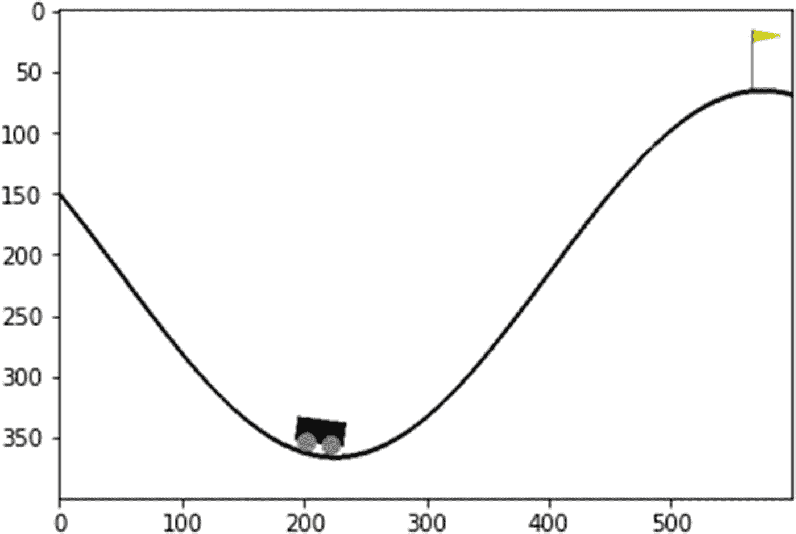

Figure 5-17

MountainCar problem training in policy gradients

**Actor Critic Algorithm**

Let us now venture into the actor critic set of algorithms, which is an on-policy technique. As we saw in policy gradients, there is a gradient ascent of the gradient function for choosing better returns and there is a standard gradient descent or minimization function for reducing the error in the value estimates. In actor critic, a modification is made by introducing two competitive neural network models and storing previous value estimates pertaining to a particular policy. Hence actor critic consists of two neural network models or agents:

*   **Critic:** updates the value function parameters w and modifies the policy gradient by updating the state-action value ∑[t] Q^π(s[t], a[t]) or state value∑[t] V^π(s[t])

*   **Actor:** relies on the critic to update the policy parameters θ for πθ

For the critic update step, we can consider the policy gradient theorem and function with state action value instead of advantage function as follows:

∆[θ] J(θ) = E[∑Q^π(s, a) ∆[θ] ln(πθ) ],

with the gradient ascent step denoted by

Θ[k+1 =] Θ[k] + α ∆[θ] J(θ)

The actor can upgrade its policies to have a better reward. There is also a value estimate that governs the critic in deciding the value of the next state. Depending on the current policy πθ, the critic estimates whether the action to be taken by the actor is most rewarding or not. Hence, the general architecture of actor critic can be visualized as shown in Figure 5-18.

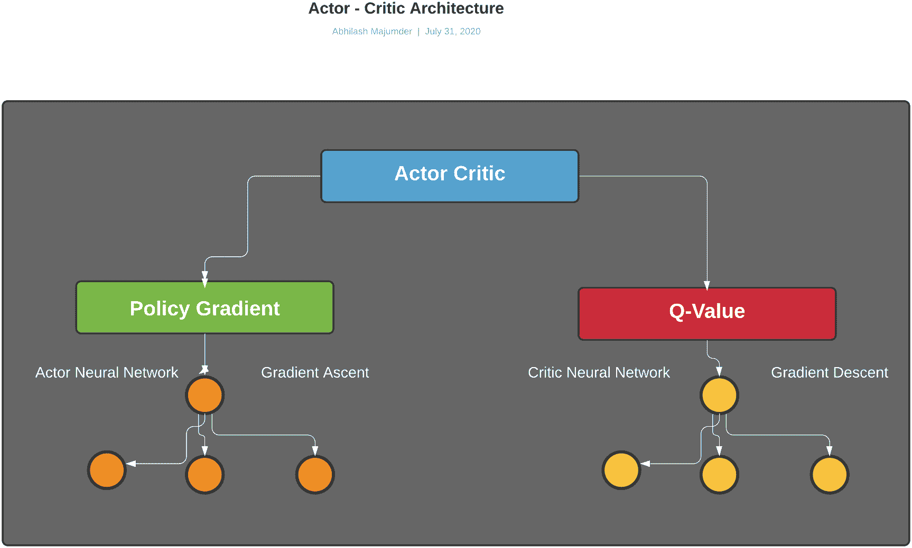

Figure 5-18

Actor critic network architecture

With respect to this, we will be understanding some of the variants of actor critic algorithm.

**A2C algorithm** **:** This uses the actor critic concept mentioned before with the modification that instead of a value update, it updates the advantage estimate (GAE), which is given by the following equation:

A^π(s[t], a[t]) = Q^π(s[t], a[t]) - V^π(s[t])

The A2C algorithm can be found in the A2C.ipynb Notebook. This algorithm has been built using the same code base of the policy gradient algorithm that we observed, and all the functions are the same. The only changes in the A2C algorithm is that we train two different neural network models–the actor and critic. This can be observed in the “build_actor_model” and “build_critic_model” methods inside the A2Cagent class. The actor model contains two dense MLP layers with 64 units with activation “Relu” (this can be changed to convolution-2D layers as per requirement) and kernel initializers. Then it has a softmax distributed outer dense layer with the action spaces as the output. We finally compile the actor model with categorical cross-entropy loss and Adam optimizer.

```

`def build_actor_model(self):`

`logdir= "logs/scalars/" + datetime.now().

`strftime("%Y%m%d-%H%M%S")`

`tensorboard_callback=keras.callbacks.`

`TensorBoard(log_dir=logdir)`

`Actor=Sequential()`

`Actor.add(Dense(64, input_dim=self.state_size,

`activation='relu',

`kernel_initializer='glorot_uniform'))`

`Actor.add(Dense(64, activation="relu",

`kernel_initializer='glorot_uniform'))`

`Actor.add(Dense(self.action_size, activation="softmax"))`

`Actor.compile(optimizer=`

`Adam(learning_rate=self.learning_rate),`

`loss='categorical_crossentropy')`

`return Actor`

```py

In the next stage, we have the build_critic_model function, which has a similar architecture with respect to the actor model. However, we can make changes to this architecture by introducing different dense/convolution layers and/or changing the activation functions.

```

`def build_critic_model(self):`

`logdir= "logs/scalars/" + datetime.now()`.

`strftime("%Y%m%d-%H%M%S")`

`tensorboard_callback=keras.callbacks.`

`TensorBoard(log_dir=logdir)`

`Critic=Sequential()`

`Critic.add(Dense(64, input_dim=self.state_size,

`activation='relu',

`kernel_initializer='glorot_uniform'))`

`Critic.add(Dense(64, activation="relu",

`kernel_initializer='glorot_uniform'))`

`Critic.add(Dense(self.action_size, activation="softmax"))`

`Critic.compile(optimizer=`

`Adam(learning_rate=self.learning_rate),`

`loss='categorical_crossentropy')`

`return Critic`

```py

The “memory” method has the similar implementation as that in the policy gradient . However, in the “act” method, we will use the critic model to predict the actions as follows:

```

`def act(self, state):`

`state=state.reshape([1, state.shape[0]])`

`probs=self.Critic.predict(state, batch_size=1).flatten()`

`self.prob.append(probs)`

`action=np.random.choice(self.action_size,1, p=probs)[0]`

`return action, probs`

```py

Then we have the “discount_rewards” method, which is similar to policy gradient. The “train” method has changes, as in this case, we have to train both the actor and critic models. We take the inputs of the actions (“labels”) and the discounted rewards and then specify the states and actions, (self.states, self.labels) to the actor and critic models. The “train_on_batch” method is used for training specifically on user-defined batches, and in this case, we can use the “model.fit” method to train as well. The difference is that in the latter case, the “fit” method automatically converts the sampled data into batches for training and may also include a generator function.

```

`def train(self):`

`labels=np.vstack(self.labels)`

`rewards=np.vstack(self.rewards)`

`rewards=self.discount_rewards(rewards)`

`rewards=(rewards-np.mean(rewards))/np.std(rewards)`

`labels*=-rewards`

`x=np.squeeze(np.vstack([self.states]))`

`y=np.squeeze(np.vstack([self.labels]))`

`self.Actor.train_on_batch(x, y)`

`self.Critic.train_on_batch(x, y)`

`self.states, self.probs, self.labels, self.rewards=[],[],[],[]`

```py

The rest of the code segment is the same as the policy gradient, and hence methods like “load_weight” and ”save_weight” are similar. On running this in the CartPole environment, we can visualize the training as well as the rewards/loss. Thus we built an A2C agent that uses two neural networks using policy gradient and advantage value-estimate to predict the output actions. This can also be used for training the Acrobot environment in OpenAI Gym. The Acrobot consists of two joints and two links, where the joint between the two links is underactuated. The goal is to swing the end of the lower link to a given height, as shown in Figure 5-19.

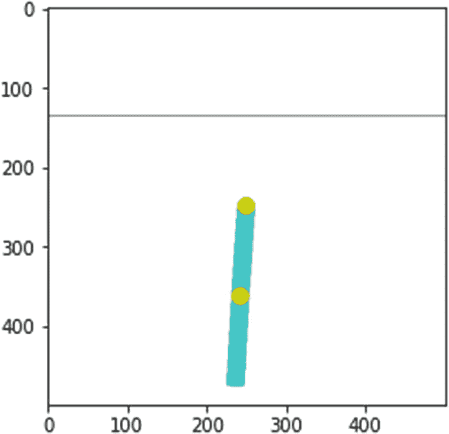

Figure 5-19

Acrobot environment training using A2C

**A3C** **:** This is an asynchronous version of the A2C algorithm, which mainly relies on threading. This implies that there are several worker threads that work in parallel to update the parameters θ. The importance of this on-policy algorithm is that the A3C agent learns the value function when multiple actors are trained in parallel, and these are synced with the global parameters periodically. While this algorithm runs especially well in GPUs, we will implement a very simple version for the CPU, using the same code base that we have. The effect of different parallel actor implies that the training is faster due to faster updates on the parameters which assist in upgrading the policy.

Open the A3C.ipynb Notebook in Colab or Jupyter Notebook. This code segment can be made to run on Cloud GPUs, which are provided with the Colab, with some code changes. In our case, we have to import the threading library and its associated modules such as Lock and Thread. The concept of lock and release is important for process scheduling (thread scheduling) and prevents deadlock in the operating system. While a subthread updates the global parameters, the other subthreads should not be reading or using those parameters; this is done by a classic mutex lock (mutual exclusion). This is analogous to the “Readers-Writers” problem in Operating System Theory, where readers are unable to read unless the writers complete writing to the same disk or file.

```

`import threading`

`from threading import Lock, Thread`

```py

We have most of the functions that implement the A3CAgent class, similarly to the A2CAgent class. The difference lies in the fact that here we will use threading to make multiple copies of the Actor model . The “train_thread” method creates “daemon” threads, depending on the number of threads specified in the “n_threads” attribute. Now each of these daemon threads calls the “thread_train” method, which has an associated lock for reading an updating the global parameters set.

```

`def train_thread(self, n_thread):`

`self.env.close()`

`envs=[gym.make('CartPole-v0') for i in range(n_thread)]`

`threads=(threading.Thread(target=self.thread_train(),

`daemon=True, args=(self, envs[i], i)) for i`

在`range(n_thread))`范围内

`for t in threads:` 

`time.sleep(1)`

`t.start()`

```py

The “thread_train” method calls the “agent.train()” method inside every lock stage, trains a particular worker actor thread, and updates the global parameter set (states, actions, rewards).

```

`def thread_train(self):`

`lock=Lock()`

`lock.acquire()`

`agent.train()`

`lock.release()`

```py

This completes the A3C modification of the A2C algorithm. As mentioned, there are other variants that are faster and have a greater performance on GPUs, but in this case we are simply using a smaller CPU version. We can train MountainCar with this algorithm as well and compare the results with A2C. To illustrate, the A3C architecture is shown in Figure 5-20.

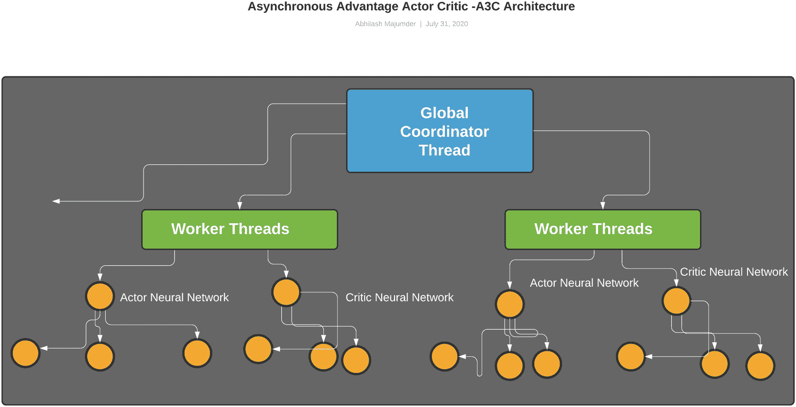

Figure 5-20

A3C architecture

**Actor critic using Kronecker factored trust region (ACKTR)** **:** This is a variant of the actor critic class of algorithms where natural gradient is used in place of Adam/SGD/RMSProp optimizers. It is faster than gradient descent, as it acquires the loss landscape by using the Fisher Information Matrix (FIM) as a curvature of the loss function. A generic FIM of a probabilistic model that outputs a conditional probability of y given the value of x is denoted by:

F[θ] = E[(x, y)] [∆ log p(y|x;θ) ∆ log p(y|x;θ)^T]

In generic classification tasks, we normally use mean value of log likelihood (mse error) as the loss function. We can derive the relationship between the FIM and the Hessian (2^(nd) order partial derivative matrix of scalar fields) of a negative log likelihood loss E(θ):

H(E) (θ)= ∆² E[(x, y)] [- log p(y|x;θ)]

= - E[(x, y)] [∆² log p(y|x;θ)]

= - E[(x, y)] [- (∆ log p(y|x;θ) ∆ log p(y|x;θ)^T )/ p(y|x;θ)² + ∆² p(y|x;θ)/ p(y|x;θ) ] (Chain Rule)

= F[θ] - E[(x, y)] [∆² p(y|x;θ)/ p(y|x;θ)]

The gradient update rule is given by:

Θ[k+1]= Θ[k] – α (F[θ])^(-1)[k] ∆ E(θ[k]),

where α is the learning rate and ∆ denotes the grad operator (for derivative).

We will use the ACKTR model from Baselines (stable-baselines) to train four instances of the CartPole environment in parallel. Open the ACKTR.ipynb Notebook In the first step, we have to make the necessary imports, including the stable baselines, the policies (MLP/MLPLSTM), the ACKTR model, and ipythondisplay for visualization.

```

`import gym`

`from stable_baselines.common.policies import MlpPolicy, MlpLstmPolicy, MlpLnLstmPolicy`

`from stable_baselines.common import make_vec_env`

`from stable_baselines import ACKTR`

`import matplotlib.pyplot as plt`

`from IPython import display as ipythondisplay`

`from pyvirtualdisplay import Display`

`display = Display(visible=0, size=(400, 300))`

`display.start()`

```py

Then we load the CartPole-v1 environment and load the ACKTR model with MLP (dense neural network) policy with 25000 time-steps.

```

`env = make_vec_env('CartPole-v1', n_envs=4)`

`model = ACKTR(MlpPolicy, env, verbose=1)`

`model.learn(total_timesteps=25000)`

`model.save("acktr_cartpole")`

`model = ACKTR.load("acktr_cartpole")`

`obs = env.reset()`

```py

Then we have a loop for execution of the algorithm and observe the state, rewards , and actions per step of training.

```

`while True:` 

`action, _states = model.predict(obs)`

`obs, rewards, dones, info = env.step(action)`

`screen = env.render(mode='rgb_array')`

`plt.imshow(screen)`

ipythondisplay.clear_output(wait=True)

ipythondisplay.display(plt.gcf())

```py

On running this module, we can visualize the training happening on four instances with ACKTR policy, as shown in Figure 5-21.


Figure 5-21

ACKTR algorithm in CartPole

We can also modify our existing code base that we used in the previous cases. We will see the A2C_ACKTR class, and in place of the Adam optimizer present in the “build_actor_model” class, we will be using the “kfac” (Kronecker Factor) as the optimizer for natural gradient descent. This uses the “kfac” module from Tensorflow, and there have not been any upgrades of the module to be compatible with Tensorflow 2.0\. Hence, there may be error mismatches. However, the code remains the same, with the only modification in the inclusion of the “kfac” module instead of the Adam optimizer.

**Stochastic actor critic for continuous spaces** **:** This is another variant of actor critic algorithms that uses a Gaussian distribution instead of a softmax distribution. This parameterized distribution assists in continuous spaces. For this the Gaussian equation (distribution) for the policy πθ) can be written as:

πθ) = 1/(√2πσ[θ] (s)) exp (- (a-μ[θ] (s)²)/2 σ[θ] (s) ²)

This is implemented in the Stochastic Continuous Normal AC.ipynb Notebook, with the simple replacement in the “build_actor_model” method with the kernel initializing as “normal,” which represents a Normal (Gaussian kernel) and a sigmoid activation unit.

```

Actor.add(Dense(64, input_dim=self.state_size, activation="relu", kernel_initializer="normal"))

Actor.add(Dense(64, activation="relu", kernel_initializer="normal"))

Actor.add(Dense(self.action_size, activation="sigmoid"))

```py

This can also be implemented by writing a custom Gaussian activation unit and making it consistent with Tensorflow.

The variants of actor critic algorithms that we read in this section are entirely on-policy actor critic versions. There are off-policy actor critic algorithms (ACER) as well that we will look briefly in the next few sections.

**Proximal Policy Optimization**

Now we have explored the actor critic algorithms, we can learn about the PPO algorithm. This is based on A3C; however, there are fundamental differences. In this policy gradient on-policy algorithm, comparison is made between two policies based on their returns. Before we get into the details of PPO, let us understand the trust region policy optimization (TRPO) algorithm, which is the starting point of PPO.

**Trust region policy optimization** **:** To improve the stability of the actor critic variants, TRPO was designed, which avoids frequent policy updates by avoiding certain constraints based on Kullback-Leiblar (KL) divergence. The KL divergence provides the divergence relation between two probabilistic distributions, p and q, on variable x given by the equation:

D[KL] = - ∑p(x) log (p(x)/q(x))

Generally TRPO is a minorization-majorization (MM) algorithm that provides an upper and lower bound on the expected returns of the policies for comparison and thresholds them using the KL divergence. TRPO tries to find an optimal policy upgrade rule by comparing against the running gradient defined by ∆[θ] J(θ), which is called the surrogate gradient, and the corresponding policy gradient equation as the surrogate objective function. The TRPO algorithm can be analyzed as an optimization problem with the following conditions:

*   Adding KL divergence constraint on the distribution of the old and the new policies with the problem of maximizing the ∆[θ] J(θ):

    Max [θ] ∆[θ] J(θ)

    Subject to DKL/ πθ) < ∂

*   Regularization of the gradient objective function with KL divergence:

    Max [θ] Lθ)= J(π[θ]) - C DKL/ πθ)

The equations depend on the parameters of C and ∂. Now we apply sampling in this context, which implies finding the advantage taken at each step. Now if we refer to the Policy Gradient Theorem and the gradient function, given by the equation:

∆[θ] J(θ) = E[∑[t] Ψ[t]∆[θ] ln(πθ) ]

we will reframe the policy πθ part to contain a ratio of old and present policies, and in place of Ψ[t], we will be using the advantage function, A^π(s[t], a[t]). The new gradient objective function for policy update becomes:

∆[θ] J(θ) = E[∑[t] A^π(s[t], a[t]),∆[θ] ln(πθ/ πθold)) ],

which can be simplified to:

∆[θ] J(θ) = E[ A^π(s[t], a[t]) (πθ/ πθold) ]

Now the maximization problem can be simplified as:

Max [θ] E[∑[t] A^π(s[t], a[t]),∆[θ] ln(π[θ] (a|s)/ π[θold] (a|s))) ]

Subject to DKL/ πθ) < ∂

This is the main concept behind the TRPO algorithm. There are methods like natural gradient that are applied using the FIM for faster convergence. The ratio of policies is used to compute the importance sampling on a set of parameters θ. Now we will try to use this concept to build a TRPO agent. As we saw, the TRPO is an optimization over the actor critic method. Hence we will understand two variants of TRPO—one by OpenAI Baselines and the other by updating the same code base of actor critic.

Open the TRPO.ipynb Notebook. First we will use the Baselines TRPO module from OpenAI. For this we will import the library modules required for us.

```

import gym

from stable_baselines.common.policies import MlpPolicy

from stable_baselines import TRPO

import matplotlib.pyplot as plt

from IPython import display as ipythondisplay

from pyvirtualdisplay import Display

display = Display(visible=0, size=(400, 300))

display.start()

```py

This is the same as in the previous case, with the exception that in this case we will be using the TRPO algorithm. In this case, we will be using the Pendulum-v0 as our environment. The Pendulum is a classic RL environment, similar to CartPole, where there is an inverted pendulum that starts in a random position. The goal is to swing this pendulum up so that it stays upright—a classic control problem. First we load the environment using the Gym, and then we load the TRPO model using MLP (dense) as our neural network architecture.

```

env = gym.make('Pendulum-v0')

model = TRPO(MlpPolicy, env, verbose=1)

model.learn(total_timesteps=25000)

model.save("trpo_pendulum")

del model

model = TRPO.load("trpo_pendulum")

```py

Inside the while loop, we run the algorithm for 25000 iterations and observe the states, rewards, and action spaces.

```

while True:

action, _states = model.predict(obs)

obs, rewards, dones, info = env.step(action)

screen = env.render(mode='rgb_array')

plt.imshow(screen)

ipythondisplay.clear_output(wait=True)

ipythondisplay.display(plt.gcf())

```py

On running the code segment, we can visualize the Pendulum trying to be upright, as shown in Figure 5-22.

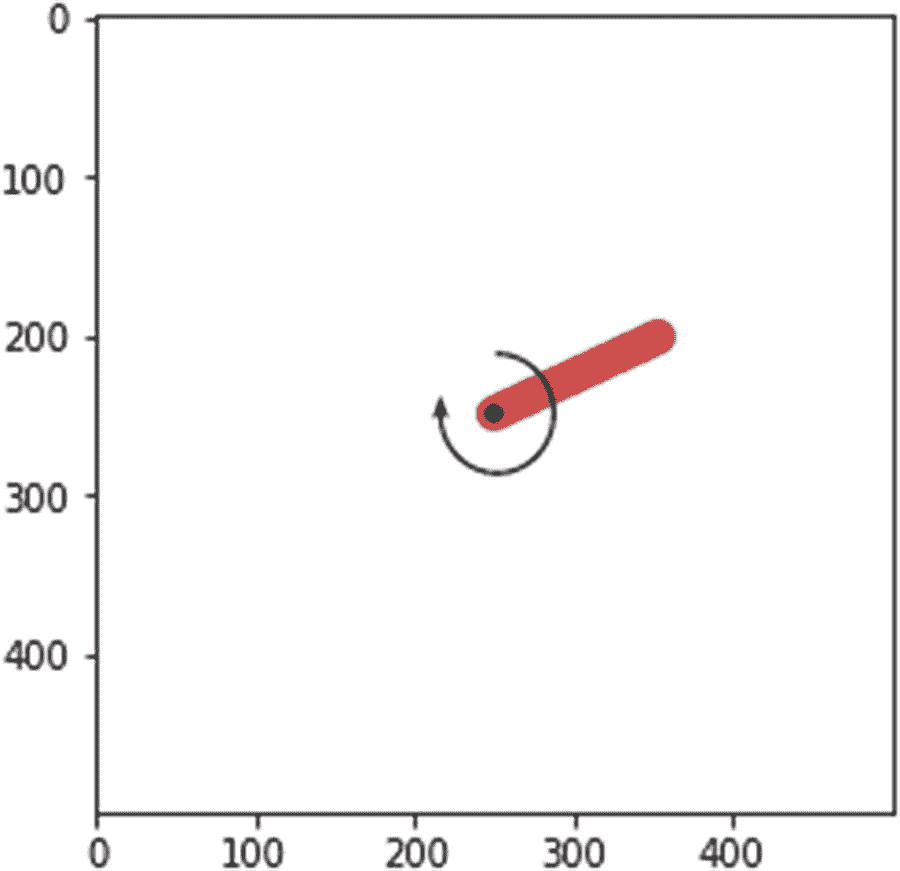

Figure 5-22

Pendulum environment using the TRPO algorithm

Now we are going to modify our previous code base, which is the A2C variant of actor critic. Most of the code segment will remain the same, with the exception that in the “build_actor_model” method in the TRPOAgent class, we will add a new loss function–trpo_loss. This loss function computes the KL divergence of the predicted outcomes with the previous outcomes and has an entropy factor to govern the constraints. The loss is measured by taking the negative log likelihood of the KL divergence distribution and is used with the Adam optimizer for the actor neural network.

```

def trpo_loss(y_true, y_pred):

entropy=2e-5

old_log= k.sum(y_true)

print(old_log)

pred_log=k.sum(y_pred)

print(pred_log)

kl_divergence= k.sum(old_log* k.log(old_log/pred_log))

prob=1e-2

loss=-k.mean(kl_divergence +

entropy*(-(prob*k.log(prob+1e-10))))

return loss

Actor.compile(optimizer=Adam(learning_rate=self.learning_rate), loss=trpo_loss)

```py

Thus we can now use TRPO on the A2C variant. We can also add this loss function in the A3C variant to make the TRPO-A3C agent variant. We can also play with the hyperparameters to estimate our values on particular policies .

**Proximal Policy Optimization (PPO)** **:** Using the TRPO concept, PPO is developed to increase simplicity and ease of use. The PPO algorithm relies on clipping of the surrogate gradient objective function while retaining the performance on the value estimates. Let us look at the previous objective equation of TRPO, which was:

∆[θ] J(θ) = E[ A^π(s[t], a[t]) (πθ/ πθold) ]

TRPO does not limit the distance between the policies πθ, πθold). And in many cases, this may lead to instability in training. PPO uses a clipped threshold value given by [(1+ ε), (1- ε)], where ε is a hyperparameter. Hence, the effective formulation of the gradient function based on PPO is defined as:

∆[θ] J(θ) =E[min(r(θ)A^π(s[t], a[t]), clip(r(θ), 1+ ε, 1- ε) A^π(s[t], a[t])],

where r(θ) = πθ/ πθold and clip(r(θ), 1+ ε, 1- ε) clips the ratio r(θ) to be no more than (1+ ε) and no less than (1- ε).

This is the concept behind the PPO algorithm. There are other variants of the PPO algorithm such as PPO-Penalty, which penalizes the KL divergence similar to TRPO with the exception that in TRPO there is a hard constraint. This clipping controls the divergence between the old and new policies in the following way, which is governed by the advantage as follows.

*   If the advantage A^π(s[t], a[t]) is positive, the objective function will increase if the action becomes more likely—that is, πθ increases. However, due to the minimization term, there is a limit how much the objective can increase. Once the ratio πθ >(1+ ε) πθold), the minimization operation takes control and hence avoids the new policy to go far away from the older policy.

*   If the advantage A^π(s[t], a[t]) is negative, the objective function will decrease if the action becomes less likely—that is, πθ will decrease. However, due to the maximization term, there is a limit how much the objective can decrease. Once the ratio πθ <(1- ε) πθold), the maximization will kick in and avoid the new policy to go far away from the old one.

Now let us implement a PPO agent using the Baselines from Open AI , and then we will explore how to modify the TRPO source (the loss function) to make it PPO.

Open the PPO-Baselines.ipynb Notebook. We will be using the stable Baselines like before and will import all the libraries and neural networks associated with PPO. Since we will be using the clipped PPO version, we have to import PPO2 from the Baselines as well as the “MlpPolicy,” which signifies we will be using dense networks for our training.

```

import gym

from stable_baselines.common.policies import MlpPolicy

from stable_baselines.common import make_vec_env

from stable_baselines import PPO2

```py

In the next step, we will set up the environment, and in this case, we will be using the CartPole environment. We will load the model as well. This is done using the following lines of code.

```

env = make_vec_env('CartPole-v1', n_envs=4)

model = PPO2(MlpPolicy, env, verbose=1)

model.learn(total_timesteps=2000)

model.save("ppo2_cartpole")

model = PPO2.load("ppo2_cartpole")

```py

In the next step, we train our PPO agent for 2000 iterations over four instances of the CartPole environment similar to the previous ones .

```

obs = env.reset()

while True:

action, _states = model.predict(obs)

obs, rewards, dones, info = env.step(action)

```py

Once completed, we will again visualize the four CartPole environments, as shown in Figure 5-23.

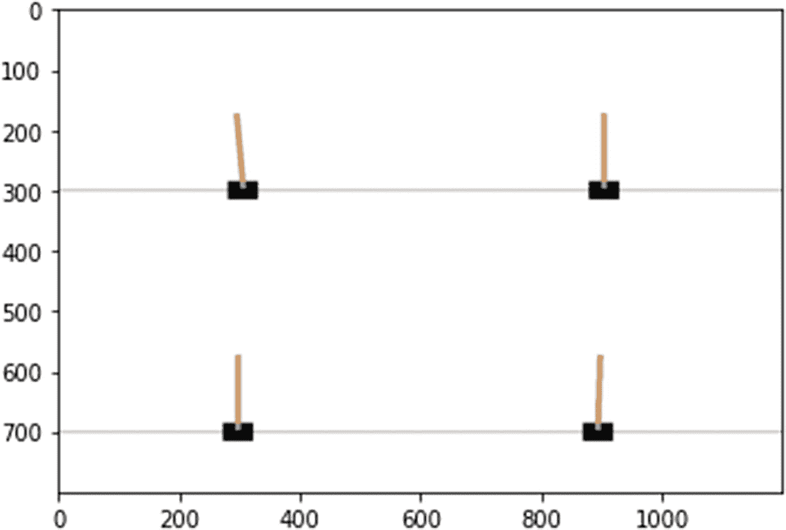

Figure 5-23

CartPole environment training with PPO policy

Now we will implement both the PPO-penalty version and the PPO-clipped version .

Open the PPO-A2C.ipynb Notebook, since we will be running PPO on A2C baseline, similarly to TRPO.

*   **PPO-****penalty** **:** This requires penalizing the KL divergence of the distributions of TRPO and removing a hard constraint. The only change required is in the loss function inside the “build_actor_model” method inside the PPOAgent class. The “trpo_ppo_penalty_loss” method uses the predictions policy and the old policy. Then it finds the KL divergence similarly to the case of TRPO. After that, it computes the advantage estimate and provides a minimization bound on the ratio of the new and old policies given by the ratio r(θ). This is a penalized clipped variant of PPO algorithm.

    ```

    def trpo_ppo_penalty_loss(y_true, y_pred):

    entropy=2e-5

    clip_loss=0.2

    old_log= k.sum(y_true)

    print(old_log)

    pred_log=k.sum(y_pred)

    print(pred_log)

    r=pred_log/(old_log + 1e-9)

    kl_divergence= k.sum(old_log* k.log(old_log/pred_log))

    advantage=kl_divergence

    p1=r*advantage

    p2=k.clip(r, min_value=

    1-clip_loss, max_value=1+clip_loss)*advantage

    prob=1e-2

    loss=-k.mean(k.minimum(p1, p2) +

    entropy*(-(prob*k.log(prob+1e-10))))

    return loss

    Actor.compile(optimizer=Adam(learning_rate=self.learning_rate), loss=trpo_ppo_penalty_loss)

    ```py

*   **PPO-****clipped** **:** This is the standard PPO clipping policy. This is implemented by the “trpo_ppo_clip_loss” method and is passed with the Adam optimizer. Here the advantage is computed by subtracting the Q-value from the value estimate of the previous policy. Then we have the clip method to clip the ratio r(θ) bounded by the “epsilon” threshold.

    ```

    def trpo_ppo_clip_loss(y_true, y_pred):

    entropy=2e-5

    clip_loss=0.2

    old_log= k.sum(y_true)

    print(old_log)

    pred_log=k.sum(y_pred)

    print(pred_log)

    r=pred_log/(old_log + 1e-9)

    advantage=pred_log-old_log

    p1=r*advantage

    p2=k.clip(r, min_value=

    1-clip_loss, max_value=1+clip_loss)*advantage

    prob=1e-2

    loss=-k.mean(k.minimum(p1, p2) +

    entropy*(-(prob*k.log(prob+1e-10))))

    return loss

    Actor.compile(optimizer=Adam(learning_rate=self.learning_rate), loss=trpo_ppo_clip_loss)

    ```py

Thus we have seen the PPO algorithm and understood the fundamental concept behind this algorithm, which is the default training algorithm for ML Agents. In the next sections, when we will be building newer agents with ML Agents, we can create our own PPO model like the one mentioned earlier or use the Baseline model as well. In this context, it is important to mention that we can use convolution-2D neural network as well in place of dense networks, and some implementations have been provided with the Pong Atari game (2D) from the Gym environment. This is controlled with the help of image processing where pixels are passed into convolution-2D neural network, and then policy gradient algorithms are applied, as shown in Figure 5-24.

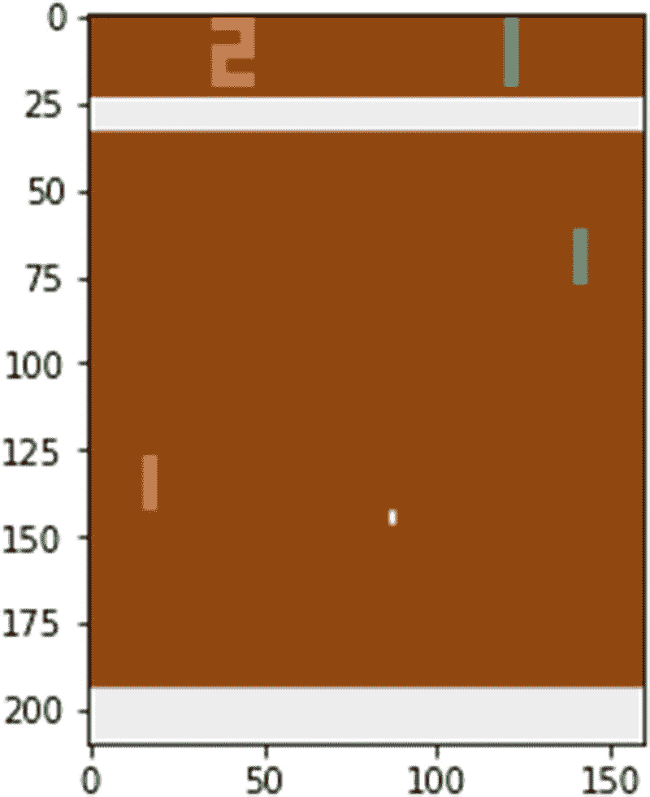

Figure 5-24

Pong Atari game with policy gradient using convolution-2D neural network

Unity ML Agents has their own built PPO model, which we were using till now to train our agents. In the next section, we will explore the off-policy algorithms in deep RL, which includes DQN, DDQN, D3QN, SAC, ACER, and other algorithms.

### Off-Policy Algorithms

This class of algorithms relies on a buffer containing past estimates and take decisions accordingly. In this case, sampling of past data is done with the help of the Bellman equation with which a Q-function can be trained to satisfy the interaction between the agent and the environment. There is a concept of experience replay that involves extensive sampling of past states and the value estimates to optimize the Bellman function. As we have mentioned, Q-learning is an off-policy technique. In the deep learning context, we have DQN, DDQN, D3QN, DDPG, TD3, ACER, and SAC as off-policy algorithms. In this section we will be looking into the variants of DQN extensively.

**Deep Q-network** **:** This is a deep RL variant of Q-learning. This makes Q-learning more stable over continuous and discrete spaces, as in this case the Q-function is approximated by a nonlinear activation. Off-policy DQN algorithm computes the values of all possible states before updating the policy, while the on-policy methods upgrade the policy by comparing with the gradient of the objective function. The two fundamental concepts involved in DQN are:

*   **Experience replay:** This implies sampling of the past states, values, actions.

*   **Training updated target network:** This involves applying a deep learning layer to update the policy by calculating the value estimates.

The loss or the objective function in this case is defined as:

Y(s, a, r, s**`**) = r + y max[a] Qθ

L(θ) = E[θ] (Y(s, a, r, s**`**) - Q[θ)²],

where y (gamma) is the exploration-exploitation factor. Depending on the type of the network, different neural networks can be used. For image-specific DQN, convolution neural networks can be used.

In the next case, we will study the DQN implementation, which we had a glimpse of in Chapter 1. Open the CartPole-Rendering.ipynb Notebook. As usual we have to import all the necessary libraries and modules from keras for building the dense model. We will also import the ipythondisplay for visualization algon with Tensorboard for visualization of the training phase. We will also have a deque data structure to store our states, actions, rand ewards for each training phase.

```

import gym

from gym import logger as gymlogger

from gym.wrappers import Monitor

gymlogger.set_level(40)

from keras.callbacks import TensorBoard

from keras.models import Sequential

from keras.layers import Dense

from keras.optimizers import Adam

import numpy as np

import random

import pandas as pd

import math

import matplotlib.pyplot as plt

from collections import deque

import glob

import io

import base64

from IPython.display import HTML

from IPython import display as ipythondisplay

%load_ext tensorboard

%tensorboard --logdir logs

```py

In the “__init__” method inside the DeepQLearning class, we will include all the hyperparameters required for building the Q-network. This includes the exploration-exploitation factor, learning factor, epsilon, alpha decay, batch_size, the replay memory (deque), and other parameters.

```

self.replay_memory= deque(maxlen=1000)

self.env=gym.make('CartPole-v0')

self.gamma=gamma

self.epsilon=epsilon

self.epsilon_min=epsilon_min

self.log_epsilon=log_epsilon

self.alpha=alpha

self.alpha_decay=alpha_decay

self.no_episodes=no_episodes

self.no_complete=no_complete

self.batch_size=batch_size

self.quiet=quiet

if env_steps is not None:

self.env._max_episode_steps=env_steps

```py

In the next step we build the sequential model with dense layers with Keras. The dense layers have 48 units each with “tanh” activation. The last layer of the dense network has 2 units that signify that the CartPole can move either in the left or right direction with “sigmoid” activation .

```

self.model=Sequential()

self.model.add(Dense(48, input_dim=4, activation="tanh"))

self.model.add(Dense(48, activation="tanh"))

self.model.add(Dense(2, activation="sigmoid"))

self.model.compile(loss='mse', optimizer=Adam

(lr=self.alpha,

decay=self.alpha_decay))

```py

In the next step, we have the “remember” method, which contains the states, rewards, and actions in a container for storage and sampling.

```

def remember(self, state, action, reward, next_state, done):

self.replay_memory.append((state, action, reward,

next_state, done))

```py

The “choose_step” method is used to select a particular action is the value estimate of the action is greater than a certain threshold value denoted by the epsilon.

```

def choose_step(self, state, epsilon):

return self.env.action_space.sample() if(np.random.random()<=epsilon)

else np.argmax(self.model.predict(state))

```py

The “preprocess” method is used to transform (flatten) the states so that it can be fed into the dense network.

```

def preprocess_state(self, state):

return np.reshape(state, [1, 4])

```py

The “get_epsilon” and “decay_epsilon” are methods to modify the epsilon decay in which will be used in the training step for experience replay.

```

def get_epsilon(self, t):

return max(self.epsilon_min, min(self.epsilon,

1.0-math.log((t+1)*self.log_epsilon)))

def decay_epsilon(self):

if self.epsilon>self.epsilon_min:

self.epsilon*=self.log_epsilon

```py

The “replay” method is used to collect the states, actions, and rewards in the form of a sampled distribution from the memory buffer. It then uses the trained model to predict the next probable action and updates the value of the action (reward), by using the epsilon and gamma factors. This is where the off-policy logic plays. The experience replay allows the algorithm to sample information from the deque (memory) and then lets the model predict an action corresponding to the highest return in the value estimates or rewards.

```

def replay(self, batch_size):

x_batch, y_batch=[],[]

minibatch=random.sample(

self.replay_memory, min(len(self.replay_memory), batch_size))

for state, action, reward, next_state, done in minibatch:

y_target=self.model.predict(state)

y_target[0][action]=reward if done

else reward+self.gamma*(np.max(self.model.predict(next_state)[0]))

x_batch.append(state[0])

y_batch.append(y_target[0])

```py

In the next phase, we have the “run” method, where we control the logic of the algorithm. In this case, we load the CartPole environment, then record the states, actions, and rewards in the memory, and preprocess the states to make the input suitable for the dense network. The deque has a memory limit of 100, and we train the model until the mean score of the algorithm exceeds a certain threshold. Each epoch of training has 100 episodes internally to collect the rewards and compute the mean score .

```

def run(self):

print(self.env.action_space)

total_scores=deque(maxlen=100)

for i in range(self.no_episodes):

state= self.preprocess_state(self.env.reset())

done=False

j=0

while not done:

action= self.choose_step(state, self.get_epsilon(i))

next_state, reward, done,_=self.env.step(action)

next_state=self.preprocess_state(next_state)

self.remember(state, action, reward, next_state, done)

state=next_state

j+=1

total_scores.append(j)

mean_score=np.mean(total_scores)

if mean_score >=self.no_complete and i>=100:

if not self.quiet:

print("Ran {} episodes.Solving after {} trainings".format(i, i-100))

"{} trainings".format(i, i-100))

return i-100

if i%100==0 and not self.quiet:

print("Episode Completed {}.".format(i))

Mean score "{}".format(i, mean_score))

self.replay(self.batch_size)

if not self.quiet:

print("Not solved after {} episodes".format(i))

return i

```py

On running this model, we will visualize the DQN algorithm performing a value estimated off-policy control for the CartPole environment. We can now understand and relate with the outputs that we achieved in the introductory section of Chapter 1. The TensorBoard visualization is shown in Figure 5-25.

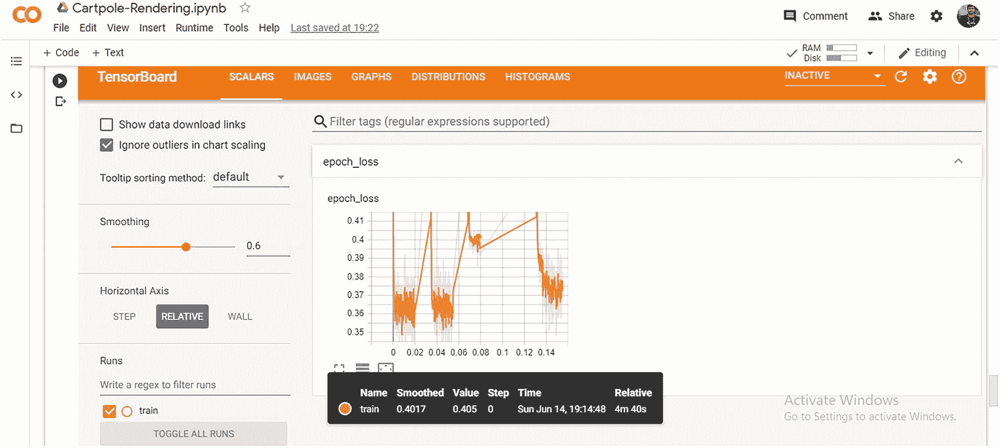

Figure 5-25

CartPole environment training using DQN

**Double deep Q-networks** **:** In many cases, DQN leads to overestimation of the return of values because we use the same policy Qθ to predict the best probable action and also estimate the rewards/values with the same policy Qθ. DDQN employs two neural networks to decouple the action selection and the value estimation stages. The effective loss or objective function involves two Q-networks, Qθ1 and Qθ2, as follows:

Y1 = r + y max[a] Qθ1)

Y2 = r + y max[a] Qθ2)

This helps increase the stability of training, as two policies are involved in the sampling strategy. The first Q-network (original Q-network) uses the maximum value estimate from the second Q network (target Q-network) and the second Q network (target Q Network) updates its policies from the returns of the first network.

We will be exploring this network, and for this we have to open the Double Deep Q Network.ipynb Notebook. We will be building on top of the previous DQN with the changes being made inside the “__init__” and the “replay” methods in the DoubleDeepQLearning class. In the “__init__” method, we have two neural networks—namely, the “model” and “target_model,” which are similar to each other (like in DQN) with the same parameters. However, this can be changed according to requirements .

```

self.model=Sequential()

self.model.add(Dense(48, input_dim=4, activation="tanh"))

self.model.add(Dense(48, activation="tanh"))

self.model.add(Dense(2, activation="sigmoid"))

self.model.compile(loss='mse', optimizer=

Adam(lr=self.alpha,

decay=self.alpha_decay))

self.target_model=Sequential()

self.target_model.add(Dense(48, input_dim=4,

激活函数="tanh"))

self.target_model.add(Dense(48, activation="tanh"))

self.target_model.add(Dense(2, activation="sigmoid"))

self.target_model.compile(loss='mse', optimizer=

Adam(lr=self.alpha,

decay=self.alpha_decay))

```py

The next change is in the “replay” method, where we have to assign the inputs (states, actions, rewards) from the deque to the two networks. We assign the predictions of the target network in place of the original network and pass it to the model. The contrast between the DQN and DDQN is mentioned in the comments in the program.

```

x_batch, y_batch=[],[]

minibatch=random.sample(

self.replay_memory, min(len(self.replay_memory), batch_size))

对于状态，动作，奖励，下一个状态，完成 in minibatch:

y_target=self.model.predict(state)

y_next_target=self.model.predict(next_state)

y_next_val=self.target_model.predict(next_state)

#DQN 更新

#y_target[0][action]=reward if done

else reward +self.gamma*(np.max

(self.model.predict(next_state)[0]))

#DDQN 更新

y_next_target[0][action]=reward if done

否则奖励+self.gamma*(np.max(y_next_val[0]))

x_batch.append(state[0])

#DQN

#y_batch.append(y_target[0])

#DDQN

y_batch.append(y_next_target[0])

```py

These are the only changes required to make the network DDQN . On running the code segment, we can see the CartPole being trained, as shown in Figure 5-26.


Figure 5-26

CartPole environment being trained in DDQN

**Dueling double Q-network** **:** The dueling network in an enhancement on the D2QN network architecture as the output layer is partitioned into two major components—the value estimate V^π(s[t]) and the advantage estimate A^π(s[t], a[t]). The relation between them with the Q-policy is given by the relation (which we studied in policy gradients):

A^π(s[t], a[t]) = Q^π(s[t], a[t]) - V^π(s[t])

Effectively the estimated advantage sums to 0 (∑ A^π(s[t], a[t])π(a|s) = 0 ) in this context, and we have to subtract the mean value of the Advantage

[1/|A^π(s[t], a[t]) |]∑ A^π(s[t], a[t]) ) from the value estimates V^π(s[t]) to get the Q-value Q^π(s[t], a[t]). This is represented by the following equation, which is the driving force of dueling DQN.

Q^π(s[t], a[t]) = V^π(s[t]) + (A^π(s[t], a[t]) – [1/|A^π(s[t], a[t]) |]∑ A^π(s[t], a[t]) )

To see this in action, let us open the Dueling Double DQN.ipynb Notebook. We maintain the similar code base of the DDQN with the inclusion of an advantage loss (named as “advantage_loss”) in the “model” part of the “__init__” method. In the “advantage_loss” method, we compute the advantage of Q–value with respect to the value estimate. Then we compute the mean of the advantage and fit it accordingly in the loss estimate. All of this is done in Keras using the back-end module. We then pass it into the “model.compile” method with Adam as our optimizer.

```

def advantage_loss(y_true, y_pred):

q_val=y_pred

v_val=y_true

advantage=(q_val-v_val)

adv_mean=k.mean(advantage)

adv_factor=1/adv_mean*(k.sum(advantage))

损失=- adv_factor*self.epsilon

return loss

self.model.compile(loss=advantage_loss, optimizer=Adam(lr=self.alpha, decay=self.alpha_decay))

```py

The rest of the code segment being the same , we now train this on our CartPole environment to get an understanding of its performance, as shown in Figure 5-27.

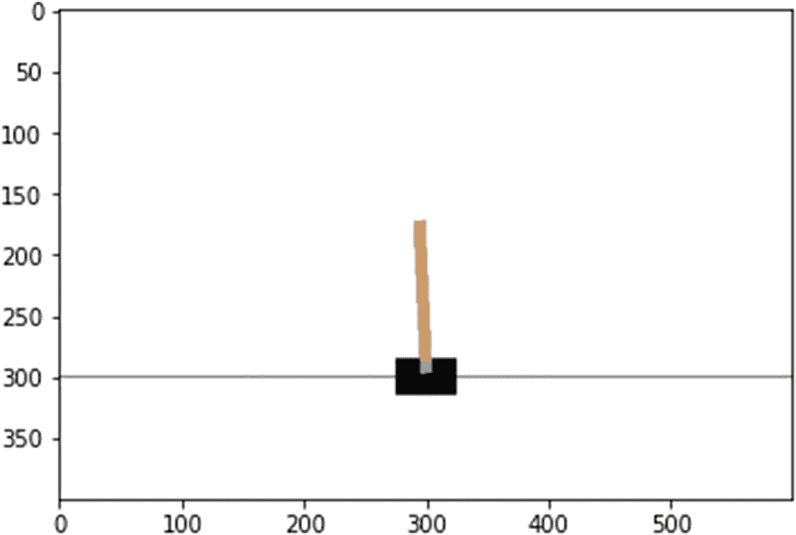

Figure 5-27

CartPole environment being trained in D3QN

**Actor critic experience replay** **:** This is an off-policy variation of the A3C algorithm that we saw previously. It includes sampling of the previous states along with retracing the Q-value estimate. The three major conditions that are applied in this context include:

*   retrace Q-value estimate

*   truncate weights with bias correction

*   applying a KL divergence bound TRPO

The retracing part is an off-policy sampling technique that uses an error term to move toward a proper value estimated policy. This is denoted by the formulation:

Q^π(s[t], a[t]) = Q^π(s[t], a[t]) + ∆ Q^π(s[t], a[t]),

where,

∆ Q^π(s[t], a[t]) = α ∂[t],

where ∆ Q^π(s[t], a[t]) is the incremental error update that is referred to as temporal difference (TD) error. The incremental update is then formulated as the ratio of two policies ((πθ/ πθold)) with an error term ∂[t] from previous value estimates. The simplified version looks like this:

∆Qπret(st, at) = yt Π((πθ(a|s)/ πθold(a|s))∂t)

This is where the off-policy sampling is used with the policy gradient update of a generic actor critic/TRPO method. ACER is considered as an off-policy mainly due to the incremental update of the error estimate from previous values.

ACER also has a weight truncation rule to reduce the variance of the policy gradient. Generally in AC algorithms, the advantage estimate (GAE) is signified with the equation:

A^π(s[t], a[t]) = Q^π(s[t], a[t]) - V^π(s[t])

Now with retracing in ACER, the advantage estimate for policy gradient becomes:

A^π(s[t], a[t]) = Q^πret - V^π(s[t])

Thus, the policy gradient estimate becomes:

∆[θ] J(θ) = E∑(Q^π[ret - V^π(s[t])) ∆[θ] ln(πθ) ]

Now we will be building the Baseline version of the ACER algorithm . Open the ACER-Baselines.ipynb Notebook. We will import the libraries and the modules from stable Baselines like before.

```

导入 gym

从 stable_baselines.common.policies 导入 MlpPolicy, MlpLstmPolicy, MlpLnLstmPolicy

从 stable_baselines.common 导入 make_vec_env

从 stable_baselines 导入 ACER

导入 matplotlib.pyplot as plt

从 IPython 导入 display as ipythondisplay

从 pyvirtualdisplay 导入 Display

display = Display(visible=0, size=(400, 300))

display.start()

```py

In this case, we will instantiate four instances of the CartPole environment, where the ACER agent will be using MLP (dense) network.

```

env = make_vec_env('CartPole-v1', n_envs=4)

模型 = ACER(MlpPolicy, env, verbose=1)

模型学习(total_timesteps=25000)

模型.save("acer_cartpole")

del model

模型 = ACER.load("acer_cartpole")

```py

Then we have the while loop, which controls the ACER algorithm and runs for 25000 iterations. It collects the rewards, states, and actions for each epoch of training and presents the motion of the four CartPoles on the screen.

```

while True:

行动，_states = model.predict(obs)

obs, rewards, dones, info = env.step(action)

屏幕显示 = env.render(mode='rgb_array')

plt.imshow(screen)

ipythondisplay.clear_output(wait=True)

ipythondisplay.display(plt.gcf())

```py

On running this model , we get to visualize the CartPoles. We can compare this result with the other variants of actor critic models that we read earlier, as shown in Figure 5-28.

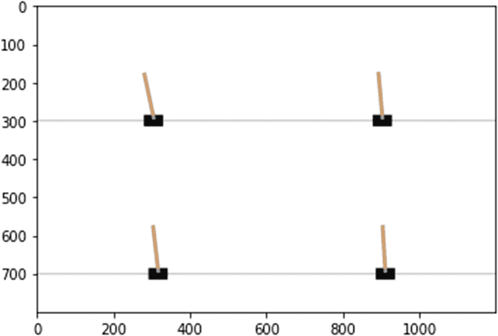

Figure 5-28

Four instances of CartPole training in ACER

**Soft actor critic** **:** This is another off-policy algorithm, which relies on entropy-based modeling. It is a stochastic actor critic policy, which uses entropy regularization to maximize the trade-off between expected return and entropy. The entropy of a probabilistic variable with a density function, can be defined as:

H(P) = E [-log(P(x))]

In entropy regularized form, the agent gets a bonus reward at each time-step proportional to the entropy of the policy at the particular time-step. This is denoted by:

πθ= arg max[π] E[∑[t] y^t (R(s[t], a[t], s[t+1]) + αH(πθ))],

where R is the reward and is the trade-off coefficient. With entropy regularization, the value estimate and the Q-policy is related as:

V^(πθ)(s[t])) = E[Q^(πθ)(s[t], a[t]) ] + αH(πθ)

In ML Agents, SAC is present as an off-policy algorithm and we will look into its implementation from the Baselines as well as by modifying the TRPO-A2C/PPO-A2C program.

Open the SAC- Baselines.ipynb Notebook. This is an implementation of the SAC algorithm without parallelization. First we will import the necessary libraries, modules, and networks from Baselines.

```

导入 gym

导入 numpy as np

从 stable_baselines.sac.policies 导入 MlpPolicy

从 stable_baselines 导入 SAC

导入 matplotlib.pyplot as plt

从 IPython 导入 display as ipythondisplay

从 pyvirtualdisplay 导入 Display

display = Display(visible=0, size=(400, 300))

display.start()

```py

Then we load the model and declare it to use the MLP or dense networks , although we can specify other types of policies which include LSTM. We create the Pendulum environment for our algorithm and load it in.

```

env = gym.make('Pendulum-v0')

模型 = SAC(MlpPolicy, env, verbose=1)

模型学习(total_timesteps=50000, log_interval=10)

模型.save("sac_pendulum")

del model

模型 = SAC.load("sac_pendulum")

```py

Then we run the Pendulum environment for 50000 iterations using MLP policy with the SAC algorithm. At each step we record the parameters of training, which includes the states, actions, and rewards.

```

while True:

action, _states = model.predict(obs)

obs, rewards, dones, info = env.step(action)

屏幕显示 = env.render(mode='rgb_array')

plt.imshow(screen)

ipythondisplay.clear_output(wait=True)

ipythondisplay.display(plt.gcf())

```py

After a considerable amount of training, we can see the Pendulum balancing itself in an upright manner, as shown in Figure 5-29.

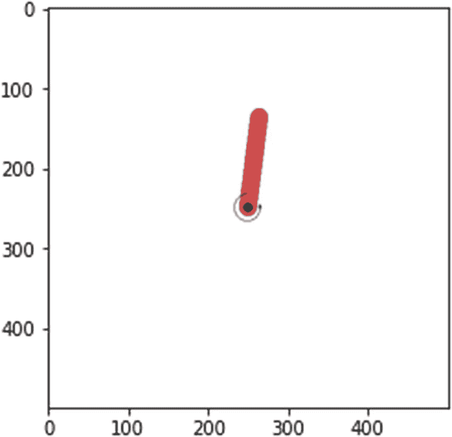

Figure 5-29

Pendulum environment training with SAC

Now we can also modify our source code of A2C variants to make it a soft actor critic module, by introducing the entropy factor. For this we change the loss function in the “build_actor_model” method. In this case, we will train the “MountainCar” environment using our implementation of SAC. In the ”sac_loss” method, we compute the rewards for the previous step as well as the entropy of the current step using the entropy equation. After applying the policy update formula, which involves addition of the rewards and the entropy regularized form, we can calculate a negative log likelihood loss. We then return this loss function to be used with the Adam optimizer.

```

def sac_loss(y_true, y_pred):

熵=2e-5

pred_reward= k.sum(y_true)

熵 _val=k.sum(- (k.log(y_pred)))

期望 = pred_reward + 熵 _val

prob=1e-2

损失=-k.mean(expectation +

熵*(-(prob*k.log(prob+1e-10))))

return loss

Actor.compile(optimizer=Adam(learning_rate=self.learning_rate), loss=sac_loss)

```py

On training this algorithm, we can see that the MountainCar tries to go to the top of the mountain on the right side of the screen. In this way, it moves back and forth several times to gain necessary momentum, as shown in Figure 5-30.

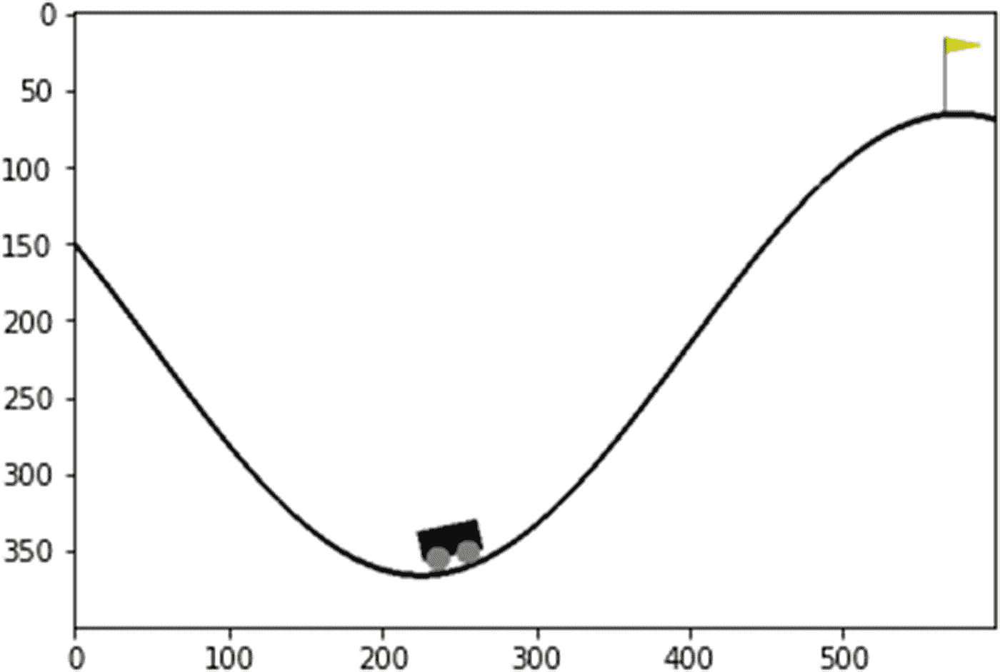

Figure 5-30

MountainCar training with custom SAC

There are several other off-policy algorithms, such as deep deterministic policy gradients (DDPG) and its variants, along with model-free deep RL algorithms, which we will be focusing on in the next chapter .

### Model-Free RL: Imitation Learning–Behavioral Cloning

In the context of ML Agents, there is also a module on imitation learning, which falls under behavioral cloning algorithms. Specifically we will be exploring generative adversarial imitation learning (GAIL), which uses general adversarial networks (GAN), a different form of neural networks from Dense or convolution networks. Let us discuss GAIL briefly. GAIL falls under the model-free RL paradigm, which also uses entropy, and it learns a cost/objective function from expert demonstrations. Imitation learning algorithms such as GAIL are used in inverse RL. But before, let us understand GANs.

**General adversarial networks:** This kind of neural network has two components: a generator and a discriminator. The task of the generator is to prepare a false replica of original data to fool the discriminator into thinking that it is real. While the task of the discriminator is to correctly identify the false data from the generator. This is done with the help of entropy regularization. Mathematically, if p(x) defines the distribution of the data on sample x, and p(z) is the distribution of data from the generator G with samples as z, then the GAN is a maximization-minimization function with respect to generator G and discriminator D:

min[G] max[D] V(D, G)

V(D, G) = E[x-p(x)][log(D(x))] + E[z-p(z)][log(1-D(G(z)))]

The first term of the equation is the entropy distribution of samples x, that is the original data. The discriminator tries to maximize this to 1\. The second term is the generated data from the samples z, and the task of the discriminator is to reduce this part to 0 as it contains synthetic data. The task of the generator is to maximize this second part of the equation. This is how GANs work, as a competitive neural network model between the generator and the discriminator.

The architecture of a GAN can be visualized as shown in Figure 5-31.

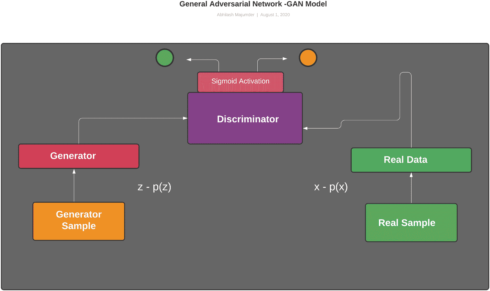

Figure 5-31

GAN model architecture for classification

**General adversarial imitation learning** **:** GAIL is a variant of behavioral cloning that uses GAN to learn a cost function. The discriminator tries to separate expert trajectories from the generated trajectories. The trajectories involve the direction of the gradient toward a proper return on the value estimates. Initially, we train a SAC model as the expert model and then use it as the real sampled data. The GAIL then builds its own generator and discriminator network to generate synthetic trajectories and compares them against the expert trajectories that are produced by the SAC algorithm. We will be using the GAIL algorithm from Baselines. Open the GAIL-Baselines.ipynb Notebook. In the first case, we initially run the Pendulum environment and train it with the SAC algorithm as mentioned. The SAC trains it on a MLP policy and generates the expert trajectories, signified by the “generate_expert_traj” method.

```

从 stable_baselines 导入 SAC

from stable_baselines.gail import generate_expert_traj

# Generate expert trajectories (train expert)

model = SAC('MlpPolicy', 'Pendulum-v0', verbose=1)

generate_expert_traj(model, 'expert_pendulum', n_timesteps=6000, n_episodes=10)

```py

Then we have the GAIL code segment. After we have saved the trajectories produced by the SAC policy in a data set (provided by the “ExpertDataSet” method), we then use this data set for the GAIL to generate the generator data and the discriminator. The GAIL algorithm is then trained on an MLP network for 1000 time-steps, where the discriminator tries to optimize the policy so that the value estimates are consistent with that produced by the SAC policy. The generator, on the other hand, tries to modify and generate synthetically similar trajectories that are difficult to segregate from the real SAC trajectories.

```

dataset = ExpertDataset(expert_path='expert_pendulum.npz', traj_limitation=10, verbose=1)

model = GAIL('MlpPolicy', 'Pendulum-v0', dataset, verbose=1)

model.learn(total_timesteps=1000)

model.save("gail_pendulum")

del model

model = GAIL.load("gail_pendulum")

env = gym.make('Pendulum-v0')

obs = env.reset()

while True:

action, _states = model.predict(obs)

obs, rewards, dones, info = env.step(action)

env.render()

```py

On training with GAIL, we can see the different parameters and the scores of training, as shown in Figure 5-32.

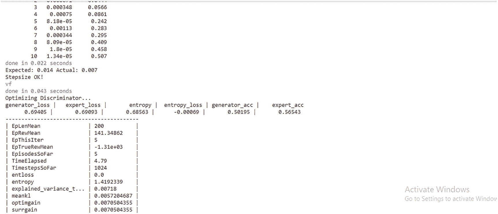

Figure 5-32

Training GAIL using generated trajectories from SAC

We have covered most of the major algorithms in deep RL in terms of on- and off-policy models, including model-free RL (GAIL). In the next context, we will create a deep learning model for Puppo, which would include joint motion and will be trained using the PPO algorithm.

## Building a Proximal Policy Optimization Agent for Puppo

We now have a fair understanding why the PPO algorithm is the most widely used form of deep RL policies due to its robustness and clipping to prevent instability of the TRPO policy gradient. We will build a PPO agent for Puppo whose task is to find the stick in the environment. However, in this case, it will move using its joint vectors that are constrained with PPO policy. For this we will be using the Puppo Unity scene. The joint system is used in this case to train Puppo to reach the target by actuating and applying force on it. The reward function that is applied on the joints can be formulated as:

r(θ) = v.d X (- θ) + 1,

where the reward is parameterized by the angular force θ, which is applied along the y axis. v signifies the normalized velocity vector of Puppo, and d signifies the normalized direction of Puppo toward the target. In Unity this is controlled using the joint drive controller script. An additional reward of 1 is provided if Puppo successfully reaches the target and 0 if it does not. This is the control logic of the agent, and we will be training it with PPO.

We can open the Puppo agent Unity file and observe the components present in the scene. We can see that the component scripts like BehavorialParameters.cs, Decision Requester, and Model Overrider are added to it. This is similar to the previous chapters, where we attached these components to the agents. However, in this case, we will be using the joint drive controller script in addition to all these components. Then we have an associated PuppoAgent.cs script, which is what we will be exploring in this section. This script controls the joint motion of the agent and records observations from the environments with the help of the joint locomotion. Figure 5-33 shows a preview of the environment.

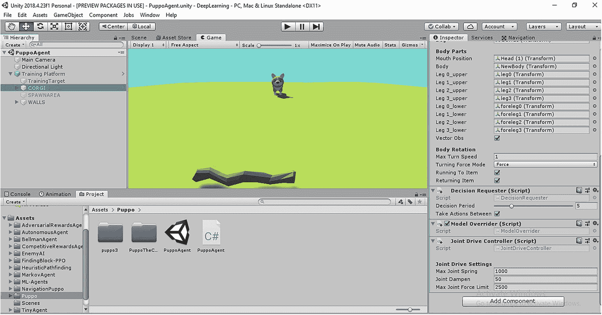

Figure 5-33

Puppo agent in Unity Editor

Now let us open the PuppoAgent.cs script. Like before, we include the Unity ML Agents module and also the sensors module to record the observations.

```

using System.Collections;

using System.Collections.Generic;

using UnityEngine;

using Unity.MLAgents;

using System;

using System.Linq;

using Unity.MLAgents.Sensors;

using Random = UnityEngine.Random;

using Unity.MLAgentsExamples;

```py

Inside the PuppoAgent class, which inherits from the agent class, we declare the variables that would be present in the environment. We have the transforms, such as the target and dog (Puppo), and we have variables for the joints. These include 11 joints forming the lower legs, upper legs, mouth, and the torso (body). All these joints are associated with a turning force (torque) and a corresponding turning speed (angular velocity). These are denoted in the following lines.

```

public Transform target;

public Transform dog;

// These items should be set in the inspector

[Header("Body Parts")]

public Transform mouthPosition;

public Transform body;

public Transform leg0_upper;

public Transform leg1_upper;

public Transform leg2_upper;

public Transform leg3_upper;

public Transform leg0_lower;

public Transform leg1_lower;

public Transform leg2_lower;

public Transform leg3_lower;

public bool vectorObs;

[Header("Body Rotation")]

public float maxTurnSpeed;

public ForceMode turningForceMode;

EnvironmentParameters m_params;

```py

We also have variables that control the joint driver controller script and vectors that control the direction to the target. In the “Initialize” method, we assign the dog and the target variables. We instantiate an instance of the joint driver controller script and associate the joint variables with that instance.

```

dog=GetComponent();

target=GetComponent();

jdController = GetComponent();

jdController.SetupBodyPart(body);

jdController.SetupBodyPart(leg0_upper);

jdController.SetupBodyPart(leg0_lower);

jdController.SetupBodyPart(leg1_upper);

jdController.SetupBodyPart(leg1_lower);

jdController.SetupBodyPart(leg2_upper);

jdController.SetupBodyPart(leg2_lower);

jdController.SetupBodyPart(leg3_upper);

jdController.SetupBodyPart(leg3_lower);

m_params = Academy.Instance.EnvironmentParameters;

```py

Then we have the “Collect Observations” method, which uses Vector Sensors. For this we first get the associated joint forces with the help of the “GetCurrentJointForces()” method. Then we assign sensors that collect information such as the distance between the target and Puppo. The sensors also collect information related to the body's angular velocity, normal velocity, direction of normal as well as the direction of upward vector to control the force acting on the body of Puppo. Then we have a loop that runs for all the joints that are touching the ground and compute the normalized angular rotation with the help of “currentXNormalizedRot” along the respective axes. Then we add a sensor that records the current strength applied on a joint normalized with the maximum shear force limit on that particular joint. To summarize this method controls the sensor information related to the joints, angular velocity, rotation, and force as well as the body’s orientation and distance and direction with respect to the target.

```

public override void CollectObservations(VectorSensor sensor)

{if(vectorObs==true)

{

jdController.GetCurrentJointForces();

sensor.AddObservation(dirToTarget.normalized);

sensor.AddObservation(body.localPosition);

sensor.AddObservation(jdController.

bodyPartsDict[body].rb.velocity);

sensor.AddObservation(jdController.

bodyPartsDict[body].rb.angularVelocity);

sensor.AddObservation(body.forward);

sensor.AddObservation(body.up);

foreach (var bp in jdController.bodyPartsDict.Values)

{

var rb = bp.rb;

sensor.AddObservation(bp.groundContact.

touchingGround ? 1 : 0);

if(bp.rb.transform != body)

{

sensor.AddObservation(bp.currentXNormalizedRot);

sensor.AddObservation(bp.currentYNormalizedRot);

sensor.AddObservation(bp.currentZNormalizedRot);

sensor.AddObservation(bp.currentStrength/

jdController.maxJointForceLimit);

}

}}

}

```py

The “RotateBody” method is used to apply a torque or angular force on Puppo. It takes as input the corresponding action at a particular step of decision-making process. It lerps the speed between 0 and the “maxturnspeed.” It then applies a force in the normalized direction of rotation and in the direction of the forward vector and multiplies it with the speed. This is done with the help of the “AddForceAtPosition” method , which is applied on the body.

```

void RotateBody(float act)

{

float speed = Mathf.Lerp(0, maxTurnSpeed

, Mathf.Clamp(act, 0, 1));

Vector3 rotDir = dirToTarget;

rotDir.y = 0;

// Adds a force on the front of the body

jdController.bodyPartsDict[body].

rb.AddForceAtPosition(

rotDir.normalized * speed * Time.deltaTime

, body.forward, turningForceMode);

// 在身体后面施加力

jdController.bodyPartsDict[body].

rb.AddForceAtPosition(

-rotDir.normalized * speed * Time.deltaTime

, -body.forward, turningForceMode);

}

```py

In the next step, we have the “OnActionsReceived” overridden method , which assigns the vector observations from the environment to the corresponding joints. As we see there are 20 vectorized observations from the sensors, which are received during the training stage. Now we are using dense neural networks for this model, and we are using only ray sensor information.

```

public override void OnActionReceived(float[] vectorAction)

{

var bpDict = jdController.bodyPartsDict;

Debug.Log(vectorAction.Length);

// 更新关节驱动目标旋转

bpDict[leg0_upper].SetJointTargetRotation(vectorAction[0], vectorAction[1], 0);

bpDict[leg1_upper].SetJointTargetRotation(vectorAction[2], vectorAction[3], 0);

bpDict[leg2_upper].SetJointTargetRotation(vectorAction[4], vectorAction[5], 0);

bpDict[leg3_upper].SetJointTargetRotation(vectorAction[6], vectorAction[7], 0);

bpDict[leg0_lower].SetJointTargetRotation(vectorAction[8], 0, 0);

bpDict[leg1_lower].SetJointTargetRotation(vectorAction[9], 0, 0);

bpDict[leg2_lower].SetJointTargetRotation(vectorAction[10], 0, 0);

bpDict[leg3_lower].SetJointTargetRotation(vectorAction[11], 0, 0);

// 更新关节驱动强度

bpDict[leg0_upper].SetJointStrength(vectorAction[12]);

bpDict[leg1_upper].SetJointStrength(vectorAction[13]);

bpDict[leg2_upper].SetJointStrength(vectorAction[14]);

bpDict[leg3_upper].SetJointStrength(vectorAction[15]);

bpDict[leg0_lower].SetJointStrength(vectorAction[16]);

bpDict[leg1_lower].SetJointStrength(vectorAction[17]);

bpDict[leg2_lower].SetJointStrength(vectorAction[18]);

bpDict[leg3_lower].SetJointStrength(vectorAction[19]);

rotateBodyActionValue = vectorAction[19];

}

```py

Next we have the “FixedUpdate” method , where we control the simulation loop and keep track of the decision counter; if the counter has a value of 3, a new request is sent through the academy to the external training environment to sample a new set of decisions. This is done with the help of the communicator module, which we saw in the last chapter. In this method there is the “UpdateDirToTarget” method , which takes the distance from the body of the joint to the corresponding target agent. There is also an energy conservation step that controls the turn frequency of Puppo. This adds a negative reward whenever Puppo turns very fast multiple times. Also we have a penalty for time during which Puppo is not able to reach the target.

```

void FixedUpdate()

{

UpdateDirToTarget();

if (decisionCounter == 0)

{

decisionCounter = 3;

RequestDecision();

}

else

{

decisionCounter--;

}

RotateBody(rotateBodyActionValue);

var bodyRotationPenalty =

-0.001f * rotateBodyActionValue;

AddReward(bodyRotationPenalty);

// 向目标移动的奖励

RewardFunctionMovingTowards();

// 时间惩罚

RewardFunctionTimePenalty();

}

```py

The “OnEpisodeBegin” overridden method is used to reset the environment whenever one episode of training is complete. This method resets the joints and the forces on them and calculates the direction toward the target from the current episode.

```

public override void OnEpisodeBegin(){

if (dirToTarget != Vector3.zero)

{

transform.rotation

= Quaternion.LookRotation(dirToTarget);

}

foreach (var bodyPart

in jdController.bodyPartsDict.Values)

{

bodyPart.Reset(bodyPart);

}

//SetResetParameters();

}

```py

The “RewardFunctionMovingTowards” method is used to reward Puppo whenever it moves toward the goals, and this is where the reward function that we mathematically mentioned at the start of the section is written. Also on reaching the target, we can conclude the episode of training by assigning rewards.

```

void RewardFunctionMovingTowards()

{

float movingTowardsDot = Vector3.Dot(

jdController.bodyPartsDict[body].rb.velocity

,   dirToTarget.normalized);

AddReward(0.01f * movingTowardsDot);

var dist=Vector3.Distance(dog.position, target.position);

if(dist<0.02f)

{

SetReward(3.0f);

EndEpisode();

}

}

```py

That completes the entire script for the agent. Now we will train this agent using the external brain through the communicator in Tensorflow. We will be using the generic “trainer_config.yaml” file, which contains the hyperparameters for PPO training algorithm. We will be using the default hyperparameter set, which we used in our previous training scope.

```

default:

trainer: ppo

batch_size: 1024

beta: 5.0e-3

buffer_size: 10240

epsilon: 0.2

hidden_units: 128

lambd: 0.95

learning_rate: 3.0e-4

learning_rate_schedule: linear

max_steps: 5.0e5

memory_size: 128

normalize: false

num_epoch: 3

num_layers: 2

time_horizon: 64

sequence_length: 64

summary_freq: 100

use_recurrent: false

vis_encode_type: simple

reward_signals:

extrinsic:

strength: 1.0

gamma: 0.99

```py

We now open Anaconda prompt and navigate to the “config” folder to run the “mlagents-learn” command. After writing the command

```

mlagents-learn  --run-id=Puppoagent –train,

```py

we can visualize the training starting in the Anaconda prompt. We will also be prompted to run the current Unity scene for training on PPO policy with the help of Tensorflow, as shown in Figure 5-34.

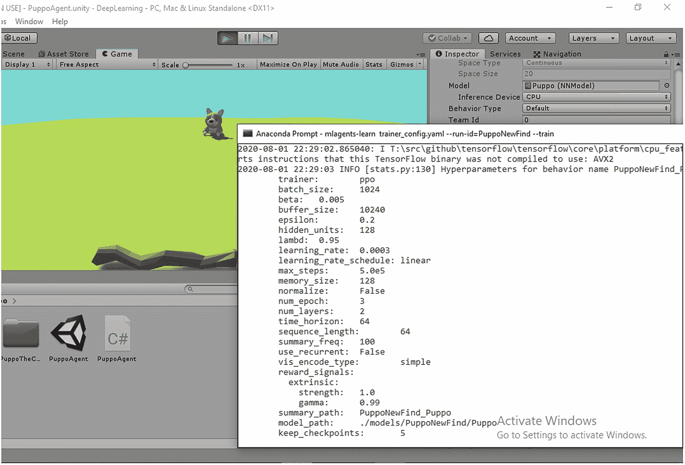

Figure 5-34

Puppo agent being trained in PPO using Tensorflow

Now let us visualize this learning in TensorBoard, and we know the steps to start it. We navigate to the “config” folder and then we type the command:

```

tensorboard –logdir=summaries

```py

This records the observations, actions, and rewards in the summaries folder inside the config folder.

On running the command, we can see the losses, estimated rewards, cumulative rewards, entropy, and other details on TensorBoard. Once the training is completed, we can close the training and the connection with the external brain. Then we assign the trained PPO neural network to the Puppo agent. We now have an agent that we are ready to build. In the final step, we built the agent and saved it to the environments folder. Inside that folder we have a Puppo Unity simulation with the trained PPO neural network agent. Figure 5-35 shows the Tensorboard visualization of training.

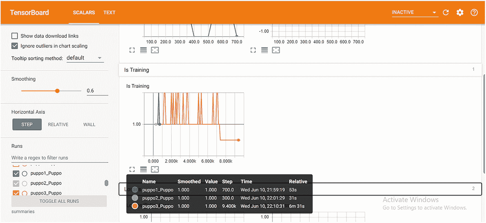

Figure 5-35

Tensorboard visualization of PPO

Now let us try to interact with the Python API. The Python API controls the observations, decisions, and actions through the Communicator port 5004.

### Interfacing with Python API

For this let us open the Python-API-MLagents.ipynb Notebook. In this context, we will learn how the Python API controls the interaction between the Unity environment and controls the decision steps, terminal steps, and the agent ID and the behavior names.

*   **Unity environment:** This controls the interface between the Unity application and the training code. This is done through the communicator for external training.

*   **Agent ID:** Unique identifier ID for the agents undergoing training in the scene

*   **Behavior name:** The behavior on which the agent is trained (PPO, SAC, GAIL)

*   **Decision steps:** Contains the observation, rewards data for the agent being trained on a particular behavior. Only agents that requested a decision in the last call of the “env.step()” method are included here.

*   **Terminal steps:** This also controls the observation and reward data for the currently trained agent. In this case, the agents whose episodes have been completed in the last call of “env.step()” method are included here.

*   **Behavior spec:** Determines the shapes of the observation data inside the decision and the terminal steps and contains the expected action steps.

Now let us load the Unity environment, in the Notebook for real-time training and interaction. For this we import the Unityenvironment from “mlagents_envs.environment” module. In the next stage we create the Unityenvironment, which takes the following arguments:

*   **File location:** The location of the Unity executable

*   **Seed:** This controls the random number generation algorithm, which is used in RL for hyperparameters. For deterministic learning, similar seed values are provided for the agents.

*   **Worker ID:** This controls the port for interaction with the agent. If we are using parallelization algorithms such as on-policy A3C, then we have to specify this part.

*   **Side_channels:** This controls the interface of transfer of information between the Unity environment and the Python environment, which is not related to the RL training loop. This may include some configurations.

The following segment is used for interacting with the Puppo environment:

```

from mlagents_envs.environment import UnityEnvironment

导入 matplotlib.pyplot as plt

导入 numpy as np

导入 sys

导入 tensorflow as tf

env=UnityEnvironment(file_name="G:/DeepLearning/environments/DeepLearning", seed=1, side_channels=[])

```py

Now let us interact with the training environment. The “BaseEnv” interface in Unity has the following attributes:

*   **Reset:** This is “env.reset” method, which resets the environment.

*   **Close:** This is the “env.close()” method (similar to OpenAI Gym), which sends a signal to close the communication channel.

*   **Step:** This is equivalent to the Gym implementation of “env.step(),” which we used in the training loop to record the observations, actions, and rewards.

*   **Get Behavior Names:** This is denoted by “env.get_behavior_names()” method. This controls the behavior names in the environment.

*   **Get Behavior Spec:** This is denoted by the “env.get_behavior_spec()” method. This controls the shapes of the observation and the action spaces whether they are continuous/multi-discrete.

*   **Get States:** This is denoted by “env.get_steps()” method, which controls the decision and the terminal steps of the agent.

*   **Set Actions:** This is denoted by the “env.set_actions()” method. This sets the actions for all the agents in the scene. For discrete cases, we have 2D numpy arrays with int32 data type, and for continuous distributions, we have numpy arrays with float32 data types. The first dimension controls the number of agents whose actions are being set, and the second dimension controls the number of discrete actions in multi-discrete space or number of actions in continuous type.

*   **Set Action For agent:** This is denoted by the “env.set_action_for_agent()” method. This is a 1D numpy array similar to the previous method that controls the attributes for a particular agent.

In our case, we will see the observation space of the Puppo agent through this API:

```

def_behaviours= env.get_behavior_names()

print(def_behaviours)

env.step()

BehaviorSpec(observation_shapes=[(59,)], action_type=, action_shape=20)

steps=env.get_steps('Puppo?team=0')

print(steps)

print(steps[0])

print(behaviour_specs.action_shape)

print(behaviour_specs.observation_shapes[0])

print(behaviour_specs.count)

print(behaviour_specs)

steps=env.get_steps('Puppo?team=0')

print(steps.count)

```py

In this case, we provide a continuous action control for the PPO agent. The decision step has the following four attributes:

*   **Obs:** This signifies the observation space.

*   **Rewards:** This signifies the rewards for the corresponding steps.

*   **agent ID:** The unique ID for the agent.

*   **Action Mask:** This is a 2D array for the agent that controls the batch size and branching in discrete/multi-discrete action spaces.

For the terminal step we have four attributes:

*   **Obs:** This signifies the observation space.

*   **Rewards:** This signifies the rewards for the corresponding steps.

*   **Agent ID:** The unique ID for the agent.

*   **Max Step:** The batch size during the last simulation step.

We can visualize the different attributes in the environment such as the states, observations, and actions through this API in real-time. Figure 5-36 shows the simulation.


Figure 5-36

Real-time Python interfacing with Puppo agent Unity.exe

### Interfacing with Side Channels

There is also a scope of passing information not related to the training step. This may include engine configurations and are generally task-agnostic with respect to the learning step. There are two variants of side channels for interfacing:

*   **Engine configuration channel:** This controls the time-scale, resolution, and graphics of the environment and can be useful for fine-tuning performance during training. It has two parameters.
    *   **Set configuration parameters:** This controls the height, width, quality, time-scale, target frame rate, and capture frame rates during the simulation/training phase.

    *   **Set configuration:** This has an argument “Config,” which contains a tuple of the associated parameters.

        This is denoted by the following lines from the documentation:

    ```

    从 mlagents_envs.environment 导入 UnityEnvironment

    从 mlagents_envs.side_channel.engine_configuration_channel 导入 EngineConfigurationChannel

    channel = EngineConfigurationChannel()

    env = UnityEnvironment(side_channels=[channel])

    channel.set_configuration_parameters(time_scale = 2.0)

    i = env.reset()

    ```py

*   **Environment parameters:** This controls the numerical properties in the environment or some numerical properties related to the agent. It has only one method:
    *   **Set float parameter:** This sets the float values in the Unity environment against a particular key.

        This is denoted by the following lines of code segment from the documentation:

    ```

    从 mlagents_envs.environment 导入 UnityEnvironment

    从 mlagents_envs.side_channel.environment_parameters_channel 导入 EnvironmentParametersChannel

    channel = EnvironmentParametersChannel()

    env = UnityEnvironment(side_channels=[channel])

    channel.set_float_parameter("parameter_1", 2.0)

    i = env.reset()

    ```py

    Once a property has been modified in Python, we can access it in C# as follows:

    ```

    var envParameters = Academy.Instance.EnvironmentParameters;

    float property1 = envParameters.GetWithDefault("parameter_1", 0.0f);

    ```py

Thus we have now realized how Unity ML Agents interface with the Python API. This is very important as in the next section we will be training our environments using PPO/SAC algorithms from the Baselines or our own implementations as well.

### Training ML Agents with Baselines

Now that we can interact with the Python API, we can use the Gym wrapper to train the ML Agents using the Baselines from OpenAI. The gym wrapper provides an interface on top of the “UnityEnvironment” class. Open the Interfacing with MLAgents.ipynb Notebook. First we will install the “gym_unity” wrapper as follows:

```

!pip install gym_unity

```py

We will be using the “UnityToGymWrapper” for interfacing with the Gym environment. It has the following parameters:

*   **Unity environment:** The Unity environment to be wrapped

*   **Use visual:** This signifies if visual observations would be used for the environment in place of vector observations during the decision steps and terminal steps.

*   **Uint8_visual:** This controls the output format of visual observations as uint8 values (0-255), and most Atari games use this (e.g., Pong). Defaults to float values in range (0.0-1.0), which refers to grayscale image.

*   **Flatten_branched:** This is used to flatten a branched discrete action space into Gym discrete to make it compatible for interfacing with the Gym environment.

*   **Allow_multiple_visual_obs:** This allows multiple visual observations instead of one observation.

Now let us use the GridWorld environment in Unity ML Agents and train it using custom off-policy dueling DQN from the Baselines. We will be using the implementation provided in the documentation for simplicity. For this, we have to create a file with a name–for example, “baseline-dqn-gridworld-train.py”—and we have to save it in the /env folder of our repository. Then we have to include the libraries, wrappers, and the algorithms, which we will be using:

```

从 mlagents_envs.environment 导入 UnityEnvironment

从 gym_unity.envs 导入 UnityToGymWrapper

```py

Then inside the “main” method, we load the Unity environment and convert it into a Gym environment by using the “UnityToGymWrapper” method. Because in GridWorld image analysis is done using convolution neural networks and we will be using CNN policy for our dueling DQN while training GridWorld. We will set the unint8_visuals to “True,” as we will require the output format to be of type (0-255) as it is converted to a 2D Atari-like environment. We will also set “use_visual” to true, as we will be taking visual observations as input.

```

unity_env = UnityEnvironment("./envs/GridWorld")

env = UnityToGymWrapper(unity_env, 0, use_visual=True, uint8_visual=True)

logger.configure('./logs') # 更改为不同目录的日志

```py

In the next step, we will call on the “deepq.learn” method from Baselines, as it provides the implementation of DQN. The following parameters are to be used in this context.

*   Env: This sets the Gym converted environment.

*   cnn: This is the neural network policy that will be used—in this case, convolution 2D neural networks.

*   learning rate: This is the learning rate for the algorithm.

*   total_timesteps: The total episodes for which the training will happen

*   buffer_size: Controls the depth of the buffer for experience replay

*   exploration_fraction: Controls the exploration factor

*   exploration_final_episode: Tracks the exploration for the final episode

*   print_freq: Printing logs on screen

*   train_freq: Training on samples with the assigned frequency

*   learnin_starts: After how many steps the weight updates take place for learning

*   target_network_update_freq: The frequency of update of the neural network

*   gamma: Exploration-exploitation factor

*   prioritized_replay: This is used if we use DDQN with priority replay buffer, implying certain observations are used ahead of others.

*   checkpoint_freq: For controlling the frequency of logs

*   checkpoint_path: The path for storing the frequency of logs

*   duelling: This controls the nature of the policy; in this case we will use dueling DQN.

The following program segment represents this:

```

act = deepq.learn(

env,

"cnn", # conv_only 是 GridWorld 的一个好选择

lr=2.5e-4,

total_timesteps=1000000,

buffer_size=50000,

exploration_fraction=0.05,

exploration_final_eps=0.1,

print_freq=20,

train_freq=5,

learning_starts=20000,

target_network_update_freq=50,

gamma=0.99,

prioritized_replay=False,

checkpoint_freq=1000,

checkpoint_path='./logs',

# 更改为保存模型到不同的目录

dueling=True

)

```py

Then we save the model and use the “main” method to train it.

```

print("Saving model to unity_model.pkl")

act.save("unity_model.pkl")

if __name__ == '__main__':

main()

```py

Then we have to navigate to the folder location where this file is located. Then we have to run the following command in Anaconda prompt.

```

python –m baseline-dqn-gridworld-train.py

```py

After we run this command, we can see the training happening in the console and the GridWorld environment being trained on a dueling DQN policy. We can see the training while the Unity executable is running, as shown in Figure 5-37.

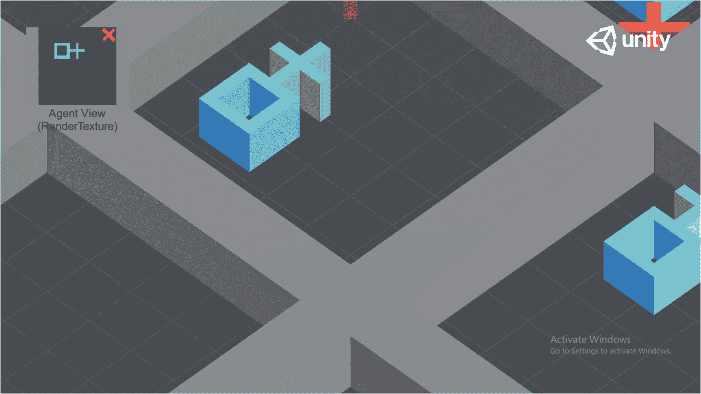

Figure 5-37

GridWorld training using dueling DQN from Baselines

We can also use ML Agents PPO method for training this by using the command:

```

mlagents-learn  --run-id=GridWorldNew –train

```py

The training phase appears as shown in Figure 5-38.

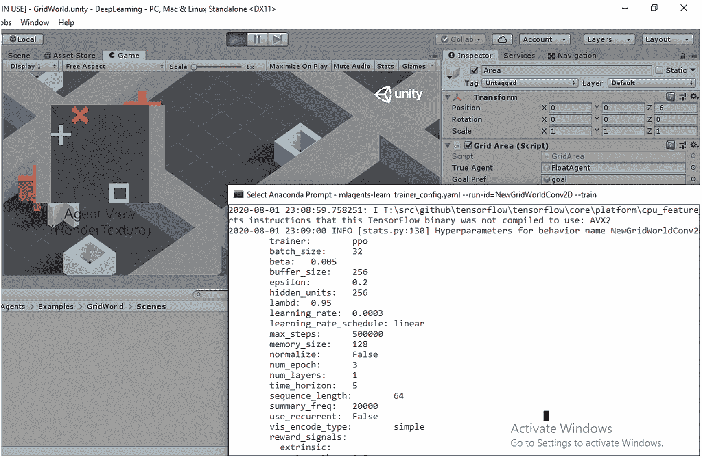

Figure 5-38

Training on PPO policy of ML Agents

Now let's use the Baseline PPO2 (clipped) version from Gym to train this environment. We load the Unity GridWorld environment, as mentioned before, and we will be creating a monitored environment in this context. This is an example of multi-instance training using the PPO2 algorithm from the Baselines as mentioned in the documentation. We use the “UnityToGymWrapper” to convert the environment and also apply “use_visuals” for visual observation. Then we use the “SubprocVecEnv” method to create subprocesses for instantiating multiple instances of the GridWorld environment.

```

从 mlagents_envs.environment 导入 UnityEnvironment

从 gym_unity.envs 导入 UnityToGymWrapper

从 baselines.common.vec_env.subproc_vec_env 导入 SubprocVecEnv

从 baselines.common.vec_env.dummy_vec_env 导入 DummyVecEnv

从 baselines.bench 导入 Monitor

从 baselines 导入 logger

从 baselines.ppo2.ppo2 导入 ppo2

导入 os

try:

从 mpi4py 导入 MPI

except ImportError:

MPI = None

def make_unity_env(env_directory, num_env, visual, start_index=0):

def make_env(rank, use_visual=True):

def _thunk():

unity_env = UnityEnvironment(env_directory)

env = UnityToGymWrapper(unity_env,

rank, use_visual=use_visual, uint8_visual=True)

env = Monitor(env, logger.get_dir()

and os.path.join(logger.get_dir(), str(rank)))

return env

return _thunk

if visual:

return SubprocVecEnv([make_env(i + start_index)

for i in range(num_env)])

else:

rank = MPI.COMM_WORLD.Get_rank() if MPI else 0

return DummyVecEnv([make_env(rank, use_visual=False)])

```py

Then we have the PPO2 algorithm from the Baselines, which uses the MLP policy or dense networks, and this can be modified to use convolution neural networks as well. In this context we create four environments of GridWorld for multi-threaded training. We train for 100000 episodes:

```

def main():

env = make_unity_env('./envs/GridWorld', 4, True)

ppo2.learn(

network="mlp",

env=env,

total_timesteps=100000,

lr=1e-3,

)

if __name__ == '__main__':

main()

```py

On running this using the Python –m command, we can visualize simultaneous training of four GridWorld environment instances. We can visualize the training in Tensorboard as well by using the log files.

Now we can use our own implementations of the on-/off-policy algorithms that we discussed in the previous section as well to train our ML Agents without custom models. This is left for interested readers to try using the previous implementations of on-/off-policy algorithms with Unity ML Agents through the Gym interface. In the next section we will look into a certain aspects of “mlagents,” which are inside the ML Agents repository; this would include a brief overview of the different policies implemented in the ML Agents in Unity for the PPO algorithm as well as understanding memory-based neural networks—namely, LSTM networks.

## Understanding Deep RL policies in Unity ML Agents and Memory-Based Networks

In this context, we will be going through certain scripts inside the ML Agents repository that we mentioned in the last chapter—namely, the ModelOverrider script in Examples/SharedAssets/Scripts directory of the repository. This is used alongside the BehaviorParameters and the DecisionRequester scripts for our agents in Unity.

### Model Overrider Script

This script is a utility class that overrides the neural network model during inference mode and is used to validate the training internally after the episodes are completed. This works with a 1:1 ratio between the agents and the environments. First we have the type of the neural network model file that is used by Barracuda for inference, either in “.nn” or “.onnx” format. Then we specify arguments that refer to the neural network model path and location as well as the training steps, extension, episodes, and directory of the neural network model and other details.

```

HashSet k_SupportedExtensions = new HashSet{"nn", "onnx"};

const string k_CommandLineModelOverrideFlag = "--mlagents-override-model";

const string k_CommandLineModelOverrideDirectoryFlag = "--mlagents-override-model-directory";

const string k_CommandLineModelOverrideExtensionFlag = "--mlagents-override-model-extension";

const string k_CommandLineQuitAfterEpisodesFlag = "--mlagents-quit-after-episodes";

const string k_CommandLineQuitOnLoadFailure = "--mlagents-quit-on-load-failure";

```py

Then it has variables that control the agent, a dictionary containing asset paths and the behavior names as key–value pairs, another dictionary that stores the behavior name and the neural network model as a key-value pair. It also contains variables for number of steps, previous number of steps, number of completed episodes, and Boolean value to check whether to load on failure and also contains static variables for the same.

```

Agent m_Agent;

Dictionary m_BehaviorNameOverrides = new Dictionary();

string m_BehaviorNameOverrideDirectory;

string m_OverrideExtension = "nn";

Dictionary m_CachedModels = new Dictionary();

int m_MaxEpisodes;

int m_NumSteps;

int m_PreviousNumSteps;

int m_PreviousAgentCompletedEpisodes;

bool m_QuitOnLoadFailure;

[Tooltip("Debug values to be used in place of the command line for overriding models.")]

public string debugCommandLineOverride;

static int s_PreviousAgentCompletedEpisodes;

static int s_PreviousNumSteps;

```py

Then there are methods such as “TotalCompletedEpisodes,” ”TotalNumSteps,” “HasOverrides,” and “GetOverridenBehaviorName,” which control the total steps completed during training, the total steps of training, a Boolean function that asserts whether a particular behavior overriding is possible, and the name of the overridden behavior, respectively.

```

int TotalCompletedEpisodes

{

get { return m_PreviousAgentCompletedEpisodes + (m_Agent == null ? 0 : m_Agent.CompletedEpisodes);  }

}

int TotalNumSteps

{

get { return m_PreviousNumSteps + m_NumSteps; }

}

public bool HasOverrides

{

get { return m_BehaviorNameOverrides.Count > 0

|| !string.IsNullOrEmpty(m_BehaviorNameOverrideDirectory);  }

}

public static string GetOverrideBehaviorName(string originalBehaviorName)

{

return $"Override_{originalBehaviorName}";

}

```py

The “GetAssetPathFromCommand” line method is used to load the assets from the command line arguments. It does this by splitting the arguments. Since the assets are stored (.nn/.onnx) in a key–value pair format, the splitting enables to extract the behavior names and the type of the asset. This is done by the following lines of code:

```

m_BehaviorNameOverrides.Clear();

var maxEpisodes = 0;

string[] commandLineArgsOverride = null;

if (!string.IsNullOrEmpty

(debugCommandLineOverride)

&& Application.isEditor)

{

commandLineArgsOverride

=   debugCommandLineOverride.Split(' ');

}

var args

= commandLineArgsOverride

??    Environment.GetCommandLineArgs();

for (var i = 0; i < args.Length; i++)

{

if (args[i] == k_CommandLineModelOverrideFlag &&

i < args.Length-2)

{

var key = args[i + 1].Trim();

var value = args[i + 2].Trim();

m_BehaviorNameOverrides[key] = value;

}

```py

It also contains the conditions for controlling the extensions during splitting the arguments (at the time of writing this book .onnx files are not supported in this context), and also controls “on load failure” property if the model loading fails. There is a condition that specifies the number of episodes of training used before quitting.

```

else if (args[i] == k_CommandLineModelOverrideExtension

Flag && i < args.Length-1)

{

m_OverrideExtension = args

[i + 1].Trim().ToLower();

var isKnownExtension

= k_SupportedExtensions.Contains

(m_OverrideExtension);

var isOnnx = m_OverrideExtension.Equals("onnx");

if (!isKnownExtension || isOnnx)

{

Debug.LogError($"loading unsupported format

: {m_OverrideExtension}");

Application.Quit(1);

#if UNITY_EDITOR

EditorApplication.isPlaying = false;

#endif

}

}

else if (args[i] == k_CommandLineQuit

AfterEpisodesFlag && i < args.Length-1)

{

Int32.TryParse(args[i + 1], out maxEpisodes);

}

else if (args[i] == k_CommandLineQuitOnLoadFailure)

{

m_QuitOnLoadFailure = true;

}

}

```py

The “OnEnable” method is used for setting and resetting the parameters, such as episodes completed, agent behavior, and whether the behavior has overrides and is used in case we are resetting the Unity scene.

```

void OnEnable()

{

m_PreviousNumSteps = s_PreviousNumSteps;

m_PreviousAgentCompletedEpisodes

= s_PreviousAgentCompletedEpisodes;

m_Agent = GetComponent();

GetAssetPathFromCommandLine();

if (HasOverrides)

{

OverrideModel();

}

}

```py

The “OnDisable” method is used for updating the static variables that control the episodes and the steps counts.

```

void OnDisable()

{

s_PreviousAgentCompletedEpisodes

= Mathf.Max(s_PreviousAgentCompletedEpisodes,

TotalCompletedEpisodes);

s_PreviousNumSteps = Mathf.Max

(s_PreviousNumSteps, TotalNumSteps);

}

```py

We then have the “Fixed Update” method, which has the maxSteps attribute which controls the maximum steps required for training and lets the agent train for at least the maximum steps specified before terminating. It also checks for any errors during the training stage by extending the training for a few more time-steps.

```

void FixedUpdate()

{

if (m_MaxEpisodes > 0)

{

if (TotalCompletedEpisodes >= m_MaxEpisodes

&& TotalNumSteps > m_MaxEpisodes * m_Agent.MaxStep)

{

Debug.Log($"ModelOverride

reached {TotalCompletedEpisodes} episodes

and {TotalNumSteps} steps. Exiting.");

Application.Quit(0);

#if UNITY_EDITOR

EditorApplication.isPlaying = false;

#endif

}

}

m_NumSteps++;

}

```py

The “GetModelFromBehaviorName” method is used to retrieve the neural network model through the arguments specified in the behavior names. It takes the path to the neural network model asset and then uses a key-value pair to generate the behavior name and the neural network model. Then it reads the bytecodes of the model for inference mode. It also caches the files (assets) for future reference during inference training.

```

public NNModel GetModelForBehaviorName(string behaviorName)

{

if (m_CachedModels.ContainsKey(behaviorName))

{

return m_CachedModels[behaviorName];

}

string assetPath = null;

if (m_BehaviorNameOverrides.ContainsKey(behaviorName))

{

assetPath = m_BehaviorNameOverrides[behaviorName];

}

else if(!string.IsNullOrEmpty(m_BehaviorNameOverrideDirectory))

{

assetPath = Path.Combine(m_BehaviorNameOverrideDirectory, $"{behaviorName}.{m_OverrideExtension}");

}

if (string.IsNullOrEmpty(assetPath))

{

Debug.Log($"No override for

BehaviorName {behaviorName}, and no directory set.");

return null;

}

byte[] model = null;

try

{

model = File.ReadAllBytes(assetPath);

}

catch(IOException)

{

Debug.Log($"Couldn't load file {assetPath}

at full path {Path.GetFullPath(assetPath)}", this);

m_CachedModels[behaviorName] = null;

return null;

}

var asset = ScriptableObject.CreateInstance();

asset.modelData

= ScriptableObject.CreateInstance();

asset.modelData.Value = model;

asset.name = "Override - " + Path.GetFileName(assetPath);

m_CachedModels[behaviorName] = asset;

return asset;

}

```py

The “OverrideModel” method contains the actual overriding logic for the neural network models. It extracts the parameters that assign the brain from the BehaviorParameters script attached to the agent, and then assigns the neural network model in the form of bytecodes. It gets the corresponding behavior name and checks whether the name is valid and present in the assets inside Unity. It then assigns the trained neural network model for inference after the agent has been loaded. This is done by the following lines:

```

void OverrideModel()

{

bool overrideOk = false;

string overrideError = null;

m_Agent.LazyInitialize();

var bp = m_Agent.GetComponent();

var behaviorName = bp.BehaviorName;

var nnModel = GetModelForBehaviorName(behaviorName);

if (nnModel == null)

{

overrideError =

$"Didn't find a model for

behaviorName {behaviorName}. Make " +

$"sure the behaviorName is set correctly

in the commandline " +

$"and that the model file exists";

}

else

{

var modelName = nnModel != null ?

nnModel.name : "";

Debug.Log($"Overriding behavior {behaviorName}

for agent with model {modelName}");

try

{

m_Agent.SetModel(GetOverrideBehaviorName

(behaviorName), nnModel);

overrideOk = true;

}

catch (Exception e)

{

overrideError = $"Exception

calling Agent.SetModel: {e}";

}

}

if (!overrideOk && m_QuitOnLoadFailure)

{

if(!string.IsNullOrEmpty(overrideError))

{

Debug.LogWarning(overrideError);

}

Application.Quit(1);

#if UNITY_EDITOR

EditorApplication.isPlaying = false;

#endif

}

}

```py

Thus we have had an overview of the Model Overrider script in Unity, which is an important script used for overriding inference models in Unity. Next we will be looking briefly into the actual neural networks built inside Unity. We will also explore the LSTM module inside the model scripts in ML Agents.

In this context, let us navigate toward the mlagents/trainers/tf folder, which contains the Tensorflow implementation of the actual neural network models in Unity. We will look into the Models.py script.

### Models Script: Python

This is the fundamental script used by PPO/SAC/GAIL/Ghost and other training algorithms inside ML Agents. It controls the entire Tensorflow specifications of the neural network as well as the hyperparameters. We will be looking at certain parts of this script. We have the epsilon mentioned at the start of the script, which can be changed as well. Then we have the different classes that contain the parameters for encoding. This also contains the encoding parameters for the Tensors (height, width, and channels for convolution networks). There is also an associated minimum resolution for the different neural networks used, and we can see “RESNET:15” being mentioned in this context, which specifies that for CNN-based models, we can use ResNet as our neural network.

```

EPSILON = 1e-7

class Tensor3DShape(NamedTuple):

height: int

width: int

num_channels: int

class NormalizerTensors(NamedTuple):

update_op: tf.Operation

steps: tf.Tensor

running_mean: tf.Tensor

running_variance: tf.Tensor

class ModelUtils:

MIN_RESOLUTION_FOR_ENCODER = {

编码器类型.SIMPLE: 20,

EncoderType.NATURE_CNN: 36,

EncoderType.RESNET: 15,

}

}

}

```py

Then we specify the global training steps in Tensorflow, and we also freeze certain weights in the network that is specified by the “trainable=False” command. Then we have the method “create_schedule,” which controls the learning rate tensor and controls the base learning rate, global steps, and maximum steps. There are two types of trainers: linear and constant.

```

if schedule == ScheduleType.CONSTANT:

parameter_rate = tf.Variable(parameter

, 可训练=False)

elif schedule == ScheduleType.LINEAR:

parameter_rate = tf.train.polynomial_decay(

parameter, global_step, max_step,

min_value, power=1.0

)

else:

抛出 UnityTrainerException(f"The

schedule {schedule} is invalid.")

返回 parameter_rate

```py

Then we have variance scaling initializers and Swish activation methods for creating initializers for our trainable weights in the neural networks. Now we have methods that take the visual observations from the Unity scene through the camera and transform them to a 3D Tensor containing the height, width, and channels(“create_visual_input”).

```

visual_in = tf.placeholder(

形状=[None, o_size_h, o_size_w, c_channels], dtype=tf.float32, name=name

```py

In case we are not using visual observations, we have to convert the vector observations (ray sensor data) in the form of a 1D Tensor (“create_vector_input”).

```

vector_in = tf.placeholder(

形状=[None, vec_obs_size], 数据类型=tf.float32, 名称=name

)

```py

There are methods (“normalize_vector_obs”) that normalize the input vectors and the visual observations (Tensors), which is done by dividing with the square root of the variance.

```

normalized_state = tf.clip_by_value(

(vector_obs - running_mean)

/ tf.sqrt(

running_variance / (tf.cast(normalization_steps, tf.float32) + 1)

),

-5,

5,

名称="normalized_state",

)

```py

The “create_normalizer” method is used to create a Tensor that contains the next value to normalize based on the current running mean and variance (used in batch normalization). It also contains the normalization steps for the nontrainable weights.

```

vec_obs_size = vector_obs.shape[1]

steps = tf.get_variable(

"normalization_steps",

[],

可训练=False,

数据类型=tf.int32,

初始化器=tf.zeros_initializer(),

)

running_mean = tf.get_variable(

"running_mean",

[vec_obs_size],

可训练=False,

数据类型=tf.float32,

初始化器=tf.zeros_initializer(),

)

running_variance = tf.get_variable(

"running_variance",

[vec_obs_size],

可训练=False,

数据类型=tf.float32,

初始化器=tf.ones_initializer(),

)

更新归一化

= ModelUtils.create_normalizer_update(

vector_obs, steps, running_mean, running_variance

)

返回 NormalizerTensors(

update_normalization, steps,

running_mean, running_variance

)

```py

The next method “create_vector_observation_encoder” is an important method as it contains the actual implementation of the Dense neural network (MLP) for the vector observations. As we have studied the dense network in Keras, here the dense network from Tensorflow is used. We have the parameters, such as hidden layers, units, and kernel initializers, which in this case is variance_scaling, the activation function, and other details.

```

with tf.variable_scope(scope):

hidden = observation_input

for i in range(num_layers):

hidden = tf.layers.dense(

hidden,

h_size,

激活=activation,

重用=reuse,

名称=f"hidden_{i}",

核初始化器=tf.initializers.variance_scaling(1.0),

)

返回 hidden

```py

Then we have the “create_visual_observation_encoder” method which contains the convolution-2D neural network architecture used in ML Agents. This is the one used in GridWorld environment when training with PPO policy and cnn as the neural network type. As we have studied, we have the convolution layer, flattening/pooling layer and then a dense network in a traditional CNN.

*   **Convolution layers in ML Agents** **:** We can understand here the ML Agents uses convolution-2D neural network with kernel size of [8,8] and stride of [4,4] with an activation of “Relu” for the first convolution network. For the second CNN, we have a kernel size of [4,4] and stride of [2,2] with “elu” (exponential linear unit) as the activation function and 32 being the channel depth.

*   **Dense layers** **:** The output of the 2^(nd) convolution layer is passed into the dense network, which is created using the (dense neural network) “create_vector_observation_encoder” method in the previous case.

The following lines represent this, and we can change this code according to our requirements and add pooling/dropout or other layers that we have studied previously.

```

with tf.variable_scope(scope):

conv1 = tf.layers.conv2d(

image_input,

16,

核大小=[8, 8],

步长=[4, 4],

激活=tf.nn.elu,

重用=reuse,

名称="conv_1",

)

conv2 = tf.layers.conv2d(

conv1,

32,

核大小=[4, 4],

步长=[2, 2],

激活=tf.nn.elu,

重用=reuse,

名称="conv_2",

)

hidden = tf.layers.flatten(conv2)

with tf.variable_scope(scope + "/" + "flat_encoding"):

hidden_flat = ModelUtils.create_vector_observation_encoder(

hidden, h_size, activation, num_layers, scope, 重用

)

返回 hidden_flat

```py

In the next method, “create_nature_cnn_visual_observation_encoder,” there is a residual network or ResNet type of network built for ML Agents. Now we have studied the importance of residual blocks in ResNet architecture to increase accuracy in training as the depth of the neural network model increases. This is done in Tensorflow by using the reuse=reuse parameter, which is mentioned in this context. Here we have three convolution-2D neural network models with “elu” as the common activation function and different kernel sizes (8, 4, and 3, respectively) and different strides (4, 2, and 1, respectively). The depth of the channels changes from 32 to 64 units in second and third layers. Then we have the usual dense MLP network included from the vector observations method.

```

with tf.variable_scope(scope):

conv1 = tf.layers.conv2d(

image_input,

32,

核大小=[8, 8],

步长=[4, 4],

激活=tf.nn.elu,

重用=reuse,

名称="conv_1",

)

conv2 = tf.layers.conv2d(

conv1,

64,

核大小=[4, 4],

步长=[2, 2],

激活=tf.nn.elu,

重用=reuse,

名称="conv_2",

)

conv3 = tf.layers.conv2d(

conv2,

64,

核大小=[3, 3],

步长=[1, 1],

激活=tf.nn.elu,

重用=reuse,

名称="conv_3",

)

hidden = tf.layers.flatten(conv3)

with tf.variable_scope(scope + "/" + "flat_encoding"):

hidden_flat

= ModelUtils.create_vector_observation_encoder(

hidden, h_size, activation, num_layers,

范围，重用

)

返回 hidden_flat

```py

The “create_resnet_visual_observation_encoder” is another variant of the ResNet model, and in this case, we have additional hidden layers with “Relu” activation in between the usual convolution blocks. Also in this case, a MaxPooling layer is present with pool size of [3,3] and stride size of [2,2]. Additionally the convolution layers now have “same“ padding applied to them.

```

n_channels = [16, 32, 32] # channel for each stack

n_blocks = 2 # number of residual blocks

with tf.variable_scope(scope):

hidden = image_input

for i, ch in enumerate(n_channels):

hidden = tf.layers.conv2d(

hidden,

ch,

kernel_size=[3, 3],

strides=[1, 1],

reuse=reuse,

name="layer%dconv_1" % i,

)

hidden = tf.layers.max_pooling2d(

hidden, pool_size=[3, 3], strides=[2, 2], padding="same"

)

# create residual blocks

for j in range(n_blocks):

block_input = hidden

hidden = tf.nn.relu(hidden)

hidden = tf.layers.conv2d(

hidden,

ch,

kernel_size=[3, 3],

strides=[1, 1],

padding="same",

reuse=reuse,

name="layer%d_%d_conv1" % (i, j),

)

hidden = tf.nn.relu(hidden)

hidden = tf.layers.conv2d(

hidden,

ch,

kernel_size=[3, 3],

strides=[1, 1],

padding="same",

reuse=reuse,

name="layer%d_%d_conv2" % (i, j),

)

hidden = tf.add(block_input, hidden)

hidden = tf.nn.relu(hidden)

hidden = tf.layers.flatten(hidden)

with tf.variable_scope(scope + "/" + "flat_encoding"):

hidden_flat

= ModelUtils.create_vector_observation_encoder(

hidden, h_size, activation, num_layers,

scope, reuse

)

return hidden_flat

```py

Then we have the “break_into_branches” method, which takes a concatenated set of logits that represent multiple discrete branches and breaks it into a single Tensor per branch, and the “create_discrete_action_masking_layer” method, which applies a masking layer on the discrete actions. It uses a softmax activation to mask over the logits and uses a multinomial distribution for the output.

```

branch_masks = ModelUtils.break_into_branches(action_masks, action_size)

raw_probs = [

tf.multiply(tf.nn.softmax(branches_logits[k])

+ EPSILON, branch_masks[k])

for k in range(len(action_size))

]

normalized_probs = [

tf.divide(raw_probs[k]

, tf.reduce_sum(raw_probs[k],

axis=1, keepdims=True))

for k in range(len(action_size))

]

output = tf.concat(

[

tf.multinomial(tf.log(normalized_probs[k]

+ EPSILON), 1)

for k in range(len(action_size))

],

axis=1,

)

return (

output,

tf.concat([normalized_probs[k]

for k in range(len(action_size))], axis=1),

tf.concat(

[

tf.log(normalized_probs[k] + EPSILON)

for k in range(len(action_size))

],

axis=1,

),

)

```py

The “create_observation_streams” uses the previous methods, which contain the neural network architecture for building the observation streams, used in training. The next method, “create_recurrent_encoder,” is another important method that uses recurrent neural network or LSTM networks for memory-based processing. We will be studying about LSTMs shortly; however, in this case, this method creates a neural network that stores a part of the actions/states/rewards in the memory and uses it for future reference. The “BasicLSTMCellMethod” from Tensorflow (or Keras) is used for this purpose.

```

s_size = input_state.get_shape().as_list()[1]

m_size = memory_in.get_shape().as_list()[1]

lstm_input_state = tf.reshape(input_state, shape=[-1, sequence_length, s_size])

memory_in = tf.reshape(memory_in[:, :], [-1, m_size])

half_point = int(m_size / 2)

with tf.variable_scope(name):

rnn_cell

= tf.nn.rnn_cell.BasicLSTMCell(half_point)

lstm_vector_in = tf.nn.rnn_cell.LSTMStateTuple(

memory_in[:, :half_point],

memory_in[:, half_point:]

)

recurrent_output, lstm_state_out

= tf.nn.dynamic_rnn(

rnn_cell, lstm_input_state

, initial_state=lstm_vector_in

)

recurrent_output = tf.reshape(recurrent_output, shape=[-1, half_point])

return recurrent_output, tf.concat([lstm_state_out.c, lstm_state_out.h], axis=1)

```py

This script is the most important script, as it governs the network architecture for the different on-/off-policy algorithms present in Unity ML Agents, and we can modify these hyperparameters (such as kernel size/stride in convolution-2D neural network or activations) and try to understand the outcome of the training. In the next section we will see the PPO script very briefly and then venture into LSTM-based networks.

### PPO in Unity ML Agents

In Unity ML Agents , we have to navigate to the mlagents/trainers/ppo folder, and inside we can see that there are two python scripts: optimizers and trainer.

*   **Trainer Python script** **:** This controls the actual implementation of the PPO algorithm in ML Agents. It takes the hyperparameters, such as batch size, episodes, policies, learning rate, gamma, and epsilon from the config files (“trainer_config.yaml”), and checks the validity. One of the important methods in this context is the “_process_trajectory” method. This controls the initial trajectory built using the PPO policy and gets the value estimates (observation, rewards, states) following that particular policy. It computes and stores the rewards in a buffer. After that it computes the GAE, which we mentioned in the PPO section in deep RL. It calculates the advantages based on the value estimates and the returns for the particular policy.

    ```

    tmp_advantages = []

    tmp_returns = []

    for name in self.optimizer.reward_signals:

    bootstrap_value = value_next[name]

    local_rewards = agent_buffer_trajectory[

    "{}_rewards".format(name)

    ```py

```

].get_batch()

local_value_estimates = agent_buffer_trajectory[

"{}_value_estimates".format(name)

].get_batch()

local_advantage = get_gae(

rewards=local_rewards,

value_estimates=local_value_estimates,

value_next=bootstrap_value,

gamma=self.optimizer.reward_signals[name].

gamma,

lambd=self.trainer_parameters["lambd"],

)

local_return = local_advantage

+ local_value_estimates

agent_buffer_trajectory["{}_returns".

format(name)].set(local_return)

agent_buffer_trajectory["{}_advantage".

format(name)].set(local_advantage)

tmp_advantages.append(local_advantage)

tmp_returns.append(local_return)

```py

This is computed both locally and globally. The “_update_policy” method is used to update the current policy by comparing the returns with the GAE of the older policy. It updates the policy in mini-batches of training. The “create_policy” method is used for creating the PPO policy and has several parameters, such as brain parameters, seed, and “is training” (Boolean)—all of which are derived from the NNPolicy class. The “add_policy” method adds the current training policy to the trainer. The “discount_rewards” method is the same as we had written in previous sections to provide a discounted return on the rewards. The method “get_gae” returns the GAE advantage estimate, which is used for updating the policy, represented by the equation:

A^π(s[t], a[t]) = Q^π(s[t], a[t]) - V^π(s[t])

The following lines of code signify this formulation.

value_estimates = np.append(value_estimates, value_next)

delta_t = rewards + gamma * value_estimates[1:] - value_estimates[:-1]

advantage = discount_rewards(r=delta_t, gamma=gamma * lambd)

return advantage

*   **Optimizer Python script** **:** This script contains a complex variant of the PPO optimizer that we created in our deep RL section. This controls the loss and the learning rate and fine-tunes the optimization by updating the policy gradient. It contains certain hyperparameters that control the epsilon, beta, maximum steps, number of layers, and other attributes. It also contains the type of the neural network architecture to be used—whether recurrent networks, convolution networks, or dense networks are to be used. The “create_cc_critic” method signifies the creation of a continuous controlled critic value network, and in the case of recurrent networks, it uses the “create_recurrent_encoder” method from the Model.py script that we mentioned.

```

if self.policy.use_recurrent:

hidden_value, memory_value_out

= ModelUtils.create_recurrent_encoder(

hidden_stream,

self.memory_in,

self.policy.sequence_length_ph,

name="lstm_value",

)

self.memory_out = memory_value_out

```py

The “create_dc_critic” represents a discrete controlled critic network, and if the policy is CNN, then it uses the “create_visual_observation_encoder” method from the Model.py script. It can also use other variations of visual encoders such as Resnet. In the discrete case, we take the topmost index of the buffer for analysis.

```

hidden_stream = ModelUtils.create_observation_streams(

self.policy.visual_in,

self.policy.processed_vector_in,

1,

h_size,

num_layers,

vis_encode_type,

)[0]

```py

The “_create_losses” method contains the actual clipping of policies that we saw in the PPO section of deep RL. The clipping is done based on the GAE returns on the old policy and is represented by the following lines of code:

```

r_theta = tf.exp(probs - old_probs)

p_opt_a = r_theta * advantage

p_opt_b = (

tf.clip_by_value(r_theta, 1.0 - decay_epsilon, 1.0

+ decay_epsilon)

* advantage

)

```py

where epsilon is the hyperparameter used in this context.

That concludes the section on PPO, and we have an idea as to how the PPO algorithm is created internally by Unity for use in ML Agents. We also understood that the hyperparameters mentioned in the “trainer_config.yaml” are used in these scripts to control the training and policy gradient optimization. Now let us briefly understand LSTM and try to understand the hyperparameters with which it is associated.

### Long Short-Term Memory Networks in ML Agents

**Recurrent Neural Network**

LSTMs are modified versions of recurrent neural networks (RNNs) . RNNs are networks that pass the processed information through the hidden layers toward its own input and hence are used for retaining memory inside the network. RNNs learn information from the previous step and store this information. Internally the hidden layers have some activations that try to retain the data. In the gradient descent part of training a RNN, due to successive gradient flow through the RNN, the network is useful for storing certain error gradients from previous time-steps and helps in the learning process, which is not possible in the case of traditional neural networks. However, in traditional RNN, there are two problems that occur due to the recursive looping of the gradient updates.

*   **Vanishing gradient problem** **:** This implies as the training length increases, the successive gradients decrease, as very little error gets propagated to the previous layers. This leads to a nonconverging learning curve, and the algorithm oscillates in the regions of the global minima without converging.

*   **Exploding gradient problem:** Due to frequent recursive updates in training, the model weights may get updated by a large quantity. This causes instability in the training phase, as in many cases, the algorithm oversteps from the global minima.

**LSTM** **Network**

To counteract this issue of gradients, LSTMs were devised to stabilize the weight updates and the gradient flow during training, along with retaining memory. The typical architecture of a LSTM module looks like that shown in Figure 5-39.

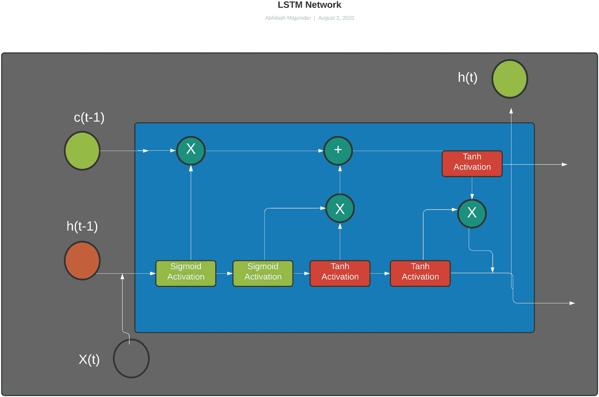

Figure 5-39

LSTM architecture

Now we have a separate activation unit here, which is denoted by “tanh.” This is used because the second derivative of “tanh” does not dissipate as the learning progresses. The first derivative is given by the formulation:

∂tanh(z) = [(1-z²)]∂z

In LSTM, there are four major gates that control the flow of information and memory. The h(t-1) controls the outputs of the previous LSTM cell, and c(t-1) controls the memory of the previous LSTM cell. X(t) is the input to the current cell. We will understand the gates going from left to right starting with the sigmoid activation unit.

*   **Forward gate:** This controls the sigmoid activated output of the previous LSTM cell [h(t-1) with weights(W)] and the current input X(t) with some bias.

    f[t] =σ (W[f] [h[t-] X[t] ]+ b[f])

*   **Input Gate:** This also controls the sigmoid activated output of previous h(t-1) with the weights W. Additionally there is a “tanh” activation applied on the previous output with the input X(t) with corresponding bias.

    i[t] =σ (Wi[h[t-] X[t] ]+ b[i])

    C[t]^(**`**)= tanh(Wc[h[t-] X[t] ]+ b[c])

*   **Forget gate:** This controls the information that we want the LSTM network to forget. This is computed by the following formula using c(t-1):

    C[t] = f[t] *C[t-1] + i[t]* C[t]^(**`**)

*   **Output gate:** This contains a sigmoid activated unit that decides what we would want to output. This is follows by a “tanh” activation, which clamps between (-1,1) to get the current LSTM contents h(t):

    o[t] =σ (Wo[h[t-] X[t] ]+ b[o])

    h(t)= o[t] * tanh(C[t])

Through these gates, the LSTM network tries to alleviate the drawbacks of a traditional RNN. We have observed the case in the Model.py script where we mentioned the RNNs use-case.

**LSTM in** **ML Agents Models**

In ML Agents, we have seen the importance of RNNs for training the models in the Model.py script. Here again is a representation of the same.

```

s_size = input_state.get_shape().as_list()[1]

m_size = memory_in.get_shape().as_list()[1]

lstm_input_state = tf.reshape(input_state, shape=[-1, sequence_length, s_size])

memory_in = tf.reshape(memory_in[:, :], [-1, m_size])

half_point = int(m_size / 2)

with tf.variable_scope(name):

rnn_cell

= tf.nn.rnn_cell.BasicLSTMCell(half_point)

lstm_vector_in = tf.nn.rnn_cell.LSTMStateTuple(

memory_in[:, :half_point],

memory_in[:, half_point:]

)

recurrent_output, lstm_state_out

= tf.nn.dynamic_rnn(

rnn_cell, lstm_input_state

, initial_state=lstm_vector_in

)

recurrent_output = tf.reshape(recurrent_output, shape=[-1, half_point])

return recurrent_output, tf.concat([lstm_state_out.c, lstm_state_out.h], axis=1)

```py

Here the important part is the “BasicLSTMCell,” which has units denoted by “m_size/2.” These signify the number of units in the LSTM block. The “LSTMStateTuple” method is used for including the extents of memory for use in processing the observations. Internally these are passed through the series of sigmoid and tanh activated cells to get the current output. Now this model file is used across SAC/GAIL and other algorithms in ML Agents. We can definitely view the source of SAC, especially to get an idea of the use of LSTM networks in that algorithm. Also the different attributes of LSTMs are also present in the trainer_config.yaml file, which is used for training the PPO agent. We will explore LSTM networks in more depth in the next chapter when we study adversarial memory-based networks.

## Simplified Hyperparameter Tuning For Optimization

Optimization is an important aspect when it comes to deep RL. In all the sections we have focused in this chapter, we see that there are a lot of hyperparameters that govern the on/off policy as well as model-free algorithms, including neural network architectures. We will be considering the PPO configurations inside ML Agents that is present in the trainer_config.yaml file. For SAC-based configurations, most of the parameters remain the same, with certain exceptions. Some of the common hyperparameters include the following.

*   **Trainer:** SAC- or PPO-based on the policies required

*   **Summary Freq:** This controls the frequency of the summary of training. This can also be viewed using TensorBoard.

*   **Batch size:** This controls the batch size for training. This should be multiple times smaller than the buffer size. Typically for PPO (continuous), it should be between 512 and 5120, whereas for SAC (continuous), it should be between 128 and 1024\. For discrete variants, it should be 32 to 512.

*   **Buffer size:** This controls the number of observations/actions/states for each policy. It should be typically larger than the batch size. In PPO this is around 2048 to 409600, and for SAC it should be around 5000 to 1000000.

*   **Hidden units:** The number of hidden units in a fully connected neural network architecture. Typically, it should be around 32 to 512.

*   **Learning rate:** The learning rate for gradient descent algorithm. This typically should be within 1e-5 to 1e-3 (0.00001 to 0.001).

*   **Learning rate schedule:** This controls the variation of the learning rate that we looked at in the Models.py script. It can be linear or constant. For PPO, a linear decaying policy is applied on the learning rate, while for SAC it is kept constant.

*   **Max steps:** The maximum steps required for the algorithm; this should be within 5e5 and 1e7.

*   **Normalize:** This controls normalization on the vector observations using the running mean and variance.

*   **Num layer** **:** Controls how many hidden layers are present after the observation layer. Typically should be between 1 and 3 (CNN).

*   **Time horizon:** The number of experiences of observations, states, and actions collected before it was saved in the replay buffer.

*   **Vis encoder type:** This controls the type of encoders for visual observations. As we saw in the previous sections, it can be either “cnn_natural,” “resnet,” and its variants.

*   **Init_path:** This controls the path to a trainer used previously for training. A past behavioral neural network model that was previously used is signified with this parameter.

*   **Threaded:** This controls whether the model can update its weights when the environment is being stepped. It is recommended to keep it to False when policy training algorithms like PPO are used.

### Hyperparameters for PPO

These are certain hyperparameters that are important in the context of PPO in addition to the standard training parameters.

*   **Beta:** This controls the strength of the entropy regularization so that the agent can explore spaces during training. This typically has a value between 1e-4 and 1e-2.

*   **Epsilon:** This controls how swiftly the policy can diverge from an older policy. A smaller value has stable updates on the policy. This typically has a value between 0.1 and 0.3.

*   **Lambd:** The regularization factor that is used in calculating GAE. Typically a low value resembles using the current advantage value and a high value signifies using the actual advantages received from the environment (high variance). This typically has a value between 0.9 and 0.95.

*   **Num_epoch:** The number of passes to be made through the buffer before gradient descent step is applied. Decreasing this will lead to slower and stable updates. This typically has a value between 3 and 10.

### Analyzing Hyperparameters through TensorBoard Training

We will look into a Unity environment called Tiny Agent, which is a cart racing environment. While we will explore this in the next chapter, it is important to show the tradeoff made in training when different sets of hyperparameters are applied. For training this particular environment, we have used the default set of hyperparameters that is present for PPO.

```

default:

trainer: ppo

batch_size: 1024

beta: 5.0e-3

buffer_size: 10240

epsilon: 0.2

hidden_units: 128

lambd: 0.95

learning_rate: 3.0e-4

learning_rate_schedule: linear

max_steps: 5.0e5

memory_size: 128

normalize: false

num_epoch: 3

num_layers: 2

time_horizon: 64

sequence_length: 64

summary_freq: 100

use_recurrent: false

vis_encode_type: simple

reward_signals:

extrinsic:

strength: 1.0

gamma: 0.99

```

为了训练和理解的方便，我们修改了某些超参数的值，例如 gamma、批量大小、学习率和隐藏单元。虽然通常建议遵循本节中提到的指南来设置超参数，但观察到当隐藏单元为 256 到 512，批量大小为 1024 时，提供了一个合适的学习曲线，具有稳定的更新和适当的收敛。在这种情况下，我们将分析使用 Tiny Agent 的不同训练实例在 TensorBoard 中制作的图表，如图 5-40 所示。

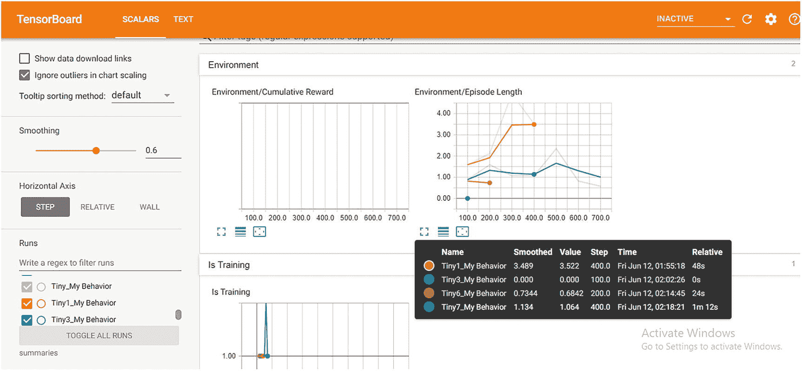

图 5-40

Tiny Agent 的超参数调整

虽然我们可以相应地调整超参数并在 Tensorboard 中可视化训练，但重要的是要提到，从“mlp”到“cnn”再到其他网络（“mlplstm”）的策略变化在训练过程中也起着重要作用。当我们使用 CNN 和密集神经网络训练 GridWorld 环境时，我们可以可视化这种效果。在 PPO 的默认超参数中，我们可以将“use_recurrent”的值更改为 True，然后它将变成 LSTM 形式的 PPO 策略训练。

## 摘要

我们已经到达了这一章的结尾，本章围绕复杂和基本概念展开。为了总结：

+   我们从密集到卷积网络理解了神经网络架构的基本原理。我们还学习了如何使用 Keras 和 Tensorflow 编写自定义神经网络模型。

+   我们探索了二维卷积神经网络的不同变体及其相关组件，如激活函数、核之间的关系、步长、填充以及如 MaxPooling 等不同相关层。我们还学习了 Resnet 和 VGG-16 作为传统最先进的模型。

+   我们深入研究了深度强化学习算法。我们理解了两种范式——在线和离线学习。在在线学习中，我们看到了传统强化学习空间中 Q 学习和 SARSA 之间的对比。然后我们深入探讨了不同的在线深度强化学习算法。

+   我们研究了策略梯度，并使用 OpenAI Gym 环境构建了相应的智能体。然后我们研究了学习中的演员评论家范式，包括优势演员评论家（A2C）和异步优势演员评论家（A3C），并使用这些策略以及自定义代码构建了智能体。然后我们研究了演员评论家克罗内克因子信任域（ACKTR）和随机演员评论家算法。

+   我们学习了 PPO 算法及其从信任域策略优化（TRPO）的推导，包括编写自定义神经网络模型和使用 Baselines。我们学习了在 PPO 中剪裁的重要性，以稳定训练。

+   之后，我们学习了离线算法，它专门涵盖了深度 Q 网络（DQN）及其变体，如对抗 DQN 和双 DQN。我们还通过从缓冲区中采样过去的状态来分析这些算法的重要性。然后我们探索了离线演员评论家，如 ACER。

+   然后，我们研究了软演员评论家（SAC），其中我们介绍了熵正则化作为稳定离线算法的手段。

+   我们简要了解了基于行为克隆和对抗网络的无模型 RL 算法 GAIL，并看到了它是如何通过使用生成器和判别器来模仿不同的策略（如 SAC）的。

+   然后，我们为 Puppo 创建了一个 PPO 智能体，它使用了联合关节和运动和角力的向量化方向来移动智能体。然后我们使用 PPO 学习的默认参数对其进行训练，并使用 TensorBoard 进行可视化。

+   然后，我们学习了 Python API 及其与 Unity 环境的交互。我们还把 Unity 环境转换成了等效的 Gym 环境，并使用 Baselines 算法（DQN 和 PPO）进行了训练。

+   接着，我们学习了机器学习代理中一些最重要的脚本（如模型覆盖脚本和 Models.py 脚本）以及 PPO 策略内部的训练器和优化器 Python 文件，并了解了 Unity 内部如何实现神经网络以及 PPO 策略。

+   然后我们理解了基于记忆训练的长短期记忆（LSTM）网络，并简要了解了这种版本的循环神经网络（RNNs）在训练基于特定策略的机器学习代理（ML Agents）中的重要性。

+   在本章的最后部分，我们深入研究了 Unity ML Agents 中的超参数优化。我们学习了与某些超参数相关的默认值和标准值，这些超参数对于 SAC 和 PPO 来说是通用的。然后，我们专门探讨了 PPO 的一些特性超参数。最后，我们使用不同的超参数集训练了一个名为 Tiny Agent 的 Unity 环境（我们将在下一章中讨论），并使用 TensorBoard 进行了观察。

这就完整地总结了这一章，其中包含了许多核心概念。在下一章中，我们将探讨一些复杂的算法、课程学习和对抗性代理，并将构建一个购物车游戏。
