# 第一部分 数据编织和数据网格基础

# 1. 数据架构演变

本章介绍了研究数据架构的动机。它概述了数据架构的演变，从传统数据仓库到大数据和数据湖，以及它们的主要特征、价值和挑战。它概述了数据驱动世界中行业的需求，最终导致了数据编织概念的出现。

## 简介

当你回顾过去，数据架构的发展是为了应对现有 IT 解决方案的痛点和新业务需求，通常是在新技术新兴的时期。理解这一演变有助于在组织现有的数据景观中定位新的数据架构趋势，如数据编织（Data Fabric）和数据网格（Data Mesh）。^(1) 为了展示新数据架构的价值，关键是要确定能够从新的数据架构趋势中受益的使用案例，并定义范围明确的项目，以便在合理的时间内为业务带来价值。

自从数据库发明以来，特别是 20 世纪 70 年代具有标准化应用程序编程接口（API）的结构化查询语言（SQL）的关联数据库管理系统（RDBMS）出现以来，就有一种需求，即以结构化的方式组织组织的数据，以便分析数据以回答由业务驱动的疑问。^(2) 到了 20 世纪 90 年代中期，数据仓库的数据架构主要是为了报告和结构化历史数据的分析而开发的，可能结合了不同的数据存储。

在 2010 年代，随着人工智能、物联网（IoT）和边缘计算的广泛应用，对处理大量结构化、半结构化和非结构化数据的需求出现。这导致了具有非常吸引力的承诺的数据湖数据架构，将来自不同来源的数据存储在单一位置，通常以文件形式存储，以适应任何所需的数据消费。作为进一步的发展，数据湖屋（data lakehouse）架构出现，它是数据湖和数据仓库概念的融合，使得在数据湖上可以进行机器学习（ML）和商业分析。^(3)

最近，可轻松获得的处理能力和对数据架构本身元数据的 AI 利用导致了数据编织和数据网格架构和解决方案概念的出现，这些概念通过智能和自动化的系统促进了各种数据管道和云环境的端到端集成。

这种高级架构演变在图 1-1 中展示。

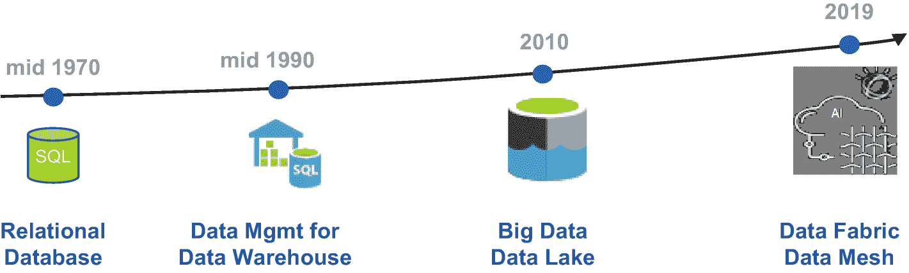

数据架构演变的时间线。1. 1970 年代中期的关系数据库。2. 1990 年代中期的数据仓库数据管理。3. 2010 年的大数据数据湖。4. 2019 年的数据编织数据网格。

图 1-1

导致数据编织和数据网格的数据架构演变

许多数据架构能力，如数据集成、数据复制、提取-转换-加载（ETL）管道、数据治理等，已经存在很长时间了。在过去，一组特定的这些能力被指定用于所有用例，即使它们并不满足用例的要求。数据编织（Data Fabric）架构承诺根据智能元数据引导使用正确的功能来满足正确的用例。

## 数据架构：价值和挑战

RDBMS 引入了几个功能，这些功能成为了后来数据架构的基础。第一个功能是将逻辑数据模型——关系模型——与数据的物理存储分离。这种分离产生了引入一个元数据目录的需求，该目录描述了数据在表中的逻辑布局及其映射到物理存储，并维护诸如数据大小、数据分布和其他特征等统计数据。

RDBMS 提供功能，通过重新组织数据到定义的顺序来维护数据的物理存储，当数据变化过多导致物理布局和因此数据访问次优时。它还通过利用系统可用能力提供备份和恢复功能来确保数据的可用性。

第二个功能是一个标准化的结构化查询语言（SQL），用于访问数据。如今，SQL 的支持存在于所有编程语言的各个版本中，如汇编语言、COBOL、Java 和 Python。SQL 不断扩展，包括 XML 和 JSON 等数据类型以及新的功能，最近还包括了机器学习（ML）和深度学习（DL）模型的处理。关系数据库管理系统（RDBMS）的两个关键功能成为了企业数据仓库（EDW）架构建立的基础，我们将在下一节中探讨这一点。

## 企业数据仓库（EDW）

有趣的是，RDBMS 最初被用于使用 SQL 和 SQL 生成工具存储数据以供报告使用，作为快速获取结果的一种方式。在 20 世纪 70 年代，与存储在数据集或层次数据库中的数据相比，RDBMS 中的数据访问性能不足以满足事务性应用的需求。随着可用计算能力的提高，大多数事务性系统的数据都迁移到了关系数据库中，这显著提高了应用程序程序员的效率。

以下两个主要业务需求导致了企业数据仓库（EDW）架构的发展：

+   **事务性和报告应用数据库的分离**：如核心银行或航班订票等事务性系统是业务关键性的，与报告应用相比，它们具有不同的可用性和响应时间特性。业务要求将用于事务性和报告应用的数据库分离，以避免影响事务性应用的性能或可用性。

+   **从多个来源整合数据并重构以提高性能和数据可用性**：事务应用中的数据没有存储在最适合报告和分析应用的形式。需要明显地从源（们）复制数据并将其转换成最适合报告和分析的格式。

前述需求导致了一个 EDW^(4)架构，其中数据从事务应用（们）上传到临时区域，然后进行有时复杂的数据清洗和数据转换步骤，在派生数据存储在 EDW 之前。通常，数据在间歇性的临时区域中存储多次。

该 EDW 架构如图 1-2 所示。

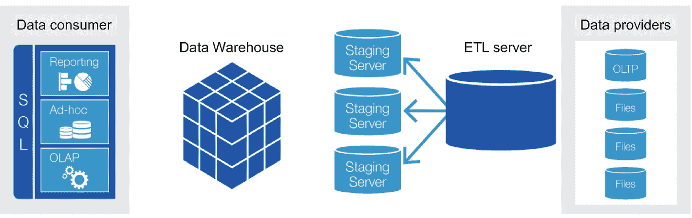

EDW 架构的示意图。数据消费者有用于报告、即席和 OLAP 的 SQL 块。数据仓库是一个立方体结构。ETL 服务器分为 3 个临时服务器。数据提供者包括 OLTP 和 3 个文件。

图 1-2

企业数据仓库架构

EDW 架构通过以下特点解决了业务需求：

+   合并和清洗（使一致）来自多个事务源的数据。

+   事务应用和报告应用使用的数据分离。

+   即使源数据没有，也要维护数据历史。

+   将数据转换成适合报告性能的数据模型（使用星型或雪花模式）。转换管道为维度表（例如，时间、销售区域、产品等）提供数据，中间的事实表（们）保持维度之间的关系记录，例如，在某个时间段内某个区域的产品销售。

+   使数据对商业用户可用。

EDW 架构非常成功，几乎每个组织都实施了它。即使不是所有组织，许多组织今天仍在使用 EDW 来满足许多报告需求。

然而，随着业务希望对更多、包括半结构化和非结构化数据有洞察力以做出更好的、数据驱动的业务决策，EDW 架构也带来了新的挑战：

+   ETL 过程也在 EDW 中创造了新的数据质量问题。事务应用持续向它们的数据库（模式变更）添加数据元素。这些新或更改的数据元素需要在 ETL 管道中得到反映。EDW 实施没有充分反映事务应用的数据并不罕见，因为 ETL 过程没有正确更新，或者这些更改完全被遗漏了。

+   EDW 中的数据延迟通常超过 1 天，这对于许多分析应用来说不再是可以接受的。一些报告应用操作的数据可能比一周还要旧。

+   如果数据尚未存在于 EDW 中，或者需要花费数月时间来实施 ETL 流程以添加新的数据元素，那么基于存储在 EDW 中的数据进行分析的新业务请求通常会遭到拒绝。

+   尽管许多事务型应用程序今天根据法律要求必须保留历史数据，或者可以使用 SQL 构造（如双时间戳功能）以较小的开销实现历史数据，但 ETL 流程仍然花费大部分时间来计算历史数据，这增加了数据延迟和数据质量挑战。

+   最后，EDW 非常适合结构化数据。集成半结构化和非结构化数据是一个挑战。

在 Apache Hadoop 开源项目使用多台计算机和大量低成本存储提供的全新技术背景下，这些需求导致了数据湖架构的出现。

## 大数据、数据湖和数据湖屋

商业用户需要访问他们组织的数据库来探索内容、选择和标注，并使用他们的术语访问信息，同时基于数据保护和治理的支撑，例如，一个寻找新活动数据的市场营销人员，这需要临时访问广泛的多种数据源并支持决策制定。

存储和处理大数据需要新的数据架构。大量生成结构化、半结构化（例如，XML、JSON）和非结构化（例如，文本、音频、图片）数据的新数据源无法在 EDW 中处理。

Apache Hadoop 开源项目^(5)的诞生源于处理这些大量数据的需求。它提供了成为许多数据湖实现基础的关键技术：

+   **Hadoop 分布式文件系统** (HDFS)，一个分布式文件系统，为存储在文件系统中的数据提供了非常可扩展和性能良好的访问。

+   **MapReduce**，一种用于大规模数据处理的并行、批处理编程模型。Apache Spark 和 Apache Hive 利用内存技术，根据机器学习算法的需求，提供更快的数据处理速度。

+   **YARN**，一个负责管理集群中的计算资源和 Hadoop 通用库和工具的资源管理平台。

随着公共云解决方案的更广泛接受，今天的数据湖除了在本地 Hadoop 实现之外，还可以使用云存储服务来实现。

数据湖架构通常有一个单一的数据存储库，通常以原始格式存储。它不需要在 EDW 中严格维护的模式定义。相反，用户将自定义模式构建到他们的查询中，这使得数据源集成变得更加灵活。

图 1-3 展示了数据湖架构。左侧是所有可能的数据源，它们使用不同的技术（如流、数据复制和数据集成）被复制到数据湖中。它具有多个数据区，用于不同类型的数据处理。着陆区存储所有传入数据的原始格式。分析区和存档存储用于报告、高级分析和机器学习（ML）的转换数据。数据值可能在数据湖的多个数据区中复制。右侧是数据消费应用，如决策管理系统和预测分析工具。引入了信息治理的概念来管理对数据的访问权限，这些数据在原始数据源中将被严格保护。

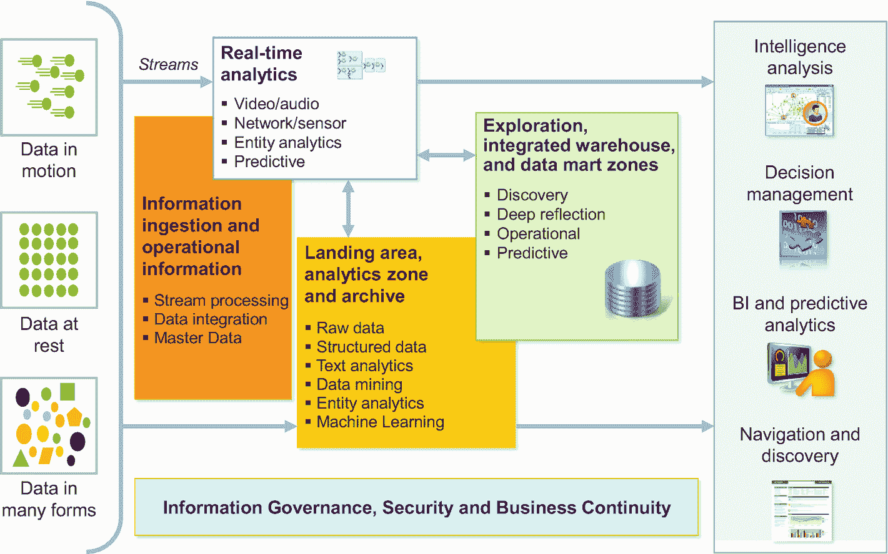

数据湖架构。数据在运动、静止以及多种形式中流入实时分析，这些分析在着陆区、分析区、存档、探索、集成仓库和数据集市区域进行处理。数据消费应用包括智能分析、决策管理、商业智能（BI）和预测分析，以及导航和发现，涉及信息治理、安全和业务连续性。

图 1-3

大数据平台 – 数据湖架构

许多实施了数据湖项目的组织意识到，“将所有内容存储在一个地方”的模式不仅创造了机会，也带来了新的挑战。*最大的挑战不是创建数据湖，而是利用它所提供的机会*。6

如果不仔细管理，复制大量数据可能导致以下挑战：

+   由于数据湖中的更新延迟，使用过时数据进行分析引入了风险。

+   在越来越多的数据源中理解并解决真实版本（version of truth）的复杂性。

+   随着数据和源数量的增加，存储和集成成本及复杂性增加。

+   将业务暴露于众多监管风险之中。由于原始数据源元数据不断变化，数据治理变得极其困难且成本高昂，从而导致数据湖中的适应变化。

因此，许多组织开始质疑与原始承诺相比，数据湖带来的衍生商业价值。数据湖变成了数据沼泽。EDW 和数据湖的挑战产生了对新的数据管理概念的需求，即数据湖屋，它是一种开放的数据管理架构，结合了数据湖的灵活性、成本效益和可扩展性，以及 EDW 的数据管理和 ACID（原子性、一致性、隔离性、持久性）事务，使得在多种数据结构上实现传统的商业智能（BI）和机器学习（ML）成为可能。因此，数据湖屋结合了数据湖和 EDW 的特点和能力。这通常基于开源组件，如 delta lake，它是一个优化的存储层，为在数据湖屋平台上存储数据和表提供基础。delta lake 是一种开源软件，它通过基于文件的交易日志扩展 Parquet 数据文件，以支持 ACID 事务和可扩展的元数据管理。7

实施数据湖屋作为新的数据和人工智能平台需要新的数据架构，即数据编织。在第十章中，我们进一步阐述了数据编织架构和数据网格解决方案的演变。今天的企业需要一个敏捷的数据架构——数据编织架构——它能够隐藏数据源景观不断增长的复杂性，并使业务用户能够轻松消费数据。以智能和敏捷的数据编织架构为基础，数据网格解决方案方法，其承诺建立以数据产品消费模式的数据市场，是可行的途径。

在下一章中，我们将讨论数据编织架构和数据网格解决方案之间的关系和共存。

## 关键要点

我们以表 1-1 中总结的几个关键要点来结束本章。

表 1-1

关键要点

| # | 关键要点 | 高级描述 |
| --- | --- | --- |
| 1 | 数据架构是演化的。 | 数据架构通常是基于业务需求，利用最先进的技术开发的。 |
| 2 | 关系数据库和通过 SQL 进行的数据访问。 | 关系数据库引入了数据存储和逻辑数据组织的分离，以及通过 SQL 进行标准化的数据访问。 |
| 3 | 企业数据仓库（EDW）集成了来自不同来源的数据。 | 企业数据仓库是一个集中存储的、经过整合和转换的、结构化数据仓库，来自不同的来源，用于报告和数据分析。 |
| 4 | EDWs 是通过复杂的 ETL 或 ELT 过程填充的。 | EDWs 是通过基于 ETL 或 ELT 的复杂过程填充的，这些过程创建了数据延迟、数据质量和灵活性挑战。 |
| 5 | 数据湖存储原始的结构化和非结构化数据。 | 数据湖是一个存储库系统，在中央位置以原始格式存储结构化和非结构化数据。 |
| 6 | 数据湖可能变成数据沼泽。 | 管理不善的数据湖被称为数据沼泽，对企业的价值很小。 |
| 7 | EDW 和数据湖的挑战导致数据编织。 | 实施 EDW 和/或数据湖的挑战产生了对新的数据架构——数据编织的需求。 |
| 8 | 数据编织是一个集成的数据源和连接过程层（编织）。 | 数据编织是基于活动元数据的集成数据源和连接过程层。 |

## 参考文献

1.  IBM，Sarkar, S.，*《企业数据架构的演变历史》*，2021 年，[《www.ibm.com/blogs/services/2021/08/03/an-evolutionary-history-of-enterprise-data-architectures/》](http://www.ibm.com/blogs/services/2021/08/03/an-evolutionary-history-of-enterprise-data-architectures/)（访问日期：2022 年 8 月 19 日）.

1.  Codd, E. F.，*《大型共享数据银行的关系数据模型，1970 年》*，[《https://dl.acm.org/doi/10.1145/362384.362685》](https://dl.acm.org/doi/10.1145/362384.362685)（访问日期：2022 年 8 月 19 日）.

1.  IBM，*什么是数据湖？*，[《www.ibm.com/topics/data-lake》](http://www.ibm.com/topics/data-lake)（访问日期：2022 年 8 月 19 日）.

1.  Kimball, R.，Ross, M.，*《数据仓库工具包：维度建模的权威指南》*，第 3 版，Wiley，2013 年，ISBN-13：978-1118530801.

1.  Apache Hadoop，*Apache Hadoop*，[《https://hadoop.apache.org/》](https://hadoop.apache.org/)（访问日期：2022 年 8 月 19 日）.

1.  PricewaterhouseCoopers，Stein, B.，Morrison, A.，*《企业数据湖：更好的集成和更深入的分析》*，2014 年，[《www.pwc.com/us/en/technology-forecast/2014/cloud-computing/assets/pdf/pwc-technology-forecast-data-lakes.pdf》](http://www.pwc.com/us/en/technology-forecast/2014/cloud-computing/assets/pdf/pwc-technology-forecast-data-lakes.pdf)（访问日期：2022 年 8 月 19 日）.

1.  L’Esteve, R., *《Azure 数据湖工具包》*，Apress，2022 年，ISBN-13：978-1-4842-8232-8.

# 2. 术语：数据编织和数据网格

本章解释了本书中将使用的核心术语，即*数据编织*和*数据网格*，以及这两个术语之间的关系。我们介绍了术语*数据即产品*或*数据购物*，并提供了对 AI 增强数据编织能力的概述。本章以对数据网格作为一个关键概念的数据产品的描述结束。

## 引言

术语*数据编织*和*数据网格*通常被视为不同的、相互冲突的，或者最多是重叠的数据架构或框架、数据管理概念，或用于发现、探索、治理和消费数据的方法。然而，这些概念相互关联，每个概念都强调特定的必要性或目标。

数据编织（Data Fabric）更侧重于架构基础、技术能力和智能分析，以生成支持更智能、AI 注入的系统（AI-infused system）的主动元数据，从而协调各种数据集成风格，使混合云环境中可信且可重用的数据能够被人类、应用程序或其他下游系统消费。数据编目以生成和利用主动元数据被视为任何数据编织的关键组成部分。

数据网格（Data Mesh）将数据主要视为围绕领域所有者组织，他们创建面向业务的*数据产品*，这些产品可以以*自助*和*数据购物*的方式在分布式消费者、组织以及业务线（LoBs）中进行聚合和消费。将来自不同数据源的数据转换为*数据即产品*是任何数据网格的基本范式。以下章节将进一步描述关键短语*自助*、*数据市场*、*数据即产品*和*数据购物*。

在本章中，我们传达了数据编织的视角，作为构建数据网格解决方案的架构基础，其中具有相应技术能力的数据编织还可以作为其他解决方案的架构基础，例如传统的数据仓库（DWH）解决方案。通过使用术语*数据编织*和*数据网格*，我们进一步指的是结构化和非结构化数据、ETL 阶段以及其他与 AI 相关的工件，例如 ML/DL 模型、管道等。

## 数据编织概念

术语*数据编织*（Data Fabric）由 NetApp 在 2016 年的一份白皮书中提出，作为一个“数据管理愿景……能够无缝连接不同云环境，无论是私有、公共还是混合环境”。NetApp 对数据编织的描述侧重于混合云格局，强调数据安全、治理、集成、应用和服务层等关键方面。然而，它忽略了数据编织的基本功能，例如，主动的元数据驱动方法、AI/ML 注入的任务以及自助交付。

Gartner 将数据编织定义为“一种设计概念，它作为数据及其连接过程的集成层（编织）。数据编织利用对现有、可发现和推断的元数据资产进行的持续分析，以支持在所有环境中设计、部署和利用集成和可重用数据，包括混合和多云平台。”在其数据编织架构中，Gartner 强调关键特性，如嵌入式 AI/ML、语义知识图谱、自动化重复性任务、主动元数据（技术、业务、运营和社会）、动态数据集成、数据编目和自动化数据编排。凭借这些特性，Gartner 的数据编织架构描述相当详尽且处于行业前沿。

Forrester^(6) 将数据编织定义为提供“统一、集成和智能端到端数据平台，以支持新的和新兴用例。它自动化所有数据管理功能 `–` 包括摄取、转换、编排、治理、安全、准备、质量和管理 `–` 使见解和分析能够快速加速用例。”在其文档中，Forrester 强调了所有数据管理功能、治理和合规要求、数据目录、集成、AI/ML、知识图谱以及与主数据管理（MDM）的集成中内置的自动化和智能，这是一套相当全面和完整的数据编织能力。

### 数据编织框架

正如你在第一章中看到的，数据编织是数据架构演化的结果。然而，许多其功能在“数据编织”这个术语被提出之前就已经存在了。例如，数据集成和数据治理几十年来一直是 IT 行业的议程。那么，哪些新的要求和能力脱颖而出呢？

这首先是基于 AI/ML 的所有数据编织领域的增强和自动化，包括基于 AI/ML 的智能集成^(7)，生成要捕获在知识目录中的活动元数据和知识图谱。此外，确保可信的 AI 和将传统数据治理范围扩展到统一 AI 治理是一个相对较新的领域，它远远超出了仅仅关注数据的范畴，包括将 AI 模型和相应的 AI 工件纳入治理领域。最后，数据规则和政策自动生成、发现和执行越来越多地依赖于 AI/ML。

这些新的要求和特性在图 2-1 中得到了展示，该图是对先进数据编织框架的高级概述。

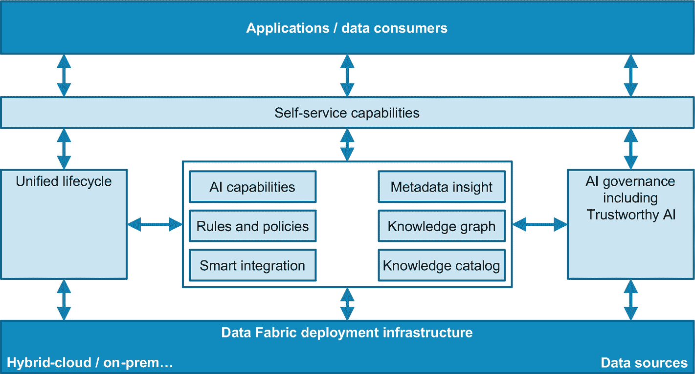

模型图表示应用程序或数据消费者元素、自助功能以及包含混合云和数据源的数据编织部署基础设施之间的交互。

图 2-1

数据编织框架

以下是对基本数据编织任务和能力的简要描述，这些任务和能力^(8) 可以轻松映射到图 2-1 中所示的数据编织框架：

+   **目录所有数据**：包括业务术语表和设计时及运行时元数据（业务、技术、操作元数据）

+   **启用自助功能**：解决数据发现、概要分析、探索、质量评估、数据作为产品的消费等。

+   **提供知识图谱**：可视化数据、人员、流程、系统等之间的相互关联，从而获得额外的可操作见解

+   **提供智能（智能）信息集成**：支持 IT 人员和业务用户在数据集成和转换、数据虚拟化和联盟任务中的工作。

+   **从元数据中提取洞察**：协调和自动化数据集成、数据工程和数据治理的端到端任务和作业。

+   **确保可信的 AI**：确保 AI 方法和结果的可解释性、透明度和可信度，并在出现偏差、漂移、降低准确性和精度等情况时采取适当的行动。

+   **执行本地和全球数据规则/政策**：包括基于 AI/ML 的规则和政策自动生成、调整和执行。

+   **管理端到端统一的生命周期**：在各个平台、角色和组织中实施所有数据编织任务的一致性和连贯的生命周期。

+   **执行数据和 AI 治理**：扩大传统数据治理的范围，包括 AI 工件，例如 AI 模型、管道等，并考虑新的或新兴的数据治理法规^(9)和隐私法律。

由于我们将基于 AI/ML 的所有数据编织领域的增强和自动化视为一个新的关键任务，因此这是我们接下来要详细阐述的主题。

### AI-Infused Data Fabric

AI 及其兄弟技术 ML 和 DL 是理解数据编织概念或架构与过去我们处理的传统数据架构之间区别的关键。

通过将 AI 注入数据编织架构，可以更深入地了解数据、简化数据访问、实现数据购物、增强传统数据治理、生成活动元数据和加速产品和服务的发展。AI 注入的数据编织不仅利用 AI，而且同样是一个管理和处理 AI 工件（包括 AI 模型、管道等）的架构。

图 2-2 展示了由 AI 注入的数据编织所必需的基本组件。

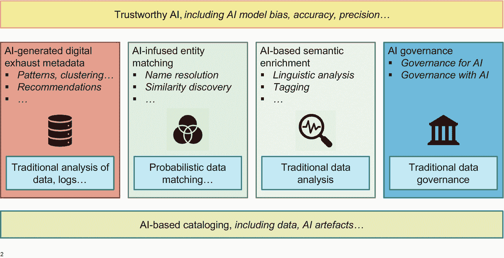

一幅插图显示了 4 个标记为传统数据日志分析、概率数据匹配、传统数据分析和传统数据治理的块。顶部文本为可信 AI，包括 AI 模型偏差、准确性和精度。

图 2-2

AI-Infused Data Fabric Concept

以下是对这些组件的概述^(10)：

1.  **人工智能治理**：我们之前对人工智能融合数据编织所做的声明同样适用于人工智能治理^(11)：传统的数据治理显然可以通过利用人工智能方法（人工智能治理）得到改进，例如，通过应用机器学习方法来分析数据治理法规和隐私法，或实施与治理相关的数据规则和政策。然而，它还需要扩大其范围，包括对人工智能作品（人工智能治理）的治理，例如，通过管理和治理人工智能模型和其他人工智能作品。

1.  **基于人工智能的编目**：基于人工智能的知识编目是人工智能融合数据编织的另一个基本连接组件，通过存储自动生成的元数据，利用人工智能方法生成增强知识，生成和存储知识图谱，存储基于数据编织的数字排放元数据，并启用语义丰富。

1.  **可信人工智能**：部署和运营人工智能以及消费和解释人工智能结果需要永久性的透明度和可解释性。可信人工智能的目标是在整个生命周期中检测人工智能模型的偏差、漂移和准确性和精度的下降，并测量其他与人工智能相关的 KPI。它还需要提出纠正措施，以使人工智能作品与业务目标重新对齐。

1.  **人工智能生成的数字排放元数据**：所有数据编织任务都会生成额外的数据，例如，日志、数据质量度量、人工智能作品、数据访问路径等。我们称这种数据为数字排放，它可以转化为数字排放元数据，可以进一步分析以获得额外的见解，从而改进相应的数据编织任务。

1.  **基于人工智能的语义丰富**：应用人工智能提供了自动化的丰富功能，以语义知识来上下文化数据，例如，基于知识图谱和其他目录中现有的元数据。语义丰富通过利用这种语义洞察力，为应用程序和商业用户简化并优化数据消费。它还可以进一步简化并优化一些关键的数据编织任务，例如，在特定业务环境中搜索和发现资产。

1.  **人工智能融合实体匹配**：异构和分散的数据景观、系统和应用程序阻止了商业用户匹配核心信息（主数据），例如，人物数据（例如，客户、商业伙伴、员工、公民等）、产品和服务。人工智能融合实体匹配补充了现有的确定性和概率匹配技术，产生了更准确的匹配结果。

让我们现在讨论数据网格概念的关键方面。

## 数据网格概念

与“数据编织概念”部分类似，我们从这个部分开始，简要讨论 Gartner 和 Forrester 的观点。

根据 Gartner 的观点，^(12) 数据网格是一个“针对构建以业务为中心的数据产品的特定目标解决方案架构；它是一个可以在技术无关框架内指导设计的解决方案架构。”在其文章中，Gartner 强调了数据网格的关键要求，如“数据作为产品、分布式数据治理和权限、将数据网格作为解决方案呈现”。此外，Gartner 还具体描述了数据网格和数据编织之间的关系，我们将在下一节中讨论。

根据 Forrester 的观点，^(13) 数据网格“是一种在复杂和大规模环境中共享、访问和管理分析数据的社会技术方法 `–` 在组织内部或跨组织。”在其文章中，Forrester 讨论了数据网格的基本社会技术原则，如“以域为导向、数据作为产品、自助、联邦、计算数据治理。它将数据的软性和业务成果放在首位。”

从本质上讲，数据网格解决方案围绕业务域所有者组织数据，并将相关的数据资产（数据源）转换为分布式业务用户可以从各个业务域或功能消费的数据产品。这些数据产品以自主、去中心化和自助的方式创建、管理和使用。自助功能，我们之前将其称为数据编织能力，使业务组织能够拥有具有数据市场购物特性的数据市场。

图 2-3 是一个数据网格解决方案的概念描述，引用了其关键特征或解决方案设计的关键要求。异构和分散的数据源景观包含构建数据网格解决方案相关的源数据。为了解释图 2-3，我们需要指出实施数据网格的一个特定方面：如图 2-3 所示，它还可以包括核心信息，表示由 MDM 系统管理的数据源 _2（主数据）。这些主数据可能与多个数据产品相关，因此必须由不同的产品所有者发现、访问和消费。因此，一个业务用户（例如，来自 business_domain_B），通常从其 business_domain_B 访问数据产品，也可能需要访问由 data_domain_owner_A 拥有的这些主数据。这种需求在图 2-3 中通过中间数据消费者访问作为数据产品的主数据（由 data_domain_owner_A 拥有）的箭头来表示。

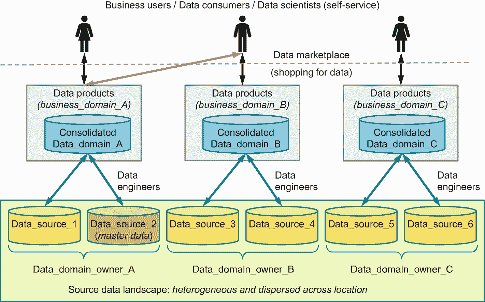

数据网格解决方案结构的示意图。它表示数据市场中的数据产品以及数据工程师在整合数据域和数据源之间的作用。

图 2-3

数据网格解决方案设计的关键要求

让我们详细说明构建数据网格解决方案的关键设计必要性，如图 2-3 所示。再次强调，当我们提到数据时，我们指的是传统意义上的数据，但也包括 AI 工件：

+   **数据源**：用于最终构建数据产品的相关数据可以存储在事务系统中、数据仓库系统中，或者数据湖或数据湖屋中，也可以由应用程序和其他系统管理。它作为创建数据产品的基础。

+   **数据领域所有者**：源数据由特定的数据领域所有者保管，他们执行数据治理任务，并对底层源数据的可用性负责。数据领域所有权与相应的数据资产（数据源）相关联，并分配了明确的责任。

+   **数据领域**：由于数据网格解决方案本质上是在业务领域内分布式的，因此底层合并的数据领域严格属于特定业务领域（业务线）的范畴。

+   **数据产品**：在特定的业务领域内，创建相应的数据产品。这同样是一项分布式的工作，具体的数据产品由与该业务领域相关的数据消费者拥有、管理和使用。

+   **数据市场**（数据购物）：数据产品需要在数据市场环境中提供给相应的业务用户。这包括搜索、发现和消费*数据作为产品*。

数据网格解决方案的价值在于，它将数据产品的创建任务分配给上游的数据工程师和领域专家，他们最熟悉业务领域和相应的需求。

如前所述，来自其他业务领域的业务用户可能对访问另一个业务领域的数据产品感兴趣。这种跨`–`业务领域的数据产品消费也需要通过数据网格解决方案来实现。

在前面的章节中，数据编织架构和数据网格解决方案之间的关系似乎已经被内在地感知，尽管我们还没有清楚地描述这一点。我们将在下一节中详细阐述这一关系。

## 关系：数据编织与数据网格

在讨论数据网格解决方案时，我们强调了关键解决方案的必要性，例如面向业务的数据产品、分布式数据领域所有权、自助服务能力等。这是在不明确说明实现数据网格解决方案所需的技术能力的情况下完成的。我们的数据网格解决方案设计必要性及关键特征可以被视为实施解决方案的一套指南。然而，是数据编织架构使得数据网格成为可能。换句话说，数据编织架构是实现数据网格解决方案的架构基础。

如您在本章前面所见，数据编织（Data Fabric）由一系列技术能力组成，例如数据概览、自动化元数据丰富、业务术语表、人工智能治理等，以提供数据即产品（data-as-a-product）。使用 Forrester 的术语，*数据网格的社会技术方法*和概念是通过这些数据编织技术能力实现的。根据 Gartner 的观点^(14)，数据编织“可以在不遵循数据网格实践的情况下构建。数据网格必须利用数据编织固有的发现和分析原则。”

在与 IBM 客户合作的过程中，我们经常面临这样的观点，即数据编织和数据网格方法是可以替代的，其中必须做出有意识的“非此即彼”的决定。我们更倾向于同意 Gartner 的观点，即数据编织是构建数据网格解决方案的基础架构。此外，数据编织不仅限于作为数据网格的架构基础；它还可以有目的地调整和设计，以服务于其他解决方案，例如最先进的 DWH 系统。

这两个术语之间的关系如图 2-4 所示。基于数据网格解决方案设计的关键要求，确定了一系列数据编织技术能力。这些数据网格解决方案设计的关键要求是从数据网格业务需求中推导出来的，是数据网格解决方案的规范。

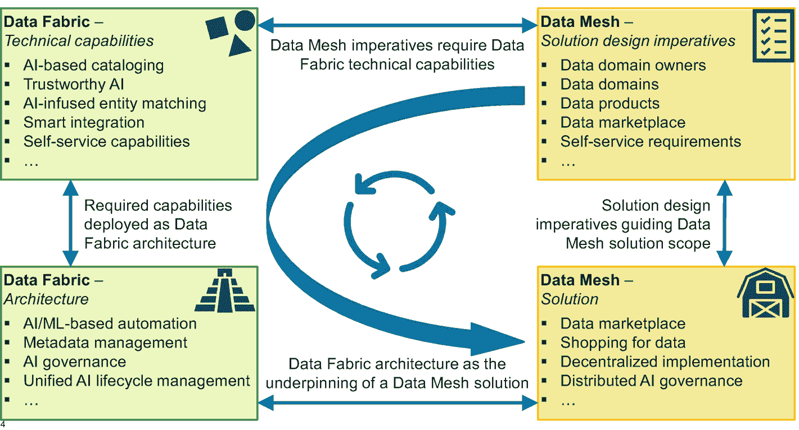

一幅插图展示了数据编织和数据网格之间的交互。它指出了数据编织的技术能力和架构点。它指出了解决方案设计关键要求和数据网格中的解决方案点。

图 2-4

数据编织与数据网格关系

由于存在几个不同的数据编织用例场景^(15)或入口点，并非所有可用的技术能力都是必需的——至少最初不是。一旦确定了一组技术能力，就可以推导出一个合适的初始数据编织架构——也就是说，确定的数据编织能力在相应的数据编织架构中部署，最终作为所需初始数据网格解决方案的架构基础。

随着时间的推移，将确定额外的数据网格业务需求，相应的数据编织技术能力可以得出，这导致数据编织架构的调整和扩展，进而增强数据网格解决方案。因此，随着时间的推移，存在一种迭代调整，以适应可能随着时间的推移而出现的额外数据网格业务需求。

*数据即产品*和*数据产品*是在描述数据网格解决方案时经常一致使用的最基本术语之一。正是这些术语，我们需要进一步阐明，更详细地描述它们。

## 数据产品

数据何时成为数据产品？为了将原始数据转换成可消费的数据产品，需要发生什么？将原始数据转换和构建数据产品始于对原始数据明确的所有权定义，并以数据消费者（例如，商业用户）轻松消费相应的数据产品结束。

构建数据产品是由数据领域所有者**启用**的；然而，构建数据产品本身主要是由数据产品所有者驱动的，这可以是一个营销或客户关怀组织、售后服务团队，甚至是一个个人商业用户。数据产品所有者在整个数据产品构建过程中与数据工程师、数据科学家和其他领域专家合作。

图 2-5 是构建数据产品所需要素的高级描述。16

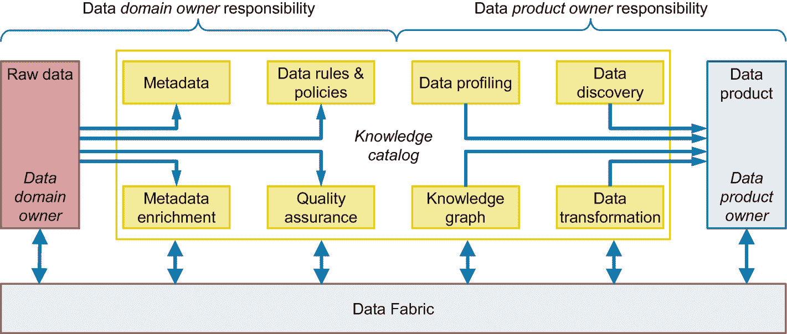

一幅插图展示了数据领域所有者和数据产品所有者的职责。它指示知识目录的中心元素，而原始数据和数据产品分别位于左侧和右侧。

图 2-5

构建数据产品

除了数据编织和知识目录之外，图 2-5 展示了两个主要职责区域，分别与数据领域所有者（左侧）和数据产品所有者（右侧）相关。

以下为数据领域所有者和数据产品所有者的职责：

+   **数据领域所有者职责**：数据必须在知识目录中可用并注册，相应的元数据应得到丰富，我们将在第五章节中详细说明。必须通过服务级别协议（SLAs）保证数据的可用性、质量、一致性、完整性和时效性。数据治理——包括数据质量——可以通过强制数据规则和政策来保证。最重要的是，数据领域所有权并不会因为数据消费者访问甚至将数据复制到其他数据存储中而消失；它无论数据位于何处，谁在消费数据产品，出于何种目的，都会持续存在。

+   **数据产品所有者职责**：构建数据产品需要数据易于发现；执行数据概要分析；获得额外的洞察，例如通过语义知识图谱；以及执行必要的数据转换作业。这些任务通过知识目录得到简化，并需要以自助服务的方式进行。数据产品是一个可消费的结果，意味着这些流程的结果，其中原始数据被转换成有意义的业务背景。数据产品所有权伴随着与数据产品的可用性、业务相关性、易于消费、完整性和准确性相关的保证 SLA。从某种意义上说，我们可以将“数据购物”这一术语视为构建数据产品的描述。

基础数据编织架构使得数据操作（DataOps）、模型操作（ModelOps）和人工智能操作（AIOps）能够在整个生命周期内协调数据产品的所需业务和技术调整。

数据产品^(17)基于原始数据，这些数据被转换成有意义的业务上下文，并且易于业务用户消费。它通过知识目录实现，可以由持久的原始数据域和数据产品所有权来表征，这伴随着之前描述的服务水平协议（SLAs）。生产数据产品需要数据编织（Data Fabric）能力和基于 GUI 的应用程序或工具，这些工具具有自助服务功能，简化了生产数据产品和将它们注册到知识目录以供业务消费的步骤。

以下是一个数据产品的关键特征。我们可以将这些特征视为存储在知识目录本身中的数据产品规范；数据产品本身存储在数据市场，并可供消费：

1.  **数据产品负责人**：存在一个明确定义的数据产品负责人，他们指定其业务目标、功能、特征和路线图，以及随时间可能实施的增强功能。

1.  **数据产品描述**：数据产品需要得到良好的描述，类似于任何其他产品，即软件程序或软件产品。这可能包括数据产品的目的或业务意图、版本、法律方面和用途限制、底层原始数据的时效性、使用数据产品的成本等。

1.  **语义相关的数据和人工智能资产**：数据产品由一组语义相关的数据和人工智能资产组成，这可能是一组关系表，也可能是一组管道、ETL 阶段的链、Jupyter 笔记本等。这种语义关系由业务上下文和用途目的定义。识别语义相关的数据和人工智能资产的过程是通过知识目录的元数据丰富功能实现的。

1.  **访问方法**：数据产品必须包括访问方法，例如 REST API、SQL、NoSQL 等，以及数据资产的位置。例如，这可能是一个 URI 端点，由与数据产品关联的预定义 REST API 访问。

1.  **政策和规则**：这包括描述谁可以出于什么目的消费数据产品。它还涉及访问控制、授权、治理等方面，所有这些都由知识目录中定义的数据产品政策和规则管理。

1.  **SLAs**：这些是数据产品负责人和数据产品消费者之间定义的 SLAs，可能包括有关数据产品可用性、性能特征、功能、数据产品使用成本、所需的人工智能模型可解释性、底层数据和人工智能资产的可信度和质量评分等方面的协议。

1.  **定义格式**：数据产品需要使用定义的格式进行描述，例如通过包含或指向相关资产（例如，数据产品描述、数据资产、Jupyter 笔记本、AI 模型）、SLA、访问方法等的 JSON 或 XML 文件（或任何其他数据交换格式）来实现。例如，数据产品可以存储在知识目录中作为 JSON 或 XML 文件。

1.  **目录化**：所有数据产品都需要在知识目录中进行注册，同时需要存储 JSON 或 XML 文档。这些数据产品需要被潜在的数据产品消费者和商业用户进行搜索和发现。

1.  **消费就绪**：数据产品需要准备好供消费，这意味着例如底层的原始数据、AI 资产、数据管道、ETL 转换作业等都是可用和可访问的。

创建数据产品可能还依赖于多个数据领域所有者的原始数据。此外，其他数据产品也可能作为构建另一个数据产品的额外输入。例如，数据科学家可能通过从多个数据领域所有者那里获取原始数据或使用几个可用的数据产品作为输入来开发 AI 模型，其中生成的 AI 模型作为营销组织构建定向营销活动作为数据产品集的输入。因此，我们可以建立数据产品层次结构，其中包含来自其他数据产品、数据和 AI 资产的数据产品依赖关系。

我们需要重新强调，数据产品本身并不存储在知识目录中；它们通过数据产品规范进行注册，这些规范也被视为元数据。因此，数据产品与产品规范的关系类似于其他数据或 AI 资产与其对应元数据的关系。将数据产品规范作为 XML 或 JSON 文件（或任何其他数据交换格式）在知识目录中提供，使得数据产品可搜索、可发现，并且可以被商业用户和其他数据产品开发者使用。

对于数据网格解决方案而言，在组织需求背景下关注数据作为产品，从而遵循分布式和联邦的实施方法，这在某种程度上是有代表性的。然而，这却使得知识目录编排和多个知识目录之间的元数据交换在数据网格的任何实施中都变得至关重要。

例如，这种知识目录编排和元数据交换可以通过 Open Data Platform 倡议（ODPi）Egeria 实现，这是一个基于 Open Metadata and Governance（OMAG）和 Open Metadata Repository Services（OMRS）的开源 Linux Foundation 项目^(19)。ODPi 是一个非营利组织，旨在加速和标准化企业的大数据技术开放生态系统；OMAG 是一个旨在创建一组开放 API、类型和交换协议的项目，以允许所有元数据存储库共享和交换元数据；OMRS 是使元数据存储库能够交换元数据的服务。

这种元数据交换是通过一个 Egeria 开放元数据存储库队列实现的，这是一个使用对等交换共享元数据的服务器集合，如图 2-6 所示。任何符合 Egeria 规范的知识目录都可以加入 Egeria 开放队列，以使用开放元数据和治理格式和接口交换和共享其元数据。

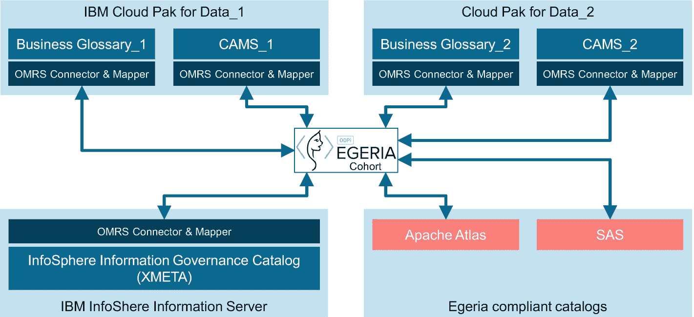

一幅插图展示了 IBM 云公园的数据 1、云公园数据 2、IBM 信息共享信息服务器以及符合 Egeria 规范的目录，箭头指向中心 EGERIA 队列。

图 2-6

知识目录编排和元数据交换

例如，IBM Watson 知识目录（WKC）与其他符合 Egeria 规范的存储库之间的元数据交换可以通过 Egeria 队列实现。IBM Watson 知识目录在 Common Assets Managed Services（CAMS）存储库中管理数据资产（例如，数据集、表、列、视图、连接和文件以及它们与术语表条目之间的关系）。业务术语表条目（例如，业务术语、类别、数据类别、政策和治理规则）在业务术语存储库中管理，如图 2-6 所示。CAMS 有一个内置的 Egeria 引擎，这使得 IBM Watson 知识目录管理的目录和业务术语可以被添加到 OMRS 队列中。

任何添加到知识目录的资产都会触发 Kafka OMRS 消息，这些消息被发送到 Egeria 队列。这要求 Kafka 服务器可以从 IBM Watson 知识目录访问。

正如我们在本章前面所指出的，数据编织是实现数据网格解决方案的架构基础。因此，在随后的章节中，当我们特别指代架构方面时，我们使用术语*数据编织*；当我们特别强调数据产品（数据即产品）和数据市场方面时，我们使用术语*数据网格*。

## 关键要点

我们以本章的几个关键要点作为总结，总结在表 2-1 中。

表 2-1

关键要点

| # | 关键要点 | 高级描述 |
| --- | --- | --- |
| 1 | 实现数据编织的新方面。 | 基于 AI/ML 的所有数据编织领域的增强和自动化，包括基于 AI/ML 的智能集成、生成要捕获在知识目录中的活动元数据和知识图谱，是数据编织的新特点。 |
| 2 | 启用可信 AI。 | 数据编织可以用来启用可信 AI，以测量 AI 模型的正确偏差、漂移和准确性和精确度。 |
| 3 | 利用数字尾迹。 | AI 生成的数字尾迹元数据可以进行分析，以进一步优化和简化数据编织架构。 |
| 4 | 使用 AI 增强实体匹配。 | 混合 AI 的实体匹配扩展了传统的实体匹配解决方案，超越了概率和确定性匹配。 |
| 5 | 数据网格是一个解决方案。 | 数据网格应被视为一个解决方案，它由数据编织架构支撑。 |
| 6 | 启用语义丰富。 | 基于 AI 的语义丰富应该是数据编织方法的一个基本组成部分。 |
| 7 | 数据网格关于交付数据产品。 | 数据网格解决方案的目标是建立一个数据市场，在这里可以搜索、发现和消费数据产品。 |
| 8 | 数据编织与数据网格的关系。 | 数据编织是一个基础架构，用于构建数据网格解决方案，其中数据网格通过一系列解决方案设计原则来指定。 |
| 9 | 数据编织使能 DataOps、MLOps 和 AIOps。 | 实现和使能 DataOps、MLOps 和 AIOps 以调整数据产品需要一些描述的数据编织能力。 |
| 10 | 数据产品是将原始数据转换为业务背景的结果。 | 数据产品基于语义相关的原始数据，这些数据被转换成有意义的业务背景，并且易于被商业用户发现和消费。 |
| 11 | 数据产品在知识目录中注册。 | 数据产品规范（XML、JSON 等）是数据产品在知识目录中注册的手段；数据产品本身并不存储在知识目录中。 |
| 12 | Egeria 队列启用元数据交换。 | 知识目录编排和元数据交换可以通过例如 Open Data Platform 倡议（ODPi）Egeria 实现，这是一个开源的 Linux 基金会项目。 |

## 参考文献

1.  LaPlante, A., *数据编织：现代数据架构*，O’Reilly，2021，ISBN: 9781098105945.

1.  Dehghani, Z., *数据网格：大规模交付数据驱动的价值*，O’Reilly，2022，ISBN-13: 978-1492092391.

1.  NetApp, CaraDonna, J., Lent, A., *NetApp 数据编织架构基础*，版本 3 | WP-7218，2016，[`cdn2.hubspot.net/hubfs/525875/Data-Fabric/Data_Fabric_Architecture_Fundamentals.pdf`](https://cdn2.hubspot.net/hubfs/525875/Data-Fabric/Data_Fabric_Architecture_Fundamentals.pdf)（访问日期：2022 年 7 月 5 日）。

1.  Gartner, Gupta, A., *《数据编织架构是现代化数据管理和集成的关键》*，2021 年，[《www.gartner.com/smarterwithgartner/data-fabric-architecture-is-key-to-modernizing-data-management-and-integration》](http://www.gartner.com/smarterwithgartner/data-fabric-architecture-is-key-to-modernizing-data-management-and-integration)（访问日期：2022 年 7 月 6 日）。

1.  Forrester, Yuhanna, N., *《Forrester Wave™：企业数据编织，2022 年第二季度》*，2022 年，[《https://reprints2.forrester.com/#/assets/2/73/RES176390/report》](https://reprints2.forrester.com/%2523/assets/2/73/RES176390/report)（访问日期：2022 年 7 月 6 日）。

1.  欧洲委员会，*《关于制定关于人工智能的统一规则的法规提案》*，2021 年，[《https://digital-strategy.ec.europa.eu/en/library/proposal-regulation-laying-down-harmonised-rules-artificial-intelligence》](https://digital-strategy.ec.europa.eu/en/library/proposal-regulation-laying-down-harmonised-rules-artificial-intelligence)（访问日期：2022 年 7 月 8 日）。

1.  Hechler, E., Oberhofer, M., Schaeck, T., *《在企业中部署人工智能》*，Apress，2020 年，ISBN-13：978-1484262054。

1.  Gartner, Beyer, M., Zaidi, E., Thanaraj, R., De Simoni, G., *《快速回答：数据编织和数据网格是相同还是不同？》*，2021 年，[《www.gartner.com/doc/reprints?id=1-292DG4LD&ct=220209&st=sb》](http://www.gartner.com/doc/reprints%253Fid%253D1-292DG4LD%2526ct%253D220209%2526st%253Dsb)（访问日期：2022 年 7 月 10 日）。

1.  Forrester, Goetz, M., *《揭露数据网格的盲点》*，2022 年，[《www.forrester.com/blogs/exposing-the-data-mesh-blind-side/》](http://www.forrester.com/blogs/exposing-the-data-mesh-blind-side/)（访问日期：2022 年 7 月 10 日）。

1.  Starburst, Abadi, D., *《数据编织能否自动化数据产品的创建？》*，2022 年，[《www.starburst.io/blog/can-the-data-fabric-automate-the-creation-of-data-products/》](http://www.starburst.io/blog/can-the-data-fabric-automate-the-creation-of-data-products/)（访问日期：2022 年 9 月 15 日）。

1.  Linux 基金会项目，*Egeria*，[《https://egeria-project.org/》](https://egeria-project.org/)（访问日期：2022 年 10 月 23 日）。

# 3. 数据编织和数据网格用例场景

本章介绍了实施数据编织和数据网格的几个用例，这些用例也代表了与业务相关的切入点。几乎每个组织都在进行数据治理和隐私倡议，这使得具有业务需求的人能够跨平台访问企业数据和人工智能工件。其他用例是由混合云数据集成驱动的；对客户、供应商和其他各方进行综合视图的需求，以实现更好的业务成果；以及将可信人工智能集成到业务流程中的开发和集成。

## 引言

许多组织意识到实施数据驱动型业务以保持竞争力的重要性。因此，组织的首席数据官（CDO）面临着创建和实施数据战略的挑战，作为数据驱动型业务的基础。

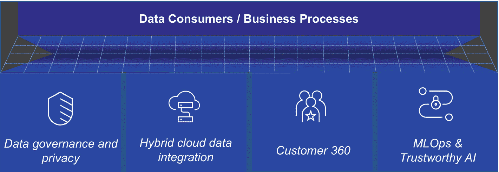

一个插图读取标题数据消费者/业务流程。它指出了底部名为数据治理和隐私、混合云数据集成、客户 360 和 MLOps 及可信 AI 的 4 个要素。

图 3-1

常见数据编织/数据网格用例场景

如第二章所述，数据编织架构和数据网格解决方案的基本组件与典型的数据战略关注领域相一致。因此，围绕这两个概念组件的用例为中心，可以创造一个展示数据编织和数据网格旅程的价值和有意义的切入点的机会。

图 3-1 展示了常见的用例，作为开始实施数据编织/数据网格和随时间进展的旅程有意义的和业务相关的切入点。本书后面的章节提供了对这些四个切入点的更深入处理：

+   **数据治理和隐私**：建立一个自动化和一致的人工智能治理环境，这不仅涉及传统意义上的数据，还包括人工智能成果，例如机器学习模型，这些也需要进行治理。

+   **混合云数据集成**：创建一个跨混合云的数据统一视图，这包括公共和私有云部署，以及传统的本地系统。

+   **客户 360 度视图**：通过将人工智能融入匹配过程，提供客户、供应商和其他各方的全面视图，以确保核心信息的准确性和信心增加。

+   **MLOps 和可信 AI**：实施可信 AI 和 MLOps 以检测和解决已部署和在生产中的 AI 模型的偏差、漂移和恶化质量指标，并且进一步解决 AI 模型的可解释性。

数据战略中的优先级定义了最适用于组织的用例或切入点。在从这些切入点开始您的数据编织和数据网格旅程时，您可以选择一个或甚至几个用例，特别是由于这些场景之间存在某种关系。例如，可信和可解释的 AI 在概念上与 AI 治理相关。

为了确保引入数据编织作为新的数据架构的成功，关键是要很好地界定用例，并定义一个在您的数据和 AI 战略中定义的业务价值的结果。它应该显示数据编织架构与组织现有数据景观（例如，数据湖或传统的 EDW）相比的结果差异。

这听起来可能很显然，但许多数据湖项目被宣布为失败，因为具有良好定义模式的 EDW 结构化数据被移动到数据湖中，并以文件形式存储在 Hadoop 环境中。采用这种方法失去了在关系数据库中优化处理结构化数据的优势以及定义良好的模式信息，即它在星型或雪花模式中的定义。数据消费者必须重新检测之前在 EDW 中易于获取的模式信息。如果相同的分析处理需要更长的时间，并且数据处理能力相同，而数据消费者必须承担数据结构检测的负担，那么很难向业务推销数据湖的好处。

讨论的使用案例通过利用数据编织架构和数据网格解决方案，为业务提供独特的价值交付机会。

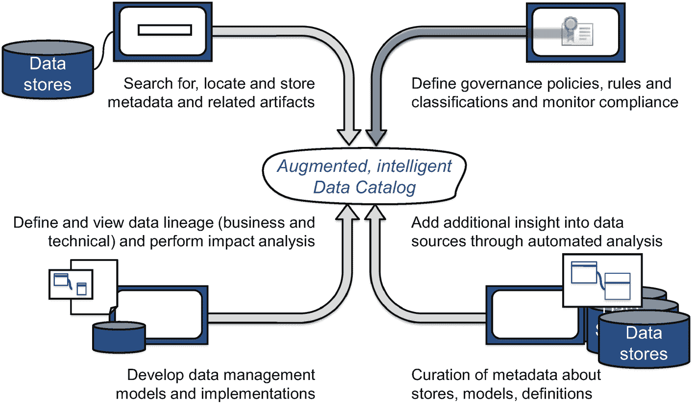

一幅插图展示了增强智能数据目录中的活动。它包括搜索、定位、存储元数据和相关工件、定义治理策略、规则和分类以及合规性监控、定义和查看数据血缘，以及将额外数据添加到数据源中。

图 3-2

构建增强智能数据目录的活动

即使特定用例的目标各不相同，所有用例的实现都将首先导致构建增强智能数据或知识目录的活动，作为实现这些概念的核心基础，如图 3-2 所示。

以下是与知识目录相关的关键活动：

+   **存储元数据**：在知识目录中搜索、定位和存储元数据和相关工件（业务、技术和管理元数据）。即使最终希望将所有组织数据放入数据目录中，也需要逐步构建，并专注于定义的业务领域或与特定组织相关的选定用例中的数据。医疗行业的例子可以是患者信息。知识目录还应存储与 AI 工件相关的元数据，例如 AI 模型、Jupyter 笔记本、管道等。

+   **定义数据血缘**：定义和查看数据血缘（业务和技术）并执行影响分析。由数据架构实现，如数据仓库（EDW）和数据湖，组织中的数据经常被复制以供不同应用消费。使数据管道可见很重要。首先，如通用数据保护条例（GDPR）2 等法规要求组织在请求时从所有副本中删除个人数据。要执行此法规，需要知道哪些数据管道处理了这些数据以及数据管道执行创建了或更新了哪些副本。其次，它还提供了关于数据质量和数据延迟的指示。从位置 A 复制数据到位置 B 并不是技术挑战。保持来自位置 A 和位置 B 的副本在较长时间内一致才是真正的运营挑战。随着副本数量和数据复制量的增加，问题变得无限复杂。第三，它使数据集成优化和替代方法对数据工程师可见。例如，是否需要并且建议在数据管道中复制原始数据，而不是用派生数据补充或扩展原始数据，这可能是一个更智能的方法？

+   **定义数据和人工智能治理**：定义数据和人工智能治理政策、规则和分类对于打破数据孤岛、允许统一的数据消费和防止数据滥用至关重要。它包括持续监控合规性以及执行数据和人工智能规则和政策，以及确保遵守法规和法律。

+   **增加额外见解，丰富数据**：通过自动化分析，对数据源增加额外的见解。通过添加数据分布、数据质量和业务术语等额外信息来增强元数据，对于提供数据作为服务（DaaS）给数据和数据产品消费者至关重要。例如，对客户记录中*电话号码*属性的数据分析可以显示电话号码在各个数据存储中并不一致维护，因此对消费应用或用户的价值有限。

在静态环境中，通过执行前面的活动来建立知识目录对少量数据源来说是直观的。在现实世界中，数据源的数量和现有副本可能很大，元数据也在不断变化。

设计用于支持数据编织（Data Fabric）和数据网格（Data Mesh）实施的产品功能，提供了以下不同的价值：

+   **任务自动化**：智能地自动化发现、分类和编目，以保持元数据最新。例如，为了支持事务应用中的新功能，向客户记录中添加了新的数据属性。这种元数据更改需要传播到数据目录，并通知消费应用关于更改的通知。

+   **限制数据移动**：将原始数据留在其所在位置，并使用数据虚拟化技术实施替代数据集成技术，以显著减少数据重复。这提高了数据的可用性、延迟和质量。许多复制数据的决定是在特定时间基于产品硬件能力做出的，这些能力今天可能已经过时。在较长时间内保持相对少量的元数据更改的当前性和一致性已经是一个挑战。在更长的时间内保持数以 TB 计的数据副本的一致性在现实中是不可能的。

+   **智能部署 AI 模型**：将 AI 模型部署到智能地交付和编排数据以针对特定用例。例如，营销活动服务通过数据虚拟化更好地访问原始数据源，以确定活动的目标群体，而数据准备服务作为 ML 模型开发的输入可以执行数据转换管道，并将准备好的数据作为副本存储在分析区域。智能信息集成，即 AI 信息集成，支持数据工程师简化他们的任务。

## 自动化和一致的治理

在许多组织中，建立自动化和一致的 AI 治理环境是数据战略的重点，也是实施数据编织架构和数据网格解决方案的第一个用例，如图 3-3 所示。

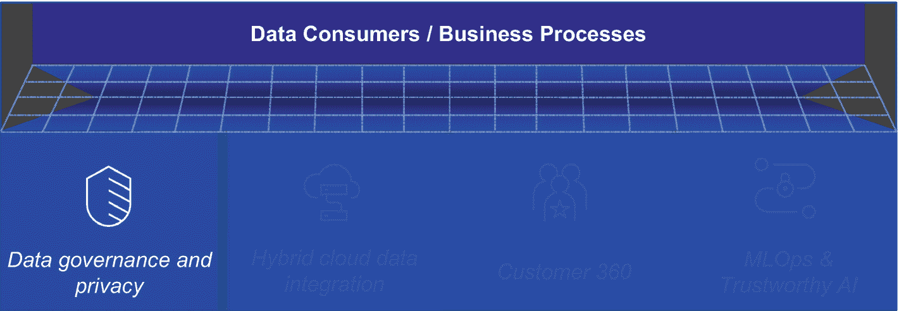

一幅插图显示了标题数据消费者/业务流程。底部写着数据治理和隐私。

图 3-3

数据编织/数据网格用例 – 数据治理和隐私

术语*数据治理*用于定义、管理、执行组织数据的访问、隐私、可用性和安全性的流程和责任。它通常包括一系列政策、规则和数据分类以及用于监控和执行合规性的功能。如前所述，我们使用术语*AI 治理*在更广泛的意义上，也包括 AI 工件。

数据治理不是一个新概念。实施集中式数据和 AI 治理的需要存在，以检测不同数据源之间的数据不一致性。例如，一个数据属性，如账户号码，名称相同但具有不同的含义，不能用于组合相关数据。或者，相同的属性在不同的数据源中以不同的名称存储，但没有额外的元数据，数据消费者是无法看到的。

每个数据平台都提供定义和管理数据访问规则和政策的函数。这种孤岛式实施是跨数据源数据消费的痛点。例如，当用户需要访问存储在不同数据平台上的数据时，通常需要为每个平台触发特定的流程来批准和定义所需的数据访问，并且完成时间很长。

监控遵守不断增长的数据隐私和保护法律，如欧盟（EU）的 GDPR，以及在不同数据源之间简单地回答谁在组织中获得了哪些数据访问权限，本身就是问题。因此，许多组织开始建立以以下活动为重点的数据和 AI 治理结构^(4)：

1.  **数据和 AI 识别**：识别数据和 AI 资产，并为组织或整个企业创建一个包含相关元数据的清单——知识目录。

1.  **数据管理政策**：定义数据治理的规则和政策，包括数据的创建、获取、隐私、完整性、安全、分类和质量。

1.  **数据评估**：开发流程来衡量数据和质量、使用情况以及 AI 工件的影响，并监控和优化相关操作。

1.  **数据通信**：建立一个通过知识目录获取数据的源文化，并保持存储在知识目录中的元数据的时效性。

显而易见，通过实施一个智能增强的数据目录作为数据织物架构的基础，可以建立一个数据网格解决方案，从而建立数据和 AI 治理结构^(5)。

任何项目执行如果没有实施和使用正确的产品功能都会非常困难。所选产品应支持组织中的数据源和平台，并提供 AI 增强功能以摄取和自动丰富元数据，使业务用户能够轻松理解、协作、丰富和访问正确的数据，快速建立一个高度自动化和一致的治理环境，并自动在整个组织中保护数据。

### 将 IBM zSystems 数据纳入 AI 治理

例如，我们想向您介绍 IBM zSystems，^(6) 也称为大型机，它运行着许多大型企业的绝大多数业务关键应用程序。全球财富 500 强公司中有 71% 的公司在其 IBM zSystems 上运行业务并存储数据，无论是在关系数据库 Db2 for z/OS 中，还是在结构化文件系统 VSAM 中，或者在层次数据库 IMS 中。许多数据工程师和数据消费者不熟悉 IBM zSystems，并将理解和访问存储在 IBM zSystems 上的操作数据的能力视为一个主要痛点。

一个在 IBM zSystems 和其他平台上存储数据的组织表达了他们改善数据消费的需求：

+   按需使数据属性对数据消费者可用。

+   支持新旧数据平台的共存。

+   提供法规遵从性以实现互操作性和安全性。

+   对消费者数据质量实施一致的管理。

+   启用接近实时访问数据。

图 3-4 展示了该组织如何通过在 Db2 for z/OS、VSAM 以及其他数据源中存储的数据上实施数据治理服务来应对这些需求。

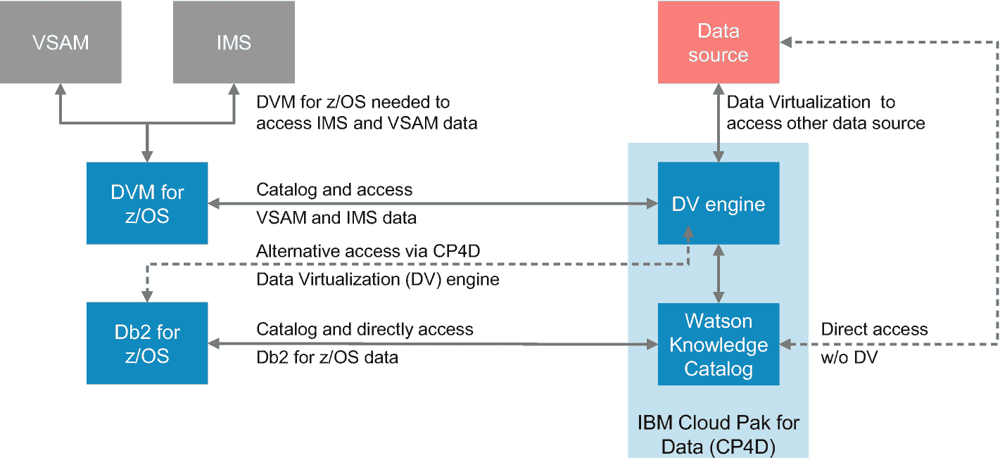

块图表示数据治理场景。它表明了标记为 V S A M、I M S、数据源、D V M for z O S、D V engine、d b 2 for z O S 和 Watson 知识目录的块之间的互连。

图 3-4

架构概述图 – 数据治理场景

在本例中，IBM Watson Knowledge Catalog 在 IBM Cloud Pak for Data 上提供了一个由数据治理框架支持的安全企业管理平台。数据治理框架确保数据访问和数据质量符合定义的业务规则和流程：

1.  **知识目录**：IBM zSystems 数据需要与 IBM Watson Knowledge Catalog 集成。存储在 Db2 for z/OS 中的数据可以直接集成到知识目录中，而存储在 IMS 或 VSAM 中的数据需要首先映射到 IBM 数据虚拟化管理器 for z/OS (DVM for z/OS) 中的虚拟视图中。DVM for z/OS 的元数据也可以集成到知识目录中。

1.  **治理工件**：数据管理员和数据质量分析师可以分配 AI 治理工件，例如数据和 AI 政策和规则，并分析和改进数据及 AI 资产的质量，以及定义数据屏蔽规则以保护敏感数据。

1.  **规则和政策**：当访问 IBM zSystems 数据时，始终一致地应用数据治理规则和政策，例如插入、删除或更新。

这种集成方法展示了如何在没有任何 *大型机* 知识的情况下，通过维护严格的数据质量和法规遵从标准，使存储在 IBM zSystems 上的数据能够轻松地为利益相关者提供更智能的消费。

## 混合云中的统一数据视图

混合云^(7)集成了公有云服务、私有云服务和本地基础设施，并提供了跨所有三个方面的编排、管理和应用程序可移植性。如图 3-5 所示，其采用创造了在混合云中统一数据视图的需求，导致下一个数据编织或数据网格用例的出现。

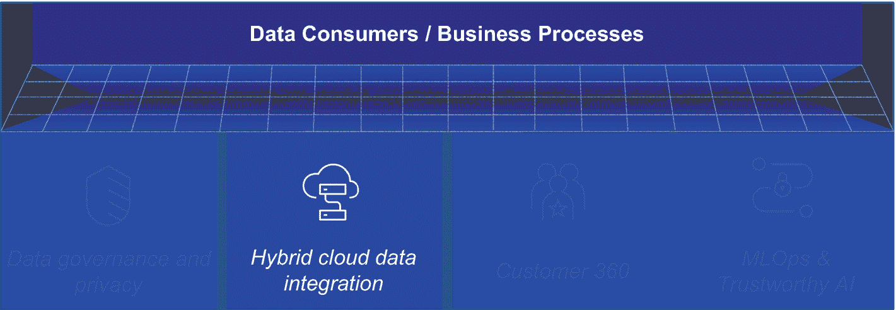

一个插图阅读标题数据消费者/业务流程。底部阅读混合云数据集成。

图 3-5

数据编织/数据网格用例 - 混合云数据集成

传统上，企业管理自己的本地 IT 基础设施和计算中心，并安装和维护硬件和软件（操作系统、中间件和应用软件）。根据组织如何跟上现代 IT 能力的采用和内部变更过程的复杂性，新的业务解决方案通常过于繁琐，可能需要很长时间，且设计和实施成本过高。

无法响应新的业务需求会让业务单元感到沮丧，并为公有云提供商创造了机会。公有云提供商专注于服务资源供应和计量的自动化，并能提供各种服务。云提供商提供基础设施即服务，以便快速供应计算资源（例如，计算能力、存储、内存）以部署所需的软件堆栈，以及开发和新应用程序的测试，使其可供业务单元使用。其他云提供商提供订阅解决方案即服务，例如 salesforce.com 用于客户关系管理。

以其弹性、可扩展性和服务交付便捷性为特点的云式供应导致了虚拟化、软件管理和自动化技术的发展，这些技术是组织在其自己的计算中心采用的，实现了私有云。

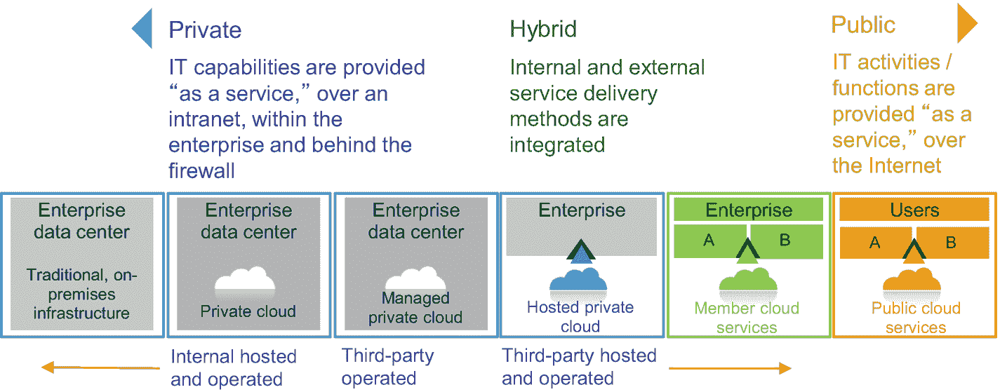

一个插图表示了 6 个方形块。其中 3 个被标记为企业中心，2 个企业，1 个是用户。它表示了顶部私有、混合和公有定义。底部表示的是内部托管和运营的元素、第三方运营的元素以及第三方托管和运营的元素。

图 3-6

云计算部署选项

图 3-6 展示了云计算的不同部署选项。许多组织选择应用现代化策略来支持他们的业务需求。例如，一个组织可以选择淘汰他们自己的定制 CRM 应用程序并订阅云原生服务提供商。他们可以决定将定制的财务应用程序或与获取分析洞察相关的应用程序迁移到公共云服务提供商。

许多 IT 组织还选择了在他们的 IT 数据中心实施部署和计量自动化技术的方案，以创建私有云。另一个常见的选择是应用现代化，采用现代应用架构，如本地基础设施中的微服务架构，这可能是由核心业务应用合规性要求驱动的。

图 3-7 展示了前一个示例的架构概述，其中之前存储在本地（图 3-7 的左侧）的少量数据源现在以所有可能的格式分散在多个公共云和多个本地平台（图 3-7 的右侧）。现在在混合云中创建组织数据的统一视图甚至比仅本地化更加复杂。

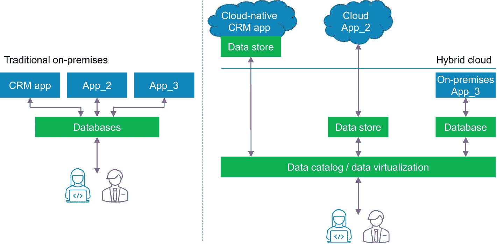

左侧是传统本地数据库的架构结构。数据库由 CRM 应用、应用 2 和应用 3 组成。它表示右侧混合云数据集成的架构，包括数据存储、数据库和数据目录的单元。

图 3-7

架构概述图 – 混合云数据集成

数据湖架构可能不是满足这种数据访问需求的良好答案，因为每天将大量数据在不同云服务提供商之间复制到单个数据存储中可能会遇到操作困难（例如，网络延迟和带宽问题，跨许多组件的问题确定）并且成本可能变得难以承受。

在不同的数据源上实施数据布料^(9)，重点关注增强数据集成流程，充分利用 ETL、数据虚拟化和实时捕获，以优化对这些众多不同数据源的访问，这似乎是一种更好的架构，能够满足当今对提高敏捷性和灵活性的需求。

这样的项目将以之前概述的步骤进行，再次在一个定义明确的范围内，例如数据域：

1.  **数据识别**：在混合云数据源中识别与领域相关的数据资产，这对于在混合云环境中成功实施至关重要，因为所有数据源所有者都承担着将数据作为服务提供给数据消费者的责任，因此对将数据源的元数据集成到领域知识目录中有着强烈的兴趣。此外，他们还需要提供一个适用的业务术语表。

1.  **数据管理政策**：数据源所有者需要定义管理该领域数据及其 AI 工件创建、获取、隐私、完整性、安全、分类、质量和消费的规则和流程。

1.  **数据评估**：开发流程来衡量数据和质量、使用情况以及数据与 AI 资产的影响，以及监控和优化相关操作。

1.  **数据即服务**（DaaS）：对于组织来说，提供一个数据消费者市场并通过知识目录获取数据变得至关重要。数据集成管道的自动化以及数据与 AI 资产集成技术（如数据虚拟化）的推荐需要成为这部分应用的一部分。

采用数据布料进行混合云数据集成允许创建跨数据存储的视图，从而在运营应用程序之间实现一致性。这是一个将 IT 基础设施进行整合和简化的绝佳机会，以便在任何地方（本地或任何云）运行并自动化数据操作。关键的区别在于实施智能（智能）信息集成，通过增强数据集成流程充分利用各种数据提供方法，如 ETL、数据虚拟化、复制和流技术，以优化对许多不同数据源的访问。

数据布料提供能力，将质量分析和修复原生地集成到数据管道中，而无需昂贵的下游处理。在混合云环境中构建数据网格解决方案依赖于此类数据布料架构的能力。

通过共同的治理规则、政策和程序支持统一的、端到端的 AIDataOps 生命周期^(10)对于数据消费至关重要。

## 提供客户、供应商和其他方的全面视图

商业界普遍认为，了解你的客户对于商业的各个方面都是至关重要的。图 3-8 展示了客户 360，这是客户、供应商或其他方数据的综合视图，作为数据布料或数据网格项目的第三个用例。

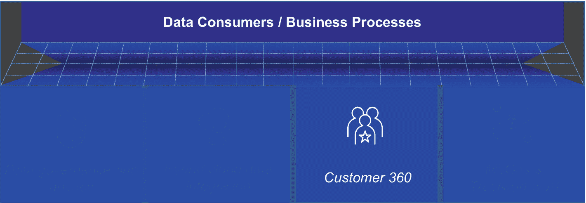

一个插图显示了标题“数据消费者/业务流程”。底部写着“客户 360”。

图 3-8

数据布料/数据网格用例 - 客户 360

这是商业策略的关键输入，即投资哪些产品或服务以推动创新，并成功增长销售以及提供卓越的客户服务。根据麦肯锡 2019 年的一项调查^(11)，只有大约四分之一的调查参与者表示，他们的公司在其组织中持续使用客户洞察。

本用例展示了数据布料架构如何提供解决客户或其他方配置文件不一致问题的基础，建立一个单一、可信的 360 度客户视图，从而实现需要 360 度客户数据视图的数据网格解决方案方法，以构建相应的数据产品并通过可信的数据市场提供。

从历史上看，组织中的每个应用程序都维护自己的客户、供应商或其他方关系。例如，在保险行业，通常有不同的应用程序来管理人寿、汽车和房屋保险。如果客户与该保险公司拥有汽车、人寿和房屋保险单，并更改了电话号码，则电话号码需要更改三次。

随着在线客户参与在多渠道环境中的趋势，专注于 MDM 的组织正在集中客户数据和其他核心信息，将其与现有应用程序集成。尽管如此，回答以下问题仍然很困难：

+   哪些客户也是我的供应商，以便谈判更好的合同条款，以及这些客户接受另一份合同的可能性有多大？

+   客户与服务提供商之间是否存在可能暴露潜在欺诈模式的关系，以及欺诈的可能性有多大？

+   如果客户数据库中的多个条目相似，它们是否代表同一个人或团体，该团体应包含在营销活动中？

如果所有应用程序都在本地运行，最好是在单一平台上，将客户数据集中到 MDM 解决方案中并集成现有应用程序可能效果良好。然而，将新的数据源集成到现有的 MDM 解决方案中是一项相当复杂的任务，并增加了采用新业务解决方案的时间和成本。

当组织采用混合云战略时，这变得更加复杂和具有挑战性。

图 3-9 展示了数据布料架构^(12)如何有助于提高客户洞察。

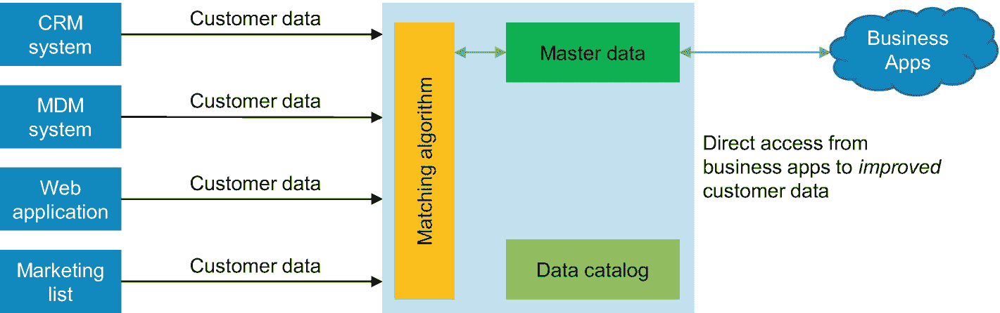

块图表示来自 CRM 系统、MDM 系统、Web 应用程序和营销列表的客户数据，这些数据经过匹配算法，然后是主数据和业务应用程序。

图 3-9

架构概述图 – 提高业务消费者对主数据的信任

选择客户数据作为领域，项目将包括实施数据布料的行动，重点关注以下方面：

+   **数据识别**：客户、供应商或其他方的数据在数据源中被发现和识别，这些数据源可能分布在混合云环境中。

+   **AI 增强实体匹配**：通过应用 AI 增强实体匹配创建高质量的客户、供应商或其他方档案。AI 增强实体匹配补充了现有的确定性和概率匹配技术，从而产生更准确的匹配结果。

+   **丰富客户档案**：通过添加数据分布、数据质量、业务条款以及来自客户互动记录的半结构化和非结构化数据等额外信息来增强客户元数据。

+   **数据管理政策和规则**：数据源所有者需要定义管理客户数据创建、获取、隐私、完整性、安全、分类和质量的规则、政策和流程。法规的执行需要自动化。

+   **数据服务**（DaaS）：数据延迟和数据质量对于提供客户和其他方数据尤为重要。AI 算法应被用于智能地提供数据交付和特定用例的编排建议。使用数据虚拟化访问操作数据源可能是系统交互的数据集成技术的首选。它避免了数据消费者面临的数据不一致性，并简化了新数据源的集成。

以智能增强知识目录为中心的数据织物和数据网格功能支持创建全面的客户、供应商或其他方档案，因此增加了数据消费者对主数据的信任。通过应用 AI 增强实体匹配^(13)解决不同数据源中的实体，而不是花费时间寻找质量良好的数据，可以创建更好的客户档案。

## 解锁可信赖的 AI 概念

AI 持续渗透到业务运营的所有方面，并使新的业务用例成为可能，例如提高业务的盈利能力、增强人类能力和经验。图 3-10 说明了数据织物或数据网格项目的第四个和最后一个用例。

根据 IBM 商业价值研究所（IBV）对 C 级高管的一项调查，^(14) 85%的先进采用者正在通过 AI 降低运营成本，99%的参与者报告使用虚拟代理技术后每接触一次成本有所降低。虽然 AI 有很多前景，但许多人质疑应用 AI 的可信度^(15)。四分之三的高管认为 AI 伦理是竞争优势的来源。确实，许多组织将 AI 伦理纳入其业务指南；他们认为在业务和 IT 流程中应用 AI 伦理实践和行动是一个挑战。

可信和可解释 AI 的要求建议实施 MLOps，连接开发和运营领域，这意味着数据编织和数据网格需要在一个平台上协调 AI 模型的开发，例如，在本地 x86 集群或公共云上，以及在另一个平台上进行评分和推理的部署和运营，例如，在 IBM zSystems 上。

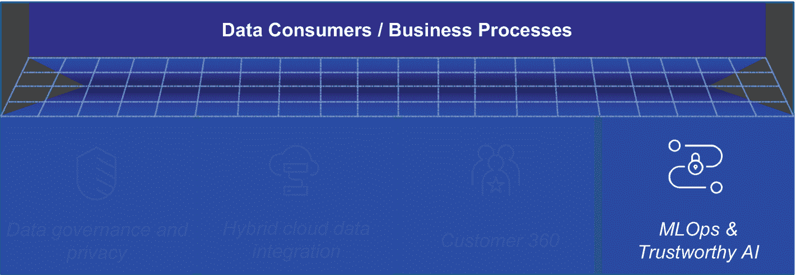

一幅插图显示了标题“数据消费者/业务流程”。底部写着 MLOps 和可信 AI。

图 3-10

数据编织/数据网格用例 – MLOps 和可信 AI

具体来说，对于 MLOps 和可信 AI，这还包括事务场景中的数据访问和数据集成。

在我们解释可信 AI 之前，让我们提供一个简单的 MLOps 示例.^(16) MLOps 的含义是专注于特定于 ML 的任务的自动化，例如特征工程、训练和验证、版本控制，最后是部署和运营。

图 3-11 是一个高级架构概述图，展示了右侧的 AI 开发环境，该环境基于 IBM Cloud Pak for Data 和 IBM Watson Studio，在本地 x86 集群或公共云上运行，以及左侧的运营环境，该环境基于 IBM Watson Machine Learning for z/OS 和 CICS 作为事务管理器，在 IBM zSystems 上运行。使用 IBM Watson Studio 开发的 AI 模型需要从分布式端导出，并导入到 IBM zSystems 端进行生产，在那里为每个 CICS 事务进行评分和推理。

一旦 AI 模型被部署并投入生产，就需要定期监控和衡量 AI 模型的结果，这可能意味着每天、每周或更长时间间隔。这是为了获得关于 AI 模型持续业务相关性的洞察和信心。

例如，数据科学家和业务用户对检测与数据准确性和精确度下降相关的偏差和漂移感兴趣，并且受到即将出台的可信 AI 规范的激励；他们还需要进一步了解在 AI 模型运营过程中公平性或质量指标是否恶化。此外，业务用户越来越需要可解释性和对 AI 模型结果如何得出的洞察，例如，在影响特征方面；他们需要获得信任和信心。解决这些挑战可以用术语*可信 AI*来概括.^(17)

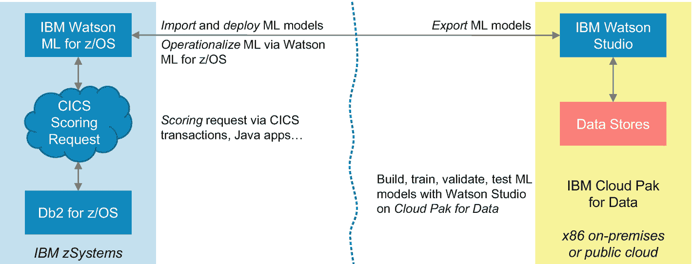

机器学习操作架构。在左侧，它表示 IBM Watson ML for z/OS，该系统导入和部署机器学习模型，并经过 CICS 分数请求，随后是 z/OS 的 Db2。在右侧，它表示 IBM Watson studio 中机器学习模型的导出，该系统在 IBM 云公园内部存储数据。

图 3-11

机器学习操作架构概述图

以下是一个可信人工智能能力的简短列表：

1.  **偏差**：在整个生命周期中检测和纠正人工智能模型的公平性（偏差）

1.  **漂移**：检测和纠正漂移（准确性和数据一致性的下降）

1.  **可解释性**：解释人工智能模型（人工智能模型结果的透明度）

1.  **质量指标**：测量人工智能模型质量指标，包括人工智能模型在操作化时的指标

在数据编织和数据网格之旅中实施可信和可解释的人工智能用例（或切入点）需要在供应商产品中具有不同的功能和特性。更重要的是，例如，如果在人工智能模型生产过程中检测到偏差或漂移，或者某些人工智能模型质量指标正在恶化，则需要自动启动纠正措施——至少尽可能做到这一点——以解决这些问题。这可能包括触发人工智能模型的重新训练、重新验证和重新测试过程，包括收集数据的新版本并执行相应的数据准备任务。

## 关键要点

我们以表 3-1 中总结的几个关键要点来结束本章。

表 3-1

关键要点

| # | 关键要点 | 高级描述 |
| --- | --- | --- |
| 1 | 创建和实施数据策略。 | 组织的数据策略的创建和实施指导了数据编织架构的采用。 |
| 2 | 构建数据目录是每个用例的基础。 | 所有用例的实施都将首先导致构建增强型、智能数据目录的活动，作为数据编织的基础。 |
| 3 | 数据治理的数据编织架构。 | 数据编织架构可用于实现自动化和一致性的治理环境。 |
| 4 | 混合云策略的数据编织。 | 通过数据编织架构可以解决跨混合云（本地和云端）存储的数据的统一视图需求。 |
| 5 | 360 度客户视图的数据编织。 | 通过数据编织架构可以解决对客户和供应商的全面视图需求。 |
| 6 | 可信人工智能的数据编织。 | 数据编织架构为可信人工智能提供了所需的数据永久透明度和可解释性。 |
| 7 | 可信人工智能由法规驱动。 | 可信和可解释的人工智能以及人工智能中的伦理是由美国和欧盟即将出台的法规所驱动的。 |
| 8 | 定义一个优先级使用案例。 | 定义一个范围明确的用例，该用例根据数据战略为企业带来价值。讨论的用例通常在组织中按优先级排序。 |

## 参考文献

1.  DDPR.EU，《GDPR 合规指南》，[GDPR 合规指南](https://gdpr.eu/)（访问日期：2022 年 10 月 16 日）。

1.  Eryurek, E.，Gilad, U.，Lakshmanan, V.，Kibunguchy, A.，Ashdown, J.，《数据治理：权威指南》，O’Reilly，2021 年，ISBN-13：978-1492063490。

1.  IBM，AI 之旅博客，Kupec, K.，《丹斯克银行通过数据治理和隐私将团队聚集在一起》，2021 年，

    [丹斯克银行通过数据治理和隐私将团队聚集在一起](http://www.ibm.com/blogs/journey-to-ai/2021/01/danske-bank-brings-teams-together-with-data-governance-and-privacy/)（访问日期：2022 年 9 月 2 日）。

1.  IBM，IBM 开发者，Mertens, J.，《IBM zSystems 基础知识：入门问答》，2022 年，[IBM zSystems 基础知识](https://developer.ibm.com/articles/what-is-ibm-z/)（访问日期：2022 年 9 月 2 日）。

1.  IBM，Vennan, S.，《混合云》，2021 年，[混合云学习](http://www.ibm.com/cloud/learn/hybrid-cloud)（访问日期：2022 年 9 月 2 日）。

1.  Forbes，Davenport, T.，《云对分析洞察力来说是否更慢？》，2022 年，[云对分析洞察力是否更慢？](http://www.forbes.com/sites/tomdavenport/2022/01/21/is-the-cloud-slower-for-analytical-insights/%253Fsh%253D56df52d86dca)（访问日期：2022 年 9 月 2 日）。

1.  McKinsey，Kressmann, F.，Ehrlich, O.，Lehmann, S.，《客户洞察功能亟待提升》，2019 年，[客户洞察功能亟待提升](http://www.mckinsey.com/business-functions/growth-marketing-and-sales/solutions/periscope/our-insights/articles/the-customer-insights-function-is-ripe-for-a-boost)（访问日期：2022 年 9 月 2 日）。

1.  IBM，IBM 商业价值研究所，《人工智能的商业价值》，[人工智能的商业价值](http://www.ibm.com/thought-leadership/institute-business-value/report/ai-value-pandemic)（访问日期：2022 年 9 月 2 日）。

1.  Springer Link，Pery, A.，Rafiei, M.，Simon, M.，van der Aalst, W. M. P.，《可信人工智能与流程挖掘：挑战与机遇》，2022 年，[可信人工智能与流程挖掘：挑战与机遇](https://link.springer.com/chapter/10.1007/978-3-030-98581-3_29)（访问日期：2022 年 9 月 2 日）。

1.  Ammanath, B., 《可信人工智能：在人工智能中导航信任和伦理的商业指南》，Wiley，2022 年，ISBN-13：978-1119867920。

# 4. 数据编织和数据网格业务优势

本章深入探讨了我们在与企业对话中听到的业务驱动因素和痛点。从技术角度，主要是数据工程团队以及消费数据的业务团队的角度，讨论了创建数据布线架构和实施数据网格解决方案的业务优势。我们讨论了与组织内数据管理相关的文化转变，这涉及到数据源所有者、数据工程师和数据消费者的数据整体所有权。

## 引言

在第二章中定义了数据布线，作为数据网格实施的基础数据架构之后，让我们回顾一下支持在组织中实施这种新数据架构的巨大投资的关键业务驱动因素。

总体动机或驱动因素很简单：从组织的数据中获得更多价值，以跟上行业步伐，或者更好地，实现竞争优势。

一个例子是全球性的、颠覆性的大流行病^(1)，它创造了所有领域前所未有的商业挑战。快速识别和解决供应链问题，以及提供所有业务功能在线，无需个人互动，只是导致组织重新审视其当前 IT 环境、定义新的 IT 优先事项并加速相关 IT 现代化项目的几个结果需求之一。

另一个例子是全球公认的气候变化^(2)，它导致自然灾害更加频繁。保险公司需要具备敏捷且复杂的分析企业及公开数据的分析能力，以准确估计政策风险，确保公司能够履行其义务并继续创造利润。具有竞争力的保险政策对保险公司的市场份额有直接影响。

这样的业务需求推动了应用景观的变化，例如，应用程序可能迁移到云服务，或者采用新的应用程序架构，这推动了新的数据架构；它导致组织在数据管理和数据消费方面出现新的要求，这对这两个概念的可持续和抗颠覆实施有深远的影响。

## 数据管理和消费的业务需求和痛点

业务驱动因素需要映射到数据架构的关键驱动因素。为了更好地理解数据布线架构和数据网格解决方案的技术和业务价值，让我们再次回顾过去，总结实施数据架构的关键驱动因素。

图 4-1 列出了给定数据架构中常见的痛点。

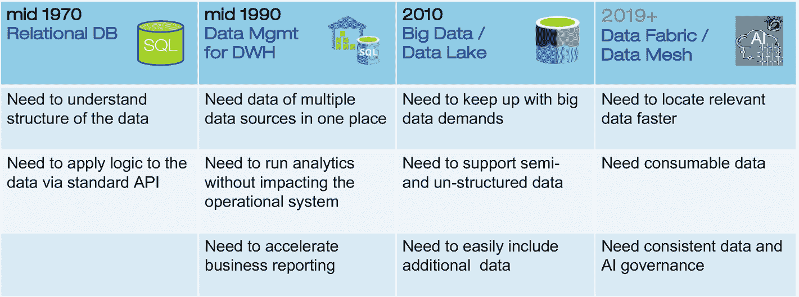

一个表格表示了关系型数据库在 20 世纪 70 年代中期的作用，DW H 在 20 世纪 90 年代中期的数据管理，2010 年的大数据或湖数据，以及 2019 年之后的数据库或数据网格。

图 4-1

数据架构演变的驱动因素

这两个概念的关键驱动因素也体现在可能听起来熟悉的陈述和问题中：

+   **多个位置**：相同的数据存储在多个位置，通常格式不同，可以通过不同的方法访问，例如 SQL、NoSQL 或 REST API。

+   **数据和人工智能资产所有者**：我对一些数据和人工智能资产有一些疑问，但不知道这些资产归谁所有，也不知道该联系谁。例如：在具体业务问题的背景下，我如何获取数据和人工智能资产？我应该将有关认证和授权的请求转发给谁？

+   **知识目录**：我需要一个关于相关和可用的数据和人工智能资产的全面概述，这应该还包括关于可用数据产品的概述，包括它们的规格。

+   **数据质量**：我能否对数据质量有信心——修复数据问题的努力在人力、时间和金钱方面成本很高？

+   **货币和一致性**：我需要更多最新和一致的数据和人工智能资产：谁负责这项工作？是否有特定数据和人工智能资产的所有者？

+   **变化的影响**：如果发生变更，这些变更对我的数据会产生什么样的下游影响？是否有我可以依赖的工具来提供准确的数据质量度量？

这些陈述突出了对数据产生应用程序影响的知识、对数据管道或数据血缘的洞察，以及数据消费者对数据的知识，以及数据的可用性和相关的自动化和治理流程。

这些挑战^(3)直接影响到以业务所需的速度提供数据的能力，即使有更多的数据工程师，对数据和数据产品的需求也持续超过现有数据架构能力提供的能力。

这两个概念的好处可以直接从解决组织在实施之前的数据架构（特别是传统的 EDW 和甚至数据湖屋架构）后存在的关键挑战中得出。重要的是要指出，没有考虑文化和组织变革，数据编织架构和数据网格解决方案无法实现全部价值；需要更全面的方法。

图 4-2 根据负责角色对第一章的图 1-3 进行分类。在左侧是产生数据的应用程序的所有者。在中间是使这些数据以最适合消费用例的格式对数据消费者可用的数据工程师。到目前为止，责任划分明确，角色之间的协作有限，这不利于数据管道集成流程的简化。

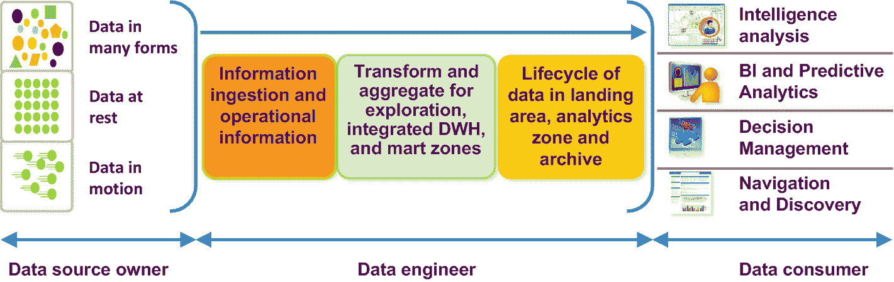

一个插图展示了数据源所有者、数据工程师和数据消费者的元素。数据源所有者包括多种形式的数据，静止数据和运动数据。数据工程师表示信息摄取、转换和聚合，以及数据在着陆区的生命周期。数据消费者表示智能分析、导航和发现，以及决策管理。

图 4-2

数据管道范围的变化

让我们通过一个例子来说明。核心应用程序不断更改数据。在过去，这些事务性应用程序在响应时间和可扩展性方面进行了如此优化，以至于它们没有保留数据更改的历史记录。随着今天处理能力、法规要求和数据库功能的发展，当核心应用程序中的数据发生变化时，仅保留历史记录要高效得多。然而，大多数数据更改都是作为获取-转换-管理数据管道的一部分重新创建的，这使得数据管道更加复杂，通常导致管道处理量超过 50%。

这两个概念的目标都是通过在业务环境中轻松访问元数据，以及智能地自动化数据工程师的主要任务，来降低发现、访问、准备和消费数据所需的技能水平。通过打破数据源所有者、数据工程师和数据消费者责任孤岛，以及消除对数据工程师进行数据消费的依赖，可以在没有数据工程师支持能力作为瓶颈的情况下实施业务优先事项。

## 数据布料和数据网格对管理数据的团队的好处

第三章描述了实施数据布料架构和数据网格解决方案的基础和入口点。以下是一些技术团队（例如，数据工程师）从实施和责任变更中获得的几个好处，这些好处是对关键驱动因素^(4)的响应）：

+   **更快速、更简单的数据交付流程**：以前，数据工程师需要手动调查适用的数据源；开发数据管道，例如，编写 ETL 作业；并告知数据消费者如何消费派生的（转换和汇总）数据。根据业务优先级，这项工作可能需要几周到几个月的时间。通过创建知识目录并使用注释和分析功能，可以更容易地识别适用的数据源，并使用工具来自动化数据集成以实现更快速的数据交付。打破数据源所有者和数据工程师之间的壁垒，数据工程师从数据消费者眼中数据的“所有者”转变为数据源所有者获取数据的加速推动者。这样，数据源所有者就有动力超越事务性应用的职能和非职能需求，将数据源更好地集成到数据编织和数据网格中，例如向知识目录提供元数据和业务术语表。

+   **数据访问管理努力的减少**：通过知识目录和全球政策执行的自动化，引入全球数据治理规则、政策和流程，显著减少了向数据消费者提供数据访问的努力和时间。它们还允许业务线（LoB）成为数据产品设计、实施和所有权的一部分。

+   **降低维护数据质量标准的工作量**：实施数据编织和数据网格的第一个里程碑是对现有数据源和现有数据管道进行编目。知识编目的一个关键能力是对数据源的质量评估。数据质量通过数据完整性、数据正确性和数据的时效性来表示。例如，电话号码是客户记录的一部分。如果电话号码只在 60%的记录中维护，那么通过区号进行的分析将无法正确反映真实的客户分布。另一个例子是，数据库中的数据需要扩展，因此被移动到另一个列中。ETL 过程没有正确更新，仍然从可能未被删除的旧列中读取数据。这样的问题可能会使派生数据变得不可用。数据消费者可能没有意识到这样的数据质量问题。5 在对原始数据源的数据质量进行评估后，包括数据血缘，使得数据流可由工具消费。否则，隐藏在数千个转换作业中的内容变得对数据工程师可见，从而创造了减少副本数量的机会。毫无疑问，今天的技术可以从源到目标复制大量数据。在实践中，在较长时间内保持数据副本的一致性是一个巨大的运营挑战。因此，减少数据副本总是提高质量，从而提高对数据的信任度。

+   **降低基础设施和存储成本**：数据副本的减少和数据管理工具的整合，以及数据工程师主要责任的变化，直接导致基础设施和存储成本的降低，尽管这对于首席数据官（CDO）和首席信息官（CIO）及其相应组织来说仍然是一个基本目标。

图 4-3 展示了与技术团队相关的四个业务成果，这些成果与特定的价值驱动因素以及相应的度量或关键绩效指标（KPIs）相关。这个价值驱动因素和 KPIs 的列表当然是不完整的，更多的是作为一个示例。尽管如此，它代表了一个起点或一个基本模板，用于衡量由实施数据编织架构或数据网格解决方案的技术团队产生的 IT 相关业务成果。

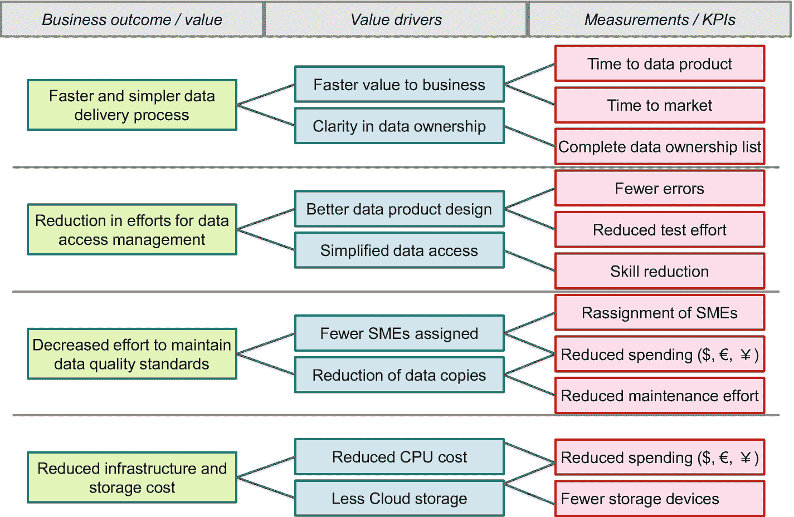

一个插图代表了业务成果或价值、价值驱动因素以及度量或 KPIs 的益处。业务成果包括更快速、更简单的数据交付过程、减少数据访问管理的工作量、降低维护数据质量标准的工作量以及降低基础设施和存储成本。

图 4-3

技术团队的价值主张

当然，这种方法需要进一步细化和完善。我们鼓励您使用这个模板来开展您的项目，因为它能够帮助您开发一个全面且可衡量的价值主张，这对于获得所需的资金至关重要。

## 数据编织和数据网格对消费数据的业务团队的好处

如前所述，数据编织和数据网格的技术优势可以直接映射到业务团队的好处.^(6) 这些业务成果与实施这两个概念相关：

+   **自助数据购物**：自助服务已在许多领域得到实施。酒店预订是通过门户网站而不是打电话给酒店来完成的。超市的产品结账是通过自助支付站完成的。因此，业务团队成员期望在公司市场门户中购买组织的数据库和 AI 资产的想法并不遥远。具有这些功能的 Data Fabric 提供了实施此类数据和 AI 资产市场的基础设施，可以为业务用户提供无烦恼的全自助数据购物体验。自动执行数据和 AI 治理规则、政策和流程确保业务所有者只能访问他们有权查看和处理的（清晰或掩码）数据。

+   **合规性和安全性**：自动执行数据治理规则和流程不仅是数据市场的前提。首先，数据治理规则、政策和流程需要在组织内一致性地定义，以便自动执行。与今天相比，合规性定义和工具因业务领域、应用程序或甚至负责人员而异，每个平台和系统都有其专有的方式来定义和确保数据安全。因此，尽管使数据和 AI 可用于全面业务分析利用，但数据合规性和安全性实际上得到了提高。

+   **更快和更准确的洞察**：通过降低数据业务消费者的技能水平并通过自助市场简化数据访问，数据消费者可以获得更快和更与业务相关的洞察。此外，通过应用智能和自动化的数据管理以及数据资产和 AI 资产的文档化血缘，显著提高了数据质量、完整性和及时性，这也导致了更准确和与业务相关的洞察。

+   **数据分析所花费的时间**：数据消费者，尤其是数据科学家，现在大部分时间都在寻找和准备数据，而不是专注于数据分析或构建 AI 模型。这种数据探索和准备任务与实际开发时间（包括训练、验证、测试等）的比例通常是 80/20。这种更快、自助访问相关数据和 AI 资产的方式，使得数据消费者，尤其是数据科学家，能够将时间集中在数据分析上，同时也促进了更快地洞察业务问题。

总结来说，基于数据编织架构的数据市场（Data Mesh）允许数据消费者以自助模式更快地发现和访问高质量数据（实现数据即产品化的数据市场），消除了等待数据工程师^(8)准备数据和为业务消费构建 ETL 阶段或管道的潜在长期延迟。

因此，对业务挑战的相关和准确洞察可以更快地获得，并且可以以更高的敏捷性采取行动。

图 4-4 展示了与特定价值驱动因素和相应的度量或 KPIs 相关的业务团队的四项业务成果。同样，与负责管理和 AI 资产的技术团队的价值驱动因素和 KPIs 列表一样，这个列表中的价值驱动因素和 KPIs 对于消费数据和 AI 资产的业务团队来说也不完整。

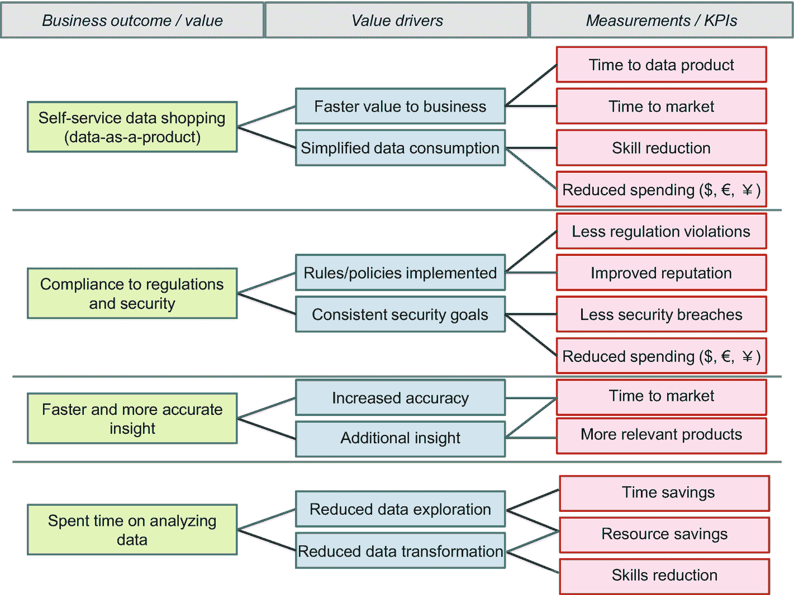

一个插图展示了业务成果或价值、价值驱动因素以及度量或 KPIs 的好处。业务成果和价值包括自助数据购物、遵守法规和安全、更快更准确的洞察以及数据分析所花费的时间。

图 4-4

业务团队的价值主张

尽管如此，这种方法也代表了一个有意义的切入点，用于衡量实施任何两个概念的业务团队所获得的价值主张。

从技术和业务团队中得出的两个价值主张列表^(9)可以根据选择的切入点和特定的用例场景进行精炼和扩展。例如，基于您特定的项目需求，KPIs 可以进一步细化，与倡议和行动、功能、依赖关系和验收标准相关联。

## 关键要点

我们以表 4-1 中总结的几个关键要点来结束本章。

表 4-1

关键要点

| # | 关键要点 | 高级描述 |
| --- | --- | --- |
| 1 | 从组织数据中获得更多价值的动机 | 总体动机或驱动因素很简单：从组织数据中获得更多价值，以跟上行业步伐或甚至获得竞争优势。 |
| 2 | 数据编织架构和数据网格解决方案的关键驱动因素。 | 数据编织或数据网格的关键驱动因素是更快地定位数据、简化数据访问和消费，以及应用一致的数据和人工智能治理。 |
| 3 | 对数据的需要增长速度快于数据交付。 | 以更敏捷的方式从数据中获得可操作的洞察并持续生产数据产品的需求，超过了使用现有数据架构能力进行交付的能力。 |
| 4 | 数据工程师的责任发生变化。 | 数据工程师的角色从被视为数据的*所有者*转变为数据源所有者的推动者。 |
| 5 | 数据编织和数据网格功能对应关键驱动因素。 | 数据编织和数据网格功能通过直接解决关键业务和 IT 驱动因素，特别是通过提高自动化和自助服务方式执行的任务，提供了显著的价值。 |
| 6 | 更快、更准确的洞察。 | 数据编织和数据网格功能使业务分析师能够更快地获得对业务挑战的准确洞察。 |
| 7 | 项目特定层面的业务成果应细化。 | 从技术和业务团队得出的业务成果应以价值驱动因素和度量（KPIs）来表示。 |

## 参考文献

1.  麦肯锡公司，*2021 年企业业务影响：COVID-19 的影响*，2021 年，[www.mckinsey.com/business-functions/risk-and-resilience/our-insights/covid-19-implications-for-business-2021](http://www.mckinsey.com/business-functions/risk-and-resilience/our-insights/covid-19-implications-for-business-2021)（访问日期：2022 年 8 月 25 日）。

1.  Akkaya, B., Jermittiparsert, K., Abid Malik, M., Kocyigit, Y., *Covid-19 期间及以后工业 4.0 的兴起趋势和战略*，Sciendo，2021 年，ISBN-13：978-8366675384。

1.  路透社，*报告称气候变化正在伤害保险公司*，2022 年，[www.reuters.com/business/finance/climate-change-is-hurting-insurers-report-2022-05-17/](http://www.reuters.com/business/finance/climate-change-is-hurting-insurers-report-2022-05-17/)（访问日期：2022 年 8 月 25 日）。

1.  安永，*数据是新资本*，[www.accenture.com/_acnmedia/PDF-157/Accenture-Data-Is-The-New-Capital-POV2.pdf](http://www.accenture.com/_acnmedia/PDF-157/Accenture-Data-Is-The-New-Capital-POV2.pdf)（访问日期：2022 年 8 月 25 日）。

1.  eWeek，*IBM 的丹尼尔·埃尔南德斯谈人工智能和数据编织*，2021 年，[www.eweek.com/big-data-and-analytics/ibm-daniel-hernandez-ai-data-fabric/](http://www.eweek.com/big-data-and-analytics/ibm-daniel-hernandez-ai-data-fabric/)（访问日期：2022 年 8 月 25 日）。

1.  Teradata，Dave, P.，*强大的数据编织的七大好处*，2022 年，[www.teradata.de/Blogs/Seven-Benefits-of-a-Powerful-Data-Fabric](http://www.teradata.de/Blogs/Seven-Benefits-of-a-Powerful-Data-Fabric)（访问日期：2022 年 8 月 25 日）。

1.  IBM, *数据编织架构带来即时效益*, [`www.ibm.com/downloads/cas/V4QYOAPR`](http://www.ibm.com/downloads/cas/V4QYOAPR) (访问日期：2022 年 8 月 25 日).

1.  Radiant Digital, *数据网格的好处*, [`radiant.digital/benefits-of-data-mesh/`](https://radiant.digital/benefits-of-data-mesh/) (访问日期：2022 年 8 月 25 日).

1.  IBM, IBM Developer, Das, S., Sharma, N., *数据网格简介*, 2022, [`developer.ibm.com/articles/data-mesh-a-peek-into-this-new-paradigm/`](https://developer.ibm.com/articles/data-mesh-a-peek-into-this-new-paradigm/) (访问日期：2022 年 8 月 25 日).

1.  哈佛商学院，商业洞察，*如何创建有效的价值主张*, [`online.hbs.edu/blog/post/creating-a-value-proposition`](https://online.hbs.edu/blog/post/creating-a-value-proposition) (访问日期：2022 年 8 月 28 日).
