# 第二部分：关键数据编织和数据网格能力与概念

# 5. 关键数据编织和数据网格能力

最先进的数据编织架构和数据网格解决方案无疑与知识目录^(1)紧密相连，作为其核心组件之一。现代知识目录与传统知识目录的区别在于其 AI 增强的能力，可以自动化任务并提供自助服务能力。AI 无疑是现代数据编织和数据网格的一个不可避免的特征领域。注入 AI 为商业用户创造了额外的价值，例如提供可信 AI。

处理多样化的异构源数据，这些数据通常分布在各种组织和系统中，需要超越传统数据联盟或虚拟化技术的智能信息集成概念。

智能信息集成需要包括 AI 工件（例如，AI 模型、Jupyter 笔记本、ETL 阶段和管道、仪表板、物理和逻辑数据模型），自动化这些工件的集成以获得及时洞察和业务决策。

## 简介

本章介绍了这两个概念的关键能力，例如具有主动元数据的知识目录、数据整理、规则和政策管理、语义知识图谱（语义网络）和自助服务能力。一个子节详细阐述了可信 AI，这在第三章中被描述为四个关键用例场景或入口点之一。它还包括激活数字废气，其中我们详细阐述了从数字废气中识别模式和发现相关性的过程，以增强和实现这一见解到数据编织和数据网格中。

最后，我们非常简要地阐述了智能信息集成概念，这是两个概念不可或缺的一部分。尽管我们讨论了智能信息集成方法，但本章的重点仍然是知识目录和可信 AI 主题。

## 知识目录

正如我们在第二章中已经看到的，知识目录是数据编织架构和数据网格解决方案中最基本的部分之一，并且不可避免地与执行相关任务相关联，例如编制所有资产、生成主动元数据、执行数据整理任务、实施自助服务能力、提供知识图谱（语义网络）、执行本地和全局数据规则和政策、以及执行统一的数据和 AI 治理。为了调查其他方面，我们在几个额外的章节中特别强调了知识目录，例如第 13、14 和 15 章。

让我们从对元数据和生成主动元数据的描述开始。

### 活跃元数据

处理这个主题需要我们简要回顾一下我们所说的元数据是什么意思。元数据简单地说是描述数据的；它通常分为业务元数据、技术元数据和操作元数据：

1.  **业务元数据**：为数据和 AI 工件提供业务相关的上下文。它描述业务方面，为数据和 AI 资产提供意义，并且主要由业务用户添加和消费。业务元数据使 LoB 用户能够使用组织或企业范围内的统一语言，例如，通过维护行业或领域特定的业务术语表。业务元数据有助于弥合 IT 和业务团队之间的鸿沟。业务元数据的例子包括业务报告或 AI 模型结果的注释、业务术语表以及与业务运营相关的联邦和国际法律或法规的信息，以及如何管理和 AI 资产的所有权、安全性和隐私级别等。

1.  **技术元数据**：主要关注数据和组织 AI 工件的组织；它描述其结构和物理属性、AI 资产的位置、质量指标、可用的连接、访问方法等。技术元数据的例子包括数据库表和列名、索引、数据类型、AI 模型（即使用的 ML/DL 算法）的名称和属性、Jupyter 笔记本（即使用的语言）、逻辑和物理数据模型、XML 模式定义、存储过程定义、BI 工件等。技术元数据使数据专业人士能够充分关注如何管理、访问、转换和消费数据和 AI 资产。

1.  **操作元数据**：通常被称为流程元数据，关注于 AI 资产的创建和转换，包括它们何时被谁更新或删除以及原因；它描述了影响 AI 资产的的事件和过程。操作元数据的例子包括 ETL 阶段、插入/更新/删除（I/U/D）日志、管道、作业执行日志（包括运行时参数）、SQL 查询执行日志（即访问路径信息）、AI 资产使用日志等。结合业务和技术元数据，流程元数据可以用于可视化数据血缘或数据来源。

在继续讨论活跃元数据之前，我们提供另一个关于元数据的视角，这在近年来变得流行——社交元数据。这通常被误认为是用户生成的内容。然而，社交元数据是关于社交数据和其发起者的数据，例如，注释、描述、信任分数、相关性、完整性等。

让我们设定一个任务，解释我们所说的主动元数据是什么，以及为什么它很重要。根据 Gartner 的说法^(2)，“主动元数据管理是一组在多个数据管理市场中不断创新的元数据管理能力。”在我们看来，主动元数据是 AI/ML 增强的元数据，这意味着它是通过应用 AI/ML 技术到元数据中，以获得额外的可操作见解，这些见解可以用于进一步自动化数据织锦或数据网格任务。换句话说，主动元数据可能是通过 AI/ML 能力从传统元数据（业务、技术和操作）中派生出来的，以使数据网格相关应用程序和系统能够自动消费。此外，用户可能允许拦截自动化任务的执行以验证、调整或甚至拒绝这些自动化任务；在实施之前可能需要评估建议和意见。AI/ML 技术特别适合进一步增强自动化和简化基本任务。

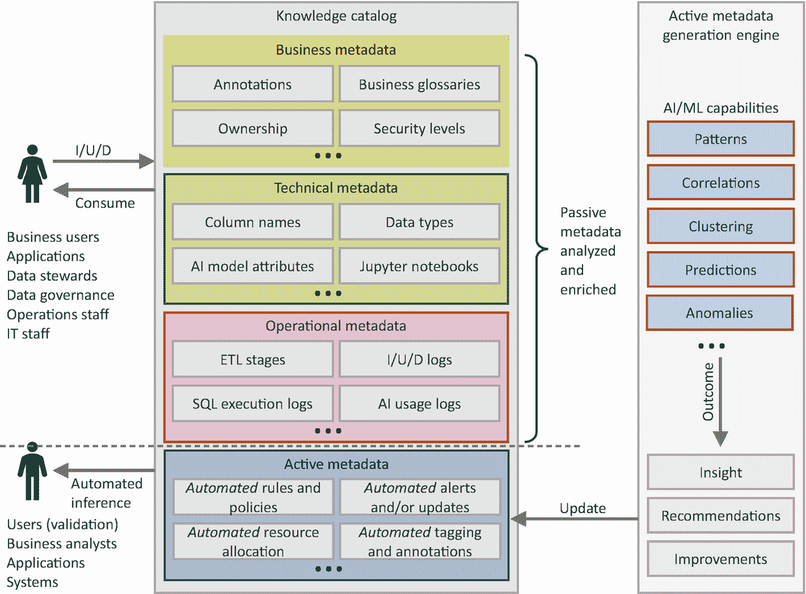

一幅插图表示了包含业务元数据、技术元数据和操作元数据的被动元数据层。在最下面，它指出了名为自动化规则、警报、资源分配和标记的主动元数据元素。它还表示了主动元数据生成引擎右侧的成果和更新。

图 5-1

主动元数据

图 5-1 展示了生成和消费主动元数据的关键组件；它突出显示了位于中间的知识目录，其中包含业务元数据、技术元数据和操作元数据，通常被称为被动元数据，以及右侧的主动元数据生成引擎，它具有 AI/ML 能力。

主动元数据生成引擎将 AI/ML 能力，如模式和相关发现、聚类和预测以及异常检测，全面应用于整个被动元数据（业务、技术和操作），以得出可操作见解和改进或简化相关任务的推荐。主动元数据的主要目标是针对数据网格应用程序、系统或组件的自动化推理。尽管如此，业务分析师、数据管理员、数据治理人员和数据科学家也可以通过获得额外的见解而受益，例如，通过接收有关业务结果变化、违反合规性、数据质量指标下降或建议加快数据探索任务的警报。

语义丰富化和激活来自数据织锦或数据网格过程的数字废气，我们将在第七章节中进一步探讨，是生成主动元数据的附加示例。

### 数据整理

我们将数据整理定义为一系列将数据和分析资产添加到知识编目中的过程，通过分配分类、数据类别和业务术语来丰富它们，自动生成和分配资产规则和政策，提供一种自助方式来发现和共享企业资产，以及分析、确保和提高资产的质量。数据管理员和数据工程师通过智能编目和自动化元数据管理来整理数据和 AI 资产，包括导入和丰富元数据、准备资产、通过分配治理工件来丰富资产，并将资产发布到知识编目中。

智能编目和自动化元数据管理在章节 13 和 14 中进一步探讨。在本节中，我们提供了关键数据整理任务的高级概述。

以下是对关键数据整理任务的简要描述：

1.  **创建元数据**：自动生成相关数据和 AI 资产（例如，源数据表）的元数据，并在知识编目中捕获这些元数据。

1.  **分配业务术语**：根据可用的业务术语表发现业务术语或提出新的业务术语，例如，基于可用的分类法，并将这些术语分配给相应的资产。

1.  **分析资产质量**：对数据和 AI 资产进行配置文件分析，进行质量评估，并提出质量改进建议供数据管理员接受或拒绝。

1.  **精炼资产**：准备、转换和改进数据和分析资产的质量，例如，基于数据规则和政策，包括自动生成的建议供数据管理员接受或拒绝。

1.  **丰富元数据**：分配数据类别，执行语义丰富（例如，生成语义知识图谱）和数据分类，添加标签和注释等。

1.  **分配治理工件**：例如，根据治理和监管要求自动生成规则和政策。

大多数这些数据整理任务，例如语义丰富和自动生成和分配资产规则和政策，可能非常需要应用 AI/ML 技术。我们将 AI/ML 融合的数据整理称为*高级或智能数据整理*。3

让我们继续探讨一个令人兴奋的主题——语义知识图谱。

### 语义知识图谱

知识图谱——通常被称为语义网络——是一个有向标签图，它包含三个主要组件：节点、边和标签。

图 5-2 是一个简单的知识图谱，描述了客户*A*与供应商*B*之间的关系：*A*是*B*的客户。根据应用领域，*A*被称为*主题*，*B*被称为*对象*，标签被称为*谓词*。一个有向图，其中节点是特定领域（例如，汽车、发动机、气缸、凸轮轴等）的对象的类和子类，边描述子类关系，被称为分类法。知识图谱与活动元数据的概念兼容性似乎是明显的：知识图谱代表了通过分析被动元数据和通过应用 AI/ML 能力以获得额外非明显洞察而得出的丰富元数据。例如，知识图谱应通过可视化*所有权-资产*关系并丰富知识图谱中检测到的这些关系中的异常或某些数据与 AI 资产之间的非明显相关性来创建。

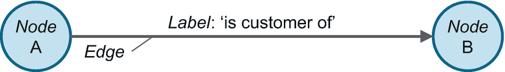

一个图表表明节点 a 指向节点 b 的箭头。箭头表示为边，顶部的文本读作标签，冒号，是客户。

图 5-2

知识图谱

我们可以将这些 AI/ML 增强的知识图谱称为*语义知识图谱*^(4)。它们作为知识目录的逻辑组件存储在图数据库（GDBs）中。图数据库的例子包括 Amazon Neptune^(5)、Neo4j^(6)和 IBM Graph^(7)等。图 5-3 是一个可视化 AI 模型上下文的语义知识图谱示例。它从类型和子类型的角度描述 AI 模型，例如，AI 模型可以是*机器学习*类型，关联的子类型是*二元分类模型*，因为欺诈预防模型非常常见。

如您容易想象，知识图谱还可以可视化 AI 模型的附加特征，例如模型何时被训练和部署，何时以及多久重新训练，以及相关的 AI 工件，例如 Jupyter 笔记本、管道、所需特征等。

知识图谱还描绘了角色，这些角色开发了 AI 模型及其当前所有权，包括他们对应的角色和他们所属的组织。在我们的例子中，*John*是开发组织中的数据科学家，开发了该模型，而*Joan*是欺诈部门的业务所有者，对 AI 模型有业务责任。还可以包括其他具有相应角色和组织的角色，例如，将模型链接到 AI 治理和 IT 运营组织。

知识图谱需要给予在 AI 模型操作阶段需要定期测量的关键质量指标足够的关注。这如图 5-3 的左侧所示，其中你可以看到 ROC（接收者操作特征）和 PR（精确率-召回率）曲线下的面积以及其他 F1 度量。

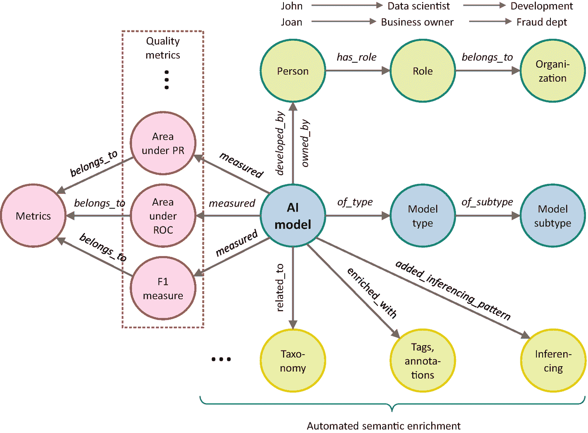

一个图表展示了多个节点之间的相互连接。它表示与分类相关的 AI 模型，通过标签和注释进行了丰富，并添加了接口模式，提供了包含 P-R 曲线下面积、ROC 和 F1 度量等质量指标的度量，这些属于主要指标。

图 5-3

语义知识图谱示例

通过知识图谱可以可视化额外的指标和对模型的洞察，例如偏差和漂移，包括测量这些指标时的时间。额外的洞察可能与 AI 模型的可解释性相关，例如，基于影响评分的特征的自动发现。分析知识目录中可用的被动元数据——结合 AI/ML 技术——能够丰富 AI 模型的知识图谱。

在业务术语、结构化和非结构化数据以及尤其是操作元数据方面具有前所未有的多样性，与外部数据如行业或领域特定的分类法和本体纠缠在一起，这使得 AI/ML 特别适合用语义知识丰富知识图谱。如图 5-3 所示，我们在图中仅指出了自动语义丰富的一小部分示例。例如，AI 模型可以与特定的分类法或本体相关联，包括通过采用特定术语来调整和细化特征集的建议。

此外，AI 模型可以被标记；可以添加注释以使其对商业用户更具可解释性。最后，对评分和推理模式的洞察可以揭示 AI 模型在业务上的相关性，例如，防止欺诈交易的数量（真正率，TPR）和调用应用程序或组件的名称，包括可能对 AI 模型与其他 AI 模型在业务相关性方面进行排名的相应统计数据。正如我们在第二章“数据产品”部分所描述的，数据产品由一组语义相关的数据和 AI 资产组成。因此，这种自动语义丰富能力对于创建语义知识图谱至关重要，该图谱可用于构建数据产品。

在第七章中，我们进一步探讨了提供 *智能* 和 *自动化* 丰富化的语义丰富化过程，主要通过使用外部数据源来实现，例如外部知识图谱。与知识图谱和其他输入（例如特定领域或行业的分类法或本体）相结合的语义丰富化构成了智能方法的关键能力。

尽管分类法、本体和知识图谱经常被同义使用，并且这些是相关概念，但它们之间有区别：分类法可以被视为知识图谱的一个子集，为属于特定领域的对象提供结构，其中节点是这些对象的类和子类。本体关注于正式的命名约定，包括类型、属性的定义以及实体的关联，其中实体被表示为节点，关系被表示为边。

让我们继续讨论自服务能力。

### 自服务能力

正如我们在第二章中看到的，最先进的数据编织架构和数据网格解决方案不可避免地会受到其自服务能力的影响。然而，我们需要进一步阐明“自服务”的真正含义。自服务是将原本需要由具有其他、非业务相关角色和职责的人员进行干预和支持的过程和任务数字化。简单来说，数据网格解决方案的自服务能力使得业务用户能够执行业务任务，例如，生成报告、发现和访问数据、理解人工智能资产的质量和可靠性等，而无需依赖 IT 或其他业务部门的支持。鉴于今天业务用户对 IT 组织的依赖性代表了在更敏捷的方式下生产数据产品的挑战，自服务能力对于数据网格解决方案至关重要。

以下表格 5-1 描述了两个概念最基本的自服务能力。

表 5-1

数据编织和数据网格的基本自服务能力

| # | 能力 | 高级描述 |
| --- | --- | --- |
| 1 | 无需额外凭证访问人工智能资产 | 知识目录包括人工智能资产的元数据，用户（基于其角色和职责）可以访问这些资产，例如，业务用户、数据科学家、人工智能治理人员、数据工程师等，无需请求额外凭证。 |
| 2 | 访问方法信息 | 知识目录中的所有元数据都应包括有关相应人工智能资产访问方法的信息，例如 SQL、NoSQL、REST API、Java SDK、.NET SDK 等。 |
| 3 | 相关 AI 资产的信息 | 知识目录应包括相关 AI 资产的信息，提供特定 AI 资产的全面和业务相关的视图，包括治理工件、Jupyter 笔记本等信息。 |
| 4 | 生成活动元数据 | 例如，通过 AI/ML 增强的元数据触发自动资源分配、标记和注释，以及为 AI 资产高峰消费间隔自动分配资源。 |
| 5 | 语义搜索能力 | 基于 AI/ML 的搜索，例如，发现 AI 资产之间的非明显相关性或针对特定商业目的的相关 AI 资产的推荐。 |
| 6 | 基于 GUI 的数据探索和准备 | 易于使用的基于 GUI 的数据探索和准备工具，可以由非 IT 角色使用，如商业用户、商业分析师、数据治理官员等，以自解释的方式进行。 |
| 7 | 执行数据整理任务 | 我们在本章前面列出的一些数据整理任务需要由商业用户执行，无需领域专家或 IT 人员的干预或协助，例如，数据质量评估和数据精炼任务。 |

其中一些能力远远超出了知识目录所能提供的内容。例如，基于 GUI 的数据探索和准备工具可能利用知识目录中的数据。然而，它需要一套独立的工具，这些工具是数据织物架构的一部分。

如您从这张表中轻松看出，自助服务能力使商业组织能够提供具有“数据即产品”和“数据购物”体验的数据市场。

## 可信 AI

本节探讨了数据织物或数据网格的四个关键支柱或用例之一，即我们在第三章中介绍的内容，即可信 AI。一旦 AI 模型准备就绪并部署用于评分，就需要定期监控和测量 AI 模型的结果，以获得关于持续业务相关性的洞察和信心。数据科学家和商业用户都需要了解公平性或偏差的变化、准确性或数据一致性下降的漂移，以及 AI 模型在运营过程中的质量指标下降。此外，商业用户越来越需要了解 AI 模型结果是如何得出的，例如，从影响特征的角度来看；他们需要获得信任和信心。解决这些挑战属于“可信 AI”这一术语的范畴。

然而，可信的 AI 不仅仅是一个巧妙的缩写词：近年来，它已成为监管机构和政府机构广泛接受的主题，^(9) 同时将 AI 的信任与道德、透明度和 AI 的可解释性联系起来。鉴于这些监管指南和强制性要求，企业必须越来越多地应对这些挑战。然而，在本节中，我们提供了关于可信 AI 技术方面的具体示例，而将道德、法律和社会方面留待以后讨论.^(10)

### 简介

可信的 AI 的全面处理当然可以写成一整本书；因此，我们必须有意识地挑选出对这两个概念都至关重要的关键问题。

以下是我们认为在数据编织和数据网格背景下至关重要的关键问题——或者更确切地说，是挑战：

1.  **模型公平性**^(11)（偏差）：处理测量和管理对选定特征值决定 AI 模型结果的有利或不利的偏好。如果这些特征是性别、年龄、宗教、种族、国籍等，这一点尤为重要。

1.  **漂移检测**：衡量两种类型的漂移，(a) 机器学习模型漂移，通过比较运行时和训练时的准确性以及数据一致性的下降来衡量，和 (b) 数据漂移，即比较数据集的关键特征，例如，用于训练的数据集中机器学习模型的关键特征值分布与运行时数据集的特征值分布。

1.  **可解释性**：为没有或有限数据科学技能的商业用户提供对 AI 模型结果的洞察和透明度，并允许进行“如果...将会怎样”的情景分析。

1.  **模型质量指标**：需要收集诸如精确度、ROC 和 PR 曲线下的面积、真正率（TPR）、真正负率（TNR）等指标。在整个生命周期中测量这些模型质量指标并允许采取纠正措施是这两个概念的重要特征。

我们将在接下来的小节中探讨可信 AI 的这四个挑战。让我们从模型公平性（偏差）开始。

### 模型公平性

如前所述，偏差关注的是对特定特征值的有利 AI 模型结果的偏好。例如，一个预测营销活动接受度的二元分类模型可能包括性别（例如，女性和男性）作为特征输入。在部署和运营此机器学习模型之前，需要测量初始偏差，以了解例如女性相对于男性的有利结果。

一旦机器学习模型投入生产，就需要定期监控偏差的变化，以便数据科学家在偏差低于定义的阈值时采取行动。

在本小节中，我们通过使用上述提到的以性别（女性和男性）作为特征的机器学习模型，考察了如何测量和监控偏差，^(12) 我们旨在监控女性的偏差。

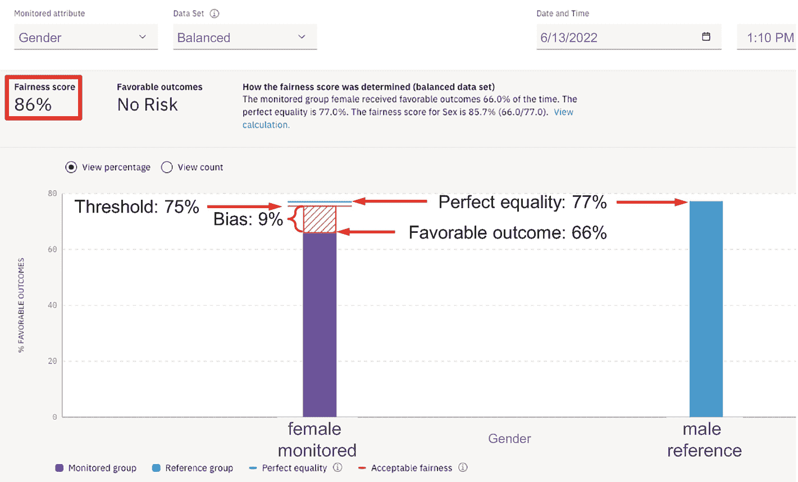

一张截图代表了一个条形图，显示了女性监控组和男性参考组的有利结果。它指示了 75%的阈值点、77%的完美平等、66%的有利结果、9%的偏差，并突出显示了女性得分为 86%。

图 5-4

性别公平/偏差分数

初始偏差通过计算三个指标来描述`–`完美平等、有利结果和公平性分数：

+   **完美平等**：使用一个初始的平衡数据集，其中将具有*女性*作为有利结果（女性记录）的记录添加到男性记录中，只需将性别值从*女性*更改为*男性*。这个新的扰动数据集用于测量有利结果的百分比。这个指标被称为完美平等，如图 5-4 所示为 77%。

+   **有利结果**：通过将具有*男性*作为有利结果的记录添加到女性记录中，只需将性别值从*男性*更改为*女性*，得到一个新的扰动数据集，该数据集用于测量有利结果的百分比。这个指标被称为有利结果，如图 5-4 所示为 66%。

+   **公平性分数**：将有利结果除以完美平等得到性别的公平性分数，为 86%（66/77）。

如前所述，创建扰动数据集以计算男性记录的有利结果，这些结果用作计算完美平等性的参考，以及监控的女性记录，这些记录用于计算有利结果，在两个方向上纠缠了男性和女性记录，从而生成了更平衡的扰动数据集。

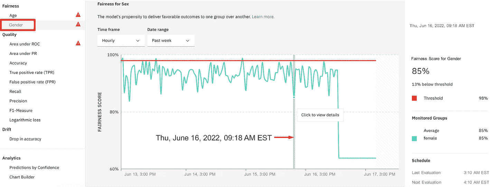

一张截图代表了一个从 6 月 13 日到 6 月 17 日不同时间线上的公平性分数的折线图。它指示了表示周四，2022 年 6 月 16 日的点。它还突出显示了左侧面板上的性别选项。性别公平性分数表示为 85%。

图 5-5

性别公平/偏差评估

破折线区域表示女性的初始偏差，它是对一个定义的阈值进行测量的；它是阈值（在我们的例子中设置为 75%）与有利结果（66%）之间的差异，即 9%。这种初始偏差不一定应该以负面方式看待：根据潜在的商业模型，关于某个特征值（在我们的例子中是*女性*）的偏差可能非常真实地代表真实行为。数据科学家需要仔细检查并可能调整机器学习模型，直到结果符合潜在的商业模型。

一旦基于平衡和扰动的数据集测量了初始公平性分数和偏差，一旦机器学习模型投入生产，就应该监控这些指标的变化。这如图 5-5 所示，其中女性的有利结果按小时测量。监控结果可以以仪表板的形式展示，并在偏差超过定义的值时生成警报。

公平性的评估应通过考虑监控特征值（例如，性别中的女性）与其他特征（如薪资水平、年龄等）的相关性来加强。此外，公平性的 AI 测量应预测公平性逐渐恶化何时可能达到某个水平，提前警告商业用户和数据科学家。此外，应向数据科学家提供可操作的推荐，例如，改变特征的权重、选择不同的机器学习算法或调整超参数。最后，在自动化的 AI 融合数据编织或数据网中，可信 AI 模块的*自我校正*能力应自动重建一个无偏差模型，要么减轻数据科学家采取行动的负担，要么使他们能够验证和批准这些自动校正。

让我们进一步阐述漂移检测。

### 漂移检测

AI 模型需要准确反映底层商业现实（例如，客户行为、欺诈场景等）以及用于评分和推理的数据（例如，客户档案数据、交易性银行数据、保险索赔数据等）。但这些都可能随时间变化，导致某些或所有 AI 模型质量指标下降——如图 5-6 所示。

商业现实的改变和数据一致性问题的变化可能会导致 AI 模型质量指标下降。图 5-6 展示了 ROC 曲线下面积的下降，作为一个特定质量指标的例子，以及数据一致性的下降。

通过几个例子，我们简要地检查我们所说的商业现实的改变和数据一致性的下降：

+   **商业现实的改变**：购买商品、申请贷款和保险合同、利用服务或配送渠道、使用互联网或社交媒体等客户的行为或偏好可能会随时间变化，并且随后不再代表 AI 模型训练时间内的客户行为或偏好。

+   **数据一致性下降**：可用于评分和推理的生产数据可能与用于 AI 模型训练、验证和测试的预生产数据不同。生产数据中记录的增加，类似于 AI 模型在预生产数据中没有正确评估的记录，频率分布的变化或某些特征的数值范围的差异，数据模式以及特征值罕见组合等，都是一些例子。

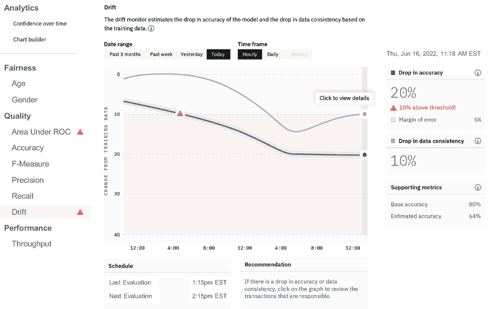

屏幕截图表示一条线图，显示了不同时间框架的训练数据的改变。它表明右面板上准确率下降了 10%，数据一致性下降了 10%。

图 5-6

漂移检测

如前所述，这些业务现实的改变和数据一致性的下降可能导致 AI 模型质量指标的下降。ROC 曲线下的下降区域以及随时间变化的数据一致性下降在图 5-6 中展示。还可以显示其他质量指标，例如准确率、精确率、PR 曲线下的面积等。

一流的 Data Fabric 或 Data Mesh 需要通过警报和预测以及自动自我纠正能力来补充漂移检测，就像我们在前面的模型公平性中描述的那样。

让我们继续讨论模型可解释性。

### 模型可解释性

如前所述，模型可解释性为没有或有限数据科学技能的商业用户提供了对 AI 模型结果的洞察和透明度，并允许进行*假设性*情景分析。这在 AI 模型的信任、透明度和可解释性方面非常重要。根据 AI 模型类型的不同，评估结果可以包括不同类型的分析，这些分析通常基于流行的开源框架，如 LIME（局部可解释模型无关解释）和 SHAP，或者测试数据上的*假设性*情景的能力。LIME 是一个 Python 库，用于分析 AI 模型的输入和输出值，以创建人类可理解的模型解释。LIME 揭示了哪些模型特征对于一组特定的数据点最为重要。通常，对于一组接近模型特征数据点的模型特征，会有数千种扰动。在理想情况下，LIME 中重要性高的特征是对于那些特定数据点最重要的模型特征。

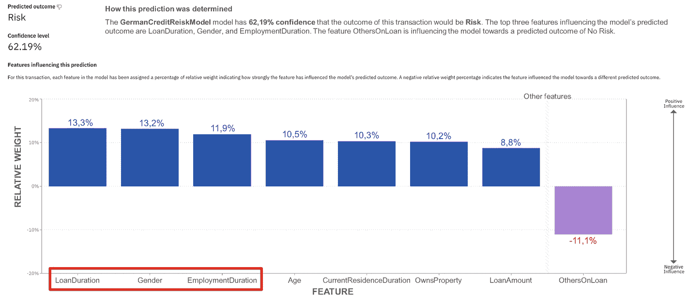

柱状图表示包含位置时长、性别、就业时长、年龄、当前居住时长、拥有财产、贷款金额和其他贷款等特征的相对权重的百分比。它突出了贷款时长、性别和就业时长，它们的值分别为 13.3%、13.2%和 11.9%。

图 5-7

特定交易的可解释性

SHapley Additive exPlanations (SHAP) 是一个 Python 库，其中包含一种解释任何 ML 模型输出的方法。它通过使用 Shapley 值及其相关扩展将最优信用分配与局部解释联系起来。SHAP 为 ML 模型的每个特征分配一个特定预测的重要性值，这被称为 Shapley 值。Shapley 值是特征值在所有可能的特征组中的平均边际贡献。输入特征的 SHAP 值是基线或预期 ML 模型输出与当前 ML 模型输出之间的差异之和，这些差异是针对正在解释的预测。基线 ML 模型输出可以基于训练数据的摘要或任何必须生成解释的数据子集.^(14)

我们通过使用信用风险模型来展示可解释性，如图 5-7 所示。该机器学习模型的输出为贷款审批流程生成一个*risk score*，该流程使用多个特征作为模型的输入，例如*LoanDuration*（贷款期限）、*Gender*（性别）、*EmploymentDuration*（就业期限）、*Age*（年龄）、*CurrentResidenceDuration*（当前居住期限）、*OwnsProperty*（拥有财产）、*LoanAmount*（贷款金额）和*OthersOnLoan*（其他贷款人），这些特征您可以在水平特征轴上看到。

如图 5-7 的左上角所示，ML 模型以 62.19%的置信度预测特定客户或交易的贷款审批风险。图形显示了影响风险评分的最重要特征。影响模型预测结果的前三个特征是*LoanDuration*（13.3%）、*Gender*（13.2%）和*EmploymentDuration*（11.9%）。特征*OthersOnLoan*使模型倾向于预测结果为*无风险*。

可解释性还应允许基于 GUI 的*what-if*场景，以便业务用户或数据科学家更好地理解调整后的特征值对预测结果的影响。这包括忽略现有特征或添加额外特征的场景。在这种*what-if*场景中进行的任何调整确实应该生成与图 5-7 中包含的信息相同：置信水平（风险评分）和最有影响力的特征排名。鉴于模型的多样性（例如，回归、分类、聚类、深度学习模型），这比说起来容易做起来难。我们前面的例子是基于一个相对简单的二元分类模型。

由于我们已引用了 AI 模型质量指标，我们将在接下来的小节中简要描述其中的一些关键指标。

### 模型质量指标

正如本节所看到的，衡量质量指标对于实现可信赖的 AI 起着基本作用，特别是对于漂移检测和可解释性；一旦 AI 模型投入生产，它们应定期可测量。相关的质量指标取决于 AI 模型类型。以下是为二元分类问题列出的一些质量指标：

+   **真正正率** (TPR)，也称为敏感性、召回率 (R) 或命中率：*TPR* = *TP*/(*TP* + *FN*)

+   **假正率** (FPR)，也称为误报率：*FPR* = *FP*/(*FP* + *TN*)

+   **真正负率** (TNR)，也称为特异性或选择性：*TNR* = *TN*/(*TN* + *FP*)

+   **假负率** (FNR)，也称为漏报率：*FNR* = *FN*/(*FN* + *TP*)

+   **准确率** (ACC): *ACC* = (*TP* + *TN*)/(*TP* + *TN* + *FP* + *FN*)

+   **精确率** (P): *P* = *TP*/(*TP* + *FP*)

+   **ROC 曲线下的面积**: 通过在不同阈值设置下绘制真实正率 (TPR) 与假正率 (FPR) 来创建。

+   **PR 曲线下的面积**: 通过绘制精确率 (P) 与召回率 (R) 或真实正率 (TPR) 来创建，曲线的平衡由业务决策决定。ROC 曲线和 PR 曲线相互关联，应根据业务需求综合考虑进行评估。

+   **F1 指标**，也称为精确率和敏感度的调和平均值：*F*1 *measure* = 2*TP*/(2*TP* + *FP* + *FN*)

+   **对数损失**衡量的是输出概率值在 0 到 1 之间的分类模型的性能，当预测概率与实际分类偏离时，对数损失增加：

*对数损失* =  − (*ylog*(*p*) + (1 − *y*)*loglog* (1 − *p*)),

其中 *y* 是预测真实标签 *p* 的概率。

大多数这些指标都可以从混淆矩阵中轻松理解。一个具体的混淆矩阵示例如图 5-8 所示，您可以看到预测值与实际结果。图 5-8 显示了 TN、FN、FP 和 TP 的值，这些值被用作计算质量指标，您可以在图的顶部部分看到，例如，准确率、召回率、精确率等。您还可以看到 ROC 曲线和 PR 曲线下的面积，这些面积是通过在不同阈值设置下测量 TPR 和 FPR 得到的.^(15)

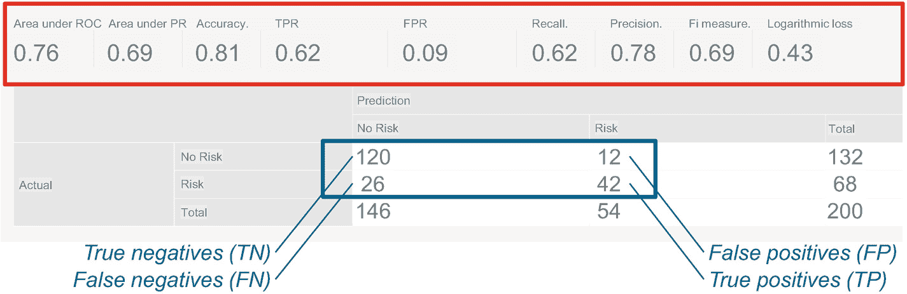

屏幕截图突出显示以下值。ROC 曲线下的面积，0.76。PR 曲线下的面积，0.69。准确率，0.81。TPR，0.62。FPR，0.09。召回率，0.62。精确率，0.78。F1 指标，0.69。对数损失，0.43。它还突出显示了真正负、真正正、假负和假正的值。

图 5-8

二元分类问题的混淆矩阵

对于回归问题有额外的质量度量，对于多类分类问题有质量指标。以下是一些回归问题的质量指标：R 平方、解释方差比例、均方根误差（RMSE）、平均绝对误差和均方误差。

最后，我们列出了一些多类分类问题的质量指标：准确率、加权真正例率（wTPR）、加权假正例率（wFPR）、加权召回率、加权精确率、加权 F1 度量以及对数损失。

## 智能信息集成

几十年来，信息集成一直是众所周知的 IT 领域，包括但不限于源于信息来源多样性和差异性的普遍挑战。然而，近年来，智能地以自动化方式适应不断增长的不同集成方法的需求却日益增加，例如，传统的 ETL 和复制、实时数据流、消息传递、数据虚拟化和联盟、微服务等，在广泛的架构设置中，包括混合云环境。

此外，信息集成必须包含丰富的工件种类，而不仅仅是结构化和非结构化数据，例如 AI 模型、管道、ETL 阶段，甚至应用逻辑。数据网格解决方案，通过其建立数据市场以供商业用户自助购买数据（数据即产品）的关键要求，进一步增加了对自动化和智能信息集成技术的需求。

现代数据布料架构或数据网格解决方案需要应对这些挑战。AI 对于此目的特别适合。我们使用术语“智能信息集成”来指代一个注入了 AI 的信息集成层，这对于两个概念来说都是至关重要的，以便尽可能自动化信息集成任务。

表 5-2 列出了任何现代方法所需的必要智能信息集成能力。

表 5-2

智能信息集成能力

| # | 能力 | 高级描述 |
| --- | --- | --- |
| 1 | 自动化工作负载分配 | 应考虑底层系统可用性和能力、资源消耗、服务级别协议（SLAs）和性能要求，实施 AI 启用的自动化工作负载分配。 |
| 2 | 自助信息集成 | 商业用户和数据工程师需要以透明的方式执行信息集成任务（包括自助方式进行的数据探索、数据准备和转换），以简化来自源系统和相应工件复杂性和多样性的问题。 |
| 3 | 活跃元数据利用 | 商业用户应透明地利用活跃元数据，以获得关于底层资产、搜索和发现、访问方法、策略等方面的普遍和相关信息。 |
| 4 | 语义知识图谱利用 | 商业用户需要利用语义知识图谱来理解分类法和本体论的相关性，从标签和注释中获得进一步见解，并获得资产消费和应用于推理的相关推荐。 |
| 5 | 可学习的信息集成 | 智能信息集成需要是可学习的，这意味着 AI 方法应应用于调整、改进、简化和优化集成流程和任务，随着时间的推移进行。 |
| 6 | 集成流的自动纠正 | 应将 AI 应用于有缺陷或表现不佳的信息集成流、作业和任务，为 IT 人员生成建议，并自动实施有意义的纠正。 |
| 7 | 利用数字废气^(16) | 应通过自动激活数字废气，例如，优化月末或季度末集成任务的资源分配，随着时间的推移改进信息集成。 |

## 关键要点

我们以几个关键要点结束本章，这些要点总结在表 5-3 中。

表 5-3

关键要点

| # | 关键要点 | 高级描述 |
| --- | --- | --- |
| 1 | 活跃元数据是数据织构和数据网格的关键特征。 | 活跃元数据是 AI/ML 增强的元数据，通过将 AI/ML 技术应用于元数据来生成，从而从元数据中获得额外的可操作见解，这些见解可用于进一步自动化数据织构和数据网格任务。 |
| 2 | AI/ML 技术需要应用于数据整理任务。 | AI/ML 注入的数据整理被称为高级或智能数据整理；它使智能编目实现自动化数据整理。 |
| 3 | 语义知识图谱应该是数据织构的一个组成部分。 | AI/ML 增强的知识图谱被称为语义知识图谱或语义网络，描绘了对象和资产的非明显关系，为数据消费者和商业用户提供进一步的可操作见解。 |
| 4 | 自服务是数据织构和数据网格的关键特征。 | 数据网格解决方案的自服务能力使商业用户能够在没有 IT 或其他业务部门支持的情况下执行业务任务。 |
| 5 | 可信的 AI 意味着衡量和确保 AI 模型公平性。 | 公平性或偏差涉及衡量和管理对 AI 模型结果有决定性影响的特征值的期望或非期望偏好。 |
| 6 | 可信人工智能意味着检测漂移。 | 漂移通过比较运行时和训练期间的准确性以及比较用于训练的数据集的关键特征与运行时数据集的特征来衡量准确性和数据一致性的下降。 |
| 7 | 可信人工智能意味着提供可解释性。 | 可解释性为没有或有限数据科学技能的商业用户提供对人工智能模型结果的洞察和透明度，并允许进行*假设性*情景分析。 |
| 8 | 模型质量指标作为输入，以实现可信人工智能。 | 存在几个自动计算的人工智能模型质量指标；它们也可以被可视化，以向数据科学家提供进一步洞察，以优化模型结果。 |
| 9 | AI/ML 将自动化和智能引入信息集成任务。 | 智能信息集成一词与一个 AI 增强的信息集成层相关，这构成了现代数据织物架构和数据网格解决方案的关键能力。 |

## 参考文献

1.  Gartner, Peer Insights, *元数据管理（EEM）解决方案评论和评分*, [`www.gartner.com/reviews/market/metadata-management-solutions`](http://www.gartner.com/reviews/market/metadata-management-solutions) (访问日期：2022 年 7 月 22 日).

1.  Gartner, Gartner Research, *元数据管理解决方案魔力象限*, [`www.gartner.com/en/documents/3993025`](http://www.gartner.com/en/documents/3993025) (访问日期：2022 年 7 月 22 日).

1.  Gartner, Gartner Research, *主动元数据管理市场指南*, [`www.gartner.com/en/documents/4004082`](http://www.gartner.com/en/documents/4004082) (访问日期：2022 年 7 月 23 日).

1.  IBM, IBM Cloud Pak for Data, *数据整理*, [`dataplatform.cloud.ibm.com/docs/content/wsj/governance/curation.html`](https://dataplatform.cloud.ibm.com/docs/content/wsj/governance/curation.html) (访问日期：2022 年 7 月 24 日).

1.  Data Science Central, Aasman, J., *数据织物和人工智能的基础：语义知识图谱*, 2022 年 5 月 19 日, [`www.datasciencecentral.com/the-foundation-of-data-fabrics-and-ai-semantic-knowledge-graphs/`](http://www.datasciencecentral.com/the-foundation-of-data-fabrics-and-ai-semantic-knowledge-graphs/) (访问日期：2022 年 7 月 24 日).

1.  AWS, *Amazon Neptune 文档*, [`docs.aws.amazon.com/neptune/index.html`](https://docs.aws.amazon.com/neptune/index.html) (访问日期：2022 年 7 月 23 日).

1.  Neo4j, *Neo4j 图数据平台*, [`neo4j.com/`](https://neo4j.com/) (访问日期：2022 年 7 月 23 日).

1.  IBM, *IBM Graph，基于开源数据库技术的企业级属性图服务*, [`www.ibm.com/analytics/ca/en/technology/cloud-data-services/graph/`](http://www.ibm.com/analytics/ca/en/technology/cloud-data-services/graph/) (访问日期：2022 年 7 月 23 日).

1.  欧洲委员会，*可信赖人工智能伦理指南*，[`https://ec.europa.eu/futurium/en/ai-alliance-consultation.1.html`](https://ec.europa.eu/futurium/en/ai-alliance-consultation.1.html)（访问日期：2022 年 7 月 26 日）。

1.  美国国务院，*人工智能（AI）*，[`www.state.gov/artificial-intelligence/`](http://www.state.gov/artificial-intelligence/)（访问日期：2022 年 7 月 26 日）。

1.  Heintz, F.，Milano, M.，O’Sullivan, B.（编者），人工智能智能讲座笔记，*可信赖人工智能 - 集成学习、优化和推理*，Springer，2021 年，ISBN：978-3-030-73958-4。

1.  IBM，IBM Cloud Pak for Data，*Watson OpenScale on Cloud Pak for Data*，[`www.ibm.com/docs/en/cloud-paks/cp-data/4.5.x?topic=services-watson-openscale`](http://www.ibm.com/docs/en/cloud-paks/cp-data/4.5.x%253Ftopic%253Dservices-watson-openscale)（访问日期：2022 年 7 月 27 日）。

1.  Poduska, J.，*SHAP 和 LIME Python 库：第一部分* `–` *优秀的解释器，各有优缺点*，2018 年，[`www.dominodatalab.com/blog/shap-lime-python-libraries-part-1-great-explainers-pros-cons`](http://www.dominodatalab.com/blog/shap-lime-python-libraries-part-1-great-explainers-pros-cons)（访问日期：2022 年 12 月 18 日）。

1.  James, G.，Witten, D.，Hastie, T.，Tibshirani, R.，*使用 R 进行统计学习的介绍与应用*，Springer，2015 年，ISBN：978-1-4614-7137-0。

1.  Flach, P.，*机器学习*，剑桥大学出版社，2012 年，ISBN：978-1-107-42222-3。

# 6. 相关的机器学习和深度学习概念

数据编织和数据网格的核心是使用*人工智能*（AI）和*机器学习*（ML）技术尽可能自动化复杂的数据任务。因此，理解人工智能和机器学习的概念是实施这两个概念的企业基础。如果你已经是 AI/ML 从业者，你可能可以跳过这一章。如果你不确定，请快速评估以下问题，并在需要更多清晰度的情况下继续本章：

+   你知道人工智能、机器学习和深度学习之间的相关性吗？

+   你知道人工智能和机器学习可以解决哪些类型的问题吗？

+   你知道人工智能的相关商业场景吗？

+   你知道人工智能模型的生命周期吗？你知道人工智能生命周期每个阶段的具体任务吗？

## 人工智能、机器学习和深度学习简介

广义而言，人工智能是一个可以模拟人类感知、学习、推理和交互的系统。它涵盖了广泛的领域，包括自动驾驶、机器人控制、计算机视觉、自然语言理解（NLU）等。目前用于商业用途的人工智能技术仍然相对狭窄，其中人工智能模型需要大量数据来训练单个任务和单个领域，而新领域的人工智能模型需要获取新的数据。与此同时，正在进行大量研究以拓宽人工智能的范围。例如，元学习和 N-shots 学习^(1)专注于使用少量样本训练模型。迁移学习^(2)在处理多任务和多领域时，重新使用一个领域中的 AI 模型在其他领域。联邦学习^(3)使多个方能够协作学习一个共享模型，而无需共享数据。

机器学习是实现人工智能系统的一种方式。机器学习使用算法解析数据，从中学习，然后对现实世界事件做出决策或预测。与硬编码以解决特定任务的传统软件程序不同，机器学习使用大量数据来训练算法，学习如何从数据中完成任务。基于规则的系统是非机器学习系统的一个例子。在基于规则的系统中，人类需要明确定义分支条件的参数，例如实现代码中存在的 if 语句。机器学习有一个强烈的假设，即已经发生的历史事件具有内在的模式，因此，在相似条件下未来将发生相同的结果。训练过程是找到一个函数 *f(x)*，该函数最优地描述现有样本的模式，然后使用此函数对新样本进行预测。

机器学习有三种类型：监督学习、无监督学习和强化学习。

**监督学习**从标记的训练数据中推导出预测函数。这就像在学习过去考试的题目（数据）和答案（标签）之后参加考试（推理）。

一组 12 幅画作，排列成 3 行。最上面一行代表梵高，中间一行代表莫奈，最下面一行代表毕加索。

图 6-1

监督学习的训练数据集

例如，给定梵高、毕加索和莫奈的几幅先前艺术作品（如图 6-1 所示），谁画了图 6-2 中的那一幅？

一幅肖像方向的画作。

图 6-2

监督学习的数据测试

**无监督学习**从未标记的训练数据中推断结论。尽管训练数据没有标记，机器学习仍然能够找到输入数据中的共同特征、结构或模式，或者特征之间是否存在某些关联。最典型的无监督学习是聚类，它将来自许多数据样本的相似数据分组。例如，根据购买行为对客户进行分组的系统就是无监督学习。通过根据客户的购买历史特征进行分组，可以为每个组实施不同的营销活动。

例如，尽管图 6-3 中的图片没有定义标签，机器学习模型仍然可以区分一个类别与另一个类别。

4 张照片。山脉延伸至黑暗的云层和山谷中的居住地。一个大型水域，另一端有山脉，天空中有雪花状云。海浪拍打着岩石，上方是晴朗的天空。一个有起伏的景观和晴朗的天空。

图 6-3

无监督学习的示意图

在现实世界中，由于手动标记的高成本，只有一些数据被标记。解决这个问题的方法之一是使用少量标记数据来训练模型，并使用此模型来标记未标记的数据，然后创建一个新的数据集以改进模型。这种学习被称为半监督学习^(4)，现在是一个热门的研究领域。

**强化学习**关注软件代理如何在环境中采取行动以最大化某些累积回报。与监督学习和无监督学习不同，强化学习不需要大量的输入数据。它有一个初始状态，当采取行动时进入新的状态。系统将给出信号——对于期望的结果是积极的，对于失败是消极的。整个训练过程不断通过在变化的环境中多次尝试和错误来探索可能的行为，直到找到基于预定义标准获得最大结果的最佳路径。常见应用包括棋类游戏、机器人控制和自动驾驶。

**深度学习**（DL）是“机器学习的一个子集，本质上是一个具有三个或更多层的神经网络。”^(5) 深度学习的优势在于自动特征提取。与从数据集中手动挑选特征不同，深度学习可以发现并学习良好的特征表示。例如，一张图片可以用多种方式表示，如每个像素的强度值向量或更抽象地表示为一系列边缘、在深度学习架构的不同层中具有特定形状的区域。深度学习有广泛的应用，如图像识别、视频分析、目标检测、机器翻译等。然而，深度学习需要大量的标记数据以及极其强大的计算资源，如高性能的图形处理单元（GPU），以找到整个架构的正确架构和最佳参数集。通常需要数百万张图片和数千小时的视频进行训练。

## 机器学习和深度学习行业用例

要发现每个行业的 AI 用例，了解机器学习和深度学习擅长解决哪些类型的问题是必须的。以下五种类型的问题通常可以通过机器学习和深度学习得到解决：

1.  **分类问题**：第一种类型是分类问题，例如样本是类型 A 还是类型 B。例如，*这位患者高度可能患有糖尿病吗*？或者*这位客户有流失风险吗*？这些通常是二元分类问题。监督学习算法在分类问题中得到了广泛应用。

1.  **回归问题**：第二种类型是回归问题，例如，根据历史数据和相关的外部事件预测房价、股价和商品价格。

1.  **异常检测**：第三种类型的问题是异常检测。在 IT 运营中一个非常常见的异常检测场景是，当前的 CPU、内存和存储消耗是否基于工作负载模式符合预期。例如，*这会导致任何性能下降甚至中断吗*？

1.  **聚类问题**：第四种类型是聚类问题，其中无监督学习算法表现突出。一个典型的例子是，一家公司希望通过客户细分来进行精准营销，以提高业务绩效。

1.  **下一个最佳行动问题**：最后是下一个最佳行动问题。强化学习算法用于解决这类问题。除了机器人控制和自动驾驶，金融服务行业的交易、医疗保健中的治疗以及电子商务中的在线推荐都是流行的强化学习用例。

在了解 AI 可以解决的问题之后，让我们来看看与行业相关的 AI 用例和 AI 应用：

**制造业**: 预测性维护是一种通过分析整个生产过程中的数据来预防昂贵制造设备故障的方法。这些数据包括设备内置传感器收集到的振动、温度、超声波和声学数据。这些数据有助于创建机器学习模型，以提前识别异常行为，确保采取必要的维护措施以最小化生产停机时间。对于任何大型制造公司来说，检查商品和产品可能是一项相当繁琐的任务。计算机视觉可以提供从捕获的图像中获取的实时信息分析，以执行复杂的检查任务。它可以帮助验证仓库中物品的正确数量，监控员工操作是否符合安全规定，并检查是否存在缺陷产品。

**金融服务**: 人工智能在金融行业有广泛的应用场景，包括反洗钱、资本位置预测、智能贷款审批、信用卡欺诈检测、智能投资等。金融行业多年前就采用了信息技术，因此积累了大量数据，为机器学习奠定了良好的基础。然而，金融行业也是一个高度监管的行业，如果模型没有得到良好的解释，由于合规性原因，它们不能用于生产系统。因此，深度学习的场景在这方面受到了限制。

**电信业**: 电信业是另一个拥有大量积累数据的行业。人工智能被用于移动站点智能规划、基站服务快速开通、智能路径规划和光传输网络的自动部署。它可以基于网络历史数据预测网络，动态和自适应地管理网络资源，并调整参数。由于电信行业的运营依赖于大型网络设备，因此设备的预测性维护是一个非常重要的 AI 场景。建立了用于网络健康分析和预测以及网络自愈的模型，减少了运维人员的工作量，提高了运维故障处理的效率，并不断推动网络运营和维护模式的根本性变革。

**汽车**：毫无疑问，AI 在汽车行业中最关键的应用是自动驾驶。除此之外，汽车行业中还有许多其他 AI 应用场景。例如，汽车制造行业的供应链管理非常复杂，使用 AI 优化供应链非常有价值。同时，汽车生产线的质量检验、驾驶过程中的异常检测以及车内交互体验都是 AI 应用的完美场景。此外，汽车的维修程序也很复杂。使用聊天机器人可以帮助员工及时找到他们完成工作所需的最重要信息。

在了解 AI 可以解决哪些商业问题之后，让我们继续探讨 AI 各个阶段的一些概念。

## 数据探索和准备

机器学习的第一阶段是数据探索和数据准备.^(6) 在这个阶段，需要对数据进行初步的探索性分析，以了解数据的分布和数据质量状况。描述性统计.^(7) 是一种描述数据集特征的技术。它提供了总结数据集中心值（例如，均值、中位数和众数度量）和数据集内数据分散程度（例如，最小值、最大值和方差度量）的度量。直方图是另一种强大的数据理解探索工具。它显示了连续数据的分布，便于检测异常值。

除了了解数据的分布外，还需要检查数据的质量。现实情况是，数据可能会因来源和生成方式的不同而受到各种错误的影响。例如，当手动输入时，可能会有缺失值、重复值、不完整值和异常值。或者，当从各种应用系统中提取数据时，数据格式和尺寸可能存在不一致性。这些数据质量问题可能导致分析结果不相关甚至错误。因此，下一个重要的数据准备任务是*数据清洗*，这是一个检测和纠正数据集中错误数据的过程。

可以通过使用*数据转换*来提高数据质量。以下是一些常用的转换方法：

+   **缺失值**：用默认值填充缺失值，例如，使用该列数据值的平均值或相邻数据值。

+   **各种数据格式**：将具有各种日期格式的数据转换为统一格式，例如，将所有电话号码扩展为国家代码。

+   **分类值**：将分类值编码为数值，例如，通过确定所有特征的数值范围并将它们调整到统一的比例（归一化）。

+   **异常值和重复值**：从进一步包含中移除异常值和重复值。

一旦你有了干净整洁的数据，下一步就是 *特征工程*，其目的是为最优模型获取更好的训练数据。特征工程包括子问题：特征选择、特征构造和特征提取。

*特征选择* 是选择与目标变量最相关的输入特征子集，并丢弃不那么相关的特征的技术。例如，如果特征之间的相关性很强，这意味着这些特征是冗余的。选择冗余特征或不相关特征只会增加训练时间，并不能提高模型的性能。8

*特征构造* 是从原始特征构建新特征的过程。创建新特征需要数据科学家深入洞察和分析技能，以识别现有特征中的有意义转换，例如，结合日期时间位置等属性，分解或切片原始特征，如从具有三个值[*绿色*，*黄色*，*未知*]的一个特征到三个布尔特征 – *is_green, is_yellow*，*and is_unknown* `–` 或添加算术运算如 *x*³ + *y* 作为新特征。

*特征提取* 是通过应用各种降维算法（如主成分分析（PCA）、独立成分分析（ICA）和线性判别分析（LDA））来降低数据集维度的过程。特征提取的目的是在确保保留目标重要信息的同时，最小化数据的维度。

### 模型选择、训练和评估

选择合适的 AI/ML 算法来训练你的模型是一个将你的业务问题映射到 AI/ML 工具集的创造性过程。根据你收集和准备的数据的性质，你可以确定哪些算法可以解决问题。模型选择、训练和评估是人工智能生命周期中的迭代过程，数据科学家通过探索不同的模型和不同的特征进行各种实验。

下表 6-1 总结了在人工智能模型选择、训练和评估中应考虑的关键问题，涉及业务、数据和环境。9

表 6-1

选择和评估 AI 模型时需要回答的关键问题

|   | 模型选择/训练 | 模型评估 |
| --- | --- | --- |
| 业务 | − 是否是探索或预测？− 是否需要检测异常或离群值？− 你是否需要一个推荐？ | − 是否有特定领域的指标来证明模型？− 业务问题的预期输出是什么？− 是否有质量和接受度指标？ |
| 数据 | − 是否有预测的目标？− 预测是数值型还是分类型？− 数据需要分组或缩放吗？− 数据中特征和目标值的范围是什么？− 是否需要进行降维或流形学习？− 如何处理缺失数据值？− 你有标记数据吗？− 你需要处理非结构化数据（即文本）吗？− 有哪些潜在的超参数？ | − 模型的类型是什么（分类、回归、聚类等）？− 预期的估计误差和近似误差是多少？− 预期的混淆矩阵、精确度、召回率和 F1 度量是多少？− 预期的准确率和错误率是多少？− 预期的 ROC 和 AUC 是多少？− 预期的成本曲线是多少？− 预期的 Shapley 加性解释（SHAP）值是多少？− 预期在测试/保留数据集上的性能如何？− 在进行 HPO 时，你如何设计假设检验？ |
| 环境 | − 你能访问哪些机器学习框架（专有或开源）？− 你有什么计算资源？− 数据在哪里？有多大？− 模型将被部署到哪个平台？− 模型重新训练的频率。− 是否需要解释模型？− 是否需要解释模型的输出？− 是在线预测还是批量预测（不同的证据收集方式用于评估）？− 模型的规模有多大？− 是否可以重复训练过程并获得相同的模型？ |

在模型选择和模型训练阶段，需要思考的问题类似，因此它们在前面的表格中被合并为一列。然而，这两个阶段对同一问题的关注点是不同的。例如，对于问题“预测是数值型还是分类型？”，模型选择旨在找到不同数据类型的特征，而模型训练则是要识别与数据类型相结合的适用算法。

评估方法取决于问题的性质。分类模型倾向于准确性、精确度、召回率、F1 度量、接收者操作特征（ROC）和 ROC 曲线下的面积，而回归模型则更偏好平均绝对误差（MAE）、均方误差（MSE）、均方根误差（RMSE）等。模型评估至关重要，因为 AI 模型有可能做出错误的预测。

在训练数据集上具有零误差率的模型并不意味着它在未来的不可预见数据上会表现良好。一个模型可以被调整以掌握训练数据集的每一个细节，但它可能无法泛化对新样本的预测。这被称为*过拟合*。模型评估（也称为离线测试）旨在克服训练过程中的过拟合。

作为实践者的经验法则，遵循以下三个步骤来设置模型选择和评估过程：

+   设计一个采样策略，将数据分离成互斥的数据集用于训练和测试。

+   选择最适合的评估指标来衡量模型性能。

+   使用不同的数据集进行测试，以比较训练模型并做出选择。

### 模型部署

模型部署是模型交付的最终阶段。它是将模型注入生产系统（无论是实时还是通过批量接口）的过程。前一章解释了数据编织和数据网格旨在解决分布式混合环境中访问数据所面临的挑战。模型评分需要真实世界的数据来进行预测，因此模型部署也面临着访问分布式数据的挑战。因此，模型部署模式不仅依赖于如何与应用程序集成，还包括模型所需的数据驻留和输入数据大小、延迟要求等因素。本节介绍了部署 AI/ML 模型的一些关键决策因素。

需要考虑的一个方面是 AI/ML 模型格式。在行业中存在许多语言无关和供应商特定的序列化格式。AI 部署^(10)可以通过使用各种编程语言和 AI 模型标准来表征。有许多流行的 AI 相关编程语言，例如 Python（最突出的一种）、Scala、R、Julia，以及用于笔记本的附加语言，如 Ruby、Perl、F#和 C#。不同编程语言的选择允许实现不同的 AI/ML 框架和相应的模型格式。在开源领域，存在几个与 AI 模型`–`相关的标准^(11)，其中预测模型标记语言（PMML）、开放神经网络交换（ONNX）和可移植分析格式（PFA）是突出的例子。尽管 Spark 不是一个标准，但它仍然在数据科学家中很受欢迎，并为 Spark ML 模型交换和可移植性提供了事实上的标准化。

以下表 6-2 突出了 AI/ML 模型流行语言无关格式的特点，即 PMML、PFA 和 ONNX。

表 6-2

AI 模型的语言无关格式

| **格式** | **可读性** | **运行时支持** |
| --- | --- | --- |
| PMML | 是（XML） | Python, R, C++, Java, 或 Scala |
| PFA | 是（带有 Avro 模式的数据类型的 JSON） | PFA 启用运行时 |
| ONNX | 否 | TensorFlow、PyTorch、CNTK、CoreML、PaddlePaddle、ONNX 启用运行时 |

AI 语言和标准的选择取决于数据科学家个人的用例、技能和偏好。一些 AI 模型可以使用特定标准进行转换或集成。例如，Python Scikit-learn 模型可以使用 PMML 或 ONNX 投入生产。然而，在其他情况下，AI 模型的拥有者不希望公开模型，因此需要考虑如何打包模型。为了实现最大兼容性，模型应导出为与语言无关的格式。

为了保护模型（即隐藏模型的实现细节），它可以以专有格式部署，并带有评分引擎，该引擎可以用于解析模型并在其上进行推理。

下一个决策是关于模型的服务。有几个模式可供选择。12 为了确定合适的模式，你需要考虑以下因素：数据的大小和位置、模型的大小、请求的延迟、服务的成本等。

如图 6-4 所示，RESTful API 适用于小量数据的实时请求，通常每个请求一条记录。由于需要专用计算资源来确保服务的高可用性，因此服务 RESTful API 的成本较高。当需要处理大量数据且期望在接近实时的时间内得到结果时，应使用流式 API。流式 API 设计为异步的。考虑一个带有队列的消息系统来处理此类请求。

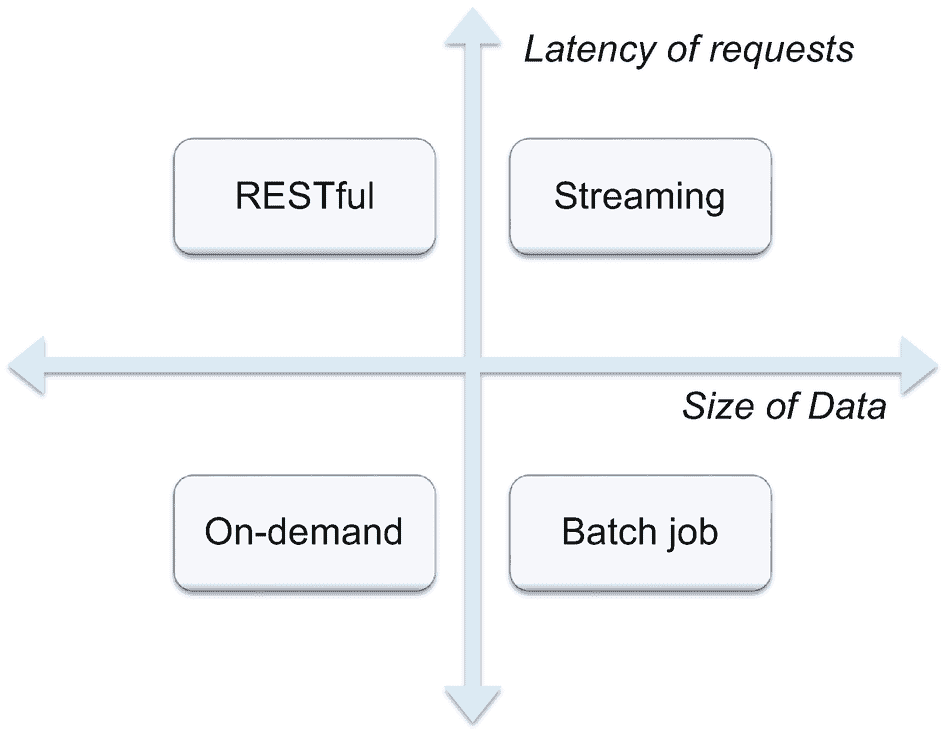

请求延迟与数据大小关系的象限图表示了 RESTful、流式、批量作业和按需在不同象限中的位置。

图 6-4

模型部署模式

如果你需要处理大量数据但不需要立即得到结果，可以将模型部署到批量作业中，它可以被安排在预定义的触发器（特定时间或事件）上运行，并将输出输出到外部存储，例如数据库表。如果请求对延迟或数据大小不敏感，可以按需部署模型。这有时被称为无服务器，因为它更经济高效，因为只有在有传入工作量时才需要计算资源。

### 自然语言处理（NLP）

自然语言，如中文、英语和日语，灵活多变，但计算机难以理解。自然语言处理（NLP）就是为了实现人类与计算机之间使用自然语言的交流而诞生的。NLP 是一个将语言学、计算机科学、数学和其他学科相结合的领域，它不仅研究语言学，还研究如何使计算机处理这些语言。它分为两个主要方向：自然语言理解（NLU），即听和读，以及自然语言生成（NLG），即说和写。

到了 20 世纪 80 年代和 90 年代，统计机器学习算法被引入到 NLP 中，基于规则的途径逐渐被基于统计的方法所取代。在这一阶段，NLP 取得了重大突破，并逐步走向实用阶段。从大约 2008 年开始，随着深度学习神经网络在图像处理和语音识别方面取得了显著成果，深度学习也被应用于 NLP：从最初的词嵌入和 word2vec 到 RNN、GRU、LSTM 等神经网络模型，再到最近的注意力机制、预训练语言模型等。随着深度学习的加入，NLP 取得了显著的进展。

在自然语言中，单词是最基本的单位。为了使计算机能够理解和处理自然语言，我们首先必须对单词进行编码。尽管使用 one-hot 编码构建词向量很容易，^(13)但它并不能很好地表示单词的语义。Word2vec 将单词表示为固定长度的向量，并通过上下文学习单词的语义信息。它包含两个模型——一个是通过中心词预测上下文，另一个是通过上下文预测中心词。

当提出词向量时，深度学习 RNN 框架与词向量结合在 NLP 中取得了巨大的成功。RNN 并不完美。它存在难以并行化以及建立长距离和层次依赖的问题。最近提出的注意力机制可以帮助解决这些问题。其核心思想是从大量信息中过滤出少量重要信息并关注这些信息。它较少关注其他外部数据，而只关注输入数据本身，并且更擅长捕捉数据内部的相关性。

虽然深度学习的应用使 NLP 实现了第一次飞跃，但预训练模型的出现为 NLP 带来了第二次飞跃。预训练通过自监督学习（无需标注）从大规模语料库数据中学习一个强大的语言模型，然后通过微调迁移到特定任务，最终实现显著的结果。

在介绍了 NLP 领域的流行研究进展后，让我们来看看 NLP 的商业价值，目前仍有 80%的组织意识到他们 80%的内容是非结构化的.^(14) 非结构化数据包括监控视频和图像、客户支持录音、各种报告、社交媒体帖子、历史文档、操作手册等等。NLP 可以帮助公司从与文本相关的非结构化数据中挖掘知识。

例如，Woodside Energy^(15)利用 IBM Watson 驱动的 NLP 技术从 30 年的复杂工程数据中提取有意义的见解，并帮助工作人员快速找到信息并将其综合为明智的商业决策.^(16)

NLP 有许多其他的应用场景：

+   **虚拟代理和聊天机器人**：对用自然语言表达的问题进行分析（例如，实体链接、关系公式、形成逻辑表达式等）。分析完成后，在知识库中找到可能的候选答案，并通过排序找到最佳答案。例如，自动响应客户服务在电子商务行业中广泛应用，通过回答许多基本和重复的问题来过滤出大量重复性问题，从而使得人工客户服务能够更好地服务客户。

+   **机器翻译**：最著名的自然语言处理场景是从源语言获取文本，并自动将输入的源语言文本翻译成目标语言文本。今天，这种场景已经运作得非常好。

+   **音频转录**：将音频文件转换为文本文件，以便观众更好地理解音频内容，并使音频内容可搜索，以便将来参考。

+   **情感分析**：分析大量客户支持电话和社交媒体评论的情感，以实现对公众舆论的及时响应。

+   **文本摘要**：从大量文本中提取关键信息，节省人们阅读整个文档的时间和精力，便于快速找到相关信息。

+   **语法检查和纠正**：自动纠正语法或拼写错误，以提高写作的质量和正确性。

## 关键要点

我们用表 6-3 中总结的几个关键要点来结束本章。

表 6-3

关键要点

| # | 关键要点 | 高级描述 |
| --- | --- | --- |
| 1 | 机器学习有三种类型。 | 监督学习从标记的训练数据中推导出预测函数，而无监督学习通过未标记的训练数据找到隐藏的模式。强化学习不需要大量的训练数据，但通过试错来根据预定义的标准获得最大结果。 |
| 2 | 机器学习和深度学习擅长解决一些类型的问题。 | 机器学习和深度学习可以解决分类（A 或 B）、回归（多少）、异常检测、聚类和最佳下一步行动等问题。 |
| 3 | 机器学习/人工智能解决了一系列广泛的行业用例。 | 制造业的预测性维护、金融中的欺诈检测、电信中的网络规划、汽车中的车载交互体验等。 |
| 4 | 特征工程包括几个子领域。 | 特征工程包括子问题，这些子问题包括特征选择、特征构造和特征提取。 |
| 5 | 模型评估方法取决于业务问题的性质。 | 分类模型倾向于准确性、精确度、召回率、F1 度量、ROC 和 ROC 曲线下的面积，而回归模型则更偏好平均绝对误差（MAE）、平均平方误差（MSE）和均方根误差（RMSE）。 |
| 6 | 选择模型部署模式是一个多因素决策。 | 模型部署模式不仅依赖于与应用程序的集成，还包括模型所需的数据驻留和大小、延迟要求等。 |
| 7 | 自然语言处理（NLP）分为两个主要方向。 | 自然语言理解（NLU），即听和读，以及自然语言生成（NLG），即说和写。 |
| 8 | 自然语言处理（NLP）有许多其他的应用场景。 | 虚拟代理和聊天机器人、机器翻译、音频转录、情感分析、文本摘要、语法检查和纠正等。 |

## 参考文献

1.  Chatterjee, P., *零样本学习、单样本学习和少样本学习有何不同？*，[`https://analyticsindiamag.com/how-do-zero-shot-one-shot-and-few-shot-learning-differ`](https://analyticsindiamag.com/how-do-zero-shot-one-shot-and-few-shot-learning-differ) (查阅日期：2022 年 8 月 4 日).

1.  Donges, N., *什么是迁移学习？探索流行的深度学习方法*，[`https://builtin.com/data-science/transfer-learning`](https://builtin.com/data-science/transfer-learning) (查阅日期：2022 年 8 月 4 日).

1.  McMahan, B., Ramage, D., [*联邦学习：无需集中训练数据的协同机器学习*](http://ai.googleblog.com/2017/04/federated-learning-collaborative.html), [`https://ai.googleblog.com/2017/04/federated-learning-collaborative.html`](https://ai.googleblog.com/2017/04/federated-learning-collaborative.html) (查阅日期：2022 年 8 月 4 日).

1.  Altexsoft, *用实例解释半监督学习*，[`www.altexsoft.com/blog/semi-supervised-learning/`](http://www.altexsoft.com/blog/semi-supervised-learning/) (查阅日期：2022 年 8 月 4 日).

1.  IBM, *深度学习*，[`www.ibm.com/cloud/learn/deep-learning`](http://www.ibm.com/cloud/learn/deep-learning) (查阅日期：2022 年 8 月 4 日).

1.  Patel, A., *第三部分：从理解到准备的数据科学方法论*，[`https://medium.com/ml-research-lab/part-3-data-science-methodology-from-understanding-to-preparation-a666a8203179`](https://medium.com/ml-research-lab/part-3-data-science-methodology-from-understanding-to-preparation-a666a8203179) (查阅日期：2022 年 8 月 4 日).

1.  Hayes, A., *描述性统计*，[`www.investopedia.com/terms/d/descriptive_statistics.asp`](http://www.investopedia.com/terms/d/descriptive_statistics.asp) (查阅日期：2022 年 8 月 4 日).

1.  [Brownlee](https://machinelearningmastery.com/author/jasonb/), J., *如何为机器学习选择特征选择方法*，[`https://machinelearningmastery.com/feature-selection-with-real-and-categorical-data/`](https://machinelearningmastery.com/feature-selection-with-real-and-categorical-data/) (查阅日期：2022 年 8 月 4 日).

1.  IBM, *评估和选择机器学习算法*，[`www.ibm.com/garage/method/practices/reason/evaluate-and-select-machine-learning-algorithm/`](http://www.ibm.com/garage/method/practices/reason/evaluate-and-select-machine-learning-algorithm/) (查阅日期：2022 年 8 月 4 日).

1.  IBM 数据科学最佳实践，*部署架构*，[《IBM 数据科学最佳实践：部署架构》](https://ibm.github.io/data-science-best-practices/architecture.html#deployment-architecture---pipelines)（访问日期：2022 年 8 月 4 日）。

1.  开放标准用于机器学习模型部署 [《开放标准用于机器学习模型部署》](https://community.ibm.com/community/user/datascience/viewdocument/open-standards-for-machine-learning).

1.  Brownlee, J.，*分类数据的序数和 One-Hot 编码*，[《分类数据的 One-Hot 编码》](https://machinelearningmastery.com/one-hot-encoding-for-categorical-data/)（访问日期：2022 年 8 月 4 日）。

1.  IBM，*Woodside Energy*，[《IBM Woodside Energy 案例研究》](http://www.ibm.com/case-studies/woodside-energy-watson-cognitive)（访问日期：2022 年 8 月 4 日）。

1.  IBM，*保护机构智慧*，[《IBM Woodside Energy 故事》](http://www.ibm.com/watson/stories/woodside)（访问日期：2022 年 10 月 9 日）。

1.  IBM，*自然语言处理（NLP）*，[《IBM 云：学习自然语言处理》](http://www.ibm.com/cloud/learn/natural-language-processing)（访问日期：2022 年 8 月 4 日）。

# 7. AI 和 ML 在数据编织和数据网格中的应用

本章深入探讨了 AI 和 ML 在数据编织和数据网格的各种主题和任务中的应用，例如数据发现、数据访问和数据概要分析，分析数据编织和数据网格过程步骤的“数字痕迹”，基于 ML 的实体匹配，自动数据质量评估和底层数据的语义丰富。

这是一章重要的章节，强调了通过 AI 和 ML 增强这两个概念的一些新想法。

## 引言

当前的数据丰富型企业经常面临管理异构和高度分布式数据景观的挑战，其中业务数据分布在各种数据存储中，导致数据在各个组织之间分割。发现、理解和建立对数据的信任，以及获取相关业务数据以供下游消费目的，对商业组织来说是一个巨大的挑战。人类认知能力在理解数据上下文和获取语义知识方面的局限性不仅为数据探索任务创造了瓶颈，还导致了获取相关和可操作业务洞察的难度不断加大。因此，以人为中心的手动数据编织或数据网格方法缺乏以自助方式民主化数据访问和实现*数据即产品*（*数据购物*）作为关键数据网格原则的手段。

AI 和 ML（AI/ML）对简化并优化数据网格解决方案的影响不容小觑。特别是作为主流 AI 技术的 ML，它促进了存储在各种数据存储中的数据的简化发现、访问和概要分析，例如关系型数据库管理系统（RDBMS）、NoSQL 数据库或企业范围内分布的键值存储。在数据编织^(1)场景中利用 AI/ML 激励了商业组织探索和消费数据，否则这些组织甚至难以找到与其业务目的相关的数据。

除了探索 AI/ML 在改进和简化数据编织架构或数据网格解决方案中的应用之外，大多数以数据为中心的企业正在寻找用于其现有 AI 倡议的当前能力。然而，在本章中，我们详细阐述了用于这两个概念中的 AI/ML。

## 概述

以下是对一些关键数据编织和数据网格领域简要介绍，这些领域可以从 ML/DL 中获益。这些领域将在以下相应部分中进一步讨论。由于我们的重点是 ML/DL 方面，我们假设读者对这些概念有基本的了解。例如，我们不深入阐述数据治理或数据质量：

1.  **目录管理**：对于概念来说，最重要的组成部分之一是知识或治理目录。它包含业务、技术和操作元数据。尽管治理目录和目录管理已经存在了很长时间，但 IT 和商业景观的日益多样化和复杂性以及新兴的法规促使需要 AI 增强的目录管理.^(2)例如，AI 被用来自动提取和提出新的业务术语作为新法规的候选者进入知识目录。注册和目录管理新数据源基于自动元数据发现、基于 AI 的数据规则发现、自动检测敏感数据、基于 AI 的分类和自动分配业务术语。

1.  **数据发现**：搜索、理解和评估数据的过程通常被封装为数据发现，这通过自动数据目录来实现。除了数据发现之外，还应包括数据转换阶段或 AI 成果的发现，例如 ML/DL 模型、数据工程管道等，AI/ML 本身也应用于数据发现任务。增强型 ML 数据发现和可视化包括语义搜索、数据亲和力和非明显关系发现、识别与相应业务任务相关的数据对象和 AI 成果，以及自动发现以监控数据质量。

1.  **数据概要**：检查、分析和检查相关数据源的所有数据属性内容的过程，以获得理解数据质量的第一步，被称为数据概要。数据概要任务的结果是捕获在知识目录中的元数据。这些数据与底层数据源的质量、结构、内容和关系相关。对于结构化和关系型数据，概要包括数据类型的确定、列和域分析、对应表的键分析以及跨域和外键分析。特别是对于非结构化和非关系型数据，概要与活动或用户行为、客户分类等重叠。ML 可以用来加速和自动化数据概要任务；甚至可以部署深度学习技术来计算质量度量，例如文本数据的质量度量。

1.  **数据访问**：有几个 AI 增强的数据访问和数据集成领域进一步简化并优化了数据访问，同时最小化数据移动并实现高度自动化，例如自助数据访问、基于 ML 的查询优化以及 ML 增强的数据抽象层，例如，数据联邦和虚拟化通过智能缓存增强，以允许对存储在不同数据源中的数据进行集中访问，包括多个云、语义 SQL 和基于置信度的 SQL 语句。

1.  **自动数据质量评估**：只有当数据在业务环境中的质量及其来源可信，并且其内容和结构得到充分理解时，商业组织才能使用数据。AI 增强的数据质量评估^(3)可以实现自动化，包括数据质量分数的计算、数据异常和数据漂移的检测，以及自动分析数据质量问题，目的是为了提出改进业务消费的补救策略。及时提供可靠和可信的数据供业务消费是一个持续的过程。

1.  **实体匹配**^(4)：建立核心业务实体（特别是人物数据，例如客户、公民、员工和商业伙伴）单一、可信的真实版本（360 度视图），这对于提供业务洞察力是必要的。由于这些人物记录通常分布在多个云中的多个系统和应用程序中，具有不同的标识符，因此 ML 增强的实体匹配技术可以帮助解决这些实体，补充传统的 MDM 解决方案。

1.  **数字废气**：任何不仅包括数据发现、概要和访问，还包括数据探索和转换任务、机器学习/深度学习模型的开发和运营，以及数据和人工智能实体的编排和管理的数据编织架构或数据网状解决方案都会产生数字废气，这可以用来创建额外的元数据，我们称之为数字废气元数据。这与数据血缘和数据来源事件、数据转换阶段、数据知识图谱、数据质量评估以及关键数据质量指标的变化有关。人工智能/机器学习可以应用于这些元数据，以获得额外的相关和可操作的见解，并进一步优化相应的场景。例如，数据质量指标的变化可以与机器学习模型在其整个生命周期中的漂移和精度下降相关联。

1.  **语义丰富化**：与数字废气旨在增强和进一步优化相关场景本身不同，语义丰富化追求简化和应用及商业用户的数据消费优化。应用人工智能提供自动化的丰富化，以语义知识来上下文化数据，例如，基于知识图谱和其他目录中现有的元数据。通过语义知识丰富数据编织或数据网状结构，可以保护数据和商业用户免受 IT 复杂性的影响，例如，异构的数据源景观、不同的数据访问方法（SQL 与 NoSQL）以及各种数据格式（关系型、XML、JSON、文本等）。

1.  **治理**：数据和信息服务治理已经存在了几十年。由于本书不提供一般数据治理的综述^(5)，我们在编目、数据质量评估、实体匹配等章节中处理与人工智能相关的治理方面。

图 7-1 是这些关键数据编织和数据网状区域之间关系或一致性的高级示意图，我们之前已经详细阐述过。

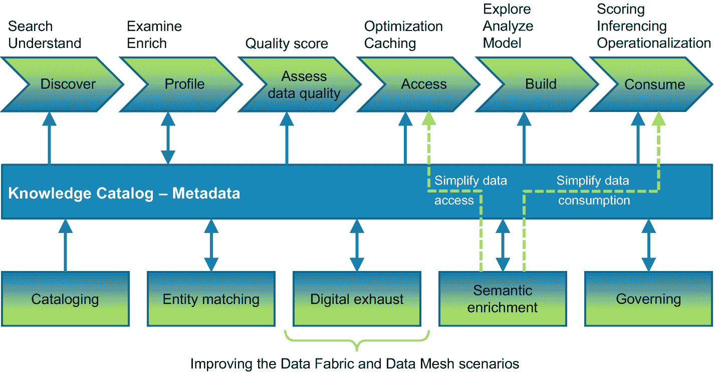

数据流程结构包括中心的知识目录元数据，用于发现、概要和评估数据质量、访问、构建、消费，以及在底部进行编目、实体匹配、数字废气、语义丰富化和治理。

图 7-1

关键数据编织或数据网状区域的关系

知识或治理编目，表示为中间层，包含所需的企业、技术和运营元数据。其上的一层代表数据消费者或业务用户，他们发现和描述数据、评估数据质量，并最终访问数据以构建与业务相关的工件，然后可以在业务相关环境中消费数据。其下的一层代表数据管理员、数据或信息治理专业人员或数据工程师执行的关键数据编织或数据网格任务。这些任务包括将新的数据源或其他实体注册或编目到知识编目中、执行实体匹配任务（除了一组更广泛的数据质量措施之外）、激活数字足迹、执行语义增强以及进行一系列数据治理任务。

这些任务可能由不同的角色根据使用场景执行，例如，数据消费与数据源注册。例如，评估数据质量可能由数据消费者、业务用户、数据管理员或数据治理专业人员共同完成。

数字足迹的结果进一步改善了这两个概念的场景，而语义增强的结果可以进一步简化和优化数据消费和数据访问。

下一节提供了关于这些人工智能相关主题的更多详细信息.^(6) 在此过程中，我们的重点特别在于人工智能/机器学习方面。

让我们从编目开始。

## 编目

知识或治理编目是数据编织架构和数据网格解决方案的一个基本组成部分。通过使用术语“编目”，我们指的是以数据为中心的任务，这些任务都会生成存储在知识编目中的业务、技术或运营元数据。这些任务不仅限于数据本身，还涉及 IT 或人工智能相关的工件，例如 ETL^(7)阶段和流程、机器学习/深度学习模型、数据管道等。

以下是一些示例：

+   注册新的数据源、ETL 阶段或人工智能工件，例如机器学习/深度学习模型

+   为新的法规或法律提出和分类新的业务术语

+   发现和创建新的资产规则或策略，例如与数据、机器学习/深度学习模型等相关。

+   检测敏感数据

+   分析数据

+   评估数据质量

+   评估机器学习/深度学习模型准确性、精确度和其他质量相关 KPI

+   生成和分配新的业务术语

除了前面的任务之外，操作环境可能会生成额外的元数据，例如，通过持续测量数据质量关键绩效指标（KPIs），例如，数据质量评分，理解机器学习/深度学习模型中的漂移和偏差，捕获数据血缘或数据来源事件等。激活数字尾迹和执行语义丰富化^(8)也会生成元数据。在这些任务中，一些任务在编目过程的上下文中按照一定的顺序执行。例如，注册新的数据源可能包括检测敏感数据以及生成和分配新的业务术语的任务。

图 7-2 展示了*注册新资产*的过程。我们描述了这个过程，包括数据源、IT 资产（ETL 阶段）和 AI 工件（ML 模型），其中重点在于 AI 增强。让我们更详细地讨论图 7-2。新数据源的元数据需要自动发现。这包括所有权、访问方法（SQL、NoSQL、REST API 等）、结构化或非结构化数据、读取和/或写入访问、认证要求等。

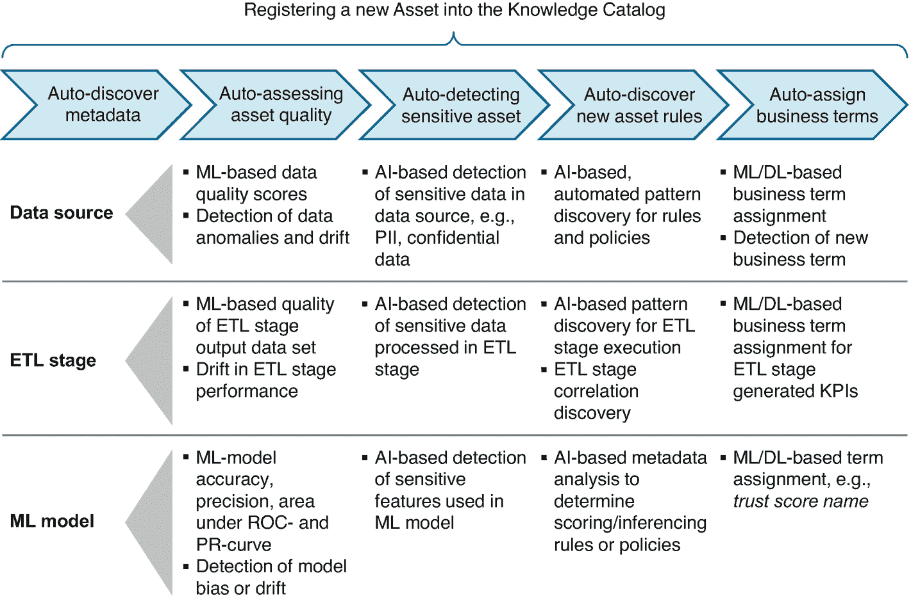

数据源、ETL 阶段、ML 模型不同阶段的示意图包括自动发现、元数据、自动评估资产质量、自动检测敏感资产、自动发现新资产规则和自动分配业务术语。

图 7-2

注册新资产

新 ETL 阶段的元数据包括所有权、执行模式、所需源数据、下游消费系统、应用程序、使用的语言（例如，SQL、Java、C++等）或依赖于 ETL 阶段结果的额外 ETL 阶段等。新 ML 模型的元数据包括所有权、ML 模型状态（例如，已训练、已验证、已测试、已部署等）、业务目的、所需数据源、所需数据源的特征、所需数据管道等。

数据管理员需要验证编目步骤，甚至可能需要手动完成缺失的元数据。

新数据源质量的自动评估包括基于 AI 生成质量评分和检测数据异常、缺失属性或对 AI 模型开发和调整特别重要的数据漂移。检测数据漂移可能是一个重复的过程。

ETL 阶段的自动评估包括基于机器学习的 ETL 阶段输出数据集的质量评估，包括完整性和可信度，以及在 ETL 性能中的漂移检测，后者是一个重复的过程.^(9) ML 模型质量的自动评估本身基于 ML 方法来衡量，例如，ML 模型的准确度、精确度以及 ROC 和 PR 曲线下的面积^(10)，以及检测模型公平性（偏差）和漂移，后者也是一个重复的过程。

基于 AI 的方法自动检测敏感数据，例如 PII^(11)或机密数据。数据管理员可以对 AI 模型的建议进行最终验证，以确认或拒绝。对于一个 ETL 阶段，必须在 ETL 阶段中处理的敏感数据执行基于 AI 的检测。同样，对于一个新 ML 模型，需要应用基于 AI 的方法来自动检测 ML 模型中使用的敏感特征。

自动检测新的资产规则是注册过程中的一个关键步骤。对于一个新数据源，这包括基于 AI 的、自动化的新数据规则和政策的模式发现，或者现有数据规则或政策的分配。对于一个 ETL 阶段，这包括基于 AI 的 ETL 阶段执行的模式发现或特定 ETL 阶段与附加 ETL 阶段的关联发现，这导致相应的规则或政策。需要理解一个新的 ML 模型在评分和推理需求方面的含义。基于 AI 的元数据分析以确定评分或推理模式生成新的或分配现有的 ML 模型评分和推理相关的规则或政策。

与新数据源相关的业务术语自动分配包括对知识目录中已包含的现有业务术语的基于机器学习/深度学习的分配；它还可能生成新的业务术语，例如，从新的法规或法律中派生出来的。一个新的 ETL 阶段可能会生成新的 KPI，这些 KPI 尚未反映在知识目录中。对于这样一个新的 ETL 阶段，基于机器学习/深度学习的业务术语分配与这些新的 KPI 相关。

最后，一个 ML 模型生成结果，例如，信任或置信度分数等，这些可能通过新的业务术语捕获或分配给现有的一个。

让我们继续探讨 AI 增强的 AI 资产理解意味着什么。

## AI 增强的资产理解

在上一节中，我们已经将上述范围扩大到不仅处理数据，还将 ETL 阶段和 ML 模型纳入我们的讨论。

接下来，我们继续关注数据和 ML 模型。这符合当今企业正在处理数量不断增长且多样化的资产这一预期。当我们在本节中使用术语*资产*时，我们指的是数据和 AI 模型，我们将我们的范围限制在 AI 增强的理解上。

图 7-3 描述了应用于四个过程步骤的 AI 能力集：*发现*、*配置文件*、*评估质量*和*访问资产*。一些 AI 能力可能应用于多个过程步骤，例如作为配置文件和质量评估过程一部分的质量评估。配置文件过程仅限于质量分数，而质量评估过程在更详细的水平上确定质量 KPI，包括提高资产质量的建议。

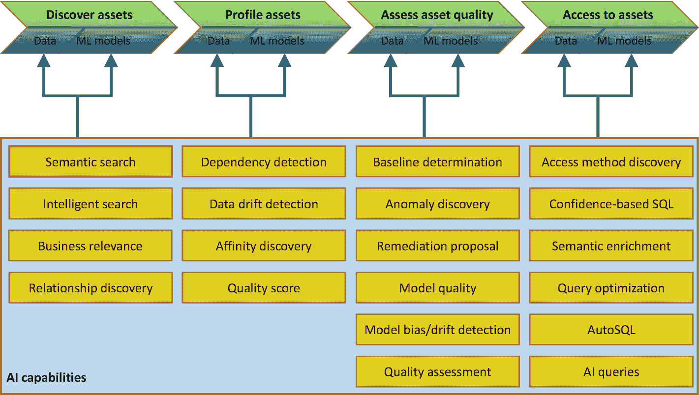

下面的图示展示了发现资产、概要资产、评估资产质量以及访问资产的过程，其中包括不同的资产类型，如语义搜索、智能搜索、业务相关性、关系发现、依赖检测、数据漂移检测、亲和力发现、质量评分、基线确定、异常发现、自动 SQL、AI 查询等。

图 7-3

AI 资产理解概述

我们将在接下来的四个小节中讨论这些 AI 能力。让我们从资产发现开始。

### 资产发现

一旦一个新的资产——再次，我们专注于数据源和机器学习模型，并关注人工智能增强的能力——在知识目录中注册，我们可以假设目录中存在必要的元数据。这使得业务用户和其他数据及人工智能资产消费者能够进行语义和智能搜索，理解业务相关性，并发现资产之间的关系。

语义搜索^(12)描述了业务用户或搜索引擎的意图，通过考虑搜索意图、查询上下文以及相关资产或实体之间的关系，生成尽可能准确的结果。这些实体可以是结构化数据（例如，关系数据、XML 或 JSON 文件、层次数据、CSV 文件）或非结构化数据（例如，文本数据、图像文件、视频和音频文件）。因此，语义搜索需要解决这两种类型的数据。

基于人工智能的智能搜索^(13)有助于呈现与业务意图相关的信息和答案。即使通过知识目录中可用的元数据已经识别出相关资产，对这些资产（例如数据、机器学习模型等）进行语义和智能搜索（例如，数据、机器学习模型等）也是必要的，以获得更深入的见解并验证特定业务意图的相关性。

在发现资产及其关系时，需要考虑相应的业务相关性或业务目标。这要求搜索工具具备理解人类语言的能力，并通过机器学习/深度学习进行学习和变得更加有针对性。这种对资产的理解范围明显超越了发现和概要阶段，在这些阶段中，需要进一步探索和理解结构化和非结构化数据、机器学习模型以及其他资产在业务环境中的情况。

让我们继续到这个概要阶段。

### 资产概要

一旦发现资产，就需要进一步了解它们与其他资产之间的依赖关系。对于机器学习模型来说，这意味着要了解评分和推理所需的特征，包括这些特征生成的系统和数据源，以及它们分别存储的位置。机器学习/深度学习技术可以用来理解资产与其他资产之间的亲和力，这在知识目录中有所反映。资产配置文件分析——包括亲和力发现——不仅限于分析知识目录中的元数据；还需要通过直接查看资产来分析发现的资产。例如，数据资产需要被扫描以了解其内容和结构、数据类型、主键和外键关系，以及与其他资产的亲和力。

质量评分可能需要使用机器学习模型和统计抽样在定义良好的数据子集上计算，以预测整个资产的质量。在某些情况下，对数据子集进行配置文件分析可能不足以满足需求；因此，可能需要在整个数据集上进行。数据漂移检测是一个重复的过程，考虑到机器学习模型的基础数据，这一点尤为重要。

计算质量评分是更广泛资产质量评估的第一步，我们将在下一节中讨论。

### 自动资产质量评估

在自动资产质量评估中，理解异常，尤其是在数据源中的异常，是一个关键领域。这需要确定数据基线，以便真正理解与该基线的偏差。AI/ML 技术可以用来确定几乎所有相关数据组件的基线。相应产品需要提供准备好的模型模板和 GUI，以简化这些质量评估，并且——最重要的是——降低业务用户确定基线和发现异常的技能要求。复杂的工具还应通过将发现的异常与已知问题进行比较，并随后提出补救策略来响应。这不仅适用于数据异常，也适用于其他资产的异常。

例如，发现降低的机器学习模型质量指标，例如模型偏差或漂移、降低的机器学习模型准确度或精度、ROC 和/或 PR 曲线下的面积减少等，应通过建议或自主执行的纠正措施进行传达，例如重新训练机器学习模型或调整超参数。任何资产的质量评估都是一个重复的、持续的过程，而不仅仅是当试图在资产最初发现之后理解资产时执行。

一旦理解了资产，它们最终可以被访问或重新访问。AI 如何支持这一点是我们下一小节的主题。

### 资产访问

ML 增强的数据抽象层应支持业务用户或资产消费者发现最佳访问方法。例如，可能需要考虑特定业务目的访问多个数据源。业务意图可以通过利用业务术语表、指定感兴趣的特定业务术语和 KPI 来表示。

在幕后使用 ML 方法可能建议通过数据虚拟化、联邦和智能缓存访问所需数据源的方法，以提供集中式访问，从而隐藏底层数据源集的复杂性和多样性，对资产消费者来说。这简化并优化了数据消费者的数据访问，并通过提供基于 ML 的数据存储收敛来减少数据孤岛的出现。这种 ML 增强的数据抽象层增加了自助数据访问需求并最小化了数据移动。

提高 SQL 查询性能和优化资源消耗是数据访问的另一个关键维度。在 RDBMS^(14)中，ML 增强的查询优化可以支持优化器从过去的经验中学习，比较特定 SQL 查询选择的访问路径和相应的执行时间，以在每个执行中细化访问路径——从而减少查询执行时间，进一步优化资源消耗，并在更短的时间内将关键见解提供给业务。

IBM Db2 AI for z/OS^(15)是一个例子，其中 AI/ML 被用于优化操作 SQL 查询性能。

让我们讨论一些正在扩展标准 SQL 应用范围的增强功能：

1.  **AutoSQL**：数据存储和方法的多样性，如数据湖、数据湖屋、关系型数据存储、DWH、可能还有几个知识目录和流数据，需要基于 AI 的 SQL 能力来隐藏业务用户使用多个查询引擎和移动或复制数据的需求。AutoSQL^(16)是一种技术，它自动化了 AI 的数据访问、集成和管理，无论数据位于何处以及如何存储，无需移动资产。与数据虚拟化和智能缓存功能相结合，AutoSQL 使业务用户能够轻松地在混合云和多厂商环境中查询数据。

1.  **基于置信度的查询匹配**：另一种提高数据访问的方法是 ML 增强的基于置信度的查询匹配，即使在数据位于初始搜索参数之外的情况下，也能提高查询结果和准确性。这一功能显著扩大了无需涉及数据科学家即可完成的数据任务的范围。

1.  **语义 SQL**：通过增强传统的 SQL 语义查询功能，可以更容易地访问数据，无需昂贵的 ETL 或让数据科学家参与。它还使一些标准 SQL 无法实现的额外用例成为可能。例如，Db2 for z/OS 的 SQL 数据洞察（SDI）^(17）利用深度学习方法，将标准 SQL 扩展到增强关系数据库中的传统数据处理。它将无监督学习扩展到训练神经网络模型，以在 Db2 for z/OS 数据中发现、匹配和分组具有相似性、差异性和集群的记录。例如，通过学习大量训练数据，SDI 可以推断出两个不同记录之间传统上不被视为完全匹配的隐藏关系。

## 实体匹配的 AI/ML

在任何数据架构和数据网格解决方案中，一个关键挑战是核心信息（主数据）的实体解析和匹配。由于数据存储在不同的系统和应用程序中，核心实体，例如客户、商业伙伴、公民、员工、产品、服务等，通常表示得相当不同，这使得将这些实体匹配起来以推导出一个可信的、完整的、单一的真实版本（黄金记录）变得很困难。这已经是一个几十年来已知的问题。

AI/ML 已经找到了解决这一挑战的方法，补充了现有的确定性和概率匹配技术，产生了更准确的匹配结果。由于我们在第八章中详细讨论了实体匹配^(18)，本节仅提供一个 AI/ML 增强的先进实体匹配概念的概述。

图 7-4 展示了中间框中的基于 AI/ML 的匹配引擎及其关键 AI/ML 功能，如昵称解析、模式发现、相似性发现、距离测量、基于机器学习的预测和标准化函数。各种不一致但相似的记录（如图左侧所示）作为匹配引擎的输入，可以通过设置各种参数进行调整和调整，如图右侧所示，例如匹配属性、阈值敏感性、匹配强度设置和底层机器学习算法的调整。

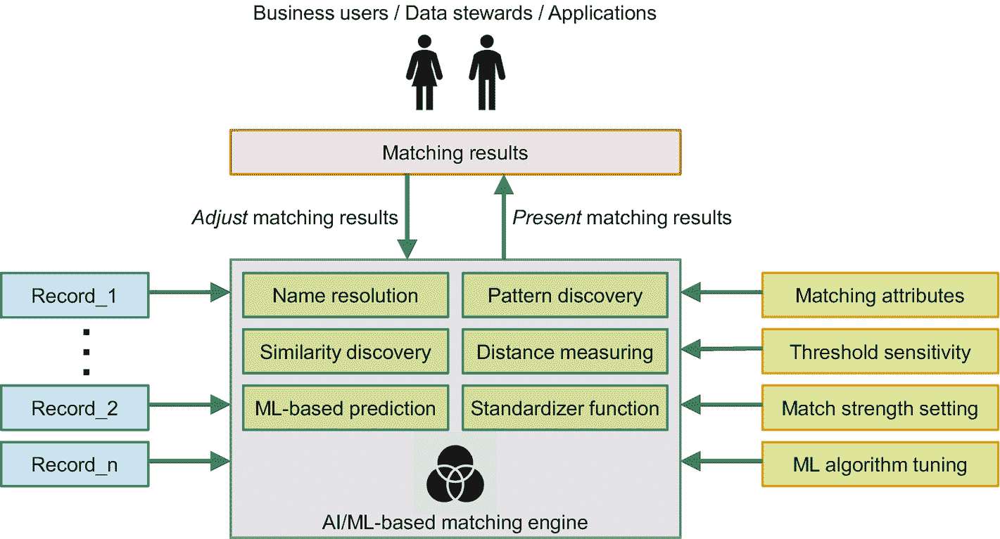

架构图解释了基于人工智能或机器学习匹配引擎的匹配结果，包括名称解析、相似性发现、基于机器学习的预测、模式发现、距离测量和标准化函数。匹配引擎从匹配属性、阈值敏感性、匹配强度设置、机器学习算法调整和记录 1 到记录 n 获取输入。

图 7-4

智能实体匹配

以下是一个可以调整以影响匹配结果的四个参数列表。

1.  **匹配属性**：需要根据记录内容进行定义。例如，这些属性可以是姓名、地址、昵称、电话号码、城市名称等；它们用作比较的输入，以将传入的记录匹配到主数据实体。

1.  **阈值敏感性**：需要定义为记录不匹配的下限和上限边界，以便对匹配引擎进行精细调整。

1.  **匹配强度设置**：可用于设置相似度强度，例如，使用介于 0 到 10 之间的值，并查看对属性和阈值敏感性的更改如何影响匹配算法的估计。

1.  **机器学习算法调整**：通过设置距离测量、实体标准化等，影响匹配引擎的机器学习算法。

匹配结果呈现给业务用户、数据管理员或请求的应用程序。如果需要，这些角色或应用程序可以通过进一步调整匹配引擎（通过前面的参数）并发送相应的记录回匹配引擎来触发进一步的调整。

以下列表描述了匹配引擎基于 AI/ML 的关键功能：

1.  **名称解析**：名称可能是全名、缩写或提供为昵称。名称解析可能使用图表示来指示与其他实体（如角色、城市、雇主或属性，如职业、年龄等）的关系。这允许图神经网络（GNNs）解析名称或昵称。GNNs 还可以用于发现可能相关于防止欺诈的额外见解。

1.  **模式发现**：大量记录和属性可以根据发现的模式自动聚类，或者根据精心选择的属性或属性类型子集进行聚类。这简化并加速了相似实体的发现。

1.  **相似度发现**：相似度发现算法可以通过匹配强度设置或权重由业务用户进行调整。根据距离计算、语义相似度关系、GNNs 等，可能使用不同的相似度算法。

1.  **距离测量**：计算距离与相似度发现相关，可以通过可调整的权重来促进。

1.  **标准化函数**：标准化器被匹配算法用于将不同属性的值转换为 AI/ML 匹配引擎可以处理的标准化表示。根据记录中找到的具体属性类型，匹配算法应使用多个标准化器。

1.  **基于 ML 的预测**：由于可能存在数百万个实体需要解决，ML 算法可以应用于数据的一个较小子集，例如 5`–`10%，以预测整个数据集上的匹配实体或支持数据管理员进一步微调匹配引擎参数。这提高了性能并减少了资源消耗。

根据数据类型，可能使用其他 AI/ML 方法和算法进行匹配。例如，通过应用深度学习算法比较和确定两个文本的相似性，或确定两个文本是否对某个主题持有相似的观点。然而，这个主题超出了本书的范围。

## AI/ML 激活数字废气

正如你在第三章和第五章中看到的，数据编织架构或数据网格解决方案由大量组件组成，这些组件可用于实现各种场景。大多数相关任务，无论是由数据管理员、业务用户、数据工程师、数据科学家或其他与 IT 和业务相关的角色执行，都会在知识目录中生成额外的元数据。

在系统、应用程序和工具的操作过程中，会生成额外的数据。这个数字足迹与 ETL 作业和 SQL 查询的执行、ML/DL 模型的评分和推理、数据、ML/DL 模型和其他资产的质量 KPI 的变化有关。可以在系统和应用程序的 LOG 中找到更多有用的信息，通过数据血缘或数据来源事件、数据质量评估或数据知识图谱的见解。

这个数字足迹也可能与在知识目录中注册新资产有关，从而获得关于数据和 AI 资产、执行数据质量改进或数据匹配流程、探索和转换资产、以及为特定商业目的消耗或使用资产等方面的额外见解。可以利用数字废气创建额外的元数据，其中 AI/ML 可以应用于这些新生成的元数据以获得额外的见解，并进一步优化这两个概念的过程。

以下是从数字废气中获得的额外见解的几个示例：

+   数据质量 KPI 的变化可以与某些 ML 模型在其生命周期中的漂移和精度下降相关联。

+   知识目录中可能已注册新的数据源或其他资产，这些资产可能有助于提高 BI 报告的相关性或提高 ML 模型的准确性。

+   将 LOG 数据与 SQL 查询耗时行为的相关性分析，可以获得关于资源消耗（例如，内存、CPU、I/O 等）中约束的额外见解。

图 7-5 展示了位于中心的知识目录，其中包含与注册、编目、理解等相关的元数据，这些我们在前面的章节中已经讨论过。它还包含新的元数据类型，这些元数据来源于数字废气数据，我们称之为*数字废气元数据*。

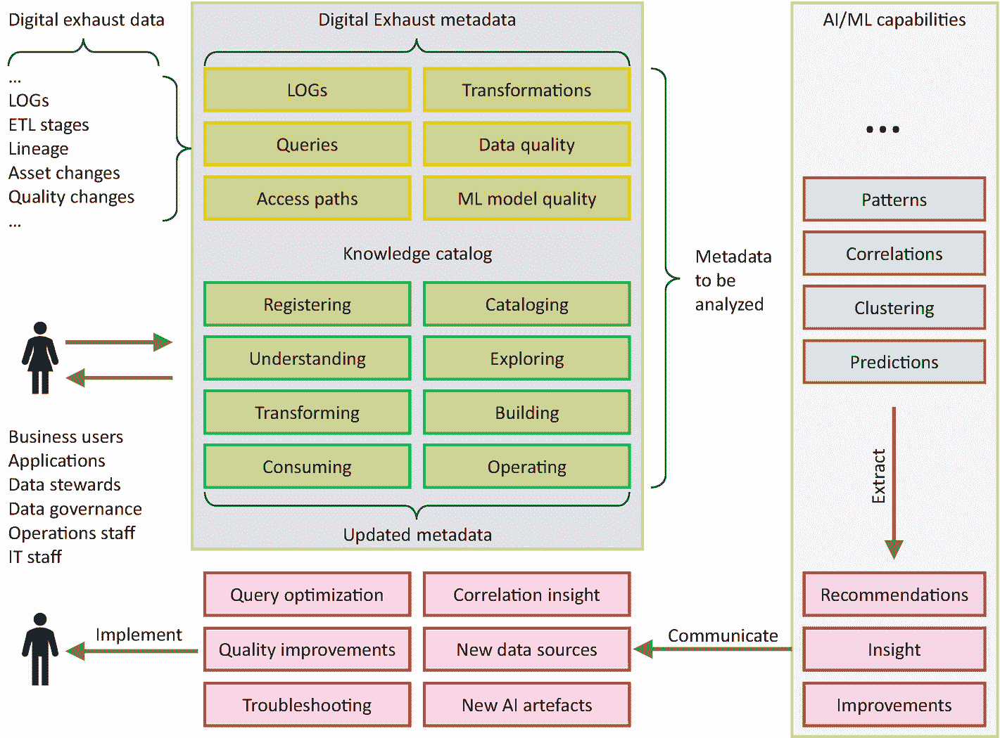

块图包括几个组件，包括数字废气元数据、知识目录、更新的元数据、AI 或 ML 能力、查询优化的通信、关联洞察、新数据源和故障排除，所有这些都是为了实现质量改进。它还涉及数字废气数据、日志、ETL 阶段、血缘、资产变更和质量变更。

图 7-5

数字废气元数据

这种新的元数据是由数字废气数据生成的，它由日志、ETL 阶段的执行和 SQL 查询等组成。这种元数据需要基于数字废气生成。这可以通过简单地将日志数据、数据血缘事件、SQL 查询执行时间、资源消耗、SQL 访问路径信息等存储在知识目录中来实现。

在一定程度上，现有的元数据也会得到更新。这种数字废气元数据和更新元数据的组合需要通过 AI/ML 能力进行分析，以获得额外的洞察，并提出改进、简化和优化相应的数据编织或数据网格场景的建议。AI/ML 技术主要用于发现模式和不明显的相关性或执行聚类和预测。

例如，机器学习方法可以用来预测可能低于定义阈值的数据质量下降，或者根据资源调整（例如，调整缓冲池大小）来预测改进的 SQL 性能。数据编织和数据网格解决方案应自主实施调整或提供应实施的推荐。

激活数字废气可能仅通过关联非明显的数据点就能产生额外的业务洞察。当然，这取决于捕获的数字废气数据的范围和内容。例如，如果捕获了与营销活动相关的机器学习模型评分或推理事件，这些数据可以与数据质量倡议或新数据源的可用性相关联，可能建议或自主实施调整，以提高营销活动的准确性。

现在我们来详细阐述最后一个主题，它与使用人工智能/机器学习进行语义丰富化相关。

## 人工智能/机器学习用于语义丰富化

语义丰富^(19) 是向数据添加意义的过程，这体现在知识目录中的附加元数据中。语义丰富的目的是简化并优化一些关键的数据编织和数据网格任务，例如资产搜索和发现、应用程序和商业用户对资产的访问和消费，以构建相应的数据产品。再次强调，当我们使用术语 *资产* 时，我们指的是数据、机器学习/深度学习模型以及其他人工智能工件。将人工智能应用于语义丰富过程提供了 *智能* 和 *自动化* 的丰富，主要通过使用外部数据源来对资产进行语义知识化，例如基于知识图谱、特定领域或行业的分类法或本体、商业和 IT 术语表以及知识目录中的其他现有元数据。

通过语义知识丰富数据编织和数据网格，使得数据用户和商业用户更容易搜索、发现、访问和消费资产，并且可以特别保护商业用户免受 IT 复杂性的影响，包括异构的数据源景观、不同的数据访问方法（SQL 与 NoSQL）以及各种数据格式（关系型、XML、JSON、文本等）。

语义丰富通常用于标记、索引、分类、标记、注释等上下文中。语义丰富的挑战是尽可能提供自动化，主要通过将人工智能/机器学习融入语义丰富过程来实现。

图 7-6 是一个高级的 AI/ML 注入语义丰富引擎的描述，它由聚类、模式发现、相关性或关系发现、概念匹配等人工智能/机器学习能力以及额外的语义丰富能力组成，例如语言分析、文本分析、标记、索引等。如图 7-6 的左侧所示，要语义丰富的资产可以是数据（结构化或非结构化）、机器学习/深度学习模型或其他与人工智能相关的工件、文本、XML 或 JSON 文档、数据科学相关管道、ETL 阶段、数字消耗元数据等。

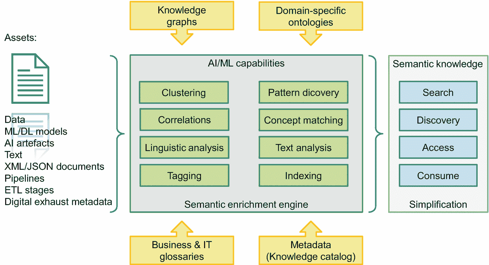

一个示意图展示了各种组件，包括资产数据、机器学习或深度学习模型、文本、知识图谱、特定领域的本体、商业 IT 术语表和元数据。这些组件连接到一个利用机器学习能力（如聚类、相关性、语言分析、标记、模式发现、概念匹配、文本分析和索引）的语义丰富引擎。

图 7-6

语义丰富

语义丰富引擎正在使用额外的外部数据源，例如知识图谱、特定领域或行业的分类法或本体，以及商业和 IT 术语表，来生成语义元数据或知识。存储在知识目录中的现有元数据也可以用作额外的输入。

一旦生成语义元数据，业务用户就可以使用它来简化并优化与数据织物和数据网格相关联的任务，例如资产搜索、发现、访问和消费，以及——最重要的是——以自助方式构建数据产品。此外，语义洞察力应该是可解释的、可操作的，并通过 GUI 进行可视化^(20)。

## 关键要点

我们以表 7-1 中总结的几个关键要点来结束本章。

表 7-1

关键要点

| # | 关键要点 | 高级描述 |
| --- | --- | --- |
| 1 | AI/ML 方法是增强数据织物和数据网格的关键。AI/ML 增强的数据织物和数据网格以自助方式民主化数据访问，并使*数据即产品*（数据购物）成为数据网格的关键原则。 |
| 2 | 注册新资产应自动生成元数据。将新的数据或 AI 资产注册到知识目录中应与自动评估资产质量、自动检测敏感数据、自动发现新资产规则和自动分配业务条款相关联。 |
| 3 | 使用 AI 增强标准 SQL。 | 标准 SQL 的一些基本增强包括 AutoSQL、基于置信度的查询匹配和语义 SQL。 |
| 4 | 应使用 AI/ML 进行实体匹配。 | AI/ML 已经找到了解决核心信息（主数据）实体匹配挑战的方法，补充了现有的确定性和概率匹配技术，产生了更准确的匹配结果。 |
| 5 | AI/ML 可用于激活数字废气。可以利用数字废气创建额外的元数据（数字废气元数据），其中 AI/ML 可以应用于这些元数据以获得额外的洞察力，并进一步优化数据织物和数据网格场景。 |
| 9 | 应增强语义丰富引擎以使用 AI/ML。 | 语义丰富的目标是简化并优化一些关键的数据织物和数据网格任务，例如资产的搜索和发现、应用程序和业务用户的访问和消费。 |

## 参考文献

1.  Sengupta, S., *在构建逻辑数据织物中 AI 和 ML 的作用*，2021，[`www.rtinsights.com/the-role-of-ai-and-ml-in-building-a-logical-data-fabric/`](http://www.rtinsights.com/the-role-of-ai-and-ml-in-building-a-logical-data-fabric/)（访问日期：2022 年 6 月 23 日）。

1.  Hechler, E., Oberhofer, M., Schaeck, T., *在企业中部署 AI*，Apress，2020，ISBN-13：978-1484262054。

1.  Talend，*数据质量和机器学习：它们之间的联系*，2022，[`www.talend.com/resources/machine-learning-data-quality/`](http://www.talend.com/resources/machine-learning-data-quality/)（访问日期：2022 年 6 月 21 日）。

1.  Theodorou, V., Abelló, A., Lehmer, W., Thiele, M., *ETL 过程的质最度量：从目标到实施*, 2016, [访问链接](https://upcommons.upc.edu/bitstream/handle/2117/100626/16.CCPE.pdf) (访问日期：2022 年 6 月 23 日).

1.  IBM, *IBM Watson Explorer*, 2022, [访问链接](http://www.ibm.com/docs/en/watson-explorer/12.0.x) (访问日期：2022 年 6 月 24 日).

1.  IBM, *智能搜索*, 2021, [访问链接](http://www.ibm.com/cloud/learn/intelligent-search) (访问日期：2022 年 6 月 24 日).

1.  IBM, *关于 IBM 下一代数据云包和新的数据架构的 5 件事，你需要知道*, 2021, [访问链接](https://newsroom.ibm.com/5-Things-to-Know-about-Cloud-Pak-for-Data-and-New-Data-Fabric) (访问日期：2022 年 6 月 25 日).

1.  IBM, *IBM Db2 AI for z/OS*, 2022, [访问链接](http://www.ibm.com/products/db2-ai-for-zos) (访问日期：2022 年 6 月 25 日).

1.  IBM, *IBM Db2 13 for z/OS 和更多*, IBM Redbooks, 2022.

1.  Clarke, M., Harley, P., *你的内容有多智能？使用语义增强来提升用户体验和盈利能力*, 2014, [访问链接](http://www.councilscienceeditors.org/wp-content/uploads/v37n2p40-44.pdf) (访问日期：2022 年 6 月 29 日).

1.  Schlegel, A., Heese, R., Hinze, A., 语义增强的可视化，2012, [访问链接](https://cs.emis.de/LNI/Proceedings/Proceedings208/1047.pdf) (访问日期：2022 年 6 月 29 日).

# 8. 实体识别的 AI

人们普遍认为，一个组织的成功越来越依赖于其从拥有的数据中提取价值的能力。然而，许多组织仍然停留在第一步——理解数据——尤其是在数据量和复杂性持续增长的情况下。想想一个简单的问题：*你的企业有多少客户？* 对于许多企业来说，提供对这个问题的准确答案仍然很困难。

原因很简单：大型组织通常有多个部门、产品线和销售渠道，它们收集了各种各样的客户信息。一个客户可能使用不同的电子邮件地址注册，并在多个系统中被识别为不同的用户。更不用说通过收购进入的新公司了。客户信息的存储格式差异很大。因此，在多个系统中识别相同的客户对于建立企业分析和 AI 的信任基础，以及实施可持续的数据架构和相应的数据网格解决方案至关重要。

本章深入探讨了第三个用例场景（客户 360 度），我们在第三章中对其进行了详细阐述。它概述了新型人工智能增强的实体匹配能力，这可以显著提高对核心信息的信任度。

## 简介

用于描述企业核心业务实体的数据被称为主数据，通过 MDM 系统进行管理。企业主数据具有很高的商业价值，可以在企业内部的不同业务单元中重复使用，并且通常分布在多个异构应用系统中。

企业主数据有多种类型。最常见的是供应商和客户。此外，不同行业可能有特定类型的 master 数据.^(1) 电子商务公司必须对渠道和分销商有一个全面的了解，以便进行交叉销售和升级销售。医疗保健需要 360 度的患者视图，以进行个性化治疗、医疗保健服务和保险计划。制造商关注材料、零件和价格，这些都是他们采购的关键。

对于企业内部的不同业务部门，它们的 master 数据也不同。客户信息无疑是销售和营销部门的关键。包括产品发布和类别的产品信息是研发部门的核心资产。员工信息、组织结构和部门层级是人力资源部门的首要关注点。

拥有完整准确的主数据集有助于企业简化流程，提升客户体验，并优化资源。然而，在现实世界中，由于拼写、缩写、语言、格式等因素，相同的数据可以被各种系统以不同的格式表示。让我们看看图 8-1 中的例子。在这个例子中，*姓名*、*地址*和*电话号码*是身份属性。然而，在*员工*表中，*姓名*和*地址*是复合属性，而在*订单*表中，它们是原子属性。但将第一个表中的复合属性映射到第二个表是很容易的。

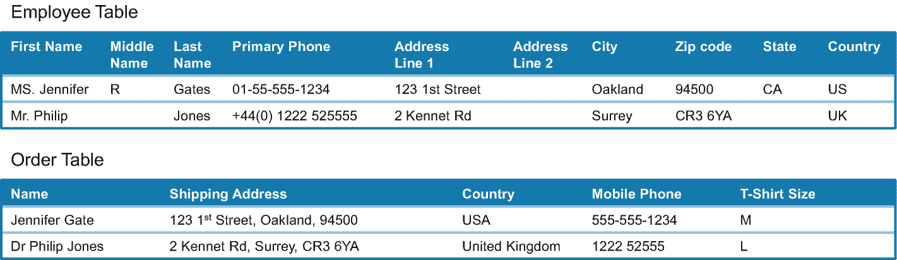

两张员工信息表和一个订单表。员工表中的列包括姓氏、中间名、姓氏、主要电话、地址行 1、地址行 2、城市、邮编、州和 country。在第二个表中，列包括姓名、送货地址、国家、移动电话和 T 恤尺码。

图 8-1

同一个人的不同记录

前述相关属性的格式略有不同。*订单*表中的手机号码没有国家代码。*国家*列中的数据值也以不同的方式呈现。尽管如此，Jennifer Gates 和 Philip Jones 在两个系统中很可能分别指的是同一客户，因为相应属性的相似性。

回到本章开头的问题，*业务实际上有多少客户？* 如果同一系统或不同系统之间没有删除重复记录或合并，业务可能拥有的客户数量远超实际，这可能导致不良决策甚至严重的商业后果。

让我们从实体匹配的介绍开始。

## 介绍实体匹配

实体匹配^(2) 指的是在来自相同或不同数据源的多个数据集中识别同一实体（人、产品、供应商等）的过程。同一数据源内的匹配主要是为了识别重复的实体记录，其中直接计算相同属性的相似度。数据源之间的匹配是为了建立不同数据源实体之间的联系，从而创建实体的综合视图。相似度的计算稍微复杂一些。首先计算属性的相似度，然后计算相似属性值的相似度。

例如，如图 8-2 所示的*保险*数据库有一个包含*姓名*属性的*客户*表。与*姓名*属性对应的值是 Bob Lyle 和 Robert Lyle。他们可能指的是同一个人。*零售*数据库也有一个包含两个属性*姓氏*和*名字*的*客户*表。首先，匹配两张表中的*名字*、*姓氏*和*姓名*。然后比较这些属性的记录值，看它们是否相似。

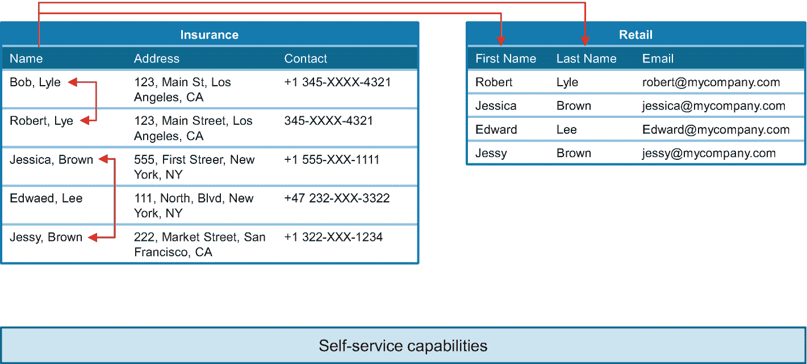

两张保险和零售信息表。保险表包括姓名、地址和联系方式。零售表包括他们的姓氏和名字以及电子邮件。两张表底部的文本是自助功能。

图 8-2

实体匹配的示例

然而，有些讽刺的是，实体匹配本身也有许多不同的叫法——实体解析、^(3) 记录链接、重复等。

为什么实体匹配很重要？随着数据量的爆炸性增长，企业正面临着日益严重的数据孤岛问题。数据孤岛的原因既有内部也有外部。首先，当 IT 应用上线时，它们没有考虑统一的数据架构，应用中的数据模型可能不同，例如，信用卡系统的客户表设计可能与存款和贷款系统不同。此外，如果数据外包，如潜在客户数据用于营销活动，那么潜在实体的定义可能不同于自建系统。如果没有有效的方法来识别这些记录之间的关系以及合并同一实体的记录，这些数据的价值将大大降低。这个问题不仅来自业务方面，也来自最终用户，其中某些信息可能输入错误，或者姓名、手机号码或地址的变化导致个人信息发生变化，从而造成周期性记录的不一致。

实体匹配是提供单一真实性的基础技术。公司可以使用实体匹配来全面了解情况：一方面，为顾客定制体验并增加销售额；另一方面，及时持续评估风险并识别可疑行为。

## 传统实体解析方法

实体匹配通常被认为是一个包含多个步骤的过程。尽管具体步骤可能有所不同，但它们都包括图 8-3 中展示的步骤。

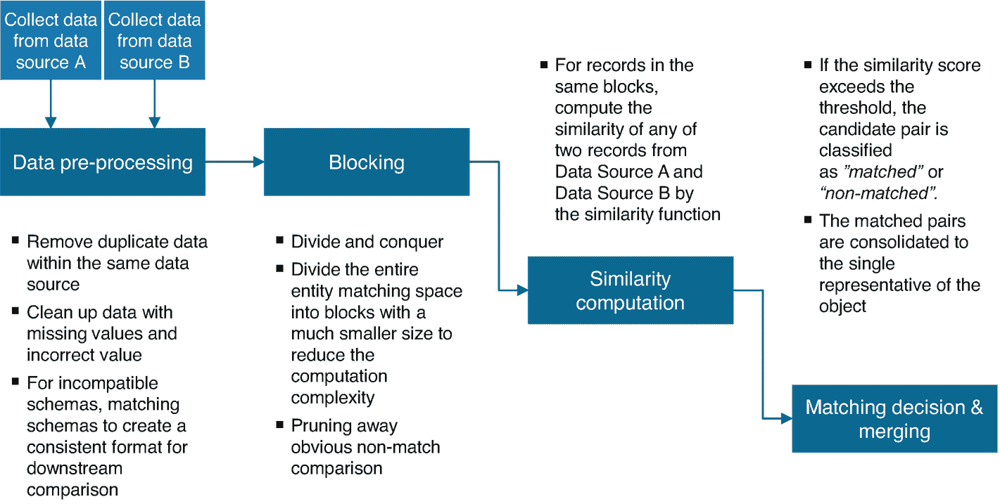

传统实体参考模型的框图。它从数据源 A 和 B 的数据收集开始，接着是数据预处理、分组、相似度计算、匹配决策和合并。

图 8-3

传统实体匹配的参考模型

第一步是数据预处理。在这个阶段的目标是将数据转换成具有相同规格的一致结构化格式，例如单位、类型和缩写。数据预处理还包括模式匹配。目的是确定数据源之间应该相互比较的属性，本质上是在识别语义相关的属性。例如，一个表中的*地址*列应该与一个或多个列（*地址行 1*、*地址行 2*、*街道名称*、*城市名称*）相关联。传统的方法是构建一个包含单个属性表示所有可能方式的全球字典。在这种情况下，字典中的条目是（键：*地址*，值：*地址行 1*、*地址行 2*、*街道名称*、*城市名称*）^(4)。

第二步是分组，^(5)如图 8-4 所示。这一阶段在大数据背景下尤为重要。

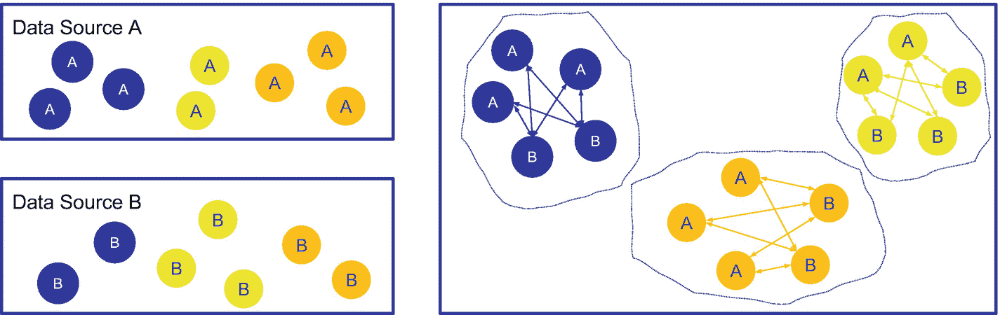

块图由两个数据源 A 和 B 组成，它们散布在左侧。这些源形成三个簇，每个簇中 A 和 B 都结合在一起。每个簇包含三个 A 和两个 B。

图 8-4

阻塞的示意图

实体匹配的计算复杂度与数据样本的数量有关。例如，如果数据源 A 的表中有一个包含 10,000 个客户记录的表格，而数据源 B 的表中有一个包含 100,000 个客户记录的表格，那么将执行十亿个成对比较（100,000 × 10,000），这非常耗时。阻塞的想法是通过将来自不同数据源的数据分成更小的块来减少计算的复杂性，并且只比较块内的数据记录。这显著地将计算的复杂性从总数据的二次方减少到块的二次方。如图 8-4 所示的阻塞的关键步骤包括从记录中提取标记（属性的组合）并将记录映射到一个或多个块。有许多阻塞算法.^(6) 主要有两类：基于哈希的和基于排序的。正如其名所示，基于哈希的阻塞是通过标记映射到块的，而基于排序的则是排序标记并取固定大小的窗口作为块。

下一步是相似性计算。两个记录之间的相似性是通过聚合对应属性的相似性值来计算的，假设属性是独立的。这一阶段的核心元素是相似性函数和属性选择。

经典的方法是基于规则的。例如，*如果两个记录具有相似的名字和地址，它们指的是同一个实体*。在这个例子中，选定的属性是 *name* 和 *address*。*相似性* 是一种概率匹配，通常由一个相似性函数定义，例如 Jaccard 相似性或指数，^(7) 它通过两个数据集中共同值的总数和两个数据集中不同值的总数来衡量两个数据集的相似性，如图 8-5 所示。

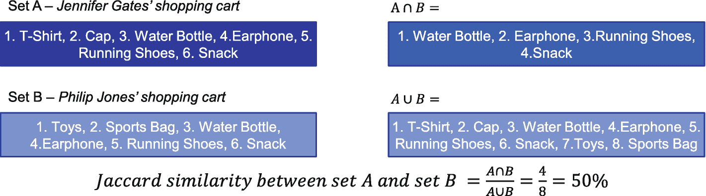

集合 A（Jennifer Gates 购物车）和集合 B（Philip Jone 购物车）的示意图。文本显示集合 A 和集合 B 之间的 Jaccard 相似性 = A 与 B 的交集除以 A 与 B 的并集 = 4/8 = 50%。

图 8-5

两个集合之间的 Jaccard 相似性示意图

基于规则的算法简单易行，但通常需要深入的专业知识来手动构建，且难以调整。此外，它不具有可扩展性。一旦问题空间增大，基于规则的系统很快就会变得难以管理。

最终阶段是匹配决策和合并，如图 8-6 所示。匹配决策是通过比较相似度值与属性级阈值来进行的，记录级阈值决定两条记录是否匹配。一旦确定两条记录是同一实体，这两条记录就被合并成一个对象的单一代表。 

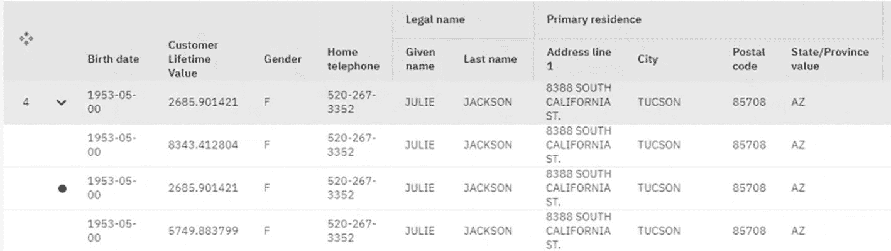

一个合并过程的表格显示了出生日期、客户终身价值、性别、家庭电话、给定名称、姓氏、地址行 1、城市、邮政编码以及州或省的值。

图 8-6

合并的一个例子

## 使用 AI 解决实体挑战

实体匹配过程中的许多问题可以通过机器学习方法解决。第六章解释了非学习编程与机器学习之间的区别。与手动选择属性/标记并手动构建实体解析规则相比，机器学习方法从训练数据集中学习匹配结果的优化解决方案。让我们检查每个实体匹配阶段可以应用哪种机器学习方法。

+   **数据预处理**：模式匹配是找到源模式 A 和目标模式 B 之间的相似属性。给定源 A 和目标 B 中属性的特征，这个问题可以转化为一个经典的聚类问题。属性的特征是通过模式（列名、数据类型、唯一约束）的元数据和字段中数据的统计（数值数据的最大值、最小值、平均值等）提取的。对于每个属性提取的特征，K-means 和 SOM（自组织映射）将具有相似特征的属性放入聚类中。

+   **阻塞**：阻塞的本质是将可能指向同一实体的数据记录放在一个数据块中，尽可能多地丢弃不相似和不相关的数据。在训练数据集具有标签的情况下，匹配对和非匹配对被标记，监督学习有助于选择属性/标记以及将匹配对映射到同一块和非匹配对映射到分离块的转换函数。

+   即使没有标记的数据，无论是由于没有先验知识还是标记成本过高，无监督学习也可以发挥作用，使用聚类算法来促进后续的监督学习。有几个聚类算法有助于获得近似标签。

+   **相似度计算**：学习目标是找到训练集中已知匹配和非匹配数据的最佳相似度计算方法。SVM（支持向量机）和决策树是实践中常用来找到最佳相似度计算方法的分类算法。

+   **匹配决策**：学习匹配决策的正确阈值是一个监督学习问题。使用不同的阈值会影响匹配决策。

随着深度学习的兴起，神经网络在实体匹配过程中有广泛的应用.^(8)最初它仅仅是一个用于确定记录是否匹配的分类器。现在它正在扩展其角色，以应对过程中每一步的挑战。特征提取、模式匹配、阻塞和相似度度量在这方面特别有趣，因为深度学习方法越来越多地减少了繁琐的手工制作工作。这个领域的基本深度学习方法包括循环神经网络（RNNs).^(9)

活动学习也适用于实体匹配，以克服缺乏标注数据的挑战。其背后的理念是，主动学习器从未标记的数据集中选择一小部分最有信息量的记录供专家标注，然后从标注数据中学习一个有效的分类器。目标是实现高分类器性能，同时相对较低地降低标注成本。

图 8-7 是 AI 基于实体匹配过程的参考模型的示意图。

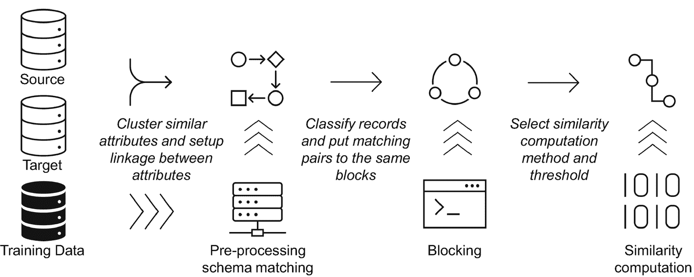

基于 AI 的实体匹配的过程示意图。它从源和目标数据的训练数据开始，接着是预处理模式匹配、阻塞和相似度计算。

图 8-7

基于 AI 的实体匹配过程的示意图

## 基于 AI 解决方案的益处和成本

传统实体匹配方法存在一些局限性。首先，基于规则的匹配方法完全依赖于领域专家的知识。然而，这种方法并不非常准确，并且有一定的主观性。例如，考虑以下规则：*如果两个记录的地址值相似，则它们匹配*。

想象一下这种情况，因为如果你目前租住的地方之前有信用风险的前租户，那么假设你是同一个人，你的信用也会受到影响，这显然是不公平的。此外，基于规则的构建成本很高，需要将所有知识编码成规则进行枚举的繁重工作。

同样，传统方法需要手动选择属性进行模式匹配和阻塞。这不仅劳动密集，而且容易出错。适当的阻塞策略选择和临时调整使得这项任务变得非同小可。如果手动选择策略不是最优的，很可能相似的记录被分配到不同的块中，导致匹配率很高，或者将太多无关的记录分配到同一个块中，导致计算资源的浪费。

基于 AI 的解决方案在解决这些挑战方面取得了长足的进步。首先，AI 基于历史数据学习，突破了专家经验的限制，并从数据中挖掘出潜在的隐藏模式，以实现最佳解决方案。同时，使用机器学习（ML）或深度学习（DL）可以在最大程度上自动化耗时且繁重的任务，并也将减少人为错误。

然而，所有这些优势都伴随着代价。一般来说，基于 AI 的解决方案的执行时间显著低于非学习方法，并且对于大数据集来说不可扩展。这对于深度学习（DL）尤其如此，它需要特定的硬件加速。此外，机器学习方法的效率已知取决于训练数据的提供。接收和清理数据需要花费大量时间，更不用说需要正确标记数据以构建高质量模型的需求。所有这些都增加了构建 AI 解决方案的难度。

数据分布以及正负实例对模型的准确性和公平性有很大影响。最后但同样重要的是，DL 的使用也面临着可解释性的问题。尽管基于 AI 的解决方案有许多好处，但它们也伴随着需要仔细权衡的成本。

## MDM 解决方案的考虑因素

如前所述，实体解析是 MDM 的核心。了解了实体解析的工作原理后，让我们回到 MDM 解决方案。毫无疑问，在选择主数据解决方案时，最重要的考虑因素之一是实体解析的准确性、效率和自动化水平。理想情况下，该解决方案应提供丰富的内置模型用于属性映射和记录映射，并在数据摄取时尽可能自动化整个匹配过程。

见图 8-8 中的一个示例。当*Auto Insurance Customers_shaped*表被摄取时，列会自动映射到内置数据模型。

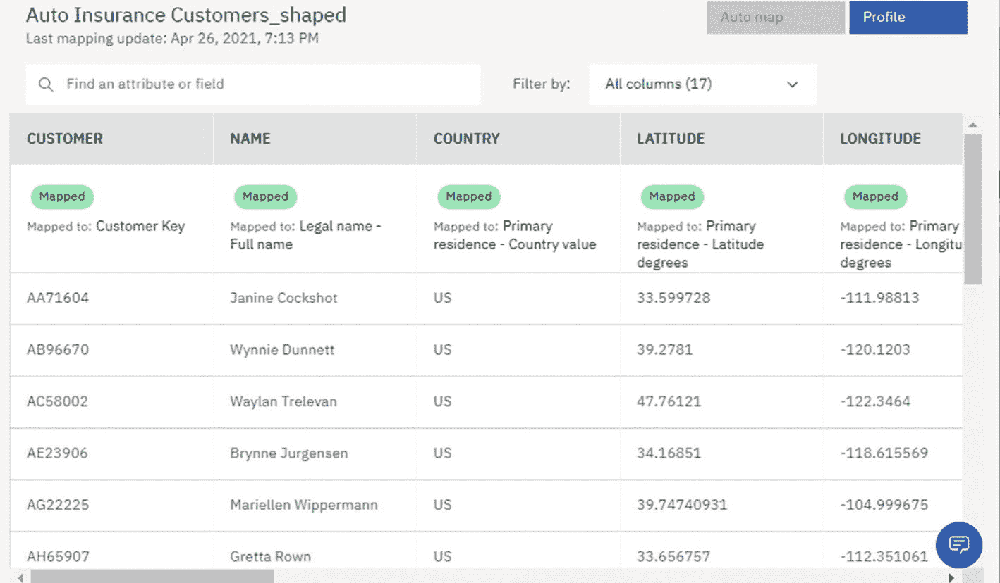

自动保险客户形状的截图。它显示了客户信息，包括姓名、国家、纬度和经度，这些信息映射到客户键、法定名称、主要居住地、纬度度和经度度。

图 8-8

自动映射

此外，由于公司运营的不同领域，通用模型可能不适用。这要求 MDM 解决方案提供能力，使用户能够带来自己的定制模型，并具有将模型属性映射到数据列的灵活性，如图 8-9 所示。

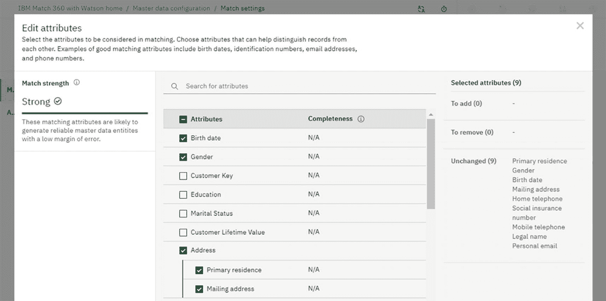

IBM match 360 Watson 主页的截图具有编辑属性，匹配强度状态为强。在右侧面板中，选择了属性、出生日期、性别和地址复选框。

图 8-9

定制模型

除了核心功能外，MDM 系统的上游应与企业数据架构紧密集成，以便简化对不同类型数据源的访问，无论是 ETL、虚拟化还是复制。

同时，它需要与企业资产目录紧密集成。作为一项重要资产，主数据在企业资产目录中发布，供企业内部各部门查询和使用。

## 关键要点

我们以表 8-1 中总结的几个关键要点来结束本章。

表 8-1

关键要点

| # | 关键要点 | 高级描述 |
| --- | --- | --- |
| 1 | 企业主数据有多种类型。 | 最常见的主数据是供应商和客户。还有行业特定的主数据——电子商务的*渠道*和*分销商*，医疗保健的*患者*，制造业的*材料和零件*。 |
| 2 | 实体匹配是指识别相同实体的过程。 | 在同一数据源内的匹配主要用于数据源中的重复实体记录。数据源之间的匹配是为了更好地关联不同数据源中的实体，以获得更全面的实体视图。 |
| 3 | 实体匹配本身有许多变体。 | 它被称为实体解析、记录链接、重复等。 |
| 4 | 实体匹配是一个包含多个步骤的过程。 | 它包括数据预处理以清理数据和匹配模式，阻塞以减少比较复杂性，以及相似度计算和合并以得出结果。 |
| 5 | 实体匹配过程中的许多问题可以通过 ML 方法解决。 | 实质上，实体匹配是对标记数据的分类问题，对未标记数据的聚类问题。SVM、K-means 和决策树是常见的算法。 |
| 6 | 实体匹配是 Data Fabric 和 Data Mesh 的关键能力。 | Data Fabric 架构和 Data Mesh 解决方案需要包括实体匹配能力，以确保核心信息（即客户、合作伙伴、供应商、公民等）的信任。 |
| 7 | MDM 解决方案不仅仅是实体匹配引擎。 | 允许用户带来自己的模型，并具有将模型属性映射到数据列的灵活性也是非常重要的。 |

## 参考文献

1.  Goyal, S.，*实体解析简介* `–` *需求和挑战*，[`https://towardsdatascience.com/an-introduction-to-entity-resolution-needs-and-challenges-97fba052dde5`](https://towardsdatascience.com/an-introduction-to-entity-resolution-needs-and-challenges-97fba052dde5)（访问日期：2022 年 8 月 22 日）。

1.  Talburt, J. R., *实体解析与信息质量*，Morgan Kaufmann，2011，ISBN-13：978-0123819727。

1.  Sahay, T., Mehta, A., Jadon, S, *使用机器学习的模式匹配*, 2019, [`arxiv.org/pdf/1911.11543.pdf`](https://arxiv.org/pdf/1911.11543.pdf) (访问日期：2022 年 8 月 22 日).

1.  Papadakis, G., Skoutas, D., *实体解析的阻塞和过滤技术：综述,* [`dl.acm.org/doi/abs/10.1145/3377455`](https://dl.acm.org/doi/abs/10.1145/3377455) (访问日期：2022 年 8 月 22 日).

1.  Altwaijry, H., Sharad, M., *实体解析的分析感知方法*, [`escholarship.org/uc/item/0nc1x8nf`](https://escholarship.org/uc/item/0nc1x8nf) (访问日期：2022 年 8 月 22 日).

1.  Chistophides, V., Efthymiou, V., Palpanas, T., Papadakis, G., Stefanidis, K., *大数据端到端实体解析概述*, [`dl.acm.org/doi/abs/10.1145/3418896`](https://dl.acm.org/doi/abs/10.1145/3418896) (访问日期：2022 年 8 月 22 日).

1.  Kopcke, H., Thor, A., Rahm, E., *在现实世界匹配问题上的实体解析方法评估*, [`www.researchgate.net/publication/220538608_Evaluation_of_entity_resolution_approaches_on_real-world_match_problems`](http://www.researchgate.net/publication/220538608_Evaluation_of_entity_resolution_approaches_on_real-world_match_problems) (访问日期：2022 年 8 月 22 日).

1.  Statistics How To, *Jaccard 指数*, [`www.statisticshowto.com/jaccard-index/`](http://www.statisticshowto.com/jaccard-index/) (访问日期：2022 年 8 月 22 日).

1.  Barlaug, N., Gulla, J. A., *实体匹配的神经网络：综述*, [`dl.acm.org/doi/10.1145/3442200`](https://dl.acm.org/doi/10.1145/3442200) (访问日期：2022 年 8 月 22 日).

1.  Salel, F. M., *循环神经网络：从简单到门控架构*, Springer, 2022, ISBN-13 : 978-3030899288.

# 9. AI 生命周期中的数据编织和数据网格

随着技术和商业领域人工智能的发展，人工智能不再仅限于少数数据科学家进行的实验。它将渗透到企业业务运营的各个方面，并继续为新的商业场景进行创新和优化。现在，焦点从人工智能算法的竞争转移到了如何结合专家团队和人工智能技术的优势，以满足企业和行业的实际需求，从而产生商业价值。

将数据和人工智能投入生产意味着企业不仅需要创建 AI 模型，还需要使 AI 工作负载运营化，这意味着有效地和高效地实践人工智能，更重要的是，以能够使结果令人信服的方式进行。因此，在企业内部建立可验证的 AI 全生命周期管理系统至关重要。

让我们通过介绍 AI 生命周期来深入探讨这个主题。

## AI 生命周期的简介

人工智能和软件工程有根本性的区别。传统的软件是规则驱动的，程序员将问题的解决方案转化为清晰的逻辑规则，而人工智能则是更偏向数据驱动的，它基于数据集和一系列选定的算法。传统的软件将问题分解为组件、模块和函数，直到代码行。它总是为每个构建块提供确定性的输出，并且所有构建块协同工作，为相同的输入产生确定性的输出。

人工智能以非常不同的方式工作。没有定义明确的规则，人工智能模型被训练去寻找问题的最优解的近似。解决方案的效率取决于用于训练的数据质量、所选特征的有效性和算法的复杂性。它通过使用“逐步近似加搜索”策略来找到一组参数（模型），以最小化损失函数。

因此，人工智能工程是一个全新的领域。根据 Gartner 2022 年技术趋势^(1)，“人工智能工程自动化数据、模型和应用程序的更新，以简化人工智能交付。结合强大的人工智能治理，人工智能工程将使人工智能的交付实现商业化，确保其持续的商业价值。”本质上，人工智能工程是一系列方法、工具和实践的集合，它加速了整个人工智能生命周期，并确保了高效交付稳健、可信且可解释的人工智能模型，并持续为企业创造价值。

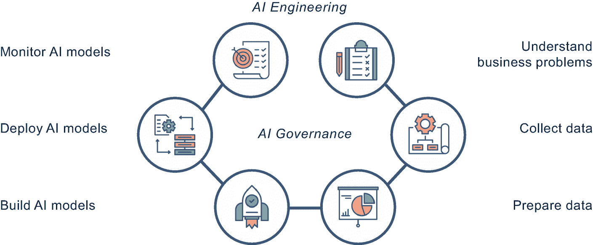

人工智能的循环图包括人工智能工程、人工智能治理、理解业务问题、收集数据、准备数据、构建人工智能模型、部署人工智能模型和监控人工智能模型。

图 9-1

人工智能生命周期的阶段

尽管在业界存在多个人工智能生命周期的参考模型^(2)，但大多数模型都包含从构思到维护的以下共同阶段，如图 9-1 所示：

1.  **理解业务问题**：数据科学家从领域专家那里学习，理解业务问题，研究人工智能的必要性和可行性，并定义人工智能项目的关键指标——不仅包括模型本身的性能指标，还包括服务级别的指标^(3)：

    1.  **服务延迟**：加载模型和准备所需特征所需的时间

    1.  **推理延迟**：模型对给定输入进行预测所需的时间

1.  **收集数据**：数据科学家请求 AI 项目所需的数据访问权限。如果企业尚未建立用于分析的受信任的企业级数据基础，那么这一阶段通常是耗时最长、劳动强度最大的。如果数据科学家不知道以何种格式可用哪些类型的业务数据，他们可能难以提出具体的数据请求，以至于这个过程可能需要重复多次，直到最终获得所需的数据。因此，说“74% 的 AI 采用者表示数据访问是一个挑战”并不夸张。新的行业法规使这一挑战变得更加严峻。

1.  **准备数据**：当数据集可用时，数据科学家开始整理、探索和清洗数据集。在这一阶段，数据科学家面临的挑战如下：

    1.  *如何识别数据中的缺陷*？由于数据集来自不同的数据源，通常由不同的业务应用程序生成，因此数据集存在各种类型的质量问题，例如缺失值、重复记录、不一致的值等。

    1.  *如何可视化大数据集*？可视化有助于数据科学家识别数据中的异常值，了解数据集的统计信息，并为下一阶段的特征工程做准备。

1.  **构建模型**：这一阶段需要数据科学家的创造力。首先，数据科学家从数据集中提取特征，并且数据科学家通常通过聚合或转换原始数据来推导新的特征，以获得更好的预测结果。其次，数据科学家通过在训练集和测试集之间划分数据集、训练模型（包括超参数优化 HPO）和评估模型来构建模型。这是一个迭代的过程。

1.  **部署模型**：这是机器学习工程师从数据科学家手中接管控制的地方。由于第一阶段中定义的服务级别要求，可能需要以可扩展的方式重新实现模型。以下是一些例子：

    1.  将 Python 模型重写为 Java/C++ 以获得更好的性能。

    1.  重新设计模型以并行运行。

    1.  为不太可能改变的特征构建特征存储库。

    1.  将模型部署到靠近数据源的环境（数据重力）。

1.  **监控模型**：模型部署到生产环境后，机器学习工程师继续监控模型的质量或准确性以及漂移，即随着时间的推移，准确性和数据一致性的下降。预测性能的下降会触发模型从生产环境中撤出，并使用最近的数据集进行重新训练。在高度监管的行业中，监控阶段包括公平性和可解释性。

1.  **治理模型**：这一阶段是为了持续捕捉必要的信息并计算风险评分，以确保企业在整个生命周期中治理人工智能的创建和采用。例如，事实和血缘提供了底层数据集和算法的元数据跟踪。这对于应对可能出现的任何监管要求非常有用。

人工智能工程是将人工智能模型实际应用的过程，以创建一个可持续、可重复和可衡量的实际应用过程。它涉及数据工程师、数据管理员、数据科学家、机器学习工程师、业务分析师和运维工程师。目标是让企业中的每一个与数据相关的角色，无论其背景和技能如何，都能紧密且顺畅地协作，以实现人工智能投资的全部价值并缩短上市时间。

## 关键方面：数据操作（DataOps）、模型操作（ModelOps）、机器学习操作（MLOps）

当涉及到将人工智能实际应用时，理解几个概念是很重要的，即数据操作（DataOps）、模型操作（ModelOps）和机器学习操作（MLOps）。与 DevOps 类似，DevOps 旨在通过系统化、快速、高质量且持续地将软件从代码到生产交付，DataOps 遵循相同的原理和实践，但将其应用于数据。它旨在加速数据的收集、处理和分析，以产生高质量的数据，满足数据公民合规的需求。

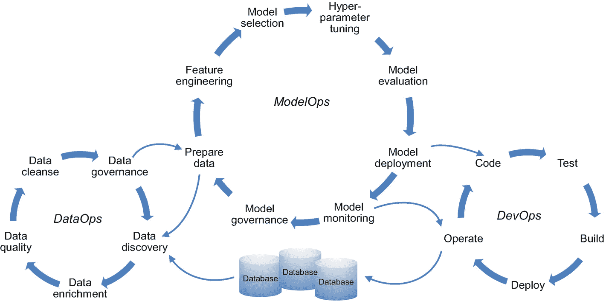

模型操作（ModelOps）的循环图包括几个阶段，如模型选择、特征工程、准备数据、模型治理、模型监控、模型部署、模型评估和超参数调整，所有这些都在中心展示。在右侧，有 DevOps 的阶段，包括代码、测试、构建、部署和运营，最终导向数据库。在左侧，数据操作（DataOps）的阶段包括数据发现、数据丰富、数据质量、数据清洗和数据治理。

图 9-2

数据操作（DataOps）、模型操作（ModelOps）和 DevOps

如图 9-2 所示，数据操作（DataOps）涵盖了人工智能生命周期中的两个阶段：*收集数据*和*准备数据*。数据操作（DataOps）的实施通过将数据任务自动化到数据管道中，简化了这两个阶段的过程。数据编织架构（Data Fabric architecture）和数据网格解决方案^(4）是实现数据操作（DataOps）实践的理想方式.^(5)

ModelOps 几乎与 DataOps 同时被提出。它是 AI 与分析模型和 DevOps 的结合，旨在将敏捷软件开发的一些成熟能力引入 AI 和数据分析领域。ModelOps 是一个类似于 DevOps 的框架，以及一系列工具链和流程，将数据工程师、数据科学家、开发者和运维人员聚集在一起，通过有效的企业数据和 AI 策略加速模型从数据准备到模型生产的交付，同时持续监控模型并在需要时重新训练模型，在整个过程中建立信任。它涵盖了 AI 生命周期中图 9-1 所示的各个阶段。

MLOps 是 ModelOps 的一个子领域。其主要目标是帮助数据科学家进行 ML 模型的快速原型设计和快速将 ML 模型部署到生产系统中。MLOps 专注于 ML 特定任务的自动化，如图 9-2 所示：特征工程、HPO、版本控制、模型评估，以及最终在规模上部署推理模型。它越来越多地使用具有可解释性、透明度、安全性、治理和实验可重复性的工具，以在整个 ML 生命周期中融入伦理并消除偏见。

ModelOps 和 MLOps 经常被互换使用。在功能方面，它们非常相似。但根据 Gartner 的说法，ModelOps 的范畴更广，不仅包括 ML 模型，还包括知识图谱、规则、优化以及自然语言技术和代理，而 MLOps 则专注于 ML 模型的运营化。6

如图 9-2 所示，ModelOps 中的数据准备任务触发了 DataOps 管道。DataOps 的输出，即高质量受控数据，进入 ModelOps 的下一阶段。那么 ModelOps 的输出去哪里呢？答案是*商业应用*。通常，有几种方法可以将 ML 模型的预测与商业应用集成。第一种是离线推理，预测结果存储在数据库中，应用直接从数据库中获取。第二种是批量预测，定期对一组记录进行推理，例如每周、每月或每季度。这通常用于累积数据和不需要即时结果的情况。第三种是在线推理，通过 API 调用模型进行预测。通常，在线推理期望立即得到结果。此外，预测请求可以通过消息代理排队，稍后处理。

无论哪种方式，模型推理都是由业务应用程序消费的。因此，开发操作（DevOps）也介入其中。模型的新部署和监控阶段检测到的异常都会相应地触发 DevOps 管道和操作。DevOps 实践对于确保人工智能模型可以被部署并注入到企业的业务工作流程中至关重要。需要建立模型存储库以进行人工智能模型生命周期管理、冠军测试和系统测试，并需要设置模型推出/回滚机制以确保可用性，这由 CI/CD（持续集成/持续部署）支持。

总结来说，人工智能工程由三个支柱组成：数据、模型和代码。为了在人工智能工程中实现最佳实践，建议采用能够提供数据操作（DataOps）、模型操作（ModelOps）和开发操作（DevOps）能力或能够无缝集成外部操作框架的平台，而不必支持所有三个领域。

以下是一些在人工智能生命周期背景下实施数据操作（DataOps）、机器学习操作（MLOps）和模型操作（ModelOps）的激励因素：

1.  **数据领域的复杂性**：企业面临的数据挑战不仅仅是数据的爆炸性增长，还有数据领域的复杂性以及来自混合云和多区域的异构数据源。数据孤岛问题日益严重。数据编织和数据网格概念的兴起旨在通过提供智能集成能力来解决这一问题，帮助用户根据各种因素（例如，策略、性能、延迟等）决定虚拟化、复制或转换数据。特别是，具有组织和联邦方法的 Data Mesh 解决方案旨在通过数据源和数据所有权打破数据孤岛。

1.  **人工智能治理**：实施数据操作的关键方面之一是解决数据与人工智能治理和隐私的需求。数据编织（Data Fabric）和数据网格（Data Mesh）提供了一种知识增强的中心目录，其中包含

    1.  一个包含丰富业务语义的数据资产清单

    1.  一套包括业务术语表、法规、数据隐私政策、数据保护规则和隐私数据分类的治理工件

1.  **知识目录**：具有知识目录功能的 Data Fabric 架构通过数据发现和数据集成自动丰富数据资产，并在*数据准备*阶段的各项活动中强制执行质量和保护规则。

1.  **数据和人工智能的民主化**：此外，数据操作的一个重要好处是数据和人工智能的民主化。智能目录和语义搜索使公司中的每个人都能找到他们完成工作所需的数据。在人工智能生命周期背景下，它极大地提高了数据科学家、数据工程师和 IT 专家之间的协作和沟通，并减少了*收集数据*的时间。

1.  **数据和 AI 编排**：最后但同样重要的是，DataOps 的核心在于编排，它负责在管道的不同阶段之间移动数据和 AI，并实例化在它上面操作的数据工具。它还监控进度并为特定数据问题发出警报。Data Fabric 和 Data Mesh 提供了一个统一的管道，通过可重用的数据管道组成端到端的工作流程，这是 DataOps 编排的核心目标。

为了进一步说明 DataOps 和 ModelOps，让我们深入探讨几个案例研究。

## 案例研究 1：在混合云环境中整合碎片化数据

构建模型所需的数据分散在多个数据源中，通常跨越多个云。根据 IDC 的 2021 年 CDO 状态研究，^(7) 数据碎片化和复杂性是 2022 年数字转型的首要障碍。近 80%的受访组织存储了超过一半的数据在混合云基础设施中。79%的组织使用超过 100 个数据源，30%的组织使用超过 1,000 个数据源。然而，75%的组织还没有一个完整的架构来管理一系列端到端的数据活动，包括集成、访问、治理和保护。

数据编织架构和数据网格解决方案^(8)的最终目标之一是实现单一事实来源，这声称企业级数据覆盖范围跨越应用程序，不受任何单一平台或工具的限制.^(9) 这为寻求访问和探索其数据的团队带来了技术和流程挑战。技术挑战源于从多个来源提取数据的物流，或者如果数据存储在不同的格式中。使数据可用的需要高度熟练的数据工程师的大量时间和精力。更复杂的是，在组织层面关于谁可以访问什么数据以及出于什么目的的限制。这在医疗保健和金融等行业尤其困难，在这些行业中，敏感数据需要谨慎处理，并且通常需要严格的监管要求。同时，人们在分析数据时也面临着不复制数据的挑战。在大多数分析项目中，数据的多份副本存储在不同的位置和格式中，这又产生了额外的成本、延迟、不可信的数据、安全风险等问题。

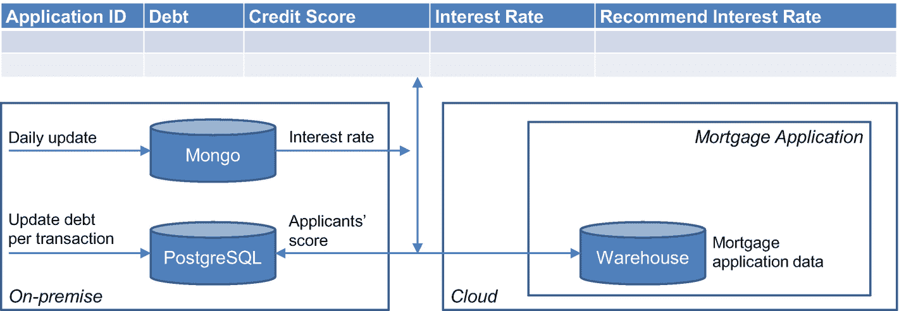

表格包含应用 ID、债务、信用评分、利率和推荐利率等列。Mongo 和 PostgreSQL 的示例包括每日更新、每笔交易的债务更新、利率、申请人评分以及本地和云基础仓库的抵押贷款申请数据。

图 9-3

抵押贷款申请的数据架构

由于大多数组织都面临着数据碎片化的问题，因此对统一的企业数据架构有强烈的需求。本节提供了一个案例研究，展示了如何通过实施数据编织架构来整合来自多个来源的数据。案例研究中使用的数据和样本项目可以在 IBM Cloud Pak for Data Gallery 中找到.^(10)

在本案例研究中，美国的一家银行希望为加利福尼亚居民提供智能房贷服务。贷款利率基于申请人的个人信用评分和最新的利率法规的组合。为了实施这项服务，该银行的数据库工程师需要收集关于申请人和推荐利率的所有关键信息。这些关键信息分散在不同的数据库系统中，如图 9-3 所示：

+   匿名房贷申请数据和房贷申请人的 PII（个人信息）存储在云数据仓库中。

+   房贷申请人的信用评分数据存储在 PostgreSQL 数据库中。

+   利率受市场变化的影响，并计划每天更新，最新利率数据可以从 MongoDB 数据库中检索。

数据工程师需要找到房贷申请人的信用评分，通过州（仅包括来自加利福尼亚州的记录）过滤数据，计算每个申请人的总债务，然后将信用评分范围合并成数据资产，以便数据科学团队使用。

如前所述，能够收集和准备高质量的数据对于构建数据管道至关重要。了解摄入数据的元数据非常重要。样本数据预览可以帮助我们理解数据中的值，而统计和可视化可以帮助我们确定连接多个数据集的策略。

从数据预览中，如图 9-4 所示，可以发现列 ID 可以用来将应用程序数据与 PII 数据（个人信息）连接起来。还发现列 STATE_CODE 可以用来过滤数据，而不是使用州名（这需要额外的数据转换步骤）。值得注意的是，房贷申请人的信用评分数据在 ID 列中使用不同的代码，不能用作进一步连接的关键。因此，选择了列 EMAIL_ADDRESS。

让我们看看如何构建数据管道来整合来自不同数据源的数据碎片，这是数据运营的目标。

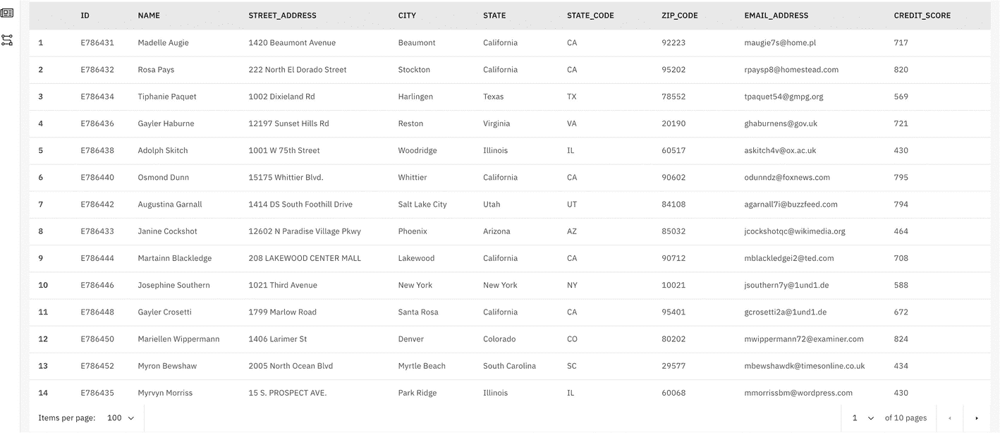

该表包含 ID、姓名、街道地址、城市、州、州代码、邮政编码、电子邮件地址和信用评分等列。它显示了从 1 到 14 的行。

图 9-4

预览样本数据

首先，添加贷款和信用卡债务的金额可以得到申请人的总债务。然后，使用信用评分在 MongoDB 中查询利率表以找到相应的利率。最后，为抵押贷款申请人生成推荐利率。整个数据管道看起来如图 9-5 所示。

然而，利率数据持续变化。贷款和信用卡债务金额每月更新。信用评分由其他应用程序计算并每日推送到 PostgreSQL 数据库。利率每日更新。如果数据连接、总债务计算和利率查询的任务被分离并独立运行，则无法保证结果保持预期的准确度。因此，如图 9-5 所示的管道需要作为一个作业部署，并定期调度运行。这确保了利率数据请求能够得到最新的数据。

高质量的机器学习模型需要高质量的数据。机器学习先驱安德鲁·吴（Andrew Ng）认为，关注驱动 AI 系统的数据质量将有助于释放其全部潜力。11 商业领导者，如高德纳（Gartner），认为低质量数据会导致高成本并损害业务。12 只有当数据与业务相关联并且可以被组织中的任何用户或应用程序访问时，数据才能产生业务价值。寻求提高数据质量的组织通常从数据和分析治理计划开始，该计划整合了混合云环境中的碎片化数据。当正确实施时，数据织物（Data Fabric）和数据网格（Data Mesh）有助于确保这种价值以最有效和自动化的方式在整个组织中可用。

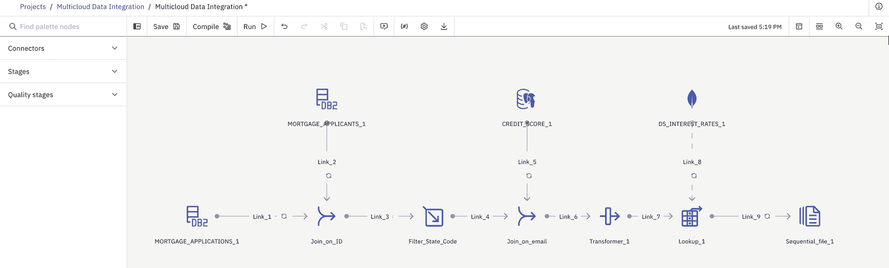

屏幕顶部显示的是多云数据集成。左侧面板包括连接器、阶段和质量阶段的下拉菜单。在右侧，抵押贷款申请 1、抵押贷款申请人 1、信用评分 1、D S 利率 1，所有这些都与 ID 关联、筛选状态代码、通过电子邮件关联、变压器 1、查找 1 和顺序文件 1 链接。

图 9-5

创建数据管道

这两种概念的理想实现是将自助数据工具整合到异构数据景观的智能织物中。它为组织中的每个人提供查找、探索和查询所有可用数据的能力，无论是在本地还是在混合云景观中。

## 案例研究 2：AI 的运营化

将人工智能投入实际应用是指人工智能生命周期管理，它引入了构建数据管道的数据工程团队、构建 AI 模型的数据科学团队以及部署和维护 AI 模型的运营团队之间的集成。将人工智能投入实际应用和 AI 工程通常可以互换使用。正如前文所述，AI 工程涉及模型操作（ModelOps）、数据操作（DataOps）和开发操作（DevOps）的核心管理能力，以使组织能够提高 AI 模型的表现力、可扩展性、可解释性和可靠性，同时实现人工智能投资的全部价值。

在抵押贷款业务中，由于法规、产品和流程的不断变化，变化是持续发生的。客户必须获得最新信息和及时支持，以简化他们的购房体验。在我们的案例研究中，该银行希望通过提供低利率的在线申请抵押贷款续签来扩大其业务。数据科学家团队的任务是训练一个抵押贷款批准模型，以预测哪些申请人有资格获得抵押贷款，并根据申请人的要求部署模型进行实时评估。

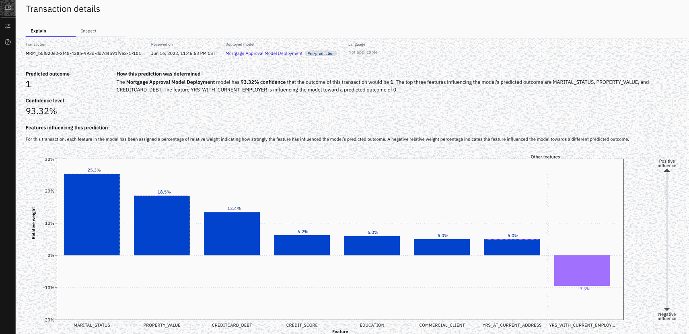

屏幕显示交易详情并解释预测结果，置信度为 93.32%。它还显示了一个条形图，该图显示了影响此预测的特征的相对权重。该图表呈下降趋势。

图 9-6

用通俗易懂的语言解释预测是如何进行的

存在着大量用于训练模型的算法。一旦可用，数据科学家将其保存到项目中，并使用保留数据集来评估模型。图 9-6 用通俗易懂的语言解释了为什么模型会以高置信度进行预测。当模型性能令人满意时，它可以被部署到生产环境中。

此外，可以从模型库存中随时监控模型的状况和生产性能，如图 9-7 所示。

在将人工智能投入实际应用时，会面临一些挑战。最常见的一个问题是将 AI 模型部署到生产环境中既昂贵又耗时。对于许多组织来说，超过 80%的模型从未被实际应用过。虽然数据科学团队构建了许多模型，但实际上只有少数被部署到生产环境中，这才是真正的价值所在。对于许多组织来说，构建、训练和部署模型所需的时间是 6 至 12 个月。

AI 偏见问题在公众中引起了越来越多的关注。随着数据模式的变化，漂移发生，导致每个模型预测的准确性降低。当这种情况发生时，业务线领导者越来越失去信心，认为他们的模型正在为业务产生可操作的见解。公平性也是一个值得关注的问题。如果模型为特定群体（性别、年龄或国籍）产生了有利的预测结果，那么它可能导致 AI 伦理讨论，甚至可能带来法律风险。

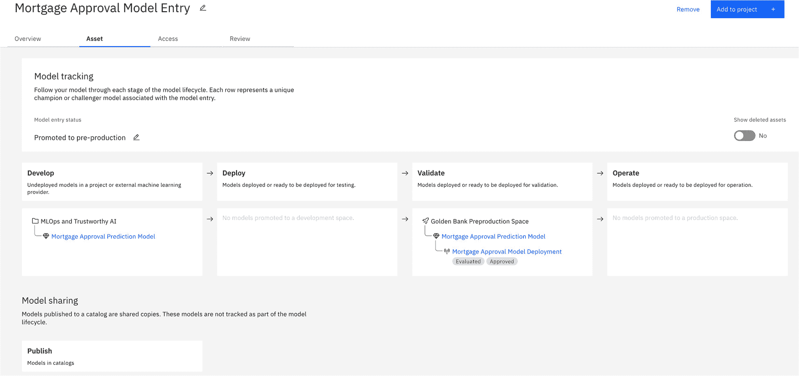

屏幕显示的是顶部抵押贷款批准模型入口。在选项中选择了资产选项。模型跟踪、开发、部署、验证、操作和模型共享的数据都存在。

图 9-7

模型在模型库存中的状态

另一个影响模型部署的 AI 信任问题是模型血缘分析的缺乏。这包括两个方面。一方面是模型是如何构建的，以及哪些特征在模型的最终评分结果中起着决定性作用。这是模型可解释性发挥作用的领域。另一方面是数据血缘：用于训练模型的数据来源，数据是否准确和安全，以及是否存在篡改的可能性。

图 9-7 中显示的事实表是帮助商业用户理解和信任模型的示例。

当一个组织选择数据编织（Data Fabric）和数据网格（Data Mesh）的实施时，需要考虑这些挑战。获取数据的目的是为了用于特定的商业目的。因此，最佳方案是在数据编织架构内实现数据运营和 AI 的能力。这有助于组织减少构建和操作 AI 模型所需的技能，通过最小化日常任务和数据准备挑战来加快交付时间，同时，通过实时治理优化 AI 模型的质量和准确性。

## 使用 AutoAI 加速 MLOps

使用 Jupyter 笔记本开发实验模型并将其部署到生产系统之间存在鸿沟。尽管企业在 AI 上的投资一直在增加，但被部署到生产中的 AI 模型比例仍然很小。企业开始认识到，跨越这个鸿沟对于实现 AI 的价值至关重要。由于 DevOps 的成功，许多企业正在寻求 MLOps 来解决这一问题。正如前面章节所述，MLOps 是一套将数据准备、模型创建、部署和监控连接起来的实践，重点是有效操作 ML 模型。

MLOps 的成功标准是建立一套可持续的纪律，使企业能够顺利地将实验模型推出到生产环境中。以下列出的是在实施 MLOps 实践时需要解决的挑战。

第一项是数据准备。由于 ML 模型建立在数据之上，它们对数据的语义、数量和完整性等质量非常敏感。然而，数据预处理可能非常耗时，这取决于数据条件。正如第六章所述，需要执行一系列数据理解和数据准备任务。以下是一些最常见的例子：

+   **特征选择**：丢弃对预测不那么重要的特征。首先，排除在整个数据集中具有恒定值的特征。其次，如果数据类型不是时间或日期，忽略具有唯一值的列，这很可能代表一个 ID。

+   **缺失或错误值**：对于数据集中的缺失值或不准确值，一种选择是使用统计方法进行估计——相邻记录的平均值、中位数或平均值。另一种选择是使用 ML 算法预测缺失或不准确值。

+   **特征编码和缩放**：基于数据类型有许多转换方法。例如，可以将分类特征编码为序数，并将数值特征缩放以查看它们如何影响模型的性能。

下一个阶段是模型创建。根据数据集的特征和业务问题的性质，有丰富的 ML 算法可供选择。实际上，算法的选择需要在准确性和训练时间之间取得平衡。另一件需要考虑的事情是用于评估 ML 模型的指标，例如，对于二分类，使用 ROC 和 AUC^(13)；对于多分类，使用 F1、精确率和召回率；对于回归，使用均方误差（MSE）、均方根误差（RMSE）和 R2 等。

特征工程在模型创建中也起着重要作用。ML 算法处理表格数据，如果不同特征之间存在关系，使用数据转换来推导新特征并将它们组合起来将有助于揭示数据中隐藏的见解。

虽然之前描述的任务很复杂，但何时以及需要什么方法来解决问题的方法是清晰的。这为自动化奠定了良好的基础。许多供应商提供 AutoAI 解决方案来自动化前面的任务。

AutoAI 是一个无需代码/低代码平台，它自动化了 MLOps 生命周期的多个方面。如图 9-8 所示，AutoAI 提供了一个易于遵循的向导，帮助您定义模型训练设置并选择目标（预测）特征。AutoAI 还提供了 HPO 功能，有助于优化前一阶段表现最佳管道的超参数。它使用基于模型、无导数的全局搜索算法，称为 RBFOpt，^(14)，该算法针对昂贵的 ML 模型训练和评分评估进行了定制。

对于每种折叠和算法类型，AutoAI 创建两个管道，使用 HPO 优化算法类型：第一个基于预处理（推断/编码/缩放）的数据集优化算法类型，第二个基于优化特征工程后的预处理（推断/编码/缩放）数据集优化算法类型。

最终模型可以从候选模型集中选择。一旦模型构建并导出到 Jupyter 笔记本，数据科学家可以进一步定制结果，这对于更复杂的使用案例通常是必需的。

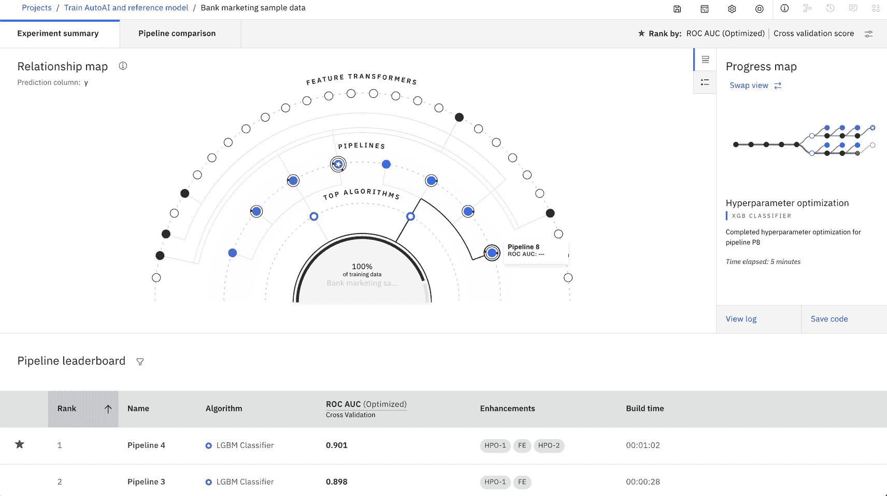

信息图展示了实验摘要关系图。右侧面板包括进度图和超参数优化。特征转换器、管道、顶级算法以及 100%的训练数据均以半圆形层的形式表示。底部有一个用于管道排行榜的表格。

图 9-8

自动 AI

AutoAI 自动化了寻找和优化最佳机器学习模型、特征和模型超参数的复杂过程，用于训练。15 它允许没有深厚数据科学专业知识的人创建各种类型的模型，甚至允许那些具有深厚数据科学专业知识的人更快地从中原型设计和迭代。AutoAI 减少了构建模型的努力，提高了生产力和准确性。它为企业实施 MLOps 提供了显著的生产力提升。

## 人工智能工程部署模式

当涉及到 AI 模型的训练和部署时，IT 部门通常定义数据科学实践必须遵守的要求。例如，如果训练数据存储在公共云中，那么使用这些数据进行模型训练很可能也必须在同一云中进行，以最小化数据导出（出站）成本或遵守治理规则。模型训练和部署周围有许多其他因素，包括安全性、延迟、性能和数据驻留。以下是一些示例：

+   满足服务级别要求，例如响应时间、延迟和吞吐量：

    +   与数据源协同定位以方便访问特征

    +   与应用程序协同定位以减少网络开销

    +   容易扩展以适应大量的推理调用

+   优化与硬件、集成和运营成本相关的部署成本：

    +   重复使用现有的计算资源。

    +   减少与现有应用程序集成的努力。

    +   通过重复使用现有的操作基础设施来降低运营成本。

根据这些因素的重要性，企业在决定机器学习部署架构时，会采用三种常见模式之一或多个。第一种模式是将机器学习模型的运行时环境部署到数据源所在的平台。

在大型企业中，业务关键型应用程序目前部署在高度可靠和受监管的环境中。例如，世界上三分之二的大型金融机构正在使用 IBM zSystems 运行其核心银行系统。因此，大量用于机器学习的训练数据和模型上线后所需的原始数据仍然在本地生成和存储。将此数据从安全环境迁移到公共云不仅引入了延迟，还增加了数据泄露和数据篡改的风险。

图 9-9 中的部署模式可以是那些不想承担法律风险和潜在财务损失，但仍然想从公共云的灵活、可扩展和成本效益的计算资源中获益的组织的一个选择。

首先，根据数据保护法规对数据进行脱敏，并通过智能集成技术将其作为模型训练的数据集迁移到公共云平台。当模型训练完成后，它被部署到本地系统。为了获得更好的可伸缩性，建议使用基于容器的部署。此外，可以部署同一模型的多个版本，用于后续的 A/B 测试^(16)和灰度发布。

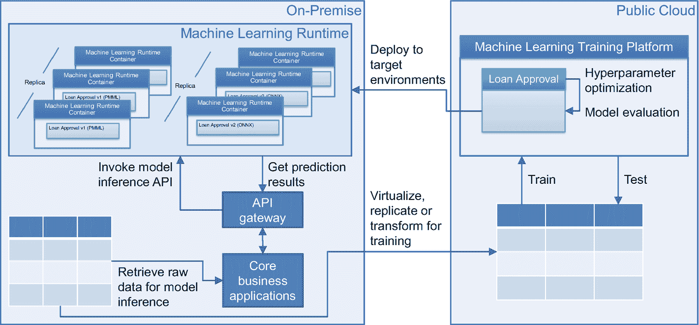

架构图说明了本地机器学习运行时与公共云中的机器学习训练平台之间的互连性。本地块包括调用模型推理 API 的 API 网关，以及获取用于模型推理的原始数据的核心业务应用程序。机器学习训练平台包括超参数优化和模型评估。

图 9-9

模式 1：将 ML 运行时与数据本地化以便于访问特征

模型和应用程序可以集成的几种方式中，从应用程序调用模型的推理 API 以持续监控和轻松更新模型，是最常见的集成方式。考虑到生产系统中工作负载的规模，可能达到每秒 10,000 次，企业通常使用 API 网关进行负载均衡。

在这种模式中，应用程序直接获取调用模型 API 所需的原始数据，然后通过 API 网关发送模型推理请求，API 网关根据请求的具体信息将其转发到对应模型版本的运行时容器。如果同时收到太多的推理请求，API 网关可能会为特定模型版本创建一个新的运行时副本，以维持模型的服务水平。

此部署模式背后的核心思想是在公有云上使用来自本地的受控数据进行模型训练，但将模型部署回本地以方便访问原始数据，从而提高模型推理的性能和质量。这种模式的潜在缺点是大量的评分请求可能会影响位于同一系统中的业务关键应用程序。另一个缺点是由于跨平台部署，操作化和工具链的技能和工具链更加复杂。

与数据重力相反，第二种部署模式是云原生模式。假设大多数训练和评分数据都是在本地生成，并且现代化应用程序运行在公有云上，企业可以考虑图 9-10 中提出的部署模式。

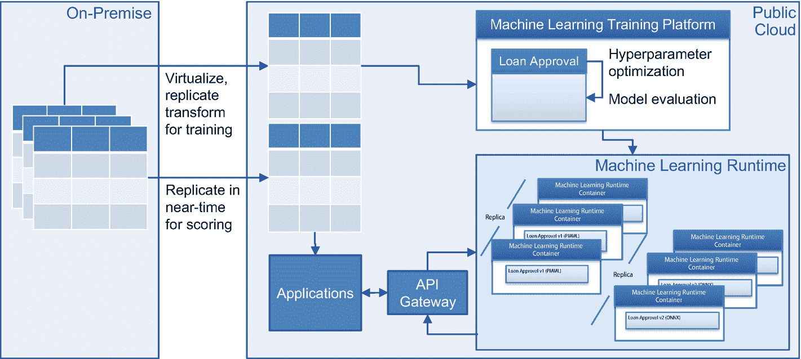

架构图说明了机器学习训练平台和公有云中机器学习运行时的互连性。公有云块包括一个 API 网关和应用程序。左侧有一个本地块，它虚拟化、复制和转换训练数据。

图 9-10

模式 2：在云上将 ML 运行时与应用程序本地化

与之前的模式类似，在训练阶段，数据从本地系统移动到公有云，训练完成后，直接部署到公有云。公有云上运行的应用程序从本地数据源直接获取原始数据，或者通过访问本地数据源的近实时缓存来获取数据。一旦应用程序获取到用于模型推理 API 所需的数据，它们就会向 API 网关发送请求，API 网关将请求调度到第一模式中描述的特定运行时。

在部署此模式时有两个重要的考虑因素：

1.  复制数据或访问用于模型推理的数据的延迟是否可接受。根据数据源和技术，延迟从小时到秒不等。

1.  数据移动是否符合安全和隐私法规。例如，欧盟国家数据中心生成数据不允许在美国的公有云上运行的应用程序进行中转使用。

如果上述因素不是障碍，那么这种部署模式具有优势。首先，模型运行的运行环境可以通过公有云基础设施轻松扩展。其次，由于统一的操作工具链，运营和维护成本相对较低。最后但同样重要的是，它对本地系统的影响最小。

第三个也是最后的常见部署模式是边缘部署。在制造业中，图像识别和视频分析的 AI 模型被广泛使用。图像识别的一个典型用例是在生产线上的零件中检测缺陷，以减少质量检查的人工工作量。另一个用例是使用视频分析来监控工人是否在进行规范安全操作。

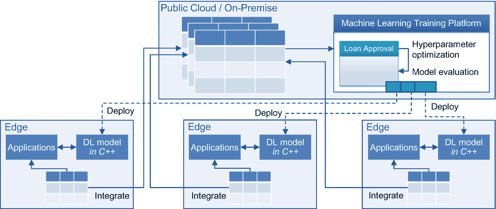

包含 3 个连接到公共云和本地机器学习训练平台的边缘设备的架构图。该平台将 C++中的 D L 模型部署到每个边缘设备。

图 9-11

在边缘设备上部署推理服务

在这两个例子中，很可能车间生产线与公共云没有连接。即使有连接，网络开销会增加模型推理结果返回的延迟，并且无法满足应用程序的性能要求。这就是为什么边缘部署有吸引力。

在这种部署模式中，如图 9-11 所示，在边缘设备上捕获的所有数据（包括图像和视频）都发送到公共云或本地进行训练。由于图像和视频是非结构化数据，通常需要手动标注。当模型训练完成后，模型被部署到多个边缘设备。这种部署模式的一个困难是，由于边缘设备资源限制和性能要求极高，模型可能需要用 C++等语言重写，这给模型升级和版本管理带来了额外的困难。通常需要一个额外的组件来分发模型到边缘设备，并管理边缘设备上模型的整个生命周期。

## 关键要点

我们用表 9-1 中总结的几个关键要点来结束本章。

表 9-1

关键要点

| # | 关键要点 | 高级描述 |
| --- | --- | --- |
| 1 | 人工智能和软件工程有根本的不同。 | 传统软件是规则驱动的，问题可以用清晰的逻辑规则编码，并具有确定性的输出，而人工智能更注重数据驱动，它基于训练数据集和算法来逼近最优解。 |
| 2 | 人工智能生命周期包括多个阶段。 | 人工智能生命周期包括业务问题理解、收集数据、准备数据、构建模型、部署模型、监控模型和管理模型。 |
| 3 | AI 运营化领域包括 DataOps、ModelOps 和 DevOps。 | AI 运营化由三个支柱组成——数据、模型和代码。建议采用能够提供 DataOps、ModelOps 和 DevOps 能力的平台。 |
| 4 | ModelOps 和 MLOps 之间的差异。 | MLOps 是 ModelOps 的一个子领域。ModelOps 不仅包含机器学习的运营化，还包括知识图谱、规则、优化、自然语言处理、代理等。 |
| 5 | 数据编织架构和数据网格解决方案实现了 DataOps 实践。 | 数据编织和数据网格提供了一种统一的 企业数据架构和解决方案，通过自动数据发现、智能数据集成和智能编目，从混合云环境中整合分散的数据。 |
| 6 | 大多数模型从未进入生产环境。 | 超过 80%的模型从未被运营化，因为部署它们所涉及的努力巨大，而且模型部署后发现存在偏差或公平性问题，这些问题超过了其带来的好处。 |
| 6 | AutoAI 加速 MLOps。 | AutoAI 是一个无代码/低代码平台，它自动化了 MLOps 生命周期的多个方面。它允许公民数据科学家创建所有类型的模型，甚至让经验丰富的数据科学家能够更快地从中原型设计和迭代。 |
| 8 | 存在多种部署架构模式。 | 部署架构的选择由多种因素决定，包括但不限于数据本地性、性能和延迟要求，以及安全要求。 |

## 参考文献

1.  *Gartner 2022 年顶级战略技术趋势*, [《http://www.gartner.com/en/information-technology/insights/top-technology-trends》](http://www.gartner.com/en/information-technology/insights/top-technology-trends)

1.  Mark Haakman, Luís Cruz, Hennie Huijgens, & Arie van Deursen, *AI 生命周期模型需要修订*, [《https://link.springer.com/article/10.1007/s10664-021-09993-1》](https://link.springer.com/article/10.1007/s10664-021-09993-1)

1.  Walch, K. Forbes. *实现 AI 的运营*, 2020, [《http://www.forbes.com/sites/cognitiveworld/2020/01/26/operationalizing-ai/%252349ef691c33df》](http://www.forbes.com/sites/cognitiveworld/2020/01/26/operationalizing-ai/%252349ef691c33df) (访问日期：2020 年 3 月 2 日).

1.  [Aparna Dhinakaran](https://aparnadhinak.medium.com/%253Fsource%253Dpost_page%252D%252D%252D%252D-2637bdabc0d2%252D%252D%252D%252D%252D%252D%252D%252D%252D%252D%252D%252D%252D%252D%252D%252D%252D%252D%252D%252D%252D%252D%252D%252D%252D%252D%252D%252D%252D%252D%252D%252D%252D%252D%252D%252D%252D%252D%252D%252D%252D%252D%252D%252D%252D%252D%252D%252D%252D%252D%252D%252D%252D%252D%252D%252D%252D%252D%252D%252D%252D%252D%252D%252D%252D%252D%252D%252D%252D%252D%252D%252D%252D%252D%252D%252D%252D%252D%252D%252D%252D%252D%252D%252D%252D%252D%252D%252D%252D%252D%252D%252D%252D%252D%252D%252D%252D%252D%252D%252D%252D%252D%252D%252D%252D%252D%252D%252D%252D%252D%252D%252D%252D%252D%252D%252D%252D%252D%252D%252D%252D%252D%252D%252D%252D%252D%252D%252D%252D%252D%252D%252D%252D%252D%252D%252D%252D%252D%252D%252D%252D%252D%252D%252D%252D%252D%252D%252D%252D%252D%252D%252D%252D%252D%252D%252D%252D%252D%252D%252D%252D%252D%252D%252D%252D%252D%252D%252D%252D%252D%252D%252D%252D%252D%252D%252D%252D%252D%252D%252D%252D%252D%252D%252D%252D%252D%252D%252D%252D%252D%252D%252D%252D%252D%252D%252D%252D%252D%252D%252D%252D%252D%252D%252D%252D%252D%252D%252D%252D%252D%252D%252D%252D%252D%252D%252D%252D%252D%252D%252D%252D%252D%252D%252D%252D%252D%252D%252D%252D%252D%252D%252D%252D%252D%252D%252D%252D%252D%252D%252D%252D%252D%252D%252D%252D%252D%252D%252D%252D%252D%252D%252D%252D%252D%252D%252D%252D%252D%252D%252D%252D%252D%252D%252D%252D%252D%252D%252D%252D%252D%252D%252D%252D%252D%252D%252D%252D%252D%252D%252D%252D%252D%252D%252D%252D%252D%252D%252D%252D%252D%252D%252D%252D%252D%252D%252D%252D%252D%252D%252D%252D%252D%252D%252D%252D%252D%252D%252D%252D%252D%252D%252D%252D%252D%252D%252D%252D%252D%252D%252D%252D%252D%252D%252D%252D%252D%252D%252D%252D%252D%252D%252D%252D%252D%252D%252D%252D%252D%252D%252D%252D%252D%252D%252D%252D%252D%252D%252D%252D%252D%252D%252D%252D%252D%252D%252D%252D%252D%252D%252D%252D%252D%252D%252D%252D%252D%252D%252D%252D%252D%252D%252D%252D%252D%252D%252D%252D%252D%252D%252D%252D%252D%252D%252D%252D%252D%252D%252D%252D%252D%252D%252D%252D%252D%252D%252D%252D%252D%252D%252D%252D%252D%252D%252D%252D%252D%252D%252D%252D%252D%252D%252D%252D%252D%252D%252D%252D%252D%252D%252D%252D%252D%252D%252D%252D%252D%252D%252D%252D%252D%252D%252D%252D%252D%252D%252D%252D%252D%252D%252D%252D%252D%252D%252D%252D%252D%252D%252D%252D%252D%252D%252D%252D%252D%252D%252D%252D%252D%252D%252D%252D%252D%252D%252D%252D%252D%252D%252D%252D%252D%252D%252D%252D%252D%252D%252D%252D%252D%252D%252D%252D%252D%252D%252D%252D%252D%252D%252D%252D%252D%252D%252D%252D%252D%252D%252D%252D%252D%252D%252D%252D%252D%252D%252D%252D%252D%252D%252D%252D%252D%252D%252D%252D%252D%252D%252D%252D%252D%252D%252D%252D%252D%252D%252D%252D%252D%252D%252D%252D%252D%252D%252D%252D%252D%252D%252D%252D%252D%252D%252D%252D%252D%252D%252D%252D%252D%252D%252D%252D%252D%252D%252D%252D%252D%252D%252D%252D%252D%252D%252D%252D%252D%252D%252D%252D%252D%252D%252D%252D%252D%252D%252D%252D%252D%252D%252D%252D%252D%252D%252D%252D%252D%252D%252D%252D%252D%252D%252D%252D%252D%252D%252D%252D%252D%252D%252D%252D%252D%252D%252D%252D%252D%252D%252D%252D%252D%252D%252D%252D%252D%252D%252D%252D%252D%252D%252D%252D%252D%252D%252D%252D%252D%252D%252D%252D%252D%252D%252D%252D%252D%252D%252D%252D%252D%252D%252D%252D%252D%252D%252D%252D%252D%252D%252D%252D%252D%252D%252D%252D%252D%252D%252D%252D%252D%252D%252D%252D%252D%252D%252D%252D%252D%252D%252D%252D%252D%252D%252D%252D%252D%252D%252D%252D%252D%252D%252D%252D%252D%252D%252D%252D%252D%252D%252D%252D%252D%252D%252D%252D%252D%252D%252D%252D%252D%252D%252D%252D%252D%252D%252D%252D%252D%252D%252D%252D%252D%252D%252D%252D%252D%252D%252D%252D%252D%252D%252D%252D%252D%252D%252D%252D%252D%252D%252D%252D%252D%252D%252D%252D%252D%252D%252D%252D%252D%252D%252D%252D%252D%252D%252D%252D%252D%252D%252D%252D%252D%252D%252D%252D%252D%252D%252D%252D%252D%252D%252D%252D%252D%252D%252D%252D%252D%252D%252D%252D%252D%252D%252D%252D%252D%252D%252D%252D%252D%252D%252D%252D%252D%252D%252D%252D%252D%252D%252D%252D%252D%252D%252D%252D%252D%252D%252D%252D%252D%252D%252D%252D%252D%252D%252D%252D%252D%252D%252D%252D%252D%252D%252D%252D%252D%252D%252D%252D%252D%252D%252D%252D%252D%252D%252D%252D%252D%252D%252D%252D%252D%252D%252D%252D%252D%252D%252D%252D%252D%252D%252D%252D%252D%252D%252D%252D%252D%252D%252D%252D%252D%252D%252D%252D%252D%252D%252D%252D%252D%252D%252D%252D%252D%252D%252D%252D

1.  *如何和为什么进行 DataOps*, [《http://www.ibm.com/blogs/academy-of-technology/wp-content/uploads/2022/02/IBMDataOpsHowandWhy_Whitepaper.pdf》](http://www.ibm.com/blogs/academy-of-technology/wp-content/uploads/2022/02/IBMDataOpsHowandWhy_Whitepaper.pdf)

1.  Natasha Sharma，*什么是 ModelOps 以及它与 MLOps 有何不同？*，[访问 Neptune.ai 博客](https://neptune.ai/blog/modelops)

1.  *2021 年首席数据官（CDO）研究报告*，[访问 Informatica 网站](http://www.informatica.com/about-us/news/news-releases/2021/12/20211209-informatica-unveils-2021-state-of-the-cdo-study.html)

1.  *2022 年领导力愿景：数据和分析领导者三大战略优先事项*，[访问 Gartner 网站](http://www.gartner.com/en/information-technology/insights/leadership-vision-for-data-and-analytics)

1.  *IBM Cloud Pak for Data 中的数据和样本项目*，[访问 IBM 数据平台网站](https://dataplatform.cloud.ibm.com/gallery%253Fcontext%253Dcpdaas%2526format%253Dproject-template%2526topic%253DData-fabric)

1.  *为何现在是“以数据为中心的人工智能”时代*，[访问麻省理工学院斯隆管理学院的 Ideas Made to Matter 网站](https://mitsloan.mit.edu/ideas-made-to-matter/why-its-time-data-centric-artificial-intelligence)

1.  *盲目飞行：糟糕的数据如何破坏业务*，[访问福布斯科技委员会网站](http://www.forbes.com/sites/forbestechcouncil/2021/10/14/flying-blind-how-bad-data-undermines-business/)

1.  *MLOps 和可信人工智能*，[访问 IBM Cloud Pak for Data 产品页面](http://www.ibm.com/products/cloud-pak-for-data/scale-trustworthy-ai)

1.  Meenu Mary John, Helena Holmström Olsson 和 Jan Bosch，*构建人工智能部署：对最新和实际应用文献的系统回顾*，[访问 ResearchGate 网站](http://www.researchgate.net/publication/348655621_Architecting_AI_Deployment_A_Systematic_Review_of_State-of-the-Art_and_State-of-Practice_Literature)

1.  Chaoyu Yang，*模型部署系统的设计考虑因素*，[访问 Towards Data Science 网站](https://towardsdatascience.com/design-considerations-of-model-deployment-system-c16a4472e2be)

1.  Ryan Dawson，*导航机器学习部署*，[访问 Towards Data Science 网站](https://towardsdatascience.com/navigating-ml-deployment-34e35a18d514)
