# 第三部分在特定环境中部署数据编织和数据网格

# 10. 数据编织架构模式

特定的数据编织架构由其业务和 IT 背景和意图决定，这意味着并非每个实施都是相同的。例如，数据编织可以服务于不同的数据消费模式，如基于人工智能的实时交易推理洞察、可信人工智能场景或人工智能治理目的。特定的数据编织实现还取决于具体的解决方案需求，例如与数据网格解决方案（例如，数据即产品）相关的需求，以及数据编织是否应该服务于某些技术，如物联网、边缘计算或 5G。最后，智能信息集成可以通过不同的互补方法得到支持，如数据虚拟化、复制、流式传输等，这会影响底层的数据编织架构。利用公共云服务在混合云景观中的集成挑战^(1)可能与私有云和本地景观中的集成需求不同。

人工智能本身也可以被描述为在不同行业中普遍存在的广泛的应用领域，^(2)因此，数据编织架构的实施可能因行业需求而显著不同。

## 引言

在本章中，我们提供了数据编织和数据网格进化的高级概述，并详细阐述了数据编织架构模式，这些模式与三个相关但不同的领域有关，我们之前已经提到过。

首先，我们介绍数据消费模式，探讨通常与人工智能和数据分析相关的数据编织如何与交易处理交织在一起。然后，我们介绍一种数据编织架构，它作为数据网格解决方案的基础，扩展了我们在第二章中对这一主题的处理。最后，我们考察一些智能信息集成风格，这些风格不一定相互排斥，但可能根据业务和 IT 需求和偏好相互补充。

## 数据编织和数据网格进化

如我们在第一章和第二章中看到的，数据编织和数据网格的概念仍然相对较新。尽管如此，已经有一些值得充分关注的进化阶段，这正是本节的目标。

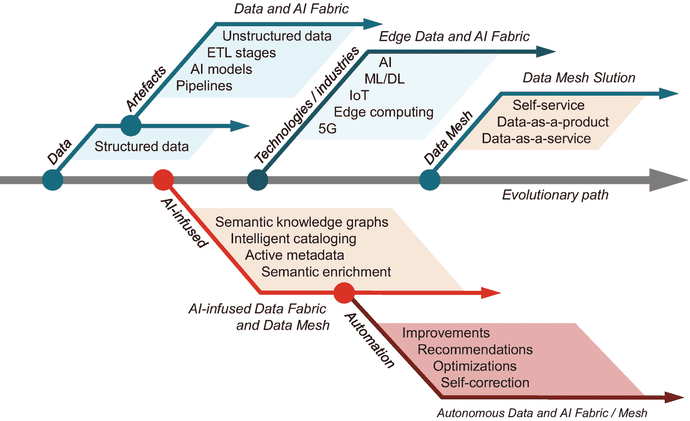

数据编织和数据网格的进化路径，受 4 个影响因素的影响。1. 数据和工件。2. 智能化和自动化。3. 技术/行业。3. 数据网格。

图 10-1

数据编织和数据网格进化

数据编织的原始范围似乎主要集中在混合多云数据集成挑战上，包括相应的安全问题、数据一致性需求、数据治理等。但除此之外，其他方面的重要性并没有非常高。例如，一个生成主动元数据、实现智能编目、激活数字足迹、语义丰富数据、执行自动数据编织任务、管理除数据本身之外的其他工件，并解决基于数据编织的特定解决方案（如数据网格解决方案）的 AI 增强数据编织，并未在原始数据编织范围内。

图 10-1 说明了影响数据编织和数据网格演变的各种影响因素，其起点是缺乏 AI，无论是从这两个概念要管理的 AI 工件，还是增强数据编织和数据网格功能的人工智能能力。

数据编织的演变同样受到不同技术的影响，如物联网、边缘计算和 5G。在特定行业部署 AI/ML 需要独特的功能能力和集成点。

下面的列表简要考察了影响并继续影响这两个概念演变的各个方面。我们有意避免使用具体年份或时间尺度来量化如图 10-1 所示的演变路径，因为大多数这些演变方面是重叠的，并且主要并行发生：

1.  **从数据到 AI 工件**: 正如我们在本书中指出的，数据编织和数据网格不仅关乎传统意义上的数据，特别是结构化或关系型数据——它关乎 AI 工件。与其使用*数据编织*或*数据网格*这样的术语，不如使用*数据和 AI 编织*或*数据和 AI 网格*这样的术语，来考虑要管理的各种工件。这由图 10-1 的左上分支所示。

1.  **AI 增强**: 将 AI 融入概念中，我们可能称之为*AI 增强数据编织或数据网格*，构成了最重要的创新；这不可避免地是本书的核心所在。通过将 AI 融入这两个概念的能力，我们能够进行智能编目、生成主动元数据、构建语义知识图谱等，并获得必要的全面洞察，以改进和优化相应的任务，例如构建数据产品。

1.  **从洞察到自动化行动**：通过人工智能/机器学习获得洞察是提供自动化的关键第一步。朝着现代的*自主数据与人工智能编织或网格*迈进，挑战在于将洞察转化为自动化行动，即例如自主实施推荐和提出的优化，将业务用户或运营人员的干预限制在审查和批准步骤。数据编织和数据网格任务应根据从活跃元数据中获得的洞察或通过激活数字废气进行自动调整和纠正。此外，关于数据消费任务（例如，计算能力、I/O、内存等）的资源分配需要尽可能学习和自主调整，由数据编织和数据网格完成。

1.  **技术范围和行业需求**：数据编织采用混合多云只是一个第一步。数据编织的概念与其它部署选项、技术和特定行业需求的关系越来越紧密。例如，数据编织必须支持工业物联网、移动设备、边缘计算和 5G^4，这意味着数据编织不仅需要更分散，而且需要在地理上更接近业务用户和最终客户。在这种情况下，数据需要在核心系统或应用程序及其边缘设备之间持续流动，这种模式需要被数据编织架构所接受。此外，人工智能/机器学习越来越多地部署在分析和事务域的交叉点^5，使得在移动和边缘设备的事务中推断人工智能模型结果成为可能。为了强调这些特定方面，我们甚至可以提及一种*边缘数据与人工智能编织*架构模式，这可以被视为传统数据编织架构的扩展。

1.  **数据网格解决方案**：正如我们在第二章中看到的，数据编织概念与数据网格解决方案紧密相关，其关键特性包括支持部门所有权和自助式构建数据产品，这为数据编织架构提出了具体的要求。6

现在我们继续探讨一些数据消费模式。

## 数据消费模式

考虑到今天的数据消费模式，我们不可避免地需要超越仅仅将*分析数据*视为数据编织或数据网格场景相关性的考虑。相反，我们需要接受事务性和分析数据领域的交集。例如，一旦人工智能模型开发和训练完成，就必须部署和实施，这涉及到在事务场景中几乎实时的推理和评分这些人工智能模型，例如，通过 REST API 调用。此外，可信的人工智能要求我们需要实施 MLOps，连接开发和运营领域，这意味着数据编织需要在事务场景中协调数据访问和数据集成。物联网和边缘计算需要在边缘和移动设备上进行推理和分析，集成到应用程序和事务场景中。这为数据编织架构提出了与传统数据仓库或数据湖屋实现相比根本不同的要求，后者主要针对分析目的，例如，开发人工智能模型、仪表板或传统的 BI 报告。

因此，我们将以下两种相关但仍然不同的数据消费模式区分开来：

+   **模式 A，分析模式**，主要关注分析数据和开发人工智能模型、仪表板、BI 报告等。

+   **模式 B，事务模式**，主要关注在事务场景中整合数据和人工智能工件。

为了进一步探索数据消费模式，我们需要了解数据编织和数据网格的用户格局。显然，数据和人工智能工件可以由不同的用户消费，以实现不同的目标。为了简化起见，我们将以下五组用户区分开来：

1.  **业务用户**：这些主要是高管、经理和业务线用户，他们要么负责业务决策，要么为业务决策准备输入。这些用户为了业务目的消费数据和工件，包括作为数据网格解决方案一部分的数据即产品。

1.  **开发者**：这些主要是应用开发者、数据科学家和数据工程师，他们正在开发应用程序、人工智能模型、管道、ETL 阶段等，这包括所需的数据探索和准备任务。

1.  **终端客户**：这些是企业终端客户，他们访问应用程序并在其边缘、移动和在线设备或其他渠道（例如，分支机构、ATM、电话等）透明地访问和消费人工智能工件。

1.  **治理人员**：这些是数据管理员、数据守护者、数据质量工程师等，他们关注数据和人工智能治理方面。

1.  **IT 人员**：在数据编织或数据网格的背景下，这些是 IT 运维人员，他们关注 AI 的部署和运营化方面，使推理、评分等成为可能。

这两个概念都需要解决这些用户强加的各种数据消费需求。显然，存在一个更细粒度的用户列表以及他们相应的角色和责任。然而，我们希望保持相对简单，并针对我们的数据编织和数据网格相关目的。

表 10-1 列出了某些关键数据消费模式，这些模式被归类为事务型、分析型或混合型，并且进一步与各种用户群体相关联.^(9)

表 10-1

数据消费模式

| # | 类别 | 模式 | 用户 | 描述 |
| --- | --- | --- | --- | --- |
| 1 | 分析 | BI | 业务 | 基于 DWH 系统的传统 BI 业务报告、规划场景和实时仪表板 |
| 2 | 分析 | AI | 商业开发者 | AI 模型开发，包括训练、验证和测试 |
| 3 | 分析 | 探索 | 开发者 | 数据探索和准备，用于 AI 和 BI 用例 |
| 4 | 分析 | 转换 | 开发者 | 数据转换和 ETL，用于 AI 和 BI 用例 |
| 5 | 事务型 | 可信 AI | 业务 IT 人员管理 | 确保在部署后以及在 AI 模型在事务环境中的运营化过程中实现可信 AI |
| 6 | 事务型 | MDM^(10) | 业务 | 实现核心信息（主数据、参考数据）的单个版本真相以及 360 度客户洞察 |
| 7 | 事务型 | 推理 | IT 人员 | 在事务环境中推理和评分 AI 模型，通常实时进行 |
| 8 | 事务型 | 物联网、边缘、3G | 最终用户 | 在边缘和移动设备上进行推理和分析，集成到应用程序和事务环境中 |
| 9 | 混合 | 数据网格 | 业务 | 建立自助数据市场，使数据作为产品可访问 |
| 10 | 混合 | 管理 | 管理 | 用于管理目的的数据和 AI 工件访问，例如，数据整理、数据质量等 |

将这些模式严格归类为事务型或分析型并不总是可能的，尤其是对于数据网格和管理模式。例如，数据网格解决方案模式（表 10-1 中的第 9 项）应使业务用户能够处理数据作为产品，这包括数据的搜索、发现和探索。然而，它也可能包括在应用程序和事务环境中使用数据和 AI 工件。因此，您会看到术语*混合*作为 10-1 表中列出的某些模式的类别。

AI 模式（表 10-1 中的第 2 项）主要关注开发者。然而，业务用户创建业务框架并传达业务需求。因此，您会看到这两个用户都被列出。可信 AI 模式（表 10-1 中的第 5 项）可能涉及各种不同的用户：显然，业务用户对可信 AI 有兴趣。但是，IT 人员和 AI 管理人员也需要参与，以实现可信 AI。数据编织需要为这些不同用户及其相应的角色和责任提供支持。

MDM 模式（表 10-1 中的第 6 项）关注的是在事务和应用环境中实时提供核心信息（主数据）的单一事实版本，这包括提供 360 度的客户洞察。在今天的企业中，数据在客户互动的各个点上产生。

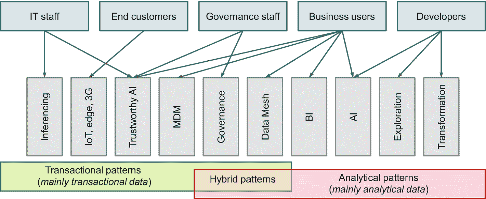

数据消费的分类。事务性、分析性和混合模式，其目标包括推理、IoT、边缘、3G、可信 AI、MDM、治理、数据网格、BI、AI、探索和转换，由 IT 人员、最终用户、治理人员、业务用户和开发者消费。

图 10-2

数据消费模式

数据编织架构需要在应用和事务环境中保证这一单一事实版本，这——根据 MDM 解决方案的部署选项——也可能意味着基于分散并维护在各种数据存储中的核心信息来组装这一单一事实版本。11

图 10-2 以概念图的形式总结了我们的讨论。本小节的关键信息是要理解数据编织架构更广泛的应用范围，它远远超出了纯粹的分析数据和应用程序领域。

## 数据网格解决方案的数据编织

这两个概念之间的相互关系已在第二章中讨论。本小节进一步探讨数据网格解决方案的功能以及它们如何与数据编织功能相互交织。由于数据网格使业务线和产品所有者能够以自助服务的方式构建和交付数据产品，我们打算关注这一自助服务层作为数据编织架构（或框架）和数据网格解决方案之间一个关键的集成点。

此外，我们引入了一个高级架构概述图，展示了数据网格与数据编织框架的交织。

### 数据网格自助服务功能

数据编织（Data Fabric）和数据网格（Data Mesh）的概念都包括自助服务功能；然而，数据网格解决方案需要额外的自助服务功能，这些功能是由数据网格解决方案的强制要求所施加的。

数据编织的自服务能力以技术为中心；它们通过语义搜索和发现以及知识目录中的信息（如活动元数据、访问方法等信息）来实现。

数据网格的自服务能力以业务和领域为中心；它们主要针对在具体业务、领域或行业背景下构建、交付和管理数据产品，从而实现数据购物体验。

图 10-3 展示了数据网格和数据编织自服务能力的相互关联性。我们在图 10-3 中划定的边界可能被视为任意和，在某种程度上，甚至有些人为。一些读者甚至可能会问自己，与已经存在于数据编织架构中的那些能力相比，数据网格的自服务能力 12 的独特性和不同之处在哪里？

为了阐明这一点，让我们详细考察数据网格的具体自服务能力。

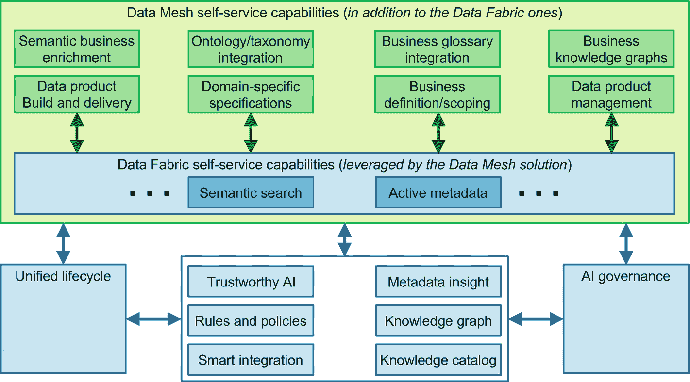

一个架构块图。数据网格的自服务能力，如语义丰富化、分类法集成、业务术语集成和数据产品管理，以及数据编织的语义搜索和活动元数据，与统一生命周期、治理、可信块、规则和政策、智能集成、元数据洞察、知识图谱和知识目录相互连接。

图 10-3

数据网格自服务能力

以下是与构建数据网格解决方案特别相关的自服务能力列表：

+   **语义商业丰富化**：无疑，语义丰富化与数据网格特性紧密相连，在第七章中已有重点讨论。在数据编织的背景下，语义丰富化简化了数据发现、访问和消费。然而，在数据网格的背景下，语义丰富化需要拥抱特定的业务、领域或行业背景。数据和人工智能工件必须在纯技术方面之外可解释和丰富；它们需要在特定的商业背景下被理解和消费，这就是我们所说的*语义商业丰富化*。

+   **本体/分类法集成**：再次，在第七章中，我们已经看到特定领域的本体作为数据编织语义丰富化引擎的输入。数据网格解决方案的本体/分类法集成需要服务于数据产品构建和交付服务，并需要支持特定领域的规范、业务定义和范围需求。

+   **业务术语表集成**：业务术语表是数据编织知识目录的一部分；然而，它需要集成到数据产品构建和交付过程中。因此，数据网格解决方案利用现有的业务术语表，可能添加新术语，并将相关业务术语链接到数据产品或服务。

+   **业务知识图谱**：在第五章中，我们介绍了语义知识图谱作为一个 AI/ML 增强的知识图谱。如果你回顾第五章中的讨论，数据编织框架中的语义知识图谱确实主要关注技术和组织关系。进一步丰富此图以包含业务、领域或行业特定的知识和与相应数据产品的对应关系，这被称为业务知识图谱，它代表并丰富了数据网格解决方案中的数据产品。

+   **数据产品构建和交付**：数据网格解决方案的一个关键目标是以自服务的方式构建和交付数据产品。这需要一个基于 GUI 的数据网格应用程序模块，支持数据所有者、业务用户等执行这些任务，其中利用了现有的数据编织自服务和其它能力。数据产品交付需要包括向其他数据所有者或业务领域提供支持，以实现业务领域间的互操作性。

+   **特定领域规范**：数据产品可能需要在特定领域上下文或事件中定义和交付，这要求全面理解数据和 AI 工件，以及与特定领域事件或过程的关系。数据网格解决方案需要促进对特定领域事件或过程的规范，这些规范作为数据产品构建过程的输入。

+   **业务定义/范围**：与特定领域规范类似，数据网格解决方案需要有关业务事件定义和业务范围的自服务能力，这些能力必须是可配置的，并且可以映射到相关数据和 AI 工件或对象。业务术语表、本体和分类法的集成以及业务知识图谱可以由业务定义和范围服务利用。

+   **数据产品管理**：一旦数据产品被构建并可供数据消费者、业务用户或 AI 治理人员使用，它们就需要被管理（例如，处理更新、产品版本、所有权、访问权限等），作为数据编织知识目录中的额外工件。

就像任何数据和人工智能工件一样，数据产品同样存储在数据编织知识目录中，我们可以将其视为一个 *数据网格知识目录*。上述数据网格自助服务能力的列表不可避免地表明，需要特定的数据网格工具和服务来利用数据编织能力构建数据网格解决方案。这些工具和服务需要包括 REST API 和数据交换协议或标准（例如，JSON，^(13) Apache Avro^(14))，并且必须易于数据所有者、数据消费者或商业用户使用。

### 数据网格架构概述图

除了自助互连之外，我们还引入了一个数据网格解决方案的高级架构概述图，该图通过关键数据编织能力实现，如图 10-4 所示。

如您在图 10-4 的下半部分所见，有几个数据领域所有者，他们负责其对应的数据产品。例如，*data_domain_owner A* 管理存储在 Google 云中的相应数据，而 *data_domain_owner B* 将相应数据存储在本地，这可能是一个 x86 Intel 集群或 IBM 主机系统。构建和交付这些数据产品基于数据编织能力，如数据准备和数据集成任务，利用存储在知识目录中的活动元数据，以及定义新的或使用现有的数据策略和规则——仅举几例。数据编织和数据网格自助服务能力——如前一小节所述——用于构建、管理和交付数据产品。

重要的是要认识到，数据编织架构通过其丰富的知识目录、语义搜索和发现、智能集成能力以及语义知识图，使数据网格解决方案成为可能。例如，可信人工智能是通过数据编织实现的。

因此，数据网格解决方案建立了一个具有数据产品特性的数据市场（数据即产品）。这在上半部分的图 10-4 中有所展示，您可以看到几个数据消费者，他们可能是商业用户，也可能是最终客户，这取决于数据消费模式。例如，*data_consumer_1* 正在使用 MS Azure 的 BI 服务，*data_consumer_2* 正在使用本地数据科学平台，*data_consumer_3* 正在使用私有云的 BI 服务，而 *data_consumer_4* 正在使用 IBM Cloud 的数据科学服务。

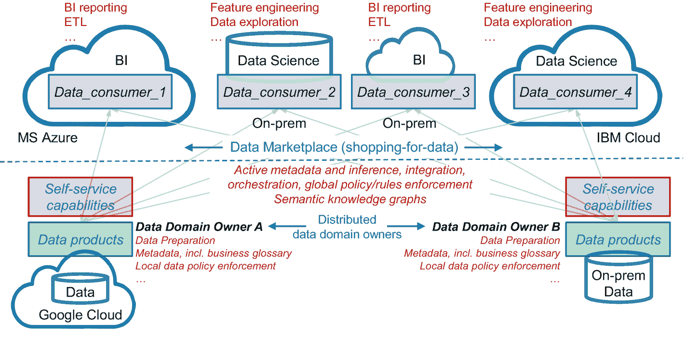

数据网格架构。拥有自助服务能力的 2 个领域所有者，A 拥有谷歌云数据，B 拥有本地数据，通过数据市场由 M S Azure、本地和 I B M 云的 4 个数据消费者访问，用于 B I 报告 E T L、特征工程和数据探索。

图 10-4

数据网格架构概述图

所有数据消费者都可以访问和使用来自各个数据领域所有者的数据产品，并为其特定目的消费这些数据产品，例如，传统的 BI 报告、数据探索和特征工程、AI 模型开发等。这通过各个数据消费者和数据产品之间的箭头表示。因此，一个数据领域所有者的数据产品可能被多个数据消费者访问和消费。关于这些数据产品的访问权限、规则和政策通过数据网格知识目录进行捕获和管理。

## 智能信息集成风格

在不涉及智能信息集成风格的情况下，关于数据编织架构模式的讨论是不完整的。由于关于信息集成的出版物很多，^(15) 我们将我们的审查限制在一系列知名的信息集成风格上，提供有关何时使用某种模式或风格的建议，以及何时不使用。

在第五章中，我们介绍了“智能信息集成”这一术语，作为一个 AI 增强的信息集成层，它是现代数据编织架构和数据网格解决方案的关键能力。

表 10-2 内在地需要这种 AI 增强的数据编织视图的智能信息集成风格。

表 10-2

智能信息集成风格

| 风格 | 描述 | 何时使用和何时不使用 |
| --- | --- | --- |
| ETL、ELT 等 | 传统的 DWH 风格 ETL、ELT 等 | 用于复杂的数据聚合和转换作业，为特定消费目的准备数据，如传统的 BI/DWH 场景。ETL 与 ELT 主要取决于数据大小和转换需求复杂性。 |
| CDC^(16) | 基于 CDC 的企业复制 | 通过基于日志的 CDC 实现主要关系数据的近乎实时移动，对源系统影响有限，允许在相同的 DB 模式上执行额外的 SQL 语句，而不会影响源系统。 |
| 联邦/虚拟化 | 具有下推功能的联邦和虚拟化 | 通过生成一个虚拟数据视图简化对异构和分布式数据源的访问，利用下推函数，数据留在原地，只访问所需的数据。 |
| REST API | 符合 REST 架构风格的 API | 与 SQL 相比，REST API 在访问数据方面提供了更多的灵活性，数据可以存储在 DBMS 中或通过 URL 可访问的资源中，使用 JSON，并且可以轻松连接应用程序或微服务。 |
| 微服务 | 用于构建应用的分布式、松耦合架构框架 | 微服务是更小的、通常基于容器的服务，可以通过 REST API“缝合”在一起，作为一个集成应用运行。 |
| 流式传输 | 传输连续的数据流 | 主要用于实时数据消费和对连续流式数据的实时分析，例如，视频、社交媒体流、交通监控、实时股票交易、实时网络安全等。 |
| 消息 | 描述事件、请求、回复等的消息 | 尤其适用于与业务相关的事件、请求、回复等的流，由于与业务相关的消息，在原始数据流之上具有优势。 |
| JDBC/ODBC | 基于 SQL 的 API 访问数据库管理系统 | 用于对各种关系型数据库管理系统进行基于 SQL 的本地访问，消耗源系统的资源。BI/分析工作负载可能会干扰事务性工作负载。 |

如我们在第五章所述，智能信息集成是一个注入人工智能的信息集成层，它包含基于人工智能的能力，这些能力应该保护各种用户免受这些信息集成方式的复杂性；人工智能能力应该自动化并 *学习* 信息集成——这意味着随着时间的推移，自动选择、调整、优化和改进信息集成模式，进一步减少人为干预。

将人工智能注入智能信息集成层是实现数据编织架构和数据网格解决方案最具挑战性的领域之一。

## 关键要点

我们以表 10-3 中总结的几个关键要点来结束本章。

表 10-3

关键要点

| # | 关键要点 | 高级描述 |
| --- | --- | --- |
| 1 | 应将人工智能注入数据编织。 | 注入人工智能的数据编织构成了最新的最基本创新。 |
| 2 | 数据编织需要将洞察转化为自动化操作。 | 向现代自主数据与人工智能编织迈进需要将洞察转化为自动化操作，例如，自主实施推荐和提出的优化。 |
| 3 | 存在分析和事务性数据消费模式。 | 数据编织需要服务于分析和事务性数据消费模式，例如，解决 MLOps、可信人工智能、MDM、推理、物联网、边缘计算和 5G。 |
| 4 | 新技术，例如物联网、边缘计算等，对数据编织有深远的影响。 | 数据编织必须支持工业物联网、移动设备、边缘计算和 5G，这意味着数据编织需要更加分散，并在地理上更靠近最终客户。 |
| 5 | 需要特定于数据网格的自助功能。 | 数据网格自助功能以业务和领域为中心；它们旨在在具体业务、领域或行业背景下构建、交付和管理数据产品。 |
| 6 | 数据产品构建、交付和管理是关键。 | 构建、交付和管理数据产品是数据网格必须以自助方式实施的关键能力之一。 |
| 7 | 数据产品规范也存储在知识目录中。 | 我们将同时捕捉数据产品信息的知识目录称为*数据网格知识目录*。 |
| 8 | 数据编织架构使数据网格解决方案成为可能。 | 数据编织架构通过其丰富的知识目录、语义搜索和发现、智能集成能力、语义知识图谱等，使数据网格解决方案成为可能。 |
| 9 | 需要多种智能信息集成风格。 | 数据编织需要支持多种智能信息集成风格，例如联邦和虚拟化、带有 REST API 的微服务、流、消息传递等。 |

## 参考文献

1.  IBM 商业价值研究所，*将数据编织融入混合多云*，[《将数据编织融入混合多云》](https://www.ibm.com/downloads/cas/Y5A968XV) (访问日期：2022 年 8 月 6 日).

1.  IoT Business News，*数据编织和物联网的互操作性增长*，[《数据编织和物联网的互操作性增长》](https://iotbusinessnews.com/2021/08/18/33020-the-interoperable-growth-of-data-fabric-and-iot/) (访问日期：2022 年 8 月 7 日).

1.  Carr, L., Actian, *什么是边缘数据编织？*，[《什么是边缘数据编织？》](https://www.actian.com/blog/data-management/whats-an-edge-data-fabric/) (访问日期：2022 年 8 月 7 日).

1.  McKendrick, J., *现代数据架构的迁移：2022 年数据交付和消费模式调查*，2022 年，《2022 年数据交付和消费模式调查》 (访问日期：2022 年 8 月 11 日).

1.  Dreibelbis, A., Hechler, E., Milman, I., Oberhofer, M., Van Run, P., Wolfson, D., *企业主数据管理：一种面向服务架构的核心信息管理方法*，IBM 出版社，2008 年，ISBN-13：978-0132366250.

1.  Dehghani, Z., *第**4**章. 自助数据平台原理，[《数据网格》](https://www.oreilly.com/library/view/data-mesh/9781492092384/ch04.html) (访问日期：2022 年 8 月 13 日).

1.  Giordano, A., *数据集成蓝图和建模：可扩展和可持续架构的技术*，IBM 出版社，2013 年，ISBN-13：978-0137084937.

1.  Gartner，*数据集成工具魔力象限*，2021 年，[《数据集成工具魔力象限》](https://www.gartner.com/doc/reprints?id=1-27E7HBB5&ct=210909&st=sb) (访问日期：2022 年 8 月 14 日).

# 11. 企业架构中的数据编织

任何数据架构，因此也包括我们的数据编织架构，都需要与现有企业景观中实施的应用架构相结合来考虑。许多组织正在其应用和数据景观的现代化和数字化转型过程中。应用对数据特性的要求不同，这可能会推荐一种特定的数据架构实现而不是另一种，例如，基于数据虚拟化或数据复制和转换的数据访问。

在本章中，我们在详细阐述企业架构中数据编织的关键方面之前，简要回顾了企业架构和应用架构的关键必要性，这包括挑战和益处。使用概念架构模型作为数据编织的表示，我们说明了数据编织的最基本组件如何与从应用和业务领域推导出的必要性协同作用。

在给定的企业架构和应用架构中集成数据编织架构为构建数据网格解决方案提供了基础。

## 引言

在第一章中，我们了解到数据编织架构是从受新业务驱动数据需求影响的新技术影响下的先前数据架构演变而来的。从纯 IT 角度来看，几乎一切似乎都是可能的。特别是在大型组织中，基于功能和非功能性要求的 IT 实施建议的明确架构是必要的，以避免不可靠、难以管理和过于昂贵的 IT 景观。架构是特定时间点组件及其关系的概念框架的清晰表示。

这是一个认可，即当组织从更广泛的视角出发，并将数据架构能力描述为企业架构的一部分，强调业务需求时，它们会做出更好的 IT 实施决策。随着时间的推移，观察组织中的数据架构，你可以观察到从数据架构决定应用架构到相反方向的转变，即应用架构决定或至少强烈影响底层数据架构，推动显著不同的软件和硬件交付系统。

在本章中，我们简要回顾了企业架构的级别，随后讨论了当前应用架构的三个主要方法及其对底层数据架构的影响。我们回顾了主要数据架构决策标准，并分享了一种基于特定业务需求评估它们的方法。这种方法有助于根据技术特性选择最适用的实现，而不是基于个人意见和偏好。

此外，我们介绍了数据布料架构的概念模型和结果组件，包括其在实施数据网格解决方案中的相关性.^(1)

## 什么是企业架构？

企业架构框架最初于 20 世纪 80 年代末由国家标准与技术研究院（NIST）作为参考模型开发.^(2)

直到 20 世纪 90 年代末，其相关性才被广泛认可，企业开始将其作为其运营的指导。如今，没有一家组织能够在没有针对其特定需求明确定义的企业架构的情况下实施高效的 IT 生态系统。企业架构由五个层级组成，如图 11-1 所示。

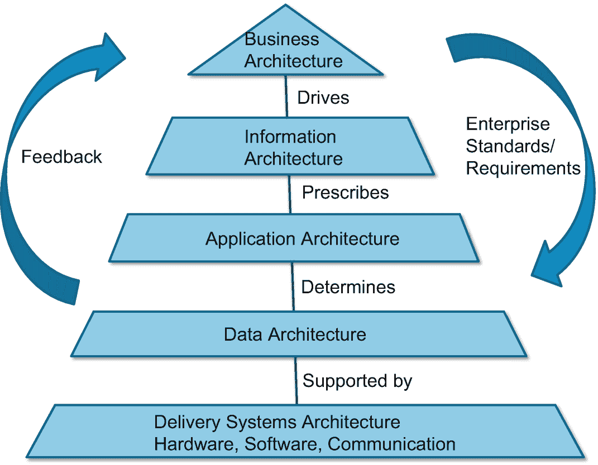

金字塔结构分为 5 个部分，如业务、信息、应用程序、数据架构和交付系统架构、硬件、软件和通信。从数据到业务以及从业务到数据架构获取反馈。

图 11-1

企业架构框架

每个层级都包含定义企业标准和要求的组件。将反馈循环回业务架构对于采用新的行业趋势和技术至关重要，这使得企业架构^(3)成为一份活文档：

1.  **业务架构层级**：描述了企业的整个业务景观或特定业务线，它与外部组织（包括业务伙伴和最终客户）接触。它包括功能领域的业务实践以及由此产生的内外部企业报告要求。它明确地驱动信息架构层级。

1.  **信息架构层级**：指定整个企业或业务线所需信息的内 容、呈现形式和格式，例如，行业标准的企业间（B2B）数据交换，如 SEPA^(4)或 HIPAA.^(5)合规性和安全法规，以及业务术语表也在这一层级定义。它规定了信息系统和应用程序架构层级。

1.  **应用程序架构层级**：指定应用程序及其主要组件和功能、应用程序集成和软件开发标准，包括应用程序接口和编程语言。在本章的后面部分，我们将讨论目前流行的三种主要的核心系统转型方法。应用程序架构强烈决定了数据架构的主要特征。

1.  **数据架构级别**：指定了访问和使用数据、其维护以及数据之间通信的框架。它包括数据模型及其元素和结构，并定义了命名约定和表示的标准，通常包括数据字典。应用和数据架构都由交付系统架构实现和支持。

1.  **交付系统架构级别**：代表支持应用和数据架构的软件、硬件、网络和通信的技术实现细节。它包括硬件平台、操作系统、实用工具和工具以及存储媒体。云部署标准（公共或私有云）属于此级别。6

建筑师犯的一个绝对最普遍的错误是忽视将应用和数据架构与交付系统架构分离。在架构决策标准的指导下，应在交付系统架构中而不是在先前的架构层中定义数据或应用架构的技术实现选项。此外，应补充实施选项的优缺点，以得出平衡的决策。

这些指南对于实施数据布线架构最为相关，尤其是在没有单一适用于所有用例且具有优势的架构方法的情况下。

## 什么是应用架构？

应用架构描述了应用程序的行为，它们如何相互交互以及如何与用户交互，以及数据的产生和消费。长期以来，应用开发的重点是提供特定业务线的全新功能。内部应用结构是单体化的，非常互联，这使得对用户界面的任何更改都变得复杂且昂贵，同时也显著降低了代码的可重用性。

为了支持更多用户通信渠道，如 B2B、在线和移动，并快速应对行业趋势的变化，当前的应用架构包括三种主要方法。每个组织的环境、最终状态要求、风险承受能力、财务合理性等定义了这些方法中的每一个的业务影响——明确地表明混合方法和变体是理想的方法。

以下三种主要的应用架构方法：

+   **API 启用**：似乎是转换现有应用的最简单方法，其中应用程序功能被封装在基于 REST 的应用程序编程接口（API）中，以便其他应用程序和用户渠道可以轻松消费，同时隐藏所有平台和实现细节。单个 API 可以为不同的用户集提供多个实现，例如，低价值消费者实现可能更喜欢商品平台，而高价值消费者实现可能选择高度可靠和可扩展的配置。

+   **容器化**：是将应用程序逻辑系统地移动到容器中的过程，容器是一个预构建的操作系统、中间件和应用代码的堆栈。容器具有多个优点，即通过开源和标准化努力，容器可以在各个平台上进行移植，并且可以部署在任何地方，包括本地和云环境。一旦构建，容器是不可更改且经过签名的，这使得它们更安全，不易受到意外或恶意更改的影响。它通常在快速扩展其消费的同时保留数据和操作流程。

+   **微服务分割**：是将现有应用程序完全重构为云原生应用程序的过程。虽然这种方法对新应用程序具有吸引力，但对于转换现有应用程序来说可能极具风险。微服务分割对底层数据架构有深远的影响，通常导致高度分区化的数据模型。

图 11-2 展示了在转换现有应用程序时三种应用程序架构方法在业务影响与可行性方面的对比。现有功能的 API 启用为相对较低的投资带来了良好的商业价值，并且是一种广泛采用的方法。它随后是应用程序容器化和采用微服务的应用程序的增量重构。

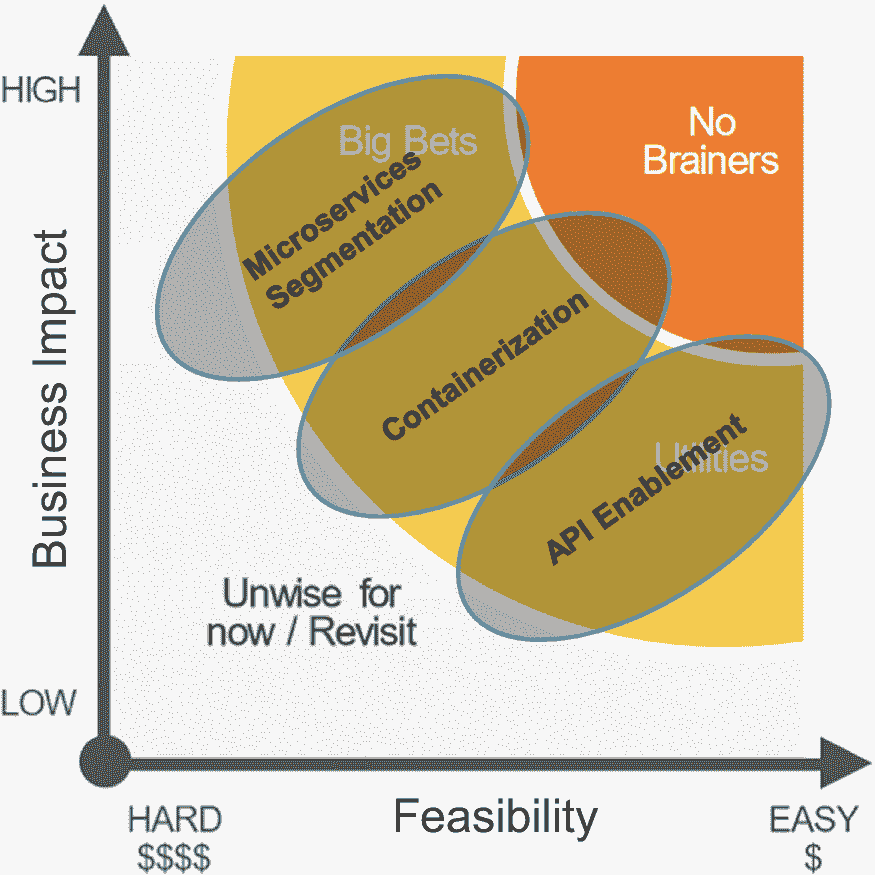

从低到高展示商业影响与从难到易展示可行性的图形说明。图表从右上角开始表示为 3 个部分。1. 毫无疑问。2. 大赌注。3. 现在不明智或重新审视。3 个椭圆形占据了大赌注，以及微服务分割、容器化和 API 启用等少数其他领域的部分。

图 11-2

应用程序转换方法

微服务具有巨大的商业影响潜力，但也带来了新的数据架构考虑因素。

应用程序模块化和数据分区将驱动数据架构决策，并对应用程序逻辑有重要影响：

+   **数据访问与数据复制**：第一个基本决策涉及原始数据的数据访问与为消费而复制数据，创建一个或多个副本。有几个优点有利于数据访问，尤其是在高级数据虚拟化技术可用的情况下。虽然复制数据一次是直接的，但维护数据复制管道在较长时间内是昂贵且耗时的。它通常还会为消费应用程序带来数据质量和数据延迟的挑战。在原地访问数据可以加速应用程序的转型，同时保留现有的数据管理和恢复流程，因此更快地为业务带来价值。

+   **数据一致性与最终一致性**：数据一致性考虑因素随着数据分段而引入。从架构上讲，微服务是无状态的。在实现跨多个数据源的一致性更改的多个微服务之间没有事务边界。因此，微服务最终是一致的，^(8)这意味着当所有与特定用例执行相关的微服务都成功时，数据一致性才达到。如果一个微服务失败，之前执行的逻辑可能需要撤销，这可能会增加需要为不同步的系统提供的补偿逻辑和/或业务流程的数量。主要好处是最终一致性使应用程序能够独立开发。然而，它可能导致数据质量问题。因此，迄今为止的大多数微服务实现都集中在消费数据但不更新数据的用例上。

在数据织锦中，基于智能元数据，数据消费者应该获得关于针对特定用例最合适的智能信息集成技术的推荐。

## 数据织锦作为数据架构

数据架构定义了一个组织中的数据标准，包括数据如何被访问和消费。它还描述了业务单元使用的数据结构。数据集成也依赖于定义的数据架构标准，因为数据集成需要数据之间的交互。

除了新技术之外，还有各种其他限制和影响因素将影响数据架构设计，也称为数据架构决策标准。这些可以分为三个类别：

+   **能力或功能性需求**：这包括对数据一致性、数据延迟、数据质量与粒度以及数据访问和消费需求等功能性特性的描述和优先级排序。

+   **弹性或非功能性需求**：它包括对可用性、维护、性能、简单性、可扩展性和安全性以及数据治理等特性的描述和优先级排序。

+   **财务或业务需求**：它包括基础设施成本（获取成本）、服务级别协议、运营成本、价值实现时间和对业务的风险的描述和优先级排序。

整个组织或特定的业务单元定义了特定用例的需求，从而导致数据架构决策标准的相对优先级。当然，不同的交付系统架构实现满足这些标准的程度各不相同。

例如，通过数据虚拟化访问原始数据，与在可能已过时几天的 EDW 中访问 ETL 转换数据相比，为针对营销活动提供了更及时、更准确的数据。此外，数据虚拟化确保了数据对任何消费者都是最新的。反过来，ETL 转换数据可能在满足特定报告需求的数据粒度方面表现更好，例如销售趋势或报告应用。然而，ETL 转换数据可能在数据时效性方面落后。

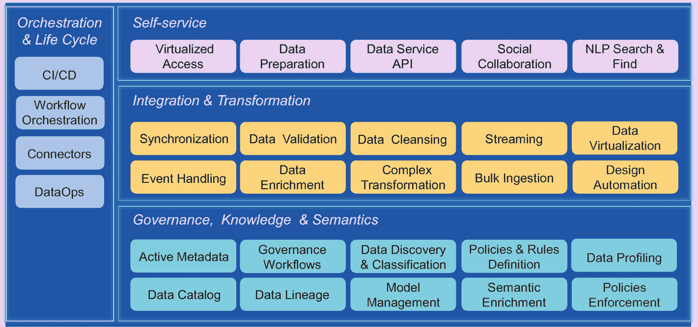

数据编织的表架构。表分为 4 组，例如编排和生命周期、自助服务、集成和转换，以及治理、知识和语义。

图 11-3

数据编织架构层

数据编织架构的强大之处在于利用 AI 进行推理和优化、^(9)、主动元数据、知识图谱和语义丰富，结合智能信息集成和转换技术以支持数据消费者。

图 11-3 显示了分组到不同的数据编织架构层的关键能力：

1.  **治理、知识和语义层**：基础层包括知识目录作为数据结构的清单。数据发现和分类提供了在数据源中查找、分类和标记数据的功能。此外，活跃元数据和数据分析通过分析和审查数据，结合人类知识和使用机器学习处理，增加了元数据的价值。例如，它可以评估元数据的准确性、完整性、一致性、及时性和可访问性，也与其他数据源相关。语义丰富通过标记、索引和编目数据进一步扩展元数据。除了丰富的活跃元数据外，数据血缘功能和影响分析至关重要；它可视化数据管道从原始数据源到数据消费者随时间的变化。模型管理将类似的智能元数据管理应用于机器学习模型，这些模型在其数据准备、模型开发、模型训练和模型部署的生命周期中。治理政策和规则的定义、执行和工作流程确保只有授权消费者以授权方式消费可用的数据。该层的总体目标是获得数据及其元数据的统一视图，并具有可操作的见解和统一的数据治理政策执行。

1.  **集成和转换层**：提供数据管道实现所需的所有功能。数据复制、流式传输、同步以及事件处理将更改后的数据从原始数据源通过定义的数据管道移动，以使消费应用程序了解这些更改，以便进行进一步的处理和消费。或者，批量摄取创建整个数据源的副本。数据验证、数据丰富、数据清洗和复杂转换实现了复杂的 ETL 管道。除了使用前述功能从原始数据源复制数据外，作为数据管道实现的一部分，数据虚拟化作为访问原始数据的技术变得更加重要，尤其是如果数据虚拟化包括计算网格和智能下推功能。10 例如，数据虚拟化技术可以用于从多个数据源读取数据作为数据准备输入，其中可以通过 SQL 逻辑应用复杂转换并在访问数据源时执行，从而消除数据移动。此集成和转换层提供了一系列基于策略的集成样式和智能自动化。

1.  **自助服务层**：为数据消费者提供虚拟化访问数据源或进行数据准备的功能，以及除了自定义数据服务 API 之外的社会协作、搜索和查找功能。自助服务层使受信任和管理的市场对数据消费者开放，使他们能够轻松搜索、查找、理解、协作并访问数据资产和数据产品。例如，对客户数据的全球搜索只需简单地输入单词*customer*，即可找到他们可以访问的相关数据资产。自助数据购物为商业用户和数据消费者节省了大量时间。这是数据布线架构和数据网格解决方案的总体目标。

1.  **编排和生命周期层**：提供变更管理功能，例如 CI/CD 集成的 API 和工作流编排，以及连接到不同支持的数据源和 DataOps 和 MLOps 功能。编排和生命周期层提供端到端的生命周期，用于构建、测试、部署和管理数据布线中的所有数据和 AI 资产，无论是数据结构、数据管道还是 AI 模型资产。

### 企业架构内数据布线的示例

许多供应商开发和提供支持组织内数据布线架构的产品。例如，图 11-4 显示了 IBM Cloud Pak for Data^(11)作为企业架构中数据布线架构的基础.^(12)

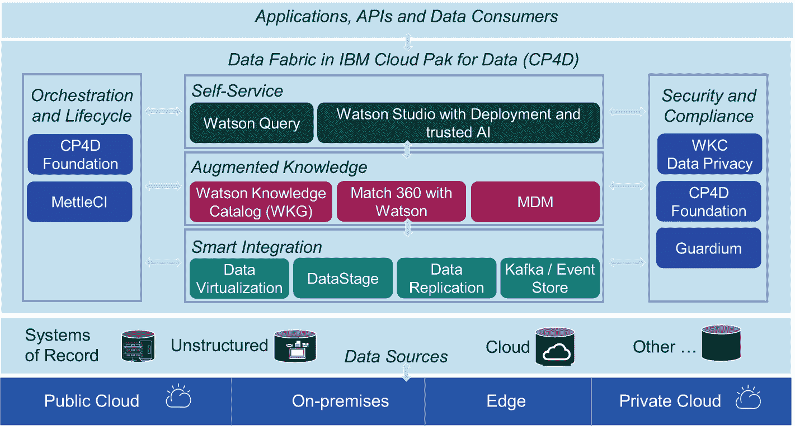

应用程序、API 和最终用户的数据表架构。它们之间有 3 层，数据在这些层之间共享。它们是编排和生命周期、IBM 云公园中的数据布线以及安全和合规性。有两行图标列表，1，记录系统、非结构化、云和其他。2，公共云、本地、边缘和私有云。

图 11-4

企业架构内 IBM Cloud Pak for Data（CP4D）的数据布线示例

在底层，所有交付系统架构的变体，包括公共云、私有云、边缘计算和本地计算环境都得到了支持。将数据存储在多个计算环境中称为混合云，我们将在第十二章中更详细地讨论。作为数据架构的一部分，需要列出支持的数据结构类型，例如结构化数据（例如，记录系统）、半结构化和非结构化数据，以及云数据存储。IBM Cloud Pak for Data Foundation 和 Watson Studio 管道提供编排和生命周期功能，以及集成安全和合规性功能。核心是 IBM Watson 知识目录（WKC）、MDM 和 IBM Match 360 与 Watson 服务相结合的增强知识，以实现客户和其他相关方的全面视图。

智能集成通过 Kafka/事件存储、数据复制、IBM DataStage ETL 管道和数据处理提供。IBM Watson Query 是虚拟化服务，它使得跨数据源的查询更快、更简单，而无需移动数据。IBM Watson Studio 是用户构建和训练 AI 和 ML 模型、准备和分析数据的协作工具。应用程序、API 和数据消费者接口成为组织应用架构的一部分。

图 11-4 展示了在更大企业架构中的数据织物架构。

## 关键要点

我们以表 11-1 中总结的几个关键要点来结束本章。

表 11-1

关键要点

| # | 关键要点 | 高级描述 |
| --- | --- | --- |
| 1 | 数据织物是企业架构的一部分。 | 数据织物架构需要与企业中实施的应用架构相结合来考虑。 |
| 2 | 应用架构决定了数据架构。 | 当前的应用架构模式，如微服务、容器化和 API 启用，决定了底层数据架构的特征。 |
| 3 | 数据织物作为数据架构需要在企业架构中定义。 | 作为数据架构的数据织物架构需要在组织的企业架构中定义。 |
| 4 | 数据织物结合了数据集成技术。 | 数据织物架构利用了活动元数据、知识图谱和语义丰富，结合智能信息集成和转换技术，以智能地支持数据消费者，例如商业用户。 |
| 5 | 微服务最终是一致的。 | 文本微服务最终是一致的，这意味着当所有与特定用例执行相关的微服务都成功时，数据一致性就达到了。 |
| 6 | 数据产品构建、交付和管理是关键。 | 构建、交付和管理数据产品是数据织物架构和数据网格解决方案必须以自助方式实施的关键能力之一。 |

## 参考文献

1.  美国国家标准与技术研究院（NIST），Rigdon, W.B.，*架构和标准*，第 135-150 页，在 Fong, E.N.，Goldfine, A.H.（编），*信息管理方向：集成挑战*，1989 年，[www.nist.gov/publications/information-management-directions-integration-challenge](http://www.nist.gov/publications/information-management-directions-integration-challenge)（访问日期：2022 年 9 月 13 日）。

1.  Jung, J.，Fraunholz, B.，*企业架构管理大师班*，Springer，2021，ISBN-13：978-3030784942。

1.  IBM 商业价值研究院，Sarkar, S.，Bijlani, V.，Warrick, R.，*将数据织物融入混合多云*，[www.ibm.com/downloads/cas/Y5A968XV](http://www.ibm.com/downloads/cas/Y5A968XV)（访问日期：2022 年 8 月 6 日）。

1.  克里斯图达斯，B.，《实用微服务架构模式》，Apress，2019 年，ISBN-13：978-1484245002。

1.  IBM，《什么是 CAP 定理？》[`www.ibm.com/cloud/learn/cap-theorem`](http://www.ibm.com/cloud/learn/cap-theorem) (访问日期：2022 年 9 月 14 日).

1.  海因茨，F.，米兰诺，M.，奥沙利文，B.（编者），《人工智能可信性——整合学习、优化和推理》，Springer，2021 年，ISBN-13：978-3-030-73958-4。

1.  IBM，IBM Cloud Pak for Data，《消除数据孤岛：作为一个整体查询多个系统，IBM Cloud Pak for Data 中的数据虚拟化》，2019 年，[`www.ibm.com/downloads/cas/97AJPYNN`](http://www.ibm.com/downloads/cas/97AJPYNN) (访问日期：2022 年 9 月 14 日).

1.  玛达，H.，斯里尼瓦桑，S.，拉加罗，D.，《IBM Cloud Pak for Data：一个企业平台，用于实现数据、分析和 AI 的运营化》，Packt Publishing，2021 年，ISBN-13：978-1800562128。

1.  [福布斯，CIO 网络，达文波特，T.，《云对分析洞察力来说是否更慢？》](http://www.forbes.com/sites/tomdavenport/2022/01/21/is-the-cloud-slower-for-analytical-insights/%253Fsh%253D41194bc66dca) (访问日期：2022 年 9 月 13 日).

# 12. 混合云景观中的数据布和数据网格

在本章中，我们调查了这两个概念从混合云部署中产生的额外方面。我们简要回顾了术语“混合云”及其与本地环境的关联。尽管云服务在重要性上被高度评价，但它们仍然在组织内部创造了新的挑战，包括访问、集成和消费数据以及 AI 资产。在混合云景观的背景下，“数据布架构和数据网格解决方案”意味着什么，以及关键挑战是什么，例如与数据 AI 治理和可信 AI 相关的问题？

尽管如此，更重要的是，拥有数据布和数据网格对于混合云环境有什么好处，这与针对传统本地 IT 和应用程序景观的方法有何不同？

本章对在混合云中构建数据网格解决方案的细节给予了足够的关注，突出了在通过混合云提供的数据市场中构建和消费数据作为产品。

## 引言

在本章中，我们探讨了数字业务转型两个倡议的交汇点：(a) 实施数据布架构和数据网格解决方案，以解决从每个组织可用的海量数据中提取业务洞察力的问题；(b) 采用混合云计算。第三章介绍了混合云中数据统一视图作为四个入门用例之一。

在混合云架构中查看、分析和处理数据的需求正在成为高优先级，因为组织正在进行采用和使用云原生应用程序的项目，并利用公有云或私有云环境现代化现有应用程序，同时在其传统处理环境中运行应用程序。

在本章中，我们回顾了什么是混合云以及组织在数据和 AI 能力方面面临的关键挑战。我们旨在展示这两个概念如何解决分布式、混合云环境中跨事务性和分析数据操作的数据和 AI 需求。

## 什么是混合云？

混合云集成了公有云服务、私有云服务和本地基础设施，并提供了跨所有三个方面的编排、管理和应用程序可移植性。^([1)]愿景是一个敏捷的分布式计算环境，组织可以优化其现有工作负载并快速采用新工作负载：

+   **公有云服务**：通过互联网提供按需 IT 资源，采用基于消费的定价模式。与购买和安装特定解决方案的硬件和软件相比，这可能在大组织中需要数月时间，服务如计算能力、存储、数据库、分析工具等可以根据需要使用，无需前期成本和安装时间。云部署选项的主要优势在于采用新技术的灵活性。公有云提供商提供广泛的 AI 和 ML、数据湖和分析等服务。它承诺能够快速测试新想法并验证业务价值。另一个好处是弹性。特别是在 x86 处理环境中，过度配置计算能力非常普遍，这导致硬件和软件许可成本增加以及关于地板空间和电力消耗的可持续性问题。公有云服务提供商负责拥有和管理用户工作负载运行的数据中心，并实施编排和虚拟化软件，根据需求上下调整服务资源。IT 消费模式可以与消费电力的*公用事业模式*进行比较。

+   **私有云服务**：仅使用与一家公司相似的云基础设施。通常，它位于组织的防火墙后面，但也可以托管在专用的第三方基础设施上。在私有云中，组织的 IT 团队负责 IT 基础设施的安装和维护，可以控制资源、数据安全、法规遵从性以及检查潜在的性能优化。应用程序开发团队和业务部门是私有云服务的消费者，并期望获得与公共云服务提供商宣传的类似灵活性和弹性。与公共云部署模型相比，私有云的一个大优势是能够定制应用程序和基础设施，从而在初始测试和采用阶段之后实现实质性的成本节约。2

+   **传统的本地 IT 基础设施**：由硬件和软件产品组成，经过较长时间的开发以适应组织的需要和目标。组织的 IT 团队运营数据中心、网络和应用，并为系统和应用部署及操作开发定制工具和程序，以及计费模型。一个管理良好的 IT 基础设施和应用组合实现了企业架构；高度优化、可靠和安全；因此可以作为竞争优势。在一些组织中，为确保可扩展性、效率、可靠性和安全性而创建的严格流程减缓了新 IT 的采用，并导致人们认为与云部署模型相比，本地 IT 基础设施在灵活性和可扩展性方面较差。

今天的混合云是通过关注通过跨一个或多个公共云、私有云和本地 IT 基础设施的松散耦合服务构建应用程序来架构的。

## 数据架构的关键挑战

回顾第一章中讨论的数据挑战，现在增加了使用不同格式存储和访问数据的复杂性，以及数据源在 IT 环境之间可移植性的灵活性。混合云架构的敏捷性允许数据在新的位置扩散。数据孤岛在云服务提供商之间的迁移变得不具吸引力。公共云服务提供商的收费结构使得将数据迁移到云中并假设数据将保留在那里变得非常有吸引力。然而，从公共云中移除数据可能非常昂贵。因此，传统的数据架构，如通过传统的 ETL 管道直接连接多个数据源以维护数据仓库或像大多数数据湖环境中所做的那样将数据汇总到单一平台，在混合云环境中会带来技术和成本挑战。混合云应用程序架构中松散耦合服务的概念在数据编织架构和数据网格解决方案中同样至关重要。数据或分析也作为服务或数据产品暴露，并带有访问 URL。

数据访问和数据格式的异质性增加了在一致的数据和 AI 治理下更快地找到相关和可消费的数据和 AI 资产的压力点。理解数据特征，如数据货币、数据质量以及 AI 的可信度，以及根据数据消费者用例的 SLA 要求管理数据和 AI 治理规则和流程变得更加困难。

现在我们来探讨在混合云环境中部署数据编织架构和数据网格解决方案意味着什么。

## 混合云中的数据编织和数据网格

在混合云环境中应用数据编织架构并实施数据网格解决方案需要与我们在这本书中讨论的类似能力，即智能编目、活动元数据、语义知识图谱、自助服务能力等。虽然通过利用云服务可以降低成本，但复杂性却可能显著增加，这要求这两个概念都要跨越额外的边界，并确保跨不同系统和公共云提供商的集成。

在本节中，我们检查这些必要性，包括在混合云环境中部署的数据编织架构和数据网格解决方案。

### 混合云中的数据编织架构

我们在第十一章中介绍了数据编织架构，将其作为一种在组织中定义数据标准的架构。让我们看看它是如何提供机制来管理异构混合云环境中的附加数据复杂性的。

请查看第三章中图 3-7 的右侧，该图展示了混合云环境中数据存储的示例配置。在所有需要*编织*在一起的数据存储之间建立横向数据管理层是关键。这个横向层可以基于一个企业级知识编目来实现，该编目包括来自所有系统（包括本地和私有云系统）以及公共云提供商的数据和 AI 资产的活动元数据。

或者，它也可能遵循基于服务的知识编目的分布式范式，考虑为存储、管理和治理的每个系统或云服务提供商的个体知识编目，如图 12-1 所示。

两种数据编织架构部署选项（分布式和集中式）都需要集成能力，以弥合系统和公共云服务提供商之间的界限。分布式部署选项（图 12-1 的左侧）需要跨所有编目（*Catalog_A*、*Catalog_B*和*Catalog_C*）进行编排和元数据交换能力，如图中编目之间的虚线箭头所示，以实现跨系统和公共云提供商的数据和 AI 资产及服务的消费。

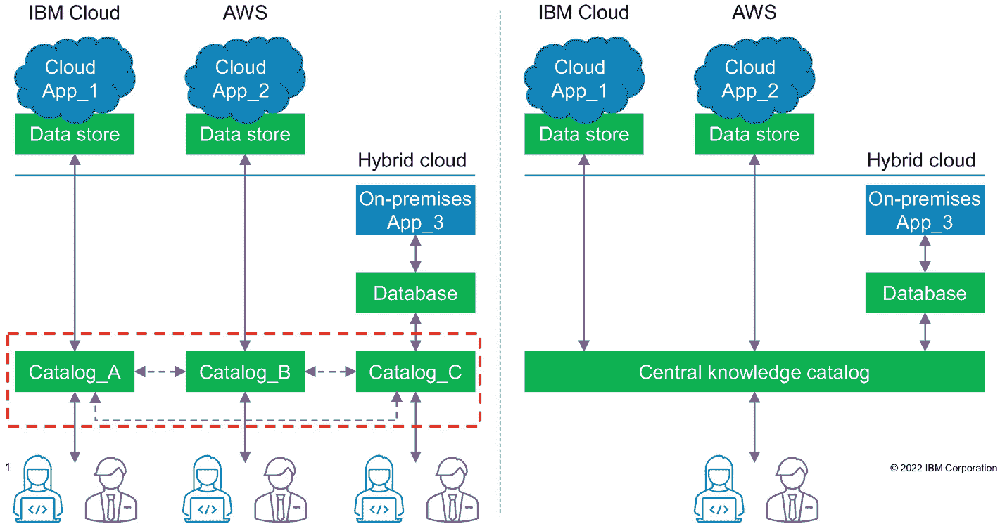

2 种云架构。1. 云应用 1 和 2 分别是 IBM 云和 AWS，分别与编目 a 和 b 共享数据。本地应用 3 的混合云与数据库和编目 c 共享数据。所有编目都共享数据。2. 相同的架构仅与中心知识编目共享数据。

图 12-1

混合云中的中心化和分布式编目

例如，这可以通过 Egeria 群体^(3)实现，如第二章“数据产品”部分所述。集中部署选项（图 12-1 的右侧）可能看起来是一个更直接和简单的解决方案；然而，维护和利用中心知识编目需要跨所有系统和公共云服务提供商的连接。特别是执行丰富的知识编目功能，如发现和数据概要分析、质量评估和元数据丰富，以及使用中心知识编目进行 DataOps 和 ModelOps，以解决数据和 AI 资产的全生命周期，这使得集中部署选项也具有挑战性。

图 12-1 仅关注目录化方面。然而，在讨论混合云环境中的数据网格架构时，还需要考虑其他方面，例如数据工程师、数据科学家、商业用户等的数据访问和消费，数据与人工智能治理（包括可信人工智能）、DataOps 和 ModelOps 等。

让我们继续讨论，重点关注在混合云环境中部署数据网格解决方案。

### 混合云环境中的数据网格解决方案

检查混合云环境中数据网格的实施情况，并理解这两个概念是如何相互关联的，需要我们描述数据产品的生产和使用方式。此外，我们还需要详细说明分布式知识目录在各个数据源、相应的元数据和各种数据产品规范方面的作用。此外，数据市场——我们可能更愿意使用术语 *数据和数据产品市场*——需要在这个混合云环境中进行描绘。这次讨论假设您熟悉我们在第二章和第十章中“数据网格解决方案的数据网格”部分所描述的概念。

我们假设采用分布式、组织和联邦的方法，其中每个业务部门或组织都在追求其数据网格倡议，基于其相应的业务需求和用例场景构建数据产品。正如您所想象的那样，知识目录使每个业务部门能够构建数据产品，同时也使数据产品对商业用户可发现和消费。

如您在图 12-2 中所见，我们假设有专门的知识目录（*Catalog_A*、*Catalog_B*、*Catalog_C* 和 *Catalog_D*），这些目录专门服务于使用本地基础设施和服务的四个业务部门组织（IBM Cloud、AWS 和 MS Azure）。为了简化起见，我们还假设数据域所有者与负责构建其相应数据产品的业务部门之间存在关系。每个目录都在捕获与相应数据域所有者拥有的各种数据源相关的元数据。

例如，*Data_domain_owner_1* 拥有 *Data_Source_1*，该数据源作为自动生成 *Data_source_1 元数据*的基础。除了这些元数据之外，数据产品开发者（包括数据工程师）与数据产品所有者一起生成数据产品规范，这些规范同样存储在目录中。

这些数据产品规范是在产品构建过程中生成的，并使用例如 XML、JSON 或任何其他数据交换标准存储在目录中。

一旦数据产品在数据产品市场中注册，它们可以通过访问方法、位置（即 URI 端点）、SLA 等进行发现。生成数据产品规范需要访问对应数据源的元数据以及数据源本身。数据产品本身并不存储在数据产品市场中；它们使用 XML、JSON 等进行注册，因此可以搜索、发现和消费。5

在混合云环境中，关于数据网格解决方案的两个特定方面与 *跨部门场景* 有关。第一个场景与从属于不同数据域所有者的数据源中派生出的数据产品相关，而第二个场景与从对应数据域的数据源以及其他由不同部门产生的数据产品中派生出的数据产品相关。让我们详细考察这两个场景，如图 12-2 所示：

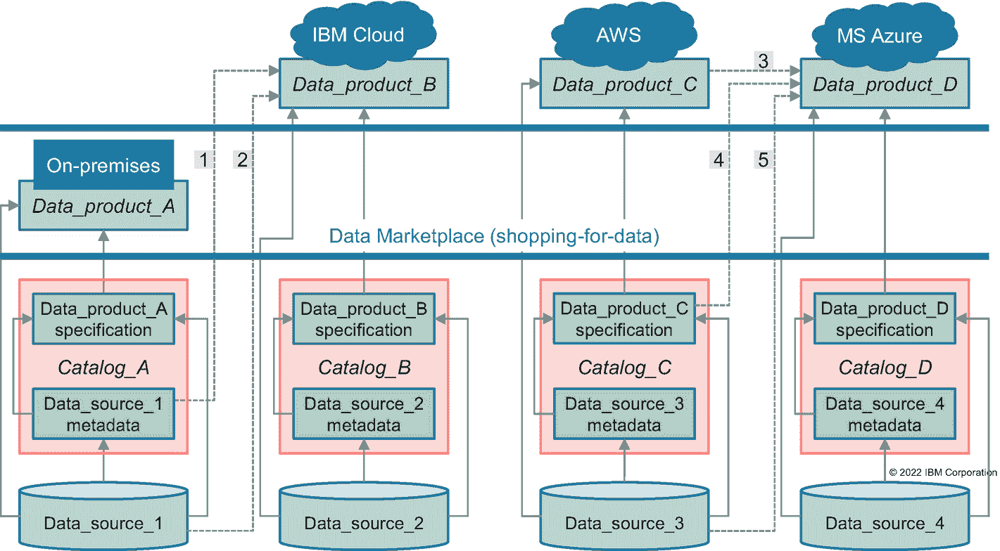

数据云架构。数据源 1 到 4，数据源 1 到 4 的元数据，以及数据产品 A 到 D 的规范，在数据市场中以 4 组的形式排列。数据从数据市场共享到本地、IBM 云、AWS 和 MS Azure 的数据产品 A 到 D。

图 12-2

混合云环境中的数据网格

+   **场景 1** – 从属于不同数据域所有者的数据源中派生出的数据产品：如图 12-2 所示，数据产品 B 基于 Data_domain_owner_2 所属的数据源 Data_Source_2，以及 Data_domain_owner_1 所属的数据源 Data_Source_1。因此，为了构建数据产品 B，需要补充访问从数据源 1 生成的元数据（虚线箭头 1）以及数据源 1 本身（虚线箭头 2）。因此，存储在目录 B 中的数据产品 B 规范是从 Data_domain_owner_1 和 Data_domain_owner_2 拥有的工件中派生出来的。

+   **场景 2** – 从对应数据域的数据源以及其他数据产品中派生出的数据产品：如图 12-2 所示，数据产品 D 基于 Data_domain_owner_4 所属的数据源 Data_Source_4，以及数据产品 C。因此，为了构建数据产品 D，需要补充访问数据产品 C（虚线箭头 3），以及数据产品 C 的规范（虚线箭头 4）和数据源 3（虚线箭头 5）。因此，存储在目录 D 中的数据产品 D 规范是从 Data_domain_owner_3、Data_domain_owner_4 和数据产品 C 的所有者拥有的工件中派生出来的。

这些跨 Lob 数据网格场景的挑战可能源于需要整合包括元数据交换和消费以及甚至在不同本地基础设施和公共云服务提供商之间进行数据产品构建和消费的目录。这需要数据授权和安全措施以及数据交换标准，通过混合云-广泛的数据和 AI 治理、风险和控制来实现。此外，为了遵守数据网格自助服务功能，DataOps、ModelOps、AIOps、可信 AI 等需要在本地和公共云服务提供商中实施，以满足数据产品端到端的生命周期需求，这为已经困难的任务增加了额外的挑战。

在以下部分，我们描述了数据编织和数据网格在混合云环境中的一些优势。

## 数据编织和数据网格在混合云中的优势

尽管在混合云环境中实施数据编织架构和数据网格解决方案可能具有挑战性，但无疑可以带来关键的好处。随着将数据和 AI 迁移到云以及利用公共云服务的不可避免趋势，数据编织架构和数据网格解决方案通过实现跨组织和跨领域的数据和 AI 治理，增强了云的价值，并允许数据消费者和业务用户无论数据资产位于何处以及归谁所有，都可以构建数据产品市场。

将数据网格与混合云结合使用，提供了在公共云服务提供商之间部署和消费数据产品的灵活性和敏捷性；数据产品可以部署在一个公共云（例如，IBM Cloud）中，并作为输入用于生产另一个部署在不同公共云（例如，MS Azure）中的数据产品。例如，数据可以存储在一个公共云中，用于在第二个公共云上对 AI 模型进行训练、验证和测试，最终作为数据产品在本地部署和运营，并在交易应用中进行推理。

为混合云构建数据网格解决方案提供了使用来自不同公共云服务提供商的技术和产品的灵活性，将它们的服务和能力映射到特定数据产品的开发和部署相关需求。例如，数据产品可能与不同的业务领域和目的相关联，例如，AI 模型、BI 报告、ETL 过程、360 度客户数据等。这些不同的领域需要不同的服务和数据产品开发和运营环境。混合云环境特别适合解决这些具体需求。

数据编织架构使混合云环境中的分布式数据网格解决方案成为可能。实现智能信息集成、生成和利用活动元数据、部署带有元数据交换的联邦编目以及建立数据和分析资产的自助消费能力是支撑混合云环境中此类数据网格解决方案的基本能力。

## 关键要点

我们以以下要点总结本章内容，详见表 12-1。

表 12-1

关键要点

| # | 关键要点 | 高级描述 |
| --- | --- | --- |
| 1 | 混合云是一种敏捷的分布式计算环境。 | 混合云将公共云服务、私有云服务和本地基础设施集成，以提供一个敏捷和灵活的分布式计算环境。 |
| 2 | 混合云增加了数据访问复杂性。 | 混合云中数据访问和数据格式的异质性增加了在一致的数据治理下更快地找到相关和可消费数据的痛点。 |
| 3 | 数据编织添加了一个数据管理层。 | 数据编织架构为混合云环境中管理添加的数据和 AI 复杂性提供了机制。 |
| 4 | 有两种数据编织部署选项。 | 根据偏好和用例需求，可以选择两种数据编织架构部署选项（分布式和集中式）。 |
| 5 | 混合云中有两种数据网格场景。 | 这两种数据网格场景使跨部门和组织的数据源和数据产品部署成为可能。 |
| 6 | 混合云与数据网格的结合代表额外的价值。 | 数据网格与混合云的结合，在公共云服务提供商的数据产品部署和消费方面提供了敏捷性和灵活性。 |
| 7 | 数据编织是启用数据网格所必需的。 | 数据编织架构使混合云环境中的分布式数据网格解决方案成为可能，并为其提供支撑。 |

## 参考文献

1.  IBM，IBM Cloud Learn Hub，*什么是混合云？*，

    [`www.ibm.com/cloud/learn/hybrid-cloud`](http://www.ibm.com/cloud/learn/hybrid-cloud)（访问日期：2022 年 10 月 14 日）。

1.  Andreessen.horowitz，Wang，S.，Casado，M.，*云的成本：万亿级悖论*，

    [`https://a16z.com/2021/05/27/cost-of-cloud-paradox-market-cap-cloud-lifecycle-scale-growth-repatriation-optimization/`](https://a16z.com/2021/05/27/cost-of-cloud-paradox-market-cap-cloud-lifecycle-scale-growth-repatriation-optimization/)（访问日期：2022 年 10 月 14 日）。

1.  Linux 基金会项目，*Egeria – 企业级开放元数据和治理*，2022 年，[`https://egeria-project.org/`](https://egeria-project.org/)（访问日期：2022 年 10 月 18 日）。

1.  IBM，Lighthouse，*将数据编织到混合多云中：利用连接数据做更多事情*，[`https://w3.ibm.com/services/lighthouse/documents/168319`](https://w3.ibm.com/services/lighthouse/documents/168319)（访问日期：2022 年 10 月 21 日）。

1.  Cloudera，数据架构系列，*数据网格范式*，[`www.cloudera.com/content/dam/www/marketing/resources/whitepapers/the-data-mesh-paradigm.pdf?daqp=true`](http://www.cloudera.com/content/dam/www/marketing/resources/whitepapers/the-data-mesh-paradigm.pdf%253Fdaqp%253Dtrue)（访问日期：2022 年 10 月 22 日）。

1.  KPMG，*KPMG 混合云数据网格 – 现代化您的企业数据操作*，file:///Users/eberhardhechler/Downloads/data-mesh-ibm.pdf（访问日期：2022 年 10 月 22 日）。

# 13. 智能编目和元数据管理

假设你是一名业务分析师，你需要从 1300 万张表和数十亿条记录中找到某个市场上一季度客户购买记录，以便对该地区下一季度的消费趋势进行预测分析。你将如何做？这项任务就像在 haystack 中找针。更令人沮丧的是，当你花费数周时间在数据源探索中找到相关数据后，它已经过时了，新的重要数据已经可用。这个例子说明了，仅仅使数据可访问是不够的；企业还需要使数据在近实时状态下可发现、可理解、可消费，以便从数据中获得及时和相关的洞察。

## 元数据管理简介

在数字时代，企业需要了解数据的各个方面：

+   他们拥有哪些数据，数据在哪里，有多少数据，以及哪些数据需要被保护

+   数据的商业价值是什么，数据的质量如何，数据何时需要归档

+   数据从哪里来，谁拥有数据，谁使用数据，用于什么商业目的，等等

为了有效地解决上述问题，企业需要实施元数据管理。正如我们之前所描述的，元数据^(1)是用来描述数据的那些数据。让我们来看一个现实生活中的例子。在许多场合，我们需要进行自我介绍。当我们介绍自己时，我们通常会介绍姓名、职位、我们工作的公司、我们毕业的学校等。我们也可能介绍家庭、爱好等。姓名、职业、工作经验、教育、家庭背景——所有这些都可被视为用来定义我们身份的元数据，这使他人能够了解我们是谁，以及他们在社会生活中如何与我们联系，如图 13-1 所示。简而言之，元数据帮助用户理解并传达与数据相关的意义。

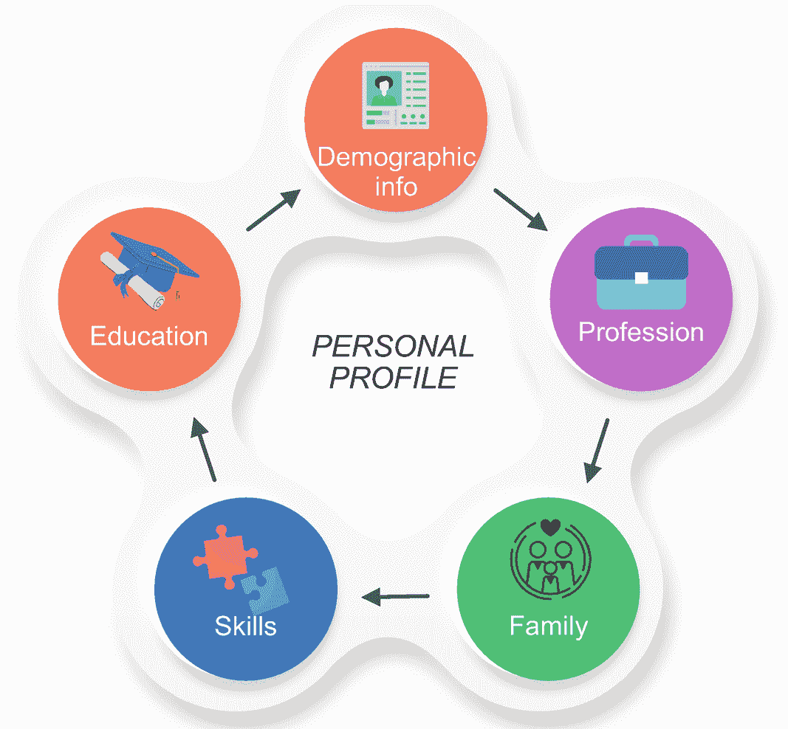

包含 5 个元数据的个人资料周期：职业、家庭、技能、教育和人口统计信息。

图 13-1

个人资料元数据

元数据可以广泛分为三类：业务元数据、技术元数据和操作元数据。^([2)]业务元数据描述了数据在现实世界中代表的数据的业务含义。例如，这个九位字符串 *111-22-3344* 可以代表一个人的社会保障号码（SSN）、账户号码或应用确认号码。验证规则和保护规则根据业务环境的不同而有所不同。例如，SSN 属于个人机密信息（PCI），被归类为个人敏感数据，需要应用高级安全和隐私保护。总之，业务元数据有助于理解数据；它还把数据与相应的业务规则联系起来。

相比之下，技术元数据描述了 IT 环境中数据的访问信息，例如数据存储的位置、格式以及如何访问它。例如，SSN 存储在 Db2 数据库表中名为 *ID* 的列中。列名、表名、数据库名和数据库连接都是技术元数据，可以为数据工程师提供访问数据的方式。此外，数据类型、约束和依赖性也是技术元数据。

操作元数据关注数据的创建和转换。表 13-1 列出了一些元数据的示例。

表 13-1

业务元数据、技术元数据和操作元数据

| 元数据 | 目的 | 示例 |
| --- | --- | --- |
| 业务元数据 | 理解数据在现实世界中的业务含义 | 业务定义、业务术语的解释；KPI、计算 KPI 和派生 KPI；业务识别规则、质量规则、保护规则、安全和隐私级别等。 |
| 技术元数据 | 用于检索数据的 IT 平台的技术信息 | 物理数据库表名、列名、字段长度、字段类型、约束信息、数据依赖性、SQL 脚本信息、ETL 转换、数据更新频率等。 |
| 操作元数据 | 与数据及 AI 资产转换相关的数据 | ETL 阶段、I/U/D 日志、管道、作业执行日志（包括运行时参数）、SQL 查询执行日志（例如，访问路径信息）、AI 资产使用日志等。 |

让我们回顾一下元数据管理。^([3)]一个有效的元数据管理平台应该具备以下功能：

+   **层级结构**：建立一个完整的业务元数据、技术元数据、操作元数据、政策和规则，以及最终活动元数据的层级结构和系统。

+   **质量**：创建一个持续的质量检查框架，通过元数据信息来理解和改进数据完整性和准确性。

+   **洞察力**：使用户能够清楚地理解和可视化企业整个数据流的细节，以改善数据可追溯性，解决数据及 AI 资产的全生命周期问题。

元数据管理不是一次性的工作；元数据需要反复管理和维护。因此，从技术角度来看，元数据管理平台通常包括元模型管理、元数据审计、元数据维护、元数据变更管理和元数据版本管理等功能。市场上有许多成熟的商业产品，例如 IBM Watson 知识编目、Informatica、Alation 等。

## 智能编目关键要点

企业知识编目系统是根据既定的元数据系统组织和存储数据的系统。通常，图书馆编目用来解释这一概念。假设你去了图书馆并想找一本书。你可以通过类型：小说、非小说、教科书等来找到书架号。或者你也可以通过作者和出版年份来找到它。书名、作者和出版年份都被认为是元数据。存储这些信息以及书籍位置的是图书馆编目。编目过程是一项非同寻常的努力。当一批新书到来时，图书管理员需要首先解决的问题是将书籍信息根据元数据框架输入到知识或图书馆编目中。

现在想象一下，如果传入的数据存储在成千上万的表中，包含数十亿条记录。用准确的元数据对这些数据记录进行编目将是一项耗时且劳动密集型的任务。这就是人工智能发挥作用的地方。智能编目 4 就是使用机器学习模型最大限度地自动化编目过程。

它通常具有以下功能：

+   **自动化数据发现和丰富**：应对企业复杂多样的数据环境，智能知识编目基于人工智能技术自动发现数据，并利用业务定义丰富数据资产，包括数据概要、分配业务术语、分类数据、分析数据质量、关联数据资产以及执行数据隐私和安全规则。数据发现过程是智能编目的基础；它快速创建知识编目，然后使数据准备就绪供使用。

+   **语义搜索和推荐**：为了帮助业务用户快速识别和定位数据，智能目录提供了强大的语义搜索功能。语义搜索与全文搜索的区别在于，它不仅仅匹配文本相似度，而是旨在理解搜索的意图和上下文意义，从而提供更相关的内容。此外，智能知识目录还会根据用户的搜索结果推荐类似的数据资产，这也可以大大提高查找数据的效率。

+   **数据血缘和来源**：数据血缘是企业中数据端到端流动的整个过程，作为数据资产目录的一部分，它在整个数据生命周期中提供跟踪和追踪，以了解数据来自何处，如何转换，以及谁出于何种目的使用它。通常，数据血缘图使用有向无环图模型来可视化表、视图、字段等之间的关系。它显示数据是否来自可信来源，以及是否有针对数据的恶意尝试。数据来源揭示了数据或任何 AI 资产的起源，例如，数据或 AI 资产的所有者是谁，谁创建了它等。

## 通过自动化数据发现和丰富化构建智能目录

智能数据目录首先连接企业中的各种数据源，并从中提取元数据。这个过程被称为数据发现。通常，用户指定数据源的连接，数据发现会扫描具有连接信息的目录表，以检索各种技术元数据，例如字段名、数据格式等。另一方面，数据丰富化指的是智能目录根据元数据分配业务术语、分析质量，并基于数据资产之间的关系添加数据资产。

例如，列的格式可能表明数据是 SSN。在这种情况下，该列将被分配业务术语*ID*，这提高了隐私级别至 PII 信息。字段的名称也可能表明它与地址相关。在这种情况下，该字段将与其他字段相关联，并标记为联系信息。

企业中的数据量激增，手动执行数据发现和丰富化任务似乎是不可能的。自动发现和丰富化任务不需要人类创新；它们在最大程度上由机器学习算法执行。

为了更好地说明这个过程，让我们回到图书馆的例子，如图 13-2 所示。假设有几本书需要作为图书馆目录的输入。这些书的地点可以看作是数据源的联系信息，而书籍被视为数据记录。通过自动化数据发现，散乱的书籍随后被自动识别和组织到目录中。

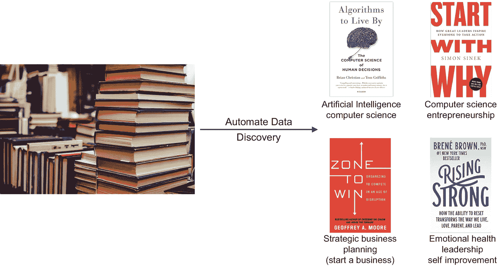

一组按顺序排列的书籍的照片，通过自动化数据发现转换为带有上下文的 4 本书。

图 13-2

数据发现过程示意图

除了作者、ISBN 和出版社等基本信息外，通过分析书籍评论摘要和网站评论，使用 NLP 技术识别书籍的主题。从书籍标题来看，很容易将*Rising Strong*归类到情绪智力领域。但仅通过阅读*Start with Why*这个名称，并不能直接判断这是一本计算机书籍。

这就是复杂 ML 算法可以提供帮助的地方。应用于知识目录的 AI 级别越高，目录背后的知识图谱就越全面。AI 可以支持大量的繁重工作，但最终还是不能完全取代主题专家来处理复杂情况。毕竟，AI 模型的准确性取决于模型的和历史训练以及相应的 AI 算法。实际上，它可能并不总是产生正确的结果。

在这种情况下，AI 模型可以提供一些建议，主题专家需要确认以接受或拒绝，如图 13-3 所示，其中*Transaction*是 Db2 for z/OS 数据库中的一个表。通过智能编目通过 Db2 for z/OS 连接发现和丰富*Transaction*表后，建议将*Transaction*_*TS*列作为业务术语*Transaction_ID*，置信度为 82%。

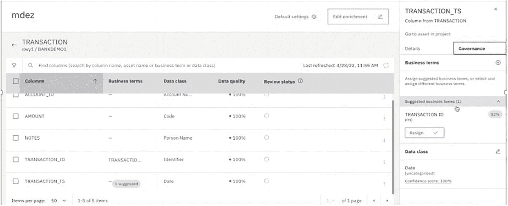

一张交易表截图，包含列标题、业务术语、数据类别、数据质量和审查状态。交易表页面在右侧。

图 13-3

使用业务术语丰富数据

数据管理员可以审查建议的业务术语，并决定是否将其分配给此列。一旦分配了*Transaction_ID*，与*Transaction_ID*定义的政策和规则将强制执行在*Transaction_TS*列的数据上。例如，数据保护规则或数据本地性规则将屏蔽*Transaction_TS*中的数据。

## 使用语义搜索和推荐查找数据资产

在现实世界中，业务分析师和数据科学家很可能在努力发现和访问相关数据源，以及完全理解特定数据源的结构和内容。随后，他们需要一种有效的方式来搜索它并执行数据探索任务。然而，使用关键词搜索需要对于最相关的关键词有坚实的理解。如果关键词选择不当，用户往往无法找到相关数据。

这就是语义搜索发挥作用的地方。语义查询^(6)试图捕捉用户的思考和相关信息，同时也参考了搜索实体之间的关系，提供更准确和更全面的查询结果。例如，如果你正在浏览一个餐厅网站的菜单，你可能搜索“肥皂”。语义搜索会猜测你是在寻找“汤”，然后可能会返回今天的选项。假设你正在使用一个超市应用搜索“肥皂”，语义搜索可能会返回与洗涤剂和去污剂相关的产品。语义搜索查询根据特定的上下文返回最合适的结果，例如，你目前正在做什么以及你为什么这么做，试图理解你最可能的意图，如图 13-4 所示。

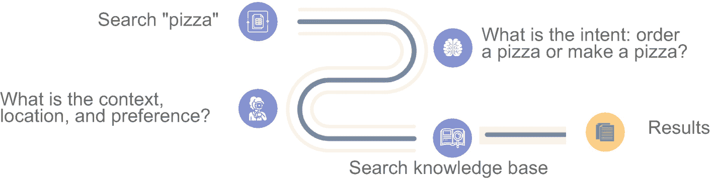

一幅插图展示了语义搜索中 5 个图标的流程。每个图标上的文本如下。1. 搜索披萨。2. 意图是什么：订购披萨还是制作披萨？3. 上下文、位置和偏好是什么？4. 搜索知识库。5. 结果。

图 13-4

语义搜索示意图

图 13-5 展示了语义搜索的另一个示例，其中用户意图找到包含联系信息的数据资产。

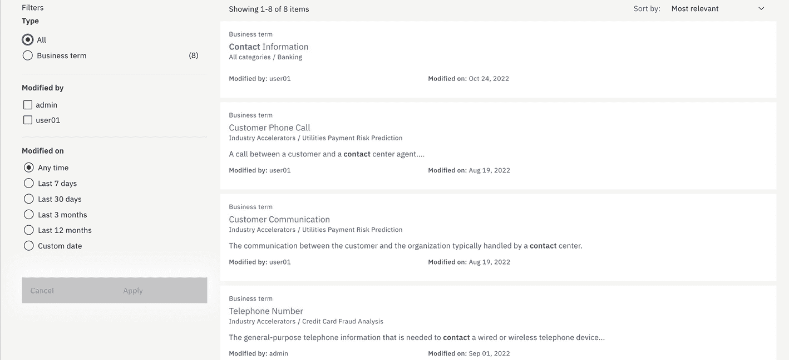

语义搜索页面的截图。左侧有类型、修改者、修改日期的筛选器，使用单选按钮和复选框。搜索结果在右侧显示。

图 13-5

联系信息语义搜索结果示例

用户在全局搜索字段中输入“联系”，并返回多个记录作为搜索结果，包括“电话号码、客户电话、客户沟通”等。搜索结果不包含一个精确标记为“联系”的列。如果使用关键词搜索，这些数据记录最不可能被返回，但它们是用户实际寻找的联系信息。当放大查看“电话号码”时，它被标记为与“沟通内容”有关，如图 13-6 所示。

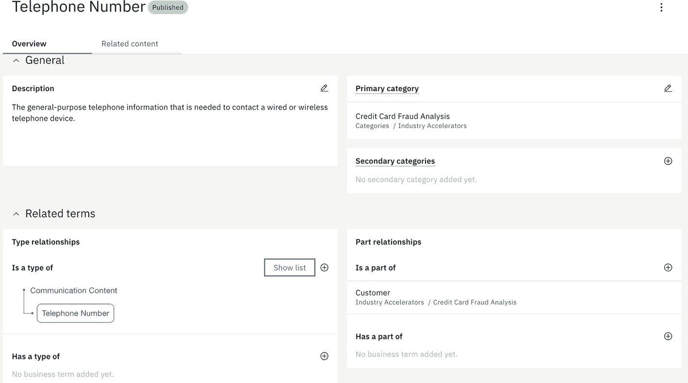

语义搜索的截图。概述是开放的，它包括左侧的一般描述和相关术语以及类型关系。主要类别、次要类别和部分关系等标题显示在右侧。

图 13-6

语义搜索和业务术语

推荐是与语义搜索相结合的智能目录的另一个强大功能。推荐可能取决于使用指标、历史搜索和同行见解。基于指标意味着资产推荐基于使用数据，例如流行度、最高评分和质量评分等。历史搜索利用以前的搜索来推断哪些资产可能感兴趣。同行见解基于他人的使用历史。

这就像我们的在线购物体验。在电子商务中，通常会有针对你的特定推荐，这些推荐基于其他客户的购买行为，通常将一个产品与其他一系列产品联系起来。这个概念可以很容易地应用于数据搜索，从而改善整体的数据购物体验。这大大提高了业务分析师和数据科学家找到相关和有用数据的高效性，例如，影响针对有效交叉销售和升级活动的定向营销活动。

让我们继续讨论数据洞察和来源

## 在数据在企业内部流动时提供数据洞察和来源

客户今天面临的最主要的数据挑战之一是建立对数据和人工智能（可信人工智能）的信任。我如何 *证明* 数据消费者数据是可信的？我如何提供关于数据来源和是否数据被意外更改的透明度？

这并不令人惊讶；随着信息的爆炸式增长，质疑数据的可信度是有理由的，因为不完整和过时的信息不利于决策。相反，它可能导致错误的决策，产生重大的商业影响。数据血缘通过记录、跟踪和可视化跨不同工具和来源的数据处理和转换来解决这一担忧，如图 13-7 所示，展示了数据血缘的工作流程。

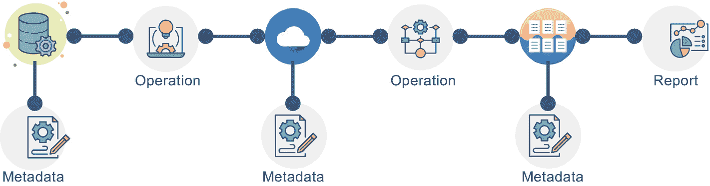

一行带有 3 个元数据连接的工作流图标示例。图标行：数据库、操作、云、操作、文档和报告。元数据连接到数据库、云和文档。

图 13-7

数据血缘的说明

数据线索和来源^(7) 经常被互换使用。这两个术语都指数据的整个生命周期，包括五个 W： (a) 数据的来源，(b) 数据曾经在哪里以及目的地在哪里，(c) 谁对数据进行了更改，(d) 数据的创建或更新时间，以及 (e) 数据存储和使用的位置。了解这些问题的答案对于数据消费者来说至关重要，以便信任从数据中得出的分析结果。

图 13-8 展示了数据线索的一个示例。有三个类型的节点：数据节点、操作节点和报告节点。数据资产 *borrow* 来自多个数据源，包括 *books, audiobooks* 和 *person*，通过操作 *borrow_book* 和 *borrow_audiobook*。

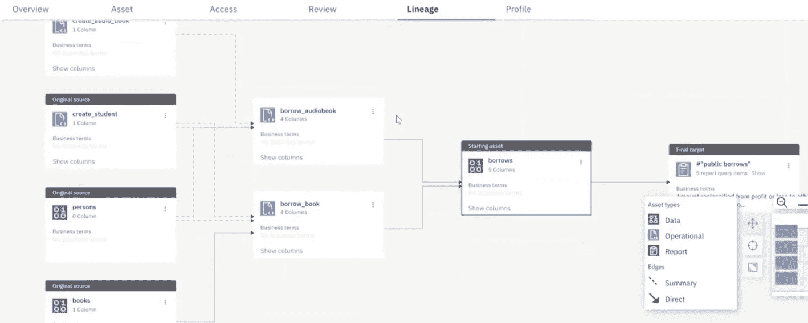

线索页面的截图。标题包括概述、资产、访问、审查、线索和配置文件。页面有 4 个文件合并成 2 个文件，这 2 个文件又进一步合并成另一个文件。该文件作为公共借用发布。

图 13-8

数据线索示例

线索图可能会变得非常复杂。因此，拥有缩放和展开以及展开和折叠的能力来导航图表非常重要，这使用户能够专注于图表的特定部分，并逐步前进。

让我们深入到更细致的层次，参考图 13-9。表 *students* 是通过一个插入语句构建的，包含数据字段：*student_name, student_surname, student_birthdate,* 和 *student_gender*。

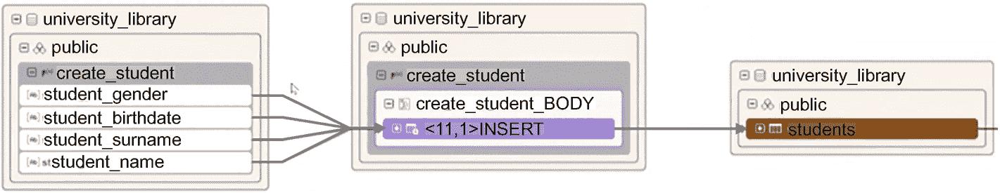

有 3 个表被命名为 university library。表 1 有如创建学生、学生性别、出生日期、姓氏和名字等数据行。表 2 有如创建学生、学生团体和插入等数据行。表 3 有一个名为 students 的行。

图 13-9

线索细节

因此，用户不仅知道数据来自哪里以及对其应用了哪些转换过程。有了数据线索，企业可以跟踪数据在组织中的流动，并将数据质量问题追溯到特定的流程或系统。

更重要的是，通过影响分析，组织可以评估一个系统中数据变化对整个企业的影响。

## 关键要点

我们通过表 13-2 总结的几个关键要点来结束本章。

表 13-2

关键要点

| # | 关键要点 | 高级描述 |
| --- | --- | --- |
| 1 | 元数据是用来描述数据的。 | 元数据可以广泛地分为三类：业务元数据，它描述了数据在现实世界中代表的数据所表示的业务的意义；技术元数据，它描述了数据在 IT 平台中的访问信息；以及操作元数据，它描述了数据的创建和转换。 |
| 2 | 智能编目包含三个关键能力。 | 智能编目利用 AI 自动化数据发现和丰富过程以提高效率，并提供语义搜索和推荐以方便消费，同时提供数据血缘以提高对数据的信任。 |
| 3 | 数据发现和丰富对于构建编目至关重要。 | 智能数据编目连接到所有企业数据源，从数据源中提取元数据，使用机器学习算法分配业务术语，分析质量，并在数据资产之间添加关系。 |
| 4 | 语义搜索能提供更符合你目的的结果。 | 语义搜索旨在理解你搜索的意图和上下文意义，从而提供更相关的内容。 |
| 5 | 数据血缘是跟踪数据如何在不同的来源之间移动、转换和消费的过程。 | 数据血缘解决五个 W 问题：数据从哪里起源，数据在哪里被处理过，目的地在哪里，谁对数据进行了修改，数据是在何时创建/更新的，以及数据存储和使用的位置。了解这些问题的答案对于人们信任数据分析结果至关重要。 |

## 参考文献

1.  TechTarget, [Kranz](https://www.techtarget.com/contributor/Garry-Kranz), G., *定义元数据,* [`www.techtarget.com/whatis/definition/metadata`](http://www.techtarget.com/whatis/definition/metadata) (访问日期：2022 年 9 月 2 日)。

1.  TIBCO, *什么是元数据管理？*，[`www.tibco.com/reference-center/what-is-metadata-management`](http://www.tibco.com/reference-center/what-is-metadata-management) (访问日期：2022 年 9 月 2 日)。

1.  AI Outlook, Staff, A., *智能数据编目工具总结*，2022，[`www.aixoutlook.com/intelligent-data-catalog-summarized/`](http://www.aixoutlook.com/intelligent-data-catalog-summarized/) (访问日期：2022 年 9 月 2 日)。

1.  Bloomreach, Roberts, T., *5 分钟内解释语义搜索*，2019，[`www.bloomreach.com/en/blog/2019/semantic-search-explained-in-5-minutes`](http://www.bloomreach.com/en/blog/2019/semantic-search-explained-in-5-minutes) (访问日期：2022 年 9 月 2 日)。

1.  Electrosoft, Proud-Madruga, D., *来源、血缘、谱系：它们是否相同？*，2020，[`www.electrosoft-inc.com/electroblog/provenance-lineage-pedigree-are-they-same`](http://www.electrosoft-inc.com/electroblog/provenance-lineage-pedigree-are-they-same) (访问日期：2022 年 9 月 2 日)。

# 14. 自动化数据编织和数据网格方面

仔细阅读本书的读者肯定已经注意到，我们特别关注将人工智能与自动化以及智能增强和优化应用于数据编织架构和数据网格解决方案的几乎所有方面。这两个概念确实有众多领域，它们正越来越多地通过人工智能驱动的自动化得到优化，例如自动化的工作负载性能预测和运行时调整、自动化的容量规划和资源需求估计（例如，CPU 容量、网络带宽、内存大小等）、自动化的查询生成、智能信息集成、自动化数据整理以及自动化数据产品的创建。

尤其是自动化的容量规划和预测已经成为供应商^(1)和学术界^(2)的一个成熟话题。应用人工智能和自动化显然是一个范式转变。实际上，如果我们不在应用人工智能、智能知识和自动化的内在假设下，我们不会在当前语境中使用“数据编织”和“数据网格”这两个术语。

希望创建一个组织或企业范围内的数据和人工智能工件描述的愿望绝对不是一个新概念。它已经在二十年前被痛苦地视为失败。本章描述了使用智能自动化从不同的数据源收集元数据信息并将它们编目，自动检查数据质量、增强元数据以及作为数据编织和数据网格两个基本概念的基础自动化数据治理服务。

在本章中，我们因此专注于两个既相互独立又相关的领域：(a) 元数据的智能自动化和(b) 自动化数据质量评估。

自动化的数据和人工智能治理服务将在下一章中讨论。

## 引言

将人工智能应用于元数据管理、智能编目、数据质量评估以及特别是数据和人工智能治理似乎落后于其他数据相关领域。在第五章和第七章中，我们已经详细阐述了人工智能/机器学习在重新构想现代方法中的关键作用，即生成主动元数据，激活数字痕迹，构建语义知识图谱，以及类似地用于语义丰富和语义搜索、实体匹配、自助能力、自动化数据质量评估和调整——这些都得到了必备的知识目录能力的充分支撑和赋能。

在第十三章中，您已经看到知识目录对于智能编目和丰富元数据以及实现数据血缘和来源是多么的不可或缺。正如我们之前提到的，本章的核心内容显然是元数据的智能自动化和自动化数据质量评估。

让我们从元数据的智能自动化开始。

## 元数据的智能自动化

我们使用“智能自动化元数据”这个术语来描述将 AI/ML 纳入元数据管理的整个生命周期，包括元数据的生成、丰富化和消费。

正如提到的，知识目录是启用元数据智能自动化的核心组件。图 14-1 是一个样本知识目录，3 其中可视化了四个最近添加的数据资产，包括所有者、资产添加的日期和资产类型。如图所示，这三个资产是关系数据库表，第四个资产是基于数据虚拟化的数据库连接（图 14-1 的右侧）。

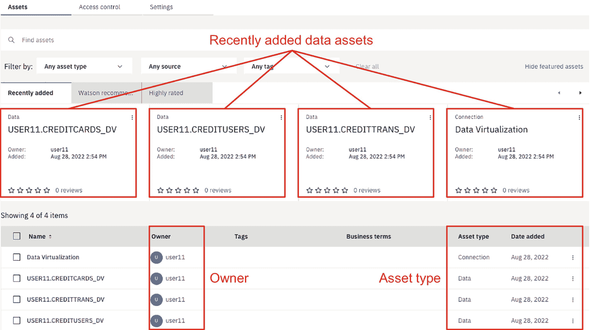

一个样本知识目录的截图。它显示了 4 个最近添加的数据资产，用户 11 的信用卡，用户 11 的信用用户，用户 11 的信用交易和数据可视化。底部表格列出了 4 项内容：名称，所有者，标签，业务术语，资产类型和数据添加。

图 14-1

样本知识目录

通过点击各种资产可以显示更多相关信息。知识目录的强大功能及其对应的功能——不仅仅是可视化——基于一系列智能自动化能力。

下面的列表描述了这些智能自动化能力：

1.  **自动化元数据生成**：可能跨越众多来源或格式的数据和 AI 资产需要被自动发现；相应的元数据必须自动生成并移动到知识目录中，这也适用于源数据和 AI 资产的变化。这构成了智能元数据管理端到端生命周期的第一步，我们可能称之为数据和 AI 资产的自动化编目或自动化元数据生成。这一阶段可能包括对所有数据和 AI 资产的自动化质量评估。质量评估和改进必须重复执行；我们将在以下部分单独讨论这个话题。

1.  **自动化元数据丰富化**：一旦元数据被自动生成，就需要对其进行丰富化，这意味着需要使用 AI/ML 方法对元数据进行分析和配置，以获得额外的见解并添加到元数据中。此外，元数据需要被标记和注释，并进一步优化，以便数据产品所有者或业务用户使用，例如，通过构建和添加语义知识图谱，利用行业或领域特定的本体等。这一阶段的元数据丰富化是整个端到端元数据生命周期中最复杂的阶段，也可能包括转换和遵守元数据标准。4 这个元数据丰富化过程可能需要重复执行。

1.  **自动元数据** **提取和利用**：一旦元数据生成，被捕获在知识目录中，并进一步丰富，它就准备好被提取供商业用户消费和利用。这听起来可能像是一项简单的任务；然而，它需要一个丰富且易于使用的基于 GUI 的知识目录，该目录列出上下文中的可用数据和 AI 资产，包括资产类型和格式（即关系数据库表、JSON 或 XML 文档、Parquet 和 Avro 文件、CSV 文件、连接方法、AI 模型、管道、ETL 阶段等），所有权，与其他资产的相关性（即通过语义知识图谱），以及访问权限和访问方法（即 SQL、NoSQL、REST API）。

图 14-2 展示了之前讨论的三个阶段的智能自动化元数据管理^(5)。

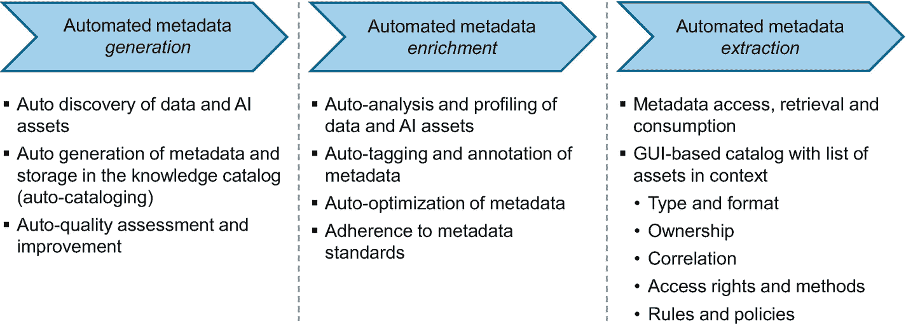

智能自动化元数据的流程图。该流程从右到左分为三个阶段：生成、丰富和提取。

图 14-2

元数据的智能自动化

智能自动化元数据还必须满足数据工程师和数据产品开发者的需求。

下面的两个小节提供了对数据自动分析和配置文件以及数据自动标记和注释的概述。通过解决这些问题，我们提供了一些基本示例。

让我们从数据的自动分析和配置文件开始。

### 数据的自动分析和配置文件

数据分析和配置文件已经存在了几十年。然而，在现代数据编织架构和数据网格解决方案中，这一显著的不同之处在于 AI/ML 的融合和自动化流程的引入。让我们进一步探讨这种 AI/ML 融合真正意味着什么。

正如我们在第七章中指出的，数据配置文件是检查、分析和验证相关数据源所有数据属性内容的过程，以获得统计洞察的第一步和关于数据质量的初步理解.^(6) 这种数据分析配置文件过程可以大致分为以下三个领域 `–` (a) 结构发现，(b) 内容发现，和 (c) 关系发现 `–` 其中每个领域都会生成关于其内容元数据和统计信息，这些信息会自动捕获在知识目录中。

图 14-3 是一个可视化数据库表中某些列的统计信息的示例，称为 *CREDITUSERS*。我们包括了四个列 `–` *USER_ID*，*PERSON*，*CURRENT_AGE* 和 *RETIREMENT_AGE* `–` 以及每个列对应的品质分数和价值频率分布。图 14-3 还包含了每个列的一些基本统计信息，例如唯一值的数量、最小值和最大值、平均值、标准差等。重要的是要认识到，这些值是直接从真实数据库表数据中计算得出的，而不是可能包含在数据库目录中的统计数据。

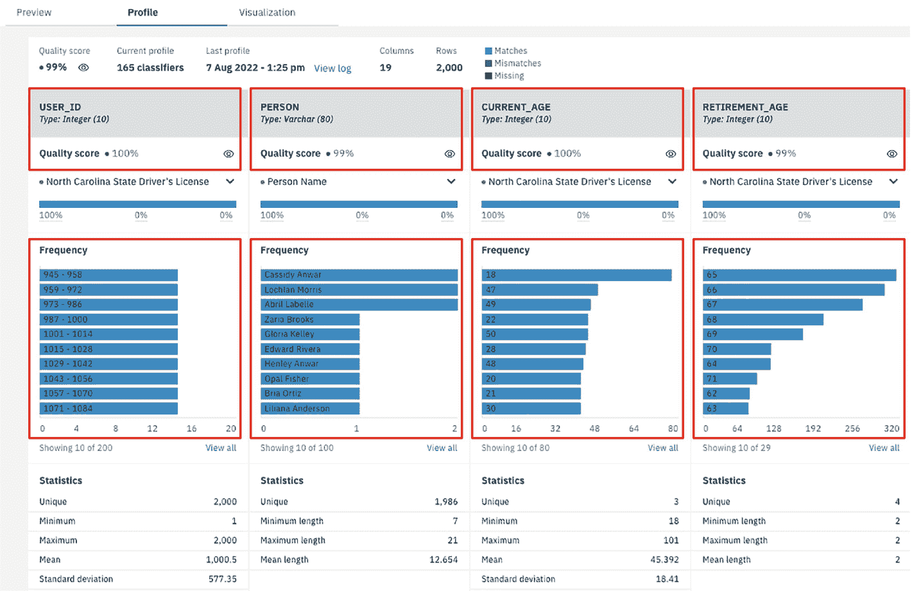

包含预览、概要和可视化的数据库表截图。概要选项有用户 ID、人员、当前年龄和退休年龄四列，以及它们在底部以矩形框突出显示的频率。频率列表下面的统计信息列出了每个数据的平均长度、最大值和最小值以及唯一值数量。

图 14-3

数据库表中每一列的统计信息

在第七章中，我们也提到机器学习（ML）可以用来加速和自动化数据概要分析任务；甚至深度学习（DL）技术也可以部署来计算质量度量，例如文本数据的质量。然而，我们仍然需要详细说明如何以及为何特定目的使用机器学习和深度学习。

在讨论机器学习和深度学习的使用之前，我们提供了一个 *CREDITUSERS* 表中每个美国州用户数的另一个示例，如图 14-4 所示，其中纽约 (*NY*)、加利福尼亚 (*CA*)、佛罗里达 (*FL*) 和德克萨斯 (*TX*) 的用户数最高，而怀俄明 (*WY*)、阿肯色 (*AK*) 和哥伦比亚特区 (*DC*) 的用户数最低。当然，这是一个相当传统的描述；一个更复杂的描述可能会基于基于机器学习的聚类，即识别和可视化美国州的各个集群，例如发现和描述美国州的人口相似性。

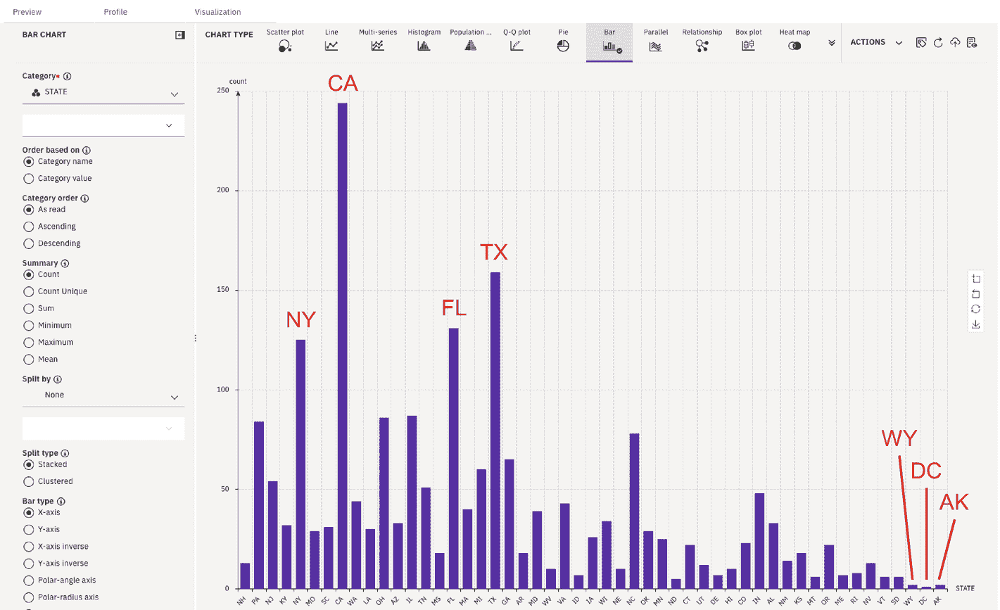

数据库的截图。顶部是图表列表，如柱状图、饼图、热图和其他图表。左侧是图表定制选项，包括类别、顺序、类别顺序、摘要、分割类型和柱状类型。中间是一个计数与美利坚合众国城市对比的柱状图。加利福尼亚的计数最高，为 245。哥伦比亚特区的计数最低，为 3。

图 14-4

CREDITUSERS 表上每个美国州的用户数

这引导我们努力详细说明人工智能在执行数据分析与概要分析任务中的作用.^(7)

下面的列表包括了数据分析和概要分析的关键能力，这些能力是通过机器学习和深度学习实现的：

+   **确定代表性样本数据集**：应该使用机器学习算法和技术来确定数据库表中记录的代表性子集，例如，只包含原始数据记录的 10%–15%。在这些代表性子集上确定统计指标，这些子集有可能通过因子减少时间和计算资源。根据底层数据集的值，更大的代表性数据集可能为整个数据集提供更准确的预测结果。

+   **外推统计学**：一旦基于那些代表性子集确定了关键统计指标，机器学习（ML）方法就应该被应用于外推（预测）整个数据集对应的统计值。这适用于图 14-3 中展示的所有统计值，例如，频率分布、质量分数、平均值、标准差等。

+   **理解数据和 AI 资产的结构**：机器学习（ML）和深度学习（DL）方法特别适合发现数据和 AI 资产的结构，包括非结构化数据、管道、文本、图像等。发现结构包括确定数据类型（例如，XML、JSON 等）、ML/DL 模型类型（例如，ONNX、Scikit-learn、PMML、XGBoost、TensorFlow 等）、随机森林 ML 模型中的层数、ANN 模型中的隐藏层数、识别队列或 ETL 阶段等。

+   **数据聚类**：与之前讨论图 14-4 时建议的聚类数据相比，进行更深入和更相关的配置，特别是数据库表中的关键列值，例如，薪水收入、信用卡消费、购买量、购买的商品类型或类别等。这使数据工程师和数据消费者能够获得通过仅查看统计分布值不太明显和容易看到的额外见解。它特别支持从纯客户数据到获得更多关于客户行为的见解的转变。

+   **关系发现**：数据和 AI 资产需要在上下文中相互关联地可视化，这需要基于 ML 的发现方法和可视化和访问方法以方便消费。例如，AI 模型需要根据相关的数据管道和应用进行评分和推理。

前面的分析和配置任务必须根据新资产的可获得性或现有数据集和 AI 资产的更新自动和重复执行。这些分析和配置任务的结果也应该自动推送到知识目录中。

在我们继续讨论数据的自动标记、注释和标签化以及元数据的自动标记、注释和标签化之前，我们想指出数据概要分析和数据挖掘之间的区别。通过数据概要分析，我们本质上将我们的分析限制在结构发现、内容发现和关系发现上，而数据挖掘则侧重于通过探索、模式发现等找到数据中的 *金块*。尽管数据挖掘和概要分析之间可能存在重叠，但数据挖掘是为了特定的商业目的而进行的，即有针对性的营销活动或客户关怀，而数据概要分析则具有更广泛的目的.^(8)

### 自动标记、注释和标签化

在深入探讨元数据的自动标记、注释和标签化之前，让我们看看图 14-5 中描述的另一个例子^(9)，其中左侧列出了 *CREDITUSERS* 表的几个列。对于地址列，自动建议了三个业务术语，包括匹配的概率度量：*工作地址*（79%）、*电子邮件地址*（77%）和*邮政地址*（76%）。

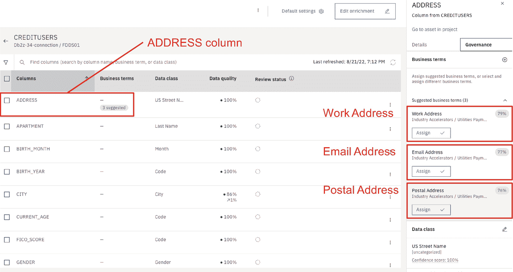

这是信用用户信息的截图。在左侧，一个表格列出了列、业务术语、数据类别、数据质量和审查状态。在右侧，治理业务术语的地址列信息建议了 3 个术语。工作地址，79%。电子邮件地址，77%。邮政地址，76%。

图 14-5

业务术语分配

这些业务术语自动从业务术语表中提取并分配给列 *地址*，从而让数据管理员可以选择其中最合适的一个。在这个例子中，数据管理员可以选择其中一个建议的术语，甚至可以拒绝所有三个，这取决于他们自己的判断。

让我们澄清一下 *标记*、*注释* 和 *标签化* 这些术语，这些术语经常被错误地互换使用。比较这些术语，我们将讨论限制在数据编织和 AI 范围内。存在许多术语来进一步丰富数据，例如标签、注释、标签、注释、属性、解释等。

通常，*标记*意味着为资产添加额外的关键词、短语或术语，以进一步说明资产的内容，并支持搜索，例如，数据库表的一列可能被标记为 *PII*，这意味着它包含敏感信息。一些读者可能将其称为 *注释* 或 *解释*。*属性*是资产的特征，例如，一个 AI 模型可能被分配以下特征：*训练过*、*验证过*或*部署过*。与标签类似，*注释*指的是关于资产的其他信息，可能包括图表和文本，例如，添加到 Java 程序中的注释性解释文本。

尽管在具有 ML 和 DL 的 AI 背景下，*注释*主要是指文本、图像或视频注释，意味着捕获感兴趣的对象，例如，在视频中捕获车辆、自行车和行人，以支持自动驾驶 ANN 模型的学习和训练。

同样，*标签化*指的是向数据集的所有记录添加附加信息以支持 AI 模型的训练，例如，为每个通过的银行交易添加*TRUE*或*FALSE*，以训练一个 ML 模型来预测未来的交易是否欺诈。因此，在 AI 中（^(10）的注释和标签是创建 AI 模型训练数据集的类似概念。它们在风格和方法上有所不同：注释是捕获或标记感兴趣的对象（主要在文本、图像或视频中），而标签则为单个记录添加数据。

此处的关键因素是应用 AI/ML 方法，自主地为数据及其元数据添加有意义的和相关的标签或注释，或者为数据管理员或数据消费者提供可操作的推荐。这促进了数据与 AI 资产与业务领域之间的更紧密的互锁和链接，从而支持自助服务数据网格倡议。在 AI 环境中进行自主注释和标签是解决可信赖 AI 的关键任务，其中，例如，如果检测到某些 AI 模型的偏差、漂移或质量指标恶化，则需要自主地重新训练和重新验证 AI 模型。

我们想指出，自主标记、注释和标签不仅需要在数据和 AI 资产上执行，还需要在元数据本身上执行。添加到数据和 AI 资产中的标签、注释和标签代表元数据，而添加到元数据的标签、标签和注释则产生活动元数据，进一步丰富现有的元数据集。

后者的例子包括将业务术语自主分配给数据库列；管道与 AI 模型之间的关系；例如，通过移除一个被认为未使用的数据集来确定对业务的影响；或者简单地为知识目录中已捕获的数据库列添加描述性标签或质量评分。

让我们继续讨论自动化数据质量评估。

## 自动化数据质量评估

理解和解决数据质量问题仍然是任何数据所有者和数据消费者面临的最常见挑战；这远远超出了仅仅对数据进行概要分析的范围，例如，为每一列计算一些基本统计数据，如频率分布、唯一值的数量、最小值和最大值、平均值、标准差等，如图 14-3 所示。全面的数据质量评估需要更深入地查看数据，以了解例如数据类别违规、数据类型违规、缺失值、格式违规、超出范围的值等问题。

综合数据质量评估的结果是一份详细的发现总结，如图 14-6 所示，以每个数据资产的数据质量分数表示。

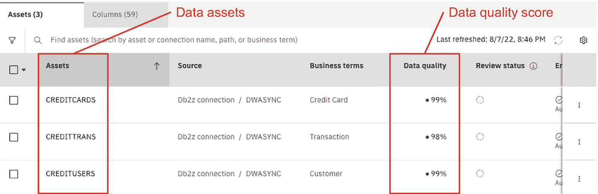

在 59 标签下的表格截图。该表格列出了资产、来源、业务术语、数据质量和审查状态，并突出显示了 3 个数据资产和数据质量分数。数据资产是信用卡、信用交易和信用用户，质量分数分别为 99%、98% 和 99%。

图 14-6

数据质量评估

图 14-6 列出了三个表 `–` *CREDITCARDS*、*CREDITTRANS* 和 *CREDITUSERS* `–` 以及它们对应的质量分数，分别是 99%、98% 和 99%。这些质量分数是通过计算数据库表中每个单独列的数据质量维度得到的。

然后，从每个表中每个列的质量分数中得出数据资产的整体质量分数。因此，使用一组定义良好的数据质量维度来计算每个所选列的质量分数，其中每个所选列的质量分数集合用于计算整个数据资产的整体质量分数。

让我们简要讨论数据质量维度^(11)：

1.  **数据类别违规**：计算每个列中知识目录中定义的数据类别（例如，护照号码、纽约州驾驶执照、组织名称、维萨卡等）违规情况。

1.  **数据类型违规**：在先前数据概要分析阶段确定的基础上，计算每个所选列的数据类型（例如，SMALLINT、REAL、DATE、TIMESTAMP 等）违规情况。

1.  **不一致的大小写**：寻找字符串中大小写使用的模式，并计算以已识别的使用模式为基础的违规数量 – 假设列中大多数值的模式已被识别。

1.  **超出范围的值**：寻找违反最小值和/或最大值约束的情况，这些约束是为列中的值定义的。

1.  **规则违规**：寻找数据库表中数据或质量规则违规，这些规则是由数据管理员定义的。

1.  **可疑值**：寻找值和格式以及与列中已识别的最可能模式不匹配的情况。

1.  **相关列中的可疑值**：类似于 *可疑值* 维度，这个数据质量维度检测表中列之间值可能模式或相关性的不匹配。

1.  **缺失值**：寻找列中非预期的 NULL 或空值。

1.  **缺失值表示不一致**：寻找列中的 NULL、空或仅包含空格的值。

1.  **格式违规**：数据管理员可能已宣布某些列的某些值无效；通过此维度统计每个列中这些无效值的数量。

1.  **重复值**：此维度可能已在数据概要分析阶段被捕获，其中计算了应包含唯一值（即主键或唯一键）的列中的重复值数量。

图 14-7 显示了表格*BANK_CUSTOMERS*的数据质量维度子集以及该表格的整体数据质量得分，为 96%。它还描绘了其中一些列（如*CUSTOMER_ID*、*NAME*、*ADDRESS*、*ZIP*、*CREDIT_RATING*和*AGE*）的质量得分。正如你所看到的，大多数列的质量得分要么是 100%，要么非常接近 100%，而*ZIP*列仅为 66%，这是表格*BANK_CUSTOMERS*的整体数据质量得分为 96%的关键原因。

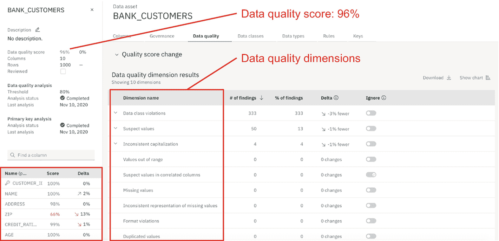

银行客户的资产截图。在左侧，数据质量得分为 96%，左下角有一个用深色阴影突出的表格。在右侧，数据质量选项列出了名称、发现哈希、发现百分比、delta 和忽略的质量维度结果。

图 14-7

数据质量维度

这个例子可能是从数据库表的传统数据质量评估方法中衍生出来的。除了*可疑值*和*相关列中的可疑值*，它们需要 AI 技术（即模式发现）之外，所有其他数据质量维度主要都是通过传统方法计算的。未来的方法不可避免地会受到将范围扩大到包括 AI 资产的影响，即评估 AI 模型、ETL 阶段、管道等的质量。例如，测量 AI 模型的质量与我们讨论的第五章中关于可信 AI 的部分相关，即测量质量指标，例如模型在生产过程中 ROC 或 PR 曲线下的面积。

即使是今天的数据，在文本、图像和视频方面的多样性也前所未有，这要求在特定使用目的的背景下，采用创新的方法来衡量这些数据的质量。例如，医疗文本被宣布为可靠输入用于预测医疗治疗、具有高度信心地承诺恢复的质量要求和测量方法是什么？用于自动驾驶训练的深度学习模型输入的标注视频序列的质量和完整性如何测量？

在不讨论自动执行纠正质量问题的必要性之前，对这一主题的处理不能结束。类似于我们在元数据丰富中看到的，建议将业务术语分配给列，数据质量评估只能被视为一个旅程的开始，其中需要自主执行纠正，使用 AI/ML：在现代数据编织和数据网格的背景下，质量评估需要发展成为 *智能自动化质量管理*，其中纠正必须自主实施或建议给数据管理员。|

## 关键要点

我们以表 14-1 中总结的几个关键要点来结束本章。|

表 14-1

关键要点

| # | 关键要点 | 高级描述 |
| --- | --- | --- |
| 1 | 智能自动化元数据是数据编织和数据网格的关键。 | 智能自动化元数据这一术语确实描绘了将 AI/ML 引入元数据管理的整个生命周期，包括生成、丰富和消费数据。 |
| 2 | 知识目录基于智能自动能力。 | 数据编织架构和数据网格解决方案的知识目录需要管理自动化元数据生成、自动化元数据丰富以及自动化元数据提取和利用底层数据和 AI 资产。 |
| 3 | 数据概要分析是深入了解数据资产的第一步。 | 数据概要分析是检查、分析和检查数据资产数据属性内容的第一步，以获得初步的统计洞察和关于数据质量的初步理解。 |
| 4 | AI/ML 可以增强数据概要分析。 | AI/ML 可以确定代表性的样本数据集，推断整个数据集的统计数据，理解数据和分析资产的结构，并执行聚类和关系发现。 |
| 5 | 标记、注释和标签。 | AI/ML 应应用于标记、注释和标签，这些可以被视为元数据丰富的重要方法。 |
| 6 | 自动数据质量评估基于数据质量维度。 | 使用多个数据质量维度，例如数据类别违规、数据类型违规、不一致的大小写、超出范围的值、规则违规、可疑值等，以执行自动数据质量评估。 |
| 7 | 需要利用 AI/ML 来提高质量评估。 | 在现代数据编织和数据网格的背景下，对数据和 AI 资产的综合质量评估需要融入 AI/ML，并发展成为智能自动化的质量管理流程。 |

## 参考文献

1.  IBM，IT 基础设施，*IBM Z 性能和容量分析*，[`www.ibm.com/products/z-performance-and-capacity-analytics`](http://www.ibm.com/products/z-performance-and-capacity-analytics)（访问日期：2022 年 9 月 3 日）。|

1.  Kounev, S., Bender, K., Brosig, F., Huber, N., Okamoro, R., *企业数据编织的基于模拟的自动化容量规划*, [`citeseerx.ist.psu.edu/viewdoc/download?doi=10.1.1.1064.6434&rep=rep1&type=pdf`](https://citeseerx.ist.psu.edu/viewdoc/download%253Fdoi%253D10.1.1.1064.6434%2526rep%253Drep1%2526type%253Dpdf) (访问日期：2022 年 9 月 3 日).

1.  数字典藏中心，爱丁堡大学，*元数据标准列表*, [www.dcc.ac.uk/guidance/standards/metadata/list](http://www.dcc.ac.uk/guidance/standards/metadata/list) (访问日期：2022 年 9 月 3 日).

1.  Linux 基金会项目，*Egeria*, [`egeria-project.org/`](https://egeria-project.org/) (访问日期：2022 年 9 月 3 日).

1.  Alation，Zumpano, A.，*如何构建成功的元数据管理框架*，2022，[www.alation.com/blog/metadata-management-framework/](http://www.alation.com/blog/metadata-management-framework/) (访问日期：2022 年 9 月 4 日).

1.  IBM，IBM Cloud Pak for Data，*数据资产概要*, [`dataplatform.cloud.ibm.com/docs/content/wsj/catalog/profile.html`](https://dataplatform.cloud.ibm.com/docs/content/wsj/catalog/profile.html) (访问日期：2022 年 9 月 4 日).

1.  Van Otterlo，*机器学习视角下的数据概要*，2013，[`martijnvanotterlo.nl/cpdp11-draftversion-ProjectedWorlds-MartijnVanOtterlo-2011.pdf`](https://martijnvanotterlo.nl/cpdp11-draftversion-ProjectedWorlds-MartijnVanOtterlo-2011.pdf) (访问日期：2022 年 9 月 4 日).

1.  GeeksforGeeks, *数据概要和数据挖掘的区别*, 2021, [www.geeksforgeeks.org/difference-between-data-profiling-and-data-mining/](http://www.geeksforgeeks.org/difference-between-data-profiling-and-data-mining/) (访问日期：2022 年 9 月 4 日).

1.  Bekos, M., Niedermann, B., Nöllenburg, M.，*外部标记：基本概念和算法技术（可视化综合讲座）*，Springer，2021，ISBN-13: 978-3031014819.

1.  Label Your Data，Kniazieva, Y.，*数据在构建自动驾驶汽车中的作用*，2022，[`labelyourdata.com/articles/data-annotation-for-autonomous-driving`](https://labelyourdata.com/articles/data-annotation-for-autonomous-driving) (访问日期：2022 年 9 月 5 日).

1.  Towards Data Science，Saillet, Y.，*IBM Watson 知识目录中的数据质量维度*, [`towardsdatascience.com/data-quality-dimensions-in-ibm-watson-knowledge-catalog-79cd0aaf0af2`](https://towardsdatascience.com/data-quality-dimensions-in-ibm-watson-knowledge-catalog-79cd0aaf0af2) (访问日期：2022 年 9 月 6 日).

# 15. 数据编织与数据网格背景下的数据治理

公司在其运营和分析活动中生成和管理大量关于其员工、客户和业务敏感信息。这些信息为公司提供了竞争优势，同时带来了巨大的风险。敏感信息的泄露可能导致严重后果，例如诉讼。因此，公司需要实施一个有目的且周密计划的数据治理平台。

正如我们在整本书中看到的那样，数据编织架构和数据网格解决方案是新兴的数据和人工智能概念，它们使灵活、可重用、主动和增强的平台能够实现数据和人工智能的运营化。如您在第二章 2 中回忆的那样，数据治理和隐私是数据编织和数据网格旅程的四个切入点之一。在加速企业数据管理工作的同时，数据编织架构还提供了一个数据网格解决方案，以优化以组织联邦方式实施的企业数据与人工智能治理。

本章将首先讨论为什么数据管理和数据与人工智能治理对数据驱动战略至关重要，然后进一步探讨这两个概念的能力如何帮助为组织乃至整个企业建立一个坚实的数据与人工智能治理基础。使用术语*数据治理*本质上是指数据与人工智能资产。

## 引言

在我们生活和工作的过程中，数据不断被生成。这些数据可能具有难以置信的价值，这使得它们成为盗窃和滥用的目标。公司有义务尊重个人信息的隐私和商业信息的机密性。保护措施需要贯穿整个数据管理和人工智能生命周期。数据管理和数据与人工智能治理就像 DNA 的两条不可分割的互补链。首先，让我们区分两个重要的概念，即数据管理和数据与人工智能治理。

根据 DAMA-DMBOK2，^(1) 数据管理是开发、实施和监控计划、系统、程序和实践的过程，以在整个生命周期中交付、控制、保护和增强数据及其资产的价值，而数据与人工智能治理则定义为在管理数据与人工智能资产时的权力和控制的行使。随后，数据管理更多地关注执行问题；另一方面，数据与人工智能治理则更多地关注监督视角，确保特定的数据与人工智能相关管理任务处于控制之下，并以有序、有效和可持续的方式进行执行。

通常，在考虑数据管理和数据及 AI 治理时，我们往往过分强调技术和工具的重要性。例如，我们可能会问应该选择哪种数据库管理系统，是否使用 ETL 或 ELT 来集成数据，以及使用哪些工具进行数据质量分析和监控。当然，这些都是需要讨论的重要话题；然而，我们也应该认识到除了技术和工具之外，人和流程的重要性。

公司还需要回答是否已经建立了一种认可数据作为产品的价值的文化。此外，是否已经定义了实现数据和 AI 治理目标的过程和业务规则？是否建立了标准和政策，以确保有效遵守法规和法律？

如图 15-1 所示，在数据和 AI 治理的背景下有许多问题需要考虑。

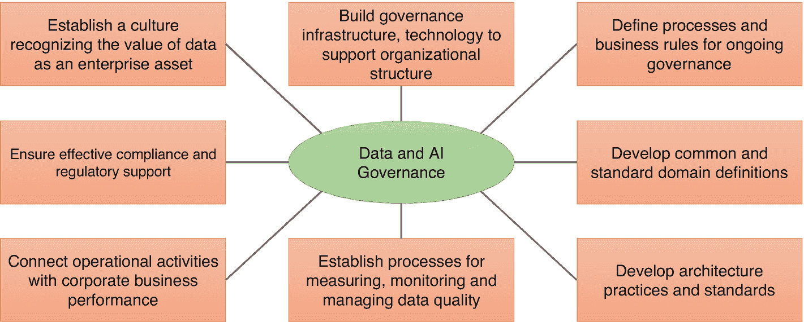

块图表示与数据和 AI 治理相关的任务如下。建立一个认可数据作为企业资产价值的文化，建立治理基础设施和技术，定义治理的过程和业务规则，开发通用和标准的领域定义，开发架构实践和标准，建立测量和管理数据的过程，将运营活动与公司业务绩效连接起来，并确保有效遵守。

图 15-1

数据治理方面

## 数据和 AI 治理的重要性

为什么企业应该认真对待数据和 AI 治理？让我们看看来自 Forrester 和 Gartner 的一些调查结果和预测。几乎三分之一的分析师在他们的分析数据可用于战略决策之前，会花费超过 40%的时间进行审查和验证。2 到 2024 年，将有 30%的组织投资于数据和分析治理平台，从而提高可信见解和新效率的业务影响。到 2025 年，80%寻求扩展其数字业务的企业将失败，因为他们没有追求现代的数据和 AI 治理方法。到 2024 年，利用主动元数据丰富和提供动态数据编织和数据网格的组织将减少数据交付时间 50%，并提高数据团队的生产力 20%。3

因此，建立数据和 AI 治理政策的直观原因是为了加速决策，同时确保从数据中得出的见解是可信的且高质量的。建立数据和 AI 治理的另一个原因是它有助于打破数据孤岛，这不仅是由数据存储在不同的物理存储设备或数据库上引起的，也可能是由不同组织或不同数据共享要求下的不一致数据标准和定义引起的。

一个统一的知识目录可能有助于从技术上解决这个问题；然而，打破不同用户角色和责任以及组织之间的业务壁垒，仍然需要信任以及基于指导和政策的较高层次治理。

法规遵从性是进行数据和 AI 治理的另一个关键驱动因素。尽管 70%的组织计划每年至少花费 100 万美元用于合规性，但这可能并不能完全防止数据安全和合规性问题发生。需要建立良好的数据和 AI 治理最佳实践和系统，以降低风险发生的可能性，并按照法律和法规减轻这些风险。

## 数据和 AI 治理的关键方面

由于数据治理必须确保数据管理和与 AI 相关的任务得到有效控制，你可能想知道具体涉及哪些管理任务。根据 DAMA-DMBOK2 知识领域轮，如图 15-2 所示，有 11 个关键知识领域。尽管 DAMA-DMBOK2 知识领域轮的范畴是关于数据的，但我们建议考虑到针对 AI 的特定法规和法律，将范围扩展到数据和 AI。^(4) 解决这些数据和 AI 治理知识领域需要实施现代数据架构架构。

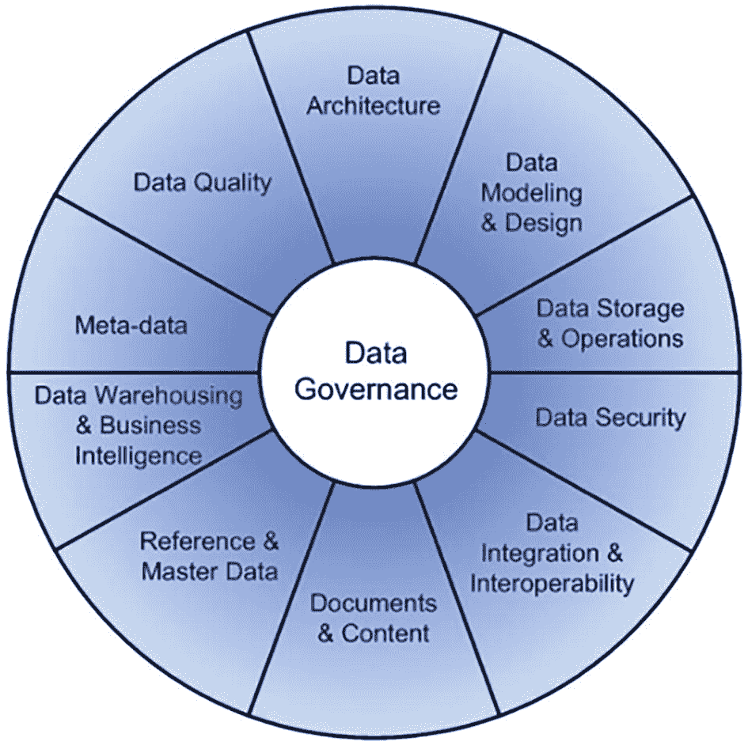

圆形图如下表示数据治理的要素。数据架构、数据建模和设计、数据存储和操作、数据安全、数据集成、文档和内容、参考和主数据、数据仓库、元数据和数据质量。

图 15-2

DAMA-DMBOK2 知识领域轮

以下列表探讨了与这两个概念都最相关的几个领域：

+   **数据和 AI 治理**：首先，数据和 AI 治理位于数据管理的中心，负责规划、监督和控制数据及 AI 的管理以及数据和相关资源的使用。

+   **数据架构**：正如其名所示，数据架构^(5) 定义了满足企业数据需求的蓝图；它是企业架构的组成部分。它指导数据源之间的集成，并使数据投资与整体 IT 和业务战略保持一致。数据架构的设计需要遵守法规以及公司政策。

+   **数据** **存储和操作**：存储是数据驻留的基础。存储基础设施必须支持数据架构和数据模型。如果企业选择混合云作为其架构，他们将使用云存储来补充其本地存储。企业可以根据对数据使用频率的要求，将数据存储在或移动到不同数据访问速度的存储中。典型操作包括复制、归档和灾难恢复，以防止数据丢失。

+   **数据和人工智能** **安全与隐私**：数据隐私关注的是组织是否保护敏感数据并提供适当的身份验证、授权、访问和审计以确保合规性。主要考虑因素是降低数据泄露和未授权使用的风险。数据和人工智能治理建立敏感数据和人工智能资产分类的层次结构，以及一系列数据和人工智能保护和访问规则（创建、读取、更新和删除），从而为企业保护数据和人工智能资产并满足审计要求提供一个权限矩阵。与数据隐私不同，数据安全保护数据免受外部黑客和恶意内部人员的损害。这是企业安全的一个关键方面。由于该领域的专业性，本书将不会对此进行详细阐述。如果您对此感兴趣，请参阅数据安全方面的书籍。

+   **数据和人工智能** **集成与互操作性**：定义了数据如何获取、提取、转换、移动、复制和虚拟化以供访问。集成需要遵循由治理平台定义的业务规则、政府法规和行业标准。例如，PII 保护法律不允许个人信息离开国家。因此，此类信息的集成将不被允许。

+   **数据质量**：考虑组织是否能够持续定义和衡量数据质量并缓解质量问题。每个企业可能定义不同的维度来衡量数据质量。有些可能更关注数据的时效性，而其他可能更强调数据的完整性和一致性。无论考虑哪些维度，都需要一个端到端的工作流程，定期检测数据质量问题并提供缓解解决方案。

元数据^(6)和主数据^(7)是数据治理的一部分.^(8)在此背景下还应提及参考数据，这是一组用于复杂层次结构或分类的数据集。例如，国家代码*US*代表美国，而*CN*代表中国。数据库存储国家代码以确保通过标准化定义提高数据质量。

用一个类比来说，让我们假设数据是社区的公共设施，例如停车场、邮箱、游泳池、健身房等设施。每个租户都有自己的停车位和邮箱，并需要适当的钥匙来解锁它们。同时，所有租户都可以使用游泳池、健身房以及进入社区公园的大门。物业管理正在为所有租户制定这些规则并记录这些规则。在这个例子中，数据架构、模型和存储指的是需要添加到社区中的这些设施以及它们应该位于何处以方便租户。元数据、参考数据和文档指的是这些设施的地图和使用设施的说明，即游泳池的开放时间和网球场的预约要求或先到先得。数据安全意味着租户的资产得到良好保护，其他人无法访问。物业管理团队是确保所有租户熟悉并遵守规则的治理团队。他们应该对任何违规行为采取行动，也就是说，如果一辆车在没有许可证的情况下在社区内过夜，它将被拖走，违规者将不得不支付罚款。

## 使用数据编织架构建立数据治理基础

企业越来越认识到数据与人工智能治理的重要性，并且许多企业开始构建数据与人工智能治理平台。然而，目前企业中的数据治理活动仍然处于部门层面，缺乏企业数据与人工智能治理的顶层设计和数据与人工智能资源的协调，这可能导致数据与人工智能治理项目的延迟甚至失败。

数据编织架构可以帮助企业有效地解决数据与人工智能治理的挑战，包括在组织实施中协调和交换元数据。首先，数据编织从不同的数据源中提取数据，并在组织系统中协调元数据交换，从而在企业层面提供数据与人工智能的整体视图，这为企业级一致和统一的数据与人工智能治理奠定了坚实的技术基础。同样，数据编织架构作为数据网格解决方案的基础，支持组织或部门的数据与人工智能治理倡议。

其次，数据编织架构采用的先进自动化和人工智能技术可以极大地简化企业或组织层面的数据与人工智能治理的实施，使组织联邦数据网格倡议成为可能，其中需要在组织间实施元数据的协调和交换。

以下是从数据编织架构的高级自动化能力中得出的关键方面：

1.  自动导入行业法规和公司政策，通过业务规则类型将它们转换为全球或本地数据保护规则，从而创建一套治理法规

1.  自动执行规则和政策执行到数据资产，如数据掩码或混淆，确保数据资产只能由特定用户访问

1.  定期扫描和分析数据质量，报告不符合质量要求的数据资产，并触发质量改进流程

## 使用数据编织架构建立自动化法规

自 2018 年欧盟引入 GDPR^(9) 以来，世界各地的其他国家已经实施了或提出了后现代隐私和数据保护立法。例如，巴西引入了《通用数据保护法》（或 LGPD），而美国加利福尼亚州引入了《加利福尼亚消费者隐私法案》（CCPA）。亚太地区包括中国、韩国和新西兰在内的十多个国家已经提出了、采用了或实施了新的隐私法。到 2023 年，全球超过 80% 的公司至少将面临一项以隐私为重点的数据保护法规。

数据隐私法规的这种复苏使公司面临挑战，需要解释和实施数据隐私策略，以符合这些复杂的监管要求，以保护组织和个人的数据隐私权。

公司认识到，法规的实施是一项复杂的任务，不仅需要强大的主题专家支持，还需要相应的技术基础设施。如何数字化法规并使业务单元遵守这些法规是公司的首要关注点。好消息是，人工智能技术的进步，尤其是自然语言处理（NLP）技术的进步，可以很大程度上解决这个问题。数据编织架构应采用 NLP^(10) 来自动化法规遵守。

请参阅图 15-3 以获取示例，该示例基于 IBM 的数据编织方法，其中法规加速器使 GDPR 政策和法规在几分钟内即可投入使用。

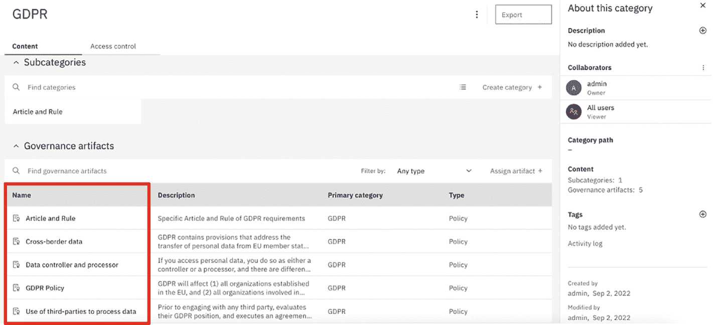

一张截图展示了 GDPR 下的内容。它显示了一个包含名称、描述、主要类别和类型的详细信息的表格。它突出了包含以下名称的名称列。文章和规则、跨境数据、数据控制者和处理器、GDPR 政策以及使用第三方处理数据。

图 15-3

GDPR

图 15-4 是 GDPR 相关治理工具的另一个示例，例如 *同意*、*个人数据清单*、*设计时的数据保护* 等，这些可以在图 15-4 的左侧显示和选择。图 15-4 中描述的治理工具之一是 *处理儿童数据*（图 15-4 中的虚线）。

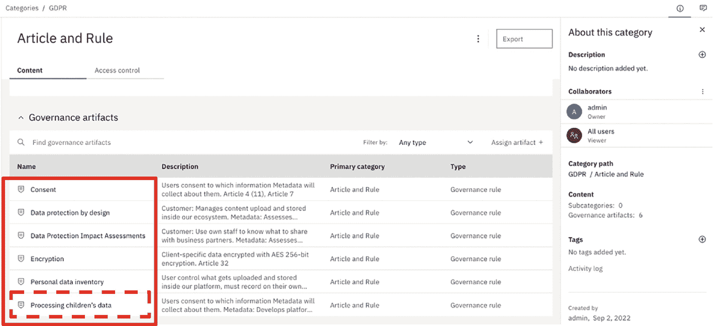

一张截图展示了文章和规则下的内容。它显示了一个包含名称、描述、主要类别和类型的详细信息的表格。它突出显示了名称列以及列中处理儿童数据的名称。

图 15-4

治理工件

这*儿童数据*可以进一步显示（例如，显示其有效日期）并调整（例如，定义一个结束日期），如图 15-5 所示。

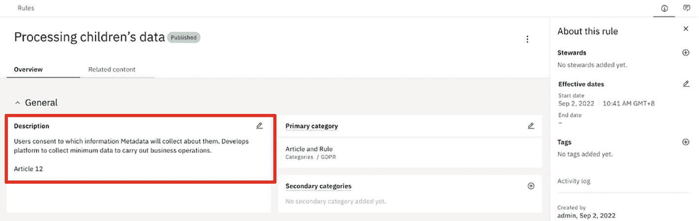

一张截图展示了处理儿童数据的概述。它突出显示了一般选项卡下第 12 条描述。它还指出了主要和次要类别的详细信息。

图 15-5

治理规则

## 数据编织中的数据法规自动执行

隐私法律和法规为处理其个人和机密数据的组织创造了义务，违反这些义务将面临严厉的处罚。有时个人数据和机密数据被视为相同。然而，个人数据是指包括姓名、出生日期、手机号码等的 PII。机密数据是关于组织的，例如，交易价格、知识产权和客户信息。

建立和执行与相应数据资产相对应的法规同样重要。为了履行这些责任，数据治理平台需要将数据分类并分配到相应的类别。数据属于个人信息，甚至敏感个人信息或机密信息，决定了保护级别。例如，根据 GDPR，除非已获得同意或法律允许，否则明确禁止处理 PII。

技术如何使数据保护规则得到执行？在数据编织平台上，可以通过对应数据和分析资产的特征定义数据保护规则。如图 15-6 所示，*地址*是 PII 信息，需要通过*保护地址规则*进行保护。

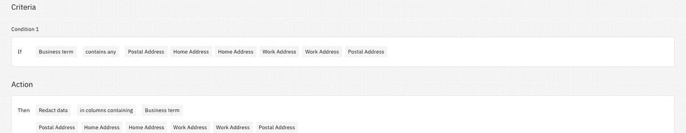

一张截图展示了在标准下的条件和在操作下的流程。条件是如果业务团队包含任何邮政地址、家庭地址和工作地址。操作解释说，然后在包含商业术语邮政地址、家庭地址和工作地址的列中删除数据。

图 15-6

数据保护规则 – 保护地址规则

如果在发现阶段识别到包含任何*地址*标签的商业术语，数据将被屏蔽，并应用数据保护规则。当业务用户访问这些数据资产时，地址列中的数据将被删除，如图 15-7 所示。

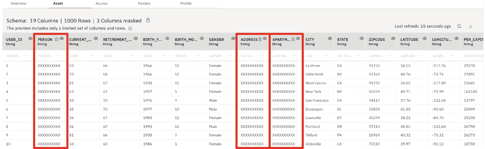

一个表格展示了用户 ID、人员、当前、退休、出生年份、性别、地址、公寓、城市、州、邮编、纬度和经度的详细信息。它突出了人员、地址和公寓的列。

图 15-7

强制数据掩码规则 `–` CREDITUSERS

## 使用数据编织自动化质量分析

制定法规和执行监管规则确保只有授权用户才能访问数据。还有另一个方面也应该考虑，那就是确保访问*可信*的数据，这与完整、高质量和一致的数据相关。如果数据质量不符合定义的标准，使用这些数据甚至可能产生潜在的错误结果，对业务产生负面影响，损失客户，声誉下降等。

因此，如图 15-8 所示，分析和评估数据质量是后续使用的前提。公司如何定义数据质量的指标？

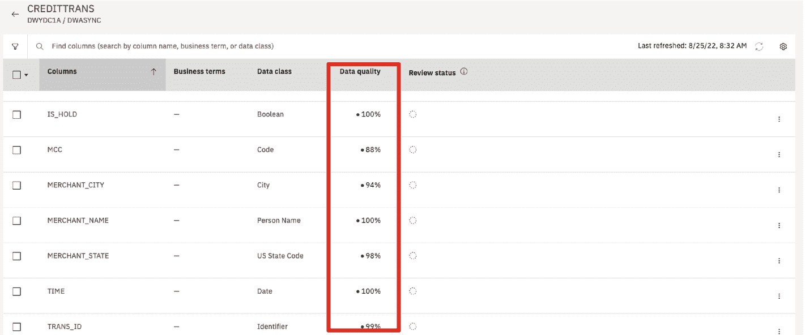

一个表格在“信用交易”标题下表示列的详细信息，包括业务名称、数据类别、数据质量和审查状态。它突出了提供百分比值的“数据相等性”列。

图 15-8

质量分析 – CREDITTRANS

通常，数据质量有六个维度^(11)：

+   **准确性**：数据必须反映真实业务内容。准确性可能因输入错误或数据转换错误而成为问题。例如，假设成本应该是 1000 美元。由于员工错误，系统中显示的是 100 美元，如果未被发现，将导致错误决策。

+   **一致性**：数据元素的类型和含义必须一致。例如，一个系统中的组织代码可能与另一个系统中的组织代码完全不同，这给执行分析任务带来了重大困难。

+   **及时性**：数据应根据用户的货币需求及时更新，尤其是如果多次复制。某些数据转换过程可能需要几天时间，这对于某些实时应用是不可接受的。

+   **唯一性**：对于同一实体，不应有重复的数据值。重复数据^(12)需要被删除或合并，这通常由 MDM 系统处理。

+   **完整性**：应测量数据的完整性。例如，在流行病学调查中，需要疾病起源；如果缺失，数据完整性的程度相对较低，这可能会阻止数据科学家将其包含在他们的项目中。

+   **有效性**：数据值必须满足数据或业务定义的要求，例如某些电话号码或邮箱号码的格式。否则，它将给出低有效性分数。

图 15-9 是质量维度和质量分数的示例，其中列*MERCHANT_CITY*被识别为数据类别*City*。这个数据类别中的任何数据都需要在参考数据集*Cities.cls*中，如图 15-10 所示。然而，6%的数据不在那里.^(13) 用户可以接受这一点并做出明智的决定使用它，或者用户需要去参考数据集，比较这个数据集与参考数据集的差异。

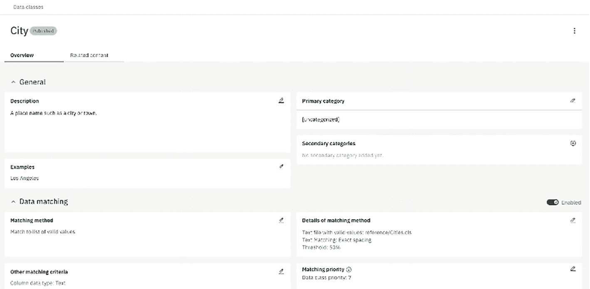

屏幕截图表示数据类别下的城市概览。它提供了在“常规”选项卡下的描述、示例以及主要和次要类别详情。它展示了在“数据匹配”选项卡下的匹配方法、匹配标准、匹配方法详情和匹配优先级。

图 15-10

数据类别

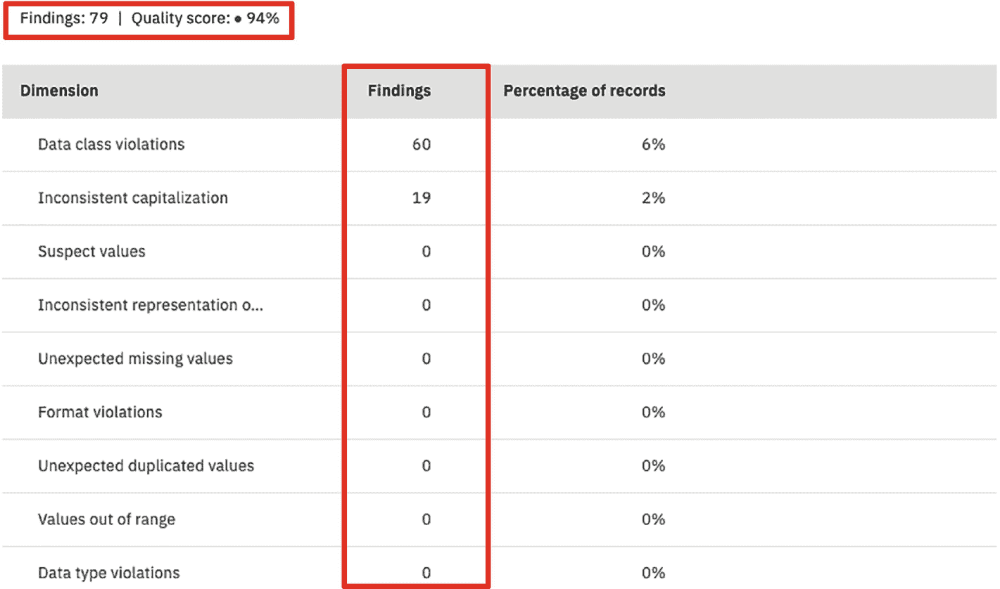

表格表示维度、发现和记录百分比的详情。顶部显示发现为 79，质量分数值为 94%。它突出显示表格中的发现列。

图 15-9

MERCHANT_CITY 的数据质量维度

除了这些标准维度之外，公司可以自定义维度或调整这些标准维度的权重。目标是设置数据质量分数，以准确反映数据可用于商业分析的程度。此外，公司需要建立一个数据质量监控框架，以便在出现质量问题时触发修复过程。

## 关键要点

我们通过表 15-1 总结的几个关键要点来结束这一章。

表 15-1

关键要点

| # | 关键要点 | 高级描述 |
| --- | --- | --- |
| 1 | 数据管理和数据与 AI 治理就像 DNA 的两条链。 | 数据管理是开发、实施和监控系统、程序和实践的过程，以在整个生命周期中交付和增强数据及资产的价值，而数据与 AI 治理是指在数据及资产管理过程中行使权力和控制。 |
| 2 | 公司往往缺乏企业数据治理的顶层设计，这导致数据与 AI 治理项目延迟或失败。 | 数据编织架构可以通过两个关键杠杆有效地帮助企业解决数据与 AI 治理挑战：(a) 从不同的数据源中拉取数据以创建整体视图；(b) 使用 AI 技术简化数据与 AI 治理的实施。 |
| 3 | 到 2023 年，全球 80%以上的公司将面临至少一项以隐私为重点的数据保护法规。将法规数字化并确保业务单元遵守法规和法律是一项紧迫的任务。使用具有数据架构的数据技术来加速法规的建立。 |
| 4 | 政策和规则执行包含两个关键要素。首先，平台需要识别或分类数据到正确的类别，即 PII 或机密数据；其次，当数据被访问时，需要根据第一步的结果应用相应的保护规则。 |
| 5 | 数据质量确保只有授权用户才能访问数据。数据质量通过六个维度来衡量：完整性、准确性、及时性、有效性、唯一性和一致性。企业需要持续监控数据质量。一旦质量低于定义的标准，就需要采取纠正措施。 |

## 参考文献

1.  Dama International, *《DAMA 国际 DMBOK 第 2 版》*, [`www.dama.org/cpages/dmbok-2-image-download`](http://www.dama.org/cpages/dmbok-2-image-download) (访问日期：2022 年 9 月 27 日).

1.  Forrester, Goetz, M., *《数据性能管理对于证明数据的投资回报率至关重要》*, 2018, [`www.forrester.com/report/Build-Trusted-Data-With-Data-Quality/RES83344`](http://www.forrester.com/report/Build-Trusted-Data-With-Data-Quality/RES83344) (访问日期：2022 年 9 月 27 日).

1.  Gartner, Duncan, A., D., *《到 2026 年的 100 个数据和分析预测》*, [`www.gartner.com/en/webinars/4011950/100-data-analytics-predictions-through-2026`](http://www.gartner.com/en/webinars/4011950/100-data-analytics-predictions-through-2026) (访问日期：2022 年 9 月 27 日).

1.  Opendatasoft, *什么是元数据以及为什么它和数据本身一样重要？*, 2016, [`www.opendatasoft.com/en/blog/what-is-metadata-and-why-is-it-important-data`](http://www.opendatasoft.com/en/blog/what-is-metadata-and-why-is-it-important-data) (访问日期：2022 年 9 月 27 日).

1.  Profisee, *《主数据管理 - 什么是、为什么、怎么做以及谁》*, [`profisee.com/master-data-management-what-why-how-who/`](https://profisee.com/master-data-management-what-why-how-who/) (访问日期：2022 年 9 月 27 日).

1.  GDPR.EU, *《GDPR 合规指南》完整指南*, [`gdpr.eu/`](https://gdpr.eu/) (访问日期：2022 年 9 月 27 日).

1.  Smartbridge, *《数据正确处理：数据质量的六个维度》*, [`smartbridge.com/data-done-right-6-dimensions-of-data-quality/`](https://smartbridge.com/data-done-right-6-dimensions-of-data-quality/) (访问日期：2022 年 9 月 27 日).
