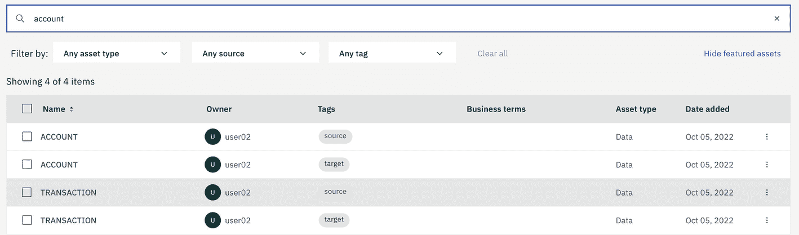
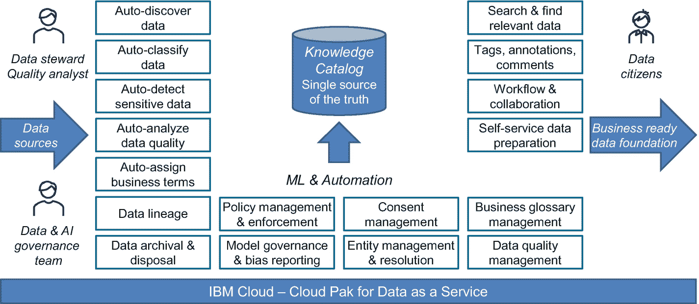
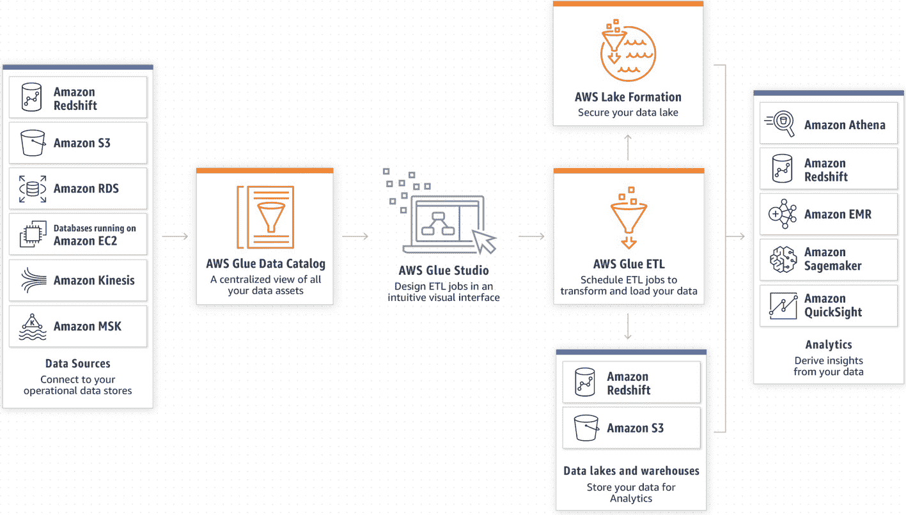
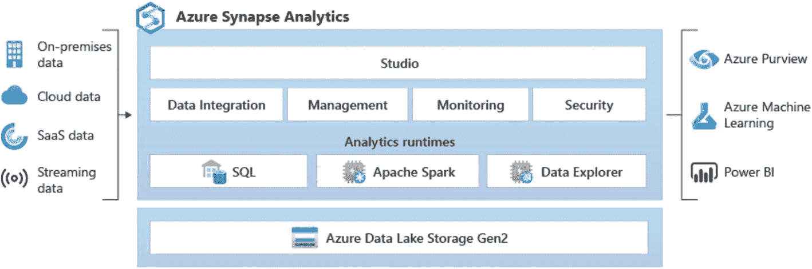
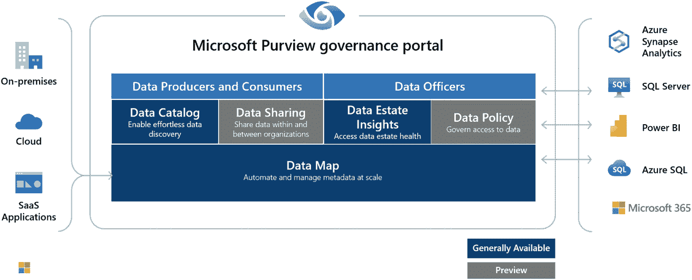
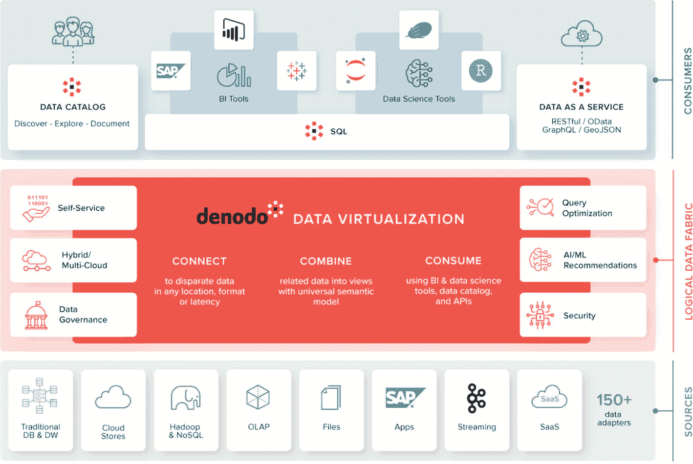
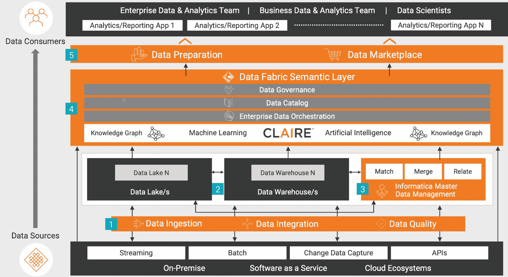
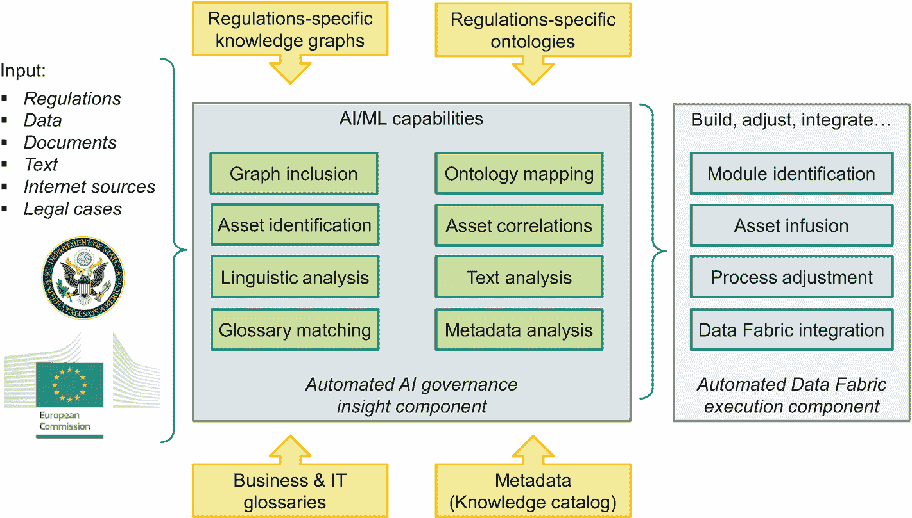
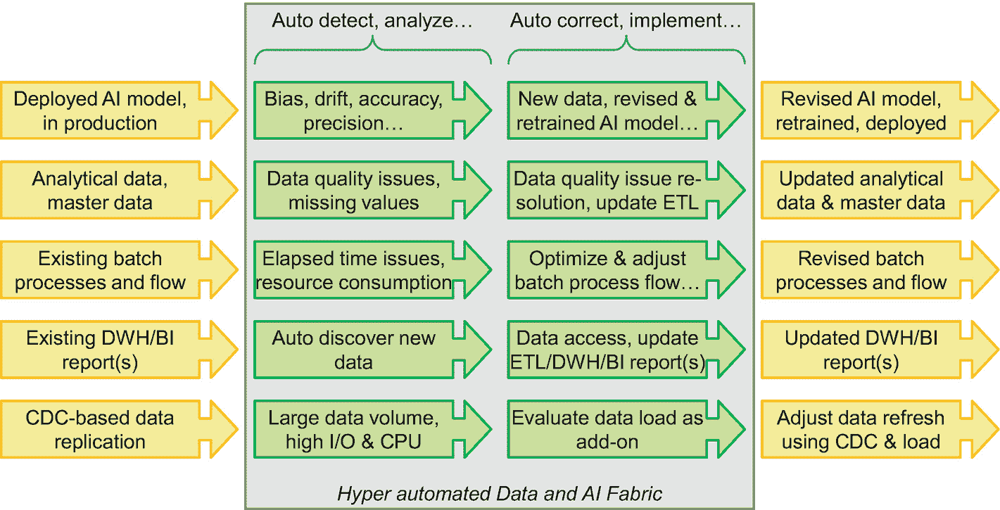

# 第四部分 当前产品和服务及未来展望

# 16. 样例供应商产品

如我们在第二章中提到的，高盛将数据编织列为 2019 年和 2021 年数据和分析领域的前十大技术趋势之一，并预测它将成为 2022 年十大新兴技术趋势之一。同时，福雷斯特公司表示，在其去年发布的 25,000 份报告中，关于数据编织的报告在 2020 年的下载量中排名前十。

作为新兴的技术趋势，数据编织和数据网格自诞生以来就一直是焦点。IBM、亚马逊和微软，世界上最大的信息技术公司；Denodo，数据虚拟化的领导者；Informatica，数据集成领域的确立领导者；以及 Snowflake、NetApp 和 Talend 等许多全球顶级供应商都响应了数据编织和数据网格的需求，并提供了企业级解决方案。

让我们来看看主要供应商的一些示例产品，以及它们的优缺点。

## 简介

数据编织^(1) 的目标是提供一种灵活、无缝且自动化的数据访问方法，使数据在任何时候都能自助消费，并通过主动、智能和可持续的数据和人工智能治理来保持数据和人工智能的可靠性。数据编织如何区别于其他架构，成为处理数据多样性、复杂性和异质性的最佳解决方案？这主要归功于架构设计^(2) 的三个关键特性：

+   **连接数据**，而非集中化它：数据编织架构的一个关键原则是数据集成方法的灵活性，即解决方案根据工作负载需求和企业的政策自动选择最佳集成策略，无论是通过虚拟化、转换、复制还是为用户提供直接访问，从而消除用户手动构建数据管道和选择计算存储解决方案的需求。支持哪些数据源和数据类型以及它们如何连接，都是检查数据编织实施的重要决策因素。

+   **自助服务**，而非专家服务：数据编织架构，尤其是数据网格解决方案，正在民主化数据和人工智能，使业务用户能够轻松发现和消费数据和人工智能资产，并实现数据产品的敏捷交付。在现有的集中式数据提供模型中，数据工程团队已成为影响数据驱动决策效率的最大瓶颈。自助服务和人工智能消费提高了分析师和业务用户的生产力，以满足数据驱动的需求激增。自助服务可以通过从企业知识目录中搜索以获取数据和人工智能资产的连接信息，结合其他工具使用，或直接使用 SQL、REST 等直接访问数据资产来实现。

+   **智能治理**，**而非手动操作**：传统的数据治理倡议是由自上而下的治理命令驱动的，通常在问题发生后才开始，这是一种不可持续且不恰当的方法来应对数据量和领域复杂性的快速扩张。另一方面，数据编织和数据网格方法建议从一开始就应该考虑数据与人工智能治理，并融入智能，通过增强知识库构建治理能力，并将它们整合到数据与人工智能生命周期的每个阶段。

总结来说，这两个概念都强调分布式数据管理，其核心思想是通过优化异构数据的发现和访问，以灵活的方式将所有相关数据源中的可信数据传递给所有相关数据消费者，从而允许数据消费者以自助方式实现敏捷的数据产品交付。同时，将人工智能融入所有方面，使数据的语义探索、分析和使用推荐以及人工智能的自动化成为可能。

除了这些连接数据、自助和智能数据与人工智能治理的核心能力之外，*部署选项*和*集成外部服务*的能力也是选择供应商产品时的标准。

## IBM Cloud Pak for Data

IBM 被 Forrester Wave Q2 2022 评为企业数据编织的领导者。IBM Cloud Pak for Data 是 IBM 对数据编织架构的实施，实现了数据网格解决方案。它通过动态和智能地编排受控数据与人工智能，在分布式环境中提供共同的数据基础，从而简化了整个信息供应链，从收集和组织到分析和融合数据与人工智能。让我们更深入地了解 IBM Cloud Pak for Data 如何实现数据编织和数据网格的承诺。

关于数据连接，IBM Cloud Pak for Data 提供了丰富的集成选项。IBM Watson Query 是 IBM Cloud Pak for Data 上的一项服务，它使用一个单一的分布式查询引擎跨越云、数据库、数据湖、数据仓库和流数据，无需复制或移动数据。此外，IBM Db2 for z/OS Data Gate 允许用户在不访问和消耗 Db2 for z/OS 资源的情况下访问当前的 Db2 for z/OS 数据。

此外，IBM DataStage 是一款行业领先的 ETL 工具，它帮助用户设计和转换数据。集成技术的选择取决于政策、延迟和性能要求。例如，数据位置法规不允许将特定国家或地区生成的数据转移到国外。因此，可用的选项包括数据虚拟化或复制到同一国家或地区的数据存储。IBM Cloud Pak for Data 还支持广泛的数据源^(4)，例如 AWS S3、云对象存储、Db2、Snowflake、通用 JDBC 等。

每个服务支持的数据源可能略有不同，并且每个新版本都会添加新的数据源，因此请参阅 IBM 网站以获取最新的支持列表。

IBM Cloud Pak for Data 通过 IBM Watson 知识目录提供自助服务和智能治理功能，这是云数据包的知识核心。它提供了全面的自助数据发现、数据编目、数据概要、数据质量管理以及语义搜索功能。数据管理员使用 IBM Watson 知识目录来整理元数据、定义数据隐私策略、捕获数据血缘关系并执行与安全和合规性相关的其他任务。一旦数据资产在知识目录中发布，具有相应授权的业务分析师和数据科学家可以以自助方式查找和消费这些资产。

请参阅图 16-1 以获取详细信息。此外，他们的活动也将根据每个数据资产进行跟踪，以备将来审计。

屏幕截图表示一个表格，提供了名称、所有者、标签、业务条款、资产类型和添加日期的详细信息。顶部的搜索框突出显示了搜索词“账户”。

图 16-1

使用云数据包的自助服务功能

由 IBM Watson 知识目录的卓越功能驱动，IBM Cloud Pak for Data 自动将行业特定的法规和规则应用于数据资产，以确保整个企业范围内的数据访问安全，如图 16-2 所示。

一幅插图展示了 IBM 云中作为服务的云公园的数据工作流程。它指出了知识目录中的数据源、机器学习和自动化元素，以及业务准备好的数据基础。它还指出了数据管理员、质量分析师、数据治理团队和数据公民的作用。

图 16-2

Watson 知识目录

它在数据和管理人工智能的各个方面注入了智能。首先，它自动分类、描述和分析数据资产的质量，并使用内置的语义模型分配或推荐业务术语和数据类别。其次，当业务分析师和数据科学家访问数据资产时，会自动执行保护规则和政策，以确保符合数据隐私法规和法律。

IBM Cloud Pak for Data 有一个基于 Red Hat OpenShift 容器平台的本地软件版本和一个基于 IBM Cloud 的完全托管版本。它提供了一系列 IBM 和第三方服务，覆盖整个数据生命周期，例如，在数据管理方面有 IBM 的 EDB Postgres Enterprise 和 MongoDB Enterprise Advanced，以及在决策中注入人工智能的 Palantir。

无论是在本地还是公共云版本，都适合大型企业实施企业级数据布线架构或可能跨组织联邦的机构数据网格解决方案。随着更多业务单元加入平台，它实现了完全的投资回报，进一步实现了数据和人工智能的价值。

## 亚马逊网络服务（Amazon Web Services）

亚马逊网络服务（AWS）提供各种数据服务，这些服务就像乐高积木，可以组装起来实现数据布线架构。在所有服务中，AWS Glue 是数据集成的核心，包括数据发现、数据目录、数据丰富和 ETL 等，如图 16-3 所示。

图表表示了流程的流程，从数据源开始，经过 AWS Glue 数据目录，然后是 AWS Glue 工作室和 AWS Glue ETL。接着通过 AWS 湖形成和数据湖以及仓库，最终达到分析环节。

图 16-3

AWS Glue

AWS Glue 爬虫正在实现数据连接。它们扫描来自不同数据源的数据；检索结构化数据和无结构化数据的元数据，例如实例模式、位置等；并将这些信息存储在称为 AWS Glue 数据目录的集中式存储库中。支持的来源^(5) 包括 S3 中的数据湖、Amazon Redshift 中的数据仓库以及其他属于 [Amazon 关系数据库服务](https://www.techtarget.com/searchaws/definition/Amazon-Relational-Database-Service-RDS) 的数据库。爬虫不仅连接到数据，还运行分类器来推断数据的模式、格式和数据类型。一旦数据被编目，它就可以立即用于搜索和查询。AWS 没有虚拟化解决方案，但 Glue 弹性视图（处于预览阶段）使用 SQL 在许多数据库和数据存储之间提供物化视图。它支持 Amazon DynamoDB、Amazon Redshift、Amazon S3 和 Amazon OpenSearch 服务。此外，AWS 数据迁移服务允许客户处理持续复制或更改的数据捕获。

AWS 不仅提供通过 AWS Glue 数据目录进行搜索的自助服务，还通过 AWS Athena 提供直接的 SQL 服务^(6)，AWS Athena 是数据分析师在多种数据源上运行分析查询的交互式查询界面。其背后的查询引擎是 Presto^(7)，这是一个针对大数据低延迟分析优化的开源分布式查询引擎。一个值得特别提到的特性是，Athena 允许运行联合查询以访问多个数据源中的多种数据类型，而无需移动数据。Athena 支持的数据类型包括 CSV、JSON、Apache Parquet 等。此外，Athena 和 Glue 具有无缝集成 Glue 爬虫支持的所有数据源以及其他 JDBC 兼容的数据库。

AWS Lake Formation 是可以用来构建数据织构的另一个服务。它实现了一个非常重要的方面——治理。使用 AWS Lake Formation，用户可以在数据湖的数据库、表和列级别上定义细粒度的权限。Lake Formation 集中管理安全策略并在分析服务中强制执行，消除了为每个服务单独配置访问控制的必要性。它自动过滤数据，仅向授权用户显示由定义的策略允许的数据，而不进行复制。Lake Formation 内置了用于实体解析的 ML 模型^(8)，以连接来自不同数据源或从同一数据源中删除重复项，从而提高整体数据质量。

许多 AWS 服务是无服务器服务，可以轻松扩展。它们也针对 S3 进行了优化，但未与其他第三方数据库或 S3 集成。本节仅涵盖在数据编织环境中的一些选定的 AWS 核心服务。AWS 提供灵活性，但也要求用户具备 AWS 的高级技术技能。预计会有一个陡峭的学习曲线。最后，AWS 没有本地版本。所有服务仅在 AWS 上可用。如果您已经使用 AWS 和 S3 中的数据构建了应用程序，AWS 是构建数据编织的一个很好的选择。

## 微软 Azure

微软在微软 Azure 上提供跨多个服务的统一体验和无缝集成，客户可以轻松购买所需的新服务并获得集成和一致的用户体验。微软还开发了几个用于构建数据编织的服务。让我们更深入地了解这些服务。

为了连接数据，微软 Purview 是一个统一的数据治理服务，帮助管理和治理用户在本地的、多云和 SaaS 数据。大多数 Azure 数据源^(9)都通过微软 Purview 数据图得到支持，包括如 Amazon RDS、Db2、Oracle、MongoDB、Amazon S3 等数据库。除此之外，微软还通过微软 Azure 数据工厂提供集成服务。它提供了一个无代码平台来构建 ETL 和编排管道。

微软还为 Azure SQL 托管实例提供了数据虚拟化预览，目前仅支持查询存储在 Azure 数据湖存储或 Azure Blob 存储中的外部文件。关于复制数据解决方案，Azure 依赖于源上的更改数据捕获解决方案，例如基于微软 Azure SQL 数据库和 SAP。

在自助服务方面，微软 Azure 分析合成也提供了 SQL 服务。如图 16-4 所示，Synapse 分析由数据工厂^(10)提供支持，并支持多种数据湖、存储库、NoSQL、文件、通用协议和其他服务。它还有一个通用的 ODBC 连接器，以扩展对更多数据库的支持。使用微软 Azure 分析合成，用户可以在统一的用户体验中获得 DWH 和大数据平台的洞察。它透明地将来自多个领域的最佳技术结合起来，例如企业数据仓库的最佳 SQL 技术、大数据的 Spark 技术、用于日志和时序分析的数据探索器以及用于数据集成和 ETL/ELT 的管道。它还与其他微软 Azure 服务如 Power BI、CosmosDB 和 AzureML 深度融合。

一幅插图展示了来自不同来源的数据进入 Azure 分析合成。分析被分为 Azure purview、Azure 机器学习和 Power BI I。

图 16-4

Azure 分析合成

如图 16-5 所示，Microsoft 数据层方法的核心服务是 Purview，它与几个 Microsoft Azure 服务协同工作，以提供数据层功能。

这是 Microsoft Purview 管理门户界面的插图，该界面接收来自本地、云和 SaaS 应用程序的输入，并与 Azure Synapse 分析、SQL 服务器、Power BI、Azure SQL 和 Microsoft 365 进行交互。

图 16-5

Microsoft Purview

首先，数据地图通过内置的自动扫描和分类系统自动保持数据目录的更新。其次，Purview 数据目录使业务和技术用户能够通过多个维度快速轻松地找到相关数据，例如术语表术语、分类、敏感性标签等。第三，Microsoft Purview 数据共享使组织能够安全地在组织内部或与业务合作伙伴和客户之间共享数据。最后，Microsoft Purview 数据生命周期管理（以前称为 Microsoft 信息治理）为用户提供工具，以保留他们需要保留和归档的内容，或删除过时的内容。在治理方面，数据策略（目前处于预览状态）可以通过 Microsoft Purview 对已注册策略的数据源强制执行策略。当新策略发布时，它将异步强制执行底层数据源。

Microsoft Azure 的一个关键区别是其 Microsoft Purview 数据资产洞察，它为高管提供对其数据资产的全景视图，并包含可操作的见解，以弥合治理过程中发现的问题。Microsoft Purview 和 Azure Synapse 是 Microsoft Azure 上的服务。截至今天，Microsoft 没有本地版本。在功能方面，Microsoft 在某些领域刚刚开始，如虚拟化，但用户体验和集成是卓越的。即使在众多服务中，Microsoft 仍然能够提供一致且高质量的用户体验。

## Denodo

Denodo 是一家专注于数据虚拟化的细分市场供应商，提供丰富的功能来构建一个以数据虚拟化为中心的逻辑数据层。它包括一个通用的语义层，用于更快地向业务提供数据，一个动态的数据目录，用于企业级的数据治理，以及一个由机器学习驱动的行业领先查询引擎。

对于连接数据，Denodo 支持多种数据源，包括市场上大多数数据库、具有 SQL 接口的数据湖，或允许通过通用 JDBC 进行连接。它还支持通过 Salesforce 包装器和 JSON 数据源直接在 Salesforce 上运行查询，以及通过 ServiceNow 等连接服务直接连接到 Db2 for z/OS。此外，它通过分布式文件系统自定义包装器直接在 HDFS 中存储的 CSV、Avro、Map 文件、序列文件以及 AWS S3 上运行查询。Denodo 专门用于数据虚拟化，因此不提供复制和转换的解决方案。

Denodo 平台提供了全面的元数据和数据发现功能，包括数据治理、数据血缘、变更影响分析等。虚拟化技术使组织能够在异构的系统和结构化/非结构化数据源之间创建统一的数据访问和集中式治理策略。

Denodo 拥有自助式业务术语表和信息目录，允许用户添加自己的业务术语并满足用户的需求。此外，Denodo 的数据目录使用 AI/ML 技术，并提供交互式发现功能、协作能力和个性化推荐。Denodo 还提供安全和治理功能，包括高级数据掩码和基于属性的访问控制（ABAC），通过单一的控制和管理点适用于目录中的所有数据资产。

尤其值得注意的是，Denodo 的核心技术是其数据虚拟化，如图 16-6 中间所示，以及内置的查询加速功能，例如聚合感知、灵活的缓存选项和查询优化。它对主动元数据提供了优越的支持，这些元数据来自静态连接和动态数据处理源，例如数据访问和查询的统计信息、请求的延迟等。这些元数据可以进一步用于优化数据编织。

一幅插图展示了从上到下消费者层、逻辑数据编织层和源层的元素。源层包括超过 150 个适配器，逻辑数据编织层包括数据虚拟化的角色，而消费者层包含数据目录、SQL 和数据即服务。

图 16-6

Denodo

Denodo 既有本地版本，也有可在 AWS、Microsoft Azure 和 Google Cloud 上提供的云服务。它拥有超过 150 个数据适配器，支持广泛的数据源。Denodo 没有 BI/AI 解决方案，客户需要与其他第三方解决方案集成。

## Informatica

Informatica 是数据编织市场的主要提供商之一，在 Gartner 的魔力象限中被评为数据集成、数据质量和 MDM 的领导者。请参阅图 16-7 以了解 Informatica 的架构。

一幅插图展示了数据从源到消费者通过 5 个点的流动过程。它从下到上表示了数据摄取、数据集成、数据质量、数据湖、Informatica 主数据管理、数据 fabric 语义层、数据准备和数据市场。

图 16-7

Informatica

在连接*数据*方面，Informatica 数据摄取和数据集成产品和服务支持许多数据源的复制、ELT 和变更数据捕获^(12)，使客户能够在不同的云服务提供商之间构建数据湖或 DWH 解决方案。它不仅支持大多数关系型数据库、数据湖和文件存储解决方案，还支持消息传递和社交媒体。它目前支持 NoSQL 数据库的 HBase。

Informatica 的数据集成和数据质量产品为公民数据团队提供了低代码或无代码体验。数据工程师可以在画布上轻松拖放以定义数据集成和数据分析作业。数据管理员可以通过 GUI 执行各种类型的操作，例如清理数据、创建字典、解析和标记数据、创建规则规范和验证器。它还支持从数据分析结果自动生成字典。新生成的字典可以用于后续的解析器、标记器、规则或验证器。

Informatica 支持使用 AI/ML 技术自动从不同的数据源捕获和增强元数据，并创建知识图谱以建立技术和业务环境之间的联系。其目录为用户提供了一个可浏览的分层视图，以便轻松找到具有扩展知识的数据资产，例如数据血缘、分析结果、部落知识等。Informatica 还提供了强大的治理功能。通过链接技术数据和业务术语建立的增强知识图谱，能够执行与业务相关的政策。用户可以轻松找到与特定数据资产相关的政策。

Informatica 支持本地和云部署，与 AWS、Google Cloud、Microsoft Azure、Oracle 和 Snowflake 合作。本地版本仍然是一个基于独立安装的产品，它不提供数据仓库、数据湖、BI 或 AI 解决方案，因此用户仍然需要集成其他供应商提供这些功能的产品。

## 关键要点

我们以表 16-1 中总结的几个关键要点来结束本章。

表 16-1

关键要点

| # | 关键要点 | 高级描述 |
| --- | --- | --- |
| 1 | IBM Cloud Pak for Data | • A wealth of integration options: direct access, transformation, virtualization, and replication.• Comprehensive self-service and governance capabilities: data discovery, intelligent cataloging, data profiling, data quality, and semantic search and recommendation.• Supports both on-prem deployment on a Red Hat OpenShift cluster and SaaS on IBM Cloud.• Can be used for Data Fabric architecture and Data Mesh solutions. |
| 2 | AWS | • Optimized for RDS and S3, requiring customization for other third-party data sources.• Crawlers scan data and retrieve metadata from different data sources.• No on-premises version.• Lego style, assembly required, steep learning curve. |
| 3 | Microsoft | • Unified user experience across multiple products, easy for self-serve.• Provides a completed view of their data estate and actionable insights to C-suites.• Gets started in virtualization areas.• No on-premises version. |
| 4 | Denodo | • Logic Data Fabric limited to data virtualization.• Specialized on virtualizing data, not moving or replicating data.• Supports both on-premises and SaaS. |
| 5 | Informatica | • Supports most popular data sources with ETL, change data capture, or replication.• No-code platform for data integration and data quality management.• No data warehouse, no data lake solution, no AI and BI tool. Needs integration with other vendor offerings.• Supports both on-premises and SaaS. |

## 参考文献列表

1.  Gartner, Gupta, A., *Data Fabric Architecture Is Key to Modernizing Data Management and Integration*, 2021, [`www.gartner.com/smarterwithgartner/data-fabric-architecture-is-key-to-modernizing-data-management-and-integration`](http://www.gartner.com/smarterwithgartner/data-fabric-architecture-is-key-to-modernizing-data-management-and-integration) (accessed August 24, 2022).

1.  IBM, Limburn, J., *IBM named a leader in The Forrester Wave™: Enterprise Data Fabric, Q2 2022 – Driving end-to-end integration and reducing complexity across the data lifecycle*, [`www.ibm.com/blogs/journey-to-ai/2022/06/ibm-named-a-leader-in-the-forrester-data-fabric-wave-for-2022/`](http://www.ibm.com/blogs/journey-to-ai/2022/06/ibm-named-a-leader-in-the-forrester-data-fabric-wave-for-2022/) (accessed August 24, 2022).

1.  IBM, *IBM Cloud Pak for Data*, [`www.ibm.com/docs/en/cloud-paks/cp-data/4.5.x?topic=data-supported-sources`](http://www.ibm.com/docs/en/cloud-paks/cp-data/4.5.x%253Ftopic%253Ddata-supported-sources) (accessed August 24, 2022)

1.  AWS, *AWS Glue*, [`https://docs.aws.amazon.com/glue/latest/dg/crawler-data-stores.html`](https://docs.aws.amazon.com/glue/latest/dg/crawler-data-stores.html) (accessed August 24, 2022).

1.  TechTarget Network, Gillis, A. S., Carty, D., *Amazon Athena*, [`www.techtarget.com/searchaws/definition/Amazon-Athena`](http://www.techtarget.com/searchaws/definition/Amazon-Athena) (accessed August 24, 2022).

1.  Presto，*用于数据分析和开放湖仓的快速且可靠的 SQL 引擎*，[`prestodb.io/`](https://prestodb.io/)（访问日期：2022 年 8 月 24 日）。

1.  Microsoft，*Azure*，[`docs.microsoft.com/en-us/azure/purview/microsoft-purview-connector-overview`](https://docs.microsoft.com/en-us/azure/purview/microsoft-purview-connector-overview)（访问日期：2022 年 8 月 24 日）。

1.  Microsoft，*Azure*，[`docs.microsoft.com/en-us/azure/data-factory/connector-overview`](https://docs.microsoft.com/en-us/azure/data-factory/connector-overview)（访问日期：2022 年 8 月 24 日）。

1.  Denodo，*Denodo 平台 8.0*，[`community.denodo.com/docs/html/browse/8.0/en/vdp/administration/appendix/supported_jdbc_data_sources/supported_jdbc_data_sources`](https://community.denodo.com/docs/html/browse/8.0/en/vdp/administration/appendix/supported_jdbc_data_sources/supported_jdbc_data_sources)（访问日期：2022 年 8 月 24 日）。

1.  Informatica，*开发者工具指南*，[`docs.informatica.com/data-integration/powercenter/10-2/developer-tool-guide/connections/connections-overview/connection-types.html`](https://docs.informatica.com/data-integration/powercenter/10-2/developer-tool-guide/connections/connections-overview/connection-types.html)（访问日期：2022 年 8 月 24 日）。

# 17. 数据编织和数据网格研究领域

想象一个高度自动化的数据编织或数据网格，它能自我行动、自我改进和自我优化，这意味着它可以在没有人为干预或显著减少人为驱动的数据和 AI 管理任务的情况下，实时地实现智能和 AI 洞察。这样的现代数据编织架构或数据网格解决方案不仅融入了 AI 以获得更相关的洞察、发现资产或激活数字废气；它以行动为导向，能够自动调整和纠正这两个概念的操作。将此应用于 AI 治理，想象一项新的国际法律或法规，它会影响您的公司，例如建立新的或调整现有的与数据相关的流程，例如保证无偏见的 AI 模型。现代数据编织或数据网格应该能够应用基于本体的语义搜索来识别受法律或法规影响的相关数据和 AI 资产，并自主地将这些资产注入到您数据编织架构的可信 AI 组件^(1)中进行处理。

在本章中，我们探讨了趋势、方向和研究领域，这些领域基于我们在本书中详细阐述的许多概念，例如活动元数据、语义知识图谱、激活数字废气、智能信息集成等。

## 引言

在本书中，很明显没有统一的数据织构架构能够满足所有目的、用例和业务场景。例如，有一种数据织构架构专门针对构建数据网状结构解决方案。然而，也存在一种*数据与人工智能织构*，^(2) 它针对的资产范围比数据更广。此外，一种*通信织构*可能专门针对金融服务行业全渠道数字体验的需求，或者一种*边缘织构*针对基于移动和 5G 的场景需求。每种数据织构架构可能都需要特定的功能和特性。

然而，在本章中，我们采取了一种整体的观点，并介绍了通过进一步注入主要的人工智能技术（例如，基于本体的语义搜索、语义知识图谱等）来增强通用数据织构架构的趋势和方向。此外，我们详细阐述了一个注入人工智能的自动化人工智能治理场景，以可信赖的人工智能为例。

最后，我们引入了超自动化数据与人工智能织构或网状结构的概念，它能够自主地改进自身的过程，将人类干预限制在批准、调整或拒绝提议的行动。

## 基于人工智能的增强洞察

正如我们在整本书中看到的，现代数据织构或数据网状结构的 DNA 确实是由人工智能驱动的，这确实是一种范式转变，改变了今天对元数据管理、实体匹配、信息集成、信息治理、语义搜索、语义知识图谱等领域的看法。在本节中，我们介绍了一些对两种方法都高度相关的研究领域。

生成语义知识图谱本身就是一项挑战，尤其是在图谱中穿插了业务数据和本体的情况下。然而，利用和解释语义知识图谱，并将其内在知识转化为自动化的推荐和可操作的见解，又是一项新的挑战。这两个领域都在研究中得到了处理.^(3) 例如，通过应用机器学习和相关的解释算法来解决可信赖且可解释的人工智能问题，正如我们在第五章中看到的。应用语义丰富的知识图谱可以提升人工智能的洞察力和可解释性.^(4) 基于机器学习的可信赖人工智能方法受到限制，因为需要解释和解释特征对预测结果的影响，或者计算混淆矩阵，这本身也限制了可以评估的机器学习模型类型。

仔细阅读的读者肯定已经注意到，在第五章“可信人工智能”部分讨论的模型公平性、漂移检测和质量指标仅限于多类分类和回归问题。然而，利用语义知识图谱可以通过发现和描绘语义和非明显关系，或者以简化和更易读、可解释的方式描绘机器学习（ML）或深度学习（DL）模型，从而支持几乎所有人工智能模型类型的可解释性和可解释性。

让我们简要说明一下术语：我们在第五章中讨论的模型公平性、漂移检测等背景下使用“解释算法”这一术语，而“可解释性”则侧重于模型本身的解释性和其推断结果，例如其预测结果。

面对深度学习（DL）模型的可靠性和可解释性是一个特别难以解决的问题，这涉及到人工神经网络（ANN）或深度神经网络（DNN）的输入、输出和中层语义，以及 ANN 或 DNN 节点及其在中层中的权重纠缠，以及 ANN 或 DNN 所经历的持续调整和学习，这些都导致了深度学习模型的黑盒感知。开发解释算法或自解释模型，其中可靠性是模型本身的内在能力，是研究的一个主题。（^(5）语义知识图谱^(6）特别适合提高对深度学习模型结果和决策过程的了解、可解释性和可解释性。目前的数据编织或数据网格方法尚未接受这些方面。将基于本体的语义知识图谱应用于人工智能任务——超越可靠和可解释的人工智能——是研究的关键领域。（^(7） 

在第七章中，我们讨论了语义丰富以及一些扩展标准 SQL 范围的功能，例如 AutoSQL、基于置信度的查询匹配和语义 SQL，这些都是数据编织和数据网格的关键功能。我们还建议使用特定领域或行业分类法或本体作为语义丰富引擎的输入。这引出了基于本体的语义搜索这一主题，这是研究中的另一个关键数据网格相关主题。SPARQL（简单协议和 RDF 查询语言）是一个成熟的 RDF（资源描述框架）语义查询语言，用于数据库，能够检索和操作存储在 RDF 格式中的数据。RDF 是一种将信息表示为三元组的方法，其中一组三元组定义了一个知识图谱。^(8) OWL（本体网络语言）是一种知识表示和本体语言，可用于描述 RDF 数据。RDF、OWL 和 SPARQL^(9)标准在基于本体的语义搜索中已经有了悠久的历史。

然而，在数据编织和数据网格的背景下，应用基于本体的语义搜索的一个关键挑战是知识目录中使用的格式和结构的异质性，尤其是与数字废料元数据和各种 AI 工件（例如 AI 模型、管道、ETL 阶段等）相关，这些工件可能不以 RDF 格式表示。此外，使用 OWL 来表示现有行业特定的本体，并通过 SPARQL 使其可搜索以进行语义丰富，可能仍然是一个相对直接的过程。尽管如此，与特定过程（例如智能信息集成和激活数字废料）相关的特定领域本体可能首先需要使用 OWL 来开发。此外，Data Mesh 语义丰富引擎的相关元数据、数字废料和其他输入数据需要转换为 RDF 格式，以便通过 SPARQL 访问。还需要开发特定的接口和工具来指导用户完成此过程。目前正在研究替代方法，部分基于开源倡议，例如 Apache Jena，这是一个开源的 Java 框架，用于构建语义网和链接数据应用程序。

当前在语义知识图谱和基于本体的语义搜索方面的研究大多应用于语义丰富任务，例如生成主动元数据、激活数字废料，以及在特定业务或行业领域内以自助方式搜索相关数据和 AI 资产。

## 智能注入的自动 AI 治理

正如我们在第十五章节中看到的，人工智能治理和伦理 12 已经成为企业需要接受的现实。实际上，欧洲委员会和美国国务院发布的现有法规 13 已经涉及了可信人工智能。

然而，实施具有众多方面的 AI 治理，如可信和可解释的 AI 以及伦理，并解决 AI 生命周期从头到尾的问题——特别是与 AIDevOps 相关的问题——仍然是一个相当大的挑战，尤其是在尽可能自动化 AI 治理实施的宣称下，例如，通过将 AI 融入相关流程。

理解这些法规的需求不断增长，尤其是将强制性要求转化为现有的数据编织架构或数据网格解决方案，以确保合规性，这通常并非易事。

如图 17-1 所示的融入人工智能的自动化人工智能治理能力，应支持对这些法规的解释、转换和实施——至少尽可能做到。考虑到我们在第十六章节中讨论的所有数据编织供应商的产品及其功能和特性，然而，这种复杂的自动化人工智能治理范围目前还不是现实，仍在研发中。

一个示意图展示了来自法规特定知识图谱、法规特定本体、商业和 IT 术语表以及元数据到自动化 AI 治理洞察组件的输入。它还指出了 AI ML 能力以构建、调整和集成。

图 17-1

融入人工智能的自动化人工智能治理

观察图 17-1，让我们讨论各个组件及其功能。为了说明一个融入人工智能的*自动化*人工智能治理平台的所需功能，我们以欧盟或美国国务院的可信人工智能法规为例。14

融入人工智能的自动化人工智能治理平台包含以下两个主要组件：

1.  **自动化 AI 治理洞察组件**：该组件本质上是基于法规特定输入数据（例如，法规、文件、互联网来源、法律资产等）、法规特定本体和知识图谱、商业和 IT 术语表以及知识目录中的相关活动元数据生成可操作见解。这些输入数据通过 AI/ML 能力进行分析，以生成可操作见解，这些见解可以（或者更确切地说应该是）由自动化的*数据编织执行组件*自主处理。

1.  **自动化数据编织执行组件**：该组件处理来自**自动化 AI 治理洞察组件**生成的洞察，以构建额外的或调整现有的数据编织流程以符合法规。可能需要将新流程集成到数据编织中，并且现有的流程必须相应地进行定制或更新。

让我们先更详细地看看**自动化 AI 治理洞察组件**，具体说明相关的 AI/ML 和其他能力。其中大部分能力都处于研发阶段。不用说，可能还需要额外的能力，例如易于使用的 GUI 和转换模块，例如，准备输入数据集以及生成用于数据交换目的的 JSON 或 Avro 输出数据集等等：

+   **知识图谱包含**：必须考虑现有的特定法规知识图谱；如果没有可用的知识图谱，可能需要首先构建它们然后再包含进来。可能需要生成语义知识图谱，如第五章所述，以利用与不明显的关系或相关性相关的增强洞察，即法规与法律案例或方面的相关性。

+   **本体映射**：必须利用特定法规的本体并映射到相关的 AI 资产和数据编织流程。在我们的例子中，这意味着映射到与保证可信 AI 相关的 ML 模型、管道和数据编织流程。这可能需要映射到相关的 IBM Watson Studio 可信 AI 功能，我们的第五章中关于可信 AI 的示例就是基于此的。

+   **术语匹配**：通过知识目录可用的相关业务和 IT 术语必须与特定法规的关键术语匹配；应发现并添加新术语到现有术语表中。

+   **元数据分析**：应分析现有的活动元数据以获得更深入的洞察；可能需要发现并添加新的元数据到知识目录中。此外，活动元数据将被用作其他模块的输入，例如，*资产识别*和*资产关联*。

+   **资产识别**：一个关键任务是识别与可信 AI 法规相关的资产，例如，现有的 ML 或 DL 模型、相应的管道、Jupyter 笔记本等。这需要发现存储在知识目录（活动元数据）中的 AI 资产，可能还需要来自*语言分析*和*文本分析*模块的输入。

+   **资产关联**：AI 资产并非孤立存在；它们是相互关联的，这要么已经在知识目录中捕获，要么还需要通过数据编织架构的语义丰富化引擎来发现关联，即通过语义丰富化引擎来发现关联。此外，关联不仅限于 IT 领域；它还应包括，例如，与业务领域和 AI 模型的语义关联，包括其业务结果和意义。

+   **文本分析**：需要通过应用机器学习技术来分析特定法规的文档和文本，以自动对非结构化文本数据进行分类并提取有价值的见解。这可能需要将分析步骤与相关的本体和活动元数据相关联。

+   **语言分析**：相关的文档和文本可能还需要进行语言分析，特别是如果它们复杂且具有法律相关性，例如，为了更好地理解规范性文本的语义（意义）以及在违规情况下的影响。

让我们继续深入探讨*自动化的数据编织执行组件*，详细说明它所包含的功能。这确实是一个需要大量研发工作来增强数据编织架构以自动调整和集成所需更改的领域。而*自动化的 AI 治理洞察组件*生成可操作的洞察，该组件自动将洞察转化为可操作洞察，并自主执行已识别的步骤以实施可信 AI，以确保符合相应的法规：

+   **模块识别**：需要识别相应的数据编织组件、模块、产品等，以了解需要在何处实施调整。这可能指的是一个现有的工具或组件，它已经为其他机器学习模型提供了可信的 AI，例如，除了其目前实施的功能范围外，还可以提高可解释性。

+   **资产注入**：已识别的 AI 资产需要注入并使其可供相应的数据编织流程使用，这可能需要新的集成方法，利用资产交换标准来使用。例如，已部署的机器学习模型和管道必须集成到现有的可信 AI 产品或生态系统中。

+   **流程调整**：需要调整相关的数据编织流程本身或流程的一部分，这可能涉及到定制管道、Jupyter 笔记本或 ETL 转换阶段。这可能包括自动发现、访问、转换、清洗和整合存储在数据存储中或生成在之前未访问过的交易系统中的新数据记录。这必须在相应的机器学习模型部署和运行的同时完成。

+   **数据织布集成**：数据织布必须考虑所需更改的整体集成，新模块、资产，甚至机器学习算法。例如，在新的法规背景下采用可信赖的 AI 可能需要供应商为他们的相应产品提供新的机器学习算法，以便自动集成以计算与 AI 解释或可解释性相关的所需措施。这显然需要一个建立的 AIDevOps 基础设施。

在第 14*章中，我们看到了一些现有的功能，例如自动发现和分类数据、自动检测敏感数据、自动分析数据质量以及自动分配业务术语。尽管如此，之前概述的 AI 增强的自动化 AI 治理的范围和抱负仍然属于研发范畴。一些供应商已经开始提及自动化的数据织布.^(15) 然而，这仅涉及一部分任务和流程，例如自动数据血缘、自动数据发现等。

软件即服务（SaaS）云部署模型可能对基于服务的数据织布或数据网状实现提出额外的要求。

## 超自动化数据和 AI 织布

如我们之前所见，供应商们已经开始提及自动化的数据织布，这意味着某些任务会自动执行。实际上，数据织布之旅确实是在朝着尽可能识别和自动化尽可能多的业务和 IT 流程的方向发展，以消除或至少减少人为干预。

我们使用术语 *超自动化*^(16) 来自动化调整和优化数据和 AI 织布或网状流程，这意味着要 *自动调整*、*自我纠正* 和 *自动实施* 改进或变化到这些流程中——主要通过 AI/ML 的融合来实现，这也包括对已定义的数据产品的自动调整。

图 17-2 展示了当供应商研发组织在其产品系列中交付相应的功能后，这种可能的样子。

一张图展示了超自动化数据分析和 AI 织布的输入和输出。输入包括部署的 AI 模型、分析数据、现有的批量处理、现有的数据仓库、BI 报告以及基于 CD 的数据复制。输出包括修订后的 AI 模型、更新的分析数据、修订后的批量处理、更新的数据仓库、BI 报告以及调整数据刷新。

图 17-2

超自动化数据和 AI 织布示例

不必多说，AI/ML 在提供这些超自动化数据和 AI 织布或网状能力中起着关键作用。然而，还需要额外的能力来解决与相应的数据织布架构组件的集成：

+   **人工智能模型调整**：一旦检测到操作化的人工智能模型存在偏差、漂移、准确性或精确度下降，应自动纠正，例如通过获取新数据重新训练、验证和测试人工智能模型。修订的人工智能模型应自动部署和运营。

+   **数据质量问题纠正**：分析或主数据随时间变化，可能导致新的数据质量问题出现。这些质量问题的发现和解决应自主进行，并遵循规则、政策和业务约束，这可能意味着实时自动实施纠正，以提供可持续的数据质量。

+   **批量处理流程优化**：批量处理本身及其嵌入的流程的耗时或资源消耗应自动优化和调整，从而产生修订后的批量处理和流程。

+   **数据仓库/商业智能报告调整**：来自新或现有源系统的新数据，可能对现有的数据仓库/商业智能报告相关，应自动发现，从而实现相应的 ETL 阶段和数据仓库/商业智能报告的自动化更新。

+   **数据刷新调整**：基于 CDC 的数据复制方法可能导致大量数据以高 I/O 或 CPU 成本移动。引入某些表或表分区的数据加载可能通过补充现有的基于 CDC 的复制来优化数据刷新过程。

前面的例子说明了与数据编织相关过程的广泛范围；数据质量（包括数据一致性、完整性、监控、预防错误等）作为特定的数据编织领域在研究界和学术界享有很高的知名度。17 同样，超自动化也是如此，但需要注意的是，核心研究集中在物联网、机器人流程自动化（RPA）18 和特定行业。

然而，与超自动化挑战相关的具体研究似乎整体上留给供应商研发组织。

## **关键要点**

我们以表 17-1 中总结的几个关键要点结束本章。

表 17-1

**关键要点**

| # | 关键要点 | 高级描述 |
| --- | --- | --- |
| 1 | 利用语义知识图谱。 | 解释语义知识图谱并将它们固有的知识转化为自动和可操作的见解，以改进数据编织或数据网状结构，这仍然是一个挑战。 |
| 2 | 人工智能模型的解释性，超越多类分类问题。 | 利用语义知识图谱可以支持几乎所有人工智能模型类型（包括深度学习模型）的可解释性和解释性，通过发现和描绘语义和非明显的关系，或者以简化和更易读、可解释的方式描述机器学习模型。 |
| 3 | 开发特定领域的本体。 | 与特定数据编织流程相关的特定领域本体，例如智能信息集成和激活数字废气，可能需要使用 OWL 来开发。 |
| 4 | 构建人工智能赋能的自动化人工智能治理。 | 理解法规并将强制性措施纳入现有数据编织或数据网格以确保合规性并非易事；需要能力和特定的数据编织架构组件来自动生成可操作见解并自动执行识别的步骤。 |
| 5 | 超自动化数据与人工智能编织主要处于研发阶段。 | “超自动化”一词指的是自动调整和优化数据与人工智能编织或网格过程：自动调优、自我纠正、自动实施对这些过程的改进或更改——主要通过 AI/ML 的融合。 |

## 参考文献

1.  Tiwari, S.，Al-Aswadi, F.N.，Gaurav, D.，*知识图谱的近期趋势：理论与实践*，Soft Comput 25，8337–8355（2021），[`https://doi.org/10.1007/s00500-021-05756-8`](https://doi.org/10.1007/s00500-021-05756-8)（访问日期：2022 年 8 月 23 日）。

1.  Lecue, F.，*知识图谱在可解释人工智能中的作用*，2020，[`www.semantic-web-journal.net/system/files/swj2198.pdf`](http://www.semantic-web-journal.net/system/files/swj2198.pdf)（访问日期：2022 年 8 月 23 日）。

1.  熊，H.，刘，J.，边，J.，*可解释的深度学习：解释、可解释性、可信度和超越*，2021，file:///Users/eberhardhechler/Downloads/Interpretable_Deep_Learning_Interpretations_Interp-1.pdf（访问日期：2022 年 8 月 24 日）。

1.  Villazón-Terrazas, B.，Ortiz-Rodriguez, F.，Tiwari, S.，Goyal, A.，Jabbar, M. A.，*知识图谱与语义网*，Springer，2021，ISBN-13：978-3030913045。

1.  Blagec, K.，Barbosa-Silva, A.，Ott, S. 等人，*基于本体的、大规模的人工智能任务和基准知识图谱*，Sci Data 9，322（2022），[`https://doi.org/10.1038/s41597-022-01435-x`](https://doi.org/10.1038/s41597-022-01435-x)（访问日期：2022 年 8 月 25 日）。

1.  W3C，*Web 本体语言*（WOL），[`www.w3.org/OWL/`](http://www.w3.org/OWL/)（访问日期：2022 年 8 月 24 日）。

1.  Kaur, P. 等人，*基于本体的异构数据集语义搜索框架*，2022，file:///Users/eberhardhechler/Downloads/TSP_IASC_45927.PDF（访问日期：2022 年 8 月 24 日）。

1.  Apache，*Apache Jena*，[`https://jena.apache.org/about_jena/`](https://jena.apache.org/about_jena/)（访问日期：2022 年 8 月 25 日）。

1.  刘，Z.，郑，Y.，*人工智能伦理与治理：黑镜与秩序*，Springer，2022，ISBN-13：978-9811925306。

1.  欧洲委员会，*可信人工智能伦理指南*，[`https://ec.europa.eu/futurium/en/ai-alliance-consultation.1.html`](https://ec.europa.eu/futurium/en/ai-alliance-consultation.1.html)（访问日期：2022 年 7 月 26 日）。

1.  美国国务院，*人工智能（AI）*，[`www.state.gov/artificial-intelligence/`](http://www.state.gov/artificial-intelligence/)（访问日期：2022 年 7 月 26 日）。

1.  Informatica，*数据编织，数据管理的变革性下一步*，[`www.informatica.com/se/resources/articles/data-fabric-the-transformative-next-step-in-data-management.html`](http://www.informatica.com/se/resources/articles/data-fabric-the-transformative-next-step-in-data-management.html)（访问日期：2022 年 8 月 25 日）。

1.  NetApp，*优化和自动化的数据编织，优化：倾听数据编织的低语*，[`www.netapp.com/data-fabric/optimized-automated-data-center/`](http://www.netapp.com/data-fabric/optimized-automated-data-center/)（访问日期：2022 年 8 月 25 日）。

1.  IBM，IBM Cloud Education，*超自动化*，[`www.ibm.com/cloud/learn/hyperautomation`](http://www.ibm.com/cloud/learn/hyperautomation)（访问日期：2022 年 8 月 26 日）。

1.  McCord, S. E. 等人，*提高数据质量的十个实际问题*，2021 年，[`www.sciencedirect.com/science/article/pii/S0190052821000699`](http://www.sciencedirect.com/science/article/pii/S0190052821000699)（访问日期：2022 年 8 月 26 日）。

1.  McGilvray, D.，*执行数据质量项目*，第 2 版，Academic Press，2021 年，ISBN-13：978-0128180150。

1.  Madakam, S.，Holmukhe, R. M.，Revulagadda, R. K.，*下一代智能自动化：超自动化*，2022 年，[`www.scielo.br/j/jistm/a/8BnnjHkvFGrmBFdtnXmhNtC/?format=pdf&lang=en`](http://www.scielo.br/j/jistm/a/8BnnjHkvFGrmBFdtnXmhNtC/%253Fformat%253Dpdf%2526lang%253Den)（访问日期：2022 年 8 月 26 日）。

# 18. 总结与展望

阅读完本书的结尾，必须已经很明显，无论是数据编织架构还是数据网格解决方案，都不可避免地与应用人工智能、智能知识和自动化相关联。实际上，注入人工智能是必要的，以实现智能编目、生成主动元数据、构建语义知识图谱，以及获得必要的和全面的洞察力来改进、优化和自动化任务，并使数据产品能够自助生成，以便消费。这些能力通过存储主动元数据和数据产品规范的知识目录来实现。

虽然数据编织是一个通过使用智能和自动化的系统和应用程序，在混合云环境中促进各种数据和 AI 管道端到端集成的架构，但数据网格应被视为一个解决方案，它旨在以组织联邦的方式交付数据即产品。为了理解这两个概念之间的纠缠，我们将数据网格作为一个解决方案提出，该解决方案由注入人工智能的数据编织架构支撑和启用。

数据产品基于语义相关的原始数据，这些数据被转换成有意义的业务上下文，并且易于业务用户消费；它包括数据产品所有权、定义的服务水平协议（SLA）、访问方法和政策规则，并使用例如 JSON 格式在知识目录中注册。一旦数据产品规范存储在知识目录中，数据产品就可供搜索、发现，并准备好供业务用户消费。

## 数据编织和数据网格概述

有四个不同的但仍然相关的入口点或用例场景，这些场景可以支持可消费和管理的数据编织（Data Fabric）之旅。这些入口点可以根据业务目标和优先级单独追求，甚至可以并行追求：

1.  **数据和** **AI 治理**：自动将行业特定的监管政策和规则应用于您的数据和 AI 资产，以快速建立高度自动化和一致性的 AI 治理环境，并自动在整个企业中保护数据。

1.  **混合云数据集成**：创建所有企业数据和 AI 资产的统一视图，使运营应用之间保持一致性。它还整合并简化了 IT 基础设施，使其可以部署在任何地方（本地或任何云），并自动化数据操作，向业务用户提供可信数据。它还可以通过数据弹性和易于访问的数据来防止关键任务数据的延迟和中断，使数据和 AI 资产能够轻松作为数据产品消费。

1.  **客户 360 度洞察**：通过在应用 AI 和数据分析到业务挑战上花费更多时间，而不是浪费时间在寻找质量不佳且理解不深的数据上，整合跨异构域的数据，提供客户的全面视图。它通过数据整合的视图打破数据孤岛，并支持与竞争需求同步的相关业务成果。

1.  **可信 AI 和 MLOps**：从为数据科学家提供受控数据访问开始，解锁可信、可解释的 AI。它还通过引入 AI 生命周期的每个阶段的透明度和监控，使整个 AI 生命周期和 AI 治理充满信任，从而实现自动化的 MLOps。

以下列表是数据编织和数据网格最基本特性的总结，所有这些特性都是通过存储在知识目录中的数据和 AI 资产实现的。本书已经详细阐述了所有这些特性。其中一些特性相互关联，并在本书的各个章节中进行了处理；它们从不同的角度探讨了不同的方面。这尤其适用于元数据和数据质量方面：

+   **自动化元数据丰富化**：意味着将 AI 融入元数据丰富化过程，以发现非显而易见的关系、执行自动数据类别分配、生成语义知识图谱、进行数据概要分析和资产质量自动纠正等。

+   **自助信息集成**：数据工程师甚至商业用户需要以自助方式执行信息集成任务，包括数据发现、元数据丰富化、数据探索、准备和转换，无论源系统的复杂性如何。我们也已经解决了这种智能信息集成问题。

+   **自动化工作负载分配**：需要启用并支持 AI 驱动的自动化工作负载分配，考虑到底层系统能力、资源消耗和约束、服务等级协议（SLA）和性能需求，如与数据吞吐量和延迟、查询执行时间等相关。

+   **数据产品**（数据即产品、数据市场）：在生产和消费数据产品时，数据与 AI 资产清晰的归属、理解语义相关的数据，包括数据与 AI 资产的发现和访问、无需 IT（或至少有限 IT）参与的自我服务数据产品消费、服务等级协议（SLA），以及实现数据与 AI 资产货币化是关键特征。

+   **可信且可解释的 AI**：应对新兴的可信 AI 法规，需要通过自动检测和纠正模型公平性（偏差）和漂移、为商业用户提供 AI 模型的可解释性，以及测量关键质量指标来支持。

+   **主动元数据利用**：商业用户应透明地利用主动元数据，以获取关于底层数据和 AI 资产的普遍和可操作的见解，包括资产搜索和发现、可用的访问方法、资产所有权、强制执行的策略和规则、语义相关的资产等。

+   **利用数字足迹**：通过自动激活数字足迹，即通过优化资源分配和数据访问方法，随着时间的推移改进信息集成、工作负载分配、数据产品构建流程和资源分配。利用数字足迹意味着随着时间的推移*学习*信息集成和其他任务，以自主地改进、优化和简化这些任务。

+   **AI 治理**：分布式、联邦化和组织数据与 AI 治理应涵盖数据与 AI 资产的全范围。AI 驱动的治理应支持自动映射到法规、限制人为干预，从而加速和简化合规性遵守。这显然与可信且可解释的 AI 相关。

## 接下来该去哪里

一方面，从今天分散的系统和非同质化的数据景观来看，另一方面，对业务敏捷性和数字化需求的不断增长，无疑会导致重新思考如何智能地整合数据并从中获得可操作的见解。构建一个智能的数据和人工智能编织，使数据产品能够轻松被业务用户搜索和消费，这是企业今天面临的挑战。

在第十七章，我们探讨了在研究和学术界普遍存在的几个数据编织和数据网格趋势。今天的焦点可能在于通过丰富元数据（生成主动元数据）、激活数字痕迹或发现数据资产之间的非明显和语义关系来获得更多相关和可操作见解；然而，明天的焦点无疑将是自主增强数据编织和数据网格流程，这包括自动调整和优化、自动纠正和改进任务，进一步减少人为干预，从而提高业务敏捷性和价值实现时间。这显然影响了我们需要如何审视数据操作（DataOps）、机器学习操作（MLOps）、模型操作（ModelOps）和人工智能操作（AIOps），以智能地结合数据操作和人工智能的应用，并应对新的业务需求和情况。

展望未来，我们应该设想数据编织架构和数据网格解决方案随着时间的推移变得更加智能和自主，使业务用户和 IT 专业人士能够以增强的方式、更高的效率和敏捷性进行互动。随着我们进一步发展对重新发明和改进能力的热情，我们希望这本书能给你提供一些有用的想法，帮助你开始你的数据编织和数据网格之旅。

## 关键要点

我们以本章的几个关键要点作为总结，这些要点是从所有前面的章节中共同提炼出来的，总结在表 18-1 中。

表 18-1

关键要点

| # | 关键要点 | 高级描述 |
| --- | --- | --- |
| 1 | 数据编织和数据网格不可避免地与应用人工智能、智能知识和自动化相关联。 | 通过注入人工智能来增强数据编织和数据网格的能力，使我们能够进行智能编目、生成主动元数据、构建语义知识图谱，并获得必要的全面洞察，以改进、优化——最重要的是——自动化数据编织和数据网格任务。 |
| 2 | 数据网格解决方案建立在数据编织架构之上。 | 数据网格应被视为一个解决方案，它旨在以组织联邦的方式提供数据即产品（数据市场）；它由一个注入人工智能的数据编织架构支撑和启用。 |
| 3 | A data product is a semantically related set of datasets and ready for business consumption. | A data product is based on semantically related raw data that is transformed into a meaningful business context and easily consumable by business users; it comes with data product ownership, defined SLAs, access methods, and policies and rules and is registered in the knowledge catalog. |
| 4 | There are four key Data Fabric entry points. | The four key Data Fabric entry points are (a) data and AI governance, (b) hybrid cloud, (c) trustworthy AI and MLOps, and (d) 360-degree customer view. |
| 5 | There are distinct drivers to implement a Data Fabric architecture and Data Mesh solution. | The key drivers for a Data Fabric architecture and Data Mesh solution are the need to locate data faster, to simplify access and consumption of data, to apply consistent data and AI governance, and to move the data engineer from being the perceived *owner* of the data to being the enabler for the data source owners. |
| 6 | Trustworthy AI is an essential aspect of a Data Fabric. | Trustworthy AI means to detect AI model bias, to measure and ensure AI model fairness, to detect drift, to provide explainability, and to calculate model metrics that serve as input to enable trustworthy AI throughout the entire AI lifecycle, including AI operationalization. |
| 7 | ML-infused entity matching is a key aspect of a Data Fabric. | Entity matching is a classification problem for labeled data and a clustering problem for unlabeled data. Many problems in the entity matching process can be solved by ML methods, where SVM, K-means, and decision trees are common algorithms. |
| 8 | Data Fabric architecture implements DataOps, MLOps, ModelOps, and AIOps practices. | Data Fabric implements DataOps, MLOps, ModelOps, and AIOps practices via a unified enterprise data and AI architecture for consolidating dispersed data from a hybrid cloud environment through automated data discovery, intelligent information integration, and intelligent cataloging. |
| 9 | Several intelligent information integration styles are needed. | Depending on use case requirements, Data Fabric needs to support multiple intelligent information integration styles, such as data federation and virtualization or microservices with REST APIs, SQL and NoSQL, streaming, messaging, etc. |
| 10 | AI/ML needs to be leveraged to enable automated quality assessments. | Quality assessments in the context of a modern Data Fabric need to be infused with AI/ML and developed into intelligent automated quality management processes, including auto-correction of data quality issues. |
| 11 | Hyper-automated Data and AI Fabric is largely subject to R&D. | The term *hyper-automation* refers to automating adjustments and optimization of Data and AI Fabric processes: auto-tune, self-correct, auto-implement improvements or changes to these processes – mainly via infusion of AI/ML. |
