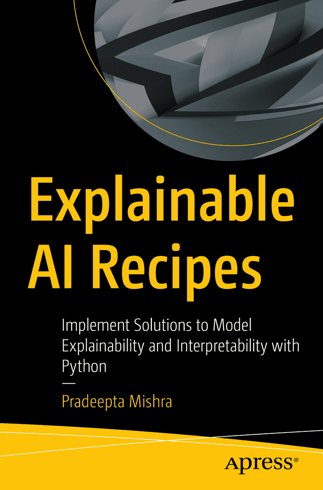

ISBN 978-1-4842-9028-6 e-ISBN 978-1-4842-9029-3 [`doi.org/10.1007/978-1-4842-9029-3`](https://doi.org/10.1007/978-1-4842-9029-3) © Pradeepta Mishra 2023 Apress 标准版 本出版物中使用的通用描述性名称、注册商标名称、商标、服务标记等，即使未作特别声明，也不意味着这些名称不受相关保护性法律和法规的约束，因此可自由使用。出版商、作者和编辑均假定，本书中的建议和信息在出版之日是真实准确的。出版商、作者或编辑均不对本书所含材料或可能存在的任何错误或遗漏提供明示或暗示的担保。出版商对已出版地图中的管辖权主张及机构归属保持中立。

本 Apress 印记由注册公司 APress Media, LLC（Springer Nature 旗下）出版。

注册公司地址为：美国纽约州纽约市新广场 1 号，邮编 10004。

*谨以此书献给我已故的父亲、我的母亲、我亲爱的妻子 Prajna，以及我的女儿们：Priyanshi（Aarya）和 Adyanshi（Aadya）。没有她们的启发、支持和鼓励，这部作品不可能完成。*

## 引言

人工智能在决定企业商业决策中扮演着至关重要的角色。在这种情况下，当机器做出决策时，人类通常希望了解该决策是真实可信的，还是因错误而产生的。如果业务利益相关者不认可该决策，他们将不会信任机器学习系统，从而导致该组织内人工智能的采用率逐渐降低。为了使决策过程更加透明，开发者必须能够记录 AI 决策或机器学习模型决策的可解释性。本书提供了一系列针对需要可解释性和可解释性问题的解决方案。采用 AI 模型并开发负责任的 AI 系统，需要将可解释性作为一个组成部分。

本书涵盖了监督学习线性模型的模型解释，包括回归和分类模型的重要特征、回归和分类模型的偏依赖分析，以及分类和回归模型的影响数据点分析。使用最先进的框架（如 SHAP 值/评分，包括全局解释）探索了使用非线性模型的监督学习模型，以及如何使用 LIME 进行局部解释。本书还将让您了解用于监督学习（如回归和分类）的装袋、基于提升的集成模型，以及使用 LIME 和 SHAP 进行时间序列模型的可解释性，以及自然语言处理任务（如文本分类）和使用 ELI5、ALIBI 进行情感分析。对于最复杂的分类和回归模型，如神经网络模型和深度学习模型，则使用 CAPTUM 框架进行解释，该框架展示了特征归因、神经元归因和激活归因。

本书旨在使 AI 模型变得可解释，以帮助开发者在组织内提高基于 AI 的模型的采用率，并为决策带来更多透明度。阅读本书后，您将能够使用 Alibi、SHAP、LIME、Skater、ELI5 和 CAPTUM 等 Python 库。《可解释 AI 实践指南》采用问题-解决方案的方法来演示每个机器学习模型，并展示如何使用 Python 的 XAI 库来回答可解释性问题，并建立对 AI 模型和机器学习模型的信任。所有源代码均可从`github.com/apress/explainable-ai-recipes`下载。

## 致谢

我要感谢我的妻子 Prajna，感谢她持续的启发和支持，并牺牲周末时间帮助我完成本书；还要感谢我的女儿们 Aarya 和 Aadya，在整个写作过程中一直保持耐心。

非常感谢 Celestin Suresh John 和 Mark Powers，他们加速了整个流程，并指引我走向正确的方向。

我要感谢电器能耗预测数据集（[`http://archive.ics.uci.edu/ml`](http://archive.ics.uci.edu/ml)）的作者 D. Dua 和 C. Graff，感谢他们提供该数据集。我在本书中使用该数据集来展示如何开发模型，并解释回归模型生成的预测，以便使用各种可解释库进行模型可解释性分析。

## 关于作者 关于技术审校者

