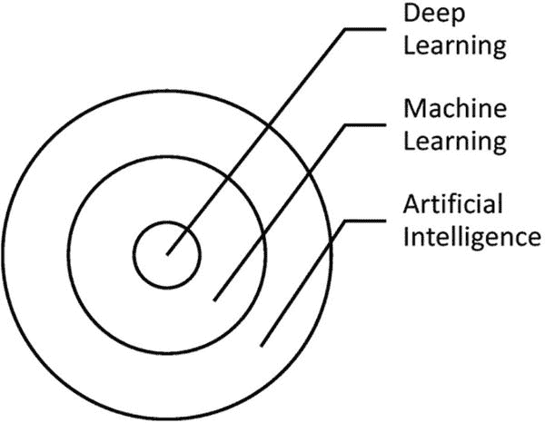
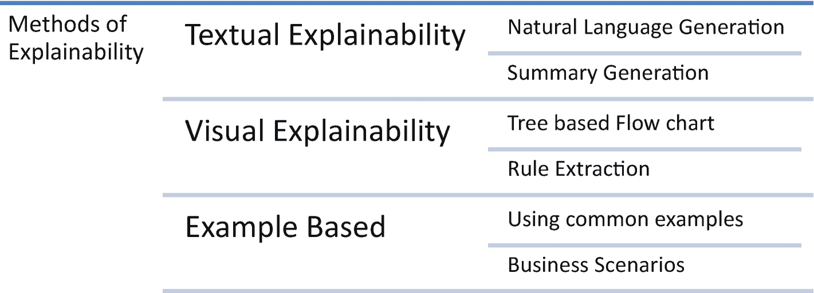

# 1. 可解释性介绍与开发环境搭建

人工智能已应用于银行、金融服务、保险、医疗、制造、零售和制药等行业。其中部分行业存在监管要求，需要模型具备可解释性。人工智能涉及物体分类、物体识别以检测欺诈等应用。每个学习系统都需要三要素：输入数据、处理过程和输出结果。如果某个学习系统能通过从新样本或数据中学习而随时间提升性能，则称之为*机器学习系统*。当机器学习任务的特征数量或数据量增加时，应用机器学习技术将耗费大量时间，此时就需要采用深度学习技术。

图 1-1 展示了人工智能、机器学习和深度学习之间的关系。



同心圆示意图，从内到外分别描绘了深度学习、机器学习和人工智能之间的关系。

图 1-1

机器学习、深度学习与人工智能的关系

经过预处理和特征创建后，你可能需要计算数十万个特征才能生成输出。如果训练有监督的机器学习模型，生成模型对象将耗费大量时间。为实现该任务的可扩展性，我们需要采用循环神经网络等深度学习算法。这就是人工智能与深度学习、机器学习之间的关联。

在经典预测建模场景中，会预先确定一个函数，通常将输入数据拟合到该函数以生成输出。而在现代预测建模场景中，输入数据和输出会同时呈现给一组函数，机器会识别出在给定特定输入集时最接近输出的最佳函数。在执行回归和分类相关任务时，需要解释机器学习和深度学习模型的输出。以下是需要可解释性的原因：

*   **信任**：让用户信任预测输出

*   **可靠性**：使用户能够依赖预测输出

*   **监管**：满足监管和合规要求

*   **采纳**：提高用户对人工智能的采纳率

*   **公平性**：消除预测中的任何歧视

*   **问责制**：明确预测结果的所有权

可以通过统计属性、概率属性与关联性以及特征间的因果关系等多种方式实现可解释性。广义上，模型解释可分为两类：全局解释和局部解释。局部解释的目标是通过比较最近的可能数据点，理解单次样本生成的推理结果；全局解释则提供关于整体模型行为的概念。

本章的目标是介绍如何安装各种可解释性库，并解读这些库生成的结果。

## 方法 1-1. SHAP 安装

### 问题

你想要安装 SHAP（沙普利加性解释）库。

### 解决方案

解决方案是使用简单的 `pip` 或 `conda` 选项。

### 工作原理

让我们看看以下脚本示例。SHAP Python 库基于博弈论方法，旨在解释局部和全局解释。

```
pip install shap
```

或

```
conda install -c conda-forge shap
Looking in indexes: https://pypi.org/simple, https://us-python.pkg.dev/colab-wheels/public/simple/
Collecting shap
Downloading shap-0.41.0-cp37-cp37m-manylinux_2_12_x86_64.manylinux2010_x86_64.whl (569 kB)
|████████████████████████████████| 569 kB 8.0 MB/s
Requirement already satisfied: tqdm>4.25.0 in /usr/local/lib/python3.7/dist-packages (from shap) (4.64.1)
Requirement already satisfied: pandas in /usr/local/lib/python3.7/dist-packages (from shap) (1.3.5)
Collecting slicer==0.0.7
Downloading slicer-0.0.7-py3-none-any.whl (14 kB)
Requirement already satisfied: cloudpickle in /usr/local/lib/python3.7/dist-packages (from shap) (1.5.0)
Requirement already satisfied: scipy in /usr/local/lib/python3.7/dist-packages (from shap) (1.7.3)
Requirement already satisfied: scikit-learn in /usr/local/lib/python3.7/dist-packages (from shap) (1.0.2)
Requirement already satisfied: numpy in /usr/local/lib/python3.7/dist-packages (from shap) (1.21.6)
Requirement already satisfied: numba in /usr/local/lib/python3.7/dist-packages (from shap) (0.56.2)
Requirement already satisfied: packaging>20.9 in /usr/local/lib/python3.7/dist-packages (from shap) (21.3)
Requirement already satisfied: pyparsing!=3.0.5,>=2.0.2 in /usr/local/lib/python3.7/dist-packages (from packaging>20.9->shap) (3.0.9)
Requirement already satisfied: llvmlite=0.39.0dev0 in /usr/local/lib/python3.7/dist-packages (from numba->shap) (0.39.1)
Requirement already satisfied: setuptoolsshap) (57.4.0)
Requirement already satisfied: importlib-metadata in /usr/local/lib/python3.7/dist-packages (from numba->shap) (4.12.0)
Requirement already satisfied: typing-extensions>=3.6.4 in /usr/local/lib/python3.7/dist-packages (from importlib-metadata->numba->shap) (4.1.1)
Requirement already satisfied: zipp>=0.5 in /usr/local/lib/python3.7/dist-packages (from importlib-metadata->numba->shap) (3.8.1)
Requirement already satisfied: python-dateutil>=2.7.3 in /usr/local/lib/python3.7/dist-packages (from pandas->shap) (2.8.2)
Requirement already satisfied: pytz>=2017.3 in /usr/local/lib/python3.7/dist-packages (from pandas->shap) (2022.2.1)
Requirement already satisfied: six>=1.5 in /usr/local/lib/python3.7/dist-packages (from python-dateutil>=2.7.3->pandas->shap) (1.15.0)
Requirement already satisfied: threadpoolctl>=2.0.0 in /usr/local/lib/python3.7/dist-packages (from scikit-learn->shap) (3.1.0)
Requirement already satisfied: joblib>=0.11 in /usr/local/lib/python3.7/dist-packages (from scikit-learn->shap) (1.1.0)
Installing collected packages: slicer, shap
Successfully installed shap-0.41.0 slicer-0.0.7
```

## 方法 1-2. LIME 安装

### 问题

你想要安装 LIME Python 库。

### 解决方案

你可以使用 `pip` 或 `conda` 安装 LIME 库。

### 工作原理

让我们来看一下以下示例脚本：

```
pip install lime
```

或

```
conda install -c conda-forge lime
Looking in indexes: https://pypi.org/simple, https://us-python.pkg.dev/colab-wheels/public/simple/
Collecting lime
Downloading lime-0.2.0.1.tar.gz (275 kB)
|████████████████████████████████| 275 kB 7.5 MB/s
Requirement already satisfied: matplotlib in /usr/local/lib/python3.7/dist-packages (from lime) (3.2.2)
Requirement already satisfied: numpy in /usr/local/lib/python3.7/dist-packages (from lime) (1.21.6)
Requirement already satisfied: scipy in /usr/local/lib/python3.7/dist-packages (from lime) (1.7.3)
Requirement already satisfied: tqdm in /usr/local/lib/python3.7/dist-packages (from lime) (4.64.1)
Requirement already satisfied: scikit-learn>=0.18 in /usr/local/lib/python3.7/dist-packages (from lime) (1.0.2)
Requirement already satisfied: scikit-image>=0.12 in /usr/local/lib/python3.7/dist-packages (from lime) (0.18.3)
Requirement already satisfied: networkx>=2.0 in /usr/local/lib/python3.7/dist-packages (from scikit-image>=0.12->lime) (2.6.3)
Requirement already satisfied: PyWavelets>=1.1.1 in /usr/local/lib/python3.7/dist-packages (from scikit-image>=0.12->lime) (1.3.0)
Requirement already satisfied: pillow!=7.1.0,!=7.1.1,>=4.3.0 in /usr/local/lib/python3.7/dist-packages (from scikit-image>=0.12->lime) (7.1.2)
Requirement already satisfied: imageio>=2.3.0 in /usr/local/lib/python3.7/dist-packages (from scikit-image>=0.12->lime) (2.9.0)
Requirement already satisfied: tifffile>=2019.7.26 in /usr/local/lib/python3.7/dist-packages (from scikit-image>=0.12->lime) (2021.11.2)
Requirement already satisfied: kiwisolver>=1.0.1 in /usr/local/lib/python3.7/dist-packages (from matplotlib->lime) (1.4.4)
Requirement already satisfied: cycler>=0.10 in /usr/local/lib/python3.7/dist-packages (from matplotlib->lime) (0.11.0)
Requirement already satisfied: python-dateutil>=2.1 in /usr/local/lib/python3.7/dist-packages (from matplotlib->lime) (2.8.2)
Requirement already satisfied: pyparsing!=2.0.4,!=2.1.2,!=2.1.6,>=2.0.1 in /usr/local/lib/python3.7/dist-packages (from matplotlib->lime) (3.0.9)
Requirement already satisfied: typing-extensions in /usr/local/lib/python3.7/dist-packages (from kiwisolver>=1.0.1->matplotlib->lime) (4.1.1)
Requirement already satisfied: six>=1.5 in /usr/local/lib/python3.7/dist-packages (from python-dateutil>=2.1->matplotlib->lime) (1.15.0)
Requirement already satisfied: threadpoolctl>=2.0.0 in /usr/local/lib/python3.7/dist-packages (from scikit-learn>=0.18->lime) (3.1.0)
Requirement already satisfied: joblib>=0.11 in /usr/local/lib/python3.7/dist-packages (from scikit-learn>=0.18->lime) (1.1.0)
Building wheels for collected packages: lime
Building wheel for lime (setup.py) ... done
Created wheel for lime: filename=lime-0.2.0.1-py3-none-any.whl size=283857 sha256=674ceb94cdcb54588f66c5d5bef5f6ae0326c76e645c40190408791cbe4311d5
Stored in directory: /root/.cache/pip/wheels/ca/cb/e5/ac701e12d365a08917bf4c6171c0961bc880a8181359c66aa7
Successfully built lime
Installing collected packages: lime
Successfully installed lime-0.2.0.1
```

## 方案 1-3. SHAPASH 安装

### 问题

你想要安装 SHAPASH。

### 解决方案

如果你希望同时使用 LIME 库和 SHAP 库的功能组合，那么可以使用 SHAPASH 库。你只需安装它，过程很简单。

### 工作原理

让我们来看一下安装 SHAPASH 的以下代码。该库在 Anaconda 发行版中不可用；唯一的安装方式是使用 `pip`。

```
pip install shapash
```

## 方案 1-4. ELI5 安装

### 问题

你想要安装 ELI5。

### 解决方案

由于这是一个 Python 库，你可以使用 `pip`。

### 工作原理

让我们来看一下以下脚本：

## 方案 1-5\. Skater 安装

### 问题

你想要安装 Skater。

### 解决方案

Skater 是一个开源框架，用于实现各种机器学习模型的模型解释。基于 Python 的 Skater 库提供全局和局部解释，并可以使用 `pip` 进行安装。

### 工作原理

让我们来看一下以下脚本：

```
pip install skater
```

## 方案 1-6\. Skope-rules 安装

### 问题

你想要安装 Skope-rules。

### 解决方案

Skope-rules 在决策树的可解释性和随机森林模型的建模能力之间提供了平衡。解决方案很简单；你使用 `pip` 命令即可。

### 工作原理

让我们来看一下以下代码：

```
pip install skope-rules
Looking in indexes: https://pypi.org/simple, https://us-python.pkg.dev/colab-wheels/public/simple/
Collecting skope-rules
Downloading skope_rules-1.0.1-py3-none-any.whl (14 kB)
Requirement already satisfied: numpy>=1.10.4 in /usr/local/lib/python3.7/dist-packages (from skope-rules) (1.21.6)
Requirement already satisfied: scikit-learn>=0.17.1 in /usr/local/lib/python3.7/dist-packages (from skope-rules) (1.0.2)
Requirement already satisfied: pandas>=0.18.1 in /usr/local/lib/python3.7/dist-packages (from skope-rules) (1.3.5)
Requirement already satisfied: scipy>=0.17.0 in /usr/local/lib/python3.7/dist-packages (from skope-rules) (1.7.3)
Requirement already satisfied: pytz>=2017.3 in /usr/local/lib/python3.7/dist-packages (from pandas>=0.18.1->skope-rules) (2022.2.1)
Requirement already satisfied: python-dateutil>=2.7.3 in /usr/local/lib/python3.7/dist-packages (from pandas>=0.18.1->skope-rules) (2.8.2)
Requirement already satisfied: six>=1.5 in /usr/local/lib/python3.7/dist-packages (from python-dateutil>=2.7.3->pandas>=0.18.1->skope-rules) (1.15.0)
Requirement already satisfied: threadpoolctl>=2.0.0 in /usr/local/lib/python3.7/dist-packages (from scikit-learn>=0.17.1->skope-rules) (3.1.0)
Requirement already satisfied: joblib>=0.11 in /usr/local/lib/python3.7/dist-packages (from scikit-learn>=0.17.1->skope-rules) (0.11)
Installing collected packages: skope-rules
Successfully installed skope-rules-1.0.1
```

## 配方 1-7\. 模型可解释性的方法

### 问题

关于如何为模型可解释性选择正确的方法，存在多种库和大量解释。

### 解决方案

可解释性方法取决于模型输出的使用者是谁。如果是业务人员或高级管理层，那么可解释性应该非常简单，使用通俗易懂的语言，不包含任何数学公式。如果可解释性的使用者是数据科学家和机器学习工程师，那么解释内容可以包含数学公式。

### 工作原理

机器学习模型的透明度级别可以分为三类，如图 1-2 所示。



一个单行表格。行标题是可解释性方法。该行有 3 个子行，标题分别为文本、可视化和基于示例。其对应的属性也已提及。

**图 1-2** 模型可解释性的方法

文本解释要求用通俗易懂的语言解释数学公式，这有助于业务用户或高级管理层理解。解释内容可以根据模型类型和模型变体进行设计，并可以从模型结果中推断出结论。可以设计一个用于推断结论的模板，并将其映射到模型类型，然后使用一些自然语言处理方法填充模板。

可视化可解释性方法可用于生成图表、图形（如树状图）或任何其他最能解释关系的图形类型。基于树的方法在后端使用 `if-else` 条件；因此，展示因果关系和关系非常简单。

使用日常运营中的常见示例和业务场景，并在它们之间进行类比，也很有用。

您应该选择哪种方法取决于需要解决的问题以及使用机器学习模型的解决方案的使用者。

## 结论

在各种人工智能项目和计划中，机器学习模型会生成预测。通常，为了信任模型的结果，需要详细的解释。由于许多人并不擅长解释机器学习模型的结果，他们无法推理出模型的决策，因此人工智能的采用受到了限制。从监管角度以及审计和合规角度来看，可解释性都是必需的。在医疗影像、目标检测或模式识别、金融预测和欺诈检测等高风险用例中，需要可解释性来解释机器学习模型的决策。

在本章中，我们通过安装各种可解释的人工智能库来搭建环境。机器学习模型的可解释性和可说明性是本书的重点。我们将使用基于 Python 的库、框架、方法、类和函数来解释模型。

在下一章中，我们将研究线性模型。