# 2. 线性监督模型的可解释性

监督学习模型是一种用于训练算法以将输入数据映射到输出数据的模型。监督学习模型可以分为两种类型：回归或分类。在回归场景中，输出变量是数值型的；而在分类场景中，输出变量是二元的或多分类的。二元输出变量有两个结果，例如真和假、接受和拒绝、是和否等。对于多分类输出变量，结果可能多于两个，例如高、中、低。在本章中，我们将使用可解释性库来解释回归模型和分类模型，同时训练一个线性模型。

在经典的预测建模场景中，会确定一个函数，输入数据通常被拟合到该函数以产生输出，该函数通常是预先确定的。在现代预测建模场景中，输入数据和输出都展示给一组函数，机器会识别出在给定特定输入集时最能逼近输出的最佳函数。在执行回归和分类任务时，需要解释机器学习和深度学习模型的输出。线性回归和线性分类模型更容易解释。

本章的目标是介绍各种用于线性模型的可解释性库，例如特征重要性、部分依赖图和局部解释。

## 配方 2-1. 基于所有数值输入变量的回归模型的 SHAP 值

### 问题

您想要解释一个基于数据集所有数值特征构建的回归模型。

### 解决方案

首先训练一个基于所有数值特征的回归模型，然后将训练好的模型传递给 SHAP，以生成全局解释和局部解释。

### 工作原理

让我们来看一下下面的脚本。Shapley 值可称为 SHAP 值，用于解释模型。它利用合作博弈论中预测的公平分配原则，将特征归因于模型的预测结果。数据集中的输入特征被视为博弈中的玩家，而模型函数则被视为博弈规则。某个特征的 Shapley 值基于以下步骤计算：

1.  SHAP 需要对所有特征子集进行模型重新训练；因此，如果需要对较大的数据集生成解释，通常会很耗时。
2.  从特征列表中确定一个特征集（假设有 15 个特征，我们可以选择一个包含 5 个特征的子集）。
3.  对于任何特定特征，将使用该特征子集创建两个模型：一个包含该特征，另一个不包含该特征。
4.  然后计算预测差异。
5.  对所有可能的特征子集计算预测差异。
6.  所有可能差异的加权平均值用于确定特征重要性。

如果特征的权重为 0.000，那么我们可以得出结论：该特征不重要，且未参与模型。如果不等于 0.000，那么我们可以得出结论：该特征在预测过程中发挥了作用。

我们将使用来自 UCI 机器学习仓库的数据集。访问该数据集的网址如下：

[`https://archive.ics.uci.edu/ml/datasets/Appliances+energy+prediction`](https://archive.ics.uci.edu/ml/datasets/Appliances%252Benergy%252Bprediction)

目标是利用传感器特征预测电器的能耗（单位：Wh）。数据集中有 27 个特征，我们在此试图理解哪些特征对预测能耗至关重要。请参见表 2-1。

**表 2-1** 能耗预测数据集的特征描述

| 特征名称 | 描述 | 单位 |
| --- | --- | --- |
| `Appliances` | 能耗 | 瓦时 (Wh) |
| `lights` | 房屋内灯具的能耗 | 瓦时 (Wh) |
| `T1` | 厨房区域温度 | 摄氏度 |
| `RH_1` | 厨房区域湿度 | 百分比 (%) |
| `T2` | 客厅区域温度 | 摄氏度 |
| `RH_2` | 客厅区域湿度 | 百分比 (%) |
| `T3` | 洗衣房区域温度 | 摄氏度 |
| `RH_3` | 洗衣房区域湿度 | 百分比 (%) |
| `T4` | 办公室温度 | 摄氏度 |
| `RH_4` | 办公室湿度 | 百分比 (%) |
| `T5` | 浴室温度 | 摄氏度 |
| `RH_5` | 浴室湿度 | 百分比 (%) |
| `T6` | 建筑外部（北侧）温度 | 摄氏度 |
| `RH_6` | 建筑外部（北侧）湿度 | 百分比 (%) |
| `T7` | 熨衣间温度 | 摄氏度 |
| `RH_7` | 熨衣间湿度 | 百分比 (%) |
| `T8` | 青少年房间 2 温度 | 摄氏度 |
| `RH_8` | 青少年房间 2 湿度 | 百分比 (%) |
| `T9` | 父母房间温度 | 摄氏度 |
| `RH_9` | 父母房间湿度 | 百分比 (%) |
| `T_out` | 室外温度（来自 Chievres 气象站） | 摄氏度 |
| `Press_mm_hg` | 气压（来自 Chievres 气象站） | 毫米汞柱 (mm Hg) |
| `RH_out` | 室外湿度（来自 Chievres 气象站） | 百分比 (%) |
| `Windspeed` | 风速（来自 Chievres 气象站） | 米/秒 (m/s) |
| `Visibility` | 能见度（来自 Chievres 气象站） | 千米 (km) |
| `Tdewpoint` | 露点温度（来自 Chievres 气象站） | 摄氏度 |
| `rv1` | 随机变量 1 | 无量纲 |
| `rv2` | 随机变量 2 | 无量纲 |

```python
import pandas as pd
df_lin_reg = pd.read_csv('https://archive.ics.uci.edu/ml/machine-learning-databases/00374/energydata_complete.csv')
del df_lin_reg['date']
df_lin_reg.info()
df_lin_reg.columns
Index(['Appliances', 'lights', 'T1', 'RH_1', 'T2', 'RH_2', 'T3', 'RH_3', 'T4', 'RH_4', 'T5', 'RH_5', 'T6', 'RH_6', 'T7', 'RH_7', 'T8', 'RH_8', 'T9', 'RH_9', 'T_out', 'Press_mm_hg', 'RH_out', 'Windspeed', 'Visibility', 'Tdewpoint', 'rv1', 'rv2'], dtype='object')
#y 是因变量，我们需要预测它
y = df_lin_reg.pop('Appliances')
# X 是输入特征集
X = df_lin_reg
import pandas as pd
import shap
import sklearn
# 初始化一个简单的线性模型
model = sklearn.linear_model.LinearRegression()
# 训练线性回归模型
model.fit(X, y)
print("模型系数:\n")
for i in range(X.shape[1]):
print(X.columns[i], "=", model.coef_[i].round(5))
模型系数:
lights = 1.98971
T1 = -0.60374
RH_1 = 15.15362
T2 = -17.70602
RH_2 = -13.48062
T3 = 25.4064
RH_3 = 4.92457
T4 = -3.46525
RH_4 = -0.17891
T5 = -0.02784
RH_5 = 0.14096
T6 = 7.12616
RH_6 = 0.28795
T7 = 1.79463
RH_7 = -1.54968
T8 = 8.14656
RH_8 = -4.66968
T9 = -15.87243
RH_9 = -0.90102
T_out = -10.22819
Press_mm_hg = 0.13986
RH_out = -1.06375
Windspeed = 1.70364
Visibility = 0.15368
Tdewpoint = 5.0488
rv1 = -0.02078
rv2 = -0.02078
# 为线性模型计算 SHAP 值
explainer = shap.Explainer(model.predict, X)
# SHAP 值计算
shap_values = explainer(X)
Permutation explainer: 19736it [16:15, 20.08it/s]
```

脚本的这一部分很耗时，因为它是一个计算密集型过程。`explainer` 函数计算排列组合，这意味着选取一个特征集并生成预测差异。这个差异就是存在某个特征与不存在该特征之间的差别。为了加快计算速度，我们可以将样本量减少到较小的集合，比如 1,000 或 2,000。在上面的脚本中，我们使用了全部 19,735 条记录来计算 SHAP 值。脚本的这一部分可以通过应用 Python 多进程来改进，但这超出了本章的范围。

特定特征 `i` 的 SHAP 值就是期望模型输出与该特征值 `xi` 处的部分依赖图之间的差值。Shapley 值的一个基本属性是，它们之和总是等于所有玩家参与游戏时的结果与没有玩家参与游戏时的结果之差。对于机器学习模型而言，这意味着所有输入特征的 SHAP 值之和总是等于基线（期望）模型输出与当前被解释预测的模型输出之间的差值。

SHAP 值包含三个对象：(a) 每个特征的 SHAP 值，(b) 基值，以及 (c) 原始训练数据。由于有 27 个特征，我们可以预期有 27 个 `shap` 值。

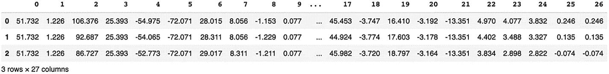

一个表格有 3 行和 27 列。行包含 0、1 和 2 的十进制值。列包含从 0 到 26 的十进制值。

```python
pd.DataFrame(np.round(shap_values.values,3)).head(3)
```

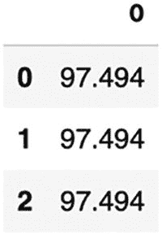

一个表格表示有 3 行和 2 列。第 1 行有 0 和 97.484。第 2 行有 1 和 97.494。第 3 行有 2 和 97.494。

```python
# 平均预测值称为基值
pd.DataFrame(np.round(shap_values.base_values,3)).head(3)
```

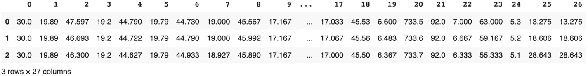

一个表格有 3 行和 27 列。行包含 0、1 和 2 的十进制值。列包含从 0 到 26 的十进制值。

```python
pd.DataFrame(np.round(shap_values.data,3)).head(3)
```

## 配方 2-2. 回归模型的 SHAP 部分依赖图

### 问题

您希望从 SHAP 获取部分依赖图。

### 解决方案

此问题的解决方案是使用模型中的部分依赖方法（`partial_dependence_plot`）。

### 工作原理

让我们来看下面的例子。有两种方法可以获取部分依赖图：一种叠加了特定数据点，另一种则不参考任何数据点。见图 2-1。

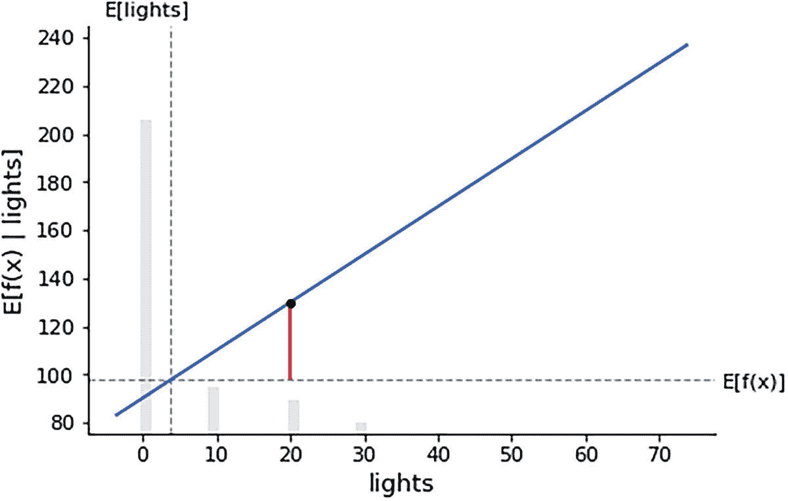

一张关于函数 `x` 的 `E` 值与光照值的对比图。该图在 80 到 220 区间内呈递增斜率，有一条代表光照 `E` 值的垂直线，以及一条代表函数 `x` 的 `E` 值的水平线。数值为近似值。

**图 2-1** 特征 `light` 与模型预测输出之间的相关性

```python
# 为训练数据集中第 20 行记录，制作关于光照对预测输出的标准部分依赖图。
sample_ind = 20
shap.partial_dependence_plot(
"lights", model.predict, X, model_expected_value=True,
feature_expected_value=True, ice=False,
shap_values=shap_values[sample_ind:sample_ind+1,:]
)
```

部分依赖图是一种解释单个预测并为从数据集中选定的样本生成局部解释的方法；在此例中，从训练数据集中选择了第 20 条记录。图 2-1 显示了叠加了第 20 条记录（以红色显示）的部分依赖图。

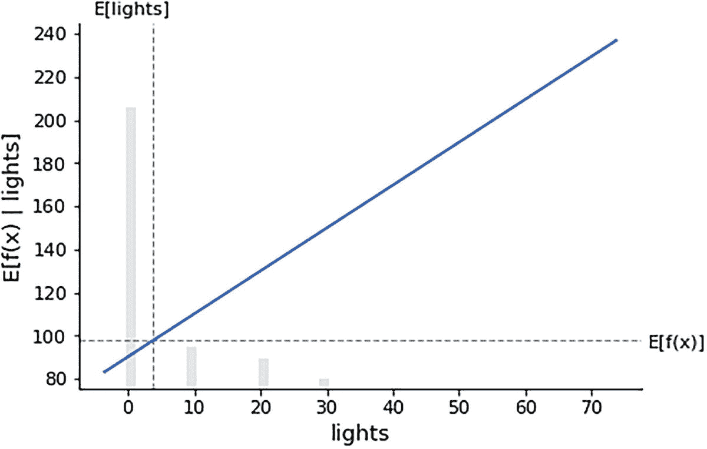

一张关于函数 `x` 的 `E` 值与光照值的对比图。该图在 80 到 220 区间内呈递增斜率，有一条代表光照 `E` 值的垂直线，以及一条代表函数 `x` 的 `E` 值的水平线。数值为近似值。

**图 2-2** `lights` 与模型预测结果之间的部分依赖图

```python
shap.partial_dependence_plot(
"lights", model.predict, X, ice=False,
model_expected_value=True, feature_expected_value=True
)
```

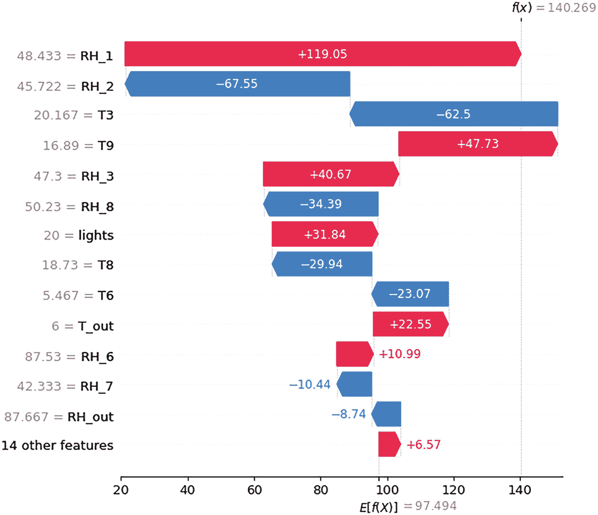

一张函数 `x` 等于 140.269 且 `E` 函数 `x` 等于 97.494 的图形表示，包含 14 个条形值。其中 `RH_1` 的最高值为 119.05。数值为近似值。

**图 2-3** 第 20 条记录的局部解释

```python
# waterfall_plot 展示了如何从 shap_values.base_values 得到 model.predict(X)[sample_ind]
shap.plots.waterfall(shap_values[sample_ind], max_display=14)
```

训练数据集中第 20 条记录的局部解释如图 2-3 所示。第 20 条记录的预测输出为 140 Wh。影响第 20 条记录的最重要特征是 `RH_1`（厨房区域的湿度百分比）和 `RH_2`（客厅区域的湿度）。在图 2-3 的底部，有 14 个对第 20 条记录预测值不太重要的特征。

```python
X[20:21]
model.predict(X[20:21])
array([140.26911466])
```

## 配方 2-3. 针对所有数值输入变量的回归模型的 SHAP 特征重要性

### 问题

你想使用 SHAP 值计算特征重要性。

### 解决方案

此问题的解决方案是使用模型中的 SHAP 绝对值。

### 工作原理

让我们来看下面的例子。SHAP 值可用于展示特征的全局重要性。重要特征指的是在预测输出中具有较大重要性的特征。

```python
# 为线性模型计算 shap 重要性值
import numpy as np
feature_names = shap_values.feature_names
shap_df = pd.DataFrame(shap_values.values, columns=feature_names)
vals = np.abs(shap_df.values).mean(0)
shap_importance = pd.DataFrame(list(zip(feature_names, vals)), columns=['col_name', 'feature_importance_vals'])
shap_importance.sort_values(by=['feature_importance_vals'], ascending=False, inplace=True)
print(shap_importance)
col_name  feature_importance_vals
2          RH_1                49.530061
19        T_out                43.828847
4          RH_2                42.911069
5            T3                41.671587
11           T6                34.653893
3            T2                31.097282
17           T9                26.607721
16         RH_8                19.920029
24    Tdewpoint                17.443688
21       RH_out                13.044643
6          RH_3                13.042064
15           T8                12.803450
0        lights                11.907603
12         RH_6                 7.806188
14         RH_7                 6.578015
7            T4                 5.866801
22    Windspeed                 3.361895
13           T7                 3.182072
18         RH_9                 3.041144
23   Visibility                 1.385616
10         RH_5                 0.855398
20  Press_mm_hg                 0.823456
1            T1                 0.765753
8          RH_4                 0.642723
25          rv1                 0.260885
26          rv2                 0.260885
9            T5                 0.041905
```

所有特征重要性值均未缩放；因此，所有特征值的总和不会等于 100。

图 2-4 中的蜂群图展示了 SHAP 值对模型输出的影响。蓝点表示低特征值，红点表示高特征值。每个点代表数据集中的一个数据点。蜂群图展示了特征值相对于 SHAP 值的分布。

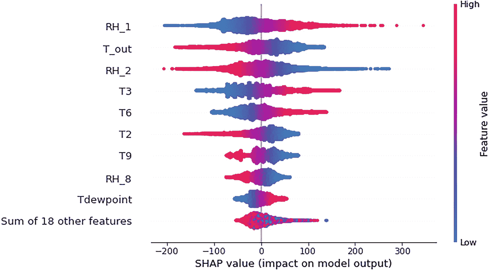

一张特征值与 SHAP 值的对比图，包含 10 个波动信号。这些信号对应 `RH_1`、`T_out`、`RH_2`、`T3`、`T2`、`RH_8`、`Tdewpoint` 以及其他 18 个特征的总和。

**图 2-4** 对模型输出的影响

```
shap.plots.beeswarm(shap_values)
```

## 配方 2-4. 针对所有混合输入变量的回归模型的 SHAP 值

### 问题

当你将分类变量与数值变量一起引入（即混合输入特征集）时，如何估算 SHAP 值？

### 解决方案

解决方案是，包含数值特征以及分类或二元特征的混合输入变量可以一起建模。随着特征数量的增加，计算所有排列所需的时间也会增加。

### 工作原理

我们将使用一个经过修改的汽车公开数据集。目标是根据 `make`（制造商）、`location`（位置）、`age`（车龄）等特征来预测车辆的价格。这是一个回归问题，我们将结合数值型和类别型特征来解决。

```
df = pd.read_csv('https://raw.githubusercontent.com/pradmishra1/PublicDatasets/main/automobile.csv')
df.head(3)
df.columns
Index(['Price', 'Make', 'Location', 'Age', 'Odometer', 'FuelType', 'Transmission', 'OwnerType', 'Mileage', 'EngineCC', 'PowerBhp'], dtype='object')
```

我们不能直接在模型中使用基于字符串的特征或类别型特征，因为矩阵乘法无法在字符串特征上进行；因此，需要将基于字符串的特征转换为虚拟变量或带有 0 和 1 标志的二元特征。此处省略了转换步骤，因为许多数据科学家已经知道如何进行这种数据转换。我们直接导入另一个已转换的数据集。

```
df_t = pd.read_csv('https://raw.githubusercontent.com/pradmishra1/PublicDatasets/main/Automobile_transformed.csv')
del df_t['Unnamed: 0']
df_t.head(3)
df_t.columns
Index(['Price', 'Age', 'Odometer', 'mileage', 'engineCC', 'powerBhp', 'Location_Bangalore', 'Location_Chennai', 'Location_Coimbatore', 'Location_Delhi', 'Location_Hyderabad', 'Location_Jaipur', 'Location_Kochi', 'Location_Kolkata', 'Location_Mumbai', 'Location_Pune', 'FuelType_Diesel', 'FuelType_Electric', 'FuelType_LPG', 'FuelType_Petrol', 'Transmission_Manual', 'OwnerType_Fourth +ACY- Above', 'OwnerType_Second', 'OwnerType_Third'], dtype='object')
# y 是因变量，我们需要预测它
y = df_t.pop('Price')
# X 是输入特征集
X = df_t
import pandas as pd
import shap
import sklearn
# 初始化一个简单的线性模型
model = sklearn.linear_model.LinearRegression()
# 训练线性回归模型
model.fit(X, y)
print("模型系数:\n")
for i in range(X.shape[1]):
    print(X.columns[i], "=", model.coef_[i].round(5))
模型系数:
Age = -0.92281
Odometer = 0.0
mileage = -0.07923
engineCC = -4e-05
powerBhp = 0.1356
Location_Bangalore = 2.00658
Location_Chennai = 0.94944
Location_Coimbatore = 2.23592
Location_Delhi = -0.29837
Location_Hyderabad = 1.8771
Location_Jaipur = 0.8738
Location_Kochi = 0.03311
Location_Kolkata = -0.86024
Location_Mumbai = -0.81593
Location_Pune = 0.33843
FuelType_Diesel = -1.2545
FuelType_Electric = 7.03139
FuelType_LPG = 0.79077
FuelType_Petrol = -2.8691
Transmission_Manual = -2.92415
OwnerType_Fourth +ACY- Above = 1.7104
OwnerType_Second = -0.55923
OwnerType_Third = 0.76687
```

为了计算 SHAP 值，我们可以使用 `explainer` 函数，并传入训练数据集 `X` 和模型预测函数。SHAP 值的计算采用排列方法；这花费了 5 分钟。

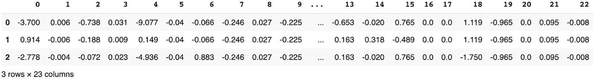

一个表格有 3 行和 23 列。行的数值为 0、1 和 2 的小数值。列的数值为 0 到 22 的小数值。

```
# 计算线性模型的 SHAP 值
explainer = shap.Explainer(model.predict, X)
# SHAP 值计算
shap_values = explainer(X)
Permutation explainer: 6020it [05:14, 18.59it/s]
import numpy as np
pd.DataFrame(np.round(shap_values.values,3)).head(3)
```

|   | **0** |

|---|-------|

| **0** | 11.933 |

| **1** | 11.933 |

| **2** | 11.933 |

```
# 平均预测值称为基值
pd.DataFrame(np.round(shap_values.base_values,3)).head(3)
```

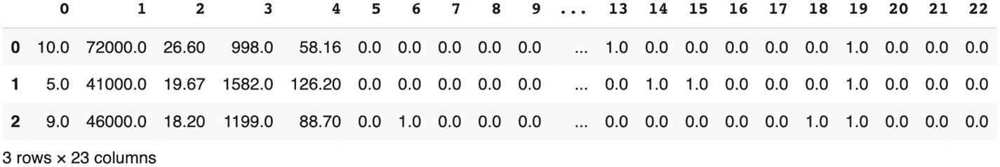

一个表格有 3 行和 23 列。行的数值为 0、1 和 2 的小数值。列的数值为 0 到 22 的小数值。

```
pd.DataFrame(np.round(shap_values.data,3)).head(3)
```

## 配方 2-5. 混合输入回归模型的 SHAP 偏依赖图

### 问题

你想要绘制偏依赖图，并解释数值型和类别型虚拟变量的图形。

### 解决方案

偏依赖图展示了特征与目标变量预测输出之间的相关性。我们可以用两种方式展示结果：一种是用特征和预测函数的期望值，另一种是将数据点叠加在偏依赖图上。

### 工作原理

让我们来看下面的示例（见图 2-5）：

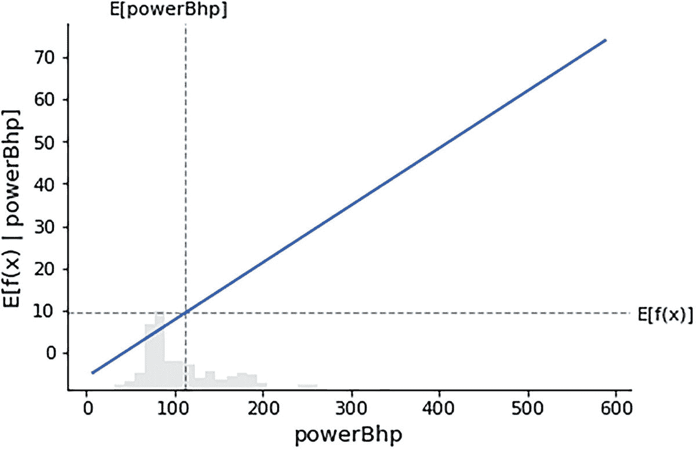

函数 E 关于功率 BHP 的图表，与功率 BHP 对比。曲线从 0 到 70 呈上升趋势，有一条垂直的线表示功率 BHP 的 E 值，以及一条水平的线表示函数 x 的 E 值。数值均为近似值。

**图 2-5** `powerBhp` 与车辆预测价格的部分依赖图

```
shap.partial_dependence_plot(
"powerBhp", model.predict, X, ice=False,
model_expected_value=True, feature_expected_value=True
)
```

蓝色的线性线条显示了价格与 `powerBhp` 之间的正相关关系。`powerBhp` 是一个强特征。马力越大，汽车价格越高。这是一个连续或数值型特征；接下来我们看看二元或虚拟特征。如果汽车注册地在班加罗尔或加尔各答，则存在两个虚拟特征作为虚拟变量。见图 2-6。

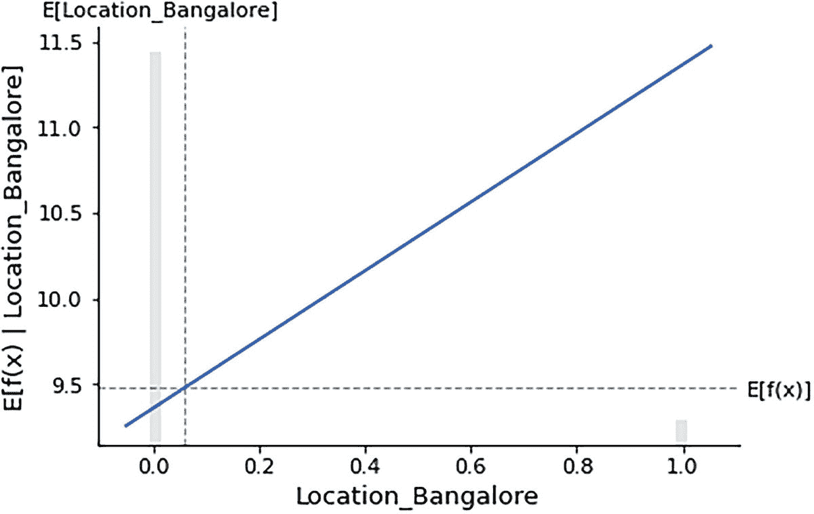

函数 E 关于位置班加罗尔的图表，与位置班加罗尔对比。曲线从 0 到 11.5 呈上升趋势，有一条垂直的线表示位置班加罗尔的 E 值，以及一条水平的线表示函数 x 的 E 值。数值均为近似值。

**图 2-6** 虚拟变量班加罗尔位置与 SHAP 值对比

```
shap.partial_dependence_plot(
"Location_Bangalore", model.predict, X, ice=False,
model_expected_value=True, feature_expected_value=True
)
```

如果汽车的位置在班加罗尔，那么价格会更高，反之亦然。见图 2-7。

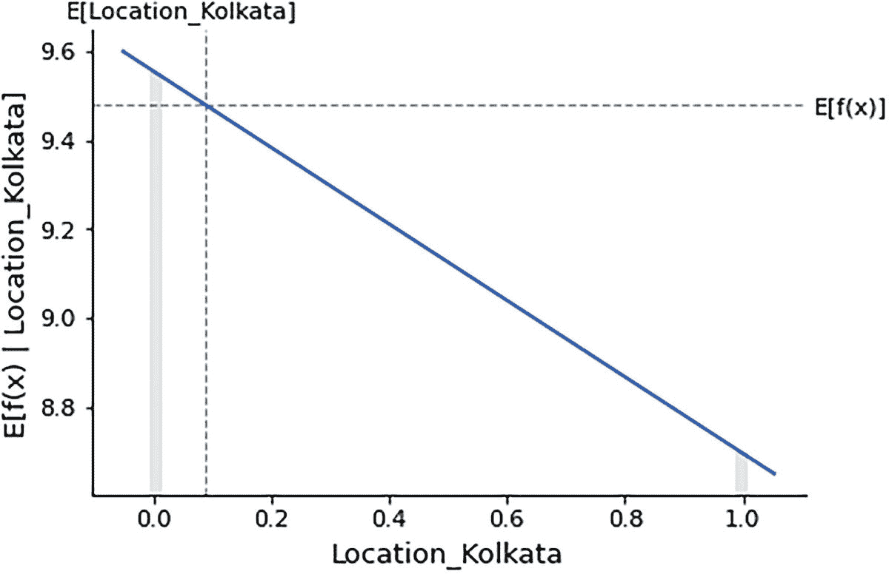

函数 E 关于位置加尔各答的图表，与位置加尔各答对比。曲线从 9.6 到 0 呈下降趋势，有一条垂直的线表示位置加尔各答的 E 值，以及一条水平的线表示函数 x 的 E 值。数值均为近似值。

**图 2-7** 虚拟变量 `Location_Kolkata` 与 SHAP 值对比

```
shap.partial_dependence_plot(
"Location_Kolkata", model.predict, X, ice=False,
model_expected_value=True, feature_expected_value=True
)
```

如果位置在加尔各答，那么价格预计会更低。这两个位置之间的差异源于用于训练模型的数据。前面的三张图展示了特征相对于预测函数的全局重要性。作为示例，这里只考虑了两个特征；我们可以逐一使用所有特征并显示多张图，以更深入地理解预测结果。

现在，让我们来看一个叠加在部分依赖图上的样本数据点，以展示局部解释。见图 2-8。

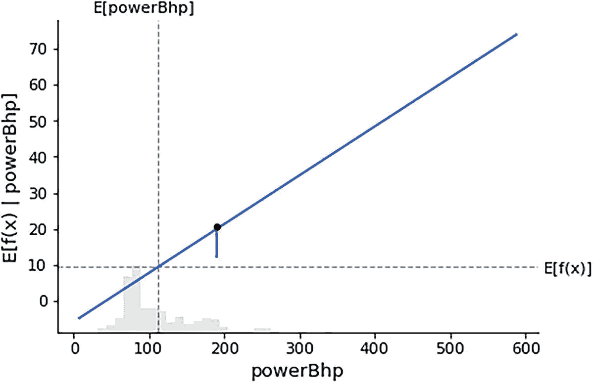

函数 E 关于功率 BHP 的图表，与功率 BHP 对比。曲线从 0 到 70 呈上升趋势，有一条垂直的线表示功率 BHP 的 E 值，以及一条水平的线表示函数 x 的 E 值。数值均为近似值。

**图 2-8** 功率 bhp 与预测函数对比

```
# 为预测输出制作一个关于灯亮的标准部分依赖图
sample_ind = 20 #数据集中的第 20 条记录
shap.partial_dependence_plot(
"powerBhp", model.predict, X, model_expected_value=True,
feature_expected_value=True, ice=False,
shap_values=shap_values[sample_ind:sample_ind+1,:]
)
```

垂直虚线表示平均 `powerBhp`，水平虚线表示模型预测的平均值。从黑点向下延伸的蓝色小条反映了数据集中第 20 条记录的位置。局部解释意味着，对于数据集中的任何样本记录，我们都应该能够解释其预测结果。图 2-9 显示了数据集中每条记录对应特征的重要性。

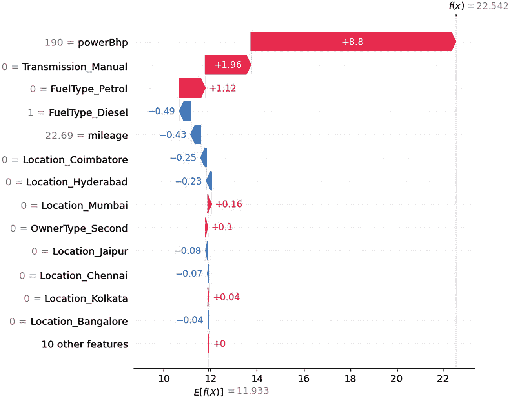

函数 x 等于 22.542 且 E 函数 x 等于 11.933 的图形表示，包含 14 个水平值。最高值为 8.8，对应功率 BHP。数值均为近似值。

**图 2-9** 第 20 条记录的局部解释及对应的特征重要性

```
# waterfall_plot 展示了我们如何从 shap_values.base_values 得到 model.predict(X)[sample_ind]
shap.plots.waterfall(shap_values[sample_ind], max_display=14)
```

对于第 20 条记录，预测价格为 22.542，`powerBhp` 是最重要的特征，手动变速箱是第二重要的特征。

```
X[20:21]
model.predict(X[20:21])
array([22.54213017])
```

## 配方 2-6. 针对包含所有混合输入变量的回归模型的 SHAP 特征重要性

### 问题

你希望使用混合输入特征数据从 SHAP 值中获取全局特征重要性。

### 解决方案

此问题的解决方案是使用绝对值并按降序排序。

### 工作原理

让我们来看下面的示例：

```
# 为线性模型计算 shap 重要性值
import numpy as np
# 训练数据中的特征名称
feature_names = shap_values.feature_names
# 将 shap 值与特征名称合并
shap_df = pd.DataFrame(shap_values.values, columns=feature_names)
# 取 shap 值的绝对值
vals = np.abs(shap_df.values).mean(0)
# 创建数据框视图
shap_importance = pd.DataFrame(list(zip(feature_names, vals)), columns=['col_name', 'feature_importance_vals'])
# 对重要性值进行排序
shap_importance.sort_values(by=['feature_importance_vals'], ascending=False, inplace=True)
print(shap_importance)
col_name  feature_importance_vals
4                       powerBhp                 6.057831
0                            Age                 2.338342
18               FuelType_Petrol                 1.406920
19           Transmission_Manual                 1.249077
15               FuelType_Diesel                 0.618288
7            Location_Coimbatore                 0.430233
9             Location_Hyderabad                 0.401118
2                        mileage                 0.270872
13               Location_Mumbai                 0.227442
5             Location_Bangalore                 0.154706
21              OwnerType_Second                 0.154429
6               Location_Chennai                 0.133476
10               Location_Jaipur                 0.127807
12              Location_Kolkata                 0.111829
14                 Location_Pune                 0.051082
8                 Location_Delhi                 0.049372
22               OwnerType_Third                 0.021778
3                       engineCC                 0.020145
1                       Odometer                 0.009602
11                Location_Kochi                 0.007474
20  OwnerType_Fourth +ACY- Above                 0.002557
16             FuelType_Electric                 0.002336
17                  FuelType_LPG                 0.001314
```

从宏观层面来看，对于用于预测汽车价格的线性模型，上述特征都很重要，其中最重要的依次是 `powerBhp`、车龄、汽油类型、手动变速箱类型等。上述表格输出展示了全局特征重要性。

## 配方 2-7. 针对回归模型预测输出上混合特征的 SHAP 强度

### 问题

你希望了解某个特征对模型函数的影响。

### 解决方案

此问题的解决方案是使用蜂群图，该图显示蓝色和红色的点。

### 工作原理

让我们来看下面的例子（见图 2-10）。从蜂群图中可以看出，`powerBhp` 与正的 SHAP 值之间存在正相关关系；然而，汽车车龄与汽车价格之间存在负相关关系。随着特征值从较低的 `powerBhp` 值增加到较高的 `powerBhp` 值，`shap` 值也随之增加，反之亦然。但是，`age` 特征则呈现出相反的趋势。

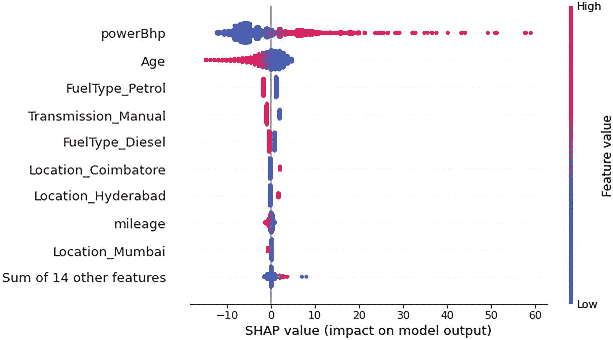

特征值与 SHAP 值的图形表示。图中显示了 `power`、`age`、`fuel type`、`transmission`、`location`、`mileage` 以及其他 14 个特征之和的 10 个波动信号。

**图 2-10** SHAP 值对模型输出的影响

```
shap.plots.beeswarm(shap_values)
```

## 配方 2-8. 缩放数据上回归模型的 SHAP 值

### 问题

你不知道在缩放数据上获取 SHAP 值是否比在未缩放的数值数据上更好。

### 解决方案

此问题的解决方案是使用一个数值数据集，在对数据应用标准缩放器后，生成局部和全局解释。

### 工作原理

让我们来看下面的脚本：

```python
import pandas as pd
df_lin_reg = pd.read_csv('https://archive.ics.uci.edu/ml/machine-learning-databases/00374/energydata_complete.csv')
del df_lin_reg['date']
#y 是因变量，我们需要预测它
y = df_lin_reg.pop('Appliances')
# X 是输入特征集
X = df_lin_reg
import pandas as pd
import shap
import sklearn
#创建标准化特征
scaler = sklearn.preprocessing.StandardScaler()
scaler.fit(X)
#转换数据集
X_std = scaler.transform(X)
#初始化一个简单的线性模型
model = sklearn.linear_model.LinearRegression()
#训练线性回归模型
model.fit(X_std, y)
print("模型系数:\n")
for i in range(X.shape[1]):
print(X.columns[i], "=", model.coef_[i].round(5))
模型系数:
lights = 15.7899
T1 = -0.96962
RH_1 = 60.29926
T2 = -38.82785
RH_2 = -54.8622
T3 = 50.96675
RH_3 = 16.02699
T4 = -7.07893
RH_4 = -0.77668
T5 = -0.05136
RH_5 = 1.27172
T6 = 43.3997
RH_6 = 8.96929
T7 = 3.78656
RH_7 = -7.92521
T8 = 15.93559
RH_8 = -24.39546
T9 = -31.97757
RH_9 = -3.74049
T_out = -54.38609
Press_mm_hg = 1.03483
RH_out = -15.85058
Windspeed = 4.17588
Visibility = 1.81258
Tdewpoint = 21.17741
rv1 = -0.30118
rv2 = -0.30118
CodeText
# 计算线性模型的 SHAP 值
explainer = shap.Explainer(model.predict, X_std)
# SHAP 值计算
shap_values = explainer(X_std)
Permutation explainer: 19736it [08:53, 36.22it/s]
```

使用标准化数据可以更快地从 SHAP 解释器获得结果。SHAP 值也发生了一些变化，但对 `shap` 值没有重大改变。

|  | `Permutation explainer` | 时间 |
| --- | --- | --- |
| 未缩放数据 | `19736it` | `15:22, 21.23it/s` |
| 缩放数据 | `19736it` | `08:53, 36.22it/s` |

```python
#计算线性模型的 shap 重要性值
import numpy as np
# 来自训练数据的特征名称
feature_names = X.columns
#将 shap 值与特征名称结合
shap_df = pd.DataFrame(shap_values.values, columns=feature_names)
#取 shap 值的绝对值
vals = np.abs(shap_df.values).mean(0)
#创建数据框视图
shap_importance = pd.DataFrame(list(zip(feature_names, vals)), columns=['col_name', 'feature_importance_vals'])
#对重要性值进行排序
shap_importance.sort_values(by=['feature_importance_vals'], ascending=False, inplace=True)
print(shap_importance)
col_name  feature_importance_vals
2          RH_1                49.530061
19        T_out                43.828847
4          RH_2                42.911069
5            T3                41.671587
11           T6                34.653893
3            T2                31.097282
17           T9                26.607721
16         RH_8                19.920029
24    Tdewpoint                17.443688
21       RH_out                13.044643
6          RH_3                13.042064
15           T8                12.803450
0        lights                11.907603
12         RH_6                 7.806188
14         RH_7                 6.578015
7            T4                 5.866801
22    Windspeed                 3.361895
13           T7                 3.182072
18         RH_9                 3.041144
23   Visibility                 1.385616
10         RH_5                 0.855398
20  Press_mm_hg                 0.823456
1            T1                 0.765753
8          RH_4                 0.642723
25          rv1                 0.260885
26          rv2                 0.260885
9            T5                 0.041905
```

## 配方 2-9. 表格数据的 LIME 解释器

### 问题

你想知道如何以聚焦的方式在局部层面而非全局层面生成可解释性。

### 解决方案

此问题的解决方案是使用 LIME 库。LIME 是一种模型无关的技术；它在运行解释器的同时重新训练机器学习模型。LIME 将问题局部化，并在局部层面解释模型。

### 工作原理

让我们来看下面的例子。LIME 要求将 numpy 数组作为表格解释器的输入；因此，需要将 Pandas 数据框转换为数组。

```python
!pip install lime
Looking in indexes: https://pypi.org/simple, https://us-python.pkg.dev/colab-wheels/public/simple/
Collecting lime
Downloading lime-0.2.0.1.tar.gz (275 kB)
|████████████████| 275 kB 3.9 MB/s
Requirement already satisfied: matplotlib in /usr/local/lib/python3.7/dist-packages (from lime) (3.2.2)
Requirement already satisfied: numpy in /usr/local/lib/python3.7/dist-packages (from lime) (1.21.6)
Requirement already satisfied: scipy in /usr/local/lib/python3.7/dist-packages (from lime) (1.7.3)
Require
................
import lime
import lime.lime_tabular
explainer = lime.lime_tabular.LimeTabularExplainer(np.array(X),
mode='regression',
feature_names=X.columns,
class_names=['price'],
verbose=True)
```

我们仅使用本章中的能源预测数据。

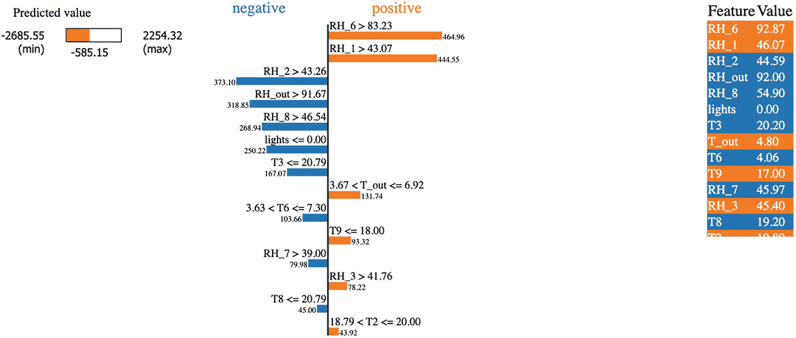

图形表示显示了最小和最大预测值。包含负值和正值的列，以及一个包含 14 行特征值的表格。

**图 2-11** 数据集中第 60 条记录的局部解释

```python
Explainer.feature_selection
# 请求 LIME 模型的解释
I = 60
exp = explainer.explain_instance(np.array(X)[i],
model.predict,
num_features=14
)
model.predict(X)[60]
X[60:61]
Intercept -142.75931081140854
Prediction_local [-492.87528974]
Right: -585.148657732673
exp.show_in_notebook(show_table=True)
```

```python
exp.as_list()
[('RH_6 > 83.23', 464.95860873125986), ('RH_1 > 43.07', 444.5520820612734), ('RH_2 > 43.26', -373.10130212185885), ('RH_out > 91.67', -318.85242557316906), ('RH_8 > 46.54', -268.93915670002696), ('lights  39.00', -79.9838215229673), ('RH_3 > 41.76', 78.2163751694391), ('T8 <= 20.79', -45.00198774806178), ('18.79 < T2 <= 20.00', 43.92159150217912)]
```

## 配方 2-10. 表格数据的 ELI5 解释器

### 问题

你想使用 ELI5 库为线性回归模型生成解释。

### 解决方案

`ELI5` 是一个 Python 包，有助于调试机器学习模型并解释预测结果。它为 `scikit-learn` 库支持的所有机器学习模型提供支持。

### 工作原理

让我们来看一下以下脚本：

```python
pip install eli5
import eli5
eli5.show_weights(model,
feature_names=list(X.columns))
```

**y** 主要特征

| 权重？ | 特征 |
| --- | --- |
| **+97.695** | `<BIAS>` |
| **+60.299** | `RH_1` |
| **+50.967** | `T3` |
| **+43.400** | `T6` |
| **+21.177** | `Tdewpoint` |
| **+16.027** | `RH_3` |
| **+15.936** | `T8` |
| **+15.790** | `Lights` |
| **+8.969** | `RH_6` |
| **+4.176** | `Windspeed` |
| **+3.787** | `T7` |
| ***… 还有 3 个正特征 …*** |
| ***… 还有 5 个负特征 …*** |
| **-3.740** | `RH_9` |
| **-7.079** | `T4` |
| **-7.925** | `RH_7` |
| **-15.851** | `RH_out` |
| **-24.395** | `RH_8` |
| **-31.978** | `T9` |
| **-38.828** | `T2` |
| **-54.386** | `T_out` |
| **-54.862** | `RH_2` |

```python
eli5.explain_weights(model, feature_names=list(X.columns))
eli5.explain_prediction(model,X.iloc[60])
from eli5.sklearn import PermutationImportance
# 初始化一个简单的线性模型
model = sklearn.linear_model.LinearRegression()
# 训练线性回归模型
model.fit(X, y)
perm = PermutationImportance(model)
perm.fit(X, y)
eli5.show_weights(perm,feature_names=list(X.columns))
```

结果表中包含一个 `BIAS` 值作为特征。这可以解释为线性回归模型的截距项。其他特征根据其权重大小以降序排列。`show_weights` 函数提供了模型的全局解释，而 `show_prediction` 函数则通过考虑训练集中的一条记录来提供局部解释。

## 配方 2-11. ELI5 中排列模型的工作原理

### 问题

你想理解 ELI5 排列库的原理。

### 解决方案

解决此问题的方法是使用一个数据集和一个训练好的模型。

### 工作原理

ELI5 库中的排列模型仅适用于全局解释。首先，它从训练数据集中获取一个基线线性回归模型，并计算该模型的误差。然后，它打乱一个特征的值，重新训练模型并计算误差。它比较打乱后和打乱前的误差下降情况。如果打乱后误差增量较大，则该特征可被视为重要；如果误差增量较小，则该特征不重要。结果会显示特征的平均重要性以及经过多次打乱步骤后特征的标准差。

## 配方 2-12. 逻辑回归模型的全局解释

### 问题

你想解释逻辑回归模型生成的预测结果。

### 解决方案

逻辑回归模型也被称为分类模型，因为我们是对二元分类或多分类变量的概率进行建模。在本配方中，我们使用一个流失分类数据集，该数据集包含两种结果：客户是否可能流失。

### 工作原理

让我们来看一下以下示例。关键在于获取 SHAP 值，这些值将返回基值、SHAP 值和数据。利用 SHAP 值，我们可以通过图表和图形创建各种解释。SHAP 值始终是全局层面的。

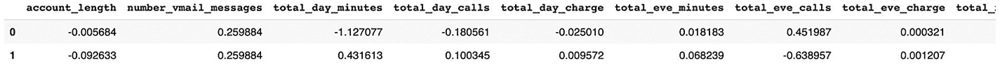

一个表格包含 9 列和 2 行。列标题分别为：账户时长、语音邮件数量、日间总通话分钟数、日间总通话次数、日间总费用、晚间总通话分钟数、晚间总通话次数、晚间总费用。

```
import pandas as pd
import numpy as np
import matplotlib.pyplot as plt
%matplotlib inline
from sklearn.linear_model import LogisticRegression, LogisticRegressionCV
from sklearn.metrics import confusion_matrix, classification_report
df_train = pd.read_csv('https://raw.githubusercontent.com/pradmishra1/PublicDatasets/main/ChurnData_test.csv')
from sklearn.preprocessing import LabelEncoder
tras = LabelEncoder()
df_train['area_code_tr'] = tras.fit_transform(df_train['area_code'])
df_train.columns
del df_train['area_code']
df_train.columns
df_train['target_churn_dum'] = pd.get_dummies(df_train.churn,prefix='churn',drop_first=True)
df_train.columns
del df_train['international_plan']
del df_train['voice_mail_plan']
del df_train['churn']
df_train.info()
del df_train['Unnamed: 0']
df_train.columns
from sklearn.model_selection import train_test_split
df_train.columns
X = df_train[['account_length', 'number_vmail_messages', 'total_day_minutes',
'total_day_calls', 'total_day_charge', 'total_eve_minutes',
'total_eve_calls', 'total_eve_charge', 'total_night_minutes',
'total_night_calls', 'total_night_charge', 'total_intl_minutes',
'total_intl_calls', 'total_intl_charge',
'number_customer_service_calls', 'area_code_tr']]
Y = df_train['target_churn_dum']
xtrain,xtest,ytrain,ytest=train_test_split(X,Y,test_size=0.20,stratify=Y)
log_model = LogisticRegression()
log_model.fit(xtrain,ytrain)
print("training accuracy:", log_model.score(xtrain,ytrain)) #training accuracy
print("test accuracy:",log_model.score(xtest,ytest)) # test accuracy
# Provide Probability as Output
def model_churn_proba(x):
return log_model.predict_proba(x)[:,1]
# Provide Log Odds as Output
def model_churn_log_odds(x):
p = log_model.predict_log_proba(x)
return p[:,1] - p[:,0]
# compute the SHAP values for the linear model
background_churn = shap.maskers.Independent(X, max_samples=2000)
explainer = shap.Explainer(log_model, background_churn,feature_names=list(X.columns))
shap_values_churn = explainer(X)
shap_values_churn
.values = array([[-5.68387743e-03, 2.59884057e-01, -1.12707664e+00, ..., 1.70015539e-04, 6.35113804e-01, -5.98927431e-03], [-9.26328584e-02, 2.59884057e-01, 4.31613190e-01, ..., -4.82342680e-04, -7.11876922e-01, -5.98927431e-03], [-1.05143764e-02, -8.06452301e-01, 1.15736857e+00, ..., 2.05960486e-03, -2.62880014e-01, 5.88245015e-03], ..., [ 9.09261014e-02, 2.59884057e-01, -4.15611799e-01, ..., 1.99211953e-03, -2.62880014e-01, -5.34120777e-05], [-2.50058732e-02, 2.59884057e-01, 7.63911460e-02, ..., -1.08971068e-03, -7.11876922e-01, -5.98927431e-03], [ 3.05448646e-02, -9.90303397e-01, -5.29936135e-01, ..., -6.17313346e-04, -7.11876922e-01, -5.34120777e-05]]) .base_values = array([-2.18079251, -2.18079251, -2.18079251, ..., -2.18079251, -2.18079251, -2.18079251]) .data = array([[101\. , 0\. , 70.9 , ..., 2.86, 3\. , 2\. ], [137\. , 0\. , 223.6 , ..., 2.57, 0\. , 2\. ], [103\. , 29\. , 294.7 , ..., 3.7 , 1\. , 0\. ], ..., [ 61\. , 0\. , 140.6 , ..., 3.67, 1\. , 1\. ], [109\. , 0\. , 188.8 , ..., 2.3 , 0\. , 2\. ], [ 86\. , 34\. , 129.4 , ..., 2.51, 0\. , 1\. ]])
shap_values = pd.DataFrame(shap_values_churn.values)
shap_values.columns = list(X.columns)
shap_values
```

```
# 计算线性模型的 SHAP 值
explainer_log_odds = shap.Explainer(log_model, background_churn,feature_names=list(X.columns))
shap_values_churn_log_odds = explainer_log_odds(X)
shap_values_churn_log_odds
```

## 配方 2-13. 分类器的部分依赖图

### 问题

你想展示特征与类别概率之间的关联。

### 解决方案

本示例中的类别概率与预测流失概率相关。可以将某个特征的 SHAP 值与该特征值绘制成散点图，以显示相关性（正相关或负相关）以及关联强度。

### 工作原理

让我们看看以下脚本：

```
shap.plots.scatter(shap_values_churn[:,'account_length'])
```

图 2-12 展示了 `account_length` 变量与 `account_length` 变量的 SHAP 值之间的关系。

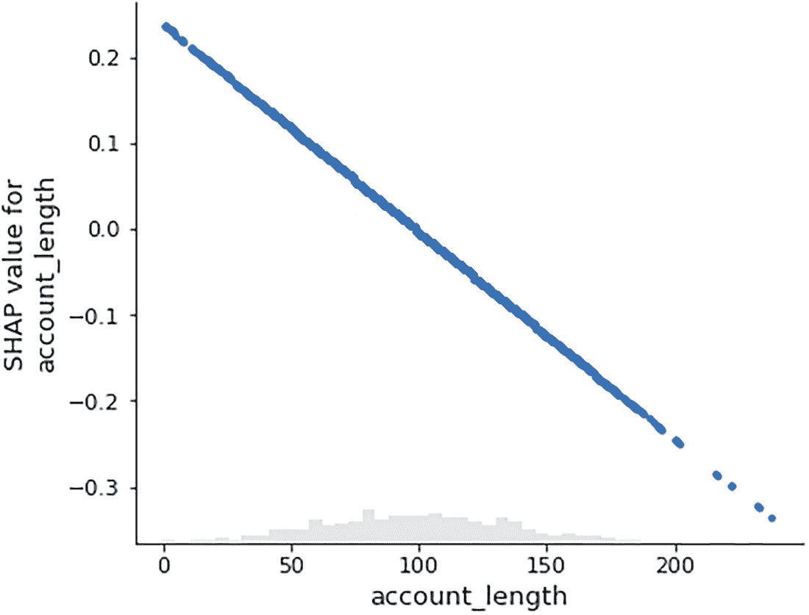

一张关于 `account_length` 的 SHAP 值与 `account_length` 的图表。图中有一条从 0.25 下降到 -0.2 的实线，以及一条上升至 0 的虚线。数值均为近似值。

**图 2-12** 账户时长与账户时长的 SHAP 值

```
# 制作一个标准的偏依赖图
sample_ind = 25
fig,ax = shap.partial_dependence_plot(
"number_vmail_messages", model_churn_proba, X, model_expected_value=True,
feature_expected_value=True, show=False,ice=False)
```

图 2-13 展示了特征 `number_vmail_messages` 与 `number_vmail_messages` 的 SHAP 值之间的关系。


一张关于 `E(f(x))` 与 `number_vmail_messages` 的图表。图中有一条从 0.18 下降到 0.02 的斜线，一条用于 `E(number_vmail_messages)` 的垂直线，以及一条用于 `E(f(x))` 的水平线。数值均为近似值。

**图 2-13** 语音邮件数量及其 SHAP 值

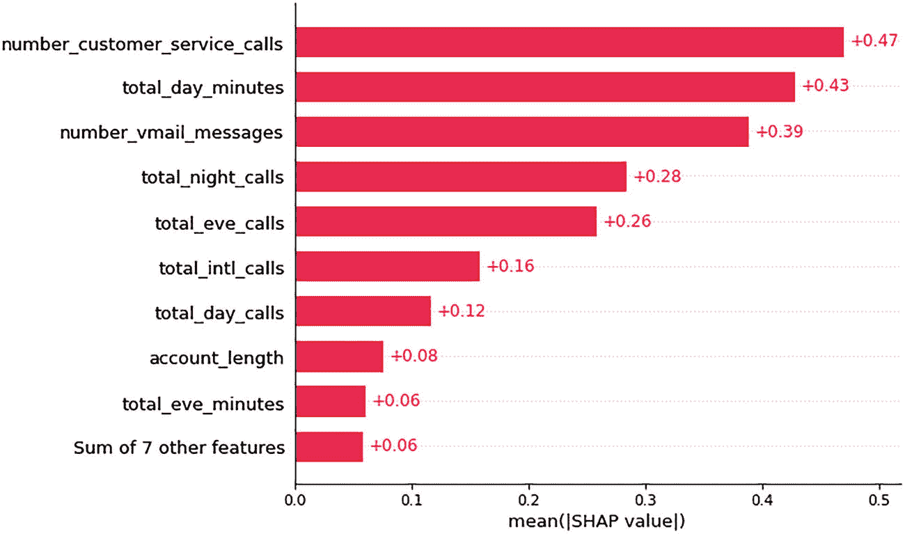

一张平均 SHAP 值的水平条形图，包含 10 个递减的条形。最高条形值为 0.47，对应 `number_customer_service_calls`。数值均为近似值。

**图 2-14** 所有特征的平均绝对 SHAP 值

```
shap.plots.bar(shap_values_churn_log_odds)
```

## 配方 2-14. 来自分类器的全局特征重要性

### 问题

你想获取逻辑回归模型的全局特征重要性。

### 解决方案

该问题的解决方案是使用条形图、蜂群图和热力图。

### 工作原理

让我们看看以下脚本（见图 2-15 和图 2-16）：

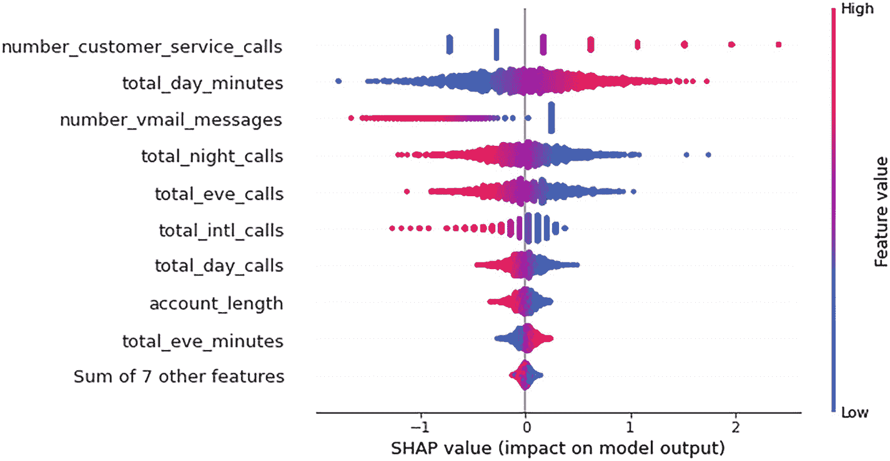

一张特征值与 SHAP 值的图形表示。图中包含 10 个不同特征的波动信号。

**图 2-15** SHAP 值对模型输出的影响

```
shap.plots.beeswarm(shap_values_churn_log_odds)
```

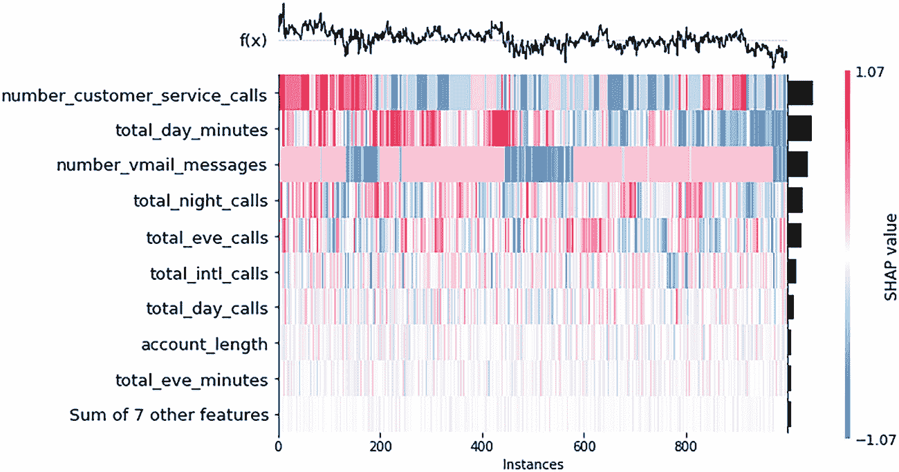

一张关于不同特征、实例和 SHAP 值的图表。图中包含 10 种颜色渐变信号形式。`number_customer_service_calls` 和 `total_day_minutes` 的信号尤为突出。

**图 2-16** SHAP 值及正负特征贡献的热力图

```
shap.plots.heatmap(shap_values_churn_log_odds[:1000])
```

```
temp_df = pd.DataFrame()
temp_df['Feature Name'] = pd.Series(X.columns)
temp_df['Coefficients'] = pd.Series(log_model.coef_.flatten())
temp_df.sort_values(by='Coefficients',ascending=False)
```

解释如下：当我们改变一个特征的值 1 个单位时，模型方程会产生两个几率比；一个是基准值，另一个是特征增量值。我们关注的是随着特征值每增加或减少，几率比的变化比率。从全局特征重要性来看，有三个重要特征：`number_customer_service_calls`、`total_day_minutes` 和 `number_vmail_messages`。

## 配方 2-15. 使用 LIME 进行局部解释

### 问题

你想从全局和局部可解释库中获得更快的解释。

### 解决方案

模型解释可以使用 SHAP 完成；然而，SHAP 的局限性之一是我们无法使用全部数据来创建全局和局部解释。即使我们决定使用全部数据，通常也需要更多时间。因此，在训练模型使用了数百万条记录的场景下，LIME 对于加速生成局部和全局解释的过程非常有用。

### 工作原理

让我们看看以下脚本：

| 0 | 1 | 2 |
| --- | --- | --- |
| **0** | `number_customer_service_calls > 2.00` | 0.153089 |
| **1** | `total_day_minutes > 213.80` | 0.111146 |
| **2** | `number_vmail_messages <= 0.00` | 0.096100 |
| **3** | `total_intl_calls <= 3.00` | 0.031770 |
| **4** | `total_day_calls <= 86.00` | 0.029375 |
| **5** | `99.00 < total_night_calls <= 113.00` | -0.023965 |
| **6** | `account_length > 126.00` | -0.015756 |
| **7** | `88.00 < total_eve_calls <= 101.00` | 0.008756 |
| **8** | `total_intl_minutes <= 8.60` | -0.007205 |
| **9** | `200.00 < total_eve_minutes <= 232.00` | 0.004123 |
| **10** | `total_intl_charge <= 2.32` | -0.001375 |
| **11** | `total_day_charge > 36.35` | 0.001081 |
| **12** | `200.20 < total_night_minutes <= 234.80` | -0.000134 |
| **13** | `0.00 < area_code_tr <= 1.00` | -0.000081 |
| **14** | `9.01 < total_night_charge <= 10.57` | -0.000067 |

```
import lime
import lime.lime_tabular
explainer = lime.lime_tabular.LimeTabularExplainer(np.array(xtrain),
feature_names=list(xtrain.columns),
class_names=['target_churn_dum'],
verbose=True, mode='classification')
# 此记录为未流失场景
exp = explainer.explain_instance(xtest.iloc[0], log_model.predict_proba, num_features=16)
exp.as_list()
Intercept -0.005325152786766457
Prediction_local [0.38147987]
Right: 0.32177492114146566
X does not have valid feature names, but LogisticRegression was fitted with feature names
[('number_customer_service_calls > 2.00', 0.1530891322197175),
('total_day_minutes > 213.80', 0.11114575899827552),
('number_vmail_messages  126.00', -0.015756474385902122),
('88.00  36.35', 0.0010811737941700244),
('200.20 < total_night_minutes <= 234.80', -0.00013400510199346275),
('0.00 < area_code_tr <= 1.00', -8.127174069198377e-05),
('9.01 < total_night_charge <= 10.57', -6.668417986225894e-05),
('17.00 < total_eve_charge <= 19.72', -5.18320207196282e-05)]
pd.DataFrame(exp.as_list())
```

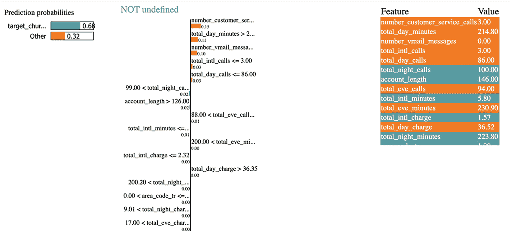

一张图形表示，包含两个用于预测概率的条形。一列用于“未定义”，以及一个包含两列（特征和值）的表格。

**图 2-17** 记录编号 1 的局部解释

```
exp.show_in_notebook(show_table=True)
```

# 这是一个流失场景

```python
exp = explainer.explain_instance(xtest.iloc[20], log_model.predict_proba, num_features=16)
exp.as_list()
Intercept -0.02171544428872446
Prediction_local [0.44363396]
Right: 0.4309152994720991
X does not have valid feature names, but LogisticRegression was fitted with feature names
[('number_customer_service_calls > 2.00', 0.15255665525554568),
('total_day_minutes > 213.80', 0.11572355524257688),
('number_vmail_messages  12.00', 0.004036225959225672),
('200.20  3.24', -0.0025561403383019586),
('total_day_charge > 36.35', -0.0021799602467677667),
('9.01  1.00', 0.0007760299764712853)]
```

以类似的方式，可以为训练样本和测试样本中的不同数据点生成图表。

## 配方 2-16. 使用 ELI5 进行模型解释

### 问题

你想使用 ELI5 库获取模型解释。

### 解决方案

ELI5 提供了两个函数来显示权重和进行预测，以生成模型解释。

### 工作原理

让我们来看一下以下脚本：

```python
eli5.show_weights(log_model,
feature_names=list(xtrain.columns))
```

**y=1** 主要特征

| 权重^? | 特征 |
| --- | --- |
| +0.449 | number_customer_service_calls |
| +0.010 | total_day_minutes |
| +0.009 | total_intl_minutes |
| +0.002 | total_intl_charge |
| +0.002 | total_eve_minutes |
| +0.001 | total_day_charge |
| +0.000 | total_eve_charge |
| -0.000 | total_night_charge |
| -0.001 | total_night_minutes |
| -0.002 | account_length |
| -0.006 | area_code_tr |
| -0.008 | total_day_calls |
| -0.017 | total_eve_calls |
| -0.017 | total_night_calls |
| -0.034 | `<BIAS>` |
| -0.037 | number_vmail_messages |
| -0.087 | total_intl_calls |

```python
eli5.explain_weights(log_model, feature_names=list(xtrain.columns))
```

**y=1** 主要特征

| 权重^? | 特征 |
| --- | --- |
| +0.449 | number_customer_service_calls |
| +0.010 | total_day_minutes |
| +0.009 | total_intl_minutes |
| +0.002 | total_intl_charge |
| +0.002 | total_eve_minutes |
| +0.001 | total_day_charge |
| +0.000 | total_eve_charge |
| -0.000 | total_night_charge |
| -0.001 | total_night_minutes |
| -0.002 | account_length |
| -0.006 | area_code_tr |
| -0.008 | total_day_calls |
| -0.017 | total_eve_calls |
| -0.017 | total_night_calls |
| -0.034 | `<BIAS>` |
| -0.037 | number_vmail_messages |
| -0.087 | total_intl_calls |

```python
eli5.explain_prediction(log_model,xtrain.iloc[60])
```

**y=0** (概率 **0.788**，得分 **-1.310**) 主要特征

| 贡献^? | 特征 |
| --- | --- |
| +2.458 | total_night_calls |
| +1.289 | total_eve_calls |
| +0.698 | total_day_calls |
| +0.304 | account_length |
| +0.174 | total_intl_calls |
| +0.127 | total_night_minutes |
| +0.034 | `<BIAS>` |
| +0.006 | area_code_tr |
| +0.002 | total_night_charge |
| -0.004 | total_intl_charge |
| -0.005 | total_eve_charge |
| -0.057 | total_intl_minutes |
| -0.064 | total_day_charge |
| -0.304 | total_eve_minutes |
| -0.449 | number_customer_service_calls |
| -2.899 | total_day_minutes |

| 权重 | 特征 |
| --- | --- |
| 0.0066 ± 0.0139 | number_customer_service_calls |
| 0.0066 ± 0.0024 | number_vmail_messages |
| 0.0030 ± 0.0085 | total_eve_calls |
| 0.0030 ± 0.0085 | total_day_minutes |
| 0.0006 ± 0.0088 | total_day_calls |
| 0 ± 0.0000 | area_code_tr |
| 0 ± 0.0000 | total_intl_charge |
| 0 ± 0.0000 | total_night_charge |
| 0 ± 0.0000 | total_eve_charge |
| -0.0012 ± 0.0048 | total_intl_calls |
| -0.0012 ± 0.0029 | total_intl_minutes |
| -0.0024 ± 0.0096 | account_length |
| -0.0024 ± 0.0024 | total_day_charge |
| -0.0036 ± 0.0045 | total_night_minutes |
| -0.0042 ± 0.0061 | total_eve_minutes |
| -0.0048 ± 0.0072 | total_night_calls |

```python
from eli5.sklearn import PermutationImportance
perm = PermutationImportance(log_model)
perm.fit(xtest, ytest)
eli5.show_weights(perm,feature_names=list(xtrain.columns))
```

## 结论

在本章中，我们介绍了如何解释线性监督模型，例如回归和分类模型。线性模型在全局层面（即特征重要性层面）更容易解释，但在局部解释层面则难以说明。在本章中，我们使用 SHAP、ELI5 和 LIME 库研究了样本的局部解释。

在下一章中，我们将介绍非线性模型的局部和全局解释。非线性模型涵盖了数据中存在的非线性关系，因此可能难以解释。因此，我们需要一套框架来解释模型中的非线性。