# 3. 非线性监督模型的可解释性

在本章中，我们将使用可解释性库来解释回归模型和分类模型，同时训练一个非线性模型。非线性模型是指输入变量通过非线性变换进行转换，或者用于建模输入和输出的函数是非线性的模型。

为了追求更高的准确率，输入特征会通过包含多项式特征或交互特征（例如加性特征和乘性特征）来进行修改。添加非线性特征的好处在于能够捕捉数据中更复杂的模式和关系。如果我们使用非线性特征，可以按照第 2 章提供的方案进行解释。如果特征数量较少，我们可以创建手工制作的多项式特征；然而，如果特征数量很多，创建所有非线性特征的组合不仅困难，而且解释起来也非常复杂。因此，选择一个非线性函数或学习算法会让事情变得更容易。所以，我们将使用驱动决策树的 ID3 算法来捕捉数据中存在的非线性。

本章的目标是介绍决策树模型的各种可解释性库，例如特征重要性、部分依赖图和局部解释。

## 配方 3-1. 基于所有数值输入变量的树模型的 SHAP 值

### 问题

您想要解释一个基于所有数值特征构建的决策树回归模型。

### 解决方案

首先训练基于所有数值特征的决策树回归模型，然后将训练好的模型传递给 SHAP，以生成全局解释和局部解释。

### 工作原理

让我们来看下面的例子。Shapley 值可称为 SHAP 值。它用于解释模型，并通过合作博弈论对预测进行公平分配，从而将特征归因于模型的预测。模型输入特征被视为博弈中的玩家，模型函数则被视为博弈规则。某个特征的 Shapley 值基于以下步骤计算：

1.  SHAP 需要在所有特征子集上重新训练模型；因此，如果需要对较大的数据集生成解释，通常会很耗时。

2.  从特征列表中确定一个特征集（假设有 15 个特征，我们可以选择包含 5 个特征的子集）。

3.  对于任何特定特征，将使用该特征子集创建两个模型：一个包含该特征，另一个不包含该特征。

4.  计算预测差异。

5.  对所有可能的特征子集计算预测差异。

6.  所有可能差异的加权平均值用于填充特征重要性。

如果特征的权重为 `0.000`，那么我们可以得出结论：该特征不重要，且未参与模型。如果不等于 `0.000`，那么我们可以得出结论：该特征在预测过程中发挥了作用。

我们将使用来自 UCI 机器学习仓库的数据集。访问该数据集的 URL 如下：

[`https://archive.ics.uci.edu/ml/datasets/Appliances+energy+prediction`](https://archive.ics.uci.edu/ml/datasets/Appliances%252Benergy%252Bprediction)

目标是利用传感器中的特征预测电器的能耗（单位：瓦时）。数据集中有 27 个特征，这里我们试图了解哪些特征在预测能耗时是重要的。参见表 3-1。

**表 3-1** 能耗预测数据集的特征描述

| 特征名称 | 描述 | 单位 |
| --- | --- | --- |
| `Appliances` | 能耗 | 瓦时 |
| `Lights` | 房屋内灯具的能耗 | 瓦时 |
| `T1` | 厨房区域温度 | 摄氏度 |
| `RH_1` | 厨房区域湿度 | 百分比 |
| `T2` | 客厅区域温度 | 摄氏度 |
| `RH_2` | 客厅区域湿度 | 百分比 |
| `T3` | 洗衣房区域温度 | 摄氏度 |
| `RH_3` | 洗衣房区域湿度 | 百分比 |
| `T4` | 办公室温度 | 摄氏度 |
| `RH_4` | 办公室湿度 | 百分比 |
| `T5` | 浴室温度 | 摄氏度 |
| `RH_5` | 浴室湿度 | 百分比 |
| `T6` | 建筑物外部（北侧）温度 | 摄氏度 |
| `RH_6` | 建筑物外部（北侧）湿度 | 百分比 |
| `T7` | 熨衣间温度 | 摄氏度 |
| `RH_7` | 熨衣间湿度 | 百分比 |
| `T8` | 青少年房间 2 温度 | 摄氏度 |
| `RH_8` | 青少年房间 2 湿度 | 百分比 |
| `T9` | 父母房间温度 | 摄氏度 |
| `RH_9` | 父母房间湿度 | 百分比 |
| `T_out` | 室外温度（来自 Chievres 气象站） | 摄氏度 |
| `Press_mm_hg` | 气压（来自 Chievres 气象站） | 毫米汞柱 |
| `RH_out` | 室外湿度（来自 Chievres 气象站） | 百分比 |
| `Windspeed` | 风速（来自 Chievres 气象站） | 米/秒 |
| `Visibility` | 能见度（来自 Chievres 气象站） | 千米 |
| `Tdewpoint` | 露点温度（来自 Chievres 气象站） | 摄氏度 |
| `rv1` | 随机变量 1 | 无量纲 |
| `rv2` | 随机变量 2 | 无量纲 |

```python
pip install shap
import pandas as pd
df_lin_reg = pd.read_csv('https://archive.ics.uci.edu/ml/machine-learning-databases/00374/energydata_complete.csv')
del df_lin_reg['date']
df_lin_reg.info()
df_lin_reg.columns
Index(['Appliances', 'lights', 'T1', 'RH_1', 'T2', 'RH_2', 'T3', 'RH_3', 'T4', 'RH_4', 'T5', 'RH_5', 'T6', 'RH_6', 'T7', 'RH_7', 'T8', 'RH_8', 'T9', 'RH_9', 'T_out', 'Press_mm_hg', 'RH_out', 'Windspeed', 'Visibility', 'Tdewpoint', 'rv1', 'rv2'], dtype='object')
#y is the dependent variable, that we need to predict
y = df_lin_reg.pop('Appliances')
# X is the set of input features
X = df_lin_reg
import pandas as pd
import shap
import sklearn
from sklearn import tree, metrics, model_selection, preprocessing
from IPython.display import Image, display
from sklearn.metrics import confusion_matrix, classification_report
# a simple non linear model initialized
model = tree. DecisionTreeRegressor() # plain tree model
# nonlinear regression model trained
model.fit(X, y)
tree.plot_tree(model)
```

这会生成一个复杂且混乱的图形，难以解释。参见图 3-1。

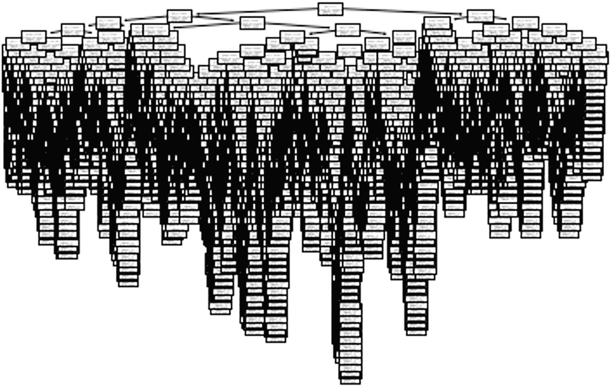

决策树的结构化表示包含不同的节点，每个节点有多个分支。

**图 3-1** 决策树模型表示

为了以简单格式解释决策树，可以使用以下代码：

```python
from sklearn.tree import export_text
r = export_text(model,feature_names=list(X.columns))
print(r)
|--- lights   34.60
|   |   |   |   |   |   |   |   |   |--- value: [580.00]
|   |   |   |   |   |   |   |--- RH_6 >  23.91
|   |   |   |   |   |   |   |   |--- T3 <= 21.81
.................
list(zip(model.feature_importances_,X.columns))
[(0.04755691132990445, 'lights'), (0.02729240744739512, 'T1'), (0.050990867453263464, 'RH_1'), (0.029613682425136578, 'T2'), (0.05287817171439917, 'RH_2'), (0.03809698118314153, 'T3'), (0.04702017020903361, 'RH_3'), (0.03833652568783967, 'T4'), (0.029168659250593493, 'RH_4'), (0.023818050212012467, 'T5'), (0.053380938919333785, 'RH_5'), (0.03242898742121811, 'T6'), (0.036442867206438946, 'RH_6'), (0.03272087870063947, 'T7'), (0.0459966882745736, 'RH_7'), (0.03786926541394416, 'T8'), (0.05569343410157808, 'RH_8'), (0.03888560547088362, 'T9'), (0.03205551180175258, 'RH_9'), (0.018209440939872642, 'T_out'), (0.04401669364414831, 'Press_mm_hg'), (0.06483375260268251, 'RH_out'), (0.0343793163965324, 'Windspeed'), (0.022764397449413956, 'Visibility'), (0.02962771107600761, 'Tdewpoint'), (0.023354544387479956, 'rv1'), (0.012567539280780866, 'rv2')]
# compute the SHAP values for the nonlinear model
explainer = shap.TreeExplainer(model)
# SHAP value calculation
shap_values = explainer.shap_values(X)
```

## 配方 3-2. 树回归模型的偏依赖图

### 问题

您希望从决策树回归模型中获取偏依赖图。

### 解决方案

此问题的解决方案是使用树解释器从模型生成偏依赖图。特征与其 SHAP 值之间的相关性以图形方式显示在图 3-2 中。

### 工作原理

让我们来看下面的例子：

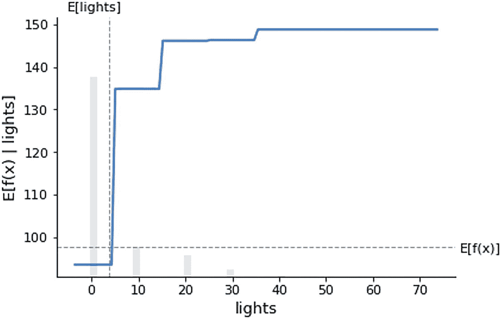

`E(f(x) | lights)` 相对于 `lights` 的图形显示了一个从 (40, 150) 递增的阶跃函数，一条 `E(lights)` 的垂直线，以及一条 `E(f(x))` 的水平线。这些值是近似值。

**图 3-2** 特征 `lights` 与模型预测输出之间的相关性

```python
shap.partial_dependence_plot(
"lights", model.predict, X, ice=False,
model_expected_value=True, feature_expected_value=True
)
```

显示了特征 `lights` 与模型能耗预测值之间的相关性，这些阶跃呈现非线性模式。

偏依赖图是一种解释单个预测并为从数据集中选取的样本生成局部解释的方法。

## 配方 3-3. 针对所有数值输入变量的回归模型的 SHAP 特征重要性

### 问题

您希望使用基于决策树的模型中的 SHAP 值来计算特征重要性。

### 解决方案

此问题的解决方案是使用模型中的 SHAP 绝对值。

### 工作原理

让我们来看下面的示例（见图 3-3）：

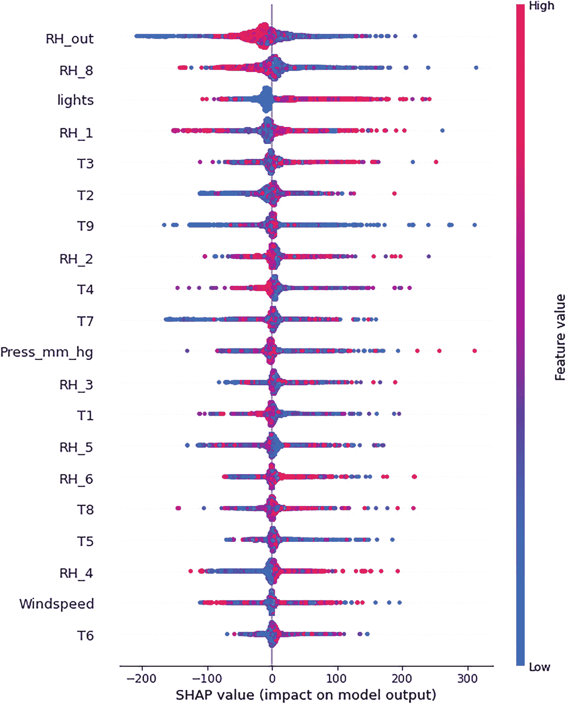

特征值与 SHAP 值的图形表示显示了 20 种不同特征的波动信号形态。

**图 3-3** 基于 SHAP 值的特征重要性图（取自汇总图）

```python
import shap
# compute the SHAP values for the linear model
explainer = shap.TreeExplainer(model)
# SHAP value calculation
shap_values = explainer.shap_values(X)
# explain all the predictions in the dataset
shap.summary_plot(shap_values, X)
```

基于决策树回归器的模型提供了包含 SHAP 值对模型输出影响的汇总图。如果我们需要使用 SHAP 值来解释特征的全局重要性（即展示所有数据点中哪些特征是重要的，而非针对单个数据点），我们可以使用汇总图。

## 配方 3-4. 混合输入变量的树回归模型 SHAP 值

### 问题

当输入特征为混合类型（如数值型和分类型）时，你希望获取 SHAP 值。

### 解决方案

包含数值特征以及分类型或二值型特征的混合输入变量可以一起建模。随着特征数量的增加，计算所有排列所需的时间也会增加。

### 工作原理

让我们来看下面的示例。我们将使用一个经过修改的公开汽车数据集。目标是根据品牌、位置、车龄等特征预测车辆价格。这是一个回归问题，我们将使用数值和分类型特征的混合来解决。

```python
df = pd.read_csv('https://raw.githubusercontent.com/pradmishra1/PublicDatasets/main/automobile.csv')
df.head(3)
df.columns
Index(['Price', 'Make', 'Location', 'Age', 'Odometer', 'FuelType', 'Transmission', 'OwnerType', 'Mileage', 'EngineCC', 'PowerBhp'], dtype='object')
```

我们不能直接在模型中使用基于字符串的特征或分类型特征，因为无法对字符串特征进行矩阵乘法运算；因此，需要将基于字符串的特征转换为虚拟变量或带有 0 和 1 标记的二值特征。此处我们跳过转换步骤，因为许多数据科学家已经知道如何进行数据转换。我们直接导入另一个已转换的数据集。

```python
df_t = pd.read_csv('https://raw.githubusercontent.com/pradmishra1/PublicDatasets/main/Automobile_transformed.csv')
del df_t['Unnamed: 0']
df_t.head(3)
df_t.columns
Index(['Price', 'Age', 'Odometer', 'mileage', 'engineCC', 'powerBhp', 'Location_Bangalore', 'Location_Chennai', 'Location_Coimbatore', 'Location_Delhi', 'Location_Hyderabad', 'Location_Jaipur', 'Location_Kochi', 'Location_Kolkata', 'Location_Mumbai', 'Location_Pune', 'FuelType_Diesel', 'FuelType_Electric', 'FuelType_LPG', 'FuelType_Petrol', 'Transmission_Manual', 'OwnerType_Fourth +ACY- Above', 'OwnerType_Second', 'OwnerType_Third'], dtype='object')
# y is the dependent variable, that we need to predict
y = df_t.pop('Price')
# X is the set of input features
X = df_t
import pandas as pd
import shap
import sklearn
# a simple non linear model initialized
model = sklearn.tree.DecisionTreeRegressor()
# decision tree regression model trained
model.fit(X, y)
```

为了计算 SHAP 值，我们可以使用训练数据集 `X` 和模型预测函数来调用解释器函数。SHAP 值的计算采用排列方法，大约需要 5 分钟。

```python
# compute the SHAP values for the linear model
explainer = shap.Explainer(model)
# SHAP value calculation
shap_values = explainer.shap_values(X)
```

## 配方 3-5. 混合输入回归模型的 SHAP 偏依赖图

### 问题

你希望绘制偏依赖图，并解释数值型和分类型虚拟变量的图形。

### 解决方案

偏依赖图展示了特征与目标变量预测输出之间的相关性。我们可以通过两种方式展示结果：一种是用特征与预测函数的期望值来展示，另一种是在偏依赖图上叠加一个数据点。非线性关系如图 3-4 所示，这与我们在第 2 章中看到的直线不同，这里呈现的是锯齿状模式。

### 工作原理

让我们来看下面的示例：

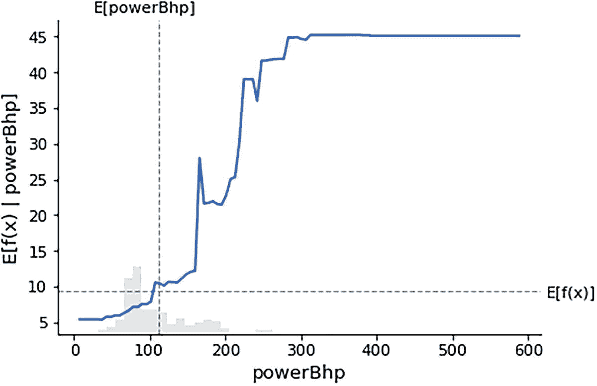

`E[function(x)|powerBhp]` 与 `powerBhp` 的关系图显示了一条从 5 到 45 的上升波动曲线，一条 `E[powerBhp]` 的垂直线，以及一条 `E[function(x)]` 的水平线。数值为近似值。

# 图 3-4 `powerBhp` 与模型预测输出之间的非线性关系

```python
shap.partial_dependence_plot(
"powerBhp", model.predict, X, ice=False,
model_expected_value=True, feature_expected_value=True
)
```

非线性蓝色线显示了价格与 `powerBhp` 之间的正相关关系。`powerBhp` 是一个强特征。马力越大，汽车价格越高。这是一个连续或数值型特征；接下来我们看看二值或虚拟特征。有两个虚拟特征分别表示汽车是否在班加罗尔或加尔各答注册。图 3-5 展示了虚拟变量与其 SHAP 值之间的非线性关系。

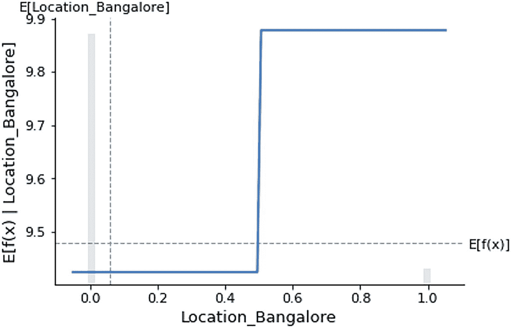

`E[function(x)|Location_Bangalore]` 与 `Location_Bangalore` 的关系图显示了一个递增的阶跃函数，一条 `E[Location_Bangalore]` 的垂直线，以及一条 `E[function(x)]` 的水平线。在 (0.5, 9.9) 处急剧上升，之后保持恒定。数值为近似值。

## 图 3-5 虚拟变量 `Location_Bangalore` 与 SHAP 值的关系

```python
shap.partial_dependence_plot(
"Location_Bangalore", model.predict, X, ice=False,
model_expected_value=True, feature_expected_value=True
)
```

如果汽车的位置是班加罗尔，那么价格会更高，反之亦然。

```python
shap.partial_dependence_plot(
"Location_Kolkata", model.predict, X, ice=False,
model_expected_value=True, feature_expected_value=True
)
```

图 3-6 展示了与图 3-5 类似的关系，但针对的是不同位置。

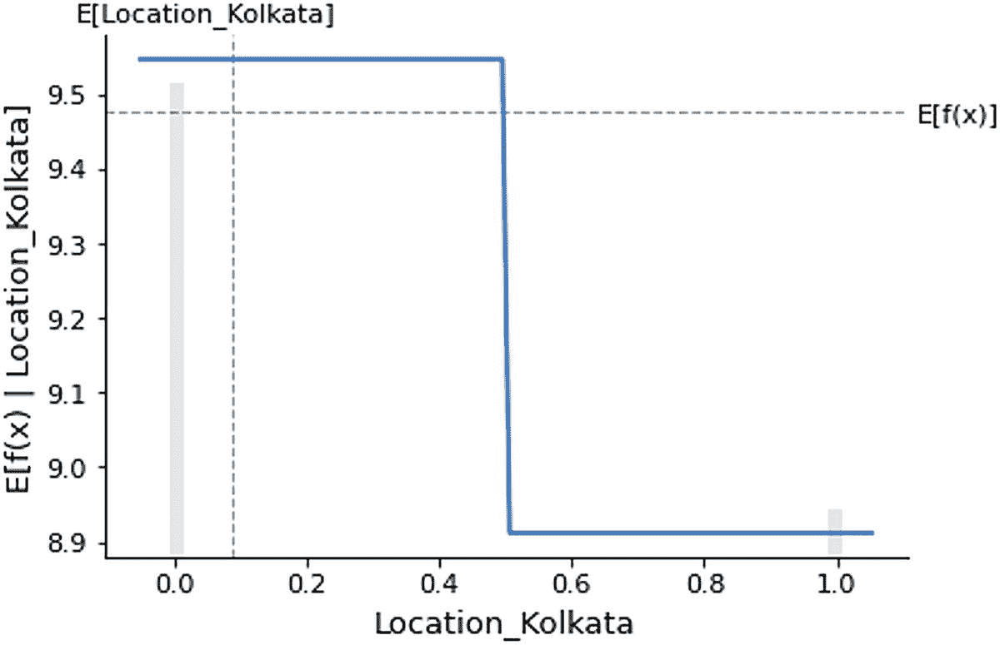

`E[function(x)|Location_Kolkata]` 与 `Location_Kolkata` 的关系图显示了一个递减的阶跃函数，一条 `E[Location_Kolkata]` 的垂直线，以及一条 `E[function(x)]` 的水平线。在 (9.6, 0.5) 处急剧下降，之后保持恒定。数值为近似值。

## 图 3-6 虚拟变量 `Location_Kolkata` 与 SHAP 值的关系

如果位置是加尔各答，那么价格预计会更低。两个位置之间存在差异的原因是用于训练模型的数据不同。前面的三张图展示了特征与预测函数之间的全局重要性。作为示例，这里只考虑了两种特征。我们可以逐一使用所有特征并显示多个图形，以更深入地理解预测结果。

# 配方 3-6. 混合输入变量的树回归模型 SHAP 特征重要性

## 问题

你希望使用混合输入特征数据从 SHAP 值中获取全局特征重要性。

## 解决方案

此问题的解决方案是使用绝对值并按降序排序。所有特征的全局重要性显示在下面的图 3-7 中。

## 工作原理

让我们来看下面的示例：

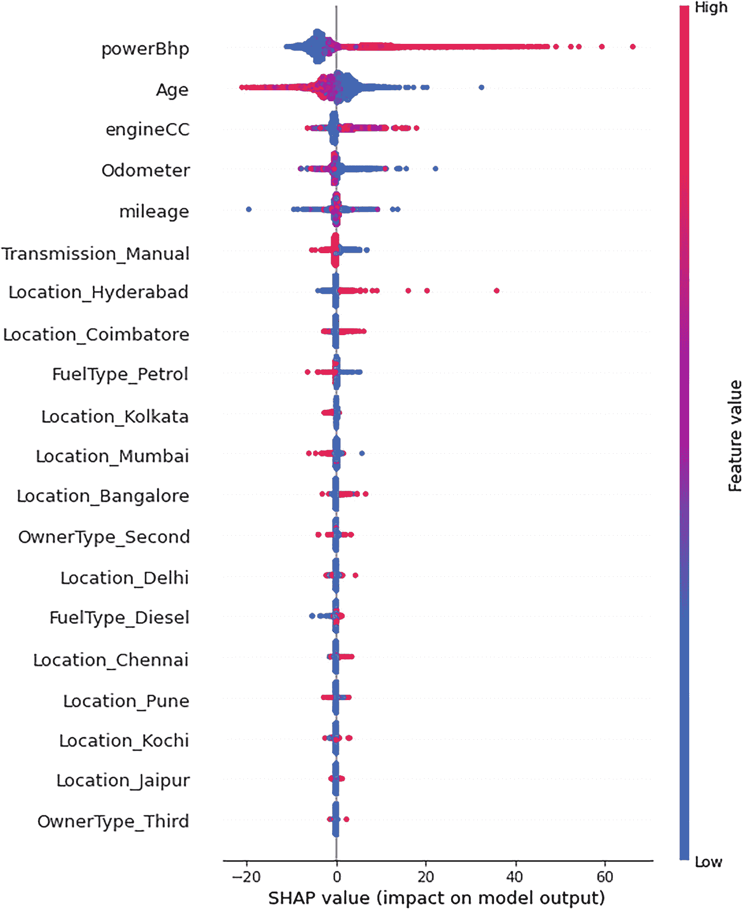

一张特征值与 SHAP 值的图形化表示，展示了`power`、`age`、`engine`、`odometer`、`mileage`、`transmission`、`location`、`fuel`和`owner type`等特征的 20 个波动信号。

### 图 3-7 利用特征重要性解释所有预测结果

```python
list(zip(model.feature_importances_,X.columns))
[(0.169576524767871, 'Age'), (0.046585658464360816, 'Odometer'), (0.04576869739225194, 'mileage'), (0.059163321062728785, 'engineCC'), (0.6384264191473127, 'powerBhp'), (0.002522314313269304, 'Location_Bangalore'), (0.0008970034245261699, 'Location_Chennai'), (0.003791617161795056, 'Location_Coimbatore'), (0.0010761093313731759, 'Location_Delhi'), (0.011285026407948304, 'Location_Hyderabad'), (0.00020112882138512196, 'Location_Jaipur'), (0.000861619871052052211, 'Location_Kochi'), (0.0008846931798977568, 'Location_Kolkata'), (0.0021470912577561748, 'Location_Mumbai'), (0.0007076796376248901, 'Location_Pune'), (0.0013274593267184971, 'FuelType_Diesel'), (0.0, 'FuelType_Electric'), (3.4571613363343374e-07, 'FuelType_LPG'), (0.002242358883910862, 'FuelType_Petrol'), (0.010550931985109665, 'Transmission_Manual'), (8.131243463060016e-07, 'OwnerType_Fourth +ACY- Above'), (0.0016721486214358624, 'OwnerType_Second'), (0.0003110381011919031, 'OwnerType_Third')]
# 解释数据集中的所有预测结果
shap.summary_plot(shap_values, X)
```

从宏观层面来看，对于用于预测汽车价格的基于树的非线性模型，上述特征都很重要。其中最重要的特征是`powerBhp`、车龄、汽油类型、手动变速箱类型等。上述表格输出展示了全局特征重要性。

# 配方 3-7. 表格数据的 LIME 解释器

## 问题

你希望以聚焦的方式在局部层面生成可解释性，而非全局层面。

## 解决方案

解决此问题的方法是使用 LIME 库。LIME 是一种模型无关的技术；它在运行解释器时会重新训练机器学习模型。LIME 将问题局部化，并在局部层面解释模型。

## 工作原理

让我们来看下面的示例。LIME 要求将 numpy 数组作为表格解释器的输入；因此，需要将 Pandas 数据框转换为数组。

```python
!pip install lime
Looking in indexes: https://pypi.org/simple, https://us-python.pkg.dev/colab-wheels/public/simple/
Collecting lime
Downloading lime-0.2.0.1.tar.gz (275 kB)
|████████████████████████████████| 275 kB 3.9 MB/s
Requirement already satisfied: matplotlib in /usr/local/lib/python3.7/dist-packages (from lime) (3.2.2)
Requirement already satisfied: numpy in /usr/local/lib/python3.7/dist-packages (from lime) (1.21.6)
Requirement already satisfied: scipy in /usr/local/lib/python3.7/dist-packages (from lime) (1.7.3)
Require
................
import lime
import lime.lime_tabular
explainer = lime.lime_tabular.LimeTabularExplainer(np.array(X),
mode='regression',
feature_names=X.columns,
class_names=['price'],
verbose=True)
```

我们仅使用本章中的能量预测数据。

```python
explainer.feature_selection
# 请求 LIME 模型的解释
i = 60
exp = explainer.explain_instance(np.array(X)[i],
model.predict,
num_features=14
)
```

我们无需重新训练决策树模型。我们可以传递从训练决策树模型中获得的对象，并将其与 LIME 解释器一起重用。图 3-8 展示了训练数据集中第 60 条记录的局部解释。

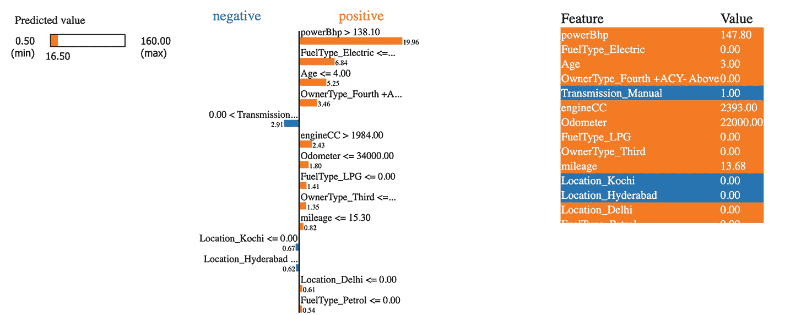

一张图形化表示，包含最小和最大预测值、负值和正值列，以及一个包含特征和值两列的表格。

### 图 3-8 数据集中第 60 条记录的局部解释

```python
model.predict(X)[60]
X[60:61]
Intercept -6.9881095432071465
Prediction_local [33.29071077]
Right: 16.5
exp.show_in_notebook(show_table=True)
```

```python
exp.as_list()
[('powerBhp > 138.10', 19.961371959849174), ('FuelType_Electric  1984.00', 2.432167151933345), ('Odometer <= 34000.00', 1.8038639987179637), ('FuelType_LPG <= 0.00', 1.4135278408858953), ('OwnerType_Third <= 0.00', 1.3547839120439655), ('mileage <= 15.30', 0.8239170366232045), ('Location_Kochi <= 0.00', -0.6740434016444569), ('Location_Hyderabad <= 0.00', -0.6190270673151664), ('Location_Delhi <= 0.00', 0.6091569397933114), ('FuelType_Petrol <= 0.00', 0.5427180987401807)]
```

# 配方 3-8. 表格数据的 ELI5 解释器

## 问题

你希望使用 ELI5 库来生成线性回归模型的解释。

## 解决方案

ELI5 是一个 Python 包，有助于调试机器学习模型并解释预测结果。它为`scikit-learn`库支持的所有机器学习模型提供支持。

## 工作原理

让我们来看下面的例子：

| 权重 | 特征 |
| --- | --- |
| 0.6384 | `powerBhp` |
| 0.1696 | `Age` |
| 0.0592 | `engineCC` |
| 0.0466 | `Odometer` |
| 0.0458 | `Mileage` |
| 0.0113 | `Location_Hyderabad` |
| 0.0106 | `Transmission_Manual` |
| 0.0038 | `Location_Coimbatore` |
| 0.0025 | `Location_Bangalore` |
| 0.0022 | `FuelType_Petrol` |
| 0.0021 | `Location_Mumbai` |
| 0.0017 | `OwnerType_Second` |
| 0.0013 | `FuelType_Diesel` |
| 0.0011 | `Location_Delhi` |
| 0.0009 | `Location_Chennai` |
| 0.0009 | `Location_Kolkata` |
| 0.0009 | `Location_Kochi` |
| 0.0007 | `Location_Pune` |
| 0.0003 | `OwnerType_Third` |
| 0.0002 | `Location_Jaipu` |

```python
pip install eli5
import eli5
eli5.show_weights(model,
feature_names=list(X.columns))
```

| 权重 | 特征 |
| --- | --- |
| 0.6384 | `powerBhp` |
| 0.1696 | `Age` |
| 0.0592 | `engineCC` |
| 0.0466 | `Odometer` |
| 0.0458 | `Mileage` |
| 0.0113 | `Location_Hyderabad` |
| 0.0106 | `Transmission_Manual` |
| 0.0038 | `Location_Coimbatore` |
| 0.0025 | `Location_Bangalore` |
| 0.0022 | `FuelType_Petrol` |
| 0.0021 | `Location_Mumbai` |
| 0.0017 | `OwnerType_Second` |
| 0.0013 | `FuelType_Diesel` |
| 0.0011 | `Location_Delhi` |
| 0.0009 | `Location_Chennai` |
| 0.0009 | `Location_Kolkata` |
| 0.0009 | `Location_Kochi` |
| 0.0007 | `Location_Pune` |
| 0.0003 | `OwnerType_Third` |
| 0.0002 | `Location_Jaipur` |

```python
eli5.explain_weights(model, feature_names=list(X.columns))
```

```python
eli5.explain_prediction(model,X.iloc[60])
```

`y` (得分 **16.500**) 主要特征

| 贡献^? | 特征 |
| --- | --- |
| +9.479 | `<BIAS>` |
| +4.710 | `engineCC` |
| +4.190 | `Age` |
| +1.467 | `mileage` |
| +0.713 | `FuelType_Petrol` |
| +0.667 | `powerBhp` |
| +0.071 | `Odometer` |
| -1.313 | `Location_Mumbai` |
| -3.485 | `Transmission_Manual` |

| 权重 | 特征 |
| --- | --- |
| 1.3784 ± 0.0884 | `powerBhp` |
| 0.4245 ± 0.0049 | `Age` |
| 0.2587 ± 0.0120 | `engineCC` |
| 0.1968 ± 0.0333 | `Odometer` |
| 0.1557 ± 0.0103 | `mileage` |
| 0.0709 ± 0.0425 | `Location_Hyderabad` |
| 0.0550 ± 0.0076 | `Transmission_Manual` |
| 0.0120 ± 0.0037 | `FuelType_Petrol` |
| 0.0095 ± 0.0011 | `Location_Coimbatore` |
| 0.0086 ± 0.0015 | `FuelType_Diesel` |
| 0.0071 ± 0.0013 | `Location_Mumbai` |
| 0.0058 ± 0.0016 | `Location_Bangalore` |
| 0.0054 ± 0.0011 | `OwnerType_Second` |
| 0.0030 ± 0.0005 | `Location_Kolkata` |
| 0.0030 ± 0.0012 | `Location_Kochi` |
| 0.0030 ± 0.0003 | `Location_Delhi` |
| 0.0027 ± 0.0011 | `Location_Chennai` |
| 0.0017 ± 0.0003 | `Location_Pune` |
| 0.0004 ± 0.0001 | `Location_Jaipur` |
| 0.0002 ± 0.0001 | `OwnerType_Thir` |

```python
from eli5.sklearn import PermutationImportance
# 初始化一个简单的线性模型
model = sklearn.tree.DecisionTreeRegressor()
# 训练线性回归模型
model.fit(X, y)
perm = PermutationImportance(model)
perm.fit(X, y)
eli5.show_weights(perm,feature_names=list(X.columns))
```

结果表中包含一个名为 `BIAS` 的特征。这可以解释为线性回归模型的截距项。其他特征则根据其权重大小以降序排列。`show_weights` 函数提供了模型的全局解释，而 `show_prediction` 函数则通过考虑训练集中的一条记录来提供局部解释。

# 配方 3-9. ELI5 中置换模型的工作原理

## 问题

您希望理解 ELI5 置换库的原理。

### 解决方案

此问题的解决方案是使用一个数据集和一个训练好的模型。

### 工作原理

ELI5 库中的置换模型仅适用于全局解释。首先，它从训练数据集中获取一个基线线性回归模型，并计算该模型的误差。然后，它打乱一个特征的值，重新训练模型，并计算误差。它比较打乱后和打乱前的误差下降情况。如果一个特征在打乱后误差变化较大，则可以认为该特征重要；如果误差变化较小，则认为不重要，反之亦然。结果会显示特征的平均重要性和经过多次打乱步骤后的特征标准差。

## 配方 3-10. 决策树模型的全局解释

### 问题

您想要解释由决策树分类器生成的预测结果。

### 解决方案

当我们从二分类或多分类变量中建模概率时，可以使用决策树模型。在本特定配方中，我们使用一个流失分类数据集，该数据集包含两种结果：客户是否可能流失。

### 工作原理

让我们来看下面的例子。关键在于获取 SHAP 值，它将返回基础值、SHAP 值和数据。利用 SHAP 值，我们可以使用图表和图形创建各种解释。SHAP 值始终是全局层面的。

```python
import pandas as pd
import numpy as np
import matplotlib.pyplot as plt
%matplotlib inline
from sklearn import tree, metrics, model_selection, preprocessing
from sklearn.metrics import confusion_matrix, classification_report
df_train = pd.read_csv('https://raw.githubusercontent.com/pradmishra1/PublicDatasets/main/ChurnData_test.csv')
from sklearn.preprocessing import LabelEncoder
tras = LabelEncoder()
df_train['area_code_tr'] = tras.fit_transform(df_train['area_code'])
df_train.columns
del df_train['area_code']
df_train.columns
df_train['target_churn_dum'] = pd.get_dummies(df_train.churn,prefix='churn',drop_first=True)
df_train.columns
del df_train['international_plan']
del df_train['voice_mail_plan']
del df_train['churn']
df_train.info()
del df_train['Unnamed: 0']
df_train.columns
from sklearn.model_selection import train_test_split
df_train.columns
X = df_train[['account_length', 'number_vmail_messages', 'total_day_minutes',
'total_day_calls', 'total_day_charge', 'total_eve_minutes',
'total_eve_calls', 'total_eve_charge', 'total_night_minutes',
'total_night_calls', 'total_night_charge', 'total_intl_minutes',
'total_intl_calls', 'total_intl_charge',
'number_customer_service_calls', 'area_code_tr']]
Y = df_train['target_churn_dum']
xtrain,xtest,ytrain,ytest=train_test_split(X,Y,test_size=0.20,stratify=Y)
tree_model = tree.DecisionTreeClassifier()
tree_model.fit(xtrain,ytrain)
print("训练准确率:", tree_model.score(xtrain,ytrain)) #训练准确率
print("测试准确率:",tree_model.score(xtest,ytest)) # 测试准确率
训练准确率: 1.0
测试准确率: 0.8562874251497006
# 以概率形式提供输出
def model_churn_proba(x):
return tree_model.predict_proba(x)[:,1]
# 以对数几率形式提供输出
def model_churn_log_odds(x):
p = tree_model.predict_log_proba(x)
return p[:,1] - p[:,0]
# 计算线性模型的 SHAP 值
background_churn = shap.maskers.Independent(X, max_samples=500)
explainer = shap.Explainer(tree_model, background_churn,feature_names=list(X.columns))
shap_values_churn = explainer(X)
```

## 配方 3-11. 非线性分类器的部分依赖图

### 问题

您希望使用非线性分类器展示特征与类别概率之间的关联。

### 解决方案

本例中的类别概率与预测流失概率相关。可以将某个特征的 SHAP 值与该特征值绘制成散点图，以显示相关性（正相关或负相关）和关联强度。下图 3-9 直观地展示了这种关系。

### 工作原理

让我们来看下面的例子：

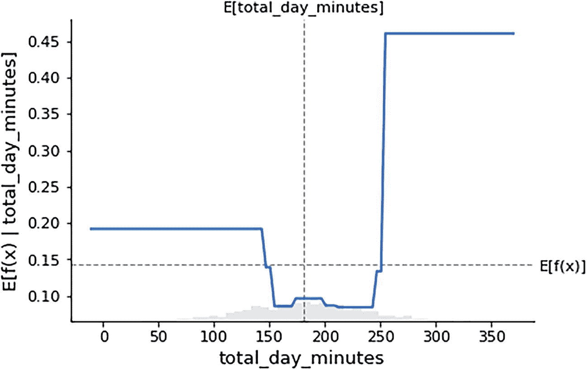

函数 `x` 的 `E` 值 `total_day_minutes` 与 `total_day_minutes` 的关系图显示出一条从 0.20 到 0.45 的波动曲线，以及 `total_day_minutes` 的 `E` 值和函数 `x` 的 `E` 值的垂直与水平线。数值为近似值。

**图 3-9** 账户时长与账户时长的 SHAP 值

```python
# make a standard partial dependence plot
sample_ind = 25
fig,ax = shap.partial_dependence_plot(
"total_day_minutes", model_churn_proba, X, model_expected_value=True,
feature_expected_value=True, show=False, ice=False
)
```

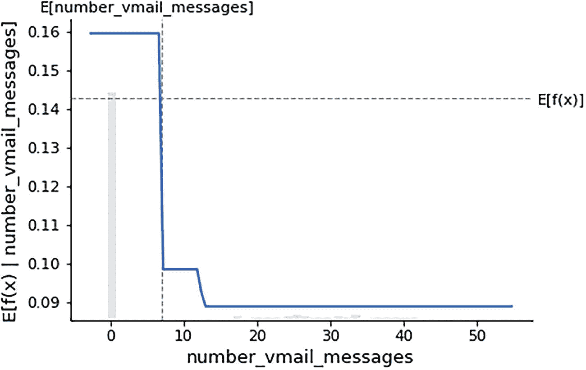

函数 `x` 的 `E` 值 `number_vmail_messages` 与 `number_vmail_messages` 的关系图显示出一条从 0.16 到 0.09 的递减阶梯曲线，以及 `number_vmail_messages` 的 `E` 值和函数 `x` 的 `E` 值的垂直与水平线。数值为近似值。

**图 3-10** 语音邮件消息数量与 SHAP 值

```python
# make a standard partial dependence plot
sample_ind = 25
fig,ax = shap.partial_dependence_plot(
"number_vmail_messages", model_churn_proba, X, model_expected_value=True,
feature_expected_value=True, show=False,ice=False)
```

图 3-11 将此与第 2 章的线性分类器进行了比较。

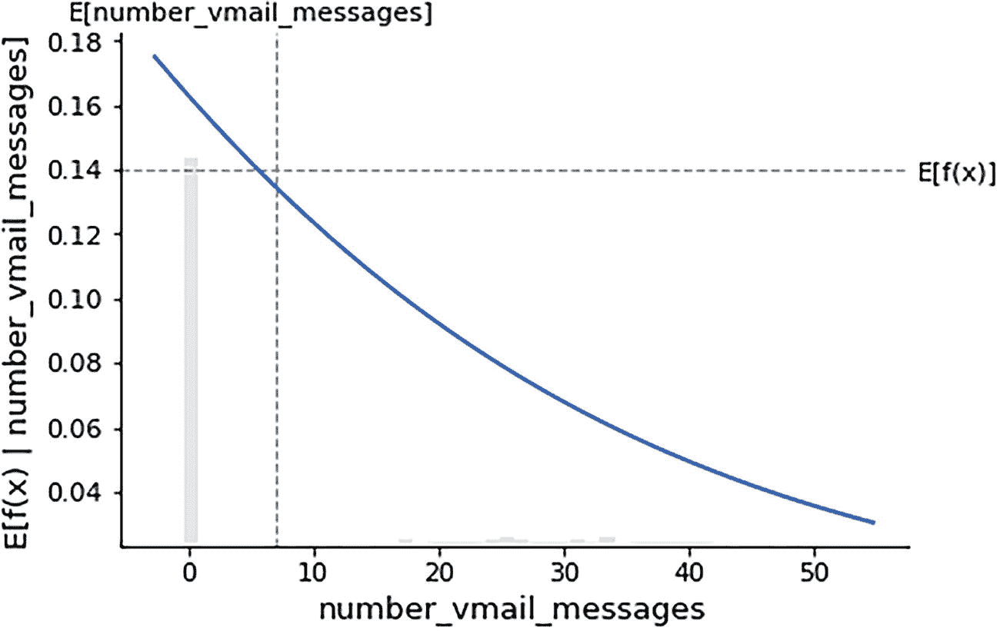

函数 `x` 的 `E` 值 `number_vmail_messages` 与 `number_vmail_messages` 的关系图显示出一条从 0.15 到 0.04 的递减斜率，以及 `number_vmail_messages` 的 `E` 值和函数 `x` 的 `E` 值的垂直与水平线。数值为近似值。

**图 3-11** 第 2 章的线性分类器

两个图之间的差异很明显。线性分类器是一条向下倾斜的直线，而决策树分类器则是一条非线性的阶梯状曲线。

## 配方 3-12. 非线性分类器的全局特征重要性

### 问题

您希望获取决策树分类模型的全局特征重要性。

### 解决方案

此问题的解决方案是使用 `explainer_log_odds`。

### 工作原理

让我们来看下面的例子：

| 特征名称 | 重要性 |   |
| --- | --- | --- |
| **2** | `total_day_minutes` | 0.219502 |
| **14** | `number_customer_service_calls` | 0.120392 |
| **4** | `total_day_charge` | 0.097044 |
| **7** | `total_eve_charge` | 0.095221 |
| **1** | `number_vmail_messages` | 0.062609 |
| **10** | `total_night_charge` | 0.061233 |
| **8** | `total_night_minutes` | 0.057162 |
| **9** | `total_night_calls` | 0.055642 |
| **11** | `total_intl_minutes` | 0.046794 |
| **3** | `total_day_calls` | 0.043435 |
| **12** | `total_intl_calls` | 0.040072 |
| **0** | `account_length` | 0.032119 |
| **6** | `total_eve_calls` | 0.029836 |
| **13** | `total_intl_charge` | 0.020441 |
| **5** | `total_eve_minutes` | 0.013121 |
| **15** | `area_code_tr` | 0.005378 |

```python
# compute the SHAP values for the linear model
explainer_log_odds = shap.Explainer(tree_model, background_churn,feature_names=list(X.columns))
shap_values_churn_log_odds = explainer_log_odds(X)
shap_values_churn_log_odds
temp_df = pd.DataFrame()
temp_df['Feature Name'] = pd.Series(X.columns)
temp_df['Importance'] = pd.Series(tree_model.feature_importances_)
temp_df.sort_values(by='Importance',ascending=False)
```

## 配方 3-13. 使用 LIME 进行局部解释

### 问题

您希望从可解释的全局和局部库中获取更快的解释。

### 解决方案

模型解释可以使用 SHAP 完成；然而，SHAP 的局限性之一是我们无法使用全部数据来创建全局和局部解释。即使我们决定使用全部数据，通常也需要更多时间。因此，在训练模型使用数百万条记录的场景下，加速生成局部和全局解释的过程，LIME 非常有用。第 1 条记录的局部解释如图 3-12 所示，第 20 条记录的局部解释如图 3-13 所示。

### 工作原理

让我们来看下面的例子：

| 0 | 1 |   |
| --- | --- | --- |
| **0** | `total_day_minutes > 215.90` | 0.136264 |
| **1** | `number_vmail_messages <= 0.00` | 0.092967 |
| **2** | `3.00 < total_intl_calls <= 4.00` | -0.053900 |
| **3** | `total_day_calls <= 86.00` | -0.051572 |
| **4** | `99.00 < total_night_calls <= 112.00` | -0.046773 |
| **5** | `1.00 < number_customer_service_calls <= 2.00` | -0.044415 |
| **6** | `total_intl_charge <= 2.32` | -0.023672 |
| **7** | `200.40 < total_eve_minutes <= 232.60` | -0.017684 |
| **8** | `8.95 < total_night_charge <= 10.40` | -0.016768 |
| **9** | `88.00 < total_eve_calls <= 101.00` | -0.015113 |
| **10** | `total_day_charge > 36.70` | 0.013384 |
| **11** | `area_code_tr > 1.00` | 0.006775 |
| **12** | `total_intl_minutes <= 8.60` | 0.005599 |
| **13** | `17.03 < total_eve_charge <= 19.77` | -0.003622 |
| **14** | `98.00 < account_length <= 126.00` | 0.000635 |
| **15** | `198.80 < total_night_minutes <= 231.20` | -0.000002 |

```python
import lime
import lime.lime_tabular
explainer = lime.lime_tabular.LimeTabularExplainer(np.array(xtrain),
feature_names=list(xtrain.columns),
class_names=['target_churn_dum'],
verbose=True, mode='classification')
# this record is a no churn scenario
exp = explainer.explain_instance(xtest.iloc[0], tree_model.predict_proba, num_features=16)
exp.as_list()
Intercept 0.17857751096606778
Prediction_local [0.16068057]
Right: 1.0
X does not have valid feature names, but DecisionTreeClassifier was fitted with feature names
[('total_day_minutes > 215.90', 0.1362643566581409),
('number_vmail_messages  36.70', 0.01338384802674405),
('area_code_tr > 1.00', 0.006774852953278585),
('total_intl_minutes <= 8.60', 0.005598720978761775),
('17.03 < total_eve_charge <= 19.77', -0.0036223084182909603),
('98.00 < account_length <= 126.00', 0.0006345376072269405),
('198.80 < total_night_minutes <= 231.20', -1.7083964912392244e-06)]
pd.DataFrame(exp.as_list())
```

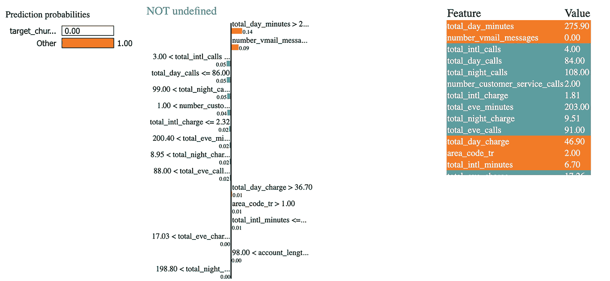

一个图形表示，包含预测概率、一个“未定义”列，以及一个包含特征和值两列的表。

**图 3-12** 测试集中第 1 条记录的局部解释

```python
exp.show_in_notebook(show_table=True)
```

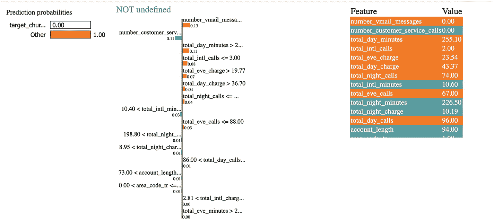

一个图形表示，包含预测概率、一个“未定义”列，以及一个包含特征和值两列的表。

**图 3-13** 测试集中第 20 条记录的局部解释

# This is s churn scenario

```python
exp = explainer.explain_instance(xtest.iloc[20], tree_model.predict_proba, num_features=16)
exp.as_list()
Intercept 0.10256094438264549
Prediction_local [0.42951224]
Right: 1.0
X does not have valid feature names, but DecisionTreeClassifier was fitted with feature names
[('number_vmail_messages  215.90', 0.11335292810078498),
('total_intl_calls  19.77', 0.07087970621129276),
('total_day_charge > 36.70', 0.044322021446899056),
('total_night_calls  232.60', 0.0001974706449185791)]
exp.show_in_notebook(show_table=True)
```

类似地，可以为训练集和测试集中的不同记录生成图表，这些记录同样来自训练样本和测试样本。

## 配方 3-14. 使用 ELI5 进行模型解释

### 问题

您希望使用 ELI5 库获取模型解释。

### 解决方案

ELI5 提供了两个函数 `show_weights` 和 `show_predictions` 来生成模型解释。

### 工作原理

让我们来看下面的例子：

| 权重 | 特征 |
| --- | --- |
| 0.2195 | `total_day_minutes` |
| 0.1204 | `number_customer_service_calls` |
| 0.0970 | `total_day_charge` |
| 0.0952 | `total_eve_charge` |
| 0.0626 | `number_vmail_messages` |
| 0.0612 | `total_night_charge` |
| 0.0572 | `total_night_minutes` |
| 0.0556 | `total_night_calls` |
| 0.0468 | `total_intl_minutes` |
| 0.0434 | `total_day_calls` |
| 0.0401 | `total_intl_calls` |
| 0.0321 | `account_length` |
| 0.0298 | `total_eve_calls` |
| 0.0204 | `total_intl_charge` |
| 0.0131 | `total_eve_minutes` |
| 0.0054 | `area_code_tr` |

```bash
pip install eli5
```

```python
eli5.show_weights(tree_model,
feature_names=list(xtrain.columns))
```

| 权重 | 特征 |
| --- | --- |
| 0.2195 | `total_day_minutes` |
| 0.1204 | `number_customer_service_calls` |
| 0.0970 | `total_day_charge` |
| 0.0952 | `total_eve_charge` |
| 0.0626 | `number_vmail_messages` |
| 0.0612 | `total_night_charge` |
| 0.0572 | `total_night_minutes` |
| 0.0556 | `total_night_calls` |
| 0.0468 | `total_intl_minutes` |
| 0.0434 | `total_day_calls` |
| 0.0401 | `total_intl_calls` |
| 0.0321 | `account_length` |
| 0.0298 | `total_eve_calls` |
| 0.0204 | `total_intl_charge` |
| 0.0131 | `total_eve_minutes` |
| 0.0054 | `area_code_tr` |

```python
eli5.explain_weights(tree_model, feature_names=list(xtrain.columns))
```

```python
eli5.explain_prediction(tree_model,xtrain.iloc[60])
```

`y=0` (概率 `1.000`) 主要特征

| 贡献^? | 特征 |
| --- | --- |
| +0.866 | `<BIAS>` |
| +0.126 | `total_eve_charge` |
| +0.118 | `total_night_charge` |
| +0.076 | `total_night_calls` |
| +0.038 | `total_day_minutes` |
| +0.032 | `number_customer_service_calls` |
| +0.010 | `total_intl_calls` |
| -0.084 | `total_eve_calls` |
| -0.088 | `total_day_calls` |
| -0.093 | `total_intl_minutes` |

| 权重 | 特征 |
| --- | --- |
| 0.0814 ± 0.0272 | `total_day_minutes` |
| 0.0407 ± 0.0188 | `number_customer_service_calls` |
| 0.0359 ± 0.0085 | `total_eve_charge` |
| 0.0299 ± 0.0147 | `total_night_minutes` |
| 0.0263 ± 0.0198 | `total_night_charge` |
| 0.0210 ± 0.0126 | `number_vmail_messages` |
| 0.0174 ± 0.0088 | `total_day_charge` |
| 0.0042 ± 0.0061 | `total_intl_charge` |
| 0.0036 ± 0.0167 | `total_intl_minutes` |
| 0.0006 ± 0.0024 | `area_code_tr` |
| -0.0006 ± 0.0122 | `total_eve_calls` |
| -0.0012 ± 0.0145 | `total_eve_minutes` |
| -0.0024 ± 0.0024 | `account_length` |
| -0.0030 ± 0.0076 | `total_night_calls` |
| -0.0054 ± 0.0079 | `total_day_calls` |
| -0.0114 ± 0.0088 | `total_intl_calls` |

```python
from eli5.sklearn import PermutationImportance
perm = PermutationImportance(tree_model)
perm.fit(xtest, ytest)
eli5.show_weights(perm,feature_names=list(xtrain.columns))
```

## 结论

在本章中，我们介绍了如何解释基于决策树的非线性监督模型，用于回归和分类。然而，非线性模型在全局层面（即特征重要性层面）更容易解释，但在局部解释层面却难以说明，因为并非所有特征都会参与决策树的构建过程。在本章中，我们使用 SHAP、ELI5 和 LIME 库对样本进行了局部解释。在下一章中，我们将介绍集成模型的局部和全局解释。非线性模型涵盖了数据中存在的非线性关系，因此可能难以解释。然而，基于树的模型的一个局限性在于，它只考虑少数几个强大的特征来构建树，并未对所有特征给予同等重视。因此，局部解释的可解释性并不完整。这个问题可以通过集成模型来解决，集成模型是许多树协同工作的组合。