# 4. 集成监督模型的可解释性

当单个模型无法平衡训练数据集的偏差和方差时，集成模型被认为是有效的。集成模型通过聚合多个预测结果来生成最终模型。对于监督回归模型，会生成多个模型，并取所有预测的平均值来生成最终预测。类似地，对于监督分类问题，会训练多个模型，每个模型生成一个分类结果。最终模型采用多数投票规则标准来决定最终预测。由于集成模型的特性，它们更难向最终用户解释。这就是为什么我们需要能够解释集成模型的框架。

*集成* 意味着对模型预测结果进行分组。集成模型有三种类型：装袋、提升和堆叠。*装袋* 指的是自助聚合，即对可用特征进行自助采样，进行子集选择，生成预测，重复此过程数次，然后对预测结果取平均值以生成最终预测。随机森林是最重要且最流行的装袋模型之一。

*提升* 是一种顺序提升模型预测能力的方法。它首先在数据上训练一个基分类器来预测和分类输出。下一步，自动分离出预测正确的案例，其余案例则用于重新训练模型。此过程将持续进行，直到有提升空间并将准确率提高到更高水平。如果无法进一步提高准确率，则迭代停止，并报告最终准确率。

*堆叠* 是从不同模型集合生成预测并对其预测结果取平均值的过程。

本章的目标是介绍用于集成模型的各种可解释性库，例如特征重要性、部分依赖图，以及模型的局部解释和全局解释。

## 配方 4-1. 可解释提升机解释

### 问题

您希望将可解释提升机（EBM）作为集成模型进行解释，并解读其全局和局部解释。

### 解决方案

EBM 是一种基于树、循环、梯度下降的提升模型，被称为*广义加性模型*（GAM），具有自动交互检测功能。尽管 EBM 本质上是黑盒模型，但它们是可解释的。我们需要一个名为 `interpret core` 的额外库。

### 工作原理

让我们来看下面的例子。Shapley 值可称为 SHAP 值。SHAP 值用于解释模型，并基于合作博弈论对预测结果进行公平分配，以将特征归因于模型的预测结果。模型输入特征被视为博弈中的玩家，模型函数则被视为博弈规则。某个特征的 Shapley 值基于以下步骤计算：

1.  SHAP 需要在所有特征子集上重新训练模型；因此，如果需要对较大的数据集生成解释，通常需要花费时间。

2.  从特征列表中确定一个特征集（假设有 15 个特征，我们可以选择包含 5 个特征的子集）。

3.  对于任何特定特征，将使用特征子集创建两个模型：一个包含该特征，另一个不包含该特征。

4.  计算预测差异。

5.  对所有可能的特征子集计算预测差异。

6.  所有可能差异的加权平均值用于填充特征重要性。

如果特征的权重为 `0.000`，那么我们可以得出结论：该特征不重要，且未参与模型。如果不等于 `0.000`，那么我们可以得出结论：该特征在预测过程中发挥作用。

我们将使用 UCI 机器学习仓库中的一个数据集。访问该数据集的 URL 如下：

[`https://archive.ics.uci.edu/ml/datasets/Appliances+energy+prediction`](https://archive.ics.uci.edu/ml/datasets/Appliances%252Benergy%252Bprediction)

目标是利用传感器中的特征预测电器的能耗（单位：瓦时）。数据集中有 27 个特征，我们在此试图理解哪些特征对预测能耗至关重要。参见表 4-1。

**表 4-1** 能耗预测数据集的特征描述

| 特征名称 | 描述 | 单位 |
| --- | --- | --- |
| `Appliances` | 能耗 | 瓦时 |
| `Lights` | 房屋内灯具的能耗 | 瓦时 |
| `T1` | 厨房区域温度 | 摄氏度 |
| `RH_1` | 厨房区域湿度 | % |
| `T2` | 客厅区域温度 | 摄氏度 |
| `RH_2` | 客厅区域湿度 | % |
| `T3` | 洗衣房区域温度 | 摄氏度 |
| `RH_3` | 洗衣房区域湿度 | % |
| `T4` | 办公室温度 | 摄氏度 |
| `RH_4` | 办公室湿度 | % |
| `T5` | 浴室温度 | 摄氏度 |
| `RH_5` | 浴室湿度 | % |
| `T6` | 建筑外部（北侧）温度 | 摄氏度 |
| `RH_6` | 建筑外部（北侧）湿度 | % |
| `T7` | 熨衣间温度 | 摄氏度 |
| `RH_7` | 熨衣间湿度 | % |
| `T8` | 青少年房间 2 温度 | 摄氏度 |
| `RH_8` | 青少年房间 2 湿度 | % |
| `T9` | 父母房间温度 | 摄氏度 |
| `RH_9` | 父母房间湿度 | % |
| `To` | 外部温度（来自 Chievres 气象站） | 摄氏度 |
| `Pressure` | 压力（来自 Chievres 气象站） | 毫米汞柱 |
| `aRH_out` | 外部湿度（来自 Chievres 气象站） | % |
| `Wind speed` | 风速（来自 Chievres 气象站） | 米/秒 |
| `Visibility` | 能见度（来自 Chievres 气象站） | 千米 |
| `Tdewpoint` | 露点温度（来自 Chievres 气象站） | 摄氏度 |
| `rv1` | 随机变量 1 | 无量纲 |
| `rv2` | 随机变量 2 | 无量纲 |

```
pip install shap
!pip install interpret-core #this installation is without any dependency library
Looking in indexes: https://pypi.org/simple, https://us-python.pkg.dev/colab-wheels/public/simple/
Requirement already satisfied: interpret-core in /usr/local/lib/python3.7/dist-packages (0.2.7)
import pandas as pd
df_lin_reg = pd.read_csv('https://archive.ics.uci.edu/ml/machine-learning-databases/00374/energydata_complete.csv')
del df_lin_reg['date']
df_lin_reg.info()
df_lin_reg.columns
Index(['Appliances', 'lights', 'T1', 'RH_1', 'T2', 'RH_2', 'T3', 'RH_3', 'T4', 'RH_4', 'T5', 'RH_5', 'T6', 'RH_6', 'T7', 'RH_7', 'T8', 'RH_8', 'T9', 'RH_9', 'T_out', 'Press_mm_hg', 'RH_out', 'Windspeed', 'Visibility', 'Tdewpoint', 'rv1', 'rv2'], dtype='object')
#y is the dependent variable, that we need to predict
y = df_lin_reg.pop('Appliances')
# X is the set of input features
X = df_lin_reg
# fit a GAM model to the data
import interpret.glassbox
import shap
model_ebm = interpret.glassbox.ExplainableBoostingRegressor()
model_ebm.fit(X, y)
X100 = X[:100]
# explain the GAM model with SHAP
explainer_ebm = shap.Explainer(model_ebm.predict, X100)
shap_values_ebm = explainer_ebm(X100)
import numpy as np
pd.DataFrame(np.round(shap_values_ebm.values,2)).head(2)
```

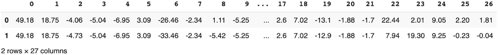

一个包含 27 列和 2 行的表格。列编号从 0 到 26，行标记为 0 和 1。

```
pd.DataFrame(np.round(shap_values_ebm.base_values,2)).head(2)
00103.741103.74
```

## 配方 4-2：树回归模型的偏依赖图

### 问题

您希望从提升模型中获得偏依赖图。

### 解决方案

此问题的解决方案是使用 SHAP 从模型生成偏依赖图。

### 工作原理

让我们来看下面的示例（见图 4-1）：

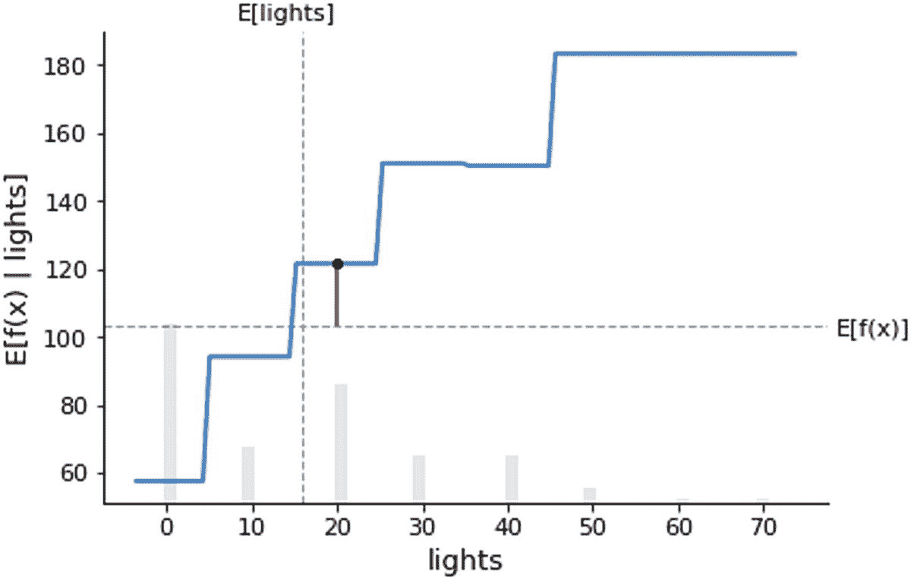

一张 SHAP 部分依赖图，展示了 SHAP 值与灯光特征的关系。一条实线从 (0, 60) 开始，以递增的阶梯趋势延伸至 (70, 180)。两条虚线 `E lights` 和 `E f of x` 在 (15,105) 处相交。实线上有一个点标记在 (20, 120) 处。最高的柱状条位于 (0, 105)。所有数值均为估算值。

**图 4-1** 特征“灯光”与模型预测输出之间的相关性

```
# 制作一个标准的部分依赖图，并叠加单个 SHAP 值
sample_ind = 20
fig,ax = shap.partial_dependence_plot(
"lights", model_ebm.predict, X100, model_expected_value=True,
feature_expected_value=True, show=False, ice=False,
shap_values=shap_values_ebm[sample_ind:sample_ind+1,:]
)
```

图中展示了特征 `lights` 与模型能源使用预测值之间的相关性，其阶梯状趋势呈现非线性模式。部分依赖图是一种解释个体预测的方法，可为从数据集中选定的样本生成局部解释。见图 4-2。

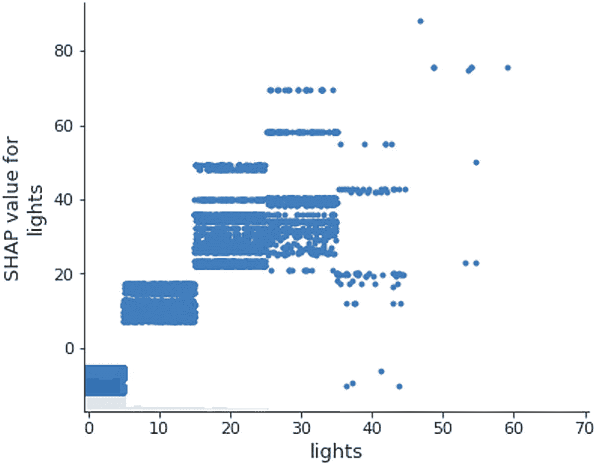

一张灯光特征的 SHAP 值与灯光值之间的散点图。点簇大致在 (0, 0) 到 (60, 80) 之间呈递增趋势。

**图 4-2** 特征“灯光”与 SHAP 值之间的相关性

```
shap.plots.scatter(shap_values_ebm[:,"lights"])
```

```
# waterfall_plot 展示了如何从 explainer.expected_value 得到 model.predict(X)[sample_ind]
shap.plots.waterfall(shap_values_ebm[sample_ind], max_display=14)
```

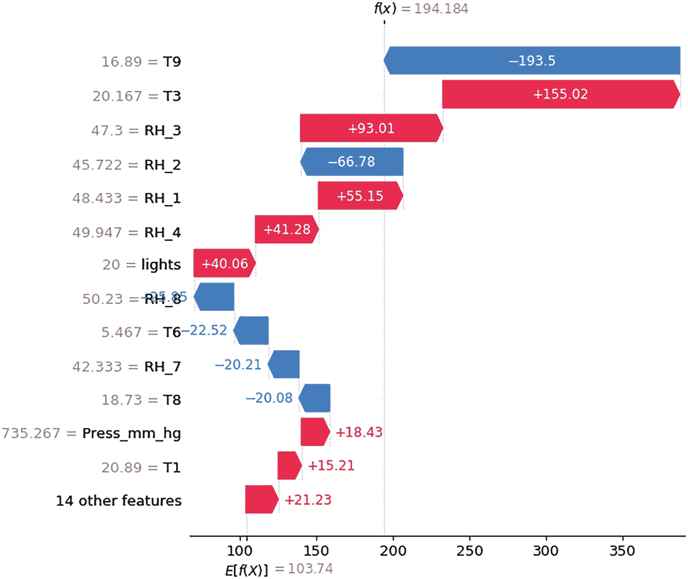

一张 SHAP 瀑布图，展示了 14 个变量的特征值。`T 3` 和 `T 9` 分别具有最高和最低的 SHAP 值，分别为 155.02 和 -193.5。`f of x` 和 `E f of x` 的虚线分别位于 194.184 和 103.74。

**图 4-3** 特定样本记录的特征重要性，局部解释

```
# waterfall_plot 展示了如何从 explainer.expected_value 得到 model.predict(X)[sample_ind]
shap.plots.beeswarm(shap_values_ebm, max_display=14)
```

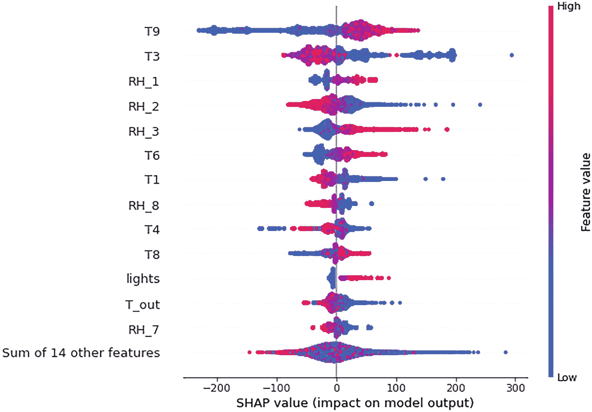

一张 SHAP 蜂群图。渐变刻度表示特征值从高到低的颜色深浅。`T 9` 的低特征值以及其他 14 个特征的总和分别具有最大负 SHAP 值和最大正 SHAP 值，约为 -250 和 280。

**图 4-4** SHAP 值对模型输出的影响，全局解释

为了生成全局解释器，我们需要安装另一个可视化库。

```
!pip install dash_cytoscape
from interpret import set_visualize_provider
from interpret.provider import InlineProvider
set_visualize_provider(InlineProvider())
from interpret import show
ebm_global = model_ebm.explain_global()
show(ebm_global)
```

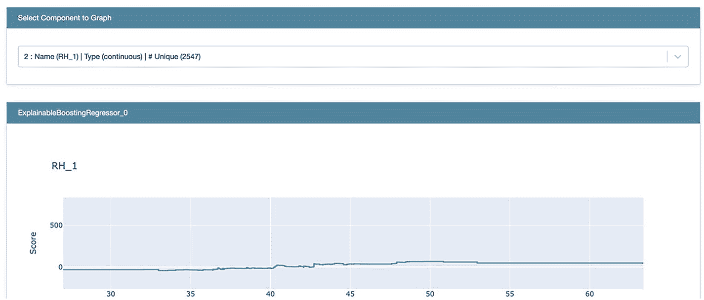

一张图形组件选择界面的截图，顶部有一个下拉框。下方的 `R H underscore 1` 图形绘制了分数与数值的关系，呈现一条大致在 (25, -0.1) 到 (65, 0.1) 之间轻微波动的近似直线。

**图 4-5** 从下拉菜单中选择特征以查看其贡献

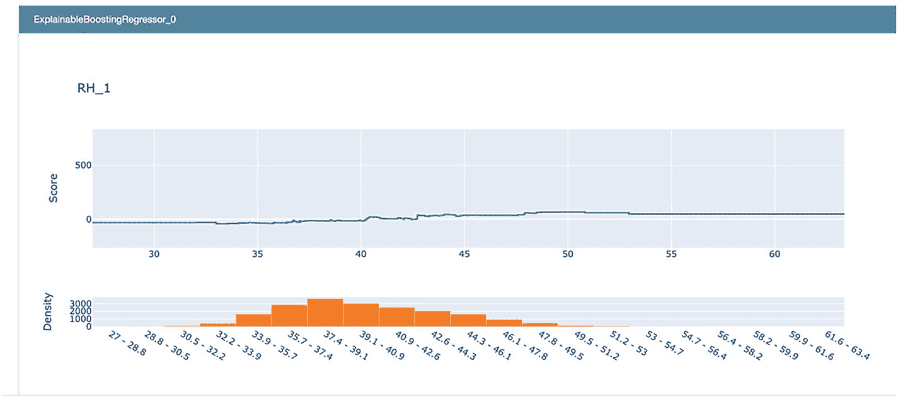

一张可解释自举回归器部分的截图。折线图 `R H underscore 1` 绘制了分数，呈现一条带有轻微波动的直线。一个包含 21 个区间的密度直方图，其最高柱状条几乎位于 (37.4 至 39.1, 3000) 处。

**图 4-6** 特征 `RH_1` 的分数及其分布，全局解释

```
ebm_local = model_ebm.explain_local(X[:5], y[:5])
show(ebm_local)
ebm_local
import numpy as np
pd.DataFrame(np.round(shap_values_ebm.values,2)).head(2)
pd.DataFrame(np.round(shap_values_ebm.base_values,2)).head(2)
```

## 配方 4-3. 解释一个所有输入变量均为数值的极端梯度提升模型

### 问题

您想要解释基于极端梯度提升的回归器。

### 解决方案

可以使用 SHAP 库来解释 XGB 回归器；我们可以生成全局和局部解释。

### 工作原理

让我们来看下面的示例：

```
# 训练 XGBoost 模型
import xgboost
model_xgb = xgboost.XGBRegressor(n_estimators=100, max_depth=2).fit(X, y)
# 使用 SHAP 解释 GAM 模型
explainer_xgb = shap.Explainer(model_xgb, X)
shap_values_xgb = explainer_xgb(X)
# 制作一个标准的部分依赖图，并叠加单个 SHAP 值
sample_ind = 18
fig,ax = shap.partial_dependence_plot(
"lights", model_xgb.predict, X, model_expected_value=True,
feature_expected_value=True, show=False, ice=False,
shap_values=shap_values_xgb[sample_ind:sample_ind+1,:]
)
```

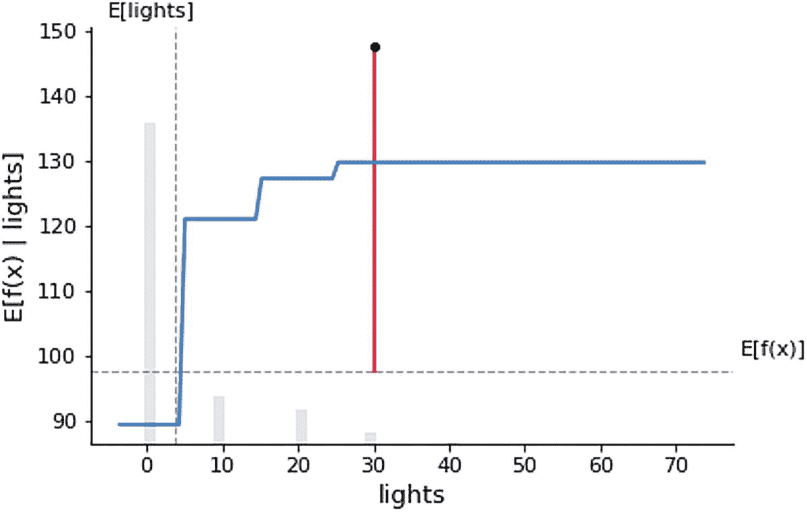

一张 SHAP 部分依赖图，展示了 SHAP 值与灯光特征的关系。实线从 (0, 90) 开始，以递增的阶梯趋势上升至 (70, 130)。两条虚线 `E lights` 和 `E f of x` 在 (4, 98) 处相交。一个点标记在 (20, 120) 处。最高的柱状条值位于 (0, 135)。所有数值均为估算值。

**图 4-7** 基于 SHAP 值的特征重要性图，取自汇总图

基于 XGB 回归器的模型提供了汇总图，其中包含 SHAP 值对模型输出的影响。如果我们需要使用 SHAP 值来解释特征的全局重要性（即显示哪些特征对所有数据点都重要），我们可以使用汇总图。

```
shap.plots.scatter(shap_values_xgb[:,"lights"])
```

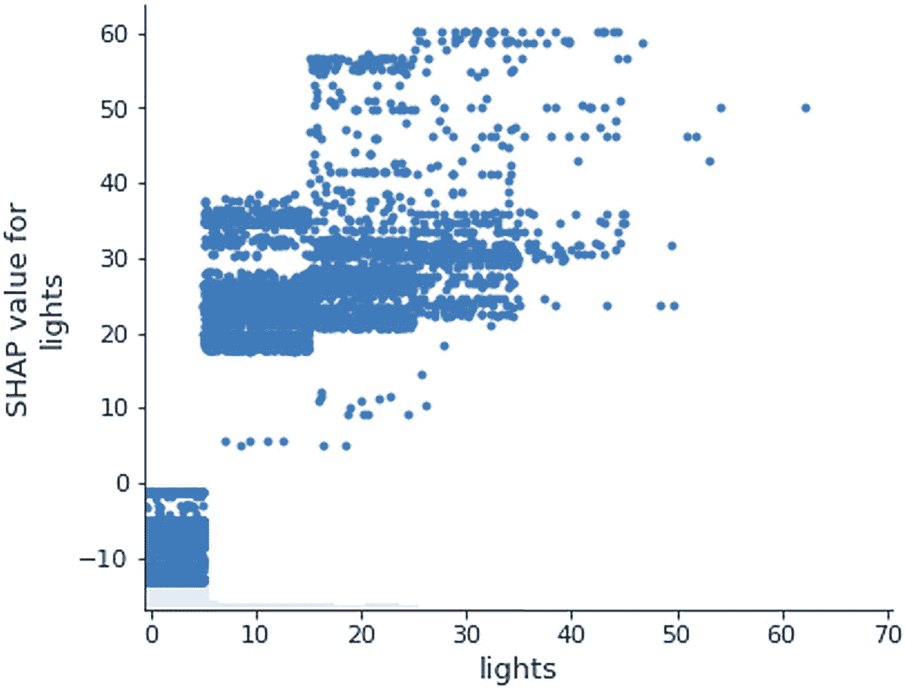

一张灯光特征的 SHAP 值与灯光值之间的散点图。大部分点大致聚集在 (8, 15) 到 (50, 60) 之间，呈递增趋势。

**图 4-8** 灯光特征的 SHAP 值相对于灯光特征本身的散点图

```
shap.plots.scatter(shap_values_xgb[:,"lights"], color=shap_values_xgb)
```

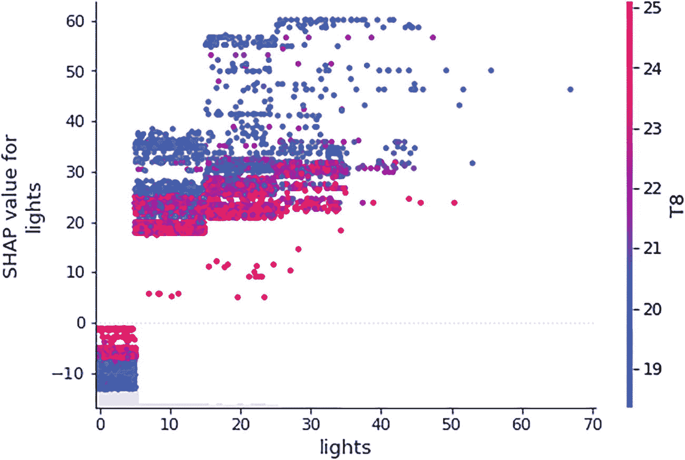

一张灯光和 `T 8` 的 SHAP 值与灯光值的散点图。右侧的渐变刻度表示 `T 8` 值在 19 到 25 之间的颜色深浅。大部分渐变颜色的点大致聚集在 (5, 18) 到 (50, 60) 之间。

**图 4-9** 两个特征 `T8` 和 `lights` 相对于灯光 SHAP 值的散点图

```
shap.summary_plot(shap_values_xgb, X)
```

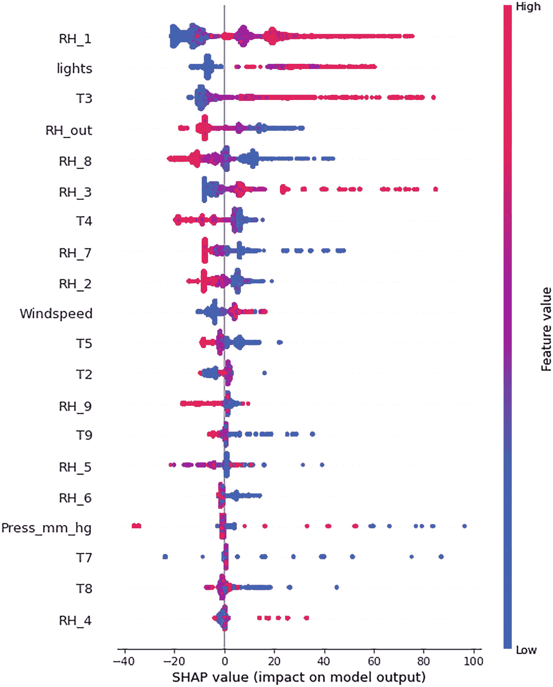

一张 SHAP 蜂群图。渐变刻度表示特征值从高到低的颜色深浅。`Press underscore m m underscore h g` 在低特征值和高特征值下分别具有最大正 SHAP 值（接近 100）和最大负 SHAP 值（接近 -40）。

**图 4-10** 基于 SHAP 值的全局特征重要性

## 配方 4-4. 使用全局和局部解释解释随机森林回归器

### 问题

随机森林是一种通过装袋方法创建集成模型的技术；它同样难以解释哪个树生成了最终预测，也难以解释全局和局部解释。

### 解决方案

我们将使用 SHAP 库中的树解释器。

### 工作原理

让我们来看下面的示例：

```markdown
# 配方 4-5. 使用全局和局部解释解释 CatBoost 回归器

## 问题

CatBoost 是另一种通过显式声明类别特征来加速模型训练过程的模型。如果没有类别特征，则该模型也会在所有数值特征上进行训练。你需要解释 CatBoost 回归模型的全局和局部解释。

## 解决方案

我们将使用 SHAP 库和 CatBoost 库中的树解释器。

## 工作原理

让我们来看下面的示例：

```python
!pip install catboost
import catboost
from catboost import *
import shap
shap.initjs()
model = CatBoostRegressor(iterations=100, learning_rate=0.1, random_seed=123)
model.fit(X, y, verbose=False, plot=False)
explainer = shap.TreeExplainer(model)
shap_values = explainer.shap_values(X)
# 总结所有特征的影响
shap.summary_plot(shap_values, X)
```

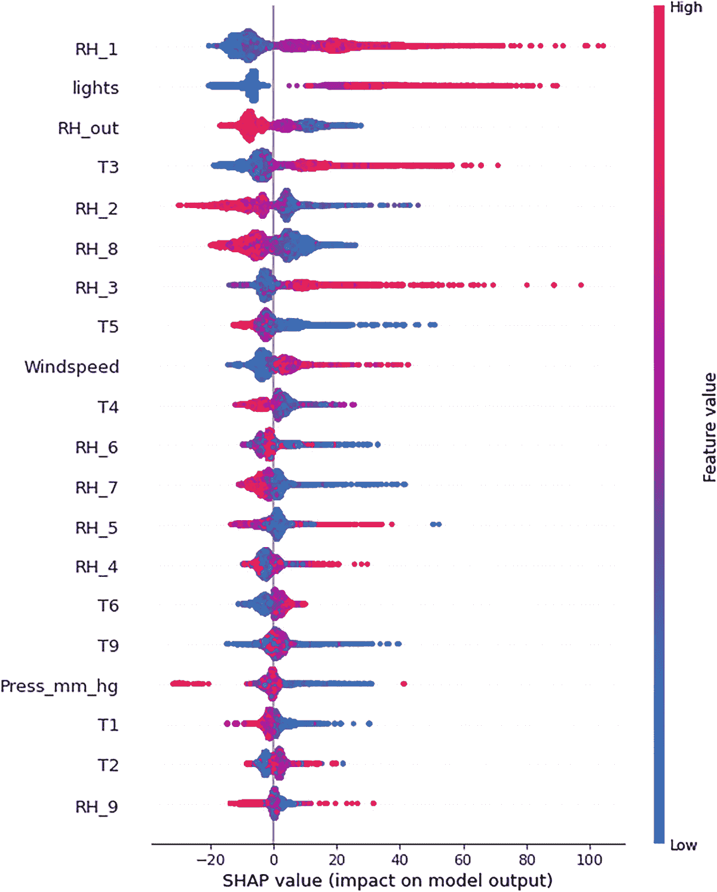

一张 SHAP 蜂群图。`RH_1` 和 `press_mm_hg` 的高特征值分别具有接近 100 和 -30 的最大正负 SHAP 值。

**图 4-14** SHAP 值对模型预测的影响

```python
# 创建一个 SHAP 依赖图，以显示单个特征在整个数据集上的效果
shap.dependence_plot("lights", shap_values, X)
```

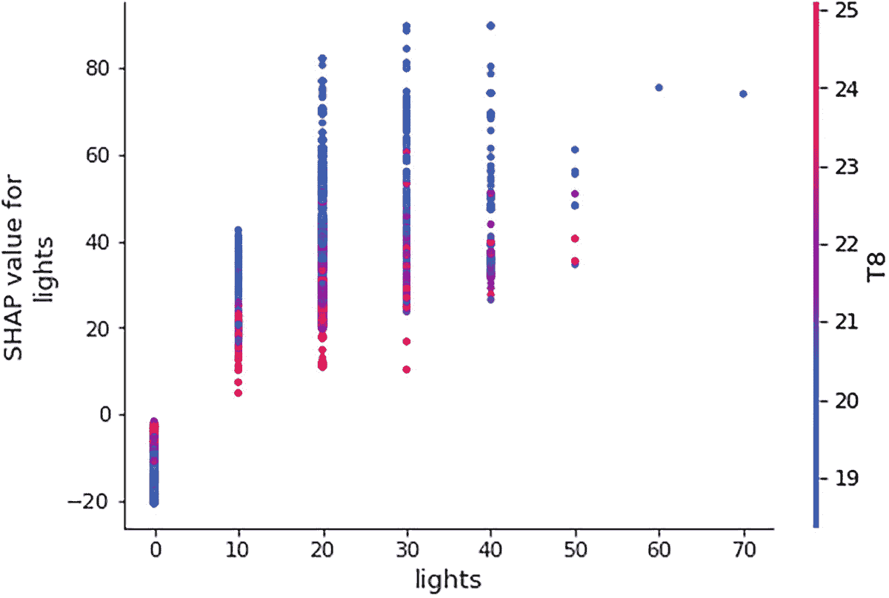

一张关于 `lights` 和 `T8` 相对于 `lights` 的 SHAP 散点图。具有最大 SHAP 值和低 `T8` 值的点大约位于 (30, 85) 和 (40, 85)。高 `T8` 和最小 SHAP 值的点几乎位于 (0, -1)。

**图 4-15** `lights` 的 SHAP 值依赖图

# 配方 4-6. 使用全局和局部解释解释 EBM 分类器

## 问题

EBM 是一种用于分类器的可解释提升机。你需要解释 EBM 分类器模型的全局和局部解释。

## 解决方案

我们将使用 SHAP 库中的树解释器。

## 工作原理

让我们来看下面的示例。我们将使用一个经过修改的公开汽车数据集。目标是给定诸如品牌、位置、车龄等特征来预测车辆价格。这是一个回归问题，我们将使用数值和类别特征的组合来解决。

```python
df = pd.read_csv('https://raw.githubusercontent.com/pradmishra1/PublicDatasets/main/automobile.csv')
df.head(3)
df.columns
Index(['Price', 'Make', 'Location', 'Age', 'Odometer', 'FuelType', 'Transmission', 'OwnerType', 'Mileage', 'EngineCC', 'PowerBhp'], dtype='object')
```

我们不能直接在模型中使用基于字符串的特征或类别特征，因为无法对字符串特征进行矩阵乘法；因此，需要将基于字符串的特征转换为虚拟变量或带有 0 和 1 标志的二元特征。由于许多数据科学家已经知道如何进行数据转换，此处省略转换步骤。我们直接导入另一个已转换的数据集。

```python
df_t = pd.read_csv('https://raw.githubusercontent.com/pradmishra1/PublicDatasets/main/Automobile_transformed.csv')
del df_t['Unnamed: 0']
df_t.head(3)
df_t.columns
Index(['Price', 'Age', 'Odometer', 'mileage', 'engineCC', 'powerBhp', 'Location_Bangalore', 'Location_Chennai', 'Location_Coimbatore', 'Location_Delhi', 'Location_Hyderabad', 'Location_Jaipur', 'Location_Kochi', 'Location_Kolkata', 'Location_Mumbai', 'Location_Pune', 'FuelType_Diesel', 'FuelType_Electric', 'FuelType_LPG', 'FuelType_Petrol', 'Transmission_Manual', 'OwnerType_Fourth +ACY- Above', 'OwnerType_Second', 'OwnerType_Third'], dtype='object')
# y 是因变量，我们需要预测它
y = df_t.pop('Price')
# X 是输入特征集
X = df_t
from interpret import set_visualize_provider
from interpret.provider import InlineProvider
set_visualize_provider(InlineProvider())
import pandas as pd
from sklearn.model_selection import train_test_split
from interpret.glassbox import ExplainableBoostingClassifier
from interpret import show
import shap
import sklearn
```

为了计算 SHAP 值，我们可以使用训练数据集 `X` 和模型预测函数来调用解释器函数。SHAP 值的计算采用排列方法，耗时 5 分钟。

```python
# 将 GAM 模型拟合到数据
import interpret.glassbox
import shap
model_ebm = interpret.glassbox.ExplainableBoostingRegressor()
model_ebm.fit(X, y)
X100 = X[:100]
# 使用 SHAP 解释 GAM 模型
explainer_ebm = shap.Explainer(model_ebm.predict, X100)
shap_values_ebm = explainer_ebm(X100)
import numpy as np
pd.DataFrame(np.round(shap_values_ebm.values,2)).head(2)
pd.DataFrame(np.round(shap_values_ebm.base_values,2)).head(2)
```

# 配方 4-7. 混合输入的回归模型的 SHAP 部分依赖图

## 问题

你需要绘制部分依赖图，并解释数值和类别虚拟变量的图形。

## 解决方案

部分依赖图展示了特征与目标变量预测输出之间的相关性。有两种方式可以展示结果：一种是通过特征和预测函数的期望值，另一种是通过在部分依赖图上叠加数据点。

## 工作原理

让我们来看下面的示例：

```python
from interpret import set_visualize_provider
from interpret.provider import InlineProvider
set_visualize_provider(InlineProvider())
from interpret import show
ebm_global = model_ebm.explain_global()
show(ebm_global)
ebm_local = model_ebm.explain_local(X[:5], y[:5])
show(ebm_local)
# make a standard partial dependence plot with a single SHAP value overlaid
sample_ind = 20
fig,ax = shap.partial_dependence_plot(
"powerBhp", model_ebm.predict, X100, model_expected_value=True,
feature_expected_value=True, show=False, ice=False,
shap_values=shap_values_ebm[sample_ind:sample_ind+1,:]
)
```

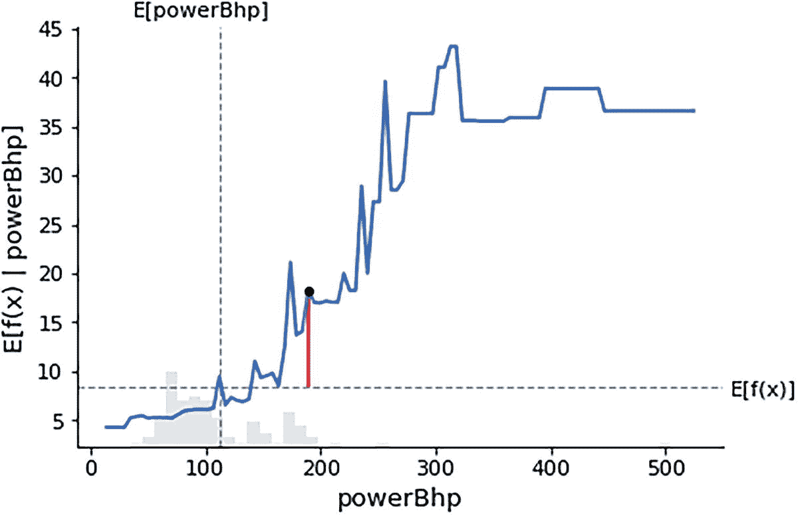

SHAP 偏依赖图展示了 SHAP 值与马力（`powerBhp`）的关系。曲线在 (0, 5) 和 (300, 44) 之间上升，伴有多个尖锐峰值，最终在 (500, 40) 处结束。图中标出了一个点 (200, 17.5)。最高柱状图位于 (75, 10)。两条虚线 `E[lights]` 和 `E[f(x)]` 在 (110, 8) 处相交。所有数值均为估计值。

**图 4-16** `powerBhp` 与模型预测输出之间的非线性关系

非线性蓝色线条显示了价格与 `powerBhp` 之间的正相关关系。`powerBhp` 是一个强特征；马力越大，汽车价格越高。

```python
shap.partial_dependence_plot(
"powerBhp", model_ebm.predict, X, ice=False,
model_expected_value=True, feature_expected_value=True
)
```

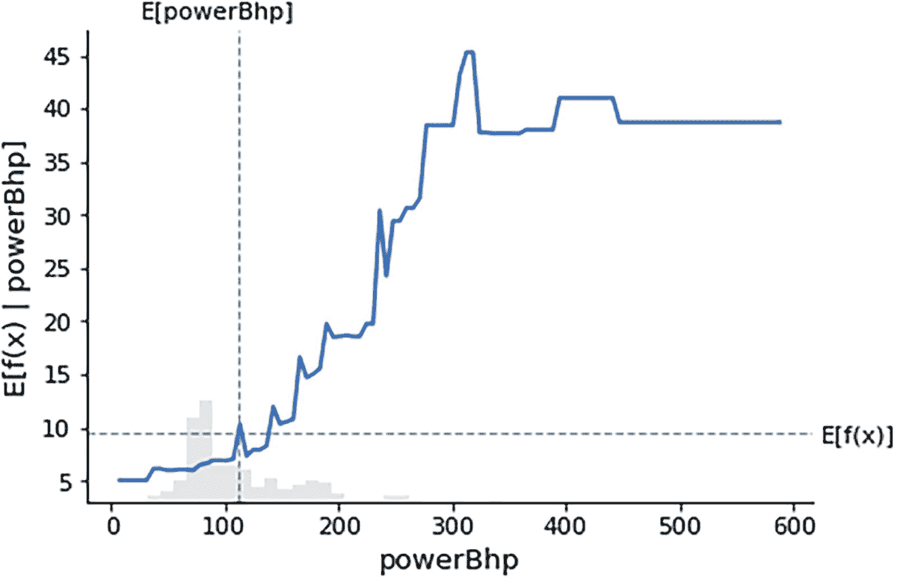

SHAP 偏依赖图展示了 SHAP 值与马力（`powerBhp`）的关系。曲线在 (0, 5) 和 (300, 45) 之间上升，伴有多个尖锐峰值，最终在 (600, 40) 处结束。最高柱状图位于 (75, 17)。两条虚线 `E[lights]` 和 `E[f(x)]` 在 (110, 9) 处相交。所有数值均为估计值。

**图 4-17** `powerBhp` 的偏依赖图

这是一个连续或数值型特征。接下来我们看看二元或虚拟特征。有两个虚拟特征用于表示汽车是否注册在班加罗尔或加尔各答。

```python
shap.partial_dependence_plot(
"Location_Bangalore", model_ebm.predict, X, ice=False,
model_expected_value=True, feature_expected_value=True
)
```

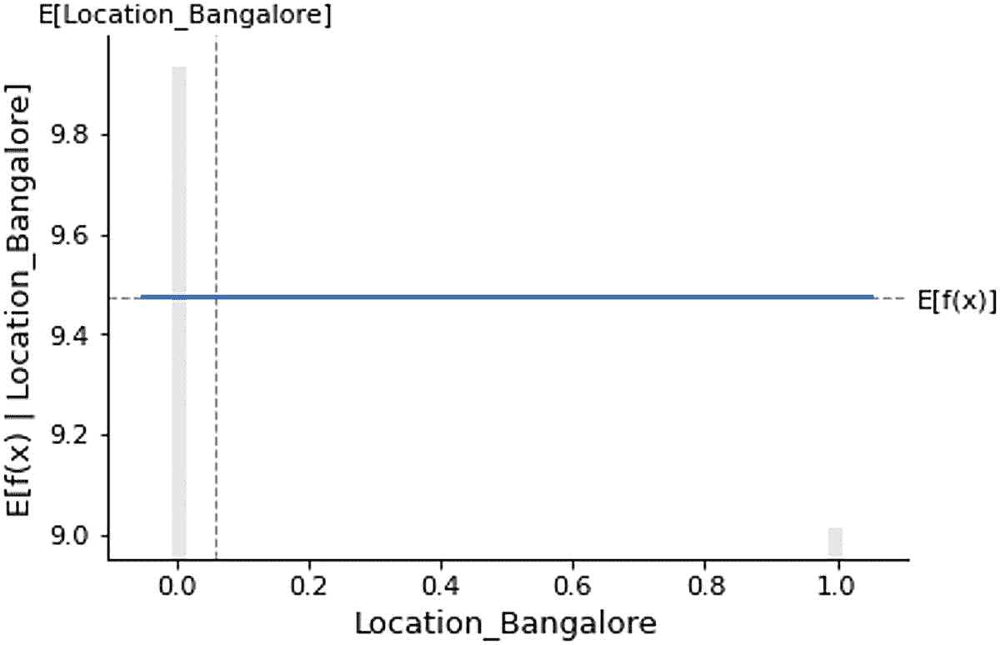

SHAP 偏依赖图展示了 SHAP 值与地点班加罗尔（`Location_Bangalore`）的关系。一条水平直线位于 (-0.1, 9.49) 和 (1.0, 9.49) 之间。两个柱状图分别位于 (0.0, 9.9) 和 (1.0, 9.04)。两条虚线 `E[lights]` 和 `E[f(x)]` 在 (0.8, 9.49) 处相交。所有数值均为估计值。

**图 4-18** 虚拟变量 `Location_Bangalore` 与 SHAP 值的关系

如果汽车所在地是班加罗尔，那么价格将为 9.5，并且保持不变。

```python
shap.partial_dependence_plot(
"Location_Kolkata", model_ebm.predict, X, ice=False,
model_expected_value=True, feature_expected_value=True
)
```

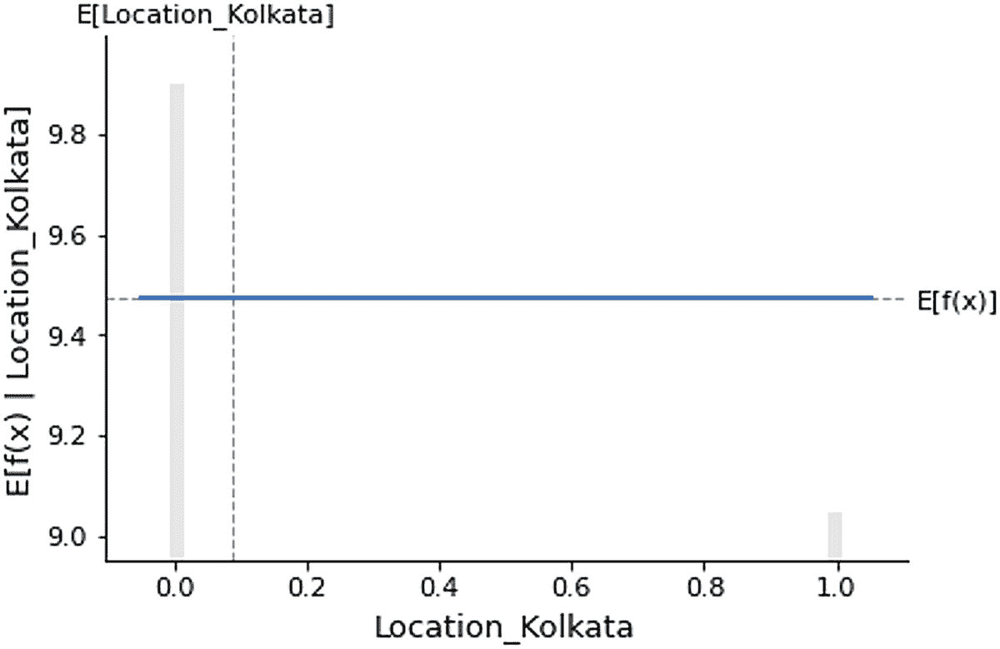

SHAP 偏依赖图展示了 SHAP 值与地点加尔各答（`Location_Kolkata`）的关系。一条水平直线位于 (-0.1, 9.49) 和 (1.0, 9.49) 之间。两个柱状图分别位于 (0.0, 9.9) 和 (1.0, 9.05)。两条虚线 `E[lights]` 和 `E[f(x)]` 在 (0.8, 9.49) 处相交。所有数值均为估计值。

**图 4-19** 虚拟变量 `Location_Kolkata` 与 SHAP 值的关系

如果所在地是加尔各答，那么价格预计相同。该虚拟变量对价格没有影响。

# 配方 4-8：混合输入变量的树回归模型的 SHAP 特征重要性

## 问题

你希望使用混合输入特征数据从 SHAP 值中获取全局特征重要性。

## 解决方案

该问题的解决方案是使用绝对值，按降序排序，并将其展示在瀑布图、蜂群图、散点图等图表中。

## 工作原理

让我们来看下面的示例：

```python
shap.plots.scatter(shap_values_ebm[:,"powerBhp"])
```

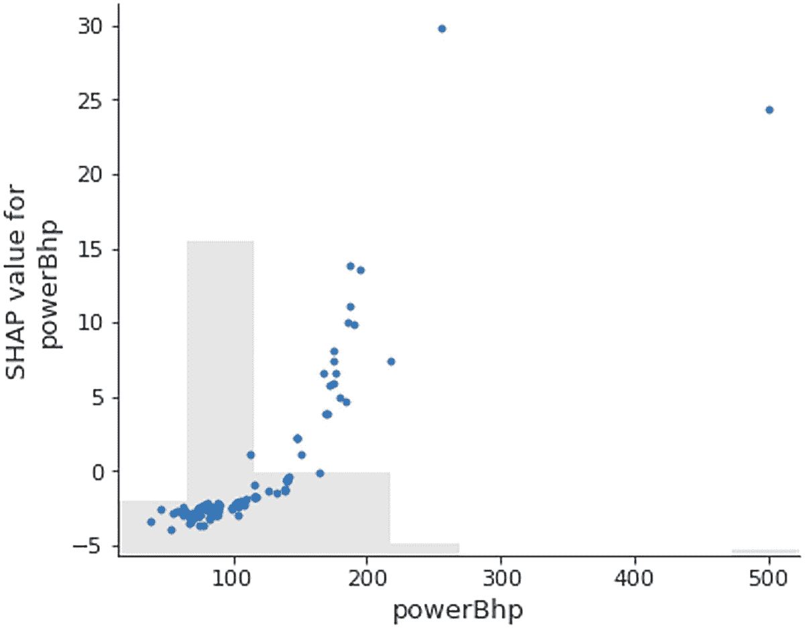

一个散点图和直方图，展示了 SHAP 值与马力（`powerBhp`）的关系。点簇大致在 (50, -5) 和 (200, 14) 之间呈曲线上升。直方图的最高柱状图大约在 (100, 15) 处。

**图 4-20** `powerBhp` 及其 SHAP 值的散点图

```python
# the waterfall_plot shows how we get from explainer.expected_value to model.predict(X)[sample_ind]
shap.plots.waterfall(shap_values_ebm[sample_ind], max_display=14)
```

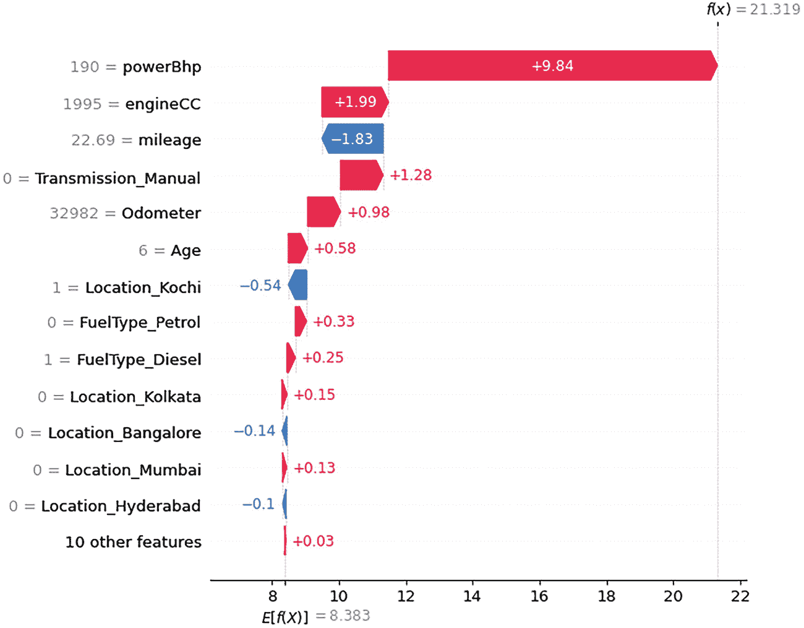

一个 SHAP 瀑布图，展示了特征与 SHAP 值的关系。马力（`powerBhp`）具有最高的 SHAP 值 9.84，而科钦（`Kochi`）地点具有最低的 SHAP 值 -0.54。`f(x)` 和 `E[f(x)]` 的线条分别位于 21.319 和 8.383。所有数值均为估计值。

**图 4-21** 特定示例的特征重要性

```python
# the waterfall_plot shows how we get from explainer.expected_value to model.predict(X)[sample_ind]
shap.plots.beeswarm(shap_values_ebm, max_display=14)
```

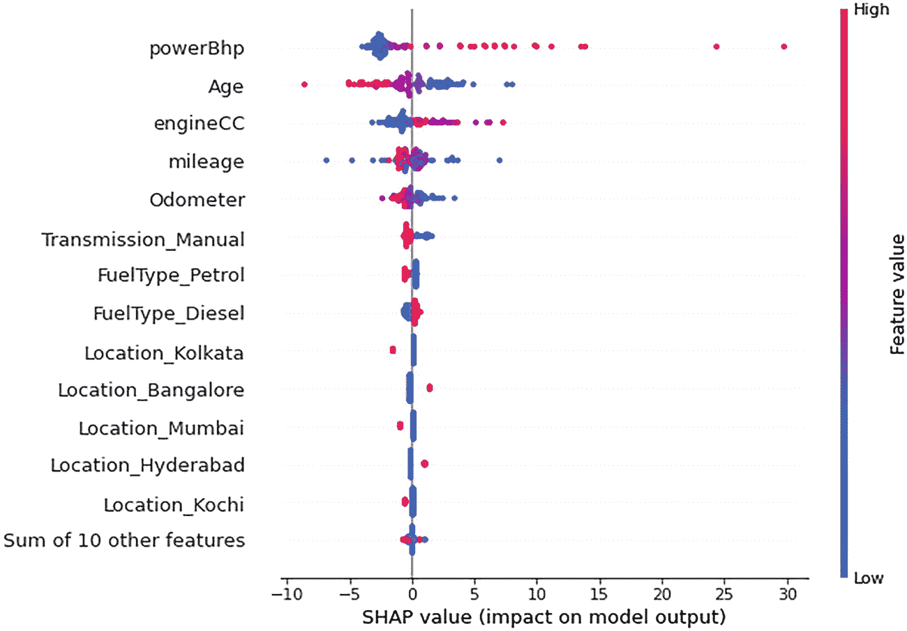

一个 SHAP 蜂群图。马力（`powerBhp`）和车龄的高特征值分别具有最大和最小的 SHAP 值 30 和 -10。所有数值均为估计值。

**图 4-22** SHAP 值对模型预测的重要性

```python
# explain all the predictions in the dataset
shap.summary_plot(shap_values_ebm, X100)
```
```

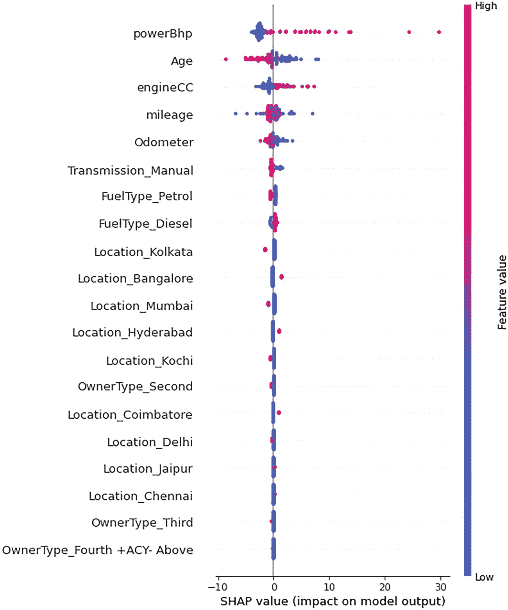

一个包含所有特征的 SHAP 蜂群图。马力（`powerBhp`）和车龄的高特征值分别具有最大和最小的 SHAP 值 30 和 -10。其余特征的值大多为 0。所有数值均为估计值。

**图 4-23** 通过特征重要性解释所有预测

从宏观层面来看，对于用于预测汽车价格的基于树的非线性模型，上述特征都很重要。其中最重要的特征是 `powerBhp`，其次是车龄、汽油类型、手动变速箱类型等。上述表格输出展示了全局特征重要性。

## 配方 4-9：解释 XGBoost 模型

### 问题

你希望为回归任务的 XGBoost 模型生成可解释性。

### 解决方案

XGBoost 回归器使用包含数值和类别特征的数据集进行训练，训练了 100 棵树，最大深度参数为 3。特征总数为 23 个；对于 XGBoost 来说，理想的数据集应包含超过 50 个特征。然而，这需要更多的计算时间。

### 工作原理

让我们来看下面的示例：

```python
# train XGBoost model
import xgboost
model_xgb = xgboost.XGBRegressor(n_estimators=100, max_depth=2).fit(X, y)
# explain the GAM model with SHAP
explainer_xgb = shap.Explainer(model_xgb, X)
shap_values_xgb = explainer_xgb(X)
# make a standard partial dependence plot with a single SHAP value overlaid
sample_ind = 18
fig,ax = shap.partial_dependence_plot(
"powerBhp", model_xgb.predict, X, model_expected_value=True,
feature_expected_value=True, show=False, ice=False,
shap_values=shap_values_xgb[sample_ind:sample_ind+1,:]
)
```

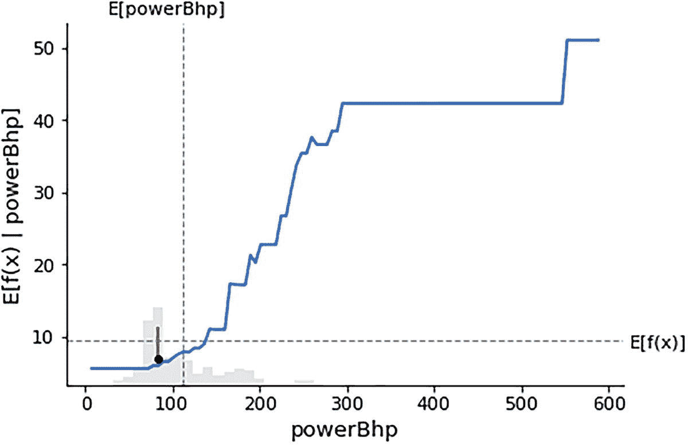

一张 SHAP 偏依赖图，展示了 SHAP 值与功率（马力）的关系。线条在(0, 5)和(300, 42)之间上升，然后水平延伸，最终在(600, 50)处结束。图中在(80, 6)处标有一个点。最高的柱状条位于(80, 15)。`E[功率（马力）]`和 `E[f(x)]`的线条在(110, 10)处相交。所有数值均为估计值。

**图 4-24** 包含一个样本的偏依赖图

```python
shap.plots.scatter(shap_values_xgb[:,"mileage"])
```

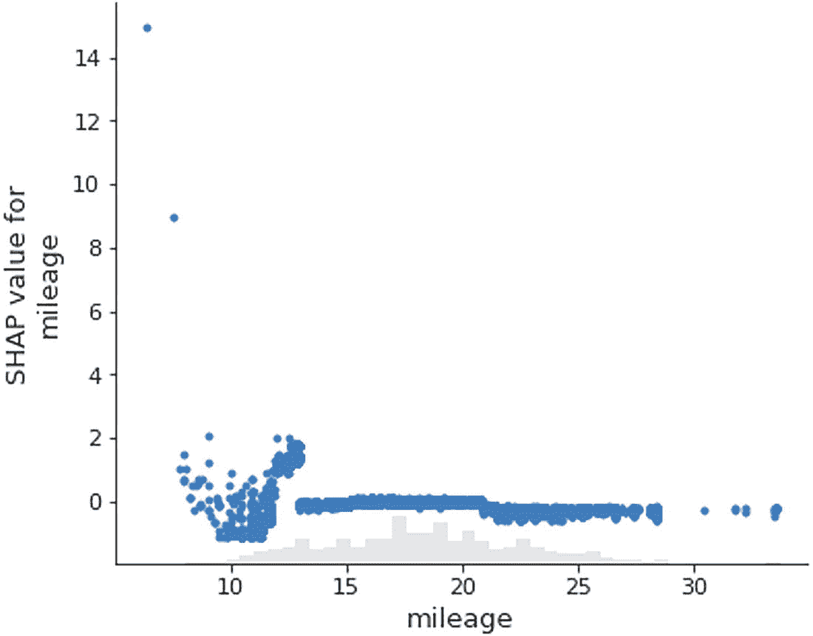

一张散点图，展示了 SHAP 值与里程数的关系。点簇在(12, 0)和(30, 0)之间水平分布。X 轴上位于 10 处的点在 Y 轴上 0 到 2 之间散布。最高的柱状条位于(17, 0)。所有数值均为估计值。

**图 4-25** 里程数特征及其 SHAP 值

```python
shap.plots.scatter(shap_values_xgb[:,"powerBhp"], color=shap_values_xgb)
```

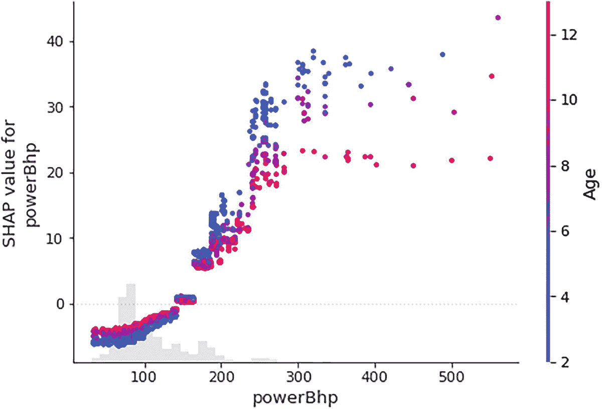

一张散点图，展示了 SHAP 值和车龄与功率（马力）的关系。一条渐变色的线条表示车龄值在 2 到 12 之间。点沿曲线在(50, -5)和(300, 40)之间上升，然后水平延伸至超过 500。最大值对应车龄为 8 的点，位于(600, 45)。所有数值均为估计值。

**图 4-26** `powerBhp`、车龄和`powerBhp`的 SHAP 值的散点图

```python
shap.summary_plot(shap_values_xgb, X)
```

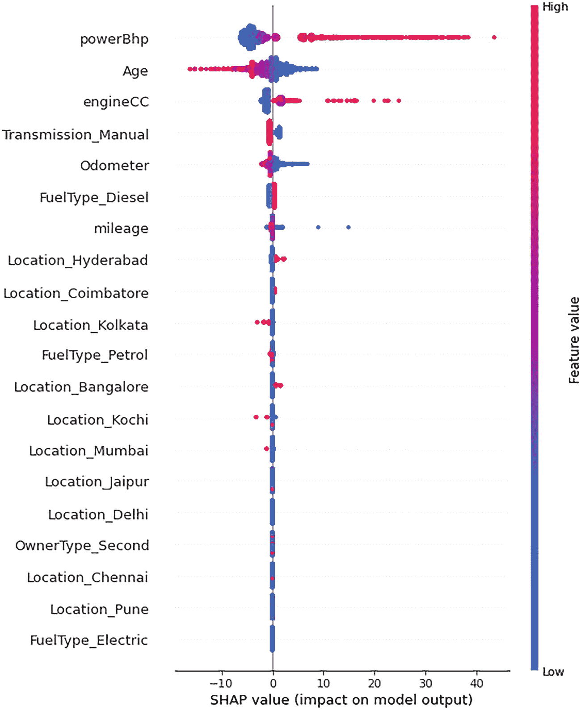

一张模型预测的 SHAP 蜂群图。功率（马力）和车龄的高特征值分别对应最大和最小的 SHAP 值，约为 45 和-12。所有数值均为估计值。

**图 4-27** SHAP 值对模型预测的影响

## 配方 4-10. 适用于混合数据类型的随机森林回归器

### 问题

你希望为一个同时使用数值特征和类别特征的随机森林模型生成可解释性。

### 解决方案

当特征数量较多（例如超过 50 个）时，随机森林非常有用；不过，在本配方中，它应用于 23 个特征。我们可以选择一个更大的数据集，但这需要更多的计算量，并且训练时间可能更长。因此，当模型在性能较低的机器上训练时，需要注意模型配置。

### 工作原理

让我们来看下面的示例：

```python
import shap
from sklearn.ensemble import RandomForestRegressor
rforest = RandomForestRegressor(n_estimators=100, max_depth=3, min_samples_split=20, random_state=0)
rforest.fit(X, y)
# explain all the predictions in the test set
explainer = shap.TreeExplainer(rforest)
shap_values = explainer.shap_values(X)
shap.summary_plot(shap_values, X)
```

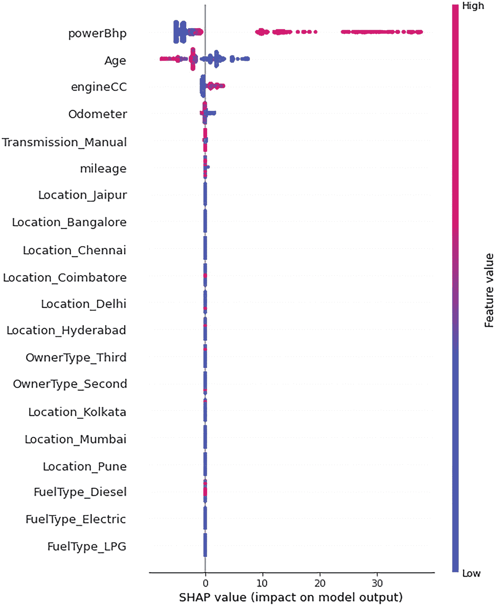

一张模型输出的 SHAP 蜂群图。功率（马力）和车龄的高特征值分别对应最大和最小的 SHAP 值，约为 35 和-10。其余特征的值大多为 0。

**图 4-28** SHAP 值对模型输出的影响

```python
shap.dependence_plot("powerBhp", shap_values, X)
```

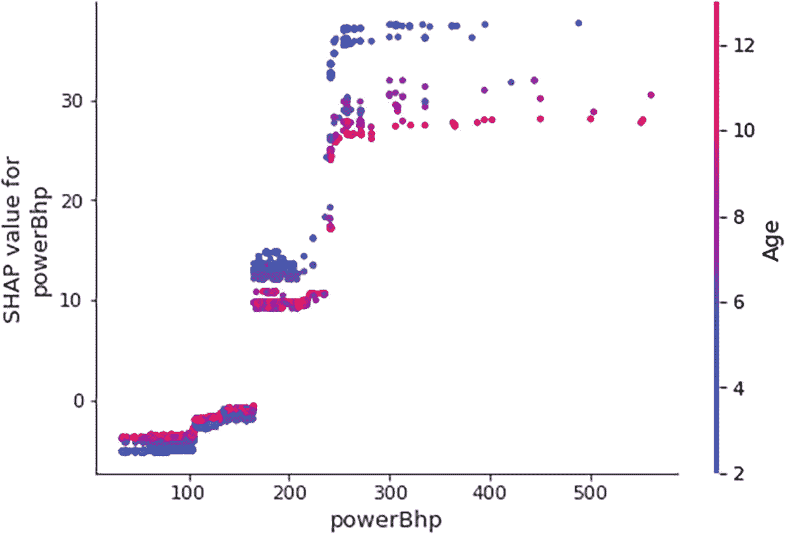

一张散点图，展示了 SHAP 值和车龄与功率（马力）的关系。不同车龄值的点在(50, -5)和(300, 40)之间上升，然后水平延伸至超过 500。

**图 4-29** SHAP 依赖图

```python
shap.partial_dependence_plot(
"mileage", rforest.predict, X, ice=False,
model_expected_value=True, feature_expected_value=True
)
```

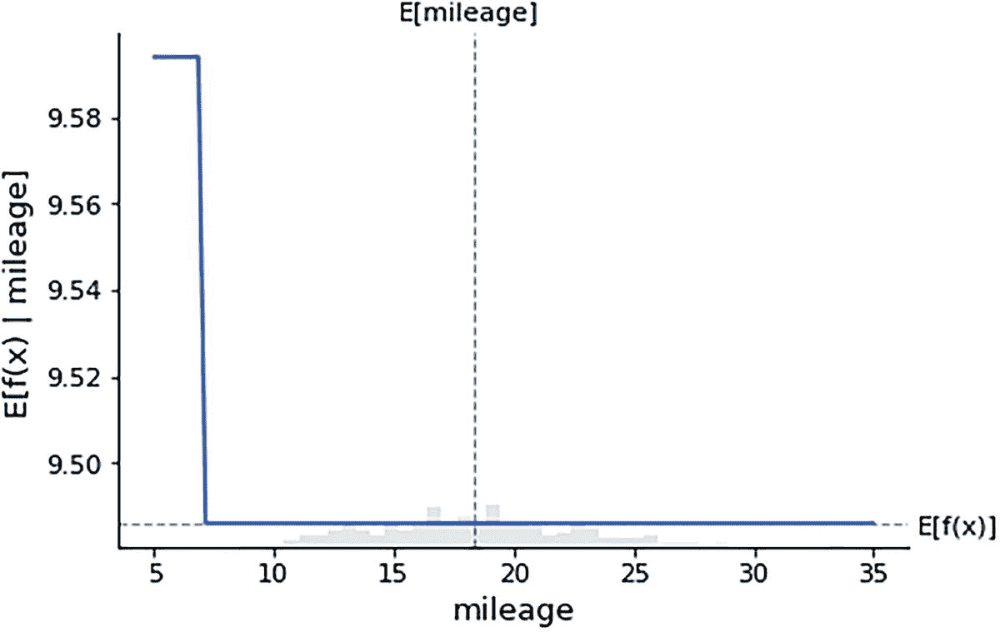

一张 SHAP 偏依赖图，展示了 SHAP 值与里程数的关系。线条在(5, 9.59)和(7.5, 9.59)之间水平移动，然后急剧下降至(7.5, 9.49)，之后直线上升至(35, 0.49)。最高的柱状条位于(17, 9.49)。`E[里程数]`和 `E[f(x)]`的线条在(19, 9.49)处相交。所有数值均为估计值。

**图 4-30** 里程数的偏依赖图

## 配方 4-11. 解释 Catboost 模型

### 问题

你希望为一个大部分特征是类别型的数据集生成可解释性。我们可以使用一个包含大量类别变量的提升模型。

### 解决方案

当类别变量多于数值变量时，Catboost 模型表现良好。因此，我们可以使用 Catboost 回归器。

### 工作原理

让我们来看下面的示例：

```python
!pip install catboost
import catboost
from catboost import *
import shap
model = CatBoostRegressor(iterations=100, learning_rate=0.1, random_seed=123)
model.fit(X, y, verbose=False, plot=False)
explainer = shap.TreeExplainer(model)
shap_values = explainer.shap_values(X)
# summarize the effects of all the features
shap.summary_plot(shap_values, X)
```

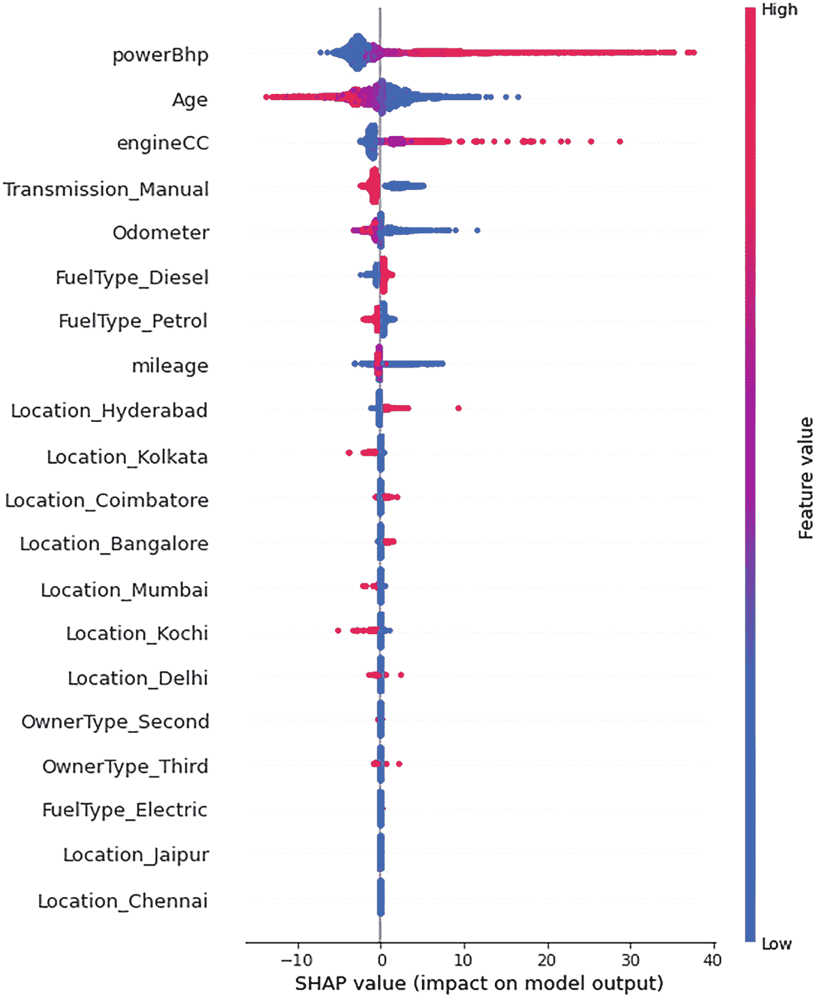

一张 SHAP 蜂群图。功率（马力）和车龄的高特征值分别对应最大和最小的 SHAP 值，约为 39 和-14。大多数变量的低特征值位于 0。

**图 4-31** SHAP 值对模型预测的影响

```python
# create a SHAP dependence plot to show the effect of a single feature across the whole dataset
shap.dependence_plot("powerBhp", shap_values, X)
```

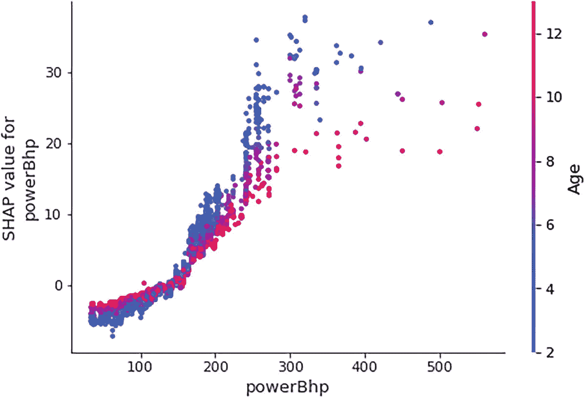

一张散点图，展示了 SHAP 值和车龄与功率（马力）的关系。不同车龄的点在(50, -5)和(300, 35)之间上升，然后少量点向右水平散布至超过 500。

**图 4-32** SHAP 依赖图

## 配方 4-12. 用于 Catboost 模型和表格数据的 LIME 解释器

### 问题

你希望以聚焦的方式在局部层面生成可解释性，而非全局层面。

### 解决方案

解决此问题的方法是使用 LIME 库。LIME 是一种模型无关的技术；它在运行解释器的同时重新训练机器学习模型。LIME 将问题局部化，并在局部层面解释模型。

### 工作原理

让我们来看下面的例子。`LIME` 要求向表格解释器输入一个 numpy 数组；因此，需要将 Pandas 数据框转换为数组。

```python
!pip install lime
Looking in indexes: https://pypi.org/simple, https://us-python.pkg.dev/colab-wheels/public/simple/
Collecting lime
Downloading lime-0.2.0.1.tar.gz (275 kB)
|████████████████████████████████| 275 kB 3.9 MB/s
Requirement already satisfied: matplotlib in /usr/local/lib/python3.7/dist-packages (from lime) (3.2.2)
Requirement already satisfied: numpy in /usr/local/lib/python3.7/dist-packages (from lime) (1.21.6)
Requirement already satisfied: scipy in /usr/local/lib/python3.7/dist-packages (from lime) (1.7.3)
Require
................
import lime
import lime.lime_tabular
explainer = lime.lime_tabular.LimeTabularExplainer(np.array(X),
mode='regression',
feature_names=X.columns,
class_names=['price'],
verbose=True)
```

我们仅使用本章中的能源预测数据。

```python
explainer.feature_selection
# asking for explanation for LIME model
i = 60
exp = explainer.explain_instance(np.array(X)[i],
model.predict,
num_features=14
)
model.predict(X)[60]
X[60:61]
Intercept 2.412781377314505
Prediction_local [26.44019841]
Right: 18.91681746836109
exp.show_in_notebook(show_table=True)
```

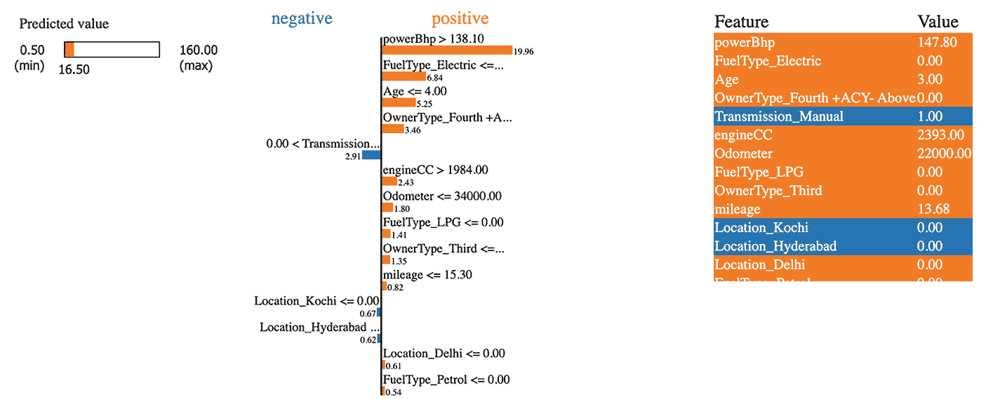

LIME 模型的 SHAP 局部条形图和表格。预测值为 16.50。一个包含特征和值两列的表格有 14 行。图中条形的最小值和最大值分别为 `transmission`（-2.91）和 `powerBhp`（19.96）。

**图 4-33** 数据集中第 60 条记录的局部解释

```python
[('powerBhp > 138.10', 11.685972887206468), ('Age  1984.00', 3.2307037317922287), ('0.00 < Transmission_Manual <= 1.00', -2.175314285519644), ('Odometer <= 34000.00', 2.0903883419638976), ('OwnerType_Fourth +ACY- Above <= 0.00', 1.99286243362804), ('Location_Hyderabad <= 0.00', -1.4395857770864107), ('mileage <= 15.30', 1.016369130009493), ('0.00 < FuelType_Diesel <= 1.00', 0.8477072936504322), ('Location_Kolkata <= 0.00', 0.6908993069146472), ('FuelType_Petrol <= 0.00', 0.654629068871846), ('Location_Bangalore <= 0.00', -0.47395963805113284), ('FuelType_Electric <= 0.00', 0.4285429019735695), ('Location_Delhi <= 0.00', 0.40903051200940277)]
```

## 配方 4-13. 用于表格数据的 ELI5 解释器

### 问题

你想使用 ELI5 库为线性回归模型生成解释。

### 解决方案

`ELI5` 是一个 Python 包，有助于调试机器学习模型并解释预测结果。它支持 `scikit-learn` 库支持的所有机器学习模型。

### 工作原理

让我们来看下面的例子：

| 权重 | 特征 |
| --- | --- |
| 0.4385 | `powerBhp` |
| 0.2572 | `Age` |
| 0.0976 | `engineCC` |
| 0.0556 | `Odometer` |
| 0.0489 | `Mileage` |
| 0.0396 | `Transmission_Manual` |
| 0.0167 | `FuelType_Petrol` |
| 0.0165 | `FuelType_Diesel` |
| 0.0104 | `Location_Hyderabad` |
| 0.0043 | `Location_Coimbatore` |
| 0.0043 | `Location_Kolkata` |
| 0.0035 | `Location_Kochi` |
| 0.0025 | `Location_Bangalore` |
| 0.0021 | `Location_Mumbai` |
| 0.0014 | `Location_Delhi` |
| 0.0006 | `OwnerType_Third` |
| 0.0003 | `OwnerType_Second` |
| 0.0000 | `FuelType_Electric` |
| 0 | `OwnerType_Fourth +ACY- Above` |
| 0 | `Location_Pune` |

```python
pip install eli5
import eli5
eli5.show_weights(model,
feature_names=list(X.columns))
```

| 权重 | 特征 |
| --- | --- |
| 0.4385 | `powerBhp` |
| 0.2572 | `Age` |
| 0.0976 | `engineCC` |
| 0.0556 | `Odometer` |
| 0.0489 | `Mileage` |
| 0.0396 | `Transmission_Manual` |
| 0.0167 | `FuelType_Petrol` |
| 0.0165 | `FuelType_Diesel` |
| 0.0104 | `Location_Hyderabad` |
| 0.0043 | `Location_Coimbatore` |
| 0.0043 | `Location_Kolkata` |
| 0.0035 | `Location_Kochi` |
| 0.0025 | `Location_Bangalore` |
| 0.0021 | `Location_Mumbai` |
| 0.0014 | `Location_Delhi` |
| 0.0006 | `OwnerType_Third` |
| 0.0003 | `OwnerType_Second` |
| 0.0000 | `FuelType_Electric` |
| 0 | `OwnerType_Fourth +ACY- Above` |
| 0 | `Location_Pune` |

```python
eli5.explain_weights(model, feature_names=list(X.columns))
```

| 权重 | 特征 |
| --- | --- |

## 配方 4-14. ELI5 中排列模型的工作原理

### 问题

你想理解 ELI5 排列库的含义。

### 解决方案

此问题的解决方案是使用一个数据集和一个训练好的模型。

### 工作原理

ELI5 库中的排列模型仅适用于全局解释。首先，它从训练数据集中获取一个基线模型，并计算模型的误差。然后，它打乱一个特征的值，重新训练模型，并计算误差。它比较打乱后和打乱前的误差下降情况。如果打乱后误差增量较大，则该特征可被视为重要；如果误差增量较小，则视为不重要。结果会显示特征的平均重要性和经过多次打乱步骤后的特征标准差。

## 配方 4-15. 集成分类模型的全局解释

### 问题

你想解释使用集成模型从分类模型生成的预测结果。

### 解决方案

逻辑回归模型也被称为分类模型，因为我们是对二元分类或多分类变量的概率进行建模。在本配方中，我们使用一个流失分类数据集，该数据集有两个结果：客户是否可能流失。让我们使用集成模型，例如用于分类器的可解释提升机、极端梯度提升分类器、随机森林分类器和 CatBoost 分类器。

### 工作原理

让我们来看下面的例子。关键在于获取 SHAP 值，它会返回基值、SHAP 值和数据。利用 SHAP 值，我们可以通过图表和图形创建各种解释。SHAP 值始终是全局层面的。

```python
import pandas as pd
import numpy as np
import matplotlib.pyplot as plt
%matplotlib inline
from sklearn import tree, metrics, model_selection, preprocessing
from sklearn.metrics import confusion_matrix, classification_report
df_train = pd.read_csv('https://raw.githubusercontent.com/pradmishra1/PublicDatasets/main/ChurnData_test.csv')
from sklearn.preprocessing import LabelEncoder
tras = LabelEncoder()
df_train['area_code_tr'] = tras.fit_transform(df_train['area_code'])
df_train.columns
del df_train['area_code']
df_train.columns
df_train['target_churn_dum'] = pd.get_dummies(df_train.churn,prefix='churn',drop_first=True)
df_train.columns
del df_train['international_plan']
del df_train['voice_mail_plan']
del df_train['churn']
df_train.info()
del df_train['Unnamed: 0']
df_train.columns
from sklearn.model_selection import train_test_split
X = df_train[['account_length', 'number_vmail_messages', 'total_day_minutes',
'total_day_calls', 'total_day_charge', 'total_eve_minutes',
'total_eve_calls', 'total_eve_charge', 'total_night_minutes',
'total_night_calls', 'total_night_charge', 'total_intl_minutes',
'total_intl_calls', 'total_intl_charge',
'number_customer_service_calls', 'area_code_tr']]
Y = df_train['target_churn_dum']
import pandas as pd
from sklearn.model_selection import train_test_split
from interpret.glassbox import ExplainableBoostingClassifier
from interpret import show
xtrain,xtest,ytrain,ytest=train_test_split(X,Y,test_size=0.20,stratify=Y)
ebm = ExplainableBoostingClassifier(random_state=12)
ebm.fit(xtrain, ytrain)
ebm_global = ebm.explain_global()
show(ebm_global)
ebm_local = ebm.explain_local(xtest[:5], ytest[:5])
show(ebm_local)
print("training accuracy:", ebm.score(xtrain,ytrain)) #training accuracy
print("test accuracy:",ebm.score(xtest,ytest)) # test accuracy
show(ebm_global)
from interpret import set_visualize_provider
from interpret.provider import InlineProvider
set_visualize_provider(InlineProvider())
from interpret import show
X100 = X[:100]
# explain the GAM model with SHAP
explainer_ebm = shap.Explainer(ebm.predict, X100)
shap_values_ebm = explainer_ebm(X100)
ebm_global = ebm.explain_global()
show(ebm_global)
import numpy as np
pd.DataFrame(np.round(shap_values_ebm.values,2)).head(2)
```

## 配方 4-16. 非线性分类器的偏依赖图

### 问题

你想使用非线性分类器展示特征与类别概率之间的关联。

### 解决方案

本例中的类别概率与预测流失概率相关。可以将某个特征的 SHAP 值与该特征值绘制成散点图，以显示相关性（正相关或负相关）以及关联强度。

### 工作原理

让我们来看下面的例子：

```python
# make a standard partial dependence plot with a single SHAP value overlaid
sample_ind = 20
fig,ax = shap.partial_dependence_plot(
"number_customer_service_calls", ebm.predict, X100, model_expected_value=True,
feature_expected_value=True, show=False, ice=False,
shap_values=shap_values_ebm[sample_ind:sample_ind+1,:]
)
```

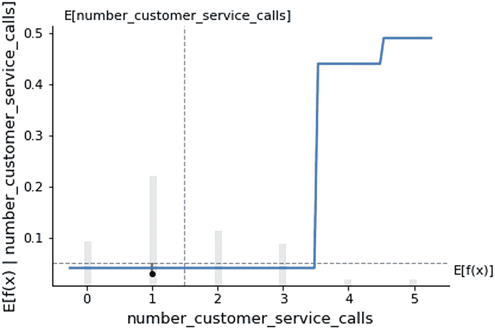

客户服务呼叫次数的 SHAP 偏依赖图。线条从 (0, 0.05) 水平移动，在 (3.5, 0.05) 处垂直上升，结束于 (5, 0.5)。在 (1, 0.4) 处标有一个点。`E[客户呼叫次数]` 和 `E[f(x)]` 的线在 (1.5, 0.6) 处相交。最高柱状图位于 (1, 0.23)。所有数值均为估计值。

**图 4-34** 账户时长与账户时长的 SHAP 值

```python
# make a standard partial dependence plot with a single SHAP value overlaid
sample_ind = 20
fig,ax = shap.partial_dependence_plot(
"number_vmail_messages", ebm.predict, X100, model_expected_value=True,
feature_expected_value=True, show=False, ice=False,
shap_values=shap_values_ebm[sample_ind:sample_ind+1,:]
)
```

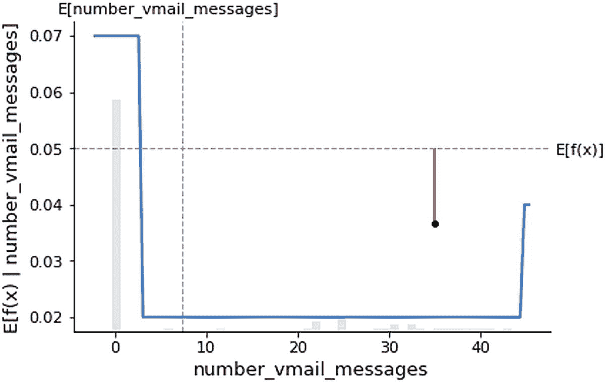

语音邮件消息数量的 SHAP 偏依赖图。线条从 (负 2.5, 0.07) 开始直线移动，在 (4, 0.07) 处垂直下降，然后直线上升至 (43, 0.02)，结束于 (43, 0.04)。在 (35, 0.35) 处标有一个点。`E[客户呼叫次数]` 和 `E[f(x)]` 的线在 (8, 0.05) 处相交。最高柱状图位于 (0, 0.58)。所有数值均为估计值。

**图 4-35** 语音邮件消息数量与 SHAP 值

## 配方 4-17. 非线性分类器的全局特征重要性

### 问题

你想获取决策树分类模型的全局特征重要性。

### 解决方案

此问题的解决方案是使用解释器的对数几率。

### 工作原理

让我们来看下面的例子：

```python
shap.plots.scatter(shap_values_ebm)
```

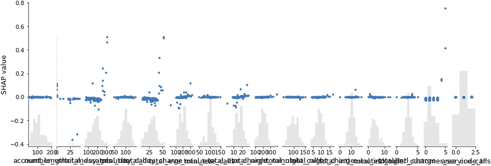

16 个特征 SHAP 值的散点图。数据点簇大多在 SHAP 值约 0.0 处呈直线分布。少数点上升到 SHAP 值 0.6 和 0.8。每个图背景中都有一个直方图。

**图 4-36** 所有特征的 SHAP 值绘制在一起

```python
# the waterfall_plot shows how we get from explainer.expected_value to model.predict(X)[sample_ind]
shap.plots.waterfall(shap_values_ebm[sample_ind], max_display=14)
```

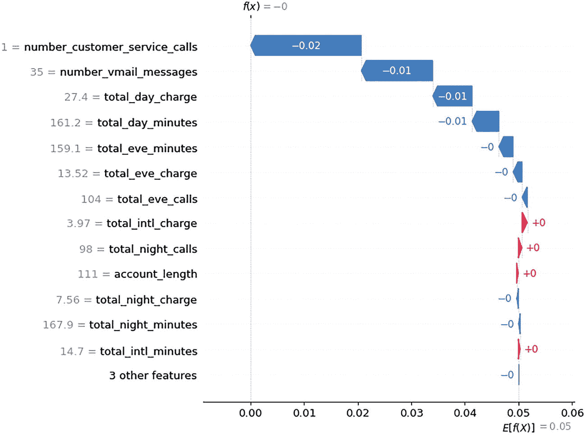

SHAP 瀑布图。特征“国际总费用”、“夜间通话次数”和“账户时长”的最大值为 0。特征“客户服务呼叫次数”的最小值为负 0.02。`f(x)` 和 `E[f(x)]` 的线分别位于 0 和 0.05。所有数值均为估计值。

**图 4-37** 记录 20 的局部解释

解释如下：当我们改变某个特征的值 1 个单位时，模型方程会产生两个几率：一个是基础几率，另一个是特征增量值后的几率。我们关注的是特征值每增加或减少一个单位时，几率比的变化。从全局特征重要性来看，有三个重要特征：客户服务呼叫次数、总日通话分钟数和语音邮件消息数量。

```python
# the waterfall_plot shows how we get from explainer.expected_value to model.predict(X)[sample_ind]
shap.plots.beeswarm(shap_values_ebm, max_display=14)
```

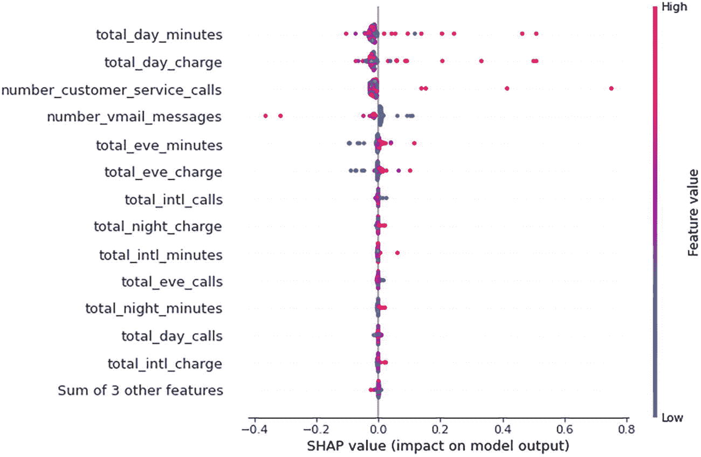

SHAP 蜂群图。客户服务呼叫次数和语音邮件消息数量的高特征值分别具有最大值约 0.79 和最小值约负 0.4。

**图 4-38** 基于模型预测的 EBM 模型 SHAP 值

## 配方 4-18. XGBoost 模型解释

### 问题

你想解释一个极端梯度提升模型，这是一种序列提升模型。

### 解决方案

模型解释可以使用 SHAP 完成；然而，SHAP 的一个限制是我们无法使用完整数据来创建全局和局部解释。如果分配的机器较小，我们将使用子集；如果机器配置支持，则使用完整数据集。

### 工作原理

让我们来看下面的例子：

```python
# 训练 XGBoost 模型
import xgboost
model = xgboost.XGBClassifier(n_estimators=100, max_depth=2).fit(X, Y)
# 计算 SHAP 值
explainer = shap.Explainer(model, X)
shap_values = explainer(X)
# 制作一个标准的偏依赖图，并叠加单个 SHAP 值
sample_ind = 18
fig,ax = shap.partial_dependence_plot(
"account_length", model.predict, X, model_expected_value=True,
feature_expected_value=True, show=False, ice=False,
shap_values=shap_values_xgb[sample_ind:sample_ind+1,:]
)
```

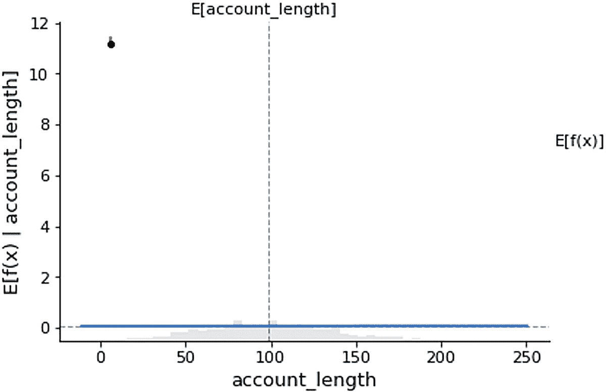

账户时长的 SHAP 偏依赖图。线条在 (0, 0) 和 (250, 0) 之间直线移动。在 (0, 11) 处标有一个点。`E account length` 和 `E f of x` 的线在 (99, 0) 处相交。所有值均为估计值。

**图 4-39** 训练数据集中第 18 条记录的偏依赖图

```python
import numpy as np
pd.DataFrame(np.round(shap_values.values,2)).head(2)
# waterfall_plot 展示了如何从 explainer.expected_value 得到 model.predict(X)[sample_ind]
shap.plots.waterfall(shap_values[sample_ind], max_display=14)
```

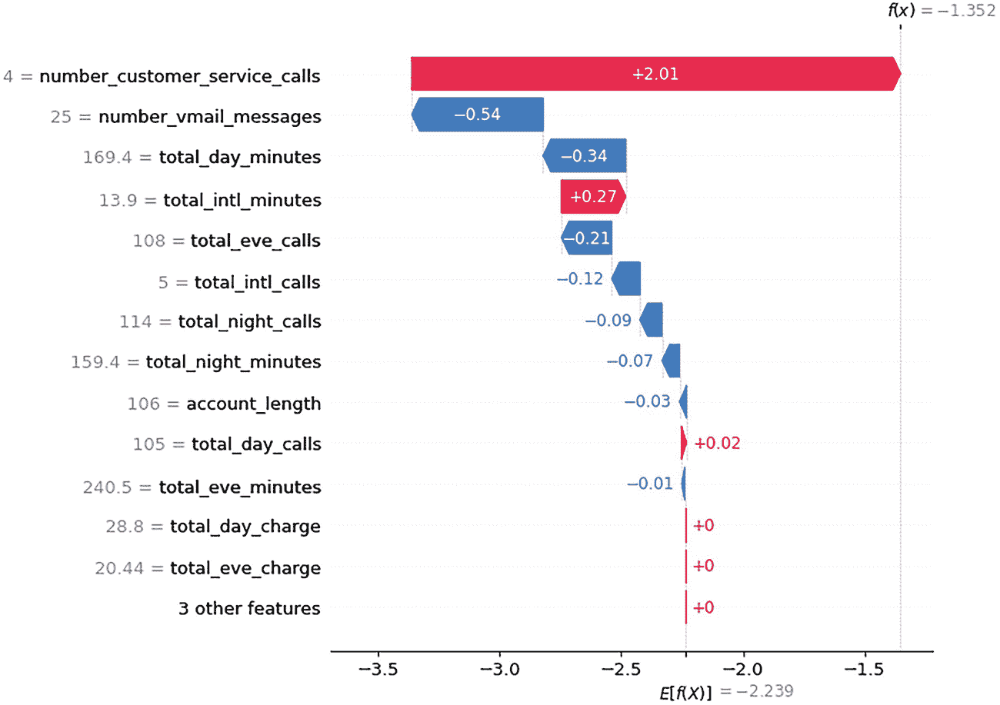

一个 SHAP 瀑布图。特征“客户服务电话次数”和“语音邮件消息数”的最大值和最小值分别为 2.01 和 -0.54。`f of x` 和 `E f of x` 的线分别位于 -1.352 和 -2.239。

**图 4-40** 第 18 条记录的局部解释

```python
# waterfall_plot 展示了如何从 explainer.expected_value 得到 model.predict(X)[sample_ind]
shap.plots.scatter(shap_values[:,"account_length"])
```

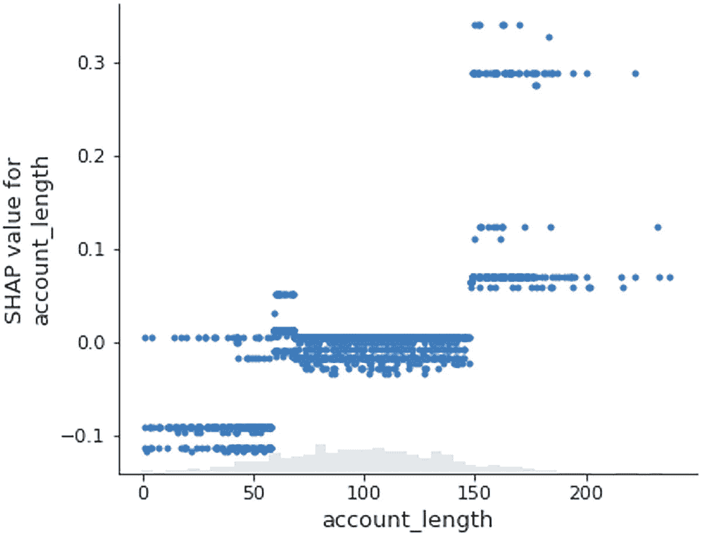

一个散点图，显示 SHAP 值与账户时长的关系。水平方向上的点簇大致在 (0, -0.1) 和 (200, 0.3) 之间上升。

**图 4-41** 账户时长与 SHAP 值的分布

```python
# waterfall_plot 展示了如何从 explainer.expected_value 得到 model.predict(X)[sample_ind]
shap.plots.scatter(shap_values[:,"number_vmail_messages"])
```

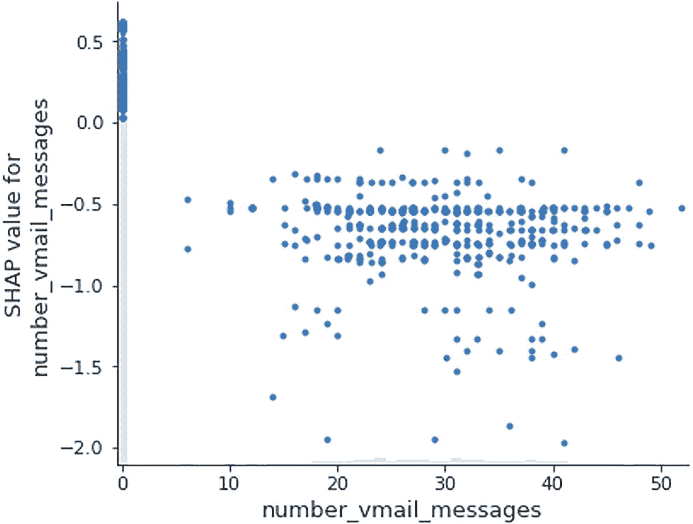

一个散点图，显示 SHAP 值与语音邮件消息数的关系。点大部分集中在 X 轴的 15 到 45 之间，Y 轴的 -1.0 到 -0.25 之间。另一个簇位于 (0, 0.0) 和 (0, 0.5) 之间。所有值均为估计值。

**图 4-42** 语音邮件消息数与其 SHAP 值的分布

```python
# waterfall_plot 展示了如何从 explainer.expected_value 得到 model.predict(X)[sample_ind]
shap.plots.beeswarm(shap_values, max_display=14)
```

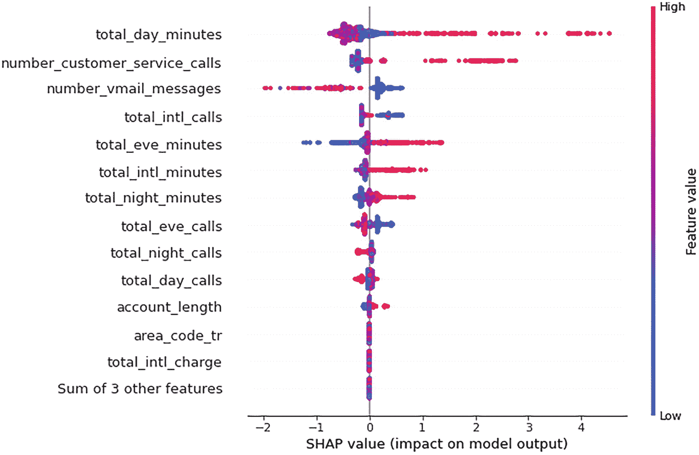

一个 SHAP 蜂群图。“总日间通话分钟数”和“语音邮件消息数”的高特征值分别具有接近 4 和 -2 的最大和最小 SHAP 值。

**图 4-43** SHAP 值对模型输出的影响

```python
shap.plots.bar(shap_values)
```

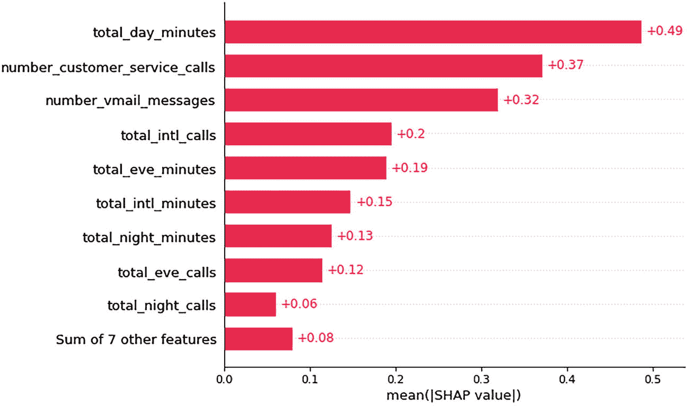

一个特征与平均 SHAP 值的水平条形图，包含 10 个条形。特征“总日间通话分钟数”和“总夜间通话次数”的最大值和最小值分别为 0.49 和 0.06。

**图 4-44** 绝对平均 SHAP 值显示特征重要性

```python
shap.plots.heatmap(shap_values[:5000])
```

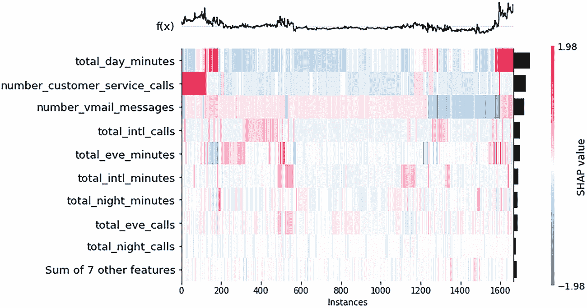

一个 SHAP 热图，绘制特征与实例的关系。梯度标尺的 SHAP 值范围在 -1.98 到 1.98 之间。“总日间通话分钟数”特征的 SHAP 值密度最高。一条标记为 `f of x` 的波动线在顶部几乎直线移动，在 1600 处达到峰值。

**图 4-45** 所有特征及其 SHAP 值的密度分布

```python
shap.plots.scatter(shap_values[:,"total_day_minutes"])
```

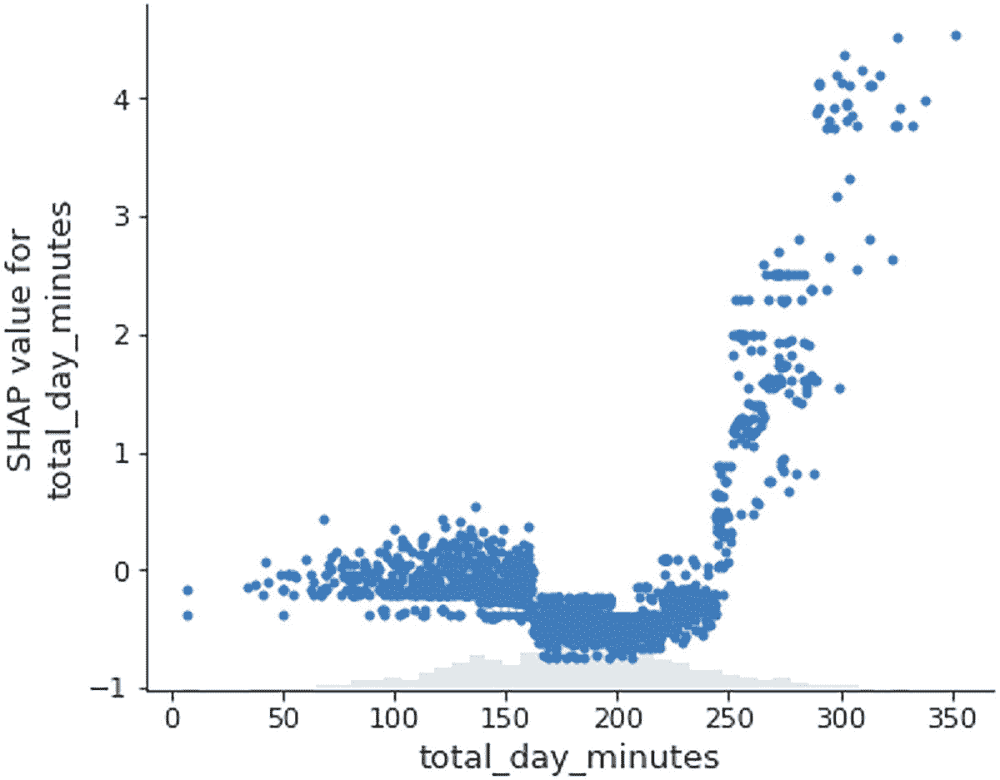

SHAP 值与总日间通话分钟数的散点图。点簇在 (50, 0) 和 (150, 0) 之间直线移动，然后略微下降，接着少量点上升至 (300, 4)。所有值均为估计值。

**图 4-46** 特征“总日间通话分钟数”与 SHAP 值的分布

```python
shap.plots.scatter(shap_values[:,"total_day_minutes"], color=shap_values[:,"account_length"])
```

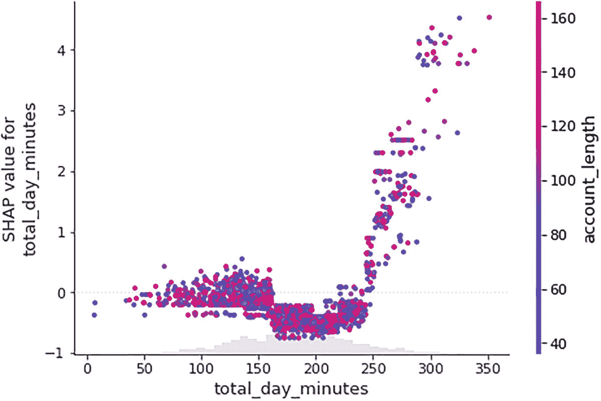

SHAP 值和账户时长与总日间通话分钟数的散点图。账户时长的梯度标尺值在 40 到 160 之间。不同深浅的点在 (50, 0) 和 (150, 0) 之间直线移动，然后略微下降，接着上升至 (300, 4)。所有值均为估计值。

**图 4-47** SHAP 值的三维视图

## 配方 4-19. 解释随机森林分类器

### 问题

你想使用随机森林分类器从全局和局部可解释库中获得更快的解释。随机森林创建一组树作为估计器，并使用多数投票规则平均预测结果。

### 解决方案

可以使用 SHAP 进行模型解释；然而，SHAP 的局限性之一是我们无法使用全部数据来创建全局和局部解释。

### 工作原理

让我们来看下面的例子：

```python
import shap
from sklearn.ensemble import RandomForestClassifier
rforest = RandomForestClassifier(n_estimators=100, max_depth=3, min_samples_split=20, random_state=0)
rforest.fit(X, Y)
# 解释测试集中的所有预测
explainer = shap.TreeExplainer(rforest)
shap_values = explainer.shap_values(X)
shap.dependence_plot("account_length", shap_values[0], X)
```

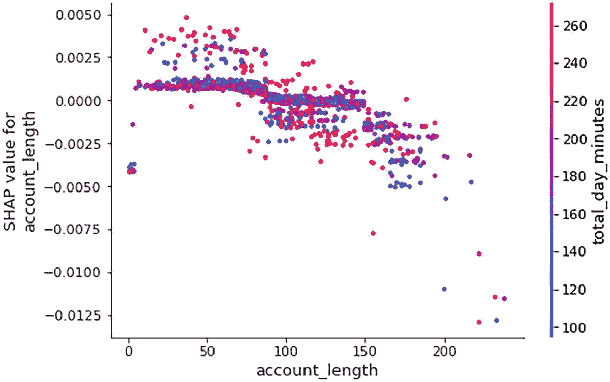

SHAP 值和总日间通话分钟数与账户时长的散点图。总日间通话分钟数的梯度标尺值在 100 到 260 之间。不同深浅的点在 (25, 0.0050) 和 (225, -0.0125) 之间下降。所有值均为估计值。

**图 4-48** SHAP 的依赖图

```python
shap.partial_dependence_plot(
"total_day_minutes", rforest.predict, X, ice=False,
model_expected_value=True, feature_expected_value=True
)
```

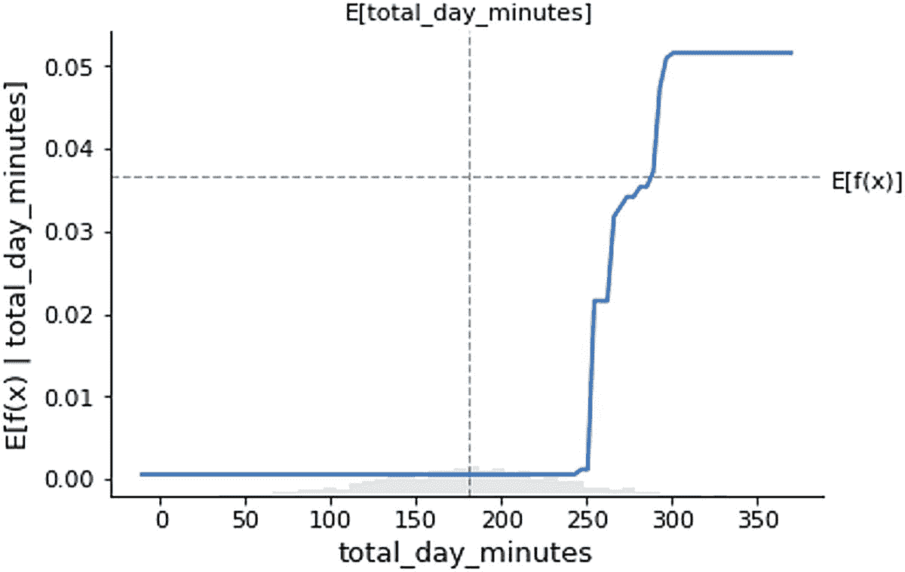

总日间通话分钟数的 SHAP 偏依赖图。线条从 (0, 0.00) 水平移动，上升至 (300, 0.05)，并在 (350, 0.05) 结束。最高的条形位于 (175, 0)。`E total day minutes` 和 `E f of x` 的线在 (175, 0.38) 处相交。所有值均为估计值。

**图 4-49** 总日间通话分钟数的偏依赖图

```python
shap.summary_plot(shap_values, X)
```

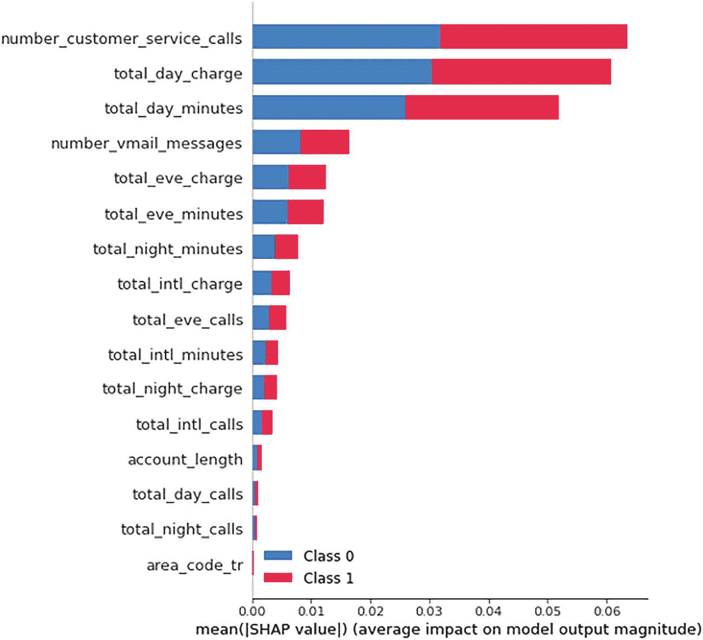

一个特征与平均 SHAP 值的水平堆叠条形图。类别 0 和类别 1 中“客户服务电话次数”的条形最高，约为 0.06；类别 1 中区号 `t r` 的条形最低，几乎为 0.00。

**图 4-50** 基于绝对平均 SHAP 值分别显示两个类别的特征重要性

## 配方 4-20. 分类场景的 Catboost 模型解释

### 问题

你想为基于 Catboost 模型的二分类问题获得解释。

### 解决方案

可以使用 SHAP 进行模型解释；然而，SHAP 的局限性之一是我们无法使用全部数据来创建全局和局部解释。即使我们决定使用全部数据，通常也需要更多时间。因此，在训练模型使用数百万条记录的场景下，为了加速生成局部和全局解释的过程，LIME 非常有用。Catboost 需要定义迭代次数。

### 工作原理

让我们来看下面的示例：

```python
model = CatBoostClassifier(iterations=10, learning_rate=0.1, random_seed=12)
model.fit(X, Y, verbose=True, plot=False)
0: learn: 0.6381393    total: 10.2ms    remaining: 91.9ms
1: learn: 0.5900921    total: 20.1ms    remaining: 80.2ms
2: learn: 0.5517727    total: 29.9ms    remaining: 69.8ms
3: learn: 0.5166202    total: 39.9ms    remaining: 59.9ms
4: learn: 0.4872410    total: 49.9ms    remaining: 49.9ms
5: learn: 0.4632012    total: 60.1ms    remaining: 40ms
6: learn: 0.4414588    total: 69.8ms    remaining: 29.9ms
7: learn: 0.4222780    total: 79.6ms    remaining: 19.9ms
8: learn: 0.4073681    total: 89.5ms    remaining: 9.95ms
9: learn: 0.3915051    total: 99.5ms    remaining: 0us
explainer = shap.TreeExplainer(model)
shap_values = explainer.shap_values(Pool(X, Y))
shap.force_plot(explainer.expected_value, shap_values[0,:], X.iloc[0,:])
shap.force_plot(explainer.expected_value, shap_values[91,:], X.iloc[91,:])
shap.summary_plot(shap_values, X)
```

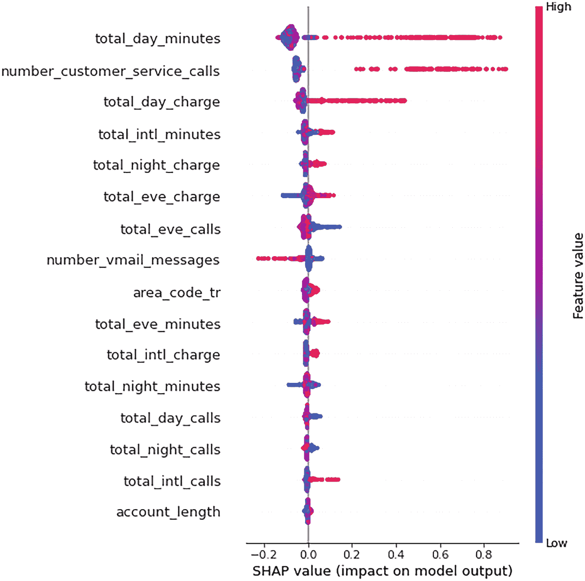

一个包含 16 个特征的 SHAP 蜂群图。客户服务电话次数和语音邮件数量的高特征值分别对应最大和最小的 SHAP 值，约为 0.9 和-0.2。

**图 4-51** SHAP 值对模型输出的影响

## 方法 4-21. 使用 LIME 进行局部解释

### 问题

你希望从全局和局部可解释库中获得更快的解释。

### 解决方案

模型解释可以使用 SHAP 完成；然而，SHAP 的一个限制是我们无法使用全部数据来创建全局和局部解释。即使我们决定使用全部数据，通常也需要更多时间。因此，在训练模型使用数百万条记录的场景下，为了加速生成局部和全局解释的过程，LIME 非常有用。

### 工作原理

让我们来看下面的示例：

```python
import lime
import lime.lime_tabular
explainer = lime.lime_tabular.LimeTabularExplainer(np.array(xtrain),
feature_names=list(xtrain.columns),
class_names=['target_churn_dum'],
verbose=True, mode='classification')
# this record is a no churn scenario
exp = explainer.explain_instance(X.iloc[0], model.predict_proba, num_features=16)
exp.as_list()
Intercept 0.2758028503306529
Prediction_local [0.34562036]
Right: 0.23860629814459952
[('number_customer_service_calls > 2.00', 0.06944779279619419),
('total_day_minutes  1.00', 0.012192087473855579),
('total_day_charge  10.57', 0.009208937152255816),
('total_eve_calls  234.80', 0.0035628982403953778),
('total_night_calls  112.00', -0.0028523783898236925),
('total_intl_calls <= 3.00', -0.002506612124522332),
('10.40 < total_intl_minutes <= 11.90', -0.0016917444417898933)]
exp.show_in_notebook(show_table=True)
```

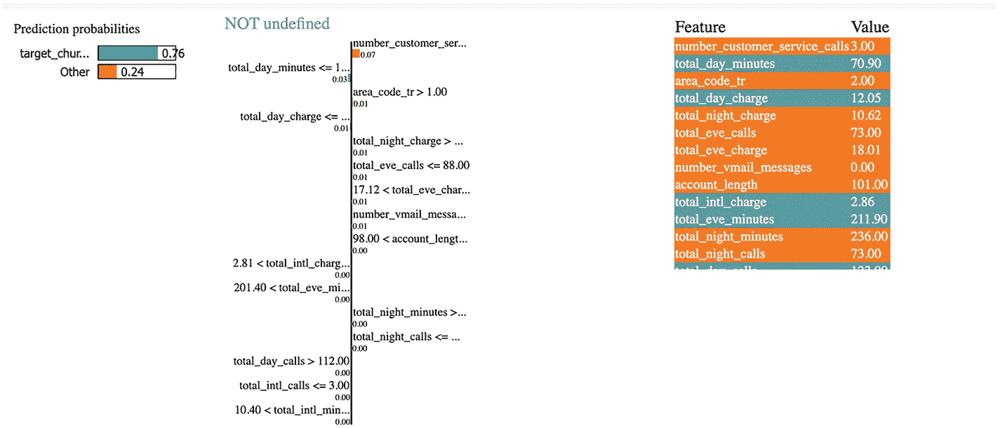

一个针对非流失场景的 SHAP 局部条形图和表格。目标类别和其他类别的预测概率分别为 0.76 和 0.24。一个包含特征和值两列、共 14 行的表格。图中条形的最小值和最大值分别为总日间通话时长（-0.03）和客户服务电话次数（0.07）。

**图 4-52** 测试集中第 1 条记录的局部解释

```python
# This is s churn scenario
exp = explainer.explain_instance(X.iloc[20], model.predict_proba, num_features=16)
exp.as_list()
Intercept 0.32979383442829424
Prediction_local [0.22940692]
Right: 0.25256892775050466
[('number_customer_service_calls  3.21', 0.010519683979779627),
('101.00  11.90', 0.007391379556830906),
('24.50  0.00', -0.0062185929677679875),
('total_night_minutes  112.00', -0.0024708590253414045),
('total_eve_minutes <= 166.40', -0.002156339757484174),
('98.00 < account_length <= 126.00', -0.0013292154399683106),
('86.00 < total_night_calls <= 99.00', -0.00035916152353229)]
exp.show_in_notebook(show_table=True)
```

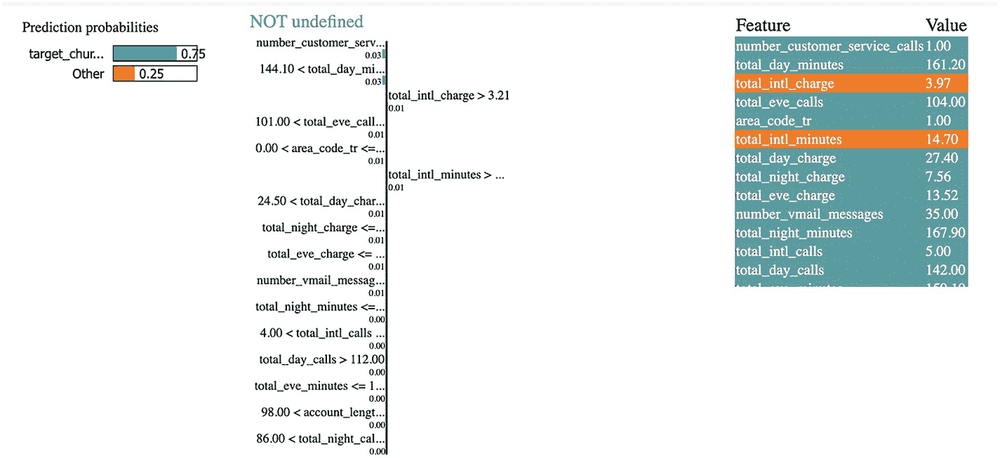

一个针对流失场景的 SHAP 局部条形图和表格。目标类别和其他类别的预测概率分别为 0.75 和 0.25。一个包含特征和值两列、共 14 行的表格。图中条形的最小值和最大值分别为总日间通话时长（-0.03）和总国际通话费用（0.01）。

**图 4-53** 测试集中第 20 条记录的局部解释

类似地，可以为训练集和测试集中的不同记录生成图表，这些记录同样来自训练样本和测试样本。

## 方法 4-22. 使用 ELI5 进行模型解释

### 问题

你希望使用 ELI5 库获取模型解释。

### 解决方案

ELI5 提供了两个函数：`show_weights`和`show_predictions`，用于生成模型解释。

### 工作原理

让我们来看下面的示例：

| 权重 | 特征 |
| --- | --- |
| 0.3703 | total_day_minutes |
| 0.2426 | number_customer_service_calls |
| 0.1181 | total_day_charge |
| 0.0466 | total_eve_charge |
| 0.0427 | number_vmail_messages |
| 0.0305 | total_eve_minutes |
| 0.0264 | total_eve_calls |
| 0.0258 | total_intl_minutes |
| 0.0190 | total_night_minutes |
| 0.0180 | total_night_charge |
| 0.0139 | total_intl_charge |
| 0.0133 | area_code_tr |
| 0.0121 | total_day_calls |
| 0.0110 | total_intl_calls |
| 0.0077 | total_night_calls |
| 0.0019 | account_length |

```python
eli5.show_weights(model,
feature_names=list(X.columns))
```

| 权重 | 特征 |
| --- | --- |
| 0.3703 | total_day_minutes |
| 0.2426 | number_customer_service_calls |
| 0.1181 | total_day_charge |
| 0.0466 | total_eve_charge |
| 0.0427 | number_vmail_messages |
| 0.0305 | total_eve_minutes |
| 0.0264 | total_eve_calls |
| 0.0258 | total_intl_minutes |
| 0.0190 | total_night_minutes |
| 0.0180 | total_night_charge |
| 0.0139 | total_intl_charge |
| 0.0133 | area_code_tr |
| 0.0121 | total_day_calls |
| 0.0110 | total_intl_calls |
| 0.0077 | total_night_calls |
| 0.0019 | account_length |

```python
eli5.explain_weights(model, feature_names=list(X.columns))
```

| 权重 | 特征 |
| --- | --- |
| 0.0352 ± 0.0051 | total_day_minutes |
| 0.0250 ± 0.0006 | total_day_charge |
| 0.0121 ± 0.0024 | number_vmail_messages |
| 0.0110 ± 0.0051 | total_eve_charge |
| 0.0052 ± 0.0048 | total_night_minutes |
| 0.0028 ± 0.0025 | total_night_charge |
| 0.0023 ± 0.0009 | total_eve_calls |
| 0.0022 ± 0.0012 | number_customer_service_calls |
| 0.0022 ± 0.0018 | total_eve_minutes |
| 0.0019 ± 0.0012 | total_night_calls |

## 方法 4-23. 多分类模型解释

### 问题

你希望为多分类问题获取模型解释。

### 解决方案

多分类问题的期望是首先构建一个稳健的模型（如果存在类别特征则包含它们），然后解释预测结果。在二分类问题中，我们可以获取概率，有时还可以从各类集成模型中获得每个类别对应的特征重要性。以下是一个 `CatBoost` 模型的示例，可用于在多分类问题中生成每个类别对应的特征重要性。

### 工作原理

让我们来看下面的示例。我们将使用 UCI 机器学习仓库中的一个数据集。访问该数据集的 URL 如下所示：

```python
import pandas as pd
df_red = pd.read_csv('https://archive.ics.uci.edu/ml/machine-learning-databases/wine-quality/winequality-red.csv',sep=';')
df_white = pd.read_csv('https://archive.ics.uci.edu/ml/machine-learning-databases/wine-quality/winequality-white.csv',sep=';')
features = ['fixed_acidity','volatile_acidity','citric_acid','residual_sugar',
'chlorides','free_sulfur_dioxide','total_sulfur_dioxide','density',
'pH','sulphates','alcohol','quality']
df = pd.concat([df_red,df_white],axis=0)
df.columns = features
df.quality = pd.Categorical(df.quality)
df.head()
y = df.pop('quality')
X = df
import catboost
from catboost import *
import shap
shap.initjs()
model = CatBoostClassifier(loss_function = 'MultiClass',
iterations=300,
learning_rate=0.1,
random_seed=123)
model.fit(X, y, verbose=False, plot=False)
explainer = shap.TreeExplainer(model)
shap_values = explainer.shap_values(Pool(X, y))
set(y)
{3, 4, 5, 6, 7, 8, 9}
shap.summary_plot(shap_values[0], X)
```

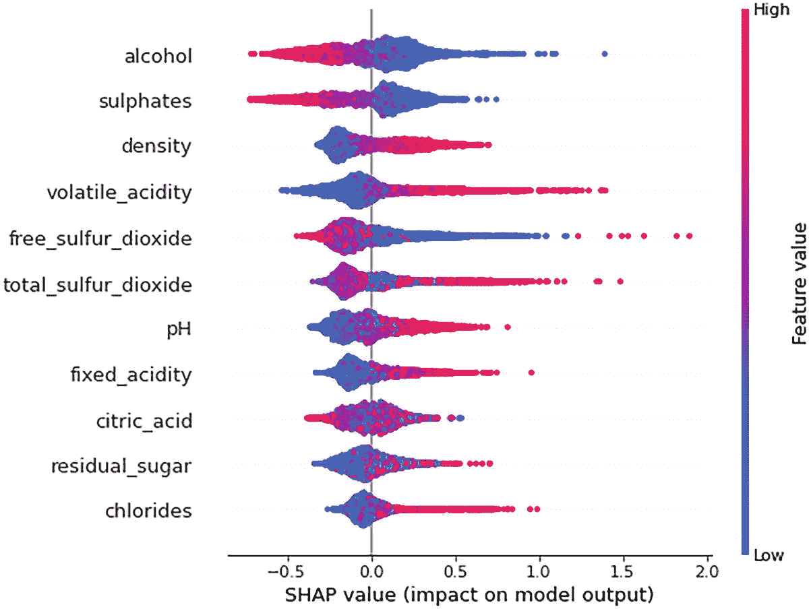

针对 11 个特征的 SHAP 蜂群图。`free_sulfur_dioxide` 和 `alcohol` 的高特征值分别具有最大和最小 SHAP 值，分别约为 2.0 和 -0.75。

**图 4-54**

相对于目标变量中类别 0 的 SHAP 值影响

```python
shap.summary_plot(shap_values[1], X)
```

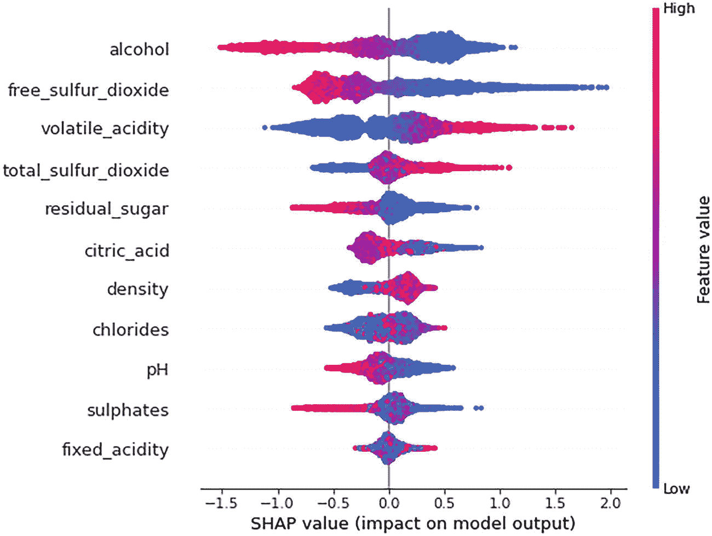

针对 11 个特征的 SHAP 蜂群图。`free_sulfur_dioxide` 的低特征值具有最大 SHAP 值，约为 2.0。`alcohol` 的高特征值具有最小 SHAP 值，约为 -1.5。

**图 4-55**

目标变量中类别 2 的 SHAP 汇总图

```python
shap.summary_plot(shap_values[2], X)
```

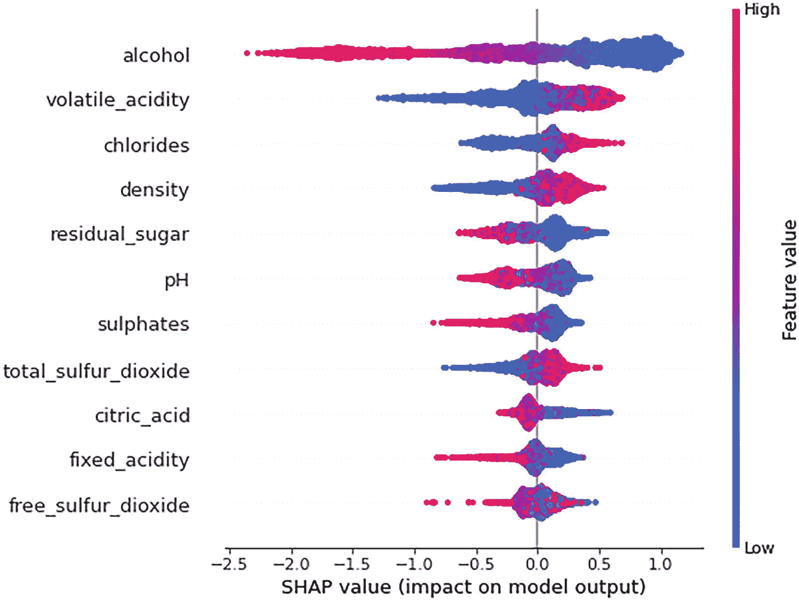

针对 11 个特征的 SHAP 蜂群图。`alcohol` 的低特征值和高特征值分别具有最大和最小 SHAP 值，分别约为 1.0 和 -2.5。

**图 4-56**

目标变量中类别 3 的 SHAP 汇总图

## 结论

在本章中，我们讨论了集成模型的解释。我们涵盖的模型包括可解释提升回归器、可解释提升分类器、极限梯度提升回归器和分类器、随机森林回归器和分类器，以及 `CatBoost` 分类器和回归器。图表有时看起来可能相似，但它们实际上是不同的，原因有二。首先，可用于绘图的 SHAP 数据点取决于为生成解释而选择的样本大小。其次，样本模型是用较少的迭代次数和基本的超参数训练的；因此，在配置更高的机器上，可以进行完整的超参数调优，从而产生更好的 SHAP 值。

在下一章中，我们将介绍基于自然语言的任务（如文本分类和情感分析）的可解释性，并解释预测结果。