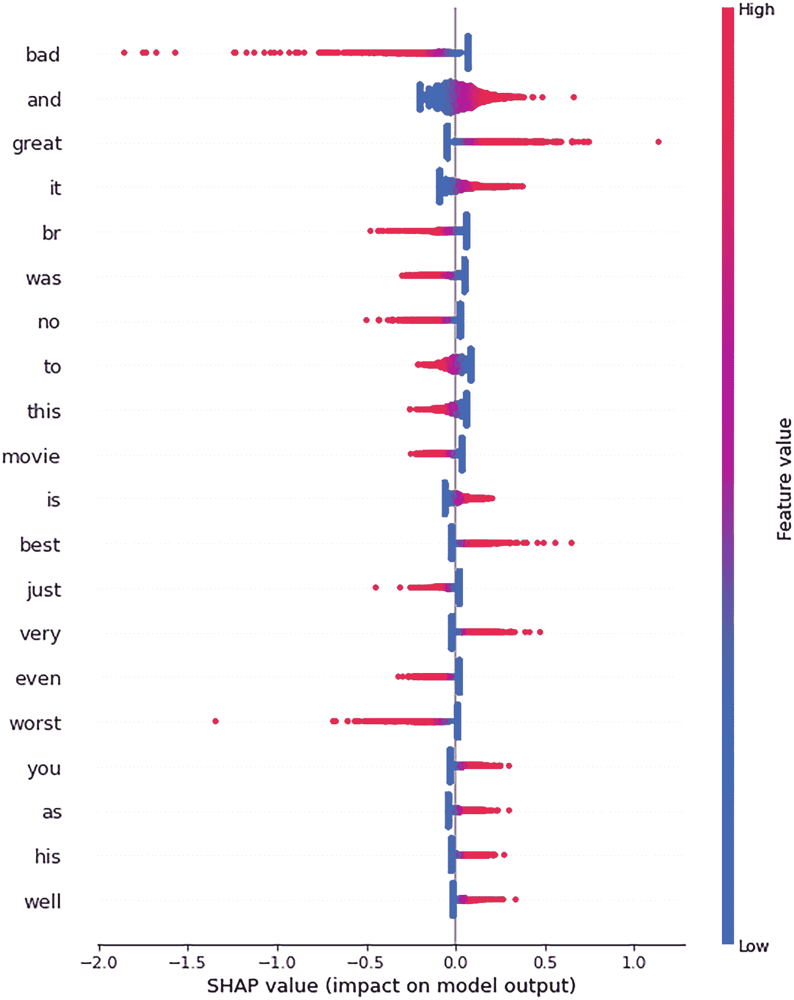
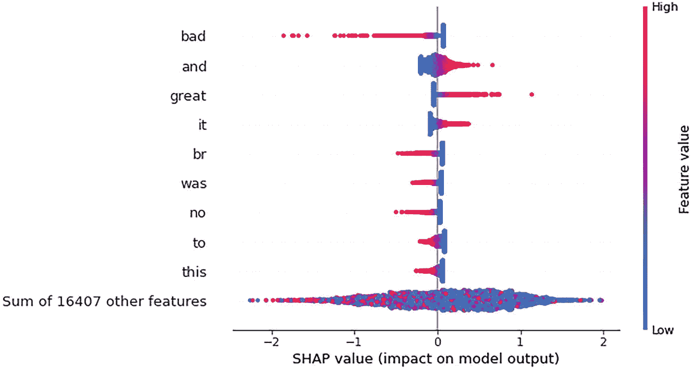

# 5. 自然语言处理的可解释性

文本分类和情感分析等自然语言处理任务可以使用可解释的人工智能库（如 SHAP 和 ELI5）进行解释。解释文本分类任务或情感分析任务的目标是让用户了解决策是如何做出的。预测是通过使用监督学习模型对非结构化文本数据生成的。输入是一个文本句子或多个句子或短语，我们训练一个机器学习模型来执行文本分类，例如客户评论分类、反馈分类、新闻组分类等。在本章中，我们将使用可解释库来解释预测或分类。

在自然语言处理中，有三个常见问题需要可解释性。

- 文档分类：输入是从文档中提取的一系列句子，输出是附加到文档上的标签。如果文档被错误分类，或者有人想知道算法为何以某种方式对文档进行分类，我们需要解释原因。
- 对于命名实体识别任务，我们需要预测一个名称所属的实体。如果它被分配到另一个实体，我们需要解释原因。
- 对于情感分析，如果一个情感类别被错误地分配到另一个类别，那么我们需要解释原因。

## 方法 5-1. 使用 SHAP 解释情感分析文本分类

### 问题

你想使用 SHAP 解释情感分析预测。

### 解决方案

该解决方案考虑了最常用的可用数据集，即来自 SHAP 库的 IMDB 情感分类数据集。可以通过 SHAP 数据集访问它。我们将使用 SHAP 库来解释预测。


### 工作原理

让我们来看下面的示例（见图 5-1 和图 5-2）：



汇总图展示了特征的 `SHAP` 值。差评和好评的特征值分别分布在约 -2.0 到 0.1 以及 -0.1 到 1.0 的 `SHAP` 值范围内。

**图 5-1** 情感分类的汇总图

```
!pip install shap
import warnings
warnings.filterwarnings("ignore")
import sklearn
from sklearn.feature_extraction.text import TfidfVectorizer
from sklearn.model_selection import train_test_split
import numpy as np
import shap
import pandas as pd
from keras.datasets import imdb
corpus,y = shap.datasets.imdb()
corpus_train, corpus_test, y_train, y_test = train_test_split(corpus, y, test_size=0.2, random_state=7)
vectorizer = TfidfVectorizer(min_df=10)
X_train = vectorizer.fit_transform(corpus_train).toarray() # sparse also works but Explanation slicing is not yet supported
X_test = vectorizer.transform(corpus_test).toarray()
corpus_train[20]
Well how was I suppose to know this was................................
y
array([False, False, False, ..., True, True, True])
model = sklearn.linear_model.LogisticRegression(penalty="l2", C=0.1)
model.fit(X_train, y_train)
explainer = shap.Explainer(model, X_train, feature_names=vectorizer.get_feature_names())
shap_values = explainer(X_test)
shap.summary_plot(shap_values, X_test)
```

```
shap.plots.beeswarm(shap_values)
```



汇总图展示了特征的 `SHAP` 值。其他 16407 个特征的总和的特征值分布在约 -2 到 2 的 `SHAP` 值范围内。

**图 5-2** 显示非常稀疏特征的 SHAP 值

| 00 | 000 | 007 | 01 | 02 | 05 | 06 | 10 | 100 | 1000 | ... | zombi | zombie | zombies | zone | zoo | zoom | zooms | zorro | zu | zucker |   |
| --- | --- | --- | --- | --- | --- | --- | --- | --- | --- | --- | --- | --- | --- | --- | --- | --- | --- | --- | --- | --- | --- |
| **0** | 0.0 | 0.0 | 0.0 | 0.0 | 0.0 | 0.0 | 0.0 | 0.000000 | 0.0 | 0.0 | ... | 0.0 | 0.0 | 0.0 | 0.0 | 0.0 | 0.0 | 0.0 | 0.0 | 0.0 | 0.0 |
| **1** | 0.0 | 0.0 | 0.0 | 0.0 | 0.0 | 0.0 | 0.0 | 0.000000 | 0.0 | 0.0 | ... | 0.0 | 0.0 | 0.0 | 0.0 | 0.0 | 0.0 | 0.0 | 0.0 | 0.0 | 0.0 |
| **2** | 0.0 | 0.0 | 0.0 | 0.0 | 0.0 | 0.0 | 0.0 | 0.000000 | 0.0 | 0.0 | ... | 0.0 | 0.0 | 0.0 | 0.0 | 0.0 | 0.0 | 0.0 | 0.0 | 0.0 | 0.0 |
| **3** | 0.0 | 0.0 | 0.0 | 0.0 | 0.0 | 0.0 | 0.0 | 0.000000 | 0.0 | 0.0 | ... | 0.0 | 0.0 | 0.0 | 0.0 | 0.0 | 0.0 | 0.0 | 0.0 | 0.0 | 0.0 |
| **4** | 0.0 | 0.0 | 0.0 | 0.0 | 0.0 | 0.0 | 0.0 | 0.078969 | 0.0 | 0.0 | ... | 0.0 | 0.0 | 0.0 | 0.0 | 0.0 | 0.0 | 0.0 | 0.0 |   |   |

```
names = vectorizer.get_feature_names()
names[0:20]
pd.DataFrame(X_train,columns=names)
```

```
ind = 10
shap.plots.force(shap_values[ind])
print("Positive" if y_test[ind] else "Negative", "Review:")
print(corpus_test[ind])
Positive Review:
"Twelve Monkeys" is odd and disturbing, ........................................
```

## 配方 5-2\. 使用 ELI5 解释情感分析文本分类

### 问题

你想使用 ELI5 解释情感分析预测。

### 解决方案

该解决方案考虑了最常用的数据集，即 IMDB 情感分类数据集。我们将使用 ELI5 库来解释预测结果。

### 工作原理

让我们来看下面的示例：

```
!pip install eli5
import eli5
eli5.show_weights(model, top=10) #此结果无意义，因为权重和特征名称不存在
```

**y=True** 顶部特征

| 权重^? | 特征 |
| --- | --- |
| +3.069 | x6530 |
| +2.195 | x748 |
| +1.838 | x1575 |
| +1.788 | x5270 |
| +1.743 | x8807 |
| *… 还有 8173 个正特征 …* |
| *… 还有 8234 个负特征 …* |
| -1.907 | x15924 |
| -1.911 | x1239 |
| -2.027 | x9976 |
| -2.798 | x16255 |
| -3.643 | x1283 |

ELI5 的结果没有意义，因为它们只提供了权重和特征，而特征名称没有意义。为了使结果可解释，我们需要传递特征名称。

```
eli5.show_weights(model,feature_names=vectorizer.get_feature_names(),target_names=['Negative','Positive'])
#现在有意义了
```

**y=Positive** 顶部特征

| 权重^? | 特征 |
| --- | --- |
| +3.069 | great |
| +2.195 | and |
| +1.838 | best |
| +1.788 | excellent |
| +1.743 | love |
| +1.501 | well |
| +1.477 | wonderful |
| +1.394 | very |
| *… 还有 8170 个正特征 …* |
| *… 还有 8227 个负特征 …* |
| -1.391 | just |
| -1.407 | plot |
| -1.481 | poor |
| -1.570 | even |
| -1.589 | terrible |
| -1.612 | nothing |
| -1.723 | boring |
| -1.907 | waste |
| -1.911 | awful |
| -2.027 | no |
| -2.798 | worst |
| -3.643 | bad |

## 配方 5-3\. 使用 ELI5 进行局部解释

### 问题

你想使用 ELI5 解释情感分析预测中的单个评论。

### 解决方案

该解决方案考虑了最常用的数据集，即 IMDB 情感分类数据集。我们将使用 ELI5 库来解释预测结果。


### 工作原理

让我们来看下面的示例。这里我们考虑了三条评论，记录编号分别为 1、20 和 100，用以解释预测类别以及每个词对预测类别的正向和负向相对重要性。

```
Eli5.show_prediction(model, corpus_train[3], vec=vectorizer,
target_names=['Negative','Positive'])
# 解释局部预测
```

**y=Positive** (概率 **0.739**，得分 **1.042**) 主要特征

| 贡献^? | 特征 |
| --- | --- |
| +0.869 | 文本中高亮部分（总和） |
| +0.174 | <BIAS> |

事实上，这是那种你不得不给 7.5 分的电影之一。事实是，正如已经提到的，它非常有趣。氛围极佳。Askey 确实表现得有些夸张，但这对他是绝佳的载体，就像《哦，波特先生》之于 Will Hay 一样。如果你喜欢老式黑暗屋电影和火车，那么这绝对适合你。<br /><br />奇怪的是，这是那种你会想再看一遍的电影，而且

```
........................
eli5.show_prediction(model, corpus_train[4], vec=vectorizer,
target_names=['Negative','Positive'])
# 解释局部预测
```

**y=Negative** (概率 **0.682**，得分 **-0.761**) 主要特征

| 贡献^? | 特征 |
| --- | --- |
| +0.935 | 文本中高亮部分（总和） |
| -0.174 | <BIAS> |

16 位之前的投票者中，怎么会有 4 位给这部电影打 10 分？怎么会有超过一半的投票者给它 7 分或更高？在这里投票的是谁？我只能假设主要是孩子——非常小的孩子。事实是，这部电影在任何方面都很糟糕。故事愚蠢；演技甚至难以想象……

```
eli5.show_prediction(model, corpus_train[100], vec=vectorizer,
target_names=''Nagativ''''Positiv'']) # 解释局部预测
```

**y=Negative** (概率 **0.757**，得分 **-1.139**) 主要特征

| 贡献^? | 特征 |
| --- | --- |
| +1.313 | 文本中高亮部分（总和） |
| -0.174 | <BIAS> |

这部电影的剧本和导演如此糟糕，我在电影进行到 30 分钟时就睡着了………………

绿色补丁表示目标类别 `positive` 的正向特征，红色部分则是对应 `negative` 类别的负向特征。特征值和权重值表示词语作为特征在情感分类中的相对重要性。可以观察到，在分词过程中出现了许多停用词或不必要的词；因此，它们作为特征出现在特征重要性中。清理的方法是使用预处理步骤，例如应用词干提取、移除停用词、执行词形还原、移除数字等。一旦文本清理完成，就可以再次使用之前的方案来创建更好的模型以预测情感。

## 结论

在本章中，我们介绍了如何解释文本分类用例，例如情感分析。然而，对于所有此类用例，流程将保持不变，并且可以使用相同的方案。随着特征数量的增加，建模技术的选择可能会发生变化，我们可以使用复杂的模型，例如集成建模技术，如随机森林、梯度提升技术和 CatBoost 技术。此外，预处理方法也可以改变。例如，计数向量化器、TF-IDF 向量化器、哈希向量化器等，可以结合停用词移除来清理文本，以获得更好的特征。运行不同集成模型变体的方案已在上一章中介绍。在下一章中，我们将介绍时间序列模型的可解释性。

